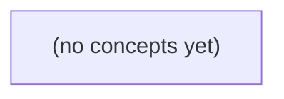

# 程序、源代码与一次运行：从零理解第一段 Go 程序

*面向从未接触 Go 的学习者，以一段输出欢迎信息的最小程序为主线，建立从编辑、保存到终端运行的完整直觉。读者将亲手创建练习目录、初始化模块、编写 main.go、运行程序，并学会初步区分和排查常见错误。*

**章节:** 2

---

## 本书导览

- 了解整本书的章节脉络
- 掌握各章之间的概念依赖关系
- 选择最合适的阅读顺序

# 程序、源代码与一次运行：从零理解第一段 Go 程序

面向从未接触 Go 的学习者，以一段输出欢迎信息的最小程序为主线，建立从编辑、保存到终端运行的完整直觉。读者将亲手创建练习目录、初始化模块、编写 main.go、运行程序，并学会初步区分和排查常见错误。

下方的概念图展示了本书 0 个核心概念以及它们之间的依赖关系；再下方是 1 个章节的入口。你可以按从上到下的顺序阅读，也可以根据自己的兴趣或先验知识选择切入点。

#### 概念图



## 章节索引

- **01.01 程序、源代码与一次运行：从零理解第一段 Go 程序** — 请生成一章可以直接阅读的中文 Go 初学者教材试讲，章名《程序、源代码与一次运行：从零理解第一段 Go 程序》。这是系统课程第 01 卷《Go 语言、标准库与程序设计》的 01.01 章，本次只生成这一章。目录只能包含一个实质教学章节，可以附一个自动总览。不要生成整门课程的大纲或额外章节。

读者：Go 技术栈初学者，从未写过 Go 程序；不能预设理解函数、包、模块、编译、终端、路径或变量。以本章为边界由浅入深，一次只增加一个新概念。

必须覆盖：
1. 用普通话解释程序、源码、编辑器、终端、编译与运行各自的职责，先建立执行过程的直觉。
2. 文件、目录、当前目录、相对路径、文件后缀、保存文件与终端运行的关系；说明终端命令和 Go 代码分别写在哪里。
3. Go 工具链安装的官方入口和 go version 的用途；不要硬编码最新版本，示例使用 Go 1.24+ 能支持的基础语法。
4. 在个人练习目录建立最小模块和 main.go；每条命令解释作用，不假设读者知道 mkdir、cd、go mod init、go run .。
5. 给出完整 Go 程序，并逐行解释 package main、import fmt、func main、括号、引号、函数调用与打印；函数等概念先给完成本例所需的解释，进阶细节后学。
6. 从输入命令到观察输出的完整过程；编译错误、运行环境错误与逻辑错误的区别；至少四个常见误用、现象和排查顺序。
7. 递进练习：预测结果、独立改写、制造并修复错误、迁移到虚构任务平台的欢迎信息；提供提示、参考解释和明确验收。

深度要求：这是教材正文，不是摘要或目录。以 6–8 个连贯小节展开定义、原因、过程、例子、反例与反馈。每个首次出现的名词在相邻位置解释。不要用大量小标题代替推导。必须给完整代码和预期输出，片段标注放置位置。

约束：只使用虚构的 Arena 任务与积分平台，不包含真实组织、人员、内部系统或工作经历；不要求数据库、容器、Kubernetes、模型账户、并发和第三方框架；当前只写静态文本、代码与练习，不执行代码，不生成动画、视频或交互网页。不声称示例已经编译或运行过。

参考组织方式：Go 官方入门 https://go.dev/doc/tutorial/getting-started 与 GOPL 第一章的逐步示例思想，但原创措辞与案例，不复制书籍段落或答案。教材应自行讲清当前知识，不用外部链接代替正文。

## 01.01 程序、源代码与一次运行：从零理解第一段 Go 程序

- 用自己的话区分程序、源码、编辑器、终端、编译和运行。
- 说明文件、目录、当前目录、相对路径和保存的关系。
- 逐条解释 go version、mkdir、cd、go mod init、go run 的作用。
- 阅读完整 Go 程序，并逐行理解 package、import、main、括号、引号和打印。
- 区分终端命令与源码、环境错误、编译错误与逻辑错误。
- 完成预测、改写、制造错误、修复与虚构任务平台迁移练习。

在写出第一行 Go 代码前，先沿着“显示一句话”的目标，认识指令从文字变成屏幕结果的完整路径。

### 从一句话到程序结果

### 从一句话到程序结果

目标很简单：让屏幕显示“欢迎来到 Go”。

这件事看似只是输出一句文字，背后却包含一条完整路径：**人写下指令，计算机理解指令，再把结果显示出来**。

**程序**是让计算机完成某项任务的一组明确指令。例如，“在屏幕上显示欢迎语”就是一个任务；告诉计算机应显示什么、何时显示的文字，就是程序的内容。

用人能阅读和修改的文字写出的程序，叫作**源代码**。Go 源代码通常写在以 `.go` 结尾的文件中。最常见的第一个文件名是 `main.go`，其中的 `main` 表示程序的主要入口。

```go
package main

import "fmt"

func main() {
	fmt.Println("欢迎来到 Go")
}
```

现在不必逐字理解它。只需先建立直觉：这段源代码表达的意图是“显示一行欢迎语”。

源代码本身不是屏幕结果。它只是保存在文件中的文字。计算机需要经过两个动作：

1. **编译**：把 Go 源代码翻译成计算机能够执行的形式。
2. **运行**：执行翻译后的程序，并产生可观察的结果。

当运行这段程序时，终端会显示：

`欢迎来到 Go`

因此可以把第一次 Go 编程理解为一条流水线：

`想法` → `源代码` → `编译` → `运行` → `屏幕结果`

后续学习的重点，就是逐渐掌握这条路径中每一步该在哪里做、该输入什么，以及出错时应从哪一步检查。

### 写、保存、输入与执行的分工

### 写、保存、输入与执行的分工

目标很简单：让屏幕显示一句话。但这件事要经过几位“分工明确的助手”。

- **编辑器**：用来写和修改文字。你在这里输入 Go 源代码，例如 `fmt.Println("你好")`。编辑器负责“写指令”，不会替你执行程序。
- **文件**：保存文字的容器。把代码保存为 `main.go`，其中 `.go` 是**文件后缀**，表示这是 Go 源代码文件。
- **终端**：用来输入命令的窗口。它负责把你的请求交给操作系统或 Go 工具，例如输入 `go run main.go`。
- **编译**：把人写的 Go 源代码翻译成计算机能执行的程序。`go run` 会在背后完成必要的编译工作。
- **运行**：执行翻译后的程序，于是 `fmt.Println` 的结果出现在终端中。

两种文字不能写在同一个地方：

| 写入位置 | 应写内容 |
|---|---|
| 编辑器中的 `main.go` | `package main`、`import`、`fmt.Println(...)` 等 Go 代码 |
| 终端 | `go run main.go` 等命令 |

例如，先在编辑器中保存文件：

`main.go` → `fmt.Println("你好，Go！")`

再切换到终端，进入该文件所在目录后输入：

`go run main.go`

终端只能找到**已经保存**在当前位置的 `main.go`。若文件尚未保存，或终端当前不在它所在的目录，`go run main.go` 就无法正确读取你的代码。编辑器负责写，保存负责落盘，终端负责发命令，编译负责翻译，运行才负责显示结果。

### 文件与目录：给代码安排位置

### 文件与目录：给代码安排位置

要让计算机运行程序，代码不能只停留在编辑器的临时页面里；它必须先被**保存**为磁盘上的一个文件。

- **文件**：保存具体内容的单位，例如一篇文档、一张图片，或一份 Go 代码。
- **目录**：用于整理文件和其他目录的“文件夹”。
- **文件后缀**：文件名最后的部分，用来说明文件类型。Go 源代码通常以 `.go` 结尾。

可以先为练习建立这样的目录结构：

```text
go-practice/
└── hello/
    └── main.go
```

这里，`go-practice` 是总练习目录，`hello` 是本次“显示一句话”练习所在的目录，`main.go` 则是一份具体的 Go 源代码文件。`main` 是常用名称，表示这个文件包含程序开始执行所需的入口；`.go` 告诉 Go 工具：这是 Go 语言代码，而不是普通文本或其他类型的文件。

在编辑器中写下代码后，应使用“保存”操作，将它写入 `hello/main.go`。只有保存成功，终端才能在对应目录中找到这个文件，并让 Go 工具读取、编译和运行它。

注意区分两个地方：

- **编辑器中的 `main.go`**：写入 Go 源代码，例如 `package main` 和 `fmt.Println(...)`。
- **终端**：输入操作命令，例如进入目录、运行程序的命令。

终端命令不是 Go 代码，不能写进 `main.go`；Go 代码也不能直接当作终端命令输入。前者负责告诉操作系统“做什么”，后者负责告诉 Go 程序“运行时应做什么”。

### 当前目录与相对路径

### 当前目录与相对路径

终端并不会自动“看见”电脑中的所有文件。它在每一刻都有一个**当前目录**：也就是终端此刻所在的文件夹位置。可以把它理解为你站在一栋楼里的某个房间；当你说“拿桌上的书”时，别人必须先知道你在哪个房间。

例如，练习目录可以这样组织：

```text
go-learning/
└── hello/
    └── main.go
```

如果终端当前位于 `go-learning/hello`，那么输入 `go run main.go` 时，`main.go` 是一个**相对路径**：它没有写出完整位置，而是表示“从当前目录开始，寻找名为 `main.go` 的文件”。

此时可以把命令理解为：

```text
go run 当前目录中的 main.go
```

但如果终端仍位于 `go-learning`，直接输入 `go run main.go` 就会失败，因为这里没有 `main.go`；文件实际在子目录 `hello` 中。你可以先进入该目录，再运行：

```text
cd hello
go run main.go
```

其中，`cd hello` 是终端命令，作用是把当前目录切换到 `hello`；`go run main.go` 才是请求 Go 编译并运行源代码的命令。

也可以在 `go-learning` 中使用相对路径：

```text
go run hello/main.go
```

这里的 `hello/main.go` 表示“从当前目录进入 `hello`，再找到 `main.go`”。

因此，运行成功通常依赖两个条件：第一，编辑器已经将代码**保存**为 `main.go`；第二，终端所在目录正确，或命令中写出了正确的相对路径。编辑器负责写入和保存源代码，终端负责输入命令；不要把 `go run main.go` 写进 Go 文件，也不要把 `package main` 写进终端。

### 练习：判断指令该写在哪里

### 练习：判断指令该写在哪里

目标是让屏幕显示一句话。请先观察这个练习目录：

```text
go-practice/
└── hello/
    └── main.go
```

其中，`go-practice` 和 `hello` 是**目录**，用于组织文件；`main.go` 是 Go 的**源代码文件**，`.go` 是文件后缀，表示其中保存的是 Go 代码。

编辑器中应写入并保存：

`main.go`

```go
package main

import "fmt"

func main() {
	fmt.Println("你好，Go")
}
```

终端中则应输入命令，而不是上述 Go 代码：

```text
cd hello
go run main.go
```

逐项判断：

- `fmt.Println("你好，Go")` 应写在编辑器的 `main.go` 中；它是让 Go 程序输出文字的指令。
- `go run main.go` 应写在终端中；它要求 Go 工具编译并运行已保存的文件。
- `cd hello` 也应写在终端中；它把当前目录切换到 `hello`，使终端能按相对路径找到 `main.go`。
- 如果编辑器中的内容尚未保存，终端读取到的仍可能是旧文件，运行结果不会包含新修改。
- 如果当前目录是 `go-practice`，直接输入 `go run main.go` 会找不到文件；此时应输入 `go run hello/main.go`，或先用 `cd hello` 进入正确目录。

记住分工：编辑器负责“写并保存源代码”，终端负责“输入命令”，Go 工具负责“编译并运行”。

> **要点** — 程序是可执行的指令；源码需先保存为正确位置的文件，再由终端命令触发编译和运行。

了解了程序从源代码到执行结果的基本链路后，我们还需要先确认自己所在的位置。接下来将从终端和项目文件夹的准备开始。

安装完成并不等于能够开始编程。本节将把“终端找到 Go”与“建立可运行项目”连成一条清晰路径。

### 先确认工具：从官方下载到版本检查

### 先确认工具：从官方下载到版本检查

Go 程序需要由 Go 工具链编译、运行和管理。请从官方入口下载适合自己操作系统的安装包：<https://go.dev/dl/>。不要机械照抄某个“最新版本”号；下载页会随时间更新，应选择与你的 Windows、macOS 或 Linux 环境匹配的正式版本，并按官方安装说明完成安装。

安装的边界很明确：此时你安装的是 `go` 命令及其编译器、标准库和项目管理工具，而不是某个具体项目。项目文件、练习目录和第三方依赖将在后续步骤中单独建立。

安装完成后，重新打开一个终端窗口，输入：

`go version`

这条命令不用于升级 Go，也不用于创建项目；它只做一件关键的事：确认当前终端能否在系统路径中找到 Go 工具链，并显示已安装的版本与平台信息。

如果安装正常，你会看到包含 `go version`、版本号和操作系统/架构的信息。课程示例以 **Go 1.24 或更高版本** 为预期范围；具体输出会因你的系统和安装版本而不同，无须与他人的终端逐字一致。

若终端提示找不到 `go` 命令，通常意味着安装未完成，或安装后的环境变量尚未生效。先关闭并重新打开终端；仍无法解决时，回到官方下载页的对应系统安装说明检查。

### 终端、命令与当前目录

### 终端、命令与当前目录

终端是向操作系统输入命令的窗口：你输入一行命令，按回车，系统就在某个位置执行它。这个“位置”就是**当前目录**。可以把目录理解为文件夹，而当前目录就是终端此刻站立的文件夹。

例如，先在你方便保存练习代码的个人位置打开终端，再依次执行：

`mkdir arena-hello`

`cd arena-hello`

第一条命令创建名为 `arena-hello` 的目录；第二条命令进入它。顺序不能颠倒：目录尚未创建时，终端无法进入该目录。

此后终端的当前目录就是 `arena-hello`。接下来创建的源代码文件、执行的 Go 命令，通常都会以这里为起点。因此，同一条命令在不同当前目录执行，结果可能完全不同：文件会被创建在不同位置，Go 也可能读取到不同项目的配置。

可以用 `pwd` 查看当前目录的位置；在 Windows 的部分终端中，也可使用 `cd` 查看。确认自己已经进入 `arena-hello` 后，再初始化最小模块：

`go mod init example.com/`

这条命令会在当前目录创建模块配置文件。关键不在于记住命令，而在于建立直觉：**终端执行命令，目录保存文件，当前目录决定命令作用到哪里。**

### 创建 Arena 练习目录

### 创建 Arena 练习目录

先在你自己容易找到的位置创建练习空间，例如“文档”“桌面”或专门的代码目录。不要在 Go 安装目录、系统目录或临时目录中练习；这些位置可能涉及权限问题，也不利于后续整理项目。

打开终端后，先确认当前所在位置。不同操作系统的终端提示符样式不同，但都表示“接下来命令将在哪个目录执行”。然后依次输入：

`mkdir arena-hello`

这条命令创建一个名为 `arena-hello` 的新目录。`mkdir` 是“创建目录”的命令；如果命令成功，通常不会输出提示，而是直接回到下一行等待输入。此时你仍在原来的位置，只是那里多了一个 `arena-hello` 文件夹。

接着输入：

`cd arena-hello`

`cd` 表示“切换目录”。执行成功后，终端的当前位置就进入了刚创建的 `arena-hello`。后续创建的源文件、模块配置和编译结果，都应属于这个目录，而不是它的上一级目录。

可以使用：

`pwd`

查看当前完整路径；在 Windows 的某些终端中也可使用 `cd` 单独查看当前位置。你应能看到路径末尾包含 `arena-hello`。这一步看似简单，却很重要：命令总是作用于“当前目录”，在错误位置执行初始化命令，往往会让项目文件散落到不该出现的地方。

### 最小模块为何存在

### 最小模块为何存在

Go 不把一个目录仅仅看作“放代码的文件夹”，还需要知道它属于哪个项目、这个项目的导入路径是什么、依赖应如何记录。这个身份说明由**模块**提供。

在练习目录中执行：

`go mod init example.com/arena-hello`

这条命令可以拆开理解：

- `go mod init`：初始化一个新的 Go 模块。
- `example.com/arena-hello`：模块路径，即项目对外使用的身份名称。
- `example.com` 是专门用于示例的域名形式；初学练习不需要真的拥有该网站。
- `arena-hello` 表示这个模块对应当前的练习项目。

命令成功后，当前目录会生成 `go.mod` 文件。它通常包含类似信息：

`module example.com/arena-hello`

以及当前工具链采用的 Go 语言版本声明。这里的 `module` 行尤其重要：以后如果你在同一模块内创建包，或从其他代码导入本项目的包，Go 都以这个模块路径为基础判断其位置和身份。

模块路径不等于本地磁盘路径。你的目录可以位于任意个人位置，例如桌面、文档目录或专门的代码目录；而 `example.com/arena-hello` 是 Go 项目层面的逻辑名称。二者可以不同，但应保持模块路径稳定。

即使当前项目只有一个 `main.go`，初始化模块仍然是良好起点。它让 `go run`、依赖管理和后续包导入都有明确边界；当项目使用第三方包时，Go 还会据此维护依赖信息，例如生成 `go.sum`。

### 建立项目后的检查与排错

### 建立项目后的检查与排错

完成以下命令后：

`mkdir arena-hello`  
`cd arena-hello`  
`go mod init example.com/`

先确认自己确实位于练习目录中。Windows 可执行 `cd`，macOS/Linux 可执行 `pwd`；输出应指向名为 `arena-hello` 的目录。再执行目录查看命令：Windows 使用 `dir`，macOS/Linux 使用 `ls`。正常情况下应能看到新生成的 `go.mod` 文件。

可进一步查看其内容：

`cat go.mod`

Windows 的 PowerShell 也可使用：

`Get-Content go.mod`

文件中应包含模块声明，例如：

`module example.com/`

以及当前 Go 工具链写入的 Go 版本信息。版本行会随已安装工具链变化，不必要求与示例完全一致。

若执行 `go mod init` 后提示“找不到 `go` 命令”，先运行 `go version`。这只用于确认终端能否定位 Go 工具链；应显示已安装的版本，通常应为 Go 1.24 或更高版本。若仍找不到命令，关闭并重新打开终端；问题持续时，检查安装是否完成，以及 Go 的安装目录是否已加入系统的 `PATH`。

若提示目录或模块已存在，通常说明此前已执行过初始化。此时不要反复创建新目录；进入 `arena-hello`，检查 `go.mod` 是否存在即可。最小项目成立的标志很简单：终端位于练习目录，且该目录中有 `go.mod`。

> **要点** — 先确认 Go 工具可用，再进入正确目录创建模块，终端命令才会作用于预期项目。

目录和模块准备妥当后，先明确各类内容应放在什么位置。下面用一张检查卡梳理最容易混淆的“写在哪里”。

> **小提示** — 先保存源码，再运行命令：终端不读你脑中的代码，只读磁盘里的文件。

有了这段完整的程序，接下来就从每一行代码开始，看看它们分别承担什么作用。随后再沿着 `go run .` 的执行过程，理解文字怎样最终出现在屏幕上。

现在先不急着写更多代码。我们把刚才运行过的最小程序拆开，弄清每一行、每个符号为何存在，以及出错时该从哪里查起。

### 先把程序还原成可阅读的整体

### 先把程序还原成可阅读的整体

在编辑器中新建并保存文件 `main.go`，写入下面这段完整源码：

`package main`  
`import "fmt"`  
`func main() {`  
`    fmt.Println("Hello, World!")`  
`}`

打开终端，先进入 `main.go` 所在的目录，再执行：

`go run main.go`

终端会显示：

`Hello, World!`

这里有两份不同的内容：`main.go` 是你保存到磁盘上的源代码；终端中的 `go run main.go` 是让 Go 工具读取这份源码、编译并立刻启动程序的命令。程序运行后，`fmt.Println("Hello, World!")` 产生输出，文字才出现在终端中。

因此，“写代码”并不等于“已经运行”：必须先保存源码，再在正确目录执行命令。若终端提示找不到 `main.go`，通常应先检查当前所在目录；若输出与预期不同，则回到文件核对每一行是否已保存。

### package、import 与 fmt：代码从哪里来

### package、import 与 fmt：代码从哪里来

先看程序开头的两部分：

```go
package main

import "fmt"
```

`package` 是“包”声明，用来给代码归类。可以把包理解为一组彼此相关的代码放在同一个名字下，便于组织、复用和查找。`package main` 表示：当前这份代码属于名为 `main` 的包。

这里的 `main` 不只是普通名称。对于要直接启动的 Go 程序，Go 规定它必须属于 `main` 包，并且后面还要有一个名为 `main` 的函数。满足这两个条件后，Go 才知道：“这是一个可以从这里开始运行的程序。”如果写成 `package hello`，代码仍可作为其他程序使用的包，但不能直接作为完整程序启动。

空行没有特殊计算意义，主要用于把不同职责的代码分开：上面声明“我属于哪个包”，下面声明“我要使用哪些现成工具”。

`import` 的意思是导入：请求使用其他包已经写好的代码。我们不必自己从零实现屏幕输出功能，因为 Go 标准库已经提供了大量可靠的工具。

`"fmt"` 是被导入包的路径。`fmt` 来自 Go 标准库，名称可联想为“格式化”；它提供格式化输入、输出等能力。后面写到的 `fmt.Println`，就是在使用这个包提供的输出功能。

双引号 `" "` 表示其中是原样文本。这里的 `"fmt"` 不是变量，也不是要在屏幕上打印的内容，而是告诉 Go：请找到并导入名为 `fmt` 的标准库包。

### func main：程序从这一组指令开始

### func main：程序从这一组指令开始

```go
func main() {
    fmt.Println("你好，Go！")
}
```

函数可以理解为：**为了完成一项工作而组织在一起的一组指令**。例如，这里的工作是“向终端输出一句文字”。Go 用 `func` 表示“下面要定义一个函数”，后面的 `main` 是这个函数的名字。

`func main` 有特殊意义：在本例这种可直接启动的 Go 程序中，运行程序时，Go 会从 `main` 函数开始执行。也就是说，编译器准备好程序后，会先进入这对花括号中的指令，再按顺序向下执行。函数如何接收数据、返回结果、拆分为多个文件，会在后续学习；现在只需记住：`main` 是这次运行的起点。

逐个看符号：

- `func`：声明一个函数。
- `main`：函数名；作为程序入口时必须写成这个名字。
- `()`：圆括号表示函数的参数位置。这里括号为空，表示 `main` 启动时暂时不接收参数。
- `{`：函数体开始，后面写这项工作需要执行的指令。
- `fmt.Println("你好，Go！")`：函数体中的一条指令。
- `}`：函数体结束；程序执行到这里，`main` 也就结束了。

`fmt.Println` 前面通常有缩进。缩进不会改变 Go 程序的执行含义，但它清楚地表明这行属于 `main` 的花括号内部。Go 工具会自动统一缩进格式，因此写完后可用 `gofmt` 或编辑器的格式化功能整理代码。

### fmt.Println：把原样文本送到终端

### fmt.Println：把原样文本送到终端

程序中的这一行：

`fmt.Println("你好，Go！")`

会把一段文字显示到终端。它可以从左到右拆开理解：

- `fmt`：前面通过 `import "fmt"` 请求使用的标准库包。它提供了格式化输入、输出等现成能力。
- `.`：点号表示“使用这个包里的某项功能”。因此，`fmt.Println` 不是两个无关的单词，而是“调用 `fmt` 包中的 `Println`”。
- `Println`：名称可理解为“打印一行”。它负责把内容输出到终端，并在末尾自动补上换行；所以下一次输出会从新的一行开始。
- `(` 与 `)`：圆括号包住调用时交给 `Println` 的内容。这里的内容也可称为参数。
- `"` 与 `"`：双引号之间是原样文本，即字符串。程序不会把其中的汉字当作命令，而是按文字输出。
- `"你好，Go！"`：这就是实际送往终端的欢迎语。

例如改成：

`fmt.Println("欢迎来到 Go 世界！")`

再次运行后，终端会显示：

`欢迎来到 Go 世界！`

注意，双引号不能漏掉；写成 `fmt.Println(欢迎来到 Go 世界！)` 时，Go 会把其中内容当作代码来理解，通常会报错。还可以连续调用：

`fmt.Println("第一行")`  
`fmt.Println("第二行")`

终端将分两行显示，因为每次 `Println` 都会自动换行。

### 从现象回溯原因：三类错误与排查

### 从现象回溯原因：三类错误与排查

第一次运行 Go 程序失败时，不要急着重写代码。先看现象，再判断错误属于哪一类。

- **运行环境错误**：终端找不到文件、提示目录不对，或运行的仍是旧结果。常见原因是没有保存文件、终端没有进入 `.go` 文件所在目录，或者命令写错。先保存，再用 `pwd`（或查看当前路径）确认位置，用 `ls` 确认目录中确实有目标文件；随后执行 `go run 文件名.go`。文件名可以不是 `main.go`，但必须以 `.go` 结尾。

- **编译错误**：Go 在运行前检查源码，发现语法不符合规则就停止。例如漏掉文本末尾的双引号：
  `fmt.Println("你好)`
  又如漏写右圆括号 `)`、右花括号 `}`，或把 `package main` 写成其他包名。编译器通常会报告文件名、行号和大致原因。优先打开对应行；若报错指向行看似正确，却找不到问题，再检查它的前一行是否遗漏了引号、括号或逗号。

- **逻辑错误**：程序能运行，却输出了不符合预期的内容。例如本想打印“你好”，实际写成了 `fmt.Println("你号")`。这时语法没有问题，要逐字比较源代码、期望输出与实际输出。

排查顺序应当由近到远：**保存文件 → 确认目录和文件名 → 阅读第一条编译报错 → 检查引号、圆括号、花括号与 `package main` → 最后核对输出内容**。一次只修复一个问题，然后重新运行；后续报错可能只是前一个错误引发的连锁反应。

> **要点** — Go 程序由入口函数中的指令组成；看懂每行职责，并按错误类别排查，才能稳定完成第一次运行。

明白程序从源代码到运行结果的过程后，我们也就能更从容地面对运行中出现的问题。接下来看看如何从错误信息中找到定位问题的线索。

> **核心要点** — 终端命令写进终端，Go 代码保存进 .go 文件；混放是初学者最常见的错误。

读懂示例只是第一步，亲手修改代码才能把这些认识变成真正的能力。接下来可以从简单改动开始，逐步练习编写和检查自己的程序。

前面已经能写出并运行第一段 Go 程序；现在通过四级练习，把“看懂”转化为“能独立修改、发现并修复问题”。

### 练习前：用同一套流程检查作品

### 练习前：用同一套流程检查作品

四道练习都遵循同一条工作链：**修改源码 → 保存文件 → 在终端运行 → 对照输出 → 按验收条件检查**。不要只看编辑器中的文字；程序是否正确，要以实际运行结果为准。

1. **在编辑器中改代码**  
   打开 `.go` 文件，只修改题目要求的位置。`fmt.Println("...")` 中引号里的内容是要显示的文本；花括号 `{}`、圆括号 `()` 和双引号 `"` 则是代码结构的一部分。

2. **保存文件**  
   修改后执行保存操作。未保存时，终端运行的可能仍是旧版本文件，导致“明明改了，输出却没变”。

3. **确认终端当前目录正确**  
   终端命令必须在源文件所在目录执行。可先查看当前目录内容，确认能看到目标 `.go` 文件，再运行：

   `go run 文件名.go`

   例如文件叫 `main.go`，则输入 `go run main.go`。

4. **区分两个输入位置**  
   - 编辑器：写和修改 Go 源代码。  
   - 终端：输入 `go run main.go` 等命令，查看输出或错误信息。  

   不要把 `go run main.go` 写进 Go 文件，也不要把 `fmt.Println(...)` 当作终端命令直接输入。

5. **按验收条件逐项核对**  
   检查输出的文字、大小写、标点、行数和顺序；若出现错误，先读终端指出的文件位置，再回到对应代码附近修复。每次修复后都要重新保存并运行。

### 第一级：预测每一行输出

### 第一级：预测每一行输出

先不要运行程序。请只阅读源代码，预测终端会依次显示什么，并把结果逐行写下来。

```go
package main

import "fmt"

func main() {
	fmt.Println("你好，Go！")
	fmt.Println("第一段程序正在运行。")
}
```

请回答：程序运行后，屏幕上会出现哪两行文字？

提示：

- `fmt.Println(...)` 每执行一次，就会打印一次内容。
- 双引号 `"..."` 中的文字会按原样显示；双引号本身不会被打印出来。
- `Println` 末尾会自动换行，因此两个调用对应两行输出。
- 不要把 `package main`、`import "fmt"` 或 `func main()` 当作输出内容；它们是程序结构，不会直接显示在终端中。

参考输出为：

```text
你好，Go！
第一段程序正在运行。
```

为什么是这样？第一条 `fmt.Println` 读取到字符串 `你好，Go！`，打印后换到下一行；第二条 `fmt.Println` 再打印 `第一段程序正在运行。`。代码中的缩进、空行和双引号都不是输出文字的一部分。

验收条件：

- 输出恰好有两行；
- 第一行是 `你好，Go！`；
- 第二行是 `第一段程序正在运行。`；
- 没有双引号、额外提示文字、代码关键字或多余空行。

### 第二级：独立改写欢迎语

### 第二级：独立改写欢迎语

现在不要只修改引号中的几个字，而是把原来的一条欢迎打印语句，改写为两次独立的 `fmt.Println` 调用：

1. 第一行显示欢迎语，例如：`欢迎来到 Go 编程！`
2. 第二行显示开始提示，例如：`让我们开始吧！`

先在编辑器中打开 `main.go`，找到 `main` 函数中的欢迎语句。删除原来那一条打印语句，再自行写出两条打印语句。完成后按保存，然后在终端执行：

`go run .`

#### 最小提示

- 每次调用 `fmt.Println` 会输出一行，并在末尾自动换行。
- 两条语句要分别写在两行；每条语句都需要完整的圆括号和双引号。
- `fmt.Println` 中的 `P` 必须大写。
- 保存文件后再运行，否则终端执行的可能仍是旧版本代码。

#### 参考思路

`main` 函数中应连续出现两次“调用 `fmt.Println` 打印静态文本”的结构。第一条的双引号内放欢迎语，第二条的双引号内放开始提示；不需要变量、循环或额外导入。

运行结果的结构应当是：

```text
欢迎来到 Go 编程！
让我们开始吧！
```

#### 验收条件

- `go run .` 能成功执行，没有编译错误。
- 终端恰好显示两行文本。
- 第一行是欢迎语，第二行是开始提示。
- 两行均由各自的一次 `fmt.Println` 调用产生，而不是在同一对引号中手动插入换行。

### 第三级：制造并修复语法错误

### 第三级：制造并修复语法错误

这一题的目标不是“把程序弄坏”，而是学会区分三类问题：

- **编译错误**：代码不符合 Go 语法，程序尚未开始运行。
- **运行环境错误**：例如命令输入错误、目录不对、Go 未安装。
- **逻辑错误**：程序能运行，但输出结果不符合预期。

先准备一份可运行的程序：

`fmt.Println("欢迎来到 Go")`

然后只做一次改动，保存并运行。

1. 删除结尾的一个双引号，使其类似于：

   `fmt.Println("欢迎来到 Go)`

   先预测：终端不会打印欢迎语，而会报告与字符串或引号有关的**编译错误**。因为字符串必须由成对的双引号包围；少了右引号后，编译器无法判断文本在哪里结束。

2. 恢复双引号后，再删除 `func main()` 末尾的一个右花括号 `}`。

   先预测：终端会报告与代码块结尾、文件结尾或缺少 `}` 有关的**编译错误**。左花括号表示代码块开始，右花括号必须与之配对。

阅读报错时，重点查看两部分：错误类别或描述，以及 `文件名:行号:列号`。报错位置有时在真正遗漏字符的后一行；例如少写 `}` 时，编译器常常直到文件结束才发现代码块没有结束。

修复步骤固定为：根据报错定位附近代码 → 补回删除的字符 → 保存文件 → 再次运行。不要只改不保存，否则终端执行的仍是旧文件。

**验收条件：**

- 能预测删除双引号和删除右花括号都会导致编译错误；
- 能说出前者破坏字符串边界，后者破坏代码块配对；
- 能依据终端行号找到附近代码，补回字符并成功重新运行。

### 第四级：迁移到 Arena 欢迎信息

### 第四级：迁移到 Arena 欢迎信息

现在假设你正在为虚构的 **Arena** 任务与积分平台编写启动欢迎页。请独立创建并运行一个 Go 程序：不读取输入、不使用变量、不进行计算，只用静态文本输出四行信息。

内容清单：

1. 欢迎信息：`欢迎来到 Arena！`
2. 任务名称：`当前任务：寻找宝藏`
3. 起始积分：`起始积分：100`
4. 提交提示：`完成后请提交你的代码。`

排版提示：

- 每项信息单独占一行，因此需要连续调用四次 `fmt.Println`。
- 程序仍需具备完整骨架：`package main`、导入 `fmt`、`func main()`。
- 中文标点、数字和感叹号都属于引号中的文本；不要遗漏双引号。
- `fmt.Println` 中的文本可以直接写中文，无须额外转换。

可先自行完成，再对照下面的参考结构理解：

`main` 包表示这是可执行程序；`import "fmt"` 让程序可以使用格式化输出工具；`func main()` 是运行入口。每条 `fmt.Println("...")` 都会打印引号内的静态文本，并在末尾自动换行。因此，四次调用会得到四行输出，调用顺序就是显示顺序。

逐项验收：

- [ ] 第一行是欢迎 Arena 的信息，文字完整。
- [ ] 第二行包含任务名称“寻找宝藏”。
- [ ] 第三行显示起始积分 `100`，且它仍写在引号内。
- [ ] 第四行提示用户提交代码。
- [ ] 使用了四次 `fmt.Println`，而不是把所有内容写进一次调用。
- [ ] `package main`、`import "fmt"`、`func main()`、左右花括号和所有双引号均完整配对。
- [ ] 保存后执行 `go run .`，终端输出恰好为四行，且没有编译错误。

> **要点** — 四级练习把预测、改写、诊断和迁移连成闭环：能解释输出，也能用证据定位并修复自己的代码。

完成欢迎信息的编写与运行后，我们已经亲手走过了从源代码到程序输出的基本过程。接下来用一份总览回顾其中的关键边界与操作顺序。

### 从文字到结果

程序是让计算机执行的步骤；源码是人写的程序文本。用编辑器写并保存源码，用终端输入命令。编译把源码检查并转换为可执行形式，运行则实际执行它。

### 准备位置

文件是保存内容的单位，目录是文件夹；终端所在位置叫当前目录。相对路径如 `.` 表示当前目录。先从官方入口 `go.dev` 安装 Go，输入 `go version` 查看工具链是否可用。

### 建立练习项目

在终端依次输入：

`mkdir hello`：新建目录。  
`cd hello`：进入它，成为当前目录。  
`go mod init hello`：建立模块，即本项目的身份记录。

在编辑器中新建并保存 `main.go`；`.go` 是 Go 源码后缀。命令写在终端，下面内容写进 `main.go`：

`package main`  
`import "fmt"`  
`func main() {`  
`	fmt.Println("你好，Arena！")`  
`}`

`package main` 表示这是可启动程序；`import` 引入打印工具 `fmt`；`main` 是运行入口；`{}` 包住步骤；引号表示文本；`Println` 是函数调用，负责打印。终端输入 `go run .`，`.` 表示运行当前目录项目，预期输出：

`你好，Arena！`

### 出错与检查

环境错误如 `go` 找不到：检查安装与终端重开；编译错误如漏掉引号：按提示的文件和行号修改；逻辑错误如文字写成“再见”：能运行但结果不对。常见误用还有未保存文件、在错误目录运行、把 `go run .` 写进源码。排查顺序：保存→确认 `cd hello`→读首条报错→核对代码。

### 练习

1. 预测：把文本改为 `"欢迎来到 Arena"`，输出什么？  
2. 独立改写：打印自己的欢迎语。验收：终端只出现该句。  
3. 删除一个 `"` 制造编译错误，再补回。  
4. 虚构 Arena 任务：打印“玩家已获得 10 积分”。提示：只改引号中的文本。
