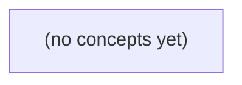

# Go 初学者第01卷第01.02章：类型与数据表示——从积分数值到可靠输入

*以虚构 Arena 任务积分为主线，带领初学者从值、变量、类型和表达式出发，理解整数范围、浮点近似、布尔条件、字符串与文本解析。章节通过完整程序、故意错误示例、状态追踪和分层练习，建立“先确认类型与错误，再使用数据”的可靠编程习惯。*

**章节:** 2

---

## 本书导览

- 了解整本书的章节脉络
- 掌握各章之间的概念依赖关系
- 选择最合适的阅读顺序

# Go 初学者第01卷第01.02章：类型与数据表示——从积分数值到可靠输入

以虚构 Arena 任务积分为主线，带领初学者从值、变量、类型和表达式出发，理解整数范围、浮点近似、布尔条件、字符串与文本解析。章节通过完整程序、故意错误示例、状态追踪和分层练习，建立“先确认类型与错误，再使用数据”的可靠编程习惯。

下方的概念图展示了本书 0 个核心概念以及它们之间的依赖关系；再下方是 1 个章节的入口。你可以按从上到下的顺序阅读，也可以根据自己的兴趣或先验知识选择切入点。

#### 概念图



## 章节索引

- **01.02 类型与数据表示：从积分数值到可靠输入** — 本章承接首次程序运行，使用虚构任务积分解释值、变量与静态类型；依次学习声明、零值、常量、整数范围与溢出、浮点近似、布尔与文本，以及类型转换和解析失败。使用顺序main内的小程序，必要的if与错误返回在首次出现时解释，先预测后练习。

## 01.02 类型与数据表示：从积分数值到可靠输入

- 从任务积分认识值、变量与类型
- 零值、常量、作用域与表达式
- 整数如何表示范围，以及越界发生在哪一步
- 浮点近似、显示格式与精确的业务单位
- 布尔条件、字符串与可观察结果
- 类型转换与文本解析：失败也是结果
- 综合推演、边界练习与章节验收

从同一个任务积分出发，区分数值、文本和判断结果，并学会用变量保存、更新和追踪程序中的状态。

### 同样写作二十，含义并不相同

### 同样写作二十，含义并不相同

程序看到的不是“看起来像二十”，而是值的**类型**。`20`、`"20"` 和 `true` 分别表示三类不同信息：

- `20` 是整数值，适合表示积分、数量、排名等可计算的数据。
- `"20"` 是文本值；双引号表示这是字符串，适合原样显示、输入内容或编号。
- `true` 是布尔值，只有 `true`（真）和 `false`（假）两种结果，适合表示“是否完成”“是否有效”等判断。

变量由**名字、类型和值**组成：名字用于在程序中引用数据，类型规定数据能做什么，值是当前保存的具体内容。

```go
package main

import "fmt"

func main() {
	var score int = 20
	label := "20"
	finished := true

	fmt.Println(score)
	fmt.Println(label)
	fmt.Println(finished)
}
```

`var score int = 20` 声明变量：`score` 是名字，`int` 是整数类型，`20` 是初始值。`:=` 也能声明变量，并让 Go 根据右侧值推断类型：`label := "20"` 推断为字符串，`finished := true` 推断为布尔值。

预期输出依次是：

```text
20
20
true
```

前两个输出外观相同，但用途不同。整数 `20` 可以参与 `20 + 5`；字符串 `"20"` 表示两个字符，不能直接当积分相加。`true` 更不能表示二十分，它只回答真假问题。

声明后，用 `=` 修改已有变量：

```go
score = 25
```

反例：同一代码块中，`score := 25` 会报错，因为 `score` 已经声明过；此时应使用 `=`。

练习：分别写出“积分为 0”“输入内容为 `0`”“任务尚未完成”的变量。注意：合法积分 `0` 表示确实得了零分；“尚未填写”不能仅靠 `0` 表示，应另用如 `filled := false` 的布尔值记录。

### 变量的名字、类型和值

### 变量的名字、类型和值

变量可以看作程序中的“带标签的存放位置”。它有三个关键部分：

- **名字**：程序用什么称呼它，例如 `score`。
- **类型**：其中允许保存哪一类数据，例如 `int` 表示整数。
- **值**：当前位置实际保存的内容，例如 `20`、`0`。

```go
var score int = 20
fmt.Println(score)
```

`var` 用于声明变量；`score` 是名字；`int` 是整数类型；`20` 是初始值。输出为：

```text
20
```

积分应使用数值，而不是文本。`20` 是整数，可以参与加减；`"20"` 是字符串，只是由字符 `2` 和 `0` 组成的文本；`true` 是布尔值，表示“是/成立”，常用于记录判断结果。

```go
var score int = 20
var submitted bool = false

score = 0
submitted = true

fmt.Println(score)
fmt.Println(submitted)
```

`=` 表示修改已有变量的值。程序按顺序执行：开始时积分为 `20`、未提交为 `false`；随后积分改为合法的 `0`，提交状态改为 `true`。这里的 `0` 不表示“尚未填写”，它是一个明确有效的积分。

若需要表示“是否填写”，应另用布尔变量：

```go
var score int = 0
var filled bool = false
```

此时 `score` 的 `0` 是默认保存的数值，而 `filled == false` 才表示尚未填写。不要把缺失状态偷偷编码成 `0`，否则“得了 0 分”和“没有填分数”会混在一起。

也可以让 Go 推断类型：

```go
score := 20
```

`:=` 同时完成声明和赋值，Go 推断 `score` 为 `int`。但同一代码块中，已存在的单个变量不能再次使用 `:=`：

```go
score := 20
score := 0 // 错误：score 已声明
```

应改为 `score = 0`。

练习：声明 `taskDone` 保存任务是否完成，并将其从 `false` 改为 `true`；再说明为什么它不能用 `0` 或 `"true"` 代替。

### 先声明，再保存积分

### 先声明，再保存积分

变量像程序中的“带名字的存放位置”。它由三部分组成：

- 名字：例如 `score`，方便后续找到它；
- 类型：例如 `int`，规定这里保存整数；
- 值：例如 `20`，是当前位置实际保存的数据。

可以先用 `var` 声明变量，再赋予具体值：

```go
var score int
```

`var` 表示声明变量，`score` 是变量名，`int` 表示整数类型。此时还没有手动写入积分，但 Go 会给 `int` 一个零值：`0`。

这里的 `0` 是合法积分，表示“当前积分确实为零”；它不等于“尚未填写”。如果业务上需要区分“未填写”和 `0`，仅靠一个 `int` 不够，本节先把它视为程序默认的初始值。

`=` 是赋值符号，表示把右侧的值保存到左侧变量中：

```go
score = 20
```

完整程序如下：

```go
package main

import "fmt"

func main() {
	var score int
	fmt.Println(score)

	score = 20
	fmt.Println(score)

	score = 35
	fmt.Println(score)
}
```

按顺序追踪：

1. `var score int`：创建整数变量 `score`，值为 `0`。
2. 第一次输出：显示 `0`。
3. `score = 20`：原来的 `0` 被改为 `20`。
4. 第二次输出：显示 `20`。
5. `score = 35`：原来的 `20` 被改为 `35`。
6. 第三次输出：显示 `35`。

变量不是保存每一次历史积分的列表；同一个变量在某一时刻只保存当前值。

反例：

```go
var score int
var score int
```

同一代码块中不能再次声明同名变量。若要更新已有变量，应写：

```go
score = 50
```

练习：声明一个 `int` 类型的 `points`，先输出默认值，再依次赋值为 `10` 和 `25` 并输出。运行前先写出你预计的三行结果：它们应依次是 `0`、`10`、`25`。

### 用推断和短声明记录进展

### 用推断和短声明记录进展

变量由**名字、类型和值**组成：名字用于引用，如`score`；类型规定可存放的数据种类；值是当前内容。`20`是整数，`"20"`是文本，`true`是布尔值，表示“是/成立”。

在`main`中，`:=`用于第一次创建变量，编译器会从右侧推断类型；`=`用于修改已有变量。下面程序按顺序记录积分和是否已填写：

`package main`  
`import "fmt"`  
`func main() {`  
`    score := 0`  
`    filled := false`  
`    fmt.Println(score, filled)`  
`    score = 20`  
`    filled = true`  
`    fmt.Println(score, filled)`  
`}`

执行时，第一处输出应表示`0 false`：积分是合法的零分，但`filled`说明该项尚未填写。随后两次赋值更新状态，第二处应表示`20 true`。

`var score int = 0`也能声明变量；`int`明确写出整数类型。反例：同一代码块中写`score := 20`会报错，因为`score`已经存在；应写`score = 20`。同样，不能把`score = "20"`，整数变量不能改存文本。

练习：增加`bonus := 5`，再写`score = score + bonus`。此时最后积分应为`25`，而`filled`仍为`true`。

### 短声明不是重新命名按钮

### 短声明不是重新命名按钮

变量有三个部分：名字用于在代码中找到数据，类型规定数据的种类，值是当前保存的内容。例如 `score` 是名字，`int` 是整数类型，`20` 是值。

`var` 用于明确声明变量：

`var score int = 20`

也可让编译器根据右侧值推断类型：

`var score = 20`

在函数内部，`:=` 是更短的声明写法：

`score := 20`

这里创建了一个名为 `score` 的新整数变量。之后若要修改它，必须使用 `=`，其含义是“把右侧新值存入左侧已有变量”：

```go
package main

import "fmt"

func main() {
	score := 0
	fmt.Println(score)

	score = 20
	fmt.Println(score)

	score = score + 5
	fmt.Println(score)
}
```

程序按顺序执行。第一行中 `score` 的值是 `0`，这是合法积分，表示已记录为零；它不等于“尚未填写”。若积分尚未填写，应另用变量或约定表示，不能把“没有数据”误当成整数 `0`。第二次输出为 `20`，最后一次输出为 `25`；`score + 5` 先计算，再赋回 `score`。

反例：

`score := 0`  
`score := 20`

第二行错误：同一代码块中，`score` 已存在，而 `:=` 要求至少声明一个新变量。应改为：

`score = 20`

预测：`var level = 1` 后写 `level = 2` 合法吗？合法，因为这是修改。若写 `level := 2`，应改成什么？改为 `level = 2`。

> **要点** — 值表示内容，类型规定解释方式，变量用名字关联两者；声明一次后应使用 = 更新。

积分程序中的每个数值和文本都要有明确类型。本节从变量的初始状态出发，建立“值会变、类型不变”的基本判断。

### 变量、类型与零值

### 变量、类型与零值

变量是程序中“带名字的存储位置”。声明变量时，Go 会确定它的**静态类型**：以后这个位置可以保存不同的值，但值必须符合最初确定的类型。

```go
package main

import "fmt"

func main() {
	var score int
	var name string
	var passed bool

	fmt.Println(score)
	fmt.Println(name)
	fmt.Println(passed)
}
```

`var score int` 表示声明名为 `score` 的 `int` 变量；`int` 是整数类型。变量未显式赋值时，Go 会自动放入该类型的**零值**：

- `int` 的零值是 `0`
- `string` 的零值是 `""`，即空字符串；它不是空格，也不会打印可见文字
- `bool` 的零值是 `false`，表示“否”或“不成立”

因此，这段程序预期依次输出 `0`、一行空白内容和 `false`。

变量的值可以改变：

```go
var score int
score = 10
score = 25
fmt.Println(score)
```

`=` 是赋值：把右侧的值放入左侧变量。最后输出 `25`。但类型不会随赋值改变，下面的写法不合法：

```go
var score int
score = "25"
```

`score` 已经是 `int`，而 `"25"` 是 `string` 文本，不能直接放入整数变量。

可以在声明时同时赋值：

```go
name := "小林"
passed := true
```

`:=` 表示“声明并赋值”，Go 会根据右侧推断类型：`name` 是 `string`，`passed` 是 `bool`。它们仍然有固定类型，之后不能改为整数。

**练习：**声明 `count`、`title`、`ready` 三个变量，分别使用 `int`、`string`、`bool`，不赋初值并打印它们。观察输出后，尝试给 `count` 赋 `"3"`；如果编辑器报类型错误，说明你已正确理解“值可变，类型不变”。

### 赋值与积分表达式

### 赋值与积分表达式

`=` 表示**赋值**：把右侧表达式计算出的结果，存入左侧变量。它不是“相等”；判断两个值是否相等要写 `==`。积分程序常把本次增减量算出来，再更新总积分。

```go
package main

import "fmt"

func main() {
	score := 120        // 当前积分
	reward := 35        // 完成任务获得的积分
	cost := 18          // 兑换物品消耗的积分

	score = score + reward
	score = score - cost

	doubleReward := reward * 2
	average := score / 2
	remainder := score % 2

	fmt.Println(score)        // 137
	fmt.Println(doubleReward) // 70
	fmt.Println(average)      // 68
	fmt.Println(remainder)    // 1
}
```

`+` 是加法，`-` 是减法，`*` 是乘法，`/` 是除法，`%` 是取余数。`score = score + reward` 的含义是：先读取原来的 `score`（120），算出 `120 + 35`，再把 155 写回 `score`。变量的值改变了，但它仍然是 `int`。

这里 `score / 2` 得到 68，而不是 68.5。两个 `int` 相除时，Go 执行整数除法，结果向零截断：`137 / 2` 为 68，`-137 / 2` 为 -68。`%` 可检查是否均分：余数为 0 表示能整除。

反例：

```go
score = "137"
```

这不能成立，因为 `score` 已被推断为 `int`，不能再赋予 `string` 文本。另一个常见错误是把比较写成赋值：`score = reward` 会覆盖积分；`score == reward` 才是在比较两者是否相同。

练习：设 `score := 50`、`bonus := 17`、`cost := 9`，依次增加奖励、扣除消耗，再计算最终积分除以 3 的商和余数。预期最终积分为 58，商为 19，余数为 1。

### 比较结果与类型不变

### 比较结果与类型不变

`==` 表示“是否相等”，`!=` 表示“是否不相等”。它们不会修改变量，而是产生 `bool` 类型的结果：只有 `true` 或 `false`。

```go
package main

import "fmt"

func main() {
	score := 80
	passed := score == 80
	changed := score != 80

	fmt.Println(passed)  // true
	fmt.Println(changed) // false
}
```

这里 `score == 80` 是一次比较：`score` 的值确实等于 `80`，所以结果为 `true`。`passed` 因而是 `bool` 变量，而不是整数变量。

注意区分赋值号 `=` 与比较号 `==`：

```go
score = 90      // 把 90 赋给 score
same := score == 90 // 比较 score 是否等于 90
```

赋值后，`score` 的值从 `80` 变为 `90`；但它的静态类型仍是 `int`。变量可以保存新值，类型却在声明或推断后固定。

下面是错误反例：

```go
score := 80
score = "八十分"
```

第二行不能通过编译，因为 `"八十分"` 是 `string`，而 `score` 已经是 `int`。同样，不能把比较结果直接赋给整数变量：

```go
score := 80
score = score == 80
```

右侧结果是 `bool`，左侧要求 `int`，两种类型不匹配。

练习：声明 `name := "小林"`，再写出两个变量：一个判断 `name == "小林"`，另一个判断 `name != "小林"`。预期输出依次为 `true` 和 `false`。

### 花括号内外的作用域

### 花括号内外的作用域

花括号 `{` 和 `}` 可以围成一个**代码块**。在 Go 中，变量从声明位置开始可用；如果它声明在代码块内部，那么只能在这对花括号内使用。这种“变量在哪些位置可见”的范围，叫作**作用域**。

```go
package main

import "fmt"

func main() {
	score := 80

	{
		bonus := 20
		fmt.Println(score) // 80：外部变量在块内可见
		fmt.Println(bonus) // 20
	}

	fmt.Println(score) // 80
	// fmt.Println(bonus) // 错误：bonus 已离开作用域
}
```

`score := 80` 声明在外层，因此内层代码块也能读取它。`bonus := 20` 声明在内层；执行离开 `}` 后，`bonus` 就不再存在于可访问范围中。注释掉的最后一行若恢复，会导致编译错误，而不是得到某个默认值。

内层还可以声明与外层同名的变量。此时，内层变量会暂时**遮蔽**外层变量：

```go
name := "原始名称"

{
	name := "临时名称"
	fmt.Println(name) // 临时名称
}

fmt.Println(name) // 原始名称
```

这里两个 `name` 都是 `string`，但它们是不同变量。内层的 `name :=` 不是修改外层值，而是新建了一个只在块内有效的变量。反例是误以为内层赋值会永久改变外层：

```go
total := 10

{
	total := 99 // 新变量，不是给外层 total 赋值
	fmt.Println(total)
}

fmt.Println(total) // 仍为 10
```

练习：声明外层 `city := "北京"`，在代码块内声明同名 `city := "上海"`，分别打印两次。预期是块内输出“上海”，块外输出“北京”。如果块外也输出“上海”，检查内层是否误写成了 `city = "上海"`。

### 常量与未定类型数值

### 常量与未定类型数值

`const` 用来声明常量：它在编译期确定，之后不能重新赋值。Go 没有“把普通变量设为只读”的通用语法；常量不是“值暂时不改的变量”，而是另一类声明。

```go
const points = 10
var total int = points + 5 // + 表示加法，total 为 15
// points = 20            // 错误：常量不能赋值
```

变量可以改变值，但声明或推断后的静态类型不变：

```go
var total = 15 // 推断为 int
total = 20
// total = "20" // 错误：int 变量不能保存 string
```

未显式写类型的常量通常是“未定类型常量”。它会根据使用位置转换为合适的类型，因此更灵活：

```go
const count = 3

var small int = count
var large int64 = count
```

相比之下，变量初始化后类型已经固定：

```go
var count = 3 // 推断为 int
var small int = count
// var large int64 = count // 错误：不能直接把 int 赋给 int64
```

常量也可参与算术和比较：`+`、`-`、`*`、`/`、`%` 分别表示加、减、乘、除、取余；`==` 判断相等，`!=` 判断不等。注意整数除法向零截断，`7 / 2` 的结果是 `3`。

花括号 `{}` 可以创建更小的作用域；其中声明的名字离开花括号后不可使用：

```go
{
	const label = "积分"
	fmt.Println(label)
}
// fmt.Println(label) // 错误：label 已超出作用域
```

练习：将 `const rate = 0.5` 分别赋给 `float64` 变量和 `int` 变量。前者可表示 `0.5`；后者应报错，因为该数值不能作为 `int` 常量使用。

> **要点** — 变量有固定静态类型和零值；表达式产生新值；常量不可改，但未定类型常量不等同于变量。

积分看似只是数字，但它能否被准确存入变量，取决于类型可表示的范围。本节从 8 位编码出发，追踪越界发生的时刻与后果。

### 位、字节与有限编码

### 位、字节与有限编码

计算机保存整数时，不是直接存“十进制数字”，而是存一串二进制位。**位**（bit）只有两种状态：`0` 或 `1`，可理解为一个开关的关与开。8 个位组成 1 个**字节**（byte）。

先看较小的情况。若只有 2 位，每一位各有两种选择：

| 二进制编码 | 十进制值 |
|---|---:|
| `00` | 0 |
| `01` | 1 |
| `10` | 2 |
| `11` | 3 |

因此，2 位一共能组成 $2\times2=2^2=4$ 种编码。一般地，$n$ 位有 $2^n$ 种不同编码；位数增加 1，编码数量就翻倍。

8 位时共有：

$$
2^8=256
$$

种编码。若把它们都用于表示非负数，最小是 `00000000`，即 0；最大是 `11111111`，即 255。这里每一位从右到左的权重依次是 $1,2,4,8,\dots,128$。例如：

```go
// 10100101 = 128 + 32 + 4 + 1 = 165
```

这种只表示非负数的解释方式称为**无符号**。在 Go 中，`uint8` 正好使用 8 位，可表示 0 到 255。

若需要负数，8 位编码仍然只有 256 种，不能凭空增加数量。常见的有符号解释会把其中一部分编码分给负数：`int8` 的范围是 -128 到 127。

```go
var temperature int8 = -20
var level uint8 = 200

fmt.Println(temperature)
fmt.Println(level)
```

预期输出的数值分别是 `-20` 和 `200`。两个变量都占 8 位，但解释规则不同。

反例是把“8 位”误认为“能存任意整数”：

```go
var x int8 = 128
fmt.Println(x)
```

这里 `128` 不在 `int8` 的范围内。它是常量，编译器在编译时就能判断无法表示，因此会报编译错误，而不是运行后才出错。

> 第二遍阅读提示：二进制权重、补码等细节解释了负数为何能占用一半编码；当前先记住核心：位数有限，所以可表示的整数个数和范围也有限。

练习：不运行程序，判断 `uint8` 能否表示 `255`、`256`、`-1`。反馈：只有 `255` 可以；`uint8` 的 256 种编码已经从 0 用到 255。

### 有符号与无符号整数范围

### 有符号与无符号整数范围

一个位（bit）只能表示 `0` 或 `1`。8 个位组成一个字节（byte），因此有：

$2^8=256$

种不同编码。关键不在于编码数量，而在于程序如何解释这些编码。

`uint8` 中的 `u` 表示无符号：全部 256 种编码都分给非负整数，所以范围是 `0` 到 `255`。

| 二进制编码 | `uint8` 的含义 |
| --- | --- |
| `00000000` | `0` |
| `00000001` | `1` |
| `11111111` | `255` |

`int8` 是有符号 8 位整数：仍然只有 256 种编码，但其中一半用于负数，范围变为 `-128` 到 `127`。

| 二进制编码 | `int8` 的含义 |
| --- | --- |
| `00000000` | `0` |
| `01111111` | `127` |
| `10000000` | `-128` |
| `11111111` | `-1` |

因此，同一串位不一定代表同一个数值：

```go
var a uint8 = 255
var b int8 = -1

fmt.Println(a) // 预期：255
fmt.Println(b) // 预期：-1
```

这里 `a` 与 `b` 的底层 8 位编码都可写作 `11111111`，但类型不同，数值含义不同。类型不仅告诉编译器“这是整数”，还规定了它可表示的范围和解释方式。

下面是常见反例：

```go
var x uint8 = -1
```

这不能通过编译，因为 `-1` 不在 `uint8` 的范围内。初学时可先用“编码格子”理解：`uint8` 的 256 个格子编号为 `0` 至 `255`；`int8` 的格子编号为 `-128` 至 `127`。第二遍阅读时再研究二进制权重与补码规则。

练习：判断 `var n int8 = 128` 和 `var m uint8 = 255` 哪一句合法，并说明原因。反馈：前者超出 `int8` 上界 `127`；后者正好是 `uint8` 的最大值。

### 声明时越界：无法表示即报错

### 声明时越界：无法表示即报错

`int8` 是“8 位有符号整数”类型。8 个二进制位可组合出 $2^8=256$ 种编码；其中有符号表示要留出一半编码给负数，因此 `int8` 的范围是 `-128` 到 `127`。

```go
package main

import "fmt"

func main() {
	var x int8 = 128
	fmt.Println(x)
}
```

这里的 `128` 是一个整数常量。常量在赋给 `x` 时，编译器会检查它能否由目标类型 `int8` 表示。由于 `128` 比最大值 `127` 大 1，程序在运行前就会报编译错误，类似“常量 128 溢出 int8”。

这是一种提前的范围检查：程序甚至不会进入 `main`，`fmt.Println(x)` 也不会执行。原因不是 `128` 这个数学整数有问题，而是 `int8` 这只“容器”装不下它。

可改为范围内的值：

```go
var x int8 = 127
```

或者改用能表示 `128` 的类型：

```go
var x int16 = 128
```

`int16` 有 16 位，范围为 `-32768` 到 `32767`。不要把“数值看起来不大”与“任何整数类型都能存下”混为一谈；类型范围由位数和是否带符号决定。

反例是试图用转换绕过问题：

```go
var n = 128
var x = int8(n)
```

这段代码可以通过编译，因为 `n` 已是变量；但窄化转换可能丢失信息，`x` 的结果会变成 `-128`，并非原来的 `128`。

练习：分别判断 `var a int8 = -128`、`var b int8 = 127`、`var c int8 = -129` 是否能编译。答案是前两个可以，第三个不可以，因为它低于 `int8` 的最小值。

### 运行时溢出：127 加 1 变为 -128

### 运行时溢出：127 加 1 变为 -128

`int8` 是 8 位有符号整数。它只能表示 $-128$ 到 $127$：最高位表示正负，其余位参与表示数值。先记住边界即可；二进制细节可在第二遍阅读时再看。

下面的 `x` 已经成功声明为 `int8`，初值 `127` 也在范围内。`x = x + 1` 表示先计算加法，再把结果赋回 `x`。

```go
package main

import "fmt"

func main() {
	var x int8 = 127
	x = x + 1
	fmt.Println(x)
}
```

预期输出为：

```text
-128
```

这不是 `panic`。`int8` 只有 8 位，`127` 的位模式是 `01111111`；加 `1` 后得到 `10000000`。按有符号 `int8` 的补码规则，`10000000` 表示 `-128`，于是数值从最大值回绕到最小值。

不要把它和“常量无法表示”混为一谈：

```go
var x int8 = 128
```

这里 `128` 在 `int8` 范围外，编译器会报错，程序不能开始运行。相反，前一个例子中的加法发生在运行期间，整数溢出通常不会自动触发 `panic`，而会按该整数类型的位宽保留结果。

再看窄化转换：

```go
var n int16 = 128
var x int8 = int8(n)
fmt.Println(x) // -128
```

从较宽的 `int16` 转成较窄的 `int8` 可能丢失高位信息。练习：把初值分别改为 `126`、`-128`，预测加 `1` 后的输出；若预测不确定，先写出它们是否跨过了 `int8` 的边界。

### int 位宽、int64 与窄化转换

### int 位宽、int64 与窄化转换

`int` 是“机器原生大小”的有符号整数：它的位宽由目标架构决定，常见环境中可能是 32 位，也可能是 64 位。因此，`int` 不等于 `int32`；不要把它当成固定范围的数据类型。

第二遍阅读提示：$n$ 位有符号整数通常可表示 $-2^{n-1}$ 到 $2^{n-1}-1$。因此 `int64` 的范围明确为：

`-9223372036854775808` 到 `9223372036854775807`

当数据范围需要稳定、可预期时，可直接选择 `int64`：

```go
package main

import "fmt"

func main() {
	var score int64 = 3000000000
	fmt.Println(score)
}
```

预期输出为 `3000000000`。若改用 `int32`，该数超出其最大值 `2147483647`，常量赋值会在编译阶段报错：

`var score int32 = 3000000000`

类型转换必须显式写出，例如 `int64(n)` 表示把 `n` 转为 `int64`。但从宽类型转向窄类型可能丢失信息：

```go
var total int64 = 300
var small int8 = int8(total)
fmt.Println(small)
```

`int8` 只有 8 位，范围是 `-128` 到 `127`；`300` 放不进去。转换不会自动报错，结果将按低 8 位保留，预期输出 `44`。这不是“300 被正确缩小”，而是信息已经丢失。

预测练习：`var n int64 = 128; fmt.Println(int8(n))` 会输出什么？答案是 `-128`。因为 8 位编码 `10000000` 在 `int8` 中表示最小负数。若输入值可能超范围，应先比较范围，再进行窄化转换。

> **要点** — 整数类型提供有限编码；越界可能在声明时被拒绝，也可能在运行时回绕，转换同样可能丢失信息。

本节用积分与金额单位说明：浮点数能表示近似值，但业务规则必须决定显示、比较和存储方式。

### 浮点数为何只能近似

### 浮点数为何只能近似

`float64` 是 Go 中常用的双精度浮点类型，适合表示带小数的近似数值。它用固定数量的二进制位保存数值，因此可表示的数目有限；许多十进制小数不能被准确装入其中。

原因在于计算机内部使用二进制小数。像十进制的 $0.5$，等于二进制的 `0.1`，可以精确表示；但十进制的 $0.1$ 在二进制中是无限循环小数，类似：

`0.0001100110011...`

`float64` 只能保留其中有限的一段，再进行舍入，所以保存的是接近 $0.1$ 的值，而不是数学上精确的 $0.1$。

```go
a := 0.1
b := 0.2
fmt.Printf("%.17g\n", a)
fmt.Printf("%.17g\n", b)
fmt.Printf("%.17g\n", a+b)
fmt.Println(a+b == 0.3)
```

`%.17g` 中，`%` 表示格式化占位符，`.17` 表示最多输出 17 个有效数字，`g` 表示用紧凑形式输出浮点数；`\n` 表示换行。这里 `a`、`b` 一旦赋值给变量，就成为运行期使用的 `float64` 值，输出通常会暴露其近似结果，最后的比较也可能得到 `false`。

不要把下面的表达式当作上述误差的证据：

```go
fmt.Println(0.1 + 0.2 == 0.3)
```

这里三个字面量都是未定类型常量，Go 可按精确数学值完成常量计算，结果为 `true`；它尚未代表变量中的 `float64` 计算。

反例是用浮点数保存积分：积分没有小数，应使用整数类型，如 `score := 120`。金额也常以“最小单位”的整数保存，例如分；同时要检查类型可容纳的最大值。浮点比较并非总是错误：业务若允许精确的离散值，可以直接比较；若允许误差，应由业务规则决定容差与舍入时机。

练习：将 `a+b` 分别用 `%.17g` 和 `%.2f` 输出。前者帮助观察存储近似，后者适合固定显示两位小数；思考哪一种才符合用户看到的规则。

### 观察 0.1 与 0.2 的运行结果

### 观察 0.1 与 0.2 的运行结果

`float64` 是 Go 常用的双精度浮点类型，用有限的二进制位保存近似数值。十进制的 `0.1` 和 `0.2` 在二进制中通常不能有限结束，因此写入 `float64` 变量后，保存的是相邻的近似值。

```go
package main

import "fmt"

func main() {
	a := 0.1
	b := 0.2

	fmt.Printf("a = %.17g\n", a)
	fmt.Printf("b = %.17g\n", b)
	fmt.Printf("a+b = %.17g\n", a+b)
	fmt.Printf("a+b == 0.3: %t\n", a+b == 0.3)
	fmt.Printf("0.1+0.2 == 0.3: %t\n", 0.1+0.2 == 0.3)
}
```

`:=` 表示创建并赋值；这里 `a`、`b` 因为要作为变量保存，会推断为 `float64`。`Printf` 按格式输出：`%.17g` 表示最多显示 17 位有效数字，适合观察 `float64` 的近似表示；`\n` 表示换行；`%t` 表示输出布尔值 `true` 或 `false`。

预期会看到 `a`、`b` 或它们的和出现类似 `0.10000000000000001` 的细节，并且 `a+b == 0.3` 可能为 `false`。这是变量参与运行期浮点计算后的结果。

最后一行不能作为运行期误差的反例：`0.1+0.2` 和 `0.3` 都是未定类型常量，编译器可按精确常量规则计算，再比较。因此，它可能为 `true`。

积分应使用整数，例如 `points := 120`。金额若用整数最小单位保存，还需先确定单位与可表示上限；是否允许相等比较、如何舍入，应由具体业务规则决定。

练习：把 `b := 0.2` 改为 `b := 0.7`，保留 `%.17g` 输出，观察 `a+b` 与 `0.8` 的比较结果，并说明比较的是近似值还是业务规定的结果。

### 变量计算与常量表达式

### 变量计算与常量表达式

`float64` 是 Go 常用的双精度浮点类型。它用有限位的二进制保存小数；而十进制的 `0.1` 和 `0.2` 不能写成有限的二进制小数，因此存入 `float64` 时只能保存近似值。

先看变量参与的运行期计算：

```go
package main

import "fmt"

func main() {
	a := 0.1
	b := 0.2

	fmt.Printf("a = %.17g\n", a)
	fmt.Printf("b = %.17g\n", b)
	fmt.Printf("a+b = %.17g\n", a+b)
	fmt.Println(a+b == 0.3)
}
```

这里 `:=` 表示声明并赋值；因为 `a`、`b` 被用作变量，Go 会推断它们为 `float64`。`%.17g` 中，`%` 表示格式占位，`.17` 表示最多显示 17 位有效数字，`g` 表示按紧凑的浮点格式输出；`\n` 表示换行。输出通常会暴露近似值，例如和可能显示为 `0.30000000000000004`，最后的比较可能得到 `false`。

但下面不是同一种证据：

```go
fmt.Println(0.1 + 0.2 == 0.3)
```

这三个都是未定类型常量。编译器可以用比 `float64` 更精确的常量规则计算 `0.1 + 0.2`，再与 `0.3` 比较，因此结果为 `true` 不代表变量中的浮点计算没有近似误差。

反例是把这两种情况混为一谈：不能因为常量比较为 `true`，就断言 `a+b` 必然等于变量 `0.3`；也不能说所有浮点 `==` 都错误。若业务规则要求积分必须是整数，应使用 `int` 等整数类型；金额常以“分”等最小单位存整数，并先确认类型可容纳的最大金额。浮点结果是显示为两位小数、按范围比较，还是允许精确相等，必须由业务规则决定。

练习：将 `a` 改为 `0.3`、`b` 改为 `0.6`，分别打印 `a+b` 的 `%.17g` 结果，并预测 `a+b == 0.9`。再写一行纯常量比较，说明两行结果为何不应互相证明。

### 显示格式不等于真实精度

### 显示格式不等于真实精度

`float64` 把数值存成有限个二进制位。许多十进制小数不能被二进制有限表示，`0.1` 就是近似值；但默认打印常会选择较短、较易读的形式，因此“看起来是 `0.1`”不表示内部恰好等于数学上的 $0.1$。

```go
package main

import "fmt"

func main() {
	a := 0.1
	b := 0.2

	fmt.Printf("默认短格式：%g\n", a+b)
	fmt.Printf("显示 17 个有效数字：%.17g\n", a+b)
	fmt.Printf("固定小数格式：%f\n", a+b)
}
```

`Printf` 按格式模板输出：`%g` 使用紧凑的一般格式，会省去不必要的尾随零；`%.17g` 中的 `.17` 表示最多显示 17 个**有效数字**，足以暴露许多 `float64` 的近似细节；`%f` 使用固定小数格式，默认显示小数点后 6 位。模板末尾的 `\n` 是换行符，使下一次输出从新行开始。

预期可观察到：`%g` 往往显示 `0.3`，`%f` 往往显示 `0.300000`，而 `%.17g` 可能显示接近 `0.3` 的更长小数，例如 `0.30000000000000004`。三种输出对应的是同一个存储结果，只是显示规则不同。

不要把下面的表达式当作运行期浮点误差证据：

```go
fmt.Println(0.1 + 0.2 == 0.3)
```

这里三者都是未定类型常量，编译器可按精确常量规则计算；它与变量 `a`、`b` 已被赋为 `float64` 后的加法不同。

反例是仅凭 `%f` 输出的 `0.300000` 就断言值精确为 `0.3`。显示用于阅读，比较、舍入和存储规则应由业务决定：积分通常用整数；金额若用整数最小单位，还需先确定单位及可表示上限。

练习：把示例中的 `%g`、`%.17g`、`%f` 分别用于 `a`、`b` 和 `a+b`。观察哪些差异只是格式造成，哪些输出揭示了二进制近似。

### 按业务单位处理积分与金额

### 按业务单位处理积分与金额

积分通常是“个数”，应使用整数类型，如 `int64`：`var points int64 = 120`。这样“加 1 分”“兑换 500 分”都是精确运算；`int64` 的范围约为 $-9.22\times10^{18}$ 到 $9.22\times10^{18}$，设计时仍要确认业务上限不会溢出。

金额也常以最小单位保存。例如把元转换为分，`1999` 表示 19.99 元：

```go
var priceCent int64 = 1999
var count int64 = 3
totalCent := priceCent * count
fmt.Println(totalCent)
```

预期输出 `5997`，含义是 59.97 元。显示成“元”以及如何处理折扣、小数和税费，应由业务规则决定。

`float64` 适合近似数值，但它以有限的二进制位保存数字。十进制 `0.1` 在二进制中通常不能有限表示：

```go
a := 0.1
b := 0.2
fmt.Printf("%.17g\n", a+b)
fmt.Printf("%t\n", a+b == 0.3)
fmt.Printf("%t\n", 0.1+0.2 == 0.3)
```

`a`、`b` 会推断为 `float64`；`%.17g` 表示最多打印 17 位有效数字，`\n` 表示换行；`%t` 打印布尔值。前两行通常展示近似误差及比较结果，而第三行只由未定类型常量构成，编译器可精确计算，不能作为运行期浮点误差的证据。

反例是用 `float64` 累积积分或直接判断金额是否“刚好相等”。浮点相等并非总错：若业务允许近似、输入来源明确且规则规定比较方式，可以使用它；若必须按分结算，则应保存整数最小单位。舍入到几位小数、允许多大差值，也必须按具体业务规定，不能套用统一阈值。

练习：库存为 8 件、积分为 350 分、商品标价 12.50 元，分别选择表示类型。反馈：库存和积分用整数；标价若最小单位是分，保存为整数 `1250`，而不是 `12.5`。

> **要点** — float64 适合近似量；积分宜用整数，金额按最小单位存储；显示、比较和舍入必须服从业务规则。

本节让积分程序先会判断真假，再把文本输入清楚地显示、比较和组合，避免把“看起来像数字或文字”的内容误当条件。

### 布尔值：程序中的真与假

### 布尔值：程序中的真与假

`bool` 是布尔类型，只有两个值：`true`（真）和 `false`（假）。它适合表示“是否合格”“是否已提交”“输入是否有效”这类只有两种状态的问题。

```go
package main

import "fmt"

func main() {
	score := 86
	passed := score >= 60

	fmt.Println(passed)
}
```

`score >= 60` 是比较表达式：`>=` 表示“大于或等于”。比较不会产生新的积分数值，而会产生布尔值。这里 `86 >= 60` 成立，因此输出：

```text
true
```

Go 要求条件必须明确是 `bool`。不能把整数、字符串直接当作“真”或“假”。例如下面两段都不能通过编译：

```go
score := 86
if score {
	fmt.Println("有积分")
}
```

```go
name := "小林"
if name {
	fmt.Println("有名字")
}
```

这是为了避免歧义：`0` 算假还是一个有效积分？空字符串是否一定代表输入错误？Go 不替程序员猜测，必须写出判断规则。

最小的 `if` 语句如下：

```go
if score >= 0 {
	fmt.Println("积分不是负数")
}
```

其中，`if` 表示“如果”；`score >= 0` 是必须得到 `true` 或 `false` 的条件；花括号 `{` 和 `}` 包住条件成立时执行的语句。若 `score` 为 `86`，条件为 `true`，因此会打印提示。

可以用布尔变量让规则更易读：

```go
score := 86
validScore := score >= 0 && score <= 100

if validScore {
	fmt.Println("合法积分")
}
```

`&&` 表示“并且”：左右两边都为 `true`，整个结果才是 `true`。这里积分必须同时不小于 `0`、不大于 `100`，才算合法。

练习：将 `score := 120` 代入上述代码，判断 `validScore` 应为 `true` 还是 `false`。答案是 `false`：虽然 `120 >= 0` 为真，但 `120 <= 100` 为假；“并且”条件不能成立。

### 比较与逻辑组合条件

### 比较与逻辑组合条件

`bool`（布尔值）只有两个取值：`true`（真）和`false`（假）。比较运算会产生布尔值，适合回答“积分是否达标”“输入是否在允许范围内”。

```go
score := 78

fmt.Println(score == 78) // true：== 表示“是否相等”
fmt.Println(score != 60) // true：!= 表示“不相等”
fmt.Println(score > 60)  // true：> 表示“大于”
fmt.Println(score >= 78) // true：>= 表示“大于或等于”
fmt.Println(score < 100) // true：< 表示“小于”
fmt.Println(score <= 78) // true：<= 表示“小于或等于”
```

注意，`=` 用于赋值，如`score = 78`；`==`才用于比较。Go 不会把整数或字符串自动当作真假：`if score`和`if "通过"`都不能成立，条件必须是`bool`。

`&&`表示“并且”，两边都为`true`才为`true`；`||`表示“或者”，至少一边为`true`即可；`!`表示“取反”。

```go
score := 78
absent := false

validScore := score >= 0 && score <= 100
passed := validScore && score >= 60 && !absent

fmt.Println(validScore) // true
fmt.Println(passed)     // true
```

这里`score >= 0 && score <= 100`表示积分必须同时不低于`0`、不高于`100`。若写成`score >= 0 || score <= 100`，即使`score`是`120`也会得到`true`，因为前半部分成立；这不是合法范围判断。

逻辑运算遵循短路：对`A && B`，若`A`已是`false`，无需判断`B`；对`A || B`，若`A`已是`true`，无需判断`B`。例如：

```go
score := -1
valid := score >= 0 && score <= 100
fmt.Println(valid) // false
```

左侧已知积分小于`0`，整体不可能合法，右侧比较不再影响结果。

练习：令`score := 59`、`retake := true`，写出“积分及格或允许补考”的条件。应使用`score >= 60 || retake`；不要把`retake`写成字符串`"true"`，后者是文本，不是布尔值。

### 最小 if：区分合法积分与错误输入

### 最小 `if`：区分合法积分与错误输入

`if` 用来“仅在条件为真时执行代码”。它后面必须是 `bool` 值，即只能是 `true` 或 `false`；Go 不会把整数 `0`、非空字符串等自动当作真或假。

最小形式是：

`if 条件 { 代码块 }`

这里 `if` 是关键字；条件通常由比较得到；Go 的 `if` 条件外**不写圆括号**；`{` 和 `}` 包围的内容叫代码块，条件为 `true` 时才执行。

积分通常要求在 $0$ 到 $100$ 之间。`>=` 表示“大于或等于”，`<=` 表示“小于或等于”，`&&` 表示“并且”：左右两个条件都为 `true`，整体才为 `true`。

```go
package main

import "fmt"

func main() {
	score := 86

	if score >= 0 && score <= 100 {
		fmt.Println("合法积分：", score)
	} else {
		fmt.Println("输入错误：积分必须在 0 到 100 之间")
	}
}
```

`score := 86` 创建整数变量 `score`。当积分为 `86` 时，预期输出 `合法积分： 86`。把 `86` 改为 `-3` 或 `105`，条件不成立，`else`（否则）后的代码块会输出输入错误。

反例：`if score {` 不合法，因为 `score` 是整数，不是 `bool`；`if (score >= 0) {` 虽然可写，但圆括号不是 Go 的常规写法。

练习：将积分依次改为 `0`、`100`、`101`，预测每次走哪个代码块。若边界值 `0` 和 `100` 被判为合法，说明比较符号选择正确。

### 字符串：带引号的可观察文本

### 字符串：带引号的可观察文本

字符串是文本数据，例如姓名、提示语和用户输入。Go 用双引号 `" "` 写字符串字面量；引号本身不属于文本内容，而是告诉编译器“这里是一段字符串”。

```go
package main

import "fmt"

func main() {
	name := "小林"
	message := "积分已更新"

	fmt.Println(name)
	fmt.Println(message)
	fmt.Printf("%q\n", message)
}
```

`:=` 表示创建并赋值，`%q` 表示按带引号的形式输出字符串。因此最后一行的预期形式类似：

```text
"积分已更新"
```

`%q` 特别适合观察文本边界。普通输出时，前后空格、换行不容易看见；带引号输出后，它们会更明确。

字符串中某些字符需要用转义写法表示：

```go
fmt.Println("第一行\n第二行")
fmt.Println("她说：\"积分正确\"")
fmt.Println("目录是 C:\\score")
```

这里 `\n` 是换行，`\"` 表示字符串内部的双引号，`\\` 表示一个反斜杠。下面的写法会出错，因为内部双引号过早结束了字符串：

```go
fmt.Println("她说："积分正确"")
```

`+` 用于拼接字符串：

```go
scoreText := "积分："
result := scoreText + "98"
fmt.Println(result) // 预期：积分：98
```

但数字相加与文本拼接不同：

```go
fmt.Println(9 + 8)     // 预期：17
fmt.Println("9" + "8") // 预期：98
```

`"9"` 和 `"8"` 是文本，不是可直接计算的整数。不要因为内容看起来像数字，就把它当作数字使用。

还要注意，`len` 计算字符串占用的字节数，不一定等于中文字符个数：

```go
fmt.Println(len("Go")) // 预期：2
fmt.Println(len("积分")) // 结果通常大于 2
```

`byte` 表示单个字节，`rune` 更适合表示一个 Unicode 字符。中文字符串如何按字符而非字节处理，会在后续 UTF-8 内容中继续学习。

练习：声明 `title := "本次积分"`，再拼接 `"：100"`，分别用 `fmt.Println` 和 `fmt.Printf("%q\n", title)` 输出。检查：前者展示阅读结果，后者应清楚展示引号包围的文本边界。

### 文本长度、字节与中文字符

### 文本长度、字节与中文字符

`len` 用于取得文本的长度，但对字符串而言，它计算的是**字节数**，不是人眼看到的中文字符数。Go 的字符串通常使用 UTF-8 编码：英文、数字和常见英文标点通常占 `1` 个字节，而一个中文字符常常占 `3` 个字节。

```go
package main

import "fmt"

func main() {
	name := "Ada"
	subject := "数学"

	fmt.Println(len(name))
	fmt.Println(len(subject))
	fmt.Printf("%q 的字节数是 %d\n", subject, len(subject))
}
```

`:=` 表示声明并赋值；`subject` 保存字符串 `"数学"`。`%q` 会带引号输出文本，便于看清文本边界；`%d` 输出十进制整数。

预期输出中，`"Ada"` 的长度是 `3`，而 `"数学"` 的长度是 `6`。后者虽然只有两个中文字符，却通常由六个 UTF-8 字节组成。

不要把 `len(subject) == 2` 当作“恰好两个中文字符”的判断：

```go
if len(subject) == 2 {
	fmt.Println("科目名有两个中文字符")
}
```

这个条件对 `"数学"` 为假，因为 `len("数学")` 是字节数。`if` 后的条件必须是 `true` 或 `false`；比较 `==` 会产生布尔值，但这里比较的对象不符合“字符个数”的需求。

可以先记住两个相关类型：

- `byte`：一个字节，适合处理原始 UTF-8 数据。
- `rune`：一个 Unicode 字符值，适合按字符理解文本。

目前不必急着把字符串切成 `rune`；UTF-8 编码、中文字符计数与安全切分会在后续章节展开。现在应明确：`len` 很适合检查字节容量，例如限制网络数据或文件内容大小；它不等同于中文字符数。

练习：预测 `len("分数: 90")` 的结果，并用 `%q` 输出该文本。再将其中的中文替换为英文，观察字节数为何变化。

> **要点** — Go 的条件必须是 bool；用比较和逻辑运算明确判断，用带引号的字符串可靠呈现文本。

类型转换处理的是已经存在的数值，文本解析则要先判断字符能否成为数值。可靠输入的关键，是把失败当作需要处理的结果。

### 数值转换：同一数值换一种类型

### 数值转换：同一数值换一种类型

数值转换用于**已经是数值的数据**。例如变量 `n` 的类型是 `int`，可以用 `int64(n)` 把它转换为 `int64`：

```go
package main

import "fmt"

func main() {
	n := 42
	total := int64(n)

	fmt.Println(n)
	fmt.Println(total)
}
```

这里 `int64(n)` 中的 `int64` 表示目标类型，`n` 是已有整数。转换后，`n` 仍是 `int`，`total` 是 `int64`；它们表达的数值都是 `42`，只是保存和参与运算时使用的类型不同。

浮点数转整数也属于数值转换，但会丢弃小数部分，并且按**向零截断**处理：

```go
price := 19.8
count := int(price)

fmt.Println(count) // 19
```

若 `price` 是 `-19.8`，则 `int(price)` 的结果是 `-19`，不是 `-20`。转换前应确认数值在目标类型可表示的范围内，也要确认丢弃小数是否符合业务含义。

不要把文本当作数值转换：

```go
text := "10"
// n := int(text) // 错误：text 是字符串，不是数值
```

`"10"` 是两个字符组成的文本。要把它解析为整数，需要 `strconv.Atoi`，并导入 `strconv`：

```go
import (
	"fmt"
	"strconv"
)

text := "10"
number, err := strconv.Atoi(text)

if err != nil {
	fmt.Println("输入不是有效整数")
} else {
	fmt.Println(number + 5) // 15
}
```

`Atoi` 会返回两个结果：`number` 是解析出的整数，`err` 表示是否出错；`nil` 表示没有错误。`if err != nil` 的意思是“如果发生错误”。错误时先处理 `err`，不要继续使用 `number`。

反过来，整数转十进制文本应使用 `strconv.Itoa`：

```go
text := strconv.Itoa(65) // "65"
```

练习：将 `score := 88` 转为 `int64`；再尝试解析 `"88分"`。预期是前者可直接转换，后者应进入错误分支，因为它不是纯整数文本。

### 浮点转整数：向零截断

### 浮点转整数：向零截断

`float64` 表示带小数的数值，`int` 表示整数。把浮点数转换为整数时，使用 `int(变量)`；它不是四舍五入，而是**向零截断**：直接舍去小数部分，使结果向 `0` 靠近。

```go
package main

import "fmt"

func main() {
	positive := 8.9
	negative := -8.9

	fmt.Println(int(positive))
	fmt.Println(int(negative))
}
```

这里 `positive` 和 `negative` 都是浮点变量。`int(positive)` 将 `8.9` 转为整数，结果是 `8`；`int(negative)` 将 `-8.9` 转为整数，结果是 `-8`。因此预期输出为：

```text
8
-8
```

容易混淆的是，向零截断不等于向下取整。对负数而言，`-8.9` 若向下取整会得到更小的 `-9`，但 `int(-8.9)` 得到的是 `-8`，因为 `-8` 更接近零。

转换前还要注意范围：浮点变量的值应当能够安全表示为目标 `int` 类型。不要把转换当作文本处理，例如：

```go
text := "8.9"
fmt.Println(int(text))
```

这是错误用法：`text` 是字符串，不能直接转换为 `int`。文本能否解析为数值需要使用 `strconv` 的解析工具，并处理可能失败的结果。

练习：预测下面两次转换的结果，并说明它们为什么不同于四舍五入。

```go
a := 3.7
b := -3.7
fmt.Println(int(a))
fmt.Println(int(b))
```

应得到 `3` 和 `-3`：两者的小数部分都被舍去。

### 文本解析：把字符尝试读成整数

### 文本解析：把字符尝试读成整数

`"10"`看起来像数字，但它的类型是字符串：它保存的是字符 `'1'` 和 `'0'`。要把这段文本尝试读成整数，需要使用标准库中的 `strconv` 包：

```go
package main

import (
	"fmt"
	"strconv"
)

func main() {
	number, err := strconv.Atoi("10")
	fmt.Println(number)
	fmt.Println(err)
}
```

`import "strconv"`表示引入字符串转换工具。`strconv.Atoi`中的 `Atoi` 可理解为“ASCII 文本转整数”；它接收一个字符串，返回两个结果：

- `number`：解析出的 `int` 整数；
- `err`：解析是否出错的信息。

一行中的逗号表示接收多个返回值。这里文本 `"10"`是合法整数，因此预期第一行输出 `10`，第二行输出 `<nil>`。`nil`表示“没有值”；对 `err` 来说，`nil`就是“没有错误”。

实际输入未必可靠，所以应先检查 `err`。`if`表示“如果条件成立，就执行花括号中的语句”；`err != nil`表示“错误不是空的，也就是发生了解析错误”。

```go
text := "42"
number, err := strconv.Atoi(text)

if err != nil {
	fmt.Println("请输入整数")
} else {
	fmt.Println(number)
}
```

反例是直接把字符串写成数值转换：

```go
number := int("10") // 不可编译
```

`int64(n)`这类写法用于已有数值在数值类型间转换；字符串不是数值，必须通过 `strconv.Atoi` 解析。反过来，整数转文本应使用 `strconv.Itoa(number)`，而不是依赖不表示十进制文本的其他转换。

练习：将 `text := "-25"` 传给 `strconv.Atoi`，先打印错误判断，再在没有错误时打印所得整数。随后把文本改为 `"2.5"`，观察程序会走到哪一条分支。

### 解析失败：先检查 err

### 解析失败：先检查 err

`strconv.Atoi`用于把十进制文本解析为`int`。它和`int64(n)`不同：`int64(n)`转换的是已有数值，`Atoi`需要检查一段文本是否真的能表示整数。

先导入`strconv`包：

```go
import (
	"fmt"
	"strconv"
)
```

`Atoi`会返回两个结果：

```go
number, err := strconv.Atoi("10")
```

`number`是解析出的整数，`err`表示是否发生错误。`nil`表示“没有错误”；因此：

```go
if err != nil {
	fmt.Println("输入不是有效整数")
}
```

`if`表示“如果条件成立，就执行花括号中的语句”。这里`err != nil`的意思是：错误结果不是“没有错误”，也就是解析失败。

完整例子：

```go
text := "10"

number, err := strconv.Atoi(text)
if err != nil {
	fmt.Println("输入无效：", text)
} else {
	fmt.Println("解析结果：", number)
}
```

预期输出为：

```text
解析结果： 10
```

反例是把非数字文本当作整数：

```go
text := "十个"

number, err := strconv.Atoi(text)
if err != nil {
	fmt.Println("输入无效：", text)
} else {
	fmt.Println(number)
}
```

此时不能在错误分支后继续使用`number`。解析失败时，重点不是猜测返回的数值，而是先处理`err`；只有`err == nil`时，`number`才是可放心使用的解析结果。

练习：把`text := "42"`改为`text := "4.2"`、`text := ""`和`text := "-7"`，分别判断哪些文本能被`Atoi`解析。注意，`Atoi`只解析整数文本；`"-7"`有效，而`"4.2"`不是整数。

### 可靠输入的小程序与反向转换

### 可靠输入的小程序与反向转换

用户输入、文件内容等通常先以文本出现，例如 `"10"`。`strconv.Atoi` 用于把十进制整数字符串解析为 `int`，需要先导入 `strconv` 包：

```go
package main

import (
	"fmt"
	"strconv"
)

func main() {
	text := "120"
	points, err := strconv.Atoi(text)

	if err != nil {
		fmt.Println("积分输入无效：", err)
	} else {
		fmt.Println("当前积分：", points)
		fmt.Println("下次目标：", points+10)
	}
}
```

`points, err := ...` 是一次接收两个返回值：`points` 是解析出的整数，`err` 表示是否发生问题。`nil` 表示“没有错误”。`if err != nil` 的意思是：如果错误不是 `nil`，就进入错误处理分支；只有确认没有错误后，才使用 `points`。

把 `text` 改为 `"12x"` 时，解析会失败。此时不能假定 `points` 是某个固定值，更不能继续拿它计算积分；应先处理 `err`。

注意，`int64(n)` 是数值类型转换，适用于已经是数字的变量：

```go
score := 120
largeScore := int64(score)
fmt.Println(largeScore)
```

它不会读取文本。相反，`strconv.Atoi("120")` 才是在判断文本能否解析为整数。

需要把整数显示、拼接为文本时，使用 `strconv.Itoa`：

```go
rank := 3
message := "当前排名：" + strconv.Itoa(rank)
fmt.Println(message)
```

不要写 `string(rank)`；它不是把整数按十进制写成文本。浮点数转整数则是数值转换，且向零截断：

```go
amount := 19.8
whole := int(amount)
fmt.Println(whole) // 19
```

练习：将 `text` 分别改为 `"0"`、`"-8"`、`"8.5"` 和 `"abc"`，预测哪些输入会输出积分，哪些会进入错误分支。进一步了解时可查看 `strconv.ParseInt`：它可指定位宽，超出范围可能返回 `ErrRange`，同样应先检查错误。

> **要点** — int64(n)转换已有数值；Atoi解析文本且可能失败，必须先检查err再使用结果。

本节以 Arena 积分更新为验收任务，综合判断数据能否安全表示、转换与更新。

### 先画清积分数据的边界

### 先画清积分数据的边界

Arena 的一次积分更新至少有三个量：

- **已有积分**：例如 `balance`，它已经存在，必须是数字。
- **文本增量**：例如 `"25"`，它来自文本，暂时不是数字。
- **更新后积分**：例如 `next`，是已有积分与增量相加后的结果。

若积分只允许整数，可用 `int` 表示；若题目规定更窄的范围，才考虑 `int8` 等类型。`int8` 的范围是 $-128$ 到 $127$，因此 `127 + 1` 不能安全存入 `int8`。实际任务中还要先限制额度，例如规定积分始终在 `0` 到 `10000`，避免计算结果无限增大。

文本 `"25"` 与数字 `25` 看起来相似，却不是同一种数据：前者是 `string`，后者是整数。将文本转换为整数时可能失败，例如 `"二十"` 或 `"25分"` 都不是可直接解析的整数。因此，处理顺序应当是：

1. 设定已有积分与允许范围；
2. 解析文本增量；
3. 若解析失败，拒绝更新；
4. 在相加前判断增量和已有积分是否会超出范围；
5. 合法时再计算并输出新积分。

Go 的解析通常会同时给出“结果”和“错误”。可先把它理解为：`n, err := ...` 中，`n` 是解析出的数字，`err` 表示是否出错；当 `err != nil` 时，说明转换没有成功。

```go
package main

import (
	"fmt"
	"strconv"
)

func main() {
	balance := 120
	textDelta := "25"
	limit := 10000

	delta, err := strconv.Atoi(textDelta)
	if err != nil {
		fmt.Println("增量文本非法，拒绝更新")
	} else if delta < 0 || delta > limit-balance {
		fmt.Println("增量超出允许范围，拒绝更新")
	} else {
		next := balance + delta
		fmt.Println("更新后积分：", next)
	}
}
```

逐行看关键处：`:=` 用于创建并赋初值；`strconv.Atoi` 尝试把字符串转为 `int`；`if` 根据条件选择执行分支；`limit-balance` 是当前还能增加的最大值，所以先比较再相加，避免“先得到过大结果、再检查”的顺序错误。此例预期输出更新后的 `145`。

反例：下面代码不能证明文本可直接相加，且故意错误代码不得放入正常程序。

`next := balance + "25"`

数字与字符串不能直接相加；应先解析文本。

练习：

1. 将 `balance := 120` 改为 `balance = 120`，会怎样？  
   提示：`=` 只能给已存在的变量赋值。  
   反馈：此处 `balance` 尚未创建，应使用 `:=`。

2. 若把增量文本写成 `""`，它表示零吗？  
   提示：区分“数字零”和“缺少内容”。  
   反馈：空字符串不是 `"0"`，解析会失败，应拒绝更新。

3. 设 `var score int8 = 127`，再尝试保存 `score + 1`。  
   提示：查看 `int8` 上界。  
   反馈：结果超出 `int8` 可表示范围，不能把它当作有效积分。

4. 比较 `rate := 0.5` 与 `var rate float64 = 0.5`。  
   提示：前者让 Go 推断类型，后者明确指定类型。  
   反馈：两者都可表示小数；积分若要求整数，不应改用浮点数。

5. 判断 `"25"`、`25`、`25.0` 是否同类。  
   提示：分别观察引号与小数点。  
   反馈：它们分别是字符串、整数和浮点数，不能随意混算。

6. 将 `textDelta := "25分"` 放入解析程序。  
   提示：`Atoi` 只接受合法整数字符串。  
   反馈：解析失败，程序应输出拒绝信息，而不是更新余额。

下一节将进一步学习控制流与函数：前者组织更多判断路径，后者把重复的处理步骤封装起来。

### 完整程序：解析后再更新

### 完整程序：解析后再更新

Arena 把本次增量暂时写成文本 `"25"`，程序必须先把它解析为整数；解析失败、数值不在允许范围、更新后超出余额额度时，都不能修改原余额。

```go
package main

import (
	"fmt"
	"strconv"
)

func main() {
	balance := 120
	text := "25"
	limit := 1000

	delta, err := strconv.Atoi(text)
	if err != nil {
		fmt.Println("拒绝：增量不是整数")
		return
	}

	if delta < -100 || delta > 100 {
		fmt.Println("拒绝：单次增量超出范围")
		return
	}

	if balance+delta < 0 || balance+delta > limit {
		fmt.Println("拒绝：更新后余额超出额度")
		return
	}

	balance = balance + delta
	fmt.Println("更新成功，当前积分：", balance)
}
```

`:=` 在这里同时完成“声明变量”和“赋值”：`balance := 120` 得到一个 `int` 整数变量。`text := "25"` 则是字符串，带引号的数据不能直接与整数相加。

`strconv.Atoi(text)` 的含义是“把字符串转换为整数”。它返回两个值：`delta` 是转换出的整数，`err` 是错误信息。`err != nil` 表示转换失败；`nil` 表示没有错误。`if` 用于“条件成立才执行花括号中的语句”，`return` 立即结束 `main`，因此拒绝后不会继续更新。

余额上限先以 `limit := 1000` 约束；检查 `balance+delta` 是否仍在 `0` 到 `limit` 之间，再赋值给 `balance`。这避免把过大的值先写入变量，才发现数据不可靠。以上固定文本为 `"25"` 时，预期输出为：

`更新成功，当前积分： 145`

反例：若写成 `text := "25分"`，解析失败，应输出拒绝信息；若写成 `text := "900"`，单次增量超限，也不会改变余额。下列故意错误代码不能混入正常 `main`：

`balance := "120"`  
`balance = balance + 25`

字符串与整数不能直接相加。

练习：

1. 把 `balance := 120` 改为 `balance = 120`。提示：观察声明是否仍存在。反馈：`=` 只能给已声明变量赋值，首次出现应使用 `:=`。
2. 设想余额初值为零。提示：`balance := 0` 是否代表“缺失”？反馈：不是，零是明确整数值；缺失文本如 `""` 会解析失败。
3. 用 `int8` 保存积分 `127` 后再加 `1`。提示：`int8` 范围是 $-128$ 到 $127$。反馈：边界外不能可靠表示，积分应选足够范围的类型并先限定输入。
4. 比较 `rate := 0.5` 与 `var rate float64 = 0.5`。提示：前者由常量推断类型。反馈：两者都可表示浮点数，后者明确指定为 `float64`。
5. 把 `text` 改成 `"25.0"`。提示：`Atoi` 只解析整数文本。反馈：解析失败，不能把小数字符串当整数增量。
6. 把 `text` 改成 `"-130"`。提示：检查单次范围。反馈：虽然能解析为数字，但应被参数范围拒绝。

下一章将把这些条件判断扩展为更完整的控制流，并用函数组织重复的处理步骤。

### 逐行核对类型与失败分支

### 逐行核对类型与失败分支

Arena 收到的积分增量常是文本，例如 `"25"`。程序必须先确认它能否表示为整数，再更新已有余额；解析失败时不能误把它当作 `0`。

```go
package main

import (
	"fmt"
	"strconv"
)

func main() {
	balance := 120
	raw := "25"

	delta, err := strconv.Atoi(raw)
	if err != nil {
		fmt.Println("积分文本无效：", raw)
		return
	}

	if delta < -1000 || delta > 1000 {
		fmt.Println("积分增量超出允许范围：", delta)
		return
	}

	balance = balance + delta
	fmt.Println("更新后的 Arena 积分：", balance)
}
```

`balance := 120` 用短变量声明创建变量，并由右侧整数常量推断类型为 `int`。`raw := "25"` 创建字符串变量；引号表明它是文本，不是数字。

`strconv.Atoi(raw)` 的 `Atoi` 表示“文本转整数”。它返回两个值：`delta` 是转换得到的 `int`，`err` 是错误值。逗号左侧的 `:=` 同时声明两个新变量。这里预期 `delta` 为 `25`，`err` 为 `nil`；`nil` 表示没有错误。

`if err != nil` 是条件判断：只有错误值“不等于”`nil` 时，才执行花括号中的语句。`return` 立即结束 `main`，因此失败分支不会继续修改余额。预期输出为：

`更新后的 Arena 积分： 145`

额度判断应在加法前完成，避免过大的增量参与计算。`balance = balance + delta` 是赋值，不是声明；左侧变量已经存在，所以不能写成 `balance := balance + delta`。

故意错误代码不能放入正常程序：

`delta := 0`

若解析失败后直接使用这个零值，`"二十"` 会被悄悄当成“不增不减”，调用者无法知道输入无效。Go 中数值类型的零值确实是 `0`，但“零”与“缺失或转换失败”含义不同，必须依靠 `err` 区分。

练习：

1. 将 `balance := 120` 改为 `var balance int = 120`。提示：显式写出类型。反馈：输出仍为 `145`。
2. 将 `raw` 改为 `""`。提示：空字符串不是整数。反馈：进入错误分支，不更新余额。
3. 写出 `var level int8 = 127`，再思考能否写 `128`。提示：`int8` 范围是 $-128$ 到 $127$。反馈：`128` 不能作为 `int8` 值。
4. 比较 `rate := 1.5` 与 `var rate float32 = 1.5`。提示：前者推断为 `float64`。反馈：两者都能表示小数，但类型不同。
5. 将 `raw := "25"` 改为 `raw := 25`。提示：`Atoi` 需要字符串。反馈：参数类型不匹配。
6. 将 `raw` 改为 `"25分"`。提示：数字字符外还有文字。反馈：解析失败并提前返回。

下一章将进一步学习控制流的更多分支形式，以及如何用函数组织这类“解析、校验、更新”的步骤。

### 反例：看似能算却不可靠

### 反例：看似能算却不可靠

下面片段都是**故意错误代码**，用于辨析风险，不能直接放入正常的 `main` 程序。

- **零值不等于缺失值**

  ```go
  bonus := 0
  ```

  `0` 表示“本次增量确实为零”，而“没有拿到增量”是另一种状态。若把解析失败后得到的零值也当作合法奖励，系统会悄悄吞掉错误。需要通过解析返回的错误值区分“零”和“失败”。

- **`int8` 的边界很窄**

  ```go
  var score int8 = 127
  score = score + 1
  ```

  `int8` 只能表示 $-128$ 到 $127$。`127 + 1` 超出范围，结果不再是期待的 `128`。积分通常应使用 `int`，并且在相加前限制余额与增量。

- **先相加再校验已经太晚**

  ```go
  total := balance + delta
  if total > 1000000 {
      fmt.Println("超过额度")
  }
  ```

  若 `balance + delta` 本身已超出可表示范围，`total` 可能先变成错误值，后续判断失去意义。应先判断 `balance` 是否已接近上限，以及 `delta` 是否会使结果超过上限。

- **浮点数不宜直接判等**

  ```go
  reward := 0.1 + 0.2
  if reward == 0.3 {
      fmt.Println("相等")
  }
  ```

  浮点数保存的是近似值，某些小数不能精确表示。积分若要求精确，应保存为整数单位，例如把 `1.25` 分表示成 `125` 厘。

- **字符串不是数字**

  ```go
  text := "20"
  total := 100 + text
  ```

  `"20"` 是字符串，`100` 是整数，不能直接相加。应先用 `strconv.Atoi(text)` 解析；它返回“整数、错误”两个结果。

- **忽略解析失败会误更新**

  ```go
  delta, _ := strconv.Atoi("二十")
  balance := 100 + delta
  ```

  `_` 表示丢弃第二个返回值。这里文本无法解析，若不检查错误，就可能把失败误当作增量为零。可靠程序必须先判断错误，再决定是否更新余额。

练习：把 `"30"` 改为 `"30分"`，预测解析结果。提示：观察第二个返回值。反馈：应拒绝更新，而不是把它当成 `0` 分。下一节将用控制流明确表达“成功更新”与“拒绝更新”，并逐步引入函数组织这些规则。

### 分层验收：预测、修改与解释

### 分层验收：预测、修改与解释

以下练习围绕 Arena 积分更新展开。先预测结果，再修改代码，最后用类型与数据表示解释原因。标有“故意错误”的片段只用于观察编译器或解析行为，不应混入正常的 `main` 程序。

1. **`:=` 的新变量**  
   预测：`score := 120` 后，`fmt.Println(score)` 输出什么？  
   修改：再写 `score = 135`，比较 `:=` 与 `=`。  
   提示：`:=` 用于声明并赋初值；`=` 用于给已存在变量赋新值。  
   反馈：能说明第二次若仍写 `score := 135` 会因当前作用域中没有新变量而报错。

2. **零值不是缺失**  
   设 `var bonus int`，预测其输出。再设 `text := ""`，比较两者。  
   提示：`int` 的零值是 `0`，`string` 的零值是空字符串 `""`。  
   反馈：能指出 `0` 表示“当前增量为零”时，并不等于“没有提供增量文本”。

3. **`int8` 的边界**  
   故意错误：`var level int8 = 128`。预测是否能表示。  
   提示：`int8` 范围是 $-128$ 到 $127$。  
   反馈：能解释 `127` 合法、`128` 超出范围；积分总量不宜随意选用过窄类型。

4. **浮点常量与变量**  
   比较 `fmt.Println(1.5 + 2)` 和 `var rate float32 = 1.5`。  
   提示：未指定类型的浮点常量可在合适时转换；变量一旦声明就有固定类型。  
   反馈：能说明整数积分通常使用 `int`，带小数的倍率才考虑浮点数。

5. **字符串不是数字**  
   故意错误：`points := "25" + 10`。  
   提示：`"25"` 是文本，`10` 是整数；不同类型不能直接相加。  
   反馈：能提出先用 `strconv.Atoi("25")` 解析，再与整数余额相加。

6. **解析失败必须拒绝更新**  
   设 `delta, err := strconv.Atoi("二十")`，预测 `err` 是否为 `nil`。  
   提示：`Atoi` 返回两个值：解析出的整数和错误；`nil` 表示没有错误。  
   反馈：能写出最小判断：`if err != nil { fmt.Println("增量非法") }`，并说明此时不能更新余额。

7. **额度先检查，再相加**  
   已有余额 `980`，最大余额 `1000`，解析得到增量 `30`。  
   提示：先判断 `delta > 1000-balance`，避免先计算可能不安全的结果。  
   反馈：能说明本次应拒绝，并保留原余额 `980`。

完成这些验收后，应能区分“可表示的值”“可解析的文本”和“可执行的更新”。下一章将进一步用控制流组织更多分支，并用函数封装重复规则。

> **要点** — 可靠积分更新先确认表示范围，再解析并检查失败，最后才执行计算；下一章将用控制流与函数组织这些判断。
