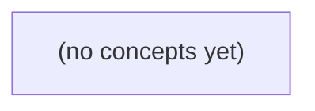

# 01.03 控制流与函数：把 IM 消息规则写清楚

*面向 Go 零基础学习者，从本地 IM 文本校验与会话分流规则出发，学习 if、switch、for、函数、多返回值、递归与闭包。读者将把“空文本拒绝、字节上限校验、会话类型选择”等需求写成清晰、可追踪的 Go 程序，并明确程序只完成本地校验，不发送网络消息。*

**章节:** 2

---

## 本书导览

- 了解整本书的章节脉络
- 掌握各章之间的概念依赖关系
- 选择最合适的阅读顺序

# 01.03 控制流与函数：把 IM 消息规则写清楚

面向 Go 零基础学习者，从本地 IM 文本校验与会话分流规则出发，学习 if、switch、for、函数、多返回值、递归与闭包。读者将把“空文本拒绝、字节上限校验、会话类型选择”等需求写成清晰、可追踪的 Go 程序，并明确程序只完成本地校验，不发送网络消息。

下方的概念图展示了本书 0 个核心概念以及它们之间的依赖关系；再下方是 1 个章节的入口。你可以按从上到下的顺序阅读，也可以根据自己的兴趣或先验知识选择切入点。

#### 概念图



## 章节索引

- **01.03 控制流与函数：把 IM 消息规则写清楚** — 从本地消息校验按顺序学习if、switch、有限for与普通函数；再解释多返回值和副作用，第二遍进入递归与闭包。通过分层练习和已核对OpenIM入口理解控制流，暂不发送网络消息。

## 01.03 控制流与函数：把 IM 消息规则写清楚

- 从消息规则到分支与提前返回
- 用switch表达会话分流
- for循环与有限重复
- 函数、参数、返回与调用过程
- 多返回值、校验契约与副作用
- 第二遍阅读：递归与调用栈
- 第二遍阅读：函数值与闭包
- 综合校验、OpenIM对照与分层练习

本节把 IM 文本消息的本地校验写成清晰的执行路径：先定义规则，再用分支决定接受或拒绝，且不发送任何网络消息。

### 先把消息规则列成可判断的顺序

### 先把消息规则列成可判断的顺序

本地校验不是“看起来没问题”就通过，而是把需求写成程序能逐项判断的规则。设一条文本消息有：

- `body`：文本内容；
- `maxBytes`：允许的最大字节数；
- `chatType`：会话类型，只允许 `single` 或 `group`。

可先列出拒绝条件，并安排检查顺序：

1. `maxBytes <= 0`：配置无意义，拒绝；
2. `body == ""`：原始文本为空，拒绝；
3. `len(body) > maxBytes`：字节数超限，拒绝；
4. `chatType` 既不是 `single`，也不是 `group`：会话类型未知，拒绝；
5. 否则：仅表示本地校验通过，不代表任何对端已收到消息。

先检查配置，再检查文本，最后检查类型，叫作“尽早拒绝”：一旦发现当前输入不可能合法，就无需继续判断后续规则。这样路径短，错误原因也更清楚。

```go
body := "你好"
maxBytes := 6
chatType := "single"

fmt.Println(len(body)) // 预期输出：6
```

`len(body)`计算字符串的字节数；`"你"`和`"好"`通常各占 3 个字节，所以 `len(body) == maxBytes` 合法，只有 `len(body) > maxBytes` 才超限。

注意，规则是“原始字节非空”。因此 `"   "`不是空字符串，不能在这里擅自当作空文本；是否去除空格，是另一条必须明确写出的规则。

### if、else if 与 else：选择一条路径

### if、else if 与 else：选择一条路径

`if` 用于“条件成立才执行”。当一条消息只能落入一种处理结果时，应把分支连成 `if / else if / else`：程序从上到下判断，命中第一条成立条件后，执行对应代码，并跳过同一组中的其余分支。

```go
package main

import "fmt"

func main() {
	body := "你好"
	maxBytes := 6

	if maxBytes <= 0 {
		fmt.Println("拒绝：字节上限配置无效")
	} else if len(body) == 0 {
		fmt.Println("拒绝：文本不能为空")
	} else if len(body) > maxBytes {
		fmt.Println("拒绝：文本超过字节上限")
	} else {
		fmt.Println("本地校验通过")
	}
}
```

这里 `len(body)` 是字节数，`"你好"` 占 `6` 个字节；因此 `len(body) > maxBytes` 为假，边界值 `6` 合法。`else` 表示前面条件都不成立时的兜底路径，不等于“消息已发送”或“对端已收到”。

若规则互斥，却写成多个独立 `if`，可能产生矛盾输出：

```go
if len(body) == 0 {
	fmt.Println("拒绝：文本不能为空")
}
if len(body) <= maxBytes {
	fmt.Println("本地校验通过")
}
```

当 `body` 是空文本且 `maxBytes` 为正数时，两句都会打印：既拒绝又通过。这不是想要的路径选择。

因此，**同一决策的不同结果**用 `else if` 和 `else` 串联；**可以同时发生的独立检查或动作**才使用多个独立 `if`。花括号 `{}` 包住每个分支的代码，也限定其中声明的变量只能在该分支内使用。

### 用提前 return 写出拒绝路径

### 用提前 `return` 写出拒绝路径

文本规则可以先写成需求表：

- `maxBytes` 必须大于 `0`，否则配置无效；
- `body` 的原始字节数必须非空；
- `len(body)` 不能超过 `maxBytes`；
- 这里只做本地判断，接受不表示任何对端已经收到消息。

`return` 会立刻结束当前函数。因为校验失败后不需要继续判断后续规则，可以把每个“拒绝路径”写在前面；全部通过时，代码自然走到最后的“接受路径”。

```go
package main

import "fmt"

func main() {
	body := "你好"
	maxBytes := 6

	if maxBytes <= 0 {
		fmt.Println("拒绝：最大字节数配置无效")
		return
	}

	if len(body) == 0 {
		fmt.Println("拒绝：文本不能为空")
		return
	}

	if len(body) > maxBytes {
		fmt.Println("拒绝：文本超过最大字节数")
		return
	}

	fmt.Println("本地校验通过")
}
```

预期输出：

```text
本地校验通过
```

这里 `len(body)` 计算的是字节数，不是“看到的汉字个数”。UTF-8 中，`"你"` 和 `"好"`通常各占 `3` 个字节，因此：

$$len("你好")=6$$

边界判断必须使用 `>`：当 `len(body)` 恰好等于 `maxBytes` 时合法；只有大于上限才拒绝。若把条件误写成 `>=`，长度正好为 `6` 的 `"你好"` 会被错误拒绝。

注意，本规则不自动删除空格。`body := " "` 的字节数不是 `0`，因此会通过“非空”检查；是否禁止纯空格属于另一条尚未加入的业务规则。

### 检查顺序、短路与“只打印”的陷阱

### 检查顺序、短路与“只打印”的陷阱

校验规则不仅要写对，还要按合理顺序执行。假设文本消息使用：

```go
body := "你好"
maxBytes := 6
```

`len(body)`计算的是字节数；“你”和“好”在 UTF-8 中各占 3 个字节，因此 `len(body)`为 `6`，恰好等于上限，属于合法边界。

先检查配置，再检查消息内容，最后检查长度：

```go
package main

import "fmt"

func main() {
	body := "你好"
	maxBytes := 6

	if maxBytes <= 0 {
		fmt.Println("拒绝：最大字节数配置无效")
		return
	}

	if body == "" {
		fmt.Println("拒绝：文本不能为空")
		return
	}

	if len(body) > maxBytes {
		fmt.Println("拒绝：文本超过字节上限")
		return
	}

	fmt.Println("本地校验通过")
}
```

输出：

```text
本地校验通过
```

这里的 `return`结束的是当前函数，即本例中的`main`。因此发现错误后，后续长度检查和“校验通过”都不会执行。

反例是只打印错误却不停止：

```go
if body == "" {
	fmt.Println("拒绝：文本不能为空")
}
fmt.Println("本地校验通过")
```

当`body == ""`时，会同时输出“拒绝”和“本地校验通过”，形成矛盾。打印只是显示文字，不会自动改变程序路径。

也可合并条件：

```go
if maxBytes <= 0 || body == "" || len(body) > maxBytes {
	fmt.Println("拒绝")
	return
}
```

`||`具有短路特性：左侧已经为`true`时，右侧不再计算。不过合并后无法直接区分拒绝原因；在规则需要清晰反馈时，依次写多个`if`通常更易读。注意，文本规则是“原始字节非空”：`body == "   "`并不为空，程序不会自动去掉空格。

### 花括号中的变量：初始化语句与作用域

### 花括号中的变量：初始化语句与作用域

`if` 可以先执行一条初始化语句，再判断条件：

```go
if n := len(body); n == 0 {
	fmt.Println("拒绝：文本不能为空")
}
```

这里的 `n := len(body)` 先计算文本的字节数，随后用 `n == 0` 判断。`n` 只在这条 `if` 的分支结构中可用，包括 `if` 块、`else if` 和 `else` 块；离开整组花括号后，`n` 就不存在了。

```go
package main

import "fmt"

func main() {
	body := "你好"
	maxBytes := 6

	if n := len(body); n == 0 {
		fmt.Println("拒绝：文本不能为空")
	} else if n > maxBytes {
		fmt.Println("拒绝：文本超过字节上限")
	} else {
		fmt.Println("本地校验通过")
	}

	// fmt.Println(n) // 错误：此处 n 不在作用域内
}
```

输出：

```text
本地校验通过
```

把临时变量放进 `if`，能让“字节数只服务于本次判断”的意图更清楚，也避免它被后续无关代码误用。

但要警惕同名变量的**遮蔽**：内层用 `:=` 声明同名变量时，可能新建一个变量，而不是修改外层变量。

```go
body := "你好"
n := len(body)

if n := len(body); n > 6 {
	fmt.Println("过长")
}

fmt.Println(n) // 仍是外层的 n
```

内层 `n` 只在 `if` 中有效；最后打印的是外层 `n`。因此，若需要在分支之后继续使用长度，应先在外部声明；若长度只用于分支判断，则优先写在 `if` 初始化语句中。

> **要点** — 先按依赖关系检查配置与输入；每个拒绝分支用 return 结束当前路径，校验通过只表示本地可继续处理。

消息进入本地程序后，先要按会话类型选择处理路径。Go 的 switch 能把这类分流规则写得集中、清楚，且不会真的发送消息。

### 为什么会话分流适合用 switch

### 为什么会话分流适合用 `switch`

消息进入本地程序后，可以先根据“会话类型”决定计划走哪条路径。例如我们暂时约定三个本地字符串：

- `"single"`：单聊；
- `"group"`：群聊；
- `"notification"`：通知消息。

这只是本程序自定义的分类文本，**不等同于**任何上游系统中的 `SessionType` 编码；真实编码若不同，应先在别处转换或校验。

用多个独立的 `if` 也能写分流：

```go
if sessionType == "single" {
	fmt.Println("计划路径：单聊文本处理")
}
if sessionType == "group" {
	fmt.Println("计划路径：群聊文本处理")
}
if sessionType == "notification" {
	fmt.Println("计划路径：通知记录处理")
}
```

但这里每次都要重复写 `sessionType ==`，而且读者需要逐段寻找：同一个分类条件到底有哪些可能值？当分支增多时，规则会显得分散。

`switch` 适合“**一个表达式，与多个固定分类值比较**”的场景：

```go
switch sessionType {
case "single":
	fmt.Println("计划路径：单聊文本处理")
case "group":
	fmt.Println("计划路径：群聊文本处理")
case "notification":
	fmt.Println("计划路径：通知记录处理")
default:
	fmt.Println("计划路径：未知会话类型，拒绝继续处理")
}
```

`switch sessionType` 中的 `sessionType` 是要分类的表达式；每个 `case` 写一个可匹配的值；`default` 表示前面的 `case` 都不匹配时的兜底路径。

普通 Go `switch` 找到匹配的 `case` 后，只执行该分支，不会自动继续执行下一个 `case`。因此当 `sessionType` 是 `"single"` 时，只会输出单聊计划，不会再输出群聊计划。这里的“计划路径”仅是本地输出，不表示消息已经发送，更不表示对端已收到。

### switch、case 与 default 的基本写法

### switch、case 与 default 的基本写法

消息进入本地程序后，常要按会话类型选择计划路径。`switch` 适合表达“一个值对应多种分类”的规则：

```go
switch 表达式 {
case 匹配值:
	动作
default:
	兜底动作
}
```

- `表达式`：要分类的值，例如变量 `sessionType`。
- `case`：可匹配的候选值。表达式与某个 `case` 值相等时，执行该分支。
- `default`：前面的 `case` 都不匹配时执行，相当于最后的兜底规则。

这里的 `"single"`、`"group"`、`"notification"` 只是本地教学程序使用的字符串分类，不等同于任何上游系统的 `SessionType` 编码。

下面程序只输出本地计划，不会发送消息：

```go
package main

import "fmt"

func main() {
	sessionType := "group"
	text := "今晚八点开会"

	switch sessionType {
	case "single":
		fmt.Println("计划路径：按单聊规则校验文本：", text)
	case "group":
		fmt.Println("计划路径：按群聊规则校验文本：", text)
	case "notification":
		fmt.Println("计划路径：按通知规则记录文本：", text)
	default:
		fmt.Println("计划路径：拒绝未知会话类型：", sessionType)
	}
}
```

预期输出：

```text
计划路径：按群聊规则校验文本： 今晚八点开会
```

普通 `switch` 找到匹配的 `case` 后，就结束整个 `switch`；它**不会**自动继续执行下一个 `case`。因此 `"group"` 不会再进入 `"notification"` 或 `default`。

若写成多个独立 `if`，容易重复动作，甚至让同一条消息走多条路径；`switch` 则强调“本次分类选择一个分支”。不要用 `fallthrough` 实现业务路由；若在代码中见到它，需要单独理解其语义。另注意：`switch` 中的 `break` 只跳出 `switch`，不是跳出外层循环；循环会在下一节学习。

### 为 single、group 和 notification 选择路径

### 为 single、group 和 notification 选择路径

假设本地程序已经得到一条来自 `u-a` 发给 `u-b` 的文本消息，并用字符串 `sessionKind` 表示本地分类：

- `single`：单聊路径
- `group`：群聊路径
- `notification`：通知路径

这些只是本程序约定的本地字符串，**不等同于**任何上游系统的 `SessionType` 编码；若将来接入别的来源，仍应先转换或校验。

`switch` 用一个表达式集中选择分支。`case` 表示可匹配的值，`default` 处理所有未列出的情况。

```go
package main

import "fmt"

func main() {
	from := "u-a"
	to := "u-b"
	text := "你好"
	sessionKind := "group"

	switch sessionKind {
	case "single":
		fmt.Println("计划走单聊本地校验路径：", from, "->", to, text)
	case "group":
		fmt.Println("计划走群聊本地校验路径：", from, "发送：", text)
	case "notification":
		fmt.Println("计划走通知本地校验路径：", text)
	default:
		fmt.Println("未知会话类型，不安排发送：", sessionKind)
	}
}
```

预期输出：

```text
计划走群聊本地校验路径： u-a 发送： 你好
```

普通 `switch` 匹配到一个 `case` 后，不会自动继续执行下一个 `case`。因此上例为 `group` 时，不会再输出通知路径。也不必像独立 `if` 那样重复比较：

```go
if sessionKind == "single" { /* 路径一 */ }
if sessionKind == "group" { /* 路径二 */ }
if sessionKind == "notification" { /* 路径三 */ }
```

当规则是“从上到下选择第一个条件成立的分支”时，可省略表达式：

```go
switch {
case text == "":
	fmt.Println("文本为空，不安排发送")
case sessionKind == "single":
	fmt.Println("单聊路径")
default:
	fmt.Println("其他路径")
}
```

这里的 `switch` 等价于依次判断条件是否为 `true`。未知类型进入 `default`，比误走某条消息路径更安全。不要用 `fallthrough` 编写业务路由；它会改变普通 `switch` 的停止规则。

### 匹配顺序、自动停止与常见误解

### 匹配顺序、自动停止与常见误解

普通 `switch` 会把表达式的值依次与各个 `case` 比较：从上到下找到**第一个匹配项**后，执行其中语句，并在该 `switch` 结束。它不会像某些语言那样自动继续执行下一个 `case`。

```go
package main

import "fmt"

func main() {
	sessionKind := "group"

	switch sessionKind {
	case "single":
		fmt.Println("计划路径：单聊文本校验")
	case "group":
		fmt.Println("计划路径：群聊文本校验")
	case "notification":
		fmt.Println("计划路径：通知消息记录")
	default:
		fmt.Println("计划路径：未知会话类型，拒绝处理")
	}
}
```

预期输出：

```text
计划路径：群聊文本校验
```

这里的 `"single"`、`"group"`、`"notification"` 是本地程序自定义的分类字符串，只用于决定本地校验和处理路径；它们**不等同于**任何上游系统可能使用的 `SessionType` 编码。

可将它与重复比较的 `if` 对照：

```go
if sessionKind == "single" {
	fmt.Println("计划路径：单聊文本校验")
}
if sessionKind == "group" {
	fmt.Println("计划路径：群聊文本校验")
}
if sessionKind == "notification" {
	fmt.Println("计划路径：通知消息记录")
}
```

当各条件互斥时，`switch` 更集中，也更明确地表达“只选择一条路径”。若使用 `if`，通常应写成 `if ... else if ...`，避免误把多个独立条件当成可同时执行的规则。

不要为了继续执行下一个 `case` 而使用 `fallthrough` 做业务路由；它会忽略下一个 `case` 的匹配条件，容易造成错误路径。以后若看到它，需要单独理解其语义。

有时会在 `case` 中看到 `break`，但普通 `switch` 本来就会在匹配分支结束后自动停止，因此通常不需要写。更重要的是，`break` 不应先理解为“跳出未来可能出现的外层 `for`”；循环中的 `break` 规则将在下一节专门讨论。

### 无表达式 switch 与本地规则检查

### 无表达式 switch 与本地规则检查

有时规则并非“某个值等于什么”，而是“哪个条件先成立”。这时可省略 `switch` 后的表达式：

```go
switch {
case 条件一:
    // 条件一为 true 时执行
case 条件二:
    // 条件二为 true 时执行
default:
    // 前面都不成立时执行
}
```

它等价于 `switch true`：每个 `case` 后面都是布尔条件，程序从上到下检查，执行**第一个为 `true` 的分支**后离开 `switch`。普通 `switch` 匹配后也不会自动继续执行下一项。

下面按优先级检查一条本地文本消息。`single`、`group`、`notification` 只是本程序自定义的字符串标签，不等同于任何上游 `SessionType` 编码。

```go
package main

import "fmt"

func main() {
    sessionType := "group"
    text := ""

    switch {
    case sessionType == "notification":
        fmt.Println("计划路径：记录通知，不发送消息")
    case text == "":
        fmt.Println("计划路径：拒绝空文本")
    case sessionType == "single":
        fmt.Println("计划路径：准备单聊文本校验")
    case sessionType == "group":
        fmt.Println("计划路径：准备群聊文本校验")
    default:
        fmt.Println("计划路径：未知会话类型")
    }
}
```

预期输出：

```text
计划路径：拒绝空文本
```

虽然 `sessionType` 是 `group`，但空文本规则排在更前面，所以先被选中。这正是条件优先级：把更严格、更需要提前拦截的规则放在前面。

若改成多个独立的 `if`：

```go
if text == "" {
    fmt.Println("拒绝空文本")
}
if sessionType == "group" {
    fmt.Println("准备群聊文本校验")
}
```

两个动作都会执行，容易让“已拒绝”的消息又进入后续路径；无表达式 `switch` 则保证只选一条路径。

练习：将 `text` 改为 `"你好"`，`sessionType` 保持 `"group"`。预期输出是：

```text
计划路径：准备群聊文本校验
```

不要用 `fallthrough` 编写业务路由；它会强制进入下一 `case`，需要另行理解其语义。`break` 在 `switch` 中只结束 `switch`；它不能当作跳出外层 `for` 的工具，这一点将在下一节回访。

> **要点** — switch 将单一会话类型的本地分流集中表达；首个匹配 case 执行后自动结束，default 负责未知类型。

本节把重复三次的本地消息校验写成可控的循环，重点是让计数、边界和停止条件一眼可查。

### 为什么重复校验要用循环

### 为什么重复校验要用循环

假设要对用户 `u-a` 发往 `u-b` 的三条文本消息做**本地校验**：检查会话类型是否为 `single`，并确认文本长度大于 `0`。若直接展开，代码会很快重复：

```go
package main

import "fmt"

func main() {
	text := "你好"
	sessionType := "single"

	if sessionType == "single" && len(text) > 0 {
		fmt.Println("第1条：本地校验通过")
	}
	if sessionType == "single" && len(text) > 0 {
		fmt.Println("第2条：本地校验通过")
	}
	if sessionType == "single" && len(text) > 0 {
		fmt.Println("第3条：本地校验通过")
	}
}
```

这能工作，但“做三次”被分散写在三段代码里。以后改校验规则时，容易漏改其中一段。循环把“重复执行”和“何时停止”集中表达：

```go
package main

import "fmt"

func main() {
	text := "你好"
	sessionType := "single"

	for i := 1; i <= 3; i++ {
		if sessionType == "single" && len(text) > 0 {
			fmt.Println("第", i, "条：本地校验通过")
		}
	}
}
```

`for 初始化; 条件; 后置` 的执行顺序是：

| 轮次 | `i` 初值/当前值 | 条件 `i <= 3` | 循环体 | 后置 `i++` |
|---|---:|---|---|---|
| 第1轮 | 1 | 真 | 校验第1条 | 变为2 |
| 第2轮 | 2 | 真 | 校验第2条 | 变为3 |
| 第3轮 | 3 | 真 | 校验第3条 | 变为4 |
| 退出 | 4 | 假 | 不执行 | 不再执行 |

`i++` 表示让 `i` 加 `1`，它是语句，不是能放进 `fmt.Println(i++)` 的值。每轮后 `i` 都更接近终点 `4`，所以循环必然停止。

注意边界：`i < 3` 只执行 `1、2` 两轮；`i <= 3` 才执行三轮。若忘记写 `i++`，`i` 一直是 `1`，条件始终为真，会造成无限循环。循环输出“本地校验通过”只表示程序完成检查，不表示任何对端已经收到消息。

### 三段式for逐轮执行

### 三段式 `for` 逐轮执行

当同一条本地校验规则要模拟执行三次时，不必复制三段几乎相同的 `if`。Go 使用三段式 `for`：

```go
for 初始化; 条件; 后置 {
    循环体
}
```

三部分的执行顺序是：

1. **初始化**：只执行一次，常用于创建计数变量。
2. **条件**：每轮开始前检查；结果为 `true` 才进入循环体。
3. **循环体**：执行本轮处理。
4. **后置**：循环体结束后执行，再回到条件检查。

`i++` 表示把 `i` 增加 `1`。它是语句，不是可放进表达式的值；例如不能写 `fmt.Println(i++)`。

下面模拟对 `u-a` 发往 `u-b` 的文本消息做三次本地校验；这只是本地处理，不表示消息已发送或对端已收到。

```go
package main

import "fmt"

func main() {
    for i := 0; i < 3; i++ {
        fmt.Println("第", i+1, "次：文本消息本地校验通过")
    }
}
```

预期输出：

```text
第 1 次：文本消息本地校验通过
第 2 次：文本消息本地校验通过
第 3 次：文本消息本地校验通过
```

逐轮追踪如下：

| 阶段 | `i` 的值 | 发生什么 |
|---|---:|---|
| 初始化 | `0` | `i := 0`，只执行一次 |
| 第 1 轮条件 | `0` | `0 < 3` 为真，执行循环体 |
| 第 1 轮后置 | `1` | `i++` 后变为 `1` |
| 第 2 轮条件 | `1` | `1 < 3` 为真，执行循环体 |
| 第 2 轮后置 | `2` | `i++` 后变为 `2` |
| 第 3 轮条件 | `2` | `2 < 3` 为真，执行循环体 |
| 第 3 轮后置 | `3` | `i++` 后变为 `3` |
| 退出检查 | `3` | `3 < 3` 为假，循环结束 |

这里使用 `< 3`，因此 `i` 依次为 `0、1、2`，恰好三轮。若误写为 `i <= 3`，`i` 会取到 `3`，循环变成四轮。更危险的是漏写 `i++`：`i` 永远是 `0`，条件始终成立，程序无法自行停止。

循环能停止，是因为每轮后置都让 `i` 向终点 `3` 靠近；当 `i` 到达 `3`，条件变为假。

### 边界、比较与停止性

### 边界、比较与停止性

三段式 `for` 的核心是：初始化计数变量、检查条件、执行循环体、执行后置语句，再回到条件检查。

```go
for i := 0; i < 3; i++ {
    fmt.Println("第", i, "次本地校验")
}
```

这里 `i := 0` 只执行一次；`i < 3` 每轮开始前检查；`i++` 是语句，表示 `i` 增加 1，不能写进 `fmt.Println(i++)`。

|轮次|`i` 初值|条件 `i < 3`|循环体|后置 `i++`|
|---|---:|---|---|---|
|第 1 轮|0|真|校验第 0 次|变为 1|
|第 2 轮|1|真|校验第 1 次|变为 2|
|第 3 轮|2|真|校验第 2 次|变为 3|
|退出检查|3|假|不执行|循环结束|

因此，`i < 3` 恰好处理 `0、1、2` 三次。若写成 `i <= 3`：

```go
for i := 0; i <= 3; i++ {
    fmt.Println("模拟处理", i)
}
```

会处理 `0、1、2、3`，共四次。`<` 表示“小于，不含右边界”；`<=` 表示“小于或等于，包含右边界”。

计数起点也会改变次数。`i := -1; i < 3; i++` 会执行四次：`-1、0、1、2`。若本地校验编号只允许非负数，负数起点就是边界错误。

更危险的是没有推进变量：

```go
// 错误示例：i 始终是 0，条件永远为真
for i := 0; i < 3; {
    fmt.Println("校验 u-a 的文本消息")
}
```

循环停止性要求：每一轮都要让状态逼近终点。这里终点是 `i == 3`，而 `i++` 使 `i` 逐步增大，最终让 `i < 3` 为假。若条件始终为真，程序会持续执行，不能把它当作真实消息发送或网络重试。

### 条件for与提前跳过或结束

### 条件for与提前跳过或结束

当重复次数不能先写死，或“只要条件成立就继续处理”更自然时，可省略初始化和后置部分：

```go
// 放在 main 中
checked := 0
for checked < 3 {
	fmt.Println("本地校验第", checked+1, "次")
	checked++
}
```

这里 `for checked < 3` 每轮开始前检查条件；`checked++` 必须由循环体自己完成。它让 `checked` 从 `0` 逐步逼近 `3`，条件变为假后停止。若忘记推进变量，条件会一直成立，程序会不断输出：

```go
// 错误：checked 永远是 0
for checked < 3 {
	fmt.Println("持续校验")
}
```

`continue` 表示跳过**本轮剩余语句**，立刻开始下一轮条件检查：

```go
for i := 0; i < 3; i++ {
	if i == 1 {
		fmt.Println("第 2 次文本为空，跳过本地处理")
		continue
	}
	fmt.Println("处理第", i+1, "次模拟消息")
}
```

三段式 `for` 中，`continue` 不会直接检查条件，而是会先执行后置语句 `i++`，再检查 `i < 3`。因此上例不会卡在 `i == 1`。

`break` 则立即结束最近的一层 `for`：

```go
for i := 0; i < 3; i++ {
	if i == 1 {
		fmt.Println("发现无效会话类型，结束本地模拟")
		break
	}
	fmt.Println("校验第", i+1, "次")
}
```

输出为：

```text
校验第 1 次
发现无效会话类型，结束本地模拟
```

注意：`break` 只离开最近的 `for`（也同样只离开最近的 `switch` 或 `select`），不会自动结束 `main`，更不表示消息已经发送或被对端收到。

### 两设备的三次本地模拟

### 两设备的三次本地模拟

假设 `u-a` 和 `u-b` 各做三次本地文本消息规则检查。设备编号用 `device` 表示，次数用 `i` 表示；它们都是普通整数，不需要集合。

```go
package main

import "fmt"

func main() {
	for device := 0; device < 2; device++ {
		for i := 0; i < 3; i++ {
			fmt.Println("本地检查：设备", device, "第", i+1, "次")
		}
	}
}
```

`for 初始化; 条件; 后置` 的执行顺序是：先执行初始化；每轮开始检查条件；条件为真才执行循环体；随后执行后置；再检查条件。`i++` 表示把 `i` 增加 1，它是语句，不能写进 `fmt.Println(i++)`。

内层循环的变化如下：

| 阶段 | `i` 的值 | 结果 |
|---|---:|---|
| 初始化 | 0 | 开始第 1 次检查 |
| 条件 `i < 3` | 0、1、2 | 进入循环体 |
| 后置 `i++` | 变为 1、2、3 | 向终点 3 靠近 |
| 退出检查 | 3 | `3 < 3` 为假，退出 |

外层 `device < 2` 让设备编号依次为 0、1，故总共进行 $2\times3=6$ 次本地模拟；输出只表示程序完成检查，不表示消息已发送或对端已收到。

若写成 `i <= 3`，则会执行 4 次，因为 `i=3` 时条件仍为真。若忘记写 `i++`，`i` 永远不逼近 3，循环不会停止。初值为负数也会多执行若干轮，例如 `i := -1` 会执行 4 次。

条件形式的循环可手动退出：

```go
for {
	if i == 3 {
		break
	}
	i++
}
```

`break` 只退出最近的一层 `for`；在两层循环中，它不会直接结束外层。`continue` 则跳过本轮剩余语句，但三段式 `for` 仍会执行后置部分。

练习：把内层条件改为 `i < 2`，两台设备各检查几次？退出时 `i` 是多少？答案：各 2 次，退出时为 2。

> **要点** — 有限循环必须明确起点、继续条件和推进步骤；边界写清，才能保证本地校验按预期停止。

当多条消息都要做同一种文本校验时，把规则写成命名函数，能让 main 更像清晰的处理流程。

### 从重复校验看函数的必要性

### 从重复校验看函数的必要性

假设本地规则要求：IM 文本长度必须在 `1` 到 `20` 个字节之间。若在 `main` 中分别检查两条消息，容易写成重复代码：

```go
package main

import "fmt"

func main() {
	textA := "你好"
	textB := ""

	if len(textA) >= 1 && len(textA) <= 20 {
		fmt.Println("u-a 的文本长度通过")
	} else {
		fmt.Println("u-a 的文本长度不通过")
	}

	if len(textB) >= 1 && len(textB) <= 20 {
		fmt.Println("u-b 的文本长度通过")
	} else {
		fmt.Println("u-b 的文本长度不通过")
	}
}
```

预期输出：

```text
u-a 的文本长度通过
u-b 的文本长度不通过
```

这里的风险不在于代码暂时不能运行，而在于**同一条规则出现了两次**。以后若上限从 `20` 改为 `30`，可能只改了第一处；又或者某处误写成 `len(text) > 1`，把长度恰好为 `1` 的文本排除。规则分散，维护时就容易不一致。

函数的作用之一，是给一段可重复执行的规则取名字，并把它集中放在一个位置。例如可以把“文本长度是否合格”命名为 `textLengthOK`：

```go
func textLengthOK(text string) bool {
	return len(text) >= 1 && len(text) <= 20
}
```

之后两条消息都调用同一个规则：

```go
if textLengthOK(textA) {
	fmt.Println("u-a 的文本长度通过")
}
if textLengthOK(textB) {
	fmt.Println("u-b 的文本长度不通过")
}
```

此时 `main` 主要表达处理路径：检查 `textA`，再检查 `textB`；长度细节则集中在 `textLengthOK` 中。注意，“通过”只表示本地校验通过，并不表示任何对端已经收到消息。

### 逐符号读懂函数声明

### 逐符号读懂函数声明

当“文本长度是否合规”要写多次时，可以把规则命名为函数。函数**定义**写一次，之后在 `main` 中多次**调用**。

```go
package main

import "fmt"

func 文本合规(text string) bool {
	if len(text) == 0 {
		return false
	}
	return len(text) <= 20
}

func main() {
	msg := "你好，u-b"
	ok := 文本合规(msg)
	fmt.Println(ok) // 预期：true
}
```

逐个看第一行：

- `func`：声明“下面是一个命名函数”的关键字。
- `文本合规`：函数名。调用时也必须写这个名字，如 `文本合规(msg)`。
- `(text string)`：参数列表。`text` 是函数内部使用的名字，`string` 表示它只能接收字符串。
- `bool`：返回类型，说明调用结束后会交回一个布尔值，即 `true` 或 `false`。
- `{ ... }`：函数体，放置该函数执行的语句。
- `return false`：立刻结束本次函数调用，并把 `false` 交回调用位置。
- 最后的 `return len(text) <= 20`：计算比较结果，再把结果交回去。

调用中的 `msg` 是**实参**：实际交给函数的值；声明中的 `text` 是**形参**：函数接收值时使用的局部名字。调用 `文本合规(msg)` 后，`msg` 的字符串值传给 `text`。两者名字不必相同：

```go
ok := 文本合规("群聊通知")
```

这里实参直接是字符串字面量，函数内部仍把它称为 `text`。执行路径可理解为：`main` 调用 `文本合规` → 函数检查长度 → `return` 把结果交回 `main` → 赋给 `ok`。

命名函数必须声明在包级，也就是与 `main` 并列，不能写进 `main` 的花括号内：

```go
func main() {
	func 文本合规(text string) bool { // 错误：不能在这里声明命名函数
		return len(text) > 0
	}
}
```

可以把调用过程想成临时进入一层“工作记录”：每次调用都有自己的 `text`。这是理解局部名字的逻辑模型；不需要假定这些名字一定以固定方式存放在物理栈中。

### 定义、调用与参数传值

### 定义、调用与参数传值

当 `u-a` 与 `u-b` 的文本都要遵守同一条长度规则时，不应在 `main` 中重复写 `len` 判断。可以把规则定义为一个有名字的函数；之后在需要处调用它。

```go
package main

import "fmt"

// 文本长度不超过 20 个字节时返回 true。
func 文本可用(文本 string, 上限 int) bool {
	return len(文本) <= 上限
}

func main() {
	uA文本 := "你好"
	uB文本 := "这是一条较长的文本消息"

	fmt.Println(文本可用(uA文本, 20))
	fmt.Println(文本可用(uB文本, 20))
}
```

预期输出：

```text
true
false
```

`func 文本可用(文本 string, 上限 int) bool { ... }` 是**函数定义**，它说明规则叫什么、需要什么输入、会给出什么结果：

- `func`：声明命名函数的关键字。
- `文本可用`：函数名，调用时用它找到这条规则。
- `文本 string`、`上限 int`：参数。`文本`、`上限`是**形参**，只在函数体内使用；`string`、`int`是它们的类型。
- `bool`：返回类型，表示函数会交还一个布尔值。
- `{ ... }`：函数体，写具体规则。
- `return`：把结果交还给调用位置。

`文本可用(uA文本, 20)` 是**函数调用**。其中 `uA文本` 和 `20` 是**实参**：调用者实际提供的值。调用时可按下面的逻辑理解：

1. `uA文本` 当前值 `"你好"` 传给形参 `文本`；
2. `20` 传给形参 `上限`；
3. 函数计算 `len(文本) <= 上限`；
4. `return` 把 `true` 交回 `fmt.Println(...)`。

这里传入的是值。对 `int` 和 `string` 而言，形参获得调用时的值；在函数内给形参重新赋值，不会改掉调用者的变量：

```go
func 改上限(上限 int) {
	上限 = 1
}
```

调用 `改上限(20)` 后，调用处的 `20` 不会变成 `1`。不过，这个结论目前只用于 `int` 和 `string` 的重新赋值；以后学习可变数据时，不能直接推广为“函数内任何修改都与外部无关”。

函数定义必须放在包级，也就是 `main` 外面；不能在 `main` 的 `{}` 内直接声明普通命名函数。不同函数都可以使用名为 `文本` 的局部名字，它们属于各自的一次调用，不会因为同名而混在一起。可以把执行过程理解为 `main → 文本可用 → return 到 main`；这是理解调用关系的逻辑模型。

### 完整程序跟踪校验路径

### 完整程序跟踪校验路径

下面的程序依次校验两条本地文本消息。`validText` 只负责长度规则：文本字节数在 $1$ 到 $20$ 之间时返回 `true`。

```go
package main

import "fmt"

func validText(text string) bool {
	length := len(text)
	if length < 1 {
		return false
	}
	if length > 20 {
		return false
	}
	return true
}

func main() {
	messageA := "你好"
	messageB := ""

	okA := validText(messageA)
	okB := validText(messageB)

	fmt.Println("u-a 文本可处理：", okA)
	fmt.Println("u-b 文本可处理：", okB)
}
```

预期输出：

```text
u-a 文本可处理： true
u-b 文本可处理： false
```

跟踪第一条调用 `validText(messageA)`：

1. `main` 中的 `messageA` 值为 `"你好"`。
2. 调用函数时，这个字符串值作为**实参**传入。
3. 函数里的形参 `text string` 得到该值；此时 `text` 是 `validText` 内部可用的局部名字。
4. `len(text)` 得到字节数 `6`，不小于 `1`，也不大于 `20`。
5. `return true` 把结果交还给调用处，`okA` 得到 `true`。

第二次调用中，`messageB` 的值是空字符串 `""`。形参 `text` 再次得到新的调用参数，`len(text)` 为 `0`，于是执行 `return false`，`okB` 得到 `false`。

可以把调用过程理解为临时进入一层校验任务：`main → validText → return → main`。两次调用里的 `text` 虽然名字相同，但分别属于各自的调用过程；函数返回后，`main` 只继续使用返回的布尔结果。这里的“调用栈”只是理解执行顺序的逻辑模型，不表示局部变量一定以某种固定物理方式存放。

### 局部名字与调用过程

### 局部名字与调用过程

`main` 中的名字，和函数体中的名字，只在各自的花括号范围内有效。即使都叫 `text`，也不是同一个变量。

```go
package main

import "fmt"

func validText(text string) bool {
	length := len(text)
	return length >= 1 && length <= 20
}

func main() {
	text := "你好"
	length := len(text)

	if validText(text) {
		fmt.Println("文本通过校验，长度为", length)
		return
	}

	fmt.Println("文本不通过校验")
}
```

这里有两个 `text`：

- `main` 中的 `text`：保存准备校验的消息文本。
- `validText` 中的 `text`：函数调用时接收传入值的形参。

调用 `validText(text)` 时，可以按下面的逻辑过程理解：

1. `main` 计算实参 `text`，得到 `"你好"`。
2. 进入 `validText`，把这个字符串值交给形参 `text`。
3. 函数内部计算 `length`，得到 `6`；因为 `len` 计算的是字节数。
4. `return` 把 `true` 交回 `main`。
5. `main` 根据结果选择输出路径。

可以把每次调用想成一层临时的“调用记录”：其中保存这次调用自己的形参和局部变量。`validText` 连续被调用两次时，两次的 `length` 分别属于不同调用，互不混淆。

```go
okA := validText("hi")
okB := validText("这是一条较长的文本消息")
fmt.Println(okA, okB)
```

不要因为名字相同就认为变量相同；判断一个名字指向谁，要看它声明在哪个函数、哪对花括号中。这里的调用栈只是理解调用顺序和局部作用范围的逻辑模型，不表示每个局部变量都必然以固定方式存放。

> **要点** — 函数把可复用校验规则命名并封装；调用传入实参，函数用 return 把本地判断结果交回调用处。

本节把消息文本校验写成可复用函数：先明确拒绝规则，再用两个返回值把“是否通过”和“原因”交给 main 决定如何处理。

### 先写校验契约与手工用例

### 先写校验契约与手工用例

在写 `if` 之前，先把校验规则写成“契约”：调用者提供什么，函数保证返回什么。这里约定：

`validateText(body string, maxBytes int) (bool, string)`

- `body`：u-a 或 u-b 准备发送的文本。
- `maxBytes`：允许的最大字节数；`len(body)` 得到的正是字节数。
- 第一个结果是是否通过：`true` 表示可继续后续路径，`false` 表示必须拒绝。
- 第二个结果是原因：通过时必须是空字符串 `""`；拒绝时给出可读原因。

先从失败情况出发，手工列出用例。这样写代码时，每条规则都有对应的判断。

| `body` | `maxBytes` | 预期 `ok` | 预期 `reason` |
|---|---:|---:|---|
| `"你好"` | `0` | `false` | `"最大字节数必须大于 0"` |
| `""` | `10` | `false` | `"消息不能为空"` |
| `"hello"` | `4` | `false` | `"消息超过字节上限"` |
| `"hello"` | `5` | `true` | `""` |
| `"你好"` | `6` | `true` | `""` |

判断顺序也属于契约的一部分：先检查 `maxBytes > 0`，再检查文本是否为空，最后检查 `len(body) <= maxBytes`。例如 `body == ""` 且 `maxBytes == 0` 时，应优先报告最大字节数无效，而不是报告消息为空。

通过条件可以写成：

`maxBytes > 0`，并且 `body != ""`，并且 `len(body) <= maxBytes`。

注意，这只是本地校验：它不打印终端、不发送消息，也不修改外部状态。它只把结果交给 `main`。后续 `main` 即使拿到 `ok == true`，也只能表示“本地规则通过”，不能表示对端已经收到消息。

### 定义两个返回值的校验函数

### 定义两个返回值的校验函数

先把失败规则写成手工用例表，再决定函数应当返回什么：

| `body` | `maxBytes` | 预期 `ok` | 预期原因 |
|---|---:|---|---|
| `"你好"` | `0` | `false` | `"最大字节数必须大于0"` |
| `""` | `10` | `false` | `"消息不能为空"` |
| `"hello"` | `3` | `false` | `"消息超过字节限制"` |
| `"hello"` | `5` | `true` | `""` |

校验不仅要回答“能不能通过”，还要说明“不通过为什么”。因此定义两个返回值：

```go
func validateText(body string, maxBytes int) (bool, string) {
	if maxBytes <= 0 {
		return false, "最大字节数必须大于0"
	}
	if body == "" {
		return false, "消息不能为空"
	}
	if len(body) > maxBytes {
		return false, "消息超过字节限制"
	}
	return true, ""
}
```

`func` 表示定义函数；`validateText` 是函数名，含义是“校验文本”。

括号中的 `body string, maxBytes int` 是参数列表：调用者把文本交给 `body`，把允许的最大字节数交给 `maxBytes`。`len(body)` 得到字符串的**字节数**，所以中文通常占多个字节。

参数列表后的 `(bool, string)` 是返回类型列表，顺序非常重要：第一个返回值必须是 `bool`，第二个必须是 `string`。于是：

- `return false, "消息不能为空"`：拒绝，附带原因；
- `return true, ""`：通过，没有拒绝原因。

每一条 `return` 都必须返回两个值，且类型、顺序与签名一致。错误写法是：

`return "消息不能为空", false`

它把字符串和布尔值的位置写反了。

这个函数只计算校验结果，不打印终端内容，也不发送消息；这种不产生外部影响的函数称为纯校验。之后 `main` 接收 `ok, reason := validateText(...)`，再决定显示原因还是继续后续路径。这里的 `return` 只结束 `validateText`；函数回到 `main` 后，`main` 仍要根据 `ok` 决定是否拒绝并执行自己的 `return`。

### 按顺序实现拒绝路径

### 按顺序实现拒绝路径

先把失败规则写成手工用例表。这里的长度仍是 `len` 返回的**字节数**，不是字符数。

| `body` | `maxBytes` | 预期 `ok` | 预期原因 |
|---|---:|---|---|
| `"hi"` | `0` | `false` | `"最大字节数必须大于 0"` |
| `""` | `10` | `false` | `"消息文本不能为空"` |
| `"hello"` | `4` | `false` | `"消息文本超过字节上限"` |
| `"hello"` | `5` | `true` | `""` |

函数签名中的 `(bool, string)` 表示它必须按顺序返回两个结果：先是是否通过的 `bool`，再是原因文本的 `string`。因此每一条 `return` 都必须给出两个值。

```go
func validateText(body string, maxBytes int) (bool, string) {
	if maxBytes <= 0 {
		return false, "最大字节数必须大于 0"
	}

	if body == "" {
		return false, "消息文本不能为空"
	}

	if len(body) > maxBytes {
		return false, "消息文本超过字节上限"
	}

	return true, ""
}
```

检查顺序有意义。`maxBytes` 本身无效时，应先报告配置问题；不能因为 `body` 恰好为空，就掩盖了上限为 `0` 的错误。随后检查空文本，最后才比较长度。

反例：下面少返回了原因，和签名不匹配，无法编译。

```go
return false
```

在 `main` 中接收结果时，变量顺序也必须一致：

```go
ok, reason := validateText("hello", 5)
if !ok {
	fmt.Println("拒绝发送：", reason)
	return
}
fmt.Println("本地校验通过，可进入后续处理")
```

这里 `validateText` 内的 `return` 只结束这个辅助函数；它不会结束 `main`。`main` 必须自己根据 `ok` 选择拒绝并 `return`，或继续后续路径。该校验函数不打印、不发送消息；打印是 `main` 的副作用，而校验只负责计算结果。

### 由 main 接收结果并决定显示

### 由 main 接收结果并决定显示

`validateText` 只回答“文本是否合格、为什么不合格”，不自己打印，也不发送消息。`main` 调用它后，使用两个变量按返回顺序接收结果：

```go
package main

import "fmt"

func validateText(body string, maxBytes int) (bool, string) {
	if maxBytes <= 0 {
		return false, "最大字节数必须大于 0"
	}
	if body == "" {
		return false, "消息不能为空"
	}
	if len(body) > maxBytes {
		return false, "消息超过字节数限制"
	}
	return true, ""
}

func main() {
	body := "你好，u-b"
	ok, reason := validateText(body, 20)

	if !ok {
		fmt.Println("拒绝发送：", reason)
		return
	}

	fmt.Println("本地校验通过，可以进入下一步处理")
}
```

函数签名中的 `(bool, string)` 表示返回两个结果：第一个是是否通过，第二个是原因。因此接收时也必须写成 `ok, reason`，顺序不能颠倒。若写成 `reason, ok := ...`，类型就不匹配：字符串变量不能接收布尔值。

这里的 `return` 有不同作用范围：

- `validateText` 中的 `return false, "消息不能为空"`：结束的是 `validateText`，并把结果交回调用位置。
- `main` 中的 `return`：结束整个 `main` 函数，程序不再继续后续路径。

例如，`body := ""` 时，校验函数返回 `false` 和原因；随后 `main` 进入 `if !ok`，显示拒绝信息并结束。反过来，校验通过只表示本地规则允许继续，**不表示 u-b 已收到消息**。

错误写法如下：

```go
if validateText(body, 20) {
	fmt.Println("通过")
}
```

因为该函数返回两个结果，不能当作单个条件直接使用。应先接收 `ok, reason`，再由 `main` 决定显示、拒绝或进入后续处理。

### 区分纯校验与副作用

### 区分纯校验与副作用

`validateText` 的职责很窄：根据规则判断文本能否进入后续路径。它只接收参数、计算并返回结果，不打印、不发送、不修改外部状态。这类函数常称为**纯校验函数**。

```go
func validateText(body string, maxBytes int) (bool, string) {
	if maxBytes <= 0 {
		return false, "最大字节数必须大于 0"
	}
	if body == "" {
		return false, "消息文本不能为空"
	}
	if len(body) > maxBytes {
		return false, "消息文本超过字节上限"
	}
	return true, ""
}
```

这里的两个返回值顺序固定：第一个是 `ok`，表示是否通过；第二个是 `reason`，表示拒绝原因。通过时返回 `true, ""`；拒绝时返回 `false, "可读原因"`。每一条 `return` 都必须匹配签名中的 `(bool, string)`。

与纯校验相对的是**副作用**：函数除了计算结果，还影响函数外部可观察到的状态。例如终端打印：

```go
fmt.Println("u-a 的文本校验失败")
```

或者修改包级计数：

```go
var rejectedCount int

rejectedCount = rejectedCount + 1
```

打印会让终端出现文字，计数会改变程序外部可继续读取的变量；它们都是副作用。本节暂不让 `validateText` 做这些事，原因是同一条校验规则可能被不同场景复用：有的场景需要打印，有的场景只需要记录，有的场景可能什么也不显示。

`main` 才决定如何处理结果：

```go
ok, reason := validateText("你好", 10)
if !ok {
	fmt.Println("拒绝 u-a 的消息：", reason)
	return
}
fmt.Println("文本校验通过，可进入后续本地处理")
```

注意：辅助函数中的 `return false, reason` 只结束 `validateText`；回到 `main` 后，程序仍会继续执行。因此 `main` 必须检查 `ok`，拒绝时再 `return`。并且，“校验通过”仅表示本地规则允许继续，既没有发送消息，也绝不表示 `u-b` 或群聊中的任何对象已经收到消息。

> **要点** — 校验函数负责按契约返回结果；main 负责显示、拒绝与结束后续本地流程。

普通函数能调用自己，但这会带来一条新的阅读线索：每一次调用都在等待更深一层返回。本节用有界计数观察递归、停止条件与调用栈。

### 递归：函数调用自己

### 递归：函数调用自己

递归是指**函数在自己的函数体中再次调用自己**。它适合描述这样的规则：当前问题先完成“一步”，再把一个**更小、但类型相同**的问题交给同一个函数。

下面只用本地计数观察调用过程，不表示真实消息重试，也不发送任何 IM 消息：

```go
package main

import "fmt"

func countSteps(remaining int) int {
	if remaining == 0 {
		return 0
	}

	return 1 + countSteps(remaining-1)
}

func main() {
	remaining := 3

	if remaining < 0 || remaining > 10 {
		fmt.Println("计数必须在 0 到 10 之间")
		return
	}

	fmt.Println("本地计数结果：", countSteps(remaining))
}
```

输出为：

```text
本地计数结果： 3
```

`countSteps` 有两部分：

- **停止条件**：`remaining == 0` 时直接返回 `0`，不再调用自己。
- **递减规则**：否则计算 `1 + countSteps(remaining-1)`。每次调用都让 `remaining` 减少 `1`。

当输入是 `3` 时，调用先向下展开：

`countSteps(3)`  
`= 1 + countSteps(2)`  
`= 1 + 1 + countSteps(1)`  
`= 1 + 1 + 1 + countSteps(0)`

到达 `countSteps(0)` 后返回 `0`，再逐层返回：

`0 → 1 → 2 → 3`

注意：每一层都有自己独立的参数和等待中的返回值；外层必须等内层结束，才能完成加法。

错误例：

```go
func countSteps(remaining int) int {
	return 1 + countSteps(remaining-1)
}
```

这里没有停止条件。若传入负数，`remaining` 会不断变小，最终可能因调用过深而崩溃。即使本例在 `main` 限制了 `0` 到 `10`，递归函数本身也必须清楚写出“何时停止”和“每次严格变小”的规则。

### 先写停止条件与减小量

### 先写停止条件与减小量

递归是“函数调用自己”。它看似只有一行调用，却必须先回答两个问题：

1. **什么时候停止？**
2. **每次调用怎样更接近停止？**

先用一个人为的计数模型观察调用层数：

```go
func countSteps(remaining int) int {
	if remaining == 0 {
		return 0
	}
	return 1 + countSteps(remaining-1)
}
```

这里 `remaining` 表示还剩多少步需要计数，返回值表示总共计了多少步。

- 当 `remaining == 0` 时，没有步骤可计，直接 `return 0`。这叫**停止条件**，也常称为递归的基础情况。
- 否则，当前这一层先贡献 `1` 步，再把问题缩小为“剩下 `remaining-1` 步怎么办”。`remaining-1` 是**严格减小量**：每次调用都更接近 `0`。

例如 `countSteps(3)` 的等待关系是：

`countSteps(3)` 等待 `countSteps(2)`  
`countSteps(2)` 等待 `countSteps(1)`  
`countSteps(1)` 等待 `countSteps(0)`  
`countSteps(0)` 返回 `0`，随后依次返回 `1`、`2`、`3`。

两个分支都不能少。若没有 `remaining == 0` 的返回，调用不会知道何时结束；若递归时仍传入 `remaining`，数值没有减小，也永远到不了停止条件。

错误例：

```go
return 1 + countSteps(remaining)
```

当输入为正数时，它会不断调用自己，最终可能因调用层数过深而失败。负数同样无法到达 `0`，所以 `main` 应先限制输入在 `0` 到 `10`。

### 沿调用栈展开 3、2、1、0

### 沿调用栈展开 3、2、1、0

调用 `countSteps(3)` 时，并不是同一个变量不断改写；每一次函数调用都会得到自己的参数 `remaining`，并等待更深一层计算完成。

```go
func countSteps(remaining int) int {
	if remaining == 0 {
		return 0
	}
	return 1 + countSteps(remaining-1)
}
```

把 `countSteps(3)` 展开：

```text
countSteps(3)
= 1 + countSteps(2)   // 这一层暂时不能返回，等待 countSteps(2)

= 1 + (1 + countSteps(1))
= 1 + (1 + (1 + countSteps(0)))

= 1 + (1 + (1 + 0))   // remaining == 0，触发停止条件
= 1 + (1 + 1)
= 1 + 2
= 3
```

可以按“进入”和“返回”两段观察调用栈：

1. `remaining=3`，不满足 `== 0`，等待 `countSteps(2)`。
2. `remaining=2`，继续等待 `countSteps(1)`。
3. `remaining=1`，继续等待 `countSteps(0)`。
4. `remaining=0`，立刻返回 `0`。
5. `remaining=1` 的调用得到 `0`，返回 `1+0`，即 `1`。
6. `remaining=2` 的调用得到 `1`，返回 `1+1`，即 `2`。
7. `remaining=3` 的调用得到 `2`，返回 `1+2`，即 `3`。

递归必须同时具备两点：明确的停止条件，以及每次调用都严格靠近停止条件。这里停止条件是 `remaining == 0`，减小量是 `remaining-1`。若传入负数，`-1` 会继续变成 `-2`、`-3`，永远到不了 `0`，可能导致调用过深而失败。因此应在 `main` 中先限制输入为 `0` 到 `10`。

### 在 main 中限制本地输入

### 在 main 中限制本地输入

递归前先限制输入范围。这里规定 `remaining` 只能是 `0` 到 `10`：范围很小，便于观察调用；也避免负数持续减小，无法到达停止条件。

```go
package main

import "fmt"

func countSteps(remaining int) int {
	if remaining == 0 {
		return 0
	}
	return 1 + countSteps(remaining-1)
}

func main() {
	remaining := 3

	if remaining < 0 || remaining > 10 {
		fmt.Println("输入无效：remaining 必须在 0 到 10 之间")
		return
	}

	steps := countSteps(remaining)
	fmt.Println("本地计数结果：", steps)
	fmt.Println("仅完成本地校验与路径计算，未发送消息，也不表示对端已收到")
}
```

预期输出：

```text
本地计数结果： 3
仅完成本地校验与路径计算，未发送消息，也不表示对端已收到
```

当 `remaining` 为 `3` 时，调用会逐层进入：

`countSteps(3)` → `countSteps(2)` → `countSteps(1)` → `countSteps(0)`

最深层先返回 `0`，随后依次得到 `1`、`2`、`3`。每一层都有自己的 `remaining`，并等待下一层的返回值。

错误例：若没有范围检查而传入负数，`remaining-1` 会继续变小，永远不会等于 `0`，可能导致递归过深而程序失败。这个小模型只用于观察递归调用，不是批量处理或真实消息重试方案。

### 与有限循环比较：安全边界

### 与有限循环比较：安全边界

同样的“从 `remaining` 数到 0”，循环通常更直接。`for` 表示重复执行；这里先写初值、继续条件和每次变化量：

```go
package main

import "fmt"

func countStepsLoop(remaining int) int {
	steps := 0
	for remaining > 0 {
		steps++
		remaining--
	}
	return steps
}

func main() {
	remaining := 3
	if remaining < 0 || remaining > 10 {
		fmt.Println("输入必须在 0 到 10 之间")
		return
	}

	fmt.Println(countStepsLoop(remaining)) // 预期输出：3
}
```

递归版把“再走一步”写成 `1 + countSteps(remaining-1)`；循环版则在同一函数中反复执行 `steps++` 和 `remaining--`。对这个简单计数，循环不需要等待更深调用返回，通常更容易检查执行过程。

递归安全依赖两个条件：

- **停止条件**：`remaining == 0` 时立即返回。
- **严格减小量**：每次调用必须传入更小的值，如 `remaining-1`。

错误例：若负数进入递归，`remaining == 0` 永远不会成立：

```go
func badCount(remaining int) int {
	if remaining == 0 {
		return 0
	}
	return 1 + badCount(remaining-1)
}
```

`badCount(-1)` 会继续调用 `badCount(-2)`、`badCount(-3)`，最终可能因调用层数过深而发生栈风险。即使输入为正数，规模很大时递归也会积累很多等待返回的调用层。

因此本节先在 `main` 限制 `0` 到 `10`，只把它当作观察调用与返回的模型。它不是高效批处理，更不是 IM 消息重试方案：本地计数完成只表示程序得到结果，不表示任何对端已收到消息。

> **要点** — 递归必须同时具备停止条件和严格减小量；调用栈中的每一层都要等待更深一层返回。

这一节把“规则”也当作数据保存：先学函数值，再由匿名函数自然过渡到能记住配置的闭包。

### 函数也能保存到变量

### 函数也能保存到变量

前面变量可以保存整数、字符串等数据。Go 还允许变量保存“能执行的一段规则”，这种值叫**函数值**。

例如，IM 本地校验需要判断文本是否非空：

```go
package main

import "fmt"

func main() {
	var allow func(string) bool

	allow = func(text string) bool {
		return len(text) > 0
	}

	fmt.Println(allow("你好")) // 预期：true
	fmt.Println(allow(""))     // 预期：false
}
```

`func(string) bool` 是函数类型，读作：“接收一个 `string`，返回一个 `bool`”。

因此，变量 `allow` 不能随意保存任何函数；赋给它的函数必须符合相同的参数和结果规则：

- 必须接收一个 `string`；
- 必须返回一个 `bool`；
- 调用时也必须提供一个字符串；
- 调用结果可以当作布尔值使用。

这里 `func(text string) bool { ... }` 没有名字，叫**匿名函数**。它被赋给 `allow` 后，就可以像普通函数一样写 `allow("你好")`。

```go
package main

import "fmt"

func main() {
	allow := func(text string) bool {
		return len(text) > 0
	}

	text := "u-a 发来的文本"
	if allow(text) {
		fmt.Println("本地校验通过")
		return
	}

	fmt.Println("本地校验失败")
}
```

输出“本地校验通过”只表示当前程序选择了这条路径，不表示消息已经发送，更不表示对端已收到。

错误例：参数类型不匹配。

```go
allow := func(text string) bool {
	return len(text) > 0
}

fmt.Println(allow(123)) // 错误：123 不是 string
```

同样，下面的函数也不能赋给 `func(string) bool` 类型的变量，因为它没有返回 `bool`：

```go
func(text string) {
	fmt.Println(text)
}
```

函数值可以与 `nil` 比较，用来判断变量是否还没有保存函数；但不要比较两个函数是否相等。当前先记住：函数类型决定“能接收什么、能产出什么”，调用必须严格匹配。

### 用函数类型表达消息规则

### 用函数类型表达消息规则

一条文本规则可以看作“输入文本，给出是否通过”的工具。Go 用 `func(string) bool` 表示这种函数类型：它接收一个 `string`，返回一个 `bool`。

```go
package main

import "fmt"

func main() {
	var allow func(string) bool

	allow = func(text string) bool {
		return len(text) > 0 && len(text) <= 6
	}

	text := "你好"
	if allow(text) {
		fmt.Println("u-a 的文本通过本地校验，可进入后续处理路径")
		return
	}

	fmt.Println("u-a 的文本未通过本地校验")
}
```

这里 `allow` 不是布尔值，而是保存“规则函数”的变量。调用 `allow(text)` 时，参数必须是字符串，结果才是布尔值，正好可以放进 `if` 条件。

匿名函数指没有单独名字的函数：

```go
func(text string) bool {
	return len(text) > 0 && len(text) <= 6
}
```

它被赋给 `allow` 后，便可像普通函数一样调用。规则也可以按会话类型选择：

```go
package main

import "fmt"

func main() {
	sessionType := "group"
	text := "公告"

	shortRule := func(text string) bool {
		return len(text) > 0 && len(text) <= 6
	}
	groupRule := func(text string) bool {
		return len(text) > 0 && len(text) <= 12
	}

	var allow func(string) bool
	if sessionType == "single" {
		allow = shortRule
	} else if sessionType == "group" {
		allow = groupRule
	} else {
		fmt.Println("未知会话类型")
		return
	}

	if !allow(text) {
		fmt.Println("文本不符合当前会话的本地规则")
		return
	}
	fmt.Println("文本通过本地规则")
}
```

反例：函数类型必须匹配，不能把返回整数的函数赋给规则变量。

```go
// 错误：返回类型 int 与 bool 不匹配
// allow = func(text string) int { return len(text) }
```

函数值可以与 `nil` 比较，避免调用尚未赋值的规则；但不要比较两个函数是否相等。练习：为 `"single"` 写一条“长度为 1 到 6 字节”的规则，并为 `"group"` 选择另一条规则。

### 匿名函数先就地使用

### 匿名函数先就地使用

有些校验只在一个位置使用一次，专门为它写一个具名函数会让代码来回跳转。此时可以直接写**匿名函数**：它有参数、返回值和函数体，但没有名字。

例如，u-a 向 `single` 会话提交文本时，要求文本非空且不超过 20 字节：

```go
package main

import "fmt"

func main() {
	text := "你好"

	ok := func(text string) bool {
		return len(text) > 0 && len(text) <= 20
	}(text)

	fmt.Println(ok) // 预期：true
}
```

`func(text string) bool { ... }` 是函数本身：它接收一个 `string`，产生一个 `bool`。紧跟在函数体后的 `(text)` 表示立刻调用它，并把 `main` 中的 `text` 作为参数传入。于是整个表达式的结果是 `bool`，可以保存到 `ok`。

如果只想按结果选择路径，也可以直接把调用写进 `if`：

```go
if func(text string) bool {
	return len(text) > 0 && len(text) <= 20
}(text) {
	fmt.Println("本地校验通过，可以进入后续处理")
} else {
	fmt.Println("文本为空或过长")
}
```

具名函数适合会重复调用、名称能表达业务含义的规则；匿名函数适合短小、一次性、紧贴使用位置的规则。匿名函数并不“更强”，只是少了一个函数名。

错误示例：参数类型必须匹配，不能把会话类型字符串当作文本传入。

```go
// func(text string) bool { return len(text) > 0 }(true)
```

这里函数需要 `string`，却传入了 `bool`，编译不会通过。

### 返回函数的规则工厂

### 返回函数的规则工厂

如果每个会话需要不同的文本长度上限，重复写匿名函数会很繁琐。可以把“根据上限生成规则”的过程写成函数：

```go
func makeLengthRule(limit int) func(string) bool {
	if limit <= 0 {
		return func(text string) bool {
			return false
		}
	}

	return func(text string) bool {
		return len(text) > 0 && len(text) <= limit
	}
}
```

函数名后的 `(limit int)` 是它接收的参数；后面的 `func(string) bool` 是返回值类型：它返回一个“接收字符串、给出布尔结果”的函数。

完整使用示例：

```go
package main

import "fmt"

func makeLengthRule(limit int) func(string) bool {
	if limit <= 0 {
		return func(text string) bool {
			return false
		}
	}

	return func(text string) bool {
		return len(text) > 0 && len(text) <= limit
	}
}

func main() {
	allowSingle := makeLengthRule(6)
	allowGroup := makeLengthRule(12)

	fmt.Println(allowSingle("你好"))        // 预期：true
	fmt.Println(allowSingle("欢迎来到这里")) // 预期：false
	fmt.Println(allowGroup("欢迎来到这里"))  // 预期：true
	fmt.Println(makeLengthRule(0)("hi"))   // 预期：false
}
```

`makeLengthRule(6)` 的结果不是立即得到 `true` 或 `false`，而是得到一条规则并保存到 `allowSingle`。之后调用 `allowSingle("你好")`，才会校验具体文本。

返回的匿名函数使用了外层的 `limit`，这种能继续使用外层变量的函数称为**闭包**。每次调用工厂函数都有自己的参数变量：`allowSingle` 记住 `6`，`allowGroup` 记住 `12`，互不影响。

注意，闭包捕获变量不是自动拍照；它会读取该变量当前的值。本例中 `limit` 是每次工厂调用新建的参数，创建后外部无法再修改它，因此规则上限稳定。`limit <= 0` 时这里明确返回永不通过的规则；这不是闭包自动完成的校验，而是函数主动规定的行为。

### 闭包记住变量而非拍照

### 闭包记住变量而非拍照

匿名函数可以使用外层已经声明的变量。这种“函数连同它要使用的外层变量”形成的能力，常称为**闭包**。关键点是：它通常记住的是**变量本身**，不是创建函数那一刻变量里的数值快照。

```go
package main

import "fmt"

func main() {
	limit := 6

	allow := func(text string) bool {
		return len(text) > 0 && len(text) <= limit
	}

	fmt.Println(allow("你好"))     // 预期：true，字节数为 6
	fmt.Println(allow("你好呀"))   // 预期：false，字节数为 9

	limit = 5
	fmt.Println(allow("你好")) // 预期：false
}
```

`allow` 的类型是 `func(string) bool`：接收一个字符串，返回一个布尔值。第一次调用时，`limit` 是 `6`；后来执行 `limit = 5`，同一个 `allow` 再调用时会读取新的 `limit`。因此，“你好”虽然没有变，却从通过变为不通过。

错误理解是把闭包想成下面这样的“自动复制”：

```go
// 不是上述 allow 的真实行为：它不会自动把 6 固定保存为副本。
```

如果规则需要固定配置，应把配置放进创建规则的函数参数中：

```go
package main

import "fmt"

func makeLengthRule(limit int) func(string) bool {
	return func(text string) bool {
		return len(text) > 0 && len(text) <= limit
	}
}

func main() {
	allowShort := makeLengthRule(5)
	allowLong := makeLengthRule(9)

	fmt.Println(allowShort("你好")) // 预期：false
	fmt.Println(allowLong("你好"))  // 预期：true
}
```

两次 `makeLengthRule` 调用各自拥有自己的 `limit` 变量，所以规则互不影响。这里应明确配置契约：`limit` 必须大于 `0`。若允许传入无效值，可以显式规定它生成永不通过的规则：

```go
if limit <= 0 {
	return func(text string) bool { return false }
}
```

闭包不会自动替你校验配置；校验规则必须由程序员写出来。

> **要点** — 函数可赋给变量、作为结果返回；闭包使用其捕获变量当前的值，因此规则配置必须明确约束。

本节把虚构 IM 消息的本地规则拆成可读、可查、可返回的 Go 控制流；只判断与打印，不发送网络消息。

### 先画清本地校验路径

### 先画清本地校验路径

一条文本消息在本地不应“看到内容就算通过”。先确定会话类型是否认识，再检查文本是否符合规则，最后才给出本地状态：

`输入 kind、body、maxBytes → 识别会话 → 校验文本 → 打印结果`

这里约定：`single` 和 `group` 是可识别会话；其他值未知。文本不能为空，且 `len(body)` 的**字节数**不得超过 `maxBytes`。这只是教学规则，不代表任何真实 IM 协议。

```go
package main

import "fmt"

func routeSession(kind string) string {
	switch kind {
	case "single":
		return "单聊"
	case "group":
		return "群聊"
	default:
		return ""
	}
}

func validateText(body string, maxBytes int) (bool, string) {
	if maxBytes <= 0 {
		return false, "字节上限必须大于 0"
	}
	if body == "" {
		return false, "文本不能为空"
	}
	if len(body) > maxBytes {
		return false, "文本超过字节上限"
	}
	return true, ""
}

func main() {
	kind := "single"
	body := "你好"
	maxBytes := 6

	label := routeSession(kind)
	if label == "" {
		fmt.Println("本地拒绝：未知会话类型")
		return
	}

	ok, reason := validateText(body, maxBytes)
	if !ok {
		fmt.Println("本地拒绝：", reason)
		return
	}

	fmt.Println("本地校验通过：", label, "，待发送")
}
```

`routeSession` 用 `switch` 做分类：匹配到 `case` 就返回标签；`default` 表示其余情况，返回空串作为“未知”的约定。`validateText` 有两个返回值：第一个表示是否通过，第二个说明拒绝原因。`main` 接到结果后立即 `return`，使失败路径不会落入“待发送”。

逐步追踪时，`single`、`你好`、`6` 合法，因为“你好”占 6 字节；上限改为 `5` 则超限。空文本被拒绝；上限 `0` 被拒绝；`kind := "other"` 先被拒绝，不再检查文本。`body := " 你好 "` 可以合法：本题未规定去除空格，空格也是文本内容并计入字节数。

### 用 switch 归类会话

### 用 `switch` 归类会话

会话类型 `kind` 是字符串。我们把 `"single"` 和 `"group"` 翻译为更适合本地显示的标签；其他值不认识，就返回空字符串 `""`。这里的空字符串不是“发送失败”，而是“没有找到本地标签”。

```go
func routeSession(kind string) string {
	switch kind {
	case "single":
		return "单聊"
	case "group":
		return "群聊"
	default:
		return ""
	}
}
```

`switch kind` 表示“拿 `kind` 依次与各个 `case` 比较”。当 `kind` 等于某个 `case` 的值时，执行对应语句。每个分支都立刻 `return`，函数随即结束，因此不需要再写额外的 `else`。

`default` 是兜底分支：前面的 `case` 都不匹配时才执行。它使未知输入有明确结果，而不是悄悄被当作某一种已知会话。

例如：

```go
fmt.Println(routeSession("single")) // 预期：单聊
fmt.Println(routeSession("group"))  // 预期：群聊
fmt.Println(routeSession("notice")) // 预期：空行
```

可以在 `main` 中先根据返回值拒绝未知会话：

```go
label := routeSession(kind)
if label == "" {
	fmt.Println("未知会话类型")
	return
}
fmt.Println("会话类型：", label)
```

这里 `label` 是函数返回值的副本。`routeSession` 只负责分类；`main` 根据分类结果决定后续路径。这样的分工比把所有判断堆在 `main` 中更容易检查。

错误例：

```go
case "single" || "group":
```

`case` 后面需要一个可比较的值，不能这样合并两个字符串。应写成两个 `case`，或分别返回相同标签。

### 用函数返回校验结论

### 用函数返回校验结论

`validateText` 把“文本是否可发送”的本地规则集中起来。它有两个返回值：

- `bool`：`true` 表示通过本地校验，`false` 表示拒绝；
- `string`：失败原因；通过时返回空字符串 `""`。

```go
package main

import "fmt"

func validateText(body string, maxBytes int) (bool, string) {
	if body == "" {
		return false, "文本不能为空"
	}

	if maxBytes <= 0 {
		return false, "字节上限必须大于 0"
	}

	if len(body) > maxBytes {
		return false, "文本超过字节上限"
	}

	return true, ""
}

func main() {
	body := "你好"
	maxBytes := 6

	ok, reason := validateText(body, maxBytes)
	if !ok {
		fmt.Println("本地校验失败：", reason)
		return
	}

	fmt.Println("本地校验通过，待发送")
}
```

函数定义中的 `body string`、`maxBytes int` 是参数：调用者把值交给函数使用。`(bool, string)` 表示返回两个结果。调用时用 `ok, reason := ...` 接住它们；随后 `if !ok` 将失败原因继续传到打印位置，这就是返回值的传播。

判断顺序也属于规则的一部分：

1. 空文本先失败；
2. 再拒绝 `0` 或负数上限；
3. 最后比较 `len(body)` 与上限。

这里 `len` 仍计算字节数：`"你好"` 是 6 字节。因此：

- `"你好"`，上限 `6`：通过；
- `"你好"`，上限 `5`：超限；
- `""`，上限 `6`：文本不能为空；
- `"a"`，上限 `0`：上限无效；
- `"  "`，上限 `2`：可通过；本题没有“去除空格后不能为空”的规则。

注意，函数只给出本地结论；打印“待发送”不等于任何对端已经收到消息。

**练习：**把 `body` 改为 `"你好"`、`maxBytes` 改为 `5`，预测输出。  
提示：先算字节数，再看第三个 `if`。  
反馈：应打印“本地校验失败： 文本超过字节上限”。

### 完整 main 的拒绝优先顺序

### 完整 `main` 的拒绝优先顺序

先判断会话类型，再判断文本：未知类型直接拒绝，不让后续校验掩盖路径错误。`routeSession` 用 `switch` 分类；`validateText` 返回“是否通过”和原因。`len(body)` 仍按字节计数。

`package main`  
`import "fmt"`  
`func routeSession(kind string) string {`  
`    switch kind {`  
`    case "single":`  
`        return "单聊"`  
`    case "group":`  
`        return "群聊"`  
`    default:`  
`        return ""`  
`    }`  
`}`  
`func validateText(body string, maxBytes int) (bool, string) {`  
`    if maxBytes <= 0 { return false, "上限必须大于 0" }`  
`    if body == "" { return false, "文本不能为空" }`  
`    if len(body) > maxBytes { return false, "文本超过字节上限" }`  
`    return true, ""`  
`}`  
`func main() {`  
`    kind := "single"`  
`    body := "你好"`  
`    maxBytes := 6`  
`    label := routeSession(kind)`  
`    if label == "" {`  
`        fmt.Println("本地拒绝：未知会话类型")`  
`        return`  
`    }`  
`    ok, reason := validateText(body, maxBytes)`  
`    if !ok {`  
`        fmt.Println("本地拒绝：", reason)`  
`        return`  
`    }`  
`    fmt.Println("本地校验通过，待发送：", label)`  
`}`

六种追踪：

- `single`、`你好`、`6`：`len("你好")==6`，输出“本地校验通过，待发送：单聊”。
- `single`、`你好`、`5`：输出“文本超过字节上限”。
- 空文本：输出“文本不能为空”。
- 上限 `0`：先输出“上限必须大于 0”。
- `kind=="unknown"`：在文本校验前输出“未知会话类型”。
- `body==" "`、上限 `1`：空格不是空字符串，按本题规则合法。

“通过”只表示本地规则允许、**待发送**；程序没有网络代码，不能写成对端已收到。

练习（先预测，再改程序验证）：

1. 把 `kind` 改为 `group`，标签是什么？提示：看 `switch` 的 `case`。反馈：应为“群聊”。
2. `maxBytes` 为负数时会检查文本吗？反馈：不会，先返回上限错误。
3. 将两个 `if` 对调有什么业务风险？反馈：未知类型可能被文本错误掩盖。
4. `return ""` 改成 `"未知"` 会怎样？反馈：`main` 不再能用空串识别未知类型。
5. 调用 `validateText("a", 1)` 的两个返回值分别是什么？反馈：`true` 与空原因。
6. 在函数内写 `maxBytes = 9`，`main` 的变量会变吗？反馈：不会，参数接收的是值的副本。
7. 若用循环检查多个固定文本，遇到空文本应使用 `continue` 还是 `return`？反馈：跳过这一项用 `continue`；结束整个程序才用 `return`。
8. 循环条件写成“计数小于数量”而非“小于等于数量”，避免什么？反馈：避免多检查一次边界。
9. 若递归地逐字节检查长度，必须先写什么？反馈：终止条件，否则可能无限调用。
10. 若闭包保存一个可变上限，连续调用后上限变化会影响什么？反馈：影响之后的校验结果，规则应明确状态是否允许变化。
11. 增加“只允许 `single/group`”的保证应放在哪里？反馈：放在 `routeSession`，集中维护分类规则。
12. 用 `Atoi` 解析上限文本时先检查什么？反馈：先检查 `err`，再使用解析结果。

对照真实项目时，只借鉴控制流：OpenIM 固定提交 `f6411a8a1a31d3df36f4c2b3ad28481a94141e1f` 的 `SendMsg` 先检查消息数据，再按会话类型分支，未知类型返回错误；网关发送流程也逐段检查错误。本例的 `single/group`、字节上限和本地标签均为教学简化，不是上游规则。

### 从预测到变式的规则练习

### 从预测到变式的规则练习

以下练习都只讨论本地判断：打印“本地校验通过/待发送”不等于对端已经收到。

1. **预测 `if`**：`body == ""` 时应返回什么？  
   提示：空文本先拒绝。反馈：应返回 `false, "文本不能为空"`。

2. **预测字节数**：`len("你好")` 是多少？上限 `6` 是否通过？  
   提示：`len` 计字节。反馈：中文各占 3 字节，`6` 合法。

3. **边界变式**：`"你好"`、上限 `5` 的结果？  
   反馈：返回超限；等于上限才允许。

4. **零上限**：非空文本且 `maxBytes == 0` 能通过吗？  
   反馈：不能；文本字节数大于 0。

5. **空格文本**：`body == " "`、上限 `1` 是否可合法？  
   提示：本题没有“去除空格”规则。反馈：可通过。

6. **预测 `switch`**：`routeSession("single")`、`routeSession("group")`、`routeSession("other")` 分别返回什么？  
   反馈：本地标签、本地标签、空串。

7. **返回传播**：`kind` 未知时，`main` 为什么不应继续调用 `validateText`？  
   反馈：先检查标签为空并 `return`，避免无意义的后续路径。

8. **函数调用**：写出调用顺序。  
   提示：先会话、后文本。反馈：`routeSession` → 拒绝未知类型 → `validateText` → 打印本地结果。

9. **参数复制**：函数内写 `maxBytes = 1`，会改掉 `main` 中的变量吗？  
   反馈：不会；普通参数得到值的副本。

10. **有限循环**：逐个检查 3 条固定文本；遇到空文本用 `continue`，应跳过什么？  
    反馈：跳过本次循环剩余校验，继续下一条；循环次数仍受固定边界控制。

11. **递归边界**：若递归打印剩余重试次数，什么条件必须停止？  
    反馈：`n <= 0` 时直接返回；否则会无限调用。实际消息重试还需更多规则。

12. **闭包变化**：闭包捕获计数器 `count`，每次调用后 `count++`，第二次结果为何不同？  
    反馈：闭包保留外层变量；这与普通函数参数复制不同。

13. **业务保证**：校验通过能够保证什么、不能保证什么？  
    反馈：只保证本地规则暂时通过；不能保证网络、服务端或 `u-b` 收到消息。

已核对的 OpenIM 入口可作控制流对照：[`SendMsg`](https://github.com/openimsdk/open-im-server/blob/f6411a8a1a31d3df36f4c2b3ad28481a94141e1f/internal/rpc/msg/send.go) 先检查消息数据，再按会话类型 `switch` 分支，未知类型返回错误；`SendMessage` 逐段检查错误并返回。这里仅借鉴“先校验、再分路、错误即返回”的思想；其中的 protobuf、指针和 RPC 留待后续学习。

> **要点** — 先拒绝未知路径，再让函数返回明确结论；本地校验通过不等于消息已发送或已送达。
