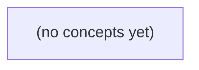

# Go 01.04：数组、切片与文本——组织本地会话消息

*面向已掌握 Go 基础控制流与函数的初学者，以虚构 IM 会话中的消息列表为线索，循序学习固定数组、动态切片、顺序遍历、共享与复制，以及 UTF-8 文本处理。读者将完成一个仅在内存中筛选、校验和预览消息的程序，并理解本地加入列表不代表消息已发送、持久化或被对端接收。*

**章节:** 2

---

## 本书导览

- 了解整本书的章节脉络
- 掌握各章之间的概念依赖关系
- 选择最合适的阅读顺序

# Go 01.04：数组、切片与文本——组织本地会话消息

面向已掌握 Go 基础控制流与函数的初学者，以虚构 IM 会话中的消息列表为线索，循序学习固定数组、动态切片、顺序遍历、共享与复制，以及 UTF-8 文本处理。读者将完成一个仅在内存中筛选、校验和预览消息的程序，并理解本地加入列表不代表消息已发送、持久化或被对端接收。

下方的概念图展示了本书 0 个核心概念以及它们之间的依赖关系；再下方是 1 个章节的入口。你可以按从上到下的顺序阅读，也可以根据自己的兴趣或先验知识选择切入点。

#### 概念图



## 章节索引

- **01.04 数组、切片与文本：组织会话消息** — 从固定数组与下标进入切片、遍历、共享与复制，再区分字节、码点和视觉字符，用有界本地消息列表与预览综合。共享机制列为第二遍深化。

## 01.04 数组、切片与文本：组织会话消息

- 一、从一条消息到固定数组
- 二、切片、长度、容量和追加
- 三、按顺序遍历、筛选与空列表
- 四、第二遍深化：共享、扩容与独立副本
- 五、字符串、UTF-8与三种长度
- 六、文本边界：校验与消息预览
- 七、综合：本地历史与OpenIM源码对照
- 八、分层练习、解析与下一步

从会话 c-a 的一条文本消息出发，学习用固定长度的数组按顺序保存多条本地消息，并准确读取、复制和检查其中的元素。

### 把多条消息看作有序集合

### 把多条消息看作有序集合

会话 `c-a` 暂时有三条本地文本消息：`"你好"`、`"收到"`、`"稍后聊"`。若分别使用三个变量保存，变量一多就难以按顺序处理。**集合**可以把多个同类型值组织在一起；集合中的每个值称为**元素**。

数组是一种长度固定的有序集合。下面的数组有 3 个字符串元素：

```go
messages := [3]string{"你好", "收到", "稍后聊"}
```

`[3]string` 表示“长度为 3、元素类型为 `string` 的数组”。元素的顺序由**下标**表示：下标是元素的位置编号。Go 从 `0` 开始计数，因此长度为 3 的数组下标依次是 `0`、`1`、`2`。

| 下标 | 元素 |
|---:|---|
| 0 | `"你好"` |
| 1 | `"收到"` |
| 2 | `"稍后聊"` |

读取元素时，在数组名后写方括号：

```go
fmt.Println(messages[0]) // 你好
fmt.Println(messages[2]) // 稍后聊
```

数组长度可由 `len(messages)` 得到，结果是 `3`。有效下标必须满足：

$$0 \le i < \operatorname{len}(messages)$$

这里是**半开区间**：包含左边界 `0`，不包含右边界 `len(messages)`。因此 `messages[3]` 不存在；若下标是变量，运行时越界会触发 `panic`。而直接写常量下标 `messages[3]`，编译器通常会在编译阶段报错。

这三条消息仅加入当前程序的内存列表，不表示消息已经发送、持久化，或被用户 `u-a`、`u-b` 收到。

### 声明固定长度的字符串数组

### 声明固定长度的字符串数组

需求：会话 `c-a` 暂时只在内存中保留 3 条本地消息。单个 `string` 变量只能保存一条文本；要按顺序保存多条同类数据，可以使用**数组**。

数组是“长度固定、元素类型相同”的集合。集合中的每一项称为**元素**；元素的位置称为**下标**。下标从 `0` 开始，因此长度为 3 的数组下标依次是 `0`、`1`、`2`。

```go
var message string = "你好"
```

上面是一个字符串变量。把“一个 `string`”扩展为“3 个 `string`”，类型写作：

```go
[3]string
```

其中 `[3]` 表示固定长度为 3，`string` 表示每个元素都是字符串。数组长度是类型的一部分：`[2]string` 与 `[3]string` 是不同类型，不能直接互相赋值。

```go
package main

import "fmt"

func main() {
	var messages [3]string

	fmt.Println(messages)
	fmt.Println(messages[0])

	previews := [3]string{"你好", "收到", "稍后聊"}
	fmt.Println(previews)
	fmt.Println(previews[2])
}
```

预期输出：

| 输出顺序 | 结果 | 原因 |
|---|---|---|
| 1 | `[  ]` | `messages` 的 3 个字符串元素都是零值 `""` |
| 2 | 空行 | `messages[0]` 是空字符串 |
| 3 | `[你好 收到 稍后聊]` | 字面量按下标 `0` 到 `2` 初始化 |
| 4 | `稍后聊` | 下标 `2` 读取第 3 个元素 |

`var messages [3]string` 中未显式赋值的元素使用元素类型的**零值**；`string` 的零值是空字符串 `""`。而 `[3]string{"你好", "收到", "稍后聊"}` 是数组字面量：在声明时依次给 3 个元素赋值。

反例：元素数量与数组长度不匹配会在编译时出错。

```go
// [3]string 只能提供 3 个初始元素
// wrong := [3]string{"你好", "收到", "稍后聊", "再见"}
```

数组适合“容量从需求上就确定”的场景，例如固定展示 3 条消息预览。此处加入数组只表示本地内存中有这些文本，不表示消息已经发送、持久化或被用户 `u-b` 收到。

### 用下标读取消息并防止越界

### 用下标读取消息并防止越界

会话 `c-a` 的本地消息列表可用数组按顺序保存。数组中的每一项称为**元素**，元素的位置称为**下标**。下标从 `0` 开始：长度为 `3` 的数组，下标依次是 `0`、`1`、`2`。

```go
package main

import "fmt"

func main() {
	messages := [3]string{"你好", "收到", "稍后聊"}

	fmt.Println(messages[0])
	fmt.Println(messages[1])
	fmt.Println(messages[2])

	i := 1
	if 0 <= i && i < len(messages) {
		fmt.Println("动态读取：", messages[i])
	}
}
```

预期输出：

| 输出顺序 | 内容 |
|---:|---|
| 1 | `你好` |
| 2 | `收到` |
| 3 | `稍后聊` |
| 4 | `动态读取： 收到` |

读取 `messages[i]` 前，应先确认动态下标 `i` 满足：

$$0 \le i < \operatorname{len}(messages)$$

追踪 `i := 1` 时：

| 检查项 | 结果 |
|---|---|
| `0 <= i`，即 `0 <= 1` | 真 |
| `i < len(messages)`，即 `1 < 3` | 真 |
| 可以读取 | `messages[1]`，结果为 `收到` |

半开区间 `[0, len(messages))` 表示“包含 `0`，不包含长度本身”。因此 `messages[3]` 不存在。

故意错误示例：

```go
fmt.Println(messages[3])
```

这里的下标 `3` 是常量，编译器已知数组长度为 `3`，会报告编译错误。若 `i` 是运行时得到的动态值，且实际为 `3` 或更大，程序会发生 `panic`；若 `i` 小于 `0`，同样会发生 `panic`。因此，来自用户选择、循环计算等动态下标都应先检查范围。

### 数组赋值会复制全部元素

### 数组赋值会复制全部元素

需求是：会话 `c-a` 需要保留 3 条本地消息；把这份列表交给另一个变量后，修改新变量中的预览文本，不应改动原列表。

先回顾 `int` 的赋值：`b = a` 会把 `a` 当前保存的数值复制给 `b`。之后修改 `b`，不会影响 `a`。

数组也遵循“复制值”的规则。数组赋值会按元素位置复制全部元素：第 0 个元素复制到第 0 个位置，第 1 个元素复制到第 1 个位置，依此类推。

```go
package main

import "fmt"

func main() {
	a := 3
	b := a
	b = 9
	fmt.Println(a, b)

	messages := [3]string{"你好", "收到", "稍后聊"}
	preview := messages
	preview[1] = "已读"

	fmt.Println(messages[1])
	fmt.Println(preview[1])
}
```

预期输出：

| 输出顺序 | 内容 | 说明 |
|---|---|---|
| 1 | `3 9` | 修改 `b` 不影响 `a` |
| 2 | `收到` | 原数组第 1 条未改变 |
| 3 | `已读` | 副本数组第 1 条已改变 |

这里 `messages` 与 `preview` 是两个不同的数组值；赋值时复制了 3 个 `string` 元素。

注意：字符串本身不能按下标修改，例如下面会编译错误：

```go
messages[0][0] = '你'
```

这表示不能修改一个字符串值中的单个字节；它**不表示**数组赋值时会重新复制每条文本的全部字节。数组复制的是各个 `string` 值，Go 不要求你把“复制数组元素”误解为“手工复制每条消息的全部文本内容”。

### 为固定容量的消息槽选择数组

### 为固定容量的消息槽选择数组

会话 `c-a` 若只需要预留 **3 个固定消息槽**，可用数组保存消息。集合是多个同类型值按顺序组成的数据；其中每个值是元素。元素位置用下标表示，且从 `0` 开始：长度为 `3` 的数组，下标只能是 `0`、`1`、`2`。区间 `[0, 3)` 称为半开区间，包含 `0`，不包含 `3`。

```go
package main

import "fmt"

func main() {
	var messages [3]string
	messages[0] = "你好"

	preset := [3]string{"你好", "收到", "稍后聊"}

	copyOfPreset := preset
	copyOfPreset[1] = "已读"

	fmt.Println(messages[0])
	fmt.Println(preset[1])
	fmt.Println(copyOfPreset[1])
	fmt.Println(preset[1])
}
```

预期输出如下：

| 输出顺序 | 内容 | 原因 |
|---|---|---|
| 1 | `你好` | 写入第 `0` 个槽 |
| 2 | `收到` | `preset` 的第 `1` 项 |
| 3 | `已读` | 修改的是副本 |
| 4 | `收到` | 原数组未改变 |

`var messages [3]string` 创建长度固定为 `3` 的字符串数组；未赋值的字符串元素为零值 `""`。`[3]string{"你好", "收到", "稍后聊"}` 是数组字面量。

先前的 `int` 赋值会复制数值；数组赋值也会逐元素复制。因此修改 `copyOfPreset` 不会改动 `preset`。字符串值本身不能修改，但“复制数组”不等于逐字节手工复制每段文本；这里应关注数组元素彼此独立。

数组长度属于类型的一部分：`[2]string` 与 `[3]string` 是不同类型，不能直接互相赋值。读取动态下标前必须满足 `0 <= i && i < len(preset)`；否则程序运行时会发生 `panic`。而 `preset[3]` 这类常量下标，编译器已知必定越界，会直接报编译错误。

数组适合容量确实固定的槽位；它不能增加元素。把文本加入这个本地数组，只表示本程序内存中暂存或预览，**不表示已发送、已持久化，也不表示用户 `u-b` 已收到消息**。

> **要点** — 数组以固定长度和从零开始的下标组织同类型元素；读取须不越界，赋值会复制全部元素。

会话消息需要按加入顺序临时保存，并随新消息增长。本节用切片建立有界的本地消息列表，理解长度、容量、索引、切取与追加的规则。

### 从固定数组到可增长切片

### 从固定数组到可增长切片

**需求**：会话 `c-a` 先有三条本地预设消息，之后还可能加入 `u-a`、`u-b` 的新文本。这里的“加入”只表示存入当前程序内存，不表示已发送、持久化或被对端接收。

数组的类型写作 `[长度]元素类型`。`[3]string` 表示**恰好**容纳 3 个字符串的数组；长度属于类型的一部分，因此 `[3]string` 与 `[4]string` 是不同类型。

切片的类型写作 `[]元素类型`。`[]string` 表示字符串序列，长度可随追加而变化。切片会引用一段底层数组；`len` 是当前可用、可索引的元素数，`cap` 是从切片当前起点到该底层数组末尾可达到的容量。

```go
package main

import "fmt"

func main() {
	preset := [3]string{"u-a：你好", "u-b：在吗", "u-a：在"}
	messages := []string{"u-a：你好", "u-b：在吗", "u-a：在"}

	fmt.Println(preset, len(preset))   // 预期：[u-a：你好 u-b：在吗 u-a：在] 3
	fmt.Println(messages, len(messages), cap(messages))

	messages = append(messages, "u-b：在，请说")
	fmt.Println(messages) // 预期：[u-a：你好 u-b：在吗 u-a：在 u-b：在，请说]
}
```

| 时刻 | `messages` 内容数 | `len(messages)` | 能用索引 |
|---|---:|---:|---|
| 创建后 | 3 | 3 | `0`、`1`、`2` |
| 追加后 | 4 | 4 | `0`、`1`、`2`、`3` |

数组适合数量确定的固定槽位；会话消息数量未知，应优先使用切片。`append` 会返回**新的切片值**，因此必须接收返回结果；底层数组是否扩容、容量变为多少，不应依赖或猜测。

```go
// main 内：故意错误，数组不能追加
preset = append(preset, "u-b：在，请说")
```

若已知最多先放 4 条，可显式预分配：

```go
// main 内
queue := make([]string, 2, 4) // len=2，两个元素已存在，值都是 ""
queue[0] = "u-a：你好"
queue[1] = "u-b：在吗"
queue = append(queue, "u-a：好的")
```

`make([]string, 0, 4)` 则长度为 0，只能先 `append`，不能写 `s[0]`。切片还能用 `s[low:high]` 取得从 `low` 到 `high-1` 的消息预览；`high` 可不超过 `cap`，但索引访问始终必须小于 `len`，避免意外读出额外的空元素。

### 用字面量和 make 创建消息槽位

### 用字面量和 `make` 创建消息槽位

需求是：在内存中按顺序暂存会话 `c-a` 的消息文本。这里的“暂存”只表示本地列表发生变化，不表示消息已经发送、持久化或被用户 `u-b` 收到。

切片是可变长度的同类型元素序列，类型写作 `[]元素类型`。例如 `[]string` 表示“字符串切片”；`[3]string` 则表示“恰好有 3 个字符串的数组”。数组长度属于类型的一部分，不能随意增长；消息数量会变化，因此通常选用切片。

先从已有消息直接创建：

```go
// main 内
messages := []string{"u-a：你好", "u-b：收到"}
```

这叫**切片字面量**：`[]string{...}` 中花括号内的每个字符串按顺序成为元素。

| 表达式 | `len` | `cap` | 可索引位置 |
|---|---:|---:|---|
| `messages` | 2 | 2 | `0`、`1` |
| `messages[0]` | — | — | `"u-a：你好"` |
| `messages[1]` | — | — | `"u-b：收到"` |

`len` 是当前长度，即当前允许用索引读取或赋值的元素个数。`cap` 是容量，即从切片当前起点到其底层数组末尾可容纳的最大元素数；本例不需要依赖其具体值。

若希望预留消息槽位，可使用 `make`：

```go
package main

import "fmt"

func main() {
	slots := make([]string, 2, 4)
	fmt.Println(len(slots), cap(slots))
	fmt.Println(slots[0], slots[1])
}
```

预期输出：

```text
2 4
 
```

`make([]string, 2, 4)` 的三个部分依次是：元素类型 `string`、长度 `2`、容量 `4`。长度为 2 表示两个元素已经存在，且都取字符串零值 `""`（空字符串）；容量 4 表示可在不必关心内部扩容细节的前提下，预留最多 4 个位置。

反例：把“容量”误当成可索引范围。

```go
slots := make([]string, 0, 4)
slots[0] = "u-a：你好" // 错误：当前 len 为 0
```

虽然容量是 4，但 `slots` 当前没有元素，索引必须始终小于 `len(slots)`。此时应在下一步用 `append` 添加消息。`nil` 切片与空切片的区别将在下一节进一步说明。

### 长度决定索引，容量决定可扩展范围

### 长度决定索引，容量决定可扩展范围

需求：为会话 `c-a` 暂存消息文本。列表会增长，但当前能读取或赋值的位置必须明确。

切片可写作 `[]string`，表示“元素类型为 `string` 的可变长序列”；数组如 `[3]string` 则表示“恰好有 3 个 `string` 元素”的固定长度序列。这里优先使用切片：

```go
// main 内
messages := []string{"你好", "我在线"}
```

`len(messages)` 是**当前长度**：也就是当前可按索引访问的元素数量。索引从 `0` 开始，因此合法索引范围是 `0` 到 `len(messages)-1`。

`cap(messages)` 是**容量**：从切片当前起点到其底层数组末尾，最多还能容纳的元素数量。容量不是当前可索引范围；无论容量多大，直接索引都必须小于长度。

```go
package main

import "fmt"

func main() {
	slots := make([]string, 2, 4)
	slots[0] = "u-a：你好"
	slots[1] = "u-b：收到"

	fmt.Println(len(slots), cap(slots))
	fmt.Println(slots)
}
```

预期输出：

```text
2 4
[u-a：你好 u-b：收到]
```

槽位追踪如下：

| 槽位 | `0` | `1` | `2` | `3` |
|---|---|---|---|---|
| 当前内容 | `u-a：你好` | `u-b：收到` | 预留 | 预留 |
| 能否用 `slots[i]` 读取/赋值 | 能 | 能 | 不能 | 不能 |

`make([]string, 2, 4)` 中，`2` 是长度，两个元素已经存在，初值都是字符串零值 `""`；`4` 是容量，表示预留了额外空间。

反例：长度为 `0` 时，没有任何可索引元素。

```go
// main 内
messages := make([]string, 0, 4)
messages[0] = "u-a：这会出错"
```

运行会发生“索引越界”错误。此时应通过 `append` 增加元素；`nil` 切片与空切片的区别将在下一节说明。

### 追加消息必须接收新切片

### 追加消息必须接收新切片

需求是按加入顺序生成会话 `c-a` 的本地消息预览。`append` 用于向切片尾部追加元素；它会返回**新的切片值**，因此必须接收返回值：`消息 = append(消息, 新内容)`。这只是本地内存列表变化，不表示消息已发送、已持久化或已被用户 `u-b` 收到。

下面是完整程序。`make([]string, 0, 5)` 创建长度为 `0`、容量为 `5` 的切片；预留容量足够容纳示例中的五条消息。

`package main`  
`import "fmt"`  
`func main() {`  
`    messages := make([]string, 0, 5)`  
`    messages = append(messages, "u-a：你好")`  
`    messages = append(messages, "u-b：你好，我在线", "u-a：请查看预览")`  
`    more := []string{"u-b：已查看", "u-a：谢谢"}`  
`    messages = append(messages, more...)`  
`    fmt.Println(messages)`  
`}`

预期输出（未运行）：

`[u-a：你好 u-b：你好，我在线 u-a：请查看预览 u-b：已查看 u-a：谢谢]`

追踪追加过程：

| 操作 | `len(messages)` | 本地预览内容 |
|---|---:|---|
| 创建后 | 0 | `[]` |
| 追加一条 | 1 | `u-a：你好` |
| 一次追加两条 | 3 | 加入两条新文本 |
| `more...` 追加 | 5 | 逐个加入 `more` 中的元素 |

`append(messages, "甲", "乙")` 的逗号分隔参数表示追加多个字符串。`more...` 中的 `...` 表示把切片 `more` 展开为多个字符串参数；没有它，`more` 是一个切片，不能当作单个 `string` 追加。

反例：`append(messages, "u-a：漏接收")` 虽可调用，却没有把返回的新切片赋回 `messages`；后续使用 `messages` 时，不应依赖这条消息存在。始终写成 `messages = append(messages, ...)`。

### 切取预览窗口与避免越界误用

### 切取预览窗口与避免越界误用

需求：会话 `c-a` 的本地消息按加入顺序保存，只显示最近两条作为预览；这只是内存列表，不表示消息已发送或对端已收到。

切片表达式 `s[low:high]` 从切片 `s` 中取出一个新窗口：包含下标 `low`，不包含下标 `high`。因此窗口长度是 `high-low`。索引单个元素时必须满足 `0 <= i < len(s)`；切取时 `high` 可以到 `cap(s)`，但这不意味着应读取超出当前长度的元素。

```go
package main

import "fmt"

func main() {
	messages := make([]string, 3, 5)
	messages[0] = "u-a：早上好"
	messages[1] = "u-b：收到"
	messages[2] = "u-a：下午开会"

	preview := messages[1:3]
	fmt.Println(preview) // 预期：[u-b：收到 u-a：下午开会]
}
```

追踪 `messages[1:3]`：

| 名称 | `len` | `cap` | 可见元素 |
|---|---:|---:|---|
| `messages` | 3 | 5 | 下标 `0`、`1`、`2` |
| `preview` | 2 | 4 | 原下标 `1`、`2` |

`preview` 从原下标 `1` 开始，所以它到原底层数组末尾还有 4 个位置；但当前只有 2 个可索引元素。业务代码应把预览上界限制在 `len(messages)` 内，避免把尚未加入的空位置当作消息展示。

常见错误与反馈：

```go
fmt.Println(messages[3])
```

运行时错误：下标 `3` 不满足 `3 < len(messages)`。

```go
preview := messages[1:5]
fmt.Println(preview)
```

虽然切取上界 `5` 不超过容量，代码可以运行，但预览会包含两个空字符串；这通常不是“最近消息”。应写为 `messages[1:len(messages)]`，或在已知只有三条消息时写 `messages[1:3]`。

> **要点** — 切片以 len 管理当前可用元素、以 cap 预留扩展空间；追加和切取都必须遵守边界，并接收 append 的返回值。

本节用本地会话消息列表练习顺序遍历、空列表处理与筛选；重点分清“读取元素副本”和“按索引修改列表”。

### 需求：按加入顺序查看消息

### 需求：按加入顺序查看消息

会话 `c-a` 在本地内存中保存了用户 `u-a`、`u-b` 加入的消息文本。现在需要按“加入列表的先后”逐条生成预览：

```go
package main

import "fmt"

func main() {
	messages := []string{
		"u-a：你好",
		"u-b：你好，今天开会吗？",
		"u-a：下午三点。",
	}

	for i := 0; i < len(messages); i++ {
		fmt.Println(i, messages[i])
	}
}
```

预期输出（未运行）：

```text
0 u-a：你好
1 u-b：你好，今天开会吗？
2 u-a：下午三点。
```

这里 `i` 是索引，取值依次为 `0`、`1`、`2`；`messages[i]` 表示索引 `i` 处的元素。三段式 `for` 适合需要自行控制起点、终点或步长的情况，但“从头到尾读取切片”很常见，Go 提供了更直接的 `range`。

`range messages` 会依次产生两个结果：第一个是索引，第二个是该位置元素值的副本。可改写为：

```go
package main

import "fmt"

func main() {
	messages := []string{"u-a：你好", "u-b：下午三点。"}

	for i, body := range messages {
		fmt.Println(i, body)
	}
}
```

| 本轮 | `i` | `body` |
|---:|---:|---|
| 1 | 0 | `u-a：你好` |
| 2 | 1 | `u-b：下午三点。` |

若索引不参与预览，可用空白标识符 `_` 忽略它：

```go
for _, body := range messages {
	fmt.Println(body)
}
```

本地切片中的顺序只表示当前程序的加入顺序；它不表示网络中的全局时间顺序，也不意味着消息已经发送、持久化或被对端收到。

### 定义：range 的索引、值与忽略项

### 定义：`range` 的索引、值与忽略项

需求：会话 `c-a` 在内存中有按加入顺序排列的消息文本，需要逐条生成预览。

对切片 `messages` 使用 `range`，可以依次取得每个位置及其元素：

```go
// main 内；已声明 messages
for i, body := range messages {
    fmt.Println(i, body)
}
```

这里 `i` 是索引，即元素在切片中的位置，类型为整数；切片第一个元素的索引是 `0`。`body` 是该位置元素的值副本。若 `messages` 的类型是 `[]string`，则 `body` 的类型是 `string`。

| 本轮 | `i` | `body` | `messages[i]` |
|---|---:|---|---|
| 1 | 0 | `你好` | `你好` |
| 2 | 1 | `下午见` | `下午见` |

例如：

```go
package main

import "fmt"

func main() {
    messages := []string{"你好", "下午见"}

    for i, body := range messages {
        fmt.Println("预览", i, "：", body)
    }
}
```

预期输出（未运行）：

```text
预览 0 ： 你好
预览 1 ： 下午见
```

若只关心消息文本，不关心位置，使用空白标识符 `_` 忽略索引：

```go
for _, body := range messages {
    fmt.Println(body)
}
```

若只需检查有哪些位置，而不读取文本，可忽略元素值：

```go
for i := range messages {
    fmt.Println("第", i, "条消息")
}
```

反例：`body` 是值副本，给它赋值不会修改列表。

```go
for _, body := range messages {
    body = "已处理"
}
fmt.Println(messages)
```

预期结果仍是：

```text
[你好 下午见]
```

要修改原列表，必须通过索引写回：

```go
for i, body := range messages {
    if body == "" {
        messages[i] = "（空消息）"
    }
}
```

因此，`range` 适合顺序读取；需要改变某个已有元素时，保留索引 `i`，并使用 `messages[i]`。这里的顺序只是本地切片加入顺序，不代表消息在网络中的全局先后顺序。

### 反例：改副本不等于改列表

### 反例：改副本不等于改列表

需求：审核本地会话 `c-a` 的消息预览，把空文本显示为“（空消息）”。先要分清：`range` 交给我们的 `body` 是元素值的副本，不是列表中该位置本身。

```go
package main

import "fmt"

func main() {
	messages := []string{"你好", "", "稍后回复"}

	for i, body := range messages {
		if body == "" {
			body = "（空消息）"
		}
		fmt.Println(i, body)
	}

	fmt.Println("列表：", messages)
}
```

预期输出（未运行）：

```text
0 你好
1 （空消息）
2 稍后回复
列表： [你好  稍后回复]
```

`for i, body := range messages` 中：

- `i` 是索引，依次为 `0`、`1`、`2`。
- `body` 是当前位置元素值的副本。
- 给 `body` 重新赋值，只改变本轮循环中这个副本；`messages` 内原元素不变。

若需求改为“确实替换本地列表中的空消息”，必须通过索引写回：

```go
package main

import "fmt"

func main() {
	messages := []string{"你好", "", "稍后回复"}

	for i, body := range messages {
		if body == "" {
			messages[i] = "（空消息）"
		}
	}

	fmt.Println("列表：", messages)
}
```

预期输出（未运行）：

```text
列表： [你好 （空消息） 稍后回复]
```

| 循环位置 | `body` 初始值 | 执行 `body = "（空消息）"` 后 | `messages[i]` |
|---|---|---|---|
| `i = 1` | `""` | `"（空消息）"` | 仍为 `""` |
| `i = 1`，改用 `messages[i] = ...` | `""` | `body` 不重要 | `"（空消息）"` |

这里的修改只发生在当前程序内存中的列表；它不表示消息已发送、已持久化，也不表示用户 `u-b` 已收到。

### 应用：筛选非空消息生成预览

### 应用：筛选非空消息生成预览

需求：会话 `c-a` 的本地消息列表可能含有空文本。预览应保留 `u-a`、`u-b` 加入消息的原有顺序，但跳过空字符串。这里的“顺序”只是当前程序内切片的顺序，不表示网络中的全局消息先后。

`[]string` 表示“元素类型为 `string` 的切片”。函数参数 `input []string` 表示函数接收一个字符串切片。`make([]string, 0, len(input))` 创建长度为 `0`、容量为 `len(input)` 的结果切片；容量预留足以容纳全部输入，通常可减少追加时的扩容。`append(result, body)` 返回追加后的切片，必须接回变量。

完整程序（未运行）：

`package main; import "fmt"; func nonEmptyPreview(input []string) []string { result := make([]string, 0, len(input)); for i, body := range input { if body == "" { continue }; result = append(result, body); fmt.Println("保留索引", i, "文本", body) }; return result }; func main() { messages := []string{"你好", "", "晚些回复"}; preview := nonEmptyPreview(messages); fmt.Println("预览：", preview) }`

预期输出包含：

`保留索引 0 文本 你好`  
`保留索引 2 文本 晚些回复`  
`预览： [你好 晚些回复]`

遍历过程如下：

| 本轮 `i` | `body`（元素值副本） | 是否追加到 `result` | `result` |
|---:|---|---|---|
| 0 | `"你好"` | 是 | `["你好"]` |
| 1 | `""` | 否 | `["你好"]` |
| 2 | `"晚些回复"` | 是 | `["你好", "晚些回复"]` |

`range` 开始时会先确定本轮要遍历的范围。即使在循环体中对 `input` 追加新消息，新元素也不会自动被这一轮 `range` 访问；筛选时应写入新的 `result`，不建议一边遍历一边删除原列表元素。

空切片也可安全遍历和追加：`var msgs []string` 是 `nil` 切片；`msgs := []string{}` 与 `msgs := make([]string, 0)` 是非 `nil` 空切片。三者的 `len` 和 `cap` 都可为 `0`，都能 `range`、`append`。切片只能与 `nil` 比较，不能写 `a == b` 比较两个切片。

### 反馈：空切片与遍历边界

### 反馈：空切片与遍历边界

需求是为会话 `c-a` 准备一份本地消息列表，即使当前没有消息，也应能安全遍历和追加。

`nil` 切片是尚未指向底层数组的切片；空切片则是长度为 `0` 的切片。它们都能用于 `len`、`cap`、`range` 和 `append`，但只有 `nil` 切片能与 `nil` 比较为真。

```go
package main

import "fmt"

func main() {
	var msgsNil []string       // nil 切片
	msgsLiteral := []string{}  // 空字面量
	msgsMake := make([]string, 0) // make 创建的空切片

	fmt.Println(len(msgsNil), cap(msgsNil), msgsNil == nil)
	fmt.Println(len(msgsLiteral), cap(msgsLiteral), msgsLiteral == nil)
	fmt.Println(len(msgsMake), cap(msgsMake), msgsMake == nil)

	for i, body := range msgsNil {
		fmt.Println(i, body) // 本轮不会执行
	}

	msgsNil = append(msgsNil, "u-a：你好")
	fmt.Println(msgsNil)
}
```

预期输出：

```text
0 0 true
0 0 false
0 0 false
[u-a：你好]
```

| 列表状态 | `len` | `cap` | `range` 次数 | 可否 `append` |
|---|---:|---:|---:|---|
| `var msgs []string` | 0 | 0 | 0 | 可以 |
| `[]string{}` | 0 | 0 | 0 | 可以 |
| `make([]string, 0)` | 0 | 0 | 0 | 可以 |

反例：切片不能彼此用 `==` 比较，下面代码会编译失败：

```go
// []string{} == make([]string, 0)
```

空列表没有消息可读，`range` 自然不进入循环；这不是错误。追加到本地列表只表示程序内存中新增了一条记录，不表示消息已经发送、保存或被 `u-b` 收到。

> **要点** — range 按当前顺序读取元素副本；筛选应新建结果切片，修改原列表必须使用索引。

本节从同一份消息列表的多个视图出发，理解切片共享、扩容与独立副本的边界。

### 同一底层数组的多个视图

### 同一底层数组的多个视图

**需求**：会话 `c-a` 暂存两条消息，并分别查看“全部消息”和“第一条消息”。这两个列表可能不是两份数据，而是同一组消息格子的不同视图。

**定义**：底层数组是一段连续的元素位置；切片是对其中一段位置的描述。一个切片值可理解为：

- **起点**：从底层数组的哪个位置开始；
- **长度** `len`：当前可直接访问的元素个数；
- **容量** `cap`：从起点到可用末尾最多还能容纳的位置数。

本节先建立直觉，**不使用** `&` 或 `*` 语法。

```go
// main 内；依赖 import "fmt"
base := make([]string, 2, 4)
base[0] = "u-a：你好"
base[1] = "u-b：在吗"

first := base[:1]

fmt.Println(base)
fmt.Println(first)
```

预期：

```text
[u-a：你好 u-b：在吗]
[u-a：你好]
```

可以把底层数组想成四个格子：

| 底层位置 | 0 | 1 | 2 | 3 |
|---|---|---|---|---|
| 内容 | `u-a：你好` | `u-b：在吗` | 空 | 空 |
| `base` 可见 | ✓ | ✓ |  |  |
| `first` 可见 | ✓ |  |  |  |

此时 `base` 的 `len` 为 2、`cap` 为 4；`first` 的 `len` 为 1、`cap` 仍为 4，因为它从位置 0 开始，后面还有三个可用格子。

切片赋值复制的是这份“视图描述”，不是复制消息元素。因此修改共享位置会彼此可见：

```go
// main 内
first[0] = "u-a：你好，c-a"
fmt.Println(base[0])
```

预期：

```text
u-a：你好，c-a
```

**反例**：不要把 `first` 当成独立消息列表。它只是同一底层数组上的较短视图；要获得独立列表，需要后续使用 `copy` 创建新元素位置。

### 切片赋值与追加的写入范围

### 切片赋值与追加的写入范围

**需求：**会话 `c-a` 在内存中暂存两条消息，并取出“第一条消息的视图”。随后向该视图追加一条预览文本。这个追加会不会影响原列表？

切片可以先理解为“指向一段连续格子范围的描述”，其中记录：

- **起点**：从底层数组的哪个位置开始看；
- **长度**`len`：当前可直接访问多少个元素；
- **容量**`cap`：从起点开始，最多还能使用多少个位置。

本节只建立这种共享直觉，**不使用** `&` 或 `*` 语法。

```text
底层数组：
位置       0        1        2        3
内容    "u-a:早"  "u-b:好"   空       空

base：起点 0，len=2，cap=4
view：起点 0，len=1，cap=4
```

切片赋值 `view := base[:1]` 复制的是这份“范围描述”，不是复制消息文本或底层格子。因此，`base` 与 `view` 会看到部分相同的位置。

```go
package main

import "fmt"

func main() {
	base := make([]string, 2, 4)
	base[0] = "u-a:早"
	base[1] = "u-b:好"

	view := base[:1]
	view = append(view, "预览:已读")

	fmt.Println("base:", base)
	fmt.Println("view:", view)
	fmt.Println("base长度:", len(base), "view长度:", len(view))
}
```

预期输出（未运行）：

```text
base: [u-a:早 预览:已读]
view: [u-a:早 预览:已读]
base长度: 2 view长度: 2
```

追加前 `view` 的长度为 1，但容量为 4，说明其后还有可写格子。`append` 因而把新元素写入底层数组的位置 1；而位置 1 原先正是 `base[1]`，所以原消息被改写。

| 操作 | `base` 的可见内容 | `view` 的可见内容 | 关键变化 |
|---|---|---|---|
| 初始化 | `[u-a:早 u-b:好]` | — | `base len=2 cap=4` |
| `view := base[:1]` | `[u-a:早 u-b:好]` | `[u-a:早]` | 共享位置 0、1… |
| `append(view, "预览:已读")` | `[u-a:早 预览:已读]` | `[u-a:早 预览:已读]` | 写入共享的位置 1 |

反例是把 `view = base` 误解成“复制消息列表”。它只复制切片描述；只要追加仍未超过容量，写入就可能影响共享位置。因此，给会话列表制作预览视图时，不能仅凭切片赋值就认为两份列表彼此独立。

### 扩容后的新数组与旧视图

### 扩容后的新数组与旧视图

**需求：**会话 `c-a` 已有两条本地消息。预览视图只看第一条；当完整列表容量已满，再追加一条时，旧预览不应自动变长。

切片可以先理解为一张“说明卡”：它记录底层数组的**起点**、当前长度 `len` 与可用容量 `cap`。多个切片可能指向同一排格子；但当追加时容量不足，`append` 必须准备一排新的格子，并返回描述新数组的新切片。

```go
package main

import "fmt"

func main() {
	base := make([]string, 2, 2)
	base[0] = "u-a：你好"
	base[1] = "u-b：在吗"

	view := base[:1] // 旧视图：只看第 0 格

	updated := append(base, "u-a：我在")
	updated[0] = "u-a：你好，已更新"

	fmt.Println("旧列表：", base)
	fmt.Println("旧视图：", view)
	fmt.Println("新列表：", updated)
	fmt.Println("容量：", cap(base), cap(updated))
}
```

预期输出（容量具体数值可能因实现而不同）：

```text
旧列表： [u-a：你好 u-b：在吗]
旧视图： [u-a：你好]
新列表： [u-a：你好，已更新 u-b：在吗 u-a：我在]
容量： 2 大于或等于 3
```

追踪如下：

| 时刻 | `base` 所在数组 | `view` 所在数组 | `updated` 所在数组 |
|---|---|---|---|
| `append` 前 | 旧数组 | 旧数组 | 尚无 |
| 容量满后追加 | 旧数组不变 | 仍看旧数组 | 新数组 |
| 修改 `updated[0]` | 不受影响 | 不受影响 | 被修改 |

因此，旧视图不是“自动观察最新列表”的对象；它仍描述旧数组。切片赋值复制的是这张说明卡，而不是复制全部元素。这里没有使用 `&` 或 `*` 语法，也不能据此说 Go“按引用传参”：函数调用仍是值传递，只是切片值可能描述同一底层数组。

### 函数调用中的共享与返回值

### 函数调用中的共享与返回值

需求：为会话 `c-a` 在内存中加入一条预览消息，并理解“函数里改到了什么”。

切片值可看作一份描述：它记录底层数组的起点、长度 `len` 和容量 `cap`。调用函数时，Go 仍然是**值传递**：传入的是这份切片描述的副本，不是“按引用传参”。但两个描述可能指向同一批元素，因此修改已有元素会被调用方看见。

```go
package main

import "fmt"

func 标记首条为已读(消息 []string) {
	if len(消息) > 0 {
		消息[0] = "已读：" + 消息[0]
	}
}

func 加入预览(消息 []string, 文本 string) []string {
	消息 = append(消息, 文本)
	return 消息
}

func main() {
	消息 := []string{"u-a：你好"}

	标记首条为已读(消息)
	fmt.Println(消息) // 预期：[已读：u-a：你好]

	加入预览(消息, "u-b：收到")
	fmt.Println(消息) // 预期：[已读：u-a：你好]

	消息 = 加入预览(消息, "u-b：收到")
	fmt.Println(消息) // 预期：[已读：u-a：你好 u-b：收到]
}
```

追踪如下：

| 步骤 | 调用方 `消息` 长度 | 函数内长度 | 调用方是否得到新长度 |
|---|---:|---:|---|
| 调用前 | 1 | — | — |
| `append` 后 | 1 | 2 | 否 |
| 接收返回值后 | 2 | — | 是 |

反例：只调用 `加入预览(...)` 而不接收返回值，调用方切片的 `len` 仍为 1。即使追加恰好写进原底层数组的空位，调用方也不能用原长度访问那条新消息；若扩容，函数内更会改用新底层数组。结论是：**改已有元素可见；需要更新长度或底层数组时，必须返回并接收切片。**

### 复制列表与预览的业务选择

### 复制列表与预览的业务选择

需求：会话 `c-a` 在本地维护消息列表，给用户 `u-a` 显示最近预览。这里“加入列表”只表示本地内存变化，不表示已发送、已持久化或 `u-b` 已收到。

切片可以看作一张“使用说明”：它记录底层数组的起点、长度 `len` 与容量 `cap`。本节只用这个直觉，不使用 `&` 或 `*` 语法。

```text
base: [u-a:你好][u-b:在吗][空][空]
        0          1       2    3
view:  从 0 开始，len=1，cap=4 ────────→ 使用同一排格子
```

```go
package main

func main() {
	base := make([]string, 2, 4)
	base[0] = "u-a:你好"
	base[1] = "u-b:在吗"

	view := base[:1]
	view = append(view, "u-a:替换") // 容量够，写入第 1 格
	// 此时 base[1] 也是 "u-a:替换"

	direct := base[:1] // 直接小切片：仍共享底层格子

	limited := base[:len(base):len(base)]
	limited = append(limited, "本地预览标记")
	// limited 容量已满，追加必定使用新底层数组；
	// 但追加前已有的元素仍与 base 共享。

	preview := make([]string, len(direct))
	copy(preview, direct) // 独立的列表格子

	_ = limited
	_ = preview
}
```

| 操作 | 新旧列表元素是否共享 | 适合场景 |
|---|---|---|
| `base[:1]` | 共享 | 只读、短暂查看 |
| `s[:len(s):len(s)]` | 现有元素共享；后续追加脱离 | 禁止预览追加覆盖原列表 |
| `make` 加 `copy` | 列表格子不共享 | 需要长期保存独立预览 |

`copy` 只复制 `min(len(dst), len(src))` 个元素，不会扩容。因此：

```go
dst := make([]string, 0, 3)
n := copy(dst, base) // n 为 0：dst 的长度是 0
```

应先创建目标长度，如 `make([]string, 2)`。直接取很小的子切片可能让整个大底层数组继续被保留；复制出较小预览可减少这种保留，但不保证立即垃圾回收。复制后的 `string` 元素也不等于复制文本字节；字符串文本不可修改，底层文本存储仍可能共享。

> **要点** — 切片值可复制而元素可共享；是否扩容决定追加是否脱离，独立列表应显式复制。

消息预览看似只是在截取文本，却会因中文、表情和组合字符暴露“长度”的不同含义。本节建立可靠的 Go 文本处理边界。

### 从消息预览需求认识三种长度

### 从消息预览需求认识三种长度

会话 `c-a` 中，用户 `u-a` 发来文本 `s := "A你🙂"`。若预览规则是“最多显示前 2 个字符”，不能只写 `s[:2]`：字符串切片按**字节**切，不理解中文和表情。

字符串是不可修改的任意字节序列，不保证一定是合法 UTF-8。UTF-8 将 Unicode 码点编码为 1～4 个字节；`byte` 是 `uint8`，`rune` 是 `int32`，表示一个码点，但不等于一个视觉字符。

| 文本 | 字节数 `len` | 码点数 | 常见视觉效果 |
|---|---:|---:|---|
| `"A你🙂"` | 8 | 3 | 3 个显示单位，宽度不等 |
| `"e\u0301"` | 3 | 2 | 常显示为 `é` |
| `"é"` | 2 | 1 | 常显示为 `é` |

`len(s)` 返回字节数，因此 `len("A你🙂") == 8`。`range` 会按 UTF-8 解码，返回每个码点的**起始字节偏移**和码点：

```go
package main

import (
	"fmt"
	"unicode/utf8"
)

func main() {
	s := "A你🙂"

	fmt.Println(len(s))
	fmt.Println(utf8.ValidString(s))
	fmt.Println(utf8.RuneCountInString(s))

	for i, r := range s {
		fmt.Printf("%d %U %c\n", i, r, r)
	}
}
```

预期输出：

```text
8
true
3
0 U+0041 A
1 U+4F60 你
4 U+1F642 🙂
```

这里 `%U` 输出码点编号，`%c` 输出对应字符。偏移为 `0、1、4`，说明“你”占 3 字节，“🙂”占 4 字节。

若要修改文本内容，可转换为可改的片段值：`b := []byte(s)` 操作原始字节，`rs := []rune(s)` 操作解码后的码点；再用 `string(b)` 或 `string(rs)` 转回字符串，原来的 `s` 不变。转换不应被假定为所有实现中都必然分配。

反例：`s[:2]` 得到 `A` 加上“你”的第一个字节，通常不是合法 UTF-8。预览按码点截取前，应先用 `utf8.ValidString(s)` 检查；`utf8.RuneCountInString(s)` 统计的是码点，不是视觉字符。旗帜、带 ZWJ 的表情等可能由多个码点显示为一组，组合字符也不会自动规范化，因此严格的“视觉字符数”或显示列宽需要额外规则。

### string、UTF-8、byte 与 rune

### string、UTF-8、byte 与 rune

需求：会话 `c-a` 的预览文本可能含中文和表情，不能把“长度”简单理解为字符数。

`string` 是**不可修改的任意字节序列**：它可以保存合法文本，也可以保存不合法的 UTF-8 字节。UTF-8 是把 Unicode 码点编码为 1～4 个字节的规则。`byte` 是 `uint8` 的别名，表示一个字节；`rune` 是 `int32` 的别名，通常存放一个 Unicode 码点，但不等于一个视觉字符。

设 `s := "A你🙂"`：

| 内容 | UTF-8 字节数 | `range` 的字节偏移 |
|---|---:|---|
| `A` | 1 | 0 |
| `你` | 3 | 1 |
| `🙂` | 4 | 4 |

因此 `len(s)` 为 `8`，因为 `len` 计数字节。`main` 内可写：`for i, r := range s { fmt.Printf("%d %U %c\n", i, r, r) }`；依赖 `import "fmt"`。其中 `%U` 输出码点形式，`%c` 输出对应文本。

`[]byte(s)` 得到可改的字节切片，`[]rune(s)` 按 UTF-8 解码为码点切片；再转换为 `string` 会得到新文本，原 `s` 不变。不要直接按字节截取中文，否则可能切断编码。

反例：`"e\u0301"` 有 3 字节、2 个码点，`"é"` 有 2 字节、1 个码点；显示常近似，但 Go 不会自动规范化。旗帜和连字表情也可能由多个码点显示为一组。需要码点数时用 `utf8.RuneCountInString(s)`；处理外部文本前先用 `utf8.ValidString(s)` 检查是否为有效 UTF-8。

### 追踪 A你🙂 的字节偏移与码点

### 追踪 `A你🙂` 的字节偏移与码点

需求：会话 `c-a` 要显示消息预览。预览文本可能同时含英文、中文和表情，因此先区分“字节长度”与“码点位置”。

`string` 是不可修改的任意字节序列；它通常存放 UTF-8 文本，但不保证内容一定是合法 UTF-8。UTF-8 会把一个 Unicode 码点编码为 1～4 个字节。`byte` 是 `uint8` 的别名，表示一个字节；`rune` 是 `int32` 的别名，通常用于表示一个 Unicode 码点，但不等于用户眼中看到的一个“字符”。

```go
package main

import "fmt"

func main() {
	s := "A你🙂"

	fmt.Printf("字节长度：%d\n", len(s))

	for i, r := range s {
		fmt.Printf("%d %U %c\n", i, r, r)
	}
}
```

预期输出（未运行）：

```text
字节长度：8
0 U+0041 A
1 U+4F60 你
4 U+1F642 🙂
```

`len(s)` 返回字符串中的**字节数**，所以结果是 `8`：`A` 占 1 字节，`你` 占 3 字节，`🙂` 占 4 字节。

| `range` 次序 | `i`：字节偏移 | `r`：码点 | UTF-8 字节数 |
|---|---:|---|---:|
| 1 | 0 | `U+0041`，`A` | 1 |
| 2 | 1 | `U+4F60`，`你` | 3 |
| 3 | 4 | `U+1F642`，`🙂` | 4 |

这里的 `range s` 逐个解码 UTF-8 码点：`i` 不是“第几个字符”，而是该码点在字符串中的起始字节偏移。因此第二个码点从偏移 `1` 开始，第三个从偏移 `4` 开始。

格式符含义如下：

- `%d`：按十进制输出偏移值；
- `%U`：按 Unicode 形式输出码点，如 `U+4F60`；
- `%c`：把码点按字符形式输出，如 `你`。

反例：不能把偏移 `4` 理解为“第 4 个可见字符”。它只是 UTF-8 字节位置；对于含中文和表情的消息预览，直接按字节下标截取，可能切进一个码点的编码中间。

### 转换为字节片段或码点片段再处理

### 转换为字节片段或码点片段再处理

**需求：**会话 `c-a` 的消息预览有时需要替换内容。例如，把文本中的首个字节改为 `B`，或按 Unicode 码点替换首个字符。`string` 本身不能按下标修改，因此要先转换为可修改的片段。

`[]byte(s)` 把字符串 `s` 转为**字节片段**：其中每个元素是一个 `byte`，即 `uint8`。它保留字符串中的原始字节，适合按字节处理。  
`[]rune(s)` 把字符串按 UTF-8 解码为**码点片段**：其中每个元素是一个 `rune`，即 `int32`，适合按 Unicode 码点处理。

```go
package main

import "fmt"

func main() {
	text := "A你🙂"

	bytes := []byte(text)
	bytes[0] = 'B'
	byByte := string(bytes)

	runes := []rune(text)
	runes[0] = 'B'
	byRune := string(runes)

	fmt.Println(text)
	fmt.Println(byByte)
	fmt.Println(byRune)
}
```

预期输出：

```text
A你🙂
B你🙂
B你🙂
```

转换、修改、再转换的追踪如下：

| 步骤 | 值或内容 | 含义 |
|---|---|---|
| 初始 `text` | `"A你🙂"` | 原字符串，不能直接修改 |
| `[]byte(text)` | `41 e4 bd a0 f0 9f 99 82` | UTF-8 原始字节 |
| 修改 `bytes[0]` | 首字节从 `A` 改为 `B` | 得到新字节内容 |
| `string(bytes)` | `"B你🙂"` | 根据字节构造新字符串 |
| `[]rune(text)` | `['A', '你', '🙂']` | 按 UTF-8 解码后的码点 |
| 修改 `runes[0]` | `'A'` 改为 `'B'` | 按码点修改 |
| `string(runes)` | `"B你🙂"` | 将码点编码为 UTF-8 字符串 |

原来的 `text` 始终是 `"A你🙂"`。这里应理解为：转换后得到的片段可以独立修改，再由其构造新的字符串；不要依赖“转换一定发生多少次分配”等实现细节。

下面的写法是错误的，因为字符串元素不可赋值：

```go
// main 内，故意错误
text := "A你🙂"
text[0] = 'B'
```

若修改中文或表情中的某个**字节**，可能破坏 UTF-8 编码；需要按码点处理时优先使用 `[]rune`。但码点也不等于用户眼中的一个字符：组合字符和某些表情仍可能由多个码点组成。

### 为本地消息预览选择安全规则

### 为本地消息预览选择安全规则

需求是：在会话 `c-a` 的本地消息列表中，为 `u-a`、`u-b` 的消息显示“前 4 个码点”的预览。这里的“本地加入列表”只表示程序内存中暂存，不表示消息已发送、持久化或被对端接收。

预览前先检查文本是否为有效 UTF-8。`utf8.ValidString` 返回 `true` 时，字符串中的字节可按 UTF-8 规则解码；否则不能把 `range` 或码点计数的结果当作可靠文本边界。`utf8.RuneCountInString` 统计的是 Unicode 码点数，不是字节数，也不是用户眼中看到的“字符个数”。

```go
package main

import (
	"fmt"
	"unicode/utf8"
)

func preview(text string, limit int) string {
	if !utf8.ValidString(text) {
		return "[无效文本]"
	}
	if utf8.RuneCountInString(text) <= limit {
		return text
	}

	count := 0
	for i := range text {
		if count == limit {
			return text[:i] + "…"
		}
		count++
	}
	return text
}

func main() {
	uA := "你好，u-b🙂今天好吗？"
	uB := "收到，晚点回复。"

	fmt.Println("u-a:", preview(uA, 4))
	fmt.Println("u-b:", preview(uB, 4))
}
```

预期输出（未运行）：

```text
u-a: 你好，u…
u-b: 收到，晚…
```

`for i := range text` 中的 `i` 是每个码点起始处的**字节偏移**，因此可安全用于 `text[:i]`；不能直接按“第 4 个字节”截取中文或表情。

| 文本 | 字节数 | 码点数 | 可能的显示结果 |
|---|---:|---:|---|
| `"é"` | 2 | 1 | 一个字形 |
| `"e\u0301"` | 3 | 2 | 常显示为近似同一个字形 |
| `"🇨🇳"` | 多字节 | 多码点 | 常显示为一面旗帜 |
| ZWJ 表情 | 多字节 | 多码点 | 常显示为一个组合表情 |

因此，码点截断比按字节截断安全，但仍可能把组合音标、旗帜或 ZWJ 表情截到中间。若产品要求“绝不拆开视觉字符”或严格按显示列宽截断，需要额外的字素簇与终端宽度规则；本节的本地预览规则只保证有效 UTF-8 和按码点计数。

> **要点** — Go 的 len 计字节；range 和 rune 面向码点；码点仍不等于用户看到的一个字符。

聊天文本不是天然“按字切”的数据：先确认 UTF-8 有效，再按码点生成预览，才能避免把半个字符当作正常消息展示。

### 需求：本地消息预览的边界

### 需求：本地消息预览的边界

会话 `c-a` 的本地内存列表需要展示 `u-a`、`u-b` 的消息预览。例如原文很长时，列表只显示前若干个字符；但预览不能把 UTF-8 字符切成半截，更不能把无效原文悄悄“修复”后当作正常消息。

这里先区分两项职责：

- **原文校验**：确认字符串是否为有效 UTF-8。`utf8.ValidString(text)` 返回 `true`，才表示其中的字节序列能组成合法 UTF-8 文本。
- **预览生成**：在原文有效的前提下，按**码点**截取前缀。码点可先转换为 `[]rune`；`utf8.RuneCountInString(text)` 可统计码点数量。

字符串切片按**字节**工作，不按中文“字符”工作：

```go
s := "你好" // 共 6 个 UTF-8 字节
part := s[:4]
fmt.Println(utf8.ValidString(part)) // 预期：false
```

`4` 没有越界，却落在“好”的编码中间，因此得到无效 UTF-8。

在 `main` 内调用的完整函数如下；返回值 `valid` 只表示**输入是否有效**，不表示是否发生截断。

```go
package main

import (
	"fmt"
	"unicode/utf8"
)

func previewRunes(text string, limit int) (preview string, valid bool) {
	if limit < 0 || !utf8.ValidString(text) {
		return "", false
	}

	runes := []rune(text)
	if len(runes) <= limit {
		return text, true
	}
	return string(runes[:limit]), true
}

func main() {
	text := "u-a：你好，u-b"
	preview, valid := previewRunes(text, 5)
	fmt.Println(preview, valid) // 预期：u-a：你 true

	empty, ok := previewRunes(text, 0)
	fmt.Println(empty, ok) // 预期： true
}
```

追踪 `limit=5`：

| 原文码点 | `u` | `-` | `a` | `：` | `你` | `好` |
|---|---:|---:|---:|---:|---:|---:|
| 保留到预览 | 是 | 是 | 是 | 是 | 是 | 否 |

无效输入应被明确拒绝：

```go
text := string([]byte{0xff})
preview, valid := previewRunes(text, 3)
fmt.Println(preview, valid) // 预期： false
```

若直接用范围遍历无效字符串，会得到替换码点 `RuneError`，并向前移动一个字节；这不是无损修复。实际正文校验不应先截断再假装它是原消息。对于可能极大的原始字节输入，应先限制字节总量，再转换为 `[]rune`，避免一次转换分配过大内存。此处的“码点前缀”也不保证组合字符或表情字素簇完整。

### 定义：字节、码点与 UTF-8 有效性

### 定义：字节、码点与 UTF-8 有效性

聊天消息在 Go 中通常用 `string` 保存。`string` 是一段**字节**序列：字节是 8 位数据，取值范围为 `0`～`255`。UTF-8 是一种把 Unicode **码点**编码为字节序列的规则；码点可理解为“字符编号”。例如：

```go
// main 内
s := "你好"
fmt.Println(len(s)) // 预期：6
```

`你`和`好`各是一个码点，但在 UTF-8 中通常各占 3 个字节，因此 `len(s)` 得到的是字节数，不是“几个字”。

字符串切片也按字节位置工作：

```go
// main 内；依赖 import "fmt"
s := "你好"
part := s[:4]
fmt.Println(part)                  // 预期：显示异常或替换符号，取决于输出环境
fmt.Println(utf8.ValidString(part)) // 预期：false
```

这里 `s[:4]` 没有越界：原串有 6 字节。但前 4 字节包含完整的 `你`和`好`的一部分，切出了不完整的 UTF-8 编码。也就是说，**不越界不等于文本有效**。

可用 `unicode/utf8` 检查字符串是否是有效 UTF-8：

```go
// main 内；依赖 import "fmt" 和 "unicode/utf8"
text := string([]byte{0xff})
fmt.Println(utf8.ValidString(text)) // 预期：false
```

| 文本 | 字节数 | UTF-8 是否有效 |
|---|---:|---|
| `"你好"` | 6 | `true` |
| `"你"` 的前 2 字节 | 2 | `false` |
| `string([]byte{0xff})` | 1 | `false` |

还要区分码点与视觉字符：一个视觉上看到的“字符”可能由多个码点组合而成，例如带组合音标的字母或某些表情。后续按码点截取能避免截断 UTF-8 编码，但不保证视觉字符一定完整。对会话 `c-a` 的原始消息，应先验证 UTF-8，再生成预览；本地加入内存列表不表示消息已经发送、持久化或被用户 `u-b` 收到。

### 反例：按字节截取为何会破坏文本

### 反例：按字节截取为何会破坏文本

需求：会话 `c-a` 的消息预览应保留完整文本单位，不能把“你”或“好”切成半个字符。UTF-8 中一个汉字通常占多个字节；字符串切片 `s[a:b]` 按**字节下标**工作，不检查切出的结果是否仍是有效 UTF-8。

| 操作 | 字节结果 | `utf8.ValidString` | 含义 |
|---|---|---:|---|
| `s := "你好"` | 6 个字节 | `true` | 两个完整码点 |
| `s[:4]` | “你”的 3 字节加“好”的首字节 | `false` | 未越界，但截断了码点 |
| `string([]byte{0xff})` | 1 个非法字节 | `false` | 不是合法 UTF-8 文本 |

```go
package main

import (
	"fmt"
	"unicode/utf8"
)

func main() {
	s := "你好"
	part := s[:4]
	bad := string([]byte{0xff})

	fmt.Println(len(s), utf8.ValidString(s))
	fmt.Println(len(part), utf8.ValidString(part), utf8.RuneCountInString(part))
	fmt.Println(utf8.ValidString(bad), utf8.RuneCountInString(bad))

	for i, r := range bad {
		fmt.Println(i, r)
	}
}
```

预期（未运行）：`s` 长度为 `6` 且有效；`part` 长度为 `4` 但无效。`RuneCountInString` 会把无效序列按替换码点 `RuneError` 计数；`range` 遍历 `bad` 时得到下标 `0` 和 `RuneError`，并前进 1 个字节。这不是无损修复，因此正文校验不能悄悄截断后再当作原消息。

应先验证，再按码点生成预览：

```go
// previewRunes 的 bool 表示输入是否为有效 UTF-8，不表示是否发生截断。
func previewRunes(text string, limit int) (string, bool) {
	if limit < 0 || !utf8.ValidString(text) {
		return "", false
	}
	runes := []rune(text)
	if len(runes) <= limit {
		return text, true
	}
	return string(runes[:limit]), true
}
```

`limit == 0` 合法，返回空字符串。它保证码点边界，却不保证字素簇完整；例如带组合符号的视觉字符仍可能被分开。对外部原始字节应先限制字节上限，再转换为 `[]rune`，避免超大输入造成大量内存分配。

### 推导：按码点生成安全前缀

### 推导：按码点生成安全前缀

需求是为会话 `c-a` 的消息生成预览：输入文本必须是有效 UTF-8，预览最多保留 `limit` 个**码点**。码点可近似理解为 Go 的 `rune`；它比字节更适合处理中文，但不保证一个用户看到的“字形”只含一个码点。

先看字节切片的问题：

```go
s := "你好"
part := s[:4] // 未越界，但可能只保留“你”和“好”的部分字节
```

字符串切片按字节下标工作。`s[:4]` 不一定越界，却可能得到无效 UTF-8。因此先验证，再转换为 `[]rune`，最后按 `rune` 数量截取。

| 步骤 | `text` | `limit` | 结果 |
|---|---|---:|---|
| 验证 | `"你好啊"` | 2 | UTF-8 有效 |
| 转换 | `[]rune{'你','好','啊'}` | 2 | 长度为 3 |
| 截取 | 前 2 个码点 | 2 | `"你好"` |

下面是完整程序。返回值 `bool` 表示**输入是否为有效 UTF-8**，不表示是否发生截断。

```go
package main

import (
	"fmt"
	"unicode/utf8"
)

// previewRunes 返回最多 limit 个码点的前缀；bool 表示 text 是否为有效 UTF-8。
func previewRunes(text string, limit int) (string, bool) {
	if limit < 0 || !utf8.ValidString(text) {
		return "", false
	}

	runes := []rune(text)
	if len(runes) <= limit {
		return text, true
	}
	return string(runes[:limit]), true
}

func main() {
	preview, valid := previewRunes("你好，u-a", 3)
	fmt.Println(preview, valid) // 预期：你好， true

	empty, valid := previewRunes("你好", 0)
	fmt.Println(empty, valid) // 预期： true

	invalid := string([]byte{0xff})
	preview, valid = previewRunes(invalid, 2)
	fmt.Println(preview, valid) // 预期： false
}
```

反例是未验证就遍历无效文本：无效序列会被 `range` 读作 `RuneError`，并通常前进一个字节；这不是无损修复。正文校验也不能悄悄截断后再把结果当作原消息。若需限制超大输入，应先限制原始字节数，再转换为 `[]rune`，避免一次分配过大的切片。

### 业务选择：校验原文与受限预览

### 业务选择：校验原文与受限预览

会话 `c-a` 中，用户 `u-a` 输入的文本应先作为**原文**保存到内存列表；预览只是界面用途，不能悄悄替换原消息。

- **原始字节上限**：限制输入占用的内存，例如先检查 `len(text)`。应在转换为 `[]rune` 前检查，避免超大文本导致额外分配。
- **UTF-8 校验**：`utf8.ValidString(text)` 判断字符串是否是有效 UTF-8。无效原文不能假装已被修复。
- **码点预览**：`[]rune(text)` 将文本按 Unicode 码点拆分，再取前缀；它避免 `s[:4]` 这种按字节切片截断字符。
- **视觉字符完整性**：一个用户看到的“字”可能由多个码点组成，例如组合字符或表情序列。码点前缀不保证视觉字符完整，本节不实现更复杂的分割。

| 输入 | 字节切片/码点预览 | 结果 |
|---|---|---|
| `"你好"`，`s[:4]` | 前 4 个字节 | 恰好得到 `"你好"`，但这不是通用做法 |
| `"你好"`，`s[:3]` | 截断第二个码点 | UTF-8 无效 |
| `"你好世界"`，前 2 个码点 | `[]rune` 后取前缀 | `"你好"`，仍是有效 UTF-8 |

```go
package main

import (
	"fmt"
	"unicode/utf8"
)

// 返回值 valid 表示输入原文是否为有效 UTF-8，不表示是否发生截断。
func previewRunes(text string, limit int) (preview string, valid bool) {
	if limit < 0 || !utf8.ValidString(text) {
		return "", false
	}

	runes := []rune(text)
	if len(runes) <= limit {
		return text, true
	}
	return string(runes[:limit]), true
}

func main() {
	text := "你好，u-b"
	preview, valid := previewRunes(text, 3)
	fmt.Println(preview, valid) // 预期：你好， true

	invalid := string([]byte{0xff})
	fmt.Println(utf8.ValidString(invalid)) // 预期：false
}
```

无效 UTF-8 用 `range` 遍历时会得到 `RuneError`，并通常前进一个字节；这只是遍历规则，不是无损修复。因此，正文校验失败时应拒绝或标记原文，而非截断后加入 `c-a` 的消息列表并当作正常消息。本地加入列表也仅表示程序内存中暂存，不等于已发送、已持久化或 `u-b` 已收到。

> **要点** — 先限制原始字节并校验 UTF-8，再按码点截取预览；预览不能替代保存原文或确认发送。

本节以会话 c-a 的本地消息列表为例，综合数组、切片与文本校验，明确内存操作不等于消息已发送、持久化或被对端接收。

### 从固定消息槽到可变列表

### 从固定消息槽到可变列表

需求：会话 `c-a` 先暂存几条本地文本，并按加入顺序查看。这里的“本地”仅指当前程序内存，**不表示已发送、已持久化或用户 `u-b` 已收到**。

**数组**是元素个数在声明时确定的连续容器。`[3]string` 表示恰好有 3 个文本槽位；下标从 `0` 开始，合法范围是 `0` 到 `2`。

```go
// main 内
var slots [3]string
slots[0] = "你好，u-b"
slots[1] = "收到"
fmt.Println(slots[0])
```

数组大小是类型的一部分：`[3]string` 与 `[4]string` 不是同一种类型。固定槽位适合“最多永远只有 3 条”的场景，却不适合消息数随对话增长的情况；写入 `slots[3]` 会发生运行时越界错误。

**切片**是对一段连续元素的可变长度视图，写作 `[]string`。它保存当前可用元素数量和底层存储空间信息。`len(消息)` 是当前消息条数，`cap(消息)` 是在不扩展底层空间时最多可容纳的条数；容量不是业务上允许发送的条数。

```go
// main 内；依赖 import "fmt"
messages := []string{"你好，u-b", "在吗？"}
messages = append(messages, "我在线")
fmt.Println(messages, len(messages), cap(messages))
```

`append` 返回更新后的切片，因此必须接回 `messages`。会话消息数量通常未知，切片能按需追加，因而比固定数组更合适。

| 操作 | `messages` 内容 | `len` | 说明 |
|---|---|---:|---|
| 初始 | `["你好，u-b","在吗？"]` | 2 | 两条本地文本 |
| `append` 后 | 再加 `"我在线"` | 3 | 容量可能随之增长 |
| 空切片 `[]string{}` | `[]` | 0 | 可表示暂无线消息 |

反例：`var messages []string` 得到的是 `nil` 切片；它的 `len` 为 `0`，可以 `append`，但不能读取 `messages[0]`。下一步将先校验文本，再把合格文本加入这个有界的本地列表。

### 顺序过滤文本并限制本地历史

### 顺序过滤文本并限制本地历史

**需求。**会话 `c-a` 暂存用户 `u-a`、`u-b` 的文本。这里只维护有界的本地内存列表；加入列表不表示已发送、已持久化或对端已收到。

**定义与推导。**`[]string` 是字符串切片：按顺序保存元素，可用 `append` 追加。`[3]string` 是长度固定为 3 的数组；切片长度由 `len` 得到，容量由 `cap` 得到。文本校验按以下顺序进行：

1. 配置 `limit<=0`：拒绝配置，而不是把每条文本都计为非法。
2. 空串：拒绝；但 `" "` 是合法文本，保持前节规则。
3. `len(text)>limit`：按**字节数**超限拒绝。
4. `utf8.ValidString(text)==false`：拒绝无效 UTF-8。

`validateText` 返回“是否通过、原因”；`acceptedMessages` 返回“接受列表、拒绝条数”。

完整程序（未运行）：

package main  
import ("fmt"; "unicode/utf8")  
func validateText(text string, limit int) (bool, string) {  
if limit <= 0 { return false, "配置无效" }  
if text == "" { return false, "空文本" }  
if len(text) > limit { return false, "字节超限" }  
if !utf8.ValidString(text) { return false, "UTF-8无效" }  
return true, ""  
}  
func acceptedMessages(input []string, limit int) ([]string, int) {  
if limit <= 0 { return []string{}, 0 }  
accepted := make([]string, 0, len(input))  
rejected := 0  
for _, text := range input {  
ok, _ := validateText(text, limit)  
if !ok { rejected++; continue }  
accepted = append(accepted, text)  
}  
return accepted, rejected  
}  
func main() {  
limit := 6  
if limit <= 0 { fmt.Println("配置拒绝：字节上限必须大于0"); return }  
input := []string{"", "你好", "abcdefg", "ok"}  
accepted, rejected := acceptedMessages(input, limit)  
previewCount := 2  
if previewCount < 0 { previewCount = 0 }  
if previewCount > len(accepted) { previewCount = len(accepted) }  
preview := accepted[:previewCount]  
fmt.Println("接受数：", len(accepted), "拒绝数：", rejected)  
fmt.Println("预览：", preview)  
}

预期输出：`接受数： 2 拒绝数： 2`，预览为 `[你好 ok]`。

| 情况 | 结果 |
|---|---|
| `nil` 列表 | 可安全遍历，接受 0 条 |
| 空切片 | 接受 0 条 |
| `""` | 拒绝：空文本 |
| `" "` | 接受 |
| `"你好"` | `len` 为 6 字节 |
| 上限 6，`"你好"` | 接受 |
| 上限 6，`"abcdefg"` | 拒绝：超限 |
| 无效 UTF-8 文本 | 拒绝 |
| `limit=0` 或负数 | 拒绝配置，不逐条计拒绝 |
| `len(s)` | 元素数或字节数，不是字符数 |
| `cap(s)` | 底层存储可容纳的元素数 |
| `copy(dst, src)` | 复制较短长度 |
| `b:=a[:1]` 后改 `b[0]` | 可能同时改到 `a[0]` |
| 预览数为 0 | 得到空预览 |
| 预览数为负 | 先归一为 0，避免切片越界 |

**反例。**直接写 `preview := accepted[-1]` 或 `accepted[: -1]` 会越界；把无效 `limit` 当作“所有文本非法”会混淆配置错误与内容错误。

**反馈。**可检查：为什么 `"你好"` 在上限 6 时通过？因为它通常占 6 字节；为什么先检查配置？因为配置错误不属于某一条消息。实际项目中也常把一批消息追加到响应列表、对空结果单独分支处理；这里仅借鉴这种“顺序列表与空结果处理”的思想，不代表真实消息模型。

### 完整程序：接收数、拒绝数与预览

### 完整程序：接收数、拒绝数与预览

会话 `c-a` 暂时接收来自 `u-a`、`u-b` 的文本。这里的“接收”只表示加入本地内存切片，不表示已发送、持久化或被对端接收。

`validateText` 按顺序检查：空文本、字节上限、UTF-8 有效性。空格文本仍合法。`acceptedMessages` 保留通过校验的文本，并返回“接受列表、拒绝数”。

```go
package main

import (
	"fmt"
	"unicode/utf8"
)

func validateText(text string, limit int) (bool, string) {
	if limit <= 0 {
		return false, "配置无效"
	}
	if text == "" {
		return false, "空文本"
	}
	if len(text) > limit {
		return false, "超过字节上限"
	}
	if !utf8.ValidString(text) {
		return false, "不是有效 UTF-8"
	}
	return true, ""
}

func acceptedMessages(inputs []string, limit int) ([]string, int) {
	accepted := []string{}

	for i := 0; i < len(inputs); i++ {
		ok, _ := validateText(inputs[i], limit)
		if ok {
			accepted = append(accepted, inputs[i])
		}
	}

	return accepted, len(inputs) - len(accepted)
}

func main() {
	limit := 6
	previewCount := 2

	if limit <= 0 {
		fmt.Println("消息字节上限配置无效")
		return
	}

	inputs := []string{
		"",                         // u-a
		"   ",                      // u-b
		"你好",                       // 6 字节
		"1234567",                  // 7 字节
		string([]byte{0xff, 0xfe}), // 无效 UTF-8
	}

	accepted, rejected := acceptedMessages(inputs, limit)

	fmt.Println("会话：c-a")
	fmt.Println("接受数：", len(accepted))
	fmt.Println("拒绝数：", rejected)

	if previewCount < 0 {
		previewCount = 0
	}
	if previewCount > len(accepted) {
		previewCount = len(accepted)
	}

	fmt.Println("预览：", accepted[:previewCount])
}
```

预期输出（未运行）：

```text
会话：c-a
接受数： 2
拒绝数： 3
预览： [    你好]
```

| 边界情况 | 结果 |
|---|---|
| `nil` 列表 | 接受 0，拒绝 0 |
| 空切片 | 接受 0，拒绝 0 |
| 空串 `""` | 拒绝 |
| `"   "` | 接受 |
| `"你好"` | 接受，`len` 为 6 |
| 7 字节文本 | 拒绝 |
| 无效 UTF-8 | 拒绝 |
| `limit == 0` | 配置无效，不逐条计数 |
| `previewCount == 0` | 预览空切片 |
| `previewCount < 0` | 调整为 0，避免切片越界 |
| `cap` 大于 `len` | 仍只能读取到 `len` |
| `copy` 到新切片 | 可复制元素，避免继续共用原底层数组 |

切片追加的思想常用于把一批消息放入响应列表；遍历切片时，循环开始后新增的元素不会自动纳入本轮遍历。本例仅用 `[]string` 简化教学，不代表真实消息系统只保存文本。

### 切片共享、复制与文本边界追踪

### 切片共享、复制与文本边界追踪

切片是对一段连续元素的描述，包含长度 `len`、容量 `cap`，并可能与其他切片共享同一底层数组。`nil` 切片没有元素，`len(nil)==0`，可安全用于 `append` 和 `range`。本例的 `[]string` 只是会话 c-a 的本地内存列表，不表示已发送、已持久化或 u-b 已收到。

文本校验顺序应固定：空串、字节上限、UTF-8 有效性。空格 `" "` 不是空串，仍合法。可用 `utf8.ValidString(text)` 检查 UTF-8；`len(text)` 计算字节数，不是字符数。

| 边界或操作 | 输入/条件 | 预期 |
|---|---|---|
| nil 列表 | `var msgs []string` | `len(msgs)==0`，可作为空列表处理 |
| 空列表 | `[]string{}` | 长度为 0，但不等于 `nil` |
| 空文本 | `""` | 拒绝 |
| 单个空格 | `" "` | 接受 |
| 中文文本 | `"你好"` | `len` 为 6 字节 |
| 字节刚好上限 | `"你好"`，上限 6 | 接受 |
| 超过上限 | `"你好"`，上限 5 | 拒绝 |
| 无效 UTF-8 | `string([]byte{0xff})` | 拒绝 |
| 无效上限 | `limit<=0` | 独立报告配置无效，不逐条计为非法消息 |
| `len` | `[]string{"a","b"}` | 为 2 |
| `cap` | 同一切片 | 不小于 `len`，具体值不应依赖 |
| `copy` | `copy(dst, src)` | 返回实际复制元素数 |
| 共享 | `b:=a[:1]` 后改 `b[0]` | `a[0]` 也可能改变 |
| 预览为 0 | `n=0` | 预览空列表 |
| 预览为负数 | `n=-1` | 先修正为 0，避免切片越界 |
| 预览超长 | `n>len(msgs)` | 截断到 `len(msgs)` |

在 `main` 中，可先检查配置，再调用 `acceptedMessages`：`accepted, rejected := acceptedMessages(inputs, limit)`。其中 `validateText(text, limit)` 返回 `(bool, string)`；第二个结果是接受或拒绝原因。`acceptedMessages` 按原顺序把通过校验的文本追加到新切片，并返回接受列表与拒绝数。

预览前必须夹住范围：`n:=preview; if n<0 { n=0 }; if n>len(accepted) { n=len(accepted) }; shown:=accepted[:n]`。这样不会因负数或过大索引发生运行时错误。

例如输入 `[]string{"你好", "", " ", string([]byte{0xff}), "abcdefg"}`，上限为 6 时，预期接受 `["你好"," "]`，拒绝 3 条；预览数量为 1 时，预期显示 `["你好"]`。

若需要真正独立的副本，应先创建目标切片，再执行 `copy`；仅写 `b:=a` 或 `b:=a[:n]` 都可能共享数据。实际消息服务中也常把已有消息切片追加到响应列表；遍历切片时新增元素不会自动纳入该轮原始遍历范围。这里仅借用这种“列表追加与空结果分支”的思想，不涉及网络、序号或真实消息协议。

### 从本地追加到源码中的批量组织

### 从本地追加到源码中的批量组织

会话 `c-a` 可先用 `[]string`（字符串切片）保存本地文本。切片是可变长度的连续元素视图；`append` 追加元素，`range` 依次取元素，`len` 是当前元素数，`cap` 是底层可容纳数量。文本上限仍按字节计算，空格不是空文本。

```go
package main

import (
	"fmt"
	"unicode/utf8"
)

func validateText(text string, limit int) (bool, string) {
	if limit <= 0 {
		return false, "配置无效"
	}
	if text == "" {
		return false, "空文本"
	}
	if len(text) > limit {
		return false, "超过字节上限"
	}
	if !utf8.ValidString(text) {
		return false, "不是有效UTF-8"
	}
	return true, ""
}

func acceptedMessages(input []string, limit int) ([]string, int) {
	if limit <= 0 {
		return nil, 0 // 配置无效，不把每条消息计为被拒绝
	}
	accepted := make([]string, 0, len(input))
	rejected := 0
	for _, text := range input {
		if ok, _ := validateText(text, limit); ok {
			accepted = append(accepted, text)
		} else {
			rejected++
		}
	}
	return accepted, rejected
}

func main() {
	limit := 6
	bad := string([]byte{0xff})
	input := []string{"你好", "", "你好啊", bad}

	accepted, rejected := acceptedMessages(input, limit)
	preview := 2
	if preview < 0 {
		preview = 0
	}
	if preview > len(accepted) {
		preview = len(accepted)
	}
	fmt.Println("接受数:", len(accepted), "拒绝数:", rejected)
	fmt.Println("预览:", accepted[:preview])
}
```

预期输出（未运行）：

```text
接受数: 1 拒绝数: 3
预览: [你好]
```

| 情况 | 结果 |
|---|---|
| `nil` 列表 | 接受、拒绝均为 0 |
| 空字符串 | 拒绝 |
| `" "` | 合法 |
| `"你好"` | 6 字节，`limit=6` 时接受 |
| `"你好啊"` | 9 字节，拒绝 |
| 无效 UTF-8 | 拒绝 |
| `limit=0` 或负数 | 配置无效，拒绝数不逐条累计 |
| `len(accepted)` | 已接受元素数 |
| `cap(accepted)` | 预分配容量，可能大于 `len` |
| `copy` 到另一切片 | 复制元素值，不等于共享同一切片头 |
| 两切片共享底层数组 | 修改元素可能彼此可见 |
| 预览为 `0` | `accepted[:0]`，空预览 |
| 预览为负数 | 先修正为 `0`，避免非法切片下标 |

已读的 OpenIM 代码体现同一批量思想：用 `append(..., msgs...)` 将一批结果追加到响应；`range conversationIDs` 遍历开始时已有的会话 ID，循环中新增的 ID 不会再次进入该轮遍历；用 `len(msgs)==0` 单独处理空结果。本例仅是内存中的 `[]string` 过滤与预览，不表示消息已发送、持久化或被对端接收；真实消息系统也不等于只保存字符串或采用本例字节限制。

> **要点** — 切片适合有界本地消息列表；先验证配置与文本，再追加、复制和预览，并始终区分内存结果与真实消息投递。

通过分层练习把数组、切片与文本规则用于本地会话消息列表：先预测，再改错，最后独立设计与迁移。

### 从下标到副本：数组与切片诊断

### 从下标到副本：数组与切片诊断

需求：为会话 `c-a` 在内存中维护文本列表。数组长度固定，赋值会复制全部元素；切片是对一段连续元素的描述，包含长度 `len`（可索引元素数）和容量 `cap`（底层数组还可扩展的空间）。本地加入列表不等于已发送、持久化或对端已收。

```go
package main

import "fmt"

func main() {
	a := [2]string{"你好", "在吗"}
	b := a
	b[0] = "收到"

	msgs := []string{"A", "B"}
	view := msgs[:1]
	fmt.Println(a, b, len(view), cap(view))
}
```

预期（未运行）：`[你好 在吗] [收到 在吗] 1 2`。`a` 与 `b` 独立；`view` 与 `msgs` 共享现有元素。

| 操作 | `msgs` | `view` | 说明 |
|---|---|---|---|
| 初始 | `[A B]` | `msgs[:1]` | `len=1, cap=2` |
| `view[0]="甲"` | `[甲 B]` | `[甲]` | 共享元素 |
| `view=append(view,"新")` | `[甲 新]` | `[甲 新]` | 容量未满，覆盖原 `B` |

1. **预测**：`[2]string` 赋给新变量后修改新变量，会改原数组吗？  
提示：数组是值。  
答案：不会；赋值复制两个元素。

2. **预测**：`s := []string{"u-a"}`，访问 `s[1]` 合法吗？  
提示：下标范围。  
答案：不合法；有效下标为 `0` 到 `len(s)-1`。

3. **改错**：`s := make([]string, 0); s[0] = "hi"`。  
提示：容量不等于可索引长度。  
答案：越界；应写 `s = append(s, "hi")`，或创建长度为 1 的切片。

4. **预测**：`s = append(s, "新消息")` 后若不接收返回值？  
提示：`append` 返回更新后的切片。  
答案：结果可能丢失；必须写回 `s`。

5. **预测**：`for _, text := range msgs { text = "已读" }` 会修改列表吗？  
提示：`range` 的值变量是元素副本。  
答案：不会；应按下标写 `msgs[i] = "已读"`。

6. **改错**：`dst := []string{}; copy(dst, msgs)`。  
提示：`copy` 最多复制目标长度。  
答案：复制 0 个；应 `dst := make([]string, len(msgs)); copy(dst, msgs)`。

7. **预测**：`s := make([]string, 1, 1); t := append(s, "B")`，`t[0]="甲"` 会改 `s[0]` 吗？  
提示：容量已满。  
答案：不会；此次 `append` 必须分配新底层数组。

8. **预测**：`t := s[:1:1]` 后 `t=append(t,"B")`，能否修改 `t[0]` 并影响 `s[0]`？  
提示：完整切片只限制扩容容量。  
答案：能；现存元素仍共享。

9. **判断**：`var a []string` 与 `b := []string{}` 都能 `append`，但能用 `a == b` 判断相等吗？  
提示：切片只能与 `nil` 比较。  
答案：不能；`a == nil` 为真，`b == nil` 为假，二者长度都可为 0。

10. **预测文本**：`text := "A你🙂"`，其字节数、码点数及字节起点？  
提示：UTF-8 中 `A` 占 1 字节，`你` 占 3，`🙂` 占 4。  
答案：字节数 8，码点数 3，起点为 `0、1、4`；`len(text)` 得到 8，不是字符数。

11. **判断文本**：组合字符如 `e` 加重音符是几个码点？  
提示：用户看到的一个字素簇可由多个码点组成。  
答案：通常 2 个码点；不能把“可见字符数”简单等同于字节数或码点数。

12. **独立变式**：预览函数应满足什么契约？  
提示：无效 UTF-8 与截断边界。  
答案：输入文本和最大预览长度，返回新字符串；按码点而非任意字节截断，避免切开 UTF-8 编码；无效 UTF-8 应按替换字符处理或明确拒绝。过滤函数也应返回新切片，不修改调用者原列表，且保留原有顺序。

进入 01.05 前，应能画出“共享底层数组”与“复制后独立”的边界，能让函数返回新切片，并区分字节、码点、字素簇。下一章会用 `map` 查找会话、用 `struct` 组织消息身份；当前列表下标不是永久消息 ID。

### 共享、扩容与复制：画出底层数组

### 共享、扩容与复制：画出底层数组

切片可看作“查看底层数组的一段窗口”：它记录起点、长度 `len`（可索引元素数）和容量 `cap`（从起点起还能容纳的元素数）。不同切片可能共享同一底层数组，因此改一个元素会影响另一个切片。

```go
// main 内；依赖 import "fmt"
msgs := [4]string{"你好", "收到", "稍后回复", ""}
view := msgs[0:2] // len=2，cap=4
view[1] = "已读"
fmt.Println(msgs) // 预期：[你好 已读 稍后回复 ]
```

| 时刻 | 表达式 | len | cap | 可见内容 | 底层数组 |
|---|---:|---:|---:|---|---|
| 初始 | `msgs[0:2]` | 2 | 4 | `你好, 收到` | 同一个数组 |
| 改写 | `view[1]="已读"` | 2 | 4 | `你好, 已读` | `msgs[1]` 也被改写 |
| 追加 | `view=append(view,"确认")` | 3 | 4 | `你好, 已读, 确认` | 仍共享，写入 `msgs[2]` |

`append` 的结果必须接收：它可能返回长度变化的切片，也可能因容量不足而分配新数组。容量恰好满时，以下例子可确定 `next` 与 `base` 不再共享：

```go
// main 内；依赖 import "fmt"
base := []string{"c-a", "u-a"} // len=2，cap=2
next := append(base, "你好")
next[0] = "新会话"
fmt.Println(base) // 预期：[c-a u-a]
fmt.Println(next) // 预期：[新会话 u-a 你好]
```

`copy(dst, src)` 只复制 `min(len(dst), len(src))` 个元素；容量不算可复制长度。

```go
dst := make([]string, 0, 3)
n := copy(dst, []string{"你好", "再见"})
// n 为 0：dst 的 len 为 0
```

全切片表达式 `a[0:2:2]` 可限制后续 `append` 可用容量，却**不能**隔离已有元素；`b[0] = ...` 仍会改到底层数组。

#### 快速练习与反馈

1. `a := [2]string{"u-a","u-b"}; b := a; b[0]="x"`，`a[0]`？  
   提示：数组是值。答案：`u-a`；赋值复制整个数组。

2. `a := []string{"u-a","u-b"}; b := a; b[0]="x"`，`a[0]`？  
   提示：切片先共享。答案：`x`。

3. `s := []string{"你好"}; append(s,"收到")` 后打印 `s`，一定有两项吗？  
   提示：返回值。答案：不一定；应写 `s = append(s, "收到")`。

4. `s := make([]string, 0, 2); copy(s, []string{"a"})` 返回多少？  
   提示：看 `len(s)`。答案：`0`。

5. `s := make([]string, 1, 3)`，能索引 `s[2]` 吗？  
   提示：索引边界由何者决定？答案：不能；`cap` 不等于可索引长度。

6. `base := []string{"a","b"}; next := append(base,"c")`，能断言必共享吗？  
   提示：容量未知。答案：不能；取决于 `cap(base)`。

7. `base := make([]string,2,2); next := append(base,"c")`，改 `next[0]` 会改 `base[0]` 吗？  
   提示：容量已满。答案：不会；追加需新数组。

8. `b := a[0:1:1]` 后执行 `b[0]="x"`，`a[0]`？  
   提示：第三个下标限制什么？答案：`x`；它只限制追加容量。

9. `for _, text := range msgs { text = "已过滤" }` 能改列表吗？  
   提示：`range` 的值变量是副本。答案：不能。

10. 过滤函数应直接改原列表还是返回新切片？  
    提示：调用者需要明确结果。答案：推荐返回新切片，并约定“不修改输入”。

11. 本地把 `"你好"` 加入 `c-a` 列表，是否表示已发送？  
    答案：否；这里只是内存预览，未持久化、未送达对端。

12. 当前列表下标 `0` 能作为永久消息 ID 吗？  
    答案：不能；插入、删除、过滤都会改变下标。下一章再用 `map` 查会话、用 `struct` 组织消息身份。

### 文本长度与安全预览：按什么单位截取

### 文本长度与安全预览：按什么单位截取

需求：会话 `c-a` 的消息预览不能把中文或表情截断为乱码。文本有三种常用单位：**字节**（存储单位）、**码点**（如 `你`、`🙂` 各一个）、**字素簇**（视觉上的一个字符，可能由多个码点组成）。

| 文本 | 字节数 | 码点数 | 字节起点 |
|---|---:|---:|---|
| `A你🙂` | 8 | 3 | `A:0`、`你:1`、`🙂:4` |

`len("A你🙂")` 为 `8`，因为 Go 字符串按 UTF-8 字节保存；`s[1:4]` 才是完整的 `你`。`e` 加组合重音符可显示为 `é`，却有 2 个码点；按码点截取能避免 UTF-8 损坏，但不保证视觉字符完整。

安全预览应先确定契约：例如“最多 3 个码点；结果必须是有效 UTF-8；不足则原样返回”。`range` 遍历字符串时，索引是字节位置，得到的码点值是副本；无效 UTF-8 字节会被读作替代码点 `RuneError`，应先用 `utf8.ValidString` 检查。

反例：`s[:3]` 对 `A你🙂` 只截到 `你` 的前两个字节，结果不是有效 UTF-8。预览不能把列表下标当永久消息 ID；本地加入列表也不表示已发送。

**练习（先预测，再看答案）**

1. `len("A你🙂")`？提示：UTF-8 字节。答案：`8`，不是 `3`。  
2. 三个码点的字节起点？提示：累计字节。答案：`0、1、4`。  
3. `s[1:4]` 是什么？提示：边界必须落在码点起点。答案：`你`。  
4. `s[:3]` 安全吗？提示：`你` 占 3 字节。答案：不安全，切开了 `你`。  
5. 视觉为 `é` 的组合文本有几个码点？提示：字素簇不等于码点。答案：可能是 2 个。  
6. 无效 UTF-8 能直接当可靠预览吗？提示：先验证。答案：不能，应调用 `utf8.ValidString`。  
7. `range` 得到的码点能改回原字符串吗？提示：循环值是副本，字符串不可变。答案：不能。  
8. 数组赋值后改副本会改原数组吗？提示：数组是值。答案：不会。  
9. 两个切片指向同一底层数组时，改现存元素会互相可见吗？答案：会。  
10. `append(s, x)` 为什么必须接收返回值？提示：容量满会分配新数组。答案：新切片可能已独立。  
11. `copy(dst, src)` 中 `len(dst)==0` 会复制多少？答案：`0`，即使 `cap(dst)>0`。  
12. `nil` 切片与空切片都能 `append` 吗？答案：都能；但它们不相等，`nil` 表示尚未分配。

过滤函数也应写清契约：输入消息文本切片，返回“新切片”；不修改输入切片，保留有效 UTF-8 文本。进入 01.05 前，应能画出切片共享与独立副本，并区分字节、码点、字素簇。

### 综合练习：有界本地消息列表

### 综合练习：有界本地消息列表

需求：为会话 `c-a` 维护最多 3 条本地消息，并生成安全预览。`append` 到切片只表示“加入当前程序内存中的列表”，不表示已发送、已持久化，更不表示用户 `u-b` 已收到。当前下标也不是永久消息 ID。

```go
package main

import (
	"fmt"
	"unicode/utf8"
)

func 过滤非空(消息 []string) []string {
	结果 := make([]string, 0, len(消息))
	for _, 文本 := range 消息 {
		if 文本 != "" {
			结果 = append(结果, 文本)
		}
	}
	return 结果
}

func 预览(文本 string, 最大码点数 int) string {
	if 最大码点数 <= 0 {
		return ""
	}
	数量 := 0
	for 位置 := range 文本 {
		if 数量 == 最大码点数 {
			return 文本[:位置]
		}
		数量++
	}
	return 文本
}

func main() {
	ca := make([]string, 0, 3)
	ca = append(ca, "u-a：你好", "", "u-b：收到")
	ca = 过滤非空(ca)

	if len(ca) > 3 {
		ca = ca[len(ca)-3:]
	}

	fmt.Println("c-a 本地列表：", ca)
	fmt.Println("预览：", 预览("A你🙂好", 3))
	fmt.Println("是否有效 UTF-8：", utf8.ValidString("A你🙂"))
}
```

`过滤非空` 的契约是：输入不改动；返回一个新切片；结果保留原有非空文本的顺序。这里“新切片”指新建了底层数组，因此修改结果不会改写输入。

| 操作 | `len` | `cap` | 可见元素 |
|---|---:|---:|---|
| `ca := make([]string, 0, 3)` | 0 | 3 | 无 |
| 追加 3 条 | 3 | 3 | 3 条文本 |
| 再追加第 4 条 | 4 | 至少 4 | 可能换到新数组 |

当容量已满时，`append` 必须分配新数组；因此下面的 `b` 与 `a` 确定独立：

```go
a := []string{"一"}
b := append(a, "二") // a 的 cap 为 1，已满
b[0] = "改"
fmt.Println(a, b) // 预期：[一] [改 二]
```

以下练习均假定代码位于 `main` 内，除非题目另说。

1. **预测：数组复制。**  
   `a := [2]string{"u-a", "u-b"}; b := a; b[0] = "u-c"` 后，`a[0]` 是什么？  
   **提示：数组是值。**  
   **答案：**`"u-a"`。赋值复制整个数组。

2. **预测：切片共享。**  
   `a := []string{"甲", "乙"}; b := a; b[0] = "改"` 后，`a[0]` 是什么？  
   **提示：切片描述同一底层数组。**  
   **答案：**`"改"`。

3. **改错：忘记接收追加结果。**  
   `append(ca, "u-a：晚安")` 后列表未变。如何改？  
   **提示：`append` 返回切片。**  
   **答案：**`ca = append(ca, "u-a：晚安")`。

4. **预测：容量不是可索引长度。**  
   `s := make([]string, 1, 3); s[1] = "越界"` 会怎样？  
   **提示：索引范围由 `len` 决定。**  
   **答案：**运行时越界；应使用 `s = append(s, "第二条")`。

5. **预测：`range` 的值副本。**  
   `for _, 文本 := range ca { 文本 = "已读" }` 能改写 `ca` 吗？  
   **提示：循环变量保存元素副本。**  
   **答案：**不能。应按下标写：`for i := range ca { ca[i] = "已读" }`。

6. **改错：`copy` 的目标长度为 0。**  
   `目标 := make([]string, 0, 3); copy(目标, ca)` 后复制了几项？  
   **提示：`copy` 最多复制两者较短长度。**  
   **答案：**0 项。改为 `目标 := make([]string, len(ca)); copy(目标, ca)`。

7. **预测：完整切片表达式仍共享元素。**  
   `b := ca[:len(ca):len(ca)]; b[0] = "改"` 会影响 `ca[0]` 吗？  
   **提示：第三个数字只限制后续追加容量。**  
   **答案：**会。完整切片并未复制现有元素；它只让 `append(b, ...)` 无法占用 `ca` 后面的容量。

8. **判断：`nil` 与空切片。**  
   `var a []string` 与 `b := []string{}` 的 `len` 都是多少？能否用 `a == b` 比较？  
   **提示：切片只能和 `nil` 比较。**  
   **答案：**长度都为 0；不能比较 `a == b`。`a == nil` 为真，`b == nil` 为假。

9. **文本计算。**  
   `"A你🙂"` 的字节数、码点数分别是多少？其字节起始位置是什么？  
   **提示：`A` 占 1 字节，`你` 占 3 字节，`🙂` 占 4 字节。**  
   **答案：**8 字节、3 个码点，起始位置为 `0、1、4`。`len` 返回 8，不是字符数。

10. **边界改错。**  
    为什么不能用 `文本[:3]` 取得 `"A你🙂"` 的前 2 个码点？  
    **提示：切片字符串按字节。**  
    **答案：**位置 3 落在“你”的 UTF-8 编码中间，结果可能含无效 UTF-8。应使用题中 `预览` 的 `range` 边界。

11. **概念辨析。**  
    一个“组合字符”如 `e` 加重音符可能含几个码点？视觉上算几个字素簇？  
    **提示：码点不等于用户看到的字符。**  
    **答案：**可能是 2 个码点、1 个字素簇。当前 `预览` 按码点截断，不保证按字素簇截断。

12. **业务迁移：无效文本。**  
    若消息来自 `string([]byte{0xff})`，预览前应检查什么？  
    **提示：无效 UTF-8 不能按正常文本理解。**  
    **答案：**检查 `utf8.ValidString(文本)`；无效时可显示“[无效文本]”或拒绝加入列表。

13. **独立编写：有界加入。**  
    写出把 `文本` 加入最多 3 条列表的核心逻辑。  
    **提示：先接收 `append` 返回值，再保留末尾。**  
    **答案：**
    ```go
    ca = append(ca, 文本)
    if len(ca) > 3 {
        ca = ca[len(ca)-3:]
    }
    ```
    这只是本地列表裁剪，不是删除远端消息。

14. **过滤契约检查。**  
    若调用后要求原切片不变，下面实现为何不合格？`消息[0] = ""` 后返回 `消息`。  
    **提示：契约要求“不改动输入、返回新切片”。**  
    **答案：**它直接改写输入底层数组，也没有构造独立结果；应使用 `make` 加 `append` 收集结果。

进入下一节前，应能画出两个切片共享底层数组与复制后独立的区别；能让函数返回新切片；能区分字节、码点和字素簇。下一章将用 `map` 查找会话、用 `struct` 组织消息身份；本节的列表下标仅是当前位置，不是永久消息 ID。

### 逐题解析与进入下一章前自检

### 逐题解析与进入下一章前自检

以下题目均讨论会话 `c-a` 的本地消息列表；“加入列表”只表示本次程序内存中可见，不表示已发送、已持久化或对端已收到。

| 追踪对象 | 初始内容 | 操作后应关注 |
|---|---|---|
| 数组 `a` | `["你好","在吗"]` | 赋值后是否独立 |
| 切片 `s` | `["你好","在吗"]` | 长度、容量、底层数组是否共享 |
| 文本 `"A你🙂"` | 8 字节、3 个码点 | 字节索引与用户可见字符不同 |

1. **预测：数组赋值**
   `a := [2]string{"你好", "在吗"}; b := a; b[0] = "收到"`，`a[0]` 是什么？  
   **提示：**数组是值。  
   **答案：**仍是 `"你好"`。数组赋值复制全部元素，`a`、`b` 独立。

2. **预测：切片赋值**
   `s := []string{"你好", "在吗"}; t := s; t[0] = "收到"`，`s[0]` 是什么？  
   **提示：**切片描述一段底层数组。  
   **答案：**是 `"收到"`。`s` 与 `t` 共享现有元素。

3. **改错：容量不是可索引长度**
   `s := make([]string, 1, 3); s[1] = "u-a"` 为什么出错？  
   **提示：**索引必须小于 `len(s)`。  
   **答案：**`len(s)=1`，只能访问 `s[0]`；虽有额外容量，也必须先 `append`。

4. **预测：必须接收 `append` 返回值**
   `s := []string{"你好"}; append(s, "u-b: 在吗")`，随后 `len(s)` 是多少？  
   **答案：**仍为 1。应写 `s = append(s, "u-b: 在吗")`，因为 `append` 返回更新后的切片。

5. **预测：容量满时的确定结果**
   `s := make([]string, 2, 2); s[0]="甲"; t:=s; s=append(s,"乙"); s[0]="改"`，`t[0]` 是什么？  
   **答案：**`"甲"`。容量已满，`append` 必须分配新底层数组；之后修改新 `s` 不影响旧 `t`。

6. **改错：`range` 中的值是副本**
   在 `main` 内：`for _, text := range s { text = "已读" }`，为何列表未变？  
   **答案：**`text` 是每轮元素值的副本。应按下标写：`for i := range s { s[i] = "已读" }`。

7. **预测：`copy` 的目标长度**
   `dst := make([]string, 0); n := copy(dst, []string{"a","b"})`，`n` 是多少？  
   **答案：**0。`copy` 最多复制两边长度的较小值；容量不算长度。应先 `dst := make([]string, 2)`。

8. **预测：完整切片表达式仍会共享**
   `s := []string{"甲","乙","丙"}; t := s[:2:2]; t[0] = "改"`，`s[0]` 是什么？  
   **答案：**`"改"`。`s[:2:2]` 限制 `t` 的容量，能减少其追加时复用旧数组的机会，但现有元素仍共享。

9. **判断：`nil` 与空切片**
   `var a []string` 与 `b := []string{}`，它们的 `len` 都是多少？  
   **答案：**都为 0，都可 `append`、都可 `range`；但 `a == nil` 为真，`b == nil` 为假。业务上可约定：未加载用 `nil`，已加载但无消息用空切片。

10. **预测：文本按字节索引**
    对 `"A你🙂"`，字节长度为 8、码点数为 3。`text[0]`、`text[1]`、`text[4]` 分别是什么？  
    **答案：**它们都是单个字节：`'A'`、汉字“你”的第一个字节、表情“🙂”的第一个字节。它们不一定是完整字符，不能直接据此截取预览。

11. **变式：组合字符**
    文本可由“字母 + 组合重音符号”构成，视觉上像一个字符，却可能有 2 个码点。  
    **答案：**码点数不等于用户看到的字素簇数；按码点截断可避免拆开 UTF-8 编码，但不保证不拆开视觉字符。

12. **改错：无效 UTF-8**
    若字节序列不是合法 UTF-8，直接把每个字节当中文字符预览有什么问题？  
    **答案：**会产生错误显示。预览函数应先约定策略：无效数据替换为 `�`、拒绝输入，或保留原始字节；不能假设所有文本都合法。

13. **独立变式：预览边界**
    设计 `预览(text string, limit int) string`：`limit<=0` 返回空串；最多保留 `limit` 个码点；未截断则原样返回；截断后加 `"…"`。  
    **提示：**先把文本转换为 `[]rune`，`rune` 表示一个码点。  
    **答案原因：**不能按 `text[:limit]` 截取，因为 `limit` 若落在多字节编码中间，会得到无效文本。仍要注明：这不是严格的字素簇预览。

14. **业务迁移：过滤函数契约**
    设计 `过滤含词(messages []string, word string) []string`。  
    **契约：**返回一个新切片；保留含 `word` 的消息及原顺序；不修改输入切片；`word==""` 时返回全部消息的独立列表。  
    **答案原因：**调用者可继续使用原列表；返回新切片避免“过滤结果改元素却改到原会话”的意外共享。

进入 01.05 前，请确认自己能：画出两个切片共享或不共享底层数组的情形；用函数返回新的切片；区分字节、码点与字素簇；并记住当前列表下标只表示当前位置，不是永久消息 ID。下一章将用 `map` 查找会话，用 `struct` 组织消息身份。

> **要点** — 能画出切片共享与独立副本，按正确文本单位处理预览，并用返回新切片的契约管理本地消息列表。
