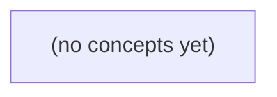

# 01.05《map、结构体与指针：组织消息身份与会话状态》

*面向 Go 初学者，以虚构 IM 的用户、会话与消息为连续场景，循序学习 map、结构体、指针及其在函数和内存状态中的组合方式。课程强调稳定业务身份、缺失与零值的区分、复制与共享的边界，并最终完成一个仅在本地内存顺序模型中运行的会话消息索引程序。*

**章节:** 2

---

## 本书导览

- 了解整本书的章节脉络
- 掌握各章之间的概念依赖关系
- 选择最合适的阅读顺序

# 01.05《map、结构体与指针：组织消息身份与会话状态》

面向 Go 初学者，以虚构 IM 的用户、会话与消息为连续场景，循序学习 map、结构体、指针及其在函数和内存状态中的组合方式。课程强调稳定业务身份、缺失与零值的区分、复制与共享的边界，并最终完成一个仅在本地内存顺序模型中运行的会话消息索引程序。

下方的概念图展示了本书 0 个核心概念以及它们之间的依赖关系；再下方是 1 个章节的入口。你可以按从上到下的顺序阅读，也可以根据自己的兴趣或先验知识选择切入点。

#### 概念图



## 章节索引

- **01.05 map、结构体与指针：组织消息身份与会话状态** — 从稳定消息身份进入map键值与缺失，组合结构体，再建立地址和参数复制模型；区分map值结构体与指针结构体的更新，第二遍分析嵌套共享，最后实现本地会话消息索引。

## 01.05 map、结构体与指针：组织消息身份与会话状态

- 一、从列表位置到按身份查找
- 二、缺失、零值、nil和键规则
- 三、用结构体把一条消息组织完整
- 四、地址、指针与nil：找到要修改的变量
- 五、函数参数仍按值传递
- 六、map里的结构体：取出改回与指针值
- 七、第二遍深化：结构体复制与嵌套共享
- 八、综合会话索引与OpenIM对照
- 九、分层练习与下一章准备

消息在切片中的位置会随排序、过滤和追加而变化；本节先建立稳定身份，再用 map 按身份管理会话别名。

### 位置会变，身份应稳定

### 位置会变，身份应稳定

把消息放进切片后，下标只能回答“它**现在**排在第几个”，不能回答“它**永远**是谁”。

```go
messages := []string{"m-a", "m-b"}
```

此刻：

| 下标 | 消息 ID |
|---:|---|
| 0 | m-a |
| 1 | m-b |

若按某种规则重新排序，或过滤掉一条消息，位置就会改变：

```go
messages = []string{"m-b"} // 例如过滤掉 m-a
```

现在 `m-b` 的下标从 `1` 变成了 `0`。因此，把“下标 1”保存为“要回复的消息”是不可靠的：之后再访问 `messages[1]`，可能越界，也可能已经是另一条消息。

稳定身份应由 ID 表示，而不是由容器位置表示。这里先区分三类 ID：

- 用户 ID：如 `u-a`、`u-b`，标识用户是谁。
- 会话 ID：如 `c-a`、`c-b`，标识哪一个会话。
- 消息 ID：如 `m-a`、`m-b`，标识会话中的哪一条消息。

消息 ID 的“唯一”还必须说明范围。例如可规定：在当前程序保存的全部消息中，`m-a` 只能对应一条消息；不能仅因为它暂时位于下标 `0`，就把 `0` 当作消息身份。

追加同样会改变位置关系：

```go
messages = append(messages, "m-c")
```

下标适合遍历和访问当前切片；ID 才适合跨越排序、过滤、追加后继续指向同一对象。此处只是本地内存中的组织规则，不代表消息已经发送、持久保存或完成鉴权。

### 用户、会话与消息的三类标识

### 用户、会话与消息的三类标识

在本地内存模型中，`u-a`、`c-a`、`m-a` 都是字符串，但它们回答的问题不同，不能因为类型相同就混用。

| 标识 | 示例 | 回答的问题 | 不应表示什么 |
|---|---|---|---|
| 用户 ID | `u-a`、`u-b` | “这是谁？” | 某台设备、某次连接 |
| 会话 ID | `c-a`、`c-b` | “消息属于哪个对话？” | 某个用户本身 |
| 消息 ID | `m-a`、`m-b` | “这是哪一条消息？” | 消息在切片中的当前位置 |

例如，`u-a` 可以参与会话 `c-a`；`c-a` 中可以有消息 `m-a`。用户换设备后仍可能是 `u-a`，同一用户也可能出现在多个会话中。因此，“用户”“设备”“连接”“会话”是不同概念，不能拿一个 ID 代替另一个。

消息 ID 尤其要说明唯一性范围。若规定“全系统唯一”，则 `m-a` 在所有会话中只能出现一次；若规定“会话内唯一”，则 `c-a/m-a` 与 `c-b/m-a` 可以同时存在。两种设计都可以，但程序必须遵从明确的业务约定；不能仅凭字符串长相偷偷假定唯一范围。

不要把切片下标当消息 ID：

```go
messages := []string{"m-a", "m-b"}
```

此时 `messages[0]` 暂时对应 `m-a`。如果过滤掉第一项、在前面插入消息，或调整顺序，`0` 的含义就变了；而 `m-a` 仍应指向同一条逻辑消息。下标适合访问当前位置，稳定 ID 才适合跨步骤引用身份。

### 从会话别名需求认识 map

### 从会话别名需求认识 map

消息和会话常常有稳定的身份，例如会话 ID `c-a`、`c-b`。它们不是切片下标：即使调整列表顺序、过滤某些会话，`c-a` 仍然表示同一个会话。

现在有一个简单需求：根据会话 ID 显示别名。

- `c-a` 显示为“项目讨论”
- `c-b` 显示为“周末出行”

若只用切片保存标题，就必须先知道 `c-a` 位于第几个位置；一旦顺序变化，原来的下标含义就不可靠。这里更适合使用 `map`。

`map` 是“键到值”的关联集合：给出一个键，可以找到对应的值。会话 ID 是键，显示别名是值：

```go
conversationTitle := map[string]string{
	"c-a": "项目讨论",
	"c-b": "周末出行",
}
```

`map[string]string` 可逐项阅读：

- 第一个 `string`：键的类型，这里是会话 ID，如 `"c-a"`。
- 第二个 `string`：值的类型，这里是标题，如 `"项目讨论"`。
- `map[...]...`：表示按键保存和查找值，而不是按 `0`、`1`、`2` 这样的连续位置访问。

读取时使用键：

```go
fmt.Println(conversationTitle["c-a"])
```

预期输出：

```text
项目讨论
```

因此，`"c-a"` 不是要参与加减法的数量，也不是“第 0 个会话”；它只是稳定地标识一个会话的字符串 ID。后续即使会话列表重新排序，仍可用同一个键查到对应别名。

### 创建、读取与更新会话索引

### 创建、读取与更新会话索引

会话 ID 是稳定身份，例如 `c-a`、`c-b`；它不是切片下标，也不用于加减运算。可以用 `map[string]string` 保存“会话 ID → 会话别名”的索引：

- 第一个 `string` 是键：会话 ID，如 `"c-a"`。
- 第二个 `string` 是值：别名，如 `"与 u-b 的私聊"`。

```go
package main

import "fmt"

func main() {
	conversationTitle := make(map[string]string, 2)
	conversationTitle["c-a"] = "与 u-b 的私聊"
	conversationTitle["c-b"] = "项目讨论"

	fmt.Println(conversationTitle["c-a"])
	fmt.Println(len(conversationTitle))

	conversationTitle["c-b"] = "项目讨论（临时）"
	delete(conversationTitle, "c-a")

	fmt.Println(conversationTitle["c-a"])
	fmt.Println(len(conversationTitle))
}
```

预期输出：

```text
与 u-b 的私聊
2
```

更新后，`"c-b"` 对应的旧别名被替换，不会新增键。删除 `"c-a"` 后，读取不存在的键会得到值类型的零值；这里值类型是 `string`，所以结果是空字符串。最后的 `len` 为 `1`。删除本来不存在的键也不会报错。

也可以直接用字面量创建：

```go
conversationTitle := map[string]string{
	"c-a": "与 u-b 的私聊",
	"c-b": "项目讨论",
}
```

`make(map[string]string, 2)` 中的 `2` 只是容量提示，表示预计可能放入约两个键，并不是上限；之后仍可继续写入更多会话。`map` 没有 `cap`。

### map 的边界与共享直觉

### map 的边界与共享直觉

`make(map[string]string, 8)` 中的 `8` 只是**大小提示**：告诉运行时“预计大约会放这么多键值对”，便于提前安排内部空间。它不是容量上限，放入第 9 个、第 100 个会话别名都合法。

```go
conversationTitle := make(map[string]string, 2)

conversationTitle["c-a"] = "与 u-b 的聊天"
conversationTitle["c-b"] = "项目讨论"
conversationTitle["c-c"] = "临时会话"

fmt.Println(len(conversationTitle)) // 预期：3
```

`len(conversationTitle)` 表示当前键的数量；`map` 没有 `cap`。因此下面的写法是错误的：

```go
fmt.Println(cap(conversationTitle)) // 错误：map 没有 cap
```

这里的 `"c-a"`、`"c-b"` 是会话 ID，用于查找身份，不是要参与加减乘除的序号。即使 ID 恰好长得像 `"100"`，也不应把它理解为“第 100 个会话”；它的稳定性来自系统约定，而不是字符串的数值意义。

赋值 map 时，不会复制出一套独立键值对，而是让两个变量看到同一组条目：

```go
titlesA := map[string]string{
	"c-a": "与 u-b 的聊天",
}

titlesB := titlesA
titlesB["c-a"] = "新的会话标题"

fmt.Println(titlesA["c-a"]) // 预期：新的会话标题
```

可以先把 `titlesA`、`titlesB` 想成两张指向同一本“会话别名册”的标签。通过任一变量新增、替换或删除键，另一变量随后读取时都会看到变化。这里先建立共享直觉；为什么函数参数仍然是值复制、如何精确描述这种共享，将在后续学习指针时再展开。

> **要点** — 切片下标会变化，稳定 ID 才能定位实体；map 用键直接关联会话等身份与数据。

消息 ID 是稳定身份而非切片下标；本节用本地草稿与成员标志，建立 map 的键、缺失、零值和 nil 认知。

### 用键索引稳定的会话身份

### 用键索引稳定的会话身份

切片按**位置**访问：`drafts[0]` 表示第 0 个元素，不表示某个天然固定的会话。若本地有会话 `c-a`、`c-b`，把草稿计数放进切片会产生歧义：

```go
drafts := []int{2, 5} // 2 到底属于 c-a 还是 c-b？
```

一旦插入、删除或改变展示顺序，位置含义就可能变化。消息 ID、用户 ID、会话 ID 则是稳定身份；本节约定 `c-a`、`c-b` 是会话 ID，不是切片下标。

`map` 是“键到值”的映射。`map[string]int` 中，键是字符串会话 ID，值是本地草稿计数：

```go
package main

import "fmt"

func main() {
	drafts := map[string]int{
		"c-a": 2,
		"c-b": 5,
	}

	fmt.Println(drafts["c-a"])
	fmt.Println(drafts["c-b"])
}
```

预期输出：

```text
2
5
```

可以把它追踪为：

| 键（会话 ID） | 值（本地草稿数） |
|---|---:|
| `c-a` | 2 |
| `c-b` | 5 |

读取未知键不会报错，而是得到值类型的零值。对 `int` 而言零值是 `0`：

```go
fmt.Println(drafts["c-x"])
```

预期输出：

```text
0
```

但 `c-a` 存在且草稿数恰为 `0`，与 `c-x` 根本不存在时，普通读取结果相同。需要同时接收第二个结果：

```go
v, ok := drafts["c-b"]
fmt.Println(v, ok)

v, ok = drafts["c-x"]
fmt.Println(v, ok)
```

预期输出：

```text
5 true
0 false
```

这里 `ok` 表示该键是否在这张本地映射中出现；它不表示会话真实存在、用户已鉴权，或消息一定可发送。当前程序只有顺序执行的本地内存数据。

更新某个稳定身份也直接使用键：

```go
drafts["c-a"] = 3
fmt.Println(drafts["c-a"])
```

预期输出：

```text
3
```

因此，切片适合“第几个”的有序数据；`map` 适合“是谁、哪个会话”的按身份查找。键不是系统替你生成的协议身份：程序必须已有合法的 `c-a` 等 ID，不能把偶然的展示位置偷偷当成会话身份。

### 读取零值，辨认键是否缺失

### 读取零值，辨认键是否缺失

本地草稿计数可用 `map[string]int` 表示：键是会话 ID，值是该会话当前草稿条数。注意，`c-a` 的 ID 是稳定身份，不是切片下标。

```go
draftCount := map[string]int{
	"c-a": 0,
}

a := draftCount["c-a"]
b := draftCount["c-b"]

fmt.Println(a)
fmt.Println(b)
```

预期输出：

```text
0
0
```

两个 `0` 的含义不同：

| 查询 | 键是否存在 | 读取结果 | 业务上的可能解释 |
|---|---:|---:|---|
| `draftCount["c-a"]` | 存在 | `0` | 已记录会话，目前没有草稿 |
| `draftCount["c-b"]` | 不存在 | `0` | 本地尚未记录该会话 |

这是 `map` 的读取规则：当键不存在时，读取会得到值类型的零值。`int` 的零值是 `0`，`bool` 的零值是 `false`，`string` 的零值是 `""`。

因此，仅凭读取到的数值无法判断键是否存在。需要使用“逗号 ok”形式：

```go
v, ok := draftCount["c-a"]
fmt.Println(v, ok)

v, ok = draftCount["c-b"]
fmt.Println(v, ok)
```

预期输出：

```text
0 true
0 false
```

其中：

- `v` 是读取到的值；即使键缺失，仍会得到零值。
- `ok` 表示键是否实际存在。
- `ok == true` 时，才能确认这条本地记录存在。
- `ok == false` 不等于会话不存在，更不等于身份无效；这里只能说明当前这张本地 `map` 没有该键。

不要写成下面这样：

```go
if draftCount["c-a"] == 0 {
	// 误以为 c-a 不存在
}
```

这会把“存在且草稿数为 0”与“键缺失”混在一起。只要业务需要区分“未记录”和“记录为零”，就应使用 `v, ok := m[k]`。

### 成员标志不能替代可信身份

### 成员标志不能替代可信身份

聊天室本地状态可以用 `map[string]bool` 记录“当前程序是否把某用户标为成员”：

```go
members := map[string]bool{
	"u-a": true,
	"u-b": false,
}

a := members["u-a"]
b := members["u-b"]
x := members["u-x"]

fmt.Println(a, b, x) // 预期输出：true false false
```

这里 `u-b` 明确存在，值为 `false`；`u-x` 根本没有键。普通读取时，两者都得到 `false`。因此，下面的判断信息不足：

```go
if !members["u-x"] {
	fmt.Println("不是成员")
}
```

它只能说明读取结果为假，不能说明 `u-x` 是否曾被记录。

使用“双返回值读取”保留缺失信息：

```go
flag, ok := members["u-b"]
fmt.Println(flag, ok) // 预期输出：false true

flag, ok = members["u-x"]
fmt.Println(flag, ok) // 预期输出：false false
```

可把状态理解为：

| 用户 ID | `flag` | `ok` | 含义 |
|---|---:|---:|---|
| `u-a` | `true` | `true` | 已记录为成员 |
| `u-b` | `false` | `true` | 已记录，但标志为假 |
| `u-x` | `false` | `false` | 本地 map 中没有记录 |

因此应先看 `ok`，再解释 `flag`。不过，这张 map 只是本地内存中的标志：`ok == true` 不证明用户身份真实、登录有效或有权限进入会话。`u-a`、`u-b` 等稳定 ID 必须来自本程序之外已约定的来源；map 只能按键保存和查询状态，不能自行完成可信身份确认。

### nil map 的可读性与写入边界

### nil map 的可读性与写入边界

`map` 的零值是 `nil`。声明但未初始化的 map，可以理解为“还没有分配可写的键值表”，不是“某个业务操作失败”。

```go
package main

import "fmt"

func main() {
	var draftCount map[string]int

	fmt.Println(draftCount == nil) // 预期：true
	fmt.Println(len(draftCount))   // 预期：0
	fmt.Println(draftCount["c-a"]) // 预期：0

	delete(draftCount, "c-a") // 可执行：删除不存在的键也不会报错

	for conversationID, count := range draftCount {
		fmt.Println(conversationID, count) // nil map 没有元素，不会进入循环
	}
}
```

对 nil map 的读取遵循普通 map 的缺失规则：`draftCount["c-a"]` 得到值类型的零值 `0`。但这不能说明 `c-a` 已存在，也不能说明草稿数确实为零；应使用：

```go
count, ok := draftCount["c-a"]
fmt.Println(count, ok) // 预期：0 false
```

真正的边界在写入：

```go
var draftCount map[string]int
draftCount["c-a"] = 1 // 运行时 panic：assignment to entry in nil map
```

写入前必须初始化：

```go
draftCount := make(map[string]int)
draftCount["c-a"] = 1

// 或者：
flags := map[string]bool{
	"u-a": true,
}
```

初始化只表示本地内存中已有可写容器，不表示会话 `c-a`、用户 `u-a` 或成员关系已经被验证。相反，nil 也不自动代表“加载失败”“无权限”或“会话不存在”；这些业务状态需要程序另行设计并明确记录。

### 键规则与无序遍历的约束

### 键规则与无序遍历的约束

`map` 通过“键”定位值，因此键必须能够判断“两个键是否相等”。可用作键的常见类型有 `string`、`int`、`bool`；元素都可比较的数组也可以。消息系统中最常见的是稳定文本 ID：

```go
draftCount := map[string]int{
	"c-a": 2,
	"c-b": 0,
}
```

这里 `"c-a"` 是会话身份，不是某个切片下标；即使展示顺序变化，它仍指向同一份本地计数。

切片不能比较两个内容是否相等，因此不能作为键：

```go
bad := map[[]string]int{} // 编译错误：[]string 不能作为 map 的键
```

`map` 自身也不能互相比较，下面同样不合法：

```go
a := map[string]int{}
b := map[string]int{}
_ = a == b // 编译错误
```

`map` 只能与 `nil` 比较，用于判断它是否尚未初始化：

```go
var counts map[string]int
fmt.Println(counts == nil) // 预期输出：true
```

遍历 `map` 时，键的出现顺序没有规定。不要把它当作消息顺序、会话时间线或固定展示顺序：

```go
for id, n := range draftCount {
	fmt.Println(id, n)
}
```

预期会输出两行，但不能预测先输出 `"c-a"` 还是 `"c-b"`。

若当前需要稳定展示，可以先给出明确顺序的键切片，再逐个查询：

```go
keys := []string{"c-a", "c-b"}
for _, id := range keys {
	fmt.Println(id, draftCount[id])
}
```

预期输出：

```text
c-a 2
c-b 0
```

这里稳定的是 `keys` 的切片顺序，不是 `map` 自己的遍历顺序。本节约定遍历时不修改 `map`；排序规则与排序算法将在后续学习。

> **要点** — map 按稳定键索引；读取零值不等于键存在，需用 ok 判断；nil、键规则与无序遍历都要明确处理。

一条消息不仅有文本，还需清晰组织消息、会话与发送者身份；结构体让这些相关字段成为可读、可复制的数据整体。

### 从分散变量到完整消息

### 从分散变量到完整消息

一条即时通信消息至少要说明：它是谁、属于哪个会话、由谁发送、正文是什么。若把这些信息分散保存：

```go
messageID := "m-a"
conversationID := "c-a"
senderID := "u-a"
body := "你好"
```

变量本身没有强制联系。后续处理第二条消息时，若只更新了 `body`，却忘记更新 `senderID`，就可能把 `u-b` 的文本误记为 `u-a` 发送。更重要的是，`m-a` 不是切片下标；它是稳定的业务身份，不能因为消息在本地列表中的位置变化而改变。

可以先把“完整消息”定义成一个结构体：

```go
type Message struct {
	ID             string
	ConversationID string
	SenderID       string
	Body           string
}
```

`type Message` 声明了一个名为 `Message` 的新类型；`struct` 表示它由多个字段组成。字段后的 `string` 是字段类型。通过点号读取字段，例如 `msg.Body`。这里字段名首字母大写；跨包是否可访问与导出规则有关，后续再学习。

创建消息时使用具名初始化，字段含义一目了然：

```go
msg := Message{
	ID:             "m-a",
	ConversationID: "c-a",
	SenderID:       "u-a",
	Body:           "你好",
}
```

此时 `msg` 表示一条整体消息，而不是四个容易失配的变量。预期可以得到：

```go
fmt.Println(msg.ConversationID, msg.SenderID, msg.Body)
// 预期输出：c-a u-a 你好
```

`Message{}` 也能创建零值结构体，其中所有字符串都是空串；但“语法上能创建”不表示它已经是合法业务消息。合法性仍要检查 ID、会话、发送者和正文是否满足约定。

### 定义 Message：类型、字段与可见性

### 定义 `Message`：类型、字段与可见性

一条聊天消息不能只用一个 `string` 表示。文本 `"你好"` 之外，还要知道：它是哪条消息、属于哪个会话、由谁发送。把这些彼此相关的数据放在一起，可以定义一个结构体类型：

```go
type Message struct {
	ID             string
	ConversationID string
	SenderID       string
	Body           string
}
```

逐项看这段定义：

- `type` 表示“定义一种新类型”。
- `Message` 是类型名，表示“消息”这一完整数据形状；它不是某一条具体消息。
- `struct` 表示该类型由多个字段组成。字段像一个有名字的格子，每个格子保存一部分数据。
- 花括号内每行的形式都是“字段名 + 字段类型”。

四个字段目前都使用 `string`：

| 字段 | 含义 | 示例 |
|---|---|---|
| `ID` | 消息自身的稳定身份 | `"m-a"` |
| `ConversationID` | 消息所属会话的身份 | `"c-a"` |
| `SenderID` | 发送该消息的用户身份 | `"u-a"` |
| `Body` | 消息正文 | `"你好"` |

这里的 `ID` 不是切片下标。例如，切片第 `0` 个元素的位置可能变化，但 `"m-a"` 仍然指向同一条业务消息。`SenderID` 也不是设备、连接或会话：用户 `"u-a"` 可以有多个设备，也可能参与多个会话。

类型通常定义在包级别，即放在函数外：

```go
package main

type Message struct {
	ID             string
	ConversationID string
	SenderID       string
	Body           string
}

func main() {
}
```

这样，同一个包中的多个函数都能使用 `Message`。名称首字母大写的 `Message`、`ID`、`Body`，以后涉及跨包时表示可被其他包访问；本节只需先记住：大写名称更适合对外可见的数据。首字母小写的名称则限制在当前包内，具体的包与导入规则后续再展开。

注意，字段名表达的是不同角色：即使它们都是字符串，也不能因为值看起来相似就互换。把 `"c-a"` 放进 `SenderID`，编译器未必能发现，但数据含义已经错误。

### 具名初始化、零值与字段访问

### 具名初始化、零值与字段访问

`Message` 把一条消息的相关信息放进同一个值中：它属于哪个会话、由谁发送、内容是什么，以及它自己的稳定身份。

```go
type Message struct {
	ID             string
	ConversationID string
	SenderID       string
	Body           string
}
```

创建消息时，推荐使用**具名初始化**：字段名写在前面，值写在后面。这样不必记忆字段声明顺序，也能直接看出每个身份属于什么。

```go
m := Message{
	ID:             "m-a",
	ConversationID: "c-a",
	SenderID:       "u-a",
	Body:           "你好",
}

fmt.Println(m.ID)             // 预期输出：m-a
fmt.Println(m.ConversationID) // 预期输出：c-a
fmt.Println(m.SenderID)       // 预期输出：u-a
fmt.Println(m.Body)           // 预期输出：你好
```

点号 `.` 表示“访问这个结构体值中的某个字段”。它也可以用于修改字段：

```go
m.Body = "你好，u-b"
fmt.Println(m.Body) // 预期输出：你好，u-b
```

`Message{}` 同样是合法的 Go 创建方式，它得到各字段的零值；`string` 的零值是空字符串。

```go
empty := Message{}
fmt.Println(empty.ID == "")   // 预期输出：true
fmt.Println(empty.Body == "") // 预期输出：true
```

但“能创建”不等于“是合法业务消息”。`empty` 没有消息 ID、会话 ID、发送者 ID，也没有正文；在本地内存中它只是一个字段全为空的值，不能据此假定它可被当作真实消息处理。

不要把 ID 当作切片下标：`"m-a"` 是稳定身份，`messages[0]` 只是当前位置；消息加入、删除或排序后，位置可能改变，ID 的含义不应随之改变。

### 结构体复制不等于同一条消息

### 结构体复制不等于同一条消息

结构体赋值会复制每一个字段。`Message` 的字段目前都是 `string`，因此赋值后得到的是一份独立的字段值；修改副本，不会改动原消息。

```go
original := Message{
	ID:             "m-a",
	ConversationID: "c-a",
	SenderID:       "u-a",
	Body:           "你好",
}

copyMessage := original
copyMessage.Body = "你好，已修改"

fmt.Println(original.Body)    // 预期输出：你好
fmt.Println(copyMessage.Body) // 预期输出：你好，已修改
```

可以这样追踪：

| 变量 | ID | ConversationID | Body |
|---|---|---|---|
| `original` | `m-a` | `c-a` | `你好` |
| `copyMessage`（赋值后） | `m-a` | `c-a` | `你好` |
| 修改后 `copyMessage` | `m-a` | `c-a` | `你好，已修改` |

两者的 `ID` 相同，表示它们描述的是同一个业务身份：消息 `m-a`。但它们是两个不同的结构体变量，不应把“ID 相等”理解成“内存中是同一个对象”。

以后学习指针后，可以用地址判断两个变量是否位于同一处存储；现在只需先区分三件事：

- 字段值相同：例如两个 `ID` 都是 `"m-a"`。
- 业务身份相同：它们都指向逻辑上的消息 `m-a`。
- 变量本身相同：结构体赋值不会让两个变量合并成一个变量。

也不要用全部字段是否相等判断业务身份。正文可能被编辑、补充，发送者信息也可能需要校正；稳定识别消息应依赖约定好的身份字段，而不是恰好所有字段都相同。

### 复合消息键避免会话内编号冲突

### 复合消息键避免会话内编号冲突

消息 ID 是否唯一，取决于系统约定。若 `m-a` 只要求在各自会话内唯一，那么不能只用它定位消息：

```go
type MessageKey struct {
	ConversationID string
	MessageID      string
}
```

`MessageKey` 把两个字符串字段组合为一个值。它表示“会话 `ConversationID` 中编号为 `MessageID` 的消息”，而不是单独的消息编号。

```go
keyA := MessageKey{
	ConversationID: "c-a",
	MessageID:      "m-a",
}
keyB := MessageKey{
	ConversationID: "c-b",
	MessageID:      "m-a",
}

fmt.Println(keyA == keyB) // 预期输出：false
```

虽然 `keyA` 与 `keyB` 的 `MessageID` 都是 `"m-a"`，但会话不同，因此两个复合键不相等。反过来，两个字段都相同才相等：

```go
sameA := MessageKey{"c-a", "m-a"}
fmt.Println(keyA == sameA) // 预期输出：true
```

这里可使用 `==`，因为 `MessageKey` 的全部字段都是 `string`，而字符串可比较。结构体的整体比较会逐字段比较。

不要简单拼接为 `"c-a" + "m-a"` 作为键；若 ID 允许包含分隔符，不同组合可能产生相同文本，例如 `"a-b" + "-c"` 与 `"a" + "-b-c"`。结构体保留了字段边界，含义更清楚。

复合键比较的是定位信息，不是在判断两条消息是否“业务上完全相同”。`Message` 的正文或发送者变化，不会改变同一条消息的 `MessageKey`。

> **要点** — 结构体把消息字段组织为整体；复制会产生独立值，稳定身份应由明确的消息键表达。

指针不是神秘的内存技巧，而是找到并修改某个具体变量的位置工具。本节用消息草稿理解地址、解引用与nil。

### 变量有值，也有可被定位的位置

### 变量有值，也有可被定位的位置

本地内存里的变量既保存**值**，也占据一个可被定位的**位置**。例如某个会话 `c-a` 当前暂存了 1 条消息：

```go
count := 1
```

这里 `count` 是变量名，`1` 是它当前保存的值。我们不需要、也不应猜测它的实际地址数字；Go 可以用 `&` 取得“这个变量所在位置”的地址：

```go
p := &count
```

逐个看：

- `count`：保存整数值的变量。
- `&count`：取得变量 `count` 的地址。
- `p`：保存这个地址的变量，因此它的类型是 `*int`。
- `*int`：表示“指向 `int` 变量的指针类型”，不是整数乘法。

指针值让我们能通过位置回到原变量。`*p` 称为**解引用**：读取或修改 `p` 指向的变量。

```go
count := 1
p := &count

*p = 2
fmt.Println(count) // 预期输出：2
fmt.Println(*p)    // 预期输出：2
```

`*p = 2` 没有创建第二个计数器；它修改的仍是 `count`。可以这样追踪：

| 名称 | 保存的内容 | 指向/代表 |
|---|---|---|
| `count` | `2` | 会话 `c-a` 的本地消息计数 |
| `p` | `count` 的地址 | 找到并修改 `count` 的位置 |
| `*p` | `2` | `p` 指向的 `count` 本身 |

指针解决的是“如何定位这个具体变量”，不是业务身份。`p` 不是用户 `u-a`、会话 `c-a` 或消息 `m-a` 的 ID；地址只在当前程序运行的本地内存中有意义，不能当作稳定身份保存或传递。

### 取地址与解引用：修改原变量

### 取地址与解引用：修改原变量

变量不仅有当前的值，也占据一个可被定位的位置。这个位置称为**地址**；保存某个变量地址的值，称为**指针**。地址由运行环境安排，因此不显示、更不能依赖某个固定数字。

先看一个最小例子：

```go
count := 1
p := &count
*p = 2
fmt.Println(count) // 预期输出：2
```

逐行推导：

1. `count := 1` 创建一个 `int` 变量 `count`，其中保存值 `1`。
2. `&count` 中的 `&` 是**取地址**：它取得变量 `count` 的地址。
3. `p := &count` 令 `p` 保存这个地址。因为 `count` 是 `int`，所以 `p` 的类型是 `*int`，读作“指向 `int` 的指针”。
4. `*p = 2` 中的 `*p` 是**解引用**：沿着 `p` 保存的地址，找到原来的 `count` 变量。赋值修改的是该变量本身，而不是复制出一个新整数。

可以用位置关系理解：

| 名称 | 保存的内容 | 指向或表示 |
|---|---|---|
| `count` | `1`，随后变为`2` | 一个 `int` 变量 |
| `p` | `count` 的地址 | 指向 `count` |
| `*p` | `count` 当前位置中的值 | 就是 `count` 本身 |

因此，下面两句对最终结果相同：

```go
count = 2
*p = 2
```

区别在于：第一句直接按变量名修改；第二句先通过指针找到变量，再修改。指针适合“调用者把某个已有变量交给函数或其他代码修改”的场景，但它不是业务身份。`u-a`、`m-a` 这类稳定 ID 用于识别用户或消息；指针只表示“当前这次运行中指向哪个变量”。

### 草稿结构体的指针访问

### 草稿结构体的指针访问

先用结构体把一条草稿的字段放在一起：

```go
type Draft struct {
	Body string
}

draft := Draft{Body: "你好，u-b"}
p := &draft
```

`draft` 是一个 `Draft` 变量，保存字段 `Body`；`&draft` 表示“取得变量 `draft` 的地址”；因此 `p` 保存的是该地址，类型为 `*Draft`，即“指向 `Draft` 的指针”。地址是运行时的位置，不应假定或打印某个固定数字。

要通过 `p` 修改原来的草稿，先解引用：

```go
(*p).Body = "你好，u-b，草稿已修改"
fmt.Println(draft.Body) // 预期输出：你好，u-b，草稿已修改
```

这里括号不能省：`*p` 表示“`p` 指向的那个 `Draft` 变量”，再访问它的 `.Body` 字段，所以写作 `(*p).Body`。

Go 为结构体指针提供了简写：

```go
p.Body = "第二版草稿"
fmt.Println((*p).Body) // 预期输出：第二版草稿
```

`p.Body` 与 `(*p).Body` 含义相同；前者更常用。它不是说指针自己拥有 `Body`，而是编译器自动沿着指针找到对应结构体。

还可以在创建结构体值时立刻取其地址：

```go
p2 := &Draft{Body: "给 c-a 的草稿"}
fmt.Println(p2.Body) // 预期输出：给 c-a 的草稿
```

`Draft{...}` 先表示一个 `Draft` 值，前面的 `&` 再取得这个值的位置，结果是 `*Draft`。这不是把某个已有值“转换成指针”，也不是业务身份；草稿的内存地址不能代替消息 ID `m-a`。

### nil不是空草稿：先检查再访问

### nil不是空草稿：先检查再访问

`nil` 表示“当前没有指向任何 `Draft` 变量”。它不是一份内容为空的草稿，更不能直接访问字段。

```go
type Draft struct {
	Body string
}

var p *Draft
```

这里 `p` 的类型是 `*Draft`，零值为 `nil`。它没有可供解引用的目标，因此下面的写法会在运行时出错：

```go
// p.Body = "你好" // 错误：nil 指针不能访问字段
```

安全边界是：**先确认指针不为 `nil`，再访问其指向的结构体。**

```go
if p != nil {
	fmt.Println(p.Body)
} else {
	fmt.Println("没有草稿可访问")
}
```

与之不同，下面的 `zero` 确实指向一份存在的 `Draft` 变量；只是该变量的字段取零值：

```go
zero := Draft{}
q := &zero

fmt.Println(q == nil) // 预期：false
fmt.Println(q.Body)   // 预期：空字符串
```

可以把两者区分为：

| 变量 | 含义 | 能否访问 `Body` |
|---|---|---|
| `p == nil` | 没有草稿位置 | 不能 |
| `q == &Draft{}` | 有一份空内容草稿 | 能 |

两个指针使用 `==` 比较时，比较的是它们是否指向**同一个变量位置**，不是比较草稿字段是否相同：

```go
a := Draft{Body: "待发送"}
b := Draft{Body: "待发送"}

pa := &a
pb := &b

fmt.Println(pa == pb) // 预期：false，a 与 b 是两个变量
```

即使 `a.Body` 和 `b.Body` 一样，`pa`、`pb` 仍是不同位置。反过来：

```go
same := pa
fmt.Println(pa == same) // 预期：true，指向同一个 a
```

指针身份只说明“是不是同一个本地变量”，不能代替消息 `m-a`、用户 `u-a` 等稳定业务 ID。访问草稿前检查 `nil`，是在本地内存模型中避免“没有对象却当作对象使用”的第一条规则。

### 会话草稿更新：地址不等于业务身份

### 会话草稿更新：地址不等于业务身份

本地内存中的草稿可以被指针定位并修改，但“能找到它的位置”不等于“它具有稳定身份”。

```go
package main

import "fmt"

type Draft struct {
	ID     string
	UserID string
	ChatID string
	Body   string
}

func main() {
	draft := Draft{
		ID:     "m-a",
		UserID: "u-a",
		ChatID: "c-a",
		Body:   "你好",
	}

	p := &draft
	p.Body = "你好，u-b"

	fmt.Println(draft.ID, draft.UserID, draft.ChatID, draft.Body)
	// 预期输出：m-a u-a c-a 你好，u-b
}
```

`draft` 是一个具体变量，保存草稿结构体值；`&draft` 取得该变量的地址，结果赋给 `p`。因此 `p` 的类型是 `*Draft`：它保存的是“指向一个 `Draft` 变量的位置”的指针值。

`p.Body = ...` 是 `(*p).Body = ...` 的简写：

- `*p`：解引用，找到 `p` 指向的 `draft` 变量；
- `(*p).Body`：访问该变量的 `Body` 字段；
- 修改后，原变量 `draft.Body` 也随之改变。

但地址只在当前程序这次运行、本地这块内存中有意义。不能把 `p` 当作消息身份，更不能用它判断“这是不是 m-a”：

```go
another := Draft{ID: "m-a", UserID: "u-a", ChatID: "c-a", Body: "你好，u-b"}
q := &another

fmt.Println(p == q) // 预期输出：false
```

`p == q` 比较的是两者是否指向**同一个变量**；即使两个草稿字段完全相同、`ID` 都是 `"m-a"`，它们仍是不同变量。消息的稳定身份应由 `ID: "m-a"` 表示；`UserID: "u-a"` 表示用户，`ChatID: "c-a"` 表示会话，三者不能混用。

还要先处理空指针：

```go
var pending *Draft
if pending != nil {
	fmt.Println(pending.Body)
}
```

`pending` 的零值是 `nil`，表示当前没有指向任何草稿；直接写 `pending.Body` 会出错。`nil` 不是“内容为空的草稿”，而是“没有草稿变量可供定位”。

> **要点** — 指针保存变量地址；通过解引用修改原变量；nil需先判断，地址不能充当业务ID。

函数调用会复制参数；但参数若指向共享对象，复制后的访问路径仍可能改到同一份会话状态。

### 先区分变量、副本与所指对象

### 先区分变量、副本与所指对象

先把 `Draft` 看成一份草稿数据。函数调用时，参数总会复制；区别在于：复制的是整个结构体，还是一个“可找到原对象的地址”。

```go
package main

import "fmt"

type Draft struct {
	Body string
}

func byValue(d Draft) {
	d.Body = "函数内修改"
}

func byPointer(p *Draft) {
	if p == nil {
		return
	}
	p.Body = "通过指针修改"
}

func main() {
	d := Draft{Body: "原文"}

	byValue(d)
	fmt.Println(d.Body)

	byPointer(&d)
	fmt.Println(d.Body)
}
```

预期输出：

```text
原文
通过指针修改
```

调用 `byValue(d)` 时，可画成：

```text
main 的 d  ──包含──> {Body: "原文"}
函数的 d   ──包含──> {Body: "原文"}
```

这是两份独立的结构体值。函数内给参数 `d.Body` 重新赋值，只会改函数自己的副本；函数返回后，该副本不再是调用方变量。

`&d` 表示“取得变量 `d` 的地址”，其类型是 `*Draft`；`p *Draft` 表示“`p` 保存一个指向 `Draft` 的地址”。调用 `byPointer(&d)` 后：

```text
main 的 d ───────────────> {Body: "原文"}
函数的 p（地址副本）───────┘
```

`p` 本身也会按值复制，但两个地址值都指向同一个 `Draft` 对象。`p.Body = ...` 是通过地址访问并修改该对象，等价于 `(*p).Body = ...`。

因此，是否修改调用方数据是明确的业务责任：只检查或计算时可传 `Draft`；确实要更新草稿内容时才传 `*Draft`，并先检查 `p == nil`。指针不是“天然更快”的标记，而是共享同一对象的访问方式。

### 结构体参数：修改副本不会回写

### 结构体参数：修改副本不会回写

先用结构体表示一份尚未发送的消息草稿。把结构体直接作为普通函数参数传入时，函数会得到一份字段值相同的副本。

```go
package main

import "fmt"

type Draft struct {
	ID   string
	Body string
}

func byValue(d Draft) {
	d.Body = "函数内修改"
	fmt.Println("函数内：", d.ID, d.Body)
}

func main() {
	draft := Draft{
		ID:   "m-a",
		Body: "你好",
	}

	fmt.Println("调用前：", draft.ID, draft.Body)
	byValue(draft)
	fmt.Println("调用后：", draft.ID, draft.Body)
}
```

预期输出：

```text
调用前： m-a 你好
函数内： m-a 函数内修改
调用后： m-a 你好
```

调用过程可以这样追踪：

| 时刻 | `main` 中的 `draft.Body` | `byValue` 中的 `d.Body` |
|---|---|---|
| 调用前 | `"你好"` | 尚未创建 |
| 刚进入函数 | `"你好"` | `"你好"`，是副本 |
| 执行赋值后 | `"你好"` | `"函数内修改"` |
| 函数返回后 | `"你好"` | 已离开作用域 |

这里 `d.Body = ...` 修改的是函数自己的 `d`，不是调用方的 `draft`。因此，结构体的“身份字段”`ID: "m-a"`也不会因为传参而自动绑定成同一个可修改对象；它只是被复制到副本中。

常见误判是：“函数拿到了 `draft`，所以一定能改掉它。”实际上，普通参数传递首先复制参数值。若业务确实要求函数修改调用方持有的草稿，需要在后面明确使用指针，并让函数名称体现副作用，而不是把修改隐藏在看似普通的值参数中。

### 指针参数：复制地址，显式修改原对象

### 指针参数：复制地址，显式修改原对象

普通参数会复制值。结构体较大或业务明确要“修改调用方那份草稿”时，可以传入它的地址。

设有草稿类型：

```go
type Draft struct {
	ID   string
	Body string
}
```

`&d` 表示“取得变量 `d` 的地址”；`*Draft` 表示“指向一个 `Draft` 的指针类型”；`*p` 表示“通过指针 `p` 访问它指向的 `Draft`”。

```go
func byPointer(p *Draft) {
	if p == nil {
		return
	}
	p.Body = "已修改"
}
```

调用时：

```go
func main() {
	d := Draft{ID: "m-a", Body: "原文"}
	byPointer(&d)
	fmt.Println(d.Body)
}
```

预期输出：

```text
已修改
```

推导过程如下：

| 位置 | 保存的内容 | `Body` |
|---|---|---|
| 调用前 | `d` 是一个 `Draft` 变量 | `原文` |
| 调用 `byPointer(&d)` | 传入 `d` 的地址 | `原文` |
| 函数内 `p.Body = ...` | 沿地址找到同一个 `d` | `已修改` |
| 返回后 | 调用方仍访问原来的 `d` | `已修改` |

这里仍然发生了参数复制：复制的是地址值，而不是整个 `Draft`。复制后的 `p` 和调用方提供的 `&d` 都能找到同一份草稿，因此修改有可见副作用。

`nil` 表示“不指向任何 `Draft`”。若直接写 `p.Body`，程序会因无对象可访问而出错，所以修改前应先检查：

```go
func replaceBody(p *Draft, body string) {
	if p == nil {
		return
	}
	p.Body = body
}
```

名称应体现责任。`byPointer` 只说明实现方式，不说明业务效果；`replaceBody`、`markDraftDeleted` 这类名称更清楚地告诉调用者：该函数会修改原对象。指针不是“一律更快”的理由，而是“这次操作应当修改哪一份状态”的明确选择。

### 重新绑定与覆盖：两个星号位置的差别

### 重新绑定与覆盖：两个星号位置的差别

指针参数也会发生值复制：调用 `rebind(&d)` 时，函数得到的是一份地址副本。不过，两份地址最初都指向同一个 `d`。

```go
type Draft struct {
	Body string
}

func rebind(p *Draft) {
	p = &Draft{Body: "新"}
}

func overwrite(p *Draft) {
	if p == nil {
		return
	}
	*p = Draft{Body: "替换"}
}
```

两处赋值看似相近，实际对象不同：

| 语句 | 被改变的对象 | 调用方 `d` 的结果 |
|---|---|---|
| `p = &Draft{...}` | 函数内部形参 `p` | 不变 |
| `*p = Draft{...}` | `p` 指向的 `Draft` 变量 | 被替换 |

对象关系可以这样追踪：

```text
调用前： d{Body:"原文"} ← p

执行 p = 新地址 后：
d{Body:"原文"}    p → Draft{Body:"新"}

执行 *p = 新值 后：
d{Body:"替换"} ← p
```

因此，`rebind` 不具有修改调用方状态的副作用；它只是让局部变量 `p` 改指向另一份草稿。`overwrite` 则明确覆盖调用方传入的草稿，函数名应体现这种修改责任。

故意错误：

```go
func badOverwrite(p *Draft) {
	*p = Draft{Body: "替换"} // p 为 nil 时会发生运行时错误
}
```

安全版本必须先检查 `p == nil`。注意：`*p` 中的 `*` 是“取得指针所指向的变量”；而 `*Draft` 中的 `*` 是“Draft 的指针类型”。前者用于访问对象，后者用于声明地址。

### map 作为会话索引传入函数

### map 作为会话索引传入函数

会话 `c-a` 中可用消息 ID 建立本地索引：`m-a`、`m-b` 是稳定身份，不是切片下标。值采用 `*Draft`，表示索引能找到同一份草稿对象。

```go
package main

import "fmt"

type Draft struct {
	Body string
}

func put(index map[string]*Draft, messageID string, d *Draft) {
	index[messageID] = d
}

func ensure(index map[string]*Draft) map[string]*Draft {
	if index == nil {
		index = make(map[string]*Draft)
	}
	return index
}

func main() {
	var drafts map[string]*Draft // 当前是 nil map
	drafts = ensure(drafts)     // 必须接收返回值

	put(drafts, "m-a", &Draft{Body: "你好"})
	fmt.Println(drafts["m-a"].Body)
}
```

预期输出：

```text
你好
```

`put` 的参数 `index` 本身会复制；但这个复制值仍指向同一张 `map`。因此执行 `index["m-a"] = d` 会把条目写入调用方持有的索引：

| 调用前 | 函数内写入 | 调用后 |
|---|---|---|
| `drafts` 是空 map | 写入 `"m-a"` → 草稿地址 | `drafts["m-a"]` 可找到草稿 |

但重新绑定形参不是共享修改：

```go
func reset(index map[string]*Draft) {
	index = make(map[string]*Draft)
	index["m-b"] = &Draft{Body: "局部草稿"}
}
```

这里 `reset` 只让局部变量 `index` 指向新 map；调用方原来的 `drafts` 不会获得 `"m-b"`。

尤其要注意：`nil map` 可以读取、可以用于 `range`，却不能写入。下面会运行时出错：

```go
var drafts map[string]*Draft
drafts["m-a"] = &Draft{Body: "你好"} // 错误：向 nil map 写入
```

因此，函数若可能创建 map，应返回它；调用方必须用返回值更新自己的会话索引。这里讨论的只是顺序执行下的本地内存状态，并不表示消息已经发送、持久化或已读。

> **要点** — 参数始终按值复制；复制结构体得到独立副本，复制指针或 map 则可能继续访问共享状态。

会话标题和草稿数应按稳定会话ID索引，但更新方式取决于map存放的是结构体值还是结构体指针。

### 从会话ID到结构体索引

### 从会话ID到结构体索引

聊天列表不能把 `c-a`、`c-b` 当作切片下标：它们是会话的**稳定身份**，不是 `0`、`1` 这类位置。即使列表展示顺序变化，`c-a` 仍应找到同一个会话状态。

先用结构体把彼此相关的数据放在一起：

```go
type Conversation struct {
	Title      string
	DraftCount int
}
```

再用 `map` 建立“会话 ID → 会话状态”的索引：

```go
conversations := map[string]Conversation{
	"c-a": {Title: "项目讨论", DraftCount: 1},
	"c-b": {Title: "周末计划", DraftCount: 0},
}
```

可以按键查询：

```go
c, ok := conversations["c-a"]
fmt.Println(ok, c.Title, c.DraftCount) // 预期：true 项目讨论 1
```

其中 `ok` 表示键是否存在。查询 `c-missing` 时，`c` 会得到 `Conversation` 的零值，但这**不表示真的存在一个默认会话**：

| 查询键 | `ok` | `Title` | `DraftCount` | 含义 |
|---|---:|---|---:|---|
| `"c-a"` | `true` | `"项目讨论"` | `1` | 已登记的会话 |
| `"c-x"` | `false` | `""` | `0` | 没有该会话 |

因此，读取前应先判断：

```go
c, ok := conversations["c-x"]
if !ok {
	fmt.Println("会话不存在")
} else {
	fmt.Println(c.Title)
}
// 预期：会话不存在
```

不要因为查询结果恰好是空标题、草稿数为 `0`，就自行补造会话。`map` 只记录当前本地内存中已放入的键值对；`c-a` 是否有效、从何而来，不能由这里偷偷推断出上游规则。

### 值结构体：取出、修改、写回

### 值结构体：取出、修改、写回

会话应通过稳定身份 `c-a`、`c-b` 查询，而不是把它们当作切片下标。若 map 存放的是 `Conversation` 值，查询得到的是一份结构体副本：

```go
type Conversation struct {
	Title      string
	DraftCount int
}

conversations := map[string]Conversation{
	"c-a": {Title: "项目讨论", DraftCount: 1},
}
```

不能直接修改 map 元素字段：

```go
conversations["c-a"].Title = "项目讨论（已更新）" // 编译错误
```

也不能取得 map 元素地址：

```go
p := &conversations["c-a"] // 编译错误
```

正确步骤是：查询、确认存在、修改局部副本、整体写回。

```go
value, ok := conversations["c-a"]
if !ok {
	fmt.Println("会话不存在：c-a")
} else {
	value.Title = "项目讨论（已更新）"
	value.DraftCount++
	conversations["c-a"] = value
}
```

过程可逐行追踪：

| 时刻 | `conversations["c-a"]` | 局部变量 `value` |
|---|---|---|
| 查询后 | `{项目讨论 1}` | `{项目讨论 1}` |
| 修改 `value` 后 | `{项目讨论 1}` | `{项目讨论（已更新） 2}` |
| 写回后 | `{项目讨论（已更新） 2}` | `{项目讨论（已更新） 2}` |

最容易遗漏的是最后一行写回：

```go
value, ok := conversations["c-a"]
if ok {
	value.DraftCount++
	// 忘记 conversations["c-a"] = value
}
```

预期结果：map 中的 `DraftCount` 仍是原值，因为被修改的只是局部副本。

`ok` 也不能省略。缺失的 `"c-b"` 查询会得到零值结构体 `{Title:"", DraftCount:0}`；若直接修改并写回，就会悄悄创建一个原本不存在的会话状态。对于“更新已有会话”的需求，应先确认 `ok` 为真，再执行修改与写回。

### 漏写回为何没有更新

### 漏写回为何没有更新

先看存放结构体值的会话表：

```go
sessions := map[string]Conversation{
	"c-a": {Title: "项目讨论", DraftCount: 2},
}

value, ok := sessions["c-a"]
if ok {
	value.Title = "项目讨论（已改）"
}
```

`value` 是从 `sessions["c-a"]` 取出的一个结构体值副本。修改它，不会自动回到 map。

| 执行位置 | `value.Title` | `value.DraftCount` | `sessions["c-a"]` |
|---|---|---:|---|
| 初始 | 不存在 | — | `{项目讨论, 2}` |
| 查找后 | `项目讨论` | 2 | `{项目讨论, 2}` |
| 改 `value.Title` 后 | `项目讨论（已改）` | 2 | `{项目讨论, 2}` |
| 未写回即结束 | — | — | `{项目讨论, 2}` |

因此，下面的输出仍是旧标题：

```go
fmt.Println(sessions["c-a"].Title) // 预期：项目讨论
```

正确更新必须显式写回整个结构体：

```go
value, ok := sessions["c-a"]
if ok {
	value.Title = "项目讨论（已改）"
	sessions["c-a"] = value
}
```

写回后状态变为：

| 字段 | 写回前 map 中的值 | 写回后的值 |
|---|---|---|
| `Title` | `项目讨论` | `项目讨论（已改）` |
| `DraftCount` | `2` | `2` |

`DraftCount` 没有被修改，但它仍随整个 `value` 一起写回。缺失 `c-a` 时，`ok` 为假；此时不应把零值会话默默写入 map。

### 不可直接修改的map元素

### 不可直接修改的 map 元素

若会话表按 ID 保存**结构体值**：

```go
sessions := map[string]Conversation{
	"c-a": {Title: "讨论组", DraftCount: 1},
}
```

下面两句都会编译错误：

```go
sessions["c-a"].Title = "新标题" // 错误：不能直接修改 map 元素的字段
p := &sessions["c-a"]            // 错误：不能取得 map 元素的地址
```

`sessions["c-a"]` 查询得到的是一个 `Conversation` 值；它可以被读取，也可以整体替换，但不能把这个查询结果当作可直接修改、可取地址的变量。不要依赖任何关于 map 内部存储位置的猜测；语言规则就是：map 元素不可寻址。

正确做法是“取出、检查、修改、写回”：

```go
value, ok := sessions["c-a"]
if ok {
	value.Title = "新标题"
	sessions["c-a"] = value
}
```

逐行看变化：

| 步骤 | `value.Title` | `sessions["c-a"].Title` |
|---|---|---|
| 取出后 | 讨论组 | 讨论组 |
| 修改 `value` 后 | 新标题 | 讨论组 |
| 写回后 | 新标题 | 新标题 |

如果漏掉最后的写回，map 中仍是旧会话。并且必须检查 `ok`：缺少 `"c-a"` 时，不应把零值 `Conversation{}` 默默当成真实会话再写入。

### 指针结构体：共享更新与空指针

### 指针结构体：共享更新与空指针

当多个位置都要看到同一会话的最新状态时，可以让 `map` 保存 `*Conversation`：键仍是稳定会话 ID，值则是“指向会话结构体的地址”。

```go
package main

import "fmt"

type Conversation struct {
	Title      string
	DraftCount int
}

func main() {
	conversations := make(map[string]*Conversation)

	conversations["c-a"] = &Conversation{
		Title:      "项目讨论",
		DraftCount: 1,
	}

	p, ok := conversations["c-a"]
	if ok && p != nil {
		p.DraftCount++
		fmt.Println(p.Title, p.DraftCount)
	}
}
```

预期输出：

```text
项目讨论 2
```

这里 `p` 和 `conversations["c-a"]` 保存的是同一个地址。执行 `p.DraftCount++` 修改的是该地址所指向的结构体，因此无需像 `map[string]Conversation` 那样“取出、修改、写回”。

查询指针值时，必须区分三种状态：

| 查询结果 | `ok` | `p` | 含义 |
|---|---:|---|---|
| 缺失 | `false` | `nil` | 没有 `"c-b"` 这个键 |
| 存在空指针 | `true` | `nil` | 键存在，但没有可用会话对象 |
| 存在对象 | `true` | 非 `nil` | 可以读取或修改会话 |

```go
p, ok := conversations["c-b"]
if !ok {
	fmt.Println("会话不存在")
} else if p == nil {
	fmt.Println("会话记录为空")
} else {
	fmt.Println(p.Title)
}
```

不能只检查 `ok`。下面的代码在键存在但值为 `nil` 时会出错：

```go
conversations["c-b"] = nil
p, ok := conversations["c-b"]
if ok {
	fmt.Println(p.Title) // 错误：p 是空指针，不能访问字段
}
```

还要理解别名：两个变量可以指向同一个会话。

```go
alias := conversations["c-a"]
delete(conversations, "c-a")

fmt.Println(alias.Title) // 仍可读取：项目讨论
```

`delete` 只删除 map 中的键值对，不会自动销毁对象，也不会清空其他已经保存的指针。类似地，若将键替换为新指针，旧别名也不会自动改指向新对象：

```go
old := conversations["c-a"]
conversations["c-a"] = &Conversation{Title: "新会话"}

fmt.Println(old.Title)                 // 项目讨论
fmt.Println(conversations["c-a"].Title) // 新会话
```

因此，`map[string]*Conversation` 的契约是：调用者拿到指针后，能够共享修改同一会话状态；使用前必须同时确认“键存在”且“指针非空”。

> **要点** — map存值时修改后必须写回；map存指针时共享可更新，但须同时检查键存在和指针非nil。

结构体复制看似得到两份会话，嵌套的 map 与切片却可能仍指向同一批数据。本节用可追踪实验厘清“复制了什么、共享了什么”，并实现边界明确的会话克隆。

### 从会话快照需求识别复制边界

### 从会话快照需求识别复制边界

本地内存中的会话可先表示为：

```go
type Conversation struct {
	ID      string
	Members map[string]bool
	Drafts  []string
}
```

其中 `ID` 是稳定会话身份，例如 `c-a`、`c-b`，不是草稿列表的下标；`Members` 以用户 ID 为键，记录 `u-a`、`u-b` 是否属于会话；`Drafts` 按当前位置保存草稿文本。

假设当前会话 `c-a` 需要生成“可独立修改的快照”：之后给快照增加成员、替换某条草稿，都不应改变原会话。这里的“独立”必须按字段判断，而不能只看最外层结构体。

| 字段 | 复制后的期望 | 原因 |
|---|---|---|
| `ID string` | 自动独立 | 字符串字段值复制后，给副本重新赋值不会改原字段 |
| `Members map[string]bool` | 需要新建 map 并逐项复制 | map 变量复制通常仍访问同一组键值对 |
| `Drafts []string` | 需要新建切片并复制元素 | 切片变量复制后，可能仍指向同一底层数组 |

例如：

```go
original := Conversation{
	ID:      "c-a",
	Members: map[string]bool{"u-a": true, "u-b": true},
	Drafts:  []string{"你好", "稍后回复"},
}
snapshot := original
```

此时 `snapshot.ID = "c-b"` 不会影响 `original.ID`；但执行 `snapshot.Members["u-b"] = false`，原会话的成员状态也会变化。执行 `snapshot.Drafts[0] = "已修改"`，原会话第一个草稿也可能变成“已修改”。

还要区分“替换元素”与“追加元素”。副本切片 `append` 后若长度变化，却没有把返回值写回原字段，副本自身长度不会更新；即使写回了副本字段，底层容量足够时，追加写入仍可能落在与原切片共享的数组中。因此，快照需求不能只写“复制会话”，而应明确：成员索引是否独立、草稿元素是否独立，以及 `nil` 成员表、空成员表、`nil` 草稿与空草稿是否要保持原有区别。

### 结构体赋值：标量独立，嵌套引用仍共享

### 结构体赋值：标量独立，嵌套引用仍共享

先定义会话。`ID` 是会话的稳定身份；`Members` 按用户 ID 记录成员；`Drafts` 保存草稿文本。它们都不是“自动复制一切”的容器。

```go
type Conversation struct {
	ID      string
	Members map[string]bool
	Drafts  []string
}
```

执行赋值时，结构体会按字段复制：

```go
src := Conversation{
	ID:      "c-a",
	Members: map[string]bool{"u-a": true},
	Drafts:  []string{"你好"},
}
dst := src
```

可将此刻理解为下表：

| 字段 | `src` | `dst` | 是否共享可修改内容 |
|---|---|---|---|
| `ID` | `"c-a"` | `"c-a"` | 否，字符串字段值独立 |
| `Members` | 指向一组成员条目 | 复制同一个映射描述 | 是 |
| `Drafts` | 切片描述：指针、长度、容量 | 复制同一份描述 | 元素底层空间通常共享 |

因此，修改标量字段只影响目标结构体：

```go
dst.ID = "c-b"
```

预期此时：`src.ID` 仍为 `"c-a"`，`dst.ID` 为 `"c-b"`。不能因为两个会话初始 ID 相同，就把 ID 当作切片下标或临时位置；`c-a`、`c-b` 是身份。

但修改映射条目会反馈到两边：

```go
dst.Members["u-b"] = true
```

预期：`src.Members["u-b"]` 也是 `true`。原因不是 `src` 被重新赋值，而是两个字段仍访问同一组映射条目。

切片元素替换也会反馈：

```go
dst.Drafts[0] = "已修改"
```

预期：`src.Drafts[0]` 也变为 `"已修改"`。不过，`append` 需要额外谨慎：

```go
dst.Drafts = append(dst.Drafts, "第二条")
```

这次写回的是 `dst.Drafts` 自己的切片长度；`src.Drafts` 的长度不会自动增加。若原容量足够，新元素可能仍写入共享底层数组；若容量不足，`append` 可能分配新数组，此后两者才分离。故意错误是写成：

```go
append(dst.Drafts, "第二条") // 忽略返回值
```

`append` 的结果未写回，`dst.Drafts` 的长度不变。结构体赋值复制的是字段值，不等于对嵌套 `map`、切片做完整深拷贝。

### 三类更新的不同后果

### 三类更新的不同后果

先复制会话，再分别更新嵌套字段：

```go
original := Conversation{
	ID:      "c-a",
	Members: map[string]bool{"u-a": true},
	Drafts:  []string{"m-a"},
}
backup := original
```

此时 `original.ID` 与 `backup.ID` 是两个独立的字符串字段；但两个 `Members` 都能访问同一份 map 条目，两个 `Drafts` 的切片描述都可能指向同一段底层数组。

| 操作 | `original` 可见结果 | `backup` 可见结果 | 原因 |
|---|---|---|---|
| `backup.Members["u-b"] = true` | 有 `u-b` | 有 `u-b` | 修改的是共享 map 中的条目 |
| `backup.Drafts[0] = "m-b"` | 第一个草稿变为 `m-b` | 第一个草稿变为 `m-b` | 替换的是共享底层数组中的元素 |
| `backup.Drafts = append(backup.Drafts, "m-b")` | 长度仍为 1 | 长度变为 2 | `append` 的新切片描述只写回了 `backup.Drafts` |

第三种最容易误解。若原切片容量足够，`append` 可能仍向共享底层数组写入 `"m-b"`；只是 `original.Drafts` 的长度仍是 1，所以按正常索引和 `range` 都看不到该元素。若随后执行：

```go
original.Drafts = append(original.Drafts, "m-x")
```

它可能覆盖刚才写入的位置，结果取决于容量与底层数组是否重分配，不能把它当作独立副本。

因此，允许修改的函数应明确写回字段：

```go
func addDraft(c *Conversation, text string) {
	c.Drafts = append(c.Drafts, text)
}
```

这里 `c` 是指向会话结构体的指针，函数能更新调用者看到的 `Drafts` 长度。若只需要读取快照，应传入已经由 `cloneConversation` 克隆出的会话，而不是假设存在“只读”关键字或并发安全保证。

### 按字段构造普通会话克隆

### 按字段构造普通会话克隆

先从“复制结构体”出发：

```go
dst := src
```

这会复制 `ID`、`Members` 和 `Drafts` 三个字段的当前值。`ID` 是字符串字段，之后给 `dst.ID` 重新赋值不会影响 `src.ID`；但 `Members` 的 map 描述和 `Drafts` 的切片描述仍会指向原来的集合数据。因此，普通赋值不是我们需要的会话独立副本。

克隆的目标是：保留 `nil` 的含义，同时为非 `nil` 集合重新分配存储空间。

```go
func cloneConversation(src Conversation) Conversation {
	dst := src

	if src.Members != nil {
		dst.Members = make(map[string]bool, len(src.Members))
		for userID, joined := range src.Members {
			dst.Members[userID] = joined
		}
	}

	if src.Drafts != nil {
		dst.Drafts = make([]string, len(src.Drafts))
		copy(dst.Drafts, src.Drafts)
	}

	return dst
}
```

推导过程可逐字段看：

| 字段 | `dst := src` 后 | 后续处理 | 克隆结果 |
|---|---|---|---|
| `ID` | 得到独立的字段值 | 不需要额外复制 | 可独立重新赋值 |
| `Members` | 两者暂时共享同一张 map | `make` 后用 `range` 逐项写入 | 增删成员互不影响 |
| `Drafts` | 两者暂时共享底层元素 | `make` 等长切片，再 `copy` | 替换草稿元素互不影响 |

这里特意只在源字段非 `nil` 时分配：`nil` map 仍克隆为 `nil` map，`nil` 切片仍克隆为 `nil` 切片；而非 `nil` 的空 map、空切片会保持“已初始化但为空”的状态。

当前 map 的值是 `bool`，切片元素是 `string`，逐项复制后可独立替换。若未来字段变为嵌套 map、切片或指针，还必须按其内部层次继续设计复制规则；这个函数不是自动适用于所有结构的“万能深拷贝”。

### nil、空集合与更深嵌套的约定

### nil、空集合与更深嵌套的约定

`nil` 与“长度为 0”都表示当前没有成员或草稿，但它们不是同一种状态：

| 字段值 | `len` | 能否读取/遍历 | 能否直接写入 |
|---|---:|---|---|
| `nil` map | 0 | 可以 | 不可以，写入会出错 |
| 空 map：`make(map[string]bool)` | 0 | 可以 | 可以 |
| `nil` 切片 | 0 | 可以 | 可以 `append` |
| 空切片：`make([]string, 0)` | 0 | 可以 | 可以 `append` |

因此，克隆函数应保留“`nil`”与“已初始化但为空”的区别：

```go
func cloneConversation(src Conversation) Conversation {
	dst := src

	if src.Members != nil {
		dst.Members = make(map[string]bool, len(src.Members))
		for id, joined := range src.Members {
			dst.Members[id] = joined
		}
	}

	if src.Drafts != nil {
		dst.Drafts = make([]string, len(src.Drafts))
		copy(dst.Drafts, src.Drafts)
	}

	return dst
}
```

这里 `c-a` 的 `Members == nil` 可表示“成员集合尚未建立”；`Members` 是空 map 则表示“集合已建立，但当前没有成员”。这只是本地程序约定，不自动代表真实 IM 协议中的权限、会话状态或服务端数据。

还应提前约定函数边界：

- `func showConversation(c Conversation)`：仅读取快照，不修改 `c` 的字段、map 或切片元素。
- `func addMember(c *Conversation, userID string)`：允许修改会话；若要写入 `Members`，必须先处理 `nil`。
- Go 没有 `readonly` 关键字；“只读”是调用者与函数共同遵守的约定，不表示并发安全。

未来若字段变为 `Owner *User`、`Messages []*Message`，仅复制 `Conversation` 或复制切片都还会共享其中的指针目标。此时必须逐层决定：哪些对象需要新建，哪些身份对象允许共享；不能把当前函数误称为通用“深拷贝”。

> **要点** — 结构体赋值只复制字段值；嵌套 map 和切片需按字段重建，才能获得可独立修改的会话副本。

本节把消息放入会话索引：先以稳定ID定位，再用结构体组织状态，并通过“先验证、后写入”建立可追踪的本地规则。

### 从稳定身份到双层会话索引

### 从稳定身份到双层会话索引

聊天记录不能用“第几个元素”当身份。切片下标会因 `append`、删除或重排而变化；稳定 ID 则是业务约定的名字，例如用户 `u-a`、会话 `c-a`、消息 `m-a`。本节只在本地内存中组织数据，不表示这些 ID 已被网络认证，也不代表消息已发送或持久保存。

先定义一条消息。四个字段都用字符串，含义暂不扩展：

```go
type Message struct {
	ID       string
	SenderID string
	Text     string
	Kind     string
}
```

会话同时保存成员与消息。`Members` 的键是用户 ID，值为 `true` 表示该用户在本地成员集合中；`Messages` 的键是**该会话内部**的消息 ID：

```go
type Conversation struct {
	ID       string
	Kind     string
	Members  map[string]bool
	Messages map[string]Message
}
```

于是形成双层索引：

```text
conversations
├── "c-a" → 会话 c-a
│   └── Messages["m-a"] → 消息 m-a
└── "c-b" → 会话 c-b
    └── Messages["m-a"] → 另一条消息 m-a
```

外层 `map[string]Conversation` 用会话 ID 查会话，内层 `map[string]Message` 用消息 ID 查该会话中的消息。不同会话可以都存在 `"m-a"`：它们位于不同的内层 `map`，因此不冲突；但同一会话中 `"m-a"` 只能对应一条记录。

初始化时，索引键应与对象自身 ID 一致：

```go
conversations := map[string]Conversation{
	"c-a": {
		ID:   "c-a",
		Kind: "single",
		Members: map[string]bool{
			"u-a": true,
			"u-b": true,
		},
		Messages: map[string]Message{},
	},
}
```

不要把 `messages[0]` 当作消息 `"m-a"`，也不要假设 `"c-a"` 一定排在第 0 个位置。`map` 按键查找，不按固定顺序保存；ID 才是定位记录的依据。

### 结构体组合会话状态与成员关系

### 结构体组合会话状态与成员关系

一条消息不是“第几个切片元素”，而是带有稳定身份的一组字段。先把本地模型写成两个结构体：

```go
type Message struct {
	ID       string
	SenderID string
	Text     string
	Kind     string
}

type Conversation struct {
	ID       string
	Kind     string
	Members  map[string]bool
	Messages map[string]Message
}
```

`Message`描述一条消息本身：`ID`是该会话内的消息身份，`SenderID`说明谁声称发送，`Text`是文本，`Kind`可记录消息类别。这里的`SenderID`只是本地输入，尚未经过网络认证。

`Conversation`把“一个会话需要共同维护的状态”放在一起：

- `ID`：会话稳定身份，例如`c-a`、`c-b`。
- `Kind`：会话类型，本节只允许`single`或`group`。
- `Members`：成员集合。
- `Messages`：该会话已有消息，按消息ID定位。

成员不适合用切片下标判断。若`u-b`是否在会话中，写`Members["u-b"]`比遍历切片更直接；同时，值为`bool`还能表达“键存在且允许”：

```go
ok := conv.Members["u-b"] // 仅得到值，无法区分缺失与 false
_, exists := conv.Members["u-b"]
```

实际校验应使用：

```go
allowed, exists := conv.Members[msg.SenderID]
if !exists || !allowed {
	// 拒绝：成员缺失，或明确标记为 false
}
```

`Messages`使用`map[string]Message`，因为消息通过`msg.ID`查重、读取和写入，而不是依赖插入顺序。`m-a`可以存在于`c-a`，`c-b`也可以有自己的`m-a`：本节只要求会话内部唯一。

三种状态必须分清：

| 状态 | `Members`或`Messages`含义 |
|---|---|
| `nil` | map尚未初始化，不能写入 |
| 空map | 已初始化，但当前没有任何键 |
| 缺失键 | map存在，但指定ID尚未登记 |

例如`make(map[string]Message)`得到空map；`var messages map[string]Message`得到nil map。读取nil map或空map中的缺失键都不会报错，但向nil map写入会出错。因此，会话创建时应同时初始化两个map；新增消息前还要把nil视为无效会话状态，而不是悄悄补建并改变原状态。

### 值复制、指针与map内结构体更新

### 值复制、指针与 map 内结构体更新

从 `map[string]Conversation` 取值时，得到的是一个结构体**副本**：

`conv, ok := conversations["c-a"]`

此时修改普通字段只会修改副本，不会自动回到 `conversations`：

`conv.Kind = "group"`  
`fmt.Println(conversations["c-a"].Kind)` // 仍是原来的值

因此，若确实要更新结构体字段，必须写回：

`conversations["c-a"] = conv`

但 `Conversation` 内的 `Members`、`Messages` 是 map。map 变量复制后，副本与原结构体中的 map 仍指向同一份底层映射。因此下面的写入会保留：

`conv.Messages["m-a"] = msg`

即使尚未执行 `conversations["c-a"] = conv`，通过 `conversations["c-a"].Messages["m-a"]` 也能读到消息。这里容易误判为“结构体没有复制”；实际情况是：结构体复制了，而其中保存的 map 引用仍共享同一份数据。

可以按下表追踪：

| 操作 | `conv` 普通字段 | `conv.Messages` 内容 |
|---|---|---|
| 读取 `conversations["c-a"]` | 复制 | 与原会话共享 |
| 改 `conv.Kind` | 仅改副本 | 不涉及 |
| 写 `conv.Messages["m-a"]` | 不涉及 | 原会话也可见 |
| 写回 `conversations["c-a"] = conv` | 原会话字段更新 | 保持当前 map 内容 |

不能写 `&conversations["c-a"]`，因为 map 索引结果不是可直接取地址的稳定变量；map 为扩容等操作可能移动内部存储。正确方式是先读出、修改、再写回。

若希望通过指针直接修改会话，可把容器设计为 `map[string]*Conversation`，取出后得到 `conv *Conversation`，再写 `conv.Kind = "group"`。不过本节的 `map[string]Conversation` 同样足够：对嵌套 `Messages` 写入前，仍要先完成所有验证；验证失败时不写入，也不顺手修复 `nil` map 或其他旧状态。

### 新增消息的全量验证与拒绝边界

### 新增消息的全量验证与拒绝边界

新增消息不是“拿到 `msg` 就写入 map”，而是一次本地状态变更：只有所有条件成立，才允许执行唯一的写入语句。这里的 `SenderID` 只是本地输入，尚未经过网络认证；因此“成员存在”不等于真实鉴权通过。

```go
func validateText(text string, maxBytes int) bool {
	return maxBytes > 0 &&
		text != "" &&
		len(text) <= maxBytes &&
		utf8.ValidString(text)
}

func addMessage(conversations map[string]Conversation, conversationID string,
	msg Message, maxMessages, maxBytes int) bool {

	conv, ok := conversations[conversationID]
	if !ok || conv.ID != conversationID {
		return false
	}
	if conv.Kind != "single" && conv.Kind != "group" {
		return false
	}
	if conv.Members == nil || conv.Messages == nil {
		return false
	}
	if msg.ID == "" || msg.SenderID == "" {
		return false
	}
	if !validateText(msg.Content, maxBytes) {
		return false
	}
	member, ok := conv.Members[msg.SenderID]
	if !ok || !member {
		return false
	}
	if maxMessages <= 0 || len(conv.Messages) >= maxMessages {
		return false
	}
	if _, exists := conv.Messages[msg.ID]; exists {
		return false
	}

	conv.Messages[msg.ID] = msg
	conversations[conversationID] = conv
	return true
}
```

这里先检查会话，再检查文本：未知会话、错误类型不应继续处理其消息内容。`map` 取值使用 `comma-ok` 区分“键不存在”和“值恰好为零值”；成员表中 `false` 也明确表示不能发送。

| 输入或状态 | 结果 | 原状态 |
|---|---|---|
| 会话 `c-x` 未登记 | 拒绝 | 不变 |
| `conv.ID` 与索引键不一致 | 拒绝 | 不变 |
| `Kind` 为 `"channel"` | 拒绝 | 不变 |
| `Members` 或 `Messages` 为 `nil` | 拒绝，不自动补建 | 不变 |
| `msg.ID == ""` | 拒绝 | 不变 |
| `SenderID == ""` | 拒绝 | 不变 |
| 发送者不在成员表 | 拒绝 | 不变 |
| 成员值为 `false` | 拒绝 | 不变 |
| `maxMessages == 0` | 拒绝 | 不变 |
| 已达到容量上限 | 拒绝 | 不变 |
| 同一会话已有 `m-a` | 拒绝 | 不变 |
| `c-a/m-a` 与 `c-b/m-a` | 都可存在 | 各自独立 |
| 中文 `"你好"`，字节数为 6，`maxBytes=6` | 允许 | 写入 |
| 非法 UTF-8 文本 | 拒绝 | 不变 |

注意 `conv` 是从外层 map 取出的结构体副本，所以修改其 `Messages` 后，还要写回 `conversations[conversationID] = conv`。本例只有顺序、本地内存操作；它不提供并发原子性、事务、持久化、发送保证或已读保证。

### 完整本地索引与OpenIM映射对照

### 完整本地索引与 OpenIM 映射对照

下面程序只维护本地内存：外层键是稳定会话 ID，内层键是该会话内唯一的消息 ID；`m-a`可同时出现在`c-a`与`c-b`。

`package main; import("fmt";"unicode/utf8"); type Message struct{ID,SenderID,Content,Kind string}; type Conversation struct{ID,Kind string; Members map[string]bool; Messages map[string]Message}; func validateText(s string,maxBytes int)bool{return maxBytes>0&&s!=""&&len(s)<=maxBytes&&utf8.ValidString(s)}; func add(cs map[string]Conversation,cid string,m Message,maxMessages,maxBytes int)bool{c,ok:=cs[cid]; if !ok||c.ID!=cid||(c.Kind!="single"&&c.Kind!="group")||c.Members==nil||c.Messages==nil{return false}; if !validateText(m.Content,maxBytes)||m.ID==""||m.SenderID==""||maxMessages<=0{return false}; member,ok:=c.Members[m.SenderID]; if !ok||!member||len(c.Messages)>=maxMessages{return false}; if _,ok=c.Messages[m.ID];ok{return false}; c.Messages[m.ID]=m; return true}; func main(){cs:=map[string]Conversation{"c-a":{ID:"c-a",Kind:"single",Members:map[string]bool{"u-a":true,"u-b":true},Messages:map[string]Message{}},"c-b":{ID:"c-b",Kind:"group",Members:map[string]bool{"u-a":true,"u-b":true},Messages:map[string]Message{}}}; fmt.Println(add(cs,"c-a",Message{"m-a","u-a","你好","text"},2,6)); fmt.Println(add(cs,"c-b",Message{"m-a","u-b","你好","text"},2,6)); fmt.Println(add(cs,"c-a",Message{"m-a","u-a","你好","text"},2,6))}`

预期输出为`true true false`。`c`是结构体副本，但其中两个`map`仍指向共享底层数据，因此最后一次写入直接更新`c.Messages`；若改的是`c.ID`，则必须再写回`cs[cid]=c`。

| 输入或状态 | 结果 |
|---|---|
| 会话键缺失 | 拒绝 |
| `c.ID!=cid` | 拒绝 |
| `Kind`为空或非`single/group` | 拒绝 |
| `Members`为`nil` | 拒绝 |
| `Messages`为`nil` | 拒绝 |
| 消息 ID 为空 | 拒绝 |
| 发送者 ID 为空 | 拒绝 |
| 成员缺失或值为`false` | 拒绝 |
| `maxMessages<=0` | 拒绝 |
| 已达容量 | 拒绝 |
| 同会话重复`m.ID` | 拒绝 |
| 不同会话同为`m-a` | 允许 |
| 中文“你好”恰为 6 字节、上限 6 | 允许 |
| 非法 UTF-8、空文本或超字节上限 | 拒绝 |

失败时程序只拒绝，不补建`nil` map、不修复会话。这里的`SenderID`只是本地输入，尚未经过网络认证。

OpenIM 的 `GetSeqMessage` 使用类似的索引思想：按`ConversationID`对`map[string]*sdkws.PullMsgs`做 comma-ok 查找；缺失时创建`&sdkws.PullMsgs{}`放入 map，随后经指针更新消息与序列字段。本例仅借鉴“缺失创建、按会话归类、经指针更新对象”的思想；课程中的文本、成员、容量规则不是 OpenIM 协议，也不承诺并发原子性、事务、持久化或消息投递保证。

> **要点** — map用稳定ID索引，结构体组织状态；先完整验证，再写回会话内消息map。

通过分层练习把消息 ID、会话状态与内存更新连接起来：先预测现象，再定位错误，最后独立完成本地索引。

### 从稳定 ID 到 map 索引

### 从稳定 ID 到 map 索引

消息 `m-a`、用户 `u-a`、会话 `c-a` 的 ID 表示“它是谁”，而切片下标只表示“它现在排在第几个”。删除或插入元素后，下标会变化，ID 不应变化，因此按身份查找更适合使用 `map`。

`map` 是“键 → 值”的本地关联表：通过唯一键快速找到对应值。

```go
messages := make(map[string]string)
messages["m-a"] = "你好"
messages["m-b"] = "收到"

fmt.Println(messages["m-a"]) // 预期：你好
```

这里 `string` 是键类型，第二个 `string` 是值类型。键必须能比较相等；`string`、整数、布尔值可以作为键，切片不能作为键，因为两个切片不能直接用 `==` 比较。

读取不存在的键不会报错，而是得到值类型的零值：

```go
countByUser := make(map[string]int)
fmt.Println(countByUser["u-a"]) // 预期：0
```

这带来一个风险：`0` 可能表示“没有该用户”，也可能表示“该用户确实有 0 条消息”。可用第二个返回值区分：

```go
count, ok := countByUser["u-a"]
fmt.Println(count, ok) // 预期：0 false
```

`ok` 为 `true` 才说明键实际存在。

删除键使用 `delete`，删除不存在的键也安全：

```go
delete(messages, "m-a")
_, ok := messages["m-a"]
fmt.Println(ok) // 预期：false
```

注意：`nil` map 可以读取，但不能写入。

```go
var sessions map[string]string
fmt.Println(sessions["c-a"]) // 预期：空字符串
sessions["c-a"] = "u-a"      // 错误：向 nil map 写入会运行时崩溃
```

应先用 `make` 创建：

```go
sessions = make(map[string]string)
sessions["c-a"] = "u-a"
```

**预测题：**切片中的 `m-b` 原本位于下标 `1`，删除前面的 `m-a` 后，它还应使用下标 `1` 作为永久身份吗？  
**答案：**不能。它的位置可能变为 `0`，但 ID 仍应是 `m-b`。下标适合遍历位置，ID 适合跨操作引用对象。

**改错题：**为什么下面的声明不能用于记录消息？

```go
bad := make(map[[]string]int)
```

**答案：**`[]string` 是切片，不能比较相等，不能作为 map 键。可改用稳定的字符串 ID：`map[string]int`。若需要多段键，可使用由可比较字段组成的结构体；结构体会在后续学习。

遍历 map 时，顺序不保证稳定：

```go
for id, text := range messages {
    fmt.Println(id, text)
}
```

因此不能把遍历顺序当作消息时间顺序，更不能据此偷偷推断“最新消息”。本节的 map 只是本地内存索引，不代表鉴权、持久保存或真实消息发送状态。

### 结构体表达消息与会话

### 结构体表达消息与会话

前面用字符串、整数和切片保存数据时，容易把“消息内容”“发送者”“会话归属”放在彼此平行的变量中；变量一多，就可能把 `u-a` 误配给错误的消息。结构体把同一实体的多个字段组合为一个值。

```go
type Message struct {
	ID        string
	SessionID string
	SenderID  string
	Text      string
}

type Session struct {
	ID        string
	MemberIDs []string
	LocalSeen map[string]bool
}
```

`Message` 描述一条消息，`Session` 描述一个会话。`m-a`、`m-b` 是消息的稳定身份，`c-a`、`c-b` 是会话的稳定身份；它们不是切片下标。即使删除切片中的元素或调整顺序，ID 的含义也不应改变。

```go
s := Session{
	ID:        "c-a",
	MemberIDs: []string{"u-a", "u-b"},
	LocalSeen: map[string]bool{"u-a": true},
}
```

这里 `LocalSeen["u-a"]` 只表示**本程序当前内存中的本地标记**，不是认证结果，也不承诺消息已发送、已读或会被持久保存。

结构体赋值会复制全部字段：

```go
copyS := s
copyS.ID = "c-b"
copyS.MemberIDs[0] = "u-x"
copyS.LocalSeen["u-b"] = true
```

预测结果：`s.ID` 仍是 `"c-a"`，因为字符串字段被独立复制；但 `s.MemberIDs[0]` 会变成 `"u-x"`，且 `s.LocalSeen["u-b"]` 为 `true`。原因是切片和 `map` 字段复制的是对底层数据的引用性描述，两个结构体仍共享原来的元素区和映射数据。

**练习：**若要创建互不影响的会话副本，仅写 `copyS := s` 是否足够？  
**答案：**不够。它只能独立修改普通字段；要隔离成员和本地标记，还必须分别复制切片元素，并新建一个 `map` 后逐项复制。

### 指针与函数更新边界

### 指针与函数更新边界

变量保存一个值；指针保存“某个变量的地址”。`&x` 取得 `x` 的地址，`*p` 访问 `p` 指向位置中的值。指针的零值是 `nil`，表示尚未指向任何对象，不能对它执行 `*p`。

```go
package main

import "fmt"

func renameBad(id *string) {
	id = nil // 只改本次调用得到的指针副本
}

func renameOK(id *string) {
	*id = "u-b" // 改 id 指向的原变量
}

func main() {
	userID := "u-a"
	p := &userID

	fmt.Println(*p) // 预期：u-a
	renameBad(p)
	fmt.Println(userID) // 预期：u-a
	renameOK(p)
	fmt.Println(userID) // 预期：u-b
}
```

函数参数仍然遵循“值复制”：调用 `renameBad(p)` 时，复制的是地址值。因此让形参 `id` 重新指向 `nil`，不会改变调用者中的 `p`，更不会改变 `userID`。但 `*id = "u-b"` 是沿着复制来的地址找到同一块变量存储，并修改其中的值。

局部变量在函数结束后不再能直接按名字访问，但返回它的地址是合法的：

```go
func newMessageID() *string {
	id := "m-a"
	return &id
}
```

Go 会保证返回的指针仍可安全使用；初学阶段可理解为：只要仍有人持有该地址，对应值就会被保留。

**预测题：**下面输出什么？

```go
func clear(p *string) {
	p = nil
}

func main() {
	id := "c-a"
	p := &id
	clear(p)
	fmt.Println(p == nil, id)
}
```

提示：区分“形参 `p`”和调用者变量 `p`。

答案：预期输出 `false c-a`。函数内重新绑定的只是形参副本。

**改错题：**修复下面的空指针错误。

```go
var current *string
*current = "m-b"
```

提示：先让指针指向一个实际变量。

答案：

```go
id := "m-a"
current := &id
*current = "m-b"
```

`nil` 可用于表达“当前没有本地选中的会话”，但使用前必须检查：

```go
if current != nil {
	fmt.Println(*current)
}
```

指针只是本地内存中的更新工具，不代表用户身份验证、设备连接或会话成员资格。下一节将把这种“共享更新”放入结构体和 `map`，并学习何时必须取出、修改后再写回。

### map 中的值、指针与克隆

### map 中的值、指针与克隆

`map` 的值可以是结构体，也可以是结构体指针；两者决定了“取出后修改”是否会回写原表。

```go
type Session struct {
	ID     string
	Unread int
	Tags   []string
}
```

| 存储方式 | `sessions["c-a"]` 取到的内容 | 修改路径 |
|---|---|---|
| `map[string]Session` | 一个结构体副本 | 取出→修改→写回 |
| `map[string]*Session` | 一个指向结构体的指针副本 | 取出→判空→通过`*`修改原对象 |

结构体值不能直接在 `map` 元素位置上改字段：

```go
sessions := map[string]Session{
	"c-a": {ID: "c-a", Unread: 1},
}

// sessions["c-a"].Unread++ // 错误：map 中的结构体值不可寻址
s := sessions["c-a"]
s.Unread++
sessions["c-a"] = s
```

原因是 `map` 为元素安排的位置可能变化，`sessions["c-a"]`不是稳定、可取地址的位置。取出 `s` 后，`s` 是可修改的局部变量；写回才更新映射。

若存指针，更新更直接：

```go
sessions := map[string]*Session{
	"c-a": {ID: "c-a", Unread: 1},
}
s := sessions["c-a"]
if s != nil {
	s.Unread++
}
```

这里 `s` 是指针变量的副本，但两个指针仍指向同一个 `Session`。注意：`map` 本身可以为 `nil`，读取安全、写入会崩溃；而非空 `map` 中也可能保存 `nil` 指针。

```go
var sessions map[string]*Session
fmt.Println(sessions["c-a"] == nil) // 预期：true
// sessions["c-a"] = &Session{}     // 错误：向 nil map 写入

ready := map[string]*Session{"c-a": nil}
// ready["c-a"].Unread++            // 错误：解引用 nil 指针
```

克隆不能只复制最外层结构体。`Tags` 是切片，结构体复制后仍可能共享底层数组：

```go
func cloneSession(src *Session) *Session {
	if src == nil {
		return nil
	}
	dst := *src
	if src.Tags != nil {
		dst.Tags = make([]string, len(src.Tags))
		copy(dst.Tags, src.Tags)
	}
	return &dst
}
```

**预测题：**`dst := *src` 后执行 `dst.Tags[0] = "mute"`，`src.Tags[0]`会变吗？  
提示：回忆切片复制的是切片头，不必然复制底层数组。  
答案：会变；应继续复制 `Tags`。但若原 `Tags` 为 `nil`，克隆也应保留 `nil`，不要无条件创建空切片。

**改错题：**下面函数为何可能崩溃？

```go
func addUnread(m map[string]*Session, id string) {
	m[id].Unread++
}
```

提示：分别考虑“键不存在”和“键存在但值为`nil`”。  
答案：两种情况读取结果都是 `nil` 指针，解引用会崩溃。应先取出并检查：

```go
s, ok := m[id]
if !ok || s == nil {
	return
}
s.Unread++
```

这只是单线程本地内存中的状态更新；`ID`如`"c-a"`是稳定身份，不是切片下标，也不表示认证后的成员资格。下一节进入方法前，应能区分结构体副本、指针共享、`nil map`与`nil`指针，并能写出保留 `nil` 且不共享切片的克隆函数。

### 本地会话消息索引练习

### 本地会话消息索引练习

以下练习只讨论**顺序执行的本地内存**：`u-a`、`c-a`、`m-a` 是稳定 ID，不是切片下标，也不代表真实鉴权、发送、持久化或已读状态。

```go
type Message struct {
	ID      string
	Content string
	Members map[string]bool
	Tags    []string
}
```

1. **预测**：`m := map[string]int{}; fmt.Println(m["m-x"])` 输出什么？  
   **答案**：`0`。缺失键读取返回值类型零值，不能据此判断键是否存在。

2. **改错**：如何区分缺失与值确实为 `0`？  
   **答案**：`v, ok := m["m-x"]`；`ok` 为 `false` 才是缺失。

3. **预测**：`var m map[string]int; fmt.Println(m["x"])` 是否可运行？  
   **答案**：可以，读取 `nil map` 得到 `0`。

4. **改错**：`var m map[string]int; m["x"] = 1` 为什么出错？  
   **答案**：`nil map` 不能写入；先 `m = make(map[string]int)`。

5. **编写**：删除消息索引：  
   **答案**：`delete(messages, "m-a")`；删除不存在的键也安全。

6. **预测**：两个变量指向同一张 map，删除一个变量中的键会怎样？  
   **答案**：另一个变量也看不到该键；map 赋值共享底层数据。

7. **预测**：`range` 遍历 map 是否按插入顺序输出？  
   **答案**：不保证顺序，不能依赖其决定消息先后。

8. **改错**：为什么 `map[[]string]int` 不合法？  
   **答案**：切片不可比较，不能作键；可用 `map[string]int` 或 `map[[2]string]int`。

9. **预测**：`a := Message{ID:"m-a"}; b := a; b.ID="m-b"` 会改动 `a.ID` 吗？  
   **答案**：不会，结构体整体按值复制。

10. **深化**：`b := a; b.Tags = append(b.Tags, "hot")` 一定不影响 `a.Tags` 吗？  
    **答案**：不一定；切片底层数组可能共享。

11. **编写**：用指针原地修改：`func rename(m *Message) { m.ID = "m-b" }`。  
    调用：`rename(&a)`；`&a` 取地址，`*p` 表示该地址处的对象。

12. **预测**：`var p *Message; p.ID = "m-a"`？  
    **答案**：会失败；`p` 为 `nil`，尚未指向对象。零值结构体 `Message{}` 可直接使用字段，但其中 `Members` 仍是 `nil map`。

13. **改错**：  
    `messages["m-a"].Content = "新内容"`  
    **答案**：map 中的结构体值不可直接寻址；应取出、修改、写回：  
    `x := messages["m-a"]; x.Content = "新内容"; messages["m-a"] = x`。

14. **业务迁移**：成员标志应如何判断？  
    `joined := msg.Members["u-a"]` 只表示本地记录中的标志；它不是认证结论。

15. **独立函数**：先校验再修改，避免无效输入留下半更新状态：  
    `func addMember(m *Message, uid string) bool { if m == nil || uid == "" || m.Members == nil { return false }; m.Members[uid] = true; return true }`  
    该保证仅适用于单线程、且调用前原始状态有效的范围。

16. **迁移检查**：切片中第 `0` 个元素删除后，下标会变化；因此会话 `c-a`、消息 `m-a` 必须用 ID 索引，而非保存旧下标。

进入 01.06 前，应能：创建并检查 map；解释 `nil` 读写差异；处理结构体复制与嵌套切片/map 共享；使用 `&`、`*` 与 `nil`；完成“取出—修改—写回”的 map 更新；区分本地状态与真实身份结论。

> **要点** — 用稳定 ID 建索引，以值复制和共享边界决定更新方式；先校验再修改本地状态。
