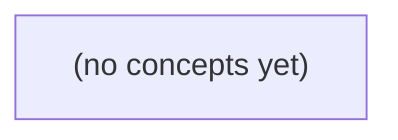

# 01.08 常用标准库协作：把本地消息历史变成可检查的记录

*一本承接 01.01—01.07 的 Go 初学者教材，以虚构会话 c-a、用户 u-a 和消息 m-a 为贯穿案例，逐步将内存中的消息对象编码、读取、解码、验证、导出为可检查的本地历史记录。课程聚焦 encoding/json、time、bufio、io、os 与 flag 的协作边界，并通过完整静态程序、路径推演和分层练习建立可靠的输入处理意识。*

**章节:** 2

---

## 本书导览

- 了解整本书的章节脉络
- 掌握各章之间的概念依赖关系
- 选择最合适的阅读顺序

# 01.08 常用标准库协作：把本地消息历史变成可检查的记录

一本承接 01.01—01.07 的 Go 初学者教材，以虚构会话 c-a、用户 u-a 和消息 m-a 为贯穿案例，逐步将内存中的消息对象编码、读取、解码、验证、导出为可检查的本地历史记录。课程聚焦 encoding/json、time、bufio、io、os 与 flag 的协作边界，并通过完整静态程序、路径推演和分层练习建立可靠的输入处理意识。

下方的概念图展示了本书 0 个核心概念以及它们之间的依赖关系；再下方是 1 个章节的入口。你可以按从上到下的顺序阅读，也可以根据自己的兴趣或先验知识选择切入点。

#### 概念图



## 章节索引

- **01.08 常用标准库协作：把本地消息历史变成可检查的记录** — 承接错误、I/O 与关闭责任，逐步建立字节、记录边界、JSON、时间、大小限制、文件写入和命令行参数的协作模型。使用虚构 IM 的本地历史导入导出；不涉及 HTTP、网络、并发、数据库、身份认证、稳定持久化或消息送达。

## 01.08 常用标准库协作：把本地消息历史变成可检查的记录

- 区分内存对象、字节、记录边界、文件格式和业务有效性
- 用导出字段与 JSON tag 明确一个小型历史文件的字段名
- 区分 JSON 可解码、格式符合、字段完整和业务规则通过
- 用 time.Time、RFC3339、时区和 layout 表达明确的时间含义
- 理解 Scanner 的逐行读取、长度上限与 Err 检查
- 在读入前后执行大小限制，避免把截断误当成功
- 说明 WriteFile 的覆盖、截断和部分写入边界
- 用 flag 在命令入口收集参数，再交给普通函数验证

从内存里的消息对象到可检查的本地文件，需要先分清字节、文本、记录、格式与业务规则的边界。

### 先界定本地历史的对象与边界

### 先界定本地历史的对象与边界

一条消息先是**内存对象**：程序运行时用 `struct` 保存的数据。例如虚构会话 `c-a` 中，用户 `u-a` 发出的消息 `m-a`：

`{会话ID:"c-a", 发送者ID:"u-a", 消息ID:"m-a", 正文:"你好"}`

对象写入磁盘时，不能直接保存“结构体本身”，而要变成**字节**：`[]byte` 是文件真正读写的内容。若这些字节按某种字符编码表达可阅读内容，可称为**文本**；例如 UTF-8 文本 `"你好"` 对应若干字节。

为了让以后能检查、读取和恢复对象，需要把字节组织成**记录**。记录是“可识别的一份数据”，不等于一行文本。朴素写法可能是：

`c-a,u-a,m-a,你好`

它很快会产生歧义：正文若含逗号怎么办？含换行时一条消息是否变成两行？新增“发送时间”字段后，旧文件如何解释？因此，不能把“一行”误认为稳定的记录边界。

本节使用 `history-c-a.json` 作为本地文件，并用一个小 JSON 对象表示一条记录：

`{"conversation_id":"c-a","sender_id":"u-a","message_id":"m-a","body":"你好"}`

这里，**文件**是磁盘上的字节容器；**格式**是 JSON 的括号、引号、逗号等语法规则；**模式**（schema）进一步规定应有哪些字段、字段是什么类型；**业务规则**则规定这些字段是否有意义，例如 `conversation_id` 必须是 `c-a`、`body` 不能为空、消息 ID 不可重复。

JSON 语法正确，不等于字段齐全，更不等于消息允许写入。JSON 也不提供加密、身份验证、送达凭证或存储可靠性；它只是组织数据的文本格式。

本例只处理当前机器上的历史文件，不代表服务端历史，不定义消息传输协议，也不证明消息已送达。并且应先修复 01.07 中的错误路径：每一层读取数据后，先解码，再验证模式与业务规则。

### 朴素文本为何难以表示消息记录

### 朴素文本为何难以表示消息记录

内存中的消息对象可以写成：

`{会话:"c-a", 用户:"u-a", 消息:"m-a", 正文:"第一行\n第二行"}`

若把它直接保存到 `history-c-a.txt`，一种朴素格式可能是：

`c-a|u-a|m-a|第一行`

但正文中的换行会让第二行脱离原记录；读取者无法判断它是正文续行，还是下一条消息。即使限制“一条消息一行”，分隔符仍可能冲突：

`c-a|u-a|m-a|我想输入 | 符号`

此时按 `|` 切分会得到五段，字段边界不再可靠。后来还想加入“创建时间”或“是否撤回”时，旧文件究竟是缺字段、旧版本，还是损坏文本，也难以区分。

结构化记录把字段名和字段值明确写出，例如一个小型 JSON 对象：

`{"conversation":"c-a","user":"u-a","message":"m-a","body":"第一行\n第二行"}`

其中 `\n` 是文本中的换行字符表示法，不会把一条记录拆成两行；字段名也让读取代码能检查“会话”“用户”“正文”分别是什么。JSON 的价值是提供可约定的**格式**：字节按规则解码为文本，再按 JSON 语法解码为对象。

不过，JSON 语法正确不等于字段齐全，更不等于消息符合业务规则。例如 `{"conversation":"c-a"}` 是合法 JSON，却缺少正文；`{"conversation":"","body":""}` 也未必允许写入。因此后续处理应分层：先修复 `os.Open`、读取、关闭中的错误路径；读取文件时先解码，再验证 schema 与业务规则。

`history-c-a.json` 只是本地可检查的记录文件，不是服务端历史、消息协议或送达凭证。JSON 也不负责加密、身份验证，更不能保证磁盘写入一定可靠。

### 用小型 JSON 对象描述一条消息

### 用小型 JSON 对象描述一条消息

先从内存中的一条虚构消息出发：

- 会话：`c-a`
- 发送者：`u-a`
- 消息编号：`m-a`
- 正文：`你好\n这是第二行`

它在 Go 中可以是一个 `struct`，在文件中则必须先变成字节。若直接写成一行文本：

`c-a,u-a,m-a,你好`

看似简单，却很快遇到问题：正文中有逗号怎么办？有换行怎么办？以后增加“创建时间”字段时，旧文件如何识别？这种写法没有明确的字段边界、转义规则和版本演进位置。

因此可用一个小型 JSON 对象表示一条记录：

```json
{
  "conversation_id": "c-a",
  "sender_id": "u-a",
  "message_id": "m-a",
  "text": "你好\n这是第二行"
}
```

这里 `{...}` 表示一个对象；键与值之间用 `:` 分隔；多个字段用 `,` 分隔；字符串必须写在双引号中。正文里的换行不是文件中的记录边界，而是字符串值中的 `\n` 转义序列。

`history-c-a.json` 可以先保存一个消息数组：

```json
[
  {
    "conversation_id": "c-a",
    "sender_id": "u-a",
    "message_id": "m-a",
    "text": "你好\n这是第二行"
  }
]
```

数组 `[...]` 给出了记录边界：每个对象是一条消息。文件名提示它属于 `c-a`，但仍保留 `conversation_id`，便于读取后检查文件内容是否放错。

JSON 只规定字节如何组成对象、数组、字符串等格式；它不保证字段齐全，更不保证消息可写入。比如缺少 `text`、`message_id` 为空、`conversation_id` 不等于 `c-a`，都可能是合法 JSON，却违反业务规则。后续读取时应遵循“先解码，再验证”：先把字节解码为对象，再检查字段和规则。

这个本地文件不是服务端历史、消息传输协议，也不是送达凭证；它只是可检查的本地记录。JSON 也不提供加密、身份验证或可靠存储保证。

### 解码成功不等于记录可写入

### 解码成功不等于记录可写入

设内存中的消息对象包含会话 `c-a`、用户 `u-a`、消息 `m-a` 与正文。把它写入本地 `history-c-a.json` 时，至少要经过两道检查：**解码**与**验证**。

```json
{"conversation_id":"c-a","user_id":"u-a","message_id":"m-a","text":"你好"}
```

这是一条 JSON 语法正确的字节序列；解码后可得到字段和对应类型。但它仍不必然是可写入的消息记录。例如：

```json
{"conversation_id":"c-a","user_id":"u-a","message_id":"","text":"你好"}
```

这里 JSON 正确，字段类型也匹配，却违反业务规则：空消息标识不能作为可追踪记录。再如：

```json
{"conversation_id":"c-a","user_id":"u-a","message_id":"m-a","text":123}
```

字段名存在，但 `text` 应是文本，数字 `123` 不能解码为字符串字段。

因此要区分四层含义：

1. **JSON 语法正确**：花括号、逗号、引号等结构合法。
2. **字段存在**：对象中出现所需字段；但缺失字段有时会在 Go 中表现为零值。
3. **字段类型匹配**：例如 `text` 是字符串，而非数字或数组。
4. **满足业务规则**：标识非空、正文非空、会话归属正确等。

处理顺序应固定为：先按格式解码，再检查业务规则；任何一步失败，都沿用 01.07 的错误路径返回，不继续写文件。JSON 只是记录格式，不提供加密、身份验证、原子写入或送达保证。`history-c-a.json` 仅是本地可检查历史，不是服务端历史、消息协议，也不是消息已送达的凭证。

### 把 01.07 的错误路径接入导入导出

### 把 01.07 的错误路径接入导入导出

导入导出不是“调用一次 `json` 就完成”。应把失败按层归属，并沿用 01.07 的规则：函数发现错误后立刻返回；调用者决定是补充上下文、提示用户还是停止操作。

以本地文件 `history-c-a.json` 为例，导入可拆成：

1. **读取层**：`os.Open` 或 `os.ReadFile` 失败，原因可能是文件不存在、路径错误或权限不足。这是文件访问错误，不是 JSON 错误。
2. **解码层**：文件读到了字节，但字节不能组成目标 JSON，例如少了 `}`、字符串未闭合。这是格式错误。
3. **验证层**：JSON 语法正确，却缺少 `id`、`from`、`text`，或消息 `from` 不是 `u-a`。这是 schema 或业务规则错误。
4. **使用层**：只有通过验证的记录才能加入内存历史。

```go
records, err := readHistory("history-c-a.json")
if err != nil {
    return err
}
```

`readHistory` 内部不应把所有错误伪装成“导入失败”。更可检查的做法是保留原因：

```go
data, err := os.ReadFile(path)
if err != nil {
    return fmt.Errorf("读取历史文件 %q: %w", path, err)
}
```

导出顺序则相反：先验证内存中的消息，再编码为 JSON 字节，最后写入文件。编码失败属于格式转换问题；写入失败属于文件系统问题。即使 JSON 已成功编码，也不等于文件一定写成功。

尤其要避免把 JSON 当成安全承诺：JSON 不加密，任何能读取文件的人都可能看到正文；JSON 不自动验证字段和值；JSON 编码成功也不保证磁盘写入、文件未损坏或记录已送达服务端。`history-c-a.json` 只是 `c-a` 的本地可检查副本，不是服务端历史、消息协议或送达凭证。

> **要点** — 本地历史文件是字节编码的记录格式；先解码，再按模式和业务规则验证，才能成为可检查的消息记录。

先定义可检查的文件契约，再讨论编码、解码与业务校验，避免把“能解析”误当成“数据可信”。

### 从文件契约定义历史记录

### 从文件契约定义历史记录

本地历史文件首先是一个可检查的契约：顶层描述“这是哪个会话、采用什么版本”，内部保存按顺序出现的消息。

```go
type HistoryFile struct {
	Version        int             `json:"version"`
	ConversationID string          `json:"conversation_id"`
	Messages       []StoredMessage `json:"messages"`
}

type StoredMessage struct {
	ID        string `json:"id"`
	SenderID  string `json:"sender_id"`
	Body      string `json:"body"`
	CreatedAt string `json:"created_at"`
}
```

`HistoryFile` 是整个文件对应的 Go 值：

- `Version` 表示文件格式版本。本章约定必须为 `1`，以后格式变化时可据此判断如何处理。
- `ConversationID` 是会话的稳定标识，不能为空；它避免不同会话的消息被混入同一份记录。
- `Messages` 是消息列表。即使当前没有消息，也应明确表达为空数组，而不是模糊地缺失该字段。

`StoredMessage` 描述一条可持久化的消息：

- `ID` 是消息标识，在同一个会话内不得重复。
- `SenderID` 标识发送者。
- `Body` 是消息正文，不能为空。
- `CreatedAt` 保存创建时间，本章要求它必须是 RFC3339 格式，例如 `"2025-03-08T10:30:00Z"`。

字段后的反引号内容称为结构体标签。例如 `json:"conversation_id"` 中，`json` 表示 `encoding/json` 要读取的标签类别，`"conversation_id"` 是写入 JSON 时使用的字段名。于是 Go 的 `ConversationID` 会对应 JSON 的 `"conversation_id"`，而不是默认的 `"ConversationID"`。

这些字段名以大写字母开头，因此是可导出的；标准库才能通过反射读取和写入它们。若写成小写的 `conversationID`，它是未导出字段，默认不会参与 JSON 编码与解码。

本章采用如下教学契约：版本必须为 `1`、会话 ID 非空、消息 ID 会话内唯一、正文非空、创建时间符合 RFC3339。结构体标签只负责字段映射；它不是验证规则、访问控制机制，也不会自动完成版本迁移。

### 导出字段与JSON标签的对应关系

### 导出字段与 JSON 标签的对应关系

Go 的 `encoding/json` 默认只能访问**导出字段**：字段名首字母大写，包外代码也可见。例如：

```go
type HistoryFile struct {
	Version        int             `json:"version"`
	ConversationID string          `json:"conversation_id"`
	Messages       []StoredMessage `json:"messages"`
}

type StoredMessage struct {
	ID        string `json:"id"`
	SenderID  string `json:"sender_id"`
	Body      string `json:"body"`
	CreatedAt string `json:"created_at"`
}
```

这里每个声明包含三层含义：

- `Version`、`ConversationID`、`Messages` 是 Go 字段名。首字母大写意味着它们是导出字段，因此默认可被 `json.Marshal` 读取，也可由 `json.Unmarshal` 写入。
- 反引号中的 ``json:"conversation_id"`` 是结构体标签。它为标准库提供额外元数据：该字段在 JSON 中使用 `"conversation_id"`，而不是默认推导出的 `"ConversationID"`。
- `"conversation_id"` 是实际文件里的 JSON 字段名。使用小写加下划线可让文件格式保持稳定、易读，并与 Go 的大驼峰字段名分离。

因此，`ConversationID` 编码后对应：

```json
"conversation_id": "conv-001"
```

而不是：

```json
"ConversationID": "conv-001"
```

如果没有标签，`encoding/json` 通常会使用 Go 字段名作为 JSON 键。例如 `Version` 会写成 `"Version"`。显式写出 `json:"version"`，是在声明文件契约，而非依赖默认行为。

相反，小写字段未导出，默认不会参与 JSON 编解码：

```go
type StoredMessage struct {
	ID       string `json:"id"`
	Body     string `json:"body"`
	loadedAt string
}
```

`loadedAt` 即使保存了值，编码结果中也不会出现；JSON 中即使有 `"loadedAt"`，解码时也不会写入它。原因不是 JSON 字段名不匹配，而是 `encoding/json` 无法通过默认反射机制访问未导出字段。

还要区分标签与校验。`json:"id"` 只说明字段映射关系；它不保证 `ID` 非空、不阻止重复 ID，也不验证 `CreatedAt` 是否为 RFC3339。JSON 能成功解析，只说明字节形式可被读取；版本、会话标识和消息内容是否符合契约，仍需后续业务校验。

### Marshal与Unmarshal如何传递字节

### Marshal与Unmarshal如何传递字节

`encoding/json` 在内存中的 Go 值与可保存、可传输的 JSON 字节之间转换。编码时，`json.Marshal` 接收一个 Go 值，返回 `[]byte`：

```go
data, err := json.Marshal(history)
if err != nil {
	return err
}
```

这里的 `data` 不是文件，也不是结构体副本，而是一段 UTF-8 JSON 文本对应的字节。例如可读性更好的 `json.MarshalIndent`：

```go
data, err := json.MarshalIndent(history, "", "  ")
```

它比 `Marshal` 多出缩进和换行，适合写入本地历史文件；两者表达的数据含义相同。

解码方向相反：`json.Unmarshal` 读取 JSON 字节，并把结果写入目标值。目标必须传入指针：

```go
var loaded HistoryFile
err := json.Unmarshal(data, &loaded)
if err != nil {
	return err
}
```

`&loaded` 表示“允许函数修改 `loaded` 所在的位置”。若传入 `loaded` 而不是 `&loaded`，解码器只能得到一个值副本，无法把字段写回原变量，因此会报错。

完整的内存往返示例如下：

```go
history := HistoryFile{
	Version:        1,
	ConversationID: "conv-001",
	Messages: []StoredMessage{
		{
			ID:        "msg-001",
			SenderID:  "user-001",
			Body:      "你好",
			CreatedAt: "2025-03-08T10:00:00Z",
		},
	},
}

data, err := json.MarshalIndent(history, "", "  ")
if err != nil {
	panic(err)
}

var loaded HistoryFile
if err := json.Unmarshal(data, &loaded); err != nil {
	panic(err)
}
```

预期 JSON 仅演示、不执行：

```json
{
  "version": 1,
  "conversation_id": "conv-001",
  "messages": [
    {
      "id": "msg-001",
      "sender_id": "user-001",
      "body": "你好",
      "created_at": "2025-03-08T10:00:00Z"
    }
  ]
}
```

必须区分两层结果：`Unmarshal` 成功只说明字节的 JSON 语法能写入结构体；它不证明版本为 `1`、会话 ID 非空、消息 ID 未重复、正文非空，也不保证 `CreatedAt` 符合 RFC3339。这些属于解码后的业务校验。

### 完整内存编解码示例

### 完整内存编解码示例

下面的程序只在内存中构造、编码和解码消息历史，不读写文件。`MarshalIndent` 将 Go 值编码为带缩进的 `[]byte`；`Unmarshal` 则把这些字节写入 `&decoded` 指向的结构体值。

```go
package main

import (
	"encoding/json"
	"fmt"
	"time"
)

type HistoryFile struct {
	Version        int             `json:"version"`
	ConversationID string          `json:"conversation_id"`
	Messages       []StoredMessage `json:"messages"`
}

type StoredMessage struct {
	ID        string `json:"id"`
	SenderID  string `json:"sender_id"`
	Body      string `json:"body"`
	CreatedAt string `json:"created_at"`
}

func main() {
	history := HistoryFile{
		Version:        1,
		ConversationID: "conv-001",
		Messages: []StoredMessage{
			{
				ID:        "msg-001",
				SenderID:  "user-42",
				Body:      "你好，帮我记录这条消息。",
				CreatedAt: time.Now().UTC().Format(time.RFC3339),
			},
		},
	}

	data, err := json.MarshalIndent(history, "", "  ")
	if err != nil {
		panic(err)
	}
	fmt.Println(string(data))

	var decoded HistoryFile
	if err := json.Unmarshal(data, &decoded); err != nil {
		panic(err)
	}

	fmt.Printf("版本：%d，会话：%s，消息数：%d\n",
		decoded.Version, decoded.ConversationID, len(decoded.Messages))
}
```

预期 JSON 仅用于观察字段映射，不代表每次运行都完全相同，因为 `created_at` 来自当前时间：

```json
{
  "version": 1,
  "conversation_id": "conv-001",
  "messages": [
    {
      "id": "msg-001",
      "sender_id": "user-42",
      "body": "你好，帮我记录这条消息。",
      "created_at": "2025-01-01T00:00:00Z"
    }
  ]
}
```

这里“成功解码”只说明 JSON 语法与字段类型可接受；仍应另行检查版本是否为 `1`、会话 ID 与正文是否非空、消息 ID 是否重复，以及 `created_at` 是否确实符合 RFC3339。

### 解析成功后仍要检查业务契约

### 解析成功后仍要检查业务契约

`json.Unmarshal` 成功只说明输入满足 JSON 语法，且能够写入目标 Go 值；它不证明历史记录可被应用安全使用。例如：

- 缺少 `conversation_id` 时，`ConversationID` 得到零值 `""`；
- `"body": ""` 是空字符串，也会成功解码；
- `"messages": null` 会得到 `nil` 切片，`"messages": []` 得到长度为 `0` 的非 `nil` 切片；两者都不是解析错误；
- 缺少 `created_at` 时，字符串字段同样是 `""`；
- 重复消息 ID、未知版本号都符合 JSON 语法，却破坏了文件契约。

因此，解码后应立刻按本章约定校验：

```go
func (h HistoryFile) Validate() error {
	if h.Version != 1 {
		return fmt.Errorf("不支持的版本：%d", h.Version)
	}
	if h.ConversationID == "" {
		return errors.New("会话 ID 不能为空")
	}

	seen := make(map[string]bool)
	for i, m := range h.Messages {
		if m.ID == "" {
			return fmt.Errorf("第 %d 条消息缺少 ID", i)
		}
		if seen[m.ID] {
			return fmt.Errorf("消息 ID 重复：%s", m.ID)
		}
		seen[m.ID] = true

		if m.Body == "" {
			return fmt.Errorf("消息 %s 的正文不能为空", m.ID)
		}
		if _, err := time.Parse(time.RFC3339, m.CreatedAt); err != nil {
			return fmt.Errorf("消息 %s 的时间不是 RFC3339：%w", m.ID, err)
		}
	}
	return nil
}
```

这里的契约是：版本必须为 `1`，会话 ID 非空，每条消息的 ID 在同一会话内唯一，正文非空，`CreatedAt` 必须能按 `time.RFC3339` 解析。是否允许空消息数组应由产品规则另行明确；不能因为 `nil`、`[]` 或缺字段都能解码，就无声地把它们视为同一种有效状态。

推荐流程是：`Unmarshal` 处理字节到 Go 值的转换，`Validate` 判断业务可信度。前者失败表示文件无法解析，后者失败表示文件可解析但不符合本地消息历史的约定。

> **要点** — JSON标签规定外部字段名；编解码只处理数据形状，文件契约仍需显式业务校验。

导入本地消息历史时，JSON 能解码不等于文件可信。需要依次检查语法、类型、结构与业务规则，并明确拒绝未知内容和尾随数据。

### 建立四层验证模型

### 建立四层验证模型

导入本地消息历史时，`json.Unmarshal` 或 `Decoder.Decode` 成功，只能说明输入“可以被解释成某个 Go 值”，并不表示它已经可信、完整或可直接采用。更稳妥的做法是按四层推进验证：

1. **语法有效**：文件必须是合法 JSON，例如括号、逗号、字符串转义都正确。`{"role":"user"}` 合法，而 `{"role":}` 会在解析阶段失败。

2. **类型匹配**：JSON 值必须能赋给目标字段类型。若结构体字段是 `CreatedAt int64`，输入 `"created_at":"昨天"` 就应被拒绝；但要注意，缺失字段常会留下零值，不一定产生解码错误。

3. **结构字段完整性**：检查对象是否具有业务所需字段，以及字段组合是否合理。例如一条消息至少需要非空 `role` 与 `content`；会话文件需要版本号和消息列表。默认解码会忽略结构体中不存在的 JSON 键，因此“解码成功”不代表结构完全符合预期。

4. **业务不变量**：验证跨字段、跨记录的规则。例如消息时间不能倒退、`role` 只能是允许集合、会话 ID 必须一致、消息数量和文本长度不能超过限制。此层依赖具体业务，无法仅靠 JSON 解码自动完成。

可以将流程概括为：

`读取文件 → 限制大小 → 解码 → 结构检查 → 业务验证 → 采用数据`

尤其不要在解码后立刻把结果写入内存历史或覆盖原文件。只有四层都通过，返回值才是可被应用信任的会话记录。

### 严格解码未知字段

### 严格解码未知字段

`json.Unmarshal` 首先检查 JSON 语法，并按目标类型填充已知字段；但对象中没有对应字段的键默认会被忽略：

```go
type Session struct {
	ID       string `json:"id"`
	Messages []Message `json:"messages"`
}
```

对于 `{"id":"s-1","messages":[],"debug":true}`，解码会成功，`debug` 不会进入 `Session`，也不会产生错误。这不能自动被解释为“安全”或“兼容”：它可能是拼写错误（如 `mesages`）、导出格式不匹配，或文件中混入了本程序未审查的数据。

导入本地历史时，可改用 `json.Decoder`，并且必须在**第一次** `Decode` 前启用严格模式：

```go
func decodeSession(r io.Reader) (Session, error) {
	var s Session

	dec := json.NewDecoder(r)
	dec.DisallowUnknownFields()

	if err := dec.Decode(&s); err != nil {
		return Session{}, fmt.Errorf("解析会话文件: %w", err)
	}
	return s, nil
}
```

此时出现未知对象键会返回错误，调用方可拒绝该文件。严格规则覆盖嵌套对象：只要某层 JSON 对象的键不属于对应结构体字段，导入即失败。

不过，“拒绝未知字段”是当前导入格式的严格约束，不是长期兼容策略。未来若新增字段，旧版本会拒绝新文件；应明确设计版本号、迁移步骤或兼容读取规则，而不是依赖默认忽略来掩盖格式变化。

### 确认文件仅含一个 JSON 值

### 确认文件仅含一个 JSON 值

`Decode(&history)` 成功只说明解码器从输入开头读出了一个合法值；它不会保证文件已经结束。例如，`{"messages":[]}` 后面继续拼接另一个 JSON 对象，第一次解码仍会成功。若导入逻辑只调用一次 `Decode`，尾随会话、数组或垃圾内容可能被悄悄忽略。

严格导入应在完成首个解码后，再执行一次解码并要求得到 `io.EOF`。概念上可写为：先执行 `err := decoder.Decode(&history)`；成功后声明 `var extra any`，再执行 `err = decoder.Decode(&extra)`；只有 `err == io.EOF` 才表示输入恰好结束。若第二次解码成功，说明存在第二个 JSON 值，应报错拒绝；若返回其他错误，则说明首个值之后存在截断文本或非法尾随内容，也应拒绝。

错误信息应保留文件上下文，例如“解析会话文件 `history.json`：包含尾随 JSON 值”。这样可区分读取失败、首个值解析失败与尾随内容失败；只有确认文件唯一、结构正确且业务验证通过后，才采用 `history`。

### 受限读取与错误上下文

### 受限读取与错误上下文

本地会话文件也应视为不可信输入：先限制体积，再严格解析，最后验证业务不变量；任一步失败都附带文件标识，便于定位问题。尤其不能在验证失败时继续使用已解码的部分数据。

```go
func 导入会话(path string, r io.Reader) (会话, error) {
	const 最大字节 = 4 << 20 // 4 MiB
	受限输入 := io.LimitReader(r, 最大字节+1)

	var v 会话
	dec := json.NewDecoder(受限输入)
	dec.DisallowUnknownFields() // 必须在第一次 Decode 前设置

	if err := dec.Decode(&v); err != nil {
		return 会话{}, fmt.Errorf("解析会话文件 %q: %w", path, err)
	}
	if err := dec.Decode(&struct{}{}); err != io.EOF {
		if err == nil {
			return 会话{}, fmt.Errorf("解析会话文件 %q: 存在尾随 JSON 值", path)
		}
		return 会话{}, fmt.Errorf("解析会话文件 %q 的尾随内容: %w", path, err)
	}
	if v.原始字节数 > 最大字节 { // 或在读取层统计实际字节数
		return 会话{}, fmt.Errorf("读取会话文件 %q: 超过大小限制", path)
	}
	if err := 验证会话(v); err != nil {
		return 会话{}, fmt.Errorf("验证会话文件 %q: %w", path, err)
	}
	return v, nil
}
```

实际实现中应可靠统计读取字节数，确认超过上限即拒绝。`DisallowUnknownFields` 只是在当前导入格式中拒绝陌生对象键，不等于长期兼容策略；格式演进时应显式定义版本与迁移规则。

### 严格导入不等于长期兼容

### 严格导入不等于长期兼容

对当前版本的本地会话文件，严格导入通常是正确选择：在首次 `Decode` 前调用 `DisallowUnknownFields()`，可让拼写错误、误写字段或意外嵌套对象立即失败，而不是被 `json.Unmarshal` 默认静默忽略。

```go
dec := json.NewDecoder(io.LimitReader(r, maxFileSize))
dec.DisallowUnknownFields()

var session Session
if err := dec.Decode(&session); err != nil {
	return Session{}, fmt.Errorf("解析会话文件 %q: %w", path, err)
}
```

但这条规则服务的是“我现在只接受我认识的格式”，不等于“格式可以长期自然兼容”。未来程序若新增字段，旧程序会因未知字段拒绝新文件；若删除或改名字段，新程序也未必能理解旧文件的业务含义。单纯关闭严格模式虽然能暂时读入，却可能把本应迁移的数据悄悄丢失。

因此，兼容性应是显式设计，而非依赖解码器的宽松行为：

- 在文件中保留明确的 `version` 字段；
- 按版本分别解析旧结构，转换为当前内部模型；
- 对不支持的未来版本给出明确错误，而非猜测含义；
- 迁移完成后再执行完整业务验证，例如消息顺序、角色合法性、时间范围和必填内容。

严格未知字段检查保护当前导入边界；版本号与迁移函数才负责跨版本演进。

> **要点** — 可靠导入要限制输入、严格解码、确认无尾随值，并在业务验证完成后才接受记录。

消息记录中的时间首先是可比较的时刻，其次才是面向人的显示文本。先分清时区、格式与排序契约，才能避免看似正确的历史顺序错误。

### 时刻、显示与地点分层

### 时刻、显示与地点分层

一条消息的时间应先表示为**时刻**：可在全球范围比较的唯一瞬间。`u-a` 在 `2026-09-23T09:30:00Z` 发送消息，其中 `Z` 表示 UTC；无论读者身在何处，这都是同一个时刻。

但同一时刻可以有不同的显示文本。例如它可显示为 UTC 的 `2026-09-23 09:30`，也可显示为其他地点的当地日期和钟点。显示变化不意味着消息发送时间变化；它只是把同一 `time.Time` 按某个地点或时区呈现。

地点（`time.Location`）或时区信息的职责，是解释“当地的 09:30”究竟对应哪个全球时刻。仅有 `2026-09-23 09:30:00` 这种无偏移日期时间，程序不能自动猜出用户所在时区：它可能是 UTC，也可能是任意地区的本地时间。因此，记录协议应优先保存带偏移的 RFC 3339 文本，例如：

`2026-09-23T09:30:00Z`

Go 中，`time.Time` 适合保存和比较时刻；`time.Now()` 只是获取当前本机时刻的来源，测试消息历史时不应依赖它的实际返回值。`time.RFC3339` 是可用的协议布局：

`time.Parse(time.RFC3339, text)`

它返回 `Time, error`。格式化与解析应遵守对称契约：用约定布局写出，再用同一布局读回。布局不是 `yyyy/mm/dd` 占位符，而是参考时刻 `2006-01-02 15:04:05 -0700` 的样子。

解析成功只说明文本符合格式；它不能证明记录顺序正确、发送时间真实，或发送者身份可信。

### 以 UTC 消息建立记录基准

### 以 UTC 消息建立记录基准

设用户 `u-a` 发送了一条消息，记录中的发送时刻为：

`2026-09-23T09:30:00Z`

末尾的 `Z` 表示 UTC，即协调世界时的零时区偏移。它描述的是一个可比较、可排序的**时刻**，而不是某个用户屏幕上必须显示的钟表时间。

同一时刻换到不同地点，会有不同显示：

- UTC：`2026-09-23 09:30`
- 中国标准时间（UTC+08:00）：`2026-09-23 17:30`
- 纽约夏令时（UTC-04:00）：`2026-09-23 05:30`

三种文本看起来不同，却对应同一个 instant。因此，本地消息历史应优先保存明确带时区或偏移的信息，例如 RFC 3339 文本；展示时再按读者选择的地点转换。

```go
sentAt, err := time.Parse(time.RFC3339, "2026-09-23T09:30:00Z")
if err != nil {
    // 该记录的时间文本不符合约定
}
```

`sentAt` 是 `time.Time`，可用于比较先后；`sentAt.Format(...)` 则生成面向人的文本。`time.Now()` 只能取得程序当前所在机器观察到的当前时刻，不应替代消息中已经声明的发送时刻。

若记录只有 `2026-09-23 09:30:00`，却没有 `Z`、`+08:00` 或地点信息，程序无法自动推断“这是哪个用户所在时区的九点半”。它只是一个缺少时区语义的日期时间，不能可靠地与 UTC 消息比较。

### 用 time.Time 解析协议时间

### 用 `time.Time` 解析协议时间

`time.Time` 表示一个可比较的时间点（instant），适合保存消息发送时刻、排序和计算间隔。对于协议字段，应优先传输带时区偏移的 RFC 3339 文本，例如用户 `u-a` 的消息：

`2026-09-23T09:30:00Z`

其中 `Z` 表示 UTC，因此它明确指向世界时间线上的一个时刻，而不是“某地上午九点半”。同一时刻可以按不同地点显示为不同文本；反过来，`2026-09-23 09:30:00` 这类没有偏移的信息并不能自动推断用户所在地时区。

```go
text := "2026-09-23T09:30:00Z"

sentAt, err := time.Parse(time.RFC3339, text)
if err != nil {
	return fmt.Errorf("发送时间格式无效: %w", err)
}
```

`time.Parse(time.RFC3339, text)` 的职责是：按既定协议布局把文本转换为 `time.Time`，并在文本缺少必要字段、偏移不合法或格式不匹配时返回错误。调用方必须处理该错误；解析成功只说明文本符合布局，不证明消息顺序真实、发送时间可信，也不证明身份可信。

`time.Now()` 仅用于获取程序当前本机所见的时刻，例如创建新记录时设置时间戳；它不应用来替代历史记录中已经保存的协议时间，也不应在读取示例时重新生成结果。

注意，布局不是 `yyyy/mm/dd` 这类占位符。Go 用参考时刻 `2006-01-02 15:04:05 -0700` 的外观描述格式。`Format` 负责把 `time.Time` 写成协议文本，`Parse` 负责按同一契约读回；二者应围绕固定的 RFC 3339 规则协作。

### 理解布局与格式化对称契约

### 理解布局与格式化对称契约

`time.RFC3339` 是消息记录中常用的协议布局：它把日期、时分秒与时区偏移写入同一字符串，例如：

`2026-09-23T09:30:00Z`

末尾的 `Z` 表示 UTC，即协调世界时。它描述的是一个可比较的**时刻**；同一时刻在北京可显示为 `2026-09-23 17:30:00 +08:00`，在其他时区又会有不同的本地显示文本。

Go 的布局不是 `yyyy/mm/dd` 一类占位符系统，而是用参考时刻的具体数字表达字段位置：

`2006-01-02 15:04:05 -0700`

因此，`01` 表示月，`02` 表示日，`15` 表示 24 小时制小时，`-0700` 表示数值时区偏移。记住这串参考时刻，比把它误当成普通日期更重要。

格式化与解析应遵守对称契约：同一布局负责“写出”和“读回”。

`text := sentAt.Format(time.RFC3339)`

`sentAt, err := time.Parse(time.RFC3339, text)`

这里 `Format` 将 `time.Time` 编码为协议文本，`Parse` 按同一协议还原时刻；若格式不符合要求，`Parse` 返回错误。`time.Now()` 可以作为当前本机时刻的来源，但消息历史示例应保存已经确定的发送时刻，而不是依赖运行时的当前结果。

解析成功只说明文本满足布局并能表示一个时刻；它**不能**证明消息顺序真实、发送时间未被篡改，或发送者身份可信。这些属于记录来源、认证与业务规则的问题。

若本文件明确约定：所有时间都使用固定精度的 RFC3339 UTC 字符串，那么字符串字典序可与时间顺序一致。若混入 `+08:00` 等不同偏移，或秒与小数秒精度不一致，就不得用字符串排序推断先后，应先解析为 `time.Time` 再比较。

### 排序边界与不可信时间文本

### 排序边界与不可信时间文本

若消息文件把时间统一写成 UTC 的 RFC3339 文本，例如：

`2026-09-23T09:30:00Z`

其中 `Z` 表示 UTC 零偏移。**仅当所有记录都满足“UTC、同一 RFC3339 格式、相同精度”这一文件契约时**，字符串的字典序才可视为时间先后序：

`2026-09-23T09:30:00Z` < `2026-09-23T10:00:00Z`

这是一种存储约定，不是所有日期字符串都天然具备的性质。以下情况不能直接按文本排序推断时刻顺序：

- 混入偏移：`2026-09-23T09:30:00+08:00` 与 `2026-09-23T02:00:00Z` 可能是同一时刻；
- 精度不同：`...09:30:00Z` 与 `...09:30:00.5Z` 的字典序规则不应被当作业务排序规则；
- 使用无偏移文本：`2026-09-23 09:30:00` 没有说明地点或时区，不能自动猜成用户本地时间。

需要比较不受文本形式影响的时刻时，应先解析：

`tm, err := time.Parse(time.RFC3339, text)`

`err == nil` 只说明文本符合该布局并能构造 `time.Time`；它不证明消息确实按此顺序发送，不证明记录中的时间真实，也不证明发送者身份可信。时间字段可能被客户端时钟、导入程序或攻击者改写。

因此，本地历史可把“统一 UTC 文本可按字典序排序”作为明确契约；一旦输入来源开放、偏移混合或精度不一，就应解析为 `time.Time` 后比较，并把时间可信性与身份验证视为独立问题。

> **要点** — 把时间当作带契约的数据：先解析为时刻，再按明确时区显示；字符串排序只能在严格统一格式下成立。

逐行导入看似只是读取文本，实则要求先分清文件格式、记录边界与输入上限，才能把本地消息历史变成可定位、可验证的记录。

### 先区分 JSON 文件与 JSON Lines

### 先区分 JSON 文件与 JSON Lines

单个 JSON 文件与 JSON Lines（逐行 JSON）看起来都“装着 JSON”，但记录边界完全不同，不能混读。

单个 JSON 文件是**一个完整 JSON 文档**，例如一个数组：

`[{"role":"user","content":"你好"},{"role":"assistant","content":"你好！"}]`

解析时应一次读取并反序列化整个文档；文件末尾只能有空白，不能再接另一个 JSON 值。

JSON Lines 则是一串彼此独立的 JSON 文档，每个非空行恰好是一条记录：

`{"role":"user","content":"你好"}`
`{"role":"assistant","content":"你好！"}`

本章将本地消息历史约定为 JSON Lines，并采用以下规则：

- 每个**非空行**必须解析为一个 `StoredMessage` JSON 对象，而不是数组、字符串或多个对象。
- 行终止符用于分隔记录；`LF`（`\n`）与 `CRLF`（`\r\n`）都可作为文本文件中的行结束方式。
- 空行可以忽略，不产生消息记录。
- 一条记录的 JSON 文本中不得包含未转义的真实换行；若消息内容需要换行，必须写成 JSON 转义形式 `\n`。
- 每行独立校验：先 `json.Unmarshal`，再执行 `validateMessage`。某一行损坏时，应报告其行号，而不是悄悄跳过。

因此，不能把 JSON 数组文件交给逐行读取器：第一行通常只是 `[`，并非 `StoredMessage`；也不能把多行 JSON Lines 当作一次 `json.Unmarshal` 的输入，因为多个顶层 JSON 值不构成单个 JSON 文档。先固定格式，后续才能可靠地定位“第几行是哪条消息”。

### 行边界、空行与记录规则

### 行边界、空行与记录规则

单个 JSON 文件可以是一个数组：

`[{"role":"user","content":"你好"},{"role":"assistant","content":"你好！"}]`

而 JSON Lines 是另一种格式：**每个非空行恰好是一个完整的 JSON 对象**。它不是“把数组拆成多行”，也不能用解析单个 JSON 文档的方式直接混读。

行的结束可由 `\n`、`\r\n` 等行终止符表示。`bufio.Scanner` 默认按行扫描：`Scan()` 返回当前行的正文，并自动剥离行终止符。因此，传给 `json.Unmarshal` 的内容不包含末尾换行。

本章约定如下：

- 每个非空行对应一个 `StoredMessage` JSON 对象。
- 空行只表示排版分隔，读取时跳过，不生成消息。
- 一条记录必须完整位于同一物理行。
- JSON 字符串中的换行必须写成转义序列 `\n`，不能直接写入真实换行字符。

例如，下面是一条合法的单行记录：

`{"role":"user","content":"第一行\n第二行"}`

其中 `\n` 是 JSON 文本中的两个字符，反序列化后才成为消息内容里的换行。若直接写成：

`{"role":"user","content":"第一行`
`第二行"}`

扫描器会把它切成两行；两行都不是完整 JSON，记录边界随之失效。这样规定能让“第几行出错”与“第几条记录出错”保持可追踪的一致性。

### Scanner 的按行读取与错误检查

### Scanner 的按行读取与错误检查

`bufio.Scanner` 适合读取本章这种**受控、较小**的 JSON Lines 输入：它默认以行终止符分词，每次 `Scan()` 返回一行内容，并自动剥离末尾的 `\n` 或 `\r\n`。因此，扫描到的字节正好应当是一条完整 JSON 记录，而不是整个 JSON 数组或任意片段。

JSON Lines 与单个 JSON 文件不能混读：前者要求每个非空行都是一个 `StoredMessage` 对象；对象内部的字符串若需换行，必须写成转义形式 `\n`，不能包含未转义的真实换行。空行可以忽略，但不能把损坏的非空行悄悄跳过。

```go
func scanMessages(r io.Reader, maxLineBytes int) ([]StoredMessage, error) {
	if maxLineBytes <= 0 {
		return nil, fmt.Errorf("每行最大字节数必须为正数")
	}

	scanner := bufio.NewScanner(r)
	scanner.Buffer(make([]byte, 0, 64*1024), maxLineBytes+1)

	var messages []StoredMessage
	lineNo := 0

	for scanner.Scan() {
		lineNo++
		line := scanner.Bytes()
		if len(bytes.TrimSpace(line)) == 0 {
			continue
		}

		var msg StoredMessage
		if err := json.Unmarshal(line, &msg); err != nil {
			return nil, fmt.Errorf("第 %d 行 JSON 无效: %w", lineNo, err)
		}
		if err := validateMessage(msg); err != nil {
			return nil, fmt.Errorf("第 %d 行消息无效: %w", lineNo, err)
		}
		messages = append(messages, msg)
	}

	if err := scanner.Err(); err != nil {
		return nil, fmt.Errorf("读取消息记录失败: %w", err)
	}
	return messages, nil
}
```

这里的责任链不可拆断：`Scan` 划分记录，`Unmarshal` 检查 JSON 语法与字段类型，`validateMessage` 检查业务约束，`Err` 检查读取失败或 token 过长。

`Scanner` 有最大 token 限制，必须在扫描前通过 `Buffer` 显式设置。若规定序列化后的**整行**最多 `maxLineBytes` 字节，则传入 `maxLineBytes+1`：扫描器还需要容纳行终止边界，才能可靠接受长度恰为上限的正文。上限应约束实际 JSON 行字节数，而非只约束某个消息正文；字段名、时间戳、转义字符都会占用空间。超长行与底层读取错误都必须返回，不能遗漏循环后的 `Err()`。

### 从字节限制推导安全边界

### 从字节限制推导安全边界

必须区分三个上限：消息正文大小、`StoredMessage` 序列化后的记录行大小，以及 `Scanner` 可接收的 token 大小。它们通常不相等：正文中的引号、反斜杠和换行会被 JSON 转义，时间、角色等字段也会增加字节数。因此，不能把“正文最多 $B$ 字节”直接作为扫描器上限。

本章规定：一条记录的**序列化 JSON 字节**不超过 `maxLineBytes`，该值不含行终止符；行终止符为单个 `\n`；空行跳过；非空行不得包含未转义的真实换行。于是扫描器实际需要暂存：

`JSON记录字节数 + 终止符字节数 ≤ maxLineBytes + 1`

因此应在扫描前设置 `scanner.Buffer(initial, maxLineBytes+1)`。这里的 `+1` 不是放宽记录限制，而是为紧随记录的 `\n` 留出空间；允许的 JSON 正文仍最多为 `maxLineBytes` 字节。

逐行读取函数可采用 `scanMessages(r io.Reader, maxLineBytes int) ([]StoredMessage, error)`：先拒绝非正的 `maxLineBytes`，再创建 `bufio.Scanner`、调用 `Buffer`，对每个非空行执行 `json.Unmarshal` 和 `validateMessage`。解析失败、校验失败、扫描器报错或超长记录都必须立刻返回，并附带行号，例如“第 12 行 JSON 无效”。循环结束后必须检查 `scanner.Err()`；否则超长 token 等错误会被误当作正常文件结束。

`Scanner` 适合这种受控的小型逐行历史文件，不应用于无限长记录、大对象或任意网络流。

### 实现受控的逐行导入函数

### 实现受控的逐行导入函数

`scanMessages` 面向受控的小型 JSON Lines 输入：每个**非空行**恰好是一条 `StoredMessage` 的 JSON 对象。它不是“一个 JSON 文件拆成多行”——普通 JSON 可以是一个数组或对象，并允许格式化换行；JSON Lines 则以行作为记录边界，行内不能出现未转义的真实换行。

```go
func scanMessages(r io.Reader, maxLineBytes int) ([]StoredMessage, error) {
	if maxLineBytes <= 0 {
		return nil, fmt.Errorf("最大行字节数必须为正数")
	}

	scanner := bufio.NewScanner(r)
	scanner.Buffer(make([]byte, 4*1024), maxLineBytes+1)

	var messages []StoredMessage
	for lineNo := 1; scanner.Scan(); lineNo++ {
		line := scanner.Bytes() // Scanner 已剥离行终止符
		if len(bytes.TrimSpace(line)) == 0 {
			continue
		}

		var msg StoredMessage
		if err := json.Unmarshal(line, &msg); err != nil {
			return nil, fmt.Errorf("第 %d 行 JSON 无效: %w", lineNo, err)
		}
		if err := validateMessage(msg); err != nil {
			return nil, fmt.Errorf("第 %d 行消息无效: %w", lineNo, err)
		}
		messages = append(messages, msg)
	}
	if err := scanner.Err(); err != nil {
		return nil, fmt.Errorf("读取消息记录失败: %w", err)
	}
	return messages, nil
}
```

这里将 `maxLineBytes` 定义为**序列化记录正文**的最大字节数，不包含行终止符。`Scanner` 的 token 上限却需要能区分“长度刚好为上限”和“超过上限”：设置为 `maxLineBytes+1`，使长度为 `maxLineBytes` 的行可被接受，而达到额外一个字节的行会在后续显式长度检查中拒绝；若要严格执行该语义，应在 `Scan` 后补充：

`if len(line) > maxLineBytes { return nil, fmt.Errorf("第 %d 行超过大小限制", lineNo) }`

不能只限制消息字段正文，因为引号、键名、转义字符和 JSON 结构同样占用输入字节。扫描错误、超长行、解码错误都必须返回，不能悄悄跳过；行号让损坏记录可被准确定位。

`bufio.Scanner` 适合这种有明确上限的逐行导入，不适合无限长记录、大型 JSON 对象或任意网络流；这些场景应改用更适合的流式读取策略。

> **要点** — 逐行导入的关键是格式不混读、每行受限且可校验，并让超长行与扫描错误携带明确行号返回。

本节把资源关闭责任延伸到文件导入导出：既要限制读入量，也要明确写入成功、覆盖行为与失败边界。

### 读取文件的资源责任与上限

### 读取文件的资源责任与上限

导入本地消息历史时，文件内容不应被视为“天然可信且大小适中”。基本流程是：`os.Open` 成功后立刻登记关闭；读取前设置字节上限；只要超过上限，就拒绝导入。

```go
file, err := os.Open(path)
if err != nil {
	return nil, err
}
defer file.Close()

if max <= 0 {
	return nil, fmt.Errorf("最大读取长度必须为正整数")
}

data, err := io.ReadAll(io.LimitReader(file, int64(max+1)))
if err != nil {
	return nil, err
}
if len(data) > max {
	return nil, fmt.Errorf("文件超过 %d 字节上限", max)
}
```

这里的 `defer file.Close()` 很关键：`Open` 已成功就意味着获得了文件描述符等系统资源；无论后续读取、长度检查或解码是否失败，函数返回时都应归还它。

`io.LimitReader(file, int64(max+1))` 不是静默截断方案。故意多读 1 个字节，才能区分“文件刚好为 `max` 字节”和“文件至少还有更多内容”：

- `len(data) <= max`：允许进入下一步处理；
- `len(data) > max`：明确报错，拒绝不完整导入。

`max` 的单位是字节，不是字符数、行数或消息条数。UTF-8 中文字符通常占多个字节，因此不能用“文本看起来不长”推断文件未超限。

读取上限只约束读入内存的原始数据量；它不替代后续的 JSON 解码、字段类型检查、必填字段检查或业务规则校验。文件没有超限，只说明它可以被安全地交给下一阶段处理。

### 用限量读取拒绝超大历史

### 用限量读取拒绝超大历史

导入历史文件时，不能直接对任意大小的输入执行 `io.ReadAll`：文件可能异常庞大，导致进程占用过多内存。若最大允许大小为 `max` 字节，且 `max` 必须是正整数，可采用“多读一个字节”的判定方式：

```go
limited := io.LimitReader(reader, int64(max+1))
data, err := io.ReadAll(limited)
if err != nil {
    return err
}
if len(data) > max {
    return fmt.Errorf("历史文件超过大小限制：最多 %d 字节", max)
}
```

`io.LimitReader` 不会报告“文件被截断”；它只会让后续读取最多得到指定数量的字节。因此，若限制恰好设为 `max`，`io.ReadAll` 得到长度为 `max` 的数据时，无法区分原文件恰好为 `max` 字节，还是实际内容更大但已被静默截断。

将上限设为 `max+1` 后，逻辑变得可检查：

- 读到不超过 `max` 字节：输入大小合格；
- 读到 `max+1` 字节：原输入至少超过 `max`，应明确拒绝；
- 读取过程返回错误：按读取失败处理，不能把残缺数据当作有效历史。

这里的限制只约束“读入多少字节”，并不保证内容正确。即使大小合格，后续仍必须执行 JSON 解码，并进行业务校验，例如字段类型、必填项、消息结构和允许的角色值等。大小限制防的是资源耗尽；解码与校验防的是格式错误和不可信数据，三者不能互相替代。

### 读取上限不等于内容有效

### 读取上限不等于内容有效

`io.LimitReader(reader, max+1)`解决的是**读入规模**问题：读取后执行 `len(data) > max`，即可拒绝超过 `max` 字节的文件，避免把超大历史文件完整装入内存。这里的 `max` 必须是正整数，单位是字节；多读出的 `1` 个字节用于区分“刚好等于上限”和“已经超限”。

但文件未超限，并不表示它能成为可用的消息历史。至少还存在两层独立检查：

1. **JSON 解码层**：字节可能不是合法 JSON，例如文件被手工编辑后漏了逗号、编码结果被截断，或顶层结构不是预期的数组。应由 `json.Unmarshal` 等解码操作报告语法与类型错误。
2. **消息业务层**：即使 JSON 合法，也可能不符合程序规则。例如消息内容为空、角色不在允许集合中、时间字段无效、消息数量过多，或字段组合违反约束。此类问题应由专门的校验函数处理。

可以将导入过程理解为三道门：

`大小限制 → JSON 结构解析 → 消息业务校验`

第一道门只回答“能否安全读入”；第二道门回答“能否解释为目标数据”；第三道门才回答“能否作为可信消息历史使用”。不要因为已经限制读取长度，就跳过解码错误处理或业务规则检查。

### 内存编码后覆盖式导出

### 内存编码后覆盖式导出

导出本地消息历史时，先在内存中完成 JSON 编码，再写入目标文件：

```go
data, err := json.MarshalIndent(history, "", "  ")
if err != nil {
	return fmt.Errorf("编码消息历史失败: %w", err)
}

if err := os.WriteFile(path, data, 0o600); err != nil {
	return fmt.Errorf("写入消息历史失败: %w", err)
}
```

这个顺序很重要：

1. `json.MarshalIndent` 先检查数据是否能够编码。若编码失败，尚未触碰旧文件，原有内容不会因本次导出被截断。
2. 只有拿到完整的 `data` 后，才调用 `os.WriteFile` 执行覆盖式写入。
3. `MarshalIndent` 生成带缩进的 JSON，便于人工检查；缩进会略增文件体积，但通常适合消息历史这类本地记录。

`os.WriteFile(path, data, 0o600)` 封装了打开、写入和关闭：文件不存在时创建，创建权限请求为仅当前用户可读写；但该权限会受系统 `umask` 影响，并且只作用于新建文件。若文件已存在，`0o600` 不会改变其既有权限。

已存在的文件会先被截断再写入，因此它是“覆盖式”导出，而不是追加。还要明确其可靠性边界：函数返回 `nil` 表示本次 `WriteFile` 已完成，但不承诺进程崩溃时的原子替换、数据已稳定落盘、旧版本备份、并发写入安全或多端同步。写入涉及多个系统调用，发生错误时目标文件可能已经被截断或只写入部分内容。

这里选择 `WriteFile`，是因为一次性写出完整 `[]byte` 时无需自行承担 `Open` 后 `defer Close` 的责任；需要流式输出、特殊打开标志或更细粒度错误处理时，再使用显式文件对象。更可靠的文件更新属于后续主题。

### 写入语义、权限与承诺边界

### 写入语义、权限与承诺边界

导出消息历史时，先在内存中完成序列化，再一次写入文件：

`data, err := json.MarshalIndent(history, "", "  ")`

`err = os.WriteFile(path, data, 0o600)`

这种顺序意味着：JSON 编码失败时，不会开始修改目标文件；只有得到完整的 `data` 后才进入写入阶段。`0o600` 表示新建文件建议仅允许当前用户读写，但它不是对每次写入都强制“重设权限”的命令。

`os.WriteFile` 的语义需要分开理解：

- 路径不存在时，函数会创建文件，并以传入权限作为创建权限的基础；实际权限还会受到系统 `umask` 影响。
- 路径已经存在时，传入的 `0o600` 不会改变该文件原有权限。
- 已存在文件会先被截断，再写入新内容，因此导出本质上是覆盖，不是追加。
- 写入过程可能涉及多个系统调用；如果中途发生磁盘满、权限变化或设备错误，函数会返回错误，但文件可能已经被截断，也可能残留部分新内容。

因此，本章的成功承诺应保持准确：当 `os.WriteFile` 返回 `nil` 时，数据已按该调用的语义完成写入。它不承诺进程或系统崩溃时仍保持原文件，也不承诺数据已稳定落入持久介质，更不提供备份、并发写入协调或多设备同步保证。

`os.ReadFile`、`os.WriteFile` 适合简单场景：它们封装了打开和关闭，减少遗漏 `Close` 的机会。但需要限制导入大小、控制读取过程或管理更复杂资源时，应使用显式 `os.Open`，并在成功后立即 `defer Close`。至于崩溃原子更新等更强保证，属于后续可靠文件更新主题。

> **要点** — 文件导入要限量且拒绝超限；文件导出只承诺返回 nil 时写入完成，不承诺原子更新或长期可靠保存。

命令行负责接收启动输入，业务函数负责处理已解析且经验证的值；两者分层，才能让历史导入导出既清晰又可检查。

### 命令行输入的基本构成

### 命令行输入的基本构成

一次命令行启动可抽象为一串文本：

`程序名 [flag...] [位置参数...]`

例如：`history -path ./messages.jsonl -max-bytes 4096 export`

其中各部分职责不同：

- **程序名**：通常是可执行文件名，如 `history`。它标识要启动哪个程序，不属于业务输入。
- **flag（选项）**：以 `-` 或 `--` 开头，用于命名配置，例如 `-path`、`-max-bytes`、`-format`。flag 适合表达可选、可复用且含义明确的参数。
- **位置参数**：不带名称，依靠出现顺序表达含义，如上例的 `export`。它们常用于动作、文件名或子命令，因此必须明确约定数量与顺序。
- **默认值**：调用者未提供某个 flag 时使用的初始值。例如 `-format` 默认是 `jsonl`，`-max-bytes` 默认是 `4096`。

默认值只是“未输入时采用什么值”，不是业务规则已经成立的证明。`-path` 的默认值可能仍为空；用户也可能传入 `-max-bytes 0`、负数或不支持的 `-format xml`。因此，解析得到值后仍要检查：路径是否可用、字节上限是否大于零、格式是否属于 `json` 或 `jsonl`，以及是否出现了意外的位置参数。

理解这四类输入后，入口函数就可以负责解释命令行，而历史加载、JSONL 读取等普通函数只接收已经解析并验证过的参数。

### 先定义全部 flag，再统一解析

### 先定义全部 flag，再统一解析

Go 的 `flag` 包把命令行输入分成两类：以 `-` 开头的是 flag，例如 `-path`、`-max-bytes`；不带名称的剩余内容是位置参数。`flag.String`、`flag.Int` 等函数**不会立即读取命令行**，而是注册规则，并返回保存解析结果的指针：

```go
path := flag.String("path", "", "历史文件路径")
maxBytes := flag.Int("max-bytes", 1<<20, "单条记录最大字节数")
format := flag.String("format", "jsonl", "输入格式：json 或 jsonl")

flag.Parse()

if flag.NArg() != 0 {
	return errors.New("不接受位置参数")
}
if *maxBytes <= 0 {
	return errors.New("max-bytes 必须大于 0")
}
if *format != "json" && *format != "jsonl" {
	return errors.New("format 必须为 json 或 jsonl")
}
if *path == "" {
	return errors.New("path 不能为空")
}
```

顺序应固定为：**定义全部 flag → 调用一次 `flag.Parse()` → 读取指针指向的值 → 执行业务校验与处理**。在 `Parse` 之前读取 `*path`，得到的只是默认值；在某个 flag 定义之后过早解析，后续定义的选项也无法被正确识别。

默认值只是“未提供参数时的初始值”，不是业务规则已经成立的证明。例如空字符串路径仍不可用于打开文件，`-max-bytes` 即使被解析为整数也可能是零或负数，`-format` 虽是字符串却可能不属于支持的格式。入口层应报告这些错误，再将已验证的 `*path`、`*maxBytes`、`*format` 传给 `loadHistory`、`loadJSONLines` 等普通函数。

不要在底层函数中调用 `flag.Parse()`：这会把命令行状态与文件解析逻辑耦合，既难测试，也难复用。全局 `flag` 适合单一小命令；当程序出现多个子命令时，应改用各自的 `FlagSet` 并继续保持解析层与业务层分离。

### 入口层验证历史导入参数

### 入口层验证历史导入参数

`main` 的职责是把命令行输入转换为可信的业务参数：先声明 flag，再统一解析，最后验证并调用普通函数。程序名由 `os.Args[0]` 表示；形如 `-path=history.jsonl` 的是 flag；未被 flag 消费的内容是位置参数，可由 `flag.NArg()` 统计。

```go
path := flag.String("path", "", "历史文件路径")
maxBytes := flag.Int("max-bytes", 1<<20, "单条历史记录最大字节数")
format := flag.String("format", "jsonl", "输入格式：json 或 jsonl")

flag.Parse()
```

`flag.String`、`flag.Int` 返回的是指针，因此必须在 `flag.Parse()` 后读取 `*path`、`*maxBytes` 与 `*format`。解析前读取只能得到默认值，不能代表用户输入；更不应让 `loadHistory`、`loadJSONLines` 等底层函数自行调用 `flag.Parse()`，否则函数难以测试，也无法复用于其他入口。

入口验证应明确覆盖四类问题：

- `flag.NArg() != 0`：历史导入不接受位置参数，多余内容应直接报错。
- `*path == ""`：空路径没有可导入的文件，默认空字符串不是有效业务值。
- `*maxBytes <= 0`：大小限制必须为正数；即使整数 flag 能解析，仍可能不满足规则。
- `*format` 只能是 `"json"` 或 `"jsonl"`：未知格式不能猜测处理方式。

验证通过后，再按格式分派：

```go
switch *format {
case "json":
    err = loadHistory(*path, *maxBytes)
case "jsonl":
    err = loadJSONLines(*path, *maxBytes)
default:
    err = fmt.Errorf("不支持的格式：%s", *format)
}
```

全局 `flag` 适合单一命令的小程序。若将来出现多个子命令、独立测试或可嵌入的导入模块，应改用 `flag.FlagSet`，并让业务包只接收已经验证的路径、大小与格式。

### 把解析结果交给普通函数

### 把解析结果交给普通函数

`main` 是命令行边界：定义参数、完成解析、检查业务约束，再把普通值传给历史处理函数。`loadHistory`、`loadJSONLines` 不应知道 `flag` 包，更不应自行调用 `flag.Parse()`；否则函数依赖全局进程状态，难以复用和测试。

```go
func main() {
	path := flag.String("path", "", "历史文件路径")
	maxBytes := flag.Int("max-bytes", 1<<20, "单条记录最大字节数")
	format := flag.String("format", "jsonl", "输入格式：json 或 jsonl")
	flag.Parse()

	if flag.NArg() != 0 {
		log.Fatal("不接受位置参数")
	}
	if *path == "" {
		log.Fatal("-path 不能为空")
	}
	if *maxBytes <= 0 {
		log.Fatal("-max-bytes 必须大于 0")
	}

	var records []Message
	var err error
	switch *format {
	case "json":
		records, err = loadHistory(*path, *maxBytes)
	case "jsonl":
		records, err = loadJSONLines(*path, *maxBytes)
	default:
		log.Fatal("-format 只能是 json 或 jsonl")
	}
	if err != nil {
		log.Fatal(err)
	}

	if err := inspectHistory(records); err != nil {
		log.Fatal(err)
	}
}
```

这里 `flag.String`、`flag.Int` 返回的是指针，因此解析完成后读取 `*path`、`*maxBytes`、`*format`。默认值只是在用户未提供 flag 时的初始输入，不等于已经满足业务规则：空路径、非正的字节上限和未知格式仍须明确拒绝。

底层函数的接口保持直接：

```go
func loadHistory(path string, maxBytes int) ([]Message, error)
func loadJSONLines(path string, maxBytes int) ([]Message, error)
```

这样测试时可直接传入临时路径和边界值，无须构造命令行参数或重置全局 flag。单一命令的小程序可以使用全局 `flag`；当出现多个子命令或独立包时，再用 `FlagSet` 将各命令的解析状态隔离。

### 默认值、错误归属与扩展边界

### 默认值、错误归属与扩展边界

`flag.String`、`flag.Int` 中的默认值只是在用户未提供参数时填入的初始值，不等于该值已经满足业务规则。例如：

- `-path ""` 可以是默认值，却不能直接用于读取历史文件；
- `-max-bytes 0` 即使能被解析为整数，也可能违反“读取上限必须大于零”的约束；
- `-format text` 即使是非空字符串，也不属于仅支持的 `json`、`jsonl` 格式。

因此，错误应按层归属：`flag.Parse()` 负责识别参数语法；入口层负责检查位置参数数量和跨参数业务约束；`loadHistory(path, maxBytes)`、`loadJSONLines(path, maxBytes)` 等普通函数则接收已解析的值，并继续报告文件不存在、JSON 损坏、记录过大等数据处理错误。底层函数不应自行调用 `flag.Parse()`，否则测试和复用都会被命令行全局状态绑住。

单一命令的小程序可直接使用全局 `flag`：定义全部选项，调用一次 `flag.Parse()`，再读取 `*path`、`*maxBytes`、`*format`。当程序发展出 `import`、`export` 等子命令，或需要为不同调用创建独立解析器时，应改用 `flag.NewFlagSet`，并把解析、验证、历史读写分别放入清晰的函数或包中。这样命令行只是一个入口，而历史记录处理仍可被测试代码或其他调用者直接检查。

> **要点** — 命令行只在入口解析与校验；业务函数接收明确参数并返回错误，默认值也必须经过规则检查。

通过一个完整但不承诺稳定持久化的本地历史工具，串联校验、限量读取、严格 JSON、时间、文件与命令行参数的责任边界。

### 先定义可检查的历史记录契约

### 先定义可检查的历史记录契约

先把“历史文件长什么样、什么数据算有效”写成显式契约，再讨论读取与写入。这里的本地导出仅用于检查，不承诺稳定持久化格式，更不代表消息已经发送。

```go
type HistoryFile struct {
	Version  int             `json:"version"`
	Messages []StoredMessage `json:"messages"`
}

type StoredMessage struct {
	ID        string    `json:"id"`
	ChannelID string    `json:"channel_id"`
	AuthorID  string    `json:"author_id"`
	Content   string    `json:"content"`
	CreatedAt time.Time `json:"created_at"`
}
```

固定示例应满足：

- `Version == 1`
- 消息 ID：`m-a`
- 频道 ID：`c-a`
- 作者 ID：`u-a`
- 时间：`2024-01-02T03:04:05Z`，即 RFC3339 的 UTC 表示
- `messages` 至少有一条记录

`validateHistory` 负责语义校验，而非 JSON 语法校验：先检查版本，再检查消息集合，最后逐条检查字段，并在错误中带上消息序号。

```go
func validateHistory(h HistoryFile) error {
	if h.Version != 1 {
		return fmt.Errorf("不支持的历史版本 %d", h.Version)
	}
	if len(h.Messages) == 0 {
		return fmt.Errorf("历史消息为空")
	}
	for i, m := range h.Messages {
		if m.ID == "" {
			return fmt.Errorf("第 %d 条消息缺少 ID", i+1)
		}
		if m.ChannelID == "" || m.AuthorID == "" {
			return fmt.Errorf("第 %d 条消息缺少频道或作者", i+1)
		}
		if m.CreatedAt.IsZero() {
			return fmt.Errorf("第 %d 条消息缺少创建时间", i+1)
		}
	}
	return nil
}
```

这里必须区分：JSON 能解码成功，只说明字段形状可接受；`validateHistory` 成功，才说明记录符合本程序的业务契约。

### 受限读取与严格解码

### 受限读取与严格解码

`loadHistoryFile` 的责任不是“尽力读出一些数据”，而是把文件变成满足约束的 `HistoryFile`：文件存在、大小未超限、仅含一个合法 JSON 值、字段没有拼写漂移，随后再交给 `validateHistory` 检查版本、消息 ID 与时间等语义规则。

```go
func readLimited(path string, max int64) ([]byte, error) {
	f, err := os.Open(path)
	if err != nil {
		return nil, fmt.Errorf("打开历史文件 %q: %w", path, err)
	}
	defer f.Close()

	r := io.LimitReader(f, max+1)
	b, err := io.ReadAll(r)
	if err != nil {
		return nil, fmt.Errorf("读取历史文件 %q: %w", path, err)
	}
	if int64(len(b)) > max {
		return nil, fmt.Errorf("历史文件 %q 超过大小上限 %d 字节", path, max)
	}
	return b, nil
}
```

这里读取 `max+1` 字节很关键：`io.LimitReader(f, max)` 只会静默停止，无法区分“文件恰好为 `max` 字节”和“文件其实更大”。本函数保证：返回数据时其长度不超过上限；但它不保证数据是 JSON，也不保证文件在读取期间未被其他进程改写。

严格解码可分两步完成：

```go
func decodeHistory(b []byte) (HistoryFile, error) {
	var h HistoryFile
	dec := json.NewDecoder(bytes.NewReader(b))
	dec.DisallowUnknownFields()

	if err := dec.Decode(&h); err != nil {
		return HistoryFile{}, fmt.Errorf("解码历史 JSON: %w", err)
	}
	var extra any
	if err := dec.Decode(&extra); err != io.EOF {
		if err == nil {
			return HistoryFile{}, fmt.Errorf("历史文件包含第二个 JSON 值")
		}
		return HistoryFile{}, fmt.Errorf("检查历史 JSON 尾随内容: %w", err)
	}
	return h, nil
}
```

`DisallowUnknownFields` 防止 `"mesages"` 这类拼写错误被默认忽略；第二次 `Decode` 则拒绝 `{"version":1} {"version":1}`。允许末尾空白，因为第二次解码会得到 `io.EOF`；不允许第二个对象、数组或其他非空 JSON 内容。

最后由加载函数串联边界，并逐层保留上下文：

```go
func loadHistoryFile(path string, max int64) (HistoryFile, error) {
	b, err := readLimited(path, max)
	if err != nil {
		return HistoryFile{}, fmt.Errorf("加载历史文件: %w", err)
	}
	h, err := decodeHistory(b)
	if err != nil {
		return HistoryFile{}, fmt.Errorf("加载历史文件: %w", err)
	}
	if err := validateHistory(h); err != nil {
		return HistoryFile{}, fmt.Errorf("校验历史文件: %w", err)
	}
	return h, nil
}
```

因此，未知字段在解码阶段失败，缺少消息 ID 在语义校验阶段失败，超限在读取阶段失败，文件不存在则保留 `os.Open` 的原始原因。错误链既说明“加载历史文件”这一操作，也保留可供 `errors.Is(err, fs.ErrNotExist)` 判断的底层错误。

### 导出写入与命令行分支

### 导出写入与命令行分支

`writeHistoryFile` 的责任是：先验证内存中的历史，再编码并覆盖指定路径；它不创建目录、不判断路径是否“安全”、不承诺崩溃后的原子持久化，更不负责发送到网络。

```go
func writeHistoryFile(path string, h HistoryFile) error {
	if err := validateHistory(h); err != nil {
		return fmt.Errorf("验证待写历史失败: %w", err)
	}
	data, err := json.MarshalIndent(h, "", "  ")
	if err != nil {
		return fmt.Errorf("编码历史 JSON 失败: %w", err)
	}
	data = append(data, '\n')
	if err := os.WriteFile(path, data, 0o600); err != nil {
		return fmt.Errorf("写入历史文件 %q 失败: %w", path, err)
	}
	return nil
}
```

`os.WriteFile` 会截断已有普通文件：成功时旧内容被新内容替换；失败时不能把它理解为“旧文件一定完好”。例如磁盘满、设备错误或进程中断，都可能留下部分新内容。需要“要么旧文件、要么完整新文件”的保证时，应另行设计临时文件、关闭检查与重命名流程。

命令行只收集参数并分支，不把导入和导出混在一次执行中：

```go
in := flag.String("in", "", "要导入的历史文件")
out := flag.String("out", "", "要导出的历史文件")
flag.Parse()

if *in != "" && *out != "" {
	return fmt.Errorf("参数 -in 与 -out 不能同时指定")
}
switch {
case *in != "":
	h, err := loadHistoryFile(*in)
	if err != nil { return err }
	fmt.Println("已导入消息数:", len(h.Messages))
case *out != "":
	if err := writeHistoryFile(*out, current)
	if err != nil { return err }
	fmt.Println("已导出到:", *out)
default:
	return fmt.Errorf("必须指定 -in 或 -out")
}
```

路径由调用者负责：相对路径取决于当前工作目录，父目录不存在会写入失败。成功导出仅表示本地文件写入调用成功，不表示格式将永久稳定，也不表示消息已经被任何远端服务接收。

### 六条路径追踪状态与保证

### 六条路径追踪状态与保证

设历史文件采用 `Version=1`，消息 ID 如 `c-a`、`m-a`、`u-a`，时间为 RFC3339 的 UTC 值。程序的核心保证是：**读取到的数据先受大小限制，再严格解码，最后执行业务校验；写入则以目标路径为准覆盖旧内容。**

1. **正常小文件**
   - `readLimited` 读入字节数未超过 `max`。
   - `decodeHistory` 成功解出一个 JSON 值，且不存在尾随 JSON。
   - `validateHistory` 检查版本、消息 ID、角色、UTC 时间等均通过。
   - 状态：获得可显示的内存历史；保证仅限“本次读到并验证过”。

2. **出现未知字段**
   - 解码器启用 `DisallowUnknownFields`。
   - 例如消息含 `"debug":true`，`Decode` 立即失败。
   - 状态：不返回部分历史；保证文件结构未被静默忽略或误解释。

3. **缺少消息 ID**
   - JSON 可成功解码，因为缺失字段常得到零值 `""`。
   - `validateHistory` 在第 `n` 条消息处发现空 ID，并包装错误上下文。
   - 状态：解码成功但业务无效；说明“能解析”不等于“可使用”。

4. **超过读取上限**
   - `readLimited` 必须区分“恰好读满”与“文件过大”，通常额外读取一个字节确认。
   - 状态：拒绝解码；保证不会把静默截断的 JSON 当成完整历史。

5. **文件不存在**
   - `loadHistoryFile` 的 `os.ReadFile` 返回路径错误，并以“读取历史文件”包装。
   - 状态：没有历史可显示；这不是空历史，除非命令行语义明确规定可将不存在视为初始状态。

6. **覆盖已有文件**
   - `writeHistoryFile` 先完成校验和 JSON 编码，再调用 `os.WriteFile`。
   - 状态：同一路径已有内容会被截断并替换；保证是“成功返回后目标文件包含本次字节”，不保证崩溃安全、并发安全或稳定持久化。

### 分层练习与边界复盘

### 分层练习与边界复盘

以下练习均以 `HistoryFile{Version:1, Messages:[]StoredMessage}` 为背景；消息应含 `ID:"m-a"`、`ConversationID:"c-a"`、`UserID:"u-a"` 与 RFC3339 UTC 时间。每题先独立判断，再对照反馈。

1. `StoredMessage` 字段小写能被编码吗？  
   **反馈：**不能；`encoding/json` 只处理导出字段。

2. `json:"message_id"` 的作用是什么？  
   **反馈：**指定 JSON 键名，不替代 Go 字段导出。

3. `Messages:nil` 与 `Messages:[]` 编码结果相同吗？  
   **反馈：**通常分别是 `null` 与 `[]`，语义应由校验规则明确。

4. JSON 中缺少 `messages` 会自动报错吗？  
   **反馈：**不会；解码成功后仍须 `validateHistory` 检查。

5. 缺少消息 `id` 时应在哪一步失败？  
   **反馈：**在解码后的业务校验中，错误要带消息下标上下文。

6. `Version:2` 能否仅靠 `Decode` 拒绝？  
   **反馈：**不能；版本兼容性属于 `validateHistory`。

7. 未知 JSON 字段默认会怎样？  
   **反馈：**默认忽略；调用 `Decoder.DisallowUnknownFields()` 才会拒绝。

8. `{"version":1} {"x":1}` 是否是单一历史文件？  
   **反馈：**不是；首次解码后必须再解码一次，确认只得到 `io.EOF`。

9. JSON 与 JSONL 能混读吗？  
   **反馈：**不应混读；前者是一个完整值，后者通常是一行一个值，格式契约不同。

10. `Scanner` 适合读取什么？  
    **反馈：**适合逐行 JSONL；必须检查 `Scanner.Err()`。

11. 超过 `Scanner` token 上限会怎样？  
    **反馈：**扫描失败；应报告行号与原始错误，必要时显式调整缓冲上限。

12. `io.LimitReader` 超过最大字节会自动报错吗？  
    **反馈：**不会，可能静默截断；`readLimited` 必须额外探测是否仍有数据。

13. 小文件正常路径的保证是什么？  
    **反馈：**读取受限、严格解码、完整校验后才返回内存历史。

14. 文件不存在应视为损坏历史吗？  
    **反馈：**不一定；由调用方决定“空历史”或报错，错误需包装路径。

15. 写入已有文件的风险是什么？  
    **反馈：**`os.WriteFile` 会截断覆盖；它不是版本化、原子提交或稳定持久化保证。

16. 部分写入是否能完全由 `WriteFile` 避免？  
    **反馈：**不能；写入失败时文件可能已改变，应返回带路径上下文的错误。

17. 时间 `"2025-01-01T08:00:00+08:00"` 合法吗？  
    **反馈：**对 RFC3339 合法，但若要求 UTC，应校验或规范化为 `Z` 时区。

18. 为什么不能用随意布局解析时间？  
    **反馈：**布局是输入契约；应使用 `time.RFC3339`，避免本地时区歧义。

19. `flag.Parse()` 后还要验证什么？  
    **反馈：**验证路径、最大读取量及模式组合；解析只识别语法，不保证业务合法。

20. 路径安全由 `loadHistoryFile` 还是 `main` 负责？  
    **反馈：**`main` 收集参数并决定策略；文件函数负责对给定路径读写并包装错误。

21. 本地导出成功是否表示可长期兼容？  
    **反馈：**不是；当前 `Version=1` 只是当前格式契约，迁移与兼容需另行设计。

22. 本地写文件是否表示消息已发送？  
    **反馈：**不是；本地历史、稳定持久化与网络发送是三条不同责任链。

复盘时可用一句话区分工具：`Scanner` 管“按行”，`LimitReader` 管“字节”；`Decode` 管“语法”，`validateHistory` 管“语义”；`WriteFile` 管“覆盖写入”，不管“事务持久化”。

官方资料：`encoding/json`、`bufio`、`time`、`flag`、`os`、`io` 标准库文档。需要把已校验历史接入网络时，再进入 S2 学习 HTTP；此处不引入处理器或请求代码。

> **要点** — 本地历史工具的可靠性来自明确边界：先校验，再限量读取、严格解码、带上下文写入，并诚实说明保证范围。
