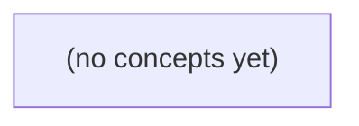

# 02.02 线性结构：为有限 IM 发送队列选择表示

*本书面向具备 Go 切片、结构体、指针与循环基础的初学者，从线性次序和任务身份出发，比较切片、链式节点、栈、队列与固定容量环形队列。读者将通过静态推导、状态表和完整 Go 示例，理解如何为虚构 IM 的有限发送队列选择可解释、可验证的表示。*

**章节:** 2

---

## 本书导览

- 了解整本书的章节脉络
- 掌握各章之间的概念依赖关系
- 选择最合适的阅读顺序

# 02.02 线性结构：为有限 IM 发送队列选择表示

本书面向具备 Go 切片、结构体、指针与循环基础的初学者，从线性次序和任务身份出发，比较切片、链式节点、栈、队列与固定容量环形队列。读者将通过静态推导、状态表和完整 Go 示例，理解如何为虚构 IM 的有限发送队列选择可解释、可验证的表示。

下方的概念图展示了本书 0 个核心概念以及它们之间的依赖关系；再下方是 1 个章节的入口。你可以按从上到下的顺序阅读，也可以根据自己的兴趣或先验知识选择切入点。

#### 概念图



## 章节索引

- **02.02 线性结构：为有限 IM 发送队列选择表示** — 承接切片、指针和 02.01 成本模型，从线性次序进入数组、链表、栈、队列与固定容量环形缓冲。用虚构 IM 的有限待处理任务说明满队列、出队和内存保留，不建立网络或并发保证。

## 02.02 线性结构：为有限 IM 发送队列选择表示

- 区分线性次序与业务消息身份
- 解释数组切片与链式节点的不同表示和成本
- 用不变量解释栈的LIFO和队列的FIFO
- 区分Go切片截短与底层数组保留
- 推导固定容量环形队列的head/count/tail与满空条件
- 逐步追踪回绕、出队清零与容量拒绝
- 比较数组、链表和环形缓冲在IM任务中的取舍
- 分清数据结构操作、真实排队和消息交付

有限 IM 待处理任务先是有先后次序的序列，再选择数组、链表或环形缓冲来保存；任务身份不等同于其当前位置。

### 线性次序、位置与任务身份

### 线性次序、位置与任务身份

有限 IM 发送队列可先抽象为一个**线性序列**：元素之间存在唯一的先后关系。若当前待发送任务依次为

$S=\langle t\text{-}a,\ t\text{-}b,\ t\text{-}c\rangle$

则 $t\text{-}a$ 在 $t\text{-}b$ 之前，$t\text{-}b$ 在 $t\text{-}c$ 之前；除首尾外，每个任务都有唯一前驱和唯一后继。这里的“线性”描述逻辑次序，不限定底层必须用数组或链表。

对长度为 $n$ 的序列，可访问的位置通常记为 $0\ldots n-1$。因此上例中：

| 当前位置 | 任务身份 |
|---:|---|
| 0 | `t-a` |
| 1 | `t-b` |
| 2 | `t-c` |

位置回答“它现在排在第几个”；任务身份回答“它是哪一个业务任务”。二者不能混用。`t-b` 当前位于位置 `1`，不表示它的业务编号就是 `1`；若 `t-a` 被发送并移出，排列变为 $\langle t\text{-}b,t\text{-}c\rangle$，`t-b` 的位置变为 `0`，但它仍是同一个任务 `t-b`。

一个队列表示至少应支持这些抽象操作：

- `访问(i)`：读取位置 $i$ 的任务；
- `插入(i, x)`：使任务 `x` 出现在位置 $i$；
- `删除(i)`：移除位置 $i$ 的任务；
- `查找(id)`：按业务身份寻找任务；
- `长度()`：得到当前元素个数。

发送队列常把“队首发送、队尾追加”作为主要操作，但这不改变上述基本概念。后续比较切片、链表和环形缓冲时，关键是这些操作的成本不同；任务身份本身不会因存储位置移动而改变。

### 数组切片：连续存放与截短保留

### 数组切片：连续存放与截短保留

设任务到达顺序为 $S=[t\text{-}a,t\text{-}b,t\text{-}c]$。用 Go 切片保存时，切片本身可看作三元信息：指向底层数组的指针、长度 `len`、容量 `cap`。任务的业务身份是 `t-a` 等标识；它当前位于 `q[0]` 还是 `q[2]`，只是线性序列中的访问位置。

```go
q := []Task{ta, tb, tc}
```

底层数组连续存放三个元素，因此按位置读取 `q[i]` 可直接计算地址，成本为 $O(1)$。遍历整个当前队列需依次访问 `len(q)` 个位置，成本为 $O(n)$。

尾部追加通常写作：

```go
q = append(q, td)
```

若 `len(q) < cap(q)`，新任务写入已有数组末端，成本为 $O(1)$；若容量不足，运行时需要分配更大的数组并复制现有元素，本次成本为 $O(n)$。从多次追加的均摊角度看，尾部追加通常视为均摊 $O(1)$，但不能把每一次都静态地断言为常数成本。

若队首任务已处理，常见截短是：

```go
first := q[0]
q = q[1:]
```

这没有搬移 `tb`、`tc`：新切片仅把起始位置后移，故队首访问和这次截短都是 $O(1)$。此时逻辑序列变为 $[t\text{-}b,t\text{-}c]$，但底层数组原先存放 `t-a` 的槽位仍可能存在。

特别是 `Task` 含指针、字符串、切片或其他引用字段时，仅执行 `q = q[1:]` 不必然使 `t-a` 及其引用对象可回收；旧底层数组仍可能被新切片引用。若队列长期增长和消费，可在确认不再需要该元素后清空槽位：

```go
q[0] = Task{}
q = q[1:]
```

因此，切片适合高效按位置访问与尾部追加；它的“删除队首”快，是因为保留了旧数组并移动逻辑起点，而非真正移动或立即释放任务。

### 链式节点：指针连接与局部更新

### 链式节点：指针连接与局部更新

链表用节点之间的指针表达线性次序，而不是用连续下标表达位置：

`head → [t-a | next] → [t-b | next] → [t-c | nil]`

```go
type node struct {
	task Task
	next *node
}
```

这里 `t-a`、`t-b`、`t-c` 是任务身份；“第 0 个节点”“第 1 个节点”只是当前从 `head` 出发遍历得到的位置。删除 `t-b` 后，`t-c` 会变成第 1 个节点，但它的任务身份不变；这不表示消息已经投递，也不提供投递保证。

若已持有前驱节点 `p`，在 `p` 后插入新任务 `x` 只需局部改动：

`x.next = p.next`，再令 `p.next = x`。

删除 `p` 后的节点也类似：令 `p.next = p.next.next`。这类更新成本为 $O(1)$；但“已持有 `p`”是关键条件。若只能按任务身份查找 `t-b`，仍须从 `head` 逐节点比较，定位成本为 $O(n)$。

与切片相比：

- 切片可用 `q[i]` 直接访问第 $i$ 个当前位置，定位为 $O(1)$；中间插入或删除通常需要搬移后续元素，为 $O(n)$。
- 链表不能按下标直接跳转，访问第 $i$ 个位置需走过前 $i$ 条 `next`，为 $O(n)$；但定位到连接处后，插入、删除不搬移其他任务。
- 切片元素通常连续存放，缓存局部性较好；链表节点可能分散分配，遍历时更容易发生缓存未命中，并且每个节点额外保存一个指针。

因此，链表适合“已知操作位置、频繁局部改链”的队列表示；若有限 IM 队列主要按位置读取、顺序扫描且容量较小，切片往往更简单且更具内存局部性。

### 栈与队列：用不变量约束操作

### 栈与队列：用不变量约束操作

设待处理任务的当前排列为线性序列 $S$。任务 `t-a`、`t-b`、`t-c` 是任务身份；它们在切片中的下标只是当前访问位置，会随删除、移动或复用而改变。

**栈**只允许在同一端操作。约定切片末尾是栈顶，则不变量为：

- 栈顶位于 `s[len(s)-1]`，空栈没有栈顶；
- `push(x)` 将 `x` 放到栈顶；
- `pop()` 只移除并返回栈顶元素。

静态追踪：

| 操作 | 当前序列（左为栈底，右为栈顶） | 返回值 |
|---|---|---|
| 初始 | `[]` | — |
| `push(t-a)` | `[t-a]` | — |
| `push(t-b)` | `[t-a, t-b]` | — |
| `push(t-c)` | `[t-a, t-b, t-c]` | — |
| `pop()` | `[t-a, t-b]` | `t-c` |
| `pop()` | `[t-a]` | `t-b` |

因此最后进入的 `t-c` 最先离开，称为后进先出（LIFO）。若用切片表示，`append` 对应压入，访问末元素对应弹出；但弹出后还应缩短切片长度，避免逻辑上仍保留该位置。

**队列**在两端分别操作。约定左端为队首、右端为队尾，则不变量为：

- 队首是下一项可出队任务；
- 队尾是下一项入队任务之后的位置；
- `enqueue(x)` 只在队尾加入；
- `dequeue()` 只从队首移除并返回。

| 操作 | 当前序列（左为队首，右为队尾） | 返回值 |
|---|---|---|
| 初始 | `[]` | — |
| `enqueue(t-a)` | `[t-a]` | — |
| `enqueue(t-b)` | `[t-a, t-b]` | — |
| `enqueue(t-c)` | `[t-a, t-b, t-c]` | — |
| `dequeue()` | `[t-b, t-c]` | `t-a` |
| `dequeue()` | `[t-c]` | `t-b` |

队列体现先进先出（FIFO）。这里 `t-a` 的业务编号或创建时间可以记录“谁先到”，但真正决定下一次操作结果的是其是否处于队首，而不是它曾经拥有的切片下标。

### 固定容量环形队列：回绕、清零与拒绝

### 固定容量环形队列：回绕、清零与拒绝

有限 IM 发送队列若预先规定最多暂存 $C$ 个待处理任务，可用固定数组实现环形队列：数组物理位置会复用，但逻辑顺序仍是“先入先出”。

```go
type Task struct {
	ID string // 如 t-a、t-b、t-c；不是数组下标
}

type Queue struct {
	buf   []Task
	head  int // 当前队首所在位置
	count int // 当前任务数
}
```

令容量为 `cap(q.buf)`，则：

- 空队列：`count == 0`；
- 满队列：`count == cap(q.buf)`；
- 队首访问位置：`head`；
- 下一次入队位置：`tail = (head + count) % cap(q.buf)`。

这里不必单独保存 `tail`：它可由 `head` 与 `count` 推导。`head` 表示当前位置，不是任务身份；例如 `t-a` 出队后，`t-b` 可能移动到逻辑队首，却仍保留自己的 `ID`。

设容量为 3，依次入队 `t-a、t-b、t-c`：

| 操作后 | `head` | `count` | 逻辑序列 | 下一入队位置 |
|---|---:|---:|---|---:|
| 初始 | 0 | 0 | `[]` | 0 |
| 入 `t-a` | 0 | 1 | `[t-a]` | 1 |
| 入 `t-b` | 0 | 2 | `[t-a,t-b]` | 2 |
| 入 `t-c` | 0 | 3 | `[t-a,t-b,t-c]` | 0 |

此时再入队必须拒绝，而非覆盖 `t-a`：

```go
if q.count == len(q.buf) {
	return false // 队列满：拒绝新任务
}
```

出队时读取 `buf[head]`，随后清零该槽位，再回绕推进：

```go
var zero Task
q.buf[q.head] = zero
q.head = (q.head + 1) % len(q.buf)
q.count--
```

清零使已移除任务不再被底层数组持有；若 `Task` 含指针、切片或较大引用，这尤其重要。若 `head` 原为 2，出队后变为 `(2+1)%3==0`，这就是回绕。

相比普通数组队列，环形队列不会因前部出队而整体搬移元素，入队、出队均为 $O(1)$；相比链表，它无需为每个任务额外分配节点，缓存局部性更好。代价是容量固定：高峰到达且队满时，必须明确采用拒绝、上游重试或其他业务策略；环形结构本身不提供投递保证。

> **要点** — 线性结构规定任务的先后和操作；表示决定成本与内存行为，却不等同于真实排队、消息身份或交付保证。

有限 IM 待处理队列常从切片起步，但必须同时看见逻辑长度、底层数组、引用保留与操作成本，避免把简洁语法误当作无代价队列。

### 线性次序不等于消息身份

### 线性次序不等于消息身份

切片天然表达的是**位置次序**：`q[0]` 是当前队首，`q[i]` 是第 `i+1` 个待处理任务。若下标 `i` 已知，在通常的随机访问机器模型中，读取 `q[i]` 为 $O(1)$；它只需根据底层数组首地址和元素大小计算位置。

但消息的业务身份通常是独立字段，例如：

`Message{ID: "m-1042", Sender: "alice", ...}`

“找到 ID 为 `m-1042` 的消息”并不等于“访问 `q[1042]`”。ID 未必连续，也不会因前面消息出队而改变；切片下标却会随 `q = q[1:]` 改变。因此，仅用线性切片保存队列时，按 ID 查找必须逐项扫描：

```go
for i, m := range q {
    if m.ID == targetID {
        return i, m
    }
}
```

最坏情况下需要检查全部 $n$ 条消息，故为 $O(n)$。若 `ID` 是字符串，每次相等性比较还可能随字符串长度增长；将其笼统写成“恒定时间比较”并不严谨。

这一区分直接影响接口设计：

- **按队首处理、按序遍历**：切片很自然。
- **已知位置读取或修改**：下标访问高效，但调用者必须持有仍然有效的位置。
- **按消息 ID 取消、更新或定位**：单靠切片通常要线性查找；若此操作频繁，应额外维护 `ID → 位置/消息` 的索引，并处理出队、移动和删除带来的索引一致性问题。

因此，切片回答的是“它排在第几位”，不是“它是谁”。

### 切片头与共享底层数组

### 切片头与共享底层数组

切片不是消息元素本身，而是描述某段底层数组的一个小型“窗口”。可将其抽象为：

`切片 = (起始指针, len, cap)`

其中，`len` 是当前窗口中可直接访问的元素数，`cap` 是从起始位置起、在不重新分配时最多可扩展到的元素数。对有限 IM 队列：

```go
q := []Message{m1, m2, m3}
```

此时通常有 `len(q)=3`、`cap(q)=3`；但容量是实现分配结果，不应把某次观察到的数值当作语言保证。

切片赋值只复制这个描述窗口的头部，不复制消息：

```go
a := q
a[0] = m0
```

`a` 与 `q` 初始共享同一底层数组，因此修改 `a[0]` 也会改变 `q[0]`。子切片同样如此：

```go
tail := q[1:] // 逻辑上移除队首后的剩余队列
```

`tail` 的长度变为 `len(q)-1`，起始位置后移；它仍可能指向原数组中 `m2` 所在的位置，并保留从该位置开始的一部分容量。于是，虽然队首消息已不在 `tail` 的逻辑范围内，原数组及其中的引用未必立刻不再可达。

`append` 的关键在于剩余容量：

```go
q = append(q, m4)
```

若 `len(q) < cap(q)`，新元素通常写入原底层数组，所有共享该数组的切片都可能观察到相应位置的变化。若容量不足，运行时可能分配新数组、复制旧元素，并让 `q` 指向新数组；此前的 `a`、`tail` 仍指向旧数组。因而不能假设一次 `append` 必然共享，也不能依赖某个固定的容量增长倍率。

对队列代码而言，必须区分“切片变量已更新”和“旧数组已失去引用”。前者只是窗口变化；后者才关系到旧消息及其引用能否被回收。

### 从成本模型审视常用操作

### 从成本模型审视常用操作

对有限 IM 发送队列，不能只说“切片操作很快”，而应说明操作对象、机器模型及实现前提。设队列逻辑长度为 $n$，第 $i$ 条消息的文本长度为 $m_i$：

| 操作 | 典型成本 | 成立条件与注意点 |
|---|---:|---|
| 已知下标访问 `q[i]` | $O(1)$ | 在常用随机访问机器模型中，数组元素地址可由基址加偏移计算；前提是 `0 <= i < len(q)`。 |
| 按消息查找 | $O(n)$ 次比较 | 必须顺序检查候选消息；若比较文本内容，单次字符串相等判断还可能读取至 $O(m_i)$ 个字节，因此总成本不应机械写成“恒定比较”。 |
| 末尾追加 `q = append(q, x)` | 摊还 $O(1)$ | 容量足够时通常只写入新槽；容量不足时需要分配新底层数组并复制已有元素，单次可为 $O(n)$。摊还结论依赖增长策略与工作负载，不能把 Go 某一版本的扩容倍率当作语言保证。 |
| 前端移除 `q = q[1:]` | 切片头调整为 $O(1)$ | 它并未搬移剩余元素，却可能继续持有原底层数组及旧引用；若要求把后续元素向前紧凑移动，则需移动约 $n-1$ 项，为 $O(n)$。 |

因此，“出队”至少有两种不同目标：只改变逻辑视图时，`q = q[1:]` 是常数时间；既要释放已消费消息的引用、又要避免长寿命队列持续占住大数组时，应先执行 `q[0] = nil`（对指针或接口元素），再切片；必要时周期性复制到较小的新数组，或改用环形缓冲。这里讨论的是渐近操作成本，不应以一次 `runtime` 内存测量替代成本分析：垃圾回收时机、分配器缓存和运行环境都会干扰观测结果。

### 出队截短为何仍可能保留内存

### 出队截短为何仍可能保留内存

设有限 IM 队列保存消息指针：

`q := []*Message{A, B, C, D}`

其中底层数组有 4 个槽位，`len(q)=4`、`cap(q)=4`。执行“取出队首”时，常见写法是：

`m := q[0]`  
`q = q[1:]`

逻辑队列确实变短了，但这不是删除底层数组中的元素：

| 时刻 | `q` 可见元素 | `len` | `cap` | 底层槽位仍保存的引用 |
|---|---:|---:|---:|---|
| 初始 | `A,B,C,D` | 4 | 4 | `[A, B, C, D]` |
| `q=q[1:]` 后 | `B,C,D` | 3 | 3 | `[A, B, C, D]` |
| 再出队两次 | `D` | 1 | 1 | `[A, B, C, D]` |

切片头部只改变了“从哪里开始看”和逻辑长度；它仍指向原底层数组的后部。更关键的是，旧槽位 `0` 中的 `A` 引用并未自动清除。只要该底层数组仍可达，垃圾回收器就可能认为 `A` 仍被引用，因而不能回收其消息正文、附件或解析缓存。

应在截短前清零旧槽位：

`m := q[0]`  
`q[0] = nil`  
`q = q[1:]`

这样底层数组变为 `[nil, B, C, D]`，若 `A` 没有其他引用，就具备被回收的条件。注意，清零释放的是**对象引用**，不是立刻归还数组容量；是否、何时归还物理内存由运行时决定。

对于长寿命且持续出队的队列，仅靠 `q=q[1:]` 会使切片长期挂在原数组尾部。可在消费到一定数量后复制剩余元素到新数组，或改用环形缓冲区。不要用某次 `runtime` 内存读数证明“截短已经释放内存”；应依据引用链和底层数组关系判断。

### 长寿命队列的表示选择

### 长寿命队列的表示选择

对容量有限的 IM 待处理队列，若以切片出队：

`msg := q[0]; q[0] = nil; q = q[1:]`

其中置 `nil` 很关键：否则旧槽仍可能引用消息及其大字段。即使 `len(q)` 下降，切片仍指向原底层数组；长期反复出队会让一个只剩少量元素的队列继续持有较大的数组。

一种低复杂度方案是**周期性重建**：当队首偏移过大或容量远大于长度时，分配新切片并复制存活消息。它适合吞吐中等、队列实现优先简洁、允许偶发 $O(n)$ 复制的场景。重建阈值应由业务上限和压测决定，不应假定 `append` 的增长倍率是语言保证。

若队列长期运行、容量上限明确且要求稳定延迟，可使用**固定容量环形缓冲**。以数组、读指针、写指针和元素数表示队列；入队、出队均为 $O(1)$，不会因队首推进而保留无用前缀。队满时必须明确策略：拒绝新消息、丢弃最旧消息、阻塞生产者，或转入持久化补偿；这不是实现细节，而是产品语义。

上述成本只描述内存中的排队操作。真正的消息交付还包含序列化、网络发送、服务端确认、重试与幂等处理，其延迟和可靠性不能由 `append`、复制或环形索引的复杂度推出。不要用一次 `runtime` 内存读数替代对引用生命周期、队列长度和交付结果的验证。

> **要点** — 切片队列易写但前端截短可保留引用；应依据容量、寿命与成本选择清零、重建或环形缓冲。

链表用节点与指针保存线性次序，适合观察队首、队尾和边界状态，但其成本不能只用“大 O”概括。

### 节点、链接与三节点次序

### 节点、链接与三节点次序

为有限的 IM 待处理队列，可以让每个任务独占一个节点；节点中的 `next` 不保存任务内容，而是保存“下一位是谁”的链接：

```go
type Task struct {
	ID   string
	Text string
}

type node struct {
	task Task
	next *node
}

var head *node // 队首：最先处理
var tail *node // 队尾：最后到达
```

假设依次收到三条任务 `A`、`B`、`C`，内存中的次序可画为：

`head → [A | next] → [B | next] → [C | nil] ← tail`

这里有两个容易混淆的概念：

- **任务身份**：`A`、`B`、`C` 是具体的 `Task`，可通过 `ID` 识别。
- **链表次序**：由 `next` 决定。即使节点在内存中的分配位置不连续，只要 `A.next` 指向 `B`、`B.next` 指向 `C`，逻辑队列仍是 `A → B → C`。

最后一个节点的 `next == nil`，表示链条终点；它不是一个任务节点。`head` 让程序能直接找到应删除的队首，`tail` 让程序能直接找到可追加的位置。空队列时两者都应为 `nil`：

`head = nil, tail = nil`

链表强调“链接关系”而非连续存储。后续从队首删除时会移动 `head`，向队尾插入时会更新 `tail`；若唯一节点被删除，则必须同时令 `head` 和 `tail` 回到 `nil`。

### nil 终点与链表不变量

### nil 终点与链表不变量

用链表表示有限 IM 发送队列时，每个节点保存一条任务及其后继：

`type node struct { task Task; next *node }`

设队列维护 `head`（队首）与 `tail`（队尾）。例如三个待发送任务的链接关系为：

`head → [A|·] → [B|·] → [C|nil] ← tail`

其中 `nil` 不是普通节点，而是“链到此结束”的终点标记。因此，队尾必须满足：

`tail.next == nil`

为了让入队、出队和空队判断都可靠，应始终维护以下不变量：

- **空链**：`head == nil && tail == nil`。两者必须同时为空，不能只清空其中一个。
- **非空链**：`head != nil && tail != nil`，从 `head` 沿 `next` 能到达 `tail`。
- **尾部终止**：非空时 `tail.next == nil`，避免链接到旧节点或形成环。
- **单节点链**：`head == tail`，且该节点的 `next == nil`。

插入队首时，新节点指向旧 `head`；若原队列为空，还必须令 `tail` 同时指向新节点。删除队首时，将 `head` 移到 `head.next`；特别地，删除唯一节点后，新的 `head` 为 `nil`，此时也必须执行 `tail = nil`：

`head = head.next; if head == nil { tail = nil }`

这条边界规则避免了“逻辑上已空、`tail` 却仍指向旧任务”的悬空队列状态。

### 队首删除与队尾插入

### 队首删除与队尾插入

用节点保存任务及其后继指针：

`type node struct { task Task; next *node }`

队列只需维护两个入口：`head` 指向最早任务，`tail` 指向最后任务。`nil` 表示链表终点；空队列时两者都应为 `nil`。

三个节点的状态如下：

`head → [A|·] → [B|·] → [C|nil] ← tail`

其中每个 `·` 表示指向下一个节点的指针。若要“插头”（在队首加入 `X`），新节点先指向旧队首，再更新 `head`：

`head → [X|·] → [A|·] → [B|·] → [C|nil] ← tail`

若原队列为空，插头后不能只改 `head`，还必须令 `tail = head`，因为唯一节点既是首也是尾。

IM 发送队列通常从队首取出待发送任务。删头时先保存旧首节点，再将 `head` 前移：

```go
func (q *queue) pop() (Task, bool) {
	if q.head == nil {
		return Task{}, false
	}
	n := q.head
	q.head = n.next
	if q.head == nil {
		q.tail = nil
	}
	return n.task, true
}
```

删除唯一节点 `[A|nil]` 后，`head` 会变成 `nil`。此时若 `tail` 仍指向旧的 `A`，队列表面为空、尾指针却非空，后续尾插会破坏结构。因此必须同时清空：

`head = nil，tail = nil`

已知 `tail` 时，尾插无需遍历：

```go
n := &node{task: t}
if q.tail == nil {
	q.head, q.tail = n, n
} else {
	q.tail.next = n
	q.tail = n
}
```

尾插是 $O(1)$，前提是持续正确维护 `tail`；但按条件查找中间任务仍需沿 `next` 逐个访问，为 $O(n)$。链表还会带来节点分配、指针跳转和较差的缓存局部性，不能仅因尾插 $O(1)$ 就断言它一定比切片快。

### 操作成本不等于实际更快

### 操作成本不等于实际更快

设有限 IM 发送队列的链表节点为：

`type node struct { task Task; next *node }`

三个任务可表示为：

`head → [A|·] → [B|·] → [C|nil]`  
`tail ────────────────────────↑`

`nil` 是链表终点。若已知 `tail`，在尾部追加 `D` 只需令旧尾的 `next` 指向新节点，再更新 `tail`，时间复杂度为 $O(1)$；从 `head` 删除队首也只需把 `head` 移到 `head.next`，同样是 $O(1)$。

但 $O(1)$ 不等于“必然更快”：

- 链表每次入队通常要分配一个节点，可能带来堆分配与垃圾回收压力。
- 遍历链表需要不断追踪 `next` 指针；节点在内存中可能分散，缓存局部性较差。
- 查找第 $k$ 个任务或按条件定位中间任务，仍须从 `head` 逐个走过，成本为 $O(n)$。
- 切片在尾部追加通常也很快，且元素连续存储，遍历常比链表更符合缓存访问模式；只是扩容时可能复制元素。
- 切片删除队首往往需要移动剩余元素，代价为 $O(n)$；链表删头则无需搬动后续任务。

因此，频繁队首删除、已维护尾指针的尾插，可考虑链表；若主要是顺序扫描、按下标访问或任务量不大，切片往往更简单且可能更快。标准库 `container/list` 提供双向链表作对照，但并不会自动消除分配和指针追踪成本。

边界尤其重要：空链应满足 `head == nil && tail == nil`；删除唯一节点后，也必须同时将 `head` 和 `tail` 置为 `nil`。

### 有限 IM 队列的链表实现边界

### 有限 IM 队列的链表实现边界

链表将每条待发送消息放入独立节点，`next` 指针连接后继；最后一个节点的 `next == nil`，表示链表终点。队列只操作两端：从 `tail` 插入，从 `head` 删除。

```go
package main

import "errors"

type Task struct {
	Text string
}

// 节点：保存任务及下一节点指针
type node struct {
	task Task
	next *node
}

// 队列：维护队首、队尾和容量信息
type Queue struct {
	head, tail *node
	size, limit int
}

// 入队：已知 tail，因此尾插为 O(1)
func (q *Queue) Enqueue(t Task) error {
	if q.size >= q.limit {
		return errors.New("发送队列已满")
	}

	n := &node{task: t}
	if q.tail == nil { // 空链：新节点同时是 head 和 tail
		q.head, q.tail = n, n
	} else {
		q.tail.next = n
		q.tail = n
	}
	q.size++
	return nil
}

// 出队：删头为 O(1)
func (q *Queue) Dequeue() (Task, bool) {
	if q.head == nil {
		return Task{}, false
	}

	n := q.head
	q.head = n.next
	q.size--
	if q.head == nil { // 删除唯一节点后，两端都必须置空
		q.tail = nil
	}
	return n.task, true
}
```

三节点状态可写为：

`head → [A|·] → [B|·] → [C|nil] ← tail`

其中“插头”可令新节点指向旧 `head`，但普通先进先出队列通常采用“尾插、删头”。维护 `tail` 后尾插是 $O(1)$；若不维护它，每次尾插都要从 `head` 走到终点，变为 $O(n)$。按内容查找中间消息仍需逐节点遍历，也是 $O(n)$。

容量限制 `limit` 只约束内存中的待发送任务数量；`Enqueue` 成功不代表消息已发出，更不代表对方已收到。真实发送、重试、网络确认应由队列之外的工作者处理。

Go 标准库 `container/list` 也提供双向链表，可作接口设计对照；但它不自动提供容量、发送顺序保证或消息交付语义。链表还会带来节点分配、指针追踪和较差缓存局部性，因此不能仅因尾插为 $O(1)$ 就断言它一定比切片更快。

> **要点** — 链表靠 head、tail 和 nil 维持 FIFO；尾插可为 O(1)，但分配与局部性成本决定它未必优于切片。

先把任务的业务身份与其在线性结构中的位置分开，再用显式的空结果定义栈与队列操作。

### ADT：先定义行为，再选择表示

### ADT：先定义行为，再选择表示

有限 IM 待处理任务首先是业务对象，例如 `任务{会话ID, 消息ID, 类型}`；栈或队列只决定它何时被取出，不改变其身份。抽象数据类型（ADT）先约定可观察的行为，再讨论底层用切片、链表还是环形缓冲实现。

若任务按“最近进入者优先”处理，可定义栈：

- `Push(x)`：将任务 `x` 放到栈顶。
- `Pop() -> (x, ok)`：删除并返回栈顶；空栈返回 `ok=false`。
- `Peek() -> (x, ok)`：查看栈顶但不删除；空栈同样返回 `ok=false`。

其顺序是 LIFO：最后入栈的任务最先离开。它适合“撤销最近一次本地编辑”这类教学模型。

若任务按“先到待处理结构者优先”处理，可定义队列：

- `Enqueue(x)`：将 `x` 放到队尾。
- `Dequeue() -> (x, ok)`：删除并返回队首；空队列返回 `ok=false`。
- `Peek() -> (x, ok)`：查看队首但不删除。

其顺序是 FIFO：先进入队列者先被处理。它适合本地待处理任务，但不意味着网络消息必然按发送或到达顺序抵达。

`ok` 是语义的一部分：空结构不是异常成功，不能用 `panic`，也不能把零值任务伪装成有效结果。至于栈用切片末尾操作、队列用链表或环形缓冲，都是实现选择；只要满足上述顺序与空结果约定，它们实现的是同一个 ADT。

### 栈：后进先出的最近编辑

### 栈：后进先出的最近编辑

把本地编辑任务按发生顺序压入栈：先编辑 `c`，再编辑 `a`。

1. `Push(c)` 后，栈顶是 `c`：`[c]`
2. `Push(a)` 后，`a` 成为新栈顶：`[c, a]`
3. `Peek()` 只查看最近编辑，不移除它，返回 `(a, true)`。
4. `Pop()` 撤销最近编辑，返回 `(a, true)`，栈变为 `[c]`。
5. 再次 `Pop()`，返回 `(c, true)`，栈变为空：`[]`。
6. 对空栈执行 `Peek()` 或 `Pop()`，应返回“无任务”和 `false`，例如 `(零值, false)`；`false` 才是空结构的明确信号，不能把零值误当作一次成功操作。

因此，栈满足后进先出（LIFO）：最后压入的 `a` 必须先弹出，随后才轮到 `c`。可将其抽象为：

- `Push(x)`：把 `x` 放到栈顶；
- `Pop() (x, ok)`：移除并返回栈顶元素；
- `Peek() (x, ok)`：返回栈顶元素但不移除。

用 `slice` 实现时，通常把末尾当作栈顶：追加即压栈，截去末尾即弹栈。弹出前可先把末尾位置清零，再缩短切片，避免已撤销任务仍被底层数组引用而延长保留时间。

### 切片栈的末尾操作与清零

### 切片栈的末尾操作与清零

栈要求后进入的任务先离开，即 LIFO。若用切片表示栈，并约定切片末尾为栈顶，则 `Push` 与 `Pop` 都只操作末尾：

```go
type Stack[T any] struct {
	data []T
}

func (s *Stack[T]) Push(v T) {
	s.data = append(s.data, v)
}

func (s *Stack[T]) Pop() (T, bool) {
	n := len(s.data)
	if n == 0 {
		var zero T
		return zero, false
	}
	i := n - 1
	v := s.data[i]
	var zero T
	s.data[i] = zero
	s.data = s.data[:i]
	return v, true
}

func (s *Stack[T]) Peek() (T, bool) {
	n := len(s.data)
	if n == 0 {
		var zero T
		return zero, false
	}
	return s.data[n-1], true
}
```

`Push` 通常是 $O(1)$：容量足够时，直接写入末尾；容量不足时，`append` 需要分配更大的底层数组并复制已有元素，单次可能为 $O(n)$，但分摊到连续多次压栈，仍是分摊 $O(1)$。

`Pop` 只需读取最后一个元素，再缩短切片长度，因此稳定为 $O(1)$。不能把前端当作栈顶：删除 `data[0]` 往往需要移动其余元素，成本变成 $O(n)$。

缩短切片并不会自动擦除底层数组中原位置的内容。若 `T` 是指针、字符串、切片、映射或含引用字段的结构体，仅执行 `s.data = s.data[:i]` 后，底层数组仍可能持有被弹出任务的引用；只要数组仍被栈持有，该任务及其关联对象就未必能被垃圾回收。故在缩短前执行：

` s.data[i] = zero `

这一步断开栈对旧元素的引用。它不改变 `Pop` 的语义，却避免“逻辑上已删除、内存上仍被保留”的现象。空栈返回 `(zero, false)`，由 `false` 明确表示失败，不能把零值误当作成功弹出的任务。

### 队列：先进先出的待处理任务

### 队列：先进先出的待处理任务

队列把任务按“先进入、先处理”组织。设有限 IM 待发送任务先后为 `c`、`a`：

1. `Enqueue(c)` 后，队列为 `[c]`，队首是 `c`。
2. `Enqueue(a)` 后，队列为 `[c, a]`；新任务只能加入队尾。
3. `Dequeue()` 返回 `c`，队列变为 `[a]`。
4. 再次 `Dequeue()` 返回 `a`，队列变为空 `[]`。

因此 FIFO 的不变量是：**任何仍在队列中的较早入队任务，都必须位于较晚入队任务之前；出队只能移除队首。** 可将接口写成：

- `Enqueue(x)`：把 `x` 放入队尾。
- `Dequeue() (任务, bool)`：返回队首并删除它；空队列返回 `(_, false)`。
- `Peek() (任务, bool)`：查看队首但不删除；空队列同样返回 `(_, false)`。

`bool` 是操作结果的一部分：空队列不是异常成功，更不能依赖任务零值猜测“是否取到任务”。例如任务 ID 恰为 `0` 时，只有 `false` 能明确表示没有任务。

FIFO 约束的是**本地待处理队列的处理顺序**，不等于网络传输后的到达顺序。即使发送端按 `c`、`a` 出队，网络仍可能因重传、不同连接、延迟或接收端调度而使对方先看到 `a`。队列保证的是“本地先到先处理”，不是端到端消息顺序保证。

### 朴素切片、链表与环形缓冲的取舍

### 朴素切片、链表与环形缓冲的取舍

队列的关键不是“能否按顺序取出”，而是长期运行时如何回收已消费空间。朴素切片常写成：

`x := q[0]; q = q[1:]`

这避免了逐项搬移，但底层数组前部仍可能被切片引用；若元素含指针，已出队位置还可能继续保留对象引用。应先清零：

`q[0] = nil; q = q[1:]`

不过 `head` 不断增长，底层数组容量不能自然复用；偶尔压缩或重建切片虽可回收空间，却会引入一次性复制成本。因此它适合短小、临时、容量波动不大的待处理任务队列。

链表出队只需移动首节点，理论上为 $O(1)$，也不会因前端消费形成无用前缀。但每个任务都要额外分配节点、保存链接字段，指针追踪降低缓存局部性，并增加垃圾回收压力。对有限 IM 发送队列，这些常数成本往往比算法复杂度更重要。

固定容量环形缓冲以数组保存元素，并维护读位置、写位置与数量；读写位置到末尾后回绕。入队、出队均为 $O(1)$，空间连续且已出队槽位可立即复用。代价是容量满时必须显式返回失败，例如 `(false)`，由上层选择拒绝新任务、提示用户或稍后重试；不能悄悄覆盖尚未发送的旧任务。

因此，已知队列上限且重视稳定延迟时优先环形缓冲；容量不可预估且允许分配时可考虑链表；仅用于简单教学或极小队列时，才使用经清零处理的朴素切片。无论实现如何，FIFO 只保证本地提交顺序，不保证消息实际网络到达顺序。

> **要点** — ADT规定顺序与结果；栈守LIFO，队列守FIFO，具体表示决定保留、容量与操作成本。

用容量为4的固定环形缓冲保存虚构IM待处理任务，借助明确不变量追踪入队、出队、回绕、清零与满队列拒绝。

### 状态模型与构造约束

### 状态模型与构造约束

设固定容量 `capacity=4`，用数组 `slots[4]Task` 保存待处理的 IM 任务。队列不移动已有元素，而是让下标在数组末端后回绕。

- `slots`：物理存储槽；每个槽要么保存一个有效任务，要么为空。
- `head`：最老有效任务的位置，即下一次出队应读取的槽。
- `count`：当前有效任务数，也是判断空、满的唯一依据。
- `tail`：下一次入队应写入的位置，按下式实时计算：

$$
tail=(head+count)\bmod capacity
$$

因此，`tail` 不是必须独立维护的状态；由 `head` 与 `count` 即可确定。初始空队列可设为：

`head=0`，`count=0`，`tail=(0+0)%4=0`，`slots=[空, 空, 空, 空]`。

状态必须始终满足以下不变量：

1. `capacity>0`。构造队列时必须拒绝零或负容量，否则 `% capacity` 会发生模零错误。
2. `0<=count<=capacity`。
3. `count=0` 表示队空；此时 `head` 仅是未来首个入队位置，不代表存在任务。
4. `count=capacity` 表示队满；此时可能出现 `head==tail`，但它绝不表示队空。
5. 只有从 `head` 开始、连续跨越 `count` 个逻辑位置的槽属于有效元素。
6. 出队后应将被移除槽清零，避免旧任务仍滞留在数组中而造成误读或无谓引用。

这套模型刻意不使用“`head==tail` 判空或判满”。在环形数组中，两种状态都可能满足下标相等；额外维护 `count` 后，空、满和可入队数量都具有唯一、直接的含义。

### 入队：从空队列到连续占槽

### 入队：从空队列到连续占槽

设 `capacity=4`，`slots[4]Task` 存放任务；`head` 指向最老任务，`count` 表示有效任务数。下一次入队位置不是独立维护的变量，而是由不变量计算：

\[
tail=(head+count)\bmod capacity,\qquad 0\le count\le capacity
\]

初始为空队列：`head=0`、`count=0`，故 `tail=(0+0)%4=0`。槽位中的旧引用必须视为无效；这里以 `∅` 表示空槽。

| 操作后状态 | head | count | tail | slots[0..3] |
|---|---:|---:|---:|---|
| 初始 | 0 | 0 | 0 | `[∅, ∅, ∅, ∅]` |
| `Enq A` | 0 | 1 | 1 | `[A, ∅, ∅, ∅]` |
| `Enq B` | 0 | 2 | 2 | `[A, B, ∅, ∅]` |
| `Enq C` | 0 | 3 | 3 | `[A, B, C, ∅]` |

每次入队遵循同一推导：

1. 先检查 `count<capacity`；否则队列已满，必须拒绝写入。
2. 计算当前 `tail`，将新任务写入 `slots[tail]`。
3. 执行 `count++`，再按公式得到新的下一入队位置。

例如执行 `Enq B` 前，`head=0,count=1`，所以 `tail=1`；将 `B` 写入 `slots[1]` 后，`count=2`，新的 `tail=2`。此时最老项仍是 `A`，因此 `head` 不变。

注意：当前 `head=0`、`tail=3` 仅表示下一个任务会写入槽 `3`，并不表示槽 `3` 已有效。有效区间的长度始终由 `count` 唯一确定。

### 出队清零与逻辑次序

### 出队清零与逻辑次序

已完成 `Enq A`、`Enq B`、`Enq C` 后，状态为：

| 操作后 | `head` | `count` | `tail=(head+count)%4` | `slots` |
|---|---:|---:|---:|---|
| `Enq C` | 0 | 3 | 3 | `[A, B, C, 空]` |

执行 `Deq` 时，必须始终从 `head` 指向的槽位取出任务；这正是先进先出（FIFO）的来源，而不是数组下标天然有序。

1. `Deq A`：读取 `slots[0]` 得到 `A`，随后立即将该槽清零，再移动队头：

   `slots[0]=空`  
   `head=(0+1)%4=1`  
   `count=3-1=2`

   此时：

   | `head` | `count` | `tail` | `slots` | 逻辑队列 |
   |---:|---:|---:|---|---|
   | 1 | 2 | 3 | `[空, B, C, 空]` | `B → C` |

2. `Deq B`：此刻最老任务已是 `head=1` 处的 `B`，而不是数组中的第一个非空槽位以外的任意元素。清零并更新：

   `slots[1]=空`  
   `head=(1+1)%4=2`  
   `count=2-1=1`

   得到：

   | `head` | `count` | `tail` | `slots` | 逻辑队列 |
   |---:|---:|---:|---|---|
   | 2 | 1 | 3 | `[空, 空, C, 空]` | `C` |

清零不是影响 FIFO 的必要步骤，却是资源管理的重要约束：若槽位仍保留 `A`、`B` 的引用，已出队任务可能因数组仍持有它们而无法被释放。逻辑有效范围只由 `head` 与 `count` 决定；槽内旧值必须视为无效，并应主动清除。

### 回绕、满队列与拒绝

### 回绕、满队列与拒绝

承接此前状态：已执行 `Enq A、Enq B、Enq C、Deq A、Deq B`，因此

- `capacity=4`
- `head=2`，最老任务为 `C`
- `count=1`
- `tail=(head+count)%capacity=(2+1)%4=3`
- `slots=[空, 空, C, 空]`

现在依次入队 `D、E、F`。入队总是写入当前 `tail`，随后令 `count++`；新的 `tail` 由公式重新计算。

| 操作 | 写入位置 | head | count | tail | slots |
|---|---:|---:|---:|---:|---|
| 初始 | — | 2 | 1 | 3 | `[空, 空, C, 空]` |
| `Enq D` | 3 | 2 | 2 | `(2+2)%4=0` | `[空, 空, C, D]` |
| `Enq E` | 0 | 2 | 3 | `(2+3)%4=1` | `[E, 空, C, D]` |
| `Enq F` | 1 | 2 | 4 | `(2+4)%4=2` | `[E, F, C, D]` |

`Enq D` 后，`tail` 从槽位 `3` 回绕到 `0`；`Enq E` 和 `Enq F` 继续占用先前因出队而空出的槽位。此时逻辑队列顺序仍是：

`C → D → E → F`

虽然 `head=2` 且 `tail=2`，队列并不为空，而是**已满**。原因是 `tail` 只表示“下一次应写入的位置”，不能单独区分空与满；真正状态由 `count` 决定：

- `count=0`：空队列；
- `count=capacity=4`：满队列；
- `0<count<capacity`：部分占用。

因此再执行 `Enq G` 时，必须先检查：

`if count == capacity: 拒绝入队`

拒绝时不得覆盖 `slots[2]` 中仍有效的最老任务 `C`，并且 `head`、`count`、`tail` 全部保持不变。构造缓冲区时还必须保证 `capacity>0`，否则计算 `% capacity` 会发生模零错误。

### 排空追踪与表示边界

### 排空追踪与表示边界

承接已满状态：`capacity=4`，`slots=[E,F,C,D]`，`head=2`，`count=4`，因此 `tail=(2+4)%4=2`。此时 `head==tail`，但队列是**满的**；仅凭两者相等不能判断空满。

持续出队时，始终读取 `slots[head]`，随后将该槽清为 `null`，再更新：

`head=(head+1)%capacity`，`count=count-1`

| 操作 | 取出 | slots | head | count | tail |
|---|---|---|---:|---:|---:|
| 初始 | — | `[E,F,C,D]` | 2 | 4 | 2 |
| Deq | C | `[E,F,null,D]` | 3 | 3 | 2 |
| Deq | D | `[E,F,null,null]` | 0 | 2 | 2 |
| Deq | E | `[null,F,null,null]` | 1 | 1 | 2 |
| Deq | F | `[null,null,null,null]` | 2 | 0 | 2 |

最后再次得到 `head==tail==2`，但此时是**空队列**。因此判定规则必须由 `count` 给出：

- `count==0`：空；出队应拒绝或返回“无任务”。
- `count==capacity`：满；入队应拒绝、阻塞或采用明确的溢出策略。
- `0<count<capacity`：既可继续出队，也可继续入队。

清零旧槽并不改变队列逻辑，却能避免已出队任务仍被数组引用，减少内存滞留，也让调试时的表示更真实。构造时还必须检查 `capacity>0`；否则 `(head+count)%capacity` 会发生模零错误。

环形队列只保证本地容器中的先进先出顺序。它不等同于真实排队过程：任务可能尚未执行、执行失败、被取消或重试；更不自动提供“消息恰好一次交付”等保证。交付语义需要由确认、持久化、幂等处理和重试协议额外定义。

> **要点** — 以count区分空满，以head定位最老任务；tail由公式推导，出队清零并在满时拒绝入队。

以容量为 4 的虚构 IM 待处理任务队列为例，完整实现并追踪固定容量环形缓冲的入队、出队、回绕与拒绝。

### 任务次序与环形队列边界

### 任务次序与环形队列边界

本程序只解决一个局部问题：在**单线程、内存内**按先进先出顺序保存待处理任务。`Task` 可以表示一条虚构 IM 的处理单元，但它不是消息本体的可靠存档。

```go
type Task struct {
	ID   string
	Body string
}
```

队列保证的只是顺序关系：先成功入队的任务，应先被成功出队。例如 `A → B → C` 依次入队后，连续出队应得到 `A、B、C`。

需要明确几个边界：

- `Task.ID` 只是示例字段；队列不生成、不校验消息身份，也不负责去重。
- 队列只存在于进程内存中；程序退出、崩溃或重启后，未处理任务会丢失。
- 队列满时，`Enqueue` 返回 `false` 且不修改任何状态；这表示当前容量不足，不代表任务已经发送、拒收或重试。
- 队列空时，`Dequeue` 返回 `Task{}, false`；零值任务本身不能单独说明“没有任务”，必须检查布尔值。
- 本节不包含 `Mutex`、`goroutine`、网络连接、确认应答、重试、持久化或分布式顺序保证。

因此，环形队列描述的是本地待处理槽位的复用：`head` 指向下一项出队位置，`tail` 指向下一项入队位置，二者通过模运算在固定容量内回绕。它适合作为理解有限 IM 发送队列表示的基础，而不是完整的消息可靠交付系统。

### 从类型定义到容量构造

### 从类型定义到容量构造

先搭建一个可独立运行的 Go 程序骨架。这里的队列模拟 IM 系统中“等待处理的任务”；为了聚焦线性结构，它是**单线程教学实现**，不包含 `Mutex`、`goroutine`、网络通信或持久化。

```go
package main

import (
	"errors"
	"fmt"
)

type Task struct {
	ID      string
	Content string
}

type RingQueue struct {
	slots []Task
	head  int
	tail  int
	size  int
}

func NewRingQueue(capacity int) (*RingQueue, error) {
	if capacity <= 0 {
		return nil, errors.New("队列容量必须大于 0")
	}

	return &RingQueue{
		slots: make([]Task, capacity),
	}, nil
}

func main() {
	q, err := NewRingQueue(4)
	if err != nil {
		fmt.Println("创建失败：", err)
		return
	}

	fmt.Println("队列容量：", len(q.slots))
}
```

`Task` 是队列元素类型。真实 IM 任务还可包含发送者、接收者、重试次数或时间戳；此处只保留 `ID` 与 `Content`，以便观察入队和出队顺序。

`RingQueue` 的四个字段各司其职：

- `slots`：预先分配的固定数组，实际承载任务。
- `head`：下一次出队应读取的位置。
- `tail`：下一次入队应写入的位置。
- `size`：当前已存任务数。

不能只依赖 `head == tail` 判断状态：空队列与“恰好绕回一圈的满队列”都可能满足这一条件。因此额外维护 `size`；它等于 `0` 表示空，等于容量表示满。

构造函数必须拒绝非正容量。若允许 `capacity == 0`，后续回绕计算 `index % capacity` 会发生除零错误；负容量则不能创建切片。因而 `NewRingQueue` 返回 `(*RingQueue, error)`：成功时给出可用队列，失败时返回 `nil` 与明确错误，调用者必须先检查 `err`。

### head、count、tail 的不变量

### head、count、tail 的不变量

环形队列不移动已有元素，而是在固定数组 `slots` 上循环使用位置。设容量为 `capacity`，维护三个量：

- `head`：下一个应被出队的元素下标；
- `count`：当前有效任务数量；
- `tail`：下一个可写入任务的下标。

关键不变量是：

$$tail=(head+count)\bmod capacity$$

它表示：从队首 `head` 向后跨过恰好 `count` 个有效元素，就到达下一次入队的位置。模运算保证下标始终落在 `0` 到 `capacity-1` 之间；当走到数组末尾后，会回到下标 `0`。

初始时可令 `head=0`、`count=0`。此时：

$$tail=(0+0)\bmod capacity=0$$

队列为空，因为 `count=0`；虽然此时 `head` 与 `tail` 相等，但这不单独表示空队列。满队列时也可能相等：当 `count=capacity`，

$$tail=(head+capacity)\bmod capacity=head$$

因此必须由 `count` 区分状态：`count=0` 表示空，`count=capacity` 表示满。

入队前先检查 `count==capacity`；若为真，返回 `false` 且不修改任何字段。否则执行：

1. 将任务写入 `slots[tail]`；
2. `tail=(tail+1)%capacity`；
3. `count++`。

这与不变量一致：有效元素增加一个，下一写入位置也前进一个。

出队前检查 `count==0`；若为空，返回零值任务和 `false`。成功时：

1. 读取 `slots[head]`；
2. 写回 `slots[head]=Task{}`，解除其中可能持有的引用；
3. `head=(head+1)%capacity`；
4. `count--`。

队首前进一个、有效元素减少一个，故 `(head+count)` 保持原值，`tail` 无需改变。以容量 `4` 为例，入队 A、B、C 后 `head=0,count=3,tail=3`；连续出队两次后为 `head=2,count=1,tail=3`；再入队 D、E、F，`tail` 经 `3→0→1→2` 回绕，最终 `count=4`，队列恰满。

### 入队出队与引用清除

### 入队出队与引用清除

`RingQueue` 用 `head` 指向下一个出队位置，用 `tail` 指向下一个写入位置，用 `size` 区分“空”和“满”。因此不必牺牲一个数组槽位：当 `size == 0` 时为空，当 `size == len(slots)` 时为满。

```go
func (q *RingQueue) Enqueue(t Task) bool {
	if q.size == len(q.slots) {
		return false
	}

	q.slots[q.tail] = t
	q.tail = (q.tail + 1) % len(q.slots)
	q.size++
	return true
}

func (q *RingQueue) Dequeue() (Task, bool) {
	if q.size == 0 {
		return Task{}, false
	}

	t := q.slots[q.head]
	q.slots[q.head] = Task{}
	q.head = (q.head + 1) % len(q.slots)
	q.size--
	return t, true
}
```

入队首先检查是否已满。满队列直接返回 `false`，且不会写入 `slots`、移动 `tail` 或修改 `size`；调用者可以据此决定丢弃任务、稍后重试或记录队列溢出。成功时，任务写入当前 `tail`，再通过

$tail=(tail+1)\bmod capacity$

计算下一个可写位置。模运算使下标到达末尾后回到 `0`，形成环形结构。

出队为空时返回零值 `Task{}` 与 `false`。`false` 是结果是否有效的唯一依据：零值任务本身也可能是合法任务，不能仅凭字段内容判断是否出队成功。

成功出队时，先保存 `slots[head]` 中的任务，再执行：

```go
q.slots[q.head] = Task{}
```

若 `Task` 含有 `string`、指针、切片、映射或接口等引用字段，这一步会移除队列数组对旧对象的引用。否则，即使任务逻辑上已出队，只要其旧值仍留在底层数组中，垃圾回收器仍可能认为相关对象可达，造成不必要的内存保留。清零后再回绕移动 `head` 并减少 `size`，队列状态保持一致。

### 容量四的回绕执行追踪

### 容量四的回绕执行追踪

设容量为 `4`，初始状态为：

`head=0，count=0，tail=(head+count)%4=0，slots=[空,空,空,空]`

其中 `tail` 不单独存储，而是每次按 `tail=(head+count)%Cap()` 计算；`%4` 保证下标到达末尾后回到 `0`。

| 操作 | 结果 | head | count | tail | 槽位状态 |
|---|---|---:|---:|---:|---|
| `Enqueue(A)` | 成功，写入 `slots[0]` | 0 | 1 | 1 | `[A,空,空,空]` |
| `Enqueue(B)` | 成功，写入 `slots[1]` | 0 | 2 | 2 | `[A,B,空,空]` |
| `Enqueue(C)` | 成功，写入 `slots[2]` | 0 | 3 | 3 | `[A,B,C,空]` |
| `Dequeue()` | 得到 `A`，清空旧槽位 | 1 | 2 | 3 | `[空,B,C,空]` |
| `Dequeue()` | 得到 `B`，清空旧槽位 | 2 | 1 | 3 | `[空,空,C,空]` |
| `Enqueue(D)` | 写入 `slots[3]` | 2 | 2 | 0 | `[空,空,C,D]` |
| `Enqueue(E)` | `tail=0`，回绕写入 | 2 | 3 | 1 | `[E,空,C,D]` |
| `Enqueue(F)` | 写入 `slots[1]`，队列满 | 2 | 4 | 2 | `[E,F,C,D]` |

因此按出队顺序，队列逻辑内容为 `C、D、E、F`；虽然底层槽位显示为 `[E,F,C,D]`，读取必须从 `head=2` 开始循环。

继续执行 `Enqueue(G)` 时，因 `count==capacity`，预期返回 `false`，且状态保持 `[E,F,C,D]` 不变。每次成功出队都执行 `slots[head]=Task{}`，使已离队任务不再被数组引用。本例仅用于单线程教学，不涉及 `Mutex`、`goroutine`、网络或持久化。

> **要点** — 环形队列以 head 与 count 表示有限 FIFO 次序；模运算实现回绕，清零出队槽位避免底层数组继续保留引用。

以容量固定的 IM 待处理队列为例，证明环形缓冲的状态约束，并厘清常数时间操作与真实消息处理成本的边界。

### 状态模型与初始化不变量

### 状态模型与初始化不变量

设有限 IM 待处理队列使用长度为 $C$ 的数组 `buf[0..C-1]` 表示，其中 $C>0$。队列状态不应只依赖“某个槽位是否为空”：任务引用可能合法地为 `null`，旧槽位也可能残留已出队对象。应显式维护：

- `head`：当前队首所在下标；
- `count`：当前待处理任务数；
- `tail`：下一次入队应写入的下标。

从空队列开始，最直接的初始化是：

`head = 0，count = 0，tail = 0`

由数组边界与队列容量可得核心不变量：

$$
0\le head<C,\qquad 0\le tail<C,\qquad 0\le count\le C
$$

并且 `tail` 不是独立的逻辑状态，而满足：

$$
tail=(head+count)\bmod C
$$

因此，空队列满足 `count=0`，且 `tail=head`；满队列满足 `count=C`，同样有 `tail=head`。这说明仅比较 `head` 与 `tail` 无法区分空和满，必须保留 `count`。

| 状态 | $C=4$ 示例 | `head` | `count` | `tail` |
|---|---:|---:|---:|---:|
| 空 | 无任务 | 0 | 0 | 0 |
| 单元素 | `buf[0]` 有任务 | 0 | 1 | 1 |
| 满 | 四个槽均在逻辑队列中 | 0 | 4 | 0 |
| 回绕 | 队首在 `buf[3]`，后续写 `buf[0]` | 3 | 2 | 1 |

这里的“逻辑队列”由从 `head` 起连续 `count` 个环形位置定义，而非由物理数组中的非空槽定义。初始化建立该不变量；后续 `Enqueue` 与 `Dequeue` 的证明只需说明它们在各自前置条件下保持这些范围与关系。

### 入队与出队如何保持约束

### 入队与出队如何保持约束

设容量为 $C$ 的数组为 `buf[0..C-1]`，维护：

- `head`：当前队首位置；
- `count`：有效任务数，始终满足 $0\le count\le C$；
- `tail=(head+count)\bmod C`：下一次写入位置。

初始化时取 `head=0`、`count=0`，因此 `tail=0`；队列为空，约束成立。

**Enqueue(task)** 的前置条件是 `count<C`。先计算 `tail`，将任务写入 `buf[tail]`，再执行 `count←count+1`。`head` 不变，旧有效区间仍保留，新任务恰好接在原队尾；更新后

$$tail'=(head+count+1)\bmod C$$

仍指向下一空槽。因为原来 `count<C`，所以更新后 `count≤C`。当写入位置恰为数组末尾时，模运算使 `tail` 回到 `0`，这只是物理回绕，不改变逻辑 FIFO 顺序。

**Dequeue()** 的前置条件是 `count>0`。读取 `buf[head]` 后，实际实现应清空该槽的任务引用，再执行：

`head←(head+1) mod C`，`count←count-1`。

被取出的必是最早入队且尚未出队的元素；其后元素的相对顺序不变。由于原来 `count>0`，更新后 `count≥0`；新 `head` 正好指向新的队首。清空旧槽不影响抽象队列，却避免环形数组长期持有已出队任务。

| 状态 | `count` | 含义 |
|---|---:|---|
| 空 | 0 | `head=tail`，不可出队 |
| 单元素 | 1 | `head` 指向唯一任务 |
| 满 | $C$ | `head=tail`，但不可入队 |
| 回绕 | 任意 | 下标跨越末端，逻辑顺序不变 |

每次操作只做常数次索引、读写和加减，故在固定容量、任务仅以固定大小引用保存时为 $O(1)$。这不包括生成任务、复制长字符串或等待处理的时间。循环在成功入队、成功出队，或因满/空而返回时终止。

### 空、单、满与回绕追踪表

### 空、单、满与回绕追踪表

设环形缓冲容量 $C=4$，状态为 `head`（队首下标）与 `count`（元素数）。第 $i$ 个逻辑元素位于 `(head+i) mod 4`；空槽以 `—` 表示。初始化时 `head=0,count=0`，满足 $0\le count\le4$。

| 操作后状态 | `head` | `count` | 槽0 | 槽1 | 槽2 | 槽3 | 说明 |
|---|---:|---:|---|---|---|---|---|
| 初始 | 0 | 0 | — | — | — | — | 空队列 |
| 入队 A | 0 | 1 | A | — | — | — | 单元素，队首即 A |
| 入队 B、C、D | 0 | 4 | A | B | C | D | 满队列 |
| 再入队 E | 0 | 4 | A | B | C | D | 拒绝；不可悄悄丢弃 |
| 出队 A | 1 | 3 | — | B | C | D | 出队槽应清零，解除对 A 的引用 |
| 入队 E | 1 | 4 | E | B | C | D | 写入 `(1+3) mod 4=0`，发生回绕 |
| 出队 B、C、D、E | 1→2→3→0→1 | 0 | — | — | — | — | 回到空队列 |

`Dequeue` 仅在 `count>0` 时读取 `head`、清空该槽、令 `head=(head+1) mod 4`、再令 `count--`；`Enqueue` 仅在 `count<4` 时写入 `(head+count) mod 4`、再令 `count++`。因此两者保持边界约束，空或满时终止而不访问无效逻辑位置。

这里的 $O(1)$ 指固定容量下的索引、读写和任务引用移动；生成任务、复制长字符串或等待消费者均不因此变为 $O(1)$。若高峰同时到达 5 条消息，容量 4 的本实现只接受前 4 条并拒绝第 5 条；是否阻塞、扩容或采取其他策略属于业务决策，不能由队列长度推断用户是否已经收到消息。

### 常数时间的成立范围与反例

### 常数时间的成立范围与反例

对容量为 $C$ 的环形缓冲，若队列只保存**固定宽度的任务引用**，`Enqueue` 与 `Dequeue` 各自只做常数次操作：检查 `count`，读写一个槽位，更新 `head` 或 `tail`，再调整 `count`。因此其时间为 $O(1)$，且不随当前队列长度增长。

| 状态（$C=4$） | `head` / `count` | 下一次操作 |
|---|---:|---|
| 空 | 任意合法 `head` / 0 | 可入队，不可出队 |
| 单元素 | `head` / 1 | 出队后变空 |
| 满 | `head` / 4 | 本实现拒绝入队 |
| 回绕 | 例如 3 / 2 | 下标按 $(i+1)\bmod 4$ 前进 |

这里的 $O(1)$ 有明确前提，不能被误读为“发送一条消息的全部成本都是常数”。

- **任务生成不一定是常数。** 若入队前要序列化消息、复制长字符串、压缩图片或计算加密签名，成本取决于内容大小。
- **引用必须是固定宽度。** 保存对象引用或固定大小句柄可视为常数；复制长度为 $n$ 的文本进入队列是 $O(n)$。
- **等待不属于算法步数。** 队列中的任务何时被网络、磁盘或下游消费者处理，可能等待很久；这不改变一次入队或出队的局部操作复杂度。
- **固定容量是条件。** 自动扩容通常需要分配新数组并搬迁元素，单次扩容可为 $O(C)$；本节的有限队列在满时直接拒绝。

链表也常被误称为“天然 $O(1)$ 队列”。只有同时维护有效尾指针时，尾部入队才是 $O(1)$；若尾指针失效、未维护，必须从头遍历到尾部，入队退化为 $O(n)$。环形数组的反例则是出队后不清除旧槽：虽然下标更新仍是 $O(1)$，但旧引用会继续占用对象，造成不必要的内存保留，不能把“快”误当作“正确”。

例如容量为 4，而高峰瞬间来了 5 个待处理任务：前 4 个入队，第 5 个被拒绝。拒绝、显式丢弃、阻塞生产者或扩容，都是业务策略；即时通信系统不能悄悄丢消息，本章选择可观测的“拒绝”。同时，队列长度只表示尚待处理量，不能据此推断用户是否已经收到消息。

### 满队列拒绝与 IM 语义边界

### 满队列拒绝与 IM 语义边界

设待处理队列容量为 $4$，高峰瞬间到达 $5$ 个发送任务。前四个任务可入队；第五码任务发现 `count == capacity` 时，不能覆盖旧槽，也不能伪装成“发送成功”。本章采用**拒绝入队**：返回明确失败结果，由上层决定提示用户、重试、降级或转交其他通道。

满队列常见策略及其语义不同：

| 策略 | 第 5 个任务的处理 | IM 风险与适用性 |
|---|---|---|
| 拒绝 | 立即返回失败 | 语义清晰；适合要求调用方显式处理失败 |
| 丢弃 | 丢新任务或覆盖旧任务 | 极易造成消息静默丢失；IM 通常不可接受 |
| 阻塞 | 等待消费者腾出空间 | 可保留任务，但可能阻塞请求线程、放大高峰 |
| 扩容 | 分配更大存储并迁移 | 提升弹性，但迁移、内存上限和并发协调更复杂 |

这里的“拒绝”只说明**任务没有进入本地待处理队列**，并不等价于消息发送失败、用户不可达或用户未收到。反之，任务成功入队也只表示本地接受了待处理工作；后续仍可能经历网络发送、服务端确认、设备投递和客户端展示等阶段。

因此，队列长度只能描述本地积压：`count = 4` 表示有四个任务尚待本消费者处理，不能用它预测“有四位用户未收到消息”，更不能据此展示已送达状态。真实 IM 应将入队结果、发送确认、送达回执与已读回执分层建模；本章的固定容量环形队列只负责在满时明确拒绝，绝不悄悄丢消息。

> **要点** — 环形队列靠 head、count 和取模索引维持 FIFO；O(1)只描述受限的数据结构操作，不保证消息生成、等待或交付。

为有限 IM 待处理任务选择表示，关键不在“哪个结构更高级”，而在访问顺序、容量边界、清理责任与业务承诺是否匹配。

### 先分清次序、身份与业务保证

### 先分清次序、身份与业务保证

线性结构首先解决“元素按什么顺序排列”，却不自动解决“元素是谁”以及“业务是否真的完成”。对 IM 而言，这三层边界必须分开：

- **次序**：第 $i$ 个位置表示当前容器中的相对位置，如“最早待发送”“最新历史记录”。下标会因删除、扩容、覆盖而变化，**下标不是消息 ID**。
- **身份**：消息应以稳定的 `messageID`、会话 ID、服务端序号等识别。撤销某条消息时，不能把“数组下标 3”当作永久身份；前面插入或删除一条消息后，它可能已指向另一条。
- **业务保证**：从队列取出、写入网络连接、收到服务端确认、最终送达对端，是不同状态。FIFO 只说明“按先入先出取任务”，**不等于发送完成，更不等于可靠送达**。

不同需求因此偏向不同表示：

| 场景 | 关键操作 | 常见关注点 |
|---|---|---|
| 聊天历史查询 | 按时间范围读取、按下标分页 | 连续存储、随机访问、稳定排序 |
| 撤销消息 | 按稳定 ID 定位并标记状态 | ID 索引、状态机、审计记录 |
| 有限待发送队列 | 队尾入队、队首出队、容量受限 | FIFO、满队列策略、槽位清理 |

例如，历史记录使用切片时，`history[10]` 只是“当前第 11 个元素”；若切片与其他切片共享底层数组，修改一个视图可能影响另一个视图。有限发送队列若使用环形缓冲，则需要明确空、满和回绕规则，并在出队后将槽位置零，避免消息对象因引用残留而延长生命周期。

更重要的是容量策略必须对应业务承诺：队列满时是阻塞、丢弃最新、丢弃最旧、落盘，还是触发重试？这些选择决定用户看到的是“暂缓发送”“发送失败”还是“消息已丢失”，不能由某个容器的默认行为替代。后续阅读 OpenIM 源码时，应把它视为待验证的固定问题：其队列如何限定容量、何时确认发送、失败如何恢复；不能仅因使用了某种结构就推断其可靠性。

### 连续切片：访问快，但共享与保留有代价

### 连续切片：访问快，但共享与保留有代价

Go 切片适合“按到达顺序保存、偶尔按位置查看”的有限待发送队列：`q[i]` 为 $O(1)$，尾部 `append` 通常摊销为 $O(1)$，连续内存也有较好的缓存局部性。其代价集中在头部操作、共享底层数组和扩容时机。

```go
type Task struct {
    ID   string
    Data []byte
}
var q []Task
q = append(q, task) // 尾部入队
```

`q[0]` 是当前第一个槽位，不是消息 ID；出队、重试、截断都会改变下标。若业务需要稳定身份，应显式保存 `Task.ID`，不能把数组位置暴露为协议语义。

头部移除常写作：

```go
first := q[0]
q[0] = Task{} // 清除槽中引用
q = q[1:]
```

这不是把剩余元素整体左移，因而切片头推进本身为 $O(1)$；但新切片仍指向原底层数组。若队列曾很大、随后长期只保留少量元素，旧数组及其中未清除的引用可能继续被保留。仅写 `q = q[:0]` 也只是把长度置零，不保证底层数组立即可回收；含指针、字符串、`[]byte` 等字段时，应按生命周期清零槽位，或在合适阈值复制到更小数组。

`append` 在容量足够时原地写入；容量不足时会分配更大数组并复制已有元素。因此，从同一切片派生的子切片可能共享数据，也可能在某次追加后突然分离：

```go
a := []int{10, 20, 30, 40}
b := a[:2]       // b 与 a 共享底层数组
b[1] = 99        // a[1] 也变为 99
```

不能假定“切片赋值就是独立副本”。若要隔离队列快照，应使用 `copy` 创建新切片。

<details><summary>练习 1：下标能否作为消息 ID？</summary>

不能。`q[0]` 只表示当前队首位置；出队后原 `q[1]` 变为新的 `q[0]`。应保存稳定的 `ID` 字段。

</details>

<details><summary>练习 2：`q = q[1:]` 的时间复杂度是什么？</summary>

通常为 $O(1)$：它调整切片头、长度和容量，不搬移剩余元素。但底层数组仍可能被引用。

</details>

<details><summary>练习 3：为什么出队前要写 `q[0] = Task{}`？</summary>

若 `Task` 含引用字段，清零可断开旧槽对对象的引用，避免底层数组存活期间无意保留消息数据。

</details>

<details><summary>练习 4：`q = q[:0]` 是否等价于释放内存？</summary>

不等价。长度为零，但切片仍可能持有原底层数组；是否回收取决于是否还有引用以及后续分配策略。

</details>

<details><summary>练习 5：子切片一定共享底层数组吗？</summary>

由普通切片表达式得到的子切片会共享；但后续 `append` 若超出容量，可能分配新数组，从而不再共享。

</details>

<details><summary>练习 6：`append` 的最坏成本为何不是 $O(1)$？</summary>

容量不足时需要分配更大数组并复制已有元素，单次可为 $O(n)$；连续尾插的均摊成本通常仍为 $O(1)$。

</details>

切片因此适合容量较小、队首推进可控、需要随机查看或批量处理的待发送任务；若必须长期高频 FIFO 出队并严格限制历史数组保留，应比较下一节的链表或环形缓冲。这里不据此推断 OpenIM 的实际队列策略或发送可靠性；源码阅读时应专门检查其容量边界、出队清理和“入队成功”与“发送完成”的区分。

### 链表：节点灵活，不等于队列更优

### 链表：节点灵活，不等于队列更优

单链表以节点保存元素与 `next` 指针；若维护 `head`、`tail`，FIFO 操作可为常数时间：

- 入队：新节点 `n.next=nil`；空队列时 `head=tail=n`，否则 `tail.next=n; tail=n`。
- 出队：保存 `head`，令 `head=head.next`；若新头为 `nil`，必须同步 `tail=nil`；再断开旧头 `old.next=nil`，避免无意保留后继引用。

链表不需要连续容量，也不会因追加整体搬迁；代价是每个节点通常独立分配，指针追踪破坏缓存局部性，按下标访问必须从头走 $O(n)$。因此，单纯“有限 FIFO 发送队列”往往更适合环形缓冲：容量明确、内存连续、清理槽位直接。链表只有在容量难预估，或确实需要在已知前驱处删除、插入、撤销中间任务时才更有理由；若只知道目标节点而不知道前驱，单链表删除仍需查找。

“已从队列出队”仅表示交给发送流程，不等于消息已发送完成、已送达或可安全丢弃；这些保证取决于确认、重试与持久化协议，而非链表本身。

<details><summary>练习 1：空单链表入队后，`head` 与 `tail` 应分别指向哪里？</summary>两者都指向新节点；只更新 `tail` 会使出队端看不到元素。</details>

<details><summary>练习 2：出队最后一个节点后为何要令 `tail=nil`？</summary>否则队列逻辑为空但尾指针仍指向旧节点，下一次入队或状态判断可能错误。</details>

<details><summary>练习 3：单链表仅有 `head` 时，入队复杂度为何？</summary>若要追加到末尾，需遍历寻找末节点，为 $O(n)$；维护 `tail` 后才是 $O(1)$。</details>

<details><summary>练习 4：为什么出队后建议执行 `old.next=nil`？</summary>断开旧节点到后继节点的引用，帮助垃圾回收；手动内存管理语言中还应释放旧节点。</details>

<details><summary>练习 5：队列中的“第 3 个元素”能否当作稳定消息 ID？</summary>不能。出队、取消或重排都会改变位置；ID 应是独立字段。</details>

<details><summary>练习 6：链表按下标读取第 `i` 项的代价？</summary>必须逐节点追踪，时间为 $O(i)$，最坏 $O(n)$。</details>

<details><summary>练习 7：已知目标节点但未知前驱，单链表能否直接删除它？</summary>通常不能安全地改写前驱的 `next`；仍需从头寻找前驱，或额外维护前驱信息。</details>

<details><summary>练习 8：中间撤销是否自动证明链表优于环形缓冲？</summary>不证明。若需要按 ID 定位，二者都可能先查找；还要比较取消频率、容量与局部性。</details>

<details><summary>练习 9：为什么链表节点分配可能影响高频发送队列？</summary>频繁分配与回收增加运行时压力，分散地址也较不利于缓存命中。</details>

<details><summary>练习 10：连续切片追加的优势与风险各是什么？</summary>优势是顺序访问局部性好；风险是扩容可能分配新底层数组并复制元素。</details>

<details><summary>练习 11：两个切片共享底层数组时，修改一个会怎样？</summary>在重叠容量范围内可能改到另一个看到的数据；不能把它们误当独立队列。</details>

<details><summary>练习 12：环形缓冲的满与空为何不能只凭 `head==tail` 区分？</summary>两种状态都可能相等；需额外维护元素数、满标记，或故意空出一个槽位。</details>

<details><summary>练习 13：容量为 `C` 的环形缓冲，尾部推进公式是什么？</summary>通常为 `tail=(tail+1)%C`；前提是 `C>0`。</details>

<details><summary>练习 14：为何模零是实现错误而非“空队列状态”？</summary>当 `C=0` 时 `%C` 无定义；应在初始化或操作入口拒绝零容量。</details>

<details><summary>练习 15：环形队列出队后为何清零槽位？</summary>若槽位保存引用，清零可避免已逻辑删除的对象仍被底层数组持有。</details>

<details><summary>练习 16：切片队列 `q=q[1:]` 后是否已经释放首元素引用？</summary>不一定；底层数组仍可能持有该引用。应先清零 `q[0]`，并关注长期保留的大数组。</details>

<details><summary>练习 17：`append` 后旧切片为何不能假定仍与新切片共享？</summary>容量不足时可能扩容复制，新切片改用新数组；共享关系取决于容量与实现时机。</details>

<details><summary>练习 18：有限发送队列“满”时必须先确定什么业务保证？</summary>是阻塞、拒绝、丢弃、合并还是持久化溢出；不同策略对应不同的消息可靠性与延迟承诺。</details>

### 环形缓冲：用不变量管理固定容量

### 环形缓冲：用不变量管理固定容量

固定数组 `buf` 的容量为 $C$。用 `head` 指向下一次出队位置，用 `count` 表示当前元素数；则下一次入队位置由不变量唯一决定：

$$tail=(head+count)\bmod C,\qquad 0\le count\le C$$

空队列仅当 `count==0`，满队列仅当 `count==C`。不要只用 `head==tail` 判空/满：二者相等既可能为空，也可能为已绕满一圈。入队前检查满；出队前检查空。出队后应将旧槽位写为零值，避免底层数组继续引用大对象。若 $C=0$，任何取模都会出错，因此构造时必须拒绝零容量，或将其定义为“永不接受元素”的特例。

- 入队：`buf[tail]=x`，`count++`。
- 出队：`x:=buf[head]`，`buf[head]=零值`，`head=(head+1)%C`，`count--`。
- 满时策略不是实现细节：可拒绝、阻塞、扩容或丢弃；必须与“消息是否允许丢失、是否可重试”一致。FIFO 只保证出队顺序，不保证网络发送已经完成。

#### 状态转换练习

1. $C=4,head=0,count=0$，空吗？  
<details><summary>反馈</summary>空；`tail=0`。</details>

2. $C=4,head=1,count=4$，`tail` 是多少？  
<details><summary>反馈</summary>`(1+4)%4=1`；满而非空。</details>

3. 为什么不能以 `head==tail` 作为唯一判定？  
<details><summary>反馈</summary>空与满都可能相等，必须结合 `count` 或额外标志。</details>

4. $C=3,head=2,count=0$，`tail`？  
<details><summary>反馈</summary>`2`，空队列也可从任意下标开始。</details>

5. $C=3,head=2,count=1$，`tail`？  
<details><summary>反馈</summary>`0`，发生回绕。</details>

6. `head=2` 出队后为何是 `0`？  
<details><summary>反馈</summary>`(2+1)%3=0`。</details>

7. $C=0$ 时计算 `x% C` 的结果？  
<details><summary>反馈</summary>非法；必须预先处理零容量。</details>

8. 满队列仍入队会破坏什么？  
<details><summary>反馈</summary>`count≤C`，并可能覆盖尚未出队元素。</details>

9. 空队列仍出队会破坏什么？  
<details><summary>反馈</summary>`count≥0`，且没有可返回元素。</details>

10. 出队时为何清 `buf[head]`？  
<details><summary>反馈</summary>解除引用，帮助垃圾回收。</details>

11. 清槽会改变逻辑顺序吗？  
<details><summary>反馈</summary>不会；该槽已不属于队列。</details>

12. `tail` 是已存最后元素的位置吗？  
<details><summary>反馈</summary>不是；它是下一次写入位置。</details>

13. 入队应先增 `count` 还是先写槽？  
<details><summary>反馈</summary>通常先写槽再增计数，使状态更易保持一致。</details>

14. 出队应先移动 `head` 还是先读取？  
<details><summary>反馈</summary>先读取旧 `head`，否则会跳过元素。</details>

15. 容量满时“拒绝”意味着消息已发送吗？  
<details><summary>反馈</summary>不意味着；只是未进入本地队列。</details>

16. FIFO 等于发送完成顺序吗？  
<details><summary>反馈</summary>不等于；网络确认、重试和并发发送可改变完成时刻。</details>

17. 固定容量适合什么前提？  
<details><summary>反馈</summary>能接受明确上限，并定义满载时的业务策略。</details>

18. 后续阅读 OpenIM 队列源码时应验证什么？  
<details><summary>反馈</summary>容量、满载策略、清理、确认语义；不要仅凭名称推断可靠性。</details>

### 按 IM 场景作取舍，并检验理解

### 按 IM 场景作取舍，并检验理解

历史查询通常偏向连续切片：按时间或下标遍历快、缓存局部性好，随机访问为 $O(1)$；但中间删除会搬移元素，扩容可能重新分配。撤销若需按消息 ID 定位，应另建 `ID→位置` 索引；**下标不是稳定 ID**，删除或插入后会变化。频繁在任意位置插删时，链表可免搬移，但定位仍是 $O(n)$、节点分配多且局部性差。

有限发送队列更适合环形缓冲：固定容量、入队/出队均为 $O(1)$、无持续扩容。设容量为 $C$，头为 `head`，当前元素数为 `size`，则尾部写入位置为：

`tail = (head + size) % C`

必须区分空与满：可显式维护 `size`，或故意保留一个空槽。出队后应将槽位置零，避免消息内容、附件或上下文被底层数组继续引用。FIFO 只保证“按入队顺序取出”，**不等于网络发送完成、更不等于对端已确认**；可靠性还需要发送状态、重试、确认与持久化策略。

Go 的切片语义、`container/list` 可参考官方文档；链表与环形队列的复杂度模型可对照 Princeton、MIT 课程材料。OpenIM 的具体队列表示与可靠性保证应留待后续固定源码阅读验证，不应在此预设其实现。

<details><summary>练习 1：按时间下标读取第 i 条历史消息，首选？</summary>连续切片；随机访问通常为 $O(1)$。</details>
<details><summary>练习 2：切片下标能作为永久消息 ID 吗？</summary>不能；删除、插入、压缩都会改变下标。</details>
<details><summary>练习 3：切片中间删除的主要代价？</summary>后续元素搬移，时间通常为 $O(n)$。</details>
<details><summary>练习 4：链表按第 i 个元素访问的复杂度？</summary>$O(n)$，必须逐节点走访。</details>
<details><summary>练习 5：链表为何常不利于历史扫描？</summary>节点分散、指针跳转多、缓存局部性较差。</details>
<details><summary>练习 6：环形队列入队为何可为 $O(1)$？</summary>只在计算出的尾槽写入，不搬移已有元素。</details>
<details><summary>练习 7：`C=8, head=6, size=3`，tail 是？</summary>`(6+3)%8=1`。</details>
<details><summary>练习 8：`head=7` 后出队一次，新 head？</summary>`(7+1)%C=0`，这就是回绕。</details>
<details><summary>练习 9：仅以 `head==tail` 判断队列状态有什么问题？</summary>可能同时表示空和满；需 `size` 或保留空槽。</details>
<details><summary>练习 10：环形队列满时直接覆盖旧消息是否总正确？</summary>不总是；这会改变业务语义，必须明确允许丢弃。</details>
<details><summary>练习 11：出队后为何要置零槽位？</summary>解除引用，帮助垃圾回收释放消息及其附件。</details>
<details><summary>练习 12：两个切片共享底层数组可能导致什么？</summary>一方修改元素可能被另一方观察到；需明确所有权或复制。</details>
<details><summary>练习 13：`append` 一定原地扩容吗？</summary>不一定；容量不足时可能分配新数组并复制。</details>
<details><summary>练习 14：单链表若只有头指针，尾部追加复杂度？</summary>$O(n)$；维护尾指针后才可降为 $O(1)$。</details>
<details><summary>练习 15：单链表维护头尾后，删除头部复杂度？</summary>$O(1)$；空队列时还要同步更新尾指针。</details>
<details><summary>练习 16：FIFO 出队是否表示消息已发送完成？</summary>否；它只表示已交给下一处理阶段。</details>
<details><summary>练习 17：有限队列容量应由什么决定？</summary>峰值速率、可容忍延迟、内存预算、背压与丢弃/阻塞策略。</details>
<details><summary>练习 18：不能丢消息时，队列满应如何设计？</summary>不能静默覆盖；应背压、阻塞、持久化或拒绝新任务，并明确业务保证。</details>
<details><summary>练习 19：撤销操作只用链表就能快速按 ID 删除吗？</summary>不能；仍需遍历。应配合 ID 索引定位节点。</details>
<details><summary>练习 20：下一步阅读 OpenIM 源码应验证什么？</summary>容量边界、满时策略、状态机、重试确认、清理责任及持久化，而非先假定其可靠。</details>

> **要点** — 结构选择由访问模式与容量承诺决定；FIFO 只规定取出次序，不保证消息已发送或送达。
