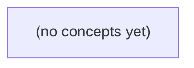

# 02.03 搜索与循环不变量：在有序消息序号中定位补拉起点

*一本面向 Go 初学者的静态教材，从未排序切片上的线性扫描出发，逐步建立半开区间、循环不变量与二分搜索的正确性论证。通过虚构的会话消息序号场景，学习 lower_bound、upper_bound、精确命中和 Go 标准库 sort.Search，并清晰划分算法定位与真实 IM 业务规则的边界。*

**章节:** 2

---

## 本书导览

- 了解整本书的章节脉络
- 掌握各章之间的概念依赖关系
- 选择最合适的阅读顺序

# 02.03 搜索与循环不变量：在有序消息序号中定位补拉起点

一本面向 Go 初学者的静态教材，从未排序切片上的线性扫描出发，逐步建立半开区间、循环不变量与二分搜索的正确性论证。通过虚构的会话消息序号场景，学习 lower_bound、upper_bound、精确命中和 Go 标准库 sort.Search，并清晰划分算法定位与真实 IM 业务规则的边界。

下方的概念图展示了本书 0 个核心概念以及它们之间的依赖关系；再下方是 1 个章节的入口。你可以按从上到下的顺序阅读，也可以根据自己的兴趣或先验知识选择切入点。

#### 概念图



## 章节索引

- **02.03 搜索与循环不变量：在有序消息序号中定位补拉起点** — 承接线性结构与成本模型，从顺序扫描到半开区间二分查找，明确排序、边界、重复键与终止条件。用虚构 IM 已排序消息序号求补拉起点，不声称真实同步协议或 OpenIM 实现。

## 02.03 搜索与循环不变量：在有序消息序号中定位补拉起点

- 区分按消息ID查询和按序号找起点
- 在无排序前提时使用线性扫描并说明成本
- 用半开区间[lo,hi)表达候选范围
- 证明二分过程中未排除正确答案
- 区分lower_bound和upper_bound及重复键处理
- 处理空输入、首尾越界与不存在结果
- 解释O(log n)比较次数的前提
- 把补拉起点与实际历史完整性分开

本节以虚构会话 c-a 的本地有序序号切片为例，建立“找补拉起点”与真实消息同步协议之间的边界。

### 四类位置概念先分清

### 四类位置概念先分清

“从哪里补拉”看似只是在找一个数字，实际上至少涉及四套不同坐标。若把它们混用，代码即使能运行，也可能跳过消息、重复展示，或错误地把本地位置当成服务端游标。

以虚构会话 `c-a` 为例，本地按教学序号保存：

`[1, 3, 5, 8, 13]`

- **稳定消息 ID**：消息的身份标识，例如 `"msg-7f3a"`。它通常用于去重、引用、撤回或定位同一条消息；不要假设它连续、可比较大小，或能直接当作数组下标。
- **切片下标**：Go 切片中的位置，范围是 `0` 到 `len(items)-1`。在上例中，教学序号 `5` 位于下标 `2`，而 `8` 位于下标 `3`。下标只是当前本地容器的位置；切片删减、重排后，它可能改变。
- **每会话教学序号**：本节人为设定的、在单个会话内递增的数值，如 `1、3、5、8、13`。它用于演示有序搜索，不代表真实系统的消息 ID、服务器序号或 OpenIM 协议字段。
- **最后已见位置 `lastSeen`**：客户端状态，含义是“该会话中最后已经处理到的教学序号”。若 `lastSeen=5`，补拉起点应是首个满足 $seq>5$ 的元素，即教学序号 `8`，其本地切片下标为 `3`。

因此，搜索函数返回的 `index=3` 表示“本地切片从第 3 个元素开始”；它不等于消息 ID，也不等于 `lastSeen`，更不能据此推断网络请求参数。本节只处理内存中的有序切片，尚未发生任何网络请求。

### 未排序时只能顺序扫描

### 未排序时只能顺序扫描

若本地切片**没有排序保证**，就不能使用二分查找：即使某个元素大于 `lastSeen`，它后面仍可能出现更小或更早的序号。此时只能从头到尾检查，返回第一个满足 `seq > lastSeen` 的位置。

```go
package main

import "fmt"

// firstGreaterLinear 返回切片中第一个大于 lastSeen 的元素下标。
// 找到时返回 (index, true)；不存在或切片为空时返回 (-1, false)。
func firstGreaterLinear(seqs []int, lastSeen int) (int, bool) {
	for i, seq := range seqs {
		if seq > lastSeen {
			return i, true
		}
	}
	return -1, false
}

func main() {
	// 未排序：不能据此推断后续元素都更大。
	seqs := []int{5, 1, 13, 3, 8}
	lastSeen := 5

	index, ok := firstGreaterLinear(seqs, lastSeen)
	fmt.Println(index, ok) // 2 true，seqs[2] == 13

	emptyIndex, emptyOK := firstGreaterLinear([]int{}, 5)
	fmt.Println(emptyIndex, emptyOK) // -1 false
}
```

循环不变量是：开始检查 `seqs[i]` 前，区间 `seqs[0:i]` 中不存在大于 `lastSeen` 的元素。因此首次命中时，`i` 就是按当前切片顺序的第一个候选位置；若循环结束仍未命中，则整个切片都不满足条件。

该算法时间复杂度为 $O(n)$，额外空间为 $O(1)$。这里的 `index` 是**切片下标**，不是稳定消息 ID，也不是会话教学序号；示例仅在本地内存中查找，不会发起网络请求，更不能据此推断任何实际 OpenIM 补拉协议。

### 半开区间表示候选起点

### 半开区间表示候选起点

设本地切片 `seqs` 按教学序号递增，例如虚构会话 `c-a`：

`[1, 3, 5, 8, 13]`

客户端记录 `lastSeen = 5`。补拉起点不是序号 `5`，而是**首个严格大于 `lastSeen` 的元素位置**：这里应为下标 `3`，对应序号 `8`。这个下标仅用于定位本地切片；它不是稳定消息 ID，也不代表真实 OpenIM 请求参数。

二分搜索可将问题写成候选下标区间：

\[
[lo, hi)
\]

其中 `lo` 包含、`hi` 不包含。初始化为 `[0, len(seqs))`，表示任意位置都可能是答案；空切片时就是 `[0, 0)`，无需特殊访问元素。

循环不变量是：

- 所有下标 `< lo` 的元素都满足 `seqs[i] <= lastSeen`，它们不可能是补拉起点。
- 所有下标 `>= hi` 的元素都满足 `seqs[i] > lastSeen`，但它们不是最靠左的候选，或已被保留在右侧。
- 真正的“首个 `> lastSeen`”位置始终位于 `[lo, hi)` 中；若不存在，则最终位置为 `len(seqs)`。

每轮取中点 `mid := lo + (hi-lo)/2`：

- 若 `seqs[mid] <= lastSeen`，中点及左侧都应排除，令 `lo = mid + 1`。
- 若 `seqs[mid] > lastSeen`，中点可能正是首个满足条件的位置，保留它并令 `hi = mid`。

当 `lo == hi` 时，候选区间为空，`lo` 即答案。对示例会依次缩小为 `[0,5)`、`[3,5)`、`[3,3)`，得到位置 `3`。

### 循环不变量保证不漏解

### 循环不变量保证不漏解

目标是在递增切片 `seqs=[1,3,5,8,13]` 中，找到第一个满足 `seqs[i] > lastSeen` 的下标。设 `lastSeen=5`，答案应为 `3`，因为 `seqs[3]=8`。

二分查找维护半开候选区间 `[lo, hi)`，初始为：

```go
lo, hi := 0, len(seqs)
```

循环不变量是：**若解存在，则“第一个大于 `lastSeen` 的位置”一定仍在 `[lo, hi)` 中；区间左侧都不可能是解。**

每次取中点：

```go
mid := lo + (hi-lo)/2
```

分两种情况更新：

- 若 `seqs[mid] > lastSeen`，`mid` 已经是一个可行位置；但左边可能还有更早的可行位置，因此保留 `mid`：
  ```go
  hi = mid
  ```
- 若 `seqs[mid] <= lastSeen`，由于切片递增，`mid` 及其左侧都不可能满足“首个大于”的条件，因此排除它们：
  ```go
  lo = mid + 1
  ```

循环条件为 `lo < hi`。每轮都会缩小区间：`hi` 向左移动，或 `lo` 越过 `mid` 向右移动，因此必然终止。终止时 `lo == hi`，候选区间为空；此时 `lo` 正是第一个可能大于 `lastSeen` 的位置。

还需在返回前验证边界：

- 空切片时，`lo=0`、`len(seqs)=0`，没有结果；
- 若 `lastSeen < 1`，最终得到 `0`；
- 若 `lastSeen >= 13`，最终得到 `len(seqs)=5`，表示不存在更大的序号。

```go
if lo < len(seqs) {
    return lo, true
}
return lo, false
```

这里的 `lo` 是本地切片下标，不是稳定消息 ID，也不是网络协议中的真实补拉参数。

### 重复键与补拉语义的边界

### 重复键与补拉语义的边界

当序号允许重复时，“二分查找”必须先说明要找哪一侧边界。对有序切片

`[1, 3, 5, 5, 5, 8, 13]`

若 `lastSeen = 5`，常见的两个定义不同：

- **下界（lower_bound）**：返回第一个满足 `seq[i] >= 5` 的位置，即下标 `2`。它指向第一个 `5`。
- **上界（upper_bound）**：返回第一个满足 `seq[i] > 5` 的位置，即下标 `5`。它指向 `8`。

本节的“找补拉起点”采用上界语义：客户端已经见过教学序号 `5`，应从严格大于 `5` 的第一项开始，因此要找：

$$
\min\{i\mid seq[i] > lastSeen\}
$$

二分循环可保持不变量：在任意时刻，`[0, left)` 中都满足 `seq[i] <= lastSeen`，而 `[right, n)` 中都满足 `seq[i] > lastSeen`。当 `left == right` 时，该位置就是上界；若结果等于切片长度，表示本地没有更大的序号。

这里的重复序号只是教学数据，用于强调比较符号的差异：`>=` 对应下界，`>` 对应上界。它不表示真实消息系统一定允许重复的稳定消息 ID，也不能据此推断 OpenIM 或任何实际协议的补拉参数、分页规则或网络请求行为。我们仅在本地有序切片中定位一个候选起点。

> **要点** — 排序使二分查找可行；半开区间与循环不变量保证正确定位，但本地起点不等于历史消息完整性。

在尚未确认序号有序时，定位补拉起点首先是一次逐项判定；关键不在“快”，而在准确说明首次命中的语义、未命中的表示及扫描为何正确。

### 先辨清问题：按序号找首次满足位置

### 先辨清问题：按序号找首次满足位置

设消息序号列表为 `seqs`，目标确认序号为 `target`。这里要找的不是“序号等于 `target` 的消息”，而是满足

$$
seqs[i] > target
$$

的**最小下标** `i`。它表示：从这条消息开始，消息序号首次超过已确认位置，因此可能需要补拉。

例如：

```go
seqs := []uint64{101, 103, 108, 120}
target := uint64(103)
```

所求位置是 `2`，对应序号 `108`；不是位置 `1`，因为 `103` 只是等于目标值。若 `target=104`，结果仍为 `2`。这体现了问题的核心：寻找“首次满足谓词 `seq > target` 的位置”。

它与几个相近需求必须区分：

- **按消息 ID 精确查询**：查找某个唯一 ID 是否存在，条件通常是 `msg.ID == id`；消息 ID 未必具有连续性、大小关系或时间顺序。
- **查找序号是否存在**：寻找 `seq == target`，返回的是精确命中，而不是补拉起点。
- **获取完整历史**：需要返回全部消息；即使找到了起点，后续能否直接取其后缀仍取决于列表是否按序号有序。
- **定位补拉起点**：只回答“第一条比目标更新的消息在哪里”，可用返回下标 `i` 表示。

线性扫描常写成：

`for i, seq := range seqs { ... }`

其中 `i` 是当前位置，`seq` 是该位置的序号。首次发现 `seq > target` 时立即返回 `i`，因为此前所有位置都已经检查过且不满足条件。

若完全未命中，应返回 `n := len(seqs)` 这个哨兵值，而非随意返回 `-1`。`n` 恰好表示“插入点在末尾”或“没有更大的序号”；调用者可安全地判断 `i < len(seqs)` 再访问元素。若还需明确区分“找到”与“未找到”，可返回 `(i, ok)`；但对插入点语义而言，单独返回 `n` 往往已足够。

### 顺序扫描：逐项比较直到首次命中

### 顺序扫描：逐项比较直到首次命中

设消息序号存放在切片 `seqs` 中，目标序号为 `target`。若尚未证明 `seqs` 有序，最直接且语义明确的做法是从左到右扫描：

`for i, seq := range seqs` 表示：第 `i` 次迭代取出位置 `i` 的序号值 `seq`，并检查谓词，例如 `seq > target`。

- 若 `seq <= target`，当前位置不是补拉起点，继续检查下一项。
- 若 `seq > target`，当前位置已满足条件；因为此前所有位置都检查过且未满足，所以 `i` 就是**首次**满足谓词的位置，应立即 `return i`。
- 循环结束仍未返回，说明没有任何项满足 `seq > target`，可返回 `len(seqs)` 作为“未命中”哨兵。

其正确性可由循环不变量说明：每次开始检查位置 `i` 前，区间 `[0,i)` 中的所有序号都不满足 `seq > target`。初始化时 `i=0`，空区间显然成立；若当前位置也不满足，继续迭代后不变量仍成立；若当前位置满足，则它必为第一个命中位置；若循环终止，则全部 `n` 项均未命中，返回 `n`。

在固定宽整数的教学模型中，每次比较是 $O(1)$，总时间为 $O(n)$，额外空间为 $O(1)$。这里返回的是“位置”；若需要区分“找到的值”和“是否找到”，则应使用 `(值, bool)`，而不是把 `n` 误当作一个有效位置。

### 返回结果：位置、n哨兵与存在标记

### 返回结果：位置、`n` 哨兵与存在标记

逐项扫描不仅要决定“是否找到”，还要约定如何把结果交给调用者。常见接口有三类，它们表达的语义不同。

1. **只返回位置**

   ```go
   func firstGE(seqs []uint64, target uint64) int
   ```

   若返回 `i`，通常表示 `seqs[i] >= target` 的首次位置。问题在于：当未找到时，返回什么？若直接返回 `0`，会与“第 0 项命中”混淆；返回 `-1` 虽可区分，但调用方必须额外处理负值。

2. **返回位置，`n` 表示未命中**

   对长度为 `n := len(seqs)` 的切片，可约定返回值范围为 $[0,n]$：

   ```go
   for i, seq := range seqs {
       if seq >= target {
           return i
       }
   }
   return len(seqs)
   ```

   这里 `n` 不是合法下标，而是“插入点在末尾”或“扫描后仍无满足项”的哨兵。调用方可统一判断：

   ```go
   start := firstGE(seqs, target)
   if start == len(seqs) {
       // 没有可补拉的起点
   } else {
       // seqs[start] 是首次满足条件的消息
   }
   ```

   这种设计尤其适合后续把 `start` 当作切片边界；但必须先检查 `start < n`，不能直接访问 `seqs[start]`。

3. **返回值与存在标记**

   若调用者真正关心的是“找到的序号”，而不是其位置，可返回 `(值, bool)`：

   ```go
   func firstGE(seqs []uint64, target uint64) (uint64, bool)
   ```

   `bool` 明确区分“找到值为 0 的消息”和“没有找到”。例如 `(0, true)` 是合法命中，`(0, false)` 才表示不存在。相比依赖特殊数值作为哨兵，存在标记更不易误用；相比位置接口，它不保留原切片中的定位能力。

选择原则是：需要继续切片、删除或记录偏移时返回位置；需要统一表示末尾边界时用 `n` 哨兵；只关心结果值且必须清晰表达存在性时，使用 `(值, bool)`。

### 循环不变量：为何扫描不会漏掉起点

### 循环不变量：为何扫描不会漏掉起点

设序号切片为 `seqs`，目标为 `target`，谓词为：

\[
P(i):\ seqs[i] > target
\]

逐项扫描可写为：

`for i, seq := range seqs { if seq > target { return i } }`  
`return len(seqs)`

证明其正确性的核心循环不变量是：

> 每次检查下标 `i` 之前，所有下标小于 `i` 的项都不满足谓词，即对任意 \(j<i\)，都有 `seqs[j] <= target`。

这意味着：扫描尚未跳过任何可能的起点。

- **初始化**：第一次迭代前 `i=0`。此时不存在满足 \(j<0\) 的下标，命题真空成立。
- **保持**：若在位置 `i` 发现 `seq > target`，立即返回 `i`。由不变量可知所有更早位置都不满足，因此 `i` 就是首次满足谓词的位置。  
  若 `seq <= target`，本轮未返回；于是 `i` 也可加入“已检查且不满足”的集合。下一轮开始前，对所有 \(j<i+1\)，均有 `seqs[j] <= target`，不变量继续成立。
- **终止**：循环正常结束说明每个下标都被检查且未命中。不变量扩展为对所有 \(0\le j<n\)，`seqs[j] <= target`，因此返回 `n=len(seqs)` 正确表示“没有补拉起点”。

边界也自然覆盖：

- 空切片时循环不执行，返回 `0`，即 `len(seqs)`；
- 首项命中时立即返回 `0`；
- 末项首次命中时返回 `n-1`；
- 全部未命中时返回哨兵 `n`，而不是某个有效下标。

该证明只依赖“逐项检查”，不要求序号有序；固定宽整数比较可按 \(O(1)\) 建模。若谓词涉及消息正文，单次比较成本还应计入正文长度。

### 无序数据的成本与排序前提

### 无序数据的成本与排序前提

设消息序号存放在切片 `seqs` 中，需要找出**第一个**满足 `seq >= target` 的位置。若尚未证明 `seqs` 有序，只能逐项扫描：

`for i, seq := range seqs { if seq >= target { return i } }`

这类搜索的最坏情况是扫描完全部 $n$ 项仍未命中，因此时间复杂度为 $O(n)$；即使目标恰好出现在首项，复杂度分析仍以最坏情况为准。

这里“第一个”严格指**存储顺序中的首次命中**，而不是数值上最小的合格序号。例如：

- `seqs = [12, 3, 20, 8, 25]`
- `target = 10`
- 首次命中位置是 `0`，对应 `12`。

但位置 `0` 之后的元素并不都满足条件：`3` 和 `8` 都小于 `10`。因此，在无序数据中，找到首次命中后不能把 `seqs[i:]` 直接解释为“全部需要补拉的消息”；若要收集所有满足项，仍须继续扫描全部元素。

只有先建立单调性前提，例如：

$seqs[0] \le seqs[1] \le \cdots \le seqs[n-1]$

首次满足 `seq >= target` 的位置才具有分界意义：其左侧都不满足，右侧都满足。此时才能安全地取后缀，并进一步使用二分查找将定位成本降为 $O(\log n)$。

教学中通常把固定宽整数序号的比较视为 $O(1)$。这适用于 `uint64` 一类序号；若比较的是消息正文、长字符串或复杂结构，单次谓词判断本身可能随内容长度增长，扫描总成本就不再只是简单的 $O(n)$。

> **要点** — 无序序号只能逐项找首次满足位置；循环不变量保证正确，n哨兵与存在标记必须按接口语义区分。

在查找补拉起点前，先把消息序号视为已满足前置条件的非降序数据，并用半开区间准确描述仍可能成立的候选位置。

### 从序号查起点，而非按消息ID查询

### 从序号查起点，而非按消息ID查询

消息ID通常是全局或会话内唯一标识。按消息ID查询的目标是“找到这一条具体记录”：命中则返回其下标或对象，未命中则返回不存在。它不回答“从哪里开始补拉”。

补拉起点的问题不同：给定目标序号 `targetSeq`，要在已满足前置条件的消息数组中，找到**第一个满足** `seq >= targetSeq` 的位置。消息已属于同一会话，`seq` 有效且按非降序排列；允许重复，例如多个记录的序号都为 `3`。这里不需要先学习排序算法，也不应从 `time` 字符串推断先后。

设序号为：

| 下标 `i` | 0 | 1 | 2 | 3 | 4 | 5 |
|---|---:|---:|---:|---:|---:|---:|
| `seq` 值 | 1 | 3 | 3 | 6 | 8 | 11 |

例如：

- 查消息ID：`id="m-102"`，结果是某条唯一消息，或未找到。
- 查补拉起点：`targetSeq=3`，结果应为下标 `1`，而不是任意一个值为 `3` 的位置。
- `targetSeq=5`，结果为下标 `3`，对应序号 `6`。
- `targetSeq=12`，结果为 `6`；`6` 不是可取值下标，而是“插入到末尾”的合法位置。

搜索过程中用半开区间 `[lo, hi)` 表示仍可能成为答案的下标：包含 `lo`，不包含 `hi`。初始为 `[0, n)`，候选数量是 `hi - lo`；当 `lo == hi` 时区间为空，搜索结束。这样既能表达首个元素，也能自然表达数组末尾的插入位置。

### 二分查找依赖的输入前置

### 二分查找依赖的输入前置

二分查找并不负责“把消息排好”，它只在一个已满足条件的序列上缩小候选范围。对于补拉起点定位，原始消息至少应满足以下前置：

- **属于同一会话**：不能把不同会话的消息混入同一个查找数组。即使两个会话都使用递增序号，它们的序号语义也彼此独立。
- **序号有效**：每条消息都应有可比较的 `seq`，避免 `null`、缺失值、文本占位符或无法解析的异常值参与比较。
- **按序号非降序排列**：相邻元素满足  
  $$a[i].seq \le a[i+1].seq$$  
  这里是“非降序”而不是“严格递增”，因此重复序号完全合法，例如 `[1,3,3,6,8,11]`。

| 下标 `i` | 0 | 1 | 2 | 3 | 4 | 5 |
|---|---:|---:|---:|---:|---:|---:|
| 序号 `seq` | 1 | 3 | 3 | 6 | 8 | 11 |

必须区分**下标**与**序号值**：`i=2` 表示数组中的第三个位置，而该位置保存的序号是 `3`。数组长度为 `n=6`，但 `n` 只是合法的边界或插入位置，不能读取 `a[n]`。

不要尝试从时间字符串推断序号顺序。例如时间格式、时区、客户端时钟漂移、补发与重传都可能使时间显示不可靠；二分查找的比较依据应始终是服务端定义的消息序号 `seq`。若输入未满足上述条件，应先过滤、分组或由上游保证排序，再进入二分查找。

### 用半开区间表示候选下标

### 用半开区间表示候选下标

设当前会话共有 $n$ 条已校验消息，序号按**非降序**排列：允许相邻序号相等，例如 `[1,3,3,6,8,11]`；本节不要求先了解如何排序。函数只接收满足“同一会话、序号有效、序号非降序”的输入，不能从 `time` 字符串猜测先后关系。

用半开区间 `[lo, hi)` 表示“仍可能是补拉起点的下标范围”：

- `lo` **包含**在候选中；
- `hi` **不包含**在候选中；
- 候选下标数恒为 `hi - lo`；
- 当 `lo == hi` 时，区间为空，表示没有普通数组元素仍待考察。

初始时令 `[lo, hi) = [0, n)`，即所有实际消息下标都是候选。以 $n=6$ 为例：

| 下标 | 0 | 1 | 2 | 3 | 4 | 5 |
|---|---:|---:|---:|---:|---:|---:|
| `seq` 值 | 1 | 3 | 3 | 6 | 8 | 11 |

这里必须区分“下标”和“序号值”：下标 `2` 对应的 `seq` 值才是 `3`，并非下标本身等于序号。

`n` 是合法的**边界位置**和插入位置。例如目标序号大于 `11` 时，补拉起点可为 `6`，表示应从全部现有消息之后开始；空数组时 `[0,0)` 中的 `0` 也同理。可是 `n` 不是元素下标，不能访问 `messages[n]`：上表只可取值到下标 `5`。

### 在序号表中追踪区间变化

### 在序号表中追踪区间变化

设某会话的有效消息序号已按**非降序**排列：

| 下标 `i` | 0 | 1 | 2 | 3 | 4 | 5 |
|---|---:|---:|---:|---:|---:|---:|
| `seq[i]` | 1 | 3 | 3 | 6 | 8 | 11 |

这里允许重复：两个 `3` 分别位于下标 `1`、`2`。我们关心的是“第一个满足 `seq[i] >= target` 的下标”，它就是补拉的插入起点；并不需要先学习如何排序。函数调用前已保证消息属于同一会话、序号有效且数组非降序，不能从 `time` 字符串推断顺序。

用半开区间 `[lo, hi)` 表示仍可能是答案的下标：包含 `lo`，不包含 `hi`。初始为 `[0, n)`；本例 `n=6`，即 `[0, 6)`，候选数为 `hi-lo`。注意 `6` 可以是插入位置，但不能读取 `seq[6]`。

例如 `target=3`：

1. 初始 `[0,6)`，取中点 `mid=3`，比较的是 `seq[3]=6`，不是“下标 3”。因为 `6 >= 3`，答案可能在左半边，更新为 `[0,3)`。
2. 在 `[0,3)` 中，`mid=1`，`seq[1]=3`。仍满足 `3 >= 3`，继续保留左侧，得到 `[0,1)`。
3. 在 `[0,1)` 中，`mid=0`，`seq[0]=1`。由于 `1 < 3`，下标 `0` 不可能是起点，更新为 `[1,1)`。

当 `lo==hi` 时区间为空，搜索结束，返回下标 `1`；它指向第一个序号为 `3` 的消息。若 `target=12`，最终会得到 `[6,6)`：返回 `6` 表示应插入到末尾，而非访问不存在的 `seq[6]`。

### 循环不变量与边界结果

### 循环不变量与边界结果

设已筛选出的消息序列只属于同一会话，且每个 `seq` 有效并按**非降序**排列；这允许重复，例如 `[1,3,3,6,8,11]`。这里不需要知道如何排序，也不能从 `time` 字符串猜测顺序。

| 下标 `i` | 0 | 1 | 2 | 3 | 4 | 5 |
|---|---:|---:|---:|---:|---:|---:|
| `seq[i]` | 1 | 3 | 3 | 6 | 8 | 11 |

搜索区间写作 `[lo, hi)`：包含 `lo`、不包含 `hi`，初始为 `[0,n)`；`hi-lo` 是候选数。注意 `n` 是合法的**插入位置**，但不能读取 `seq[n]`。

若补拉目标为 `target`，`lower_bound` 要找最小的 `i`，使得 `seq[i] >= target`。循环不变量是：

- 所有 `i < lo` 都满足 `seq[i] < target`，不可能是起点；
- 所有 `i >= hi` 都满足 `seq[i] >= target`，但已知更靠左的候选仍在 `[lo,hi)`；
- 正确的最左位置始终未被排除。

取 `mid = lo + (hi-lo)/2`。若 `seq[mid] < target`，则 `mid` 及其左侧都不能满足条件，令 `lo=mid+1`；否则 `mid` 可以成为答案，但还需寻找更左的重复键，令 `hi=mid`。区间严格缩小，最终 `lo==hi`。

结果自然覆盖边界：空输入时返回 `0`；`target<=1` 时返回 `0`；`target>11` 时返回 `n`，表示从尾后插入或无可补拉消息。`target=3` 返回 `1`，即第一个 `3`。若需要“最后一个不大于目标”的后界，则 `upper_bound` 寻找首个 `seq[i] > target`；对 `3` 返回 `3`，其前一个下标 `2` 才是最后一个 `3`。

> **要点** — 二分查找的关键是维护半开候选区间；它定位的是有序序号中的位置，不等同于保证历史消息完整。

在已排序的消息序号中，补拉起点是“第一个不小于目标序号的位置”。本节用半开区间二分查找建立可证明、可处理边界的求解方法。

### 先辨明问题：序号起点不是消息ID查询

### 先辨明问题：序号起点不是消息 ID 查询

补拉消息时，目标通常不是“找到某条消息 ID”，而是确定**从有序序号数组的哪个位置开始读取**。两者的返回语义不同：

- **按唯一消息 ID 查询**：给定 `id`，寻找与之完全相等的记录；若不存在，通常返回“未找到”。
- **按序号确定补拉起点**：给定 `target`，寻找最小下标 `i`，使得  
  $a[i]\ge target$。即使数组中没有恰好等于 `target` 的序号，也应返回插入位置。

例如 `a=[1,3,3,6,8,11]`：

- `target=3`，起点为下标 `1`，而非任意一个值为 `3` 的位置；
- `target=4`，起点为下标 `3`，对应序号 `6`；
- `target=12`，起点为 `6`，表示现有消息都早于目标；
- `target=0`，起点为 `0`，表示应从第一条消息开始。

这正是 `lower_bound` 问题：返回首个满足阈值的位置，而不是“查找某个值是否存在”。

二分查找依赖关键前提：数组必须按序号**非递减排序**。排序保证谓词

$$
P(i): a[i]\ge target
$$

呈现“前面全为假、后面全为真”的单调结构，才能不断排除一半候选区间。若消息序号未排序，则某个较大的序号之后仍可能出现较小序号；此时不能依据一次比较丢弃半边数据，二分查找的正确性也随之失效。

### 半开区间与循环不变量

### 半开区间与循环不变量

设有序数组为 `a[0:n]`，目标为 `target`。我们要找的不是“某个等于 `target` 的位置”，而是最小下标 $p$，使得：

$$
a[p]\ge target
$$

若所有元素都小于目标，则约定返回 $n$。因此答案天然可能位于数组末尾之后，适合用半开区间 `[lo, hi)` 表示候选位置：左端包含，右端不包含，初始为 `[0, n)`。

循环中维护两个边界事实：

- 对任意 $i<lo$，都有 `a[i] < target`：这些位置已经确认不可能是补拉起点。
- 对任意 $i>=hi$，都有 `a[i] >= target`：这些位置虽满足条件，但不是当前仍需寻找的更靠左答案。
- 因而真正尚未判定的候选位置恰为 `[lo, hi)`。

初始化 `lo=0, hi=n` 时，不变量自动成立：不存在满足 `i<0` 的下标；也不存在满足 `i>=n` 的数组内下标。这里利用了“空集合上的断言为真”，无需预先访问首尾元素，所以空数组也能直接处理。

每轮取：

`mid := lo + (hi-lo)/2`

它满足 `lo <= mid < hi`。由于数组有序：

- 若 `a[mid] < target`，则 `mid` 及其左侧都不可能是答案，令 `lo = mid + 1`；
- 否则 `a[mid] >= target`，`mid` 可以成为答案，但其右侧无需保留，令 `hi = mid`。

例如 `a=[1,3,3,6,8,11]`、`target=3`：`[0,6)` → 检查下标 `3`，收缩为 `[0,3)` → 检查 `1`，收缩为 `[0,1)` → 检查 `0`，得到 `[1,1)`。终止时 `lo==hi`，候选区间为空；结合两侧不变量，该位置正是第一个满足 `a[i]>=target` 的下标。测试若干输入只能发现错误，循环不变量才给出对所有合法输入的证明。

### 更新规则与未排除正确答案的证明

### 更新规则与未排除正确答案的证明

设数组 `a` 已按非降序排列，目标是找到最小下标 $p$，使得 `a[p] >= target`；若不存在，则返回 $n=len(a)$。使用半开区间 `[lo, hi)`，并维护：

- 对所有 $i<lo$，都有 `a[i] < target`；
- 对所有 $i>=hi`，都有 `a[i] >= target`；
- 因而尚未判定的位置恰为 `[lo, hi)`，答案若存在于数组内，必在其中。

初始化 `lo=0, hi=n` 时，左侧与右侧均为空，两个条件天然成立。每轮取中点：

`mid := lo + (hi-lo)/2`

这比 `(lo+hi)/2` 更安全：即使 `lo+hi` 可能溢出，`hi-lo` 仍位于当前区间长度内。且当 `lo<hi` 时，有 `lo <= mid < hi`。

若 `a[mid] < target`，则由有序性可知所有 `i<=mid` 都满足 `a[i] < target`，它们不可能是答案，故更新：

`lo = mid + 1`

此时左侧不变量扩大到新 `lo` 之前，右侧不变量不变。

否则 `a[mid] >= target`。`mid` 可能正是第一个满足条件的位置，不能丢弃；同时有序性保证所有 `i>=mid` 都满足 `a[i] >= target`，故更新：

`hi = mid`

右侧不变量扩展到新 `hi` 之后，左侧不变量不变。

两种分支都不会排除正确答案，并且区间长度严格缩小：前者新长度为 `hi-(mid+1)`，后者为 `mid-lo`，均小于原来的 `hi-lo`。因此循环必然终止于 `lo==hi`；此时未判定区间为空，边界 `lo` 正是首个 `a[i]>=target` 的位置，或在目标大于全部元素时自然为 `n`。这是一套由不变量与缩小性给出的证明，而非“测试若干输入恰好通过”的经验判断。

### 逐步追踪重复序号的查找过程

### 逐步追踪重复序号的查找过程

设有序消息序号数组为 `a=[1,3,3,6,8,11]`，目标序号 `target=3`。我们寻找的不是“任意一个等于 3 的位置”，而是第一个满足 `a[i] >= 3` 的下标，因此答案应为 `1`，而不是重复值所在的下标 `2`。

初始取半开区间 `[lo, hi)=[0,6)`：

| 轮次 | `lo` | `hi` | `mid=lo+(hi-lo)/2` | `a[mid]` | 判断 | 更新后区间 |
|---|---:|---:|---:|---:|---|---|
| 1 | 0 | 6 | 3 | 6 | `6 >= 3` | `[0,3)` |
| 2 | 0 | 3 | 1 | 3 | `3 >= 3` | `[0,1)` |
| 3 | 0 | 1 | 0 | 1 | `1 < 3` | `[1,1)` |

循环结束时 `lo==hi==1`，故返回 `1`。

关键在于：当 `a[mid] == target` 时，不能立刻返回。`mid` 虽然已经是一个合法候选位置，但其左侧仍可能存在更早的相同序号；因此应执行 `hi=mid`，保留左半部分继续查找。相反，只有当 `a[mid] < target` 时，`mid` 及其左侧才都不可能成为答案，才能令 `lo=mid+1`。

每轮更新都会严格缩小区间长度 `hi-lo`，并始终保持：`i<lo` 的元素均小于目标，`i>=hi` 的元素均不小于目标。终止时两条边界相遇，`lo` 恰为补拉起点。

### Go实现、边界结果与复杂度前提

### Go实现、边界结果与复杂度前提

下面的 `lowerBound` 返回首个满足 `a[i] >= target` 的下标；若不存在，则返回 `n`。这正是“从目标消息序号开始补拉”的起点。

```go
func lowerBound(a []int64, target int64) int {
	lo, hi := 0, len(a) // 搜索半开区间 [lo, hi)

	for lo < hi {
		mid := lo + (hi-lo)/2
		if a[mid] < target {
			lo = mid + 1
		} else {
			hi = mid
		}
	}
	return lo
}
```

边界结果无需额外分支，统一由半开区间语义覆盖：

- 空数组：`n=0`，循环不进入，返回 `0`。
- `target` 小于或等于首项：最终返回 `0`。
- `target` 大于末项：所有元素均小于目标，最终返回 `n`。
- 有重复值时：例如 `[1,3,3,6]` 查询 `3`，返回第一个 `3` 的位置 `1`。

不要把它与 `upper_bound` 混淆：`lower_bound` 找首个 `>= target`，而 `upper_bound` 找首个 `> target`。若要补拉“尚未处理的、序号至少为目标”的历史消息，应使用前者；若目标序号本身已确认处理、希望跳过全部同序号记录，才可能考虑后者。

二分查找的时间复杂度为 $O(\log n)$，线性扫描则为 $O(n)$。但复杂度结论以前提为基础：数组必须按消息序号非递减排序。仅靠“测几个输入”不能证明正确性；正确性来自循环不变量与每轮严格缩小搜索区间。若历史消息乱序，返回的下标不再具有“此前均小于目标、此后存在候选”的补拉含义，可能造成漏拉或重复处理。

> **要点** — lower_bound依赖有序性与循环不变量；终止时lo==hi即首个序号不小于目标的位置，结果不等同于历史完整性。

在有序序号中定位补拉起点，关键不只是“找到位置”，而是明确位置代表首个满足何种条件的元素。

### 两类边界：首个不小于与首个大于

### 两类边界：首个不小于与首个大于

在升序数组中，边界搜索返回的通常不是“某个命中的元素”，而是一个满足条件的最左位置。设数组为 $a$、目标为 `target`：

- `lower_bound(target)`：返回首个满足 $a[i]\ge target$ 的下标。
- `upper_bound(target)`：返回首个满足 $a[i]>target$ 的下标。

两者只差一个等号，但循环中使用的谓词不同：

- `lower_bound` 把“元素是否仍小于目标”作为左侧条件，即左侧都满足 $a[i]<target$。
- `upper_bound` 把“元素是否仍不大于目标”作为左侧条件，即左侧都满足 $a[i]\le target$。

对数组 `[1,3,3,6,8,11]`：

| `target` | `lower_bound` | `upper_bound` | 含义 |
|---|---:|---:|---|
| `3` | `1` | `3` | 等于 `3` 的半开区间为 `[1,3)` |
| `4` | `3` | `3` | 不存在 `4`，插入点在 `6` 前 |
| `12` | `6` | `6` | 所有元素都小于目标，返回数组末尾 |

因此，`[lower_bound(target), upper_bound(target))` 恰好表示所有等于 `target` 的元素；这里的重复键仅用于说明算法边界，不代表真实消息序号一定允许重复。

若要确认精确消息 ID 或序号是否存在，不能把 `lower_bound` 的插入点直接当作命中结果，必须继续检查：

`idx < len(a) && a[idx] == target`

否则，查找 `4` 会得到下标 `3`，却错误地把值为 `6` 的消息当成目标。

### 半开区间刻画重复键等值段

### 半开区间刻画重复键等值段

设有序数组为 `a=[1,3,3,6,8,11]`，目标值 `target=3`。重复键的价值在于：它能把“找到一个 3”进一步区分为“第一个 3”“最后一个 3 的后一位”以及“全部 3 的范围”。

`lower_bound(3)` 寻找首个满足 `a[i] >= 3` 的位置：

- `a[0]=1<3`，不能作为答案；
- `a[1]=3>=3`，这是第一个满足条件的位置。

因此 `lower_bound(3)=1`。

`upper_bound(3)` 寻找首个满足 `a[i] > 3` 的位置：

- `a[1]`、`a[2]` 都等于 `3`，仍不满足严格大于；
- `a[3]=6>3`，首次满足条件。

因此 `upper_bound(3)=3`。

于是，所有等于 `3` 的元素恰好位于半开区间：

$$
[\operatorname{lower\_bound}(3),\operatorname{upper\_bound}(3))=[1,3)
$$

该区间包含下标 `1,2`，对应两个值 `3`；不包含右端点 `3`，因为 `a[3]=6` 已经离开等值段。半开表示法便于统一处理边界：等值段长度直接是

$$
3-1=2
$$

并且可以自然地与数组切片、循环边界和空区间兼容。重复键仅用于说明算法语义；真实消息序号通常应唯一。

### 不同目标值的边界与越界结果

### 不同目标值的边界与越界结果

设有序序号数组为 `a=[1,3,3,6,8,11]`，长度 `len=6`。边界搜索返回的是**位置**，其含义由谓词决定，而不是“是否找到了目标值”。

当 `target=4` 时，数组中不存在 `4`，但它应插入在两个 `3` 之后、`6` 之前：

- `lower_bound(4)=3`：首个满足 `a[i] >= 4` 的位置是 `a[3]=6`。
- `upper_bound(4)=3`：首个满足 `a[i] > 4` 的位置同样是 `a[3]=6`。

因此，目标缺失时两个边界可能相同；它们给出的 `3` 是合法插入点，不表示 `a[3]` 就是 `4`。若要精确查找，必须继续验证：

`idx < len && a[idx] == target`

当 `target=12` 时，所有元素都小于目标：

- `lower_bound(12)=6`
- `upper_bound(12)=6`

返回 `len` 完全合法，表示插入点位于数组末尾，即应追加在 `11` 后面。它尤其不能被误解为“最后一个元素的位置”，更不能直接访问 `a[6]`；有效下标仅为 `0` 到 `5`。

边界搜索的统一约定是返回半开区间 `[0,len]` 内的位置：`0` 可表示应插入开头，`len` 可表示应插入末尾。调用方必须把“位置合法”与“目标命中”分开处理。

### 精确查找必须在边界后验证

### 精确查找必须在边界后验证

按消息 ID 或序号做“精确查询”时，`lower_bound(target)` 只保证返回**首个满足 `a[i] >= target` 的位置**，它并不保证目标真的存在。

设有序数组为：

`[1, 3, 3, 6, 8, 11]`

查询 `target = 3` 时，`lower_bound(3)` 返回 `1`，且 `a[1] == 3`，因此可以确认找到了目标。查询 `target = 4` 时，返回 `3`，但 `a[3] == 6`；位置 `3` 只是 `4` 的插入点，不代表编号 `4` 的消息存在。查询 `target = 12` 时，返回 `6`，即数组末尾后的半开边界，更不能直接访问该位置。

因此，精确查找应固定为两步：

1. 用 `lower_bound(target)` 找到第一个不小于目标的位置 `idx`；
2. 同时验证 `idx < len(a)` 且 `a[idx] == target`。

可写成：

`idx = lower_bound(a, target)`

`found = idx < len(a) && a[idx] == target`

这里的“未越界”与“值相等”缺一不可。前者防止目标大于所有已有序号时访问越界；后者防止把较大的后继消息误判为目标消息。

在消息系统中，插入点仍然有价值：它表示若未来出现该序号，应该位于何处；但它不是已持久化消息的证据。教学示例中的重复键仅用于说明边界算法；真实服务是否允许重复消息序号，应由其唯一性约束决定。

### 补拉语义决定选择哪一种边界

### 补拉语义决定选择哪一种边界

设本地或服务端可查询的消息序号已排序为 `a`。用户记录 `lastSeen=5` 后，“补拉起点”不能只描述为“找 5 的位置”，而要先写清业务谓词。

- 若语义是“补拉**严格晚于**已见消息的内容”，即需要所有满足 $seq>5$ 的消息，应使用 `upper_bound(5)`：返回首个 `>5` 的位置。
- 若语义是“从序号 **至少为 5** 的消息开始重放”，即需要所有满足 $seq\ge5$ 的消息，应使用 `lower_bound(5)`：返回首个 `>=5` 的位置。

例如序列为 `[1,3,3,6,8,11]`，虽然重复序号仅用于演示边界算法，并不表示真实 IM 一定允许重复消息序号：

| 查询目标 | `lower_bound` | `upper_bound` | 含义 |
|---|---:|---:|---|
| `3` | `1` | `3` | 等值元素构成半开区间 `[1,3)` |
| `4` | `3` | `3` | 不存在 `4`，两者都指向插入位置 |
| `12` | `6` | `6` | 位于尾后位置 |

因此，`lastSeen=5` 的“严格晚于”补拉应从 `upper_bound(5)` 返回的位置开始；若协议要求“至少从 5 开始”，才选择 `lower_bound(5)`。两者可能恰好得到同一位置，但这是数据分布造成的结果，不能替代语义判断。

还要区分**算法位置**与**历史完整性**：边界搜索只是在当前可用有序集合中确定起点。若服务器已清理早期历史、客户端存在断档，或 `lastSeen` 不可信，得到的起点并不自动证明消息历史连续完整；完整性仍需依赖游标、最早可用序号、缺口检测或服务端同步协议确认。

> **要点** — 边界函数返回的是满足谓词的首个位置；是否命中、从何处补拉，都必须由后续验证与业务语义共同决定。

本节用独立 Go 程序在已排序消息序号中定位首个大于 lastSeen 的位置，并以循环不变量说明结果为何可信。

### 问题语义：寻找补拉起点而非查询消息

### 问题语义：寻找补拉起点而非查询消息

`firstGreater` 的任务不是“查出某条消息”，而是在**已按序号升序排列**的消息序号中，确定下一次补拉应从哪个候选位置开始。

设：

- `seq`：已有消息的序号列表，例如 `[10, 20, 30, 40]`
- `lastSeen`：客户端已确认看到的最大序号
- 返回值：满足 `seq[i] > lastSeen` 的最小下标 `i`

也就是说，返回的下标指向“第一条尚未被 `lastSeen` 覆盖的候选消息”。若返回 `i`，则应有：

- 对所有 `j < i`，`seq[j] <= lastSeen`；
- 若 `i < len(seq)`，则 `seq[i] > lastSeen`。

因此，调用方通常会从 `seq[i]` 对应的消息开始补拉，而不是把 `i` 当作消息序号本身。

```go
package main

import (
	"fmt"
	"sort"
)

func firstGreater(seq []int64, lastSeen int64) int {
	return sort.Search(len(seq), func(i int) bool {
		return seq[i] > lastSeen
	})
}

func main() {
	seq := []int64{10, 20, 30, 40}

	fmt.Println(firstGreater(seq, 0))  // 0：从首条开始补拉
	fmt.Println(firstGreater(seq, 20)) // 2：序号 30 是首条未覆盖消息
	fmt.Println(firstGreater(seq, 99)) // 4：没有可补拉的候选消息
}
```

特别地，返回 `len(seq)` 不表示发生错误，只表示数组中不存在大于 `lastSeen` 的序号。这个位置可理解为“尾后位置”：从这里开始取消息，结果为空。

### 完整 Go 程序与 sort.Search 调用

### 完整 Go 程序与 `sort.Search` 调用

下面的程序假定 `seq` 已按消息序号递增排列。`firstGreater` 返回首个满足 `seq[i] > lastSeen` 的下标；若不存在这样的元素，则返回 `len(seq)`。

```go
package main

import (
	"fmt"
	"sort"
)

func firstGreater(seq []int64, lastSeen int64) int {
	return sort.Search(len(seq), func(i int) bool {
		return seq[i] > lastSeen
	})
}

func main() {
	seq := []int64{10, 20, 30, 40, 50}

	cases := []int64{
		0,  // 小于首元素
		30, // 等于中间元素
		99, // 大于末元素
	}

	for _, lastSeen := range cases {
		n := firstGreater(seq, lastSeen)
		if n == len(seq) {
			fmt.Printf("lastSeen=%d: 没有需要补拉的消息\n", lastSeen)
			continue
		}
		fmt.Printf("lastSeen=%d: 起点=%d，序号=%d\n",
			lastSeen, n, seq[n])
	}
}
```

这里传给 `sort.Search` 的第二个参数是函数值：`func(i int) bool { ... }`。它是一个闭包，会捕获外层的 `lastSeen`，因此每次搜索都能比较当前下标处的序号与该用户的已见位置。

对 `seq := []int64{10, 20, 30, 40, 50}`：

- `lastSeen=0`：谓词从下标 `0` 起即为真，返回 `0`。
- `lastSeen=30`：下标 `0、1、2` 为假，下标 `3` 首次为真，返回 `3`。
- `lastSeen=99`：所有下标都为假，返回 `n=5`。

谓词必须满足“先假后真”的单调结构；这依赖 `seq` 已排序。`sort.Search` 只负责定位边界，不会验证序列是否有序、历史消息是否连续、调用者是否有权限，也不代表消息一定处于已读状态。

### 单调谓词、排序前提与半开区间

### 单调谓词、排序前提与半开区间

`sort.Search` 将“找第一个满足条件的位置”转化为二分查找。它要求谓词随下标递增呈单调形态：前段均为 `false`，后段均为 `true`。对已按升序排列的消息序号 `seq`，谓词 `seq[i] > lastSeen` 恰好满足这一要求：不大于已读序号的元素在前，待补拉的元素在后。

```go
package main

import (
	"fmt"
	"sort"
)

func firstGreater(seq []int64, lastSeen int64) int {
	return sort.Search(len(seq), func(i int) bool {
		return seq[i] > lastSeen
	})
}

func main() {
	cases := []struct {
		seq      []int64
		lastSeen int64
	}{
		{[]int64{}, 10},
		{[]int64{10, 20, 30, 40}, 5},
		{[]int64{10, 20, 30, 40}, 20},
		{[]int64{10, 20, 30, 40}, 99},
	}

	for _, c := range cases {
		fmt.Println(c.seq, c.lastSeen, "=>", firstGreater(c.seq, c.lastSeen))
	}
}
```

可将二分过程理解为维护候选半开区间 `[lo, hi)`。初始时 `[0, n)` 包含所有可能答案；每次取中点 `mid`：

- 若 `seq[mid] > lastSeen` 为真，首个满足位置只能在 `[lo, mid)`，令 `hi = mid`；
- 若谓词为假，`mid` 及其左侧都不可能是答案，令 `lo = mid + 1`。

循环结束时 `lo == hi`：它是首个 `true` 的下标；若结果为 `n`，则整个区间均为 `false`，即没有更大的序号。空切片也自然返回 `0`。

这里的可信性依赖排序前提；若序号无序，谓词可能出现“真后又假”，二分结论失效。`sort.Search` 只负责定位，不验证排序、历史消息是否连续、调用者是否有权限，或 `lastSeen` 是否真实表示已读状态。

### 四类边界用例与返回值解释

### 四类边界用例与返回值解释

`sort.Search` 返回满足谓词的**最小下标**。这里谓词为 `seq[i] > lastSeen`；当 `seq` 已按升序排列时，谓词结果必然呈现“先 `false`、后 `true`”的形状。

```go
package main

import (
	"fmt"
	"sort"
)

func firstGreater(seq []int64, lastSeen int64) int {
	return sort.Search(len(seq), func(i int) bool {
		return seq[i] > lastSeen
	})
}

func main() {
	cases := []struct {
		seq      []int64
		lastSeen int64
	}{
		{[]int64{}, 10},
		{[]int64{10, 20, 30}, 5},
		{[]int64{10, 20, 30, 40}, 20},
		{[]int64{10, 20, 30}, 99},
	}

	for _, c := range cases {
		n := firstGreater(c.seq, c.lastSeen)
		fmt.Printf("seq=%v, lastSeen=%d, n=%d\n", c.seq, c.lastSeen, n)
	}
}
```

四种结果分别体现边界含义：

- 空序列：`len(seq)=0`，返回 `0`。此时 `n` 既是插入位置，也表示没有可补拉消息。
- `lastSeen` 小于首项：如 `[10,20,30]` 与 `5`，返回 `0`；首条消息就是第一个需要补拉的消息。
- `lastSeen` 等于中间项：如 `[10,20,30,40]` 与 `20`，返回 `2`；`seq[2]=30` 是首个严格大于已读序号的值。
- `lastSeen` 大于末项：如 `[10,20,30]` 与 `99`，返回 `n=3`，即序列长度。`n` 不是有效访问下标，而是“未找到符合元素”的明确标记。

因此，只有在 `n < len(seq)` 时才能读取 `seq[n]`。该搜索只负责定位；它不验证输入是否排序，也不证明历史消息连续、更不检查权限或已读状态。

### 定位能力的边界：重复键与历史事实

### 定位能力的边界：重复键与历史事实

`firstGreater` 实现的是“首个严格大于”`lastSeen` 的位置：

```go
package main

import (
	"fmt"
	"sort"
)

func firstGreater(seq []int64, lastSeen int64) int {
	return sort.Search(len(seq), func(i int) bool {
		return seq[i] > lastSeen
	})
}

func main() {
	seq := []int64{10, 20, 20, 20, 30, 40}

	fmt.Println(firstGreater(seq, 0))   // 0：lastSeen 小于首项
	fmt.Println(firstGreater(seq, 20))  // 4：跳过全部重复的 20
	fmt.Println(firstGreater(seq, 25))  // 4：首个大于 25 的是 30
	fmt.Println(firstGreater(seq, 99))  // 6：没有更大的项
}
```

这通常称为 `upper_bound` 语义：若序号 `20` 重复出现，查询 `lastSeen=20` 会返回重复区间之后的位置，即第一个 `>20` 的元素。与之相对，`lower_bound` 寻找首个 `>=lastSeen` 的位置；对同一序列和 `lastSeen=20`，其结果是下标 `1`。

`sort.Search` 只依赖下标谓词满足“先 `false`、后 `true`”：

- 对 `seq[i] > lastSeen`，这要求 `seq` 按非递减顺序排列；
- 返回值 `n` 仅表示不存在满足谓词的位置；
- 它定位的是数组边界，不是在证明业务历史。

因此，`sort.Search` 不会验证序列是否真的有序，也不会发现序号是否缺失、重复是否合理、消息是否属于当前用户，或 `lastSeen` 是否可信、更不表示消息已读。比如 `{10, 30, 20}` 可能仍返回某个下标，但该结果不具备二分搜索的语义保证。排序、连续性校验、权限过滤与已读状态确认，必须由调用方在不同层次显式承担。

> **要点** — sort.Search 依赖已排序序号和单调谓词，只能高效定位补拉候选下标，不能证明历史完整。

二分查找的效率来自有序性与单调谓词；若这些前提不成立，程序即使终止也未必定位正确。

### 从顺序扫描到对数比较

### 从顺序扫描到对数比较

给定按序号升序排列的消息序列 `seqs`，目标是找到第一条满足 `seq > lastSeen` 的消息，作为补拉起点。

顺序扫描从头逐个比较：

- 最好情况：第一条就满足，比较 $1$ 次；
- 最坏情况：直到末尾仍未找到，比较 $n$ 次；
- 时间复杂度为 $O(n)$。

二分查找维护候选区间 `[lo, hi)`，每轮检查中点 `mid`：

- 若 `seqs[mid] <= lastSeen`，起点只能在右半区；
- 若 `seqs[mid] > lastSeen`，中点及其左侧仍可能包含更早起点。

因此每轮候选长度至少约减半，至多比较

$$
\lceil \log_2(n+1)\rceil
$$

次，复杂度为 $O(\log(n+1))$。这里还隐含一个工程前提：序号是固定宽整数等可在 $O(1)$ 时间比较的值；若比较本身昂贵，总成本应写为“比较次数 × 单次比较成本”。

二分正确性依赖谓词 `seq > lastSeen` 在数组下标上的单调性：一旦为真，后续必须都为真。未排序的 `[1,8,3,6]` 会破坏该性质；程序仍可能结束，却可能跳过 `8` 或错定起点。先检查排序能拒绝坏输入，但检查本身又是 $O(n)$，不能免费获得二分优势。

此外，`[1,3,5]` 中的缺号不必然表示丢消息：它也可能是合法过滤结果。仅凭数组索引或序号间隔，不能推断历史完整性。过期 `lastSeen`、会话不匹配、重复序号及权限变化，应由上层协议规则处理，而非由本查找过程裁决。

### 候选区间为何每轮近半缩小

### 候选区间为何每轮近半缩小

设有序序号数组为 `seq[0..n)`，目标是找到第一个满足 `seq[i] >= target` 的位置，即补拉时应从何处开始检查。使用半开区间 `[lo, hi)` 表示尚未排除的候选下标，初始为 `[0, n)`。

循环不变量是：

- `[0, lo)` 中所有序号都满足 `seq[i] < target`，不可能是答案；
- `[hi, n)` 中所有序号都满足 `seq[i] >= target`，答案不会在其右侧；
- 因而答案始终位于 `[lo, hi]` 所界定的插入位置中。

每轮取中点 `mid = lo + (hi - lo) / 2`：

- 若 `seq[mid] < target`，则 `mid` 及左侧均可排除，令 `lo = mid + 1`；
- 否则 `mid` 可能正是第一个不小于目标的位置，令 `hi = mid`。

令当前候选区间长度为 $L=hi-lo$。更新后，剩余长度至多为 $\lceil L/2\rceil$：中点把原区间分为左右两部分，而其中一部分连同已判定的中点会被排除。于是经过 $k$ 轮后，候选规模约为 $n/2^k$；当其缩至 $0$ 时循环结束。由于共有 $n+1$ 个可能的插入位置，最坏比较次数为：

$$
\left\lceil \log_2(n+1)\right\rceil
$$

因此时间复杂度为 $O(\log(n+1))$。这一结论还隐含每次 `seq[mid]` 与 `target` 的比较是 $O(1)$；例如固定宽度整数序号满足该前提。

### 循环不变量守住正确起点

### 循环不变量守住正确起点

设有序消息序号为 `seqs[0..n)`，目标是找到第一条满足 `seqs[i] > lastSeen` 的消息，即补拉结果的起点；若不存在，则答案为 `n`。定义谓词：

$$
P(i):=\bigl(seqs[i]>lastSeen\bigr)
$$

在非降序序列中，$P(i)$ 呈现“先假后真”的单调结构。采用左闭右开候选区间 `[lo, hi)`，初始化为 `[0, n)`，并维持循环不变量：

> 正确答案 `ans` 始终位于 `[lo, hi]` 中；更精确地说，所有 `< lo` 的位置均不满足谓词，所有 `>= hi` 的位置均满足谓词。

每轮取中点 `mid = lo + (hi - lo) / 2`：

- 若 `seqs[mid] > lastSeen`，`mid` 可能就是第一个可补拉位置，但其左侧仍需检查，因此令 `hi = mid`。
- 否则 `mid` 及其左侧都不可能是答案，令 `lo = mid + 1`。

```text
lo = 0, hi = n
while lo < hi:
    mid = lo + (hi - lo) / 2
    if seqs[mid] > lastSeen:
        hi = mid
    else:
        lo = mid + 1
return lo
```

循环终止时 `lo == hi`，候选区间收缩为单点；由不变量可知，该点恰为第一个满足谓词的位置，或在全部不满足时为 `n`。空序列也自然返回 `0`。

关键不在于“中点比较后移动指针”，而在于每次移动都不排除真实答案。若误写为命中后 `hi = mid - 1`，或未命中后 `lo = mid`，就会破坏边界语义，后者还可能在相邻区间中无法推进而死循环。

### 无序输入如何让二分失效

### 无序输入如何让二分失效

设目标是找到第一个满足 `seq > lastSeen` 的位置。对有序序列，谓词

$$
P(i):=\text{seq}[i] > lastSeen
$$

应当呈现“先假后真”的单调形态：`false, false, ..., true, true`。二分每次据此排除一半不可能的区间。

考虑无序输入 `[1, 8, 3, 6]`，令 `lastSeen = 5`。谓词结果为：

| 索引 | 序号 | `seq > 5` |
|---:|---:|---|
| 0 | 1 | 假 |
| 1 | 8 | 真 |
| 2 | 3 | 假 |
| 3 | 6 | 真 |

它变成了“假、真、假、真”，不再单调。若二分先检查中点索引 `2`，看到 `3 <= 5`，便会把左侧连同索引 `1` 一起排除，随后可能返回索引 `3` 的 `6`。程序正常结束，却漏掉了更早应补拉的 `8`。

因此，二分的循环不变量不是“区间不断缩小”这么简单，而是“被排除的区间确实不可能包含答案”。无序数据使这一不变量失去依据；缩小得再快，也只是更快地得到未经保证的结果。

### 定位起点不等于证明历史完整

### 定位起点不等于证明历史完整

设客户端最后确认的序号为 `lastSeen=2`，当前可见消息序列为 `[1,3,5]`。在“按序号升序、寻找首个 `seq > lastSeen`”这一任务中，二分查找可以正确定位到序号 `3`，于是补拉起点是 `3`。这只说明：**在当前输入集合中，`3` 是第一个满足比较条件的元素**。

它并不能推出历史完整。`[1,3,5]` 至少可能有两种业务含义：

- 服务端本就只允许当前用户看到 `1、3、5`；`2、4` 被权限过滤，序列缺号完全合法。
- 消息 `2、4` 曾经存在，但因缓存截断、同步失败或数据缺失而未出现在当前列表中；此时需要补历史或触发修复。

因此，不能用“元素在数组中的第 `i` 个位置”推断其序号应为 `i`，也不能因为发现 `3-1>1` 就由定位算法直接宣告“丢消息”。序号间隔是业务信号，而不是二分查找正确性的判据。

重复序号也应与定位分开处理。例如 `[1,3,3,5]` 中，若查找 `seq>2`，起点仍可定位为第一个 `3`；但两个 `3` 是否代表重放、幂等副本、不同版本，或数据异常，需要上层定义去重键与保留策略。若要求“第一个 `seq≥x`”或“最后一个 `seq≤x`”，也必须明确重复值的边界语义。

算法层的职责仅是：在已排序序列上，依据单调谓词稳定返回边界索引。以下规则属于同步协议或业务校验，而非本节二分逻辑：

- `lastSeen` 是否过期、是否允许回补；
- 会话、租户或设备是否匹配；
- 权限变化后哪些历史消息仍可见；
- 重复序号如何去重，缺号是否需要告警、补拉或全量重同步。

换言之，定位回答“从当前可见数据的哪里开始”；历史完整性回答“当前可见数据是否足以代表应有历史”。两者相关，但不能互相替代。

> **要点** — 二分查找依赖有序与单调性；它能高效定位序号边界，却不能单独证明消息历史完整。

以虚构会话 c-a 的已排序序号为例，建立从“找到位置”到“确定补拉候选起点”的二分查找模型，并严格区分局部数组结论与真实同步保证。

### 问题建模：序号起点不是消息身份查询

### 问题建模：序号起点不是消息身份查询

设虚构会话 `c-a` 的本地消息按序号排序为：

`seq = [1, 3, 3, 6, 8, 11]`

这里的 `seq` 是**用于排序和定位的键**，不是消息的唯一身份。两条消息都可能具有序号 `3`，但仍分别拥有不同的消息 ID，例如：

| 下标 | 序号 | 消息 ID |
|---:|---:|---|
| 1 | 3 | `m-17` |
| 2 | 3 | `m-42` |

因此有两类不同问题：

- **按消息 ID 精确查询**：查找 `m-42` 是否存在；这是身份匹配，通常应依赖哈希索引或线性扫描。
- **按序号确定补拉起点**：若 `lastSeen = 3`，希望找到第一条序号严格大于 `3` 的候选消息，即下标 `3`、序号 `6`。

补拉常见目标可写为：

- 首个未确认候选：`lower_bound(seq, lastSeen)`，即首个 `$seq[i] \ge lastSeen$`；
- 首个严格更新候选：`upper_bound(seq, lastSeen)`，即首个 `$seq[i] > lastSeen$`。

对 `seq=[1,3,3,6,8,11]`，当 `lastSeen=3` 时，前者返回下标 `1`，后者返回下标 `3`。选择哪一种取决于协议是否允许“从已见序号重拉以去重”，而不是二分查找本身。

二分查找的前提是键已按同一规则排序。若消息数组实际为 `[3, 1, 8, 3, 6, 11]`，谓词“序号是否大于 `lastSeen`”不再呈现“假、假、真、真”的单调边界；此时不能可靠二分，只能先排序、维护有序索引，或线性扫描。二分给出的只是**本地有序数组中的位置结论**，并不自动证明服务端没有遗漏消息。

### 半开区间与循环不变量

### 半开区间与循环不变量

设有序数组为 `seq=[1,3,3,6,8,11]`，目标为 `target`。`lower_bound` 要找的是第一个满足 `seq[i] >= target` 的位置；若不存在，则返回哨兵位置 `n=len(seq)`。注意：这里的 `seq` 只是排序键示例，真实消息仍应以其唯一消息身份判断，不能把重复序号直接当作同一条消息。

采用候选区间 `[lo, hi)`，初始为 `[0,n)`：

```text
lo=0, hi=n
当 lo < hi：
    mid = lo + (hi-lo)/2
    若 seq[mid] < target：
        lo = mid+1
    否则：
        hi = mid
返回 lo
```

循环不变量是：

- 所有 `i < lo` 都满足 `seq[i] < target`，因此不可能是答案。
- 所有 `i >= hi` 都满足 `seq[i] >= target`，因此若答案存在于数组中，它不在右侧已排除部分。
- 因而真正的下界位置始终位于 `[lo,hi)`；若下界为 `n`，也同样被该区间表示。

以 `target=3` 为例：初始 `[0,6)`，`mid=3`，`seq[3]=6>=3`，保留左半边得 `[0,3)`；再取 `mid=1`，值为 `3`，得到 `[0,1)`；最后 `mid=0`，值为 `1<3`，得到 `[1,1)`，返回 `1`，即第一个 `3`。这解释了为什么相等时必须令 `hi=mid`：否则会跳过重复值的最左位置。

每次迭代都严格缩小区间：`seq[mid]<target` 时移除 `[lo,mid]`，否则移除 `[mid,hi)` 中的右侧部分。区间长度有限，故最终必有 `lo==hi`。此时不存在未分类元素；根据不变量，`lo` 左侧全小于目标、右侧全不小于目标，故 `lo` 正是 `lower_bound`。

### 重复键决策表：lastSeen 到补拉起点

### 重复键决策表：`lastSeen` 到补拉起点

设虚构会话 `c-a` 的**已排序键**为 `seq=[1,3,3,6,8,11]`，长度 $n=6$。这里的 `seq` 仅用于演示排序与搜索；真实消息必须另有唯一身份（如消息 ID、服务端序号）。因此，重复的键 `3,3` 不代表两条消息可互换或可去重。

定义：

- `lower_bound(x)`：第一个满足 `seq[i] >= x` 的位置。
- `upper_bound(x)`：第一个满足 `seq[i] > x` 的位置。
- 若不存在满足条件的位置，返回哨兵 `n`，表示“数组内没有候选元素”。

若 `lastSeen` 表示“已确认处理到的排序键”，补拉候选通常取 `upper_bound(lastSeen)`：它跳过所有键等于 `lastSeen` 的元素；但这只是本地数组决策，不能单独证明网络侧不会漏消息或重复消息。

| `lastSeen` | `lower_bound` | `upper_bound` | `upper_bound` 指向值 | 补拉候选 |
|---:|---:|---:|---:|---|
| `0` | `0` | `0` | `1` | 从 `1` 开始 |
| `1` | `0` | `1` | `3` | 从首个 `3` 开始 |
| `3` | `1` | `3` | `6` | 跳过两个 `3`，从 `6` 开始 |
| `4` | `3` | `3` | `6` | 从 `6` 开始 |
| `8` | `4` | `5` | `11` | 从 `11` 开始 |
| `11` | `5` | `6=n` | 无 | 本地结果为空 |
| `12` | `6=n` | `6=n` | 无 | 本地结果为空 |

`n` 不是可访问下标，而是“插入点在末尾”或“没有更大元素”的统一表示。空数组时 $n=0$，任意搜索均返回 `0`。

在 Go 中可用 `sort.Search(n, func(i int) bool { return seq[i] > lastSeen })` 表示 `upper_bound`；其前提是谓词从 `false` 到 `true` 单调变化。后续阅读 OpenIM 的 `sync_msg.go` 时，应提出问题：它使用的排序键是否唯一？`lastSeen` 是键、消息身份还是服务端游标？空结果是否仅表示本批数组为空？

快速自检：`3` 的 lower/upper 是多少？`11` 的 upper 为何是 `n`？若数组未排序，二分结论为何失效？二分查找的循环不变量应如何保证答案始终位于半开区间 `[lo,hi)`？

参考：Go 官方 `sort.Search` 文档；Princeton Algorithms 的二分查找材料；MIT 6.006 的二分搜索与循环不变量讲义。

### 边界、复杂度与单调谓词

### 边界、复杂度与单调谓词

对已排序数组 `seq=[1,3,3,6,8,11]`，`lower_bound(t)` 返回首个满足 `seq[i]≥t` 的位置；`upper_bound(t)` 返回首个满足 `seq[i]>t` 的位置。二者都使用半开区间 `[lo,hi)`，初值为 `[0,n)`；当循环结束时 `lo==hi`，允许结果等于 `n`。

| `lastSeen=t` | lower_bound | upper_bound | 含义 |
|---:|---:|---:|---|
| `0` | `0` | `0` | 小于首元素 |
| `1` | `0` | `1` | 命中首元素 |
| `3` | `1` | `3` | 重复键区间为 `[1,3)` |
| `4` | `3` | `3` | 精确键不存在，插入点为 `3` |
| `11` | `5` | `6` | 命中末元素 |
| `12` | `6` | `6` | 大于末元素，`n` 是合法哨兵 |

补拉常见候选是“严格晚于已见序号”，即 `upper_bound(lastSeen)`；但重复的排序键不能代替真实消息身份：若多条消息都显示为序号 `3`，还须以消息 ID、服务端游标或稳定复合键确定断点。

`mid=lo+(hi-lo)/2` 避免 `(lo+hi)` 溢出。循环不变量是：`[0,lo)` 均不满足谓词，`[hi,n)` 均满足谓词；例如 `lower_bound` 的谓词为 `seq[i]≥t`。谓词必须从“假”到“真”单调，且数组已排序并支持随机访问，时间才是 $O(\log n)$；链表访问中点会破坏该复杂度。

**反馈练习（答案见括号）**

1. 空数组的结果？（`0`）  
2. `t=0` 的 lower 结果？（`0`）  
3. `t=12` 的 upper 结果？（`6`）  
4. `t=3` 的 lower？（`1`）  
5. `t=3` 的 upper？（`3`）  
6. 等值区间长度？（`upper-lower=2`）  
7. `t=4` 是否精确命中？（否）  
8. `t=4` 的插入点？（`3`）  
9. 返回 `n` 是否越界？（不是；不可再索引）  
10. 区间为何写作 `[lo,hi)`？（自然容纳空区间与 `n`）  
11. `mid` 的安全写法？（`lo+(hi-lo)/2`）  
12. lower 的单调谓词？（`seq[i]≥t`）  
13. upper 的单调谓词？（`seq[i]>t`）  
14. 未排序 `[3,1,6]` 能否二分？（不能保证正确）  
15. 二分的复杂度前提？（排序、随机访问、单调谓词）  
16. 终止时为何 `lo==hi`？（每轮严格缩小区间）  
17. 重复序号能否单独充当消息身份？（不能）  
18. `sort.Search` 要求什么？（索引谓词单调地由假变真）

Go 的 `sort.Search(n, f)` 正是上述“首个使 `f(i)` 为真”的抽象。OpenIM 的 `sync_msg.go` 可作为后续阅读对象：其中补拉起点究竟使用序号、游标还是消息 ID？不要仅由二分数组模型推断其网络同步保证。参考：Go 官方 `sort.Search` 文档、Princeton Algorithms 的二分查找讨论、MIT 6.006 的循环不变量材料。

### 反馈练习与工程边界

### 反馈练习与工程边界

以下均以虚构会话 `c-a` 的已排序键 `seq=[1,3,3,6,8,11]` 为例。这里的 `seq` 只是**排序键**；真实消息身份仍应由消息 ID、会话 ID 等字段确认，不能把重复键当作同一条消息。

1. `seq=[]`，求第一个 `>=5` 的位置？**答：**`0`，即 `n` 哨兵。  
2. `target=1` 的 `lower_bound`？**答：**`0`。  
3. `target=11` 的 `lower_bound`？**答：**`5`。  
4. `target=3` 的 `lower_bound`？**答：**`1`。  
5. `target=3` 的 `upper_bound`（第一个 `>3`）？**答：**`3`。  
6. 键值 `3` 的等值区间？**答：**半开区间 `[1,3)`。  
7. `target=4` 精确查找是否成功？**答：**否；但补拉候选位置是 `3`，对应键 `6`。  
8. `target=12` 的 `lower_bound`？**答：**`6=n`，表示数组内无候选。  
9. 若搜索区间写作 `[lo,hi)`，初值应为何？**答：**`lo=0, hi=n`。  
10. 当 `lo=1, hi=6`，`mid` 的安全写法？**答：**`lo+(hi-lo)/2`，结果为 `3`。  
11. 若 `seq[mid] < target`，如何更新？**答：**`lo=mid+1`。  
12. 否则如何更新？**答：**`hi=mid`，保留可能的最左答案。  
13. 循环不变量之一？**答：**所有 `<lo` 的元素都 `<target`。  
14. 另一不变量？**答：**所有 `>=hi` 的元素都 `>=target`。  
15. 为什么循环终止？**答：**区间长度 `hi-lo` 每轮严格缩小，最终 `lo==hi`。  
16. 数组为 `[3,1,6]` 时能否二分？**答：**不能；排序前提被破坏，结果无语义保证。  
17. 二分的 $O(\log n)$ 前提？**答：**可随机访问且谓词沿索引单调。  
18. Go 的 `sort.Search(n, f)` 要求什么？**答：**`f(i)` 必须呈“先假后真”的单调形式；求下界可写 `seq[i]>=target`。  
19. `sort.Search` 返回 `n` 说明什么？**答：**本地切片中不存在满足谓词的位置，不等于服务端没有更晚消息。  
20. 本地求得补拉起点后，能否保证网络补齐？**答：**不能；它只给出本地候选边界。网络分页、权限、保留期、乱序、重试与服务端游标仍需协议保证。  
21. OpenIM 的 `sync_msg.go` 能否据此断言具体序号同步算法？**答：**不能；它只应作为后续阅读入口，需以实际代码与接口语义验证。  

可进一步对照 Go 官方 `sort.Search` 文档、Princeton Algorithms 的二分查找讨论，以及 MIT 6.006 对循环不变量与正确性的讲解。下一节将转向哈希：二分解决有序边界，哈希解决身份与去重查询。

> **要点** — 二分查找定位的是已排序序号中的候选边界；它不能证明消息历史完整，也不能替代真实同步协议。
