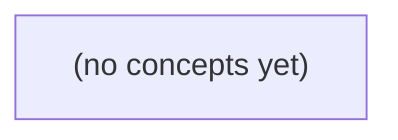

# 02.04 哈希与集合：在有限窗口内识别重复消息身份

*面向 Go 初学者，本书从消息复合身份、哈希冲突与成本模型出发，建立“按键精确查找”与“按序号有序边界查找”的清晰区分。读者将使用 Go 的 map 构造集合，并设计一个有限容量、先进先出驱逐的本地消息去重窗口，同时理解它不能替代长期幂等与分布式协议保证。*

**章节:** 2

---

## 本书导览

- 了解整本书的章节脉络
- 掌握各章之间的概念依赖关系
- 选择最合适的阅读顺序

# 02.04 哈希与集合：在有限窗口内识别重复消息身份

面向 Go 初学者，本书从消息复合身份、哈希冲突与成本模型出发，建立“按键精确查找”与“按序号有序边界查找”的清晰区分。读者将使用 Go 的 map 构造集合，并设计一个有限容量、先进先出驱逐的本地消息去重窗口，同时理解它不能替代长期幂等与分布式协议保证。

下方的概念图展示了本书 0 个核心概念以及它们之间的依赖关系；再下方是 1 个章节的入口。你可以按从上到下的顺序阅读，也可以根据自己的兴趣或先验知识选择切入点。

#### 概念图



## 章节索引

- **02.04 哈希与集合：在有限窗口内识别重复消息身份** — 承接 map、成本模型、线性队列和有序搜索，先讲键、哈希、冲突与负载因子，再用虚构 IM 的会话内消息身份实现顺序、有限窗口去重。区分内存窗口命中与跨请求、跨重启或跨节点幂等。

## 02.04 哈希与集合：在有限窗口内识别重复消息身份

- 区分消息身份、正文和切片位置
- 解释哈希值、桶、冲突和键相等不是同一件事
- 理解链式和开放寻址处理冲突的基本差别
- 给平均成本写明负载和散列前提并保留最坏情况
- 用Go可比较结构体键和map构造本地集合
- 理解map迭代无排序承诺和nil map写入边界
- 用队列与集合维护容量N的去重窗口
- 区分窗口命中和端到端幂等或持久去重

本节从“同一条消息如何判定”出发，建立哈希集合、有限窗口去重与端到端幂等之间的清晰边界。

### 先定义消息身份，而非比较正文

### 先定义消息身份，而非比较正文

判断“是否重复”前，必须先回答：**什么字段唯一地指向一条消息？**在本地教学模型中，可用会话标识 `ConversationID` 与消息标识 `MessageID` 组成复合键：

```go
type MessageKey struct {
    ConversationID string
    MessageID      string
}
```

于是 `c-a/m-a` 与 `c-b/m-a` 的键分别为：

- `{ConversationID: "c-a", MessageID: "m-a"}`
- `{ConversationID: "c-b", MessageID: "m-a"}`

虽然两者的 `MessageID` 同为 `m-a`，甚至正文也完全相同，但复合键不同，因此应视为两条不同消息。反过来，同一会话中的同一复合键再次出现，才是候选重复项。

不要用正文判重。正文 `"收到"` 可以由不同用户、不同会话、不同时间发送；正文相同不等于身份相同。也不要用切片下标判重：`messages[3]` 只是当前容器中的位置，插入、删除或分页合并后下标会变化，不能作为稳定身份。

`MessageKey` 的两个字段都是字符串，可比较，因此可以直接作为 Go `map` 的键。若只关心“是否见过”，使用集合语义：

`seen := map[MessageKey]struct{}{}`

其中键表示消息身份，空结构体表示无需额外存储值。哈希集合回答的是“该精确身份是否存在”；若要在按时间有序的数据中寻找某个时间范围，则应使用有序查找，而不是混淆为正文比较。

### 哈希、桶与键相等的分工

### 哈希、桶与键相等的分工

把集合想成一排“桶”。给定复合键 `MessageKey{ConversationID, MessageID}`，哈希函数先把键计算成一个哈希值，再据此定位到某个候选桶；集合随后在该桶中检查：是否存在一个与当前键**字段完全相等**的键。

因此，哈希与相等判断承担不同职责：

- **哈希值**：负责快速缩小搜索范围，决定“先去哪个桶找”。
- **键相等**：负责最终确认身份，决定“这是不是同一个成员”。
- **桶冲突**：两个不同键落入同一桶，只表示它们的哈希定位相同；并不表示键相等，更不表示它们是同一消息。

例如：

```go
type MessageKey struct {
    ConversationID string
    MessageID      string
}

seen := map[MessageKey]struct{}{}
```

`c-a/m-a` 与 `c-b/m-a` 的正文即使完全一致，复合键仍不同，因为会话标识不同；它们应当作为两条不同消息保留。反过来，同一复合键再次出现，即使它位于切片的新下标、经过队列搬移，也仍可判为已见成员。下标描述的是当前存放位置，不是消息身份。

Go 的 `map` 将桶定位、冲突处理和键比较封装起来。这里要求键类型可比较：`string` 可比较，包含两个 `string` 字段的结构体也可比较，所以 `MessageKey` 能作为 `map` 键。查询 `seen[key]` 的语义是精确成员测试；它不是按正文模糊匹配，也不是按排序位置查找。

### 冲突处理与平均成本前提

### 冲突处理与平均成本前提

不同键经过哈希函数后，可能落到同一个桶位；这叫**哈希冲突**，并不表示两条消息相同。是否相同仍须比较完整的 `MessageKey`，例如 `(会话ID, 消息ID)`：`c-a/m-a` 与 `c-b/m-a` 的复合键不同，正文即使完全一致，也应视为不同消息。

常见处理方式有两类：

- **链式法**：每个桶保存一个键集合或链表。插入、查询时先定位桶，再逐个比较桶内键。若元素数为 $n$、桶数为 $m$，负载因子为 $\alpha=n/m$；在散列均匀时，桶平均长度约为 $\alpha$，查找平均成本可近似看作 $O(1+\alpha)$。
- **开放寻址**：所有键都直接放在同一张数组中；发生冲突后，按某种探测规则继续寻找空位，例如线性探测。它节省额外桶结构，但删除通常需要特殊标记，且装载过满会形成连续拥挤区，探测次数迅速上升。

因此，“哈希查找是 $O(1)$”不是无条件承诺。它依赖两个前提：哈希函数应让键近似均匀分布；负载不能长期过高，必要时扩容并重新散列。若大量键集中到少数桶，链式法会退化为近似线性扫描；开放寻址在高负载下也会明显变慢。Go 的 `map[MessageKey]struct{}` 隐藏了具体冲突策略，但使用者仍应理解：平均常数时间来自良好分布与受控负载，而非键天然不会冲突。

### 用 Go 映射表示本地消息集合

### 用 Go 映射表示本地消息集合

在本地教学模型中，消息正文相同并不意味着是同一条消息。`c-a/m-a` 与 `c-b/m-a` 的正文都可能是“你好”，但它们属于不同会话；因此应使用复合键，而不是只用正文或切片下标。

```go
type MessageKey struct {
	ConversationID string
	MessageID      string
}

seen := make(map[MessageKey]struct{})

key := MessageKey{
	ConversationID: "c-a",
	MessageID:      "m-a",
}

if _, ok := seen[key]; ok {
	// 窗口内已见过该消息
} else {
	seen[key] = struct{}{} // 记录为已见
}
```

`MessageKey` 的字段均为 `string`，所以结构体可比较，能够直接作为 `map` 的键。集合值使用空结构体 `struct{}`：我们只关心“是否存在”，不需要为每个成员保存额外数据。

映射的成员测试是按精确键完成的：

- `MessageKey{"c-a", "m-a"}` 与 `MessageKey{"c-b", "m-a"}` 不相等；
- 消息正文相同不会造成误判；
- 切片插入、删除或重排会改变下标，但不会改变该复合键。

若还需要保存附加信息，可改用映射值：

```go
firstSeen := map[MessageKey]int64{}
firstSeen[key] = now
```

这里的 `map` 适合回答“某个精确身份是否已出现”；它不负责维护顺序，也不能像有序查找那样定位某个时间范围。窗口淘汰顺序仍需由队列或其他顺序结构维护。

### 队列加集合实现容量有限的去重窗口

### 队列加集合实现容量有限的去重窗口

对“最近到达的 $N$ 条消息”去重时，队列负责记录淘汰顺序，集合负责以近似 $O(1)$ 时间判断键是否已出现。二者缺一不可：只用切片查重需线性扫描；只用集合则不知道容量满后该删除谁。

先定义稳定的复合键。消息正文相同不代表身份相同：`c-a/m-a` 与 `c-b/m-a` 的会话不同，应视为两条消息。

```go
type MessageKey struct {
    ConversationID string
    MessageID      string
}

type DedupWindow struct {
    cap   int
    order []MessageKey
    seen  map[MessageKey]struct{}
}
```

`MessageKey` 的字段均为可比较类型，因此可作为 `map` 键；`struct{}` 表示集合成员本身不携带额外值。

处理新消息时遵循固定步骤：

1. 构造 `MessageKey`，若 `seen[key]` 已存在，则命中窗口，跳过重复处理。
2. 若不存在，先写入集合，再将键追加到 `order` 尾部。
3. 若长度超过容量，取出队首键并从集合删除，再从队列移除该元素。

```go
func (w *DedupWindow) AddIfNew(k MessageKey) bool {
    if _, ok := w.seen[k]; ok {
        return false
    }
    w.seen[k] = struct{}{}
    w.order = append(w.order, k)

    if len(w.order) > w.cap {
        old := w.order[0]
        delete(w.seen, old)
        w.order = w.order[1:]
    }
    return true
}
```

注意 `w.order = w.order[1:]` 会改变切片的起始下标；它逻辑上移除了队首，却不一定立刻释放底层数组。窗口很大、运行很久时，可定期复制剩余元素以避免旧数组长期被引用。

该结构仅保证**本进程、当前内存、最近 $N$ 条到达记录**内的重复识别。消息被淘汰后再次到达会被当作新消息；进程重启、不同节点或不同请求链路之间也不会共享这份集合。因此，窗口命中是局部去重，不等同于持久化的端到端幂等保证。

> **要点** — 集合按复合键判重；队列负责淘汰旧键；本地有限窗口只能提供有限范围内的去重。

从整数玩具哈希入手，拆开哈希值、桶位置与键相等三个常被混淆的概念，并建立有前提的成本判断。

### 三个概念不能混为一谈

### 三个概念不能混为一谈

先看一个刻意简化的玩具哈希函数：

$h(k)=k\%4$

对整数键 `1` 和 `5`：

- 原始键分别是 `1`、`5`
- 哈希结果分别是 $h(1)=1$、$h(5)=1$
- 若桶编号直接采用该结果，它们都会进入桶 `1`
- 但键比较仍然是 `1 == 5`，结果为否

也就是说，两个键可以有相同的哈希值、位于同一个桶，却并不表示它们是同一个键。哈希表查找的正确逻辑是：

1. 用哈希函数把键映射到某个桶；
2. 在该桶中检查已有候选键；
3. 用完整的键相等规则确认是否真的匹配。

因此，哈希值只能帮助“缩小搜索范围”，不能替代“键相等”的最终判断。若程序仅因 `h(1)==h(5)` 就把 `5` 当成 `1`，便会把不同消息错误地判为重复。

这里的 `k%4` 只是教学用整数玩具模型：它用来展示碰撞——不同键映射到同一结果的现象。它不是 Go `map` 的内部算法，也不是适合安全场景的散列函数。真正的哈希表会使用更复杂的散列与桶管理策略，但无论实现如何变化，核心关系始终是：

`键相等` $\Rightarrow$ 应当视为同一身份；  
`哈希相同` $\not\Rightarrow$ 键相等；  
`同桶` $\not\Rightarrow$ 键相等。

### 冲突后为何仍要比较完整键

### 冲突后为何仍要比较完整键

设玩具哈希函数为 `h(k)=k%4`。整数 `1` 与 `5` 都得到哈希值 `1`，因而被放入桶 `1`：

- 键 `1`：`1%4=1`
- 键 `5`：`5%4=1`

这只说明它们的**桶位置相同**，并不说明它们是同一个键。哈希函数把无限或很大的键空间压缩到有限个桶；只要桶数有限，不同键映到同一桶的冲突就不可避免。于是，桶中的元素只能被视为“可能匹配的候选项”。

查找键 `5` 时，过程不是“看到桶 `1` 就返回第一个元素”，而是：

1. 计算 `h(5)`，定位到桶 `1`；
2. 检查桶内已有键；
3. 用完整键比较，例如判断 `storedKey == 5`；
4. 只有比较相等，才确认找到了目标身份。

插入也遵循同一原则。若桶 `1` 中已有键 `1`，再插入键 `5` 时，必须发现 `1 != 5`，因此保留两个条目；反之，若再次插入键 `1`，完整键相等，才应视为更新已有条目或拒绝重复插入。

因此，哈希值的职责是**缩小搜索范围**，键相等判断才负责**确认身份**。可写成：

\[
\text{同一键} \Rightarrow \text{通常同一哈希值}，\qquad
\text{同一哈希值} \nRightarrow \text{同一键}
\]

这里的 `k%4` 只是解释冲突的整数玩具模型，不是 Go `map` 的内部算法，也不是安全散列函数。

### 理想分布与负载前提

### 理想分布与负载前提

哈希函数的目标不是“消灭冲突”，而是把不同键尽量均匀地分散到有限个桶中。设有 $m$ 个桶，键集合中的元素数为 $n$，负载因子定义为：

$$
\alpha=\frac{n}{m}
$$

若键经过哈希后近似随机、均匀地落入各桶，则每个桶平均约有 $\alpha$ 个键。查找时先计算桶位置，再只在该桶内比较完整键；因此平均比较次数与 $\alpha$ 有关，而不是与全部 $n$ 个键直接成正比。

例如有 4 个桶，存入 8 个整数，理想情况下每桶约 2 个元素，$\alpha=2$。若查找某键，只需检查对应桶中的少量候选项。实际实现通常会在 $\alpha$ 过高时扩容，以维持较短的桶内链或探测序列。

但“平均接近 $O(1)$”有明确前提：

- 哈希函数对实际输入分布足够均匀；
- 桶数量会随元素数量增长而调整；
- 单次计算哈希与比较键的成本可控；
- 输入不是刻意构造来集中碰撞。

最坏情况下，许多键都进入同一桶。例如玩具规则 $k\bmod4$ 中，$1,5,9,13$ 都落入桶 1。此时查找可能要逐个比较这些完整键，成本退化为 $O(n)$。因此，哈希表提供的是有分布与负载前提的平均效率保证，而非无条件的常数时间承诺。

### 字符串键并非无条件常数成本

### 字符串键并非无条件常数成本

对整数键，玩具哈希可写成 `k % 4`：计算 `1 % 4` 或 `5 % 4` 只涉及固定次数的机器整数运算，通常可近似看作 $O(1)$。但这不意味着所有键的散列计算都天然是常数成本。

字符串键的内容长度并不固定。若消息身份是：

`"user=42|time=...|payload=..."`

要根据字符串内容计算散列值，通常必须读取其字节。设字符串长度为 $L$，一次散列的成本通常是 $O(L)$：短字符串只读少量字节，长消息标识则可能读数百、数千字节。字符串相等比较也类似：先比较长度，再逐字节比较；最坏情况下成本同样为 $O(L)$，例如两个长字符串只在末尾不同。

因此，哈希表查找更准确的描述是：

- 先计算键的散列值，字符串常有 $O(L)$ 的字节读取成本；
- 根据散列值定位桶；
- 在桶内比较完整键，以排除碰撞；
- 理想分布下，桶内候选数的期望值较小，但这只降低“比较多少个候选键”，不会消除读取字符串字节的成本。

不能笼统说“哈希查找恒为 $O(1)$”。更严谨地说：当键长度有固定上界，或把键长度视为常数时，常写为期望 $O(1)$；若字符串长度是输入规模的一部分，则散列和键比较都应计入字节成本。这里的 `k % 4` 仅用于说明概念，不是 Go `map` 的内部算法，也不是安全散列函数。

### 玩具模型的边界

### 玩具模型的边界

令桶位置为 $h(k)=k\bmod 4$。例如：

- $h(1)=1$
- $h(5)=1$
- $h(9)=1$

它们落入同一桶，说明发生了**碰撞**；但 `1`、`5`、`9` 仍是不同的键。查找时不能因为桶号相同就判定“见过该消息”，而要在该桶保存的候选键中继续比较完整键：

`桶号相同 → 缩小搜索范围；完整键相等 → 确认同一身份`

这个模型只服务于理解：哈希函数先把键映射到有限桶，理想情况下，不同键会较均匀地分散到各桶，使每个桶中的候选项较少。若大量键集中到同一桶，桶内比较增多，查找就会退化。

但 `k % 4` 不是 Go `map` 的内部算法，也不应据此推断 Go 的桶布局、扩容规则或实际性能。真实实现会涉及更复杂的散列、随机化种子、桶组织与冲突处理策略。

它更不提供安全保证。攻击者很容易构造大量满足 `k % 4 == 1` 的整数，使所有键碰撞；因此它不能用于抵抗恶意输入，也不能把“哈希过了”理解为身份保密或不可伪造。

对字符串键还要额外警惕：计算散列通常需要读取字符串字节。键长为 $L$ 时，散列成本往往与 $L$ 有关；所谓哈希查找“平均 $O(1)$”，并不意味着对任意长度字符串都无条件恒定时间。

> **要点** — 哈希决定候选桶而非键相等；平均高效依赖均匀分布与适当负载，字符串散列还要计入字节成本。

哈希表通过“先定位、再比较”加速查找，但链式与开放寻址对冲突、负载和扩容有不同约束。

### 哈希定位不等于键相等

### 哈希定位不等于键相等

哈希表先计算键的哈希值，再将其映射到有限个桶或槽位。例如容量为 $M$ 时，常见定位形式为：

$$
i = h(key) \bmod M
$$

这里的 $i$ 只说明“应从哪里开始找”，并不证明两个键相等。原因是哈希空间和表容量都有限，不同键完全可能得到相同的哈希值，或在取模后落到同一位置。这种现象称为**碰撞**。

例如容量为 $4$，若 `h(1) mod 4 = 1`，`h(5) mod 4 = 1`，插入 `1` 后再插入 `5`，二者都定位到位置 `1`；但显然：

$$
1 \ne 5
$$

因此，哈希值的职责是**快速筛选候选位置**，键比较的职责才是**确认身份是否相同**。查找键 `5` 时，不能因为遇到同样的哈希位置就返回键 `1`，而必须继续比较实际键：

- 链式哈希：在对应桶的短链表中逐项比较键；
- 开放寻址：沿探查序列检查槽位，遇到候选项仍要比较键；
- 只有“哈希值相符且键相等”时，才能视为同一条消息身份。

可以把哈希看作图书馆的书架编号：编号相同只表示书可能在同一排；要确认是否是目标书，仍需核对书名、作者或唯一标识。若跳过键比较，碰撞就会导致把不同消息误判为重复消息。

### 链式：桶内短表处理碰撞

### 链式：桶内短表处理碰撞

链式哈希把表划分为 $M$ 个桶。键 $k$ 先经哈希函数定位到桶号：

$$
i=h(k)\bmod M
$$

若多个键得到同一桶号，并不需要继续寻找别的槽位；它们被依次放入该桶关联的一条短线性表中。这个线性表可以是链表、动态数组或其他小型容器，核心规则都是：**桶定位由哈希决定，最终身份由键比较确认**。

例如容量为 $4$ 的表中，若 `1` 与 `5` 都满足：

$$
h(k)\bmod 4=1
$$

则桶 `1` 内可保存为：

`桶 1：[1, 5]`

查询键 `5` 时，先计算其桶号 `1`，再在桶内逐项比较：先比 `1`，不等；再比 `5`，相等，因此找到目标。哈希函数不保证键唯一，只是把“全表查找”缩小为“桶内短表查找”。

设当前元素总数为 $N$，桶数为 $M$，负载因子为：

$$
\alpha=\frac{N}{M}
$$

在哈希分布较均匀时，平均每个桶大约有 $\alpha$ 个元素，因此成功查找通常需要常数次定位加上约 $O(\alpha)$ 次桶内比较；插入也先进入对应桶，再检查是否已有同键元素。

链式哈希允许 $\alpha>1$：元素多于桶数时，只是更多元素共享同一桶，性能会随桶变长而下降，但结构仍然可用。实际实现常在 $\alpha$ 持续增大时扩容，并重新分配桶数组、对已有 $N$ 个元素重新计算位置并插入新桶。

### 开放寻址：沿探查序列找槽

### 开放寻址：沿探查序列找槽

开放寻址不为每个桶额外维护链表；所有元素都直接存放在长度为 $M$ 的槽位数组中。对键 $k$，先计算初始位置：

$$
h_0(k)=h(k)\bmod M
$$

若该槽已被其他键占用，就按预先规定的探查序列继续寻找，例如线性探查可写为：

$$
h_i(k)=(h_0(k)+i)\bmod M,\quad i=0,1,2,\dots
$$

设表容量为 $4$，先插入键 `1`，若 $h(1)\bmod4=1`，则放入槽 `1`。再插入键 `5`，且 $h(5)\bmod4=1`，它与 `1` 碰撞；线性探查继续检查槽 `2`，若槽 `2` 为空，就将 `5` 放入槽 `2`。

查找键时也必须沿同一序列探查：

- 遇到目标键：查找成功。
- 遇到从未使用过的空槽：查找失败。因为若该键曾被插入，它本应在此之前找到可用位置。
- 遇到删除标记：不能停止，应继续探查。

删除不能简单地把槽恢复为空槽。若删除 `1` 后槽 `1` 变为空，查找 `5` 会从槽 `1` 开始并错误地提前失败。因此，删除后通常写入“删除标记”：它表示此处当前无元素，但探查链可能仍穿过这里。插入时可复用删除标记，查找时则必须越过它。

开放寻址的负载因子为：

$$
\alpha=\frac{N}{M}
$$

其中 $N$ 是当前元素数。由于元素只能放入数组槽位，必须保留空位，因而通常要求 $\alpha<1$；负载越高，平均探查次数越多。

### 容量四的插入演示

### 容量四的插入演示

设表容量为 $M=4$，哈希定位规则为 `h(k)=k mod 4`。依次插入键 `1` 与 `5`：

- `h(1)=1`，`h(5)=1`，两者初始定位都在槽位（桶）`1`。
- 发生的不是“哈希值相同就视为同一键”，而是一次碰撞；仍须逐项比较实际键。

**链式哈希**中，每个桶保存一个短线性表：

| 桶号 | 插入 1 后 | 再插入 5 后 |
|---|---|---|
| 0 | 空 | 空 |
| 1 | `[1]` | `[1, 5]` |
| 2 | 空 | 空 |
| 3 | 空 | 空 |

查询键 `5` 时，先算得桶 `1`，再在链 `[1, 5]` 中依次比较：`1≠5`，`5=5`，于是命中。此时 $N=2,M=4,\alpha=N/M=0.5$；链式结构允许未来 $\alpha>1$，只是桶内比较会增多。

**开放寻址**中，所有键必须直接放在槽位内。插入 `1` 后，槽位 `1` 被占用；插入 `5` 定位到 `1` 发生碰撞，便继续探查。若采用线性探查，依次检查 `2、3、0`，槽位 `2` 为空，因此放入：

| 槽位 | 0 | 1 | 2 | 3 |
|---|---:|---:|---:|---:|
| 键 | 空 | 1 | 5 | 空 |

查询 `5` 也从槽位 `1` 开始：比较 `1` 后继续探查槽位 `2`，命中 `5`。开放寻址必须保留空槽；查询探查到真正的空槽才能确认“不存在”。删除通常不能直接改为空，而要留下删除标记，否则会错误截断后续键的探查路径。

### 负载、扩容与成本前提

### 负载、扩容与成本前提

负载因子通常写作 $\alpha=N/M$：其中 $N$ 是已存消息身份数，$M$ 是桶数或槽位数。但同一符号在两类哈希表中含义不同，不能直接套用同一性能公式。

- **链式哈希**：每个桶保存一条短线性表，碰撞的键继续挂入同一桶。因此 $\alpha$ 可以大于 $1$；例如 $10$ 个键放入 $4$ 个桶，$\alpha=2.5$，表示平均每桶约有 $2.5$ 个元素。查找先定位桶，再在桶内逐项比较键，冲突均匀时平均桶长约与 $\alpha$ 相关。
- **开放寻址**：每个槽位至多放一个有效元素。发生碰撞后，元素按探查规则寻找其他槽位；只有遇到空槽才能确认“未找到”或完成插入。删除后的槽位常保留删除标记，以免中断探查链。因此必须保留一定空位，$\alpha$ 接近 $1$ 时探查长度会迅速恶化，表满后甚至无法插入。

例如容量为 $4$ 的开放寻址表，先插入键 `1`，再插入键 `5`；若二者初始位置相同，`5` 必须继续探查下一个可用槽，而不能像链式哈希那样直接追加到同一桶。

扩容或重建（rehash）通常不是只复制底层数组：需要分配新桶数组或槽位数组，并将旧表中的 $N$ 个有效项逐一按新容量重新计算位置、重新插入。故单次成本通常为 $O(N)$，但若扩容触发不频繁，可摊销到多次插入中。具体阈值、增长倍率和删除标记清理策略取决于实现；不应假定 Go 或任何语言运行时采用固定扩容算法。

> **要点** — 碰撞不破坏正确性；正确性依赖键比较，效率取决于散列分布、负载控制及冲突处理策略。

哈希集合的“快”来自受控前提，而非无条件承诺。本节建立成本模型，并明确其在 Go 中的语义边界。

### 从查找任务到结构选择

### 从查找任务到结构选择

先问“需要什么查询”，再问“用什么结构”。在有限窗口内判断消息身份是否已出现，常见方案有三类：

- **线性扫描**：把窗口保存在切片中，逐个比较键。一次查找最坏、平均都为 $O(n)$；但实现简单、无需额外索引，适合窗口很小、查询次数少，或键比较极便宜的场景。若键为固定宽度标识，如固定长度摘要、整数或定长数组，单次比较可视为常数；若是可变长字符串或字节串，比较本身还可能随长度增长。

- **有序数组加二分**：先保持元素有序，再用二分查找，查存在为 $O(\log n)$。它适合同时需要“是否存在”“最小/最大值”“前缀后的相邻位置”或范围查询的任务。但动态窗口插入、删除通常需要移动元素，代价为 $O(n)$；若数据并非已排序，不能只宣称二分是 $O(\log n)$ 而忽略维护顺序的成本。

- **哈希集合**：将消息身份映射到散列表槽位，查存在、插入、删除在散列分布均匀、负载受控且键哈希与比较成本可控时，平均期望为 $O(1)$。它尤其适合高频“是否见过”查询，却不提供有序遍历、排名或范围查询能力。

哈希的常数时间不是无条件保证：恶意或病态碰撞可使操作退化为 $O(n)$；扩容时一次重建可能花费 $O(n)$，只有在持续插入、按分摊分析计费的模型下，单次插入才可称为分摊期望常数。Go 的 `map` 提供键到值的语义，但语言规范不承诺固定桶布局、复杂度上界或迭代顺序；因此应把它视为适合成员测试的实现工具，而非依赖内部结构的有序容器。

### 平均常数成本的前提

### 平均常数成本的前提

哈希集合查询的“平均 $O(1)$”不是说每次操作都只执行一个固定指令，而是指：在明确的概率模型和实现策略下，单次插入、查询、删除的**期望成本**不随集合规模 $n$ 增长。

这一结论依赖三个条件：

- **散列分布足够均匀**：不同键应大致均匀地落入各桶。若有 $m$ 个桶、$n$ 个元素，平均每桶元素数为负载因子  
  $$\alpha=\frac{n}{m}$$  
  当散列质量良好时，查找通常只需检查目标桶中约 $O(1+\alpha)$ 个候选项。

- **负载因子受到控制**：集合不能只增不扩。实现通常在 $\alpha$ 超过阈值时扩容，增加桶数并重新分配已有元素。一次扩容可能需要搬迁 $O(n)$ 个元素；但若容量按倍数增长，连续 $n$ 次插入中的总搬迁量仍为 $O(n)$，因此每次插入的**分摊成本**仍是 $O(1)$。

- **键比较本身是常数成本**：散列值相同或落入同一候选位置后，仍要比较键是否相等。`int`、指针、固定宽度结构体等键的比较可视为 $O(1)$；固定长度数组也可视为常数。相反，字符串、字节切片或任意长度对象的相等比较最坏可达 $O(L)$，其中 $L$ 是键长度。此时更准确的说法是“按键长度参数化的预期常数次候选检查”，而不是无条件的常数时间。

因此，`map` 或集合适合“某个身份是否出现过”的成员测试，却不提供排序关系、前缀范围或区间查询。还应区分算法分析与语言承诺：Go 语言规范规定 `map` 的键唯一性、查找和更新语义，但不保证固定桶布局、固定复杂度上界或迭代顺序。若输入可被攻击者构造大量碰撞，候选检查可能退化为 $O(n)$；平均 $O(1)$ 始终建立在散列与负载受控的前提上。

### 冲突、负载与最坏情况

### 冲突、负载与最坏情况

设表容量为 $m$，当前存入 $n$ 个键，负载因子为 $\alpha=n/m$。一次查找并不是“比较哈希值就结束”，而是依次经历：

1. 对键计算哈希值 $h(k)$；
2. 将哈希值映射到桶位置，例如 $i=h(k)\bmod m$；
3. 在该桶或探测序列中，使用键相等判断确认是否为同一键。

因此，**哈希值相同**不必然是同一键；**落到同一桶位置**也不必然哈希值相同。只要不同键进入同一桶，或开放寻址中占用同一探测路径，就发生冲突。最终必须以键相等比较决定“命中”还是“继续找”。

链式哈希把每个桶视为一个短链：理想散列下，平均链长约为 $\alpha$，查找成本可写作 $O(1+\alpha)$。控制 $\alpha$，并让哈希值近似均匀分布，便得到期望 $O(1)$。

开放寻址不保存链表，而是在冲突后继续探测其他槽位，如线性探测、二次探测或双重散列。它通常缓存局部性更好，但当表接近填满时，探测长度会迅速增长；因此实现会在负载达到阈值后扩容并重新放置元素。

扩容某一次需要搬迁约 $n$ 个元素，成本为 $O(n)$；但若容量按倍数增长，且插入序列满足常规负载控制，许多次常数插入可分摊这次搬迁，插入的**分摊期望**仍为 $O(1)$。这依赖随机或近似均匀的键分布模型，不是逐次操作的最坏保证。

若攻击者构造大量碰撞键，链式结构可能退化为长链，开放寻址也可能形成长探测序列，单次查找、插入均可达 $O(n)$。固定宽度键或固定长度比较能限制“键相等比较”的单次成本，却不能消除冲突导致的线性候选数量。

### 扩容与分摊成本模型

### 扩容与分摊成本模型

哈希表通常保持负载因子 $\alpha=n/m$ 不超过阈值：$n$ 是元素数，$m$ 是桶数。插入使 $\alpha$ 过高时，表会扩容，例如将桶数翻倍，并把已有 $n$ 个元素重新分配到新桶中。此次扩容必须扫描并迁移旧元素，因此**单次操作**可能花费 $O(n)$，不能称为最坏情况 $O(1)$。

但若桶容量按倍数增长，连续插入的总迁移量仍是线性的。设容量依次为：

$$
1,2,4,\ldots,2^k
$$

扩容时迁移的元素数至多为：

$$
1+2+4+\cdots+2^{k-1}<2^k
$$

而达到容量 $2^k$ 前，已经进行了 $\Theta(2^k)$ 次插入。因此，普通插入的常数工作加上全部迁移工作，总成本仍为 $O(N)$；对 $N$ 次连续插入平均，每次的**分摊成本**为 $O(1)$。

这个结论依赖明确模型：

- 哈希值分布足够均匀，桶链或探测序列的期望长度受控；
- 容量按几何级数增长，而非每次只增加一个桶；
- 键的哈希与比较成本有界，例如固定宽整数、固定长度标识；
- 操作序列不由恶意碰撞键刻意构造。

分摊 $O(1)$ 不表示“每次都快”：触发扩容的那次插入仍可能造成延迟尖峰；删除、缩容、内存分配和垃圾回收也会改变实际成本。Go 的 `map` 只规定键值映射语义，不承诺固定桶布局、扩容时机、复杂度上界或迭代顺序；因此应将“预期常数时间”视为算法模型下的工程判断，而非语言规范保证。

### Go map 的语义边界

### Go map 的语义边界

Go 的 `map` 可以直接表达“消息身份是否已出现”的集合：以身份为键、空结构体为值，避免存储无意义的布尔值。

```go
type MsgID struct {
    Source uint64
    Seq    uint64
}

seen := make(map[MsgID]struct{})
if _, ok := seen[id]; ok {
    // 重复消息
} else {
    seen[id] = struct{}{}
}
```

这里可依赖的是语言语义：

- 键必须是**可比较**类型。整数、字符串、指针、数组，以及字段全部可比较的结构体都可作键；`slice`、`map`、`func` 不能直接作键。
- 结构体键按字段值比较。固定宽度的 `MsgID{Source, Seq}` 比较成本可视为常数；若键含字符串，比较仍遵循字符串内容相等语义，实际成本与长度及共同前缀有关。
- 查找使用 `v, ok := m[k]` 区分“键不存在”和“值恰好为零值”。集合场景通常只关心 `ok`。
- `nil` map 可以读取、查找和 `range`，结果分别为零值、`false`、零次迭代；但向 `nil` map 写入会触发运行时异常。因此窗口状态应先用 `make` 初始化。
- `range map` 的迭代顺序未定义，也不应假设稳定；不能依赖它选出“最早消息”或构造确定输出。

不可依赖的是具体实现：语言规范不承诺桶数量、冲突处理、扩容时机、固定复杂度或迭代布局。通常可将查找与插入建模为期望 $O(1)$，但这依赖散列分布和负载控制；碰撞严重时可退化为 $O(n)$，单次扩容也可能搬迁 $O(n)$ 个元素。若需要按时间淘汰或按键范围查询，应额外维护队列、排序结构或有序索引，不能从 `map` 的无序语义中推导出来。

> **要点** — 哈希查找的预期 O(1)依赖散列与负载假设；Go 只保证 map 语义，不承诺具体布局、复杂度或迭代顺序。

本节用会话标识与消息标识组成复合键，在 Go 中建立可靠的本地存在集合，并明确其顺序与生命周期边界。

### 消息身份应由上下文与标识共同确定

### 消息身份应由上下文与标识共同确定

仅用 `MessageID` 判断重复往往不可靠：不同会话、频道或群组可能各自从相同编号开始。消息的稳定身份应同时包含其所属上下文与局部标识：

```go
type MessageKey struct {
	ConversationID string
	MessageID      string
}
```

当两个字段都相等时，两个 `MessageKey` 才表示同一条消息：

```go
a := MessageKey{ConversationID: "chat-1", MessageID: "42"}
b := MessageKey{ConversationID: "chat-1", MessageID: "42"}
c := MessageKey{ConversationID: "chat-2", MessageID: "42"}

fmt.Println(a == b) // true：同一会话中的同一消息
fmt.Println(a == c) // false：会话不同，不是同一消息
```

这里的两个字段都是 `string`，而字符串可比较，因此整个结构体也可比较；它可以直接作为 `map` 的键。若字段中包含切片、映射或函数，结构体便不可比较，不能作为 `map` 键。

还要区分三个概念：

- **消息身份**：`ConversationID + MessageID`，用于去重、查找和确认是否已处理。
- **消息正文**：如文本、图片链接、发送者昵称。正文相同不代表身份相同；两人都发送“收到”仍是两条消息。
- **队列位置**：如第几次拉取、时间顺序或本地序号。位置会因重试、分页、插队而变化，不能替代消息身份。

因此，去重集合保存的是 `MessageKey`，而不是正文，也不应把数组下标或 `range` 次序当作消息的永久编号。

### 用 map[MessageKey]struct{} 表达存在集合

### 用 `map[MessageKey]struct{}` 表达存在集合

当需求只是回答“某条消息是否已经见过”，集合比“键到业务数据”的映射更准确。先定义复合键：

```go
type MessageKey struct {
	ConversationID string
	MessageID      string
}
```

两个字段都是 `string`，因此 `MessageKey` 可比较，可以直接作为 `map` 的键。用它建立存在集合：

```go
seen := make(map[MessageKey]struct{})

key := MessageKey{
	ConversationID: "chat-001",
	MessageID:      "msg-100",
}
seen[key] = struct{}{}
```

这里的值类型是 `struct{}`，即空结构体。它不携带任何业务信息，也没有需要保存的字段；向集合插入键时写入 `struct{}{}`，表达的只是“该键存在”。因此 `map[MessageKey]struct{}` 的语义比 `map[MessageKey]bool` 更清晰：后者容易让读者误以为 `false` 也是一种有意义的已存储状态。

判断是否存在时，应使用 comma-ok 形式：

```go
_, exists := seen[key]
if exists {
	fmt.Println("消息已出现")
} else {
	fmt.Println("首次出现")
}
```

不要通过读取值来推断存在性：

```go
value := seen[key] // 无论键缺失还是键存在，value 都是 struct{}{}
```

因为空结构体的零值仍是 `struct{}{}`，读取缺失键不会报错，却无法从值本身区分“未存储”和“已存储”。`exists` 才是区分二者的依据。

集合必须先初始化才能写入：

```go
var seen map[MessageKey]struct{}
_, ok := seen[key] // 可以读取，ok 为 false
_ = ok

seen[key] = struct{}{} // 运行时 panic：向 nil map 写入
```

实际使用中应通过 `make(map[MessageKey]struct{})` 创建集合。这样，同一会话中的重复 `MessageID` 会命中同一个键；不同会话即使拥有相同的 `MessageID`，由于 `ConversationID` 不同，也会被视为不同消息。

### 初始化与遍历：map 的两个常见边界

### 初始化与遍历：map 的两个常见边界

声明 `var seen map[MessageKey]struct{}` 时，`seen` 的值是 `nil`：它表示“尚未分配底层哈希表”。此时可以安全读取、查询长度和遍历，但不能写入。

```go
var seen map[MessageKey]struct{}

key := MessageKey{ConversationID: "c-1", MessageID: "m-9"}
_, exists := seen[key] // 安全，exists 为 false
fmt.Println(len(seen)) // 0

seen[key] = struct{}{} // 运行时 panic：assignment to entry in nil map
```

因此，准备插入前必须用 `make` 初始化：

```go
seen := make(map[MessageKey]struct{})
seen[key] = struct{}{}
```

`make(map[MessageKey]struct{})` 创建可写集合；值类型使用空结构体 `struct{}`，表达“只关心键是否存在”，不为每个元素额外保存业务数据。也可以预估容量，例如 `make(map[MessageKey]struct{}, 100)`，但容量只是优化提示，不限制后续插入数量。

另一个边界是：`range` 遍历 `map` 的顺序未指定。即使插入顺序固定，下面的输出顺序也不能作为消息到达顺序、展示顺序或补拉序号：

```go
for key := range seen {
    fmt.Println(key)
}
```

不要依赖某次运行“看起来稳定”的结果。若需要按消息时间、序号或 `MessageID` 输出，应将键收集到切片后排序；若需要保留原始接收顺序，则应额外维护一个切片。`map` 负责快速判断“是否存在”，不负责记录“先后次序”。

### 完整示例：同会话去重与跨会话保留

### 完整示例：同会话去重与跨会话保留

`MessageKey` 的两个字段都是 `string`，因此结构体可比较，可以直接作为 `map` 的键。下面的程序模拟有限窗口内已经见过的消息：同一会话中的同一消息只保留一次；不同会话即使 `MessageID` 相同，也应视为不同消息。

```go
package main

import (
	"fmt"
	"sort"
)

type MessageKey struct {
	ConversationID string
	MessageID      string
}

func main() {
	seen := make(map[MessageKey]struct{})

	inputs := []MessageKey{
		{ConversationID: "chat-A", MessageID: "msg-1"},
		{ConversationID: "chat-A", MessageID: "msg-1"}, // 重复
		{ConversationID: "chat-B", MessageID: "msg-1"}, // 跨会话，保留
		{ConversationID: "chat-A", MessageID: "msg-2"},
	}

	for _, key := range inputs {
		if _, exists := seen[key]; exists {
			fmt.Println("跳过重复：", key.ConversationID, key.MessageID)
			continue
		}
		seen[key] = struct{}{}
		fmt.Println("接受消息：", key.ConversationID, key.MessageID)
	}

	keys := make([]MessageKey, 0, len(seen))
	for key := range seen {
		keys = append(keys, key)
	}
	sort.Slice(keys, func(i, j int) bool {
		if keys[i].ConversationID != keys[j].ConversationID {
			return keys[i].ConversationID < keys[j].ConversationID
		}
		return keys[i].MessageID < keys[j].MessageID
	})

	fmt.Println("集合内容：")
	for _, key := range keys {
		fmt.Println(key.ConversationID, key.MessageID)
	}
}
```

静态预期输出为：

```text
接受消息： chat-A msg-1
跳过重复： chat-A msg-1
接受消息： chat-B msg-1
接受消息： chat-A msg-2
集合内容：
chat-A msg-1
chat-A msg-2
chat-B msg-1
```

这里用 `_, exists := seen[key]` 判断键是否存在；值类型选用 `struct{}`，仅表达“存在”而不额外存储业务数据。最后先排序再输出，因为直接 `range seen` 的遍历顺序未指定，不能把它当作消息到达顺序或补拉序号。

### 集合只能回答存在性，不能替代消息顺序

### 集合只能回答存在性，不能替代消息顺序

`map[MessageKey]struct{}` 适合回答“这条消息是否已经见过”，却不能回答“它排第几条”“下一条该补拉什么”。原因是 Go 的 `map` 迭代顺序未指定：同一份数据多次 `range`，输出顺序也不应被当作消息时间线。

```go
package main

import (
	"fmt"
	"sort"
)

type MessageKey struct {
	ConversationID string
	MessageID      string
}

func main() {
	seen := make(map[MessageKey]struct{})

	a := MessageKey{"c1", "m1"}
	b := MessageKey{"c1", "m2"}
	c := MessageKey{"c2", "m1"} // 同一消息 ID，但属于另一会话

	seen[a] = struct{}{}
	seen[a] = struct{}{} // 重复插入不会增加集合元素
	seen[b] = struct{}{}
	seen[c] = struct{}{}

	_, ok := seen[MessageKey{"c1", "m1"}]
	fmt.Println("c1/m1 已存在：", ok)

	ids := make([]string, 0, len(seen))
	for key := range seen {
		ids = append(ids, key.ConversationID+"/"+key.MessageID)
	}
	sort.Strings(ids)
	fmt.Println("排序后的键：", ids)
}
```

静态预期输出为：

```text
c1/m1 已存在： true
排序后的键： [c1/m1 c1/m2 c2/m1]
```

这里排序只是为了稳定展示，并不代表真实消息顺序。业务顺序应由独立字段或结构维护，例如服务端递增序列号、消息时间戳加稳定的次级比较键、按到达顺序保存的队列，或专门的“最后同步位置”。

还要区分“本次进程内去重”和“跨请求幂等”。内存集合会在进程重启、扩容或不同实例处理请求时失效；若需要跨请求保证同一消息只执行一次，应将幂等键和处理结果持久化到数据库、缓存或消息系统支持的可靠存储中。

> **要点** — 复合可比较键定义身份，map 提供本地存在判断；初始化、无序遍历和内存生命周期决定其使用边界。

有限窗口去重的关键不在“记住所有消息”，而在用稳定身份、队列顺序与集合成员关系共同维护一段可证明正确的最近历史。

### 复合键定义任务身份

### 复合键定义任务身份

去重首先要回答：**两条消息何时算“同一条”**。身份不能由正文决定，也不能由它在窗口中的位置决定；应由发送链路中稳定、可重复取得、能够唯一指向任务的字段组成复合键。

例如，一条消息来自会话 `sessionID`、发送者 `senderID`，并携带发送方分配的 `messageID`，可定义：

`key = sessionID + ":" + senderID + ":" + messageID`

也可以使用结构体键，避免字符串拼接歧义：

`Key{SessionID, SenderID, MessageID}`

其中各字段的职责不同：

- `sessionID`：隔离不同会话、主题或租户；不同会话中同名消息不应互相去重。
- `senderID`：隔离不同发送者；若 `messageID` 只在发送者本地递增，这是必要字段。
- `messageID`：标识该发送者在该会话中的某次具体投递，重试时必须保持不变。

正文 `body`、时间戳、重试次数、接收时间、队列下标等通常不应进入身份键。正文相同可能是两次合法任务；正文不同也可能是同一任务重试后附带了更新字段。到达位置更会随窗口淘汰和压缩改变，不能作为稳定身份。

纸面规则可写为：若新消息的复合键已在 `seen` 中，则它是重复消息；否则它是新消息，并将该键加入窗口。这里判断的是“最近窗口内是否见过该身份”，而不是“内容是否看起来相似”。

### 容量窗口的状态与不变式

### 容量窗口的状态与不变式

设窗口容量为正整数 $N>0$。每条消息先提取稳定的复合身份键，例如 `key=(任务ID, 消息ID)`；不要只用内容文本，否则不同任务中内容相同的消息会被误判为重复。

窗口维护两份状态：

- `order`：按首次进入窗口的时间从旧到新排列的队列；
- `seen`：保存当前窗口内全部键的集合或映射，用于常数时间判断成员关系。

其核心不变式是：

$$
0\le |order|=|seen|\le N
$$

并且，`order` 中每个键恰好出现一次，二者保存的键集合完全相同：

$$
\operatorname{set}(order)=seen
$$

因此，判重不能只依赖队列，也不能只维护集合：队列决定“满时淘汰谁”，集合决定“当前是否已见”。

可将纸面规则写为：

1. 若 `key ∈ seen`，返回 `duplicate`，`order` 与 `seen` 均不改变。
2. 若 `key ∉ seen` 且窗口已满，取出 `order` 队首旧键 `old`，同时执行“队首删除”和“`seen` 删除 `old`”。
3. 将新键追加到 `order` 队尾，并加入 `seen`，返回 `new`。

结构伪代码如下：

`if seen.has(key): return duplicate`  
`if order.length == N: old = order.popFront(); seen.delete(old)`  
`order.pushBack(key); seen.add(key); return new`

删除必须成对完成。若只从 `order` 删除而忘记清理 `seen`，已淘汰键仍会被误判为重复；若只删 `seen` 而队列保留旧键，后续淘汰顺序会失真，且队列可能出现重复身份。

### 新键与重复键的处理规则

### 新键与重复键的处理规则

设窗口容量为正整数 $N$。维护两份必须同步的数据：

- `order`：按首次进入窗口的时间保存键，队首最旧、队尾最新；
- `seen`：集合或映射，表示当前窗口内仍有效的键。

消息身份应使用稳定的复合键，例如 `业务类型 + 发送方ID + 消息ID`；不要仅以消息内容判重，否则不同任务可能被误判为重复。

处理规则必须严格遵循“先查、重复不动、满则淘汰、再写入”：

```text
处理(key):
    若 key 在 seen 中:
        返回 duplicate
        // 不移动 order 中的位置，不刷新有效期，不修改任何状态

    若 order 的长度等于 N:
        old = order 的队首
        删除 order 的队首
        从 seen 删除 old

    将 key 追加到 order 的队尾
    将 key 写入 seen
    返回 new
```

边界条件是：当 $N=1$ 时，每次新键都会淘汰唯一旧键；当窗口未满时，直接追加；容量不允许为 $0$，否则“写入后立即淘汰”会使规则失去明确语义。

例如 $N=3$，依次处理 `A / B / C / A / D / A`：

1. `A、B、C` 进入，窗口为 `[A,B,C]`；
2. 再次收到 `A`，命中 `seen`，返回重复，窗口仍是 `[A,B,C]`；
3. 收到 `D`，满窗，淘汰队首 `A`，得到 `[B,C,D]`；
4. 最后收到 `A` 时，`seen` 中已无 `A`，因此它是新键，淘汰 `B` 后窗口为 `[C,D,A]`。

淘汰时若只从 `order` 删除、却忘记从 `seen` 清理，最后的 `A` 会被错误判为重复；反过来若只删集合、不删队列，则队列会保留无效身份并破坏容量与顺序。因此，顺序结构和集合成员关系必须始终一致。长期使用切片从前部截短可能保留底层数组，可改用环形缓冲，或定期复制有效元素。

### 序列演算：N=3 的窗口变化

### 序列演算：N=3 的窗口变化

设消息身份已规范化为复合键，窗口容量 $N=3$。`order` 按“由旧到新”保存键，`seen` 保存当前窗口成员。处理规则是：

1. 若键在 `seen` 中，返回 `duplicate`，`order` 和 `seen` 都不变。
2. 若键不在 `seen` 中且窗口已满，删除 `order` 队首旧键，并同步从 `seen` 删除。
3. 将新键追加到 `order` 队尾，并加入 `seen`。

初始：`order=[]`，`seen={}`。

| 输入 | 判断与操作 | 结果 | order | seen |
|---|---|---|---|---|
| A | 不存在，直接加入 | 新消息 | `[A]` | `{A}` |
| B | 不存在，直接加入 | 新消息 | `[A,B]` | `{A,B}` |
| C | 不存在，直接加入 | 新消息 | `[A,B,C]` | `{A,B,C}` |
| A | 已存在，不移动、不重复入队 | `duplicate` | `[A,B,C]` | `{A,B,C}` |
| D | 不存在且已满；淘汰队首 A，再加入 D | 新消息 | `[B,C,D]` | `{B,C,D}` |
| A | 此时 A 已被淘汰，不存在；淘汰 B，再加入 A | 新消息 | `[C,D,A]` | `{C,D,A}` |

因此，最后一个 A **不会命中窗口**：第四步的重复 A 没有刷新其位置，A 仍是最早进入窗口的键；第五步接纳 D 时，它首先被淘汰。

必须同时维护两份状态。若只从 `order` 删除 A、却忘记从 `seen` 删除，则最后一个 A 会被错误判为重复；若只删 `seen` 不删 `order`，队列会积累失效键，后续淘汰顺序也将错误。

### 一致性清理与窗口边界

### 一致性清理与窗口边界

窗口去重必须把`order`（按到达顺序保存键）与`seen`（保存当前窗口成员）视为同一份状态的两种索引：前者决定谁最旧，后者决定某键是否命中。二者更新必须成对发生。

以容量 $N=3$ 为例，依次处理 `A/B/C/A/D/A`：

1. `A/B/C` 后：`order=[A,B,C]`，`seen={A,B,C}`。
2. 再来 `A`：命中`seen`，返回`duplicate`，两个结构都不变。
3. 来 `D`：窗口已满，应删除队首`A`，并同步执行`delete(seen,A)`；随后加入`D`。结果为`order=[B,C,D]`，`seen={B,C,D}`。
4. 最后再来 `A`：此时`A`已越过窗口边界，不在`seen`，应作为新消息接收，得到`order=[C,D,A]`。

反例是只从队列清理、却忘记从集合删除：处理`D`后若状态变成`order=[B,C,D]`、`seen={A,B,C,D}`，最后的`A`仍会被误判为重复。反过来，若只删集合不删队列，队首可能保留幽灵键，后续淘汰顺序也会失真。

可将规则写成：

- 若`key ∈ seen`：返回`duplicate`，不修改状态。
- 否则若`len(order)=N`：取出并删除队首`old`，同时执行`delete(seen, old)`。
- 将`key`追加到`order`，并加入`seen`。

这里的“命中”仅表示**本地内存最近 $N$ 条窗口**内见过该复合身份键；进程重启、跨实例路由或窗口外重投都可能不命中。持久去重需要数据库、日志或带过期策略的共享存储；端到端幂等则还要求下游副作用以同一业务身份防重，不能仅依赖这一层内存集合。

> **要点** — 有限窗口去重依赖队列定顺序、集合判成员；两者必须同步增删，且只能说明窗口内重复。

有限窗口去重能抑制短期重复消息，却不是端到端幂等承诺；边界必须随身份范围、容量与故障场景一并说明。

### 先界定消息身份与去重范围

### 先界定消息身份与去重范围

去重的对象不是“看起来相同的正文”，而是某个**消息身份**在指定范围内是否已经出现。若身份定义不清，`map` 或集合即使实现正确，也可能误删正常消息，或放过真正的重传。

一条消息至少可能有三类可比较信息：

- **消息身份**：如客户端生成的 `messageID`、`clientMsgID`，用于判断“是否是同一次发送或其重传”。
- **正文内容**：如“你好”、图片地址、文件名。内容相同不代表消息相同；用户连续发送两次“好的”通常应展示两条。
- **切片位置**：如分页游标、批次序号、日志偏移量。它描述消息在拉取结果中的位置，不能天然替代消息身份；分页重叠时尤其如此。

身份还必须绑定适当的命名空间。仅以 `messageID` 去重可能发生碰撞或被伪造；更稳妥的键往往是复合键：

`去重键 = 用户身份 + 会话身份 + 发送方身份 + 消息ID`

具体组合取决于协议语义。例如，若 `messageID` 只保证“同一发送方内唯一”，就必须加入发送方；若同一用户在多个会话中可复用本地序号，则还应加入会话。反过来，若服务端已保证全局唯一 ID，额外字段主要用于校验归属，而非唯一性本身。

因此，先回答两个问题：**谁有权声明两个消息是同一条？这个判断在哪个用户、会话或设备范围内成立？** 只有范围明确后，集合中的“已见过”才有业务意义。

### 容量窗口为何会遗忘旧消息

### 容量窗口为何会遗忘旧消息

有限窗口通常用“队列 + 集合”实现：集合负责快速判断某个消息键是否见过，队列记录键进入窗口的先后顺序。设窗口容量为 $N$，处理键 `k` 时可按以下规则执行：

1. 若 `k` 已在集合中，判为窗口内重复，忽略或返回“已处理”结果。
2. 若 `k` 不在集合中，先将其加入集合，并压入队列尾部。
3. 若加入后队列长度超过 $N$，从队列头取出最早的键 `old`，再从集合删除 `old`。

可抽象为：

`seen = {最近不超过 N 个已接受键}`

因此，窗口保存的不是“系统历史上处理过的所有消息”，而只是最近的 $N$ 个身份。比如容量为 3，依次收到 `A、B、C、D`：

- 收到 `A、B、C` 后，窗口为 `[A, B, C]`；
- 收到 `D` 后，窗口暂为 `[A, B, C, D]`；
- 超出容量，驱逐最旧的 `A`，最终为 `[B, C, D]`。

此时若网络延迟、客户端重试或消息重放使 `A` 再次到达，集合已不含 `A`，它会被当作新消息处理，并可能再次触发写库、投递或业务副作用。换言之，容量 $N$ 决定的是“最多记住多少个近期身份”，不是绝对的时间承诺。

增大 $N$ 可以降低旧消息被遗忘的概率，却会增加内存、清理成本和键冲突风险；减小 $N$ 则节省资源，但更容易让延迟重试越过窗口。选择窗口大小本质上是在资源上限与可容忍重复范围之间取舍。

### 本地命中不等于消息已送达

### 本地命中不等于消息已送达

在进程内维护一个“已见消息 ID”的集合，只能证明：**当前节点、当前进程、当前容量窗口内，这个键曾被本地观察到**。它适合削减短时间内的重复处理，但不能直接推出“请求已经成功”“消息已经持久化”或“接收方已经收到”。

可以将几个常被混淆的结论区分开：

- **内存窗口命中**：`id ∈ seen`，说明本地集合中存在该 ID。窗口满后旧键被驱逐；同一 ID 再出现会被当作新消息。
- **跨请求幂等**：同一业务操作被重试时，系统返回一致结果，且副作用至多执行一次。这需要持久化幂等键、处理状态、结果记录及明确的过期规则。
- **跨重启去重**：进程重启后仍能识别旧请求。纯内存 `map` 在重启时丢失，无法提供这种保证。
- **端到端送达**：发送方、服务端、接收方之间具有可验证的投递与确认语义。服务端本地去重并不能证明接收方已收到，更不能处理“响应丢失但请求已执行”的情形。

例如，客户端发送 `m1`，服务端处理成功后响应在网络中丢失。客户端重试 `m1` 时，本地命中最多意味着“此节点似乎见过它”；若节点切换、服务重启或键已被驱逐，副作用仍可能再次发生。反过来，即使服务端拒绝重复执行，也可能尚未完成向下游投递。

因此，有限窗口是资源与风险之间的选择，而非可靠送达协议。跨节点还要规定共享存储或一致的路由范围；不同用户、会话或租户应纳入身份键；消息 ID 还需防伪造、冲突与恶意占满窗口。若产品承诺长期幂等，应把“键、状态、结果、过期、确认”作为持久协议设计，而不能把“存在于 `map`”表述为“已送达”。

### 重启、集群与伪造身份的边界

### 重启、集群与伪造身份的边界

内存中的 `map` 或集合只记录“当前进程、当前容量、当前时间段”见过的键。进程重启、容器迁移或崩溃恢复后，集合为空：同一消息会再次被当作新消息处理。因此，“已放入集合”只能说明本次运行期内观察到该键，不能说明消息已经可靠送达、业务一定只执行一次。

集群会进一步放大这一边界。若节点 A 与节点 B 各自维护独立窗口，同一消息先后路由到两个节点时，两个节点都可能认为它是首次出现。要获得跨节点去重，需要至少选择一种机制：

- 让同一身份稳定路由到同一节点；
- 共享持久化的去重键或业务状态；
- 由消息队列、数据库唯一约束等协调重复判定；
- 在协议中定义确认、重试与幂等语义。

“身份”本身也必须定义清楚。仅以 `messageID` 去重，可能把不同用户、不同会话中恰好相同的 ID 误判为重复；仅以用户 ID 去重，又可能错误吞掉该用户在不同会话中的合法消息。常见键形如 `(租户, 用户, 会话, messageID)`，但具体范围应由产品语义决定。

若客户端可任意伪造 `messageID`，攻击者甚至可复用已知 ID 使新消息被丢弃，或大量制造随机 ID 挤掉窗口中的旧键。身份键应与可信认证主体、会话上下文或服务端签发标识绑定，而非单纯相信客户端字段。

最后，服务端已处理消息但响应在网络中丢失时，客户端重试是正常行为。若产品要求长期幂等，就必须持久保存幂等键、处理结果与过期规则，使重试能得到一致结果；有限内存窗口只能降低短期重复概率，不能替代该协议承诺。

### 按需求选择窗口或持久幂等

### 按需求选择窗口或持久幂等

有限窗口适合“短时间内重复投递较常见、超过窗口后的重复可接受”的场景。设单位时间内平均有 $r$ 个不同消息键，要求覆盖最近 $T$ 时间，则窗口容量通常至少为：

$$
C \approx r \times T
$$

容量越大，内存、查找和驱逐成本越高；容量越小，旧键越早被驱逐，重复消息越可能重新进入业务处理。因而应先回答三个问题：

- 重复最晚可能在多久后到达？
- 重复执行的后果是什么：仅重复提示，还是重复扣款、重复发货、重复写入？
- 可为去重保留多少内存、磁盘与查询成本？

若重复造成的后果轻微，例如聊天消息的短期重试提示，进程内 `map` 加容量上限或时间窗口通常足够。但窗口满后旧键被驱逐；服务重启后内存清空；多节点部署时每个节点持有独立窗口。此时“未命中”只能表示“当前实例的当前窗口未见过”，不能表示“该消息从未处理”，更不能表示“已经送达”。

对于支付、订单创建、库存扣减等长期幂等需求，应把消息键与业务处理状态持久化，例如记录“处理中、成功、失败”，并定义键的作用域与过期规则：是按用户、会话、订单还是全局唯一；保留 24 小时、30 天还是永久；过期后是否允许再次执行。处理过程还应能在网络响应丢失后返回同一结果，而不是仅依赖客户端重发时查一个内存键。

消息 ID 还可能被伪造或在不同用户、会话间碰撞，因此键通常应结合可信身份范围校验。OpenIM 中的固定文件可作为后续源码阅读入口，但不能仅凭文件存在便断言其实际实现了何种去重或投递保证。

> **要点** — 有限窗口只识别本地、近期、特定身份范围内的重复；长期幂等必须依赖协议与持久状态。

本节将把常见消息判重需求还原为可比较的决策条件，明确何时选集合、队列、有序结构或持久化机制。

### 从业务条件拆解判重决策

### 从业务条件拆解判重决策

先区分三个对象：**消息身份**（如 `会话ID+消息ID`）、**消息正文**（内容是否相同）与**切片位置**（数组下标是否重复）。下标相同不代表消息相同；正文相同也可能是两条合法消息。判重键必须由业务身份定义。

| 业务条件 | 典型结构 | 前置条件 | 成本模型 | 业务保证 |
|---|---|---|---|---|
| 按 ID 是否已见过 | 哈希集合 `map[Key]struct{}` | `Key` 可比较；身份稳定 | 平均 $O(1)$ 查询/插入，最坏 $O(n)$ | 精确识别当前集合中的同一身份 |
| 按序号是否不小于已处理值 | `map[Session]MaxSeq` | 每会话序号单调，允许丢弃旧消息 | 平均 $O(1)$ | 过滤 `seq <= maxSeq` 的迟到或重放消息 |
| 查询某历史范围是否出现 | 有序集合、排序数组或索引 | 范围有明确上下界 | 数组二分 $O(\log n)$；插入可能 $O(n)$ | 支持“某时间段/序号段内”判断 |
| 按键顺序迭代或取最小项 | 平衡树、堆、排序后切片 | 需要定义全序 | 树操作常为 $O(\log n)$ | 哈希表迭代顺序不可依赖 |
| 只保留最近 $N$ 条 | 集合 + 队列/环形缓冲区 | 明确驱逐策略与容量 | 平均 $O(1)$ | 仅保证窗口内去重；被驱逐的旧 ID 再次到达会被视为新消息 |

Go 中可用 `if _, ok := seen[key]; ok { ... }` 区分“存在”与零值；向 `nil map` 写入会 panic，必须先 `make`。窗口判重通常先查集合，再入队；超过 $N$ 时出队并从集合删除。若要跨会话，键应是复合键，如 `struct{ Session, ID string }`；若要跨进程或重启仍判重，内存哈希表不足，需持久化存储或共享去重服务。

参考：Princeton《Algorithms》散列表；Go 官方 `map` 规范；MIT 6.006 哈希与动态集合课程。下一节将讨论排序如何服务于范围查询与有序处理。

### 存在性查询：集合、哈希与键语义

### 存在性查询：集合、哈希与键语义

若业务问题仅是“消息 `ID` 是否见过”，不需要保存顺序或统计次数，可将已见身份表示为集合：

`seen[id] = struct{}{}`

Go 中通常使用 `map[Key]struct{}`：键表示消息身份，空结构体表示“存在”而不额外占用值空间。查询采用 comma-ok 形式，避免把零值误当作存在：

`_, ok := seen[id]`

其决策链是：先计算键的哈希值，再定位桶；桶中若有多个候选键，则继续做相等比较。因此，“哈希相同”不等于“键相同”：冲突只会增加比较次数，正确性仍由 `==` 决定。可作键的类型必须可比较，如整数、字符串、指针、数组及字段均可比较的结构体；切片、映射、函数不可直接作键。跨会话判重常用复合键，如 `struct{ Session string; ID uint64 }`，以免不同会话的相同序号冲突。

| 决策项 | 前置条件 | 平均成本 | 最坏成本 | 业务保证 |
|---|---|---:|---:|---|
| `map[ID]struct{}` 存在查询 | ID 可比较；仅关心是否出现 | $O(1)$ | $O(n)$ | 同一进程、未驱逐的 ID 不重复 |
| `map[复合键]struct{}` | 身份依赖来源或会话 | $O(1)$ | $O(n)$ | 避免命名空间冲突 |

平均 $O(1)$ 依赖良好哈希分布、适度负载因子和扩容重哈希；若大量键落入同桶，查找会退化。哈希表也不保证迭代顺序，不能用遍历结果表达消息先后。未初始化的 `nil map` 可读不可写，写入会恐慌，必须先 `make`。它只保存当前进程内存中的历史：重启、跨进程或驱逐后的“再见”都无法识别，需进一步引入窗口、持久化或共享存储。

<details><summary>练习：快速判断</summary>

1. 两个不同键哈希相同，能否共存？能。  
2. `[]byte` 能直接作 map 键吗？不能。  
3. `map[string]bool` 中值为 `false` 能代表存在吗？必须配合 comma-ok。  
4. `nil map` 查询是否安全？安全。  
5. `nil map` 写入是否安全？不安全。  
6. 哈希表遍历是否有序？不保证。  
7. 平均 $O(1)$ 是否等于永远 $O(1)$？不是。  
8. 同桶冲突靠什么区分？键相等判断。  
9. 负载因子升高通常会怎样？冲突概率上升。  
10. 扩容的目的是什么？降低负载并重分布。  
11. 重哈希是否可能带来一次较高延迟？可能。  
12. 链式法与开放寻址都能处理冲突吗？能。  
13. 开放寻址删除为何更谨慎？可能破坏探测链。  
14. 集合能记录第几次出现吗？不能，需计数值。  
15. 集合能表达先后顺序吗？不能。  
16. 驱逐 ID 后再次收到它会怎样？会被视为新消息。  
17. 会话 A、B 的同一序号应共用键吗？通常不应。  
18. 进程重启后内存集合还在吗？不在。  
19. 哈希查找与二分查找的前提相同吗？不同，二分要求有序。  
20. 仅按 ID 判重能防止内容篡改吗？不能，ID 语义须可信。  

</details>

参考：Princeton Algorithms 的哈希表章节；Go 官方语言规范关于可比较类型与 `map`；MIT 6.006 关于哈希、负载与期望成本。下一节将讨论当身份必须按序号或范围组织时，为何需要排序与有序结构。

### 顺序、范围与迭代的结构选择

### 顺序、范围与迭代的结构选择

若需求从“某个 ID 是否见过”变为“序号是否不小于阈值”“查询某段历史”“按时间顺序输出”，单纯 `map` 已不足以表达顺序语义。

| 决策条件 | 合适结构 | 前置条件 | 典型成本 | 业务保证 |
|---|---|---|---|---|
| 判断 `seq >= x` | 有序数组 + 二分搜索 | 序号已排序，或可先排序 | 查找 $O(\log n)$ | 能定位第一个不小于 `x` 的消息 |
| 查询区间 `[l,r]` | 有序数组、平衡树 | 键具有全序关系 | 数组定位 $O(\log n)$，输出 $O(k)$ | 返回范围内全部记录 |
| 持续插入并做范围查找 | 平衡搜索树 | 需要维护排序 | 查找/插入约 $O(\log n)$ | 始终可按键顺序遍历 |
| 批量按序处理 | 收集后排序 | 允许延迟处理 | 排序 $O(n\log n)$ | 输出顺序确定 |
| 仅按 ID 判重 | `map[ID]struct{}` | ID 可比较 | 平均 $O(1)$ | 只保证成员关系，不保证顺序 |

二分搜索的前提是数据满足单调顺序；它不是“比哈希更快的查找”，而是利用排序缩小候选区间。例如已排序序号为 `[3,7,10,15]`，查找首个 `>= 8` 的位置得到 `10`，再向后扫描即可形成范围结果。

Go 的 `map` 遍历顺序**没有承诺**：即使某次看似按插入顺序输出，也不得依赖。需要稳定迭代时，应将键收集到切片后排序，或直接维护有序结构：

`keys := make([]int, 0, len(m))` → 收集键 → `sort.Ints(keys)` → 按 `keys` 访问 `m`。

因此，`map` 可以辅助“序号是否存在”，却不能替代二分，也不能直接回答“最小的未处理序号”“从 `x` 到 `y` 的全部消息”。若窗口还要求驱逐最旧消息，通常组合“队列维护到达顺序 + map 判重”；若要求按序号驱逐或范围扫描，则应以有序数组、树或排序批次为主。下一节将进一步讨论排序如何把无序消息转化为可批处理的序列。

### 容量N窗口：队列与集合协作

### 容量 \(N\) 窗口：队列与集合协作

虚构 IM 会话只需识别“最近 \(N\) 条已接收消息”的重复身份时，可用“集合 + 队列”：

- 集合 `seen`：按消息 ID 判断是否已出现，查询平均 \(O(1)\)。
- 队列 `order`：按到达顺序保存 ID，以便容量超限时找到最早进入窗口者。
- 前置条件：ID 必须可作哈希键；在 Go 中，`map` 的键必须可比较，例如字符串、整数、指针或仅含可比较字段的结构体。

设 \(N=3\)，依次收到 `a、b、a、c、d、a`：

| 到达 ID | `seen` 命中？ | 动作 | 队列（旧→新） | 业务结果 |
|---|---:|---|---|---|
| `a` | 否 | 加入集合和队列 | `a` | 接收 |
| `b` | 否 | 加入集合和队列 | `a,b` | 接收 |
| `a` | 是 | 不再入队 | `a,b` | 判重丢弃 |
| `c` | 否 | 加入 | `a,b,c` | 接收 |
| `d` | 否 | 加入后超限，驱逐 `a` | `b,c,d` | 接收 |
| `a` | 否 | `a` 已被驱逐，重新加入 | `c,d,a` | 接收 |

因此它保证的是：**同一 ID 只要仍在最近 \(N\) 个已接收身份的窗口内，就不会被再次处理。**它不保证全历史去重；`a` 被驱逐后再次到达，会被视为新消息。若业务要求跨会话、跨进程或永久去重，应使用带过期策略的持久化存储，而非进程内 `map`。

典型 Go 逻辑可概括为：

`若 seen[id] 为真则丢弃；否则写入 seen 和队列；若队列长度>N，则弹出队首 old，并 delete(seen, old)。`

成本模型为：每条消息平均时间 \(O(1)\)，空间 \(O(N)\)。哈希冲突不会把不同键误判为同一键：桶内仍会比较键；但恶意输入或糟糕散列可使查找退化，理论最坏可达 \(O(N)\)。扩容、重哈希会造成偶发较高成本，但均摊仍通常视为常数。

<details><summary>折叠练习：快速自检（20 题）</summary>

1. 两个不同 ID 落同桶，是否必然判重？答：否，还要比较键。  
2. `[]byte` 能直接作 Go `map` 键吗？答：不能，不可比较。  
3. `nil map` 能写入吗？答：不能，会 panic。  
4. 读取不存在键是否 panic？答：不会，宜用 `v, ok := m[k]`。  
5. 遍历 `map` 是否按插入顺序？答：否。  
6. 为什么不能用 `map` 代替队列找最早消息？答：迭代无序。  
7. 负载因子过高通常如何处理？答：扩容并重哈希。  
8. 链式哈希与开放寻址的主要差别？答：前者桶内链/结构，后者探测空槽。  
9. 哈希表最坏查询复杂度？答：\(O(N)\)。  
10. 重哈希为何不是每次插入都发生？答：通常容量阈值触发。  
11. \(N=2\)，到达 `x,y,z` 后窗口？答：`y,z`。  
12. 此后再到 `x`，判重吗？答：不判重，已驱逐。  
13. 重复消息是否应再次入队？答：通常不应，否则窗口语义改变。  
14. 仅以消息 ID 判重会混淆跨会话 ID 吗？答：可能。  
15. 跨会话键可如何构造？答：`会话ID + 消息ID` 复合键。  
16. 进程重启后内存集合还在吗？答：不在。  
17. 哈希查找与二分查找的前提差异？答：二分要求有序，哈希要求可散列键。  
18. 有序切片二分查询是多少？答：\(O(\log N)\)，插入通常 \(O(N)\)。  
19. 窗口大小增大带来什么？答：更长去重范围、更高内存。  
20. 此方案能防止不同 ID 的业务重复吗？答：不能，需定义业务幂等键。  

</details>

可参考 Princeton《Algorithms》的哈希表章节、Go 官方 `map` 语言规范与运行时说明，以及 MIT 6.006 关于哈希与均摊分析的课程材料。下一节将转向 **02.05 排序**，比较“维护到达窗口”与“维护全局有序”的不同代价。

### 边界、保证与折叠反馈练习

### 边界、保证与折叠反馈练习

判重结构的保证必须写清边界：`map[ID]struct{}`保证“当前进程、当前集合中是否见过该键”；队列配合集合保证“最近 $N$ 条”；有序结构才能支持按序号范围、最小值或区间查询。哈希查找平均为 $O(1)$，但冲突、扩容与恶意输入可使单次操作接近 $O(n)$；迭代顺序通常不构成业务保证。

|决策条件|典型结构|前置条件|成本模型|业务保证|
|---|---|---|---|---|
|按 ID 存在|哈希集合|键可比较|平均 $O(1)$|集合存活期间去重|
|按序号 $\ge s$|有序数组/树|序号可排序|二分 $O(\log n)$|阈值与范围判断|
|最近 $N$ 条|集合+队列|维护插入顺序|平均 $O(1)$|有限窗口去重|
|按历史全量|持久化索引|稳定复合键|依赖存储|跨重启判重|
|按顺序遍历|排序副本/有序索引|定义排序规则|排序 $O(n\log n)$|可复现顺序|

<details><summary>练习 1：两个不同键落入同一桶，是否必然误判重复？</summary>否。桶内还必须比较完整键；冲突只影响性能，不应改变正确性。</details>

<details><summary>练习 2：玩具哈希把所有键映射为 0，集合还能正确吗？</summary>链式桶若逐键比较仍正确，但查找退化为 $O(n)$。</details>

<details><summary>练习 3：`map[[]byte]struct{}` 能作为 Go 集合吗？</summary>不能，切片不可比较；可转为 `string(b)`、固定数组或自定义可比较键。</details>

<details><summary>练习 4：向 `nil` map 写入会怎样？</summary>运行时 panic；读取和 `len` 安全，但写前必须 `make`。</details>

<details><summary>练习 5：`seen[id]` 为零值，能区分“不存在”和值为零吗？</summary>不能；使用 `_, ok := seen[id]` 的 comma-ok 形式。</details>

<details><summary>练习 6：Go map 的 `range` 顺序能用于“最早消息”驱逐吗？</summary>不能。迭代顺序未指定且不稳定；应使用队列或时间序列。</details>

<details><summary>练习 7：负载因子上升通常带来什么？</summary>桶更拥挤、探测或链更长；实现会在阈值附近扩容或重组。</details>

<details><summary>练习 8：链式哈希与开放寻址的主要差别？</summary>链式在桶中保存多个元素；开放寻址在表内探测空位，删除通常需要墓碑或重排。</details>

<details><summary>练习 9：哈希表最坏查找复杂度？</summary>$O(n)$；平均 $O(1)$ 不是对抗性输入下的绝对承诺。</details>

<details><summary>练习 10：重哈希期间为什么一次插入可能变慢？</summary>扩容后需迁移旧元素；摊还成本仍可接近 $O(1)$。</details>

<details><summary>练习 11：窗口 $N=3$，依次到达 A、B、C、D，集合应保留什么？</summary>保留 B、C、D；插入 D 后驱逐最早的 A。</details>

<details><summary>练习 12：A 被驱逐后再次到达，窗口判重结果？</summary>视为新消息；这是“最近 $N$ 条”而非全历史去重。</details>

<details><summary>练习 13：只用集合能实现精确窗口驱逐吗？</summary>不能。集合不知道谁最早进入，必须额外记录顺序。</details>

<details><summary>练习 14：同一 ID 在不同会话可否直接判重？</summary>若业务要求会话隔离，应使用 `(sessionID, messageID)` 复合键。</details>

<details><summary>练习 15：进程重启后内存 map 能否继续判重？</summary>不能；需要持久化存储、日志或外部去重服务。</details>

<details><summary>练习 16：两个进程各自维护集合，能保证全局唯一吗？</summary>不能；它们没有共享状态，需要集中索引或一致性协议。</details>

<details><summary>练习 17：哈希查找与二分查找的前置条件分别是什么？</summary>哈希需要可哈希、可比较键；二分需要已排序且可全序比较的数据。</details>

<details><summary>练习 18：已排序数组查“是否存在 ID”一定比哈希慢吗？</summary>渐近为 $O(\log n)$，但小数据、缓存局部性或需范围查询时可能更合适。</details>

<details><summary>练习 19：删除开放寻址表中的元素后直接置空为何危险？</summary>可能截断后续探测链，导致本应存在的键查找失败。</details>

<details><summary>练习 20：消息 ID 相同但负载不同，应如何处理？</summary>先定义业务语义：可视为重复、冲突，或将版本/摘要纳入复合键。</details>

<details><summary>练习 21：窗口容量与时间窗口是否等价？</summary>不等价。容量窗口限制条数；时间窗口限制年龄，高峰时保留数量会不同。</details>

<details><summary>练习 22：为何不能以 map 长度自动推断“历史范围完整”？</summary>长度只表示当前保留数，不能说明最早序号、时间边界或是否发生驱逐。</details>

来源提示：Princeton《Algorithms》关于哈希表与符号表；Go 官方语言规范及 `maps`、`builtin` 文档关于 `map`、可比较性和迭代；MIT 6.006/6.1210 算法课程关于摊还分析与哈希。下一节 02.05 将转向排序：当业务需要稳定顺序、范围扫描或二分定位时，如何以排序结构换取可解释的顺序保证。

> **要点** — 结构选择取决于查询条件与保证范围；本地有限窗口去重不等于跨请求、跨重启或跨节点幂等。
