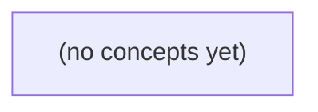

# 02.05 排序与分治：给 IM 历史建立可复核的顺序

*面向 Go 初学者，以完全虚构的 IM 消息历史为线索，逐步建立“什么叫排在前面”的可复核定义，并学习插入排序、归并排序、快速排序与 Go 标准库排序。教材强调比较器一致性、稳定性、确定性、复杂度和排序结果验证，最终能够为静态消息切片选择合适的排序方案。*

**章节:** 2

---

## 本书导览

- 了解整本书的章节脉络
- 掌握各章之间的概念依赖关系
- 选择最合适的阅读顺序

# 02.05 排序与分治：给 IM 历史建立可复核的顺序

面向 Go 初学者，以完全虚构的 IM 消息历史为线索，逐步建立“什么叫排在前面”的可复核定义，并学习插入排序、归并排序、快速排序与 Go 标准库排序。教材强调比较器一致性、稳定性、确定性、复杂度和排序结果验证，最终能够为静态消息切片选择合适的排序方案。

下方的概念图展示了本书 0 个核心概念以及它们之间的依赖关系；再下方是 1 个章节的入口。你可以按从上到下的顺序阅读，也可以根据自己的兴趣或先验知识选择切入点。

#### 概念图



## 章节索引

- **02.05 排序与分治：给 IM 历史建立可复核的顺序** — 承接数组、成本模型、搜索与哈希，先定义比较规则和并列键，再从插入排序进入归并与快速排序的分治思想。用虚构 IM 历史说明稳定性、确定性、额外空间、退化和文件过大时的外部排序入口。

## 02.05 排序与分治：给 IM 历史建立可复核的顺序

- 区分消息身份、时间显示、序号和排序键
- 写出可传递的比较规则与稳定并列处理
- 追踪插入排序的有序前缀和成本
- 理解归并排序的分解、合并和额外空间
- 理解快速排序的分区、平均与最坏情况
- 区分稳定排序和跨不同输入的确定结果
- 用Go sort.SliceStable或sort.Slice表达已定义的顺序
- 说明内存限制和外部排序的前置

排序前先回答“谁在前、为何在前”。对 IM 历史而言，可靠顺序来自明确定义的排序键，而不是屏幕显示出的某个时间。

### 先拆开：消息身份、显示时间与排序依据

### 先拆开：消息身份、显示时间与排序依据

在会话 `c-a` 中，一条消息至少有四类容易混淆的信息：

| 字段 | 示例 | 职责 | 能否直接决定全局顺序 |
|---|---|---|---|
| `MessageID` | `m-a` | 消息的唯一身份；用于去重、定位、引用 | 仅作同序号时的次级比较 |
| `Seq` | `12` | 服务端教学序号；表示该消息在会话中的逻辑位置 | 可以，作为首要比较键 |
| 客户端时间 | `10:03:08` | 设备生成或上报的显示时间 | 不可以单独使用 |
| 切片位置 | `msgs[0]` | 当前程序内存中的暂存位置 | 不可以，排序后会变化 |

例如，客户端刚收到的切片可能是：

| 切片位置 | MessageID | Seq | 客户端时间 |
|---:|---|---:|---|
| `0` | `m-c` | `13` | `10:02:58` |
| `1` | `m-a` | `12` | `10:03:08` |
| `2` | `m-b` | `12` | `10:01:44` |

这里 `m-b` 的本地时间最早，却不能因此排到整段历史最前：不同设备的时钟可能不准，离线消息也可能晚到。切片位置同样只说明“当前放在哪里”，不说明“历史中本应在哪里”。

为使结果可复核，先约定比较键：

$$
(Seq\uparrow,\ MessageID\uparrow)
$$

即先按 `Seq` 升序；若两个记录的 `Seq` 相同，再按 `MessageID` 字典序升序。因此排序后为：

| 排序后位置 | MessageID | Seq | 客户端时间 |
|---:|---|---:|---|
| `0` | `m-a` | `12` | `10:03:08` |
| `1` | `m-b` | `12` | `10:01:44` |
| `2` | `m-c` | `13` | `10:02:58` |

`MessageID` 解决“是哪条消息”，`Seq` 解决“应排第几”，客户端时间主要服务显示，切片下标只是排序前后的容器位置。

### 把业务规则写成可比较的键

### 把业务规则写成可比较的键

先把自然语言需求写成精确规则：消息 `a` 应排在消息 `b` 前，当且仅当：

1. `a.Seq < b.Seq`；
2. 或者 `a.Seq == b.Seq`，且 `a.MessageID < b.MessageID`。

这就是二元键 `(Seq, MessageID)` 的**字典序**：先比较第一项；第一项相等，才比较第二项。

例如同一会话有如下记录：

| 切片位置 | 消息ID | 教学Seq | 客户端时间 |
|---:|---|---:|---|
| 0 | `m-c` | 12 | 10:03 |
| 1 | `m-a` | 11 | 10:05 |
| 2 | `m-b` | 12 | 10:01 |
| 3 | `m-d` | 13 | 10:02 |

按键 `(Seq, MessageID)` 升序排序后：

| 顺序 | 消息ID | 排序键 |
|---:|---|---|
| 0 | `m-a` | `(11, m-a)` |
| 1 | `m-b` | `(12, m-b)` |
| 2 | `m-c` | `(12, m-c)` |
| 3 | `m-d` | `(13, m-d)` |

注意：切片位置只是当前内存中的存放位置，不是业务顺序；消息 ID 是消息身份；`Seq` 才是本例中服务端提供的主要顺序依据。

对应的 Go 比较逻辑可以直接写成：

`a.Seq < b.Seq || (a.Seq == b.Seq && a.MessageID < b.MessageID)`

该规则具备排序所需的性质：任意两条不同消息都能比较前后，称为**全序**；若 `a` 在 `b` 前、`b` 在 `c` 前，则 `a` 也在 `c` 前，称为**传递性**。因此排序结果可复核、可重复。

不能只依赖客户端本地时间：不同设备时钟可能不一致，离线消息可能稍后上传，用户还可能修改系统时间。`10:01` 的本地时间并不必然表示它应在 `10:05` 的消息之前；本例应优先遵守明确的 `Seq` 规则。

### 排序前后表：同序号消息如何落位

### 排序前后表：同序号消息如何落位

设一组虚构的 `c-a` 会话记录。每条消息同时有：消息 ID、服务端教学序号 `Seq`、客户端时间，以及它进入本地切片时的位置。规则明确为：

`Seq` 升序；若 `Seq` 相同，则按 `MessageID` 字典序升序。

客户端时间只供展示或排查，不参与全局顺序；原切片位置也不是排序键。

排序前，切片收到的乱序数据如下：

| 原切片位置 | MessageID | Seq | 客户端时间 |
|---:|---|---:|---|
| 0 | m-c | 12 | 10:03:08 |
| 1 | m-a | 11 | 10:03:10 |
| 2 | m-d | 12 | 10:02:59 |
| 3 | m-b | 11 | 10:03:01 |
| 4 | m-e | 13 | 10:03:05 |

逐项比较：

- `m-a` 与 `m-b` 的 `Seq` 都是 `11`，比较并列键：`m-a < m-b`，所以 `m-a` 在前。
- `m-c` 与 `m-d` 的 `Seq` 都是 `12`，比较并列键：`m-c < m-d`，所以 `m-c` 在前。
- 任意 `Seq=11` 的消息都在 `Seq=12` 前，任意 `Seq=12` 都在 `Seq=13` 前。
- 即使 `m-d` 的客户端时间早于 `m-c`，也不能据此把它排到 `m-c` 前。

排序输出为：

| 排序后位置 | MessageID | Seq | 原切片位置 |
|---:|---|---:|---:|
| 0 | m-a | 11 | 1 |
| 1 | m-b | 11 | 3 |
| 2 | m-c | 12 | 0 |
| 3 | m-d | 12 | 2 |
| 4 | m-e | 13 | 4 |

这样，任何人拿到同一批记录，按同一比较键都能复核出相同历史顺序。

### 用 Go 表达稳定而确定的顺序

### 用 Go 表达稳定而确定的顺序

先把一条消息建模为结构体。`MessageID` 用于消除并列，`Seq` 是本例由服务端提供的教学顺序；`ClientTime` 只能辅助展示或诊断，不能单独决定全局历史顺序。

```go
type Message struct {
	MessageID  string
	Seq        int64
	ClientTime int64
	Content    string
}
```

业务规则明确为：

1. `Seq` 小的消息在前；
2. 若 `Seq` 相同，`MessageID` 字典序小的在前。

例如切片原始位置并不代表历史位置：

| 原切片位置 | MessageID | Seq | ClientTime |
|---:|---|---:|---:|
| 0 | m-c | 12 | 1710000300 |
| 1 | m-a | 10 | 1710000500 |
| 2 | m-b | 12 | 1709999900 |

排序后应为 `m-a, m-b, m-c`。虽然 `m-b` 的客户端时间更早，但它的 `Seq` 仍为 12，不能排到 `Seq=10` 的 `m-a` 前面。

```go
sort.Slice(messages, func(i, j int) bool {
	if messages[i].Seq != messages[j].Seq {
		return messages[i].Seq < messages[j].Seq
	}
	return messages[i].MessageID < messages[j].MessageID
})
```

这里比较函数表达的是“`i` 是否应排在 `j` 前”。完整键已经覆盖 `Seq` 与 `MessageID`，因此任意两条不同 ID 的消息都有确定结果；使用 `sort.Slice` 即可。

`sort.SliceStable` 的价值出现在比较键不完整时。例如只比较 `Seq`：

```go
sort.SliceStable(messages, func(i, j int) bool {
	return messages[i].Seq < messages[j].Seq
})
```

同为 `Seq=12` 的 `m-c`、`m-b` 会保留排序前的切片相对位置。稳定排序保证“原来谁在前，谁仍在前”，却不能保证不同来源、不同拉取批次得到同一结果：原切片位置本身可能变化。

相对地，`sort.Slice` 在比较结果并列时不承诺保留原顺序。因此，若缺少 `MessageID` 这类并列键，`sort.Slice` 的同 `Seq` 消息顺序不可依赖。实践中应优先补全业务排序键；稳定性是对相等元素的保留规则，不是全局顺序规则的替代品。

### 稳定性不是确定性的替代品

### 稳定性不是确定性的替代品

稳定排序的含义很窄：当两个元素的**比较键相等**时，输出中仍保留它们进入切片时的相对位置。

例如只按 `Seq` 升序排序，输入为：

| 切片位置 | MessageID | Seq |
|---:|---|---:|
| 0 | m-b | 42 |
| 1 | m-a | 42 |
| 2 | m-c | 43 |

稳定排序后仍是 `m-b, m-a, m-c`。但若另一台客户端收到同一批记录时，初始切片恰为 `m-a, m-b, m-c`，稳定排序会得到 `m-a, m-b, m-c`。两次结果不同，原因不是排序不稳定，而是 `Seq=42` 时比较规则没有给出谁应在前。

因此，稳定性只能“尊重输入历史”，不能创造全局可复核的顺序。切片位置只是本次加载、分页或网络到达形成的局部事实；客户端时间也可能受时钟漂移影响，不能单独充当全局裁决。

要让不同输入得到相同结果，比较键必须完整，例如：

```go
// 先按服务端教学 Seq 升序；Seq 相同，再按消息 ID 升序。
a.Seq < b.Seq || (a.Seq == b.Seq && a.MessageID < b.MessageID)
```

此时 `m-a` 与 `m-b` 的顺序由 `MessageID` 明确决定：`m-a` 在前。无论使用稳定排序还是非稳定排序，只要比较器实现正确，最终顺序都一致。

后续评价插入、归并或快速排序时，应分开问两件事：

- **键是否完整**：相同数据、不同输入是否得到同一顺序？
- **算法是否稳定**：真正完全同键的记录，是否保留原始相对位置？

前者保证可复核，后者才是稳定性的价值。

> **要点** — IM 历史的可信顺序应由 Seq 与 MessageID 等完整键定义；稳定性只能保留输入关系，不能替代确定的并列规则。

为 IM 历史排序前，必须先把“谁在前”定义成可检验的规则；否则算法再快，结果也不可信。

### 先分清身份、显示时间与排序键

### 先分清身份、显示时间与排序键

一条 IM 消息至少有三类容易混淆的信息：

- **唯一身份**：如`消息ID`、`会话ID + 消息ID`。它回答“是不是同一条消息”，用于去重、更新、撤回与审计；身份本身通常不表示先后。
- **显示时间**：如“10:03”“昨天 18:20”。它服务阅读体验，可能被时区转换、客户端时钟漂移、精度截断或隐私策略影响，不能天然当作可靠顺序。
- **采集序号**：如服务端日志偏移量、拉取批次中的`Seq`。它描述系统观察或接收的次序；若`Seq`只在某个会话、分区或批次内递增，就不能越过其作用范围比较。
- **排序键**：排序真正使用的字段组合，例如`(可信时间戳, Seq, 唯一ID)`。它必须明确、可复算，并能处理并列。

时间戳只能在其可信范围内使用。服务端为同一会话分配的单调事件时间，通常可作为主键；客户端本地时间则更适合显示，不宜据此断言全局因果。即使时间可信，秒级或毫秒级精度也会产生并列：

| 消息 | 显示时间 | Seq | 唯一ID |
|---|---:|---:|---|
| A | 10:00:00 | 42 | m8 |
| B | 10:00:00 | 42 | m3 |
| C | 10:00:00 | 43 | m1 |
| D | 10:00:01 | 44 | m7 |

若仅按时间排序，A、B、C的相对位置没有定义；若按`(时间, Seq)`，A与B仍并列。采用`(时间, Seq, 唯一ID)`后得到唯一顺序`B, A, C, D`。这里`唯一ID`不是“真实发生时间”的证据，而是为可复核输出提供确定的最后裁决。

### 用 less 定义严格顺序

### 用 `less` 定义严格顺序

排序器不直接回答“`a` 是否应排在 `b` 前面”，而是依赖谓词 `less(a,b)`：当且仅当 `a` 必须位于 `b` 之前时返回 `true`。对 IM 消息，可先按逻辑序号 `Seq` 升序定义：

`less(a,b) = a.Seq < b.Seq`

这个规则必须满足可检验的顺序性质：

- **反对称直觉（更准确地说是不对称性）**：若 `less(a,b)` 为真，则 `less(b,a)` 必须为假。不能既说消息 A 在 B 前，又说 B 在 A 前。
- **传递性**：若 `less(a,b)` 且 `less(b,c)`，则必须有 `less(a,c)`。例如 `A.Seq < B.Seq < C.Seq` 时，A 必须在 C 前；否则排序过程会出现循环偏好。
- **同键不可比较**：若 A、B 的排序键相同，则 `less(A,B)` 与 `less(B,A)` 都应为 `false`。这表示它们在当前规则下“等价”，而不是任意一方更小。

例如四条消息的 `Seq` 为 `7, 7, 8, 8`，仅按 `Seq` 排序时，两条 `Seq=7` 消息彼此没有先后定义；稳定排序只能保留它们在**当前输入**中的相对位置，不能凭空断定跨批到达时谁更早。

若比较器时而按时间戳、时而按 `Seq`，或把并列时间戳随机判为前后，就可能破坏上述性质。此时不同排序实现、不同输入排列甚至同一次运行，都可能得到不同结果；“已排序”不再意味着可复核的历史顺序。

### 同序号消息的两种结果

### 同序号消息的两种结果

设四条消息的 `Seq` 都为 `42`，但唯一标识不同：

| 到达时的源输入顺序 | 消息 |
|---|---|
| 1 | `Seq=42, ID=m9` |
| 2 | `Seq=42, ID=m2` |
| 3 | `Seq=42, ID=m7` |
| 4 | `Seq=42, ID=m4` |

若比较器只按序号定义：

`less(a,b) = a.Seq < b.Seq`

则任意两条消息都有 `less(a,b)=false` 且 `less(b,a)=false`。稳定排序不会交换这些“同键”消息，因此结果仍为：

`m9 → m2 → m7 → m4`

这并不表示 `m9` 在逻辑上早于 `m2`；它只表示排序器忠实保留了**这一次源输入**的相对顺序。若另一副本因网络重放、分页边界或批次合并而先看到：

`m7 → m4 → m2 → m9`

同样的稳定排序会产生这一不同结果。稳定性不能把不稳定的输入来源变成跨批次可复核的历史。

若业务要求所有副本对同一组消息得到一致次序，应加入唯一的次级键：

`less(a,b) = (a.Seq, a.ID) < (b.Seq, b.ID)`

按 ID 字典序排序后，结果固定为：

`m2 → m4 → m7 → m9`

此时 `Seq` 表示主要顺序，`ID` 只负责打破并列，二者合起来形成全序。时间戳也可作为次级键，但并列时间戳、客户端时钟漂移或服务端校正范围仍会留下歧义；最终通常仍需以可信且唯一的 ID 收尾。

### 稳定性不等于跨批确定性

### 稳定性不等于跨批确定性

稳定排序的承诺很窄：当两个元素的排序键相等，即 `less(a,b)` 与 `less(b,a)` 都为 `false` 时，输出中保留它们在**当前输入序列**里的相对次序。

设四条消息的主键都是同一个 `Seq=42`：

| 消息 | Seq | 唯一 ID |
|---|---:|---|
| A | 42 | `m-17` |
| B | 42 | `m-03` |
| C | 42 | `m-91` |
| D | 42 | `m-44` |

批次一的源输入为 `B, A, D, C`。只按 `Seq` 做稳定排序，结果仍是：

`B, A, D, C`

批次二因网络重放、分页边界或并发拉取，源输入变成 `D, C, B, A`。同样的稳定排序会得到：

`D, C, B, A`

两次都“稳定”，却没有得到同一历史顺序。原因是稳定性不创造顺序；它只是忠实继承已有输入顺序。若输入到达顺序本身不可复核，稳定排序也无法自动提供跨批、跨设备或跨重放的一致结果。

要获得确定顺序，应把比较键扩展为全序，例如先比较 `Seq`，再比较唯一 ID：

`(Seq, ID)` 按字典序升序

于是四条消息固定为：

`B(m-03), A(m-17), D(m-44), C(m-91)`

时间戳也常出现并列，尤其在毫秒截断、客户端时钟误差或批量写入时。时间只能表示一个信任范围，而非天然的唯一先后关系；应明确其精度与可信度，并在并列时使用服务器序号、消息 ID 等可复核的次级键。

### 在 Go 中落实可复核顺序

### 在 Go 中落实可复核顺序

先把顺序写成明确的键序：可信 `Seq` 为主键，时间戳为次级键，唯一消息 ID 为最终兜底键。这样任意两条不同消息都能比较出先后，排序结果可复算、可审计。

例如四条消息都声称 `Seq=42`：

- A：时间 `10:00:01`，ID=`a`
- B：时间 `10:00:01`，ID=`b`
- C：时间 `10:00:00`，ID=`c`
- D：时间未知，ID=`d`

若规则是“`Seq` 升序、可信时间升序、ID 升序；未知时间排在已知时间之后”，结果为 `C, A, B, D`。若时间戳只在允许误差范围内可靠，例如相差不超过 2 秒视为并列，则 A、B、C 不能再仅凭时间强行断言先后，应直接用 ID 决定，结果可能是 `A, B, C, D`。关键不在“哪种更自然”，而在规则是否预先声明。

Go 中可用 `sort.Slice` 表达全序：

`sort.Slice(msgs, func(i, j int) bool { return less(msgs[i], msgs[j]) })`

其中 `less(a,b)` 必须依次比较主键、次级键和 ID；某一键相等时继续比较下一键。对于完全相同的记录，`less(a,b)` 与 `less(b,a)` 都应为 `false`。不要写成“时间相等时返回 `true`”，否则比较器不自洽，排序结果没有可靠意义。

若最终没有唯一 ID 次级键，而是希望保留同键消息的原输入次序，可用 `sort.SliceStable`。它保证同键元素不互换，但只继承**当前切片**的顺序：不同批次到达、并发读取或上游遍历顺序不稳定时，稳定排序不会自动产生跨批确定结果。需要可复核的历史视图时，应优先补齐 `Seq + 唯一 ID` 的全序；稳定性只是保留既有顺序的策略，不是制造确定性的机制。

> **要点** — 排序的前提是可传递的一致比较规则；稳定性保留输入次序，全序才保证跨输入的确定结果。

从整理纸面手牌的直觉出发，把消息逐张插入已排好序的前缀，建立可追踪、可复核的数组排序过程。

### 先定义消息键与并列规则

### 先定义消息键与并列规则

一条即时消息通常同时带有多种“看起来都能排序”的字段，但它们职责不同：

- `ID`：消息的身份标识，用于唯一定位、去重和审计；不必天然代表发送先后。
- `DisplayTime`：展示给用户的时间，可能受时区、格式化或客户端时钟影响，适合显示，不宜作为唯一复核依据。
- `Seq`：服务端或会话内分配的序号，表示希望恢复的逻辑顺序。
- 排序键：本节选择 `Seq` 作为主键，按升序排列。

可以先定义数据结构：

`type Message struct { ID string; Seq int; DisplayTime string; Text string }`

排序规则必须把“并列”说清楚：若 `a.Seq < b.Seq`，则 `a` 应排在 `b` 前；若 `a.Seq == b.Seq`，不再比较 `ID` 的字典序，也不交换两条消息，而是保持它们进入数组时的原始相对次序。这就是稳定排序。

例如输入依次为：

`[{ID:"m1", Seq:5}, {ID:"m2", Seq:2}, {ID:"m3", Seq:4}, {ID:"m4", Seq:2}]`

排序后应为：

`m2(2), m4(2), m3(4), m1(5)`

这里 `m2` 与 `m4` 的 `Seq` 相同，但 `m2` 原本在前，因此结果中仍在前。实现插入排序时，内层只右移满足 `messages[j].Seq > current.Seq` 的元素；注意是严格大于 `>`，而不是 `>=`。这样遇到相等 `Seq` 会停止移动，把当前消息插到已有并列消息之后，稳定性便得到保证。

### 手牌直觉与有序前缀不变式

### 手牌直觉与有序前缀不变式

把 IM 历史看成桌上一叠尚未整理的手牌：左边是已经按顺序排好的牌，右边是还未处理的牌。每次从右边拿出一张 `current`，在左边找到它应在的位置，再把后面较大的牌整体向右挪一格，为它腾出空位。

数组中的外层下标 `i` 正是“当前取第几张未整理牌”。在每次外层循环开始时，维护如下不变式：

> 区间 `[0, i)` 内的消息已经按排序键有序；区间 `[i, n)` 尚未保证有序。

初始时 `i = 1`，只有 `messages[0]` 的前缀天然有序。取出 `messages[i]` 后，从 `j := i-1` 向左检查：只要 `messages[j]` 比 `current` 更大，就将 `messages[j]` 移到 `j+1`。循环停止时，`j+1` 就是 `current` 的正确插入位置。

以键序列 `[5, 2, 4, 2]` 为例，并为相同 `Seq` 保留原始 `ID`：

- 初始：`[5/A, 2/B, 4/C, 2/D]`，有序前缀为 `[5/A]`。
- 取 `2/B`：`5/A` 右移，插入后为 `[2/B, 5/A, 4/C, 2/D]`。
- 取 `4/C`：`5/A` 右移，得到 `[2/B, 4/C, 5/A, 2/D]`。
- 取 `2/D`：`5/A`、`4/C` 右移；遇到 `2/B` 时停止，得到 `[2/B, 2/D, 4/C, 5/A]`。

关键在于比较条件使用“严格更大”：

`messages[j].Seq > current.Seq`

因此 `2/D` 不会跨过先到的 `2/B`。相等键保持原有先后次序，插入排序便具有稳定性；每轮结束后，有序前缀从 `[0, i)` 扩展为 `[0, i+1)`。

### 逐步追踪键[5,2,4,2]

### 逐步追踪键[5,2,4,2]

设原始消息按到达顺序为：

| 初始下标 | 消息 | `Seq` |
|---:|---|---:|
| 0 | `A` | 5 |
| 1 | `B` | 2 |
| 2 | `C` | 4 |
| 3 | `D` | 2 |

排序规则是按 `Seq` 升序。每轮取出 `current := messages[i]`，已知左侧区间 `[0,i)` 已有序；令 `j := i-1`，只要 `messages[j].Seq > current.Seq`，就将该元素右移。注意这里必须是严格大于 `>`，不能写成 `>=`。

- **第 1 轮：`i=1`**  
  `current=B(2)`，`j=0`，前缀为 `[A(5)]`。  
  `A.Seq=5 > 2`，将 `A` 右移：`[A(5), A(5), C(4), D(2)]`。  
  `j` 减为 `-1`，在 `j+1=0` 放入 `B`：  
  `[B(2), A(5), C(4), D(2)]`。

- **第 2 轮：`i=2`**  
  `current=C(4)`，`j=1`，有序前缀为 `[B(2), A(5)]`。  
  `A.Seq=5 > 4`，右移 `A`；随后 `j=0`。  
  `B.Seq=2` 不大于 `4`，停止，在位置 `1` 插入：  
  `[B(2), C(4), A(5), D(2)]`。

- **第 3 轮：`i=3`**  
  `current=D(2)`，`j=2`。`A(5)`、`C(4)` 都比它大，依次右移。  
  此时 `j=0`，检查 `B(2)`：`2 > 2` 不成立，因此不移动 `B`，将 `D` 插入位置 `1`：  
  `[B(2), D(2), C(4), A(5)]`。

最终同为键 `2` 的消息仍是 `B` 在前、`D` 在后，与原始到达顺序一致。这正是稳定性的含义：相等键不跨越；若条件写成 `>=`，`D` 会越过 `B`，稳定性随即被破坏。

### 用 Go 实现消息插入排序

### 用 Go 实现消息插入排序

把每条消息看作一张纸牌：数组左侧 `[0,i)` 始终是已排好序的手牌，第 `i` 张 `current` 被取出后，从右向左寻找应插入的位置。排序主键是 `Seq`；当 `Seq` 相等时，按 `ID` 升序作为既定并列规则，使结果可复核。

```go
package main

import (
	"fmt"
)

type Message struct {
	ID  string
	Seq int
}

func less(a, b Message) bool {
	if a.Seq != b.Seq {
		return a.Seq < b.Seq
	}
	return a.ID < b.ID
}

func insertionSort(messages []Message) {
	for i := 1; i < len(messages); i++ {
		current := messages[i] // 手中暂存第 i 张牌
		j := i - 1

		// 更大的元素向右挪，为 current 腾出位置。
		for j >= 0 && less(current, messages[j]) {
			messages[j+1] = messages[j]
			j--
		}
		messages[j+1] = current
	}
}

func main() {
	messages := []Message{
		{ID: "m5", Seq: 5},
		{ID: "m2b", Seq: 2},
		{ID: "m4", Seq: 4},
		{ID: "m2a", Seq: 2},
	}

	insertionSort(messages)
	fmt.Println(messages)
}
```

追踪键序列 `[5,2,4,2]`：

- `i=1`：取出 `(2,m2b)`，将 `(5,m5)` 右移，得到 `[(2,m2b),(5,m5),4,2]`。
- `i=2`：取出 `(4,m4)`，右移 `(5,m5)`，得到 `[2,4,5,2]`。
- `i=3`：取出 `(2,m2a)`，依次右移 `5、4、(2,m2b)`；因 `m2a < m2b`，最终为 `[(2,m2a),(2,m2b),4,5]`。

若只按 `Seq` 排序，并在相等时停止移动，则插入排序稳定：原来靠前的相同 `Seq` 消息不会被跨越。这里加入 `ID` 是显式的并列排序规则，不再依赖输入顺序。

近乎有序时，内层循环很少移动，时间可接近 $O(n)$；最坏情况下比较和移动均为 $O(n^2)$，额外元素空间为 $O(1)$。它适合小规模、需审计的历史整理，不应用于巨量历史消息的推荐或全量排序。

### 成本边界与适用范围

### 成本边界与适用范围

插入排序的成本取决于每条消息离其最终位置有多远。若历史本身近乎有序，例如大多数消息已按 `Seq` 递增，只偶尔出现延迟到达的记录，则内层循环通常只比较一次便停止：

- 最佳或近乎有序时，比较次数接近 $n-1$，总时间为 $O(n)$。
- 完全逆序时，第 $i$ 个元素必须跨越前面全部 $i$ 个元素；比较与右移次数累计为  
  $$1+2+\cdots+(n-1)=\frac{n(n-1)}{2}$$  
  因而时间为 $O(n^2)$。
- 随机顺序的平均成本同样是二次量级，历史越长，逐个右移造成的代价越明显。

算法只保存当前待插入的 `current`、索引 `i` 和 `j`；消息元素本身在原数组中移动，因此额外元素空间为 $O(1)$。这适合小批量导入、测试数据、人工修订后的局部重排，或已经大致按时间线到达的 IM 增量记录。

稳定性也有实际意义：当两条消息的 `Seq` 相等时，内层条件应是“前项严格更大才右移”。相等元素不跨越，原先位于前面的消息仍位于前面；若先按 `Seq`、再保留原始到达顺序，审计和复核结果就不会因排序而改变。

但不要把插入排序用于巨大的完整历史，例如数十万或数百万条消息的首次整理。此时逆序或乱序输入会产生大量移动，应改用 $O(n\log n)$ 的排序方案，如 Go 标准库的稳定排序；插入排序更适合作为“小而近有序”的局部工具。

> **要点** — 插入排序靠维护有序前缀工作；比较时仅右移更大元素，才能在低额外空间下保留同键消息的原始次序。

归并排序把“排好一个大数组”的任务拆成可验证的小任务：先分别有序，再用明确规则合并。

### 从分解到基例：递归任务如何收束

### 从分解到基例：递归任务如何收束

归并排序不直接处理“如何一次排好全部元素”，而是把任务定义为：

1. 将长度为 $n$ 的数组从中点拆成左、右两段；
2. 递归地排好左段；
3. 递归地排好右段；
4. 再把两个有序段合并。

例如数组 `[5,2,4,2]` 可拆为：

`[5,2,4,2]`  
$\rightarrow$ 左 `[5,2]`，右 `[4,2]`  
$\rightarrow$ `[5]`、`[2]`、`[4]`、`[2]`

递归之所以能停止，关键在于**基例**：当数组长度为 `0` 或 `1` 时，数组天然有序，直接返回即可。空数组无需比较；单元素数组也不可能存在逆序对。

```text
归并排序(A):
    如果 A 的长度 <= 1：
        返回 A

    mid = A 的长度 / 2
    left  = 归并排序(A[0:mid])
    right = 归并排序(A[mid:末尾])
    返回 合并(left, right)
```

这里每次拆分都会使子问题变小：长度 $n$ 大致变为 $n/2$。因此，无论初始数组多长，最终都会到达长度为 `1`，再逐层返回并执行合并。

可以把递归调用理解为一棵任务树：叶子是长度 `0` 或 `1` 的已排序片段，内部节点的责任不是重新排序全部元素，而是合并两个已经有序的结果。基例保证递归收束；“先排子段、后合并”则保证每一层都有可验证的前提。

### 追踪 [5,2,4,2] 的拆分过程

### 追踪 `[5,2,4,2]` 的拆分过程

归并排序的递归阶段暂时**不比较大小**，只负责把问题不断缩小，直到每个子数组都小到无需再排序。设排序函数为 `mergeSort(A)`，其基例是：

- 当 $n=0$ 或 $n=1$ 时，数组天然有序，直接返回；
- 当 $n>1$ 时，按中点拆成左半与右半，分别递归排序。

对数组 `[5,2,4,2]`，拆分过程如下：

| 递归层 | 当前待排序序列 | 左半 | 右半 | 是否继续拆分 |
|---|---|---|---|---|
| 0 | `[5,2,4,2]` | `[5,2]` | `[4,2]` | 是 |
| 1 | `[5,2]` | `[5]` | `[2]` | 是 |
| 1 | `[4,2]` | `[4]` | `[2]` | 是 |
| 2 | `[5]` | — | — | 否，达到基例 |
| 2 | `[2]` | — | — | 否，达到基例 |
| 2 | `[4]` | — | — | 否，达到基例 |
| 2 | `[2]` | — | — | 否，达到基例 |

也可以把递归调用画成树：

```text
[5,2,4,2]
├── [5,2]
│   ├── [5]
│   └── [2]
└── [4,2]
    ├── [4]
    └── [2]
```

拆分的关键不在于“把数组切得多细”，而在于确保叶子节点都是长度为 $0$ 或 $1$ 的序列。单元素序列没有逆序对，因此已经有序；随后递归才会从树的底部返回，依次合并 `[5]` 与 `[2]`、`[4]` 与 `[2]`，最终合并两个已排序的半区。

每一层拆分中，所有子数组的元素总数仍为 $n$；数组长度约每次减半，因此递归深度约为 $\log_2 n$。真正的元素搬移主要发生在后续合并阶段。

### 合并两个有序段：比较、搬移与剩余元素

### 合并两个有序段：比较、搬移与剩余元素

设数组的相邻两段已经分别有序：

- 左段：`[2, 5]`
- 右段：`[2, 4]`

合并并不是把它们直接“拼起来”，而是准备辅助数组 `temp`，用两个指针分别指向两段当前尚未处理的首元素：

- `i` 指向左段首元素；
- `j` 指向右段首元素；
- `k` 指向 `temp` 的下一个写入位置。

每一步只比较 `a[i]` 与 `a[j]`：

1. 较小者写入 `temp[k]`；
2. 对应指针前移；
3. `k` 前移；
4. 重复，直到其中一段耗尽。

对 `[2,5]` 与 `[2,4]` 的追踪如下：

| 比较 | 写入 `temp` | 左段剩余 | 右段剩余 |
|---|---|---|---|
| `2` 与 `2` | `2`（取左） | `[5]` | `[2,4]` |
| `5` 与 `2` | `2` | `[5]` | `[4]` |
| `5` 与 `4` | `4` | `[5]` | `[]` |
| 右段耗尽 | `5` | `[]` | `[]` |

结果为 `[2,2,4,5]`。若两个元素相等，应使用 `<=`，即**优先取左段元素**。这样，原来位于左侧的相等记录仍排在右侧相等记录之前，归并排序因此保持稳定性。

```text
while i < 左段结束 and j < 右段结束:
    if a[i] <= a[j]:
        temp[k] = a[i]; i++
    else:
        temp[k] = a[j]; j++
    k++

复制左段剩余元素
复制右段剩余元素
```

一侧耗尽后，另一侧的剩余元素无需再比较：它们本身已有序，且必然都不小于已写入的元素。最后将 `temp` 覆盖回原数组对应区间。

### 等键先取左侧：稳定性的具体来源

### 等键先取左侧：稳定性的具体来源

稳定排序要求：若两条记录的排序键相同，它们在输出中的相对先后必须与输入一致。设 IM 历史按时间排序，数组为：

| 原始位置 | 记录 | 时间键 |
|---:|---|---:|
| 0 | `2_A` | 2 |
| 1 | `5` | 5 |
| 2 | `2_B` | 2 |
| 3 | `4` | 4 |

其中 `2_A` 与 `2_B` 的时间相同，但它们是不同消息；原始顺序是 `2_A` 在 `2_B` 前。

递归排序后，左右两半分别为：

- 左半：`[2_A, 5]`
- 右半：`[2_B, 4]`

合并时比较两端：

| 左端 | 右端 | 选择 | 输出 |
|---|---|---|---|
| `2_A` | `2_B` | 相等，先取左侧 `2_A` | `[2_A]` |
| `5` | `2_B` | 取右侧 `2_B` | `[2_A, 2_B]` |
| `5` | `4` | 取右侧 `4` | `[2_A, 2_B, 4]` |
| `5` | 空 | 取剩余左侧 | `[2_A, 2_B, 4, 5]` |

关键代码是比较中的等号：

`如果 left[i].key <= right[j].key，就先写入 left[i]。`

当键相等时，左半记录代表原数组中更靠前的记录；优先取左侧，便保留了 `2_A` 在 `2_B` 前的关系。若误写成 `<`，相等时会先取右侧，结果变为 `[2_B, 2_A, 4, 5]`，排序键仍正确，却失去了稳定性。

### 复杂度与 Go 实现边界

### 复杂度与 Go 实现边界

归并排序的效率来自“每层都线性处理，但层数很少”。对长度为 $n$ 的数组，递归不断二分，直到子数组长度为 $0$ 或 $1$；二分树高度约为 $\log_2 n$。

在任意一层中，虽然有多个小段需要合并，但所有段的元素总数仍是 $n$。每个元素在该层至多被比较、写入辅助数组并复制回原数组一次，因此每层工作量为：

$$O(n)$$

共有约 $\log_2 n$ 层，所以总时间复杂度为：

$$O(n\log n)$$

这比简单插入排序或冒泡排序的 $O(n^2)$ 更适合长 IM 历史：消息越多，差距越明显。

Go 实现中，`merge` 通常负责真正的“排序动作”：两个相邻且已排序的区间 `[lo, mid)` 与 `[mid, hi)` 被合并到辅助数组 `buf`。当键相等时先取左段元素，即 `<=`，可保留原始先后关系，因而排序稳定。

```go
func mergeSort(a, buf []Message, lo, hi int) {
	if hi-lo <= 1 { // n 为 0 或 1：天然有序
		return
	}
	mid := lo + (hi-lo)/2
	mergeSort(a, buf, lo, mid)
	mergeSort(a, buf, mid, hi)
	merge(a, buf, lo, mid, hi)
}
```

`hi-lo <= 1` 同时覆盖空数组和单元素数组，避免继续切分。`merge` 中使用单个长度为 `n` 的 `buf`，额外数组空间为 $O(n)$；递归调用还会占用约 $O(\log n)$ 的调用栈。因此，归并排序并非无条件原地排序：即使不为每次合并重新分配数组，也仍需要主要的辅助缓冲区。

> **要点** — 归并排序靠基例收束递归，以稳定合并建立全局有序；时间为 O(n log n)，通常需 O(n) 额外空间。

快速排序的关键不在“选一个中间值”，而在先写清枢轴、分区不变量与重复键的处理边界。

### 从消息排序键到枢轴比较

### 从消息排序键到枢轴比较

IM 历史中的“时间顺序”通常不是只比较显示出来的时间文本。两条消息可能拥有相同的服务器时间，或客户端时间受时钟漂移影响；因此应先定义一个确定的复合排序键，例如：

$$
K(m)=(m.\text{服务器时间},\ m.\text{会话内序号},\ m.\text{消息ID})
$$

按字典序比较：先比较服务器时间；相同则比较会话内序号；仍相同再比较消息 ID。这样任意两条消息都能得到确定结果，并满足可传递性：若 $a \le b$ 且 $b \le c$，则 $a \le c$。快速排序、二分查找和分页续传都依赖这一前提。

枢轴 `pivot` 不是“屏幕上居中的那条时间”，也不是一个单独的时间值；它是当前待排序区间中选定的一条完整消息记录，比较时始终使用其完整键 `K(pivot)`。

概念性分区规则可写为：

- 选取区间内某条消息作为 `pivot`；
- 扫描其余消息；
- 若 `K(message) ≤ K(pivot)`，放入左侧；
- 若 `K(message) ≥ K(pivot)`，放入右侧；
- 分区完成后，左侧所有键不大于枢轴，右侧所有键不小于枢轴；
- 再分别处理左右子区间。

可用状态表核对分区不变量：

| 区域 | 应满足的关系 |
|---|---|
| 已处理左区 | `K(x) ≤ K(pivot)` |
| 未处理区 | 尚未判断 |
| 已处理右区 | `K(x) ≥ K(pivot)` |

若比较规则只看格式化时间、混入“刚收到的优先”等临时界面条件，结果可能不确定或不具传递性；此时即使分区代码形式正确，历史顺序也无法稳定复核。

### 分区不变量与状态表

### 分区不变量与状态表

先把枢轴记为 $p$，并暂放到区间末端。用两个扫描位置：`i` 指向“下一个应放入不大于 $p$ 的元素的位置”，`j` 从左向右检查未知元素。循环中始终维持：

- `[lo, i)`：元素都不大于 $p$；
- `[i, j)`：元素都大于 $p$；
- `[j, hi-1)`：尚未检查；
- `hi-1`：保存枢轴 $p$。

概念性伪代码如下：

`将枢轴移到 hi-1；i = lo`  
`对 j 从 lo 扫描到 hi-2：`  
`　若 a[j] <= p：交换 a[i] 与 a[j]；i++`  
`交换 a[i] 与 a[hi-1]；返回 i`

例如对 `[4, 2, 5, 2, 3]` 分区，取 $p=3$：

| 时刻 | `i` | `j` | 已确定的左侧 | 未知区/数组状态 |
|---|---:|---:|---|---|
| 开始 | 0 | 0 | 空 | `[4, 2, 5, 2, 3]` |
| 检查 `4` | 0 | 1 | 空 | `[4, 2, 5, 2, 3]` |
| 检查 `2` 并交换 | 1 | 2 | `[2]` | `[2, 4, 5, 2, 3]` |
| 检查 `5` | 1 | 3 | `[2]` | `[2, 4, 5, 2, 3]` |
| 检查 `2` 并交换 | 2 | 4 | `[2, 2]` | `[2, 2, 5, 4, 3]` |
| 放回枢轴 | 2 | — | `[2, 2]` | `[2, 2, 3, 4, 5]` |

最终枢轴位于位置 `2`：左侧均 $\le p$，右侧均 $\ge p$。这只是一次分区；递归处理两侧后才得到整体有序序列。

### 递归缩小与正确性边界

### 递归缩小与正确性边界

一次分区结束后，枢轴已处在某个最终位置 `p`，并满足明确的不变量：

- 区间 `[lo, p-1]` 中的每个元素都不大于 `pivot`；
- 位置 `p` 保存枢轴；
- 区间 `[p+1, hi]` 中的每个元素都不小于 `pivot`。

因此，枢轴不需要再参与后续排序；未确定内部次序的只剩左右两个子区间。概念性过程可写为：

1. 若区间长度为 `0` 或 `1`，直接返回；
2. 对 `[lo, hi]` 分区，得到枢轴最终下标 `p`；
3. 递归排序 `[lo, p-1]`；
4. 递归排序 `[p+1, hi]`。

正确性的关键是“规模缩小”。只要分区过程确实把枢轴放入当前区间，并且递归区间不包含 `p`，两个子问题的规模都严格小于原区间。最终递归必然到达长度至多为 `1` 的基例，而该区间天然有序。

可用归纳理解整体有序：假设较小区间都能被递归排好序。分区后，左区间排好、右区间排好；又因左侧任意元素 `≤ pivot ≤` 右侧任意元素，拼接为“有序左区间 + 枢轴 + 有序右区间”后，整个区间有序。

| 阶段 | 区间状态 | 已知事实 |
|---|---|---|
| 分区前 | `[lo, hi]` | 内部顺序未知 |
| 分区后 | 左、`p`、右 | 左不大于枢轴，右不小于枢轴 |
| 递归后 | 左有序、`p`、右有序 | 整体有序 |

这里的边界在于：上述结论依赖分区不变量真的成立。若交换逻辑让某个大于枢轴的元素留在左侧，或递归仍包含枢轴位置，正确性与终止性都可能失效。重复键时，“不大于/不小于”允许相等元素分散在两侧；这不影响有序性，但可能造成分区不平衡，三路分区是后续针对该问题的深化。

### 平均效率、退化与空间成本

### 平均效率、退化与空间成本

设当前子数组长度为 $n$。一次分区需要从两端或单向扫描元素、完成必要交换，因此其时间成本是 $O(n)$。若枢轴把数组分成规模大致均衡的两部分，递推关系可写为：

$$
T(n)=T(a)+T(n-a-1)+O(n)
$$

当 $a$ 接近 $n/2$ 时，递归深度约为 $\log n$；每一层分区工作总量约为 $n$，故总时间为 $O(n\log n)$。这里的“平均”或“期望”并不表示任意输入都天然高效，而是依赖随机化选枢轴、随机输入模型，或能避免持续选到极端位置的枢轴策略。

| 分区形态 | 递归深度 | 总时间 |
|---|---:|---:|
| 接近平衡，如 $n/2:n/2$ | $O(\log n)$ | $O(n\log n)$ |
| 持续极端，如 $0:n-1$ | $O(n)$ | $O(n^2)$ |

例如，若总把已升序 IM 历史中的首条或末条记录作为枢轴，且分区规则使其每次都落在边界，子问题会依次变为 $n-1,n-2,\ldots$；虽然每次仍只做一次线性扫描，但累积成本为 $O(n^2)$。

普通原地快速排序通常只额外使用少量交换临时变量，分区本身可视为 $O(1)$ 辅助空间；但递归调用栈不可忽略：平衡时为 $O(\log n)$，极端退化时可达 $O(n)$。此外，普通原地分区通常不稳定：相同时间戳或相同排序键的 IM 记录，可能因交换而改变原有相对顺序。重复键很多时可进一步采用三路分区，但这是后续的专门优化，而非默认保证。

### 稳定性与 Go 排序接口选择

### 稳定性与 Go 排序接口选择

IM 消息常以时间戳排序，但不同消息可能具有相同时间戳。例如输入顺序为：

| 输入顺序 | 消息 | 时间戳 |
|---:|---|---:|
| 1 | A：“收到” | 10:00:01 |
| 2 | B：“好的” | 10:00:01 |
| 3 | C：“继续” | 10:00:02 |

普通原地快速排序在分区、交换时可能交换两个“键相等”的元素；因此即使结果时间戳有序，也可能变成 `B, A, C`。这就是**不稳定**：相等键的原始相对顺序不能保证保留。

若业务已经定义了完整顺序，应使用 `sort.Slice`，并把并列规则写进比较器。例如按“时间戳、消息序号”排序：

`时间戳更早`，或 `时间戳相同且序号更小`，则排在前面。

这样 A、B 的先后不再是“相等时碰巧保留”，而是全序规则的一部分；`sort.Slice` 不承诺稳定性，但结果仍可复核。比较函数必须表达严格的“更小于”，不要写成“小于等于”。

若需求是“只按时间戳排序，时间相同必须保持接收顺序”，则使用 `sort.SliceStable`。它把输入顺序视为并列消息的隐含次级键，适合聊天记录、审计日志等场景。

选择依据不是“哪个更高级”，而是并列消息的顺序是否已被业务明确规定：有明确次级键，用 `sort.Slice`；需要保留输入顺序，用 `sort.SliceStable`。

> **要点** — 快速排序先靠明确分区不变量保证正确，再根据枢轴质量决定效率；原地快速排序通常不保证稳定性。

同一时间戳不等于同一条消息：先定义排序键，才能让 IM 历史既保留语境，又能在不同输入下得到可复核的顺序。

### 先分清身份、显示时间与排序键

### 先分清身份、显示时间与排序键

一条 IM 消息至少有三类不同职责的数据，不能混为一谈：

- `MessageID`：消息身份。它应唯一标识一条消息，用于去重、查找、确认“原集合是否丢失或重复”。它不是天然的时间顺序。
- `Seq`：服务端分配的逻辑序号。它通常是历史回放的主排序键：`Seq` 小的消息在前，大的在后。
- 显示时间：面向用户展示的时间戳，如“10:32”。它可能精度不足、受客户端时钟影响，也可能多条消息相同；因此不应单独承担可复核排序。
- 排序键：排序时实际比较的字段组合，例如仅用 `Seq`，或用 `(Seq, MessageID)`。

同一个 `Seq` 不必意味着同一条消息。它可能来自批量写入、迁移数据、上游缺陷，或某个业务约定下的并列事件。此时必须预先选择策略：

1. **保留输入语境**：按 `Seq` 使用稳定排序；同 `Seq` 消息维持进入本次排序前的相对次序。
2. **获得跨输入的一致顺序**：按 `Seq`，再按 `MessageID` 排序；即使输入排列不同，结果也可复核。

例如消息 `{ID:"b", Seq:10}` 与 `{ID:"a", Seq:10}`：稳定排序会保留它们原先的先后；使用 `(Seq, MessageID)` 则固定得到 `"a"` 在 `"b"` 前。前者保留上下文，后者强调确定性；选择哪一种，应是明确的产品与数据契约。

### 稳定排序：按 Seq 保留原有语境

### 稳定排序：按 Seq 保留原有语境

当多个 IM 消息具有相同 `Seq` 时，若输入顺序本身记录了服务端接收顺序、导入顺序或已有上下文，就应使用稳定排序：只比较 `Seq`，相同 `Seq` 的元素保持原来的相对位置。

```go
package main

import (
	"fmt"
	"sort"
)

type Message struct {
	Seq       int
	MessageID string
	Text      string
}

func main() {
	msgs := []Message{
		{Seq: 2, MessageID: "m-201", Text: "第二条补充"},
		{Seq: 1, MessageID: "m-101", Text: "先到的第一条"},
		{Seq: 2, MessageID: "m-202", Text: "第二条原文"},
		{Seq: 1, MessageID: "m-102", Text: "同序号的后续内容"},
	}

	sort.SliceStable(msgs, func(i, j int) bool {
		return msgs[i].Seq < msgs[j].Seq
	})

	for _, m := range msgs {
		fmt.Printf("Seq=%d ID=%s Text=%s\n", m.Seq, m.MessageID, m.Text)
	}
}
```

预期输出为：

```text
Seq=1 ID=m-101 Text=先到的第一条
Seq=1 ID=m-102 Text=同序号的后续内容
Seq=2 ID=m-201 Text=第二条补充
Seq=2 ID=m-202 Text=第二条原文
```

比较器只回答“`i` 是否应排在 `j` 前面”。当两个消息的 `Seq` 相等时，`msgs[i].Seq < msgs[j].Seq` 为 `false`；不要为了“处理相等”而返回 `true`，也不要在比较器中交换元素、修改字段或追加消息。

`sort.SliceStable` 的标准库承诺是稳定性：相等元素保留输入相对次序。排序完成后仍应核查消息数未变、每个 `MessageID` 恰出现一次，并确认相邻消息满足 `Seq` 非递减。

### 确定排序：用 MessageID 打破并列

### 确定排序：用 `MessageID` 打破并列

若只按 `Seq` 排序，`Seq` 相同的消息谁在前面取决于输入排列；而 `sort.Slice` 不承诺稳定性。要让同一消息集合无论以何种顺序输入，都产生可复核的统一历史，可把 `MessageID` 作为次级键：

```go
package main

import (
	"fmt"
	"sort"
)

type Message struct {
	Seq       int
	MessageID string
	Text      string
}

func main() {
	msgs := []Message{
		{Seq: 2, MessageID: "m-9", Text: "第二条"},
		{Seq: 1, MessageID: "m-8", Text: "同序后者"},
		{Seq: 1, MessageID: "m-3", Text: "同序前者"},
		{Seq: 3, MessageID: "m-1", Text: "第三条"},
	}

	sort.Slice(msgs, func(i, j int) bool {
		if msgs[i].Seq != msgs[j].Seq {
			return msgs[i].Seq < msgs[j].Seq
		}
		return msgs[i].MessageID < msgs[j].MessageID
	})

	for _, m := range msgs {
		fmt.Printf("Seq=%d ID=%s %s\n", m.Seq, m.MessageID, m.Text)
	}
}
```

预期顺序为 `m-3`、`m-8`、`m-9`、`m-1`。即先按 `Seq` 升序，再按 `MessageID` 字典序升序；即使最初把 `m-8` 和 `m-3` 的输入位置交换，结果仍相同。

比较器表示“`i` 是否应排在 `j` 前面”。两项的两个键都相等时，`MessageID < MessageID` 为 `false`，因此比较器正确返回 `false`；不要写成 `<=`，也不要在比较器内部交换元素、修改字段或追加消息。排序完成后还应检查：消息数量未变、每个 `MessageID` 恰好出现一次，并验证相邻元素满足 `(Seq, MessageID)` 非递减。

### 比较器契约与稳定性的边界

### 比较器契约与稳定性的边界

`sort.SliceStable` 与 `sort.Slice` 都要求比较器 `less(i, j)` 表示“第 `i` 项应排在第 `j` 项之前”。它必须基于一致的排序规则；尤其当两项在当前排序键上相等时，应返回 `false`：

```go
sort.SliceStable(msgs, func(i, j int) bool {
	return msgs[i].Seq < msgs[j].Seq
})
```

这里 `Seq` 相同的两条消息，`less(i, j)` 和 `less(j, i)` 都为 `false`。`SliceStable` 承诺保留它们在输入切片中的相对次序，因此适合“输入顺序本身携带语境”的历史记录。

但稳定不等于确定。若不同请求传入的同 `Seq` 消息初始顺序不同，稳定排序会保留各自不同的输入顺序。若需要仅由消息内容导出的、可复核的总顺序，应使用次级键：

```go
sort.Slice(msgs, func(i, j int) bool {
	if msgs[i].Seq != msgs[j].Seq {
		return msgs[i].Seq < msgs[j].Seq
	}
	return msgs[i].MessageID < msgs[j].MessageID
})
```

此处 `Seq` 与 `MessageID` 都相等时仍返回 `false`。`sort.Slice` 对相等元素的相对位置没有稳定性承诺；不过当 `(Seq, MessageID)` 唯一时，排序结果仍是确定的。

比较器只负责读取和判断，不能在其中交换、追加、删除或修改 `msgs`。排序完成后还应验证：消息数不变、每个原始 `MessageID` 恰好出现一次，并检查相邻元素满足非递减的 `Seq`；使用次级键时，还应检查同 `Seq` 下 `MessageID` 递增。

### 排序后验证：顺序正确且消息不丢不重

### 排序后验证：顺序正确且消息不丢不重

排序完成不代表结果可信。验证应同时覆盖“顺序”和“集合”：前者确认比较规则被满足，后者确认排序没有遗漏、重复或替换消息。

- **相邻有序性**：遍历排序结果的每一对相邻消息 `a, b`，必须满足 `a.Seq <= b.Seq`。只要出现 `a.Seq > b.Seq`，排序即失败。

- **稳定排序的同 `Seq` 相对次序**：若使用 `sort.SliceStable`，先为每条输入消息记录原始下标 `InputIndex`。排序后，对任意相邻且 `Seq` 相同的 `a, b`，应满足：

  $a.InputIndex < b.InputIndex$

  这验证同一序号的消息仍按进入当前切片时的先后排列；稳定性保留的是输入相对次序，不是某个隐含的业务时间。

- **次级键排序的确定性**：若使用 `sort.Slice` 并按 `(Seq, MessageID)` 排序，则相邻消息应满足：`a.Seq < b.Seq`，或 `a.Seq == b.Seq && a.MessageID <= b.MessageID`。当两个键都相等时，比较器应返回 `false`；此时二者在业务上不可区分，不能要求 `sort.Slice` 保持原顺序。

- **消息集合守恒**：排序前后长度必须相等；再按唯一标识 `MessageID` 计数，排序后的每个标识出现次数必须与输入一致。可将输入和输出分别建立 `map[string]int` 后逐项比较。

因此，验收不应只看“看起来排好了”：既要证明键序正确，也要证明原消息集合不丢、不重、不被意外改写。

> **要点** — 稳定排序保留输入语境；加入完备次级键才能让同一消息集合获得跨输入一致的确定顺序。

排序能让单次导入的 IM 历史可复核，但它不自动证明时间真实、记录完整或存在全局先后关系。

### 先界定一次排序能保证什么

### 先界定一次排序能保证什么

把一批已导入内存的 IM 记录按某个键排序，例如：

`(时间戳, 会话标识, 消息标识)`

若比较规则固定、输入集合相同、实现正确，那么排序可以保证得到一个**确定的线性顺序**：任意两条记录都能依规则比较，重复执行会得到相同结果。这使审阅者能够逐条检查、复算统计、定位相邻消息，并复核“某条记录为何排在另一条之前”。

但这个结论只针对“给定输入 + 给定比较器”。它不自动推出更强的事实：

- **客户端时间可信**：时间戳可能来自错误时钟、被手工修改，或只表示本地生成时间。
- **存在真实全局顺序**：不同设备、不同会话的时钟未必同步；相同时间戳也不表示同时发生。
- **历史完整**：排序不会发现未导出的消息、删除记录、截断文件或采集遗漏。
- **因果关系已证明**：`A` 排在 `B` 前，通常只说明比较键较小，不必然说明 `A` 导致了 `B`。

因此，排序应被表述为：**为当前取得的记录建立可重复、可检查的展示与处理顺序**。若需要证明时间来源、跨设备先后或证据完整性，还必须结合原始文件、导出方式、哈希校验、采集日志及平台元数据。

### 单次排序与逐条插入的成本

### 单次排序与逐条插入的成本

若一批 IM 记录已经全部读入内存，通常应先收集到普通数组，再按选定键排序：

`(规范化时间, 消息标识, 输入序号)`

比较排序的典型成本是 $O(n\log n)$。排序完成后，按数组顺序遍历即可导出可复核的时间线；若时间相同，后两个字段还能提供确定的并列顺序。

另一种做法是“每读到一条就插入正确位置”，始终保持数组有序。二分查找插入点只需 $O(\log n)$，但数组中间插入必须为后续元素腾位，最坏要搬移 $O(n)$ 个元素。第 $i$ 次插入最多搬移约 $i-1$ 个元素，因此总搬移量为：

$$
0+1+\cdots+(n-1)=\frac{n(n-1)}{2}=O(n^2)
$$

所以，二分查找并没有把“有序数组逐条插入”变成 $O(n\log n)$；查找快，搬移仍可能主导成本。对一次性导入、导出或审计，通常选择“先收集，后排序”。

只有在数据持续到达、且频繁需要按时间范围查询时，才可能考虑维护有序索引而非简单数组。真实数据库会使用更适合插入与范围扫描的索引结构；这里无需把每条消息都插入内存数组的中间位置。

### 频繁查询为何需要有序索引

### 频繁查询为何需要有序索引

若只在导入完成后查看一次某个会话的消息，收集全部记录后整体排序通常最简单：代价约为 $O(n\log n)$。但应用程序常有重复查询，例如：

- 查看会话 `A` 在某日 $09{:}00$ 到 $10{:}00$ 的消息；
- 翻页读取某会话最新的 50 条记录；
- 反复按不同时间窗口筛查异常片段。

每次查询都扫描全部消息再排序，会重复支付大量成本。更合适的思路是维护按 `(会话ID, 时间, 稳定次序)` 排列的有序索引。这样可先定位会话，再通过二分查找找到时间范围的起点和终点，查询代价接近 $O(\log n+k)$，其中 $k$ 是实际返回的消息数。

代价转移到了更新阶段：新消息到达时，若它应插入数组中间，后面的元素可能都要搬移一次，单次最坏为 $O(n)$；连续插入 $n$ 条且顺序杂乱时，总成本可达 $O(n^2)$。因此，“始终有序”适合读多写少、范围查询频繁的场景，而批量导入后一次排序更适合写多读少。

真实数据库会用 B 树等磁盘友好的索引降低这类维护成本；这里先理解取舍：索引加速查询，但不会免费产生，也不保证消息时间本身可信。

### 超出内存时的外部排序入口

### 超出内存时的外部排序入口

当导入文件大到无法一次放入内存时，不能再直接调用一次内存排序；否则程序可能因内存耗尽而失败。外部排序的核心是：**内存中只排序一小块，磁盘上保存多个有序块，最后归并为一个总有序文件**。

基本流程如下：

1. 顺序读取输入文件，累计最多能安全容纳的记录数或字节数；
2. 对这一块记录按排序键排序，例如 `(客户端时间, 消息标识)`；
3. 将已排序块写入一个临时文件，形成“有序段”；
4. 重复读取、排序、落盘，直到原始输入耗尽；
5. 同时打开若干有序段，进行多路归并：每个文件只保留当前最小的一条记录，输出全局最小者，再从该文件读取下一条；
6. 若有序段数量超过可同时打开的文件数，就分多轮归并，直到只剩一个结果文件。

设输入大小为 $D$，可用于排序的内存为 $M$，初始有序段数量约为：

$$
r \approx \left\lceil \frac{D}{M} \right\rceil
$$

外部排序的主要成本不再只是比较次数，而是磁盘 I/O。最少也要读取原始数据一次、写出有序段一次、再读取有序段并写出最终结果一次；多轮归并会进一步增加读写量。因此，临时目录必须预留空间：通常至少考虑原始数据规模的数倍，而不是只预留最终结果文件的大小。

还要注意资源责任：每个临时文件、输出流和输入流都必须在异常路径上关闭；成功后删除不再需要的临时段，失败时也应尽力清理。否则一次中断的导入可能留下大量磁盘垃圾，甚至耗尽后续任务的工作空间。

外部排序只是让超大文件获得可复核的排序结果。它仍不能证明客户端时间真实，不能补回缺失记录，也不能把多个设备上的时间戳自动变成可信的全局先后关系。

### 资源责任与可复核边界

### 资源责任与可复核边界

设某次导入有 $n$ 条消息、原始文件大小为 $S$。当数据超过内存时，外部排序通常会：

1. 逐块读入内存，分别排序，写出多个临时有序段；
2. 打开这些有序段，进行多路归并；
3. 写出最终排序结果，再按策略替换或保留中间文件。

这不是“调用排序函数”就结束的过程，而是一组资源责任：

- **临时文件命名**：使用任务标识、随机后缀和独立目录，例如 `sort-任务号-随机值-0001.tmp`，避免并发任务互相覆盖；不要直接以聊天名或用户输入作为文件名。
- **磁盘预算**：除原始输入外，至少预留排序段和最终输出的空间。保守估计可按 $2S$ 到 $3S$ 评估，并在任务启动前检查可用空间；空间不足应明确失败，而不是写到一半留下损坏结果。
- **关闭责任**：每个读写文件都应由创建者负责关闭。归并时尤其要限制同时打开的文件数，否则可能耗尽文件描述符。
- **清理责任**：成功后删除临时段；失败、取消或异常退出时，也应尝试清理任务目录。若保留现场用于排查，应将其标记为“失败残留”，避免下次任务误当作有效输入。

排序产物能提供的证据是：在给定输入、给定排序键和给定规则下，记录可被稳定地重放为同一顺序。它不能证明客户端时间戳真实可信，不能证明导入文件涵盖了全部历史，也不能把不同设备、不同会话中的局部时间自动提升为全局先后关系。可复核的是“排序过程与结果”，不是消息世界的完整真相。

> **要点** — 内存排序适合单次整理；持续插入、范围查询和超内存数据需要索引或外部排序，但排序本身不等于事实证明。

本节以 IM 历史为对象，先定义可复核的顺序，再比较三种排序算法及其在内存受限场景中的选择。

### 先定义消息身份与排序契约

### 先定义消息身份与排序契约

排序前先区分“这条消息是谁”与“它应排在哪里”。两者混为一谈，会导致历史重放、分页合并和审计结果不可复核。

- **消息 ID**：标识消息实体，通常要求全局唯一或会话内唯一；适合去重、定位、更新，不天然表示先后。
- **显示时间**：面向用户展示的发送时间，可能来自客户端时钟、时区转换或补偿逻辑；可展示，不能未经约束地直接作为唯一排序依据。
- **Seq**：服务端为会话分配的递增序号；若协议保证同一会话内唯一且单调，它是最适合的主排序键。
- **输入位置**：消息到达当前程序、文件或分页响应中的位置；只应作为稳定排序时保留的相对次序，不应伪装成业务顺序。
- **排序键**：比较器实际使用的字段组合，例如 `(Seq, MessageID)`；它必须为任意两条可比较消息给出一致结果。

| 字段或组合 | 可作主键 | 可信前提 | 常见风险 |
|---|---:|---|---|
| `Seq` | 是 | 同一会话内单调且唯一 | 历史缺号不等于可重排 |
| `(Seq, ID)` | 是 | `ID` 可比较且稳定 | `Seq` 重复时需明确次序 |
| 时间 | 条件式 | 服务端权威时间、精度足够 | 客户端时钟漂移、同毫秒并列 |
| `ID` | 通常否 | ID 本身编码了顺序 | 随机 ID 无时间语义 |
| 输入位置 | 仅兜底 | 要求稳定保留原输入 | 输入来源变化即结果变化 |

推荐契约：同一会话按 `Seq` 升序；若允许重复 `Seq`，再按稳定的 `ID` 升序，形成全序。若只要求同键保持输入顺序，则使用稳定排序，并明确“输入顺序”来自哪个分页或日志来源。时间只能作为展示字段，或在缺失 `Seq` 时作为经验证的降级规则。

### 稳定性、全序与确定结果

### 稳定性、全序与确定结果

IM 历史排序首先不是“选哪个算法”，而是定义：两条消息比较后，是否能得到**可复核且可重复**的先后关系。

| 排序规则 | 同键如何处理 | 输入顺序改变时 | 适用性 |
|---|---|---|---|
| 仅按 `Seq`，稳定排序 | 保持原输入中的相对顺序 | 可能改变结果 | `Seq` 唯一或输入来源本身可靠有序 |
| 按 `(Seq, ID)` | 用 `ID` 打破平局 | 结果不变 | 需要确定展示、分页、审计 |
| 仅按时间 `Time` | 相同时间仍需规则 | 易受时钟与精度影响 | 仅适合辅助展示 |

稳定排序保证：若 `a.Seq == b.Seq`，则排序后的 `a`、`b` 相对次序与输入一致。它并不创造顺序，只是保留已有顺序。因此，同一批消息换一种读取顺序，即使使用稳定排序，结果仍可能不同。

```text
输入甲：[(10,A), (10,B)] → 按 Seq 稳定排序 → [(10,A), (10,B)]
输入乙：[(10,B), (10,A)] → 按 Seq 稳定排序 → [(10,B), (10,A)]
```

若希望结果不依赖输入排列，应定义全序，例如：

$$
a < b \iff a.Seq < b.Seq \;\lor\; (a.Seq=b.Seq \land a.ID<b.ID)
$$

这里的 `ID` 必须是稳定、可比较且可复现的标识；不能用本次读取时的数组下标。全序使任意两个不同元素都能比较出唯一顺序，普通非稳定排序也能产生确定结果。

时间戳通常不应直接充当唯一历史顺序：客户端时钟可能漂移，服务端写入可能并发，同一毫秒也可出现多条消息。较稳妥的策略是优先使用服务端序列号；时间仅作为显示信息，或作为 `(Time, ID)` 中的次级字段。

<details><summary>练习：仅按 <code>Seq</code> 做稳定排序，能否保证不同请求得到同一结果？</summary>

不能。只有当输入顺序本身固定且可信时才可以；若同 `Seq` 消息的到达、分页或存储扫描顺序会变化，输出也会变化。应使用 `(Seq, ID)` 等全序。
</details>

<details><summary>练习：为什么 <code>(Seq, ID)</code> 比 <code>Seq</code> 稳定排序更适合审计？</summary>

因为它显式规定平局规则。给定同一消息集合，无论原始输入如何排列，比较结果都一致，便于复算、定位与签名校验。
</details>

<details><summary>练习：历史记录出现缺号，如 <code>7, 9, 12</code>，是否应由排序补成连续序号？</summary>

不应。排序只重排已有元素；缺号可能表示删除、权限过滤、同步尚未完成或服务端分配策略，必须保留并单独解释。
</details>

### 从有序前缀理解插入排序

### 从有序前缀理解插入排序

插入排序不先“整体重排”，而是维护一个不断扩大的**有序前缀**。设 IM 消息按 `Seq` 升序排列：处理到下标 `i` 时，始终保证区间 `[0, i-1]` 已有序，再把 `a[i]` 插入其正确位置。

例如消息序号依次为：

`[12, 5, 9, 5]`

若仅按 `Seq` 升序，并要求同序号保持输入先后：

1. 初始前缀 `[12]` 有序。
2. 插入 `5`：右移 `12`，得到 `[5, 12]`。
3. 插入 `9`：右移 `12`，得到 `[5, 9, 12]`。
4. 插入第二个 `5`：只右移严格大于 `5` 的元素，即 `12、9`，得到 `[5(先到), 5(后到), 9, 12]`。

核心写法是“保存当前元素，再向右搬移”：

`key := a[i]`  
`j := i - 1`  
`for j >= 0 && less(key, a[j]) { a[j+1] = a[j]; j-- }`  
`a[j+1] = key`

循环不变量是：每次外层循环结束后，`a[0:i]` 按比较器有序，且其中元素与原来的 `a[0:i]` 完全相同，只是位置可能变化。若比较器是“`Seq` 小者在前”，使用严格比较 `key.Seq < a[j].Seq`，相等时不移动旧元素，因此排序稳定。

| 输入情况 | 移动成本 | 时间复杂度 | 说明 |
|---|---:|---:|---|
| 已按序 | 几乎不移动 | $O(n)$ | 每个消息只比较一次左右 |
| 逆序 | 大量右移 | $O(n^2)$ | 第 $i$ 个元素最多移动 $i$ 次 |
| 一般情况 | 平均约移动一半前缀 | $O(n^2)$ | 适合小批量或近乎有序历史 |
| 空输入、单元素 | 无操作 | $O(1)$ | 不应访问不存在的下标 |

插入排序通常只需保存一个 `key`，额外空间为 $O(1)$；但它不适合一次性对百万级乱序历史全量排序。它更适合“已有排序结果，新增少量补到消息”的场景：从尾部或局部位置插入，避免重新排序整个集合。

<details>
<summary>练习：为什么条件应写成“严格大于 key 才右移”，而不是“大于等于”？</summary>

若写成“大于等于”，后到的同 `Seq` 消息会越过先到消息，破坏稳定性。严格比较使相等元素保留原输入顺序；若业务需要确定全序，则应改用 `(Seq, ID)` 比较器，而不是依赖稳定性补救。
</details>

### 归并与快排的分治取舍

### 归并与快排的分治取舍

归并排序先把长度为 $n$ 的历史切成两个子序列，递归排好后再合并。合并时只比较两个当前首元素：较小者写入结果；若键相等，**优先取左侧元素**。这条规则使归并排序稳定：原本先出现的同键消息仍排在前面。

对按 `Seq` 排序的消息，合并条件可写为：

| 条件 | 取值 |
|---|---|
| `left.Seq < right.Seq` | 取左 |
| `left.Seq == right.Seq` | 取左，保持稳定 |
| `left.Seq > right.Seq` | 取右 |

归并排序无论输入如何，时间复杂度均为 $O(n\log n)$；但合并通常需要 $O(n)$ 辅助数组。它适合需要稳定性、可预测耗时，或面向外部文件的多路归并场景。

快速排序选择一个枢轴，将元素分成“小于枢轴”和“大于枢轴”的分区，再递归处理。分区较均衡时平均为 $O(n\log n)$，且通常原地交换、额外空间较小；但若枢轴持续落在极端位置，例如已排序数据总选首元素作枢轴，就会退化为 $O(n^2)$。普通快排也通常不稳定：同一 `Seq` 的消息可能因交换而改变相对顺序。

因此，单键 `Seq` 且要保留到达顺序时优先稳定归并；若比较器已定义 `(Seq, ID)` 全序，则稳定性不再影响最终键序，可考虑工程库排序。Go 中 `sort.Stable` 保证稳定，`sort.Slice` 不保证稳定；二者都要求比较器满足一致的严格弱序。

<details><summary>练习：合并时左右首元素的 Seq 都是 42，应取哪边？为什么？</summary>

取左边。这样左侧原先靠前的同键消息不会被右侧同键消息越过，稳定性得以保留。

</details>

<details><summary>练习：快排在什么输入下可能退化？</summary>

若输入已接近有序，而实现固定选择首尾元素为枢轴，分区会极不均衡，递归深度接近 $n$，时间退化到 $O(n^2)$。

</details>

### Go 实现、内存边界与外部排序入口

### Go 实现、内存边界与外部排序入口

先固定比较器，再选 API。若仅按 `Seq` 排序且希望保留到达顺序，用 `sort.SliceStable`：`sort.SliceStable(msgs, func(i, j int) bool { return msgs[i].Seq < msgs[j].Seq })`。若定义了全序 `(Seq, ID)`，可用较省额外空间的 `sort.Slice`：先比 `Seq`，相等再比 `ID`。比较器必须自洽：同一元素不应小于自己，且不能出现循环大小关系。

排序后才能安全二分：二分查找依赖“数组已按**同一个比较规则**有序”；按时间排过的切片，不能直接按 `Seq` 二分。时间戳可能来自客户端、时钟漂移或补发记录，通常不能替代服务端序号。历史缺号也不妨碍排序，但应把“缺失”与“乱序”分开处理。

内存装不下全部历史时，外部排序的前提是：可分块读取、每块能在内存中排序、临时结果可顺序写入、最终按相同全序多路归并。后续可阅读 [Go `sort` 文档](https://pkg.go.dev/sort)、[Princeton 排序课程](https://algs4.cs.princeton.edu/21elementary/)，并以 OpenIM 固定源码为阅读材料，核查其消息字段与查询路径；不要预设其已采用某种顺序实现。下一节将把已排序结果放入树与有序索引。

<details><summary>练习 1：只按 <code>Seq</code> 排序，同 <code>Seq</code> 消息要保留输入顺序？</summary>用 <code>sort.SliceStable</code>。</details>

<details><summary>练习 2：<code>(Seq, ID)</code> 已构成全序，还必须稳定排序吗？</summary>通常不必，<code>sort.Slice</code> 即可。</details>

<details><summary>练习 3：比较器返回 <code>a.Seq &lt;= b.Seq</code> 正确吗？</summary>不正确；元素不能“小于自己”。</details>

<details><summary>练习 4：输入顺序变化会影响稳定排序的同键结果吗？</summary>会；稳定性保留的是当前输入中的相对顺序。</details>

<details><summary>练习 5：插入排序已排序前缀的含义？</summary>每轮后前缀有序。</details>

<details><summary>练习 6：归并时两端键相等应优先取谁？</summary>取左侧，才能保持稳定。</details>

<details><summary>练习 7：快排最坏情况？</summary>可能退化为 $O(n^2)$。</details>

<details><summary>练习 8：$n=0$ 或 $n=1$ 需要排序吗？</summary>无需处理，已天然有序。</details>

<details><summary>练习 9：归并排序时间复杂度？</summary>$O(n\log n)$，通常需额外空间。</details>

<details><summary>练习 10：原地快排的常见空间？</summary>主要是递归栈空间。</details>

<details><summary>练习 11：<code>Seq</code> 有缺号还能排序吗？</summary>能；缺号不等于无序。</details>

<details><summary>练习 12：客户端时间可直接作为可信顺序吗？</summary>不可，应先确认其来源与语义。</details>

<details><summary>练习 13：按时间排序后能按 <code>Seq</code> 二分吗？</summary>不能，排序键不一致。</details>

<details><summary>练习 14：外部排序的最后一步？</summary>对各有序块进行多路归并。</details>

<details><summary>练习 15：外部排序为何需要临时文件？</summary>单个有序块不能同时全驻留内存。</details>

<details><summary>练习 16：稳定排序能修复重复 <code>Seq</code> 的语义吗？</summary>不能；它只保留既有输入次序。</details>

<details><summary>练习 17：全序中的 <code>ID</code> 有什么作用？</summary>打破同 <code>Seq</code> 时的并列。</details>

<details><summary>练习 18：排序与二分的共同前提？</summary>使用完全相同的比较规则。</details>

<details><summary>练习 19：内存充足时为何仍要定义全序？</summary>便于复核、重放与结果一致。</details>

<details><summary>练习 20：排序完成后适合进入什么结构？</summary>树或其他有序索引。</details>

> **要点** — 排序正确性始于比较规则；稳定性、全序、算法成本与内存限制共同决定 IM 历史的可复核顺序。
