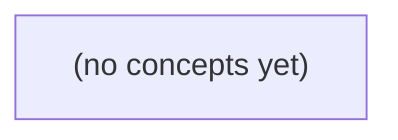

# 02.07 堆与优先调度：Go 初学者静态教材

*本书以任务到期调度、Top-K 热会话和有限容量延时任务为主线，循序讲解最小堆、优先队列及其在 Go 中的工程接口。读者将通过统一的状态表、复杂度分析和不少于20道带反馈练习，建立可检验的堆操作与调度语义认知。*

**章节:** 2

---

## 本书导览

- 了解整本书的章节脉络
- 掌握各章之间的概念依赖关系
- 选择最合适的阅读顺序

# 02.07 堆与优先调度：Go 初学者静态教材

本书以任务到期调度、Top-K 热会话和有限容量延时任务为主线，循序讲解最小堆、优先队列及其在 Go 中的工程接口。读者将通过统一的状态表、复杂度分析和不少于20道带反馈练习，建立可检验的堆操作与调度语义认知。

下方的概念图展示了本书 0 个核心概念以及它们之间的依赖关系；再下方是 1 个章节的入口。你可以按从上到下的顺序阅读，也可以根据自己的兴趣或先验知识选择切入点。

#### 概念图



## 章节索引

- **02.07 堆与优先调度：从到期任务到 Top-K 热会话** — 面向Go初学者承接02.02有限队列、02.01成本和02.06树，以虚构IM任务讲完全二叉树、最小堆、上浮下沉、到期调度与Top-K；区分内存排序机制和交付/持久保证。

## 02.07 堆与优先调度：从到期任务到 Top-K 热会话

- 区分FIFO队列与优先队列
- 用0下标数组表示完全二叉树
- 解释最小堆不变量及非全局排序
- 推演插入上浮与弹出下沉
- 比较Top-K容量堆与全量排序成本
- 区分到期排序、唤醒、容量与送达确认
- 理解Go container/heap的包级操作与接口方法

FIFO队列保证先到先服务，但IM任务常需按到期时间处理：谁最早该执行，谁就应先被取出。

### 从先进先出到按紧急度取任务

### 从先进先出到按紧急度取任务

在 02.02 的有限 FIFO 队列中，服务规则很简单：先进入队尾的任务，必须等前面的任务依次离开后才能处理。若任务到达顺序是 `task-a → task-b → task-c → task-d`，出队顺序也必然相同。这种规则适合普通消息缓冲：请求按到达先后排队，队列容量还可限制瞬时积压。

但 IM 后台并非所有任务都应“先到先服务”。设有四个定时任务：

- `(task-a, due=9)`
- `(task-b, due=4)`
- `(task-c, due=7)`
- `(task-d, due=2)`

`due` 表示纸上时间槽，数字越小，到期越早。若仍使用 FIFO，并按上述顺序入队，就会先处理 `task-a`；然而 `task-d` 在时间槽 `2` 就应执行，却被排在最后，显然违背“最早到期先处理”的业务目标。

因此需要优先队列：元素仍可不断插入，但取出规则由优先级决定，而非到达顺序。以到期时间为优先级时，正确处理顺序应为：

`task-d → task-b → task-c → task-a`

优先队列 ADT 通常提供：

- `insert(task)`：加入任务；
- `peek()`：查看当前最优先任务但不删除；
- `pop()`：取出并删除当前最优先任务；
- 非空条件：只有队列非空时，才能执行 `peek()` 或 `pop()`。

这里的“优先”是业务调度策略，例如到期更早、风险更高或付费等级更高；它只决定**下一步先处理谁**，并不等价于消息已经送达、已展示，或已被用户确认。

### 四个到期任务的调度目标

### 四个到期任务的调度目标

回顾 FIFO 队列：元素按到达顺序离开，先入队者先出队。但定时任务的关键不是“谁先提交”，而是“谁最早到期”。例如，某个虚构 IM 服务当前积累了四个任务：

| 任务 | 到期时间槽 |
|---|---:|
| `task-a` | 9 |
| `task-b` | 4 |
| `task-c` | 7 |
| `task-d` | 2 |

这里的数字只是纸上时间槽，数值越小表示越早应执行。即使它们按 `task-a → task-b → task-c → task-d` 的顺序到达，调度器仍应优先处理 `task-d`，因为它在时间槽 2 到期。

因此，采用“最早到期优先”策略时，连续弹出的期望顺序为：

`task-d → task-b → task-c → task-a`

这正是优先队列的用途：它不承诺维持插入顺序，而是始终暴露当前优先级最高的元素。对到期任务而言，“优先级最高”可定义为 `due` 最小。其基本操作可表述为：

- `insert(task)`：加入一个带到期时间的任务；
- `peek()`：查看最早到期任务，但不移除它；
- `pop()`：取出并移除最早到期任务；
- `pop()` 与 `peek()` 的前提：优先队列非空。

需要区分的是，任务被优先调度只表示系统决定先尝试执行它；这不等于 IM 消息已经送达，更不等于对方已经确认接收。优先级描述的是调度策略，送达与确认仍属于后续的状态处理问题。

### 优先队列的抽象操作

### 优先队列的抽象操作

FIFO 队列只关心“谁先到”，而优先队列关心“谁更应先处理”。对到期任务而言，设优先值为 `due`，数值越小表示到期越早、处理优先级越高。

虚构 IM 当前有四个任务：

- `(task-a, due=9)`
- `(task-b, due=4)`
- `(task-c, due=7)`
- `(task-d, due=2)`

若采用最小优先队列，逻辑上的处理顺序应为：

`task-d → task-b → task-c → task-a`

优先队列 ADT 可抽象为以下操作：

- `insert(task, priority)`：插入一个任务及其优先值。例如 `insert(task-d, 2)`。
- `peek()`：查看当前最高优先级任务，但不移除它。此例结果为 `task-d`。
- `pop()`：取出并删除当前最高优先级任务。第一次 `pop()` 返回 `task-d`，下一次则应返回 `task-b`。
- `isEmpty()`：判断队列是否为空；只有在 `isEmpty() = false` 时，才允许执行 `peek()` 或 `pop()`。

可将队首任务写为：

$$
\operatorname{peek}(Q)=\arg\min_{t\in Q} t.due
$$

这里“最小”不是数据结构天然规定的，而是业务策略：本节选择“最早到期优先”。优先值也可以是重试时间、风险等级或付费等级。

需要区分：任务被 `pop()` 仅表示它被调度器选中开始处理，并不表示 IM 消息已经成功送达、已被服务器确认，更不表示对方用户已读。优先队列负责决定“先处理谁”，送达确认仍需由后续协议与状态机制保证。

### 优先级只决定取出次序

### 优先级只决定取出次序

将四个任务插入最小优先队列：

`(task-a, 9)`、`(task-b, 4)`、`(task-c, 7)`、`(task-d, 2)`

若优先级规则是“`due` 越小越先执行”，则队首始终是最早到期任务。连续执行 `pop()` 的结果为：

`task-d → task-b → task-c → task-a`

优先队列 ADT 可写为：

- `insert(task, due)`：加入一个待处理任务；
- `peek()`：在队列非空时查看最早到期任务，但不移除它；
- `pop()`：在队列非空时取出并移除最早到期任务；
- 非空条件：`size > 0`，否则不能执行 `peek()` 或 `pop()`。

这里的“优先”只描述**内存中待处理项的取出顺序**。调度器通常还要等待时间推进：即使 `task-d` 位于队首，若当前时间尚未到槽位 `2`，调度器应计算等待时长并在合适时刻被唤醒，而不是立刻执行。

还要区分排序与容量。队列可能设有最大长度；满时，新任务可能被拒绝、降级或转入持久化存储。这是背压与资源策略，不改变“最早到期优先”的定义。

尤其不能把 `pop()` 误读为“消息已送达”。它至多表示任务已被调度器取走；后续仍可能经历网络发送、接收确认、失败重试或超时。优先级解决“先处理谁”，不证明“已经成功送达”。

### 为最小堆表示做准备

### 为最小堆表示做准备

优先队列只规定行为，不规定内部如何存储。对到期任务而言，我们希望始终快速找到 `due` 最小者：

- `insert(task)`：加入新任务；
- `peek()`：查看最早到期任务但不删除；
- `pop()`：取出并删除最早到期任务；
- `peek` 与 `pop` 的前提：队列非空。

例如插入 `(task-a,9)`、`(task-b,4)`、`(task-c,7)`、`(task-d,2)` 后，`peek()` 应得到 `task-d`，随后依次 `pop()` 的顺序是 `task-d → task-b → task-c → task-a`。这是一种调度策略：它说明“下一步该处理谁”，并不表示该任务对应的消息已经送达、已确认或已被用户阅读。

若用无序数组保存任务，插入很快，但每次寻找最小 `due` 都要扫描全部元素，代价为 $O(n)$；若始终保持数组有序，查看最小值很快，但插入要移动元素，代价仍可能是 $O(n)$。我们需要同时兼顾插入与取最小值。

完全二叉树提供了合适的形状：除最后一层外各层填满，最后一层从左到右连续填充。因此它不必使用指针，也能直接映射到数组。采用从下标 `0` 开始的数组时，结点 `i` 的父结点为 $\lfloor(i-1)/2\rfloor$，左右孩子分别为 $2i+1$、$2i+2$。

接下来只要在这棵完全二叉树上维持“父结点的 `due` 不大于孩子”的规则，根结点就必然是全局最早到期任务；这正是最小堆高效实现优先队列的基础。

> **要点** — 优先队列按业务优先级取任务；最早到期不等于已唤醒、已执行或已送达。

优先调度先要看懂堆的骨架：它用连续数组表示完全二叉树，并以局部父子关系快速维护最早到期任务。

### 从先进先出到按到期时间选择

### 从先进先出到按到期时间选择

有限队列遵循先进先出（FIFO）：先进入的任务先离开。若任务按提交顺序到达，队首操作简单，只需从头部取出元素。例如依次入队 `A(due=10)`、`B(due=3)`、`C(due=7)`，普通队列的出队顺序仍是 `A → B → C`。

但调度器真正关心的往往不是“谁先提交”，而是“谁最早到期”。上例中，`B` 已最紧急；若仍等待 `A` 先执行，就可能错过 `B` 的截止时间。此时需要的规则是：

\[
\text{每次取出 } \min(\text{due})
\]

优先队列将元素按优先键选择，而非按入队位置选择。对到期任务，可定义键为 `(due, task_id)`：先比较 `due`，到期更早者优先；若到期时间相同，再比较 `task_id`，使出队顺序确定、可复现。于是上例的出队顺序变为 `B → C → A`。

堆正是高效实现这种选择的结构：它不要求所有元素完全排序，只保证根节点拥有最小键。插入新任务后调整局部父子关系；取出根后再恢复该关系，即可持续得到下一项最早到期任务。相比每次在线性数组中扫描最小值，堆把插入和取最小值后的调整控制在对数级别，适合任务不断到达、不断调度的场景。

### 完全二叉树的零下标数组表示

### 完全二叉树的零下标数组表示

堆不需要显式保存“左指针、右指针”。它的形状固定为**完全二叉树**：除最后一层外，每层都填满；最后一层的节点必须从左到右连续排列，不能在中间留空。

因此可以按层序把节点放入一个零下标数组：

`[A, B, C, D, E, F]`

对应树形为：

- `A` 是根，索引为 `0`
- `B、C` 是第二层，索引为 `1、2`
- `D、E、F` 依次填入第三层，索引为 `3、4、5`

对任意索引 `i`，其位置关系可由整数运算直接得到：

- 父节点：`(i - 1) // 2`，仅当 `i > 0` 时存在；
- 左孩子：`2 * i + 1`；
- 右孩子：`2 * i + 2`。

设数组长度为 `n`，孩子是否存在不能只看公式，还必须检查边界：

- 左孩子存在当且仅当 `2*i + 1 < n`；
- 右孩子存在当且仅当 `2*i + 2 < n`；
- 根节点 `i = 0` 没有父节点；
- 空堆时 `n = 0`，任何索引都无效。

例如 `n = 6` 时，索引 `2` 的左、右孩子分别为 `5` 和 `6`；其中 `5 < 6`，所以左孩子存在，而索引 `6` 已越界，右孩子不存在。完全二叉树的连续填充约束，正是这些公式能够成立的原因。

### 最小堆不变量与复合优先键

### 最小堆不变量与复合优先键

最小堆把元素存入连续数组，并将数组下标解释为一棵完全二叉树。对任意非根节点 `i`，其父节点为：

`parent(i) = (i - 1) // 2`

最小堆的核心不变量是：父节点的优先键不大于任一子节点的优先键，即

$key(parent(i)) \le key(i)$

因此，根节点一定是全堆最小元素；取出最早任务只需读取下标 `0`。插入新任务后向上交换，删除根后将末尾元素移到根并向下交换，都是为了恢复这条局部关系。

但最小堆**不是二叉搜索树**。它不要求“左子树全部小于右子树”，也不要求同层数组有序。例如数组：

`[2, 5, 3, 9, 7, 4]`

满足父节点不大于子节点，因而是合法最小堆；但 `5` 位于 `3` 左侧，并不意味着数组从左到右递增。堆只保证沿任意“根到叶”的路径键值不下降。

调度任务时，若仅以到期时间 `due` 为键，两个任务同时到期时谁先出队可能依赖插入过程或交换细节，结果不确定。应使用复合优先键：

`key(task) = (task.due, task.task_id)`

元组按字典序比较：先比较 `due`，较早到期者优先；`due` 相同再比较 `task_id`，编号较小者优先。于是任意两个任务都有确定顺序，根始终对应 `(due, task_id)` 最小的任务。这样的总序使调度结果可复现，也避免把“恰好稳定”误当作堆的默认保证。

### 数组中的堆形态与空容量边界

### 数组中的堆形态与空容量边界

设任务按键 `(due, task_id)` 比较，`due` 越早优先；若到期时间相同，再比较 `task_id`，从而得到确定的总序。一个最小堆可用数组表示为：

`[(3,A), (5,B), (4,C), (9,D), (7,E), (6,F)]`

其对应的完全二叉树为：

- 根 `0`：`(3,A)`，全堆最小；
- `0` 的孩子为下标 `1`、`2`：`(5,B)`、`(4,C)`；
- `1` 的孩子为下标 `3`、`4`：`(9,D)`、`(7,E)`；
- `2` 的左孩子为下标 `5`：`(6,F)`。

对任意下标 `i`：

- 父节点：`(i - 1) // 2`，仅当 `i > 0` 时存在；
- 左孩子：`2*i + 1`；
- 右孩子：`2*i + 2`。

注意，堆只要求“父键不大于子键”。因此 `(5,B)` 与 `(4,C)` 是兄弟，`5 > 4` 完全合法；堆不是二叉搜索树，也不能据此推断左子树整体小于右子树。

边界尤其重要：

- 空堆：`size = 0`，没有根，不能读取 `heap[0]` 或执行删除最小值。
- 单元素堆：`size = 1`，根存在，但左右孩子下标 `1`、`2` 都越界。
- 对当前元素 `i`，只有当孩子下标 `< size` 时才能访问；数组有空闲容量不代表那里存在堆元素。
- 例如底层数组容量为 `8`、当前 `size = 6` 时，下标 `6`、`7` 可写入新任务，却不能作为现有节点的孩子参与比较。

因此实现中应把“数组容量”和“逻辑堆大小”分开：容量决定能存多少，`size` 决定当前哪些下标有效。

### 为上浮下沉和调度操作建立前提

### 为上浮下沉和调度操作建立前提

任务调度器可将待执行任务放入一个最小堆：每个元素保存 `due`（到期时间）、`task_id` 以及任务载荷，并按复合键

$$(due,\ task\_id)$$

比较。`due` 更早者优先；若 `due` 相同，则 `task_id` 更小者优先。这样“谁先出队”具有确定性，不能仅因两个任务到期时间相同就依赖切片当前顺序。

堆使用连续切片 `heap` 存储，而非显式节点指针。下标为 `i` 的节点满足：

- 父节点：`(i - 1) // 2`，仅当 `i > 0` 时存在；
- 左孩子：`2*i + 1`；
- 右孩子：`2*i + 2`；
- 孩子下标小于 `len(heap)` 才是有效节点。

例如切片中 `heap[0]` 始终是当前最早应处理的任务。最小堆只保证局部约束：

```text
key(parent) <= key(left_child)
key(parent) <= key(right_child)
```

它不是二叉搜索树：左子树所有元素不必都小于右子树元素，`heap[1]` 与 `heap[2]` 也不一定有序。调度器因此只能以 $O(1)$ 查看根任务是否到期：若 `heap[0].due <= now`，便应唤醒并执行；否则根的到期时间就是下一次等待的目标。

空堆是首要边界：`len(heap)==0` 时不能读取根、不能计算父节点，也没有下一次唤醒时间。切片容量可预留以减少扩容，但容量不代表有效任务数；所有索引判断必须以 `len(heap)` 为准。后续插入时，新任务追加到末尾再上浮；弹出根时，用末尾元素补到根再下沉，二者都依赖这里统一的索引与比较规则。

> **要点** — 最小堆以数组保存完全二叉树，只保证父子局部有序；用（到期时间，任务编号）才能确定最早任务。

最小堆用紧凑数组维护“最早到期者优先”：它不要求全局有序，却能以对数成本持续取得当前最小任务。

### 从先进先出到最早到期优先

### 从先进先出到最早到期优先

普通先进先出队列只关心“谁先到”：先入队的任务必定先出队。若任务到达顺序为 `9, 4, 7, 2`，队列依次取出的仍是 `9, 4, 7, 2`。这适合打印请求、消息转发等到达即服务的场景，却不适合按到期时间执行任务：已经快到期的 `2` 不应排在较早到达但到期较晚的 `9` 后面。

优先队列关心的是“下一项是谁”。以到期值作为优先级时，值越小表示越早到期；最小堆始终保证堆顶是当前最小值，但不要求所有元素完全排序。

将 `9, 4, 7, 2` 依次插入空最小堆：

- 插入 `9`：`[9]`。
- 插入 `4` 到末尾：`[9,4]`；比较父节点 `9`，因 `4 < 9` 交换，得到 `[4,9]`。
- 插入 `7`：`[4,9,7]`；`7 ≥ 4`，无需上浮。
- 插入 `2`：先放末尾 `[4,9,7,2]`；与父节点 `9` 比较并交换为 `[4,2,7,9]`；再与父节点 `4` 交换，得到 `[2,4,7,9]`。

每次都先追加到数组末尾，因此完全二叉树形状不被破坏；再沿父链上浮，恢复“父小于等于子”的性质。树高为 $O(\log n)$，插入只需进行至多一条根路径上的比较与交换。Go 的切片只是堆的连续存储载体；`[]Task` 中的下标关系表达树形，任务“最早到期”的语义来自比较规则，而不是切片本身。

### 用零下标切片表示完全二叉树

### 用零下标切片表示完全二叉树

最小堆通常用 Go 切片存储，而不是显式创建带 `left`、`right` 指针的树节点。切片下标隐含了完全二叉树的结构：按从上到下、从左到右的顺序依次放入元素，任何新任务都先追加到末尾，因此天然不会留下“空洞”。

对于零下标切片 `h`，下标关系为：

- 节点 `i` 的父节点：`(i-1)/2`，仅当 `i > 0` 时存在；
- 左孩子：`2*i+1`；
- 右孩子：`2*i+2`；
- 若孩子下标不小于 `len(h)`，则该孩子不存在。

例如切片 `[4,9,7]` 对应：

```text
        4
      /   \
     9     7
```

其中根位于 `h[0]`；`h[1]=9` 的父节点是 `h[(1-1)/2]=h[0]`；`h[2]=7` 的父节点也是 `h[(2-1)/2]=h[0]`。注意整数除法会自动向下取整。

插入到期值 `2` 时，先执行追加：

`[4,9,7] → [4,9,7,2]`

这表示 `2` 被放到下一个可用位置，即 `9` 的左孩子：

```text
        4
      /   \
     9     7
    /
   2
```

追加操作只负责保持完全二叉树形；它并不保证堆序。随后才通过比较父子值并上浮，使每个父节点不大于其孩子。切片只是紧凑的存储载体，`h[i]` 保存的是任务、到期时间或优先级等数据；“最早到期优先”来自比较规则与堆不变式，而不是切片本身具有任务语义。

### 四次插入中的上浮推演

### 四次插入中的上浮推演

以数组表示最小堆时，元素先追加到末尾，从而天然保持完全二叉树的形状；随后仅沿“新结点到根”的路径比较并上浮。对下标从 `0` 开始的切片，结点 `i` 的父结点下标为 `(i-1)/2`。

依次插入到期值 `9、4、7、2`：

1. 插入 `9`：空堆直接追加，根结点没有父结点。  
   ` [9] `

2. 插入 `4`：先追加到末尾，得到 `[9,4]`。  
   `4` 的父结点是 `9`，比较 `4 < 9`，交换两者：  
   ` [4,9] `  
   此时根最小，满足“父小子大”。

3. 插入 `7`：追加后为 `[4,9,7]`。  
   `7` 的父结点是 `4`，比较 `7 < 4` 为假，因此停止：  
   ` [4,9,7] `  
   堆不要求兄弟结点或整段数组有序；`9` 与 `7` 的相对大小无关紧要。

4. 插入 `2`：追加后为 `[4,9,7,2]`。  
   `2` 的父结点是 `9`，因 `2 < 9`，交换：`[4,2,7,9]`。  
   继续比较 `2` 与新父结点 `4`，因 `2 < 4`，再次交换：  
   ` [2,4,7,9] `

每次插入最多经过堆高层数，即 $O(\log n)$ 次比较与交换。Go 的切片只是这棵完全二叉树的紧凑存储；数组位置表达父子关系，不代表任务已按执行顺序完全排列。

### 最小堆不变量与对数成本

### 最小堆不变量与对数成本

最小堆的核心规则是局部不变量：对任意节点，都满足

\[
A[\mathrm{parent}(i)] \le A[i]
\]

也就是“父节点不大于子节点”。因此根节点一定是全堆最小值，但数组并不需要全局递增。例如 `[2,4,7,9]` 是最小堆；`[2,9,4,7]` 也可能是最小堆，只要每个父节点都不大于自己的孩子。

依次插入到期值 `9, 4, 7, 2`：

- 插入 `9`：空堆末尾加入，得到 `[9]`。
- 插入 `4`：先放末尾，`[9,4]`；比较 `4` 与父节点 `9`，`4 < 9`，交换为 `[4,9]`。
- 插入 `7`：放末尾得到 `[4,9,7]`；`7 >= 4`，无需交换。
- 插入 `2`：放末尾得到 `[4,9,7,2]`；先比较父节点 `9`，`2 < 9`，交换为 `[4,2,7,9]`；再比较新父节点 `4`，`2 < 4`，继续交换，得到 `[2,4,7,9]`。

每次插入都先追加到数组末尾，这保证树形始终是“从上到下、从左到右填满”的完全二叉树；随后只沿祖先路径上浮，修复可能被破坏的父小子大关系。

含有 $n$ 个元素的完全二叉树高度为 $O(\log n)$，上浮最多比较和交换树高次，因此插入成本为 $O(\log n)$。Go 中的切片只是堆元素的连续存储形式；`[]Task`、`[]int` 或其他类型都可以承载堆，真正决定调度语义的是比较规则，例如按到期时间比较，而不是切片本身。

### 切片存储不等于任务语义

### 切片存储不等于任务语义

Go 的 `[]Task` 很适合承载最小堆：下标 `0` 是当前最早到期任务，父节点 `i` 的子节点为 `2i+1`、`2i+2`。例如依次插入到期值 `9、4、7、2`，切片经历：

- `9 → [9]`
- `4` 追加到末尾，与父节点 `9` 比较并交换：`[4,9]`
- `7` 追加后满足 `4 ≤ 7`：`[4,9,7]`
- `2` 追加为 `[4,9,7,2]`，先与父节点 `9` 交换，再与 `4` 交换：`[2,4,7,9]`

这里的切片只是**存储布局**：末尾追加保持完全二叉树形状，上浮和下沉维持“父小子大”，操作高度为 $O(\log n)$。但它本身不具有“任务系统”的语义。

尤其要区分以下职责：

- **到期排序**：堆比较的是 `DueAt`、优先级或复合键，而不是切片中的任务顺序。除堆顶外，数组并不全局有序。
- **定时唤醒**：堆顶到期时间只能告诉调度器“下一次应何时检查”；仍需 `timer`、事件循环或轮询机制在合适时刻触发取出。
- **容量限制**：切片容量 `cap` 是内存扩容细节，不等于队列允许积压的任务数量。业务上限、拒绝策略和背压需要单独定义。
- **可靠送达**：从堆顶弹出不表示任务已经成功执行。任务通常还要经过持久化状态、领取记录、执行确认、失败重试与幂等处理。

因此，堆解决的是“内存中下一项该选谁”；调度器负责“何时选”；持久化与确认机制负责“选出后是否可靠完成”。

> **要点** — 最小堆以数组保持完全树形和父小子大，插入经上浮在 O(log n) 内维护最早到期任务位于堆顶。

最小堆能持续找出最早到期任务，但它只保证堆顶最小，并不等同于把全部任务排好序。

### 从先进先出到最早到期

### 从先进先出到最早到期

先进先出队列只关心“谁先进入”，因此适合打印请求、普通消息等按到达顺序处理的场景：先入队的任务必先出队。

但定时任务的关键不是入队时刻，而是**到期时间**。例如依次加入：

- 任务 A：10:00 到期
- 任务 B：09:55 到期
- 任务 C：10:05 到期

若使用 FIFO，A 会先被取出；即使 B 已经到期，也要等待 A 执行完毕。这违背了“最早到期优先”的调度目标。

优先队列则以到期时间作为优先级，最小堆的堆顶始终是到期时间最早的任务。无论任务何时入队，只要 B 的到期时间更早，它就应位于堆顶并优先执行。

可以把 FIFO 理解为按“排队号码”服务，把最小堆理解为按“截止时间”服务。后者并没有把全部任务全局排序；它只保证每次 `peek` 都能在 $O(1)$ 时间看到最早到期任务，并在 `pop` 后用 $O(\log n)$ 恢复堆顶最小这一局部秩序。空堆执行 `pop` 前必须先检查，避免取出不存在的任务。

### 数组中的完全二叉树

### 数组中的完全二叉树

堆通常不用链式节点，而是放进一个从下标 `0` 开始的数组。数组按从上到下、从左到右的顺序保存完全二叉树：除最后一层外每层填满，最后一层从左向右连续填入，因此不会出现中间空位。

对下标为 `i` 的节点：

- 父节点下标：`(i - 1) // 2`，仅当 `i > 0` 时存在；
- 左孩子下标：`2 * i + 1`；
- 右孩子下标：`2 * i + 2`。

例如数组 `[2,4,7,9]` 表示：

- 根 `2` 位于下标 `0`；
- `4`、`7` 是 `2` 的左右孩子；
- `9` 是 `4` 的左孩子。

最小堆维护的不是“数组整体递增”，而是局部不变量：

$$
A[\text{parent}(i)] \le A[i]
$$

也就是每个父节点都不大于自己的孩子。于是根节点一定是全堆最小值，`peek` 只需读取 `A[0]`，时间为 $O(1)$。

但兄弟之间、不同子树之间不必有序。例如 `[2,4,7,9]` 合法，而 `[2,7,4,9]` 也合法；`7` 与 `4` 的相对位置不影响根最小。执行 `pop` 后，需要让末尾元素下沉；若同时有两个孩子，必须与其中**较小的孩子**交换，才能继续保持最小堆不变量。空堆不能读取 `A[0]`，因此 `pop` 前应先检查堆是否为空。

### 弹出最早任务的下沉过程

### 弹出最早任务的下沉过程

最小堆的 `pop` 不是直接删除堆顶后让其余元素自动有序，而是执行“末尾补根，再向下修复”。以数组表示的最小堆 `[2,4,7,9]` 为例，根节点 `2` 就是最早到期任务。

1. 先保存并返回堆顶 `2`。
2. 将最后一个元素 `9` 移到根位置，暂时得到 `[9,4,7]`。
3. 此时根 `9` 大于两个孩子 `4`、`7`，违反“父节点不大于孩子”的规则。
4. 必须在两个孩子中选择**较小者** `4` 交换，而不是随意选一个孩子：

   ` [9,4,7] → [4,9,7] `

交换后，根为 `4`，其孩子为 `9`、`7`，局部堆序恢复，因此弹出完成。

继续执行一次 `pop`：返回根 `4`，将末尾 `7` 补到根，得到 `[7,9]`。此时 `7 ≤ 9`，无需下沉，最终堆为 `[7,9]`。

下沉时选择较小孩子是正确性的关键：若 `9` 与较大的 `7` 交换，得到 `[7,4,9]`，根仍大于孩子 `4`，堆性质没有恢复。`peek` 只读取根，复杂度为 $O(1)$；`pop` 最多沿树高下沉，复杂度为 $O(\log n)$。空堆执行 `pop` 或 `peek` 前必须先检查，避免访问不存在的堆顶。

### 为什么必须选择较小子节点

### 为什么必须选择较小子节点

从最小堆 `[2,4,7,9]` 弹出堆顶 `2` 后，把末尾元素 `9` 放到根：`[9,4,7]`。此时 `9` 同时大于两个孩子 `4`、`7`，需要下沉。

正确做法是与**较小孩子 `4`** 交换：

`[9,4,7] → [4,9,7]`

现在根为 `4`，且 `4≤9`、`4≤7`，最小堆不变量恢复。继续弹出时得到 `4`，末尾 `7` 补到根，堆变为 `[7,9]`。

若错误地与较大孩子 `7` 交换：

`[9,4,7] → [7,4,9]`

虽然 `9` 被移到下面，但根 `7` 仍大于左孩子 `4`。此时堆顶不再是全体最小值，下一次 `peek` 或 `pop` 会错误地先返回 `7`，而不是 `4`。

原因在于：下沉元素应放到两个孩子中较小者的位置上，才能保证交换后新的父节点不大于另一个兄弟节点。规则可写为：

- 若当前节点不大于较小孩子，下沉结束；
- 否则与较小孩子交换，继续向下检查。

`peek` 只读取堆顶，复杂度为 $O(1)$；`pop` 需要补位和下沉，复杂度为 $O(\log n)$。另外，弹出前必须先检查堆是否为空；空堆没有堆顶，不能执行“取末尾补根”的操作。

### 堆顶查询不是全量排序

### 堆顶查询不是全量排序

最小堆只维护一种**局部顺序**：每个父节点都不大于它的孩子。因此根节点一定是全体元素中的最小值，`peek` 只需读取根节点，时间复杂度为 $O(1)$。

但数组内部并非完全有序。例如最小堆 `[2,4,7,9]` 中，`4` 与 `7` 的先后没有排序含义；它们都只需满足不小于父节点 `2`。因此，不能把堆当作“已经排好序的数组”。

执行 `pop` 时：

1. 先检查堆是否为空；空堆不能弹出。
2. 取走根 `2`。
3. 将末尾元素 `9` 放到根，得到 `[9,4,7]`。
4. 将 `9` 与两个孩子比较，必须选择**较小的孩子** `4` 交换，得到 `[4,9,7]`。

下一次弹出 `4` 后，将末尾 `7` 移到根，得到 `[7,9]`。每次下沉最多经过树高，故 `pop` 为 $O(\log n)$。

堆适合“不断取得当前最早任务、最高优先级项或 Top-K 边界元素”，而非一次性遍历获得全局有序结果。后续会看到，虽然连续 `pop` 可以产生有序序列，但批量建立堆本身可做到 $O(n)$，并可用 Go 的堆操作实现。

> **要点** — 最小堆只保证根不大于子节点；弹出后以末尾补根，并始终与较小子节点下沉交换。

Top-K热会话不必对全部数据排序：用容量受限的最小堆，持续保留当前得分最高的K个会话。

### 从访问量口径到Top-K目标

### 从访问量口径到Top-K目标

“访问量最高”必须先明确统计口径，否则同一会话可能在不同窗口中得出不同排名。设当前统计窗口为最近一小时、当天，或某个固定时间区间 $[t_s,t_e)$；会话 $c$ 的分数定义为窗口内访问次数：

$$
score(c)=\#\{\text{发生在 }[t_s,t_e)\text{ 内且属于 }c\text{ 的访问事件}\}
$$

本节使用如下已聚合的会话访问量：

| 会话 | 访问量 |
|---|---:|
| c-a | 8 |
| c-b | 3 |
| c-c | 10 |
| c-d | 5 |
| c-e | 9 |

Top-K 的目标是按分数**从高到低**选出前 $K$ 个会话，而不是选出数值最小的 $K$ 个。令 $K=2$，排序后的结果为：

$$
c\text{-}c(10),\ c\text{-}e(9),\ c\text{-}a(8),\ c\text{-}d(5),\ c\text{-}b(3)
$$

因此预期输出为 `c-c=10` 与 `c-e=9`。

窗口还决定了分数何时更新：滑动窗口会随时间到期而减少旧访问；固定窗口通常在窗口结束后汇总；实时榜单则在新事件到来时增加计数。若多个会话分数相同，必须预先规定并列规则，例如按会话标识字典序、最近一次访问时间或首次达到该分数的时间排序。这样 Top-K 的结果才可复现，而非依赖输入顺序。

### 容量为K的最小堆为何有效

### 容量为K的最小堆为何有效

维护“当前见过的会话中得分最高的 $K$ 个”时，最关键的问题不是找到最大值，而是维护候选集的**准入边界**。容量固定为 $K$ 的最小堆正好完成这一任务：堆中只保存当前候选的 Top-K，而堆顶始终是这 $K$ 个候选里分数最低者。

以访问量 `c-a=8, c-b=3, c-c=10, c-d=5, c-e=9`、$K=2$ 为例：

1. 读到 `c-a=8`、`c-b=3`，堆未满，加入后最小堆为 `[3, 8]`，堆顶 `3` 是当前候选中的最低分。
2. 读到 `c-c=10`，因为 $10>3$，它比边界元素更有资格进入 Top-2；弹出 `3`，加入 `10`，堆变为 `[8, 10]`。
3. 读到 `c-d=5`，$5\le8$，连当前 Top-2 的最低门槛都达不到，直接丢弃。
4. 读到 `c-e=9`，$9>8$，替换堆顶 `8`，最终堆为 `[9,10]`，即 `c-e=9` 与 `c-c=10`。

其正确性来自一个不变式：处理完前 $i$ 个会话后，堆中恰好保存这 $i$ 个会话里排名前 $K$ 的元素；当堆满时，堆顶就是第 $K$ 高分。新分数不超过堆顶，不可能进入 Top-K；新分数超过堆顶，则必须淘汰原边界元素。

每个会话至多进行一次入堆或替换，代价为 $O(\log K)$，总时间为 $O(N\log K)$、额外空间为 $O(K)$。若评分相同，堆的比较键应扩展为“`(分数, tie-breaker)`”，例如再按会话 ID 或更早更新时间稳定决定优先级。

### 逐个扫描五个会话的堆变化

### 逐个扫描五个会话的堆变化

设评分窗口内的访问量为：`c-a=8`、`c-b=3`、`c-c=10`、`c-d=5`、`c-e=9`，目标是找出 `K=2` 个最高分会话。维护一个**容量最多为 2 的最小堆**；堆顶始终是“当前入选者中分数最低的会话”，因此它正是最容易被替换的候选项。

| 扫描对象 | 操作 | 最小堆状态（按分数示意） |
|---|---|---|
| `c-a=8` | 堆未满，插入 | `[c-a:8]` |
| `c-b=3` | 堆未满，插入；堆顶为 3 | `[c-b:3, c-a:8]` |
| `c-c=10` | 堆已满，比较 `10 > 3`，弹出 `c-b`，插入 `c-c` | `[c-a:8, c-c:10]` |
| `c-d=5` | 比较 `5 <= 8`，不能进入前二，忽略 | `[c-a:8, c-c:10]` |
| `c-e=9` | 比较 `9 > 8`，弹出 `c-a`，插入 `c-e` | `[c-e:9, c-c:10]` |

扫描结束后，堆中保留 `c-e=9` 与 `c-c=10`，它们就是评分窗口内访问量最高的两个会话。若需要按“从热到冷”输出，还要将堆中元素再排序，得到：

1. `c-c=10`
2. `c-e=9`

这里“访问量”必须来自统一的统计窗口，例如最近 5 分钟或当天累计；窗口滑动、请求到达或计数修正后，分数会变化，Top-K 也应重新计算或增量维护。若出现相同分数，应预先规定并列规则，如按会话 ID 字典序、最近访问时间或更早进入榜单者决定胜负。

### 成本比较：容量堆、全排序与扫描法

### 成本比较：容量堆、全排序与扫描法

设共有 $N$ 个会话，需要找访问量最高的 $K$ 个。三种方法的差异不只在复杂度，也在输出目标与数据到达方式。

- **容量为 $K$ 的最小堆**：堆顶始终是“当前入选者中最弱的一项”。遍历每个会话：
  1. 堆未满则加入；
  2. 堆满且新分数高于堆顶，则弹出堆顶并加入新项；
  3. 否则忽略。
  
  时间为 $O(N\log K)$，额外空间为 $O(K)$。例如 `c-a=8,c-b=3,c-c=10,c-d=5,c-e=9`，$K=2$ 时最终保留 `c-c=10`、`c-e=9`。当 $K\ll N$ 时，它明显优于全排序；也适合流式数据，因为不必保存全部会话。

- **全量排序**：先存储全部 $N$ 个会话，再按“分数降序、并列规则”排序，取前 $K$。时间通常为 $O(N\log N)$，空间常为 $O(N)$。它的优势是一次排序后可直接得到完整排名、任意 Top-$K$ 结果和相邻名次；若业务确实需要排行榜，而非仅需要少量热点，会更直接。

- **线性扫描**：若只求最高的一个会话，即 $K=1$，维护当前最大值即可，时间 $O(N)$、额外空间 $O(1)$，无需堆。此时使用堆虽正确，却增加了不必要的 $\log K$ 维护概念。

边界上，$K=0$ 直接返回空结果；$K\ge N$ 时可保留全部元素，容量堆退化为 $O(N\log N)$，排序往往更便于输出有序结果。若分数并列，比较键应预先规定，例如先按访问量、再按会话标识升序，使“替换堆顶”和最终排序遵循同一规则。分数还必须基于统一窗口，如“最近 5 分钟访问量”；窗口滑动或新访问到来后，应更新对应会话分数，并重新维护堆。

### 边界规则与持续更新策略

### 边界规则与持续更新策略

实现 Top-K 前应先固定边界语义，避免“排名正确但业务口径错误”。

- **`K=0`**：直接返回空列表，不创建堆，也无需扫描会话。
- **`K>=N`**：若 `N` 是当前参与统计的会话数，可返回全部会话；但仍应按最终展示规则排序，例如按“访问量降序、会话 ID 升序”输出。
- **并列分数**：必须定义稳定的 tie-breaker。可使用复合键  
  `（访问量，最近访问时间，会话ID）`。  
  若“访问量越高越热、更新时间越晚越优、ID 越小越优”，则堆顶应放置当前 Top-K 中**最差**的元素：访问量较低者优先淘汰；访问量相同则较早更新者或较大 ID 者优先淘汰。

例如 `c-a=8,c-b=3,c-c=10,c-d=5,c-e=9`，`K=2` 时结果为 `c-c=10,c-e=9`。新会话 `c-f=9` 到来时，是否替换 `c-e`，取决于二级规则；不能仅因分数相等而随意替换，否则结果会随输入顺序抖动。

访问量还必须说明其**时间窗口口径**。若统计“最近 10 分钟访问次数”，会话一次新访问会使其分数增加；同时，10 分钟前的旧访问过期，分数也会减少。因此排名不是单调增长的：`c-c` 即使曾经第一，也可能因大量旧访问滑出窗口而降出 Top-K。

持续更新时，可为每次访问记录时间戳，并按窗口淘汰过期事件；会话分数变化后更新堆。若实现中采用惰性删除，可向堆压入新版本 `(分数, 版本号, 会话ID)`，读取或弹出堆顶时丢弃过期版本。最终展示前再将堆内元素按“分数降序、tie-breaker”排序，得到稳定排名。

> **要点** — 容量K最小堆只保留高分候选，堆顶是淘汰线；它高效求Top-K，但结果依赖明确的统计窗口与并列规则。

最小堆能持续指出“下一件该到期的任务”，但它只是内存中的排序结构；何时唤醒、如何执行、是否送达，仍需分别设计。

### 按到期时间排序的最小堆

### 按到期时间排序的最小堆

设 IM 系统需要处理延迟任务：消息撤回截止提醒、未读消息催办、会话静默结束等。每个任务至少包含：

`{taskId, due, type, payload}`

其中 `due` 是应执行的到期时刻。将任务按 `due` 放入**最小堆**后，堆顶始终是到期时间最早的任务：

```text
push(A, due=10:05)
push(B, due=10:02)
push(C, due=10:08)

heap.top() = B
```

执行者在当前时间为 `now` 时，只能处理满足 `heap.top().due <= now` 的任务：

1. 读取堆顶；
2. 若堆为空，等待新任务；
3. 若 `due > now`，计算等待时间 `due - now`；
4. 若 `due <= now`，弹出并交给执行逻辑。

这与 FIFO 队列不同。FIFO 保证“先入先出”，却不能保证“先到期先执行”。例如先加入一个 10 分钟后执行的任务，再加入一个 1 分钟后执行的任务，FIFO 会被前者阻塞；最小堆则立即把后者放到堆顶。

注意，堆只负责排序，不会自行唤醒线程、更不会发送消息。它回答的是“下一项何时到期”，执行循环还必须依据堆顶的 `due` 设置或重算定时等待。

### 到期条件与取出边界

### 到期条件与取出边界

设每个任务为 `(due, id, payload)`，最小堆按 `due` 排序。堆顶只能回答“**最早到期的是谁**”，不能直接回答“**现在能否执行**”。取出前必须读取当前时间 `now` 并检查：

$$
\text{可执行} \iff \min(\text{heap}).due \le now
$$

因此，调度循环的核心边界是：

1. 堆为空：没有待调度任务，等待新任务到来。
2. 堆顶 `due > now`：最早任务尚未到期，**不得弹出**；它必须留在堆中，执行者等待至该时间或等待新任务插入。
3. 堆顶 `due <= now`：该任务已经到期，可以弹出并交给后续执行流程。
4. 连续检查：一次任务执行完后，应再次检查堆顶；若多个任务均已到期，可依次取出。

可写成简化逻辑：

`while 堆非空 且 堆顶.due <= now: 弹出并提交执行`

这里的“提交执行”不等于“任务已完成”，更不等于“消息已送达”。`pop` 仅表示任务不再由这个内存堆等待；执行失败、进程崩溃或下游未确认，都需要独立的状态与重试机制处理。

尤其不要因为堆顶最早就提前弹出。例如当前为 `10:00`，堆顶到期时间为 `10:05`；若先弹出再睡眠五分钟，期间新插入一个 `10:01` 的任务就可能被延迟。正确做法是保留原堆顶，并将等待时间计算为 `due - now`。

### 计时器唤醒与等待重算

### 计时器唤醒与等待重算

调度循环每次只需观察最小堆堆顶：若其 `due <= now`，弹出并交给执行路径；若尚未到期，则计算等待时间

\[
wait=\max(0,\ due_{\text{top}}-now)
\]

随后等待“计时器到期”或“堆发生变化”两类事件。堆不会主动唤醒线程；真正负责唤醒的是条件变量、事件通知或计时器机制。

一个典型循环是：

1. 加锁读取堆顶并取得当前**单调时间**；
2. 堆空时无限等待，直到有任务插入；
3. 堆顶已到期时弹出任务，解锁后执行；
4. 堆顶未到期时，按 `wait` 进行可中断的定时等待；
5. 被唤醒后不要假定堆顶仍相同，而要重新读时钟、重新检查堆顶、重新计算等待。

重新计算尤其重要。插入一个更早到期的任务时，原先“睡到较晚任务”的计时器必须被打断；否则新任务会迟到。例如原堆顶在 10 秒后，新任务在 1 秒后到期，插入者应通知等待线程，使其将等待从 10 秒改为 1 秒。

反过来，取消堆顶、删除任务或将其 `due` 延后，也会改变下一次唤醒时间。实现上常采用“修改堆后发通知；等待者醒来后一律重算”的简单规则。即使通知是伪唤醒，也只会多做一次检查，不会破坏正确性。

计时应以单调时间为准，而非墙钟。墙钟被人工调整、NTP 校准或夏令时切换时，`Date.now()` 可能跳前或跳后：跳前会导致任务集体提前，跳后会造成额外延迟。将任务到期语义转换为单调时钟上的截止点，可使“等待多久”不受墙钟跳变影响。

### 墙钟跳变与单调时间

### 墙钟跳变与单调时间

墙上时钟表示“现实日期时间”，例如 `2025-03-08 10:00:00`；它会受 NTP 校时、管理员改时、虚拟机恢复等影响。单调时间只表示进程启动后的持续流逝，通常不会回拨，适合计算等待时长。

若任务存储的是绝对到期时间 `due_wall`，直觉判断为：

`due_wall <= now_wall`

但墙钟前跳会让大量尚未真正等待完的任务立即到期；墙钟回拨则会让已接近到期的任务被额外延迟。更危险的是，若调度器先算出：

`wait = due_wall - now_wall`

再进行一次长时间睡眠，睡眠期间的校时可能使该等待值失效。

因此应区分两类语义：

- **面向用户的计划时间**：使用墙钟。例如“每天 09:00 执行”“在 12:30 前提醒”，因为其含义本来就依赖现实时间。
- **面向运行时的延迟**：使用单调时间。例如“5 秒后重试”“30 秒超时”。提交时记录 `due_mono = now_mono + delay`，到期判断和等待重算均使用单调时钟。

主循环应每次醒来后重新读取当前时间、检查堆顶并计算新的等待，而非相信旧的 `wait`。对于墙钟任务，系统还需明确校时语义：前跳时是立即补跑、跳过过期任务，还是限制每轮补跑数量；回拨时是按新墙钟继续等待，还是保证同一任务不重复执行。堆只负责给出最早 `due`，这些时间政策仍由调度器决定。

### 容量、取消与交付边界

### 容量、取消与交付边界

内存最小堆必须设定容量上限，例如最大任务数、最大总字节数或按租户配额。堆满时不能无限接收“稍后执行”的任务；应明确策略：拒绝新任务、按优先级淘汰低价值任务、合并同一键的重复任务，或仅保留最新一次请求。无论采用哪种策略，都应返回可观察的结果，避免调用方误以为任务已被可靠接受。

取消任务时，若堆支持按任务标识定位，可直接删除并重新调整堆；但这通常需要额外索引。更常见的是“惰性删除”：维护 `taskId -> version/status`，取消时标记失效；弹出堆顶后再验证其版本和状态，失效项直接丢弃。惰性删除会留下墓碑，因此应在失效比例过高时重建堆，防止无效元素长期占用容量。

`pop` 的语义只应是“调度器将到期任务交给执行路径”，并不等于消息已发送、消费者已收到或业务已确认成功。执行失败、网络超时和进程崩溃都可能发生在弹出之后；若需要重试，应由执行层显式创建新的调度项，并定义幂等键与最大重试次数。

进程重启后，内存堆中的任务必然丢失。因此它适合短生命周期、可重建的定时工作；需要跨重启恢复、可审计交付或至少一次语义时，调度状态必须进入持久化系统，相关设计留待 S5。

> **要点** — 最小堆只维护下一到期任务；调度器还须负责唤醒、容量、取消、时钟语义及可靠交付边界。

优先队列不是“更快的队列”，而是以局部顺序换取按优先级取出元素的结构选择；其正确使用还需结合调度与并发语义判断。

### 四种取数策略的顺序与成本

### 四种取数策略的顺序与成本

“先取谁”与“如何维护顺序”是两件事。设当前有 $n$ 个任务，优先级越小越先执行：

| 策略 | 插入 | 取最小值 | 顺序保证 | 适用场景 |
|---|---:|---:|---|---|
| FIFO 队列 | $O(1)$ | $O(1)$ | 仅保证到达顺序 | 所有任务同等重要，强调公平排队 |
| 每次全排序 | $O(1)$ | $O(n\log n)$ | 取数前得到完整有序序列 | 数据量小、批处理、排序次数极少 |
| 有序切片 | $O(n)$ | $O(1)$ | 始终全局有序 | 任务很少，或“读优先、写很少” |
| 堆 | $O(\log n)$ | $O(\log n)$ | 只保证堆顶最小 | 持续插入与持续取最高优先级任务 |

FIFO 不理解“优先级”：先到的低优先级任务会挡住后来的紧急任务。每次全排序把维护成本推迟到取数时；若每取一个元素都重排，连续取 $k$ 次的代价会迅速累积。

有序切片适合频繁查看最小值：切片首元素就是下一任务；但插入新任务时，必须移动后续元素腾出位置。堆则只维护局部关系：父节点不大于子节点，堆顶必为全局最小值，但其余元素并非完全排序。

```text
插入任务：
FIFO：追加到队尾
有序切片：找到插入位置，再移动元素
堆：追加到末尾，向上调整
取最小：
FIFO：弹出队首
有序切片：取首元素
堆：取堆顶，用末尾元素替换后向下调整
```

因此，堆不是“最快”的通用结构；它是在无需完整排序的前提下，为动态优先调度提供稳定 $O(\log n)$ 更新成本的折中。

### 最小堆为何不是全局有序

### 最小堆为何不是全局有序

最小堆通常用零下标数组表示完全二叉树。对下标为 $i$ 的元素：

- 父节点：`(i-1)/2`，当 `i > 0` 时成立；
- 左孩子：`2*i + 1`；
- 右孩子：`2*i + 2`。

它只维护**局部不变量**：任一父节点的优先级不大于其孩子。若数组 `a` 存放最小堆，则：

$$
a[i] \le a[2i+1],\quad a[i] \le a[2i+2]
$$

因此根节点 `a[0]` 一定是全体元素中的最小值，读取它是 $O(1)$；插入新元素后向上调整，删除根后将末尾元素移到根并向下调整，两者都是 $O(\log n)$。

但兄弟节点、不同子树之间没有顺序要求。例如：

| 数组下标 | 0 | 1 | 2 | 3 | 4 | 5 |
|---|---:|---:|---:|---:|---:|---:|
| 值 | 1 | 4 | 2 | 9 | 7 | 3 |

该数组是合法最小堆：`1` 小于 `4、2`，`4` 小于 `9、7`，`2` 小于 `3`；但数组并非递增，因为 `4 > 2`、`9 > 7 > 3`。

所以堆能保证“下一次取出的任务最优”，不能保证“遍历数组得到优先级顺序”。若需要完整排序，应不断执行取顶操作；若只需到期任务或 Top-K 中的边界元素，保留堆不变量即可避免每次全排序。

### 上浮下沉与到期任务状态表

### 上浮下沉与到期任务状态表

以最小堆保存到期任务时，根节点始终是`deadline`最早的任务；数组并非全局有序，只满足任一父节点不晚于其子节点。因而调整只沿一条祖先或子孙路径进行。

| 操作 | 初始变化 | 违反的位置 | 修复方向 | 结果 |
|---|---|---|---|---|
| 插入任务 | 追加到数组末尾 | 新节点可能早于父节点 | 上浮 | 与父节点交换，直到满足顺序或到根 |
| 弹出到期任务 | 用末尾元素填补根 | 新根可能晚于子节点 | 下沉 | 与较早的子节点交换，直到满足顺序 |
| 取消末尾任务 | 直接删除 | 通常无 | 无 | 堆性质保持 |
| 取消中间任务 | 末尾元素填入空位 | 可能早于父，也可能晚于子 | 局部修复 | 判断后上浮或下沉 |
| 修改截止时间 | 原位置键值改变 | 方向未知 | `Fix` | 由新旧优先级决定局部调整 |

伪代码可概括为：

`push(x)：append(x)；siftUp(last)`  
`pop()：swap(root,last)；remove(last)；siftDown(root)`  
`cancel(i)：swap(i,last)；remove(last)；fix(i)`

在 Go 的`container/heap`中，`Less(i,j)`定义“谁更应位于堆顶”；到期任务通常写成“截止时间更早则更小”。`heap.Push`会先调用实现类型的`Push`追加元素，再执行上浮；`heap.Pop`会先调整并下沉，再调用实现类型的`Pop`删除末尾元素。因此，实现接口的`Push/Pop`只负责底层切片增删，不应自行上浮或下沉。

批量装载后调用`Init`建堆；已知索引且优先级变化时调用`Fix`；按索引取消时调用`Remove`。任务对象宜保存其当前索引，交换时同步更新，否则取消或修复会定位错误。共享堆还必须加锁；堆只保证优先级，不保证同优先级公平，也不会自动清除已取消任务或防止低优先级任务饥饿。

### Go堆接口与包级操作边界

### Go堆接口与包级操作边界

`container/heap` 只维护一个不变量：对任一父节点 `i`，其子节点 `j` 不应比它“更靠前”。“靠前”的方向完全由 `Less(i, j)` 定义：

- 若 `Less(i, j)` 表示 `items[i].deadline` 更早，则堆顶是最早到期任务，即最小堆。
- 若 `Less(i, j)` 表示 `items[i].score` 更高，则堆顶是最高分会话，即最大堆。
- `heap.Pop(h)` 取得的始终是逻辑堆顶；不要把“最小堆/最大堆”写死在接口名称中。

实现类型需满足 `heap.Interface`：`Len`、`Less`、`Swap`，并额外实现其自身的 `Push(x any)`、`Pop() any`。后两者只负责修改底层切片，**不负责恢复堆序**；真正的上浮、下沉由包级函数完成。

| 操作 | 调用对象 | 职责 |
|---|---|---|
| `heap.Init(h)` | 已有切片 | 原地建堆；批量装载后调用 |
| `heap.Push(h, x)` | 包级函数 | 先调用实现的 `Push` 追加，再上浮 |
| `heap.Pop(h)` | 包级函数 | 交换堆顶与末尾、下沉，再调用实现的 `Pop` 删除末尾 |
| `heap.Fix(h, i)` | 下标元素已变 | 按新优先级上浮或下沉 |
| `heap.Remove(h, i)` | 指定下标 | 删除任意元素并恢复堆序 |

伪代码中应明确区分两层：

`heap.Push(&q, task)`：安全的堆插入。  
`func (q *Queue) Push(x any) { *q = append(*q, x.(Task)) }`：仅供包级堆操作回调。

任务被取消或截止时间更新时，若保存了元素当前下标，可用 `Fix` 或 `Remove`；直接改字段而不调用 `Fix` 会破坏顺序。共享堆还必须由互斥锁或单一调度协程保护；堆只保证优先级，不自动解决同优先级公平性、低优先级饥饿或大量取消任务的清理策略。

### 从到期唤醒到Top-K热会话

### 从到期唤醒到 Top-K 热会话

堆适合维护“当前最值得先处理”的元素，但“值得”由 `Less` 定义：到期调度通常取最早截止时间，热会话通常淘汰最低热度。

| 场景 | 堆顶含义 | `Less(i,j)` 的优先规则 | 取出后的动作 |
|---|---|---|---|
| 到期任务 | 最早到期任务 | `deadline[i] < deadline[j]` | 到期则唤醒并投递 |
| Top-K 热会话 | K 个候选中最弱者 | `heat[i] < heat[j]`，最小堆 | 新会话更热则替换堆顶 |

到期调度不能只“弹出即执行”：未到期时应等待堆顶时间，而不是轮询全部任务。

```text
循环：
    加锁，查看堆顶 task
    若为空：等待新任务信号
    若 task.deadline > now：等待至 deadline 或新任务到来
    否则：弹出 task，解锁
    投递 task 给执行器
```

Top-K 的容量固定，重点是避免把全部会话排序：

```text
收到会话 s：
    若堆未满：加入 s
    否则若 s.heat > 堆顶.heat：
        弹出堆顶
        加入 s
    否则：忽略 s
```

| 操作 | 到期堆 | Top-K 最小堆 |
|---|---:|---:|
| 插入 | $O(\log n)$ | $O(\log K)$ |
| 查看候选 | $O(1)$ | $O(1)$ |
| 修改优先级 | `Fix`，$O(\log n)$ | `Fix`，$O(\log K)$ |
| 取消指定元素 | `Remove`，$O(\log n)$ | `Remove`，$O(\log K)$ |

在 Go 的 `container/heap` 中，类型自身的 `Push`、`Pop` 只负责追加或删除末尾；真正维护堆序的是包级 `heap.Push`、`heap.Pop`。批量装载后调用 `Init`；元素的截止时间或热度变化后调用 `Fix`；取消且已知索引时调用 `Remove`。

堆只决定取数顺序：它不确认任务是否送达或执行成功，不保证同优先级任务公平，也无法阻止低优先级任务长期饥饿。取消任务若只打标记、不及时移除，还会形成无效元素积压。多个协程共享堆时，查看堆顶、修改、等待条件必须在同一同步协议下完成；堆本身并不并发安全。

> **要点** — 堆以局部有序支持高效取最优项；它解决排序选择，不替代同步、唤醒、持久化与交付保证。

本节以IM任务调度为线索，掌握堆如何在不全量排序的前提下快速找到最早到期任务与最热会话。

### 从先进先出到优先调度

### 从先进先出到优先调度

FIFO 队列按“先进入、先取出”工作：最早入队的元素最先离开。它适合普通消息缓冲、排队叫号等场景，但不关心元素本身的重要性。

例如任务按 `A(10:00到期)`、`B(09:00到期)`、`C(11:00到期)` 的顺序进入 FIFO 队列，取出顺序仍是 `A → B → C`；即使 `B` 已经最紧急，也必须等待 `A` 完成。

优先队列改为按“优先级最高”取出。对到期任务，通常令到期时间越早优先级越高，因此上述任务会按 `B → A → C` 取出。它不要求所有元素完全有序，只保证队首（堆顶）始终是当前最应处理的元素。

最小堆是实现优先队列的常用结构：每个父节点都不大于其子节点，堆顶即最小值。用从 `0` 开始的数组存储完全二叉树时，位置 `i` 的关系为：

- 父节点：`parent(i) = (i - 1) / 2`，取整数部分，适用于 `i > 0`
- 左孩子：`left(i) = 2i + 1`
- 右孩子：`right(i) = 2i + 2`

例如数组 `[2, 4, 7, 9]` 表示：

- `2` 位于下标 `0`，是堆顶；
- `4`、`7` 是 `2` 的左右孩子；
- `9` 是 `4` 的左孩子。

因此，FIFO 回答的是“谁等得最久”，优先队列回答的是“谁现在最该处理”。

### 最小堆不变量与状态演变

### 最小堆不变量与状态演变

最小堆用数组保存一棵完全二叉树，核心不变量是：每个父节点都不大于其子节点。对下标从 `0` 开始的数组：

- 父节点：`parent(i)=(i-1)/2`
- 左孩子：`left(i)=2i+1`
- 右孩子：`right(i)=2i+2`

注意：最小堆只保证堆顶最小，并不保证数组整体递增。例如 `[2,4,7,9]` 恰好有序，但 `[2,4,7,9,5]` 也合法；`7` 与 `5` 的相对位置无需比较。

依次插入 `9、4、7、2`：

| 操作 | 上浮过程 | 堆数组 |
|---|---|---|
| 插入 `9` | 首节点，无需调整 | `[9]` |
| 插入 `4` | `4 < 9`，与父交换 | `[4,9]` |
| 插入 `7` | `7 ≥ 4`，停止 | `[4,9,7]` |
| 插入 `2` | `2 < 9`，再与 `4` 交换 | `[2,4,7,9]` |

弹出最小值时，不能直接删除数组首项后保持其余元素不动；应将末尾元素移到堆顶，再执行下沉。

| 操作 | 下沉过程 | 返回值 | 堆数组 |
|---|---|---:|---|
| 弹出 | `9` 移至堆顶；较小孩子为 `4`，交换 | `2` | `[4,9,7]` |
| 弹出 | `7` 移至堆顶；`7 < 9`，无需下沉 | `4` | `[7,9]` |

插入时的“上浮”只沿父链修复局部违例；弹出时的“下沉”只沿较小孩子方向修复堆顶违例。因此，两种操作都只经过树高，时间复杂度为 $O(\log n)$，而读取最早到期任务 `heap[0]` 为 $O(1)$。

### 到期任务：排序不等于送达

### 到期任务：排序不等于送达

最小堆只能保证堆顶是“`due` 最早”的任务；它并不保证该任务已经可以执行，更不保证消息已经送达。调度器应先读取堆顶，再用时间门槛判断：

`堆顶存在 && 堆顶.due <= now` 才允许弹出并交给执行队列。

若堆顶 `due > now`，即使后面有大量任务，也应等待到堆顶到期或被新插入的更早任务唤醒。堆维护的是**到期顺序**，不是“立即可消费”的顺序。

一次完整链路通常是：

1. 任务写入持久化存储，记录 `id、due、payload、状态`；
2. 调度器将待执行任务按 `due` 放入最小堆；
3. 到期后从堆中弹出，转入有限容量的执行队列；
4. 消费者处理任务，并返回送达或执行确认；
5. 仅在确认成功后，将任务标记为完成。

这里有两个常见反例：

- **容量反例**：任务已经满足 `due <= now`，但执行队列已满。若直接丢弃，便发生漏送；若标记完成，则产生“看似送达、实际未送达”。正确做法是保留待重试状态，或实行背压。
- **重启反例**：任务仅存在内存堆中，进程重启后堆清空，尚未执行的到期任务随之丢失。恢复时应从持久化记录重建堆，并重新检查 `due <= now`。

因此，堆的不变量是“父节点到期时间不晚于子节点”；业务不变量则是“任务未经确认，不得视为完成”。前者解决找谁先执行，后者才解决是否可靠送达。

### Top-K热会话的容量堆

### Top-K 热会话的容量堆

设五个会话的热度分别为：`A=18，B=42，C=25，D=37，E=31`，目标是找出热度最高的 `K=2` 个会话。无需把全部会话排好序；维护一个**容量至多为 2 的最小堆**即可。堆顶始终是“当前入选者中热度最低者”，也就是最容易被替换的候选。

| 到达会话 | 操作 | 最小堆内容（热度） | 堆顶含义 |
|---|---|---:|---|
| A=18 | 未满，插入 | `[18]` | 当前第 2 名门槛为 18 |
| B=42 | 未满，插入 | `[18,42]` | 18 可被更热会话替换 |
| C=25 | `25>18`，弹出 18 后插入 25 | `[25,42]` | 门槛升为 25 |
| D=37 | `37>25`，弹出 25 后插入 37 | `[37,42]` | 门槛升为 37 |
| E=31 | `31<=37`，忽略 | `[37,42]` | 不足以进入前 2 |

因此 Top-K 结果为 `B=42，D=37`。注意最小堆内部只保证堆顶最小，`[37,42]`恰好有序只是巧合；若要按热度从高到低展示，还需对最终的 `K` 个元素排序。

处理每个会话时：堆未满则插入；堆满后仅当新热度大于堆顶时才执行“弹出堆顶 + 插入”。总时间为 $O(n\log K)$，额外空间为 $O(K)$。全量排序则需保存全部 $n$ 个会话，时间为 $O(n\log n)$、额外空间通常为 $O(n)$。当 $K\ll n$ 时，容量堆尤其适合实时热会话筛选。

### Go堆接口与综合检验

### Go堆接口与综合检验

`container/heap` 不直接保存数据，而是通过堆类型实现的接口协作：`Len()`报告规模，`Less(i,j)`定义“谁更优先”，`Swap(i,j)`交换元素；包级函数 `heap.Init`、`heap.Push`、`heap.Pop` 负责维护堆序。注意：`Push(x any)` 与 `Pop() any` 是容器扩缩操作，调用者应使用 `heap.Push(h,x)`、`heap.Pop(h)`，后者才会触发上浮或下沉。

以最小堆为例，数组下标满足：父节点为 `(i-1)/2`，左孩子为 `2i+1`，右孩子为 `2i+2`；不变量是任一父节点不大于其孩子。插入 `9,4,7,2` 后数组可为 `[2,4,7,9]`；连续弹出两次后依次得到 `2、4`，剩余堆为 `[7,9]`。相同优先级时若需稳定顺序，应在 `Less` 中再比较序号。

1. 根下标？答：`0`。  
2. `i=5` 的父节点？答：`2`。  
3. `i=2` 的左孩子？答：`5`。  
4. 最小堆根保存什么？答：全局最小值。  
5. 堆数组是否完全有序？答：否。  
6. 插入后的修复方向？答：上浮。  
7. 弹根后的修复方向？答：下沉。  
8. `Push` 复杂度？答：$O(\log n)$。  
9. `Pop` 复杂度？答：$O(\log n)$。  
10. 查看根复杂度？答：$O(1)$。  
11. 建堆复杂度？答：$O(n)$。  
12. `Less` 写反会怎样？答：最小堆变最大堆。  
13. 为什么不能直接调用接口的 `Push`？答：不会自动调整堆。  
14. 到期任务何时可执行？答：仅当 `due\le now`。  
15. 根任务未到期能执行后续任务吗？答：不能，后续不可能更早。  
16. 队列容量满时直接丢根合理吗？答：通常不合理，根是最早任务。  
17. 重启后内存堆为何失效？答：数据未持久化。  
18. Top-K 热会话应保留何种堆？答：大小为 $K$ 的最小堆。  
19. 五个热度取前二，`[8,3,10,6,9]`？答：`10、9`。  
20. Top-K 扫描复杂度？答：$O(n\log K)$。

这些反馈共同指向三个检验点：下标关系正确、堆序始终成立、业务条件不被“最小值”概念替代。下一节将把局部优先关系扩展到图中的依赖遍历。

> **要点** — 堆只保证父节点优先于子节点；它高效解决最值、到期与Top-K，但不替代唤醒、容量和可靠交付机制。
