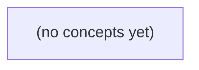

# 02.08 图与依赖遍历：Go初学者的BFS、DFS、环与拓扑

*一本面向Go初学者的静态中文教材，以固定的u-a..u-f无向关系图和A..E有向依赖图为主线，渐进推演邻接表、BFS、DFS、环检测、连通分量与拓扑排序。全书按八节组织，包含不少于20道带即时反馈的纸上练习，不要求运行Go代码或服务。*

**章节:** 2

---

## 本书导览

- 了解整本书的章节脉络
- 掌握各章之间的概念依赖关系
- 选择最合适的阅读顺序

# 02.08 图与依赖遍历：Go初学者的BFS、DFS、环与拓扑

一本面向Go初学者的静态中文教材，以固定的u-a..u-f无向关系图和A..E有向依赖图为主线，渐进推演邻接表、BFS、DFS、环检测、连通分量与拓扑排序。全书按八节组织，包含不少于20道带即时反馈的纸上练习，不要求运行Go代码或服务。

下方的概念图展示了本书 0 个核心概念以及它们之间的依赖关系；再下方是 1 个章节的入口。你可以按从上到下的顺序阅读，也可以根据自己的兴趣或先验知识选择切入点。

#### 概念图



## 章节索引

- **02.08 图与依赖遍历：从用户关系到任务拓扑** — 面向Go初学者，以虚构IM用户关系与处理依赖讲图术语、邻接表、BFS、DFS、连通/环和拓扑顺序；区分无权最少边数与带权最短、静态模型与真实权限及执行保证。

## 02.08 图与依赖遍历：从用户关系到任务拓扑

- 区分顶点、边、无向与有向关系
- 构造确定顺序的邻接表
- 手工推演BFS队列和访问标记
- 手工推演DFS栈和访问标记
- 解释无权最少边数与不可达
- 区分无向环和有向灰色回边
- 给DAG列出合法拓扑顺序
- 分析O(V+E)与业务边界

从队列、栈、集合与堆回到图：用用户关系和任务依赖建立统一的遍历视角。

### 从线性结构走向关系网络

### 从线性结构走向关系网络

队列、栈、集合和堆都擅长管理“一批待处理对象”，但它们关注的是**处理顺序**，而不是对象之间的复杂关系：

- **队列**按先进先出处理，适合按层扩散、排队任务；
- **栈**按后进先出处理，适合回退、递归调用与深度探索；
- **集合**记录“是否见过”，避免重复访问；
- **堆**快速取出当前优先级最高或代价最小的对象。

当关系是一条简单链路时，线性结构已经足够。例如任务依次执行为 `A → B → C`，只需按顺序处理即可。但真实系统常出现多对多连接：一个 IM 用户可能与多个用户建立关系；一个任务可能依赖多个前置任务，也可能同时被多个后续任务依赖。此时，单个数组或链表难以自然表达“谁连接谁”。

图正是描述这类关系网络的结构。图由**顶点**和**边**组成：顶点表示对象，如用户 `u-a` 到 `u-f` 或任务 `A` 到 `E`；边表示对象之间的关系。

- 用户关系常可建模为**无向边**：`u-a — u-b` 表示两者存在某种关系。
- 任务依赖通常建模为**有向边**：`A → C` 可表示“任务 `C` 依赖任务 `A`”。

需要区分“关系”与“权限”：用户之间存在关系边，并不自动意味着双方都能通信、查看资料或加入同一群组；通信权限还可能受隐私设置、拉黑状态和群规则约束。图首先回答的是“结构上如何连接”，权限规则则是在图关系之上进一步判断。

### 用户关系中的顶点与无向边

### 用户关系中的顶点与无向边

设某个即时通信产品记录了用户之间的“已建立关系”：

`u-a，u-b，a-c，b-c，b-d，d-e，e-f，f-d`

可将它表示为无向图 $G=(V,E)$。其中：

- **顶点** $V=\{u,a,b,c,d,e,f\}$：每个顶点代表一个用户。
- **边** $E$：每条边代表两名用户之间存在双向关系。例如 `u-a` 表示 $u$ 与 $a$ 相连；从 $u$ 能看到 $a$，从 $a$ 也能看到 $u$。
- **邻接**：若两个顶点由一条边直接连接，则它们互为邻接顶点。$u$ 的邻接点是 $\{a,b\}$，$b$ 的邻接点是 $\{u,c,d\}$。

图中的边只描述给定的关系语义，**不能自动等同于通信权限、好友可见性或消息投递资格**。例如，“已建立关系”可能表示共同群组、关注确认或设备关联；是否能发消息仍需由独立的权限规则决定。

从一个顶点沿边连续移动，得到一条**路径**。例如：

$$u\rightarrow a\rightarrow c\rightarrow b\rightarrow d\rightarrow e$$

说明从 $u$ 可以经由若干关系到达 $e$。若存在从 $x$ 到 $y$ 的路径，则称 $y$ 对 $x$ **可达**；在该例中，所有用户都与 $u$ 连通，因此都从 $u$ 可达。

路径若最终回到起点，且除起终点外不重复顶点，就形成**无向环**。例如：

$$u\rightarrow a\rightarrow c\rightarrow b\rightarrow u$$

以及：

$$d\rightarrow e\rightarrow f\rightarrow d$$

环意味着关系网络中存在多条绕行路线。遍历图时必须用集合记录已访问顶点；否则沿环反复访问，会导致搜索无法结束。

### 任务依赖中的有向边

### 任务依赖中的有向边

设有五个任务：`A`、`B`、`C`、`D`、`E`。若“完成 `B` 必须先完成 `A`”，可画一条有向边：

`A → B`

这里箭头表示**先后约束**：`A` 是 `B` 的前置任务，`B` 依赖 `A`。方向不能反过来；`B → A` 表示完全不同的含义。

例如依赖关系为：

- `A → C`
- `B → C`
- `C → D`
- `C → E`
- `D → E`

则任务 `E` 的直接前置任务是 `C` 和 `D`，而 `A`、`B` 虽未直接指向 `E`，却能通过路径影响它：

- `A → C → E`
- `A → C → D → E`
- `B → C → D → E`

因此，从 `A` 出发可以到达 `C`、`D`、`E`；称这些任务对 `A` **可达**。但从 `E` 出发通常不能到达 `A`，因为依赖边只允许沿箭头方向走。

任务依赖图应避免有向环。若又加入 `E → A`，便形成：

`A → C → D → E → A`

这意味着完成 `A` 要等待 `E`，而 `E` 又间接等待 `A`，任务无法找到合法的起始点。后续进行拓扑排序时，发现无法处理完全部顶点，往往正是在提示这种循环依赖。

### 关系模型不等于业务权限

### 关系模型不等于业务权限

把 IM 用户表示为顶点，把“认识、关注或互为好友”表示为边，可以得到关系图。例如无向边 `u-a` 表示用户 `u` 与 `a` 存在某种双向关系；有向边 `u → b` 则可表示单向关注。沿边遍历得到的是**关系上的可达性**：若存在路径 `u → a → c → f`，说明 `u` 能经由关系链连接到 `f`。

但这不等于 `u` 一定能给 `f` 发消息，更不等于系统应当向 `u` 推荐、展示或暴露 `f` 的信息。关系图通常只是一个静态或近似静态的结构模型，而业务权限还依赖额外条件：

- **隐私设置**：`f` 可能关闭陌生人消息、限制仅好友可见，或仅允许特定分组联系。
- **关系语义**：关注、好友、同群、通讯录联系人并不具有相同权限；边的存在必须带有类型。
- **状态条件**：拉黑、注销、禁言、未成年保护、地区限制、账号风险控制都会改变当前可执行操作。
- **时间因素**：昨天存在的好友边今天可能已删除；权限还可能有有效期或审批状态。
- **方向与角色**：`u → a` 的“关注”通常不推出 `a → u` 的消息许可；群管理员、普通成员和机器人也可能拥有不同能力。

因此，图遍历适合回答“谁在关系结构上可达”“共同联系人有哪些”“几跳内能发现谁”；权限系统则应回答“此刻能否执行发送、查看、邀请等操作”。可将它们写成两个不同判断：

`关系可达(u, f)`：图中是否存在满足规则的路径。  
`允许发送(u, f, t)`：在时刻 `t`，策略、隐私和状态是否共同允许发送。

前者是图算法问题，后者是业务规则与授权问题。不要因为遍历找到了路径，就跳过后续权限校验。

### 为后续遍历准备统一表示

### 为后续遍历准备统一表示

图由顶点与边组成：顶点表示对象，边表示对象间的关系。用户 `u-a` 到 `u-f` 可作为顶点；若 `u-a` 与 `u-b` 互为好友，可记无向边 `u-a—u-b`。但“存在关系”不等于“拥有通信权限”：权限还可能受隐私设置、拉黑状态或群组规则约束，图在此只刻画选定的关系语义。

任务 `A` 到 `E` 更适合有向边。若 `A` 必须先完成才能执行 `C`，写作 `A→C`；边方向表示依赖方向或执行先后，不能随意反转。由连续边构成的序列称为路径；从某顶点沿边能到达另一顶点，称后者可达。若沿方向最终回到起点，例如 `A→C→D→A`，便形成环，意味着任务依赖无法自然排定先后。

为使遍历结果可复现，邻接表应固定邻居顺序，例如按编号或字典序保存：

- `u-a: [u-b, u-c]`
- `A: [C, D]`

集合用于记录已访问顶点，避免无向图在双向边间反复往返，也避免有向图重复处理共享后继。队列将使 BFS 按“距离起点由近到远”扩展；栈或递归调用结构支持 DFS 沿一路径深入；堆可在需要“当前最小优先级顶点”时替代普通队列。

对有向任务图，还需保留入度或当前递归路径状态：入度为零的顶点可作为拓扑排序候选；DFS 中再次遇到“正在访问”的顶点，则可判定存在有向环。统一的邻接表、确定顺序、访问集合与边方向，正是这些算法共享的基础。

> **要点** — 图用顶点和边描述关系；边的方向与业务语义必须明确，关系连接不自动代表权限或执行保证。

图的遍历能否正确，首先取决于关系建模是否准确：边是否双向、顶点是否完整、邻居顺序是否确定。

### 用顶点与边表达两类关系

### 用顶点与边表达两类关系

图由**顶点**和**边**组成：顶点表示对象，边表示对象之间的关系。关键不在于“连起来”，而在于关系是否具有方向。

以用户关系为例，用户 `a、b、c、d、e、f` 是顶点。若“互相关注”或“是好友”被视为对称关系，则使用无向边：

- `a-b`：`a` 与 `b` 相连；
- `a-c`；
- `b-d`；
- `c-d`；
- `d-e`；
- `f` 没有任何边，仍是图中的孤立顶点。

无向边 `a-b` 表示两端地位相同，因此存储时必须同时记录 `a` 的邻居有 `b`，以及 `b` 的邻居有 `a`。按字典序整理邻居，可写为：

- `a: [b, c]`
- `b: [a, d]`
- `c: [a, d]`
- `d: [b, c, e]`
- `e: [d]`
- `f: []`

任务依赖则不同。任务 `A、B、C、D、E` 是顶点，`A→B` 表示完成 `B` 之前，需要先完成 `A`。例如：

- `A→B`、`A→C`
- `B→D`、`C→D`
- `D→E`

这里边有明确方向：可以从 `A` 到 `B`，但不能把它误读为 `B` 到 `A`。若用“前置任务”解释，`D` 的前置任务是 `B、C`；若用“后继任务”解释，`A` 的后继任务是 `B、C`。建模前应先统一边的语义，否则遍历结果和拓扑排序都会被反向解释。

### 无向关系的双向邻接表

### 无向关系的双向邻接表

无向边 `u-v` 表示关系可双向到达，因此不能只记录 `u` 指向 `v`；构造邻接表时，必须同时加入：

`u → v`，`v → u`

给定边集合：

`a-b，a-c，b-d，c-d，d-e`

并显式包含孤立顶点 `f`。按边逐步加入邻居：

- `a-b`：`a:[b]`，`b:[a]`
- `a-c`：`a:[b,c]`，`c:[a]`
- `b-d`：`b:[a,d]`，`d:[b]`
- `c-d`：`c:[a,d]`，`d:[b,c]`
- `d-e`：`d:[b,c,e]`，`e:[d]`
- `f` 没有任何边，但仍必须创建：`f:[]`

最终按顶点与邻居字典序表示为：

```text
a: [b, c]
b: [a, d]
c: [a, d]
d: [b, c, e]
e: [d]
f: []
```

这里 `a-b` 只是一条逻辑边，却在存储中出现两次；这是无向图邻接表的正常形式。这样从 `a` 能访问 `b`，从 `b` 也能访问 `a`，深度优先或广度优先遍历才不会错误地把无向关系当成单向关系。

孤立顶点也不能省略。若顶点集合只从边端点推导，`f` 会完全消失，导致“图中共有多少顶点”、遍历是否覆盖全部顶点等结果出错。

### 有向依赖不能反向读取

### 有向依赖不能反向读取

给定依赖边：

$A\rightarrow B,\ A\rightarrow C,\ B\rightarrow D,\ C\rightarrow D,\ D\rightarrow E$

若箭头表示“前者完成后，后者才能开始”，应只记录每个顶点的**出边**：

| 顶点 | 出邻居（按字典序） |
|---|---|
| A | B，C |
| B | D |
| C | D |
| D | E |
| E | 无 |

因此，从 `A` 出发可到达 `B、C、D、E`；从 `D` 出发只能到达 `E`。尤其不能因为存在 `B→D` 就把 `D` 的邻居写成 `B`，更不能认为可以从 `D` 走回 `A`。依赖关系中的箭头携带方向：`D` 依赖于 `B`，不等于 `B` 依赖于 `D`。

用 Go 的邻接表可表示为：

`A: [B C]`  
`B: [D]`  
`C: [D]`  
`D: [E]`  
`E: []`

这与无向关系的存储规则不同。若 `a-b` 是无向边，必须在两端各存一次：

`a: [b]`  
`b: [a]`

因为无向边表示彼此可直接到达；而有向边 `A→B` 只允许沿 `A` 到 `B` 的方向遍历。若算法还需要查询“谁依赖于 D”，可以额外维护反向邻接表，例如 `D: [B C]`，但它表示的是入边查询索引，不意味着原图允许从 `D` 走到 `B` 或 `C`。

### 邻接表、矩阵与确定遍历

### 邻接表、矩阵与确定遍历

图的存储方式会直接影响空间成本，以及 BFS、DFS 输出是否稳定。设顶点数为 $V$、边数为 $E$。

- **邻接表**：为每个顶点保存其邻居列表。顶点表需要 $O(V)$，所有邻居记录合计为 $O(E)$；因此总空间为 $O(V+E)$。对于稀疏图尤其合适：社交关系、任务依赖通常只有少量实际连接。
- **邻接矩阵**：使用 $V\times V$ 表格，`matrix[u][v]` 表示是否存在边 $u\to v`。无论实际边有多少，空间始终是 $O(V^2)$。它能以 $O(1)$ 判断两点是否相邻，但在稀疏图中会浪费大量空位。

例如无向边 `a-b,a-c,b-d,c-d,d-e` 与孤立点 `f`，邻接表可写为：

- `a: [b, c]`
- `b: [a, d]`
- `c: [a, d]`
- `d: [b, c, e]`
- `e: [d]`
- `f: []`

无向边必须在两端各保存一次；有向边如 `A→B` 只记录在 `A` 的邻居中，不能反向当作 `B→A`。

遍历的“访问顺序”并不只由 BFS 的队列或 DFS 的栈决定，还取决于**邻居枚举顺序**。例如从 `a` 开始，若邻居按字典序排列，BFS 稳定得到 `a,b,c,d,e`；DFS 的结果也可被固定。若直接遍历 Go 的 `map`，其迭代顺序不保证一致，同一程序多次运行可能得到不同遍历序列。

因此，构图后应先对每个邻居列表排序，或在插入时保持有序。这样测试断言、日志比较和拓扑处理都具有可复现性；孤立顶点也必须显式保留，避免遍历时被意外遗漏。

### Go建图时的输入边界

### Go建图时的输入边界

建图不仅是“把边塞进邻接表”，还要先规定异常输入如何处理。对初学者，建议采用**顶点集合固定、边合法才加入、邻居去重后排序**的约定，这样 BFS、DFS 的结果稳定且易测试。

- **重复边**：无向边 `a-b` 若输入两次，或同时输入 `a-b`、`b-a`，都只应保留一次。否则邻接表会出现重复邻居，遍历时可能重复检查同一顶点。可用 `map[string]bool` 暂存邻居，再转换为切片。
- **自环**：`a-a` 表示顶点指向自身。基础的用户关系或任务依赖通常不需要它，建议直接忽略；若业务确实允许自环，应明确它不会让遍历重复访问 `a`。
- **未知顶点**：若预先声明顶点为 `a,b,c,d,e,f`，输入 `a-x` 时不要悄悄创建 `x`。更安全的做法是返回错误或忽略该边，并保留孤立点 `f`。否则拼写错误会被误当成新顶点。
- **方向不可补全**：有向边 `A→B` 只能加入 `A` 的邻居表，不能自动加入 `B→A`；无向边才需要同时写入两端。

Go 的 `map` 遍历顺序不保证稳定，因此不能直接 `for range` 输出邻居或依赖顺序。建图后应将每个邻居切片按字典序排序：

`sort.Strings(adj[v])`

这样无论输入边顺序和 `map` 内部顺序如何变化，遍历都能得到可复现的结果。

> **要点** — 先明确边的方向和顶点集合，再用有序邻接表保存关系，才能为可靠遍历与复杂度分析打下基础。

以用户 a 为起点遍历关系图，BFS 用队列按层扩展，既能判断可达性，也能得到无权关系中的最少边数。

### 从用户关系抽象为无权图

### 从用户关系抽象为无权图

把用户视为顶点，把“存在关系”视为边。若关系不区分方向，例如互相关注、同组成员或可直接协作，则使用无向无权图：边只表示“能否一步到达”，不携带费用、时长或亲密度等成本。

为保证遍历过程可复现，应固定邻接表中邻居的顺序。设用户关系为：

- `a` 与 `b`、`c` 相连
- `b` 与 `a`、`d` 相连
- `c` 与 `a`、`d` 相连
- `d` 与 `b`、`c`、`e` 相连
- `e` 与 `d` 相连
- `f` 没有任何关系

可写成邻接表：

```text
a: [b, c]
b: [a, d]
c: [a, d]
d: [b, c, e]
e: [d]
f: []
```

从 `a` 出发时，`a` 是遍历起点；`b、c、d、e` 都位于与 `a` 相同的连通分量中，因此可达。顶点 `f` 虽然存在于图中，却不出现在从 `a` 可扩展到的任何关系链上，因此不可达。

这里的“无权”意味着每条边都默认消耗 $1$ 步：从 `a` 到 `b` 是一步，从 `a` 经 `b` 到 `d` 是两步。后续 BFS 计算的是最少经过的边数，而不是通话价格、路径长度或任务耗时；若边具有不同成本，就不能仅靠 BFS 判断最低成本路径。

### 初始化队列、访问标记与距离

### 初始化队列、访问标记与距离

从用户 `a` 开始时，先把它作为第 0 层节点：

- `queue = [a]`：队列保存“已发现但尚未展开邻居”的节点。
- `visited = {a}`：记录已经发现过的节点，避免重复处理与环路循环。
- `dist[a] = 0`：从起点到自身不需要经过边。
- `parent[a] = null`：起点没有前驱；其余节点的 `parent` 用于回溯路径。

当队首 `a` 出队，发现邻居 `b`、`c`。由于二者尚未访问，立刻执行：

`visited.add(b)`，`parent[b] = a`，`dist[b] = dist[a] + 1 = 1`，然后将 `b` 入队；`c` 同理。

因此队列变为 `[b, c]`，这表示第 1 层节点已经按发现顺序排队，等待扩展。之后 `b` 发现 `d`，令 `dist[d]=2`、`parent[d]=b`；当 `c` 也看到 `d` 时，`d` 已在 `visited` 中，应直接跳过。这样 `d` 只会入队一次，且保留最先发现它的前驱。

关键是：**访问标记必须在入队时完成，而不是出队时。** 若延迟到出队，`b` 和 `c` 都可能把 `d` 重复入队；在高连接图中，重复项会迅速膨胀，也会使父节点和路径记录变得含混。

队列的先进先出性质保证：距离为 $k$ 的节点会先于距离大于 $k$ 的节点出队。因此第一次发现某节点时，得到的 `dist` 就是无权图中的最少边数。此结论只计边数；若边具有时间、价格等不同权重，则不能用 BFS 代替带权最短路算法。

### 逐轮推演 a 到 e 的广度优先遍历

### 逐轮推演 a 到 e 的广度优先遍历

设无权关系图中，`a` 连接 `b、c`，`b` 与 `c` 都可到达 `d`，`d` 可到达 `e`；节点 `f` 与这部分图没有连通。BFS 从 `a` 开始，维护：

- `queue`：等待扩展的节点，先进先出；
- `visited`：已发现节点，防止重复入队；
- `parent`：节点首次被发现时的前驱，可回溯路径；
- `dist`：从 `a` 出发经过的最少边数。

初始化：`queue=[a]`，`visited={a}`，`parent[a]=null`，`dist[a]=0`。

1. 出队 `a`。发现邻居 `b、c`，二者均未访问，立即标记并入队：  
   `queue=[b,c]`，`dist[b]=dist[c]=1`，`parent[b]=parent[c]=a`。

2. 出队 `b`。发现 `d`，将其标记并入队：  
   `queue=[c,d]`，`dist[d]=2`，`parent[d]=b`。

3. 出队 `c`。也看到 `d`，但 `d` 已在 `visited` 中，因此跳过：  
   `queue=[d]`。这保证 `d` 不会被重复入队，也不会错误覆盖其首次发现时的最短层数。

4. 出队 `d`。发现 `e`，标记并入队：  
   `queue=[e]`，`dist[e]=3`，`parent[e]=d`。

5. 出队 `e`。没有新的未访问邻居，队列清空，遍历结束。`f` 从未入队，因此从 `a` 不可达。

最终距离为：`a:0`，`b,c:1`，`d:2`，`e:3`。沿 `parent` 回溯可得一条最短路径：`a → b → d → e`。BFS 的“最短”指无权图中的最少边数；若边具有时间、费用等不同权重，应改用 Dijkstra 等带权算法。

### 由层序得到最少边数与路径

### 由层序得到最少边数与路径

从起点 `a` 开始，令 `dist[a]=0`，表示从自己到自己不需要经过任何边。BFS 的队列遵循先进先出，因此会先处理距离较小的顶点，再处理下一层顶点：

- `a` 出队后发现 `b、c`，它们都由 `a` 直接到达，故 `dist[b]=dist[c]=1`，并记录 `parent[b]=parent[c]=a`。
- 处理 `b` 时发现 `d`，因此 `dist[d]=dist[b]+1=2`，记录 `parent[d]=b`。
- 随后处理 `c`，虽然也能看到 `d`，但 `d` 已经在入队时标记为已访问，说明它已经通过更早的一层被发现；不再覆盖其距离和父节点。
- `d` 发现 `e`，得到 `dist[e]=3`，`parent[e]=d`。
- `e` 没有通向新顶点的边，遍历结束；`f` 从未被发现，因此不可达，其距离可记为 `∞` 或“不存在”。

于是：

\[
dist(a)=0,\quad dist(b)=dist(c)=1,\quad dist(d)=2,\quad dist(e)=3
\]

`dist[v]` 的含义是：从 `a` 到 `v` 所需的最少边数。直觉上，BFS 一层层向外扩展：第 $k$ 层中的顶点，必然先经过某个第 $k-1$ 层顶点到达；任何更短路径都应在更早的层被发现。

`parent` 则保存“首次发现该点的人”。例如恢复 `a` 到 `e` 的路径时，从 `e` 反向追溯：

`e → d → b → a`

再反转即可得到一条最少边数路径：

`a → b → d → e`

注意，这里的“最少”只指边数最少。若边带有时间、价格或风险等不同权重，BFS 不能保证总成本最小。

### 不可达、重复入队与带权边界

### 不可达、重复入队与带权边界

从 `a` 开始，队列依次按层扩展：`a → b,c → d → e`。节点 `f` 始终没有进入队列，最终仍未被标记，因此它对 `a` **不可达**。这不是“搜索还不够深”，而是从 `a` 所在连通部分出发，没有任何边能到达 `f`。

遍历时应在**入队瞬间**标记 `visited`，并写入首次发现信息：

- `a` 入队：`dist[a]=0`
- 扩展 `a`：发现 `b,c`，立即标记，`dist=1`
- 扩展 `b`：发现 `d`，立即标记，`dist[d]=2`
- 扩展 `c`：再次看到 `d`，但 `d` 已标记，直接跳过
- 扩展 `d`：发现 `e`，`dist[e]=3`

若错误地等到节点**出队时**才标记，`b` 发现 `d` 后，`d` 尚未标记；随后 `c` 也会把 `d` 再次入队。结果是重复处理、`parent[d]` 可能被覆盖，队列在高连接图中会明显膨胀。

BFS 的最短性只针对**无权图的边数**：队列先处理距离为 $k$ 的节点，才会处理距离为 $k+1$ 的节点，因此节点首次入队时得到的 `dist` 就是最少经过边数。

但“边数最少”不等于“成本最低”。若 `a→b→e` 有两条边、总成本为 `100`，而 `a→c→d→e` 有三条边、总成本为 `3`，BFS 会选择前者。带权边的最低成本路径应使用 Dijkstra 等算法，而非普通 BFS。

> **要点** — BFS 按层首次发现顶点，入队即标记，得到无权图最少边数；不可达顶点距离未定义，带权问题需另选算法。

DFS沿一条关系尽可能深入，再回退探索分支；其访问结果既取决于图结构，也取决于邻居的确定顺序。

### 从关系图确定DFS起点与邻居序

### 从关系图确定DFS起点与邻居序

把用户关系抽象为无向图：每个用户是一个顶点，互为好友或存在双向关系时，二者之间连一条无向边。设顶点集合为：

$V=\{a,b,c,d,e\}$

关系边为：

$\{a,b\},\{a,c\},\{b,d\},\{c,d\},\{c,e\}$

由于边无方向，`a` 出现在 `b` 的邻居中，也必须让 `b` 出现在 `a` 的邻居中。若对每个邻居按字母升序排列，邻接表为：

- `a: [b, c]`
- `b: [a, d]`
- `c: [a, d, e]`
- `d: [b, c]`
- `e: [c]`

现在指定 DFS 从 `a` 开始。这里“从 `a` 开始”不是图本身固有的属性，而是一次遍历任务的输入；若改从 `c` 出发，得到的访问顺序也会改变。

排序邻居为 DFS 提供了确定的选择规则：访问某顶点时，总是优先探索其尚未访问的最小邻居。因此从 `a` 会先走向 `b`，再由 `b` 深入 `d`，随后从 `d` 进入 `c`，最后访问 `e`。访问序列为：

`a, b, d, c, e`

若邻接表未排序，例如 `a: [c, b]`，DFS 的第一步就可能改为访问 `c`。因此，图结构决定“能到哪里”，起点与邻居次序决定“先怎样到达”。

### 递归调用如何深路先走

### 递归调用如何深路先走

设无向关系图的邻接表已按字母排序：

- `a: b, c`
- `b: a, d`
- `c: a, d, e`
- `d: b, c`
- `e: c`

从 `a` 开始执行递归 DFS。核心规则是：**首次到达顶点立即标记已访问，再按邻居顺序递归访问尚未访问的邻居**。

1. 调用 `DFS(a)`：标记 `a`，访问序列为 `a`。第一个未访问邻居是 `b`，递归进入 `DFS(b)`。
2. 调用栈为 `a → b`：标记 `b`，序列变为 `a, b`。`b` 的邻居 `a` 已访问，继续查看 `d`，进入 `DFS(d)`。
3. 调用栈为 `a → b → d`：标记 `d`，序列为 `a, b, d`。`d` 的邻居 `b` 已访问，接着进入未访问邻居 `c`。
4. 调用栈为 `a → b → d → c`：标记 `c`，序列为 `a, b, d, c`。`c` 的 `a`、`d` 都已访问，进入 `e`。
5. 调用 `DFS(e)`：标记 `e`，得到 `a, b, d, c, e`。`e` 的唯一邻居 `c` 已访问，于是返回。

此后 `c`、`d`、`b`、`a` 依次结束并退栈。虽然 `a` 还连着 `c`，但 `c` 已在经由 `b,d` 的深路径中访问过，因此不会重复进入。

递归栈保存“尚未完成邻居检查”的路径；每次优先递归第一个可走邻居，便形成“深路先走、无路回退”的行为。`visited` 标记必须在递归前设置，否则无向边如 `a-b` 会使调用在 `a` 与 `b` 间反复往返。

### 显式栈复现递归遍历

### 显式栈复现递归遍历

递归版 DFS 的“调用栈”可以直接改写为显式栈。栈顶表示当前最应继续深入的顶点，因此遵循后进先出：若希望按排序后的邻居顺序访问，就必须将邻居**逆序压栈**。

设无向图中从 `a` 出发，排序邻居关系为：`a:[b,c]`、`b:[a,d]`、`c:[a,e]`。为了先访问 `b` 再访问 `c`，处理 `a` 时应先压入 `c`，后压入 `b`：

1. 栈初始为 `[a]`，并立刻标记 `a` 已访问。
2. 弹出 `a`，按逆序将 `c`、`b` 压栈；栈为 `[c,b]`。
3. 弹出 `b`，压入未访问的 `d`；栈为 `[c,d]`。
4. 依次弹出 `d`、`c`、`e`，得到访问序列 `a,b,d,c,e`。

核心规则是“**入栈即标记**”，而不是弹出时才标记：

```text
访问起点；标记起点；压栈
当栈非空：
    v = 弹栈
    处理 v
    按邻居逆序遍历：
        若邻居未标记：
            标记邻居；压栈
```

在无向图中，同一顶点可能通过多条边被发现；若延迟标记，它可能被重复压栈，造成重复处理甚至顺序混乱。显式栈还避免了深图触发递归调用栈溢出的风险。

### 访问顺序为何不是图的唯一答案

### 访问顺序为何不是图的唯一答案

对同一张无向关系图，DFS并不存在唯一的“正确访问序列”。它只要求：从当前顶点选择一个尚未访问的邻居继续深入；当无路可走时再回退。因此，邻居排列规则会直接改变结果。

例如从 `a` 出发，若各顶点邻居按字母升序检查，递归DFS可能得到：

`a → b → d → c → e`

其中先沿 `a-b-d` 深入，`d` 无新邻居后回退，再访问 `c` 与 `e`。若把 `a` 的邻居改为逆序，或优先选择 `c`，则可能得到：

`a → c → e → d → b`

两者都合法：它们覆盖了同一连通分量，只是“下一条边”的约定不同。

显式栈还要注意压栈方向。栈是后进先出结构：若希望实际访问顺序为升序邻居，应当将邻居按逆序压栈；否则最后压入的较大邻居会先被弹出。通常在**入栈时立即标记已访问**，避免同一顶点被多个邻居重复压入。

DFS适合寻找一条可达路径、划分连通分量，但它首次找到的路径只是“先走到的深路径”，不保证边数最少。因而，确定性来自“起点、邻居排序、压栈策略”等明确约定，而非DFS算法天然给出的唯一答案。

### DFS能解决什么，不能保证什么

### DFS能解决什么，不能保证什么

在同一张无向关系图中，若从 `a` 开始，并按字母序访问邻居，深度优先搜索可能得到访问序列：

`a → b → d → c → e`

它的核心策略是“沿当前关系尽量走深”：到达 `b` 后先深入 `d`，直到无未访问邻居才回退，再继续探索 `c`、`e`。递归实现中，函数调用链就是递归栈；显式实现中，则自行维护一个栈。无论哪种方式，都应在**入栈或发现顶点时立即标记已访问**，避免无向边使顶点被反复压栈。

DFS特别适合以下任务：

- **发现一条可达路径**：搜索中记录 `parent[v]`，当找到目标点时沿父指针回溯，即可恢复从起点到目标的一条路径。
- **判断可达性**：若目标被访问，说明两点存在关系链；若搜索结束仍未访问，则当前连通范围内不可达。
- **统计连通分量**：从任一未访问顶点启动一次DFS，所访问的全部顶点构成一个连通分量；重复启动直到所有顶点都被标记。

但DFS的“第一条发现路径”通常**不是最少边路径**。它优先深入，可能先走很长的分支；即使稍后存在更短的关系链，也不会自动替换。无权图中要求最少边数，应使用BFS。

此外，访问顺序依赖邻居顺序；邻接表未排序时，结果可能不稳定。对于很深的链式图，递归DFS还可能耗尽调用栈，此时应改用显式栈实现。

> **要点** — DFS以深度优先和回退完成遍历；排序邻居保证可复现，但首条路径不等于最短路径。

图中的“相连”并不总表示同一种关系：无向图关注连通分量，有向依赖图则要沿箭头判断可达、环与执行顺序。

### 无向关系中的环与连通分量

### 无向关系中的环与连通分量

设用户关系图的边为 `a-b`、`b-d`、`d-c`、`c-a`，它们构成闭合路径：

`a → b → d → c → a`

这是一条无向环：沿边出发后，经过若干**不同的中间顶点**回到起点。环表示关系中存在冗余连接；例如即使 `a-b` 暂时失效，`a` 仍可经 `c-d-b` 到达 `b`。

但遍历时“回到刚来的顶点”不代表发现环。若 DFS 从 `a` 走到 `b`，由于无向边会同时被看到为 `a-b` 和 `b-a`，`b` 再看到已访问的 `a` 只是看到了自己的父节点，应跳过。只有看到一个“已访问且不是父节点”的邻居，才说明存在环。

顶点 `a、b、c、d` 两两之间都存在某条无向路径，因此属于同一个连通分量。孤立用户 `f` 没有任何边，仍是一个合法顶点，但单独构成大小为 $1$ 的连通分量。

因此，该图有两个连通分量：

- $\{a,b,c,d\}$：包含一个环；
- $\{f\}$：孤立顶点，不含环。

遍历不能只从 `a` 开始后就停止；还要继续寻找未访问顶点，才能发现 `f` 这一独立分量。

### 父节点回退不是无向环

### 父节点回退不是无向环

设无向边集为 $a-b,\ b-d,\ d-c,\ c-a$，从 $a$ 做 DFS。搜索路径可能是：

`a → b → d → c`

此时在 $c$ 的邻居中再次看到 $a$，而 $a$ 已经访问过；这条边并非“回到刚来的位置”，而是把当前路径连回更早的祖先，因此形成环：

$$a\to b\to d\to c\to a$$

关键在于：无向图的一条边会被两端各看到一次。若从 $a$ 沿边走到 $b$，随后检查 $b$ 的邻居时，必然又会看到 $a$。这只是同一条边的反向视角，不能据此断言存在环。

因此 DFS 需要记录每个顶点的父节点 `parent[u]`。检查顶点 $u$ 的邻居 $v$ 时：

- 若 $v$ 未访问：继续递归，并令 `parent[v] = u`；
- 若 $v = parent[u]`：跳过，这是返回父节点；
- 若 $v$ 已访问且 $v \ne parent[u]`：发现非父边，存在无向环。

可概括为：

`visited[v] && v != parent[u]  ⇒  有环`

例如在 $b$ 处看到已访问的 $a$，但 $a$ 是 `parent[b]`，应忽略；在 $c$ 处看到已访问的 $a$，而 `parent[c]=d`，所以 `c-a` 是环证据。注意，孤立顶点 $f$ 没有邻边；它不影响上述环判断，但需要从 $f$ 另启一次 DFS，才能完整遍历另一个连通分量。

### 有向依赖的可达与汇合

### 有向依赖的可达与汇合

设依赖边为 `A→B`、`A→C`、`B→D`、`C→D`、`D→E`。从 `A` 出发，沿箭头可得到两条路径：

- `A→B→D→E`
- `A→C→D→E`

因此，`A` 可达 `B、C、D、E`；`B` 可达 `D、E`；`C` 也可达 `D、E`。`D` 是两条依赖路径的**汇合点**：它同时依赖于 `B` 和 `C` 的前置结果，或等价地说，`B`、`C` 的后续任务都会流向 `D`。

汇合不是环。虽然搜索会从 `A` 分别经 `B` 和 `C` 到达同一个 `D`，但这些边始终朝前推进，没有任何路径能从 `D` 或 `E` 返回 `B`、`C` 或 `A`。例如：

`A→B→D` 与 `A→C→D`

只说明 `D` 有多个前驱，并不说明依赖互相等待。

方向决定可达性。`A` 能到 `E`，不代表 `E` 能到 `A`；即使忽略方向后它们属于同一片连通结构，在依赖图中仍必须按箭头判断。若加入 `E→B`，才形成

`B→D→E→B`

此时任务 `B、D、E` 相互依赖，无法给出满足全部依赖的拓扑执行顺序。

### 灰色回边识别有向环

### 灰色回边识别有向环

对有向图执行深度优先搜索（DFS）时，可把顶点标记为三种状态：

- **白色**：尚未访问；
- **灰色**：已经进入，但其所有后继尚未处理完；它仍在当前递归调用链上；
- **黑色**：该顶点及其全部可达后继都已处理完成。

以依赖边 `A→B、A→C、B→D、C→D、D→E` 为例，从 `A` 出发并先访问 `B`：

1. 进入 `A`：活动路径为 `A`，`A` 变灰。
2. 沿 `A→B` 进入 `B`：路径为 `A→B`，`B` 变灰。
3. 沿 `B→D` 进入 `D`：路径为 `A→B→D`。
4. 沿 `D→E` 进入 `E`：路径为 `A→B→D→E`，此时 `B、D、E` 都是灰色。

若新增边 `E→B`，检查这条边时发现目标 `B` 仍为灰色。灰色意味着 `B` 正位于从根到当前顶点 `E` 的活动路径上；而路径中已经存在

$B\to D\to E$

再加上当前边

$E\to B$

便闭合为有向环：

$B\to D\to E\to B$

因此，**在有向图 DFS 中，遇到一条指向灰色顶点的边，就是回边，也是存在有向环的直接证据**。

相对地，若 `E` 指向黑色顶点，表示该顶点早已完成，不在当前活动路径上，不能仅据此判环；若指向白色顶点，则继续深入搜索。灰色判断的关键不是“以前见过”，而是“此刻仍未退出”。

### 连通、可达与业务判断边界

### 连通、可达与业务判断边界

无向图中的边表示“双向关系”。若用户关系为 $a-b-d-c-a$，从任一顶点都能走到其余三个顶点，因此 $\{a,b,c,d\}$ 是同一连通分量；孤立顶点 $f$ 没有任何边，单独构成另一分量。遍历时从 $b$ 走到 $d$ 后再看到 $b$，通常只是回到了父节点，**不能据此判环**；只有发现一条连接到已访问且非父节点的边，才说明无向环存在。

有向依赖图问的是“能否沿箭头到达”。例如 $A\to B\to D\to E$ 与 $A\to C\to D\to E$ 表示 $A$ 可达 $E$，而 $B$ 未必可达 $C$。这不是连通分量问题：忽略方向后它们或许连在一起，按方向却可能无法互达。

若加入 $E\to B$，便形成 $B\to D\to E\to B$。DFS 中可将顶点标为：

- 白色：尚未访问；
- 灰色：正在当前递归路径上；
- 黑色：该顶点的后继已全部处理完毕。

沿边访问到灰色顶点才是回边，意味着有向环；访问到黑色顶点则可能只是汇合到已完成的依赖链。只有有向图无环时，拓扑排序才存在，才能给出“先依赖、后执行”的候选顺序。

无论求无向连通、定点可达还是检测环，邻接表上的 DFS/BFS 都是 $O(V+E)$。但这只是结构性结论：权限系统还需验证身份、角色与策略；任务可拓扑排序也不保证资源充足、任务成功或外部服务可用。

> **要点** — 无向图用父节点排除回退判断环；有向图中指向灰色活动顶点的边才是回边并揭示依赖环。

任务依赖图把“谁必须先完成”转化为有向边；拓扑排序用于找出所有满足前置约束的处理次序。

### 将任务前置关系表示为有向图

### 将任务前置关系表示为有向图

把每个任务看作一个**顶点**，把“必须先完成”的约束看作一条**有向边**。若写作 $A\to B$，含义是：

- 任务 $A$ 是 $B$ 的前置任务；
- 必须先完成 $A$，才能开始或处理 $B$；
- 边的方向始终是“前置 $\to$ 后置”，而不是“谁依赖谁”的口语顺序。

例如，依赖集合为：

`A→B，A→C，B→D，C→D，D→E`

可读成：

- $A$ 完成后，$B$ 与 $C$ 才具备开始条件；
- $D$ 同时依赖 $B$ 和 $C$，两者都完成后才能处理 $D$；
- $E$ 依赖 $D$，因此位于整条链路的末端。

其中，$A,B,C,D,E$ 是顶点；每个箭头都是一条有向边。任务 $D$ 的两个入边 $B\to D$、$C\to D$ 表示它有两个尚待满足的前置条件。相反，$A$ 没有入边，表示没有前置任务，可作为起始候选。

这种表示法强调的是**约束**，而非唯一的执行时间表。例如 $B$ 与 $C$ 都只依赖 $A$，彼此不存在边，因此它们可以并行，也可以按任意先后处理。图中没有画出的边，不应被擅自理解为存在依赖。

### 用确定邻接表与入度记录依赖

### 用确定邻接表与入度记录依赖

把依赖 `X→Y` 读作“`X` 必须先于 `Y`”：边从前置任务指向后置任务。对边集

`A→B，A→C，B→D，C→D，D→E`

可按任务名固定排序建立邻接表：

- `A: [B, C]`
- `B: [D]`
- `C: [D]`
- `D: [E]`
- `E: []`

同时记录每个任务的入度，即尚未满足的直接前置数量：

| 任务 | 入度 | 来源 |
|---|---:|---|
| A | 0 | 无 |
| B | 1 | A |
| C | 1 | A |
| D | 2 | B、C |
| E | 1 | D |

固定邻接顺序很重要。若总是按 `[B, C]` 扫描 `A` 的后继，并按任务名将入度为 `0` 的节点放入候选队列，就能稳定推演：

1. 初始候选为 `A`；
2. 处理 `A` 后，`B`、`C` 的入度都变为 `0`；
3. 固定选择规则可得到 `A,B,C,D,E`；若规则优先 `C`，也可得到 `A,C,B,D,E`；
4. `D` 必须等待 `B` 与 `C` 都被处理，最后才轮到 `E`。

因此，`B` 与 `C` 是可并行的候选，而 `D` 不是。稳定存储并不改变图的约束，只是让输出、单元测试和排错可复现：同一输入不会因散列表迭代顺序不同而产生看似“随机”的结果。

若新增 `E→B`，则 `B→D→E→B` 构成环；所有节点都不再能按前置关系完全排开。此时入度法会出现候选队列提前耗尽，说明该图不是 DAG，不能进行拓扑排序。

### 从入度为零队列推演拓扑顺序

### 从入度为零队列推演拓扑顺序

设边 `A→B，A→C，B→D，C→D，D→E` 表示“箭头左侧必须先于右侧”。先统计每个顶点的入度：

| 顶点 | A | B | C | D | E |
|---|---:|---:|---:|---:|---:|
| 入度 | 0 | 1 | 1 | 2 | 1 |

拓扑排序的手工规则是：反复选择一个**当前入度为 0** 的顶点输出，并删除它发出的边；删除边后，后继顶点的入度相应减一。

1. 初始只有 `A` 入度为 0，输出 `A`。删除 `A→B`、`A→C` 后，`B`、`C` 的入度都变为 0。
2. 此时队列中可选 `B` 和 `C`。若先取 `B`，输出 `B`；删除 `B→D`，但 `D` 入度仍为 1，因为它还依赖 `C`。
3. 再取 `C`，输出 `C`；删除 `C→D` 后，`D` 入度变为 0。
4. 输出 `D`，删除 `D→E`，于是 `E` 入度变为 0。
5. 输出 `E`，得到 `A，B，C，D，E`。

若第 2 步优先选择 `C`，则同样可得到 `A，C，B，D，E`。这说明 `B` 与 `C` 没有直接或间接的先后约束：它们都必须在 `A` 之后、`D` 之前，但彼此可并行处理。

入度为零队列给出的只是满足依赖的**合法顺序**，不是任务可靠执行、事务提交或结果发布的完整方案；实际系统还需处理失败、重试、资源竞争与提交一致性。

### 用 DFS 逆后序理解另一种排序思路

### 用 DFS 逆后序理解另一种排序思路

DFS 的关键不是“访问到顶点时立刻输出”，而是**完成该顶点所有后继的搜索后**，再把它记入后序序列。对依赖边 `前置 → 后置` 而言，后继任务会先进入后序；将后序反转，就得到一个满足依赖约束的拓扑候选。

例如图中有：

`A→B，A→C，B→D，C→D，D→E`

若从 `A` 深度优先搜索，并先探索 `B`，完成记录可能为：

`E，D，B，C，A`

反转后得到：

`A，C，B，D，E`

其中 `B`、`C` 都在 `D` 前，且它们之间没有边，因此可交换为 `A，B，C，D，E`。DFS 给出的只是某一种合法顺序，不代表唯一顺序。

实现时常维护三种访问状态：

- **白色**：尚未访问；
- **灰色**：已进入 DFS，但其后继尚未全部完成；
- **黑色**：已完成，可写入后序。

搜索边 `u→v` 时，若 `v` 是灰色，说明当前递归路径已经从 `v` 到达 `u`，而 `u` 又指回 `v`；这是一条灰色回边，意味着存在有向环。若加入 `E→B`，路径 `B→D→E→B` 成环，DFS 在 `E` 访问 `B` 时发现灰色顶点，因此不能生成拓扑序。

只有 DAG 才能将逆后序视为拓扑排序；它表达的是依赖约束下的可处理次序，不等同于任务真实可靠的执行、提交或发布顺序。

### 环、复杂度与执行保证的边界

### 环、复杂度与执行保证的边界

原图中，`A→B、A→C、B→D、C→D、D→E` 是一个有向无环图（DAG）。例如 `A,B,C,D,E` 与 `A,C,B,D,E` 都合法：`B`、`C` 都只依赖 `A`，因此在 `A` 完成后可作为并行候选；但 `D` 必须等待二者都处理完毕。

若再加入边 `E→B`，则出现环：

`B→D→E→B`

此时不存在拓扑顺序。原因是无论把 `B` 放在何处，它既必须在 `D` 前，又因 `E→B` 必须在 `E` 后；而 `D` 又在 `E` 前，约束无法同时满足。

用入度为 `0` 的队列进行拓扑排序时，算法每次取出一个当前无前置依赖的顶点，并删除其出边。若最终输出顶点数小于 $V$，剩余顶点的入度都无法降为 `0`，便说明存在环。DFS 的逆后序方法也类似：搜索中若遇到仍在递归路径上的顶点，即发现回边和环。两类方法的时间复杂度均为：

$$O(V+E)$$

其中 $V$ 是任务数，$E$ 是依赖边数；每个顶点和每条边至多被访问常数次。

但拓扑序只是**静态依赖约束**，不是可靠执行协议。它指出“可以先处理谁”，不保证任务真的成功、不会超时或重试；`B` 与 `C` 可并行，也不意味着资源足够、结果可安全合并。更重要的是，拓扑序不等于数据库提交顺序或消息投递顺序：真实系统还需要状态持久化、失败恢复、幂等、事务边界、并发控制与提交确认，才能把“理论上可执行”变成“可靠地完成”。

> **要点** — 拓扑排序只适用于 DAG：它给出前置约束下的合法顺序，不等同于任务可靠执行或提交顺序。

邻接表让关系遍历贴近真实数据规模：既能覆盖孤立点，也能用确定顺序复现BFS、DFS及其复杂度边界。

### 从业务关系抽象为确定邻接表

### 从业务关系抽象为确定邻接表

图的顶点可以是用户、群成员、任务或服务；边表示“可达关系”。关键是先明确边是否有方向，再把每个顶点的邻居按固定顺序保存。

即时通信中的好友关系通常是无向边：若 `Alice` 与 `Bob` 互为好友，应同时记录 `Alice→Bob` 和 `Bob→Alice`。用户 `Carol` 即使没有任何好友，也必须作为顶点出现；否则遍历全图时会遗漏孤立用户。

```go
friends := map[string][]string{
    "Alice": {"Bob", "David"},
    "Bob":   {"Alice"},
    "Carol": {}, // 孤立用户
    "David": {"Alice"},
}
```

任务依赖则通常是有向边。若“部署”必须等待“构建”完成，可记为 `构建→部署`：边方向表示可推进的后继关系，或表示拓扑排序中的先后约束。

```go
deps := map[string][]string{
    "拉取代码": {"构建"},
    "构建":     {"测试", "部署"},
    "测试":     {"部署"},
    "清理缓存": {}, // 与主流程无关的孤立任务
    "部署":     {},
}
```

这里的 `map` 负责从顶点定位邻接表，值切片保存邻居。切片顺序会直接影响 BFS、DFS 的访问顺序；若数据来自数据库或并发写入，应在遍历前排序，才能得到可复现的结果。

还要区分“没有出边”和“顶点不存在”：`"部署": {}` 表示已知顶点但没有后继；完全缺少键则可能是建图遗漏。实际建图时，应先登记所有用户或任务，再补充边，保证孤立点也被纳入遍历范围。

### BFS：队列、访问标记与最少边数

### BFS：队列、访问标记与最少边数

广度优先搜索（BFS）从一个起点向外“一层层”扩展。对无权图而言，第一次发现某顶点时经过的边数，就是起点到该顶点的最少边数；原因是队列保证了距离较近的顶点总先于距离较远的顶点出队。

设邻接表为 `map[string][]string`，同时显式保留所有顶点，以免孤立点只因没有邻边而遗漏：

`vertices := []string{"A","B","C","D","E","F"}`  
`adj["A"] = []string{"B","C"}`  
`adj["B"] = []string{"D"}`  
`adj["C"] = []string{"D","E"}`  
`adj["F"] = []string{}`

从 `A` 开始的纸上伪代码：

`visited := map[string]bool{"A": true}`  
`dist := map[string]int{"A": 0}`  
`queue := []string{"A"}`

重复执行：取出队首 `u`；扫描 `adj[u]` 中每个邻居 `v`；若 `v` 未访问，则立刻标记、记录距离并入队：

`visited[v] = true`  
`dist[v] = dist[u] + 1`  
`queue = append(queue, v)`

变化过程如下：

- 初始：队列 `[A]`，`dist[A]=0`。
- `A` 出队，发现 `B、C`：队列 `[B,C]`，两者距离均为 `1`。
- `B` 出队，发现 `D`：队列 `[C,D]`，`dist[D]=2`。
- `C` 出队，`D` 已标记，不重复入队；发现 `E`：队列 `[D,E]`，`dist[E]=2`。
- `D、E` 依次出队，遍历结束。

因此，`A→C→E` 有两条边，`dist[E]=2`；即使还存在别的绕行路径，也不可能更短。标记必须发生在**入队时**，否则多个前驱可能把同一顶点重复入队。

顶点 `F` 虽存在于 `vertices` 中，却不在从 `A` 出发的连通范围内，故没有 `dist[F]`，可视为不可达。若要覆盖整张图，应再遍历 `vertices`，对每个未访问顶点启动一次 BFS；这会得到多个连通分量。邻接表下，总扫描量为 $O(V+E)$，`visited`、距离表和队列最多各占 $O(V)$ 空间。

### DFS：栈式深入与完整覆盖

### DFS：栈式深入与完整覆盖

DFS 的核心不是“访问一个点的所有邻居”，而是沿一条尚未访问的边持续深入，直到无路可走，再回退到最近仍有未探索邻居的位置。对邻接表 `map[string][]string` 而言，单个连通分量的遍历只触及实际存在的顶点和边；若要覆盖整个图，还必须从所有顶点中寻找新的起点。

显式栈可替代递归调用栈。关键约定是：**顶点入栈时立即标记**，而不是出栈时标记。这样多个父节点即使同时发现同一邻居，也不会将它重复压入栈。

```text
visited = 空集合
for 每个顶点 start:
    if visited[start]:
        continue

    visited[start] = true
    stack.push(start)

    while stack 非空:
        u = stack.pop()
        输出 u

        for v 按确定顺序遍历 adj[u] 的邻居:
            if not visited[v]:
                visited[v] = true
                stack.push(v)
```

若邻接表中的邻居为切片，遍历顺序通常由切片顺序决定；若邻居来自 `map`，则应先排序，否则 Go 的 `map` 遍历顺序不稳定，DFS 输出也不可复现。又因为栈后进先出，若希望按邻居升序深入，通常需要将已排序邻居**逆序入栈**。

例如 `A` 的邻居为 `[B,C]`，希望先访问 `B`，则先压入 `C`、再压入 `B`；弹栈后会先得到 `B`。递归版本天然按邻居遍历顺序深入，但调用深度可能达到 $O(V)$；显式栈更便于控制，也避免深图上的递归栈风险。

外层 `for` 不可省略：它会启动新的 DFS 分量，因此能访问非连通图中的节点，也能处理邻接表中值为空的孤立点。整体中每个顶点至多标记一次、每条邻接边至多检查一次，时间为 $O(V+E)$；`visited` 与显式栈最坏均为 $O(V)$。

### 为何邻接表是O(V+E)

### 为何邻接表是 $O(V+E)$

设图有 $V$ 个顶点、$E$ 条边。邻接表把每个顶点的实际邻居存入切片：`graph[u] = []v`。BFS 或 DFS 会先遍历全部顶点，以便孤立点也能作为一次新的遍历起点；随后只访问该顶点邻接表中真实存在的边。

```text
for u in 所有顶点:
    if !visited[u]:
        visited[u] = true
        将 u 放入队列或栈
        while 队列或栈非空:
            x = 取出一个顶点
            for y in graph[x]:
                if !visited[y]:
                    visited[y] = true
                    加入队列或栈
```

外层扫描顶点花费 $O(V)$。内层循环的总次数等于所有邻接表长度之和：有向图为 $E$，无向图每条边通常存两次，为 $2E$，但仍是 $O(E)$。因此总时间为：

$$O(V)+O(E)=O(V+E)$$

关键不在于“每个顶点只访问一次”，而在于“每条已存储的邻接关系只检查一次”。例如用户关系图中，某用户没有好友，其邻接切片为空；它仍会被外层循环覆盖，却不会产生额外的边扫描。

邻接矩阵不同。若用 `matrix[u][v]` 判断连接关系，处理顶点 `u` 时必须逐列检查全部 $V$ 个候选顶点，才能知道哪些位置有边。即使图极稀疏，每一行也要扫描 $V$ 次，总成本为：

$$V \times V=O(V^2)$$

空间方面，`visited map[顶点]bool` 最多记录 $V$ 个顶点，故为 $O(V)$；BFS 队列在最宽层可能同时容纳 $O(V)$ 个顶点；DFS 的显式栈，或递归调用栈，最深也可能达到 $O(V)$。这些是遍历过程的额外空间上界，不包括邻接表本身的 $O(V+E)$ 存储。

### 静态遍历结果不等于业务保证

### 静态遍历结果不等于业务保证

把用户、群组或任务表示为图后，BFS/DFS 能回答“在**当前快照**中，哪些节点可达、依赖链如何展开”。例如，邻接表上的遍历可找出某用户所在群的间接成员，或列出任务 `A` 的全部前置依赖；其结果是结构分析，不是业务授权或执行承诺。

- **可达不等于有权限**：边 `用户 → 群组` 表示关系存在，不代表该用户可以读取群消息、修改成员或触发任务。权限仍应由认证身份、角色、资源策略、租户边界及实时状态共同判定。
- **遍历依赖快照语义**：遍历开始后，成员关系或依赖边可能新增、删除。系统必须明确读取的是某一版本快照、事务一致视图，还是允许最终一致；否则同一次遍历可能混入不同时间的边。
- **海量群不能直接全量 fanout**：一个大群的成员数可能远大于单机内存或一次请求预算。即使算法复杂度为 $O(V+E)$，也仍可能带来消息风暴、热点分区和重试放大，需要分页、分片、异步队列、限流或预计算收件箱。
- **拓扑可行不等于按时完成**：依赖图说明任务的先后约束，却不包含队列等待、资源竞争、失败重试、外部服务抖动和超时。调度器还需处理优先级、幂等、取消、补偿及可观测性。

因此，图遍历应被视为“给定静态关系后的计算内核”。它提供可达集、层次和依赖顺序；认证系统、数据一致性协议、消息分发架构与执行调度系统，才共同构成可用的业务保证。

> **要点** — 邻接表遍历以O(V+E)访问静态关系；确定邻居顺序和正确标记保证可复现，但不替代权限与执行系统。

以同一份用户关系图和任务依赖图为线索，手工完成遍历、环检测与拓扑排序，并明确算法结论的业务边界。

### 从关系数据到确定邻接表

### 从关系数据到确定邻接表

用户关系常以边表给出，例如 `A-B` 表示用户 A 与 B 互相关联。无向图中一条关系必须写入两个方向：

- `A-B` 使 `B` 出现在 `A` 的邻居中；
- 同时使 `A` 出现在 `B` 的邻居中。

设顶点集合为 `A,B,C,D,E,F`，关系数据为：

`A-C，A-B，B-D，B-C，C-E，D-E`

先按顶点排序，再将每个顶点的邻居排序，得到确定的邻接表：

| 顶点 | 有序邻居 |
|---|---|
| A | B，C |
| B | A，C，D |
| C | A，B，E |
| D | B，E |
| E | C，D |
| F | 无 |

`F` 没有关系边，仍必须保留为一个顶点；否则遍历只能描述“有边的用户”，会遗漏孤立用户。邻接表中的边数也应满足无向图校验规则：

$$\sum_{v\in V}\deg(v)=2|E|$$

本例度数和为 $2+3+3+2+2+0=12$，因此边数为 $12/2=6$，与原始关系数一致。

排序不是图定义的必要条件，却是可复现遍历的必要条件。若 `A` 的邻居有时写成 `C,B`，有时写成 `B,C`，从 A 开始的 BFS、DFS 访问序列可能不同；可达性结论不变，但日志、测试答案和 `parent` 树会改变。后续统一采用“顶点按字母序扫描、邻居按字母序访问”的约定。

### BFS队列、父节点与最少边数

### BFS队列、父节点与最少边数

设无向用户关系图的邻接表为：

- `A: B, C`
- `B: A, D, E`
- `C: A, F`
- `D: B`
- `E: B`
- `F: C`
- `G: `

从 `A` 开始广度优先搜索（BFS）。BFS 的核心不是“访问完一个分支再回头”，而是维护先进先出的队列，使顶点按距起点的边数逐层展开。

初始化：

- 队列：`[A]`
- 已访问：`{A}`
- `dist[A]=0`
- `parent[A]=∅`

依次出队并扫描邻居：

| 操作 | 队列变化 | 新发现顶点 | `parent` 与 `dist` |
|---|---|---|---|
| 出队 `A` | `[A] → [B,C]` | `B,C` | `parent[B]=A, dist[B]=1`；`parent[C]=A, dist[C]=1` |
| 出队 `B` | `[B,C] → [C,D,E]` | `D,E` | `parent[D]=B, dist[D]=2`；`parent[E]=B, dist[E]=2` |
| 出队 `C` | `[C,D,E] → [D,E,F]` | `F` | `parent[F]=C, dist[F]=2` |
| 出队 `D` | `[D,E,F] → [E,F]` | 无 | 无 |
| 出队 `E` | `[E,F] → [F]` | 无 | 无 |
| 出队 `F` | `[F] → []` | 无 | 无 |

访问标记必须在**入队时**完成，而非出队时完成。否则例如 `B` 与 `C` 同时指向某个未标记顶点时，该顶点可能被重复入队，造成重复处理，甚至破坏父节点记录。

最终：

- 访问序列可为：`A, B, C, D, E, F`
- 最少边数：`dist[A]=0`，`dist[B]=dist[C]=1`，`dist[D]=dist[E]=dist[F]=2`
- `G` 从未入队，因此不可达：`dist[G]=∞`（或记为 `-1`），`parent[G]=∅`

`parent` 指针构成一棵以 `A` 为根的 BFS 树。要恢复 `E` 到 `A` 的最短边数路径，只需反向追溯：

`E → B → A`

再反转得到 `A → B → E`，路径长度正好为 `dist[E]=2`。这里的“最短”仅指边数最少；若边具有不同费用、时间或风险，应转入加权最短路径问题。

### DFS栈、分量与无向环

### DFS栈、分量与无向环

深度优先搜索（DFS）沿一条未走过的边持续“向深处”推进；走不动时再回退。递归写法中，调用栈天然保存回退路径；显式栈则需自行保存待处理顶点或迭代进度。

设无向图邻接表为：

- `A: B, C`
- `B: A, D`
- `C: A, D`
- `D: B, C`
- `E: F`
- `F: E`

从 `A` 出发，按邻接表顺序递归访问，可得到发现序列：

`A → B → D → C`

此时 `C` 的邻居 `A` 已访问，且 `A` 不是 `C` 的父节点 `D`；边 `C—A` 因而是**非父边**。在无向图中，访问顶点 `u` 时若发现已访问邻居 `v`，并且 `v ≠ parent[u]`，就说明存在环。本例的环为：

`A → B → D → C → A`

注意：`B` 看到已访问的 `A` 不构成环，因为 `A` 正是 `B` 的父节点；无向边会在两个方向各出现一次，必须排除父边的反向观察。

DFS结束后，`A、B、C、D` 属于一个连通分量。继续扫描尚未访问的顶点，发现 `E` 后再次启动DFS，得到 `E → F`，形成第二个分量。因此，连通分量数等于外层扫描中启动DFS的次数。

- 判断：非父边一定意味着无向环。**正确**；它与DFS树路径共同闭合成环。
- 判断：一次从 `A` 出发的DFS必然覆盖整个无向图。**错误**；图可能不连通。
- 判断：发现父节点也应报告环。**错误**；这是无向边的反向记录。

### 任务依赖、灰色回边与拓扑顺序

### 任务依赖、灰色回边与拓扑顺序

将边 `X→Y` 解释为“任务 `Y` 依赖任务 `X`”，则 `X` 必须先完成。设任务图为：

`A→B，A→C，B→D，C→D，D→E`

从 `A` 做 DFS 时，可将任务标为：白色（未访问）、灰色（正在递归处理）、黑色（已完成）。例如沿 `A→B→D→E` 深入后，`E、D、B` 依次完成；再访问 `C` 时，`C→D` 指向黑色节点，表示依赖已处理，并非环。

完成时间逆序可得到拓扑顺序，例如：

- `A，B，C，D，E`
- `A，C，B，D，E`

两者都合法，因为 `B` 与 `C` 没有先后依赖；但 `D` 必须排在二者之后，`E` 必须排在 `D` 之后。拓扑序不是唯一答案，而是所有边均满足“起点在终点之前”的排列。

若新增边 `E→B`，DFS 沿 `B→D→E→B` 会访问到灰色的 `B`。这条指向灰色节点的边称为**灰色回边**，直接证明存在环：

`B→D→E→B`

此时任务彼此等待：`B` 等待 `E`，`E` 又经 `D` 等待 `B`，不存在完整拓扑顺序。实际调度系统应报告该环及其涉及任务，而不能继续假设“按依赖顺序执行”可行。

### 综合练习与业务边界校验

### 综合练习与业务边界校验

设无向用户图邻接表为：`A: B,C；B: A,D；C: A,D,E；D: B,C；E: C`。访问邻居按字母序。任务依赖边为 `A→C，B→C，C→D，D→E`，含义是“前者必须先完成”。

1. 从 `A` 做 BFS 的访问序列？  
   **反馈：**`A,B,C,D,E`；队列保证按层扩展。

2. BFS 中 `dist[A]` 是多少？  
   **反馈：**`0`，起点到自身无需经过边。

3. BFS 中 `parent[B]` 是谁？  
   **反馈：**`A`；`B` 首次由 `A` 发现。

4. BFS 中 `dist[D]` 是多少？  
   **反馈：**`2`，路径可为 `A→B→D`。

5. `A` 到 `E` 的最少边数？  
   **反馈：**`2`，经 `A→C→E`。

6. BFS 发现 `D` 后又从另一顶点见到 `D`，应改写 `parent[D]` 吗？  
   **反馈：**不应；首次发现已给出最少边层数。

7. 从 `A` 做 DFS，按字母序的一种序列？  
   **反馈：**`A,B,D,C,E`；DFS 优先深入，不代表最短路。

8. DFS 从 `A` 是否能保证先访问距离更近的点？  
   **反馈：**不能；它只遵循当前递归分支。

9. 无向图中，访问 `C` 时遇到已访问且不是父节点的 `A`，说明什么？  
   **反馈：**存在环，例如 `A-B-D-C-A`。

10. 此用户图有几个连通分量？  
    **反馈：**`1`；全部用户可互相间接触达。

11. 若新增孤立用户 `F`，分量数变为？  
    **反馈：**`2`；遍历需从未访问顶点重新启动。

12. 任务图中 `C` 的入度是多少？  
    **反馈：**`2`，来自 `A、B`。

13. 一个合法拓扑序列？  
    **反馈：**`A,B,C,D,E`；`A、B` 可互换。

14. 拓扑排序是否要求唯一？  
    **反馈：**不要求；多个零入度任务会产生多种合法顺序。

15. 加入边 `E→B` 后会怎样？  
    **反馈：**形成 `B→C→D→E→B` 环，无法完成拓扑排序。

16. Kahn 算法结束时仍有顶点未输出，意味着什么？  
    **反馈：**有向图存在环，剩余任务互相等待。

17. BFS 的“最短”具体指什么？  
    **反馈：**无权图中的最少边数，不是最低成本或最快时间。

18. 若边表示通话费用，`A→C→E` 两条边一定最便宜吗？  
    **反馈：**不一定；应比较总权重，使用带权最短路模型。

19. 若边权允许为负，普通 Dijkstra 是否总是可靠？  
    **反馈：**不可靠；负权会破坏其贪心前提。

20. 静态邻接表能否表达“任务 D 只有审批通过后才能执行”？  
    **反馈：**只能表达依赖关系；审批状态、时间、容量等需额外状态模型。

21. 用户关系图的“可达”能否推出“愿意合作”？  
    **反馈：**不能；图边描述连接，不自动包含意愿、权限或业务规则。

22. 拓扑序能否直接给出项目最短工期？  
    **反馈：**不能；还需任务时长、资源约束与关键路径分析。

> **要点** — 确定邻接顺序使遍历可复现；BFS求无权最少边数，DFS揭示分量与环，DAG才存在拓扑顺序。
