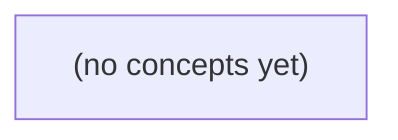

# 04.02 地址、名称与路由入口

*一本面向Go初学者的网络基础教材，从“未来教学IM客户端如何找到服务”这一问题出发，厘清用户、会话、名称、IP、端口与socket的边界。全书使用RFC保留地址和虚构.invalid名称，通过纸上推演建立从DNS、路由到监听端点及HTTP故障分层的完整心智模型。*

**章节:** 2

---

## 本书导览

- 了解整本书的章节脉络
- 掌握各章之间的概念依赖关系
- 选择最合适的阅读顺序

# 04.02 地址、名称与路由入口

一本面向Go初学者的网络基础教材，从“未来教学IM客户端如何找到服务”这一问题出发，厘清用户、会话、名称、IP、端口与socket的边界。全书使用RFC保留地址和虚构.invalid名称，通过纸上推演建立从DNS、路由到监听端点及HTTP故障分层的完整心智模型。

下方的概念图展示了本书 0 个核心概念以及它们之间的依赖关系；再下方是 1 个章节的入口。你可以按从上到下的顺序阅读，也可以根据自己的兴趣或先验知识选择切入点。

#### 概念图



## 章节索引

- **04.02 地址、名称与路由入口：找到教学 IM 服务的正确层次** — 承接04.01客户端/服务端和分层，面向Go初学者用纯文档地址与虚构域名解释IPv4/IPv6地址、前缀/子网、路由下一跳、端口、socket和DNS；分层区分解析失败、连接拒绝/超时、HTTP 404及业务拒绝。静态教材无真实网络命令或服务。

## 04.02 地址、名称与路由入口：找到教学 IM 服务的正确层次

- 区分应用用户ID、域名、IP地址、端口和socket
- 解释IPv4/IPv6文档地址与前缀匹配的基本含义
- 从目标IP推导本机选择路由而非DNS决定路径
- 区分监听端点、客户端临时端口与已建立连接
- 解释DNS名称解析、缓存和多地址结果
- 沿名称到应用响应的链条定位不同失败
- 说明连接成功不能证明IM会话授权或历史存在
- 为04.03 HTTP/WebSocket建立端点先修

教学 IM 客户端要找到正确服务，先要分清“找谁、找哪台机器、找哪个进程”分别属于哪一层。

### 先分清身份、名称与网络端点

### 先分清身份、名称与网络端点

教学 IM 中的 `u-a`、`u-b`、`c-a`、`m-a` 都是虚构标识，但它们回答的问题并不相同。客户端若把这些概念混为一谈，就会在“该联系谁”“该连接哪里”“连接后由谁处理”之间产生错误推断。

- **用户 ID**：如 `u-a`、`u-b`，表示“谁”。它是业务身份，用于登录、联系人、权限与消息收件人判断。用户 ID 不是网络地址，不能直接据此建立连接。
- **会话 ID**：如 `c-a`，表示“一段交互或一个逻辑会话”。它可关联多个用户、消息记录和状态，但不等于某台机器，也不保证与一个 TCP 连接一一对应。
- **消息 ID**：如 `m-a`，表示“一条具体消息”。它用于去重、确认、排序或追踪，同样不是路由目的地。
- **域名**：例如 `im.example.invalid`，是人类较易记忆的名称。若可解析，系统通常经 DNS 将其映射到一个或多个 IP 地址；域名本身不是进程。
- **IP 地址**：表示网络中的主机接口或可达节点，例如 `203.0.113.10`。它回答“数据先送到哪台网络节点”，却仍未说明交给该机器上的哪个程序。
- **端口**：如 `8080`，用于在同一 IP 上区分服务入口。`IP:端口` 才接近一个可连接的网络端点。
- **socket 与服务进程**：服务进程在本机创建并监听 socket，例如监听 `0.0.0.0:8080`；客户端连接到目标 `IP:8080` 后，内核将连接交给对应进程处理。

因此，`u-b` 不能替代域名，域名不能替代端口，`IP:8080` 也不能说明最终业务用户是谁。`im.example.invalid:8080` 在本教材中仅是静态示例；`.invalid` 属于 RFC 2606 保留域，不应被当作可真实拨号的互联网服务地址。当前本地 CLI 不联网，后续客户端即使要接入服务，也必须先明确自己缺少的是业务身份映射、名称解析，还是网络端点与服务进程。

### 从域名到地址：DNS 只负责解析

### 从域名到地址：DNS 只负责解析

教学客户端可把 `im.example.invalid:8080` 写成服务入口的**静态示例**。其中：

- `im.example.invalid` 是域名：便于人阅读、配置和迁移；
- `8080` 是端口：用于同一主机上的不同服务进程；
- DNS 的职责只是尝试回答“这个域名对应哪些网络地址”，并不负责找到具体用户、会话或消息。

一次典型过程可抽象为：

`域名 → DNS 查询 → 一个或多个 IP 地址 → 连接某个 IP:端口`

例如，若某服务域名解析得到多个地址，客户端可能获得：

`203.0.113.10`、`203.0.113.11`

这通常表示服务部署在多台机器、多个网络接口，或使用负载均衡。DNS 返回多个地址不等于“有多个 IM 账号”，更不等于“已经加入某个会话”；账号 `u-a`、`u-b` 和会话 `c-a` 仍由连接建立后的应用协议处理。

DNS 结果通常带有缓存时间。客户端、操作系统、路由器或递归解析器都可能暂存结果，因此域名改指向新地址后，旧地址不会立刻从所有地方消失。正确做法是让客户端按缓存规则重新解析，并能在一个地址不可达时尝试其他候选地址；不能把第一次得到的 IP 永久当作服务身份。

还要注意，`.invalid` 是 RFC 2606 保留的文档用途顶级域。`im.example.invalid` 用于教材、测试说明和配置示例，明确表示它不应成为真实可解析、可拨号的互联网服务。这里的 `:8080` 只能帮助理解“域名加端口”的写法，不能让当前本地 CLI 真的联网。

### 从目标地址到下一跳：路由决定怎么走

### 从目标地址到下一跳：路由决定怎么走

名称解析得到目标 IP 后，客户端仍未“到达服务”：它还要决定数据包应从哪个网络接口送出，并交给谁继续转发。这是 IP 路由层的任务，与用户 `u-a`、会话 `c-a`、服务进程 `m-a` 无关。

IPv4 地址长 32 位，例如 `192.0.2.25`；IPv6 地址长 128 位，例如 `2001:db8::25`。路由表通常不用逐台主机逐项记录，而以“网络前缀/长度”描述一组地址：

- `192.0.2.0/24`：前 24 位相同，覆盖 `192.0.2.0` 至 `192.0.2.255`。
- `2001:db8:10::/48`：前 48 位相同的一组 IPv6 地址。
- `0.0.0.0/0` 或 `::/0`：默认路由，匹配所有目标。

本机将目标 IP 与各路由前缀比较，选择**最长前缀匹配**。例如同时存在：

| 目标前缀 | 下一跳 | 出口 |
|---|---|---|
| `10.20.0.0/16` | 直连 | `eth0` |
| `10.20.30.0/24` | `10.20.30.1` | `eth0` |
| `0.0.0.0/0` | `192.168.1.1` | `wlan0` |

目标为 `10.20.30.88` 时，`/24` 比 `/16` 更具体，包交给 `10.20.30.1`；目标为 `8.8.8.8` 时，前两项均不匹配，才使用默认网关 `192.168.1.1`。

“下一跳”不一定是最终服务器。若目标与本机处于同一链路，下一跳就是目标主机本身；否则下一跳通常是路由器。随后通过 ARP（IPv4）或邻居发现（IPv6）取得下一跳的链路层地址，再由网卡发送帧。路由解决的是“先交给谁、从哪里出去”，端口 `8080` 则要等 IP 包抵达目标主机后，才用于定位其中的服务进程。

### 端口、监听与连接：找到具体服务进程

### 端口、监听与连接：找到具体服务进程

域名或 IP 解决“到哪台主机”，端口进一步解决“交给该主机上的哪个服务进程”。例如教学地址 `im.example.invalid:8080` 中，`8080` 表示目标服务的端口号；它不是用户 `u-a`、`u-b` 的编号，也不是会话 `c-a` 或消息 `m-a` 的身份。

服务端通常先在固定端点上**监听**：

- `0.0.0.0:8080`：监听本机所有 IPv4 地址的 8080 端口；
- `[::]:8080`：监听本机所有 IPv6 地址的 8080 端口；
- `127.0.0.1:8080`：只接受本机进程的连接。

这里的“端点”常写为 $(IP, 端口)$。操作系统收到发往该端点的数据后，才会把它交给正在监听的服务进程。

客户端连接时通常不需要占用固定端口。它会由操作系统分配一个临时端口，例如：

`192.0.2.10:52341 → 203.0.113.20:8080`

客户端的 `52341` 主要用于让返回数据找到这次客户端连接，并不表示某个用户身份。多个客户端可以同时连接同一服务端口，因为它们的源地址或源端口不同。

`socket` 是程序通过操作系统进行网络通信的接口与对象；监听 socket 用于接收新连接，连接建立后，服务端会得到一个新的通信 socket。一个已建立连接通常可由四元组唯一区分：

$(源IP, 源端口, 目的IP, 目的端口)$

因此，“8080 被占用”说明某个进程已绑定或监听该端口；“u-a 在线”则必须由 IM 服务自己的登录状态、认证令牌或会话记录判断，不能从端口号推断。又由于 `.invalid` 是 RFC 2606 保留的无效域，`im.example.invalid:8080` 在本教材中只能表示静态示例，当前本地 CLI 也不会真的发起连接。

### 沿请求链定位失败：网络通不等于 IM 可用

### 沿请求链定位失败：网络通不等于 IM 可用

教学客户端向 `im.example.invalid:8080` 发起请求时，失败并不只意味着“网络坏了”。一次访问至少经过四层；应沿请求链判断，而不是把所有现象都归为“连不上”。

1. **名称解析：名称能否变成地址**  
   客户端先查询域名对应的 IP。若出现“找不到主机”“名称不存在”等，说明失败发生在 DNS 解析层；此时尚未知道应连接哪台机器。`example.invalid` 属于 RFC 2606 保留的 `.invalid` 域，专用于明确无效的示例名称，不能作为真实服务入口。

2. **路由与连接：能否到达指定机器上的端口**  
   即使已有 IP，数据包仍需经路由到达目标网络，并与 `IP:端口` 建立连接。`连接被拒绝`通常表示目标机器可达，但该端口没有对应监听进程；`连接超时`则可能是路由不可达、防火墙丢弃，或目标机器无响应。它们都还没有进入 IM 协议。

3. **HTTP 响应：连到的是不是正确的 Web 服务**  
   收到 HTTP 响应，才说明某个 HTTP 服务确实处理了请求。`404` 表示服务器存在，但请求路径不存在；它不能证明找到了 IM 服务，更不能证明用户身份正确。静态文档站即使返回 `200`，也可能只是在提供页面或说明文件。

4. **业务授权：该用户能否执行该操作**  
   服务识别出请求后，才会检查 `u-a`、`u-b`、`c-a`、`m-a` 等业务对象及其关系。例如 `403`、未加入会话、无发送权限，属于业务授权或状态校验失败；此时网络和 HTTP 都可能完全正常。

因此，“能 ping 通”“端口可连接”“HTTP 返回 200”分别只证明链路的一部分。未来 IM 客户端需要同时找到正确的域名、机器、端口与服务进程，并通过业务身份验证；当前本地 CLI 不联网时，则不应假装已经完成这些步骤。

> **要点** — 域名用于解析，路由决定到达路径，端口定位服务；连接成功仍不能证明 IM 身份、授权或历史有效。

教学 IM 的“地址”不是单一概念：先辨认用户、名称与网络地址，再理解设备如何按前缀判断目标所在的网络范围。

### 先分清用户标识与网络地址

### 先分清用户标识与网络地址

教学 IM 中，“给张三发消息”并不是把消息直接交给某个 IP 地址，而是逐层回答不同问题：

- **用户标识**：回答“消息发给谁”。例如用户 ID `u_12345`、账号名或内部会话 ID。它属于应用层身份，可迁移到新设备、新网络或多个登录终端。
- **域名**：回答“应联系哪个服务名称”。例如 `im.example.com`。域名是便于管理和发现的名称，通常需要经 DNS 解析为一个或多个 IP 地址。
- **IP 地址**：回答“数据包当前应送往哪个网络接口”。IPv4 是 32 位地址，如 `192.0.2.10`；IPv6 是 128 位地址，如 `2001:db8::10`。同一设备可有多个地址，地址也可能因换网而变化。
- **端口**：回答“到达该主机后交给哪个网络服务”。例如 `443` 常用于 HTTPS；IP 只能定位主机或接口，端口进一步定位主机上的通信入口。
- **socket**：通常指通信端点，常可理解为“协议 + IP 地址 + 端口”的组合；一条具体连接还会结合本地与远端两个端点区分。

例如客户端要访问 `im.example.com:443`：先通过名称找到服务地址，再向该地址的 `443` 端口建立连接，最后在应用协议中携带“发送给用户 `u_12345`”的语义。

不要把这些层次混为一谈：用户 ID 不等于域名，域名不等于 IP，IP 也不等于某个永久不变的设备身份。文档中的 `192.0.2.0/24`、`198.51.100.0/24` 和 `2001:db8::/32` 仅用于示例，不能作为真实可路由配置。

### IPv4：32 位地址与点分十进制

### IPv4：32 位地址与点分十进制

IPv4 地址本质上是一个 **32 位二进制数**。为便于人阅读，它被平均分成 4 组，每组 8 位，称为一个“八位组”：

`11000000 00000000 00000010 00001010`

每组 8 位可表示的十进制范围是 $0$ 到 $255$，因此将四组分别转换并用点连接，就得到常见写法：

`192.0.2.10`

其换算过程为：

- `11000000₂ = 192`
- `00000000₂ = 0`
- `00000010₂ = 2`
- `00001010₂ = 10`

所以，点分十进制不是另一种地址类型，而只是 32 位 IPv4 地址的易读表示。每一段都必须落在 `0`～`255`；例如 `192.0.2.256` 不是合法 IPv4 地址，因为 `256` 无法由 8 位表示。

教材中可使用 RFC 5737 专门保留的文档地址，例如：

- `192.0.2.0/24`
- `198.51.100.0/24`

它们用于示例、截图和推演，不应当被当作真实可路由地址，也不应直接写入生产网络配置。

其中 `/24` 表示地址前 24 位是网络前缀，即前三个八位组属于前缀。于是 `192.0.2.10` 与 `192.0.2.20` 同属 `192.0.2.0/24`；而 `198.51.100.20` 的前缀不同。这个结论只说明前缀归属，不能据此断定两台设备一定互通、位于同一物理网络，或具有任何安全关系。

### 前缀匹配：/24 表示什么

### 前缀匹配：`/24` 表示什么

IPv4 地址有 32 位。写成 `192.0.2.10/24` 时，`/24` 的含义是：把地址的**前 24 位**视为网络前缀，剩余 8 位用于区分该前缀范围内的地址。

点分十进制中的每一段通常对应 8 位，因此 `/24` 可直观看作前三段相同：

- `192.0.2.10/24`：前缀是 `192.0.2`
- `192.0.2.20/24`：前缀也是 `192.0.2`
- `198.51.100.20/24`：前缀是 `198.51.100`

所以，`192.0.2.10` 与 `192.0.2.20` 在各自都使用 `/24` 时，前 24 位一致；它们属于同一个前缀范围 `192.0.2.0/24`。该范围可用二进制掩码表示为：

`255.255.255.0`

而 `198.51.100.20` 的前 24 位不同，不能被归入 `192.0.2.0/24`。

这里的“同前缀”只是地址分类结果，不是连通性承诺。两台设备即使同属 `192.0.2.0/24`，仍可能因接口未连接、交换网络隔离、访问控制、主机防火墙或设备配置不同而无法通信；反过来，不同前缀的设备也可能通过路由器通信。更不能从前缀相同推断身份可信、消息安全或属于同一用户。

`192.0.2.0/24` 与 `198.51.100.0/24` 是 RFC 5737 保留的文档示例地址，仅用于说明，不能作为真实教学 IM 服务的路由或配置地址。

### IPv6：128 位地址与冒号简写

### IPv6：128 位地址与冒号简写

IPv6 地址固定为 **128 位**，通常写成 8 组十六进制数，每组 16 位，组与组之间用冒号分隔。例如：

`2001:0db8:0000:0000:0000:0000:0000:0042`

十六进制中的一个字符表示 4 位，因此每组最多 4 个字符。书写时可进行两种简化，但简化不会改变地址实际长度：

- 每组前导零可省略：`0db8` 可写为 `db8`，`0042` 可写为 `42`。
- 一段或多段连续的全零组可用 `::` 压缩；同一个地址中 `::` **只能出现一次**，否则无法判断它代表多少组零。

因此，上例可写为：

`2001:db8::42`

这里的 `::` 不是“地址变短了”，而是代替了中间 5 组 `0000`。恢复时必须补足到 8 组，即：

`2001:db8:0000:0000:0000:0000:0000:0042`

用于教材、示例和文档的 IPv6 前缀常见为 RFC 3849 保留的：

`2001:db8::/32`

`/32` 表示前 32 位是前缀，也就是前两组 `2001:db8` 被固定；其余 96 位可用于构造示例地址，如 `2001:db8:1::10`。该前缀是纯文档地址，不能据此当作真实可路由地址或直接用于生产配置。

IPv6 地址也可能因网络接口、网络切换、临时地址机制或服务部署方式而变化。因此，看到一个 IPv6 字符串只能说明某个网络层地址表示，不能单独推断两台设备是否互通、是否属于同一组织，或通信是否安全。

### 地址属于接口，不能孤立理解

### 地址属于接口，不能孤立理解

IP 地址首先属于**网络接口**，而不是永久“属于某台设备”。一台手机、电脑或服务器可以同时有多个接口：有线网卡、无线网卡、蜂窝数据接口、虚拟网卡、容器接口等；每个接口都可能分别获得 IPv4、IPv6，或两者兼有的地址。

例如，一台运行教学 IM 的笔记本可能同时具有：

- 无线接口：`192.0.2.10/24`，以及某个 IPv6 地址；
- 有线接口：`198.51.100.20/24`，以及另一个 IPv6 地址；
- 虚拟专用网络接口：额外的内部地址。

其中 `/24` 表示前 24 个二进制位是网络前缀。因此 `192.0.2.10` 与 `192.0.2.20` 同属 `192.0.2.0/24`；`198.51.100.20` 则属于不同前缀。这里的 `192.0.2.0/24`、`198.51.100.0/24` 是 RFC 5737 规定的文档示例地址，不能作为真实网络配置或路由目标；IPv6 的 `2001:db8::/32` 同样是 RFC 3849 文档地址。

IPv4 是 32 位地址，常写成四段点分十进制；IPv6 是 128 位地址，常写成十六进制冒号形式，并允许压缩连续的零。地址还可能因切换 Wi‑Fi、移动网络、重新接入网络或启停虚拟专用网络而变化。

因此，看到一个 IP 地址时，不能直接把它等同于“这台设备”或“这个用户”。它只描述某个时刻、某个接口上的网络定位；是否可达、走哪条路径、能否建立 IM 连接，仍需结合前缀、路由和端点信息判断。

> **要点** — IP 地址描述网络接口位置；前缀用于比较地址范围，但本身不能证明可达性、路径或访问权限。

DNS只负责给出候选目的地址；真正决定数据从哪张网卡、经由谁发出的，是本机针对目标IP进行的路由选择。

### 解析结果不是传输路径

### 解析结果不是传输路径

DNS 的工作是把名称转换为一个或多个候选 IP 地址。例如教学 IM 客户端查询 `im.example.test` 后，可能得到 `192.0.2.20`。这只回答“目标是谁”，并未回答“数据该从哪里出去、先交给谁、能否最终到达”。

主机随后查看本机路由表，按目标地址与路由前缀进行匹配，选择最具体的一项，即“最长前缀匹配”。设路由表为：

- `192.0.2.0/24`：本地直连网络
- `0.0.0.0/0`：默认路由

当目标是 `192.0.2.20` 时，它落在 `192.0.2.0/24` 中，主机认为目标位于本地链路，可直接交给该链路发送。  
当目标是 `198.51.100.20` 时，没有更具体的匹配，主机使用 `0.0.0.0/0`，把数据先发送给默认下一跳，通常是本地网络中的路由器。

链路层只负责把这一跳送到相邻节点；路由器收到后会再次依据自己的路由表继续选择下一跳。因而，DNS 成功解析不等于路由存在，更不等于终端服务可达：地址可能无对应路由、下一跳可能不可用，或后续网络无法继续转发。

### 路由表中的目的前缀与下一跳

### 路由表中的目的前缀与下一跳

DNS返回目标 IP 后，主机不会“直接发往互联网”，而是先查询本机路由表。每条路由项通常包含三类信息：

- **目的网络前缀**：这条规则适用于哪些目标地址，例如 `192.0.2.0/24`；
- **出口接口**：数据应从哪张网卡或逻辑接口离开；
- **下一跳**：若目标不在本地链路上，应先交给哪个相邻路由器。

可以把路由表理解为“目标地址到首站投递方式”的规则集。主机将目标 IP 与各个目的前缀比较，找出能够覆盖该地址的项。

例如，虚构路由表中有：

| 目的前缀 | 下一跳含义 |
|---|---|
| `192.0.2.0/24` | 本地链路，直接交付 |
| `0.0.0.0/0` | 默认路由，交给默认网关 |

当目标是 `192.0.2.20` 时，它属于 `192.0.2.0/24`，主机可通过本地接口把链路帧交给该目标所在链路。若目标是 `198.51.100.20`，它不匹配前一项，于是使用 `0.0.0.0/0` 默认路由，将数据先发送给默认网关。

若多条规则都能匹配，主机优先选择前缀更长、范围更具体的规则，这就是**最长前缀匹配**。主机只负责先把包交给下一跳；之后每台路由器都会依据自己的路由表重复类似判断。因而，域名已解析出地址，并不等于后续路由一定存在，更不等于最终服务一定可达。

### 最长前缀匹配与默认路由

### 最长前缀匹配与默认路由

主机拿到目的 IP 后，会把它与本机路由表中的各条前缀逐一比较。若有多条规则都能匹配，选择**前缀更长**、描述范围更具体的那一条；这就是最长前缀匹配。它并不是“地址看起来更像”，而是比较网络前缀中已固定的位数。

设一台主机有如下虚构路由表：

| 目的前缀 | 含义 |
|---|---|
| `192.0.2.0/24` | 本地链路可直接到达 |
| `0.0.0.0/0` | 默认路由，交给默认网关 |

`/24` 表示前 24 位必须相同，因此它覆盖 `192.0.2.0` 到 `192.0.2.255`；`/0` 不限制任何位，理论上可匹配所有 IPv4 地址。

- 目的地址是 `192.0.2.20` 时，它同时匹配 `192.0.2.0/24` 和 `0.0.0.0/0`。由于 `/24` 比 `/0` 更具体，主机选择本地路由，在本地链路上寻找该目的主机。
- 目的地址是 `198.51.100.20` 时，它不属于 `192.0.2.0/24`，只匹配 `/0`。主机于是将数据交给默认网关，由路由器继续决定下一段路径。

默认路由可以理解为“没有更具体规则时的出口”，不是互联网目的地本身。即使 DNS 已返回 `198.51.100.20`，也只说明获得了候选地址；默认网关是否可达、后续路由器能否继续转发、最终服务是否响应，仍是后续链路与路由过程要解决的问题。

### 从本机出口到逐跳转发

### 从本机出口到逐跳转发

DNS 返回目标地址后，主机并不会据此知道“到服务器的完整路径”。它只做本机范围内的决定：对目标 IP 查路由表，选出出口网卡和**下一跳**，再把链路层帧交给同一链路上的相邻节点。

例如本机路由表中有：

- `192.0.2.0/24`：本地直连网络
- `0.0.0.0/0`：默认路由

当目的地址为 `192.0.2.20` 时，它落在直连网段内，主机会直接把帧交给该局域网中的目标主机。  
当目的地址为 `198.51.100.20` 时，没有更具体的匹配，主机使用默认路由，把帧交给默认网关——通常是一台相邻路由器。

路由器收到数据后，查看的仍是 IP 包中的最终目的地址 `198.51.100.20`，但它依据的是**自己的**路由表，而不是主机的路由表。它选出下一跳，转发给另一个相邻节点；后续路由器重复这一过程，直到包进入目标所在网络。

因此，端到端通信实际由一连串“本机到下一跳”的局部决定组成。主机负责找到第一跳出口，不需要、通常也不会预先掌握全程经过哪些路由器。DNS 解析得到地址，只是让这套逐跳转发有了明确的目的地，并不等于路由一定存在，更不等于终端一定可达。

### 按层定位名称到服务的失败

### 按层定位名称到服务的失败

一次“找不到教学 IM 服务”并不等于 DNS 出错。应沿着名称、地址、路径、传输连接、应用协议与业务状态逐层定位：

1. **名称解析失败**：域名无法解析，或返回的候选地址不符合预期。此时客户端甚至不知道该向哪个目的 IP 发起连接；检查域名拼写、解析记录、DNS 服务器与缓存即可。DNS 返回 `198.51.100.20`，只说明这是一个候选目的地址，不保证它可达、更不保证其上有目标服务。

2. **路由或链路不可达**：主机已得到目的地址后，才查询本机路由表。目的为 `192.0.2.20` 时，可匹配 `192.0.2.0/24 local`，直接从本地网络送往该网段；目的为 `198.51.100.20` 时，没有更具体项，则匹配 `0.0.0.0/0 default`，交给默认下一跳。路由器再按同样原则继续转发。若没有匹配路由、默认网关不可达，或链路本身故障，数据无法走出本机或无法到达相邻节点。

3. **连接失败**：路径看似存在，仍可能出现连接超时或连接被拒绝。超时常表示报文、返回报文或中间路径未能完成通信；拒绝通常表示目标地址可达，但对应端口没有接受连接的服务。两者都不能直接归因于 DNS。

4. **应用与业务失败**：连接建立后，HTTP `404` 表示已到达某个 Web 服务，但请求的资源或路由不存在；IM 服务返回“未授权”“无此会话”“历史不存在”，则说明请求已进入应用处理，却未满足身份、权限、会话或数据条件。

因此，排查顺序应是：**域名是否解析出正确地址 → 地址是否有可用路由与链路 → 端口连接是否建立 → 请求是否命中服务 → 业务身份和数据是否满足条件**。连接成功只证明通信通道建立，不证明用户已获授权，也不证明聊天历史一定存在。

> **要点** — DNS给出候选IP；本机按最长前缀匹配选出口或默认路由，网络再逐跳转发，成功连接仍不代表业务成功。

教学 IM 的一次连接，先要准确抵达主机入口，再由协议和端口找到对应服务；这些标识各司其职，不能混用。

### IP 地址定位主机接口

### IP 地址定位主机接口

IP 地址首先回答的是：“数据包应送到哪一个网络入口？”它标识网络中的接口，实践中常被用作主机的可达入口，但它**不是**教学 IM 中的用户身份、群聊标识、服务名称或消息编号。

IPv4 地址通常写作点分十进制形式，例如 `192.0.2.10`；IPv6 地址更长，例如 `2001:db8::10`。当客户端要连接 IM 后端时，IP 地址帮助路由设备把数据逐跳转发到目标机器或目标网卡所在的位置：

- `192.0.2.10`：说明目标 IPv4 接口；
- `2001:db8::10`：说明目标 IPv6 接口；
- `alice`、`room-42`、`msg-10086`：分别可能是用户、房间、消息等应用层标识，不能替代 IP 地址参与网络路由。

同一台主机可以有多个接口和多个 IP，例如内网地址、公网地址、回环地址及 IPv6 地址。反过来，一个对外地址也可能经由负载均衡、代理或地址转换指向后方多台机器。因此，“知道 IP”只表示找到网络入口附近，尚不能唯一确定具体 IM 服务。

还要区分地址的可绑定性与可达性。服务绑定 `0.0.0.0` 表示监听本机所有 IPv4 本地接口；这不是一个可供远端直接访问的公网地址，也不意味着防火墙、路由、云安全组都会放行连接。IPv6 中，`::` 有类似“所有本地 IPv6 接口”的含义。

所以，IP 层处理的是“到哪台主机、哪个接口”；下一步还需要传输协议与端口，才能继续定位到该主机上的具体服务。

### 端口与协议定位服务

### 端口与协议定位服务

IP 地址先把数据送到某台主机或某个网络接口；到达之后，还要靠**传输协议和端口**决定交给哪项服务。可将一个服务入口写作：

`IP 地址 + 协议 + 端口`

例如，教学 IM 服务监听 `192.0.2.10:8080` 的 TCP 入口，可记为 `TCP 192.0.2.10:8080`。这里的 `8080` 不是“某个应用天然拥有的编号”，而是操作系统在该协议下分配、匹配的端口号。

端口是 16 位无符号编号，范围为 $0\sim65535$。同一台主机上，端口号只有结合协议才有意义：

- `TCP 192.0.2.10:8080` 可以提供可靠的长连接 IM 会话；
- `UDP 192.0.2.10:8080` 可同时被另一个服务使用，例如实时状态探测；
- 两者端口数字相同，但属于 TCP 与 UDP 两个独立的命名空间，并不冲突。

服务器通常固定监听众所周知的入口；客户端发起连接时，则由系统选择一个临时源端口。例如客户端 `192.0.2.55:49152` 连接服务器 `192.0.2.10:8080`，一条 TCP 连接可由以下组合唯一识别：

`TCP, 192.0.2.55:49152, 192.0.2.10:8080`

因此，一个监听端点 `TCP 192.0.2.10:8080` 能同时接受许多客户端连接：它们的源 IP 或源端口不同，形成不同的连接记录。端口定位的是服务入口，不是 IM 用户、聊天室或消息编号；这些应用层身份应在连接建立后的协议数据中处理。

### 监听、临时端口与连接四元组

### 监听、临时端口与连接四元组

教学 IM 服务端若执行监听：

`TCP 192.0.2.10:8080`

含义是：操作系统在本机 IPv4 地址 `192.0.2.10` 的 TCP 端口 `8080` 等待连接请求。这里的 `8080` 是服务入口；它并不标识某个学生、会话或具体消息。

客户端连接时，也必须拥有自己的地址和端口。例如客户端地址为 `198.51.100.23`，操作系统可自动分配一个临时源端口：

`198.51.100.23:53142 → 192.0.2.10:8080`

客户端通常无需固定监听 `53142`；该端口主要用于让返回数据准确回到发起连接的那个本地进程。临时端口一般从操作系统的可用端口范围中选择，端口号本身仍是 16 位整数，即 `0` 到 `65535`。

一条 TCP 连接可由四元组唯一描述：

`(源 IP, 源端口, 目的 IP, 目的端口)`

即：

`(198.51.100.23, 53142, 192.0.2.10, 8080)`

严格说，协议也必须纳入区分：TCP 与 UDP 是不同的端口空间。因此 `TCP 192.0.2.10:8080` 和 `UDP 192.0.2.10:8080` 可以同时存在，并非端口冲突。

同一个监听端点能够承载许多学生连接。例如两名客户端分别使用不同源端口：

- `198.51.100.23:53142 → 192.0.2.10:8080`
- `198.51.100.24:53143 → 192.0.2.10:8080`

它们的目的端点相同，但四元组不同。服务端接受连接后，操作系统会为每条已建立连接提供独立的连接对象；监听 socket 继续留在 `192.0.2.10:8080`，负责接收后续新连接。

### socket 不是用户或消息标识

### socket 不是用户或消息标识

在教学 IM 中，`socket` 属于操作系统与网络编程层：它是应用调用网络能力的接口，也常指内核维护的通信对象。它解决的是“字节如何经网络收发”，而不是“这是谁发的消息”。

可将几类标识明确分层：

- **网络端点**：`192.0.2.10:8080` 表示某主机接口上的某个 TCP 或 UDP 服务入口；IPv6 写作 `[2001:db8::10]:8080`。
- **socket 对象**：服务端监听 socket 可绑定该端点；接受连接后，内核为每个 TCP 连接提供独立的已连接 socket。多个客户端可以同时连到同一监听端点。
- **用户 ID**：如 `user_12345`，由 IM 的账号、登录和鉴权系统定义。一个用户可在手机、网页、桌面端建立多个 socket；一个 socket 也可能在登录前尚无用户身份。
- **消息 ID**：如 `msg_8f2a...`，用于消息去重、排序、查询或确认。它应由应用协议或存储层生成，不能用端口号或 socket 句柄替代。

例如客户端 `198.51.100.7:53021` 连接服务端 `192.0.2.10:8080`，TCP 连接由协议及两端地址、端口共同区分。`53021` 是客户端临时源端口，不是用户编号；连接断开后，该端口也可能被重新使用。

服务端绑定 `0.0.0.0:8080` 的意思是“在本机所有 IPv4 接口上监听 8080”，并不表示自动获得公网可达性。公网访问仍取决于实际公网地址、路由、云安全组、防火墙与 NAT 配置。

### IPv6 端点写法与 Go 组装

### IPv6 端点写法与 Go 组装

IPv6 地址本身含有冒号，例如 `2001:db8::10`。而主机端口文本通常也用冒号分隔主机与端口，因此直接写成：

`2001:db8::10:8080`

会产生歧义：最后的 `:8080` 是端口，还是地址的一部分？标准做法是在“地址 + 端口”的文本中给 IPv6 地址加方括号：

- IPv4：`192.0.2.10:8080`
- 域名：`im.example.com:8080`
- IPv6：`[2001:db8::10]:8080`
- IPv6 回环地址：`[::1]:8080`

方括号只服务于端点字符串的解析，不属于 IPv6 地址本体。单独表示地址时，应写 `2001:db8::10`，而不是 `[2001:db8::10]`。

在 Go 中，不应通过 `host + ":" + port` 手工拼接端点；它对 IPv6 会得到错误或不可解析的结果。应使用 `net.JoinHostPort`：

`addr := net.JoinHostPort("2001:db8::10", "8080")`

结果为：

`[2001:db8::10]:8080`

这同样适用于监听与拨号：

`ln, err := net.Listen("tcp", net.JoinHostPort("::", "8080"))`

其中 `::` 表示绑定本机所有 IPv6 接口；它只是本机监听范围，并不保证外部一定可达。实际公网访问还取决于路由、防火墙、安全组以及服务是否同时监听 IPv4。

> **要点** — IP 找到网络入口，协议和端口找到服务；连接由两端地址、端口及协议共同区分，socket 不等于应用身份。

从保留测试名称到候选地址，建立“名称解析不等于网络可达、更不等于服务正确”的分层判断。

### 名称、地址与用户标识的边界

### 名称、地址与用户标识的边界

教学 IM 场景里，`alice`、`im.example.invalid`、`192.0.2.10` 与 `443` 看似都在“定位对象”，但它们属于不同层次，回答的问题也不同：

- **用户 ID**：如 `alice`、`u_1042`，回答“消息发给哪个账户或会话对象”。它通常由 IM 服务内部的账号系统解释，不能直接用于建立网络连接。
- **域名**：如 `im.example.invalid`，回答“希望访问哪个命名服务入口”。DNS 可将名称解析为候选 IPv4 `A` 地址或 IPv6 `AAAA` 地址；该名称是保留测试名称，不能据此假定真实公网记录存在。
- **IP 地址**：如 `192.0.2.10`，回答“数据包准备送往哪个网络地址”。它是连接的候选目标之一，不表示该机器一定运行 IM 服务。
- **端口**：如 `443`、`5222`，回答“目标主机上的哪个传输层服务入口”。同一 IP 可用不同端口承载网页、IM 网关、数据库等完全不同的服务。

可把一次访问写成：

`用户 alice` → `IM 应用决定服务域名` → `DNS 给出候选 IP` → `连接 IP:端口` → `协议与身份校验`

其中任一步成功，都不能替后一步背书。DNS 返回地址，只说明名称解析得到候选答案；它不证明路由可达、端口正在监听，或对端确实是预期的 IM 服务。反过来，直接使用 IP 字面量可跳过该名称的对应查询，但仍必须面对网络、端口、TLS/协议和应用认证等检查。

还要区分两类常见失败：**DNS 失败**意味着名称未能获得可用解析结果；**连接被拒绝**通常意味着已到达某个 IP，但目标端口没有接受连接。两者的排查方向不同。

### 保留名称与 DNS 解析链条

### 保留名称与 DNS 解析链条

`im.example.invalid` 适合出现在文档、实验题和配置示例中，因为 `.invalid` 是保留用于无效名称的特殊顶级域，不应被当作真实互联网服务域名。它表达的是“这里需要替换为实际名称”，而不是一个可以据此推断真实服务器位置的地址。

DNS 的基本任务是把名称映射为一组候选网络地址，例如 IPv4 的 `A` 记录和 IPv6 的 `AAAA` 记录。可将过程粗略理解为：

`im.example.invalid` → 查询 DNS → 候选 IP 地址 → 尝试连接某个地址和端口

这条链路中通常有三类角色：

- **本地缓存**：操作系统、浏览器或应用可能保存近期答案；命中缓存时，未必会立即发起新的 DNS 查询。
- **递归解析器**：常由网络运营商、公司网络或公共 DNS 服务提供。它替客户端继续查找答案，并缓存结果以服务后续请求。
- **权威服务器**：负责某个域名区域的正式记录；递归解析器在缓存未命中时，才会逐步询问相应的权威来源。

记录通常带有 TTL（生存时间）。TTL 期间，缓存可继续返回旧答案；因此同一名称在不同时间、不同网络或不同解析器上，可能得到多个地址、不同顺序的地址，甚至暂时仍是旧地址。多地址也很常见，可能用于冗余、负载分担或 IPv4/IPv6 并行支持。

但“DNS 解析成功”只说明获得了候选地址，不能证明该地址的教学 IM 服务正在监听目标端口，也不能证明路由可达、证书正确或应用协议匹配。反过来，直接使用 IP 字面量如 `203.0.113.10` 可跳过对应的名称查找，却仍可能连接超时或被拒绝。因此，DNS 失败与“连接被拒绝”属于不同层次的现象：前者尚未得到地址，后者通常已到达某个主机或网络端点。

### A、AAAA 与多个候选地址

### A、AAAA 与多个候选地址

DNS 的基本任务不是“确认服务可用”，而是把名称转换为一组**候选地址**。对同一个主机名，常见的两类地址记录是：

- `A`：返回 IPv4 地址，例如 `192.0.2.10`；
- `AAAA`：返回 IPv6 地址，例如 `2001:db8::10`。

因此，查询一个教学 IM 服务名称时，客户端可能同时得到若干 `A` 和若干 `AAAA` 记录。这里的地址不是唯一的“正确答案”，而是可供连接尝试的入口集合。客户端通常会依据本机网络能力、地址排序策略和连接结果，在 IPv6、IPv4 以及多个同族地址之间选择或回退。

同一名称在不同时间返回不同地址也很常见，原因包括：

- 服务部署了多个实例，用于分担负载；
- 地址按地域、网络运营商或访问策略返回；
- 服务迁移、扩缩容或故障切换；
- DNS 答案具有 TTL，客户端、本地系统或递归解析器可能暂存旧答案。

例如，某次解析得到地址集合 $S_1$，TTL 到期后再次解析可能得到 $S_2$；这不必然表示异常。相反，缓存尚未过期时，即使权威侧已更新，客户端仍可能继续使用旧地址。

应特别区分“解析成功”和“连接成功”。DNS 返回 `A` 或 `AAAA` 记录，仅说明解析链路提供了候选 IP；它并不证明该 IP 的目标端口正在监听、路径可达、TLS 配置正确，或 IM 应用逻辑正常。反过来，直接使用 IP 字面量可跳过对应名称的地址查询，但也会失去名称所提供的动态入口与更新能力。

### 缓存、TTL 与旧答案现象

### 缓存、TTL 与旧答案现象

设想教学服务曾使用地址 `192.0.2.10`，后来迁移到 `192.0.2.20`。权威 DNS 服务器把名称的新答案发布为后者，并设置 `TTL=300` 秒。这里的 TTL 表示：收到该答案的缓存，通常可在 300 秒内复用它，而不必再次询问权威服务器。

客户端未必直接访问权威服务器。一次典型查询可能经过：

- 本机缓存：操作系统、浏览器或运行时已记住旧答案；
- 递归解析器缓存：校园、公司或公共 DNS 解析器曾查询过该名称；
- 权威服务器：维护当前正式记录的来源。

因此，同一时刻可能出现不同结果：

1. 客户端甲的本地缓存尚未过期，仍得到 `192.0.2.10`；
2. 客户端乙没有本地缓存，但其递归解析器保存着旧答案，也得到 `192.0.2.10`；
3. 客户端丙经由已刷新缓存的解析器，得到 `192.0.2.20`；
4. TTL 到期后，缓存再次查询，才更可能看到新答案。

TTL 不是“到点后全网立即同步”的开关；它只是缓存可复用答案的一般时间上限。实际排障时，还可能存在应用自身缓存、手工配置的地址或多条 `A/AAAA` 记录，使答案看起来持续变化。

关键判断是：拿到旧地址说明“某层缓存仍在提供旧解析结果”，不直接说明 DNS 配置没有更新；拿到新地址也只说明名称解析给出了候选地址。后续仍需分别验证该地址的路由、端口监听和教学 IM 服务本身。

### 解析成功后的失败分层

### 解析成功后的失败分层

排障时应把“失败”放回发生它的层次。以 `im.example.invalid` 为例，它是保留测试名称；不能据此声称存在某条真实 DNS 记录，但可以用它说明判断路径。

| 现象 | 首先说明什么 | 不能说明什么 |
|---|---|---|
| DNS 失败，如“名称不存在”或查询超时 | 名称未得到可用候选地址，或解析链路本身有问题 | 目标主机是否监听端口、应用是否正常 |
| 使用 IP 字面量连接 | 跳过了该名称对应的 DNS 查找 | 不能验证名称配置、域名路由或证书名称匹配 |
| `connection refused`（连接被拒绝） | 已到达某个 IP，且该地址明确拒绝该端口的连接，常见于未监听或防火墙主动拒绝 | DNS 名称是否正确、应用协议是否正确 |
| 连接超时 | 在连接建立前没有得到响应；可能是路由、防火墙丢弃、目标不可达或地址陈旧 | 不能直接断言“端口未开放” |
| 已收到应用响应，但报鉴权、协议或业务错误 | 网络连接通常已建立，问题进入 TLS、HTTP、IM 协议或业务逻辑层 | 不应再把它归因于单纯 DNS 或路由失败 |

一个名称解析成功后，递归解析器可能返回多个 A/AAAA 候选地址；客户端还可能使用本地缓存或受 TTL 影响的旧答案。因此，“解析到了地址”只意味着获得了尝试连接的候选集，不保证其中每个地址都可达、都监听目标端口，或都承载正确的 IM 服务。

可用简化链路定位：

`名称 → DNS 候选地址 → TCP/UDP 连接 → TLS/协议握手 → 应用响应`

例如，改用 `203.0.113.7` 后连接成功，只能证明该字面量地址上的当前网络路径和服务端口可用；它并不能反证原名称的 DNS 配置、缓存状态或多地址选择没有问题。相反，名称解析失败与“连接被拒绝”也不可混为一谈：前者尚未获得连接目标，后者通常已经到达了目标网络端点。

> **要点** — DNS 只把名称映射为候选 IP；解析成功不能证明路由、端口监听、IM 服务或会话授权正确。

一次获取 IM 历史的请求，会依次经过名称解析、路由选择、连接建立与 HTTP/业务处理；每一层的失败含义都不同。

### 从用户名称到网络端点

### 从用户名称到网络端点

获取某位用户的 IM 历史时，常见错误是把“用户名”直接当成可访问的网络地址。实际上，它们属于不同层次，不能互相替代：

- **用户名称**：如 `alice`、昵称或账号名，用于业务识别；它通常需要先由 IM 服务查询，映射为内部用户 ID。
- **用户 ID**：如 `u_1024`，是服务端稳定识别用户、会话或历史记录的键。它仍不是 DNS 名称，也不能直接用于建立 TCP 连接。
- **域名**：如 `im.example.com`，表示服务入口名称。客户端通过 DNS 将其解析为一个或多个 IP 地址。
- **IP 地址**：如 `203.0.113.10`，用于网络层路由；它说明数据包应朝哪个主机接口发送，但尚未指定该主机上的具体服务。
- **端口**：如 `443`，用于在同一 IP 上区分 HTTPS、数据库、消息网关等不同进程入口。
- **socket**：通常可理解为通信端点组合，例如 TCP 连接中的 `(本地 IP, 本地端口, 远端 IP, 远端端口)`；只有连接建立后，客户端才能向远端 `IP:端口` 发送 HTTP 请求。

典型链路是：

`alice` → 用户 ID → 请求 `https://im.example.com:443/history?...` → DNS 得到 IP → 路由到该 IP → 连接该端口 → HTTP 响应 → JSON 业务结果。

因此，知道 `alice` 存在，并不意味着知道历史接口地址；DNS 能解析域名，也不意味着目标端口有服务监听；TCP 已连接，也只说明某个网络端点接受连接，不能证明它就是预期的 IM 历史服务。最终还需由 HTTP 状态码、响应头与 JSON 业务字段共同确认请求实际到达了什么处理者。

### 名称解析不决定数据走哪条路

### 名称解析不决定数据走哪条路

设历史接口地址为 `https://history.im.example/v1/messages?room=42`。客户端首先查询 `history.im.example` 的 DNS 记录，可能得到多个结果：

- IPv4：`192.0.2.10`
- IPv4：`198.51.100.20`
- IPv6：`2001:db8::10`

这些都是文档示例地址；真实系统中，它们可能对应负载均衡器、边缘代理或服务节点。DNS 的结论仅是“此名称当前可尝试这些地址”，并不表示数据一定从某一张网卡、某个网关或某条物理链路出去。

随后，操作系统对选中的目标地址查路由表，并按**最长前缀匹配**选择出口。例如：

- 路由表有 `2001:db8::/32 → 网关 A`，访问 `2001:db8::10` 会经网关 A；
- 路由表还有默认路由 `0.0.0.0/0 → 网关 B`，访问 `192.0.2.10` 可能经网关 B；
- 若存在更具体的 `198.51.100.0/24 → VPN 接口`，则 `198.51.100.20` 会优先走 VPN，而不是默认路由。

因此，“DNS 返回了地址”不等于“已经能到达 IM 服务”。客户端还可能受 DNS 缓存、地址排序、IPv6 优先策略、代理设置和健康探测影响，最终尝试的地址未必是查询结果中的第一个。DNS 解析失败说明尚未获得可用地址，通常还没进入连接阶段；而解析成功后连接超时、被拒绝或收到 HTTP 响应，才需要继续检查路由、监听端口、代理与应用处理链路。

### 连接前后：监听端点与临时端口

### 连接前后：监听端点与临时端口

发起 `GET /history?...` 前，客户端并不是“直接连到服务名”，而是先确定一个目标端点：

`目标 IP:目标端口`，例如 `203.0.113.20:443`。

服务端若希望接收连接，必须在某个本地地址和端口上处于**监听**状态，例如：

- `0.0.0.0:443`：接受发往本机任意 IPv4 地址的 443 端口连接；
- `10.0.0.8:8080`：只接受发往该特定地址 8080 端口的连接；
- `[::]:443`：接受任意 IPv6 地址的 443 端口连接。

客户端通常不需要预先监听。它会由操作系统分配一个临时端口，例如：

`192.0.2.15:53124 → 203.0.113.20:443`

连接建立后，可用四元组唯一标识该 TCP 会话：

`源 IP、源端口、目的 IP、目的端口`

因此，许多客户端可以同时访问同一个 `203.0.113.20:443`；即使目标相同，各自的临时端口不同，连接仍可区分。服务端监听端口是稳定的入口，客户端临时端口则通常随连接创建和释放而变化。

路由查询中的“下一跳”只回答：**本机应把这个 IP 数据包先交给哪个邻居或网关。**它解决的是本地转发选择，不表示下一跳就是 HTTP 服务，也不保证最终目标端口有人监听。即使已找到正确网关，后续仍可能因目标未监听而收到连接拒绝，或因防火墙、丢包、路径异常而超时。

只有 TCP 连接建立后，客户端才可能发送 HTTP 请求；收到 `404`、`403` 或 `200` 已说明某个 HTTP 响应者参与了处理，但尚不能仅据此断言历史服务正确、历史存在，或当前会话具有读取授权。

### 历史查询链条上的失败定位

### 历史查询链条上的失败定位

把一次“获取历史消息”的 `HTTP GET` 看成一条逐层推进的链条：

`名称/地址 → DNS → 路由 → TCP 连接 → HTTP 响应 → JSON 业务结果`

排障时应先确认失败停在哪一层，而不是看到“请求失败”就断言历史服务未实现。

- **DNS 解析失败**：例如“找不到主机”“名称不存在”。客户端尚未得到目标 IP，因而请求根本没有进入连接阶段；优先检查域名、解析记录、DNS 配置与网络环境。
- **连接拒绝**：已得到地址并尝试连接，但收到明确拒绝。常见原因是目标端口无人监听、监听地址不匹配，或中间设备主动拒绝；这不等于 HTTP 服务返回了错误页。
- **连接超时**：在期限内没有完成连接或没有收到响应。可能是路由不可达、防火墙丢弃、服务卡死、负载过高等，不能仅凭超时确定唯一根因。
- **HTTP 404**：某个 HTTP 响应者已经处理了请求，但路径、方法或路由不匹配。它可能来自反向代理、默认站点或错误服务，**不能证明目标 IM 历史服务存在或不存在**。
- **HTTP 403**：HTTP 路由通常已命中，但当前身份、令牌、会话或权限不允许读取历史。应检查认证头、用户身份、会话归属及授权策略。
- **HTTP 200**：只说明 HTTP 层成功返回；仍需解析 JSON。例如 `{ "code": 0, "messages": [] }` 可表示业务成功但暂无可见历史，而 `{ "code": 1003, "message": "会话无权访问" }` 则是业务层拒绝。

因此，“请求成功”“历史存在”“当前会话有权查看”是三个不同结论。只有 HTTP 状态、JSON 业务码与返回数据彼此一致时，才可确认历史查询真正成功。

### HTTP 成功不等于历史可见

### HTTP 成功不等于历史可见

一次“获取历史消息”的 `GET` 请求，至少可能得出四类彼此独立的结论：

| 观察到的现象 | 可以确认什么 | 不能确认什么 |
|---|---|---|
| 已建立 TCP/TLS 连接 | 地址可达，某个对端接受了连接 | 对端就是 IM 历史服务 |
| 收到 HTTP 响应 | 某个 HTTP 响应者处理了请求 | 请求已到达目标业务进程 |
| 收到 `200 OK` | HTTP 层认为请求成功 | 历史一定存在、内容一定完整 |
| 收到合法 JSON | 接口返回了可解析的业务数据 | 当前会话有权查看全部历史 |

例如：

```text
GET /api/history?conversation_id=42
```

- `404 Not Found` 表示请求已被某个 HTTP 服务接收，但路径不存在。它可能来自反向代理、默认站点或错误服务，不能据此断言“历史服务不存在”。
- `403 Forbidden` 表示服务理解了请求，却拒绝当前身份或权限；会话令牌、成员关系、租户范围都可能是原因。
- `200 OK` 加 `{"messages":[]}` 通常表示接口成功返回空列表，但空列表可能意味着“确无历史”、筛选条件过严、权限只允许看部分消息，或服务尚未接入真实存储。
- `200 OK` 加 `{"error":"not authorized"}` 则说明 HTTP 成功，业务操作失败；必须继续检查 JSON 中的业务状态字段。

可将判断链写成：

$$
\text{请求送达} \neq \text{目标服务处理} \neq \text{会话获授权} \neq \text{历史存在}
$$

后续学习 HTTP 端点和 WebSocket 入口时，应分别验证：请求实际落到哪里、身份如何传递、服务如何表达业务错误，以及“空历史”到底是数据事实还是访问边界。

> **要点** — 名称负责找到候选地址，路由负责选择本地出口；连通、HTTP 响应、授权与历史存在是不同层次的结论。

通过一组教学 IM 服务反例，沿“名称—地址—路由—端口—应用响应”链条定位故障，避免把网络可达误判为消息可用。

### 先分清用户、名称、地址与端点

### 先分清用户、名称、地址与端点

教学 IM 中最常见的定位错误，是把不同层次的“标识”当成同一件事。它们分别回答不同问题，不能互相替代：

- **应用用户 ID**：回答“消息发给谁”。例如 `student_42`、`@alice`，由 IM 服务的账号与会话逻辑解释；它不是网络地址，不能直接用于建立 TCP 连接。
- **域名**：回答“要查询哪个服务名称”。例如 `im.example.edu`，通常需要经 DNS 或其他名称解析机制转换为地址；域名解析成功不代表该服务端口可用。
- **IP 地址**：回答“数据包应送往哪台网络主机”。例如 `203.0.113.10` 或 `2001:db8::10`；同一域名可对应多个 IP，同一 IP 也可承载多个服务。
- **端口**：回答“该主机上的哪个传输层入口”。`443`、`5222` 等端口必须与 IP 组合；仅有 IP 不足以确定目标服务。
- **socket（套接字）**：是通信端点的具体表示，通常包含协议、IP 与端口；连接还会有本地临时端口。因此“连上某个 socket”只说明到达了某个网络入口。

可将链条理解为：

`用户 ID → IM 业务路由 → 服务域名 → 解析得到 IP → IP:端口 → 应用协议响应`

例如，用户 `student_42` 的消息可能经 `im.example.edu:443` 的 HTTPS 接口提交；即使 `im.example.edu` 能解析、`443` 能建立连接，也仍可能因默认路由不存在、认证失败或接口返回 `404`、`403` 而无法投递。反过来，能 `ping` 到 IP 也不能证明 HTTP 或 IM 服务存在：`ping` 使用的协议与业务请求不同，且可能被网络策略禁止或放行。

### 地址前缀与路由下一跳

### 地址前缀与路由下一跳

DNS 的职责是把名称解析为地址，例如将 `im.example.test` 解析为 `192.0.2.20` 或 `2001:db8:10::20`。地址一旦出现，真正决定数据包从哪块网卡出去、先交给谁的是本机路由表，而不是 DNS。

以 IPv4 为例，本机若有两条路由：

- `192.0.2.0/24`：直连，出口为教学网卡；
- `0.0.0.0/0`：默认路由，下一跳为 `192.0.2.1`。

访问 `192.0.2.20` 时，目标地址与 `192.0.2.0/24` 的前 24 位匹配，因此选择更具体的直连路由；本机在该二层网络中寻找目标主机，不需要经过默认网关。若目标是 `198.51.100.20`，它不匹配前缀 `192.0.2.0/24`，则回退到 `0.0.0.0/0`，先发送给下一跳 `192.0.2.1`。

IPv6 遵循同样的最长前缀匹配原则。例如 `2001:db8:10::/64` 比 `::/0` 更具体；访问 `2001:db8:10::20` 会优先命中前者。这里的 `192.0.2.0/24`、`198.51.100.0/24` 与 `2001:db8::/32` 均为文档示例地址，不代表真实服务。

因此，“名称能解析”只说明获得了候选地址；“端口能连接”也只说明某条路径上的传输层握手可能成功。教学 IM 消息仍可能因错误路由、错误服务入口、应用 `404`、鉴权 `403` 或平台网络策略而不可用。排查时记录阶段、脱敏后的目标 `host:port`、时间及具体错误类别，如“无匹配路由”“连接超时”“被拒绝”，不要用 `ping` 替代实际 HTTP 业务检查。

### 名称解析与多地址结果

### 名称解析与多地址结果

教学 IM 客户端通常先把服务名解析为地址：`im.example.edu` 经 DNS 返回一个或多个 IPv4/IPv6 地址。这个阶段只回答“名称当前对应哪些地址”，并不证明其中任一地址可连接，更不证明消息已送达。

解析结果可能受本机、浏览器、系统网络栈、递归 DNS 服务器缓存影响。记录中的 TTL 到期后，地址可能变化；负缓存还可能让“刚修复的域名”暂时继续报不存在。因此排查时应确认查询时间、所用名称服务器及实际返回的地址集合，而不是只保存“域名能解析”的结论。

一个名称返回多地址很常见，例如负载均衡、双栈网络或故障切换。客户端随后可能依次尝试不同地址；某个地址失败、另一个成功，或 IPv6 先超时再回退 IPv4，都会造成不同网络环境下体验不同。不能把单个地址的结果推广为整个域名永久可用。

反例可帮助划分阶段：

- **错误域名**：解析返回“不存在此名称”或无可用记录，故障位于名称阶段；此时尚未进入端口、路由或 HTTP 检查。
- **名称解析成功，但默认路由不存在**：系统已获得目标 IP，却没有通向外部网络的出口路径；这是本地路由阶段失败，不应归因于 DNS。
- **名称和路由均正常**：仍可能在防火墙、端口监听或应用路由处失败。

排障记录宜包含阶段（名称解析）、目标 `host` 与 `port` 的脱敏值、时间、返回地址数量及具体错误类别，如“名称不存在”“临时解析失败”或“无默认路由”。不同平台的缓存与网络策略不同，文档只能列出可能原因，不能据单次现象断言唯一根因。

### 监听、临时端口与连接边界

### 监听、临时端口与连接边界

一次连接至少涉及三类端点，不能只看“某个端口通不通”：

| 概念 | 典型形式 | 含义 |
|---|---|---|
| 服务端监听端点 | `0.0.0.0:8080`、`127.0.0.1:8080` | 服务进程等待新连接的位置 |
| 客户端临时端口 | `10.0.0.8:53142` | 操作系统为此次外连自动分配的本地端口 |
| 已建立连接 | `10.0.0.8:53142 → 10.0.0.20:8080` | 一条具体的双向会话，由四元组唯一标识 |

例如教学 IM 服务监听在 `127.0.0.1:8080`，同机客户端可以连接，但其他机器访问服务器内网地址时仍会失败；原因不是端口号错误，而是监听范围仅限 loopback。若服务监听在正确地址，却连接错误端口，常见结果是“连接被拒绝”；若中间防火墙、安全组或平台网络策略丢弃报文，常表现为“连接超时”。不同平台的具体错误文本可能不同，文档只能据此列出可能原因。

还要区分连接阶段：

- `net.Listen` 失败：服务端未成功占用预期监听端点，可能端口已被占用或无权限。
- `net.Dial` 被拒绝：目标主机可达，但该端口通常没有接受连接的服务，或被设备主动拒绝。
- `net.Dial` 超时：名称、路由、防火墙或网络策略均可能造成该现象。
- TCP 连接成功但收到 `404`、`403`：网络链路已到达应用，不代表请求路径、身份或权限正确。
- 端口可连不等于消息已送达：后续仍可能因 HTTP 路由、鉴权、消息校验或队列处理失败。

排障记录应包含阶段、脱敏后的目标 `host:port`、时间及具体错误类别；`ping` 只能反映部分网络层现象，不能替代对实际 HTTP 业务入口的检查。

### 从连通性到 IM 业务响应

### 从连通性到 IM 业务响应

教学 IM 服务的“可访问”至少包含四层，必须按层判断，不能把前一层成功误当作消息已经送达：

1. **名称解析**：域名能否解析到预期地址。错误域名、过期解析记录、平台内部域名在公网环境不可解析，都可能使请求尚未离开客户端。`ping` 成功只说明某个地址可能响应 ICMP；它既不验证目标 HTTP 服务，也不验证 IM 路由。
2. **地址与建连**：目标 `host:port` 是否可建立 TCP 连接。端口不通可能来自错误端口、服务未监听、仅绑定 `127.0.0.1`、安全组或本机防火墙；不同平台的网络策略不同，文档只能将其列为可能原因。即使端口通，也只表示某个进程接受了连接。
3. **HTTP 路由**：连接建立后，应检查请求方法、路径、版本与 `Host` 是否正确。`404` 通常表示服务已收到 HTTP 请求，但默认路由、IM 接口路径或反向代理转发规则不存在；这比“连接超时”更靠近应用层，但仍不表示消息已处理。
4. **业务授权与投递**：`403` 表示请求通常已到达服务，然而身份、租户、来源地址、签名或权限不满足要求。即使返回 `200`，还应确认响应中的消息标识、投递状态或回执，而非仅凭状态码认定送达。

排障记录应保留：发生阶段（解析、建连、路由、授权）、脱敏后的目标主机与端口、时间、请求方法和路径、具体错误类别（如“解析失败”“连接被拒绝”“超时”“HTTP 404”“HTTP 403”）。避免记录令牌、完整地址、消息正文或用户标识。这样才能区分“网络可达”“接口存在”和“IM 消息已被业务接受”三种不同结论。

> **要点** — 名称负责找到地址，路由负责选择路径，端口定位监听服务；连接成功后仍须验证 HTTP 路由、会话授权与业务状态。

以虚构用户A向B发送消息为纸上路线，逐层辨认名称、地址、端口、路由与应用响应各自能证明什么、不能证明什么。

### 从用户A到服务端点的标识链

### 从用户A到服务端点的标识链

设想用户 A 要向用户 B 发送消息。纸上路线可写为：

`A` → `im.example.invalid` → `192.0.2.10:8080` → 服务进程 → `B`

这不是同一种“地址”的逐步翻译，而是一条跨越业务、名称、网络与进程层的标识链。

- **用户 ID：`A`、`B`**  
  解决“谁发给谁”。它属于即时通信业务数据，通常由账号系统、会话系统或联系人关系解释。知道 B 的用户 ID，并不能推出 B 的 IP；B 也未必在线、未必有独立网络端点。

- **域名：`im.example.invalid`**  
  解决“客户端应寻找哪个服务名称”。域名便于迁移、负载均衡和证书管理；客户端通常先通过 DNS 查询它。此名称不等于某台固定机器，也不表示某个具体用户。

- **IP 地址：`192.0.2.10`**  
  解决“网络数据包应送往哪个网络接口”。它是文档保留地址，仅用于示例，现实网络中不可据此访问服务。即使 DNS 给出 IP，也只能说明名称解析得到候选地址，不能证明服务可用。

- **端口：`8080`**  
  解决“该 IP 上应交给哪个传输层服务”。同一 IP 可同时运行 `443` 上的网页服务、`5222` 上的消息服务和 `8080` 上的测试接口。`192.0.2.10` 与 `192.0.2.10:8080` 的含义不同：前者定位主机接口，后者定位协议入口。

- **socket（套接字）**  
  解决“通信两端的具体连接由谁标识”。服务端监听可抽象为 `192.0.2.10:8080`；一次实际连接还会包含客户端临时端口，例如  
  `客户端IP:53001 → 192.0.2.10:8080`。  
  因而端口表示可监听的入口，socket/连接表示一次具体通信关系。

每一层只能回答自己的问题：用户 ID 不能代替域名，域名不能代替 IP，IP 不能代替端口，连上端口也不能证明已经找到“向 B 发消息”的业务路由。后续还需由 HTTP 或 WebSocket 请求携带认证信息、目标用户 ID 与消息内容，服务端才可能将消息投递给 B。

### 名称解析与地址前缀的纸上推导

### 名称解析与地址前缀的纸上推导

设 A 的客户端要访问 `im.example.invalid`。纸上推导先把“名称”与“可达路径”分开：

1. **名称查询**：假定 DNS 返回两条文档地址：  
   - `A 192.0.2.10`  
   - `AAAA 2001:db8::10`  
   这只能证明：解析器当前获得了候选地址；不能证明该主机存在、端口开放、服务属于 B，或消息一定能送达。

2. **多地址与缓存**：客户端、操作系统、递归解析器都可能缓存结果。缓存未过期时，A 再次查询未必访问 DNS；缓存过期后，结果也可能变化。DNS 返回多个地址时，客户端可能优先尝试 IPv6、按策略排序，或在失败后改用 IPv4。某一个地址失败，不等于名称整体失效。

3. **IPv4 前缀匹配**：假定 A 本机有  
   - 本机地址：`192.0.2.25/24`  
   - 路由：`192.0.2.0/24` 直连  
   - 默认路由：`0.0.0.0/0` 经网关 `192.0.2.1`  

   对目标 `192.0.2.10`，`/24` 表示前 24 位相同，即同属 `192.0.2.0/24`；它比默认路由前缀更长，因此选择直连接口。这里的“直连”仅表示先尝试在本地链路寻找目标，不表示应用服务正常。

4. **IPv6 也遵循最长前缀匹配**：若存在 `2001:db8::/32` 的路由和默认路由 `::/0`，访问 `2001:db8::10` 时应优先匹配 `/32`。但实际是否优先使用 IPv6，还受地址可用性与客户端连接策略影响。

因此，DNS 失败停在“无候选地址”；连接被拒绝说明地址可达但目标端口未接受连接；超时可能发生在路由、防火墙或对端无响应；这些都尚未进入 HTTP，更不能据此判断业务对象 B 是否存在。

### 端口、监听与已建立连接

### 端口、监听与已建立连接

纸上路线到达 `192.0.2.10:8080` 时，`8080` 不是“某个用户”或“某条消息”的编号，而是传输层端口：它帮助一台主机把到达的数据交给正确的服务进程。

设教学 IM 服务端地址为：

`192.0.2.10:8080`

这通常表示服务端进程在本机某个地址上**监听** TCP `8080` 端口。例如监听 `0.0.0.0:8080`，含义是接受到达该主机任意本地 IPv4 地址、目标端口为 `8080` 的连接；监听 `192.0.2.10:8080` 则只接受发往该具体地址的连接。

用户 A 的客户端不会通常也使用 `8080` 作为源端口。操作系统会分配一个临时端口，例如：

`198.51.100.23:53124 → 192.0.2.10:8080`

TCP 连接由四元组唯一标识：

`源 IP、源端口、目的 IP、目的端口`

即：

`(198.51.100.23, 53124, 192.0.2.10, 8080)`

同一 IM 服务可以同时接收许多客户端连接；即使它们的目的端都相同为 `8080`，只要客户端地址或临时端口不同，四元组就不同。

连接建立成功后，可以确认：

- 客户端能够到达该目标 IP 与端口；
- 路径中的网络设备没有阻止这次 TCP 建连；
- 目标侧有实体对该端口的 TCP 握手作出响应；
- 服务端与客户端可进入后续字节流通信。

但这仍不能确认：

- 监听者一定是预期的 IM 应用；
- 请求会被正确路由到“向 B 发消息”功能；
- A 已登录、拥有权限，或 B 存在；
- 业务消息已被服务端保存或投递。

若端口没有监听者，常见结果是**连接被拒绝**；若中间网络静默丢弃报文，则可能表现为**连接超时**。而连接已经建立后才收到 `HTTP 404` 或 `HTTP 403`，说明问题已进入 HTTP 与应用权限层，而不再是“端口是否可达”的问题。

### 沿链条定位五类失败

### 沿链条定位五类失败

纸上路线是：A → `im.example.invalid` → `192.0.2.10:8080` → HTTP/路由 → IM 服务 → B。每一层只证明本层事实，不能替下一层背书。

- **DNS 失败**：名称无法解析为地址。故障在名称解析、配置或本地解析策略；此时尚未尝试连接 `192.0.2.10`。
- **连接拒绝**：已到达目标地址，但目标端口主动拒绝。通常表示主机可达，而 `8080` 未监听、服务未启动或防火墙主动拒绝。
- **连接超时**：未得到连接结果。可能是路由不可达、丢包、静默丢弃或地址错误；不能断言服务不存在。
- **HTTP 404**：连接及 HTTP 请求已到达某个 Web 服务，但路径、方法或资源不匹配。例如 `/history` 不存在，不等于 IM 服务整体不可用。
- **HTTP 403**：服务理解请求，却拒绝授权。令牌、身份、租户、频道成员资格或访问策略可能不满足。

快速判断题：

1. 域名不存在？DNS。  
2. 地址已知但端口拒绝？连接拒绝。  
3. 一直等待无响应？连接超时。  
4. `/send` 返回 404？路由或资源定位。  
5. `/history` 返回 403？权限或身份。  
6. DNS 成功能证明端口开放吗？不能。  
7. TCP 成功能证明路径存在吗？不能。  
8. 404 能证明网络已通吗？能到达 HTTP 服务。  
9. 403 能证明请求已被服务理解吗？通常能。  
10. 拒绝连接是应用返回的 404 吗？不是。  
11. 超时一定是防火墙吗？不一定。  
12. 解析到文档地址能证明真实部署吗？不能。  
13. `:8080` 是主机名吗？不是，是端口。  
14. IP 相同就一定是同一应用吗？不一定。  
15. 路径正确就一定可发消息吗？不一定。  
16. 可发消息就一定能读历史吗？不一定。  
17. A 已认证就一定能访问 B 的会话吗？不一定。  
18. 403 应优先检查什么？身份与授权范围。  
19. 404 应优先检查什么？路径、方法、版本前缀。  
20. 拒绝连接应检查什么？监听端口与服务进程。  
21. 超时应检查什么？地址、路由与过滤策略。  
22. 连接成功等于消息历史存在吗？不等于。

因此，先区分“找不到名称”“到不了端口”“到达但无路由”“有路由但无权限”，再讨论 HTTP 之上的 WebSocket 会话与消息语义。

### 纸上路线练习与反馈

### 纸上路线练习与反馈

设 A 访问 `http://im.example.invalid:8080/api/messages`，文档给出的目标地址为 `192.0.2.10:8080`，期望由教学 IM 服务处理并向 B 投递消息。以下均为纸上判断：每一层只能证明本层事实，不能替代下一层验证。

1. `im.example.invalid` 是什么？**名称**。误判：把名称当作服务器 IP。  
2. `192.0.2.10` 是什么？**文档保留 IP**。误判：认为必然真实可达。  
3. `:8080` 表示什么？**端口**。误判：把它当 HTTP 路径。  
4. `/api/messages` 是什么？**路由前缀与资源路径**。误判：把它交给 DNS 解析。  
5. A 首先需要解决什么？**名称到地址的解析**。误判：先判断 B 是否在线。  
6. DNS 失败能证明什么？**名称未解析成功**。不能证明服务已停止。  
7. 已得到 `192.0.2.10` 能证明什么？**获得候选地址**。不能证明端口开放。  
8. 连接被拒绝通常指什么？**目标可回应，但该端口未监听或被拒绝**。误判：当成 404。  
9. 连接超时通常指什么？**未在期限内完成连接**。可能是丢包、过滤或不可达。  
10. 连上 `8080` 能证明什么？**传输层入口可达**。不能证明 IM 路由存在。  
11. HTTP 404 表示什么？**HTTP 服务已响应，但资源/路由未找到**。误判：认为 DNS 错误。  
12. HTTP 403 表示什么？**请求被理解但无权限**。误判：认为路径不存在。  
13. 404 与 403 的关键差别？前者偏**不存在**，后者偏**禁止访问**。  
14. `/api` 是端口吗？不是，它是**路径前缀**。  
15. `8080` 是协议吗？不是，它是**端口号**；协议仍需由 `http` 等说明。  
16. `http://` 能证明服务一定是 HTTP 吗？只能说明**客户端拟按 HTTP 请求**。  
17. 服务返回 200 能证明 B 已收到消息吗？未必；可能仅表示**请求已受理**。  
18. 要确认投递，应看什么？**业务响应字段、消息状态或后续查询**。  
19. 若地址正确却 404，应优先检查什么？**方法、路径、版本前缀**。  
20. 若路径正确却 403，应优先检查什么？**身份凭据、角色与访问策略**。  
21. 若名称解析到多个地址，能直接断定哪台提供 IM 吗？不能；仍需逐个验证连接与响应。  
22. 本路线的正确定位顺序是什么？**名称 → 地址 → 端口 → HTTP 路由 → 权限 → 业务投递状态**。

记忆边界：DNS、连接、HTTP、业务语义是连续但独立的层次；某层成功，不自动担保后一层成功。下一步再讨论 HTTP 与 WebSocket 如何承载这些路由和状态。

> **要点** — 名称负责找到候选地址，本机路由决定下一跳，端口定位服务；每层成功都不能替下一层作保证。
