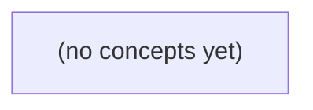

# 04.03 HTTP 与 WebSocket 入门

*面向 Go 初学者，从虚构 IM 的只读历史消息查询任务出发，建立 HTTP 请求、响应与业务合同的基础认识，再由实时消息需求自然过渡到 WebSocket 握手、帧、应用载荷和确认边界。全书采用静态示例、协议拆解与纸上练习，不要求运行 Go 程序、网络或服务。*

**章节:** 2

---

## 本书导览

- 了解整本书的章节脉络
- 掌握各章之间的概念依赖关系
- 选择最合适的阅读顺序

# 04.03 HTTP 与 WebSocket 入门

面向 Go 初学者，从虚构 IM 的只读历史消息查询任务出发，建立 HTTP 请求、响应与业务合同的基础认识，再由实时消息需求自然过渡到 WebSocket 握手、帧、应用载荷和确认边界。全书采用静态示例、协议拆解与纸上练习，不要求运行 Go 程序、网络或服务。

下方的概念图展示了本书 0 个核心概念以及它们之间的依赖关系；再下方是 1 个章节的入口。你可以按从上到下的顺序阅读，也可以根据自己的兴趣或先验知识选择切入点。

#### 概念图



## 章节索引

- **04.03 HTTP 与 WebSocket 入门：从历史查询到双向消息通道** — 承接04.01应用协议/确认点、04.02名称地址端口，面向Go初学者先用虚构IM只读历史查询讲HTTP方法、资源、请求行/头/正文、响应状态与JSON，再解释HTTP/1.1 WebSocket Upgrade、101握手、持久双向帧、应用消息和不同成功边界。静态课程不运行服务或网络实验。

## 04.03 HTTP 与 WebSocket 入门：从历史查询到双向消息通道

- 把URL、方法、路径、头部和正文映射到历史查询需求
- 区分HTTP协议状态与IM业务结果及权限
- 读懂一组示意HTTP/1.1请求和响应
- 理解GET的安全语义和分页/限额的需求边界
- 解释WebSocket的HTTP/1.1升级握手与101的含义
- 区分TCP字节流、WebSocket帧/消息和IM业务消息
- 区分Ping/Pong、连接存活、服务端受理、设备送达和已读
- 制定先HTTP查询后双向通道的个人实现与验证阶梯

从本地命令行的历史消息需求出发，先建立可验证的 HTTP 查询模型，再为未来实时收发消息理解 WebSocket 的升级与边界。

### 先把历史查询说清楚

### 先把历史查询说清楚

假设未来教学服务提供：

`GET /v1/conversations/c-a/messages?limit=20`

它表达的不是“立刻能在本地命令行执行的命令”，而是一份待实现的 HTTP 查询约定：客户端请求会话 `c-a` 的历史消息，最多取得最近的 `20` 条。

先明确输入边界：

- 路径中的 `c-a` 是会话标识；`u-a`、`u-b` 可视为参与者，`m-a` 可视为某条消息标识，均为虚构数据。
- `limit` 是页大小，应规定允许范围，例如 $1\le limit\le100$；缺省值也应预先写明，例如 `20`。
- 若历史消息很多，仅靠 `limit` 不足以翻页。后续可加入游标，如 `?limit=20&before=m-a`，表示取得 `m-a` 之前的一页，而不是依赖不稳定的页码。

权限必须先于输出：请求者只能读取自己有成员资格或被明确授权的会话。会话不存在与“无权访问”是否返回不同状态，应由服务的安全策略决定；无论如何，客户端不应据此推断他人会话内容。

成功响应可采用 JSON：

```json
{
  "conversation_id": "c-a",
  "messages": [
    {
      "id": "m-a",
      "sender_id": "u-a",
      "content": "你好",
      "created_at": "2025-01-01T10:00:00Z"
    }
  ],
  "next_before": "m-a"
}
```

其中 `messages` 应约定排序方向，例如按时间从新到旧；`next_before` 是下一页请求所需的游标，若为 `null` 则表示没有更早消息。先把这些可检查的输入、权限和输出说清楚，实时 WebSocket 才有稳定的历史基线可接续。

### HTTP 请求如何表达查询

### HTTP 请求如何表达查询

要查询会话 `c-a` 的历史消息，可把需求明确写成：调用者 `u-a` 在其权限范围内，读取会话 `c-a` 中最多 `20` 条消息。未来教学服务可约定接口：

`GET /v1/conversations/c-a/messages?limit=20`

这不是“一个网址字符串”，而是一份分层表达的 HTTP 请求：

- **方法 `GET`**：表示读取资源，而非创建、修改或删除。历史查询应优先使用 `GET`，便于重试、缓存和审计。
- **路径 `/v1/conversations/c-a/messages`**：描述资源层级。`v1` 是接口版本，`conversations` 是会话集合，`c-a` 是目标会话标识，`messages` 是该会话下的消息集合。
- **查询参数 `limit=20`**：限定本次返回数量，属于分页范围的一部分；它不改变“查询消息”这一资源含义。服务端还应定义合法范围，例如只接受正整数，并设定最大值。
- **请求头**：承载资源路径之外的上下文，例如 `Accept: application/json` 表示希望获得 JSON，认证头则用于证明请求者身份。身份为 `u-a` 不应仅靠 URL 声明，而应由认证信息验证。
- **可选正文**：通常不为此类 `GET` 查询使用正文。筛选条件应优先放在明确的查询参数中；不同中间件对 `GET` 正文支持不一致。

可将其抽象为：

`请求 = 方法 + 路径 + 查询参数 + 请求头 + 可选正文`

服务端收到请求后，不能只因路径中有 `c-a` 就返回数据，还必须检查：认证后的主体是否为允许访问该会话的用户，例如 `u-a`；`limit=20` 是否有效；结果是否按约定排序。若允许访问，响应可返回 JSON 消息数组及后续分页所需信息；若无权限，应返回权限相关错误，而不是泄露消息是否存在。当前这只是未来服务的接口契约，本地 CLI 尚不能据此发起真实查询。

### 响应成功不等于业务成功

### 响应成功不等于业务成功

一次 HTTP 查询至少有两层结果：**传输与协议层**，以及**应用业务层**。例如未来客户端请求：

`GET /v1/conversations/c-a/messages?limit=20`

HTTP 状态码首先说明服务器如何处理这次请求，但它不能单独证明“消息已成功取得”。

- `200 OK`：请求格式可接受，服务器完成了处理；仍应读取 JSON，确认业务字段、数据范围与权限语义。
- `400 Bad Request`：参数不合法，例如 `limit=abc`、负数或超过约定范围。
- `401 Unauthorized`：未提供有效身份凭证，服务器无法判断请求者是谁。
- `403 Forbidden`：身份已确认，但如 `u-b` 无权读取会话 `c-a`，不能仅因 URL 中存在该会话标识就返回消息。
- `404 Not Found`：会话 `c-a` 不存在；有些系统也会对无权访问者返回 `404`，以避免泄露会话是否存在。
- `429 Too Many Requests`：请求频率超过限额，属于服务保护边界。

即使收到 `200`，客户端仍要验证 JSON 业务结果。例如：

`{"messages":[],"limit":20,"has_more":false}`

这表示查询成功，但结果恰好为空；它不等于“会话不存在”，更不等于“当前用户一定有全部历史权限”。相反，若设计采用统一业务错误结构：

`{"ok":false,"error":{"code":"LIMIT_OUT_OF_RANGE","message":"分页数量超出允许范围"}}`

则客户端必须依据 `ok` 与 `error.code` 判断业务结论，而不是看到 JSON 能解析就当作成功。

因此，`u-a`、`u-b` 对 `c-a` 的访问权，`limit` 的合法区间，以及分页游标是否有效，都是不同于网络连通性的验证点。HTTP 成功只说明“得到了一份响应”；业务成功还要求这份响应确实符合权限、参数和数据语义。

### 读懂一轮历史查询报文

### 读懂一轮历史查询报文

设想未来教学服务提供历史查询接口，但**当前本地 CLI 尚未连接该服务**。CLI 已知要查询会话 `c-a`，用户 `u-a` 以成员身份请求最近 20 条消息：

```text
GET /v1/conversations/c-a/messages?limit=20 HTTP/1.1
Host: api.example.edu
Accept: application/json
Authorization: Bearer <u-a 的访问令牌>

```

第一行是**请求行**：`GET` 表示读取；路径定位会话 `c-a` 的消息集合；`limit=20` 是查询参数，限定本页最多返回 20 条。随后是**请求头**：`Host` 指明目标服务，`Accept` 表示客户端希望获得 JSON，`Authorization` 用于服务端验证 `u-a` 是否有权读取该会话。头部后的空行标志请求头结束；此类 `GET` 通常没有正文。

若权限通过且存在消息，响应可为：

```text
HTTP/1.1 200 OK
Content-Type: application/json
X-Next-Cursor: m-a

{"conversation_id":"c-a","messages":[{"id":"m-a","sender":"u-b","text":"你好"}],"next_cursor":"m-a"}
```

首行是**状态行**：`200 OK` 表示查询成功。`Content-Type` 声明正文格式为 JSON；`X-Next-Cursor` 与正文中的 `next_cursor` 都提示下一页起点。下一次可请求 `?limit=20&cursor=m-a`，而不是猜测页码。

若 `u-a` 无权访问，应返回 `403 Forbidden`；会话不存在可返回 `404 Not Found`。状态码、头部与 JSON 正文共同构成可检查的证据：不要仅因收到“看起来像消息”的文本，就断言查询成功。

### 从一次查询走向双向通道

### 从一次查询走向双向通道

本地 CLI 的第一步不是“实时聊天”，而是读取已有历史：未来教学服务可约定 `GET /v1/conversations/c-a/messages?limit=20`。其中 `c-a` 是虚构会话标识，`limit=20` 限定单页最多返回 20 条；调用前必须确认当前身份是否有读取该会话的权限。响应可为 JSON，至少包含消息标识、发送者、内容、服务端时间与分页线索。此处是在定义接口契约，不表示服务已经实现。

HTTP 查询适合“我现在需要一页已存在的数据”：请求有明确开始和结束，失败可重试，结果也便于保存为证据。若消息持续到来，客户端不断轮询会带来延迟、重复查询与无效响应；这才是引入 WebSocket 的理由。

WebSocket 通常先发起一次 HTTP/1.1 请求，并携带升级意图：

`Connection: Upgrade`  
`Upgrade: websocket`

服务器接受后返回 `101 Switching Protocols`。从这一刻起，同一条底层连接不再按普通 HTTP 请求—响应交换，而是传输 WebSocket 帧。帧是传输单位，可能承载文本、二进制、控制信息，或只是一个较大消息的片段；应用应以“完整消息”处理业务 JSON，而不应假定“一帧就是一条聊天消息”。

实现阶梯应保持可验证：

1. 先用 HTTP 查询历史，并检查分页、权限与 JSON 字段。
2. 再连接 WebSocket，只处理新到达的消息事件。
3. 收到消息后发送“已送达”确认；用户实际查看后才发送“已读”确认。
4. 以消息标识关联确认，处理重连、重复投递和乱序，避免把“连接成功”误当作“对方已读”。

> **要点** — 先用 HTTP 明确查询与权限边界，再用 WebSocket 承载持续双向消息，并分层验证连接、受理、送达和已读。

从“查询某个会话的历史消息”出发，拆解一条HTTP/1.1 GET请求中各部分如何共同表达检索意图与约束。

### 把历史查询翻译成URL与GET

### 把历史查询翻译成 URL 与 GET

“读取某个会话的历史消息”可先表达为一个检索型 HTTP 请求：

```text
GET /v1/conversations/c_123/messages?limit=50&before=m_900 HTTP/1.1
Host: api.example.com
Accept: application/json

```

第一行是请求行：`GET` 表示希望获取资源表示；路径 `/v1/conversations/c_123/messages` 指向会话 `c_123` 的消息集合；`limit=50` 请求最多返回 50 条，`before=m_900` 表示从某条消息之前继续向前翻页。最后的空行表示标头结束；此类 GET 通常不带请求正文。

可将目标地址拆为：

`https://api.example.com:443/v1/conversations/c_123/messages?limit=50&before=m_900`

- `https`：协议方案，决定使用 HTTP 的安全传输方式。
- `api.example.com`：主机，HTTP/1.1 中还需通过 `Host` 标头明确目标站点。
- `443`：端口；HTTPS 的默认端口可省略。
- `/v1/.../messages`：路径，描述资源层级。
- `?limit=...&before=...`：查询参数，描述筛选、排序或分页约束。

会话 ID 属于资源定位的一部分，可以放在路径中；但认证身份、访问令牌、用户隐私信息不应放入 URL，因为 URL 容易出现在浏览器历史、代理记录和服务日志中。

GET 按 HTTP 语义应当是“安全”的：它不应要求服务器修改会话、删除消息或推进业务状态。记录访问日志、统计指标等技术性副作用可以存在，但不能把“查询”设计成隐含业务写入。服务端还应限制 `limit` 上限，并明确处理未知参数、非数字值、负数或过大的游标。

### 读懂请求行、标头与空行

### 读懂请求行、标头与空行

设客户端要查询会话 `c42` 的历史消息，可发出一条 HTTP/1.1 请求：

```text
GET /conversations/c42/messages?limit=20 HTTP/1.1
Host: api.example.com
Accept: application/json

```

第一行是**请求行**，格式为：

`方法 路径与查询字符串 HTTP版本`

其中 `GET` 表示检索资源；按 HTTP 语义，它是 *safe* 的：服务端不应因这次请求改变会话消息、删除数据或创建业务对象。记录访问日志、更新监控计数等技术性副作用可以存在，但不能把“查询”设计成业务状态修改。

`/conversations/c42/messages` 是路径，用于定位资源；`?limit=20` 是查询字符串，用于补充检索条件。完整 URL 还可拆为：

`https://api.example.com:443/conversations/c42/messages?limit=20`

- `https`：scheme，约定使用何种通信协议；
- `api.example.com`：host，目标服务器；
- `443`：port，HTTPS 的常见默认端口，可省略；
- `/conversations/.../messages`：path，资源层级；
- `limit=20`：query，过滤、分页或排序等参数。

注意，请求行通常只包含路径和查询，不重复写 scheme、host、port；目标主机由 `Host` 标头补充。HTTP/1.1 中 `Host: api.example.com` 很关键：同一 IP 可承载多个站点，服务器据此选择正确的虚拟主机。

`Accept: application/json` 是另一种标头。标头描述请求的元数据与协商条件：客户端希望响应采用 JSON 表示，但它不等于请求正文，也不意味着服务端必须接受任意本地 JSON v1 格式。

最后的**空行**标志标头区结束。此例没有正文，所以空行后即请求结束；若有正文，正文会从空行之后开始。

### GET的安全语义与查询边界

### GET的安全语义与查询边界

`GET` 的语义是“读取资源表示”：客户端请求服务器返回某个资源当前可见的信息，而不应要求服务器因此改变业务资源状态。这里的“安全”不是指网络绝对安全、不会泄露数据，而是指在 HTTP 语义上可重复执行，不应产生业务上的新增、修改或删除。

例如，以下请求适合使用 `GET`：

```text
GET /conversations/42/messages?limit=20 HTTP/1.1
Host: api.example.com
Accept: application/json

```

它表达的是：读取会话 `42` 的消息，并希望最多得到 `20` 条。即使用户刷新页面、浏览器预取、代理重试，服务器也不应因此把消息标为已读、创建会话、扣减额度或删除记录。若“查询历史消息”顺便把所有消息标记为已读，那么这个接口实际上包含业务修改，更适合拆分为独立的写操作请求。

安全语义并不意味着服务器毫无副作用。记录访问日志、统计耗时、生成追踪标识、更新缓存、限制异常频率，通常属于可接受的运行维护副作用；它们不应改变用户关心的资源业务状态。关键判断是：**同一个 GET 被额外执行一次，用户的数据、权限、订单、消息状态等是否发生了可观察的业务变化？**

查询参数也需要明确边界：

- `limit` 应设置上限，例如最大 `100`，避免一次请求拖垮服务；
- 非法值如 `limit=-1`、`limit=abc` 应返回明确的客户端错误；
- 未支持的参数不能悄悄产生未知行为，可忽略并记录，或直接拒绝；
- 不应把用户 ID、令牌等敏感身份信息放进 URL，因为 URL 常进入日志、浏览器历史和代理记录。

因此，`GET` 不只是“用来查数据”的习惯，而是一份可被浏览器、缓存和中间代理共同理解的承诺：读取可以被重复，但业务状态不应因此改变。

### 分页、限额与非法参数处理

### 分页、限额与非法参数处理

历史消息通常不能一次返回全部数据，应通过查询参数声明分页策略，例如：

`GET /conversations/42/messages?limit=50&cursor=eyJpZCI6MTAwfQ`

其中，`limit` 表示期望返回的最多条数，服务端应规定明确边界：

- 未提供 `limit`：使用稳定的默认值，例如 `20`。
- `limit` 为正整数且不超过上限：按请求值返回。
- `limit` 超过上限：可截断为最大值，也可返回客户端错误；接口文档必须明确一种规则。
- `limit=0`、负数、小数、空字符串或无法解析的文本：属于非法输入，应返回 `400 Bad Request`。
- 重复参数如 `limit=10&limit=20`：不要依赖框架的隐式行为，应规定取第一个、拒绝请求或其他确定规则。

上限不是“客户端体验细节”，而是服务端资源保护措施。即使客户端请求 `limit=100000`，服务端也不应因其合法的 URL 形式而执行无界查询；常见做法是限定为 `1` 到 `100`，并在响应中返回实际条数及下一页游标。

相比页码 `page=3`，游标更适合持续新增的消息流。页码在新消息插入后可能导致重复或遗漏；游标应编码“从哪里继续读取”的位置，例如最后一条消息的排序键。游标必须被视为不透明值：客户端负责原样回传，不能假设其内部格式，更不能自行拼接。

未知参数也需有策略。对拼写错误的 `limti=50`，宽松接口可忽略，严格接口可返回 `400`；若忽略，应避免让客户端误以为限额已生效。无论采用哪种策略，都要一致，并把参数校验结果与业务响应清楚区分。

### 标头、正文与JSON接口表示

### 标头、正文与 JSON 接口表示

HTTP 请求不是“发送一段 JSON”这么简单，而是由请求行、标头、空行和可选正文共同组成：

```text
GET /v1/conversations/42/messages?limit=20 HTTP/1.1
Host: api.example.com
Accept: application/json

```

其中，标头描述传输与协商的**元数据**：`Host` 指明目标主机，`Accept` 表示客户端希望接收 JSON 表示；还可能包含认证信息、缓存条件、请求追踪标识等。它们通常不属于“消息列表”这一业务对象本身。

空行之后才是正文。对于 `GET`，正文通常为空：查询条件应由路径和查询参数表达，而不是依赖一个 JSON 正文。服务端成功时可返回：

```text
HTTP/1.1 200 OK
Content-Type: application/json

{"items":[...],"nextCursor":"..."}
```

这里的 JSON 是响应正文中的一种**表示格式**，由 `Content-Type: application/json` 说明。JSON 只回答“数据按什么结构编码”，并不定义 HTTP 方法、状态码、缓存语义、认证方式或分页参数位置。

因此，不应把本地的 `messages.v1.json` 文件直接当成 HTTP 接口契约。文件可能只保存消息数组；HTTP 响应还可能需要分页游标、错误结构、版本兼容字段和状态码。接口设计应先明确 HTTP 语义，再规定正文 JSON 的字段与演进规则。

> **要点** — HTTP查询应以GET、URL、标头和明确参数表达检索意图，并为分页、输入与JSON表示设定协议边界。

通过虚构 IM 的历史消息查询，建立“HTTP 成功”与“业务结果可信”的分层判断：200 和空列表只是协议响应，范围、游标与权限仍决定结果含义。

### 用历史查询组织请求要素

### 用历史查询组织请求要素

虚构 IM 的“查询会话历史”应首先拆成可验证的请求要素，而不是把用户身份、消息正文等敏感数据直接塞进 URL。一个教学服务可约定：

`GET /v1/conversations/{conversation_id}/messages?limit=20&before=cursor_abc`

其中：

- `GET` 表示读取既有资源，不改变消息、会话或游标状态。
- 路径参数 `conversation_id` 标识要查询的会话；示例应使用虚构、不可关联真实用户的标识，如 `conv_demo_42`。
- 查询参数 `limit` 控制本次最多返回多少条消息；`before` 或 `cursor` 表示从哪个位置继续向更早历史翻页。
- 认证信息放在请求头，例如 `Authorization: Bearer <教学用令牌>`，不要把令牌放入 URL，以免被日志、浏览器历史或代理记录。
- 可选条件还可包括时间范围、排序方向或消息类型，但必须由服务合同定义其格式、默认值和组合规则。

示意请求：

`GET /v1/conversations/conv_demo_42/messages?limit=20&before=cur_demo_001`

`Accept: application/json`

`Authorization: Bearer <token>`

不要将真实手机号、姓名、邮箱、设备标识或消息正文作为路径、查询参数或示例值。历史查询的目标是定位“哪一个会话、哪一段范围、从何处续查”，而非传输聊天内容本身。

若请求合法且服务成功处理，可返回 `200`、`Content-Type: application/json` 与空的 `messages: []`。空列表只表示当前权限和当前范围内没有可返回项目；它不自动证明历史完整，也不证明即时消息已经送达。客户端仍应结合返回的游标、范围边界和服务合同判断是否需要继续翻页。

### 读懂 200 与 JSON 空结果

### 读懂 200 与 JSON 空结果

设想客户端查询某个会话的历史消息：

`GET /v1/conversations/c_demo/messages?limit=20`

服务返回：

```http
HTTP/1.1 200 OK
Content-Type: application/json; charset=utf-8

{"messages":[],"range":{"from":"2025-03-01T00:00:00Z","to":"2025-03-01T01:00:00Z"},"next_cursor":null}
```

`200 OK` 只表示服务器成功处理了这次 HTTP 请求，并返回了可解析的 JSON 表示；它**不等于**“该会话从创建至今没有消息”，更不等于“历史完整”或“即时消息一定已送达”。

`Content-Type: application/json` 告诉客户端按 JSON 解释响应体。客户端不应仅因状态码为 200 就假定字段存在、类型正确或结果覆盖了预期时间段；仍应检查 `messages`、`range`、游标等业务字段。

`"messages":[]` 是合法结果，可能表示：

- 指定时间范围内确实没有可见消息；
- 查询范围过窄；
- 当前身份无权看到该范围中的内容；
- 游标已到达可分页结果的末尾。

因此，响应应尽量说明查询边界。`range` 表示本次实际覆盖的时间窗口；`next_cursor` 用于继续拉取后续页面。`next_cursor:null` 通常表示当前方向上没有下一页，但其精确定义必须由服务合同约定。

若服务发送 `Content-Length`，其值必须是响应体的**实际字节数**，而不是字符数。尤其 JSON 含中文、emoji 等多字节 UTF-8 字符时，按字符计数会导致客户端截断或等待额外字节。若采用分块传输，也不应伪造不准确的 `Content-Length`。

### 状态码与业务结果分层

### 状态码与业务结果分层

查询虚构 IM 历史时，先判断“HTTP 交互是否成功”，再判断“业务结果是否足够可信”。例如：

- `200 OK`：服务端成功处理请求，并返回 `Content-Type: application/json` 的响应。`messages: []` 可以是合法结果，但不表示“绝无历史消息”，更不表示 IM 消息已经送达；它可能仅说明当前查询范围、游标或权限下没有可见记录。
- `400 Bad Request`：输入不符合接口合同，例如日期格式错误、游标非法、分页参数互相矛盾。
- `401 Unauthorized`：缺少有效认证凭证，或凭证无效、过期；客户端通常需要重新认证。
- `403 Forbidden`：身份已被识别，但无权读取该会话、时间范围或资源。
- `404 Not Found`：目标资源未找到；有些服务也会用它避免披露资源是否真实存在。
- `500 Internal Server Error`：服务端发生未预期失败，客户端不能据此推断消息不存在。

这些是 RFC 9110 的通用语义，具体何时映射为某个状态码，仍由教学服务的接口合同明确。例如“会话不存在”究竟返回 `404` 还是空列表，不能仅凭状态码猜测。

若响应包含 `Content-Length`，其值必须等于响应体的实际**字节数**，而非字符数。超时也不是固定的 HTTP 状态码：可能是客户端等待超时、网关超时，或连接根本未建立。

因此，`200` 只证明本次请求获得了成功响应；还应检查查询范围、下一页游标、权限边界及响应字段。示例中应使用虚构身份与脱敏内容，避免暴露真实用户、令牌或消息正文。

### GET 语义与查询边界

### GET 语义与查询边界

`GET /v1/conversations/{id}/messages` 应被设计为**安全查询**：它不改变消息、已读状态或会话成员关系。因此，筛选条件、分页参数和游标应表达“读取哪一段历史”，而不是触发副作用。

例如可使用：

`GET /v1/conversations/c_42/messages?limit=50&before=cur_x`

其中 `limit` 必须有服务端上限，避免一次读取无限历史；`before` 是不透明游标，表示从某个稳定位置向更早消息继续查询。相比页码，游标更能避免新消息插入后出现重复、跳漏或昂贵的偏移扫描。响应可为：

`200 Content-Type: application/json`

`{"messages":[],"next_cursor":null}`

空 `messages` 是合法结果：该范围内确实没有可见消息、游标已到边界，或过滤条件未命中。它不证明会话历史完整，更不证明 IM 消息已经送达；客户端仍需结合请求范围、游标和权限理解结果。若发送 `Content-Length`，其值必须等于响应体的实际字节数。

错误状态表达协议层原因：`400` 表示 `limit`、游标或筛选值非法；`401` 表示缺少或无效认证；`403` 表示身份已认证但无读取权限；`404` 可表示目标资源不存在，也可在安全策略下用于不披露资源是否存在；`500` 表示服务端内部失败。具体如何区分会话不存在、成员不可见与游标失效，应由教学服务合同明确。

超时不是固定的 HTTP 状态：可能是客户端等待截止、网关超时或服务端失败，必须结合实际响应、重试策略和幂等的查询语义处理。示例中只使用虚构会话标识，不暴露真实身份或消息正文。

### 建立可验证的实现阶梯

### 建立可验证的实现阶梯

先把“能返回数据”拆成可逐层验收的目标，避免一开始就把 HTTP、WebSocket、送达、已读混在一起调试。

1. **完成历史查询的输入验证**  
   约定请求中的会话标识、范围或游标格式，例如 `limit` 必须在允许区间内、`cursor` 必须可解析。非法参数返回 `400`；不要把数据库异常伪装成输入错误。测试时覆盖缺参数、超范围、损坏游标与合法边界值。

2. **验证认证与授权边界**  
   缺少或无效凭证使用 `401`，已认证但无权读取该会话使用 `403`。若服务合同要求不披露资源存在，也可对不可见目标返回 `404`。响应中不得包含真实用户身份、消息正文或权限规则细节。

3. **验证成功页与空页**  
   合法查询返回 `200` 与 `Content-Type: application/json`，例如 `{"messages":[],"nextCursor":null}`。空 `messages[]` 只表示当前范围内没有可返回记录，不证明历史完整；客户端仍应结合查询范围、游标和 `nextCursor` 判断是否可继续翻页。若发送 `Content-Length`，其数值必须与响应体的实际字节数一致。

4. **验证失败可区分、内部细节不可见**  
   未预期的服务端失败返回 `500`，仅给出稳定的错误码或请求追踪标识。网络超时、网关超时或客户端取消并不是固定的 HTTP 状态，应由客户端、代理和教学服务合同分别定义处理方式。

5. **最后接入 WebSocket**  
   仅在历史查询的输入、权限、空页和错误路径均可复现后，再建立双向消息通道。先验证连接、鉴权、订阅与消息格式；发送成功只能说明服务端接受，不能直接等同于对方送达或已读。为后续事件预留独立字段或类型，如“已接收”“已送达”“已读”，并明确它们各自的业务证据与权限边界。

> **要点** — HTTP 状态描述本次协议处理；历史是否完整、消息是否送达，必须由范围、游标、权限和业务确认共同判断。

历史消息查询天然适合一次请求对应一次响应；在线聊天则需要评估轮询、长轮询与持久双向通道的边界。

### 历史查询为何适合HTTP

### 历史查询为何适合 HTTP

历史消息是“客户端提出条件，服务端返回有限结果”的典型查询：用户打开会话、上拉加载更早消息、按时间检索，都可以明确描述为一次请求和一次响应。即使结果为空，也仍是完整且可解释的响应。

以虚构 IM 查询会话 `c_123` 的历史消息为例：

- **方法**：`GET`，表示读取资源，不修改消息。
- **路径**：`/api/v1/conversations/c_123/messages`
- **查询参数**：放入 URL，用于表达筛选、排序和分页条件。
- **请求头**：携带身份凭证、接受的响应格式等元信息。
- **请求体**：普通 `GET` 查询通常不使用；复杂检索可另设 `POST /messages/search`，但不应把“查询”误解为必须使用 `POST`。
- **响应体**：返回 JSON，包含消息列表与下一页游标。

例如：

`GET /api/v1/conversations/c_123/messages?before=msg_900&limit=20 HTTP/1.1`

`Authorization: Bearer <访问令牌>`  
`Accept: application/json`

其中 `before=msg_900` 表示取该消息之前的记录，`limit=20` 限制本页数量。相比页码，游标分页更适合持续新增的消息流：新消息插入时，较不容易造成翻页重复或遗漏。

服务端可返回：

```json
{
  "messages": [
    {
      "id": "msg_899",
      "senderId": "u_42",
      "content": "明天十点开会",
      "createdAt": "2025-03-08T09:30:00Z"
    }
  ],
  "nextBefore": "msg_880",
  "hasMore": true
}
```

客户端依据 `hasMore` 决定是否继续请求，并将 `nextBefore` 作为下一次查询条件。这里 HTTP 的关键优势是边界清晰：请求对应一段确定历史，响应可缓存、重试、记录日志，也容易用状态码表达结果，例如 `200` 成功、`401` 未认证、`403` 无权查看该会话、`404` 会话不存在。

### 读懂查询请求与响应结果

### 读懂查询请求与响应结果

历史消息查询通常是一次明确的 HTTP 请求，对应一次可缓存、可重试、可分页的响应。例如客户端查询会话 `c_42` 中较早的一页消息：

```http
GET /api/conversations/c_42/messages?before=m_120&limit=20 HTTP/1.1
Host: chat.example.com
Authorization: Bearer <访问令牌>
Accept: application/json
```

第一行是**请求行**：`GET` 表示读取资源，路径定位消息集合，查询参数表达分页条件。`before=m_120` 表示从消息 `m_120` 之前继续向历史方向查询；`limit=20` 是期望条数，不一定保证服务端恰好返回 20 条。其后的 `Host`、`Authorization`、`Accept` 都是**请求头**；此类 `GET` 请求通常没有正文。

服务端可能返回：

```http
HTTP/1.1 200 OK
Content-Type: application/json

{
  "conversationId": "c_42",
  "messages": [
    {"id": "m_119", "text": "上一条消息", "sentAt": "2025-03-08T10:00:00Z"}
  ],
  "page": {
    "nextBefore": "m_119",
    "hasMore": true
  }
}
```

响应第一行中的 `200` 是 HTTP **状态码**，说明这次请求在协议与服务端处理层面成功；它不等于“查到消息”，更不等于“用户在线”。真正的业务结果在 JSON 正文中：`messages` 是本页数据，`hasMore` 指示是否还有更早记录，`nextBefore` 是下一页请求可使用的游标。

若会话不存在、无权访问或参数非法，常见状态码分别可能是 `404`、`403`、`400`。因此客户端应先按状态码判断请求是否成功，再解析业务字段，而不能只看到响应体就假定查询有效。

### 成功状态不等于业务成功

### 成功状态不等于业务成功

HTTP 状态码回答的是“这次 HTTP 交互在协议层是否被正确处理”，并不自动表示“聊天业务目标已经达成”。例如：

- `200 OK`：服务器成功返回了响应；但响应体可能说明会话不存在、无权访问，或查询结果为空。
- `401 Unauthorized`：通常表示未提供有效身份凭证、凭证失效或需要重新认证。
- `403 Forbidden`：身份可能有效，但当前用户没有访问该会话、撤回该消息或读取该历史记录的权限。
- `404 Not Found`：请求的资源不存在；也可能是服务端为避免泄露资源存在性，将“无权访问”统一表现为不存在。
- `409 Conflict`：请求与当前业务状态冲突，例如重复创建会话、撤回一条已撤回的消息。
- `5xx`：服务端或其依赖发生异常，客户端不能把它当作“消息已送达”。

因此，客户端不能只写“状态码为 `200` 就显示成功”，还必须解析约定的业务结果。例如：

```text
HTTP 200
{
  "code": "CONVERSATION_NOT_FOUND",
  "message": "会话不存在"
}
```

这里协议请求成功到达并被处理，但业务操作失败。相反，历史消息查询返回 `200` 且 `items: []` 往往不是错误，只表示“在当前查询条件、权限范围和时间窗口内没有结果”。

对即时通信还应进一步区分：`HTTP 200`、WebSocket 已连接、服务端已接受消息、消息已持久化、对方已收到、对方已读，是不同边界。连接建立只说明通道可用；身份、会话成员资格、消息合法性以及最终送达，仍需由认证、授权和业务确认分别证明。

### 在线消息的推送方案取舍

### 在线消息的推送方案取舍

在线消息的核心矛盾是：客户端想“立刻知道”，服务器却不能在普通 HTTP 响应结束后继续向客户端说话。常见方案可按连接持续时间与请求频率比较。

| 方案 | 基本方式 | 时延 | 资源与流量成本 | 实现复杂度 | 适用场景 |
|---|---|---:|---|---|---|
| 重复轮询 | 客户端每隔 $T$ 秒请求一次 | 最坏接近 $T$，平均约 $T/2$ | 大量空响应、重复鉴权与请求头 | 低 | 低频状态刷新、简单通知 |
| 长轮询 | 请求到达后由服务器暂挂；有消息或超时才响应，客户端随即再发 | 通常较低 | 空响应较少，但大量等待请求占用连接与服务端状态 | 中 | 消息量不高、无法使用 WebSocket 的兼容场景 |
| 双向持久连接 | 建立一次连接，在其上持续收发消息 | 通常最低 | 避免重复 HTTP 开销，但需维持心跳、连接状态和扩容能力 | 高 | 聊天、协作编辑、实时游戏、行情订阅 |

重复轮询最容易实现，却会出现“明明没有新消息，仍不断发请求”的浪费。若轮询间隔为 5 秒，用户可能要等待接近 5 秒才能看到新消息；缩短间隔能降低时延，却会成倍增加服务器压力。

长轮询把“马上返回空结果”改为“先等待”。它减少无效请求，但服务器需要管理大量挂起请求，还要处理超时、断线、代理限制和客户端重连。它本质上仍是客户端发起 HTTP 请求，服务器只是延迟响应。

双向持久连接，例如 WebSocket，适合双方都可能随时发消息的场景。连接建立后，服务器可以主动推送，客户端也无需为每条消息新建 HTTP 请求。不过，持久连接不是免费资源：每个在线连接都消耗文件描述符、内存、心跳与负载均衡状态。

因此，不应把 WebSocket 当作所有 API 的默认替代品：历史记录、搜索、提交表单等离散操作仍适合 HTTP；只有实时性和交互频率足以覆盖连接维护成本时，双向通道才更划算。

### 从Upgrade到双向消息通道

### 从 Upgrade 到双向消息通道

客户端先发起一个普通的 HTTP/1.1 请求，并声明希望升级协议：

`Connection: Upgrade`  
`Upgrade: websocket`

服务器若接受，会返回 `101 Switching Protocols`。从这一刻起，原来的 HTTP 请求/响应语义结束：同一条底层 TCP 连接不再按“一个请求对应一个响应”工作，而进入 WebSocket 协议。它通常保持较长时间，客户端和服务器都可以随时发送数据。

但“连接已建立”包含多个层次，不能混为一谈：

- **TCP 字节流**：TCP 只保证字节按序、可靠地到达对端操作系统；它没有“聊天消息”的边界。
- **WebSocket 帧**：WebSocket 在 TCP 字节流上定义帧边界、文本/二进制类型、分片、关闭和 Ping/Pong 等控制机制。一个业务消息可放入一个帧，也可跨多个帧；多个帧也可能在一次 TCP 读取中一起出现。
- **IM 业务消息**：例如 `{"type":"chat","msgId":"m123","text":"你好"}`。这是应用自己定义的协议，需要规定消息编号、会话、发送者、时间戳、重试和幂等规则。
- **送达确认**：TCP 成功写入、WebSocket 帧被对端收到、服务端已持久化、已投递给目标设备、用户已阅读，分别是不同事实。业务应显式定义如“服务端确认”“设备送达”“已读回执”，不能把 `send()` 成功当作消息送达。

因此，`101` 只表示协议切换成功，不表示用户已登录、连接仍在线，或消息一定可达。实际系统通常在 Upgrade 后再发送鉴权消息、心跳和业务确认；连接断开后还需重连、恢复会话，并依据 `msgId` 去重或补发。

> **要点** — HTTP适合可分页的历史查询；WebSocket适合持续双向消息，但建连、授权、送达与已读必须分别验证。

WebSocket 并非绕开 HTTP 的“另一套登录通道”，而是先完成一次受约束的 HTTP/1.1 升级，再进入持久双向消息交换。

### 从历史查询到实时通道

### 从历史查询到实时通道

即时通信客户端通常把“已发生的数据”和“正在发生的变化”分给两条通道：

1. **HTTP 查询历史**：进入会话、下拉刷新或断线恢复时，客户端请求 `GET /v1/events`，按游标、时间或消息 ID 获取既有事件。HTTP 请求有明确的开始与结束，适合分页、筛选、缓存与重试。
2. **WebSocket 接收增量**：历史追平后，客户端建立长期连接，持续接收新消息、撤回、已读回执、成员变更等事件。它不是历史数据库的替代品，而是“后续变化通知管道”。

WebSocket 仍从 HTTP/1.1 握手开始。例如客户端向文档域名发起：

```text
GET /v1/events HTTP/1.1
Host: chat.example.test
Upgrade: websocket
Connection: Upgrade
Sec-WebSocket-Key: dGhlIHNhbXBsZSBub25jZQ==
Sec-WebSocket-Version: 13
```

服务端若接受升级，返回：

```text
HTTP/1.1 101 Switching Protocols
Upgrade: websocket
Connection: Upgrade
Sec-WebSocket-Accept: s3pPLMBiTxaQ9kYGzzhZRbK+xOo=
```

其中 `101 Switching Protocols` 只表示 HTTP 连接已切换为 WebSocket；它不表示某条消息、某个“m-a”业务请求已经被受理。握手失败也可能表现为普通 HTTP 错误、版本不支持或代理拦截。

`Sec-WebSocket-Key` 与 `Sec-WebSocket-Accept` 用于确认升级计算，不是身份凭据。客户端仍须通过 `Origin` 校验、Cookie、令牌或其他认证机制建立可信会话；服务端也必须独立验证身份与权限。实际同步时，应以事件 ID 或游标去重：先拉取历史，再订阅增量，并在重连后从最后确认的位置继续查询，避免遗漏或重复。

### 读懂升级请求与 101 响应

### 读懂升级请求与 101 响应

WebSocket 握手是一次带有明确升级意图的 HTTP/1.1 请求。例如客户端连接 `chat.example.test` 的事件通道：

```http
GET /v1/events HTTP/1.1
Host: chat.example.test
Upgrade: websocket
Connection: Upgrade
Sec-WebSocket-Key: dGhlIHNhbXBsZSBub25jZQ==
Sec-WebSocket-Version: 13
```

各字段承担不同职责：

- `GET /v1/events`：先定位普通 HTTP 资源路径；是否允许在该路径升级由服务端决定。
- `Host`：指明目标虚拟主机，此处为 `chat.example.test`。
- `Upgrade: websocket`：请求把当前 HTTP 连接切换为 WebSocket。
- `Connection: Upgrade`：声明 `Upgrade` 是本跳连接级字段；经代理时仍可能被处理、剥离或拒绝。
- `Sec-WebSocket-Version: 13`：指定 RFC 6455 使用的版本。
- `Sec-WebSocket-Key`：客户端生成的随机值，用于确认服务端确实理解 WebSocket 握手，而不是身份凭据。

服务端接受升级时返回：

```http
HTTP/1.1 101 Switching Protocols
Upgrade: websocket
Connection: Upgrade
Sec-WebSocket-Accept: s3pPLMBiTxaQ9kYGzzhZRbK+xOo=
```

`101 Switching Protocols` 的含义仅是：从响应结束后的同一 TCP 连接开始，字节流不再按 HTTP 报文解释，而按 WebSocket 帧格式传输。`Sec-WebSocket-Accept` 由客户端的 Key 拼接固定 GUID `258EAFA5-E914-47DA-95CA-C5AB0DC85B11`，再经 SHA-1 和 Base64 得到；上述 Key 恰好对应 RFC 6455 示例中的 Accept 值。

因此，`101` 不表示某条业务消息已被受理，更不等于用户已登录。握手可能因路径不存在、权限不足、版本不兼容或代理不支持升级而返回普通 HTTP 错误。服务端还必须独立校验 `Origin`、Cookie、令牌或其他身份信息；绝不能把握手自带的 `Sec-WebSocket-Key` 当作认证凭据。

### 握手成功不等于业务受理

### 握手成功不等于业务受理

`101 Switching Protocols` 只证明客户端与服务器已完成 WebSocket 协议切换；它不是“消息已被 IM 系统接受”，更不是“对方设备已收到”或“对方已读”。

客户端可向文档域名发起升级请求：

```http
GET /v1/events HTTP/1.1
Host: chat.example.test
Upgrade: websocket
Connection: Upgrade
Sec-WebSocket-Key: dGhlIHNhbXBsZSBub25jZQ==
Sec-WebSocket-Version: 13
```

服务端若接受升级，返回：

```http
HTTP/1.1 101 Switching Protocols
Upgrade: websocket
Connection: Upgrade
Sec-WebSocket-Accept: s3pPLMBiTxaQ9kYGzzhZRbK+xOo=
```

其中 `Sec-WebSocket-Accept` 与 RFC 6455 官方示例的 `Key` 配对，用于证明服务端理解 WebSocket 握手规则；`Key` 是一次性挑战值，**不是登录令牌或身份凭据**。服务端仍须单独校验 Cookie、Bearer Token、会话状态等，并按策略验证 `Origin`。握手可能因鉴权失败、`Origin` 不允许、版本不支持或代理拒绝而返回普通 HTTP 错误，而非 `101`。

更重要的是区分成功边界：

- **握手成功**：连接可发送 WebSocket 帧。
- **身份成功**：当前连接绑定了可用用户、租户和设备身份。
- **业务受理**：服务端验证消息格式、权限、幂等键并持久化或进入队列。
- **设备送达**：目标设备实际收到消息，不等于服务器已受理。
- **已读**：目标用户或设备产生阅读确认，属于更晚的业务状态。

因此，聊天客户端不应把 `101` 当作“发送成功”提示；应由应用层消息标识和确认事件表达“已受理”“已送达”“已读”。

### 升级后的帧、消息与存活信号

### 升级后的帧、消息与存活信号

`101 Switching Protocols` 之后，同一条 TCP 连接不再承载 HTTP 请求行与响应头，而是传输 WebSocket **帧**。必须区分三个层次：

- **TCP 字节流**：只保证字节按序、可靠到达；它没有“消息边界”。一次 `recv()` 得到的字节可能只是半个帧，也可能包含多个帧。
- **WebSocket 帧**：有操作码、长度、结束标志等结构。一个文本或二进制**消息**可由一个帧组成，也可被拆分为多个连续帧后重组。
- **IM 业务消息**：例如“发送消息”“已送达”“已读”或事件 `m-a`。它们通常编码在 WebSocket 文本帧或二进制帧的载荷中，并由应用协议定义 `id`、类型、确认状态等。

因此，收到 TCP 数据不等于收到完整 WebSocket 消息；收到完整 WebSocket 消息，也不等于服务端已受理业务请求。

WebSocket 定义了控制帧用于存活管理：

- **Ping**：一端询问对端连接是否仍可用。
- **Pong**：对 Ping 的响应，也可主动发送。
- **Close**：请求有序关闭连接。

Ping/Pong 只能表明“此时链路及对端协议栈大致可响应”，不能证明用户身份仍有效、订阅权限仍存在，或某条 `m-a` 已写入数据库。业务层应为关键操作设计独立确认，例如服务端返回 `{type:"accepted", id:"..."}`，必要时再区分“已受理”“已持久化”“已投递”。若长时间未收到 Pong 或业务心跳，可主动关闭并重连；重连后还应重新认证、恢复订阅，并按业务消息编号处理可能的重复投递。

### 为 Go 客户端制定验证阶梯

### 为 Go 客户端制定验证阶梯

不要一开始就把“查历史、连 WebSocket、发消息、等回执”写成一条长流程。应把每层可验证条件拆开，失败时才能定位在 HTTP、权限、握手、传输还是业务语义。

1. **先验证 HTTP 历史查询**：使用 `GET /v1/events?page=1&limit=...`，检查状态码、分页字段、事件顺序与响应体可解析性。`200 OK` 只说明查询成功；若得到 `401/403`，应先修复身份与权限，不要继续测试实时通道。

2. **再验证升级握手**：客户端请求应包含 `Host: chat.example.test`、`Upgrade: websocket`、`Connection: Upgrade`、`Sec-WebSocket-Version: 13`，并使用 RFC 6455 示例中的 `Sec-WebSocket-Key`。服务端必须返回：
   ```text
   HTTP/1.1 101 Switching Protocols
   Upgrade: websocket
   Connection: Upgrade
   Sec-WebSocket-Accept: s3pPLMBiTxaQ9kYGzzhZRbK+xOo=
   ```
   `101` 仅表示 HTTP 已切换协议；`400`、`401`、`403`、版本不匹配或代理剥离升级头都属于握手失败。握手中的 `Key` 用于计算 `Accept`，不是认证凭据；`Origin`、令牌和会话身份必须独立校验。

3. **验证单向收发**：连接建立后，先读取一条服务端事件，再发送一条最小合法消息。Go 中应为读写设置截止时间，并区分网络关闭、协议错误与 JSON 解码错误。

4. **最后验证业务回执**：发送消息时携带客户端生成的请求标识；仅在收到匹配标识、状态成功且内容符合预期的业务回执后，才判定“消息已受理”。连接成功或帧已写出，都不等于业务操作成功。

> **要点** — 101 仅证明 HTTP 已切换为 WebSocket；认证、消息受理、送达与已读必须由独立机制确认。

WebSocket并非“更长的HTTP响应”，而是在HTTP升级后，用帧组织双向消息的独立协议层；理解边界才能正确设计IM确认语义。

### 从TCP字节流到WebSocket帧

### 从TCP字节流到WebSocket帧

网络传输中最容易混淆的是“数据到了”究竟指哪一层。应明确区分四个对象：

1. **TCP 字节流**：TCP 只保证字节按序、可靠地到达，不保留发送方的 `write` 边界。一次接收可能拿到半个 WebSocket 帧，也可能连续拿到多个帧；不能把一次 `recv` 当作一条消息。

2. **WebSocket 帧**：升级连接后，双方按 RFC 6455 解析帧头与载荷。帧包含 `FIN`、`opcode`、`payload length`、`masking key` 等字段。`opcode` 表示文本、二进制、续片或控制类型；客户端发往服务端的帧必须掩码，服务端帧不得掩码。掩码仅用于避免中间设备误解析，并非加密。

3. **WebSocket 消息**：一个完整消息可由一帧构成，也可由多个分片帧构成。首帧给出文本或二进制类型，后续使用续片帧，直到 `FIN=1` 才结束。因此，业务层应在收到完整消息后再解析其内容，而非把每帧直接视为一条 IM 消息。

4. **IM 业务消息**：这是应用自行定义的载荷结构，例如：

   `{"version":1,"messageId":"m42","type":"chat","ack":false,"body":"你好"}`

   其中 `messageId` 用于去重或确认，`version` 用于兼容演进，`ack` 表示业务确认语义。它们属于 WebSocket 载荷内容，不等同于帧头字段，更不等同于 TCP 包。

可将关系概括为：

`TCP 字节流 → WebSocket 帧 → WebSocket 消息 → IM 业务消息`

解析时必须先从字节流中拼出完整帧，再重组完整消息，最后校验并解析业务结构。

### 帧结构：FIN、操作码与负载长度

### 帧结构：FIN、操作码与负载长度

WebSocket 建立在 TCP 字节流之上，但不会把一次 `read()` 得到的数据天然视为一条消息。协议先把字节流划分为**帧**，再由帧组合出应用可见的**消息**。每帧头部最关键的字段是 `FIN`、`opcode` 与 `payload length`。

- `FIN` 占 1 位：`1` 表示当前帧是该消息的最后一帧；`0` 表示后面仍有续帧。
- `opcode` 指出帧类型：
  - `0x1`：文本数据帧，负载按 UTF-8 文本解释；
  - `0x2`：二进制数据帧；
  - `0x0`：续帧，只能延续此前尚未结束的数据消息；
  - `0x8`、`0x9`、`0xA`：分别为 Close、Ping、Pong 控制帧。
- `payload length` 表示负载长度。短负载可直接编码；当长度标记为 `126` 或 `127` 时，后续字段分别携带更长的 16 位或 64 位长度值。

例如，一条较大的二进制消息可拆为：

`FIN=0, opcode=0x2` → `FIN=0, opcode=0x0` → `FIN=1, opcode=0x0`

接收端必须按顺序缓存并重组这些帧，直到看到 `FIN=1`，才得到完整消息。续帧不能自行开始消息，也不能改变首帧声明的数据类型。

控制帧与数据帧不同：控制帧必须独立结束，即 `FIN` 必须为 `1`，且负载最多 125 字节。因此，Ping 可以插入一个正在分帧传输的大消息之间，接收方仍应及时返回 Pong；它不应等待整条大消息重组完成。

这里的“消息”仍是 WebSocket 协议消息，不等于 IM 业务消息。一个 IM payload 可以含有 `message_id`、版本号和确认字段；其边界由应用协议定义，而不是简单地把“一帧”当作“一条聊天消息”。

### 掩码规则不是加密机制

### 掩码规则不是加密机制

RFC 6455 规定了明确的方向性：**客户端发往服务端的所有 WebSocket 帧必须掩码（mask）**；**服务端发往客户端的帧必须不掩码**。服务端若收到未掩码的客户端帧，或客户端收到被掩码的服务端帧，都应视为协议错误并关闭连接。

掩码的做法并不复杂：帧中携带一个 4 字节掩码键，发送方将负载字节与该键循环异或；接收方再执行同样的异或即可还原：

$payload[i] = masked[i] \oplus key[i \bmod 4]$

它的主要历史目的，是避免浏览器中的 WebSocket 数据被中间代理、缓存或旧式 HTTP 设备误识别为可缓存、可解析的 HTTP 内容，从而降低协议混淆风险。掩码键每帧随机生成，因此不能复用固定键。

但掩码**不提供保密性、身份认证或完整性保护**：

- 掩码键直接随帧传输，任何观察网络流量的人都能还原负载。
- 异或运算不是加密算法，不能抵御窃听或篡改。
- 明文 `ws://` 连接中的账号、消息正文、确认号等应用数据仍可能被读取或修改。

需要传输敏感 IM 数据时，应使用 `wss://`，即在 WebSocket 外层使用 TLS。可以将职责区分为：WebSocket 掩码解决协议兼容与方向校验；TLS 解决传输机密性、完整性及服务端身份验证。不要把“客户端帧已 mask”误当作“消息已经安全加密”。

### 控制帧与连接结束边界

### 控制帧与连接结束边界

设客户端正在发送一条较大的聊天消息，应用消息 `id=781` 被拆为多个 WebSocket 数据帧：

1. 首帧：`FIN=0，opcode=文本`，携带消息前半段；
2. 中间帧：`FIN=0，opcode=继续帧`；
3. 末帧：`FIN=1，opcode=继续帧`，消息才算完整。

此时服务端可以在分帧之间插入控制帧：

- `Ping`：探测连接是否仍可通信；
- `Pong`：应尽快响应，且应回显 Ping 的载荷；
- `Close`：请求关闭，并可携带状态码与简短原因。

控制帧不能分片，`FIN` 必须为 `1`，载荷最多 125 字节；它们可以打断数据帧序列，但不改变原消息的分片顺序。

若服务端在收到第二个分片前收到 `Close`，或 TCP 连接直接断开，则 `id=781` 是“半条消息”：不能把已收到的字节当作完整应用消息处理，应丢弃该未完成消息。服务端通常回复自己的 `Close` 后关闭底层 TCP 连接；若连接异常中断，则无法完成正常关闭握手。

更棘手的是超时：客户端已发出完整消息，却迟迟未收到应用层 `ack`。此时结果并非“发送失败”，而是**结果未知**：消息可能未到达、已到达但未处理、已处理但确认丢失。重连后应以应用消息 `id=781` 查询或重传，并由服务端依据消息 ID 去重；不能仅凭 Ping/Pong 正常就推断该条消息已被业务成功处理。

### 在负载中设计IM业务消息

### 在负载中设计 IM 业务消息

WebSocket 只负责把一段负载可靠地交给对端协议栈；它不会理解“聊天消息是否已保存、是否已投递、是否已读”。因此，IM 应在 WebSocket 负载中定义独立的业务消息结构，例如：

`{version, type, messageId, conversationId, clientTime, body, ack}`

- `version`：协议版本。服务端收到未知版本时，应返回明确的“不支持”错误或降级结果，而不是猜测字段含义。
- `type`：业务类型，如 `send`、`ack`、`read`、`sync`、`error`。
- `messageId`：客户端生成的全局唯一标识，用于幂等去重、重连补发和结果关联；不能仅依赖 WebSocket 帧序号。
- `conversationId`：消息所属会话或频道。
- `body`：文本、图片引用、撤回指令等业务内容。
- `ack`：确认对象，可携带被确认的 `messageId`、确认阶段和失败原因。

应明确区分三类“成功”：

1. **帧已发送**：本地库接受了字节，不代表对端收到。
2. **服务端已受理**：服务端解析负载、校验身份并持久化或进入队列后，返回 `ack(messageId, accepted)`。
3. **业务已送达**：目标设备实际接收后，再产生 `ack(messageId, delivered)`；已读可继续定义为 `read`。

一条业务消息可能被拆成多个 WebSocket 帧，也可能与其他控制帧交错；业务确认必须以 `messageId` 关联，不能把 `FIN`、Pong 或 TCP 写成功当作业务回执。超时、断线或 Close 发生时，客户端通常只能得出“结果未知”，应携带同一 `messageId` 重试，由服务端幂等处理，而非盲目生成新消息。

> **要点** — WebSocket帧只负责传输边界；IM消息、确认语义、版本兼容与结果判定必须在应用层独立设计。

本节建立从“查到历史”到“实时收消息”的证据链：网络可达、协议成功与业务送达必须分层判断。

### 先定位失败层：名称、连接与HTTP响应

### 先定位失败层：名称、连接与 HTTP 响应

排障应沿请求路径逐层判断，而不是把“请求失败”笼统归为服务不可用：

1. **DNS 解析失败**：域名无法转换为 IP，例如本地缓存、递归 DNS、域名配置或网络策略异常。此时客户端尚未找到目标地址，不能推断应用服务是否运行。
2. **TCP 连接失败**：已得到 IP，但连接超时、被拒绝或被重置。常见原因是端口未监听、防火墙拦截、负载均衡不可达或服务进程故障。它只能证明当前网络路径上的连接未建立，不能证明某条业务数据丢失。
3. **HTTP 响应失败或异常**：连接已建立且服务端返回了 HTTP 响应，说明至少有某个 HTTP 组件处理了请求。  
   - `400`：请求格式、参数或协议不符合要求；  
   - `401`：尚未完成身份认证或凭证失效；  
   - `403`：身份可能有效，但无权访问；  
   - `404`：目标路径或资源不存在；  
   - `500`：服务端处理过程中发生未预期错误。  

即使得到 `200`，通常也只能证明本次 HTTP 请求获得了成功响应；还需检查响应体中的业务码、数据版本和字段含义。例如“查询订单历史”返回 `200` 但列表为空，可能是筛选条件错误、读库延迟或权限范围限制，而非订单不存在。

因此，日志应同时记录域名、解析 IP、连接错误、HTTP 状态码与业务结果码。`200` 不是“用户看到了数据”，更不是“实时消息已经送达”的证据。

### 历史查询中的状态码、权限与结果边界

### 历史查询中的状态码、权限与结果边界

以即时通信客户端请求历史消息为例：

`GET /conversations/c_123/messages?before=m_900&limit=50`

先看 HTTP 状态码，它说明的是“这次请求在协议与服务接口层面发生了什么”，并不直接等于“用户看到了哪些消息”。

- **400**：请求不合法。例如 `limit=-1`、`before` 格式错误，或同时传入互斥的分页参数。应修正客户端请求，而不是重试同一参数。
- **401**：未完成身份认证。例如令牌缺失、过期或签名无效。客户端通常需要刷新登录态后再请求。
- **403**：身份已确认，但无权读取。例如用户已被移出群聊，或该会话属于另一个租户。刷新令牌不能解决权限不足。
- **404**：目标资源不存在，或服务为避免泄露资源存在性而统一返回“不存在”。例如会话 `c_123` 已删除；不能仅凭 404 断言“该会话从未存在”。
- **500**：服务端处理失败，如数据库异常、依赖服务不可用。请求格式和权限可能都正确，但结果尚不可采信；可按幂等与退避策略重试。
- **200**：服务成功返回了一个 HTTP 响应，例如：
  `{"messages":[...],"next_before":"m_850"}`  
  它只证明服务端按当前查询条件生成了结果，不天然证明结果“完整、最新、已被用户阅读”。

尤其要分离 **协议成功** 与 **业务结果**。`200` 配合空数组可能表示“确实没有更早消息”，也可能表示当前账号因数据保留、权限过滤或分页游标而看不到消息；应由响应中的游标、过滤标记、会话状态等业务字段共同解释。

反例是：客户端拿到 `200` 后直接显示“聊天记录已全部加载”，但服务端其实只返回了最近 90 天可见消息。更稳妥的迁移方式是让接口显式返回 `has_more`、`next_cursor`、`retention_boundary` 等字段，并把“HTTP 请求成功”与“历史范围已穷尽”分别建模。

### 101升级不是消息送达证明

### 101升级不是消息送达证明

客户端发起 WebSocket 连接时，先发送一次 HTTP/1.1 请求，其中包含 `Upgrade: websocket`、`Connection: Upgrade`、`Sec-WebSocket-Key` 等字段。服务端若同意切换协议，会返回：

`HTTP/1.1 101 Switching Protocols`

这只证明：**该 HTTP 请求已被服务端接受，双方同意从 HTTP 报文切换为 WebSocket 帧传输**。随后同一条 TCP 连接不再按普通 HTTP 请求—响应语义通信，而是承载文本帧、二进制帧、控制帧等 WebSocket 数据。

因此，`101` 能作为“升级握手成功”的证据，但不能推出以下任何结论：

- 某条业务消息已经发出；
- 服务端已经解析或接受该消息；
- 消息已经写入数据库、消息队列或离线存储；
- B 设备已经收到，更不能说明用户已读。

连接建立后还可能立即失败。例如负载均衡器允许握手，但后端应用发现令牌过期并发送 `Close`；服务端资源不足，也可能在 `101` 后关闭连接。故应分别记录“握手成功”“连接存活”“业务消息确认”。

`Ping/Pong` 的职责也有限：`Ping` 用于探测链路与维持连接，收到对应 `Pong` 至多说明对端 WebSocket 栈在当时仍可响应。它不是业务消息的确认，不能替代业务 `ack`。

业务 `ack` 必须约定语义，例如：

- `accepted`：服务端已校验并接受消息；
- `persisted`：消息已持久化，可在重连后恢复；
- `delivered`：目标 B 设备已确认收到；
- `read`：B 设备用户已读。

聊天系统若只凭 `101` 显示“发送成功”，在“连接刚升级即被关闭”或“服务端未持久化即故障”时会产生假象。迁移实时推送时，应保留历史 `GET` 作为可重建证据，并为每条消息设置 `messageId`、幂等处理与分层状态。

### 从字节流到业务确认的四层证据

### 从字节流到业务确认的四层证据

“消息发出去了”至少可能指四种完全不同的事实，必须分别记录证据：

1. **传输层确认**：TCP ACK 仅表示对端协议栈已收到某段字节；它不证明应用进程已读取，更不证明字节组成了一条完整消息。连接中断、缓冲区丢弃或应用未消费时，TCP ACK 仍可能出现。

2. **协议层消息完成**：WebSocket 的文本帧、二进制帧或分片重组完成，说明字节已按 WebSocket 规则形成消息。`101 Switching Protocols` 只证明升级握手成功，不证明后续任何业务消息被发送、接收或处理。`ping/pong` 只能辅助判断连接活性。

3. **服务端业务确认**：服务端解析并校验消息后返回业务 `ack`，例如：
   `{"messageId":"m42","status":"accepted"}`
   这里必须定义 `accepted` 的含义：是已进入内存队列、已写入消息队列，还是已持久化到数据库？若进程崩溃会丢失，仅称“已接受”而不能称“已保存”。

4. **终端状态确认**：B 设备返回“收到”表示其客户端已获得并处理该消息；“已读”还要求用户界面实际展示并被用户阅读。设备离线、多端登录、通知栏展示但未打开，都使“服务端确认”不能推出“已读”。

例如，A 向服务端发送聊天消息并收到业务 `ack`，只能证明服务端达到约定的接受点；B 手机断网时，不能据此显示“对方已收到”。反过来，TCP ACK、`101` 或 `pong` 也都不能替代 `messageId` 对应的业务回执。迁移旧的 HTTP `POST /messages` 到 WebSocket 时，应保留可幂等的消息标识、明确的业务 `ack` 语义，以及独立的投递、收到、已读状态，而非把“WebSocket 已连接”误当作送达证据。

### 先查询后订阅的实现与验证阶梯

### 先查询后订阅的实现与验证阶梯

以虚构 IM 为例，客户端进入会话时不要只“连上 WebSocket 就开始收消息”，而应按证据强度渐进实现：

1. **查询历史**：`GET /messages?conversation_id=c1&after_seq=120` 返回按 `seq` 排序的消息及最新游标。HTTP `200` 仅证明本次查询被服务端成功处理；客户端可缓存结果以支持列表回看，但缓存不是实时性证据。

2. **建立订阅**：携带令牌和最后已确认游标连接 WebSocket：`wss://.../ws?after_seq=120`。`101` 只表示 HTTP 已升级为 WebSocket，不表示服务端已补齐消息、更不表示任何消息已送达用户。连接后应处理 `close`、`ping/pong` 与重连退避。

3. **消除查询—订阅空窗**：较稳妥的顺序是先建立订阅、记录其 `ready_seq`，再查询 `after_seq` 到 `ready_seq` 的历史；服务端推送的重复消息由 `message_id` 或 `seq` 去重。否则，先查历史再订阅期间新增的消息可能丢失。

4. **定义业务确认**：客户端收到推送后发送 `ack(seq)`。必须明确其含义，例如“服务端已接受客户端确认并持久化游标”，而不是“B 设备已收到”或“用户已读”；后两者应另设 `delivered`、`read` 状态。

5. **断线补偿**：重连时提交本地最后持久化的 `ack_seq`，服务端重放其后的消息；若游标过期，则回退到 HTTP 历史查询。TCP ACK、HTTP `200`、WebSocket `101` 都不能推出业务送达。

反例是客服消息：A 看到发送接口成功后关闭应用，B 恰好离线。此时只能证明消息已被服务端接受；是否进入 B 的设备、是否展示、是否已读，必须由独立事件和可恢复游标验证。

> **要点** — HTTP成功、WebSocket升级和TCP确认都不等于对端送达；每层证据与业务确认必须单独定义。

本节以虚构即时通信的历史查询与实时消息为线索，在纸面协议合同中建立“先查询、后双向”的实现认知。

### 历史查询的HTTP合同

### 历史查询的 HTTP 合同

聊天历史查询是典型的“客户端读取既有资源”场景。先把需求写成可检查的 HTTP 合同，再考虑 Go `net/http` 如何实现。设客户端希望读取会话 `c_42` 中、某条消息之前的若干记录：

`GET /api/v1/conversations/c_42/messages?before=m_900&limit=20`

各部分职责应当清晰分离：

- **方法 `GET`**：表达只读查询；服务器不应因该请求创建消息、修改已读状态或删除记录。
- **路径 `/api/v1/conversations/c_42/messages`**：定位“某会话的消息集合”。`c_42` 是资源身份，适合放在路径中。
- **查询参数 `before=m_900`**：描述查询条件，即从消息 `m_900` 之前开始向更早处翻页。
- **查询参数 `limit=20`**：描述期望返回数量，而非资源身份；服务端通常还会设置最大值，例如 $1\le limit\le100$。
- **请求头 `Authorization: Bearer <token>`**：携带身份凭据；认证与“会话是否存在”是不同判断。
- **请求正文**：此类 `GET` 通常不使用正文，筛选条件应放入 URL 查询参数。
- **响应头 `Content-Type: application/json; charset=utf-8`**：声明响应体编码与媒体类型。

成功时可返回 `200 OK`：

`{"messages":[{"id":"m_899","sender_id":"u_a","content":"你好","sent_at":"2025-03-08T10:00:00Z"}],"next_before":"m_899"}`

其中 `messages` 是本页消息，`next_before` 是下一页继续查询的游标；它不是“总页数”，也不应由客户端猜测偏移量。

常见边界也属于合同：

- 历史为空但会话可访问：`200 OK`，返回 `{"messages":[],"next_before":null}`。
- `limit=0`、`limit=abc` 或超过允许范围：`400 Bad Request`，说明参数非法。
- 未携带或携带无效凭据：`401 Unauthorized`。
- 已认证但无权查看该会话：`403 Forbidden`。
- 会话标识不存在：可约定 `404 Not Found`；实现时不要把它与未授权混淆。

后续用 Go 编写处理器时，应逐项解析路径、`r.URL.Query()` 与请求头，并将实际观察到的状态码和 JSON 结果回填到这份合同中。

### 状态码与业务结果边界

### 状态码与业务结果边界

历史查询接口不能只看“有没有返回消息”，还要区分请求是否有效、调用者是否有权访问，以及目标资源是否存在。HTTP 状态码描述的是协议层结果；响应体中的业务字段则描述即时通信领域结果。

| 情形 | 建议状态 | 业务含义 |
|---|---:|---|
| 历史为空 | `200 OK` | 查询成功，只是当前时间窗内没有消息 |
| `limit` 非数字、为 0 或超上限 | `400 Bad Request` | 参数不符合接口合同 |
| 缺少令牌、令牌失效 | `401 Unauthorized` | 尚未完成可识别的认证 |
| 已认证但无会话读取权限 | `403 Forbidden` | 身份有效，但不允许读取该会话 |
| 会话、频道或消息资源不存在 | `404 Not Found` | 请求的资源标识无法解析 |
| 服务内部读取失败 | `500 Internal Server Error` | 服务未能完成合法请求 |

例如空历史不应返回 `404`：

`GET /conversations/c1/messages?limit=20`

```json
{
  "code": 0,
  "messages": [],
  "next_cursor": ""
}
```

这里的 `200` 表示“查询被正确处理”，`messages: []` 才表示“没有可返回的历史”。反之，`limit=-1` 即使响应体也带有错误说明，核心仍是 `400`，因为客户端需要修改请求后再试。

权限判断常容易与资源不存在混淆。若系统确认会话 `c1` 存在、但当前用户不是成员，应返回 `403`；若会话标识本身不存在，通常返回 `404`。某些安全策略会故意对无权访问者也返回 `404`，以避免泄露资源是否存在；这属于产品安全合同，必须保持一致。

即时通信业务结果还可能出现在 `200` 内：例如历史已被保留策略截断、游标过期后只能从最早可用消息开始返回。此时请求在 HTTP 层成功，业务层可用 `truncated: true`、`warning` 或明确的业务码提示客户端调整展示，而不应滥用 `500`。

### 读懂一来一回的HTTP报文

### 读懂一来一回的 HTTP 报文

先看一份“查询会话历史”的纸面合同。客户端希望读取会话 `c_42` 中较新的消息，并限制本次返回数量：

```http
GET /v1/conversations/c_42/messages?cursor=msg_108&limit=20 HTTP/1.1
Host: api.example.test
Authorization: Bearer <访问令牌>
Accept: application/json
```

逐行理解：

- `GET` 表示读取资源；同样的请求重复发送，语义上不应新增消息、改变已读状态或修改历史。
- 路径 `/v1/conversations/c_42/messages` 定位“某会话的消息集合”；`c_42` 不存在时，合同可约定返回 `404`。
- `cursor=msg_108` 是分页游标，通常表示“从该消息之前或之后继续取”，具体方向必须由接口文档固定。
- `limit=20` 是期望数量，不等于服务端必然返回 20 条；历史不足时可少于 20 条。
- `Authorization` 缺失、过期或无效时，常见结果是 `401`；令牌有效但无权读取该会话时，常见结果是 `403`。

成功响应可能是：

```http
HTTP/1.1 200 OK
Content-Type: application/json

{"messages":[{"id":"msg_107","sender":"u_a","text":"你好"},{"id":"msg_106","sender":"u_b","text":"收到"}],"next_cursor":"msg_106","has_more":true}
```

`200 OK` 只说明查询成功，不表示一定有消息。空历史或游标之后没有更多记录时，仍可返回：

```json
{"messages":[],"next_cursor":"","has_more":false}
```

此时不应误判为 `404`：会话存在，只是结果集合为空。

自检题：

1. 重复执行同一条 `GET` 历史查询，是否应产生新消息？  
   **不应。** `GET` 的安全语义要求它用于读取，而非写入。

2. `limit=0` 合法吗？  
   **取决于合同。** 可约定为返回空列表，也可视为非法参数并返回 `400`；关键是规则一致。

3. `limit=-1` 或 `limit=abc` 应怎样处理？  
   **通常返回 `400 Bad Request`。** 服务端应验证类型与范围，而不是静默猜测。

4. 请求 `limit=10000` 一定返回一万条吗？  
   **不一定。** 服务端可设置最大值，例如最多 100 条，并在文档中说明截断或拒绝策略。

5. 收到空 `messages` 是否证明会话不存在？  
   **不能。** 空数组表示本次查询没有匹配消息；不存在应由明确的 `404` 合同表达。

### 从Upgrade到双向消息通道

### 从 Upgrade 到双向消息通道

WebSocket 并非“另一种独立端口协议”，而是先借助 HTTP/1.1 完成一次升级协商。客户端请求通常包含：

```http
GET /ws HTTP/1.1
Host: im.example.test
Upgrade: websocket
Connection: Upgrade
Sec-WebSocket-Key: dGhlIHNhbXBsZSBub25jZQ==
Sec-WebSocket-Version: 13
Authorization: Bearer <令牌>
```

其中，`Upgrade: websocket` 表示希望切换协议，`Connection: Upgrade` 指明该请求头参与连接级协商；`Sec-WebSocket-Key` 是客户端随机值，服务端据此计算响应验证值；当前常用版本为 `13`。身份认证、房间成员资格等检查仍应发生在升级前：未授权可返回 `401`，无权访问某会话可返回 `403`，路径不存在则是普通 `404`，都不应错误地返回 `101`。

服务端接受升级时返回：

```http
HTTP/1.1 101 Switching Protocols
Upgrade: websocket
Connection: Upgrade
Sec-WebSocket-Accept: <由 Key 派生的值>
```

`101` 的含义不是“消息发送成功”，而是“从此响应结束后，这条 TCP 连接的字节语义由 HTTP 切换为 WebSocket”。后续不再是一问一答的 HTTP 请求/响应，而是双方均可随时发送帧的持久通道。

概念上，用户 A 发送业务帧给服务端；服务端解析、鉴权、校验消息结构并决定路由，再向用户 B 的连接写入对应帧。服务端不是透明转发器：它还可能记录投递状态、拒绝非法载荷、处理离线用户或维持心跳。

帧可承载文本、二进制、控制消息等。关闭也通过控制帧协商：一方发送关闭帧，另一方通常回送关闭帧，随后释放连接。若客户端声明了服务端不支持的版本，服务端应返回 `426 Upgrade Required`，并给出可接受的 `Sec-WebSocket-Version`；若缺少升级头或握手字段非法，则该请求仍只是失败的 HTTP 请求，而没有进入双向通信阶段。

### 消息层次与验证阶梯

### 消息层次与验证阶梯

实时通信中，“收到消息”必须先问清楚属于哪一层。TCP只提供**有序、可靠的字节流**：它保证字节尽力送达连接对端，但没有“聊天消息边界”，也不代表对方业务已处理。WebSocket在TCP之上加入**帧**，区分文本、二进制、关闭、Ping、Pong等控制语义；一条业务消息可能对应一个帧，也可能在应用设计中跨多个帧重组。

即时通信业务消息还需自行定义字段，例如：

`{messageID, conversationID, senderID, content, clientTime}`

不要把协议控制信号误当作业务回执：

- `Ping/Pong`：连接存活或链路探测；Pong仅说明对端协议栈通常仍可响应。
- **受理**：服务端已完成鉴权、格式校验、幂等检查，并接受该消息。
- **送达**：服务端已将消息提交给目标用户的某个终端，或确认其离线存储成功。
- **已读**：目标用户客户端报告已展示或已读；这是业务状态，不是TCP确认。

可将验证阶梯写成：

`TCP已连接 → WebSocket已升级 → 帧可解析 → 业务消息合法 → 服务端已受理 → 已送达 → 已读`

每一级都比前一级包含更多业务含义，不能跨级推断。例如客户端收到WebSocket文本帧，不等于消息已送达对方；服务端发送Pong，也不等于会话仍具备发送权限。

后续用Go `net/http` 实现时，应分别记录HTTP状态、升级是否成功、帧类型、业务`messageID`与状态迁移时间。验证题将覆盖：非法升级、版本不匹配、关闭帧、Ping/Pong，以及“受理成功但尚未送达”的正常情形。

> **要点** — HTTP先定义可验证的只读查询合同，WebSocket再提供双向通道；连接存活不等于消息送达或已读。
