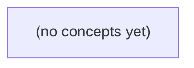

# 04.04 可靠传输：从TCP字节确认到IM业务确认

*本书以虚构IM消息“m-a”从用户A发送给用户B为主线，用纸上字节段、累计ACK、丢包、乱序、RTO和有限窗口，循序理解TCP如何可靠交付有序字节流。全书持续辨析TCP确认、HTTP回应与数据库或设备业务确认的证据边界，并通过22道附反馈练习巩固推演能力。*

**章节:** 2

---

## 本书导览

- 了解整本书的章节脉络
- 掌握各章之间的概念依赖关系
- 选择最合适的阅读顺序

# 04.04 可靠传输：从TCP字节确认到IM业务确认

本书以虚构IM消息“m-a”从用户A发送给用户B为主线，用纸上字节段、累计ACK、丢包、乱序、RTO和有限窗口，循序理解TCP如何可靠交付有序字节流。全书持续辨析TCP确认、HTTP回应与数据库或设备业务确认的证据边界，并通过22道附反馈练习巩固推演能力。

下方的概念图展示了本书 0 个核心概念以及它们之间的依赖关系；再下方是 1 个章节的入口。你可以按从上到下的顺序阅读，也可以根据自己的兴趣或先验知识选择切入点。

#### 概念图

## 章节索引

- **04.04 可靠传输：TCP确认了字节，还没确认消息** — 面向Go初学者承接04.01–04.03，以虚构IM的m-a经过TCP为主线，纸上推导字节序列号、累计ACK、丢包/ACK丢失重传、乱序、RTO和窗口，再区分TCP重传与应用层重试及业务确认；静态教材不运行网络。

## 04.04 可靠传输：TCP确认了字节，还没确认消息

- 区分应用消息、WebSocket/HTTP和TCP字节流
- 解释TCP字节序列号与累计ACK
- 手算数据段或ACK丢失后的重传与去重
- 说明乱序段和连续字节确认的关系
- 区分TCP RTO、HTTP超时和Go context期限
- 用有限窗口说明流水线在途字节
- 区分TCP重传和新连接上的应用重试
- 列出TCP ACK、HTTP响应与业务确认各能证明什么

沿着虚构 IM 中 u-a 向 u-b 发送 m-a 的路径，先厘清 TCP 可靠传输究竟确认了什么，以及它没有替应用确认什么。

### 从一条消息拆成多层对象

### 从一条消息拆成多层对象

设 `u-a` 向 `u-b` 发送一条聊天消息 `m-a`：“你好”。

在应用层，`m-a` 是有业务含义的**消息对象**，可能包含：

- 消息 ID：`msg-1001`
- 发送者：`u-a`
- 接收者：`u-b`
- 文本内容：“你好”
- 时间戳、签名、已读状态等

应用把它编码为 JSON、Protobuf 等字节，再交给 HTTP 或 WebSocket。例如 WebSocket 会把这些字节放入一个或多个 WebSocket 帧；HTTP 则可能放入请求体。此时它们仍可被称为“这一条消息的数据”，但已经是协议格式化后的字节。

继续向下，TCP 不理解 `msg-1001`、JSON 边界或 WebSocket 帧。它只看到一串连续字节流：

`... [m-a 的若干字节] [下一条消息的若干字节] ...`

因此，一条应用消息可能被拆进多个 TCP 段；多个小消息也可能恰好合并在同一个 TCP 段中。接收端 `Read` 一次读到多少字节，同样没有消息语义保证。

再向下，每个 TCP 段被封装进 IP 包，在网络中逐跳转发。IP 包可能丢失、乱序或重复；TCP 通过序号、确认号、重传和重排，最终向对端交付**有序、可靠的字节流**。

所以，TCP 的确认含义是：“截至某个序号之前的字节，已被对端 TCP 接收。”它不表示：

- `u-b` 的应用处理器已经读到完整 `m-a`；
- 消息已经写入数据库并提交；
- `u-b` 设备已展示消息；
- 用户已经收到或已读。

这些都必须由应用协议基于消息 ID 再设计确认。

### TCP确认的是连续字节

### TCP确认的是连续字节

设 u-a 的客户端通过一条 TCP 连接发送消息 `m-a`。应用层可能写入：

`{"type":"chat","id":"m-a","text":"你好"}`

TCP 不认识“消息”“JSON”或 `m-a`；它只把这段内容视为一串字节。假设本次写入共 12 字节，发送端为首字节编号 `1000`，则字节范围为：

`1000 ... 1011`

纸上时间线可写成：

1. u-a 的 TCP 发送字节 `1000...1005`
2. u-b 的 TCP 收到并暂存这些字节，回复 `ACK=1006`
3. u-a 再发送字节 `1006...1011`
4. u-b 的 TCP 收到后回复 `ACK=1012`

`ACK=1012` 的含义不是“确认了编号为 1012 的字节”，而是：

> u-b 的 TCP 已经连续收到所有编号小于 `1012` 的字节；下一段希望从 `1012` 开始。

这叫**累计确认**。若 u-b 先收到 `1006...1011`，但 `1000...1005` 丢失，它通常仍只能确认 `ACK=1000`：后半段虽已到达，却不能形成从起点开始的连续字节序列。

因此，u-a 看到 `ACK=1012` 后，可以从发送缓冲区删除 `1000...1011`，并判断这些字节已被**对端 TCP 协议栈接收**。超时未等到推进的 ACK 时，发送端会重传未确认字节。

但这条确认链只到 TCP：它不表示 u-b 的 `handler` 已读到完整 `m-a`，更不表示数据库已提交、消息已推送到 B 设备，或 u-b 已读。TCP 可靠的是连续有序字节，不是业务结果。

### m-a的静态传输时间线

### m-a 的静态传输时间线

设 u-a 的客户端已通过 TCP 连接向 u-b 的服务端发送消息 `m-a`。应用层消息经过编码后成为一串字节；为便于纸上计算，假设它恰好分成两个 TCP 数据段：

- 段 A：`seq=1000`，携带字节 `[1000,1500)`
- 段 B：`seq=1500`，携带字节 `[1500,2000)`
- 服务端初始期望收到的下一个字节号为 `1000`

注意：这里的 `seq` 是 TCP 字节序号，不是消息 ID；IP 包只是承载 TCP 段的网络层包裹。

| 时刻 | u-a 客户端 TCP | 网络 | u-b 服务端 TCP |
|---|---|---|---|
| t1 | 发送段 A，`seq=1000` | 段 A 丢失 | 未收到 |
| t2 | 发送段 B，`seq=1500` | 段 B 到达 | 发现缺少 `[1000,1500)`，暂存段 B，回复 `ACK=1000` |
| t3 | 收到重复 `ACK=1000`，或等待超时 | — | 仍在等待字节 1000 |
| t4 | 重传段 A，`seq=1000` | 段 A 到达 | A 与已暂存的 B 连成连续字节 `[1000,2000)`，回复 `ACK=2000` |
| t5 | 收到 `ACK=2000` | — | 已可靠接收至字节 2000 |

`ACK=2000` 的含义是：服务端 TCP 已经连续收到所有序号小于 `2000` 的字节。它是**累计确认**：既确认重传后的 A，也确认先前乱序到达并被缓存的 B。

再看 ACK 本身丢失：

1. t4 后服务端发出 `ACK=2000`，但该 ACK 在网络中丢失。
2. 客户端超时后再次重传段 A。
3. 服务端发现 `[1000,1500)` 已经收过，不会把这段字节再次交给上层；它丢弃重复数据，并再次回复 `ACK=2000`。
4. 客户端最终收到 `ACK=2000`，停止重传。

因此，TCP 能处理数据段重复、乱序和 ACK 丢失，并向服务端应用提供有序字节流。但 `ACK=2000` 只说明服务端 TCP 已接收这些字节；它不表示 Go 的 handler 已读完 `m-a`，更不表示消息已写入数据库、已推送到 u-b 的设备，或用户已经阅读。

### 乱序不等于消息已完成

### 乱序不等于消息已完成

设 `u-a` 发送消息 `m-a`，应用层把它编码为一串字节：

`[消息长度][消息内容]`

TCP 不认识“消息长度”或“m-a”；它只看连续编号的字节。假设发送端将字节流拆成三个段：

| 时间 | 到达 u-b 的 TCP 段 | 字节范围 |
|---|---|---|
| $t_1$ | 第 1 段 | `1000~1499` |
| $t_2$ | 第 3 段先到 | `2000~2499` |
| $t_3$ | 第 2 段后到 | `1500~1999` |

在 $t_2$，u-b 的 TCP 已经收到了 `2000~2499`，但 `1500~1999` 仍缺失。它会暂存这段乱序字节，却不能把字节流交给应用层当作连续数据；确认号仍表示“下一个期待的字节”，即 `ACK=1500`。

只有第 2 段在 $t_3$ 到达后，`1000~2499` 才成为连续区间，TCP 才能推进确认号，例如回复 `ACK=2500`。这确认的是：截至 `2499` 的字节已被对端 TCP 按序接收并进入接收缓冲区。

但即使 `ACK=2500`，也不能推出 handler 已读到完整 `m-a`。TCP 是字节流：一次 `Read` 可能只得到半条消息，也可能得到多条消息拼在一起。应用必须自行定义边界，例如长度前缀、分隔符或 HTTP/WebSocket 帧；随后还要由应用确认“消息已解析、已处理、已提交”。

### TCP送达不能替代业务确认

### TCP送达不能替代业务确认

设 `u-a` 发送消息 `m-a` 给 `u-b`。同一件“发送成功”，在不同层次代表完全不同的事实：

| 确认类型 | 谁发出 | 能证明什么 | 不能证明什么 |
|---|---|---|---|
| TCP ACK | `u-b` 所在设备的 TCP 协议栈 | 某段**字节**已被对端内核按序接收 | 应用程序是否读取；消息是否解析；数据库是否提交 |
| HTTP 响应 | 服务端 HTTP handler | 请求已到达 handler，且 handler 产生了响应 | 响应内容是否等于持久化成功；接收者设备是否收到 |
| WebSocket 应答帧 | 服务端或客户端应用 | 对方应用已处理到约定的协议步骤 | 消息是否展示给用户、用户是否阅读 |
| “已送达”回执 | 接收端设备上的业务客户端 | 消息通常已到达该设备并被客户端接收 | 用户是否打开会话、是否看见内容 |
| “已读”回执 | 接收端业务客户端 | 客户端按业务规则认定用户已读 | 用户是否真正理解内容；回执是否已同步到所有设备 |

可以把 `m-a` 的静态时间线写成：

1. `u-a` 客户端把消息编码为应用字节。
2. 字节经 TCP 分段、封装为 IP 包后发送。
3. `u-b` 设备的 TCP 收到字节并回复 TCP ACK。
4. `u-b` 上的服务程序或客户端从连接中 `Read` 到字节。
5. 程序解析出 `m-a`，写入数据库或本地存储。
6. 程序发送 HTTP 响应或 WebSocket 业务应答。
7. 接收端客户端展示消息，并在合适时机上报“已送达”或“已读”。

第 3 步只说明“对端 TCP 已确认字节”，并不等于第 4～7 步已经发生。尤其是 TCP ACK 到达后，对端进程仍可能崩溃、来不及读取，或读取后数据库提交失败。

因此，Go 中一次 `conn.Write` 返回成功，最多表示字节已交给本机内核；即使随后收到了 TCP 层确认，也不能把它当作“消息已送达”。需要何种确认，应由业务协议明确：例如服务端返回 `message_id` 表示已持久化，客户端回传 `delivered` 表示设备送达，回传 `read` 表示已读。

> **要点** — TCP可靠地确认对端内核收到连续字节；消息是否处理、提交、送达或已读，仍需上层协议与业务确认。

TCP确认的是连续字节位置，不认识IM消息边界。先沿着m-a的4字节示例，建立序列号与累计确认的正确心智模型。

### 从一条消息到一串字节

### 从一条消息到一串字节

应用看来在发送“一条消息”，例如聊天内容 `m-a`；但 TCP 看到的只是待传输的字节序列。假设应用层把 `m-a` 编码为 4 个字节，发送端将其放入 TCP 字节流的区间：

`[100, 104)`

这里 `100` 是第一个字节的序列号，`104` 不是“第 104 条消息”，而是该段末尾之后的下一个字节位置。接收端若已连续收到 `100、101、102、103`，便回送：

`ACK = 104`

其含义是：“截至 103 的所有字节都已按序到达，我下一步期待序列号 104 的字节。”

应用层消息、协议帧和 TCP 段是三层不同的边界：

- **应用层消息**：例如一条 IM、一次业务请求，可能带有 `message_id`。
- **协议帧**：应用协议为识别边界而定义的格式，如“长度字段 + 消息体”。
- **TCP 字节流**：无消息边界的一串有序字节；一次 `send` 不等于一次 `recv`。

因此，下一条 4 字节消息即使对应字节区间 `[104,108)`，接收端也只会在字节连续到达后累计确认 `ACK=108`。TCP 不知道这两个区间各自是不是一条消息，也不会产生“第 1 条消息已签收”的确认。

更重要的是，TCP 序列号会在连接重建时重新选择，并会发生回绕；它只能标识某条 TCP 连接中的字节位置。业务消息身份、去重与“对方已处理”语义，必须由应用层的 `message_id`、业务序号和应用确认另行定义。

### 用区间标记4个发送字节

### 用区间标记4个发送字节

设应用层消息 `m-a` 编码后恰好为 4 个字节。TCP 不会给它分配“消息 1”之类的身份，而是把它放入连续字节流的某一段位置。若这 4 个字节从序列号 100 开始，则可写为半开区间：

\[
[100,104)
\]

这表示它覆盖了序列号为 100、101、102、103 的四个字节；右端点 104 不属于该段，而是紧随其后的下一个字节位置。

| 字节流位置 | 100 | 101 | 102 | 103 |
|---|---:|---:|---:|---:|
| `m-a` 的第几个字节 | 1 | 2 | 3 | 4 |

因此，携带这 4 个字节的 TCP 段首部中 `SEQ=100`，含义是“本段负载的第一个字节位于位置 100”，并不是“第 100 个 TCP 段”，更不是“业务消息编号为 100”。

若发送端因超时重传同一批数据，重传段仍应表示为 `[100,104)`，因为它传递的是同一段字节位置；即使拆成两个段发送，也只是 `[100,102)` 与 `[102,104)`，业务上仍可能对应同一条 `m-a`。反过来，一个 TCP 段也可以恰好拼入多条应用消息的字节。

这种区间表示使相邻数据自然衔接：下一批 4 字节从 104 开始，就是 `[104,108)`。TCP 能据此判断哪些字节连续到达，却无法从序列号本身推知 `m-a` 的消息边界、业务含义或唯一消息身份。

### ACK104为何表示下一个字节

### ACK104为何表示下一个字节

RFC 9293 中，TCP 的序列号标记的是**字节位置**，不是“第几个业务消息”。设发送方依次发送 4 个字节：

- 第一段携带字节区间 `[100,104)`，即序列号为 `100、101、102、103` 的四个字节；
- 接收方完整、按序收到这四个字节后，回复 `ACK=104`。

这里的 `104` 不是“确认了编号 104 的字节”，恰好相反：它表示接收方已经连续拥有所有序列号小于 `104` 的字节，并且**下一个希望收到的字节**序列号是 `104`。

可将确认号理解为一个连续前缀的右边界：

$$
\mathrm{ACK}=N \iff [\text{起始位置},N)\ \text{已连续收到，下一字节应为 }N
$$

因此，`ACK=104` 确认的是 `[100,104)`，不确认字节 `104` 本身。若后续第二段为 `[104,108)`，并且它也按序到达，接收方就可以发送 `ACK=108`：这一个确认累计覆盖了前两段的全部连续字节。

“连续”是关键。若接收方先收到 `[104,108)`，却仍缺少 `[100,104)`，通常仍只能确认期望的起始位置，而不能直接把确认号推进到 `108`。TCP 的累计确认报告的是可交付给接收缓冲区的连续字节边界，不是“曾经见过哪些分组”的清单。

所以，`ACK=104` 应读作：**104 之前都到了，请从 104 开始继续。**它不是应用层“第一条消息已收”的收据；应用消息边界、`message_id` 与业务去重身份，必须由应用协议自行定义。

### 累计确认不等于消息收据

### 累计确认不等于消息收据

设发送端先发送 4 个字节，序列号区间为 $[100,104)$：即字节 `100、101、102、103`。接收端若连续收到它们，会回复 `ACK=104`。按 RFC 9293 的语义，`104` 不是“第 104 个字节已确认”，而是“我期望的下一个字节是 104”；因此所有序列号小于 `104` 的连续字节都已被累计确认。

随后发送端发送第二段 $[104,108)$。若接收端也连续收到该段，就可以直接回复：

`ACK=108`

这一个确认同时证明：

- $[100,104)$ 已连续到达；
- $[104,108)$ 已连续到达；
- 接收端当前缺少的下一个位置是字节 `108`。

因此，`ACK=108` 不要求再单独出现 `ACK=104`；累计确认可以跨越多个 TCP 段，也可以合并多个应用层 `write()` 的数据。

但它仍不是“第二条业务消息已处理”的收据。TCP 不知道这 8 个字节是两条 IM 消息、一个文件片段，还是半条经过拆分的协议帧。`ACK=108` 最多证明字节流已按序交给接收端的 TCP，不证明应用已经完成解帧、落库、执行业务逻辑或向用户展示。

若业务需要“消息 `message_id=42` 已成功处理”，必须由应用协议返回带该业务身份的确认。TCP 的 `seq` 可能因新连接而重启，也会回绕；它是传输位置，不应替代稳定的业务消息编号。

### 连接序列号与业务身份分离

### 连接序列号与业务身份分离

TCP 序列号只是在**某一条连接内**标记字节位置，并不等于“第几条业务消息”。例如连接 A 中发送 `[100,104)`，接收方回 `ACK 104`；连接断开后重新建立连接 B，新的初始序列号会重新选择，可能又从看似接近 `100` 的位置开始。两条连接中的 `seq=100` 没有业务上的可比性。

即使连接始终不断，序列号也是有限位宽的计数器；发送足够多字节后会回绕。于是某个数值再次出现，也不表示同一条消息被重发，更不能据此判断业务重复。

因此，TCP 层的身份通常可理解为：

- 连接范围内：`四元组 + 连接生命周期 + 字节序列号`
- 业务范围内：`message_id`、订单号、事件编号或应用自定义业务序号

若客户端因超时重试、断线重连或服务端响应丢失而重复提交，服务端应依据稳定的 `message_id` 做幂等去重：相同标识只执行一次，后续请求返回先前结果或当前状态。不要把 `ACK`、`seq`，甚至“连接仍存活”当作应用消息已被唯一处理的收据。

> **要点** — TCP ACK确认连续字节边界；它不识别消息，也不能替代业务消息的身份、去重与确认。

沿着 IM 消息 m-a 的一次发送，拆开“数据已到达”与“发送方已得知到达”之间的关键差异。

### 从消息到字节区间

### 从消息到字节区间

以 IM 消息 `m-a` 为例：应用层认为自己发送了“一条消息”，但 TCP 并不认识 `m-a` 这个业务对象。应用先把它编码为协议帧，例如：

`长度字段 | 消息类型 | m-a 的正文`

这串帧字节再交给 TCP。若其中某段待发送数据恰好占用序列号 `100`、`101`、`102`、`103`，则 TCP 用半开区间表示为：

$$[100,104)$$

含义是：该段包含从第 100 个字节起、到第 104 个字节之前的全部字节，共 $104-100=4$ 个字节。右端点 `104` 不属于该段。

因此，序列号不是“第 100 条消息的编号”，确认号也不是“确认收到消息 m-a”。`ACK 104` 的准确含义是：接收方已按序拥有截至字节 `103` 的全部字节，下一步希望收到的字节是 `104`。

一个业务消息也未必对应一个 TCP 段：

- 一条 `m-a` 可能被拆进多个字节区间；
- 多条小消息可能连续装入同一个 TCP 段；
- 接收端一次 `read` 可能读到半帧、一帧或多帧。

所以，TCP 提供的是**可靠、有序、去重的字节流**；“消息边界”必须由应用协议中的长度字段、分隔符或其他帧格式恢复。后续即使 `[100,104)` 被重传，TCP 处理的仍是重复字节，而不是第二次投递一条新的 `m-a`。

### 确认丢失时为何重传

### 确认丢失时为何重传

设发送方在 `t0` 发送一个数据段，序号范围为 `[100,104)`，即其中携带字节 `100、101、102、103`。发送方同时启动重传计时器，等待接收方的累计确认。

在 `t1`，数据段已经抵达接收方。接收方检查序号后发现：它正是当前期待的字节 `100`，于是将这 4 个字节按序放入接收缓冲区，并把“下一个期待的字节”推进到 `104`。随后它发送：

`ACK = 104`

这表示“`[100,104)` 已连续收到；请从字节 `104` 继续发送”。但若这个 ACK 在网络中丢失，发送方就不会知道数据其实已经到达。

到了 `t2`，发送方的 RTO（重传超时）到期。由于仍未收到 `ACK=104`，它只能依据本地可见事实判断：最早未确认的数据仍从 `100` 开始。因此发送方重传同一字节区间：

`[100,104)`

接收方再次收到该段时，自己的期待序号已是 `104`；这说明 `[100,104)` 是已经接收过的旧数据。TCP 不会把这些字节再次交给应用层，而是去重、丢弃重复部分，并再次回复：

`ACK = 104`

因此，重传并不必然意味着原数据段丢失。它也可能表示“数据到了，但确认没到”，甚至只是 ACK 或数据路径延迟超过了 RTO。一次重传只能说明发送方未能及时获得确认，不能据此断定网络发生了哪一种唯一故障。

### 接收端如何去重并累计确认

### 接收端如何去重并累计确认

设接收端当前的“下一个期望字节序号”为 `104`，这意味着 `[100,104)` 已经连续到达，并已按序进入 TCP 接收缓冲区；应用随后从字节流中读取这些字节。

若发送方因为确认报文丢失或超时误判，再次发送同一段 `[100,104)`，接收端不会把它当作新数据。它会比较该段序号与当前期望序号：

- 重传段的结尾为 `104`，不超过当前期望序号 `104`；
- 因而其中所有字节都已被接收端确认、缓存过；
- TCP 丢弃这份重复数据，不再次写入接收缓冲区；
- 接收端仍回复累计确认 `ACK 104`。

`ACK 104` 的含义不是“刚刚收到第 104 号字节”，而是：

> `104` 之前的所有字节，即 `[0,104)`，都已连续收到；下一段请从 `104` 开始。

因此，TCP 可以容忍重复到达：即使网络中出现原始段、重传段甚至更晚到达的副本，应用看到的仍是一条去重后的有序字节流。对应用而言，不能因为 TCP 发生了一次重传，就认为会收到两份相同业务消息；TCP 去重的是字节序号范围，而不是业务层的“消息”边界。

### 数据段丢失与乱序的对照图

### 数据段丢失与乱序的对照图

TCP 的 ACK 确认的是“**下一个期望收到的连续字节序号**”，而不是某个独立消息或某个单独数据段。

| 情形 | 时序与接收端状态 | ACK 含义 |
|---|---|---|
| 初次数据段丢失 | `发送方 → [100,104) → ×`；接收方始终缺少 100，发送方超时后重传 `[100,104)` | 收到重传后回复 `ACK 104`，表示 `[100,104)` 已连续收到 |
| ACK 丢失 | `[100,104)` 已到达；接收方回复 `ACK 104`，但确认包丢失；发送方 RTO 后重传 `[100,104)` | 接收方识别为重复字节，不再次交给应用，仍回复 `ACK 104` |
| 后续段乱序 | 接收方先到 `[104,108)`，但 `[100,104)` 尚未到；随后才到 `[100,104)` | 先回复 `ACK 100`：连续前缀仍为空；补齐 `[100,104)` 后，已能连续覆盖至 108，回复 `ACK 108` |

可将乱序过程画为：

`发送方： [100,104) ──延迟──► 接收方`  
`发送方： [104,108) ─────────► 接收方 ──ACK 100──►`  
`发送方： [100,104) ─────────► 接收方 ──ACK 108──►`

因此，`ACK 100` 不代表接收方“什么都没收到”；它可能已经缓存了 `[104,108)`，只是前面的缺口尚未补齐。类似地，一次重传只说明发送方未及时获得足够确认：可能是数据段丢失、ACK 丢失、路径延迟或拥塞导致的误判，不能据此断定唯一网络根因。

### 重传不是唯一根因结论

### 重传不是唯一根因结论

设发送方在 $t_0$ 发送字节区间 `[100,104)`。即使随后看到了“重传”，也不能立刻断言“这 4 个字节在网络中丢了”。

一种常见时间线是：

1. $t_1$：数据段已经到达接收方；接收方按序接收 `[100,104)`，并发送确认 `ACK 104`。
2. 确认报文在返回路径丢失，或排队、拥塞导致延迟过长。
3. $t_2$：发送方在 RTO 到期前仍未收到 `ACK 104`，于是重传同一序号范围 `[100,104)`。
4. 接收方发现该范围已经接收过，将其视为重复字节，不再次交付应用，而是再次回复 `ACK 104`。

此时，**发生重传只说明发送方在超时前没有获得足够确认**；它并不单独证明初始数据段丢失。可能原因至少包括：

- 初始数据段真实丢失；
- `ACK 104` 丢失；
- 数据段或 ACK 严重延迟；
- 中间设备排队、乱序或短暂拥塞；
- 发送方的 RTO 估计偏小，过早超时。

与之相对，若初始 `[100,104)` 在路径中丢失，接收方根本无法推进确认号；发送方 RTO 后重传，接收方才首次收到该字节并回复 `ACK 104`。这两种情形在发送方看来都可能表现为“一次超时重传”。

因此，排障时应结合抓包时间戳、双向报文、RTT/RTO、重复 ACK 与链路指标判断，而不要由一次重传直接归因于某个唯一网络故障。对应用而言，TCP 按字节序号去重：重复段不会让字节流凭空出现两份业务消息；业务消息边界、幂等处理仍是应用协议自己的责任。

> **要点** — TCP 重传的是同一字节区间；累计 ACK 证明连续字节到达，不等于应用消息被处理一次。

TCP可以先收到后面的字节，却仍只确认最早缺失处；理解这一点，才能把网络乱序与IM消息乱序区分开。

### 先分清三种“顺序”

### 先分清三种“顺序”

同样叫“乱序”，三层看到的对象并不相同：

- **TCP字节流顺序**：TCP只认识连续字节，不认识“消息”。收到后段 `[104,108)` 时，即使它已缓存，也因 `[100,104)` 缺失而不能把确认号推进到 `108`；基础累计确认仍为 `ACK=100`。待前段补齐，字节流连续，才可确认 `108` 并向上交付。
- **WebSocket帧顺序**：WebSocket建立在可靠、有序的TCP连接之上。应用通常按帧读取数据；前面的TCP字节未补齐时，后续帧即使相关字节已经到达，也不会被提前完整交给WebSocket应用。它保证的是该连接内帧的传输顺序，不定义跨连接、跨设备的业务先后。
- **IM消息业务序号**：`seq`、消息ID、会话版本号等由业务层定义，用来判断“第几条消息”、去重、补拉、排序或处理撤回/编辑。即使每条消息都经TCP可靠送达，多个连接、重连、服务端异步投递仍可能造成业务观察顺序不同。

因此，`ACK=100` 表示“TCP还缺第100号字节”，并不等于“第100条IM消息未收到”。TCP解决字节连续性；WebSocket组织帧；IM的 `seq` 才负责消息语义上的先后。

### 后段先到时ACK为何不前进

### 后段先到时 ACK 为何不前进

设接收方下一期待的字节序号为 `100`，发送方原本发送了两段：

- 前段：`[100,104)`
- 后段：`[104,108)`

由于网络乱序，接收方先拿到的是 `[104,108)`。它能看出这段数据本身没有损坏，也可以暂时缓存；但它仍不能把这些字节交给按序读取 TCP 字节流的应用，更不能宣称自己已经连续收到了 `100` 之后的数据。

TCP 基础确认语义是**累计确认**：`ACK = N` 表示“`N` 之前的所有字节都已按序收到，下一字节请从 `N` 开始看”。因此，收到后段后：

- 字节 `104` 到 `107` 已在缓存中；
- 但字节 `100` 到 `103` 仍缺失；
- 接收方无法证明区间 `[0,100)` 之后存在连续字节流。

所以它发出的累计确认号仍是：

`ACK = 100`

这不是说 `[104,108)` 没收到，而是说“我还在等第一个洞：`100`”。若发送方只看累计 ACK，也会知道前段尚未被确认，并可能重传 `[100,104)`。

当 `[100,104)` 终于到达时，接收方把它与已缓存的 `[104,108)` 拼接为连续区间 `[100,108)`。此时缺口消失，下一期待字节变为 `108`，于是累计确认才能跃迁为：

`ACK = 108`

随后应用才会按序读到这 8 个字节。可选的 SACK 能额外告诉发送方“`[104,108)` 已收到”，减少不必要重传；但它不改变累计 ACK 仍指向 `100` 的基本规则。这里确认的是 TCP 字节序号，不是 IM 的业务消息 `seq`，也不是 WebSocket 帧的顺序。

### 缓存乱序字节与有序交付

### 缓存乱序字节与有序交付

设接收方下一段期望的字节序号是 `100`。网络先送达后段 `[104,108)` 时，TCP不会把它当作无效数据直接交给应用；实现通常会将这段字节暂存到重组缓冲区，记录“`104` 到 `108` 已收到”。

但累计确认号仍是：

`ACK = 100`

它表达的不是“我什么都没收到”，而是：“截至 `100` 之前的所有字节连续完整；从 `100` 开始仍有缺口。”因此发送方仅看基础累计 ACK 时，仍会认为 `[100,104)` 尚未被确认。

随后 `[100,104)` 到达，接收方发现：

- `[100,104)` 已连续可用；
- 缓存中的 `[104,108)` 恰好与其相接；
- 因而 `[100,108)` 已成为完整连续字节流。

此时接收方可以将这 8 个字节按序交付给应用，并发送：

`ACK = 108`

关键在于：TCP可以**乱序接收、乱序缓存**，但对上层提供的是**有序字节流**。应用不会先读到 `[104,108)`，再读到 `[100,104)`；它只能在缺口补齐后读到连续内容。这里确认的是字节位置，不是 IM 的业务消息 `seq`，也不是 WebSocket 的帧顺序。

### 纸上演算：补段、重复段与ACK108

### 纸上演算：补段、重复段与 ACK108

设接收方下一期待字节为 `100`。发送方原本发送两段：

- A：`[100,104)`，载荷为 4 字节
- B：`[104,108)`，载荷为 4 字节

网络发生乱序：B 先到，A 丢失或尚未到达。

| 到达事件 | 接收方缓存/交付状态 | 返回的累计 ACK |
|---|---|---|
| 收到 B：`[104,108)` | 可缓存这 4 个乱序字节；但 `100` 仍缺失，不能交付连续字节流 | `ACK=100` |
| 发送方未见 `ACK=104`，重传 A：`[100,104)` | 缺口补齐；现在 `[100,108)` 连续可用，按序交付给应用 | `ACK=108` |
| B 的副本再次到达 | `[104,108)` 已接收过，是重复字节，接收方丢弃或忽略 | 仍为 `ACK=108` |

关键在于：`ACK=100` 并不表示接收方“什么都没收到”，而是表示**截至 100 之前的所有字节都已连续收到，100 是最早尚未确认的字节**。即使 `[104,108)` 已经在缓存中，基础累计确认也不能跳过 `[100,104)` 而确认 `108`。

当前段 A 到达后，接收方不需要等待 B 再来一次：先前缓存的 B 会立刻与 A 拼成连续区间，因此确认号从 `100` 直接跃迁到 `108`。若 B 的原始副本或重传副本之后抵达，TCP 按序号识别其已被覆盖的范围，将其视为重复数据，不会向应用重复交付。

这里的“顺序”是**字节流的连续性**，不是 IM 业务消息的 `seq` 排序，也不是 WebSocket 帧的边界与帧顺序。TCP 只负责让应用最终读到连续、无重复的字节；消息如何切分、编号和重组，仍是上层协议的职责。

### SACK与业务消息排序不是一回事

### SACK与业务消息排序不是一回事

基础 TCP 使用累计确认：即使接收方已经缓存了后段 `[104,108)`，只要 `[100,104)` 尚未到达，ACK 仍是 `100`。启用 SACK（选择确认）后，接收方还可以附带反馈：“`[104,108)` 已收到”。这让发送方更准确地重传缺口 `[100,104)`，避免把已到的后段重复发送。

但 SACK 解决的是**字节流传输效率**，不是业务消息排序：

- SACK 描述的是 TCP 字节序号区间，例如“这些字节已缓存”；
- WebSocket 的帧边界由其协议解析，TCP 本身只提供连续字节流；
- IM 消息的 `seq`、消息 ID、会话版本等，才用于定义“第几条业务消息”、去重、补拉和展示顺序。

当前段补齐后，TCP 才能将 `[100,108)` 作为连续字节交给上层；其中究竟对应一个 WebSocket 帧、多个帧，还是半个消息，取决于上层协议。即使 TCP 已按序交付，业务仍可能因多连接、离线补偿、服务端异步处理而需要按 `seq` 排序。SACK 让 TCP 更快补洞，但不能替代消息层的顺序语义。

> **要点** — 累计ACK确认的是连续字节前缀；乱序字节可缓存，缺口补齐后才确认并有序交付。

TCP 的超时重传不是固定倒计时：它依据往返时间及其波动估计等待边界，而应用层的超时与取消又是另一组语义。

### RTO为何不能写死

### RTO为何不能写死

RTO（重传超时）回答的不是“网络通常多快”，而是“这一个未确认报文，等多久才足以怀疑它丢了”。把它写死为某个毫秒数，会立刻遇到两类相反错误。

设一条连接的典型往返时间约为 $20\text{ ms}$：

- 若固定 RTO 为 $10\text{ ms}$，正常但稍有排队波动的 ACK 可能在第 $25\text{ ms}$ 才返回。发送方会在 ACK 到来前重传，制造重复字节、额外拥塞和无谓带宽消耗。这是**误重传**。
- 若固定 RTO 为 $1\text{ s}$，而报文或 ACK 确实丢失，接收方可能早已无法推进数据；发送方却还要空等近一秒。这是**恢复过慢**，应用感受到的延迟被放大。

因此，RFC 6298 的核心直觉不是只记录一个 RTT 平均值，而是同时维护：

- **平滑 RTT**：连接近期“通常需要多久”；
- **RTT 波动**：这个通常值有多不稳定。

可以将等待边界理解为：

$$RTO \approx \text{平滑 RTT}+K\times\text{RTT 波动}$$

其中 $K$ 是留给正常抖动的安全余量。路径稳定时，波动小，RTO 可以更贴近 RTT；路径出现排队、无线干扰或路由变化时，波动增大，RTO 应相应放宽。具体实现还会设置下限、采用退避等规则，但不能把某个实现中的数值当成普适常量。

超时也不等价于“数据包一定丢了”：可能是数据包丢失、ACK 丢失，或者两者都在队列中延迟。RTO 的目标不是精确判案，而是在“太早重传”和“太晚恢复”之间作统计上的折中。

### 从发送到超时的纸上时间线

### 从发送到超时的纸上时间线

设即时消息 `m-a` 被写入 TCP 连接，映射为从序号 `seq` 开始的一段字节。TCP 只确认这些字节是否连续到达，不认识“`m-a` 是一条消息”。

RFC 6298 的重传超时由平滑往返时间 `SRTT` 与波动 `RTTVAR` 推导，典型形式可理解为：

$RTO \approx SRTT + 4 \times RTTVAR$

因此，若纸上假设正常 RTT 约为 `20 ms`，发送方也不会必然在 `20 ms` 后重传：它还要给测得的波动、排队和确认处理留出等待边界。

- **数据段丢失**：发送方发出 `m-a` 对应字节；中间网络丢弃该段。接收方没有新的连续字节可确认，发送方一直等不到覆盖 `seq` 的累计 ACK；RTO 到期后重传。等待过短会把尚在路上的包误判为丢失，等待过长则让消息延迟扩大。

- **ACK 丢失**：数据段其实已经到达，接收方也可能已将 `m-a` 交给应用；但返回 ACK 丢失。发送方仍不知道字节已确认，RTO 到期后重传同一序号字节。接收方依据序号发现重复数据，通常丢弃重复负载并再次发送累计 ACK。这里“重传”不等于接收端必然再次看到一条新消息。

- **排队延迟**：数据段或 ACK 没丢，只是在链路、网卡或队列中停留较久。若 ACK 在 RTO 前到达，发送方收到累计确认，取消该段的重传等待；若迟到，则可能先重传，随后收到一个确认原包或重传包的累计 ACK。

累计 ACK 的关键是“确认到某个连续字节边界”。若后续字节已到而 `m-a` 对应字节缺失，接收方不能把确认边界越过缺口；发送方因而仍可能等待或重传。

还要区分三种钟：HTTP 客户端超时决定应用何时不再等响应，Go `context` 截止决定调用何时返回取消，TCP RTO 决定内核何时重传字节。应用取消并不会撤销已经抵达接收端的字节。

### RTT二十毫秒不等于等待二十毫秒

### RTT 二十毫秒不等于等待二十毫秒

设一次连接的典型 RTT 约为 $20\text{ ms}$，这只表示“数据到达对端并收到确认”的常见往返量级，并不意味着发送方在发包后只等 $20\text{ ms}$ 就重传。TCP 的重传超时（RTO）依据平滑 RTT 与 RTT 波动估计；波动越大，等待边界通常越保守。

可在纸上比较三种情形：

- **正常确认**：数据报文很快到达，ACK 也未丢失，约 $20\text{ ms}$ 左右返回。发送方收到 ACK，清除未确认字节，无需重传。
- **RTO 等候**：数据、ACK 可能未丢，只是某一段经历排队、调度延迟或瞬时拥塞。若 RTO 大于这次异常 RTT，发送方继续等待，最终仍由原始报文的 ACK 完成确认。
- **过早重传**：若把等待时间机械设成接近 $20\text{ ms}$，稍有抖动就可能在原 ACK 到来前重传同一批字节。重复报文浪费带宽，还可能加剧拥塞；接收方虽能按序号去重，但代价已经发生。

因此，RTT 是观测值，RTO 是带安全余量的恢复决策边界，二者不能画等号。上述 $20\text{ ms}$ 仅用于比较概念，不代表任何具体操作系统内核的最小 RTO、初始 RTO 或退避策略。

### 三种超时器各管什么

### 三种超时器各管什么

同样叫“超时”，三者观察的对象、起点和后果完全不同，不能把其中一个的触发当作另一个的证据。

- **TCP 的 RTO（重传超时）**：发送端发出尚未被确认的字节后开始等待；若在估计的 RTO 内未收到覆盖这些字节的 ACK，就推测可能丢包、ACK 丢失或路径排队严重，并重传相应数据。RTO 由平滑 RTT 与 RTT 波动估计，而非固定常数。它只能说明：**发送端尚未获得确认**；不能证明数据未到达对端。
- **客户端 HTTP 超时**：通常从发起请求、建立连接、等待响应头或读取响应体等某个应用定义的阶段开始计时，具体含义取决于客户端配置。触发后客户端停止等待并向调用者返回超时错误；它证明的是：**客户端在自己的等待预算内没有得到所需 HTTP 结果**，不证明服务器没有处理请求。
- **Go `context` 截止时间**：从创建带截止时间的 `context` 时开始计时，到点后关闭 `Done()`，供 HTTP 调用、数据库操作或业务逻辑协作取消。它是取消信号，不是网络层的“撤回”命令；已写入内核、已到达服务器甚至已执行的请求，不会因 `context` 到期而自动消失。

例如 RTT 约为 $20\text{ ms}$ 时，TCP 仍可能因波动选择比一次 RTT 长得多的 RTO；而应用若在更短时间内让 HTTP 或 `context` 超时，应用已放弃等待，TCP 连接中先前发送的字节却可能仍在传输、被确认或被重传。故“调用超时”至多证明本地结果未知，不能推出“服务端一定没收到”。

### 取消请求不等于撤回字节

### 取消请求不等于撤回字节

客户端调用 `context` 取消、HTTP 客户端等待超时，通常只表示：**客户端不再愿意继续等待或读取结果**。它并不能倒转网络中已经发生的传输，更不能保证服务端没有开始处理。

例如客户端已将一笔“创建订单”请求的请求体发出：

1. 请求字节可能已到达服务端，服务端正在写数据库；
2. 服务端可能已完成写入，但响应包在路上丢失、排队或尚未到达；
3. 客户端的 `context` 截止时间先到，于是报错并停止等待；
4. 客户端若直接重试，服务端可能创建两笔订单。

即使取消动作导致连接关闭，也只是影响后续通信：已进入内核缓冲区、已被服务端读取、甚至已经提交到数据库的字节，不会被“撤回”。TCP 确认的是字节流的接收，不确认“这笔业务是否应当作废”；HTTP 超时也不等于服务端业务事务回滚。

因此，超时后的正确问题不是“请求肯定失败了吗？”，而是“服务端最终执行到了哪一步？”常见设计包括：

- 为写操作携带幂等键，使相同键的重试只产生一次业务效果；
- 提供按请求标识查询结果的接口；
- 将“已受理”与“已完成”分开，通过状态机或异步通知确认；
- 对确实可中止的长任务，设计显式取消指令，并由服务端检查取消状态。

客户端超时、`context` 截止和 TCP 的 RTO 分属不同层次的计时器；前两者决定应用是否继续等待，后者决定 TCP 何时怀疑报文丢失并重传。它们都不能自动赋予“撤销已送达请求”的业务语义。

> **要点** — RTO是对网络往返时间及波动的估计；应用超时只能停止本地等待，不能证明请求未到达。

停等协议每次只让一个数据段在路上，确认往返期间链路闲置。有限窗口通过允许多个未确认字节并行在途，提高传输利用率。

### 从停等到流水线

### 从停等到流水线

停等协议的规则很简单：发送方发出一段数据后，必须等到对应确认到达，才能发送下一段。若一段发送耗时为 $T_s$，往返时延为 $RTT$，则一个周期大约需要：

$$
T_s + RTT
$$

其中真正用于发送数据的时间只有 $T_s$。链路利用率近似为：

$$
U \approx \frac{T_s}{T_s+RTT}
$$

当数据段很短、链路很快而 $RTT$ 较大时，$T_s \ll RTT$，发送方绝大多数时间都在等待确认。例如，发送 1 字节只需很短时间，但确认可能数十毫秒后才回来；即使链路本可继续传输，停等规则也会让它空闲。

窗口机制把“等确认再发”改为“先连续发，直到达到上限再等”。若发送窗口为 4 字节，发送方可以依次发送序列号为 0、1、2、3 的字节；它们都尚未确认，但可以同时在途。接收方收到后返回累计确认，例如 `ACK=4` 表示“0 到 3 均已按序收到，下一期待字节是 4”。

确认推进后，窗口随之右移：原来的 4 个位置被释放，发送方又可发送 4、5、6、7。于是链路上不再只有一个字节，而形成持续流动的“流水线”。

但窗口不是无限缓存：发送方必须保存未确认字节以便重传，还要维护定时器；接收方也需要有限缓冲处理到达与交付之间的差异。这里先把窗口看作 4 或 8 字节的纸上边界；真正能发送多少，还受接收能力和网络拥塞约束。

### 四字节窗口纸上演算

### 四字节窗口纸上演算

设发送方要传送连续字节 `m n o p q r s t`，序列号直接写成字节名。窗口大小为 4，表示任一时刻最多允许 4 个“已发送但尚未确认”的字节在途。

初始时，发送窗口覆盖：

`[m, n, o, p]`

发送方不必等待 `m` 的确认，可以连续发出 `m、n、o、p`。此时：

- 已发送未确认：`m n o p`
- 下一个可发送字节：`q`
- 窗口已满，`q` 暂时不能发送

接收方按序收到 `m、n、o` 后，发送累计确认 `ACK=o+1`。这里的含义不是“只确认了 `o`”，而是：

> `m、n、o` 以及它们之前的所有字节都已连续收到；下一期待字节是 `p`。

发送方收到该 ACK 后，可从未确认集合中删除 `m n o`。窗口左边界随之右移 3 格：

`[p, q, r, s]`

此时 `p` 虽仍未确认，但窗口中新腾出了 `q、r、s` 三个位置。因此发送方可以继续发送 `q、r、s`，无需等待 `p` 的单独确认。

若接收方随后收到 `p、q、r、s`，返回 `ACK=t`，则发送方知道从 `m` 到 `s` 都已被连续确认，窗口继续推进到：

`[t, ...]`

窗口提高利用率的关键在于：ACK 确认的是连续字节前缀，窗口释放的是一整段已确认空间。为做到这一点，发送方必须保存未确认字节以备重传，并为最早未确认字节维护定时器；窗口越大，所需缓冲与状态也越多。

### ACK 推进与丢失重传

### ACK 推进与丢失重传

设发送窗口为 4 字节，发送方依次发送：

`[0,1]`、`[2,3]`

接收方的 ACK 含义不是“收到了某个段”，而是“下一个期待的字节序号”。因此 `ACK=4` 表示字节 `0～3` 都已连续收到。

**情形一：数据段丢失。**

发送方发出 `[0,1]` 和 `[2,3]`，但 `[0,1]` 在网络中丢失，接收方先收到 `[2,3]`。由于连续字节边界仍停在 0，接收方可以暂存 `[2,3]`，却只能回复：

`ACK=0`

这不是否认收到 `[2,3]`，而是表示“从 0 开始仍有缺口”。发送方等待确认超时后重传未被确认的数据；当 `[0,1]` 到达后，接收方发现 `0～3` 已连续，立即推进为：

`ACK=4`

累计确认一次跨过两个段，窗口随之向前滑动。

**情形二：ACK 丢失。**

若 `[0,1]` 已到达，接收方发出 `ACK=2`，但该 ACK 丢失，发送方超时后会重传 `[0,1]`。接收方依据序列号识别这是重复字节：不应再次交付给应用，只需重新发送当前累计确认：

`ACK=2`

因此，重传并不必然意味着数据被处理两次；序列号负责识别重复，累计 ACK 始终只报告最长连续前缀。为实现这些行为，双方都要保存有限窗口内的数据、序号状态和重传定时器。

### 八字节窗口与慢接收方

### 八字节窗口与慢接收方

设发送方从序列号 0 开始发送，窗口表示“允许尚未确认、仍在途或等待确认的字节数”。

- **四字节窗口**：可先后发送字节 `0~3`，随后必须等待累计确认。例如收到 `ACK=2`，表示 `0、1` 已确认，窗口左边界推进到 2，发送方才能再发送 `4、5`。
- **八字节窗口**：可一次发送 `0~7`。在确认尚未返回时，链路上最多有 8 字节在飞行；若收到 `ACK=4`，则 `0~3` 已确认，可继续发送 `8~11`。

因此，往返时延较大时，八字节窗口通常比四字节窗口更不容易让链路空闲。但窗口变大并不是“免费提速”：

1. 发送方必须保存所有未确认字节。若 `3~7` 丢失或确认迟到，发送方要能按序列号重传它们。
2. 发送方还要为未确认范围维护重传计时器；确认推进后，已确认部分才能从发送缓存释放。
3. 接收方若处理较慢，已到达但暂不能交付的数据也需要接收缓存。乱序到达时，尤其不能只靠“记住一个确认号”解决。

例如八字节都已发出，但慢接收方只处理了前 4 字节，那么后续字节不能凭空消失，也不能无限堆积在内存中。有限窗口的意义正是把“最多积压多少未确认数据”限制为一个可管理的上界；更具体的接收窗口与拥塞窗口将在后续讨论。

### 窗口机制的边界

### 窗口机制的边界

本节的“窗口”是一个用于理解流水发送的**有限在途字节上限**：发送方最多允许 4 或 8 个尚未被确认的字节留在网络中。收到累计确认后，窗口左边界右移，新的字节才能进入网络。

例如窗口大小为 4，发送方已发送字节 `0~3`：

- 收到 `ACK=2`，表示字节 `0、1` 已按序收到；
- 窗口随之推进，可继续发送字节 `4、5`；
- 字节 `2、3` 仍未确认，必须保留副本，并由定时器负责超时重传。

这里不能把窗口理解为“发送方可以无限堆积数据”。每个未确认字节都要占用发送缓冲、序列号空间和重传状态；接收方也必须暂存乱序或尚未交付的数据。慢设备、慢应用或有限内存都可能使这种流水线停下来。

还要区分两层“确认”：

- TCP 的 `ACK` 确认的是：某些**字节**已进入 TCP 接收端的可靠字节流；
- 应用处理完成确认的是：某条**消息**已被业务逻辑解析、持久化或执行。

因此，“收到了订单字节”不等于“订单已成功处理”。后续的接收窗口与拥塞窗口会进一步限制可发送量；本节只讨论有限窗口如何避免停等造成的链路闲置。

> **要点** — 窗口让多个未确认字节在途；累计 ACK 只确认连续字节，可靠性依赖缓存、序列号和定时重传。

同一连接中的TCP重传会去重字节；一旦跨连接重试，是否重复受理必须由应用协议回答。

### 先划清三层：字节、响应与业务事实

### 先划清三层：字节、响应与业务事实

可靠传输不是一个“成功/失败”开关，而是至少三层不同的证据：

1. **TCP ACK：字节已被对端 TCP 栈接收**
   - 在同一条连接内，发送方重传相同序号的字节，接收方会按序号去重、重组；不会因为网络重传而把同一段 HTTP 请求交给应用两次。
   - 但 ACK 只说明字节进入了对端内核缓冲区。它**不能证明** HTTP 服务器已解析请求、业务代码已执行，更不能证明数据库已提交。
   - Go 中 `conn.Write` 或 `http.Client` 写出成功，至多说明本地把字节交给了内核；甚至不等价于已经收到对端 TCP ACK。

2. **HTTP 响应：服务器曾尝试给出应用层结果**
   - 收到 `200 OK`、`201 Created` 或业务响应体，通常可证明本次 HTTP 请求已经被服务端处理到能够产生响应的阶段。
   - 但响应也可能在返回途中丢失、连接断开，客户端于是只看到超时。此时服务端可能早已完成写库、扣款或创建订单。
   - 反过来，未收到响应不等于未执行；收到响应也不自动证明结果已被持久化，除非接口语义明确承诺。

3. **业务确认：某个业务意图的最终事实**
   - 业务层应以 `messageID`、幂等键、订单号或数据库唯一约束为依据，确认“这一次业务意图”是否已受理、完成或失败。
   - 例如 `POST /messages` 携带固定 `messageID`；重试时仍使用同一个标识。服务端据此返回既有结果，而不是再次创建消息。
   - 数据库记录、唯一索引与状态机，才是判断“是否已做过”的权威证据。

因此，三者不能互推：

- TCP 已确认 $\not\Rightarrow$ 业务已处理；
- HTTP 响应丢失 $\not\Rightarrow$ 业务未处理；
- 数据库已提交 $\not\Rightarrow$ 客户端已收到成功响应。

跨连接重试时，TCP 已不再知道旧连接上的字节序号；`m-a` 即使内容相同，也是一次新的 HTTP 请求。是否判为重复，只能由业务标识和持久化状态回答。

### 同连接重传：同一序号不会重复交付

### 同连接重传：同一序号不会重复交付

设一次请求 `m-a` 在同一条 TCP 连接中占据字节区间 $[1000,1500)$：发送端把这些字节封装为一个或多个数据段，接收端的累计确认号表示“下一个期望的字节序号”。

1. **数据段丢失**：若包含 $[1000,1500)$ 的数据段在网络中丢失，接收端仍期待序号 `1000`，不会把后续乱序字节交给应用。发送端因超时或收到重复 ACK 而重传相同序号范围；接收端首次收到该范围后，按序交付一次，并回复 `ACK=1500`。

2. **ACK 丢失**：若接收端已经收到并交付 `m-a`，其 `ACK=1500` 却在返回途中丢失，发送端仍会认为未确认，随后重传 $[1000,1500)$。接收端发现这些字节的序号已小于当前期望序号 `1500`，判定为已接收数据，只重发累计确认 `ACK=1500`，不会再次交付给 socket 上的应用读取。

3. **部分重叠重传**：例如接收端已确认到 `1300`，重传段覆盖 $[1000,1500)$，则 $[1000,1300)$ 是重复字节，$[1300,1500)$ 才是新字节；TCP 只推进连续字节边界，并仅将新增、按序的数据交付一次。

因此，同一连接内“重传同一序号”是 TCP 序号空间中的重复，不是应用消息的第二次到达。`Write` 返回成功最多说明本地 TCP 已接管字节；收到 TCP ACK 说明对端 TCP 已确认字节，二者都不等价于 HTTP 服务或业务处理已经完成。

### Write成功为何不等于消息已被受理

### Write成功为何不等于消息已被受理

设客户端要提交消息 `m-a`。一次 `conn.Write(body)` 返回 `n == len(body), err == nil`，通常只说明：Go 运行时已把这些字节交给本机操作系统的发送缓冲区。它并不证明字节已经到达服务器，更不证明服务器已解析 HTTP 请求、执行业务逻辑或持久化数据。

链路中的“成功”至少有四层：

1. **Go 写入成功**：用户态字节进入本机内核；此时网络仍可能断开。
2. **TCP ACK 到达**：对端 TCP 栈已确认收到相应字节序号；同一连接内的重传由 TCP 按序号去重，但 ACK 不表示对端应用已读取。
3. **HTTP 响应到达**：服务器应用通常已处理请求并生成响应；但响应可能在返回途中丢失，客户端仍会看到超时或连接断开。
4. **业务确认落库**：例如服务器以 `messageID` 写入数据库，并返回“已受理”；这才是可用于跨连接判重的业务证据。

例如客户端写完请求后，服务器已将 `m-a` 入库，却在响应发回前崩溃或链路中断。客户端没有 HTTP 响应，只能重开连接重试；这次请求的 TCP 序号是新的，TCP 无法知道它与旧连接中的 `m-a` 相同。若服务端仅依据连接或请求到达次数处理，就可能重复受理。

因此，`Write` 成功不能当作“已受理”，TCP ACK 也不能当作“业务成功”。需要为 `m-a` 携带稳定的 `messageID`，并让服务端以该标识持久化判重：首次处理后记录结果；重试时返回此前结果或明确的幂等确认。

### 断连后的重试：旧消息可能已到达

### 断连后的重试：旧消息可能已到达

同一条 TCP 连接内，发送方若未收到确认，会重传**相同字节序号**的数据。接收端 TCP 栈依据序号识别重复字节：已经交付过的部分不会再次交付给应用。因此，这种重传主要由传输层处理，应用通常只看到一次完整请求。

但断连后重试是另一件事。客户端可能经历：

1. `m-a` 已通过旧连接到达服务端；
2. 服务端已解析并在内存中受理，甚至开始执行；
3. 服务端写回 HTTP 响应时，连接已断开，或响应在途中丢失；
4. 客户端没有收到响应，于是新建连接，再次发送 `m-a`。

新连接有新的 TCP 四元组、序号空间和 HTTP 请求上下文。TCP 只能保证新连接中的字节可靠，无法知道其中的 `m-a` 是否等价于旧连接已经送达的业务消息。于是服务端可能第二次受理同一操作。

三类证据不能互相替代：

- TCP `ACK`：只说明对端内核确认了字节；
- HTTP 响应：只说明客户端收到了协议层结果；
- `messageID` 与数据库记录：才可证明业务是否已经受理、执行或完成。

在 Go 中，`Write` 成功通常只表示数据进入本机内核发送缓冲区；即使随后收到 TCP 确认，也不等于服务端应用已经处理。若响应丢失，客户端面对的是“不知道是否成功”，而不是“确定失败”。因此跨连接重试必须携带稳定的业务消息标识，并由服务端按该标识返回既有结果或幂等确认；否则“重试”实际是在提交一笔新的业务请求。

### 重复ID与幂等确认：补足业务证据

### 重复ID与幂等确认：补足业务证据

TCP 只能证明某段字节是否被对端 TCP 栈确认，不能证明业务消息是否已被持久化、执行或回复。尤其在连接断开、HTTP 响应丢失后，客户端以同一 `messageID` 重试时，服务端面对的是一次新的 HTTP 请求；若此前请求已进入业务处理，重复执行风险必须由应用层消除。

当前 09.02 对重复 `messageID` 直接返回 `409 Conflict`，只能表示“该 ID 已存在”，却没有回答客户端最关键的问题：首次请求究竟成功、失败，还是仍在处理中。S5 尚未定义幂等确认，因此客户端无法据此安全决定重试、等待或人工补偿。

应将 `messageID` 作为业务去重键，并在数据库中保存可查询的处理记录，例如：

- `message_id`：全局唯一的请求标识，设置唯一约束；
- `status`：`处理中`、`成功`、`失败`；
- `request_hash`：防止同一 ID 携带不同业务内容；
- `result`、`error_code`、`updated_at`：保存首次处理的确定性结果。

处理流程应是：先原子写入“处理中”记录；若插入成功，则执行一次业务逻辑并更新结果；若唯一键冲突，则读取既有记录。已成功时返回与首次等价的成功确认；处理中时返回可轮询或稍后重试的状态；同 ID 不同内容时才返回冲突。

因此，三类证据不能互相替代：TCP ACK 是字节传输证据，HTTP 响应是本次请求—响应证据，`messageID` 加数据库记录才是业务完成证据。Go 的 `Write` 返回成功，也仅表示数据交给本地网络栈，绝不是业务已确认。

> **要点** — TCP只可靠交付同连接字节；跨连接重试是否重复，必须靠messageID与持久化业务确认判定。

沿着 IM 消息 m-a 的发送路径，拆开 TCP 已确认字节、HTTP/WebSocket 已响应与业务已处理之间的边界。

### 三层确认：字节、响应与业务结果

### 三层确认：字节、响应与业务结果

设 IM 消息为 `m-a`，它会被编码为 HTTP 请求体或 WebSocket 帧，再写入 TCP 字节流。三层确认回答的不是同一个问题：

| 层次 | 确认形式 | 能证明什么 | 不能证明什么 |
|---|---|---|---|
| TCP | `ACK=N` | 对端 TCP 已按序收到 `N-1` 之前的**字节** | 对端应用是否读到帧、是否处理消息 |
| 应用协议 | HTTP 响应、WebSocket 回执帧 | 服务端应用已生成该请求/帧的响应 | 业务动作是否最终提交，响应是否已被客户端收到 |
| 业务层 | `message_id` 对应的“成功/失败/处理中”结果 | `m-a` 已被业务规则接受并产生可解释结果 | 客户端是否一定见到该结果，除非结果也被确认或可查询 |

TCP 没有“消息边界”。一次 `Write(m-a)` 可能拆成多个 TCP 段；多个 WebSocket 帧也可能合并在同一段中。因此，TCP `ACK` 只能覆盖连续字节区间，不能等价于“消息 `m-a` 已送达”。

可用统一状态链描述：

`本地已写入` → `字节已被 TCP 确认` → `应用响应已收到` → `业务结果已确认`

其中每一步都比前一步更强。若客户端收到了 TCP ACK，却未收到业务响应，只能知道“字节到达了对端内核”；若服务端已经处理 `m-a`，但响应在返回途中丢失，客户端仍会处于“结果未知”。此时直接重发可能造成重复发送，正确做法通常是携带稳定的 `message_id` 或幂等键，让服务端返回已有结果，而非再次执行同一业务动作。

### 累计确认：用序列号推导交付状态

### 累计确认：用序列号推导交付状态

TCP 确认的是**连续字节前缀**，不是“第几条消息”。设 IM 消息 `m-a` 被拆为两个数据段：第一个段携带字节 `[1000,1499]`，长度为 500；第二个段携带 `[1500,1799]`，长度为 300。接收方初始期望字节号为 `1000`。

| 到达情况 | 接收方连续拥有的字节 | 返回 ACK | 含义 |
|---|---:|---:|---|
| 收到 `[1000,1499]` | `[1000,1499]` | `ACK=1500` | 下一个期望字节是 1500 |
| 再收到 `[1500,1799]` | `[1000,1799]` | `ACK=1800` | 至少已交付到 1799 |
| 先收到 `[1500,1799]` | 无连续前缀扩展 | `ACK=1000` | 1500 之后可缓存，但 1000 仍缺失 |

因此，`ACK=1800` 表示“序列号小于 1800 的字节均已按序接收”，并不表示应用已经把 `m-a` 写入数据库、推送给用户或生成业务响应。

若第一个数据段丢失，发送方可能先看到重复的 `ACK=1000`；达到快速重传条件时，或等待重传计时器 RTO 到期后，重传 `[1000,1499]`。接收方补齐缺口后，可将已缓存的后续字节一并交付，并确认 `ACK=1800`。重复段即使再次到达，也应按序列号去重，不能让 `m-a` 被 TCP 层重复交付。

若数据已到达但 `ACK=1500` 丢失，发送方超时后会重传 `[1000,1499]`；接收方发现该范围已拥有，丢弃重复数据并再次回复当前累计确认，例如 `ACK=1800`。这解释了“重传”不必然意味着“接收方没收到”。

发送窗口还限制在途字节预算：若已发送未确认范围为 `[1000,1799]`，则在 `ACK=1800` 到来前，这 800 字节仍占用窗口。累计确认推进，窗口预算才释放；它解决可靠字节流，却不能单独推导 `m-a` 的业务处理结果。

### 乱序与窗口：连续字节才可前移确认

### 乱序与窗口：连续字节才可前移确认

TCP 的确认号不是“我见过的最大序号”，而是“我仍期待的下一个连续字节”。设发送端已发送字节区间 `[1000, 4000)`，接收端原本期待 `1000`：

| 到达顺序 | 到达数据 | 接收端已连续拥有的字节 | 返回 ACK | 含义 |
|---|---:|---:|---:|---|
| 1 | `[2000,3000)` | 无法从 `1000` 起连续拼接 | `ACK=1000` | 中间缺失 `[1000,2000)` |
| 2 | `[3000,4000)` | 仍缺 `[1000,2000)` | `ACK=1000` | 乱序数据可缓存，但确认点不前移 |
| 3 | `[1000,2000)` | `[1000,4000)` 全连续 | `ACK=4000` | 一个累计 ACK 同时确认全部连续字节 |

因此，重复的 `ACK=1000` 并不表示后续段没有到达；它只表示接收端不能把“已收到但断裂”的字节交付为连续字节流。若接收端把 ACK 跳到 `3000`，发送端会误以为 `[1000,3000)` 均已可靠到达，实际缺口将永久丢失。

窗口则限制这种“先发后确认”的预算。若发送窗口为 $W$，当前最早未确认序号为 `SND.UNA`，下一个待发送序号为 `SND.NXT`，则在途字节为：

$$\text{in-flight}=\text{SND.NXT}-\text{SND.UNA}$$

必须满足：

$$\text{in-flight}\le W$$

例如 $W=6000$，已发 `[1000,5000)` 而仅确认到 `2000`，则在途为 $5000-2000=3000$ 字节，尚可再发送 $3000$ 字节。ACK 前移到 `4000` 后，在途立刻降为 `1000`，窗口预算随之释放。

乱序缓存、重复 ACK、超时重传都在维护“连续前缀”这一事实；TCP 确认的是连续字节，不是应用消息 `m-a` 已被完整解析或处理。

### 超时边界：RTO、请求超时与期限

### 超时边界：RTO、请求超时与期限

三类“超时”观察的对象不同，不能把它们都理解为“对端没收到”。

| 边界 | 触发主体与观察范围 | 典型动作 | 能说明什么 |
|---|---|---|---|
| TCP `RTO` | 发送端 TCP 栈；观察某段已发送字节是否得到累计 ACK | 重传未确认字节，按退避策略增大等待时间 | 未收到足以确认该字节的 ACK；数据、ACK 或路径均可能丢失/延迟 |
| HTTP 请求超时 | HTTP 客户端；观察一项请求能否在限定时间内获得响应 | 向上层返回超时，连接可能继续复用或被关闭 | 未获得完整响应，不等于服务端未处理请求 |
| Go `context` 期限 | 调用方；约束一串操作的总时间预算 | `context` 被取消；协作代码停止等待、停止后续工作 | 调用方不再愿意等待；底层 I/O 未必瞬间停止，远端更未必回滚 |

例如发送消息 `m-a` 后，TCP 可能因 `RTO` 重传字节；HTTP 客户端却先到请求超时，向 IM 业务报告失败。此时发送方的知识状态是：**不知道服务端是否已处理 `m-a`**。若服务端已写入消息但响应丢失，直接重试可能产生重复消息。

因此，三者应分层配置：TCP 负责可靠字节交付；请求超时限定单次协议等待；`context` 期限覆盖用户操作或业务流程。业务重试必须附带稳定的消息 ID 或幂等键，并让服务端返回“已首次处理”还是“重复命中”的反馈。超时是停止等待的决策，不是“未发生”的证明。

### 响应丢失后的重试：已知与未知

### 响应丢失后的重试：已知与未知

设消息 `m-a` 经 TCP 连接发送到服务端：服务端已经收到并处理，响应却在返回途中丢失，或客户端在收到响应前断线。此时最危险的误判是：把“没有响应”当成“服务端没有执行”。

先区分三个层次：

| 现象 | TCP 能确认什么 | 应用仍不知道什么 |
|---|---|---|
| 数据段丢失 | 未获字节 ACK，发送端按 RTO 重传 | 服务端是否曾看到完整消息 |
| 请求已到、响应丢失 | 请求字节可能已被 ACK | 业务处理是否成功、结果是什么 |
| 连接断开 | 旧连接状态失效 | 对端是否已处理 `m-a` |

TCP 重传只解决“字节最终送达”的概率问题。若请求字节已获 ACK，TCP 不会因为应用响应缺失而重发该请求；若连接断开，新的 TCP 连接也不知道旧连接中 `m-a` 的业务结果。客户端在新连接上重试，可能得到两种结果：

- 服务端从未处理：重试是必要的；
- 服务端已经处理：重试可能造成重复发消息、重复扣费或重复写入。

因此，应用重试必须携带稳定的业务标识，例如 `message_id=m-a`。服务端以该标识做幂等去重：第一次处理后持久化“已接受/已投递”及结果；后续收到同一标识，不再执行副作用，而是返回先前结果或当前状态。

这形成关键边界：TCP ACK 表示“某些字节到达 TCP 接收缓冲区”；业务确认表示“标识为 `m-a` 的操作已被系统接受或完成”。响应丢失后，客户端的真实状态应是“未知”，而非“失败”。正确策略是重试或查询 `m-a` 的业务状态，直到获得明确确认；重试间隔还应受超时、退避和窗口在途预算约束，避免断线恢复时集中重复发送。

> **要点** — TCP ACK 只确认连续字节；消息是否成功仍需协议响应与业务确认共同界定。
