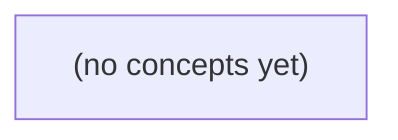

# 04.05 TCP与长连接生命周期

*面向Go初学者，以虚构IM中u-a连接网关、发送m-a、断线重连的过程为主线，分层理解TCP连接、WebSocket会话、应用登录、用户在线与消息送达。教材通过时间线、状态图、Go接口入口和22道附反馈练习，建立长连接故障与重连的基础判断能力。*

**章节:** 2

---

## 本书导览

- 了解整本书的章节脉络
- 掌握各章之间的概念依赖关系
- 选择最合适的阅读顺序

# 04.05 TCP与长连接生命周期

面向Go初学者，以虚构IM中u-a连接网关、发送m-a、断线重连的过程为主线，分层理解TCP连接、WebSocket会话、应用登录、用户在线与消息送达。教材通过时间线、状态图、Go接口入口和22道附反馈练习，建立长连接故障与重连的基础判断能力。

下方的概念图展示了本书 0 个核心概念以及它们之间的依赖关系；再下方是 1 个章节的入口。你可以按从上到下的顺序阅读，也可以根据自己的兴趣或先验知识选择切入点。

#### 概念图



## 章节索引

- **04.05 TCP与长连接生命周期：握手、半关闭、心跳与重连** — 面向Go初学者承接04.04可靠字节流，以虚构IM的u-a长连接从TCP三次握手、WebSocket升级到FIN/RST、半关闭、TIME_WAIT、Keepalive/Ping/业务心跳和重连的生命周期为主线，区分连接状态、身份、在线和消息确认；静态教材不运行网络。

## 04.05 TCP与长连接生命周期：握手、半关闭、心跳与重连

- 画出TCP三次握手与四元组
- 区分TCP established、WebSocket升级和应用认证
- 解释FIN、半关闭、EOF与TIME_WAIT
- 区分RST/超时/半开连接
- 比较TCP Keepalive、WebSocket Ping/Pong和业务心跳
- 说明重连新旧连接可能并存与消息ID责任
- 给Go Conn与deadline标资源所有者
- 列出连接状态、设备在线和业务消息确认各能证明什么

以虚构 IM 的 u-a、c-a、m-a 为线索，分层梳理一条长连接从建立、认证、收发、保活到关闭与重连的完整生命周期。

### 三条连接与四层事实

### 三条连接与四层事实

虚构 IM 中可同时观察三条连接：用户端 `u-a`、客户端实例 `c-a`、消息代理 `m-a`。它们不是三条必然一一对应的 TCP 流，而是三个角色视角：`u-a` 发起登录与收发，`c-a` 维护设备侧长连接状态，`m-a` 接收、路由、暂存或确认消息。

同一时刻应分开判断四层事实：

- **传输连接**：TCP 是否处于 `ESTABLISHED`，只能说明字节流通道暂未被本端感知为断开。
- **协议会话**：WebSocket 是否已升级、应用握手是否完成、会话令牌是否仍有效。
- **身份状态**：该连接是否已认证为某个用户、某台设备或某个客户端实例；TCP 建立并不等于“已登录”。
- **在线状态**：服务端是否在心跳租约内认为 `c-a` 可达，或是否仍保留其最近连接记录；这也不等于用户真实在线。

消息还要单独看确认链。`u-a` 将消息交给 `c-a`，只表示本地发送成功；`c-a` 收到 `m-a` 的协议确认，才可能表示服务器已接收；若业务需要“送达”，还必须等待目标设备确认。于是：

`TCP 已建立 ≠ 已认证 ≠ 用户在线 ≠ 设备可达 ≠ m-a 已送达`

关闭、超时和重连时，四层状态可能以不同速度失效。设计协议时应明确每一种确认究竟证明了哪一层事实。

### 从三次握手到应用就绪

### 从三次握手到应用就绪

设客户端 `c-a` 以本地地址和临时端口连接 IM 服务器 `s-a:443`。一条 TCP 连接通常由四元组唯一标识：

$$(客户端IP, 客户端端口, 服务器IP, 服务器端口)$$

例如 `(10.0.0.8, 53124, 203.0.113.10, 443)`。同一台客户端可用不同临时端口同时建立多条连接；因此不能只用“用户 `u-a`”或服务器地址标识某条 TCP 流。

连接建立先经历三次握手：

1. `c-a → s-a`：发送 `SYN`，请求建立连接；
2. `s-a → c-a`：回复 `SYN+ACK`；
3. `c-a → s-a`：发送 `ACK`，双方进入 `ESTABLISHED`。

此时的含义很窄：两端 TCP 状态机已同意收发可靠、有序的字节流。它并不表示 `u-a` 已登录，也不表示设备可达、WebSocket 已建立，更不表示消息 `m-a` 已送达。

若 IM 使用 WebSocket，`c-a` 还需在该 TCP 字节流上发送 HTTP 升级请求；服务器返回成功的升级响应后，双方才能按 WebSocket 帧格式交换数据。升级成功只证明协议通道可用，身份仍未绑定。

随后客户端通常发送应用认证消息，例如携带访问令牌、设备标识、协议版本和会话信息。服务器验证令牌、检查账号状态与会话策略，并返回认证成功结果后，才可将该连接关联到 `u-a` 的某个设备会话。至此才是“应用就绪”：`c-a` 可以发送聊天消息、接收 `m-a`，服务器也可将其纳入在线路由表。

### 收发、空闲与三类保活

### 收发、空闲与三类保活

连接进入可收发状态后，u-a 与 c-a 仍需区分“链路未断”“对端协议栈仍响应”“业务会话仍有效”。空闲并不必然异常：用户可能暂未发消息，m-a 也可能没有待投递内容；但空闲期间的 NAT、负载均衡或移动网络可能已悄然回收映射。

| 机制 | 探测对象与典型时效 | 能证明什么 | 不能证明什么 |
|---|---|---|---|
| TCP Keepalive | 内核对长期无数据的 TCP 连接发送探测；默认常常以小时计，具体取决于系统参数 | 本机到对端 TCP 栈的路径大致可用，对端仍可能响应 TCP 探测 | 用户已登录、WebSocket 会话有效、应用进程健康、m-a 已送达 |
| WebSocket Ping/Pong | WebSocket 层 Ping 后等待 Pong，通常可配置为秒级到分钟级 | 对端 WebSocket 实现或其代理链路仍能按协议回应 | c-a 的认证令牌有效、消息处理完成、用户实际在线 |
| 业务心跳 | 应用定义的心跳包，可携带会话 ID、令牌版本、客户端前后台状态等 | c-a 与 u-a 的业务会话在当前时刻可被服务端识别；可刷新在线租约 | 消息已被用户阅读、设备一定可接收后续推送、跨节点 m-a 已持久化或送达 |

三者不是替代关系，而是不同层的失败检测。TCP Keepalive 常用于发现长期静默的死连接；WebSocket Ping/Pong 适合维持协议层活性；业务心跳用于维护“在线”租约和会话语义。

即使收到 Pong 或业务心跳，也只能说明“此刻得到了一次响应”。网络分区、响应延迟、服务端状态不同步都可能随后暴露。因此，m-a 的可靠送达仍应依赖消息 ID、服务端持久化、确认与幂等重试，而不能把“连接仍活着”当作“消息已送达”。

### 正常关闭与异常失联

### 正常关闭与异常失联

`TCP established` 之后，连接的结束也必须分层判断。对 c-a 而言，“读不到数据”可能是对端正常退出，也可能只是网络路径已断。

- **FIN 与 EOF：有序关闭。**一方不再发送字节时发送 `FIN`；另一方的 `read()` 返回 `0`，即 EOF。EOF 表示“对端发送方向已关闭”，不等于双方都已关闭。c-a 仍可向对方写入数据，这就是**半关闭**。例如服务端收到 c-a 的 FIN 后，可继续发送尚未推送完的 m-a，再关闭自己的发送方向。
- **RST：非正常中断。**收到 `RST` 时，读写通常报“连接被重置”。常见原因包括进程崩溃、端口已无对应连接、协议状态不匹配，或中间设备主动清理连接。RST 不保证应用层的最后一条 m-a 已被处理。
- **读写超时：尚未得到结论。**写超时可能是本机发送缓冲区拥塞；读超时只说明在限定时间未收到数据，不能直接证明对端离线。应结合应用心跳、连续失败次数和网络状态判定。
- **半开连接：双方认知不一致。**例如 c-a 已断网或崩溃，服务端仍保留 `established`；双方都未收到 FIN/RST。只有后续写入失败、TCP 保活探测失败或应用心跳超时，服务端才会发现失联。
- **TIME_WAIT：主动关闭方的等待。**主动关闭后暂留 `TIME_WAIT`，用于处理迟到报文并避免旧连接数据混入新连接；它不是“仍在线”，也不应靠立即复用同一连接来绕过。

可按现象排查：`EOF` → 处理对端有序关闭与剩余消息；`RST/写失败` → 立即结束会话并进入重连策略；仅心跳超时 → 标记“疑似失联”，关闭旧连接后重连。无论哪种情况，都不能据此断言 u-a 已退出、设备不可达，或 m-a 已送达。

### 重连并存与 Go 资源归属

### 重连并存与 Go 资源归属

网络抖动时，旧连接未必已经被服务端判死，客户端却可能已建立新连接。于是同一用户 `u-a`、同一设备 `c-a` 会短暂对应多个 TCP 连接。必须引入会话代际 `generation`：认证成功后，服务端为该设备登记“当前代际”，新连接的代际更大；旧连接即使仍能读到数据，也只能被视为过期会话。

`TCP established` 只表示传输层连接存在，不表示该连接仍拥有登录资格。应用层应明确：

- 新连接认证成功后，原子替换 `c-a -> Conn + generation` 映射。
- 旧读循环发现自己的代际已非当前值，应停止处理业务包并退出。
- 旧连接上的迟到确认、重发请求不得覆盖新代际状态。
- `m-a` 必须有全局消息 ID；发送方重连后可携带该 ID 重发，接收方按 ID 去重，服务端按“消息 ID + 投递状态”确认责任，而不是按某条 TCP 连接推断送达。

在 Go 中，资源所有权应单一且可追踪。一个常见划分是：

- `Conn` 由会话对象拥有；会话管理器只负责登记、替换和请求关闭。
- 读循环独占 `Read`，写循环独占 `Write`；其他 goroutine 通过发送队列交给写循环，避免并发写的顺序与关闭竞态。
- deadline 由执行阻塞 I/O 的循环设置，例如读循环维护读超时，写循环在每次写前设置写超时。
- `Close` 应由会话取消路径统一触发：认证替换、心跳超时、协议错误、服务停机都先取消会话，再关闭 `Conn`，使读写循环因错误退出并回收 goroutine。

关闭是幂等动作：可用 `sync.Once` 或取消函数保证多个异常源同时到达时，只发生一次实际清理。新旧连接的切换则必须比较代际，避免“旧连接退出时误删新连接”的经典竞态。

> **要点** — 连接建立、身份认证、设备在线与消息送达是不同层次的事实，必须分别证明、分别失效和分别恢复。

以虚构 IM 的 u-a 长连接为线索，先厘清一条 TCP 连接如何被建立、识别，以及握手成功为何不等于用户已认证或具备业务权限。

### 从监听端口到一条具体连接

### 从监听端口到一条具体连接

以 IM 服务 `u-a` 为例，服务端先在固定地址和端口上创建**监听套接字**，例如：

`10.0.0.10:443`

它的职责是等待新的连接请求，而不是代表某个具体用户，更不保存某条会话的完整收发状态。多个客户端都可以向该端口发起连接。

当手机上的客户端从临时端口 `192.0.2.8:53124` 连接到服务端时，TCP 用四元组唯一标识这条已建立连接：

`(源IP, 源端口, 目标IP, 目标端口)`

即：

`(192.0.2.8, 53124, 10.0.0.10, 443)`

三次握手完成后，内核从监听套接字派生出一个**已建立连接套接字**；它维护该连接独有的序号、确认号、收发缓冲区、拥塞控制和关闭状态。服务端仍继续保留监听套接字，以接受后续连接。

因此，同一服务端端口可以同时承载大量连接；同一用户也可能在手机、平板、网页端分别建立多条 TCP 连接，甚至同一设备重连后也会因源端口变化形成新四元组。TCP 只识别“哪两个网络端点之间的字节流”，并不认识“用户 `u-a`”。

用户身份、登录态和业务权限通常在 TCP 建立后，才通过 HTTP 请求、WebSocket 握手头或首条业务消息中的令牌完成认证。握手成功仅说明网络路径和 TCP 协议协商成功，不能推出该连接已经登录，更不能推出其拥有发送消息、加入群组等业务权限。

### 三次握手与序号推进

### 三次握手与序号推进

设 IM 客户端 `u-a` 主动连接服务器。客户端选择初始序号 `seq=100`，服务器选择初始序号 `seq=500`。三次握手可按报文中的 `seq` 与 `ack` 逐步推导：

1. **客户端发送 SYN**

   `C → S: SYN, seq=100`

   `SYN` 表示“我希望建立连接，并从序号 100 开始”。虽然该报文通常不携带应用数据，但 `SYN` 本身会消耗一个序号，因此客户端下一可用序号是：

   $100+1=101$

2. **服务器回复 SYN+ACK**

   `S → C: SYN+ACK, seq=500, ack=101`

   `ack=101` 表示服务器已收到客户端的 `SYN seq=100`，期待客户端后续从 101 开始发送。与此同时，服务器自己的 `SYN` 使用 `seq=500`，也占用一个序号；因此客户端应确认：

   $500+1=501$

3. **客户端发送最终 ACK**

   `C → S: ACK, seq=101, ack=501`

   `ack=501` 表示客户端已收到服务器的 `SYN seq=500`。此时双方都确认了对方的初始序号与收发能力，TCP 进入已建立状态。

可将关键推进关系记为：

- `SYN seq=100`，对端确认应为 `ack=101`；
- `SYN seq=500`，对端确认应为 `ack=501`；
- 普通纯 `ACK` 不携带数据时通常不额外消耗序号；
- 后续每发送 $n$ 字节数据，发送方序号推进 $n$，接收方确认号也相应推进。

握手完成仅说明 TCP 字节流通道已经建立；HTTP 请求、WebSocket Upgrade、令牌校验及用户权限判断仍发生在这之后。

### 四元组如何区分并发会话

### 四元组如何区分并发会话

TCP 不用“用户名”区分连接，而用四元组唯一标识一条已建立会话：

`源IP:源端口 → 目标IP:目标端口`

例如，IM 服务端监听 `203.0.113.10:443`，用户 `u-a` 同时在手机和电脑登录：

- 手机：`198.51.100.8:51001 → 203.0.113.10:443`
- 电脑：`192.0.2.25:62034 → 203.0.113.10:443`

虽然两条连接最终都认证为 `u-a`，目标服务端口也相同，但源 IP 或源端口不同，因此是两条独立 TCP 连接。它们各自拥有独立的序号空间、收发缓冲区、拥塞控制状态和关闭过程。

即使是同一台客户端重连，也通常会获得新的临时源端口：

- 旧连接：`198.51.100.8:51001 → 203.0.113.10:443`
- 重连后：`198.51.100.8:51002 → 203.0.113.10:443`

这不是“旧连接复活”，而是新的 TCP 会话；业务层可依据登录令牌、设备标识或会话 ID 判断它是否仍属于同一用户、是否应踢掉旧设备。

反过来，许多客户端可以同时访问同一个服务端监听端口。`203.0.113.10:443` 是监听入口，不是一条唯一连接；内核会依据收到报文的四元组，将数据分发给对应的已连接套接字。

因此，四元组与用户没有一一对应关系：一个用户可对应多条连接；一条连接在 TCP 握手完成时也尚未必然对应任何已认证用户。HTTP、WebSocket 或自定义协议中的认证，发生在 TCP 建连之后。

### TCP 建立不等于 WebSocket 可用

### TCP 建立不等于 WebSocket 可用

以 IM 客户端 `u-a` 连接服务端为例，三次握手完成只说明：两端 TCP 协议栈已经为这条四元组连接建立了可靠字节流通道。连接通常由：

`源 IP:源端口 + 目标 IP:目标端口`

共同识别；服务端监听的是端口，而不是某个具体用户。同一用户在手机、电脑、多开进程中，甚至同一设备的不同源端口上，都可以同时拥有多条独立 TCP 连接。

| 层次事实 | 典型证据 | 能证明什么 | 不能证明什么 |
|---|---|---|---|
| TCP 已建立 | `SYN seq=100` → `SYN+ACK seq=500 ack=101` → `ACK ack=501` | 双方网络可达，彼此确认初始序号；`SYN` 本身占用一个序号 | HTTP 服务可用、WebSocket 已升级、用户身份合法 |
| HTTP 升级完成 | 请求含 `Upgrade: websocket`，响应为 `101 Switching Protocols` | 该 TCP 字节流后续可按 WebSocket 帧格式传输 | 客户端携带的令牌有效，用户有权进入某业务 |
| 应用认证成功 | 首帧认证消息、Cookie/令牌校验、会话绑定成功 | 服务端已将该连接关联到特定用户、设备或租户 | 用户永久在线、订阅所有频道、后续权限永不变化 |

因此，“握手成功”最多表示 TCP 层成功。即使攻击者、匿名客户端或过期令牌持有者都能完成三次握手；只要服务端端口可达，就可能进入 HTTP 请求阶段。

WebSocket 常见流程应理解为：

`TCP 建立 → HTTP Upgrade 成功 → WebSocket 认证 → 业务鉴权/订阅`

认证与鉴权发生在 TCP 之后。服务端不应仅因某条连接处于 `ESTABLISHED`，就把它计为在线用户，更不能据此推送私有消息。连接是传输载体；用户身份、设备身份和业务权限，则是应用层后来赋予这条连接的状态。

### 把连接、身份与权限分层建模

### 把连接、身份与权限分层建模

以虚构 IM 的 `u-a` 长连接为例，应把“连接存在”“用户是谁”“能做什么”拆成独立状态，而不是用一个“已连接”笼统概括。

- **传输层连接状态**：四元组  
  `源IP:源端口 → 目标IP:目标端口`  
  唯一标识一条 TCP 连接。客户端发出 `SYN seq=100`，服务端回复 `SYN+ACK seq=500 ack=101`，客户端再回复 `ACK ack=501` 后，双方进入可传输字节的状态。`SYN` 本身占用一个序号，因此确认号分别是 `101`、`501`。此时只能说明：该四元组对应的两端具备可靠字节流通道。

- **协议层状态**：TCP 建立后，服务端才能接收并解析 HTTP 请求、WebSocket Upgrade，或自定义 IM 协议帧。字节可读不等于帧合法；还需处理粘包、拆包、长度字段、版本号、编码与协议错误。只有完整且校验通过的帧，才可进入应用协议处理。

- **身份状态**：认证帧携带令牌、会话凭证或签名，经服务端验证后，连接才可绑定 `userId=u`、设备标识 `a`、登录会话及过期时间。TCP 三次握手成功不能证明对端是用户 `u`：任何能连到监听端口的客户端都可能完成握手。

- **授权状态**：即使连接已绑定用户，发送消息、加入群组、拉取历史记录等操作仍须分别检查权限、群成员关系、封禁状态、设备策略和令牌有效期。认证回答“你是谁”，授权回答“你现在能否做这件事”。

可为连接维护类似状态链：

`已接受 → TCP已建立 → 协议已协商 → 已认证 → 已授权可用 → 正在关闭/已关闭`

监听套接字只负责接受新连接；每次 `accept` 得到的是独立连接。一个用户可在手机、桌面端甚至同一设备多次登录，形成多个不同四元组的连接；它们可映射到同一用户，却不能被误认为同一条 TCP 连接。

> **要点** — 三次握手建立的是由四元组标识的 TCP 字节流；WebSocket 升级、用户认证与业务授权都必须在其后独立确认。

TCP关闭不是一次“断开”动作：FIN只关闭一个发送方向，连接何时真正结束取决于双方的字节流与状态机。

### FIN关闭的是单向字节流

### FIN关闭的是单向字节流

TCP连接包含两个彼此独立的字节流：`A → B` 与 `B → A`。因此，FIN 的含义不是“立刻断开连接”，而是发送方声明：**本方向以后不再发送任何字节**。

例如 A 调用关闭发送方向：

1. A 已发送的数据仍会按序到达 B。
2. A 发送 FIN；B 对该 FIN 确认 ACK。
3. B 的 `Read` 会先读完已缓冲的字节，随后得到 EOF，表示 `A → B` 字节流结束。
4. 但 `B → A` 仍然可用：B 可以继续向 A 发送响应、结果或剩余数据。
5. B 处理完毕后再发送自己的 FIN，A 确认后，双向字节流才都关闭。

可将其理解为：

| 事件 | `A → B` | `B → A` |
|---|---|---|
| A 发送 FIN 后 | 已结束 | 仍可发送 |
| B 也发送 FIN 后 | 已结束 | 已结束 |

在 Go 中，`(*net.TCPConn).CloseWrite()` 表示只关闭本地发送方向，适合“请求发完，但仍要读取服务端完整响应”的协议。`CloseRead()` 则关闭本地接收方向，通常较少直接使用；多数调用方最终使用 `Close()`，它关闭连接相关的读写能力。

因此，读到 EOF 不应自动理解为“连接已完全不可用”。它只说明**对端不再写入**；若本端尚未关闭发送方向，仍可能需要继续写入，或在完成业务协议后再执行完整关闭。

### 半关闭、EOF与仍可发送

### 半关闭、EOF与仍可发送

设客户端先完成请求发送，但仍要接收服务端的长响应。它可以发送 `FIN`，表达的不是“连接立刻消失”，而是：

> 我这一方向不再发送任何新的字节。

服务端收到 `FIN` 后，以 `ACK` 确认。此时客户端到服务端的字节流结束；服务端继续调用 `Read`，会先读出此前已到达的剩余数据，缓冲区耗尽后得到 `EOF`。因此，`EOF` 的准确含义是：**对端发送方向已经正常结束**，而不是“本端不能再使用此连接”。

服务端仍保有自己的发送方向。它可以继续写响应：

```text
客户端 -- FIN --> 服务端
客户端 <-- ACK -- 服务端
客户端 <-- 响应数据 -- 服务端
```

客户端虽然已经不能再写请求数据，却仍可持续 `Read`，直到服务端也发送 `FIN`。只有第二个方向也结束，双向字节流才算关闭。

在 Go 中，`(*net.TCPConn).CloseWrite()` 对应这种语义：关闭本端写方向，通常会使内核发送 `FIN`；之后仍可继续 `Read` 对端数据。相对地，`CloseRead()` 放弃接收方向，但这在应用协议中较少作为正常流程使用，因为未读取的数据、后续响应以及协议边界都可能被丢弃。

大多数调用者直接使用 `Close()`，因为常见请求—响应模型不需要显式半关闭；`Close()` 会关闭整个套接字的本地使用权。只有当协议明确需要“我已发送完，但请继续回复”时，才应使用 `CloseWrite()`。例如上传完整文件后等待处理结果、流式请求结束后等待服务端汇总，都天然适合半关闭。

### Go中的CloseWrite、CloseRead与Close

### Go中的`CloseWrite`、`CloseRead`与`Close`

`*net.TCPConn`提供的关闭操作对应 TCP 的两个独立字节流方向：

- `CloseWrite()`：关闭本端的发送方向，内核发送 `FIN`。此前已写入的数据仍会按序送达；之后再 `Write` 会失败。对端持续读取，读完已有字节后得到 `EOF`，但它仍可向本端发送数据。
- `CloseRead()`：关闭本端的接收方向，表示应用不再读取对端数据。它不是“通知对端停止发送”的协议语义；对端未必立刻知道，也不应把它当作请求—响应结束信号。
- `Close()`：关闭整个连接的本地使用权，通常同时结束读写，并释放文件描述符等资源。对多数业务调用方而言，这是正确的默认选择。

`CloseWrite`适合存在明确单向结束语义的协议。例如客户端上传请求体后调用 `CloseWrite()`，服务器读到 `EOF` 后确认请求结束，再继续回传响应；客户端此时仍可读取响应。这里的 `EOF` 是可靠的“这一方向没有更多字节”边界，不需要额外猜测消息是否结束。

但半关闭会增加状态管理复杂度：应用必须继续处理另一方向的读取、超时、错误与最终 `Close()`；也必须确认协议允许“请求方向结束、响应方向继续”。若只是连接池淘汰、请求取消、发生不可恢复错误，或协议本身已有长度字段/结束帧，通常直接 `Close()` 更清晰，也更不容易遗留半开连接。

实践中可记为：需要向对端声明“我发完了，但我还要收”时用 `CloseWrite()`；不再需要连接时用 `Close()`；`CloseRead()`较少作为常规协议流程使用。

### 双方关闭后的TIME_WAIT

### 双方关闭后的 TIME_WAIT

设主动关闭方为 A，被动关闭方为 B。典型四次挥手可概括为：

1. A 发送 `FIN`，表示 A 不再发送字节；
2. B 确认该 `FIN`，但仍可继续向 A 发送剩余数据；
3. B 发送自己的 `FIN`；
4. A 确认 B 的 `FIN`，随后进入 `TIME_WAIT`。

因此，`TIME_WAIT` 通常出现在**主动发起关闭的一方**，而不是“最后发送 FIN 的一方”。A 进入该状态并非无事可做，而是承担两个职责：

- **可靠地补发最后一个 ACK**：若 A 的最终 `ACK` 在网络中丢失，B 会超时重传 `FIN`。A 在 `TIME_WAIT` 中仍保存连接状态，收到重传的 `FIN` 后可以再次确认；若 A 已立即遗忘该连接，B 可能只能反复重传，最终以异常方式结束。
- **隔离旧连接的迟到报文**：网络中可能仍有属于旧四元组连接的延迟段。等待足够长时间后，这些报文应当消失，避免同一源/目的地址与端口组合被快速复用时，旧数据被误交给新连接。

教材常将等待上界描述为 $2\mathrm{MSL}$：一个最大报文生存期用于让旧报文到达或失效，另一个用于让对端对最终确认的相关重传完成传播。不过，`MSL` 及实际 `TIME_WAIT` 时长由操作系统实现、内核参数和协议策略决定；不同系统、不同版本的观察值可能不同。

因此，程序设计不应写成“关闭后固定等 30 秒即可复用端口”。更可靠的原则是：把 `TIME_WAIT` 视为 TCP 为可靠终止和旧报文隔离保留的正常状态；服务端通过端口复用、连接池和合理的关闭策略应对，而不是依赖某个固定秒数。

### u-a连接关闭过程判读

### u-a 连接关闭过程判读

设 IM 客户端 `u` 主动退出，与服务端 `a` 的 TCP 连接已无待发业务数据。一个典型过程如下：

1. `u` 调用 `CloseWrite()`：内核发送 `FIN`。这表示 **u 不再向 a 发送任何字节**，不是“连接立刻消失”。
2. `a` 收到 `FIN` 后确认 `ACK`。此时 `a` 的读取操作会在已取完此前缓存数据后返回 `EOF`：`u → a` 这个字节流方向结束。
3. `a` 仍可向 `u` 发送最后的消息，例如“已下线确认”。因此，`u` 此时应继续读取，而不能把收到对方 `FIN` 前的半关闭误判为完整断开。
4. `a` 发送完剩余数据后也关闭写方向，发送自己的 `FIN`；`u` 确认最后的 `ACK`。
5. 双方发送方向都关闭后，文件描述符、缓冲区等连接资源才能最终释放。通常主动关闭的 `u` 会进入 `TIME_WAIT`，用于吸收迟到报文并确保最后一个 `ACK` 的可靠性；规范语义是等待 `2MSL`，实际可观察时长由操作系统决定。

可将两个方向分别记为：

- `u → a`：`FIN` 后，`a` 读完缓存得到 `EOF`；
- `a → u`：在此之前仍可正常写入，直到 `a` 自己发送 `FIN`。

Go 中，大多数调用者直接使用 `conn.Close()`，它通常同时结束本地读写并释放连接；只有确实需要“我说完了，但还要等对方回复”的协议场景，才考虑 `(*net.TCPConn).CloseWrite()`。`CloseRead()` 则表示本地不再接收该方向数据，使用不当可能导致对端继续发送时出错。

> **要点** — FIN表示一侧不再发送字节；EOF表示读方向结束；连接完全终止需双方关闭，主动关闭方通常经历TIME_WAIT。

沿着虚构IM中 m-a 的一次中断与重连，辨析RST、静默断网和消息提交之间不能互相替代的证据。

### RST与FIN：中断和收尾的两条路径

### RST与FIN：中断和收尾的两条路径

`FIN` 表示“本端不再发送字节”，是 TCP 的有序收尾信号；`RST` 表示“这条连接不应继续存在”，是立即中断或拒绝状态的复位信号。两者都可能导致连接结束，但接收端看到的语义、缓冲数据命运和应用应对完全不同。

- **FIN 的典型触发**：应用主动关闭套接字，或完成半关闭。例如客户端发送 `FIN` 后进入 `FIN_WAIT_1`，服务端仍可继续发送尚未发完的数据。接收端读完已缓冲字节后，下一次读取返回 `EOF`，含义是“对方正常结束了发送方向”。
- **RST 的典型触发**：进程在未正常关闭的情况下退出、套接字设置了强制关闭、收到发往不存在连接的报文，或协议状态明显不匹配。接收端读取或写入时通常得到“连接被复位”类错误，而非 `EOF`。

关键差异在于缓冲区：

| 维度 | FIN | RST |
|---|---|---|
| 关闭性质 | 有序、可半关闭 | 异常、立即终止 |
| 已接收缓冲数据 | 通常仍可被应用读完 | 可能被丢弃，不能依赖 |
| 读取结果 | 缓冲读尽后为 `EOF` | 可能立即返回复位错误 |
| 未确认或未送达数据 | 按正常 TCP 可靠传输流程处理 | 不保证继续交付 |

因此，收到 `FIN` 至少说明对方 TCP 栈曾按序声明发送结束；收到 `RST` 只能说明连接状态被强制废弃，不能推出对方应用是否处理过此前消息。对 IM 中的 `m-a` 而言，`Conn.Write` 成功、随后收到 `RST`，都不能单独证明消息已提交到服务端应用；提交证据仍应来自可关联的应用层确认。

### 半开连接：为何仍显示已建立

### 半开连接：为何仍显示已建立

TCP 的 `ESTABLISHED` 是**本机协议栈当前掌握的状态**，不是“对端仍在线”的实时证明。连接建立后，若中间链路断开、路由黑洞、对端主机断电，甚至对端进程崩溃而未能正常关闭，本端通常不会立刻收到 `FIN` 或 `RST`；因此控制块仍保留，状态仍显示为 `ESTABLISHED`。这就是半开连接：一端已不可达或已失去连接状态，另一端却暂时不知情。

故障何时暴露，取决于后续动作：

- **读操作**：若此前已收到对端的 `FIN`，读会返回 EOF；若只是静默断网，阻塞读可能长期等待，因为没有任何报文告诉它“连接已死”。
- **写操作**：本端写入通常先复制到本机发送缓冲区，`Write` 成功只说明本机接受了这批字节，不说明对端进程收到，更不说明应用提交。随后若报文重传耗尽，写或后续读才可能报超时；若对端恢复后回送 `RST`，则可能得到“连接被重置”。
- **协议超时**：TCP 对未确认的数据进行重传；重传达到系统配置上限后，内核才放弃连接。若双方一直没有业务数据，可能根本不会触发重传。
- **保活或应用心跳**：定期发送探测，使静默故障变成“有报文但无确认”。TCP keepalive 往往默认间隔很长；IM 更常使用应用层 ping/pong，并以连续缺失响应判定失联。

对端进程崩溃也有两种外观：若操作系统仍在且该端口状态已丢失，收到旧连接的数据包时常回复 `RST`，本端较快发现；若整机断电或网络隔离，则更像沉默，必须等待写入、重传超时或探测失败。故而“仍是 `ESTABLISHED`”只能说明尚未获得反证，不能证明 m-a 已送达或已处理。

### 三类探测：保活、Ping与业务心跳

### 三类探测：保活、Ping与业务心跳

连接“看起来还在”并不等于对端进程、协议会话和消息处理链路都正常。三类探测验证的对象不同，不能互相替代。

- **TCP Keepalive（保活）**：由内核在长期空闲后发送探测段，主要发现“底层 TCP 对端是否仍可达”、清理被 NAT、防火墙或断网遗留的半死连接。其典型默认空闲时间往往很长，且参数受操作系统控制；即使保活成功，也只能说明 TCP 栈仍能应答，不能证明 IM 服务进程、WebSocket 会话或消息消费逻辑正常。

- **WebSocket Ping/Pong**：运行在 WebSocket 协议层。服务端发送 `Ping`，客户端应答 `Pong`，可较快确认该 WebSocket 连接及对端协议实现仍在工作，常用于维持代理/NAT 映射并检测浏览器、网关异常。但 `Pong` 仍不表示业务线程健康：客户端可能能自动回 `Pong`，却因页面卡死、登录状态失效或消息处理队列阻塞而无法处理 `m-a`。

- **业务心跳**：由应用定义，例如客户端周期发送“在线、会话版本、最后确认消息序号”，服务端返回“租约续期、当前会话状态”。它验证的是业务协议所声明的活性，可绑定鉴权、租约和重连恢复信息；代价是需要设计频率、超时、幂等与服务端负载控制。业务心跳成功也不等于某条消息已提交，只能说明该次心跳请求获得了业务响应。

因此，超时应被解释为“在指定时间内未获得指定层次的证据”，而非直接断言对端必然离线。对 `m-a` 而言，探测失败后应关闭旧连接、重连，并凭消息标识与确认状态补发或查询，而不是根据一次 `Write` 成功、一次 `Pong` 或一次 RST 推断提交结果。

### 纸上推演：写入成功而响应丢失

### 纸上推演：写入成功而响应丢失

设客户端要发送消息 `m-a`，请求中携带唯一标识 `msg_id=a`。一次看似简单的发送，可能经历如下时间线：

| 时刻 | 发生的事 | 客户端能证明什么 |
|---|---|---|
| `t0` | 客户端调用 `Conn.Write(m-a)`，返回成功 | 数据已被本机内核接受，至多说明进入发送路径；不能证明服务端收到，更不能证明已提交 |
| `t1` | 服务端收到 `m-a`，写入数据库并投递；随后发送“已确认”响应 | 服务端可能已经完成提交，但响应包可能在网络中丢失、被中间设备丢弃，或因连接中断未到达客户端 |
| `t2` | 客户端读响应超时，或发现连接已断开后重连 | 客户端只知道“没有拿到确认”，不知道服务端究竟未收到、收到未提交，还是已提交但确认丢失 |

因此，`Write` 返回成功不等价于“消息发送成功”。它甚至不等价于“对端应用已收到”：

```text
客户端 Write 成功
    ≠ 对端 TCP 已确认
    ≠ 服务端进程已读取
    ≠ 服务端事务已提交
    ≠ 客户端已获得提交确认
```

若客户端在 `t2` 直接重发 `m-a`，服务端可能产生重复消息；若客户端放弃重发，第一次请求又可能实际上从未到达。这里的关键不是猜测网络状态，而是把“提交结果”设计成可查询、可重试的业务事实。

常见做法是：重连后仍以同一个 `msg_id=a` 发送或查询。服务端以该标识做幂等去重：已提交则返回原结果，未提交则继续处理。这样，响应丢失只会造成一次不确定的重试，而不会把不确定性扩大为重复写入或消息丢失。

### 重连后的责任边界与Go资源

### 重连后的责任边界与 Go 资源

重连不是“恢复原连接”，而是建立一条新的传输通道。旧连接可能仍处于 `ESTABLISHED`，或其读协程尚未因超时、RST、EOF 而退出；因此服务端不能仅凭“来了新连接”就删除旧连接的状态，更不能把两条连接上的消息按到达顺序混为一谈。

应用层应明确以下归属：

- **消息归属**：每条业务消息携带稳定的 `messageID`，而非使用连接内递增序号作为唯一身份。客户端在 `t0` 写入消息、`t1` 服务端已提交但响应丢失、`t2` 重连后重发时，服务端以 `messageID` 去重，并返回同一提交结果。
- **确认语义**：确认应表示“服务端已持久化或已完成约定的业务提交”，而不是“服务端收到了 TCP 字节”。客户端只有收到与 `messageID` 对应的幂等确认，才能停止重试。
- **会话归属**：连接绑定的应是某次会话实例，如 `sessionID`、登录代次或连接代号。新连接完成认证后成为当前代次；旧连接即使随后恢复可读，也只能被关闭、降级或拒绝写入，不能覆盖新会话。

在 Go 中，资源所有权也必须单一且可终止：

- `net.Conn` 由会话管理者创建和关闭；不要让多个错误处理路径竞争 `Close` 的业务决策。
- 一个读协程负责 `Read`，一个写协程串行负责 `Write`；业务协程通过队列提交发送请求，避免并发写造成协议帧交错。
- 会话管理者负责取消上下文、关闭发送队列，并等待读写协程退出后回收旧连接。
- `SetReadDeadline`、`SetWriteDeadline` 的设置与刷新应由对应读写所有者统一管理；心跳超时后关闭连接，才能打断可能永久阻塞的读写。

RST、写入失败和重连成功都只是传输事件；消息是否提交、旧连接是否仍有资格服务，必须由消息标识、幂等记录和会话代次共同裁定。

> **要点** — RST、写入结果和连接状态都不是应用提交证明；可靠重连依赖超时探测、消息ID与确认闭环。

长连接的存活并非单一信号能判定：TCP、WebSocket与业务层心跳分别回答不同问题，还必须面对代理超时、误判与资源成本。

### 先定义：心跳究竟在证明什么

### 先定义：心跳究竟在证明什么

“收到心跳”不是一个统一结论，而是一条分层证据。设计前应先明确：系统希望证明的是哪一层仍然可用。

- **传输连接存在**：TCP 连接未必已断。可选的 TCP keepalive 主要探测内核到对端协议栈的可达性；一次探测无响应可能只是拥塞、休眠或丢包，不能立即断言对端死亡。
- **协议会话仍可交互**：WebSocket `Ping` 得到 `Pong`，说明对端 WebSocket 实现仍能处理控制帧，且中间网络路径在该时刻可通。这不等于业务线程正常，也不等于用户仍在使用页面。
- **应用处理链路正常**：业务心跳由应用代码生成、接收和确认，可携带会话标识、版本、负载或状态，从而验证服务端处理逻辑、认证状态及关联会话仍有效。代价是更多报文、定时任务与服务端连接状态。
- **设备在线**：通常只能定义为“在期限内收到该设备可验证的活动”。设备可能后台挂起、网络切换，或由多个端同时登录，因此它是带超时窗口的推断，不是物理事实。
- **消息已读**：必须由具体会话或用户显式提交已读回执；连接活跃、心跳成功，最多证明消息可能可投递，不能证明屏幕展示，更不能证明人已阅读。

因此，心跳策略应写成可检验的判定：在间隔 $I$ 内发送探测，连续 $N$ 次或超过期限 $T$ 未获所需层级的确认，才将连接标记为可疑或失效。$I,N,T$ 还必须避开网关、负载均衡器和代理的空闲超时；否则连接可能被中间设备回收，而双方应用尚未知情。

### TCP Keepalive：可选的内核级探测

### TCP Keepalive：可选的内核级探测

TCP Keepalive 是操作系统内核在连接长期无数据交换时发起的探测机制，用于询问“这条 TCP 路径是否仍可能可达”。RFC 1122 将其定义为**可选功能**：实现可以提供，也可以默认关闭；应用更不能假定所有主机、网络设备或运行环境都启用了它。

典型流程是：连接空闲达到 `keepalive_time` 后，内核发送探测；若未获响应，再按 `keepalive_intvl` 重试，累计达到 `keepalive_probes` 才判定失败。许多系统的默认空闲期限可长达约两小时，因此它通常不适合承担秒级或分钟级的业务保活职责。

更重要的是，**一次探测无响应不能直接证明对端已经失效**。丢包、瞬时拥塞、无线链路切换、对端短暂停顿、拥塞控制延迟，以及中间 NAT、防火墙或代理对探测报文的处理差异，都可能造成暂时无响应。过早关闭会把可恢复的连接误判为死亡；重试过多、间隔过短又会增加连接数很大时的报文与内核定时器成本。

因此，TCP Keepalive 更适合作为内核级的“长期静默连接清理”手段。它最多说明 TCP 对端协议栈在多次探测后未能回应，不能证明应用进程仍在正常处理请求，更不能证明用户在线、会话有效或消息已读。

### Ping/Pong与业务心跳的能力边界

### Ping/Pong与业务心跳的能力边界

WebSocket 的 `Ping`/`Pong` 是 RFC 6455 定义的控制帧。发送端收到匹配的 `Pong`，通常只能说明：从当前连接到对端 WebSocket 协议栈的路径仍可双向通信，且对端实现仍在处理控制帧。它适合发现断网、连接被中间设备静默回收、对端进程或网络栈失效等情况。

但 `Pong` 不等于应用正常：

- `Pong` 可由 WebSocket 库自动回复，业务线程阻塞、消息队列堆积、数据库故障时仍可能返回。
- 它不能证明登录态、房间订阅、会话绑定等业务关联仍有效。
- 它更不能证明用户在屏幕前、消息已展示或已阅读。

业务心跳则是普通业务消息，例如 `{"type":"heartbeat","sessionId":"..."}`。服务端可在响应中校验令牌、会话版本、订阅状态、客户端时间戳或应用处理进度，因此验证的是“应用是否参与处理，以及该连接是否仍关联到预期会话”。代价是它会经过应用处理链路，频繁发送会增加序列化、调度、存储与日志压力，也更容易因短暂拥塞产生误判。

实践中可分层使用：用 `Ping`/`Pong` 维持或检测传输连接，用低频业务心跳确认关键会话状态；超时阈值应允许抖动与暂停，且必须小于网关、负载均衡器或代理的空闲回收期限。心跳失败应首先视为“连接或状态不确定”，通过关闭、重连和会话恢复处理，而非直接推断用户离线。

### u-a连接穿越网关的超时取舍

### u-a连接穿越网关的超时取舍

设即时通信客户端到服务端的路径为：客户端网络 → NAT → 企业代理 → 接入网关 → 消息服务。链路中任一设备都可能按“空闲时间”回收状态；例如 NAT 可能保留数十秒到数分钟，代理或网关可能在 60 秒、120 秒后关闭无业务流量的连接。客户端只知道自己“没收到消息”，却未必知道连接已在哪一跳失效。

因此，心跳间隔 $I$ 应小于路径上最短的空闲超时 $T_{\min}$，并留出抖动余量，例如：

$$I \leq 0.5\sim0.8T_{\min}$$

若网关空闲超时为 60 秒，可每 30～45 秒发送一次 WebSocket Ping 或业务心跳；但不能盲目设为 5 秒。假设在线连接数为 $N$、单次心跳上下行总字节数为 $B$，则每秒额外流量近似为：

$$Q=\frac{N\times B}{I}$$

间隔减半，心跳流量、终端唤醒次数和网关处理量大致翻倍，移动网络下还会增加耗电。

超时阈值也不宜由“一次未答”决定。网络切换、后台调度、短暂拥塞都可能延迟响应；可采用“连续 $k$ 次失败或总等待超过 $D$ 后重连”的策略。较小的 $D$ 能更快恢复失效连接，却会把暂时卡顿误判为断线，造成重连风暴；较大的 $D$ 降低误判，却延长消息不可达窗口。

WebSocket Ping/Pong 主要确认对端协议栈及中间路径仍能响应；业务心跳还可携带会话令牌、最后确认序号，以检验应用进程和登录关联是否有效。二者都不能证明用户正在操作、更不能证明消息已读。网关空闲超时应与心跳策略显式对齐，并在重连后通过鉴权、会话恢复和消息补拉处理真正的连接断裂。

### Go中的期限、关闭与重连责任

### Go中的期限、关闭与重连责任

在 Go 中，长连接故障往往不是“没有设置超时”，而是资源所有者不清：谁关闭 `Conn`，谁取消心跳，谁启动重连，旧连接上的未确认消息由谁处理。

- **连接所有者**应独占 `net.Conn` 或 WebSocket 连接的关闭权。通常由一个会话管理器持有 `context.CancelFunc`、连接对象和 `WaitGroup`；重连前先取消旧会话，再关闭旧连接，以唤醒阻塞的读写协程。
- **读期限**用于发现“长期收不到任何有效输入”。每次收到数据或合法 `Pong` 后调用 `SetReadDeadline` 延期；期限到达意味着当前连接不可继续信任，应进入关闭与重连流程。
- **写期限**防止发送协程永久卡在拥塞、半断开或对端不读的连接上。每次写入前设置短暂 `SetWriteDeadline`，写失败后不要让多个协程各自重连。
- **心跳任务**应由连接会话启动、随会话取消。WebSocket 的 `Ping/Pong` 验证对端协议栈仍能响应；业务心跳还可携带会话标识、版本或租约信息，但不能据此推断用户在线或消息已读。
- **重连循环**应是单一控制平面：指数退避、抖动、最大尝试窗口和上下文取消缺一不可。拨号成功后，必须确认旧连接的读写协程已退出，避免“新旧双连”同时消费消息。

消息确认应跨连接设计：给每条业务消息分配递增序号或唯一标识，服务端确认后才从待发送队列删除。旧连接断开时，未确认消息可按幂等键重发；已确认但客户端未处理的消息，则需要应用层游标、去重与恢复协议承担责任。

> **要点** — 心跳只能提供分层存活证据；参数应服务于链路超时约束，并以可接受误判和资源成本为界。

重连不是旧连接的简单续接：每次新建TCP、升级WebSocket和会话认证都可能产生并存状态，消息与在线语义必须脱离单条连接设计。

### 重连从新四元组开始

### 重连从新四元组开始

客户端“重连”在网络层并不是恢复原来的那条通道，而是创建一条新的 TCP 连接。新的连接通常具有新的四元组：

`源IP:源端口 → 目标IP:目标端口`

即使客户端与服务器 IP、服务端端口都不变，客户端临时端口通常也会变化；同时，TCP 三次握手会协商新的初始序号。旧连接可能因断网、超时、代理缓冲或服务器清理延迟而暂时仍存在，因此服务器短时间内可能同时看到“旧连接”和“新连接”。

TCP 建立成功只表示字节流可传输，不等于 WebSocket 已恢复。随后客户端还要发起新的 HTTP Upgrade 握手；服务器应把它视为新的 WebSocket 通道，重新校验请求头、Origin、子协议、压缩协商及连接参数。不能因为某个用户此前已有连接，就跳过这一步。

WebSocket 升级成功后，应用层还需要重新认证或恢复会话，例如携带访问令牌、会话票据、设备标识与断点信息。这里恢复的是**身份与业务会话语义**，不是复用旧 TCP 连接：

1. TCP 层确认新传输通道；
2. WebSocket 层确认新消息帧通道；
3. 会话层确认“谁在连接、以哪个设备和权限继续处理”。

因此，连接 ID 只能描述某条瞬时通道，不能充当稳定消息标识。消息应使用跨重连不变的 `message_id`，会话内顺序应使用业务 `seq`。当旧连接迟到的请求与新连接请求交错到达时，服务端应依据 `message_id`、`seq` 和幂等状态判定，而非依据“来自哪条 TCP 连接”。

### 旧连接为何仍可能存活

### 旧连接为何仍可能存活

“客户端已断网”通常只是客户端失去网络，并不等于服务端立即收到 TCP 的 `FIN` 或 `RST`。若网络在中间断开，旧 TCP 连接两端都可能仍处于 `ESTABLISHED`：客户端无法继续通信，服务端却尚未感知异常。

典型时序如下：

1. 客户端在连接 A 上发送请求 `m-a`，但响应尚未收到。
2. 网络短暂中断；连接 A 没有正常挥手，服务端的 WebSocket 会话也未立刻关闭。
3. 客户端等待超时后重连，建立连接 B：它拥有新的 TCP 四元组、新的序号空间，并重新完成 WebSocket 握手和 Session 认证。
4. 服务端因心跳超时、下一次写失败或内核超时，才在稍后清理连接 A。
5. 在 A 被清理前，A 与 B 可能同时绑定同一用户或设备；更极端时，A 缓冲中的旧请求仍可能先后到达业务层。

因此，请求的先后关系只能在**同一条连接内**讨论，不能推导为跨连接的全局顺序。连接 B 上的“新请求”可能先被处理，而连接 A 上延迟到达的“旧请求”随后执行，形成请求交错。

业务去重不能使用 TCP 连接 ID、WebSocket 对象或临时连接序号，而应使用稳定的 `message_id`（如 `m-a`）及会话级 `seq`。当旧请求与新连接上的重试相遇时，应按幂等记录判定：重复执行可返回既有结果或按约定返回 `409`，而不是把“来自旧连接”误判为“来自旧会话”。同时，用户在线状态应按设备及时间窗计算；一条旧连接尚未关闭，不足以证明用户仍在线。

### 稳定消息标识与会话序号

### 稳定消息标识与会话序号

重连后得到的是新 TCP 连接、新 WebSocket 实例，通常也会有新的连接标识、端口和底层序号。它们只描述“这一次传输通道”，不能描述业务消息的身份，更不能承担跨连接去重与排序。

发送方应为每条业务消息生成稳定的 `message_id`，例如 `m-a`；无论该消息因超时、断线或确认丢失而重发多少次，均复用同一个 `message_id`。服务端以“会话/业务域 + `message_id`”建立幂等记录：

- 首次收到 `m-a`：执行业务操作并持久化结果；
- 再次收到 `m-a`：返回先前结果或确认，不重复扣费、入库、推送；
- 即使重发来自新连接，也必须识别为同一业务消息。

会话 `seq` 则表达逻辑顺序，而非 TCP 字节流顺序。客户端可在同一逻辑会话内递增发送 `seq=1,2,3`；重连后继续使用后续序号，或按协议携带“已确认到的序号”。服务端据此判断缺口、乱序与重复：`seq` 小于等于已处理水位时走幂等查询，超过期望值时缓存、拒绝或请求补发。

不要将 TCP 连接 ID、WebSocket 对象 ID 或临时 socket 标识写入去重键。旧连接可能尚未清理，新旧连接上的请求会交错到达；若以连接为边界，`m-a` 在新连接中会被误判为新消息。稳定身份属于消息与会话，连接只是一条可替换的运输路径。

### 并存连接下的重复与幂等

### 并存连接下的重复与幂等

重连后，客户端常出现两条并存路径：旧连接上的请求因网络拥塞、服务器排队而晚到；新连接已完成认证，客户端又重发同一业务操作。两者的 TCP 四元组、序号和 WebSocket 连接均不同，却可能携带同一个稳定的 `message_id=m-a`、同一会话内的业务 `seq`。因此，不能以连接 ID 判断“是否已处理”。

例如，客户端在旧连接发送“创建订单”后未及时收到响应，随即重连并重发。服务端应按业务幂等键查询，而不是把两次到达当成两次创建：

- 首次请求：原子地写入业务结果与 `message_id` 的处理记录。
- 相同 `message_id` 再次到达：确认其请求参数、主体身份和幂等范围一致。
- 已完成但当前接口尚未提供结果回放时：返回 `409`，明确表示“该操作已被接受或处理，不能再次执行”。
- `message_id` 相同但载荷不同：应视为客户端协议错误或潜在攻击，拒绝处理，不得复用旧结果。

`409` 只是当前阶段防止副作用重复的边界，不应迫使客户端盲目重试。后续的幂等查询接口应承担“查结果”责任：客户端携带 `message_id` 查询状态，服务端返回处理中、成功结果或明确失败结果。这样，写接口负责一次性提交，查询接口负责恢复确定性，旧请求晚到与新连接重发的到达顺序便不再影响业务语义。

会话 `seq` 可用于检测乱序、缺口或过期请求，但不替代 `message_id`：前者描述会话流顺序，后者标识可去重的业务动作。

### 在线状态不是连接真值

### 在线状态不是连接真值

一条 TCP 或 WebSocket 连接仍存活，只能证明“截至某个观测时刻，服务端尚未确认该传输通道失效”。它不能直接证明用户正在使用应用，更不能代表该用户的全部设备状态。

| 概念 | 能证明的事实 | 不能证明的事实 |
|---|---|---|
| 连接存活 | 某连接近期有心跳、读写或未被关闭 | 用户仍活跃；同一设备没有新旧并存连接 |
| 设备在线 | 指定 `device_id` 在时间窗内存在有效认证连接或心跳 | 用户其他设备的状态；消息已被阅读 |
| 用户在线 | 用户至少一个设备在时间窗内在线 | 每台设备都在线；当前请求来自哪台设备 |
| 消息确认 | 某 `message_id` 被指定设备/服务端确认处理 | 对端已展示、已阅读，或其他设备已同步 |

建议将在线定义为可计算的时间窗谓词，而非连接对象的布尔值。例如：

$$
device\_online(d,t)=\exists c:\ c.device=d \land c.authenticated \land t-c.last\_seen\leq \Delta
$$

用户在线则是其设备集合上的存在判断：

$$
user\_online(u,t)=\exists d\in Devices(u):device\_online(d,t)
$$

其中 `last_seen` 应来自认证后的心跳、业务请求或服务端确认的活动记录，并设置容忍窗口 $\Delta$。断网、后台挂起、负载均衡迁移都可能让旧连接暂时未清理；重连后，新连接也可能先于旧连接关闭。因此，不能把“某连接 `open`”当作用户在线真值。

消息确认同样应独立记录：以稳定的 `message_id` 和会话 `seq` 标识处理进度，不用 TCP 连接 ID 推断幂等性或送达状态。这样即使新旧连接交错、同一用户多端登录，在线展示、重复请求处理和消息确认仍有各自明确的语义。

> **要点** — 连接会更替且可能并存；身份、在线、顺序与去重必须由跨连接的会话和消息协议负责。

本节以Go连接对象的资源责任为线索，明确何时读写、谁能关闭，以及如何将EOF、超时与RST转化为可执行的生命周期判断。

### 从拨号到接受：连接对象的归属

### 从拨号到接受：连接对象的归属

`net.Conn` 是一条双向字节流，也是一个必须显式回收的资源。判断谁应当调用 `Close`，核心不在“谁最后使用”，而在“谁创建并拥有其生命周期”。

- 客户端调用 `net.Dial` 成功后，返回的 `Conn` 由拨号方创建并持有。通常应由发起请求、管理重连或维护长连接的客户端组件负责关闭：

  `conn, err := net.Dial("tcp", addr)`

  若连接只服务一次短事务，可在本函数内 `defer conn.Close()`；若要交给上层连接管理器，则所有权应随返回值明确转移，当前函数不得再随意关闭。

- 服务端先创建监听器：

  `ln, err := net.Listen("tcp", addr)`

  `Listener` 通常由服务器启动代码拥有；关闭它意味着停止接受新连接。每次 `ln.Accept()` 返回的 `Conn` 则是独立资源，应交给处理该客户端会话的 goroutine 或会话对象负责关闭。

  `conn, err := ln.Accept()`

  常见模式是 `go serveConn(conn)`，并在 `serveConn` 的退出路径中统一 `defer conn.Close()`。这样无论正常 EOF、协议错误、读写超时还是业务主动终止，都不会遗留套接字。

可以先画一张责任表：

| 资源 | 创建者 | 生命周期持有者 | 关闭者 |
|---|---|---|---|
| `Listener` | 服务启动代码 | 服务器 | 优雅停机逻辑 |
| 客户端 `Conn` | 拨号组件 | 客户端会话/连接池 | 会话结束或连接池淘汰逻辑 |
| 服务端 `Conn` | `Accept` 调用处 | 单个连接处理器 | 处理器退出路径 |

“交给 goroutine”不等于“没人负责”。每个连接都应只有一个清晰的最终关闭责任人；其他代码若发现异常，应通知该责任人退出，而不是在多处竞争关闭。

### 读写阻塞与截止时间

### 读写阻塞与截止时间

`net.Conn` 的 `Read` 与 `Write` 都是阻塞操作：它们等待的不是“程序愿不愿意继续”，而是内核网络状态发生变化。

- `Read` 会等待对端发送数据、对端正常关闭（得到 `io.EOF`）、连接出错，或截止时间到达。
- `Write` 会等待本地发送缓冲区腾出空间。若对端不再读取、网络拥塞、链路黑洞或缓冲区长期满，写入同样可能无限等待。
- `Close` 通常会使正在阻塞的读写返回错误，因此它既是资源释放动作，也是中断阻塞的一种机制。

没有截止时间的连接，相当于把“等待多久”完全交给对端和网络。对端静默但未断开时，`Read` 可能永远不返回；对端窗口长期不推进时，`Write` 也可能卡住。业务上的“请求已经没有价值”并不会自动传递到 TCP 连接。

```go
conn.SetReadDeadline(time.Now().Add(5 * time.Second))
n, err := conn.Read(buf)

conn.SetWriteDeadline(time.Now().Add(3 * time.Second))
_, err = conn.Write(data)
```

截止时间是连接对象上的绝对时刻，不是本次调用专属的“等待时长”。一旦设置，它会影响后续对应方向的所有读或写；成功操作后也不会自动清除。要恢复无限等待，应显式设置零值：

`conn.SetReadDeadline(time.Time{})`

超时通常表现为 `net.Error`，可通过 `err.(net.Error).Timeout()` 判断。它表示“本次等待超过责任边界”，不必然说明连接已被对端关闭；而 `io.EOF` 表示收到了正常关闭语义，`connection reset` 等错误则更接近异常中断或 RST。因而，读超时后的策略应由协议决定：可以发送心跳、重试本次请求，或关闭连接并重连，而不是把所有错误一律当作断线。

### 关闭、半关闭与EOF

### 关闭、半关闭与 EOF

`Conn.Close()` 表示本端不再使用这条连接：底层套接字被释放，正在阻塞的读写通常会被唤醒并返回错误。对 TCP 而言，它会终止本端读、写能力；若协议状态允许，内核会向对端发送 FIN。关闭后继续 `Read` 或 `Write` 没有业务意义，也不应依赖具体错误文本判断状态。

`(*net.TCPConn).CloseWrite()` 则是**半关闭写方向**：

```go
tcp.CloseWrite() // 我方不再发送数据，但仍可继续读取对端数据
```

它向对端发送 FIN，表达“请求体或上传数据已经结束”。对端读取缓冲区中已有数据后，下一次读取会得到 `io.EOF`。但对端仍可继续写响应；本端在 `CloseWrite` 后也仍应持续 `Read`，直到收到响应完成、EOF、超时或业务协议规定的结束标记。

典型双向收尾过程是：

1. A 写完请求，调用 `CloseWrite`，发送 FIN。
2. B 的 `Read` 最终返回 `io.EOF`，知道 A 不会再发更多字节。
3. B 写完响应后关闭写方向。
4. A 的 `Read` 返回 `io.EOF`，随后双方释放连接。

因此，`EOF` 不是“网络异常”，而是读取方向收到对端 FIN 后的正常结束信号。它只说明**对端不再写**，不自动说明本端已经关闭，也不保证应用层消息完整；消息边界仍应由长度字段、分隔符或协议状态机确认。

资源责任上，谁创建并独占 `Conn`，谁通常负责最终 `Close()`。若连接由 HTTP、WebSocket 等框架管理，处理器不应随意关闭共享连接；需要结束单次逻辑时，应交由框架或协议层完成收尾。

### RST、EOF与超时的纸上分类

### RST、EOF与超时的纸上分类

不要把所有 `Read` 返回错误都当成“对端正常关闭”。应同时记录**操作方向**、**错误结果**、**本地连接状态**与**下一步动作**：

| 场景 | 常见读写结果 | 含义判断 | 建议动作 |
|---|---|---|---|
| 对端正常关闭写方向 | `Read` 返回 `n=0, err=io.EOF` | 已收到对端的 `FIN`；此前读到的数据完整 | 停止读取；若本地仍需回复，可继续 `Write`，完成后 `Close` |
| 本地主动半关闭 | `(*net.TCPConn).CloseWrite()` 成功 | 本地发送 `FIN`，声明不再写；仍可继续读对端剩余数据 | 继续读到 `io.EOF` 或截止时间；最终 `Close` |
| 连接被复位 | `connection reset by peer`、`broken pipe`、`ECONNRESET` 等 | 对端或中间设备以 `RST` 中止连接，未完成的协议数据不能视为可靠送达 | 立即终止该连接；请求是否重试取决于幂等性与确认状态 |
| 空闲读超时 | `err.(net.Error).Timeout() == true` | 本次读取在截止时间内无结果；不等于对端关闭 | 判断是否发送心跳、继续等待或断开重连；不要把它记为 EOF |
| 半开连接 | 长时间无读写错误，但对端已断网、进程崩溃或路径失效 | TCP 未必立刻感知，`Read` 可永久阻塞 | 设置 `SetReadDeadline`，配合心跳/应用层响应确认存活 |
| 本地取消上下文 | `context.Canceled` 仅出现在业务流程中 | `context` 被取消并不会自动打断任意 `Conn.Read` | 设计联动：取消时设置截止时间或由连接所有者执行 `Close` |

可用一条纸上规则区分：`EOF` 是有序结束，`RST` 是异常中止，`timeout` 是“暂未得到结果”。尤其是超时后连接未必失效；而收到 RST 后，不应继续假设之前未确认的写入已经成功。

### 上下文取消与框架托管连接

### 上下文取消与框架托管连接

`context.Context` 表达的是“这项任务不再需要继续”，并不天然等价于“立即关闭底层 `net.Conn`”。例如：

```go
select {
case <-ctx.Done():
    return ctx.Err()
case data := <-result:
    return data
}
```

这里返回后，若某个 goroutine 正阻塞在 `Conn.Read`，它不会因为 `ctx` 被取消而自动醒来。要使取消真正中断网络 I/O，必须建立联动：由连接所有者在取消时调用 `Close`，或设置较短的读写截止时间并循环检查 `ctx.Done()`。但联动关闭意味着连接不可再复用，必须由资源责任决定是否允许这样做。

在 HTTP、WebSocket 等框架中，底层连接通常由服务器、连接池或升级框架托管。处理器拿到的 `Request.Context()` 被取消，通常表示客户端断开、请求超时或服务端停止该请求；处理器应停止业务计算、停止继续写响应，并释放自己创建的资源。它不应随意关闭框架共享的连接，因为该连接可能承载同一 HTTP/2 连接上的其他流，或仍由框架负责协议收尾、连接复用与日志统计。

可以先写清责任表：

| 资源 | 常见所有者 | 处理器权限 |
|---|---|---|
| 请求上下文 | HTTP 框架 | 观察取消，不负责关闭 |
| HTTP 底层连接 | HTTP 服务器 | 不直接关闭 |
| WebSocket 会话 | 升级后会话所有者 | 按约定关闭一次 |
| 自建 `net.Conn` | 拨号方或显式移交者 | 所有者负责 `Close` |

若处理器确实需要终止某个专属 WebSocket，应通过框架提供的关闭方法发送协议关闭帧，再由会话所有者执行最终 `Close`。只有明确独占的连接，取消回调中关闭它才是安全的；共享连接上“为了让一个请求退出而关连接”，往往会把局部取消升级为全局故障。

> **要点** — 连接生命周期的关键是资源所有权：明确谁设截止时间、谁关闭连接，并按EOF、RST和超时分别处理。

以虚构 IM 的 u-a 长连接为线索，沿连接建立、升级认证、保活、异常断开与重连梳理 TCP 生命周期，并明确每层状态能够证明的事实边界。

### 四元组与三次握手：连接从何而来

### 四元组与三次握手：连接从何而来

一条 TCP 连接由四元组唯一标识：

`(源 IP，源端口，目的 IP，目的端口)`

例如 IM 客户端 `u` 以本地临时端口 `52341` 连接服务器 `a:443`：

`(10.0.0.8, 52341, 203.0.113.10, 443)`

服务器看到的方向则相反：

`(203.0.113.10, 443, 10.0.0.8, 52341)`

同一客户端可以同时连接同一服务器的 `443` 端口多次，只要源端口不同；服务器也可仅凭四元组将收到的报文分派给正确连接。四元组相同的旧连接尚未彻底消失时，新连接不能直接复用，否则迟到报文可能被误认为属于新会话。

三次握手建立双方对“可收、可发及初始序号”的共同确认：

1. 客户端处于 `CLOSED`，发送 `SYN`，携带初始序号 `seq=x`，进入 `SYN-SENT`。
2. 服务端在监听状态收到该报文，回复 `SYN+ACK`：`seq=y, ack=x+1`，进入 `SYN-RECEIVED`。这证明服务端已收到客户端的建立请求。
3. 客户端收到后发送 `ACK`：`ack=y+1`，进入 `ESTABLISHED`；服务端收到该确认后也进入 `ESTABLISHED`。

`SYN` 会占用一个序号空间，因此确认号是 `x+1`、`y+1`。第三次握手的关键不只是“礼貌确认”：它让服务端确认客户端能够接收自己的报文，避免服务端因过期的 `SYN` 误建连接。

应用层通常只能观察到“拨号成功”或“认证成功”，不能据此证明对端业务进程仍健康；`ESTABLISHED` 首先证明的是 TCP 层已完成双向建立。

### 建立不等于可用：TCP、WebSocket 与认证

### 建立不等于可用：TCP、WebSocket 与认证

以 IM 客户端 `u-a` 连接服务端为例，“已连接”至少有四层不同含义，不能互相替代：

| 层次 | 达成标志 | 能证明什么 | 不能证明什么 |
|---|---|---|---|
| TCP 已建立 | 三次握手完成，双方进入 `ESTABLISHED` | 四元组对应的字节流通道可用 | 对端是否是预期业务服务；用户是否登录 |
| WebSocket 已升级 | HTTP 请求通过，服务端返回 `101 Switching Protocols` | 此 TCP 流可承载 WebSocket 帧 | 身份令牌是否有效；会话是否已绑定用户 |
| 应用认证完成 | 服务端校验令牌、签名或登录消息，并返回认证成功 | 当前连接被绑定到某个用户、设备或会话 | 设备仍持续在线；消息一定已送达客户端 |
| 设备在线 | 服务端近期收到心跳、业务确认或有效上行活动 | 服务端在其在线判定窗口内认为设备活跃 | 网络绝对畅通；客户端界面、进程或用户真实可用 |

典型顺序是：

`SYN → SYN+ACK → ACK → HTTP Upgrade → 101 → 认证消息 → 认证成功 → 心跳/业务收发`

因此，TCP `ESTABLISHED` 仅说明内核维护着传输状态；WebSocket 升级仅说明协议切换成功；认证成功才可路由该用户的消息；持续心跳或业务确认才支持“设备在线”的判断。

还要注意状态可能倒退：网络切换、代理超时或服务端重启后，客户端本地可能仍以为 TCP 可用，直到写入失败、收到 `RST`、读超时或心跳超时。重连后得到的是一条新的 TCP 四元组和新的 WebSocket 会话，通常应重新认证，并由业务层恢复会话、补拉遗漏消息。

### 正常关闭：FIN、半关闭、EOF 与 TIME_WAIT

### 正常关闭：FIN、半关闭、EOF 与 TIME_WAIT

TCP 的“关闭”不是一次动作，而是两个方向分别结束发送能力。设客户端 `u` 主动关闭、服务端 `a` 被动关闭：

1. `u` 发送 `FIN`：表示“我不再发送字节”，但仍可接收 `a` 后续发送的数据。`u` 进入 `FIN_WAIT_1`。
2. `a` 确认该 `FIN`，回复 `ACK`，进入 `CLOSE_WAIT`；`u` 收到确认后进入 `FIN_WAIT_2`。
3. `a` 的应用层继续读取已到达的数据；当其决定不再发送时，发送自己的 `FIN`，进入 `LAST_ACK`。
4. `u` 确认该 `FIN`，其读取接口返回 `EOF`，随后进入 `TIME_WAIT`；`a` 收到最后的 `ACK` 后进入 `CLOSED`。

这里有三个容易混淆的事实：

- 收到对方的 `FIN`，表示对方**写侧关闭**，本端读操作在已取完缓冲区数据后返回 `EOF`；不表示本端不能再写。
- 本端调用写侧半关闭，例如 Go 中 `CloseWrite()`，通常对应发送 `FIN`。此后再写会失败，但仍应继续读，直到收到对方 `FIN` 或发生异常。
- `EOF` 是正常、有序关闭的读侧语义；它不等价于“连接立刻完全销毁”。本端可能正处于 `CLOSE_WAIT`、`FIN_WAIT_2` 或 `TIME_WAIT` 的不同阶段。

`TIME_WAIT` 由主动关闭方承担。它至少等待足够时间，以便重传最后一个 `ACK`：若对端没有收到该确认，会重传 `FIN`；同时也避免旧连接中延迟到达的报文被同一四元组的新连接误接收。因此，短连接高频主动关闭会积累 `TIME_WAIT`，这是协议为可靠终止付出的资源成本，不应简单视为泄漏。

对 IM 而言，若客户端发出“下线”后立即关闭写侧，仍应读取服务端的确认、未送达回执或最终 `FIN`。若应用直接关闭底层连接，未完成的业务确认不能仅凭 TCP 的 `FIN` 推断为“已处理”；业务消息是否成功，仍须由消息标识与应用层确认语义证明。

### 异常失联：RST、超时、半开与重连并存

### 异常失联：RST、超时、半开与重连并存

`FIN` 是可协商的正常关闭；异常失联则常表现为三类：

- **RST**：对端进程崩溃、端口已无对应连接，或应用主动中止时，TCP 可能收到复位报文。随后读写通常立即失败，连接不可恢复；本地应关闭文件描述符并建立新连接。
- **读取/写入超时**：本地设置了截止时间，但在期限内未收到数据，或发送缓冲迟迟无法推进。超时只证明“本端未在规定时间完成此次 I/O”，不必然证明对端已死亡；是否关闭并重连由协议策略决定。
- **半开连接**：网络分区、NAT 状态丢失、设备重启等可能使一端仍认为连接存在，另一端却已不可达。若双方都没有发送数据，TCP 本身不会立刻发现这种失联。

因此，保活不能只依赖 TCP：TCP Keepalive 往往周期较长且系统参数相关；WebSocket `Ping/Pong` 可验证协议层可达；IM 业务心跳还应携带登录态、会话版本或最近确认序号。连续多个心跳周期未获确认，才将连接判为失效并重连。

重连成功并不意味着旧连接立刻消失。设用户 `u` 的旧连接为 `c₁`、新连接为 `c₂`，服务端应以认证后的`用户—设备—会话代次`归属连接，而非仅凭四元组。`c₂` 注册成功后成为当前代次；来自 `c₁` 的迟到消息、心跳和确认应被丢弃或仅用于清理，不能覆盖新状态。

每条 IM 消息应有稳定的 `message_id`，客户端确认应指向该 ID，而不是“当前连接”。重连后客户端可携带最后已确认序号请求补偿；服务端按 `message_id` 去重、按确认推进投递状态。这样即使旧连接的消息与新连接重传并存，也能做到“至少一次传输、业务侧幂等处理”，避免重复展示或错误确认。

### 三类保活与 Go 资源边界：四时间线综合判断

### 三类保活与 Go 资源边界：四时间线综合判断

以 IM 客户端 `u` 与服务端 `a` 的长连接为例，必须把“连接仍存在”拆成四条独立时间线：

1. **TCP 建连线**：三次握手后，内核确认四元组可通信；收到 `FIN` 进入半关闭相关状态，收到 `RST` 则连接被异常中止。
2. **TCP Keepalive 线**：空闲较久后由内核发送探测。它主要判断对端 TCP 栈或中间路径是否仍可达；默认周期通常很长，且不能证明 WebSocket、认证状态或 IM 会话仍有效。
3. **WebSocket Ping/Pong 线**：`Ping` 与 `Pong` 属于 WebSocket 控制帧，可证明对端 WebSocket 实现仍在处理帧；但 `Pong` 不等于消息已被业务消费。
4. **业务心跳与确认线**：例如客户端发送 `heartbeat(seq)`，服务端返回包含会话版本、登录态或游标的响应；消息发送后还应等待业务 `ack(messageID)`。这才可证明“目标业务状态已处理到某位置”。

因此，`Pong` 成功但业务心跳超时，可能是服务端应用未处理对应会话；TCP Keepalive 成功但 Ping 超时，可能是协议层或应用事件循环阻塞；写入成功更只表示数据进入本机内核缓冲，不能等价为 IM 消息送达。

在 Go 中，`net.Conn` 的资源边界应明确：

- 用 `SetReadDeadline` 限制“等待下一次有效输入”的时间；收到合法心跳、`Pong` 或业务响应后续期。
- 用 `SetWriteDeadline` 防止网络背压使发送协程永久阻塞。
- 由单一关闭责任方调用 `Close()`；关闭后应通知读、写、重连协程退出，避免重复关闭与 goroutine 泄漏。
- `FIN` 可表示一端不再发送，未必立刻不能读取；`RST`、读写错误或 deadline 超时则通常触发连接废弃与重连。
- 重连获得的是新四元组、新 TCP 生命周期；未确认的 IM 消息应按 `messageID` 幂等重发或查询确认状态，不能仅凭旧连接曾经“写成功”判定送达。

综合判断题中，先问“失败发生在哪一层”，再问“哪个时间线给出了证据”。只有业务确认，才能作为消息处理成功的最终反馈。

> **要点** — 连接存活、身份有效、设备在线与消息送达确认属于不同证据；重连与心跳必须按层设计并用消息 ID 兜底。
