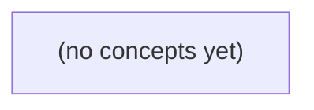

# 04.07 TLS与身份：从u-a发送m-a理解HTTPS、WSS与Go安全边界

*以虚构IM用户u-a通过https与wss访问im.example.test、发送消息m-a为主线，为Go初学者建立TLS、证书校验、代理终止与应用身份边界的完整心智模型。教材从密码学基础走到TLS 1.3握手、Go配置入口、mTLS与0-RTT重放，并通过22道附反馈练习巩固判断能力。*

**章节:** 2

---

## 本书导览

- 了解整本书的章节脉络
- 掌握各章之间的概念依赖关系
- 选择最合适的阅读顺序

# 04.07 TLS与身份：从u-a发送m-a理解HTTPS、WSS与Go安全边界

以虚构IM用户u-a通过https与wss访问im.example.test、发送消息m-a为主线，为Go初学者建立TLS、证书校验、代理终止与应用身份边界的完整心智模型。教材从密码学基础走到TLS 1.3握手、Go配置入口、mTLS与0-RTT重放，并通过22道附反馈练习巩固判断能力。

下方的概念图展示了本书 0 个核心概念以及它们之间的依赖关系；再下方是 1 个章节的入口。你可以按从上到下的顺序阅读，也可以根据自己的兴趣或先验知识选择切入点。

#### 概念图



## 章节索引

- **04.07 TLS与身份：加密一条连接不等于授权一条消息** — 面向Go初学者承接04.02–04.06，以虚构IM HTTPS/WSS路径讲对称加密、签名/证书、TLS1.3握手、证书链和名称校验、代理终止及Go tls配置入口，区分传输服务器身份与IM登录/资源授权、0-RTT重放与业务确认；静态教材不运行服务。

## 04.07 TLS与身份：加密一条连接不等于授权一条消息

- 解释TLS机密性、完整性和服务器身份各依赖什么
- 区分对称密钥、哈希、公私钥与数字签名
- 画出TLS1.3简化握手与HTTPS/WSS层次
- 核对证书链、SAN名称与有效期
- 区分SNI选择证书和客户端名称校验
- 识别反向代理TLS终止后的第二跳风险
- 说明Go ServerName/RootCAs/InsecureSkipVerify边界
- 区分mTLS客户端证书、IM会话授权和0-RTT重放

u-a 在陌生网络访问 im.example.test 时，TLS 能保护这条传输连接，却不能自动证明每条 IM 消息都已获授权、持久化或被对方阅读。

### 从域名、端口到受威胁的连接路径

### 从域名、端口到受威胁的连接路径

u-a 输入 `https://im.example.test` 或建立 `wss://im.example.test` 时，前面的步骤仍然成立：域名先被解析为某个地址，浏览器再向目标端口发起 TCP 连接；HTTP 请求或 WebSocket 帧随后运行在这条字节流之上。

但“连到了地址:端口”不等于路径可信。陌生网络中的接入点、路由设备或其他能观察、插入、修改流量的位置，都可能看到未保护的 TCP 内容，伪造响应，或把连接引向攻击者控制的服务。对 WebSocket 而言，升级成功后持续传输的消息同样暴露在这条路径上。

TLS 放置在应用协议与 TCP 之间：

`HTTP / WebSocket → TLS → TCP → IP`

因此，它保护的对象是**客户端到 TLS 终点之间**的传输连接。若浏览器正确验证服务器证书、域名及证书链，TLS 可使路径上的旁观者难以读取内容，并使篡改通常被检测出来；同时，u-a 获得“当前连接对端拥有 `im.example.test` 所代表服务器身份”的较强证据。

这里的“终点”未必是最终业务进程。它可能是负载均衡器、反向代理或边缘网关；TLS 在那里终止后，消息还会继续经过内部网络、应用服务和数据库。故 TLS 解决的是一段受威胁路径的机密性、完整性与服务器身份验证，而不是整条业务处理链。

### TLS分别保证什么，不保证什么

### TLS分别保证什么，不保证什么

u-a 通过陌生网络访问 `https://im.example.test` 或 `wss://im.example.test` 时，TLS 首先保护的是**浏览器与该服务器之间的一条传输连接**。在证书、主机名和信任链都被正确校验的前提下，它主要提供：

| 能力 | 含义 |
|---|---|
| 机密性 | 网络旁观者不能直接读出请求、响应或 WebSocket 帧中的明文内容。 |
| 完整性 | 中途攻击者难以悄悄修改、插入或重放为当前连接有效的数据，而不被通信端发现。 |
| 服务器身份 | u-a 可确认自己连接的是持有 `im.example.test` 有效证书私钥、且证书匹配该域名的一方。 |

这里的“服务器身份”不是泛泛的“互联网身份真实”，而是依赖多个前提：浏览器信任的证书颁发机构未失误或被滥用；证书未过期、未被错误接受；域名校验成功；u-a 没有忽略证书警告；终端和浏览器本身未被攻陷。

TLS 不自动回答应用层问题。例如：

- TLS 不能证明 u-a 已登录。连接加密后，服务器仍需验证 Cookie、令牌或其他凭证。
- TLS 不能证明 u-a 有权向某个会话、群组或用户 B 发消息。授权规则由 IM 服务执行。
- TLS 不能证明消息已写入数据库、队列或多副本存储；这属于服务端持久化语义。
- TLS 不能证明 B 已收到、展示或阅读消息；“已读”需要 B 的客户端及服务端另行产生可信状态。

因此，“出现锁图标”可说明传输通道受到保护，不能推出“消息一定被允许、保存，或已被对方读到”。

### HTTPS与WSS上的IM连接示例

### HTTPS与WSS上的IM连接示例

u-a 在陌生网络中打开：

- `https://im.example.test`：加载登录页、会话信息与历史消息；
- `wss://im.example.test`：建立实时 IM 通道，持续收发新消息、输入状态或已读回执。

可将两条连接的常见分层理解为：

`HTTP 请求/响应 → TLS → TCP → IP → 网络路径`

`WebSocket 消息帧 → TLS → TCP → IP → 网络路径`

其中，`HTTPS = HTTP + TLS`，`WSS = WebSocket + TLS`。浏览器先通过 TCP 连接到 `im.example.test:443`，再进行 TLS 握手；只有服务器证书的域名、有效期、签发链等校验通过，浏览器才把该加密连接视为连接到了预期的服务器身份。

因此，路径上的陌生 Wi‑Fi、路由器或旁观者通常不能直接读取 TLS 内的登录令牌、HTTP 内容或 WebSocket 聊天正文，也难以悄悄修改它们而不触发完整性校验。它们仍可能观察到部分元数据，例如连接到的 IP、流量大小、时间与持续时长；是否能看到域名还取决于 DNS、SNI/ECH 等具体机制。

但 TLS 的结论止于“这条传输连接受保护，并且服务器身份经过正确校验”。它不推出：

- u-a 对某个会话、群组或发送动作一定已获授权；
- 服务器一定将消息成功写入数据库；
- WebSocket 帧到达后一定被业务逻辑接受；
- B 一定在线、收到消息，或已经阅读。

例如，u-a 经 `wss://im.example.test` 发出“你好”时，TLS 保护的是浏览器到服务器这一段的传输。服务器仍需依据会话令牌、用户身份和群组权限决定是否接受该消息；后续持久化、转发给 B、以及“已读”状态，都属于 TLS 之上的应用协议与业务语义。

### 加密连接为何不等于消息获授权

### 加密连接为何不等于消息获授权

u-a 连接 `https://im.example.test` 或 `wss://im.example.test` 时，TLS 首先回答的是：**自己是否正在与持有该域名有效证书私钥的一方建立受保护的连接**。在浏览器正确验证证书链、域名和有效期的前提下，陌生网络中的旁观者通常不能直接读取或静默篡改这条连接上的 HTTP/WS 字节流。

但这不能推出“某条消息已被授权”。两者之间至少隔着数层不同证据：

1. **服务器身份**  
   TLS 证明连接端的服务器身份与 `im.example.test` 的证书相符；它不证明操作用户是 u-a，也不证明服务器会接受其请求。

2. **用户登录**  
   u-a 还需提交密码、通行密钥或其他登录凭据，服务器据此建立用户身份。即使 TLS 完好，未登录请求仍可能得到 `401` 或登录页。

3. **会话令牌**  
   登录后，浏览器可能携带 Cookie、Bearer token 或其他会话凭据。服务器必须验证其签名、有效期、撤销状态及绑定条件。TLS 不会替令牌判断“这是 u-a 的有效会话”。

4. **资源权限**  
   即使令牌属于 u-a，也仍需检查 u-a 能否向会话 `c-17` 发消息、能否读取群组 `g-9` 的历史记录。身份成立不等于对任意资源都有权限：  
   `已认证(u-a) ≠ 已授权(u-a, 向 c-17 发送消息)`

5. **业务确认**  
   服务端返回“发送成功”最多表示某个业务步骤完成，例如已接受、已入队或已写库；具体语义取决于协议定义。它不自动等于 B 的设备已收到，更不等于 B 已阅读。

因此，TLS 给出的是“这条传输通道较难被陌生网络窃听或篡改”的结论；消息授权需要服务端对身份、令牌、资源策略和业务状态分别作出可验证的判断。

### 阅读安全结论时的提问清单

### 阅读安全结论时的提问清单

看到“`https://im.example.test` 很安全”或“WebSocket 已使用 `wss://`”时，不应把 TLS 结论扩展成整条业务链路的结论。对 `u-a` 而言，可按以下问题逐项拆开：

- **TLS 终点是谁？** 浏览器的加密连接可能终止于边缘代理、负载均衡器或应用网关，而非最终 IM 服务进程。TLS 保护的是“浏览器到该终点”的传输段；终点之后仍可能经过内部网络、队列或多个服务。
- **名称是否被正确校验？** `im.example.test` 必须与证书中的有效名称匹配，且浏览器必须信任签发链、未忽略证书警告。仅有“加密”图标，不等于连接到了预期服务器。
- **谁在做授权？** TLS 证明服务器身份（在正确校验前提下），不证明 `u-a` 有权向某会话、群组或用户发送消息。授权通常由 Cookie、令牌、会话状态及服务端访问控制规则决定。
- **消息是否真正落库？** 收到 HTTP 成功响应或 WebSocket 回执，可能只表示网关已接收、消息已入队，未必表示数据库事务已提交或副本已持久化。
- **“已读”确认来自哪里？** 已读状态应能追溯到接收方客户端、账号或可信服务端的明确事件；它不是 TLS 握手成功、TCP 可达或消息发送成功的自然推论。

因此，安全分析应分别写清传输保护、身份校验、业务授权、持久化确认与阅读回执的证据来源。

> **要点** — TLS保护经正确校验的传输连接；用户身份、消息权限与业务状态必须由应用协议和服务端逻辑另行证明。

理解TLS的关键，不是记住术语，而是分清不同密码工具各自解决什么问题：保密、完整性与身份并非同一件事。

### 先分清四类密码学工具

### 先分清四类密码学工具

“加密”不是一个万能词。网络连接想要安全，至少涉及保密、完整性、身份认证等不同目标；不同工具各有职责。

- **对称密钥加密**：发送方和接收方持有同一把秘密密钥。它速度快，适合持续加密大量应用数据，例如 TLS 建立连接后的网页内容、聊天正文。常见形式是 AEAD 算法，它不仅保护机密性，还能检测内容是否被篡改。

- **哈希函数**：把任意长度数据映射为固定长度的摘要，例如 $H(m)$。哈希通常不是加密：不能也不应从摘要还原原文。它用于比较数据是否变化、参与签名和密钥派生；但公开哈希本身不能证明“是谁发的”。

- **公私钥密码**：密钥成对出现。公钥可公开，私钥必须保密。它适合在双方尚未共享秘密时完成身份验证或协商秘密，但相对较慢，不适合直接加密整段大流量通信。

- **数字签名**：发送方用私钥对消息摘要签名，接收方用对应公钥验证。签名证明“持有该私钥的一方认可这份消息”，并可发现篡改；但签名**不隐藏消息内容**。

可以用一句话记忆：对称加密负责高效保密，哈希负责生成指纹，公私钥解决陌生双方的信任与密钥协商，签名解决来源与完整性。TLS 1.3 正是组合这些工具：证书和签名认证服务器，临时密钥协商导出会话密钥，再由对称 AEAD 保护后续数据。

### AEAD保护聊天数据

### AEAD保护聊天数据

TLS 完成握手、确认服务器身份并协商出共享秘密后，后续大量聊天正文不会再用证书公钥逐条加密，而是使用由握手秘密导出的**对称会话密钥**。原因很直接：对称加密速度快，适合持续传输大量数据；公私钥运算主要用于身份认证和建立共享密钥。

TLS 1.3 的应用数据通常由 AEAD（认证加密并关联数据）保护，例如 AES-GCM 或 ChaCha20-Poly1305。一次发送可抽象为：

$$
C, T = \operatorname{AEAD\_Seal}(K, N, P, A)
$$

其中：

- $K$：当前方向的对称流量密钥；
- $N$：一次性随机数（nonce），同一密钥下不能重复；
- $P$：聊天明文；
- $A$：关联数据，例如记录头部；它不隐藏，但会被认证；
- $C$：密文；
- $T$：认证标签。

接收方执行：

$$
P = \operatorname{AEAD\_Open}(K, N, C, A, T)
$$

只有标签验证成功，才能得到明文。攻击者即使截获密文，也无法读出聊天内容；若改动密文、标签或受认证的头部，验证会失败，TLS 会拒绝该记录而不是交给应用层。

因此，AEAD 同时提供两类保护：**机密性**防止旁观者阅读消息，**完整性与篡改检测**防止攻击者悄悄修改消息。它不是“先加密，再自己算个 hash”的临时拼装方案；nonce 管理、密钥更新、记录序号和错误处理都应交给 TLS 库完成。

### 签名证明身份而非保密

### 签名证明身份而非保密

公钥密码有两种常被混淆的用法，方向恰好不同：

- **公钥加密**：发送方用接收方的公钥加密，只有持有对应私钥的一方能解密。它解决的是“内容不给旁观者看”。
- **数字签名**：签名者用自己的私钥对消息摘要签名，任何人都能用其公钥验证。它解决的是“消息确实来自该私钥持有者，且未被篡改”。

因此，看到“服务器公钥”不能推出“服务器发来的内容天然保密”。若客户端用服务器公钥加密数据，保密性依赖服务器私钥；但攻击者也可以自带一对密钥、冒充服务器，并把自己的公钥交给客户端。关键问题变成：**这个公钥究竟属于谁？**

证书就是一份经过签名的绑定声明：某个域名，例如 `api.example.com`，对应某个服务器公钥。证书颁发机构（CA）用自己的私钥签署该声明；客户端预装了受信任 CA 的公钥，便可验证签名。若证书由中间 CA 签发，客户端会沿着“服务器证书 → 中间证书 → 根证书”验证证书链，并同时检查域名、有效期和用途。

在 TLS 1.3 中，服务器还会对握手过程签名，证明它当前确实持有证书公钥对应的私钥。签名不是把聊天正文“加密给所有人看”；它让客户端确认正在协商密钥的对端是经证书认证的服务器。之后的大量应用数据仍由协商出的临时对称会话密钥和 AEAD 保护。

### TLS 1.3如何得到会话密钥

### TLS 1.3如何得到会话密钥

TLS 1.3 的目标不是“拿到服务器公钥后，用它加密所有正文”，而是让双方安全地产生一组短期、对称的会话密钥。简化过程如下：

1. **交换临时密钥材料**  
   客户端发送 `ClientHello`，其中带有自己临时 ECDHE 密钥对的公钥；服务器回复 `ServerHello`，也发送自己的临时公钥。双方分别用“自己的临时私钥 + 对方的临时公钥”计算同一个共享秘密 `Z`。

2. **验证服务器身份**  
   服务器随后发送证书链。客户端验证证书是否由可信 CA 签发、域名是否匹配、是否过期等。证书中的公钥主要用于验证服务器的签名，而不是批量加密聊天内容。

3. **证明握手未被篡改**  
   服务器用证书对应的私钥，对当前握手记录签名；客户端据此确认：正在通信的一方确实持有该证书私钥。双方再发送 `Finished` 消息，其中包含对握手记录的认证值；若中途有人替换参数，验证会失败。

4. **导出对称会话密钥**  
   TLS 使用 `HKDF` 将共享秘密 `Z`、握手记录摘要等材料逐步导出多个密钥，例如客户端到服务器、服务器到客户端各自的 AEAD 密钥和随机数材料。

之后的聊天正文使用 AES-GCM 或 ChaCha20-Poly1305 等 AEAD 算法加密并认证。临时 ECDHE 密钥使得即使服务器长期证书私钥未来泄露，过去已结束连接的正文通常仍不能被解密，这就是前向保密。

### 虚构IM连接中的安全边界

### 虚构IM连接中的安全边界

设想客户端通过 `HTTPS` 登录 IM 服务，再升级或建立 `WSS` 长连接发送聊天消息。这里至少有四层不同的安全问题：

- **TLS 连接保护**：`HTTPS` 与 `WSS` 中的 TLS 为“客户端到服务器”的传输链路提供机密性和完整性。旁路网络中的攻击者难以窃听或篡改报文，但这不等于服务器会接受其中任何消息。
- **登录身份**：用户输入密码、验证码或第三方登录凭据，服务器据此确认“当前请求者是谁”。证书主要帮助客户端确认“连到的是预期服务器”，不是替用户证明身份。
- **会话令牌**：登录成功后，服务器签发短期令牌或安全 Cookie。后续 `WSS` 握手及业务请求携带它，服务器据此恢复登录状态；令牌泄露时，攻击者可能在有效期内冒充用户，即使 TLS 本身没有被攻破。
- **消息授权**：收到 `{ "to": "group-42", "text": "..." }` 后，服务器仍必须检查该用户是否属于 `group-42`、是否被禁言、是否有发送权限。令牌证明“你是谁”，授权规则决定“你能做什么”。

TLS 1.3 会协商临时密钥并导出高效的对称会话密钥，之后大量聊天正文通常由 AEAD 保护，而不是拿服务器证书公钥逐条加密。哈希用于生成摘要、校验或派生密钥，本身不提供保密；数字签名用于证明来源和防篡改，也不隐藏消息内容。

因此，应用不应自行把“哈希 + 加密 + 签名”拼成私有协议。优先使用标准 TLS、成熟令牌机制和服务端授权检查；若需要端到端加密，也应采用经过审计的成熟协议，而不是把 `AES` 调用散落在消息代码中。

> **要点** — TLS用证书和签名确认身份，用临时协商导出对称密钥，再以AEAD高效保护连接中的应用数据。

TLS先建立受保护的传输通道，再由HTTP、WebSocket和IM协议完成各自的协商；连接加密并不自动证明用户已登录或消息已获授权。

### 从TCP连接到HTTPS与WSS

### 从TCP连接到HTTPS与WSS

访问 `https://example.com` 或 `wss://example.com/socket` 时，协议并非一次完成，而是逐层建立：

1. **先建立 TCP 连接**：客户端与服务器完成三次握手，获得可靠、有序的字节流。此时数据仍可能被监听或篡改。
2. **在 TCP 上建立 TLS**：客户端发送 `ClientHello`，声明支持的 TLS 版本、密码套件、`key_share`、SNI 主机名及 ALPN 协议偏好；服务器选择参数并返回 `ServerHello`，随后发送证书、`CertificateVerify` 与 `Finished`。客户端验证证书链、域名和握手签名后，再发送自己的 `Finished`。
3. **TLS 建立后传输应用协议**：双方从握手派生会话密钥，后续记录使用 AEAD 加密与认证。教学图通常只画“握手消息”，不必误解为每个 TLS 记录都完全明文传输；TLS 1.3 中握手后续阶段本身已有加密保护。

层次关系可概括为：

`HTTP / WebSocket`  
`TLS`  
`TCP`  
`IP`

HTTPS 即“运行在 TLS 之上的 HTTP”。WSS 则先完成 TLS，再发送 HTTP 请求，其中带有 `Upgrade: websocket`；服务器接受升级后，连接才进入 WebSocket 帧传输阶段。

因此，`wss://` 不表示“直接建立 WebSocket”：它是 **TCP → TLS → HTTP Upgrade → WebSocket**。同样，TLS 成功只说明客户端建立了可验证服务器身份的加密通道；用户是否登录、某条消息是否有权限，仍需由 HTTP 会话、令牌或应用协议中的认证与授权规则决定。

### TLS 1.3简化握手流程

### TLS 1.3简化握手流程

TCP 三次握手建立的是可靠字节流；随后 TLS 1.3 才在这条连接上协商“谁在通信、如何加密、密钥是否一致”。可将主流程概括为：

1. **ClientHello：客户端提出能力与临时密钥**

   客户端发送支持的 TLS 版本、密码套件、`key_share` 中的临时公钥，以及常见的 `SNI`（目标域名）和 `ALPN`（如 HTTP/2、HTTP/1.1）扩展。  
   `key_share` 通常基于椭圆曲线 Diffie-Hellman：客户端保留私有值 $a$，发送公钥 $A=g^a$。

2. **ServerHello：服务器选择参数并返回临时密钥**

   服务器从客户端能力中选择 TLS 1.3、具体算法和协议，并返回自己的临时公钥 $B=g^b$。双方分别计算：

   $$Z=B^a=A^b=g^{ab}$$

   窃听者即使看见 $A$、$B$，也难以恢复共享秘密 $Z$。TLS 再将 $Z$ 与握手消息摘要输入密钥派生函数，得到握手加密密钥。

3. **证书与 CertificateVerify：证明服务器身份**

   从这一步起，服务器的 `EncryptedExtensions`、`Certificate`、`CertificateVerify`、`Finished` 等握手记录通常已被握手密钥加密。证书将域名与服务器公钥绑定；客户端验证证书链、有效期、域名匹配及撤销状态。随后服务器用证书私钥对握手上下文签名，`CertificateVerify` 证明其确实持有该私钥，而非仅转发了一张证书。

4. **Finished：确认双方看到同一份握手**

   双方分别发送 `Finished`，其中包含基于握手全部消息摘要计算的认证值。验证通过意味着：协商参数未被篡改、双方导出了相同密钥，并且服务器身份验证已完成。之后再派生应用数据密钥，以 AEAD 同时提供机密性与完整性。

教学图常把这些步骤画成数条箭头，但不必逐字节描绘记录层加密边界。关键因果链是：交换临时公钥得到共享秘密，证书签名绑定服务器身份，`Finished` 绑定完整握手历史；随后 HTTPS 或 WSS 才能在受保护通道上继续各自的应用层握手。

### 握手字段各自解决什么问题

### 握手字段各自解决什么问题

TLS 1.3 的握手不是“交换一把密钥”这么简单；每个字段都在回答不同问题，并且都有明确边界：

- **支持版本**：客户端在 `ClientHello` 中声明可接受的 TLS 版本，服务器选择共同支持的最高安全版本。它解决“双方按哪套协议说话”，不证明服务器身份，也不授权用户。
- **Key Share**：双方提供临时密钥交换参数，通常基于椭圆曲线 Diffie–Hellman。它让双方导出共享秘密，并提供前向保密：未来即使证书私钥泄露，过去被截获的会话通常仍不能被解密。它本身不说明“对端是谁”。
- **SNI**：`Server Name Indication` 携带客户端希望访问的主机名，使同一 IP 的服务器能选择对应证书和站点配置。SNI 是路由提示，不是身份认证；传统 TLS 中它通常也对链路观察者可见。
- **ALPN**：声明应用层协议偏好，例如 `h2`、`http/1.1`。它解决“加密通道内跑什么协议”，不等于 HTTP 已登录，更不等于业务权限已确定。
- **证书**：服务器发送证书链，将域名公钥绑定到受信任的签发体系。客户端需验证链、有效期、用途和域名匹配。证书主要认证服务器；除非额外使用客户端证书，否则不认证用户。
- **CertificateVerify**：服务器用证书对应私钥签名握手摘要，证明自己确实持有该私钥，并把身份与本次握手绑定，防止攻击者仅转发一张公开证书。
- **Finished**：双方用已导出的握手密钥校验完整握手记录。它确认协商参数、证书与密钥交换未被篡改，并证明双方都得到了相同密钥材料。

验证 `Finished` 后，应用数据才以 AEAD 加密和认证传输；但用户登录、令牌校验、房间权限和单条消息授权，仍属于 HTTP、WebSocket 或应用协议的职责。

### 验证后才进入AEAD应用数据

### 验证后才进入 AEAD 应用数据

TLS 1.3 的关键顺序是：**先协商密钥与身份，再确认握手未被篡改，最后发送应用数据**。简化来看，客户端收到服务器的证书链后，会验证：

- 证书链是否能追溯到受信任根；
- 证书是否在有效期内、用途是否允许服务器认证；
- 证书中的域名是否匹配客户端请求的 SNI 主机名；
- `CertificateVerify` 签名是否确由证书私钥持有者生成。

随后，双方通过 `Finished` 校验握手至今全部消息的摘要。它不仅证明双方派生出了相同的握手密钥，也把 `ClientHello`、`ServerHello`、证书、密钥交换参数等内容绑定为一个不可静默替换的整体。若证书、签名或 `Finished` 任一验证失败，连接必须终止，不能“先继续传业务数据再说”。

验证成功后，双方从握手秘密派生应用流量密钥，才开始使用 AEAD 保护 HTTP 请求、WebSocket 帧或其他应用数据。AEAD 同时提供机密性与完整性：攻击者既不能读出明文，也不能在不被发现的情况下修改密文。

教学图通常把这一过程画成“证书 → 验证 → 加密数据”的直线，但这是抽象：TLS 1.3 中部分握手记录本身已加密，且存在不同方向、不同阶段的密钥。图的重点应是安全边界，而非逐字节复现记录层格式。即使 TLS 已进入应用数据阶段，也只说明服务器身份和连接密码学状态通过验证；用户是否登录、某条请求是否有权限，仍由 HTTP、会话令牌或应用协议决定。

### 安全连接不等于IM登录

### 安全连接不等于 IM 登录

TLS、HTTP/WebSocket 与 IM 登录解决的是不同层次的问题，不能因“出现了锁”就把它们混为一谈。

| 阶段 | 主要证明/建立什么 | 典型产物 | 不能证明什么 |
|---|---|---|---|
| TLS 握手 | 客户端正在连接持有对应私钥的服务器 | 证书验证、共享会话密钥、加密通道 | 当前用户是谁、用户能做什么 |
| HTTP 或 WebSocket 建立 | 请求可被处理，或双向连接已升级 | HTTP 响应、`101 Switching Protocols` | 连接者已登录、消息合法 |
| IM 会话登录 | 某个账号、设备或令牌通过认证 | `access_token`、会话标识、设备绑定 | 每条后续操作都必然允许 |
| 逐条消息授权 | 该身份此刻可对该资源执行该动作 | 成员资格、角色、会话状态、权限判定 | 消息内容一定可信或业务一定成功 |

例如，客户端先经 TCP 连接到 `im.example.com`，再完成 TLS：它确认自己大概率正与该域名对应的服务器通信，旁观者难以窃听或篡改传输内容。随后 HTTP 请求或 WebSocket 升级成功，只表示应用协议通道可用。

用户仍可能尚未发送登录令牌，或令牌已过期、账号被禁用。即使登录成功，发送“向群组 G 发消息”时，服务器仍应检查：

- 令牌对应的用户与设备；
- 用户是否仍是群组成员；
- 是否被禁言、是否具备相应角色；
- 消息序号、签名或幂等标识是否有效；
- 内容是否违反业务策略。

因此，TLS 提供“安全地把请求送到服务器”的基础；IM 认证回答“你是谁”；授权回答“你现在能否做这件事”。把 TLS 成功当作 IM 登录成功，会导致匿名连接、失效令牌或越权消息被错误接受。

> **要点** — TLS确认连接对端并保护传输；用户身份、会话状态与消息权限仍必须由应用协议独立验证。

用户输入域名并连到某个IP，只说明找到了网络目的地；浏览器或Go客户端还必须验证对方证书确实代表该域名。

### 从域名到可信服务器的验证链

### 从域名到可信服务器的验证链

用户输入 `im.example.test` 后，DNS 会把它解析为一个或多个 IP 地址；这一步只回答“应当连接哪里”，并不回答“那里运行的是谁的服务器”。DNS 缓存投毒、错误配置、劫持路由，甚至同一 IP 上的恶意虚拟主机，都可能让客户端连到错误对象。因此，建立 TLS 连接时还需要一条独立的身份验证链。

客户端收到服务器证书后，至少应确认：

- **名称匹配**：证书的 `Subject Alternative Name` 中必须包含 `DNS:im.example.test`。现代客户端以 SAN 为准，不应把 `Common Name` 当作可靠的名称依据。
- **证书有效**：当前时间位于证书的生效期与到期日之间，且证书用途允许作为服务器证书使用。
- **签名链可信**：服务器证书可沿中间证书验证到本机信任库中的根证书；链中任一签名无效、证书过期或根不受信任，均应失败。
- **名称与访问方式一致**：若客户端直接访问 `https://192.0.2.10`，证书必须含对应的 `IP SAN`；`DNS SAN` 不能替代 IP 地址匹配。

SNI 的作用是让客户端在握手初期告知目标域名，使共享 IP 的服务器选择正确证书；它不是身份验证本身。Go 中 `tls.Config.ServerName` 同时影响 SNI 与证书名称校验。将 `InsecureSkipVerify` 设为 `true` 会关闭默认的证书链和主机名验证，攻击者即可提供任意证书实施中间人攻击；它不能作为“证书报错”的修复手段。

### SAN、有效期与证书链的核对

### SAN、有效期与证书链的核对

设用户请求 `https://im.example.test`。客户端先得到某个 IP 并建立 TCP 连接，但随后必须证明：该连接对端持有一张**可代表 `im.example.test` 的、当前有效且受信任的证书**。验证可分解为以下关系：

1. **名称匹配：以 SAN 为准**  
   证书的 `Subject Alternative Name` 中应存在匹配项：
   - 访问域名时，检查 `DNSNames`，例如 `im.example.test`；
   - 直接以 IP 地址访问时，检查 `IPAddresses`，例如 `203.0.113.10`。  
   
   现代客户端不应把 `Common Name` 当作名称验证依据。即使 CN 写着 `im.example.test`，若 SAN 缺失或 SAN 不匹配，仍应验证失败。通配符如 `*.example.test` 通常可匹配 `im.example.test`，但不能匹配 `a.b.example.test`。

2. **有效期：证书必须“此刻可用”**  
   当前时间必须落在证书的 `NotBefore` 与 `NotAfter` 之间。名称正确但证书尚未生效、已经过期，或客户端系统时间严重错误，都会导致失败。

3. **密钥用途：证书必须可用于服务器认证**  
   叶子证书的扩展用途应允许 `serverAuth`；其密钥用途也应与公钥算法和 TLS 握手所需能力相容。不能因为证书链可信，就把仅用于客户端认证或代码签名的证书当成服务器证书。

4. **签名链：叶子证书必须能追溯到受信根**  
   客户端验证叶子证书由中间 CA 签发，中间 CA 再逐级验证，最终到达本机信任库中的根 CA。每一环都要检查签名、有效期、CA 约束和用途。服务器通常发送叶子证书及中间证书；根证书一般由客户端预装，不应依赖服务器发送。

因此，验证结论不是“DNS 解析到了某个 IP”，而是：

\[
\text{名称匹配} \land \text{时间有效} \land \text{用途允许} \land \text{链至受信根}
\]

才可认为该 TLS 对端被认证为 `im.example.test`。

### SNI选证书不等于名称校验

### SNI选证书不等于名称校验

一次 TLS 握手中，SNI 与名称校验都涉及“域名”，但承担的是方向相反的职责：

- **SNI：客户端告诉服务器“我想访问谁”**。客户端在 `ClientHello` 中携带如 `im.example.test` 的 SNI，服务器据此从多个虚拟主机证书中挑选合适的一张返回。没有 SNI 时，共享同一 IP 的服务器往往只能返回默认站点证书。
- **名称校验：客户端判断“你是否真是我想访问的那个名字”**。客户端拿到证书后，检查其 `SAN DNSNames` 是否包含目标主机名 `im.example.test`，并同时验证有效期、用途和到受信根的签名链。

可以把流程理解为：

`客户端发送 SNI(im.example.test)` → `服务器选择证书` → `客户端校验证书 SAN 是否匹配 im.example.test`

SNI 只是服务端的选证书提示，不构成身份保证。恶意中间人也可以读取或转发 SNI，并返回一张不匹配、过期或不受信任的证书；真正阻止冒充的是客户端后续的证书链与名称校验。

在 Go 中，`tls.Config.ServerName` 通常既用于发送 SNI，也作为证书名称校验的目标，但这两个效果不要混为一谈。若通过 IP 连接却希望验证域名证书，应显式设置 `ServerName: "im.example.test"`；若目标身份本身是 IP，则证书必须含对应的 `IP SAN`，`DNS SAN` 或旧式 `Common Name` 都不能替代。

### Go中ServerName与根证书配置

### Go中`ServerName`与根证书配置

在 Go 中，`tls.Config`把“我连到了谁”和“我信任谁”分成两个独立问题：

- `ServerName`：客户端期望服务器证明其身份的名称。TLS 握手时，它通常也作为 SNI 发送，帮助同一 IP 上的虚拟主机选择正确证书；更重要的是，Go 用它校验证书的 `DNS SAN`。
- `RootCAs`：客户端信任的根证书集合。公有域名通常使用系统根库；私有测试域名、内网服务或自建 CA，则必须显式加入对应 CA 根证书。

例如访问 `https://im.example.test`，即使 DNS 将其解析为 `10.0.0.8`，客户端仍应设置：

`ServerName: "im.example.test"`

服务器证书必须含有 `DNS:im.example.test`，并且证书未过期、用途允许服务器认证、签名链能追溯到 `RootCAs` 中受信任的根。`ServerName` 不是“随便填一个服务器地址”：填成另一个名称会导致名称校验失败；留空时，使用 `http.Transport` 发起 HTTPS 请求通常会从 URL 主机名推导，但手工 `tls.Dial` 时应明确设置。

自建 CA 的典型配置是：

`RootCAs` 中加入内部 CA 证书，`ServerName` 仍填写业务域名。不要因为私有域名不在公网 DNS 中，就改用 `InsecureSkipVerify: true`；这会同时关闭证书链与主机名验证，攻击者可提交任意证书实施中间人攻击。

若直接访问 `https://10.0.0.8`，证书必须具有 `IP SAN:10.0.0.8`。`DNS SAN:im.example.test` 不能匹配 IP 地址；把 `ServerName` 强行改成域名虽可能绕过名称不匹配，却改变了“客户端实际验证的身份”，应仅在明确的域名访问与受控路由设计中使用。

### 拒绝用InsecureSkipVerify掩盖故障

### 拒绝用 `InsecureSkipVerify` 掩盖故障

IM 客户端连接 `im.example.test:443` 时出现 `x509: certificate is valid for ...` 或 `unknown authority`，常见“修复”是：

`tls.Config{InsecureSkipVerify: true}`

这并不是修复，而是让客户端不再验证服务器证书链和目标主机名。此后，攻击者只要能劫持 DNS、路由、公共 Wi‑Fi 或代理流量，就可以出示任意证书冒充服务器；连接仍可能显示为 TLS 加密，但加密终点已经变成中间人。

应按失败类型定位：

- **名称不匹配**：用户访问的是 `im.example.test`，证书的 `DNSNames` 必须包含该名称，或存在匹配的通配符项。不要依赖 `Common Name`；现代客户端以 `SAN` 为准。
- **IP 访问失败**：若客户端实际以 `https://203.0.113.10` 建连，证书必须有对应的 `IP SAN`。`DNS SAN` 不会匹配 IP 地址。
- **链路不完整**：服务器应发送叶子证书及必要的中间证书。只部署叶子证书可能导致部分客户端无法构造到受信根的链。
- **不受信任**：私有 CA、自签名证书或企业代理 CA，需要将正确根证书安装到客户端信任库，而不是跳过验证。
- **名称校验目标错误**：Go 中应明确设置 `tls.Config.ServerName: "im.example.test"`；它既影响名称校验，也通常用于发送 SNI，以便虚拟主机选择正确证书。

```go
cfg := &tls.Config{
    ServerName: "im.example.test",
    MinVersion: tls.VersionTLS12,
}
```

注意，SNI 只是“请求哪个虚拟主机证书”的提示，不等于客户端已经验证该证书。正确路径是修复证书 SAN、服务端证书链或客户端信任根；仅在受控测试中临时关闭校验，并且绝不能进入生产配置。

> **要点** — TLS可信身份来自证书链与SAN名称校验；SNI只帮助选证书，关闭验证不等于修复连接。

浏览器地址栏的小锁只说明当前客户端到TLS终止点的连接受保护，不能自动证明代理后的服务链路、用户身份与资源权限同样可信。

### 小锁保护到哪里

### 小锁保护到哪里

浏览器的小锁表示：**浏览器与它实际建立 TLS 连接的服务器端点**之间，传输内容受到加密与完整性保护，并且浏览器已按证书规则验证该端点身份。若 TLS 在反向代理处终止，这个端点通常是 Nginx、负载均衡器或云网关，而不一定是后面的 Go 服务。

典型链路可能是：

`浏览器 ──HTTPS──> 反向代理 ──HTTP──> Go 服务`

此时，请求在代理处被解密；代理读取路径、Cookie、请求体和响应内容后，再以普通 HTTP 发给 Go 服务。地址栏仍显示小锁，但它只覆盖第一跳，不能据此称为“浏览器到 Go 服务端到端加密”。

是否接受内部 HTTP，取决于第二跳的实际威胁模型：

- 代理与 Go 服务是否位于同一受控主机、专用网络或隔离集群；
- 内部网络是否可能被旁路监听、错误路由或被低权限工作负载访问；
- 服务间是否需要抵抗横向移动、节点失陷或跨网络边界；
- 请求中的 Cookie、令牌、个人信息是否允许以明文经过该链路。

若内部链路也需要机密性与身份校验，应使用：

`浏览器 ──HTTPS──> 反向代理 ──HTTPS/mTLS──> Go 服务`

其中第二段 TLS 是独立连接，证书验证、加密套件与客户端身份也应独立配置；mTLS 还能让 Go 服务确认请求确实来自受信任代理，而非任意内部客户端。

因此，TLS 终止是一个明确的安全边界：代理成为可见明文、可代发请求的可信组件。小锁保护的是一段连接，不是整条后端调用链，更不是对用户身份或资源访问权限的授权。

### 代理解密后的第二跳

### 代理解密后的第二跳

反向代理终止浏览器的 TLS 后，原始 HTTP 请求已在代理进程中恢复为明文。此后代理到 Go 服务的链路是独立安全边界，常见模式的含义不同：

- **代理以 HTTP 转发**：代理与服务之间的请求体、`Cookie`、`Authorization`、会话标识及响应内容均为明文。若同机 Unix Socket、严格隔离的 Pod 网络或受控专网确实可信，风险可以接受；但不能把“内网”当作天然安全属性。抓包权限、旁路主机、错误路由或被攻陷的工作负载都可能读取或篡改流量。
- **代理再次以 TLS 转发**：第二跳获得传输机密性与完整性保护，可降低网络监听和中间篡改风险。但代理仍能看到解密后的全部内容；这不是浏览器到 Go 服务的端到端加密。服务应校验代理证书，必要时使用双向 TLS，使伪造服务或伪造代理更难接入。
- **内部专网转发**：专网主要缩小可接触链路的主体范围，并不自动提供密码学保护。应结合网络分段、安全组、工作负载身份、最小监听范围与审计；高价值凭据仍宜叠加 TLS 或服务网格身份认证。

无论采用哪种模式，服务都不应把客户端直接发送的 `X-Forwarded-Proto`、`X-Forwarded-For`、`Forwarded` 当作事实。代理必须先覆盖或清除这些头，服务仅信任来自受控代理地址、并经明确配置允许的转发信息。否则攻击者可伪造“HTTPS”来源，诱导错误的安全 Cookie、跳过重定向或污染审计记录。

### HTTPS与WSS不等于登录授权

### HTTPS与WSS不等于登录授权

HTTPS 与 WSS 首先回答的是“**这条传输连接是否受保护，并且连到了声称的服务器**”。TLS 通过证书认证服务器身份，并对浏览器到 TLS 终止点之间的数据提供机密性与完整性；WSS 只是 WebSocket 建立在 TLS 之上。它们并不自动回答“当前用户是谁”“该用户能做什么”或“这条消息是否有权操作目标资源”。

可将几个安全判断分开：

- **TLS 服务器认证**：浏览器正在与证书所代表的站点通信吗？中间人能否窃听、篡改这一跳的流量？
- **Cookie 或令牌会话认证**：请求携带的 `Cookie`、`Authorization` 令牌或会话标识对应哪个已登录主体？会话是否过期、撤销或被伪造？
- **Origin 校验**：这个浏览器请求或 WebSocket 握手是否来自允许的网页源？它主要缓解跨站滥用，不能替代用户认证；非浏览器客户端还可自行伪造 `Origin`。
- **消息级资源授权**：该主体是否能读取、修改或订阅这一个资源？例如用户 A 即使已登录，也不应仅通过猜测 `/orders/42` 或发送 `{"room":"admin"}` 就访问用户 B 的订单或管理员频道。

尤其对 WebSocket 而言，连接成功只表示握手通过，不表示后续每类消息都天然合法。服务端应在建立连接时认证会话，并在订阅频道、查询对象、执行命令等位置按用户、租户和资源再次授权。`wss://` 能保护消息在链路中的传输，却不能把“已加密”变成“已获权”。

### 可信代理与转发头

### 可信代理与转发头

反向代理常向后端附加客户端来源与原始协议的信息，例如 `X-Forwarded-For`、`X-Forwarded-Proto` 和标准化的 `Forwarded`。它们用于记录真实客户端地址、判断原请求是否为 HTTPS、生成重定向链接或设置安全 Cookie，但这些字段本身只是普通 HTTP 头，客户端完全可以伪造：

`X-Forwarded-Proto: https`  
`X-Forwarded-For: 127.0.0.1`

因此，Go 服务不能因为收到这些头就认定请求来自内网、已经使用 TLS，或可绕过鉴权。尤其不要用未经验证的 `X-Forwarded-For` 做 IP 白名单、限流身份或审计依据，也不要仅据 `X-Forwarded-Proto=https` 决定关闭安全检查。

正确边界是：后端只接受来自受控反向代理网段、专用网络或已认证连接的流量；代理必须先删除客户端携带的同名转发头，再自行写入可信值。若存在多层代理，还应明确哪些跳点可以追加地址，避免攻击者借头字段“插队”。

应用配置中的“信任代理”应是精确名单，而不是信任所有来源。对于直接暴露给互联网的服务，默认应视所有转发头为不可信；真实身份仍应由 Cookie Session、令牌或其他认证机制决定，资源访问仍须逐项授权。

### IM路径安全核对

### IM路径安全核对

以浏览器访问即时通信服务为例，一条“已加密”的聊天连接至少要拆成两段看：

`浏览器 ── HTTPS/WSS ── 反向代理 ── HTTP或HTTPS/WSS ── Go IM服务`

1. **浏览器到反向代理**  
   浏览器应校验证书链、域名与有效期；HTTPS保护登录、历史消息、上传等请求，WSS保护实时收发帧。地址栏小锁或 WebSocket 的 `wss://` 只覆盖这一跳，TLS通常在反向代理终止。

2. **反向代理到服务**  
   若代理解密后以明文 HTTP 转发，需明确该网络是否为受控私网、是否可能被旁路监听、是否跨主机或跨集群；不能把“内网”自动等同于可信。跨网络边界、共享网络或高敏感消息场景，应使用代理到服务的 TLS，并校验服务端证书或采用双向 TLS。即使这一跳也加密，它保护的是传输，不替代应用授权。

3. **会话身份不是 TLS 身份**  
   TLS证明浏览器正在与证书对应的站点通信，不证明当前请求属于哪个用户。IM服务仍须校验安全 Cookie 中的 Session、令牌签名与过期时间；WebSocket 握手及连接存续期间也要绑定已认证用户，并处理注销、踢下线、令牌失效等状态变化。

4. **每条消息都要授权**  
   用户 `A` 连接成功，不意味着可向任意会话、群组或频道读写。发送消息时应根据服务端身份校验：`A` 是否属于目标会话、是否被禁言、是否有上传附件或读取历史记录的权限。客户端传来的 `user_id`、`room_id` 只能是待验证输入，不能直接作为授权结论。

5. **代理头只接受受控来源**  
   `X-Forwarded-For`、`X-Forwarded-Proto`、`Forwarded` 等头可能被客户端伪造。代理应先清除或覆盖外部同名头；Go服务仅在请求确实来自受信任代理地址时，才使用这些头判断原始协议、客户端地址或是否应设置 `Secure` Cookie。

> **要点** — TLS保护的是一段连接；代理后的每一跳、每份凭据和每次消息访问都必须独立建立信任与授权。

TLS 校验失败首先是连接建立问题，而非业务接口、消息存储或权限逻辑问题。应按证书与信任链逐层定位。

### 先划清边界：握手失败不是业务失败

### 先划清边界：握手失败不是业务失败

TLS 校验失败发生在连接建立阶段：客户端尚未发送 HTTP 请求、尚未升级为 WSS，也尚未进入登录、鉴权、消息写入或路由逻辑。因此，看到“证书过期”“域名不匹配”“未知颁发者”等错误时，不能先按 `404`、账号密码错误、消息未保存排查。

一条典型链路是：

1. 建立 TCP 连接；
2. 执行 TLS 握手，服务端提交证书链；
3. 客户端校验证书有效期、主机名、信任根和证书链；
4. 握手成功后，才发送 HTTP 请求、WSS Upgrade 或 IM 协议消息；
5. 服务端业务代码才可能返回 `404`、`401`、`403` 或处理消息。

所以，若客户端在第 3 步失败，服务端的业务访问日志通常不会出现对应请求；数据库也不会有该消息记录。此时“消息未保存”只是结果，不是根因。

排障顺序应固定为：先确认报错是否来自 TLS 握手；再检查证书是否过期、`ServerName` 是否与证书 SAN 匹配、`RootCAs` 是否信任签发根、服务端是否完整发送中间证书链，以及两端时钟是否正确；仅在握手成功后，才进入 URL、认证和消息处理排查。

### 五类证书校验失败的纸上分类

### 五类证书校验失败的纸上分类

TLS 握手中的证书错误应先按“验证哪一项失败”分类；它们发生在 HTTP 请求、业务鉴权和消息写入之前，因此不应归因于 `404`、权限不足或“消息未保存”。

| 类别 | 典型触发条件 | 常见现象 | 首要排查方向 |
|---|---|---|---|
| 证书过期 | 当前时间晚于证书 `NotAfter`，或尚早于 `NotBefore` | `certificate has expired`、`not yet valid` | 查看叶子证书及中间证书有效期；确认续期部署是否真正生效 |
| 域名不匹配 | 连接目标主机名不在证书 `SAN` 中 | `certificate is valid for …, not …` | 核对客户端连接域名、SNI、`tls.Config.ServerName` 与证书 `DNSNames`；不要只看 `Common Name` |
| 根证书不受信 | 签发链最终无法落到客户端信任的根 | `unknown authority` | 检查系统信任库或 `RootCAs`，确认私有 CA 根证书已正确分发 |
| 系统时钟错误 | 客户端或服务端时间明显漂移 | 看似“过期”或“尚未生效”，且多台机器表现不一致 | 对比 UTC 时间并检查 NTP；先修时钟，再判断证书是否真实失效 |
| 服务端证书链缺失 | 服务端只发送叶子证书，未发送必要中间证书 | 部分客户端成功，部分客户端报 `unknown authority` | 用 `openssl s_client -showcerts` 检查服务端实际发送链；补齐中间证书，不要把根证书随链发送 |

在 Go 中，`ServerName` 决定主机名校验和通常的 SNI；`RootCAs` 决定信任哪些根。`x509.Certificate.VerifyHostname` 只回答“此证书是否适用于该主机名”，不能替代完整链、有效期和用途验证。排查时应记录错误类别、目标域名、证书序列号与链摘要，避免把私钥、完整证书包或 `tls.Config` 中的敏感材料写入日志。

### 名称、链与时间：客户端究竟验证什么

### 名称、链与时间：客户端究竟验证什么

客户端建立 TLS 连接时，验证的对象不是“服务器是否能返回业务响应”，而是服务器提交的证书能否证明：**此时此刻，它有资格代表我正在访问的名称**。判断可拆为三条相互独立的证据链。

- **链：是否可信地签发。** 服务端应发送叶子证书及必要的中间证书；客户端从叶子证书逐级验证签名，直到本机 `RootCAs` 中受信任的根证书。缺少中间证书常表现为“未知颁发者”，并不意味着根证书一定缺失。Go 中，`tls.Config.RootCAs` 决定客户端额外或替代使用的信任根；测试私有 CA 应仅注入测试环境，不能把“跳过验证”当作修复。

- **名称：证书是否属于目标主机。** 客户端将连接目标名称与证书的 `SAN`（主题备用名称）比较；现代校验通常不再依赖旧式 `Common Name`。例如访问 `api.example.com`，证书只含 `www.example.com` 即为名称不匹配。Go 的 `ServerName` 同时影响客户端发送的 SNI 以及默认主机名验证；必要时可用 `x509.Certificate.VerifyHostname` 单独理解名称匹配规则。

- **时间：证书是否仍在有效窗口。** 客户端时钟必须落在证书的 `NotBefore` 与 `NotAfter` 之间。证书“尚未生效”常是设备时间过早，证书“已过期”则可能是续期遗漏、时钟过晚，或服务端仍在提供旧证书。

SNI 与名称校验不能混为一谈：SNI 是客户端在握手中告知服务端“我想访问哪个名称”，以便同一 IP 的服务端选择相应证书；名称校验则是客户端收到证书后，确认其 SAN 是否匹配目标名称。即使服务端因 SNI 选错证书，最终仍会以名称不匹配或链不可信失败；即使未发送 SNI，客户端也不应因此放弃名称验证。

### Go 中的信任配置与危险开关

### Go 中的信任配置与危险开关

`tls.Config` 决定客户端如何验证服务端证书。对客户端而言，默认规则是：系统根证书库用于构建信任链，连接目标主机名用于校验证书中的 `SAN`（主题备用名称）。因此，“证书由可信 CA 签发”仍不足以成功连接；证书还必须覆盖实际访问的域名或 IP。

```go
cfg := &tls.Config{
    ServerName: "api.example.com",
}
conn, err := tls.Dial("tcp", "api.example.com:443", cfg)
```

`ServerName` 是**要验证的身份**，不一定等于拨号地址。例如通过内网地址或代理连接，但服务端证书签给 `api.example.com` 时，可拨号到 `10.0.0.8:443`，同时显式设置：

```go
cfg := &tls.Config{ServerName: "api.example.com"}
conn, err := tls.Dial("tcp", "10.0.0.8:443", cfg)
```

它通常也会作为 SNI 发送给服务端；多域名服务器依赖它选择正确证书。不要为了“连通”而把 `ServerName` 改成任意字符串，否则会把域名不匹配伪装成其他问题。

私有测试环境应创建独立测试 CA，并仅将该 CA 放入测试客户端的 `RootCAs`：

```go
pool := x509.NewCertPool()
pool.AppendCertsFromPEM(testCAPEM)

cfg := &tls.Config{
    RootCAs:    pool,
    ServerName: "test-api.internal",
}
```

注意：一旦设置非空 `RootCAs`，它通常替代系统根库；若既要信任系统 CA 又要加入私有 CA，应先读取系统证书池再追加测试 CA。测试证书、私钥和 CA 不应混入生产仓库、镜像或日志。

`x509.Certificate.VerifyHostname(name)` 可单独检查一张已解析证书是否匹配主机名，适合诊断“链可信但名称不匹配”。它检查 `SAN`；现代验证不应依赖传统 `CommonName`。

`InsecureSkipVerify: true` 会跳过服务端证书链和主机名验证，无法区分真实服务与中间人。它不是“自签名证书配置”，更不是生产修复方案；仅可在严格隔离、短生命周期的测试中使用，并应有显眼注释和自动化阻断，防止进入生产配置。

### 证书续期、轮换与连接生命周期

### 证书续期、轮换与连接生命周期

设服务证书在 `$T_e$` 到期，运维人员于 `$T_r<T_e$` 部署了新证书和新私钥。此时必须区分两类连接：

- **新建连接**：客户端在 `$T_r$` 后重新握手，服务端应呈现新证书。若仍收到旧证书，通常是负载均衡节点、反向代理、热重载或密钥挂载未更新。
- **已建立连接**：TLS 握手已经完成，双方已协商会话密钥；证书不会在每个业务请求上重新校验。因此旧连接通常不会因证书后来到期而立即断开，可能继续传输至连接关闭、超时或被主动驱逐。

例如，长连接客户端在旧证书有效期内连入，证书到期后仍能消费已有连接上的消息；但它一旦重连，就会校验新握手中的证书。若续期失败，新连接报的是证书过期、域名不匹配或信任链错误，不应误判为“消息未保存”或业务 `404`。

Go 服务端轮换时，应更新 `tls.Config` 所使用的证书来源，并确保新握手读取新证书；必要时通过连接最大存活时间、优雅关闭或主动断开旧连接，使客户端在可控窗口内重连。客户端应显式设置 `ServerName`，生产环境使用受控的 `RootCAs`；不要为了临时恢复而跳过验证。

测试证书应与生产环境完全隔离：独立根证书、独立域名和独立密钥。生产证书与私钥不得提交仓库、写入配置样例、错误日志或调试输出；日志最多记录证书指纹、序列号、到期时间和握手错误类型。

> **要点** — 证书问题应按时间、名称、信任链和配置排查；它通常阻断连接建立，不能归咎于业务响应或消息处理。

TLS能确认连接对端，却不能自动确认每条IM消息的业务身份、授权关系与唯一执行结果。

### 三层身份：服务器、客户端与IM用户

### 三层身份：服务器、客户端与IM用户

TLS 中“身份已验证”必须先问：验证的是谁、对谁有效、能做什么。

- **服务器证书验证**：客户端校验证书链、域名与有效期，回答“我连接的是否是 `im.example.com`”。这主要防止中间人冒充服务器；默认 TLS 只认证服务端，不能证明发消息的人是谁。

- **mTLS 客户端认证**：服务器要求客户端也出示证书，回答“这条连接由哪个证书持有者建立”。它适合设备、企业员工终端或服务间调用，但证书主体可能是设备编号、公司身份或程序账户，**不天然等于** IM 用户 `u-a`，更不自动说明其属于群 `c-a`。

- **IM 账户与成员授权**：应用层令牌、会话或签名将请求绑定到用户 `u-a`；服务端再查询 `u-a` 是否仍是会话 `c-a` 的成员、是否被禁言、是否拥有发送权限。这回答“谁正在发送，以及他此刻能否向该会话发送”。

因此，证书认证与业务授权应分层：TLS 保护传输对端，mTLS 可补充客户端连接身份，IM 服务仍必须在每条消息上依据账户、会话和当前策略执行授权判断。

### mTLS不是用户授权的替代品

### mTLS不是用户授权的替代品

mTLS在普通TLS“客户端验证服务器”的基础上，要求客户端也出示证书。服务器因此可以确认：当前连接的一端持有某张客户端证书对应的私钥，并且该证书链受信任、未过期、未被撤销（取决于实际校验策略）。

但这证明的是**持证客户端身份**，不是自动证明“它就是用户 `u-a`”，更不是“它有权作为会话 `c-a` 的成员发送消息 `m-a`”。

| mTLS可提供的事实 | 业务层仍须自行判断的事实 |
|---|---|
| 某客户端证书私钥的持有者正在连接 | 该证书当前绑定哪个用户 `u-a` |
| 证书由受信任机构签发 | 该设备是否仍归该用户控制 |
| 连接端具备某种组织、应用或设备身份 | `u-a` 是否属于会话 `c-a` |
| 连接未被中间人冒充 | `u-a` 是否可执行“发送消息”等具体操作 |

例如，公司为员工笔记本签发设备证书。该证书能帮助服务端识别“这是受管设备”，却不能单独回答：现在使用该设备的是谁？设备转交、共享登录、离职未回收、证书泄露后，原有“设备可信”均不等于“用户仍被授权”。

因此，正确分层是：

1. mTLS用于加强传输端身份与设备/服务间准入；
2. 应用登录令牌或会话凭据将请求关联到用户 `u-a`；
3. 服务端依据会话 `c-a` 的成员表、角色和策略做逐消息授权；
4. 高风险操作可额外要求近期认证、设备状态或签名确认。

不要把“客户端证书校验通过”直接写成“用户已认证且有权发言”。前者是连接层证据；后者必须由业务身份绑定与授权检查共同得出。

### 0-RTT为何不能直接发送消息

### 0-RTT为何不能直接发送消息

TLS 1.3 的 0-RTT（早期数据）允许客户端在恢复会话时，不等待完整握手完成就发送应用数据，从而减少一次往返延迟。但它交换的是速度，不是“消息只会被处理一次”的保证。

关键性质是：攻击者或处于网络路径中的中间者，可能记录一段合法的早期数据，并在票据仍可接受时将其**重放**给服务器。服务器能够确认这段数据来自持有相应恢复密钥的客户端，却未必能区分“这是首次发送”还是“此前数据的再次投递”。

因此，下面的请求不能直接放入 0-RTT：

`POST /messages {messageId: "m-a", to: "u-a", content: "..."}`
  
它是非幂等操作：每执行一次，可能都产生一条新消息、一个未读计数或一次通知。若 `m-a` 被重放，接收方可能看到重复消息。

安全推导是：

1. 若应用接受 0-RTT，服务器必须把早期数据视为“可能重复到达”。
2. 非幂等 `POST` 必须携带稳定、由客户端生成的消息标识，如 `messageId=m-a`。
3. 服务端应以“发送者身份 + messageId”建立去重记录；同一标识再次到达时返回原处理结果，而非再次创建消息。
4. 去重记录需要覆盖可能的重放窗口，并与业务持久化原子提交；仅在内存中临时缓存不足以防止故障后的重复执行。
5. 若客户端因响应丢失而不知 `m-a` 是否成功，不能盲目生成新消息再发，而应携带原 `messageId` 重试，或查询该标识的处理状态。

更保守的策略是：仅将读取、能力协商等幂等操作放入 0-RTT；发送消息、转账、撤回、加群等改变业务状态的请求，等待 1-RTT 握手完成后再发送。即使如此，普通 TLS 仍只保护传输过程，不能替应用实现 `exactly-once`；业务层的消息 ID、去重、确认与状态查询仍不可省略。

### 丢失响应下的消息确认设计

### 丢失响应下的消息确认设计

设用户 `u-a` 向会话 `c-a` 发送消息 `m-a`。即使 TLS 连接完整，客户端仍可能在服务端已处理请求后因断网、超时或响应包丢失而未收到确认。此时“重发一次”若没有业务保护，可能造成同一句消息重复投递。

客户端应在首次发送前生成稳定的消息标识 `message_id`，例如随机 UUID，并将其持久化到本地待发送记录。重试时必须复用同一个 `message_id`，而不是重新生成：

- 首次：`POST /messages {message_id: m-a, conversation_id: c-a, ...}`
- 超时重试：仍发送 `message_id: m-a`
- 服务端以 `(发送者身份, conversation_id, message_id)` 建立唯一约束或去重表。

服务端首次成功处理后，保存该 ID 对应的处理结果，如服务端消息序号、投递状态与创建时间。后续收到相同 ID 时，不再创建新消息，而是返回原结果；这实现的是“至多执行一次业务写入”，而非 TLS 层保证的 exactly-once。

若客户端不确定请求是否到达，应先查询：

`GET /messages/status?message_id=m-a`

查询到已创建则恢复成功状态；查不到才携带同一 ID 重试。服务端还应明确区分“已接收”“已持久化”“已投递给目标端”“已读”等状态，避免把 HTTP 成功误当作对方已看到。去重记录需保留足够久，至少覆盖客户端可能重试和离线恢复的时间窗口。

### 连接安全到消息语义的边界

### 连接安全到消息语义的边界

设客户端以 HTTPS 或 WSS 连接 IM 服务。TLS 提供的是这条连接上的机密性、完整性与服务端身份验证：客户端确认自己连到持有目标证书私钥的一端，传输中的字节不易被窃听或篡改。但它并不等价于“消息已被某个用户合法发送、恰好执行一次”。

例如，`u-a` 经 WSS 发送：

`POST /messages {conversation:"c-a", text:"hi"}`

若 TLS 在负载均衡器处终止，后端业务服务看到的可能只是来自代理的内部请求。业务层仍须根据访问令牌、会话或签名确认：当前主体是否真是 `u-a`，以及 `u-a` 是否属于会话 `c-a`、是否有发送权限。即使配置 mTLS，客户端证书通常识别的是设备、应用或企业主体，也不能天然推出“该证书持有人就是 IM 用户 `u-a`，且仍是 `c-a` 成员”。

更关键的是，TLS 完整性只保证“本次成功传输的字节未变”，不保证业务执行的唯一性。客户端发送后若响应丢失，会重试同一条 `POST`；服务端可能已经成功落库，于是产生重复消息。TLS 不知道两次请求是否代表同一用户操作。

因此消息接口应携带稳定的消息 ID，例如 `message_id=m-a`，服务端按 `(sender, message_id)` 去重，并保存首次处理结果。重试时返回既有结果；客户端也可查询 `m-a` 的状态。若支持 TLS 1.3 的 0-RTT，早期数据还可能被重放，未经防重放与幂等设计时，不应在其中发送创建消息等非幂等操作。

> **要点** — TLS保护连接而非业务语义；消息授权、防重放、去重和确认必须由IM应用明确实现。

本节用虚构IM的HTTPS/WSS链路，拆开“连接加密”“服务器身份”和“消息授权”三件不同的事。

### HTTPS与WSS：握手之后才有应用消息

### HTTPS与WSS：握手之后才有应用消息

HTTPS 与 WSS 都不是“应用消息一发送就自动安全”。它们先在同一条 TCP 连接上完成 TLS 握手；只有握手成功、证书名称被验证、双方导出会话密钥后，HTTP 请求或 WebSocket 帧才进入加密通道。

```text
客户端                                              服务器
  |--- TCP 连接 ------------------------------------>|
  |--- ClientHello：SNI、支持算法、密钥份额 -------->|
  |<-- ServerHello：选定算法、密钥份额 -------------|
  |<-- 加密的：证书、CertificateVerify、Finished ---|
  |--- 加密的：Finished ---------------------------->|
  |==== TLS 应用数据：HTTP 请求/响应 或 WSS 帧 =====>|
```

TLS 1.3 中，各阶段建立的属性不同：

- `ClientHello` 的 SNI 表示客户端**希望访问的主机名**，便于服务器选择证书；它本身不等于身份验证。
- 服务器证书链、签名和 `Finished` 使客户端确认：对端持有对应私钥，并且证书中的 SAN 覆盖所请求名称。
- 密钥交换导出共享密钥后，TLS 记录层提供传输中的**机密性、完整性与抗篡改**。
- `Finished` 绑定此前握手内容，防止协商参数被中途替换。

分层关系可写为：

```text
HTTPS = HTTP / TLS / TCP / IP
WSS   = WebSocket / TLS / TCP / IP
```

WSS 的建立通常先发送受 TLS 保护的 HTTP `Upgrade` 请求，状态码 `101 Switching Protocols` 后，同一 TLS 连接承载 WebSocket 文本、二进制、Ping/Pong 等帧。TLS 能证明“这条连接到达了受信任名称对应的服务器”，却不能证明“这条消息的发送者有权进入某个聊天室”。登录令牌、Cookie、会话绑定、房间成员资格与每条业务操作的授权，仍是应用层在握手之后必须完成的判断。

### 密钥、哈希与签名：分别解决什么问题

### 密钥、哈希与签名：分别解决什么问题

TLS 容易被笼统地称为“加密”，但它实际组合了几类不同工具：

- **对称加密**：双方持有同一把会话密钥 $K$，将明文 $M$ 变为密文 $C$：  
  $C=\operatorname{Enc}_K(M)$。  
  它主要解决**保密性**：旁观者即使截获流量，也不能读出聊天内容、Cookie 或令牌。TLS 握手完成后，大部分业务数据都使用这种方式高效传输。

- **哈希**：把任意长度输入映射为固定长度摘要：  
  $h=H(M)$。  
  理想哈希应难以从摘要反推原文，也难以构造不同消息 $M'$ 使 $H(M')=H(M)$。哈希本身不保密；它用于发现内容是否变化，是完整性校验的基础。

- **公私钥密码**：私钥只由主体保存，公钥可公开。它可用于密钥协商或验证签名。现代 TLS 通常通过临时密钥交换导出会话密钥，而不是直接用公钥加密全部消息，因此可获得前向保密：以后服务器私钥泄露，不应解开过去录制的会话。

- **数字签名**：服务器用私钥对消息摘要签名：  
  $s=\operatorname{Sign}_{sk}(H(M))$；客户端以公钥验证：  
  $\operatorname{Verify}_{pk}(M,s)=\text{真}$。  
  它解决的是**来源真实性与完整性**：消息确由私钥持有者签发，且签后未被篡改。

证书就是“可验证的身份声明”：它把域名、服务器公钥、有效期和用途等内容装入证书，由受信任 CA 签名。客户端验证 CA 链、有效期、密钥用途，并确认请求域名命中证书的 `SAN`。因此，签名证明“该 CA 为这份域名—公钥绑定背书”；TLS 握手再证明对端确实持有对应私钥。二者共同支撑“我连到的是 `api.example.com`”，但并不自动意味着“此用户有权发送这条消息”。

### 证书判断：链、SAN、有效期与名称

### 证书判断：链、SAN、有效期与名称

设 IM 客户端访问 `https://im.example.com` 或 `wss://im.example.com/ws`。握手中收到证书后，客户端至少要完成四类判断：

1. **证书链是否可信**：服务器证书通常不是由根 CA 直接签发，而是经由中间 CA。客户端将“叶子证书 → 中间证书 → 本地信任根”连成链，并验证每一层签名、用途约束与撤销状态。服务端漏发中间证书时，即使浏览器恰好缓存过它，其他客户端仍可能报“未知颁发者”。

2. **有效期是否覆盖当前时间**：叶子证书必须满足  
   $NotBefore \le now \le NotAfter$。  
   设备时钟严重错误、证书过期或尚未生效，都会导致连接失败；“证书以前能用”不等于今天仍可信。

3. **名称是否匹配 SAN**：客户端请求的是 `im.example.com`，证书的 `subjectAltName` 必须包含该 DNS 名称，或包含合法通配符如 `*.example.com`。`*.example.com` 可匹配 `im.example.com`，但不能匹配 `chat.im.example.com`，也不能替代裸域 `example.com`。现代客户端应以 SAN 为准，不能依赖旧式 `Common Name`。

4. **用途是否适合服务器认证**：证书的扩展用途应允许 `serverAuth`；一张用于客户端认证或代码签名的证书，不应被当作网站服务器证书接受。

容易混淆的是两个“名称”：

- **SNI**：客户端在 ClientHello 中发送目标名，例如 `im.example.com`；服务器据此从同一 IP 上选择应返回的证书。
- **`ServerName`**：客户端用于证书名称校验的期望主机名。在 Go 中，`tls.Config.ServerName` 影响 SNI 与验证目标；若经代理连接，仍应验证最终期望的服务名，而不是随意改成代理 IP。

因此，SNI 解决“服务器该拿哪张证书”，SAN/`ServerName` 解决“客户端是否连到了自己要找的名字”。把 `InsecureSkipVerify` 设为 `true` 会跳过关键身份验证：连接可能仍被加密，却不再能证明对端就是 `im.example.com`。

### 代理终止：一条连接变成两跳信任

### 代理终止：一条连接变成两跳信任

反向代理终止 TLS 后，客户端看到的并不是“端到端加密到 IM 服务”，而是两条独立连接：

| 跳 | 连接 | 加密与身份验证 | 代理可见内容 | 主要风险 |
|---|---|---|---|---|
| ① | 客户端 → 反向代理 | HTTPS/WSS；客户端校验证书的 SAN、链和名称 | 完整 HTTP 头、Cookie、WebSocket 帧、消息明文 | 证书错配、错误跳过校验、代理被攻破 |
| ② | 反向代理 → IM 服务 | 可为明文 HTTP，也可为 TLS/mTLS | 服务端收到代理转发后的请求 | 内网被误信任、伪造转发头、代理到源站未认证 |

因此，“浏览器地址栏有锁”只能证明客户端与**代理**之间的 TLS 关系成立；它不能证明代理到 IM 服务仍加密，更不能证明某条消息已获业务授权。

需要明确区分已知与未知边界：

- **客户端已知**：证书名称是否匹配访问域名，例如 `im.example.com`；它通常不知道真实源站是谁。
- **代理已知**：解密后的用户身份材料、路径、消息内容，以及应转发到哪个后端。
- **IM 服务应验证**：请求是否确由受信代理送达，而非仅相信任意客户端伪造的 `X-Forwarded-For`、`X-User` 等头。
- **客户端未知**：第二跳是否使用 TLS、是否启用 mTLS、日志是否记录消息、代理是否把流量错误转发到其他租户。

较稳妥的部署是：①客户端严格校验证书；②代理到源站仍使用 TLS，必要时以 mTLS 认证代理和服务；③源站只接受代理网络或代理证书身份；④由代理清除外部传入的身份转发头后再重建。TLS 保护的是每一跳连接，消息“谁能发送、谁能读”仍必须由 IM 的会话与授权逻辑确认。

### Go配置与业务边界：验证不是授权

### Go配置与业务边界：验证不是授权

Go 的 `tls.Config` 决定“这条 TLS 连接信谁”，却不能替应用决定“这个用户能做什么”。

- `ServerName` 是客户端期望验证的服务器名称，并影响 SNI。它应与 URL 中的主机名、证书的 `SAN` 相匹配。连接 IP 再把 `ServerName` 写成域名是常见做法；反之，访问 `https://api.example.com` 却验证 `internal.example.net`，等于把名称绑定关系改坏了。
- `RootCAs` 指定可接受的根证书集合。设为 `nil` 通常使用系统根；私有 CA、企业代理或内网服务才应显式加入相应根证书。不要用“加载任何本地证书”代替明确的信任边界。
- `InsecureSkipVerify: true` 会跳过服务端证书链与名称验证。即使握手仍可协商加密，它也不再证明对端就是目标服务器；中间人可建立两条“加密但冒名”的连接。它只能用于受控测试，不能作为证书报错的生产修复方案。

mTLS 则在握手中让服务器验证客户端证书，可证明“持有某私钥的客户端身份”或设备身份；但这仍不是消息授权。证书映射到账号后，服务端还必须检查：该账号是否属于会话、是否能进入该群、是否可撤回该消息，以及令牌是否过期或被吊销。

TLS 1.3 的 0-RTT 早期数据可能被重放。IM 登录、发消息、扣费、加群等有副作用请求不应仅凭早期数据执行；应在握手确认后处理，或要求请求唯一标识、幂等键和服务端重放检测。最终边界应写成：TLS 验证连接对端，登录建立主体，逐条消息授权并返回业务确认；“已加密”从不等于“已获准”。

> **要点** — TLS保护并认证连接；证书校验决定连到谁，登录与资源授权仍须由IM业务协议独立完成。
