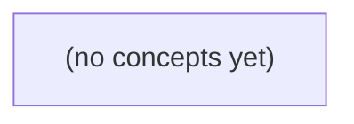

# 05.01 并发任务与生命周期

*面向Go初学者，以尚未实现的虚构IM服务待办任务为线索，建立从并发与并行、goroutine启动，到任务等待、结果错误回收和资源所有权的完整心智模型。全书采用静态代码阅读与推演，不运行Go程序、测试或网络服务，并为后续网络服务与同步机制学习建立边界意识。*

**章节:** 2

---

## 本书导览

- 了解整本书的章节脉络
- 掌握各章之间的概念依赖关系
- 选择最合适的阅读顺序

# 05.01 并发任务与生命周期

面向Go初学者，以尚未实现的虚构IM服务待办任务为线索，建立从并发与并行、goroutine启动，到任务等待、结果错误回收和资源所有权的完整心智模型。全书采用静态代码阅读与推演，不运行Go程序、测试或网络服务，并为后续网络服务与同步机制学习建立边界意识。

下方的概念图展示了本书 0 个核心概念以及它们之间的依赖关系；再下方是 1 个章节的入口。你可以按从上到下的顺序阅读，也可以根据自己的兴趣或先验知识选择切入点。

#### 概念图



## 章节索引

- **05.01 并发任务与生命周期：让 Go 的 IM 处理工作有明确归属** — 承接03.02进程线程、03.04运行/等待、04.03HTTP/WebSocket需求和01.03函数，面向Go初学者讲并发/并行、go语句、goroutine生命周期、WaitGroup最小等待、错误/结果归属、资源所有权与有界任务。虚构IM场景，静态代码无运行。

## 05.01 并发任务与生命周期：让 Go 的 IM 处理工作有明确归属

- 区分并发组织与同一时刻并行执行
- 解释go语句启动goroutine和main退出的边界
- 画出父任务与子任务的启动、等待、完成、失败时间线
- 用WaitGroup理解如何等待固定数量的任务
- 说明WaitGroup不传递错误或取消
- 定义谁拥有连接、关闭资源和收集结果
- 识别共享可变状态与无限创建任务的风险
- 为05.02同步原语和05.03取消机制建立前置

在 IM 服务中，历史查询、用户输入、消息发送与心跳可能交错发生。先厘清并发任务的归属和生命周期，才能避免把“启动了”误当成“完成了”。

### 从交错推进理解并发

### 从交错推进理解并发

设想一个尚未实现的 IM 服务：同一时刻，它可能在处理用户 `u-a` 的历史消息查询、读取 `u-b` 的 WebSocket 输入、向 `c-a` 发送待投递消息，并检查 `m-a` 的心跳超时。这些名称只是教学中的虚构标识；重点不在具体用户或连接，而在任务如何被组织。

**并发**表示多个任务在时间上交错推进。程序不必等历史查询完全结束，才开始读取输入；当某个任务因网络、磁盘或锁而暂时等待时，运行时可以转去推进另一个可运行任务。例如：

1. 查询任务发起数据库请求后等待结果；
2. 输入任务趁此读取到一条新消息；
3. 发送任务尝试写入连接缓冲区；
4. 心跳任务检查某连接是否超时；
5. 查询结果返回后，查询任务继续编码响应。

这是一种“同时管理多件事”的能力，而不是“每件事都在同一瞬间执行”。

**并行**则是多个任务在同一时刻真正占用多个 CPU 核执行。若机器只有一个可用执行核心，即使创建了许多 goroutine，它们通常仍是轮流获得执行机会；若有多个核心，部分可运行 goroutine 才可能并行计算。因而：

- 连接数不等于 goroutine 数；
- goroutine 数不等于 CPU 核数；
- goroutine 多，说明任务可被并发组织，不保证实际并行；
- 网络等待中的 goroutine 不持续占用 CPU。

可以把 goroutine 看作任务的独立生命周期载体：创建后，它可能运行，也可能等待；等待完成后再恢复运行。`go sendMessage(...)` 只表示“安排了一个发送任务”，并不表示消息已经写入网络，更不表示对方已经收到。要判断业务发送成功，必须依赖该任务后续的结果、错误处理与确认机制，而不能从 `go` 语句本身推断。

### 连接、任务与 CPU 不一一对应

### 连接、任务与 CPU 不一一对应

在网络服务中，“连接数多”“goroutine 多”“CPU 核多”分别描述不同层面，不能简单互相换算，更不能据此判断某项业务是否已经执行或发送成功。

- **连接数**描述外部通信关系。例如一个 WebSocket 客户端与服务端建立一条连接；连接处于存活状态，不代表它持续占用 CPU，也不代表此刻正在收发消息。
- **goroutine 数**描述程序内部的并发任务。一个连接可能对应读循环、写循环、心跳、超时控制等多个 goroutine；多个连接也可能共享同一个广播任务、消息队列或工作池。
- **CPU 核数**描述硬件可同时执行指令的能力。goroutine 的数量通常远大于 CPU 核数，运行时会把大量 goroutine 调度到较少的线程和 CPU 核上交错推进。

因此，连接很多不等于有同样多的 goroutine；goroutine 很多不等于它们同时运行；CPU 核数较少也不意味着服务只能处理少量连接。大量 goroutine 可能正因网络读取、锁竞争、定时器或通道等待而暂停，不消耗 CPU。

还要区分**并发**与**并行**：历史查询等待数据库时，另一条连接可以继续处理输入，这叫并发；两个任务恰好在不同 CPU 核上同一时刻执行，才叫并行。`go send(msg)` 仅表示创建了一个尝试发送的并发任务，不能推出消息已写入连接，更不能推出客户端已收到。任务的启动、执行、完成和结果确认，必须分别建立明确的生命周期边界。

### go 语句只负责启动任务

### go 语句只负责启动任务

`go f()` 的语义很窄：创建一个新的 goroutine，并让它与当前 goroutine **并发地**执行。它不等待 `f` 返回，不报告 `f` 是否执行成功，也不保证 `f` 一定有机会运行到某一行代码。

```go
go sendMessage(msg)
fmt.Println("已提交发送任务")
```

这里“已提交发送任务”只说明当前 goroutine 已经执行过 `go` 语句；它不能推出消息已写入连接、已到达对端，甚至不能推出 `sendMessage` 已真正开始执行。调度器何时让新 goroutine 运行，取决于运行时调度、可用处理器、阻塞状态等条件。

尤其要区分 goroutine 的生命周期与进程生命周期：

- `main` goroutine 返回时，整个进程结束；
- 进程结束会直接终止其余 goroutine；
- 因而未完成的发送、日志落盘、心跳收尾等任务可能来不及执行。

例如：

```go
func main() {
    go func() {
        fmt.Println("发送消息")
    }()
}
```

该程序可能没有任何输出：`main` 已返回，进程先于子 goroutine 获得运行机会结束了。

因此，`go` 适合表达“现在启动一个独立推进的任务”，但任务是否完成必须由额外机制确认，如通道回传结果、`sync.WaitGroup` 等待收尾，或通过 `context` 规定取消边界。启动不是完成；并发任务必须有明确的等待者、取消者或所有者。

### 用时间线标明任务生命周期

### 用时间线标明任务生命周期

先把 `u-a`、`u-b`、`c-a`、`m-a` 看作**尚未实现的虚构任务名**，它们只用于讨论归属：`u-*` 可表示用户相关处理，`c-*` 表示连接处理，`m-*` 表示消息处理。关键不是名字，而是谁启动谁、谁等待谁、谁负责收尾。

```text
时间 ───────────────────────────────────────────────→

父任务：c-a    启动 ────── 接收输入 ────── 等待子任务 ── 清理连接 ─→ 结束
                     │
                     ├─ u-a：读取/解析用户输入 ───── 成功 ─┐
                     │                                    │
                     ├─ m-a：处理并发送消息 ── 失败 ──────┤
                     │                                    │
                     └─ u-b：发送心跳 ───── 被取消 ───────┘
```

这里 `c-a` 是父任务：它创建子任务，也应拥有取消与等待的责任。若 `m-a` 发送失败，父任务需要决定策略，例如记录错误、取消 `u-b`、等待已启动任务退出，再关闭连接。不能因为写了：

`go m-a()`

就断言“消息已经发送成功”；这只说明运行时获得了一个可调度任务。它可能尚未运行、正在等待网络，或已经失败。

还要区分两个时刻：

- **启动**：父任务发起子任务，子任务进入可运行或等待状态。
- **完成**：子任务返回结果，父任务通过通道、`WaitGroup`、错误组等观察到其结束。

时间线中的任务可以交错推进：`u-a` 等待输入时，`u-b` 可能执行心跳；这叫并发。是否真的同一时刻使用多个 CPU 执行，则取决于调度和 CPU 核数，不能从连接数或 goroutine 数直接推出。

### 等待之外还要明确归属

### 等待之外还要明确归属

`sync.WaitGroup` 适合等待一组**数量可预期、生命周期有限**的任务：

```go
var wg sync.WaitGroup
wg.Add(2)

go func() {
    defer wg.Done()
    查询历史消息()
}()

go func() {
    defer wg.Done()
    发送欢迎消息()
}()

wg.Wait()
```

这里 `Wait()` 只说明：这两个任务都已调用 `Done()`。它并不自动回答更关键的问题：

- 查询结果由谁保存、发送或丢弃？
- 某个任务失败时，错误由谁汇总、记录和决定是否重试？
- WebSocket 连接关闭后，仍在运行的发送任务由谁停止？
- 多个任务读写会话状态、在线列表或消息队列时，谁负责同步？
- 主流程等待结束后，哪些资源应关闭，关闭顺序是什么？

因此，任务创建者通常应承担“归属”责任：明确任务的输入、输出、取消信号、错误去向，以及结束后的资源回收。例如，一个连接会话可以拥有自己的 `context.CancelFunc`、发送队列和 goroutine；连接断开时，会话负责取消任务、关闭队列，并等待相关任务退出。

尤其不要对无限事件流机械地 `Add(1)` 后 `go` 一个任务：

```go
for msg := range incoming {
    wg.Add(1)
    go func(m Message) {
        defer wg.Done()
        处理消息(m)
    }(msg)
}
```

若客户端持续输入，任务数可能无限增长；`Wait()` 也可能永远等不到稳定的结束点。更合适的设计往往是固定数量的工作协程配合有界队列，或让单个连接拥有有限、职责清晰的读写协程。

`go` 语句只表示任务被提交给运行时调度，不能推出消息已发送、结果已产生或错误已处理。等待解决“何时结束”，归属才解决“谁对结束前后的状态负责”。

> **要点** — 并发不等于并行；go 语句不保证业务完成。每个任务都应有等待方式、结果去向、资源所有者和数量边界。

一条 IM 消息往往要同时触发存储、推送和日志等工作；理解 go 语句的启动边界，是为这些任务明确归属的第一步。

### 并发组织不等于并行执行

### 并发组织不等于并行执行

`go f(args)` 的核心含义是：把一次函数调用组织为独立的 goroutine，使它能够与当前 goroutine **并发**推进。并发强调的是多个任务在时间上可以交错处理；并行则强调多个任务在同一时刻真正运行在多个 CPU 核上。

例如，收到一条 IM 消息后，可以分别启动存储、推送和日志任务：

`go saveMessage(msg)`  
`go pushNotification(msg)`  
`go writeLog(msg)`

这表示三个任务不必按“存储完成后才推送、推送完成后才记日志”的顺序执行。调度器可能先运行日志，再运行推送；也可能某个任务运行一小段后被切走，随后恢复。因而不能依赖输出顺序判断业务顺序。

是否发生并行，还取决于运行环境：可用 CPU 核数、`GOMAXPROCS` 设置、其他程序负载以及 Go 调度器决策。即使机器只有一个可执行核心，多个 goroutine 仍可并发：它们通过轮换执行、在 I/O 等待时让出执行机会，表现为任务交错推进。

因此，`go` 解决的首先是“谁可以不阻塞谁”的组织问题，而不是“必然更快”。如果存储、推送都要读取同一份可变消息状态，仍需明确同步与所有权；如果推送必须在持久化成功后进行，则应建立完成信号，而不能仅因两个任务都用了 `go` 就假定它们存在正确的先后关系。

### go 语句如何启动任务

### `go` 语句如何启动任务

`go f(args)` 的含义不是“稍后调用 `f`”，而是：先在当前 goroutine 中确定要调用的函数及其参数，再创建一个新的 goroutine 执行这次调用。其语法形式是：

`go 函数调用`

例如，收到 IM 消息后异步写日志：

`go writeLog(msg.ID, formatContent(msg))`

这里 `writeLog`、`msg.ID` 和 `formatContent(msg)` 都会在执行 `go` 语句的当前 goroutine 中完成求值；只有得到函数值和全部实参后，运行时才安排新的 goroutine 去执行 `writeLog(...)`。因此，子任务拿到的是启动时计算出的参数值，而不是之后继续变化的表达式。

```go
id := "m-a"
go func(id string) {
    fmt.Println("处理消息：", id)
}(id)

id = "m-b"
```

新 goroutine 的参数是调用 `go` 语句时求得的 `"m-a"`，不会因后续赋值而自动变成 `"m-b"`。匿名函数写法 `go func(id string) { ... }("m-a")` 本质上同样是一次普通函数调用，只是调用被放入新 goroutine。

需要区分“启动”与“完成”：`go` 只负责发起并发执行，当前 goroutine 不会等待该调用返回；即使目标函数有返回值，这些返回值也会被丢弃。多个 goroutine 的实际调度顺序不确定，不能根据源码位置推断输出先后。

### 匿名函数与消息处理示例

### 匿名函数与消息处理示例

匿名函数适合把“收到一条消息后要异步做什么”直接写在触发点附近：

```go
go func(id string) {
    fmt.Println("开始处理消息：", id)
    // 例如：写入数据库、发送推送、记录审计日志
    fmt.Println("完成处理消息：", id)
}("m-a")

fmt.Println("接收循环继续运行")
```

`go func(id string) { ... }("m-a")` 可以拆开理解：

1. `func(id string) { ... }` 创建一个匿名函数；
2. `("m-a")` 按普通函数调用规则传入参数；
3. `go` 使这次函数调用在新的 goroutine 中执行。

因此，子 goroutine 中的 `id` 是参数值 `"m-a"`，而不是稍后再去读取某个外部变量。这种显式传参也能避免循环中捕获变量时常见的混淆：

```go
for _, id := range ids {
    go func(id string) {
        handleMessage(id)
    }(id)
}
```

输出顺序不能预测。主 goroutine 可能先打印“接收循环继续运行”，也可能新 goroutine 先打印“开始处理消息”；调度时机由运行时决定，不能据此推断执行先后。

更重要的是，`go` 不会让父 goroutine 自动等待子任务。若 `main` 很快返回，进程退出，尚未完成的消息处理可能直接中断。用 `time.Sleep` 只能碰运气地延长存活时间，不是等待机制；需要可靠完成时，应由后续的等待或任务管理机制明确协调生命周期。

### 父任务返回不是子任务完成

### 父任务返回不是子任务完成

`go f(args)` 只表示“安排一个新的 goroutine 执行函数调用”，并不建立父子之间的自动等待关系。父 goroutine 启动子 goroutine 后可以立刻继续执行、返回，甚至结束整个进程。

```go
func main() {
    go func(id string) {
        fmt.Println("开始处理", id)
        time.Sleep(time.Second)
        fmt.Println("处理完成", id)
    }("m-a")

    fmt.Println("main 即将返回")
}
```

一次可能的时间线是：

1. `main` 执行 `go func...("m-a")`，运行时创建可调度的子 goroutine。
2. `main` 继续向下执行，输出“main 即将返回”。
3. `main` 返回，进程结束。
4. 子 goroutine 即使已经开始执行，也没有“必须完成”的保证；其后续输出可能永远看不到。

因此，下面两种输出顺序都不能依赖：

- 子任务完全没有机会运行，只看到 `main 即将返回`；
- 子任务先输出“开始处理”，但尚未输出“处理完成”，进程就退出。

`time.Sleep` 只是让当前 goroutine 暂停一段时间，不是等待某个任务完成：

```go
go saveMessage("m-a")
time.Sleep(time.Second) // 猜测一秒够用，不是同步保证
```

机器负载、调度时机和任务耗时变化后，这种“等待”立即失效。IM 服务中若 `main`、请求处理函数或会话循环结束，就必须通过 `sync.WaitGroup`、`channel`、`context` 或任务队列明确任务归属与完成条件；不能把 `go` 视为“后台一定会做完”。源码里写着启动语句，也不代表它已经运行，更不代表进程退出前必然完成。

### 返回值丢弃与错误无归属

### 返回值丢弃与错误无归属

`go f(args)` 只负责启动一个新的 goroutine；即使 `f` 声明了返回值，调用方也不能像普通调用那样接收它：

```go
func persist(id string) error {
    // 写入数据库
    return nil
}

go persist("m-a") // 返回的 error 被丢弃
```

这不是“暂时拿不到”，而是 `go` 语句的语义决定其返回值没有接收位置。下面的写法也不合法：

```go
err := go persist("m-a")
```

因此，异步任务的结果与错误不会自动回到启动者。若 IM 消息的存储、推送或审计日志失败，必须在任务设计中明确结果的归属者：由谁接收、谁记录、谁重试、谁决定是否影响本次消息处理。

常见做法是通过 `chan` 回传结果：

```go
done := make(chan error, 1)

go func(id string) {
    done <- persist(id)
}("m-a")

err := <-done
```

但一旦接收 `<-done`，当前 goroutine 就会等待；这是否合理取决于业务要求。若存储必须成功后才能确认消息已处理，就应等待并处理错误；若日志允许异步，则可由独立的任务管理者消费错误、记录指标或执行重试。

还要注意生命周期责任。任务若持有数据库连接、文件、取消函数或其他资源，不能假设 `main` 返回前它会自行结束或关闭。启动者、任务本身或统一的并发管理组件，必须明确：

- 任务何时结束或被取消；
- 错误发送到哪里，接收者是否一定存在；
- 通道何时关闭；
- 资源由谁释放；
- 进程退出前是否必须等待该任务完成。

没有这些约定，`go` 虽然让工作“并发开始”，却会让结果、错误和清理责任失去归属。

> **要点** — go 语句只负责启动 goroutine；它不等待、不保留返回值，父任务必须明确等待、结果与资源归属。

并发任务不是“启动后就不管”：父任务必须明确谁启动、谁等待、谁取结果，以及谁负责清理资源。

### 任务从创建到完成的状态轨迹

### 任务从创建到完成的状态轨迹

一项 IM 处理任务不应只被理解为一条 `go` 语句，而应有可追踪的生命周期：

`created → runnable → running → waiting → done`

- **created（已创建）**：父任务已决定要做什么，并准备好输入、结果槽位和任务句柄。例如，收到一条消息后，决定并发执行“敏感词检测”和“内容持久化”。
- **runnable（可运行）**：执行 `go f()` 后，子任务已交给运行时调度，但未必立刻占用处理器执行。
- **running（运行中）**：调度器实际执行子任务。两个子任务可交错推进；只有在存在多个可用处理器等条件满足时，才可能真正并行。
- **waiting（等待中）**：父任务已启动全部子任务，随后等待它们完成，而不是提前读取尚未写好的结果。
- **done（已完成）**：子任务报告完成，父任务收集结果、处理错误并释放关联资源。

最小的组织方式是让父任务持有一个 `sync.WaitGroup`，在启动前登记责任：

```go
var wg sync.WaitGroup
wg.Add(2)

go func() {
	defer wg.Done()
	// 敏感词检测
}()

go func() {
	defer wg.Done()
	// 消息持久化
}()

wg.Wait()
```

这里 `Add(2)` 必须发生在两个 `go` 之前：父任务先确认“有两项未完成责任”，再允许子任务开始结束。每个子任务用 `defer wg.Done()` 保证即使中途返回，计数也会归还；`Wait()` 则标志父任务进入 `waiting`，直到计数归零才进入后续的结果处理与清理。

`WaitGroup` 只是完成计数器，不是完整任务句柄：它不保存返回值、不传递错误，也不会因某个任务失败而自动停止其他任务。若多个任务共用同一个 `wg`，首次任务的 `Add` 必须全部发生在任何 `Wait` 之前；不能一边等待零计数，一边再追加新的首批任务。

### go 语句启动的是独立执行责任

### go 语句启动的是独立执行责任

`go f()` 的含义不是“把 `f` 放到后台，随后一定会完成”，而是创建一个可并发调度的 goroutine。它从 `created` 进入 `runnable`，被运行时调度后成为 `running`；若等待网络、通道或锁，则可能转入 `waiting`，最终才到 `done`。发起 `go` 的父任务不会自动等待这个生命周期结束，而是立刻继续执行下一条语句。

```go
go receiveMessages()
fmt.Println("父任务继续处理")
```

两段逻辑的输出顺序并不保证：`receiveMessages` 可能先运行、后运行，甚至尚未来得及运行。调度器只负责安排 goroutine 执行，不替父任务承担“确认完成、取得结果、处理错误、释放资源”的责任。

尤其要注意 `main` 的边界：当 `main` 函数返回时，整个进程直接退出，仍处于 `runnable`、`running` 或 `waiting` 的 goroutine 都会被终止；它们不会因为“已经启动”而获得继续运行的机会。

因此，启动 goroutine 相当于父任务创建了一份独立执行责任，并应保留相应的任务句柄或完成机制。例如，父任务可持有 `WaitGroup`、结果通道或 `context`：先启动任务，再等待完成、读取结果，最后清理连接、定时器等资源。没有等待关系的 `go` 语句，只表达“尝试并发执行”，并不表达“任务已可靠完成”。

### 固定双任务的等待时间线

### 固定双任务的等待时间线

IM 连接建立后，父任务启动两个固定子任务：一个持续读取服务端消息，另一个定期发送心跳。它们共享“完成责任”：父任务不能只负责 `go`，还必须等待二者退出，再关闭连接或回收会话资源。

```go
var wg sync.WaitGroup

wg.Add(1) // 必须在 go 前登记
go func() {
	defer wg.Done() // 无论何种 return 路径，都归还计数
	readMessages(conn)
}()

wg.Add(1)
go func() {
	defer wg.Done()
	sendHeartbeats(conn)
}()

wg.Wait() // 全部任务已登记后再等待
closeSession(conn)
```

时间线可以理解为：

1. 父任务执行第一次 `Add(1)`：读取任务从 `created` 变为可被等待的 `runnable`。
2. 父任务启动读取协程；调度器随后可能让它进入 `running`，也可能因网络读取进入 `waiting`。
3. 父任务执行第二次 `Add(1)` 并启动心跳协程；此时计数为 `2`。
4. 父任务调用 `Wait()`，自身进入等待；它不再推进清理流程。
5. 读取任务和心跳任务分别退出时执行 `Done()`，计数依次减为 `1`、`0`。
6. 计数归零，`Wait()` 返回；两个子任务都已 `done`，父任务才可安全清理连接。

`WaitGroup` 只保存未完成任务的计数，不保存消息、不传递错误，也不会因一个任务失败而自动停止另一个任务。若读取失败需要让心跳退出，应另行使用 `context`、关闭信号或错误通道。

关键约束是：所有首次启动的任务都应在调用 `Wait()` 前完成 `Add`。不能让父任务一边等待计数归零，一边再向同一个 `WaitGroup` 追加新的首批任务，否则等待边界将变得不明确。

### WaitGroup 只负责完成计数

### WaitGroup 只负责完成计数

`sync.WaitGroup` 可以把“父任务等待一组子任务结束”这件事表达得很清楚：父任务在启动前登记任务数，子任务结束时归还计数，父任务在 `Wait()` 处阻塞，直到计数归零。

```go
var wg sync.WaitGroup
wg.Add(2) // 必须在启动 goroutine 前完成登记

go func() {
	defer wg.Done()
	// 接收消息
}()

go func() {
	defer wg.Done()
	// 发送心跳
}()

wg.Wait()
// 两个任务都已退出，父任务现在可以继续清理
```

可以把它理解为任务句柄的最小版本：它只记录“还有多少任务未完成”，不保存每个任务的身份、状态或产出。任务可能经历 `created → runnable → running → waiting → done`，但 `WaitGroup` 最终只关心是否到达 `done`。

因此，它**不能**解决以下问题：

- 不能传递错误：子任务中的 `error` 需要通过错误通道、共享变量配合互斥锁，或更高层的任务管理结构交回父任务。
- 不能保存结果：例如消息解析结果、连接对象或统计数据，必须由调用方另行设计结果通道或数据结构。
- 不能取消任务：`Wait()` 只等待，不会要求正在阻塞读网络、等待定时器或处理队列的 goroutine 停止。
- 不能自动关闭资源：连接、通道、文件和定时器仍需明确由某个责任方关闭。

使用时遵守两个边界：`Add(1)` 必须发生在对应 `go` 之前；当某次 `Wait()` 正在等待且计数已为零时，不能并发地再把“首个新任务”加入同一个 `WaitGroup`。实践中，先固定启动全部任务，再调用 `Wait()`，最不容易产生生命周期歧义。

### 父任务持有结果与资源的归属

### 父任务持有结果与资源的归属

父任务启动子任务后，不能只保留“它正在运行”的印象，而应持有一个可管理的任务句柄：至少能等待完成、取得结果、观察错误，并在退出时释放关联资源。对 IM 服务而言，父任务通常拥有连接、取消信号、结果通道与关闭时机；子任务只处理被分配的消息、写入结果或返回错误。

```go
var wg sync.WaitGroup
results := make(chan Result, 2)

wg.Add(2) // 必须在启动前完成首批 Add
go func() {
	defer wg.Done()
	results <- handleLogin(conn)
}()
go func() {
	defer wg.Done()
	results <- handleSync(conn)
}()

wg.Wait()
close(results) // 父任务确认所有发送者退出后关闭

for r := range results {
	// 汇总结果、记录错误、更新状态
}
conn.Close()
```

这里的归属关系应清晰：

- 父任务负责创建并持有 `conn`，因此也负责在所有使用者结束后关闭它。
- 子任务负责调用 `Done()`；遗漏会使父任务永久等待。
- 父任务负责收集 `Result` 与错误。`WaitGroup` 只做计数，不传递错误，也不会因某个任务失败而自动停止其他任务。
- 只有确认所有发送者都结束后，父任务才能关闭结果通道；子任务通常不应关闭共享通道。
- 若任务需要提前停止，应由父任务提供取消机制，例如 `context.Context`，而不是依赖 `WaitGroup`。

共享状态需要额外保护：多个任务同时写映射、切片、连接状态或会话字段时，应使用互斥锁、单一汇总协程或通道串行化。更危险的是无限创建任务：每条消息都无界 `go` 一个处理器，会使连接、内存和调度资源失去上限。父任务应限制并发度，确保每个被创建的任务最终都能进入 `done`，并且其结果、错误与资源都有明确接收者。

> **要点** — goroutine 需要明确的父任务、完成责任和资源归属；WaitGroup 只解决“等多少个任务完成”。

用一个有限输入的消息体计数函数，建立“启动、归属、等待、返回”的完整并发任务模型。

### 从顺序计数到任务拆分

### 从顺序计数到任务拆分

设消息体列表为 `[]string`，目标是返回同长度的计数结果：第 `i` 个结果对应第 `i` 条消息体的 UTF-8 字节长度。

顺序实现很直接：依次读取每个 `body`，计算 `len(body)`，写入结果切片。这里每一项计数彼此独立，因此也可以把“计算第 `i` 项”视为一个独立任务：

- 输入：索引 `i` 与消息体 `body`
- 工作：计算 `len(body)`
- 输出位置：`results[i]`
- 完成条件：该任务已经写入自己的槽位

```go
func countBodies(bodies []string) []int {
	results := make([]int, len(bodies))

	for i, body := range bodies {
		results[i] = len(body)
	}

	return results
}
```

例如输入 `[]string{"hi", "你好"}`，静态推得输出为 `[]int{2, 6}`；`len` 计量的是字节数，而不是字符数。

并发版本并没有改变函数契约：仍然是“一个输入列表，返回逐项长度列表”。它改变的是任务组织方式：主 goroutine 启动多个子任务，每个任务负责一个明确索引，最后统一等待所有任务完成。

需要注意，`len` 的开销极低，且这里的输入是有限的教学数据；创建 goroutine、调度和等待反而可能更贵。因此这不是性能优化示例，而是用简单、无共享写入冲突的工作，建立“任务可拆分、结果有归属、返回前必须完成”的并发模型。

### 用 go 启动有编号的子任务

### 用 `go` 启动有编号的子任务

设输入是一组有限的消息体 `bodies`，目标是得到每个消息体的 UTF-8 字节长度。先为结果分配与输入等长的切片：第 `i` 个任务只负责写入 `results[i]`。这个编号就是任务的明确归属。

```go
package main

import "sync"

func countBodies(bodies []string) []int {
	results := make([]int, len(bodies))

	var wg sync.WaitGroup
	wg.Add(len(bodies))

	for i, body := range bodies {
		go func(i int, body string) {
			defer wg.Done()
			results[i] = len(body)
		}(i, body)
	}

	wg.Wait()
	return results
}
```

循环中的 `go` 会立刻启动一个新的 goroutine；匿名函数的参数 `(i int, body string)` 接收当前迭代的编号和消息体。于是每个任务都有独立的：

- 输入：自己的 `body`；
- 输出位置：自己的 `results[i]`；
- 生命周期计数：结束时执行 `defer wg.Done()`。

不能依赖 goroutine 直接捕获循环变量：

```go
for i, body := range bodies {
	go func() {
		results[i] = len(body) // 归属不清：读取的是外层变量
	}()
}
```

这种写法使异步任务与循环变量共享绑定；任务真正运行时，`i`、`body` 可能已进入下一轮甚至循环结束。显式传参把“此任务处理第几个元素、处理哪个值”固定在启动时刻。

`wg.Wait()` 是返回前的汇合点：只有全部任务调用 `Done` 后，函数才交出 `results`。若省略等待，函数可能在子任务写入前就返回，调用者看到的将是尚未完整填充的结果。这里 `len` 极其便宜，使用并发没有性能优势；示例的重点是建立“启动、编号归属、完成、等待、返回”的完整任务模型。

### WaitGroup 划定返回边界

### WaitGroup 划定返回边界

`sync.WaitGroup` 用来声明：父任务启动了多少个子任务，就必须等待这批子任务全部结束，才能返回结果。这里的输入是有限的教学数据；`len` 很便宜，并发通常没有性能优势，重点在于建立清晰的生命周期边界。

```go
func countBodies(bodies []string) []int {
	var wg sync.WaitGroup
	results := make([]int, len(bodies))

	wg.Add(len(bodies))
	for i, body := range bodies {
		go func(i int, body string) {
			defer wg.Done()
			results[i] = len(body)
		}(i, body)
	}

	wg.Wait()
	return results
}
```

时间线可理解为：

`创建 results` → `Add(n)` → `启动 n 个子任务` → `每个任务写入自己的槽位并 Done` → `Wait 解除阻塞` → `返回 results`

`Add(len(bodies))` 必须在启动协程前完成：它预先登记固定数量的待完成任务。每个协程中的 `defer wg.Done()` 则保证函数无论正常结束还是中途 `return`，都会归还一个计数。父函数停在 `wg.Wait()`，直到计数降为 `0`。

每个协程接收 `i, body` 参数，而不是直接捕获循环变量，避免循环继续推进后协程读到错误的索引或消息体。又因为每个协程只写不同的 `results[i]`，写入位置彼此独立。

若省略 `wg.Wait()`：

```go
return results
```

父函数可能在子任务尚未写入时就返回，调用者得到的切片会保留部分零值。这里的代码仅展示静态逻辑，未实际运行；其关键保证是：返回发生在这一批已登记子任务全部完成之后。

### 结果槽位与资源归属

### 结果槽位与资源归属

并发任务不仅要“启动”，还必须明确：它负责处理哪份输入、写入哪个结果位置、由谁等待它结束。对于有限的消息体切片，可以预先分配与输入等长的结果槽位，让第 `i` 个任务只拥有 `results[i]` 的写权限：

```go
package main

import "sync"

func countBodies(bodies []string) []int {
	results := make([]int, len(bodies))

	var wg sync.WaitGroup
	wg.Add(len(bodies))

	for i, body := range bodies {
		go func(i int, body string) {
			defer wg.Done()
			results[i] = len(body)
		}(i, body)
	}

	wg.Wait()
	return results
}
```

若输入为：

```go
bodies := []string{"hi", "你好", "Go"}
```

则静态推导的返回值是：

```go
[]int{2, 6, 2}
```

这里的 `len` 计算的是 UTF-8 字节数；代码仅用于说明，并未实际运行。

`make([]int, len(bodies))` 先建立固定结果空间，而任务通过参数接收 `i` 与 `body`，避免循环变量被多个 goroutine 共享。每个 goroutine 只写不同的 `results[i]`，结果槽位的归属清晰；`wg.Wait()` 则保证所有写入完成后才返回。

反例是启动后立刻返回：

```go
go func() { results[i] = len(body) }()
return results
```

此时调用者可能读到尚未写完的零值结果。另一个错误是多个任务写同一个变量或同一槽位，归属重叠会导致结果不确定，并可能形成数据竞争。

本例的输入长度有限，任务数量至多等于 `len(bodies)`，因此生命周期可由一个 `WaitGroup` 完整管理。不要把这种模式直接用于无限消息流：持续为每条消息创建 goroutine 会不断占用调度、栈和内存资源；此类场景应进一步限制并发量，并设计停止与回收机制。

### 未等待与共享错误的反例

### 未等待与共享错误的反例

`go` 只负责启动 goroutine，不会等待它完成。若函数启动任务后立刻返回，调用者拿到的可能是尚未填充完的结果切片：

```go
func countBodiesBad(bodies []string) []int {
	results := make([]int, len(bodies))

	for i, body := range bodies {
		go func(i int, body string) {
			results[i] = len(body)
		}(i, body)
	}

	return results
}
```

例如输入 `[]string{"hi", "你好", "Go"}`，函数可能立刻返回：

```text
[0 0 0]
```

也可能恰好有部分任务已执行：

```text
[2 0 2]
```

这些输出都不稳定：返回动作与 goroutine 写入动作之间没有建立完成关系。`WaitGroup` 的关键作用正是让 `wg.Wait()` 阻塞到所有对应的 `Done()` 都发生之后；因此，等待完成后再返回，`results[i]` 才具备“已写入”的生命周期保证。

错误处理还有另一类隐患：

```go
var err error

for _, body := range bodies {
	go func(body string) {
		err = saveBody(body)
	}(body)
}
```

多个 goroutine 同时写同一个 `err`，会产生数据竞争；即使最后调用了 `wg.Wait()`，也无法说明“最终的 `err` 属于哪条消息”。`WaitGroup` 只能计数和等待，不能保护共享数据、不能传递错误、不能取消任务，也不能规定多个错误的保留策略。

因此，若任务可能失败，应让每个 goroutine 写入自己独占的位置，例如 `errs[i]`，或通过 channel 汇集结果；同时仍需等待全部任务结束。等待解决的是任务是否完成，独占写入或同步机制解决的才是共享状态是否安全。

> **要点** — 并发任务必须明确启动数量、结果槽位、等待边界与资源归属；WaitGroup只负责等待，不负责错误传递或取消。

在 IM 服务中，启动任务只是开始；错误、连接和结束信号若没有明确归属，消息处理就会悄然失控。

### 启动任务不等于拿到返回值

### 启动任务不等于拿到返回值

`go` 语句只负责创建并发执行单元，并不会把被调函数的返回值交还给启动者：

```go
go handleConn(conn) // 即使 handleConn 返回 error，这里也拿不到
```

若 `handleConn` 的签名是：

`func handleConn(conn net.Conn) error`

那么它的 `error` 只会在该 goroutine 自己的调用栈中产生；goroutine 结束后，返回值随之消失。启动者既不能写成 `err := go handleConn(conn)`，也不能通过 `WaitGroup.Wait()` 取得错误：`WaitGroup` 只记录“还有多少任务未结束”，不携带结果。

因此，任务启动前必须先确定错误归属。固定数量的任务可为每个任务准备独立槽位：

`errs[i] = process(tasks[i])`

随后由主管在 `wg.Wait()` 后按任务索引汇总错误。这里的错误顺序是任务编号顺序，不是实际完成顺序；若运行期间就要检查 `errs`，读写还必须通过互斥锁、信道或其他同步方式保证并发安全。

更重要的是，不要把可能失败的工作丢进无主的 fire-and-forget goroutine。每个任务都应明确：谁启动，谁观察错误，谁等待结束，谁回收它持有的连接和资源。

### WaitGroup 只负责等待计数

### WaitGroup 只负责等待计数

设想主管一次派发 3 个固定的 IM 消息处理任务。正确的时间线是：

1. **启动前登记数量**：主管先执行 `wg.Add(3)`，表示后续会有 3 个任务需要完成。
2. **任务各自处理**：每个 goroutine 处理一条消息，并在退出路径上执行 `defer wg.Done()`。
3. **主管等待归零**：主管调用 `wg.Wait()`；只有 3 次 `Done()` 都发生后，`Wait()` 才返回。

```go
var wg sync.WaitGroup
wg.Add(len(messages))

for i, msg := range messages {
    go func(i int, msg Message) {
        defer wg.Done()
        _ = handleMessage(msg)
    }(i, msg)
}

wg.Wait()
```

这里的核心是：`WaitGroup` 维护的只是一个计数器。`Add(n)` 增加待完成数，`Done()` 等价于 `Add(-1)`，`Wait()` 阻塞到计数归零。它不知道任务处理了什么消息，也不知道任务是成功、失败还是被取消。

因此，下面这种写法不会把错误交给启动者：

```go
go func() error {
    return handleMessage(msg)
}()
```

goroutine 的返回值没有接收者；函数结束后，错误会直接丢失。类似地，`Wait()` 返回也不代表“全部成功”，只代表“全部结束”。

对于固定任务集合，可由主管预先分配按索引对应的错误槽：任务写入自己的 `errs[i]`，`Wait()` 后统一检查。注意错误数组的顺序是**派发顺序**，不是任务完成顺序；若多个任务会写同一位置，则必须额外同步。

`WaitGroup` 也不发送取消信号。主管想停止任务、关闭连接或传播错误，必须使用独立的上下文、通道或其他协调机制。等待是谁负责的，错误由谁观察，资源由谁回收，都不能交给无主的“顺手启动一个 goroutine”。

### 为固定任务设置错误归集槽

### 为固定任务设置错误归集槽

当并发任务数量在启动前就确定时，可以为每个任务分配稳定编号，并准备同长度的错误槽。任务只写自己的槽位；主管在 `Wait()` 返回后统一检查。这样，错误不会因 goroutine 中 `return error` 而丢失，也不需要在多个任务间竞争同一个可变错误变量。

```go
errs := make([]error, len(tasks))

for i, task := range tasks {
	i, task := i, task // 固定本轮循环变量
	wg.Add(1)
	go func() {
		defer wg.Done()
		errs[i] = handle(task)
	}()
}

wg.Wait()

for i, err := range errs {
	if err != nil {
		log.Printf("任务 %d 失败：%v", i, err)
	}
}
```

这里的 `i` 表示**任务编号**，不是完成顺序。即使任务 `2` 最先失败、任务 `0` 最后结束，汇总时仍按 `errs[0]`、`errs[1]`、`errs[2]` 的任务规划顺序检查。这使日志、重试策略和结果关联都更稳定。

并发安全的关键在于：每个 goroutine 仅写入自己唯一的 `errs[i]`，主管在 `wg.Wait()` 之后才读取全部槽位。因此不存在多个任务同时写同一元素，也不存在读写重叠。不要让所有任务直接写共享的 `firstErr`；那需要互斥锁或其他同步机制。

该模式适合固定批次，例如并行处理一组已解析的消息、同时启动若干已知后台任务。主管负责启动、等待和汇总；任务负责报告自身结果。任何槽位中的错误都必须被观察、记录、重试或升级处理，不能随着 goroutine 退出而成为无主错误。

### 连接、错误与回收必须有人负责

### 连接、错误与回收必须有人负责

在 IM 接纳流程中，`go handleConn(conn)` 不只是“启动一个处理函数”，而是一次资源与责任的移交。若没有明确约定，最常见的后果是：连接无人关闭、任务错误无人记录、服务停止时仍有 goroutine 持续读写。

可以先划分三个角色：

- **接纳者**：负责接受新连接；一旦成功创建处理任务，就把 `conn` 的所有权移交给该任务，自己不再关闭它。
- **处理任务**：独占该连接，负责读包、解析、投递消息；无论正常退出还是出错，都必须执行 `defer conn.Close()`。
- **主管**：负责启动、停止与回收任务；观察任务错误，在停止时通知任务退出，并等待全部任务结束。

`goroutine` 中的 `return error` 不会自动回到启动者：

```go
go func() error {
	return handleConn(conn)
}()
```

这里的错误已经丢失。`sync.WaitGroup` 只表示“任务是否结束”，不携带错误结果。对于一组预先确定的连接任务，可按任务编号保存错误：

```go
errs := make([]error, len(conns))

for i, conn := range conns {
	i, conn := i, conn
	wg.Add(1)
	go func() {
		defer wg.Done()
		defer conn.Close()
		errs[i] = handleConn(conn)
	}()
}

wg.Wait()
```

每个任务只写自己的 `errs[i]`，且主管在 `wg.Wait()` 后再读取，因此不会与写入并发冲突。注意：`errs` 的顺序是**任务编号顺序**，不是实际完成顺序；不能把 `errs[0]` 理解为“最先失败的任务”。

停止服务时，主管不能只调用 `wg.Wait()`：若处理任务仍阻塞在读取连接，主管会永久等待。主管必须先发出停止通知，再等待任务收尾；具体的取消与强制唤醒机制将在后续讨论。

最终应能回答三件事：**谁关闭连接？谁观察错误？谁等待任务退出？** 若答案不明确，就不要启动这个 goroutine，更不能让它成为无主的 fire-and-forget 任务。

### 拒绝无主的后台任务

### 拒绝无主的后台任务

`go func()` 很轻，但“启动成功”不等于“任务可管理”。尤其在 IM 服务中，若把收包、发消息、落库、广播等工作随手放入后台，启动者随即返回，这个任务便成了无主任务：没人知道它是否成功、何时结束、该由谁停止或回收。

| 有归属的任务 | 无主的 `fire-and-forget` 任务 |
|---|---|
| 有明确父任务，例如连接会话或主管任务 | 启动后不再被任何对象持有 |
| 父任务知道何时等待它结束 | 结束时机不可观察 |
| 错误有上报位置和汇总者 | `return error` 只能在 goroutine 内消失 |
| 连接、缓冲区等资源有关闭责任人 | 可能长期占用 `conn`、定时器或 channel |
| 停止时可通知并等待回收 | 服务退出、连接断开后仍可能继续运行 |
| 创建速率受连接数、队列或并发限制约束 | 每条消息都可能无限创建新任务 |

例如，接纳者将 `conn` 移交给会话处理任务后，处理任务应负责：

```go
go func() {
    defer conn.Close()
    err := serveConn(conn)
    report(err)
}()
```

这里仍不能只满足于“有一个 goroutine”：`report` 的观察者是谁？主管停止时如何通知 `serveConn`？又由谁等待它退出？这些责任必须在启动点附近说清楚。

无主任务常造成更隐蔽的问题：消息处理失败却未记录，多个任务并发修改同一会话状态，连接断开后后台仍向已失效的对象写入，突发流量下任务数量无限增长。原则是：**谁创建任务，谁指定其父任务；谁持有资源，谁定义关闭责任；谁需要结果，谁负责观察错误并等待回收。**

> **要点** — 并发任务必须明确等待、错误、结果和资源的归属；WaitGroup 只保证计数归零，不负责传递失败或停止任务。

IM 服务中的任务常因共享状态和无限输入而失控。本节厘清并发任务的竞争边界、资源代价与可控创建原则。

### 共享状态为何会产生竞争

### 共享状态为何会产生竞争

当多个 goroutine 访问同一份可变状态时，问题不在于“它们是否同时运行”，而在于访问之间是否建立了明确的同步关系。IM 服务中常见的共享状态包括在线用户表、会话映射、未读数、房间成员数与消息序号。

```go
sessions[userID] = conn // 多个 goroutine 同时写 map
online++                 // 多个 goroutine 同时递增计数
```

这至少包含两类竞争：

- **数据竞争**：两个或多个 goroutine 并发访问同一内存位置，且至少一个是写入，却没有同步。对 `map` 的并发读写或写写，运行时可能直接报错；对普通计数器，`online++` 实际包含读取、加一、写回多个步骤，更新可能丢失。`go test -race` 能帮助发现这类问题。
- **业务竞争**：即使每次读写都加锁、没有数据竞争，操作顺序仍可能违背业务规则。例如两个登录请求都先检查“用户未在线”，再分别创建会话；或两个扣减操作都判断余额充足，最终发生重复扣减。这里缺失的是“检查—决策—更新”的整体原子性，而不只是单次变量访问的安全性。

后果不仅是错误计数，还可能是会话覆盖、成员状态错乱、重复投递或权限绕过。应先识别状态的所有者与不变量：谁能修改、哪些字段必须一起变化、一次操作完成后应满足什么条件。后续可用互斥锁保护临界区；但锁只能建立同步，不能自动替你定义正确的业务原子边界。

### 同写 map 与计数的 IM 场景

### 同写 map 与计数的 IM 场景

设想 IM 网关同时收到两条消息：用户 A 发送私聊，用户 B 上线。为了提高吞吐量，处理器分别启动两个 goroutine：

```go
go func() {
    onlineUsers["B"] = sessionB
    totalOnline++
}()

go func() {
    inboundCount++
    userMessageCount["A"]++
}()
```

表面上，它们更新的是不同业务字段；但只要多个任务写入同一个共享对象，就必须明确同步边界。

以消息入站计数为例，`inboundCount++` 并不是一个不可分割的动作，而近似于：

1. 读取当前值，例如 `100`；
2. 在本地计算 `100 + 1`；
3. 写回 `101`。

若两个 goroutine 交错执行，可能出现：

| 时刻 | 任务 1 | 任务 2 |
|---|---|---|
| 1 | 读到 `100` |  |
| 2 |  | 读到 `100` |
| 3 | 写回 `101` |  |
| 4 |  | 写回 `101` |

两条消息实际都已到达，最终计数却只增加一次。这既是数据竞争，也会直接造成业务统计失真，例如限流阈值、监控指标或未读数判断错误。

`map` 的问题更严重。两个 goroutine 并发写 `onlineUsers`、`userMessageCount`，即使写的是不同键，也不能因此认为安全。Go 的普通 `map` 不是并发写容器，运行时可能报出“并发 map 写入”并使进程崩溃；即使没有立刻暴露，也不能把偶然正常当作正确性保证。

在线表更新还可能产生业务竞争。例如一个任务处理“用户上线”，另一个任务处理旧连接的“下线”：

```text
任务 1：写入 onlineUsers[u] = 新连接
任务 2：删除 onlineUsers[u]
```

若下线任务较晚执行删除，在线用户会被错误地标记为离线。这里即便换成并发安全容器，也仍需定义“新旧连接谁有效”的业务顺序。

因此，应把 `map`、计数器及其相关状态视为同一共享边界，后续通过互斥锁、原子操作或单一所有者任务建立可靠顺序。不同切片索引写入后再 `Wait` 的特例，不能推广为任意共享对象都可无同步访问。

### 等待完成不等于安全共享

### 等待完成不等于安全共享

`sync.WaitGroup` 的职责只有一个：让某个 goroutine 等待一组任务调用 `Done()` 后结束。它解决的是“何时都完成”，而不是“执行过程是否安全”。

```go
var wg sync.WaitGroup
count := 0

for _, msg := range msgs {
	wg.Add(1)
	go func() {
		defer wg.Done()
		handle(msg)
		count++ // 数据竞争
	}()
}
wg.Wait()
```

即使 `Wait()` 已返回，`count++` 仍可能在并发执行时发生读—改—写冲突，导致计数丢失，甚至被竞态检测器报告。应使用 `Mutex`、原子操作，或将结果汇聚到单一 goroutine。`WaitGroup` 不能替代互斥锁。

它也不负责错误传递。任务内部的错误若只保存在共享变量中，同样需要同步；更常见的做法是通过通道、`errgroup` 或受锁保护的结果结构收集错误。仅靠等待无法知道“谁失败了、是否应取消其余任务”。

此外，`WaitGroup` 不决定关闭顺序。例如不能因为主 goroutine 即将 `Wait()` 就关闭仍被工作 goroutine 使用的连接、通道或文件；必须先明确“谁发送、谁关闭、谁等待”的所有权关系。通常应先停止新任务进入，再等待已有任务退出，最后释放共享资源。

不同切片元素按索引分别写入、随后 `Wait()` 再读取，在本例中可以成立：每个任务只写自己的位置，等待建立了完成边界。但这不意味着任意共享对象都可免锁。只要多个任务读写同一 map、计数器、结构体字段或资源生命周期，就仍需额外同步。

### 不同索引写入的限定条件

### 不同索引写入的限定条件

有些批处理场景可以让多个 goroutine 并发写同一个切片，例如先确定任务数量并预分配结果槽位：

```go
results := make([]Result, len(messages))
var wg sync.WaitGroup

for i, msg := range messages {
    wg.Add(1)
    go func(i int, msg Message) {
        defer wg.Done()
        results[i] = handle(msg)
    }(i, msg)
}
wg.Wait()
// 此后统一读取 results
```

这里成立的关键不是“切片可以并发写”，而是满足一组很窄的条件：

- 切片长度、底层数组和容量在启动任务前已经确定；并发期间不执行 `append`、扩容、重切片或替换切片变量。
- 每个任务只写自己唯一的 `results[i]`，不存在两个任务写同一元素，也不存在一个任务读写另一个任务负责的元素。
- 任务完成通过 `wg.Done()` 发布，调用方在 `wg.Wait()` 返回后再读取全部结果；不要在等待完成前边写边遍历结果。
- `Result` 的写入本身不再间接修改其他共享对象。例如其中包含共享 `map`、复用缓冲区或指针指向的可变状态时，索引隔离并不能消除竞争。

因此，这是一种“固定槽位、单写者、完成后汇总”的结果收集模式，而不是无锁共享状态的通用方案。计数器、在线用户表、会话 map、消息队列等对象通常没有天然的唯一索引归属，仍应使用互斥锁、原子操作或单一所有者 goroutine 管理。

### 无限创建任务的资源风险

### 无限创建任务的资源风险

“一条消息启动一个 goroutine”看似简单：收到了就处理，处理慢也不阻塞接收循环。但当输入速率持续高于处理速率时，未完成任务会不断累积。

设消息到达速率为 $\lambda$，单个任务平均处理时间为 $W$。系统中平均在途任务数近似满足：

$$
L \approx \lambda W
$$

若下游数据库、远程服务或锁竞争变慢，$W$ 增大；若客户端持续发送，$\lambda$ 不会自动下降。于是 goroutine 数量、任务上下文、待发送消息、计时器、网络请求及其引用对象都会增长。goroutine 等待网络或锁时通常不持续占用 CPU，却仍占用栈、调度器记录、连接槽位和堆内存，并可能阻止对象被回收。

尤其要区分：连接数不等于任务数。一个长连接可以快速提交数万条消息，从而派生数万个处理任务；多个任务又可能同时争抢同一数据库连接池、房间锁或下游接口配额。此时问题不是“连接太多”，而是系统允许进入的工作量没有上限。

退出路径同样危险。若任务没有绑定 `context`、没有在连接关闭时取消，或永久卡在网络读写、锁等待中，连接已经消失，任务仍可能存活，形成泄漏。

因此，goroutine 应有明确归属与上限：由固定数量工作者处理队列，或用信号量限制同时执行数；队列必须设置容量，并在满载时选择拒绝、超时、降级或反馈背压。限并发、队列设计与过载控制将在后续章节展开；这里先建立原则：输入可以无限，系统内允许未完成的任务不能无限。

> **要点** — 并发任务必须明确共享状态的保护方式与资源归属；等待不解决竞争，无界创建终将耗尽资源。

IM 服务中的每个后台任务都应有明确的启动者、结束信号、错误去向与资源边界，否则并发会变成不可追踪的悬挂工作。

### 从客户端活动拆分并发任务

### 从客户端活动拆分并发任务

设想两个客户端同时活动：客户端 A 正在查询会话历史，客户端 B 正在发送新消息；随后服务端还要把新消息推送给在线接收者。它们可以同时发生，但不应因此被视为一个“并发大任务”。

应先按业务边界拆分：

- **历史查询任务**：由 A 的请求启动，读取其有权限访问的历史数据，组装并写回一次响应。客户端取消、超时或响应完成后，该任务应结束。
- **消息发送任务**：由 B 的请求启动，负责校验、持久化、生成消息标识，并明确返回发送成功、失败或处理中状态。
- **消息推送任务**：通常以“消息已可靠写入”为前提，面向一个或多个在线连接投递；它不应继续持有 B 的 HTTP 响应写入权。
- **离线补偿或重试任务**：若接收方不在线、连接断开或投递失败，应转交给有持久化依据的后续任务，而不是让原请求中的 goroutine 无限重试。

这里的**并发组织**是：多个独立任务在时间上交错推进，各自拥有取消信号、完成结果和资源范围。**并行执行**则是：这些任务恰好在多个 CPU 核或多个 goroutine 上同时运行。前者是生命周期设计问题，后者只是运行时调度结果。

任务边界尤其要防止混淆：历史查询可以与消息推送并行，但查询 goroutine 不应承担推送；发送请求返回后，后台投递也不能再写该请求的 `ResponseWriter`。每个任务至少应能回答五个问题：谁启动它、何时完成或取消、错误交给谁、持有哪些连接或存储资源、允许同时运行多少个。这样，重复投递、用户断开和进程退出才有明确的处理位置。

### go 语句与主任务退出边界

### `go` 语句与主任务退出边界

`go f()` 的语义只有一件事：把 `f` 安排为一个可并发执行的 goroutine，并立即让当前 goroutine 继续向下运行。它**不建立父子等待关系**，也不承诺 `f` 会在当前函数返回前完成。

```go
func handleHistory(w http.ResponseWriter, r *http.Request) {
    go writeHistory(w, r)
    // 当前处理函数可能立刻返回
}
```

这里的 `handleHistory` 返回，不等于 `writeHistory` 已结束；但 HTTP 框架可能在处理函数返回后回收请求相关资源，客户端也可能已经断开。后台 goroutine 若继续写 `w`，结果可能是写入失败、竞态，或错误无人处理。`go` 只是启动方式，不是“请求生命周期的延长器”。

同样，`main` 并不会因为存在其他 goroutine 而自动等待：

```go
func main() {
    go persistMessage()
    return
}
```

当 `main` 返回时，整个进程退出，其余 goroutine 会被直接终止；消息写库、重试记录、确认回执都可能尚未完成。程序中唯一天然等待的是：当前 goroutine 自己顺序执行的代码。

因此，启动后台工作时必须显式定义退出边界：

- 请求派生的工作，应绑定 `context.Context`，在客户端断开或请求超时后取消；
- 必须完成的写入，应由调用方通过 `WaitGroup`、结果通道或任务队列等待确认；
- 长连接推送、重试消费等独立任务，应归属于服务进程或连接会话，而非某个已返回的请求函数；
- 进程关闭时，应先停止接收新任务，再等待受管任务完成或在截止时间后取消。

可将 `go` 视为“交出执行权”，而不是“创建会自动收尾的子任务”。谁启动，谁就要定义它何时结束、如何等待，以及来不及完成时如何取消与报告错误。

### 用 WaitGroup 等待固定工作

### 用 WaitGroup 等待固定工作

`sync.WaitGroup` 适合“任务数量在启动前已确定”的场景。例如一次历史消息查询需要并行读取多个分片，全部读取完成后才能写入 HTTP 响应。

```go
var wg sync.WaitGroup
results := make(chan []Message, len(shards))

for _, shard := range shards {
    wg.Add(1) // 启动前登记一项固定工作

    go func(s Shard) {
        defer wg.Done() // 无论成功、失败或提前返回，都报告完成

        msgs, err := queryHistory(ctx, s)
        if err != nil {
            reportErr(err)
            return
        }
        results <- msgs
    }(shard)
}

wg.Wait()      // 等待全部查询任务结束
close(results) // 此后不再有发送者

writeHistoryResponse(w, merge(results))
```

时间线可以理解为：

1. 主请求协程先对每个分片执行 `Add(1)`，建立“需要等几项工作”的计数。
2. 每个查询协程启动后负责一项分片读取，并通过 `defer Done()` 归还计数。
3. 主协程执行 `Wait()`，在计数归零前不写响应。
4. 所有任务完成后，主协程关闭结果通道、合并消息并写入响应。

关键约束是：`Add` 必须发生在对应 goroutine 可能调用 `Done` 之前；不能在另一个正在 `Wait` 的周期中随意追加未知任务。若客户端断开，应通过 `ctx` 取消查询；`WaitGroup` 只负责等待，不传播取消，也不保存错误。错误仍应经通道、`errgroup` 或明确的记录机制回报。

### 五项契约定义任务归属

### 五项契约定义任务归属

启动一个 goroutine 不等于“把工作交给后台”。它必须像一次可追踪的业务委托，至少具备五项契约：

1. **启动者**：谁创建任务，谁就负责其生命周期。例如 HTTP 请求处理器启动的历史查询，只能服务于该请求；连接会话启动的发送任务，则归属于该会话。
2. **完成信号**：调用方如何知道任务结束。可使用结果通道、`WaitGroup`、`errgroup` 或显式回调；不能只写 `go f()` 后假定它会自然结束。
3. **错误回报**：任务失败必须有去处。错误可返回给请求、记录并计数、触发重试或投递死信队列；“后台失败但无人知道”不是容错。
4. **资源归属**：任务持有哪些连接、响应写入器、数据库游标、缓冲区或锁，以及何时释放。请求结束后继续写 `ResponseWriter`，或用户断开后仍持有 WebSocket 发送队列，都是归属失效。
5. **数量上限**：任务不能无限增长。应限制并发数、队列长度、单会话未完成发送数和重试次数，避免慢客户端或积压消息耗尽内存。

可以将任务描述为：

`任务 = 启动者 + context + 完成通知 + 错误路径 + 资源清理 + 并发额度`

例如，重复消息投递时，若发送 goroutine 仅记录“已提交”便丢弃实际写入错误，系统可能同时出现两种误判：调用方以为消息成功送达，重试器又因没有失败证据无法补偿。更稳妥的做法是让投递结果进入统一状态机：成功确认、可重试失败、不可重试失败分别处理；若采用异步队列，也应由消费任务回报结果，而不是在 goroutine 内静默忽略 `error`。

当主进程准备退出时，任务归属还决定等待范围：停止接收新任务，取消可取消任务，等待关键写入完成，并在超时后记录未完成任务。这样，“后台工作”才是受管理的工作，而不是脱离服务生命周期的悬挂执行。

### 识别无等待、无取消与无界创建风险

### 识别无等待、无取消与无界创建风险

并发问题常被误认为“协程没写对”，实质却是任务生命周期没有闭合。以下几种情形看似相近，缺失的契约却不同：

| 情形 | 表面现象 | 根本缺口 | 典型后果 |
|---|---|---|---|
| 请求已结束，后台仍写响应 | 处理函数返回后仍调用响应写入 | 任务不再拥有合法的响应资源 | 写入失败、数据竞争、无效计算 |
| 用户断开，消息仍继续发送 | 连接关闭但发送协程未停 | 缺少取消信号向下游传播 | 占用连接、队列和重试额度 |
| 主进程退出，写入尚未完成 | 收到退出信号即结束进程 | 缺少收尾等待与截止时间 | 消息、日志或状态只写入一部分 |
| 重复投递，异步错误被忽略 | 多个任务处理同一事件 | 错误无回报通道，幂等结果不可判定 | 重复发送、状态错乱、静默丢失 |

`sync.WaitGroup` 只回答一个问题：**已登记的任务是否都调用了 `Done()`**。它适合在关闭阶段等待固定范围内的写入或工作任务：

`wg.Add(1)` → 启动任务 → `defer wg.Done()` → `wg.Wait()`

但它不能取消任务，不能传递错误，不能限制创建数量，也不能判断任务是否仍有资格写入 HTTP 响应或 WebSocket。因此，等待不等于治理。

应将任务分开审视：请求绑定任务应随请求上下文取消；用户会话绑定任务应随连接关闭取消；进程收尾任务可由 `WaitGroup` 等待，但必须配合超时；持续性的 WS 推送则需要受控队列、消费者归属和最大并发数。若收到重复投递，错误不能只写日志后丢弃，而应回到可观察的结果通道，以便决定重试、去重或告警。

> **要点** — goroutine 不是自动托管的后台工作；每项并发任务都必须明确等待、错误、资源和上限。

本节以虚构 IM 的两条固定消息为线索，把纸上任务树转化为静态代码推演，明确每个并发任务、结果与资源的归属。

### 从任务树区分并发与并行

### 从任务树区分并发与并行

设 IM 服务收到两条固定消息：`m1=“你好”`、`m2=“在吗”`。先不讨论代码和调度器，只在纸上画出任务树：

- 根任务：本次批量处理
  - 消息任务 `m1`
    - 校验格式
    - 查询会话
    - 持久化消息
    - 投递通知
  - 消息任务 `m2`
    - 校验格式
    - 查询会话
    - 持久化消息
    - 投递通知

**并发**首先是一种组织方式：`m1` 与 `m2` 都是独立的、可推进也可暂停的工作单元。即使只有一个 CPU 核心，程序仍可在 `m1` 等待数据库响应时转去处理 `m2`；两条任务在时间上交错推进，便是并发。

**并行**则是实际执行条件：若运行时拥有可用的多个处理器，并且 `m1`、`m2` 此刻都处于可运行状态，二者才可能在不同核心上同时执行。可概括为：

$$\text{并发}=\text{任务可独立管理}，\qquad \text{并行}=\text{任务在同一时刻共同执行}$$

因此，任务树回答的不是“会不会同时跑”，而是“谁负责什么、谁完成后才能结束”。在 Go 中，未来可用 goroutine 表示消息任务；但启动 goroutine 只得到并发结构，不能保证并行，更不能自动获得完成通知、错误汇总或资源回收。任务的父子归属必须先在树上明确，后续才能用 `WaitGroup`、`channel` 与 `context` 把生命周期落实到代码中。

### go 语句与主任务退出边界

### `go` 语句创建的是并发执行单元，不是“自动托管的子任务”

在 IM 处理器的纸上任务树中，可先把主任务记为 `main`，两条固定消息分别交给两个 goroutine：

```go
func main() {
	go handle("m1：你好")
	go handle("m2：在吗")
}
```

静态推演时，`go handle(...)` 的含义是：计算调用所需的函数与参数后，启动一个新的 goroutine 执行 `handle`；当前 goroutine 不等待它完成，而是继续向下执行。因此，`main` 可能在两个 `handle` 尚未开始、执行一半或刚结束时就返回。

这里的“父子”关系只适合帮助画任务树，并不表示运行时存在自动等待、自动取消或自动回收结果的结构化父子关系。`main` 并不会因为发出了两条 `go` 语句，就天然拥有以下保证：

- 两条消息都已处理；
- 日志都已写出；
- 错误都已返回；
- 后台任务会在 `main` 返回后继续完成。

关键边界是：**当 `main` 返回时，程序退出，仍在运行的其他 goroutine 会被直接终止。** 所以该示例的输出不确定：可能没有任何处理结果，也可能只看到其中一条消息。

可将生命周期写成：

`main 启动 m1、m2 → main 立即返回 → 进程退出 → 未完成的 m1/m2 失去执行机会`

因此，`go` 只解决“能否并发开始”，不解决“谁等待完成”。在后续实现中，需要显式建立完成边界：用 `WaitGroup` 等待任务、用 `channel` 传递结果、用 `context` 表达取消与截止时间。

### 固定两消息的等待与结果归属

### 固定两消息的等待与结果归属

设 IM 网关在一次批处理中收到两条固定消息：`m1` 与 `m2`。主任务负责创建子任务、等待全部处理结束，并汇总结果；每个子任务只负责处理自己收到的消息。纸面任务树可写为：

- 主任务 `batch-1`
  - 子任务 `handle(m1)`
  - 子任务 `handle(m2)`

静态推演时，`WaitGroup` 的计数必须先于 goroutine 启动完成登记：

```go
var wg sync.WaitGroup
results := make([]Result, 2)

wg.Add(2)
go func() {
	defer wg.Done()
	results[0] = handle(m1)
}()
go func() {
	defer wg.Done()
	results[1] = handle(m2)
}()
wg.Wait()
```

时间线是：

1. 主任务执行 `Add(2)`，未完成任务数从 $0$ 变为 $2$。
2. 两个 goroutine 分别开始处理 `m1`、`m2`。
3. 任一处理结束时执行一次 `Done()`，计数减 $1$。
4. 主任务在 `Wait()` 处阻塞，直到计数回到 $0$。
5. `Wait()` 返回后，主任务才读取并发送 `results`。

这里的结果归属要明确：`results` 由主任务拥有，子任务仅写入自己唯一的槽位。`m1` 固定写 `results[0]`，`m2` 固定写 `results[1]`，因此没有两个任务竞争同一位置。主任务是唯一汇总者，也是唯一决定“成功、部分失败或整体失败”如何对外报告的角色。

不要把 `Add(1)` 放进 goroutine 内部：主任务可能先执行到 `Wait()` 并观察到计数为零，导致等待提前结束。也不要让子任务遗漏 `Done()`；通常应在 goroutine 起始处写 `defer wg.Done()`，使正常返回与异常分支都能释放其等待责任。

### 失败分支、连接所有权与风险

### 失败分支、连接所有权与风险

两条固定消息的“正常并发”很容易掩盖责任边界。设 `m1` 解析成功、`m2` 的敏感词检查失败：若每条消息都由独立 goroutine 处理，那么失败不应自动意味着关闭整个连接；它首先应归属于 `m2` 的处理任务，并产生可追踪的结果，例如“拒绝投递、记录原因、向客户端返回错误”。

纸上任务树可先写成：

- 连接任务：拥有 `conn`，负责读取、最终关闭连接。
- 消息任务 `m1`：解析、校验、投递，完成后释放其局部资源。
- 消息任务 `m2`：校验失败，返回错误结果，不得擅自关闭共享 `conn`。

连接只有一个明确所有者时，关闭语义才可推演。若消息 goroutine 也能调用 `conn.Close()`，就会出现竞态式责任：`m2` 因业务错误关闭连接，`m1` 尚未写回执；或者读取循环仍在读，写入任务已因连接关闭失败。业务失败、协议失败与连接失败必须区分：前者通常只影响一条消息，后两者才可能由连接所有者决定终止会话。

共享可变状态同样需要归属。例如在线用户表、未确认消息计数、连接写缓冲区，若被多个 goroutine 直接读写，静态上就应警惕数据竞争、计数丢失和回执乱序。即使“目前只有两条消息”，代码结构若允许未来并发扩张，风险已经存在。

最危险的模式是“收到一条消息就 `go handle(msg)`”，却没有并发上限、取消条件和结果回收。恶意客户端可持续发送消息，使 goroutine 数量、排队数据和引用的资源无限增长，最终拖垮整个服务。此处先确立原则：创建任务的人必须说明谁等待它、谁取消它、谁收集错误；具体的 `Mutex`、`WaitGroup`、`channel` 与 `context` 机制将在后续小节展开。

### WaitGroup 的边界与后续验证

### WaitGroup 的边界与后续验证

`sync.WaitGroup`只负责一件事：等待计数归零。对两条固定消息，可在启动处理协程前执行 `wg.Add(2)`，每个协程结束时 `defer wg.Done()`，主流程以 `wg.Wait()` 形成“本批任务已收尾”的生命周期边界。它不保存结果、不传播错误、不提供互斥、更不会取消卡住的协程；因此它适合等待已明确归属的任务，而不是管理完整业务状态。

- **题1：** `WaitGroup`解决什么？  
  **反馈：** 等待一组任务结束，不处理任务内容。

- **题2：** `Add(2)`表示两条消息已处理成功吗？  
  **反馈：** 不表示；仅登记两个待完成任务。

- **题3：** 为什么先`Add`再启动协程？  
  **反馈：** 防止`Wait`过早看到计数为零。

- **题4：** `Done()`本质是什么？  
  **反馈：** 等价于`Add(-1)`。

- **题5：** 忘记`Done()`的后果？  
  **反馈：** `Wait()`可能永久阻塞。

- **题6：** 多调用一次`Done()`呢？  
  **反馈：** 计数变负并触发运行时异常。

- **题7：** 应把`Done()`放在何处？  
  **反馈：** 协程起始处用`defer`登记，覆盖正常返回路径。

- **题8：** `WaitGroup`能返回第一个错误吗？  
  **反馈：** 不能；错误需另存到共享结果或经通道传递。

- **题9：** 它能取消另一条慢消息吗？  
  **反馈：** 不能；取消应由`context`表达。

- **题10：** 两协程同时写同一切片安全吗？  
  **反馈：** 不安全；等待不等于互斥，应使用`Mutex`或改为通道汇聚。

- **题11：** 两协程只读共享配置需要锁吗？  
  **反馈：** 通常不需要；并发读本身可安全。

- **题12：** “写结果后`Done`”表达什么？  
  **反馈：** 表达结果写入属于该任务的收尾步骤。

- **题13：** `Wait()`返回说明什么？  
  **反馈：** 已登记任务都调用了对应的`Done`。

- **题14：** `Wait()`返回说明没有数据竞争吗？  
  **反馈：** 不说明；仍要单独审查共享读写。

- **题15：** 能复制正在使用的`WaitGroup`吗？  
  **反馈：** 不能；应按值持有后仅通过同一实例使用。

- **题16：** 可在`Wait()`期间任意新增任务吗？  
  **反馈：** 不可随意；尤其计数已为零时，新的`Add`必须发生在新的`Wait`之前。

- **题17：** 两条固定消息为何适合`WaitGroup`？  
  **反馈：** 任务数、创建点和结束责任都清楚。

- **题18：** 无限到达的消息流适合只靠它吗？  
  **反馈：** 不适合；需队列、通道关闭语义与取消策略。

- **题19：** 谁保护共享会话状态？  
  **反馈：** `Mutex`或`RWMutex`，不是`WaitGroup`。

- **题20：** 谁传递处理结果？  
  **反馈：** 可用`channel`，或在锁保护下写入结果结构。

- **题21：** 谁规定超时和取消？  
  **反馈：** `context`。

- **题22：** 未来如何验证上述推演？  
  **反馈：** 在个人隔离环境编写`go test`，覆盖遗漏`Done`、错误汇聚、并发写入和取消分支，并结合竞态检测观察真实记录。

下一节比较`Mutex`、`RWMutex`与`WaitGroup`：前两者保护访问，后者只等待生命周期；再进一步用`channel`与`context`处理结果流和取消。

> **要点** — 并发正确性的起点不是启动更多 goroutine，而是明确任务、等待、结果、错误与资源分别归谁负责。
