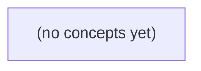

# 05.02 同步原语：用锁守护 IM 会话消息历史

*本书以虚构 IM 会话 c-a 中两个 goroutine 同时追加消息 m-a 为主线，讲解如何用 Go 的同步原语维护“消息 ID 唯一、旧消息不被覆盖、顺序与索引一致”的业务不变量。学习者将从 Mutex 的完整临界区出发，逐步掌握 RWMutex 快照、WaitGroup、Once、Cond，以及死锁、数据竞争和业务竞争的区别。*

**章节:** 2

---

## 本书导览

- 了解整本书的章节脉络
- 掌握各章之间的概念依赖关系
- 选择最合适的阅读顺序

# 05.02 同步原语：用锁守护 IM 会话消息历史

本书以虚构 IM 会话 c-a 中两个 goroutine 同时追加消息 m-a 为主线，讲解如何用 Go 的同步原语维护“消息 ID 唯一、旧消息不被覆盖、顺序与索引一致”的业务不变量。学习者将从 Mutex 的完整临界区出发，逐步掌握 RWMutex 快照、WaitGroup、Once、Cond，以及死锁、数据竞争和业务竞争的区别。

下方的概念图展示了本书 0 个核心概念以及它们之间的依赖关系；再下方是 1 个章节的入口。你可以按从上到下的顺序阅读，也可以根据自己的兴趣或先验知识选择切入点。

#### 概念图



## 章节索引

- **05.02 同步原语：保护共享会话状态的一次完整变化** — 承接05.01 goroutine生命周期与WaitGroup初见、01.05 map和02.04判重，面向Go初学者解释共享状态、数据竞争与业务不变量；用虚构单会话历史的map+order统一锁展示Mutex、RWMutex快照、WaitGroup区别、Once与Cond使用边界、死锁与锁顺序。静态教材无Go执行。

## 05.02 同步原语：保护共享会话状态的一次完整变化

- 从同一会话并发追加识别共享可变状态
- 区分数据竞争和即使单次访问加锁仍可发生的业务竞争
- 用Mutex保护查重与写入的一整个状态变化
- 用RWMutex提供只读快照而不泄漏内部切片
- 说明WaitGroup只等待不保护共享map
- 说明Once只执行一次及失败后不自动重试
- 理解Cond.Wait解锁等待、醒来重锁与循环检查
- 设计锁顺序与避免网络I/O持锁的边界

从两个任务同时保存同一条消息出发，先界定共享状态与不变量，再确定一次保存操作必须整体受保护的边界。

### 同一会话中的共享状态与不变量

### 同一会话中的共享状态与不变量

设会话 `s-1` 有两项共享状态：

- `messages map[消息ID]消息`：按消息 ID 查找消息；
- `order []消息ID`：记录消息展示或处理的先后顺序。

任务 `c-a` 与 `c-b` 可能同时执行“保存消息 `m-a`”。它们都会先检查 `messages` 中是否已有 `m-a`，再写入 `messages`，最后把 `m-a` 加入 `order`。这些数据被多个任务共同访问、且会随保存操作改变，因此属于**共享可变状态**。

这里不能只把某一行 `map` 写入当作保护对象。一次保存的业务含义是完整变化：

1. 判定 `m-a` 是否已存在；
2. 不存在时写入 `messages[m-a]`；
3. 同时将 `m-a` 追加到 `order`；
4. 已存在时拒绝或保留旧消息，不能覆盖。

必须始终满足的规则称为**不变量**。本例至少有：

- 同一会话内，每个消息 ID 最多出现一次；
- `order` 中的每个 ID 都能在 `messages` 中找到；
- `messages` 中已保存的消息也应在 `order` 中出现；
- 对已存在的消息 ID，后来的保存不能覆盖旧内容。

若 `c-a` 和 `c-b` 都在“检查”时看到 `m-a` 不存在，就可能都写入并追加，导致 `order` 出现两个 `m-a`；更糟的是，后一次写入还可能覆盖前一次内容。判重逻辑本身并不能防止这种交错。

因此，从“检查是否存在”到“更新 `map` 与 `order`”的整段操作构成**临界区**：任一时刻只能有一个任务执行它。Go 的普通 `map` 不支持并发读写；即使暂时没有触发运行时错误，未受保护的复合操作也无法保证上述不变量。

### 数据竞争不等于业务竞争

### 数据竞争不等于业务竞争

两类问题都由“同时保存”引起，但层次不同。

**数据竞争**指多个任务未经同步地访问同一份可变内存，且至少一个在写。例如两个任务同时读写普通 `map`：

- 任务 c 读取 `messages[sessionID]`
- 任务 a 写入 `messages[sessionID] = message`

Go 的普通 `map` 不是并发安全容器；并发读写或并发写入都必须保护，否则可能触发运行时错误，或得到不可依赖的结果。这里的重点是：`map` 本身的访问需要同步。

但即使每一次 `map` 访问都单独加锁，仍可能出现**业务竞争**。设保存逻辑是：

1. 加锁，检查 `sessionID` 是否已存在；
2. 解锁；
3. 若不存在，再加锁，写入 `map` 和 `order`；
4. 解锁。

c 与 a 都可能在第 1 步看到“尚不存在”，随后都进入写入阶段。这样虽然每次访问 `map` 时都有锁，不一定构成未保护的数据竞争，却破坏了业务规则：同一会话 ID 应唯一，先保存的旧消息不能被后来的消息覆盖，`order` 也可能记录重复 ID。

因此，要区分两个边界：

- **访问保护**：每一次普通 `map` 的读写都在同步原语保护下；
- **业务原子性**：判重、写入 `map`、追加 `order` 必须作为一次不可拆分的临界区。

锁保护的不只是某一行赋值，而是维护共享会话状态不变量的完整变化。

### 用互斥锁包住一次完整保存

### 用互斥锁包住一次完整保存

设一个会话状态包含：

- `messages map[string]Message`：按消息 ID 保存消息；
- `order []string`：记录消息到达顺序；
- 不变量：同一会话中 `m-a` 只能保存一次，且 `order` 中每个 ID 都能在 `messages` 中找到。

现在任务 `c-a` 的两个并发执行者都要保存 `m-a`。若保存逻辑没有整体保护，可能交错为：

1. 任务甲检查 `messages["m-a"]`，发现不存在；
2. 任务乙也检查，发现不存在；
3. 任务甲写入 `messages`，追加 `"m-a"` 到 `order`；
4. 任务乙再次写入 `messages`，也追加 `"m-a"` 到 `order`。

结果是 `messages` 只有一个键，但 `order` 出现两个 `"m-a"`；后一次写入还可能覆盖旧消息内容。问题不只是“写 map 时冲突”，而是“查重—写入—追加”本来是一项不可分割的状态变化。

因此，锁必须覆盖完整临界区：

```go
mu.Lock()
defer mu.Unlock()

if _, exists := messages[msg.ID]; exists {
    return
}
messages[msg.ID] = msg
order = append(order, msg.ID)
```

`Mutex` 表示同一时刻只有一个任务能进入这段临界区。任务甲完成检查和保存后，任务乙才开始检查；此时它能观察到 `m-a` 已存在，并拒绝重复保存。

不要只给 `messages[msg.ID] = msg` 加锁：那样查重仍可能同时通过，`order` 仍可能重复。普通 Go `map` 的并发读写本身也不安全，必须用同一把锁保护所有会读取或修改这份共享会话状态的代码。

### 读写锁快照与等待组的边界

### 读写锁快照与等待组的边界

`RWMutex` 适合“读多写少”的会话状态：写入时使用 `Lock`，读取快照时使用 `RLock`。但“加读锁后直接返回切片”仍会泄漏内部状态。

```go
type Session struct {
    mu    sync.RWMutex
    msgs  map[string]Message
    order []string
}

func (s *Session) Snapshot() []string {
    s.mu.RLock()
    defer s.mu.RUnlock()

    out := make([]string, len(s.order))
    copy(out, s.order)
    return out
}
```

这里临界区不仅是“读取 `order`”，还包括“复制完成”。`out` 是新切片，调用者修改它不会影响 `s.order`；若直接 `return s.order`，调用者即使不持锁也能改到底层数组，破坏内部封装，甚至与写入任务并发冲突。

同理，若需要同时查看消息顺序和消息内容，应在同一把读锁下复制两者，保证快照内部一致：快照中的每个 ID 都能在对应消息副本中找到。不要先复制 `order`、解锁后再读取 `msgs`，否则写任务可能已删除、替换或重排数据。

`WaitGroup` 的职责完全不同：

```go
var wg sync.WaitGroup
wg.Add(2)
go func() { defer wg.Done(); save(...) }()
go func() { defer wg.Done(); save(...) }()
wg.Wait()
```

它只保证 `Wait()` 返回时两个任务都已结束；它不让 `save` 串行执行，不保护普通 `map`，也不维持“同一会话 ID 唯一、`order` 与 `map` 一致”的不变量。每个会修改共享会话状态的 `save`，仍必须自行在同一写锁保护下完成判重、写入 `map` 与更新 `order`。

### 初始化、条件等待与锁边界

### 初始化、条件等待与锁边界

共享会话状态通常包含 `map[会话ID]消息`、消息顺序 `order`，以及初始化标记等。若任务 c、任务 a 都要保存消息 `m-a`，检查“是否已存在”、写入 `map`、追加 `order` 必须作为同一个临界区执行；否则可能出现 `map` 有消息而 `order` 缺失，或旧消息被后来的写入覆盖。普通 Go `map` 不能并发读写，访问和修改都应由同一把互斥锁保护。

`sync.Once` 适合“整个进程生命周期内只需成功初始化一次”的资源，例如创建全局会话仓库：

`once.Do(func() { store = make(map[string]Message) })`

它不用于“每个会话只初始化一次”或“初始化失败后允许重试”的场景；这些需求通常需要按会话 ID 加锁并记录状态。

`sync.Cond` 适合任务不能继续执行、但应等待某个共享状态改变的情况。例如读取者必须等到会话加载完成。调用 `Wait` 时必须已经持有 `Cond` 关联的锁；`Wait` 会原子地“释放锁并进入等待”，被 `Signal` 或 `Broadcast` 唤醒后，再重新获得锁才返回。

因此等待必须写成循环，而不是 `if`：

`for !loaded { cond.Wait() }`

循环既处理“被唤醒但条件仍不成立”，也处理多个等待者竞争同一状态变化的情形。改变条件的一方应在持锁时更新状态，再调用通知；等待者醒来后重新检查不变量。

锁还需要明确顺序。若同时存在全局会话锁与单会话锁，所有路径都必须按同一顺序获取，例如始终“先全局、后会话”，避免任务 c 与任务 a 相互等待。更重要的是，网络请求、磁盘访问、回调等可能耗时或重入的操作不能持锁执行：先在锁内复制必要数据或登记状态，解锁后进行 I/O，再加锁合并结果并再次检查条件。

> **要点** — 并发安全的关键是用正确同步原语保护一次完整状态变化，并始终维护 map 与 order 的一致性。

同一会话被多个 goroutine 同时追加时，真正要保护的不是某一行 map 操作，而是“判重并完整写入历史”的整体变化。

### 共享会话状态与不变量

### 共享会话状态与不变量

一个会话历史通常不止一份数据：用 `map` 按消息 ID 快速定位，用切片保留到达或展示顺序。例如：

```go
type Session struct {
	mu      sync.Mutex
	byID    map[string]Message
	order   []string
}
```

这里的共享状态是 `byID` 与 `order` 的组合，而非其中任意一个字段。多个 goroutine 可能同时处理同一会话的追加、重试或重复投递；即使每个 goroutine 已经结束，也不能说明它们曾经没有并发访问同一个 `map`。goroutine 的生命周期不是并发安全保证。

应先明确业务不变量：

- 每个消息 ID 最多出现一次；
- `byID[id]` 存在，当且仅当 `order` 中有对应的 `id`；
- `order` 中不应有重复 ID；
- 对已记录消息，索引内容与顺序记录必须属于同一次成功追加。

因此，“先判重，再写入 map，最后追加切片”是一项不可分割的状态变化。若两个任务都先读到 `byID[id]` 不存在，随后分别写入，就可能产生重复顺序项，或覆盖索引中的内容，破坏不变量。

正确的临界区应覆盖检查和全部提交步骤：

```go
func (s *Session) Add(msg Message) error {
	s.mu.Lock()
	defer s.mu.Unlock()

	if _, ok := s.byID[msg.ID]; ok {
		return ErrDuplicate
	}
	s.byID[msg.ID] = msg
	s.order = append(s.order, msg.ID)
	return nil
}
```

锁保护的是不变量，而不是单个容器。网络请求、磁盘读写或回调等耗时操作不应放在锁内；应先在锁外完成准备，再短暂持锁提交共享状态。

### Mutex 的基本使用边界

### Mutex 的基本使用边界

`sync.Mutex` 的零值即可使用，不需要显式初始化：

```go
type Session struct {
    mu      sync.Mutex
    history []Message
}
```

调用 `mu.Lock()` 后，其他试图获取同一把锁的 goroutine 会阻塞；直到持锁者执行 `mu.Unlock()`，其中一个等待者才能继续。锁保护的应是共享状态的一次完整变化，而不只是某个字段的单独读写。

解锁应紧跟在加锁之后安排，通常使用 `defer`：

```go
func (s *Session) Append(m Message) error {
    s.mu.Lock()
    defer s.mu.Unlock()

    // 检查、修改共享状态
    s.history = append(s.history, m)
    return nil
}
```

这样即使中途 `return`，或后续代码增加了错误分支，也不会遗漏解锁。需要注意，`defer` 的执行发生在函数返回时；若锁内包含大量计算、网络请求或等待操作，会不必要地延长持锁时间，因此锁内应只保留必要的内存状态检查与更新。

包含 `Mutex` 的类型通常必须使用指针接收者：

```go
func (s *Session) Append(m Message) error { ... }
```

若使用值接收者 `func (s Session) ...`，调用时会复制整个 `Session`，其中也包括 `Mutex`。副本上的锁与原对象的锁不是同一把锁，因而无法保护原始共享状态。

更严格地说，**已经使用过的 `Mutex` 不可复制**。锁内部保存了持有与等待状态；复制后可能让不同副本携带不一致的状态，造成死锁、遗漏同步或运行时异常。因此，应传递 `*Session`，不要复制含锁结构体，也不要把它作为值放入容器、返回值或按值参数中。

### 拆分判重与写入为何仍会重复

### 拆分判重与写入为何仍会重复

下面的代码看似“读时加读锁、写时加写锁”，每次访问 `map` 都受保护，却仍会写入重复消息：

```go
func (s *Session) Add(msg Message) error {
	s.mu.RLock()
	_, exists := s.messages[msg.ID]
	s.mu.RUnlock()

	if exists {
		return ErrDuplicate
	}

	s.mu.Lock()
	s.messages[msg.ID] = msg
	s.order = append(s.order, msg.ID)
	s.mu.Unlock()
	return nil
}
```

问题在于，`是否不存在`这个判断在释放 `RLock` 后立刻失效。可能发生如下交错：

1. 任务 A 取得 `RLock`，发现 `id=42` 不存在，释放锁。
2. 任务 B 取得 `RLock`，也发现 `id=42` 不存在，释放锁。
3. A 取得 `Lock`，写入 `messages[42]`，追加 `order`。
4. B 随后取得 `Lock`，再次写入并再次追加 `order`。

因此，单个 `map` 读写没有数据竞争，不代表业务语义正确；竞态发生在“检查—决定—写入”这一整段过程之间。尤其当 `map` 的赋值覆盖同一键时，表面上消息只有一份，但 `order` 已经包含两次 `42`，会话历史仍然损坏。

判重、写入索引和追加顺序必须在同一把互斥锁的临界区中完成：

```go
func (s *Session) Add(msg Message) error {
	s.mu.Lock()
	defer s.mu.Unlock()

	if _, exists := s.messages[msg.ID]; exists {
		return ErrDuplicate
	}
	s.messages[msg.ID] = msg
	s.order = append(s.order, msg.ID)
	return nil
}
```

这里使用 `defer` 能保证所有返回路径都会解锁。锁保护的是一次完整状态变化，而不是若干彼此孤立的容器访问；启动多个 `goroutine` 后再等待其结束，也不会自动让并发期间的 `map` 操作变得安全。

### 一把锁覆盖一次完整追加

### 一把锁覆盖一次完整追加

追加消息通常包含三个不可分割的步骤：

1. 按 `ID` 查重；
2. 写入 `messages` 映射；
3. 将 `ID` 追加到 `order`，维持历史顺序。

它们共同构成一次状态迁移：要么消息从“不存在”变为“已存在且进入顺序历史”，要么保持原状并返回重复错误。若只分别保护单个 `map` 操作，虽然避免了运行时的并发读写崩溃，却仍可能破坏业务一致性。

错误结构是“先读后写”之间释放锁：

```go
s.mu.RLock()
_, exists := s.messages[msg.ID]
s.mu.RUnlock()

if exists {
	return ErrDuplicate
}

s.mu.Lock()
s.messages[msg.ID] = msg
s.order = append(s.order, msg.ID)
s.mu.Unlock()
```

两个 goroutine 可能同时在读锁阶段看到“不存在”，随后依次获得写锁，并都完成写入；`map` 最终只有一个键，但 `order` 可能出现两个相同 ID。这里竞争的不是某次写入，而是“检查结果到提交写入”之间的空档。

正确做法是用同一把互斥锁包住完整的读—判定—写入过程：

```go
func (s *Session) Append(msg Message) error {
	s.mu.Lock()
	defer s.mu.Unlock()

	if _, exists := s.messages[msg.ID]; exists {
		return ErrDuplicate
	}

	s.messages[msg.ID] = msg
	s.order = append(s.order, msg.ID)
	return nil
}
```

`defer s.mu.Unlock()` 使每条返回路径都释放锁，尤其适合包含错误返回的临界区。方法应使用指针接收者 `func (s *Session)`：`sync.Mutex` 的零值可直接使用，但锁一旦使用，包含它的结构体就不可复制；复制会产生彼此无关的锁，却可能指向逻辑上同一份状态。

锁内只做内存状态变更，不做网络 I/O、磁盘访问或可能阻塞的回调。goroutine 即使很快结束，也不意味着其与其他 goroutine 对 `map` 的访问天然安全；并发安全来自明确的同步边界，而非执行时长。

### 锁外工作与协程结束的误区

### 锁外工作与协程结束的误区

`goroutine` 最终会结束，并不意味着它执行期间访问 `map` 就是安全的。只要两个或更多 goroutine 的生命周期发生重叠，其中至少一个写入同一个普通 `map`，就必须同步；否则可能触发 `fatal error: concurrent map writes`，更隐蔽的是“读到旧值后再写”的业务竞争。

因此，不能用“这个协程马上结束”“每次请求都会新开协程”作为不加锁的理由。安全性取决于**访问是否并发**，而不是协程是否短命。

锁应只覆盖共享状态的不变量，例如：

1. 检查请求 ID 是否已存在；
2. 写入 `map`；
3. 追加历史顺序；
4. 更新相关计数或版本号。

网络请求、磁盘读写、数据库调用、日志上传、回调用户函数等慢操作应放在锁外：

```go
func (s *Session) Add(ctx context.Context, m Message) error {
    // 锁外：可能阻塞，不能占用会话锁
    enriched, err := fetchMetadata(ctx, m)
    if err != nil {
        return err
    }

    s.mu.Lock()
    defer s.mu.Unlock()

    if _, ok := s.messages[enriched.ID]; ok {
        return ErrDuplicate
    }
    s.messages[enriched.ID] = enriched
    s.order = append(s.order, enriched.ID)
    return nil
}
```

若网络结果依赖会话当前状态，可先在锁内复制必要快照，解锁后执行 I/O，再重新加锁确认前提仍成立；必要时利用版本号检测状态是否已变化。

以后一个操作需要同时持有多个锁时，还必须规定全局锁顺序，例如始终先锁 `Session` 再锁 `User`。锁顺序不一致会造成死锁；而在持锁状态下等待网络、通道或另一个可能回调本对象的组件，也会把短暂互斥扩大为难以排查的阻塞链。

> **要点** — Mutex 要保护业务不变量的一次完整变化，而非孤立的单次 map 访问。

本节用一个单会话消息历史实现，说明如何让“校验、判重、写入、读取”在并发下仍保持一致。

### 识别会话历史中的共享状态

### 识别会话历史中的共享状态

一个会话历史不是单独的 `map` 或单独的切片，而是由两份必须同步变化的共享可变状态组成：

- `byID map[string]Message`：按消息标识快速查找消息，并承担“同一 `ID` 只能出现一次”的判重职责。
- `order []string`：保存消息被成功追加的顺序，使列表读取能按历史顺序返回消息。

它们共同维持业务不变量：

1. `byID` 中的每个键都应在 `order` 中恰好出现一次。
2. `order` 中的每个 `ID` 都必须能在 `byID` 中找到对应消息。
3. 每条消息的 `ID` 与 `Body` 都非空。
4. 已接受的消息不会因重复追加而被覆盖或改变。

因此，追加消息不能先写 `byID`、再在锁外写 `order`；否则其他读取者可能观察到“能按 ID 找到，但列表中不存在”的中间状态。正确做法是在同一次 `Lock` 持有期间完成判重、写入映射和追加顺序。

例如，并发请求同时追加 `m-a` 时，先获得锁的请求写入原消息；后获得锁的请求发现 `byID["m-a"]` 已存在，应返回重复错误，且不得修改原有 `Body`。这里的顺序只表示该会话中锁成功获取并完成写入的顺序，不代表客户端发送时间，也不构成跨会话的全局顺序。

读取时，`List` 在 `RLock` 下依照 `order` 从 `byID` 组装新的 `[]Message`，再释放锁后返回。返回副本而非内部切片，避免调用方修改切片结构；`Body` 为 `string`，其值本身不可变，映射也不会直接暴露给外部。

### 建立安全的 History 初始结构

### 建立安全的 `History` 初始结构

先把共享状态收拢到一个类型中：消息按 `ID` 索引以便快速判重和查询，同时用切片保存插入顺序。`RWMutex` 不应由调用方直接操作，而是作为 `History` 的内部实现细节。

```go
package history

import (
	"errors"
	"sync"
)

type Message struct {
	ID   string
	Body string
}

type History struct {
	mu    sync.RWMutex
	byID  map[string]Message
	order []string
}

func NewHistory() *History {
	return &History{
		byID: make(map[string]Message),
	}
}
```

这里有几个关键约束：

- `Message` 只包含 `string` 字段。字符串在 Go 中不可变，因此把 `Message` 按值存入 `map` 或返回给调用者，不会让调用者通过修改 `Body` 改写历史内部内容。
- `byID` 是私有字段，外部无法直接取得并修改底层 `map`。后续所有读写都必须经过 `History` 的方法，并由这些方法持有相应的锁。
- `order` 保存成功追加的消息标识，负责表达这个**单个 `History` 实例内**的接受顺序；它不是客户端发送时间，也不是多个会话之间的全局顺序。
- `NewHistory` 必须初始化 `byID`。未初始化的 `map` 可以读取，但第一次写入会触发运行时错误；构造函数将这一风险集中消除。
- 空的 `order` 切片可以保留为 `nil`：对其执行 `append` 是安全的，并且后续列表读取可按需要构造独立结果切片。

锁本身尚未在构造阶段参与竞争，但将它与受保护数据放在同一结构中，明确了后续不变量：`byID` 与 `order` 的一致变化必须在同一把写锁保护下完成。

### 用互斥锁完成一次追加变化

### 用互斥锁完成一次追加变化

一次“追加消息”不是单独写入 `map`，而是一个完整变化：校验输入、确认 ID 未存在、更新按 ID 查询的索引，并记录展示顺序。若这些步骤被不同 goroutine 交错执行，就可能出现“顺序里有 ID 但 map 中没有消息”等不一致状态。

```go
package history

import (
	"errors"
	"sync"
)

type Message struct {
	ID   string
	Body string
}

type History struct {
	mu    sync.RWMutex
	byID  map[string]Message
	order []string
}

func NewHistory() *History {
	return &History{
		byID: make(map[string]Message),
	}
}

func (h *History) Append(m Message) error {
	if m.ID == "" {
		return errors.New("消息 ID 不能为空")
	}
	if m.Body == "" {
		return errors.New("消息正文不能为空")
	}

	h.mu.Lock()
	defer h.mu.Unlock()

	if _, exists := h.byID[m.ID]; exists {
		return errors.New("消息 ID 已存在")
	}

	h.byID[m.ID] = m
	h.order = append(h.order, m.ID)
	return nil
}
```

输入校验可在加锁前完成，因为它只读取本次传入的 `m`，不依赖共享状态；重复检查必须位于 `Lock` 之后。否则两个 goroutine 都可能先看到 `m-a` 不存在，再分别写入，破坏“ID 唯一”的约束。

例如，已有 `{ID: "m-a", Body: "原消息"}` 时，另一个请求提交 `{ID: "m-a", Body: "修改后的内容"}`，`Append` 会在锁内发现重复并返回错误；`byID["m-a"]` 仍是原消息，`order` 也不会增加第二个 `"m-a"`。这是一种明确的“首次写入保留”语义。

这里的顺序仅表示该 `History` 实例中成功获得锁并完成追加的顺序；它不是客户端发送时间，也不是跨多个会话或多个进程的全局顺序。`Body` 使用 `string`，其值不可变；内部 `map` 不向调用方暴露，避免调用方绕过锁直接修改共享状态。

### 用读写锁返回独立读取快照

### 用读写锁返回独立读取快照

`List` 的职责不是把内部存储直接交给调用方，而是在一个一致的读取视图中构造副本。`History` 同时维护 `byID` 与 `order`：前者按 ID 查消息，后者保存该单会话内成功追加的顺序。因此读取时必须在同一把 `RLock` 保护下，按 `order` 逐项从 `byID` 取出消息。

```go
func (h *History) List() []Message {
	h.mu.RLock()
	list := make([]Message, 0, len(h.order))
	for _, id := range h.order {
		list = append(list, h.byID[id])
	}
	h.mu.RUnlock()
	return list
}
```

这里的关键是 `make` 创建了新的 `[]Message`。若直接返回 `h.order`，调用者虽只能得到 ID，却仍可能修改切片元素；若内部直接维护消息切片并原样返回，调用者甚至可以覆盖、重排已有记录。这样的“读取”会绕过 `Append` 的校验、判重和互斥保护。

锁只覆盖复制过程，不覆盖调用者使用结果的整个期间：快照完成后立即释放 `RLock`，其他 goroutine 可继续执行 `Append` 或其他读取。之后新追加的消息不会自动出现在已经返回的切片中；这正是快照语义。

`Message` 的 `Body` 是 `string`，可视为不可变值，因此复制 `Message` 足以隔离当前结构。若字段将来改为切片、映射或指针，还需要对这些可变引用做深拷贝，否则仍可能泄漏内部状态。

### 澄清顺序语义与并发保护边界

### 澄清顺序语义与并发保护边界

`History.order` 记录的是：某次 `Append` 成功获取互斥锁、完成判重并写入后，其 `ID` 被追加的顺序。它因此是**该单个 `History` 实例内部的提交顺序**，而不是客户端发送消息的时间顺序。

例如，客户端 A 先发出 `m-a`，客户端 B 后发出 `m-b`；但若 B 的调用先获得 `Lock`，则列表中可能先出现 `m-b`。网络延迟、调度时机和调用到达顺序都不改变这一点。该顺序更不意味着多个会话、多个进程或多个服务节点之间存在全球一致顺序。

并发保护的边界也应明确：

- `Body` 使用 `string`，字符串值不可变；保存后不会通过共享底层字节切片被修改。
- `byID` 仅在锁保护下访问，且不向调用方返回，因此外部代码不能绕过校验直接改写映射。
- `List` 创建新的 `[]Message` 后再释放 `RLock` 并返回，调用方修改返回切片的排列不会影响历史记录。
- 若两个并发请求都尝试追加 `m-a`，先持锁并成功写入者保留原值；后续请求在锁内发现重复并返回错误，不会覆盖原消息。

这里的代码是用于说明同步原语边界的静态教学示例，尚未实际运行或经过压力测试。

> **要点** — 互斥锁应覆盖查重与双结构更新的完整变化；读操作返回副本，才能同时保持一致性与封装性。

共享会话既要支持并发追加，也要支持安全读取；关键不在“加过锁”，而在用同一把锁守住完整状态变化与快照边界。

### 共享状态与两类并发问题

### 共享状态与两类并发问题

并发问题至少分两层，不能只靠“没有报数据竞争”来判断正确性。

- **数据竞争**：两个协程未通过同步手段并发访问同一内存位置，且至少一个是写。例如追加 `messages` 的同时，另一个协程遍历或读取其长度。即使偶尔看似正常，也可能读到撕裂数据、触发运行时异常；应使用竞态检测工具验证。
- **业务竞争**：内存访问本身已加锁，但操作顺序不符合业务语义。例如两个请求都先读取“当前轮次”，都认为可以追加下一条消息，随后依次写入，造成重复轮次、覆盖状态或消息顺序错误。锁解决可见性与互斥，不会自动定义正确的业务规则。

会话历史通常不是只有一个 `[]Message`。以下字段只要共同描述同一会话，就应由**同一把锁**统一保护：

- 消息序列及其顺序、长度；
- `map` 形式的索引、工具调用状态、请求去重标记；
- 当前轮次、版本号、摘要边界、最后更新时间；
- 与消息相关的计数器、容量限制和截断标记。

原因是一次“追加消息”往往同时改变多个字段。若 `messages` 与 `version` 分别使用不同锁，读取者仍可能看到“新消息配旧版本”这样的不一致快照。更稳妥的原则是：把会话状态视为一个整体，任何读取、校验、追加、截断或重置，都在同一同步边界内完成；需要返回历史时，再构造脱离内部状态的快照。

### Mutex：锁住查重到写入的完整变化

### Mutex：锁住查重到写入的完整变化

单个会话常同时维护两份共享状态：

- `messages map[string]Message`：按消息标识快速查找、去重；
- `order []string`：记录消息到达或展示顺序。

写入并不是两次彼此独立的赋值，而是一次业务变化：**若消息尚未存在，则同时写入 `map` 并追加到 `order`；若已存在，则两者都不改变。** 因此应由同一把 `Mutex` 覆盖“查重→写入→追加”的完整过程：

```go
func (s *Session) Append(m Message) bool {
    s.mu.Lock()
    defer s.mu.Unlock()

    if _, exists := s.messages[m.ID]; exists {
        return false
    }
    s.messages[m.ID] = m
    s.order = append(s.order, m.ID)
    return true
}
```

若只给单次 `map` 写或 `append` 加锁，或把查重放在锁外，就会出现“两个协程都看到不存在，随后各自写入”的业务竞争；即使运行时未报告数据竞争，`order` 仍可能含重复标识，或 `map` 与 `order` 的内容不再对应。

`Mutex` 的意义不只是避免并发读写 `map` 崩溃，更是维护会话不变量：

$$
id \in order \iff id \in messages
$$

并且每个有效 `id` 在 `order` 中至多出现一次。后续删除、替换、重排等操作也必须遵循同一原则：凡是会共同改变这两份状态的逻辑，都使用同一把锁，并把整个状态转换作为一个不可分割的临界区。

### RWMutex：并发读取与安全快照

### RWMutex：并发读取与安全快照

`sync.RWMutex` 将访问分为两类：纯读取使用 `RLock`，多个读者可以并发进入；任何会修改会话状态的操作使用 `Lock`，写者独占临界区，并阻止新的读者进入。前提是：`order`、`messages`、计数器等所有共享字段，都必须由**同一把锁**保护。

```go
type Session struct {
    mu       sync.RWMutex
    order    []string
    messages map[string]Message
}

func (s *Session) Get(id string) (Message, bool) {
    s.mu.RLock()
    defer s.mu.RUnlock()
    m, ok := s.messages[id]
    return m, ok
}
```

但“读锁下取到值”不等于“可以安全地把内部对象交给调用者”。若直接返回 `order`，调用者拿到的是同一底层数组的切片；解锁后写协程追加、重排或覆盖元素，调用者看到的数据就可能变化，甚至与写入并发冲突。因此应在锁内构造快照：

```go
func (s *Session) IDs() []string {
    s.mu.RLock()
    defer s.mu.RUnlock()

    out := make([]string, len(s.order))
    copy(out, s.order)
    return out
}
```

`map` 也不能直接返回，应逐项复制到新 map。更隐蔽的是 `Message` 中含有 `[]byte` 时，复制结构体仍只复制切片头；字节内容仍共享。快照必须继续深复制：

```go
out.Body = append([]byte(nil), m.Body...)
```

这样，锁保护的是“读取内部状态并生成快照”的完整过程；锁释放后，调用者只能操作自己的副本。`RWMutex` 解决的是数据访问同步，不保证业务语义正确：两个请求先后读取同一状态、再分别提交更新，仍可能形成业务竞争，需要版本号、条件校验或更高层事务处理。

### 读写锁的边界与常见误区

### 读写锁的边界与常见误区

`sync.RWMutex` 的语义是：多个读者可同时持有 `RLock`，写者持有 `Lock` 时独占访问。它适合“读取确实频繁、读取临界区足够长、写入相对少”的场景；并不意味着只要存在读操作就应替换 `Mutex`。

最危险的误区是尝试在持有读锁时直接升级：

`RLock()` → 发现需要修改 → `Lock()`

这可能死锁。升级者仍占有一个读锁，而 `Lock()` 必须等待所有读锁释放；该 goroutine 又要等 `Lock()` 成功后才会执行 `RUnlock()`。即使某些实现偶然未卡住，也无法保证从“读到旧状态”到“获得写锁”之间状态未被其他写者改变。

正确做法是分两步：

1. 在 `RLock` 下读取并判断；
2. 释放 `RLock`；
3. 获取 `Lock`；
4. 重新检查判断条件，再执行修改。

重新检查不可省略，因为释放读锁后，其他 goroutine 可能已改变会话状态。

读写锁也不天然更快。`RLock/RUnlock` 本身通常比普通 `Lock/Unlock` 更复杂；若读取临界区只是一两个字段访问，锁管理成本可能超过并发读取带来的收益。写入较频繁时，写者还会阻塞新读者，竞争反而可能加剧。

选型应看实测而非名称：读远多于写、读操作涉及复制或遍历等较长临界区时，可考虑 `RWMutex`；读写比例接近、临界区极短或写入需要严格串行时，普通 `Mutex` 往往更简单可靠。这里解决的是数据竞争；“两个请求都基于同一旧余额作出批准”之类的业务竞争，仍需用版本、条件校验或事务语义处理。

### 统一锁约定与会话访问规则

### 统一锁约定与会话访问规则

会话对象中的 `order`、`map`、游标、时间戳、状态标志等字段，只要可能被多个协程访问，就必须由**同一把锁**保护。不要让 `map` 用一把锁、`order` 用另一把锁；一次追加若要同时修改两者，分锁会暴露“索引已存在但顺序未登记”之类的中间状态。

可建立明确约定：

- 任何共享字段的读取、写入、删除和遍历，都必须先持有会话锁。
- 只读操作使用 `RLock`；会改变任一共享字段或要求多个字段保持一致的操作使用 `Lock`。
- 锁内只做内存状态检查、复制和更新；数据库、网络发送、日志阻塞写入、回调执行等放到锁外。
- 若一次操作需要同时持有多个对象的锁，必须规定固定顺序，例如始终按 `sessionID` 字典序加锁，避免循环等待。

典型写入应把“检查条件—修改状态—生成结果”视为一个临界区：

```go
s.mu.Lock()
if s.closed {
    s.mu.Unlock()
    return ErrClosed
}
s.messages[id] = msg
s.order = append(s.order, id)
snapshot := append([]string(nil), s.order...)
s.mu.Unlock()
```

返回内部集合时不能直接暴露 `s.order` 或 `s.messages`；解锁后其他协程仍可能修改底层数组或映射。应在锁内构造快照，再在锁外使用。若 `Message` 含有 `[]byte`、`map` 或指针等可变引用，快照还应深复制其内部可变数据。

不要在持有 `RLock` 时尝试获取 `Lock`。读锁升级并非自动完成：若多个读者都等待升级，写锁永远无法获得。正确方式是释放读锁后重新获取写锁，并在写锁下再次验证条件。这里解决的是业务竞争，而不仅是数据竞争：即使没有竞态报告，错误的“先读后写”仍可能导致重复追加或状态覆盖。

> **要点** — RWMutex的价值是受控并发读取；一致性依赖同锁保护完整变化，快照必须脱离内部可变数据。

WaitGroup、Once与Mutex都服务于并发协作，但分别解决等待、单次执行与互斥问题，不能彼此替代。

### 等待固定任务：WaitGroup的职责

### 等待固定任务：WaitGroup 的职责

`sync.WaitGroup` 用一个计数器表示“尚未完成的任务数”。主协程先登记任务数量，再启动协程；每个任务结束时递减计数；`Wait()` 阻塞，直到计数归零。

```go
var wg sync.WaitGroup

for _, id := range ids {
    wg.Add(1) // 先登记
    go func(id int) {
        defer wg.Done() // 无论正常返回还是提前 return 都完成记账
        process(id)
    }(id)
}

wg.Wait()
```

它解决的是**完成通知**：等待一组数量已知的任务全部结束。它不保护共享状态，也不负责传递任务错误。例如多个协程同时写同一个 `map`，即使最后调用了 `wg.Wait()`，写入期间仍可能发生并发读写错误；应额外用 `Mutex`、通道或并发安全容器保护数据。

关键规则：

- `Add` 必须在对应协程可能调用 `Done` 前执行；最稳妥的写法是“`Add` 后立刻 `go`”。
- 不要在另一个协程已经执行 `Wait` 时，为同一轮等待新增任务；这会造成竞态或不符合预期的等待。
- 每次 `Add(1)` 必须恰好对应一次 `Done()`；多调用会使计数变负并触发 panic，少调用则 `Wait()` 永久阻塞。
- `WaitGroup` 不收集返回值和 `error`。需要错误结果时，可由协程写入受互斥锁保护的变量，或使用专门的任务编排方式。

因此，`WaitGroup` 的边界很清晰：它只回答“这批固定任务是否都结束了？”，不回答“共享数据是否安全？”或“任务是否成功？”。

### 先注册再启动：Add、Done与Wait规则

### 先注册再启动：Add、Done 与 Wait 规则

`WaitGroup`记录的是“尚未完成的任务数”。主协程先用 `Add(n)` 注册任务，再启动对应的 goroutine；每个任务结束时恰好调用一次 `Done()`，最后由 `Wait()` 阻塞等待计数归零。

```go
var wg sync.WaitGroup

for _, job := range jobs {
    wg.Add(1) // 先登记任务
    go func(job Job) {
        defer wg.Done() // 无论正常返回还是提前 return，都完成记账
        process(job)
    }(job)
}

wg.Wait()
```

关键顺序是：**`Add` 必须发生在 goroutine 可能调用 `Done` 之前，且通常应发生在 `Wait` 之前。** 若先启动再 `Add`，子 goroutine 可能先执行完并调用 `Done()`，使计数变成负数并触发 panic；或者 `Wait()` 在任务尚未登记时直接返回，主协程误以为所有工作已经结束。

每一次 `Add(1)` 都必须有且只有一次对应的 `Done()`：

- 漏掉 `Done()`：计数无法归零，`Wait()` 永久阻塞。
- 重复 `Done()`：计数减为负数，程序 panic。
- 推荐在 goroutine 开头写 `defer wg.Done()`，让所有退出路径都遵守配对关系。

`WaitGroup`适合等待一批边界明确、数量固定或可在等待前登记完毕的任务。不要在某个 `Wait()` 已经开始等待的同时，随意为同一轮任务继续 `Add()`；若需要持续接收新任务，应使用任务队列、`context`、channel 或重新划分批次。它只负责“是否完成”，不保护共享 `map`，也不收集任务中的 `error`。

### 等待完成不等于保护会话状态

### 等待完成不等于保护会话状态

`WaitGroup`只回答“所有固定任务是否已经结束”，不回答“共享状态是否被安全地修改”。例如多个协程并发追加会话历史时，即使主协程正确执行了`wg.Wait()`，下面的共享写入仍然可能出错：

- 并发写`map`会触发数据竞争，甚至直接导致运行时崩溃。
- `order`切片的追加顺序不可预测；“先到的消息排在前面”不能仅靠并发执行保证。
- “检查消息是否已存在，再写入”的查重过程不是原子的；两个协程都可能判断不存在，随后重复写入。

因此，`WaitGroup`负责**等待完成**，`Mutex`负责**保护一次完整的状态变化**。应在启动协程前注册任务：`wg.Add(1)`，再`go func(){ defer wg.Done(); ... }()`；而协程内部应将“查重 → 写入`map` → 追加`order`”放进同一把锁中：

`mu.Lock(); if !seen[id] { seen[id] = msg; order = append(order, id) }; mu.Unlock()`

最后调用`wg.Wait()`，只能确保所有追加尝试都已结束；它不能替代锁，也不能让多步读写自动具备一致性。换言之：`Mutex`维护会话状态正确，`WaitGroup`决定何时可以读取最终结果。

### Once.Do：并发初始化只执行一次

### Once.Do：并发初始化只执行一次

`sync.Once` 用于“某段初始化逻辑在整个进程生命周期内至多执行一次”。多个 goroutine 同时调用 `Do` 时，只有一个会执行传入函数；其余调用者会等待该函数结束，再继续执行。因此，`Once` 不仅限制次数，也为并发调用提供同步边界。

```go
var once sync.Once
var cfg Config
var initErr error

func LoadConfig() (Config, error) {
    once.Do(func() {
        cfg, initErr = readConfig()
    })
    return cfg, initErr
}
```

这里首次调用会执行 `readConfig()`；并发到来的其他调用会等待首次初始化完成，并看到同一份 `cfg` 与 `initErr`。这避免了重复读取、重复注册或数据竞争。

关键限制是：`Once` 只关心函数是否“被调用过”，不关心初始化是否成功。即使 `readConfig()` 返回错误，`Do` 也已经完成，之后不会自动重试。因此应缓存错误并由调用方决定后续策略：

- 配置、全局静态表、指标注册等“失败即不可继续”的初始化，适合 `Once`。
- 网络连接、令牌刷新、可恢复的远程资源获取，不应直接用 `Once`；一次临时网络错误会永久阻止后续重连。
- 若需要“成功后才固定”或“失败可重试”，应使用 `Mutex` 保护状态，并显式记录初始化状态、错误和重试条件。

`Once` 解决的是“一次执行”；`Mutex` 解决的是“互斥修改”。不要把 `Once` 当作通用的资源生命周期管理器。

### 初始化结果缓存与原语选择

### 初始化结果缓存与原语选择

`sync.Once` 只保证初始化函数最多执行一次；它不保存函数的返回值。因此，初始化可能失败时，应把成功值和错误都放在共享字段中缓存：

```go
type ConfigLoader struct {
	once sync.Once
	cfg  *Config
	err  error
}

func (l *ConfigLoader) Load() (*Config, error) {
	l.once.Do(func() {
		l.cfg, l.err = readConfig()
	})
	return l.cfg, l.err
}
```

并发调用 `Load` 时，只有一个 goroutine 执行 `readConfig`；其他调用会等待该次执行完成，并读取同一份 `cfg` 和 `err`。若首次初始化失败，后续调用仍返回该错误，不会自动重试。这适合“进程生命周期内只应确定一次”的结果，例如读取固定配置、构造全局只读字典。

不要用 `Once` 管理可恢复的网络连接：首次拨号失败后，`Once` 已经消耗，后续请求无法再次连接。此类场景应使用 `Mutex` 保护连接状态，并按需重试、退避或重建连接。

| 原语 | 核心问题 | 典型用途 | 不解决的问题 |
|---|---|---|---|
| `Mutex` | 同一时刻谁能修改共享状态 | 保护 `map`、连接状态、计数器复合更新 | 不等待一组任务结束 |
| `WaitGroup` | 一组已注册任务何时全部完成 | 等待固定数量的 goroutine | 不保护共享数据，也不传递 `error` |
| `Once` | 某段初始化代码是否只执行一次 | 单例初始化、缓存固定初始化结果 | 不支持失败后自动重试 |

选择原则是：需要保护“变化过程”用 `Mutex`；需要等待“任务完成”用 `WaitGroup`；需要保证“初始化只发生一次”用 `Once`。实际程序可组合使用，但不要把其中任意一个当作另外两个的替代品。

> **要点** — WaitGroup等待任务，Once保证一次，Mutex保护状态；等待或初始化都不能替代完整状态变化的互斥。

当消费者发现会话消息队列为空时，不能忙等或直接判定失败；它需要在互斥锁保护下等待“队列非空”这一条件成立。

### 空队列不是并发安全的等待条件

### 空队列不是并发安全的等待条件

消费者面对单个会话的消息队列时，`len(queue)==0` 只是某一瞬间的观察结果，不是“可以安全睡眠”的协议。

设消费者先检查队列为空，再准备等待；恰好此时生产者追加消息并发送通知。若消费者尚未真正进入等待，通知可能已经过去，随后它开始休眠，而队列里其实已有消息。这就是典型的“丢失唤醒”。

因此，队列内容与“是否等待”的决定必须由同一把锁保护：

```go
mu.Lock()
for len(queue) == 0 {
    cond.Wait()
}
msg := queue[0]
queue = queue[1:]
mu.Unlock()
```

生产者也必须在同一把锁下完成状态变化与通知：

```go
mu.Lock()
queue = append(queue, msg)
cond.Signal()
mu.Unlock()
```

`cond := sync.NewCond(&mu)` 将条件变量绑定到这把互斥锁。`Wait()` 不是普通的休眠：它会**原子地释放 `mu` 并挂起**；被唤醒后，又会在返回前重新获得 `mu`。于是生产者不会在消费者“检查为空”和“开始等待”之间漏掉通知。

仍然必须使用 `for`，不能写成 `if`。被唤醒只表示“状态可能变化了”，不保证当前消费者一定能取到消息：多个消费者可能竞争同一条消息，或者收到的是更宽泛的唤醒。因此醒来后必须重新检查 `len(queue)>0`。

`Signal()` 通常唤醒一个等待者；需要让所有等待者重新判断条件时才使用 `Broadcast()`。此外，若没有关闭、取消或其他退出条件，空队列上的消费者可能永久等待；退出机制将在后续使用 `channel` 与 `context` 讨论。

### Cond与关联锁的基本协作

### Cond与关联锁的基本协作

条件变量不保存“队列里是否有消息”这一事实；事实仍由共享状态 `queue` 表示，互斥锁 `mu` 负责保护它。因此应让条件变量绑定到**同一把**锁：

`cond := sync.NewCond(&mu)`

消费者检查队列与进入等待必须处在 `mu` 的保护下：

`mu.Lock()`  
`for len(queue) == 0 { cond.Wait() }`  
`msg := queue[0]`  
`queue = queue[1:]`  
`mu.Unlock()`

这里不能先在锁外检查 `len(queue)`，再决定是否等待。否则生产者可能恰好在两步之间追加消息并执行 `Signal()`；消费者随后才开始等待，就会错过这次通知。

`cond.Wait()` 的关键语义是：它先**原子地释放关联锁 `mu` 并挂起**，被唤醒后再**重新获得 `mu`**，最后才返回。原子释放避免了“消费者已确认队列为空，却仍占着锁，生产者无法追加消息”的死锁式等待。

生产者同样通过这把锁完成状态变化：

`mu.Lock()`  
`queue = append(queue, msg)`  
`cond.Signal()`  
`mu.Unlock()`

先修改队列，再通知等待者，保证被唤醒的消费者重新持锁检查时，能看到“队列非空”的新状态。`Cond` 只是协调等待与唤醒；队列状态的读写、判断和更新，始终必须由关联锁统一保护。

### 消费者循环等待与生产者通知

### 消费者循环等待与生产者通知

队列是否为空、取走哪条消息、追加了哪条消息，必须视为同一份受互斥锁保护的共享状态。消费者不能在锁外检查 `len(queue)`，否则检查结果与后续取消息之间可能被其他协程改变。

```go
var (
	mu    sync.Mutex
	cond  = sync.NewCond(&mu)
	queue []Message
)

func consume() Message {
	mu.Lock()
	for len(queue) == 0 {
		cond.Wait()
	}
	msg := queue[0]
	queue = queue[1:]
	mu.Unlock()
	return msg
}

func produce(msg Message) {
	mu.Lock()
	queue = append(queue, msg)
	cond.Signal()
	mu.Unlock()
}
```

消费者的流程是：

1. `Lock` 后检查“队列非空”这一条件。
2. 若队列为空，调用 `Wait()`。
3. `Wait()` 会**原子地释放**与 `cond` 关联的 `mu`，然后挂起当前协程；因此生产者能够取得锁并追加消息。
4. 被唤醒后，`Wait()` 会先重新获得 `mu`，再返回到循环顶部。
5. 条件确认成立后，消费者弹出消息并解锁。

这里必须使用 `for`，而不是 `if`。一次 `Signal()` 只表示“状态可能已经变化”，不保证当前被唤醒的消费者一定还能取到消息：可能有多个消费者竞争，也可能醒来后条件再次变为假。因此，醒来后必须重新检查 `len(queue) == 0`。

生产者在持锁期间追加消息，再调用 `Signal()` 唤醒一个等待者；若一次状态变化可能让所有等待者都应重新判断条件，可使用 `Broadcast()`。但无论使用哪种通知，条件本身始终由 `mu` 保护。若没有关闭标记、取消信号等退出条件，消费者在始终无消息时会永久等待；后续可用 `channel` 或 `context` 表达退出与取消。

### Wait为何必须放在循环中

### Wait为何必须放在循环中

消费者等待的不是一次“通知”，而是一个可验证的状态：`len(queue) > 0`。因此正确结构必须是：

```go
mu.Lock()
for len(queue) == 0 {
    cond.Wait()
}
msg := queue[0]
queue = queue[1:]
mu.Unlock()
```

`cond.Wait()` 做了一个不可分割的动作：它先释放与 `cond` 关联的 `mu`，再把当前 goroutine 挂起。这样生产者才能取得 `mu`，执行追加消息并 `Signal()`；否则消费者若持锁睡眠，生产者永远无法改变队列状态。

被唤醒后，`Wait()` 不会立刻返回给调用者。它会先重新获得 `mu`，随后才从 `Wait()` 返回。于是，条件检查与取出消息仍处于同一把锁的保护下，不会与其他消费者并发交错。

但“收到唤醒”不等于“现在一定有消息”。例如队列加入一条消息后唤醒消费者 A；在 A 重新获得锁之前，消费者 B 也可能先获得锁并取走该消息。此时 A 醒来后看到的仍可能是空队列。若使用：

`if len(queue) == 0 { cond.Wait() }`

A 会跳过后续检查，直接从空队列取值，导致越界或错误状态。

此外，条件变量允许出现伪唤醒：即使没有对应的 `Signal()`，等待者也应当假定自己可能返回。因此循环的含义是：**每次醒来都重新检查共享状态；条件不成立，就继续释放锁并等待。**

`Signal()` 只表示“状态可能变化了”，不是把消息直接交给某个消费者；真正的事实来源始终是锁保护下的 `queue`。

### Signal、Broadcast与退出边界

### Signal、Broadcast与退出边界

`cond.Signal()` 只唤醒**一个**正在等待“队列非空”的消费者。生产者每追加一条消息后调用一次 `Signal`，通常足以让一个消费者取走这条消息，避免多个消费者同时被唤醒又再次竞争同一把锁：

```go
mu.Lock()
queue = append(queue, msg)
cond.Signal()
mu.Unlock()
```

`cond.Broadcast()` 会唤醒**全部**等待者。它适合一次状态变化可能让许多等待者都需要重新判断条件的场景，例如系统进入关闭状态、配置整体刷新，或多个不同条件都可能因同一次更新而成立。

但被唤醒不等于可以继续执行。多个消费者被 `Broadcast` 唤醒后，仍会逐个重新获得 `mu`；先拿到锁的消费者可能取走唯一消息，其余消费者检查到队列仍为空，必须继续等待：

```go
mu.Lock()
for len(queue) == 0 {
    cond.Wait()
}
msg := queue[0]
queue = queue[1:]
mu.Unlock()
```

因此，`Signal` 偏向“新增一个可消费项”，`Broadcast` 偏向“所有等待者都应重新检查状态”。无论使用哪一个，条件判断都必须由同一把锁保护。

还要明确退出边界：如果生产者不再发送消息，而消费者只等待 `len(queue) > 0`，它可能永久阻塞。实际系统通常还要引入“已关闭”“请求取消”等状态，并在状态变化时 `Broadcast` 唤醒等待者。后续可用 `channel` 或 `context` 更自然地表达取消、超时与关闭。

> **要点** — Cond协调“条件变化”而非替代锁：队列状态始终由锁保护，等待者必须在循环中检查条件。

并发程序的锁不仅要“加上”，更要以一致顺序覆盖一次完整状态变化；否则即使没有数据竞争，也可能死锁、重复写入或放大延迟。

### 从局部互斥到完整不变量

### 从局部互斥到完整不变量

设会话状态中有去重表 `seen` 与消息列表 `messages`。若每次访问 `map` 都单独加锁，代码表面上避免了 `map` 的并发读写，但仍可能破坏业务不变量：

> 同一条消息标识至多追加一次，并且一旦追加，必须已记录为已处理。

例如：

```go
mu.Lock()
_, exists := seen[id]
mu.Unlock()

if exists {
    return
}

mu.Lock()
seen[id] = true
messages = append(messages, msg)
mu.Unlock()
```

两个 goroutine 可交错为：

1. A 查询 `seen[id]`，结果不存在，释放锁。
2. B 查询同一 `id`，结果也不存在，释放锁。
3. A 写入标记并追加消息。
4. B 继续写入标记并再次追加消息。

这里没有同时读写 `map` 的数据竞争；每个单独操作都受互斥锁保护。但“检查不存在 → 标记已处理 → 追加消息”是一个不可分割的业务动作，锁只覆盖其中的碎片，便产生了典型的 check-then-act 竞争。

应让临界区覆盖完整不变量：

```go
mu.Lock()
defer mu.Unlock()

if seen[id] {
    return
}
seen[id] = true
messages = append(messages, msg)
```

关键不在于“给 `map` 加锁”，而在于将判重结果、去重标记和消息追加作为同一次状态转换。若追加前后还涉及可能失败的操作，应预先定义状态表：失败时是否撤销 `seen[id]`、是否允许重试、消息列表是否可见。锁保护的是这些状态之间的一致关系，而非某一行对 `map` 的访问。

### 死锁的两种常见路径

### 死锁的两种常见路径

死锁并不要求发生数据竞争；只要 goroutine 永远等不到继续执行所需的锁，程序就会停滞。最典型的第一条路径是**反向获取多个锁**：

```go
// goroutine 1
A.Lock()
B.Lock()

// goroutine 2
B.Lock()
A.Lock()
```

若 goroutine 1 已持有 `A`、等待 `B`，同时 goroutine 2 已持有 `B`、等待 `A`，便形成环：

$G_1 \rightarrow B \rightarrow G_2 \rightarrow A \rightarrow G_1$

两者都不会主动释放已持有的锁，因为释放语句在后续临界区之后；循环等待因此永久成立。解决原则不是“加更多锁”，而是规定全局顺序，例如所有路径都按 `A → B` 获取，释放时通常反向进行。即使某条路径只偶尔同时使用两把锁，也必须遵守该顺序。

第二条路径是**自我阻塞**。Go 的 `sync.Mutex` 不可重入：同一 goroutine 已经持有锁，再次调用同一把锁的 `Lock`，也不会因“锁是自己持有的”而通过：

```go
mu.Lock()
defer mu.Unlock()

update() // update 内部再次 mu.Lock()
```

外层等待 `update` 返回，`update` 等待外层释放 `mu`；但外层的 `Unlock` 又要等函数返回后才执行，形成长度为一的等待环。

因此，持锁函数应明确锁的所有权：要么要求调用者已持锁并调用“不加锁版本”，要么由函数独立加锁，不能两种约定混用。发现嵌套调用时，应先判断是否会重新获取同一把锁或以相反顺序获取其他锁。

### 全局锁顺序与解锁责任

### 全局锁顺序与解锁责任

当一次操作必须同时访问多个共享对象时，锁的正确性首先取决于**全局一致的获取顺序**。例如规定始终先获取 `A` 再获取 `B`：

```go
A.Lock()
defer A.Unlock()
B.Lock()
defer B.Unlock()
```

若另一条路径反向执行 `B → A`，两个 goroutine 就可能各持一把锁并等待对方释放，形成循环等待。锁顺序应按稳定规则定义，例如对象类型层级、资源编号升序或“会话锁先于索引锁”，并在所有调用路径中遵守；不能依赖“通常不会并发”。

`Mutex` 也不是可重入锁：同一 goroutine 已持有 `mu` 后再次调用 `mu.Lock()`，会等待自己释放锁，必然死锁。需要嵌套调用时，应拆分“已持锁”版本的内部函数，明确其前置条件，而非重复加锁。

解锁责任应在成功加锁后立刻建立，通常使用 `defer`，避免遗漏早退分支：

| 阶段 | 状态 | 锁责任 |
|---|---|---|
| 加锁成功 | 可读写共享状态 | 必须解锁 |
| 校验失败并返回 | 状态未提交 | 仍必须解锁 |
| 状态已修改但后续失败 | 按规则回滚或标记失败 | 必须解锁 |
| 成功提交 | 不变量恢复 | 必须解锁 |

临界区应覆盖完整不变量，而非只锁单次 `map` 访问。`if _, ok := m[k]; !ok { m[k] = v }` 若拆成两段局部加锁，仍可能发生“都未发现、都写入”的业务竞争。相反，也不要持锁执行网络 I/O、远程调用或长时间计算，否则慢请求会放大所有等待者的尾延迟。锁内只完成检查、状态变更与必要的快照；耗时工作放到锁外。

### 缩小临界区而不破坏一致性

### 缩小临界区而不破坏一致性

锁应保护“共享状态从旧值变为新值”的完整不变量，而不是笼统地包住整段函数。可移到锁外的通常是网络 I/O、磁盘访问、序列化、复杂计算等：它们不直接修改共享状态，却可能因重试、拥塞或对端卡顿而无限拉长持锁时间，导致其他 goroutine 排队，尾延迟随之放大。

但“检查是否可做”与“提交结果”若依赖同一份共享状态，就不能被随意拆开。例如创建会话时：

1. 锁内检查 `sessions[id]` 是否存在；
2. 锁外调用远端服务获取必要数据；
3. 再次锁内复查并提交 `sessions[id] = session`。

第一次检查只能作为快速失败或减少无效 I/O，不能保证唯一性；在锁外等待期间，其他 goroutine 可能已创建同一会话。因此，最终复查与写入必须处于同一临界区。否则会形成典型的 check-then-act 竞争：`map` 的单次读写即使各自加锁，业务上仍可能重复创建、重复扣费或覆盖更新。

可采用“锁内取快照，锁外计算，锁内条件提交”的结构：

- 锁内读取版本号、状态或任务标识；
- 锁外执行耗时操作；
- 锁内确认版本仍匹配，再提交结果；不匹配则丢弃、重试或复用已有结果。

关键不是临界区越短越好，而是锁外工作不得依赖一个已失效的共享状态假设；锁内提交则必须覆盖最终检查与状态更新。

### 竞态检测器的证据边界

### 竞态检测器的证据边界

`go test -race` 会在运行时追踪共享内存访问：当两个 goroutine 对同一位置发生并发访问，且至少一个是写入、又缺少可识别的同步关系时，它能报告数据竞争。它提供的是“此次执行曾出现冲突”的证据，不是并发正确性的证明。

它看不到未被测试覆盖的路径。例如，低概率的超时重试、特定会话状态、异常早退或高并发峰值没有发生，潜在竞态就不会被触发。一次 `-race` 通过只能说明：**本次运行未观察到可检测的数据竞争**。

更重要的是，许多业务错误并非内存数据竞争：

- 两把锁按 `A→B` 与 `B→A` 获取，可能形成循环等待；
- 同一 goroutine 重入非可重入的 `Mutex`，会自我死锁；
- `Lock` 后在错误分支提前返回而未 `Unlock`，会永久阻塞后续请求；
- 对 `map` 的单次读写分别加锁，仍可能出现“检查后执行”：两个请求都看到“尚未创建”，随后重复创建；
- 持锁执行网络 I/O 虽未必触发竞态，却会把慢请求扩散为长时间锁等待。

因此，检测器应作为测试阶段的报警器，而不能替代设计审查。仍需人工确认：全局锁顺序一致；临界区覆盖完整不变量；状态变更在成功、失败和提前返回时都能闭合；“唯一创建、仅扣一次、状态仅迁移一次”等业务约束由同一原子临界区或明确的事务机制保证。本次不运行检测器。

> **要点** — 锁要以固定顺序覆盖完整不变量；避免早退漏解锁和持锁 I/O，且不要把竞态检测当作业务正确性的证明。

以同一会话中消息“m-a”并发追加为线索，纸上追踪交错执行，再用同步原语守住去重、顺序与可见性的完整承诺。

### 从交错执行识别两类竞争

### 从交错执行识别两类竞争

设同一会话 `S` 的消息列表初始为空，两个请求同时追加消息 `m-a`。去重逻辑看似简单：

1. 查找 `m-a` 是否已存在；
2. 不存在则追加；
3. 返回成功。

纸上交错可写成：

| 时刻 | T1 | T2 |
|---|---|---|
| 1 | 读取列表：未找到 `m-a` |  |
| 2 |  | 读取列表：未找到 `m-a` |
| 3 | 追加 `m-a` |  |
| 4 |  | 追加 `m-a` |

最终列表变为 `[m-a, m-a]`。这里首先是**业务竞争**：即使每次单独的“查找”与“追加”都没有崩溃，整体仍违反不变量——**同一会话中同一消息只能出现一次**。根因是“检查后执行”不是一个不可分割的变化。

若两个 goroutine 直接并发读写同一个 `map`、切片或结构体字段，还可能出现**数据竞争**：至少一个访问是写入，且访问之间没有同步。后果不只是不变量失效，还包括读取到不一致状态、切片底层数组被并发修改，甚至运行时因并发 `map` 读写而失败。

两者关系不可混淆：

- 数据竞争关注：内存访问是否经同步建立顺序与可见性。
- 业务竞争关注：多个步骤合起来是否原子地维护领域规则。
- 消除数据竞争不必然保证业务正确；例如分别给“查找”和“追加”加锁，仍可能在两把锁之间重复插入。
- 正确保护单位应是完整状态变化：`检查唯一性 → 追加 → 更新相关索引/时间` 必须位于同一临界区。

因此，锁的边界不应按“某一行写了共享变量”划分，而应按“哪一段操作共同兑现会话状态承诺”划分。

### 互斥锁保护完整状态变化

### 互斥锁保护完整状态变化

同一会话收到两次消息 `m-a` 时，处理逻辑通常不是一次简单的 `map` 写入，而是一组必须共同成立的状态变化：

1. 查询 `seen["m-a"]`，判断是否已处理；
2. 若未处理，写入判重表；
3. 将消息追加到历史列表；
4. 更新会话顺序号、时间戳或未读计数。

设两个协程 `T1`、`T2` 同时处理 `m-a`。若没有锁，可能发生如下交错：

| 时刻 | T1 | T2 |
|---|---|---|
| 1 | 读取 `seen["m-a"] == false` |  |
| 2 |  | 读取 `seen["m-a"] == false` |
| 3 | 写入 `seen["m-a"] = true` |  |
| 4 | 追加历史 | 写入并追加历史 |

最终判重表看似正确，但历史中已有两条 `m-a`：**“检查后再执行”不是原子操作**。更严重的是，Go 的普通 `map` 并发读写可能直接触发运行时错误；即使未报错，逻辑竞态仍会破坏业务约束。

应让同一把 `sync.Mutex` 覆盖整段“判重—写入—追加—更新”：

```go
mu.Lock()
defer mu.Unlock()

if seen[id] {
    return
}
seen[id] = true
history = append(history, msg)
nextSeq++
```

锁的边界应按不变量划定，而非按单条语句划定。这里要维护的不变量是：`seen` 中存在的消息，必须恰好对应历史中的一次追加，并拥有一致的顺序号。`Mutex` 的解锁与后续加锁之间建立同步关系，因此后来持锁的协程能观察到此前临界区完成后的状态。

常见错误是只锁写入：

```go
if !seen[id] {        // 错：检查在锁外
    mu.Lock()
    seen[id] = true
    mu.Unlock()
    history = append(history, msg) // 错：关联状态在锁外
}
```

这既保不住判重，也保不住历史与索引的一致性。另一方面，也不要在临界区内执行网络请求、磁盘 I/O 或耗时回调；应先在锁内完成状态提交，记录需要发送的结果，再解锁后执行慢操作。锁保护的是共享状态的一次完整变化，不是整个业务流程。

### 读写锁与安全快照

### 读写锁与安全快照

`sync.Mutex` 与 `sync.RWMutex` 都能保护同一会话的共享状态，但选择依据不是“读锁更高级”，而是访问模式与实现复杂度。

- `Mutex`：所有读写都互斥。代码短、推理直接；写入频繁、临界区很短、或尚未测出读竞争时，通常应优先选它。
- `RWMutex`：多个读者可并行持有 `RLock`，写者持有 `Lock` 时独占。适合“读多写少”、读取操作确实较慢或并发读取确实造成瓶颈的场景。
- `RWMutex` 不是无条件加速：写入会等待已有读者，读锁本身也有协调成本；若会话持续追加消息，复杂读写锁未必优于普通互斥锁。

设会话内部保存已去重且有序的消息：

```go
type Session struct {
    mu   sync.RWMutex
    msgs []string
}
```

读取列表时，不能直接返回 `s.msgs`：

```go
func (s *Session) Messages() []string {
    s.mu.RLock()
    defer s.mu.RUnlock()
    return s.msgs // 错误：泄露内部切片
}
```

切片返回的是描述符，底层数组仍可能与内部状态共享。调用者即使未并发，也能执行 `result[0] = "m-x"`，从会话外部改写会话内部；若调用者遍历时另一协程追加，还可能读到竞争中的底层数组。

正确做法是在锁内复制出独立快照：

```go
func (s *Session) Messages() []string {
    s.mu.RLock()
    defer s.mu.RUnlock()

    snapshot := make([]string, len(s.msgs))
    copy(snapshot, s.msgs)
    return snapshot
}
```

这里锁保护的不是“复制动作”本身，而是复制期间 `msgs` 的长度、元素和底层数组归属保持一致。解锁后，调用者只能操作自己的快照；写者可以安全追加新消息。若列表元素是指针、映射或可变结构体，浅复制仍会暴露元素内部状态，此时还需定义深复制或不可变数据的边界。

### 等待、一次初始化与条件协调

### 等待、一次初始化与条件协调

这三种原语都与“等待”有关，但等待的对象完全不同：`WaitGroup` 等待一组任务结束，`Once` 保证某段初始化至多执行一次，`Cond` 等待某个共享状态变为满足条件。不要用一种原语硬替代另一种。

- `WaitGroup` 用于汇合并发任务。启动前或启动时调用 `Add(n)`，每个任务结束时 `Done()`，协调者调用 `Wait()`。它不保护共享数据；若 T1、T2 都追加会话消息，仍需 `Mutex` 保护列表和去重集合。并且应避免与可能已开始的 `Wait()` 并发地新增计数。

- `Once` 适合懒加载会话配置、创建全局索引等“一次性成功入口”：
  `once.Do(initSession)`。同一个 `Once` 对象只会执行一次函数；即使函数发生 `panic`，该次调用也被视为已经发生，后续 `Do` 不会自动重试。因此，可能失败且需要重试的初始化应显式保存状态、错误和重试策略，不能把 `Once` 当作可靠重试器。

- `Cond` 解决“现在条件不成立，等状态变化后再继续”。它必须绑定一把锁：检查条件、修改条件、等待与通知围绕同一共享状态。典型模式是：

`for 队列为空 { cond.Wait() }`

`Wait()` 会原子地释放锁并休眠；被 `Signal()` 或 `Broadcast()` 唤醒后，会重新获得锁，但**不能假定条件仍成立**：可能被虚假唤醒，也可能已有其他消费者抢先取走消息。因此必须用 `for` 重检，不能写成 `if`。

生产者追加新消息后，在锁保护下更新队列，再 `Signal()` 唤醒一个等待者；若所有等待者都应重新判断，例如会话关闭，则用 `Broadcast()`。`Cond` 只协调条件，不替你定义去重、顺序或关闭语义；这些业务不变量仍应先写清楚。

### 锁边界、死锁与方案取舍

### 锁边界、死锁与方案取舍

会话 `m-a` 的一次“查重→追加→更新索引”必须处于同一同步边界；锁只保护共享内存状态，不应覆盖网络 I/O、磁盘写入或回调。否则慢请求会把所有会话操作串行化，甚至与其他锁形成死锁。

多资源操作应规定全局顺序，例如始终先锁 `session`、再锁 `user`；绝不可在不同路径中交替采用相反顺序。需要 I/O 时，可在锁内复制必要快照，解锁后请求网络，再重新加锁并校验版本、消息是否仍有效。读多写少时，`sync.RWMutex` 可允许并发读，但写者仍独占；若读取的是切片或映射，仍应在锁内复制快照，不能把内部容器直接交给调用方。`sync.Once` 适合只初始化一次；等待某个状态变化可用 `sync.Cond`，但必须在循环中检查条件。

1. **互斥锁保护什么？** 共享状态的一次完整不变式变化。  
2. **只锁 `append` 足够吗？** 不够，查重与索引更新会脱离原子边界。  
3. **锁内网络请求？** 通常不应；延迟会阻塞其他操作。  
4. **快照何时复制？** 锁内复制，解锁后使用。  
5. **返回内部切片安全吗？** 不安全，调用方可改写底层数组。  
6. **`map` 可并发读写吗？** 不可，必须同步。  
7. **死锁的典型原因？** 循环等待多把锁。  
8. **如何降低死锁？** 统一锁顺序。  
9. **先锁用户再锁会话可行吗？** 仅当所有路径都同样排序。  
10. **`RWMutex` 让写操作并发吗？** 不会，写仍独占。  
11. **读多写少一定用读写锁吗？** 不一定；短临界区普通锁可能更简单。  
12. **读锁下能修改字段吗？** 不能，修改必须持有写锁。  
13. **`Once` 适合重置配置吗？** 不适合；它只执行一次。  
14. **条件等待为何用循环？** 醒来不等于条件必然成立。  
15. **等待前必须持有什么？** 与条件关联的互斥锁。  
16. **锁能替代事务吗？** 只能协调进程内内存，不能覆盖远端系统。  
17. **I/O 后为何重新校验？** 解锁期间状态可能已变化。  
18. **版本号解决什么？** 识别过期快照与竞争更新。  
19. **分片锁的收益？** 不同会话可减少互相阻塞。  
20. **分片锁的代价？** 跨分片操作更难排序与回滚。  
21. **何时选单一会话锁？** 正确性优先、状态规模有限时。  
22. **何时考虑消息传递？** 所有权清晰、希望串行化状态机时。  
23. **竞态检测器证明绝对正确吗？** 不证明；它发现已执行路径上的部分竞态。  
24. **本轮应运行实验吗？** 不应；先依据官方 `sync`、内存模型、`maps` 与竞态检测器文档静态推演，后续再隔离执行 `go test -race` 并记录真实结果。

> **要点** — 锁应保护业务不变量的一次完整变化；等待、初始化与条件通知都不能替代共享状态的互斥保护。
