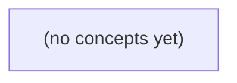

# 05.03 Channel 与取消：Go 并发队列、背压与连接退出

*面向 Go 初学者，以容量为 2 的虚构 IM 发送队列为主线，系统讲解 channel 的发送、接收、缓冲、关闭与 select，并建立 context 取消、超时、背压和连接退出的正确心智模型。课程以静态代码、纸上时间线和分层练习推进，强调任务所有权、资源边界与可验证的并发合同。*

**章节:** 2

---

## 本书导览

- 了解整本书的章节脉络
- 掌握各章之间的概念依赖关系
- 选择最合适的阅读顺序

# 05.03 Channel 与取消：Go 并发队列、背压与连接退出

面向 Go 初学者，以容量为 2 的虚构 IM 发送队列为主线，系统讲解 channel 的发送、接收、缓冲、关闭与 select，并建立 context 取消、超时、背压和连接退出的正确心智模型。课程以静态代码、纸上时间线和分层练习推进，强调任务所有权、资源边界与可验证的并发合同。

下方的概念图展示了本书 0 个核心概念以及它们之间的依赖关系；再下方是 1 个章节的入口。你可以按从上到下的顺序阅读，也可以根据自己的兴趣或先验知识选择切入点。

#### 概念图



## 章节索引

- **05.03 channel 与取消：让 IM 发送队列能等待也能停止** — 承接05.01任务生命周期、05.02锁和03.04等待，用虚构IM有容量的发送队列讲无缓冲/有缓冲channel、发送接收、关闭/ok、select与context取消/期限、背压和连接关闭责任。所有Go代码静态，不运行服务。

## 05.03 channel 与取消：让 IM 发送队列能等待也能停止

- 区分无缓冲交接与有缓冲容量
- 推演容量2队列中第三次发送的等待
- 理解通道方向、close所有权、排空后ok=false
- 用select组合发送/接收与取消但识别同时就绪选择
- 用context.WithCancel/WithTimeout传播协作式停止
- 区分取消请求、goroutine实际退出与业务结果
- 为满队列选择阻塞、拒绝或丢弃的业务合同
- 设计连接断开后的停止、等待和资源回收路径

未来的 IM 发送服务先面对一个朴素问题：客户端 B 很慢时，消息 m-a、m-b、m-c 应如何排队，生产者又该在何时等待或停止？

### 发送队列中的角色与任务所有权

### 发送队列中的角色与任务所有权

以 `u-a` 向 `u-b` 发送消息 `m-a` 为例，先把职责拆开，后续才能讨论“队列满时等待”与“取消时停止”。

- **生产者**：接收 `u-a` 发送请求的一侧。它负责把输入整理为一份独立的待发送任务，例如 `{from:u-a, to:u-b, body:m-a}`，再尝试交给发送队列。
- **待发送任务**：队列中唯一应被传递的工作单位。任务进入队列前，生产者拥有它；成功入队后，队列拥有它；消费者取出后，消费者拥有它。所有权必须在交接点明确转移，不能让两方同时修改或重复释放同一任务。
- **队列**：有限容量的缓冲区，不负责真正写网络，也不应无限保存任务。纸上先设容量为 `2`：`m-a`、`m-b` 可进入；`m-c` 到来时必须按规则等待、返回失败或响应取消，而不是继续扩容。
- **消费者**：未来负责从队列取任务、经由到 `u-b` 的连接发送的一侧。当前尚未启动运行中的服务，因此本节只定义其责任：取走任务后，要么完成发送，要么报告失败并结束该任务的生命周期。
- **连接资源**：到 `u-b` 的网络连接不属于队列。队列只保存“待发送什么”，连接层负责“如何发送”；慢客户端导致的是消费者取走任务变慢，而非允许生产者无限创建 goroutine 或缓冲。

因此，`m-a` 入队并不等于已送达 `u-b`，只表示生产者已把发送责任交给队列。这个边界也是取消语义的基础：尚未入队的任务由生产者停止；仍在队列中的任务由队列移除；已被消费者取走的任务则需由消费者与连接层协作终止。

### 无缓冲交接与有缓冲容量

### 无缓冲交接与有缓冲容量

先把发送任务看成生产者写入、发送服务取出的队列元素。当前先不启动真正的服务，只在纸面上比较容量为 `0` 与容量为 `2` 的行为；任务依次为 `m-a`、`m-b`、`m-c`。

- **无缓冲 channel：`make(chan Message)`**

  容量为 `0` 不表示“无限快”，而表示**没有暂存位置**。生产者发送 `m-a` 时，必须已经有消费者正在接收；两者在同一交接点同步完成。

  因而，若客户端 B 很慢、发送服务尚未运行，`m-a` 的写入会阻塞；`m-b`、`m-c` 根本还无法进入队列。它适合“交付必须当面确认”的场景：生产者的继续执行意味着消费者已经取走任务，但生产者也会直接受消费者速度限制。

- **有缓冲 channel：`make(chan Message, 2)`**

  容量为 `2` 时，队列可暂存两个尚未被消费者取走的任务。没有运行中的服务时：

  1. 写入 `m-a`，队列为 `[m-a]`；
  2. 写入 `m-b`，队列为 `[m-a, m-b]`；
  3. 再写入 `m-c`，队列已满，生产者阻塞。

  缓冲只是在生产者与消费者之间提供有限的速度差空间，并没有消除背压。容量上限保证慢客户端 B 不会让内存随消息数量无限增长；而“满时阻塞”则把拥塞反馈给生产者。

无缓冲强调同步交接，有缓冲强调有限排队。后续加入运行中的发送服务后，消费者每取走一个任务，就会释放一个容量槽位；但等待中的生产者仍需要取消机制，才能在不再需要发送时停止等待。

### 容量为 2 时第三次发送为何等待

### 容量为 2 时第三次发送为何等待

先约定：用户 u-a 向慢客户端 u-b 发送消息，发送队列容量固定为 2；生产者负责提交消息，消费者负责从队列取出并实际发送。此刻消费者尚未启动，因此队列只会进入、不可能腾出位置。

初始状态为空：

`队列：[]，可用槽位：2`

1. 生产者提交 `m-a`。队列未满，`m-a` 占用一个槽位：

   `队列：[m-a]，可用槽位：1`

2. 生产者提交 `m-b`。队列仍未满，`m-b` 进入队尾；FIFO 顺序保证之后会先发送 `m-a`：

   `队列：[m-a, m-b]，可用槽位：0`

3. 生产者提交 `m-c`。此时队列长度已等于容量：

   `len(queue)=2=cap(queue)`

   因而没有位置可放入 `m-c`。正确行为不是再开一个 `go` 绕过限制，也不是把消息偷偷追加到无限切片；生产者必须在“队列有空位”这一条件上等待。

等待并不意味着 `m-c` 已经入队。它仍由当前发送操作持有，尚未转移给队列；只有消费者取走 `m-a`，队列变为 `[m-b]` 后，才出现一个空槽位，`m-c` 才能继续入队：

`队列：[m-b, m-c]`

因此，容量限制把慢客户端造成的压力传回生产者：前两次发送可立即完成，第三次发送必须等待消费者推进，或在后续引入取消信号时停止等待。

### 满队列不是实现细节，而是业务合同

### 满队列不是实现细节，而是业务合同

设发送队列容量为 `2`。客户端 B 很慢时，生产者依次提交 `m-a`、`m-b`、`m-c`：前两条进入队列后，`m-c` 的命运不应由某个 `chan` 恰好写满来“顺便决定”，而应是服务对用户作出的明确承诺。

- **阻塞等待**：提交 `m-c` 的调用持续等待，直到消费者取走 `m-a` 或 `m-b`。这承诺了较强的接收可靠性：只要调用未取消，`m-c` 不会因暂时拥塞被服务主动放弃；代价是延迟不可预测。若 UI、网络请求或上游 goroutine 无限制等待，慢 B 会把背压传回整个系统。因此阻塞必须可被 `context` 取消，并向调用方区分“已入队”与“等待被取消”。

- **立即拒绝**：队列满时立刻返回“繁忙”或“稍后重试”。这承诺了低且有界的提交延迟，却不承诺本次消息被接收。调用方可提示 u-a 重试、降级为离线草稿，或转交其他通道。拒绝不是失败日志，而是需要稳定错误语义的业务结果；尤其要说明 `m-c` 从未取得队列所有权。

- **主动丢弃**：服务仍快速返回，但淘汰旧消息、最新消息，或按优先级丢弃。例如丢弃最旧的 `m-a` 以保留最新状态。它适合“正在输入”“在线状态”等可覆盖事件，不适合聊天正文。此策略承诺的是新鲜度或吞吐，而非逐条可靠送达；被丢弃的一方是否得到通知，同样必须写入合同。

容量 `2` 只限制待发送任务数，不自动定义公平性、重试次数或消息可靠性。先选定满队列策略，才能决定生产者该等待、报错还是接受丢失。

### 为后续停止机制保留队列边界

### 为后续停止机制保留队列边界

设 IM 服务接收用户 `u-a`、`u-b` 发往慢客户端 `B` 的待发送任务。先不启动真实网络服务，只在纸上规定：单个发送队列容量为 `2`，依次到达 `m-a`、`m-b`、`m-c`。

- 队列为空时，生产者可放入任务；
- 队列未满时，消费者可取出任务；
- 已有 `m-a`、`m-b` 时队列已满，继续提交 `m-c` 不能悄悄再开一个 `goroutine`，也不能无限追加到内存；
- 满队列上的生产者必须具有明确行为：等待、返回“繁忙”，或接受可取消的阻塞；
- 空队列上的消费者同样等待，而不是忙轮询。

容量边界不是性能细节，而是责任边界。若每条消息都 `go send(...)`，慢客户端会把等待者扩散成无数协程；若使用无限缓冲，等待者虽暂时不可见，内存、延迟和过期消息却会持续累积。两者都把“客户端 B 不消费”伪装成服务仍可无限接收。

有界队列使状态可被描述：`m-a/m-b` 在队列中，`m-c` 在队列外等待或被拒绝。于是后续连接断开、服务关闭或请求取消时，才能回答关键问题：谁停止接收新任务，谁唤醒等待的生产者，队列中尚未发送的任务由谁丢弃、转移或回收。没有边界，停止就没有可靠的落点。

> **要点** — channel 队列用有限容量表达背压；队列满时等待、拒绝或丢弃必须由业务合同明确决定。

发送队列的核心不只是“把消息放进去”，而是明确交接何时发生、满队列时谁等待，以及消息中可变数据由谁负责。

### 无缓冲通道：发送与接收必须配对

### 无缓冲通道：发送与接收必须配对

`make(chan Message)` 创建无缓冲通道：它没有可存放消息的队列槽位，消息不能先“塞进去以后再处理”。一次发送与一次接收必须在时间上配对完成，交接成功时，`Message` 的值才从发送方转移给接收方。

```go
ch := make(chan Message)

go func() {
    ch <- Message{Text: "你好"} // 等待某个接收者
}()

m := <-ch // 等待某个发送者
```

发送操作 `ch <- m` 的等待条件是：尚无接收者执行并准备好 `<-ch`。接收操作 `m := <-ch` 的等待条件则相反：尚无发送者提供消息。

因此，无缓冲通道天然形成同步点：

- 若发送者先到达 `ch <- m`，它会阻塞，直到接收者取走该消息。
- 若接收者先到达 `<-ch`，它会阻塞，直到发送者发送消息。
- 配对完成后，两侧才继续执行；消息不会留在通道中等待。

这很适合需要“交给对方后才能继续”的场景，例如要求工作协程确认接手任务。但若 IM 发送者希望快速提交多条消息，而消费者暂时较慢，无缓冲通道会让发送方直接等待。若发送与接收都在同一 goroutine 中顺序执行，也会永久等待：先发送却没有并发接收者，程序将发生死锁。

### 容量为二：第三条消息为何等待

### 容量为二：第三条消息为何等待

设发送队列为：

`ch := make(chan Message, 2)`

这里的 `2` 表示缓冲区最多暂存两条尚未被接收的消息。若当前没有接收者执行 `<-ch`，发送过程可按如下方式推演：

1. 执行 `ch <- mA`：缓冲区原本为空，`mA` 被复制并放入队列。此时 `len(ch) == 1`，发送完成。
2. 执行 `ch <- mB`：仍有一个空位，`mB` 进入队列。此时队列已满，瞬时可观察到 `len(ch) == 2`、`cap(ch) == 2`。
3. 执行 `ch <- mC`：队列没有空位，因此该发送操作不能完成；发送方会阻塞等待。

阻塞并不表示 `mC` 丢失，也不表示它自动覆盖最早的 `mA`。发送 goroutine 停在 `ch <- mC` 处，直到某个接收者执行：

`m := <-ch`

接收者取走队首的 `mA` 后，缓冲区出现一个空位；运行时便可让等待中的 `mC` 写入该空位，使 `ch <- mC` 返回。通常可将状态理解为：

`[mA, mB]` → 接收 `mA` → `[mB]` → 写入 `mC` → `[mB, mC]`

因此，容量为二并非“第三条消息发送失败”，而是允许两个未消费消息形成缓冲；第三条消息把背压传回发送方，迫使它等待消费者推进队列。实际唤醒时刻受调度影响，但“满缓冲发送必须等待某次接收”这一约束不变。

### 发送、接收与方向约束

### 发送、接收与方向约束

通道把“消息交接”写成明确的读写操作：

- 发送：`ch <- m`，将 `m` 交给通道。
- 接收：`m := <-ch`，从通道取出一个 `Message`。
- 创建：`ch := make(chan Message)` 创建无缓冲通道；`ch := make(chan Message, 2)` 创建容量为 2 的缓冲通道。

无缓冲通道没有存放位置。发送者执行 `ch <- m` 时，必须等待某个接收者执行 `<-ch`；接收者先到也会等待发送者。交接完成时，消息才真正从发送方移交给接收方。

容量为 2 时，前两个消息可先进入缓冲区：

```go
ch <- mA
ch <- mB
ch <- mC // 缓冲已满时等待，直到有人接收
```

但“第三条一定等待”依赖于消费者尚未取走前两条消息；并发调度下，消费者可能已接收，因此不能只凭代码顺序推断实时队列状态。

函数参数应尽量声明方向，限制调用方能力：

- `chan<- Message`：仅发送通道，只能执行 `ch <- m`。
- `<-chan Message`：仅接收通道，只能执行 `m := <-ch`。
- `chan Message`：双向通道，可发送也可接收。

例如生产者只需要发送权限：

`func produce(out chan<- Message)`

消费者只需要接收权限：

`func consume(in <-chan Message)`

双向通道可隐式传给单向参数，但单向通道不能恢复为双向通道。方向约束不是运行时检查，而是编译期接口设计：生产者不能误收消息，消费者不能误发消息。

### 队列观测不是容量控制

### 队列观测不是容量控制

`cap(ch)` 表示创建时确定的缓冲容量；`len(ch)` 表示**当前瞬间**缓冲区内尚未被接收的元素数。它们适合诊断、监控和日志，例如观察发送队列是否长期堆积：

```go
fmt.Printf("待发送=%d，容量=%d\n", len(ch), cap(ch))
```

但不能据此实现可靠的“先检查再发送”：

```go
if len(ch) < cap(ch) {
    ch <- m // 这里仍可能阻塞
}
```

原因是 `len` 与发送不是原子操作。多个发送者可能同时看到“还有一个空位”，随后其中一个先占用该位置，另一个仍会在 `ch <- m` 处等待；消费者也可能恰好取走消息，使观察结果立刻过期。无缓冲 channel 更明显：其 `cap(ch)==0`，却不代表永远不能发送；只要接收者已经等待，发送即可立刻完成交接。

需要“满时等待”时，直接发送即可，让 channel 的阻塞语义完成同步；需要“满时放弃或超时”时，使用 `select`：

```go
select {
case ch <- m:
    // 已入队
default:
    // 当前无法立即入队
}
```

还要区分“消息入队”与“消息内容不可再变”。channel 传递的是值的副本，但若 `Message` 含 `[]byte`、`map`、指针等可变引用，副本仍可能指向同一份底层数据。应约定所有权：发送后发送方不再修改，或发送前深拷贝；否则即使队列同步正确，消息内容仍可能发生竞态或被意外篡改。

### IM 发送队列的静态推演

### IM 发送队列的静态推演

设生产者依次发送 `m-a`、`m-b`、`m-c`，消费者随后才开始接收。发送与接收必须对同一个 `channel` 操作配对，但“配对发生在何时”取决于容量。

```go
type Message struct{ ID string }

ch0 := make(chan Message)    // 无缓冲
ch2 := make(chan Message, 2) // 容量为 2
```

对于无缓冲队列：

```go
ch0 <- mA // 生产者在此阻塞
ch0 <- mB // 尚未执行
ch0 <- mC // 尚未执行
```

无缓冲 `channel` 没有存放消息的位置。生产者执行 `ch0 <- mA` 时，必须已有消费者执行 `m := <-ch0`；否则发送方停在第一条消息处。消费者后来开始接收后，`mA` 才完成交接，生产者继续尝试发送 `mB`，又会等待下一次接收。因此三条消息形成严格的“一发一收”握手。

容量为二时：

```go
ch2 <- mA // 立即继续，缓冲：mA
ch2 <- mB // 立即继续，缓冲：mA, mB
ch2 <- mC // 缓冲已满，生产者阻塞
```

消费者随后执行：

```go
x := <-ch2 // 取出 mA；mC 得以写入
y := <-ch2 // 取出 mB
z := <-ch2 // 取出 mC
```

第三次发送的恢复时机不是“消费者处理完 `mA`”，而是消费者实际执行接收、从缓冲取走一个元素之后。此例中顺序由单个生产者决定；若存在多个 goroutine，具体谁先运行由调度决定，不能只凭代码行号推断。

可将只发送端声明为 `chan<- Message`，只接收端声明为 `<-chan Message`，以限制错误操作。`len(ch2)` 只能观察某一瞬间的缓冲数量；其他 goroutine 随时可能收发，不能据此实现可靠的“是否已满”控制。`channel` 传递的是 `Message` 值；若其中含切片、指针或映射等可变引用，还应约定发送后由谁继续修改其底层数据。

> **要点** — 通道容量决定可暂存数量，不替代所有权与同步设计；满队列发送何时继续取决于接收实际发生。

关闭通道只声明“不会再有新值”，并不保证消息已送达；正确关闭还必须与取消、发送者退出和资源回收协同设计。

### 关闭的语义边界

### 关闭的语义边界

`close(ch)` 只表达一个事实：**此后不会再向 `ch` 发送新值**。它是生产端结束的信号，不是“消息已经送达”，更不是“消费者已经处理成功”。

关闭后，通道中已缓存的值仍可被正常接收；缓存排空后，接收操作立即返回元素类型的零值，并给出 `ok=false`：

`v, ok := <-ch`

因此，`for v := range ch` 会持续读取缓存和后续已配对的值，直到发现通道已关闭且无剩余值时才结束。这里的循环结束仅说明“输入流结束”，不能推导出每条 IM 消息都已写入网络、到达对端或被业务确认。

例如，发送队列关闭后，发送协程可能仍在处理队列中的消息；若此时网络失败、进程退出或取消发生，未处理消息仍可能丢失。若需要“已送达”或“已读”等语义，必须由协议确认、持久化状态或业务回执单独建立，不能借用 `close` 表示。

关闭还定义了严格的所有权边界：

- 向已关闭通道发送会 `panic`；
- 重复关闭已关闭通道也会 `panic`；
- `nil` 通道的发送和接收永久阻塞；
- 关闭 `nil` 通道会 `panic`。

因此，共享发送队列通常应由唯一生产者或协调者关闭；接收者只负责读到结束，不应擅自关闭。多生产者场景则应先等待全部发送者退出，再由统一协调者执行关闭。取消信号也不能等同于关闭：取消表示“应停止等待或尽快退出”，而关闭表示“数据源不再产生新值”。

### 关闭后的接收与排空

### 关闭后的接收与排空

`close(ch)` 的含义是：以后不会再向 `ch` 发送新值。它不是“立即清空”，更不是“所有消息都已被业务处理”。

对带缓冲通道而言，关闭后仍可继续接收其中已经缓存的元素。设：

```go
ch := make(chan string, 2)
ch <- "A"
ch <- "B"
close(ch)
```

此时通道虽已关闭，但缓冲区仍有 `"A"`、`"B"`。连续接收的结果为：

```go
v1, ok1 := <-ch // "A", true
v2, ok2 := <-ch // "B", true
v3, ok3 := <-ch // "",  false
```

可以将关闭后的接收规则理解为两阶段：

1. **缓冲区未排空**：按原有先进先出顺序返回缓存值，且 `ok == true`。
2. **缓冲区已排空**：接收操作立即返回元素类型的零值，且 `ok == false`，不会阻塞。

因此，`ok` 才是判断“是否真的读到通道值”的依据。若元素类型本身允许零值，例如 `int`、`string`、指针或结构体，只检查 `v == 0` 无法区分“发送者发送了零值”与“通道已关闭且排空”。

`for range ch` 正是利用这一规则工作：

```go
for msg := range ch {
    handle(msg)
}
cleanup()
```

循环会持续接收缓存值；只有当通道**已经关闭且缓冲区完全排空**时，内部接收到 `ok == false`，循环才结束。换言之，关闭使 `range` 最终可退出，但不会丢弃关闭前已成功写入缓冲区的消息。

### 谁有权关闭发送队列

### 谁拥有关闭发送队列的权利

关闭通道的语义是“不会再有新值”，因此关闭权必须属于**能够证明所有发送者都已停止**的一方，而不是任意接收者。

最简单的规则是：**谁创建并独占发送权，谁关闭。**单生产者场景中，生产者完成全部发送后执行 `close(ch)`：

```go
for _, msg := range messages {
    ch <- msg
}
close(ch)
```

接收者只负责读取，不能因为“自己不想收了”就关闭共享队列。否则仍在运行的生产者下一次 `ch <- msg` 会立刻 panic。接收者若需提前退出，应通过独立的取消信号通知生产者停止，而非关闭发送队列。

多生产者时，任一生产者都无法单独判断“最后一个发送者是否退出”。常见做法是由协调者等待全部生产者完成，再统一关闭：

```go
var wg sync.WaitGroup
for range workers {
    wg.Add(1)
    go func() {
        defer wg.Done()
        // 持续向 ch 发送
    }()
}

go func() {
    wg.Wait()
    close(ch)
}()
```

这里的协调协程拥有唯一关闭权：`wg.Wait()` 返回意味着不会再有发送操作，随后关闭才安全。不要让多个生产者竞争关闭；即使使用 `sync.Once` 避免重复关闭，也不能解决“其他生产者仍可能发送”的根本竞态。

可将规则记为：**发送者负责结束，协调者负责汇总；接收者负责消费，取消另走信号。**

### 错误操作与边界通道

### 错误操作与边界通道

静态 IM 发送队列中，`close` 只能表示“不会再投入新消息”。对已关闭或无初始化的通道操作，往往不是静默失败，而是直接触发运行时错误或永久阻塞：

```go
var outbound = make(chan Message, 100)

close(outbound)          // 合法：由唯一协调者执行
outbound <- msg          // panic：向已关闭通道发送
close(outbound)          // panic：重复关闭
```

接收端即使尚能读到缓冲区中的旧消息，也不意味着发送端可以继续投递：

```go
for msg := range outbound {
    deliver(msg) // 先处理关闭前已进入缓冲区的消息
}
// 缓冲排空后自动结束
```

若使用显式接收，排空后的行为是返回元素零值与 `ok=false`：

```go
msg, ok := <-outbound
if !ok {
    // 队列已关闭且已排空
}
```

`nil` 通道则是另一类边界情况：

```go
var q chan Message // q == nil

q <- msg      // 永久阻塞
msg := <-q    // 永久阻塞
close(q)      // panic
```

因此，`nil` 不应被当作“空队列”或“已停止队列”。它常用于 `select` 中临时禁用某个分支；若 IM 发送协程意外持有 `nil` 队列，就可能永远卡住。共享发送队列应由单一生产者或协调者关闭；多个发送者必须先全部退出，再统一关闭，接收者不应擅自关闭它。

### 关闭、取消与连接断开

### 关闭、取消与连接断开

连接断开时，不能只做一件事：`close(outbox)` 表示“不再产生新消息”，而取消表示“正在进行的工作应尽快停止”。前者管理队列生命周期，后者管理 goroutine 生命周期；二者混用容易造成阻塞、漏发或 panic。

推荐由连接协调者统一执行断开流程：

1. 发出取消信号，例如调用 `cancel()`，使读循环、写循环、重试任务和业务发送任务都能在 `select` 中退出。
2. 禁止新的业务发送进入该连接；发送方应同时监听 `ctx.Done()`，避免向无人消费的队列永久阻塞。
3. 等待所有可能向 `outbox` 发送的 goroutine 退出，例如通过 `WaitGroup`。
4. 仅由协调者执行 `close(outbox)`；写循环继续取出已缓存消息，或按业务策略直接丢弃。
5. 等待写循环退出，最后关闭底层连接、释放定时器和关联资源。

典型发送应可取消：

`select { case outbox <- msg: case <-ctx.Done(): return ctx.Err() }`

接收侧可通过 `for msg := range outbox` 排空队列：关闭后，缓存值仍会被读取；排空后循环结束。不要让接收者擅自关闭共享发送队列：它无法确认是否仍有发送者，可能触发“向已关闭通道发送”的 panic。多生产者场景中，应先停止并等待全部生产者，再由唯一协调者关闭队列。

底层连接断开也不等于队列已关闭：它首先是故障或取消事件。应传播取消、停止发送、决定缓存消息的重试或丢弃策略，再完成队列关闭与资源回收。

> **要点** — 关闭通道声明生产结束；由发送侧统一负责，接收侧排空缓存并结合取消完成协作式退出。

发送队列既要能在拥塞时等待，也要能在连接断开时停止；关键在于用select表达等待、取消与非阻塞策略的边界。

### select：在发送与取消之间等待

### select：在发送与取消之间等待

可取消发送的基本写法，是把“等待输出通道可写”和“等待取消信号”放进同一个 `select`：

```go
func Offer(ctx context.Context, out chan<- Message, m Message) error {
	select {
	case out <- m:
		return nil
	case <-ctx.Done():
		return ctx.Err()
	}
}
```

当消费者暂慢、`out` 已满或无接收者时，`out <- m` 会阻塞；但 `ctx.Done()` 一旦关闭，`select` 可以选择取消分支并返回 `context.Canceled` 或 `context.DeadlineExceeded`。这使生产者不必永久卡在发送点。

这里的停止是**协作式**的：调用方必须把 `ctx` 传入，并在收到错误后停止后续工作。例如：

```go
if err := Offer(ctx, sendQ, msg); err != nil {
	return err // 不再假定消息已入队
}
```

需要特别区分“取消发生”与“绝不入队”。若 `out <- m` 和 `<-ctx.Done()` 同时就绪，`select` 会在可运行分支间伪随机选择；因此，即使上下文已经取消，`Offer` 仍可能成功发送。它能保证的是：调用不会无限等待，并且返回值明确告诉调用者本次发送是成功还是取消。

若业务要求“取消后绝不能提交消息”，仅靠这个 `select` 不够；需要额外合同或同步机制，例如关闭前停止生产、加锁协调取消与入队，或让消费者按消息标识去重、丢弃。

### 同时就绪不保证取消优先

### 同时就绪不保证取消优先

设发送操作写成：

```go
select {
case out <- m:
	return nil
case <-ctx.Done():
	return ctx.Err()
}
```

它表达的是：“等待**发送成功或取消发生**，谁先被选中就返回。”但它不表达：“一旦 `ctx` 已取消，消息就**绝不**进入 `out`。”

关键情形是：队列缓冲区尚有空位，因此 `out <- m` 已就绪；同时调用方已取消，`ctx.Done()` 也已关闭，于是两个 `case` 同时可执行。此时 `select` 不提供书写顺序优先级，也不保证取消分支优先；Go 会在所有就绪分支中作伪随机选择：

- 选中 `out <- m`：消息入队，`Offer` 返回 `nil`；
- 选中 `<-ctx.Done()`：消息未由这次操作入队，返回 `ctx.Err()`。

因此，`Offer(ctx, out, m) error` 的通常合同应是较弱但可实现的：

> 在等待队列容量时可以响应取消；若发送与取消同时就绪，结果未定义，可能成功，也可能返回取消错误。

不要把“返回取消错误”误解为“队列中一定没有该消息”，也不要把“`ctx` 已取消”误解为“之后一定无法入队”。若业务要求严格的“取消后绝不提交”，必须建立独立同步合同，例如由单一所有者串行处理状态、在锁保护下检查取消与提交状态，或给消息附加唯一标识并支持接收端幂等去重/撤销。

即使先写一次非阻塞检查：

```go
select {
case <-ctx.Done():
	return ctx.Err()
default:
}
```

随后再执行发送 `select`，取消仍可能恰好发生在两次检查之间；它只能缩小观察窗口，不能消除并发竞态。

### Offer：定义可取消入队的错误边界

### Offer：定义可取消入队的错误边界

`Offer` 的职责不是保证“取消后消息绝不进入队列”，而是把调用方可观察到的结果收敛为明确合同：成功入队、请求已取消、输出通道不可用。

```go
var ErrCanceled = errors.New("入队已取消")
var ErrClosed = errors.New("发送队列已关闭")

func Offer[T any](ctx context.Context, out chan<- T, m T) error {
	if ctx == nil {
		ctx = context.Background()
	}

	select {
	case <-ctx.Done():
		return ctx.Err() // 或包装为 ErrCanceled
	case out <- m:
		return nil
	}
}
```

这里 `nil` 仅表示本次调用观察到 `out <- m` 完成；`ctx.Err()` 表示本次调用观察到取消先成立。若两个 `case` 同时就绪，`select` 会伪随机选择，因此不能据此承诺：

> 调用方取消后，消息一定没有入队。

例如接收方恰好腾出容量，同时 `ctx` 被取消，`Offer` 仍可能选中发送分支并返回 `nil`。因此，`Offer` 的“取消”是**停止等待的请求**，不是对消息投递状态的强一致撤销。

向已关闭的通道发送会直接 `panic`，不能仅靠上述 `select` 转换成 `ErrClosed`。更稳妥的设计是：由队列拥有者独占关闭权，生产者只调用 `Offer`；若必须报告关闭，应通过额外的状态通道、封装队列对象或互斥同步建立协议，而非依赖 `recover`。

调用方应按结果处理：

- `nil`：消息已被某个接收者或缓冲区接受；
- `context.Canceled`、`context.DeadlineExceeded`：未知是否存在竞争发送，若要求“至多一次”或“绝不发送”，需增加消息编号、确认机制或同步屏障；
- 队列关闭错误：停止后续投递，并转入重连、丢弃或持久化策略。

这样，`Offer` 提供的是可取消的阻塞边界，而消息是否最终送达，则应由更高层的确认合同定义。

### Receive：接收、关闭与取消并列处理

### Receive：接收、关闭与取消并列处理

接收端通常同时面对三种结果：拿到一条消息、发现输入通道已关闭且排空、调用方取消等待。可将其封装为概念函数：

```go
func Receive[T any](ctx context.Context, in <-chan T) (T, error) {
	var zero T

	select {
	case m, ok := <-in:
		if !ok {
			return zero, io.EOF // 发送端已关闭，缓冲也已排空
		}
		return m, nil

	case <-ctx.Done():
		return zero, ctx.Err()
	}
}
```

`ok=false` 不表示“暂时没有消息”，而表示通道已关闭，并且此前缓冲的消息已全部取尽；之后再接收都会立即得到零值与 `ok=false`。因此接收循环应把它视为正常的输入结束信号：

```go
for {
	m, err := Receive(ctx, in)
	if errors.Is(err, io.EOF) {
		return nil // 上游正常结束，执行收尾逻辑
	}
	if err != nil {
		return err // 超时、取消等
	}
	handle(m)
}
```

关闭责任属于发送侧：通常由唯一发送者关闭，或由协调者在确认所有发送者退出后关闭。接收者不应关闭自己正在读取的 `in`，更不能以“没有消息”为由关闭它；仍可能有其他发送者准备写入，误关会导致发送方恐慌。

还要注意：若消息已到达、`in` 可读，同时 `ctx.Done()` 也已就绪，`select` 会伪随机选择其一。故 `Receive` 只能保证“取消时可停止等待”，不能承诺“取消后绝不返回消息”。若业务要求取消具有绝对优先级，需要在返回消息后再次检查 `ctx.Err()`，或通过额外同步协议建立更强合同。

### default非阻塞与队列业务合同

### default非阻塞与队列业务合同

`select` 中加入 `default` 后，操作不再等待：发送通道满、接收通道空、取消信号尚未到达时，都会立刻进入 `default`。这适合“尽力而为”的投递，但不等价于可靠入队。

```go
select {
case out <- m:
	return nil // 已入队
default:
	return ErrQueueFull // 立即拒绝
}
```

三种策略的差异应写进业务合同：

- **阻塞等待**：`case out <- m` 持续等待容量，适合消息不可轻易丢失；代价是调用方可能被慢消费者拖住。
- **超时等待**：结合 `timer.C` 或带截止时间的 `ctx`，在限定时间内争取入队；超时后返回 `context.DeadlineExceeded` 或领域错误。
- **`default` 立即返回**：适合日志、状态刷新、可覆盖通知等低价值消息；满队列时必须明确是返回 `ErrQueueFull`、丢弃新消息，还是由调用方降级。

不要把 `default` 放进无等待循环：

```go
for {
	select {
	case out <- m:
		return nil
	default:
	}
}
```

这会在队列满时持续占用一个 CPU 核，形成忙等。若确实要重试，应等待取消、定时器或退避间隔。

还要区分“允许取消等待”与“取消后绝不入队”。当 `out <- m` 与 `<-ctx.Done()` 同时就绪时，`select` 会伪随机选择；因此即使上下文已取消，消息仍可能成功写入。若业务要求取消后严格禁止入队，需要额外同步，例如由队列所有者串行裁决，或以互斥锁、状态位建立明确的关闭与提交边界。

> **要点** — select能组合发送、接收和取消，但同时就绪时不保证取消优先；队列结果须由明确合同与同步边界保证。

IM 发送队列的停止不能靠“强杀”协程实现，而要用 context 把取消与期限请求传到每个可能等待的环节。

### 取消与期限的协作语义

### 取消与期限的协作语义

`context` 不是“杀死 goroutine”的开关，而是一条向下游传播的**协作式停止请求**。调用 `cancel()`，或 `WithTimeout` 到达截止时间后，运行中的函数不会被运行时强行中断；它们只有主动检查 `ctx.Done()`、`ctx.Err()`，或调用本身支持 `context` 的阻塞 API，才会尽快返回。

```go
ctx, cancel := context.WithTimeout(parent, 3*time.Second)
defer cancel() // 提前结束时也释放计时器等资源

select {
case msg := <-queue:
    return send(ctx, msg)
case <-ctx.Done():
    return ctx.Err()
}
```

`Done()` 是关闭通知通道：取消、超时或父 context 结束时都会关闭。`Err()` 则说明原因，通常是：

- `context.Canceled`：调用了取消函数，或父 context 被取消；
- `context.DeadlineExceeded`：截止期限到达。

因此，超时是“时间到了，请停止”，取消是“外部要求停止”；二者都不是强制终止。若 `handle(msg)` 内部只做长时间计算、死锁等待，或调用了不接受 `ctx` 的阻塞函数，即使外层已经取消，它仍可能继续运行。

取消会从父 context 传给所有子 context，但不会反向传播：取消子任务不应意外停止整个发送队列。实践中应把 `ctx` 传给每个可能阻塞的函数，并在循环、通道收发、网络请求和重试等待处响应它。`context` 不替代结果通道、业务错误、连接关闭或用户消息载荷；它只负责传递请求范围、取消与期限。

### WithCancel、WithTimeout 与父子传播

### WithCancel、WithTimeout 与父子传播

发送队列通常有一个全局生命周期：程序退出、用户下线或会话关闭时，应通知所有仍在等待的发送任务停止。做法不是共享一个布尔变量，而是从父 `context` 派生子 `context`：

```go
sendCtx, cancel := context.WithCancel(parent)
defer cancel()
```

`WithCancel` 返回的 `sendCtx` 继承父节点的取消状态，同时拥有自己的取消函数。发生以下任一情况时，`sendCtx.Done()` 都会被关闭：

- 调用 `cancel()`：主动结束当前发送任务或发送队列；
- `parent` 被取消：父节点的停止请求向下传播；
- 若父节点本身有期限且到期：子节点也随之取消。

传播方向是单向的：父取消会传给子，子取消不会反向取消父，也不会影响兄弟任务。这样，一个具体消息发送失败或被用户撤回，不会意外终止整条会话的其他任务。

对“最多等待多久”的操作，应再派生带期限的子节点：

```go
msgCtx, cancel := context.WithTimeout(sendCtx, 3*time.Second)
defer cancel()

err := sendMessage(msgCtx, msg)
```

`WithTimeout` 本质上创建了一个带截止时间的子节点。3 秒内发送完成时，`defer cancel()` 仍然必须执行：它会尽早释放与该派生 context 关联的计时器和内部资源；不应因为“反正会超时”而省略。

接收方通过 `Done` 与 `Err` 判断停止原因：

```go
select {
case <-msgCtx.Done():
    return msgCtx.Err()
case result := <-replyCh:
    return result
}
```

主动调用取消函数后，`Err()` 通常为 `context.Canceled`；超时到期则为 `context.DeadlineExceeded`。二者都表示“停止请求已到达”，但语义不同：前者多是上层主动终止，后者是等待超过约定期限。

注意，取消是协作式的，不会强杀 goroutine。只有 `sendMessage`、网络读写、队列等待等每个可能阻塞的函数都接收并检查 `ctx`，任务才会真正退出；若某个 `handle` 忽略 `ctx`，上层即使取消，它仍可能继续阻塞。

### 用 Done 与 Err 响应停止

### 用 Done 与 Err 响应停止

`context.Context` 的停止信号通过 `Done()` 暴露：它返回一个只读 channel。取消函数被调用、父 context 被取消，或期限到期时，这个 channel 会关闭。队列中的发送、接收及“等待容量”都应在阻塞点用 `select` 同时监听业务通道和 `ctx.Done()`：

```go
select {
case sendQ <- msg: // 队列仍有容量，成功入队
    return nil
case <-ctx.Done(): // 等待容量期间收到停止请求
    return ctx.Err()
}
```

接收循环同样不能只写 `<-sendQ`，否则空队列时无法及时停止：

```go
select {
case msg, ok := <-sendQ:
    if !ok {
        return nil // 队列被正常关闭
    }
    handle(ctx, msg)
case <-ctx.Done():
    return ctx.Err()
}
```

`Done()` 只表示“应当停止”，具体原因由 `Err()` 判断：

- `context.Canceled`：调用了 `cancel()`，或父 context 被取消；
- `context.DeadlineExceeded`：`WithTimeout` 或 deadline 到期。

通常函数在 `<-ctx.Done()` 后直接返回 `ctx.Err()`，让上层区分用户主动取消与发送超时。不要把“队列关闭”混同于“context 取消”：前者常表示不再生产消息，后者表示当前操作应尽快放弃。

`select` 只能中断自己正在等待的地方。因此 `handle(ctx, msg)`、网络发送、重试等待等每个可能阻塞的函数都必须继续接收并检查 `ctx`；若处理函数忽略它，外层即使已取消，协程仍可能卡住。

### IM 发送链路的取消示例

### IM 发送链路的取消示例

满队列、网络发送和消息处理都可能阻塞；因此每一层都接收同一个 `ctx`，并在等待点同时监听 `ctx.Done()`：

```go
func Enqueue(ctx context.Context, q chan<- Message, m Message) error {
	select {
	case q <- m:
		return nil
	case <-ctx.Done():
		return ctx.Err()
	}
}

func SendLoop(ctx context.Context, conn *Conn, q <-chan Message) error {
	for {
		select {
		case <-ctx.Done():
			return ctx.Err()
		case m, ok := <-q:
			if !ok {
				return nil // 队列已关闭，不再接收新消息
			}
			if err := conn.Send(ctx, m); err != nil {
				return err // 连接断开、发送超时等
			}
		}
	}
}

func Handle(ctx context.Context, m Message) error {
	// 数据库、RPC、限流等待等都必须继续传递 ctx。
	return service.Process(ctx, m)
}
```

调用方为一次连接或一次发送任务建立生命周期：

```go
ctx, cancel := context.WithTimeout(parent, 5*time.Second)
defer cancel()

if err := Enqueue(ctx, sendQ, msg); err != nil {
	return err
}
```

当队列已满时，`Enqueue` 不会永久卡在 `q <- m`；父连接断开、显式调用 `cancel()` 或五秒到期，都会使其返回 `ctx.Err()`。子 context 会继承父 context 的取消，但子任务超时或取消不会反向停止父任务。

注意：`ctx` 只是协作式停止请求，不会强杀正在运行的处理函数。若 `conn.Send`、`service.Process` 或其内部的数据库/RPC 调用忽略 `ctx`，发送协程仍可能无法及时退出。`context` 也不替代消息结果通道、业务错误传递或连接、队列等资源的显式关闭。

### 停止、结果与资源回收的边界

### 停止、结果与资源回收的边界

`context` 解决的是“请求停止”的传播，不等于协程已经退出，更不等于一条消息发送成功或失败。

在 IM 发送队列中，至少要区分三件事：

- **取消请求**：调用 `cancel()`、父 `context` 被取消，或超时到期后，`ctx.Done()` 关闭，`ctx.Err()` 返回取消或超时原因。
- **协程实际退出**：发送循环必须在每个阻塞点主动监听 `ctx.Done()`；若底层 `handle`、网络写入或队列读取忽略 `ctx`，取消后它仍可能继续阻塞。
- **业务发送结果**：消息是否送达、是否被服务端拒绝、是否应重试，应通过结果通道、返回值或独立状态记录表达，不能仅凭 `ctx.Err()` 判断。

例如，超时发生时，当前消息可能已经写入连接但尚未收到确认；`ctx.Err() == context.DeadlineExceeded` 只能说明本方不再愿意等待，不能证明“发送失败”。反过来，发送成功后父任务也可能立刻被取消。

```go
select {
case resultCh <- result:
case <-ctx.Done():
    // 调用方不再等待结果；发送方仍应自行完成必要清理
}
```

资源回收也有独立责任：`defer cancel()` 用于释放派生 context 关联的计时器等资源；连接、文件、队列应由拥有者显式 `Close`，不能期待取消自动关闭它们。`context` 更不应承载用户消息、会话内容等业务参数；它只携带请求范围的控制信号与少量元数据。

> **要点** — context 负责传播协作式停止；每个阻塞点都须响应 Done，取消后仍要等待退出并回收连接等资源。

以容量为2的IM发送队列为时间线，推演消息等待、取消、关闭与排空如何共同决定连接断开后的真实结果。

### 容量2队列的纸上时间线

### 容量2队列的纸上时间线

设发送队列 `q := make(chan string, 2)`，生产者负责投递，消费者负责向 IM 连接发送；外层协调者在确认全部生产者退出后才关闭 `q`。

| 时刻 | 队列/任务状态 | 结果 |
|---|---|---|
| `t0` | 生产者依次投递 `m-a`、`m-b` | 队列为 `[m-a, m-b]`，容量已满 |
| `t1` | 生产者尝试投递 `m-c` | 若使用普通 `q <- m-c`，任务阻塞等待腾位 |
| `t2` | 消费者取出 `m-a` | 队列变为 `[m-b]`，出现一个空位 |
| `t3` | 被阻塞的投递恢复 | `m-c` 入队，队列为 `[m-b, m-c]` |
| `t4` | 客户端 A 断开，调用 `cancel()` | 所有监听 `ctx.Done()` 的任务应开始退出 |
| `t5` | 生产者观察取消信号 | 不再继续投递；尚未完成的业务消息可能被放弃 |
| `t6` | 协调者等待所有生产者结束 | 唯一持有关闭权的一方执行 `close(q)` |
| `t7` | 消费者继续读取直到队列关闭且排空 | 仍可依次得到 `m-b`、`m-c`，随后退出 |

可取消的投递应避免永久卡在 `t1`：

```go
func offer(ctx context.Context, q chan<- string, msg string) bool {
	select {
	case q <- msg:
		return true
	case <-ctx.Done():
		return false
	}
}
```

消费者也必须把“取消”与“排空”分开理解。若断连后立即因 `ctx.Done()` 返回，`m-b`、`m-c` 会留在缓冲区中；即使之后关闭通道，它们也不会自动送达。`close(q)` 只声明“不再有新消息”，不承诺“已缓存消息必定投递”。若目标是尽力排空，应让消费者在关闭后继续 `range q`；若目标是快速断开，则应明确接受缓存消息被丢弃。

### 发送等待不是消息已投递

### 发送等待不是消息已投递

设发送队列容量为 2。`t0` 时生产者依次写入 `m-a`、`m-b`，它们只是进入缓冲区，并未意味着网络连接或对端已经收到。`t1` 再发送 `m-c` 时，缓冲已满，发送操作必须等待。

` t2` 消费者取走 `m-a` 后释放一个槽位；到 `t3`，等待中的 `m-c` 才能写入。这里的“等待”是队列背压：它限制生产速度，而不是确认投递结果。

无缓冲队列中，发送只有在接收者同时就绪时才能完成，是一次直接交接；有缓冲队列中，发送成功仅表示消息被本地缓存接受：

```go
q := make(chan string, 2)

q <- "m-a"
q <- "m-b"
// q <- "m-c" // 会等待，直到有人从 q 取走一项
```

`close(q)` 也只表示“不再有新消息写入”。接收者仍可继续读取已缓存的数据；但若 `t4` 连接 A 断开并取消任务，`t5` 消费者可能立刻退出，队列中的 `m-b`、`m-c` 因而无人处理。`t6` 应由外层协调者确认全部生产者结束后再关闭队列；`t7` 是否排空，取决于消费者在取消后是否选择继续读取。

因此，队列写入成功、队列关闭、业务处理完成、网络投递成功是四个不同事件；关闭队列绝不是投递保证。

### 用select响应发送与取消

### 用 `select` 响应发送与取消

`select` 让生产者在“队列可写”“连接已取消”“等待超时”之间阻塞，而不是只卡在一次不可中断的 `ch <- msg` 上。下面的队列容量为 2；只有外层协调者负责关闭 `out`，生产者绝不自行关闭它。

```go
package main

import (
	"context"
	"errors"
	"time"
)

var ErrOfferTimeout = errors.New("发送等待超时")

func Offer(ctx context.Context, out chan<- string, msg string, wait time.Duration) error {
	timer := time.NewTimer(wait)
	defer timer.Stop()

	select {
	case out <- msg:
		return nil
	case <-ctx.Done():
		return ctx.Err()
	case <-timer.C:
		return ErrOfferTimeout
	}
}

func Consume(ctx context.Context, in <-chan string, handle func(string)) {
	for {
		select {
		case msg, ok := <-in:
			if !ok {
				return // 协调者确认全部生产者结束后关闭：正常收尾
			}
			handle(msg)
		case <-ctx.Done():
			return // 立即停止消费；缓冲区可能仍有未处理消息
		}
	}
}
```

设 `out := make(chan string, 2)`：`t0` 生产者依次投递 `m-a`、`m-b`，缓冲区满；`t1` 投递 `m-c` 的 `Offer` 等待；`t2` 消费者取走 `m-a`；`t3` 出现空位，`m-c` 可以写入。若 `t4` 客户端 A 断开并调用 `cancel()`，等待中的任务会在 `t5` 从 `<-ctx.Done()` 分支退出；协调者在确认所有生产者结束后，才可于 `t6` 执行 `close(out)`。消费者若选择继续读取，便能在 `t7` 排空后因 `ok == false` 返回。

注意：当“队列可写”和“取消已发生”同时就绪时，`select` 没有分支优先级保证；它可能仍成功写入一条消息。因此，取消表示停止协作，不表示撤回已入队消息，更不等于投递保证。若断开后消费者立即退出，缓冲区中的消息会保留到无人读取；是否排空必须由业务明确决定。

### 关闭权、排空与接收结果

### 关闭权、排空与接收结果

`close` 应由**外层协调者**独占：生产者只负责发送，消费者只负责接收。这样可以避免多个生产者竞争关闭同一 channel，触发“关闭已关闭的 channel”恐慌，也避免某个生产者过早关闭、截断其他生产者的消息。

容量为 2 的队列可按如下时间线理解：

- `t0`：生产者送入 `m-a`、`m-b`，队列满。
- `t1`：再送 `m-c`，生产者阻塞等待空位。
- `t2`：消费者取走 `m-a`。
- `t3`：`m-c` 得到空位并成功入队。
- `t4`：连接 A 断开，取消上下文。
- `t5`：各生产者在发送等待或下一轮工作中观察到取消并退出。
- `t6`：协调者确认全部生产者结束后执行 `close(out)`。
- `t7`：消费者仍可继续取出缓存的 `m-b`、`m-c`；缓存排空后，接收得到 `ok=false`。

```go
out := make(chan Message, 2)

go func() {
    producers.Wait() // 所有生产者均已停止发送
    close(out)
}()

for {
    msg, ok := <-out
    if !ok {
        break // channel 已关闭且缓冲已排空
    }
    sendToConnection(msg)
}
```

接收中的 `ok=false` 不表示“刚刚关闭时没有消息”，而表示“channel 已关闭，并且不会再产出任何值”。因此关闭后仍应排空缓存。

取消也不等于投递保证：若消费者在 `t4` 后立即退出，`m-b`、`m-c` 即使已入队也可能永远未处理。是否排空应由协议语义决定：追求快速断开可停止消费；需要尽力发送则应在关闭后继续 drain，并为写入设置超时或错误处理。

### 断连后的停止与业务合同

### 断连后的停止与业务合同

设发送队列容量为 2：`t0` 生产者写入 `m-a`、`m-b`；`t1` 再写 `m-c` 时队列已满，生产者阻塞等待；`t2` 消费者取走 `m-a`；`t3` `m-c` 获得空位并入队。此时 A 断连并不等于“所有消息已送达”：队列中仍可能有 `m-b`、`m-c`，也可能有正在等待入队的生产者。

推荐由外层协调者统一拥有取消与关闭权：

```go
ctx, cancel := context.WithCancel(parent)
q := make(chan Message, 2)

go func() { // 消费者：负责实际发送
	for m := range q {
		if err := sendToA(m); err != nil {
			cancel()
			return
		}
	}
}()

// t4：A 断开，通知所有可取消操作退出
cancel()

// 每个生产者入队时都必须观察 ctx.Done()
select {
case q <- msg:
case <-ctx.Done():
	return
}

// t5：协调者等待全部生产者结束；t6：唯一一次 close
producers.Wait()
close(q)
```

`close(q)` 的含义只是“不再有新消息”，不是“已投递”。若消费者在 `t4` 因断连退出，缓存消息不会自动发送；此时应明确选择：

- **继续排空**：仅适用于可重连、可持久化或消费者仍可处理的场景；关闭后消费者读取至队列耗尽，再回收资源。
- **停止并丢弃**：断连即取消消费者，遗留消息被丢弃；适合瞬时通知，但应计数、记录原因或触发补偿。
- **转存再投递**：将未发送消息交给持久化队列，业务合同可承诺“至少一次”，但需处理重复。

满队列时也必须写入合同：**阻塞**保留消息但可能拖住生产者；**拒绝**立即返回错误，让上游重试或降级；**丢弃**保护延迟与内存，却必须说明丢弃最新、最旧还是按优先级丢弃。取消、关闭、排空策略共同决定断连后的真实语义，不能仅靠一个 `close(q)` 宣称可靠投递。

> **要点** — 取消是停止请求，关闭是生产完成声明；二者都不自动保证消息处理完成或goroutine已退出。

发送队列满时，系统必须执行明确的业务合同：等待、拒绝或丢弃；连接断开后还要把取消信号落实为任务退出与资源回收。

### 满队列不是异常，而是合同选择

### 满队列不是异常，而是合同选择

发送队列满说明下游消费速度低于上游生产速度，即出现了**背压**。这不是偶发错误，而是系统必须预先定义语义的正常状态。若不定义，队列会悄悄膨胀为无限缓存，最终以内存耗尽、延迟失控或消息顺序混乱的方式失败。

常见合同有三种：

- **阻塞等待空间**：生产者等待消费者取走消息，直到队列可写或 `deadline` 到期。适合“消息不能轻易丢失”且调用方能够承受等待的路径，例如关键通知进入持久化发送链路。必须支持 `context` 超时/取消；否则一个慢连接即可把业务 goroutine 长久挂住。
- **立即拒绝并返回显式错误**：队列满时立刻返回如“发送繁忙”“连接拥塞”的错误，由上层决定重试、降级或提示用户。适合交互请求、在线状态刷新等不能无限等待的场景。错误必须可观测并区分于连接已断开。
- **允许丢弃**：仅当产品语义明确允许时使用，例如输入中间态、频繁的“正在输入”、可被最新状态覆盖的在线状态。丢弃策略还要明确是丢新消息、丢旧消息，还是按键合并；同时记录丢弃数量、连接标识和队列水位。

不要把“非阻塞写入失败”悄悄吞掉：`select { case ch <- m: default: }` 实际上选择了丢弃合同。也不要用额外 goroutine 无限等待发送，这只是把有界队列伪装成无界堆积。

队列容量只能吸收短暂抖动，不能解决持续过载。应同时监控队列长度、满队列次数、等待时长、拒绝数与丢弃数；这些指标决定是扩容消费者、限流生产者，还是调整产品消息语义。

### 阻塞发送：空间、截止时间与取消竞争

### 阻塞发送：空间、截止时间与取消竞争

设每个连接有容量为 `2` 的发送队列 `outbound`。前两条消息进入队列后，写任务尚未取走数据时，第三次发送不能继续“偷偷堆积”到别处：

- 若业务允许等待，第三次发送应等待队列腾出一个槽位；
- 若调用方的 `context` 已取消，应立刻返回取消错误；
- 若超过本次发送的截止时间，应返回超时错误，并由上层决定重试、降级或提示用户。

可将三种竞争写成一次 `select`：

`select { case outbound <- msg: return nil; case <-ctx.Done(): return ctx.Err(); case <-deadline.C: return ErrSendTimeout }`

这里的“成功”含义必须克制：`outbound <- msg` 成功只表示消息**已被本进程的发送队列接收**，并不表示写入 WebSocket 成功，更不表示对端 IM 客户端收到或处理成功。

容量为 `2` 时可按时间线推演：

1. 发送 `m1`：队列占用变为 `1`，立即返回；
2. 发送 `m2`：队列占用变为 `2`，立即返回；
3. 发送 `m3`：队列已满，调用进入等待；
4. 若写任务取走 `m1`，队列出现空间，`m3` 才可入队；
5. 若连接主管先取消 `ctx`，则 `m3` 放弃入队并返回；
6. 若空间与取消几乎同时发生，`select` 可能任选一个已就绪分支。因此取消后不应再把“本次调用必定失败”当作绝对保证；需要更严格语义时，应在发送前后额外检查连接状态或由单一主管串行裁决。

截止时间应是单次排队等待的预算，而非无限等待。否则慢连接会把业务 goroutine 长期挂住，最终形成看似没有缓存、实则由大量阻塞调用构成的“隐性无限队列”。

### 拒绝与丢弃：把代价显式交给调用方

### 拒绝与丢弃：把代价显式交给调用方

队列已满时，“不阻塞”并不等于“继续接收”。系统必须明确选择：**拒绝**，或在产品规则允许时**丢弃**。两者承担代价的人不同，因此接口合同也不同。

- **立即拒绝**：适合聊天消息、订单通知、状态变更等不能悄然消失的数据。发送接口应立即返回可识别错误，例如“发送队列已满”或“连接不可用”。调用方据此重试、降级、提示用户，或转投持久化消息系统。拒绝意味着“本次未进入本连接的发送队列”，不能误报为发送成功。
- **丢弃低优先级消息**：只适合允许过期或可再生的数据，如输入中状态、滚动位置、临时在线指标、重复刷新事件。必须预先定义丢弃策略：丢最新、丢最旧、按优先级淘汰，或合并为最新状态；不能把关键业务消息与可丢弃事件混在同一规则下处理。

丢弃虽然不一定向每个调用方返回错误，也必须可观测：记录丢弃总数、按消息类型统计、队列水位、连续满载时长，并设置告警阈值。否则“用户偶发收不到消息”会被伪装成网络问题。

禁止静默无限缓存。它只是把背压从队列满转化为内存膨胀、延迟累积和最终进程失效：旧消息即使最终发出，也可能已失去业务意义。有限队列配合明确的拒绝或丢弃规则，才能让系统在压力下以可解释、可恢复的方式失败。

### 连接断开后的停止编排

### 连接断开后的停止编排

连接断开不是“某个协程报错后自然结束”，而是一条需要主管统一编排的停止路径。读任务发现 `EOF`、协议错误或心跳超时后，应立即通知连接主管；写任务遇到写失败、队列关闭或发送超时也应走同一入口。不要让读、写任务各自清理同一批资源，否则容易重复关闭、遗漏消息或产生竞态。

主管的停止顺序通常是：

1. **只执行一次状态切换**：将连接标记为“停止中”，拒绝新的业务发送或让其按既定策略失败。
2. **取消关联 context**：通知依赖该连接的业务任务停止继续投递、重试或等待。
3. **关闭底层连接或设置截止时间**：`context.Cancel()` 只能传递协作式取消，不能保证阻塞在网络 `Read`/`Write` 的任务立刻返回。需要 `Close()`、读写 deadline 或其他唤醒机制打断阻塞 I/O。
4. **关闭或终止发送队列**：唤醒等待入队、等待出队的协程；明确区分“正常排空后关闭”与“连接已断开，立即放弃剩余消息”。
5. **等待读写任务实际退出**：通过 `WaitGroup`、任务组或完成信号等待。取消已发出不等于任务已经退出，更不等于资源已经可安全复用。
6. **记录遗留消息**：统计未发送、发送中断、因满队列拒绝或丢弃的消息数；按产品语义决定重投、持久化到离线队列，还是标记失败。

例如，写任务从队列取出消息后才发现连接已关闭，该消息不能被误记为“发送成功”。WebSocket 的 `ping/pong` 仅说明链路在一定程度上仍可响应，不构成 IM 业务消息已被对端接收、落库或展示的确认；业务成功仍需独立的消息标识与业务 ACK。

### 取消、退出与送达是三件不同的事

### 取消、退出与送达是三件不同的事

设连接读写任务使用同一个 `ctx`。调用 `cancel()` 只表示“请求停止”，并不自动推出以下结论：

1. 所有 goroutine 已退出；
2. `Wait()` 已返回；
3. 正在阻塞的网络读写已被唤醒；
4. 队列中的消息已处理或已失败；
5. 某条 IM 消息已送达对端，更不代表对端业务已消费。

例如写任务可能正阻塞在 `conn.WriteMessage`，读任务可能正阻塞在 `ReadMessage`。若底层 I/O 不响应 `ctx.Done()`，主管任务仅调用 `cancel()` 仍可能无法结束。通常还应关闭连接，或设置读写 deadline，以迫使阻塞 I/O 返回；随后由 `WaitGroup` 或 `errgroup` 等待读、写任务**实际退出**，再统一记录剩余队列中的未处理消息。

可把状态理解为一条逐步收敛的链：

`取消请求` → `I/O 被唤醒` → `goroutine 返回` → `Wait 返回` → `资源可回收`

其中任一步缺失，都可能留下泄漏任务、悬挂连接或未结算消息。

“送达”还需要单独定义。WebSocket 的 `ping/pong` 只能说明连接层大致仍可通信，不能证明某条 IM 消息被服务器接收、持久化或展示给用户。WebSocket 帧成功写出，也只说明本端把字节交给了传输层。

若业务要求可靠确认，应为 IM 消息分配 `messageID`，由服务端在接收并完成规定处理后返回业务 `ACK`；发送方仅在收到匹配的 `ACK` 后标记成功。连接取消时，尚未确认的消息应保留为“未知/待重试”或明确失败，不能因 `WriteMessage` 返回成功就静默判定送达。

> **要点** — 队列满策略必须可见；取消仅请求停止，仍须等待任务退出并以业务确认判断消息结果。

本节以 IM 发送队列为线索，通过不少于22道静态推演题，建立从通道交接、关闭语义到取消、背压与连接回收的完整判断框架。

### 发送与接收：队列何时等待

### 发送与接收：队列何时等待

把 IM 的待发送消息抽象为 `chan Message`。通道是否等待，首先取决于它是“直接交接”还是“带槽位排队”。

- 无缓冲通道：`ch := make(chan Message)`，`cap(ch)==0`。发送必须等到某个接收者同时就绪；接收也必须等到某个发送者同时就绪。
- 容量为 2：`ch := make(chan Message, 2)`，最多暂存两条尚未接收的消息。仅当缓冲已满时，第三次发送才会等待。
- `len(ch)` 表示当前缓冲中的元素数，不表示等待中的发送者或接收者数量；`cap(ch)` 表示缓冲容量。

1. 判断：无缓冲通道执行 `ch <- m` 后，即使没有接收协程，也会先把 `m` 存起来。  
   **反馈：错误。**无缓冲通道没有存储槽位；发送者会阻塞，直到有接收操作配对。

2. 状态题：`ch := make(chan string, 2)`，依次执行 `ch <- "A"`、`ch <- "B"`。此时 `len(ch)` 与 `cap(ch)` 是多少？  
   **反馈：**`len(ch)==2`，`cap(ch)==2`；队列已满。

3. 判断：紧接上题，再执行 `ch <- "C"`，该操作会立即完成。  
   **反馈：错误。**缓冲区已满；必须先有接收者取走 `"A"` 或 `"B"` 之一，第三次发送才能继续。

4. 状态题：容量为 2 的通道中已有 `"A"`、`"B"`；执行 `x := <-ch` 后，`x`、`len(ch)` 分别是什么？  
   **反馈：**`x=="A"`，`len(ch)==1`。通道按发送顺序交付元素。

5. 判断：`len(ch)==0` 可以证明后续接收一定阻塞。  
   **反馈：错误。**此刻缓冲为空，但可能已有发送者正在等待，或另一协程马上发送。`len` 只能描述瞬时缓冲状态，不能作为并发同步判断依据。

对 IM 而言，容量为 2 的队列只能吸收短暂突发；持续快于网络发送的入队速度，最终仍会在满队列处形成背压。

### 通道方向与关闭后的排空

### 通道方向与关闭后的排空

`chan<- T` 表示发送专用：生产者只能发送或关闭；`<-chan T` 表示接收专用：消费者只能接收。方向约束应写入函数签名，使 IM 发送队列的“谁投递、谁消费、谁负责收尾”可由编译器检查。

关闭并不会清空缓冲区。关闭后，接收者仍会按先进先出顺序取完已缓冲消息；缓冲耗尽后继续接收，立即得到元素类型零值和 `ok=false`。因此消费者通常使用：

`msg, ok := <-queue`

而不是只判断 `msg` 是否为空，因为空字符串、`nil` 或零值消息可能本来就是合法业务数据。

1. `func send(q chan<- string) { q <- "hi" }` 是否合法？  
   **反馈：合法。** `chan<- string` 保留发送能力，适合 IM 的投递入口。

2. `func recv(q <-chan string) { close(q) }` 是否合法？  
   **反馈：不合法。** 接收专用通道没有关闭权限；关闭应由发送方协调，通常只能由唯一拥有者执行。

3. 容量为 `2` 的队列已放入 `"A"`、`"B"`，随后 `close(q)`。连续三次接收结果是什么？  
   **反馈：**依次为 `"A", true`、`"B", true`、`"", false`。关闭后的缓冲仍需排空。

4. 对已关闭且已排空的 `chan int` 执行 `v := <-q`，`v` 是什么？  
   **反馈：**得到 `0`，且不会阻塞；若未接收 `ok`，无法区分真实的 `0` 与关闭结果。

5. 关闭后还能向队列发送吗？  
   **反馈：不能。** 向已关闭通道发送会触发恐慌；接收则始终可进行。IM 中不要让多个发送协程竞争 `close`，应由明确的队列拥有者在停止投递后统一关闭。

### select：取消并不保证唯一结果

### `select`：取消并不保证唯一结果

把发送、接收、取消与超时同时放入 `select`，得到的不是“取消优先级”，而是“在当前已就绪分支中伪随机选一个”。因此，`ctx.Done()` 已关闭，并不自动保证本轮一定退出。

1. `out <- msg` 与 `<-ctx.Done()` 同时就绪，可能发生什么？  
   **答：两者任一被选中。**消息可能已经入队，也可能因取消直接返回；不能据此断言“取消后绝不发送”。

2. 缓冲队列未满，且 `ctx.Done()` 已关闭：  
   ```go
   select {
   case out <- msg:
   case <-ctx.Done():
   }
   ```  
   **答：发送与取消都就绪。**若业务要求取消后不再接受新消息，应在进入 `select` 前额外检查 `ctx.Err()`，但仍要理解并发时取消可在检查后发生。

3. 接收端写成：  
   ```go
   select {
   case msg := <-in:
   case <-ctx.Done():
   }
   ```  
   `in` 已关闭、取消也已发生，结果唯一吗？  
   **答：不唯一。**关闭通道的接收永久就绪，取消通道也永久就绪；可能取到零值 `msg`，因此应使用 `msg, ok := <-in` 区分关闭。

4. 超时通道、取消通道和可发送队列同时就绪，能否假设超时一定阻止发送？  
   **答：不能。**`select` 不表达优先级。若“超时/取消后绝不发送”是协议要求，应通过状态检查、单独协调者或消息序号保证，而非依赖分支排列顺序。

### context：从停止请求到协作退出

### context：从停止请求到协作退出

`context` 传递的是“应当停止”的信号，不会强制杀死 goroutine。`WithCancel` 适合连接关闭、用户离线等外部取消；`WithTimeout` 在期限到达后自动取消。接收方通常监听：

`select { case <-ctx.Done(): return ctx.Err(); case msg := <-queue: ... }`

`Done()` 是关闭通知通道；`Err()` 说明原因：主动取消为 `context.Canceled`，超时为 `context.DeadlineExceeded`。它们不等于业务发送成功、失败或消息已送达。

- **题 1**：调用 `cancel()` 后，正在执行网络写入的 goroutine 会立刻消失吗？  
  **反馈**：不会。只有该 goroutine 主动检查 `ctx.Done()`，或所调用的阻塞操作支持并响应该 context，才会退出。

- **题 2**：`<-ctx.Done()` 返回，能否据此判定 IM 消息发送失败？  
  **反馈**：不能。取消可能发生在发送前、发送中或发送后；业务结果必须由发送函数返回值、确认状态或持久化记录判断。

- **题 3**：`WithTimeout` 的父 context 已被取消，子 context 的 `Err()` 是什么？  
  **反馈**：通常为 `context.Canceled`。父取消先传播，子 context 不会等待自己的超时时间。

- **题 4**：发送队列已满，生产者执行 `queue <- msg`；此时 context 被取消，生产者必然退出吗？  
  **反馈**：不必然。裸发送仍会阻塞。应写成 `select { case queue <- msg: ...; case <-ctx.Done(): ... }`，使“入队等待”也可被取消。

### IM 满队列与断连后的收尾合同

### IM 满队列与断连后的收尾合同

发送队列满时，必须明确背压合同；“继续 `send`”不是中立选择，而是在延迟、可靠性与资源占用之间取舍。

- **阻塞**：生产者等待队列腾出位置。适合消息不可轻易丢失的场景，但发送必须同时监听 `ctx.Done()`，否则断连后可能永久卡住。
- **拒绝**：立即返回“队列已满”。调用方可重试、降级或提示用户，延迟可控，但需定义重试上限。
- **丢弃**：主动舍弃消息，适合输入状态、正在输入提示等可被新状态覆盖的数据；不能默认用于聊天正文、撤回等关键事件。

连接断开后的收尾合同应是：取消连接上下文 → 停止接收新发送请求 → 唤醒所有可能阻塞的发送者 → 写协程退出 → 等待协程结束 → 关闭底层连接并释放会话、定时器等资源。仅关闭队列并不自动取消所有上游发送者。

1. 队列满，业务执行 `q <- msg`，写协程已因断连退出，会发生什么？  
   **反馈：**可能永久阻塞。应改为 `select { case q <- msg: ...; case <-ctx.Done(): ... }`，或采用拒绝/丢弃合同。

2. 断连时先 `close(q)`，其他协程仍可能发送，是否安全？  
   **反馈：**不安全；向已关闭通道发送会恐慌。关闭者必须拥有唯一发送端管理权，或先令所有生产者停止并等待退出。

3. `select` 中 `q <- msg` 与 `<-ctx.Done()` 同时就绪，是否保证优先取消？  
   **反馈：**不保证；`select` 会在可运行分支中伪随机选择。若必须断连后绝不入队，应先检查取消状态，或由单一调度者串行裁决。

4. 写协程退出后，队列中遗留消息应全部发送完吗？  
   **反馈：**取决于合同。连接级断连通常丢弃该连接未写出的消息并由上层决定重投；若承诺可靠投递，则应转移到持久化重试队列，而非依赖已失效连接的内存队列。

> **要点** — channel 负责协作交接，context 负责传达停止；可靠退出还需明确关闭权、背压合同与等待回收路径。
