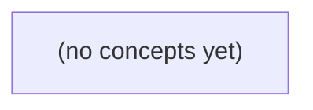

# 05.04 Go 内存模型：共享状态、同步与可见性

*面向 Go 初学者，以虚构会话状态 c-a 从 (false,0) 变为 (true,1) 为主线，理解共享变量为何会出现“半更新”、数据竞争为何危险，以及 happens-before 如何建立可靠可见性。教材通过 Mutex、channel、atomic 与 CAS 的对比，区分内存同步、状态快照和业务事务，并配套 22 道带反馈的纸上推演题。*

**章节:** 2

---

## 本书导览

- 了解整本书的章节脉络
- 掌握各章之间的概念依赖关系
- 选择最合适的阅读顺序

# 05.04 Go 内存模型：共享状态、同步与可见性

面向 Go 初学者，以虚构会话状态 c-a 从 (false,0) 变为 (true,1) 为主线，理解共享变量为何会出现“半更新”、数据竞争为何危险，以及 happens-before 如何建立可靠可见性。教材通过 Mutex、channel、atomic 与 CAS 的对比，区分内存同步、状态快照和业务事务，并配套 22 道带反馈的纸上推演题。

下方的概念图展示了本书 0 个核心概念以及它们之间的依赖关系；再下方是 1 个章节的入口。你可以按从上到下的顺序阅读，也可以根据自己的兴趣或先验知识选择切入点。

#### 概念图



## 章节索引

- **05.04 Go 内存模型：从共享在线状态到同步保证** — 面向Go初学者承接任务、锁和channel，以虚构IM会话两字段状态解释数据竞争、happens-before、Mutex发布、channel交接、atomic/CAS及业务竞争边界。

## 05.04 Go 内存模型：从共享在线状态到同步保证

- 定义共享读写与数据竞争
- 画出happens-before同步边
- 区分goroutine启动与完成的同步
- 用Mutex保护两字段一致快照
- 说明channel发送与对应接收的发布关系
- 区分单字段atomic与多字段不变量
- 解释race检测与业务竞争的不同

以虚构的 c-a 会话状态为线索，串起 goroutine、锁与 channel，建立 Go 并发读写的同步判断框架。

### 从会话状态识别共享读写

### 从会话状态识别共享读写

设 c-a 会话只有一个教学用状态：

`State{Online bool, Version int64}`

初始值为 `(false, 0)`；某个 goroutine 收到“上线”事件后，希望把它更新为 `(true, 1)`。这不是对真实 IM 在线语义的定义，而是用于判断并发读写的最小模型。

只要多个 goroutine 能访问同一份 `State`，它就是**共享变量**。关键不在于变量写在全局、堆上还是结构体字段中，而在于：不同执行单元是否可能指向同一份可变内存。

```go
type State struct {
    Online  bool
    Version int64
}
```

对该对象的典型操作可分为：

- **写**：事件处理 goroutine 执行 `s.Online = true`、`s.Version++`。
- **读**：推送、查询或日志 goroutine 读取 `s.Online` 和 `s.Version`。
- **读写冲突**：一个 goroutine 写某字段时，另一个 goroutine 同时读或写同一字段。
- **业务快照**：读者期待得到完整的 `(true, 1)`，而不是看到“已上线但版本仍为 0”之类的中间组合。

goroutine 的启动顺序、代码书写顺序，不等于实际执行先后。即使更新函数中先写 `Online`、再写 `Version`，其他 goroutine 也不能仅凭这段顺序推断自己必然观察到完整更新。要让“写入完成”与“读取快照”形成可靠先后，必须建立同步关系，例如由同一把互斥锁保护、通过 channel 交接，或使用满足需求的原子同步。

因此，判断并发代码的第一问不是“这两个 goroutine 看起来会不会撞上”，而是：它们是否访问同一份可变状态，至少一个是否写入，以及读者需要的是单字段值还是一致的业务快照。

### 数据竞争与 happens-before 边

### 数据竞争与 happens-before 边

设 c-a 会话共享状态为：

`state := State{Online: false, Version: 0}`

一个 goroutine 收到“上线”事件后写入 `state = State{true, 1}`；另一个 goroutine 同时读取 `state.Online` 和 `state.Version` 生成业务快照。这里的共享变量不是“整个业务对象”的抽象概念，而是两个 goroutine 都能访问到的同一块内存及其字段。

若两个并发访问满足以下条件，就构成数据竞争：

- 访问同一内存位置，例如一个读 `state.Online`，另一个写 `state.Online`；
- 至少一个访问是写；
- 两次访问之间没有同步建立的先后关系。

因此，下面的“看起来很简单”的代码仍然错误：

`go func() { state = State{Online: true, Version: 1} }()`

`fmt.Println(state.Online, state.Version)`

问题不在于读者能否猜中某次输出，而在于语言层面不保证读操作看到写操作后的值；更糟的是，分别读取两个字段时，快照可能不是任何一次完整写入所对应的业务状态。

判断关键是画出 happens-before（先行发生）边。它不是物理时间上的“可能先执行”，而是 Go 内存模型认可的可见性与顺序保证：

- **程序顺序边**：同一 goroutine 内，前一语句先于后一语句。例如写入 `Online` 先于更新 `Version`。
- **同步边**：解锁先于随后获取同一把锁；向 channel 发送先于对应接收；关闭 channel 先于接收端发现其已关闭。
- **传递性**：若 $A \rightarrow B$ 且 $B \rightarrow C$，则 $A \rightarrow C$。

例如写端在 `mu.Lock()` 后更新状态并 `mu.Unlock()`，读端随后成功 `mu.Lock()` 再复制 `state`，便形成：

`写状态 → Unlock → Lock → 读状态`

这条边意味着读端能够观察到该写端在解锁前完成的更新。没有这条边，就不能把“最终通常会变成 `(true,1)`”当作并发正确性的证据；业务快照必须由锁、channel 或其他明确同步机制保护。

### Mutex 发布两字段的一致状态

### Mutex 发布两字段的一致状态

设虚构的 c-a 会话共享状态为：

```go
type State struct {
	Online  bool
	Version int64
}

var state State
var mu sync.Mutex
```

初始状态是 `(false, 0)`；当写方确认 c-a 会话上线后，希望一次发布为 `(true, 1)`。这里的业务要求不是“两个字段最终都会变”，而是读方不能把它理解成一个从未存在过的组合，例如 `Online == true` 但 `Version == 0`。

写方在同一把互斥锁保护下完成整个状态迁移：

```go
mu.Lock()
state.Online = true
state.Version = 1
mu.Unlock()
```

读方也必须使用**同一把锁**读取这两个字段，并在持锁期间复制出快照：

```go
mu.Lock()
snapshot := state
mu.Unlock()

if snapshot.Online {
	// 使用 snapshot.Version 处理该次业务判断
}
```

`Unlock` 与之后成功获得同一把锁的 `Lock` 建立先后关系。因此，读方一旦拿到锁，就能看到写方在释放锁前完成的更新；同时，读方不会与写方交错地读取 `Online` 和 `Version`。复制出的 `snapshot` 是一次业务观察的稳定证据，解锁后可安全用于后续计算。

不要写成分别加锁读取字段：

```go
mu.Lock()
online := state.Online
mu.Unlock()

mu.Lock()
version := state.Version
mu.Unlock()
```

两次加锁之间可能已有另一位写方更新状态，`online` 与 `version` 便不再保证属于同一个业务时刻。互斥锁保护的单位应是“需要共同解释的状态快照”，而不只是单个字段。

### channel 交接与 goroutine 生命周期

### channel 交接与 goroutine 生命周期

设共享状态为：

`State{Online: false, Version: 0}`

某个 goroutine 更新为 `State{Online: true, Version: 1}` 后，关键不在于“它已经被启动”，而在于读者是否与这次写入建立了同步关系。

`go f()` 只表示创建并调度一个新的 goroutine。调用方不能据此推断：

- `f` 已经开始执行；
- `f` 已完成写入；
- 调用方随后读取共享变量时一定看见 `f` 的结果；
- `f` 返回时调用方会自动得到通知。

例如：

`go func() { state = State{true, 1} }()`

`fmt.Println(state.Online)`

这里第二行可能先执行，也可能与写入并发；若没有额外同步，读写还构成数据竞争。`go` 语句不是“等待任务完成”的语句，更不是发布屏障。

相比之下，channel 的发送与其对应接收提供明确交接。若写方先完成状态更新，再发送通知：

`state = State{true, 1}`  
`done <- struct{}{}`

读方接收后再读取：

`<-done`  
`snapshot := state`

则该次发送先于对应接收完成；接收成功后的读取可以观察到发送前已完成的写入。这里 `done` 不仅表示“有消息”，还承担“此前写入已发布”的同步作用。

也可以直接传递快照：

`updates <- State{Online: true, Version: 1}`

接收方得到的是该值的一份副本，通常比“通知后再读共享 `state`”更容易推理。前者交接数据，后者交接访问时机；若后者之后仍有多个 goroutine 并发读写 `state`，仍需锁或其他协议保护。

函数返回本身只结束该 goroutine 的执行；只有返回结果经 channel、`WaitGroup`、锁等机制被观察和同步时，其他 goroutine 才能据此可靠地判断其生命周期已推进到某个阶段。

### atomic、CAS 与两类竞争边界

### atomic、CAS 与两类竞争边界

对共享状态：

```go
type State struct {
    Online  bool
    Version int64
}
```

若只有一个独立字段需要更新，`sync/atomic` 很合适。例如把版本号作为单调递增计数器：

`v := atomic.AddInt64(&version, 1)`

原子操作保证该字段的读改写不可被拆开；`Load`、`Store`、`Add`、`CompareAndSwap` 之间也提供必要的同步可见性。CAS（比较并交换）尤其适合“仅当仍是旧值才提交”的条件更新：

`atomic.CompareAndSwapInt64(&version, old, old+1)`

CAS 失败不代表程序错误，只表示其他 goroutine 已先改变该值；调用方可重读后重试，或放弃本次提交。

但 `Online=true` 与 `Version=1` 构成的是一个业务快照。若写方分别原子写入两个字段，读方仍可能观察到 `Online=true, Version=0`，或得到彼此不对应的组合。即使每个字段都“无数据竞争”，多字段不变量仍未被保护。此时应以同一把 `Mutex` 覆盖读写，或将完整不可变快照整体发布，例如用 `atomic.Pointer[State]` 替换整份状态。

这里有两类边界：

- **内存数据竞争**：两个 goroutine 并发访问同一内存位置，至少一个写，且没有同步。`go test -race` 主要报告这一类问题。
- **业务竞争**：程序在内存层面已经同步，却因“检查—决定—提交”不是同一原子事务而违反规则。例如两个请求都读到 `Online=false`，随后都各自完成“上线”副作用。

因此，`-race` 无报告只说明访问同步关系大致成立，不证明业务状态转换正确；而 CAS 或锁的选择，应由“不变量覆盖几个字段、提交是否需要条件判断、是否伴随外部副作用”共同决定。

> **要点** — 并发正确性不仅要无数据竞争，还要用恰当同步机制发布状态并维护业务不变量。

从一个会话上线状态的并发读写入手，建立判断数据竞争与同步保证的基本框架。

### 两字段共享状态与无同步读写

### 两字段共享状态与无同步读写

设想一个会话状态由两个共享字段表示：

```go
type Session struct {
    Online  bool
    Version int
}
```

一个 goroutine 执行上线更新：

```go
s.Online = true
s.Version = 1
```

另一个 goroutine 同时进行普通读取：

```go
if s.Online {
    fmt.Println(s.Version)
}
```

这里的关键不是“写入顺序看起来很明确”，而是两个 goroutine 是否建立了同步关系。对写方而言，`Online=true` 在程序顺序上先于 `Version=1`；对读方而言，读取 `Online` 也先于读取 `Version`。但这只是各自 goroutine 内部的顺序，不能自动跨 goroutine 生效。

共享内存访问通常包含三个条件：

- 访问的是同一内存位置，例如写 `s.Online` 与读 `s.Online`；
- 至少一个访问是写；
- 两次访问未被 `happens-before` 关系排序。

本例中，写 `Online` 与读 `Online` 满足上述条件，因此已经构成数据竞争；`Version` 也同样如此。即使读者偶尔观察到 `Online=true, Version=1`，也不能据此证明程序正确；它还可能看到旧值、混合状态，或表现出难以复现的异常。

`time.Sleep`、增加 CPU 核数、观察日志输出顺序，都不会建立 `happens-before`。只有互斥锁、channel 通信、原子操作等同步机制，才能把“写完状态”可靠地传递为“允许读取状态”。竞态程序并不享有 Go 的 DRF-SC 保证：不能把它当作顺序一致的并发程序来推理。

### 数据竞争的判定：同址访问与未排序

### 数据竞争的判定：同址访问与未排序

设一个 goroutine 依次执行：

```go
session.Online = true
session.Version = 1
```

另一个 goroutine 不经任何同步就读取：

```go
if session.Online {
    fmt.Println(session.Version)
}
```

判断数据竞争，不应从“代码看起来先后执行”出发，而要逐项检查三个条件：

1. **访问同一内存位置**：`Online` 的读与写对应同一个字段位置；`Version` 的读与写也对应同一个字段位置。两个字段彼此不同，因此“写 `Online`、读 `Version`”本身不构成同址竞争；但各自的读写配对都可能构成竞争。

2. **至少一方是写**：两个读可以并发；两个写、或一个读一个写则可能改变或观察到变化中的值，必须进一步检查同步关系。

3. **未被 happens-before 排序**：若写入通过互斥锁、channel 通信、`WaitGroup`、原子操作等建立了“写先于读”的 happens-before 关系，就不是数据竞争。仅仅依赖 `time.Sleep`、日志先后、机器核数或“通常写得更快”，都不构成内存模型认可的排序。

因此，上例中 `Online` 的写与读未排序，`Version` 的写与读也未排序，程序存在数据竞争。即使某次运行打印出 `1`，也不能推出读者稳定地看到“`Online=true` 且 `Version=1`”这一完整状态。竞态程序是错误程序，不能享有无数据竞争程序的顺序一致性保证。

### 为什么睡眠、核数和日志不能形成保证

### 为什么睡眠、核数和日志不能形成保证

设写协程执行：

`Online = true` → `Version = 1`

读协程随后普通读取这两个字段。即使某次运行中读到了 `Online=true, Version=1`，也只能说明这一次恰好如此，不能说明程序获得了同步保证。

- **睡眠不是同步**：`time.Sleep` 只让当前协程暂时不运行；它不建立“写完成后读开始”的 `happens-before` 边。延长睡眠时间只是降低复现异常的概率，不能消除竞态。
- **单核或多核不是同步**：单核时协程仍可在任意指令附近切换；多核时则更可能并行执行。核数改变调度与时序，不会把两个普通访问变成受排序的访问。
- **日志不是同步**：日志输出的先后仅反映输出操作的可见顺序，不能证明字段读写之间存在内存模型要求的顺序。更何况日志本身可能改变调度，使问题“消失”。

只要同一地址存在并发读写，且二者没有被 `mutex`、`channel`、原子操作等建立的 `happens-before` 关系排序，就构成数据竞争。竞态程序不能享有 DRF-SC（无数据竞争则顺序一致）保证；测试中的稳定现象不是语言承诺。

### 竞态程序的后果与 DRF-SC 边界

### 竞态程序的后果与 DRF-SC 边界

设写方执行：

`state.Online = true`  
`state.Version = 1`

读方却在没有锁、通道或原子操作的条件下读取这两个字段。只要同一内存位置上存在并发读写，且两次访问至少有一次是写，并且它们未被 `happens-before` 关系排序，就构成数据竞争。这里对 `Online` 的读写、对 `Version` 的读写都可能分别构成竞态。

Go 不应被粗略理解为“像某些 C 程序一样，一发生竞态就任何结果都能发生”。Go 内存模型对具体读值、机器字大小等仍有一定约束；但这绝不意味着竞态代码可用。竞态程序是错误程序，编译器、运行时和处理器都不再需要提供“仿佛所有操作按某个单一全局顺序交错执行”的直觉语义。

关键边界是 **DRF-SC**：

> 若程序没有数据竞争（Data-Race-Free），Go 保证其行为可解释为顺序一致性（Sequential Consistency）。

因此，无竞态时可以把并发操作理解为存在一个统一顺序，并且每个 goroutine 保持自身程序顺序；有竞态时，这项保证消失。读方可能看到旧的 `Online` 与新的 `Version`，也可能看到新旧组合之外难以依赖的观察结果。不能用 `Sleep`、“单核运行”、日志先后或多次测试恰好稳定来补回同步保证。

要恢复可推理性，必须显式建立同步边：例如用互斥锁保护整个状态，用通道传递已构造完成的状态，或以正确的原子发布—获取协议发布版本与在线标记。`go test -race` 能帮助发现竞态，但修复目标不是“让检测器安静”，而是让每次共享访问都被明确的同步关系约束。

### 为后续同步方案画出问题图

### 为后续同步方案画出问题图

设想一个会话状态由两个字段组成：

```go
type Session struct {
    Online  bool
    Version int
}
```

写入方希望发布“用户已上线，状态版本为 1”：

```go
s.Online = true
s.Version = 1
```

读取方则普通读取：

```go
if s.Online {
    fmt.Println(s.Version)
}
```

把它画成两条 goroutine 执行线时，关键问题非常直观：

- 写入 goroutine：`Online=true → Version=1`
- 读取 goroutine：`读取 Online → 读取 Version`
- 两条线之间没有任何同步边。

同一 goroutine 内的箭头只表示本地的程序顺序；它并不会自动跨 goroutine 传递可见性。因此，读取方即使看到了 `Online=true`，也不能据此推导一定能看到 `Version=1`。更根本地说，对同一地址的读写若没有被 `happens-before` 排序，就构成数据竞争。

`time.Sleep`、更多 CPU 核、一次恰好正确的日志输出，都不是同步边。它们或许改变复现概率，却没有建立语言层面的保证。Go 不应把这种情况理解为 C 式“任何结果都可发生”，但竞态程序仍是错误程序，不能享有无数据竞争时的顺序一致性保证。

后续的 `Mutex` 解锁—加锁、channel 发送—接收、atomic 的发布—获取，正是在这两条执行线之间补上可证明的同步边。

> **要点** — 共享状态的并发读写若无 happens-before 排序即构成数据竞争，任何偶然时序都不是同步保证。

并发程序不能只按时间先后判断安全性；Go以内存模型定义哪些操作真正“看得见”。

### 程序顺序与共享可见性

### 程序顺序与共享可见性

在同一个 goroutine 中，代码具有明确的**程序顺序**：若 A 写入 `Version`，随后 B 读取它，那么 B 能看到 A 写后的结果。

```go
Version = 2 // A
fmt.Println(Version) // B：必然输出 2
```

但这个保证默认只存在于单个 goroutine 内。若一个 goroutine 写、另一个 goroutine 读，仅凭“写代码排在前面”“运行时大概已经执行完了”都不能推出读方一定可见：

```go
go func() { Version = 2 }() // A
fmt.Println(Version)        // D：未建立同步，存在数据竞争
```

`go` 语句保证的是：创建 goroutine 的动作先于新 goroutine 的开始执行；它**不保证**新 goroutine 完成后自动同步回创建者。因此 `sleep`、循环等待或观察日志时间先后，都不是内存模型认可的同步边。

要传递可见性，需要显式建立 happens-before 链：

```go
Version = 2  // A
done <- struct{}{} // B

<-done       // C
fmt.Println(Version) // D
```

同一 goroutine 内有 A → B、C → D；而 channel 的发送 B 同步先于对应接收 C。于是形成 A → B → C → D，D 必须看见 A 对 `Version` 的写入。类似地，`close(ch)` 与因关闭而返回的接收之间也可建立规定的同步关系。

### 创建goroutine只同步开始

### 创建 goroutine 只同步“开始”

`go f()` 不是一次双向的“调用—返回”。它只建立一条从创建者到新 goroutine 的同步边：`go` 语句之前、在创建 goroutine 中顺序执行完成的操作，先发生于新 goroutine 的执行开始。

```go
version := 1        // A：写入
go func() {
    fmt.Println(version) // B：可观察到 A 的结果
}()
```

这里同一 goroutine 内有程序顺序边 `A → go`，而 `go` 语句又同步到新 goroutine 的开始，因此可推导 `A happens-before B`。新 goroutine 读取 `version` 时，不会与这次初始化写入构成数据竞争。

但方向不能反过来：

```go
result := 0
go func() {
    result = 42 // C：写入
}()
fmt.Println(result) // D：读取
```

即使运行时“看起来”常常先执行 C，C 也不会因为 goroutine 结束而自动同步到 D。`go` 语句只保证创建前的状态可传入，不保证新 goroutine 的计算结果会传回；C 与 D 没有 happens-before 关系，因而存在数据竞争。

`time.Sleep`、循环等待或依赖调度时机都不能补上这条边。若创建者需要读取结果，必须显式建立反向同步，例如让子 goroutine 发送结果、创建者接收：

`C → 发送 → 接收 → D`

对应的 channel 发送与接收形成同步边，于是结果才对读取者可见。

### 用箭头画出happens-before

### 用箭头画出 happens-before

设共享状态 `Version` 初始为 `0`，一个 goroutine 更新它，另一个 goroutine 在收到通知后读取：

```go
// goroutine 1
A: Version = 2
B: done <- struct{}{}

// goroutine 2
C: <-done
D: fmt.Println(Version)
```

不要只看“B 比 C 早执行”这一时间现象，而要画出内存模型认可的箭头：

- 同一 goroutine 内遵守程序顺序：`A → B`。
- 对同一个 channel，一次发送与其对应接收建立同步：`B → C`。
- 接收 goroutine 内仍遵守程序顺序：`C → D`。

把箭头连起来：

`A → B → C → D`

因此，`A happens-before D`。`D` 读取 `Version` 时，必须能够观察到 `A` 写入的值，正常情况下会打印 `2`；这不仅是“通常来得及”，而是同步保证。

反过来，若仅写成：

```go
go func() { Version = 2 }()
time.Sleep(time.Millisecond)
fmt.Println(Version)
```

`sleep` 只是等待一段时间，不建立 happens-before 边；即使某次运行打印 `2`，程序仍可能存在数据竞争。goroutine 创建保证创建操作发生在新 goroutine 开始前，但新 goroutine 的完成不会自动同步回创建者；要让写入对读取可靠可见，仍需 channel、锁、WaitGroup 等明确同步。

### channel交接与关闭通知

### channel交接与关闭通知

在单个 goroutine 内，语句按程序顺序执行；跨 goroutine 则必须建立明确的 `happens-before` 边。最常见的交接链是：

```go
// goroutine A
state.Version = 2   // A：写入共享状态
ch <- struct{}{}    // B：发送通知

// goroutine B
<-ch                // C：接收通知
fmt.Println(state.Version) // D：读取共享状态
```

这里有两条关键关系：A 在 B 之前（同一 goroutine 的程序顺序），且 B 与“对应的”C 之间建立同步。因此得到传递关系：

`A 写 Version → B 发送 → C 接收 → D 读 Version`

于是 D 必须能观察到 A 的写入。`channel` 传递的不只是值，也可作为“此前数据已经发布”的交接点。

关闭也能用于一次性广播通知：

```go
state.Ready = true
close(done)

// 多个 goroutine
<-done
fmt.Println(state.Ready)
```

`close(done)` 与所有因该关闭而返回零值、且 `ok == false` 的接收操作同步；因此关闭前的 `Ready = true` 对这些接收后的读取可见。多个等待者都能被唤醒，这是关闭比单次发送更适合广播的原因。

但边界必须分清：若接收者从缓冲区取到的是关闭前已发送的元素，该接收同步的是那次对应发送，不应把它误当作“观察到了关闭”。同样，`sleep`、日志先后或“看起来发送已经完成”都不是同步边；只有发送—对应接收，或关闭—因关闭完成的接收，才能构成这类保证。

### 时间等待不是同步

### 时间等待不是同步

`time.Sleep` 只能让当前 goroutine 暂停一段时间；它既不建立内存可见性保证，也不说明另一个 goroutine 已经执行到预期位置。下面的代码“通常能打印 1”，只是调度恰好给了写入者运行机会：

```go
var version int

go func() {
    version = 1 // A：写
}()

time.Sleep(time.Millisecond)
fmt.Println(version) // D：读
```

这里 A 与 D 之间没有正式的 happens-before 边，因此仍是数据竞争。把等待从 `1ms` 改成 `1s`，只是降低“碰巧失败”的概率，不能使程序正确。

日志顺序同样不能证明同步：

```go
go func() {
    version = 1
    fmt.Println("已写入")
}()
fmt.Println("准备读取")
```

即使多次观察到“已写入”先打印，也不能推出读取一定看见写入；输出顺序受调度、缓冲和 I/O 锁影响，不等于共享内存的同步关系。

正确做法是显式建立同步边。例如：

```go
done := make(chan struct{})

go func() {
    version = 1 // A
    done <- struct{}{} // B
}()

<-done              // C
fmt.Println(version) // D
```

单个 goroutine 内有 $A \rightarrow B$、$C \rightarrow D$ 的程序顺序；对应的 channel 发送 B 同步于接收 C。因此形成 $A \rightarrow B \rightarrow C \rightarrow D$，D 必须看见 A 写入后的 `version`。

`Mutex` 的解锁与后续加锁、`WaitGroup` 的 `Done` 与等待返回等，也能提供类似保证。判断并发代码时，应问“同步边在哪里”，而不是“等得够不够久”。

> **要点** — 并发可见性取决于happens-before箭头，而非观察到的时间先后；goroutine完成必须显式同步。

在线会话状态往往由多个字段共同表达。要让读者只看到旧状态或新状态，关键不在字段各自“线程安全”，而在于把不变量放进同一同步边界。

### 两字段状态与一致快照

### 两字段状态与一致快照

设会话状态由两个字段共同表示：

- `online=false, generation=0`：尚未上线；
- `online=true, generation=1`：已上线并进入第 1 代会话。

这里真正的状态不是两个彼此独立的变量，而是有约束的一对值：`online=true` 时，`generation` 必须对应当前已建立的会话。一次状态迁移应当把

\[
(false,0)\rightarrow(true,1)
\]

视为一个不可分割的逻辑更新。读者也必须获得同一时刻的快照：要么看到旧对 `(false,0)`，要么看到新对 `(true,1)`，不能看到 `(true,0)` 或 `(false,1)` 这样的混合对。

```go
type Session struct {
    mu         sync.Mutex
    online     bool
    generation int
}

func (s *Session) Connect() {
    s.mu.Lock()
    s.online = true
    s.generation = 1
    s.mu.Unlock()
}

func (s *Session) Snapshot() (bool, int) {
    s.mu.Lock()
    defer s.mu.Unlock()
    return s.online, s.generation
}
```

同一把 `mu` 将两次写入与读者的复制操作放进同一临界区。`Unlock` 到后续 `Lock` 建立同步关系：在写者解锁后才取得锁的读者，必然看到完整的新状态；先取得锁的读者，则看到完整的旧状态。

不要误以为“每个字段都有锁”就足够。若读者分别锁住 `online` 和 `generation` 读取，写者可恰好在两次读取之间完成部分更新，跨字段不变量仍会被破坏。锁保护的是由它共同围住的状态边界，而不是字段名称。

还要区分范围：互斥锁只保证本进程内存中的可见性与互斥；它不能自动保证数据库事务已提交，也不能保证网络消息或设备指令已经送达。

### 同一把锁建立发布与观察

### 同一把锁建立发布与观察

设会话状态由一对字段表示：

```go
online bool
epoch  int
```

初始为 `(false, 0)`，写者希望一次发布为 `(true, 1)`。正确的边界不是分别保护两个字段，而是让这次状态转换处于同一把 `mu` 的临界区：

```go
mu.Lock()
online = true
epoch = 1
mu.Unlock()
```

读者也必须使用同一把锁，并在锁内复制完整快照：

```go
mu.Lock()
snapOnline := online
snapEpoch := epoch
mu.Unlock()
```

推导关键在 Go 内存模型的同步关系：一次 `mu.Unlock()` 发生在随后成功获得该 `mu.Lock()` 的操作之前。于是，写者在解锁前的两次写，都发生在读者加锁后的两次读之前。读者若在写者解锁前取得锁，只能复制旧对 `(false, 0)`；若在写者解锁后取得锁，则必须复制新对 `(true, 1)`。

因此，锁不仅排除了临界区的并发访问，还把“写入完成”发布给“随后观察”的读者。读者拿到的是同一时刻的逻辑状态，而非两个字段各自恰好无数据竞争的拼接结果。

若改为每个字段各自短暂加锁，或读 `online`、`epoch` 时分别加锁，则两次读取之间写者仍可完成更新，读者可能得到 `(false, 1)` 或 `(true, 0)`。字段安全不等于不变量安全；共同含义的数据必须共享同步边界。

这里的保证仅覆盖本进程内存中的可见性与一致快照。它不自动构成数据库事务，也不保证消息、网络包或设备指令已经成功交付。

### 读者只能得到旧对或新对

### 读者只能得到旧对或新对

设在线状态由两个字段共同表示：

```go
type Session struct {
    mu     sync.Mutex
    online bool
    count  int
}
```

初始状态为 `(false, 0)`，写者要将其整体切换为 `(true, 1)`。关键是：两次写入必须位于同一个临界区，读者复制快照也必须使用同一把锁。

```go
func (s *Session) SetOnline() {
    s.mu.Lock()
    s.online = true
    s.count = 1
    s.mu.Unlock()
}

func (s *Session) Snapshot() (bool, int) {
    s.mu.Lock()
    online, count := s.online, s.count
    s.mu.Unlock()
    return online, count
}
```

考虑两种时序：

- 读者先取得 `mu`：它在写者更新前完成复制，因此得到旧对 `(false, 0)`；随后写者才能进入临界区并写入新值。
- 写者先取得 `mu`：读者会阻塞，直到写者依次完成两次赋值并执行 `Unlock`；读者随后复制到的新对只能是 `(true, 1)`。

`Unlock` 与后来成功取得同一把锁的 `Lock` 之间建立同步关系。更重要的是，锁把“写两个字段”和“读两个字段”都包成不可穿插的整体：读者不可能恰好在 `online = true` 与 `count = 1` 之间复制。

若每个字段各自短暂加锁，或读两个字段时分别加锁，则写者可能在两次读取之间完成部分更新，读者仍可能看到 `(true, 0)`。锁保证的是本进程内存中的快照一致性；它不自动保证数据库事务一致性，也不保证消息已交付到外部设备。

### 分字段加锁为何仍会失配

### 分字段加锁为何仍会失配

设在线状态由一对字段表示：

```go
online bool
count  int
```

业务不变量是：离线时为 `(false, 0)`，上线后为 `(true, 1)`。写者希望完成一次整体迁移：

```go
online = true
count = 1
```

如果两个字段共用同一把 `mu`，写者在一次临界区内更新，读者也在同一临界区内复制快照：

```go
mu.Lock()
online = true
count = 1
mu.Unlock()

mu.Lock()
o, c := online, count
mu.Unlock()
```

那么读者只能在写入前看到旧对 `(false, 0)`，或在写入后看到新对 `(true, 1)`。`Unlock` 与随后成功取得同一把锁的 `Lock` 建立同步关系，两个字段作为一个整体被发布。

相反，若每个字段各有一把锁，且读者分别短暂加锁：

```go
onlineMu.Lock()
o := online
onlineMu.Unlock()

countMu.Lock()
c := count
countMu.Unlock()
```

写者可能恰好在两次读取之间更新另一个字段。于是读者会拼出从未作为完整状态存在的组合：

- 先读到旧 `online=false`，再读到新 `count=1`，得到 `(false, 1)`；
- 先读到新 `online=true`，再读到旧 `count=0`，得到 `(true, 0)`。

因此，“每个字段无数据竞争”不等于“多个字段构成一致快照”。锁的粒度应由不变量决定：需要共同观察、共同更新的字段，应共享同一同步边界。

还要注意，这种保证仅覆盖本进程内存。互斥锁不能替代数据库事务，也不能保证消息、设备指令已经成功交付。

### 锁的边界：内存一致不等于业务完成

### 锁的边界：内存一致不等于业务完成

同一个 `mu` 能把内存中的状态更新组织成一个原子可见的切换。例如写者在一次临界区内完成：

```go
mu.Lock()
online = true
sessionID = 1
mu.Unlock()
```

读者也在同一把锁下复制快照：

```go
mu.Lock()
o, id := online, sessionID
mu.Unlock()
```

那么读者只能得到旧对 `(false, 0)` 或新对 `(true, 1)`，不会看到 `(true, 0)` 这类混合状态。这里的保证范围很明确：**当前进程内、受该锁保护的共享内存**。

但“内存状态已更新”不等于“业务已经完成”。例如上线流程可能还包含：

1. 在数据库中写入会话记录；
2. 向其他进程广播在线事件；
3. 向设备发送控制消息；
4. 等待设备确认收到并实际生效。

`mu.Unlock()` 只能说明临界区内的内存写入对随后获得 `mu` 的 goroutine 可见；它不能自动提交数据库事务，不能让多个服务实例互斥，也不能证明网络消息已经送达设备。

因此，应按边界选择机制：

- 多字段内存快照：使用同一把互斥锁；
- 数据库的多行、多表一致性：使用数据库事务；
- 多实例共享资源：使用分布式锁、条件更新或协调协议；
- 消息可靠投递：使用持久化消息、重试、幂等键与确认机制。

锁解决的是“本进程内谁先看见什么”；业务完成还需要定义“数据何时提交、事件何时送达、失败后如何恢复”。

> **要点** — 多字段不变量必须由同一同步边界保护；互斥锁保证进程内一致快照，不保证外部系统事务或交付。

channel 不只是传值工具，更能建立发送者与接收者之间的可见性保证；但它不会自动消除底层可变数据的共享风险。

### 不可变快照的交接模型

### 不可变快照的交接模型

并发程序中，与其让多个 goroutine 反复读写同一份“在线状态”，更稳妥的方式是：发送者构造一个完整快照，再通过 channel 交给接收者。

```go
type Snapshot struct {
    Online bool
    Version int
}

updates := make(chan Snapshot, 1)

go func() {
    s := Snapshot{Online: true, Version: 1} // 先完成构造
    updates <- s                            // 再交接
}()

s := <-updates
if s.Online && s.Version == 1 {
    // 安全读取该快照字段
}
```

这里的关键约定是“构造—交接—只读”：

1. 发送前，发送者负责写完 `Snapshot{true, 1}` 的全部字段。
2. `send` 与对应 `receive` 建立同步关系：接收操作完成后，接收者能够看到该次发送之前对快照所做的写入。
3. 交接后，发送者不再修改这份已交出的状态；接收者将其视为不可变值。

缓冲 channel 同样满足发送到接收的可见性保证，但 `updates <- s` 返回只表示值已进入缓冲区或被接收，并不表示接收者已经处理完该状态。因此，不能把发送返回理解为“对方已经消费完成”。

还要注意，`Snapshot` 的字段若包含 `slice`、`map` 或指针，channel 传递的只是这些描述符或地址，底层数据仍可能共享。此时应在交接后停止修改底层数据，或在发送前复制，避免把“不可变快照”变成共享可变状态。

### 发送到接收的发生先于边

### 发送到接收的发生先于边

对同一条 channel 消息，Go 内存模型保证：

$$\text{send 完成} \;\rightarrow\; \text{对应 receive 完成}$$

这里的“$\rightarrow$”是发生先于（happens-before）关系，而不只是时间上的“先做后做”。因此，发送 goroutine 在发送前完成的普通内存写入，对成功接收该值的 goroutine 都可见。

```go
type Snapshot struct {
    Ready bool
    Version int
}

ch := make(chan Snapshot)

go func() {
    s := Snapshot{Ready: true, Version: 1} // 初始化字段
    ch <- s                                // 发送
}()

snap := <-ch // 对应接收
fmt.Println(snap.Ready, snap.Version) // 安全看到 true、1
```

接收方不需要额外加锁来“刷新”`Snapshot` 的字段：只要该消息确实由这次接收取得，发送前构造 `s` 的写入就已经通过 channel 的同步边传递过来。

缓冲 channel 同样成立。即使发送者已因缓冲区有空位而返回、接收者稍后才读取，仍有：

```go
ch <- s   // 该次发送完成
x := <-ch // 取到该次消息时，初始化对 x 可见
```

但这不意味着发送返回时消息已经被消费，更不意味着接收方处理完毕。若发送者需要等待“对方已处理”，必须建立反向确认，例如另一个 `done` channel。

还要区分“值本身被复制”与“底层数据被隔离”。发送 `Snapshot` 这样的纯值可安全交接；若消息含有 `slice`、`map` 或指针，复制的只是描述符或地址。发生先于边能保证接收方看到发送前的初始化，却不能阻止双方随后并发修改同一份底层数据。交接后应由接收方独占修改，或发送前复制数据。

### 缓冲不改变发布保证

### 缓冲不改变发布保证

无缓冲 channel 中，发送与接收必须“会合”：

```go
ch <- Snapshot{Ready: true, Version: 1} // 等到某个接收者接手
```

发送操作返回时，接收操作已经与之配对；但这仍不意味着接收方已经处理完业务逻辑，只说明值已完成交接。

缓冲 channel 只改变等待时机。只要缓冲区有空位，发送者即可把值放入队列并立即返回：

```go
ch := make(chan Snapshot, 8)
ch <- Snapshot{Ready: true, Version: 1} // 可能尚无接收者
```

随后某个 `<-ch` 取得该值。内存模型保证：对应的 `send` happens-before 该 `receive` 完成。因此，发送前构造并写入 `Snapshot` 的字段，对接收方完成接收后的读取安全可见。

但不要把“发送返回”误解为“消费者已消费”或“消费者已处理完成”。缓冲区可能仍存着该值，接收 goroutine 甚至尚未运行。若发送后需要等待处理结果，应额外使用确认 channel、`WaitGroup` 或其他同步协议。

此外，channel 传递的是值的副本，不是自动深拷贝。若 `Snapshot` 含 `slice`、`map` 或指针，其底层数据仍可能共享。发布后应遵守所有权约定：发送者不再修改，或在发送前复制可变数据。

### 切片、映射与指针的共享陷阱

### 切片、映射与指针的共享陷阱

通过 channel 发送结构体时，结构体本身会按值复制；但 `slice`、`map`、`pointer` 字段复制的通常只是描述符或地址，底层可变数据仍可能被两端共享。

```go
type Message struct {
    Tags   []string
    Meta   map[string]string
    Count  *int
}

n := 1
msg := Message{
    Tags:  []string{"go"},
    Meta:  map[string]string{"state": "new"},
    Count: &n,
}

ch <- msg
```

接收者得到的是新的 `Message` 结构体值，但下列对象并未自动复制：

- `Tags` 的底层数组；
- `Meta` 指向的哈希表；
- `Count` 指向的整数 `n`。

因此，若发送后发送者继续执行：

```go
msg.Tags[0] = "changed"
msg.Meta["state"] = "modified"
*msg.Count = 2
```

而接收者同时读取对应字段，就可能发生数据竞争。即使没有并发重叠，接收者观察到的也可能是“交接后被改写”的内容，而非发送瞬间的逻辑快照。

channel 的 `send → receive` 保证接收方能看到发送前完成的写入；它不保证发送后对共享底层对象的修改被隔离。缓冲 channel 也一样：发送成功只表示消息进入缓冲区，不表示接收者已经消费，更不表示其引用的数据已不再使用。

可靠的约定是：将消息视为所有权交接，发送后不再修改其可变底层数据。若发送者仍需保留并修改原数据，应在发送前复制：

```go
out := Message{
    Tags: append([]string(nil), msg.Tags...),
    Meta: maps.Clone(msg.Meta),
    Count: new(int),
}
*out.Count = *msg.Count
ch <- out
```

channel 复制的是消息外壳，不是自动深拷贝。

### 交接协议与防御性复制

### 交接协议与防御性复制

把 channel 用作并发交接时，应先约定**所有权**：发送方构造完对象后发送，随后不再修改；接收方在收到后才取得读取或继续处理的权利。对于不可变快照，这种协议最简单：

```go
type Snapshot struct {
    Ready bool
    Version int
}

ch <- Snapshot{Ready: true, Version: 1}
s := <-ch
fmt.Println(s.Ready, s.Version) // 安全读取已完成构造的字段
```

无论无缓冲还是缓冲 channel，某次 `send` 都先行发生于对应值的 `receive` 完成。因此接收方可看到发送前的写入。但缓冲 channel 中，`send` 返回只表示值已进入缓冲区，**不表示接收方已经消费、更不表示处理完成**；若发送方还要等待处理结果，应使用确认 channel、`WaitGroup` 或响应消息。

尤其要警惕“值发送”并不等于“深拷贝”：

```go
type Job struct {
    Data []byte
    Tags map[string]string
}

ch <- Job{Data: buf, Tags: tags}
```

这里复制的只是 slice 头、map 头等描述符；底层数组、哈希表及指针指向的对象仍可能共享。发送后继续写 `buf`、修改 `tags`，会与接收方并发访问，形成数据竞争。

实践上可遵循：

- 交接后发送方不再修改：适合明确的单一所有者转移。
- 接收方需要长期保留或独立修改时复制：如 `data := append([]byte(nil), job.Data...)`，map 则逐项复制。
- 多方必须持续共享并读写同一对象时，channel 不能替代互斥；使用 `Mutex`、`RWMutex`、原子操作或专门的串行 owner goroutine。
- 若只需发布只读版本，优先构造新快照后整体交接，而不是原地更新共享结构。

> **要点** — channel 建立发送到对应接收的可见性保证，但安全前提是交接后的数据不再被并发修改。

原子操作能消除单字段读写的数据竞争，却不自动维护跨字段、跨资源的一致业务状态。

### 单字段原子操作的保证范围

### 单字段原子操作的保证范围

`atomic.Bool` 与 `atomic.Int64` 适合维护一个可独立解释的共享字段，例如“服务是否在线”“当前连接数”“已处理消息数”。

```go
var online atomic.Bool
var connections atomic.Int64

online.Store(true)          // 原子写入
if online.Load() {          // 原子读取
    connections.Add(1)      // 原子加一，并返回新值
}
```

这些操作具有两个核心保证：

- **单次读写不可分割**：并发 `Load`、`Store`、`Add` 不会产生普通变量那样的数据竞争，也不会读到被写到一半的值。
- **顺序一致性**：所有原子操作可以被理解为按照某个全局顺序依次发生；每个 goroutine 观察到的顺序都与其自身程序顺序兼容。若一个 goroutine 先 `Store(true)`，另一个 goroutine 随后 `Load()` 读到 `true`，则该读取发生在这次写入之后。

`Add` 特别适合计数器：

```go
n := connections.Add(1) // n 是递增后的值
```

因此，它能保证多个 goroutine 同时增减计数时不丢失更新。类似地，`CompareAndSwap(old, new)` 可将“读取旧值、比较、写入新值”合并为一次原子状态转换。

但边界同样明确：原子性只覆盖**该字段及该次操作**。`online.Store(true)` 不能自动保证成员表、版本号或消息队列也已处于同一代状态；`connections.Add(1)` 也不等于“新连接已经完整注册”。原子字段适合表示独立事实，不适合单独承担多资源一致性。

### 无数据竞争仍可能读到混合快照

### 无数据竞争仍可能读到混合快照

设服务状态由两个字段组成：`Online` 表示是否在线，`Version` 表示该状态所属的配置版本。它们分别使用原子变量：

```go
var online atomic.Bool
var version atomic.Int64
```

发布新状态时，写者依次执行：

```go
online.Store(true)
version.Store(42)
```

读者则分别读取：

```go
v := version.Load()
on := online.Load()
```

每次 `Load`、`Store` 都是原子的，因此不会出现 Go 竞态检测器报告的数据竞争；原子操作之间也具有一致的顺序语义。但读者仍可能在两个写入之间交错执行，得到：

```text
Version = 41
Online  = true
```

这表示“旧版本 + 新在线状态”的混合快照。若业务约定 `Online=true` 只应从版本 `42` 起生效，这个结果虽然内存安全，却已经违反了状态一致性。

关键区别是：

- **无数据竞争**：没有两个 goroutine 以不安全方式同时访问同一内存位置。
- **原子单字段一致**：每个字段都能读到某一次完整写入的值。
- **多字段快照一致**：多个字段必须来自同一次业务状态提交。

分别原子化字段，只能保证前两者，不能把两次写入自动合成为一次“发布”。当 `Online` 与 `Version` 必须共同解释时，应使用互斥锁保护整组读写，或一次性发布包含两者的不可变快照；否则读者必须明确能够容忍混合代状态。

### 从单值原子性到复合不变量

### 从单值原子性到复合不变量

`atomic.Bool`、`atomic.Int64`适合表达可独立解释的单值：停止标志、连接计数、限流额度、已处理消息数。例如：

- `Load`/`Store`：读取或切换单个标志位；
- `Add`：并发累加计数；
- `CompareAndSwap`：确保“只有一个协程从 `0` 抢到 `1`”。

这些操作对该变量提供无竞态访问，并且原子操作具有一致的顺序；但“每次读到的单值正确”不等于“多个值共同构成的业务状态正确”。

设在线状态由 `Online` 与 `Version` 表示。写协程希望发布“用户上线，版本变为 42”：

`Online.Store(true)`  
`Version.Store(42)`

读协程却可能观察到：

`Online == true`，但 `Version == 41`

这没有数据竞争：两个字段都通过原子操作访问；但它是不存在于任何完整提交时刻的“混合代”状态，违反“在线状态与版本必须匹配”的复合不变量。

更进一步，`CAS(0, 1)`只能选出一个状态转移的赢家，不能把成员表更新、消息写入数据库、输出队列投递一起变成原子提交。若赢家刚把标志设为 `1` 就崩溃，其他协程仍可能看到“已完成”，而相关资源尚未完成。

当状态必须整体可见时，应使用同一把锁保护读写，或构造不可变快照后一次发布；涉及数据库、队列等外部资源时，则需要事务、幂等键、补偿或可靠消息机制。原子变量保护的是一个位置，业务不变量保护的是一组关系。

### CAS 只裁决单次状态转移

### CAS 只裁决单次状态转移

设房间状态 `started` 为 `atomic.Bool`，`false` 表示未开始，`true` 表示已开始。多个协程同时执行：

`started.CompareAndSwap(false, true)`

其中只有一个协程能观察到旧值为 `false` 并成功写入 `true`；它就是“启动者”。其余协程看到的旧值已是 `true`，操作返回 `false`，应放弃重复启动。这个原子读—比较—写过程使“从未启动到已启动”成为不可分割的单字段转换：

- 成功：获得执行初始化逻辑的资格；
- 失败：说明已有其他协程赢得资格；
- 不会出现两个协程都成功启动的情况。

但成功的 CAS 只说明 `started` 已提交，不意味着相关资源也已经同步完成。若赢家随后依次执行：

1. 向成员表写入初始成员；
2. 向消息数据库创建首条系统消息；
3. 向输出队列投递“房间已开始”事件；

在这些步骤之间，其他协程已经可以读到 `started == true`。它们可能查询成员表却尚未看到成员，读取消息库却没有首条消息，或据此继续处理请求而输出事件仍未入队。这里未必存在数据竞争：成员表、数据库、队列都可能各自线程安全；问题是业务上观察到了“已开始”与“初始化未完成”的混合状态。

因此，CAS 适合裁决一次性的资格、所有权或状态门闩，例如“谁负责启动”。若要求读者只能看到完整启动后的房间，应在锁内同时更新内存状态，或构造包含状态与关联数据的不可变快照后一次发布；跨数据库与队列时，还需使用事务、事务外盒等机制保证可恢复的提交与投递。

### 为完整会话状态选择同步边界

### 为完整会话状态选择同步边界

先问业务不变量，而不是先问“能否改成原子操作”。若会话要求“在线版本对应唯一成员表与消息游标”，那么读取者必须看到同一代状态：

$$
(\text{Online},\ \text{Version},\ \text{Members},\ \text{Cursor})
$$

任意字段分开 `Load`、`Store`，即使每次访问都无数据竞争，也可能读到“新 `Online` + 旧 `Members`”的混合代，破坏快照语义。

- **状态小、更新和读取都在内存内**：用 `sync.Mutex` 保护整组字段。锁的边界应覆盖“检查条件→修改状态→生成需要发布的结果”，而非只包住某一次赋值。
- **读多写少、读者需要完整一致视图**：构造不可变 `SessionSnapshot`，写者复制并填充完整新版本后一次发布；读者只读取同一个快照指针，绝不拼接多个独立原子字段。
- **涉及成员表、消息数据库、输出队列等外部资源**：使用数据库事务、事务性消息箱或可靠事件日志。`CompareAndSwap(0, 1)` 只能选出“谁成功上线”，不能使数据库写入和消息投递成为同一次提交。

原子变量适合独立计数、开关、指标等单字段不变量，例如连接数 `Add` 或取消标志 `Load`。当业务规则包含“这些字段必须同时变化”“此版本只能产生一次通知”“持久化成功后才能对外可见”时，同步边界必须提升到完整状态或完整事务。

> **要点** — 原子操作保护单个值；只要正确性依赖多个字段或外部副作用，就必须建立完整提交边界。

竞态检测器能发现已执行路径上的并发访问问题，但“通过检测”不等于程序在所有调度下都安全，更不等于业务规则正确。

### 竞态检测器检测什么

### 竞态检测器检测什么

`go test -race` 会在测试运行时监测**实际执行到的**内存访问：当两个或多个 goroutine 并发访问同一共享变量，且至少一个是写入，并且这些访问之间没有被锁、channel、`sync.WaitGroup`、原子操作等同步关系正确约束时，就可能报告数据竞争。

例如，下面的 `count++` 同时包含读和写；多个 goroutine 并发执行时并不安全：

`count++`

竞态检测器关注的是“内存访问是否存在未同步冲突”，而不是变量看起来是否简单，也不是代码是否偶尔运行正常。它通常会给出冲突读写的位置、相关 goroutine 的创建位置，帮助定位应建立同步关系的代码。

但它是动态工具，只覆盖测试期间真实走到的路径、输入规模和调度组合：

- `go test -race` 无报警，只能说明本次执行未发现竞争；
- 未覆盖的错误分支、低概率并发时序、线上特定负载仍可能隐藏竞争；
- 因此应为并发代码编写能同时触发读写的测试，而不能把“检测通过”当作全路径证明。

一旦出现报警，应优先修正同步：明确共享数据的所有权，使用同一把锁保护同一不变量，或通过 channel 转移所有权；不要用增加 `Sleep`、降低并发数等方式掩盖问题。

### 无报警为何不能证明安全

### 无报警为何不能证明安全

`go test -race` 是动态检测：它只能观察**本次测试中实际执行到的并发访问**。因此，无报警最多说明“在当前输入、当前调度和当前覆盖路径下，检测器没有看到数据竞争”，不能推出程序整体安全。

局限主要来自三个方面：

- **测试覆盖有限**：某个 goroutine 分支、错误处理路径、超时路径或关闭流程没有被测试到，其中的共享变量访问便不会被检查到。
- **调度时机偶然**：竞争往往依赖极窄的交错窗口。例如一个 goroutine 正好在读取标志位后被抢占，另一个 goroutine 随即写入；本次运行未出现这种交错，不代表它永远不会出现。
- **输入组合不全**：并发数量、请求顺序、缓存状态、取消信号和网络延迟的不同组合，都可能触发不同路径。单元测试通常无法穷尽这些组合。

因此，应把竞态检测作为反馈工具，而非安全证明：补充高并发、重复运行、超时与取消等测试，并在设计阶段明确每份共享状态由谁保护、何时持锁、通过何种消息或原子操作建立同步关系。发现报警时先修正同步；即使长期无报警，也仍要审查设计是否覆盖所有访问路径。

### 有报警先修同步边

### 有报警先修同步边

对在线会话表执行 `go test -race` 时，一旦出现报警，先不要把它当作“偶发日志”。它表示在**本次实际执行的路径**上，至少两个并发访问同时触及了同一共享内存，并且其中至少一个是写入，二者之间缺少可证明的同步关系。

例如，登录协程写入在线状态：

`online[userID] = session`

而心跳、踢人或消息投递协程同时读取：

`session := online[userID]`

普通 `map` 既不能承受并发读写，也不能仅靠“通常先登录、后发送”的业务直觉保证安全。报警栈通常分别给出读、写位置及其 goroutine 创建位置。排查时沿着栈回答三件事：

1. **共享变量是什么**：是 `online` 映射、会话字段、连接指针，还是关闭标记？
2. **哪些路径访问它**：登录、退出、超时清理、广播、重连是否都会读写？
3. **同步边在哪里缺失**：读写是否受同一把 `sync.Mutex`/`sync.RWMutex` 保护，是否通过 channel 发送与接收建立顺序，或是否使用了正确的原子操作？

修复目标不是“让报警消失”，而是为冲突访问建立明确的 happens-before 关系。例如将映射的查找、更新、删除都置于同一互斥锁下：

`mu.Lock(); delete(online, userID); mu.Unlock()`

读取也必须使用对应的 `mu.RLock()`/`mu.RUnlock()`，不能只给写入加锁。若状态只允许由一个会话管理 goroutine 持有，则其他 goroutine 应通过 channel 请求读写，而不是绕过所有者直接访问映射。

修复后再运行检测，确认已覆盖相关并发场景；但无报警只说明已执行路径未观察到竞争，仍需继续审查未覆盖路径与业务原子性。

### 无数据竞争不等于业务正确

### 无数据竞争不等于业务正确

`go test -race` 报告的是**内存层面的数据竞争**：多个 goroutine 并发访问同一内存位置，且至少一个写入，又没有建立正确的同步关系。它只覆盖测试时实际执行到的路径；没有报警，不代表所有调度、所有分支都安全。若有报警，应先修复同步问题，因为此时连读取到什么值都可能不可靠。

但即使程序已经 race-free，仍可能存在**检查后执行竞争**：每一次读写都在锁内，单次访问安全，却没有把完整业务事务放进同一个原子区间。

例如，两个 goroutine 都执行“若用户尚未加入，则插入成员”：

1. goroutine A 加锁，检查用户不存在，解锁；
2. goroutine B 加锁，检查用户不存在，解锁；
3. A、B 分别再次加锁并插入。

这里每次访问集合都受锁保护，竞态检测器不会报警；但“检查不存在”和“执行插入”被拆成两个锁区间，业务规则“成员只能加入一次”仍被破坏。

类似地，服务先检查某成员仍在线，再向其发送退出通知；在检查与发送之间，该成员可能已经退出。内存访问可以完全同步，但跨 goroutine、跨网络甚至跨进程的状态已变化。

因此，锁的单位不应只看“保护一个变量”，还要看“保护一个不可分割的业务决策”。需要保证“检查—修改”整体一致时，应将其置于同一临界区，或使用条件更新、版本号、幂等键、事务等机制。

### 两类业务竞争案例

### 两类业务竞争案例

`go test -race` 报告的是未同步的内存访问；如果每次读写都受互斥锁保护，程序可能是 race-free。但业务操作往往包含“读取判断 + 后续动作”的整体不变量，若其间释放锁，其他协程或其他进程仍可改变事实。

- **确认成员资格后退出或发送**：某协程先读取在线成员表，确认用户仍在房间，于是准备向其发送消息；随后另一协程将该用户退出房间。若“检查成员资格”和“发送消息”分别位于两个正确加锁的区间，内存访问没有数据竞争，却可能向已退出成员发送消息。  
  ```text
  加锁：确认成员存在 → 解锁
  加锁：发送消息       → 解锁
  ```
  这里被破坏的不变量是“消息只能发送给当前成员”。若退出与发送跨进程，还需借助版本号、条件更新、消息队列语义或服务端原子命令保证，而不能仅依赖本地互斥锁。

- **检查重复后插入**：两个协程分别执行“查询键是否存在；不存在则插入”。查询和插入都加锁，因而 race-free；但二者都可能在查询时看到“不存在”，再先后插入同一逻辑对象，造成重复记录。  
  ```text
  加锁：检查不存在 → 解锁
  加锁：插入记录   → 解锁
  ```
  应将“检查并插入”合并为同一临界区，或更可靠地交给数据库唯一约束、原子 `INSERT`、条件写入等机制。

因此，修复数据竞争后，还应明确每个业务不变量，并判断其检查与状态变更是否必须作为一个原子事务完成。

> **要点** — race 检测发现的是已执行路径的数据竞争；正确同步是底线，业务原子性还需围绕完整规则设计。

以 IM 会话的在线状态与最后消息为线索，建立从“并发读写”到“可证明同步”的判断框架。

### 共享状态与无同步数据竞争

### 共享状态与无同步数据竞争

IM 会话常把“是否在线”和“最后一条消息”放在同一共享对象中：

```go
type Session struct {
    online bool
    last   string
}
```

只要两个或多个 goroutine 访问同一内存位置，且其中至少一个是写入，就构成**共享读写**。若这些访问之间没有同步关系，并发执行时便是**数据竞争**。

```text
goroutine A：收到上线事件          goroutine B：页面刷新
s.online = true                    if s.online {
s.last = "你好"                        render(s.last)
}
```

无同步时，执行时序可交错为：

```text
A: 写 online=true
B: 读 online=true
B: 读 last=""        ← 看见新在线状态，却仍读到旧消息
A: 写 last="你好"
```

更危险的是，语言层面并不承诺它一定呈现为这种“合理但陈旧”的快照。发生数据竞争后，程序行为不再能依据正常的顺序推理：读者可能看到旧值、新值，或字段之间不一致的组合。

可将问题画成访问图：

```text
A 写 s.online  ──无同步──> B 读 s.online
A 写 s.last    ───无同步──> B 读 s.last
```

这里的关键不是“两个操作恰好同时发生”，而是它们缺少可证明的先后约束。`sleep`、日志输出、经验上“写得很快”都不是同步。要消除竞争，后续必须用互斥锁、channel 或原子操作建立明确的 happens-before 关系。

### happens-before：启动不等于完成

### happens-before：启动不等于完成

`go f()` 只保证新 goroutine 被创建并可参与调度；它不保证 `f` 已执行，更不保证其写入已对当前 goroutine 可见。因而下面的“启动后读取”没有同步关系：

```go
var online bool

go func() { online = true }()
if online { /* 不能据此断言已上线 */ }
```

两个 goroutine 对 `online` 并发读写，既可能触发数据竞争，也不能从程序顺序推出“先写后读”。

`happens-before`（先行发生）描述的是：若事件 A 在事件 B 之前发生，则 A 的内存写入对 B 可见。常见同步边包括：

- 同一 goroutine 内，前面的语句先行发生于后面的语句。
- `mu.Unlock()` 先行发生于随后成功返回的 `mu.Lock()`。
- 对无缓冲 channel 的发送先行发生于对应接收完成；带缓冲 channel 中，某次发送先行发生于取走该值的接收。
- 关闭 channel 先行发生于因观察到关闭而返回的接收。
- goroutine 的退出本身**不会**自动建立“主 goroutine 已观察到退出”的边。

因此，等待完成必须显式同步。例如用 channel 发布结果：

```go
done := make(chan struct{})

go func() {
    online = true
    close(done)
}()

<-done
// close(done) → <-done，故此处可观察到 online == true
```

这里 channel 同时承担两件事：通知“工作已完成”，以及发布完成前写入的状态。若只写 `go update()` 而没有 `<-done`、`WaitGroup`、锁或其他同步原语，就只有启动，没有完成等待，更没有可证明的可见性保证。

### Mutex：发布一致的会话快照

### Mutex：发布一致的会话快照

设会话状态由两个字段组成：

```go
type Session struct {
    mu     sync.Mutex
    online bool
    lastID int64
}
```

业务不变量是：`online == false` 时，`lastID` 必须为 `0`；上线后才允许发布最后消息编号。

未同步时，写协程可能依次执行：

```go
s.online = true
s.lastID = 42
```

读协程却可能在两次写之间读取，得到快照：

```text
online=true, lastID=0
```

这不仅是数据 race，也是业务上不存在的“半发布”状态。更糟的是，读到 `online=false, lastID=42` 同样可能发生：字段分别读写，没有任何顺序保证。

使用同一把 `Mutex` 后，更新和读取都必须覆盖完整快照：

```go
func (s *Session) Publish(id int64) {
    s.mu.Lock()
    s.online = true
    s.lastID = id
    s.mu.Unlock()
}

func (s *Session) Snapshot() (bool, int64) {
    s.mu.Lock()
    defer s.mu.Unlock()
    return s.online, s.lastID
}
```

`Unlock` 与后续成功获得同一把锁的 `Lock` 建立 happens-before 关系。因此，`Snapshot` 要么看到更新前的一致状态：

```text
online=false, lastID=0
```

要么看到更新后的完整状态：

```text
online=true, lastID=42
```

关键不在于“每个字段都加锁”，而在于**相关字段必须由同一同步边界共同保护**。锁保护的是会话快照及其不变量；若分别给 `online` 和 `lastID` 配不同锁，虽然可能消除 race，仍可能重新暴露不一致的组合状态。

### channel 交接与 atomic 的边界

### channel 交接与 atomic 的边界

`channel` 不只是“传值管道”，还是发布同步点：一次发送完成，先行于接收方取得该值。若发送前已写好对象字段，接收后读取这些字段，可依赖这条 happens-before 链看到已发布的数据。

```go
msg := &Message{Text: "你好", Seq: 42}
ch <- msg        // 发布 msg 及此前写入

m := <-ch        // 接收后可安全读取 m.Text、m.Seq
```

关键是“对应的发送与接收”。不要把它误解为：向某个 channel 发送一次，就自动保护所有后续访问；接收后若多个 goroutine 继续无锁修改 `m`，仍会发生数据 race。

单个独立状态适合 `atomic`：

```go
atomic.StoreInt32(&online, 1)
if atomic.LoadInt32(&online) == 1 { /* 在线 */ }
```

但两个字段分别 atomic，并不等于读者看到了同一时刻的整体状态：

```go
atomic.StoreInt64(&lastSeq, 100)
atomic.StoreInt32(&online, 0)
```

读者可能读到 `online == 1` 与 `lastSeq == 100`，也可能读到 `online == 0` 与旧的 `lastSeq`。每个字段无 race，却可能违反业务不变量，例如“离线时最后消息序号必须冻结”。

`CAS` 只保证目标字段的“比较并更新”原子性：

```go
if !atomic.CompareAndSwapInt32(&online, 0, 1) {
    return // 已在线；失败分支同样必须有明确业务语义
}
```

CAS 失败不是异常，而是并发竞争的正常结果；必须决定重试、返回已有结果，还是转入其他流程。若状态需要成组一致更新，优先用 `mutex` 保护快照，或将完整不可变状态封装后以单个原子指针替换。数据 race 是未同步的内存访问错误；业务竞争则是即使同步正确，多个请求争夺“谁先上线、谁先发送”的规则问题。

### race 检测与业务竞争诊断

### race 检测与业务竞争诊断

先问两个问题：**是否存在未同步的同址读写？**若有，是内存数据竞争；若没有，再问：**多个合法操作的先后顺序是否会破坏业务规则？**后者是业务竞争。

1. 两个 goroutine 同时写 `online`，无锁、无原子操作。  
   **内存数据竞争**；用互斥锁或原子操作保护。

2. 一个写 `lastMsg`，另一个读它，双方都持同一把 `mu`。  
   **无数据竞争**；锁建立同步关系。

3. `online` 用原子存取，`lastMsg` 普通读写且无锁。  
   **仍有数据竞争**；只保护一个字段不能发布整体状态。

4. 发送端写完结构体后通过 channel 发送指针，接收端收到后读取，之后发送端不再修改。  
   **无数据竞争**；发送先于对应接收完成。

5. 发送指针后仍修改其字段，接收端可能同时读取。  
   **数据竞争**；改为副本、加锁或明确所有权转移。

6. `mu.Lock()` 后写状态，解锁；另一方加锁后读。  
   **无数据竞争**；`Unlock` 与后续 `Lock` 形成保证。

7. 两人同时执行“若在线则扣减余额”，全程持锁但检查和扣减分成两次加锁。  
   **业务竞争**；应将检查与扣减置于同一临界区。

8. 两个请求都成功抢到“最后一个名额”，数据库有唯一约束并拒绝其一。  
   **业务竞争被约束拦截**；处理冲突并反馈“已售罄”。

9. `Load` 余额后计算，再 `Store` 新余额。  
   **可能丢失更新**；用锁或 CAS 重试。

10. CAS 失败后直接返回成功。  
    **业务错误**；失败应重读、重算、重试或明确失败。

11. CAS 失败后用旧值再次 CAS。  
    **错误修复**；必须基于最新值重新判断条件。

12. 两个原子字段分别保存 `online` 和 `lastMsg`。  
    **可能混合状态**；读者可看到不同版本组合。

13. 用原子指针一次替换不可变状态快照。  
    **适合整体发布**；发布后不得修改快照内容。

14. `sync.Map` 存取同一键，但“先查再删”不是原子操作。  
    **无内存竞争也可能有业务竞争**；使用锁或原子化协议。

15. race 检测未报告问题。  
    **不等于正确**；它不能证明业务规则成立，也不能覆盖未执行路径。

16. race 检测报告普通字段读写冲突。  
    **先修同步，不要忽略**；“偶尔错”也是未定义并发行为信号。

17. 只读配置在启动阶段写完，启动后并发读取。  
    **通常安全**；前提是启动完成的同步边界明确。

18. 一个 goroutine 关闭 channel，另一个同时发送。  
    **不只是业务问题**；可能 panic，应约定唯一关闭者。

19. 多个 worker 都可能关闭同一 channel。  
    **生命周期竞争**；由协调者统一关闭，或用 `sync.Once`。

20. 加锁后调用外部回调，回调又请求同一资源。  
    **可能死锁或长时间阻塞**；锁内复制必要数据，锁外回调。

21. 日志显示顺序异常，但共享数据均被锁保护。  
    **未必是 race**；先确认日志写入、网络和调度造成的观察顺序。

22. 修复方案在“加锁、channel、原子、数据库约束”间选择。  
    **按不变量选工具**：保护复合状态用锁；交接所有权用 channel；单值条件更新用 CAS；跨进程唯一性用持久化约束。

诊断结论应写清：冲突的共享对象、同步边界、要维护的业务不变量，以及失败分支如何处理。下一节将进一步解释这些 goroutine 为何会以不同顺序获得运行机会。

> **要点** — 并发正确性既要建立 happens-before，也要用合适同步原语维护业务不变量。
