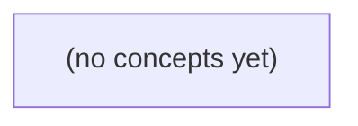

# 05.06 Go 内存生命周期：从 8 字节预览到 64KiB 缓冲保留

*面向 Go 初学者，以虚构 IM 消息接收场景为唯一贯穿案例，解释为什么队列中仅保留 8 字节预览，仍可能让 64KiB 接收缓冲持续可达。通过切片共享、引用图、GC 可达性、逃逸、指针尾部和运行时指标，建立从“字节账目”到“对象生命周期”的完整理解。*

**章节:** 2

---

## 本书导览

- 了解整本书的章节脉络
- 掌握各章之间的概念依赖关系
- 选择最合适的阅读顺序

# 05.06 Go 内存生命周期：从 8 字节预览到 64KiB 缓冲保留

面向 Go 初学者，以虚构 IM 消息接收场景为唯一贯穿案例，解释为什么队列中仅保留 8 字节预览，仍可能让 64KiB 接收缓冲持续可达。通过切片共享、引用图、GC 可达性、逃逸、指针尾部和运行时指标，建立从“字节账目”到“对象生命周期”的完整理解。

下方的概念图展示了本书 0 个核心概念以及它们之间的依赖关系；再下方是 1 个章节的入口。你可以按从上到下的顺序阅读，也可以根据自己的兴趣或先验知识选择切入点。

#### 概念图



## 章节索引

- **05.06 Go 内存生命周期：从小消息视图到大缓冲保留** — 面向Go初学者承接切片、指针、虚拟内存与调度，以虚构IM消息预览解释底层数组共享、len/cap、可达性、逃逸、栈/堆、指针尾部和复制/复用取舍。

## 05.06 Go 内存生命周期：从小消息视图到大缓冲保留

- 解释slice头与底层数组共享
- 区分len/cap限制与内存所有权
- 画队列小视图保留大数组的引用图
- 估算1024个独立缓冲的纸上数据字节
- 区分逃逸与变量词法位置
- 解释指针切片尾部残留引用
- 分开HeapAlloc/TotalAlloc/StackInuse和RSS
- 比较复制与复用的正确性/成本

一条只保留8字节预览的消息，为什么仍可能让64KiB缓冲长期存活？本节从切片共享与可达性拆解这一常见误判。

### 从消息预览看切片共享

### 从消息预览看切片共享

IM 客户端从连接 `c-a` 读取一条消息时，常先准备一个 `64KiB` 接收缓冲：

```go
buf := make([]byte, 64<<10) // 64KiB
n, _ := conn.Read(buf)
msg := buf[:n]

preview := msg[:8] // 队列中只保存前 8B 预览
```

`preview` 的 `len` 是 `8`，但这并不表示它只拥有 `8B` 内存。切片本身只是一个描述符，可概念化为：

- 指向底层数组某个位置的指针；
- 当前长度 `len`；
- 最大可扩展长度 `cap`。

这里 `msg`、`preview` 与原始 `buf` 指向同一块底层数组。`preview := msg[:8]` 只改变切片头中的长度；它没有复制前 8 个字节，也没有切断对 `64KiB` 数组的引用。因此，只要队列仍可达 `preview`，垃圾回收器就必须认为整块底层数组仍可能被访问，不能回收它。

可以把关系理解为：

`队列 → preview 切片头 → 64KiB 底层数组`

若固定保存 `1024` 条这样的预览，且每条消息都来自独立的 `64KiB` 缓冲，那么纸面上的被保留数组容量约为：

$$1024 \times 64KiB = 64MiB$$

而真正需要的预览数据仅为：

$$1024 \times 8B = 8KiB$$

两者差异来自“数据长度”与“底层数组所有权关系”不同。注意，`64MiB` 是按逻辑保留的缓冲容量估算，不等于进程 RSS 必然恰好增长 `64MiB`：实际 RSS 还受页提交、运行时分配器、缓存与垃圾回收时机影响。若队列只需预览，应显式复制：`preview := append([]byte(nil), msg[:8]...)`。

### len与cap不决定所有权

### len 与 cap 不决定所有权

设 IM 读取器为每条消息分配一个 `64KiB` 缓冲：

```go
buf := make([]byte, 64<<10)
preview := buf[:8]
```

此时：

- `len(preview) == 8`：当前可直接读写的元素只有前 `8B`。
- `cap(preview) == 64<<10`：从 `preview` 起点向后，仍可在容量范围内扩展到整个数组。
- 更关键的是：`preview` 的切片头仍指向 `buf` 的底层数组；只要 `preview` 可达，该 `64KiB` 数组通常就不能被回收。

可将关系画成：

```text
队列
  │
  ▼
preview：指针 ───────────────► [ 8B 预览 |                其余 65528B                ]
          len=8, cap=65536                  同一个 64KiB 底层数组
```

因此，`len==8` 仅描述“当前视图长度”，并不表示“只拥有 8B 内存”。`cap` 描述的是扩容边界，也不是垃圾回收的释放单位。垃圾回收关心的是：是否仍存在从根对象到该底层数组的引用路径。

若固定队列保存 `1024` 个这样的独立 `preview`，纸面上的被保留数组总量为：

$$1024 \times 64KiB = 64MiB$$

而真正需要的预览内容只是：

$$1024 \times 8B = 8KiB$$

要切断大数组的引用，应复制所需数据：

```go
preview := append([]byte(nil), buf[:8]...)
```

复制后队列引用的是新的小数组，原 `64KiB` 缓冲在其他引用消失后才具备回收条件。注意，`64MiB` 是按对象大小推导出的潜在保留量，不等于进程 RSS：运行时页缓存、堆增长策略和操作系统回收都会影响 RSS 表现。

### 1024条预览的纸上账

### 1024条预览的纸上账

设 IM 读取端每条消息都获得一个独立的 `64KiB` 缓冲：

```go
buf := make([]byte, 64<<10) // 64KiB
preview := buf[:8]          // 只看前 8B
queue = append(queue, preview)
```

队列中的每个元素表面上都是 `len=8`，但切片头部仍指向原始 `buf` 的底层数组。只要该 `preview` 仍可达，垃圾回收器就不能回收整块 `64KiB` 数组。

固定保留 `1024` 条预览时，纸面上的被保留数据量为：

$$
1024 \times 64\text{KiB}
= 1024 \times 65536\text{B}
= 64\text{MiB}
$$

真正需要展示给队列的数据却只有：

$$
1024 \times 8\text{B}
= 8192\text{B}
= 8\text{KiB}
$$

若在入队时复制预览：

```go
preview := append([]byte(nil), buf[:8]...)
queue = append(queue, preview)
```

那么队列持有的是新的 8B 小数组；原 `buf` 在读取逻辑不再引用它后即可被回收。两种写法的有效业务数据相同，潜在保留量却从约 `64MiB` 降到约 `8KiB`。

这里的 `64MiB` 是“仍被引用的底层数据量”的纸上账，不等于进程 RSS 必然立刻减少 `64MiB`：运行时可能保留空闲页、分配器存在粒度与元数据开销，操作系统也未必立即回收物理页。但它准确指出了所有权：`len=8` 不代表只拥有 8B。

### 可达性、逃逸与监控指标

### 可达性、逃逸与监控指标

`len(preview)==8` 只说明可访问的元素数是 8，并不说明它只拥有 8B。若预览直接来自消息缓冲：

`preview := buf[:8]`

那么 `preview` 的切片头仍指向同一块 64KiB 底层数组。只要队列中的任一预览仍可达，垃圾回收器就必须认为该数组可达；1024 条独立消息便可能保留约 64MiB 的底层缓冲。改为 `preview := append([]byte(nil), buf[:8]...)` 后，队列仅保留约 8KiB 的预览数据。这里的 64MiB 是对象大小的纸面推导，不等于进程 RSS。

变量是否“逃逸到堆”也不由它写在函数内、是否取地址等单一词法现象决定，而由编译器的逃逸分析判断：如果对象在函数返回后仍可能被引用、被闭包捕获、发送到 channel、存入接口或被其他 goroutine 使用，通常需要堆分配。反之，即使写了局部指针，只要引用不离开当前调用，底层对象仍可能在栈上。

排查时应区分指标：

- `HeapAlloc`：当前仍存活的堆对象字节数；大缓冲被切片引用时更可能体现在这里。
- `TotalAlloc`：进程启动以来累计分配量，只增不减，不能表示当前泄漏或保留。
- `StackInuse`：运行时已获取、正在用于 goroutine 栈的内存；goroutine 数量和深调用会影响它。
- `RSS`：操作系统看到的驻留物理页，除堆和栈外还包含运行时元数据、代码、映射、碎片及尚未归还系统的页。

因此，看到 RSS 高不能直接断言“切片保留了 64MiB”；应结合 `HeapAlloc`、堆剖析和对象引用链，确认那 8B 预览是否仍把大数组保持可达。

### 复制、复用与尾部引用清理

### 复制、复用与尾部引用清理

若队列只需消息前 `8B` 预览，最直接的隔离方式是复制：

`preview := append([]byte(nil), buf[:8]...)`

此后 `preview` 拥有独立底层数组；原 `64KiB` 缓冲不再被它引用，待其他引用消失后即可被垃圾回收。对 `1024` 条消息，预览数据本身约为 $1024\times8B=8KiB$；这与“每条预览仍钉住一个 `64KiB` 数组”的纸面上限约 `64MiB` 有本质区别。两者都不是 RSS 的直接承诺：运行时可能复用 span、延迟归还页，RSS 还受分配器和操作系统影响。

复用大缓冲也可以正确，但必须显式约定所有权。例如从 `sync.Pool` 借出的 `buf`，只能在消费者完成读取后归还；若队列保存的是 `buf[:8]`，生产者却立刻把 `buf` 放回池中，后续复用会改写预览，形成数据竞争或逻辑串消息。跨 goroutine 交接时，要么复制小数据，要么以 channel、确认计数或独占所有权保证“读完再归还”。

指针切片还要清理尾部引用：

`items = items[:n]` 只缩短长度，底层数组中 `n:` 位置的指针仍可能指向已删除对象。应在截断前清零：

`clear(items[n:])`  
`items = items[:n]`

否则队列即使逻辑上已删除元素，垃圾回收器仍会沿这些残留指针保持对象可达。复制解决的是底层字节数组保留；清尾解决的是容器槽位引用保留；并发交接则解决谁可以读、谁可以复用的问题。

> **要点** — 小切片只缩小视图，不自动缩小所有权；决定大缓冲生命周期的是仍然可达的引用。

从一条 8 字节消息预览出发，辨清切片长度、容量与底层数组所有权之间常被混淆的关系。

### 切片头并不携带数据

### 切片头并不携带数据

Go 的切片变量不是字节序列本身，而是一个描述底层数组某个区间的“小消息视图”。可将其抽象为：

`切片 = 数据指针 + 长度 len + 容量 cap`

其中，指针指向当前视图的起点；`len` 决定可直接索引和遍历的元素数；`cap` 决定在不重新分配数组时，最多还能向后扩展到哪里。真正占用大量内存的是底层数组，而不是切片头。

```go
full := make([]byte, 64*1024) // len=65536, cap=65536
preview := full[:8]           // len=8, cap=65536
```

`preview` 看起来只有 8 字节，却仍指向 `full` 的同一块 64 KiB 数组。因此：

- `preview[0] = 1` 会使 `full[0]` 也变为 `1`；
- 只要 `preview` 仍存活，这个小切片就可能让整块大数组保持可达；
- `len(preview)==8` 只限制当前可见元素，不表示它只拥有或只保留 8 字节内存。

多个切片可以有不同的长度、容量和起始位置，却共享同一数组。切片传递、赋值通常复制的也只是这三个字段，而非全部数据；因此理解“谁仍持有指向大数组的切片”，比只看消息长度更能判断内存生命周期。

### 小预览为何仍占着大缓冲

### 小预览为何仍占着大缓冲

设有一块完整接收缓冲：

```go
full := make([]byte, 64*1024)
preview := full[:8]
```

切片不是数据本身，而是一个描述底层数组某段区间的轻量结构，可抽象为：

`切片 = 数据指针 + len + cap`

因此两者的状态可写为：

| 变量 | 数据指针 | len | cap |
|---|---|---:|---:|
| `full` | 指向 64KB 数组起点 | 65536 | 65536 |
| `preview` | 指向同一数组起点 | 8 | 65536 |

`preview` 看起来只剩 8 字节，因为其长度为 `8`；但它的数据指针仍指向那块 64KB 底层数组。只要 `preview` 仍可达，垃圾回收器就必须认为该数组仍可能被访问，因而不能回收整块数组。

更重要的是，`cap(preview)==65536` 表明它不仅能读取前 8 字节，还可以在容量范围内扩展：

```go
preview = preview[:1024]
```

这里不会分配新数组，仍会直接看到原 `full` 的前 1024 字节。写入也同样共享：

```go
preview[0] = 'A'
// full[0] 也变为 'A'
```

所以，“小消息预览”并不等于“小内存占用”。`len` 只限制当前可直接索引的元素数；决定底层数组是否仍被保留的是切片持有的数据指针，而不是它展示出来的长度。

### 限制容量不是复制数据

### 限制容量不是复制数据

设：

`full := make([]byte, 64*1024)`

此时 `full` 的 `len` 与 `cap` 都是 `65536`。两种预览写法看似接近，含义却不同：

- `preview := full[:8]`：`len=8`，`cap=65536`
- `limited := full[:8:8]`：`len=8`，`cap=8`

三索引切片 `full[:8:8]` 只把新切片的容量上限锁在 8。它仍指向 `full` 的同一底层数组，因此：

```go
limited[0] = 'X' // full[0] 也会变为 'X'
```

更重要的是，两者都会让那块 64 KiB 数组继续存活；只要 `preview` 或 `limited` 仍可达，垃圾回收器就不能回收 `full` 背后的大缓冲。`cap=8` 不等于“只占 8 字节”，更不等于“切出了独立的小数组”。

容量限制的真正用途是约束后续 `append`：

```go
preview = append(preview, '!')
// 仍可能直接写入 full 的底层数组

limited = append(limited, '!')
// 容量已满，必须分配新数组并复制已有 8 字节
```

因此，三索引切片适合防止下游追加操作意外覆盖原缓冲区后续内容；但若目标是摆脱大缓冲的内存保留，必须显式复制：

`copy := append([]byte(nil), full[:8]...)`

此时 `copy` 与 `full` 不再共享，修改 `copy[0]` 不会影响 `full[0]`。不过不要依赖其容量恰好为 8；容量是运行时实现细节，独立所有权才是这里应保证的事实。

### 独立副本切断共享关系

### 独立副本切断共享关系

设 `full := make([]byte, 64*1024)`，并取前 8 字节：

`preview := full[:8]`

此时 `preview` 的长度是 8，但它仍指向 `full` 的同一底层数组；因此修改预览就是修改原缓冲：

`preview[0] = 'A'`

随后 `full[0]` 也会变为 `'A'`。即使改为三下标切片 `full[:8:8]`，其容量虽被限制为 8，底层数组仍未改变，写入依然会影响 `full`，64 KiB 大数组也仍可能因该小切片存活而无法回收。

若要真正断开共享关系，应显式复制：

`copy := append([]byte(nil), full[:8]...)`

这里先创建一个空的 `nil` 切片，再将 8 个字节追加进去；由于目标没有可复用的底层数组，运行时会为结果分配新的存储空间，并复制数据。之后：

- 修改 `preview[0]` 会影响 `full[0]`；
- 修改 `copy[0]` 不会影响 `full[0]` 或 `preview[0]`；
- 原来的大缓冲不再因 `copy` 而被引用，可在没有其他引用时被垃圾回收。

需要注意，`copy` 的长度必为 8，但其容量不应被精确依赖。`append` 的扩容与分配策略属于运行时实现细节；它可能恰好为 8，也可能更大。若语义只要求“独立且包含这 8 字节”，应检查 `len(copy)`，而不是假设 `cap(copy) == 8`。

### 预览队列的所有权选择

### 预览队列的所有权选择

消息预览进入异步队列时，关键不是 `len(preview)==8`，而是队列究竟拥有哪块底层存储。

```go
full := make([]byte, 64*1024)
preview := full[:8] // len=8, cap=65536，仍引用整块缓冲
```

若直接把 `preview` 入队，写法最省复制成本，且 `preview[0]` 的修改会同步反映到 `full[0]`。但只要队列尚未出队，这个 8 字节视图就会保留整块 64 KiB 数组；高并发或队列积压时，小预览可能累积为大量大缓冲保留。

`full[:8:8]` 能把容量限制为 8，避免后续 `append` 意外覆盖原缓冲的其余部分，却**不能**解除共享，也不能让垃圾回收器释放原来的 64 KiB 数组。因此它适合表达“只允许读取或有限追加”的边界，不适合作为内存释放方案。

若队列只需要稳定预览，应在入队时复制：

```go
previewCopy := append([]byte(nil), full[:8]...)
```

此后修改 `preview[0]` 不会影响 `previewCopy[0]`。复制后的容量由运行时决定，不应依赖其精确值；队列获得独立所有权，原始大缓冲可在其他引用消失后回收。

缓冲复用则要求更严格的协议：只有消费者明确归还缓冲、生产者确认不再读取，才能放回池中。它可降低分配压力，却引入生命周期协调、数据竞争和内容被覆盖的风险。实践中，短小且需跨协程保存的预览优先复制；仅在队列消费迅速、缓冲所有者明确且经过压测时，才保留视图或使用复用池。

> **要点** — len 与 cap 描述访问边界，不代表内存所有权；只有复制或解除全部引用，才能避免小视图保留大数组。

一条消息预览为何会让整块大缓冲迟迟不能回收？关键不在于变量名是否置空，而在于底层数组是否仍被可达的切片引用。

### 从消息队列到预览切片

### 从消息队列到预览切片

设消息队列保存完整缓冲，而消费者只想保留前几十字节的预览：

```go
type Message struct {
    full    []byte
    preview []byte
}

buf := make([]byte, 1<<20) // 1 MiB 完整消息
msg := Message{
    full:    buf,
    preview: buf[:64],
}
queue = append(queue, msg)
```

这里并没有复制数据。`full` 与 `preview` 是两个独立的切片头，但都指向同一块底层数组。可将切片理解为：

$ \text{slice} = (\text{data 指针}, \text{len}, \text{cap}) $

因此，`msg.full` 的长度是 `1 MiB`，`msg.preview` 的长度是 `64`；但预览虽小，其 `data` 仍指向那块 `1 MiB` 数组。只要队列中的 `Message` 可达，其中任意一个切片仍引用该数组，整块数组就不能被 GC 回收。

随后执行：

```go
msg.full = nil
```

只意味着该 `Message` 中的 `full` 切片头不再持有数组；`preview` 仍然持有它。若队列保存的是这个 `msg`，或者其他对象、全局变量、栈上的局部变量仍保存了 `preview`，GC 从这些根开始扫描时仍能到达底层数组。

队列模型中的关键关系是：

- 队列元素可达，元素字段通常也可达；
- `full` 和 `preview` 共享数组，不因名称不同而拥有独立内存；
- 缩短 `preview` 的长度不会缩小数组；
- 只有不再存在任何可达切片、指针或其他引用时，数组才具备回收资格。

若预览确实需要长期留存，而完整消息应尽快释放，应显式复制预览：

```go
preview := append([]byte(nil), buf[:64]...)
```

此时预览拥有新的小数组；原始大缓冲在其他引用消失后才可被 GC 回收。

### len 与 cap 不决定所有权

### len 与 cap 不决定所有权

切片可视为一个描述符，核心包含：指向底层数组的`数据指针`、长度`len`与容量`cap`。其中，`len`决定当前可访问元素数，`cap`决定从当前起点还能扩展多少元素；但两者都不决定底层数组是否仍被持有。

```go
full := make([]byte, 16<<20) // 16 MiB
preview := full[:32:32]      // len=32, cap=32
full = nil
```

此时`preview`看起来只有 32 字节：`len(preview)==32`，`cap(preview)==32`。然而它的数据指针仍落在那块 16 MiB 数组中。只要`preview`仍可从栈、全局变量、堆对象字段或其他 GC 根间接到达，GC 就必须保留整块底层数组。

第三个下标表达式`full[:32:32]`常被误解为“截断并缩小内存”。它实际只限制后续`append`可使用的容量，避免追加内容覆盖原数组后部；它不会复制数据，也不会把数组缩成 32 字节。换言之：

- `len`描述“现在读多少”；
- `cap`描述“还能长多少”；
- 数据指针决定“仍连接到哪块数组”。

若预览只需少量字节，应显式复制，使其拥有独立的小数组：

```go
preview := append([]byte(nil), full[:32]...)
full = nil
```

因此，“小切片保留大数组”是对象所有权与可达性问题，而不是`len`、`cap`显示较小就能自动解决的问题。

### full=nil 为何仍不能释放

### `full=nil` 为何仍不能释放

设想读取一条大消息：

```go
full := readMessage()      // 例如 8 MB
preview := full[:128]      // 只看前 128 字节
queue = append(queue, preview)
full = nil
```

`full=nil` 的含义很具体：它只删除了变量 `full` 到底层数组的一条引用边，并不表示“释放这块数组”。此时引用关系仍可能是：

`全局 queue → preview 切片头 → 8 MB 底层数组`

切片本身通常只保存指针、长度和容量；`preview` 虽然长度只有 128 字节，但其指针仍指向原来的大数组。只要 `queue` 中的该切片存在，垃圾回收器就能从根对象沿引用找到整个数组，因此数组仍然可达，不能回收。

根不只来自队列。以下任一位置保留切片，都足以延长大数组生命周期：

- 当前函数或调用栈中的局部变量；
- 包级变量、缓存、对象字段；
- goroutine 闭包捕获的变量；
- channel 中尚未取出的切片；
- 队列、日志缓冲或重试列表中的预览数据。

可以把 `nil` 理解为“断开一根线”，而不是“销毁被指向物”。只有从 GC 根出发再也找不到该数组时，它才成为可回收对象。

这也不是循环引用问题：Go 的 GC 能回收“互相引用但没有根可达”的对象。这里的关键恰恰相反——大数组仍被一个活跃的 `preview` 间接持有。若预览只需少量字节，应复制出独立小数组，例如 `preview := append([]byte(nil), full[:128]...)`，再让原大缓冲失去全部引用。

### 可达性、GC 根与循环引用

### 可达性、GC 根与循环引用

Go 的垃圾回收并不关心对象之间是否“互相引用”，而是从一组 **GC 根** 出发做可达性遍历。常见根包括：

- 正在执行函数的栈变量与寄存器中的指针；
- 全局变量、包级缓存；
- 运行时维护的活跃 goroutine、定时器、通道等待队列等；
- 仍被其他存活堆对象引用的字段、切片、映射或接口值。

设消息处理过程为：

```go
full := queue.Pop()      // 大字节切片
preview := full[:128]    // 小预览，仍指向同一底层数组
full = nil
cache = append(cache, preview)
```

`full = nil` 只删除当前栈槽位到该切片头的引用；它不会复制 `preview`，也不会切断 `preview` 对底层数组的指针。只要 `cache` 是全局缓存，或仍可从某个活跃调用栈到达，GC 就能沿着 `cache → preview → backing array` 找到整块大数组，因此不能回收。

反过来，循环引用并不构成特殊障碍：

```go
a.next = b
b.prev = a
```

若 `a`、`b` 不再能从任何 GC 根到达，这个环虽然闭合，仍会整体被回收。Go 的 GC 判断的是“是否从根可达”，不是引用计数；不存在“引用次数不为零便永不释放”的规则。

因此，诊断大缓冲保留时应追问：**还有哪条从栈、全局或运行时对象出发的引用路径通向该数组？** 小切片持有大数组通常是所有权与生命周期设计问题，不必先把它误判为循环引用泄漏；即使可达性已消失，进程 RSS 也未必会立刻下降。

### 小视图保留不是立刻的 RSS 问题

### 小视图保留不是立刻的 RSS 问题

`preview := full[:128]` 看似只保留了 128 字节，但它的切片头仍指向 `full` 的底层数组。只要 `preview` 可从栈、全局变量、队列、缓存或其他对象间接到达，整块数组就仍是活对象；此时执行 `full = nil` 只移除了一个引用，并没有改变数组的所有权事实。

这首先是“谁仍拥有这块数组”的问题，而不必然是程序故障：

- 若预览确实需要在稍后读取，保留原始缓冲是正确语义，只是内存代价可能高。
- 若预览只需少量数据却长期存活，则小切片意外延长大数组生命周期，才是值得优化的保留问题。
- 若所有引用都消失，即使对象之间形成循环引用，只要没有从 GC 根可达，Go 的垃圾回收器仍可回收它们。

还要区分堆对象可回收与进程 RSS 下降。GC 发现数组不可达后，通常先把这部分内存标记为可复用；运行时可能继续保留页供后续分配，而不是立刻归还操作系统。因此，`preview` 释放后 RSS 没有马上下降，并不能证明数组仍被引用；反过来，RSS 较高也不自动说明存在泄漏。

判断时应先问：是否仍有可达的小视图持有大数组？若答案是“是”，再评估这种所有权是否符合业务寿命，而不要仅凭 `nil`、GC 次数或 RSS 曲线下结论。

> **要点** — 切片的大小限制不了其底层数组所有权；只要任一可达切片仍指向数组，大缓冲就不能被回收。

理解 Go 内存生命周期，关键不在“变量写在哪里”，而在“数据会被谁引用、需要活多久”。

### 栈与堆：运行时区域不是源码标签

### 栈与堆：运行时区域不是源码标签

Go 中的“局部变量”只是**作用域**概念：它在函数体内可见；这并不等于它一定存放在栈上。相反，栈和堆描述的是运行时如何安排数据生命周期。

- **Go 栈**：通常承载调用帧、参数、返回值及可在函数返回时一并失效的数据。每个 goroutine 都有由运行时管理、可动态增长和收缩的栈。
- **Go 堆**：存放需要在当前调用结束后仍然存活，或编译器无法证明其生命周期足够短的数据；垃圾回收器负责在对象不再可达后回收它们。
- **局部变量**：可能在栈上，也可能因逃逸分析被安排到堆上。例如返回局部变量地址、把它交给长期存活的闭包或 goroutine，都可能使其逃逸。

反过来，写了取地址也不必然意味着堆分配。编译器若能证明该指针不会在函数返回后继续被使用，仍可将对象放在栈上。因此，不要用“`new` 在堆上”“取地址就逃逸”之类的源码规则判断分配。

```go
func makeValue() int {
	x := 42
	return x
}
```

`x` 是局部变量，但其最终位置由编译器基于引用关系、生命周期和优化策略决定；不同 Go 版本、不同调用上下文都可能得到不同结果。以后可用 `go build -gcflags=-m=3` 查看逃逸分析依据，而不是凭语法猜测。

### 逃逸分析：编译器按生命周期分配

### 逃逸分析：编译器按生命周期分配

Go 不把“局部变量”简单等同于栈，也不把“取地址”简单等同于堆。编译器进行**逃逸分析**时，核心问题是：某个值在当前函数返回后，是否仍可能被访问？

```go
func newCount() *int {
    n := 1
    return &n
}
```

`n` 是局部变量，但函数返回后调用者还要通过返回的指针读取它，因此 `n` 不能随着当前栈帧销毁。编译器会让它具有足够长的生命周期；通常可理解为它逃逸到 Go heap。

反过来，取地址并不必然导致堆分配：

```go
func twice() int {
    n := 21
    p := &n
    return *p * 2
}
```

这里 `p` 只在 `twice` 内部使用，没有流向函数外部。编译器可以证明 `n` 的引用不会越过函数生命周期，于是可能直接把 `n` 放在栈上，甚至进一步优化掉 `p`。

逃逸还可能由接口、闭包、返回值、写入全局变量、发送到 channel 等操作触发。例如闭包在函数返回后仍引用局部变量，该变量就必须继续存活。结论应当是：

- 分配位置由“引用能活多久、会流向哪里”决定；
- 源码中的 `&` 只是分析线索，不是堆分配判决；
- 优化结果会随 Go 版本、调用上下文和编译优化变化。

需要验证时，可使用 `go build -gcflags=-m=3` 查看编译器的逃逸判断；但更重要的是先从生命周期推导：谁持有这份数据，最后一次访问发生在何时。

### 消息队列：长期引用决定数组寿命

### 消息队列：长期引用决定数组寿命

设想 IM 服务收到一帧网络数据，解析后把消息正文的前 200 字节放入“最近消息预览”队列：

```go
frame := readFromConn()       // 例如容量 64 KiB 的接收缓冲
preview := frame[offset : offset+200]
queue.Push(preview)           // 队列会保留数分钟
```

`preview` 本身只是一个切片描述符，包含指向底层数组的指针、长度和容量；它并没有复制那 200 字节。只要队列仍持有 `preview`，`frame` 对应的整块 64 KiB 数组就仍然可达，垃圾回收器不能释放它。

因此，问题不在于“切片很小”，而在于它的引用链很长：

`长期队列 → preview 切片 → 64 KiB 底层数组`

若队列积累 10 万条预览，即使每条只显示 200 字节，也可能意外保留数 GiB 的接收缓冲。正确做法是让进入长期容器的数据拥有匹配的生命周期：

```go
preview := append([]byte(nil), frame[offset:offset+200]...)
queue.Push(preview)
```

这里的复制会分配一块只容纳预览内容的新数组。原始 `frame` 在本次解析完成后不再被引用，便可在后续垃圾回收中释放或复用。

也不应机械地“见切片就复制”。若消息队列只在当前批次同步处理，或底层缓冲本来就恰好大小合适，复制可能只是额外开销。判断标准是：该小视图是否会跨越原始大缓冲的预期生命周期而被长期保存。长期引用决定数组寿命，而不是切片的 `len`。

### goroutine 栈与堆指标不可混读

### goroutine 栈与堆指标不可混读

Go 的每个 goroutine 都有一段由运行时管理、可按需伸缩的栈。它不是固定大小的线程栈，也不等同于“所有局部变量占用的内存”：局部变量是否放入栈或堆，仍由编译器根据逃逸分析决定。

常见指标描述的是不同层面：

- `HeapAlloc`：当前仍被堆对象占用、且尚未被垃圾回收释放的字节数。它适合观察存活堆数据，例如队列长期保留的大缓冲区。
- `TotalAlloc`：进程启动以来累计分配过的堆字节数，只增不减。它反映分配压力，不能表示当前内存占用。
- `StackInuse`：运行时已向系统申请并正在用于 goroutine 栈的内存，包含可复用的栈空间；它不是 `HeapAlloc` 的组成部分。
- 进程 RSS：操作系统看到的常驻物理内存，除堆和 goroutine 栈外，还可能包含运行时元数据、代码段、共享库、页缓存、碎片及尚未归还系统的空闲页。

因此，`HeapAlloc` 稳定而 RSS 较高，不必立刻归因于“堆泄漏”；`StackInuse` 上升，也不意味着对象逃逸。大量 goroutine、深递归或暂时较深的调用链都可能抬高栈使用。诊断时应先问：增长的是存活堆、累计分配、栈容量，还是操作系统视角下的常驻页；再结合堆剖析、goroutine 数量和 GC 行为判断。

### 验证与设计：复制、复用和逃逸报告

### 验证与设计：复制、复用和逃逸报告

面对队列、通道或 goroutine 间传递的数据，先问：接收方需要保存的是“这几个字节”，还是“整块底层数组的所有权”？

小消息通常应复制。例如从一个很大的读取缓冲中截出 32 字节字段，若直接把切片放入长期队列：

`msg := buf[i : i+32]`

队列虽然只看到长度为 32 的切片，却仍通过其指针引用整个底层数组。只要队列未释放该切片，大缓冲就不能被回收。更合适的做法是复制出独立的小数组：

`msg := append([]byte(nil), buf[i:i+32]...)`

复制增加了 $O(n)$ 的拷贝和一次分配成本，但它切断了对大缓冲的引用；当消息很小、保存时间很长时，这往往比保留大量无用容量更便宜。

大缓冲则常适合复用，但复用的前提是生命周期和所有权明确。可将缓冲放入 `sync.Pool` 或自建对象池：生产者借出缓冲，消费者处理完后归还；归还前不得再有其他 goroutine 读取或写入它。若缓冲进入异步队列，发送者不能立刻复用它，否则会出现数据覆盖和竞争。池化减少分配与垃圾回收压力，却提高了协议复杂度；容量异常大的缓冲还应设置淘汰阈值，避免“池”永久保留峰值内存。

不要仅凭“局部变量”“取地址”判断分配位置。编译器根据引用能否在函数返回后继续存活决定逃逸，且具体决策会随 Go 版本、内联和代码结构变化。后续可运行：

`go build -gcflags=-m=3 ./...`

查看“逃逸到堆”等报告，把它当作验证工具，而不是设计目标。设计首先保证所有权、并发安全和生命周期正确；再用报告、基准测试及 `HeapAlloc`、`StackInuse` 等指标确认实际成本。

> **要点** — Go 的内存归属由可达性和生命周期决定；栈、堆与监控指标必须分别理解。

消息队列缩短切片后，旧元素为何仍可能存活？关键在于切片长度、底层数组槽位与对象可达性并不是同一件事。

### 截短长度不等于解除引用

### 截短长度不等于解除引用

对 `[]*Message`、`[]Node`（其中 `Node` 含指针字段）这类切片，缩短长度只会修改切片头中的 `len`；底层数组并不会随之缩短，更不会自动逐槽清零。

```go
queue = queue[1:] // 逻辑上弹出队首
```

此时旧的第一个元素不再能通过 `queue[0]` 访问，但若底层数组仍被这个切片或其他切片共享，原槽位中保存的 `*Message` 仍可能是一个有效引用。垃圾回收器扫描仍可达数组时，会看到该指针，因而不能回收对应的消息对象及其引用的内容。

常见的队列移除应按所有权清空已废弃槽位：

```go
old := queue[0]
queue[0] = nil // 解除底层数组槽位对消息的引用
queue = queue[1:]
_ = old
```

对于含指针的结构体，可赋零值：

```go
items[0] = Message{}
items = items[1:]
```

这与 `[]byte` 的“小视图保留大数组”不同。后者通常是小切片仍指向大字节数组，导致整块数组存活；这里的问题是数组本身仍有用，但数组尾部或已移除槽位中的旧指针继续保活对象。前者常通过复制所需字节解决，后者重点是清空不再拥有的槽位。

较新的 Go 版本中，`slices.Delete` 通常会清零被删除区间末端遗留的元素槽位；但不能把这一行为泛化到手写的 `s = s[:n]`、`s = s[k:]` 或旧版本实现。原则是：谁放弃元素所有权，谁负责断开对应引用。

### 队列出队后的残留指针图

### 队列出队后的残留指针图

设队列保存消息指针：

```go
type Message struct {
    body []byte
}

q := []*Message{m0, m1, m2, m3}
```

此时切片头可抽象为：

```text
q: data ──► 底层数组 A
   len=4
   cap=4

A: [ m0 | m1 | m2 | m3 ]
     │    │    │    │
     ▼    ▼    ▼    ▼
   Message 对象及其 body
```

若通过“跳过首元素”出队：

```go
msg := q[0]
q = q[1:]
```

新的 `q` 虽然逻辑上只剩三条消息，但它的底层数组并未搬迁：

```text
q: data ──► A[1]
   len=3
   cap=3

原数组 A: [ m0 | m1 | m2 | m3 ]
```

这里要区分两条链：

- `q` 不再能用下标访问 `A[0]`，因为它已在当前切片视图之外；
- 但只要仍有某个可达的切片头指向这块数组，数组中的指针槽就可能继续构成可达链。

尤其是常见的队列实现：

```go
msg := q[0]
q[0] = nil // 先断开旧槽位的指针
q = q[1:]
```

清空前，`A[0]` 仍保存 `m0`：

```text
队列切片/共享视图 ─► 底层数组 A ─► A[0] ─► m0 ─► m0.body
```

即使 `m0` 已经“出队”，垃圾回收器仍可能沿数组槽位发现它；若 `Message` 持有大 `[]byte`、连接状态或对象图，保留代价会被放大。清空后链条变为：

```text
底层数组 A: [ nil | m1 | m2 | m3 ]
```

此时若 `msg` 也不再被使用，`m0` 才可能回收。这里的问题不是小切片视图保留大 `[]byte` 的“数组区间仍被引用”，而是**仍可达数组中的旧指针槽没有置空**。队列按所有权移除元素时，应显式清槽；批量删除则需确认所用 Go 版本的 `slices.Delete` 是否会清除尾部指针槽。

### 按所有权清空不再使用的槽位

### 按所有权清空不再使用的槽位

对 `[]*Message`、`[]Node`（其中含指针字段）等切片，缩短 `len` 只改变可访问范围；底层数组中原来的槽位仍可能保存指针。只要该数组仍可达，垃圾回收器就可能沿这些槽位继续找到旧对象。

队列出队是最常见场景：

```go
m := q[0]
q[0] = nil // 队列放弃对该消息的所有权
q = q[1:]
```

这里应先置 `nil`，因为队列不再拥有 `m`，而剩余切片仍共享同一底层数组。若只写 `q = q[1:]`，已出队消息可能被旧槽位意外保留。

滑动窗口也类似。窗口左移后，离开窗口的元素若不再被任何逻辑使用，应清空其原槽位；若窗口只是临时视图，且原始容器仍明确拥有全部元素，则无需为了“缩短视图”逐项清空。

对象池复用时尤其要谨慎：归还前应清除对象中不再需要的指针字段，或清除切片有效范围外的槽位。否则池本身成为长寿命根，短命的大对象会被持续保留。

判断准则是：**谁仍拥有该对象，谁就可以保留引用；当当前容器明确放弃所有权，且其底层存储仍会存活或复用时，应清空失效槽位。**

这与 `[]byte` 小切片保留大数组不同：前者是“旧槽位中的指针继续可达”，后者是“小视图仍指向整个字节数组”。两者都可能造成保留，但清理方式不同。较新的 `slices.Delete` 通常会清空被删除元素的尾部槽位；手写删除逻辑及旧版本行为则不应想当然。

### 复制、复用与重新分配的取舍

### 复制、复用与重新分配的取舍

处理 `[]*Message` 等含指针元素的队列时，移除元素后的策略并非只有“缩短切片”。应按数组所有权、峰值容量和后续写入模式选择。

| 策略 | 正确性与引用保留 | 分配次数 | 适用场景 |
|---|---|---:|---|
| 清尾后复用原数组 | 将废弃槽置为 `nil`，旧消息可回收；数组本身仍保留 | 最少 | 队列容量稳定、后续持续入队 |
| 复制有效元素到新数组 | 旧数组及其残留引用可整体脱离可达图 | 较多 | 曾经历突发峰值，当前只需保留较小工作集 |
| 直接保留原数组 | 若尾槽仍有指针，旧消息可能继续存活 | 最少 | 元素无指针，或确认尾槽已被覆盖 |

清尾复用通常是长寿命队列的默认方案：

`old := q[:n]; for i := n; i < cap(old); i++ { old[i] = nil }; q = old[:n]`

实际移除头部元素时，也应先清除被移除的位置，例如：

`q[0] = nil; q = q[1:]`

但仅清指针不能缩小底层数组：若队列曾扩到百万容量，即使当前只剩几个元素，那个大数组仍被切片持有。此时复制更能降低常驻内存：

`next := append([]*Message(nil), q...)`

复制的代价是一次新分配和元素搬运，却能让旧数组整体可回收；复用则以保留容量换取更少分配和更低延迟。直接保留原数组实现最简单，但仅适合确认不存在无用引用、且大容量仍有价值的情形。

较新的 Go 版本中，`slices.Delete` 的实现会清除被删除元素留下的尾部槽位，减少悬挂引用；不过这属于版本相关的库行为，不能替代对切片所有权和容量保留的整体判断。

### Delete 清尾与版本边界

### Delete 清尾与版本边界

对 `[]*Message` 执行删除时，风险不只在“元素已不在 `len` 范围内”。若底层数组仍可达，而被移出的槽位还保存旧指针，垃圾回收器仍可能沿该指针找到旧消息。

较新的 Go 版本中，标准库 `slices.Delete` 在移动后续元素后，会将数组末尾不再使用的槽位清零。对指针切片而言，这意味着残留位置被置为 `nil`，可降低队列长期复用数组时意外保留消息的风险：

```go
q = slices.Delete(q, 0, 1) // 新版本会清理末尾废弃槽位
```

但不能把它当作无条件保证：

- **核对目标 Go 版本**：清尾是较新实现的行为；兼容旧版本时，不能仅凭调用 `slices.Delete` 推断引用已断开。
- **核对删除语义**：`Delete(s, i, j)` 删除区间 `[i, j)`；错误的边界仍可能留下本应存活或本应释放的元素。
- **自定义队列不会自动受益**：常见的 `q = q[1:]`、环形队列推进头指针、手写搬移逻辑，都需要在“所有权结束”处显式写入 `nil`。
- **清尾不等于释放数组**：即使旧指针已清除，较小的切片视图仍可能持有一个很大的底层数组；这是容量保留问题，与指针残留是两种机制。

例如手写出队时，应在缩短前断开旧槽位：

`old := q[0]; q[0] = nil; q = q[1:]`

这里的 `nil` 表示队列不再拥有该消息引用；是否还需复制到更小数组，则取决于大数组保留是否成为实际内存压力。

> **要点** — 缩短 len 只改变可见范围；若仍可达数组的尾部槽位保存指针，对象仍可能存活。应按所有权清尾、复用或复制。

以消息预览队列的四个时刻为线索，区分对象可达性、垃圾回收账本与操作系统驻留内存。

### 四时刻建立统一观察框架

### 四时刻建立统一观察框架

设消息体来自较大的 `buf`，预览队列只需保留前若干字节。关键不在于预览的 `len`，而在于其底层数组是否仍指向旧大缓冲。

- **t0：切片预览入队。** 队列保留 1024 个预览；若每个预览由 `buf[:n]` 得到，即使 `n` 很小，切片仍持有 `buf` 的底层数组。只要队列、元素或其他对象可达，旧大缓冲就不能被 GC 回收。
- **t1：复制并断开旧引用。** 将预览写入独立小副本，例如 `append([]byte(nil), preview...)`，再替换队列元素；同时移除所有指向旧 `buf` 的字段、局部逃逸对象、缓存和闭包引用。此时旧大缓冲才成为“可回收候选”。
- **t2：GC 后观察堆账本。** 一轮 GC 发现旧大缓冲不可达后，`HeapAlloc` 可能下降，`HeapObjects` 也可能减少；新建的小副本会计入分配，因此下降幅度不必等于旧缓冲总量。
- **t3：观察进程实际驻留。** 已回收的堆页可能留给 Go 运行时复用，也可能稍后返还操作系统；因此 `HeapReleased` 与 RSS 的变化受页复用、清扫时机和操作系统映射策略影响，未必紧随 t2。

观察时应明确边界：`TotalAlloc` 是进程启动以来的累计分配量，不会因 GC 回落；`HeapObjects` 是对象数，不等于字节数；`StackInuse` 描述 goroutine 栈占用，也不属于队列缓冲本身。故不能从 `len(queue)`、预览长度，或某一次 `HeapAlloc` 的读数直接推算 RSS。

### t0：小预览为何留住大缓冲

### t0：小预览为何留住大缓冲

设每条原始消息都含有一个较大的 `[]byte` 缓冲区，而预览队列只保存前几十字节：

`preview := msg[:64]`

表面上，队列中的每个预览长度只有 `64`；但切片不是数据副本。一个切片头可抽象为：

`{数据指针, 长度, 容量}`

因此，`preview` 的数据指针仍指向 `msg` 的同一底层数组。即使 `len(preview)=64`，只要其容量仍覆盖原数组的一部分，GC 就必须把整块底层数组视为可达对象。

引用关系可画为：

`队列[0..1023] → 1024 个小切片头 → 各自原始大消息数组`

若每个原始缓冲为 `1 MiB`，队列保存 `1024` 个预览，即使预览本身合计仅约 `64 KiB`，仍可能间接保留约 `1 GiB` 的消息数据。这里的关键不是“切片当前用了多少字节”，而是“是否还有指针能到达该数组”。

需要特别区分：

- `len(preview)`：逻辑可读长度；
- `cap(preview)`：可继续扩展的范围；
- 底层数组大小：GC 必须保留的实际对象；
- 队列长度 `1024`：仅说明有多少个引用入口，并不等于保留内存的字节数。

即使写成 `preview := msg[:64:64]`，第三个索引只会限制新切片的容量，防止后续 `append` 覆盖原消息；它仍共享同一数组，不能解除保留。要让大缓冲可回收，必须在后续时刻把预览复制到独立的小数组，并移除所有指向旧数组的引用。

### t1：复制后所有权如何转移

### t1：复制后所有权如何转移

设一条消息缓冲为 `buf`，容量远大于预览长度。预览队列若只保存前 `n` 字节，三种写法的所有权含义截然不同：

| 写法 | 新预览是否与 `buf` 共用底层数组 | 大数组能否因预览而被保留 |
|---|---|---|
| `p := buf[:n]` | 是 | 会 |
| `p := buf[:n:n]` | 是 | 会 |
| `p := append([]byte(nil), buf[:n]...)` | 否 | 不会由 `p` 保留 |

普通截断：

`p := buf[:n]`

仅改变切片头中的长度；`p` 仍指向原大数组。即使随后将 `buf = nil`，队列中的 `p` 仍是该数组的一条可达路径，GC 不能回收整块缓冲。

完整切片表达式：

`p := buf[:n:n]`

把 `cap(p)` 限制为 `n`，从而避免后续 `append(p, ...)` 在原大数组尾部继续写入；它解决的是“追加越界共享”问题，不是“解除保留”问题。`p` 的数据指针没有改变，故大数组依然存活。

复制独立副本：

`p := make([]byte, n); copy(p, buf[:n])`

此时 `p` 指向新的小数组。只有再移除全部旧引用，例如清空原消息字段、覆盖队列中的旧切片、删除缓存索引，并确保没有其他 goroutine、闭包或日志对象持有 `buf`，原大数组才变为不可达。

因此，复制本身并不等于释放：它暂时增加了分配量；“复制完成 + 旧引用全部消失”才完成所有权转移。之后仍需等待 t2 的 GC 扫描，才能在堆账本中观察到旧对象被清扫。

### t2：GC 后应怎样解读堆指标

### t2：GC 后应怎样解读堆指标

在 t1 中，预览已复制为独立的小 `[]byte`，队列也删除了指向旧大消息数组的全部引用。到 t2 主动或自动触发 GC 后，旧数组若确实不可达，就会被标记为垃圾并在清扫阶段回收；此时最值得观察的是 `HeapAlloc`，但不能只看它一个。

- **`HeapAlloc` 可能下降**：它表示当前已分配、仍计入堆使用量的对象字节数。旧大数组被清扫后，若没有同时发生大量新分配，`HeapAlloc` 通常会明显下降。这说明 Go 运行时不再把这些数组视为存活堆对象。

- **`HeapObjects` 通常也会下降**：它近似表示存活堆对象的数量。若释放的是许多独立消息数组，下降可能明显；若只释放少数几个很大的底层数组，则字节数下降很大而对象数变化不大。它反映“对象个数”，不是“对象大小”。

- **`TotalAlloc` 不会下降**：这是进程启动以来累计分配过的总字节数，单调递增。旧数组即使已被回收，历史上曾发生的分配仍会留在这个累计账本中。因此，比较 t1、t2 的释放效果，应看 `HeapAlloc` 或 GC 前后的差值，不能期待 `TotalAlloc` 回落。

- **`StackInuse` 与本次堆释放没有必然关系**：它统计 goroutine 栈所占的运行时管理空间。即使旧消息数组全部释放，若 goroutine 数量、调用深度或栈扩容情况未变，`StackInuse` 也可能基本不动。

因此，t2 能证明的是“旧大数组已经不再作为存活堆对象被保留”，而不是“进程 RSS 已经同步减少”。GC 清扫改变的是可达对象与堆账本；空闲页是否复用、返还给操作系统，仍要留到 t3 结合 `HeapReleased` 和 RSS 判断。

### t3：HeapReleased 下降不等于 RSS 下降

### t3：HeapReleased 下降不等于 RSS 下降

`t2` 后旧大缓冲已不可达，GC 也可能使 `HeapAlloc` 明显下降；但到了 `t3`，进程是否真正“瘦下来”还取决于空闲堆页的去向。

- 空闲页可能留在 Go 堆中等待后续分配复用：`HeapIdle` 增加，但 `HeapReleased` 不一定增加。
- 运行时也可能把部分空闲页归还给操作系统：`HeapReleased` 增加，表示这些页已不再作为活跃 Go 堆保留。
- 即使 `HeapReleased` 增加，RSS 也未必立刻同步下降。RSS 反映操作系统当前认定的驻留物理页，还受延迟回收、页回收策略、内存映射、栈、运行时元数据及其他分配器区域影响。
- 反过来，`HeapReleased` 下降也不必然意味着泄漏：运行时可能重新取得先前归还的页，或为新的堆需求建立映射。

排查“内存保留”时，建议按以下顺序看：

1. 先确认 `HeapAlloc` 与 `HeapObjects`：旧消息及其引用是否真的消失。
2. 再看 `HeapInuse`、`HeapIdle`、`HeapReleased`：空闲页是在堆内等待复用，还是已归还。
3. 同时观察 `StackInuse`、`MSpanInuse`、`MCacheInuse` 等非业务对象开销。
4. 最后将这些数据与系统 RSS、容器内存统计及映射信息对照。

因此，`len(previewQueue)==1024` 只能说明队列元素数量；一次 `HeapAlloc` 的变化只能说明某时刻 Go 活跃堆对象的账本。它们都不能直接推出 RSS，更不能单独证明内存泄漏。

> **要点** — 小切片的长度不决定其保留内存；先看可达性，再分别解读堆分配、累计分配、栈与 RSS。

小消息预览看似零复制高效，却可能让一块64KiB大缓冲因8B视图而长期存活。关键不在切片大小，而在引用、留存时间与复用边界。

### 小视图为何留住大缓冲

### 小视图为何留住大缓冲

Go 的切片不是数据本身，而是指向底层数组的描述符，包含指针、长度 `len` 与容量 `cap`。因此：

```go
preview := recvBuf[:8]
```

这里并没有复制前 8 个字节；`preview` 与 `recvBuf` 仍指向同一块接收数组。即使 `len(preview) == 8`，只要 `preview` 被消息队列、日志对象、缓存或异步消费者持有，垃圾回收器就必须认为整块底层数组仍可达。

例如，原始接收缓冲大小为 64KiB：

```go
recvBuf := make([]byte, 64<<10)
preview := recvBuf[:8]
```

若 `preview` 存活 10 分钟，通常被保留的不是“8B 消息预览”，而是对应的整块约 64KiB 数组。`cap(preview)` 即使通过三下标切片限制为 8：

```go
preview := recvBuf[:8:8]
```

也只会阻止后续 `append` 扩展到原缓冲；它不会切断 `preview` 对原数组的引用，更不会让其余字节提前回收。

因此，判断内存生命周期不能只看切片的 `len`、`cap` 或字段表面大小，而要追踪：谁仍持有该切片、底层数组有多大、该引用会存活多久。一个很小的视图，足以让一个很大的缓冲跨越多轮垃圾回收。

### 有限队列中的保留上界

### 有限队列中的保留上界

设每条消息来自一块**独立的** $64\text{KiB}$ 缓冲，生产者只截取前 `8B` 作为预览，并将该切片放入容量为 `1024` 的队列：

`预览切片 → 底层 64KiB 数组`

切片即使长度只有 `8B`，其切片头仍指向整个底层数组；因此，垃圾回收器不能只回收未被预览覆盖的其余字节。若队列当前有 $q$ 个预览，且每个预览对应不同缓冲，则被保留的数据字节满足：

$$
M_{\text{retain}} \le q \times 64\text{KiB},\qquad 0\le q\le1024
$$

队列满载时：

$$
1024\times64\text{KiB}=64\text{MiB}
$$

这 `64MiB` 是由队列中引用直接造成的底层数据保留上界，而不是 `1024 × 8B`。队列槽位、切片头和对象元数据还会带来额外开销。

缓冲能被回收的条件不是“预览已出队”这么简单，而是：队列槽位已清除、消费者不再持有该切片、没有其他切片别名、闭包或缓存继续引用同一数组。环形队列尤其应在取出后将槽位置空；否则旧切片仍可经槽位可达。

`1024` 只限制队列内的保留量。若消费者把预览继续存入日志、缓存或异步任务，实际长寿命保留可超过 `64MiB`，释放时刻也由最后一个引用的生命周期决定。

### 复制8B与零复制的寿命交换

### 复制8B与零复制的寿命交换

设一条消息暂借自 `64KiB` 接收缓冲，只需保留前 `8B` 预览：

- **零复制**：`preview := buf[:8]`  
  立即没有字节拷贝，切片头本身很小；但它仍指向原数组。只要预览被日志、缓存、异步队列或调用方保存，整块 `64KiB` 数组就不能被回收。若大量消息各自留下一个 `8B` 视图，实际存活内存可能接近 `消息数 × 64KiB`，而非 `消息数 × 8B`。

- **复制预览**：`preview := append([]byte(nil), buf[:8]...)`  
  会复制 `8B`，通常还会产生一个独立的小数组及相应分配、写屏障和后续 GC 成本；但原 `64KiB` 缓冲在处理结束后即可释放或归还池中。长寿命对象只保留真正需要的 `8B`。

这不是“复制总是慢”或“零复制总是快”的问题，而是对象寿命交换：零复制减少**当前 CPU 与分配**，却可能扩大**长期堆保留**；复制增加即时成本，却切断对大数组的引用链。

一个实用判断是比较留存时间：若预览仅在同步调用栈内使用，零复制通常合理；若它可能跨 goroutine、进入队列、写入缓存或留存时间明显长于缓冲处理时间，应优先复制小字段。尤其当缓冲可复用时，未复制的切片还可能在下次写入后内容变化；此时复制不仅是内存策略，也是所有权边界。真实性能仍应结合 `05.10/11` 的基准与堆剖析验证。

### 缓冲复用的所有权协议

### 缓冲复用的所有权协议

`[]byte` 切片只描述一段视图；真正的数据仍在底层数组中。若生产者从池中取得一个 `64KiB` 缓冲，写入消息后把 `buf[:n]` 交给消费者，就不能仅因“本次写入结束”而立刻归还缓冲：

```go
msg := buf[:n]
queue <- msg
pool.Put(buf) // 错误：消费者可能尚未读取 msg
```

一旦该缓冲被下一次请求取出并覆盖，消费者看到的内容就可能变成另一条消息的片段，即“内容串改”。若读取与覆盖并发发生，还会形成数据竞争；即使偶尔日志、校验结果看似正常，也不具备正确性保证。

因此，复用必须遵守明确的所有权转移协议：

- **生产者独占**：从池中取出后，只有生产者可写。
- **提交即转移**：将切片放入队列后，消费者获得读取权；生产者不得再写，也不得放回池。
- **消费后释放**：消费者处理完毕，确认不再保存任何子切片、字符串转换结果或异步任务引用后，才将完整缓冲归还。
- **仅传递描述不足够**：队列容量即使限制为 `1024`，也只限制在途消息数，不会自动证明每个消费者都已停止引用底层数组。

常见做法是让队列元素携带完整缓冲及有效长度，并要求消费者显式调用释放函数。若消息会被跨 goroutine、写入日志、缓存或异步发送，则应在所有权边界复制有效字节，而不是把池化缓冲的视图继续传播。是否值得复制，应结合实际留存时长和消息分布判断；吞吐、分配与保留效果仍需通过后续基准和剖析验证。

### 按留存分布选择方案

### 按留存分布选择方案

不要只看单条消息是否“只有 8B”。决策依据应是：消息视图会被保留多久、队列是否常积压、原始缓冲有多大，以及大消息出现的频率。

- **留存极短、同步消费**：消费者在当前调用链内解析并立即丢弃，且不会把切片交给异步任务，可直接切片。此时零复制通常能减少分配与拷贝。
- **可能跨队列、跨协程或写入缓存**：即使消息本身很小，只要其生命周期可能超过原始 `64KiB` 缓冲的复用周期，就应复制必要字段。复制 `8B` 会产生额外对象和分配成本，却能避免一个小视图长期钉住整块数组。
- **队列存在积压概率**：容量为 `1024` 的队列不是安全保证；高峰期一旦积压，消息留存时间会从微秒级拉长到毫秒甚至更久。若队列元素引用大缓冲，保留内存近似为“积压消息数 × 原始缓冲大小”，而非“积压消息数 × 消息长度”。
- **消息大小分布长尾明显**：多数小消息不代表风险小。少量大缓冲若被小切片引用并进入长寿命缓存，往往主导堆占用；对此可按阈值复制，例如仅当底层缓冲明显大于消息长度时复制。

复用 `64KiB` 缓冲的前提更严格：只有在**所有消费者均不再引用该数据**后才能归还池中。否则下一次写入会导致内容串改，并可能形成数据竞争。应让所有权清晰：要么消费者只在同步窗口内读取，要么入队前复制，要么通过引用计数/确认机制延后释放。

这些规则是选型假设，不是结论。最终应在 05.10/11 用基准测试比较吞吐、分配与延迟，并用堆剖析确认大数组是否被意外长期保留。

> **要点** — 切片零复制不等于低内存；应按引用寿命管理大缓冲，并以明确所有权保证复用正确性。

用 IM 消息预览场景追踪切片从创建、入队到释放的全过程，建立“视图小不等于保留内存小”的判断框架。

### 切片头、长度与容量：视图不是所有权

### 切片头、长度与容量：视图不是所有权

Go 切片可理解为一个三元视图：`指针 + len + cap`。它自身不保存元素；元素位于底层数组中。切片变量复制时，通常只复制这三个字段，因此多个切片可能指向同一数组。

设：

```go
buf := make([]byte, 64<<10) // 64 KiB
preview := buf[:8]
```

此时 `preview` 的 `len=8`，表示可直接读取的元素只有 8 个；但其 `cap=64 KiB`，表示从起始位置向后，仍可扩展到原数组的剩余空间。更关键的是：只要 `preview` 仍可达，GC 就必须认为它指向的整块底层数组仍可能被使用。

| 概念 | 决定什么 | 不直接决定什么 |
|---|---|---|
| `len(s)` | 当前可访问、可遍历、可编码的元素数 | 底层数组实际大小 |
| `cap(s)` | 不重新分配时可扩展的上界 | GC 保留的字节数 |
| 切片头指针 | 关联哪一个底层数组及起始位置 | 数组是否可被提前局部释放 |
| 底层数组 | 实际承载并可能被保留的内存 | 当前业务真正需要的数据量 |

因此，`1024` 条队列消息若各自只保存 `8B` 预览，但每条预览都引用不同的 `64KiB` 接收缓冲，则业务数据仅为：

$$1024 \times 8B = 8KiB$$

而可能继续被保留的底层数组为：

$$1024 \times 64KiB = 64MiB$$

`len` 小并不意味着保留小；它只是“可见窗口”小。

常见反例是：

```go
preview := buf[:8:8]
```

完整切片表达式把 `preview` 的容量限制为 `8`，可防止后续 `append` 覆盖 `buf` 后半段；但它**没有复制数据**，切片头仍指向同一 `64KiB` 数组。因此它解决的是追加边界与别名写入风险，不是内存保留问题。

若消息只需独立保存预览，应显式复制：

```go
preview := append([]byte(nil), buf[:8]...)
```

此后队列持有的是新的小数组；当 `buf` 的其他引用消失时，大缓冲才具备被 GC 回收的条件。

### 消息队列为何保留大缓冲

### 消息队列为何保留大缓冲

设一条网络消息先读入 `buf`，其底层数组容量为 `64KiB`；界面只需前 `8B` 作为预览：

```go
preview := buf[:8]
queue = append(queue, preview)
```

`preview` 的 `len=8`，但它不是独立复制出的 8 字节数据，而是一个切片头，逻辑上包含：

| 对象 | `len` | `cap` | 指向 |
|---|---:|---:|---|
| `buf` | 64KiB | 64KiB | 大数组起点 |
| `preview` | 8B | 64KiB | 同一大数组起点 |
| `queue[i]` | 8B | 64KiB | 同一大数组起点 |

引用关系可画为：

```text
queue → queue[i]（切片头）→ 64KiB 底层数组
                              ↑
                         preview / buf
```

即使函数返回后 `buf` 和 `preview` 变量消失，`queue[i]` 仍是根对象可达链路的一部分。垃圾回收器判断的是“底层数组是否仍可达”，而不是“业务实际读取了多少字节”。因此，队列中的 8B 预览会使整块 `64KiB` 数组继续存活。

若有 `1024` 条消息：

- 业务预览数据仅为 $1024\times8B=8KiB$；
- 被保留的底层缓冲却可能达到 $1024\times64KiB=64MiB$。

一个常见误解是：

```go
preview := buf[:8:8]
```

完整切片表达式确实把 `cap(preview)` 限制为 `8`，可防止后续 `append(preview, ...)` 覆盖原缓冲；但它的指针仍指向同一底层数组，**不能**解除保留。要让大数组可回收，必须复制：

```go
preview := append([]byte(nil), buf[:8]...)
```

此时队列保存的是新的小数组；当不再有其他引用指向原 `buf` 时，64KiB 大缓冲才具备被回收的条件。

### 1024 个预览的纸上内存账

### 1024 个预览的纸上内存账

设聊天系统每条原始消息先读入一个 `64KiB` 缓冲区，再取前 `8B` 作为预览。关键不在预览的 `len`，而在队列中保存的是“共享视图”还是“独立小副本”。

| 入队方式 | 队列元素 | 被保留的数据本体 | 1024 条的数据字节规模 |
|---|---|---:|---:|
| 直接切片 | `buf[:8]` | 每条仍指向各自的 `64KiB` 缓冲 | $1024\times64KiB=64MiB$ |
| 复制预览 | 新建 `8B` 切片并复制 | 仅保存预览字节 | $1024\times8B=8KiB$ |

直接切片看似很小：

`preview := buf[:8]`

但它的 `len=8`、`cap` 往往仍接近原缓冲剩余容量；更重要的是，切片头中的数据指针仍指向 `buf` 的底层数组。只要队列持有 `preview`，垃圾回收器就不能回收整块 `64KiB` 数组。于是“1024 个 8 字节预览”可能让约 `64MiB` 的消息缓冲持续存活。

复制则切断引用关系：

`preview := append([]byte(nil), buf[:8]...)`

此时队列保留的是新的小数组；原始 `buf` 在其他引用消失后即可回收。账面上的 `8KiB` 只是预览数据本体，还应另计：

- 每个切片值的头部：数据指针、长度、容量；
- 小对象分配与对齐带来的分配器开销；
- 队列自身的槽位、扩容数组和指针引用。

因此，`8KiB` 不等于进程实际只增加 `8KiB`；但它与约 `64MiB` 的底层数据保留相比，量级差异已经足以决定是否应复制。

### 限制容量不能解除保留

### 限制容量不能解除保留

面对大缓冲中的小消息，常见“修复”是使用完整切片表达式：

```go
preview := buf[i:j:j] // len=j-i，cap=j-i
```

它确实改变了追加行为：`append(preview, x)` 因容量已满，必须分配新数组，不能覆盖 `buf` 中紧随预览之后的数据。这是**防止意外改写共享缓冲**的保护措施。

| 写法 | `len` | `cap` | 追加时是否可能复用原数组 | 是否仍引用原大数组 |
|---|---:|---:|---|---|
| `buf[i:j]` | `j-i` | 到原数组末尾 | 可能 | 是 |
| `buf[i:j:j]` | `j-i` | `j-i` | 不可能 | 是 |
| `append([]byte(nil), buf[i:j]...)` | `j-i` | 通常接近长度 | 不涉及原数组 | 否 |

关键反例在于：完整切片表达式只修改切片头中的 `cap`，没有复制数据，也没有改变其中的指针。`preview` 仍指向 `buf` 底层数组的第 `i` 个元素；只要队列、缓存或 goroutine 仍持有 `preview`，整个原数组都可能保持可达。

例如，1024 条预览各自只显示 `8B`，业务数据总量仅为 `1024×8B=8KiB`；但若它们分别来自 1024 个 `64KiB` 接收缓冲，即使都写成 `buf[i:j:j]`，仍可能保留 `1024×64KiB=64MiB`。GC 判断的是对象是否仍被引用，而不是切片的 `len` 或 `cap` 有多小。

因此应区分两类目标：需要隔离追加，使用 `s[:len(s):len(s)]`；需要让大数组可回收，复制所需字节并丢弃旧切片引用。

### 从 t0 到 t3 选择复制或复用

### 从 t0 到 t3 选择复制或复用

以 `queue [][]byte` 为例，将生命周期拆成四点：

- **t0 创建**：读取到 `buf`。`HeapAlloc` 表示当前仍存活的堆对象；`TotalAlloc` 累计曾分配字节，只增不减；`StackInuse` 是运行时已保留的栈空间；`RSS` 还受页提交、回收时机与操作系统影响。
- **t1 入队**：若入队 `buf[:n]`，队列只保存切片头，但仍引用整个底层数组。小消息视图不等于小保留量。
- **t2 消费**：复制为 `append([]byte(nil), msg...)` 会增加一次分配与拷贝，却让大缓冲可更早失去引用；复用则避免复制，但消费者完成前缓冲不能安全覆盖。
- **t3 清空**：弹出后应清除槽位：`queue[i] = nil`。仅缩短 `queue = queue[:0]` 不会清除底层数组中旧切片头，仍可能保留其指向的数据。

若 1024 条消息各自是 `64KiB` 大缓冲的视图，潜在保留约为 $1024\times64\mathrm{KiB}=64\mathrm{MiB}$；若复制为 8B 预览，数据仅约 $1024\times8\mathrm{B}=8\mathrm{KiB}$。`msg[:8:8]` 只是限制后续 `append` 的容量，**不能**切断对原大数组的引用。

**22 题速判（对/错与反馈）**

1. `len` 小，保留内存必小。**错**：看底层数组。  
2. `cap` 为 8 即已释放原数组。**错**：全切片表达式不释放。  
3. t1 的小视图可保留 64KiB。**对**：仍共享数组。  
4. 复制预览必然零成本。**错**：有分配和拷贝。  
5. 复用必然更省总内存。**错**：可能延长大数组寿命。  
6. `TotalAlloc` 会在 GC 后下降。**错**：它是累计值。  
7. `HeapAlloc` 可能在 GC 后下降。**对**：反映存活堆。  
8. `RSS` 等于 `HeapAlloc`。**错**：包含更多页与运行时开销。  
9. `StackInuse` 是队列数据大小。**错**：它描述栈空间。  
10. t0 分配后 `TotalAlloc` 增长。**对**。  
11. t1 入队切片头必复制数据。**错**。  
12. t2 复制后原缓冲必立即归还系统。**错**：还要无引用且受回收时机影响。  
13. t3 置 `nil` 有助于解除引用。**对**。  
14. `queue[:0]` 会自动清除旧元素。**错**。  
15. 消费者异步时可立即复用缓冲。**错**：会数据竞争或内容错乱。  
16. 同步消费后可复用缓冲。**对**：需确认无其他引用使用。  
17. 8B 复制适合长期缓存预览。**对**。  
18. 64KiB 载荷适合无条件复制。**错**：需权衡吞吐与生命周期。  
19. 指针尾部不清理可能拖住对象。**对**。  
20. GC 能修复仍被队列引用的大数组。**错**。  
21. 指标应在 t0–t3 对比观察。**对**：单点容易误判。  
22. 选择复制或复用的核心是“谁还持有引用、持有多久”。**对**。

> **要点** — 切片容量限制的是可扩展范围，不是内存所有权；只要小视图仍可达，整块底层数组就可能被保留。
