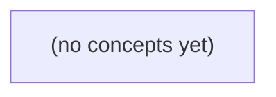

# 05.07 Go 垃圾回收：从 IM 群扇出理解分配、存活与证据

*一本面向 Go 初学者的静态教材，以虚构 IM 群从 10 人扩展到 10000 人的消息扇出为主线，区分短命复制造成的高分配速率与慢设备积压造成的高存活集。读者将通过纸上计算、运行时模型和观测证据，理解 Go 并发垃圾回收的内存、CPU 与时延权衡，并完成 22 道带反馈练习。*

**章节:** 2

---

## 本书导览

- 了解整本书的章节脉络
- 掌握各章之间的概念依赖关系
- 选择最合适的阅读顺序

# 05.07 Go 垃圾回收：从 IM 群扇出理解分配、存活与证据

一本面向 Go 初学者的静态教材，以虚构 IM 群从 10 人扩展到 10000 人的消息扇出为主线，区分短命复制造成的高分配速率与慢设备积压造成的高存活集。读者将通过纸上计算、运行时模型和观测证据，理解 Go 并发垃圾回收的内存、CPU 与时延权衡，并完成 22 道带反馈练习。

下方的概念图展示了本书 0 个核心概念以及它们之间的依赖关系；再下方是 1 个章节的入口。你可以按从上到下的顺序阅读，也可以根据自己的兴趣或先验知识选择切入点。

#### 概念图



## 章节索引

- **05.07 Go 垃圾回收：从群聊扇出到存活集与时延** — 面向Go初学者承接对象可达与系统RSS，以虚构IM群扇出讲Go标准工具链标记清扫、并发工作、分配率与存活集、GOGC目标、软内存限制和观测证据。

## 05.07 Go 垃圾回收：从群聊扇出到存活集与时延

- 区分分配速率和存活集
- 解释根追踪与标记清扫
- 区分并发GC工作与STW暂停
- 手算GOGC目标而非RSS
- 比较短命扇出与长期积压
- 说明GOMEMLIMIT软范围
- 选择MemStats/heap profile/业务P95的不同证据

从群成员扇出看内存：一次创建多少对象不等于最终保留多少对象；理解这一区别，才能正确判断Go的GC成本与尾延迟。

### 群聊扇出的两类内存问题

### 群聊扇出的两类内存问题

设想一次群消息扇出：群成员从 $10$ 增长到 $10\,000$，服务端为每个目标临时构造约 `1 KiB` 的投递数据。一次请求新增的分配量近似为：

$$
A_{\text{一次}}=N_{\text{成员}}\times 1\text{ KiB}
$$

因此，$10\,000$ 人群一次扇出最多会产生约 $10\,000\text{ KiB}\approx9.77\text{ MiB}$ 新数据。这是**分配量**，不是最终必然占住的内存，也不是某个真实 OpenIM 集群的实测结论。

需要区分两类问题：

- **短命对象过多**：每份投递数据发送后立刻不可达。存活集未必明显增长，但高并发下分配速率很高：  
  $$
  R_{\text{alloc}}=QPS\times A_{\text{一次}}
  $$
  例如每秒处理 $100$ 次这样的满员群扇出，理论新增分配接近 $977\text{ MiB/s}$。GC 必须更频繁地扫描、标记和回收，CPU 与调度资源会被挤占，进而放大请求尾延迟。

- **对象积压并继续存活**：投递数据进入发送队列、重试队列、离线消息缓存，或被慢消费者持有。此时问题不只是“分配得快”，而是**存活集**持续变大。存活对象越多，GC 每轮需要追踪的可达对象越多；堆增长还可能推高 RSS，最终表现为更长的暂停风险、更多 GC 工作和更差的尾延迟。

因此，“一次创建 9.77 MiB”只能说明瞬时分配压力。真正决定 GC 成本的是：这些对象多久失去可达性、单位时间产生多少分配，以及队列中究竟留下了多少仍然存活的数据。

### 从根对象开始的标记清扫

### 从根对象开始的标记清扫

Go 的垃圾回收并不按“本次创建了多少对象”逐个计费，而是从一组**根对象**出发，判断对象图中哪些仍可达。常见根包括：

- 各 goroutine 栈上仍被使用的指针；
- 全局变量；
- 堆中已知存活对象所引用的指针；
- 运行时维护的内部引用。

标记阶段可抽象为一次图遍历：根对象先被标记，再沿其指针字段继续访问；能从根沿边走到的对象构成**存活集**。例如群聊扇出时，为每个目标临时创建 `1 KiB` 副本，10 000 个目标最多带来约 `9.77 MiB` 新分配数据；但若发送队列、连接缓冲区和栈都不再引用这些副本，它们在下一轮标记后就是不可达对象。

随后清扫阶段回收未被标记的堆空间，使其可供后续分配复用。因而要区分两种情形：

1. **短命副本**：分配速率很高，但发送完成后迅速失去引用；GC主要面对频繁分配与回收。
2. **积压副本**：队列或慢客户端持续持有引用；副本进入存活集，堆规模、扫描工作和潜在尾延迟都会增长。

这里的群聊数字只是推导模型，不是 OpenIM 实测。关键问题始终是：每秒分配多少，以及 GC 开始时仍有多少对象能从根到达。

### 并发GC与短暂停顿

### 并发GC与短暂停顿

Go 的 GC 不是“收集时完全不停服务”，而是将大部分工作与业务 goroutine 并发执行，仅在关键边界执行短暂的停止世界（STW）。

- **并发标记**：GC 与群发请求同时运行，追踪从根对象可达的成员列表、消息缓冲和待发送任务；业务仍可分配对象。
- **并发清扫**：标记完成后，后台逐步回收不可达对象占用的 span，通常不需要长时间阻塞全部 goroutine。
- **短暂停顿**：在启动标记、完成标记等阶段，运行时需要短暂停止用户 goroutine，以切换 GC 状态、处理根集合并保证标记结果一致。它通常很短，但并非零。

因此，“每个目标复制 1 KiB、10,000 人群一次产生约 9.77 MiB 新数据”不能直接推出一次 9.77 MiB 的停顿。若这些副本发送后迅速不可达，主要压力是**分配速率**：GC 更频繁启动，业务 goroutine 还可能承担标记辅助工作，消耗本应用于编码、网络和调度的 CPU。

若发送队列积压，副本跨越多个 GC 周期仍存活，问题转为**存活集**增长：每轮标记都要遍历更多对象，GC 并发工作持续更久，并与网络发送、定时器、调度器争夺 CPU。此时即使单次 STW 很短，请求也可能因运行队列等待、GC 辅助和 CPU 抢占而落入更高分位的尾延迟。

所以应分别观测暂停时间、GC CPU、分配速率与存活堆大小；前者解释“卡顿瞬间”，后者更常解释群聊高峰下持续变慢。

### 短命复制与长期积压的分叉

### 短命复制与长期积压的分叉

设一次群消息要扇出给 $N$ 个成员，并且每个目标都产生一份约 `1 KiB` 的临时副本。成员数从 `10` 增长到 `10000` 时，单次扇出新增分配量约为：

$$
A=N\times 1\text{ KiB}
$$

因此，$N=10000$ 时约分配 `9.77 MiB`。这只是教学用的量级估算，不代表 OpenIM 或任何具体系统的实测内存模型。

关键不在于“创建了 9.77 MiB”，而在于这些对象在下一次 GC 时是否仍然可达。

- **短命复制**：编码、写 socket 或批量发送完成后，副本立即失去引用。此时分配速率可能很高，但存活集增长很小；GC 主要回收大量新生对象。若分配过快，仍会更频繁触发 GC，并消耗 CPU，但下一轮扫描需要保留和追踪的对象有限。
- **长期积压**：副本被每个用户的发送队列、重试队列或离线消息缓存持有。相同的 `9.77 MiB` 不会在本轮结束后消失，而会进入存活集；若消费速度低于生产速度，积压会持续叠加。

可以用简化关系理解：

$$
\text{积压增长速率}\approx \text{入队速率}-\text{出队速率}
$$

短命场景的问题偏向**分配速率**：GC 触发更密、CPU 更忙。长期积压的问题则偏向**存活集**：堆目标变大，标记阶段要遍历更多仍可达对象，内存占用、GC 辅助工作和尾延迟风险都会上升。

因此，优化不能只看“减少复制”。如果副本本来短命，应关注批量处理、对象数量和分配热点；如果副本被队列长期引用，则更应限制队列长度、设置过期策略、实现背压，并监控消息年龄与积压深度。

### 用目标、限制与证据诊断

### 用目标、限制与证据诊断

群聊从 10 人扇出到 10 000 人时，若每个目标临时复制 `1 KiB`，单次最多产生约 $10\,000\times1\,KiB\approx9.77\,MiB$ 新数据。这只是容量手算，不是 OpenIM 的实测结论；关键还要问：这些对象多久死亡，是否跨越 GC 周期进入存活集。

先估算下一轮 GC 的堆目标。设本轮标记结束后的存活堆为 $L$，`GOGC=g`，忽略内存限制时：

$$
H_{\text{goal}}\approx L\times(1+\frac{g}{100})
$$

例如 $L=200\,MiB$、`GOGC=100`，堆大约可增长至 $400\,MiB$ 后触发下一轮 GC；若改为 `GOGC=50`，目标约为 $300\,MiB$。较低的 `GOGC` 往往降低峰值堆，却提高 GC 频率与 CPU 压力；不能仅因一次分配量大就盲目下调。

`GOMEMLIMIT` 则是运行时参考的**软内存范围**，不是进程 RSS 的绝对上限，也不保证不会因运行时、栈、映射、碎片或外部内存而超过该值。接近限制时，Go 会更积极回收；若存活集本身逼近限制，GC 只能反复工作，吞吐和尾延迟可能恶化。

证据应与问题对应：

- **内存是否逼近预算**：看容器内存、进程 RSS、`runtime/metrics` 中堆已分配与堆目标；同时确认 RSS 增长是否来自 Go 堆。
- **对象为何不释放**：比较 GC 前后的存活堆，并用堆剖析按 `inuse_space`、引用链定位积压的消息、队列或缓存。
- **P95 是否受影响**：看请求延迟直方图与 GC 暂停、GC CPU、调度延迟的时间对齐关系；P95 上升不等于 GC 是原因，必须与流量、队列深度和限流事件交叉验证。

> **要点** — GC成本取决于分配速率与存活集的组合；GOGC看堆目标而非RSS，诊断需结合运行时指标、剖析和业务P95。

从群聊消息扇出出发，建立“对象是否仍被引用”而非“内存是否曾被分配”的判断框架，理解Go追踪式垃圾回收的边界与证据。

### 从群聊扇出看对象引用图

### 从群聊扇出看对象引用图

一条群聊消息到达服务端后，往往不会只对应一个对象。它可能包含消息正文、发送者信息、群成员快照，以及为每位在线用户创建的投递任务：

`群对象 → 成员列表 → 用户会话 → 待发送队列 → 投递任务 → 消息`

这些箭头就是引用：前一个对象保存了后一个对象的地址或间接访问路径。Go 的垃圾回收器并不关心“这条消息曾经分配过多少内存”，而是从一组根开始追踪它是否仍可到达。根通常包括正在运行的 goroutine 栈、全局变量、运行时持有的数据等。

例如，消息处理函数返回后，局部变量 `msg` 消失；但只要某个用户的待发送队列仍保存指向该消息或任务的引用，消息就仍然可达，不能回收。反之，若投递完成，任务从所有队列移除，且不存在其他引用路径，那么该消息及其相关对象便可能成为不可达对象。

```text
全局连接管理器 → 用户A → 发送队列 → 任务 → 消息
goroutine栈       → 用户B → 发送队列 ────────┘
```

因此，扇出会扩大引用图：一条消息被多个任务共享时，只要任意一条路径仍存在，它就仍是存活对象。业务上“消息已经过期”不等于 GC 可回收；必须同时让引用关系真正断开。

### 根对象与标记清扫流程

### 根对象与标记清扫流程

Go 的标准 `gc` 是追踪式、标记清扫式回收器。它不关心“这块内存曾经分配给谁”，而关心：**从程序仍持有的根对象出发，能否沿引用关系走到该对象**。

典型根包括：

- 各个 goroutine 的栈：局部变量、参数、返回值中保存的指针；
- 全局变量与包级变量；
- 运行时自身维护的结构，例如部分调度器、终结器相关状态；
- CPU 寄存器或运行时暂存的指针值。

可以把堆对象看成一张引用图。若栈上的 `queue` 指向消息切片，切片元素又指向每条消息及其附件，那么这些对象都从根可达：

`goroutine 栈 → queue → []Message → Message → Attachment`

标记阶段从根开始遍历：先标记根直接指向的对象，再继续扫描这些对象中的指针字段；被访问到的对象均记为存活。图中即使存在环，只要环能从根到达，就会保留；反过来，两个对象互相引用形成环，但没有任何根能到达它们，也会在之后被回收。

清扫阶段遍历堆中的对象或页：已标记对象保留并为下一轮准备，未标记对象则被视为不可达，其空间加入可复用集合。因而，队列中积压的消息只要仍被 `queue` 引用，就不是垃圾；GC 无法替业务判断“这条旧消息是否已经没有价值”。

现代 Go 在大部分标记工作中让 GC 与业务 goroutine 并发运行，并通过写屏障处理标记期间引用变化；仍会存在短暂的停顿阶段，但不能将整个 GC 简化为“全程停止程序”。

### 循环可回收，队列引用不可回收

### 循环可回收，队列引用不可回收

Go 的标准垃圾回收器是**追踪式 GC**：从根集合出发，沿指针引用遍历对象图；能走到的对象是存活对象，走不到的对象即使彼此相互引用，也可以回收。

例如两个消息对象形成循环：

```go
a.next = b
b.prev = a
```

若 `a`、`b` 不再被栈变量、全局变量、活跃 goroutine 或其他根可达对象引用，它们虽然构成环，仍是“无根孤岛”。标记阶段无法从根走到它们，之后清扫阶段可将其内存复用。这里与引用计数方案不同：引用计数可能因计数互不为零而无法处理循环；Go 关注的是**可达性**，不是“引用次数是否归零”。

相反，群聊扇出的消息若被长期队列持有：

```go
pending = append(pending, msg)
```

只要 `pending` 本身仍可达，队列底层数组中的 `msg` 指针就构成一条根到消息的引用路径：

`全局/服务对象 → 队列 → 消息 → 附件、正文、用户信息`

即使消息早已过期、无人实际消费，GC 仍会将它标记为存活；这不是 GC 失效，而是程序仍在声明“我需要它”。

因此，循环引用通常不是 Go 服务内存增长的核心嫌疑；更常见的是无界队列、缓存未淘汰、订阅者未注销或切片长期保留大对象。GC 能回收不可达对象，却不能替业务决定一条仍在队列中的消息是否应当丢弃。

### 并发标记、写屏障与短暂停顿

### 并发标记、写屏障与短暂停顿

Go 的标准 `gc` 是追踪式、并发式标记清扫器：标记阶段会与业务 goroutine 同时运行。GC 从栈、全局变量、寄存器等根出发遍历引用图；业务请求仍可创建对象、修改指针、处理群聊消息，并非“垃圾回收一开始，整个程序就停住”。

难点在于：并发期间引用图会变化。若标记器刚扫描完对象 `A`，业务代码随后执行 `A.next = B`，而 `B` 尚未被扫描；没有协调机制时，GC 可能错误地认为 `B` 不可达并回收它。

写屏障就是这种协调机制。对指针写入，运行时会插入额外逻辑，记录或标记可能因此“新变得可达”的对象，使并发标记看到一个一致的可达性结果。它降低了长时间停顿的需求，但也带来少量写指针开销。

仍需注意，Go GC 并非完全无停顿。周期开始、切换标记状态、完成标记等关键边界需要短暂 `STW`（停止世界），即短暂暂停业务 goroutine；随后大部分扫描工作可并发进行。因而更准确的说法是：

- 不是“GC 全程 STW”；
- 也不是“并发 GC 完全没有停顿”；
- 停顿时延还受根数量、栈规模、调度与运行时状态影响。

### GC能回收什么，不能解决什么

### GC能回收什么，不能解决什么

Go 的标准 `gc` 判断对象能否回收，核心不是“它多久没用”，而是“从根对象还能不能沿引用找到它”。栈上的局部变量、全局变量、运行时持有的结构等构成根；GC 从这些根遍历引用图，标记所有可达对象。未被标记的对象才会在清扫阶段释放并复用其内存。

因此，无根循环引用也可以回收：

- `a` 引用 `b`，`b` 又引用 `a`；
- 但外部已经没有任何变量、队列或全局表指向 `a`、`b`；
- 这组对象不可达，追踪式 GC 可以将其回收。

反过来，只要队列仍保存引用，数据就仍然可达。例如群聊扇出后，每个消费者队列都持有一份待处理消息；即使业务上“这条消息早该过期”，只要它还在 `chan`、切片、链表、缓存映射或重试队列中，GC 就不能擅自删除它。

```text
生产速度 > 消费速度
        ↓
队列持续积压
        ↓
引用持续存活
        ↓
存活集增大，GC 只能反复扫描更多对象
```

这属于生命周期和背压问题，不是“GC 不够及时”。应通过队列容量上限、超时丢弃、取消订阅、确认消费、限流或溢出策略释放引用。Go 的并发标记会与应用代码并行执行，并借助写屏障维持标记正确性；它能回收不可达对象，却不能自动替业务决定哪些仍被引用的数据应当停止保留。

> **要点** — Go GC回收不可达对象；并发标记降低暂停，但仍被队列或根引用的数据不会因GC自动消失。

同一群聊流量下，短命副本与长期积压会以不同方式推动垃圾回收：前者抬高分配速率，后者扩大存活集。

### 先拆开两个压力：分配率与存活集

### 先拆开两个压力：分配率与存活集

分析 Go 垃圾回收时，先区分两个常被混淆的量：

- **分配率**：单位时间新建多少对象、申请多少字节，记作 $A$。
- **存活集**：一次标记结束后仍可达、不能回收的数据量，记作 $L$；根扫描等固定成本可近似并入其中。

设当前存活数据为 `8MiB`，根扫描相关开销折算为 `2MiB`。在 `GOGC=100` 时，下一轮的纸面目标约为：

$$
T \approx 8 + 2 + 100\% \times 8 = 18\text{MiB}
$$

因此，从约 `8MiB` 的存活基线到目标之间，表面上有约 `10MiB` 的新增分配空间。若分配率为 `2MiB/s`，约 `5s` 消耗完；若为 `10MiB/s`，约 `1s` 即可能进入下一轮。实际触发还会受运行时调节、并发标记进度和堆目标影响，不能把它当成精确倒计时，但方向明确：**分配越快，回收周期越密，CPU 越多地投入 GC。**

群聊扇出正好对应两类不同问题：

- 给每个在线成员创建短命消息副本、编码缓冲或临时切片，主要抬高 $A$。即使对象很快死亡，GC 仍必须更频繁地发现它们已经死亡。
- 慢设备未确认导致消息副本、发送队列和重传状态长期保留，主要抬高 $L$。存活集变大后，标记对象更多，堆目标也随之抬升，内存占用与单轮扫描工作都会增加。

所以，“消息很多”不是诊断结论。应继续问：这些对象是**很快死掉**，还是**仍被慢消费者引用**？前者优先控制扇出过程的临时分配；后者优先限制积压、设置上限或尽早断开落后连接。

### 从根对象到存活集：标记清扫在找什么

### 从根对象到存活集：标记清扫在找什么

垃圾回收并不直接判断“这个对象以后还会不会用”，而是从一组**根对象**出发，沿着指针关系寻找所有仍然**可达**的对象。

根对象通常包括：

- 各 goroutine 的栈上的指针；
- 全局变量中的指针；
- 运行时维护的数据结构、寄存器中的指针等。

标记阶段可抽象为一次图遍历：若对象 $A$ 被根引用，或能从已标记对象沿指针到达，则 $A$ 是存活对象；反之不可达，便是可回收垃圾。随后清扫阶段回收这些未标记对象占用的堆空间，使其可供后续分配复用。

因此，`2MiB 根扫描`与`8MiB 存活对象`不是同一个量：

- **2MiB 根扫描**：收集器需要检查的根区域规模，例如 goroutine 栈和全局指针区域。它主要影响一次标记开始时的扫描工作量与暂停、并发标记负担。
- **8MiB 存活对象**：从根出发最终能够到达、必须保留的堆对象总量。它决定回收后堆的“地板”有多高，也是后续堆目标的重要基数。

群聊扇出时，仍被慢设备队列、缓存或连接状态引用的消息副本，会保持可达，从而抬高这 8MiB；已经发送完且不再被任何队列、局部变量或缓存引用的短命副本，则会在下一轮标记中变为不可达并被清扫。前者扩大存活集，后者主要增加两次回收之间产生的垃圾量。

### 手算 GOGC 目标：8MiB 如何得到18MiB

### 手算 GOGC 目标：8MiB 如何得到18MiB

先建立一个刻意简化的纸上模型：

- 本轮标记结束后，堆中仍存活对象：$L=8\text{ MiB}$
- 根扫描等固定成本折算为：$R=2\text{ MiB}$
- `GOGC=100`

可将本轮垃圾回收后的“基数”近似看作：

$$
B=L+R=8+2=10\text{ MiB}
$$

`GOGC=100` 表示允许堆在这个基数上再增长约 $100\%$，因此下一轮前可新增的分配额度为：

$$
A=B\times\frac{100}{100}=10\text{ MiB}
$$

于是纸面上的下一次垃圾回收目标总量为：

$$
T=B+A=10+10=20\text{ MiB}
$$

若只把题目中的“8MiB 存活堆 + 10MiB 新增堆”作为观察对象，则常说堆目标约为：

$$
8+10=18\text{ MiB}
$$

这里的 `2MiB` 根扫描量用于说明：垃圾回收器的目标并非只盯着“用户堆里还活着多少对象”；根、栈及相关扫描工作也会影响其节奏。不同版本的运行时内部公式和触发时机会更复杂，手算的目的在于抓住数量级，而不是复刻精确实现。

尤其要避免把 `18MiB` 理解为进程的 RSS 阈值。RSS 还可能包含 goroutine 栈、运行时元数据、已保留但未归还给操作系统的页、代码段及其他非堆内存。这里的目标描述的是 GC 对**堆增长**的控制，不是“进程内存到 18MiB 就必然回收”。

### 相同存活集，不同到达速度：5秒与1秒

### 相同存活集，不同到达速度：5秒与1秒

设一次标记结束后，堆中仍有 `8MiB` 存活对象，根扫描等开销折算为 `2MiB`。在 `GOGC=100` 时，纸面上的下一轮目标总堆量可近似理解为：

$$
8\text{MiB}+2\text{MiB}+100\%\times 8\text{MiB}=18\text{MiB}
$$

因此，从当前约 `8MiB` 存活堆增长到目标附近，表面上还有约 `10MiB` 的新增分配额度。

- 若群消息扇出后的短命副本以 `2MiB/s` 产生，耗尽这 `10MiB` 约需 `5s`。
- 若扇出更猛烈，分配率升至 `10MiB/s`，同样额度约 `1s` 就会被消耗。

两种情形的存活集相同：慢设备并未保留更多副本，GC 每轮需要追踪的长期对象规模也没有因此变大。但高分配率会更快把堆推向目标，使 GC 周期更密集，并通常消耗更多 GC CPU 来完成标记、辅助工作与回收。

这里的 `5s` 和 `1s` 只是按平均速率估算的直觉，不是精确触发承诺。实际触发还会受并发标记进度、调度、瞬时分配突发、运行时目标调整及根扫描成本影响。关键区分是：短命副本主要提高“到达下一轮 GC 的速度”，而非必然扩大每轮要保留的存活集。

### 群扇出的两类故障：短命洪峰与慢设备积压

### 群扇出的两类故障：短命洪峰与慢设备积压

群聊扇出时，内存压力不能只看“消息很多”，而要区分副本的生命周期。

- **短命洪峰**：一条消息扇出给大量在线设备，编码缓冲、序列化对象、临时切片和网络写入副本很快失效。它们通常不显著抬高某次 GC 后的存活堆，却会快速增加 `Mallocs`、`TotalAlloc` 与分配速率。  
  例如稳定存活集为 `8MiB`、根扫描代价约 `2MiB`，`GOGC=100` 时纸面上允许约 `10MiB` 新分配，目标堆约为 `18MiB`。若分配率是 `2MiB/s`，约 `5s` 消耗完额度；升至 `10MiB/s`，约 `1s` 就可能进入下一轮 GC。表现往往是 GC 周期更密、CPU 占比升高，而不是“堆一直很大”。

- **慢设备积压**：离线、弱网或消费缓慢的设备使待发送消息副本长期滞留在队列、连接状态或重试缓存中。这些对象跨越多轮 GC，直接扩大存活集；即使瞬时分配率不高，下一轮 GC 的扫描、标记和目标堆基线也会更高。表现更接近堆底持续抬升、释放后难以下降，以及长尾设备与内存增长同步。

取证时不要混为一谈：用 `runtime.MemStats` 对比 `HeapAlloc`、`HeapObjects`、`TotalAlloc`、`NumGC` 和暂停时间；用堆剖析确认是短生命周期编码/副本热点，还是队列、会话和重试结构长期持有；再将这些时间序列与业务发送延迟、设备消费延迟和积压深度的 P95 对齐。前者优先削减复制与临时分配，后者优先限制队列、设置过期策略并隔离慢设备。

> **要点** — GOGC围绕存活堆设定增长目标；扇出洪峰看分配率，慢设备积压看存活集，二者不能混为RSS问题。

GOGC调节的是下一轮GC的堆目标，而非RSS上限；先以存活集和根集合建模，才能正确理解时延与CPU的取舍。

### 从存活集推导堆目标

### 从存活集推导堆目标

一次标记完成后，仍被引用、不能回收的堆对象构成**存活集** `live`；栈、全局变量等扫描起点构成**根集合** `roots`。Go 以它们估算下一轮 GC 的堆触发目标：

$$
target = live + (live + roots)\times \frac{GOGC}{100}
$$

其中，`target` 是下一次 GC 大致开始时的堆目标，不是进程 RSS 上限，也不保证实际内存绝不超过它。分配速度、运行时元数据、栈增长、碎片及内存归还策略都会使 RSS 与该值不同。

例如某轮 GC 后 `live=8 MiB`、`roots=2 MiB`，则增长基数为 `live+roots=10 MiB`：

- `GOGC=50`：允许新增约 `5 MiB`，目标为 `13 MiB`；
- `GOGC=100`：允许新增约 `10 MiB`，目标为 `18 MiB`；
- `GOGC=200`：允许新增约 `20 MiB`，目标为 `28 MiB`。

因此，`GOGC` 调节的是“存活后还能增长多少，再触发下一轮 GC”。较低值缩短 GC 周期、压低堆峰值，但增加 GC 工作与 CPU 压力；较高值则相反。它不能让仍可达的对象消失：若群聊扇出、缓存或队列持续持有对象，首先增长的是 `live`，参数只能改变回收节奏，不能替代释放引用。

### L8与roots2的手算示例

### L8与roots2的手算示例

设上一轮标记结束后的堆存活对象为 `live=8MiB`，扫描到的栈、全局变量等根集合为 `roots=2MiB`。Go 的简化堆目标模型为：

$$
target=live+(live+roots)\times \frac{GOGC}{100}
$$

先算可按比例增长的基数：

$$
live+roots=8+2=10\text{MiB}
$$

- `GOGC=50`：新增空间为 $10\times 50\%=5$MiB，因此  
  $target=8+5=13$MiB。
- `GOGC=100`：新增空间为 $10\times 100\%=10$MiB，因此  
  $target=8+10=18$MiB。
- `GOGC=200`：新增空间为 $10\times 200\%=20$MiB，因此  
  $target=8+20=28$MiB。

可记为：

| GOGC | 增长量 | 下一轮堆目标 |
|---:|---:|---:|
| 50 | 5MiB | 13MiB |
| 100 | 10MiB | 18MiB |
| 200 | 20MiB | 28MiB |

这些数值是触发下一轮GC的堆目标，不是进程RSS上限：运行时元数据、栈增长、碎片、缓存及其他非堆内存都会影响实际RSS。降低 `GOGC` 会更早、更频繁地回收，通常压低堆峰值却增加GC CPU开销；提高它则允许堆增长更多，以更高内存换取较少GC。无论参数如何变化，仍被引用的8MiB存活对象都不会凭空消失。

### 目标值不是RSS承诺

### 目标值不是 RSS 承诺

`GOGC` 公式计算的是**下一次触发标记周期前允许的堆目标**：

$$
target=live+(live+roots)\times GOGC/100
$$

例如存活堆 `live=8 MiB`、根集合 `roots=2 MiB`：

| GOGC | 新增堆预算 | 堆目标 |
|---:|---:|---:|
| 50 | 5 MiB | 13 MiB |
| 100 | 10 MiB | 18 MiB |
| 200 | 20 MiB | 28 MiB |

这里的 `13/18/28 MiB` 都不是进程 RSS 上限，甚至也不是某一时刻“实际已用堆”的精确读数。它表示运行时依据上一轮存活集和根集合，为下一轮 GC 设定的触发参考点；分配、并发标记、扫描进度与调度都会使实际堆使用在目标附近变化。

更不能把堆目标直接等同于 RSS。进程 RSS 还可能包含：

- Go 运行时已向系统申请但暂未归还的堆页；
- goroutine 栈、运行时元数据、GC 辅助结构；
- 可执行文件、共享库、内存映射文件；
- cgo、线程栈及其他非 Go 堆分配；
- 操作系统页面回收与统计时机造成的差异。

因此，降低 `GOGC` 通常会降低堆峰值，却可能增加 GC 次数、CPU 消耗和分配路径上的时延；提高它则以更高内存峰值换取较少 GC。应同时观察存活集、`HeapAlloc`、运行时保留内存和 RSS，再决定是否调参。任何参数都不能让仍被引用、因而仍可达的对象消失。

### GOGC的CPU与堆峰权衡

### GOGC的CPU与堆峰权衡

`GOGC` 决定堆从本轮存活集增长多少后触发下一轮垃圾回收。官方近似模型为：

$$
target = live + (live + roots)\times \frac{GOGC}{100}
$$

其中 `live` 是上轮扫描后仍存活的堆对象，`roots` 是栈、全局变量等根集合。它调的是**下一次GC目标堆大小**，不是进程 RSS 的硬上限。

例如 `live=8MiB`、`roots=2MiB`：

- `GOGC=50`：允许新增 $10\times50\%=5MiB$，目标约 `13MiB`；
- `GOGC=100`：允许新增 `10MiB`，目标约 `18MiB`；
- `GOGC=200`：允许新增 `20MiB`，目标约 `28MiB`。

较低的 `GOGC` 意味着可分配空间更小，程序更快达到目标，因此 GC 周期更密集。每轮GC都要进行标记、扫描根、维护写屏障，并消耗并发标记 CPU；周期增多后，GC 总工作量和 CPU 压力通常会上升。好处是垃圾更早被识别，堆峰值及其相关内存压力通常较低。

较高的 `GOGC` 则让堆在两轮GC之间增长得更多：GC 触发更少，单位时间内的扫描与写屏障压力可能下降，但垃圾会在堆中停留更久，堆峰值、缓存压力以及可能的内存回收滞后都会更高。

因此，`GOGC` 是“CPU 换堆空间”的旋钮，而不是清除仍可达对象的工具。应先测量存活集、分配速率、GC CPU 占比与尾时延，再决定调低还是调高。

### 先测量再调整参数

### 先测量再调整参数

调参前先回答三个问题：**存活集有多大、分配有多快、GC是否真的影响业务时延**。`GOGC`只能改变触发下一轮GC的目标，不能释放仍被引用的对象；若问题是缓存无界、切片误持有底层数组或连接长期保留，降低参数只会让GC更频繁。

先记录运行时指标：

- `runtime.ReadMemStats`：关注 `HeapAlloc`、`HeapInuse`、`HeapObjects`、`NextGC`、`NumGC`、`PauseTotalNs`。
- 堆剖析：通过 `net/http/pprof` 或 `go tool pprof` 查看 `inuse_space`，找出真正长期存活的类型与调用路径；再看 `alloc_space`，识别高频短命分配。
- 业务指标：将请求P95/P99、吞吐、CPU利用率与GC次数、暂停时间放在同一时间轴上比较。

例如，若 `HeapAlloc` 在每轮GC后仍稳定于约 `8MiB`，根集合约 `2MiB`，则 `GOGC=50` 时下一目标约为：

$$8+(8+2)\times 50\%=13\text{MiB}$$

提高到 `100`、`200` 时，目标约为 `18MiB`、`28MiB`。这表示允许堆增长到何处再启动下一轮GC，不是进程RSS保证值：运行时元数据、栈、碎片和其他映射仍会占用内存。

若堆峰值过高且P95未受GC明显影响，可尝试降低`GOGC`，代价是更多标记工作和CPU；若CPU因GC偏高、内存余量充足，则可提高`GOGC`。容器有明确内存边界时，还应评估内存限制。每次只改一个参数，压测后同时验证堆峰、GC CPU和业务P95。

> **要点** — GOGC按存活集与根集合计算堆目标；它调节GC频率和资源取舍，不能让仍可达对象消失，也不是RSS上限。

Go 的并发标记清扫显著缩短停顿，却不会让垃圾回收从请求时延与调度竞争中消失；关键在于用正确口径识别影响。

### 并发标记不等于零停顿

### 并发标记不等于零停顿

Go 的垃圾回收以并发标记清扫为主：当一轮 GC 开始后，标记器会与业务 goroutine 同时运行，扫描堆对象、追踪引用关系，并在标记完成后逐步清扫可回收内存。这里的“并发”意味着业务并非全程停止，而不是 GC 没有成本。

一轮典型 GC 仍包含必要的短暂停止世界（STW）阶段：

- **标记开始暂停**：切换到标记状态，准备根对象扫描与写屏障等运行时状态。
- **标记终止暂停**：确认并发标记收敛，处理剩余工作，完成本轮存活集判定。
- **清扫阶段**通常可与应用继续并行，但分配新对象时也可能触发按需清扫。

因此，应用 goroutine 的实际体验包含两类影响：

1. **直接暂停**：STW 时 goroutine 不能继续执行；通常很短，但会直接拉长恰好落入该窗口的请求。
2. **并发竞争**：标记 worker 消耗 CPU，写屏障增加指针写入成本，分配 goroutine 还可能承担标记辅助工作（mutator assist）。即使没有明显 STW，请求也可能因可用 CPU 变少、被迫辅助 GC 或调度延迟而变慢。

可以把单个请求的额外延迟粗略写成：

$$
\Delta t_{\text{请求}} \neq t_{\text{STW}}，\qquad
\Delta t_{\text{请求}} \approx t_{\text{命中暂停}} + t_{\text{CPU竞争}} + t_{\text{辅助标记}} + t_{\text{调度等待}}
$$

所以，“GC pause 很小”只能说明直接停顿未必显著，不能推出 GC 对尾延迟没有影响；反过来，一次 P99 升高也不能仅凭时间接近某次 GC 就归因于 GC。

### 暂停、辅助与 CPU 竞争三条路径

### 暂停、辅助与 CPU 竞争三条路径

一次请求的额外时延可粗略拆成：

$$\Delta L \approx \Delta L_{\text{STW}}+\Delta L_{\text{assist}}+\Delta L_{\text{contention}}$$

三项都可能由 GC 引起，但表现和证据不同。

- **STW 暂停**：标记开始、标记终止等阶段需要短暂停止所有 goroutine。恰好运行或即将被调度的请求会直接等待，因此可能形成尖锐的尾延迟毛刺。`PauseNs` 记录的是 GC 周期中的暂停时间；它适合回答“停过多久”，不能直接解释某条请求的完整 P95/P99 增量，因为请求可能并未与暂停重叠。

- **分配者标记辅助**：并发标记需要完成一定工作量。若后台标记 goroutine 赶不上应用分配速度，运行 `malloc` 的业务 goroutine 会被要求执行标记，即 mutator assist。此时请求没有经历全局停顿，却会在分配路径上变慢；对象分配密集、突发流量或堆增长过快时尤为明显。它常表现为若干请求持续变慢，而非单个极窄暂停。

- **CPU 与调度竞争**：GC 标记 worker 与业务 goroutine 共享 `GOMAXPROCS` 对应的 CPU 配额。即使 STW 很短、辅助也不突出，较高的 GC CPU 消耗仍会压缩业务可运行时间，增加运行队列等待、网络处理延迟和锁竞争放大效应。`GCCPUFraction` 描述的是一段时间内 GC 占用 CPU 的比例，应与同窗口的 CPU 利用率、调度 trace 和 profile 联合判断。

因此，看到 `NumGC` 增加或 P99 变慢，只能提出假设；只有将暂停时间线、分配/辅助事件和 CPU 饱和度与慢请求时间窗对齐，才能区分三条路径。

### 三项指标的口径不能混用

### 三项指标的口径不能混用

`runtime.MemStats` 中常见的三项 GC 指标，分别回答不同问题：

| 指标 | 回答的问题 | 不能直接推出的结论 |
|---|---|---|
| `PauseNs` | 某次 GC 的停顿持续了多久？ | 不能说明 GC 总耗时，更不能等同请求 P95/P99 增量 |
| `NumGC` | 进程截至当前完成了多少轮 GC？ | 不能说明最近 GC 很重，必须结合时间窗计算频率 |
| `GCCPUFraction` | GC 在可用 CPU 时间中平均占了多大比例？ | 不能定位某一条慢请求，也不表示存在同等长度的 STW |

`PauseNs` 是暂停数组，记录 GC 相关短暂停顿；分析时应取相邻采样窗口内新增的记录，关注最大值、分位数和发生时刻。一次 $2\text{ ms}$ 暂停可能影响少量恰好命中的请求，却不意味着全部请求都增加 $2\text{ ms}$。

`NumGC` 是累计计数。更有意义的是窗口频率：

$$
\text{GC频率}=\frac{\Delta \text{NumGC}}{\Delta t}
$$

例如一分钟新增 120 次 GC，说明平均每 0.5 秒一轮；若同时堆增长快、分配率高，才应进一步检查对象生命周期与分配热点。

`GCCPUFraction` 则反映 GC 的并发标记、扫描和辅助工作对 CPU 的长期竞争。它升高时，即使 `PauseNs` 很小，业务 goroutine 仍可能因 CPU 被 GC worker 或 mutator assist 抢占而变慢。反过来，单次暂停尖峰也未必显著抬高该比例。

因此，排查顺序应是：先在同一时间窗对齐请求延迟、`NumGC` 增量、`PauseNs` 与 `GCCPUFraction`，再用 trace、CPU profile 和分配 profile 验证。仅看到 P99 变慢，不能直接宣布“是 GC”。

### 群聊扇出下的时延归因示例

### 群聊扇出下的时延归因示例

设想一个万人群聊：一条消息到达后，服务为每个在线成员创建投递任务、序列化缓冲区和上下文对象。若这些对象大多只存活数毫秒，堆分配率会随扇出规模陡增；当分配压力足够高时，P99 发送时延变慢，确实可能与 GC 有关，但不能仅凭“刚好发生了 GC”下结论。

先拆开一次请求的路径：

`入站消息 → 扇出任务创建 → 队列入队 → 工作协程处理 → 下游连接写入`

GC 可能通过三种方式介入：

- 标记终止等短暂 STW 使部分 goroutine 暂停，表现为局部时间跳变；
- 并发标记占用 CPU，与扇出工作协程竞争，运行队列变长；
- 分配过快时，业务 goroutine 参与 GC 辅助标记，原本用于构造投递任务的 CPU 被挪去做标记。

但相同的 P99 曲线也可能来自其他原因。例如，慢客户端使下游写入阻塞，任务在队列中堆积；多个扇出协程争用同一连接表或用户状态锁；突发消息使队列超过消费者处理能力。它们都会让“创建对象很多”和“请求变慢”同时出现，却未必是 GC 主因。

诊断时应在同一时间窗对照：`NumGC` 是否密集增长、`PauseNs` 是否覆盖慢请求时刻、`GCCPUFraction` 是否持续抬升，并结合执行跟踪查看 goroutine 是停在 GC、可运行队列、互斥锁，还是网络写阻塞。若 P99 增量远大于暂停时长，且大量时间花在队列等待或锁等待，就不应把整段尾延迟都归因于 GC。

### 以时间窗建立 GC 证据链

### 以时间窗建立 GC 证据链

先固定同一观察时间窗，例如故障前后各 5～15 分钟；不要把某次 `PauseNs` 峰值与全天业务 `P99` 直接并列。先看业务侧：请求量、错误率、队列长度，以及按接口、实例分组的 `P95/P99`。若慢请求只集中于少数实例，优先比较这些实例与正常实例的 GC、CPU、堆大小和 goroutine 数。

再对齐运行时指标：

- `NumGC`：窗口内 GC 周期是否明显变密；
- `PauseNs`：关注暂停发生的时间点、次数与分位数，而非只看单次最大值；
- `GCCPUFraction`：GC 占进程可用 CPU 的比例是否持续升高；
- 堆存活量、分配速率、`NextGC`：判断是存活集变大，还是瞬时分配洪峰触发更频繁回收。

若尾延迟尖峰与短暂停顿在时间上重合，只能说明“值得怀疑”：一次数毫秒 STW 不必然造成同等幅度的请求 `P99` 增量；请求可能未经过该实例，也可能主要受锁、下游或排队影响。

随后用运行时 trace 验证机制：查看 GC 标记期是否拉长、mutator assist 是否增多、goroutine 是否因 CPU 紧张而延迟运行。再用 CPU profile 区分 CPU 是否落在 `runtime.gcBgMarkWorker`、扫描/分配路径，或其实被业务计算、序列化、锁竞争占用；堆 profile 则定位持续存活的对象类型与分配来源。

形成证据链的标准是：同窗内业务尾延迟恶化、GC 频率或 CPU 占用上升、trace 出现相应调度或辅助标记现象、profile 指向可解释的分配/存活来源。缺少其中环节时，应把 GC 视为假设，而不是结论。

> **要点** — GC 暂停只是时延线索之一；应在同一时间窗内结合暂停、GC CPU、调度与业务证据完成归因。

GOMEMLIMIT为运行时设定可调节的内存软目标：它影响GC节奏，却不能让仍被引用的对象凭空消失。

### 软内存目标的真实边界

### 软内存目标的真实边界

`GOMEMLIMIT` 与 `runtime/debug.SetMemoryLimit` 设置的是 Go 运行时的**软内存目标**。运行时会据此更积极地触发 GC、归还空闲堆页，尽量让其管理的内存维持在目标附近。

官方近似的计量范围是：

$$
\text{运行时受控内存} \approx \text{Sys} - \text{HeapReleased}
$$

其中，`Sys` 是运行时向操作系统申请过的内存总量；`HeapReleased` 是已经明确归还给操作系统、可被其他用途使用的堆内存。这个量包含堆、栈、运行时元数据等运行时管理部分，但它不是进程的全部内存视图。

尤其要区分以下概念：

- **不是 RSS**：RSS 反映当前驻留在物理内存中的页，受页回收、映射、缓存等因素影响；软目标只约束运行时的近似管理内存。
- **不覆盖所有进程内存**：二进制文件映射、动态库、`mmap` 映射、通过 C 分配器申请的内存，以及内核记账的其他资源，通常不在这一目标的直接约束内。
- **不是容器硬上限**：它不会阻止进程继续申请内存，更不会替代 cgroup 的内存限制；容器硬边界需要在后续讨论。

因此，设置 `GOMEMLIMIT=1GiB` 不表示“进程绝不会超过 1 GiB”，而是告诉运行时：在可回收空间存在时，应以约 `1 GiB` 的运行时管理内存为节奏目标。

更关键的是，GC 只能回收不可达对象。若群聊扇出导致大量消息、连接状态或缓存仍被引用，它们属于存活集；即使软目标远低于存活集，运行时也无法把它们释放。此时过低的目标只会带来更频繁的 GC、更高 CPU 消耗，甚至让应用吞吐下降、时延上升。

### 从Sys减HeapReleased理解计量

### 从 Sys 减 HeapReleased 理解计量

Go 运行时对内存软目标采用的官方近似口径可写为：

$$
M_{\text{受控}} \approx \text{Sys}-\text{HeapReleased}
$$

其中，`Sys` 表示运行时曾向操作系统取得、用于堆、goroutine 栈、GC 元数据等用途的总内存；它不是“当前堆对象大小”，也不只包含应用代码通过 `new` 分配的对象。

但 `Sys` 中有一部分堆页可能已不再存放有用对象。运行时会将这类空闲页归还给操作系统，并累计为 `HeapReleased`。既然这些页的物理内存压力已经解除，若仍将它们计入限制，就会把“已经还掉的内存”误认为仍在占用预算。因此需要相减：

- `Sys`：运行时累计取得过的内存；
- `HeapReleased`：其中已经归还操作系统、可不再视为当前运行时负担的堆页；
- `Sys - HeapReleased`：运行时仍保留或仍需负责管理的近似内存量。

这也解释了一个常见现象：GC 清除了对象后，`HeapAlloc` 可以下降，但受控量未必同步大幅下降。对象死亡只意味着其所在空间可复用；只有空闲页达到可归还条件、并且运行时实际执行了归还，`HeapReleased` 才会上升。

因此，`GOMEMLIMIT` 或 `debug.SetMemoryLimit` 约束的是这一运行时管理口径，而非 RSS，也不是容器或操作系统的硬性内存上限。它会促使 GC 更积极地回收并归还可释放页，却不能压缩仍由程序引用的存活集。

### 限制如何改变GC节奏

### 限制如何改变GC节奏

Go 的 GC 原本主要按增长目标工作：一次标记—清扫结束后，运行时根据存活堆大小设定下一轮目标；分配使堆逐渐接近该目标时，下一轮 GC 启动。存活集越大，允许增长的绝对空间通常也越大。

设置 `GOMEMLIMIT` 或 `debug.SetMemoryLimit` 后，运行时还会观察其管理内存离软目标有多远。接近限制时，它会降低可容忍的堆增长量、更早启动 GC，并提高后台标记的工作强度；若分配很快，分配 goroutine 也可能更多参与辅助标记。

可将压力关系粗略理解为：

$$
\text{GC工作率} \approx \frac{\text{分配率}}{\text{两次GC之间可增长空间}}
$$

限制越紧，可增长空间越小；在相同分配率下，GC 周期更短、单位时间标记工作更多，GC CPU 占比随之上升。若应用持续创建群聊消息、副本或临时编码缓冲区，过低限制可能让程序把更多时间花在回收和标记上，吞吐下降、尾时延上升。

但 GC 只能回收不可达对象。若存活集本身已接近甚至超过软目标，运行时无法“清出”足够空间，只能尽力更频繁地回收；此时限制不是容量魔法，而是在内存占用、CPU 与延迟之间施加更激进的取舍。

### 群聊扇出与长期积压对比

### 群聊扇出与长期积压对比

设同一个群聊服务都配置了相同的 `GOMEMLIMIT`：前者是高频扇出的短命消息，后者是消费者长期不确认导致的消息积压。两者的关键差异不在“分配了多少”，而在“对象何时失去引用”。

- **短命扇出**：一条消息被编码、复制、投递给多个在线会话后，若发送缓冲及时释放、没有被队列或日志长期持有，其对象很快死亡。即使瞬时分配速率很高，GC 也能在下一轮扫描中回收大部分临时 `byte slice`、封包和任务对象。此时限制主要促使 GC 更早工作：吞吐可能略受 GC CPU 影响，但存活集较小，堆通常能回落，尾延迟风险相对可控。

- **长期积压**：消息虽然“业务上已经旧了”，但只要仍被待消费队列、重试表、会话状态或闭包引用，对 GC 就仍是存活对象。GC 可以反复扫描它们，却不能释放它们；`GOMEMLIMIT` 只会让运行时更频繁地标记和清扫，无法把积压压缩成更小的内存。

因此，在相同软目标下，短命扇出的问题常是**分配压力**，而积压的问题是**存活集膨胀**。后者接近限制时，GC 会提高工作强度、占用更多 CPU，业务 goroutine 获得的执行时间减少；消息处理更慢又可能进一步扩大积压，形成吞吐下降与尾延迟恶化的循环。

可用一个近似判断：

$$\text{可回收空间} \approx \text{运行时管理内存} - \text{存活集}$$

若存活集本身已逼近软目标，继续降低限制通常不会解决问题。应优先限制队列长度、设置过期与丢弃策略、缩短引用链，并让消费者恢复处理能力；GC 只能回收“已不可达”的消息。

### 设限后的观测与调优证据

### 设限后的观测与调优证据

设定 `GOMEMLIMIT` 或调用 `debug.SetMemoryLimit` 后，不要只看进程 RSS 是否下降；应同时验证“运行时管理内存、存活集、业务时延”三组证据。

- 用 `runtime.ReadMemStats` 观察：
  - `HeapAlloc`：当前仍存活的堆对象规模，接近它的限制无法靠 GC 进一步压缩。
  - `HeapInuse`、`HeapIdle`、`HeapReleased`：区分正在使用的堆、空闲但仍保留的堆，以及已归还给操作系统的页。
  - `Sys`：运行时从操作系统取得的总内存；内存限制大致约束的是 `Sys - HeapReleased`，并非单独约束 `HeapAlloc`。
  - `NumGC`、`PauseTotalNs`、`GCCPUFraction`：限制变低后，若 GC 更频繁、GC CPU 占比持续上升，说明正在用吞吐换内存。

- 用堆剖析确认存活集来源。比较限制前后的 `inuse_space`，定位长期占用最大的对象类型与调用路径。若大对象、缓存、会话、消息队列仍被引用，降低限制只会让 GC 更勤奋，不能减少这部分 live set。

- 用业务指标判定代价。重点对照 GC 周期、CPU 利用率、分配速率与请求 P95/P99。若 RSS 略降，但 P95 恶化、吞吐下降或 GC CPU 明显升高，该限制通常过低。

还要避免错误归因：`mmap` 文件、二进制映射、`cgo`/C 库分配、网络缓冲及内核资源，可能推高 RSS，却不属于 Go 堆限制直接管理的范围。此时堆剖析稳定而 RSS 增长，应继续检查进程映射与外部库，而不是盲目继续下调 `GOMEMLIMIT`。

> **要点** — GOMEMLIMIT是Go运行时的软目标：可压缩可回收空间，却无法突破存活集，也不能替代系统级内存边界。

监控垃圾回收不能只盯住内存曲线：要把累计分配、当前存活、暂停历史、CPU代价与业务时延放进同一段流量窗口解释。

### 先辨认指标的时间语义

### 先辨认指标的时间语义

同样是“内存”或“GC 指标”，它们回答的问题并不相同；若把不同时间语义的数值直接放在一起比较，结论往往会失真。

- **累计计数**：`TotalAlloc`、`Mallocs`、`Frees`、`NumGC` 自进程启动后单调增长。应看相邻采样点的差值或速率，例如  
  $\Delta TotalAlloc / \Delta t$ 表示该窗口的分配流量，  
  $\Delta NumGC$ 表示窗口内发生了多少轮 GC。  
  它们不能与当前堆大小直接比较，更不能把“今天的 `TotalAlloc` 更大”理解为“当前更占内存”。

- **瞬时快照**：`HeapAlloc`、`HeapInuse`、`HeapObjects` 是采样时刻的状态。`HeapAlloc` 近似表示当前仍被认为存活、尚未释放的堆对象字节数；它适合观察存活集是否随队列积压、群规模或引用链增长而抬升。快照会受 GC 周期位置影响，最好同时记录采样时刻和最近一次 GC。

- **环形历史**：`PauseNs` 不是累计暂停时间，而是最近若干次 GC 暂停的环形记录；旧值会被新值覆盖。分析时应取对应窗口内的记录计算分位数、最大值或总量，并结合 `PauseEnd` 判断暂停实际落在哪段业务流量中。

`GCCPUFraction` 则是运行以来 GC CPU 时间占可用 CPU 时间的近似比例，天然带有长期平均效应；排查突发抖动时，应优先看窗口增量、暂停历史与业务 P95，而不是只看这个单一比例。

### 用 HeapAlloc 与 TotalAlloc 拆开问题

### 用 HeapAlloc 与 TotalAlloc 拆开问题

群消息扇出时，一条消息可能被复制、编码并投递到许多在线成员的发送队列。此时先区分两个量：

- `TotalAlloc`：进程启动以来累计向堆申请的字节数，只增不减。它的增量  
  $\Delta TotalAlloc / \Delta t$  
  近似表示这段窗口内的分配吞吐。
- `HeapAlloc`：当前时刻仍被引用、尚未回收的堆字节数，是存活集的快照；GC 后通常会回落。

例如，某群有 5 000 人，一条消息扇出时为每个连接创建短命编码缓冲。即使这些缓冲很快写出并失去引用，`TotalAlloc` 仍会快速上升；若 GC 能及时回收，`HeapAlloc` 只会短暂抬升后下降。这是“分配很猛”，不等于“内存泄漏”。

反过来，若慢客户端导致消息持续堆在发送队列，或重试、历史缓存长期持有消息引用，`HeapAlloc` 会跨多个 GC 周期维持高位甚至阶梯式增长。此时重点不是单次扇出的复制成本，而是对象为何仍然可达：队列长度、连接积压、缓存淘汰和引用链。

因此应在同一流量窗口记录群规模、消息速率与队列长度，并同时观察：

`TotalAlloc` 陡增而 `HeapAlloc` 回落：优先查扇出复制、序列化和临时缓冲的分配热点。  
`HeapAlloc` 持续增长：优先查长期队列、缓存及未释放引用。  
两者同时升高：说明既有高分配吞吐，也可能有存活集扩张；再结合 GC 次数、暂停和业务 P95 判断是否已传导为时延。

### 从 NumGC、PauseNs 到 GCCPUFraction

### 从 NumGC、PauseNs 到 GCCPUFraction

`runtime.MemStats` 中三组字段回答的是不同问题，不能互相替代：

- `NumGC`：进程启动以来完成的垃圾回收轮次，属于累计计数。结合相邻采样差值 $\Delta NumGC$，可判断某个流量窗口内回收是否变密集。群聊扇出、消息复制或临时编码对象激增时，轮次升高通常意味着分配速率提高，或堆目标被更快触发。
- `PauseNs`：最近若干次垃圾回收的停顿时长环形历史；配合 `PauseEnd` 可定位停顿发生的时间。它主要回答“最近是否出现过会阻塞 goroutine 的短暂停顿”。应取最近窗口内的最大值、分位数或按时间对齐后的峰值，而不是把整个数组简单累计。
- `GCCPUFraction`：自程序启动以来，垃圾回收工作消耗的 CPU 时间占可用 CPU 时间的比例。它反映回收的总体算力成本，而非请求被暂停了多久。该值持续上升，说明业务 CPU 正在被标记、扫描和清理竞争；但一次很长的并发标记也未必对应明显的 `PauseNs` 峰值。

Go 的垃圾回收大部分工作与业务 goroutine 并发执行：并发标记会拉高 CPU 占用、压缩业务吞吐，却不等于产生同等长度的停顿；真正的短暂停顿主要出现在需要协调运行时状态的阶段。因此，不能看到 `GCCPUFraction` 高就断言“GC 卡住请求”，也不能只因 `PauseNs` 很短便断言“GC 没有影响”。

排障时，把同一时间窗的 $\Delta NumGC$、最近 `PauseNs`、`GCCPUFraction` 与请求 P95、群规模、扇出量和队列长度并列记录：轮次增多且 CPU 占比升高，优先查短命对象分配热点；停顿尖峰与 P95 同时出现，再检查调度、堆增长和运行时暂停路径。

### Heap profile：分配热点与存活引用

### Heap profile：分配热点与存活引用

Heap profile 不是“当前堆内存排行榜”的唯一答案；它至少应从两个视角比较：`alloc_space` 看一段时间内**累计分配过多少字节**，`inuse_space` 看采样时刻**仍被引用、尚未回收的字节**。二者回答的问题不同。

| 视角 | 主要含义 | 更适合定位 |
|---|---|---|
| `alloc_space` | 累计分配流量，包含后来已回收的短命对象 | 编码、序列化、切片扩容、消息复制、临时 `[]byte`、字符串拼接 |
| `inuse_space` | 当前存活集中的估算占用 | 长期队列、缓存未淘汰、连接状态、闭包/全局变量意外保留 |

群聊扇出常见“高分配但低存活”：一条消息复制给大量在线成员，生成许多临时结构；即使 GC 很快回收，`alloc_space` 仍会显示热点。这类问题优先减少复制、复用缓冲区、调整编码边界，而不是只因 `HeapAlloc` 回落就忽略其 GC CPU 与 P95 影响。

反过来，若队列积压、离线消息或订阅者引用长期存在，`inuse_space` 会持续聚集在队列元素、消息负载或持有它们的容器上。此时应追问“谁仍在引用”，检查消费速率、淘汰策略、队列上限及 goroutine 生命周期。

profile 是采样估算，适合比较占比和调用栈变化，不宜把单个小对象的字节数当精确账本。采集时同时记录流量、群规模、队列长度、`NumGC`、暂停和业务 P95：`alloc_space` 上升而 `inuse_space` 稳定，偏向分配抖动；两者同涨，则更像真实存活集扩张。

### 建立同窗证据与排障选择

### 建立同窗证据与排障选择

单个指标很少能直接说明 GC 是否是根因。应把所有证据对齐到同一观察窗口，例如每 10～30 秒记录一次，并标注该窗口内的消息流量、活跃群规模、扇出次数、队列长度与业务 P95/P99。只有“流量—分配—存活—GC—时延”同时出现，才值得建立因果假设。

建议按三类含义采集：

- **累计量**：`MemStats.TotalAlloc`、`NumGC` 反映窗口内累计分配与 GC 次数。计算增量或速率，如  
  $\Delta TotalAlloc / \Delta t$、$\Delta NumGC / \Delta t$，避免把进程启动以来的总量当作当前压力。
- **快照量**：`HeapAlloc` 表示当前可达堆对象近似规模；`runtime/metrics` 可补充堆目标、扫描量、GC CPU 时间等。队列增长而 `HeapAlloc` 持续抬升，通常优先检查消息、订阅者状态、重试任务是否仍被引用。
- **历史量**：`PauseNs` 是环形历史数组，应查看最近若干次暂停的分位数或最大值，而不是累加值；`GCCPUFraction` 则用于判断 GC 是否持续挤占业务 CPU。

堆剖析的选择取决于对象寿命：

- 排查群聊复制、序列化、临时切片等**短命对象**，看 `alloc_space`，按分配字节寻找热点调用栈。
- 排查积压队列、缓存未淘汰、连接上下文等**长期存活对象**，看 `inuse_space`，确认谁持有引用链。

同时记录进程 RSS。若 `HeapAlloc` 已回落而 RSS 仍高，未必是 Go 堆泄漏，还应考虑页未归还、栈、映射文件或非 Go 分配。若流量和群规模稳定、队列却增长，且 `inuse_space` 与 P95 同步上升，优先查消费能力与引用滞留；若 `alloc_space`、`NumGC`、`GCCPUFraction` 同涨而存活堆稳定，则优先减少扇出路径的瞬时分配。

> **要点** — 累计分配、存活堆、GC代价和RSS不是同一件事；按问题选择指标，并用同窗业务证据建立因果链。

用群聊从10人扩展到10000人的扇出场景，建立Go垃圾回收中分配、存活、目标堆与时延的统一直觉。

### 群扇出：分配量不等于存活量

### 群扇出：分配量不等于存活量

设一条消息大小为 $L$，群成员数为 $N$。扇出后，应用在很短时间内可能产生约 $N\times L$ 的消息引用、序列化缓冲或投递对象。这个数描述的是**瞬时分配压力**，却不能直接推出“堆会长期变大”。

- **情景一：短命消息副本。**  
  10 人群升级到 10 000 人群，一次发送可能瞬间分配大量副本；但若每个副本投递后立刻断开引用，下一轮 GC 就能回收。此时分配率很高、GC 可能更频繁，但存活集仍较小。用户更可能观察到 CPU 用于 GC 增加，未必看到 RSS 持续上涨。

- **情景二：长期未读积压。**  
  若离线成员、未读队列、重试缓存仍持有消息，即使发送高峰已过，这些对象仍是存活对象。一次 10 000 人扇出不仅造成分配，还扩大了存活集；GC 可以扫描它们，却不能回收它们。目标堆随存活集抬升，RSS 也可能长期维持高位。

因此应区分三件事：`分配量`是“曾经创建了多少”，`存活集`是“GC 后仍被引用多少”，`RSS`是进程当前向操作系统保留或驻留的内存，后者还受 Go 运行时归还页、碎片和操作系统策略影响。

排查群聊内存问题时，不要只问“这一波发了多少消息”，还要问：消息副本何时失去引用？未读、重试和历史索引是否持有它？GC 后堆是否回落？只有后两个问题，才能判断这是短暂分配尖峰，还是持续存活积压。

### 从根出发：并发标记与清扫

### 从根出发：并发标记与清扫

把群聊服务的堆想成一张对象关系网：会话、消息队列、用户索引、缓存条目彼此引用。GC 不会逐个判断“这个对象看起来是否有用”，而是从一组**根**出发追踪可达性：

- 各 goroutine 的栈：局部变量、参数、返回值中仍持有的指针；
- 全局变量与包级状态；
- 运行时维护的根，例如部分运行时数据结构、寄存器中的指针状态。

若对象能沿引用链从任一根到达，它属于**存活集**；反之即为垃圾。比如全局房间表仍指向某个 `Room`，`Room` 指向成员列表和待发送消息，那么整条链都不能回收；即使某条旧消息没有任何根路径可达，也会在后续清扫中释放。

Go 采用以并发标记清扫为核心的 GC。标记阶段与业务 goroutine 大体并行：GC 从根扫描，给可达对象做标记，并持续追踪新发现的引用。业务仍在分配、修改指针，因此运行时需要写屏障保证“本轮本应存活”的对象不会被漏标。

但“并发”不等于零暂停。GC 仍需短暂地停止所有 goroutine（STW）完成关键边界动作：

1. **标记开始暂停**：切换到标记状态，准备根扫描与写屏障；
2. **标记终止暂停**：收敛并发标记结果，确认没有遗漏的灰色对象；
3. **清扫**通常主要并发进行：把未标记对象占据的 span 重新变为可分配空间。

因此，暂停时间主要受根数量、栈扫描和同步收敛影响；完整 GC 周期时延还应加上并发标记、清扫以及应用分配速度。群聊从 10 人扇出到 10000 人时，若活跃房间、在线用户和消息引用链膨胀，存活集变大，标记工作随之增加；即便单次 STW 仍较短，GC 周期拉长或 CPU 与业务争抢，也会表现为端到端请求时延上升。

### GOGC目标：按存活堆手算

### GOGC目标：按存活堆手算

设一次标记结束后，存活堆 `L=8 MiB`，根对象（全局变量、goroutine 栈等）为 `2 MiB`。`GOGC` 控制的是：允许在下次触发 GC 前，为“存活对象及根”额外分配多少比例的堆空间。

纸上近似公式为：

\[
\text{下一轮堆目标}=L+(L+\text{根})\times \frac{\text{GOGC}}{100}
\]

| GOGC | 计算 | 下一轮目标 |
|---:|---|---:|
| 50 | \(8+(8+2)\times0.5\) | `13 MiB` |
| 100 | \(8+(8+2)\times1\) | `18 MiB` |
| 200 | \(8+(8+2)\times2\) | `28 MiB` |

因此，`GOGC=50` 时，堆从本轮存活的 `8 MiB` 增长到约 `13 MiB` 就更快进入下一轮；`GOGC=200` 则允许增长到约 `28 MiB`，GC 周期通常更疏，但单轮需要面对的堆也可能更大。

这里的计算对象是**存活堆与根集合**，不是进程的 `RSS`。RSS 还可能包含运行时元数据、goroutine 栈、代码段、内存碎片、已向操作系统保留但未立即归还的页等；看到 RSS 为 `40 MiB`，不能直接代入公式说下一轮目标是其百分比。运行时实际目标还会受最小堆、内存限制与调度器节奏影响，但这张表提供了判断 GOGC 方向的核心尺度。

### 分配率决定周期：2与10 MiB/s

### 分配率决定周期：2 与 10 MiB/s

设当前存活集为 $L=8\text{ MiB}$，且 `GOGC=100`。GC 后下一轮目标堆近似为：

$$
H_{\text{goal}}=L(1+\frac{GOGC}{100})=16\text{ MiB}
$$

因此，从刚完成一轮 GC 到触发下一轮，大约还有：

$$
16-8=8\text{ MiB}
$$

可供分配。两种业务的存活集相同，差别只在分配率：

| 分配率 | 分配完 8 MiB 所需时间 | 周期直觉 |
|---|---:|---|
| 2 MiB/s | 约 4 秒 | GC 较少启动 |
| 10 MiB/s | 约 0.8 秒 | GC 更频繁启动 |

这不表示 10 MiB/s 的每次 GC 必然“更慢”：若两者的存活图、根集合和存活集都相同，单轮需要追踪的存活对象规模大体接近。变化更显著的是**单位时间内重复进行 GC 的次数**：10 MiB/s 每秒制造更多垃圾，更快耗尽目标堆与可用空间，标记、清扫及相关辅助工作也必须更密集地完成。

对请求时延要区分两条边界：

- **暂停时延**：短暂停顿主要与根扫描、栈处理等阶段相关；高分配率不等于暂停按 5 倍线性放大。
- **完整请求时延**：请求可能恰好落在 GC 周期中，承担并发标记的 CPU 竞争、分配辅助工作，或因 CPU 饱和而排队。因此 10 MiB/s 更容易抬高尾延迟，即使单次停顿仍很短。

可观察证据应同时看：GC 次数是否从约每 4 秒一次变为约每 0.8 秒一次、每秒 GC CPU 占比是否上升、分配速率是否持续高于回收系统的轻松处理能力，以及请求的 `p95/p99` 是否随 GC 活跃期恶化。这里的核心不是“GC 次数多就一定卡”，而是分配率决定了系统留给并发回收工作的时间窗口。

### 时延与证据：暂停、限制和观测

### 时延与证据：暂停、限制和观测

群聊扇出从 10 人扩大到 10000 人时，不能把“GC 暂停短”等同于“请求 P95 低”。Go 的并发标记会把大量工作分散到运行期：**STW 暂停**主要是启动标记、终止标记等极短边界；**端到端时延**还包含分配辅助、标记 CPU 竞争、调度延迟、队列堆积、序列化与下游等待。一次暂停仅几十微秒，P95 仍可能因 CPU 饱和而升高。

`GOMEMLIMIT` 是运行时对可用内存的**软限制**：接近限制时，GC 会更积极地回收并降低堆增长速度；它不是进程内存的硬上限，也不能保证绝不超过限制。限制设得过低会导致 GC 过于频繁、吞吐下降；应为栈、运行时元数据、非堆内存及突发流量留余量。

可观察证据应对应问题边界：

- `runtime.MemStats`：看 `HeapAlloc`、`HeapLive`、`NextGC`、`NumGC`、`PauseTotalNs`，判断存活集、目标堆和暂停趋势。
- 堆剖析：看累计分配与当前存活对象；前者定位“谁分配得多”，后者定位“谁留得久”。
- 业务指标：P50/P95/P99、吞吐、错误率、队列长度、CPU 利用率；将其与 GC 周期和分配率按时间对齐。

**自测 22 题（判断或计算）**

1. STW 时间等于请求 P95。  
2. `HeapAlloc` 等于进程 RSS。  
3. 存活集增大通常会抬高下一轮 GC 工作量。  
4. 分配率 10 MiB/s 比 2 MiB/s 更可能缩短周期。  
5. 堆剖析中“累计分配最大”必然是内存泄漏。  
6. 当前存活对象持续增长是泄漏证据之一。  
7. `GOMEMLIMIT` 是绝对硬上限。  
8. 限制过低可能提高 CPU 消耗。  
9. 短暂停必然保证低 P99。  
10. CPU 饱和时并发标记也会影响业务时延。  
11. `NumGC` 增长快必然表示故障。  
12. `PauseTotalNs` 可单独解释慢请求。  
13. 业务队列长度可帮助识别排队放大。  
14. 非堆内存不受 GC 直接回收。  
15. 将 `GOGC` 调高通常允许更大的目标堆。  
16. 将 `GOGC` 调低通常会更早触发 GC。  
17. 若目标堆增量为 100 MiB，分配率为 2 MiB/s，周期约 50 秒。  
18. 同一增量、10 MiB/s 时，周期约 10 秒。  
19. 频繁 GC 一定降低 RSS。  
20. 只看平均时延足以评估扇出服务。  
21. 应在 GC 事件与 P95 同时上升时再检查 CPU、队列和剖析。  
22. 观测结论应区分“暂停造成”与“GC 并发工作相关”。

**反馈：**1×，2×，3√，4√，5×，6√，7×，8√，9×，10√，11×，12×，13√，14√，15√，16√，17√，18√，19×，20×，21√，22√。错在 1、9、12、22，说明混淆了暂停与完整时延；错在 5、6，需区分分配热点和存活增长；错在 7、8，需重新理解软限制。

> **要点** — GC成本由存活集与分配率共同塑造；目标堆看存活量，时延判断必须结合运行时和业务证据。
