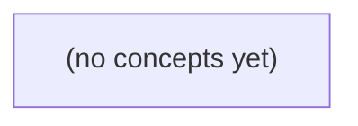

# 05.08 并发组合：Go 中的有界扇出、取消与按键协调

*一本面向 Go 初学者的静态教材，以虚构 IM 消息向 A-F 六个目标分发为贯穿案例，逐步理解两个 worker、容量为 3 的等待队列及其接纳边界。教材将有界工作池、限额时机、扇出汇聚、取消流水线、按会话键串行和 singleflight 组合为一套可审查的并发设计方法，并配套 22 题反馈练习。*

**章节:** 2

---

## 本书导览

- 了解整本书的章节脉络
- 掌握各章之间的概念依赖关系
- 选择最合适的阅读顺序

# 05.08 并发组合：Go 中的有界扇出、取消与按键协调

一本面向 Go 初学者的静态教材，以虚构 IM 消息向 A-F 六个目标分发为贯穿案例，逐步理解两个 worker、容量为 3 的等待队列及其接纳边界。教材将有界工作池、限额时机、扇出汇聚、取消流水线、按会话键串行和 singleflight 组合为一套可审查的并发设计方法，并配套 22 题反馈练习。

下方的概念图展示了本书 0 个核心概念以及它们之间的依赖关系；再下方是 1 个章节的入口。你可以按从上到下的顺序阅读，也可以根据自己的兴趣或先验知识选择切入点。

#### 概念图



## 章节索引

- **05.08 并发组合：从有限群扇出到按会话串行** — 面向Go初学者承接channel、GC和调度，以虚构IM六目标群扇出讲有界工作池、扇出汇聚、信号量、流水线取消、按key串行和singleflight边界。

## 05.08 并发组合：从有限群扇出到按会话串行

- 手算2worker+3槽的接纳上限
- 区分active/queued/producer-held工作
- 正确放置信号量避免先spawn万级G
- 定义fanout/fanin结果与取消后未知状态
- 关闭流水线通道与传播取消
- 区分本地按key串行与跨节点顺序
- 说明singleflight只合并同键在途调用

以群消息 c-g 向 u-a 至 u-f 的六目标投递为例，建立有界并发、取消传播与按会话串行的完整判断框架。

### 先画清六目标的工作状态

### 先画清六目标的工作状态

群消息 `c-g` 已通过权限检查，需分别投递给 `u-a` 至 `u-f`。两个 `worker` 负责实际发送，等待队列容量为 `3`。此时不要只问“还有几个用户未处理”，而要给每个目标标注工作状态：

| 状态 | 含义 | 是否占用等待队列容量 |
|---|---|---:|
| 在处理 | 已被某个 `worker` 取走，正在执行发送 | 否 |
| 已入队 | 已成功交给等待队列，尚未被 `worker` 取走 | 是 |
| 生产者尚未交付 | 扇出逻辑尚未把该目标交给队列；可能正在等待容量、取消或调度机会 | 否 |

例如，开始时可有：

- `u-a`、`u-b`：在处理；
- `u-c`、`u-d`、`u-e`：已入队，队列已满；
- `u-f`：生产者尚未交付。

因此，容量 `3` 限制的是“已入队但未开始处理”的任务数，而不是整条群消息的六个目标数，也不是系统中所有尚未完成的投递数。此刻未完成目标共有 `6` 个，但队列占用仅为 `3`，并发执行数为 `2`，另有 `1` 个目标仍停留在生产者侧。

可将任一目标的流转写成：

`生产者尚未交付 → 已入队 → 在处理 → 完成或失败`

取消发生时，三种状态的响应不同：尚未交付的目标应停止继续入队；已入队的目标应在被取出前尽量跳过；正在处理的目标则依赖发送操作是否接受取消。这里的“完成”仅表示本次投递工作结束，不等同于用户已读、客户端已展示或业务确认。

### 两名工作者与三槽队列的接纳上限

### 两名工作者与三槽队列的接纳上限

对群消息 `c-g` 的六个目标 `u-a` 至 `u-f`，设投递器按目标顺序向任务队列发送；有 `2` 名工作者，等待队列容量 `cap=3`。这里的“已接纳”仅指任务已经交付给工作者或成功写入队列，不等于对方客户端已经收到，更不等于业务确认成功。

接纳量由两部分组成：

\[
\text{最大已接纳量}
=
\text{处理中任务数}
+
\text{等待队列容量}
=
2+3=5
\]

可手算为：

1. `u-a`：工作者 1 立即取走，处于**处理中**。
2. `u-b`：工作者 2 立即取走，处于**处理中**。
3. `u-c`：进入等待队列，第 1 槽。
4. `u-d`：进入等待队列，第 2 槽。
5. `u-e`：进入等待队列，第 3 槽。
6. `u-f`：此时两名工作者均忙、三个等待槽均满，仍处于**生产者尚未交付**状态；投递器会阻塞在向队列发送 `u-f` 的位置。

因此，容量 `2` 与队列 `cap=3` 共同形成“至多 5 个目标已被系统接纳”的上限。只有某个工作者完成当前任务并从队列取走一个等待任务后，队列腾出槽位，`u-f` 才能继续交付。

若取消信号在阻塞期间到达，生产者不应继续等待空槽，而应退出投递循环；此时 `u-f` 以及其后的未交付目标都不应被新增接纳。已处理或已入队的任务是否继续执行，则由取消策略决定。

### 从群扇出到有界工作池

### 从群扇出到有界工作池

群消息 `c-g` 已完成权限检查，需要向 `u-a` 至 `u-f` 六个目标投递。此时不要为每个目标立即启动一个协程；应将“目标枚举”和“实际执行”拆开：生产者负责产生任务，容量为 `3` 的等待队列负责限流，两个工作者负责执行，结果汇聚者负责收集终态。

可将每个目标抽象为任务：

`任务 = {消息 c-g, 目标会话 u-x, 取消上下文, 结果通道}`

系统中任务只应处于三类状态之一：

- **处理中**：已被某个工作者取走，正在调用投递或静态服务。
- **已入队**：已取得队列容量，等待两个工作者之一处理。
- **生产者尚未交付**：目标已知，但尚未获得队列位置；它不是后台协程，也不应占用内存中的执行资源。

关键顺序是：**先取得容量，再创建工作**。生产者枚举 `u-a…u-f` 时，应先等待“队列可写”或“上下文取消”二者之一；只有成功取得位置，才构造并交付该目标任务。这样，两个工作者加上队列中最多三个等待任务，系统同时承诺的任务数量始终有明确上界；其余目标仍由生产者顺序持有，而非无限扇出。

两个工作者持续从队列取任务。某一投递变慢时，它只占用一个工作者；另一个工作者仍可处理后续任务。若队列已满，生产者自然阻塞，形成背压，而不是继续生成无界协程。

结果汇聚者不负责重试或重新投递，只记录每个目标的成功、失败或因取消未开始。这里的“成功”仅表示本次教学边界内的处理调用完成；它不等同于用户已读、客户端已展示，或业务上的最终确认。

### 取消、关闭与未知投递结果

### 取消、关闭与未知投递结果

对群消息 `c-g` 的六个目标 `u-a` 至 `u-f`，取消必须沿同一方向传播：接收侧发现上游请求已取消后，不再产生新的投递任务；分配器停止向等待队列提交；两个 worker 在当前可中断边界退出。此时可区分三类任务：

- **处理中**：worker 已取走任务。若尚未调用外部投递接口，应立即停止；若调用已开始，则不能仅凭本地取消断言“未送达”。
- **已入队**：仍位于容量为 `3` 的等待队列中。取消后不应继续消费为新投递；可由统一清理逻辑标记为取消。
- **生产者尚未交付**：分配器尚未成功写入队列，可能正阻塞于“队列满”。写入操作必须同时监听取消信号，避免永久等待。

通道关闭遵循“**发送者关闭、接收者不关闭**”：

1. 任务生产者停止生成后关闭任务通道；
2. 若有多个生产者，应由协调者在全部生产者退出后统一关闭；
3. worker 只读取任务通道，不能关闭它；
4. 结果通道由所有 worker 完成后再关闭，避免仍在发送结果的 worker 触发错误。

最容易误判的是外部投递已发起的场景。若 worker 已向静态服务或远端接口发出请求，随后本地上下文取消、连接断开或响应丢失，则结果可能是：

$$\text{本地未收到成功响应} \ne \text{外部一定未投递}$$

因此应记录为“**未知投递结果**”，而不是直接重试或标记失败。教学边界内，业务确认、幂等键、查询回执和补偿重投暂不展开；但实现必须为这类状态保留可观测记录，以免把一次可能已送达的消息重复投递。

### 按会话串行与 singleflight 的边界

### 按会话串行与 `singleflight` 的边界

对群消息 `c-g` 的六个目标 `u-a` 至 `u-f` 而言，“限制两个 worker”只约束总体并发，不自动保证同一会话内的顺序。若 `u-a` 同时收到两条消息 `m1`、`m2`，即使都来自同一进程，也可能被两个 worker 并行处理，导致 `m2` 先于 `m1` 写入或推送。

**按会话键串行**的目标是顺序：以 `sessionID`、`conversationID` 等为键，同键任务进入同一条逻辑队列，前一任务完成后才运行后一任务；不同键仍可并发。它适合维护未读数、最后一条消息、会话版本号等有状态操作。需注意：这通常只是**本地进程内**保证。若同一会话被路由到多个节点，本地锁或本地队列无法建立全局顺序；必须依赖按键一致性路由、分区消息队列、数据库条件更新或带版本号的幂等写入。

`singleflight` 的目标则是**合并重复的在途调用**。多个请求同时读取同一用户资料、刷新同一会话配置时，可共享一次后端查询结果，避免缓存击穿：

`同键并发请求 → 一次实际调用 → 多个等待者共享结果`

它不保存任务顺序，也不保证每个调用都独立执行；后到请求可能直接复用先到请求的结果。因此，不能用 `singleflight` 代替会话串行：消息投递、扣减计数、追加事件等具有副作用的任务若被合并，反而会丢失应执行的操作。

在容量为 2、等待队列 `cap=3` 的示例中，可先用全局有界队列控制系统压力，再在 worker 内按会话键调度；取消应使尚未开始的任务退出队列，并让当前处理尽快感知 `context`。至于“已送达”“已读”等业务确认，仍属于投递执行之后的协议边界，不由串行器或 `singleflight` 自动保证。

> **要点** — 容量必须按状态核算；并发必须有界；取消需传播；本地串行和同键去重都不等于跨节点顺序。

六目标群发的关键不在于“能否并发”，而在于明确系统在任一时刻接纳了多少工作、谁在持有未接纳工作，以及何时继续枚举目标。

### 用容量账本定义接纳上限

### 用容量账本定义接纳上限

把“任务已创建”与“任务已被系统接纳”分开统计。对每个目标，工作只能处于三类状态之一：

- **运行中**：已被 worker 取走，正在执行；
- **队列中**：已进入有界队列，等待 worker；
- **生产者持有**：目标尚未成功入队，仍由枚举/提交逻辑持有，不应假装它已被调度。

若有 `2` 个 worker、`3` 个队列槽位，则任一时刻的接纳上限为：

$$
\text{已接纳工作}=\text{运行中}+\text{队列中}\le 2+3=5
$$

例如 `t0` 时，A、B 正在运行，C、D、E 已入队：账本为 `运行中=2，队列中=3，生产者持有=F`。此时 F 不能再入队；提交方必须等待可用槽位，或按策略拒绝、超时、取消。不能通过额外创建线程或无限缓存绕过该上限，否则背压就失效了。

到 `t1`，假定 A 完成，worker 取出 C 开始运行，队列腾出一个槽位；此时 F 才可被接纳。注意：队列顺序只约束“谁先被取走”，并不证明设备侧实际交付、网络完成或回执到达的顺序。

面对 `10k` 个目标，生产者应按需枚举：仅在容量允许时继续产生下一个目标。这样未接纳的工作仍留在生产者侧，内存占用和在途数量都由容量账本明确约束。

### 时刻t0：A至F的接纳过程

### 时刻 t0：A 至 F 的接纳过程

设系统有 `2` 个执行槽位（worker），队列容量为 `3`。生产者按顺序枚举六个目标，并尝试提交工作 `A` 至 `F`。

| 工作 | t0 时刻状态 | 占用位置 |
|---|---|---|
| A | 正在运行 | worker 1 |
| B | 正在运行 | worker 2 |
| C | 已接纳、等待运行 | 队列 |
| D | 已接纳、等待运行 | 队列 |
| E | 已接纳、等待运行 | 队列 |
| F | 尚未被系统接纳 | 生产者一侧 |

此时系统已接纳的工作总数为：

$$
2\text{（运行中）}+3\text{（队列中）}=5
$$

因此，`F` 不能再进入队列。关键是：`F` 并没有“消失”，也不应被误计为已提交任务；它仍由生产者持有。有限队列提供的是背压边界：系统最多同时承担 `5` 个已接纳工作，而不是允许生产者瞬间制造任意多的待处理对象。

对 `F` 的处理通常有两种策略：

- **等待策略**：生产者暂停提交，等待某个 worker 完成工作并从队列取走下一项，腾出队列槽位后再接纳 `F`。这保留了目标，但会阻塞或延缓后续枚举。
- **拒绝策略**：提交接口立即返回“队列已满”。生产者必须自行决定重试、延迟、记录失败或转交其他系统；`F` 仍不属于已接纳工作。

两种策略的共同点是：t0 时刻不能宣称 `F` 已进入系统。区别只在于生产者是等待容量恢复，还是收到明确的拒绝结果。

### 时刻t1：腾槽不等于完成交付

### 时刻 t1：腾槽不等于完成交付

设并发执行槽位为 $2$、等待队列容量为 $3$。在 $t_0$，A、B 正在执行，C、D、E 已入队，因此系统已接纳 $2+3=5$ 个工作；F 仍由生产者持有，不能视为已提交。

到 $t_1$，假定 A 的执行任务结束，worker 随即从队列取出 C：

- 执行中的工作变为 B、C；
- 队列中暂存 D、E；
- 队列腾出一个位置；
- 生产者此时才可以把 F 入队。

因此，F 的“可入队”来自 C 被**取走**，而不是来自 C 已完成，更不表示 C、D、E 或 F 已完成下游设备交付。此刻的接纳集合可写为：

$$
\{\text{B},\text{C}\}\_{\text{执行}}+\{\text{D},\text{E},\text{F}\}\_{\text{等待}}
$$

队列顺序只约束“谁先获得本地调度机会”：通常 C 先于 D 被 worker 取走，D 先于 E，E 先于 F。它不能证明设备端的实际交付顺序。原因包括网络延迟、重试、不同会话或连接、设备端缓冲及确认回调乱序等；即使 F 最晚入队，也可能先得到设备确认。

所以应区分三个事件：`入队`表示本地已接纳，`取走`表示开始执行，`交付确认`才表示下游结果成立。腾出的只是接纳容量，不是交付证明。

### 按需枚举避免万级任务物化

### 按需枚举避免万级任务物化

面对 10,000 个目标，最危险的写法不是并发数设置过大，而是先把所有目标都包装成任务：创建 10,000 个 `Goroutine`、闭包、请求对象或队列元素，再期待工作池“慢慢消化”。这会把尚未开始的工作提前物化，消耗内存、调度器资源与连接相关状态，也使取消、重试和优先级调整变得笨重。

更稳妥的模型是：**目标枚举器只在系统能够接纳工作时，才产生下一个任务**。若工作池有 2 个运行槽、队列容量为 3，则系统最多接纳 5 项工作：

- `A/B` 正在运行；
- `C/D/E` 已进入队列；
- 生产者枚举到 `F` 时，不能再把它交给系统；
- 此时 `F` 仍由生产者持有：要么等待队列腾出位置，要么按超时、取消或过载策略拒绝它。

当 `t1` 时刻 `A` 完成，某个 worker 取走 `C`，队列腾出一个槽位，生产者才可将 `F` 入队，并继续枚举后续目标。于是，即使目标总数是 10k，内存中真正处于“已接纳”状态的任务仍被限制在 `运行数 + 队列容量`。

可将生产过程理解为带背压的迭代：

`枚举一个目标 → 等待可接纳 → 提交任务 → 再枚举下一个`

这并不意味着设备实际交付一定遵循 `C、D、E、F` 的队列次序；网络延迟、连接复用和设备端处理都可能改变完成顺序。队列保证的是本地接纳与取任务的规则，而非端到端送达顺序。

按需枚举还应检查取消信号：一旦会话停止、批次过期或下游持续拥塞，立即停止继续生成剩余目标，而不是先创建 10k 个以后再逐一丢弃。

### 信号量位置决定是否真正有界

### 信号量位置决定是否真正有界

“并发数为 2”并不自动意味着系统有界，关键在于信号量放在**创建 Goroutine 之前**还是之后。

```go
// 看似限流，实际已创建全部任务
for _, target := range targets {
    go func(t Target) {
        sem <- struct{}{}        // 此处才等待
        defer func() { <-sem }()
        deliver(t)
    }(target)
}
```

这段代码最多只有 2 个 `deliver` 同时执行，但若目标有 10k，仍会立刻创建 10k 个 Goroutine。它们各自持有栈、闭包、目标引用，并阻塞在 `sem <-` 上；生产者已经完成枚举，内存与调度压力并未受限。此时信号量限制的是“正在投递”，不是“活跃任务总数”。

应在生产新工作前先取得容量：

```go
for _, target := range targets {
    sem <- struct{}{}            // 无槽则生产者停在这里
    go func(t Target) {
        defer func() { <-sem }()
        deliver(t)
    }(target)
}
```

现在最多只有 2 个已获许可的 Goroutine；没有容量时，目标尚未被包装为任务，生产者仍持有当前目标并等待。若再配合容量为 3 的队列，则系统最多接纳 $2+3=5$ 个工作：2 个执行、3 个排队。第 6 个目标 F 不能入队，只能等待或按策略拒绝。

因此，真正的有界性来自背压向上游传播：先获取容量，再枚举或创建任务。对 10k 目标应按需生成，而非一次物化 10k 个等待信号量的 Goroutine。

> **要点** — 2个worker加3个队列槽最多接纳5项；第6项可由生产者持有，必须等待、拒绝或取消，不能靠预建海量Goroutine解决。

群消息扇出时，真正要限制的不只是并发执行数，还包括排队任务、已创建协程与取消后的收尾路径。

### 并发上限的三层对象

### 并发上限的三层对象

“并发上限为 32”并不天然意味着系统中最多只有 32 个工作项。至少要区分三层对象：

1. **活跃执行**：正在调用接口、写数据库或计算的任务数。`errgroup.SetLimit(32)`、worker 池中的 32 个 worker，主要约束这一层。
2. **队列等待**：已经生成、正在 `channel` 或内部队列中等待执行的任务。若 `jobs := make(chan Job, 1000)`，即使只有 32 个 worker，仍可能额外积压 1000 个 `Job` 及其引用的数据。
3. **生产者持有的工作**：尚未送入队列、但已被上游读出并保存在切片、分页结果、重试缓存或 goroutine 栈中的任务。它们不计入 worker 数，也可能不计入 channel 容量，却同样占用内存并延长取消后的清理时间。

因此，容量应从端到端观察，而非只看一个并发参数：

\[
\text{在途工作} \approx \text{活跃执行}+\text{队列等待}+\text{上游已持有}
\]

例如，生产者一次加载 10 万个目标后再投递，即便 worker 固定为 16，也已经接受了 10 万份工作；此时“16 并发”只限制执行，不限制输入规模。

有界 `channel` 能让生产者在队列满时阻塞，形成背压；固定 worker 数同时限制活跃执行。若还要求“最多创建 16 个 goroutine”，则应在启动前获取 semaphore：

`Acquire → go func() { defer Release(); 执行 }()`

反过来，若先为每个目标 `go`，再在 goroutine 内 `Acquire`，活跃任务虽受限，却可能创建海量等待中的 goroutine。设计时应明确每层容量、阻塞位置，以及取消时生产者停止读取、队列停止投递、消费者释放资源的完整路径。

### 固定工作池与有界通道

### 固定工作池与有界通道：把积压变成可见的阻塞

固定工作池将“执行并发度”和“等待队列长度”拆开控制。设有 `2` 个工作协程，任务通道容量为 `3`：

```go
jobs := make(chan Target, 3)
for i := 0; i < 2; i++ {
    go worker(ctx, jobs)
}
```

生产者执行 `jobs <- target` 时，任务的去向只有两类：

1. 被空闲工作协程立即取走，进入执行；
2. 暂存在通道缓冲区，等待工作协程领取。

因此，系统最多可接纳的“已提交但尚未完成”的任务数为：

\[
2\text{（正在执行）}+3\text{（通道等待）}=5
\]

手算过程如下：

- 前两个任务分别被两个工作协程取走，处于运行中；
- 第 3、4、5 个任务写入容量为 3 的缓冲区；
- 此时已有 5 个任务被接纳；
- 第 6 次发送必须阻塞，直到某个工作协程完成当前任务并从 `jobs` 再取走一个任务。

这个阻塞不是故障，而是**反压**：下游处理不过来时，上游生产者不能继续无限制造待处理对象。相比“每个目标都启动一个协程”，这里等待任务只是通道中的有限数据，不会额外创建大量等待中的 goroutine。

关闭与取消也要成对设计。生产完成后由唯一发送方执行 `close(jobs)`；工作协程用 `for job := range jobs` 排空已接纳任务后退出。若发送可能因取消而永久阻塞，应使用：

`select { case jobs <- job: case <-ctx.Done(): return ctx.Err() }`

这样，取消既能停止继续接纳任务，也不会让生产者卡在已满的有界通道上。

### 信号量必须先获取再创建

### 信号量必须先获取再创建

设信号量容量为 $k$，待处理目标数为 $n$。两种写法都可能保证“同时执行的任务不超过 $k$”，但对内存、调度器和取消语义的影响完全不同。

错误但常见的写法是先为每个目标创建协程，再在协程内部等待信号量：

`go func(t Target) { sem.Acquire(ctx, 1); defer sem.Release(1); handle(t) }(t)`

当 $n \gg k$ 时，只有 $k$ 个协程真正处理任务，其余约 $n-k$ 个协程都处于等待状态。它们已经分配了栈、捕获了参数、进入运行时调度体系；如果输入来自大群成员、批量重试或积压消息，等待协程本身就可能成为资源峰值。更糟的是，取消发生后仍需唤醒并让大量协程逐个退出。

应当在创建协程前获取令牌：

`if err := sem.Acquire(ctx, 1); err != nil { return err }`  
`go func(t Target) { defer sem.Release(1); handle(t) }(t)`

此时主循环在第 $k+1$ 个目标处阻塞，活跃协程最多约为 $k$；尚未获得令牌的目标只是上游列表中的数据，而不是已创建的等待协程。`Acquire` 因上下文取消返回错误时，也不会再创建新的任务。

需要明确令牌的生命周期：

- **获得**：主循环在启动任务前 `Acquire`。
- **释放**：已启动任务必须用 `defer Release`，覆盖成功、业务错误和 panic 恢复后的路径。
- **取消**：`Acquire(ctx)` 失败即停止扇出；已运行任务还应自行检查 `ctx`。
- **错误**：单任务错误不应泄漏令牌；若采用“首错取消”，取消只阻止后续获取，不会自动终止已运行任务。

信号量限制的是“已创建且持有令牌的工作单元”。若上游一次性构造百万个目标，列表本身仍需分页、流式读取或有界队列控制。

### errgroup限额的适用边界

### errgroup 限额的适用边界

`errgroup.Group` 的 `SetLimit(n)` 很适合表达“同一批任务最多同时执行 `n` 个函数”。调用 `g.Go(fn)` 时，若活跃任务已达到上限，调用方会阻塞，直到某个 `fn` 返回并释放名额。因此它能直接限制执行中的网络请求、磁盘操作或 CPU 密集计算。

但它限制的是**活跃的 `Go` 调用**，不是整个系统的内存与排队规模：

- 若先把百万个目标读入 `[]Target`，输入列表本身仍可能占用大量内存；
- 若每个任务都把结果写入无界切片、映射或缓冲通道，完成得再慢也无法阻止结果累积；
- 若上游先把任务塞进外部消息队列、重试队列或数据库待处理表，`SetLimit` 不会为这些队列提供背压；
- 若任务内部继续派生 goroutine、提交异步回调或启动独立消费者，它们不自动受该限额约束。

典型模式如下：

`for _, target := range targets { g.Go(func() error { return send(target) }) }`

这里循环会在达到限额时阻塞，因而不会无限创建受该组管理的任务；但 `targets` 已经存在，且 `send` 产生的结果、日志和重试项仍需各自设定容量、超时和丢弃或持久化策略。

还要明确错误与取消语义：使用 `WithContext` 时，首个错误会取消派生上下文；已启动任务应检查 `ctx.Done()` 并尽快收尾，尚未成功提交的 `g.Go` 调用也应避免继续生产无意义工作。`g.Wait()` 只等待组内任务退出，不替你清空外部队列，也不回收未被消费的结果。

### 获得、释放与取消的责任表

### 获得、释放与取消的责任表

并发方案是否可靠，关键不在“限制为 $N$”，而在每一种资源都能回答：谁获得、何时释放、取消时谁负责收尾。

| 策略 | 获得时机 | 正常释放 | 错误处理 | 取消后的规则 |
|---|---|---|---|---|
| 固定工作池 | 创建固定数量 worker；任务发送到有界 `jobs` | worker 消费任务后继续取下一项；关闭 `jobs` 后退出 | worker 将错误写入受控错误通道，或由协调者取消全局上下文 | 发送方应监听 `ctx.Done()`，避免向已无人消费的 `jobs` 阻塞发送；协调者关闭输入，不应强杀 worker |
| 信号量 | 必须在 `go` 前执行 `Acquire(ctx, 1)` | goroutine 内用 `defer Release(1)` | `Acquire` 失败通常表示取消或超时，应停止创建后续任务；任务错误交给汇总者 | 已获得令牌的任务应检查 `ctx` 并尽快返回，随后执行 `Release`；未获得令牌者不得启动 goroutine |
| `errgroup.SetLimit` | 调用 `g.Go` 时占用活动名额 | 函数返回时自动归还名额 | 返回首个非空错误，关联上下文通常随之取消 | 函数内部必须响应派生 `ctx`；上游停止继续提交，外部队列、结果切片仍需自行设界 |

工作池的容量主要由 `worker` 数和 `jobs` 缓冲共同决定：前者限制活跃执行，后者限制等待任务。信号量则应把“获得许可”放在创建 goroutine 之前；若先 `go` 再在内部 `Acquire`，虽然活跃任务受限，却可能创建海量等待中的 goroutine。

`errgroup` 只约束其管理的函数调用，不自动限制目标列表、分页拉取、结果聚合或旁路队列。实践中应把取消视为“停止生产、唤醒等待、等待已启动任务退出”的协议，而不是立即遗忘所有已提交任务。

> **要点** — 并发控制必须同时约束执行、排队和协程创建，并为取消与错误明确资源归还责任。

以一条IM消息同时投递六个目标设备为例，建立扇出、汇聚、超时取消与部分成功的完整并发认知。

### 从单条消息拆为六个独立投递任务

### 从单条消息拆为六个独立投递任务

设用户的一条消息需要投递到六个目标设备，入口请求可抽象为：

`Send(messageID, conversationID, senderID, recipientIDs=[A,B,C,D,E,F], content)`

扇出不是把“发送给六人”当作一个不可分割的大任务，而是生成六个彼此独立的投递任务：

`Deliver(messageID, recipientID=A)`  
`Deliver(messageID, recipientID=B)`  
`...`  
`Deliver(messageID, recipientID=F)`

每个任务都应携带足以独立执行的上下文，例如 `messageID`、`recipientID`、会话标识、内容或内容引用、幂等键、截止时间与追踪标识。任务边界应按“一个目标设备的一次投递尝试”划分，而不是按整条消息或整个收件人列表划分。

独立执行的必要性在于，各目标的网络、在线状态、推送通道、限流额度和故障情况均可能不同：

- A、C 已在线，可快速写入长连接；
- B 网络拥塞，发送可能超时；
- D 的设备令牌失效，需要标记为不可达；
- E、F 可由后台重试，不应拖住其余目标。

因此，A 成功不依赖 B 成功，B 的慢响应也不应阻塞 C 的投递。扇出后的并发只表示执行机会可以并行，不表示完成顺序、到达顺序或消息序号可以任意混用；每个任务必须以 `recipientID` 明确归属。

入口层“请求已受理”通常只意味着系统已验证请求、持久化消息并接受投递责任，例如返回 `accepted`。它不等价于六个目标均已成功送达，更不等价于六台设备均已展示给用户。后续应分别记录每个 `recipientID` 的投递状态，才能表达“部分成功、失败、超时未知与待重试”等真实结果。

### 汇聚携带recipientID的异步结果

### 汇聚携带 `recipientID` 的异步结果

扇出后，每个目标设备都应返回可独立归属的结果，而不是只返回“第几个完成”。典型结果结构可表示为：

`Result{recipientID, status, attemptID, error, completedAt}`

其中 `recipientID` 是汇聚的主键；`status` 可取“成功”“失败”“未知”。汇聚器收到结果后，以 `recipientID` 写入状态表：

- 成功：目标已确认接收或服务端已确认投递。
- 失败：已得到明确不可重试或本次尝试失败的结论。
- 未知：到达截止时间仍无结果、任务尚未启动、连接中断，或取消后无法确认远端是否已处理。

例如六个目标为 A、B、C、D、E、F，完成到达顺序可能是 C、A、F、D、E，而 B 最慢。这个顺序只反映并发执行、网络延迟和调度差异，不能当作消息 `seq`，更不能据此推断设备间的消息先后关系。消息顺序应由会话级序号、服务端日志位置或每个接收者自己的有序通道保证。

汇聚时应预先登记全部 `recipientID`，而非仅记录已返回者。这样 deadline 到达后，未回报的 B 可被明确标为“未知”，响应可包含：

`成功：[A,C,D]；失败：[E]；未知：[B,F]`

这避免把“尚未知道”误报为“失败”，也避免把部分成功包装成全量成功。客户端随后可针对未知目标查询状态或发起幂等重试；但已成功发出的投递尝试不能因上游取消而被撤回。

### 慢目标如何改变等待语义

### 慢目标如何改变等待语义

设一条消息要投递到六个目标：`A`、`B`、`C`、`D`、`E`、`F`。扇出后它们并发发送，汇聚结果时必须携带 `recipientID`，例如：

`{recipientID: "B", status: "unknown"}`

假设 `A/C/D/E/F` 在 200ms 内成功，而 `B` 网络拥塞，持续缓慢或最终失败。此时“何时向调用方返回”并非实现细节，而是产品语义选择。

- **等待全部结果**：直到六个任务都成功、失败或明确超时才返回。优点是结果完整；缺点是单个 `B` 决定整条请求的尾延迟。若 `B` 卡住，调用方会一直等待，甚至连接先断开。适合必须获得全量终态的后台作业，不适合交互式发消息接口。

- **截止时间返回**：为整个请求设置 deadline，例如 2 秒。到期后停止等待尚未完成的任务，返回已知结果：`A/C/D/E/F=success`，`B=unknown`。这里的 `unknown` 表示“截止时尚无可靠结论”，不等于失败，也不等于未发送。若发送 `B` 的尝试已在网络中途，即使取消等待，也不能撤回已经发生的发送。

- **允许部分结果**：一旦达到业务可接受条件就返回，例如“至少一个设备成功”或“主设备成功”。结果应明确列出各目标状态，而不是只给一个笼统的成功布尔值。可返回 `accepted=true`、`delivered=5/6`、`pending=["B"]`，随后由异步状态查询或回执补全。

无论选择哪种策略，完成顺序都不能被当作消息顺序；`B` 最晚完成，只说明它慢。并且“请求已受理”只表示服务开始处理，绝不等价于六个设备都已成功投递。

### 取消后的已知、未知与不可撤回

### 取消后的已知、未知与不可撤回

对六个目标设备扇出时，取消并不意味着“六次发送都没有发生”。它只是在协调层发出停止信号；每个任务所处阶段不同，结果语义也不同。

- **尚未开始**：任务仍在队列中，尚未取得发送资源或尚未调用下游接口。收到取消后可直接跳过，状态为`cancelled`或`not_started`；这是最明确的“未发送”。
- **执行中**：请求可能正在建连、写入、等待下游确认。取消可关闭本地等待、释放并发槽位，但无法仅凭本地取消判断对端是否已收到。此时应标为`unknown`，而不是武断记为失败。
- **已提交发送尝试**：下游已返回成功，或本地已将请求可靠提交给消息网关。即使随后整体 deadline 到期，也不能撤回这次外部副作用；状态应保留为该 `recipientID` 的`sent`或`accepted`。

因此，取消后的汇聚结果应按设备记录，而非只给一个笼统的“请求已取消”：

| 设备 | 状态 | 含义 |
|---|---|---|
| A | `sent` | 已成功提交发送尝试，不可撤回 |
| B | `unknown` | 取消发生在执行中，是否送达未知 |
| C | `cancelled` | 尚未开始，不再发送 |

这里的`sent`通常只是“发送系统已受理”，不等于用户设备已经展示消息；`unknown`也不等于失败，而是需要依靠幂等请求标识、下游查询或后续回执恢复事实。协调器应停止继续启动新任务、尽快返回部分结果，并让调用方明确看到：本次请求被取消，不会抹去已经发生的发送尝试。

### 把扇出汇聚接入有界并发流水线

### 把扇出汇聚接入有界并发流水线

六个目标不应直接各起一个无约束协程；真实系统中一次消息可能扩展为更多设备、重试或批量请求。应建立有界工作池：生产者生成`{recipientID, seq, payload}`任务，固定数量工作者从任务队列取任务并执行发送。这样并发上限由工作者数控制，既保护连接池、下游推送服务和内存，也避免高峰时大量协程堆积。

请求入口创建带截止时间的上下文，例如`ctx, cancel := context.WithTimeout(parent, 2s)`；任务提交、工作者取任务、网络发送及重试等待都必须观察`ctx.Done()`。截止时间到达后，尚未开始的任务应标记为`unknown`或`timeout`；已经发起的发送只能停止本地等待，不能宣称远端一定未收到，更不能撤回已成功的发送尝试。

汇聚端需明确所有权：启动一个关闭协调者，待任务生产结束且全部工作者退出后关闭结果通道；接收方以“通道关闭”或“上下文结束”为终止条件，而非等待固定六条结果。若接收方因超时提前返回，工作者向结果通道写入时也必须可取消，例如在“发送结果”与`ctx.Done()`之间选择；否则无人接收会使工作者永久阻塞。

最终响应按`recipientID`汇总，而非按结果到达顺序绑定状态。可返回`accepted`、`sent`、`failed`、`timeout/unknown`等逐设备结果，并附整体是否部分成功。入口受理成功只表示流水线接受该请求，不表示六台设备均已送达。

> **要点** — 扇出提升并行度，汇聚必须保留目标身份与不确定状态；取消停止等待，不保证撤回已发生的投递。

三阶段流水线的并发上限不仅取决于工人数，还取决于队列、取消传播与通道关闭责任；错误发生后更要逐项清点工作状态。

### 三阶段流水线的容量边界

### 三阶段流水线的容量边界

设预处理、编码、发送三阶段分别有队列容量 $q_p,q_e,q_s$，工人数 $w_p,w_e,w_s$。若每个工作者同一时刻只处理一个任务，则系统中**已被接纳但尚未完成**的任务上界可近似写为：

$$
C_{\max}=q_p+w_p+q_e+w_e+q_s+w_s
$$

这里的“接纳”不是“请求到达”，而是任务已成功交给流水线入口：它可能在预处理队列中等待、被预处理工作者执行、等待编码、正在编码，或已进入发送阶段。

需要区分三个容量概念：

- **入口容量**：通常由预处理输入队列 $q_p$ 决定。入口满时，生产者必须阻塞、返回“繁忙”，或按策略丢弃；不能无限制创建 goroutine 充当隐式队列。
- **在途容量**：由 $C_{\max}$ 决定，反映内存、连接、重试状态与取消清理的最坏负担。
- **吞吐瓶颈**：由最慢阶段决定。即使 $q_p$ 很大，发送阶段速率最低时，任务只会逐步堆积到下游队列，不能提高稳态吞吐。

队列不是独立扩容器：阶段间交接会造成反压。发送变慢后，发送队列填满；编码工作者阻塞于输出；编码队列继而填满；最终预处理也无法继续产出。固定队列因此把“无限堆积”转化为可观察的阻塞边界。

设计时应明确入口语义，例如：

- `submit` 成功：任务计入在途，后续必须获得成功、失败或取消结果；
- `submit` 因队列满失败：任务从未接纳，不应被误计为取消；
- 上下文取消：只能阻止未开始或可中断的工作，不能假定队列和执行中的任务会自动消失。

### 下游退出为何会拖住上游

### 下游退出为何会拖住上游

设流水线有预处理、编码、发送三阶段，阶段间用容量为 $B$ 的有界队列连接。下游一旦因首个错误、超时或“已得到足够结果”而停止接收，问题并不会自动停在下游：只要上游仍执行发送语句，就会形成反向阻塞链。

以编码阶段向发送阶段投递为例：

1. 下游消费者退出，不再从 `out` 读取；
2. `out` 中原有缓冲逐渐被填满，最多容纳 $B$ 个待处理项；
3. 编码工人在执行 `out <- item` 时阻塞；
4. 被阻塞的编码工人不再读取其输入队列；
5. 预处理阶段继续产出，输入队列也被填满；
6. 预处理工人、甚至最初的任务提交者，最终都阻塞在发送上。

因此，“有缓冲”只是在把阻塞延后 $B$ 次，并没有消除阻塞。若每阶段有 $W$ 个工人，最坏情况下每个工人都可能停在一次不可完成的发送上；它们持有的连接、文件句柄、内存对象或会话状态也随之滞留，构成协程与资源泄漏。

关键条件是：发送操作没有同时监听取消信号。安全发送应表达为“要么投递成功，要么得知无人再需要结果”：

`select { case out <- v: case <-ctx.Done(): return }`

下游决定提前退出时，必须取消共享的 `ctx` 或关闭约定好的 `done`；各生产者收到信号后自行停止，并关闭**自己负责的输出**。若多个发送者共用一个输出通道，则由合并者等待全部发送者结束后再关闭通道。否则，下游虽已离开，上游仍会把“无人接收的结果”当作必须完成的工作。

### 用上下文贯穿取消信号

### 用上下文贯穿取消信号

`context.Context` 应随每个工作项或整条流水线向下传递，使取消能穿过“预处理 → 编码 → 发送”的所有阻塞点。仅在入口处检查一次 `ctx.Err()` 不够：任务可能已经入队，也可能正卡在接收、计算或向下游发送。

每个阶段至少应在三类位置监听取消：

- **接收前后**：从上游队列取任务时使用 `select`，避免下游退出后工人永久等待。
- **处理过程中**：长计算、分块编码、网络请求应接受 `ctx`；必要时在循环边界检查 `ctx.Err()`。
- **发送时**：向下一阶段写入前同时等待 `ctx.Done()`，避免下游不再读取时发送者阻塞。

```go
select {
case item, ok := <-in:
    if !ok { return }
    outItem, err := encode(ctx, item)
    if err != nil { return }
    select {
    case out <- outItem:
    case <-ctx.Done():
        return
    }
case <-ctx.Done():
    return
}
```

取消请求不等于执行已经停止。调用 `cancel()` 只是关闭 `ctx.Done()`：尚未接纳的任务应停止投递，阻塞中的协程应自行返回；但已入队任务仍可能残留，正在运行的任务也只有在其处理逻辑响应上下文后才会结束。尤其是不可中断的计算或不支持上下文的外部调用，不能因“已取消”就宣称它们已经停止。

因此，阶段函数应把“收到取消”视为**不再接收、不再发送、尽快收尾**的信号；生产者退出时关闭自己的输出通道；合并者仍须等待全部发送者退出后才能关闭共享输出。这样取消才是可传播、可等待、可验证的停止协议，而非一句乐观的通知。

### 关闭责任与扇入收尾

### 关闭责任与扇入收尾

通道关闭表达的是一个强语义：**今后不会再有值写入**。因此，关闭权必须属于唯一能够证明这一事实的一方——该通道的全部发送者。

在线性流水线中，某阶段的工人从 `in` 读取、向 `out` 发送。若该阶段有多个工人，则任何单个工人退出都不能直接关闭 `out`：其他工人可能仍在发送，随后会触发“向已关闭通道发送”的崩溃。正确责任划分是：

- 上游生产者关闭自己的输出，即本阶段的 `in`；
- 多个工人只负责结束自身循环；
- 管理者等待全部工人退出后，再关闭共享的 `out`。

```text
生产者 → in（生产者关闭）
工人组   → out（等待全部工人结束后关闭）
```

扇入同理。若多个转发协程都向汇总通道 `merged` 发送，任何一个转发者读完其输入后只能退出，不能关闭 `merged`。必须由独立收尾者执行：

1. 为每个输入启动一个转发者；
2. 每个转发者在输入关闭或 `ctx` 取消后退出；
3. `WaitGroup` 等待全部转发者结束；
4. 最后统一关闭 `merged`。

这保证消费者可安全使用 `for v := range merged`：循环结束时，含义不是“某一路完成”，而是“所有输入均已停止，且不再可能出现结果”。

取消也不改变关闭责任。`ctx.Done()` 只要求发送者停止等待、尽快退出；它不会替任何人关闭业务通道。尤其在下游提前退出时，转发者的发送应同时监听取消信号，否则它们可能永久阻塞，收尾者也就永远等不到关闭 `merged` 的时刻。

### 错误后的工作状态清点

### 错误后的工作状态清点

错误或取消到达时，流水线中的任务并不会同时消失。应按任务所处位置建立状态账本，明确“是否执行过”“是否可能产生副作用”“由谁负责补偿”。

| 状态 | 可知事实 | 典型处理 |
|---|---|---|
| 未接纳 | 生产者尚未成功写入输入队列 | 停止继续接收；向调用方返回“未提交”，无需补偿。 |
| 已入队 | 已被队列接纳，但尚未被工人领取 | 取消不会自动清空队列；消费者应在取出后检查 `ctx.Done()`，选择丢弃、标记取消或转入补偿队列。 |
| 进行中 | 工人已领取，可能正在调用外部服务 | 必须等待该工人报告最终结果；取消只是请求停止，不能据此断言操作未发生。应使用超时、幂等键或可撤销协议降低不确定性。 |
| 已完成 | 已产生成功、失败或部分成功结果 | 按结果提交、重试或补偿；对外部副作用尤其要记录可追踪的操作标识。 |

关键边界在于：`cancel` 只传播“不要再开始无意义工作”的意图，不等于回滚，也不等于队列被清空。已入队任务仍占用缓冲容量；进行中的发送可能已经到达下游，即使调用方先观察到错误。

因此，错误处理应先关闭或停止生产入口，再让各阶段自行关闭其输出；最后等待工人和合并者退出。只有收齐“已领取任务”的终态，系统才能区分安全丢弃、需要重试与必须补偿的工作，避免把未知结果误判为失败。

> **要点** — 取消不会自动清空队列；有限流水线必须同时约束容量、传播退出、规范关闭，并明确每项工作的最终状态。

群扇出解决并行吞吐，但同一会话内的消息常必须保持顺序。本节建立“按键串行、跨键并行”的本地并发模型，并厘清其边界。

### 从会话顺序到按键调度

### 从会话顺序到按键调度

设任务携带会话键 `conversationId` 与会话内序号 `seq`。执行目标不是“所有任务都串行”，而是满足两条约束：

1. 同键任务严格按入队顺序执行：`c-a/seq1 → c-a/seq2`。只有 `seq1` 完成（或按业务规则失败终结）后，`seq2` 才能开始。
2. 不同键任务允许并行：`c-b/seq1` 不必等待 `c-a/seq1`，可由另一工作者同时处理。

可将任务集合按键分片：

\[
Q=\bigcup_k Q_k,\qquad Q_k=[t_{k,1},t_{k,2},\ldots]
\]

其中每个 $Q_k$ 是一个先进先出的串行队列；调度器从“当前未运行且非空”的键中选择若干键，并为每个键最多分配一个执行槽位。于是：

- `c-a` 正在处理 `seq1` 时，`seq2` 留在 `Q_{c-a}` 等待；
- `c-b` 拥有独立的 `Q_{c-b}`，可立即被调度；
- 同一键绝不能被两个工作者同时消费，否则“先后入队”会退化为竞争条件。

这里的“顺序”首先是本进程所观察到的入队顺序，而非天然的全局事实。若消息来自多个节点、会发生重投或数据库事务提交延迟，则还需要业务层的序号校验、幂等键或版本条件，才能把本地按键串行扩展为可信的会话顺序。

### 本地键控队列与工作者模型

### 本地键控队列与工作者模型

将任务按会话键 `key` 分组：例如 `c-a` 的 `seq1`、`seq2` 进入同一队列，`c-b` 进入另一队列。目标不是为每个键永久创建线程，而是维护一个本地状态表：

- `queues[key]`：该键尚未执行的先进先出任务队列；
- `running[key]`：该键是否已有消费者正在执行；
- `readyKeys`：已具备执行条件、等待共享工作池领取的键。

提交任务时，先追加到 `queues[key]`。若 `running[key]=false`，说明此前没有同键任务在执行：将其置为 `true`，并把该键放入 `readyKeys`。工作池领取键后，只处理该键队首任务；任务完成后再检查队列：

1. 队列非空：重新投递该键，使后续任务继续按顺序执行；
2. 队列为空：清除 `running[key]`，并回收该键的空闲状态；
3. 执行失败：是否重试、延迟重投或丢入死信队列，必须在保持该键“未释放”这一前提下决定，否则 `seq2` 可能越过失败的 `seq1`。

核心不变量是：任意时刻，同一 `key` 至多有一个任务处于执行态；同键任务只从队首取出。因此 `c-a: seq1 → seq2` 被串行化，而 `c-b` 可由另一工作者并行处理。多个键共享有限工作池，避免键数量增长时线程数量同步膨胀。

实际实现还需防止热点键独占调度：一次领取通常只执行一个或有限个任务后让出工作池，并为每键设置队列容量、过期策略与空闲回收。该模型只保证本进程内的选择顺序；跨节点竞争、数据库提交顺序及失败重试，仍须由幂等键、版本号或业务事务协议约束。

### 示例：c-a 串行而 c-b 并行

### 示例：c-a 串行而 c-b 并行

设消息按会话键 `c` 路由到本地 keyed worker：

| 入队时刻 | 任务 | 所属键 | 执行状态 |
|---|---|---|---|
| `t0` | `c-a/seq1` | `c-a` | 立即开始 |
| `t1` | `c-a/seq2` | `c-a` | 排在 `seq1` 后等待 |
| `t2` | `c-b/seq1` | `c-b` | 立即开始，可与 `c-a/seq1` 重叠 |

其时间线可以写成：

`c-a`：`seq1` 执行 → 完成 → `seq2` 执行  
`c-b`：`seq1` 执行 → 完成

例如，`c-a/seq1` 在 `t0` 开始、`t4` 完成；即使 `c-a/seq2` 在 `t1` 已入队，也必须到 `t4` 后才能启动。与此同时，`c-b/seq1` 不属于 `c-a` 的队列，可在 `t2` 启动，并可能在 `t3` 就完成。

因此，系统保证的是同键局部顺序：

$$
c\text{-}a/seq1 \prec c\text{-}a/seq2
$$

但不强加跨键顺序；`c-b/seq1` 可以早于、晚于或与 `c-a` 的任一任务重叠完成。这样既避免同一会话的状态更新乱序，又不会让一个会话的慢任务阻塞其他会话。

### 热点键积压与生命周期治理

### 热点键积压与生命周期治理

按键串行的代价集中在热点键：若 `c-a` 持续进入耗时任务，`seq1 → seq2 → ...` 只能单消费者执行；即使 `c-b` 等其他键可并行，`c-a` 的队列仍会增长。若到达速率为 $\lambda_a$、处理速率为 $\mu_a$，当 $\lambda_a \ge \mu_a$ 时，积压不会自行消失。

治理应先为每个键设定明确容量，而非让内存充当无限缓冲区：

- **每键上限**：如最多排队 `100` 个任务或 `1 MB` 负载；超过上限立即拒绝、降级或返回“稍后重试”，避免单个会话挤占全局内存。
- **全局上限**：限制键总数、总待处理任务数和总字节数；否则大量冷键也能形成资源耗尽攻击。
- **背压传播**：队列接近阈值时通知上游减速；入口应能等待有限时间、拒绝请求，或将可重试事件转入具备持久化能力的外部队列。
- **公平调度**：不要让热点键一次连续取尽任务。可采用“每轮每键最多执行一个任务”的轮转策略，使 `c-b` 这类短队列获得及时服务；同时限制单键并发始终为 `1`。
- **超时与取消**：排队超时的任务应在执行前失效检查；已无业务价值的旧消息可丢弃或合并，避免处理过期积压。

键状态也有生命周期。任务完成后，若该键队列为空且没有运行中的 worker，应删除 `key → queue/worker` 映射；或记录最后访问时间，由定时清扫器回收超过空闲阈值的键。删除必须与入队操作协调：通常在同一把锁或原子 `compute` 操作内确认“为空且未运行”，避免新任务刚入队就失去其 worker。热点保护、背压与回收共同保证本地串行模型可长期运行。

### 本地串行不等于全局顺序

### 本地串行不等于全局顺序

键控队列只能保证：**在同一进程内，被路由到同一 `key` 的任务按选定顺序执行**。例如 `c-a` 的 `seq1`、`seq2` 进入同一个 worker，`seq1` 未结束前 `seq2` 不会开始；而 `c-b` 可由另一 worker 并行处理。这是本地调度保证，不是端到端业务顺序保证。

| 场景 | 本地 keyed worker 能否保证 |
|---|---|
| 同进程、同一 `key` 的执行起止顺序 | 能 |
| 两个节点同时处理同一会话 | 不能 |
| 数据库事务最终提交先后 | 不能 |
| 超时后重试与原任务的到达顺序 | 不能 |
| 消息重复投递、乱序到达 | 不能 |

例如节点 A 正在执行 `seq1`，节点 B 却收到并执行 `seq2`；即使两边各自严格串行，`seq2` 的数据库事务仍可能先提交。又如 `seq1` 已写库但响应丢失，重试请求可能再次执行，形成重复副作用。

因此，队列外仍需业务协议：

- 用唯一事件 ID、去重表或幂等键抑制重复执行；
- 为会话状态维护单调版本号，写入时采用“仅当当前版本为 $v$ 才更新为 $v+1$”的条件更新；
- 对乱序事件定义策略：拒绝、暂存等待、按版本补偿，不能只依赖到达顺序；
- 跨节点时通过分区路由、分布式租约，或数据库条件写把竞争收敛到同一业务事实。

本地串行负责减少本进程内的竞态；全局正确性则由幂等、版本检查、事务边界和可恢复的业务状态机共同承担。

> **要点** — 按 key 串行只保证本进程内选定执行顺序；热点治理与跨节点一致性必须由容量控制和业务协议补足。

同一会话历史页被并发请求时，可用 singleflight 合并在途计算，但必须明确它的共享边界与权限风险。

### 从重复历史页请求识别合并机会

### 从重复历史页请求识别合并机会

设多个请求几乎同时读取会话 `c-a` 的同一历史页，例如都请求“游标 `p120` 之前的 50 条消息”。若每个请求都独立执行鉴权、查询、排序和序列化，会产生重复数据库负载；此时可将它们视为一次可合并的“在途计算”。

可合并并不等于“路径相同”。一个请求只有同时满足以下条件，才应进入同一个 `singleflight` 键：

- **读取目标相同**：同一会话，如 `c-a`。
- **分页语义相同**：游标、方向、页大小、排序规则一致；`before=p120` 与 `after=p120` 不能共享。
- **结果视图相同**：权限范围、租户、角色、脱敏策略、是否包含已删除消息等一致。
- **时间窗口重叠**：前一个请求尚未完成，后一个请求到达；`singleflight` 只合并同时在途的工作。
- **计算结果可复用**：共享的是同一份只读历史页结果，而非带有调用方专属副作用的处理过程。

因此，键不应仅写成 `history:c-a`，更安全的形式类似：

`history:tenant=t1:conv=c-a:before=p120:limit=50:scope=member:mask=v2`

第一个调用者负责实际查询；其余同键调用者等待并接收同一结果。注意，权限信息必须参与键构造：管理员可见的审计字段、普通成员不可见的撤回消息，绝不能因会话和游标相同而被错误共享。

### Do(key) 的在途合并语义

### Do(key) 的在途合并语义

`singleflight.Group` 的 `Do(key, fn)` 合并的是“当前正在执行的同键工作”，而不是历史结果。可以把它理解为一个临时的在途表：

1. 第一个以某个 `key` 调用 `Do` 的请求成为执行者，真正运行 `fn`，例如查询某会话在指定游标后的历史页。
2. 在 `fn` 尚未返回期间，后续携带相同 `key` 的请求不会再次执行查询；它们加入等待队列。
3. 执行者完成后，等待者得到同一份 `value`、同一个 `error`，并通过 `shared` 标记得知结果是否被多个调用共享。
4. 该次调用结束后，在途记录即被移除；下一次相同 `key` 的请求仍可能重新执行 `fn`。

其语义可概括为：

\[
Do(key, fn) \Rightarrow (value,\ error,\ shared)
\]

其中，`shared=true` 表示这次结果曾被至少一个并发调用复用；它不表示命中了缓存，也不表示结果可安全用于后续请求。

```text
请求 A: Do(K) -> 执行 fn -> 查询数据库
请求 B: Do(K) -> 等待 A
请求 C: Do(K) -> 等待 A
A 完成      -> A、B、C 共享同一 value/error
下一批请求  -> K 已不在途，可能重新查询
```

因此，`Do` 解决的是并发重复计算，而非数据复用策略。尤其是 `error` 也会被共享：若首个查询因超时、数据库故障或取消而失败，同键等待者通常会观察到同一失败结果。`fn` 应代表可被同一共享边界内调用者共同接受的计算；`key` 必须编码会话、游标、页大小及权限范围，避免将不同可见性下的历史页错误合并。

### 键设计必须纳入权限边界

### 键设计必须纳入权限边界

假设历史页接口接受：`会话ID`、`游标`、`页大小`、`查询条件`，并且不同调用者可见的消息范围不同。

危险的键可能只有：

`history:{会话ID}:{游标}`

此时，两个并发请求即使权限不同，也会进入同一个 `singleflight.Do(key)`：

- 管理员可查看全部消息；
- 普通成员只能查看自己参与或未被删除的消息；
- 两者请求同一会话、同一游标；
- 若管理员的计算先完成，普通成员可能复用包含敏感消息的结果。

这不是缓存泄漏，而是**在途结果共享边界错误**：`singleflight` 默认会把同一键对应的结果、错误一并交给等待者，因此键必须表达“哪些请求可以安全共享同一份响应”。

更安全的键应覆盖影响结果的全部维度，例如：

`history:{会话ID}:{游标}:{页大小}:{权限范围哈希}:{查询条件哈希}`

其中：

- `会话ID`：隔离不同会话；
- `游标`：隔离不同分页位置；
- `页大小`：避免 `20` 条与 `100` 条结果混用；
- `权限范围哈希`：可由角色、租户、成员关系、数据可见级别等稳定授权上下文生成；
- `查询条件哈希`：覆盖时间范围、消息类型、是否包含已删除消息、关键词过滤等影响结果的参数。

不要只把用户 ID 当作权限键：同一用户的角色、租户归属或会话成员资格变化后，旧权限上下文未必仍成立。实践中应使用本次请求已完成鉴权后的“有效可见范围”生成键，并避免把原始敏感条件直接写入日志。这样，`singleflight` 合并的是等价查询，而不是碰巧拥有相同会话和游标的请求。

### singleflight 不等于缓存与幂等

### singleflight 不等于缓存与幂等

`singleflight.Do(key, fn)`解决的是**同一进程内、同一时刻、相同 key 的重复计算**：第一个请求执行 `fn`，其余请求等待，并共同取得该次执行的结果。它本质上是“在途请求合并”，而不是结果存储。

| 机制 | 解决的问题 | 结果是否保留 | 作用范围 |
|---|---|---:|---|
| `singleflight` | 并发请求重复执行 | 否，执行结束即失效 | 单进程、同一在途窗口 |
| 缓存 | 后续请求重复读取/计算 | 是，直到过期或淘汰 | 可跨请求，常可跨进程 |
| 分布式协调 | 多实例同时执行同一任务 | 取决于实现 | 多进程、多节点 |
| 幂等机制 | 重试不重复产生业务副作用 | 需持久记录 | 业务边界，可跨进程 |

因此，两个并发请求读取同一会话历史页时，可能共享一次数据库查询；但该查询完成后，第三个请求再到达，`singleflight` 已无在途结果可共享，仍会重新执行。若希望后续请求也命中结果，需要额外引入带失效策略的缓存。

同样，不能把 `singleflight` 当作消息发送幂等保障。发送消息可能在“服务端已写入、客户端未收到响应”后被重试；重试若落在另一个进程、另一个时间窗口，仍可能再次发送。应使用持久化的幂等键、唯一约束或消息去重记录来保证：

`同一发送者 + 客户端请求标识 → 至多创建一条消息`

历史页的 key 还必须完整表达共享语义，例如：

`历史页:{会话ID}:{游标}:{页大小}:{权限范围}`

若省略权限范围，拥有不同可见消息范围的用户可能共享同一结果，导致越权数据泄露。

### 取消、错误与分布式边界

### 取消、错误与分布式边界

`singleflight.Group` 合并的是“同一键的本地在途调用”，而不是请求生命周期本身。第一个进入 `Do(key, fn)` 的调用负责执行 `fn`，后续调用成为等待者；因此要先决定：某个等待者取消时，是否应当取消底层历史页查询？

通常不应由任一等待者直接终止共享计算。多个请求可能都在等待同一页：某个客户端断连、超时或主动取消，只应使它自己的 HTTP/RPC 请求尽快返回 `context canceled`，不应因为它退出而中止仍被其他等待者需要的查询。否则会出现“一个慢客户端取消，所有并发读者一起失败”的耦合。

可采用两层上下文：

- **等待者上下文**：控制当前请求是否继续等结果；取消后立即返回。
- **共享计算上下文**：由服务端设置独立且较短的超时，用于数据库、远端历史服务等底层调用；只有其自身超时、服务关闭，或能可靠确认所有等待者都已离开时才取消。

错误也会被同键等待者共享。若底层查询返回权限错误、游标非法或暂时性网络错误，所有正在等待的调用都会得到该次结果；但该结果不会被 `singleflight` 持久保存，下一次调用仍会重新执行。因而不能把它当作失败缓存，更不能借此实现消息发送幂等。

还要注意分布式边界：每个进程各有自己的 `Group`。负载均衡后，两个节点可能同时收到相同的“会话 + 游标 + 权限范围”请求，并各自执行一次查询；`singleflight` 不能提供跨节点去重，也不能建立全局请求顺序。若确实需要跨节点合并，应使用带租约、超时和结果校验的分布式协调机制，或通过一致性路由让同一会话尽量落到同一节点；若需要严格顺序，则应由会话串行器、数据库条件更新或消息队列保证，而非依赖本地 `Group`。

> **要点** — singleflight 只合并本进程内同键的在途调用；键须表达数据版本与权限边界，不能替代缓存、幂等或分布式协调。

以六个群发目标为主线，建立从接纳限额、并发执行到取消收尾的完整心智模型，并厘清会话顺序与请求合并的边界。

### 先算清楚：接纳上限与三类工作

### 先算清楚：接纳上限与三类工作

设有一个有限群发器：`2` 个工作者执行任务，任务通道缓冲为 `3`。若生产者按“发送成功即视为已交付”提交，那么系统最多可**接纳**：

$$2\text{（执行中）}+3\text{（队列中）}=5\text{ 项}$$

可按时间顺序手算：

1. 提交任务 A、B：两名工作者立刻取走，A、B 为**执行中**。
2. 再提交 C、D、E：它们进入缓冲通道，为**队列中**。
3. 此时再提交 F：发送操作必须等待，除非某个工作者完成并腾出位置。

关键是区分三类工作，而不要把“已创建”都算成“已接纳”：

- **执行中**：已被工作者取出，正在调用下游服务；占用工作者名额。
- **队列中**：已成功写入缓冲通道，尚未开始执行；占用缓冲槽位。
- **生产者暂持**：例如 F 已构造完成，但发送被阻塞，仍在生产者局部变量、上游队列或调用栈中；它不占用该任务通道的接纳容量。

因此，“缓冲为 3”不等于“最多处理 3 项”，而是“在执行中的 2 项之外，还能等待 3 项”。若需求是全链路最多只允许 5 个未完成任务，生产者暂持的任务也必须纳入限额设计；否则上游可不断积压 F、G、H，表面上通道受限，实际内存与等待量仍可能失控。

### 限额放在创建前：有界工作池与扇出汇聚

### 限额放在创建前：有界工作池与扇出汇聚

设一次群发要处理六个目标 $A\sim F$。**扇出**是把一项批量任务拆成多个独立目标；**汇聚**是收集各目标的完成结果，形成可判断的批次状态。

错误做法是对每个目标立刻创建一个 Goroutine：

`for _, t := range targets { go send(t) }`

六个目标时似乎无害，但若批次变成数万项，Goroutine、连接、重试计时器和待发送数据会同时膨胀。此时“工作池大小为 3”若只写在 `send` 内部，并不能限制已经创建的海量 Goroutine；限额应位于**创建工作 Goroutine 之前**，或者更准确地说，位于任务被接纳进入执行系统之前。

可将 $A\sim F$ 投递到有界任务队列，由固定数量的工作者消费：

- 设并发上限为 $3$，仅创建 $3$ 个工作 Goroutine。
- 投递方依次送入 $A,B,C,D,E,F$；队列满时阻塞或因取消而停止投递。
- 工作者并发处理 $A,B,C$；任一完成后再领取 $D,E,F$。
- 汇聚器为每个目标记录结果，而非只等待“全部结束”。

每项结果至少应包含：目标标识、状态、错误和必要的重试信息。状态可区分为：

- `成功`：发送已确认；
- `失败`：已执行但不可恢复或重试耗尽；
- `取消`：批次上下文取消，任务未完成；
- `未投递`：取消发生时仍在输入侧，尚未被工作者接纳。

因此，批次并不只有“成功/失败”两种结论。若 $A,C,E$ 成功，$B$ 失败，$D,F$ 因取消未投递，汇聚结果应保留这种部分完成事实；把它笼统标为“失败”会丢失补偿、重试与审计所需的信息。

### 取消不是结果：流水线关闭责任

### 取消不是结果：流水线关闭责任

取消信号只表示“下游不再需要更多工作”或“请求生命周期结束”，**不等于所有 goroutine 已退出，也不等于数据通道可以立刻关闭**。一个典型流水线可分为生产、分发、执行、汇聚四段：

- 生产者生成任务，发送时同时监听 `ctx.Done()`；一旦取消，应停止继续投递。
- 分发者从输入通道取任务并交给有限工作者；取消后停止接收新任务，但不能擅自关闭仍由生产者写入的通道。
- 工作者执行单个任务时把 `ctx` 传入可取消操作；任务完成后发送结果时也要监听取消，避免汇聚端已退出而阻塞。
- 汇聚者读取结果；若决定提前返回，应先触发取消，再等待工作者和转发协程结束，避免遗留后台写入。

关闭规则很简单：**谁是某数据通道的唯一发送方，谁关闭它；接收方通常不关闭。** 若有多个工作者共同发送结果，不能由任一工作者关闭 `results`；应由协调者在 `WaitGroup.Wait()` 后统一关闭：

`生产者关闭 jobs → 工作池耗尽 jobs 后退出 → 协调者等待 workers → 协调者关闭 results → 汇聚者结束`

因此，正确收尾不是“收到取消就 `return`”，而是“发出取消、停止生产、等待发送者退出、再关闭其输出通道”。取消负责传播意图，`WaitGroup` 负责确认退出，通道关闭负责声明“不会再有数据”。

### 同一会话排队：按键串行的本地边界

### 同一会话排队：按键串行的本地边界

“同一会话”通常要求消息按到达顺序处理：用户先发“取消”，后发“确认”时，不能让后者抢先执行。可将 `sessionID` 作为键，为每个键维护一条串行队列；不同键分别由不同 goroutine 推进，因此会话间仍可并行。

- 入队时先取得该键对应的执行器；若不存在则创建。
- 同一键的任务只允许一个消费者逐个执行，前一任务完成后才取下一项。
- 队列空闲后应回收键状态，避免大量历史会话造成内存泄漏。
- 任务应携带 `context`；排队期间已取消的任务可跳过，但不能因此遗留未通知的调用方。

关键边界是：这保证的是**单进程内、同一键、经过同一队列入口**的顺序。多个实例各自维护内存队列时，`sessionID=A` 的两条请求若被负载均衡到不同节点，仍可能并发或乱序。要获得跨节点顺序，必须让同键请求稳定路由到同一分区，或使用具备分区顺序语义的外部队列、数据库锁等协调机制。

也不要把按键串行等同于 `singleflight`。`singleflight` 合并的是“同时发生且键相同”的重复计算；若键误用为权限、会话或业务资源键，可能让本应独立的请求共享结果，甚至跨主体复用不应共享的数据。串行键表达顺序边界，合并键表达可安全复用的计算身份，两者必须分别设计。

### 不要误用singleflight：权限键反例与综合检验

### 不要误用 singleflight：权限键反例与综合检验

按键串行与 `singleflight` 都会“按键聚合”，但目标不同：

- **按键串行**：同一会话、订单或账户的任务必须依次执行，保留副作用顺序。
- **`singleflight`**：相同的、可安全共享的只读计算只执行一次，其余请求等待并复用结果；它不保证任务顺序，也不适合共享带身份差异的结果。

权限是典型反例。若缓存或合并键仅为 `resource:42`：

`用户A（管理员）` 与 `用户B（普通成员）` 同时请求资源 42；A 的请求先进入并返回完整内容，B 复用该结果，便可能越权。正确键至少应覆盖结果可见性的全部维度，如 `resource:42:tenant:T:role:admin`；更稳妥的是先完成鉴权，再仅合并不含敏感差异的底层读取。

**综合检验（22题反馈）**

1. 同会话写操作用 `singleflight`？**否**，应按键串行。  
2. 相同纯查询可合并？**可以**，前提是结果等价。  
3. 键只含资源 ID 足够？**通常不够**，还要含租户、权限或数据版本。  
4. `singleflight` 会保留调用顺序？**不会**。  
5. 合并后的取消应直接取消共享工作？**谨慎**，一个等待者取消不应误伤其他等待者。  
6. 鉴权结果可跨用户复用？**仅当键完整覆盖权限语义时可以**。  
7. 失败结果一定应长期共享？**不应**，瞬时错误常需短暂或不缓存。  
8. 同订单扣款可合并为一次？**不能仅靠合并**，需幂等键与业务状态机。  
9. 扇出任务可无限创建 goroutine？**不能**，限额应在接纳或派发处。  
10. 扇入收集需等待全部结果？**取消或首错策略下未必**，但必须负责收尾。

> **要点** — 并发系统先限定接纳与创建，再定义取消后的未知结果；按键串行和singleflight都只在正确键与正确作用域内成立。
