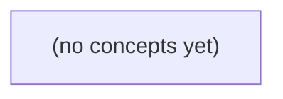

# 05.09 并发验证：Go 队列、取消、关闭与资源退出的纸上测试

*面向 Go 初学者，以虚构 IM 容量为 1 的队列为主线，系统讲解如何用门闩、select、取消与完成信号验证并发程序的业务语义和资源退出。教材通过队列满/空的两类关键交错、关闭状态机、数据竞争与业务竞争反例，以及 22 道逐层反馈题，建立不依赖随机 Sleep 的并发测试思维。*

**章节:** 2

---

## 本书导览

- 了解整本书的章节脉络
- 掌握各章之间的概念依赖关系
- 选择最合适的阅读顺序

# 05.09 并发验证：Go 队列、取消、关闭与资源退出的纸上测试

面向 Go 初学者，以虚构 IM 容量为 1 的队列为主线，系统讲解如何用门闩、select、取消与完成信号验证并发程序的业务语义和资源退出。教材通过队列满/空的两类关键交错、关闭状态机、数据竞争与业务竞争反例，以及 22 道逐层反馈题，建立不依赖随机 Sleep 的并发测试思维。

下方的概念图展示了本书 0 个核心概念以及它们之间的依赖关系；再下方是 1 个章节的入口。你可以按从上到下的顺序阅读，也可以根据自己的兴趣或先验知识选择切入点。

#### 概念图



## 章节索引

- **05.09 并发验证：从发送与关闭交错到资源退出证据** — 面向Go初学者，以虚构IM发送m-a与关闭交错为线索，讲可控channel门闩、select双就绪、关闭责任、race detector范围、业务竞争、泄漏与故障注入。

## 05.09 并发验证：从发送与关闭交错到资源退出证据

- 区分数据竞争、业务竞争与资源泄漏
- 用ready/release/done控制交错
- 手算满/空队列在取消后的select结果
- 定义唯一关闭协调者与退出顺序
- 解释race detector动态覆盖限制
- 设计有限超时和done验收
- 分开替身/集成/真实业务确认的证据

以客户端发送 m-a 与关闭同时发生为场景，建立从交错控制到资源退出、设备确认的完整并发验证证据链。

### 先划清三类并发故障

### 先划清三类并发故障

设客户端发送 `m-a` 与关闭请求同时到达。即使测试通过、竞态检测器未报警，也仍可能存在三类彼此独立的故障：

- **数据竞争**：多个 Goroutine 未经同步地并发读写同一内存，例如发送路径读取 `closed` 标志，关闭路径同时写入它。它可能导致未定义的观察结果，应借助互斥锁、原子操作或通道建立同步关系，并用 `-race` 检测。

- **业务竞争**：内存访问本身已同步，但交错后的结果不符合协议。例如关闭已线性化完成，发送却仍被队列接纳；或者发送已被确认接纳，关闭又把它静默丢弃。这里没有数据 race，也未必触发 `send on closed channel`，却违反了“关闭前后消息应如何处理”的语义。必须明确接纳边界：关闭开始前已接纳的消息是否排空，之后的发送返回什么错误。

- **资源泄漏**：请求处理函数已经返回，但后台 Goroutine、定时器、队列消费者或设备写入仍未退出；更隐蔽的是消息看似发送成功，设备端却未确认完成。此类问题通常不会被 `-race` 发现。

因此，并发验证至少要分别证明：共享状态无数据竞争；发送与关闭的胜负符合既定接纳语义；取消后所有 Goroutine 退出，且需要时获得设备完成或失败的确认。

### 用门闩复现发送与关闭交错

### 用门闩复现发送与关闭交错

并发测试首先要把“偶发窗口”改造成可控制的时序。设客户端 `c-a` 正在发送 `m-a`，同时触发关闭；测试不应依赖 `sleep` 猜测两者谁先执行，而应以 `ready`、`release`、`done` 三个门闩固定关键位置：

- `ready`：发送协程已进入发送路径，并停在真正提交队列或调用设备之前。
- `release`：测试明确放行该协程；在此之前主协程可执行客户端关闭。
- `done`：发送路径已完成清理并退出，用于证明协程没有遗留。

可将待测发送钩子写成如下语义：

```go
func sendMA() error {
    close(ready)       // 已拿到发送权，尚未提交
    <-release          // 等待测试安排关闭交错
    err := enqueue(mA) // 或调用底层发送
    close(done)
    return err
}
```

测试步骤是：启动 `sendMA` 后等待 `<-ready`；随后执行 `client.Close()`，使取消信号、发送入口封闭或队列状态变化真实发生；最后 `close(release)`，让发送协程继续，并等待 `<-done`。这样构造的是“发送已开始、关闭先完成、发送再继续”的确定交错。

断言不能只检查 `sendMA` 返回。还应验证：

1. 返回值符合约定：`m-a` 要么在关闭前被接纳，要么得到明确的关闭/取消错误，不能静默丢失。
2. 不发生向已关闭通道发送的 panic；关闭方也不与发送方争抢关闭同一资源。
3. 若队列声明“已接纳即负责”，则 `m-a` 必须继续被处理或被可观测地拒绝；若关闭会丢弃未处理项，测试应核对该丢弃语义。
4. `done` 必须到达，后续子测试还应等待设备确认与全部工作协程退出。

门闩验证的核心不是证明某次运行“没出错”，而是证明在指定交错下，发送、关闭、队列与退出协议仍保持一致。

### 手算取消下的队列选择结果

### 手算取消下的队列选择结果

设生产者向有限队列提交消息 `m-a`，关闭过程通过 `done` 广播取消：

`select { case q <- m-a: 接纳成功；case <-done: 放弃发送 }`

关键不在于“关闭已经发生”，而在于执行该次 `select` 时哪些分支**可运行**。

- **队列已满，`done` 未关闭**：发送分支不可运行，只能阻塞等待；之后若关闭 `done`，取消分支变为可运行，发送者返回，`m-a` 未被接纳。
- **队列已满，`done` 已关闭**：只有取消分支可运行，必然放弃 `m-a`。这避免了关闭后仍永久卡在队列发送上。
- **队列未满，`done` 未关闭**：只有发送分支可运行，`m-a` 被接纳；“接纳”仅表示进入队列，不等于设备已处理。
- **队列未满，`done` 已关闭**：两个分支同时可运行，`select` 会伪随机选择其一。因此 `m-a` 可能被接纳，也可能被取消；不能把“关闭优先于发送”当作该代码的语义。
- **队列为空且消费者正在等待**：发送可能直接与消费者配对；若 `done` 同时关闭，仍与“未满且已关闭”相同：发送或取消均合法。

若协议要求“观察到关闭后绝不再接纳新消息”，仅靠上述 `select` 不足。应在关闭与入队之间建立额外线性化规则，例如由统一所有者串行管理队列，或明确测试断言为：关闭竞争中的 `m-a` 结果允许为“已接纳”或“已取消”，但不得发生 `send on closed channel`、数据竞争或发送者泄漏。

### 指定关闭者并验收全部退出

### 指定关闭者并验收全部退出

在“客户端 `c-a` 发送 `m-a`”与关闭同时发生时，首先要指定**唯一关闭协调者**。它拥有取消信号、输入通道关闭权和最终验收权；发送方、处理协程、设备写入协程都只能响应取消，不得自行关闭共享通道。这样可从结构上避免“重复关闭”以及 `send on closed channel`。

推荐顺序是：

1. 关闭协调者发出 `cancel()`，阻止新的业务接纳。
2. 发送路径在入队前同时检查取消状态；已取消则返回“未接纳”，不能再尝试写入队列。
3. 协调者等待所有生产者停止发送；只有确认不存在发送者后，才关闭队列通道。
4. 消费者以“队列关闭且已排空”为退出条件，完成已接纳消息的处理，随后退出。
5. 所有协程在退出前报告到 `done` 或 `WaitGroup`；协调者以有限超时验收全部完成。
6. 对外部设备，还必须等待关闭确认，例如写入器已停止、连接已关闭或设备返回停止回执。

关键不变量是：关闭队列前，发送者已全部退出；关闭取消后，`m-a` 要么在线性化接纳点之前进入队列，要么明确未接纳，不能处于“函数已返回成功但消息无人处理”的悬空状态。

测试不能只断言关闭函数返回。应在受控交错下断言：无数据竞争、无 panic、每个协程均收到退出信号，并在超时内完成 `done`；若涉及设备，还应验证设备侧确已停止，而非仅本地 goroutine 已返回。

### 分层收集端到端验证证据

### 分层收集端到端验证证据

并发正确性不能由“`Send(m-a)` 返回了”或“`Close()` 没报错”单独证明。应按证据强度分层验证，并让每层回答不同问题。

- **替身测试**：用可控的假设备、阻塞写入和事件屏障穷举关键交错。证明关闭一旦开始，后续发送不会被接纳；已接纳的 `m-a` 按约定完成投递或被明确丢弃；不会发生 `send on closed channel`、重复关闭或 goroutine 永久阻塞。替身还应记录设备调用次数，以验证取消后不再发起新 I/O。

- **集成测试**：连接真实队列、连接管理和资源释放路径，令客户端发送与断开并发发生。除断言响应和错误类型外，还要等待后台 goroutine 退出、队列关闭、连接释放，并检查设备侧最终状态。例如，若语义是“接纳即保证处理”，则设备必须观察到 `m-a`；若语义是“关闭优先”，则客户端必须获得未接纳证据，设备不得出现半次执行。

- **真实业务确认**：在可观测环境核对端到端事实：请求标识、接纳时间、取消原因、设备确认回执和最终资源状态应能关联。业务验收关注“设备实际执行了什么”，而非进程内部函数是否返回。

`race detector` 只能发现**本次动态执行路径**上的未同步内存访问；它不能证明全部交错均被覆盖，也不能发现队列语义错误、丢消息、重复执行或 goroutine 泄漏。因此应在高并发、重复运行、不同调度条件下启用它，并与上述可观测断言共同构成证据链。

> **要点** — 并发验证必须同时证明消息语义、关闭安全、协程退出与外部设备确认，而非只看调用返回。

并发测试的关键不是“多跑几次碰巧复现”，而是用可控门闩固定关键交错，并以超时和退出信号形成可审计证据。

### 把发送前瞬间变成可控门闩

### 把发送前瞬间变成可控门闩

要验证“取消发生在发送之前”这一因果关系，不能依赖调度器恰好把 goroutine 切走。应在生产者真正执行发送前设置门闩：`ready` 表示“我已到达发送前”，`release` 表示“测试允许继续”，`done` 表示“生产者已退出”。

```go
ready := make(chan struct{})
release := make(chan struct{})
done := make(chan struct{})

go func() {
	defer close(done)

	// 已完成前置计算，但尚未尝试 out <- v。
	close(ready)

	select {
	case <-release:
		// 测试明确放行后，才进入后续发送/取消竞争。
	case <-ctx.Done():
		return
	}
}()
```

测试的顺序必须由信号建立，而不是由时间猜测：

1. 等待 `<-ready`，确认生产者已经停在发送前瞬间；
2. 执行 `cancel()`，使取消事件在放行前确定发生；
3. `close(release)`，允许生产者继续；
4. 等待 `<-done`，证明其观察到取消并退出。

因此，测试验证的不是“某次运行中似乎没有发送”，而是：在生产者被固定于发送前时，取消先发生；恢复执行后，生产者能够结束。`ready` 负责建立前提，`release` 负责控制交错，`done` 负责提供资源退出证据。

所有等待都应包在有限超时中。超时不是同步手段，而是失败诊断边界：若收不到 `ready`，说明未到达预期状态；若收不到 `done`，则可能存在阻塞、泄漏或取消未被正确传播。

### 先确认就绪，再安排取消与释放

### 先确认就绪，再安排取消与释放

纸上测试应把“生产者可能正在发送”改写为可观察的因果链。生产者在进入关键 `select` 或阻塞发送前，先发送 `ready`；测试主协程只有收到 `ready`，才知道生产者已抵达门口，而非仍在启动、计算或调度队列中。

典型步骤为：

1. 创建带 `cancel` 的上下文、`release` 门闩和 `done` 退出信号。
2. 启动生产者；它完成前置工作后通知 `ready`，随后等待 `release`，或准备在“发送/取消”之间选择。
3. 测试先等待 `ready`，并为该等待设置有限超时；超时说明测试未建立预期前提，不能继续推断。
4. 收到 `ready` 后执行 `cancel()`，使取消信号先于释放动作成为唯一新增事件。
5. 等待 `done`，并检查生产者报告的分支结果应为“因取消退出”，而不是“发送成功”。
6. 最后关闭或发送 `release` 以清理仍可能等待的辅助协程，并再次确认所有退出信号已到达。

这里的顺序很重要：若先释放发送门、再取消，发送可能已经完成；若取消与释放同时发生，两个分支都可能就绪，`select` 的选择并不提供确定性。测试不应声称“取消一定赢过已就绪的发送”，而应通过门闩保证：在取消发生时，发送路径仍不可完成。`done` 则把“似乎取消了”提升为“生产者确已退出”的资源生命周期证据。

### 满队列与空队列下手算选择结果

### 满队列与空队列下手算选择结果

设生产者在门闩 `ready` 后执行：

`select { case out <- m-a: case <-ctx.Done(): }`

不要只断言“关闭后没有发送”；必须先列出当时哪些分支真正可选。

- **缓冲队列已满**：`out <- m-a` 不可选。测试在收到 `ready` 后取消 `ctx`，则取消分支成为唯一可选分支。可断言生产者随后报告 `done`，且队列中仍只有原有消息；这里能证明消息 `m-a` 未入队。

- **存在等待接收者**：即使缓冲为空，等待接收者也会使发送分支可选。若取消与释放接收者同时发生，发送和取消可能同时就绪，`select` 会任选其一。测试不能断言“必然取消”或“必然发送”，只能断言结果属于允许集合：收到 `m-a`，或生产者因取消退出。

- **队列为空且无接收者**：对无缓冲通道，发送不可选；对有缓冲通道，只要仍有容量，发送仍可选。只有“发送确实阻塞”时，取消才是唯一出口。

因此，`ready` 只证明已到达发送前；还需控制队列容量、接收者是否待命，并等待带超时的 `done`，才能把“取消发生”与“资源确已退出”区分开。

### 有限超时与 done 构成退出证据

### 有限超时与 `done` 构成退出证据

并发测试中的每一次等待都必须有有限上界。无界地等待 `<-done`、`<-ready` 或某个结果通道，会把测试是否结束交给被测代码：一旦协程阻塞、取消信号未传递或通道永远未关闭，测试进程就可能整体挂住，无法提供失败位置。

应将等待写成“事件到达或超时失败”的二选一：

```go
select {
case <-done:
    // 已确认协程退出
case <-time.After(200 * time.Millisecond):
    t.Fatal("生产者未在取消后退出：可能仍阻塞于发送、未观察到取消，或存在协调缺陷")
}
```

这里的 `done` 不是“请求退出”的手段，而是“退出已经发生”的证据。测试先通过 `cancel()`、关闭 `release` 等动作触发退出条件，再等待 `done` 被关闭；只有收到 `done`，才能断言该协程已经越过阻塞点并完成清理。

超时并不证明具体是哪一行卡住，却能缩小故障性质：可能是发送无法解除、接收方未协作、取消未被监听、关闭顺序错误，或协程发生泄漏。因此，超时报错应描述等待的事件、此前已建立的条件和可能的阻塞关系，而非仅写“测试超时”。这样，即使失败只出现一次，也能留下可审计的退出证据与诊断线索。

### 拒绝 Sleep 碰运气，分层保存验证证据

### 拒绝 Sleep 碰运气，分层保存验证证据

`time.Sleep` 和“循环发送一万次”只能制造**可能发生**的竞争，不能证明目标交错已经发生。例如测试在 `Sleep(10ms)` 后取消上下文，无法知道生产者当时是在发送前、阻塞发送中，还是早已退出；机器负载、调度器和竞态检测器都会改变结果。

更可靠的是建立可观察的门闩：

- 生产者到达“即将发送”位置时写入 `ready`；
- 测试先等待 `ready`，据此确认前置状态；
- 测试执行 `cancel()` 或关闭通道，再关闭 `release`；
- 生产者收到 `release` 后继续，并向 `done` 报告退出；
- 每次等待都包在有限 `timeout` 中，避免测试自身永久挂起。

这样得到的是因果证据：`ready → cancel/close → release → done`，而非“睡眠后大概如此”。

证据还应分层解释。测试替身和可控时钟可稳定验证分支、超时和重试次数，但不能证明真实网络、缓冲区或调度行为；集成测试能覆盖组件间的关闭传播，却仍可能遗漏真实业务负载；生产环境的指标、日志与故障演练，才用于确认业务语义和资源退出。三者互补，不能以某一层替代全部证明。

> **要点** — 以 ready 固定前置状态、以 release 安排交错、以 timeout 与 done 验收退出，才能把并发猜测变成因果证据。

用容量为1的channel复现取消与发送交错，关键不在猜测select结果，而在证明消息接纳边界与退出语义。

### 先固定时间线与可观察事实

### 先固定时间线与可观察事实

并发测试首先要固定**时间线**，否则“取消后发送了没有”只是调度猜测。设通道容量为 `1`，生产者准备发送消息 `m-a`，并用同步点控制其真正执行发送选择的位置。

- **T1：队列初始已满**
  - 通道中预先放入 `m-b`，因此容量 `1` 已被占满。
  - 生产者携带 `m-a` 启动，但暂停在发送动作之前。
  - 测试方先执行 `cancel()`，确认取消信号已关闭，再放行生产者。
  - 此时发送分支不可执行：没有空槽可接纳 `m-a`；取消分支可执行。
  - 可验证结论是：生产者应以取消路径退出，随后从通道读取到的唯一既有消息仍是 `m-b`，不存在 `m-a`。

- **T2：队列初始为空**
  - 通道没有消息，`m-a` 的发送分支具备执行条件。
  - 同样先取消、再放行生产者。
  - 放行时，发送与 `ctx.Done()` 都可能就绪；`select` 可任选其一。
  - 因而测试只能观察并接受两种结果：生产者因取消退出且未写入，或 `m-a` 已进入队列后返回。不能把“取消已发生”误写成“绝不接纳”。

这里“消息已接纳”必须具有可检验证据：发送操作成功返回，或在唯一消费者/受控读取下实际读到该消息。仅看到生产者被放行、函数开始退出，均不能证明 `m-a` 已进入通道。

### 队列满时：发送只能让位于取消

### 队列满时：发送只能让位于取消

设缓冲通道容量为 `1`。测试先写入 `m-b`，但暂不读取：

```go
q := make(chan string, 1)
q <- "m-b" // 队列已满
```

生产者随后准备发送 `m-a`，并在发送点与取消信号竞争：

```go
select {
case q <- "m-a":
    // 发送成功
case <-ctx.Done():
    // 因取消退出
}
```

此时应先让生产者到达该 `select` 附近并暂停，再执行 `cancel()`，最后释放生产者。关键状态是：

- 通道容量为 `1`，其中唯一槽位已保存 `m-b`；
- 测试未接收 `m-b`，因此没有空闲槽位；
- 没有其他接收者在等待；
- `cancel()` 已关闭 `ctx.Done()`。

据此，`q <- "m-a"` 分支不具备就绪条件：缓冲区已满，发送不能立即完成。相反，`<-ctx.Done()` 在取消后立即就绪。因此 `select` 并不存在“随机选发送还是取消”的问题；可选集合只有取消分支：

$$
\operatorname{ready}(\text{send }m\text{-a})=\varnothing,\qquad
\operatorname{ready}(\text{Done})=\{\text{取消}\}
$$

生产者只能因取消返回，`m-a` 不会被通道接纳。之后读取通道，必须只得到先前写入的 `m-b`；若继续以非阻塞方式读取，则应确认不存在第二条消息。

这里证明的是一个受队列状态约束的接纳边界：**取消发生时，只要发送尚因满队列而阻塞，取消即可阻止该消息入队。** 该结论不能外推到队列为空的情形；空队列下发送与取消可能同时就绪。

### 队列空时：双就绪不保证取消优先

### 队列空时：双就绪不保证取消优先

设容量为 `1` 的 `channel` 当前为空。生产者已携带消息 `m-a` 运行到发送选择点附近；随后测试调用 `cancel()`，再解除生产者阻塞。此刻通常会形成两个同时可执行的分支：

- `out <- m-a`：队列有空位，发送可立即完成；
- `<-ctx.Done()`：取消已发生，`Done` 通道已关闭，接收可立即完成。

若代码形如：

`select { case out <- m: case <-ctx.Done(): }`

则不能把“源码中取消分支写在后面”或“测试先执行了 `cancel()`”理解为取消必然胜出。`select` 在多个通信分支同时就绪时会任选一个可执行分支；因此本次运行可能走取消退出，也可能成功将 `m-a` 放入队列。

这与队列已满的情形不同：满队列时，发送分支尚不可执行，取消后只有 `ctx.Done()` 可选，因而可证明 `m-a` 未被接纳；空队列时，发送本身已经具备接纳条件，取消只是在同一轮仲裁中增加了另一个候选分支。

因此，T2 的测试应断言生产者最终能够退出、不会永久阻塞，并允许两种结果：`m-a` 未入队，或 `m-a` 已入队。不能断言“调用 `cancel()` 后 `m-a` 绝不入队”。若业务语义要求严格的“取消线性化之后不再接纳”，仅靠该 `select` 不够，需改为单所有者串行仲裁，或在锁保护的状态协议中原子检查取消状态与执行入队。

### 用门闩构造可重复的并发证据

### 用门闩构造可重复的并发证据

并发测试不能依赖 `sleep` 猜测 goroutine 是否“应该已经运行到某处”。应显式布置三类信号：

- `ready`：生产者已到达发送前的目标位置；
- `release`：测试允许生产者继续执行发送分支；
- `done`：生产者已经退出，并携带退出原因或结果。

容量为 1 的队列可先放入 `m-b`，使其满；生产者准备发送 `m-a`：

```go
ready := make(chan struct{})
release := make(chan struct{})
done := make(chan error, 1)

go func() {
    close(ready)          // 已停在发送前
    <-release             // 未获准前绝不尝试发送
    select {
    case ch <- "m-a":
        done <- nil
    case <-ctx.Done():
        done <- ctx.Err()
    }
}()
```

测试顺序必须是：先等待 `<-ready`，再执行 `cancel()`，最后 `close(release)`。这样取消一定发生在生产者被门闩拦住之后；释放后，满队列上的发送不可用，只有 `ctx.Done()` 可选，因此应收到取消错误，并验证队列中仍只有 `m-b`：

```go
<-ready
cancel()
close(release)

if err := <-done; !errors.Is(err, context.Canceled) { /* 失败 */ }
if got := <-ch; got != "m-b" { /* 失败 */ }
select {
case extra := <-ch:
    _ = extra // 不应存在 m-a
default:
}
```

`done` 是退出证据：它证明的不是“测试曾经取消”，而是生产者已观察到取消并结束。注意将队列改为空后，释放时“发送”和“取消”会同时就绪；此时 `select` 可任选分支，测试只能接受两种结果，不能断言 `m-a` 绝不入队。若业务要求取消后严格拒绝接纳，必须改用单所有者仲裁，或在锁保护下检查取消状态与入队动作。

### 严格取消语义需要额外仲裁

### 严格取消语义需要额外仲裁

普通发送通常写成：

`select { case ch <- msg: case <-ctx.Done(): }`

它只能承诺：阻塞等待期间若取消通道先被观察到，发送方可以退出；却不能承诺“调用 `cancel` 之后，消息绝不进入队列”。

原因是 `select` 不提供“取消优先级”。当 T2 的队列为空时，`ch <- m-a` 与 `<-ctx.Done()` 都可能就绪；运行时可任选其一。因此测试只能断言发送结果符合两种合法分支：要么返回取消且未接纳，要么发送成功且消息可被接收。断言“取消后必不入队”会把调度偶然性误当成语义保证。

若业务必须建立严格边界，需要额外仲裁：

- **普通 `select`**：实现最简单、吞吐较高；适合“取消表示尽快停止”，允许取消与发送竞争时仍有一条消息成功接纳。
- **单所有者串行仲裁**：由唯一 goroutine 同时拥有队列、取消状态和接纳决定。生产者提交请求，所有者按事件顺序处理；一旦处理到取消事件，后续请求统一拒绝。它最容易证明“取消生效后不接纳”，代价是多一跳通信和中心化瓶颈。
- **锁内状态协议**：发送方在同一把锁保护下检查 `closed/canceled` 状态并决定是否写入内部队列；取消方也在锁内切换状态。线性化点是持锁检查与入队的原子区间，因此取消状态一经提交，后续入队必被拒绝。代价是锁竞争、死锁设计和条件唤醒复杂度。

关键不是先调用了 `cancel`，而是取消操作与“检查状态并接纳消息”是否经过同一个可证明的串行化点。没有该仲裁点，就只能接受竞争语义，不能宣称严格取消。

> **要点** — channel取消测试应证明允许的状态集合；双就绪下不能把select的偶然选择误当作严格业务语义。

并发关闭不是一句“关闭通道”即可完成，而是一次必须证明发送者、消费者与资源都能有序退出的状态迁移。

### 关闭权为何不能交给接收方

### 关闭权为何不能交给接收方

通道的关闭权应属于“最后一个发送者已经确定退出”的一方，而不属于“暂时不想再接收”的接收方。原因很直接：接收方无法证明未来不会再有发送操作。

若接收方因为“已经拿到足够结果”而执行 `close(ch)`，某个仍在运行的生产者随后执行：

`ch <- value`

程序会立刻触发“向已关闭通道发送”的恐慌。这个错误不是偶发竞态，而是责任边界错误：接收方只知道自己的消费意愿，不知道全部发送者的生命周期。

例如，多个 worker 向 `results` 汇报结果时，消费者即使决定提前返回，也不能关闭 `results`：

- 消费者可以发出取消信号，如关闭 `ctx.Done()` 对应的取消上下文；
- 每个发送者收到取消后停止产生新结果，并退出；
- 协调者等待全部发送者完成；
- 只有协调者确认“不再存在任何发送路径”后，才能关闭 `results`；
- 消费者随后排空通道，或明确记录因取消而未消费的结果。

关闭责任因此应遵循一句规则：**谁能证明再也没有发送者，谁才有资格关闭通道。** 若有多个发送者，通常不要让任一 worker 自行关闭共享通道；应由唯一协调者在等待 `WaitGroup` 完成后关闭。接收方若需要停止，应通知，而不是关闭发送侧仍在使用的通道。

### 从开放到闭合的三态协议

### 从开放到闭合的三态协议

将通道生命周期显式建模为 `Open → Stopping → Closed`，关闭才不再是某个接收者的临时动作，而是可验证的协调协议。

- **Open（开放）**：生产者可注册、可发送；消费者持续接收。此时不得直接由消费者执行 `close(ch)`，因为仍可能存在尚未发送的生产者。
- **Stopping（停止中）**：协调者先原子地拒绝新生产者进入，再广播取消信号，如关闭 `done` 或触发 `context.CancelFunc`。已有生产者必须在发送前同时检查取消信号，退出前调用 `wg.Done()`；它们可以放弃未提交任务，但不能绕过完成确认。
- **Closed（已闭合）**：唯一协调者在 `wg.Wait()` 返回后执行一次 `close(ch)`。此时已证明不存在未来发送，因此不会发生 `send on closed channel`。消费者继续读取，直到通道排空；若取消语义允许丢弃，则必须记录未处理数量或任务标识。

核心顺序不可颠倒：

`阻止注册 → 通知取消 → 等待全部生产者退出 → 唯一关闭通道 → 消费者排空并退出`

可用互斥锁、原子状态或 `sync.Once` 保护状态迁移，但 `sync.Once` 只能保证“关闭一次”，不能证明“关闭时已无发送者”。测试应覆盖：停止后注册被拒绝、停止后发送不再阻塞、全部生产者完成前通道未关闭、重复停止幂等，以及关闭后不存在发送与重复关闭 panic。

### 用门闩重放发送与关闭交错

### 用门闩重放发送与关闭交错

并发缺陷难以靠“多跑几次”稳定发现；应把调度时机变成可控的门闩。测试中常用三个通道：

- `ready`：生产者已到达指定位置；
- `release`：测试允许生产者继续；
- `done`：生产者或协调者确实退出。

例如，将生产者卡在“即将发送”处：

```go
ready := make(chan struct{})
release := make(chan struct{})
done := make(chan struct{})

go func() {
    defer close(done)
    close(ready)      // 已检查取消条件，但尚未发送
    <-release         // 门闩：冻结在发送前
    jobs <- "task"    // 若此时被关闭，将稳定触发 panic
}()
```

测试先等待 `<-ready`，再执行错误的 `close(jobs)`，最后 `close(release)`。若生产者仍执行发送，测试应捕获“向已关闭通道发送”的 panic；正确实现则应在释放后重新检查取消信号，放弃发送并退出。

同样可复现重复关闭：让两个“关闭者”都停在关闭前，确认二者都报告 `ready` 后同时释放。未经唯一协调者保护时，第二次 `close(jobs)` 必然 panic。修复后，只有持有关闭权限的协调者可完成 `Open → Stopping → Closed`；其余 goroutine 只能请求停止、等待 `done`，不能直接关闭数据通道。

还应设置“发送后”门闩：生产者完成一次发送后暂停，协调者通知取消并等待全部 `done`，最后才关闭通道。消费者必须能排空已发送值，或明确记录其为未处理项。这样测试验证的不是偶然时序，而是每个状态迁移下都不存在 `send after close`、重复关闭和 goroutine 泄漏。

### 消费者排空、丢弃与退出验收

### 消费者排空、丢弃与退出验收

取消发生后，消费者不应默认“立刻返回”。此时通道中可能仍有已入队消息，选择不同策略意味着不同的业务语义：

- **排空后退出**：继续读取直到通道关闭，适合日志落盘、订单投递、批处理等“已接收即尽量完成”的场景。取消只阻止新生产，不能无声丢弃已进入队列的数据。
- **记录未处理后退出**：消费者收到取消信号后，统计剩余消息数、记录偏移量或写入死信队列，再退出。适合允许恢复处理、但不要求本次运行完成的任务。
- **立即退出**：优先释放资源，不再消费队列；必须明确消息会被丢弃，或由持久队列、重试机制保证可恢复。不能把这种策略伪装成“成功处理”。

可将消费者退出写成可验收的协议：协调者先进入 `Stopping`，阻止新发送并广播取消；所有生产者报告 `done` 后关闭数据通道；消费者按选定策略完成读取、丢弃记录或释放资源，最后报告自己的 `done`。

测试不能只断言“函数返回”。应使用有限超时等待生产者、消费者和资源清理完成：

- 取消后不再出现新的成功发送；
- 排空策略下，已入队消息数量与已处理数量一致；
- 丢弃策略下，未处理数量、原因和恢复位置可观测；
- 在超时内收到全部 `done`，否则判定协程泄漏；
- 文件、连接、订阅等资源的关闭回调已执行；
- 重复取消、重复关闭以及取消期间发送，均走受控错误路径，绝不触发 `panic`。

### 把状态转移变成分层证据

### 把状态转移变成分层证据

仅断言“没有 panic”并不足以证明关闭正确；应为 `Open → Stopping → Closed` 的每次转移建立不同层级的证据。

- **替身测试：证明协议调用顺序。** 用可控的生产者、消费者与资源替身记录事件：停止新任务接收后，取消信号是否先发出；所有生产者是否均报告 `done`；是否只有协调者执行一次 `close(ch)`；消费者是否排空缓冲数据，或明确记录未处理项。替身还应注入“生产者迟到发送”“消费者提前退出”“关闭回调报错”等路径，断言它们返回可识别错误，而非触发 `send after close` 或重复关闭 panic。

- **集成测试：证明并发时序成立。** 使用真实 channel、`WaitGroup`、取消上下文和多个 goroutine，反复制造发送与停止交错。检查进入 `Stopping` 后不再接纳新发送；在全部 sender 退出前通道保持可发送但已禁止业务投递；最后由唯一协调者关闭。运行 `go test -race -count=100`，并为停止过程设置超时，避免测试自身永久等待。

- **真实业务确认：证明资源确实退出。** 在任务系统、消息消费或连接处理链路中采集关闭日志、未处理任务数、活跃 goroutine 数和资源释放结果。`Closed` 不应只表示 channel 已关闭，还应意味着生产者已退出、消费者已完成排空或持久化补偿、连接与文件句柄已释放。

特别关注泄漏：取消信号无人监听、消费者等待永不关闭的输入、生产者阻塞在无接收者的发送上，都会使状态表面进入 `Closed`，实际却遗留 goroutine。

> **要点** — 先停新发送，再通知取消，等待全部生产者退出后由唯一协调者关闭通道，并用done与超时验证退出。

并发测试中的“无竞态报警”只是已执行路径的局部证据。要验证IM发送与关闭交错，还需主动锁定时序、检查业务不变量，并证明协程能够退出。

### 明确竞态检测的证据边界

### 明确竞态检测的证据边界

`go test -race` 会在测试执行期间插入运行时监控：当两个并发执行单元访问同一内存位置、其中至少一个是写入，且它们之间没有被识别的同步关系时，报告数据竞争。

例如可用：

`go test -race ./...`

但它给出的结论必须准确理解为：

> 在本次测试实际走到的调度路径上，没有发现可观测的未同步内存访问。

它不是“程序所有并发交错都安全”的证明。若发送协程总是在关闭协程之前完成，测试从未执行“发送与关闭同时发生”的窗口，即使真实线上可能出现该窗口，检测器也不会报警。循环次数更多、`-count=100` 或提高并行度能扩大覆盖面，却仍不能穷尽调度可能性。

更重要的是，竞态检测器验证的是内存同步，不验证业务原子性。考虑“用户不存在则插入”的逻辑：

1. 加锁读取 `map`，发现键不存在；
2. 解锁；
3. 再次加锁写入该键。

每次 `map` 访问都在锁内，因此通常不会产生数据竞争；但两个协程可能都在第 1 步观察到“不存在”，随后分别执行插入、重复发送欢迎消息或重复创建会话。这里缺失的是“检查—决定—写入”的业务原子性，而非单次 `map` 访问的互斥。

因此，并发测试应将 `-race` 视为必要证据之一：用门闩、屏障或可控钩子主动制造发送/关闭交错；断言关闭后不再发送、同一对象只创建一次等不变量；最后等待 `WaitGroup`、通道关闭或退出信号，证明相关协程确实退出。

### 构造Plain Online读写竞态

### 构造 Plain Online 读写竞态

先用一个**没有同步保护**的在线状态表，制造最小竞态。`Plain Online` 的目的不是提供正确实现，而是让 `go test -race` 学会捕获“一个协程写、另一个协程读同一份共享状态”的证据。

```go
type PlainOnline struct {
	users map[string]bool
}

func NewPlainOnline() *PlainOnline {
	return &PlainOnline{users: make(map[string]bool)}
}

func (o *PlainOnline) Set(id string, online bool) {
	o.users[id] = online
}

func (o *PlainOnline) IsOnline(id string) bool {
	return o.users[id]
}
```

测试不能只“碰巧并发”。用门闩让读写协程同时起跑，并在循环中扩大调度交错窗口：

```go
func TestPlainOnlineRace(t *testing.T) {
	o := NewPlainOnline()
	start := make(chan struct{})
	done := make(chan struct{})

	go func() {
		<-start
		for i := 0; i < 10000; i++ {
			o.Set("alice", i%2 == 0)
		}
		close(done)
	}()

	go func() {
		<-start
		for i := 0; i < 10000; i++ {
			_ = o.IsOnline("alice")
		}
	}()

	close(start)
	<-done
}
```

执行：

`go test -race -run TestPlainOnlineRace`

典型报告会标出两类调用栈：一条是 `Set` 对 `map` 的写入，另一条是 `IsOnline` 对同一 `map` 的读取，并以 `WARNING: DATA RACE` 说明它们缺少同步顺序。报告中的文件、行号和 goroutine 创建位置，是定位共享对象与并发来源的关键证据。

这里的循环不是业务需求，而是提高实际执行到交错的概率；门闩则避免某个协程提前跑完。即使某次未报警，也只能说明本次调度没有捕获该冲突，不能证明实现安全。对普通 `map` 而言，读写并发还可能直接触发“并发 map 读写”崩溃；崩溃同样是错误证据，但不应替代竞态检测。

### 用同步修复访问而非掩盖问题

### 用同步修复访问而非掩盖问题

发现竞态后，修复目标不是让 `go test -race` 安静，而是为共享状态建立**唯一且完整的同步协议**：所有读、写、删除、遍历以及“检查后再操作”的复合步骤，都必须按同一规则访问。

最直接的方案是互斥锁：

```go
type Online struct {
    mu   sync.Mutex
    users map[string]User
}
```

访问 `users` 前均持有 `mu`。它适合发送、下线、关闭连接等操作相互影响较强的场景；代价是读操作也会互相等待，但规则简单，最不易遗漏。

读远多于写时可使用 `sync.RWMutex`：查询持有 `RLock`，修改持有 `Lock`。但读写锁不是“更快的锁”替代品：只要逻辑需要从读取结果推导后续写入，就必须在同一个写锁区间完成。例如：

```go
// 错误：两个锁区间之间，状态可能已变化
if !exists(id) { add(id) }

// 正确：检查与插入构成一个原子业务动作
mu.Lock()
defer mu.Unlock()
if _, ok := users[id]; !ok {
    users[id] = user
}
```

另一种模型是消息化串行访问：让一个专属协程拥有 `users`，其他协程通过 channel 发送“查询、发送、关闭、删除”请求。这样 map 不再被多协程直接触碰，顺序也可明确表达；但请求通道、返回通道和停止信号本身仍需定义关闭规则，不能把复杂性藏进 channel。

无论选择哪种方案，都要避免“部分访问加锁”：发送路径加锁而关闭路径直接删除、查询加读锁却在回调中保留 map 指针，都会破坏协议。竞态检测器只能报告实际并发发生的内存访问；测试还应以门闩固定“发送检查在线”与“关闭删除用户”的交错，并断言关闭后不再投递、不会重复创建、相关协程最终退出。

### 识别锁保护下的业务竞争

### 识别锁保护下的业务竞争

两个操作都“每次访问 `map` 都加锁”，并不等于业务结果正确。关键在于“检查不存在”和“插入”是否构成一个不可分割的原子决策。

```go
func getOrCreate(id string) *Session {
    mu.Lock()
    s := sessions[id]
    mu.Unlock()

    if s != nil {
        return s
    }

    created := newSession(id)

    mu.Lock()
    sessions[id] = created
    mu.Unlock()
    return created
}
```

这里通常不会触发 `go test -race`：每一次对 `sessions` 的读写都受同一把锁保护，因此不存在未同步的同址并发读写。但仍可能发生如下交错：

1. 协程 A 加锁检查，发现 `sessions[id]` 不存在，解锁。
2. 协程 B 也检查到不存在，解锁。
3. A 创建并插入 `createdA`。
4. B 创建并覆盖为 `createdB`，或分别启动两套关联资源。

这属于**业务竞争**：内存访问安全，却违反“同一 `id` 只能创建一个 Session”的业务不变量。竞态检测器只能报告已执行的未同步内存访问；它不会理解“只能创建一次”“不能重复发送欢迎消息”之类的领域规则。

修复方式是将“查找—必要时创建—写回”放入同一临界区，或采用 `sync.Once`、按键粒度的锁、单飞机制等保证一次性决策。测试则应利用门闩让两个协程都停在“确认不存在”之后再同时继续，并断言创建次数为 `1`、返回对象一致。这样验证的是业务原子性，而不只是 `-race` 的无报警结果。

### 以门闩测试交错并验收不变量

### 以门闩测试交错并验收不变量

并发测试不应依赖“恰好调度到问题窗口”。用门闩把协程停在关键点，才能稳定复现“两个请求都看到不存在”“发送正遇到关闭”等交错。

以“只允许首次创建会话”为例：即使每次 `map` 访问都加锁，若“检查不存在”和“写入新值”分属两个锁区间，两个协程仍可能都通过检查。测试可让它们同时停在检查之后：

```go
ready := make(chan struct{}, 2)   // 两个协程均已完成检查
release := make(chan struct{})    // 统一放行插入
done := make(chan struct{}, 2)

create := func() {
    // lock -> 检查不存在 -> unlock
    ready <- struct{}{}
    <-release
    // lock -> 插入或提交 -> unlock
    done <- struct{}{}
}

go create()
go create()
<-ready
<-ready
close(release)
<-done
<-done
```

验收重点不是“没有 `-race` 报警”，而是业务不变量：最终只有一个创建成功、`map` 中只有一个对象、失败方得到明确的“已存在”结果。修复通常是把“检查并插入”置于同一临界区，或使用单次初始化、原子状态转换。

发送与关闭也可采用同样结构：发送协程在真正写入前报告 `ready`，关闭协程在关闭前报告另一侧 `ready`，测试确认双方已到达窗口后再 `close(release)`。随后用有限超时等待 `done`：

```go
select {
case <-done:
case <-time.After(time.Second):
    t.Fatal("协程未退出，可能因发送/关闭交错阻塞")
}
```

`done` 是退出证据：它证明测试中的协程已完成，而不只是主测试函数结束。配合 `go test -race`，可分别获得动态数据竞争证据、特定交错证据与业务不变量证据。

> **要点** — 竞态检测证明已覆盖路径的内存访问安全；业务原子性、关闭责任与退出完成，必须由可控交错和不变量断言另行证明。

并发测试不能只证明取消已发出，还要证明每个启动的协程、队列与文件描述符都在有限时间内完成交接和退出。

### 画出下游退出与上游阻塞链

### 画出下游退出与上游阻塞链

先把并发关系画成一条“所有权与等待”链，而不是只看 `cancel()` 是否被调用：

`发送方 G1 → 通道 ch → 消费者 G2 → 外部资源/返回`  
`取消信号 ctx.Done() ───────────────┘`

典型泄漏发生于：消费者 `G2` 因错误、超时或主动取消而先退出，随后不再接收 `ch`；发送方 `G1` 仍执行无条件发送：

```go
ch <- item // 无接收者时永久阻塞
```

此时即使调用了 `cancel()`，也不会自动中断这条发送语句。`G1` 被卡在通道发送上，栈、待发送对象以及它持有的队列、文件描述符或锁都可能无法释放。

纸图应明确标出三个问题：

- **谁可能先退出**：消费者在哪个分支 `return`，是否会关闭资源。
- **谁仍可能发送**：生产循环、转发协程、错误上报协程是否还持有 `ch`。
- **谁负责唤醒阻塞者**：发送端必须同时监听取消，而非假设关闭下游即可传播退出。

安全发送通常写为：

```go
select {
case ch <- item:
case <-ctx.Done():
    return
}
```

若通道由发送方负责关闭，还要定义“最后一个发送方”的证据；不能让消费者退出时随意关闭仍有多个发送者使用的通道。测试中应刻意让下游提前退出，再验证每个上游发送协程都在有限 deadline 内返回。超时报告应指出“哪个 G 卡在发送、对应通道由谁持有、下游为何停止接收”，而不是用无限 `sleep` 猜测泄漏。

### 取消不是退出完成通知

### 取消不是退出完成通知

`cancel()` 的语义是“传播停止意图”：它关闭关联的 `Context.Done()`，使正在选择该分支的 goroutine 有机会转向清理逻辑。它**不等待**任何 goroutine 真正返回，也不保证阻塞中的发送、文件读取或锁竞争会立刻解除。

例如，下游已经退出而上游仍在发送：

```go
select {
case out <- v:          // 若无人接收，可能一直阻塞
case <-ctx.Done():      // 只有执行到 select 才能观察取消
    return
}
```

若发送没有把 `ctx.Done()` 纳入等待条件，调用 `cancel()` 后，上游仍可能永久卡在 `out <- v`。因此，“已取消”不能作为“无泄漏”的测试结论。

实际退出需要独立证据：

- 对单个后台 goroutine，使用 `done chan struct{}`，并由 goroutine 在 `defer close(done)` 中报告退出；
- 对一组受测 goroutine，使用 `sync.WaitGroup`，启动前 `Add`，退出路径统一 `Done`，测试等待 `Wait` 完成；
- 对队列、连接和文件，验证其关闭责任已执行，例如消费者退出后关闭输入队列、`Close` 已被调用、文件描述符已释放。

测试应先触发取消，再在有限 deadline 内等待退出证据：

```go
cancel()

select {
case <-done:
case <-time.After(time.Second):
    t.Fatal("上游未退出：可能仍阻塞于发送或资源清理")
}
```

超时信息应指向诊断方向：哪个 goroutine 尚未退出、它可能等待哪个 channel、哪个队列或 FD 尚未关闭。不要用无限 `sleep` 猜测清理是否完成；`runtime.NumGoroutine` 的绝对值也只能辅助观察，因为测试框架、网络运行时等背景 goroutine 会造成波动。真正可靠的断言是：**本测试启动的每个 goroutine 都给出了可等待的退出证据。**

### 用有限期限验收协程退出

### 用有限期限验收协程退出

`cancel()` 的语义是“通知停止”，不是“等待停止”。测试若在取消后立刻返回，仍可能遗留卡在发送、接收、文件关闭或重试循环中的协程。验收应把“所有已启动协程退出”作为显式条件。

为每类协程登记退出证据：工作协程、结果转发协程、清理协程各自在 `defer wg.Done()` 前执行；测试端只在有限期限内等待：

```go
ctx, cancel := context.WithCancel(context.Background())
defer cancel()

var wg sync.WaitGroup
// 每启动一个受测协程，先 wg.Add(1)，协程内 defer wg.Done()

done := make(chan struct{})
go func() {
    wg.Wait()
    close(done)
}()

select {
case <-done:
    // 所有登记协程均已退出
case <-time.After(500 * time.Millisecond):
    t.Fatal("取消后仍有协程未退出：检查发送阻塞、未关闭队列或清理路径")
}
```

期限应覆盖正常调度抖动，但不能用无限 `sleep` 掩盖问题。超时时，诊断信息应指向责任边界：哪个协程尚未 `Done`、它等待的通道是否仍有发送方、队列是否关闭、文件描述符是否由唯一清理者关闭。可为每个协程附加名称和状态记录，使失败信息类似“转发协程等待向下游发送；下游已退出但结果队列未被消费”。

不要仅比较 `runtime.NumGoroutine()` 的绝对值：测试框架、计时器、网络运行时都会引入背景协程，导致结果不稳定。更可靠的是追踪本测试启动的协程，并在 deadline 前逐一取得其退出证据；队列关闭和 FD 释放也应由对应责任方明确确认。

### 核对队列与FD的责任归属

### 核对队列与 FD 的责任归属

协程退出不等于资源已经退出。一个消费者可能因 `cancel` 返回，但生产者仍阻塞在发送；一个连接处理协程可能结束，但其 `net.Conn`、文件、`Ticker` 或内部缓冲队列仍由无人负责的一方持有。测试应把“谁负责交接、谁负责关闭、何时确认释放”写成可验证的契约。

- **队列排空或丢弃必须有策略。** 若取消后仍要求处理已入队任务，应关闭输入通道并等待消费者排空；若允许丢弃，则由队列所有者停止接收、清理积压项，并让发送者通过 `select { case ch <- x: case <-ctx.Done(): }` 放弃发送。不能让发送者永久等待一个已退出的消费者。
- **关闭权必须唯一。** 通常由发送方或队列创建者关闭通道；接收方只观察 `ok` 或 `ctx.Done()`，不擅自关闭。多发送方场景可由协调协程在 `WaitGroup` 确认全部发送方结束后统一关闭。
- **连接与文件描述符应有明确所有者。** 创建 `net.Conn`、`os.File`、监听器或 `Ticker` 的代码，要么在本函数中 `defer Close/Stop`，要么显式转移所有权。取消信号本身不会中断阻塞的 `Read`；必要时调用 `conn.Close()` 或设置有限 `Deadline`，使读取协程获得退出机会。
- **测试验证释放顺序。** 在触发取消后，等待每个已启动协程对应的 `done` 或 `WaitGroup`；再断言队列已关闭、连接的关闭钩子已调用、临时文件可删除或自定义关闭计数达到预期。

超时时的诊断应指出“发送者等待哪个通道”“读取者卡在哪个连接”“哪个关闭回调未执行”。不要用无限 `sleep` 猜测 FD 是否释放；用有限 deadline 加可观察的关闭证据，才能区分协程泄漏与资源遗留。

### 让超时成为可诊断的失败证据

### 让超时成为可诊断的失败证据

并发测试中的“超时”不应只是失败开关，而应是泄漏责任的证据采集点。三种常见做法的诊断价值差异很大：

- **无限或固定 `sleep`**：例如取消后 `time.Sleep(time.Second)`。它既不能证明协程已退出，也会让快速机器浪费时间、慢速机器偶发失败；更糟的是，失败时只知道“等久了”，不知道谁还在等。
- **比较 `runtime.NumGoroutine()` 绝对值**：测试环境还可能有运行时、覆盖率、日志、网络库等后台协程。绝对数量波动不等于本测试泄漏，稳定也不等于关键协程已退出。
- **带状态诊断的有限 deadline**：为本测试启动的每个协程建立可观察的退出证据，如 `done`、`WaitGroup`、阶段状态或命名的错误通道；到 deadline 未完成时，报告仍在等待的协程及其资源责任。

例如，下游提前退出后，上游可能阻塞在：

```go
select {
case out <- v: // 无接收者时永久阻塞
case <-ctx.Done():
}
```

测试不只应调用 `cancel()`，还应等待上游的 `done` 或 `wg.Wait()` 完成。若 deadline 到期，错误信息应明确类似：“发送协程仍等待 `out`；消费者已退出；输入队列长度为 3；`pipeWriter` 尚未关闭”。对于文件、连接、队列等资源，也应记录关闭事件或由包装器暴露 `Closed()` 状态。

`cancel` 仅传播“应停止”的信号，并不等待任何 goroutine 实际返回。可靠断言是：取消后，在有限 deadline 内，所有本测试创建的 goroutine 完成、队列责任完成交接、FD 被关闭。必要时再输出 goroutine 栈作为补充，而不是用无限 `sleep` 掩盖卡点。

> **要点** — 取消只发出停止意图；以done、WaitGroup、资源关闭与有限超时共同证明并发系统真正退出。

并发验证的目标不是“测过不报错”，而是为每一种故障交错建立可复现、可解释、可验收的退出证据。

### 建立可控故障注入边界

### 建立可控故障注入边界

并发测试首先要区分：哪些组件负责“制造交错”，哪些断言负责“证明结果”。故障注入应停在接口边界，不应依赖真实磁盘、网络抖动或调度偶然性。

- **假存储**负责控制持久化路径。它可以在第 $n$ 次 `Write` 时返回错误、只接受部分字节，或在调用开始后阻塞，直到测试释放门闩。由此验证：存储失败是否向上传播、短写是否被识别、取消后是否停止继续写入。
- **假 writer**负责控制输出路径。它应可记录每次写入的内容、调用顺序与并发次数，并模拟 `n < len(p)` 的短写、返回错误、永久阻塞等行为。重点不是“输出成功”，而是确认发送方不会因下游异常泄漏 goroutine。
- **可控 channel 门闩**负责固定时序窗口。例如让 worker 已取到任务但尚未提交结果、让关闭操作与发送操作在同一临界阶段相遇，或让队列保持满载。门闩通常由“已到达”通知和“继续执行”许可组成，避免用 `time.Sleep` 猜测调度。

测试应记录每个注入点的预期路径：谁先阻塞、谁收到取消、哪个错误被保留、哪些 channel 被关闭，以及最终 goroutine、文件句柄或连接是否退出。假组件只能证明实现对**指定交错**的处理；它不能替代真实网络、数据库或操作系统环境中的可靠交付验证。

### 用路径表设计取消与短写用例

### 用路径表设计取消与短写用例

并发故障用例应先描述“事件如何传播”，再断言结果。仅检查函数返回错误，无法证明 goroutine、队列和底层资源已经按预期退出。可为每个可控假存储或假 `writer` 建立路径表：

| 故障注入 | 预期路径 | 需记录的实际路径 | 最终状态断言 |
|---|---|---|---|
| 短写 | `Write` 返回 `n<len(p), err=nil`，上层识别为短写错误并停止发送 | 写入次数、已写字节、错误包装链、是否继续取队列 | 调用方收到短写错误；未确认的数据不被标记成功；所有 worker 退出 |
| 上下文取消 | `ctx.Done()` 触发，生产者停止投递，消费者放弃未开始任务 | 取消发生在入队前、阻塞发送中或写入中 | 返回 `context.Canceled` 或约定错误；队列不再增长；`WaitGroup` 归零 |
| 队列满 | 非阻塞投递立即失败，或阻塞投递受取消解除 | 当前队列长度、投递策略、是否发生额外 goroutine | 不静默丢失；错误或丢弃计数符合策略；关闭后无发送者卡住 |
| 存储失败 | 假存储返回固定错误，调用链停止提交或进入明确重试分支 | 重试次数、退避、后续任务是否被取消 | 错误可追溯；不发生无限重试；连接、文件或事务被关闭 |

“实际执行路径”应由测试探针提供，而非依赖调度时序猜测。例如假 `writer` 在第 `k` 次写入时阻塞，通过通道通知测试，再由测试取消上下文；假存储记录 `Open`、`Save`、`Close` 的顺序。断言既包括功能结果，也包括退出证据：

- 所有启动的 goroutine 都已通过 `WaitGroup` 或退出通道确认结束；
- `Close` 至多一次，且发生在不再发送之后；
- 短写的 `n` 不被误当作完整成功；
- 失败任务、已提交任务和未处理任务的归属可区分。

路径表还应保存 Go 版本、测试命令、注入数据与失败变式。它说明的是受控交错下的实现性质；真实网络、数据库超时和驱动行为仍需独立集成验证，不能把模拟通过等同于生产可靠交付。

### 验证功能结果与退出证据

### 验证功能结果与退出证据

并发测试应把“业务是否正确”和“系统是否真正退出”分开断言。一次 `Send` 返回成功，并不证明消息完整写出；一次 `Close` 返回成功，也不证明后台 goroutine 已停止。

可将断言拆为五类：

1. **返回错误**：为短写、存储失败、上下文取消、队列已满分别注入确定错误，断言调用方获得预期错误或可用 `errors.Is` 识别的包装错误。不要只断言“非空错误”。

2. **消息完整性**：假 writer 应记录每次 `Write` 的字节序列与次数。成功路径断言输出恰为预期消息；短写路径断言不得把“写入部分数据”误判为成功，也不得在未定义重试策略时悄然重复发送。

3. **关闭责任**：明确谁关闭输入队列、谁关闭底层 writer、谁等待工作者。测试中分别调用发送方结束、取消上下文和显式 `Close`，断言资源只关闭一次；重复关闭应遵循约定，如安全返回或报告明确错误。

4. **goroutine 退出**：为被测组件暴露 `Done()`、`Wait()` 或测试专用钩子。关闭后等待其完成，并断言工作者计数归零；不要依赖 `time.Sleep` 猜测退出已经发生。

5. **有限超时**：超时只用于把“未退出”转化为可诊断失败，例如：

`select { case <-done: case <-time.After(200 * time.Millisecond): t.Fatal("关闭后工作者未退出") }`

超时时间不是功能正确性的证据，而是测试防挂死的边界。功能断言说明结果是否符合协议；退出断言说明失败、取消和关闭交错后资源是否可回收。两者必须同时成立。

### 区分探测器、替身与集成证据

### 区分探测器、替身与集成证据

并发测试中的“通过”不是单一结论，而是不同证据共同缩小风险范围。应明确每类测试回答的问题，避免把局部证据误读为生产可靠性证明。

- **竞态探测器**：使用 `go test -race ./...` 发现测试执行期间实际发生的未同步读写、部分错误共享状态访问等问题。它能证明“该次覆盖到的执行路径未报告数据竞态”，不能证明不存在死锁、goroutine 泄漏、逻辑丢失、短写处理错误，也不能穷尽未被调度到的交错。

- **功能测试**：验证发送、关闭、取消后的可见行为，例如返回错误、拒绝新任务、已接收任务的处置、状态迁移和统计值。它能证明给定输入与调度条件下的契约成立；若只断言“没有报错”，则不能证明后台任务已经退出，或资源已经释放。

- **替身测试**：通过可控假存储、假 writer、阻塞 channel 或失败注入器，构造短写、队列满、存储失败、上下文取消等通常难以稳定复现的路径。它特别适合断言“预期路径—实际调用—最终状态”：是否停止重试、是否关闭 writer、是否通知等待者、是否回收 goroutine。其局限是替身只模拟了作者实现的语义；假 writer 的 `Write` 行为与真实网络连接、假数据库的事务与连接池行为都可能不一致。

- **真实网络与数据库集成测试**：验证协议边界、驱动实现、超时、连接关闭、事务回滚、序列化与环境配置等真实交互。它提供更接近部署环境的证据，却通常更慢、更脆弱，也难以精确控制每个并发交错；一次成功不能覆盖生产中的负载、网络抖动和故障恢复链路。

因此，推荐将证据分层记录：测试名称、Go 版本、执行命令、输入数据、注入故障、预期状态与失败变式。替身测试证明故障分支可控，`-race` 证明已运行路径未见竞态，集成测试证明边界可互操作；三者叠加，仍不等同于“生产环境已可靠交付”。

### 固化可复现的验证记录

### 固化可复现的验证记录

一次并发测试通过，只能说明“在这组代码、环境与调度条件下通过”；只有把条件固化下来，结果才可复查、失败才可定位。每个验证用例至少记录：

- **运行基线**：Go 版本、操作系统与架构、关键依赖版本；例如 `go version`、`go env GOOS GOARCH`。
- **执行命令**：普通测试、竞态检测、重复次数与超时参数，例如  
  `go test -race -count=100 -timeout=20s ./...`
- **输入数据**：消息数量、缓冲区大小、队列容量、取消时机、预填充数据，以及随机种子。不要只写“高并发”，应写明“8 个发送者、每人 100 条、队列容量 1”。
- **调度门闩**：假存储或假 writer 在何处阻塞、何时放行。门闩应由 `ready`、`release` 一类通道控制，使测试能明确构造“发送已进入、关闭尚未完成”的交错。
- **失败变式**：短写长度、返回错误的第几次调用、存储失败是否可重试、上下文在写前还是写后取消、队列满时采用阻塞、拒绝还是丢弃。
- **验收证据**：期望错误、已执行写入次数、未执行任务数、最终状态、goroutine 是否退出、连接或文件是否关闭。

可将失败变式表述为可读断言：`第 2 次 Write 返回 n=3, err=nil`，随后必须检测到短写；`第 3 次 Save 返回 ErrDiskFull`，关闭后不得遗留工作 goroutine。若涉及时间，不以脆弱的 `Sleep` 作为主要证据，而以“已到达门闩”“已观察到取消”“已完成退出”的同步信号界定阶段。

还应明确验证边界：假对象证明的是调用方对指定契约的处理；`-race` 用于发现运行覆盖到的竞态；真实网络或数据库集成测试才覆盖驱动、协议、超时和部署配置的一部分行为。模拟测试全部通过，不等于已经证明生产环境中的可靠交付。课程记录应保留命令、数据、门闩和失败变式；当前制作阶段不实际执行这些命令。

> **要点** — 并发验证要同时证明结果正确、故障可控、资源已退出，并清楚标注每类证据的适用边界。

本节把并发正确性转化为可核验的时序证据：既检查队列状态与关闭顺序，也验收协程最终退出。

### 先建立可控交错与状态账本

### 先建立可控交错与状态账本

并发验证不能依赖“多跑几次看看会不会出错”。要证明发送与关闭的边界正确，先把不可预测的调度改造成可控交错：用 `ready` 表示“已到达关键点”，用 `release` 表示“允许继续”，用 `done` 表示“协程确已结束”。

设发送协程为 `Gsend`，关闭协程为 `Gclose`。典型门闩结构是：

- `Gsend` 在真正执行 `ch <- v` 前发送 `ready`，随后阻塞等待 `release`。
- 测试方收到 `ready` 后，确认发送者已经进入目标阶段。
- 此时启动或推进 `Gclose`，使其执行 `Open → Stopping → Closed`。
- 测试方按 T1、T2 两个时点记录状态，再决定何时关闭 `release`。
- 每个协程在 `defer close(done)` 中提交退出证据。

T1 与 T2 不只是“某一行代码前后”，而是可复查的状态快照：

| 时点 | 队列/通道 | 生命周期状态 | 协程证据 |
|---|---|---|---|
| T1：发送者已就绪 | 队列仍可观察；发送尚未提交 | `Open` 或正进入 `Stopping` | `Gsend` 已发出 `ready`，未发出 `done` |
| T2：关闭逻辑完成 | 不再接收新任务；通道关闭或替换完成 | `Closed` | `Gclose` 已 `done`；`Gsend` 必须有明确结果：成功、拒绝或安全退出 |

关键不是强求“发送一定成功”，而是要求结果与状态机一致：若 T1 时仍为 `Open`，发送可以被接受；若关闭已线性化到 `Stopping/Closed`，发送必须被拒绝、返回错误或经受保护地退出，绝不能触发 `send on closed channel`。

每次交错都应写入状态账本：`时点、状态、队列长度、通道是否关闭、活跃协程数、发送结果、done 是否收到`。这样后续题目中的 race、重复执行和泄漏，不再是偶发症状，而能对应到某个缺失的状态转换或退出证据。

### 推演Open到Closed的关闭时序

### 推演 Open 到 Closed 的关闭时序

把发送端状态抽象为 `Open → Stopping → Closed`。关键约束是：**只有状态拥有者关闭队列；进入 `Stopping` 后不再接受新发送；`Closed` 表示关闭动作已完成且退出条件可被观察。**

设发送操作的核心选择为：

`select { case q <- v: ...; case <-ctx.Done(): ... }`

但 `select` 不保证“取消优先”。当多个分支同时就绪时，运行时会随机选择其一，因此必须先用状态规则界定哪些结果合法。

- **满队列，取消到达**：`q <- v` 不就绪，只有 `ctx.Done()` 可选；发送者应放弃发送，转入退出或上报取消。此时若关闭者等待发送者退出，不能反过来先关闭仍可能被发送的 `q`。
- **空队列，取消未到达**：发送分支可选，值进入队列；消费者随后可取走。若此刻关闭请求到达，状态先从 `Open` 切为 `Stopping`，再阻止后续发送，而不是撤销已成功入队的值。
- **队列可写且取消同时就绪**：两个分支都合法。若选发送，必须承认“取消发生后仍多发送一个”是 `select` 允许的结果；若业务要求取消后绝不投递，应在选择前后额外检查状态，或由单一协调协程串行化发送与关闭。
- **消费者等待且队列关闭**：接收表达式返回零值和 `ok=false`；这才是消费者确认“不会再有新值”的证据，随后退出循环。

合法关闭路径可写成：

`Open`：允许提交；  
`Stopping`：拒绝新提交，等待既有发送者停止或由协调者排空；  
`Closed`：执行 `close(q)`，消费者观察 `ok=false` 后退出。

尤其不能让多个发送者各自执行 `close(q)`：即使它们都“看到取消”，也会产生重复关闭，或一个发送者在另一个关闭后继续发送而触发 panic。关闭不是取消信号的副作用，而是完成发送权收回、确认无在途发送后的最终状态转换。

### 区分字段race与业务判重竞争

### 区分字段 race 与业务判重竞争

两类问题都可能由并发触发，但证据工具不同，不能混为一谈。

- **字段 race**：多个 Goroutine 未经同步地访问同一普通字段，且至少一个为写。例如 `stopped bool` 被关闭协程写入、发送协程读取，却没有锁、原子操作或 channel 建立的同步关系。此时即使偶尔表现“正常”，`go test -race` 仍可能报告数据竞争；修复目标是建立明确的内存同步。

- **业务判重竞争**：字段访问本身可能完全受锁保护，却仍违反业务语义。设消息 `m-a` 应只发送一次：

  `if !seen[m] { seen[m] = true; send(m) }`

  若“检查是否已发送”和“登记已发送”分散在不同临界区，T1、T2 都可能先观察到 `seen[m]==false`，随后各自发送一次。即便 `seen` 的每次读写都加锁，race detector 也未必报警：它看到的是无数据竞争的合法内存访问，而不是“最多发送一次”这一业务规则被破坏。

验证时应分别提问：

1. 普通字段的读写是否有同一把锁、原子操作或可证明的 happens-before？
2. `m-a` 的“检查—占位—发送”是否构成不可分割的判重协议？
3. 测试是否断言 `m-a` 的发送记录恰为一次，而非只断言程序未崩溃？

因此，`-race` 是字段同步的证据；发送次数、唯一消息标识和队列记录断言，才是业务判重正确性的证据。

### 定义唯一关闭者与退出验收

### 定义唯一关闭者与退出验收

并发关闭不是一句 `close(ch)`，而是一份可验证的所有权协议。首先指定**唯一关闭协调者**：只有它能把生命周期从 `Open` 推进到 `Stopping` 再到 `Closed`；生产者、消费者和取消方只能发送停止请求，不能自行关闭共享通道。

典型顺序应满足：

1. 协调者发布停止信号，例如关闭 `stop` 或调用 `cancel()`。
2. 所有生产者观察到停止信号后停止发送，并通过 `producerDone` 上报退出。
3. 协调者等待生产者全部退出；此时已不会出现新的发送。
4. 若要求排空，协调者再关闭数据通道，消费者用 `for v := range ch` 消费剩余项；若允许放弃积压，则消费者监听 `ctx.Done()` 后退出。
5. 消费者全部上报 `consumerDone`，协调者关闭最终 `done`，表示资源已回收。

关键约束是：**不能在生产者仍可能发送时关闭数据通道**，否则会触发“向已关闭通道发送”；也不能仅凭“已经调用取消”认定退出，因为协程可能卡在未监听取消的发送、接收或锁等待中。

可用有限超时形成验收矩阵：

| 验收对象 | 期望结果 | 超时意味着什么 |
|---|---|---|
| 停止信号 | 立即可观察 | 生命周期状态未正确发布 |
| 生产者退出 | 在期限内关闭 `producerDone` | 仍在发送、阻塞发送或遗漏取消分支 |
| 消费者退出 | 排空/取消策略对应地完成 | 未排空、未响应取消或处理永久阻塞 |
| 最终 `done` | 仅在全部工作协程退出后关闭 | 存在协程泄漏或等待关系成环 |

验收代码的核心不是无限等待，而是：

`select { case <-done: // 通过；case <-time.After(timeout): // 失败 }`

其中 `done` 必须代表“所有受管理协程均已退出”，而不是“关闭流程已开始”。

### 组织分层证据与逐题反馈

### 组织分层证据与逐题反馈

22题不应只按“对错”排列，而应按证据强度逐层推进，使学习者从识别状态走向设计可验收的退出条件。

- **状态识别题**：先判断 `T1`、`T2` 是可发送、已关闭还是已耗尽；区分“通道关闭”与“接收方读完”。替身队列可稳定构造边界状态，但只能证明局部协议。
- **时序推演题**：给出 `Open → Stopping → Closed` 的交错事件，要求判断谁先停止发送、谁负责关闭、关闭后发送为何可能 panic。此类题检验所有权与 happens-before，而非调度“恰好成功”。
- **反例诊断题**：设置普通字段未同步读写、多个协程同时业务判重后同时写入的场景。即使最终数据“看起来正确”，仍可能存在 race 或重复提交；应指出缺失的互斥、原子操作或单写者约束。
- **验收设计题**：要求为每个 `G` 写出退出证据：取消信号、队列关闭、`WaitGroup` 完成，以及有限超时后的失败结论。超时只能证明“未按期退出”，不能证明资源一定泄漏。

逐题反馈应同时说明“答案为何成立”和“证据边界在哪里”：

| 验证层级 | 能确认的事实 | 不能替代的确认 |
|---|---|---|
| 替身 | 调用顺序、关闭次数、错误分支 | 真实阻塞与资源释放 |
| 集成 | 组件间停止传播、队列排空 | 生产业务幂等语义 |
| 真实业务确认 | 去重键、提交结果、退出指标 | 对未覆盖交错的绝对保证 |

最后一组题应把答案落到可观测验收：在限定时间内，发送者停止、接收者退出、`G` 数回落，并记录超时矩阵中是哪条链路未闭合。

> **要点** — 并发验证要同时证明状态可推演、关闭有唯一责任、协程在有限时间内退出，并识别工具覆盖不到的业务竞争。
