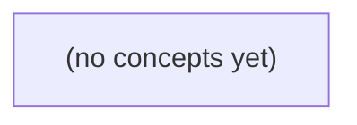

# 05.11 优化边界：Go 群消息系统的正确性、内存与性能取舍

*一本面向 Go 初学者的静态教材，以虚构 c-g 10000 个目标的群消息场景为主线，建立“先守住合同，再优化性能”的工程判断框架。全书通过纸上内存账、所有权规则、批量边界、同负载对照与回退条件，分析共享载荷、sync.Pool、批量处理、局部性、unsafe 与无锁等优化手段。*

**章节:** 2

---

## 本书导览

- 了解整本书的章节脉络
- 掌握各章之间的概念依赖关系
- 选择最合适的阅读顺序

# 05.11 优化边界：Go 群消息系统的正确性、内存与性能取舍

一本面向 Go 初学者的静态教材，以虚构 c-g 10000 个目标的群消息场景为主线，建立“先守住合同，再优化性能”的工程判断框架。全书通过纸上内存账、所有权规则、批量边界、同负载对照与回退条件，分析共享载荷、sync.Pool、批量处理、局部性、unsafe 与无锁等优化手段。

下方的概念图展示了本书 0 个核心概念以及它们之间的依赖关系；再下方是 1 个章节的入口。你可以按从上到下的顺序阅读，也可以根据自己的兴趣或先验知识选择切入点。

#### 概念图



## 章节索引

- **05.11 优化边界：从少复制到池化、批量与可维护性** — 面向Go初学者承接群扇出性能证据，以虚构c-g 10000目标比较不可变载荷共享、sync.Pool复用、同后端批量和内存局部性，说明unsafe/无锁的正确性及维护代价。

## 05.11 优化边界：从少复制到池化、批量与可维护性

- 先固定IM结果/权限/顺序合同
- 手算每目标1KiB与共享1KiB+32B元数据账
- 解释Pool可丢弃及借还所有权
- 区分同后台批量和不同socket写
- 识别切片局部性与保留代价
- 说明unsafe/lockfree需要更高证据门槛
- 设计同10000目标对照和回退条件

在05.10的同负载证据基础上，先守住消息合同，再比较少复制、池化与批量化能否以可验证、可回退的方式降低万目标扇出的成本。

### 先固定万目标扇出的结果合同

### 先固定万目标扇出的结果合同

以虚构 `c-g` 群的 `10000` 个目标为例：若每个目标都复制一份约 `1 KiB` 的消息载荷，仅载荷副本就新增约 $10000\times1\text{ KiB}\approx9.77\text{ MiB}$。这解释了为什么会考虑共享缓冲区、对象池或批量投递；但优化前必须先固定“成功”究竟指什么。

至少区分三层结果：

1. **发送者受理**：服务已完成鉴权、解析和基本校验，并接受该消息进入后续流程。它不等于消息已进入任一目标队列。
2. **每目标投递尝试**：系统已针对某个目标执行路由、入队或发送尝试；结果应可表示为成功、队列满、已取消、无权限、目标不存在等。
3. **设备确认**：目标设备或其代理明确确认收到并处理。离线、超时和断链时，这一层通常只能得到“未确认”，不能伪装成成功。

因此，任何“少复制”方案都不得改变以下合同：

- **权限**：共享载荷不应绕过每个目标的可见性、订阅条件或撤销后的权限检查。
- **身份**：审计、限流、重试和错误报告仍须能定位到原始发送者、群 `c-g` 与具体目标。
- **顺序**：若合同要求同一目标内有序，批量拆分、并发扇出和重试不得造成可见重排。
- **取消**：发送者撤销、会话关闭或期限到达后，尚未执行的目标尝试必须停止；已入队或已发送的部分则按既定状态报告。
- **慢设备**：单个拥塞目标只能消耗其配额，不能长期占住共享对象、阻塞批次提交或拖慢其余 `9999` 个目标。
- **错误语义**：池耗尽、批次局部失败、共享对象释放过早等内部问题，必须映射为可区分、可重试或不可重试的外部结果，而非笼统的“发送失败”。

先让这些状态和边界在并发测试中可观测，之后才比较共享引用、池化与批量化各自节省了什么，以及它们新增了哪些生命周期风险。

### 用账本比较复制与共享载荷

### 用账本比较复制与共享载荷

设一次发送面向 $N=10{,}000$ 个目标，业务载荷为 $P=1\text{ KiB}=1024\text{ B}$。若实现为“每个目标各持有一份载荷副本”，仅载荷复制本身的新增内存为：

$$
N\times P=10{,}000\times1024=10{,}240{,}000\text{ B}\approx9.77\text{ MiB}
$$

这是一笔应首先记录在账本中的成本；它不等于整次广播的总内存。队列节点、目标标识、状态位、引用计数、调度器结构以及运行时对象头仍会额外占用空间。

若载荷在受理后冻结为不可变对象，所有目标共享同一份 $1\text{ KiB}$ 数据，而每个投递项只保存约 $32\text{ B}$ 元数据，例如目标句柄、共享载荷引用、投递状态、顺序号或取消标记，则账本变为：

$$
1\text{ KiB}+10{,}000\times32\text{ B}
=1{,}024+320{,}000\text{ B}
\approx313.5\text{ KiB}
$$

相对逐目标复制，理论上少保留约：

$$
9.77\text{ MiB}-0.31\text{ MiB}\approx9.46\text{ MiB}
$$

这里被消除的是**重复的载荷字节**，不是“一万次投递”。系统仍须为每个目标维护独立的权限结果、身份上下文、队列位置、尝试次数、设备确认和错误记录。发送者受理成功也仍只表示请求进入系统；每目标尝试与设备确认依旧是后续状态。

共享的前提是载荷不可变，或其可变部分已在受理时切分、冻结。否则某个目标看到的修改可能泄漏给另一个目标，既破坏顺序语义，也使取消、重试和并发验证失去可靠边界。

### 池化的借还边界与丢弃语义

### 池化的借还边界与丢弃语义

`sync.Pool` 不是资源仓库，更不是可靠队列；它只是运行时可随时清空的临时复用缓存。对象从池中取出后，调用方必须把它视为一份独占借出的可变对象：此时只能有一个逻辑所有者，不能同时被多个目标发送、确认回调或取消清理路径持有。

借还规则应先于性能测试明确：

- **借出即取得唯一所有权**：`Get` 后填充、发送、等待设备确认的整个期间，对象不得归还，也不得交给异步协程继续引用。
- **归还以最后一次使用为准**：不是“提交发送后”归还，而是发送层、重试层、确认回调都不再读取该对象后才可 `Put`。若发送器可能延迟读取缓冲区，应复制、引用计数，或延后归还。
- **归还前清零敏感状态**：清除用户标识、权限令牌、目标列表、错误上下文及大切片引用。否则池对象会延长数据生命周期，既可能泄露信息，也会意外保留大块内存。
- **取消路径同样负责收尾**：排队取消、超时、慢设备断连和编码失败都必须收敛到唯一的释放点；不能由正常确认与取消处理各自 `Put`，否则会双重归还并造成并发复用。
- **禁止逃逸引用**：不要把池对象地址保存到日志异步任务、重试表、回调闭包或其他 goroutine。需要长期保存的信息应复制为独立的不可变快照。

对 10000 个目标而言，池化只能减少短生命周期编码对象的分配压力，不能改变权限校验、每目标尝试和设备确认的语义。尤其不能因为对象来自池就跳过初始化：池可能为空，也可能返回带有旧容量的对象；正确性必须不依赖“上次归还时恰好干净”。因此，池化应作为可移除的优化层：关闭池后系统仍满足顺序、取消、错误归因与有界队列合同。

### 批量只适用于同后端路径

### 批量只适用于同后端路径

批量化减少的是**同一提交路径上的固定开销**，而不是神奇地把所有扇出写操作合成一次。例如，多个目标最终写入同一数据库、同一日志分区、同一消息代理连接，或同一远端服务的批量接口时，可以将多条待发送项聚合：一次获取连接、一次编码外层协议、一次系统调用或一次提交。

但若 10000 个目标各自对应不同 `socket`，则每个连接仍需独立处理拥塞窗口、可写事件、加密状态和发送缓冲区。即使上层把它们装进一个数组，底层仍是 10000 次逻辑写入；这不是可消除的批量，而只是循环位置改变。不要为了“批量”把不同连接的数据拼成一个共享帧，除非协议明确支持多路复用且身份、权限边界仍可验证。

候选批量方案先检查：

- **同后端性**：是否确实落到同一连接、分区、事务或存储目标？
- **身份与权限**：批次内每个目标是否仍保留独立租户、授权和审计信息？
- **顺序语义**：要求“同目标有序”还是“全局有序”？批量重排不得改变前者。
- **失败隔离**：一个目标拒绝、超时或格式错误时，能否只重试该项，而非整批重复？
- **取消与慢设备**：取消项能否从尚未提交的批次移除？慢目标是否会拖住快目标？

批量大小还直接影响尾延迟。设最大等待窗口为 $T$、最大条数为 $N$，首条消息可能额外等待接近 $T$ 才凑批；若整批确认后才报告结果，设备确认延迟也会被放大。因此应将“发送者受理”“批次提交”“每目标确认”分别计量。对实时路径，通常采用“达到 $N$ 或等待 $T$ 即提交”的上限策略，并保留单项降级、部分失败重试和关闭批量的回退开关。

### 以局部性证据选择可回退方案

### 以局部性证据选择可回退方案

不要因“10000 个目标”直接选择全局共享或无锁结构。先按局部性分组：同一后端、同一权限域、同一序列约束、同一取消语义的目标，才可能共享编码结果、复用缓冲区或合并提交。纸上模型中，若每目标新增 `1 KiB` 副本，扇出将额外产生约 `9.77 MiB`；但这只是复制成本，不足以证明池化或批量一定更快。

设计同负载对照实验，固定目标数、消息大小、慢设备比例、取消比例与错误注入：

- **基线**：每目标独立副本、独立发送；记录发送者受理延迟、每目标尝试耗时、设备确认延迟，三者不得混为一个“发送成功”指标。
- **共享只读载荷**：仅在接收方不修改、身份与权限不随副本变化、引用在所有异步完成前有效时启用。
- **缓冲池**：测量分配次数、池命中率、归还延迟、峰值驻留内存；取消、超时和写失败路径必须仍能归还。
- **同后端批量**：比较批量大小与尾延迟，确认批内顺序、部分失败定位、单目标取消及慢设备隔离仍符合合同。
- **切片布局**：验证切片边界不会暴露相邻目标数据，且切片释放不早于最后一个消费者完成。

沿用有界队列：观察队列深度、高水位停留时间、拒绝/超时数与背压传播。并发验证应覆盖重复确认、乱序完成、取消与确认竞态、池对象重复归还及批次部分失败。

设定可回退阈值：若确认尾延迟恶化、错误归因丢失、队列长期满载、内存未下降，或正确性检查出现一次违反，即切回独立副本基线。`unsafe` 或无锁方案还必须证明生命周期、内存可见性与回收安全，并在压力与故障注入下稳定优于可维护方案；“少一次锁”不是足够证据。

> **要点** — 先以结果合同约束优化；共享、池化和批量均须以所有权、局部性、实测收益与明确回退条件证明其价值。

在固定消息结果、权限校验与投递顺序合同后，优化复制成本的第一步不是“零复制”，而是分清哪些数据可共享、哪些状态必须逐目标独立保存。

### 先锁定不可退让的投递合同

### 先锁定不可退让的投递合同

比较“逐目标复制”“共享载荷”“零复制视图”或“对象池”前，先固定对外可见的投递合同。否则某方案看似更快，只是偷偷减少了工作、改变了失败语义，不能算等价优化。

至少锁定以下边界：

- **消息内容**：每个目标收到的正文必须字节一致。若正文相同，可共享不可变的 `1KiB` 载荷；但任何压缩、加密、序列化或写入前修改，都不得串改其他目标。
- **权限与设备封套**：每个目标仍须独立完成权限判断、设备寻址、认证信息、协议头和加密封套生成。共享正文不等于共享目标相关状态。
- **投递顺序**：若合同要求按目标列表或业务键顺序投递，批量化、并行化后仍要保持相同可观察顺序，或明确规定乱序是否允许。
- **失败处理**：单个目标失败时，哪些目标继续投递、是否重试、重试使用原始正文还是重新编码、错误如何聚合，都必须与原实现一致。
- **可观测结果**：日志、指标、审计记录、回执、追踪标识与资源释放时机同样属于行为。不能因共享或池化而漏记、重复记，或把一个目标的状态暴露给另一个目标。

因此，优化的正确前提是：在相同输入下，所有目标得到相同内容、相同权限结果、相同顺序与失败语义，并产生等价的可观测输出。只有合同不变，内存复制次数、缓冲区生命周期和分配策略的比较才有意义。

### 手算共享载荷的真实节省

### 手算共享载荷的真实节省

设一次广播面向 $N=10{,}000$ 个目标，正文长度为 $P=1\text{ KiB}=1024\text{ B}$。

逐目标复制正文时，纯正文数据量为：

$$
N\times P=10{,}000\times1024=10{,}240{,}000\text{ B}
=9.765625\text{ MiB}
$$

这还未计入每个目标的用户标识、权限结果、设备路由、投递状态等独立信息。

若正文在构造后完全不可变，且所有目标收到的字节序列相同，则可只保存一份 $1\text{ KiB}$ 载荷；每个目标仅保存 $32\text{ B}$ 元数据：

$$
10{,}000\times32=320{,}000\text{ B}=312.5\text{ KiB}
$$

因此共享方案的纯数据账为：

$$
1\text{ KiB}+312.5\text{ KiB}=313.5\text{ KiB}
$$

与逐目标复制的约 $9.77\text{ MiB}$ 相比，减少：

$$
9.765625\text{ MiB}-313.5\text{ KiB}
\approx9.46\text{ MiB}
$$

即纯数据占用约降至原来的 $3.1\%$，节省约 $96.9\%$。

这里节省的是重复正文，不是“把一万次投递合并成一次”。每个目标的权限封套、设备选择、失败重试、确认状态仍必须独立；共享的只能是不会被任何投递路径修改的正文。若某路径会追加签名、压缩结果、个性化字段或直接写入缓冲区，就必须先复制或生成独立派生数据，否则一个目标的处理可能串改其他目标的消息。

### 共享只适用于不可变正文

### 共享只适用于不可变正文

当同一条业务消息要投递给多个目标时，真正可共享的通常只有“语义完全相同且发送后不再修改”的正文。例如一份 `1KiB` 的序列化正文可由 `10000` 个目标共同引用，而不必复制 `10000` 次。

但共享正文不等于共享整条投递记录。每个目标仍必须独立保存其投递上下文，包括：

- 权限校验结果：某目标可能被拒绝、降级或需要脱敏。
- 设备封套：加密密钥、随机数、签名、压缩方式或协议版本可能不同。
- 路由信息：目标连接、分区、优先级、重试节点与过期时间各不相同。
- 投递状态：排队、已发送、确认、失败、重试次数与取消标记必须彼此隔离。

若每目标元数据为 `32B`，则 `10000 × 32B ≈ 312.5KiB`；这部分即使正文共享，也仍是不可省略的纯数据成本。更重要的是，任何可变 `buffer`、可写偏移量或复用编码器都不能被多个目标无隔离地共用：一个目标的加密、截断或重试改写，都可能串改另一个目标的结果。

因此，合适的模型是“一个不可变正文，多个独立投递封套”。正文可通过引用计数、不可变字节串或只读切片共享；封套则应按目标分配，并明确其生命周期与所有权。

### 零复制视图的生命周期陷阱

### 零复制视图的生命周期陷阱

设接收层一次读入一个 `64KiB` 数组，只需将其中一段 `1KiB` 消息正文投递给下游：

- 复制方案：新建 `1KiB` 不可变载荷，原 `64KiB` 读缓冲在本轮处理结束后即可回收或归还池。
- 零复制方案：下游保存“数组引用 + 偏移量 + 长度”的视图。虽然没有复制 `1KiB`，但只要该视图仍存活，整块 `64KiB` 数组都不能释放或安全复用。

若队列中同时积压 `10,000` 个这样的视图，纸面上的正文引用可能只有少量元数据；实际被这些小切片钉住的底层存储却可能达到：

$$10{,}000 \times 64\text{KiB}\approx 625\text{MiB}$$

更危险的是，池化数组通常会被归还后再次写入。若视图仍指向该数组，后续复用会悄悄改写尚未投递的消息；若为避免串改而不归还数组，又退化为长寿命大对象滞留。

因此，零复制视图只适合底层缓冲区的生命周期明确覆盖全部消费者、且不会被复用或修改的场景。对于异步排队、跨线程投递或慢设备发送，复制出紧凑的 `1KiB` 不可变载荷，往往比持有 `64KiB` 大数组更省内存，也更容易维护。

### 用对照实验决定是否采用共享

### 用对照实验决定是否采用共享

不要仅凭“复制减少了”就切换共享载荷。应在相同的 `10000` 个目标、相同权限校验、相同投递顺序与相同失败注入条件下，比较两条实现路径：

- **逐目标复制**：每个目标拥有独立的 `1KiB` 正文缓冲区及其 `32B` 元数据。
- **不可变共享**：正文只构造一次，目标仅保存对共享载荷的引用和各自元数据；权限封套、设备状态、重试计数、加密结果仍逐目标独立。

记录的重点不只是总分配字节数，还包括：

1. **分配与回收压力**：请求期间分配次数、年轻代回收频率、对象晋升比例。
2. **存活堆**：高并发或慢目标存在时，共享引用是否使底层数组长期存活。例如一个 `1KiB` 视图若引用了 `64KiB` 原数组，纸面“零复制”可能反而扩大常驻内存。
3. **端到端延迟**：分别观察中位数、P99 和最慢目标完成时间；共享对象上的引用计数、锁竞争或缓存失效可能抵消复制收益。
4. **错误语义**：随机让部分目标鉴权失败、设备离线、重试或取消，确认一个目标的失败不会修改正文、影响其他目标的封套，且日志、审计与投递次数仍逐目标准确。

共享方案必须满足“发布后不可变”：不得复用可写 `buffer`，不得在发送后改写长度、压缩标记或加密字段。若发现存活堆上升、P99 恶化、出现跨目标串改，或实现需要脆弱的引用生命周期约定，应立即回退到复制方案；可维护的正确性优先于节省的 `1KiB`。

> **要点** — 共享不可变正文能减少复制，但逐目标权限与封套仍须独立；应以生命周期、语义和实测结果决定取舍。

sync.Pool适合复用短命临时对象，但它不是可靠缓存；正确性取决于所有权边界、重置纪律与异步引用管理。

### 先明确池化不保证命中

### 先明确池化不保证命中

`sync.Pool` 的目标是降低短命对象的分配与垃圾回收压力，而不是保存“下次一定还能取到”的数据。调用 `Put(x)` 只表示：对象 `x` 可以交还给运行时，供未来某次 `Get` **有机会**复用。

运行时可在垃圾回收等时机清理池中的对象；因此：

- `Get()` 可能拿到此前放入的对象；
- 也可能拿到别的调用者归还的对象；
- 也可能直接返回 `nil`；
- 若设置了 `New`，则可能返回一个刚创建的新对象。

```go
var bufPool = sync.Pool{
    New: func() any { return new(bytes.Buffer) },
}

b := bufPool.Get().(*bytes.Buffer) // 不保证来自此前 Put
```

因此，池中对象不能承担持久缓存语义：不能假设某个键对应的对象仍在池里，不能把池当作容量受控的对象仓库，也不能依赖命中率实现正确性。正确逻辑应当是“未命中时仍能正常工作”，`New` 或显式初始化负责补齐所需对象。

可将池化理解为一种可选优化：命中时少分配，未命中时正常创建。若业务需要保存会话、配置、连接状态或带键查询结果，应使用具有明确淘汰、容量和一致性语义的缓存结构，而非 `sync.Pool`。

### 借出、使用与归还的所有权合同

### 借出、使用与归还的所有权合同

从 `sync.Pool` 取得对象，不只是“拿到一块可复用内存”，而是取得一段**独占所有权**。可将生命周期写成：

`Get → Reset → 填充/使用 → 不再存在引用 → Put`

以群消息扇出时的临时缓冲区为例：

```go
buf := pool.Get().(*bytes.Buffer)
buf.Reset()
defer pool.Put(buf)

encodeGroupMessage(buf, msg)
for _, peer := range peers {
    send(peer, buf.Bytes()) // 仅当 send 在返回前完成复制或同步消费
}
```

这里隐含三条合同：

- **Get 后独占**：同一 `buf` 在归还前只能由当前逻辑拥有。不能把它交给多个并发协程写入，也不能在一个协程仍读取时由另一个协程继续追加。
- **使用期间不得逃逸**：若 `send` 只是把 `buf.Bytes()` 交给异步网络队列，那么函数返回时该切片仍引用底层数组；此时执行 `Put` 会让后续借用者覆盖数据，造成串包、数据竞争甚至敏感信息泄露。
- **Put 后绝不访问**：归还不是“暂时不用”，而是放弃所有权。`Put(buf)` 后，任何读、写、切片、日志输出都不合法；对象可能立刻被另一请求取得，也可能被运行时清除。

异步扇出应改为：发送层同步复制，或为每个异步任务准备独立字节副本；只有最后一个引用消失后才能归还缓冲区。池化优化的前提不是“少分配”，而是先能明确回答：**此刻究竟还有谁持有这块内存？**

### 异步发送为何不能提前归还

### 异步发送为何不能提前归还

异步发送的关键事实是：`send` 返回，不等于底层已经不再读取数据。若发送队列、编码器或网络协程仍保存着切片/缓冲区引用，生产者就仍然拥有“不可归还”的借出责任。

```go
var bufPool = sync.Pool{New: func() any {
	return make([]byte, 0, 4096)
}}

func enqueue(q chan []byte, msg string) {
	b := bufPool.Get().([]byte)[:0]
	b = append(b, msg...)

	q <- b          // 队列中只保存切片头，底层数组仍是同一块内存
	bufPool.Put(b)  // 错误：消费者尚未使用完 b
}
```

消费者稍后读取：

```go
func writer(q <-chan []byte) {
	for b := range q {
		conn.Write(b)
	}
}
```

`Put` 后，另一个生产者可能立刻 `Get` 到同一底层数组并覆写内容。于是消费者写出的可能是后一个请求的数据、混合数据，甚至已被重置后的空内容。更严重的是，生产者覆写与消费者读取可能并发发生，形成数据竞态；`-race` 往往能报告这类问题。

安全原则是：**最后一个仍可能读取该对象的异步持有者，才负责归还。** 常见做法是让消费者在写完后 `Put`：

```go
func writer(q <-chan []byte) {
	for b := range q {
		_, _ = conn.Write(b)
		bufPool.Put(b[:0])
	}
}
```

若队列需要长期保存、重试、广播给多个消费者，所有权会更复杂。此时可复制为独立数据，或用引用计数明确“最后释放者”；不要仅因生产函数结束就归还缓冲区。

### 重置内容、容量与敏感数据

### 重置内容、容量与敏感数据

从池中取出的对象只能视为“可复用的旧容器”，不能假定其内容为空。归还前或借出后必须建立统一的 `Reset` 规则；更稳妥的做法通常是在借出后立即重置，使调用方拿到确定的初始状态。

对切片而言，`s = s[:0]` 只把长度清零，底层数组中的旧字节仍存在：

```go
buf = buf[:0] // 可追加，但旧内容仍留在底层数组
```

这适合普通临时缓冲区，却不适合密码、令牌、用户文本、身份证号等敏感数据。敏感缓冲区应先覆盖已使用区域，再缩短长度：

```go
clear(buf)   // 清除当前 len 范围
buf = buf[:0]
```

对象中的标量、指针和状态字段也要复位。例如清空 `bytes.Buffer`、重置错误状态、删除 `map` 项，或将请求相关的 `UserID`、`Token`、`Context`、回调函数置零。否则下一个请求可能观察到前一个用户的数据，指针字段还会意外延长大对象的存活时间。

还要限制容量。一个偶发的大请求若使缓冲区扩容到数 MiB，直接放回池会让后续小请求长期持有这块数组，降低分配次数却抬高堆占用和 RSS。可设容量上限：

```go
const maxKeep = 64 << 10

func putBuf(b []byte) {
	if cap(b) > maxKeep {
		return // 让大数组被回收
	}
	clear(b)
	pool.Put(b[:0])
}
```

`Reset` 的目标不是机械清空一切，而是同时保证：逻辑状态正确、跨用户数据不可见、无用引用被释放，以及异常大的容量不被长期保留。

### 用对照实验判断是否值得池化

### 用对照实验判断是否值得池化

池化不是“看到分配就加 `sync.Pool`”，而应在**同一工作目标、同一输出结果、同一顺序合同**下比较两种实现：

- **基线版**：每次请求直接 `new`、`make` 或创建临时 `bytes.Buffer`。
- **池化版**：`Get → Reset → 使用 → Put`，且 `Put` 后不再读写；若异步 goroutine、网络发送或回调仍持有对象引用，则必须延后归还或复制数据。

先用测试锁定语义：输入相同，输出字节、错误处理、事件顺序都相同。尤其检查池化版不会因复用旧切片而串改结果、泄露前一用户数据，或改变并发下的发送顺序。

随后在接近生产的负载下运行基准与剖析，至少比较：

| 指标 | 关注问题 |
|---|---|
| `allocs/op`、`B/op` | 是否真的减少分配与复制 |
| 吞吐、P50/P99 延迟 | 池竞争、清零和额外分支是否抵消收益 |
| `HeapInuse`、GC 次数 | 短命对象是否减少 GC 压力 |
| RSS、`HeapIdle` | 池中大对象是否使进程长期占用更多内存 |
| 代码复杂度 | 所有权、重置规则和异常路径是否仍易审查 |

可用 `go test -bench . -benchmem` 比较分配，用负载压测观察 P99 与 RSS；再通过 `pprof` 确认热点确实来自目标对象，而不是 I/O、编码或锁竞争。

设定明确回退条件：若分配下降却 P99 变差、RSS 持续升高、对象重置成本过大，或需要难以验证的跨 goroutine 所有权协议，就删除池化，保留简单分配。池化只有在**可测得的端到端收益**大于其维护和泄露风险时才值得保留。

> **要点** — Pool优化的是临时分配而非对象存储；所有权、异步引用和内存保留失控时，应立即回退到简单分配。

当目标数达到10000时，优化重点不只是少复制，还要辨明哪些请求能真正合批、批量带来哪些等待与失败处理成本，以及数据布局是否改善实际访问效率。

### 先固定批处理前的行为合同

### 先固定批处理前的行为合同

批处理首先是执行方式变化，不应悄悄改变接口语义。优化前应把单目标处理的“可观察结果”写成合同，并以此验证合批后的行为。

- **消息结果不变**：每个目标仍得到原本应收到的内容、编码、过期时间与投递次数。共享序列化缓冲区可以减少复制，但不得让后续写入覆盖已提交给发送层的数据。
- **权限逐目标校验**：即使 100 个目标共用一次批调度，也必须按原有身份、租户、频道或订阅关系分别授权；“同批”不等于“同权限”。
- **目标顺序可定义且可复现**：若原接口承诺按输入顺序处理或输出结果，就保留该顺序。并发发送可以改变完成先后，但结果数组、审计记录和回调的关联必须稳定。
- **失败语义逐目标映射**：批内一个 socket 断开、一个目标无权限，不能把整批笼统标为失败，也不能掩盖其他目标已成功。应返回如 `目标 -> 成功/失败原因/重试状态` 的对应关系，并明确部分成功时的重试规则。
- **可观测性不能降级**：日志、指标与追踪至少能回答“哪一批、哪个目标、何时失败、失败为何”。批级耗时有用，但不能替代目标级成功率与错误分类。

还要区分“逻辑批”与“系统调用批”：将 10000 个不同 socket 的发送请求放入一个批调度器，仍可能对应 10000 次独立写操作；只有共享连接、协议支持聚合或内核接口确实合并时，固定调用开销才可能下降。合同先固定，后续池化、批量和数据布局优化才有可验证的边界。

### 同后台接口的百目标合批账本

### 同后台接口的百目标合批账本

设有 \(N=10000\) 个目标，且它们都可由**同一个后台批处理接口**提交；每批容纳 \(B=100\) 个目标，则批次数为：

\[
K=\left\lceil\frac{N}{B}\right\rceil=100
\]

若逐目标调用，需发起 \(10000\) 次接口调用；合批后仅需 \(100\) 次。因此，若每次调用具有固定成本 \(F\)（如协议封装、队列投递、锁竞争、上下文切换或服务端入口检查），固定部分从：

\[
10000F \rightarrow 100F
\]

节省为：

\[
(10000-100)F=9900F
\]

这并不表示“10000 个目标只需一次系统调用”。合批的前提是它们共享同一可批量提交的后台接口；若目标实际对应 \(10000\) 个不同 socket、不同连接或不同协议状态，则仍可能需要分别发送、分别处理。

合批也有账本另一面：

- **凑批等待**：第一个进入某批的目标，最多可能等待后续 \(99\) 个目标到达，或等待超时器触发。低流量时，应设置“满 \(100\) 个即发”与“等待至多 \(T\) 时间即发”的双阈值。
- **单批内存**：若每个目标的描述、负载引用和结果槽位平均占 \(m\) 字节，一个满批至少需要约 \(100m\) 字节；若还复制请求体、构造聚合缓冲区，峰值会更高。
- **失败映射**：批调用成功不等于每个目标成功。接口应返回每个目标的状态，或携带稳定的目标编号；否则重试、告警和去重都会失去对应关系。

因此，批大小 \(100\) 不是天然最优值，而是在固定开销、尾延迟、内存峰值及逐目标错误处理之间取得的一个可测量折中。

### 批量失败如何还原到单个目标

### 批量失败如何还原到单个目标

批处理的成功语义不能只停留在“这一批请求返回成功”。设一批含 $n\le100$ 个目标，应为每个目标保留稳定的批内编号 `index`，并将其映射到全局任务标识：

- 请求：`items[index] = {任务ID, 目标地址, 参数}`
- 响应：`results[index] = {状态码, 错误信息, 可选结果}`
- 本地状态表：`任务ID -> 待执行/成功/可重试失败/永久失败`

服务端最好按原顺序返回结果；若返回顺序不保证，则必须返回 `index` 或原始 `任务ID`，不能仅给出“成功 97 个、失败 3 个”的汇总。否则客户端无法准确更新逐目标状态，也无法避免重试已成功的目标。

可将失败分层处理：

1. **整批传输失败**：超时、连接断开、网关错误。批中结果未知；对具备幂等键的目标整体重试，否则先查询执行状态。
2. **单项可重试失败**：限流、暂时不可用。仅抽取失败项，按退避策略重新组批，避免放大成功项的重复执行。
3. **单项永久失败**：参数非法、目标不存在、权限拒绝。立即记录终态并进入人工修复或死信队列。
4. **批接口不可用或响应不完整**：走逐目标回退路径，但设置并发上限；回退是保底机制，不应把向 10000 个不同 socket 分别发送请求误称为“一次系统调用”。

最终监控应同时统计批成功率、目标成功率、未知结果数和回退比例。批量只是传输与调度单位，任务状态仍必须精确到单个目标。

### 不同socket不能伪装成一次写入

### 不同 socket 不能伪装成一次写入

“把 10000 个目标凑成一批”只有在它们共享**同一个后台批处理接口**时才成立。例如，一个 HTTP 请求体可携带 100 个目标，服务端按目标返回结果；此时 10000 个目标按每批 100 个处理，确实可将请求构造、连接调度、协议头和部分系统调用等固定成本摊到 100 批上。

但若 10000 个目标对应 10000 个独立 socket，情况完全不同：

- 每个 socket 都有独立的连接状态、发送缓冲区、拥塞控制和内核队列。
- `writev` 可以把多个缓冲片段聚集写入**一个**文件描述符，却不能把 10000 个不同文件描述符变成一次 `write`。
- 即使使用 `epoll`、异步 I/O 或批量提交接口，也只是一次向内核提交多项操作；内核仍需分别处理各 socket 的发送、排队、可写通知与错误状态。
- 协议边界也不能被跨连接合并：不同 TCP 连接的字节流彼此独立，不能把 A 连接的请求体与 B 连接的请求体拼成一个网络报文后期待对端正确解析。

因此，应把两类优化分开衡量：共享批处理接口优化的是“每批固定开销”；大量独立连接优化的是事件循环、并发上限、缓冲复用和背压控制。前者可减少请求数，后者通常只能减少调度与分配成本，不能宣称“10000 个 socket 一次系统调用完成”。

### 连续切片的局部性与证据门槛

### 连续切片的局部性与证据门槛

对 10000 个目标做调度、状态检查或批次组装时，连续 `slice` 往往比指针图更利于顺序扫描：元素地址相邻，CPU 可预取后续缓存行，分支和间接寻址通常更少。若每个目标仅含小型、固定大小的元数据，类似

`targets []Target`

通常比 `map[id]*Target` 或多层链式节点更容易获得稳定的扫描吞吐。

但这不是“数组一定更快”的结论。连续切片也有代价：

- **扩容复制**：容量不足时，追加可能搬迁整段底层数组；若元素很大，复制成本会放大。
- **更新定位**：按目标 ID 高频插入、删除或随机查找时，切片可能需要额外索引表，删除还会导致移动、空洞管理或顺序变化。
- **保留内存**：曾经扩到峰值的切片即使随后只剩少量目标，仍可能长期持有较大底层数组；应在低水位后评估重建或缩容。
- **指针图优势**：对象大小不一、生命周期差异大、需要频繁局部替换时，指针结构可避免搬动大对象；代价是缓存未命中、分配和 GC 压力可能上升。

证据应来自同一负载下的测量，而非渐近复杂度。固定 10000 个目标，分别构造连续切片和当前指针结构，记录扫描一轮、组装 100 个批次、增删更新以及峰值后回落的 `p50/p95/p99` 延迟、分配次数、堆占用与 GC 停顿。测试应覆盖顺序访问、随机访问、稳定规模和扩容期。

可将切片方案设为条件性优化：只有在关键扫描路径延迟显著下降，且扩容、更新和保留内存未突破预算时才上线。若随机更新使尾延迟恶化，或低负载阶段仍长期保留过多内存，应回退到指针结构，或采用“切片存热数据、索引表存定位”的混合布局。

> **要点** — 批量只适用于同一可合并后台；它需用等待、内存、失败映射和实测局部性收益来证明。

当复制、池化和批量已难满足目标时，unsafe与无锁并非自然的下一步，而是需要更高证据门槛的维护承诺。

### 先守住可观察合同

### 先守住可观察合同

优化前先写清楚：调用方、用户和运维系统**能够观察到什么**。这些结果才是不变量；复制次数、对象是否池化、是否使用 `unsafe` 或无锁结构，都只是实现细节。

- **结果合同**：同一请求在成功时返回什么数据、失败时返回什么错误；不能因复用缓冲区而让已返回的消息内容被后续请求改写。
- **权限合同**：鉴权、租户隔离、字段脱敏必须发生在正确的时点。为减少一次复制而把“先校验后读取”变成“先读取后校验”，可能形成越权泄露。
- **顺序合同**：会话消息、事件流、确认回执若承诺按序可见，就不能因并发批量发送或无锁队列重排；“最终都送达”不等于“顺序正确”。
- **失败合同**：超时、取消、部分写入、重试后究竟是失败、成功还是未知，必须可判定。CAS 更新了计数却未写入消息，不能被包装成一次完整提交。
- **资源归属**：缓冲区、引用计数、连接和取消函数由谁创建、何时转移、谁负责释放必须唯一明确。池化对象在归还后仍被异步协程引用，本质上是数据损坏。

可将关键路径表述为可检查的不变量，例如：`未通过权限校验的数据绝不进入发送队列`、`每个序号仅确认一次`、`缓冲区归还池前不存在任何可达引用`。随后再评估优化是否保持这些性质。若无法用测试、日志与故障注入验证合同未变，性能收益再明显，也不应进入生产路径。

### unsafe绕过了什么

### unsafe绕过了什么

`unsafe.Pointer`并非“更快的指针”，而是主动放弃编译器原本提供的证明：某地址是什么类型、可否存活、能否被 GC 追踪、是否满足对齐，以及这种转换在未来版本是否仍成立。

- **GC 可见性**：把指针转为 `uintptr` 后，它只是整数；若期间发生分配、调用或抢占，GC 不再把它视为存活引用，对象可能被回收或移动相关元数据失效。地址算术应尽量限制在单个表达式内，并使用 `runtime.KeepAlive` 明确延长对象生命周期。
- **别名与类型承诺**：将 `*A` 转成 `*B`，意味着程序员承诺二者内存布局、字段含义和并发访问规则兼容。编译器无法再据类型关系发现错误；错误别名可能读到无意义位模式，或绕过原有同步约束。
- **边界与生命周期**：从切片、字符串或结构体字段推导地址时，必须证明未越过对象边界，且底层对象在整个使用期内不会扩容、释放或被复用。保存指向短命临时值的地址尤其危险。
- **对齐与表示**：某些架构要求 `uint64`、原子字段或特定结构自然对齐；未对齐转换可能崩溃、性能骤降或产生非原子读写。端序、填充字节和指针大小也会改变解释结果。
- **版本可移植性**：依赖结构体布局、运行时内部字段或未文档化行为，等于把实现细节固化为契约；Go、编译器、架构升级都可能破坏它。

`go vet` 未报警只说明未命中已知模式，不等于上述不变量成立。使用 `unsafe` 前，应能逐条写出地址来源、对象存活期、布局假设与支持的平台范围。

### 原子操作不是事务

### 原子操作不是事务

`atomic` 与 CAS 能保证的是**某个内存位置上的原子读、写或条件更新**。例如：

```go
if atomic.CompareAndSwapUint32(&state, pending, sent) {
    // 当前状态从 pending 变为 sent
}
```

这能避免两个 goroutine 同时把同一个 `state` 从 `pending` 改为 `sent`，却不能自动保证相关结构也同步完成：

- 成员表已删除该成员；
- 消息记录已标记为已投递；
- 队列节点已出队；
- 失败时已恢复全部中间状态；
- 其他 goroutine 不会看到“消息已发送、但仍在队列中”的组合。

设一次操作涉及成员表 $M$、消息记录 $R$、队列 $Q$。即使分别对它们的字段使用原子操作，也只能得到局部正确性：

$$
CAS(M) \land CAS(R) \land CAS(Q)
\not\Rightarrow
\text{一致的 }(M,R,Q)
$$

问题在于三次更新之间存在可观察窗口：线程 A 更新了 `R`，尚未来得及更新 `Q`；线程 B 此时读取，就可能基于矛盾状态重复投递、漏删成员或错误重试。

CAS 循环也不等于事务。竞争者每次改写目标值，当前 goroutine 都可能失败并重试；高竞争下可能出现长时间重试、优先级反转甚至饥饿。更危险的是，循环中若包含“读取队列、写日志、分配消息”等副作用，失败后很难安全撤销。

因此，跨结构不变量通常应优先由锁、单线程所有权或明确的消息协议维护。只有当状态可压缩为单个原子字、转换规则完整可证明，并且基准测试确认锁确实是热点时，才值得考虑无锁设计。

### 无锁竞争的反例

### 无锁竞争的反例

设想一个高并发扇出队列：多个生产者写入消息，多个消费者取出消息，并维护`head`、`tail`、消息槽位和待处理计数。直觉上的无锁实现常是：

1. 读取`tail`；
2. 检查槽位是否可写；
3. 用`CAS`推进`tail`；
4. 写入消息并更新计数。

问题在于，高并发下大量生产者会同时读取同一个`tail`。只有一个`CAS`成功，其余协程失败后必须重新读取、计算并重试。负载越集中，失败越多；CPU 时间消耗在缓存一致性流量和自旋上，而不是处理消息。某个协程还可能持续在竞争中失败，形成实际饥饿。

更危险的是“状态分步提交”：

- `tail`已通过`CAS`推进，但消息尚未写入；
- 消费者看见新的`tail`，却读到空槽或旧数据；
- 为补救而增加“已发布”标记、序号、内存屏障和回收规则后，队列不变量迅速膨胀。

`atomic`只能保证单个字段的原子更新，不能让“推进尾指针、写消息、发布可见性、更新计数”成为一个事务。一次压测没有报错，也不代表所有交错顺序都正确。

相比之下，清晰的加锁队列可将这些状态置于同一临界区：

```go
mu.Lock()
queue = append(queue, msg)
pending++
mu.Unlock()
```

锁竞争确实可能出现，但其语义直接：消息与计数同步可见，阻塞位置可观测，分片队列或批量取出也容易演进。只有剖析确认锁是真正热点，并能证明无锁状态机、回收策略和饥饿边界时，CAS方案才值得承担维护成本。

### 证据门槛与回退设计

### 证据门槛与回退设计

`unsafe` 与无锁实现应通过“默认拒绝、证据准入”的决策门：先用剖析确认热点确实位于复制、分配、锁竞争或队列同步，而不是算法、网络或序列化；再证明常规方案——预分配、对象池、批量提交、分片锁——不能满足目标。

准入前至少具备四项证据：

- **热点明确**：火焰图、阻塞剖析或竞争数据指出具体函数与调用路径，优化对象不是猜测。
- **不变量完整**：写清所有权、生命周期、发布顺序、对齐要求、别名边界，以及失败、取消、关闭时的状态转移。
- **同条件实测受益**：在相同硬件、负载、并发度和例如 `10000` 次目标操作下，对比吞吐、尾延迟、分配数与 CPU；收益应覆盖复杂度成本。
- **维护责任可承担**：代码有长期负责人、基准测试、竞态测试和版本升级验证；`go vet` 不报错只能说明未发现部分模式，不能证明 `unsafe.Pointer` 或 CAS 协议正确。

回退路径必须先于上线设计：保留安全实现，通过开关、构建标签或依赖注入切换；为异常重试、CAS 活锁、内存异常和版本兼容问题设置监控与降级阈值。若收益随负载变化消失、无法解释偶发错误，或新维护者不能复述不变量，就应立即回退到锁、复制或批量方案。

> **要点** — unsafe和无锁不是免费性能；先验证合同与热点，再用完整不变量、实测收益和可回退设计证明其必要性。

优化前先锁定可比实验：同为10000目标、20条消息/秒、5%慢设备，仅替换一个机制，并以正确性与资源边界共同裁决。

### 先冻结合同与实验基线

### 先冻结合同与实验基线

优化不是先追求更低延迟，而是先写清“什么绝不能变”。在本实验中，消息处理合同至少包括：

- **结果合同**：每条消息必须得到成功、失败或取消中的确定结果；不得静默丢失、重复确认或把超时误报为成功。
- **权限合同**：发送者、设备和操作权限仍按原规则校验；性能优化不能绕过鉴权、缓存过期检查或审计。
- **顺序合同**：需要保序的同一会话、设备或分区，仍按既定顺序交付与处理；并发提高不能导致后写先见。
- **取消合同**：取消请求必须能传播到排队、执行和回调阶段；已取消任务不得继续占用资源或提交结果。

随后冻结纸上基线：目标规模固定为 `10000`，入口速率固定为 `20 条消息/秒`，其中 `5%` 为慢设备；机器型号、操作系统、运行时版本、应用版本、配置、消息大小与数据分布均保持一致。一次实验只替换一个机制，例如减少一次复制或引入对象池，不能同时改批量大小、线程数和重试策略。

旧实现的 `p95 = 300ms` 仅是待复现实验确认的纸上基线，新方案必须在同一条件下实测。小群场景得到的 `80ms` 不可直接比较：它改变了目标规模、排队压力或慢设备比例。除延迟外，还要同步记录 CPU、`alloc_space`、`inuse_space`、RSS、队列长度、错误率与 `p99`；任一正确性或资源边界越界，即使 `p95` 下降也应回退。

### 建立10000目标的资源账本

### 建立10000目标的资源账本

先把“10000 个目标”翻译成可计算的资源项。设每个目标需要携带 `1 KiB` 载荷：

- **逐目标复制**：每个目标各分配一份载荷，单轮分配量为  
  $10000\times1\text{ KiB}=9.77\text{ MiB}$。  
  若消息尚未完成、对象仍被队列或回调引用，存活内存也可能接近 `9.77 MiB`，还未计入对象头、切片头、队列节点和调度结构。

- **共享不可变载荷**：只分配一份 `1 KiB` 载荷；每目标仅保留 `32 B` 的目标元数据，例如目标标识、偏移、状态和取消引用：  
  $1\text{ KiB}+10000\times32\text{ B}=313.5\text{ KiB}$。  
  相比逐目标复制，载荷相关的存活量级约缩小 $9.77\text{ MiB}/313.5\text{ KiB}\approx32$ 倍。

队列会放大这个差异。若发送速率为 `20 条/s`，某批消息在队列中平均滞留 $T$ 秒，则同时在途批数约为 $20T$；逐目标复制的载荷存活量约为 $9.77\text{ MiB}\times20T$，共享方案约为 $313.5\text{ KiB}\times20T$。5% 慢设备会拉长 $T$，因此不能只看平均分配量，必须观察队列长度、`inuse_space` 与 RSS 是否随慢设备积压而越界。

这只是纸面账本：旧方案 p95 `300 ms` 是基线，新值必须在同版本、同机器、同消息大小下实测。替换共享机制时还要验证授权隔离、目标顺序、结果一致性与取消语义；同时记录 CPU、`alloc_space`、`inuse_space`、RSS、错误率和 P99。任何正确性或资源边界失守，都应回退，不能拿小群的 `80 ms` 结果替代 10000 目标实验。

### 一次只验证一种优化机制

### 一次只验证一种优化机制

优化实验的核心不是“跑得更快”，而是确认**是哪一个机制**带来了变化。固定 `10000` 个目标、`20` 条消息/秒、`5%` 慢设备，以及相同版本、机器和消息大小；每轮只替换一个实现点。旧方案的 `p95=300ms` 仅是纸上基线，新值必须在同条件下实测，不能拿小群场景的 `80ms` 作比较。

可建立四组彼此独立的对照：

- **共享不可变载荷**：基线为每个目标分别编码或复制消息；实验组预先生成只读 `[]byte`，各发送任务仅持有引用。不得同时引入对象池或批量发送，否则无法判断收益来自复制减少还是其他因素。
- **`sync.Pool` 借还**：保持载荷构造、发送粒度和后端调用不变，仅把高频短命缓冲区改为“借用—清零必要字段—归还”。重点检查归还后是否仍被异步任务引用，避免数据串写。
- **同后端批量发送**：仅将发往同一后端的多条请求合并，批量大小、刷新间隔和排队上限必须显式记录。批量可能降低调用次数，却会增加等待时间；慢设备下尤其要观察队列长度与 `P99`。
- **切片局部性**：仅调整任务组织方式，例如将分散的小对象改为连续切片遍历；不得顺便改变并发度、排序策略或消息编码。

每组实验都要同时验证授权、发送顺序、结果完整性与取消语义，并采集 CPU、`alloc_space`、`inuse_space`、RSS、队列长度、错误率和 `P99`。若 `p95` 改善但内存、尾延迟、错误或正确性任一项越界，该方案应立即回退；优化不是用平均收益交换不可接受的边界风险。

### 用全量指标判定是否改善

### 用全量指标判定是否改善

旧方案的 $p95=300\text{ms}$ 只是纸上基线，不是可以直接宣布胜利的比较对象。新机制必须在相同版本、机器配置、消息大小与负载条件下，完成“10000 个目标、20 条消息/秒、5% 慢设备”的实测；且一次实验只替换一个机制。小群测试得到的 $p95=80\text{ms}$，不能与全量场景的 300ms 横向比较。

判定应同时读取延迟、资源与稳定性指标：

- **延迟**：关注新旧 $p95$、$p99$，避免仅压低中位数却扩大尾延迟。
- **CPU**：池化或批处理若明显抬高 CPU，可能把复制成本转化为调度、锁竞争或序列化成本。
- **内存**：同时检查 `alloc_space`、`inuse_space` 与 RSS。前者反映分配压力，后两者反映存活对象和进程实际占用；“少分配”不等于“不涨内存”。
- **队列长度**：持续增长说明服务速率低于输入速率，即使当前 $p95$ 好看，也可能正在积压。
- **错误率与正确性**：验收授权、消息顺序、结果一致性和取消语义；错误、越权、乱序或取消失效均不能以性能收益抵消。

可将结论写成边界判断：只有在正确性不变、错误率不升、队列不持续积压，并且 CPU、内存与尾延迟均未越过预设阈值时，才算改善。若新方案任一资源或稳定性指标越界，应立即回退，而不是用局部低延迟掩盖全量风险。

### 设置回退线与高风险证据门槛

### 设置回退线与高风险证据门槛

`sync.Pool` 不是缓存承诺，而是可随时丢弃的复用机会：垃圾回收后池中对象可能消失，取出结果也可能为 `nil`。因此它只能降低分配压力，不能承载消息、连接状态、取消信号或必须保留的业务数据。对象放回池前必须满足明确所有权边界：

- 写入、编码、发送及日志引用均已结束；
- 没有其他 goroutine、回调或队列仍持有该对象或其底层 `[]byte`；
- 归还前清除长度、引用字段和敏感内容，避免旧数据泄漏或意外保活；
- `Put` 后视为对象已失效，调用方不得继续读取、修改或再次归还。

批量也必须按写入边界区分。同一后端、同一 socket 的连续消息可在保持顺序和取消语义的前提下合并写入；不同 socket 即使目标相同，也不能拼成一次网络写，因为它们具有独立的背压、失败、关闭和顺序边界。批量器应在取消、超时、连接关闭或队列上限触发时拆分并返回可判定结果，不能因“已入批”而吞掉失败。

对 `unsafe`、无锁队列或手工复用缓冲区，采用资格更严格：除完成授权、顺序、结果一致性和取消测试外，还应通过竞态检测、压力与故障注入，证明不存在重复发送、跨请求数据污染、悬挂引用和关闭竞争。其收益不能只看小群 `80ms`；必须在固定 `10000` 目标、`20` 条消息/s、`5%` 慢设备及同版本、同机器、同消息大小下实测，并与旧 `p95=300ms` 纸上基线比较。

回退线应预先写死：任一正确性失败、错误率上升、队列持续增长，或 CPU、`alloc_space`、`inuse_space`、RSS、P99 超出既定边界，即停用新机制并回退到原实现。高风险优化不是“更快即可上线”，而是以更强证据换取有限采用资格。

> **要点** — 性能优化必须在同一10000目标合同下单变量实测；任何正确性、尾延迟或资源指标越界都应回退。

优化扇出前先守住结果、权限与顺序合同；只有证据表明复制、分配或写入确为热点，才比较共享、池化、批量与布局优化。

### 先固定合同，再计算复制账本

### 先固定合同，再计算复制账本

以向 `10000` 个目标扇出一条消息为例，优化前先写清不可退让的合同：

- **结果**：每个目标独立记录成功、失败或取消；不能因某一批已提交就把未写入的目标也标为成功。
- **权限**：先完成目标过滤，未授权目标既不能收到载荷，也不应进入“共享引用”或批处理队列。
- **顺序**：若同一目标要求按发布顺序可见，批量重排、并行发送和重试都必须保留该约束。
- **隔离**：任一接收方不得通过修改消息影响其他接收方；共享载荷必须是不可变的。

设业务载荷为 `4 KiB`，每个目标的地址、状态、序号等独占投递信封为 `128 B`。若为每个目标复制完整消息，应用层载荷复制量约为：

$$10000\times4\text{ KiB}=39.06\text{ MiB}$$

再加信封约：

$$10000\times128\text{ B}=1.22\text{ MiB}$$

若改为“一个不可变共享载荷 + 每目标独占信封”，常驻业务数据约为：

$$4\text{ KiB}+1.22\text{ MiB}$$

节省的是应用层重复分配与复制，不是网络传输本身：向 `10000` 个连接发送，最终写出的字节仍接近 `39.06 MiB`，还未计协议头与加密开销。

因此，只有剖析证据显示分配、复制或垃圾回收确为热点，才值得共享载荷。若载荷会被序列化、压缩、打补丁或异步回收，必须在借出前冻结；否则一个接收方改写 `payload`，就可能造成消息串改与数据竞争。没有观察到热点时，清晰的独占复制通常比复杂共享更可维护。

### 共享载荷：少复制不等于可变共享

### 共享载荷：少复制不等于可变共享

向 $N$ 个目标发送同一份 1KiB 消息时，“每目标复制”约分配 $1024N$ 字节；“共享载荷 + 每目标 32B 元数据”约为 $1024+32N$ 字节。忽略运行时开销，节省量为：

$$
1024N-(1024+32N)=992N-1024\ \text{B}
$$

因此扇出目标较多、载荷较大且分配剖析已显示复制为热点时，共享通常有明显收益：更少分配、GC 压力和缓存搬运。元数据中只保留目标、序号、状态等发送专属信息，不能把可变字段塞回共享载荷。

共享的前提比节省字节更重要：

- **载荷必须不可变**：构造完成后不再修改；编码、压缩、签名等步骤必须在共享前完成。
- **生命周期可追踪**：所有异步发送完成前，底层 `[]byte`、缓冲区或对象不得归还池、复用或释放。
- **边界要清楚**：若下游接口可能保留切片、异步写入或修改缓冲区，调用方必须假定其持有引用，而非“函数返回即安全”。

典型反例是从 `sync.Pool` 借出缓冲区，组装消息后交给多个 goroutine，再立刻 `Put`；后续请求复用并改写该数组，会导致数据竞争、消息串改，甚至把权限相关字段发送给错误目标。此时“零复制”节省的是少量分配，损失的却是结果隔离。

可采用不可变 `payload` 加显式完成计数、`WaitGroup` 或由单一所有者在全部发送结束后归还；若生命周期难以证明，宁可复制。没有观测到复制、分配或 GC 热点时，也不要仅因公式更优而引入共享所有权复杂度。

### sync.Pool：借还所有权与可丢弃语义

### `sync.Pool`：借还所有权与可丢弃语义

`sync.Pool` 的目标是降低短生命周期对象的分配与垃圾回收压力，而不是保存业务状态、实现对象缓存或传递消息。池中对象可能在任意垃圾回收后被清空；`Get` 得到的也不保证是此前 `Put` 的同一个对象。因此，正确性绝不能依赖“池里还有这份数据”。

可将一次使用推导为明确的所有权转移：

1. `Get`：调用方获得对象的**独占所有权**。
2. 使用期间：调用方可读写、填充、序列化该对象，但不得与其他协程并发访问。
3. `Put`：调用方放弃所有权；对象立即视为失效，不能再读、写、保存引用或交给异步任务。
4. 下次 `Get`：另一个调用方可能取得该对象，并覆盖其全部字段。

典型安全模式是“借出—重置—同步使用—清理—归还”：

`buf := pool.Get().(*Buffer)`  
`buf.Reset()`  
`encode(buf, msg)`  
`sendSync(buf.Bytes())`  
`buf.Reset()`  
`pool.Put(buf)`

关键前提是 `sendSync` 在返回前已经消费完字节。若发送函数只是把 `buf.Bytes()` 交给异步队列，随后立刻归还：

`queue <- buf.Bytes()`  
`pool.Put(buf)`

则下一次借用者可能覆盖底层数组。结果既可能触发数据竞态，也可能出现“请求 A 收到请求 B 的消息内容”的串消息事故。即使没有被竞争检测器立即发现，这仍是所有权已归还后继续使用的逻辑错误。

共享载荷尤其危险。若多个消费者需要同一份 payload，要么使其成为不可变数据，并保证其底层字节不会再复用；要么为异步边界复制必要内容。只有剖析证据显示分配或 GC 确为热点，才值得引入池化；没有观测到热点时，直接分配通常更清晰、更可维护。

### 批量与局部性：按后端边界获得收益

### 批量与局部性：按后端边界获得收益

批量的收益不来自“把循环改成一次调用”，而来自跨越了真实的后端边界：同一数据库连接、同一消息生产者、同一文件描述符或同一远程过程调用，能够把多次系统调用、协议头、锁竞争与往返等待合并。若任务最终分别写入不同 socket，则它们仍有独立的拥塞窗口、发送缓冲和失败状态；把数据先拼成一批通常只增加复制、排队和尾延迟，不能凭空减少网络边界。

切片连续存放元素，按目标连接分组后顺序遍历，通常比“每条消息查表再随机追加”更利于缓存局部性。例如维护 `map[连接][]索引`，随后对每个连接连续编码、连续提交；索引比复制完整 payload 更轻，但共享 payload 必须在提交期间不可变。

实验应分别测量：

- 单条提交与同连接批量提交的吞吐、每条延迟及 `p99`；
- 不同 socket 下“聚合后再分发”与直接独立写入的 CPU、分配和尾延迟；
- 分组索引、复制 payload、保留引用三种方案的堆占用与 GC；
- 批量大小从小到大变化时的失败恢复成本。

批量的正确性边界同样重要：100 条中 1 条失败，不能把整批标记成功；应记录逐项结果，或明确后端提供的是原子批语义。不要长期复用一个曾装载超大批次的切片：其底层大数组会持续占用内存，也可能因残留引用阻止 payload 回收。处理后可限制容量、置空引用，或仅池化有上界的小缓冲。没有观测到后端调用、分配或缓存失效热点时，维持简单的逐项路径往往更可维护。

### 高风险优化的证据门槛与回退

### 高风险优化的证据门槛与回退

以“向 10000 个目标扇出同一消息”的朴素实现作为基线：每个目标独立复制负载、独立发送、逐个记录结果。先在真实或等价压测环境采集：

- 端到端延迟：`p50/p95/p99`，尤其关注慢目标是否拖累整体完成时间。
- 吞吐与资源：每秒完成数、CPU、堆分配次数与字节数、GC 停顿、连接/队列占用。
- 正确性：成功、失败、超时、取消分别计数；权限、顺序、重试与幂等语义不得改变。
- 可维护性：实现复杂度、故障定位成本、测试覆盖，以及是否引入生命周期约束。

只有剖析证据表明复制、分配、系统调用或缓存失效确为热点，才进入优化比较：

| 方案 | 预期收益 | 主要风险 | 必须证伪的假设 |
|---|---|---|---|
| 共享不可变负载 | 降低复制与分配 | 任一写入导致串改、数据竞争 | 借出后所有消费者均只读 |
| `sync.Pool` | 降低短命对象分配 | 异步使用归还对象，造成 race 或脏数据复用 | 对象归还前不存在任何引用 |
| 批量发送 | 降低调用与协议开销 | 100 个中 1 个失败却整批误报成功 | 可获得逐项结果，或明确批级语义 |
| 布局局部性 | 改善缓存命中 | 结构重排破坏接口、增加维护成本 | CPU/缓存指标确为瓶颈 |

回退条件应预先写入验收标准：没有观测到热点；`p95/p99`、错误率或取消响应变差；分配下降但吞吐无提升；共享改变可变性合同；批量无法表达部分失败；实现使排障和测试显著复杂。满足任一条件，即回退到基线或较低风险方案，而不是继续叠加优化。

> **要点** — 先以合同和测量筛选热点；共享须不可变，池化须独占借还，批量须按后端与失败语义设计，高风险技巧必须可证伪、可回退。

在不改变消息结果、权限校验与投递顺序合同的前提下，本节用统一的10000目标场景，核算复制、复用与批量优化的收益、边界和回退条件。

### 先锁定不可突破的投递合同

### 先锁定不可突破的投递合同

优化复制、对象池或批量前，先把“更快”限定在不改变外部可见行为的范围内。以下合同应写入接口说明、测试断言与监控口径：

- **消息结果不变**：对每条输入消息，结果只能是成功投递、明确拒绝或明确失败；不得因复用缓冲区而截断、串改、重复发送或静默丢失。成功确认必须对应实际接收方可见的完整消息。
- **权限不变**：鉴权、租户隔离、主题/队列访问控制必须发生在同一语义位置。批量提交不能让一条已授权消息“夹带”未授权消息通过，也不能泄露元数据。
- **顺序不变**：若合同要求同一分区、会话或键内有序，则优化后仍保持该范围内的相对顺序；跨键并发不应被误表述为全局有序。
- **失败语义不变**：批内第 $i$ 条失败时，必须能映射回原始消息 $i$，并明确其余消息是已成功、未执行、可重试还是未知。禁止把“整批失败”伪装成“全部未发送”。
- **观测口径不变**：成功数、失败数、重试数、拒绝数、端到端延迟及消息大小的统计边界必须一致。对象池命中率、批大小等只是新增内部指标，不能替代业务结果指标。

因此，任何优化都应回答：缓冲区何时仍被引用、批次如何定位单条失败、确认在哪一刻生效、回退后是否仍保留同样的审计证据。无法证明这些问题时，应保留复制路径作为安全基线。

### 10000×1KiB的复制数据账

### 10000×1KiB的复制数据账

设一条已编码载荷为 $1\text{ KiB}=1024\text{ B}$，需投递给 $10000$ 个目标；暂不计连接缓冲区、协议头和运行时对象，仅核算载荷与每目标 $32\text{ B}$ 元数据。

- **逐目标复制**：每个目标各持有一份载荷，数据常驻量为  
  $10000\times1024=10{,}240{,}000\text{ B}\approx9.77\text{ MiB}$。  
  若每份独立分配，则有约 $10000$ 次载荷分配，并产生同样约 $9.77\text{ MiB}$ 的复制写入量。

- **共享载荷**：只保留一份 $1\text{ KiB}$ 载荷，每个目标保存指向该载荷的引用、目标标识、投递状态等 $32\text{ B}$ 元数据：  
  $1024+10000\times32=321{,}024\text{ B}\approx313.5\text{ KiB}$。  
  载荷复制量降为初始构造时的 $1\text{ KiB}$；若元数据逐项分配，仍可能有 $10000$ 次小分配，因此通常还应批量存放元数据。

纯数据角度，共享方案比逐目标复制少保留约 $9.46\text{ MiB}$，载荷内存约缩小 $31.9$ 倍。这里的收益不等于网络发送量减少：每个连接仍须发送 $1\text{ KiB}$，减少的是进程内复制、分配与缓存压力。

共享的硬前提是**发布后不可变**：压缩、序列化、加密等改写必须在共享前完成；任何目标专属字段、重试计数或权限结果都必须放入元数据，不能写回载荷。载荷释放还必须晚于最后一个目标完成、取消或失败处理。

### 池化借还：所有权先于复用

### 池化借还：所有权先于复用

`sync.Pool` 不是可靠缓存，而是“可随时清空的临时复用站”：运行时可能在垃圾回收周期中丢弃其中对象。因此，池化只能优化分配与回收频率，不能承载消息、会话或权限状态等必须存在的数据。

以一个 `[]byte` 缓冲区为例，所有权应当沿单向链路转移：

`池 → 借用者 → 下游处理者（可选）→ 借用者 → 池`

借出后，池不再拥有对象；归还后，调用方也不再拥有对象。可用如下规则审查：

- `Get` 后，当前借用者拥有唯一写权限；不得同时被其他 goroutine 读写。
- 若将缓冲区交给异步发送、批量队列或回调，必须连同“归还责任”一起转移；原调用方不得提前 `Put`。
- `Put` 之后，任何字段、切片元素和底层数组都不得再访问；池可能立即把它交给另一请求。
- 对外返回的数据必须复制，或明确转移所有权；不能返回仍计划归还池的切片别名。

危险模式是：

`buf := pool.Get(); defer pool.Put(buf); go send(buf)`

`send` 尚未完成时，`defer` 已将 `buf` 归还，后续借用者可能覆盖其内容，造成串包、数据竞争或权限数据泄漏。

池化还会保留容量。例如一次异常请求把缓冲区扩至 `1MiB`，若直接归还，后续只需 `1KiB` 的请求也可能长期携带大底层数组。归还前应设容量上限：超过阈值则丢弃，小对象才复用。阈值应来自同负载测量，而非“越大越省分配”的直觉。

### 批量不是合并一切写入

### 批量不是合并一切写入

“100 个目标”只有在共享**同一后端连接、相同协议语义与兼容顺序要求**时，才可能形成一次有效批量。批量的核心收益是减少系统调用、帧头、锁竞争和调度次数，不是把任意 100 次发送强行拼成一段字节流。

| 场景 | 可合并内容 | 不能改变的合同 |
|---|---|---|
| 100 个目标共用一个后端连接 | 可按协议编码为一批请求或多条连续帧 | 每个目标的结果、原始逻辑顺序、权限与确认语义 |
| 100 个目标对应 100 个不同 socket | 只能共享编码准备、调度队列或批量等待策略 | 不能把不同 socket 的数据写成一次底层写入 |
| 同连接但目标有顺序依赖 | 可减少锁获取或一次提交多个帧 | 必须按原顺序发送与报告结果 |
| 同连接但协议不支持批命令 | 可连续写入多个独立帧 | 不得伪造“全成功”批结果 |

批处理必须维护显式映射：`批内位置 i → 目标ID → 单目标结果`。例如目标 `T[0..99]` 编入一个批次，后端返回第 37 项失败，则结果应为：

- `T[0..36]`：仅在协议确认其成功时标记成功；
- `T[37]`：记录具体失败码、可否重试及后端诊断；
- `T[38..99]`：若后端保证逐项继续执行，按返回逐项映射；若连接在第 37 项后中断，则标记为“未知/未确认”，不得擅自判失败或重发。

尤其要区分三类批失败：**提交前失败**（100 项均未发送）、**可定位部分失败**（按索引映射）、**连接中断或超时**（已送达范围未知）。最后一类只能在幂等键、确认序号或查询补偿存在时安全重试。

批量顺序也不是全局排序：应保持同一业务键、同一连接或同一顺序域内的相对顺序；不同 socket 之间通常不存在可依赖的传输顺序。若批量等待时间使尾延迟、取消响应或失败定位成本超过减少系统调用的收益，应立即回退为较小批次或逐项发送。

### 局部性、激进优化与回退实验

### 局部性、激进优化与回退实验

切片优化不能只看“少分配”。连续、短生命周期的 `[]byte` 往往具有较好局部性：顺序扫描、批量编码和一次性写出可减少缓存未命中。但若把大底层数组的微小子切片长期挂在队列、索引或重试表中，哪怕只保留 `32B` 元数据，也会阻止整块 `1KiB` 甚至更大数组回收，形成“逻辑小、物理大”的常驻内存。

优化前先画所有权图：谁创建缓冲区、谁借用、谁归还、谁可能异步持有；跨 goroutine 的借用必须有明确完成信号。对长期保存的数据，应复制出必要字段或使用独立紧凑块，而不是保留原切片引用。

激进方案的审查清单：

- `unsafe`：地址是否跨越对象生命周期；是否绕过边界、对齐、别名与 GC 可见性规则；升级 Go 版本后是否仍有依据。
- 无锁：每个共享字段是否定义原子读写与内存顺序；是否存在 ABA、发布早于初始化、重复归还或消费者读到半成品。
- 池化：对象归还后是否仍被引用；是否清除敏感字段；池为空、过载和关闭时是否有普通分配回退。
- 批量：100 条中第 `i` 条失败必须映射回原请求、错误码与投递顺序，不能以“整批失败”掩盖部分成功。

测量必须使用同一负载：固定 `10000×1KiB` 数据、`32B` 元数据、相同并发度、消息分布、预热时间与采样窗口；同时记录吞吐、P50/P99 延迟、分配次数、堆常驻量、GC 暂停和失败映射正确率。仅吞吐提高而 P99、常驻内存或错误率恶化，不算收益。

预设回退阈值：P99 增长超过 `10%`、常驻堆增长超过 `20%`、失败映射出现一例错误，或审查无法证明所有权与并发安全，即关闭池化/批量/无锁路径，恢复朴素实现。22 题反馈应覆盖局部性误判、子切片滞留、池所有权、`unsafe` 边界、无锁发布、批失败定位、对照公平性与回退触发条件。

> **要点** — 先守住投递合同，再以数据账和同负载证据选择共享、池化或批量；收益不足或语义变复杂时应立即回退。
