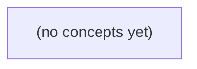

# 06.02 SQL 从读写到复杂查询

*一本面向 Go 初学者的静态 SQL 教材，基于同一组虚构 IM 关系表和纸上数据，从按会话读取历史消息的业务需求出发，逐步掌握读写、连接、排序分页、聚合、子查询、集合与窗口函数。全书以“当前成员读取 c-a 最新消息”的授权查询为主线，配套 22 道附反馈练习。*

**章节:** 2

---

## 本书导览

- 了解整本书的章节脉络
- 掌握各章之间的概念依赖关系
- 选择最合适的阅读顺序

# 06.02 SQL 从读写到复杂查询

一本面向 Go 初学者的静态 SQL 教材，基于同一组虚构 IM 关系表和纸上数据，从按会话读取历史消息的业务需求出发，逐步掌握读写、连接、排序分页、聚合、子查询、集合与窗口函数。全书以“当前成员读取 c-a 最新消息”的授权查询为主线，配套 22 道附反馈练习。

下方的概念图展示了本书 0 个核心概念以及它们之间的依赖关系；再下方是 1 个章节的入口。你可以按从上到下的顺序阅读，也可以根据自己的兴趣或先验知识选择切入点。

#### 概念图



## 章节索引

- **06.02 SQL 从读写到复杂查询：按会话安全读取消息历史** — 面向Go初学者承接06.01四表，沿虚构IM会话历史查询逐层讲INSERT/SELECT/WHERE、UPDATE/DELETE、JOIN、ORDER BY与分页、GROUP BY/HAVING、子查询/UNION/窗口；始终区分SQL结果、成员授权、持久确认与设备送达。静态纸上演算不运行数据库。

## 06.02 SQL 从读写到复杂查询：按会话安全读取消息历史

- 用显式列INSERT和SELECT读取虚构消息表
- 区分投影、WHERE筛选与SQL NULL
- 用WHERE和影响行数限制UPDATE/DELETE范围
- 手算JOIN与意外行倍增
- 用唯一排序键解释LIMIT/OFFSET与游标分页
- 按会话/发送者计算COUNT并区分WHERE/HAVING
- 认识子查询、集合操作和窗口函数的职责
- 写出带受信身份和参数的历史查询纸上方案

从06.01的四张静态教学表出发，先用纸上查询回答一个明确问题：谁能按确定顺序读取会话c-a的最新两条消息？

### 固定虚构数据与读取目标

### 固定虚构数据与读取目标

先不连接数据库，也不讨论网络、设备推送或 Go 代码；只固定一组可手工验算的关系数据。四张表分别表达不同事实：

- `users`：用户 `u-a`、`u-b`。
- `conversations`：会话 `c-a`、`c-b`。
- `conversation_members`：`u-a` 是 `c-a` 成员；`u-b` 是 `c-b` 成员。未出现的组合即不具备成员资格。
- `messages`：  
  - `m-a`：属于 `c-a`，发送者 `u-a`，创建时间 `10:00`；  
  - `m-b`：属于 `c-a`，发送者 `u-a`，创建时间 `10:01`；  
  - `m-c`：属于 `c-a`，发送者 `u-a`，创建时间 `10:02`；  
  - `m-d`：属于 `c-b`，创建时间 `10:03`。

业务问题固定为：**当前请求者能否读取会话 `c-a` 的最新两条消息？**

这里“最新两条”不能依赖表中碰巧的存放顺序，必须写成可验证的结果条件：

1. 请求者必须在 `conversation_members` 中拥有 `(用户, c-a)` 成员记录；
2. 只选择 `conversation_id = c-a` 的消息，不能混入 `c-b`；
3. 按 `created_at` 降序排列；若时间可能相同，还应以消息标识作稳定次序；
4. 最终最多返回两条。

因此，`u-a` 读取 `c-a` 的期望结果是 `m-c`、`m-b`；`u-b` 请求同一会话时，期望结果不是“空消息列表也算成功”，而是被判定为无权读取。SQL要声明的是这组关系条件和结果形状，而不是模拟 Go 的逐行遍历。

### SQL声明结果，不是Go遍历

### SQL声明结果，不是Go遍历

在 Go 中，读取消息常被想成“拿到数组后逐项检查”：

`遍历消息 → 找出 c-a → 按时间排序 → 取前两条`

这种写法由程序控制每一步：循环、`if`、排序和截断。它适合内存中的切片；但数据库中的数据首先是**关系表**，SQL更关心“结果应满足什么条件”。

例如，`messages` 表的一行可表示一条消息：

| id | conversation_id | sender_id | body | created_at |
|---|---|---|---|---|
| m-a | c-a | u-a | 你好 | 10:00 |

其中表是同类事实的集合，行是一条事实，列是事实的属性。要声明“会话 `c-a` 最新两条消息”，可以写成：

`SELECT id, sender_id, body, created_at FROM messages WHERE conversation_id = 'c-a' ORDER BY created_at DESC, id DESC LIMIT 2`

它不是“如何循环”的指令，而是结果契约：

- `SELECT`：结果集只需要哪些列；
- `FROM messages`：从哪张表取行；
- `WHERE`：仅保留属于 `c-a` 的行；
- `ORDER BY`：明确最新优先；同一时间再以 `id` 消除顺序歧义；
- `LIMIT 2`：最终只要两行。

这里尚未证明请求者能否读取 `c-a`。成员资格属于权限条件，通常还要关联成员表，使“`u-a` 是 `c-a` 成员”成为查询成立的一部分。SQL描述的是数据库应返回的集合；Go负责传入参数、执行查询、处理结果与错误。消息是否已持久化，也不等于设备是否已经收到推送。

### 显式投影、筛选与消息排序

### 显式投影、筛选与消息排序

先只观察消息表 `messages`。假定纸上数据中，会话 `c-a` 有多条消息，字段包括：

- `id`：消息唯一标识，如 `m-a`
- `conversation_id`：所属会话，如 `c-a`
- `sender_id`：发送者
- `body`：消息正文
- `created_at`：创建时间

目标不是“遍历所有消息再判断”，而是声明：从关系表中取出属于 `c-a` 的消息，以确定顺序返回最新两条。

```sql
SELECT
  id,
  conversation_id,
  sender_id,
  body,
  created_at
FROM messages
WHERE conversation_id = 'c-a'
ORDER BY created_at DESC, id DESC
LIMIT 2;
```

这条语句可按四步手工推导：

1. **投影**：`SELECT` 明确列出需要交给上层的字段。避免使用 `SELECT *`，因为表未来可能新增内部字段，例如删除标记、审核状态或存储地址；“查到了什么列”应当是接口契约的一部分。
2. **筛选**：`WHERE conversation_id = 'c-a'` 保留该会话的消息，排除 `c-b` 等其他会话内容。
3. **排序**：`ORDER BY created_at DESC` 让较新的消息排在前面。但两条消息可能具有相同时间戳，因此追加唯一键 `id DESC` 作为稳定的并列规则。
4. **截断**：`LIMIT 2` 在排序完成后只保留前两行，即“最新两条”，而不是任意两条。

若 `c-a` 的消息按时间从旧到新为 `m-a`、`m-b`、`m-c`，查询结果应为 `m-c`、`m-b`。这里得到的只是“该会话的候选消息历史”；调用者是否有资格读取 `c-a`，仍需由成员关系与权限条件保证，不能仅靠这条消息筛选语句推断。

### 成员授权决定能否读取

### 成员授权决定能否读取

读取会话历史前，系统先回答的不是“有哪些消息”，而是“当前请求者是否属于这个会话”。在纸上数据中，`u-a` 是会话 `c-a` 的成员，`u-b` 不是；因此两人请求同一个会话时，结果必须不同：

| 受信身份 | 目标会话 | 成员关系 | 是否可读 |
|---|---|---|---|
| `u-a` | `c-a` | 存在 | 可以读取最新两条 |
| `u-b` | `c-a` | 不存在 | 不可读取任何消息 |

关键在于：客户端提交的“我是 `u-a`”只是输入，不是授权事实。应用应先从登录会话、签名令牌或服务端认证中取得受信身份，例如当前身份为 `u-a`；随后让该身份与成员表关联验证。

概念上的查询条件可写为：

```sql
会话成员.会话ID = 消息.会话ID
并且 会话成员.用户ID = 当前受信用户ID
并且 消息.会话ID = 'c-a'
```

若当前受信用户是 `u-a`，成员表中存在 `(c-a, u-a)`，消息行才有资格进入结果集；若是 `u-b`，关联找不到成员行，结果自然为空。这里的“空”不是“该会话没有消息”，而是“该用户无权看见消息”。

授权条件必须与消息读取条件一起构成查询语义，而不能先按 `c-a` 查出消息，再由客户端自行判断是否展示。后者会使未授权数据已经离开数据库边界。成员表负责“能否读取”，消息表负责“读取哪些内容”，排序与数量才负责“最新两条”。

### 区分查询结果与消息状态

### 区分查询结果与消息状态

对会话 `c-a` 写出“按时间倒序取最新两条”的查询，只说明：在当前关系表快照中，哪些记录满足条件并应返回。例如结果可能是 `m-a`、`m-b`；`ORDER BY created_at DESC, message_id DESC LIMIT 2` 才把“最新”和同一时间下的顺序写清楚。

这与另外三件事必须分开：

- **成员授权**：查询结果成立的前提是请求者属于 `c-a`。`u-a` 是成员，才能看到结果；`u-b` 不是成员，即使猜到会话编号也应得到“无权读取”，而不是消息列表。
- **数据库持久确认**：一条消息只有在写入事务成功提交后，才可称为已持久保存。应用内存里刚组装出的消息、尚未提交的写入，都不是可靠历史。
- **设备送达**：数据库能查到消息，不等于用户设备已经收到。设备可能离线、推送失败、网络中断，或客户端尚未同步；“已送达”“已读”需要独立的送达或阅读状态记录。

因此，SQL负责声明“对已保存数据要什么结果”；授权决定“谁可以要”；事务确认“结果是否可靠存在”；设备协议才回答“是否到达终端”。在当前纸上数据阶段，没有真实数据库或推送服务，讨论的只是这四条边界应如何设计，不能把查询成功误说成消息已送达。

> **要点** — 安全历史读取的核心是：以受信身份验证成员资格，再按明确列、确定顺序和数量返回会话消息。

从四张表的既有字段出发，先用纸上数据练习安全、可预测地写入和读取某个会话的消息。

### 从表字段到显式插入

### 从表字段到显式插入

先按既有表字段准备一组最小数据。假设 `users` 有 `id`、`name`，`conversations` 有 `id`、`title`，`members` 用 `conversation_id` 与 `user_id` 表示成员关系，`messages` 有 `id`、`conversation_id`、`sender_id`、`body`、`created_at`、`deleted_at`。

```sql
INSERT INTO users (id, name) VALUES
  ('u-a', '阿青'),
  ('u-b', '小白');

INSERT INTO conversations (id, title) VALUES
  ('c-a', '项目讨论'),
  ('c-b', '闲聊');

INSERT INTO members (conversation_id, user_id) VALUES
  ('c-a', 'u-a'),
  ('c-a', 'u-b'),
  ('c-b', 'u-a');

INSERT INTO messages
  (id, conversation_id, sender_id, body, created_at, deleted_at)
VALUES
  ('m-1', 'c-a', 'u-a', '进度已更新', '2025-01-10 09:00:00', NULL),
  ('m-2', 'c-a', 'u-b', '收到，我来检查', '2025-01-10 09:02:00', NULL),
  ('m-3', 'c-a', 'u-a', '旧版本说明', '2025-01-10 09:03:00', '2025-01-10 10:00:00'),
  ('m-4', 'c-b', 'u-a', '午饭吃什么？', '2025-01-10 11:00:00', NULL);
```

显式写出列名比依赖表的列顺序更安全：读者能立刻看出每个值对应什么字段；日后表新增列、调整默认值时，旧插入语句也不容易悄悄错位。`NULL` 表示“没有删除时间”，不能写成字符串 `'NULL'`；后续筛选未删除消息时也必须使用 `IS NULL`。

这组纸上数据刻意包含两个会话、一条已删除消息和两个发送者，足以逐行验证：哪些记录属于 `c-a`，哪些消息应当在普通历史读取中被排除。

### 投影：只取需要的消息列

### 投影：只取需要的消息列

读取消息时，要分清两个独立问题：

- **投影**：结果中要显示哪些列；
- **筛选**：结果中要保留哪些行。

例如，页面只需要展示消息发送者、正文和发送时间，就明确写出这些列：

```sql
SELECT message_id, sender_id, body, created_at
FROM messages
WHERE conversation_id = 'c-a';
```

这里：

- `SELECT message_id, sender_id, body, created_at` 决定每一行返回的内容；
- `FROM messages` 指定读取 `messages` 表；
- `WHERE conversation_id = 'c-a'` 只保留属于会话 `c-a` 的消息。

假设纸上数据中有三条消息：

| message_id | conversation_id | sender_id | body | created_at |
|---|---|---|---|---|
| m-1 | c-a | u-1 | 你好 | 2025-01-01 09:00 |
| m-2 | c-b | u-2 | 私聊内容 | 2025-01-01 09:01 |
| m-3 | c-a | u-2 | 收到 | 2025-01-01 09:02 |

`WHERE` 先排除 `m-2`，因为它属于 `c-b`；随后投影只取指定的四列。因此结果不会显示 `conversation_id`，但它仍参与了筛选。

不要习惯性使用 `SELECT *`。它会返回正文以外的所有当前字段，也会在表未来新增敏感字段时自动泄漏它们。显式列名既表达页面需求，也让接口结果更稳定。

此外，SQL 查询结果默认**没有顺序保证**；若要按时间展示，还必须显式写 `ORDER BY created_at`。

### WHERE 逐行筛选会话消息

### WHERE 逐行筛选会话消息

先假定 `messages` 中已有纸上数据：

| id | conversation_id | sender_id | body |
|---|---|---|---|
| m-1 | c-a | u-1 | 你好 |
| m-2 | c-b | u-2 | 另一会话的消息 |
| m-3 | c-a | u-2 | 收到 |
| m-4 | NULL | u-1 | 尚未归属会话 |

要读取会话 `c-a` 的消息，可写：

```sql
SELECT id, conversation_id, sender_id
FROM messages
WHERE conversation_id = 'c-a';
```

`'c-a'` 是字符串常量，必须用单引号包围；`conversation_id` 则是每一行中待比较的列。`WHERE` 不会“寻找一张叫 c-a 的表”，而是对 `messages` 的每一行执行条件判断：

1. `m-1`：`c-a = 'c-a'`，条件为真，保留。
2. `m-2`：`c-b = 'c-a'`，条件为假，丢弃。
3. `m-3`：`c-a = 'c-a'`，条件为真，保留。
4. `m-4`：`NULL = 'c-a'` 的结果不是“真”，而是未知，因此不保留。

因此结果只有 `m-1` 与 `m-3`。这里的逻辑顺序可理解为：先从 `messages` 逐行读取，再用 `WHERE` 筛选保留行，最后由 `SELECT` 投影出所需列。`SELECT` 决定“显示什么”，`WHERE` 决定“哪些行能显示”。

不要把空值判断写成：

```sql
WHERE conversation_id = NULL
```

应使用：

```sql
WHERE conversation_id IS NULL
```

同样，以上查询没有 `ORDER BY`，即使当前看起来按 `id` 排列，数据库也不承诺返回顺序。若读取消息历史还需要时间顺序，应在后续显式指定排序。

### NULL、AND 与 OR 的条件边界

### NULL、AND 与 OR 的条件边界

设 `messages` 中已有三条纸上数据：

| id | conversation_id | sender_id | body | deleted_at | visibility |
|---|---|---|---|---|---|
| m-1 | c-a | u-1 | 你好 | `NULL` | public |
| m-2 | c-a | u-2 | 已撤回内容 | `2025-01-10 09:00:00` | public |
| m-3 | c-a | u-1 | 仅自己可见的草稿 | `NULL` | private |

读取会话 `c-a` 中尚未删除的消息，应显式投影允许返回的字段：

```sql
SELECT id, sender_id, body, visibility
FROM messages
WHERE conversation_id = 'c-a'
  AND deleted_at IS NULL;
```

结果为 `m-1`、`m-3`。不能写成 `deleted_at = NULL`：`NULL` 表示“未知或不存在”，与任何值用 `=` 比较都不会得到真；判断空值必须使用 `IS NULL`，判断非空则用 `IS NOT NULL`。

`AND` 的优先级高于 `OR`。例如，需求是“读取 `c-a` 中公开消息，或者读取当前用户 `u-1` 自己的私有消息”：

```sql
WHERE conversation_id = 'c-a'
  AND (visibility = 'public'
       OR (visibility = 'private' AND sender_id = 'u-1'))
  AND deleted_at IS NULL
```

它返回 `m-1` 和 `m-3`，但排除已删除的 `m-2`。括号表达的是权限边界：私有消息必须同时满足“私有”与“发送者是当前用户”。

若误写为：

```sql
WHERE conversation_id = 'c-a'
  AND visibility = 'public'
  OR visibility = 'private'
```

数据库会按 `(conversation_id = 'c-a' AND visibility = 'public') OR visibility = 'private'` 理解，其他会话的私有消息也可能进入结果。条件不仅是在“筛选数据”，也在定义访问范围；涉及 `AND` 与 `OR` 时，应主动用括号写出真实业务规则。

### 安全读取的最小查询方案

### 安全读取的最小查询方案

读取会话消息时，先把目标限定为：**只取某个 `conversation_id` 的必要字段**，而不是“把 `messages` 表整行返回”。

假设纸上数据中有会话 `c-a`，最小查询可以写为：

```sql
SELECT id, conversation_id, sender_id, created_at
FROM messages
WHERE conversation_id = 'c-a';
```

这里有两个刻意的选择：

- 使用显式列名，而不是 `SELECT *`。`body` 可能包含敏感正文；未来表中新增 `internal_note`、审核标记等字段时，`SELECT *` 也会把它们意外带出。
- `WHERE conversation_id = 'c-a'` 只保留属于 `c-a` 的行。逐行判断时，`conversation_id` 为 `c-a` 的消息保留，属于 `c-b`、`c-c` 的消息排除。

不要写成：

```sql
WHERE conversation_id = NULL
```

`NULL` 表示未知或缺失，不能用 `=` 比较；判断空值必须写：

```sql
WHERE conversation_id IS NULL
```

同样，附加条件时要明确括号。例如“属于 `c-a`，且发送者是 `u-1` 或 `u-2`”：

```sql
WHERE conversation_id = 'c-a'
  AND (sender_id = 'u-1' OR sender_id = 'u-2')
```

投影与筛选是两件事：`SELECT` 决定返回哪些列，`WHERE` 决定保留哪些行。并且，未写 `ORDER BY` 的查询**没有返回顺序保证**；即使当前看起来按时间排列，也不能依赖它。

最后，这条查询只完成“按会话找消息”，并未证明当前用户有权读取 `c-a`。成员授权还需要结合 `members` 表验证该用户属于该会话。

> **要点** — 显式列名决定暴露什么，WHERE 决定保留哪些行；NULL 要用 IS NULL，查询结果默认没有顺序。

历史查询依赖正确的状态数据：成员退出要留下时间痕迹，消息展示文字可修正，但任何改删都必须限定范围并核对结果。

### 更新的目标、赋值与范围

### 更新的目标、赋值与范围

`UPDATE` 用于修改已有记录，最基本的结构是：

`UPDATE 表名 SET 列名 = 新值 WHERE 条件;`

它必须依次回答三个问题：

1. **改什么**：`UPDATE` 后的表名确定更新目标。
2. **改成什么**：`SET` 指定要写入的列及其新值。
3. **改哪些行**：`WHERE` 把更新范围限制为符合条件的记录。

成员退出会话时，不应删除成员关系，而是记录退出时间：

`UPDATE conversation_members SET left_at = NOW() WHERE conversation_id = $1 AND user_id = $2;`

这里更新目标是 `conversation_members`；赋值是将 `left_at` 写为当前时间；范围同时限定会话和成员。`$1`、`$2` 是参数占位符，实际值由程序安全传入，而不是把用户输入直接拼进 SQL。

修正消息展示文字也应只改指定消息，例如：

`UPDATE messages SET display_text = $1 WHERE id = $2 AND sender_id = $3;`

额外的 `sender_id = $3` 不只是技术条件，也是在表达权限边界：当前用户只能修改自己发送的消息。应用不能盲目信任请求中提交的用户编号，而应使用已认证会话中的可信身份。

最危险的遗漏是没有 `WHERE`：

`UPDATE messages SET display_text = '已修正';`

这会修改表中的全部消息。执行更新后应核对影响行数：`0` 行通常意味着目标不存在、已退出或无权操作；`1` 行通常符合“修改一条记录”的预期；多于 `1` 行则应警惕条件过宽。

### 成员退出：写入 left_at

### 成员退出：写入 `left_at`

成员退出通常不删除成员关系，而是记录退出时间。这样历史消息仍可关联到当时的成员，也能区分“从未加入”“仍在会话中”和“已经退出”。

```sql
UPDATE conversation_members
SET left_at = NOW()
WHERE conversation_id = $1
  AND user_id = $2
  AND left_at IS NULL;
```

这里的三个条件缺一不可：

- `conversation_id = $1`：限定具体会话，避免把该用户在其他会话中的成员关系一并改为退出。
- `user_id = $2`：限定具体成员。
- `left_at IS NULL`：只更新仍处于会话中的记录；已经退出的成员再次请求退出时，不应覆盖原有退出时间。

`$1`、`$2` 是参数占位符，实际值由程序通过数据库驱动单独传入，而不是拼接到 SQL 字符串中。例如 `$1` 传会话标识，`$2` 传当前用户标识。这既避免引号和类型处理错误，也为防范 SQL 注入提供基础。

其中，成员标识不应直接相信客户端提交的“我要退出谁”。服务端应先从已验证的登录会话、令牌或上下文中取得受信的当前用户身份，再将该身份作为 `$2`。客户端最多提供会话标识；即使它伪造其他用户标识，也不应影响别人的成员状态。

执行后必须检查影响行数。影响 `1` 行表示成功退出；影响 `0` 行则可能是会话不存在、用户不是成员，或该成员早已退出。不要在没有 `WHERE` 的情况下执行 `UPDATE`：那会把所有成员记录都标记为退出。

### 修正消息展示文字

### 修正消息展示文字

消息发布后，用户可能需要修正错别字或不恰当的展示措辞。此类操作应更新可编辑字段，例如 `display_text`，而不是让客户端任意改写发送时间、发送者、所属会话等历史事实。

```sql
UPDATE messages
SET display_text = $1
WHERE message_id = $2
  AND conversation_id = $3
  AND sender_id = $4;
```

其中：

- `$1` 是新的展示文字；
- `$2` 是目标消息标识；
- `$3` 限定消息必须属于当前正在访问的会话；
- `$4` 限定只有原发送者可以修改自己的消息。

`sender_id` 不应直接相信客户端提交的“我是谁”，而应来自已验证的登录身份或会话上下文。客户端可以提交消息标识和新文字，但服务端必须根据受信身份补全发送者条件。

更新后必须检查影响行数。影响 `1` 行通常表示修改成功；影响 `0` 行则可能意味着消息不存在、不属于该会话、当前用户不是发送者，或消息已被删除。不要因为更新无结果就再次执行一个条件更宽松的 `UPDATE`。

避免这样的写法：

```sql
UPDATE messages SET display_text = $1;
```

缺少 `WHERE` 会修改整张表的消息文字。同理，历史消息通常不应因“撤回”或“隐藏”而直接执行物理删除；展示层可通过状态字段决定是否显示原文，而审计、会话顺序和引用关系仍保留原始事实。

### 删除的风险与历史保留

### 删除的风险与历史保留

删除看似比更新简单，却更难恢复。应先区分“让用户不再看到”与“让数据库彻底失去这条记录”。

- **限定删除**：只删除明确目标，必须带 `WHERE`，并使用参数占位符绑定受信身份与资源标识。
  ```sql
  DELETE FROM messages
  WHERE id = $1 AND sender_id = $2;
  ```
  这里 `$1`、`$2` 不是拼接进 SQL 的文本，而是由驱动安全传入的参数。`sender_id = $2` 还表达了权限边界：只能删除当前用户自己的消息。

- **无条件删除**：
  ```sql
  DELETE FROM messages;
  ```
  这会删除表中的全部消息。即使本意是清理测试数据，在生产库执行也可能造成不可逆的历史丢失。因此，任何 `DELETE` 后都应核对影响行数：预期删除 1 行却得到 0 行，可能是目标不存在或无权操作；得到多行，则应立即检查条件是否过宽。

- **逻辑隐藏**：对历史消息，更常见的是保留原记录，仅改变可见状态：
  ```sql
  UPDATE messages
  SET hidden_at = CURRENT_TIMESTAMP
  WHERE id = $1 AND sender_id = $2;
  ```
  查询历史时再过滤 `hidden_at IS NULL`，或向管理员展示“该消息已删除”。这样既能满足撤回、隐藏需求，也保留审计、会话顺序和关联引用。

物理删除还可能被主外键约束拒绝：若其他表仍引用该消息，数据库会阻止删除，避免产生“指向不存在消息”的孤儿记录。这不是障碍，而是保护。除非有明确的数据保留策略、级联规则与恢复方案，历史消息不应随意物理删除；成员退出同样应记录 `left_at`，而不是删除成员关系。

### 影响行数与参数化纸上方案

### 影响行数与参数化纸上方案

改写或删除前，先把“谁在操作、要改哪一行、改完应有几行受影响”写成可检查的方案。身份不能来自客户端随意提交的 `user_id`，而应来自已认证会话中的受信用户身份；客户端提供的只应是消息、会话等目标标识。

以成员退出为例，目标不是删除成员记录，而是为该成员留下退出时间：

`UPDATE conversation_members SET left_at = NOW() WHERE conversation_id = $1 AND user_id = $2 AND left_at IS NULL`

这里 `$1` 是会话标识，`$2` 是受信用户身份。`WHERE` 同时限定会话、成员和“尚未退出”状态，预期影响行数通常为 `1`：

- 影响 `1` 行：该成员成功退出；
- 影响 `0` 行：可能不是成员、会话不存在，或已退出；
- 影响大于 `1` 行：说明数据约束或条件设计异常，应停止并排查。

修正自己发送的消息展示文字也应同样收窄范围：

`UPDATE messages SET display_text = $1 WHERE id = $2 AND sender_id = $3`

参数占位符将数据与 SQL 结构分离；不要通过字符串拼接把用户输入直接塞进语句。执行后必须读取并核对影响行数，不能仅凭“未报错”认定操作成功。

删除语句尤其危险：

`DELETE FROM messages WHERE id = $1 AND sender_id = $2`

漏写 `WHERE` 会删除整张表的全部行；条件过宽则可能删除多条消息。更重要的是，历史消息通常不应随意物理删除：它可能被回复、引用、审计或同步流程依赖，主键—外键关系也可能直接拒绝删除。若业务只要求“对用户不可见”，应优先设计状态标记或展示策略，而不是立刻使用 `DELETE`。

> **要点** — 更新和删除必须用受信身份与 WHERE 缩小范围，并以影响行数和约束结果确认没有误伤历史数据。

本节用消息与成员表的纸上演算，建立“正确关联不等于历史授权证明”的安全查询意识。

### 从消息行到成员身份：明确连接目标

### 从消息行到成员身份：明确连接目标

设有两张核心表：

- `messages(id, conversation_id, sender_id, body, created_at)`：每行是一条消息，如 `m-a`、`m-b`、`m-c`。
- `conversation_members(conversation_id, user_id, joined_at, role)`：每行表示某用户属于某会话的成员关系。

查询“用户 `u-a` 在会话 `c-1` 中可读取的消息”时，连接的目标不是“给每条消息随便找一个该会话成员”，而是验证：这些消息属于 `c-1`，且请求者 `u-a` 与 `c-1` 存在对应成员关系。

正确的关联条件应同时包含会话和用户约束：

```sql
SELECT m.id, m.body, m.created_at
FROM messages AS m
JOIN conversation_members AS cm
  ON cm.conversation_id = m.conversation_id
 AND cm.user_id = 'u-a'
WHERE m.conversation_id = 'c-1';
```

这里，`m.conversation_id = cm.conversation_id` 将消息接到同一会话；`cm.user_id = 'u-a'` 则把成员行限定为当前请求者。若 `c-1` 有 `m-a`、`m-b`、`m-c` 三条消息，以及 `u-a`、`u-b` 两名成员，盲目只写：

```sql
ON m.conversation_id = cm.conversation_id
```

会得到 $3\times2=6$ 行：每条消息都与两名成员配对，消息重复，`COUNT(*)` 也会被放大。先从服务端认证结果取得可信的当前用户身份，再以“会话 + 用户”定义成员关系，才是读取消息的正确起点。

### 手算内连接：为什么必须写完整ON条件

### 手算内连接：为什么必须写完整 `ON` 条件

设消息表有同一会话 `c-1` 的三条消息：

| 消息 | `conversation_id` | `user_id` |
|---|---|---|
| `m-a` | `c-1` | `u-a` |
| `m-b` | `c-1` | `u-a` |
| `m-c` | `c-1` | `u-a` |

成员表中，该会话有两名成员：

| `conversation_id` | `user_id` |
|---|---|
| `c-1` | `u-a` |
| `c-1` | `u-b` |

若要验证“消息作者是该会话成员”，连接条件必须同时约束会话和用户：

```sql
... JOIN members mem
  ON message.conversation_id = mem.conversation_id
 AND message.user_id = mem.user_id
```

逐条手算：`m-a` 的键是 `(c-1, u-a)`，只匹配成员 `(c-1, u-a)`；`m-b`、`m-c` 同理。因此结果恰为 3 行，每条消息对应其真实作者成员记录。

若只写：

```sql
ON message.conversation_id = mem.conversation_id
```

每条消息都会匹配 `c-1` 的两条成员记录：`m-a→u-a`、`m-a→u-b`，其余两条消息也各有两次匹配。结果变为 $3\times2=6$ 行：

| 消息 | 被错误配对的成员 |
|---|---|
| `m-a` | `u-a`、`u-b` |
| `m-b` | `u-a`、`u-b` |
| `m-c` | `u-a`、`u-b` |

这不仅制造重复行，还会把 `COUNT(*)` 从 3 错算为 6，并可能让消息看似属于错误成员。`ON` 条件应表达两表记录的完整对应关系；缺少组成键的一部分，连接就不再是在“找同一实体”，而是在产生不应存在的组合。

### 连接倍增如何污染计数与历史结果

### 连接倍增如何污染计数与历史结果

设消息表有同一会话的三条消息 `m-a`、`m-b`、`m-c`，成员表有两个成员 `u-a`、`u-b`。若查询只写：

`消息表 JOIN 成员表 ON 消息表.conversation_id = 成员表.conversation_id`

则每条消息都会匹配该会话的两个成员，纸上结果为：

| 消息 | 匹配成员 |
|---|---|
| m-a | u-a、u-b |
| m-b | u-a、u-b |
| m-c | u-a、u-b |

因此原本 3 条消息变成 6 行。`COUNT(*)` 得到 6，而非真实消息数 3；若按发送者统计，某发送者原有 2 条消息，也可能被统计为 4 条。进一步做分页时，同一消息可能在不同页重复出现，历史列表与未读数都会失真。

正确的关联必须表达业务事实。例如要确认“当前认证用户 `u-a` 是否是该会话成员”，应使用：

`ON m.conversation_id = cm.conversation_id AND cm.user_id = 'u-a'`

这里成员表不是“会话中所有成员”的展开来源，而是针对一个确定身份的权限匹配条件。

不要用 `COUNT(DISTINCT m.id)` 草率修补。它或许能暂时纠正消息总数，却不能修复按成员、角色、状态等字段分组后的重复，也掩盖了连接键缺失的建模错误。更重要的是：即使当前成员记录匹配，也只能说明当前快照；查询历史消息前仍须先依据服务端认证身份与授权规则判断其是否具有读取历史的权限。

### LEFT JOIN中的NULL与WHERE过滤陷阱

### LEFT JOIN 中的 NULL 与 WHERE 过滤陷阱

设消息表有三条记录 `m-a`、`m-b`、`m-c`，成员表只存在 `u-a` 对应的成员记录。正确关联应同时约束会话和用户：

`消息.conversation_id = 成员.conversation_id AND 消息.user_id = 成员.user_id`

`INNER JOIN` 只保留两侧都匹配的行。若仅 `m-a` 的发送者是 `u-a`，结果只有 `m-a`；`m-b`、`m-c` 因成员表找不到对应键而被丢弃。

`LEFT JOIN` 则保留左表消息的全部三行：

| 消息 | 成员匹配结果 |
|---|---|
| `m-a` | `u-a` 的成员记录 |
| `m-b` | `NULL` |
| `m-c` | `NULL` |

这里的 `NULL` 不表示“成员信息为空字符串”，而表示右表根本没有匹配行。因此，下面的查询看似是左连接：

`... LEFT JOIN members mem ON ... WHERE mem.role = 'member'`

但对 `m-b`、`m-c` 而言，`mem.role` 是 `NULL`；`NULL = 'member'` 不为真，`WHERE` 会过滤它们。最终只剩有匹配成员且角色满足条件的行，效果等同于内连接。

若目标是“保留所有消息，同时仅附带符合条件的成员信息”，应把右表条件放入 `ON`：

`LEFT JOIN members mem ON ... AND mem.role = 'member'`

此时未匹配消息仍保留，右侧列为 `NULL`。不过，成员表的当前快照只能说明当前关联状态；读取历史消息前仍必须先依据服务端认证身份与授权规则判定访问权，不能把一次 `LEFT JOIN` 的匹配结果当作历史权限证明。

### 读取历史前先授权：快照成员表的边界

### 读取历史前先授权：快照成员表的边界

读取会话历史不是“查得到就能返回”，而应先由服务端完成认证与授权，再执行参数化查询。客户端传来的 `user_id`、`conversation_id` 只能视为请求参数，不能当作可信身份；可信主体应来自服务端验证后的登录会话、令牌声明或网关上下文，例如认证身份为 `u-a`。

一个稳妥流程是：

1. 服务端认证请求，得到不可由客户端伪造的当前身份 `u-a`。
2. 校验 `conversation_id` 的格式、租户边界及访问规则。
3. 判断 `u-a` 是否有权读取该会话在目标时间范围内的消息。
4. 使用参数绑定执行查询，禁止将输入直接拼入 SQL。
5. 仅返回授权范围内的字段、消息和附件元数据。

例如，若规则是“当前仍为成员即可读取全部历史”，可先检查成员关系：

`SELECT 1 FROM conversation_members WHERE conversation_id = ? AND user_id = ?`

确认存在后，再以绑定参数读取消息：

`SELECT id, sender_id, body, created_at FROM messages WHERE conversation_id = ? ORDER BY created_at`

但要明确：`conversation_members` 往往只是**当前成员快照**。其中存在 `(c-1, u-a)`，只能证明 `u-a` 现在是 `c-1` 的成员，不能证明他在消息 `m-a`、`m-b`、`m-c` 创建时就具备读取权限。

若产品规则要求“只能读取加入后产生的消息”“退出后不可继续读取”“被移除者不能查看移除前历史”，就必须保存可审计的历史事实，如 `joined_at`、`left_at`、成员变更事件或消息可见性版本。授权条件应比较消息时间与有效成员区间，而不是仅依赖当前快照：

`joined_at <= messages.created_at AND (left_at IS NULL OR messages.created_at < left_at)`

因此，正确的 `JOIN ON conversation_id AND user_id` 解决的是行关联与计数放大问题；历史授权则需要额外的身份来源、业务规则和时间证据。

> **要点** — JOIN必须按真实关联键匹配；查询结果、当前成员资格与历史读取授权是三件不同的事。

会话历史不是“查出来就行”：稳定排序、分页边界与新增消息会共同决定用户是否重复或漏看消息。

### 先定义会话内的稳定顺序

### 先定义会话内的稳定顺序

读取消息历史时，`WHERE conversation_id = ?` 只定义“属于哪个会话”，并不定义“以什么顺序展示”。未写 `ORDER BY` 的查询结果没有可靠顺序：即使当前恰好按插入顺序返回，也可能因索引、执行计划或数据变化而改变。

通常应把最新消息放在前面：

`ORDER BY seq DESC, message_id DESC`

其中，`seq` 是会话内递增序号，决定主要时间线；`message_id` 是次级排序键，用于在 `seq` 相同的情况下仍给出确定顺序。分页依赖这个顺序：第一页、下一页以及游标边界都必须使用完全相同的排序规则。

若 06.01 已建立：

`UNIQUE(conversation_id, seq)`

则同一会话内的 `seq` 本身唯一，理论上 `ORDER BY seq DESC` 已足够，后续也可直接使用 `seq` 作为游标。保留 `message_id DESC` 则是一种防御性表达：它明确告诉读者，结果必须是全序，而不是“相同序号时随数据库决定”。

可以把排序视为接口协议的一部分，而非显示层细节。查询、分页令牌与客户端拼接页面必须共同遵守它；一旦某页改成按 `created_at` 排序，或漏掉次级键，便可能出现重复、遗漏或页面内顺序跳变。

### 纸上手算 OFFSET 分页

### 纸上手算 OFFSET 分页

设会话 `c-a` 中有三条消息，按时间序号从新到旧排列如下：

| `seq` | `message_id` | 内容 |
|---:|---|---|
| 3 | `m-c` | 最新消息 |
| 2 | `m-b` | 中间消息 |
| 1 | `m-a` | 最早消息 |

先固定查询范围为 `conversation_id = 'c-a'`，并明确排序：

`ORDER BY seq DESC, message_id DESC`

其中 `seq DESC` 保证先读新消息；`message_id DESC` 是并列时的稳定兜底。若已有 `UNIQUE(conversation_id, seq)`，则同一会话内 `seq` 不会重复，但显式写出稳定顺序仍能表达查询意图。

第一页使用：

`LIMIT 2 OFFSET 0`

`OFFSET 0` 表示不跳过任何已排序结果，取前两条，因此返回：

1. `m-c`
2. `m-b`

第二页使用：

`LIMIT 2 OFFSET 2`

数据库先按上述顺序得到 `m-c、m-b、m-a`，再跳过前两条 `m-c、m-b`，最多取两条。剩余只有一条，因此返回：

1. `m-a`

继续请求：

`LIMIT 2 OFFSET 4`

需要跳过四条，但该会话总共只有三条，结果为空。空页通常表示“当前排序与过滤条件下没有更多历史消息”，客户端可据此停止加载；它不表示会话永远不会再有新消息。

这种手算依赖一个前提：分页期间结果集合不变。若第一页后插入一条更大的 `seq`，原来的 `m-c` 可能被挤到下一页，`OFFSET 2` 就可能重复读到 `m-b`，或在删除、过滤变化时漏读消息。

### 新增消息为何破坏页码边界

### 新增消息为何破坏页码边界

设某会话按 `ORDER BY seq DESC, message_id DESC` 排序，已有三条消息：

| `seq` | 消息 |
|---:|---|
| 3 | m-c |
| 2 | m-b |
| 1 | m-a |

首次以每页两条读取：

```sql
-- 第 1 页
LIMIT 2 OFFSET 0
```

得到 `m-c, m-b`。随后读取第 2 页：

```sql
LIMIT 2 OFFSET 2
```

得到 `m-a`。这里的“第 2 页”实际含义不是固定的一组消息，而是“在**当前排序结果**中跳过前两行”。

若用户读完第 1 页后插入新消息 `m-d(seq=4)`，排序变为：

`m-d, m-c, m-b, m-a`

此时仍请求 `LIMIT 2 OFFSET 2`，数据库先跳过 `m-d, m-c`，再返回：

`m-b, m-a`

于是 `m-b` 在第 1 页和第 2 页重复出现。反过来，若顶部消息被删除，或过滤条件使前面的行减少，原本应在后页出现的消息又可能被直接跳过，形成漏读。

问题根源在于：`OFFSET 2` 只描述位置，不描述用户已经看过的边界。新增、删除或排序键变化都会让“第 2 行之后”指向不同记录。

并且，`OFFSET` 并不会让数据库直接跳到目标位置。即使只返回 `LIMIT 20` 条，`OFFSET 100000` 通常仍需定位、扫描或跳过前十万行；页码越靠后，代价往往越高。

因此，消息历史更适合记录最后一条已见消息的序号，例如第一页最后是 `seq=2`，下一页改为：

```sql
WHERE conversation_id = ?
  AND seq < 2
ORDER BY seq DESC, message_id DESC
LIMIT 2
```

这样即使后来插入 `seq=4`，下一页仍从 `m-a` 继续，不会重复顶部已读消息。若查询返回空集，表示当前边界之后没有更旧消息；客户端可据此停止请求下一页。

### 用 seq 游标续读更早消息

### 用 `seq` 游标续读更早消息

若已定义 `UNIQUE(conversation_id, seq)`，则同一会话内的 `seq` 唯一，按“最新在前”读取历史时，`seq` 可以直接作为游标。首页不带游标：

```sql
SELECT message_id, seq, content, created_at
FROM messages
WHERE conversation_id = :conversation_id
ORDER BY seq DESC
LIMIT :page_size;
```

假设会话有 `m-a(seq=1)`、`m-b(seq=2)`、`m-c(seq=3)`，每页取 `2` 条：首页返回 `m-c, m-b`。客户端保存本页最后一条的 `seq=2` 作为 `next_cursor`；请求下一页时查询：

```sql
SELECT message_id, seq, content, created_at
FROM messages
WHERE conversation_id = :conversation_id
  AND seq < :cursor
ORDER BY seq DESC
LIMIT :page_size;
```

代入 `cursor=2`，结果为 `m-a`。若返回行数少于页大小，或结果为空，说明没有更早消息；空结果应正常返回空列表，而不是报错。

这里的两个条件缺一不可：

- `conversation_id = :conversation_id` 将游标限制在当前会话，避免把其他会话恰好较小的序号读进来。
- `seq < :cursor` 明确“续读更早消息”；由于排序为 `DESC`，上一页末尾的 `seq` 正是下一页的严格上界。

新消息插入通常具有更大的 `seq`，不会改变 `seq < cursor` 的边界，因此不会像 `OFFSET` 那样导致旧页重叠或漏读。注意，游标只定义分页位置，不自动提供快照一致性：若历史数据允许删除、补写或改变过滤条件，分页结果仍可能变化。游标必须与固定的会话条件、排序规则和过滤条件配套使用。

### 游标不是授权或一致性保证

### 游标不是授权或一致性保证

游标只解决“从已排序结果的哪里继续读”，不能证明调用者有权读取会话，也不能冻结查询期间的数据视图。一个面向应用层的纸上方案应先固定三件事：

1. **带受信身份查询**：从服务端认证结果取得 `user_id`，不要接受客户端声称的用户身份。
2. **成员授权**：每次读取都验证该用户属于目标会话，例如以 `conversation_members(conversation_id, user_id)` 约束可见会话。
3. **固定过滤条件**：后续页必须沿用首屏的会话、消息可见性条件、删除状态等；游标不能跨会话复用。

若 `UNIQUE(conversation_id, seq)` 保证会话内 `seq` 唯一，按新到旧读取可定义为：

```sql
ORDER BY seq DESC, message_id DESC
```

首屏取最新两条：

`WHERE conversation_id = ? AND 已获成员授权 ORDER BY seq DESC LIMIT 2`

返回 `m-c, m-b` 后，将末条的 `seq=b` 作为 `next_cursor`。下一页使用：

`WHERE conversation_id = ? AND seq < b AND 已获成员授权 ORDER BY seq DESC LIMIT 2`

得到 `m-a`；若结果少于页大小，或结果为空，则没有下一页。首屏本身为空表示该会话当前无可见消息；后续页为空通常表示游标之后已无记录，应停止翻页，而非回退到首屏。

不要用 `OFFSET 2` 代替游标：在 `m-c,m-b,m-a` 后插入新消息 `m-d`，第二次偏移读取可能重复 `m-b` 或漏掉消息；深偏移还需要数据库计算并跳过前面大量行。

不过，`seq < cursor` 不是快照。翻页之间若有删除、可见性变化或补写旧序号的数据，页面仍可能与首屏时不同。需要“整次浏览看到同一历史版本”时，应使用数据库事务快照、历史版本号或服务端固定快照；游标本身既不授权，也不提供一致性保证。

> **要点** — 历史分页依赖稳定排序；会话内唯一 seq 可作降序游标，但授权、过滤条件与一致性仍须单独保证。

聚合查询把多行记录压缩为可解释的统计结论，但计数口径、筛选阶段与连接关系必须先厘清。

### 先确定计数对象与业务口径

### 先确定计数对象与业务口径

写 `COUNT` 前，先回答“究竟在数什么”。同一条用户可见消息，数据库中可能对应多个不同层级的事实：

- **消息行**：消息表中的一行，适合回答“会话中存了多少条消息”。
- **成功受理记录**：服务端已经验证、持久化或进入处理队列的记录，适合衡量“系统成功接受了多少请求”。
- **发送尝试**：客户端每次点击发送、重试或自动补发都可能产生一次尝试；网络超时后重试，可能有多次尝试却只成功受理一次。
- **设备送达**：下游渠道或终端确认到达的事件，可能缺失、延迟，且不必然代表用户已阅读。

因此，`COUNT(*)` 只是对查询结果中的行计数，不自动等于“发送成功数”或“送达数”。例如，一条消息被客户端重试 3 次，服务端仅成功受理 1 次，则：

- 以尝试日志为对象：计数可能是 `3`；
- 以消息表或受理表为对象：计数可能是 `1`；
- 以送达回执为对象：可能是 `0` 或 `1`。

更不能把不同对象直接放进同一个转化率分母。例如“成功受理率”通常应以发送尝试为分母；“设备送达率”应以成功受理或已提交渠道的记录为分母，具体取决于业务定义。若把消息行数当作尝试数，重试、去重和异步写入都会使指标失真。

查询注释、字段命名和报表标题应明确写出对象与状态，例如“成功受理消息数”而非含糊的“发送数”。涉及确认、成功与转化的最终业务口径，还应以 11.01 的业务确认定义为准。

### COUNT(*) 与可空列计数

### COUNT(*) 与可空列计数

设有消息表 `messages`：

| id | conversation_id | sender_id | content | delivered_at |
|---:|---|---|---|---|
| 1 | c-a | u-a | 你好 | 2025-01-01 10:00 |
| 2 | c-a | u-a | 在吗？ | `NULL` |
| 3 | c-a | u-a | 请回复 | 2025-01-01 10:02 |
| 4 | c-b | u-b | 收到 | `NULL` |

`COUNT(*)` 统计查询结果中的**全部行**，不关心任意列是否为 `NULL`：

```sql
SELECT conversation_id, COUNT(*) AS message_count
FROM messages
GROUP BY conversation_id;
```

结果中，`c-a` 为 3，`c-b` 为 1。它回答的是：“数据库中有多少条消息记录？”

`COUNT(delivered_at)` 则只统计 `delivered_at` **不是 SQL `NULL`** 的行：

```sql
SELECT conversation_id, COUNT(delivered_at) AS delivered_count
FROM messages
GROUP BY conversation_id;
```

此时 `c-a` 为 2，`c-b` 为 0，因为两条记录的 `delivered_at` 缺失。注意，空字符串 `''`、数字 `0` 不是 `NULL`，仍会被计入；只有真正的 SQL `NULL` 才会被忽略。

因此，若要统计“成功写入消息表的记录数”，通常应使用 `COUNT(*)`；若字段语义明确为“已记录送达时间”，`COUNT(delivered_at)` 才可表示“具有送达记录的消息数”。但它不能自动等同于用户实际收到、阅读，或发送尝试总数：这些业务口径还取决于重试、设备回执和状态记录方式。

### WHERE 筛行、分组与 HAVING 筛组

### WHERE 筛行、分组与 HAVING 筛组

聚合查询可按逻辑顺序理解为：

`FROM/JOIN → WHERE → GROUP BY → 聚合函数 → HAVING → SELECT/ORDER BY`

其中，`WHERE` 面向**原始行**：先决定哪些消息可以进入统计；`GROUP BY` 将剩余行按键归入不同组；`HAVING` 面向**已经形成的组**：根据组的聚合结果决定保留或丢弃该组。

例如，统计每个会话中、每位发送者至少发送两条的消息：

```sql
SELECT conversation_id, sender_id, COUNT(*) AS message_count
FROM messages
WHERE deleted_at IS NULL
  AND created_at >= :start_time
GROUP BY conversation_id, sender_id
HAVING COUNT(*) >= 2;
```

可将其拆解为：

1. `WHERE deleted_at IS NULL`：排除已删除消息；这些行根本不会进入后续计数。
2. `GROUP BY conversation_id, sender_id`：按“会话 × 发送者”分组。若会话 `c-a` 中用户 `u-a` 发了 2 条、`u-b` 发了 1 条，则得到两组：`(c-a,u-a)=2`、`(c-a,u-b)=1`。
3. `HAVING COUNT(*) >= 2`：保留前一组，淘汰后一组。

因此，不能把聚合条件写进 `WHERE`：

`WHERE COUNT(*) >= 2` 是错误的，因为执行 `WHERE` 时组尚未形成，也没有可用的 `COUNT(*)` 结果。

还应避免不必要的 `JOIN`。若消息表连接到一张“一条消息对应多条标签”的表，单条消息会因标签而重复，`COUNT(*)` 便可能被放大。计数前应确认连接基数，必要时先在消息表聚合，或使用能唯一标识消息的去重计数。

### 按会话与发送者手算消息统计

### 按会话与发送者手算消息统计

设消息表只有三行纸上数据：

| 会话 | 发送者 | 消息内容 |
|---|---|---|
| c-a | u-a | 你好 |
| c-a | u-a | 在吗 |
| c-a | u-b | 我在 |

先按业务问题确定“每个会话中，每位发送者发了多少条消息”。`GROUP BY` 的键应同时包含会话和发送者：

```sql
SELECT
  conversation_id,
  sender_id,
  COUNT(*) AS message_count
FROM messages
WHERE conversation_id = 'c-a'
GROUP BY conversation_id, sender_id;
```

`WHERE` 先从全部消息中筛出会话 `c-a` 的三行；随后按 `(conversation_id, sender_id)` 分组：

- `(c-a, u-a)` 组包含两行，`COUNT(*) = 2`；
- `(c-a, u-b)` 组包含一行，`COUNT(*) = 1`。

因此结果是：

| 会话 | 发送者 | 消息数 |
|---|---|---:|
| c-a | u-a | 2 |
| c-a | u-b | 1 |

若只关心“在该会话中至少发送两条消息的人”，不能把聚合条件写进 `WHERE`，而应在分组后使用 `HAVING`：

```sql
SELECT conversation_id, sender_id, COUNT(*) AS message_count
FROM messages
WHERE conversation_id = 'c-a'
GROUP BY conversation_id, sender_id
HAVING COUNT(*) >= 2;
```

此时仅保留 `(c-a, u-a, 2)`。记住执行语义：`WHERE` 筛行，`GROUP BY` 成组，`HAVING` 筛组。这里的 `COUNT(*)` 统计消息记录行数；若改成 `COUNT(nullable_column)`，该列为 `NULL` 的消息不会计入，口径会改变。

### 警惕 JOIN 后的行倍增

### 警惕 JOIN 后的行倍增

`COUNT(*)` 统计的是**连接结果中的行数**，不是天然意义上的“消息数”。当消息表连接一对多关联表时，一条消息会被复制为多行，导致计数被放大。

例如，`messages` 中有一条 `message_id = 101` 的消息；`message_tags` 为它记录了 3 个标签。执行：

`messages JOIN message_tags`

后，结果集中会出现 3 行 `message_id = 101`。此时：

`COUNT(*) = 3`

但真实消息数仍是 1。若再连接另一个一对多表，例如该消息有 2 条状态事件，则可能形成 $3 \times 2 = 6$ 行；这种倍增常被误判为消息发送量上升。

常见修正方式有三类：

- **只需判断关联是否存在时，用 `EXISTS` 代替连接**。例如筛选“至少有一次失败事件”的消息，避免把每条失败事件展开为多行。
- **必须连接时，按消息主键去重计数**：`COUNT(DISTINCT m.message_id)`。这适合统计消息实体数量，但在大数据量下可能较昂贵。
- **先在一对多表中聚合，再连接**。例如先按 `message_id` 汇总标签数或最新状态，确保子查询每条消息最多返回一行，再与消息表连接。
- **检查连接键是否完整**。多租户或会话场景中，仅按 `conversation_id` 连接可能把不同租户、不同发送者的数据交叉匹配；应补齐 `tenant_id`、`message_id` 等唯一约束键。

在按会话、发送者统计时，应先确保“一条消息对应一行”，再执行：

`GROUP BY conversation_id, sender_id HAVING COUNT(*) >= 2`

否则 `HAVING` 筛出的可能只是“关联记录不少于两条”的消息，而不是该发送者真实发送了至少两条消息。

> **要点** — 聚合前先定义业务分母；WHERE 筛行、HAVING 筛组，且 JOIN 倍增会使计数失真。

复杂历史查询先回答“谁可见”，再组合、编号与筛选结果；每一步都以关系含义为准，不把书写顺序误当执行计划。

### 先用成员关系限定可见会话

### 先用成员关系限定可见会话

读取消息历史的第一步不是查询 `messages`，而是先由**受信身份参数** `$1` 限定当前用户可见的 `conversation_id`。设成员关系为：

- `conversation_members(conversation_id, user_id)`
- `messages(conversation_id, seq, sender_id, body, created_at)`

若 `$1` 由已验证的登录会话提供，而非直接信任客户端传入的任意用户编号，则可写为：

```sql
SELECT m.*
FROM messages AS m
WHERE m.conversation_id IN (
  SELECT cm.conversation_id
  FROM conversation_members AS cm
  WHERE cm.user_id = $1
);
```

这里的关系含义是：保留那些其 `conversation_id` 属于“当前用户参加的会话集合”的消息。`IN` 很适合先把“可见会话”理解为一个单列集合。

同一规则也可用 `EXISTS` 表达：

```sql
SELECT m.*
FROM messages AS m
WHERE EXISTS (
  SELECT 1
  FROM conversation_members AS cm
  WHERE cm.conversation_id = m.conversation_id
    AND cm.user_id = $1
);
```

`EXISTS` 强调逐条消息检查：是否存在一条成员记录，同时连接到该消息所在会话并属于当前用户。两种写法在此模型下表达的是同一访问规则；应按关系可读性选择，而不要把它们视为性能承诺，具体物理执行由优化器决定。

关键约束是成员表中的 `(conversation_id, user_id)` 应唯一。否则 `EXISTS` 虽不会让消息重复，后续若改写为普通连接却可能因重复成员记录放大消息行。无论使用哪种形式，都应在消息组合、会话内编号和分页之前完成这一步可见性限定。

### IN 与 EXISTS 的纸上关系演算

### IN 与 EXISTS 的纸上关系演算

设有两张表：

- `messages(conversation_id, seq, sender_id, body)`
- `conversation_members(conversation_id, user_id)`

当前用户为 `:uid = 7`。先从成员表得到“用户 7 可见的会话”这一关系：

| conversation_id | user_id |
|---|---:|
| 10 | 7 |
| 20 | 7 |
| 30 | 8 |

子查询：

```sql
SELECT conversation_id
FROM conversation_members
WHERE user_id = 7
```

结果是单列集合 `{10, 20}`。再看消息：

| conversation_id | seq | body |
|---|---:|---|
| 10 | 1 | A |
| 10 | 2 | B |
| 20 | 1 | C |
| 30 | 1 | D |

使用 `IN`：

```sql
SELECT *
FROM messages
WHERE conversation_id IN (
  SELECT conversation_id
  FROM conversation_members
  WHERE user_id = 7
);
```

逐行判断外层消息的 `conversation_id` 是否属于 `{10,20}`：会话 10、20 的三条消息保留；会话 30 的消息排除。这里表达的是关系成员资格，不承诺数据库一定按“先执行子查询、再扫描外表”的物理顺序。

等价的关系意图也可写为相关子查询：

```sql
SELECT m.*
FROM messages AS m
WHERE EXISTS (
  SELECT 1
  FROM conversation_members AS cm
  WHERE cm.conversation_id = m.conversation_id
    AND cm.user_id = 7
);
```

对每条 `m`，`EXISTS` 询问：是否存在一条成员记录，同时满足“同一会话”和“成员是 7”。只要存在至少一行即为真；成员表即使意外有重复记录，也不会令同一消息重复出现。

`NULL` 是重要差异。若 `IN` 子查询结果为 `{10, NULL}`，则外层 `conversation_id = 20` 的判断不是假，而是未知，`WHERE` 不保留该行；`NOT IN` 因此尤其危险。`EXISTS` 通过明确关联条件表达“存在匹配行”，通常更容易审查权限语义。无论使用哪种写法，都应确保会话成员关系由约束保证有效，不能把客户端传入的会话编号当作可见性证明。

### UNION 合并来源与重复控制

### UNION 合并来源与重复控制

`UNION` 与 `UNION ALL` 都把两个查询结果按“纵向追加”合并；它们要求两侧：

- 列数相同；
- 同一位置表达相同业务含义；
- 对应列类型可兼容，必要时用 `CAST` 显式统一类型；
- 输出列名通常由左侧查询决定。

区别在于重复控制：

```sql
SELECT conversation_id, user_id
FROM direct_members
UNION
SELECT conversation_id, user_id
FROM group_members;
```

`UNION` 按整行比较并去重。若同一用户同时通过直接成员关系和群组成员关系可见同一会话，结果只保留一行 `(conversation_id, user_id)`。这适合表达“可见成员集合”：关心是否可见，不关心可见路径有几条。

```sql
SELECT conversation_id, user_id
FROM direct_members
UNION ALL
SELECT conversation_id, user_id
FROM group_members;
```

`UNION ALL` 保留全部行。上述用户若有两条授权路径，就得到两行；后续再连接消息表时，可能使同一消息被重复匹配。因此它适合“来源记录”或确实需要统计授权路径的场景，而非天然适合权限集合。

例如左侧输出 `(42, 7)`，右侧也输出 `(42, 7)`：`UNION` 得一行，`UNION ALL` 得两行。注意，去重比较的是所有输出列；若额外输出 `source`，如“直接”与“群组”，两行已不相同，`UNION` 也会保留两行。

### 窗口函数为会话内消息编号

### 窗口函数为会话内消息编号

`ROW_NUMBER()` 可以在**不改变原始消息行**的前提下，为每个会话内的消息生成临时序号。典型写法是：

```sql
ROW_NUMBER() OVER (
  PARTITION BY conversation_id
  ORDER BY seq DESC
) AS rn
```

其中：

- `PARTITION BY conversation_id` 表示按会话分组编号；每个会话都是独立的编号空间。
- `ORDER BY seq DESC` 表示同一会话中，`seq` 越大的消息越新，因此最新消息得到 `rn = 1`。
- 原表中的 `seq` 不会被修改。`rn` 只是查询结果中新计算出的列。
- 窗口函数不会像 `GROUP BY` 那样折叠多行；每条消息仍保留一行，只是多了它在会话内的位置。

例如原始结果为：

| conversation_id | seq | content |
|---|---:|---|
| 10 | 1 | 你好 |
| 10 | 2 | 在吗 |
| 20 | 1 | 收到 |
| 20 | 2 | 谢谢 |

按 `seq DESC` 编号后：

| conversation_id | seq | rn |
|---|---:|---:|
| 10 | 2 | 1 |
| 10 | 1 | 2 |
| 20 | 2 | 1 |
| 20 | 1 | 2 |

因此，若要取“每个可见会话的最新一条消息”，不能直接在同一层的 `WHERE` 中写 `rn = 1`；`WHERE` 处理时窗口列尚未形成。应先在内层生成编号，再由外层筛选：

```sql
SELECT *
FROM (
  SELECT m.*,
         ROW_NUMBER() OVER (
           PARTITION BY conversation_id
           ORDER BY seq DESC
         ) AS rn
  FROM visible_messages AS m
) AS numbered
WHERE rn = 1;
```

这里的书写结构表达的是关系含义：先得到可见消息，再为每个会话编号，最后保留编号第一的行；它并不承诺数据库实际采用的物理执行步骤。

### 外层筛选编号后的历史结果

### 外层筛选编号后的历史结果

应用层读取“每个可见会话最近若干条消息”时，先把身份参数 `$user_id` 限定为可见会话，再合并消息并在会话内编号，最后由外层筛选编号：

```sql
SELECT conversation_id, seq, sender_id, body, created_at
FROM (
  SELECT
    m.*,
    ROW_NUMBER() OVER (
      PARTITION BY m.conversation_id
      ORDER BY m.seq DESC
    ) AS rn
  FROM messages AS m
  WHERE m.conversation_id IN (
    SELECT conversation_id
    FROM conversation_members
    WHERE user_id = :user_id
  )
) AS numbered
WHERE rn <= :limit_per_conversation
ORDER BY conversation_id, seq DESC;
```

`IN` 表达的关系含义是：“消息所属会话存在于该用户的成员会话集合中”。若改写为 `EXISTS`，含义仍应是逐条消息检查其会话是否存在对应成员记录；这是访问控制条件，不是在此处承诺哪种写法一定更快。

`ROW_NUMBER()` 不修改原始 `seq`，也不会折叠消息行；它只在每个 `conversation_id` 分区内按 `seq DESC` 赋予 `1, 2, 3...`。因此 `rn <= 20` 表示每个可见会话各保留最新 20 条，而不是全局只保留 20 条。

不能在同一层的 `WHERE` 中直接写 `rn <= 20`，因为窗口编号在概念上晚于该层的 `WHERE` 过滤产生。书写上先写 `SELECT`，概念处理可理解为：先 `FROM`/`WHERE` 得到可见消息，再计算窗口编号，最后由外层查询筛选编号结果。实际数据库如何合并、重排或选择索引属于优化器的物理执行问题，后续再讨论。

> **要点** — 安全历史查询先以成员关系限制会话，再用集合与窗口组织结果；窗口编号后的条件必须在外层过滤。

本节以“安全读取某会话消息历史”为主线，把身份、成员资格、筛选、排序和分页收束为可纸上审查的查询方案。

### 先界定历史读取的安全边界

### 先界定历史读取的安全边界

读取“某会话的消息历史”不是单纯按 `conversation_id` 查询，而是一条必须先完成身份与授权收缩的链路：

1. **受信身份**：服务端从已验证的登录态、令牌或会话上下文取得当前用户 ID，记为 `$2`。客户端请求体中的 `user_id`、`sender_id` 只能视为普通输入，不能决定“谁有权读取”。
2. **当前成员授权**：请求的会话 ID 记为 `$1`。查询必须确认 `$2` 当前属于 `$1` 对应会话；不属于成员时，结果应为空或返回统一的无权/不存在响应，避免据此枚举会话。
3. **SQL 结果边界**：只返回该会话内、满足可见性规则的消息；字段应限于消息序号、内容、发送时间、必要的发送者显示信息。不要顺带返回其他成员的邮箱、令牌、内部状态、删除标记或管理备注。
4. **持久确认与设备送达不同**：消息已写入数据库，表示服务端已持久保存；“已读”“已送达某设备”是额外状态，不能从历史查询成功推出。

可将安全目标写成：

\[
\text{可读消息}=
\text{会话匹配}
\cap
\text{当前用户为成员}
\cap
\text{消息可见}
\]

因此，正确的参数语义是：`$1` 为目标会话，`$2` 为服务端受信的当前用户，`$3` 为上一页末尾消息的 `seq`。即使客户端提交 `user_id=其他用户`，它也不能替换 `$2`，更不能借此读取其他成员的历史。

### 用成员关系约束会话消息

### 用成员关系约束会话消息

读取消息的前提不是“客户端说自己是谁”，而是服务端已验证身份后，将受信的当前用户标识作为 `$2` 传入。客户端至多提供目标会话 `$1`；它提供的 `userID` 不能作为授权依据。

设成员关系为 `conversation_members(conversation_id, user_id)`，消息表为 `messages(conversation_id, seq, sender_id, body, created_at)`。先把“该用户属于该会话”写成可审查的存在条件：

```sql
SELECT m.seq, m.sender_id, m.body, m.created_at
FROM messages AS m
WHERE m.conversation_id = $1
  AND EXISTS (
    SELECT 1
    FROM conversation_members AS cm
    WHERE cm.conversation_id = $1
      AND cm.user_id = $2
  )
ORDER BY m.seq ASC;
```

这里 `$1` 同时约束消息和成员关系，避免出现“用户属于会话 A，却读取会话 B”的脱节校验；`$2` 则只来自认证上下文，例如会话令牌解析后的用户主键。

也可使用连接：

```sql
FROM messages AS m
JOIN conversation_members AS cm
  ON cm.conversation_id = m.conversation_id
 AND cm.user_id = $2
WHERE m.conversation_id = $1
```

但必须保证成员表存在 `(conversation_id, user_id)` 唯一约束；否则重复成员记录会使一条消息被连接成多行。`EXISTS` 更直接表达“仅验证成员资格，不取成员资料”的意图。

返回列应限于消息展示所需字段。不要顺手查询其他成员的邮箱、令牌、内部状态等资料；授权成功只意味着可读该会话消息，不意味着可见所有用户信息。

### 投影筛选与最小化返回字段

### 投影筛选与最小化返回字段

读取消息历史时，`SELECT` 不应使用 `*`，而应明确列出客户端真正需要的字段。例如消息列表通常只需：

```sql
SELECT m.seq, m.body, m.sent_at, m.sender_member_id
FROM messages AS m
WHERE m.conversation_id = $1
```

这里的投影（选择列）体现最小权限原则：

- `seq`：作为会话内稳定顺序和游标分页依据；
- `body`：消息正文；
- `sent_at`：显示发送时间；
- `sender_member_id`：仅用于前端将消息标记为“我发送的”或关联已允许展示的成员信息。

不要为了方便而同时返回发送者的邮箱、手机号、密码摘要、登录标识、内部权限、删除标记或完整用户档案。若界面确实需要昵称、头像，应只连接成员公开资料，并继续显式选择必要列；不能把“能查到用户表”误当成“可以返回用户表全部字段”。

`WHERE m.conversation_id = $1` 将结果限制在目标会话，避免跨会话混读。它只解决“读哪一个会话”，不解决“当前用户是否有权读”：成员授权必须由同一条查询或其外层逻辑依据服务端识别出的当前用户完成，不能接受客户端提交的用户 ID 来赋权。

还要注意 `NULL` 的含义。`m.body IS NULL` 与 `m.body = NULL` 不同：后者结果不是 `TRUE`，不会匹配空值。若正文允许为空，例如系统事件只包含附件或状态变更，应使用 `IS NULL`、`IS NOT NULL` 判断；若业务规定普通消息必须有正文，则应由表约束和写入逻辑保证，而不是在读取时猜测空值含义。

### 用稳定序号实现游标分页

### 用稳定序号实现游标分页

消息列表必须先定义**全序**：通常按会话内唯一、单调递增的 `seq` 排序，而不是只按可能重复的 `created_at`。若 `seq` 在同一会话内唯一，则“哪条消息在前、哪条在后”没有歧义：

```sql
ORDER BY m.seq ASC
```

首次请求没有上一页位置，令 `$3` 为 `NULL`；后续请求携带本页最后一条消息的 `seq`。统一条件可写为：

```sql
AND ($3 IS NULL OR m.seq > $3)
ORDER BY m.seq ASC
LIMIT $4
```

其中 `$1` 是会话 ID，`$2` 是已认证得到的当前用户 ID，`$3` 只是分页位置，不能替代成员授权。首次请求读取该会话最早的一页；后续请求只读取 `seq` 更大的消息。客户端不得自行指定“以谁的身份读取”。

相比之下，`LIMIT 20 OFFSET 40` 依赖“第 41～60 行”的相对位置。若两次请求之间插入新消息，后续页可能重复或跳过记录；偏移越大，数据库通常还需跳过越多行。游标分页以已见过的唯一 `seq` 为边界，即使新消息持续写入，已翻过的边界仍稳定。

若界面要求最新消息优先，可改为 `ORDER BY m.seq DESC`，并将后续条件改成 `m.seq < $3`。关键不在升序或降序，而在于排序键唯一、比较方向与排序方向一致。

### 纸上审查完整历史查询方案

### 纸上审查完整历史查询方案

设当前认证身份解析为 `$2=7`，客户端仅可提交 `$1=42` 与可选 `$3`；绝不能把客户端传来的 `user_id` 当作授权依据。会话成员表含 `(42,7)` 才允许读取：

```sql
SELECT m.seq, m.content, m.created_at, m.sender_id
FROM messages AS m
WHERE m.session_id = $1
  AND EXISTS (
    SELECT 1 FROM session_members AS sm
    WHERE sm.session_id = $1 AND sm.user_id = $2
  )
  AND ($3 IS NULL OR m.seq < $3)
ORDER BY m.seq DESC
LIMIT 20;
```

手算数据：会话 `42` 的成员为 `7、9`，消息序号为 `105、104、101`；会话 `43` 的成员仅为 `9`，且有消息 `99`。

- `$1=42,$2=7,$3=NULL`：首页返回 `105、104、101`。
- `$1=42,$2=7,$3=104`：续页仅返回 `101`；游标是上一页最后一条的 `seq`，故不会重复或跳过。
- `$1=42,$2=8`：即使知道会话号，`EXISTS` 不成立，返回空集。
- `$1=43,$2=7`：返回空集；消息属于别的会话也不能混入。
- 若无更多记录，返回不足 `20` 条即可；`NULL` 游标只表示首次请求，不应写成 `m.seq < NULL`，后者结果恒为未知而为空。

职责辨析：`INSERT/UPDATE/DELETE` 分别创建、修改、删除；`JOIN` 连接成员表时，重复成员记录会使消息倍增，授权判断宜用 `EXISTS`。`GROUP BY` 汇总会话消息数，`HAVING` 筛选汇总后的组；`OFFSET` 页数越深越慢且易受新增消息扰动，游标分页更稳定。子查询用于成员资格，`UNION` 合并同构结果，窗口函数可计算每会话序号或排名，但都不能替代授权条件。返回字段应限于消息内容、时间、发送者标识；不要顺带返回其他成员邮箱、角色或个人资料。

> **要点** — 历史查询必须由受信身份验证当前成员资格，并以会话范围、唯一排序键和参数化游标安全读取最小必要数据。
