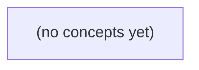

# 06.06 查询执行与优化：从历史分页到执行计划证据

*面向 Go 初学者，以同一组虚构 IM 历史消息数据为主线，建立从 SQL 语义、扫描与排序、权限连接、统计估计到 PostgreSQL 执行计划解读的完整心智模型。全书坚持纸上推演与证据验证，配套 22 道分层练习及答案，并明确 PostgreSQL 与 MongoDB explain 的口径边界。*

**章节:** 2

---

## 本书导览

- 了解整本书的章节脉络
- 掌握各章之间的概念依赖关系
- 选择最合适的阅读顺序

# 06.06 查询执行与优化：从历史分页到执行计划证据

面向 Go 初学者，以同一组虚构 IM 历史消息数据为主线，建立从 SQL 语义、扫描与排序、权限连接、统计估计到 PostgreSQL 执行计划解读的完整心智模型。全书坚持纸上推演与证据验证，配套 22 道分层练习及答案，并明确 PostgreSQL 与 MongoDB explain 的口径边界。

下方的概念图展示了本书 0 个核心概念以及它们之间的依赖关系；再下方是 1 个章节的入口。你可以按从上到下的顺序阅读，也可以根据自己的兴趣或先验知识选择切入点。

#### 概念图



## 章节索引

- **06.06 查询执行与优化：从历史分页读懂计划** — 面向Go初学者，从同一条IM历史分页查询推导计划树、扫描、排序、聚合、成员连接、选择率与EXPLAIN证据。

## 06.06 查询执行与优化：从历史分页读懂计划

- 解释逻辑SQL与物理计划树区别
- 手算索引与全扫描两条正确路径
- 区分Index Cond、Filter、Sort、Limit的工作
- 理解成员权限连接和三类连接
- 解释选择率和估计误差
- 正确解读EXPLAIN与ANALYZE/BUFFERS及测量边界

先固定一组可手算的数据与结果，再用它拆开SQL的逻辑承诺和数据库实际执行的物理路径。

### 从历史分页语义固定结果

### 从历史分页语义固定结果

先固定一张“历史消息”表：会话 `c-a` 有 `seq=1` 到 `8`，会话 `c-b` 有 `seq=1` 到 `3`；成员 `u-a` 属于 `c-a`。这里先只关注会话内的历史记录：

| 会话 | seq |
|---|---:|
| c-a | 1, 2, 3, 4, 5, 6, 7, 8 |
| c-b | 1, 2, 3 |

设查询为：

`WHERE conversation_id = 'c-a' AND seq < 7 ORDER BY seq DESC LIMIT 3`

它的逻辑语义必须按三个条件共同理解：

1. `WHERE conversation_id = 'c-a'`：只保留 `c-a` 的记录，`c-b` 的 `1,2,3` 全部无关。
2. `AND seq < 7`：在 `c-a` 内再排除 `7,8`，剩余候选集为 `1,2,3,4,5,6`。
3. `ORDER BY seq DESC LIMIT 3`：先按 `seq` 从大到小排列为 `6,5,4,3,2,1`，再取前三行。

因此结果固定为：

| seq |
|---:|
| 6 |
| 5 |
| 4 |

关键在于，`LIMIT 3` 不是“任取三条满足条件的记录”，而是对排序后的结果取前三条。若没有 `ORDER BY seq DESC`，数据库并不承诺返回的一定是 `6,5,4`；若把 `LIMIT 3` 误解为先限制再排序，也会得到错误的分页语义。

### 逻辑SQL不是执行步骤

### 逻辑 SQL 不是执行步骤

先看一个固定查询：

`WHERE collection_id = 'c-a' AND seq < 7 ORDER BY seq DESC LIMIT 3`

在虚构数据中，`c-a` 有 `seq=1..8`，成员 `u-a` 属于 `c-a`。无论数据库怎样执行，这条查询的**逻辑结果**都必须是：

`6, 5, 4`

这是 SQL 的声明式含义：先描述要满足的条件、排列规则和结果数量，而不是命令数据库按文本顺序逐步操作。

| SQL 子句 | 逻辑承诺 |
|---|---|
| `WHERE c-a AND seq < 7` | 只保留 `c-a` 中序号小于 7 的记录 |
| `ORDER BY seq DESC` | 结果按序号从大到小排列 |
| `LIMIT 3` | 最终只返回前三条，即 `6,5,4` |

容易产生的误解是把它读成固定流水线：“扫描全部记录 → 过滤 → 排序全部结果 → 取 3 条”。这只是一个可能的物理实现，不是 SQL 本身要求的步骤。

例如，没有合适索引时，计划可能确实是：扫描数据页，过滤出 `1..6`，排序得到 `6..1`，再限制为 `6,5,4`。但若存在按 `(collection_id, seq)` 组织的索引，优化器可能直接定位到 `c-a` 的范围，从 `seq=6` 反向读取三条记录后停止；此时既不必扫描 `7,8`，也未必需要显式排序节点。

因此，判断查询是否正确看逻辑语义；理解性能与计划，则要看优化器实际选择的物理路径。

### 按数据流阅读计划树

### 按数据流阅读计划树

计划树通常画成“根在上、叶在下”，但应按数据流自下而上阅读：最底层节点产生原始行，上一层节点消费这些行并输出变换后的结果，直到根节点交付最终结果。

对固定数据 `c-a` 的历史序列 `seq=1..8`，查询条件为：

`WHERE conversation_id='c-a' AND seq<7 ORDER BY seq DESC LIMIT 3`

可将物理路径拆成四步：

1. **扫描节点**  
   输入是表或索引中的候选记录；输出是读到的行。若先按会话定位，扫描结果可为 `c-a` 的 `1..8` 八行。扫描并不等于返回结果，它只负责取得数据。

2. **过滤节点**  
   输入为扫描出的八行；输出为满足 `seq<7` 的六行：`1,2,3,4,5,6`。  
   若执行器在扫描时就检查谓词，计划中可能把过滤显示为 `Filter` 附着在扫描节点上；逻辑上仍可理解为“候选行经过条件筛除”。

3. **排序节点**  
   输入为六行的无序或升序流；输出为按 `seq DESC` 排列的数据流：`6,5,4,3,2,1`。排序节点通常需要先收集全部输入，才能确定第一行。

4. **限制节点**  
   输入为已排序的六行；输出仅保留前三行：`6,5,4`。因此 `LIMIT 3` 的正确位置在排序之后；若先限制再排序，可能错误地从任意三行中选出最大值。

可以把每个节点读成函数组合：

`Limit(3)(Sort_DESC(Filter(seq<7)(Scan(c-a))))`

这描述的是一种物理数据流，而非 SQL 文本的书写顺序。优化器还可能选择更短路径：若存在按 `(conversation_id, seq DESC)` 排列的索引，扫描即可直接产生 `6,5,4,3,2,1`，过滤后读到第三个合格行便停止，排序节点甚至会消失。结果不变，计划形状可以不同。

### 全扫描路径的手算过程

### 全扫描路径的手算过程

先假设历史记录混合存放，扫描时并不知道哪些行最终会被保留：

| 会话 | `seq` |
|---|---:|
| c-a | 1 |
| c-b | 1 |
| c-a | 2 |
| c-b | 2 |
| c-a | 3 |
| c-b | 3 |
| c-a | 4 |
| c-a | 5 |
| c-a | 6 |
| c-a | 7 |
| c-a | 8 |

对应查询的条件可概括为：会话为 `c-a`，且 `seq < 7`；随后按 `seq` 降序，最后只要 3 条。

全扫描路径从表中的每一行开始：

1. **扫描**：逐行读出 11 条记录，包括 `c-a` 与 `c-b` 的混合数据。
2. **会话过滤**：保留 `c-a`，丢弃 3 条 `c-b`，得到 `c-a` 的 `seq=1..8`。
3. **范围过滤**：应用 `seq < 7`，丢弃 `seq=7,8`，剩下  
   `1,2,3,4,5,6`。
4. **降序排序**：把结果重排为  
   `6,5,4,3,2,1`。
5. **限制行数**：`LIMIT 3` 只取最前面的三行，最终返回  
   `6,5,4`。

这里“先过滤、再排序、再限制”描述的是查询的逻辑语义：返回结果必须等价于这一过程。实际执行计划则可能把某些操作合并、下推或替换；但在全扫描示例中，最直观的数据流就是：`扫描 → 过滤 → 排序 → 限制`。

### 索引路径与相同结果

### 索引路径与相同结果

对同一条查询：

`WHERE conversation_id = 'c-a' AND seq < 7 ORDER BY seq DESC LIMIT 3`

无论采用何种物理路径，逻辑结果都必须是 `6, 5, 4`。差别只在于：数据库为了找到这三个值，读取了多少数据、是否需要额外排序。

若只有按主键或无关列建立的索引，执行器可能先扫描出 `c-a` 的候选记录，再过滤 `seq < 7`，最后将符合条件的 `1..6` 排成降序，并取前三行。其概念路径是：

`扫描 → 过滤 → 排序 → 限制`

若存在复合索引 `(conversation_id, seq)`，索引已经先按会话分组、再按序号排列。执行器可直接定位到 `c-a` 的索引范围，并从 `seq=6` 向较小序号反向读取；读到 `6、5、4` 三条后即可停止。此时概念上仍满足排序与限制语义，但物理上可能不出现显式“排序”节点：

`索引范围扫描（反向） → 限制`

更进一步，若查询所需列都包含在索引中，数据库还可能只读取索引条目；若还要读取未被索引覆盖的正文等列，则通常需根据索引定位结果回表取数据。

不过，不能仅凭 SQL 和索引定义断言某次执行“一定走索引”或“一定不排序”。优化器还会考虑统计信息、数据分布、索引选择性、表大小、缓存状态与数据库版本。未实际运行并查看计划时，只能说明某索引**可能**提供更短的读取路径，而不能把可能性当作既定执行事实。

> **要点** — SQL规定结果集合；计划树描述实际取数路径。两条路径都应手算到6、5、4。

同一页历史消息可以走索引或全表扫描；结果相同，但候选行、排序成本、回表与权限检查都不同。

### 从逻辑查询到两棵物理计划树

### 从逻辑查询到两棵物理计划树

设历史消息查询的语义是：在会话 `c-a` 中找出 `seq<7` 的消息，按 `seq` 倒序取 3 条。

`WHERE conversation_id='c-a' AND seq<7 ORDER BY seq DESC LIMIT 3`

逻辑结果应为 `6,5,4`。但 SQL 只声明“要什么”，并不规定“怎么找”；执行器可以构造不同的物理计划树。

- **方案 A：有序索引路径**

  若存在 `(conversation_id, seq)` 索引，执行器可先定位 `conversation_id='c-a'` 的索引区间，再从 `seq=7` 前逆序扫描：

  `Limit 3 ← Index Scan (conversation_id='c-a', seq<7, Backward)`

  索引天然同时满足过滤条件与倒序要求。找到 `6,5,4` 后即可停止，不必枚举更早消息，也通常不需要显式排序。其候选行接近 3 条；但若索引未覆盖所需列，仍可能按索引条目回表读取数据页，并逐行完成可见性与权限相关检查。

- **方案 B：全扫描路径**

  执行器也可能顺序读取表中全部 11 行：

  `Limit 3 ← Sort(seq DESC) ← Filter(c-a 且 seq<7) ← Seq Scan`

  `Seq Scan` 先检查 11 行，过滤后留下 `6,5,4,3,2,1` 共 6 行；随后排序，再由 `Limit` 截取前三行。结果仍是 `6,5,4`，但扫描、过滤和排序的工作量明显不同。

因此，纸上推导只能说明两棵树都**语义正确**，不能断言 PostgreSQL 实际一定选索引，也不能据此判断真实 I/O。统计信息、数据分布、页缓存、索引覆盖情况及权限条件，都会影响最终计划。

### 方案A：有序索引定位并逆序取页

### 方案A：有序索引定位并逆序取页

设查询条件为：

`conversation_id = 'c-a' AND seq < 7 ORDER BY seq DESC LIMIT 3`

复合索引 `(conversation_id, seq)` 先按会话分组，再在每个会话内部按 `seq` 升序排列。对 `c-a` 而言，索引中的逻辑片段可视为：

`(c-a,1) → (c-a,2) → ... → (c-a,6) → (c-a,7) → ...`

执行器可先在索引中定位到键值边界 `(c-a,7)`，由于条件是严格小于 `< 7`，实际起点落在 `(c-a,6)`。随后不必扫描整个 `c-a` 区间，而是沿索引叶子页反向遍历：

1. 读取 `(c-a,6)`，作为第 1 条结果；
2. 向前读取 `(c-a,5)`，作为第 2 条结果；
3. 向前读取 `(c-a,4)`，作为第 3 条结果；
4. `Limit 3` 已满足，立即停止。

因此，索引天然提供了 `seq DESC` 所需的顺序，不需要额外排序；`LIMIT` 也能下推为早停条件。逻辑上，它只需考察足以产出三行的索引条目，而非所有满足 `seq < 7` 的历史消息。

但“走索引”不等于只读三次数据。若查询列不被索引覆盖，执行器还要依据索引中的行定位信息回表读取消息内容；每个候选元组仍可能经历可见性判断与权限检查。只有在覆盖索引、可见性映射等条件合适时，才可能接近纯索引读取。纸面上的高效访问路径，还需由 PostgreSQL 实际计划与 I/O 数据验证。

### 方案B：全扫描、过滤、排序与截断

### 方案B：全扫描、过滤、排序与截断

设消息表共有 11 行，目标会话为 `c-a`，查询条件为：

`conversation_id = 'c-a' AND seq < 7 ORDER BY seq DESC LIMIT 3`

若没有可用的 `(conversation_id, seq)` 有序索引，执行器可采用顺序扫描（`Seq Scan`）。它不会先定位 `c-a` 的局部范围，而是按表的物理存放顺序逐行读取：

1. **扫描阶段**：读取全部 11 行。即使其中多数属于其他会话，或 `seq >= 7`，也已经产生了读取与条件判断工作。
2. **过滤阶段**：对每一行检查会话标识和序号条件，最终留下 `c-a` 中 `seq=1,2,3,4,5,6` 的 6 行候选。
3. **排序阶段**：这 6 行尚未保证输出顺序，需按 `seq DESC` 排列为  
   `6, 5, 4, 3, 2, 1`。  
   排序成本取决于候选集大小；数据更多时，通常会使用内存排序，内存不足还可能写入临时文件。
4. **截断阶段**：`Limit 3` 在排序结果形成后保留前三项，因此返回  
   `6, 5, 4`。

可将该过程概括为：

`11 行扫描 → 6 行过滤后候选 → 6 行排序 → 3 行输出`

这里的 `LIMIT` 只减少最终返回给客户端的行数，不能让前面的全表扫描自动变成只读 3 行；并且若必须先得到正确的降序结果，执行器仍需处理全部 6 个候选。最终答案与索引方案相同，但候选集、排序和读取工作量明显不同。

### 同答案不等于同成本：候选、回表与权限

### 同答案不等于同成本：候选、回表与权限

设目标是读取会话 `c-a` 中 `seq < 7` 的最近 3 条消息，结果均为 `6, 5, 4`。答案相同，不代表数据库付出的工作相同。

- **方案 A：复合有序索引**  
  利用 `(conversation_id, seq)` 索引先定位 `conversation_id = 'c-a'`，再在索引中按 `seq` 逆序寻找小于 `7` 的记录。扫描到 `6、5、4` 后，`Limit 3` 已满足，可立即停止。  
  读取范围接近“命中的 3 行”，通常不需要额外排序；索引顺序天然满足 `ORDER BY seq DESC`。

- **方案 B：顺序扫描**  
  扫描表中全部 11 行，过滤出 `c-a` 且 `seq < 7` 的 6 行，即 `1` 到 `6`；随后还要排序为 `6、5、4、3、2、1`，最后才截取 3 行。  
  `Limit` 无法让前面的全表读取和排序提前结束，因为执行器在排序前不知道哪 3 行最大。

索引路径也并非“只读 3 行”。若查询列不完全包含在索引中，数据库仍需根据索引条目回表读取消息正文、发送者等字段；这会带来额外的堆表访问。若还需验证当前用户是否属于该会话，计划可能增加成员表连接或权限过滤：即使消息索引已快速找到候选记录，也仍要检查这些记录对当前用户是否可见。

因此，纸面上“索引定位、逆序、`Limit`”说明了理想的候选缩减与提前停止能力；实际 PostgreSQL 是否采用该路径，以及真实 I/O 是否更低，仍应以实际执行计划和运行统计为准。

### 用EXPLAIN验证，而非用纸上推演定论

### 用 EXPLAIN 验证，而非用纸上推演定论

纸上推演适合理解语义，但不能替代 PostgreSQL 的实际计划。对查询：

`WHERE conversation_id = 'c-a' AND seq < 7 ORDER BY seq DESC LIMIT 3`

方案 A 可能使用 `(conversation_id, seq)` 索引：先定位 `c-a`，再从 `seq=6` 向前读取 3 条。方案 B 则可能是 `Seq Scan → Filter → Sort → Limit`。两者返回的都是 `6,5,4`，但优化器会根据统计信息、表大小、缓存状态、索引覆盖情况和代价模型选择不同路径。

建议按以下顺序检查：

1. 先执行 `EXPLAIN`，看计划形状：是否出现 `Index Scan`、`Index Only Scan`、`Seq Scan`、`Sort`、`Limit`。
2. 对比节点的 `rows` 估计值。例如扫描节点估计只命中 3 行，却实际过滤出大量行，说明统计信息或数据分布判断可能不准。
3. 再执行 `EXPLAIN (ANALYZE, BUFFERS)`，以实际证据验证：
   - `actual rows`：每个节点真正输出多少行；
   - `loops`：节点是否被重复执行；
   - `Buffers: shared hit/read`：数据来自缓存还是发生磁盘读取；
   - `Heap Fetches`：即使走了 `Index Only Scan`，也可能因可见性检查回表访问堆表。

不要仅因索引“有序”就断言一定无排序、无回表、I/O 更少。权限检查、行可见性、多版本数据、缓存冷热和统计信息误差，都会改变实际成本。`EXPLAIN` 说明优化器的预测，`ANALYZE` 与 `BUFFERS` 才说明这次执行真正做了什么。

> **要点** — 索引与全扫描可返回同一分页结果；应以候选行、排序、回表、权限连接和EXPLAIN实测共同判断成本。

同一条历史分页查询，可能走全表扫描、索引扫描或位图扫描。读懂这些路径，关键是区分访问方式、过滤位置与真实I/O。

### 从计划节点识别四种访问路径

### 从计划节点识别四种访问路径

执行计划中的扫描节点回答的是：**数据库先从哪里拿到候选行，再如何筛掉不需要的行**。同一谓词、同一分页语句，统计信息、选择性、索引结构与缓存状态不同，都可能选择不同路径。

- `Seq Scan`：顺序扫描表（堆）中的数据页，逐行检查条件。它不一定“差”：当需要返回的行占比很高、表很小，或索引随机访问成本更高时，连续读取往往更便宜。计划常显示 `Filter`，表示读到堆行后才判断条件。

- `Index Scan`：先沿 B-tree 索引定位满足 `Index Cond` 的索引项，再按其中的行定位标识到堆表取完整行并检查可见性。适合选择性较高、命中行较少的条件，也常能按索引顺序输出，避免额外排序。若条件无法完全由索引定位，剩余条件会显示为 `Filter`。

- `Index Only Scan`：理论上只读取索引页即可返回结果，前提是查询列均被该索引键列或 `INCLUDE` 列覆盖。但 PostgreSQL 仍需确认行对当前事务可见；若对应堆页未在可见性映射中标记为“全可见”，仍会发生 `Heap Fetches`。因此“覆盖索引”不等于“零堆访问”。

- `Bitmap Index Scan` + `Bitmap Heap Scan`：前者从一个或多个索引收集行定位标识，构造位图；后者按数据页批量访问堆表并取行。多个索引可通过 `BitmapAnd`、`BitmapOr` 合并。它适合命中行较多但仍远少于全表的场景：比逐条索引回表更能减少随机 I/O，但通常不能保持索引顺序，且需先构建位图。

阅读时先确认节点类型，再看候选行由 `Index Cond`、位图还是全表产生；不要仅因出现索引就断定查询高效。

### Seq Scan：全扫描并不等于错误

### Seq Scan：全扫描并不等于错误

`Seq Scan`（顺序扫描）从表的堆页面开始，按物理存储顺序读取数据页，再逐行检查查询条件；不满足条件的行会在执行节点的 `Filter` 中被丢弃。例如：

`Filter: (created_at < '2024-01-01')`

这表示扫描已经读到了这些行，只是随后才判断其是否保留。`EXPLAIN ANALYZE` 中的 `Rows Removed by Filter` 很高，通常说明过滤发生在扫描之后；但这本身并不自动意味着计划错误。

顺序扫描常在以下场景更划算：

- **表很小**：即使读取整张表，所需页面也很少；建立索引访问路径、反复访问堆页的额外开销反而不值得。
- **选择率低**：条件会返回表中很大比例的行，例如查询近乎全部历史记录。索引先找大量条目，再随机回表取行，可能比连续读表更慢。
- **数据具有较好的物理局部性**：顺序读取可利用预读、缓存和连续 I/O；相比之下，普通 `Index Scan` 可能按索引顺序跳转到分散的堆页面。
- **统计信息表明索引收益有限**：优化器估计命中行数较多时，会倾向比较总页读取成本，而非只看“是否有索引”。

对历史分页查询也要谨慎判断：`LIMIT` 位于上层时，顺序扫描可能在找到足够多的满足条件的行后提前停止，因此不一定真的读完整表；但若过滤条件稀疏，或还需要先完成排序，扫描范围仍可能很大。

因此，看到 `Seq Scan` 时，应先问：表有多大、条件预计返回多少行、实际读了多少 `buffers`、是否存在排序或过滤导致的大量无效读取。只有当高选择性条件本应通过索引快速定位、却仍扫描了大量页面时，顺序扫描才更值得怀疑。

### Index Cond、Filter与Recheck的边界

### Index Cond、Filter与Recheck的边界

以历史消息分页为例：

`WHERE conversation_id = $1 AND created_at < $2 AND is_deleted = false ORDER BY created_at DESC LIMIT 50`

三类条件在计划中的位置不同，决定了“少读索引”还是“少读堆表”。

- `Index Cond`：用于在索引中**定位连续范围**。若存在索引  
  `(... conversation_id, created_at DESC)`，则  
  `conversation_id = $1 AND created_at < $2`  
  可成为 `Index Cond`。执行器从对应索引叶页开始向后读取，只枚举可能属于目标页的条目；这通常是键集分页高效的根源。

- `Filter`：已经找到候选行后，再在当前扫描节点过滤。若 `is_deleted` 不在索引键或可用的包含列中，计划可能显示  
  `Filter: (NOT is_deleted)`。  
  这意味着候选元组仍可能需要访问堆表，随后才被丢弃。若大量历史消息已删除，`Rows Removed by Filter` 很高，说明索引定位虽准确，堆表过滤却在放大成本。可考虑部分索引：  
  `WHERE is_deleted = false`。

- `Recheck Cond`：位图扫描特有的“再次确认”。`Bitmap Index Scan` 先把命中的行位置汇成位图，`Bitmap Heap Scan` 再按堆页批量读取。当位图因内存不足变为有损位图时，它只知道“这一页可能命中”，于是必须对页内元组重检条件，计划中会出现 `Recheck Cond`。即使条件本身来自索引，也可能重新计算。

因此，三者不是同义的筛选：`Index Cond` 减少索引枚举范围，`Filter` 消耗候选行后的判断与可能的堆访问，`Recheck Cond` 则是位图定位精度不足或位图语义要求下的堆表确认。看计划时，应同时关注 `Rows Removed by Filter`、`Rows Removed by Index Recheck` 与实际 `Buffers`，而非只看是否“用了索引”。

### 覆盖索引为何仍会访问堆表

### 覆盖索引为何仍会访问堆表

`Index Only Scan` 的“Only”并不表示绝不读取堆表，而是表示**查询所需列都能从索引条目取得**。例如索引为：

`(tenant_id, created_at DESC, id) INCLUDE (status)`

查询只读取这些列，并以 `tenant_id`、`created_at` 过滤或排序时，索引在列覆盖意义上已经足够，无须为了取列值而回表。

但 PostgreSQL 还必须确认该索引条目对应的行对当前事务可见。MVCC 的行版本可见性主要记录在堆表元组中；索引通常不能独立证明某条记录是否已删除、是否被未提交事务修改。因此，只有当该行所在的**堆页**在可见性映射中被标记为“全可见”时，执行器才可直接信任索引条目：

- 堆页已全可见：直接返回索引中的列，通常不访问堆表。
- 堆页未全可见：仍需读取对应堆页并检查元组可见性，计划中的 `Heap Fetches` 会增加。

所以，`Heap Fetches: 0` 才说明本次执行真正避免了堆表可见性检查；有覆盖索引但 `Heap Fetches` 很高，常见于频繁更新、删除，或尚未被 `VACUUM` 处理的表。更新会清除相关堆页的全可见标记，使索引仅扫描退化为“索引定位 + 回表确认”。

还要避免把索引叶页数直接理解为设备 I/O 次数。计划中的 `buffers` 统计的是 PostgreSQL 缓冲区页访问，例如 `shared hit` 表示已在内存中命中，`shared read` 才表示需要从操作系统读取；而操作系统页缓存、预读、底层存储缓存又会进一步改变真实设备读写。索引很大、叶页很多，不必然意味着本次查询发生同样多的物理磁盘 I/O。

### LIMIT、排序与位图扫描的提前停止

### LIMIT、排序与位图扫描的提前停止

`LIMIT n` 不是“先查完再截取”，而是执行器向子节点只索取最多 `n` 行。若计划是按目标顺序的 `Index Scan`：

```sql
... WHERE tenant_id = 1
ORDER BY created_at DESC
LIMIT 20;
```

索引能同时满足过滤与排序时，扫描器找到 20 条合格记录即可停止；后续索引叶页、堆页通常无需访问。这也是首屏分页常偏好有序复合索引的原因。

但提前停止取决于上游节点能否尽早产出行：

- `Seq Scan -> Limit`：扫描到第 20 条满足 `Filter` 的行可以停，但若条件选择性低，可能已读过很多页。
- `Index Scan -> Limit`：通常最利于早停；不过有 `OFFSET 10000 LIMIT 20` 时，仍须先产生并丢弃约 10000 行。
- `Sort -> Limit`：普通排序必须先读完全部输入，才能确认最前面的行；即使显示为“前 N 排序”，也通常仍要扫描全部候选行，只是排序状态最多保留 `OFFSET + LIMIT` 条。
- `Bitmap Index Scan -> Bitmap Heap Scan -> Limit`：位图索引扫描通常要先收集**全部**命中位置并构建位图，首行返回前已有预处理成本。随后 `Bitmap Heap Scan` 虽可能因 `LIMIT` 停止取堆页，但位图构建成本已经发生。

因此，看到 `LIMIT 20` 不应直接推断“只做了 20 次工作”。应检查 `LIMIT` 下方是否有 `Sort`、`Bitmap`，以及是否存在较大的 `OFFSET`；这些节点往往决定历史深分页为何仍然缓慢。

> **要点** — 扫描节点描述取数路径；条件位置决定过滤成本；LIMIT能早停但无法跳过排序、位图与可见性检查。

历史分页的性能不仅取决于取多少行，更取决于数据库为找到、排序和跳过这些行付出了多少代价。

### ORDER BY决定可依赖的分页顺序

### ORDER BY决定可依赖的分页顺序

分页首先要回答“第几页”依据什么排列。若查询未显式写出 `ORDER BY`，数据库可以按堆表物理布局、索引扫描路径、并行任务合并顺序或优化器选择的任意计划返回行；同一条语句今天看似稳定，经历 `VACUUM`、索引重建、统计信息变化或并发写入后，顺序都可能改变。因此：

- `LIMIT 20 OFFSET 40` 不等于“固定的第 3 页”；
- 两次请求可能出现重复记录或漏记录；
- 不能把插入顺序、主键顺序或当前偶然观察到的返回顺序当作契约。

稳定分页必须把顺序声明为业务规则，例如按历史事件时间倒序：

```sql
ORDER BY created_at DESC, id DESC
```

其中 `created_at` 表示主要排序含义，`id` 是确定性并列键。只写 `ORDER BY created_at DESC` 仍可能不稳定：多个事件具有相同时间戳时，它们之间的先后未定义，跨页边界尤其容易重排。排序键应最终形成全序，即任意两行都能比较出唯一先后。

游标分页也应携带完整排序键，而非只携带时间：

```sql
WHERE (created_at, id) < (:last_created_at, :last_id)
ORDER BY created_at DESC, id DESC
LIMIT 20
```

相应的复合索引通常应匹配筛选条件与排序方向，例如 `(conversation_id, created_at DESC, id DESC)`。这样数据库可按索引顺序逐行取出 Top-N，避免先读取大量候选行再整体排序。需要注意的是，`ORDER BY` 只保证一次查询结果内部有序；若分页期间数据发生新增、删除或更新时间，跨请求的“历史边界”仍需由游标、快照或明确的时间截点进一步定义。

### 索引顺序与Top-N排序路径

### 索引顺序与 Top-N 排序路径

设消息表包含 `(conversation_id, seq, sender_id, body, created_at)`，某会话 `c-a` 的消息序号为 `1..8`。要读取最新 3 条消息，查询应显式写出：

`WHERE conversation_id = 'c-a' ORDER BY seq DESC LIMIT 3`

若存在复合 B-tree 索引 `(conversation_id, seq DESC)`，执行器先定位 `conversation_id='c-a'` 的索引范围，再按索引叶子节点的既有顺序读取 `8,7,6`，满足 `LIMIT 3` 后立即停止。计划通常表现为索引扫描；若查询列都在覆盖索引中，还可避免回表。这条路径的关键不是“结果恰好有序”，而是索引顺序与 `ORDER BY` 完全兼容。

若只有 `(conversation_id)` 索引，数据库能快速找出会话 `c-a` 的全部 8 行，却不能保证它们按 `seq DESC` 排列。执行路径变为“扫描候选行 → Top-N 排序 → 输出前 3 行”。Top-N 排序通常维护一个容量约为 `LIMIT` 的堆，相比对全部候选行完全排序更省内存；但候选行很多、排序键宽或内存不足时，仍可能写入临时文件。

索引顺序仅部分匹配时，可采用增量排序：例如索引为 `(conversation_id, created_at)`，已按会话分组有序，但组内仍需按 `seq` 排序。它避免全局排序，却仍需处理每个已有序分组。

分页加入 `OFFSET 1000 LIMIT 20` 后，即使走有序索引，也必须顺序读取并丢弃前 1000 个候选，再返回 20 个；Top-N 的目标容量也近似变为 `1020`。因此深页更适合使用游标条件，如 `seq < :last_seq`，使索引能直接从边界继续扫描。未写 `ORDER BY` 时，任何扫描顺序都不构成分页契约。

### 全量排序、Top-N与增量排序

### 全量排序、Top-N 与增量排序

面对 `ORDER BY created_at DESC LIMIT 20`，三种排序策略的核心差异在于：数据库是否必须看完全部候选行、是否需要保存全部排序结果，以及输入是否已经具备部分顺序。

| 策略 | 输入与处理方式 | 内存行为 | 适用前提 |
|---|---|---|---|
| 全量排序（`Sort`） | 读取全部候选行后统一排序，再输出所需部分 | 候选集较大时可能超过 `work_mem`，写入临时文件做外部归并排序 | 没有可利用的输入顺序，或查询需要完整有序结果 |
| Top-N 堆排序 | 扫描全部候选行，但只维护当前最优的 $N$ 行 | 通常约为 $O(N)$；`LIMIT 20` 不等于只扫描 20 行 | 有明确 `LIMIT`，且无需保留完整排序结果 |
| 增量排序（`Incremental Sort`） | 输入已按排序键前缀有序；按每个前缀分组，仅排序后续键 | 每次只为一个前缀组分配排序空间，峰值可能远小于全量排序 | 索引或上游节点提供 `ORDER BY` 的左侧前缀顺序 |

例如要求：

`ORDER BY conversation_id, created_at DESC`

若索引扫描已经输出按 `conversation_id` 排列的行，增量排序只需在每个会话内部按 `created_at DESC` 排序；它不必把所有会话的行同时放入排序器。反之，若输入顺序完全无关，仍需普通 `Sort` 或 Top-N 堆排序。

Top-N 的常见误解是“有 `LIMIT` 就很便宜”。它减少的是**排序保存量**，不是必然减少**候选扫描量**：若过滤条件命中百万行且没有匹配排序顺序的索引，数据库仍要检查百万行，才能确认哪 20 行最大。若存在 `(created_at DESC)` 或 `(tenant_id, created_at DESC)` 这类匹配索引，则索引扫描可按目标顺序直接产出前几行，甚至无需显式排序。

### 未读数聚合的执行代价

### 未读数聚合的执行代价

设会话 `c-a` 的消息序号为 `1` 至 `8`，用户已读水位为 `read_seq=4`。未读条件是：

$$
seq > read\_seq
$$

因此满足条件的消息为 `5,6,7,8`，过滤后共有 `4` 行：

```sql
SELECT COUNT(*)
FROM messages
WHERE conversation_id = 'c-a'
  AND seq > 4;
```

这里的 `COUNT(*)` 并不需要保留每条消息内容；执行器先通过索引或扫描找到候选行，再应用 `seq > 4` 过滤，最后维护一个计数器。若索引形如 `(conversation_id, seq)`，数据库可直接定位到 `c-a` 下 `seq=4` 之后的范围，避免扫描该会话更早的消息。

当查询需要“按会话统计未读数”时，例如：

```sql
SELECT conversation_id, COUNT(*)
FROM messages
WHERE seq > read_seq
GROUP BY conversation_id;
```

常见有两类聚合策略：

- **HashAggregate**：以 `conversation_id` 为键建立哈希表；每读到一条未读消息，就找到对应桶并将计数加一。它适合输入无序、分组较多但哈希表仍能装入内存的场景。
- **GroupAggregate**：先让输入按 `conversation_id` 排序，或直接利用已有索引顺序；相同会话的行连续出现，执行器只需顺序累计，键变化时输出上一组结果。

HashAggregate 的风险是分组键过多时哈希表膨胀，可能分批处理或写入临时文件；GroupAggregate 则可能先付出排序代价。若已有 `(conversation_id, seq)` 等能提供分组顺序的索引，GroupAggregate 往往可省去额外排序。因而，“未读数只是一个 `COUNT`”不代表恒定成本：真正决定代价的是过滤范围、分组数量、可用索引顺序，以及内存是否足以容纳中间状态。

### 深OFFSET、游标与测量证据

### 深 OFFSET、游标与测量证据

`OFFSET` 并不是“直接跳到第 100001 行”。对于

`ORDER BY created_at DESC OFFSET 100000 LIMIT 20`

执行器通常仍需先找出并维持前 `100020` 个符合条件的候选，再丢弃前 `100000` 个。若排序键没有匹配索引，候选集可能需要完整排序；即使有索引，也要沿索引扫描并读取、过滤大量已跳过的行。因此页码越深，扫描行数、缓冲区访问和响应时间通常越大。

游标分页将“页码”改为边界条件，例如：

`WHERE (created_at, id) < (:last_created_at, :last_id) ORDER BY created_at DESC, id DESC LIMIT 20`

配合 `(created_at DESC, id DESC)` 索引，数据库可从上一页末尾继续扫描，只处理下一小段记录。它通常更稳定、延迟更可预测；但必须使用唯一且确定的排序键。并发插入、删除或更新时，还要明确语义：是允许新记录出现在后续页，还是通过快照、版本号固定本次浏览范围。

不要凭直觉判断优化效果，应比较不同页深度的：

`EXPLAIN (ANALYZE, BUFFERS)`

重点观察：

- `actual rows`：深 `OFFSET` 是否使节点产出远多于最终返回的 20 行；
- `Sort`：排序方法、内存占用，以及是否出现 `Disk`，后者意味着排序溢写临时文件；
- `HashAggregate` 或 `GroupAggregate`：分组统计是否扫描、哈希或排序了大量行；
- `Buffers`：`shared hit/read` 增长说明缓存访问或实际磁盘读取在扩大；
- `temp read/write`：临时文件读写表明排序、哈希聚合的工作集超过可用内存。

测量应覆盖首页、中间页和深页；只测第一页，往往看不见历史分页真正的成本。

> **要点** — 排序、聚合和跳过的候选行规模共同决定分页成本；索引顺序与游标设计是稳定优化的关键。

历史分页查询先要保证“看得到”，再讨论“取得快”：会员权限连接决定可见消息集合，连接算法只是实现这一步的不同物理机制。

### 从权限谓词建立逻辑结果

### 从权限谓词建立逻辑结果

历史分页的逻辑起点不是“取最近几条消息”，而是先证明这些消息对当前用户可见。设当前用户为 `u-a`、会话为 `c-a`，成员表 `memberships` 中存在且仅存在一条有效记录：

`(user_id = u-a, conversation_id = c-a, status = active)`

消息表中属于 `c-a` 的消息有 6 条候选。可将权限条件写成连接谓词：

$$
m.conversation\_id = ms.conversation\_id
\land ms.user\_id = u\text{-}a
\land ms.status = active
$$

其中 `m` 是消息，`ms` 是会员记录。先由该谓词建立逻辑结果：唯一有效会员记录与 `c-a` 的 6 条消息匹配，因此得到 6 条“既属于该会话、又允许 `u-a` 阅读”的消息。只有在这个结果集上，才可继续按消息时间或 `id` 排序、使用游标条件截取页面，并应用 `LIMIT`。

纸上执行时，Nested Loop 可以把 1 条有效会员作为外侧输入，再扫描或索引取得内侧 6 条消息候选：$1\times6$ 次匹配检查。Hash Join 则先将会员行建成哈希表，再用消息行按会话键探测；Merge Join 则让双方按连接键有序后归并。这些都是实现同一权限连接的物理机制，并不改变“先确认可见、再分页”的逻辑。

注意不要把普通 `Filter` 与外连接中的 `Join Filter` 混为一谈：`WHERE` 条件可能在外连接后剔除空扩展行，而连接条件决定匹配如何发生。本例权限要求的是有效会员必须匹配；索引即使能更快定位消息，也不能替代或跳过该权限谓词。

### Nested Loop：一名成员核验六条消息

### Nested Loop：一名成员核验六条消息

设历史分页先按权限确认成员关系，再读取会话消息。对于用户 `u-a`、会话 `c-a`，`memberships` 中存在且仅存在一条满足条件的记录：

`(user_id = 'u-a', conversation_id = 'c-a', status = 'active')`

因此，Nested Loop 可以把这条会员记录作为外侧输入。纸上估算为：

- 外侧会员行数：$N_{\text{outer}}=1$
- 内侧同会话消息候选：$N_{\text{inner}}=6$
- 配对检查次数：$1\times6=6$

执行过程可理解为：

1. 先取得这 1 条有效会员记录，证明 `u-a` 有权访问 `c-a`。
2. 以其中的 `conversation_id='c-a'` 驱动内侧消息访问。
3. 内侧返回该会话的 6 条消息候选。
4. 对每条候选消息确认其 `conversation_id` 与外侧会员记录对应；由于外侧已限定为 `c-a`，这 6 条均属于可见会话。
5. 再由历史游标、时间排序、`LIMIT` 等步骤决定哪些消息进入当前页。

可将其抽象为：

`for 每条有效会员记录: 扫描该会话的消息候选`

这里循环次数小，是因为外侧只有 1 行，而不是因为权限检查可以省略。即使消息表存在按 `(conversation_id, created_at)` 组织的快速访问路径，执行仍必须以有效会员关系为前提；索引只能减少“找 6 条候选”的成本，不能替代“是否有权读取”的连接语义。

还应区分普通过滤与连接过滤：若先通过内连接取得有效会员，再连接消息，权限条件决定哪些消息行能存在于结果中；不能把它误解为结果生成后可随意丢弃的普通 `Filter`。尤其在外连接场景，条件放在连接条件还是结果过滤条件会影响保留空匹配行的语义；本例讨论的是权限成立后的一对六 Nested Loop 推导。

### Hash Join与Merge Join的机制差异

### Hash Join 与 Merge Join 的机制差异

两者都在实现同一个逻辑条件：消息属于用户 `u-a` 在会话 `c-a` 中状态为 `active` 的会员记录。它们改变的是“如何找到匹配行”，而不是权限规则本身。

- **Hash Join：建表，再探测。**  
  可以先读取满足权限条件的 `memberships` 行，将连接键（例如 `conversation_id=c-a`）放入哈希表。这里会员侧只有 1 条有效记录，因此哈希表中有 1 个可匹配键。随后扫描消息侧的 6 个候选消息，对每条消息的 `conversation_id` 计算哈希并探测；命中才保留。  
  其核心是“等值键快速查找”，连接键通常需要可用于等值比较。建表侧较小会更节省内存，但这只是机制上的一般考虑，不能据此断言实际执行一定选择 Hash Join。

- **Merge Join：排序，再归并。**  
  将会员记录与消息记录都按连接键排序；若输入本来已经按该键有序，则可直接利用该顺序。归并时像合并两个有序列表一样比较当前键：键较小的一侧向前移动，键相等时输出匹配。对于这里的案例，会员侧的 `c-a` 会与消息侧同为 `c-a` 的记录连续匹配，从而在 6 条消息候选中保留有权限的消息。  
  它适合按键顺序推进的连接过程，但排序成本、已有顺序和数据分布都会影响实际代价。

无论采用哪种算法，`active` 会员条件都是权限连接的一部分，不能因为消息索引访问更快而跳过。还要区分普通 `Filter` 与连接条件：对外连接而言，连接条件放置位置会影响未匹配行是否保留；不能把“连接时判定是否匹配”简单等同于“连接后再过滤”。

### 连接条件、过滤条件与外连接边界

### 连接条件、过滤条件与外连接边界

先把逻辑拆开：`ON` 中的条件决定“两张表哪些行可以配对”，`WHERE` 中的条件决定“配对或保留后的结果哪些还能输出”。执行计划里的 `Join Filter` 则是某种连接算法执行期间使用的额外判定，不能仅凭名字把它等同于普通 `WHERE` 过滤。

以权限为例，会员表中只有 `(u-a, c-a, active)` 通过；消息表中 `c-a` 有 6 条候选消息。可写为：

`memberships.user_id = 'u-a' AND memberships.status = 'active'`  
`messages.channel_id = memberships.channel_id`

这里会员状态是权限筛选，频道键相等是连接条件。纸上 `Nested Loop` 可理解为：外侧先得到 1 条有效会员记录，再以内侧按 `c-a` 查找 6 条消息候选，最终每条消息都必须经过该会员关系的约束；索引再快，也不能跳过这一步权限语义。

对内连接而言，某些条件从 `ON` 挪到 `WHERE` 往往结果相同；但外连接不是这样。设要保留所有频道，即使没有消息：

`channels LEFT JOIN messages ON messages.channel_id = channels.id AND messages.deleted_at IS NULL`

此处 `messages.deleted_at IS NULL` 放在 `ON`，表示“只匹配未删除消息；没有匹配时频道仍保留，消息列补 `NULL`”。若错误移到：

`... LEFT JOIN messages ON messages.channel_id = channels.id WHERE messages.deleted_at IS NULL`

含义已变化：它会在连接后过滤行，并可能让原本应保留的外侧行消失，或混入“无消息”与“消息字段为 NULL”的边界情况。

`Join Filter` 可能出现在哈希连接的探测阶段、嵌套循环的候选配对阶段，或归并连接的键组比较阶段；它描述物理执行中的再次判定。无论采用 `Nested Loop`、`Hash Join` 还是 `Merge Join`，都必须保持上述连接与外连接保留行语义。

### 用EXPLAIN核对权限与候选行

### 用 EXPLAIN 核对权限与候选行

对历史分页查询执行 `EXPLAIN ANALYZE` 时，不要只看是否用了索引；应把计划逐项映射回纸上模型：

- `memberships` 扫描或索引查找：以 `(user_id='u-a', conversation_id='c-a', status='active')` 为条件，应得到 **1 条通过权限的会员记录**。计划中的 `实际行数` 接近 1，说明“谁能看”这一步与预期一致。
- `messages` 扫描：同一 `conversation_id='c-a'` 下，分页边界、删除状态等条件应用前后，需要明确候选集为何是 **6 条消息**。索引扫描显示的行数可能是读取行数，过滤后的行数则是剩余候选行，二者不可混为一谈。
- 连接节点：`Nested Loop` 可理解为“外侧会员 1 条 × 内侧消息候选 6 条”，再依据会话键确认匹配；结果仍应是该用户有权查看的消息集合。

若计划采用 `Hash Join`，可将其理解为先把符合权限的会员记录建成哈希表，再用消息的会话键探测；`Merge Join` 则要求两侧按连接键有序，再进行归并匹配。它们都是完成权限连接的物理机制，不表示某一种必然更优。

尤其要区分过滤位置：普通 `Filter` 是对某个节点输出行的筛选；`Join Filter` 是连接过程中判断两侧组合是否成立。对外连接而言，把右表条件错误地下推到 `WHERE`，可能会消灭本应保留的左表行，语义不同于写在连接条件中。

```sql
EXPLAIN ANALYZE
SELECT m.*
FROM memberships mb
JOIN messages m ON m.conversation_id = mb.conversation_id
WHERE mb.user_id = 'u-a'
  AND mb.conversation_id = 'c-a'
  AND mb.status = 'active';
```

索引只能让“找到会员”和“找到消息”更快，不能替代会员权限连接；即使消息索引直接命中 6 条候选，也必须确认存在那 1 条有效会员记录。

> **要点** — 权限连接定义可见性，连接算法只改变执行路径；读计划应逐层核对候选行、条件位置与实际结果。

选择率决定规划器如何估计每一步能留下多少行，是理解扫描、连接顺序与估计误差的关键。

### 选择率：谓词留下行数的比例

### 选择率：谓词留下行数的比例

选择率（selectivity）描述一个谓词“筛掉多少行”：

$$
\text{选择率}=\frac{\text{满足条件的输出行数}}{\text{进入该节点的输入行数}}
$$

它始终相对于**当前节点的输入**而言，而不是相对于整张表。选择率越低，条件越“挑剔”；越接近 $1$，留下的行越多。

以历史消息查询的纸上数据为例：索引或扫描阶段读到 11 行候选消息，其中时间条件 `c-a` 通过 8 行，则：

$$
\operatorname{sel}(c-a)=\frac{8}{11}\approx72.7\%
$$

再应用另一个条件后，最终只有 6 行通过：

$$
\operatorname{sel}(\text{后续条件})=\frac{6}{8}=75\%
$$

若只关心“从这 11 行候选中最终留下多少”，则整体选择率是：

$$
\frac{6}{11}\approx54.5\%
$$

`EXPLAIN` 中的 `rows` 正是规划器根据这类选择率推导出的节点输出行数估计。例如输入估计为 11 行、选择率估计为 $6/11$，输出便约为 6 行。

不要机械地把多个条件的选择率相乘。只有条件近似独立时，才可用：

$$
\operatorname{sel}(A\land B)\approx\operatorname{sel}(A)\times\operatorname{sel}(B)
$$

但 `c-a` 与 `seq` 往往相关：较新的消息可能拥有更大的序号。把它们当成独立条件，可能严重低估或高估结果行数，进而让规划器选错扫描方式或连接顺序。PostgreSQL 的 `ANALYZE` 会通过采样、直方图、最常见值以及扩展统计来改善这些估计。

### 从11行到6行：逐条件计算选择率

### 从11行到6行：逐条件计算选择率

选择率（selectivity）描述一个条件能保留多少数据：

\[
\text{选择率}=\frac{\text{条件过滤后的行数}}{\text{过滤前输入行数}}
\]

设历史记录共有 11 行。计划先应用时间条件，例如：

```sql
WHERE created_at < :cursor_time
```

筛选后剩余 6 行，则该条件的选择率为：

\[
s_{\text{time}}=\frac{6}{11}\approx 0.545
\]

即约 **54.5%** 的记录满足时间边界，约 45.5% 被排除。纸上推导时，应把这理解为“该计划节点的输入 11 行，输出 6 行”，而不是整个查询最终一定返回 6 行。

若另有会话条件：

```sql
AND session_id = :session_id
```

并且在原始 11 行中有 8 行属于该会话，则该条件单独相对原始数据的选择率为：

\[
s_{\text{session}}=\frac{8}{11}\approx 0.727
\]

即约 **72.7%**。

这里的分母必须与问题一致：时间条件的 `6/11`、会话条件的 `8/11` 都是在衡量它们对同一批原始 11 行的单条件过滤能力。若计划实际先执行时间过滤，再执行会话过滤，那么第二步应使用“时间过滤后剩余的 6 行”作为分母，而不能仍机械使用 11。

### 相关条件为何不能直接相乘

### 相关条件为何不能直接相乘

规划器若只掌握每一列的单列统计信息，通常会采用独立性假设：

$$
P(A\cap B)\approx P(A)\times P(B)
$$

例如历史表纸上共有 11 行，条件 `session_id = 'c-a'` 命中 8 行，选择率为 $8/11$；条件 `created_at >= 某时刻` 命中 6 行，选择率为 $6/11\approx54.5\%$。若把二者当作独立事件，估计交集为：

$$
11\times\frac{8}{11}\times\frac{6}{11}\approx4.36\text{ 行}
$$

但这未必符合数据生成方式。`session_id` 与 `created_at` 往往天然相关：会话 `c-a` 可能恰好是较早创建的会话，也可能只在较晚时间段活跃。若 `c-a` 的 8 行全部早于该时刻，真实结果是 0 行；若其中 6 行都在该时刻之后，真实结果则是 6 行。两种情况都可能与“单列分别命中 8 行、6 行”同时成立。

因此，单列选择率相乘只是缺少关联信息时的近似，不是事实。PostgreSQL 的 `ANALYZE` 通过采样维护直方图和高频值；对这种跨列相关性，还可建立扩展统计信息，使规划器学习列间依赖或常见组合。否则交集行数估错后，`rows` 会沿计划树传播，进而可能选错索引扫描、连接顺序或连接算法。

### 统计信息如何帮助规划器估计

### 统计信息如何帮助规划器估计

规划器不能逐行试算所有谓词，只能依据 `ANALYZE` 收集的统计信息推断选择率。`ANALYZE` 会对表进行采样，而非完整扫描；采样结果写入系统目录，成为优化器估算 `rows`、选择扫描方式和连接顺序的证据。

对单列而言，常见统计包括：

- **空值比例与不同值数量**：例如 `status` 只有少数状态值，`status = 'paid'` 的选择率不能简单按“不同值数的倒数”猜测。
- **最常见值（MCV）及其频率**：若某个值出现极多，规划器会优先使用其真实样本频率。例如历史表中某日期、某状态特别集中，MCV 比均匀分布假设可靠得多。
- **直方图**：用于估计范围条件，如 `created_at < ...`、`id BETWEEN ...`。它将非高频值的分布切成若干边界桶，据此估计落入范围的比例。

例如纸上有 11 行记录，条件 `c-a` 保留 8 行，其选择率为 $8/11\approx72.7\%$；最终只保留 6 行，则该节点的实际输出比例是 $6/11\approx54.5\%$。规划器希望借助统计信息在执行前逼近这类比例，而不是知道精确答案。

但多个条件不能天然按独立事件相乘。若 `c-a` 与 `seq` 强相关，例如某类记录总集中在连续的 `seq` 区间，分别估计后相乘会严重失真。PostgreSQL 可创建**扩展统计**，记录列之间的依赖关系、多列不同值数或多列最常见组合，从而改善联合谓词估计。

`EXPLAIN` 中的 `rows` 是节点输出行数的估计，`width` 是平均行宽字节数；`cost` 是相对代价单位，并非毫秒。统计过期或相关性未被表达时，错误的 `rows` 会逐层放大，最终导致错误的连接顺序、索引扫描或顺序扫描选择。

### 读懂rows、width与代价的影响

### 读懂 `rows`、`width` 与代价的影响

执行计划中的三个数字回答的是不同问题：

- `rows`：该**节点输出**的预计行数，不是底层表总行数。例如顺序扫描读入 11 行，经 `c-a` 条件过滤后预计输出 8 行，则选择率为 $8/11$。再经过其他条件，纸上 11 行变为 6 行，整体选择率为 $6/11\approx54.5\%$。
- `width`：每一输出行的预计平均字节数。它影响排序、哈希和网络传输的内存与 I/O 成本；行数相同，`width` 更大的结果通常更“贵”。
- `cost=startup..total`：启动成本与取得全部输出的累计成本，使用 PostgreSQL 内部的相对单位，**不是毫秒**。例如索引扫描可能启动快但随机访问多；顺序扫描启动较高，却可能在大量读取时总成本更低。

规划器用 `rows × width` 推断中间结果规模，再比较不同路径。若预期只返回极少行，索引扫描通常有利；若预期命中大量页面，顺序扫描可能更合算。连接时，较小的输入通常应尽早参与连接，因此 `rows` 还会影响连接顺序、嵌套循环、哈希连接或归并连接的选择。

关键风险在于选择率估计错误。`c-a` 与 `seq` 若相关，就不能机械地把两个条件的选择率相乘并视为准确：某些 `seq` 区间可能恰好集中在特定 `c-a` 值上。错误估计会让规划器以为中间结果很小而选择嵌套循环，实际却反复扫描大量数据；也可能以为结果很大而放弃本应高效的索引路径。

`ANALYZE` 通过采样生成直方图、最常见值（MCV）等统计信息；对相关列可建立扩展统计。阅读计划时，应优先检查实际输出是否明显偏离 `rows`：偏差越早出现，后续扫描方式和连接顺序越可能被连锁误导。

> **要点** — 选择率估计不是精确计数；统计信息越贴近数据相关性，计划选择越可靠。

执行计划是数据库对同一逻辑查询的实际执行方案。读懂证据的前提，是先分清“是否执行”、统计口径与不同数据库引擎的边界。

### EXPLAIN与ANALYZE的执行边界

### EXPLAIN与ANALYZE的执行边界

`EXPLAIN` 让 PostgreSQL **生成并展示计划**，但不真正运行查询。它回答的是“优化器准备怎么做”，适合先检查索引是否可能被使用、连接顺序是否合理、估计行数是否异常。

```sql
EXPLAIN SELECT * FROM orders
WHERE customer_id = 42
ORDER BY created_at DESC
LIMIT 20;
```

`EXPLAIN ANALYZE` 则会**实际执行**语句，并在计划中加入实际时间、实际行数、循环次数等运行证据：

```sql
EXPLAIN ANALYZE SELECT * FROM orders
WHERE customer_id = 42;
```

因此，两者的边界首先是：前者无查询执行成本与数据副作用；后者有真实资源消耗，也会产生真实副作用。

对写语句尤其要警惕：

```sql
EXPLAIN ANALYZE DELETE FROM orders
WHERE created_at < DATE '2020-01-01';
```

这条命令会真的删除数据。若只是诊断计划，应将其放入显式事务并回滚：

```sql
BEGIN;
EXPLAIN ANALYZE DELETE FROM orders
WHERE created_at < DATE '2020-01-01';
ROLLBACK;
```

`ROLLBACK` 能撤销本事务的可回滚数据修改，但不能抹去所有外部影响：例如触发器调用外部服务、发送通知、序列值递增、日志写入，可能仍然发生。对生产库执行 `EXPLAIN ANALYZE` 前，还应评估锁等待、缓存扰动和执行时间。

一个实用原则是：先用 `EXPLAIN` 看“预计方案”，确认谓词、范围和对象安全后，再在可控事务、测试环境或受限样本上使用 `EXPLAIN ANALYZE` 看“实际证据”。

### 从计划树核对估计与实际

### 从计划树核对估计与实际

执行计划是一棵自下而上供数、再由上而下阅读的树：叶子节点负责扫描表或索引，中间节点负责连接、过滤、排序，根节点返回最终分页结果。对历史分页查询，例如按时间倒序取第 `OFFSET 10000 LIMIT 20` 页，不能只看根节点的 `actual rows=20`；真正的工作量往往藏在排序、扫描或连接子树中。

以如下**非实测伪计划**为例：

`Limit (estimated rows=20, actual rows=20, loops=1)`  
`└─ Sort (estimated rows=12000, actual rows=10020, loops=1)`  
`   └─ Index Scan (estimated rows=12000, actual rows=10020, loops=1)`

`estimated rows` 是优化器基于统计信息预测的行数；`actual rows` 是 `EXPLAIN ANALYZE` 执行后记录的、**每次循环平均**产生的行数。此例中，`Limit` 虽然只交付 20 行，但 `Sort` 必须先取得并排序约 `OFFSET + LIMIT = 10020` 行，才能跳过前 10000 行。因此，分页深度增加时，根节点输出不变，子节点处理规模却持续扩大。

判断实际规模时要计算：

$$\text{节点总产出量} \approx \text{actual rows} \times \text{loops}$$

若某个 Nested Loop 内侧节点显示 `actual rows=3, loops=5000`，则它约产生或处理了 15000 行；只看 `3` 会严重低估代价。反过来，若估计为 3 行、实际每轮为 300 行，连接后的放大效应可能使排序、回表或后续连接远超预期。

核对时优先问三件事：

- 估计行数与实际行数是否相差数量级，提示统计信息、数据分布或谓词相关性判断失准；
- `loops` 是否由外层驱动放大，尤其是嵌套循环的内侧扫描；
- 历史页所需的 `OFFSET + LIMIT` 行，究竟在哪个节点被扫描、过滤或排序。

计划树描述的是节点级执行规模；最终返回很少，不等于查询实际做了很少的工作。

### 扫描、过滤、排序的证据字段

### 扫描、过滤、排序的证据字段

节点名称只说明“采用了什么算子”，不能单独证明快或慢；应结合条件位置、淘汰行数、排序方式和访问路径判断。

- `Index Cond`：索引真正用于定位范围的条件，例如 `created_at < ...`。它通常意味着扫描起点和终点可被索引缩小，但不代表查询完全不访问表数据。
- `Filter`：在节点已取到候选行后再判断的条件。若 `Filter` 选择性低，可能读取大量无用候选行；若本可放入索引条件却出现在 `Filter`，常提示索引列顺序、表达式或谓词写法不匹配。
- `Rows Removed by Filter`：该节点取到后又被过滤掉的行数，是“白读了多少候选行”的直接证据。应与 `actual rows`、`loops` 一起看：循环节点中的数值通常是每轮口径，实际处理量近似为 `actual rows × loops`。
- `Sort Method`：显示排序实际采用的算法及内存使用情况。出现 `external merge` 通常表示排序溢出到临时文件；`disk`、临时读写量或日志中的临时文件记录，才是排序落盘的更强证据。
- `Heap Fetches`：常见于 `Index Only Scan`，表示索引命中后仍需回表检查可见性或取列。数值高说明“仅索引扫描”并未真正做到大部分数据只读索引，可能与可见性映射、频繁更新或未覆盖所需列有关。

例如，以下仅为伪计划、非实测：`Index Cond` 很窄但 `Heap Fetches` 很高，瓶颈可能在回表；`Sort` 存在也不必然慢，关键在是否溢出临时文件及参与排序的行数。

### BUFFERS与成本指标的正确口径

### BUFFERS 与成本指标的正确口径

`EXPLAIN (ANALYZE, BUFFERS)` 中常见的：

- `shared hit=1200`：所需数据页已在 PostgreSQL 的共享缓冲区中命中；
- `shared read=80`：数据页当时不在共享缓冲区，需要由 PostgreSQL 发起读取并装入缓冲区。

这里的 `read` **不能直接翻译成“发生了 80 次物理磁盘 I/O”**。操作系统页缓存可能已保存这些页，底层存储也可能命中自身缓存；反之，即使 `shared read` 很少，个别读取仍可能因存储抖动而很慢。`hit` 表示数据库缓冲池命中，也不等于“完全没有硬件层面的工作”。

计划中的 `cost=startup..total` 是优化器的相对估算单位，不是毫秒。例如：

`Index Scan  (cost=0.42..35.10 rows=10 width=80)`

`startup cost` 表示产出第一行前的预估代价，`total cost` 表示取完该节点全部结果的预估代价。关键是：**父节点的 total cost 通常已包含子节点工作**，不能把树上每个节点的 total cost 再相加，否则会重复计算。

成本模型依赖统计信息与参数，如顺序页、随机页读取的相对代价以及 CPU 代价；它主要用于同一查询候选方案之间的比较。它不表示真实耗时，更不能当作端到端 `P95` 延迟：后者还受并发排队、锁等待、网络传输、客户端取数、缓存冷热和存储尾延迟影响。

因此，`shared read` 用于定位缓存与读页压力，`cost` 用于理解优化器为何偏好某方案；判断用户体验仍应结合 `actual time`、`loops`、真实负载下的延迟分位数与监控数据。

### 伪计划、实测计划与跨引擎边界

### 伪计划、实测计划与跨引擎边界

下面的 PostgreSQL 分页计划仅用于练习，**是伪计划，并非真实 `EXPLAIN ANALYZE` 输出**：

```text
Limit  (cost=0.43..18.20 rows=20 width=120)
  -> Index Scan using im_history_user_created_idx on im_history
       (cost=0.43..8880.00 rows=10000 width=120)
       Index Cond: (user_id = 42)
       Filter: (created_at < '2025-01-01 00:00:00')
       Rows Removed by Filter: 300
       Buffers: shared hit=85 read=3
```

可据此提出假设，但不能把数字当作线上证据：

- `Limit` 表示最终只返回 20 行；不代表底层一定只检查 20 行。
- `Rows Removed by Filter: 300` 表示扫描到的候选行中，有 300 行在过滤条件处被丢弃；若分页越靠后该数持续增大，偏移分页可能在“跳过大量历史记录”。
- `shared hit=85` 是从 PostgreSQL 共享缓冲区命中页，`read=3` 是需要读入共享缓冲区的页；它们**不等同于三次或八十五次物理磁盘 I/O**，还受操作系统页缓存、预读等影响。
- `cost` 是优化器代价单位，父节点总 `cost` 已综合子节点工作，不能简单相加；更不能将其直接解释为接口端到端 P95 延迟。

只有 `EXPLAIN ANALYZE` 才会实际执行查询，并给出 `actual rows`、`loops`、实际时间等。读取节点产出时应看：

$$\text{实际处理行数} \approx \text{actual rows} \times \text{loops}$$

例如某节点显示 `actual rows=20 loops=500`，说明该节点累计产出约 10,000 行，而不是 20 行。排序节点还应关注 `Sort Method` 是否落盘、临时文件使用量；索引仅扫描应关注 `Heap Fetches`，它反映仍需回表验证可见性的次数。

对 `UPDATE`、`DELETE`、`INSERT` 执行 `EXPLAIN ANALYZE` 会产生真实副作用。排查时应在安全环境中使用事务隔离并 `ROLLBACK`，不能把它当作“只读诊断”。

MongoDB 必须单独解读：其 `explain()` 输出的是 `stage`、`docsExamined`、`keysExamined`、执行时间等统计。不能把 PostgreSQL 的 `Index Scan`、`Buffers`、`Heap Fetches` 或 `Rows Removed by Filter` 字段硬套到 MongoDB；两者可比较的是问题模式，例如“扫描文档远多于返回文档”，而不是节点名称和计数口径。

> **要点** — 计划阅读要以执行证据和统计口径为准：先确认是否执行，再核对行数、循环、缓冲与测量边界。

评审真实慢历史分页，关键不在先判定某个算子好坏，而在用可反驳的证据验证权限、数据、计划与资源消耗之间是否一致。

### 先还原慢查询的业务与测量现场

### 先还原慢查询的业务与测量现场

“第 500 页很慢”不是可直接优化的结论。先把它还原为一次可复现、可比较的业务请求：谁在什么权限下，于何时，以什么游标和排序规则，读取了怎样的数据集合。

应先记录以下边界：

- **业务语义**：这是用户历史、订单流水还是审计事件？是否必须看到完整历史、允许近似、允许延迟？页面大小是多少？
- **权限条件**：租户、用户、组织、软删除、可见范围等谓词会改变选择率；管理员与普通用户可能根本不是同一条查询。
- **分页方式**：`OFFSET ... LIMIT ...` 会随页码丢弃更多行；键集分页则依赖稳定游标，例如  
  `WHERE (created_at, id) < ($cursor_time, $cursor_id)`。  
  游标列必须与排序一致，且要明确升降序和并列记录的 `id` 断言。
- **排序契约**：仅按 `created_at DESC` 可能在同一时间戳下产生重复或漏行；应确认实际排序是否为 `ORDER BY created_at DESC, id DESC`。
- **时间窗口**：慢样本发生在写入高峰、批处理、缓存冷却还是特定日期分布下？比较 P95 时必须选取相同业务窗口，而非拿凌晨均值对比午间尖峰。
- **测量口径**：记录应用端耗时、数据库执行耗时、返回行数、参数值、计划版本、数据库版本及统计信息更新时间。网络排队或连接池等待不能归咎于执行计划。

先提出可反驳假设，例如：“深页慢是因为偏移扫描并丢弃大量已排序行。”随后检查同权限、同参数形态下的 `actual rows`、`loops`、缓冲区读取和排序行为。若慢请求实际返回极少、扫描也不大，却应用端延迟很高，该假设就应被否定。计划只能解释数据库执行现场；脱离权限、游标与时间窗口，任何“索引该不该建”的判断都不可靠。

### 从SQL语义拆解分页、排序与权限

### 从 SQL 语义拆解分页、排序与权限

评审慢查询前，先把 SQL 还原为执行意图：它不是“取 50 条历史消息”，而是“在当前用户**有权访问**的会话中，筛出满足时间范围与状态条件的消息，排除游标之前已看过的记录，按稳定顺序返回下一页”。

典型逻辑可拆成五层：

1. **成员权限连接**：消息所属会话必须存在当前用户的成员关系。此连接既是业务约束，也是结果集边界；若成员表一人对应多条有效记录，还可能放大行数。
2. **历史消息过滤**：如 `conversation_id`、`deleted_at IS NULL`、时间范围、消息类型等。它决定候选消息量，不能只看最终返回的 `Limit 50`。
3. **游标条件**：常见为  
   `WHERE (created_at, id) < (:cursor_time, :cursor_id)`。  
   游标不是偏移量；它要求数据库从一个明确位置继续，并依赖与排序完全一致的比较规则。
4. **稳定排序**：如 `ORDER BY created_at DESC, id DESC`。仅按时间排序可能遇到同一时间戳并列，导致翻页重复或漏行；追加唯一 `id` 才形成全序。
5. **Limit**：`LIMIT 50` 只限制输出行数，不保证前面的连接、过滤和排序只处理 50 行。若无法利用有序索引，仍可能先扫描大量候选行再排序。

因此，评审时应先问：权限条件是否先收窄集合？游标谓词是否与排序键同向、同列、同空值语义？索引是否能同时支持过滤与顺序读取？只有这些语义成立，计划中的 `Limit`、索引扫描或排序才有可解释的性能含义。

### 以基数和数据分布提出计划假设

### 以基数和数据分布提出计划假设

先不要把 `Seq Scan` 视为故障信号，也不要看到索引就断定应当走 `Index Scan`。优化器比较的是估计总代价，而总代价取决于**选择率、数据页分布、排序需求、分页深度与会话可见数据量**。

设历史表共有 $N$ 行，某成员可见记录为 $M$ 行，过滤后预计命中 $R$ 行，则粗略选择率为：

$$
s=\frac{R}{N}
$$

当 $s$ 很低、条件与索引前缀匹配、结果可按索引顺序输出时，索引扫描通常合理：它能少读大量不相关数据页，并可能避免额外排序。典型假设是：

- 某成员只有少量历史记录；
- 查询带有高区分度的 `tenant_id`、`member_id` 或时间范围；
- 索引顺序覆盖 `WHERE ... ORDER BY created_at DESC, id DESC`；
- 分页仍处于较浅位置，游标边界能继续缩小扫描范围。

但索引扫描不天然更快。若某成员占据表中很大比例，或冷热数据集中在大量随机堆页中，逐条经索引回表可能比顺序读取更贵。此时全表扫描、位图扫描，甚至“扫描后排序”都可能成立：

- 管理员会话可见多个成员或全租户数据，$M$ 远大于普通成员；
- 热门成员历史量极高，过滤选择率不再低；
- 查询需要的列不在索引内，产生大量 heap fetch；
- 深分页使用很大的 `OFFSET`，即使最终只返回 20 行，也必须跳过前面大量记录；
- 时间条件覆盖宽，或数据物理分布使索引访问接近随机 I/O。

因此，先写出可反驳假设：**普通成员的浅层游标分页应偏向有序索引扫描；热门成员、管理员范围或深分页可能使扫描范围扩大，并使位图/顺序扫描更优。** 再用实际参数、`actual rows`、`loops`、缓冲区读取和同窗口 P95 验证，而不是只凭算子名称下结论。

### 用EXPLAIN ANALYZE验证算子成本

### 用 EXPLAIN ANALYZE 验证算子成本

`EXPLAIN ANALYZE` 的价值不是给计划贴上“快/慢”标签，而是逐层检验假设：优化器以为会处理多少行，执行时实际处理了多少行，额外读了多少页，是否发生回表或磁盘排序。

先看每个节点的估计行数与 `actual rows`。若估计为 `10`、实际为 `100000`，基数误差会向上游传播：原本适合嵌套循环的计划，可能在真实执行中反复扫描内表。注意总处理量近似为：

$实际处理行数 \approx actual\ rows \times loops$

因此 `actual rows=50` 不一定轻；若 `loops=10000`，该节点已处理约 50 万行。应沿计划树向下寻找首次出现明显估计偏差的位置，而不是只盯最顶层耗时。

再用 `BUFFERS` 判断时间花在哪里：

- `shared hit` 高：主要命中 PostgreSQL 缓冲池，仍可能因大量 CPU、循环或排序而慢。
- `shared read` 高：需要从磁盘读页，应结合同窗口缓存状态与并发判断，不能直接归因于缺索引。
- 临时读写较多：通常意味着排序或哈希操作超出内存并溢出到临时文件。

历史分页尤其应检查 `Heap Fetches`。索引扫描返回的候选元组若无法仅凭可见性映射确认可见，仍需访问堆表；“使用了索引”不等于“没有回表”。若 `Index Only Scan` 的 heap fetch 很高，应验证表更新频率、可见性映射和索引覆盖列，而非立即新增索引。

排序节点出现 `Sort Method: external merge`、`Disk:` 时，排序已溢出。此时验证排序键是否与索引顺序一致、游标条件能否缩小输入集，以及 `work_mem` 是否只是掩盖了过大的排序输入。最终把该次执行与同时间窗口的 P95 对照：一次冷缓存或异常参数的计划，不能单独代表稳定慢查询。

### 形成可复核的慢查询评审结论

### 形成可复核的慢查询评审结论

慢查询结论应当是“同条件下的比较”，而非看到 `Seq Scan` 就判定索引失效。至少固定并记录：SQL 文本、参数范围、排序与游标条件、权限角色、表规模、时间窗口、计划版本、索引定义，以及 `EXPLAIN (ANALYZE, BUFFERS)` 的实际证据。

可按以下对照形成判断：

| 现象 | 可反驳证据 | 评审结论 |
|---|---|---|
| 顺序扫描但扫描比例高、过滤后仍返回大量行 | `actual rows` 接近表行数；索引回表成本更高 | 顺序扫描可能合理，不应仅因算子名称优化 |
| 索引扫描后 `rows removed by filter` 很大 | 索引前导列未覆盖等值条件、排序条件或游标边界 | 索引失配；考虑复合索引列序与查询谓词一致性 |
| 估算行数与实际行数差距显著 | `estimated rows` 与 `actual rows` 相差数量级，且影响连接/排序选择 | 统计信息、列相关性或参数选择性判断存在误差 |
| `loops` 高、单次代价小但总耗时高 | 内层节点 `actual rows × loops` 巨大 | 关注嵌套循环驱动集、连接顺序或缺失索引 |
| 排序节点耗时突出且出现磁盘方法 | `Sort Method` 表示外部归并，缓冲区临时读写增加 | 资源瓶颈；检查排序键、结果集规模与内存配置 |
| 索引扫描仍慢，堆访问很多 | `Heap Fetches` 高，缓冲区读多 | 可见性或覆盖不足导致回表；评估索引仅扫描条件与表膨胀 |

比较计划版本时，不只比较总耗时。应并列观察扫描行数、循环次数、共享块命中/读取、临时文件读写和排序方式；并在相同业务窗口比较 P95，而非拿低峰均值对照高峰异常值。

一个可复核结论可写为：`当前计划的瓶颈是排序溢出，而非顺序扫描；同窗口 P95 上升与临时读写增加一致。索引方案虽减少扫描行数，但未消除排序，需先验证排序键与游标条件能否共同被索引满足。` 这样既提出假设，也明确了后续可证伪的验证方向。

> **要点** — 慢历史分页必须以业务语义和实测证据评审；Seq Scan不是结论，估计、缓冲、排序与同窗口延迟才是依据。
