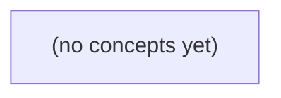

# 06.07 事务与并发异常：从成员退群到消息提交的纸上推演

*面向Go初学者，以虚构IM中成员退群与消息提交竞态为主线，建立从事务边界、ACID到并发异常、PostgreSQL隔离语义和MongoDB事务的完整理解。全书采用静态时间线、表格与控制流推演，不要求运行Go、数据库或IM系统，并配套22道附反馈练习。*

**章节:** 2

---

## 本书导览

- 了解整本书的章节脉络
- 掌握各章之间的概念依赖关系
- 选择最合适的阅读顺序

# 06.07 事务与并发异常：从成员退群到消息提交的纸上推演

面向Go初学者，以虚构IM中成员退群与消息提交竞态为主线，建立从事务边界、ACID到并发异常、PostgreSQL隔离语义和MongoDB事务的完整理解。全书采用静态时间线、表格与控制流推演，不要求运行Go、数据库或IM系统，并配套22道附反馈练习。

下方的概念图展示了本书 0 个核心概念以及它们之间的依赖关系；再下方是 1 个章节的入口。你可以按从上到下的顺序阅读，也可以根据自己的兴趣或先验知识选择切入点。

#### 概念图



## 章节索引

- **06.07 事务与并发异常：成员退出时还能发送吗** — 面向Go初学者承接06.01–06.03与06.10，以虚构IM成员退出和消息提交竞态讲ACID、事务范围、读已提交交错、丢失更新/不可重复读/幻读/写偏斜，辨别PostgreSQL隔离实际语义和MongoDB单文档/多文档事务，保留提交未知与设备送达边界；静态纸上课程。

## 06.07 事务与并发异常：成员退出时还能发送吗

- 界定IM消息保存事务与三个不同确认点
- 解释ACID每个字母能保证的范围
- 画出成员退出与消息提交的并发交错
- 识别丢失更新、不可重复读、幻读和写偏斜
- 区分PostgreSQL隔离级别的实际行为
- 在Go中保持全部相关操作属于同一Tx
- 为明确冲突设计有界整笔重试并处理提交未知
- 比较MongoDB单文档原子性与多文档事务

以成员退出与消息提交的竞态为线索，先划清业务规则、事务边界与三种确认点，再讨论后续并发异常。

### 先定义“还能发送”的业务时刻

### 先定义“还能发送”的业务时刻

“成员退出后还能不能发送”不是先由数据库隔离级别回答，而是产品先规定**资格在哪个时刻生效**。本节采用的规则是：

> 对用户 `u-a` 在会话 `c-a` 提交消息 `m-a` 而言，只要消息事务最终提交的那个瞬间，`u-a` 仍是 `c-a` 的有效成员，则发送成功；否则失败。

因此，判断点不是用户点击发送按钮时，也不是服务端刚收到请求时，更不是客户端界面尚未刷新“已退出”状态时。它是事务内成员资格检查与事务提交共同构成的业务事实。

可将一次发送抽象为：

`开始事务 → 检查 u-a 的成员资格 → 分配 seq → 插入 m-a → 更新会话摘要 → commit → 返回 HTTP 响应`

其中，`commit` 前的写入都只是暂定结果。只有事务提交成功，消息 `m-a` 与本次更新的会话摘要才一起成为数据库中的持久状态；若发现 `u-a` 已无资格、发生并发冲突或事务回滚，则两者都不应留下。

要特别区分两个容易混淆的观察面：

- **规则判断面**：数据库事务提交时，成员记录是否仍允许 `u-a` 发言。这决定消息是否成立。
- **界面观察面**：A 设备可能仍显示“可发送”，也可能尚未收到退出通知；这只是本地缓存、网络延迟或界面刷新时机，不能改写服务端规则。

同样，发送过程存在三种不同确认点：

1. **数据库提交成功**：消息与摘要已原子保存，这是业务成功的核心。
2. **A 收到 HTTP `200`**：发送方知道服务端已确认；若网络中断，数据库可能已成功但 A 尚未知晓。
3. **B 设备送达或展示**：接收方实际看到消息，通常发生在提交之后，且不属于本次数据库事务的完成条件。

先固定“以提交时资格为准”，后续讨论成员退出与发送并发发生时，才能明确究竟是在争夺资格、提交顺序，还是仅仅出现了客户端状态滞后。

### 一笔消息提交包含哪些操作

### 一笔消息提交包含哪些操作

以用户 `u-a` 向会话 `c-a` 提交消息 `m-a` 为例，一次“发送成功”不能只理解为插入一行消息，而应是一笔完整的业务提交。若产品规则规定：**成员在消息提交时仍有发言资格即可发送**，则事务应覆盖以下步骤：

1. **开始事务**：建立本次提交的一致性边界。后续读取、写入要么全部生效，要么全部回滚。
2. **检查成员资格**：读取 `u-a` 在 `c-a` 中的成员状态，确认其尚未退出、未被移除，或仍满足其他发言条件。
3. **分配会话内序号**：为 `m-a` 取得唯一且递增的 `seq`。该序号通常决定消息排序、增量拉取位置与“最新消息”的定义。
4. **插入消息记录**：写入发送者、内容、`seq`、提交时间等字段。
5. **更新会话摘要**：例如更新 `last_seq`、最后消息预览、最后活动时间、未读计数依据等。若摘要是可由消息表重建的派生数据，可另行讨论其权威性；但只要本次规则要求“消息出现时摘要同步反映”，它就必须与消息插入同属该事务。
6. **提交事务**：只有提交成功，消息与摘要才共同对其他事务可见。
7. **返回 HTTP 响应**：提交成功后，服务端才向 A 返回 `200` 或其他成功结果。

可将核心不变量写为：

$$
\text{消息已持久化} \Rightarrow \text{成员资格检查已通过} \land \text{对应摘要已更新}
$$

注意三个确认点并不相同：数据库 `commit` 表示持久化原子生效；A 收到 `200` 表示客户端得知服务端已成功处理；B 设备收到推送或拉取到消息，才表示另一端实际送达。后两者不能替代数据库事务提交。

### 三种确认点不能混为一谈

### 三种确认点不能混为一谈

对 `u-a` 在 `c-a` 提交 `m-a` 而言，“发送成功”至少包含三个不同层次的事实。它们发生在不同位置，回答的问题也不同：

1. **数据库提交成功**  
   事务完成 `commit`，消息记录与会话摘要更新作为一个原子结果持久化。它回答：  
   > 系统是否已经正式接受 `m-a`，并保证消息与摘要不会只写入一半？  
   
   若提交失败，则这次业务提交应视为失败；即使此前已分配序号 `seq`，也不能把该序号当作可见消息。

2. **发送方收到 HTTP 200**  
   服务端在提交成功后向 `u-a` 的客户端返回成功响应。它回答：  
   > 发起提交的设备是否得知服务端已接受该请求？  
   
   但网络可能在服务端提交后中断：此时数据库已经有 `m-a`，发送方却未收到 `200`。客户端重试时必须依靠请求标识或消息标识做幂等处理，而不能据“没收到响应”直接再插入一条消息。

3. **接收方设备实际送达**  
   其他成员的设备收到推送、拉取到消息，或在界面中展示该消息。它回答：  
   > 某个接收设备是否已经拿到并可处理 `m-a`？  
   
   这通常依赖异步推送、离线补拉、多设备同步，不能作为本次数据库事务提交的条件。

因此，推荐的主链路是：开始事务 → 检查 `u-a` 的发言资格 → 分配 `seq` → 插入 `m-a` → 更新摘要 → `commit` → 返回 HTTP `200`；接收方送达则在提交后异步进行。数据库提交是业务事实的确认，HTTP `200` 是发送方获知该事实的确认，设备送达是某个接收端消费该事实的确认。

### 用时间线画出退出与提交交错

### 用时间线画出退出与提交交错

设用户 `u-a` 原本属于会话 `c-a`，正在提交消息 `m-a`；几乎同时，另一请求要将 `u-a` 移出会话。产品先规定规则：**只要 `m-a` 提交时 `u-a` 仍有发言资格，就应接受该消息**。一次业务提交要原子地保存消息和会话摘要。

可将消息提交抽象为：

1. 开始事务；
2. 检查 `u-a` 是否仍是 `c-a` 成员；
3. 为消息分配 `seq`；
4. 插入 `m-a`；
5. 更新会话摘要；
6. 提交事务；
7. 返回 HTTP 响应。

关键不在“两个请求谁先到达服务器”，而在成员资格检查与事务提交之间如何交错：

| 时刻 | 提交消息 A | 退出成员 B |
|---|---|---|
| `t1` | 开始事务 |  |
| `t2` | 查到 `u-a` 仍是成员 |  |
| `t3` |  | 发起退出 |
| `t4` | 写入 `m-a`、更新摘要 | 完成成员删除 |
| `t5` | 尝试提交 |  |
| `t6` | 提交成功或因并发冲突失败 |  |

若数据库允许 A 基于旧成员状态直接提交，则会出现“已退出，但退出前检查通过的消息仍入库”。这是否正确，取决于规则：若资格以**检查时刻**为准，可接受；若资格以**提交时刻**为准，则 A 必须在提交前重新验证，或让成员行与消息写入发生可检测的并发冲突。

还要分清三种“成功”：

- **数据库提交成功**：消息与摘要已原子持久化；
- **A 收到 HTTP `200`**：客户端得知服务端声称成功，但网络中断时它未必收到；
- **B 设备送达**：另一设备已收到推送或同步，发生在提交之后，不能反过来证明提交结果。

因此，时间线首先决定业务语义；锁、隔离级别、重试与幂等设计，都是为了把这条语义稳定地落实出来。

### ACID保证的边界与摘要地位

### ACID保证的边界与摘要地位

对 `u-a` 在 `c-a` 提交 `m-a` 而另一事务同时执行“退出会话”的场景，ACID保证的是**数据库事务内的状态变化**，并不自动保证所有业务效果都已发生。

- **原子性（A）**：若一次提交包含“插入 `m-a`、分配消息序号、更新会话摘要”，则它们要么一起提交，要么一起回滚。不能出现消息已保存但摘要未更新的半完成状态；前提是这些写入确实在同一数据库事务中。
- **一致性（C）**：一致性首先来自业务约束。产品规则已规定：以“检查成员资格”时刻为准；当检查通过后，即使退出事务随后提交，`m-a` 仍是合法消息。数据库还应维持如序号唯一、消息所属会话存在、成员关系有效等约束。
- **隔离性（I）**：隔离性决定两个并发事务看见什么、谁等待谁、是否需要重试。它不替产品选择“退出优先”或“发送优先”；该选择必须由资格检查时点、锁策略或条件更新明确实现。
- **持久性（D）**：`commit` 成功后，数据库承诺该事务结果在故障后可恢复。它不等于 HTTP 响应已被 A 收到，更不等于 B 的设备已经收到推送。

因此应区分三个确认点：数据库提交成功、A 收到 `200`、B 设备送达。后两者涉及网络、响应重试与推送系统，通常不属于该数据库事务的直接保证范围。

会话摘要也需先定地位。若摘要是权威数据，例如最后消息序号、未读计数的唯一依据，就必须与消息同事务更新，并接受并发写入下的严格一致性要求。若摘要只是可重建派生数据，例如最后一条消息预览，则消息表才是事实来源；摘要可以同步更新以改善读取性能，也可以在失败后由消息重算。两种设计都可行，但不能一面把摘要当缓存，一面又在摘要缺失时把它当唯一事实。

> **要点** — 消息能否发送应由同一事务内的资格检查与提交决定；提交、HTTP确认和设备送达是三条不同边界。

成员退出与消息发送并非单一操作：先要划清事务边界，再判断数据库提交、服务确认与设备送达分别意味着什么。

### 先界定事务与三类确认点

### 先界定事务与三类确认点

“成员退出时发送消息”至少包含两类状态变更：

1. 将成员状态改为“已退出”；
2. 保存一条“退出通知”消息。

若业务要求二者不可分割，就应把它们放进同一个数据库事务：要么都提交，要么都回滚。以 Go 为例，事务边界必须由 `BeginTx`、`Tx.ExecContext`、`Commit`、`Rollback` 明确表达；不能在事务进行中混入 `db.ExecContext`，否则该操作可能使用另一连接，不受当前事务保护。

```go
tx, err := db.BeginTx(ctx, nil)
if err != nil { return err }
defer tx.Rollback()

// 更新成员状态、校验影响行数、写入消息记录
// 均使用 tx.ExecContext / tx.QueryRowContext

return tx.Commit()
```

这里首先得到的是**数据库提交**：成员退出记录和消息记录已作为一个原子结果持久化。若中途更新成员成功、插入消息失败，或任何校验不通过，则回滚，不能留下“已退出但没有通知”的半成品。

但数据库提交不等于另外两种确认：

- **服务端确认**：服务端已接受并保存消息，后续可供拉取、同步或投递。
- **设备送达**：某台具体设备已实际收到并处理消息。

`Commit` 成功通常只能证明第一层，并在数据库的持久化配置与故障模型下可恢复；它不自动证明推送已发出、网络可达，更不证明所有设备都已送达。因此，事务内宜保存消息与投递任务，事务提交后再异步投递；客户端状态应区分“已保存”“已被服务端确认”“已送达”，避免把一次提交误报为多设备送达。

### ACID保证什么，不保证什么

### ACID保证什么，不保证什么

设“成员退出群组后不得再发送消息”需要同时完成两件事：删除成员资格、拒绝后续发送。若它们位于同一数据库事务中，ACID讨论的是这组**数据库状态变更**，而不是所有外部世界都同步完成。

- **原子性（A）**：事务提交前任一步失败，已执行的写入可通过 `Rollback` 撤销；成功 `Commit` 后，则相关写入作为整体生效。它保证“成员资格删除”和“状态记录更新”不会只完成一半。  
  但原子性不自动覆盖事务外动作：已经调用的推送接口、已写入日志的外部系统、客户端已看到的消息，都不能仅靠数据库回滚撤回。

- **一致性（C）**：事务从一个满足约束的状态转到另一个满足约束的状态。数据库能执行主键、外键、唯一约束、`CHECK` 等已声明规则；例如消息表可通过外键引用成员资格。  
  但“退出后不能发送”若只写在应用代码里、未用条件更新、约束或权限模型正确表达，数据库并不会凭空理解该业务不变量。约束不是授权：能连接数据库或绕过检查的代码，仍可能写入不应存在的数据。

- **隔离性（I）**：并发事务的可见性与相互影响取决于隔离级别。较弱隔离下，发送事务可能在读取成员资格后，退出事务才提交，从而出现竞态；并非所有隔离级别都等价于串行执行。应使用合适的条件写入、锁或更高隔离级别处理。

- **持久性（D）**：`Commit` 成功意味着在数据库配置与故障模型承诺的范围内，结果可恢复。它不等于消息已到达全部设备，也不等于跨地域、副本或第三方服务必然完成投递。

### 在Go中保持操作同属一个事务

### 在Go中保持操作同属一个事务

要让“成员退出”和“发送消息”具备可推理的原子性，所有会改变判定结果的读写都必须经由同一个 `*sql.Tx` 完成。`BeginTx` 创建事务后，后续使用 `tx.ExecContext`、`tx.QueryRowContext`、`tx.QueryContext`；成功时 `Commit`，任一步失败则 `Rollback`。

纸上流程可以写成：

1. `BeginTx`；
2. 锁定并读取成员关系，确认成员当前仍可发送；
3. 写入消息及相关业务记录；
4. 更新成员退出状态；
5. 提交；若中途任一步出错，回滚。

```go
tx, err := db.BeginTx(ctx, nil)
if err != nil { return err }
defer tx.Rollback() // Commit 后回滚无害

var active bool
err = tx.QueryRowContext(ctx,
    `SELECT active FROM memberships WHERE group_id=? AND user_id=? FOR UPDATE`,
    groupID, userID,
).Scan(&active)
if err != nil || !active { return err }

if _, err = tx.ExecContext(ctx,
    `INSERT INTO messages(group_id, sender_id, body) VALUES (?, ?, ?)`,
    groupID, userID, body,
); err != nil { return err }

if _, err = tx.ExecContext(ctx,
    `UPDATE memberships SET active=false WHERE group_id=? AND user_id=?`,
    groupID, userID,
); err != nil { return err }

return tx.Commit()
```

关键陷阱是混用 `db` 与 `tx`。例如已经通过 `tx` 检查成员资格，却调用 `db.ExecContext` 写消息；该写入通常使用连接池中的另一连接，属于独立事务，无法随当前 `Rollback` 撤销。于是即使退出更新失败，消息仍可能已经提交。

事务保证的是：在数据库成功提交的范围内，这些写入要么都可见，要么都不可见。它不自动证明业务顺序正确；“退出后不能发送”还需要正确的条件、锁或隔离级别来表达。

### 退出与提交的并发交错

### 退出与提交的并发交错

设 `member_id=7` 正在退出群组，另一事务同时发送消息。在“读已提交”隔离级别下，每条查询只能看到**已经提交**的数据，但同一事务中的两次查询未必看到同一版本。

| 时刻 | 退出事务 T1 | 发送事务 T2 |
|---|---|---|
| 1 | `BeginTx` | `BeginTx` |
| 2 | 读取成员状态：`active` | 读取成员状态：`active` |
| 3 | 将成员状态更新为 `left` |  |
| 4 | `Commit` 成功 |  |
| 5 |  | 插入消息记录 |
| 6 |  | `Commit` 成功 |

若 T2 在时刻 2 已完成校验、但时刻 5 才写消息，则消息可能在成员退出后仍被提交。读已提交并不自动保证“校验时仍是成员”这一业务不变量；必须将校验与写入放进同一受保护的事务边界，例如锁定成员关系行、使用更高隔离级别，或以条件写入表达约束。

还要区分几类异常：

- **不可重复读**：T2 两次读取同一成员行，第一次是 `active`，T1 提交后第二次变为 `left`。
- **幻读**：T2 查询“该群全部有效成员”，T1 提交退出或另一事务插入成员后，第二次查询的结果集合增减。
- **丢失更新**：T1、T2 都读到同一计数值，再分别写回各自计算结果，后提交者覆盖先提交者；这通常发生在读—改—写计数而非原子 `UPDATE ... SET count=count+1` 时。
- **写偏斜**：T1 与 T2 各自检查“群内至少保留一名管理员”，然后分别退出不同管理员；两者写不同的行，却共同破坏不变量。

因此，`Tx.Commit` 只说明本事务的数据库更改成功提交；它不等于并发业务规则已自然成立。中途任一步出错应 `Rollback`，且不要把 `DB` 上的写操作混入同一逻辑，否则会脱离 `Tx` 的原子边界。

### 隔离、重试与提交未知边界

### 隔离、重试与提交未知边界

PostgreSQL 的隔离级别决定“并发时看见什么”：

- `Read Committed`：每条语句各取一次快照；同一事务内两次查询可能读到不同已提交数据，适合简单更新，但“先检查成员存在、再插入消息”仍可能与退出操作交错。
- `Repeatable Read`：事务开始后使用稳定快照，避免不可重复读；但它本质接近快照隔离，业务不变量若依赖多行或谓词，仍应使用约束、锁或升级为可串行化。
- `Serializable`：数据库尝试使结果等效于串行执行；检测到危险并发时会中止事务，应用必须处理 `40001` 重试，而不是把中止当作业务失败。

MongoDB 中，**单文档**更新天然原子，适合把成员状态、版本号与可发送标志聚合在同一文档中；跨文档的“成员退出 + 创建消息 + 扣减配额”则需要多文档事务。多文档事务提供原子提交，但仍可能因写冲突、瞬时网络故障而要求重试，且事务过长会增加冲突与资源压力。

重试必须有界：仅对可重试的序列化失败、死锁或瞬时事务错误，重新执行**整笔事务**，每次重新读取并计算，限制次数并加入退避。不要在事务外只重放最后一条写入，否则可能破坏前置判断。

最棘手的是 `Commit` 后连接断开：客户端不知道提交是否已发生。此时不能盲目 `Rollback`，也不能直接重做业务。应以业务幂等键、唯一约束和持久化操作记录查询最终状态；MongoDB 对“提交结果未知”通常重试提交本身，PostgreSQL 则以可恢复的业务记录判定结果。提交成功表示数据库状态可恢复，不等于消息已经送达任何设备。

> **要点** — 事务保证已提交操作的数据库边界；并发正确性依赖隔离、约束表达、完整Tx使用与可恢复的重试设计。

成员退出与消息发送并发发生时，关键不在“事务是否存在”，而在规则究竟要求检查时有效，还是提交时仍有效。

### 先定义三类确认点

### 先定义三类确认点

“还能发送吗”至少包含三种完全不同的确认点；若不先区分，成员资格规则会被错误地套用到整个链路。

| 确认点 | 含义 | 典型问题 |
|---|---|---|
| 客户端已受理 | 服务端收到请求并开始处理，可能尚未写入数据库 | 请求进入时是成员，是否就应接受？ |
| 消息已持久化提交 | `INSERT message` 所在事务成功提交，消息成为数据库事实 | 提交时仍必须是成员吗？ |
| 设备已送达 | 消息经推送、拉取或同步后到达某台设备 | 退出后还能收到先前已提交的消息吗？ |

例如，`t0` 时 T1 开始发送，`t1` 查询到 `members.active=true`；`t2` 时 T2 将该成员设为退出并提交；`t3` T1 插入消息；`t4` T1 提交；`t5` 设备收到消息。这里“发送成功”可能指 `t0` 的受理成功，也可能指 `t4` 的持久化成功，还可能指 `t5` 的送达成功。

成员资格通常约束的是某个数据库事实：**消息在何时被允许持久化**。若产品规则是“检查时是成员即可”，则 T1 在 `t1` 的读取可能足够；若规则是“消息提交时仍是成员”，则必须让资格检查与插入提交形成可控制的顺序。至于设备送达，往往还需单独定义：退出是否停止后续投递、是否允许补拉历史消息、已进入推送队列的消息如何处理。

因此，并发讨论前应把规则写成明确句子：`在消息事务提交时，发送者必须仍为活跃成员`，而不是含糊地说“只有成员才能发送”。

### 读已提交下的时间线

### 读已提交下的时间线

设 `members(user_id, status)` 中用户 A 初始为 `active`，`messages` 用于记录消息。PostgreSQL 默认的 `Read Committed` 隔离级别下，**每条 SQL 命令都会取得自己的语句级快照**，而不是整个事务共用一个快照。

| 时刻 | T1：发送消息 | T2：退出成员身份 | 可见状态 |
|---|---|---|---|
| t0 | `BEGIN` |  | A 为 `active` |
| t1 | `SELECT status FROM members WHERE user_id='A'`，读到 `active` |  | T1 的检查通过 |
| t2 |  | `BEGIN` |  |
| t3 |  | `UPDATE members SET status='inactive' WHERE user_id='A'` | 仅 T2 自己可见退出结果 |
| t4 |  | `COMMIT` | A 已正式为 `inactive` |
| t5 | `INSERT INTO messages(...) VALUES (...)`；随后 `COMMIT` |  | 消息成功提交 |

这里没有矛盾：T1 在 t1 的查询快照中，A 确实仍是活跃成员；但 t4 后，T2 的退出已经提交。T1 到 t5 执行 `INSERT` 时，即使新语句能看见 A 已退出，数据库也不会自动把先前“检查通过”的业务结论重新绑定到这次插入上，更不会自动撤销 T1。

因此，结果取决于产品规则的检查时刻：

- 若规则是“**发起发送检查时**仍为成员即可”，该消息可以接受。
- 若规则是“**消息提交时**仍必须为成员”，则此交错不应允许。
- 若规则是“退出与发送必须形成明确先后顺序”，仅靠先查再插不足以表达该约束。

后两种语义需要把成员行上的并发操作纳入同一受控顺序：例如持锁直到提交，或采用 `Serializable` 并对整体事务重试；具体机制将在后续讨论。

### 快照按命令而非按事务

### 快照按命令而非按事务

PostgreSQL 默认隔离级别是“读已提交”。其核心含义不是“事务开始后看到固定世界”，而是：**每条 SQL 命令开始执行时，都会取得一个新的已提交数据快照**。

设成员表中 `alice` 初始为活跃成员：

| 时刻 | T1：发送消息 | T2：退出成员资格 |
|---|---|---|
| t0 | `BEGIN` |  |
| t1 | 查询 `members`，看到 `alice.active = true` |  |
| t2 |  | `BEGIN`，将 `active` 改为 `false` |
| t3 |  | `COMMIT` |
| t4 | 向 `messages` 插入消息 |  |
| t5 | `COMMIT` |  |

在 t1，T1 的查询快照中，T2 尚未提交退出，因此“`alice` 是成员”成立。到 t4，T1 执行 `INSERT` 时会取得新快照；此时 T2 已提交，T1 已能看到 `active = false`。但如果该 `INSERT` 只是：

`INSERT INTO messages(sender_id, body) VALUES (...);`

数据库并不会自动把 t1 的成员判断重新关联到这条插入。于是消息仍可插入，T1 也可正常提交。

因此，“事务中已经检查过成员资格”不等于“提交时仍保证成员资格”。它只说明：**检查语句执行当时，成员资格成立。**

这里必须先定义产品规则：

- 若规则是“发送动作开始检查时是成员即可”，上述结果可以接受。
- 若规则是“消息提交时仍必须是成员”，则仅靠先查再插不够。
- 若规则是“退出与发送必须形成明确先后顺序”，需要让两者竞争同一协调点，例如锁定同一成员记录直到提交；或使用可串行化隔离级别并对失败事务整体重试。

后两种实现方式将在 06.08 继续讨论。

### 规则时刻决定正确结论

### 规则时刻决定正确结论

同一组并发操作，是否“出错”并不先由数据库决定，而由产品把成员资格绑定在哪个时刻决定。设 `members` 中成员 `U` 初始为 `active`：

| 时刻 | T1：发送消息 | T2：退出成员资格 |
|---|---|---|
| t0 | 开启事务 |  |
| t1 | 查询 `U` 为 `active` |  |
| t2 |  | 将 `U` 更新为 `inactive` |
| t3 |  | 提交 |
| t4 | 插入消息记录 |  |
| t5 | 提交 |  |

在 PostgreSQL 默认的 Read Committed 隔离级别中，每条命令取得自己的快照。因此，T1 在 t1 的查询能看到 `active`，而 t4 的 `INSERT` 并不会自动重新验证“`U` 至今仍是成员”。

三种规则对此交错会给出不同结论：

- **检查时是成员**：以 t1 为准。T1 检查通过后即可发送；即使 t3 已退出，消息仍合法。
- **保存时是成员**：以实际写入消息的 t4 为准。此时 T2 已提交退出，消息应被拒绝；应用必须在保存前重新检查，或由数据库约束表达该规则。
- **提交时仍是成员**：以 t5 为准。消息提交与成员资格必须共同判断；只在 t1 检查显然不够，因为提交前资格可能已变化。

因此，“T1 开了事务，为什么还能发出消息？”并不是一个独立的异常结论。若规则是“检查时有效”，结果正确；若规则要求“保存时”或“提交时仍有效”，结果就违反业务语义。

后两类规则需要让“退出”和“发送”形成受控顺序，例如持有同一成员行的锁直到提交，或使用 Serializable 隔离级别并对序列化失败执行整体重试。具体锁法将在 06.08 讨论。

### 把竞争转成受控顺序

### 把竞争转成受控顺序

若产品规则是“消息提交时，发送者必须仍是活跃成员”，就不能只依赖 `Read Committed` 下先读后写的自然流程；必须让“退出”和“发送”在同一成员事实上排队。

一种直接做法是：两类操作都锁定同一条 `members` 成员行，并持锁至事务提交。

| 时刻 | 发送事务 T1 | 退出事务 T2 |
|---|---|---|
| t0 | `SELECT ... FOR UPDATE` 锁定成员行 |  |
| t1 | 确认 `active=true`，插入消息 | 尝试锁定同一成员行，等待 |
| t2 | 提交，释放锁 |  |
| t3 |  | 获得锁，更新为退出状态并提交 |

此顺序中，消息先提交、退出后提交，规则明确成立。若 T2 先获得锁并提交退出，则 T1 随后拿到锁时会看到 `active=false`，应拒绝发送。锁的价值不只是“防止同时修改”，而是把两个业务判断压缩为可观察的先后关系。

另一种方案是使用 `Serializable` 隔离级别：发送事务读取成员状态并写入消息，退出事务修改成员状态；PostgreSQL 会在无法串行化解释的冲突中使其中一笔事务以序列化失败退出。应用必须捕获该错误，并对**整笔事务**进行有限次数重试；重试后重新读取状态，可能成功插入，也可能发现已退出而返回业务拒绝。

两种方案的差别在于：行锁通常让后到者等待，顺序直观；可串行化允许更高并发，但以失败和重试换取一致的串行结果。无论选择哪种，先定义规则的有效时刻：允许“检查时是成员”还是要求“提交时仍是成员”。没有这个定义，就没有唯一正确的并发结论。

> **要点** — 读已提交只保证每条命令看见当时已提交数据；成员资格何时有效必须由产品规则定义，并以锁或整体重试落实。

并发异常不必先背隔离级别表；先把两个事务放到同一条时间线上，观察一次“看见”如何变成错误决定。

### 从时间线识别并发异常

### 从时间线识别并发异常

分析并发问题时，先不要急着问“这是哪个隔离级别”。把每个事务拆成四步：**读 → 判断 → 写 → 提交**，再按真实交错顺序排在纸上。

例如成员计数 `count=4`，两个事务都要执行“加一”：

| 时间 | 事务 A | 事务 B |
|---|---|---|
| 1 | 读到 `count=4` |  |
| 2 |  | 读到 `count=4` |
| 3 | 判断后写入 `5` |  |
| 4 |  | 判断后也写入 `5` |
| 5 | 提交 | 提交 |

最终是 `5`，但实际发生了两次加入，正确结果应为 `6`。错误不在“加一”这个业务意图，而在应用先读出旧值、在内存中计算、再写回。应改为单条原子语句：

`UPDATE members SET count = count + 1 WHERE group_id = ?`

若判断依赖整行状态，可加入版本条件：`WHERE version = ?`；更新失败说明有人已抢先修改，事务必须重读或重试。

同样用时间线识别其他异常：

- **不可重复读**：A 第一次读同一行；B 修改并提交；A 第二次读到不同值。
- **幻读**：A 查询“活跃成员集合”；B 插入一名满足条件的新成员并提交；A 重查时集合多出一行。
- **写偏斜**：两名管理员都读到“另一人仍在职”，于是各自把自己设为离开；两次写不同的行却共同破坏“至少一名管理员”的约束。
- **脏读**：A 读到 B 尚未提交的数据，随后 B 回滚。PostgreSQL 不允许脏读，但理解其定义有助于阅读时间线。

关键问题始终是：**事务依据哪个快照作出判断？另一个事务何时改变了该判断成立的前提？**

### 两次写五：丢失更新

### 两次写五：丢失更新

设成员数 `counter` 初值为 `4`。两个管理员几乎同时处理“新增一名成员”：

| 时间 | 事务 A | 事务 B |
|---|---|---|
| $t_1$ | 读取 `counter`，得到 `4` |  |
| $t_2$ |  | 读取 `counter`，也得到 `4` |
| $t_3$ | 在应用中计算 `4 + 1 = 5`，写入 `5` |  |
| $t_4$ |  | 同样计算 `4 + 1 = 5`，写入 `5` |

逻辑上发生了两次加入，期望结果应为 `6`；数据库最终却是 `5`。事务 B 的写入覆盖了事务 A 已经完成的增量，仿佛其中一次加入从未发生，这就是**丢失更新**。

问题不在加法，而在“先读、后在应用层计算、再整体写回”这一读改写模式。两个事务都基于过期快照 `4` 作出决定，后写者没有意识到前写者已改变了值。

若只是累加，应让数据库把“读取当前值并加一”作为一个原子动作：

`UPDATE member_stats SET counter = counter + 1 WHERE id = ?;`

这样第二条语句执行时，看到的是前一条更新后的值，结果会从 `4` 依次变为 `5`、`6`。

若更新还依赖更多业务判断，可加入版本号：

`UPDATE member_stats SET counter = 5, version = version + 1 WHERE id = ? AND version = 12;`

受影响行数为 `0` 表示有人已抢先修改；此时不能静默覆盖，而应重新读取、重算，或提示用户重试。

### 用原子更新或版本守卫修正

### 用原子更新或版本守卫修正

若目标只是“计数加一”，不要先读出 `count=4` 再写回 `5`。应把读改写合并为一条原子语句：

`UPDATE group_stats SET count = count + 1 WHERE group_id = ?;`

两个事务即使同时执行，数据库也会对同一行的写入协调：先完成者得到 `5`，后完成者基于最新值继续得到 `6`，不会丢失更新。这里应用程序不需要携带旧计数值。

但“成员退出”通常还包含业务判断，例如“至少保留一名管理员”。此时可使用版本守卫（乐观并发控制）：

`UPDATE groups SET admin_count = ?, version = version + 1 WHERE id = ? AND version = ?;`

应用先读取 `admin_count` 与 `version`，在本地完成判断后，将读取到的旧版本号带回条件中。若受影响行数为 `1`，说明期间无人改过该行；若为 `0`，说明版本已变化，本次决定建立在过期快照上，必须重新读取、重新判断，而不是直接重试原写入。

重试边界应围绕完整业务决策：重新读取管理员集合，确认退出后仍有管理员，再执行条件更新。仅重试最后一条更新，可能把“另一个管理员也离开了”的新事实忽略掉。

### 读到变化：不可重复读与幻读

### 读到变化：不可重复读与幻读

先固定一个事务 `T1`：管理员正在核对房间成员。关键不在“读了几次”，而在两次读的对象是否相同。

**不可重复读**：同一行的数据变了。

| 时间 | `T1` | `T2` |
|---|---|---|
| 1 | 读取成员 A：`status='active'` |  |
| 2 |  | 将 A 更新为 `status='left'` 并提交 |
| 3 | 再读取成员 A：`status='left'` |  |

`T1` 两次都在读“成员 A 这同一行”，却得到不同结果。若 `T1` 据第一次读取认定 A 仍在线、随后据此安排操作，第二次结果便推翻了原有判断。这是不可重复读。

**幻读**：查询条件匹配的“行集合”变了。

| 时间 | `T1` | `T2` |
|---|---|---|
| 1 | 查询：所有 `status='active'` 的成员，得到 A、B |  |
| 2 |  | 插入成员 C，`status='active'`，并提交 |
| 3 | 再执行相同查询，得到 A、B、C |  |

这里并非 A 或 B 这一既有成员行被改写；变化的是查询结果中多出一行 C，仿佛集合里出现了“幻影”。

可用一句话区分：**同一成员记录前后不一致，是不可重复读；按条件查询的成员名单前后增减，是幻读。** 实际排查时，先写出两事务时间线，再标记读的是单行还是条件集合，比先背隔离级别名称更可靠。

### 各自离开：写偏斜与脏读边界

### 各自离开：写偏斜与脏读边界

设约束是：系统中至少保留一名 `active` 管理员。当前有 Alice、Bob 两人，二者都处于在岗状态。

| 时间 | 事务 A（Alice 离开） | 事务 B（Bob 离开） |
|---|---|---|
| $t_1$ | 查询：Bob 仍在岗 |  |
| $t_2$ |  | 查询：Alice 仍在岗 |
| $t_3$ | 将 Alice 设为离岗 |  |
| $t_4$ |  | 将 Bob 设为离岗 |
| $t_5$ | 提交 | 提交 |

两个事务各自的判断都曾正确：**“还有另一名管理员，所以我可以离开。”**但它们写的是不同的行，普通行锁未必冲突；最终两人都离岗，跨行约束被破坏。这就是**写偏斜**：并发事务基于同一组条件读取作出决定，却分别修改不同数据，因而没有发生直接的写写覆盖。

不能只写“先检查再更新”：

```sql
SELECT count(*) FROM members
WHERE role = 'admin' AND active = true;
```

检查与退出必须放进同一事务，并对参与约束的行采取足够的保护，例如锁定当前在岗管理员，或在 PostgreSQL 使用 `SERIALIZABLE` 隔离级别并处理序列化失败后的重试。

**脏读**则是另一条边界：事务 A 读到了事务 B 尚未提交的修改；若 B 随后回滚，A 的判断便建立在从未真正存在过的数据上。PostgreSQL 的 `READ UNCOMMITTED` 实际按 `READ COMMITTED` 执行，因此不允许脏读。这里无需急于背隔离级别表：先问“读到的是已提交数据吗”“两次读取之间谁提交了”“约束涉及一行还是一组行”，异常类型通常就清楚了。

> **要点** — 先画交错时间线，再选择原子写、条件更新或更强隔离；不同异常取决于读写对象和约束。

隔离级别不是“有事务就安全”的开关。理解标准定义与PostgreSQL实际行为，才能判断成员退出和消息提交会留下哪些竞态窗口。

### 先用并发历史定义隔离问题

### 先用并发历史定义隔离问题

判断“成员退出时还能发送吗”，不能只看两段业务代码各自是否包在事务里；关键是看它们组成的**并发历史**：谁读了什么、谁写了什么、何时提交，以及最终是否存在一个合理的串行解释。

设成员关系表为 `membership(user_id, group_id, status)`，消息表为 `message(sender_id, group_id, body)`：

- 事务 $T_1$：成员退出。读取成员状态为“在群”，随后将其更新为“已退出”。
- 事务 $T_2$：发送消息。读取成员状态，若仍为“在群”，则插入一条消息。
- 读集合可记为 $R(T)$，写集合记为 $W(T)$。这里  
  $R(T_1),R(T_2)$ 都可能包含同一成员资格；  
  $W(T_1)$ 更新资格，$W(T_2)$ 插入消息。

一种典型历史是：

1. $T_1$、$T_2$ 都读到“在群”；
2. $T_1$ 将状态改为“已退出”并提交；
3. $T_2$ 插入消息并提交。

最终结果是“成员已退出，但退出操作期间仍成功发出消息”。这未必是数据库错误：若存在串行顺序“先发送、后退出”，该结果就仍可解释。真正需要先定义的是业务不变量，例如：

> 一旦退出提交成功，其后开始或提交的发送事务不得产生新消息。

注意“其后”究竟按开始时间、读取时间还是提交时间判断，会直接改变实现方案。还要区分异常现象：

- **脏读**：读到尚未提交的退出状态；
- **不可重复读**：同一事务两次读取成员状态不同；
- **幻读**：两次查询“该成员可发送的资格记录”得到不同结果；
- **写偏斜/串行化异常**：两个事务各自检查条件都成立，合并后却破坏业务规则。

因此，隔离级别讨论的对象不是“退出”和“发送”两个孤立操作，而是这段读写历史能否被允许，以及失败时数据库会阻塞、报错，还是悄然提交。

### 四种标准隔离级别与异常边界

### 四种标准隔离级别与异常边界

SQL 标准常用三类现象描述隔离边界：

- **脏读**：读到另一事务尚未提交、随后可能回滚的数据。
- **不可重复读**：同一事务两次读取同一行，期间被他人提交更新，结果不同。
- **幻读**：同一事务按相同条件两次查询，期间他人提交了新增、删除或改变条件匹配状态的行，结果集合变化。

| 隔离级别 | 脏读 | 不可重复读 | 幻读 | 仍需警惕的异常 |
|---|---|---|---|---|
| Read Uncommitted | 可能 | 可能 | 可能 | 基本没有可靠业务判断基础 |
| Read Committed | 禁止 | 可能 | 可能 | “先查后写”竞态、丢失更新、写偏斜 |
| Repeatable Read | 禁止 | 禁止 | 标准中仍可能 | 写偏斜等跨行约束破坏 |
| Serializable | 禁止 | 禁止 | 禁止 | 可能因冲突而无法提交，必须重试 |

以“成员退出后发送消息”为例：在 `Read Committed` 下，发送事务先读到成员仍在群内；成员退出事务随后提交；发送事务再写入消息仍可能成功。这里没有脏读，却存在检查与写入之间的竞态。单纯把两条语句包进事务，并不自动保证“消息提交时成员仍有效”。

`Repeatable Read` 让事务内读取保持一致视图，避免同一成员记录前后不一致；但若业务约束涉及多行，例如“群内至少保留一名管理员”，两个事务分别看到两名管理员并各自退出，仍可能共同破坏约束。这类现象称为**写偏斜**。

`Serializable` 的目标不是“永不冲突”，而是保证**所有成功提交的事务**可等价排列为某个串行执行顺序。实现通常会在检测到危险依赖时拒绝其中一个事务，并报出序列化失败；应用必须将整笔事务从头重试。隔离级别越强，冲突、中止与重试成本通常越高；具体语义还必须结合数据库产品和版本确认。

### PostgreSQL的实际隔离语义

### PostgreSQL的实际隔离语义

PostgreSQL 的隔离级别不能只按标准名称望文生义，关键在于它采用的快照规则与冲突处理方式。

- **Read Uncommitted**：PostgreSQL 不支持真正的脏读；即使显式设置为该级别，实际也按 **Read Committed** 执行。其他事务尚未提交的成员退出、消息状态更新，对当前事务不可见。

- **Read Committed**：每条 SQL 语句开始时取得一个新快照。因此，同一事务内先查询“成员仍在”，随后另一事务提交成员退出；下一条发送消息的查询就可能看到该成员已经离开。它避免脏读，但允许不可重复读和幻读。更重要的是，先前读到的业务条件不会自动被后续语句“锁定”。

- **Repeatable Read**：事务通常使用首次一致性读取时建立的固定快照；后续普通查询仍看到同一版本。PostgreSQL 的该级别比标准意义上的可重复读更强：普通快照读不会出现幻读。但它不是串行化；两个事务可能各自在同一旧快照中确认条件成立，再分别更新不同记录，形成**写偏斜**。发生直接更新冲突时，也可能出现序列化失败而非静默覆盖。

- **Serializable**：PostgreSQL 通过可串行化快照隔离检测危险依赖。它承诺的是：**所有成功提交的事务**效果等同于某个串行执行顺序，而不是“事务一定能提交”。检测到可能导致异常的并发组合时，数据库会报 `serialization failure`，应用必须将整笔事务回滚并重试。

因此，“使用了事务”或“提高了隔离级别”都不能单独推出成员退出与消息发送没有竞态。还应确认具体 PostgreSQL 版本、访问模式，以及应用是否正确处理重试。

### 退出与发送交错：写偏斜为何仍会发生

### 退出与发送交错：写偏斜为何仍会发生

设不变量为：**成员一旦退出，之后不得再成功发送消息**。初始时成员 `A` 状态为“在群”。

| 时刻 | 发送事务 `T1` | 退出事务 `T2` |
|---|---|---|
| 1 | 读取 `A` 的成员资格：仍在群 | 读取 `A` 的成员状态：仍在群 |
| 2 | 准备向 `messages` 插入消息 | 将 `members.status` 更新为“已退出” |
| 3 | `T2` 提交 |  |
| 4 | 依据旧快照中的“仍在群”判断合法，插入消息并提交 |  |

在 PostgreSQL 的 `Repeatable Read` 下，`T1` 自始至终看到的是开始时的固定快照；它不会因 `T2` 已提交而重新看到“已退出”。因此，`T1` 和 `T2` 分别写入不同位置：一个改成员记录，一个插入消息记录，通常没有同一行的写写冲突，二者都可能提交，最终留下“退出后仍有消息”的状态。

这不是幻读：`T1` 并非第二次查询时多看到或少看到一批消息；固定快照恰恰避免了这类可见性变化。它也不是丢失更新：两个事务没有对同一行做覆盖式修改。问题在于它们各自基于同一份旧事实通过检查，却共同破坏跨表、跨记录的不变量，这正是**写偏斜**。

若改用 PostgreSQL `Serializable`，数据库会尝试识别这种危险依赖；其中一个事务可能收到 `serialization failure`，应用必须将整笔业务事务重新执行。不能因为“已经开启事务”或“使用了 Repeatable Read”就断言退出与发送必然互斥；还需结合隔离级别、约束、显式锁及具体版本验证。

### Serializable失败、整笔重试与选型代价

### Serializable失败、整笔重试与选型代价

`Serializable` 并不表示事务一定成功；它承诺的是：**所有成功提交的事务**，其最终效果等价于按某个串行顺序依次执行。数据库为维持这一承诺，可能主动中止其中一个事务并返回序列化失败（如 PostgreSQL 的 `SQLSTATE 40001`）。因此，“成员退出”与“发送消息”同时发生时，失败是正常并发控制结果，不应当把它当作业务异常。

应用层应重试**整笔事务**，而不是只重试最后一条 `UPDATE`：

```go
for attempt := 0; attempt < 3; attempt++ {
    err := db.Transaction(func(tx *gorm.DB) error {
        // 查询成员状态、检查会话、写入消息、更新计数等
        // 所有影响判定与写入的 SQL 都必须使用 tx
        return nil
    })
    if err == nil { return nil }
    if !isSerializationFailure(err) { return err }
    time.Sleep(backoff(attempt))
}
return ErrConcurrentConflict
```

重试边界必须覆盖“读取条件 → 业务判断 → 全部写入 → 提交”。事务外预先读到的成员状态不能在重试时复用；每次尝试都要重新读取。重试次数应有上限，并加入退避和随机抖动，避免热点成员反复冲突。

尤其要避免在事务中直接发送消息、扣费或调用外部服务：事务重试会重复执行副作用。可将待发送事件写入同一事务的 outbox，再由独立消费者投递，并以业务幂等键去重。

更强隔离也意味着更多冲突、中止、锁等待或吞吐下降。PostgreSQL 的可串行化实现会产生 `serialization failure`；其他数据库、驱动及版本的错误码、锁行为和隔离实现可能不同。选型前应核对目标数据库文档，并以实际并发压测验证重试率与延迟。

> **要点** — 隔离级别应按数据库实际语义和并发历史判断；Serializable可能拒绝提交，必须为整笔事务准备有界重试。

事务代码不仅要“能提交”，还要在冲突、超时和提交结果未知时保持业务语义正确。

### 先界定消息保存的事务边界

### 先界定消息保存的事务边界

“成员退出时发送消息”不能拆成“先查成员状态、再单独插入消息”。否则成员状态可能在两步之间变化：发送者已退出、会话已关闭，甚至权限已被撤销，却仍留下了一条看似合法的消息。

应把决定“能否发送”的全部数据库事实与消息落库放进同一个事务：

1. `db.BeginTx(ctx, opts)` 开启事务；
2. 通过 `tx` 读取会话、成员关系、退出状态、禁言状态等；
3. 在同一事务内校验发送者仍是有效成员，或业务明确允许“退出前已提交的发送请求”；
4. 使用 `tx.ExecContext` 插入消息、更新会话最后消息时间、未读计数或消息序号；
5. `tx.Commit()` 作为唯一使这些变化对外可见的边界。

```go
tx, err := db.BeginTx(ctx, nil)
if err != nil { return err }
defer tx.Rollback()

member, err := loadMember(ctx, tx, roomID, userID)
if err != nil { return err }
if member.LeftAt.Valid {
    return ErrMemberAlreadyLeft
}

if err := insertMessage(ctx, tx, msg); err != nil { return err }
if err := updateRoomLastMessage(ctx, tx, roomID, msg.ID); err != nil { return err }

return tx.Commit()
```

关键约束是：事务内的所有依赖读取和写入都必须经由 `tx`，不能混用 `db.QueryContext`。若成员状态读取绕过事务，就失去了与消息写入一致的快照、锁定或隔离保证；`Commit` 成功前，也不应向 WebSocket 推送“发送成功”。

### 在 Go 中让所有依赖操作走同一 Tx

### 在 Go 中让所有依赖操作走同一 `Tx`

事务的关键不是最后调用一次 `Commit`，而是从“读取当前状态”到“写入最终结果”的全部依赖操作都绑定到同一个 `Tx`。否则，读取发生在事务外、写入发生在事务内时，二者可能看到不同版本的数据，检查条件便失去意义。

典型控制流如下：

```go
tx, err := db.BeginTx(ctx, nil)
if err != nil {
	return err
}
defer tx.Rollback() // Commit 成功后会返回 sql.ErrTxDone，可安全忽略

row := tx.QueryRowContext(ctx,
	`SELECT status FROM members WHERE room_id = ? AND user_id = ?`,
	roomID, userID,
)

var status string
if err := row.Scan(&status); err != nil {
	return err
}
if status != "active" {
	return ErrMemberLeft
}

_, err = tx.ExecContext(ctx,
	`INSERT INTO messages (message_id, room_id, sender_id, body)
	 VALUES (?, ?, ?, ?)`,
	messageID, roomID, userID, body,
)
if err != nil {
	return err
}

if err := tx.Commit(); err != nil {
	return err
}
return nil
```

这里的 `defer tx.Rollback()` 是兜底机制：任一查询、扫描、校验或写入失败时，函数提前返回，事务会被回滚；若 `Commit` 已成功，后续的 `Rollback` 不会撤销已提交的数据。

尤其要避免混用 `db` 与 `tx`：

- 不要用 `db.QueryContext` 读取成员状态，再用 `tx.ExecContext` 插入消息。
- 不要在事务中调用会自行使用 `db` 开新连接的仓储方法。
- 将依赖数据库的操作抽象为接收 `*sql.Tx`，或接收同时具备查询、执行能力的接口，确保整条判定链使用同一事务上下文。

`Commit` 成功之前，消息尚未在业务上成立；因此 WebSocket 推送等外部副作用应位于提交成功之后，而不是夹在事务内部。

### 只对明确冲突做有界整笔重试

### 只对明确冲突做有界整笔重试

事务失败不等于都该重试。只有数据库明确报告“本次执行因并发冲突可安全重做”时，例如可序列化隔离级别下的序列化失败、死锁受害者错误，才考虑重试。业务拒绝（成员已退出、余额不足）、参数错误、权限错误、`context.Canceled`、截止超时等，重试通常不会改变结果，反而会放大压力或掩盖问题。

重试的单位必须是**整笔事务**：重新 `BeginTx`，重新读取成员状态、房间版本和未读消息，重新执行所有判断与写入，最后重新 `Commit`。不能只重放最后一条 `INSERT`；此前读到的数据可能正是冲突根源。

```go
for attempt := 0; attempt < 3; attempt++ {
    err := runOnce(ctx) // BeginTx → 全部读写经 tx → Commit
    if err == nil {
        return nil
    }
    if !isRetryableConflict(err) {
        return err
    }
    // 可加入短暂退避和抖动
}
return ErrTooMuchContention
```

`runOnce` 内应先 `defer tx.Rollback()`，成功提交后该回滚只会返回 `sql.ErrTxDone`，可忽略。重试次数必须有上限，并受请求上下文截止时间约束；高竞争持续存在时，应返回“稍后重试”而非无限占用连接。

尤其不要把 WebSocket 推送、邮件、扣费等外部副作用放进自动重试回调。同一事务可能执行多次，外部动作会被重复触发；应在提交成功后再投递，或采用带稳定 `op_id` 的可靠外发机制。

### 提交附近断网：结果未知不等于失败

### 提交附近断网：结果未知不等于失败

`tx.Commit()` 返回错误，并不总能推出“事务没有提交”。例如客户端向数据库发送提交请求后，数据库已成功受理并落盘，但响应包在网络中丢失；客户端看到的是超时、连接重置或驱动错误，数据库看到的却可能是一次成功提交。

因此，应将提交结果区分为三类：

- `Commit` 明确成功：事务已提交。
- `Commit` 明确失败：例如约束冲突、事务已回滚，可按业务规则处理。
- `Commit` 结果未知：连接在提交附近中断，不能直接重试写入。

对“结果未知”最危险的处理是重新生成一条消息并再次发送。若首次提交实际成功，第二次会产生重复消息、重复扣费或重复成员事件；即使内容相同，新的主键也使系统无法识别它们是同一次操作。

应在事务开始前生成稳定的 `message_id` 或 `op_id`，并将其作为持久化记录的唯一标识：

```go
opID := stableOperationID
// INSERT ... op_id = opID，数据库设置唯一约束
err := tx.Commit()
```

若 `Commit` 返回网络类错误，不立即创建新消息，而是用该稳定标识查询受理状态：

- 查到对应记录：视为原操作成功，返回已有结果。
- 未查到记录：只有在确认事务未生效后，才使用**同一个**`op_id` 重试。
- 仍无法确认：返回“处理中”或“结果待确认”，由后续查询、补偿任务处理。

唯一约束使重复提交退化为可识别的幂等请求；稳定操作标识则把“我是否已经发过”从不可靠的网络结果，转化为可查询的数据库事实。

### 把 WebSocket 推送留在事务提交之后

### 把 WebSocket 推送留在事务提交之后

数据库写入与 WebSocket 推送看似都在“发消息”，但它们的失败语义完全不同：

| 操作 | 能否随事务回滚 | 自动重试时是否安全 |
|---|---|---|
| 写入消息、更新成员状态、扣减未读数 | 可以 | 可以，但必须重算事务内读取 |
| 向连接推送 WebSocket 帧 | 不可以 | 不可以，可能重复送达 |

事务回调中应只保留可回滚的数据库动作：通过 `db.BeginTx(ctx, opts)` 创建事务，所有依赖读取和写入均经由 `tx` 执行；失败时 `defer tx.Rollback()`，成功后 `tx.Commit()`。若遇到明确可重试的序列化冲突或死锁，可限制次数后重跑整个事务，并重新读取成员资格、会话状态和消息序号。

但不能在这个重试范围内调用 WebSocket 推送。第一次尝试可能已把帧写入网络，随后数据库提交失败或发生冲突；第二次尝试又会再次推送，客户端便可能收到一条尚未保存、甚至最终未被受理的消息。反过来，`Commit` 附近网络中断时，服务端得到的结果可能是“未知”：数据库也许已经提交，不能盲目新建消息再发一次。

因此应分成三个确认点：

1. **消息保存**：事务成功提交，消息记录具有稳定的 `message_id` 或 `op_id`。
2. **受理确认**：提交结果未知时，按稳定标识查询数据库或受理状态，确认是否已落库。
3. **设备送达**：仅在确认受理后尝试 WebSocket 推送；连接断开、写入失败或客户端未确认，属于后续投递问题，而非回滚已提交消息的理由。

这样，数据库保证“消息是否存在”，推送负责“尽力通知设备”，重复投递则由稳定消息标识支持客户端去重。

> **要点** — 事务重试必须重做整笔数据库工作；提交未知靠稳定操作标识查询，外部推送只能在确认提交后处理。

MongoDB 能保证一条文档写入原子，却不会因一次请求自动把成员状态与消息记录绑成同一结果；关键在于明确事务边界、重试边界与送达边界。

### 先划清两份文档的原子边界

### 先划清两份文档的原子边界

MongoDB 的“单文档原子”只覆盖一条文档的更新过程。若聊天室成员资格保存在 `members`，消息历史保存在 `messages`，即使它们由同一个 HTTP 请求触发，也仍是两次彼此独立的写入。

例如发送消息时通常需要：

1. 在 `members` 中确认用户仍是该会话成员；
2. 向 `messages` 插入消息记录。

没有事务时，以下竞争完全可能发生：

- 发送方先读到“仍是成员”；
- 另一请求将该成员标记为已退出；
- 发送方随后成功插入消息。

最终得到“成员已退出，但退出后消息仍被保存”的状态。反过来，若先写入消息、再更新或校验成员状态，则也可能出现消息已保存，但成员资格检查失败、请求向客户端报错的结果。

关键不在于两次操作是否写在同一个函数里，而在于它们是否属于同一原子提交单元。普通的 `find`、`update`、`insert` 各自只保证自身文档不被写到一半；它们不能自动维持跨文档不变量，例如：

`消息存在` $\Rightarrow$ `发送者在消息创建时仍为成员`

若业务要求严格满足这一关系，就必须将“确认资格”和“写入消息”纳入同一个多文档事务，或重新设计数据模型与业务合同。否则，应明确接受竞态结果，并规定后续如何展示、撤回或审计这类边界消息。

### 单文档原子不等于跨文档一致

### 单文档原子不等于跨文档一致

MongoDB 对**单个文档**的更新具有原子性：例如把成员状态从 `active` 改为 `left`，或向同一文档的 `messages` 数组追加一条消息，读者不会看到该文档“只更新了一半”的中间状态。但若成员信息与消息分别位于 `members`、`messages` 两个集合，一次请求中的两次写入并不会自动成为一个不可分割的操作。

建模时常有两种选择：

- **嵌入消息数组**
  ```text
  room {
    members: [...],
    recentMessages: [...]
  }
  ```
  适合消息数量天然有界、只保留最近 $N$ 条、消息只服务于该房间且通常随房间一起读取的场景。此时“更新成员状态并追加一条系统消息”可以通过一次单文档更新完成，天然原子。

- **独立 `messages` 集合**
  ```text
  members { roomId, userId, status }
  messages { roomId, senderId, content, createdAt }
  ```
  适合无界历史、分页查询、全文检索、独立归档或高频追加。消息不会持续膨胀主文档，也避免触及单文档大小上限；代价是“成员退出”与“退出后禁止发送”涉及跨文档判断和写入。

因此，嵌入并非总能消除一致性问题：它只能把**确实属于同一有界聚合**的数据放进同一原子边界。无界消息历史通常应独立存储；而成员资格、消息写入、送达状态等跨集合合同，则需要应用层条件写、事务，或明确接受最终一致性。

### 用会话事务包住资格检查与落库

### 用会话事务包住资格检查与落库

“发送时仍是成员”不是只靠一次 `find` 后再 `insert` 就能保证的：在两次操作之间，另一个请求可能已将该用户移出会话。应把资格检查、消息写入、会话关联更新放进同一个 `Session` 的 `WithTransaction` 回调中，使它们要么全部提交，要么全部回滚。

典型顺序是：

1. 在事务中读取会话或成员文档，确认 `userId` 仍位于 `members`，且未被禁言、会话未关闭。
2. 在同一事务中向 `messages` 插入消息，写入稳定的 `messageId`、`conversationId`、发送者和服务端时间。
3. 在同一事务中更新关联状态，例如会话的 `lastMessageId`、`lastMessageAt`、未读计数或摘要。
4. 任一步失败即返回错误；资格不满足时主动中止，不产生消息记录。

关键不是“调用了事务”，而是**所有相关数据库操作都携带同一个事务上下文**。若成员查询使用事务会话、消息插入却直接使用普通集合句柄或丢失上下文，那么插入不受该事务保护，成员退出与消息落库仍可能交错。

`WithTransaction` 的回调可能因瞬态错误而重跑，因此回调必须可重入：使用确定性的消息标识或唯一幂等键，避免在其中发送推送、扣费、调用第三方接口等外部副作用。事务成功只表示数据库状态一致；“已送达”仍应由独立的投递与确认合同处理。

### 回调可重跑，副作用必须移出事务

### 回调可重跑，副作用必须移出事务

`WithTransaction` 的回调不是“恰好执行一次”的函数。遇到暂时性事务错误（例如并发写冲突、主节点切换），驱动可能放弃本次尝试并重新执行整个回调：其中的查询、校验、写入都会再跑一遍。

因此，回调内只能放**可回滚的数据库读写**与纯业务计算，不能直接执行不可撤销的外部副作用：

- 不能直接推送“你收到一条消息”；
- 不能直接调用外部 HTTP 回调、扣费或发邮件；
- 不应把“通知已发送”写入独立日志系统；
- 即使是消息队列发布，也不能假设回调只会发布一次。

否则一次事务重试可能产生两次推送：数据库最终只有一条消息，用户却收到两条通知。更危险的是，回调第一次已成功调用外部服务，随后事务却整体回滚；外部世界已经看到了实际上不存在的消息。

常见做法是 **事务内写业务数据 + 发件箱（outbox）记录**：

1. 在同一事务中写入 `messages`，更新成员相关状态；
2. 同时插入一条待投递的 `outbox` 文档，包含稳定的事件 ID；
3. 事务提交成功后，由后台投递器读取 `outbox` 并发送推送或调用 HTTP；
4. 下游以事件 ID 去重；投递成功后再标记该记录。

投递器通常仍是“至少一次”语义，因此下游接口也应支持幂等键。特别要区分提交不确定与业务重跑：出现 `UnknownTransactionCommitResult` 时，提交可能已经成功，应优先重试提交确认，而不是重新执行业务回调；否则即使有事务，也可能额外创建新的消息或发件箱事件。

### 区分事务重跑与提交结果未知

### 区分事务重跑与提交结果未知

事务失败时，不能把所有错误都当成“再执行一次”。MongoDB 的错误标签表达的是不同阶段的不确定性，处理策略也不同。

- `TransientTransactionError`：事务在执行过程中遇到可恢复冲突，例如写冲突、主节点切换或瞬时网络问题。此时当前事务通常没有形成可见提交结果，应当**从头重跑整个事务回调**：重新读取成员是否仍在会话中，再决定是否写入消息。
- `UnknownTransactionCommitResult`：业务回调已经执行完，客户端在 `commit` 阶段没有得到明确响应。事务**可能已提交，也可能未提交**；此时不能立刻重跑业务逻辑，否则可能把同一条消息写两次。应优先**重试提交**，或依据幂等键核验最终状态。

例如消息写入使用稳定的 `messageId`，并建立唯一索引：

`{ conversationId, messageId }`

事务回调中写入成员状态相关记录与消息记录；若出现 `TransientTransactionError`，允许 `WithTransaction` 重跑回调。回调必须只包含数据库操作，不能发送推送、扣费、写外部日志等副作用，因为它可能执行多次。

若提交结果未知，先按驱动建议重试 `commit`；仍无法确认时，查询该 `messageId` 是否已存在。存在则视为成功，不存在才进入补偿或人工重试流程。核心原则是：**执行期异常可以重跑决策；提交期未知只能确认结果，不能盲目重放业务。**

> **要点** — 跨文档一致性依赖事务；事务回调可重跑，提交未知不等于失败，外部送达必须另设幂等合同。

以“成员退出时消息还能否发送”为主线，界定数据库提交、服务确认与设备送达三条不同边界，并分析它们在并发下的取舍。

### 先划清消息交付的事务边界

### 先划清消息交付的事务边界

“发送成功”至少可能指三件不同的事，不能混为一个事务结果：

1. **消息持久化提交**：消息记录、会话索引、必要的序列号等已在数据库中提交。此后即使进程崩溃，消息仍可恢复。
2. **服务端业务确认**：服务端已依据当前成员关系、禁言状态、配额等规则判定本次发送有效，并向发送方返回确认。
3. **设备实际送达**：某个接收设备已经收到消息，甚至已展示、已读。这依赖长连接、推送通道、设备联网状态，通常不能纳入数据库事务。

因此，“成员退出时还能发送吗”首先是边界问题。若发送请求在退出操作提交前已完成消息事务，消息可以合法保留；若退出提交先完成，后续发送应在业务校验阶段被拒绝。关键不在于网络请求到达的先后，而在于两个操作争夺的**可提交状态**。

一次发送事务通常应覆盖：

- 校验发送者仍是有效成员，且具备发言权限；
- 写入消息及其所属会话、群组、成员版本等关联状态；
- 更新会话最后消息、未读计数或待分发事件；
- 以同一次提交固定消息的顺序与业务判定。

设备投递不应放进该事务：等待设备确认会拉长锁持有时间，也无法保证设备永远在线。更稳妥的模式是：数据库提交后产生待投递事件，由异步分发器重试；发送方获得的是“服务端已接受”，而非“所有设备已收到”。

还要明确返回语义：提交成功但响应丢失时，客户端看到的是“结果未知”，不应直接重发并制造重复消息。应使用客户端消息标识或幂等键查询、去重，最终确认该次事务究竟已提交还是未提交。

### 用时间线看退出与发送的竞态

### 用时间线看退出与发送的竞态

设用户 A 向群 G 发送消息，同时管理员将 A 移出群。若“检查成员资格”和“写入消息”分成两个独立步骤，就会出现典型的检查—使用竞态（TOCTOU）：

| 时刻 | 发送请求 S | 退出请求 L |
|---|---|---|
| $t_1$ | 读取成员表：A 属于 G，允许发送 |  |
| $t_2$ |  | 删除或失效 A 的成员关系 |
| $t_3$ | 插入消息 `M(A,G,...)` |  |
| $t_4$ | 提交发送事务 | 提交退出事务 |

此时消息是否“应当存在”，不由 $t_1$ 的检查结果单独决定，而取决于系统规定的线性化边界：若以退出提交为准，则 $t_3$ 后写入应被拒绝；若以发送提交为准，则消息可保留，表现为“退出前已发送”。

问题在于：`SELECT 成员资格` 后再单独 `INSERT 消息`，即使两条语句各自成功，也没有保证两者观察到同一份有效状态。读已提交隔离下尤其常见：发送方读到旧成员关系，随后退出方提交，发送方仍依据旧判断写入。

应将“资格验证 + 消息写入”放入同一事务，并让写入依赖仍有效的成员记录。例如以条件写入表达规则：只有成员关系存在且未失效时才插入消息；再检查受影响行数。更强的方案可对成员行加锁，或使用可串行化隔离并处理序列化失败重试。

注意三条时间线并不相同：

- **数据库提交**：消息记录已持久化；
- **服务确认**：接口已向发送者返回成功；
- **设备送达**：接收设备实际收到并展示。

事务只能可靠界定前两者附近的数据库状态，不能把“设备已送达”纳入同一个本地数据库提交。

### 从ACID到常见读写异常

### 从 ACID 到常见读写异常

“成员退出时还能否发送”不能只问数据库是否成功：事务提交保证的是**数据库状态**，不等于服务已确认，更不等于设备已送达。

ACID 的边界如下：

- **原子性**：事务内操作要么全成功、要么全回滚。例如“写消息记录、更新会话最后一条消息”不能只完成其一。
- **一致性**：事务前后满足业务约束，如成员已退出后，不应留下违反成员资格规则的发送记录。它依赖约束、事务代码与正确建模，不是数据库自动理解业务。
- **隔离性**：并发事务看起来应按某种规则执行；隔离级别越弱，吞吐通常越高，但异常空间更大。
- **持久性**：提交成功的数据在故障后可恢复；它不保证缓存已刷新、消息队列已消费或客户端已展示。

常见并发异常可用“发送事务”理解：

| 异常 | 时间线与后果 |
|---|---|
| 丢失更新 | 两个事务都读到未读数 `10`，各自写回 `11`；实际应为 `12`。后写入覆盖先写入。 |
| 不可重复读 | 事务 A 两次读取成员状态，第一次为“在群”，事务 B 提交退出后，第二次变为“已退出”。同一行前后不一致。 |
| 幻读 | 事务 A 查询“当前可发送成员”，事务 B 插入或删除符合条件的成员；A 重复范围查询时出现或消失一批记录。 |
| 写偏斜 | A、B 分别检查“群内至少保留一名管理员”，都看到另一位管理员仍在；A 退出管理员身份、B 也退出，最终管理员数变为 `0`。两者写不同记录，仍共同破坏约束。 |

因此，`BEGIN → 查询成员资格 → 写消息 → COMMIT` 并不天然安全：是否会读到旧状态、是否允许并发退出、提交冲突如何处理，取决于隔离级别、约束与重试策略。事务解决的是可定义的数据库一致边界；设备送达必须由提交后的可靠投递、确认与幂等机制继续完成。

### 按实际语义选择隔离与存储能力

### 按实际语义选择隔离与存储能力

“成员退出”与“发送消息”并发时，关键不是笼统地追求最高隔离，而是让存储语义覆盖业务不变量：**消息提交时，发送者是否仍是会话成员**。

| 方案 | 实际语义 | 适合场景 | 风险与补救 |
|---|---|---|---|
| PostgreSQL `READ COMMITTED` | 每条语句各取一次已提交快照；同一事务内两次查询结果可不同 | 普通列表、非关键统计 | 先查成员、后插消息之间可能被移除；应改为带条件的单条写入，或加锁 |
| PostgreSQL `REPEATABLE READ` | 事务开始后固定快照；避免不可重复读和幻读，但本质接近快照隔离 | 需要稳定读取一组成员状态 | 两个事务可能各自看到“仍可发送”，形成写偏差；冲突写入通常会失败并需重试 |
| PostgreSQL `SERIALIZABLE` | PostgreSQL 通过可串行化快照隔离检测危险依赖；结果等价于某个串行顺序 | 退出、禁言、额度、库存等跨行不变量 | 可能以序列化失败中止事务；应用必须整体重试，不能只重试最后一条 SQL |

PostgreSQL 的 `READ UNCOMMITTED` 实际按 `READ COMMITTED` 执行，不提供脏读。对“成员资格行 + 消息行”的关系型建模，常见做法是在同一事务中执行条件插入：仅当成员行仍满足 `active` 时插入消息；若受影响行数为 0，则拒绝发送。若规则跨多行或跨会话计数，再考虑 `SERIALIZABLE` 与幂等重试。

MongoDB 中，**单文档写入天然原子**。若会话成员、禁言状态和消息追加能合理地放进同一文档，一次条件更新即可同时验证资格并写入，边界清晰、成本较低。但将无限增长的消息数组塞入单文档会碰到文档大小、热点写入和扩容问题。

当成员状态与消息必须分属多个文档时，MongoDB 多文档事务可以提供原子提交与一致视图，却会增加锁定、重试、运行时长和分片协调成本。它适合短小、确实需要“资格变更与消息写入不可分割”的操作；不应把设备投递、外部通知等不可回滚副作用放进事务。事务提交成功只代表数据库状态成立，设备是否收到仍需由独立投递记录、幂等键与重试机制处理。

### 在Go中提交、重试与面对未知结果

### 在 Go 中提交、重试与面对未知结果

应用层首先要划清三条边界：数据库事务已提交、服务端已确认、设备已送达。它们不能互相替代。成员退出与发送消息若要求“退出提交后不得再产生新消息”，则成员状态检查、消息写入、会话最后序号更新、必要的待投递记录都应放进同一 `Tx`。

典型流程是：

1. `BeginTx` 后读取成员关系与会话状态；
2. 检查成员仍可发送，并按需要锁定或使用版本条件；
3. 写入消息、更新序号/未读计数、写入发件箱或投递任务；
4. `Commit` 成功后，异步投递给设备。

不要在事务中直接调用推送、WebSocket 或外部 HTTP：外部副作用无法随数据库回滚，且长事务会扩大锁等待与冲突范围。

重试也不是“出错就重试”。仅对明确可恢复的并发异常进行**整笔事务、有界重试**，例如序列化失败、死锁回滚、乐观锁版本冲突。每次重试都必须从新的 `BeginTx` 开始，重新读取状态；不能只重做最后一条 SQL，更不能复用已失效的事务对象。可采用少量次数加随机退避：

`冲突 → rollback → 等待退避 → 重开事务 → 重新校验 → 重写 → commit`

若 `Commit` 返回超时、连接断开等错误，结果可能是“提交未知”：事务也许已提交，也许未提交。此时禁止盲目再次插入消息，否则可能重复。应为请求携带稳定的幂等键，例如客户端消息 ID，并在数据库中建立唯一约束；随后按该键查询确认。查到既有消息即返回同一结果，查不到才按业务规则决定重试或提示稍后确认。

设备交付则是另一类未知：数据库提交成功只说明消息已持久化，不说明设备收到。通过事务内写入待投递记录、提交后由投递器处理，并以消息 ID 去重、确认和补偿重试，才能把“可恢复的至少一次投递”与“数据库内不重复创建消息”分别处理。

> **要点** — 事务只能保证其边界内的数据状态；提交成功不等于设备送达，并发冲突需靠隔离、约束与可控重试共同处理。
