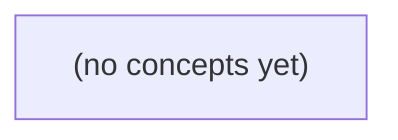

# 06.08 锁与MVCC：从成员退群并发到可串行化决策

*面向 Go 初学者，以虚构成员 u-a 退群与发送消息 m-a 的并发场景为主线，系统解释 PostgreSQL 的 MVCC、快照、行锁、隔离级别、死锁与长事务后果。全书通过可交接的时间线、版本图和分层练习，建立“读取旧值不是业务许可、提交前必须协调”的事务思维。*

**章节:** 2

---

## 本书导览

- 了解整本书的章节脉络
- 掌握各章之间的概念依赖关系
- 选择最合适的阅读顺序

# 06.08 锁与MVCC：从成员退群并发到可串行化决策

面向 Go 初学者，以虚构成员 u-a 退群与发送消息 m-a 的并发场景为主线，系统解释 PostgreSQL 的 MVCC、快照、行锁、隔离级别、死锁与长事务后果。全书通过可交接的时间线、版本图和分层练习，建立“读取旧值不是业务许可、提交前必须协调”的事务思维。

下方的概念图展示了本书 0 个核心概念以及它们之间的依赖关系；再下方是 1 个章节的入口。你可以按从上到下的顺序阅读，也可以根据自己的兴趣或先验知识选择切入点。

#### 概念图



## 章节索引

- **06.08 锁与 MVCC：成员变更时谁看见哪一版** — 面向Go初学者，围绕退群与发送并发推导快照、行版本、行锁、死锁、写偏斜及长事务回收。

## 06.08 锁与 MVCC：成员变更时谁看见哪一版

- 区分行版本、快照和锁
- 手算RC/RR下的成员可见性
- 用同一成员行锁建立发送与退群顺序
- 画两行死锁等待环
- 解释写偏斜和可串行化失败
- 分析长事务对版本回收的影响
- 区分PostgreSQL与MongoDB事务口径

沿用 u-a 是 c-a 活跃成员的设定，分析发送 m-a 与退群并发时，数据库如何决定谁能发送、谁先失效。

### 先分清事务、行、版本与快照

### 先分清事务、行、版本与快照

仍以 `u-a` 是会话 `c-a` 的活跃成员为例。发送 `m-a` 与退群并发时，先不要把“成员资格”想成一个永远不变的布尔值；数据库实际处理的是行、版本、事务与可见性。

- **成员资格行**：例如 `conversation_member(c-a, u-a, status='active')`。它描述“当前业务状态应是什么”，也是更新、加锁和约束通常作用的对象。
- **历史版本**：MVCC 下，一行被更新不一定立刻消失。退群可能生成新版本 `status='left'`，旧的 `active` 版本仍暂时保留，供较早开始的事务读取。
- **事务**：发送和退群各自是一组原子操作。发送事务会校验成员资格、写入消息；退群事务会修改资格并提交。未提交的修改通常不应被其他事务当作既成事实。
- **快照**：一次普通 `SELECT` 常按其读视图查看“当时可见的已提交版本”。因此，发送事务可能读到旧的 `active`，即使另一个退群事务已经开始但尚未提交。
- **提交状态**：只有提交才使某个版本成为后续事务可稳定观察的结果；回滚则使该次修改失效。

关键区别是：快照回答“我此刻能读到哪一版”，锁或条件更新回答“我现在还能否据此改变系统”。因此，`SELECT` 看到 `active` 只是历史可见性，不是发送许可。若发送必须与退群形成明确先后，就要在同一成员资格行上建立串行化关系：谁先获得并完成必要的锁定/更新，谁先决定结果。

### 旧快照看见成员，不等于获得发送许可

### 旧快照看见成员，不等于获得发送许可

MVCC 允许普通查询读取“某一时刻曾经成立”的成员关系。例如发送端事务在时刻 $t_0$ 执行：

`SELECT status FROM channel_members WHERE channel_id='c-a' AND user_id='u-a'`

它可能从快照中看见 `u-a` 仍是活跃成员；与此同时，另一个事务已开始退群，或随后完成退群并提交。这个查询结果说明的只是：

> 在该查询所使用的快照版本中，`u-a` 曾是成员。

它并不自动推出：

> 在消息 `m-a` 被批准写入时，`u-a` 仍有发送权限。

两者的差别在于，普通 `SELECT` 关注**历史可见性**，而发送决定必须验证**当前有效性**。若把第一次查询结果缓存下来当作许可证，就会出现错误时序：

1. 发送事务读到旧版本：`status='active'`；
2. 退群事务提交，将成员记录更新为 `left`，或删除有效成员版本；
3. 发送事务继续插入 `m-a`，却未重新确认成员资格。

此时消息在退群之后仍被接受，违反了“退群先完成则发送拒绝”的规则。

因此，发送路径中的成员校验不能只是无锁快照读，而应成为与写消息同一原子决定的一部分：例如锁定成员行后检查当前状态，或用带条件的写入表达“只有仍为活跃成员才可提交”。锁负责让发送与退群在同一成员记录上排序；版本与快照只负责告诉查询“能看见哪一版”。

还要区分数据库提交与外部动作：数据库内成员校验、消息写入先提交，之后才发送 HTTP 通知或等待设备确认。外部确认不能倒过来充当成员资格的判据；真正的许可证，是提交瞬间受并发控制保护的当前成员状态。

### 用成员行锁排定发送与退群

### 用成员行锁排定发送与退群

把 `(c-a, u-a)` 的成员记录视为唯一竞争对象：发送事务与退群事务都必须先锁住这同一行，再依据锁定后读到的当前版本决定后续动作。关键不在于谁更早执行了普通 `SELECT`，而在于谁先取得成员行的排他锁。

发送可采用如下顺序：

1. 开启事务，执行带锁查询：`SELECT ... FOR UPDATE`；
2. 若锁定后的成员版本仍为“活跃”，写入消息 `m-a`，并提交；
3. 提交成功后，再异步调用外部 HTTP、推送设备或等待确认。

退群事务同样先锁成员行，然后将状态改为“已退出”或写入退出版本，最后提交。于是并发结果只有两种确定顺序：

- **发送先锁定并提交**：退群事务等待。发送在锁内确认 `u-a` 仍是活跃成员，`m-a` 可以写入并提交；随后退群取得锁、更新成员状态。消息在退群前已合法成立。
- **退群先完成**：发送事务等待。退群提交后，发送取得锁时读到的是“已退出”的最新版本，因此拒绝写入 `m-a`。

MVCC 快照可能让某个普通查询暂时看见旧的“活跃”版本，但这只是读取历史版本，不是发送许可证。真正的授权判断必须发生在取得成员行锁之后，并以该锁保护下的当前版本为准。事务提交前也不应把“已发送”告知外部系统；数据库提交决定内部事实，外部 HTTP 或设备确认只能在提交后处理，并设计为可重试、可幂等。

### 提交边界不能延伸到外部确认

### 提交边界不能延伸到外部确认

发送 `m-a` 的数据库事务可以原子地完成：确认 `u-a` 仍是 `c-a` 成员、写入消息行、更新会话状态或投递任务，并提交。这一提交点决定了数据库内“消息已被接受”的事实；退群事务若随后取得成员关系行的锁并提交，则只会让**之后**尚未成立的发送失效，不能撤销已提交的 `m-a`。

但提交不等于外部世界已经确认。常见链路至少有四个边界：

1. **数据库提交**：`m-a` 已持久化，可被可靠地重新读取。
2. **HTTP 调用成功**：下游服务收到请求，仍可能尚未落库，或响应在网络中丢失。
3. **消息系统投递成功**：代理已接收任务，不代表消费者已处理。
4. **设备确认**：设备可能离线、推送被系统延迟、用户已退出客户端，甚至永远不确认。

因此，不能在持有成员关系行锁或整个数据库事务期间等待 HTTP 响应、消息消费结果或设备回执。外部网络等待会拉长锁持有时间，阻塞退群及其他发送；更糟的是，网络超时无法区分“对方未收到”和“对方已收到但响应丢失”。

更稳妥的做法是：事务内写入 `m-a` 与待投递记录（例如发件箱记录），提交后由独立投递者调用外部服务；投递使用幂等键，以应对重试和重复请求。设备确认则作为消息状态的后续演进，如“已投递”“已读”，而不是发送事务是否提交的前提。

锁保护的是数据库中的判定与写入顺序，不是跨网络的送达承诺。`SELECT` 曾看见旧成员状态，更不能成为等待外部确认期间继续发送的许可证。

### 把并发规则落到 Go 的事务流程

### 把并发规则落到 Go 的事务流程

关键不是“发送前查到过活跃成员”，而是让**资格校验与消息写入**在同一事务、同一串行化点完成。可把 `membership(c-a,u-a)` 这行作为竞争对象：发送和退群都必须锁定并检查它。

- **发送 m-a**
  1. 开启短事务。
  2. `SELECT status ... FOR UPDATE` 锁住成员行。
  3. 若 `status != active`，回滚并返回“已不是成员”；客户端不能把它当作可盲目重试的临时错误。
  4. 插入消息 `m-a`，可同时记录发送时的成员版本或审计信息。
  5. 提交事务；提交成功才表示发送决定成立。
  6. 提交后异步投递 HTTP、推送或设备确认；这些外部动作失败不应回滚已提交消息，应按幂等键重试投递。

- **退群**
  1. 开启短事务。
  2. 对同一成员行执行 `SELECT ... FOR UPDATE`。
  3. 若仍为 `active`，更新为 `left`，递增版本号或写入离开时间。
  4. 提交后再发布“成员已退出”事件。

若发送先拿到锁，它会先检查到 `active`、写入 `m-a` 并提交；退群随后锁到新版本，再将状态改为 `left`。若退群先提交，发送等待锁释放后必须重新读取当前版本，发现 `left` 即拒绝。

因此，普通 `SELECT` 在快照中看见旧成员状态，只能说明“曾经看见过”；它不是发送许可证。遇到死锁、序列化失败或连接中断可重试整个事务；但业务拒绝、唯一键冲突，以及“提交结果未知”必须依赖 `m-a` 的幂等标识查询确认，不能直接再次生成一条消息。

> **要点** — 快照只能说明曾经可见；发送许可必须由成员行上的当前状态与提交顺序共同决定。

成员退群与发送并发时，先分清版本、快照和锁，才能准确判断每次读取到底看见什么。

### 从成员行 v0 到 v1：版本不是锁

### 从成员行 v0 到 v1：版本不是锁

设成员行初始为 `v0(active=true)`，它已经提交。事务 `Tleave` 执行退群更新时，并不是把 `v0` 直接改成 `false`；可将其理解为产生新版本：

- `v0`：`active=true`，旧版本，已提交；
- `v1`：`active=false`，由 `Tleave` 写入，起初未提交；
- `Tleave` 提交后，`v1` 才成为对后续快照可见的新状态。

关键是区分三件事：

1. **版本**：同一成员行在不同时间的逻辑状态，如 `v0` 与 `v1`。
2. **提交状态**：`v1` 已写出不等于已生效；未提交版本不能被普通读取当作正式结果。
3. **锁**：更新者通常持有与该行相关的锁，用于协调并发写入、避免两个事务同时改出互相矛盾的结果。锁不是版本本身，也不决定普通读必然等待。

因此，当 `Tleave` 已写 `v1` 但尚未提交时，普通查询不会读到“半退群”的 `v1`，而会按自己的快照选择可见版本，通常仍看到已提交的 `v0(active=true)`。若 `Tleave` 回滚，`v1` 被废弃，逻辑上仍是 `v0`；若其提交，之后建立的新快照才可能选择 `v1(active=false)`。

这里的 `v0 → v1` 是用于推理可见性的版本图，不应把它等同于 PostgreSQL 内部物理元组字段或直接套用 `xmin/xmax` 细节。

### 普通读按快照选择可见版本

### 普通读按快照选择可见版本

设成员行最初只有已提交版本：

- `v0: active=true`，由较早事务提交；
- `Tleave` 将其更新为 `v1: active=false`，但尚未提交。

此时版本关系可抽象为：

`v0（已提交） → v1（Tleave 写入，未提交）`

若并发事务 `Tsend` 执行普通查询，例如：

`SELECT active FROM member WHERE user_id = ...`

它不会因为 `v1` 已经被写入就直接读到 `false`。普通读的核心不是“读取最新写出的版本”，而是“在当前语句或事务快照中，选择一个可见版本”。

对 `Tsend` 的快照而言：

1. `v1` 的创建事务 `Tleave` 尚未提交；
2. 未提交事务不属于该快照认可的已提交事务集合；
3. 因而 `v1` 不可见；
4. 查询沿版本链回退，找到仍对该快照可见的 `v0`；
5. 最终读到 `active=true`。

这保证了读取不会观察到可能被回滚的中间状态。若允许 `Tsend` 读到未提交的 `v1=false`，随后 `Tleave` 回滚，则 `Tsend` 曾经依据一个从未真正生效的退群结果作出决策，形成脏读。

因此，`Tleave` 写出 `v1` 并不等于其他普通读立即“看见退群”。只有 `Tleave` 提交后，`v1` 才可能进入后来快照的可见集合；在提交之前，普通读仍从版本图中选择已提交的 `v0`。这里的版本图用于说明可见性逻辑，并非 PostgreSQL 物理存储中 `xmin/xmax` 字段的精确表示。

### 读已提交：两次查询可见不同成员状态

### 读已提交：两次查询可见不同成员状态

设成员行初始已提交版本为 $v0$：

`member_id=42, active=true`

在 PostgreSQL 的“读已提交”隔离级别中，关键规则是：**每条 SQL 语句开始时都会取得一个新的可见性快照**，而不是整个事务共用一个快照。

| 时间 | Tsend（发送消息） | Tleave（退群） | 可见结果 |
|---|---|---|---|
| 1 | 开始事务 |  |  |
| 2 | `SELECT active ...` |  | 读取 $v0=true$ |
| 3 |  | 将行更新为 $v1=false$，尚未提交 | Tsend 仍不能读到 $v1$ |
| 4 |  | `COMMIT` | $v1$ 成为已提交版本 |
| 5 | 再次执行 `SELECT active ...` |  | 读取 $v1=false$ |

第一次查询开始时，$v1$ 尚未提交，快照只允许 Tsend 看见已提交的 $v0$，因此结果为 `true`。即使 Tleave 已经执行了更新语句，未提交版本也不会被普通读取“脏读”。

随后 Tleave 提交。Tsend 的第二条 `SELECT` 会重新建立语句级快照；此时 $v1$ 已提交，且它比旧版本更新，所以第二次结果变为 `false`。

```sql
-- Tsend，读已提交
BEGIN;
SELECT active FROM members WHERE member_id = 42; -- true

-- 此处 Tleave 提交 active=false

SELECT active FROM members WHERE member_id = 42; -- false
COMMIT;
```

因此，“同一事务内两次读到不同值”并不违反读已提交的语义；它恰恰是语句级快照的直接结果。这里的 $v0 \rightarrow v1$ 是帮助推理的逻辑版本图，不等同于 PostgreSQL 物理存储中的 `xmin/xmax` 字段。

### 可重复读：旧快照稳定，但写入未必成功

### 可重复读：旧快照稳定，但写入未必成功

设成员行初始版本为 `v0(active=true)`，已提交。`Tleave` 将其更新为 `v1(active=false)`；`Tsend` 则检查成员是否仍有效。

在 PostgreSQL 的**读已提交**隔离级别中，快照以“语句”为边界：

1. `Tsend` 的第一条查询开始时，`Tleave` 尚未提交，故只能看见已提交的 `v0`，读到 `true`。
2. `Tleave` 提交 `v1`。
3. `Tsend` 的第二条查询会取得新快照，于是看见 `v1`，读到 `false`。

而在**可重复读**中，事务通常在第一条实际读写语句时取得快照，并在整个事务内复用。若 `Tsend` 已在该快照中看见 `v0`，即使随后 `Tleave` 提交：

- `Tsend` 再次普通读取，仍可读到 `v0(active=true)`；
- 它不会读取 `Tleave` 未提交的版本，也不会自动切换到后来提交的 `v1`。

这保证了同一事务内读结果稳定，但不等于“旧快照下可以随意写”。若 `Tsend` 试图更新同一成员行，而该行已被 `Tleave` 在快照取得后更新并提交，PostgreSQL 可能无法把该写入安全地建立在旧快照之上，从而报出序列化失败，例如“由于并发更新无法序列化访问”。应用应回滚并重试整个事务。

因此，可重复读的含义是“读视图稳定”，不是“并发冲突被消除”；读到 `true` 只说明它在自己的快照中仍有效，不保证该成员在当前最新状态下仍可发送。

### 把版本图与实现细节分开理解

### 把版本图与实现细节分开理解

本节把成员行抽象为两版：

- `v0: active=true`：已提交，表示成员仍在群内；
- `v1: active=false`：由 `Tleave` 写出，提交前对普通读不可见；提交后成为较新的已提交状态。

这里的 `v0`、`v1` 是**教学用版本图标签**：它们帮助我们讨论“某个快照能否看见某次变更”，并不表示 PostgreSQL 表中真的存在名为 `v0`、`v1` 的字段，更不等同于 PostgreSQL 的 `xmin`、`xmax`。

在 PostgreSQL 中，行版本可见性由事务标识、提交状态、快照边界及实现规则共同决定。`xmin/xmax` 是底层元组版本相关元数据；应用代码不应根据本节的版本图，推断其具体存储布局、字段值或清理时机。理解时只需保留这一层语义：

`读取结果 = 候选行版本 + 当前语句或事务快照的可见性判断`

也不要把该图直接套到 MongoDB。MongoDB 的事务快照、读关注级别与提交可见性有自己的口径；即使同样描述为“快照读”，其默认读行为、隔离保证和冲突处理也未必与 PostgreSQL 相同。讨论具体系统时，应回到该系统的事务隔离级别、读选项和官方可见性规则。

> **要点** — 普通读依快照选已提交版本；读已提交按语句换快照，可重复读通常在事务内保持旧快照。

成员是否能发送，不只取决于“是否已退群”，还取决于事务何时读取、何时加锁与何时提交。

### 先锁成员行，再决定能否发送

### 先锁成员行，再决定能否发送

把“发送资格”收敛为同一条规则：发送和退群都必须先竞争同一条成员记录的行锁，再依据锁释放后可见的最新版本决定后续动作。例如：

`SELECT active FROM group_member WHERE group_id = ? AND user_id = ? FOR UPDATE;`

这里的职责必须分清：

- `FOR UPDATE` 锁住的是**当前已存在的成员行**，使发送、退群、恢复成员资格等操作串行化。
- 事务快照决定一次查询能看见哪些已提交版本；在 PostgreSQL 的 `Read Committed` 隔离级别中，等待锁后会重新检查目标行的最新状态。
- MVCC 行版本保存 `active=true/false` 等状态变化；锁并不“冻结时间”，而是阻止竞争者同时基于旧资格作决定。

若 `Tsend` 先锁到成员行，确认 `active=true`，随后插入消息 `m-a` 并提交；`Tleave` 的退出更新必须等待。于是 `m-a` 合法地发生在退出提交之前。反之，若 `Tleave` 先锁定并将 `active` 更新为 `false` 后提交，`Tsend` 等待结束后重新检查该行，发现已非活跃成员，就应拒绝发送，而不是沿用等待前读到的旧值。

退出路径也必须锁这同一行，例如先 `FOR UPDATE`，再写入 `active=false`。否则“发送锁成员、退出却直接更新”会破坏统一顺序。

但行锁有边界：它不能保护**不存在的成员行**，也不能自动约束未遵守该协议的其他事务，更无法撤回已发往外部推送系统的通知。数据库锁保证的是参与同一锁规则的本库事务顺序；外部副作用仍需配合事务外盒、幂等键等机制。

### 发送先获锁：退群为何必须等待

### 发送先获锁：退群为何必须等待

设成员表中存在一行 `(conversation_id, user_id, active=true)`。发送事务 `Tsend` 不应先普通读取再插入消息，而应在同一事务中执行：

`SELECT ... FROM members WHERE conversation_id=? AND user_id=? FOR UPDATE`

随后确认 `active=true`，再插入消息。时间线如下：

1. `Tsend` 开始，在 `Read Committed` 隔离级别下锁住该成员行；此时它看到已提交版本 `active=true`。
2. `Tleave` 开始，试图将同一行更新为 `active=false`。`UPDATE` 需要取得与 `Tsend` 冲突的行锁，因此进入等待。
3. `Tsend` 插入消息 `m-a`，并提交。消息与“发送时成员仍活跃”的判断处于同一个原子事务中。
4. 锁释放后，`Tleave` 获得锁，将成员标记为退出并提交。

因此，`m-a` 合法：它在线性化意义上发生于退群之前。虽然最终查询成员表会看到 `active=false`，但不能据此倒推该消息是“退群后发送”的；数据库保证的是事务提交顺序与锁冲突顺序，而非用最终状态重写历史。

这里等待并非性能副作用，而是业务规则的一部分：退出操作不能越过已经取得成员资格锁的发送操作。反过来，若退出先锁定并提交，发送事务在等待后必须重新检查最新版本；发现 `active=false` 就拒绝插入。这样，“发送”和“退出”才对同一成员资格状态形成可解释的先后关系。

### 退群先提交：发送为何要重新检查

### 退群先提交：发送为何要重新检查

设成员行初始为 `active=true`。`Tleave` 先执行退群操作，并通过 `SELECT ... FOR UPDATE` 锁住该成员行；随后将其更新为 `active=false`，但尚未提交。此时 `Tsend` 试图发送消息，也必须先锁定同一成员行：

1. `Tsend` 的 `SELECT ... FOR UPDATE` 发现该行已被 `Tleave` 锁定，因而等待。
2. `Tleave` 提交后，退群版本成为已提交版本：`active=false`，行锁随之释放。
3. `Tsend` 获得锁，但不能把“等待前曾经可能看见的 `active=true`”当作授权依据。
4. 在 PostgreSQL 的 `Read Committed` 隔离级别下，锁定读取会在等待结束后针对当前可见版本重新检查条件；发送事务此时读取到 `active=false`。
5. 因而 `Tsend` 必须拒绝插入消息 `m-a`，并提交或回滚其自身的失败处理，而不是继续发送。

关键不在于“先读到什么”，而在于**拿到成员行锁后确认什么**。发送路径应把授权判断写在受锁保护的读取之后，例如先锁定成员记录，再检查：

`active = true`

只有检查仍成立时，才允许插入消息。否则会出现典型竞态：发送事务在等待锁之前依据旧状态决定“可以发送”，而退群已在等待期间提交；若不重新检查，就会让已退出成员在退群生效后仍写入消息。

这里的保证仅覆盖所有遵守该成员行锁协议的发送、退出路径；它不自动约束未参与该协议的写入事务，也不能仅靠锁住成员行保护“不存在的成员行”或阻止事务外的外部推送。

### 同一规则的边界：锁不住什么

### 同一规则的边界：锁不住什么

`SELECT ... FOR UPDATE` 锁住的是**已经存在的那一条成员行**，并且只对愿意遵守同一协议的数据库事务有效。它不是“房间级总开关”。

- **锁不住不存在的成员行。** 若成员记录尚未创建，或已被删除，便没有可锁的行。两个事务都先查到“无成员”，随后各自插入，可能形成重复记录或错误地恢复资格。对此应配合唯一约束、`INSERT ... ON CONFLICT`，必要时改为锁定可稳定存在的父行（如房间行）。

- **锁不住未参与协议的写入。** 发送与退出路径若锁成员行，但管理员脚本、批处理任务或另一套服务直接执行  
  `UPDATE membership SET active = false`，却不先获取同一行锁，就绕过了“先串行化、再判断”的规则。正确性依赖所有改变资格或消费资格的路径都统一加锁、重读并校验状态。

- **锁不住数据库外部副作用。** 行锁不能撤回已调用的消息网关、邮件服务或 Webhook。若事务内先向外部推送，再因退出或提交失败回滚，数据库没有消息记录，外部却已收到消息。应先在事务中写入待发送事件；提交后由可靠消费者投递，并通过幂等键处理重试与重复投递。

因此，成员行锁保证的是参与者之间的数据库内顺序，而非不存在对象、旁路写入或外部世界的一致性。

### Go事务实现与PostgreSQL锁语义

### Go事务实现与PostgreSQL锁语义

发送消息时，应把“锁成员行→检查状态→写消息→提交”放进同一个数据库事务，而不是先查询成员状态、再另开事务插入消息。以 Go 的 `database/sql` 为例，核心顺序是：

1. `BeginTx` 开启事务；
2. 执行 `SELECT active FROM group_members WHERE group_id=$1 AND user_id=$2 FOR UPDATE`；
3. 若无成员行或 `active=false`，回滚并返回“已退出群组”；
4. 插入消息 `INSERT INTO messages (...) VALUES (...)`；
5. `Commit`。

`FOR UPDATE` 锁住的是当前存在的成员元组。若 `Tsend` 先取得锁，`Tleave` 对同一成员执行退出更新会等待；`Tsend` 在持锁期间确认仍为活跃成员、插入消息并提交后，`Tleave` 才能将其标记为退出。反过来，若 `Tleave` 先更新并提交，`Tsend` 等待锁释放后，在 PostgreSQL 的 `Read Committed` 隔离级别中会重新检查该行的最新版本，发现 `active=false`，因此拒绝发送。

关键不在于某个接口使用了锁，而在于所有改变成员资格或依赖成员资格写入的路径都遵守同一顺序。例如退出、踢人、封禁、恢复成员、发送消息、发送附件都应先锁同一成员行，再读取和修改状态；否则未加锁的路径仍可能绕过约束。

还要明确锁的边界：锁一行不能保护“不存在的成员行”，不能自动约束其他未遵循该协议的事务，也不能撤回已经提交给外部推送服务的通知。成员行不存在时通常应依赖唯一约束、插入冲突处理或更高层的群组锁；外部副作用则宜采用事务提交后投递或 outbox 模式。

> **要点** — 成员资格必须由同一行锁串行化；获锁后校验当前状态，才能让发送与退群形成确定顺序。

成员退群与消息发送并发时，先厘清锁保护什么、谁会等待，以及数据库如何打破死锁环。

### 锁、版本与快照各管什么

### 锁、版本与快照各管什么

成员变更与消息发送并发时，先把三个概念分开：**行版本解决“数据有几版”**，**快照解决“本事务能看见哪一版”**，**锁解决“冲突操作谁先执行”**。把它们混为一谈，往往会误以为“加锁后所有人都立刻看到新数据”。

以 PostgreSQL 的 MVCC 为例，`UPDATE` 不会原地改写旧行，而是生成新行版本；旧版本是否仍对某个事务可见，取决于该事务的快照与提交状态。一个已经开始的普通查询，可能继续看到“成员仍在群中”的旧版本；另一个较晚开始的查询，则可能看到“成员已退群”的新版本。

锁不负责决定普通快照读看见什么。它主要约束**会改变数据或要求稳定当前行的操作**：

- `UPDATE` 会对目标行取得排它性质的行锁，竞争更新同一行的事务需要等待。
- `SELECT ... FOR UPDATE` 会锁住选中的当前行，避免其他事务先把这些行更新、删除或以冲突方式锁定。
- 表级锁用于协调更粗粒度的操作；其冲突范围与行锁不同，不能把“锁表”当作所有 SQL 都互相阻塞。
- 带条件的查询还要关注谓词或范围：`WHERE group_id = 10 AND status = 'active'` 关心的不仅是已读到的行，也关心是否出现会改变判断结果的新行。

本节只讨论必要冲突：同一成员记录的并发改写、先检查后变更所需的稳定性，以及范围条件可能被并发插入或更新改变的情形。普通读取通常依赖快照，不应无故扩大为排它等待。

### 成员行上的发送与退群排序

### 成员行上的发送与退群排序

设成员关系表中有一行 `membership(group_id, user_id, status)`。发送消息不应只读取 `status='active'`，而应先锁定该成员行：

`SELECT ... FROM membership WHERE group_id=? AND user_id=? AND status='active' FOR UPDATE`

随后插入消息并提交。退群则执行：

`UPDATE membership SET status='left' WHERE group_id=? AND user_id=? AND status='active'`

`FOR UPDATE` 获取的行级排它锁与 `UPDATE` 修改该行时所需的行级锁冲突；它们不能同时持有。因此，两项操作会被排成先后顺序，而非各自基于旧状态并发完成。

- **发送先锁到成员行**：退群的 `UPDATE` 等待。发送事务确认成员仍有效、写入消息后提交；退群随后把状态改为 `left`。该消息在线性顺序上发生于退群之前。
- **退群先更新成员行**：发送的 `FOR UPDATE` 等待。退群提交后，发送事务在“仍为 active”的条件下已找不到可锁行，于是不能发送消息；该发送在线性顺序上发生于退群之后。

这里锁保护的不是消息表本身，而是“该成员是否仍有发送资格”的判定依据。若发送只做普通查询，MVCC 允许它读到退群前的旧版本；即使退群已并发开始，也可能据此错误写入消息。用 `FOR UPDATE` 将资格检查与消息写入置于同一事务中，才能把“检查—发送”变成可排序的临界区。

### 行锁之外：表锁与范围条件

### 行锁之外：表锁与范围条件

`FOR UPDATE` 与 `UPDATE` 看似只影响命中的行，实际在 PostgreSQL 中，一条语句通常同时持有**行级锁**和**表级锁**。例如，`SELECT ... FOR UPDATE` 会对选中行加行锁，并取得目标表的 `ROW SHARE` 表锁；`UPDATE` 则锁定被修改的行，并取得更强的 `ROW EXCLUSIVE` 表锁。这里的表级锁通常不意味着“锁全表”，其主要作用是协调 DDL、`VACUUM FULL`、显式 `LOCK TABLE` 等高冲突操作。

| 问题 | 行级锁 | 表级锁 |
|---|---|---|
| 保护对象 | 具体记录，如成员 R1 | 整张表上的操作类别 |
| 常见等待 | 两个事务修改或锁定同一行 | DDL 与写入、显式表锁之间 |
| 是否阻塞其他行写入 | 通常不会 | 取决于锁模式，普通写入间通常可并发 |

范围条件带来另一类风险。若事务先查询“群内尚未退出的成员数”，再据此决定是否允许新成员加入，那么即使已锁住当前查到的行，另一个事务仍可能插入一条满足条件的新记录；这不是“同一行竞争”，而是**幻读/谓词竞争**。

在 `READ COMMITTED` 或 `REPEATABLE READ` 下，应用若要防止这类变化，通常需借助合适的唯一约束、排它设计或显式锁定策略。`SERIALIZABLE` 隔离级别则由 PostgreSQL 的可串行化快照隔离机制跟踪谓词读写依赖；它可能在发现危险依赖后撤销其中一个事务，并要求重试。

需要特别区分：PostgreSQL 的谓词锁不是传统意义上“范围一读，范围内插入就被阻塞”的 gap lock。它主要用于检测可串行化冲突，常见结果是事务提交时出现序列化失败，而非把所有潜在插入者长期拦在锁外。

### 两行交叉加锁为何死锁

### 两行交叉加锁为何死锁

设成员关系表中有两行：`R1` 表示成员 A，`R2` 表示成员 B。两个事务都要修改这两行，但加锁顺序相反：

| 时刻 | 事务 T1 | 事务 T2 |
|---|---|---|
| 1 | 锁定并更新 `R1` |  |
| 2 |  | 锁定并更新 `R2` |
| 3 | 请求锁定 `R2`，等待 T2 | 请求锁定 `R1`，等待 T1 |

此时等待关系为：

`T1 → 等待 T2 释放 R2`  
`T2 → 等待 T1 释放 R1`

两者都不能继续提交，也都不会主动释放已持有的行锁，因而形成闭环。这不是“谁等得更久谁先执行”，而是没有任何一方能够自行推进的死锁。

在 PostgreSQL 中，`UPDATE` 会对目标行取得与 `SELECT ... FOR UPDATE` 冲突的行级锁。数据库检测到等待环后，会选择其中一个事务作为牺牲者并回滚，另一个事务随即获得所需锁并继续执行。被撤销的一方通常收到死锁错误；它此前在该事务中的全部修改都会回滚，而不是只跳过第二行。

避免方式是让所有会同时操作多行的路径遵守统一顺序，例如始终按成员 ID 升序锁定：

`R1 → R2`，而不是某些请求走 `R1 → R2`、另一些请求走 `R2 → R1`。

此外应保持事务短小：先完成参数校验和外部查询，再开启事务并尽快更新、提交。即使已统一顺序，应用仍应把死锁视为可恢复的并发结果，对整笔事务进行次数有限的重试。锁超时表示“等待锁超过配置时长”；业务超时则表示请求整体已不值得继续，二者应分别处理。

### 避免死锁：顺序、时限与重试

### 避免死锁：顺序、时限与重试

死锁不是“锁等得太久”，而是等待形成环。例如成员变更涉及两行记录：

- `T1` 先锁 `R1`，再申请锁 `R2`
- `T2` 先锁 `R2`，再申请锁 `R1`

此时双方各持有对方需要的锁，数据库检测到环后会撤销其中一个事务；应用必须接受“本次事务失败”，而不是假设数据库会替业务完成重试。

最有效的预防措施是**统一锁顺序**。例如所有涉及成员、会话或账户的操作，均按主键升序排列后再锁定：

`SELECT ... WHERE id IN (...) ORDER BY id FOR UPDATE`

这样，无论是退群、转移群主还是批量更新成员状态，多个事务都会先锁较小的 `id`，循环等待便无法形成。不要让不同代码路径分别按“请求参数顺序”“创建时间”或“业务角色优先级”加锁。

同时保持事务短小：

- 事务内只做必要的读取、校验和写入；
- 不要在持锁期间调用远程服务、发送消息、等待人工输入或执行长时间计算；
- 将通知、缓存刷新等副作用放到提交后处理，必要时使用可靠事件表。

发生死锁、序列化失败或短暂锁竞争时，应执行**有界的整笔重试**：重新开启事务，重新读取数据、加锁、校验并提交；不能只重试最后一条 `UPDATE`。通常限制为少量次数，并加入随机退避，超过上限则返回“操作繁忙”或进入异步队列。

还要区分两类时限：

- **锁等待超时**：等待他人释放锁超过阈值，说明竞争过强；可重试，但应记录热点行和调用链。
- **业务处理超时**：整个请求或事务已接近用户可接受时限；此时即使锁最终可获得，也应停止继续占用资源并尽快回滚。

锁超时解决的是数据库等待，业务超时约束的是端到端体验；两者都需要设置，但不能互相替代。

> **要点** — 锁建立写入顺序而非决定读版本；统一加锁顺序、缩短事务并对死锁做有界整笔重试。

成员变更的并发难点不只在于“谁先加锁”，更在于不同隔离级别下，事务究竟看见哪一版成员名单，以及业务约束是否被共同保护。

### 三层概念：版本、快照与锁

### 三层概念：版本、快照与锁

理解成员变更并发问题，先要把三个容易混淆的概念拆开：

- **行版本**：`UPDATE` 不会简单地“原地覆盖”旧数据，而是产生新版本；旧版本会暂时保留，供仍需读取历史状态的事务使用。它回答的是：**数据库保存了哪些历史状态？**
- **快照**：一次查询或一个事务依据快照判断某个行版本是否可见。快照决定“我现在看到的成员名单是哪一版”，而不是决定谁能写。它回答的是：**本次读取看得见哪些版本？**
- **行锁**：更新、删除或显式 `SELECT ... FOR UPDATE` 会锁住目标行，阻止冲突写入按任意顺序同时发生。它回答的是：**谁可以先修改这行？**

例如，管理员 A 与 B 都读到“还有另一位管理员”。A 删除成员行 `a`，B 删除成员行 `b`。即使两人分别锁住了自己要删的行，锁也并未保护“团队至少保留一名管理员”这个整体约束；两笔操作仍可能共同造成零管理员。

因此，不能把“读到旧数据”归咎于锁，也不能把“加了行锁”误认为快照会自动更新。MVCC 的版本与快照主要解决读写并存；行锁主要协调同一行的写冲突。涉及成员数量、角色覆盖等跨行不变量时，还需要让事务竞争同一个保护对象，或采用可串行化事务并在发生序列化失败后重试。

### RC与RR：成员名单何时刷新

### RC 与 RR：成员名单何时刷新

设团队初始有两位管理员：`A`、`B`。业务规则是“团队至少保留一位管理员”。两个事务分别准备让自己退群：

- 事务 `T_A`：检查是否还有其他管理员；若有，则将 `A` 改为普通成员或退出。
- 事务 `T_B`：执行同样逻辑，将 `B` 改为普通成员或退出。

在 PostgreSQL 的**读已提交**（RC）下，每条 SQL 语句都会取得新的快照。若 `T_A` 先完成更新并提交，随后 `T_B` 再执行检查语句，则 `T_B` 的新快照会看见 `A` 已不再是管理员：

| 时刻 | `T_A` 可见管理员 | `T_B` 可见管理员 |
|---|---|---|
| 两者首次查询 | `A, B` | `A, B` |
| `T_A` 提交后，`T_B` 再查询 | — | `B` |

因此，RC 中“成员名单”会随下一条语句刷新；后执行检查的一方有机会发现约束已接近失效。但这不是自动保证：若两边都先完成检查、再分别更新不同的成员行，仍可能都依据旧检查结果行动。

在**可重复读**（RR）下，快照通常在事务首次一致性读取时确定，并保持到提交。即使 `T_A` 已提交，`T_B` 后续查询仍可能看到其事务开始时的名单：

| 时刻 | `T_A` 可见管理员 | `T_B` 可见管理员 |
|---|---|---|
| 首次查询后 | `A, B` | `A, B` |
| `T_A` 提交后，`T_B` 再查询 | — | 仍为 `A, B` |

于是两人都“证明”还有另一位管理员，却更新不同的行，最终可能出现零管理员。这是典型的写偏斜：RR 保证同一事务内读到稳定版本，却不保证多个事务的判断合起来仍满足业务约束。

### 两管理员退群：为何行锁仍会失守

### 两管理员退群：为何行锁仍会失守

设 `member` 表中每个成员一行，字段含 `group_id`、`user_id`、`role`。业务约束是：**每个群至少保留一位管理员**。初始状态如下：

| 群组 | 用户 | 角色 |
|---|---|---|
| G1 | A | 管理员 |
| G1 | B | 管理员 |

管理员 A、B 几乎同时退群，应用逻辑都是：

1. 查询本群是否还有“除自己以外”的管理员；
2. 若有，则把自己的成员行改为普通成员或删除；
3. 否则拒绝操作。

并发过程可能是：

| 时刻 | 事务 A | 事务 B |
|---|---|---|
| T1 | 读到 B 仍是管理员 |  |
| T2 |  | 读到 A 仍是管理员 |
| T3 | 锁住并更新 A 自己的行 |  |
| T4 |  | 锁住并更新 B 自己的行 |
| T5 | 提交 | 提交 |

A 锁的是 A 的成员行，B 锁的是 B 的成员行；两把锁不冲突，因此数据库完全可以允许二者同时完成。最终 G1 中没有任何管理员。

问题不在于“锁不够强”，而在于锁保护的对象错了：被保护的是各自的行，但真正需要维持的是“群 G1 至少有一名管理员”这一**跨行约束**。单独锁住待修改行，无法阻止另一事务基于同一份旧名单作出相同判断。

若采用 `READ COMMITTED`，每条语句可能看到新的已提交版本，但“检查”和“更新”之间仍可被并发事务穿插。即使在 `REPEATABLE READ` 中，两事务各自稳定地看到“另一位仍在”，也仍可能形成这种写偏差。要避免失守，应让并发操作竞争同一保护对象，例如锁住群组主行、维护可锁定的管理员计数行，或使用 `SERIALIZABLE` 执行整笔判断与更新，并在发生序列化失败时重试。

### 写偏斜与可串行化失败

### 写偏斜与可串行化失败

设管理员约束为“任意时刻至少保留一名管理员”。初始时 A、B 都是管理员，两个事务分别执行：

1. 读取共同条件：当前管理员数为 2，且“还有另一名管理员”；
2. 事务 $T_A$ 将 A 的角色改为普通成员；
3. 事务 $T_B$ 将 B 的角色改为普通成员；
4. 两者提交。

这里没有“同一行被同时写入”：$T_A$ 写 A 行，$T_B$ 写 B 行，因此行级排他锁并不冲突。问题在于依赖关系交叉：

- $T_A$ 的写入依据包含“B 仍是管理员”的读取；
- $T_B$ 的写入依据包含“A 仍是管理员”的读取；
- 两个事务都基于旧名单作出正确判断，却共同破坏了全局约束。

在 PostgreSQL 的可重复读（RR）下，事务持有稳定快照：两者都能持续看见“有两名管理员”的旧版本。由于更新目标不同，通常可以都提交，最终得到零管理员。这就是**写偏斜**：读取重叠的条件集合，写入互不重叠的数据行，导致谓词级业务约束失效。

可串行化隔离（Serializable）要求成功提交的结果必须等效于某个串行执行顺序。上述结果无法对应任何合法顺序：若 A 先退出，B 再检查时应发现不能退出；反之亦然。因此 PostgreSQL 会追踪这类读写依赖，在检测到可能形成不可串行化结构时，中止其中一个事务并返回**序列化失败**。

应用不能把该失败当作普通业务拒绝，而应将整笔“读取成员名单—校验约束—更新角色”的事务重试；或把共同约束显式纳入同一把锁、同一受保护对象中。

### 把业务约束纳入并发控制

### 把业务约束纳入并发控制

“至少保留一名管理员”约束的是**整个成员集合**，而不是某一条成员行。若 A、B 都在 RR 快照中读到“还有另一名管理员”，随后分别撤销对方的管理员角色，两人锁住的都是不同成员行，仍可能成功提交并留下零管理员。

常见处理方式有三类：

- **锁定共同保护对象**：例如更新该组织的 `organization` 主行，或单独维护一行“管理员集合版本”。任何新增、撤销管理员前都先对它执行 `SELECT ... FOR UPDATE`。这样相关操作串行化，检查与修改处于同一把锁保护下。缺点是同一组织的成员变更并发度下降。

- **用数据库约束表达规则**：若模型允许，可维护 `admin_count` 并加 `CHECK (admin_count >= 1)`，通过触发器或受控更新使角色变化与计数变化原子进行。约束能在最终写入点兜底，但要避免应用绕过维护逻辑；复杂跨行规则通常不能只靠普通 `CHECK` 直接表达。

- **使用 `Serializable` 并重试整笔事务**：数据库追踪读写依赖，A、B 这种“都基于同一前提撤销”的执行中，至少一个事务可能收到 `serialization failure`。应用必须从头重试：重新读取成员、重新判断、重新写入，而不是只重试最后一条更新。

无论选哪种方案，都应避免把管理员判断放进长事务。长事务持有旧快照，会阻碍 MVCC 旧版本回收，增加表膨胀与冲突概率。

> **要点** — 行锁只能保护锁到的行；跨行成员约束需共享保护点、数据库约束或可串行化事务与重试。

成员退群与消息发送并发时，理解“谁看见哪一版”要同时看快照、行版本、锁与事务持续时间。

### 更新如何留下旧行版本

### 更新如何留下旧行版本

PostgreSQL 的 `UPDATE` 通常不是把原记录“原地改掉”。例如，成员昵称从“阿明”改为“明哥”时，系统会在表中写入一个**新行版本**，并把旧行版本标记为已被这次更新取代。旧版本不会立刻消失，因为并发事务可能仍需要按自己的快照读取它。

每个行版本都带有创建它、结束它可见性的事务信息。查询执行时，并非只看“当前最新值”，而是结合自身快照判断：

- 该版本的创建事务在快照中是否已经提交；
- 该版本是否已被后续更新或删除；
- 取代它的事务，对当前查询而言是否已经可见。

因此，同一时刻可能出现不同观察结果：

- 更新事务自己可以看到刚写入的新版本；
- 在更新前已建立快照的事务，可能继续看到旧昵称；
- 更新提交后才开始、且快照足够新的事务，通常看到新昵称；
- 若更新尚未提交，其他事务不能把新版本当作已提交数据读取。

可以把一次更新粗略理解为：

`旧版本（阿明） → 新版本（明哥）`

这不是简单的数据复制，而是 MVCC 用多个版本协调“读者不必等待写者提交”的基础。旧版本只有在没有任何仍可能需要它的快照后，才成为可回收候选；`VACUUM` 随后才有机会清理其占用空间。

### 快照决定读到哪位成员

### 快照决定读到哪位成员

把群成员抽象为一行：`member(group_id, user_id, status)`。用户加入时插入新行；退群时通常将 `status` 更新为 `left`，或删除该行。PostgreSQL 的更新不会原地覆盖：旧行版本保留，新行版本带着新的事务标记。发送消息前查询“当前仍在群内的成员”时，结果首先由查询所使用的快照决定。

设初始版本为：

| 时刻 | 行版本 | 含义 |
|---|---|---|
| $t_0$ | `status='active'` | 用户仍在群内 |
| $t_1$ | 退群事务更新为 `status='left'`，但尚未提交 | 新旧版本并存 |
| $t_2$ | 退群事务提交 | 新版本成为后来快照可见的状态 |

若发送事务的查询快照建立在 $t_1$，退群尚未提交，则它不能看见未提交的 `left` 版本；通常仍会从旧版本判断该用户在群内。若快照建立在 $t_2$ 之后，则会看见 `left`，从成员列表中排除该用户。

关键差异在事务隔离级别：

- **读已提交**：每条 `SELECT` 通常取得新快照。同一发送事务中，第一次查到成员在群内，随后退群提交，第二次查询可能已查不到他。
- **可重复读/可串行化**：事务通常复用开始时的快照。即使退群随后提交，本事务中的后续普通查询仍可能持续看见旧的 `active` 版本。
- **写入或锁定读取**：`SELECT ... FOR UPDATE`、更新成员状态等会参与行锁协调，不应把“普通读通常不阻塞写”简化为“读完全无锁”。

因此，“消息是否应发给刚退群的人”不是单靠一条查询能回答的问题，而是业务边界问题：成员资格检查、消息落库、投递任务创建若分属不同快照，就可能观察到不同版本。更稳妥的做法是明确资格判定时点，并将需要原子一致的数据库操作放入短事务；不要在事务内等待远程 HTTP、设备推送或回调，否则锁与快照持续时间会被不可控的网络延迟拉长。

### 长快照为何拖住版本回收

### 长快照为何拖住版本回收

PostgreSQL 的 `UPDATE` 通常不是原地覆盖：它会生成新行版本，并让旧版本保留一段时间。这样，已经启动且仍可能访问旧快照的事务，仍能读到与其快照一致的数据。

`VACUUM` 回收旧版本的前提不是“新版本已经提交”，而是：**任何仍可能使用的快照都不再需要该旧版本**。例如：

1. 事务 A 在 10:00 开始，取得快照；
2. 事务 B 在 10:01 修改成员状态并提交；
3. 新启动的事务通常看到 B 修改后的版本；
4. A 继续查询时，仍可能看到 10:00 时可见的旧版本。

因此，`VACUUM` 在 A 结束前不能安全删除该旧版本。若 A 持续数小时，期间反复更新同一成员、消息或状态记录，就可能积累大量“对新事务已不可见、但对 A 仍可能可见”的死元组；相关索引项也可能随之膨胀。

这种阻塞来源不只是一条显眼的会话：长事务、长时间保持的游标、`REPEATABLE READ`/`SERIALIZABLE` 快照、复制槽或某些配置下的历史保留需求，都可能抬高系统可回收版本的下界。应结合 `pg_stat_activity`、事务年龄、复制与 `VACUUM` 状态判断，不能把所有膨胀归咎于单个连接。

尤其要避免在事务中执行远程 HTTP 调用、设备推送或等待外部系统确认。外部边界耗时不可控，会无谓延长快照与锁的持有时间；应尽量先完成短事务内的数据库修改，再在提交后异步处理外部副作用。

### 膨胀、可见性与配置边界

### 膨胀、可见性与配置边界

一次成员状态更新通常不是“覆盖旧值”，而是生成新行版本；旧版本在不再可能被任何仍活跃的快照看见后，才可由 `VACUUM` 回收。这里需要区分三个彼此相关但不等同的问题：

- **表膨胀**：旧行版本及其留下的空闲空间尚未复用或截断，表文件变大。频繁更新成员状态、最后活跃时间等字段时尤其常见。
- **索引膨胀**：新行版本可能带来新的索引项；即使表中旧版本已不可见，索引中的失效项也需后续清理。表大小正常，不代表索引没有膨胀。
- **可见性变化**：不同事务按各自快照读取版本。较早开始的事务可能仍看见“成员尚未退群”的旧版本，较晚开始的事务则看见新版本；这首先是 MVCC 语义，不等于数据错误。

长事务、空闲但未结束的事务、长时间导出的快照或复制相关反馈，都可能使旧版本仍被判定为“潜在可见”，从而推迟清理。但不能把所有膨胀归咎于某一个会话：更新频率、删除量、自动清理触发阈值、清理资源、冻结需求、索引结构，以及实际磁盘空间能否复用，都会共同决定结果。

配置决定边界而非替代诊断。例如自动清理的阈值与比例影响何时启动，成本限制影响清理速度，`old_snapshot_threshold` 等策略会改变长快照的容忍方式；复制槽或热备反馈也可能保留清理边界。应同时观察事务年龄、快照持续时间、`VACUUM` 进度、死元组趋势及表/索引尺寸，而不是仅凭“有一个慢会话”下结论。

尤其不要在事务中夹带远程 HTTP 调用、设备推送或等待外部确认：这些操作不仅延长锁与快照存活时间，还引入不可控的超时和重试边界，使版本回收与并发可见性更难预测。

### 远程调用不应包在数据库事务里

### 远程调用不应包在数据库事务里

把 HTTP 请求、短信发送、设备推送等远程调用放进数据库事务，会把一个原本只需毫秒级的读写操作，扩展为受网络、第三方服务、重试策略影响的未知时长：

```text
BEGIN
更新成员状态
调用推送服务   ← 超时、重试、对端慢、网络抖动
COMMIT
```

这不仅意味着相关行锁可能持续更久，也意味着事务快照持续存活更久。并发更新同一成员、同一群组计数或关联记录时，其他事务可能等待锁；而长时间存活的快照又可能使 PostgreSQL 必须保留其仍可能可见的旧行版本。`VACUUM` 不能随意回收这些版本，长期累积时可能增加表和索引膨胀风险。

但不要把所有膨胀都归因于某一个慢会话：高频更新、删除、索引设计、自动清理配置、复制槽、其他长事务等也都会影响回收。关键是，事务内远程调用人为引入了不可控边界，使锁与快照的存活时间不再由数据库操作本身决定。

更稳妥的原则是：

- **事务内只做必须原子化的数据库修改**：校验成员状态、写入退群结果、记录待发送事件。
- **提交后再调用外部服务**：事务提交成功后才推送“成员已退群”等消息，避免“消息已发但事务回滚”。
- **使用发件箱模式**：在同一事务中写业务数据和待投递事件；后台任务读取事件并重试发送，成功后标记完成。
- **设置明确超时与幂等键**：远程投递允许重复尝试，但接收方应能按事件标识去重。
- **避免把用户交互等待放进事务**：不要在持有事务时等待确认、轮询设备状态或调用链路较长的服务。

普通查询未必会像更新那样阻塞写入，但它同样可能持有快照；因此，读事务中夹带远程调用也应避免。数据库事务应描述短小、可预测的本地一致性边界，而不是包住整个业务流程。

> **要点** — MVCC 保留旧版本供快照读取；长事务会延迟回收，事务边界应避开远程不确定操作。

成员退群与消息发送并发时，MongoDB的单文档原子性、事务快照、写冲突和应用层重试共同决定了谁能提交、谁应重试。

### 先定边界：单文档原子与多文档事务

### 先定边界：单文档原子与多文档事务

MongoDB 的原子边界首先是**单个文档**。一次 `updateOne`、`findOneAndUpdate` 或带条件的删除，要么完整生效，要么完全不生效；同一文档内的字段更新不会被其他操作看见“半写入”状态。因此，成员文档若同时保存 `status`、`leftAt`、`version`，退群可用条件更新表达前置条件：

`{ _id: memberId, status: "active" } → { $set: { status: "left" } }`

返回的匹配数为 `0`，表示该成员已退群、状态不符或不存在；无需先读再写，也不应把两步误认为原子。

但单文档原子不自动覆盖关联数据。若“退群”还要写成员状态、追加审计记录、更新会话成员计数，跨文档的这些变化可能被并发请求分别观察到：成员已离开而计数尚未更新，或审计已写入而状态更新失败。此时才需要多文档事务。

事务提供的是：事务内读取基于一致快照，事务内多次写入作为整体提交，提交前若与其他写操作发生写冲突则事务失败或等待后失败，应用必须按可重试错误重新执行**整笔事务**。它不是把所有读取永久锁住；也不应套用其他数据库的锁语义来推断行为。

选择原则很直接：

- 只维护一个文档内不变量：优先条件更新，简单且吞吐更高。
- 必须让多个文档“同时可见或同时不可见”：使用事务。
- 事务回调内只做数据库工作；邮件、消息投递等外部副作用放到提交成功后，再按可靠交付机制处理。

### 退群与发送：快照不等于锁定

### 退群与发送：快照不等于锁定

设成员文档为 `members{userId, groupId, status}`，消息文档为 `messages{...}`。发送事务 `T_send` 在快照中读到 `status="active"`；随后退群事务 `T_leave` 将同一成员改为 `status="left"` 并提交。

`T_send` 的后续读取仍可能看见其开始时的旧版本 `active`：事务快照保证的是读视图一致，并不因 `T_leave` 提交而自动刷新，更不意味着“读过成员文档就锁住该成员”。

结果取决于 `T_send` 写什么：

- 若 `T_send` 只插入一条新消息，不修改成员文档，通常不存在与退群更新同一文档的写冲突；它可能在退群已提交后仍成功提交消息。业务上便出现“已退群者按旧快照发出消息”。
- 若 `T_send` 还更新成员文档，例如写入 `lastMessageAt`，它与 `T_leave` 写同一文档。先提交者留下新版本，后续事务在写入或提交时可能因写冲突被中止；应用必须重试整笔事务。
- 重试后的 `T_send` 建立新快照，读到 `status="left"`，于是应拒绝发送，而不是只重试插入消息那一步。

因此，成员资格校验与消息写入是否共同受保护，取决于事务实际写集合和写文档。快照解决“读到哪一版”，写冲突只保护“同时改同一文档”；两者都不会自动表达“退群后绝不允许发送”的业务规则。

### 写冲突、锁等待与整笔重试

### 写冲突、锁等待与整笔重试

MongoDB 对单个文档的更新具有原子性：两个请求同时修改同一成员文档时，最终不会出现“各写一半”。但这不意味着两个事务都能成功提交。

在多文档事务中，若事务 `T1` 已修改文档 `member:u1` 而尚未提交，事务 `T2` 也试图修改该文档，`T2` 可能等待短暂的锁；超过等待期限会失败。若 `T2` 基于较早快照读取了该文档，随后 `T1` 提交并改变了它，`T2` 在写入或提交时也可能遭遇写冲突。应用应把这类错误视为“本次事务未完成”，而不是业务拒绝。

关键规则是：**重试整笔事务，而非只重放失败的更新语句。**

例如“成员退群”事务可能包含：

1. 检查成员仍属于会话；
2. 写入成员状态为已退出；
3. 更新会话成员计数；
4. 写入审计记录或待投递事件。

若只重试第 2 步，新的事务快照中成员可能已被其他请求移除、会话已关闭，或计数已被并发修改；先前判断不再成立。正确做法是重新开启事务，从第 1 步开始读取、校验、写入，并由业务条件保证重复执行安全。

Go 中应让同一个 `sql.Tx`（或 MongoDB 事务会话）承载事务内的全部查询与写入；不能部分操作绕过事务直接使用数据库连接。每次重试都创建新的事务边界，并使用可取消的 `Context` 控制等待时间。

事务函数内不要直接发送消息、扣第三方余额或调用不可逆接口：事务重试会导致这些副作用重复发生。先提交数据库状态，再以稳定事件 ID 查询确认结果；可靠的事件投递与幂等消费留待后续机制处理。

### Go事务生命周期与提交未知

### Go事务生命周期与提交未知

在 Go 中，事务边界必须同时体现在数据库句柄与调用链上：开启事务后，**所有读取、校验、更新和提交都必须使用同一个 `sql.Tx`**。若中途误用全局 `*sql.DB` 查询，读到的可能是事务外版本；误用 `*sql.DB` 更新，则该写入甚至不属于当前原子提交单元。

```go
tx, err := db.BeginTx(ctx, nil)
if err != nil { return err }
defer tx.Rollback() // 仅作兜底；提交成功后会返回 sql.ErrTxDone

// 所有操作均通过 tx 执行
row := tx.QueryRowContext(ctx, `...`)
_, err = tx.ExecContext(ctx, `...`)
if err != nil { return err }

if err := tx.Commit(); err != nil {
    return err
}
```

`Context` 应贯穿 `BeginTx`、查询、写入和提交：它控制请求取消与超时，但不能把超时简单解释为“事务一定未提交”。特别是 `Commit` 期间网络断开、连接被关闭或客户端超时，服务端可能已经完成提交，而客户端只得到错误。这就是**提交未知**。

因此，写入应携带稳定业务标识，例如消息 `message_id`、退群操作 `operation_id`，并在数据库中建立唯一约束或幂等记录。提交返回未知错误时：

1. 不要立刻以新标识重做整笔业务；
2. 用原稳定标识查询最终状态；
3. 已存在目标记录则按已提交处理；
4. 确认未提交后，才按事务冲突策略重试整笔事务。

事务内只做可回滚的数据库状态变更；邮件、推送、消息投递等外部副作用不能紧绑在提交前执行。它们应在提交后基于稳定标识触发，并在后续可靠交付机制中保证可重试与去重。

### 生产设计：提交后副作用与长期事务

### 生产设计：提交后副作用与长期事务

事务内只放必须与数据一致性共同提交的数据库读写；邮件、推送、Webhook、消息投递、文件删除等外部副作用必须移出事务。原因是事务可能因写冲突、锁等待超时、网络中断而整体重试：若已在事务中发送通知，随后提交失败或回调重试，就会出现“通知已发、状态未生效”或重复发送。

更稳妥的做法是在同一事务中写入业务状态与待投递记录，例如：

- 成员状态从“已加入”改为“已退出”；
- 写入一条带稳定事件 ID 的 `MemberLeft` 待投递记录；
- 提交成功后，由独立投递器读取、发送并记录投递结果。

投递器必须按“至少一次”设计：外部接收方或本系统消费者依据事件 ID 去重。若 `Commit` 返回网络错误，不能立即断言失败并重发；应使用稳定业务 ID 或事件 ID 查询最终状态，再决定是否补偿或继续投递。可靠扫描、重试退避、死信处理留待后续可靠交付机制完成。

避免把事务包住远程调用、用户交互或长时间计算。长期事务持有更旧的读取快照，期间越久，越可能与其他写入发生冲突；同时会占用服务器事务资源，并使后续写入等待或失败。实践上应先在事务外完成可重试计算与参数校验，再以短事务完成“读取必要状态—条件更新—写待投递记录”。发生瞬态事务错误时，重试整笔事务，而不是只重试最后一条更新；但每次重试都不得直接执行外部副作用。

> **要点** — MongoDB事务靠快照与冲突处理维持一致性；Go端须整笔重试、提交后再处理外部副作用。

以“成员退群与消息发送并发”为统一场景，分清版本可见性、锁定顺序与事务异常，并建立可手算、可核对的分析方法。

### 先分清：行版本、快照与行锁

### 先分清：行版本、快照与行锁

以成员 `M` 是否仍在群 `G` 为例，设初始提交版本为：

- `v0`：`M` 在群内，`status = active`
- `v1`：管理员退群操作提交后，`status = removed`

三者职责不同，不能混为一谈：

| 概念 | 它回答的问题 | 典型含义 |
|---|---|---|
| 行版本 | 数据曾经有哪些已提交状态？ | `v0`、`v1` 是同一成员行在不同时刻的内容 |
| 事务快照 | 当前事务允许看见哪些版本？ | 读者可能仍按开始时快照看见 `v0` |
| 行锁 | 谁能并发修改、删除或锁定这行？ | 写入者持有锁，其他写入者可能等待 |

例如，事务 `T1` 先开始并建立快照，此时只能看见 `v0`。随后事务 `T2` 将成员退群，写出并提交 `v1`。即使 `T2` 已释放行锁，`T1` 在其旧快照下仍可能继续读到 `v0`。这表示“旧版本对 `T1` 可见”，**不表示 `v1` 未写入，也不表示 `T2` 没有加锁**。

反过来，行锁也不自动决定普通读取结果。MVCC 下的普通一致性读通常读取快照中的可见版本，往往不等待当前写锁；而`锁定读`、更新、删除通常必须处理当前行锁，可能等待、报冲突或改读最新版本，取决于隔离级别与具体语句。

可用一句话核对：

> **版本保存历史，快照选择可读历史，行锁协调当前写入。**

因此，分析“成员已退群，为何发送事务仍认为其在群内”时，先问该读取是快照读还是锁定读，再问快照建立于 `v0` 还是 `v1`，最后才分析行锁等待与写入冲突。

### RC 与 RR：v0/v1 可见性表

### RC 与 RR：v0/v1 可见性表

设成员关系初始为版本 $v0$：`(群G, 用户U, 状态=成员)`。退群事务 `T退` 将其更新为 $v1$：`状态=已退出`；发送事务 `T发` 在发送前、落消息前都要查询“U 是否仍是成员”。

关键不在“谁先开始”，而在**查询语句生成快照的时点**。

| 时刻 | 交错步骤 | 已提交版本 | RC 下 `T发` 可见 | RR 下 `T发` 可见 |
|---|---|---|---|---|
| 1 | `T发` 开始，第一次查成员 | $v0$ | $v0$ | $v0$ |
| 2 | `T退` 更新并提交 | $v1$ | — | — |
| 3 | `T发` 第二次查成员 | $v1$ | $v1$ | $v0$ |
| 4 | `T发` 尝试写入消息 | $v1$ | 需按当前规则再校验 | 仍可能基于旧快照判断 |

在**读已提交**（RC）中，每条普通查询通常取得新的语句级快照。因此，第一次查询看见 $v0$，退群提交后，第二次查询看见 $v1$；同一事务内两次结果不同是正常现象，称为不可重复读。

在**可重复读**（RR）中，普通一致性读通常复用事务首次读建立的快照。即使 $v1$ 已提交，`T发` 的后续普通查询仍看见 $v0$：它得到稳定视图，却不等于“当前现实仍允许发送”。

手算时应逐次记录：

1. 该查询是普通快照读，还是锁定读；
2. 快照是在事务开始、首次查询，还是每条语句建立；
3. $v1$ 提交发生在快照之前还是之后；
4. 业务动作是否必须依据最新状态，而非历史可见状态。

若发送必须服从“已退群即禁止”，仅凭 RR 的 $v0$ 视图不足；下一步需要分析锁定读及其顺序。

### 同一成员行：两种锁顺序与发送语义

### 同一成员行：两种锁顺序与发送语义

设成员行 `M(group_id, user_id, status)`，其中 `status=active` 表示仍在群内；退群事务将其改为 `left`。发送消息必须先回答：**消息以何时的成员资格为准？**

- **顺序一：先锁成员，再写消息**

  发送事务先对 `M` 执行 `SELECT ... FOR UPDATE`，确认 `active` 后插入消息；退群也先锁同一行，再更新为 `left`。两者竞争同一把行锁，形成明确串行顺序：

  | 锁先获得者 | 后续结果 |
  |---|---|
  | 发送先锁到 `M` | 发送可落库；退群等待，随后生效 |
  | 退群先锁到 `M` | 发送等待；醒来后读到 `left`，拒绝落库 |

  这实现的是“**退群提交之前已取得成员资格锁的发送可以成功**”。关键不在普通查询看见了 `active`，而在于该判断受锁保护直到消息写入。

- **顺序二：先写消息，再核验成员**

  若先插入消息、后读取或锁定成员行，消息已经成为事务内的既成写入。若核验时发现成员已退群，应用必须显式回滚；若只是普通快照读取，还可能看到旧版本 `active`，从而提交一条“退群后才完成核验”的消息。

  即使最终使用 `FOR UPDATE` 核验，也要注意：它只能阻止或等待当前成员行变化，不能让先前的消息插入自动满足业务时点语义。该顺序更接近“**提交时仍是成员才允许发送**”，但必须把“核验失败即回滚”作为硬规则。

因此，若业务要求“退群与发送按谁先抢到资格决定”，应采用先锁成员再写消息；若要求“消息提交时必须仍在群内”，可后核验，但需在同一事务中锁定、复查并回滚失败写入。

### R1、R2 死锁环与两管理员写偏斜

### R1、R2 死锁环与两管理员写偏斜

设成员表中有两行：`R1`、`R2`。两个事务按相反顺序申请排他锁：

| 事务 | 已持有 | 正在等待 | 等待关系 |
|---|---|---|---|
| T1 | `X(R1)` | `X(R2)` | T1 等 T2 |
| T2 | `X(R2)` | `X(R1)` | T2 等 T1 |

因此形成环：`T1 → T2 → T1`。两者都无法继续，数据库通常选择回滚其中一个“受害者”；另一个获得所等锁后提交。关键不在于谁先开始，而在于**持锁顺序相反**。若所有退群、发消息或管理员操作都统一按成员编号升序锁定，例如总是先 `R1` 后 `R2`，则不会形成该环。

写偏斜看起来不同。约束是“任一时刻至少一名管理员值班”：

| 初始状态 | T1 读取 | T2 读取 | T1 写入 | T2 写入 |
|---|---|---|---|---|
| A=值班，B=值班 | A、B 均值班 | A、B 均值班 | A 改为休息 | B 改为休息 |

若两事务各自只更新不同的行，行锁不冲突；在快照隔离下，它们都可依据同一旧快照提交，最终 `A=休息，B=休息`，违反跨行约束。这不是死锁：没有等待环；也不是普通“丢失更新”：两者没有覆盖同一行。它是**写偏斜**，属于可串行化失败。

可核对判断：

1. T1 锁住 `R1` 后等待 `R2`，T2 锁住 `R2` 后等待 `R1`：答案是死锁，因为等待图有环。  
2. 两管理员更新不同记录却让“至少一人值班”失效：答案是写偏斜；要避免它，应使用可串行化隔离、谓词锁，或显式锁住同一条“值班约束”记录。

### 长事务、版本回收与数据库口径核对

### 长事务、版本回收与数据库口径核对

长事务持有很早的快照：即使成员已退群、消息权限已更新，旧快照仍可能需要读取 $v0$。因此数据库不能立即回收该版本；否则读者会读到不存在的行版本。长事务的代价不仅是锁等待，还包括版本链变长、垃圾回收滞后、存储膨胀与复制延迟。

| 口径 | PostgreSQL | MongoDB |
|---|---|---|
| 快照 | `READ COMMITTED` 每条语句取新快照；`REPEATABLE READ`/`SERIALIZABLE` 通常固定事务快照 | 事务可用 `snapshot` 读关注保证一致快照 |
| 旧版本 | 由 `xmin`/活跃事务决定何时可被 `VACUUM` 清理 | 存储引擎须保留仍被活跃快照需要的历史版本 |
| 写冲突 | 更新同一行通常等待；可序列化冲突可能报序列化失败 | 同一文档并发写常出现写冲突，事务中止并要求整体重试 |
| 长事务信号 | 长时间运行事务、`backend_xmin`、死元组、自动清理落后 | 长运行事务、写冲突、事务超时、历史记录或缓存压力 |

核对证据时，不要只看“事务已提交”。还应确认：①隔离级别与读关注；②快照建立时刻；③读到的是 $v0$ 还是 $v1$；④更新对象是同一行、同一文档还是不同对象；⑤冲突结果是等待、失败还是重试；⑥旧版本回收受哪个最老活跃快照阻挡；⑦应用是否把“重试”误记为“成功”。

**分层自检（先作答，再核对反馈）**

1. 长事务为何保留 $v0$？——旧快照仍可能读取它。  
2. 提交后旧版必立刻删除吗？——不必。  
3. 阻碍回收的是新事务还是最老快照？——最老活跃快照。  
4. `VACUUM` 能无视活跃快照吗？——不能。  
5. 版本堆积一定等于死锁吗？——不等于。  
6. PostgreSQL 的 `READ COMMITTED` 快照粒度？——语句级。  
7. PostgreSQL 可重复读快照粒度？——通常事务级。  
8. MongoDB 事务一致快照应核对什么？——读关注。  
9. 同行并发更新在 PostgreSQL 常见结果？——等待后再判断。  
10. 同文档并发写在 MongoDB 常见结果？——写冲突并重试事务。  
11. “不同成员行”一定无冲突吗？——物理写入未必冲突，业务约束仍可写偏斜。  
12. 长事务只影响读吗？——还阻碍回收。  
13. 长事务只影响本表吗？——可能扩大到库级回收压力。  
14. 看到 $v0$ 是否说明读错？——未必，取决于快照时刻。  
15. 看到 $v1$ 是否说明事务最新？——未必，需看隔离级别。  
16. 冲突重试应重试单条写吗？——通常重试整个事务。  
17. 重试前应重新使用旧快照吗？——不应，应建立新事务。  
18. 可序列化失败代表数据损坏吗？——不代表，是保护结果。  
19. 版本回收前最关键的观察项？——最老活跃事务/快照。  
20. 判断写偏斜先看什么？——不变量及两事务读写集合。  
21. 判断死锁先看什么？——锁等待环。  
22. 进入 WAL 恢复前应留下什么证据？——事务时序、快照、锁、提交结果与错误码。

> **要点** — 版本决定读到什么，锁决定写的先后；隔离级别与事务边界共同决定并发成员变更的正确语义。
