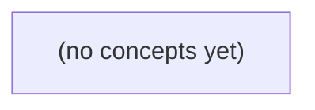

# 06.10 Go 数据访问：从 IM 历史查询到 SQL 与 MongoDB 游标

*一本面向 Go 初学者的静态教材，以虚构 IM 用户 u-a 查询会话 c-a 历史为主线，讲解 database/sql、驱动、连接池、参数化查询、结果扫描、NULL、Context、资源关闭与基础事务边界。课程同时以 MongoDB Go 驱动的 Cursor 路径作对照，并通过 22 道带反馈练习巩固资源、错误、授权与确认边界。*

**章节:** 2

---

## 本书导览

- 了解整本书的章节脉络
- 掌握各章之间的概念依赖关系
- 选择最合适的阅读顺序

# 06.10 Go 数据访问：从 IM 历史查询到 SQL 与 MongoDB 游标

一本面向 Go 初学者的静态教材，以虚构 IM 用户 u-a 查询会话 c-a 历史为主线，讲解 database/sql、驱动、连接池、参数化查询、结果扫描、NULL、Context、资源关闭与基础事务边界。课程同时以 MongoDB Go 驱动的 Cursor 路径作对照，并通过 22 道带反馈练习巩固资源、错误、授权与确认边界。

下方的概念图展示了本书 0 个核心概念以及它们之间的依赖关系；再下方是 1 个章节的入口。你可以按从上到下的顺序阅读，也可以根据自己的兴趣或先验知识选择切入点。

#### 概念图



## 章节索引

- **06.10 Go 数据访问：从历史查询到驱动、游标与资源责任** — 面向Go初学者承接06.01–06.03的虚构IM数据模型和SQL，通过一条c-a历史查询讲database/sql句柄与驱动、池、参数、QueryRow/Rows扫描、NULL、context与资源关闭，再对照MongoDB Go驱动的Client/Cursor；静态课程，不运行数据库。

## 06.10 Go 数据访问：从历史查询到驱动、游标与资源责任

- 解释database/sql与具体驱动的职责
- 区分*sql.DB池句柄与单个连接
- 用参数化查询和受信身份读取c-a历史
- 处理QueryRow的ErrNoRows及多行Rows的Close/Err
- 解释SQL NULL扫描与显式投影
- 给更新/插入选择ExecContext或RETURNING并核对结果
- 传播Context且标出取消和未知写入边界
- 对照MongoDB Client/Collection/Cursor生命周期和有界查询

在不连接真实数据库的前提下，先用一条 c-a 历史查询画清请求路径、信任边界与资源责任。

### 从历史查询画出完整调用路径

### 从历史查询画出完整调用路径

设已认证的用户身份为 `u-a`，请求查询会话 `c-a` 的历史记录。先不要把“执行了一条 SQL”当成一个原子动作；它实际跨越多个责任边界：

`客户端 → 应用服务 → 数据访问接口 → 驱动 → 数据库服务器 → 持久化存储`

应用服务接收 `u-a` 与 `c-a`，负责业务判断：该用户是否有权查看该会话？这里的 `u-a` 来自上层认证机制，不能由查询参数、扫描出的某一行，或客户端自称的用户标识替代。`c-a` 只是待查询的对象参数，不天然代表授权成立。

通过授权后，应用服务调用数据访问接口，例如：

`查询会话历史(用户 u-a, 会话 c-a) → 历史记录`

数据访问接口负责构造参数化查询、绑定参数、接收结果并映射为领域数据；它不应把驱动连接、游标细节泄漏给上层。驱动再把查询协议发送给数据库服务器，数据库服务器执行过滤、排序和读取，并经由存储引擎返回结果集。

还要区分两种“成功”：

- **读取成功**：驱动获得结果，应用扫描出历史行。
- **持久确认**：仅适用于写入；数据库确认事务提交后，数据才具有持久化语义。

查询历史通常没有新的持久确认，但仍有资源责任：谁创建连接或查询对象，谁就必须关闭它；谁取得结果游标，谁必须迭代完成、检查迭代错误并关闭游标。纸上先标出这些所有者，后续接入真实数据库时才不容易出现越权查询、连接泄漏或“读到行就误判已授权”的错误。

### 身份授权与查询参数不可混同

### 身份授权与查询参数不可混同

设请求要查询课程 `c-a` 的历史记录。这里至少有两个语义完全不同的值：

- `u-a`：当前操作者身份，应由登录态、令牌校验或会话认证等上层机制产生。
- `c-a`：客户端提交的课程标识，只是查询条件，可能合法、错误、过期，甚至被恶意篡改。

因此，应用服务不能把“请求中带有 `c-a`”推导为“`u-a` 有权查看 `c-a`”。正确的纸上调用路径应是：

`认证层确认 u-a` → `应用服务接收 c-a` → `授权规则判断 u-a 是否可访问 c-a` → `数据访问接口查询历史` → `扫描并返回记录`

例如，数据访问接口可以表达为：

`查询课程历史(课程标识 c-a) -> 记录列表`

它负责把参数交给驱动、读取游标并关闭资源；它并不知道调用者是否应当看到结果。授权通常属于应用服务，因为那里同时拥有受信的 `u-a`、业务规则以及请求目标 `c-a`。

尤其要避免一个危险推理：驱动成功执行查询、游标成功扫描出行，说明的只是“数据库中存在匹配记录，且数据库账号允许该查询”；这不等于“当前用户 `u-a` 已获业务授权”。数据库返回数据是事实读取，授权结论则必须由明确的规则得出。

### 为纸上请求标注资源所有者

### 为纸上请求标注资源所有者

以“受信用户 `u-a` 查询课程 `c-a` 的历史记录”为例，先不假设数据库真实存在，只画出纸上的调用链：

`HTTP 请求 → 处理器 → 应用服务 → 数据访问接口 → 驱动/数据库 → 查询结果 → HTTP 响应`

沿链路逐项问三个问题：**谁创建？谁使用？谁负责结束？**

- **`Context`**：通常由 HTTP 服务器随请求创建，处理器取得并向下传递；应用服务、数据访问实现和驱动都只使用它来感知取消、超时与请求范围；请求结束或客户端断开后，由服务器结束其生命周期。下层不得自行替换为脱离请求的 `context.Background()`。
- **数据库池句柄 `*sql.DB`**：由程序启动阶段创建和配置，作为长期共享依赖注入数据访问层；它代表连接池，不是一条专属连接。应用退出时由启动/关闭管理者统一调用 `Close`，单次查询不能关闭它。
- **查询结果 `*sql.Rows`**：由数据访问实现调用查询方法创建；仍在遍历、`Scan` 时由该实现使用；无论正常读完、提前返回还是扫描失败，都应由创建者尽快 `Close`。关闭结果会归还其占用的底层连接。
- **底层连接**：通常由连接池按需借出、由驱动使用、在结果关闭或事务结束后归还池中；业务代码不应假定自己拥有连接，更不能因某次查询结束而关闭整个池。
- **HTTP 响应**：处理器创建响应语义并写回客户端；应用服务返回领域结果或错误，不直接持有响应写入器。响应完成不等于数据库资源自动释放，`Rows.Close()` 仍须明确负责。

可在纸上写成责任箭头：

`服务器创建 Context` → `处理器传递` → `仓储创建 Rows` → `仓储关闭 Rows` → `池回收连接` → `处理器写响应`

其中，`u-a` 的身份来自上层认证上下文，`c-a` 只是查询参数。即使扫描到了课程行，也只说明“查到了数据”；是否允许 `u-a` 查看该历史，仍必须由应用服务或查询条件中的授权规则确认。

### 静态课程中的接口边界设计

### 静态课程中的接口边界设计

即使当前课程只有内存中的静态数据，也应把“应用要什么”与“数据怎样取得”分开。应用服务不应直接遍历切片后返回结果，而应依赖一个可替换的数据访问接口：

```go
type HistoryReader interface {
    ListCourseHistory(ctx context.Context, userID, courseID string) ([]HistoryItem, error)
}
```

这里 `userID` 是上层认证后受信的 `u-a` 身份；`courseID` 是请求携带的 `c-a` 查询参数。接口实现必须同时使用二者：按 `courseID` 查询历史，并以 `userID` 限制可见范围。仅仅扫描到某行，不代表该用户已经获得授权。

应用服务负责提取认证身份、校验参数、调用接口并组织响应：

```go
items, err := historyReader.ListCourseHistory(ctx, uA, cA)
```

静态实现可读取内存切片；未来实现可改为 SQL、驱动与数据库服务器查询，而无需改变应用服务。结果映射也应留在数据访问边界：存储行、游标记录或静态条目先映射为 `HistoryItem`，再交给应用层。

先在纸上画出路径：

`请求 → 认证得到 u-a → 应用服务 → HistoryReader → 静态数据/未来驱动 → 结果`

当前静态实现没有游标和连接，但接口签名中的 `ctx` 与 `error` 已为未来取消、查询失败和资源责任预留了位置。

### 持久确认与读取成功的边界

### 持久确认与读取成功的边界

一次数据访问中，“成功”不是单一状态。以受信身份 `u-a` 查询课程 `c-a` 的历史记录为例，至少要区分四层结果：

- **读取到行**：应用从游标或结果集扫描出一条记录。这只说明当前读取操作得到了可解码的数据；空结果并不等于查询失败。
- **驱动完成调用**：驱动已把查询请求发送给数据库，并接收到了数据库返回的响应或错误。网络中断、连接超时、协议错误都可能发生在这一层。
- **数据库执行成功**：数据库服务器接受 SQL、绑定参数并完成执行。例如查询语法正确、表存在、权限与执行计划允许继续运行。
- **写入持久确认**：对于 `INSERT`、`UPDATE`、`DELETE`，只有数据库确认事务已提交后，才可认为修改具有持久性；仅执行语句成功，仍可能尚未提交、随后回滚或在连接故障中失去确认。

因此，读操作通常关注“是否得到可用结果”和“迭代是否完整结束”；写操作还必须关注提交结果。`rows.Scan(...) == nil` 不能证明后续行读取无错，`Exec(...) == nil` 也不能自动证明事务已持久提交。

可把责任链画为：

`应用服务 → 数据访问接口 → 驱动 → 数据库服务器 → 持久存储`

其中，应用服务负责确认 `u-a` 是否有权查询 `c-a`；数据访问层负责传递参数、关闭游标并报告错误；数据库负责执行与提交。扫描到一行课程历史，只是读取成功的一小部分，不是授权成功，更不是持久确认。

> **要点** — 先厘清信任来源、调用边界和资源归属，才能正确讨论 Go 驱动、查询与持久化结果。

Go 的数据访问先从正确认识 database/sql 开始：它管理通用接口与连接池，而真实协议通信由具体驱动完成。

### 通用接口与具体驱动的分工

### 通用接口与具体驱动的分工

`database/sql` 是 Go 标准库提供的**通用数据访问层**。它定义了 `DB`、`Rows`、`Tx`、`Stmt` 等统一抽象，以及查询、执行、事务、扫描结果和连接池管理的基本模型；但它本身并不知道 MySQL、PostgreSQL、SQLite 等数据库的网络协议和 SQL 方言细节。

真正完成底层工作的，是单独安装并导入的**数据库驱动**。驱动通常负责：

- 建立网络连接、认证与握手；
- 按数据库协议发送 SQL、接收结果；
- 实现占位符、事务命令等数据库特有行为；
- 在数据库字段类型与 Go 值之间转换，例如时间、二进制、数值和空值；
- 向 `database/sql` 注册一个驱动名称。

因此，应用代码通常面向统一接口编写：

`sql.Open("驱动名", "连接串")`

其中“驱动名”必须对应已注册的驱动。若只使用 `database/sql` 而没有引入具体驱动，运行时通常会得到“未知驱动”错误。许多驱动以空白标识符导入：

`import _ "具体驱动包路径"`

空白导入并非无意义：它会执行驱动包的初始化逻辑，使驱动注册到 `database/sql`，而业务代码仍只依赖标准库的通用 API。

这种分工使同一套查询、事务和资源管理代码能够适配不同数据库；但 SQL 语法、占位符形式、隔离级别和类型行为仍可能不同，不能把“接口统一”误解为“数据库完全可互换”。

### sql.Open 返回的是池句柄

### sql.Open 返回的是池句柄

`sql.Open` 的返回值是 `*sql.DB`，但它并不等同于“一条已经连上的数据库连接”。更准确地说，`*sql.DB` 是一个**并发安全的数据库访问句柄与连接池管理器**：它按需创建物理连接、复用空闲连接、在连接失效时丢弃或重建连接，并协调多个 goroutine 对数据库的访问。

```go
db, err := sql.Open("postgres", dsn)
if err != nil {
    return err
}
```

上面的成功返回通常只说明驱动已被识别、连接串格式可被接受；未必已经完成网络连接、认证或数据库选择。若要在启动阶段主动确认可用性，应使用带超时的 `PingContext`：

```go
ctx, cancel := context.WithTimeout(context.Background(), 3*time.Second)
defer cancel()

if err := db.PingContext(ctx); err != nil {
    return err
}
```

应把 `*sql.DB` 视为应用级共享资源：通常在程序初始化时创建一次，注入或传递给各层使用，并在应用退出时统一调用 `Close`。多个请求可以同时使用同一个 `db`：

```go
func handle(db *sql.DB) {
    rows, err := db.Query("SELECT id, name FROM users")
    // ...
    _ = rows.Close()
}
```

不要在每个 HTTP 请求中执行“`sql.Open` → 查询 → `db.Close`”。这样会反复建立池、失去连接复用、增加认证与握手成本，还可能在高并发下制造大量短生命周期连接，反而压垮数据库。

需要区分两层资源：

- `*sql.DB`：应用长期持有的池句柄，可安全并发使用。
- `*sql.Conn`：从池中独占的一条物理连接，适合确有会话状态或驱动级需求的少数场景，使用后必须 `Close` 归还池中。

因此，`db.Close()` 的语义不是“关闭某次查询”，而是关闭整个池、阻止新的操作并释放其连接；它应属于应用生命周期的收尾动作，而不是请求处理路径的一部分。

### 打开不等于已经连通

### 打开不等于已经连通

`sql.Open` 的职责是根据驱动名和连接串构造 `*sql.DB` 句柄；这个句柄代表可复用、并发安全的连接池管理器，而不是“一条已经建立且认证成功的连接”。

因此，下列代码成功返回并不能证明数据库地址正确、网络可达、密码有效，甚至不能证明数据库服务正在运行：

`db, err := sql.Open("postgres", dsn)`

许多驱动会延迟真正的建连：直到第一次查询、事务或显式探测时，才按需创建底层连接。这样做有利于连接池按负载扩展，但也意味着启动阶段若只检查 `Open` 的错误，配置错误可能拖到首个请求才暴露。

应在需要确认依赖可用时使用带超时的 `PingContext`：

`ctx, cancel := context.WithTimeout(context.Background(), 3*time.Second)`  
`defer cancel()`  
`if err := db.PingContext(ctx); err != nil { /* 启动失败或进入降级 */ }`

`PingContext` 会促使驱动尝试取得连接，并验证通常意义上的网络连通性、认证配置及服务响应。超时必须由 `Context` 控制，避免数据库故障时启动流程或健康检查无限阻塞。

不过，探测成功只说明“此刻可以访问”，并不保证后续请求永远成功：网络可能中断、连接可能被服务端回收、数据库也可能随后过载。因此，业务查询仍须处理错误；`PingContext` 是主动验证，不是永久担保。连接串中的用户名、密码和令牌属于敏感信息，错误日志中应避免原样输出。

### 连接池参数只表达资源边界

### 连接池参数只表达资源边界

`*sql.DB` 内部维护连接池，以下参数描述的是资源可使用的边界，而不是“性能最佳值”：

- `SetMaxOpenConns(n)`：限制最多同时打开的连接数。达到上限后，新的查询不会无限创建连接，而会等待已有连接归还；等待过久可能因上下文超时而失败。它也间接限制了数据库端的并发压力。
- `SetMaxIdleConns(n)`：限制池中可保留的空闲连接数。空闲连接可减少后续建连成本，但过多会占用数据库会话、文件描述符及内存。
- `SetConnMaxLifetime(d)`：规定单条连接最多存活多久。连接通常在归还池时被淘汰，可避免长期连接受负载均衡、数据库重启、凭据轮换等影响而变得陈旧。
- `SetConnMaxIdleTime(d)`：规定连接空闲多久后可被回收，适合应对流量潮汐，避免低峰期留下大量无用会话。

这些参数彼此关联。例如，若最大打开连接数很小而请求并发很高，应用可能出现连接等待；若最大空闲连接数远小于常见并发量，则频繁关闭、重建连接会增加延迟；若连接生命周期过短，则可能把正常请求的时间花在重复握手上。

不要套用“每核若干连接”之类的固定口诀。应结合数据库允许的总连接数、应用实例数量、查询耗时、并发峰值和事务持续时间进行压测与观测。重点关注连接等待次数与时长、活跃/空闲连接数、查询延迟、数据库 CPU 与会话数；确认瓶颈后，再逐步调整边界。

### 配置与凭据的安全责任

### 配置与凭据的安全责任

连接串不仅描述地址和数据库名，往往还携带用户名、密码、令牌、证书路径或 TLS 参数。因此，它应被视为敏感数据，而不是普通字符串。

推荐将非敏感配置与凭据分离：

- 数据库主机、端口、库名可来自配置文件或环境变量。
- 密码、访问令牌、客户端证书私钥应由密钥管理服务、部署平台的 Secret 或受控环境变量注入。
- 本地开发可使用未提交到版本库的 `.env` 文件；生产环境不要依赖写在镜像、源码或脚本中的密码。

不要这样做：

`dsn := "user=app password=secret host=db.example.com dbname=prod"`

更安全的思路是由运行环境提供凭据，再在启动阶段组装连接参数。无论采用何种驱动，都要避免把完整 DSN 输出到日志、错误页面、监控标签或 panic 信息中。即使错误只显示“连接失败”，附带的连接串也可能泄露密码、内网地址和数据库拓扑。

日志中可记录经过脱敏的信息，例如数据库类型、主机别名、端口、库名和错误类别；密码、令牌、完整连接串应始终省略。若必须排障，应使用专门的安全审计渠道，并限制访问与保留时间。

还应遵循最小权限原则：应用账号只拥有业务所需的库、表和操作权限，不使用管理员账号执行日常查询。凭据轮换后，应用应能通过重新部署或受控刷新获取新配置，而不是修改并重新编译源码。

> **要点** — database/sql 管理通用接口与池句柄；驱动负责真实连接。复用 *sql.DB、主动 Ping 验证，并安全配置与测量连接池。

以用户 u-a 查看与 c-a 的历史消息为线索，厘清授权、单行查询、多行游标、空值与错误归属的边界。

### 先授权，再读取历史

### 先授权，再读取历史

用户 `u-a` 请求读取与会话 `c-a` 的历史消息时，第一步不是查消息表，而是确认其仍是该会话成员。授权校验与数据读取应分层：前者决定“能不能看”，后者才回答“看到了什么”。

```go
func ListHistory(ctx context.Context, db *sql.DB, userID, convID string) error {
	var memberID string
	err := db.QueryRowContext(ctx, `
		SELECT user_id
		FROM conversation_members
		WHERE conversation_id = $1 AND user_id = $2
	`, convID, userID).Scan(&memberID)

	if errors.Is(err, sql.ErrNoRows) {
		return ErrForbidden // u-a 不是 c-a 的成员
	}
	if err != nil {
		return fmt.Errorf("check membership: %w", err)
	}

	// 授权成功后，才允许继续查询历史消息。
	return nil
}
```

这里 `sql.ErrNoRows` 的含义仅是：成员资格查询没有匹配行。它应映射为权限拒绝，而不是“会话暂无消息”。反之，连接超时、语法错误、上下文取消等 `err != nil` 且非 `sql.ErrNoRows` 的情况，属于数据库或执行故障，不能伪装成拒绝访问或空结果。

授权通过后查询消息时，即使结果集为空，也通常应返回空列表；这表示“允许查看，但暂无可见历史”。因此至少区分三种语义：

- **权限拒绝**：`u-a` 不属于 `c-a`，返回 `ErrForbidden`。
- **正常无数据**：成员资格有效，但消息查询返回零行，返回空列表。
- **数据库故障**：查询执行失败，保留并包装原始错误，交由上层记录或映射为服务错误。

这种顺序避免了未授权用户借助“是否存在消息”推测会话信息，也使审计、错误码和客户端行为具有稳定边界。

### 单行查询的错误落点

### 单行查询的错误落点

查询“当前成员是否拥有会话 `c-a` 的访问权”通常只需一行结果，但 `QueryRowContext` 的返回值并不等于“查询成功”。它只构造一个延迟读取的 `*sql.Row`；驱动执行、网络错误、SQL 语法错误、类型转换失败，以及“没有匹配行”的判断，都会在随后调用 `Scan` 时显现。

```go
var memberID string
err := db.QueryRowContext(ctx, `
    SELECT member_id
    FROM conversation_members
    WHERE conversation_id = ? AND member_id = ?
`, conversationID, currentUserID).Scan(&memberID)

switch {
case err == sql.ErrNoRows:
    // 当前用户没有该会话的成员记录：应按业务语义拒绝访问
case err != nil:
    // 数据库、驱动、上下文取消、字段转换等基础设施错误
default:
    // 授权记录存在，可继续查询消息
}
```

`sql.ErrNoRows` 只表示这条 SQL 没有返回行，不自动等同于任何通用错误。这里它被解释为“无权访问”，是因为查询条件本身表达了授权关系；若查询的是消息详情，则可能表示“消息不存在”。

不要写成只检查 `QueryRowContext` 的返回：

```go
row := db.QueryRowContext(ctx, query, args...)
// 此处尚未得到数据库执行结果
err := row.Scan(&memberID)
```

因此，单行查询的责任边界是：`QueryRowContext` 负责声明查询，`Scan` 负责接收结果并判断错误；业务层再依据 `sql.ErrNoRows` 所处的查询语境，区分权限拒绝、资源不存在与数据库故障。

### 多行消息与游标责任

### 多行消息与游标责任

历史消息是多行结果：先完成“`u-a` 是否可查看会话 `c-a`”的授权判断，再调用 `QueryContext`。授权拒绝、查询失败与“没有任何消息”是三类不同结果；后者通常表现为结果集为空，而非 `sql.ErrNoRows`。

```go
func listMessages(ctx context.Context, db *sql.DB, userID, conversationID string) ([]Message, error) {
	rows, err := db.QueryContext(ctx, `
		SELECT id, sender_id, body, sent_at, edited_at
		FROM messages
		WHERE conversation_id = ?
		ORDER BY sent_at ASC, id ASC
	`, conversationID)
	if err != nil {
		return nil, err
	}
	defer rows.Close()

	var result []Message
	for rows.Next() {
		var m Message
		var editedAt sql.NullTime

		if err := rows.Scan(&m.ID, &m.SenderID, &m.Body, &m.SentAt, &editedAt); err != nil {
			return nil, err
		}
		if editedAt.Valid {
			m.EditedAt = &editedAt.Time
		}
		result = append(result, m)
	}
	if err := rows.Err(); err != nil {
		return nil, err
	}
	return result, nil
}
```

固定顺序是：

1. `QueryContext` 成功后立刻 `defer rows.Close()`，即使中途 `Scan` 失败或函数提前返回，也要释放连接、服务端游标等资源。
2. 使用 `for rows.Next()` 推进游标；只有 `Next()` 返回 `true`，当前行才可读取。
3. 在循环内用 `Scan` 按**显式列序**接收数据。不要使用 `SELECT *`，否则表结构或列顺序变化可能造成静默映射错误。
4. 循环结束后检查 `rows.Err()`。网络中断、驱动读取失败等错误可能发生在迭代过程中，不能仅检查初始查询错误。

可空列不能直接稳定地扫描到普通 `string` 或 `time.Time`：`NULL` 没有对应的有效值，应使用 `sql.NullString`、`sql.NullTime` 等类型，并通过 `Valid` 区分“字段为空”和“字段值恰好为零值”。

### 显式列序与可空字段

### 显式列序与可空字段

查询历史消息时，应明确写出投影列，并让 `Scan` 参数与 `SELECT` 列序一一对应。不要使用 `SELECT *`：表新增、调整列后，扫描顺序可能悄然失配；同时也会读取并不需要的数据。

```go
func listMessages(ctx context.Context, db *sql.DB, userID, conversationID string) ([]Message, error) {
	rows, err := db.QueryContext(ctx, `
		SELECT id, sender_id, body, edited_at, deleted_at, created_at
		FROM messages
		WHERE conversation_id = $1
		ORDER BY created_at ASC, id ASC`,
		conversationID,
	)
	if err != nil {
		return nil, err
	}
	defer rows.Close()

	var result []Message
	for rows.Next() {
		var m Message
		var editedAt sql.NullTime
		var deletedAt sql.NullTime
		var body sql.NullString

		if err := rows.Scan(
			&m.ID,        // id
			&m.SenderID,  // sender_id
			&body,        // body
			&editedAt,    // edited_at
			&deletedAt,   // deleted_at
			&m.CreatedAt, // created_at
		); err != nil {
			return nil, err
		}

		if body.Valid {
			m.Body = body.String
		}
		if editedAt.Valid {
			m.EditedAt = &editedAt.Time
		}
		if deletedAt.Valid {
			m.DeletedAt = &deletedAt.Time
		}
		result = append(result, m)
	}
	if err := rows.Err(); err != nil {
		return nil, err
	}
	return result, nil
}
```

`NULL` 不等于零值：空正文与空字符串、未编辑与零时间具有不同业务含义。`sql.NullString`、`sql.NullTime` 的 `Valid` 为 `false` 表示数据库值为 `NULL`；仅在其为 `true` 时读取 `String` 或 `Time`。这样可将“字段确实为空”保留到领域对象，而不是在扫描阶段丢失语义。

### Context与结果边界

### Context 与结果边界

查询历史消息时，`context.Context` 应从 HTTP 请求、任务截止时间或上层服务一路传入数据访问层；不要在仓储函数内部随意改用 `context.Background()`，否则客户端断开、超时或主动取消都无法及时传递给数据库驱动。

```go
func ListMessages(ctx context.Context, db *sql.DB, userID, conversationID string) ([]Message, error) {
    var allowed bool
    err := db.QueryRowContext(ctx, `
        SELECT EXISTS (
            SELECT 1 FROM conversation_members
            WHERE conversation_id = $1 AND user_id = $2
        )`, conversationID, userID).Scan(&allowed)
    if err != nil {
        return nil, fmt.Errorf("查询成员授权: %w", err)
    }
    if !allowed {
        return nil, ErrForbidden
    }

    rows, err := db.QueryContext(ctx, `
        SELECT id, sender_id, body, sent_at
        FROM messages
        WHERE conversation_id = $1
        ORDER BY sent_at, id`, conversationID)
    if err != nil {
        return nil, fmt.Errorf("创建消息游标: %w", err)
    }
    defer rows.Close()

    var result []Message
    for rows.Next() {
        var m Message
        if err := rows.Scan(&m.ID, &m.SenderID, &m.Body, &m.SentAt); err != nil {
            return nil, fmt.Errorf("扫描消息行: %w", err)
        }
        result = append(result, m)
    }
    if err := rows.Err(); err != nil {
        return nil, fmt.Errorf("迭代消息游标: %w", err)
    }
    return result, nil
}
```

结果边界必须清晰：

- 授权查询未命中成员，表示权限不足，不是“消息为空”。
- `QueryRowContext` 的查询或取消错误通常在 `Scan` 时出现；`sql.ErrNoRows` 仅表示该单行查询无结果。
- 多行查询返回零行是正常的空历史：`result` 为空且 `rows.Err()` 为 `nil`。
- `Scan` 失败多与列类型、`NULL` 或列序不匹配有关；可用 `sql.NullString`、`sql.NullTime` 区分空值与零值。
- `rows.Err()` 检查的是迭代期间才暴露的驱动错误、网络中断或 Context 取消，不能省略。

> **要点** — 先验证成员资格；单行错误在 Scan 判断，多行查询须关闭游标并检查 Err，空值与列序必须显式处理。

写入消息不是拼接一条 SQL 就结束：参数绑定、授权校验、返回结果与错误边界共同决定数据访问是否安全、可解释。

### 参数绑定与动态片段的边界

### 参数绑定与动态片段的边界

Postgres 使用 `$1`、`$2` 等占位符绑定**数据值**，驱动会将 SQL 结构与参数值分开传递。用户输入无论是消息正文、收件人标识、分页大小还是筛选条件，都不应通过 `fmt.Sprintf`、字符串拼接或模板直接进入 SQL 文本。

```go
const insertMessage = `
INSERT INTO messages (sender_id, recipient_id, body)
VALUES ($1, $2, $3)
`

_, err := db.ExecContext(ctx, insertMessage, senderID, recipientID, body)
```

错误做法看似方便，却会把输入解释为 SQL 的一部分：

`fmt.Sprintf("... WHERE recipient_id = '%s'", recipientID)`

即使自行加引号或转义，也容易遗漏边界条件；参数绑定才是处理值的默认方式。

但占位符不能替代表名、列名、关键字或排序方向。下面的写法通常无效，也不应尝试通过拼接修复：

`ORDER BY created_at $1`

因为 `ASC`、`DESC`，以及 `created_at` 都属于 SQL 语法结构，而非普通数据值。动态结构必须由程序控制，并通过白名单映射选择：

```go
orderBy := map[string]string{
	"最新": "created_at DESC",
	"最早": "created_at ASC",
}[sort]

if orderBy == "" {
	orderBy = "created_at DESC"
}
query := "SELECT message_id, body FROM messages ORDER BY " + orderBy
```

更稳妥的原则是：**值一律绑定，结构一律白名单**。表名、可选列、排序字段、排序方向和过滤运算符都应映射到预先定义的固定 SQL 片段，不能把客户端传来的任意文本原样放入查询。

### 写入前的授权、约束与事务语义

### 写入前的授权、约束与事务语义

以用户 `c` 向会话 `a` 发送消息为例，写入成立至少依赖四层事实，且它们不能相互替代：

1. **受信身份**：认证中间件已验证 `c` 的令牌，并将可信的 `sender_id` 写入请求上下文。不得从请求体读取“发送者 ID”，否则攻击者可伪造他人身份。
2. **会话成员关系**：应用必须确认 `c` 是 `a` 的有效成员，且未被移除、拉黑或禁言。可查询成员表，或在 `INSERT` 中通过 `SELECT` 将成员条件合并，使“不属于会话”自然导致零行写入。
3. **内容校验**：空白消息、超长正文、非法媒体引用等应在应用层尽早拒绝。这类错误面向用户，可返回稳定的业务码，如“内容为空”或“无权向该会话发送消息”。
4. **数据库约束**：`messages.conversation_id`、`sender_id` 应有外键；正文可有长度约束；必要时以唯一键约束客户端幂等键。约束是最后防线，防止绕过某条应用路径后产生孤儿记录或重复写入。

成员校验与插入若分成两个独立操作，会出现“校验后被移出会话”的竞态。若业务要求严格原子性，应在同一事务中完成成员状态确认、消息插入及相关计数更新；或使用带成员条件的单条写入 SQL。事务保证这些数据库修改一起提交或一起回滚，不保证消息已经送达设备。

错误也应分层处理：未认证、非成员、内容非法属于应用错误；外键冲突、唯一键冲突、死锁或连接失败属于 SQL/基础设施错误。服务端应记录驱动错误及约束名以便诊断，但对客户端只返回经过映射的通用结果，绝不回显 SQL、消息正文、令牌或连接凭据。`ExecContext` 成功仅表示数据库接受了写入；推送、离线同步和设备展示必须由后续投递链路单独确认。

### 无返回写入：ExecContext 与结果核对

### 无返回写入：`ExecContext` 与结果核对

对于不需要读取结果集的写操作，如更新消息状态、删除过期草稿或批量修正字段，应使用 `ExecContext`：

```go
result, err := db.ExecContext(ctx,
	`UPDATE messages
	 SET status = $1, updated_at = NOW()
	 WHERE message_id = $2 AND owner_id = $3`,
	"read", messageID, userID,
)
```

`ExecContext` 适合“执行并结束”的语句：`UPDATE`、`DELETE`、不带 `RETURNING` 的 `INSERT`，以及部分 DDL。`ctx` 必须来自请求链路或任务链路，而不是随手创建的 `context.Background()`；这样客户端断开、请求超时或上层主动取消时，数据库操作才有机会被中止。

但要理解取消边界：`ctx` 取消表示应用不再等待，驱动会尝试向数据库发送取消请求；并不意味着语句一定未执行。例如，超时发生在数据库已提交、但响应尚未返回时，调用方可能得到超时错误，却无法据此断言“没有更新”。对需要严格幂等的写入，应结合唯一约束、状态机或业务幂等键设计，而非仅依赖超时结果。

可在驱动支持时核对影响行数：

```go
n, err := result.RowsAffected()
if err != nil {
	// 驱动未提供可靠的影响行数，不能据此判断业务结果
}
if n == 0 {
	// 目标不存在、无权访问，或状态前置条件不满足
}
```

例如 `WHERE message_id = $2 AND owner_id = $3 AND status = 'draft'` 可将授权与状态前置条件放入同一条更新中；`RowsAffected() == 1` 才表示成功完成状态迁移。不要把“执行未报错”等同于“更新了目标行”，更不要把数据库更新成功推导为设备已经收到消息。

### 返回新消息标识：RETURNING 的查询路径

### 返回新消息标识：`RETURNING` 的查询路径

在 Postgres 中，插入消息后若需要取得新生成的 `message_id`，应把它视为“会返回一行结果的查询”，而不是普通 `ExecContext`：

```go
var messageID int64

err := db.QueryRowContext(ctx, `
	INSERT INTO messages (conversation_id, sender_id, body)
	VALUES ($1, $2, $3)
	RETURNING message_id
`, conversationID, senderID, body).Scan(&messageID)

if err != nil {
	return fmt.Errorf("创建消息失败: %w", err)
}
```

`QueryRowContext` 负责执行 SQL 并等待单行结果，`Scan` 则真正读取 `RETURNING message_id` 返回的值。若插入因外键、唯一约束、检查约束或权限问题失败，错误通常会在 `Scan` 时出现，因此不能只检查 `QueryRowContext` 的调用结果。

不要依赖：

```go
result, _ := db.ExecContext(ctx, insertSQL, ...)
id, _ := result.LastInsertId()
```

`LastInsertId` 并非所有 Go 数据库驱动都支持；Postgres 驱动通常不会把它作为可移植的取号机制。即使某些数据库或驱动能够返回自增标识，这种写法也会把业务代码绑定到特定实现。

`RETURNING` 的好处是标识由同一条插入语句直接返回，无需额外查询“最后插入的行”，不会误取并发请求创建的消息。类似地，也可以返回创建时间、版本号等数据库最终确认的字段：

`RETURNING message_id, created_at`

取得 `message_id` 仅表示数据库已接受写入；它不意味着消息已被设备接收、推送成功或对方已读。

### 错误暴露边界与送达状态的误区

### 错误暴露边界与送达状态的误区

数据库错误应当分成两层：**对调用方可理解的业务结果**，以及**供运维排障的内部诊断信息**。不能把驱动返回的原始错误直接透传给客户端；其中可能包含 SQL 片段、表名、约束名、连接地址，甚至因日志配置不当而带出凭据或消息正文。

可将常见错误映射为稳定的应用错误码：

- 未授权或无权向目标会话写入：返回“无权限”或“会话不存在”，避免借此枚举他人资源。
- 唯一约束冲突、幂等键重复：返回“请求已处理”或已有消息标识。
- 外键或检查约束失败：返回“请求状态无效”，而不是暴露具体约束名称。
- 超时、连接中断、死锁：返回“服务暂时不可用”或“请重试”，并依据操作是否幂等决定是否自动重试。
- 未预期错误：返回通用“写入失败”，记录完整错误链供排查。

日志应记录请求标识、用户标识、会话标识、操作类型、数据库错误类别和耗时；对正文、附件地址、令牌、连接串等敏感字段应脱敏、截断或完全不记。特别是不要为了调试而记录完整 SQL 与参数列表。

还要区分“数据库接受写入”和“设备已经收到消息”：

`ExecContext` 成功、`RowsAffected` 符合预期，最多说明该次数据库更新或插入成功提交；它不证明推送服务已调用、网络已送达、设备已展示，更不证明用户已阅读。应将消息状态拆分为“已持久化”“待投递”“已投递”“已确认”等阶段，由异步投递任务和客户端回执推进。数据库写入失败可以判定未持久化；数据库写入成功只能判定可进入后续投递流程。

> **要点** — 安全写入依赖参数化、授权与约束；正确返回写入结果，并将数据库成功和消息送达严格分开。

一次请求从 r.Context() 进入数据库时，超时与取消不仅影响执行，也影响连接等待、结果读取和资源归还；正确代码必须同时管理时间、结果与未知状态。

### 请求上下文如何抵达数据库

### 请求上下文如何抵达数据库

HTTP 请求自带的 `r.Context()` 表示“客户端仍是否等待此请求”。客户端断开连接、服务端主动取消请求时，该上下文会被取消；数据库操作若使用同一个上下文，便有机会停止连接等待、执行或结果读取。

通常不要凭空使用 `context.Background()`，而应从请求上下文派生更严格的数据库预算：

```go
func (h *Handler) ListUsers(w http.ResponseWriter, r *http.Request) {
	ctx, cancel := context.WithTimeout(r.Context(), 800*time.Millisecond)
	defer cancel()

	rows, err := h.db.QueryContext(ctx,
		`SELECT id, name FROM users WHERE active = ?`, true)
	if err != nil {
		// ctx.Err() 可帮助区分超时或请求取消
		http.Error(w, "查询失败", http.StatusServiceUnavailable)
		return
	}
	defer rows.Close()

	for rows.Next() {
		var id int64
		var name string
		if err := rows.Scan(&id, &name); err != nil {
			http.Error(w, "读取结果失败", http.StatusInternalServerError)
			return
		}
		// 写入响应……
	}
	if err := rows.Err(); err != nil {
		http.Error(w, "结果读取中断", http.StatusServiceUnavailable)
		return
	}
}
```

所有可能触及数据库的调用都应传入该 `ctx`：`QueryContext`、`QueryRowContext`、`ExecContext`、`BeginTx`，以及事务上的 `QueryContext`、`ExecContext`。否则，请求已经结束，而后台 SQL 仍可能继续占用连接。

`defer cancel()` 不是多余操作：它会在函数提前返回时及时释放定时器及关联资源。超时覆盖的范围不只是一条 SQL 的执行时间，还可能包括等待连接池中的空闲连接、向数据库发送请求、读取行数据和扫描结果。至于取消能否真正中止服务器端 SQL，仍取决于具体数据库驱动与数据库协议；因此“调用返回超时”不等于“数据库一定没有完成写入”。

### 超时覆盖的三个阶段

### 超时覆盖的三个阶段

`context` 的截止时间不是只包住一条 SQL；从调用 `QueryContext` 到消费完 `Rows`，它可能在三个阶段触发：

1. **连接池等待**：连接池已满时，调用先等待可用连接。此时超时意味着“没拿到连接”，SQL 通常尚未发送给数据库。它常提示池容量不足、慢查询过多，或已有 `Rows` 未关闭而长期占用连接。

2. **语句执行**：获得连接后，驱动将 SQL 发往数据库并等待首个响应。超时可能发生在锁等待、执行计划不佳、磁盘或网络变慢期间。`context` 被取消后，驱动会尝试中断请求；但是否真能向数据库发送取消、何时释放连接，取决于具体驱动和协议实现。

3. **逐行扫描**：`QueryContext` 返回 `Rows` 不等于结果已全部到达。`rows.Next()`、`rows.Scan()` 仍可能等待网络数据、解码列值，或发现连接中断。消费者处理每行过慢，也会延长连接持有时间，使后续请求在池中排队。

```go
ctx, cancel := context.WithTimeout(r.Context(), 2*time.Second)
defer cancel()

rows, err := db.QueryContext(ctx, q, arg)
if err != nil { /* 连接等待或执行失败 */ }
defer rows.Close()

for rows.Next() {
    if err := rows.Scan(&v); err != nil { /* 扫描失败 */ }
}
if err := rows.Err(); err != nil { /* 迭代期间失败或取消 */ }
```

因此，“请求超时”只能证明客户端不再愿意继续等待，不能单独证明 SQL 未执行、未提交，或数据库已经停止工作。

### Rows 的关闭、遍历与错误检查

### Rows 的关闭、遍历与错误检查

`QueryContext` 成功返回并不表示查询已经“完全成功”：它只说明数据库驱动已取得可读取的结果流。此时 `*sql.Rows` 往往仍关联连接、服务端游标或网络缓冲；只有读完、显式关闭，或发生可识别的结束状态后，资源才有机会归还连接池。

典型模式如下：

```go
rows, err := db.QueryContext(ctx, query, arg)
if err != nil {
	return err
}
defer rows.Close()

for rows.Next() {
	var u User
	if err := rows.Scan(&u.ID, &u.Name); err != nil {
		return err
	}
	// 处理或收集 u
}
if err := rows.Err(); err != nil {
	return err
}
```

这里三个步骤不可互换：

- `defer rows.Close()`：即使中途 `Scan` 失败、业务逻辑提前返回，或写响应失败，也尽量释放结果集及其占用的连接。不要依赖垃圾回收，更不要假定循环结束一定会立即释放资源。
- `rows.Next()`：逐行推进结果流。它返回 `false` 可能是正常读完，也可能是读取期间发生了取消、网络中断、服务端错误等。
- `rows.Scan(...)`：将当前行解码到目标变量。列类型不兼容、`NULL` 处理错误、目标参数数量不匹配等，通常在这里暴露。
- `rows.Err()`：区分“正常没有更多行”和“遍历途中失败”。若省略它，程序可能把已读到的部分结果误当作完整结果。

即使只需要第一行，也应关闭：

```go
if rows.Next() {
	if err := rows.Scan(&v); err != nil {
		return err
	}
}
if err := rows.Err(); err != nil {
	return err
}
```

若提前停止遍历，`Close` 更重要：未消费的结果可能使连接无法立刻复用。慢速处理每一行也会延长资源占用时间；必要时应先快速读取必要数据，再进行耗时计算或响应写入。

### 慢消费者为何会耗尽资源

### 慢消费者为何会耗尽资源

历史消息通常以分页方式读取：先执行查询，再逐行扫描、解码、组装响应。`QueryContext` 返回的 `Rows` 并不等于“数据已经全部在内存中”；许多驱动会持续从连接读取结果。因此，在最后一行读完、显式调用 `rows.Close()`，或发生可识别的错误之前，连接及其关联的服务端游标、缓冲区可能仍被占用。

```go
ctx, cancel := context.WithTimeout(r.Context(), 2*time.Second)
defer cancel()

rows, err := db.QueryContext(ctx, query, beforeID, limit)
if err != nil { /* 处理 */ }
defer rows.Close()

for rows.Next() {
    var m Message
    if err := rows.Scan(&m.ID, &m.Body, &m.CreatedAt); err != nil {
        return err
    }
    // 不要在这里进行缓慢网络调用、逐条写客户端或大量计算
}
if err := rows.Err() {
    return err
}
```

若处理每条消息都要等待外部服务、执行昂贵解密，或客户端读取响应极慢，`Rows` 的存活时间就会被拉长。并发请求增多后，连接池中的可用连接逐渐减少；后来的查询并非数据库很慢，而是卡在“等待连接”。这类故障常表现为连接池等待超时。

分页应限制 `limit`，尽快把必要字段读入内存并关闭 `Rows`，再进行较慢的后处理。更重要的是：即使循环提前返回，也必须由 `defer rows.Close()` 归还资源；循环结束后仍须检查 `rows.Err()`，因为读取错误可能只在后续取行时暴露。

### 纸上故障表：结果与写入的已知边界

### 纸上故障表：结果与写入的已知边界

数据库故障不能只问“成功还是失败”，还要问：**客户端究竟确认了什么，哪些状态仍未知**。尤其对写操作，`context deadline exceeded` 并不等价于“数据库没有写入”。

| 场景 | 客户端可确认 | 仍然未知或需继续处理 |
|---|---|---|
| 连接池等待时取消 | 本次操作未取得连接，通常尚未向数据库发送 SQL | 是否存在其他请求耗尽连接；是否需要调整池大小、慢查询或事务时长 |
| 执行期间取消 | 调用方不再等待；驱动会尝试取消 | 数据库是否已收到 SQL、是否已执行完成；驱动和数据库是否真正支持及时取消 |
| `Scan` 失败 | 当前行不能被正确解码，不能把该行当作有效结果 | 已读取的前序行是否可用，取决于业务是否允许“部分结果” |
| `Rows.Err()` 非空 | 迭代过程曾发生错误，完整结果集不可信 | 错误发生前返回的数据能否展示；通常查询 API 应返回错误而非伪装成完整列表 |
| 已读到部分行后超时 | 已成功扫描的行确实来自本次结果流 | 后续行是否存在、结果集是否完整；仍须 `rows.Close()` 归还资源 |
| 数据库写入后响应客户端失败 | 无法确认客户端是否收到响应 | 写入可能已提交；重试可能造成重复扣款、重复创建或重复发消息 |

例如：

`UPDATE orders SET status='paid' ...` 返回超时，可能有三种现实：SQL 根本未送达、数据库正在回滚、数据库已提交但响应在网络中丢失。应用不能仅凭超时盲目重试，而应使用幂等键、唯一约束、事务内状态记录或后续查询确认。

读取场景也要诚实表达边界：若接口承诺“完整列表”，一旦扫描或迭代失败，就不应返回 `200` 加一份截断列表。写响应失败则更严肃：服务日志中的“请求失败”只表示**交付结果失败**，不表示**业务写入失败**。

> **要点** — 上下文要贯穿数据库调用；Rows 必须关闭并检查 Err；超时后的写入结果可能仍然未知。

事务把一组相关读写组织为可提交或可撤销的工作单元；在 Go 中，关键是明确边界、始终经由同一 Tx 操作，并如实定义批量写入语义。

### 事务边界与 BeginTx 职责

### 事务边界与 BeginTx 职责

当一次业务操作包含多个彼此依赖的读写，并且它们必须“全部生效或全部不生效”时，应以 `BeginTx` 建立事务边界。例如：先验证成员是否仍有频道发言权限，再插入消息并更新频道的最后活动时间；这些步骤若分散执行，可能留下“消息已写入但活动时间未更新”等不一致状态。

```go
tx, err := db.BeginTx(ctx, nil)
if err != nil {
    return err
}
defer tx.Rollback() // 兜底：提交成功后会返回 sql.ErrTxDone，可忽略

// 后续 QueryContext、ExecContext 必须都经由 tx 调用
if _, err := tx.ExecContext(ctx, insertMessageSQL, ...); err != nil {
    return err
}
if _, err := tx.ExecContext(ctx, updateChannelSQL, ...); err != nil {
    return err
}
if err := tx.Commit(); err != nil {
    return err
}
```

`BeginTx(ctx, opts)` 的职责不只是“拿到一个 `Tx`”：它以当前 `Context` 建立事务，并可通过 `sql.TxOptions` 声明只读意图或隔离级别。`ctx` 应携带请求取消与截止时间；若在事务开始或执行期间超时、取消，调用方必须把该操作视为失败并返回相应错误。具体隔离级别及并发异常的选择留待后续讨论，不应在此默认某种隔离保证。

事务开始后，同一工作单元中的数据库操作必须使用同一个 `tx`。不能先 `tx.ExecContext` 插入消息，再调用 `db.ExecContext` 更新计数：后者可能使用另一连接、处于事务之外，无法随 `Rollback` 撤销，也不受同一提交边界保护。

错误路径通常只需直接返回，延迟的 `Rollback` 负责清理；只有所有步骤成功时才调用 `Commit`。`Commit` 返回错误意味着提交结果不能被当作成功处理，调用方应按业务语义决定重试、查询确认或报告失败。

### 同一 Tx 内完成全部读写

### 同一 Tx 内完成全部读写

“先检查成员资格，再写入消息”是一个相关联的读写过程：校验结果必须对应这次写入所依据的同一数据库状态。因此，应先用 `db.BeginTx` 建立事务，随后所有查询和写入都经由同一个 `tx`：

```go
tx, err := db.BeginTx(ctx, nil)
if err != nil { return err }
defer tx.Rollback()

var allowed bool
err = tx.QueryRowContext(ctx, checkSQL, roomID, userID).Scan(&allowed)
if err != nil { return err }
if !allowed { return ErrForbidden }

_, err = tx.ExecContext(ctx, insertSQL, roomID, userID, body)
if err != nil { return err }

return tx.Commit()
```

这里的责任边界很明确：

- `BeginTx`：取得事务上下文；
- `tx.QueryRowContext`：在该事务看到的状态中完成权限判断；
- `tx.ExecContext`：将消息写入同一事务；
- `Commit`：一起提交校验后的写入；
- `Rollback`：任一步失败、提前返回或提交前退出时撤销未提交修改。

不要写成“`tx` 查询后再 `db.ExecContext` 插入”。`db.ExecContext` 会从连接池另取连接，以独立的自动提交语句执行；它不属于当前 `tx`，无法与前面的成员校验构成同一工作单元。即使代码顺序相邻，数据库也不会把它们视为原子操作。

事务并不自动消除所有并发时序问题；具体隔离级别及并发异常另见 06.07。但首先要满足最基本的规则：凡是本次业务决策依赖的读写，都必须走同一个 `tx`。

### Commit、Rollback 与控制流责任

### Commit、Rollback 与控制流责任

`BeginTx` 成功后，事务的控制权属于调用者：必须在所有路径上以 `Commit` 或 `Rollback` 结束，并且业务读写始终通过同一个 `tx` 完成。

典型结构是先注册回滚兜底，再在全部步骤成功后提交：

```go
tx, err := db.BeginTx(ctx, nil)
if err != nil { return err }
defer tx.Rollback() // 未提交时兜底；已结束时通常返回可忽略的错误

if _, err := tx.ExecContext(ctx, insertMsg, ...); err != nil {
    return err
}
if _, err := tx.ExecContext(ctx, updateCount, ...); err != nil {
    return err
}
if err := tx.Commit(); err != nil {
    return err
}
return nil
```

这里的 `defer tx.Rollback()` 不表示“提交后再回滚”。`Commit` 成功后事务已结束，延迟调用仅做无害清理；任何中途 `return`、校验失败或执行错误都会触发回滚兜底。若需要记录回滚失败，可显式处理，但不能因此掩盖原始业务错误。

最重要的边界在于：`Commit` 返回错误时，调用者不能武断认定“事务一定未生效”。例如网络在服务端已提交后才中断，客户端会收到提交失败，却无法仅凭该错误判断最终状态。此时应将结果视为**不确定**：返回可识别的错误、避免盲目重试造成重复写入，并通过幂等键、业务状态查询或后续对账确认结果。

事务期间不要写成“先 `tx.Exec`，再 `db.Exec`”。后者使用独立连接或独立事务，不受当前 `Rollback` 约束，会破坏“要么全部成功、要么全部撤销”的承诺。

### 批量消息写入的语义设计

### 批量消息写入的语义设计

“批量写入”不是单一操作，而是先要声明业务契约。至少明确四点：**原子性、部分成功、大小限制与顺序**；否则同样的接口在重试、失败和并发下会产生不同结果。

- **逐条写入**：每条消息独立 `Exec`。优点是可报告逐条结果，失败后可继续；代价是前面成功的数据不会自动撤销，调用方必须处理幂等、重试和“成功 7 条、失败 3 条”的补偿语义。
- **事务包裹逐条写入**：`tx, err := db.BeginTx(...)` 后，全部读写均使用同一个 `tx`；任一条失败则 `Rollback`，全部成功才 `Commit`。这适合“这一批必须同时可见或同时不存在”的场景。事务期间不能改用 `db.Exec`，否则该语句不属于当前事务。
- **驱动批量执行**：例如一次多值插入或驱动提供的批量接口，通常减少往返次数。但不能因“只调用了一次 `Exec`”就假定整体原子：是否原子取决于数据库、语句、驱动与是否处于事务中，必须查明并测试其失败行为。

还应规定单批最大条数、字节数和超时，避免参数上限、锁持有过久或事务日志膨胀。若消息顺序有意义，应保存显式序号或稳定排序键；并发提交时，插入调用顺序并不等于最终可观察顺序。成员权限检查与写入若必须一致，也应纳入同一事务；具体隔离与并发异常规则后续讨论。

### 纸上流程：权限检查到消息落库

### 纸上流程：权限检查到消息落库

设会话 `c-a` 需要写入多条消息。纸上流程的目标不是展示可直接运行的代码，而是明确：权限读取、消息写入、提交或回滚必须属于同一个 `Tx`。

```text
tx, err := db.BeginTx(ctx, nil)
若 err != nil：返回“无法开始事务”
defer tx.Rollback()                 // 仅作兜底；提交成功后通常无效果

member := tx.QueryRowContext(ctx,
  "查询用户是否为会话 c-a 的有效成员", userID)
若 member 不存在：返回“无写入权限”

对于 messages 中按输入顺序的每条 message：
  验证内容、长度及业务字段
  result, err := tx.ExecContext(ctx,
    "向消息表插入一条消息", conversationID, userID, message)
  若 err != nil：返回错误，defer 将回滚此前写入

err = tx.Commit()
若 err != nil：返回“提交失败”
返回成功
```

这里的核心责任分配如下：

- `BeginTx` 划定工作单元；之后的查询和写入都经由 `tx`。
- 成员检查不能写成先 `db.Query...`、再 `tx.Exec...`；那会把“检查时的权限状态”与“写入时的状态”拆到不同边界，形成检查与使用之间的窗口。
- 循环中任一插入失败时，本流程选择**整体原子**语义：一条失败，全部不落库。
- 若产品需要“允许部分成功”，则应显式返回每条消息的结果，并重新定义顺序、重试和失败项；不能仅因使用了批量 `Exec` 就假定它天然整体原子。
- 批量大小还应设上限，避免一次事务持有过多资源或生成过长语句。

隔离级别、并发下权限变更或成员删除时究竟会看到什么结果，属于后续并发异常讨论；本节只固定规则：同一业务单元内，不要混用 `tx` 外的 `db.Exec`。

> **要点** — 事务不是自动原子化的批量按钮：先定义业务语义，再让同一 Tx 承担其中全部相关读写与提交回滚责任。

MongoDB Go 驱动以 Client、Collection 与 Cursor 组织数据访问；历史消息查询的关键不在语法迁移，而在边界、生命周期与资源责任。

### Client 与驱动连接池的职责

### Client 与驱动连接池的职责

官方 MongoDB Go 驱动中的 `mongo.Client` 不是“一条数据库连接”，而是面向 MongoDB 部署的长期客户端对象。它负责维护拓扑信息、服务器选择、认证状态、监控以及**连接池**；业务代码通常通过它取得数据库和集合句柄：

`client.Database("chat").Collection("messages")`

`Database` 与 `Collection` 更像轻量级的逻辑定位对象，不会为每次调用单独建立 TCP 连接。真正执行 `Find`、`InsertOne` 等操作时，驱动会依据当前副本集或分片集群的状态，从连接池中借用合适的底层连接；操作完成后连接归还池中，供后续请求复用。

因此，常见服务端模式是：

1. 进程启动时创建并连接一个 `Client`。
2. 将该 `Client` 注入仓库层、服务层或应用容器。
3. 每个 HTTP、RPC 或任务请求创建自己的 `context.Context`，并传入具体数据库操作。
4. 进程退出时停止接收流量，再调用 `client.Disconnect(ctx)` 释放池内连接和后台资源。

不要在每个请求中执行“创建 `Client` → 操作 → `Disconnect`”。这会反复建立网络连接、认证和拓扑发现，增加延迟，也可能在高并发下耗尽服务端连接资源。相反，也不能把某次操作借到的底层连接当作可长期持有的会话；连接的调度与归还应由驱动管理。

连接池的意义是复用有限数量的实际网络连接，而非让所有请求共享同一条连接。并发请求可分别使用池中的不同连接；池大小、等待超时和连接空闲策略需要结合 MongoDB 容量与服务并发量配置。`Client` 可跨请求安全复用，但请求的取消、截止时间和权限边界仍应由各自的 `ctx` 与业务逻辑承担。

### 受信身份下的历史查询边界

### 受信身份下的历史查询边界

历史消息接口不应把客户端传来的 `conversation_id` 直接视为访问凭证。正确顺序是：先从认证中间件取得**受信身份**，由业务层核验该用户是否仍是会话成员、会话是否可见、是否被禁用；核验通过后，才以该 `conversation_id` 查询消息。MongoDB 的引用字段不会自动提供外键约束或成员授权。

分页过滤通常以会话和顺序键为边界。若按时间正序加载“更晚消息”：

- 过滤：`conversation_id = cid` 且 `seq > afterSeq`
- 排序：`seq: 1`
- 限制：`limit = min(请求值, 服务端上限)`

若加载“更早消息”，可使用 `seq < beforeSeq`、按 `seq: -1` 查询有限条，再在应用层反转为时间正序返回。`seq` 应在单个会话内稳定、单调且唯一；仅用时间戳分页容易遇到同毫秒并发消息导致的重复或遗漏。

查询应只投影客户端需要的字段，例如 `_id`、`seq`、`sender_id`、`content`、`created_at`，避免把内部审核标记、删除状态细节或大字段一并读出。可为常见历史查询建立复合索引：

`{ conversation_id: 1, seq: 1 }`

`Find` 返回的是 `Cursor`，应在请求的 `ctx` 下迭代：循环 `Next(ctx)`、逐条 `Decode`，结束后检查 `Err()`，并确保 `Close(ctx)`。历史记录可能很长，不宜默认使用 `Cursor.All` 将全部结果载入内存；`limit` 既是分页协议，也是服务端资源边界。

### Cursor 的迭代、解码与关闭

### Cursor 的迭代、解码与关闭

`Collection.Find` 不直接返回消息切片，而是返回 `Cursor`：它代表服务端查询结果的可迭代视图，并可能关联批次拉取、网络连接与服务端游标状态。因此，拿到游标的一方必须负责遍历、检查错误并关闭它。

典型模式如下：

```go
cur, err := coll.Find(ctx, filter, options.Find().
	SetSort(bson.D{{Key: "seq", Value: 1}}).
	SetLimit(100))
if err != nil {
	return err
}
defer cur.Close(ctx)

for cur.Next(ctx) {
	var msg Message
	if err := cur.Decode(&msg); err != nil {
		return err
	}
	// 处理 msg
}
if err := cur.Err(); err != nil {
	return err
}
```

调用责任可概括为：

- `Find(ctx, ...)` 的错误表示查询建立失败，例如参数、授权、网络或服务端错误；此时通常没有可用游标。
- `Next(ctx)` 推进到下一份文档。首次或后续批次不足时，驱动可能通过该调用继续向服务端取数；`ctx` 的取消、超时会中断等待。
- `Decode(&msg)` 将当前文档解码到目标结构体。字段类型不兼容、结构体标签错误等属于解码错误，应立即返回，不能静默跳过。
- 循环结束后必须调用 `Err()`。`Next` 返回 `false` 既可能表示正常读完，也可能表示迭代期间发生网络、超时或服务端错误；只有 `Err()==nil` 才能确认正常结束。
- `Close(ctx)` 应通过 `defer` 保证执行。即使提前返回、解码失败或请求取消，也应尽力释放服务端游标及相关资源；关闭错误通常应记录。

历史消息不要无界读取。业务层先完成会话成员授权，再以 `conversation_id` 过滤，并以稳定的 `seq` 排序；分页可使用“`seq > 上一页末尾 seq`”加 `limit` 的游标方式。这样每次迭代只处理有限结果，避免深分页和内存膨胀。

`Cursor.All(ctx, &msgs)` 会自动遍历并解码，但会把全部结果装入切片。它只适合明确有上限的小结果集；聊天历史、导出和后台扫描应采用逐条 `Next`，让取消信号和资源释放在迭代过程中持续生效。

### 有界读取与 Cursor.All 的取舍

### 有界读取与 `Cursor.All` 的取舍

`Find` 返回的 `Cursor` 并不等于已加载的结果集；驱动会在 `Next(ctx)` 推进时分批向服务端取数。逐条迭代的典型责任链是：检查 `Find` 错误，`defer cursor.Close(ctx)`，循环 `Next(ctx)` 后 `Decode`，最后检查 `cursor.Err()`。这样既能及时停止，也能将网络、解码或上下文取消错误明确归因。

`Cursor.All(ctx, &items)` 更适合“结果天然很小且确实需要整体使用”的场景，例如有限配置项或少量管理记录。它会持续读取并解码，直到游标耗尽，再将所有文档放入切片；便利的代价是结果规模直接转化为进程内存占用，且调用方难以在中途处理、丢弃或提前返回。`All` 会尝试关闭游标，但仍应按所用驱动版本的官方文档确认其生命周期细节。

历史消息不能假设会话长度有限。应先由业务层核验当前用户是会话成员，再按 `conversation_id` 过滤，以 `seq` 作为稳定游标边界，例如查询 `seq > afterSeq`，按 `seq` 升序排序，并设置严格的 `limit`。每页逐条解码，达到页面上限即返回最后一条的 `seq` 作为下一页游标。

这种有界分页避免一次把多年历史装入内存，也降低慢查询、客户端断开和取消请求造成的资源滞留风险。`ctx` 应从请求一路传入 `Find`、`Next` 与 `Close`，使超时和取消能够及时终止服务端游标与本地读取。

### 写入确认与关系约束的差异

### 写入确认与关系约束的差异

`InsertOne` 只表示向集合提交一条文档写入请求；成功返回的 `InsertedID` 说明该次写入已按当前写入关注级别得到确认，并不等同于“整条业务流程已经原子成功”。

```go
res, err := messages.InsertOne(ctx, msg)
if err != nil {
    // 可能是网络、超时、重复 _id、校验规则或写入确认失败
    return err
}
id := res.InsertedID
```

写入确认由 `write concern` 决定。例如确认主节点即可返回，或要求多数副本确认；等待级别越高，通常持久性与故障恢复保证越强，但延迟也可能增加。超时、网络中断等错误尤其要谨慎：客户端未收到成功响应，不必然代表服务端没有写入成功。对可重试写入、消息去重等场景，应使用稳定的业务唯一键或幂等设计，而非盲目重试。

`BulkWrite` 适合批量插入、更新、删除，但要区分有序与无序执行：

- 有序批量操作遇到某项错误后通常停止后续操作；
- 无序批量操作可继续执行其他操作，因此可能出现“部分成功、部分失败”；
- 应检查返回结果中的各类计数和具体写入错误，不能仅以“调用过 `BulkWrite`”判断整体成功。

MongoDB 中保存 `conversation_id`、`user_id` 等字段只是引用约定，不会像 SQL 外键那样自动阻止“消息指向不存在会话”或“删除用户后仍有消息引用”。成员资格、会话存在性、删除策略与权限核验必须由业务层先完成；跨集合的一致更新若必须整体成功，应审慎使用事务，或采用可补偿、可重试的业务流程。

> **要点** — 复用 Client、传播 Context、先做授权、以有界 Cursor 迭代历史数据，并将关闭、错误与写入确认视为调用方责任。

以 c-a 历史消息查询为主线，建立从受信身份、输入校验到资源关闭与错误归类的纸上数据访问契约。

### 访问契约与最小字段输出

### 访问契约与最小字段输出

历史消息查询不是“给定会话 ID 就查库”，而是一份先验证、后访问、再裁剪输出的契约。请求进入数据层前，应明确以下前置条件：

- **受信主体 `subject`**：只能来自已完成认证的上下文，例如当前用户 ID、租户 ID、角色或权限集合；不得信任请求体中的 `user_id`、`tenant_id`。
- **已校验输入**：`conversation_id` 符合格式与长度约束；`cursor` 可解析且属于规定排序键；`limit` 为正整数，并被限制在服务端上限内，如 $1 \le limit \le 100$。
- **当前成员资格**：在查询消息前或查询条件中确认 `subject` 当前仍属于该会话。历史上曾加入、客户端声称加入、持有旧游标，都不能替代当前授权。
- **稳定排序与游标边界**：以 `(created_at, message_id)` 等唯一复合键排序；游标应表达“从哪条记录之后继续”，避免仅按时间排序造成重复或漏读。

纸上 SQL 契约可写为：

`SELECT message_id, sender_id, body, created_at FROM messages WHERE conversation_id = ? AND EXISTS (SELECT 1 FROM memberships WHERE conversation_id = ? AND user_id = ? AND active = true) AND (created_at, message_id) < (?, ?) ORDER BY created_at DESC, message_id DESC LIMIT ?`

其中参数全部绑定，不拼接字符串。MongoDB 对应地应将成员资格限制、会话条件和游标条件共同纳入过滤器，而不是先查消息、再在应用层“过滤掉不该看的结果”。

最小字段输出意味着数据层只取业务响应需要的列或字段。例如历史列表可输出消息标识、发送者展示信息、正文、时间和分页游标；不应顺带暴露内部审核标记、删除原因、设备标识、加密材料、成员关系状态或数据库版本字段。即使调用方暂时“不使用”，被查询和传递的敏感字段也扩大了泄露面。

最终响应还应经过一次面向 API 的映射：数据库行不是响应对象。查询成功仅表示“数据库找到了可读取的记录”；能否发给该 `subject`，由成员资格、字段白名单与业务状态共同决定。

### SQL：句柄、参数与单行多行读取

### SQL：句柄、参数与单行多行读取

查询 c-a 历史消息时，先区分四层责任：`database/sql` 提供统一接口；驱动负责把接口翻译为具体数据库协议；`*sql.DB` 是并发安全的连接池句柄，不等于一条连接；实际连接由连接池按查询需要借出、复用或归还。业务代码通常不应手工持有裸连接。

受信 `subject` 只能查询其当前仍有成员资格的会话。将已校验的 `convID`、分页游标和 `limit` 作为参数绑定，而非拼接 SQL：

`WHERE conv_id = ? AND EXISTS (...) AND (created_at,id) < (?,?) ORDER BY created_at DESC,id DESC LIMIT ?`

单行读取使用 `QueryRowContext`，例如读取会话元数据。它不立即返回错误；错误在 `Scan` 时兑现：

`err := db.QueryRowContext(ctx, q, convID, subjectID).Scan(&title, &updatedAt)`

多行历史使用 `QueryContext`。成功后，`rows` 的资源所有者是当前函数，必须紧随获得后安排 `defer rows.Close()`；循环中用 `rows.Next()` 推进，并对每行执行 `Scan`。循环结束仍须检查 `rows.Err()`，因为网络中断、驱动解码失败等错误可能发生在迭代期间。

| 资源或结果 | 所有者 | 必须完成的责任 |
|---|---|---|
| `*sql.DB` | 应用初始化层 | 进程退出时关闭；配置池大小与存活时间 |
| 查询参数 | 处理函数 | 校验类型、范围、成员资格后绑定 |
| `Row` | 调用点 | 调用一次 `Scan` 并归类错误 |
| `Rows` | 当前函数 | `Close`、逐行 `Scan`、检查 `Err` |
| `context.Context` | 上游请求 | 超时或取消时终止等待 |

故障推演：`Scan` 得到 `sql.ErrNoRows`，表示目标不存在或对当前主体不可见，应映射为受控的“未找到/无权”语义，不能泄露会话存在性；上下文取消或截止超时属于可重试或请求终止；驱动、连接、解码错误属于基础设施失败。只有在成员确认、扫描完整且游标可信后，才输出允许字段；数据库中的内部标记、其他成员信息和未授权消息不得随错误或响应泄露。

### 空值、分页与写入结果核对

### 空值、分页与写入结果核对

查询 c-a 历史消息时，先写出最小投影，而非使用 `SELECT *`：

`SELECT id, sender_id, body, created_at, edited_at FROM messages ...`

这样既限定扫描顺序，也避免把内部审核标记、删除原因等字段意外带入后续响应。对可空列必须预先规定扫描策略：`edited_at` 可扫描到 `sql.NullTime`，文本可用 `sql.NullString`；只有 `Valid` 为真才转换为业务字段。不要把数据库 `NULL` 静默当成空字符串或零时间，否则“从未编辑”与“编辑为异常值”会混淆。

历史列表使用有界游标分页，而不是不受限的 `OFFSET`。客户端提交已校验的 `(created_at, id)` 游标和受限 `limit`；查询按稳定复合顺序排列：

`WHERE (created_at, id) < (?, ?) ORDER BY created_at DESC, id DESC LIMIT ?`

首屏没有游标，后续页仅接受服务端曾发出的、格式正确的游标。每页读取后以最后一条允许展示的记录生成下一游标；若无更多记录则不发送游标。`limit` 必须夹在固定范围内，不能直接相信请求值。

写入采用 `ExecContext` 时，除检查执行错误外，还要读取受影响行数：更新或删除消息应恰为 `1`。`0` 表示目标不存在、已失去成员资格或状态不再满足条件，应归类为业务上的“不允许/未找到”，不能谎称成功；大于 `1` 则意味着条件过宽，应视为数据访问异常。若需要确认新版本号、时间戳或实际写入内容，优先使用 `RETURNING` 并扫描返回行，而非只依赖受影响行数。

| 操作 | 必核对结果 | 资源责任 |
|---|---|---|
| 列表查询 | 每次 `Scan`、`Rows.Err()`、游标来源 | 查询函数关闭 `Rows` |
| 单行写入 | `RowsAffected()==1` 或成功扫描 `RETURNING` | 调用方接收已确认结果 |
| 无匹配写入 | 区分条件不满足与驱动故障 | 不泄露内部条件 |

### 取消、事务与故障推演

### 取消、事务与故障推演

`Context` 是一次请求的截止时间、取消信号与受信身份载体；它必须从入口一路传入 `QueryContext`、`ExecContext`、`BeginTx` 及 MongoDB 的查询、游标迭代操作。不要以 `context.Background()` 悄悄替换上游上下文，否则客户端断开后，数据库工作仍可能继续占用连接。

取消可能发生在不同阶段，语义并不相同：

| 时点 | 可能结果 | 应用动作 |
|---|---|---|
| 发起查询前 | 未访问数据库 | 直接返回取消或超时 |
| `QueryContext` 等待中 | 查询未执行或已被驱动中止 | 关闭已取得的 `Rows`，归类为可重试的暂时失败 |
| `Scan` / 游标迭代中 | 已取得部分数据 | 丢弃未完成响应，关闭游标，不把“部分历史”伪装成完整结果 |
| 写入提交前 | 事务通常可回滚 | `Rollback`，返回失败 |
| `Commit` 等待中断开 | 服务端可能已提交 | 结果未知，禁止盲目重试写入 |

写操作的核心风险是“客户端不知道提交是否成功”。例如确认一条 c-a 会话邀请时，`Commit` 返回超时，不代表邀请未确认；再次执行可能重复扣减额度、重复发通知。契约应改为：写入携带唯一业务键或幂等键，随后按该键读取确认状态。只有读回“该受信 subject 已确认该 conv、状态与请求一致”时，才向调用方报告成功；否则报告“结果待确认”，而非武断失败。

事务边界只包裹必须原子化的数据库状态变更，例如：

1. 验证当前成员资格；
2. 写入确认记录或消息状态；
3. 更新相关计数、版本号；
4. 提交。

不要把网络通知、文件上传或长时间业务计算放进事务；提交后再投递通知，并用待发送记录或可靠事件机制处理失败。

资源责任可明确为：

| 资源 | 创建者 | 关闭/结束责任 |
|---|---|---|
| `*sql.Rows` | 查询函数 | 同一函数 `defer rows.Close()`，再检查 `rows.Err()` |
| Mongo 游标 | 查询函数 | 同一函数 `defer cursor.Close(ctx)` |
| `*sql.Tx` | 事务函数 | 成功 `Commit`；其余路径 `Rollback` |
| 数据库句柄/连接池 | 应用启动层 | 应用退出时关闭，不由单个请求关闭 |

故障推演时，逐项追问：身份是否已验证？参数是否受限？成员资格是否在事务内重新确认？资源是否必然关闭？错误是拒绝、未找到、取消、暂时故障还是结果未知？最后仅输出允许字段；驱动错误、SQL 文本、连接地址与内部状态不应直接暴露给调用方。

### MongoDB：Client、Collection 与 Cursor 对照

### MongoDB：Client、Collection 与 Cursor 对照

MongoDB 的访问链可与 SQL 作直接类比，但对象职责不同：

| SQL 侧 | MongoDB Go 驱动侧 | 责任 |
|---|---|---|
| `*sql.DB` | `*mongo.Client` | 进程级共享入口，内部管理连接池，不应每次请求新建 |
| 表名/预编译语句 | `*mongo.Collection` | 指向集合的轻量句柄，可由 `client.Database(...).Collection(...)` 获取 |
| `QueryContext` | `Collection.Find` | 发起多结果查询，返回需关闭的流式结果 |
| `*sql.Rows` | `*mongo.Cursor` | 逐条读取、解码、检查迭代错误、关闭 |
| `QueryRowContext` | `FindOne` | 单结果读取；用 `Decode` 获得文档 |

c-a 历史查询的纸上契约可写为：先由受信身份取得 `subjectID`，校验会话标识、游标和 `limit`；过滤条件必须同时约束会话与当前成员关系，不能只按客户端给出的 `conversationID` 查询。再以有界排序和限制发起查询，例如概念上使用：

`{conversation_id: convID, member_ids: subjectID, seq: {$lt: cursor}}`

并指定稳定排序 `seq: -1` 与受限 `limit`。`limit` 必须经服务端范围校验，不能把客户端数字原样交给驱动。

`Find` 成功后，调用者拥有 `Cursor` 的关闭责任。应立即安排 `defer cursor.Close(ctx)`，随后以 `cursor.Next(ctx)` 推进，并对每篇文档执行 `cursor.Decode(&message)`。循环结束不代表无错误：还必须检查 `cursor.Err()`，因为网络中断、服务端游标失效等错误可能在迭代期间才出现。

解码后的内部文档也不能直接输出。应转换为允许字段构成的响应模型，例如消息编号、发送时间、正文和已批准的发送者展示信息；数据库内部字段、成员列表、审核标记或操作性元数据默认不外泄。

故障推演如下：

- `Find` 立即失败：区分超时/取消、驱动或网络故障、服务端故障；不得伪装成空历史。
- `Decode` 失败：属于数据形状或程序契约异常，应记录并停止本次响应，避免部分结果被误判为完整页。
- `cursor.Err()` 非空：已读数据不等于完整结果；按请求失败处理。
- `FindOne(...).Decode(...)` 返回 `mongo.ErrNoDocuments`：可映射为“对象不存在”，但仅在业务确认该对象对当前主体可见后再决定对外语义。
- 上下文取消：传入请求 `ctx`，让查询和游标推进尽快停止；关闭游标仍是资源责任的一部分。

> **要点** — 数据访问的核心不是执行查询，而是以受信身份、受限结果、可关闭资源和可确认错误完成一次契约。
