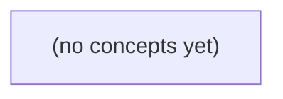

# 07.02 Redis 数据模型：从访问形状到派生状态设计

*本书面向 Go 初学者，以会话 c-a、消息 m-9 与成员 u-a/u-b/u-c 的固定案例，系统讲解 Redis String、Hash、Set、Sorted Set、List、Bitmap 与 Stream 的适用边界。重点不是背诵命令，而是从业务访问形状、权威归属、权限、TTL、内存和重建责任出发，避免将 Redis 候选数据误作消息历史或成员授权事实。*

**章节:** 2

---

## 本书导览

- 了解整本书的章节脉络
- 掌握各章之间的概念依赖关系
- 选择最合适的阅读顺序

# 07.02 Redis 数据模型：从访问形状到派生状态设计

本书面向 Go 初学者，以会话 c-a、消息 m-9 与成员 u-a/u-b/u-c 的固定案例，系统讲解 Redis String、Hash、Set、Sorted Set、List、Bitmap 与 Stream 的适用边界。重点不是背诵命令，而是从业务访问形状、权威归属、权限、TTL、内存和重建责任出发，避免将 Redis 候选数据误作消息历史或成员授权事实。

下方的概念图展示了本书 0 个核心概念以及它们之间的依赖关系；再下方是 1 个章节的入口。你可以按从上到下的顺序阅读，也可以根据自己的兴趣或先验知识选择切入点。

#### 概念图

## 章节索引

- **07.02 Redis 数据模型：从访问方式选择结构** — 面向Go初学者，围绕IM在线提示、会话预览、成员候选、排序列表、近期窗口、位标志和通知流选择Redis结构并标明业务边界。

## 07.02 Redis 数据模型：从访问方式选择结构

- 按访问形状选择String/Hash/Set/ZSET/List/Bitmap/Stream
- 解释缓存角色不由Redis类型决定
- 手算Set/ZSET/List/Bitmap小例
- 区分String INCR单命令与跨DB事务
- 区分Stream消费者ACK与设备交付
- 约束键TTL/大小/权限与重建来源
- 评审不适用或无界结构

沿用权威、派生与临时数据边界，以 c-a 的 seq9、m-9 和三位用户为例，按实际访问方式选择 Redis 结构，而非让类型替业务作承诺。

### 先从访问动作拆解数据需求

### 先从访问动作拆解数据需求

不要先问“该用哪种 Redis 类型”，而应先把业务请求改写成可验证的访问动作。设会话 `c-a` 的最新序号为 `seq9`，消息为 `m-9`；`u-a`、`u-b` 是成员，`u-c` 不是成员。

- **点查**：给定 `c-a:seq9`，直接取得 `m-9`。这是按完整键定位的读取，可使用字符串保存消息体或消息索引；但消息权威副本仍应在 S2/S3 或主库中，Redis 只负责加速。
- **字段读取**：只取 `m-9` 的发送者、时间、状态，而非反序列化整条消息。此时可用哈希保存可独立读取的字段，字段设计应服务读取路径，不等于 Redis 成为消息事实来源。
- **成员判断**：回答“`u-c` 是否属于 `c-a`？”需要常数时间的包含测试，适合集合；集合只能表达成员性，不能自动表达成员加入顺序或权限审计。
- **按分数排序**：按活跃时间、未读数或权重列出会话，应将对象标识与分数分离，使用有序集合。分数是派生索引；重建时必须能从权威事件或数据库恢复。
- **顺序追加与消费**：消息投递、异步处理要求“追加”“按序读取”“消费者确认”。流适合记录消费位置与确认状态，但确认成功不应替代权威写入成功。
- **位状态**：例如 `u-a` 是否已读、某功能是否开启，可用位图压缩大量布尔值；位偏移必须有稳定编号规则。
- **回放与确认**：需要从某位置重新消费并追踪待确认项时，选择支持消费组的流，而不是用列表假装可靠队列。

因此，Redis 类型描述的是访问接口：`GET`、字段取值、`SISMEMBER`、范围排序、追加消费或位读写。权威/派生/临时边界仍由 S2/S3 合同决定，不能因选了某个结构而自动改变。

### 点查、字段与成员关系的选择

### 点查、字段与成员关系的选择

先看访问形状，而不是先问“哪种 Redis 类型更万能”。假设 `c-a` 当前预览指向 `seq=9`、消息为 `m-9`；`u-a`、`u-b` 是会话成员，`u-c` 不是。

- **String：整体点查的预览值**  
  若首页只需快速得到 `c-a` 的最新预览，可存 `conv:c-a:preview`，值中编码 `seq=9`、`messageId=m-9`、摘要和更新时间。读取是一次 `GET`，适合“取整个对象”。但局部更新需要重写整值；它只是可重建的派生视图，不能替代消息权威记录或确认位置。

- **Hash：按字段读取的 `m-9` 元数据**  
  `msg:m-9` 可保存 `sender`、`kind`、`createdAt`、`status` 等字段。详情页只需发送者和时间时，用 `HMGET`；更新状态时用 `HSET status ...`，避免反复序列化整段对象。Hash 不擅长按某字段范围排序，也不应因“字段很多”就承担消息正文、索引和投递语义。

- **Set：无序成员资格**  
  `conv:c-a:members` 中加入 `u-a`、`u-b`。`SISMEMBER conv:c-a:members u-c` 可直接判定 `u-c` 无权访问；`SADD`、`SREM` 表达加入与退出。Set 只回答“是否属于”，不承诺成员顺序、角色、加入时间或未读数；这些要求应另建字段、排序结构或权威表。

因此，`String` 服务整体点查，`Hash` 服务字段访问，`Set` 服务成员关系。类型优化的是访问路径，不会自动赋予数据权威性、顺序性或确认语义。

### 排序与近期窗口不能混为一谈

### 排序与近期窗口不能混为一谈

对会话 `c-a`，假设候选消息有 `m-7`、`m-8`、`m-9`，其排序分数分别为 $82$、$91$、$88$。若需求是“找出当前最值得展示的 2 条”，应使用 ZSET：

- `ZADD c-a:rank 82 m-7 91 m-8 88 m-9`
- 按分数倒序读取前二：得到 `m-8, m-9`
- 分数可表示热度、相关性、截止时间或复合排序键；更新 `m-9` 的分数会改变其排名。

ZSET 的承诺是“成员按可比较分数排序”，适合在线候选集、排行榜和延迟任务。它不天然表示消息到达顺序；若分数并非单调递增，`m-9` 可能排在较早消息之前。读取前 $K$ 项通常围绕 $O(\log N+K)$，但集合无限增长时，排名维护、范围读取和内存都会持续扩大，因此应设过期、淘汰阈值或定期裁剪。

若需求变为“保留 `c-a` 最近到达的消息，并由消费者顺序处理”，应使用 List：

- 依次 `RPUSH c-a:recent m-7 m-8 m-9`
- 最近两条可取尾部窗口：`LRANGE c-a:recent -2 -1`，得到 `m-8, m-9`
- 消费者可从左侧 `LPOP`，其语义是先进先出，而非按热度排序。

List 的承诺是插入顺序；它适合近期窗口、简单队列和顺序回放。若只保留最近 100 条，应在追加后裁剪为固定窗口，例如保留尾部 100 项。否则“近期”会悄然变成无界历史：`LRANGE` 范围更大、内存持续上涨，且旧消息并未因业务口径过期而自动消失。

因此，`m-9` 同时出现在 ZSET 与 List 是合理的：前者回答“现在应优先展示什么”，后者回答“最近发生了什么、下一条该消费什么”。两种索引都只是派生访问结构；消息权威内容、确认状态和可审计回放承诺仍应由既定的 S2/S3 合同承担。

### 位标志、计数与事务边界

### 位标志、计数与事务边界

若 `c-a` 的成员编号可映射为稳定整数，例如 `u-a=1`、`u-b=2`、`u-c=3`，可用 Bitmap 保存“是否在线”或“是否已读 `m-9`”：

`SETBIT room:c-a:read:m-9 1 1`

位偏移从 `0` 开始；因此偏移 `1` 对应第二位。若依次写入 `u-a`、`u-b` 的已读标志，字节的低位可手算为：

- `u-a=1`：`00000010`
- `u-b=2`：`00000110`
- `u-c=3` 未读：其位仍为 `0`

读取时执行 `GETBIT room:c-a:read:m-9 3`，返回 `0` 即表示 `u-c` 尚未确认。Bitmap 适合稠密、稳定编号下的大量布尔状态；用户 ID 不连续或频繁重编时，位偏移映射本身必须由权威数据保证，不能把“第几位是谁”交给 Redis 临时猜测。

计数器通常使用 String：

`INCR stat:c-a:seq`

`INCR` 对单个键的读—改—写是原子的，可安全生成递增序号或累计在线事件数。但“递增 seq9 后写入 `m-9`，再更新未读 Bitmap”已经是跨键业务动作；`MULTI/EXEC` 只能提供 Redis 内命令队列的原子执行，不自动覆盖数据库写入、消息投递或客户端重试。

因此，Redis 计数与位标志宜视为派生或临时状态。真正决定 `m-9` 是否存在、谁已确认、何时可回放的承诺，仍应由 S2/S3 的权威记录、幂等键与确认流程定义。

### 通知流的确认不等于设备送达

### 通知流的确认不等于设备送达

对 `c-a` 的 `seq9` 通知回放，可使用 Redis Stream：`XADD notify:stream:c-a * seq 9 message_id m-9 ...`。客户端重连后由消费服务通过消费者组读取；`u-a`、`u-b` 是成员并不意味着各自都要消费同一条流记录，消费者组语义是**组内任务分摊**，不是用户级广播。若需每个用户独立回放，应按用户建立流、维护用户游标，或由消费服务把频道流扇出为用户收件箱。

`XACK notify:stream:c-a group delivery-worker <id>` 仅表示：消费服务已成功处理该记录，例如已写入派生收件箱、已提交推送任务。它不表示设备在线、不表示 APNs/FCM 已接受，更不表示 `u-a` 的设备已展示通知。设备送达、展示、点击应由客户端或推送渠道回执写入独立状态，如 `notify:receipt:u-a:m-9`；不能用 `XACK` 覆盖业务送达承诺。

约束应明确：

- 键名按领域与租户隔离，如 `notify:stream:c-a`、`notify:group:c-a:fanout`；仅通知服务可 `XADD`，消费服务仅能读取、确认。
- Stream 是派生回放缓冲，不是权威通知账本。设置 `MAXLEN` 或按时间裁剪，并配置有限保留期；容量上限必须小于 Redis 可用内存预算。
- 待确认记录会留在消费组的待处理列表中，应定期检查、认领超时任务并实现幂等处理，避免 `m-9` 重复扇出。
- Redis 丢失、裁剪或重建时，以权威事件日志或通知数据库重新生成流；不要把 Stream 当作唯一审计来源。
- 不适用于要求“每位用户必达、长期可追溯”的通知事实，也不适用于仅需最新状态的场景；后者更适合可覆盖的键或字段。

> **要点** — Redis 类型服务于访问形状；业务权威性、送达承诺、生命周期与可重建性必须由明确合同规定。

String 与 Hash 适合表达简单状态和小型对象，但键的过期、原子性、权限与权威来源必须由业务语义界定。

### 从访问形状识别 String 与 Hash

### 从访问形状识别 String 与 Hash

选择 String 或 Hash，关键不在于对象叫“在线状态”“计数器”还是“消息预览”，而在于访问时是操作**一个整体值**，还是操作**多个可独立读写的字段**。

- **String：读写一个值。**  
  例如在线状态可写为 `presence:u-a:dev-1 = online`，读取时只关心该设备当前是否在线；教学场景可附加 `TTL 30s`。但过期只表示 Redis 未再保留该状态，**不能证明用户一定离线**：心跳可能延迟、客户端可能断网，业务应把它视为“最近未观察到在线信号”。

- **String：单值计数适合原子增量。**  
  `rate:u-a:minute` 可通过 `INCR` 完成一次临时计数增长。该命令对 Redis 内部是原子的，不需要“先读再写”。但它不与 SQL 事务天然构成同一原子事务：数据库提交成功而 Redis 写入失败，或反过来，都需要业务通过重试、补偿或幂等设计处理。

- **Hash：局部读写多个字段。**  
  例如 `preview:c-a` 可保存 `last_id = m-9`、`seq = 9`。更新新消息时只改 `last_id` 和 `seq`，读取预览也无需取出其他无关字段，适合 `HSET`、`HGET` 这类字段级操作。

Hash 中应放可重建的派生数据，如会话预览、游标或摘要；消息原文仍应保留在权威存储中。更重要的是，Hash 不是权限边界：读取 `preview:c-a` 前，仍应另行确认访问者是否有会话 `c-a` 的权限。

### 在线提示：TTL 只是新鲜度信号

### 在线提示：TTL 只是新鲜度信号

可以为每个用户设备维护一个独立键：

`presence:u-a:dev-1 = online`

并设置教学用 TTL 为 30 秒：

`SET presence:u-a:dev-1 online EX 30`

客户端在连接建立后、心跳到达时或收到业务活动时续期。若心跳间隔为 10 秒，可直接重写并携带过期时间：

`SET presence:u-a:dev-1 online EX 30`

这表示：在最近 30 秒内，服务端曾收到该设备的有效活动信号。读取结果可解释为：

- 键存在：设备状态“近期可见”，适合显示“在线”提示。
- 键过期：服务端在 30 秒窗口内未观察到新信号。
- 多设备登录：分别维护 `dev-1`、`dev-2`，用户级在线状态由任一设备键存在推导。

但过期**不等于用户已经离线**。网络抖动、移动端后台休眠、心跳包延迟、Redis 故障切换，都会让键自然过期；用户可能仍保持真实连接，或很快恢复。因此，TTL 是“新鲜度”边界，不是精确的连接生命周期记录。

若业务需要审计“何时登录、何时断开”，应由连接网关或事件日志保存权威记录；Redis 的 `presence:*` 更适合作为可容忍短暂误差的即时展示缓存。

### 计数限流：INCR 的原子边界

### 计数限流：`INCR` 的原子边界

以用户在一分钟窗口内的请求次数为例，可使用键 `rate:u-a:minute`。`INCR` 会将整数值加一并返回新值；即使多个请求并发到达，递增也不会丢失，因此可据返回值判断是否超过阈值：

- 返回值 `<= 60`：允许请求；
- 返回值 `> 60`：拒绝或降级处理。

关键在于首次计数时设置过期时间。若每次递增都刷新 `TTL`，持续访问的用户可能永远不进入下一窗口。常见语义是：当 `INCR` 返回 `1` 时，为该键设置 `EXPIRE 60`；后续请求只递增，不延长窗口。

但“递增”和“仅首次设过期”若拆成两次独立命令，中间进程崩溃可能留下无过期键，导致用户被长期限流。因此应使用 Lua 脚本或事务性命令组合，将“`INCR`、判断是否为 1、设置过期、返回计数”作为一次 Redis 侧原子操作。

这里的原子边界只在 Redis 内部。若请求还要写入 SQL，例如创建订单后才计入额度，Redis 的计数与 SQL 事务并不共享同一提交边界：SQL 回滚后计数可能已增加；Redis 成功后宕机也可能未完成 SQL 写入。此类限流通常接受“宁可多计一次”的近似语义；若必须严格扣减，应设计补偿、幂等键或以单一权威存储协调，而不能把 `INCR` 误认为跨库事务。

### 会话预览：Hash 保存可重建派生字段

### 会话预览：Hash 保存可重建派生字段

会话列表通常只需展示“最后一条消息”和“未读进度”，适合用 Hash 保存轻量预览：

`HSET preview:c-a last_id m-9 seq 9`

其中：

- `last_id=m-9`：该会话当前预览指向的最后消息标识；
- `seq=9`：用于排序、增量同步或判断预览是否已落后；
- 还可保存 `updated_at`、`last_sender_id`、`last_type` 等可由消息记录重新计算的字段。

这里的 `preview:c-a` 是派生缓存，不是消息原文的权威来源。消息正文、附件、撤回状态、编辑版本等应保存于消息库；读取预览时，可先根据 `last_id` 查询权威消息，再决定展示文本、撤回提示或附件摘要。若 Hash 丢失、过期或出现不一致，可以扫描或聚合消息数据后重建，而不应因此丢失会话事实。

更重要的是，Hash 中存在 `last_id` 并不代表当前请求者有权读取该消息。访问会话预览前仍需校验成员关系、封禁状态、消息可见范围等权限规则。缓存负责加速“看什么”，权限系统负责决定“能不能看”，消息存储负责回答“真实内容是什么”。

### 评审键设计：大小、TTL、权限与重建

### 评审键设计：大小、TTL、权限与重建

Redis 键设计不只看“能否存下”，还要评审其大小边界、失效语义、权限隔离与可重建性。

- **不要把消息原文塞进 Hash**：`preview:c-a` 可存 `last_id=m-9`、`seq=9`、`updated_at` 等小型派生字段；若把长文本、附件列表、无限增长的消息集合写入同一 Hash，会造成单键膨胀、网络传输放大与删除成本上升。消息原文仍应由消息库作为权威来源。

- **不要缓存未经界定的权限结果**：例如 `perm:u-a:c-a=allow` 可能因成员变更、封禁或角色更新而立刻失效。若确需缓存，应包含版本号或短 TTL，并在鉴权服务中明确其只是加速层；不能把 Redis 中的 `allow` 当作最终授权依据。

- **字段必须有上界**：Hash 适合有限字段的小对象，不适合动态字段名，如按用户、消息或日期不断新增 `read:m-9`、`member:u-x`。无界字段本质上是在制造不可控的大键，应改为独立键、集合或持久化表，并设定保留策略。

审查一个键时，可逐项确认：

1. 值是否小且大小可预估？
2. TTL 到期表示“缓存失效”还是“业务状态结束”？例如 `presence:u-a:dev-1` 的 `30s` 过期只说明未续报，不能证明用户离线。
3. 是否含有需要实时校验的权限或敏感信息？
4. 删除 Redis 数据后，能否从权威库、事件流或计算规则重建？
5. 更新是否需要原子操作？`INCR rate:u-a:minute` 在 Redis 内单命令原子，但不与 SQL 事务构成原子提交。

> **要点** — Redis 类型描述访问方式；TTL、原子边界、权限与权威来源决定业务语义。

成员候选与会话排序看似都能“查数据”，但访问方式、权威边界和重建策略决定了应选Set还是ZSET。

### 从访问问题识别Set

### 从访问问题识别 Set

`candidate_members:c-a={u-a,u-b}` 表示会话 `c-a` 的**成员候选缓存**。先问访问问题：调用方通常不是要“第 1 个成员是谁”，而是要快速判断“`u-c` 是否可能属于该会话”。

此时适合使用 Set：

- `SISMEMBER candidate_members:c-a u-a` 返回 `true`
- `SISMEMBER candidate_members:c-a u-c` 返回 `false`
- 写入与删除分别使用 `SADD`、`SREM`
- 单成员存在性判断平均为 $O(1)$

因此，Set 的价值不在于保存一串可展示的成员列表，而在于把“是否命中候选集合”变成低成本查询。它也天然去重：重复执行 `SADD ... u-a` 不会产生多个 `u-a`。

但 `false` 只能表示“该缓存中未命中”，不能证明 `u-c` 一定无权访问会话 `c-a`。缓存可能过期、尚未回填、消息乱序，或成员关系刚刚变更。因此，成员资格、读写权限等安全决策仍必须由权威关系数据或授权服务确认；Set 只能用于候选筛选、减少后续查询，不能成为授权权威。

还要避免把 Set 当作有序列表。`SMEMBERS candidate_members:c-a` 返回成员时**没有顺序保证**；不能据此推导创建先后、角色优先级或展示顺序。若需求变成“按最近活动会话读取”或“取前 20 个”，访问问题已从存在性查询变为排序查询，应改用 ZSET 等有序结构。

### SISMEMBER命中不等于授权

### SISMEMBER 命中不等于授权

设缓存中存在候选成员集合：

`candidate_members:c-a = {u-a, u-b}`

当执行 `SISMEMBER candidate_members:c-a u-c` 返回 `false` 时，可靠的含义只是：**按当前缓存版本，`u-c` 不在会话 `c-a` 的候选成员集合中**。这通常可用于快速过滤明显无关的请求、减少数据库查询，或决定是否需要进一步加载成员关系。

但它不能直接推出“`u-c` 无权访问会话”。

原因在于该 Set 是缓存或派生索引，而非授权权威：

- 缓存可能尚未写入：`u-c` 刚被加入会话，成员变更事件尚未消费。
- 缓存可能已过期或被淘汰：数据库记录仍有效，但集合暂时不存在或内容不完整。
- 缓存可能异步重建：重建窗口内只包含部分成员。
- 授权规则可能不只看成员关系：管理员、审计员、组织级策略、临时分享令牌等都可能赋予访问权。
- 成员被移除时也存在反向风险：缓存仍命中，不表示其权限尚未撤销。

因此，较安全的分层是：

1. `SISMEMBER = false`：作为“缓存未发现候选关系”的信号，必要时回源权限服务或数据库。
2. `SISMEMBER = true`：作为优化性提示，仍需结合会话状态、租户边界、角色与撤销记录完成授权。
3. 高风险操作，例如读取敏感消息、导出记录、修改成员：必须以数据库或专门权限服务的权威结果为准。

此外，Set 只表达“是否属于集合”，**不表达顺序、加入时间或角色优先级**。不要把遍历 `SMEMBERS` 得到的顺序当作成员排序依据；若需要“最近加入者优先”或“管理员优先”，应另建有序索引或保存显式属性。

### Set的无序性与边界

### Set 的无序性与边界

以会话 `c-a` 的候选成员缓存为例：

`candidate_members:c-a = {u-a, u-b}`

向集合添加候选成员：

`SADD candidate_members:c-a u-c`

此时集合逻辑上变为 `{u-a, u-b, u-c}`。再次执行同样的 `SADD` 不会产生重复成员；Set 只关心“是否存在”，不记录加入次数。

判断 `u-c` 是否属于候选集合：

`SISMEMBER candidate_members:c-a u-c` → `1`

若查询 `u-d`：

`SISMEMBER candidate_members:c-a u-d` → `0`

删除成员则使用：

`SREM candidate_members:c-a u-b`

结果为 `{u-a, u-c}`。这些操作适合快速去重、资格初筛、黑白名单或“是否可能属于该会话”的缓存判断。

但 `SISMEMBER ... u-c` 返回真，并不等于 `u-c` 已被授权访问会话。成员关系、封禁状态、租户边界等仍应由数据库或授权服务作为权威来源校验；Set 可以过期、延迟更新或重建。

更重要的是，Set **无顺序**。`SMEMBERS` 返回的成员不可视为按加入时间、活跃度或名称排序的结果。因此，若需求变成“按最近发言排序”“分页展示成员”“保存角色、昵称等属性”，仅靠 Set 不适用：排序应使用 ZSET，成员属性应放入 Hash、数据库记录或其他权威模型。

### 用ZSET维护会话预览顺序

### 用 ZSET 维护会话预览顺序

会话列表的核心访问方式不是“某个会话是否存在”，而是“用户最近应先看到哪些会话”。因此可为每个用户维护一个有序集合：

`user_conversations:u-a`

其中成员是会话标识，分数表示该会话的排序依据：

- `c-a`，分数 `100`
- `c-b`，分数 `90`

按分数倒序读取时，结果为：

`c-a` → `c-b`

因为 $100 > 90$，所以 `c-a` 排在会话预览列表前面。读取时可使用类似“按分数从高到低取前 N 条”的操作，而不必先取出全部会话再由应用层排序。ZSET 同时满足“按用户查会话”和“按最近程度分页”的需求。

这里的 `score` 应来自教学系统定义的排序事件，例如最新消息序号、服务端生成的逻辑递增值，或“最后一次有效互动”的派生分数。不要直接依赖多个设备的本地墙钟时间：设备时钟漂移、离线补发都可能让较旧事件获得更大的时间戳，导致列表错误跳动。

当 `c-a` 有新消息时，更新其分数；同一会话成员会被覆盖更新，不会产生重复条目。若两个会话分数相同，还必须规定稳定的并列规则，例如按会话标识或服务端事件序号打破平局，避免不同读取结果来回变化。

ZSET 是用于快速展示的排序索引，而非会话、成员资格或消息内容的授权权威。可限制每个用户只保留前若干会话，并在删除、迁移或索引丢失后依据权威事件流或会话表重建。

### 定义分数、并列与重建规则

### 定义分数、并列与重建规则

`user_conversations:u-a` 的 ZSET 分数不应直接采用客户端墙钟时间。不同设备时钟可能漂移、被用户修改，离线补发也可能使“较早发生的事件”晚于新事件到达。应以教学域的权威事件派生排序值，例如：

`score = lesson_activity_seq` 或 `score = authoritative_event_time`

其中，`lesson_activity_seq` 是服务端为教学活动分配的单调序号；若使用事件时间，也必须由可信教学服务校正、归一化后写入，而非相信设备上传的 `Date.now()`。

写入时采用“事件推进才更新”的规则：只有能使会话活跃度前进的事件，才更新 `ZADD user_conversations:u-a score c-a`。重复投递、旧事件补到或低优先级状态同步，不应把 `c-a` 错误顶到列表前面。可在消费端记录最后处理的事件序号，或通过 Lua 脚本保证“仅当新分数更大时更新”。

ZSET 的主排序是分数从高到低；分数相同时，Redis 按成员字符串的字典序确定顺序。该规则稳定但未必符合产品语义，因此成员值可编码次级键，例如 `c-a|00000042`，或在应用层对同分会话按 `conversation_id`、创建序号再排序。不要假设同分时仍按写入先后排列。

容量应明确限制，例如每个用户仅保留最近 `100` 个会话：写入后删除低分尾部成员。列表可设置 TTL，用于控制缓存生命周期；但 TTL 只能表示“可丢失”，不能表示“无需恢复”。其可重建来源应是权威的教学事件流、会话参与关系与活动记录：先重放或查询这些来源，再重新计算分数并填充 ZSET。

> **要点** — Set回答“是否为候选成员”，ZSET回答“会话如何排序”；二者均是可失效、可重建的缓存，不能越权成为授权权威。

近期消息窗口的关键不是“队列”名称，而是读写、裁剪、确认与重放等操作边界。

### 从访问形状定义近期窗口

### 从访问形状定义近期窗口

以会话列表预览、聊天页“最近消息”为例，需求通常不是保存完整消息史，而是高频读取“最新的有限 $N$ 条”。先把访问形状写清楚：

- 新消息到达：插入最新位置；
- 展示预览：读取最新 1 条或前 $N$ 条；
- 页面展开：按顺序读取最近 $N$ 条；
- 控制容量：超过窗口立即淘汰最旧项；
- 不要求逐条确认、失败重放或按消费组追踪。

这时可为会话 `c-a` 维护：

`recent:c-a = [m-9, m-8, m-7]`

若约定左侧最新，写入可使用 `LPUSH recent:c-a m-10`，随后执行 `LTRIM recent:c-a 0 99`。这样键中始终只保留最近 100 条消息，读取时用 `LRANGE recent:c-a 0 19` 即可取得最近 20 条。窗口大小是产品与性能约束，不应让缓存随着会话寿命无限增长。

这里选择 List 的原因是“头部追加 + 连续范围读取 + 尾部裁剪”恰好匹配，而不是因为它也常被称为“队列”。若调用 `LPOP`，消息会被移除；Redis 不会因此自动提供消费确认、未确认消息恢复或故障重放。它适合展示窗口，却不能仅凭“能 pop”就承担可靠消费语义。

还要区分“最近”与“按序号精确查询”。若客户端会乱序补发、需要按 `seq` 范围定位、修正某条历史消息，List 的位置索引会变得脆弱；此时可考虑以 `seq` 或时间戳为分值的 ZSET，或将完整历史放入数据库，而只把有限预览窗口缓存到 Redis。

### 用 LPUSH 与 LTRIM 保留最新消息

### 用 LPUSH 与 LTRIM 保留最新消息

若聊天 `c-a` 只需展示最近 $N$ 条消息，可令列表键为 `recent:c-a`，并约定**左侧最新、右侧更旧**：

`recent:c-a = [m-9, m-8, m-7]`

新消息 `m-10` 到达时，先执行：

`LPUSH recent:c-a m-10`

列表变为：

`[m-10, m-9, m-8, m-7]`

若窗口上限为 3，再执行：

`LTRIM recent:c-a 0 2`

仅保留下标 $0\sim2$，得到：

`[m-10, m-9, m-8]`

因此，写入逻辑可概括为“左推入，右淘汰”：

1. `LPUSH`：把刚到达的消息放到最前面；
2. `LTRIM key 0 N-1`：删除第 $N$ 项之后的旧元素；
3. `LRANGE key 0 -1`：读取当前窗口，结果已按“新到旧”排列。

继续写入并手算：写入 `m-11` 后先得到 `[m-11,m-10,m-9,m-8]`，裁剪后为 `[m-11,m-10,m-9]`；此时 `m-8` 已不可从该窗口恢复。

通常应把 `LPUSH` 与 `LTRIM` 放入事务或 Lua 脚本，使“写入”和“裁剪”作为一个逻辑操作完成，避免并发写入期间暂时超过窗口，或发生只写入未裁剪的状态。这个结构表达的是**有限的近期访问窗口**，不是可无限保存、可按序号精确回查的完整消息历史。

### List 的弹出语义不等于消费确认

### List 的弹出语义不等于消费确认

`LPOP recent:c-a` 的含义只有一件事：原子地取出并删除队首元素。元素一旦返回给消费者，就不再留在 List 中；如果消费者随后宕机、处理失败或网络响应丢失，Redis 不知道该消息是否真正完成，也无法自动再次投递。

阻塞弹出如 `BLPOP`、`BRPOP` 只是在空队列时等待新元素，避免轮询：

- `LPOP`：无元素时立即返回空；
- `BLPOP`：无元素时阻塞，直到有元素可弹出或超时；
- 两者都会在“交付”时直接删除元素。

因此，阻塞弹出改善的是**等待方式**，不是可靠消费语义。它没有内建的：

- 消费者身份与消费组；
- “已投递但尚未确认”的待处理记录；
- `ACK` 确认；
- 超时接管、重新投递或按消费者查询未完成消息。

若用 List 承载任务，常见补救是将元素从主队列移动到“处理中”队列，再由业务完成后删除；例如使用可靠队列模式把任务转移而非直接弹出。但确认、重试次数、死信、幂等与故障恢复都要自行设计，复杂度很快上升。

Redis Stream 的消费组则把这些状态纳入模型：消息读取后进入待处理列表，消费者处理成功再 `XACK`；未确认消息可被查询、认领和重放。故而，List 适合“拿到即视为移除”的短暂工作流或近期窗口；需要可追踪处理、失败恢复和多消费者协调时，应选择 Stream，或将可靠状态放入数据库。

### 乱序与范围查询为何转向 ZSET 或数据库

### 乱序与范围查询为何转向 ZSET 或数据库

`List` 适合“只关心最近 N 条、按一端写入和读取”的窗口，例如：

`LPUSH recent:c-a m-9` + `LTRIM recent:c-a 0 99`

但当客户端需要按消息序号 `seq` 拉取区间，如“获取 `seq=1200~1300`”“发现 1257 缺失后补洞”，或服务端收到乱序消息后要修正位置，`List` 的问题就暴露出来：

- `LRANGE` 只能按**下标**取值，不能按 `seq` 条件查询；下标会随裁剪和插入变化。
- 在中间插入一条迟到消息需要定位位置并移动元素，成本高，也不利于并发修正。
- `List` 不提供按 `seq` 的精确分页游标；“第 3 页”依赖当前长度，新增、裁剪后容易重复或漏读。
- 若缓存完整历史以避免这些问题，列表会无限增长，违背“近期窗口”的边界。

若 `seq` 单调且可作为排序键，可用有序集合：

`ZADD msg:c-a 1257 payload`  
`ZRANGEBYSCORE msg:c-a 1200 1300`

迟到消息可按其 `seq` 写回对应位置；范围补拉、按分数分页也更直接。需注意：同一 `seq` 的覆盖语义、`seq` 相同但内容不同的冲突，以及成员内容较大时的内存成本。

当需要持久历史、复杂条件筛选、事务一致性、跨会话稳定分页或可靠重放时，应以数据库为事实来源：按 `(conversation_id, seq)` 建索引，Redis 仅缓存最近窗口或热点范围。结构选择应回答“要怎样查、怎样修正”，而不是先把消息称为“队列”。

### 给近期缓存划定容量与重建边界

### 给近期缓存划定容量与重建边界

近期消息缓存应被定义为“可丢失、可重建的有限窗口”，而不是会话完整历史。键名应同时表达业务对象与用途，例如 `recent:c-a` 表示会话 `c-a` 的近期消息；避免使用含义模糊的 `queue`、`messages`，以免调用方误以为它具备确认、重放或永久存储语义。

写入时可采用原子窗口操作：

`LPUSH recent:c-a m-9`  
`LTRIM recent:c-a 0 99`  
`EXPIRE recent:c-a 86400`

这表示仅保留最新 100 条，并在一天无访问后自动回收。容量上限应按“单条消息大小 × 最大条数 × 活跃会话数”估算；一旦没有 `LTRIM`、TTL 或等价淘汰策略，List 就会逐渐变成无界历史，挤占 Redis 内存并放大热键风险。

还应明确重建来源：Redis 失效、淘汰或故障后，应用必须能从数据库、事件日志或对象存储按会话和时间/序号重新加载窗口。数据库保存权威历史，Redis 只保存加速读取的派生副本；不要把 Redis List 当作唯一档案。

权限也应收紧：业务账号只允许访问约定前缀及所需命令，例如读取窗口可使用 `LRANGE`，写入服务才可 `LPUSH`、`LTRIM`、`EXPIRE`。若需求变为按 `seq` 范围补拉、处理乱序修正或查询任意历史，应转向 ZSET 或数据库索引，而非继续扩张这个近期 List。

> **要点** — List 适合有限最新窗口；涉及确认、重放、范围和乱序时，应改用 Stream、ZSET 或数据库。

Bitmap并非独立数据类型，而是对Redis String按位读写。它适合紧凑、范围明确的标志集合，但不能替代设备回执或已读状态的权威存储。

### 先识别Bitmap的真实边界

### 先识别 Bitmap 的真实边界

Redis 的 Bitmap 不是独立数据类型，而是把一个 `String` 当作连续的二进制位序列来访问。核心操作不是“按用户或设备名查询”，而是“按整数偏移量读写一位”：

- `SETBIT key offset value`：将第 `offset` 位设为 `0` 或 `1`
- `GETBIT key offset`：读取第 `offset` 位
- `BITCOUNT key`：统计值为 `1` 的位数

例如，约定某用户的三个设备拥有稳定编号：设备 A 为 `0`、设备 B 为 `1`、设备 C 为 `2`。若 `bit2=1` 表示“设备 C 已开启某标志”，则：

`SETBIT user:42:flag 2 1`

此时 `GETBIT user:42:flag 2` 返回 `1`；若其余两位仍为 `0`，`BITCOUNT user:42:flag` 返回 `1`，表示三个已分配设备中只有一个设备具备该标志。

这里的前提比命令更重要：偏移量必须是可控、稳定且范围明确的整数。不能直接把任意字符串形式的 `user_id` 当偏移，也不应把稀疏且极大的数字直接写入位图；Redis 会为到达该偏移补齐空间，导致内存浪费。通常需要由业务维护“设备标识 → 小整数偏移”的映射，并限制可分配范围。

Bitmap 只保存某一位当前是 `0` 还是 `1`。它不会自动记录设备何时回执、回执对应哪条消息，也不能天然充当“已读状态”的权威事实来源。权限校验、设备归属、映射生命周期与状态审计，仍应由业务模型或可靠存储承担。

### 三设备偏移的最小心算例

### 三设备偏移的最小心算例

设某个用户在某项功能下有三台已登记设备，并且设备与位偏移的映射稳定不变：

| 设备 | 位偏移 |
|---|---:|
| 手机 | 0 |
| 平板 | 1 |
| 网页端 | 2 |

以键 `flag:user:42` 保存该用户的设备标志。初始时三个位都为 `0`：

`bit2 bit1 bit0 = 000`

现在网页端满足某个条件，例如“已开启同步”，写入：

`SETBIT flag:user:42 2 1`

这里的 `2` 是位偏移，不是设备编号文本，也不是用户 ID。写入后：

`bit2 bit1 bit0 = 100`

因此：

- `GETBIT flag:user:42 0` 返回 `0`：手机未设置该标志。
- `GETBIT flag:user:42 1` 返回 `0`：平板未设置该标志。
- `GETBIT flag:user:42 2` 返回 `1`：网页端已设置该标志。
- `BITCOUNT flag:user:42` 返回 `1`：当前整个字符串中共有一个值为 `1` 的位。

`BITCOUNT=1` 表示“有一台映射范围内的设备处于标志开启状态”，并不自动说明是哪台设备；具体设备仍要结合稳定映射和 `GETBIT` 判断。若再执行 `SETBIT flag:user:42 0 1`，位图变为 `101`，此时 `BITCOUNT` 为 `2`。

### 偏移设计决定空间成本

### 偏移设计决定空间成本

Bitmap 的空间并不取决于“设置了多少个 `1`”，而取决于**最大的偏移量**。对最大偏移为 $m$ 的位图，Redis 至少需要：

$$
\left\lfloor \frac{m}{8}\right\rfloor+1\ \text{字节}
$$

例如，三台设备被稳定分配为偏移 `0`、`1`、`2`：即使只执行 `SETBIT key 2 1`，Redis 也只需保存 1 个字节；此时 `BITCOUNT key` 为 `1`，表示三个位置中恰有一个标志被置位。

但若把设备编号直接设为 `100000000`，即使中间所有位都是 `0`，写入该位仍会把 String 扩展到约 12.5 MB。若偏移达到十亿级，单个键就可能占用约 125 MB。稀疏数字在位图中并不“稀疏”：空洞同样需要由连续字节覆盖。

因此，不能直接把任意字符串 `user_id` 当作偏移；字符串本身不是整数，哈希后也可能产生很大的、碰撞或范围不可控的值。更合理的做法是维护受控映射：将业务对象映射到连续、有限、稳定的编号，并预先规定允许范围。写位操作还应由服务端负责校验权限，避免调用方借超大偏移制造异常内存消耗。

位图适合表达“已启用”“某标志存在”等范围明确的集合；它不自动保存设备回执明细，也不应充当已读状态的权威记录。

### 映射、范围与权限的业务责任

### 映射、范围与权限的业务责任

位图只认识“第几位”，不认识设备、用户或租户。因此，应用必须先定义稳定映射：例如某用户最多绑定 3 台设备，按设备槽位分配偏移 `0、1、2`；当 `bit2=1` 时，表示第 3 个槽位对应设备具有某项标志。此映射应由设备注册或绑定服务维护，而不是直接使用任意字符串 `user_id`，更不能把稀疏且巨大的数字标识直接当偏移。

建议明确以下边界：

- **映射来源**：设备首次绑定时分配槽位，并持久化 `device_id -> slot`。同一设备重连、换 token 后仍应获得原槽位。
- **可分配范围**：预先规定最大槽位数，如 `0~2`。超过范围应拒绝、扩容或迁移，不能无界 `SETBIT`；高偏移会让 Redis String 扩展，造成意外内存消耗。
- **租户隔离**：键中应包含租户和业务主体，例如 `tenant:{t1}:user:{u1}:device_flags`。不要让不同租户共享同一位图再依赖“约定偏移”隔离。
- **写入权限**：客户端不应自行提交偏移量。服务端依据认证身份查得其允许操作的 `slot`，再执行 `SETBIT`，避免设备 A 篡改设备 B 的位。
- **失效重建**：解绑、换机或槽位回收时，要同步清理位，并更新映射记录；缓存丢失后，应能从权威设备绑定表重建位图。

例如 `BITCOUNT tenant:{t1}:user:{u1}:device_flags` 返回 `1`，只说明三个槽位中恰有一个标志位为 `1`；它不能说明是哪台设备已回执，更不能替代设备回执、已读状态等权威事实记录。

### 标志缓存不等于送达回执

### 标志缓存不等于送达回执

设某用户固定绑定三台设备：手机、平板、网页端，分别映射为偏移 `0、1、2`。对一次通知 `N`，可以用键 `notify:N:flags` 保存临时标志：

- `SETBIT notify:N:flags 0 1`：手机侧出现某个标志；
- `SETBIT notify:N:flags 2 1`：网页端出现某个标志；
- `BITCOUNT notify:N:flags` 得到 `1`：表示当前只有一台设备的该标志为真。

这种位图适合回答“哪些**固定槽位**已被标记”，例如在线提示、短期投递尝试结果或待刷新标志。它空间紧凑，读取聚合结果也很快；但 `bit2=1` 本身没有业务语义，必须由应用约定“偏移 2 是网页端”“1 表示什么状态”。

更重要的是，位图不能自动成为送达回执：

| 数据 | 应保存的事实 | 位图是否足够 |
|---|---|---|
| 临时位标志 | 某设备当前是否被标记 | 通常可以 |
| 设备交付记录 | 哪台设备、何时、通过何通道、响应码为何 | 不可以 |
| 已读权威状态 | 谁在何时读到哪条消息、是否可撤销或更正 | 不可以 |

例如推送服务返回成功，只能说明请求被服务端接受，不等于设备收到，更不等于用户已读。若只执行 `SETBIT ... 2 1`，系统会丢失确认时间、重试次数、失败原因、回执来源和状态变迁，无法审计，也无法处理重复 ACK、撤回或跨端冲突。

因此，位图应定位为可重建、可过期的加速索引；设备 ACK 与已读状态应写入具备消息标识、设备标识、时间戳和状态版本的权威记录。偏移还必须由受控映射分配，不能直接把任意 `user_id`、设备字符串或稀疏大数字当作位偏移。

> **要点** — Bitmap适合有界、稠密、稳定编号的布尔标志；偏移映射与权威回执语义必须由业务系统承担。

通知流的关键不在“用了Stream”，而在明确处理确认、设备送达、保留边界与权威数据来源之间的区别。

### 从通知访问形状识别Stream职责

### 从通知访问形状识别Stream职责

以 `notify:c-a` 表示发往设备 A 的通知流。若通知的访问形状是“持续追加、多个工作者协作处理、失败后可恢复”，Redis Stream 比 List 或临时 Pub/Sub 更贴合：

- 生产者用 `XADD notify:c-a * type alert ...` 追加带 ID 的事件；记录天然有顺序，可按 ID 重放或检查积压。
- 工作者组 `G1` 通过 `XREADGROUP` 分配待处理项。N1 被某个工作者读取并 `XACK`，表示该消费者组已完成约定的处理步骤。
- 若 N2 已被读取但工作者崩溃，N2 留在 pending 列表中；其他工作者可经 `XPENDING`、`XAUTOCLAIM` 接管，而非永久丢失。

这里的确认边界必须说清：`XACK N1` 只证明 **G1 的处理协议认为 N1 已完成**，例如已调用设备网关、已写入投递任务；它不证明设备 B 已收到、更不证明用户已展示通知。设备送达应由独立回执、状态机或重试机制定义。

相比之下，List 的 `POP` 更像一次性取走任务，缺少消费者组 pending 与认领语义；Pub/Sub 面向在线订阅者，断线期间消息通常不保留。Stream 则适合可恢复消费，但其保留策略（如 `MAXLEN`）仍需明确：它不是自动权威消息历史，也不能仅凭 Stream 替代跨数据库事务 outbox。

### 消费者组、待确认与XACK

### 消费者组、待确认与 XACK

设通知流 `notify:c-a` 依次追加 `N1`、`N2`，消费者组为 `G1`，其中 `worker-1` 执行读取：

`XREADGROUP GROUP G1 worker-1 COUNT 2 STREAMS notify:c-a >`

`>` 表示只取该组尚未投递的新条目。读取后，Redis 不会删除 `N1`、`N2`；它们会记录在组的待确认条目列表中，并归属给 `worker-1`。此时状态可理解为：

- `N1`：已投递给 `worker-1`，待确认；
- `N2`：已投递给 `worker-1`，待确认；
- 流本身：仍保留两条追加记录，直到受到保留策略清理。

若 `worker-1` 成功处理 `N1`，执行：

`XACK notify:c-a G1 N1`

则 `N1` 从 `G1` 的待确认列表移除；这表示“该消费者组认可此条目已按本组处理协议完成”。随后若 `N2` 尚未确认，它仍是 pending：可通过 `XPENDING` 查看其归属、空闲时间与投递次数。

关键边界是：`XACK N1` 不等于设备 B 已收到通知。它最多证明 worker 已完成自身约定的处理步骤，例如写入投递任务、调用推送网关并获得响应，或记录一次尝试结果。设备离线、网关异步失败、客户端未展示等情况，仍可能发生在确认之后。

若 `worker-1` 崩溃，`N2` 不会自动变成“未读新消息”；它仍归属原消费者。恢复者应依据空闲时间，通过 `XCLAIM` 或 `XAUTOCLAIM` 接管并重试。因而处理逻辑应具备幂等性：同一 `N2` 可能被重复执行，`XACK` 只是结束该组的待确认状态，而不是全局、永久的送达证明。

### 确认处理不等于设备送达

### 确认处理不等于设备送达

设通知流 `notify:c-a` 中依次追加了 `N1`、`N2`。工作进程 `worker-1` 属于消费者组 `G1`：

1. `worker-1` 读取 `N1`，生成推送任务，并执行 `XACK notify:c-a G1 N1`。
2. `N2` 已被读取，但工作进程尚未确认，因此仍处于 `G1` 的待确认列表中。
3. 此时 `N1` 的确认只表示：消费者组认为“该条 Stream 记录已按本组协议处理完毕”，它不再需要由其他消费者接管重试。

这并不能推出“B 设备已经收到通知”。例如：

- B 设备离线，推送服务接受了请求，但设备直到数小时后才联网；
- 推送令牌已失效，第三方推送服务拒绝投递；
- 网络、厂商通道或系统省电策略导致消息未到达设备；
- 客户端收到系统推送，却因权限关闭、通知折叠或应用逻辑错误而未展示；
- 用户看到了横幅，但没有进入应用；“展示”“阅读”“完成操作”又是更高层的状态。

因此，`XACK N1` 最多证明工作进程完成了约定的处理步骤，例如写入投递任务、调用推送接口或记录失败原因。若业务需要追踪送达，应单独维护通知状态，如 `待投递 → 已提交渠道 → 渠道确认 → 客户端回执 → 已展示`；每一阶段都应有明确证据来源。

Stream 的待确认记录解决的是**消费者处理可靠性**，不是设备端送达回执。不要把“已确认”直接展示为“用户已收到”。

### 与List和临时发布订阅的边界

### 与List和临时发布订阅的边界

三者都能传递“有一条通知”，但恢复语义完全不同，不能仅按接口相似性替换。

- **Stream：追加记录 + 消费者组进度。**  
  `XADD notify:c-a * ...` 将 N1、N2 追加为带 ID 的条目；消费者组 G1 读取后，N1、N2 会进入待确认列表。worker 成功处理 N1 执行 `XACK`，表示该组不再需要重投 N1；若 N2 未确认，它仍是 pending，可由原消费者恢复，或经 `XAUTOCLAIM` 转交其他消费者。  
  这提供的是**处理协议中的至少一次消费与可恢复进度**。`XACK N1` 只说明 worker 声称已处理 N1，不等于设备 B 已收到通知，更不等于用户已经看到。

- **List：队列式弹出，默认不保留处理状态。**  
  `LPUSH`/`BRPOP` 适合简单任务队列：消费者一旦 `POP`，元素即离开 List。worker 在处理过程中崩溃，已弹出的任务通常无法自动找回；若要恢复，需要额外设计“处理中队列”、超时扫描和原子搬运，例如 `LMOVE` 配合重试逻辑。List 没有 Stream 消费者组的 pending、确认和按组游标语义。

- **发布订阅：即时广播，不是离线消息盒。**  
  `PUBLISH` 只投递给发布瞬间已订阅的客户端；订阅者断线、网络抖动或稍后上线时，历史消息不会补发。它适合在线状态刷新、实时提示等“错过可接受”的场景，不适合要求恢复、重试或审计的设备通知。

Stream 的保留也应单独界定：`MAXLEN`、按时间裁剪或内存淘汰都会使旧条目消失；因此它是可配置留存的传递日志，不应自动视为权威消息历史。通知事实、跨数据库一致性与 outbox 边界仍需由业务持久化设计保证，后续再深入讨论。

### 保留策略与非权威消息边界

### 保留策略与非权威消息边界

`notify:c-a` 应被视为**可恢复的通知工作流缓冲区**，而非永久消息档案。即使 Stream 支持追加、消费者组和 Pending Entries List，也必须为其定义容量与生命周期边界：

- 写入时使用近似裁剪：`XADD notify:c-a MAXLEN ~ 10000 * ...`，限制单个账号或设备通道无限增长。
- 对短期通知设置 TTL，或由定时任务检查空闲流并删除；但注意，仍有待确认消息时直接删除键会丢失恢复线索。
- 监控流长度、最早条目时间、Pending 数量与最长空闲时间；`N2` 长期 pending 往往意味着消费者故障、重试策略缺失或需要人工接管。
- 限制生产者只能 `XADD`，消费者只能读取、认领和 `XACK` 自己所属的组，避免任意客户端伪造通知或清除队列。

Stream 中保留 `N1`、`N2`，只说明 Redis 当前仍保存这些处理记录；`XACK N1` 说明 worker `G1` 已按其处理协议确认，`N2 pending` 说明尚未完成该协议。两者都**不能证明 B 设备已经收到、展示或阅读**。设备送达状态应由设备回执、业务状态表或明确的送达协议单独记录。

更重要的是，`notify:c-a` 不自动成为权威消息历史：裁剪、过期、故障切换和重放都可能改变其可见范围。权威聊天记录、通知状态及重建依据应存在业务数据库或其他明确的持久化来源；Redis 流只承载派发或异步处理。它同样不是跨数据库事务的发件箱：业务数据提交成功而 `XADD` 失败，或反之，仍可能产生不一致。跨库一致性与发件箱模式将在 07.06、07.07 进一步讨论。

> **要点** — Stream确认的是消费者处理协议；设备送达、权威消息历史与跨库一致性必须由额外机制保证。

Redis 键设计不是先选类型，而是先写清访问边界：谁能读写、能存多少、何时失效，以及失效后从哪里重建。

### 把键当作受约束的数据契约

### 把键当作受约束的数据契约

一个 Redis 键不只是 `key → value`，而应在设计时写成可审计的契约：

| 维度 | 必须回答的问题 | 示例 |
|---|---|---|
| 命名空间 | 它属于哪个业务、环境和版本？ | `prod:feed:preview:v1:42` |
| 角色 | 真相数据、派生状态、缓存、限流计数还是任务协调？ | `cache`、`state`、`lock` |
| 权限 | 哪些服务可读、可写、删除或扫描？ | 推荐按前缀配置 Redis ACL |
| 容量 | 单键最大字节数、集合最大元素数、写入速率？ | `ZSET` 最多保留最近 500 条 |
| 生命周期 | 是否设置 TTL、何时续期、内存紧张时能否逐出？ | `EXPIRE 60`、允许 `volatile-ttl` 逐出 |
| 重建源 | 键丢失、过期或被逐出后，从哪里恢复？ | SQL 主表、事件日志、上游接口 |

例如：

`cache:product:preview:{id}`：角色是可丢弃的预览缓存，读多写少，TTL 60 秒，允许被 `maxmemory` 淘汰，未命中时由商品主库重建。  
`state:order:{id}`：角色是业务状态，若 Redis 不是权威存储，则必须明确其 SQL 或事件流来源；若无可靠重建源，就不能把它当作普通缓存。

缓存身份不由 `String`、`Hash`、`ZSET` 等类型决定。同一个 `Hash` 可以是可随时重建的缓存，也可以承载不可丢失的会话状态；决定其风险等级的是写入路径、TTL、逐出策略和重建能力。

尤其不要把“设置 `TTL=60s`”误认为“数据保证新鲜”。它只限制键最长可存活时间，不能阻止旧版本重新命中：预览仍可能返回旧的 `seq=8`。跨 Redis 多命令与 SQL 事务之间，也不能仅靠某个 Redis 单命令获得端到端原子性；版本号、失效顺序与重建规则必须进入契约。

### 为会话预览定义短生命周期边界

### 为会话预览定义短生命周期边界

以“用户编辑内容的会话预览”为例，先把键的契约写完整，而不是只写一个 `SET`：

- **命名空间与角色**：`preview:{sessionId}:{seq}`，其中 `sessionId` 隔离会话，`seq` 表示版本序号；它是可丢失的加速缓存，不是事实数据。
- **读写主体**：预览服务写入；页面渲染服务读取；普通业务服务不应把它当作正式内容来源，更不应直接修改。
- **生命周期**：写入时附加 `EX 60`，即 60 秒后自动过期。例如：`SET preview:{s1}:8 "<html>...</html>" EX 60`。
- **大小与数量**：限制单个预览的字节数、单会话保留的版本数，以及单用户并发会话数；否则大文本、频繁编辑或恶意请求会挤占 Redis 内存。
- **重建源**：过期或被逐出后，从数据库中的草稿、事件记录或对象存储重新生成；若没有可靠重建源，就不应只存 Redis。

`TTL=60s` 只是玩具方案：它表达“短暂可用”，却不保证“内容新鲜”。例如数据库已提交最新版本 `seq=9`，旧键 `preview:{s1}:8` 仍在 60 秒有效期内，读取请求仍可能命中旧预览。TTL 解决的是最终消失，不是版本一致性。

因此读取时应携带期望的 `seq` 或内容版本，只接受版本匹配的键；发布、撤销或切换会话时主动删除相关预览。还要注意，Redis 的 `EXPIRE` 与 `maxmemory` 逐出策略都可能使键提前不可用；应用必须把“缓存未命中后重建”设计为正常路径，而非异常补救。

### 用过期与逐出控制内存风险

### 用过期与逐出控制内存风险

`EXPIRE` 表达的是**业务有效期**：键在某个时间点后不再应被使用。例如预览结果可设 `TTL=60s`：

`preview:{docId}:{seq} -> 渲染结果，EXPIRE 60`

但 `60s` 只限制“最长留存时间”，不保证新鲜。若文档已更新到 `seq=9`，旧键 `preview:{docId}:8` 在未过期前仍可能命中；读取方必须校验当前版本号，或以最新 `seq` 参与键构造。过期键消失后，还必须明确重建源：数据库正文、对象存储原文件或可重放的任务输入。

`maxmemory` 与淘汰策略则是**Redis 实例的内存保护机制**。当内存达到上限，Redis 才按配置拒绝写入或淘汰键；如 `volatile-ttl` 只从带过期时间的键中优先淘汰，`allkeys-lru` 可淘汰任意键。它不理解“预览”“会话”“权限缓存”的业务重要性，不能充当数据生命周期规则。

因此每类键都应同时声明：

- `TTL`：业务上何时失效；
- 最大元素或最大字节数：单键不能无限增长；
- 淘汰后果：是否允许丢失、是否可降级；
- 重建源与重建成本：删除后从哪里恢复；
- 实例策略：在内存压力下哪些键可被牺牲。

例如购物车若必须保留，应设大小上限并落库，而不是指望 `allkeys-lru`“恰好不淘汰它”；可重建预览则可以设置短 TTL，并允许在内存压力下被淘汰后重新计算。

### 识别旧预览与跨库一致性缺口

### 识别旧预览与跨库一致性缺口

`String` 的 `INCR` 具有明确的单命令原子性：多个客户端同时执行 `INCR preview:seq` 时，每次都会得到唯一递增值，不会出现“两个请求都拿到 8”。这解决的是 **Redis 内一个键的并发计数** 问题。

但业务预览通常不止一步，例如：

1. SQL 事务提交文章版本 `seq=9`；
2. Redis 写入或删除 `preview:article:42`；
3. 读取预览时，根据缓存中的 `seq` 判断是否可用。

这里的 SQL 提交、Redis `SET`、`DEL`、`GET` 是跨系统、跨命令操作。即使某个 Redis 命令本身原子，也不能自动形成“SQL 与 Redis 同时成功或同时回滚”的事务。

典型竞态如下：

- 请求 A 先读取到旧缓存 `preview:article:42 = {seq:8,...}`；
- 请求 B 更新数据库，提交新版本 `seq=9`；
- B 尚未来得及删除缓存，或删除操作失败、延迟；
- A 仍可能返回刚才读到的 `seq=8` 预览。

因此，`INCR` 不能证明预览新鲜，`TTL=60s` 也只能限制旧值最多存活约一分钟，不能保证更新后立即不可见。若读路径必须识别陈旧内容，应将版本号写入缓存值，并与数据库或权威版本号比较；不一致时拒绝命中、删除旧键并从重建源生成。对允许短暂陈旧的场景，则要明确声明可接受的陈旧窗口，而不是把缓存命中误认为一致性保证。

### 评审无界键与错误的可靠性承诺

### 评审无界键与错误的可靠性承诺

评审 Redis 方案时，先逐键追问：**它是否有上限、谁能写、何时删除、删除后如何重建**。没有这些答案的键，通常只是把未来的内存事故延后。

- `room:{id}:online`：在线成员适合 `SET` 或位图，但必须限制成员身份与写入方；断线清理不能只依赖客户端主动退出，应有心跳、TTL 或定期对账。若房间成员可无限增长，单键和单次读取都会失控。
- `user:{id}:candidates`：候选集合必须定义最大候选数、去重规则和截断策略。例如只保留最近 `$N$` 个候选，超出时按分数或时间淘汰；其重建源应是数据库、搜索索引或推荐服务，而不是“Redis 一直都在”。
- `feed:{id}:ranked`：排序列表需要声明最大长度、排序依据与分页一致性。`ZSET` 可以按分数裁剪，但裁剪后历史项是否可回查、分数是否可重算，都应明确。
- `notify:{userId}`：通知流应限制保留长度与保留时间，并说明消费者恢复时从何处补偿。

`Stream` 的 `XACK` 仅表示某消费者组已确认处理该条消息；它不等于设备已弹窗、用户已看到，更不等于外部短信或推送已送达。设备交付需要独立回执、幂等标识和补偿机制。

同样，`preview` 设置 `TTL=60s` 只是缓存回收策略，不是新鲜性保证：旧的 `seq=8` 预览仍可能命中，而数据库已写入 `seq=9`。跨 Redis 多命令与 SQL 事务也不能靠“单条命令原子”获得整体原子性；应使用版本号、失效消息、重试与重建源处理不一致。

> **要点** — 每个 Redis 键都应有明确边界；TTL、逐出和原子命令都不能自动保证新鲜性或跨库一致性。

以“读取、筛选、排序、消费、标记”五类访问方式为线索，为即时通信场景选择Redis结构，并用反例划清缓存与业务真相的边界。

### 先看访问形状，再选数据类型

### 先看访问形状，再选数据类型

Redis 选型的起点不是“哪种结构更高级”，而是业务如何访问数据：按键读取、按字段更新、去重判断、按分值排序、按顺序弹出、按位标记，还是由消费者持续处理。

| 访问动作 | 优先类型 | 即时通信示例 | 不适用反例 |
|---|---|---|---|
| 整体读写、计数、短期状态 | String | 会话令牌、未读数、限流计数器 | 需要按多个字段局部更新的用户资料 |
| 按字段读取或修改 | Hash | `user:{id}` 的昵称、头像、在线状态 | 需要按分值取排行榜前十 |
| 判断成员是否存在、集合运算 | Set | 某群成员、消息已读用户集合 | 需要按加入时间或热度排序 |
| 按分值排序、范围查询 | ZSET | 会话最近活跃时间、热度排行 | 只需精确去重、不关心顺序 |
| 两端推进、按顺序获取 | List | 简单待处理队列、最近消息窗口 | 需要多消费者确认、重放和消费组 |
| 大量布尔位标记 | Bitmap | 用户每日是否登录、消息是否已读 | 需要存储每次阅读的完整时间与设备信息 |
| 追加事件、消费者组消费 | Stream | 消息投递事件、异步审核任务 | 只保存“当前最新状态”的在线标记 |

可将选择过程压缩为四个问题：

1. 数据是一值、字段对象、成员集合，还是事件序列？
2. 查询是否依赖排序、范围、队列顺序或位运算？
3. 是否需要去重，还是必须保留重复事件？
4. 消费后是否需要确认、追踪积压和故障重领？

注意：Redis 类型描述的是**数据访问结构**，不等于数据的**业务角色**。同一个 Hash 可以是缓存的用户资料，也可以是业务状态副本；同一个 Stream 可以承载可丢弃的异步通知，也可以承载必须确认的关键任务。是否能丢失、谁是最终真相、失效后如何恢复，取决于缓存策略与持久化边界，而不由 `Hash`、`ZSET` 或 `Stream` 的名称决定。

### 七类即时通信候选与边界

### 七类即时通信候选与边界

按访问方式而非“对象名称”选结构；键宜带业务域、租户与对象标识，如 `im:{tenant}:...`，并明确 Redis 只是可重建的加速层。

- **在线提示：Set**  
  `im:{t}:online` 存在线用户 ID，`SISMEMBER` 判断、`SMEMBERS` 仅用于小规模巡检。连接断开即 `SREM`；异常断线可由心跳过期和连接服务重建。不要把它当作最终在线事实。

- **会话预览：Hash**  
  `im:{t}:conv:{cid}:preview` 保存末条摘要、发送者、未读概览、更新时间；字段读取避免整条会话反序列化。设置短 TTL 或随会话活跃续期，消息库/会话库是重建来源。完整聊天记录不应塞入 Hash。

- **成员候选：Set**  
  `im:{t}:group:{gid}:members` 支持成员存在性与交并差筛选；超大群应由成员库分页查询，Redis 只缓存热点群或候选子集。成员变更由权限/群组数据库事件刷新。

- **排序列表：ZSET**  
  `im:{t}:user:{uid}:convs`，分值使用最后活动时间或业务排序值，`ZREVRANGE` 分页读取会话候选。限制仅保留最近 $N$ 个，例如 500；全量排序、复杂过滤仍回源数据库或搜索索引。

- **近期窗口：List**  
  `im:{t}:conv:{cid}:recent` 保存最近消息 ID，`LPUSH` 后 `LTRIM 0 99`，只承诺最近 100 条快速预览。消息正文、历史分页与审计必须从消息库重建，不能因 List 淘汰而丢失。

- **位标志：Bitmap**  
  `im:{t}:user:{uid}:read:{day}` 以消息序号或分桶偏移标记已读、已提醒等布尔状态。适合稠密且编号稳定的范围；稀疏、无界或需要记录操作时间的状态不适用，应使用表或 Hash。

- **通知流：Stream**  
  `im:{t}:notify` 追加通知事件，消费者组按 `XREADGROUP` 消费并 `XACK` 确认；设置 `MAXLEN`、保留期和待确认监控。Stream 是投递缓冲，不替代业务消息表；未确认事件应依赖幂等键、重试与死信处理，必要时由业务库补偿重放。

### 用小数据手算集合与队列结果

### 用小数据手算集合与队列结果

以下数据均为静态快照。先写清“存了什么”，再按命令语义手算，能避免把访问方式与结构能力混淆。

- **Set：只关心成员是否存在与去重**

  `SADD room:1:online u1 u2 u1 u3` 后，集合为：

  `{"u1","u2","u3"}`

  因而 `SCARD room:1:online = 3`，`SISMEMBER room:1:online u2 = 1`，`SISMEMBER ... u4 = 0`。  
  注意：`SMEMBERS` 的输出**无固定顺序**；若界面要求“最近上线的人”，Set 不适用。

- **ZSET：成员唯一，按分数排序**

  `ZADD rank 90 alice 75 bob 90 carol 60 dave`。按分数从高到低：

  1. `alice`，90
  2. `carol`，90
  3. `bob`，75
  4. `dave`，60

  同分成员按成员字典序排列，因此 `ZREVRANGE rank 0 2 WITHSCORES` 为 `carol 90、alice 90、bob 75`：降序时，同分的字典序方向也相应反转。ZSET 适合排行榜，不表示“谁先进入队列”。

- **List：两端决定队列方向**

  初始空列表执行：

  `LPUSH jobs A` → `[A]`  
  `LPUSH jobs B` → `[B,A]`  
  `RPUSH jobs C` → `[B,A,C]`

  连续三次 `LPOP jobs` 的结果为 `B、A、C`。若生产者统一 `RPUSH`、消费者统一 `LPOP`，则是先进先出；不能只看 List 名称判断队列语义。

- **Bitmap：位是状态，不是成员列表**

  设第 `1、3、6` 位为 1，即用户 `1、3、6` 当日已读。  
  `BITCOUNT read:2025-01-01 = 3`。若另一日已读位为 `{3,4,6}`，则：

  - `AND`：`{3,6}`，两日都已读，计数 `2`
  - `OR`：`{1,3,4,6}`，任一日已读，计数 `4`
  - `XOR`：`{1,4}`，仅一天已读，计数 `2`

  位偏移通常应明确对应用户编号；删除用户或编号稀疏时，Bitmap 未必经济。

- **Stream：消息、消费与确认是三件事**

  流中已有：

  `1710000000000-0: {user:u1,text:hi}`  
  `1710000000001-0: {user:u2,text:ok}`

  消费组 `chat-workers` 的消费者 `c1` 读取两条后，消息进入该组待确认列表：待确认数为 `2`。此时消息并未因读取而消失。

  若 `XACK chat chat-workers 1710000000000-0`，则仅第一条确认；待确认数变为 `1`，剩余 `1710000000001-0` 仍可被追查、转移或重试。确认表示“该消费组已完成处理”，不等于业务数据库一定已可靠提交。

### 命令原子性不等于跨库事务

### 命令原子性不等于跨库事务

Redis 的单条命令通常具备原子性：例如未读数存于 String，执行 `INCR chat:unread:42` 时，并发请求不会把“读旧值、加一、写回”拆开，因此不会产生丢失更新。

但原子性的边界是**一次 Redis 命令**。当操作涉及多个键时，可按需求扩大边界：

- `MULTI`/`EXEC`：将一组命令顺序执行，中间不会插入其他客户端命令；但它不提供数据库式回滚，某条命令运行时报错，先前已成功的命令不会自动撤销。
- Lua 脚本：脚本执行期间具有原子性，适合“检查资格、扣减计数、写入标记”等必须同时判断和修改的 Redis 内部操作。
- `WATCH`：乐观锁式条件提交，适合冲突较少的“读取后比较再更新”。

这些机制都不能把 Redis 与业务数据库变成一个天然的共同事务。例如“数据库写入消息成功后，Redis `INCR` 未读数失败”，或“Redis 已加一、数据库插入消息失败”，都会出现短暂或持久不一致。

因此，`INCR` 只能保证计数更新本身正确，不能证明“消息已持久化”和“未读数已更新”同时成立。业务真相应由数据库事务承担；Redis 计数应视为缓存或可重建投影，通过 cache-aside、重试、异步补偿或按数据库记录重算来修复。不要因 Redis 命令原子，就把跨库一致性问题误判为已经解决。

### 从消费确认到业务评审

### 从消费确认到业务评审

`XACK`只表示某消费者已完成**消息处理**，不等于消息已持久化到业务库、更不等于设备实际展示或用户已读。应拆分状态：`Stream`投递、业务库落库、设备回执、已读回执；其中业务库才是用户状态的真相，Redis结构可丢、可重建。

1. 待处理通知队列？答：`Stream`。  
2. 按消费组分发？答：`XGROUP`。  
3. 处理成功后确认？答：`XACK`。  
4. `XACK`代表用户已读？答：不代表。  
5. `XACK`代表设备收到？答：不代表。  
6. 何时执行`XACK`？答：业务持久化成功后。  
7. 消费者宕机未确认？答：消息留在待确认列表。  
8. 如何接管超时消息？答：`XAUTOCLAIM`。  
9. 重复投递如何处理？答：业务幂等键。  
10. 幂等键可用什么？答：消息ID或业务事件ID。  
11. 只保留最近会话消息？答：`List`，并裁剪长度。  
12. 按分数取热度排行？答：`ZSET`。  
13. 成员去重或在线集合？答：`Set`。  
14. 固定范围的已读标记？答：`Bitmap`。  
15. 无界已读记录适合`Bitmap`吗？答：不适合，用户或消息空间会膨胀。  
16. `List`适合可靠多消费者确认吗？答：不适合，缺少消费组待确认语义。  
17. `Set`能保存消息顺序吗？答：不能。  
18. `ZSET`能替代业务消息正文吗？答：不应，成本与真相边界不符。  
19. Redis丢失在线集合怎么办？答：允许重建，不以其决定权限。  
20. Redis丢失已读缓存怎么办？答：从业务库回填。  
21. 群成员权限应只查缓存吗？答：不应，关键操作校验权威数据。  
22. “已发送”应如何评审？答：明确它是写入`Stream`、业务落库、设备送达还是用户已读，禁止混用一个状态名。

> **要点** — Redis结构应服从访问形状；所有缓存都要明确边界、TTL、容量、权限与可重建的业务真相来源。
