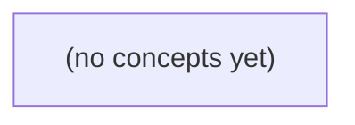

# 07.03 缓存读取与更新：Go 初学者的 Cache-Aside、一致性与授权安全

*本书围绕教学消息预览从 seq8 更新到 seq9 的固定案例，讲解 Go 服务中 Cache-Aside 的读取、写后失效、TTL、负缓存与授权缓存边界。通过完整时序演算、状态表和 22 道分层练习，帮助学习者识别“缓存命中不等于数据新鲜”、两系统非原子及失败降级带来的真实风险。*

**章节:** 2

---

## 本书导览

- 了解整本书的章节脉络
- 掌握各章之间的概念依赖关系
- 选择最合适的阅读顺序

# 07.03 缓存读取与更新：Go 初学者的 Cache-Aside、一致性与授权安全

本书围绕教学消息预览从 seq8 更新到 seq9 的固定案例，讲解 Go 服务中 Cache-Aside 的读取、写后失效、TTL、负缓存与授权缓存边界。通过完整时序演算、状态表和 22 道分层练习，帮助学习者识别“缓存命中不等于数据新鲜”、两系统非原子及失败降级带来的真实风险。

下方的概念图展示了本书 0 个核心概念以及它们之间的依赖关系；再下方是 1 个章节的入口。你可以按从上到下的顺序阅读，也可以根据自己的兴趣或先验知识选择切入点。

#### 概念图

## 章节索引

- **07.03 缓存读取与更新：迟到回填怎样复活旧值** — 面向Go初学者，以IM会话预览从seq8到seq9的更新，推导cache-aside、失效顺序、迟到回填、TTL、负缓存和权限边界。

## 07.03 缓存读取与更新：迟到回填怎样复活旧值

- 手算cache-aside读/写路径
- 区分缓存miss、业务不存在与依赖失败
- 推导先删后写和先写后删的两个旧值交错
- 解释SET NX与仅带版本字段不足以自动消除竞态
- 解释TTL/负缓存与陈旧窗口
- 为授权与读己之写选择权威路径
- 提出故障降级和证据矩阵

本节以会话预览从 seq8 更新到 seq9 为线索，建立以数据库为权威、缓存为派生副本的 cache-aside 读写模型。

### 先确定权威状态与副本身份

### 先确定权威状态与副本身份

讨论缓存竞态前，先回答一个根本问题：**哪个状态能作为最终事实被信任？**

未来的 S3 中，会话消息 `m-9` 已持久化，序列号为 `seq9`。数据库中的这条记录及其提交结果才是权威状态：它能在进程重启、缓存淘汰、请求重试后继续存在，也能被后续事务、审计与权限查询验证。

与之相对，`preview:c-a` 是为加速读取而保存的派生 Hash。例如它可存放：

- `last_message_id = m-9`
- `last_seq = 9`
- `preview_text = ...`
- `updated_at = ...`

这些字段都可以根据数据库中的会话与消息记录重新计算。因此，缓存不是“另一份真相”，而是数据库状态在某个时间点的可丢弃副本。缓存命中只说明“这里有值”，不说明“这里仍是最新值”。

尤其要区分 S2 的 `accepted_in_memory`。它最多表示某个进程曾在内存中接受过 `m-9`，却不能证明数据库事务已经提交：

\[
accepted\_in\_memory \not\Rightarrow DB\ COMMIT
\]

若进程在提交前崩溃，内存接受状态会消失；若缓存已被提前写入，甚至可能留下数据库中不存在的预览。因此，不能把 `accepted_in_memory` 当作持久化成功、排序完成或对外可见的证据。

后续 cache-aside 的所有规则都由这一身份关系推出：读路径在缓存未命中时回源数据库并回填；写路径先提交数据库，再删除派生缓存。权限仍应另行查询和校验，不能因为命中 `preview:c-a` 就跳过授权判断。

### 读路径：命中也不等于新鲜

### 读路径：命中也不等于新鲜

会话预览的读取采用 **cache-aside**：数据库是权威来源，缓存只是可丢弃、可过期的派生副本。一次 `GET preview:c-a` 不能仅按“有没有值”判断结果，还必须区分数据状态与依赖状态。

1. 先读取缓存 `GET preview:c-a`。  
   - **缓存命中**：得到某个预览值，例如仍是 `seq8` 对应的 `Hash`。这只说明内存中存在副本；它可能因写后删缓存延迟、删除失败、迟到回填等原因落后于数据库，不能推出“它就是最新值”。  
   - **缓存未命中**：键不存在、已过期，或缓存正常返回空值。此时继续查询数据库，而不是直接认定业务对象不存在。  
   - **缓存依赖失败**：如超时、连接失败。可按系统降级策略直接读取数据库；不能把“缓存读失败”伪装成未命中，更不能返回“不存在”。

2. 缓存未命中后读取数据库。  
   - 数据库返回权威记录：例如教学 DB 已有 `m-9 / seq9`，据此生成或取得当前预览。随后执行 `SET preview:c-a value TTL`，将副本回填缓存。`TTL` 限制旧副本最长存活时间，但不保证其在写入后立刻失效。  
   - 数据库确认无记录：这是**业务不存在**，可返回明确的不存在结果；是否缓存该结果属于负缓存策略，且应使用更短 TTL。  
   - 数据库失败：这是**权威依赖失败**，应返回或传播错误，不能把失败解释为业务不存在。

因此，读路径的核心判断是：

\[
\text{命中} \Rightarrow \text{可用副本} \not\Rightarrow \text{最新权威值}
\]

权限校验应另行查询或由上层保证；即使缓存中存在 `preview:c-a`，也不能因此跳过授权判断。

### 写路径：提交后删除派生缓存

### 写路径：提交后删除派生缓存

`preview:c-a` 是由会话消息派生出的 Hash，不是权威记录。更新 seq8→seq9 时，正确写路径应为：

1. 在数据库事务中写入消息 `m-9`、更新会话最新序号为 `seq9`。
2. 执行 `COMMIT`，使数据库先成为可见且持久的权威状态。
3. 提交成功后执行 `DEL preview:c-a`。
4. 后续读取发生缓存未命中时，再从数据库重建并 `SET` 新预览及 TTL。

顺序不能反过来。若先删缓存、后提交数据库，读请求可能在两者之间未命中，读到仍为 `seq8` 的数据库并回填旧 Hash；随后写事务提交为 `seq9`，但缓存已经再次保存旧预览，形成一次“迟到回填复活旧值”。

`COMMIT → DEL` 仍存在短暂陈旧窗口：提交完成到删除完成之间，命中缓存的读者仍可能看到 seq8。该窗口的边界是“允许短暂陈旧”，而非“缓存命中即最新”。需要强一致展示时，应直接读数据库、使用版本校验，或等待失效确认。

若 `DEL` 失败，不能回滚已提交的数据库事务；数据库已是 seq9，缓存只是待修复的派生副本。应记录失效任务并重试，例如通过事务外可靠消息、后台扫描或按会话聚合的失效队列重放 `DEL preview:c-a`。TTL 还能限制故障持续时间，但不能替代重试：较长 TTL 会让旧预览停留更久，较短 TTL 只是在可用性、成本与陈旧窗口之间折中。

### seq8 到 seq9：迟到回填如何复活旧值

### seq8 到 seq9：迟到回填如何复活旧值

设数据库中会话 `S3` 的权威记录原为 `seq8`，缓存键为 `preview:S3`，其值是由正文派生出的预览哈希。读路径采用 cache-aside：

`GET preview:S3 → 未命中 → 读 DB → SET preview:S3 (TTL)`

写路径则是：

`更新 DB → COMMIT → DEL preview:S3`

危险不在于 `DEL` 失败，而在于一个已经开始的旧读请求会在删除之后才完成回填：

| 时刻 | 读者 R | 写者 W | 缓存状态 |
|---|---|---|---|
| T1 | `GET preview:S3`，未命中 |  | 空 |
| T2 | 从 DB 读取到旧版本 `seq8`，但尚未 `SET` |  | 空 |
| T3 |  | 将权威记录更新为 `seq9` 并 `COMMIT` | 空 |
| T4 |  | `DEL preview:S3` | 空 |
| T5 |  |  |  |
| T6 | 将先前读到的 `seq8` 执行 `SET preview:S3` |  | `seq8` 复活 |

此时数据库已经是 `seq9`，缓存却重新保存了 `seq8`。后续请求命中缓存，只会看到“有值”，并不知道该值是在写者失效之后由迟到读者写入的；因此，**缓存命中不等于缓存新鲜，更不等于数据库当前版本**。

TTL 只能限制旧值存活上限，不能阻止这次复活：若 TTL 为 10 分钟，`seq8` 可能在数据库提交 `seq9` 后继续被返回近 10 分钟。权限仍应另查；即使预览可缓存，也不能把缓存命中当作授权依据。

### TTL、负缓存与权限的权威路径

### TTL、负缓存与权限的权威路径

TTL 只是“旧副本最多还能活多久”的上界，不是新鲜度证明。若 `preview:c-a` 仍命中，其值可能仍是 seq8：它只能说明缓存尚未过期，不能说明数据库中的权威状态尚未推进到 `m-9 / seq9`。因此，`GET cache → hit` 只能省去一次数据库读取；需要强新鲜度时，仍须走权威路径或携带版本校验。

负缓存也应区分两类结果：

- **确定不存在**：数据库已确认会话、消息或预览不存在，可缓存短 TTL 的“缺失”标记，避免热点请求反复穿透数据库。
- **读取故障或超时**：不能写成“不存在”。这只是暂时无法确认，若负缓存该结果，会把可恢复的数据库故障错误放大为持续的假缺失。

权限尤其不能只依赖预览缓存。缓存中的 `preview:c-a` 是派生内容，通常不包含“当前请求者是否仍可见”的最终结论；成员关系被撤销、会话被冻结、租户策略变更后，旧缓存仍可能可读。正确顺序是先在权威权限路径确认主体、资源与当前策略，再决定是否返回缓存内容。

同样地，写入后的“读己之写”不能仅等待 TTL 到期。写 DB 成功并提交后应删除相关缓存；若调用方必须立刻看到 seq9，则读取时还应以数据库版本、提交位点或请求携带的最低版本为准。缓存负责加速，数据库及其权限状态才负责裁决。

> **要点** — cache-aside 以数据库为准；提交后删缓存仍会遭遇迟到回填，缓存命中只表示可用副本，不保证最新或有权可见。

读取会话预览时，“没读到”并非同一种结果：缓存未命中、确无数据、无权查看和依赖故障必须沿不同路径处理。

### 从命中 seq8 到权威查询

### 从命中 seq8 到权威查询

缓存旁路读取的第一问不是“有没有值”，而是“这个值代表什么”。例如读取会话预览 `conversation:c1:preview`：

1. **缓存命中 `seq=8`**  
   返回缓存中的预览及其版本号。`seq=8` 表示该条目对应会话的第 8 次已确认更新；只要调用方接受该缓存的新鲜度，就无需访问数据库。版本号还可用于后续回填时防止较早查询结果覆盖较新值。

2. **缓存未命中**  
   未命中仅表示 Redis 中没有可用条目，不能推出会话不存在。此时应查询权威数据源，例如数据库或会话服务：
   - 查到会话及最新消息：构造预览，写回缓存，再返回；
   - 查到会话但没有可展示消息：可写入带明确语义的“空预览”；
   - 权威查询确认不存在：才可考虑写入“确不存在”的负缓存；
   - Redis 不可用：可降级直查权威源，不能把 Redis 故障当作未命中；
   - 数据库超时、连接失败或上游错误：返回依赖失败，不得写成“不存在”。

典型路径可概括为：

`缓存命中 seq8 → 直接返回`  
`缓存未命中 → 权威查询 → 结果回填 → 返回`

若用 `30s` 表示 TTL，它只是示意缓存项会在约 30 秒后失效，并非通用推荐值。TTL 解决的是陈旧窗口，不解决语义判定；尤其不能让一次失败的查询生成负缓存，否则暂时不可用会被错误“固化”为永久不存在。

### 四类“没有结果”的语义边界

### 四类“没有结果”的语义边界

“没有读到值”至少包含四种语义，不能用同一个空对象、`null` 或 404 混淆处理：

| 情形 | 含义 | 对客户端响应 | 日志与回填 |
|---|---|---|---|
| 缓存未命中 | Redis 正常，但键不存在或已过期 | 继续查询权威数据库，不能立即判定不存在 | 记录命中率指标；数据库确认后回填真实值、业务空值或负缓存 |
| 业务不存在 | 权威数据库确认该资源不存在，或已被删除 | 返回业务 404 / 不存在结果 | 可写短 TTL 负缓存，例如示意为 30 秒；该值只是示意，不是统一推荐值 |
| Redis 不可用 | 超时、连接失败、熔断或集群故障 | 降级直查数据库；若数据库成功，仍返回正常结果 | 记录依赖故障、延迟和熔断状态；通常不要把“Redis 失败”写成空值 |
| 数据库错误 | 权威查询超时、连接失败或执行异常 | 返回可重试的 5xx / 服务不可用，而非 404 | 记录错误链路与请求上下文；禁止回填“不存在”或覆盖已有缓存 |

关键原则是：只有权威数据源成功确认“不存在”，才允许写入负缓存。若 miss 后数据库失败，系统知道的只是“暂时无法确认”，不是“资源不存在”；把依赖失败缓存为空，会将短暂故障放大为持续的假 404。

还要区分“资源不存在”和“当前用户不可见”。例如 `u-c` 因授权策略而看不到消息 `m-9`，该 404 是 `u-c` 的访问结果，不是 `m-9` 的全局事实。不能据此按消息 ID 写全局负缓存，否则 `u-a` 即使有权限，也会被错误地命中“空结果”。授权相关结果应在权限校验后按主体、租户或权限版本隔离，或干脆不做此类负缓存。

### 空值缓存不等于全局不存在

### 空值缓存不等于全局不存在

设消息 `m-42` 存在于会话中，但其可见性受成员关系控制：

- 用户 `u-c` 已被移出会话。读取 `m-42` 时，权限服务判定不可见，对外返回 `404`，避免泄露“消息存在但你无权访问”。
- 用户 `u-a` 仍是会话成员。读取同一条 `m-42` 时，应正常获得消息内容。

若系统在 `u-c` 的请求后写入负缓存：

`message:m-42 -> 空值，TTL=30s`

那么 `u-a` 随后访问会直接命中“空值”，也得到 `404`。这不是缓存加速，而是把 `u-c` 的授权结果错误提升为“该消息对所有人不存在”。

负缓存的键必须表达其语义。若缓存的是“某用户看不到该消息”，至少应绑定授权上下文，例如：

`message-view:u-c:m-42 -> 不可见`

更稳妥的做法是将成员资格版本、租户、角色或权限策略版本纳入键或校验条件：

`message-view:{tenant}:{user}:{auth_version}:{message_id}`

相反，只有权威数据源明确确认消息已物理删除、从未创建，或已达到全局不可见状态时，才可按消息 ID 写入全局负缓存：

`message:m-42 -> 不存在`

这里的 `30s` 仅是示意，不是推荐值。授权结果通常变化更频繁，且错误负缓存会造成越权隐藏；其 TTL 应更短，或在成员关系、权限策略变更时主动失效。更重要的是：Redis 不可用、数据库超时、权限服务失败都只是“暂时无法确认”，绝不能写成“不存在”。

### TTL、负缓存与陈旧窗口

### TTL、负缓存与陈旧窗口

设示例 TTL 为 `30s`，仅用于推导，不是推荐配置。对消息 `m`，正缓存保存已确认存在且对当前读取路径可见的预览：

- `t=0`：权威库读到 `m`，写入正缓存，至 `t=30` 前缓存命中。
- `t=8`：缓存命中返回的是 `t=0` 时的快照；即使 `t=5` 已发生更新，读者仍可能看到旧值，陈旧窗口最多约为 `30s`。
- `t=30` 后：缓存失效，下一次读取必须回源权威库；回源成功后才能用新值回填。

负缓存保存的不是“查不到缓存”，而是“权威查询已确认不存在或不可见”的短期结论。其作用是阻止不存在的 `messageId` 反复穿透到数据库。若在 `t=0` 写入负缓存，`0<t<30` 的请求可直接返回不存在；但若消息在 `t=10` 被创建，直到负缓存过期前仍可能被误判为不存在，这也是一种可见性滞后。

因此，负缓存的键必须包含结论的适用范围。`u-c` 看见 `404` 可能是授权隐藏结果，不能据此按 `messageId` 写全局负缓存，否则 `u-a` 即使有权限也会被错误拒绝。更安全的是使用含主体、租户和权限版本的键，或根本不缓存这类隐藏结果。

缓存未命中后，只有权威库明确返回“不存在”才可写负缓存。Redis 不可用、数据库超时、连接失败或权限服务故障都属于依赖失败：应返回可区分的错误或降级结果，绝不能写成负缓存；否则一次短暂故障会在整个 TTL 内“复活”旧的不存在结论。

### 故障降级与读取证据矩阵

### 故障降级与读取证据矩阵

读取结果应由“证据”驱动，而不是把所有“没读到”统一解释为不存在。以消息预览为例，可整理为：

| 观察结果 | 可确认的事实 | 后续动作 | 是否回填缓存 | 对外结果 |
|---|---|---|---|---|
| Redis 命中 `seq=8` 且值有效 | 已有近期读取证据 | 直接返回；必要时校验版本或失效标记 | 不需要 | 返回预览 |
| Redis 命中空值/负缓存 | 曾由权威查询确认“该用户可见范围内不存在” | 返回不存在；不得扩大为全局结论 | 保持至过期 | 404/空结果 |
| Redis 未命中 | 只有“缓存没有证据” | 查询权威数据库并执行授权判断 | DB 成功后才可回填 | 取决于 DB 结果 |
| 授权拒绝 | 资源是否存在不应向该用户泄露 | 返回隐藏式 404 或 403 | 不按消息 ID 写全局负缓存 | 404/403 |
| Redis 不可用 | 缓存层故障，不是数据缺失 | 绕过缓存查询 DB；记录降级指标 | Redis 恢复前不强求写入 | DB 成功则正常返回 |
| DB 错误/超时 | 无法形成“存在”或“不存在”的权威证据 | 返回可重试错误；可使用仍有效的已命中缓存 | 禁止写空值或负缓存 | 5xx/重试 |

关键约束是：`miss → DB失败` 不等于 `不存在`。若把依赖失败写入负缓存，会让短暂故障被放大为持续 404。

授权结果同样是主体相关证据：`u-c` 看不到某消息，可能只是无权访问；不能据此将该消息对 `u-a` 也负缓存。负缓存键至少应包含可见性边界，例如用户、租户或权限版本。示意 TTL 可设为 `30s` 用于说明短期抑制穿透；实际值应按数据变动频率、权限撤销时效和故障恢复目标确定。

> **要点** — 缓存未命中只能触发权威查询；依赖失败、业务不存在与授权隐藏必须保留不同语义，负缓存不得越过权限边界。

当数据库中的会话预览从8更新为9时，若读请求在写事务提交前回填旧值，缓存会如何“复活”已过期的数据？

### 固定时序：旧值如何被迟到回填

### 固定时序：旧值如何被迟到回填

设初始状态为：数据库 `DB=8`，缓存 `cache=8`。写请求 `W` 要把值更新为 `9`，读请求 `R` 恰好穿插其中。若采用“先删缓存、再写数据库”的流程，可能发生如下交错：

1. `W` 先执行 `DEL cache`，缓存中的 `8` 被删除；此时数据库仍是 `8`，写事务尚未提交。
2. `R` 到来，发现缓存未命中，于是转而查询数据库。
3. 因为 `W` 尚未提交，`R` 从数据库读到的仍是旧值 `8`。
4. `R` 按缓存未命中后的常规逻辑执行 `SET cache=8`，旧值被重新写回缓存。
5. 随后 `W` 提交事务，数据库变为 `DB=9`。
6. 但 `W` 此后没有再次删除缓存，因此系统状态变成：

   | 位置 | 当前值 |
   |---|---|
   | 数据库 | `9` |
   | 缓存 | `8` |

缓存中的旧值并非删除失败，而是被读请求“迟到回填”复活。之后的读请求会持续命中 `cache=8`，直到该键的 TTL 到期、被主动淘汰，或后续写操作再次使其失效。

这说明“删除缓存”本身不是隔离屏障：它只能清除删除发生前的缓存内容，无法阻止并发读请求依据尚未提交的数据库旧版本重新填充缓存。

### 手算W与R交错的状态变化

### 手算 W 与 R 交错的状态变化

设初始状态为：

- 数据库：`DB = 8`
- 缓存：`cache = 8`
- 写请求 `W` 要把值更新为 `9`
- 读请求 `R` 采用“缓存未命中则读库并回填”的逻辑

按“先删缓存、后写数据库”的常见流程，可能发生如下交错：

| 时刻 | 请求 | 操作 | 数据库状态 | 缓存状态 |
|---|---|---|---:|---:|
| $t_0$ | — | 初始值 | `8` | `8` |
| $t_1$ | `W` | 执行 `DEL cache` | `8` | 不存在 |
| $t_2$ | `R` | 读取缓存，发生未命中 | `8` | 不存在 |
| $t_3$ | `R` | 查询数据库，读到旧值 `8` | `8` | 不存在 |
| $t_4$ | `R` | 执行 `SET cache = 8` | `8` | `8` |
| $t_5$ | `W` | 写事务提交，数据库变为 `9` | `9` | `8` |

关键在于：`R` 在 $t_3$ 读数据库时，`W` 的新值尚未提交，因此读到 `8` 并不违反数据库一致性；但 `R` 在 $t_4$ 回填缓存后，`W` 又在 $t_5$ 提交了 `9`，而写方没有第二次删除缓存。

于是最终出现：

$$DB = 9,\qquad cache = 8$$

旧值并非从未失效，而是在 `W` 删除后被迟到的读请求重新写回，因而称为“旧值复活”。若缓存设置了 TTL，这个不一致通常会在 TTL 到期后自行消失；但在此之前，后续读请求会持续命中 `cache = 8`，看不到数据库中的新值 `9`。

### 为什么缓存旧值会持续到TTL

### 为什么缓存旧值会持续到TTL

设初始时数据库为 `DB=8`、缓存为 `cache=8`。写请求 `W` 要把值更新为 `9`，它先执行：

1. `DEL cache`：缓存被删除；
2. 读请求 `R` 到来，发生**缓存未命中**；
3. `R` 查询数据库，但此时 `W` 尚未提交，数据库真实可见值仍是 `8`；
4. `R` 将读到的 `8` 执行 `SET cache=8, TTL=T`；
5. `W` 随后 `COMMIT`，数据库变为 `DB=9`，却没有新的删除缓存操作。

此后，缓存中的 `8` 不再是“未命中”，而是一次**陈旧命中**：后续读请求会直接命中 `cache=8`，不再访问已经为 `9` 的数据库。于是三个状态必须分开看：

- 缓存未命中：缓存没有值，读路径会访问数据库；
- 缓存陈旧命中：缓存有值，但该值落后于数据库；
- 数据库真实值：提交后权威数据为 `9`。

`TTL` 只会规定这份错误回填的 `8` 最晚何时自动过期，即陈旧窗口至多约为 `T`；它不会识别“该值是在提交前读出的旧快照”，也不会在数据库提交为 `9` 时自动撤销该缓存项。因此，只要没有后续失效、版本校验或条件回填机制，旧值就会一直服务到 TTL 到期。

### 改为先写权威库再失效

### 改为先写权威库再失效

设初始状态为 `DB=8，cache=8`。与“先删缓存、再提交数据库”相比，更常见的顺序是：

1. 写请求 `W` 在事务中把数据库从 `8` 更新为 `9`；
2. `W` 提交事务，使 `DB=9` 成为权威事实；
3. `W` 删除缓存键；
4. 后续读请求 `R` 缓存未命中，从 `DB` 读到 `9`，再回填 `cache=9`。

其关键优势在于：缓存失效发生前，数据库已经是新值。即使 `R` 恰好在提交前读取缓存，也只能命中原有的 `8`；此时数据库尚未提交 `9`，并不存在“未提交新值却被旧读回填复活”的问题。提交后到删除前，`R` 可能仍读到缓存 `8`，但它只是短暂命中旧缓存，不会因一次缓存未命中而把 `8` 再次写回。

因此，“先写权威库，再失效缓存”更符合数据来源的因果顺序：先让权威状态生效，再通知派生副本失效。

但这不是原子操作。数据库提交成功后，删除缓存可能失败、超时或消息丢失，`cache=8` 仍可能一直保留到 TTL 到期；即使删除最终成功，提交与删除之间的窗口内读请求仍会看到旧值。并发写入时，不同写请求的失效动作还可能乱序到达。该顺序降低了旧值回填风险，却不能单靠两次独立操作保证强一致性。

### 工程防线：失效、版本与权威读

### 工程防线：失效、版本与权威读

在“先删缓存、后提交数据库”的时序中，`SET NX` 不能阻止旧值复活：写方删除键后，读方未命中，仍可从尚为 `8` 的数据库读取并执行 `SET cache=8`；此时键不存在，`NX` 恰好成功。随后写事务提交为 `9`，若没有新的失效动作，缓存中的 `8` 仍会存活到 TTL 到期。

仅在缓存值中携带版本号也不够。版本只有在读取方能知道“当前应当至少是哪个版本”时才可比较；而普通读请求从旧数据库快照读到 `version=8`，并不知道提交后的 `version=9` 已存在，仍会合法回填旧版本。版本字段不是自动一致性机制，必须配合版本水位、条件写入或权威校验。

实践中通常采用组合防线：

- 写路径以数据库提交成功为准，再删除缓存；删除失败时记录任务并重试，必要时通过消息队列或后台扫尾补偿。
- 为缓存设置较短 TTL，限制漏删或迟到回填的最长暴露时间，但不要把 TTL 当作正确性保证。
- 对支付状态、权限、库存等关键读，绕过缓存或在命中后到权威库复核；缓存只承担加速，不承担最终裁决。
- 缓存值携带版本、提交时间和来源请求标识，便于发现“缓存版本低于数据库版本”的异常。
- 记录删除失败、重试次数、回填来源、数据库提交版本及缓存写入时间，形成可追踪的故障证据。

“写权威库，再失效缓存”更符合数据权威性：缓存不会在提交前被主动清空。但数据库与缓存仍是两个非原子系统；提交后的删除可能失败、延迟或乱序，因此它降低竞态窗口，却不能宣称完全消除旧读。

> **要点** — 先删后写会让并发读把DB旧值迟到回填；先写权威库再失效更自然，但仍需用多层机制缩小非原子竞态窗口。

从数据库已有会话预览 seq8、缓存为空开始，一次看似正常的读写交错，如何让旧值 seq8 在 seq9 提交后重新进入缓存。

### 固定初始状态与参与者

### 固定初始状态与参与者

设某条会话预览记录的业务版本为 `seq`。初始时，数据库中已提交值为 `V8`，缓存键不存在：

| 时刻 | 数据库 | 缓存 | 外部读者可见的最新已提交值 |
|---|---|---|---|
| $t_0$ | `V8 = {seq: 8, ...}` | 空 | `V8` |

参与者只有两个：

- **读请求 R**：执行缓存读取；未命中后回源数据库，得到 `V8`，再尝试把结果写回缓存。R 的目标是降低后续读取延迟，但它拿到的是某一时刻的数据库快照，不天然代表“写回时仍最新”。
- **写请求 W**：更新同一记录，将数据库从 `V8` 提交为 `V9 = {seq: 9, ...}`；提交后删除缓存，使后续读取不再信任旧缓存。W 的目标是让已提交的新值最终对读者可见。

这里的关键可见性边界是：数据库 `COMMIT` 后，`V9` 已是权威最新值；但缓存删除只保证“删除发生当时缓存为空”，并不阻止一个更早启动、尚未完成的 R 在之后携带 `V8` 回填。因而，缓存为空不是永久状态，也不是旧读请求失效的证明。

### 迟到回填复活旧值的状态表

### 迟到回填复活旧值的状态表

设数据库初始为版本 $V8$，缓存为空。读请求 `R` 在未命中后从数据库读到旧值，但尚未来得及回填；此时写请求 `W` 完成新版本提交并删缓存。关键问题在于：`R` 持有的是“过去正确”的快照，却在“现在”执行写缓存。

| 步骤 | 读请求 R | 写请求 W | 数据库 | 缓存 | 含义 |
|---|---|---|---|---|---|
| 0 | 未开始 | 未开始 | `V8` | 空 | 初始状态 |
| 1 | `GET cache` 未命中 | — | `V8` | 空 | R 决定查库 |
| 2 | 读到 `V8`，暂停 | — | `V8` | 空 | R 已拿到旧快照 |
| 3 | 暂停 | 写入并 `COMMIT V9` | `V9` | 空 | 新值已成为数据库事实 |
| 4 | 暂停 | `DEL cache` | `V9` | 空 | 写侧完成常规失效 |
| 5 | `SET cache = V8` | 已结束 | `V9` | `V8` | 旧值被迟到回填“复活” |
| 6 | 后续请求命中缓存 | — | `V9` | `V8` | 用户读到过期值 |

这里 `DEL` 本身没有失败：删除发生时缓存确实为空。问题是删除无法约束此前已开始、但尚未完成的读回填。

`SET NX` 也不能解决：第 4 步后键仍不存在，因此第 5 步的 `SET NX V8` 依然会成功。要阻止复活，必须让回填动作能判断“我读到的 $V8$ 是否已被 $V9$ 超越”。例如读侧回填前重检版本，或写侧维护 fence（栅栏）并以原子条件拒绝旧版本写入。

但版本字段不是魔法：若“比较版本”和“写缓存”不能原子完成，比较后仍可能被并发写穿插；若版本来源、提交顺序、缓存操作可靠性或故障恢复策略不明确，也不能仅凭“带了 version”宣称严格一致。

### 为何先删后写仍有旧值窗口

### 为何先删后写仍有旧值窗口

“提交后删除缓存”只清除了**当时已经存在的缓存项**，并不能撤销一条更早发出、仍在执行中的读请求。删除不是在途读取的隔离屏障。

设数据库初始为版本 `V8`，缓存为空；写请求把值更新为 `V9`：

| 时刻 | 读请求 R | 写请求 W | 数据库 | 缓存 |
|---|---|---|---|---|
| T1 | `GET` 未命中 | — | `V8` | 空 |
| T2 | 读取数据库，得到 `V8`，回填前暂停 | — | `V8` | 空 |
| T3 | — | 更新并 `COMMIT V9` | `V9` | 空 |
| T4 | — | `DEL cache` 成功 | `V9` | 空 |
| T5 | 恢复执行，`SET cache V8` | — | `V9` | `V8` |

问题不在于 `DEL` 失败：它确实成功执行了。问题在于 R 的数据库读取发生在提交前，而缓存写入发生在删除后；R 带着已经过期的 `V8`，在写侧失效完成后重新制造了缓存项。

此时改用 `SET NX` 也无效。因为 W 已删除键，T5 时缓存仍为空，R 的 `SET NX(V8)` 会成功。`NX` 只能防止覆盖一个**当前存在**的键，无法判断“该空位是否曾被更新事务删除过”。

因此，缓存删除表达的是“旧缓存此刻失效”，不是“此前所有读操作都不得回填”。若要缩小或消除该窗口，读侧必须在回填前重检版本/代次，或由写侧设置能拒绝旧版本写入的 fence；这类方案还需要可靠的顺序来源、原子条件写，以及面对超时、重试和进程崩溃时明确的故障策略。仅给值附加 `version` 字段，并不会自动获得严格一致性。

### SET NX与版本字段的能力边界

### SET NX与版本字段的能力边界

设初始状态为：数据库中为 `V8`，缓存为空。读请求 `R` 未命中后读取到 `V8`，但在回填前暂停；随后写请求 `W` 提交 `V9` 并删除缓存。此时 `R` 恢复，执行 `SET key V8 NX`：

| 时刻 | 数据库 | 缓存 | R 的本地结果 | 操作 |
|---|---|---|---|---|
| T1 | V8 | 空 | — | R：缓存未命中，读到 V8 |
| T2 | V9 | 空 | V8 | W：提交 V9，删除缓存 |
| T3 | V9 | V8 | V8 | R：`SET NX` 回填成功 |

`NX` 只判断“此刻键是否存在”，并不知道该空位是自然过期、写侧刚删除，还是某个新版本即将写入。因此，写侧删除缓存后恰好制造了一个可被迟到读请求占用的空位；`SET NX` 能避免覆盖已有缓存值，却不能避免旧值在空缓存中复活。

给缓存值附带版本号，例如 `{version: 8, data: ...}`，也不自动解决问题。孤立的 `version` 字段只能描述“这个值自称是 V8”，不能证明回填时数据库仍是 V8，更不能阻止 `V8` 在 `V9` 提交后写入。要利用版本防护，至少还需要：

- **可靠顺序**：读侧可获得与写提交一致的版本或栅栏序号；
- **原子条件**：回填必须以“当前缓存版本未超过 8”为条件原子执行，而非先查后写；
- **故障政策**：比较、写入、删除超时或重试时，明确是放弃回填、失效缓存，还是允许短暂陈旧。

因此，“加一个 version 字段”通常只是可观测性增强；只有版本来源、比较条件、原子执行和异常处理共同闭合，才能讨论严格一致性。

### 可验证的防护思路与降级决策

### 可验证的防护思路与降级决策

防护目标不是“缓存里带了版本号”，而是保证迟到的读结果不能覆盖已提交的新版本。关键在于：读、写必须共享可验证的顺序证据，并在故障时明确回源。

| 时刻 | 数据库权威值 | 缓存 | 读 R | 写 W |
|---|---|---|---|---|
| $t_0$ | V8 | 空 | miss，读到 V8，暂停 | — |
| $t_1$ | V9 | 空 | 暂停 | 提交 V9，删除缓存 |
| $t_2$ | V9 | V8 | `SET V8` | — |

`SET NX` 无效：$t_1$ 后缓存确实为空，R 仍可成功写入 V8。

可选防护应满足“条件原子化”：

- **读侧重检**：R 从数据库读到 `(V8, seq=8)` 后，写缓存前再次读取可靠的提交水位或失效代次；仅当代次未变化时，才原子写入缓存。重检失败则丢弃 V8，重新回源。
- **写侧围栏**：W 提交 V9 后推进单调递增 fence，例如 `fence=9`；缓存写入必须满足 `候选版本 >= 当前 fence`。比较与写入必须由缓存端脚本、事务或具备条件写语义的存储原子执行。
- **条件写入**：缓存值保存 `{value, version, fence}`，只允许版本更高者覆盖。但若版本来自不同库、读到副本、或 fence 推进与数据库提交无可靠顺序，“带 version 字段”并不构成严格一致性。

TTL 只能限制旧值存活窗口，不能修复复活：V8 可能在 V9 后持续可见至 TTL 到期。对会话权限、余额、库存等不可接受陈旧读的路径，应设置短 TTL 之外的强制回源条件。

| 故障证据 | 可否信任缓存 | 决策 |
|---|---|---|
| fence 可读、条件写成功 | 可按版本读取 | 返回缓存 |
| 提交后删除失败或超时 | 不可证明失效完成 | 回源权威库 |
| 重检/fence 服务不可用 | 无法证明顺序 | 回源或拒绝高风险请求 |
| 数据库读副本延迟未知 | 版本来源不权威 | 读取主库或等待确认 |

因此，降级策略应优先保证“宁可缓存失效、不可旧值复活”；无法取得顺序证据时，必须走权威读取路径，而非盲目回填。

> **要点** — 缓存删除只能清除当前值，不能阻止在途读把旧数据库结果迟到回填；一致性需要顺序、原子条件与故障政策共同保证。

缓存的30秒不是“读到新值”的承诺，而是一次旧值回填后最多驻留多久的边界；负缓存还会把“暂不存在”与权限隐藏的404问题放大。

### 从seq8到seq9：30秒陈旧窗口如何起算

### 从 seq8 到 seq9：30 秒陈旧窗口如何起算

设会话预览在数据库中的版本从 `seq8` 更新为 `seq9`，缓存 TTL 为 30 秒。关键不在于“数据库何时提交”，而在于“旧值何时被重新写进缓存”。

一次典型时序如下：

1. `t0`：读请求 R 缓存未命中，开始回源查询，查到旧快照 `seq8`。
2. `t1`：写请求 W 提交数据库更新，数据库已是 `seq9`，并执行缓存删除。
3. `t2`：较早启动的 R 才完成回填，将 `seq8` 写入缓存，并设置 `TTL=30s`。
4. `t2` 到 `t2+30s`：后续读可能命中 `seq8`，即使数据库早在 `t1` 已经是 `seq9`。

因此，陈旧窗口应写为：

$$
[t_{\text{旧值写缓存}},\ t_{\text{旧值写缓存}}+30s)
$$

而不是：

$$
[t_{\text{数据库更新}},\ t_{\text{数据库更新}}+30s)
$$

这里的 30 秒只约束“这一次旧值回填后最多还能驻留多久”。它并不保证任意一次业务读取都能看到 `seq9`：在窗口内，命中缓存的读取仍会得到 `seq8`；窗口结束后才会重新回源并有机会获得 `seq9`。

更要注意，若又有一个更晚完成的旧读请求把 `seq8` 再次回填，TTL 会从那次写入重新起算。于是短 TTL 只能缩小单次陈旧驻留，不能自动消除重复旧回填造成的延长。

### 迟到回填为何让旧值再次存活

### 迟到回填为何让旧值再次存活

设数据库中的版本号单调递增。一次读请求 `R1` 在时刻 $t_0$ 查询数据库，读到旧版本 `seq=8`；但它尚未执行缓存写入。随后发生写请求 `W`：

1. $t_1$：`W` 提交新版本 `seq=9`；
2. $t_2$：`W` 执行 `DEL cache:key`，试图使缓存失效；
3. $t_3$：较慢的 `R1` 才完成，并把先前读到的 `seq=8` 以 `SETEX 30s` 回填缓存。

此时，删除动作确实发生在新版本提交之后，却无法删除“未来才写入”的旧值。缓存于是从 $t_3$ 起重新保存 `seq=8`，直到 $t_3+30\text{s}$ 才自然过期。读到旧值的窗口不是从 `W` 提交时计算，而是从**旧值实际回填成功**时计算。

因此，30 秒能给出的只是单次旧回填的驻留上界：

$$
\text{旧值驻留时间}\le 30\text{s}
$$

但它不保证任意业务读在 30 秒后一定读到新值：缓存过期后仍可能回源失败、再次读到旧副本，或另一个更早发起的读请求重复回填 `seq=8`，使旧值的有效期重新开始。TTL 越短，旧值窗口越小但回源越频繁；TTL 越长，回源压力较低，却扩大了迟到回填造成的陈旧可见时间。

### TTL是驻留上界，不是读新保证

### TTL是驻留上界，不是读新保证

设缓存键在时刻 $t_0$ 被一次读取操作以旧值回填，并设置 `TTL=30s`。它能保证的是：**若期间没有再次写入、刷新或旧回填，该副本至多驻留到 $t_0+30s$**。它并不保证任意业务请求在 30 秒内一定读到新值，更不保证已经发生写入的请求不会撞上旧缓存。

| 策略 | 回源压力 | 单次旧值驻留 | 主要风险 |
|---|---:|---:|---|
| 短 TTL | 高 | 短 | 高频失效导致更多数据库/服务回源 |
| 长 TTL | 低 | 长 | 更新后旧值可被持续读取更久 |

短 TTL 只是缩短“某一份旧副本”的寿命：缓存一过期，下一次读会回源；但若该读与更新并发，读请求仍可能先查到旧数据，再把旧值以新的 TTL 写回。于是旧值并非连续存活 30 秒，而是被“重新计时”：

`旧回填(30s) → 过期/删除 → 并发读查到旧库值 → 再回填(30s)`

长 TTL 降低回源次数，却放大每次回填后的陈旧窗口；短 TTL 减少单次窗口，却提高触发竞争、回源拥塞和重复旧回填的机会。更新路径若仅提交数据库而未可靠地删除或版本化缓存，任何后到的旧读都可能延长陈旧。

因此，TTL 应被理解为**单键、单次写入后的驻留上界**，而不是“任意业务读都会读到最新值”的语义承诺。若业务需要写后读新、跨键一致或强可见性，应增加版本号、失效屏障、写入后校验或直接绕过缓存等机制。

### 负缓存把不存在也变成竞态

### 负缓存把不存在也变成竞态

负缓存常用 `notfound:m-x` 记录“键 `m-x` 不存在”，以避免大量请求反复回源查询。但“查无”同样是一次可能迟到的读取结果；若它在写入之后才回填，就会把已经存在的数据重新遮住。

设负缓存 TTL 为 30 秒，时间线如下：

1. **R 开始读取**：缓存中没有 `m-x`，也没有 `notfound:m-x`；R 回源查询数据库，结果为“不存在”，但尚未写入负缓存。
2. **W 插入并提交**：写请求创建 `m-x`，数据库事务提交成功。
3. **W 删除缓存**：W 执行 `DEL m-x` 与 `DEL notfound:m-x`，试图让后续读取回源获得新数据。此时缓存确实是干净的。
4. **R 迟到回填**：早先发出的查询终于返回，R 依据旧快照把 `notfound:m-x=1` 写入，并设置 30 秒 TTL。
5. **后续请求命中负缓存**：在这 30 秒内，读请求直接返回 404，不再查询数据库；尽管 `m-x` 已经存在。

因此，删除缓存只能清除“删除发生前已经落入缓存的值”，不能阻止在途读请求随后写回旧的“不存在”结论。负缓存的 TTL 限定的是这次错误 404 最多持续多久，并不保证任意一次业务读取都能立即看到插入结果。

更危险的是，不能把所有 404 都写成负缓存。权限系统故意隐藏资源时，返回的 404 表示“你无权得知它存在”，并非数据库中的真实不存在。若将其缓存为 `notfound:m-x`，可能把某个用户的权限结果错误共享给有权限用户。负缓存应只缓存可确认的、与访问主体无关的真实查无结果。

### 404语义、授权边界与应对证据

### 404语义、授权边界与应对证据

负缓存只能缓存“已被可靠证明不存在”的事实，不能把所有 `404` 一概解释为“对象不存在”。应用层至少应区分三类结果：

- **真实不存在**：对象查询完成，资源确实不存在；可写入短期负缓存，如 `notfound:m-x`，并记录判定版本或查询时间。
- **权限隐藏的 404**：资源可能存在，但调用者无权获知；不得写入跨用户、跨租户的负缓存，否则一个人的无权访问会让所有人都“看不见”该资源。此类结果应以主体、租户、授权版本为隔离维度，通常更适合短暂授权结果缓存。
- **依赖失败伪装成 404**：超时、限流、路由错误、从库延迟或服务降级都可能产生表面上的“未找到”；这不是不存在证据，禁止负缓存，应返回可重试错误或进入受控降级。

当 `R` 查无后准备回填负缓存，而 `W` 已插入 `m-x` 时，写路径提交后必须执行 `DEL notfound:m-x`；仅依赖其自然过期，会形成“对象已存在但持续 404”的窗口。删除失败应进入重试队列，并以读库兜底或缩短负缓存 TTL 限制伤害。

可观测性应形成证据矩阵：记录 `404` 来源（真实查无、鉴权隐藏、依赖异常）、负缓存命中/写入/删除次数、写后仍命中负缓存的比例、删除失败重试量，以及按租户和权限版本分组的异常峰值。若“写成功后 404”上升，优先排查失效链路；若某主体独有 404 激增，优先排查授权策略，而非认定数据丢失。

> **要点** — TTL只限制一次回填后的陈旧驻留；旧回填与负缓存仍可误导读取，授权判断和读己之写必须走权威路径。

缓存可加速会话预览，却不能替代成员资格与已提交消息的权威判断；尤其在退群和读己之写场景，旧缓存可能把错误许可或旧序列号重新带回。

### 先划定授权与消息的权威边界

### 先划定授权与消息的权威边界

缓存中的会话预览、成员摘要或最近消息，只能优化读取路径，不能定义“谁仍有权限”以及“哪条消息已经提交”。这两类判断必须分别回到权威数据。

- **成员资格权威**：以 `members.left_at` 为准。若某成员的 `left_at` 已非空，则其已经退出会话；即使缓存仍保存“该成员在群”“可读”“可发”的旧条目，也不得据此允许读取消息、发送消息或继续订阅更新。
- **消息提交权威**：以消息存储中的提交序列或提交状态为准。缓存可保存预览文本、未读数、最近序列号，但这些都是可能滞后的副本，不能单独证明消息存在、顺序最新或对当前请求者可见。
- **缓存的正确角色**：缓存命中后，仍应确认其版本未落后于所需的一致性水位，并确认当前成员资格有效；缓存未命中，则表示“加速层没有结果”，不等于“不存在消息”，更不等于“没有权限”。

可将读取资格抽象为：

\[
\operatorname{allowed}(u,c,t)
= (\operatorname{member}(u,c)\ \text{存在})
\land (\operatorname{left\_at}=\varnothing)
\]

其中 `t` 表示本次操作所观察的权威时刻或版本。会话预览缓存即使在较早时刻记录了 `allowed=true`，也不能覆盖后来写入的 `left_at`。

因此，退群后的旧缓存最多是待失效的数据，绝不能成为重新授权的依据；同样，缓存中的旧消息序列也不能成为“已经读到自己刚提交消息”的证明。授权与提交事实先确定，缓存才有资格参与加速。

### 退群后旧缓存为何仍会放行

### 退群后旧缓存为何仍会放行

设成员资格的权威记录为 `members(user, conversation).left_at`：`left_at IS NULL` 才有权读取或发送。缓存若只保存“`A` 是成员”，却未绑定资格版本或失效边界，就可能在退群后继续复活旧许可。

沿时间线看这一错误：

1. 时刻 $t_1$：`A` 仍在会话中，权威记录为 `left_at=NULL`。请求 `R1` 查询成员资格，缓存未命中，于是向权威库发起异步查询。
2. 时刻 $t_2$：`A` 退出会话，权威库提交 `left_at=t_2`。从这一提交点起，任何发送、读取消息的授权判断都应拒绝 `A`。
3. 时刻 $t_3$：退群前发出的 `R1` 才返回旧快照，结果仍是“成员”。回填逻辑若无条件执行 `cache[A]=允许`，便把已过期的许可写回缓存。
4. 时刻 $t_4$：`A` 再次发送或读取，服务命中该缓存并放行；系统实际上依据的是 $t_1$ 的资格，却在 $t_2$ 之后作出授权决定。

问题不在于“缓存尚未来得及失效”这么简单，而在于**迟到结果覆盖了更新后的事实**。即使退群事务主动删除缓存，也不能阻止先前已在途的查询随后把旧值重新填入。

因此，资格缓存至少应携带可比较的成员版本、`left_at` 变更序号或失效栅栏。回填时只有当结果版本不早于当前已知版本，才可写入；更稳妥的是，对发送等敏感操作直接读取权威资格。缓存未命中仅表示“本地没有答案”，绝不表示“用户无权”或“会话不存在”；同样，缓存命中也不能在版本落后时充当许可。

### m-9提交后的立即可见约束

### m-9 提交后的立即可见约束

设成员 A 在会话中发送消息 `m-9`，服务端已返回“提交成功”，并给该会话分配了最新版本 `W9`（或消息序列号 `seq=9`）。此后 A 立刻刷新会话预览，系统必须满足**读己之写**：

\[
\text{若 A 已观察到提交 } W9,\quad \text{后续读取结果的版本} \ge W9
\]

因此，预览中至少应包含 `m-9`，或明确返回一个版本不低于 `W9` 的状态。若缓存仍保存旧预览 `seq=8`，直接命中并返回，就等于让 A 在“已知 m-9 提交成功”后又看见提交前的世界，违反会话语义。

常见的安全实现有两类：

- **提交后读权威源**：A 的下一次预览读取绕过旧缓存，从消息权威存储或线性一致副本读取，确认 `seq=9` 后再回填缓存。
- **携带最低版本约束**：客户端或网关在读取时携带 `min_version=W9`。缓存条目只有在其源版本满足 `cache.version \ge W9` 时才可使用；旧 `W8` 条目必须视为不满足请求，继续查询能够提供 `W9` 的副本或权威源。

这里“缓存命中”不等于“结果可返回”。缓存不仅要有内容，还要证明其版本足够新。类似地，缓存未命中也不表示消息不存在、A 无权访问或会话为空；它只表示该缓存层没有可用结果。权限仍应由成员资格权威状态判断，消息存在性和最新序列号仍应由相应权威数据或满足版本约束的副本确认。

### 区分未命中、无数据与依赖故障

### 区分未命中、无数据与依赖故障

缓存查询的结果只能说明“缓存里有什么”，不能直接说明“用户有没有权限”或“消息是否存在”。尤其对成员资格，`members.left_at` 是权威裁决：`left_at` 非空表示已退出，即使旧缓存仍保留“在群成员”标记，也不得据此发送消息预览。

| 观察结果 | 正确语义 | 可否推出授权结论 |
|---|---|---|
| 成员缓存未命中 | 缓存没有该成员记录，可能过期、淘汰或从未填充 | 不可以；必须查询权威成员表 |
| 权威成员记录不存在 | 用户从未加入、记录已清理，或会话标识错误 | 不能按成员授权；返回“无成员资格” |
| `left_at` 已设置 | 用户曾加入但已退出 | 明确无权读取需成员资格的预览 |
| 消息预览缓存未命中 | 缓存没有预览 | 不等于消息不存在；可查消息权威存储或合格副本 |
| 权威消息不存在 | 在已正确查询且存储正常时，消息确实不存在或不可见 | 可返回“不存在”，但仍须先完成授权判断 |
| 权威存储超时、连接失败 | 系统无法确认成员资格或消息状态 | 不得降级为“无权”或“不存在”；应返回可重试的依赖故障 |

例如，A 已提交 `m-9`，且读取要求立即见到 `seq=9`。若预览缓存仍只有 `seq=8`，它不是“没有新消息”，而是**版本不足**：应读取权威存储，或只接受携带源版本 `W9` 的缓存/副本。反之，缓存未命中也不能被翻译为“A 已退群”；只有权威 `members.left_at` 或权威成员记录才能给出该结论。

可将处理顺序固定为：先验证成员权威状态，再判断消息与版本可用性，最后区分“明确不存在”和“依赖不可判定”。这样技术层的未命中、过期与故障不会被错误包装成授权结果。

### 用版本、TTL与降级收紧陈旧窗口

### 用版本、TTL与降级收紧陈旧窗口

`SET key value NX`只能避免并发回填时较旧结果覆盖较新结果；它不能证明缓存中的成员资格仍有效，也不能保证消息已达到调用方要求的版本。若退群后旧 `member_cache` 尚未过期，单靠 `NX` 或较长 TTL，仍可能把“曾是成员”误当成“当前可读”。

成员缓存应保存独立版本，例如 `{left_at, membership_version, expire_at}`。写入时仅接受更高的 `membership_version`；退群事件必须使 `left_at` 成为权威终态，并删除或逻辑失效旧许可。TTL 只是缩短错误可能存活的时间窗口，不是授权撤销机制；TTL 到期、缓存未命中、版本缺失，都只能表示“缓存不知道”，不能推出“用户无权”或“会话不存在”。

对已知提交的读己之写，客户端携带最低可见版本 $W9$。缓存或副本只有在其 `message_seq \ge 9` 时才可返回；若命中的是 `seq8`，即使内容完整也必须继续读可证明达到 $W9$ 的副本或权威存储，不能以“缓存命中”降级为旧读。

| 场景 | 可接受证据 | 故障或证据不足时 |
|---|---|---|
| 读取会话/消息前授权 | 权威 `members.left_at` 表明未退群 | 拒绝放行，不使用旧成员缓存猜测 |
| 返回 A 刚提交的 `m-9` | 响应携带或存储确认 `seq≥9` | 转读权威；仍不可证则返回暂不可用 |
| 缓存未命中 | 无缓存证据 | 查权威，不判定无权或不存在 |
| 缓存版本落后 | 版本小于要求版本 | 禁止返回，等待/转读更高版本来源 |

因此，授权采取“查不到权威即不放行”，消息采取“达不到 $W9$ 即不返回”。版本负责判定新旧，TTL负责限制残留，降级路径则必须保守地拒绝错误许可与旧值。

> **要点** — 授权必须以权威成员记录裁决；已确认写入必须满足版本下界，缓存未命中既不等于无权，也不等于不存在。

当数据库已提交seq9而Redis删除失败，缓存中的seq8会继续被命中。关键不只是“是否返回成功”，而是先界定缓存失效是不是该写入合同的一部分。

### 从提交成功到命中旧缓存

### 从提交成功到命中旧缓存

设某对象当前缓存为 `cache8`，数据库中保存的版本为 `seq8`。一次更新请求写入新值 `S3`，其因果链可按时间线展开：

1. **读取旧状态**：应用或此前的读请求已将 `seq8` 的派生表示写入 Redis。此时 Redis 的 `cache8` 只是数据库状态的副本，不会因数据库变化自动更新。

2. **数据库提交成功**：写请求将新值 `S3` 提交到数据库，产生 `seq9`。从数据库事务角度看，写入已经成功；此后直接查询数据库应得到 `S3/seq9`。

3. **缓存失效失败**：应用随后执行 `DEL cache-key`，但因 Redis 超时、网络中断、权限错误或连接池故障而失败。数据库不会回滚，因为它已经提交；Redis 中的 `cache8` 也不会自行消失。

4. **后续读取命中旧值**：另一读请求到达，先查 Redis，命中仍存在的 `cache8`，于是返回 `S2` 或其对应的 `seq8` 表示。该读取并非“读到了数据库旧数据”，而是绕过数据库读到了未失效的派生副本。

因此，`DB COMMIT seq9` 与“下一次读取返回 `S3`”之间并不天然等价；两者之间隐含了缓存删除、覆盖更新、版本校验或回源读取等额外条件。若缓存只是可重建的加速层，可将此次 DEL 失败标为降级：记录失败并触发修复，允许短暂陈旧。若“提交成功后不得再返回旧值”属于写入合同，则仅靠“提交后尽力删除缓存”不够；读路径必须验证版本、回数据库确认，或由更可靠的协调协议保证失效已生效。

### 写入合同决定是否返回成功

### 写入合同决定是否返回成功

数据库已提交 `commit=9`，但 Redis `DEL` 失败，缓存仍保存 `cacheVersion=8`。此时不能仅凭“主库写成功”就断言整个请求成功；是否返回 `S3 stored`，取决于缓存失效是否属于写入合同。

- **缓存是可重建的派生副本**：数据库是权威源，缓存只承担加速读取。可定义 `S3 stored` 为“新值已持久化到权威数据库”。`DEL` 失败应降级为“已存储，但缓存修复待处理”：记录失败、告警并安排重试或异步修复。后续短暂命中旧值是已知的陈旧窗口，而不是数据丢失；前提是产品合同允许该窗口。

- **缓存参与强一致承诺**：若接口承诺“成功返回后任何读取都不得看到旧值”，或缓存本身是读路径中不可绕过的权威状态，则仅有数据库提交不足以构成 `S3 stored`。删除失败时，应返回可重试失败、进入明确的恢复协议，或让读取回主库并按版本拒绝 `cacheVersion < commitVersion` 的结果。否则客户端收到“成功”后仍读到 `seq8`，即违反合同。

因此，状态定义应写清楚：`stored` 到底表示“权威数据已提交”，还是“提交且所有对外可见副本已满足一致性条件”。前者允许缓存修复；后者要求协议、版本校验或回源保障，不能把 `DEL` 失败悄悄吞掉。

### 降级成功必须配套修复

### 降级成功必须配套修复

若缓存只是数据库状态的可重建派生物，`DB COMMIT=9` 后 `Redis DEL` 失败可以被标记为“降级成功”：本次写入返回成功，但不能把失败当作无事发生。其前提是旧缓存 `cache_version=8` 不会永久承担权威读取职责，并且系统具备可验证的修复路径。

- **记录待修复事实**：写入日志或任务中保存对象标识、`DB commit version=9`、缓存版本、删除错误、重试次数与时间；不记录私有正文、敏感字段或无关请求载荷。
- **执行有限重试与异步补偿**：先短暂重试 `DEL`；仍失败则进入可靠修复队列，由后台删除缓存或写入版本失效标记。修复必须幂等，重复执行不应删除新版本缓存。
- **读路径回源校验**：缓存项携带版本、生成时间或失效代次。命中 `seq8` 时，若其版本低于已知数据库版本、超过允许陈旧窗口，或命中失效标记，则绕过缓存回源数据库，并回填 `seq9`。
- **控制陈旧窗口**：设置较短 TTL、最大允许陈旧时间和高风险对象的强制回源策略。权限、余额、库存、状态流转等不能仅依赖“稍后会修复”的缓存。
- **持续观测**：统计删除失败率、补偿积压、修复延迟、旧版本命中率和实际陈旧率；告警应关注“陈旧窗口被突破”，而非只关注单次 `DEL` 报错。

因此，“降级成功”是带条件的业务结论：写入可先确认 `S3 stored`，但必须能证明旧值会在受控窗口内失效或被读路径拒绝。若无法做到这一点，缓存失效就是写入合同的一部分，应改用更强协议或直接回主库读取。

### 强保证场景应回到权威路径

### 强保证场景应回到权威路径

缓存删除失败后是否还能返回写入成功，取决于调用方能否接受短暂读到 `seq8`，而不是取决于 Redis 是否“通常很可靠”。

- **普通会话预览、列表页、可重建详情**：例如用户修改个人简介后立即返回编辑成功，但首页摘要仍可能短暂显示旧文案。若缓存只是数据库状态的派生副本，系统可返回已提交的 `S3 stored`，同时记录 `DB commit=9`、`DEL=failed`、缓存版本与修复任务；后续通过重试删除、过期时间、异步重建或回填收敛。这里的降级前提是：旧值不会改变授权、计费、风控或不可逆操作。

- **授权、权限撤销、读己之写、余额与配额**：若用户刚被禁用却仍从缓存命中旧权限，或用户刚提交配置后马上读取到旧配置，`seq8` 就不只是展示陈旧，而是违反调用合同。此时不能把“数据库已提交”直接等同于“对外可成功”。读路径应绕过该缓存并回到权威数据库，或采用带版本校验的协议：缓存携带版本号，读到的版本低于请求所需的提交版本时强制回源。

可将要求写成明确断言：对要求读己之写的请求，后续读取必须满足  
$version_{read} \ge version_{commit}$。  
若无法证明该条件，就应返回“正在同步”或走主库读取，而非静默返回旧缓存。

协议保障可包括写后短暂粘滞到主库、提交版本令牌、失效消息确认、事务外盒或变更数据捕获；但它们是后续架构选择，不应被假定为本次 `DEL` 失败已自动解决。日志仅记录缓存版本、数据库提交号、删除结果、命中与陈旧率、错误码和权限上下文；不要记录私有正文。

### 用证据矩阵定位而非猜测

### 用证据矩阵定位而非猜测

缓存迟到回填、删除失败或旧值复活，不能只凭“用户看到了旧数据”判断根因。应为每次读写建立可关联的证据矩阵，以 `request_id`、对象标识的安全摘要、`trace_id` 和版本号串联，而非记录业务正文。

| 证据维度 | 建议记录 | 用途 |
|---|---|---|
| 数据库提交 | `db_commit_seq`、提交时间、事务结果、受影响行数 | 确认新值 `S3` 是否真正已提交 |
| 缓存版本 | `cache_version`、写入时间、过期时间、值来源 | 判断命中的是否仍为 `cache8` |
| 失效动作 | `DEL` 发起时间、目标键摘要、结果、错误码、重试次数 | 区分未执行、超时、权限拒绝与执行失败 |
| 读取结果 | 命中/未命中、返回版本、回源与否、响应状态 | 量化旧缓存实际是否对外可见 |
| 陈旧率 | `returned_version < committed_version` 的比例、持续时长 | 判断事故范围及修复优先级 |
| 权限与错误 | 调用主体、授权结果、Redis/网络错误分类 | 排查凭据变更、ACL 限制或链路故障 |

关键是比较同一对象的版本关系：若已观察到 `db_commit_seq=9`，随后读取仍返回 `cache_version=8`，且 `DEL` 失败或缺失，才有“提交后旧缓存继续命中”的直接证据。若缓存版本已是 9，却业务仍显示旧内容，则问题可能在序列化、读副本或客户端本地状态，不能误归因于 Redis。

日志、指标与追踪中不得写入私有正文、完整敏感键、凭据或令牌。对象键应采用受控摘要或内部标识；错误信息需脱敏；权限证据只保留主体、策略版本和拒绝原因类别。这样既能支持定位，也避免诊断链路本身扩大数据暴露面。

> **要点** — DB提交成功不等于缓存已一致；能否返回成功取决于失效是否属于写入合同，并必须留下可修复、可审计的证据。

以会话预览从seq8更新到seq9为线索，手算两类失效顺序的竞态，辨清负缓存、TTL、降级与权限场景中的权威读路径。

### 从seq8到seq9：先删后写的旧值回填

### 从 seq8 到 seq9：先删后写的旧值回填

设缓存初值为 `K → seq8`，数据库也为 `seq8`。更新请求希望写入 `seq9`，采用“先删缓存，再写数据库”：

| 时刻 | 更新请求 U | 读取请求 R | 缓存 `K` | 数据库 |
|---|---|---|---|---|
| t1 | 删除 `K` |  | 空 | seq8 |
| t2 |  | 发现缓存未命中，读取数据库 | 空 | seq8 |
| t3 | 写数据库为 seq9 |  | 空 | seq9 |
| t4 |  | 将先前读到的 seq8 写回缓存 | seq8 | seq9 |

问题不在于数据库写入失败，而在于读取请求的“读库”和“回填缓存”不是原子操作。R 在 `t2` 已取得旧快照 `seq8`；即使 U 随后成功提交 `seq9`，R 仍可能在 `t4` 把迟到结果回填，形成“缓存旧、数据库新”的不一致。

更危险的交错是：

| 时刻 | 动作 |
|---|---|
| t1 | U 删除缓存 |
| t2 | R 读到数据库旧值 seq8，但因网络、序列化或线程调度而暂停 |
| t3 | U 提交数据库 seq9 |
| t4 | R 回填 seq8，并设置较长 TTL |
| t5 | 后续读请求持续命中 seq8 |

因此，“删除成功”不等于“旧值不会复活”。TTL 只能限制旧值存活上界：若 TTL 为 10 分钟，错误最多可被缓存放大 10 分钟；它不是一致性保证。

评审时应追问业务能否容忍这段陈旧窗口。会话预览、权限、余额、库存等通常不能仅依赖普通 TTL；可考虑写后再次删除缓存、基于版本号拒绝旧回填，或让关键读取走数据库/权威服务。验证证据应覆盖上述交错：断言数据库最终为 `seq9` 时，缓存不得被迟到的 `seq8` 覆盖。

### 先写后删：删除并非天然安全

### 先写后删：删除并非天然安全

设数据库初值为 `A`，缓存也为 `A`；更新请求要写入新值 `B`。常见方案是：

1. 写数据库：`A → B`
2. 删除缓存键

它保证了“删除发生时，旧缓存 `A` 被移除”，却不能保证“删除之后缓存中不会再次出现 `A`”。关键在于：一个较早开始的读请求，可能在缓存未命中后，带着旧数据库读结果迟到回填。

| 时刻 | 更新请求 W | 并发读请求 R | 数据库 | 缓存 |
|---|---|---|---|---|
| `t1` | — | 读缓存，未命中 | `A` | 空 |
| `t2` | 写数据库为 `B` | 正在读取数据库，快照/副本仍返回 `A` | `B` | 空 |
| `t3` | 删除缓存键 | — | `B` | 空 |
| `t4` | — | 将先前读到的 `A` 写回缓存 | `B` | `A` |

此时，写请求已经完成“先写后删”，但缓存仍被复活为旧值 `A`。原因不是删除失败，而是删除只作用于当时存在的缓存内容；它无法撤销已经在途、尚未执行的回填动作。

因此，不能把“数据库成功写入 + 缓存删除成功”直接等同于强一致。若业务允许短暂陈旧，可为缓存设置较短 TTL，并接受旧值最多存活一个 TTL；若涉及权限、余额、库存等不能读旧的数据，则应走权威读路径，或给回填附加版本号/条件写入：仅当回填版本不早于当前版本时才允许写缓存。验证时应刻意构造“读库结果延迟、更新先完成、旧读后回填”的交错顺序，而不只测试普通的更新后读取。

### 负缓存与TTL：不存在也会陈旧

### 负缓存与 TTL：不存在也会陈旧

“缓存未命中”只表示缓存里没有记录；“业务不存在”表示已经查询权威数据源并确认对象不存在；“依赖失败”则是数据库、权限服务或网络超时，根本不能据此断言不存在。三者若混为一谈，负缓存会把短暂故障或刚发生的创建隐藏起来。

设会话预览键为 `preview:u42`，负缓存值为 `∅`，其 TTL 为 30 秒：

| 时刻 | 事件 | 权威状态 | 缓存状态 | 用户看到的结果 |
|---|---|---|---|---|
| `t0` | 查询会话，数据库确认不存在 | 不存在 | 写入 `∅`，TTL=30s | “暂无会话” |
| `t5` | 用户创建会话 | 已存在，版本 `seq9` | 仍为 `∅` | 仍显示“暂无会话” |
| `t30` | 负缓存过期后再次读取 | 已存在 | 回源并写入 `seq9` | 会话出现 |

这里的陈旧窗口最多接近 30 秒：创建成功不等于读路径立刻可见。若产品要求“创建后立即跳转并看到新会话”，创建事务成功后应主动删除或更新 `preview:u42`，而不能只等待 TTL。

权限刚授予时同理。若 `canRead:u42:doc7=deny` 被负缓存 60 秒，管理员在 `t10` 授权后，用户可能仍被拒绝到 `t60`。权限撤销更敏感：允许结果的 TTL 过长会造成越权窗口，因此权限缓存通常需要更短 TTL、版本号或事件失效，并保留权威鉴权的降级路径。

尤其不能在依赖超时时写入 `∅`：

| 读取结果 | 能否写负缓存 | 原因 |
|---|---:|---|
| 数据库明确返回不存在 | 可以，短 TTL | 是可验证的业务事实 |
| 数据库超时、连接失败 | 不可以 | 失败不等于不存在 |
| 权限服务限流 | 不可以写“无权限” | 会把暂时故障固化为拒绝 |

验证时应记录“负缓存命中率、负缓存后创建的可见延迟、依赖失败被误判为不存在次数”。若这些证据无法区分 `miss`、`not_found` 与 `error`，就无法评审 TTL 是否只是把错误延长。

### SET NX、版本字段与降级边界

### SET NX、版本字段与降级边界

`SET key value NX` 只能保证“键不存在时才写入”，不能判断写入者是否持有最新数据。它适合抢占初始化权、避免多个请求同时填充空键，却无法阻止迟到读者复活旧值：

| 时序 | 读者 A | 写者 B | 缓存结果 |
|---|---|---|---|
| 1 | 未命中，读到数据库旧值 `v8` |  | 空 |
| 2 |  | 更新数据库为 `v9`，删除缓存 | 空 |
| 3 | 对旧值执行 `SET NX` |  | `v8` 被回填 |

因为删除后键重新不存在，A 的 `NX` 会成功。若 B 不删除而直接写入 `v9`，`NX` 虽会失败，但这依赖“更新一定先写缓存”的额外协议，不能由 `NX` 自身保证。

仅在缓存值中保存版本字段，例如 `{seq: 9, data: ...}`，也不自动安全。关键问题是：回填者写入前拿到的“当前版本”是否权威、比较与写入是否原子。A 虽携带 `seq=8`，但若只是普通 `GET` 后判断再 `SET`，B 可在两步之间写入 `seq=9`，A 仍可能覆盖新值。

条件写入才把“比较版本”和“写入”绑定为一个原子动作：仅当缓存版本小于候选版本，或缓存仍为空且不存在更高版本标记时，才接受回填。实现可依赖脚本、事务条件或数据库侧的单调版本；版本必须由权威写路径递增，不能由缓存客户端猜测。

| 手段 | 能解决什么 | 不能解决什么 |
|---|---|---|
| `SET NX` | 并发首填、减少重复回源 | 删除后的旧值回填 |
| 值内版本字段 | 识别新旧数据 | 非原子比较后写入 |
| 条件写入 | 拒绝低版本覆盖 | 权威版本不可得、依赖不可用 |

依赖故障时先划清边界：缓存不可用可直读数据库并限流；数据库不可用时，只有明确允许陈旧读的业务才能返回未过期或受控宽限期内的缓存。权限、余额、库存、会话失效等强一致判断不得以“缓存降级”为由放宽，应失败、要求重试或走权威校验。验证证据应覆盖：低版本回填被拒绝、条件写入超时不误判成功，以及数据库故障时敏感接口不会返回已失效授权。

### 权威路径与证据矩阵：把一致性变成可验证要求

### 权威路径与证据矩阵：把一致性变成可验证要求

缓存不是天然的真相源。涉及授权、余额、订单状态、会话预览等场景时，先声明“谁有权回答”：

- **读己之写**：写入成功后，当前用户在承诺窗口内应从数据库、主库或带版本确认的权威副本读取。
- **授权判断**：权限撤销、角色变更、封禁状态应优先走权威权限源；过期缓存只能导致“重新验证”，不能继续放行。
- **可降级展示**：推荐、热度、非关键摘要可读缓存旧值，但必须标注允许的陈旧上限与失败行为。
- **负缓存**：`不存在`、`无权限`同样是断言；若对象刚创建或权限刚授予，旧负缓存不得覆盖权威结果。

将需求写成证据矩阵，而非“缓存最终会更新”的口号：

| 验证维度 | 题目与证据 | 判定标准 |
|---|---|---|
| 概念辨析（8题） | 标出权威源、缓存角色、负缓存适用边界 | 能说明为何不能只看 TTL |
| 竞态手算（8题） | 绘制“删缓存—迟到读—回填旧值”“创建—旧负缓存命中”时序表 | 写出每步值、版本、可见读结果 |
| 安全评审（3题） | 审查撤权后缓存命中、租户隔离、降级放行 | 默认拒绝或回源验证 |
| 一致性评审（3题） | 审查读己之写、TTL 上界、失败回退 | 明确承诺窗口与可接受陈旧量 |

反馈不只给“对/错”。竞态题检查是否遗漏迟到回填；安全题检查是否把“缓存未过期”误当成“仍有权限”；一致性题检查是否给出可观察证据，如版本号、写入序号、缓存时间戳、权威读取日志。若无法用这些证据证明某次读取为何可信，就应把该路径降级为“非权威展示”，而非承诺强一致。

> **要点** — 缓存删除、TTL和版本字段都不能天然阻止迟到回填；授权与读己之写必须走可证明的权威路径。
