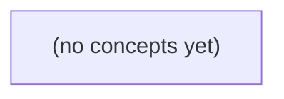

# 07.04 缓存过载与热点：Go 初学者的容量、合并与安全降级

*本书以虚构大群 c-g 的会话预览缓存为主线，用固定纸上算式解释缓存击穿、雪崩、穿透、热键与大键如何把压力传导到 Redis 和数据库。读者将学习在 Go 服务中理解 singleflight 的边界、设计有界保护与降级，并通过 22 道分层练习巩固判断能力。*

**章节:** 2

---

## 本书导览

- 了解整本书的章节脉络
- 掌握各章之间的概念依赖关系
- 选择最合适的阅读顺序

# 07.04 缓存过载与热点：Go 初学者的容量、合并与安全降级

本书以虚构大群 c-g 的会话预览缓存为主线，用固定纸上算式解释缓存击穿、雪崩、穿透、热键与大键如何把压力传导到 Redis 和数据库。读者将学习在 Go 服务中理解 singleflight 的边界、设计有界保护与降级，并通过 22 道分层练习巩固判断能力。

下方的概念图展示了本书 0 个核心概念以及它们之间的依赖关系；再下方是 1 个章节的入口。你可以按从上到下的顺序阅读，也可以根据自己的兴趣或先验知识选择切入点。

#### 概念图

## 章节索引

- **07.04 缓存过载与热点：群聊预览失效时谁承压** — 面向Go初学者，以大群预览和不存在消息点查推导缓存击穿、雪崩、穿透、热键、大键及有界回源/降级。

## 07.04 缓存过载与热点：群聊预览失效时谁承压

- 区分击穿、穿透、雪崩、热键与大键
- 手算1000请求/200每秒回源的积压
- 解释进程内singleflight不能合并跨进程加载
- 计算100键错开TTL的理想量级与限制
- 区分随机不存在ID与重复单ID负缓存效果
- 保护权限与权威DB不被旧缓存/回源过载破坏
- 设计观测与限流降级证据

以虚构的 c-g 大群会话预览为例，先建立请求、缓存、回源与积压的共同语言，再判断预览失效时真正承压的位置。

### 从群聊预览拆分读路径

### 从群聊预览拆分读路径

设 `c-g` 是一个大群，其会话列表预览包含：最后一条消息摘要、发送者、时间、未读数或排序标记。它不是消息事实本身，而是可由消息表、成员状态等数据重新计算出的**派生缓存**。因此预览缓存丢失通常不等于数据丢失；代价在于大量读取会同时触发重建。

一次“读取群聊预览”可拆为两条链路：

1. **预览数据链路**：请求到达（arrival）→ 查 `preview:c-g` → 命中（hit）则直接返回；未命中（miss）则回源查询、计算预览、写回缓存、返回结果。
2. **权限链路**：确认当前用户是否仍是群成员、是否被禁言或屏蔽、是否可见该会话。权限查询必须独立建模，不能因为预览命中就假定鉴权免费，也不能把“预览缓存失效”误写成“权限缓存失效”。

若同一时刻每秒有 $1000$ 个请求读取同一个 `c-g`，而数据库对这类回源查询的安全服务能力（service）仅为 $200/s$，则缓存全失效时到达率 $\lambda=1000/s$ 大于服务率 $\mu=200/s$。每秒约有 $800$ 个请求无法及时完成，形成积压（backlog）；这只是纸面容量估算，不是压测结论。

还要区分两类“热”：

- **热键（hot key）**：如 `preview:c-g`，单个键被高频读取，风险是同键未命中后的并发回源。
- **大键（big key）**：单个缓存值过大，例如塞入全部成员或完整消息列表，风险是网络、序列化和内存开销。

本节只讨论预览派生数据的同键回源；成员权限、消息正文和未读计数应分别评估其缓存与数据库承压。

### 用到达率与服务率描述承压

### 用到达率与服务率描述承压

设 c-g 大群的会话预览是可重建的派生缓存。同一时刻有大量客户端进入群聊列表，玩具条件是：同一个缓存键每秒到达 $1000$ 次读取请求，而数据库对这类预览查询的**安全服务率**只有每秒 $200$ 次。这里的“安全”是纸面容量假设，不等于压测或线上实测结果。

- **到达率** $\lambda$：单位时间进入系统的请求数。本例中，缓存失效后若请求都需要回源，$\lambda=1000/\text{s}$。
- **服务率** $\mu$：下游在既定延迟、连接数和资源预算内，单位时间能完成的请求数。本例数据库 $\mu=200/\text{s}$。
- **命中**：请求直接从缓存得到仍可使用的预览，不访问数据库。
- **未命中**：缓存中没有该预览、已过期，或正在重建但没有可复用结果；请求可能回源数据库。
- **积压** $B$：已经到达、但尚未完成服务的请求数量，通常表现为排队、等待连接、超时重试或应用线程堆积。

若该热点键失效，且没有请求合并、旧值兜底或限流，则回源到达率近似为：

$$\lambda_{\text{回源}}=1000/\text{s}$$

数据库每秒只能安全完成 $200$ 次，因此净积压增长速度为：

$$\Delta B/\Delta t=\lambda-\mu=1000-200=800/\text{s}$$

也就是说，失效持续 $10$ 秒，理论上会新增约 $8000$ 个未完成请求；实际系统往往更差，因为超时后的重试会再次抬高到达率。只要 $\lambda>\mu$，队列就不会自然消退。

这里的核心不是“群很大”本身，而是**热点键**：大量请求集中读取同一个预览键。它不同于**大键**；大键强调单个对象体积大、序列化或网络传输重，热点键强调访问频率集中。权限校验是否命中、是否可缓存，应作为另一条查询链路单独分析，不能混入本例的预览回源容量计算。

### 同一把热点钥匙如何压垮回源

### 同一把热点钥匙如何压垮回源

设群聊 `c-g` 的会话预览缓存键为 `preview:c-g`。它过期的瞬间，每秒有 $1000$ 个读取请求到达；这些请求都要同一份可重建预览，权限校验另行处理。若没有合并回源机制，缓存的第一次未命中会变成一场“同键并发回源”。

数据库对此类查询的安全服务能力只是 $200\ \text{次/秒}$，而到达率为 $\lambda=1000\ \text{次/秒}$。即使每个查询本身不慢，未完成请求的积压仍以近似

$$\text{backlog 增长率}=\lambda-\mu=800\ \text{次/秒}$$

持续扩大。这里的 `miss` 不再只是“少了一次缓存命中”：它把原本应由一次重建完成的工作，放大成大量重复查询。

放大通常沿着三层传播：

1. **缓存层**：同一热点键同时失效，多个请求都看到空值；若直接穿透，`1000` 个请求都成为回源者。
2. **连接池**：数据库连接有限，例如池中只有 `50` 条连接。先到的请求占满连接，后续请求在池等待；等待期间新请求继续到达。
3. **数据库与等待队列**：数据库只能以约 `200/s` 清空查询。连接池等待、应用线程等待、客户端重试可能叠加，尾延迟上升后又诱发更多超时和重试。

这与 **大键** 不同：大键是单次读取对象过大，消耗网络、反序列化或内存；**热点键** 的危险在于许多请求竞争同一把钥匙。即使预览记录很小，只要失效窗口内缺少请求合并、互斥重建或短暂陈旧值保护，回源压力仍可从“重建一次”膨胀为“并发重建一千次”。

### 热键不等于大键，也不等于缓存故障

### 热键不等于大键，也不等于缓存故障

以 `c-g` 大群的会话预览为例：同一群预览在失效后，每秒来了 $arrival=1000$ 次读取；数据库对此查询的安全服务能力仅约 $service=200/s$。即使预览结果很小，这也是热键风险，而非大键问题。若持续回源，积压近似按 $backlog \approx (1000-200)t$ 增长。

- **热键**：某个键被极高频访问，如 `preview:c-g`。核心是访问集中度；命中时缓存仍可健康，未命中时会把压力集中打到同一回源路径。信号包括单键请求量陡升、命中率下降后该键的回源量暴涨、等待队列增长。
- **大键**：单个键的值或成员集合过大，例如一个群缓存了巨量成员、长消息列表或超大序列化预览。核心是对象体积与操作成本；即使访问不高，也可能造成网络传输慢、反序列化慢、缓存节点阻塞、淘汰抖动。大键未必是热键。
- **缓存击穿**：一个原本高频的有效键过期或被删除，大量并发请求同时未命中并回源。`c-g` 预览失效后的 1000 次同键读取正是典型形态；数据库承压集中且陡峭。
- **缓存穿透**：请求查询根本不存在、且缓存也未保存的键，例如持续请求不存在的群标识。每次都绕过缓存到存储层；信号是大量不同或异常键持续未命中，而非某一有效热键过期。
- **缓存雪崩**：大量键在相近时间失效，导致广泛回源。其压力面是“多键同时失效”，常伴随整体命中率骤降、多个数据库查询类型同步升高。

因此，先问“请求是否集中到同一键、键值是否过大、未命中是否由有效键失效造成、失效范围是一键还是多键”。权限校验是否命中、是否允许读取，应作为独立链路观察，不能用来混淆缓存承压判断。

### 先保护权威数据源再谈预览可用

### 先保护权威数据源再谈预览可用

c-g 大群的“会话预览”是可重建的派生数据：例如最后一条消息摘要、未读提示、群头像组合。它失效时可以短暂展示旧值、占位符或“内容加载中”，但不能为了恢复预览而压垮权威数据源。消息、成员关系与权限判定仍以数据库等权威源为准；缓存命中也不能绕过权限校验，最多缓存经授权后可见的预览结果。

设同一键每秒到达请求为 `arrival=1000`，数据库对此类查询安全服务能力为 `service=200/s`。若缓存失效导致全部回源，则每秒净积压约为：

$backlog\_growth = arrival-service = 800/s$

积压会扩大超时、重试与连接占用，进而把局部热点变成全局故障。这里的 **热键** 是被高频读取的同一预览键；**大键** 则是单个值过大、传输或反序列化昂贵，二者可能同时出现，但治理手段不同。

应用层应先建立证据，而非凭“纸上容量”放行：

- **命中率**：`hit / (hit + miss)`，观察失效前后是否断崖式下降。
- **回源率**：每秒实际访问权威源的次数，必须低于安全服务边界并留有余量。
- **队列长度**：等待回源、重建或数据库连接的请求数；持续增长意味着系统已不稳定。
- **限流结果**：允许、排队、拒绝、降级各占多少；被拒绝的预览请求应优先返回可解释的降级结果，而非继续重试。

因此，预览可用性的目标不是“每个请求都立刻拿到新值”，而是在缓存雪崩或热点失效时，确保权限仍被执行、权威源不被击穿，并让系统能够有序恢复。

> **要点** — 缓存失效不是单点问题：先用到达率、服务率与积压识别回源过载，再隔离权限并保护权威数据库。

群聊预览键在同一时刻失效时，平均命中率再高，也可能掩盖瞬时回源洪峰。本节用1000个并发请求量化缓存击穿对权威数据库的压力。

### 从一个过期预览键识别缓存击穿

### 从一个过期预览键识别缓存击穿

设群聊 `c-g` 的预览缓存键为 `preview:c-g`，其 TTL 在 $t_0$ 恰好到期。到期前，请求直接命中缓存；到期后，缓存层返回 miss。若该键是热点键，并且首个回源请求尚未完成填充时，大量并发请求也陆续看到 miss，就会形成缓存击穿。

击穿的关键不在于“缓存失效”本身，而在于以下条件同时成立：

- **同一热点键失效**：请求集中访问 `preview:c-g`，而非分散访问许多不同键。
- **填充窗口存在**：从首个请求发现 miss，到数据库查询完成、缓存重新写入之间存在时间窗。
- **请求未被合并**：后续请求没有等待首个加载者的结果，而是各自查询数据库。
- **数据库容量有限**：权威数据库无法在短时间内处理全部回源请求。

例如，$t_0$ 后有 1000 个请求在首次填充完成前到达。朴素实现会产生约 1000 次数据库查询，而不是“1 次查询 + 999 次复用结果”。即使该键此前长期命中，平均命中率仍可能接近 100%；但在这个短暂窗口内，回源比例是：

$$
\frac{1000}{1000}=100\%
$$

因此，缓存击穿应按**失效瞬间的并发回源量**评估，而不能只看全局平均命中率。若请求分散到不同键，或首个加载请求能被互斥锁、请求合并等机制共享，则问题更接近普通缓存未命中，而非热点键击穿。

### 手算1000次未合并回源的积压

### 手算1000次未合并回源的积压

设群聊预览键 `preview:c-g` 在 $t_0$ 失效。此时有 1000 个请求几乎同时到达；由于第一个请求尚未完成数据库查询并回填缓存，其余请求也都观察到未命中。若没有请求合并、互斥锁或结果复用，则：

\[
1000\text{ 次请求} \Rightarrow 1000\text{ 次数据库查询}
\]

数据库的最大处理能力为每秒 200 次，且假设没有其他业务负载。瞬时到达后，第一秒最多完成 200 次，因此至少有：

\[
1000-200=800
\]

次查询仍在等待队列中，或因连接池、队列长度、限流规则而被拒绝。

若这 1000 次查询仅是一批一次性流量，且服务能力稳定为 $200/s$，理想排空时间为：

\[
\frac{1000}{200}=5\text{ 秒}
\]

这里的“5 秒”是从数据库开始处理到全部完成的理论下界；实际还会叠加排队、网络、查询执行和缓存回填时间。最后一批请求的用户可见延迟接近数秒，而不是正常缓存命中的毫秒级。

更危险的是持续流量。若失效后仍以 $1000/s$ 到达，而数据库只能完成 $200/s$，每秒净积压为：

\[
1000-200=800\text{ 次/s}
\]

即：

\[
B(t)=800t
\]

积压不会自行消失，直到缓存恢复并真正拦住后续请求，或上游限流把到达率降到 $200/s$ 以下。平均命中率即使接近 99%，也无法抵消这一秒内 1000 次未合并回源造成的峰值压力。

### 为什么平均命中率不能代表安全

### 为什么平均命中率不能代表安全

平均命中率是长时间窗口的比值：

$$
\text{命中率}=\frac{\text{命中次数}}{\text{总请求次数}}
$$

它擅长描述“通常情况下缓存是否有效”，却不能回答“某一秒数据库会承受多少请求”。例如，群聊预览 `preview:c-g` 在一天内被读取 100 万次，其中只有 TTL 到期瞬间发生 1000 次未命中，其余均命中，则平均命中率仍可接近 $99.9\%$。这个数字看似健康，但它抹平了失效时刻的尖峰。

在 $t_0$，1000 个请求同时发现键不存在；若首个填充尚未完成、又没有请求合并，则瞬时未命中率是 $100\%$，回源并发量也是 1000，而非统计报表暗示的“千分之一未命中”。若数据库每秒最多处理 200 个查询，则首批请求至少有 800 个必须排队或被限流；理想情况下排空也约需 5 秒。

因此应同时观察三类指标：

- **长期命中率**：缓存总体节省了多少读取；
- **短窗口未命中率**：如 1 秒或 10 秒内的失效比例；
- **回源并发与排队深度**：同一热点键导致的数据库实际压力。

持续以 1000 请求/秒访问失效键时，数据库只能处理 200 请求/秒，积压会以 800 请求/秒增长。平均命中率再高，也不能抵消这一瞬时过载。

### singleflight的合并范围与跨进程缺口

### singleflight 的合并范围与跨进程缺口

`singleflight` 的核心是：对同一个键的“正在加载”建立进程内共享。第一个请求发现 `preview:c-g` 未命中后发起数据库查询；随后到达同一实例、请求同一键的 999 个请求不再各自回源，而是等待这次加载完成，并复用其结果。

因此，若 1000 个请求恰好都进入同一进程，理论上数据库只看到 1 次查询，而不是 1000 次。它降低的是**同一实例内、同一键、同一时间窗口**的重复工作；等待者仍会增加该实例的连接、协程和超时压力，但不会线性放大数据库读数。

关键缺口在于：`singleflight` 通常不跨进程共享状态。若流量被负载均衡分到 $N$ 个应用实例，每个实例都会有自己的“首个请求”：

- 10 个实例各收到该群聊预览请求：最多形成 10 次数据库加载；
- 100 个实例同时遇到过期：最多形成 100 路回源；
- 即使全局缓存键相同，只要失效后各实例都先看到 miss，就无法自动知道其他实例已经在加载。

所以，它把回源量从“请求数”压缩为近似“参与实例数”，而非压缩到全局唯一。高命中率指标仍可能好看，但热点键过期瞬间的数据库峰值取决于实例数、流量分布和加载耗时。要进一步合并跨实例回源，需使用分布式锁、租约或可共享的填充协调机制，并配合超时、降级与锁失效后的防穿透策略。

### 以有界回源保护数据库与权限链路

### 以有界回源保护数据库与权限链路

缓存未命中不应直接等价于“每个请求都查询数据库”。对键 `preview:c-g`，应将回源设计成有界的受控过程：

- **互斥加载**：第一个 miss 请求取得短租约并负责重建；其余请求等待极短时间、读取旧值或进入降级路径。即使同一时刻有 1000 个请求，也应尽量收敛为一次预览查询，而非 1000 次。
- **回源并发上限**：对预览重建设置独立信号量，例如最多允许 `N=20` 个群聊键同时回源。超过上限的请求不得绕过缓存直击权威库，否则多个热点键失效仍会压垮数据库。
- **短暂陈旧返回**：缓存值可区分“新鲜期”和“陈旧可用期”。在 TTL 到期后的短窗口内，先返回旧预览并异步刷新；但权限、成员状态、封禁等安全敏感字段不能无条件陈旧，必须继续经过可用的权限判定或采用更短、更严格的陈旧窗口。
- **限流与快速失败**：数据库最多处理 `200` 次查询/秒时，回源预算必须低于该值并预留余量给正常业务。无法获得加载租约、等待超时或权限链路拥塞时，应返回明确的“稍后重试”或简化预览，而不是排队无限增长。

观测不能只看总体命中率，还应记录：单键 miss 并发数、互斥合并率、等待时间、陈旧响应比例、回源队列长度、数据库拒绝数及权限校验延迟。若持续请求量为 `1000/s` 而可安全回源仅为 `200/s`，未受控系统的积压增长约为 `800/s`；这些指标才能直接证明保护是否真正阻断了击穿。

> **要点** — 热点键到期的风险取决于瞬时回源峰值；必须合并加载、限制回源并允许可控降级，而非只看平均命中率。

同一热点键失效时，单进程合并只能减少本机重复加载；跨网关的回源压力、等待队列与失败传播仍需单独设计。

### 从一千请求看合并边界

### 从一千请求看合并边界

设热点群聊预览键 `preview:group:42` 刚失效，4 个独立网关同时各收到 250 个请求，共计 1000 个请求。

若每个网关进程都使用进程内 `singleflight`：

- 网关 A 的 250 个请求合并为 1 次加载；
- 网关 B、C、D 也各自合并为 1 次加载；
- 因而数据库查询理想上界是 **4 次**，不是 1000 次；
- 但也不是 1 次，因为各进程的内存、等待表和 `singleflight` 键空间彼此隔离。

可将其写成：

$$
Q_{\mathrm{DB}} \leq N_{\mathrm{进程}} = 4
$$

这里的“至多 4 次”隐含前提是：每个进程内只有一个 leader，leader 成功完成，且同一批请求都在其结果可复用的时间窗口内到达。若 leader 超时、失败、被取消，或进程重启后合并状态丢失，则同一网关可能再次选出 leader，实际查询数会高于 4。

因此，`singleflight` 解决的是“**同一进程内的重复回源**”，而不是全局热点治理。它仍需配合：

- leader 的独立超时预算，避免其被某个客户端取消连带终止；
- 等待者数量和等待时长上限，避免 250 个请求无限堆积；
- 失败后的退避或短暂负缓存，避免所有请求立即重试；
- 跨进程协调策略，若要进一步把 4 次压缩到接近 1 次，必须显式引入共享协调，而不能误以为进程内合并已经覆盖全局。

### 为何不是全局只查一次

### 为何不是全局只查一次

设有 4 个独立网关进程，每个进程同时收到 250 个针对同一群聊预览键的请求。进程内 `singleflight` 的选举范围仅是本进程的调用者：

1. 每个进程中，最先发现缓存未命中的请求成为本地 leader；
2. 其余 249 个请求等待该 leader 的加载结果；
3. 因而每个进程最多发起 1 次数据库查询；
4. 4 个进程彼此不共享“正在加载”的状态，理想情况下总计至多回源 4 次，而非 1 次。

即使所有请求来自同一客户端，也不能据此假定只有一个 leader。连接复用、四层负载均衡、HTTP/2 多路复用或会话黏性，可能让流量集中到某一实例；此时可能只有 1 次回源，也可能因负载倾斜而由少数实例承担大批等待者。反过来，扩容到 $N$ 个实例后，同一热点键的理论回源上界变为 $N$ 次。

因此，`singleflight` 的收益是将单机回源从“并发请求数”压缩到“每进程一次”，并不提供全局互斥。若业务确实要求跨实例只允许一次加载，必须引入共享协调机制；但分布式锁或 Redis 锁还要定义锁过期、leader 崩溃、结果写入和等待超时后的合同，否则可能从重复查询变成全局阻塞。

### leader失败时如何止损

### leader失败时如何止损

设 4 个网关各有 250 个请求命中同一失效群聊预览。进程内 `singleflight` 可将每台机器压为 1 个 leader 回源，因此理想上是至多 4 次数据库查询；但若 leader 卡死或失败，250 个等待者仍可能同时超时、重试并放大压力。

加载流程应把 leader 的结果视为“本轮共享结论”，无论成功、失败还是取消，都必须结束这一轮并唤醒等待者：

1. **绑定独立加载期限**：leader 使用短于请求总期限的加载超时，例如请求预算 300ms、缓存加载预算 80ms。不能直接复用某个客户端请求的 `context`，否则该客户端取消会错误终止全体共享加载。
2. **显式发布失败结果**：leader 遇到数据库错误、超时或取消时，写入带原因的失败结果并 `broadcast`；等待者收到后立即退出等待，而不是继续挂在共享键上。
3. **优先返回可接受旧值**：缓存中有过期但仍在陈旧窗口内的预览时，leader 失败和等待者超时时均可返回旧值，并附带“可能非最新”的合同语义；没有旧值才返回受控错误或空预览。
4. **重试必须有预算**：同一键在短窗口内只允许有限次回源，如每 10 秒最多 2 次。失败后记录退避时间；后续请求直接读旧值或降级，不能让每个等待者各自发起重试。
5. **等待者也有截止时间**：等待不超过自身剩余预算；超时后解除订阅并降级，不应因共享加载而无限排队。

进程重启会天然丢失进程内 leader 状态，其他网关不应假定其仍会完成。若使用 Redis 锁，还需设置租约、续租与栅栏语义：锁过期不代表旧 leader 已停止写入。更稳妥的读路径通常是“锁只抑制回源，旧值仍可读”，并明确旧值允许的最大陈旧时间。

### 等待者也必须有上限

### 等待者也必须有上限

`singleflight` 合并的是“发起加载”的次数，不是等待成本。4 个网关各有 250 个请求同时命中失效键时，即使每个进程只发起 1 次数据库查询，仍可能有近 1,000 个请求占着连接、协程、内存和客户端超时预算等待结果。数据库尚未被打穿，网关本身也可能先耗尽。

因此，同一加载结果的等待者必须受控：

- **等待超时**：等待时间应小于请求总 deadline；例如总预算 200 ms，留给缓存命中、序列化和返回的时间后，最多等待 80 ms。
- **并发上限**：每个热点键、每个进程以及全局都应限制 waiter 数。超过上限不再加入队列，而是走明确的替代路径。
- **快速失败**：缓存确实不可用、数据又必须强一致时，立即返回可识别的过载错误，比排队到客户端超时更可恢复。
- **读旧值**：若业务合同允许短暂陈旧，可返回过期但仍可信的预览，并异步刷新；必须携带陈旧标记、最大陈旧时间和失效边界。
- **降级响应**：例如群聊预览只返回群名、成员数或“预览暂不可用”，不要让非核心展示字段拖垮权威库。

leader 失败、取消或进程重启时，等待者不能永久挂起：必须收到失败结果或在自身 deadline 到达时退出；后续重试应受指数退避、抖动和总重试预算约束。分布式锁只能协调“谁加载”，不能替你规定“其他人等多久、满了怎么办、旧值能否读”。这些才是热点过载时真正的服务合同。

### 分布式锁与读旧值的合同

### 分布式锁与读旧值的合同

进程内 `singleflight` 只合并同一进程的并发：4 个网关各有 250 个请求时，理想情况是每个进程仅 1 次回源，即至多 4 次数据库查询。它无需网络协调，失败和取消也较容易向本地等待者传播；代价是无法消除跨网关重复加载。

Redis 锁或其他分布式锁可把“至多 4 次”进一步压向“接近 1 次”，但不是自动正确性。持锁者可能在加载期间崩溃，锁租约可能过期；续租失败后，旧持锁者若继续写入，可能覆盖新持锁者结果。因此需要：

- 锁值携带不可猜测的持有者令牌；释放、续租、写入均校验令牌。
- 租约覆盖一次加载的预算，续租有上限；不能无限续租。
- 未获得锁的请求只等待有限时间，超时后读旧值、降级或按预算重试，而非无限排队。
- leader 失败、取消或进程重启时，等待者必须被唤醒并重新竞争，不能依赖“总会有人填缓存”。

“读旧值”同样是合同，而非兜底技巧。必须明确旧值允许陈旧多久：例如群聊预览可允许 `$30\text{s}$` 陈旧，但权限、成员资格、封禁状态通常不得读旧。还要约定旧值缺失、已删除或权限版本变化时的行为。只有当数据新鲜度与权限语义允许时，`stale-while-revalidate` 才能把锁竞争转化为可控的体验降级。

> **要点** — singleflight只在进程内合并；跨实例回源、失败释放、等待上限与读旧合同必须共同受控。

群聊预览键在同一时刻过期，会把原本分散的读取瞬间变成回源洪峰；错开过期只能削峰，不能替代对热键、容量与故障清空的整体防护。

### 从同秒过期看缓存雪崩

### 从同秒过期看缓存雪崩

设有 $100$ 个群聊预览键，统一设置 TTL 为 $60\text{s}$，因此都在 $t=60$ 同时失效。失效前，请求命中缓存，存储层几乎不承担预览读取；失效后，若每个键恰有 $10$ 个请求在同一秒到达，则该秒的未命中量为：

$$
M=100\ \text{键}\times10\ \text{请求/键}=1000\ \text{次未命中}
$$

这里的关键不只是“缓存少了 100 个键”，而是原本被缓存吸收的读取并发被同时释放到下游。若每次未命中都直接查询数据库、会话服务或消息聚合服务，下游会在一个极短窗口内接到约 $1000$ 次额外读取；若一次预览计算还要读取成员、最后消息、未读数等多个依赖，实际内部调用量会进一步放大。

更危险的是，同一键的 $10$ 个请求未必会自动合并。没有互斥锁、请求合并或旧值回退时，它们可能同时发现“没有缓存”，继而并发回源。于是下游面对的不是“重建 100 份预览”，而可能是“执行 1000 次重建尝试”。

若将过期时间人为分散到 $10\text{s}$，理想情况下每秒约有：

$$
1000/10=100\ \text{次未命中/秒}
$$

这只能削低平均峰值：真实访问并不均匀，热门群聊仍可能在某一秒集中访问；而单个热键即使单独过期，也足以形成击穿。缓存雪崩因此是“许多键同时失效”造成的容量冲击，不能只靠错开 TTL 来定义或解决。

### 错开TTL的理想值与现实边界

### 错开 TTL 的理想值与现实边界

设有 $100$ 个群聊预览键，每个键在过期瞬间恰有 $10$ 个并发读取。若它们都在 $t=60$ 失效，则会产生：

$$
100 \times 10 = 1000
$$

次缓存未命中；若没有合并回源，这 $1000$ 个请求都可能压向数据库或下游服务。

若人为或通过 TTL jitter 将这 $100$ 个键的过期时刻均匀铺在 $10$ 秒窗口内，理想情况下每秒约有：

$$
\frac{100}{10}=10\ \text{个键过期},\qquad
10 \times 10=100\ \text{次 miss/s}
$$

洪峰量级从 $1000$ 降到约 $100$ 次未命中每秒，说明错开 TTL 的核心价值是削峰。

但这只是平均模型。真实访问并不均匀：热门群可能在某一秒涌入数百次读取，冷门键即使过期也无人访问；因此实际 miss 取决于“过期键数 × 当时请求量”，而非仅取决于 TTL 分布。续期行为也会破坏均匀性：键通常在首次访问后才回填，后续过期时间会跟随访问节奏重新聚集；批量预热、统一写入或固定刷新任务同样可能再次对齐过期点。

因此，TTL jitter 只能降低大量普通键同时失效的概率。对单个极热键，仍需请求合并、互斥重建、软过期或限流；对回源容量，则应配合预热、降级与过载保护。

### 抖动、预热与故障清空

### 抖动、预热与故障清空

缓存雪崩不只来自“自然到期恰好重合”，还可能由发布、故障恢复或运维操作瞬间制造。三类手段解决的是不同问题：

- **TTL 抖动（jitter）**：为基础过期时间加入随机偏移，如 `TTL = 60s + rand(0, 10s)`。100 个预览键原本在 `t=60` 集中过期，加入抖动后会分布在约 10 秒窗口内，平均回源压力可从瞬时 `1000 miss` 降至约 `100 miss/s`。但随机分布不等于严格均匀：短时间内仍可能聚集；更重要的是，某个极热键即使独自过期，也会被并发请求同时击穿。抖动是削峰，不是互斥回源或容量保障。

- **主动预热**：在键过期前、发布后或流量高峰前，由后台任务提前刷新热门群聊预览。它适合访问模式稳定、热点可预测的键，可避免首个用户承担回源延迟。风险在于预热任务本身可能扫出大量冷键、与在线请求争抢数据库容量，或因错误热点名单形成新的洪峰。因此应限制预热速率、优先级和并发，并允许在线流量抢占资源。

- **故障性全量清空**：缓存集群重启、错误失效策略、版本不兼容或误执行 `flush`，会让大量本应仍有效的键同时变为未命中。这也是雪崩，但触发机制不是 TTL 同步，而是缓存可用数据突然归零。此时即使原先配置了抖动也无济于事；预热若无节流，反而会与用户请求共同压垮源站。

因此，完整防线应分层：用抖动降低自然同步过期概率；用受控预热覆盖可预测热点；对单键采用请求合并、互斥锁或陈旧值兜底；在全量失效场景下启用限流、排队、降级和数据库保护。缓存恢复速度必须服从源站承载能力，而不是追求“尽快全部回填”。

### 单热键为何仍会击穿

### 单热键为何仍会击穿

多键在同一时刻过期是**雪崩**：例如 100 个预览键同时失效、每键同秒 10 个请求，会形成约 1000 次缓存未命中。给 TTL 加随机抖动后，失效时刻被摊开，平均压力可能接近 100 次未命中/秒；它主要解决的是“很多键一起失效”。

**击穿**则是另一种形态：只有一个极热的群聊预览键失效，但它在短时间内收到极高并发请求。即使其他 99 个键都仍在缓存中，这一个键也足以把数据库、会话服务或消息聚合接口压垮。若该键每秒有 500 个读取，在回源重建耗时 200 ms 的窗口内，就可能出现约：

$$500 \times 0.2 = 100$$

个并发回源尝试。TTL jitter 对此几乎无效，因为它只能改变“何时过期”，不能降低该键过期后的瞬时请求密度。

进程内 `singleflight` 能让**同一进程**中针对同一键的并发未命中合并为一次加载；其余请求等待结果即可。但若流量被负载均衡分到 20 个应用实例，每个实例都会各自发现未命中、各自执行一次 `singleflight`，仍可能产生最多 20 次跨进程回源。重建慢、重试多或下游容量紧张时，这些重复加载仍会放大压力。

因此，热键需要额外防护：跨实例互斥或分布式租约、逻辑过期后后台刷新、旧值短暂可读、按键限流与等待超时；当回源已过载时，应返回降级预览而非让所有请求继续争抢重建。

### 有界回源与降级证据

### 有界回源与降级证据

缓存失效后的目标不是“尽量回源”，而是让权威数据库始终只承受可证明安全的回源量。设数据库可为预览查询保留的安全容量为 $C_{db}$ 请求/秒，应用应将实际回源控制在：

$$
R_{\text{origin}} \le \min(C_{db}, C_{\text{app}})
$$

其中 $C_{\text{app}}$ 由全局令牌桶、每实例并发闸门和每键合并请求共同决定。不要只限制单机并发：扩容后，$N$ 个实例各放行 $k$ 个回源，数据库仍可能同时收到 $N\times k$ 个查询。更稳妥的做法是按“预览回源”设置全局配额，或按数据库连接池、查询队列的真实余量动态收紧。

缓存未命中时可分层处理：

- **有旧值**：允许在短暂软过期窗口返回旧预览，并由一个持锁请求异步刷新；用户得到可能稍旧的群聊摘要，数据库避免被同步等待淹没。
- **无旧值但配额可用**：仅让获得令牌且成为该键刷新者的请求回源；其余请求等待有限时间，超时后不再继续排队。
- **无旧值且配额耗尽**：直接返回降级响应，例如“预览暂不可用”、骨架信息或稍后重试标记；不能把“失败”伪装成无限重试。
- **数据库异常或全量清空后**：进一步缩短等待、降低配额，并优先保护登录、发消息等核心路径；预览属于可牺牲读。

保护是否有效必须由证据验证。至少观测：缓存未命中率及其按键集中度、同键等待人数与等待时长、刷新合并率、实际回源请求率与回源延迟、令牌拒绝数、并发闸门排队数、旧值命中率、降级响应比例，以及数据库连接池利用率和慢查询。若未命中上升但回源始终被限制、旧值与降级比例上升、数据库延迟未恶化，说明系统是在受控削峰；若拒绝率低而数据库队列持续增长，则容量边界设得过宽。

> **要点** — TTL错开能降低多键同步失效的平均峰值，但热键击穿与故障清空仍须依靠有界回源、限流和降级防护。

随机不存在消息查询看似适合负缓存，却可能因键完全离散而把每次首查都推向权威数据库。

### 从随机不存在键识别缓存穿透

### 从随机不存在键识别缓存穿透

设攻击者或异常客户端连续请求：

`m-x1，m-x2，…，m-x1000`

这 1000 个消息 ID 都不存在，且每个 ID 只访问一次。即使系统对不存在结果写入逐键负缓存，流程仍是：

1. 首次请求 `m-xi` 未命中缓存；
2. 查询权威数据库，得到“消息不存在”；
3. 写入 `m-xi -> 不存在` 的短期负缓存；
4. 后续却再也没有请求同一个 `m-xi`。

因此，负缓存命中数接近 0，数据库仍承受 1000 次无效查询。这就是**随机键缓存穿透**：请求刻意或自然地落在大量未缓存、且不存在的离散键上，使“缓存拦截不存在数据”的能力失效。

它应与另外两类问题区分：

- **缓存击穿**：某个热点、通常真实存在的键过期，大量并发请求同时回源；核心是“同一热点键”的并发失效。
- **缓存雪崩**：大量缓存键在相近时间集体过期或缓存服务故障，广泛请求同时回源；核心是“多键集中失效”。
- **随机穿透**：键彼此不同、往往不存在、每键只出现一次；核心是“首查数量巨大”，不是过期后的并发争抢。

因此，不能仅以“已经配置负缓存”判定安全。负缓存主要减少**重复查询同一不存在键**；面对一键一次的 `m-x1...m-x1000`，还需在回源前限制候选空间与请求速率，例如认证、输入格式约束、按主体限流或 Bloom 候选过滤。过滤器只能表示“可能存在”或“确定不在候选集合中”，并且必须随消息创建、删除和索引更新维护；数据库超时、权限拒绝等错误更不能被写成“不存在”。

### 逐键负缓存为何挡不住首查

### 逐键负缓存为何挡不住首查

负缓存的命中条件不是“请求不存在”，而是“同一个不存在键已经被查过，且其负缓存记录尚未过期”。

设攻击或爬虫在短时间内请求：

`m-x1, m-x2, ..., m-x1000`

并且每个 ID 只出现一次。对任意键 `m-xi`，请求路径都是：

1. 缓存查找 `m-xi`，未命中；
2. 到权威数据库确认该消息不存在；
3. 写入 `m-xi -> 不存在` 的负缓存；
4. 此后再没有对 `m-xi` 的请求。

因此，1000 个不同键对应 1000 次缓存未命中和 1000 次回源。虽然最终缓存中留下了 1000 条“不存在”记录，但它们没有服务后续请求，负缓存命中数为：

$$
H_{\text{negative}}=0,\qquad
Q_{\text{origin}}=1000
$$

逐键负缓存只能降低**重复键**的回源量，不能降低高基数随机探测的首查量。

对比之下，若同一不存在 ID `m-x` 被请求 1000 次，且负缓存有效期覆盖这些请求，则只有第一次需要回源：

$$
Q_{\text{origin}}=1,\qquad
H_{\text{negative}}=999
$$

这解释了一个常见误判：观察到“负缓存命中率很高”并不代表系统能抵御随机不存在 ID。命中率高通常意味着请求集中在少量重复键；而键空间持续扩张时，缓存会变成一次性“查后留档”，数据库仍承担全部首查压力。

### 重复单ID与迟到创建风险

### 重复单 ID 与迟到创建风险

若攻击者或异常客户端反复查询同一个不存在的 `m-x`，负缓存能显著削减回源。第一次查询未命中缓存，数据库确认不存在后写入短 TTL 的负缓存；后续请求直接返回“不存在”，不再触发数据库读取。若 TTL 为 30 秒，30 秒内的 10 万次重复请求理论上只需 1 次权威查询，而非 10 万次。

但负缓存保存的是某一时刻的结论：

\[
\text{在 } t_0 \text{ 不存在} \not\Rightarrow \text{在 } [t_0,t_0+\mathrm{TTL}] \text{ 始终不存在}
\]

例如客户端先查询 `m-x`，得到 404 并写入负缓存；稍后消息创建成功，另一个客户端立即读取该消息，仍可能命中旧的“不存在”缓存，直到 TTL 到期。这不是数据库丢数据，而是缓存与创建事件之间的短暂可见性不一致。

缓解策略应组合使用：

- 创建消息成功后，主动删除或覆盖对应 `m-x` 的负缓存；
- 负缓存 TTL 保持较短，并对新近创建的消息路径优先绕过可疑负缓存；
- 只有权威数据库明确返回“未找到”时才写负缓存；超时、连接失败、权限服务异常都不能缓存为不存在；
- 对要求“创建后立即可读”的接口，可采用版本号、创建事件广播或一致性读，而不能只依赖 TTL。

因此，负缓存适合压制“重复查询同一不存在 ID”，却不能把 404 当作永久事实。

### 私有隐藏404不能做全局结论

### 私有隐藏404不能做全局结论

设消息 `m-private` 确实存在，但只允许成员 `u-a`、`u-b` 查看；访客 `u-c` 请求：

`GET /messages/m-private`

系统为了避免泄露资源存在性，返回隐藏式 `404`，而不是 `403`。这个 `404` 的含义并非“消息不存在”，而是：

$$
\text{对 }u\text{-c 而言不可见}
$$

若缓存层据此写入全局负缓存：

`message:m-private -> 不存在`

则随后有权限的 `u-a` 查询同一消息时，也会命中该负缓存并得到 `404`。这既造成合法数据不可读，也把“权限判断”错误压缩成了“资源状态”。

因此，隐藏 `404` 至少应区分两类结论：

- **权威不存在**：数据库确认消息 ID 不存在，才可写入短期全局负缓存。
- **不可见或未授权**：只表示当前主体无权得知，不能写入按资源共享的“不存在”缓存。

若确有必要缓存权限结果，键必须带上安全边界，例如 `消息ID + 用户ID`、租户、角色版本或成员关系版本；并设置较短 TTL。成员加入群聊、权限撤销、消息恢复时，还要使相关缓存失效。更稳妥的做法是：将“存在性查询”和“可见性判定”分层，绝不把认证失败、权限拒绝或数据库超时写成负缓存。

### 多层拦截与权威库保护边界

### 多层拦截与权威库保护边界

随机键不存在时，逐键负缓存只能减少“同一键”的重复查询；对 `m-x1` 到 `m-x1000` 这种完全离散的首查，仍会产生 1000 次回源。因此，保护权威库应在负缓存之前建立多层门槛：

- **认证与授权前置**：未认证请求不进入消息查询路径；认证后先验证会话、群成员资格与资源可见性。私有会话 `u-c` 的隐藏 `404` 不能写入全局负缓存，否则可能把“对甲不可见”错误扩散为“对所有人不存在”。
- **输入限额**：限制 ID 长度、字符集、批量查询数量、分页大小和单位时间的不同键数。明显不符合 ID 语法的请求可在应用层直接拒绝，不应触达 Bloom 过滤器或数据库。
- **按主体限流**：同时按用户、令牌、IP、会话及群维度限流；尤其限制“高基数查询率”，即短时间内请求大量不同 ID。普通读流量可放行，异常枚举行为应降级、排队或返回 `429`。
- **Bloom 候选过滤**：维护“可能存在的消息 ID”集合。Bloom 判定“不可能存在”时可直接返回不存在；判定“可能存在”才允许进入有限回源队列。它允许误判为可能存在，造成额外查询；绝不能把误判设计成“存在”。
- **有界回源**：为数据库查询设置并发池、队列长度、超时和单请求预算。预算耗尽时返回可重试的过载结果，而不是无限排队拖垮权威库。

Bloom 及其他存在性索引必须随创建、删除、迁移更新；删除后可保守地继续返回“可能存在”，直到重建或过期。更关键的是：数据库超时、连接失败、限流、主从延迟都表示“未知”或“暂不可用”，不得写成负缓存；只有权威读取明确确认不存在，才可写入带短 TTL 的负缓存。

> **要点** — 负缓存只能复用同键结论；随机离散不存在键需依靠认证、限流与有界回源共同保护权威数据库。

群聊预览即使缓存命中，也可能因单键高频访问和大集合整取压垮 Redis 与网络；先辨明压力来源，再讨论优化。

### 命中缓存为何仍会过载

### 命中缓存为何仍会过载

设群聊 `c-g` 的预览缓存为 `preview:c-g`，即使其命中率接近 $100\%$，每秒 $1000$ 次读取仍可能形成明显热点：所有请求集中访问同一个 Redis 键、同一分片或同一主节点，并持续消耗连接、命令处理能力、网卡带宽与序列化开销。若预览值较大，返回数据本身还会放大网络压力。

这不是缓存击穿。击穿的典型链路是：

`缓存失效 → 大量请求回源 → 数据库或下游服务过载`

而热点命中的链路是：

`缓存有效 → 大量请求仍到 Redis → Redis 单键/网络成为瓶颈`

因此，“命中”只说明没有访问数据库，并不等于系统没有压力。应先观察访问分布：`preview:c-g` 是否显著高于其他键、请求是否集中到少数群聊、Redis 分片的命令数与出网流量是否倾斜、该键的值大小和 P99 延迟是否上升。

只有确认是热点读取后，才考虑本地短缓存、预览副本分散或限流等手段；若误判为击穿而只延长 TTL，通常无法降低这每秒 $1000$ 次对 Redis 的直接读取。

### 热键与击穿的边界

### 热键与击穿的边界

`preview:c-g` 每秒 1000 次命中 Redis，并不等于缓存击穿。**热键**的特征是：缓存仍然有效，但大量请求集中读取同一个键，Redis 单线程处理、网卡带宽、连接池或客户端反序列化先成为瓶颈。若值本身很大，例如群成员集合需要返回 1 万个 ID，则一次命中也可能是大键网络传输问题。

应区分四类现象：

- **热键**：键存在且持续命中；受压的是 Redis 单键处理、网络与客户端。优先测每键 QPS、返回字节数、延迟和连接数，再考虑本地短缓存、只读副本、请求合并或分片。
- **缓存击穿**：某个原本高频的键过期或被淘汰，请求同时回源数据库。受压核心是数据库与重建链路；应使用互斥重建、逻辑过期、提前刷新。
- **缓存雪崩**：大量键在相近时间失效，许多请求同时回源。应错开过期时间、分批预热、限流与降级。
- **缓存穿透**：请求的对象本就不存在，缓存与数据库都无法命中。应缓存空值、使用布隆过滤器，并限制异常查询。

`candidate_members:c-g` 若每次通过 `SMEMBERS` 整取 1 万成员，即使没有失效，也属于“大键访问”并可与热键并存；不能用逐个 `SISMEMBER` 替代授权判断。优化前先确认访问是否集中、候选集是否过大，以及截断候选会不会漏掉本应展示且有权限的成员。

### 大键整取的隐藏成本

### 大键整取的隐藏成本

设 `candidate_members:c-g` 存有 $N=10\,000$ 个候选用户 ID。一次 `SMEMBERS` 看似只是一次 Redis 命令，实际却要求 Redis 遍历整个集合、构造完整回复，并将全部成员编码后写入网络缓冲区。

若用户 ID 平均占 $b$ 字节，返回数据量近似为：

$$
S \approx N \times (b+\text{协议开销})
$$

即使每个 ID 连同 RESP 编码仅约 20～40 字节，单次响应也可能达到数百 KB；若预览请求达到每秒 $Q$ 次，则仅 Redis 到应用侧的出网量约为：

$$
B \approx Q \times S
$$

例如 $Q=1000$、$S=300\text{ KB}$ 时，理论传输量已接近 $300\text{ MB/s}$，还未计入应用层反序列化、对象分配、JSON 编码及后续业务处理。

更隐蔽的是，`SMEMBERS` 的时间复杂度为 $O(N)$：每次命中都重复扫描一万个成员。缓存“命中”并不意味着便宜；这里没有回源数据库，却仍可能消耗 Redis 单线程 CPU、客户端连接带宽和应用 GC 预算。

不能用 `SISMEMBER` 逐个检查替代整取：它只能回答“某个已知用户是否在候选集中”，不能生成群聊预览所需的候选列表。优化前应测量集合大小分布、`SMEMBERS` 调用频率、响应字节数与热点群占比，确认问题究竟是大键整取、热点访问，还是两者叠加。

### 成员候选不能替代授权

### 成员候选不能替代授权

`candidate_members:c-g` 可以用于缩小候选范围，却不能充当授权结论。即使客户端或服务端通过

`SISMEMBER candidate_members:c-g user_id`

确认用户曾出现在群成员集合中，也只回答“该 ID 是否位于这个缓存集合”，并不保证该用户此刻可以查看群聊预览。

实时访问通常还取决于权威权限状态，例如：

- 用户是否已退群、被踢出或被封禁；
- 群是否解散、冻结，或切换为仅管理员可见；
- 用户是否被单独限制查看历史消息或预览；
- 角色、组织隔离、黑名单等策略是否刚刚变更；
- 缓存集合是否因异步失效延迟而仍保留旧成员。

因此，正确链路应是：候选集合用于快速过滤明显无关的请求，随后仍由权限服务、成员关系权威库或带版本校验的授权缓存作最终判定。不能因为 `SISMEMBER` 很快，就省略授权检查；否则缓存陈旧会直接演变为越权读取。

若担心每次授权校验过重，应优化授权数据的缓存、版本号和失效传播，而不是把 `candidate_members` 提升为安全边界。

### 优化前先测分布与代价

### 优化前先测分布与代价

不要仅凭“Redis 很慢”就引入本地缓存或分片。先为 `preview:c-g` 与 `candidate_members:c-g` 分别建立观测：

- **访问分布**：按键、群、节点统计 QPS、Top N 占比与突发倍率。若少数 `preview:c-g` 承担大量读请求，这是热键；即使命中率接近 $100\%$，单键读、连接带宽和 Redis 单线程处理仍可能成为瓶颈。
- **大键证据**：记录 `candidate_members:c-g` 的基数、`SMEMBERS` 返回字节数、序列化时间、网络传输量及客户端反序列化耗时。集合有 1 万成员时，问题不只是 Redis 命令耗时，更是每次整取 1 万 ID。
- **命中与回源链路**：区分本地缓存命中、Redis 命中、Redis 未命中、数据库回源和回源失败；同时记录 P95/P99 延迟。否则“命中率高”可能掩盖热键网络拥塞，“命中率低”也可能实际是失效风暴。
- **权限正确性**：`candidate_members` 只是候选集合，不能用 `SISMEMBER` 代替正式授权校验。记录候选过滤后仍需鉴权的比例，以及权限变更后的可见性要求。

方案必须连同代价评估：本地缓存降低 Redis 压力，却引入节点间失效延迟；分片降低单键与单次响应体积，却增加聚合读和一致性维护；截断候选集合减少传输，却可能漏掉应展示成员或增加补查。先确认压力究竟集中在热键、整取大键、回源，还是权限链路，再选择最小改动。

> **要点** — 热点是命中路径过载，大键是单次访问放大；二者可并存，优化必须以访问分布、权限边界和观测证据为先。

当 Redis 不可用时，缓存层不再吸收流量，1000 次每秒的群聊预览请求会直接冲击仅能承受 200 次每秒的权威数据库。关键不是“尽力回源”，而是有界地失败，并守住权限边界。

### 从缓存故障到数据库积压

### 从缓存故障到数据库积压

Redis 正常时，大多数群聊预览由缓存命中吸收；一旦 Redis 不可用，原本的 $1000/s$ 请求同时回源，而数据库安全处理能力仅为 $200/s$。若应用不设保护，进入数据库或其连接池的净积压速度为：

$$
\Delta Q=\lambda-\mu=1000-200=800/s
$$

也就是说，故障持续 10 秒就可能额外堆积约 8000 个回源任务。即使数据库没有立刻宕机，排队等待也会迅速拉长：请求先耗尽应用连接池，再等待数据库连接、锁、磁盘或网络资源；原本毫秒级的查询变成秒级，最终触发调用方超时。

超时并不等于工作停止。许多请求已在数据库中执行或仍在队列中，客户端重试、上游重试与负载均衡转发会制造更多重复回源，使有效到达率进一步超过 $1000/s$。此时数据库的 P95 延迟、等待连接数和错误率同步上升，健康请求也被拖慢，形成“缓存故障 → 回源洪峰 → 排队 → 超时重试 → 更大洪峰”的级联失败。

因此，问题的边界不在“数据库能否最终处理”，而在于必须让实际回源速率始终不超过安全能力；超出的请求应在应用层被有界排队、限流或明确拒绝，而非无限积压后再失败。

### 有界回源与明确过载返回

### 有界回源与明确过载返回

Redis 故障时，缓存未命中不应自动变成无限制的数据库查询。若入口为 $1000/s$、数据库安全能力仅为 $200/s$，应用必须把“回源”视为稀缺资源：最多只允许接近安全值的工作进入数据库，其余请求等待、降级或明确失败。

可将回源链路拆为三道闸门：

1. **并发上限**：为群聊预览查询设置独立信号量，例如最多 `80` 个在途查询。上限应按数据库连接池、单次查询耗时和预留余量确定，不能等于连接池总数。
2. **有限队列**：未获得信号量的请求只可进入短队列，例如 `100` 个等待位；队列满时立即拒绝，不能创建无限协程、线程或 Future。
3. **超时预算**：请求总预算如 `300ms`，排队最多占 `50ms`，数据库查询最多 `150ms`；超过预算即取消或忽略结果，避免客户端已断开而数据库仍持续工作。

入口还应按租户、群聊或来源实施限流，而非只做全局限流。全局令牌桶保护数据库；单个热点群聊的配额防止它耗尽全部回源名额。对同一 `group_id` 的并发未命中可做请求合并：一个请求回源，其余等待同一结果，但合并等待同样受超时和队列限制。

过载响应必须可识别、可重试：返回 `429` 或 `503`，携带短暂 `Retry-After`，并记录“队列满”“回源并发满”“数据库超时”等原因。若产品合同允许，预览可返回带 `stale=true` 的陈旧内容；但成员资格、封禁状态等权限判断不得使用旧缓存放行。系统的目标不是让每个请求都成功，而是在故障期间稳定地拒绝超额工作，并确保数据库仍能服务关键请求。

### 预览可陈旧，成员权限不可陈旧

### 预览可陈旧，成员权限不可陈旧

群聊接口常同时依赖两类数据，但它们的失效语义完全不同：

| 数据 | 典型内容 | 可否使用旧值 | 过载时策略 |
|---|---|---:|---|
| 群聊预览 | 群名、头像、最后消息摘要、未读数近似值 | 可以，需标注或受合同约束 | 返回陈旧预览、缩短字段、限流或排队 |
| 成员权限 | 是否成员、是否被移除、禁言/封禁、角色与可见范围 | 不可以作为“允许访问”的依据 | 必须权威校验；校验不可用则拒绝或稍后重试 |

例如，Redis 中保存的“最后消息”为 30 秒前，用户看到略旧的摘要通常可接受；这是体验降级，而非越权。可在响应中携带 `preview_stale=true`、数据更新时间，或直接隐藏可能误导的未读数。

但旧的 `members:{group_id}` 缓存不能用于放行。用户可能刚被移出群、被封禁，或群已切换为受限可见；若 Redis 不可用时仍依据旧成员列表返回消息预览，就把缓存故障扩大成权限绕过。

因此应将流程拆开：

1. 先执行成员资格与访问范围的权威校验，校验路径必须有独立的并发上限、短队列和超时。
2. 权限确认后，优先读取预览缓存；缓存失效或不可用时，可返回允许的陈旧副本。
3. 若权威权限库已过载、超时或错误，返回明确的“暂时无法验证访问权限”，而不是用旧成员缓存兜底。

核心规则是：陈旧数据只能降低展示新鲜度，不能扩大主体可见范围。

### singleflight 的进程边界与热点风险

### singleflight 的进程边界与热点风险

`singleflight` 会把同一进程内、同一缓存键的并发未命中合并为一次加载：第一个请求回源，其余请求等待并复用结果。它能显著减少“一个实例内”的重复 SQL，却不是分布式互斥锁。

若有 $N$ 个应用实例同时收到热群 `group:123:preview` 的请求，Redis 不可用后，每个实例都可能各自发起一次回源；短时间内数据库仍会看到接近 $N$ 次并发加载。实例扩容甚至会放大该问题。更危险的是加载超时、失败后重试或请求取消导致合并窗口缩短，热键会反复形成回源波峰。

大键不能因合并而变得安全。例如群成员列表很大，单次加载会占用较长数据库连接、传输与反序列化时间；`singleflight` 只是让更多请求等待同一慢操作。等待者必须受应用级并发上限、队列长度和截止时间约束，队列满或等待超时应返回明确的过载结果，而非继续堆积 goroutine 与连接。

全局保护仍不可少：

- 对“缓存未命中回源”设置全局数据库并发阈值与速率限制，超过安全预算直接拒绝或降级。
- 对热键做采样，记录键哈希或分桶后的访问量、加载次数、等待时长，避免以 `user_id` 生成高基数指标。
- 可按合同返回陈旧的群聊预览，并标记其陈旧性；但成员资格、封禁状态等授权判断必须读取权威数据，不能借旧缓存放行。
- 观察每实例的合并次数与等待者数量，同时关联数据库 QPS、连接等待、P95 和错误率；只看缓存命中率会掩盖跨实例回源风暴。

### 用低基数证据驱动限流与降级

### 用低基数证据驱动限流与降级

过载策略不能只靠“Redis 挂了”这一告警触发，而应由可聚合、可比较的证据驱动。核心目标是回答：缓存是否失效、哪些群成为热点、数据库是否接近安全边界，以及降级是否真的保护了权限与延迟。

建议记录以下指标：

- **缓存路径**：`cache_hit`、`cache_miss`、`stale_served`、`cache_error`，按接口、区域、结果类型等低基数标签聚合。陈旧预览命中应单独计数，避免把“可接受的旧内容”误判为正常命中。
- **热点采样**：不要把完整 `group_id` 作为时序标签。可记录热点键的 Top-K 日志、周期性采样，或按哈希桶统计请求集中度；告警关注“前 K 个群占比”“单键突发倍率”，而非为每个键创建指标。
- **缓存健康**：观察淘汰次数、内存使用率、TTL 剩余时间分布、过期回源比例。淘汰突增或 TTL 同步到期，常意味着雪崩风险，而非单纯命中率下降。
- **数据库保护**：持续跟踪 DB QPS、连接池等待时间、排队长度、P95/P99 延迟及错误率。若安全预算是 200 QPS，则限流阈值应留出恢复余量，例如在持续接近 160～180 QPS 时开始拒绝或降级，而不是等到 200 才动作。

`user_id`、完整请求路径、完整群标识等高基数字段只应进入采样日志或追踪，不应成为指标标签；否则监控系统本身会先被压垮。

降级结果也必须分型统计：可返回陈旧群聊预览时记为“陈旧成功”；无法确认成员资格、需读取 `members` 权威数据时，缓存不可用只能返回明确的过载或稍后重试，记为“安全拒绝”。这样，运营人员能区分体验降级与权限风险，并据此调整限流、并发队列和 TTL 策略。

> **要点** — 缓存不可用时必须限制回源并快速降级：预览可按合同陈旧，权限放行必须依赖权威数据。

从群聊预览失效与不存在消息点查两条请求路径出发，量化缓存失效如何把压力逐层推向权限服务与权威数据库。

### 先辨认五类过载信号

### 先辨认五类过载信号

群聊列表中的“最后一条消息预览”通常被大量成员同时读取；而消息详情点查又可能携带随机、过期或伪造的消息 ID。看到缓存命中率下降时，先不要笼统称为“缓存挂了”，应按请求形态辨认信号：

- **缓存击穿**：某个原本很热的键刚好失效，许多并发请求同时回源。例如一个万人群的预览缓存到期，`1000` 个请求同时查询同一群，数据库却只能及时处理 `200` 个，其余约 `800` 个会排队、超时或重试。关键词是：**单个热点键、失效瞬间、并发回源**。

- **缓存雪崩**：大量不同键在相近时间集体失效。例如 `100` 个群聊预览键都设置了相同的 `10s` 过期时间，整点同时回源。关键词是：**多键、同一时间窗、下游整体受压**。

- **缓存穿透**：请求的对象根本不存在，因而缓存与数据库都查不到。例如攻击者持续点查 `1000` 个随机消息 ID；若不缓存“未找到”的结果，每次都会穿透到权威库。关键词是：**不存在的数据、重复无效查询、空结果回源**。

- **热键**：某个键即使没有失效，也因访问过于集中而成为瓶颈。例如热门群聊预览被持续刷新，单个缓存分片、网关或权限校验被打满。热键是**访问分布问题**，可进一步诱发击穿。

- **大键**：一个键的值异常大，例如把整个群聊成员列表、长消息历史塞进一个缓存对象。它不一定造成回源，却会放大网络传输、序列化、内存回收和删除成本。大键是**对象体积问题**，不同于热键的访问频率问题。

它们可以并发出现：热门群预览既是热键，过期时形成击穿；若许多群同时过期，则升级为雪崩；攻击者再混入随机 ID 点查，就会叠加穿透。排查时至少同时记录键数量、失效时间分布、对象是否存在、单键访问量与值大小。

### 击穿算式：1000请求为何积压800

### 击穿算式：1000请求为何积压800

设某热门群聊预览的缓存刚好失效，首秒有 $1000$ 个请求同时到达。若没有请求合并，它们都会尝试回源；而数据库（或其前的权限校验、消息聚合链路）每秒最多只能完成 $200$ 次回源。

首秒的服务能力与积压量为：

$$
\text{完成量}=\min(1000,200)=200
$$

$$
\text{积压量}=1000-200=800
$$

因此，“数据库能处理 200”不表示其余 800 个请求消失，而是它们进入等待队列、占用连接、触发超时或被限流。若下一秒仍持续有 $r$ 个新请求到来，则队列变化近似为：

$$
Q_{t+1}=\max(0,Q_t+r-200)
$$

只要 $r>200$，积压就持续增长；即使 $r=200$，已有的 800 积压也不会自行缩短。只有持续满足 $r<200$，系统才有能力“还债”。例如 $r=100$ 时，每秒最多消化 $200-100=100$ 个旧请求，清空 800 个积压至少需要 8 秒；这还未计入超时重试带来的额外流量。

`singleflight` 的作用是：对同一个缓存键、同一轮未命中回源，只允许一个请求执行加载，其余请求等待并复用结果。若 1000 个请求都命中同一群聊预览键，理论上可从 1000 次回源压缩为约 1 次。

但 4 个网关各自维护本地 `singleflight` 时，合并边界止于单个网关进程。请求均匀分布时，最多仍会出现约 4 个独立回源：

$$
1000\ \text{请求}\rightarrow 4\ \text{网关内合并组}\rightarrow 最多4次回源
$$

它能显著削平击穿，却不能合并不同键、不同进程失去协调后的重复加载，也不能替代缓存预热、过期抖动与数据库限流。

### 雪崩、穿透与负缓存的量级

### 雪崩、穿透与负缓存的量级

缓存雪崩关注“许多原本可命中的键同时失效”，缓存穿透则是“请求的对象本来就不存在”。两者都会回源，但流量形状不同，治理手段也不同。

设群聊预览依赖 $100$ 个缓存键，某批量预热任务把它们设为相同的 `TTL=10s`。第 10 秒到来时，若每个键平均收到 $10$ 次请求，则短时间内可能有：

$$100 \times 10 = 1000$$

次请求发现缓存失效并尝试回源。若没有请求合并，同一键的并发请求都可能打到权限服务和数据库；即使每键只允许一次回源，仍会形成最多 $100$ 个并发重建任务。下游原本平稳处理每秒 $10$ 次查询，却要在一个失效窗口承受百倍量级的突刺。

将过期时间加入随机抖动，例如 `TTL = 10s + [0,10s)`，这 $100$ 个键理想情况下会分散到后续 $10$ 秒。平均每秒约有：

$$100 / 10 = 10$$

个键到期；按每键 $10$ 次请求估算，回源压力约为每秒 $100$ 次，而非某一瞬间集中出现的 $1000$ 次。抖动不能减少总回源量，却能降低峰值；仍应配合 `singleflight`，保证同一失效键只由一个请求重建。

穿透场景的对照更明显：

- **1000 个随机不存在 ID**：每个 ID 都不同，普通负缓存几乎没有复用价值。首次查询仍可能产生接近 $1000$ 次回源，应先做参数校验、权限边界校验，必要时使用布隆过滤器或限流。
- **1000 次重复查询同一不存在 ID**：首次回源确认不存在后，写入短 TTL 的负缓存，如 `not_found`。后续 $999$ 次可直接命中负缓存，数据库只需承担约 $1$ 次查询。
- **负缓存的风险**：TTL 过长会让后来新建的数据暂时“不可见”；TTL 过短则保护效果不足。对消息、群聊等可能快速创建的对象，应使用较短负 TTL，并在写入成功后主动删除对应负缓存。

因此，雪崩靠错开到期与合并重建削峰；穿透靠识别无效对象、负缓存和边界限流减少无意义回源。

### 热键与大键：不是同一种慢

### 热键与大键：不是同一种慢

热键是“同一个小对象被极高频读取”，例如热门群聊的最新预览；大键是“单个值本身过大”，例如一个群的完整成员列表、长消息历史或巨型聚合 JSON。两者都可能表现为缓存慢，却有不同根因。

| 维度 | 高频小对象热键 | 低频大对象大键 |
|---|---|---|
| 主要压力 | 单分片、单连接、单键访问集中 | 网络传输与客户端解析耗时 |
| 网络 | 请求数多，包虽小但连接/队列拥塞 | 单次响应大，带宽被长时间占用 |
| 序列化 | 单次成本低，但累计 CPU 高 | 单次编码、解码和复制成本高 |
| 内存 | 副本与本地缓存可能膨胀 | 值本身占用大，淘汰会造成抖动 |
| 回源风险 | 失效瞬间大量请求同时回源 | 回源一次就昂贵，可能拖慢数据库 |

延长 TTL 只能降低失效频率，不能消除热键的峰值并发，也不能缩小大键的传输体积。热键应优先采用本地短缓存、请求合并（singleflight）、热点副本或预计算；大键则应拆分字段、分页读取、压缩或改为摘要索引。

评审时先问：慢的是“每秒很多次读同一个键”，还是“每次读都搬运很大一块数据”？前者治理并发集中，后者治理对象边界；把大键误判为热键，增加副本反而会放大内存占用。

### 有界回源与安全降级评审

### 有界回源与安全降级评审

缓存异常时，目标不是“尽量查到数据”，而是在**不绕过授权**的前提下，把回源压力限制在权威数据库可承受范围内。可按以下 22 题递进评审：

1. 请求进入预览接口后，是否先完成身份认证？  
   **反馈：**未认证请求不得触发缓存或回源。

2. 是否在读取群聊预览前校验成员关系？  
   **反馈：**权限判断必须先于旧值、缓存和数据库结果返回。

3. 权限结果本身失效时，是否默认放行？  
   **反馈：**不能；权限服务不可用应拒绝或要求稍后重试。

4. 缓存未命中是否必然回源？  
   **反馈：**不是；先判断请求是否值得回源。

5. 单个键是否有回源合并机制？  
   **反馈：**同一键的并发未命中应由一个请求回源，其余等待或复用结果。

6. 回源合并是否跨网关生效？  
   **反馈：**仅进程内合并不足；多网关仍可能同时击穿数据库。

7. 是否设置全局回源并发上限？  
   **反馈：**上限应小于数据库安全余量，而非机器最大线程数。

8. 是否设置按租户、群组或接口的回源配额？  
   **反馈：**避免单一热点挤占全部回源预算。

9. 回源排队是否有最长等待时间？  
   **反馈：**排队超时应快速失败，不能无限堆积。

10. 缓存读取超时后是否继续等待？  
    **反馈：**应设短超时，并进入受控降级路径。

11. 数据库回源超时是否短于用户请求总超时？  
    **反馈：**应预留返回降级结果和记录日志的时间。

12. 回源失败后是否立即重试？  
    **反馈：**禁止同步无限重试；使用有限次数与退避。

13. 是否对不存在的消息标识做负缓存？  
    **反馈：**可短期缓存“确不存在”，但不得把鉴权失败写成不存在。

14. 随机标识请求是否触发高成本查询？  
    **反馈：**应限流、校验格式，并限制每主体的未命中率。

15. 旧值是否允许返回？  
    **反馈：**仅在已完成权限校验、数据非安全敏感且旧值可接受时使用。

16. 被移出群聊后能否继续看到旧预览？  
    **反馈：**不能；权限变化必须使旧值失效或拒绝访问。

17. 删除、撤回或合规屏蔽消息能否使用旧值？  
    **反馈：**不能；这类状态应优先保证不可见。

18. 旧值返回时是否标记“可能过期”？  
    **反馈：**应让调用方区分正常命中与降级结果。

19. 降级是否会把空结果写回长寿命缓存？  
    **反馈：**不能；临时故障不能污染正常数据。

20. 是否观测回源并发、排队长度和超时率？  
    **反馈：**这些指标直接反映数据库是否接近被压垮。

21. 是否按键统计未命中、合并等待者和热点集中度？  
    **反馈：**可定位热键、失效风暴与合并失效。

22. 是否有“拒绝回源”的审计指标？  
    **反馈：**应记录限流、熔断、权限拒绝和旧值降级，验证安全策略真实生效。

> **要点** — 缓存故障的核心不是“未命中”，而是控制跨实例回源、保护权限语义，并用数据证明降级边界。
