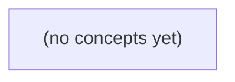

# 07.06 消息抽象：通知、队列、日志与可靠消费

*面向 Go 初学者，以已提交消息 m-9/c-a seq9 为贯穿案例，区分在线通知、后台搜索索引和离线历史补拉三条路径。通过 Redis PubSub、竞争消费者、可回放分区日志、消费组、确认点与故障场景，建立消息系统的可靠性边界，并配套 22 道分层练习与反馈。*

**章节:** 2

---

## 本书导览

- 了解整本书的章节脉络
- 掌握各章之间的概念依赖关系
- 选择最合适的阅读顺序

# 07.06 消息抽象：通知、队列、日志与可靠消费

面向 Go 初学者，以已提交消息 m-9/c-a seq9 为贯穿案例，区分在线通知、后台搜索索引和离线历史补拉三条路径。通过 Redis PubSub、竞争消费者、可回放分区日志、消费组、确认点与故障场景，建立消息系统的可靠性边界，并配套 22 道分层练习与反馈。

下方的概念图展示了本书 0 个核心概念以及它们之间的依赖关系；再下方是 1 个章节的入口。你可以按从上到下的顺序阅读，也可以根据自己的兴趣或先验知识选择切入点。

#### 概念图

## 章节索引

- **07.06 消息抽象：在线提示、后台任务与可回放日志** — 面向Go初学者，沿IM消息提交后通知、搜索索引和离线补拉需求比较队列、发布订阅与可回放日志的分发、保留和确认。

## 07.06 消息抽象：在线提示、后台任务与可回放日志

- 区分数据库消息事实与broker通知事件
- 按在线提示/后台索引/离线补拉选择消息抽象
- 解释PubSub离线不重放边界
- 解释竞争消费者任务ACK的两个崩溃窗口
- 区分业务message_id/seq与broker partition offset
- 解释组间各消费、组内分工和保留窗口
- 列出DB到broker跨系统空窗及各确认点

延续 S3 已提交 m-9/c-a seq9、S2 仍停留 accepted_in_memory 的状态，先厘清消息事实与分发机制，再为三类消费需求选择合适抽象。

### 先分清事实记录与通知事件

### 先分清事实记录与通知事件

以 S3 已提交的 `m-9/c-a seq9` 为例，首先要区分两件事：

- **事实记录**：数据库中的消息行，例如 `message(id=m-9, conversation_id=c-a, seq=9, content=..., status=committed)`。它回答“消息是否真实存在、内容是什么、属于哪个会话、顺序为何”。数据库是这类业务事实的权威来源。
- **通知事件 `E9`**：例如 `MessageCommitted(conversation_id=c-a, seq=9, message_id=m-9)`。它回答“有一个新事实可供处理”。事件通常携带足够的定位信息，而非承担唯一、永久的消息正文存储职责。

可将提交后的链路表示为：

`事务提交 m-9/c-a seq9` → `生产者产生 E9` → `中间件分发/保留 E9` → `消费者各自处理`

其中职责不可混淆：

- **生产者**负责在消息事实成功提交后发布 `E9`，避免把尚未提交、可能回滚的数据通知出去。
- **中间件**负责传递、缓冲、重试、确认与有限保留；它不定义“消息是否存在”的最终真相。
- **消费者**按用途处理事件：在线 B 收到提示后按 `c-a, seq9` 补拉；搜索索引任务读取消息事实后建立索引；离线客户端依据游标批量补拉历史。

因此，即使 `E9` 被重复投递、延迟到达，甚至已经过期，消费者仍应能回到数据库或同步接口核对 `m-9/c-a seq9`。消息队列是“事实变化的通知通道”，不是“消息权威表”；确认表示“某消费者已处理该通知”，不等于业务事实被删除或永久保存。

### 在线提示选择瞬时发布订阅

### 在线提示选择瞬时发布订阅

在线用户 B 只需要“有新消息到达”的低延迟提示，适合由提交成功后的生产者发布瞬时事件 `E9`，例如：

`message.created { conversation_id: c-a, seq: 9, message_id: m-9 }`

网关或在线会话服务订阅该事件；若 B 当前连接在某台节点上，该节点即可立即推送“会话 `c-a` 出现序号 9”。这里的发布订阅优化的是**唤醒与通知速度**，而不是保存消息事实。

因此，提示事件允许丢失：B 断网、网关重启、订阅短暂失联，都会使其收不到 `E9`。但丢失提示不能等于丢失消息。客户端应持久化或维护已确认位置，如 `last_seen_seq`，重连、进入会话或发现序号空洞时，按业务权威存储补拉：

`查询 c-a 中 seq > last_seen_seq 的已提交消息`

例如 B 已读到 `seq=8`，却因离线错过 `E9`；重新上线后请求 `seq>8`，即可从事实记录得到 `m-9`。客户端还应按 `(conversation_id, seq)` 幂等展示，避免实时推送与补拉结果重复。

瞬时发布订阅的边界应明确：

- 它通常只向**订阅当时在线**的消费者广播；
- 不要求代理为离线 B 保留事件，也不承诺之后重放；
- 不应以“某个订阅者收到事件”作为消息已送达、已读或可删除的依据；
- 不应把 PubSub 通道当作会话消息历史或消息权威表。

换言之，`E9` 是“请尽快检查 `c-a`”的信号；`m-9/c-a/seq=9` 的存在性、顺序与补拉能力仍由已提交的业务事实记录保证。

### 搜索索引选择竞争任务队列

### 搜索索引选择竞争任务队列

搜索索引更新的目标不是让每个消费者都看到事件，而是让**同一条索引任务由某个工作者完成一次有效处理**。因此，事件 `E9` 可派生出任务：

`index_message(message_id=m-9, conversation_id=c-a, seq=9)`

多个索引工作者组成同一消费组，竞争领取该任务；中间件将任务交给其中一个可用工作者。这样可横向扩容，也避免每个工作者重复写入同一索引。

典型流程是：

1. 生产者在消息事实已持久化后发布索引任务。
2. 某工作者领取任务，读取权威消息记录，而非仅信任任务载荷。
3. 工作者更新搜索索引。
4. 更新成功后发送 `ACK`，中间件才删除任务或推进其确认状态。

`ACK` 的位置决定故障语义：

- **先 ACK，后写索引**：工作者在 ACK 后崩溃，任务已被删除，索引更新可能永久遗漏。
- **先写索引，后 ACK**：工作者写入后、ACK 前崩溃，任务会重新投递，产生重复执行。
- **写入与 ACK 不存在跨系统原子事务**：通常选择“至少一次投递”，接受重复，而不能轻易接受遗漏。

因此索引写入必须幂等，例如以 `message_id` 作为文档标识，并按 `seq` 或版本号拒绝旧任务覆盖新内容。重复投递只会重复得到相同索引状态；延迟到达的旧任务也不会回退索引。

竞争任务队列适合“完成一项后台工作”，不适合在线 B 补拉或离线历史回放：它强调任务被一个成员消费并确认，而不是为每位用户保存可独立读取的消息历史。消息事实仍在教学 DB；队列只是驱动索引器追赶事实状态。

### 离线补拉选择可回放日志

### 离线补拉选择可回放日志

离线客户端的需求不是“再收到一次通知”，而是“按确定顺序找回自己错过的事实”。因此，`E9` 这类“消息 `m-9` 已提交、会话 `c-a` 的序号为 `9`”的事件，应写入具有保留窗口的可回放日志，而非只投递一次后即删除的队列。

日志按追加顺序保存记录，并为每条记录分配位点，例如：

`offset=12041 → E9(m-9, c-a, seq=9)`

保留窗口可以按时间、容量或二者共同约束。例如保留 7 天意味着：离线 B 在 7 天内恢复时，可从自己上次确认的位点继续读取；超过窗口后，旧事件可能被清理，此时必须退回消息事实库，以会话序号或时间范围执行补偿查询。

消费者组定义“谁共享一份消费进度”：

- **不同组独立消费**：在线提示组、搜索索引组、离线同步组各自维护位点。索引重建不会让 B 的补拉进度前移，B 离线也不会阻塞索引更新。
- **同一组内分工**：若离线同步服务有多个实例，同组成员分配不同分区；每条记录通常仅由其中一个成员处理，从而横向扩展吞吐。
- **位点在成功后推进**：消费者应先完成本地写入、索引更新或向客户端确认，再提交位点。若处理后尚未提交便崩溃，记录会被再次读取，因此消费者必须按 `event_id`、`m-9` 或 `(c-a, seq=9)` 实现幂等。

可回放日志保存的是分发历史，不替代消息权威表。日志用于“我漏了哪些变化、从哪里续读”；消息库仍负责回答“`m-9` 当前是否存在、正文是什么、最终状态为何”。

### 确认链路与跨系统空窗

### 确认链路与跨系统空窗

一次“消息已处理”并不是单个确认，而是一条跨系统链路：

1. 事务库提交事实：`m-9/c-a` 的状态与 `seq=9` 持久化成功；
2. 生产者向 broker 发布通知事件 `E9`；
3. broker 确认已接收并持久化该事件；
4. 消费者取得事件，完成索引更新、在线推送或归档；
5. 消费者提交自己的消费确认。

这五步分别成功，才能称某个消费方“已追上”。尤其不能把数据库提交成功等同于事件已发布，也不能把 broker 收到事件等同于搜索索引已更新。

数据库与 broker 通常不共享同一个原子事务，因此存在两个典型空窗：

- **先提交数据库，后发布失败**：`seq=9` 已是权威事实，但 `E9` 未进入 broker；在线 B 与索引消费者都不会自动得知。
- **先发布，后提交数据库失败**：消费者看到了 `E9`，却查不到对应事实，或读到尚未提交的旧状态。

因此，通知事件应携带可定位事实的键，例如 `message_id=m-9`、`conversation_id=c-a`、`seq=9`；消费者以数据库事实或可回放日志为准，并可幂等重试。常见做法是在同一数据库事务中写入业务记录和 **outbox** 待发布记录，随后可靠转发 outbox；即使重复发布，消费者仍可按稳定键去重。

三类编号不可混用：

- `message_id`：消息实体身份，如 `m-9`，用于幂等、引用和精确查询；
- `seq`：会话 `c-a` 内的业务顺序，如 `9`，用于补拉“缺少哪些事实”；
- `partition offset`：broker 分区中的投递位置，用于某消费者恢复进度，不代表业务顺序，也不能作为历史消息编号。

消费者确认的含义只是“该消费者已处理到某个 offset”。它不改变 `m-9` 的事实状态，更不能替代 B 依据 `seq` 补拉离线历史。

> **要点** — 数据库保存消息事实；通知、任务与日志分别服务在线提示、后台分工和离线回放，确认与保留决定可恢复边界。

消息分发不只是“把数据发出去”：在线提示、异步任务和离线补拉，对投递范围、确认方式与历史保留有不同要求。

### 先分清消息事实与通知事件

### 先分清消息事实与通知事件

不要把“用户收到一条消息”简化成一次 `publish()`。至少应区分三层对象：

- **业务消息事实**：数据库中可审计、可查询的持久记录，例如 `message_id`、会话、发送者、正文、创建时间、状态。它回答“这条消息是否存在、内容是什么”，是业务真相来源。
- **提交后通知事件**：业务事务成功提交后产生的派生信号，例如 `MessageCreated(message_id)`。它回答“有新事实可供处理”，可投递给在线推送、搜索索引、内容审核、未读数更新等不同逻辑组。
- **消费者处理结果**：某个消费者针对某事件得到的状态，如“已推送到连接”“索引成功”“审核失败待重试”。它属于该处理器，不应反写为“消息事实不存在”。

典型顺序是：

`写入消息事实` → `提交数据库事务` → `可靠地产生通知事件` → `消费者幂等处理`

若先发布、后写库，消费者可能取不到消息；若写库后进程崩溃，事件又可能丢失。常见补救是 **事务外盒模式**：在同一事务中同时写入业务消息和 `outbox` 记录，再由后台转发器发布事件。

同一份 `MessageCreated` 可以被两个逻辑消费者组独立处理：一个组负责竞争消费并发送在线提示，另一个组负责建立搜索索引。前者组内通常只需一台实例处理，后者也应拥有独立进度；它们不是“抢同一条业务消息”，而是分别消费同一事实的不同副作用。

### 队列：组内竞争领取一个工作项

### 队列：组内竞争领取一个工作项

队列适合“这件事只需做一次”的工作分发：例如生成缩略图、发送邮件、扣减库存、执行数据导入。多个消费者属于同一逻辑组时，每个工作项只会被其中一个消费者领取；增加消费者主要提升并行处理能力，而不是让每个消费者都收到副本。

典型流程是：

1. 生产者写入任务；
2. 某个消费者取得任务；
3. 消费者执行副作用；
4. 成功后确认（ack），系统才认为任务完成。

确认的位置决定故障语义。若消费者在“领取后、执行前”崩溃，任务应在租约超时或连接断开后重新可见，由其他消费者接手。若消费者在“执行完成、确认前”崩溃，系统无法判断副作用是否已经发生，通常会再次投递：

`领取任务 → 发送邮件 → 进程崩溃 → 未确认 → 再次领取 → 再发一封`

因此，队列常提供的是“至少一次”处理，而非天然“恰好一次”。消费者必须按重复执行来设计：使用幂等键、唯一约束、去重表或业务状态机。例如以 `order_id` 作为扣款请求标识，使重复消息只会得到同一笔已完成结果。

反过来，若系统在执行副作用之前就确认任务：

`领取任务 → 确认 → 进程崩溃 → 尚未执行`

则任务会被永久丢失。这是“至多一次”语义，延迟低但可靠性较弱。实践中通常选择“执行后确认 + 幂等处理”，并设置可见性超时、重试次数与死信队列，避免持续失败的任务无限占用消费者。

### 发布订阅：只通知当前在线订阅者

### 发布订阅：只通知当前在线订阅者

发布订阅适合“此刻谁在线，就通知谁”的实时扇出场景。发布者向主题发送一条消息，所有**当前已订阅且连接正常**的消费者都会各自收到一份；发布者不需要知道订阅者数量，也不等待某个订阅者处理完成。

典型用途包括：

- 聊天室中的在线消息推送；
- 实时仪表盘刷新；
- 缓存失效通知；
- WebSocket 网关之间的在线事件广播。

以 Redis PubSub 为例，发布到 `news` 频道的消息会被转发给当时订阅 `news` 的客户端：

`PUBLISH news "新内容已发布"`

它强调低延迟广播，而不是可靠存储。Redis 不会为频道持久化消息，也不会记录每个订阅者的消费位置或确认状态。因此其语义是**至多一次投递**：消息可能送达一次，也可能因网络中断、客户端崩溃、订阅尚未建立或服务器故障而完全丢失，但不会由 Redis 自动重试。

关键边界是：断线订阅者无法补收。若客户端在 10:00 断开、10:05 重新订阅，那么它只能接收 10:05 之后的新消息；断线期间发布的内容没有“积压队列”可供读取。

因此，不能把 PubSub 当作订单创建、支付扣款、邮件发送等关键任务的唯一通道。若业务要求离线可追、失败可重试或按历史补拉，应使用队列或可持久化日志；PubSub 更适合作为“有最好、错过也可恢复”的在线提示层。

### 追加日志：保留事件并支持按位点重读

### 追加日志：保留事件并支持按位点重读

追加日志把事件持久化为可增长的序列：生产者只追加，消费者按“位点”读取。因此它既能驱动实时处理，也能在故障、逻辑升级或新服务上线时回放历史。

- **Kafka**：主题拆为多个分区；同一分区内严格按 `offset` 有序，跨分区不保证全局顺序。消费组内，一个分区同一时刻通常只分配给一个成员；组提交 offset 表示已处理进度。数据按时间或容量保留，即使某消费组已提交也不会立刻删除，保留期内可重置 offset 重读。
- **Redis Streams**：流中记录以递增 ID 排列。消费者组维护组级读取位置；已投递但未确认的消息进入待确认列表，使用 `XACK` 确认，故障后可由其他消费者认领。通过 `MAXLEN` 或最小 ID 裁剪历史；被裁剪的数据不能回放，因此保留策略必须覆盖最长补偿窗口。
- **NATS JetStream**：消息写入 Stream，由 Consumer 保存投递状态；支持显式确认、确认超时后重投，以及从序号、时间或指定位置开始消费。保留可按时间、容量或消息数配置；还可选择“兴趣保留”或“工作队列保留”等语义，需避免把它们误当成永久日志。

“至少一次”通常意味着：消息可能在确认前重复投递，处理器应以事件 ID、业务版本号或幂等写入去重。顺序也只在单一分区、单一流序列或特定消费者视角下成立；若业务要求同一订单有序，应使用订单 ID 作为分区键或路由键。

同一事件可以由两个独立逻辑组消费：例如 `billing` 组扣费、`analytics` 组统计。它们各自维护位点和确认状态；一个组积压、重放或失败，不会让另一个组失去这份事件。

### 一份事件，两类逻辑组分别消费

### 一份事件，两类逻辑组分别消费

用户提交一条 IM 消息后，服务端可生成事件 `MessageCommitted`。同一份事件通常不应只选一种分发方式，而应按消费目标拆成多个**逻辑组**：

- **在线提示组**：向当前在线的收件人、多端设备推送“有新消息”。这类信息强调低延迟和“此刻在线”，可使用 PubSub 或长连接网关广播。用户离线、订阅暂时断开时，提示丢失通常可以接受，因为客户端随后会补拉。
- **搜索索引组**：将消息写入搜索系统、内容审核或统计流水。这是竞争消费者场景：同一个索引任务只应由一个 worker 执行，适合 queue。worker 成功后确认；失败时重试、转死信队列或人工处理。
- **离线补拉组**：客户端重连、切换设备或发现本地缺洞时，需要从可保留的消息日志读取历史。适合 append log，例如 Kafka、Redis Streams 或 NATS JetStream；消费者按自己的进度重读，而不是依赖在线广播。

可抽象为：

`MessageCommitted → 在线提示主题`  
`MessageCommitted → 索引任务队列`  
`MessageCommitted → 消息历史日志`

这里“同一份事件”不意味着所有消费者共享同一个确认进度。在线提示组关心当前订阅者；索引组关心任务是否完成；补拉组关心每个客户端或同步服务已读到哪里。

还要区分三类标识：

- **业务标识**：如 `messageId`，用于幂等写入、去重和关联消息。
- **业务序号**：如会话内 `conversationSeq`，用于客户端判断顺序、发现缺口并补拉。
- **broker 位点**：如 Kafka offset、Streams entry ID，表示某消费组在某个分区或流中的读取位置；它不是全局消息顺序，也不应直接当作业务序号。

因此，Redis PubSub 适合作为“在线提示”的加速层，但其 at-most-once 语义不承担离线可靠性；可靠历史应由可回放日志或消息存储提供。

> **要点** — 队列解决组内分工，发布订阅解决在线扇出，追加日志解决可保留、可确认与可回放的多组消费。

从一次消息提交后的在线提示出发，厘清“通知已发出”与“消息可被可靠获取”之间的边界。

### 先固化消息事实，再发布可用提示

### 先固化消息事实，再发布可用提示

设用户 G 向会话 S3 提交消息 `m-9`。正确的顺序不是“先推送给 B，再尝试落库”，而是先在数据库中原子写入可审计的消息事实，例如：

- `message_id = m-9`、会话 `S3`、发送者 G、正文或密文、服务端时间；
- 会话序号、版本号或游标位置；
- B 是否有权读取该会话的授权依据。

只有数据库提交成功后，系统才能宣称：`m-9` 已经存在，并且授权客户端未来可以按历史记录取得它。此时发布到 broker 的事件应表达为较弱的语义：**“S3 中可能有新消息可用”**，例如 `S3 / m-9 available`，而非“B 已收到 m-9”。

在线时，B 的设备若正订阅该提示，可立即收到事件，并据此携带游标向服务端拉取 `m-9`。离线时，B 没有订阅，提示可能直接丢失；这并不必然是故障，因为重连后的客户端仍可按授权从数据库补拉遗漏历史。

因此要区分两类对象：

- **数据库事实**：可查询、可补拉、可重放，是消息可靠性的基础。
- **broker 通知**：降低发现延迟的在线加速器，通常不承担长期保存责任。

发布成功最多表示 broker 接受了提示；它不证明 B 的设备已连接、已拉取、已展示，更不证明用户已读。若产品合同要求离线通知保留、跨设备逐项投递或可追踪确认，仅靠 PubSub 不够，还需持久化任务、回放日志及相应的送达状态。

### 在线订阅命中，离线订阅错过

### 在线订阅命中，离线订阅错过

设 G 已将消息 `m-9` 成功提交到 S3 DB，随后向主题 `message.available.B` 发布一条提示：

`{ conversationId, messageId: "m-9" }`

若 B 的设备此刻在线，并且已经订阅该主题，PubSub 会把提示实时推送给该订阅连接。B 收到提示后，再按自身凭证向 DB 或消息接口拉取 `m-9` 的完整内容。

但如果 B 当时离线、网络断开，或客户端尚未建立订阅，那么该次发布通常不会为它保留一份待投递副本。等 B 稍后上线并订阅时，只能收到**订阅建立之后**的新提示；此前的 `m-9 available` 不会自动补发。

这正是 PubSub 的瞬时分发语义：

- 发布成功：服务端已接受并向当时有效的订阅者分发；
- 在线命中：B 可能收到“有新消息”的提示；
- 离线错过：B 不应期待从 PubSub 找回旧提示；
- 不等于送达：发布成功不表示 B 的设备已收到、已展示，更不表示已读。

因此，提示通道只负责降低在线场景的发现延迟；消息的可靠可得性必须由 DB 历史记录承担。B 重连后，应按授权和游标查询遗漏消息，例如“拉取上次同步位置之后的消息”，而不是依赖 PubSub 回放。若产品合同要求离线消息也必须由通知系统保留、重试或回放，则仅使用 PubSub 不足，还需要持久化队列或可回放日志。

### 重连按授权从数据库补拉

### 重连按授权从数据库补拉

设消息 `m-9` 已先提交到数据库，随后才发布“`m-9 available`”在线提示。B 在线订阅时可立即收到提示并拉取正文；若 B 离线、断网或未订阅，提示会消失。但这并不必然造成消息丢失：前提是提示只承担“尽快来取”的加速作用，数据库历史才是权威事实。

重连后的正确路径应是：

1. 客户端携带已确认游标，如 `last_seq=108`、最近 `message_id`，或每个会话的同步令牌。
2. 服务端先验证 B 对该会话、租户及消息范围的当前授权，不能仅因客户端报出一个 ID 就返回数据。
3. 在授权范围内查询 `seq > 108` 的持久化消息，按稳定顺序返回；客户端持久化新游标后再确认。
4. 重复拉取必须幂等：同一 `message_id` 已落库或已展示时可去重，不能把重连重试变成重复消息。

因此，离线错过提示可接受，当且仅当存在类似：

\[
\text{可恢复}=
\text{持久化历史}
\land \text{授权查询}
\land \text{稳定游标}
\land \text{幂等处理}
\]

的链路。发布成功仅说明提示系统接受了事件，并不证明 B 的某台设备已收到、展示或已读。若业务合同要求离线通知也必须保留、可审计或最终送达，则还需持久化任务、重试与回执机制；单靠瞬时发布订阅无法提供该保证。

### 发布成功不等于送达、展示与已读

### 发布成功不等于送达、展示与已读

对消息 `m-9 available` 而言，“成功”至少有四个彼此独立的确认点，不能混为一个状态：

| 确认点 | 表示什么 | 不能推出什么 |
|---|---|---|
| Broker 发布确认 | 服务端已接受提示并完成约定的发布处理 | B 在线、B 收到提示、B 看到了消息 |
| B 设备接收确认 | 某台 B 设备已从连接、推送或订阅通道取得提示 | 客户端已成功拉取正文或展示给用户 |
| 客户端展示确认 | 客户端已将 `m-9` 渲染到会话列表或消息界面 | 用户实际注意到内容 |
| 用户已读确认 | 用户触发阅读语义，例如打开会话并使消息进入可见区域 | 用户理解、同意或处理了内容 |

因此，G 在 S3 的数据库事务提交后发布提示，收到 broker 确认，最多只能写作：

`消息已提交；在线提示发布成功。`

若 B 当时在线并订阅，可能进一步得到“设备接收”；若客户端据此按授权从数据库补拉历史，才可确认“消息已获取”或“已展示”。离线 B 没有订阅而错过提示并不必然是故障，前提是重连后能以游标、序号或时间范围可靠补拉漏掉的 `m-9`。

“已读”尤其不应由发布端推断。它通常需要 B 客户端在本地满足产品定义后，显式回传读取回执，并由服务端持久化。若业务合同要求离线通知保留、跨设备可追踪或审计“未读”，仅靠 PubSub 的发布确认远远不够；应以数据库中的可回放消息记录为事实来源，将提示通道视为加速器，而非可靠交付凭证。

### 需要离线保留时更换消息抽象

### 需要离线保留时更换消息抽象

若合同只要求“在线时尽快提醒”，`PubSub` 很合适：G在S3提交消息`m-9`后发布`available`提示；B当前在线且已订阅，便可立即触发拉取。B离线、断线重连间隙或订阅暂未建立时错过提示，并不必然是错误——前提是客户端随后能按会话、成员关系和游标，从数据库历史安全补拉。

但一旦合同变为“离线也必须收到”“失败后必须重试”“每台设备都要独立消费”，仅靠`PubSub`就不足。它通常不保存事件、不记录消费位置，也无法证明某个设备是否取得过提示。

应按语义更换抽象：

- **可回放日志**：保留有序事件及偏移量。设备记录自己的`offset`，重连后从断点回放，适合多设备同步、补偿和审计。
- **持久队列**：任务在被确认前持续存在，可配置重试、延迟和死信队列，适合“必须有某个工作者完成”的后台任务。
- **数据库历史 + 在线提示**：提示只是加速器，数据库才是事实来源。客户端以`message_id`、时间戳或游标补拉，避免把提示误当交付凭证。

还要区分消费单位：若要求“用户任一设备处理即可”，可共享消费进度；若要求“手机和电脑都应看到”，则必须为每台设备维护独立游标或投递状态。发布成功至多说明事件进入基础设施，不等于B设备已接收、展示，更不等于用户已读。

> **要点** — PubSub适合在线提示；消息事实应落DB，离线可补拉或需保留时必须依赖持久化与可回放能力。

搜索索引属于后台任务：同一任务应由组内一个工作者执行，但确认时机决定了丢失与重复的风险边界。

### 竞争消费者：组内分工而非广播

### 竞争消费者：组内分工而非广播

`SearchIndex` 组中的 W1、W2 共同订阅索引任务流，但它们不是各自复制一份任务，而是**竞争领取**任务。对于任务 E9，系统会在组内选择一个可用成员投递：

- 若 W1 先取得 E9，则 W2 不会同时处理同一份 E9；
- 若 W1 正忙或暂时不可用，E9 可以交给 W2；
- 新增 W3 的主要作用是提高并发处理能力，而不是让每条消息多执行一次。

因此，消费组表达的是“这类工作由这一组完成一次”。可将分配理解为：

$$
E9 \rightarrow \{W1, W2\}\text{ 中的一个消费者}
$$

这与广播订阅不同。假设另有 `AuditLog` 组也订阅同一任务流，则 E9 会分别进入两个组：`SearchIndex` 组负责更新搜索索引，`AuditLog` 组负责记录审计信息；但在每个组内部，仍只由一个成员处理。

需要区分“组内单次分配”和“绝不重复执行”。前者描述正常投递时的分工；若消费者在确认前崩溃，消息可能被重新投递给 W1 或 W2。NATS JetStream 中消费者的确认、超时与重投策略决定这一边界；对 E9 而言，`message_id` 与文档 `version` 等幂等键仍是避免重复索引效果的基础。

### 任务E9的确认与处理顺序

### 任务E9的确认与处理顺序

设 `SearchIndex` 工作组中有 `W1`、`W2`。任务 `E9` 被投递后，组内应只有一个工作者取得它，例如 `W1`。但“`W1` 已处理成功”和“消息系统已收到确认”不是同一件事：

1. `W1` 取得 `E9`；
2. `W1` 将文档写入搜索索引；
3. `W1` 向消费者发送 `ACK(E9)`。

若在第 1 步后立刻确认，再执行写索引：

`取到 E9 → ACK → 写索引`

一旦 `ACK` 已成功、而 `W1` 在写入前崩溃，消息系统会认为 `E9` 已完成，不再重投；索引效果因此丢失。确认成功只说明“系统不必再投递”，并不证明业务操作已经发生。

因此通常采用相反顺序：

`取到 E9 → 写入索引 → ACK`

此时若写入失败，不确认，`E9` 可在确认等待期届满后被重新投递给 `W1` 或 `W2`。但若索引已写入、`ACK` 尚未到达或尚未持久化时进程崩溃，消息仍可能重投，于是同一任务被再次执行。

所以，延后确认实现的是“至少处理一次”的倾向，而不是外部效果的“恰好一次”。索引写入必须能识别重复：以 `message_id` 记录已处理任务，或以文档 `version` 保证旧版本不能覆盖新版本。这样即使 `E9` 重投，重复写入也不会产生错误的索引状态。JetStream 的消费者确认与重投细节将在后续展开。

### 先确认的崩溃窗口：任务可能丢失

### 先确认的崩溃窗口：任务可能丢失

设 `SearchIndex` 组中有两个工作者 `W1`、`W2`，索引任务 `E9` 只会分配给其中一个成员。若 `W1` 收到消息后立刻确认，再开始写入索引，时间线可能是：

1. Broker 将 `E9` 投递给 `W1`。
2. `W1` 发送 `ACK(E9)`，Broker 将该消息视为已成功消费，不再等待重投。
3. `W1` 尚未执行索引写入，或写入前进程、容器、机器发生崩溃。
4. `W2` 不会再收到 `E9`；Broker 也不会因 `W1` 离线而重新投递。
5. 文档的索引效果从未产生，但队列状态显示任务已完成。

这是一条典型的“先确认、后处理”丢失路径：

`投递 E9 → ACK E9 → W1 崩溃 → 索引未更新`

问题不在于组内分配：组确保同一轮中 `E9` 不会同时交给 `W1` 和 `W2`。问题在于确认语义。`ACK` 表示“该消息的责任已经完成”；一旦确认持久化，Broker 通常会删除消息或推进消费位置，无法知道业务操作其实尚未发生。

因此，确认不应仅表示“我已经拿到消息”，而应尽量表示“可恢复的处理结果已经完成”。若业务操作尚未执行就确认，系统获得了较低延迟，却用任务丢失风险交换了这份便利。

### 先写后确认的崩溃窗口：任务可能重复

### 先写后确认的崩溃窗口：任务可能重复

设 `SearchIndex` 工作组有 `W1`、`W2`，任务 `E9` 要求更新文档 `D42` 的搜索索引。消息系统把 `E9` 交给 `W1` 后，会等待该消费者确认；在确认到达前，任务仍被视为“未完成”。

一次典型的崩溃路径是：

1. `W1` 收到 `E9`，执行索引写入：`D42` 的版本 `v17` 已进入索引库。
2. `W1` 尚未来得及发送确认，进程崩溃、网络断开，或确认包丢失。
3. 确认等待超时后，消费者认为 `E9` 可能没有完成。
4. `E9` 被重新投递给 `W2`，`W2` 再次执行索引更新并确认。

因此，“先写索引、后确认”避免了“先确认后崩溃导致任务完全未执行”的丢失风险，却引入了至少一次投递语义：同一任务可能被执行多次。

但**消息重复投递不等于外部效果必然重复**。若索引写入按稳定键覆盖，例如以 `document_id=D42` 写入，并比较 `message_id=E9` 或业务版本 `v17`：

- 已处理过相同 `message_id`，则直接跳过；
- 当前索引版本不低于 `v17`，则拒绝旧写入；
- 写入操作是覆盖式 `upsert`，而非“追加一条索引记录”。

此时 `W2` 虽然收到重复任务，最终索引状态仍可保持正确。确认机制只能决定消息何时可被移除；外部索引、数据库或邮件等副作用是否去重，仍取决于消费者的幂等设计。

### 幂等索引与JetStream确认边界

### 幂等索引与 JetStream 确认边界

设 `SearchIndex` 工作组包含 `W1`、`W2`，任务 `E9` 表示“将文档 `D42` 更新到版本 `17` 的索引”。组消费的目标是：一次投递只由其中一个工作者处理；但“只处理一次”和“外部索引只产生一次效果”不是同一件事。

典型失败窗口如下：

1. `W1` 收到 `E9`，先发送确认，再写入索引；若进程随后崩溃，JetStream 认为消息已完成，不再重投，索引效果丢失。
2. `W1` 先写入索引，再发送确认；若写完后崩溃，确认未到达，超过 `AckWait` 后 JetStream 重投给 `W1` 或 `W2`，索引写入可能重复。
3. 确认网络超时也可能造成同样现象：工作者不确定确认是否生效，服务端则可能继续重投。

因此，确认应位于“索引效果已持久化”之后；同时，索引操作必须按业务键幂等，而非依赖消息只到达一次。例如以：

- `message_id`：识别同一事件的重复投递；
- `document_id + version`：表达索引状态的单调版本；
- 已处理记录或索引文档中的 `indexed_version`：拒绝旧版本和重复版本。

可采用条件更新语义：仅当 `incoming_version > indexed_version` 时更新；若版本相等，则视为重复成功；若版本更旧，则忽略。这样 `E9` 被重投时，`W2` 即使再次执行，也不会把版本 `17` 的逻辑效果叠加两次，更不会用旧消息覆盖新索引。

JetStream 的显式确认消费者会在收到 `ACK` 前保留待确认状态，并在确认等待期届满后重投；负确认、超时或消费者恢复也可能引发再次投递。它提供的是可靠投递、确认追踪与消费进度管理，而不是对 Elasticsearch、数据库等外部系统的“恰好一次效果”承诺。

因此应将语义表述为：JetStream 尽力实现至少一次处理；应用通过 `message_id`、版本比较和原子条件写入，将重复投递收敛为一次业务效果。确认协议的更多参数与消费者类型将在后续讨论。

> **要点** — 竞争消费者保障组内分工；先处理后确认减少丢失，但必须靠幂等写入承受重投。

同一条聊天消息进入Kafka后，会同时拥有业务身份、会话序号和分区位点；看清三者边界，才能正确理解顺序、消费组与回放。

### 一条事件的三套坐标

### 一条事件的三套坐标

设聊天事件 `E9` 表示业务消息 `m-9`，由会话 `c-a` 产生。写入 Kafka 后，它可能落在分区 `P0` 的位点 `offset=42`，并携带会话内序号 `seq=9`。三者看似都在“编号”，回答的却不是同一个问题。

- **业务身份 `message_id=m-9`**：回答“这究竟是哪一条消息？”  
  它应在业务域内稳定且唯一，用于幂等去重、消息撤回、数据库关联、用户查询等。即使重放、复制或投递到多个下游，`m-9` 仍表示同一业务事实。

- **会话序号 `conversation_id=c-a, seq=9`**：回答“它在这段会话中排第几？”  
  若生产端稳定按 `conversation_id` 分区，则 `c-a` 的事件持续进入 `P0`，Kafka 可保持该分区内写入顺序；因此 `seq=9` 应位于 `c-a` 的 `seq=8` 之后。它服务于聊天展示、缺失检测与会话级重放。

- **Kafka 位点 `P0, offset=42`**：回答“它存在哪个分区的哪个日志位置？”  
  位点是 Kafka 日志坐标，不是全局消息编号。另一会话 `c-b` 若落在 `P1`，即使其事件位点也是 `42`，也不与 `P0@42` 冲突；更不能据此推导 `c-a` 与 `c-b` 的全局先后。

因此，`m-9` 用于认出消息，`c-a/seq=9` 用于理解会话顺序，`P0@42` 用于定位和消费日志。Kafka 官方语义保证的是**单分区内的有序追加与按位点消费**，不是跨分区全局有序。

### 按会话分区保证局部有序

### 按会话分区保证局部有序

设业务消息 `m-9` 属于会话 `c-a`，生产者以 `conversation_id` 作为分区键：

`partition = hash(conversation_id) % 分区数`

只要分区数与哈希规则稳定，`c-a` 就会持续映射到 `P0`。于是该会话的事件，例如 `c-a: seq=7`、`seq=8`、`seq=9`，都会追加到 `P0` 的单一日志末尾。Kafka 对同一分区提供追加顺序，因此消费者从 `P0` 读取时可观察到 `seq` 的先后关系；若 `m-9` 的会话序号为 `seq=9`，它可能恰好写在 `P0 offset=42`。

但三种编号不能混用：

- `m-9`：业务消息身份，用于幂等、查询或关联。
- `c-a / seq=9`：会话内业务顺序，表示它是该会话的第 9 个事件。
- `P0 / offset=42`：Kafka 日志位置，只在 `P0` 内有意义。

另一会话 `c-b` 可能映射到 `P1`。即使 `P1` 中某条记录更早到达、先被消费，Kafka 也不会给 `P0 offset=42` 与 `P1` 中的任何位点定义全局先后关系。因此，“按会话有序”不等于“所有聊天消息全局有序”。

这是一种以并行性换取局部顺序的设计：同一会话串行处理，不同会话可由不同分区并发处理。若业务需要跨会话的严格因果关系，不能仅依赖 Kafka 分区顺序，必须额外引入协调、时间戳规则或业务状态机。

### 消费组：组间各自消费，组内分工

### 消费组：组间各自消费，组内分工

事件 `E9` 写入 `P0` 的 `offset 42` 后，不是“只能被消费一次”。Kafka 以**消费组**隔离消费进度：`Search` 组与 `Notify` 组分别保存各自对分区的已提交位点，因此二者都可以读取同一条 `E9`。

- `Search` 组消费 `E9`，用于建立聊天搜索索引；
- `Notify` 组消费 `E9`，用于判断是否推送在线提示或离线通知；
- 两组互不抢消息：`Search` 已处理 `offset 42`，不会让 `Notify` 跳过它。

但在同一个组内，语义是**分工**而非广播。若 `Notify` 组有多个 worker，Kafka 会把已订阅的分区分配给组内成员；`P0` 在某一时刻只会分给其中一个 worker。因此，承接 `c-a` 事件的 `E9` 只由该 worker 处理，其他 `Notify` worker 不会各收到一份。

例如主题有 `P0`、`P1`：

| 消费组 | worker | 分配结果 |
|---|---|---|
| `Notify` | `N1` | `P0`，处理 `c-a` 的 `E9` |
| `Notify` | `N2` | `P1`，处理 `c-b` 的事件 |

若组内 worker 数多于分区数，多出的 worker 会空闲；若某个 worker 退出，Kafka 会再均衡分配分区。于是，扩容消费能力的上限首先受分区数约束，而“每个服务实例都要收到事件”则应使用不同消费组，而不是在同一组内增加 worker。

### 从E9追踪确认与位点提交

### 从E9追踪确认与位点提交

设聊天事件 E9 的业务消息编号为 `m-9`，来自客户端 `c-a` 的会话内序号为 `seq=9`。生产者按稳定的 `conversation_id` 选择分区，将它追加到 `P0`，Kafka 返回其日志位置 `offset=42`。这三个值分别回答不同问题：

- `m-9`：业务上“是哪条消息”，用于幂等、查询和关联。
- `seq=9`：会话内“第几条”，用于判断同一会话的先后。
- `P0/offset42`：Kafka 日志中“存在哪里”，用于消费者定位与恢复。

消费者组 `Search` 的某个 worker 拉取到 `P0` 的 offset 42 后，先建立搜索索引，再提交消费进度。提交的通常不是“已处理 42”，而是**下一条待读的位置**：`P0 -> 43`。因此，提交 `43` 的含义是“该组恢复时从 43 继续读取”。

典型链路是：

`生产 E9 → P0@42 → worker 拉取 → 执行业务处理 → 提交 P0=43`

关键风险在于处理与提交不是原子操作。若索引已写入、但提交前 worker 崩溃，重启后仍会从 42 再次拉取 E9，形成重复处理；若过早提交 43、随后处理失败，则可能遗漏 E9。因而业务处理应围绕 `m-9` 设计幂等性，例如以 `m-9` 作为唯一键进行 upsert 或记录去重状态。

`Notify` 组也可独立读取同一条 `P0@42`，并提交自己的位点；它的进度不会改变 `Search` 组的位置。位点是“某消费组在某分区的进度”，不是消息的全局确认状态，更不是 `m-9` 的替代身份。

### 保留窗口让新组与故障组可回放

### 保留窗口让新组与故障组可回放

Kafka 的 broker 不是“消息送达即删除”的即时发布订阅器。E9 被写入 `P0 offset42` 后，会在配置的保留窗口内继续存在；`Search` 组、`Notify` 组分别维护自己的已提交位点，因此可以独立读取同一条 E9。

| 场景 | 即时发布订阅 | Kafka 保留日志 |
|---|---|---|
| 新建 `Search` 组 | 只能收到订阅之后的新消息 | 可按 `earliest`、`latest` 或指定 offset 开始读取 |
| worker 故障后恢复 | 离线期间消息通常丢失 | 从该组已提交 offset 继续消费 |
| 业务需要重建索引 | 往往需另存历史数据 | 在保留期内重放 `P0`、`P1` 等分区日志 |

例如，`Notify` 组已提交到 `P0 offset41`，其 worker 崩溃后重启，会再次读取 offset42 的 E9；这是一种常见的“至少一次”交付来源，消费者必须能处理重复执行。组内多个 worker 仍是分摊分区：同一时刻 `P0` 只会分配给该组中的一个成员，而不是每个 worker 都重放一遍。

但回放受保留策略约束。时间保留、容量保留或日志压缩都会影响旧记录是否仍可读取；一旦 offset42 对应数据已过期，broker 无法凭消费组位点补回它。因而关键业务若要求更长追溯期，应配置足够保留窗口，或将消息同步沉淀到对象存储、数据库等长期归档系统。

> **要点** — m-9标识消息，c-a的seq9表达会话顺序，P0的offset42记录日志位置；消费组独立进度、组内按分区分工。

可回放日志能覆盖短期离线，却不能替代数据库历史。理解保留边界、确认语义与权限补拉，才能避免把“能重放”误当成“永久可读”。

### 先划清日志与消息历史的边界

### 先划清日志与消息历史的边界

消息系统中常有三类容易混淆的对象：数据库消息事实、业务游标、可回放日志事件流。它们协作，但职责不同。

- **数据库消息事实**：保存“这条消息是什么、属于哪个会话、何时创建、是否撤回、附件在哪里”等业务真相。它应支持按会话、时间、消息标识及当前权限查询，是长期历史的权威来源。
- **业务游标**：记录用户或设备“已看到哪里”，例如每个会话的最大已读消息标识、最后同步版本号。游标是业务状态，不等于日志消费进度；它决定未读数和增量补拉的起点。
- **日志事件流**：记录“发生过什么变化”，如 `message.created`、`message.revoked`、`conversation.updated`。它用于在线扇出、异步任务、短期断线追赶和故障恢复，通常受保留时长、容量与版本策略限制。

因此，客户端离线后重新连接，不能假设“从日志重放即可恢复全部历史”。例如日志仅保留 24 小时，用户 B 离线 25 小时，早期事件已被清理；此时应携带业务游标向服务端请求数据库增量，并由服务端按**当前**成员关系、封禁状态、消息可见性和撤回状态返回结果。

日志中的消费者位点、待确认记录和重放窗口，只描述某个消费者对事件流处理到哪里；它们不证明用户已读，也不构成永久消息档案。重放还可能因至少一次投递产生重复，消费者必须按事件标识或业务版本幂等处理。先确立“数据库历史为权威、日志为有限期变化通道”，后续才能正确设计补拉、确认与保留策略。

### 24小时保留无法覆盖长期离线

### 24小时保留无法覆盖长期离线

设消息日志只保留 `$24h$`，用户 B 在 `$t_0$` 收到最后一次在线消息后离线：

- `$t_0+1h$`：群内产生消息 `m1`，写入数据库，并投递到消息代理。
- `$t_0+12h$`：产生 `m2`。B 仍离线，代理中的日志可暂存这段增量。
- `$t_0+24h$`：`m1` 到达保留边界，被代理按策略清理。
- `$t_0+25h$`：B 重新上线，尝试从上次消费位置重放。

此时，B 的消费位置可能仍指向 `m1` 之前，但代理已不再保存 `m1`；它无法仅靠日志恢复完整离线消息。即使代理还能返回 `m2`，中间缺失也会造成消息断档。更常见的结果是：偏移量已过期、待确认记录被清理，或重放从一个较新的可用位置开始。

正确的补齐路径是把日志视为“短期加速层”：

1. 客户端保存已确认的业务游标，例如最后已读消息的 `message_id` 或时间序列位置。
2. 重连后先查询数据库历史：在当前会话权限下，按游标拉取 `message_id > cursor` 的消息。
3. 数据库结果才是缺口修复的权威来源；代理重放只能作为低延迟增量或缓存优化。
4. 补拉与实时订阅可能重叠，因此客户端应按消息唯一标识去重，并允许幂等处理。

`24h` 描述的是日志可回放窗口，不是“设备已读状态保存24小时”，更不是永久聊天历史承诺。B 离线 `$25h$` 后仍能看到历史，依赖的是数据库保留、当前权限校验与游标补拉，而非代理恰好还留着旧消息。

### 补拉要服从当前权限与业务游标

### 补拉要服从当前权限与业务游标

离线恢复的正确问题不是“这个分区从哪个 offset 继续消费”，而是“该用户**现在**有权看到哪些消息，以及从业务进度后的哪一条开始补”。

`partition offset` 是日志系统的物理位置，服务于消费者组、分区迁移和投递确认；它并不表达用户阅读状态。一个用户可能订阅多个会话，而这些会话分布在不同分区；同一分区也混有多个用户无权查看的消息。更重要的是，权限会变化：用户退出群组、被移出项目、消息被撤回或受合规策略限制后，即使旧 offset 之后仍有记录，也不能据此原样回放。

因此，客户端或服务端应维护业务游标，例如每个会话的 `last_seen_message_id`、`last_delivered_seq` 或“按会话递增的 `seq`”。恢复时可抽象为：

$$
\text{补拉结果}=
\text{消息历史}(\text{会话},\ seq > \text{业务游标})
\cap \text{当前访问权限}
$$

典型流程是：

1. 客户端携带会话列表及各自的 `message_id` 或 `seq`；
2. 服务端先按当前身份重新鉴权，再查询数据库中的权威历史；
3. 返回仍可见、未被删除且位于游标之后的消息；
4. 客户端按消息唯一标识去重，并在成功落地后推进业务游标。

日志重放可以作为短期加速路径：若保留窗口内存在缺口，可先从流中获取增量；但它可能重复、可能过期，也可能因保留策略而缺段。一旦发现游标跨度超过日志保留范围，或权限状态不确定，就必须回退到数据库补拉。不要把 consumer offset 当作“用户已读”，更不要把日志保留期限当作“用户永久可恢复的历史期限”。

### 重放、确认与保留配置的真实含义

### 重放、确认与保留配置的真实含义

`consumer offset`、`stream pending` 与“重放”解决的不是同一问题，不能混为“用户已经读到哪里”。

- **消费者偏移量（consumer offset）**：记录某个消费者组已推进到日志中的哪个位置，用于恢复消费进度。它通常是组级状态，不等于某台设备的已读游标；消费者崩溃、重新均衡或偏移提交时机不当，都可能造成重复投递或跳过“尚未处理但已提交”的消息。
- **待确认记录（stream pending）**：表示消息已交付给某消费者，但尚未被确认完成。它支持超时认领、故障转移和再次处理，但“待确认”不意味着消息永久保存；若底层日志已按策略裁剪，能否重新取得正文取决于具体实现。
- **重放机制**：按偏移量、时间点或消费组状态重新读取旧事件。重放通常至少具备“至少一次”语义，因此业务必须容忍重复：用消息唯一标识、幂等写入或去重表避免重复发通知、重复扣费或重复更新状态。

保留策略才决定“旧事件还在不在”。按时间保留 `24h`、按长度保留、按磁盘容量淘汰，都会限制可重放窗口；不同消息系统、不同版本对确认记录、消费者组元数据和过期消息的处理也可能不同。因而，用户离线 `25h` 后，即使消费者偏移仍指向旧位置，也未必还能从日志取得缺口。

日志中的确认只是消费基础设施的处理确认，不是用户阅读确认，更不是永久历史承诺。超过保留边界时，应回到数据库这个权威历史源，按当前权限、会话游标和分页规则补拉；日志仅用于缩短短期离线后的增量追赶。

### 把日志用于分发而非永久承诺

### 把日志用于分发而非永久承诺

日志流适合承担“事件已发生、尽快分发”的职责，而不是向客户端承诺永久可读。一个常见分工是：

- **在线提示**：用户在线时，经 WebSocket、推送或短生命周期日志快速收到“有新消息/状态变化”。提示丢失不应导致数据丢失，客户端仍可通过同步接口校正。
- **后台任务**：搜索索引、通知投递、审核、计数聚合等消费者从日志异步执行。它们需要幂等处理，因为重放、超时确认或消费者故障都可能带来重复事件。
- **离线补拉**：客户端重连后，以数据库历史为权威，携带会话游标、时间戳或消息序号补拉；服务端必须按**当前权限**过滤，而非仅因日志中存在事件就返回内容。

例如日志仅保留 $24h$，用户 B 离线 $25h$ 后，相关事件可能已被清理；即使消费者 offset、stream pending 或重放机制仍有记录，也不能据此推断消息仍可取得。此时应降级为“从 DB 按游标同步”，若游标过旧、历史被删除或权限变化，则返回明确的同步边界、空洞说明或全量分页入口。

生产设计应记录并监控这些确认点：

- 日志事件的唯一 `event_id`、业务对象版本和幂等键；
- 消费者已处理位置、确认时间、失败次数与死信去向；
- 客户端已同步游标与服务端可追溯的最早游标；
- 日志保留期、积压阈值、重放窗口及版本兼容策略；
- 权限撤销、内容删除后对历史补拉和缓存的处理结果。

因此，“确认消费”只表示某个消费者已处理某次投递；它不等于设备已读，不等于所有副本持久保存，更不等于用户拥有永久历史。日志负责加速分发，数据库与权限校验负责最终可读性。

> **要点** — 日志保留只保障有限时间内的事件重放；用户离线补拉应始终以数据库历史、当前权限和业务游标为准。

消息提交链路必须分清“事实已落库”与“通知已送达”：每个确认点只证明局部成功，不能自动覆盖下一环节。

### 先画出消息提交的确认边界

### 先画出消息提交的确认边界

一条消息从提交到“被看见”，至少跨越五类确认点；它们证明的对象不同，不能互相替代：

1. **S3：数据库提交成功**  
   消息正文、会话元数据或业务事实已持久化。此时可说“消息已接受并落库”，但尚不能说“通知已发出”或“对方已收到”。

2. **E9：发布到 broker 的确认**  
   数据库提交后，服务尝试向队列、日志或事件总线发布事件；broker 返回发布确认，才证明事件已被该中间件受理。若 S3 成功后 E9 失败，会出现“库中有消息、下游无事件”的断裂。

3. **消费者确认**  
   消费者处理事件后发送 `ack`，通常只表示“该消费者已成功处理到自己的持久化或任务边界”。它不等于用户终端已展示，更不等于用户已阅读。

4. **G：通知网关尝试**  
   推送、短信、邮件等通知服务接受请求，最多证明“已尝试投递给外部网关”。设备离线、令牌失效、系统拦截都可能使通知未达。

5. **B：应用状态与阅读状态**  
   B 端应用拉取或接收消息后可标记“已到达应用”；用户打开会话、内容进入可见区域后才可能标记“已读”。“送达”“展示”“阅读”应是独立状态。

可将链路记为：

`S3 落库 → E9 发布确认 → 消费者 ack → G 通知尝试 → B 应用到达 → B 已读`

尤其要警惕：数据库与队列/日志通常不能跨系统原子提交。S3 已成功而 E9 失败时，不能靠“换一个队列类型”消除该窗口；后续需借助 outbox、重试与可回放日志等机制补齐。当前 S2 仅表示内存中受理请求，不应包装成 S3 级确认。

### 数据库提交是消息事实的起点

### 数据库提交是消息事实的起点

设发送方提交消息 $m$，服务端为其分配业务标识 `message_id`，并在会话内分配单调递增的 `seq`。当数据库事务提交成功时，S3 确认的含义应严格限定为：

- 消息正文、发送者、目标会话、创建时间等**事实记录**已持久化；
- `message_id` 已可作为后续重试、去重、查询和审计的稳定锚点；
- `seq` 已进入该会话的已提交消息序列，读取历史时可以据此恢复顺序；
- 与该消息同一事务内的业务状态变更，已满足数据库的原子性约束。

因此，S3 可以表达为：**“这条消息已经成为系统事实。”** 即使进程随后崩溃，重新启动后仍应能从数据库查到该消息，并基于 `message_id` 判断发送重试不是一次新的业务提交。

但 S3 不证明任何事务边界之外的结果。尤其不能据此推导：

- 消息已被 broker 接收；
- broker 已持久化或已路由到消费者；
- 在线网关已向目标用户发起通知；
- 客户端已收到、应用已展示或用户已阅读。

例如，数据库提交后再执行发布 E9；若 E9 失败，则消息已经存在，但实时通知可能完全没有发生。此时“选队列”“写日志”“发布 broker”通常不能与数据库提交构成跨系统原子事务，不能把发布调用成功误写成数据库事实的一部分。

客户端若收到 S3 类确认，合适的文案是“消息已发送到服务器”或“消息已保存”，而非“对方已收到”。后续的 broker 确认、消费者确认、通知尝试、应用送达与阅读回执，必须分别建立独立状态与确认语义。

### 发布确认无法跨越数据库原子性

### 发布确认无法跨越数据库原子性

设业务事务先写入数据库，再向 broker 发布事件 `E9`：

1. 应用执行 `DB commit`：订单状态、余额变更等业务事实已成为持久事实。
2. 应用调用 broker 发布 `E9`：希望通知消费者、后台任务或可回放日志系统。
3. broker 返回发布确认：仅证明 broker 已接受该消息，不倒推数据库事务，也不保证消费者已经处理。

关键空窗位于第 1、2 步之间：若数据库提交成功后，进程崩溃、网络中断、broker 不可用或发布超时，则业务事实存在，但 `E9` 未必进入队列或日志。此时不能因为“数据库已经成功”就假定通知最终会送达。

反过来，若先发布 `E9` 再提交数据库，消费者可能先观察到事件，却查不到对应业务事实；若事务最终回滚，事件更会变成“通知了不存在的变化”。

因此，普通队列的发布确认与可回放日志的追加确认，本质上都只是各自存储系统内的局部确认：

- `DB commit`：数据库已持久化业务状态；
- `broker publish ack`：消息系统已接收消息；
- `consumer ack`：某消费者已完成其处理；
- 通知尝试成功：某次投递请求被受理或发送；
- 应用标记、阅读标记：用户侧状态已分别更新。

它们不能天然合成为“数据库与 broker 同时提交”的全局原子性。即使选择可回放日志，也只是获得重放能力；若 `E9` 根本未成功写入日志，仍无从重放。要消除这一空窗，需要将待发布事件与业务事实纳入同一数据库事务，并由后续可靠发布流程补发；这正是后续 outbox 等方案要解决的问题。

### 消费者确认与通知尝试各自证明什么

### 消费者确认与通知尝试各自证明什么

同一条消息在消费者侧会经历多个边界；它们都可能被称为“成功”，但证明的事实完全不同：

| 边界 | 确认主体 | 证明内容 | 不证明什么 |
|---|---|---|---|
| consumer ack | 消费者进程 → broker | 消费者已取得并按其策略处理该队列消息 | 用户看到了通知、业务动作一定完成 |
| G 在线通知尝试 | 服务端 → 在线连接/网关 | 服务端已调用推送接口，或网关接受了该发送请求 | 客户端收到、应用展示、用户阅读 |
| B 应用接收 | 客户端应用 → 服务端 | 应用实例已收到消息并可开始处理 | 消息已展示给用户、用户已阅读 |
| B 阅读回执 | 用户侧应用 → 服务端 | 用户已打开或标记该消息 | 业务结果已被理解或执行 |

`consumer ack` 的语义尤其容易被放大。若消费者先调用通知网关，再向 broker 确认，则 ack 至多表示“该消费者不再需要 broker 重投此任务”。网关可能随后失败，在线连接也可能已经断开。因此，不能写成：

`consumer ack = 通知送达`

在线通知通常是低延迟优化，而不是可靠事实链路。G 的一次发送尝试失败，可以降级为离线消息、未读状态或后续重试；G 成功也只能说明请求到达某个传输边界。只有客户端显式上报，才能形成“应用接收”或“已读”的独立证据。

实践中应分别记录状态，例如：`已消费`、`已尝试推送`、`应用已接收`、`已读`。不要用一个笼统的“已发送”字段覆盖这些阶段，更不要因在线推送成功而删除用户的未读记录。

### 为后续可靠发布保留接口边界

### 为后续可靠发布保留接口边界

当前 S2 的“内存受理”只表示：进程已经把待处理消息放入本地队列、缓冲区或执行器。它适合降低请求线程的等待时间，却不能被标记为 S3 的 `broker publish ack`。原因是进程重启、队列溢出、后台线程异常或发布调用失败时，内存中的消息都可能尚未到达 broker。

应明确区分以下边界：

- **DB commit**：业务事实已经持久化，例如订单状态、评论记录或通知意图。
- **S2 内存受理**：本进程准备异步发布，不证明消息可恢复、更不证明 broker 已接收。
- **S3 broker publish ack**：broker 已确认接收发布消息；这仍不等于消费者已经处理。
- **consumer ack**：消费者完成其本地处理并确认；若处理包含外部通知，还需继续区分。
- **G 通知尝试**：调用推送、邮件或短信服务的尝试。
- **B 应用/阅读边界**：客户端展示、用户实际阅读属于更晚的业务事实，不能由发布确认推导出来。

最危险的空窗是：`DB commit` 成功后，发布 E9 到 broker 失败。此时业务已变更，但通知事件可能永久缺失。单靠“换一个队列”或“改用日志”不能让数据库写入与 broker 发布自动成为同一原子操作；它们通常跨越两个独立系统。

因此，当前实现应把 S2 明确命名为“本地异步受理”，并保留可替换的发布接口。后续 07.10 将用 outbox：在同一数据库事务中保存业务事实与待发布事件，再由独立投递者可靠地补齐从数据库到 broker 的发布空窗。

> **要点** — S3、发布确认、消费确认和用户侧状态是不同边界；DB提交后发布失败需靠outbox等机制补偿，不能靠更换broker类型消除。

同一条聊天消息既要让在线用户尽快看到，也要驱动搜索索引，还要支持离线用户补拉。关键不在“发一次消息”，而在为三类需求选择正确的消息抽象与确认边界。

### 先分清：消息事实与通知事件

### 先分清：消息事实与通知事件

一条聊天消息首先是**可持久化的业务事实**，其次才可能触发“有人该去处理它”的通知。两者不能混为同一种消息。

数据库中的消息记录应承载可回放事实，例如：

- `message_id`：全局业务标识，客户端重试、索引去重、审计关联都依赖它。
- `conversation_id` 与会话内 `offset`：确定消息属于哪个会话、在会话历史中的位置。
- `sender_id`、正文、附件引用、服务端时间、撤回/编辑状态等。
- 持久化成功后，这条记录才是“消息已存在”的依据；离线补拉应查询或读取这一事实流。

在线通知则是面向当前连接的提示，例如“会话 E9 出现了 `offset=42`”。它的职责是降低在线感知延迟，而不是携带唯一真相。通知丢失时，客户端仍可凭已确认的最大 offset 补拉；通知重复时，客户端按 `conversation_id + offset` 或 `message_id` 幂等展示。

Broker 事件又不同：它是向后台消费者宣布“某项事实已经提交，可执行派生工作”。搜索服务可消费“消息 E9/42 已创建”事件建立索引；推送、审核、分析也可各自订阅。事件最好只引用稳定标识及必要元数据，消费者再按需读取消息事实，避免把短暂的在线投递结构误当作长期数据源。

可用一句话划界：

| 对象 | 回答的问题 | 可否丢失 |
|---|---|---|
| 数据库消息记录 | 消息到底是什么、是否存在 | 不可 |
| 在线通知 | 谁现在应尽快刷新 | 可丢、可重 |
| Broker 事件 | 哪些后台工作应被触发 | 可重，不应无故遗漏 |

因此，“写库成功”与“通知成功”不是同一个确认点。前者确认业务事实成立；后者只表示某条分发路径已尝试或已送达。下一步讨论确认、重投与去重时，正是围绕这些不同边界展开。

### 在线提示：发布订阅只服务此刻

### 在线提示：发布订阅只服务此刻

在线提示的目标是“此刻有人正在看，就尽快提醒他”，例如用户正在房间 `R1`，收到“有新消息”“未读数变化”“刷新最新列表”的轻量信号。此类需求适合发布订阅：发布者向频道发送 hint，当前已订阅该频道的连接立即收到；组内可按房间、用户或设备维度订阅，组外连接则不会被打扰。

但 PubSub 交付的是瞬时通知，不是可追溯事件流。订阅者在发布时离线、网络抖动、正在重连，或尚未订阅目标频道，都不会在恢复后自动拿到此前 hint。即使提示里带有 `E9 offset=42`，它也只是告诉在线客户端“可能有更新，请检查到 42”；不能据此假定客户端已经可靠消费了事件 42。

因此，在线路径应设计为：

1. 发布消息后广播轻量 hint，如 `room=R1, latest_offset=42`；
2. 在线客户端收到 hint，按本地已见 offset 拉取缺失消息；
3. 未收到 hint 的客户端，在重连、进入房间或前台恢复时，同样从持久化历史补拉；
4. 搜索索引等后台任务不依赖 PubSub，而使用可确认、可重试的任务消息。

一个常见故障是把“广播成功”误当成“所有成员已送达”。实际上，PubSub 的确认边界最多是服务端接受并向当前订阅者转发，不是用户已收到、更不是用户已展示。它适合降低在线感知延迟；历史完整性、离线补偿与处理结果确认，必须由后续可回放日志和确认机制承担。

### 后台索引：竞争消费者与 ACK 窗口

### 后台索引：竞争消费者与 ACK 窗口

搜索索引不需要让每个搜索节点都处理同一条消息；它需要的是“该任务最终被某个节点完成”。因此，索引任务应进入一个消费组：组内消费者竞争领取，组外消费者各自独立消费。

设事件 `E9(offset=42)` 表示“会话 C 新增消息”。它可同时被投递到不同逻辑流：

- 在线提示组：负责向当前在线成员推送；
- 搜索索引组：多个索引 worker 分摊任务；
- 审计或分析组：独立保留自己的处理进度。

在搜索索引组内，`worker-A` 成功领取 `E9` 后，`worker-B` 不应再次处理它；否则会造成重复写索引。跨组则恰好相反：在线提示组已经消费，不表示索引组可以跳过。**组内是分工，组间是广播。**

关键边界在 ACK。一个安全的处理顺序通常是：

1. 读取 `E9`；
2. 写入搜索索引；
3. 持久化成功后 ACK；
4. 推进该消费组的已确认位置。

这会产生两个崩溃窗口：

- **ACK 前崩溃**：索引可能已写成功，但确认尚未提交。任务会被重新投递，形成“至少一次”处理；索引写入必须能容忍重复，例如以消息 `id` 作为幂等键。
- **ACK 后崩溃**：若先 ACK、后写索引，确认已推进而实际处理未完成，重启后任务不会再出现，形成消息丢失。

因此，ACK 不是“收到消息”的确认，而是“副作用已经可恢复地完成”的确认。若索引服务在 `E9` 写入后宕机，应宁可允许重放，也不能让 offset 42 在组内被永久跳过；下一节的重投与去重，正是为这一选择补上工程约束。

### 历史补拉：可回放日志、序号与保留期

### 历史补拉：可回放日志、序号与保留期

历史补拉不是“重新发一遍消息”，而是消费者从可回放日志中的某个位置继续读取。以事件 `E9` 为例：它可能携带业务 `message_id=E9`，属于某会话的 `seq=120`，同时被写入某个 broker 分区的 `offset=42`。三者都像“编号”，却不能互换。

- `message_id`：业务全局身份，用于幂等、引用、撤回和跨系统追踪。即使重投，通常仍应指向同一业务消息。
- 会话 `seq`：会话内递增序号，用于客户端判断聊天显示顺序与“已拉到哪里”。补拉接口通常更适合接受 `after_seq`。
- 分区 `offset`：broker 对日志记录的位置标记，只在“指定主题、指定分区”内有意义。它适合消费者恢复读取，不应直接暴露为聊天业务游标。

设日志保留期为 24 小时：`E9` 在第 0 小时写入、位于 `offset=42`；第 23 小时，离线客户端或搜索消费者仍可从可用位置回放并处理 `E9`。到第 25 小时时，broker 可能已按策略删除包含 `offset=42` 的旧日志段；此时即使消费者保存着“上次读到 41”，也不能要求 broker 交付 `E9`。这不是确认丢失，而是保留窗口已过。

因此，补拉链路必须明确边界：

1. 在线提示只负责低延迟唤醒，丢失提示后仍可通过会话 `seq` 补拉。
2. 搜索等后台任务以消费组保存自己的分区读取进度；不同组互不共享确认位置。
3. 用户历史以消息库或长期归档为准，不能把仅保留 24 小时的 broker 当作永久聊天记录。
4. 当请求跨过保留期，应返回“需转历史存储查询”或“可补拉范围不足”，而不是伪造连续日志。

`offset=42` 表示“某个 broker 分区中的位置”，不表示“会话第 42 条消息”，更不等于 `E9` 的永久业务身份。下一步的确认、重投与去重，正是为了让这些不同编号在失败恢复时仍保持一致。

### 三路交付评审：确认表与故障推演

### 三路交付评审：确认表与故障推演

以事件 `E9@42` 为例，写库成功并不等于三路已交付：在线提示只求低延迟可见，搜索任务要求后台可靠执行，历史补拉依赖可回放日志。最危险的空窗是“数据库已提交、尚未投递 broker”：进程崩溃后消息永久缺失。应以事务外盒或日志表记录待投递事件，再由投递器重试。

| 路径 | 确认点 | 失败后的依据 |
|---|---|---|
| 在线组内/组外提示 | 网关接收或会话确认 | 可丢提示，客户端再补拉 |
| 搜索后台任务 | 消费者成功写入索引 | 重投，索引操作幂等 |
| 历史补拉 | 日志持久化成功 | 按 offset 重放 |

窗口也要分清：24h 内在线提示失败可重试；25h 后不应假装实时送达，而应让客户端按 `offset>42` 补拉。确认表必须记录事件、目标、状态、尝试次数与最后错误，避免“已发”只有内存含义。

**快问快答（22题）**  
1. 写库后宕机？外盒补投。  
2. broker 已收未记确认？允许重复。  
3. 搜索重复消费？幂等覆盖。  
4. 提示重复？客户端按事件号折叠。  
5. 组内与组外？分别生成投递目标。  
6. 在线提示可靠吗？否，可补拉。  
7. 补拉起点？最后确认 offset。  
8. `42` 能否跳过？不能，须连续检查。  
9. 24h 后重试？转补拉语义。  
10. 25h 仍推实时？错误。  
11. broker 短暂不可用？保留待投递。  
12. 消费者崩溃？未确认则重投。  
13. 先确认再写索引？错误。  
14. 先写索引再确认？正确。  
15. 确认表删早了？失去审计与重试。  
16. 只存状态不存错误？难排障。  
17. 单一“发送成功”？抽象混淆。  
18. 日志可删吗？超过保留期才可。  
19. offset 是业务确认吗？不是。  
20. 组外漏投？按目标表补偿。  
21. 重放会乱序？消费者按 offset 处理。  
22. 下节核心？确认、重投与去重。

> **要点** — 在线提示重即时，后台任务重分工与重试，历史补拉重可回放与保留；业务序号不能等同 broker 位点。
