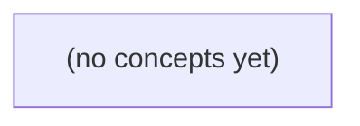

# 07.07 确认、重投与去重：Go 初学者的消息可靠性时间线

*本书承接 07.06 的 m-9、c-a、seq9 与事件 E9，通过生产者确认丢失、消费者崩溃重投、版本化幂等和跨系统空窗等故障时间线，建立对“至少一次投递”与业务效果的准确理解。全书以静态图解、伪代码、机制对照和 22 道分层练习反馈，帮助读者分清确认、去重、幂等与恢复的边界。*

**章节:** 2

---

## 本书导览

- 了解整本书的章节脉络
- 掌握各章之间的概念依赖关系
- 选择最合适的阅读顺序

# 07.07 确认、重投与去重：Go 初学者的消息可靠性时间线

本书承接 07.06 的 m-9、c-a、seq9 与事件 E9，通过生产者确认丢失、消费者崩溃重投、版本化幂等和跨系统空窗等故障时间线，建立对“至少一次投递”与业务效果的准确理解。全书以静态图解、伪代码、机制对照和 22 道分层练习反馈，帮助读者分清确认、去重、幂等与恢复的边界。

下方的概念图展示了本书 0 个核心概念以及它们之间的依赖关系；再下方是 1 个章节的入口。你可以按从上到下的顺序阅读，也可以根据自己的兴趣或先验知识选择切入点。

#### 概念图



## 章节索引

- **07.07 确认、重投与去重：一次处理为何可能做两遍** — 面向Go初学者，沿IM事件E9推导生产确认丢失、消费ACK时序、重投、幂等版本和去重保留窗口。

## 07.07 确认、重投与去重：一次处理为何可能做两遍

- 区分HTTP/DB/broker/consumer/device确认
- 推导生产ACK丢失后重试的不确定性
- 手算消费先ACK/后ACK的崩溃结果
- 区分at-least-once交付与外部恰好一次效果
- 用message_id/version/副作用作用域设计幂等键
- 解释broker去重窗与consumer去重窗到期
- 保留现有HTTP重复ID409合同

沿 E9 追踪从 S3 数据库提交到 SearchIndex、Notify 与设备 B 回执的多层确认，先澄清“收到”究竟指哪一层收到。

### E9 的身份与确认链

### E9 的身份与确认链

对 E9 而言，“一次消息”至少有五个不同身份，混淆它们就会把不同层的确认误认为同一件事：

- `m-9`：客户端生成的**消息业务标识**，表示用户意图发送的那条消息；重试时通常保持不变。
- `c-a`：会话或对话标识，限定 `m-9` 属于哪个聊天上下文。
- `seq9`：该会话中的**顺序位置**。S3 已提交 `(c-a, seq9) → m-9`，因此消息顺序已被持久化。
- `message_id`：服务端内部消息记录标识，可等于或映射到 `m-9`，但不应假定二者天然相同。
- `event_id = evt:m-9:v1`：由消息状态变化派生的事件标识；`v1` 表示该版本事件。SearchIndex、Notify 消费的是事件，不是直接消费客户端请求。

E9 的确认链可写为：

`S2 accepted_in_memory`
$\rightarrow$ HTTP 响应  
$\rightarrow$ S3 数据库提交  
$\rightarrow$ broker 持久化确认  
$\rightarrow$ SearchIndex / Notify 消费者确认  
$\rightarrow$ B 设备回执

这些节点含义不同。HTTP 响应只说明 S2 曾接受请求；数据库提交说明 `m-9` 与 `seq9` 已可靠落库；broker 存储确认说明 `evt:m-9:v1` 可供后续投递；消费者 ACK 说明某个处理者完成了自己的副作用；B 的设备回执才说明通知或消息已到达该设备。

因此，当前 S2 即使仍只是 `accepted_in_memory`，也不能仅凭一次“成功”断言 E9 已被索引、已通知或已送达。重投时应以稳定的 `m-9` 和 `evt:m-9:v1` 识别同一业务消息及同一事件版本，而不是以每次网络请求的临时标识判断。

### 生产确认丢失为何必然重投

### 生产确认丢失为何必然重投

S3 已提交 `m-9/c-a seq=9` 后，事务外盒将事件 `E9` 发布为 `event_id=evt:m-9:v1`。设 broker 的过程是：

1. 生产者发送 `Publish(E9)`；
2. broker 已将 `E9` 持久化；
3. broker 返回“已存储”确认；
4. 该确认在网络中丢失、超时，或 S3 在收到前故障。

此时事实可能是“broker 已有 E9”，但生产者本地只能观察到“未获得确认”。它无法区分以下两种状态：

- `E9` 根本没有到达 broker；
- `E9` 已落盘，只是存储确认丢失。

若不重投，第一种状态会造成已提交的数据库事实没有后续索引、通知或设备同步；若重投，第二种状态会造成 broker 看见两次发布。由于这两个状态对生产者不可判别，而漏发通常不可接受，正确策略只能是超时后重投同一逻辑事件。

因此，生产确认表示“broker 已确认保存”，不是“事件第一次被发送”，更不是 SearchIndex、Notify 或设备 B 已处理。重投时必须保持业务身份稳定：`event_id=evt:m-9:v1` 不变；每次传输可有不同的连接、请求号或投递尝试号。这样后续 broker、消费者和设备才能按 `event_id` 去重，把“可能多次投递”收敛为“一次业务效果”。

### 消费确认前后的崩溃账本

### 消费确认前后的崩溃账本

设 broker 中已有事件 `event_id=evt:m-9:v1`，SearchIndex 与 Notify 各自独立消费。这里的“确认”特指**消费者向 broker 提交 consumer ACK**，并不等于 SearchIndex 已写入索引，更不等于设备 B 已收到通知。

| 顺序与崩溃点 | SearchIndex 结果 | Notify 结果 | 重投后的后果 |
|---|---|---|---|
| 先 ACK，再执行副作用；ACK 后立刻崩溃 | 索引未更新 | 通知未发送 | broker 认为已消费，通常不重投，形成**丢失** |
| 先执行副作用，再 ACK；执行后、ACK 前崩溃 | 索引可能已更新 | 通知可能已提交给下游 | broker 未收到 ACK，重投，形成**重复** |
| 执行与 ACK 均完成后崩溃 | 已完成 | 已完成 | 不重投，正常 |
| 重投中再次崩溃 | 可反复写同一文档 | 可反复发同一通知 | 重复次数无上界，直到某次 ACK 成功 |

因此，常见可靠顺序是：

1. 以 `evt:m-9:v1` 作为去重键执行副作用；
2. 副作用成功后发送 consumer ACK；
3. 重投时发现该事件已处理，则跳过副作用并补发 ACK。

SearchIndex 通常可将文档主键设为 `m-9` 或事件版本键，重复写入是覆盖，近似幂等。Notify 则不能只靠“已调用发送接口”判断：若崩溃发生在下游已受理、自己尚未记录之间，重投仍可能二次发送。应把 `evt:m-9:v1` 传给通知服务作为幂等键；而设备 B 的回执是更后一层确认，不能替代 consumer ACK。

### 至少一次与外部恰好一次效果

### 至少一次交付与外部恰好一次效果

对 E9（`event_id=evt:m-9:v1`）而言，broker 承诺的“至少一次”通常只表示：只要生产者在 S3 的数据库提交后可靠发布，且消费者未成功确认，broker 会继续投递同一事件。它不承诺消费者的业务动作只执行一次。

典型重复窗口是：

1. SearchIndex 已将 E9 写入索引；
2. 进程在发送 consumer ACK 前崩溃；
3. broker 因未收到 ACK 重投 E9；
4. 新消费者再次执行索引、通知或设备下发。

因此，必须区分各外部效果：

- **索引**：以稳定业务键或 `event_id` 作为文档主键，重复写入覆盖同一文档，结果可观察为“恰好一次”。
- **通知**：若每次消费都调用发送接口，重投可能产生两条推送。应将 `event_id` 传为通知幂等键，或先持久化“已发送”记录再发送。
- **设备 B 回执**：设备已执行命令但回执丢失时，服务会重发；设备必须按命令标识去重，否则可能执行两遍。

`message_id` 标识某次消息载体或投递，可能因重发、桥接而变化；`event_id=evt:m-9:v1` 标识同一业务事实，才应作为跨系统去重依据。所谓“外部恰好一次效果”，不是 broker 神奇地只投一次，而是重复投递经过幂等写入、去重表或设备协议后，对用户只留下一个可见结果。

### 幂等键、去重窗口与 HTTP 合同

### 幂等键、去重窗口与 HTTP 合同

“同一条消息”不能只靠载荷相同判断。对 E9，可区分：

- `message_id=m-9`：客户端投递身份，用于识别重试是否仍是原请求。
- `event_id=evt:m-9:v1`：领域事件身份，表示消息 `m-9` 的第 1 个已提交版本。
- 副作用键：按作用域构造，如 `search:evt:m-9:v1`、`notify:evt:m-9:v1:B`。同一事件写索引、发送通知、投递给不同设备，必须是不同的去重对象。

应用层应把“登记幂等键”和“提交业务状态”放在同一数据库事务中。S3 已提交 `m-9/c-a/seq=9` 后，若客户端因超时重投 `m-9`，服务端查询到相同 `message_id`，应返回首次处理的稳定结果，而不是再次创建消息、再次生成事件或重新扣减配额。若同一 `message_id` 携带不同会改变语义的内容，例如不同会话、发送者、序号或载荷摘要，则返回 `409 冲突`：ID 已被占用，客户端不得借重试通道改写既有请求。

`409` 不等于“消息没有成功”。它表示服务端已经见过该 ID，但本次请求与已记录的合同不兼容；客户端应查询原结果或生成新的 `message_id` 后发起新业务操作。相反，完全相同的重试通常返回 `200` 或 `202`，并附原始资源状态；不能因第一次 HTTP 响应丢失就再次产生 E9。

去重窗口必须显式规定。例如保留 `message_id` 映射 24 小时、保留事件副作用键 7 天。窗口内可抑制 broker 重投和 consumer 崩溃后的重复执行；窗口到期后，系统不再承诺识别古老重试。若设备 B 的回执可能迟于窗口，设备投递记录应按业务保留更久，或使用单调版本 `v1` 与设备侧已应用版本共同防重。幂等不是永久记忆，而是在声明的时间范围和副作用范围内保证“至多生效一次”。

> **要点** — 确认是多层状态而非单一事实；重投不可避免，必须以作用域明确的幂等键和去重窗口把重复交付收敛为可控效果。

从E9的发布确认丢失出发，分析“broker已收、生产者未知”为何必然引入重投与重复风险。

### 确认链路不是一个确认

### 确认链路不是一个确认

一次“确认成功”必须先问：**是谁向谁确认，确认的事实是什么？** 同一业务动作上常叠着多层确认，它们不能互相替代：

- **HTTP 确认**：服务端已接收请求，或已将请求交给某个处理流程；不证明数据库已提交，更不证明消息已进入 broker。
- **数据库确认**：事务已提交，证明本地状态或 outbox 记录可恢复；不证明外部 broker 已持久化该消息。
- **broker 的 publish ACK**：broker 确认已接受并按其配置完成存储/复制。它证明 `evt:m-9:v1` 已到达 broker，但不证明生产者一定收到了这份确认。
- **消费者确认**：消费者确认已接收，或已完成本地处理；不天然证明副作用已原子落库，更不证明设备已执行。
- **设备确认**：设备实际收到并执行命令；这才接近业务动作完成，但其回执本身也可能丢失。

本节的故障点位于 broker 的 publish ACK **返程**：broker 已存入事件 `E9`，随后 ACK 在网络中丢失。生产者只能观察到“未确认”，无法区分“broker 未收到”与“broker 已收到但 ACK 丢失”，因此重投是合理的恢复行为，却也会制造重复写入风险。

所以，ACK 不是“消息全链路只做一次”的证明；它只是对某一跳、某一时刻、某一事实的证据。后续需要用稳定的 `event_id`、去重窗口与消费者幂等性，把这种不确定性限制在可控范围内。

### E9已入broker，生产者为何仍会重投

### E9已入broker，生产者为何仍会重投

生产者发送 `evt:m-9:v1` 时，真正需要确认的不是“请求已发出”，而是“broker 已持久化并接受该事件”。一次发布可抽象为：

1. 生产者向 broker 发送发布请求；
2. broker 将事件写入持久化日志，生成事件 `E9`；
3. broker 返回 publish ACK；
4. 生产者收到 ACK，结束本次发布。

问题出在第 3 步与第 4 步之间。假设 broker 已成功写入 `E9`，但 ACK 在网络返程中丢失、连接被重置，或生产者在收到 ACK 前超时。此时两端看到的事实不同：

- **broker**：`evt:m-9:v1` 已被接受，`E9` 已存在；
- **生产者**：没有收到成功确认，只知道“结果未知”。

对生产者而言，超时并不等价于“broker 未写入”。它同时兼容两种不可区分的历史：

- 请求根本没有到达 broker，因此应重发；
- 请求已经到达且已写入 `E9`，只是 ACK 未能返回，因此重发会造成重复。

仅凭本地超时、断线或错误码，生产者通常无法事后判定是哪一种。因此，为避免把真实的“未写入”永久丢失，可靠发布策略往往必须重投 `evt:m-9:v1`。这也意味着系统不能同时依赖“超时后必重投”和“每次重投只写一次”而不引入额外机制。

关键在于：重投的对象应携带稳定的事件标识 `event_id=m-9:v1`，而不是每次生成新标识。稳定 ID 让 broker 或下游能够把多次传输识别为同一逻辑事件；但如果没有去重，第二次发布仍可能被当作另一条物理事件写入。于是，发布 ACK 丢失天然把语义推向“至少一次投递”，重复风险需要由去重窗口、幂等写入或消费者幂等处理继续收敛。

### 四分钟与六分钟重试的分叉

### 四分钟与六分钟重试的分叉

设生产者首次发布：

`event_id = evt:m-9:v1`，消息体为“订单 m-9 已创建”。

Broker 已将其持久化为事件 `E9`，但发布确认 `ACK` 在网络返程中丢失。生产者只知道“我没有收到确认”，却无法判断是：

- Broker 根本没收到；
- Broker 收到但尚未落盘；
- Broker 已落盘，只是 `ACK` 丢了。

因此，重试是合理的自救动作，但结果取决于 Broker 的去重窗口。假设这个**玩具 Broker**按 `event_id` 去重，并只保留最近 5 分钟的已见 ID。

| 重试时刻 | Broker 看到的 `event_id` | 去重窗口状态 | 结果 |
|---|---|---|---|
| 首次发布 $t_0$ | `evt:m-9:v1` | 新 ID | 写入 `E9` |
| $t_0+4$ 分钟重试 | `evt:m-9:v1` | 仍在 5 分钟窗口内 | 识别为重复，不再写入新事件 |
| $t_0+6$ 分钟重试 | `evt:m-9:v1` | 已超出窗口 | 视为新发布，可能再写入 `E10` |

4 分钟分支中，生产者虽然重复发送，Broker 仍记得 `evt:m-9:v1`，因而可返回“已见过”或等价确认；日志里只有一次有效写入。6 分钟分支则不同：Broker 为控制状态空间而遗忘旧 ID 后，无法区分“迟到重试”和“恰好复用了同一 ID 的新请求”，于是可能接受第二份事件。

关键是：去重窗口提供的是**时间有界的重复抑制**，不是永久的“恰好一次”保证。消费者若会看到 `E9` 与 `E10`，仍应以业务幂等键 `evt:m-9:v1` 防止订单被创建两遍。

这只是教学用设定，并非 NATS 的默认窗口值。在 NATS 中，`Nats-Msg-Id` 的去重同样依赖配置窗口，且比较的是消息 ID，不比较消息体是否相同。

### 去重键、窗口与NATS边界

### 去重键、窗口与 NATS 边界

broker 的去重并不是“看两条消息内容像不像”，而是检查显式提供的去重键。本例约定键为 `event_id`：生产者无论第几次重投，都发送 `evt:m-9:v1`。若该键仍在 broker 的 5 分钟去重窗口内，broker 可识别“这是已接收过的发布”，返回确认而不再写入新的事件。

因此，4 分钟后的独立重试可能命中已有记录 `E9`；但 6 分钟后，键的记忆已过期，broker 可能把同一个 `event_id` 当作新发布，写入第二条事件。窗口只能降低短期重投造成的重复，不能证明“全局只处理一次”。

按键而非消息体去重尤其重要：

- 两条消息体完全相同、但 `event_id` 不同：通常仍是两次独立发布。
- 消息体略有变化、但重用了同一 `event_id`：可能被当作同一次发布而抑制，故键必须稳定且语义唯一。
- 不能依赖消息体哈希替代业务标识；字段顺序、时间戳、序列化方式都可能改变内容。

这里的“5 分钟”是教学用的玩具规则，不是 NATS 默认值。在 NATS JetStream 中，生产者可通过 `Nats-Msg-Id` 请求发布去重；其效果同样受流配置的去重窗口约束，且按该标识符匹配，不比较消息体。窗口外的同一 `Nats-Msg-Id` 仍可能被接受为新消息，所以消费者仍应以业务幂等键防御重复处理。

### 把重复视为下游必须处理的输入

### 把重复视为下游必须处理的输入

一旦生产者未收到发布确认，就不能判断 `evt:m-9:v1` 是否已写入；重投后，下游必须接受“同一业务变化可能到达多次”这一事实。不要把 broker 的窗口去重当作唯一防线：4 分钟内的重试或许被识别，6 分钟后的重试却可能形成第二条事件；而且去重依据是 `Nats-Msg-Id`，不是消息体是否相同。

消费者应在应用层建立幂等键，例如：

`幂等键 = message_id + version + 副作用作用域`

其中：

- `message_id` 标识逻辑消息，如 `m-9`；
- `version` 区分同一对象的不同变化，避免把 `v2` 误当成 `v1` 的重复；
- **副作用作用域**限定“在哪个动作上只执行一次”，例如 `发送欢迎邮件`、`创建账单`、`库存预留`。

处理时应将“记录幂等键已处理”与业务副作用尽量置于同一事务，或采用可恢复的状态机。若发现键已存在，不再重复扣款、发信或写入外部系统，而是返回先前结果或安全跳过。

HTTP 层既有的重复 ID 合同仍应保留：客户端以相同请求 ID 重复创建资源时返回 `409`。消息消费的幂等不是用来掩盖该合同，而是防止重投绕过 HTTP 入口后再次产生副作用。

> **要点** — publish ACK丢失不等于发布失败；重试是否重复取决于去重键、去重窗口及下游幂等设计。

搜索索引工作者W1处理事件E9时，确认与写入的先后顺序决定了系统是在崩溃后漏索引，还是接受重投并依靠幂等收敛。

### 确认不是单一动作

### 确认不是单一动作

对事件 `E9` 而言，“已经确认”必须先问：**谁向谁确认了什么**。一条从生产到搜索可见的链路，至少跨越四个独立边界：

1. **生产者 → 代理**：生产者发送 `E9`，代理持久化并回执接收成功。此时只说明消息进入代理，不说明任何工作者已处理，更不说明索引已更新。
2. **代理 → 消费者 W1**：W1 收到投递。许多系统会把该消息标为“处理中”：例如进入未确认列表（PEL），或开始 `AckWait` 倒计时。收到消息不是完成消息。
3. **消费者 W1 → 下游索引存储**：W1 对 `E9` 执行索引写入，如 `upsert(document_id, payload, version)`。存储返回成功，才表示该次写入已被索引系统接受；但查询节点何时可见，还可能受刷新、复制或异步构建影响。
4. **消费者 W1 → 代理**：W1 发送 ACK，声明“这条投递无需再重试”。代理实际记录 ACK 后，才会从待处理状态移除 `E9`。

因此，`ACK(E9)` 不是“索引已可见”的证明，只是消费者对代理的处理声明。若 W1 先 ACK、后写索引，ACK 成功后崩溃会造成漏索引；若先写入、后 ACK，W1 在 ACK 前崩溃，代理可能将 `E9` 重投给 W2。即使 W1 已发出 ACK，ACK 回包丢失时，W1 也可能不知道代理是否已收到，只能面对“不确定结果”。

可靠设计通常接受这种不确定性：让代理提供至少一次投递，让下游写入以稳定业务键执行幂等 `upsert`，并将“消息已确认”与“索引对查询可见”视为两个需要分别观测和校验的状态。

### 先确认后写入为何会漏

### 先确认后写入为何会漏

设事件 `E9` 表示“文档 D42 已更新”，工作者 W1 的处理顺序为：

1. W1 从 broker 收到 `E9`；
2. W1 向 broker 发送 `ACK(E9)`；
3. broker 接受确认，将 `E9` 从待确认集合或消息队列中移除；
4. W1 执行 `SearchIndex.upsert(D42)`；
5. 在第 4 步完成前，W1 崩溃、被杀死或磁盘故障。

关键在于：`ACK` 不是“我将要处理”，而是“此消息的投递责任已完成”。一旦 broker 已持久化或认可该确认，`E9` 就不再处于可重投状态。即使 W1 随后立刻崩溃，broker 看到的事实仍是：

- 消息已经确认；
- 没有消费者持有未确认的 `E9`；
- 不应因超时而重新投递；
- W2 也没有机会补做索引更新。

于是产生状态分裂：

| 组件 | 最终状态 |
|---|---|
| broker | `E9` 已消费、已删除或已从待确认列表移除 |
| 业务数据源 | D42 可能已经更新 |
| SearchIndex | 仍是旧版本，或根本不存在 D42 |

可将该失败窗口写为：

$$
ACK(E9)\ \text{成功} \;<\; crash(W1) \;<\; upsert(D42)\ \text{成功}
$$

此时不是“重复处理”，而是**永久漏处理**：消息不会再回来，但外部副作用尚未发生。重启 W1 也无济于事，因为它通常不知道自己在确认后、写索引前中断过。

因此，先确认后写入把“消息不再重投”的决定放在“索引已更新”的事实之前；两者无法由一次普通 ACK 原子绑定时，就必然存在漏索引窗口。

### 先写入后确认为何仍会重投

### 先写入后确认为何仍会重投

令事件 `E9` 的索引写入为幂等操作：

$$\mathrm{upsert}(\text{docId}, \text{version}, \text{content})$$

W1 先执行 `upsert(E9)`，再向 broker 发送确认。这个顺序避免了“已确认但尚未写入”的漏索引窗口，却不能证明 broker 已经知道 E9 完成了。

可将过程拆成两个彼此独立的事实：

1. **外部索引状态**：W1 已成功把 E9 写入 SearchIndex。
2. **消息确认状态**：broker 是否已持久记录 E9 的 ACK。

两者之间没有原子事务，因此会出现未知状态。

- **W1 在 upsert 成功后、发送 ACK 前崩溃**：索引已有 E9，但 broker 仍把 E9 视为未确认；超过 `AckWait` 或消费者失效后，E9 留在待确认记录（PEL）中并被投递给 W2。
- **W1 已发送 ACK，但 ACK 未送达 broker**：网络中断、连接断开或进程退出都可能使 broker 未收到确认；结果与未发送 ACK 相同，W2 仍会收到 E9。
- **broker 已处理 ACK，但 ACK 回包丢失**：W1 不知道确认是否成功，可能在恢复后重试 ACK，或其上层误以为任务失败。此时 broker 通常已不再重投，但 W1 无法仅凭“没收到回包”判断。

因此，W2 收到 E9 并不意味着 W1 没有写过它；它只意味着 broker 无法确定、或尚未记录该消息已被确认。`at-least-once` 保证的是“未确认消息会再次出现”，不是“外部索引只发生一次写入”。正确策略是允许重投，并让 `upsert` 按稳定文档键或事件版本去重，使 W1、W2 的重复执行收敛为同一索引结果。

### 重投场景下的索引幂等

### 重投场景下的索引幂等

对搜索索引而言，目标不是保证事件 `E9` 只被投递一次，而是保证 W1、W2 即使都执行了写入，最终文档仍等价于“只处理一次”。

为每个事件携带至少三类信息：

- `message_id`：消息唯一标识，用于识别同一投递的重复执行。
- `version`：业务版本号，如订单状态版本、数据库提交序号或递增变更版本。
- 副作用作用域：明确写入目标，例如 `index=product, document_id=sku_42`；去重不能只按全局消息号，而要绑定实际索引文档或业务实体。

写入应使用带条件的 `upsert`，而非无条件覆盖：

`仅当 incoming.version >= stored.version 时更新文档`

同时在文档中保存：

`{ document_id, business_version, last_message_id, ...索引字段 }`

例如 W1 已将 `E9(message_id=m9, version=17)` 写入索引，但尚未来得及 ACK 就崩溃。Broker 将 E9 重投给 W2；W2 再次 upsert 时发现当前版本已是 `17`，可安全重放相同内容，或将其判定为重复而跳过。两种策略都不应改变最终索引结果。

更关键的是处理乱序：若 W2 先收到版本 `18`，之后又重投版本 `17`，条件必须拒绝旧版本覆盖新版本。此时仅靠 `message_id` 去重不够，因为 `m9` 与版本 `18` 的消息标识不同，却作用于同一文档。

因此，`message_id` 解决“同一事件重复”，`version` 解决“不同事件乱序”，副作用作用域解决“重复判断应落在哪个索引对象上”。ACK 仍可能丢失、超时或导致重投，但只要索引写入满足这些条件，at-least-once 投递可以收敛为接近 exactly-once 的外部索引效果。

### 交付保证与去重窗口

### 交付保证与去重窗口

`at-least-once` 的含义是：事件 E9 在失败、超时、ACK 回包丢失或消费者租约到期后，**可能再次投递**；它保证“不轻易丢”，却不保证“只到一次”。W1 已完成索引 `upsert` 但未成功确认时，broker 可把 E9 重投给 W2；两次处理应被视为正常路径，而非异常特例。

| 层次 | 解决的问题 | 边界 |
|---|---|---|
| broker 去重窗口 | 抑制短时间内相同生产请求的重复入队 | 窗口过期、不同消息 ID、已投递后的重投通常仍可能发生 |
| consumer 去重窗口 | 记录已处理的事件 ID，跳过重复消费 | 状态需持久化；记录过期后旧消息仍可再现 |
| 索引幂等写入 | 对同一文档版本重复 `upsert`，结果收敛 | 需要稳定文档 ID 与版本/顺序规则 |
| 外部恰好一次效果 | 用户最终只观察到一次正确变更 | 由幂等、去重、原子边界共同构成，不是 broker 单独承诺 |

因此，broker 的去重窗不能替代消费者去重：前者主要约束“发送端重复发布”，后者面对的是“投递后不确定是否完成”的重投。消费者可用 `(事件ID, 业务版本)` 作为去重键，并让索引文档 ID 固定为业务主键；若事件版本不新于当前版本，则安全忽略。

对外 HTTP 合同也应明确：客户端以重复请求 ID 再次提交时，服务返回 `409`，表示该 ID 已被接受或正在处理，而不是再次创建新事件。`409` 只表达请求身份冲突；真正的外部恰好一次效果仍依赖持久化去重记录与可重放的幂等写入。

> **要点** — ACK只能确认某个边界；先ACK会漏，后ACK会重，可靠效果依赖可重放与幂等副作用。

以事件 E9 为线索，聚焦搜索索引与通知两类副作用，分析重复投递为何不能用单一消息编号粗暴去重。

### 先划清确认与副作用边界

### 先划清确认与副作用边界

“确认成功”必须先回答：**是谁确认了什么**。同一事件 `E9` 从 HTTP 请求到用户设备看到通知，可能经历多层确认；任一层成功，都不等于后续副作用已经完成。

- **HTTP 确认**：服务端已接收请求，或已把任务写入事务数据库；它通常只说明“请求可恢复、可继续处理”，不说明搜索索引已更新。
- **数据库确认**：业务事实已持久化，例如消息 `m-9` 的内容版本从 `v1` 改为 `v2`。这是后续副作用的可靠来源，但数据库提交本身不会自动让索引或通知同步完成。
- **消息代理确认**：生产者确认表示消息已被代理持久化；消费者确认（ack）表示消费者愿意结束这次投递。ack 不应被理解为“所有外部副作用都已被用户看见”。
- **消费者确认**：搜索消费者只有在索引条件更新已成功提交后，才应确认该消息。若索引写入成功、ack 前进程崩溃，代理会重投；因此处理必须允许再次执行。
- **设备确认**：通知平台接受推送、设备收到、系统展示、用户阅读是不同阶段。多数业务至多获得“平台已接受”或“设备已送达”的有限信号，不能把它等同于用户已确认。

对 `SearchIndex` 而言，真正需要确认的是：索引中对应文档已满足目标状态，例如 `(message_id=m-9, version=v1)` 已写入，或更高版本已存在。它不是“消息 `m-9` 已处理过”的笼统结论。若随后收到 `m-9` 的编辑事件 `v2`，索引确认应转为“`v2` 已生效”；仅凭 `m-9` 命中过往去重记录而跳过，会把合法更新误判为重复。

### 用消息号与版本构造索引幂等键

### 用消息号与版本构造索引幂等键

事件 `E9` 的消息号为 `m-9`，首次携带文档版本 `v1`，其副作用是更新搜索索引。消费者可能因超时、重试或至少一次投递而多次收到同一事件；但“是否重复”不能只看消息号，必须同时判断它代表的业务版本与副作用类型。

对搜索索引，可将逻辑幂等键理解为：

\[
K=(\text{message\_id},\ \text{version},\ \text{side\_effect})
=(m\text{-}9,\ v1,\ \text{SearchIndex})
\]

第一次处理时，索引写入 `v1` 的文档内容，并记录已成功应用的版本或处理标记。后续再次收到完全相同的 `m-9/v1`，条件更新应判定为重复：若索引中已存在该业务对象的版本 `v1`，则不再重建、覆盖或触发额外索引操作。

更稳妥的规则不是“消息号见过即跳过”，而是按业务版本做单调条件更新：

- 当入站版本 `v` 大于索引当前版本 `stored_version` 时，写入新内容并更新版本；
- 当 `v = stored_version` 时，视为同一业务状态的重投，安全跳过；
- 当 `v < stored_version` 时，视为乱序旧事件，拒绝覆盖较新的索引状态。

例如，编辑后的事件仍可能使用 `message_id=m-9`，但其内容版本变为 `v2`。此时：

\[
(m\text{-}9,\ v2,\ \text{SearchIndex})
\ne
(m\text{-}9,\ v1,\ \text{SearchIndex})
\]

`v2` 不是 `v1` 的重复投递，而是新的业务状态，必须执行索引更新。若去重表只保存“`m-9` 已处理”，消费者会把 `v2` 错误丢弃，搜索结果将永久停留在旧内容。

因此，版本不是附加元数据，而是决定“这次写入是否仍有业务价值”的状态组成部分。实践中可在索引文档中保存 `version`，并使用“仅当入站版本更高时更新”的条件写入；这样既吸收重复投递，也抵抗乱序到达。

### 编辑为 v2 时为何必须再次执行

### 编辑为 v2 时为何必须再次执行

设消息 `m-9` 的初始内容产生版本 `v1`，随后用户编辑为 `v2`。两次事件的业务含义不同：

| 到达事件 | 期望搜索索引状态 | 是否应执行 |
|---|---|---|
| `(message_id=m-9, version=v1, side_effect=SearchIndex)` | 写入 `v1` 的文本与字段 | 是 |
| `(message_id=m-9, version=v2, side_effect=SearchIndex)` | 用 `v2` 覆盖旧索引内容 | 是 |
| `v2` 的重复投递 | 索引仍为 `v2` | 否，或安全重放 |

若消费者只维护集合 `processed_message_ids={m-9}`，处理完 `v1` 后便把 `m-9` 标记为已处理。之后 `v2` 到达时，即使它携带了新的正文、关键词或可见性设置，也会被误判为重复消息而直接丢弃。结果是主库已经是 `v2`，搜索索引却永久停留在 `v1`：用户搜索到的是过期内容。

正确的去重键至少应包含副作用和版本，例如：

`dedupe_key = (SearchIndex, m-9, v2)`

更稳妥的做法是让索引写入成为条件更新：仅当待写版本高于当前已索引版本时更新。

`若 incoming_version > indexed_version，则写入；否则忽略`

这样，`v1 → v2` 会正常推进；重复的 `v2` 不会造成额外变化；即使旧的 `v1` 因网络延迟晚到，也不能把索引从 `v2` 回滚。这里去重的对象不是“这条消息是否见过”，而是“该副作用上的该版本状态是否已经生效”。

### 通知不能复用索引去重作用域

### 通知不能复用索引去重作用域

同一条消息 `m-9` 可以同时驱动搜索索引和通知，但两者不是同一个处理任务。索引的目标是把某个版本的内容写入可查询状态；通知的目标是让用户设备看到一条提醒。即使输入消息相同，副作用对象、成功判据和允许的重复程度也不同。

| 副作用 | 去重键示例 | 可见结果 | 幂等语义 |
|---|---|---|---|
| `SearchIndex` | `(message_id, version, SearchIndex)` | 搜索结果中内容为最新版本 | 重复写入同一版本应无变化；`m-9:v2` 必须覆盖或更新 `v1` |
| `Notify` | `(message_id, version, Notify, recipient)` 或业务通知键 | 用户设备出现提醒、角标或推送记录 | 可能允许有限时间内折叠、静默或确认后停止，而非永久丢弃 |

若索引消费者已经记录“`m-9` 已处理”，通知消费者再复用这条记录并跳过，就会发生“索引成功、用户未通知”的跨副作用误去重。反过来，通知已发送也不能证明索引已更新。

通知尤其不能简单等同于数据库写入：重复推送可能在多个设备上可见，造成打扰；但完全永久去重又可能吞掉重试、重新订阅或版本更新后的必要提醒。因此应建立独立的 `Notify` 去重作用域，并结合业务确认与有限窗口策略，例如“同一收件人、同一提醒类型在 10 分钟内只展示一次”。结论是：**相同消息不等于相同副作用，更不等于共享同一幂等键。**

### 重投、设备可见与有限去重窗口

### 重投、设备可见与有限去重窗口

消费者无法仅凭“收到过消息”判断副作用是否已经完成。以通知为例，存在两种典型崩溃时序：

- **先确认后执行**：消费者先提交消息确认，再调用通知服务；若确认成功后崩溃，消息不会重投，用户却可能永远收不到通知。
- **先执行后确认**：消费者先发送通知，再提交确认；若发送成功后崩溃，消息会重投，用户设备上可能看到两条通知。

因此，应优先选择“先执行后确认”，并把重复风险显式交给幂等记录和业务策略处理。去重记录至少应按副作用隔离，例如：

`(message_id=m-9, version=v2, side_effect=Notify, recipient=device-42)`

处理前以该键尝试创建记录；已存在且状态为成功时可跳过，处理中则延迟或查询结果，失败可按策略重试。通知不能与搜索索引共用去重键：`SearchIndex` 的条件更新可安全覆盖同一版本，而 `Notify` 面向设备可见结果，重复发送的业务影响不同。

去重记录不应无限保存，而应设置与重投周期、死信回放期限相匹配的保留窗口。例如平台最长可能在 7 天内重投，则记录保留至少 7 天，并为人工回放留出缓冲。窗口过短会让旧消息再次执行；窗口过长则增加存储成本，也可能阻止合理的重新通知。

对于“用户是否真的只看到一次”，还需业务确认：通知服务应返回可查询的投递标识，消费者记录该标识；设备确认、阅读回执或客户端本地去重可进一步降低可见重复，但不能替代服务端幂等。

这也应与既有 HTTP 合同一致：客户端以重复请求标识提交同一操作时，服务端返回 `409` 表示该标识已被占用或请求语义冲突；若请求内容完全一致，也可返回首次处理结果。关键是明确：重复标识保护的是一次**业务操作**，而不是永久禁止同一消息的后续版本或不同副作用。

> **要点** — 至少一次交付允许重复；以消息号、版本和副作用作用域定义幂等，才能保留有效更新并约束重复可见性。

E9首次处理成功并不等于永远不会再来：当重投跨过消费者去重窗口，临时去重记录失效，系统必须依靠持久版本与副作用约束实现收敛。

### 从E9时间线识别重复来源

### 从E9时间线识别重复来源

先把三个时间尺度放在同一条事件时间线上：生产者的 `5分钟` 重投窗口、消费者内存或缓存中的 `10分钟` 去重窗口，以及 E9 在首次成功后 `11分钟` 才发生的再次投递。

| 时间点 | 事件 | 去重状态 | 结论 |
|---|---|---|---|
| `T0` | Producer 发送 E9 | 无记录 | 消费者首次执行业务 |
| `T0+5分钟` 内 | Producer 的常规重投窗口 | 消费者记录仍有效 | 同一 E9 可被拦截或快速确认 |
| `T0+10分钟` | 消费者去重记录过期 | 记录被清理 | “已处理 E9”的临时证据消失 |
| `T0+11分钟` | 因明确配置、故障恢复或人工回放再次投递 E9 | 查不到去重记录 | 消费者会把它视为新消息 |

因此，重复并不一定来自生产者在 5 分钟内的常规重试；E9 的关键重复来源是**跨越消费者 10 分钟保留期的晚到重投**。即使 E9 在 `T0` 已成功处理，`T0+11分钟` 的副本仍可能再次扣款、再次发券或再次写入下游系统。

生产者窗口与消费者窗口不是同一个承诺：前者限制“通常多久会重试”，后者限制“消费者多久记得处理过”。只要存在故障恢复、延迟投递、死信回放或人工补偿，消息到达时间就可能超出两者。此时，去重表只能减少重复，不能证明业务只会执行一次。

### 去重记录为何挡不住第11分钟重投

### 去重记录为何挡不住第11分钟重投

设消费者的去重表只保存 `message_id` 及其处理标记，保留期为 $10$ 分钟。事件 `E9` 在 $t_0$ 首次到达时，消费者写入：

`E9 → 已处理，过期时间 t_0+10min`

随后业务逻辑成功执行，例如将订单状态推进、写入投影或触发通知。此时“成功”只说明本次投递已被处理，并不意味着消息不会因生产者重试、确认丢失、人工回放或故障恢复而再次投递。

若 `E9` 在 $t_0+11min$ 重投，消费者查询去重表时，原记录已按过期策略删除：

$$
t_0 + 11\text{min} > t_0 + 10\text{min}
$$

于是它看到的是“未处理过的 `message_id`”，重新进入业务分支。去重表并未失效；它正确地执行了“仅记忆最近十分钟”的约定。问题在于，该约定小于消息可能再次出现的时间范围。

结果取决于业务操作是否天然幂等：

- 若只是把状态设为 `已支付`，重复执行通常可收敛；
- 若执行“余额扣减 100”“库存减 1”“发送一次不可撤销通知”，则可能产生第二次副作用；
- 若按持久版本更新，例如仅接受 `version=7` 后写入 `version=8`，第 11 分钟的旧事件会因版本不匹配而被拒绝或无害化。

因此，消费者的十分钟去重只能削减短时重复，不能证明“至多一次业务效果”。`Producer` 的五分钟重试窗与消费者十分钟窗口也不是安全关系：重试、延迟投递和回放可使同一事件在更晚时间重现。要么让去重保留期覆盖最大重试与回放窗，要么把最终正确性建立在持久版本、唯一约束和可重复执行的副作用设计上。

### 生产者窗口与消费者窗口不可互相替代

### 生产者窗口与消费者窗口不可互相替代

生产者的 `5 分钟`重复抑制，解决的是**发送端在短时间内重复提交同一业务事件**：例如 Producer 因网络超时而再次调用发送接口，系统可依据请求标识拒绝或合并重复发送。它并不能约束已经进入 broker 的消息。

broker 的重投则服务于**投递可靠性**。消费者未确认、确认丢失、实例故障或策略性回放，都可能使同一条 E9 再次被投递；这次重投不一定发生在生产者窗口内，生产者甚至完全不参与。

消费者的 `10 分钟`去重表负责抑制**已投递消息的短期重复消费**，通常以 `event_id` 记录“已处理”。但它只是临时护栏：

- `0～5 分钟`：生产者可压住部分重复发送；
- `0～10 分钟`：消费者通常可识别重复投递；
- `第 11 分钟`：E9 因故障恢复、延迟确认或人工回放重投时，消费者记录已过期，重复处理重新成为可能。

因此，`5 分钟`与`10 分钟`不是可叠加的“15 分钟保障”，而是分别覆盖不同阶段、不同来源的重复。若最大重试或回放窗可超过 10 分钟，就必须让处理结果按持久版本收敛，例如仅接受更高版本的状态变更，并以唯一约束、条件更新或事务化副作用防止重复扣款、重复发券。另一种选择是把去重保留期覆盖最大重投窗，但应同时评估存储膨胀、索引成本与清理策略。

### 以持久版本让业务副作用收敛

### 以持久版本让业务副作用收敛

消费者内存表或 Redis 中的 `message_id` 只能降低短期重复率，不能定义最终正确性。E9 在首次成功后第 11 分钟重投时，消费者的 10 分钟去重记录已经消失；即使生产者只保留 5 分钟重试窗，也不能据此假定不会出现更晚的人工回放、故障恢复或跨区域补投。

因此，幂等判断应落到持久化业务状态上。为消息携带稳定的 `message_id`、目标实体标识和单调递增的 `version`，消费者在同一事务内执行条件更新：

`UPDATE order SET version = :v, status = :s WHERE id = :id AND version < :v`

只有受影响行数为 1，才说明该消息带来了新的有效状态变更；若版本已不小于 `v`，则 E9 是重复或过期消息，应确认但不再执行业务副作用。这里真正的幂等键不是单独的 `message_id`，而是“实体 + 状态版本”的持久约束。

外部副作用还需单独界定作用域。例如扣款、发券、发送通知不能仅凭订单已更新就直接调用外部系统，而应写入带唯一键的副作用记录：

`唯一键 = (effect_type, business_entity_id, version)`

同一订单版本至多生成一条“扣款”或“发券”任务；后续投递器反复扫描、重试该任务时，向外部系统携带同一个幂等键。这样，消息重投、消费者崩溃、任务重复投递都只会收敛到一次有效效果。

`message_id` 仍适合审计、追踪和短窗快速去重；持久版本负责判断状态是否前进；副作用唯一键负责约束外部效果。三者分工后，即使去重表过期，系统仍能安全确认 E9。

### 去重窗覆盖策略与成本权衡

### 去重窗覆盖策略与成本权衡

若业务能够明确最大重试与回放窗口，可将消费者去重记录的保留期设为：

\[
T_{\text{dedup}} \ge \max(T_{\text{生产者重试}},T_{\text{消息延迟}},T_{\text{人工回放}})
\]

例如 Producer 的重试窗口为 5 分钟，但运维可能在故障后 30 分钟内回放消息，则消费者的 10 分钟去重窗显然不足；应至少覆盖 30 分钟，并为时钟偏差、积压和网络抖动预留缓冲。

这种策略适合事件量可控、重复处理代价高、且回放边界能够治理的场景。代价也直接随保留期增长：若每秒处理 $r$ 条事件，每条去重记录占用 $s$ 字节，则大致存储量为：

\[
\text{存储量}\approx r\times T_{\text{dedup}}\times s
\]

保留期从 10 分钟扩展到 1 天，记录量约扩大 144 倍；还会增加索引写入、过期清理和冷热存储成本。因此，不能把“无限延长去重窗”当作幂等保证。

即使去重表命中重复 ID，HTTP 合同仍应保持：对已成功处理的重复请求返回 `409 Conflict`，并携带可识别的重复原因。这样调用方知道请求未被再次执行；而跨过去重窗的 E9，则必须由持久版本比较、唯一约束或副作用幂等键继续保证最终收敛。

> **要点** — 去重窗口只能降低短期重复；跨窗重投必须由持久版本、幂等副作用与明确保留策略共同兜底。

确认表示某一层已收到或已记录，不等于消息从系统中消失；重试与重投则会让同一业务事件再次出现。

### 确认必须按层拆开理解

### 确认必须按层拆开理解

“已确认”不是单一事实，而是不同组件对不同状态作出的承诺。若不先问清“谁确认了什么”，就很容易把一次成功响应误解为端到端完成。

- **HTTP 确认**：服务返回 `200`、`202` 等，只证明该服务在当时接受了请求或完成了某段处理。`202` 往往仅表示“已进入异步流程”；即使是 `200`，也未必代表后续消息已被消费者处理，更不代表设备已执行。
- **数据库确认**：事务提交成功，证明该数据库中的写入满足其事务语义并已持久化。它不自动证明消息已投递到代理，也不自动证明外部 `SearchIndex`、缓存或第三方接口已同步。
- **消息代理确认**：生产者收到代理确认，通常证明消息已被代理接收并按其配置持久化或复制；消费者确认则证明消费者声明“我已处理”。两者都不等于业务副作用必然只发生一次。
- **消费者确认**：Redis `XACK` 会移除消费组的待处理项引用，但不会删除 Stream 中的原始条目；Kafka 提交消费位点表示“可从此处继续读取”；JetStream 的确认会阻止当前投递继续等待。它们记录的是消费进度，而非全局业务完成。
- **设备确认**：设备回执最多证明设备收到了命令、开始执行或报告执行结果。网络断连、设备重启及回执丢失都可能使服务端无法区分“未执行”和“已执行但回执未到”。

因此应把链路写成多个状态：`请求已接收 → 数据已提交 → 消息已持久化 → 消费副作用已完成 → 设备已执行`。任一层超时都可能触发重试，而重试者通常不知道下一层是否已经成功。

### Redis：XACK只清除待确认记录

### Redis：XACK只清除待确认记录

在 Redis Stream 的消费组模型中，消息本体与“某消费者尚未确认”的状态分层保存。消费者通过 `XREADGROUP` 读取条目后，Redis 会在该消费组的待确认条目表（PEL）中记录该消息的引用、投递消费者、投递次数和最后投递时间。此时消息并没有从 Stream 中移走。

消费者处理成功后执行：

`XACK orders group-a 1710000000000-0`

其含义是：从 `group-a` 的 PEL 中移除该消息 ID 的待确认记录。它确认的是“该消费组已完成这次处理”，而不是“删除这条 Stream 数据”。原始条目仍位于 `orders` Stream 中，其他消费组仍可独立读取；即使是同一消费组，也可能通过按 ID 范围读取、检查历史记录等方式再次看到它，具体取决于读取命令与游标位置。

因此，`XACK` 不能替代保留策略。若希望控制 Stream 占用，需要显式使用：

- `XTRIM`：按最大长度或最小 ID 裁剪旧条目；
- `XADD ... MAXLEN`：写入时近似或精确限制长度；
- 基于业务归档周期定期清理。

反过来，过早裁剪也有风险：PEL 中仍未确认的消息，其原始条目可能已被删除。待确认引用或许仍可被观察到，但重新领取后未必还能取得完整载荷。故应先根据最长处理时间、故障恢复窗口和审计需求确定保留期，再选择裁剪阈值。

可将状态理解为：

`Stream 原始条目` → 被消费组投递 → `PEL 待确认引用` → `XACK` 清除引用

最后一步并不回溯删除最左侧的原始条目。确认解决的是消费组处理进度；保留与删除解决的是日志生命周期；两者必须分别设计。

### JetStream：超时未确认即重投

### JetStream：超时未确认即重投

JetStream 的确认面向“消费者是否完成处理”，而非“消息是否仍保存在流中”。消费者收到消息后，服务端会为该次投递建立待确认状态；若在 `AckWait` 时间内收到确认，待确认状态被清除。若超时仍未确认，JetStream 会认为处理结果未知，并将消息重新投递给该消费者或同一消费组中的其他成员。

可将其理解为：

$$
\text{投递} \xrightarrow{\text{等待 } AckWait}
\begin{cases}
\text{收到 Ack} &\rightarrow \text{完成该次投递}\\
\text{未收到 Ack} &\rightarrow \text{重新投递}
\end{cases}
$$

因此，“业务已经写入数据库，但确认尚未来得及发出”与“业务处理失败”在 JetStream 看来可能没有区别。典型时序是：消费者完成外部写入 $\rightarrow$ 进程崩溃或网络中断 $\rightarrow$ Ack 未到达 $\rightarrow$ `AckWait` 到期 $\rightarrow$ 同一消息再次出现。消费者必须按至少一次投递设计，将副作用处理为幂等，或以业务唯一键记录已处理事件。

`AckWait` 也不能随意设置得过短。若正常处理耗时超过它，原处理尚未结束时就可能发生重投，形成并发重复处理；设置过长则会延迟故障消息的恢复。应结合处理时延、下游超时和必要的进度确认策略确定。

发布端的 `Nats-Msg-Id` 解决的是另一类重复：发布者因超时、重试而重复发送同一条消息。JetStream 会在其去重滑动窗口内记住已见过的标识；窗口内再次发布相同标识，通常不会追加新的流消息。但窗口到期后，同一标识可再次被接受；不同标识即使业务内容相同也不会被识别为重复。

所以边界应明确：`Nats-Msg-Id` 约束“窗口内重复发布”，`AckWait` 导致的重投属于“同一已存消息的再次交付”。前者不能替代消费端幂等，后者也不能靠发布去重消除。

### Kafka位点提交不包办外部副作用

### Kafka位点提交不包办外部副作用

Kafka 的“已消费”通常指消费组提交了某个分区的位点：下次重启时，消费者会从该位点之后继续拉取。这个提交只更新 Kafka 的消费进度；向外部 `SearchIndex` 写文档、更新数据库或调用接口，属于另一套系统，二者默认没有原子性。

设消息位点为 $o$，处理步骤为：

1. 将事件写入 `SearchIndex`；
2. 提交 Kafka 位点 $o+1$。

若在第 1 步成功后、提交位点前崩溃，Kafka 仍认为 $o$ 未完成。消费者恢复后会再次取得 $o$，于是对索引执行重复写入。若索引操作按稳定业务键覆盖写入，例如 `documentId` 固定，重复通常可收敛；若每次都生成新文档或追加计数，则会产生重复副作用。

反过来，若先提交位点、再写 `SearchIndex`：

1. 提交位点 $o+1$；
2. 写入索引；

一旦提交成功后进程崩溃，恢复时会跳过 $o$，但索引从未写入，形成漏写。因而“先提交”降低重复概率，却以丢失外部副作用为代价；“先写外部系统”倾向于至少处理一次，但必须接受重放。

常见做法不是假设 Kafka 位点能覆盖外部确认，而是显式设计幂等边界：

- 以事件 ID 或业务主键作为索引文档 ID，令重复写入变为覆盖；
- 在外部存储记录已处理事件，写入与去重记录尽可能处于同一原子操作；
- 将可重建的索引视为派生数据，允许按 Kafka 数据重新回放构建；
- 只有在外部副作用已成功且可判定后，再提交对应位点。

位点提交确认的是“该消费组可以推进读取位置”，不是“所有外部世界已经恰好一次地完成了变化”。

### 用幂等键承接至少一次交付

### 用幂等键承接至少一次交付

至少一次交付意味着：消费者可能在“副作用已完成、确认尚未成功”之间崩溃，恢复后又收到同一消息。不要试图仅靠消息系统避免重复；应用层应把重复识别为正常输入。

为每个业务事件携带稳定的 `message_id`，并按副作用作用域设计幂等键：

- 创建订单：`message_id` 或业务请求号；
- 更新实体：`entity_id + version`，只接受期望版本之后的变更；
- 发送通知：`message_id + channel`；
- 写入搜索索引：`document_id + version`，旧版本不得覆盖新版本。

消费者处理时，应在与业务写入相同的事务边界内记录“已处理”状态。例如建立 `processed_messages(consumer_scope, message_id)`，其中 `(consumer_scope, message_id)` 唯一；先尝试插入，再执行副作用。唯一键冲突表示该消费者已成功处理过该事件，应直接视为成功并确认消息，而不是再次写入。

版本号适合解决乱序与重复并存的问题。索引更新可使用条件写入：仅当传入 `$version > stored_version$` 时覆盖文档。这样即使旧消息在重投后晚到，也不会回滚较新的搜索内容。

幂等范围必须明确：同一 `message_id` 对“扣款”和“发邮件”是不同副作用，不能因为扣款已去重就跳过邮件。可分别使用 `payment:message_id`、`email:message_id`。

HTTP 入口已有的重复请求合同也应保留：相同请求 ID 的重复提交返回 `409`，而非隐式再次执行。该 `409` 表示请求已被识别为重复；异步消费者则通常将重复消息当作成功处理，以便安全确认并推进消费进度。

> **要点** — 确认、保留与去重属于不同层；至少一次交付要靠业务幂等，才能获得外部恰好一次效果。

确认成功不等于事件已发布：DB提交后、发送E9前的崩溃，会留下最隐蔽的漏发布窗口。

### 提交与发布之间的断裂窗口

### 提交与发布之间的断裂窗口

设请求已通过校验，服务准备创建记录 `m-9`，并在成功后发布事件 `E9`。最直观的时序是：

1. 在数据库事务中写入 `m-9`；
2. 执行 `COMMIT`，客户端收到创建成功；
3. 进程向消息代理发送 `E9`；
4. 消费者据此刷新索引、通知订阅者或触发后续任务。

危险恰好位于第 2、3 步之间：

```text
写入 m-9 → DB COMMIT 成功 → 进程崩溃 → 尚未发送 E9
```

此时数据库中的 `m-9` 已是权威事实：重启后仍可查询，离线客户端 B 也应能从历史补拉中看到它；但消息代理中没有 `E9`，依赖实时事件的消费者可能永远不知道这次创建发生过。客户端已收到成功响应并不改变这一事实——确认的是数据库写入，不是事件投递。

不能用“多重试几次发送”解决该窗口：崩溃发生后，内存里的待发送任务已经消失；更换代理也无济于事，因为系统没有持久、权威地记录“`m-9` 已提交但 `E9` 尚待发布”。只有数据库事实存在，无法推导出发布任务仍需补做。

反过来，若发送结果未知而重投 `E9`，消费者必须按事件标识或业务键容忍重复；但重投事件不应创建第二条 `m-9`。同理，HTTP 层对同一创建标识的重复请求仍应保持 `409`：消息系统可以去重，不意味着资源创建接口应把冲突改报 `200`。

### 为何重试与换Broker无效

### 为何重试与换 Broker 无效

设业务请求已在数据库中提交记录 `m-9`，随后本应发送事件 `E9`，但进程在发送前崩溃。此时数据库只知道“`m-9` 已存在”，却不知道“`E9` 尚未发布”。若没有一份与业务提交同样权威的“待发布”记录，重启后的生产端面对的是不可判定状态：

- 若补发 `E9`，可能其实已发送成功、只是在确认前崩溃，于是造成重复投递；
- 若不补发，可能正是“提交后、发送前”崩溃，于是永久漏发；
- 仅凭内存队列、日志片段或 Broker 当前消息，均不能可靠还原崩溃瞬间的事实。

请求重试也不能修复这个缺口。HTTP 使用同一业务 ID 重试时，数据库应仍以 `409` 表示 `m-9` 已存在；不能为了“再触发一次发消息”改成 `200` 或重新创建记录。否则接口语义被破坏，且仍无法证明 `E9` 是否已经发出。

更换 Broker 同样无效：新 Broker 只会接收后来发送的消息，无法从业务数据库推导哪些已提交记录缺少事件。Broker 的去重能力至多处理“收到两次同一消息”，不能发现“从未收到的消息”。因此，`E9` 是否应补发必须有权威状态可查；该状态如何持久化与投递，由后续 outbox 设计解决。

### B离线后的历史补拉

### B离线后的历史补拉

B 离线期间，即使系统曾发送过事件 `E9`，也不能假设 B 一定收到；更不能把“稍后重投 `E9`”当作 B 恢复状态的唯一依据。若 A 已提交业务记录 `m-9`，却在发送 `E9` 前崩溃，则权威数据库中已有 `m-9`，消息通道却可能从未出现对应事件。此时 B 若只消费事件，便会永久缺失这条历史。

因此，B 恢复在线后应执行**历史补拉**：

1. 以自身已确认的同步游标、版本号或业务时间点为起点；
2. 向权威 DB 查询之后已提交的记录，例如包含 `m-9` 的变更集合；
3. 按稳定顺序应用数据，并持久化新的游标；
4. 再接入实时事件流，处理补拉边界之后的新变化。

这里的关键是：DB 中已提交的数据才是“应当存在什么”的事实来源；`E9` 只是加速通知，不是重建事实的唯一证据。重投 `E9` 可以帮助在线或短暂断线的消费者更快追上，但不能证明历史完整。

补拉还必须天然容忍重叠。B 可能先从 DB 拉到 `m-9`，随后又收到重投的 `E9`；两者都指向同一业务变更时，应按 `m-9` 的稳定标识、版本或幂等键去重，只应用一次。反过来，HTTP 对同一创建请求的重复提交仍应保持 `409`：消息消费侧的去重语义，不能倒推为接口层应把重复创建改成成功。

### 重投不应创建第二条m-9

### 重投不应创建第二条 m-9

设客户端以 `message_id=M123` 请求创建业务记录，数据库已提交 `m-9`，其业务版本为 `v=1`；随后进程在发送事件 `E9` 前崩溃。恢复后可以重投 `E9`，也可以让离线消费者 B 从权威数据库按版本补拉，但都不意味着再次创建业务记录：

- **补发通知**：读取既有的 `m-9(v=1)`，重新发送同一逻辑事件 `E9(message_id=M123, version=1)`。即使 broker 因网络确认丢失而收到两次，也只是同一事实的重复投递。
- **重复消费**：消费者收到多个 `E9` 时，应以 `message_id` 或“业务主键 + version”去重；已处理 `m-9(v=1)` 后再次收到该版本，只确认或幂等更新，不产生第二次副作用。
- **重复创建**：若 HTTP 客户端以同一 `message_id=M123` 重试创建请求，服务端发现该请求已成功落库，仍应返回 `409`，而不是因为 broker 能去重就改为 `200`。`200` 会模糊“本次请求新建成功”与“先前请求已创建”的边界。

关键不变量是：`m-9` 的身份和版本由权威 DB 决定，重试只是在传播或观察这条既有事实。broker 的去重能力最多降低重复通知，不能证明漏发已被补齐，更不能替代业务记录的唯一性约束。

### 去重边界与HTTP重复合同

### 去重边界与 HTTP 重复合同

Broker 去重、消费者幂等、HTTP 接口拒重解决的不是同一个问题，不能互相替代：

- **Broker 去重**：通常按消息键、生产者序号或窗口期压缩重复投递。它只能减少 `E9` 被 Broker 接收多次，不能证明 `m-9` 提交后一定发出过 `E9`。进程若在 DB Commit 与发送之间崩溃，Broker 根本没有可去重的消息。
- **消费者幂等**：消费者以事件 ID、业务版本号或处理记录防止副作用重复，例如重复收到 `E9` 时不再次扣款、不再次发通知。这解决的是“已投递事件被重复消费”，不解决“事件从未投递”。
- **HTTP 接口合同**：客户端再次提交相同业务 ID，表示它在重试原命令，而不是要求系统悄悄接受第二次创建。若 `m-9` 已存在，接口仍应返回 `409 Conflict`，明确告知资源或命令键冲突。

因此，不能因为 Broker 或消费者能够去重，就把同 ID 的 HTTP 重复请求改为 `200`。`200` 会模糊“本次请求成功创建”与“此前已创建”的边界，客户端也无法据此纠正重复提交行为。

对离线的 B 而言，历史补拉应以权威 DB 中的 `m-9` 为准；`E9` 即使被重投，也只是同一条 `m-9` 的发布重试，绝不生成第二条业务记录。去重机制降低重复副作用，权威记录则定义唯一事实；两者都不能填补“已提交但未发布”的窗口。

> **要点** — DB提交与事件发布不是原子操作；无待发布权威记录会漏事件，去重也不能改变HTTP的409合同。

以事件E9为主线，拆解确认丢失、重试重投与去重窗口如何共同导致“一次发送、两次处理”。

### 五层确认与责任边界

### 五层确认与责任边界

事件 `E9` 的“已确认”必须追问：**是谁确认了什么事实？** 确认不是全链路成功证明，而是某一层对局部状态的承诺。

1. **HTTP 确认**：服务端返回 `2xx`，只证明请求已被该接口接收并处理到某个边界；不必然证明数据库已提交，更不证明消息已投递或设备已执行。客户端超时后重发时，服务端可能其实已经收到第一次请求。

2. **数据库确认**：事务提交成功，只证明业务记录或待发送记录已持久化。它不能证明消息代理收到了消息；若“写库成功、发消息前崩溃”，需要后续补偿投递。

3. **消息代理确认**：代理确认发布，证明消息已进入代理承诺的存储/复制范围。它不证明消费者已经收到，更不证明消费者的业务副作用完成。

4. **消费者确认（ACK）**：消费者向代理 ACK，通常只证明该投递可不再由代理重发。若业务写库后、ACK 前崩溃，代理会重投；若先 ACK 再写库崩溃，则消息可能丢失。故应先完成可恢复的业务提交，再 ACK。

5. **设备确认**：设备返回执行结果，才接近“指令已作用于现实世界”。但设备回执丢失时，平台仍可能不知道设备是否已执行，重发可能造成重复动作。

责任边界因此应写清：生产者负责稳定事件身份与可重投；代理负责至少一次投递；消费者负责以 `event_id + version` 去重并保证副作用幂等；设备协议负责识别重复命令。任何一层的 ACK，都不能替代下一层的确认。

### 生产重试的两条不确定分支

### 生产重试的两条不确定分支

设生产者在 $t_0$ 发送事件 `E9`，随后等待写入确认。若确认在网络中丢失、超时，生产者看到的只是“**未确认**”，而不是“**未写入**”。这两个事实不能画等号。

沿 `E9` 有两条彼此独立的生产重试分支：

- $t_0+4\text{min}$：第一次重试。此时原始发送可能已被服务端持久化，只是确认未返回；也可能原始请求确实未到达。生产者无法区分，于是再次发送 `E9`。
- $t_0+6\text{min}$：第二次重试。第一次重试同样可能“写入成功但确认丢失”，也可能失败。于是又出现一次发送。

因此，最终队列中可能有 0、1、2，甚至 3 条语义相同的消息：原始发送、4 分钟重试、6 分钟重试。生产端的超时逻辑是在恢复“我是否成功”的不确定性，却可能把一次业务意图扩增为多次可消费记录。

关键推导是：

$$\text{确认丢失} \not\Rightarrow \text{写入失败}$$

也就是说，重试不是对失败的证明，而是对未知状态的补偿。若每次发送都生成新的消息标识，消费者会把它们视为不同消息；即使消息体都表示同一个 `E9`，仍可能发生多次处理。后续去重必须依据稳定的业务身份，而不能仅依据某一次投递生成的消息身份。

### 先确认与后确认的崩溃账本

### 先确认与后确认的崩溃账本

设事件 `E9` 已投递给消费者，业务副作用为“创建订单并扣减库存”。核心问题不是“是否会崩溃”，而是崩溃时 ACK 与副作用分别处于什么位置。

| 时序 | 崩溃位置 | 消息代理视角 | 业务视角 | 结果 |
|---|---|---|---|---|
| 先确认 | `ACK → 崩溃 → 副作用` | 已完成，不重投 | 尚未执行 | **丢失** |
| 先确认 | `ACK → 副作用执行中 → 崩溃` | 已完成，不重投 | 可能部分完成 | 丢失或半完成，最危险 |
| 后确认 | `副作用前 → 崩溃` | 未确认，将重投 | 未执行 | 可恢复，无重复 |
| 后确认 | `副作用完成 → 崩溃 → ACK` | 未确认，将重投 | 已执行一次 | **重复处理** |
| 后确认 | `ACK 发送中/ACK 丢失 → 崩溃` | 可能仍判定未确认 | 已执行一次 | 可能重复 |

因此，先确认倾向于“至多一次”：宁可丢，也不轻易重做；后确认倾向于“至少一次”：宁可重投，也不轻易漏做。现实生产系统通常选择后确认，因为订单、扣款、状态变更等副作用不能静默丢失。

但后确认并不自动等于安全。若 `E9` 在副作用成功后、ACK 持久生效前崩溃，6 分钟后的重投会再次触发处理。消费者必须把“是否已处理”写入可持久查询的去重记录，并用稳定身份，例如：

`去重键 = 事件ID + 消费者名称 + 业务版本`

处理顺序应是：检查去重键 → 执行业务及写入处理结果 → 记录已处理 → ACK。这样重投到来时，即使 ACK 曾丢失，也能返回“已完成”，避免第二次扣减库存。

### 身份、版本与副作用幂等键

### 身份、版本与副作用幂等键

事件 `E9` 被重投时，不能只问“是不是同一条消息”，还要问“是不是同一次业务变更、会不会再次产生外部副作用”。至少区分三类身份：

- `message_id`：消息投递身份；每次生产或重投可能不同，适合追踪链路、排查重复投递。
- `order_id`、`user_id` 等业务实体标识：说明影响谁，但不能单独判重；同一订单可以合法经历“已创建→已支付→已发货”多次变更。
- `version`：业务状态版本或事件版本；表达“对该实体的第几次变更”。通常应以 `(实体标识, version)` 判断这次变更是否已处理。

幂等记录的键必须与副作用作用域一致。例如，更新订单状态可记录：

`dedup_key = order_id + ":" + version`

并采用条件更新：仅当数据库中 `current_version < event.version` 时写入新状态。这样，即使 `E9` 在 11 分钟后重投、Redis 中 10 分钟去重记录已过期，旧版本仍无法覆盖新版本。

但“更新状态成功”不等于“所有副作用都幂等”。若事件还要发优惠券、扣库存、调用支付平台，应分别设计键：

- 优惠券：`coupon_grant:order_id`
- 库存预留：`stock_reserve:order_id:version`
- 第三方请求：传递稳定的 `Idempotency-Key`，例如 `payment:order_id:version`

不要把随机 `message_id` 直接当作外部幂等键：重投生成新消息身份时，第三方会把它视为新请求。相反，重复使用同一业务幂等键时，HTTP 合同应明确：首次成功返回 `2xx`；相同键、相同请求体可返回原结果；相同键但请求体或版本冲突，应返回 `409`，拒绝把两次不同业务操作混为一次。

因此，去重缓存只是降低重复处理频率；最终防线应是持久化的版本约束、唯一键与按副作用划分的幂等记录。

### 十分钟去重窗与十一分钟重投

### 十分钟去重窗与十一分钟重投

事件 `E9` 在 $t=0$ 首次投递。系统配置了“10 分钟去重”，但必须先问：这 10 分钟由谁执行、拦截的是哪一步？

| 去重位置 | 能拦截什么 | 不能保证什么 |
|---|---|---|
| 消息代理去重窗 | 相同消息身份在窗口内再次`发布` | 消费者已收到但未确认后的重投；窗口外的重复发布 |
| 消费者去重窗 | 相同业务事件在处理前再次到达 | 去重记录过期后的重投；不同身份包装的同一业务事件 |

若生产端在第 11 分钟因超时、确认丢失或重试策略再次发布 `E9`，代理的 10 分钟记录已失效。即使消息体完全相同，代理也可能将其视为新消息并再次投递。

更危险的是消费者侧时序：

1. 第一次收到 `E9`，完成数据库写入；
2. 在发送 ACK 前崩溃，代理不知道处理已完成；
3. 代理重投，或生产端在第 11 分钟再次发布；
4. 若消费者去重记录也只保留 10 分钟，第二次到达时查不到历史身份；
5. 业务写入再次执行，形成“两次处理”。

因此，“代理有 10 分钟去重”不等于“业务十分钟后不会重复”。代理通常按消息身份、发布路径和有限时间窗判断；消费者应按稳定的业务幂等键判断，例如 `event_id`、订单号加版本号，而不是临时投递编号。

**22题分层反馈：**若题干说明“第 11 分钟重投、代理去重窗为 10 分钟”，选择“仍可能再次投递”。若再说明“消费者幂等记录永久保存且以 `event_id` 查询”，则可再次投递但不应再次产生业务副作用；若消费者记录同样在第 10 分钟过期，则答案是“可能再次处理”。

> **要点** — 至少一次交付允许重复；外部恰好一次效果依赖跨重试窗口的身份、版本与副作用幂等设计。
