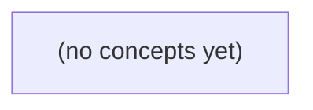

# 07.08 顺序与并发消费：Go 初学者的消息处理顺序合同

*本书以 E9、E10 与 F1 的固定纸上案例，解释 Kafka 分区日志顺序为何不等于消费者的业务完成顺序。学习者将通过八节理论与手算交错内容，掌握按会话保序、跨会话并发、位点提交、重试、批处理与再平衡下防止状态回退的方法。*

**章节:** 2

---

## 本书导览

- 了解整本书的章节脉络
- 掌握各章之间的概念依赖关系
- 选择最合适的阅读顺序

# 07.08 顺序与并发消费：Go 初学者的消息处理顺序合同

本书以 E9、E10 与 F1 的固定纸上案例，解释 Kafka 分区日志顺序为何不等于消费者的业务完成顺序。学习者将通过八节理论与手算交错内容，掌握按会话保序、跨会话并发、位点提交、重试、批处理与再平衡下防止状态回退的方法。

下方的概念图展示了本书 0 个核心概念以及它们之间的依赖关系；再下方是 1 个章节的入口。你可以按从上到下的顺序阅读，也可以根据自己的兴趣或先验知识选择切入点。

#### 概念图



## 章节索引

- **07.08 顺序与并发消费：日志有序为何结果倒退** — 面向Go初学者，沿IM同会话E9/E10分区日志，推导应用并发完成乱序、重试、位点、批量、再平衡与热点分区。

## 07.08 顺序与并发消费：日志有序为何结果倒退

- 区分业务seq、broker offset与完成顺序
- 按会话键推导分区内与跨分区顺序
- 手算100ms/10ms并发导致E10先完成
- 解释重试与副作用后到的顺序风险
- 解释Kafka提交next offset44会跳过pending E9
- 分析批量部分成功与重投重复
- 设计再平衡旧worker的版本防回退

同一分区中的日志先后写入，并不等于应用中的处理、落库与用户可见结果仍按同样顺序发生。

### 先分清四类编号与一次投递

### 先分清四类编号与一次投递

先固定三条记录：`c-a` 的 `m-9 / seq=9 / E9` 写入 `P0 offset=42`，随后 `m-10 / seq=10 / E10` 写入 `P0 offset=43`；`c-b` 的 `m-b1 / seq=1 / F1` 写入 `P1 offset=7`。它们看似都有“编号”，但回答的不是同一个问题。

- **消息身份**：`m-9`、`m-10`、`m-b1` 用于回答“这是哪一条业务消息”。身份应跨重试、转发、落库保持稳定，常用于幂等去重；它不是先后顺序。
- **业务 `seq`**：`c-a` 的 `9 → 10` 表示该业务流声明的逻辑顺序；`c-b` 的 `1` 只在 `c-b` 自己的序列中有意义。不能据此比较 `E10` 与 `F1` 谁更早。
- **Kafka `offset`**：`P0` 内 `42 → 43` 表示日志追加顺序，因而可知 E9 先于 E10 被写入该分区。`P0 offset=43` 与 `P1 offset=7` 属于不同坐标系，不能直接比较大小。
- **投递次数**：同一条 `m-10` 因超时、重平衡或失败重试，可能被投递第 `1` 次、第 `2` 次。投递次数描述“这次消费尝试”，不是新消息，也不是业务序号。

因此，“E10 是 `P0` 的后续日志”只保证读取位置上的先后；若 E9 与 E10 被并发处理，E10 的数据库提交、外部调用完成或用户可见时间，仍可能先于 E9。

### 分区顺序的边界

### 分区顺序的边界

先把“顺序”限定在 Kafka 真正能够承诺的范围内：**同一主题、同一分区、同一日志位置序列**。

若生产者按会话键分区，例如以 `conversationId` 作为键，则分区可抽象为：

$$
p = \operatorname{hash}(\text{会话键}) \bmod N
$$

`c-a` 的消息 `m-9`、`m-10` 使用相同会话键，都会映射到 `P0`。因此日志中存在明确的先后关系：

- `m-9`：身份为 `c-a`，业务序号 `seq=9`，事件 `E9`，位于 `P0 offset=42`
- `m-10`：身份为 `c-a`，业务序号 `seq=10`，事件 `E10`，位于 `P0 offset=43`

这里可推导：

$$
E9 \prec_{P0} E10
$$

即 `P0` 的日志记录保证 `offset 42` 在 `offset 43` 之前；对同一分区按位置读取时，消费者先取得 `E9`，再取得 `E10`。

但 `c-b` 的 `m-b1` 属于另一会话键，映射到 `P1`，其记录为 `seq=1`、事件 `F1`、`offset=7`。`P1 offset=7` 与 `P0 offset=42` 不是同一条位置轴上的坐标：`7<42` 不表示 `F1` 早于 `E9`，`7>42` 也不表示更晚。它们仅分别表示各自分区内的日志位置。

因此，Kafka 提供的是分区偏序，而非跨分区全序：

$$
E9 \prec E10,\qquad F1\ \text{与}\ E9/E10\ \text{不可由 offset 比较}
$$

还要避免混淆四类量：消息身份用于定位业务对象；`seq` 表示业务协议中的会话顺序；`offset` 表示分区日志位置；投递次数表示同一记录被交付或重试的次数。它们都不能自动构成跨分区的全局事件时间线。

### 并发处理为何让E10先完成

### 并发处理为何让 E10 先完成

仍看 `c-a` 的同一分区 `P0`：`m-9` 的 `seq=9`、事件 `E9` 位于 `offset=42`；`m-10` 的 `seq=10`、事件 `E10` 位于 `offset=43`。Kafka 日志保证的是：

`offset 42 → offset 43`

也就是消费者从 `P0` 读取记录时，先得到 `E9`，再得到 `E10`。但若应用把读取到的记录提交给并发工作线程，后续时间线可能是：

| 时刻 | 消费线程 | 工作线程 A | 工作线程 B |
|---|---|---|---|
| `t=0ms` | 读取 `E9@42`，投递第 1 次 | 开始处理 `E9`，预计耗时 `100ms` | 空闲 |
| `t=1ms` | 读取 `E10@43`，投递第 1 次 | 持续处理 `E9` | 开始处理 `E10`，预计耗时 `10ms` |
| `t=11ms` | — | 持续处理 `E9` | `E10` 落库、发出结果 |
| `t=100ms` | — | `E9` 落库、发出结果 | 空闲 |

因此，三个顺序必须分开看：

- **读取顺序**：`E9` 先于 `E10`，由 `P0` 的 `offset` 保证。
- **开始顺序**：这里也恰好是 `E9` 先开始；但调度、线程池排队或批量处理甚至可能改变它。
- **完成顺序**：`E10` 在 `11ms` 完成，反而早于 `E9` 的 `100ms`。

`seq=9/10` 描述业务事件的先后，`offset=42/43` 描述分区日志位置，`m-9/m-10` 是消息身份；“第几次投递”则记录重试历史。它们都不能自动约束两个并发任务的完成时刻。若下游按“谁先完成谁覆盖”更新同一业务状态，较新的 `E10` 即使先写入，也可能随后被较慢的 `E9` 覆盖，形成用户看到的结果倒退。

### 完成乱序如何演变为结果倒退

### 完成乱序如何演变为结果倒退

P0 中的日志顺序仍然是确定的：`m-9 / seq=9 / E9 / offset=42` 在前，`m-10 / seq=10 / E10 / offset=43` 在后。问题出现在消费端把“已拉到消息”变成“已完成业务副作用”的过程中。

例如，应用并发处理两条记录：

1. 工作线程 A 开始处理 E9，但在调用下游服务或写数据库前超时、阻塞，尚未完成。
2. 工作线程 B 随后处理 E10，先成功写入状态：`订单状态 = 已取消，seq = 10`，或先向用户发送“已取消”通知。
3. A 的失败被框架重试；重试不是新业务事件，身份仍是 `m-9`，只是投递次数增加。
4. A 最终成功，却在下游执行无条件更新：`订单状态 = 已支付`，或再次发送“已支付”通知。

于是，用户和数据库看到的结果从 E10 的新状态回退为 E9 的旧状态。这里倒退的不是 Kafka 的 P0 日志：`offset=42` 从未跑到 `offset=43` 后面；倒退的是并发任务的**完成时间**以及下游副作用的**写入顺序**。

尤其要区分四个维度：

- `m-9`、`m-10`：消息身份，用于识别是否同一条业务消息；
- `seq=9`、`seq=10`：同一实体 `c-a` 的业务版本顺序；
- `offset=42`、`offset=43`：P0 内的日志位置，只保证分区追加顺序；
- 投递次数：消费失败后的处理尝试次数，不代表产生了新事件。

若下游只执行“最后完成者覆盖”，它实际采用的是完成时间，而不是业务序号。应将状态更新设计为单调推进，例如仅当 `incoming_seq > stored_seq` 时更新；对于 `incoming_seq <= stored_seq` 的 E9 重试，记录为过期或幂等命中，不再覆盖 E10 已建立的结果。

### 用顺序屏障守住会话结果

### 用顺序屏障守住会话结果

`P0` 中 `m-9(seq=9, offset=42, E9)` 先于 `m-10(seq=10, offset=43, E10)` 出现，只说明 Kafka 日志顺序成立；若两个消息被并发处理，E10 可能先完成、先落库或先通知用户。要守住 `c-a` 的可见结果顺序，必须在消费端设置顺序屏障。

| 策略 | 串行范围 | 优点 | 代价与风险 |
|---|---|---|---|
| 按分区串行 | 同一 `P0` 的全部消息 | 最接近 offset 顺序，提交位点简单 | `c-a` 的慢任务会阻塞同分区其他会话；`P1` 的 `c-b/F1` 不受影响 |
| 按会话键串行 | 同一 `c-a` 的消息 | E9、E10 必然按序处理，不同会话可并发 | 要求同一会话稳定路由；应用需维护键级队列或执行器 |
| 并发执行后按 seq 提交 | 执行可乱序，结果按 `seq` 放行 | 吞吐高，慢任务不必占住工作线程 | 必须缓存 E10 的已完成结果，等待 E9；需处理缺号、超时、重复与重放 |

按分区串行适合业务本就以分区为顺序边界的场景；按会话键串行通常更符合“一个用户会话内有序、会话之间并发”的目标。第三种策略则把“处理完成”与“对外提交”分开：E10 可以先计算，但不能越过尚未确认的 E9 写入最终状态或发送不可撤回通知。

这里的 `seq` 是业务会话序号，`offset` 是分区日志位置，`m-10` 是消息身份，投递次数则描述同一消息被再次消费的次数；四者都不能互相替代。后续讨论提交位点、批量拉取与再平衡时，均以前提为准：位点提交只能表示已安全处理的日志范围，不能自动证明会话结果已经按 `seq` 对外可见。

> **要点** — Kafka保证分区日志追加有序；要避免结果倒退，应用还必须约束同会话的完成与副作用提交顺序。

先把“谁先写入、谁先被读到、谁先处理完成”分开，才能准确判断日志顺序与业务结果为何不一致。

### 三种顺序不能混为一谈

### 三种顺序不能混为一谈

要解释“日志明明有序，结果却倒退”，首先要区分三套彼此独立的顺序：

- **业务序号**：例如会话 `c-a` 中事件携带的 `seq=9`、`seq=10`，通常由业务服务、数据库事务或领域模型生成。它表达的是“业务上应当排第几”，并不自动等于消息写入 Kafka 的先后。若跨库发布、异步投递或生产者重试发生，`seq=10` 也可能先到 broker。

- **Kafka 位点（offset）**：位点由 broker 在消息追加到某个分区时分配。对同一分区而言，`offset` 严格递增；消费者从 `P0` 读取到 `E9` 再读取 `E10`，只说明它们在 `P0` 的追加与读取顺序为 `E9→E10`。位点没有跨分区可比性：`P0` 的 `offset=100` 不代表一定早于 `P1` 的 `offset=3`。

- **应用完成顺序**：消息被读取后，可能进入线程池、异步调用、数据库写入或外部接口。即使单个消费者按 `E9→E10` 拉取，`E9` 较慢、`E10` 较快时，最终完成可能是 `E10→E9`。提交位点也通常只表示“可恢复消费的位置”，不等于每条业务副作用已经按序落库。

因此，“同一会话按 `conversation_id` 稳定分区”只能把 `c-a` 的 `E9/E10` 固定在同一 `P0`，提供该分区内的日志顺序；它不能自动保证跨分区全局顺序，更不能替应用层保证完成顺序。分区数变化、生产者重试与跨库发布的先后关系，还必须单独审查，不能仅凭业务 `seq` 推断 broker 已经有序。

### 同会话入同分区的顺序边界

### 同会话入同分区的顺序边界

设稳定分区规则为 `partition = hash(conversation_id) % N`，且分区数 $N$ 在观察期间不变。若会话 `c-a` 的事件 `E9`、`E10` 都被路由到 `P0`，会话 `c-b` 的事件 `F1` 路由到 `P1`，则日志可抽象为：

- `P0`：`E9 → E10`
- `P1`：`F1`

Broker 能承诺的是：在同一分区内，消费者按 offset 读取时，`E9` 先于 `E10` 被交付。也就是说，若单个消费者顺序处理 `P0`，就不应出现“先读到 E10、后读到 E9”。

但这不推出全局顺序。`P0` 与 `P1` 可被不同消费者、不同线程或不同批次并发拉取，因此完全可能发生：

1. `P0` 读到 `E9`；
2. `P1` 读到并处理完成 `F1`；
3. `P0` 才处理完成 `E10`。

甚至 `E10` 的业务副作用可能早于 `F1` 可见，也可能晚于它；这取决于处理耗时、重试、下游写入和提交时机，而非分区 offset。

因此，“同会话入同分区”只建立会话内的日志读取序，不能把 `E9、E10、F1` 排成一个 Broker 保证的总序。更不能仅凭业务字段 `seq=9,10` 断言消息已经有序：分区数变化、producer 重试导致的追加次序、跨库事务与发布先后，都必须单独验证。

### 并发处理如何让 E10 先完成

### 并发处理如何让 E10 先完成

设 `c-a` 的两条事件稳定落在分区 `P0`，Broker 中的记录顺序为：

| 偏移量 | 事件 | 读取时刻 | 处理耗时 |
|---|---|---:|---:|
| 100 | E9 | 0ms | 100ms |
| 101 | E10 | 1ms | 10ms |

消费者从 `P0` 拉取到批次 `[E9, E10]` 后，若把每条消息提交到线程池异步处理，时间线会变成：

1. `0ms`：主消费线程按偏移量先读取 E9，投递任务 `T9`。
2. `1ms`：主消费线程继续读取 E10，投递任务 `T10`。
3. `11ms`：`T10` 完成，E10 的数据库更新、缓存写入或下游调用先可见。
4. `100ms`：`T9` 才完成，E9 的结果随后落库。

因此，`P0` 的**读取顺序**仍是 `E9 → E10`，但**处理完成顺序**已经变成：

$$E10 \rightarrow E9$$

若 E9、E10 都修改同一会话状态，例如 E9 将状态推进到 `9`，E10 推进到 `10`，则可能先看到状态 `10`，再被较慢的 E9 覆盖回 `9`。问题不在 Broker 把消息排错，而在消费者把同一分区内本应串行的业务副作用并发化了。

仅“按 `conversation_id` 分区”并不能自动保证最终结果有序；还必须保证同一键的处理、提交和副作用写入遵循顺序。常见做法是同分区单线程处理，或按 `conversation_id` 建立串行执行队列，并在写入时用业务版本号拒绝旧事件覆盖新状态。

### 不能由业务序号倒推日志有序

### 不能由业务序号倒推日志有序

业务中的 `seq`、版本号或时间戳表达的是“业务希望的先后”，并不自动等于消息代理中的追加顺序。只有先确认生产路径与分区规则，才能讨论消费者能否看到 `E9 → E10`。

| 情形 | 可成立的顺序前提 | 不能据此推出的结论 |
|---|---|---|
| 稳定按 `conversation_id` 分区 | `c-a` 的 `E9`、`E10` 始终路由到 `P0`，且生产端按该顺序成功追加 | `P0` 与 `P1` 存在全局顺序 |
| 不同会话并行 | `c-a` 在 `P0` 中有序，`c-b` 的 `F1` 在 `P1` 中有序 | `E10` 必然早于或晚于 `F1` 被处理完成 |
| 分区数变化 | 变更前后各自分区内仍有追加顺序 | 同一 `conversation_id` 在迁移前后的记录仍落入同一条顺序链 |
| 生产者重试 | 幂等生产、正确配置序列号与重试机制可避免部分乱序或重复 | 网络超时后的重试天然保持原始发送顺序 |
| 跨库发布 | 事务外盒、可靠投递或明确的发布协调可约束“提交后发布” | 两个数据库事务提交顺序就是代理接收顺序 |

例如，`c-a:E9(seq=9)` 与 `c-a:E10(seq=10)` 若同属稳定的 `P0`，消费者从该分区读取时应先见 `E9` 再见 `E10`。但 `c-b:F1` 位于 `P1`，即使其业务时间更早，也无法与 `P0` 形成代理层面的全局先后关系。

更关键的是，业务 `seq=10` 出现，不证明 `seq=9` 已先写入代理：它可能仍在数据库中、发布失败、被重试延后，或因分区键与分区数变化进入另一分区。排查时应分别核对业务版本、生产确认、目标分区与分区内 offset，而不是仅凭业务序号宣称“日志本来有序”。

### 消费端应保存的顺序假设

### 消费端应保存的顺序假设

消费端不能笼统地假设“消息有序”，而应把可依赖的边界写成可验证的约束：

- **分区内读取顺序**：在稳定分区、单个消费组分配关系不变时，`P0` 中已提交日志可按 `E9 → E10` 读取；这不意味着 `P1` 中的 `F1` 与它们存在可比较的先后。
- **键到分区的映射**：只有确认 `conversation_id` 的分区键、分区器及分区数稳定，才能推断 `c-a` 的 `E9/E10` 落在同一分区。扩容、改分区器、显式指定分区都会改变这一前提。
- **读取顺序不等于完成顺序**：即使轮询结果中 `E9` 在前，异步线程、批量并发、外部调用耗时不同，也可能让 `E10` 先落库或先对用户可见。
- **提交位点不等于业务完成**：位点提交仅表示“此前记录可不再投递”。若 `E9` 仍在重试却提交越过它，故障恢复后可能永久遗漏；若不越过，则必须接受后续消息被重复处理。
- **再平衡后的边界**：分区易主时，未完成任务、已提交位点和本地缓存必须对齐；否则新消费者可能重放旧消息，或与旧实例并行产生竞态。

因此，后续设计应明确：顺序键是什么、顺序只保证到哪个分区、何时允许并发、何时提交，以及重试是否会阻塞同一键的后续事件。业务 `seq` 只能用于检测或拒绝乱序，不能反向证明 broker 已提供全局顺序。

> **要点** — 同分区日志只保证读取顺序；业务序号、位点与完成顺序独立，跨分区及生产链路须另行验证。

同一会话的日志记录按分区有序到达，并不保证并发处理后的业务结果仍按顺序落库。

### 三种顺序不能混为一谈

### 三种顺序不能混为一谈

要判断“结果为什么倒退”，先把三个时间轴拆开：

- **会话业务序号**：如同一会话中的 `E9`、`E10`，`seq=9 < seq=10` 表示业务状态应按版本推进。它约束的是**同一业务实体最终可见的状态**：若 `E10` 已生效，通常不应再让 `E9` 覆盖它。
- **分区日志位点**：`P0`、`P1` 内的 offset 只保证**各自分区内部**的读取顺序。例如 W1 持有 `P0`，顺序读到 `E9`、`E10`；这不意味着跨分区事件有全局顺序，也不意味着处理完成顺序仍为 9、10。
- **处理完成时间**：goroutine 的调度、远程调用、重试与数据库竞争都会改变完成先后。若 `T9=100ms`、`T10=10ms`，则 `E10` 可先写入 `latest_seq=10`，随后 `E9` 才完成并写入 `9`。

因此，“日志按序消费”通常只说明读取阶段满足：

\[
offset_{i} < offset_{j} \Rightarrow read(i) \le read(j)
\]

它并不推出：

\[
finish(i) \le finish(j)
\]

更不自动推出数据库状态单调递增。若业务要求会话状态严格有序，应按会话串行处理，或用 `WHERE latest_seq < :seq`、`max(latest_seq, :seq)` 等版本条件拒绝旧写；若只要求最终状态正确，也可引入顺序屏障。关键是先确认：你要约束的是日志读取、任务完成，还是业务状态提交。

### 从分区读取到并发执行

### 从分区读取到并发执行

设 `SearchIndex` 有两个分区：W1 独占消费 P0，W2 独占消费 P1。分区所有权保证的是：同一分区内，W1 按偏移量依次读取记录；它并不要求 W1 必须等上一条记录的业务处理完成，才能读取或处理下一条。

假设会话 `S` 的两条事件都路由到 P0：

| 分区偏移 | 事件 | 语义 |
|---|---|---|
| `...` | E9 | 会话版本为 `9` |
| `...+1` | E10 | 会话版本为 `10` |

W1 的读取过程仍然完全有序：

1. W1 从 P0 拉到 E9，确认其位于 E10 之前。
2. W1 将 E9 投递给 goroutine `T9`，随后继续拉取。
3. W1 读到 E10，再将其投递给 goroutine `T10`。
4. W1 已保持“读取顺序”为 E9 → E10，但 `T9` 与 `T10` 已进入并发执行。

例如：

`T9` 解析、索引或访问外部服务需要 `100ms`；`T10` 只需 `10ms`。于是实际完成顺序变为：

`读取：E9 → E10`  
`开始处理：T9 ≈ T10`  
`完成处理：T10 → T9`

W2 虽在消费 P1，却不参与这两个事件的先后关系；问题已经在 W1 内部出现。也就是说，分区顺序只约束“事件何时被交给处理器”，并不自动约束“处理器何时完成”或“结果何时写入索引”。一旦同一会话的事件被并发派发，日志中的先后顺序便与业务副作用的提交顺序脱钩。

### 100毫秒与10毫秒的结果倒退

### 100毫秒与10毫秒的结果倒退

设 `SearchIndex` 的消费者组中，`W1` 持有分区 `P0`，并按顺序读到同一会话的两条事件：

- `E9`：将该会话索引更新到版本 `9`
- `E10`：将该会话索引更新到版本 `10`

`P0` 中的读取顺序始终是 `E9 → E10`。但 `W1` 为提高吞吐，把每条事件分别交给 goroutine 异步处理：

| 时刻 | 动作 | `latest_seq` |
|---|---|---|
| `0ms` | 读取 `E9`，启动 `T9`，预计耗时 `100ms` | `8` |
| `1ms` | 读取 `E10`，启动 `T10`，预计耗时 `10ms` | `8` |
| `11ms` | `T10` 完成，执行 `latest_seq = 10` | `10` |
| `100ms` | `T9` 完成，执行 `latest_seq = 9` | `9` |

问题不在日志乱序：`E9` 的确先被读取，`E10` 的确后被读取。问题在于，读取顺序经过并发执行后变成了完成顺序：

$$E9 \rightarrow E10 \quad\text{变为}\quad T10完成 \rightarrow T9完成$$

若落库语句是无条件覆盖：

`UPDATE session_index SET latest_seq = :seq WHERE session_id = :id`

那么较旧的 `E9` 会在更晚时刻覆盖较新的结果，导致索引版本从 `10` 倒退为 `9`。此时即使消费者已正确提交位点，也只能说明消息被处理过，不能说明最终状态仍然正确。

若业务只要求“保存已见到的最大版本”，可改为条件更新：

`latest_seq = max(latest_seq, :seq)`

或增加条件 `WHERE latest_seq < :seq`。这样 `E9` 的迟到写入不会覆盖 `10`。但若事件之间存在必须逐条执行的业务语义，例如扣减、状态机迁移或依赖前序结果的索引构建，就不能只靠 `max`，而应对同一会话设置顺序屏障或串行执行。

### 顺序保障取决于业务语义

### 顺序保障取决于业务语义

并发消费不是天然错误：错误在于把“日志读取顺序”误当成“所有业务状态都必须按该顺序提交”。面对 E9、E10 并发完成且 E10 先落库的情况，常见有三种策略。

| 方案 | 保证范围 | 主要代价 | 适用条件 |
|---|---|---|---|
| 按会话串行 | 同一会话的处理、外部调用和写入均严格有序 | 热点会话吞吐受限；慢任务阻塞后续事件 | 事件具有因果依赖，如余额扣减、状态机迁移、必须按序发送通知 |
| 按版本条件更新 | 最终存储版本单调，如 `latest_seq = max(latest_seq, seq)` | 不能保证副作用顺序；需要幂等与条件写能力 | 只关心最终最新快照，如搜索索引、画像版本、配置覆盖 |
| 顺序屏障 | 可并发执行，但按序提交可见结果 | 需要缓存乱序完成结果、维护缺口与超时恢复 | 计算耗时长但提交必须有序，如逐段聚合、连续流水、顺序输出 |

条件更新可写成：`UPDATE idx SET latest_seq = :s WHERE latest_seq < :s`。于是 T10 即使先完成并写入 `10`，随后完成的 T9 因条件不成立而无法把版本退回 `9`。但若 T9 已经向外部系统发送不可撤销请求，数据库上的 `max` 并不能修复该副作用。

顺序屏障则允许 T9、T10 同时计算，却只在确认 E9 已提交后放行 E10；若 E9 失败，必须明确选择重试、跳过并记录缺口，或阻塞后续提交。选择方案前应先问：需要的是**最终版本不倒退**，还是**每一步业务动作都严格有序**。

### 索引写入的安全落地规则

### 索引写入的安全落地规则

SearchIndex 消费端不能只依赖“分区内顺序读取”。即使 W1 顺序读到同一会话的 `E9`、`E10`，并分别启动处理任务，耗时更长的 `E9` 仍可能在 `E10` 写入后完成，从而把索引中的 `latest_seq=10` 覆盖回 `9`。

安全设计应同时覆盖路由、执行与落库三个层面：

- **按会话键路由**：以 `session_id` 作为消息键，使同一会话稳定落到同一分区；消费者组中，某一分区在同一时刻只能由一个 Worker 持有。这样先保证读取顺序不会被跨分区打散。
- **按会话控制并发**：Worker 内部可并行处理不同会话，但同一 `session_id` 应进入同一串行队列、分片执行器或顺序屏障。若业务要求索引内容严格反映事件顺序，应等待 `E9` 完成后再处理 `E10`。
- **写入采用版本条件**：若业务允许计算过程乱序完成，但只要求最终索引不回退，则写入必须携带 `seq`，仅在新版本更大时更新：

`latest_seq = max(latest_seq, incoming_seq)`

更严格地说，更新条件应为：

`当 incoming_seq > stored_seq 时，更新文档；否则忽略该事件。`

这类条件更新必须在存储侧原子执行，不能先读取 `stored_seq`、再由应用判断写入，否则并发请求之间仍会产生竞态。

因此，典型组合是：`session_id` 保证分区归属，分片队列限制同会话并发，索引存储以 `seq` 作为单调版本栅栏。前两者降低乱序概率并满足严格业务语义，最后的 `max` 写入则是防止重试、延迟任务和故障恢复导致结果倒退的最终防线。

> **要点** — 分区有序只保证读取顺序；并发后的结果顺序必须由会话串行、版本条件或顺序屏障显式保障。

E9先写入分区、E10后写入，却可能因失败重投与并发完成而让用户先看到E10。关键是区分日志顺序、处理完成顺序与展示顺序。

### 三种顺序：原始记录未变，结果已经倒退

### 三种顺序：原始记录未变，结果已经倒退

以同一会话中的事件 `E9`、`E10` 为例，必须同时观察三条不同的顺序链：

1. **业务序号**：`E9 < E10`，表示它们在会话语义上先后发生。若 `E9` 是“创建订单”、`E10` 是“订单已支付”，用户通常不能先看到支付结果。
2. **Kafka 分区位点**：二者写入同一分区时，`offset(E9) < offset(E10)`。这是日志中的追加顺序；即使 `E9` 失败、超时或被重投，分区原始记录仍是 `E9 → E10`，不会因此改写。
3. **处理完成／下游可见顺序**：消费者并发处理后，可能出现 `E9` 在 `AckWait` 内未确认，而 `E10` 已成功写入数据库、调用通知服务并展示给用户。此时完成顺序变成 `E10 → E9`。

因此，“分区有序”只保证读取日志时记录的排列，不自动保证异步任务的完成顺序，更不保证用户看到的顺序。重投的 `E9` 即使最终成功，也可能在 `E10` 已可见之后才到达下游，形成结果倒退。

若通知必须按会话展示，应用侧需要以会话键建立未决屏障：`E9` 未完成时暂缓同键 `E10` 的发布；但无关会话的 `F1` 不应被阻塞。这样保留跨键并发，同时把需要的顺序约束落实到业务可见层。

### E9重投时为何E10先完成

### E9重投时为何E10先完成

设同一分区中的原始日志顺序为：

`E9 → E10`

这只保证 broker 追加与读取时的相对位置，不保证两个事件的业务处理完成顺序。只要消费者允许并发处理，或消息在确认期限 `AckWait` 内未被确认，时间线就可能变成：

1. `t0`：消费者取得 `E9`，开始调用下游服务。
2. `t1`：`E9` 因网络错误、下游超时或进程崩溃而未成功确认；其处理结果尚未提交。
3. `t2`：消费者继续取得 `E10`。虽然 `E10` 在日志中位于 `E9` 之后，但它可以被另一工作线程正常处理。
4. `t3`：`E10` 写入数据库、发送通知，并成功确认。
5. `t4`：`E9` 的确认等待期 `AckWait` 到期，broker 判定此前投递未完成，将 `E9` 重新投递。
6. `t5`：消费者再次处理 `E9`，此时它的业务完成时间已晚于 `E10`。

因此会同时存在三种顺序：

- **日志顺序**：`E9 → E10`
- **首次投递顺序**：通常仍是 `E9 → E10`
- **最终完成顺序**：可能是 `E10 → E9`

重投不是把 `E9` 插回日志中 `E10` 之前，而是对同一条未确认消息发起一次新的投递尝试。于是，从下游数据库、通知服务或用户界面观察，`E9` 像是“后到”的事件。

若 `E9`、`E10` 属于同一会话，且展示必须保持会话内因果顺序，就不能仅依赖分区原始顺序；必须在 `E9` 未决时阻止同键 `E10` 越过。与此同时，不同会话的 `F1` 不应被连带阻塞，仍可并发完成。

### 日志仍按E9、E10，消费结果为何不按序

### 日志仍按E9、E10，消费结果为何不按序

分区日志只承诺：消费者从该分区读取时，记录位置是 `E9 → E10`。它并不自动承诺“`E9` 的业务处理、确认、通知展示也一定先于 `E10`”。

| 层次 | `E9 → E10` 的含义 | 可能失序的位置 |
|---|---|---|
| broker日志 | 追加位置与拉取顺序固定 | 不会变成 `E10 → E9` |
| 消费调度 | 先取到E9，再取到E10 | 可并发提交两个任务 |
| 处理完成 | 任务何时结束 | E9失败、超时或较慢，E10先成功 |
| 确认机制 | 成功后确认，失败后重投 | E9未确认，`AckWait` 到期后再次投递 |
| 下游副作用 | 写库、发通知、调用接口 | E10的通知可能先被用户看到 |

例如，消费者顺序拉取后立即并发：

1. `E9` 启动处理，但下游调用超时，尚未确认；
2. `E10` 随后启动并快速完成，写入“会话最新状态”并发送通知；
3. `E9` 因失败或 `AckWait` 到期被重投，稍后才成功；
4. 用户看到的结果便成了“先E10，后E9”。

因此，“顺序消费”若仅指按日志位置读取，并不等于“顺序完成”或“顺序展示”。确认通常只是消息已被当前消费者成功处理的信号，也不是对下游副作用顺序的天然约束。

若通知必须按会话展示，应以会话键建立串行屏障：`E9` 未决时，同键 `E10` 不得越过；但不同键如 `F1` 仍可并发处理。这样保留跨会话吞吐，同时把需要的顺序约束放在业务键而非整个分区上。

### 会话内阻塞，其他会话继续

### 会话内阻塞，其他会话继续

要保证通知按会话展示，不能只依赖 broker 分区中的 `E9 → E10` 原始顺序；应用还要维护按会话键隔离的**未决屏障**。

例如，会话 `S` 中：

1. `E9` 被领取后开始处理，但因失败、超时或等待确认而处于未决状态；
2. `E10` 虽然已经被消费者取得、甚至下游计算完成，也只能进入该会话的等待区；
3. 只有 `E9` 成功完成并确认后，才允许提交或展示 `E9`，随后释放 `E10`；
4. 若 `E9` 重投成功，按序排出的结果仍为 `E9 → E10`；若最终失败，则按业务策略生成失败结果、跳过记录或转人工处理，再决定是否放行后续事件。

可将每个会话维护为：

- `nextSeq`：当前允许展示的最小序号；
- `pending`：已完成但序号靠后的结果缓存；
- `inflight`：正在处理或等待重投的序号。

当 `E10.seq > nextSeq` 时，即使其处理成功，也不得越过屏障对用户可见。它可以保存结果，避免重复计算，但不能提交会话可见状态。

这一屏障必须是**按键局部的**。会话 `F` 的 `F1` 不依赖 `S:E9`，应继续处理、确认和展示；否则一次坏消息会把整个分区甚至整个消费者组拖入停顿。实践中可按 `sessionId` 路由到同一串行执行器，或在共享并发池上使用“同键单飞 + 顺序提交”的协调器。这样获得的是：会话内有序、会话间并发。

### 确认、重投与幂等的边界

### 确认、重投与幂等的边界

设会话 `S` 的事件顺序为 `E9 → E10`。消费者处理 `E9` 时，已成功把“订单已支付”写入下游数据库，甚至已调用通知服务；但在发送确认前进程崩溃，或确认包超过 `AckWait` 未被 broker 收到。broker 只能判断“未确认”，于是重投 `E9`。

此时可能出现：

1. `E10` 被另一并发消费者处理完成，展示为“订单已发货”；
2. 重投的 `E9` 再次执行，把状态写回“已支付”，形成后到的旧事件覆盖新事件；
3. 同一条“已支付”通知被重复发送，用户看到重复或倒退的动态。

因此，确认成功不等于副作用成功；未确认也不等于副作用没有发生。`Ack` 只是消费者对 broker 的处理凭证，不是分布式事务提交。

幂等首先要覆盖重复执行。例如以事件唯一标识 `event_id=E9` 建立去重记录，已执行过则直接确认，不再重复扣款、发消息或写审计。更进一步，下游状态更新应携带单调版本，如会话序号：

`仅当 incoming_version > current_version 时更新展示状态`

于是 `E10(version=10)` 已落库后，重投的 `E9(version=9)` 即使再次到达，也不能覆盖当前展示。去重解决“同一事件做两次”，版本校验解决“旧事件晚到覆盖新状态”；两者都不能单独替代。对于必须按会话呈现的通知，还应在 `E9` 未决时阻止同键 `E10` 越过，而其他会话如 `F1` 仍可并行处理。

> **要点** — 分区日志的E9/E10顺序不会改变；乱序发生在并发完成与重投之后。需按会话管理未决事件，不能让E10越过未完成的E9。

并发消费可以让处理更快，却不能改变位点提交的语义：一旦越过未完成消息提交，故障恢复时就可能永久丢失它。

### 位点、业务序号与完成顺序

### 位点、业务序号与完成顺序

在分区 `P0` 中，Broker 记录的是追加位置，而不是业务处理状态。例如：

| P0 位点 | 业务事件 | 业务序号 | 实际完成时刻 |
|---|---|---:|---|
| `offset=42` | `E9` | `seq=9` | 可能较晚完成 |
| `offset=43` | `E10` | `seq=10` | 可能先完成 |

这三类“顺序”必须分开理解：

- **Broker offset**：消息在 `P0` 日志中的位置。`42` 在 `43` 前，消费者恢复时通常按它继续读取。
- **业务 seq**：事件在业务语义上的序号。这里 `E9` 先于 `E10`，但它可能来自订单状态、账户流水等领域规则，不等同于 Kafka 位点。
- **完成时刻**：并发任务真正处理结束的时间。慢请求、重试或下游阻塞会使 `E10` 先于 `E9` 完成。

提交 `next offset=44` 的含义不是“我已经拿到了 42、43”，而是：`42` 与 `43` 都已被视为完成，重启后应从 `44` 开始。因而，若 `E9` 仍处于 `pending`，即使 `E10` 已成功，也只能记录“43 已完成”，不能提交 `44`。

正确模型是维护**连续完成前缀**：只有当 `offset=42` 完成后，才能将已完成的 `42,43` 一并推进到 `next offset=44`。并发可以打乱完成顺序，却不能打乱可安全提交的前缀顺序。

### 为何commit44会跳过E9

### 为何commit44会跳过E9

设分区 `P0` 当前依次含有：

| offset | 事件 |
|---:|---|
| 42 | `E9` |
| 43 | `E10` |

关键在于：提交的不是“刚处理完的消息 offset”，而是**下一条需要重新读取的 offset**。因此：

- `commit(42)`：故障恢复后从 42 读取，42 尚未被确认可跳过；
- `commit(43)`：声明 42 已安全完成，恢复时从 43 读取；
- `commit(44)`：声明 42、43 都已安全完成，恢复时从 44 读取。

也就是说，`commit next offset=44` 的语义不是“43 已完成”，而是：

$$
[42,44) = \{42,43\}\quad \text{均可在恢复时跳过}
$$

若并发处理时 `E10` 先完成、`E9` 仍在执行或等待外部依赖，却直接提交 `44`，消费者进程随后崩溃，则重启后的读取位置是 44。`E9` 所在的 42 已落在已提交位点之前，日志消费不会自动回退读取它；除非人工重置位点或另有补偿机制，`E9` 就可能永久未处理。

因此，提交位点只能推进到**连续已完成前缀**。即使 43 已完成，只要 42 未完成，安全提交位置仍应停在 42：

```text
42: E9  pending
43: E10 done

安全提交：42
错误提交：44
```

`E10` 可以先完成并暂存结果，但不能让提交越过 `E9`。这正是并发消费与顺序提交必须分离的原因。

### 100ms与10ms的并发反例

### 100ms 与 10ms 的并发反例

设分区 `P0` 当前从 `offset=42` 取到两条消息：

- `42: E9`，处理耗时 `100ms`
- `43: E10`，处理耗时 `10ms`

消费者并发启动后，时间线如下：

| 时刻 | E9（42） | E10（43） | 可安全提交的 next offset |
|---|---|---|---|
| `0ms` | 开始处理 | 开始处理 | `42` |
| `10ms` | 仍在处理 | 处理成功 | `42` |
| `100ms` | 处理成功 | 已成功 | `44` |

`10ms` 时，E10 虽然已经完成，但 E9 仍是 `pending`。此时不能因为 E10 成功就提交 `44`。在 Kafka 风格的位点语义中，提交 `next offset=44` 表示：`42`、`43` 均已处理完成；重启后将从 `44` 继续消费。

若消费者在 `10ms` 错误提交 `44`，随后进程崩溃，则 E9 实际尚未完成，却不会再被重新投递，形成永久跳过。

因此，并发处理允许“完成顺序”乱序，却不允许“提交前缀”乱序。应维护每条消息的完成状态，只把提交位点推进到**连续已完成前缀**：

- E10 先完成：记录 `43` 已完成，但提交仍停在 `42`；
- E9 完成后：`42`、`43` 连成完整前缀，才一次提交 `44`。

NATS 的逐消息 ACK 不等同于 Kafka 位点提交；但若 E9、E10 对同一业务对象存在顺序依赖，仍必须在业务层保证 E9 的效果不被 E10 越过。

### 连续完成前缀的提交规则

### 连续完成前缀的提交规则

对每个分区独立维护两类状态：

- `nextCommit`：当前允许提交的下一条位点，初始为已提交位点，例如 `42`。
- `done`：已完成但尚未体现在提交水位中的位点集合。

收到 `P0@42=E9`、`P0@43=E10` 后，可以并发处理；但完成顺序不决定提交顺序。若 `E10` 先完成，只记录：

`done = {43}`

此时 `nextCommit=42`，因为 `42` 尚未完成，不能提交 `44`。提交 `44` 的含义不是“43 已完成”，而是“所有小于 44 的消息都已完成”；若错误提交，进程随后崩溃并从 `44` 重启，仍在处理或尚未处理的 `E9` 就会被跳过。

正确做法是在每次任务完成后执行“连续前缀推进”：

1. 将完成位点加入 `done`。
2. 检查 `done` 是否包含 `nextCommit`。
3. 若包含，则移除该位点，令 `nextCommit += 1`，继续检查下一个位点。
4. 当遇到第一个未完成位点时停止。
5. 提交 `nextCommit`。

因此，`E10` 先完成时不能提交；待 `E9` 完成后：

`done = {42, 43} → nextCommit: 42 → 43 → 44`

此时才提交 `44`。水位代表的是“连续已完成前缀”，不是“曾经完成过的最大位点”。

NATS 的逐消息 ACK 不同于 Kafka 的分区位点提交：ACK `E10` 不会直接越过 `E9`。但若外部业务要求同一键或同一分区严格顺序，仍应维护类似的完成屏障；消息确认机制避免的是消费位点跳跃，不能自动保证数据库写入、状态迁移或下游副作用的业务顺序。

### 确认机制不同，业务顺序仍在

### 确认机制不同，业务顺序仍在

Kafka 的提交对象是分区位点：提交 `next offset=44` 表示 `42、43` 都已可视为完成。它不是“确认了 43”，而是把恢复起点整体推进到 44。因此 `E9(offset=42)` 尚在处理中、`E10(offset=43)` 已完成时，不能因为 `E10` 先完成就提交 44；应用只能提交连续完成前缀之前的下一位点。否则进程崩溃后从 44 恢复，`E9` 将被永久跳过。

NATS 的逐消息 ACK 看起来更细：`E10` 可以单独确认，而未确认的 `E9` 会在超时或故障后重投。但这只改变了消息系统的恢复粒度，不会自动保证业务顺序：

- `E10` 已把“订单完成”写入数据库，`E9` 随后重试并写入“订单创建”，状态仍可能倒退；
- `E9` 的外部调用超时，实际已成功但 ACK 未发出，重投会造成重复副作用；
- 同一业务键的消息即使来自不同会话、不同消费者，也可能并发到达。

因此，ACK 或位点提交只回答“消息是否需要重投”；“能否让后续事件生效”仍是应用责任。对要求顺序的业务键，应采用按键串行化、版本号/序列号校验、状态机前置条件或事务性幂等写入。允许 `E10` 先处理可以提升吞吐，但应把它限制为可重试、可暂存的准备动作；真正对外生效时，仍必须确认 `E9` 已成功落定。

> **要点** — 提交位点代表可安全跳过的连续前缀；后续消息先完成，也绝不能越过仍待完成的前序消息提交。

批量消费把确认粒度从单条扩大到整批：部分成功时，确认策略决定消息是丢失、重复，还是可安全重做。

### 批次部分成功的基本矛盾

### 批次部分成功的基本矛盾

设同一会话按顺序收到批次 `[E9,E10]`：`E9` 已成功执行业务副作用并持久化，`E10` 因超时、校验失败或下游不可用而失败。此时消费者不能只问“这批是否处理完”，而要同时处理两类事实：

- **进度事实**：确认位点通常按批次或连续偏移推进；`E10` 未完成，意味着该批不能被视为完全完成。
- **副作用事实**：`E9` 已经写库、扣款、发通知或更新状态；若批次重投，`E9` 很可能再次到达。

若立即确认整批，相当于告诉消息系统 `[E9,E10]` 都已完成；一旦消费者崩溃或 `E10` 的失败未被可靠补偿，`E10` 将不再重投，形成**漏处理**。

若坚持只有批次末尾成功才确认，则 `E10` 失败时不能确认，后续重投会再次交付 `E9`。这避免了漏掉 `E10`，却把问题转为**重复执行**：重复扣款、重复发货、状态回退，或旧事件覆盖新状态，都可能发生。

因此，批量消费的基本矛盾是：确认粒度是“批”，业务完成粒度却常常是“单条”。消费者不能依赖“批次重投时顺序不变”或“设备会恰好只重发失败项”这类假设。更可靠的设计是让每条事件携带稳定的 `message_id` 与版本号，使 `E9` 即使被重做也保持幂等；同时将批次大小、处理超时和在途数量限制在可恢复、可观测的范围内。

### 先确认全批为何会漏掉E10

### 先确认全批为何会漏掉 E10

设一次拉取到同一分区的连续记录 `[E9, E10]`，其位点分别为 `9`、`10`。消费者处理过程如下：

1. `E9` 业务执行成功，例如已写入数据库；
2. `E10` 执行失败，例如下游超时、反序列化异常或事务回滚；
3. 消费者却仍提交“本批已完成”的末尾确认位点。

关键在于：Kafka 提交的不是“哪些消息成功”的逐条清单，而是该分区的**下一条待读位点**。若消费者提交位点 `11`，含义是：

> 位点小于 `11` 的记录，即 `E9` 与 `E10`，都已被该消费组处理完成。

因此，组协调器记录的是：

`committed_offset = 11`

消费者重启、发生再均衡，或由另一实例接管该分区时，都会从位点 `11` 继续拉取。`E10` 位于位点 `10`，已经落在提交边界之前，不会再次投递给该消费组。即使应用日志清楚写着“E10 失败”，Kafka 也只能依据已提交位点判断：它已完成。

这不是 Kafka 忽略失败，而是确认粒度与真实处理结果不一致：批次内存在失败记录，却把整批的消费进度推进到了失败记录之后。

可将其概括为：

`处理成功集合 = {E9}`  
`提交声明集合 = {E9, E10}`

两者不相等时，`E10` 就成为“业务未完成、消息已确认”的漏处理。故障重试不能依赖“下次 Kafka 会重投”，因为提交整批末尾位点已经主动切断了这条重投路径。

### 末尾确认为何会重投E9

### 末尾确认为何会重投E9

设消费者一次取得批次 `[E9, E10]`，队列的确认语义是：只有确认成功后，消息才会从可投递集合中移除。若处理结果为：

- `E9`：业务写入成功；
- `E10`：处理失败，例如数据库超时、校验失败或下游不可用。

若消费者此时确认整个批次，就等于告诉队列：`E9` 和 `E10` 都已可靠完成。随后即使 `E10` 实际未落库，队列也不会再投递它，于是形成漏消息。

因此，保守策略是：**仅当批次内全部消息成功后，才确认该批次**。在 `E10` 失败时，不确认；等待超时、消费者重启或显式拒绝后，队列会将未确认的投递重新交付。

问题在于，确认通常对应的是该批次的消费位置，而不是“只撤销失败项”的精细事务。队列知道 `[E9, E10]` 尚未被确认，却不知道消费者已成功处理 `E9`。于是重试时通常再次交付：

`[E9, E10]`，而非仅交付 `[E10]`。

这不是队列错误，而是“避免漏消息”的代价：消费者获得的是**至少一次**处理语义。`E9` 的业务动作必须允许重复执行，例如以稳定的 `message_id` 去重，或以 `version` 保证只接受更新版本。这样，第一次成功的 `E9` 再次到达时可被识别为已处理，安全跳过或幂等重做；`E10` 则获得再次完成的机会。

### 用幂等副作用承受重复

### 用幂等副作用承受重复

批次 `[E9,E10]` 中，若 `E9` 已成功而 `E10` 失败，消费者通常只能让整批重投。此时 `E9` 会再次到达；不要依赖“不会重复投递”，而应让重复执行没有额外影响。

为每个业务事件携带稳定的 `message_id`，并为同一业务实体携带单调递增的 `version`。写入时同时建立两道边界：

- `message_id` 用于去重：已处理过的事件不再创建第二笔订单、再次扣库存或重复发送通知。
- `version` 用于防回退：仅当新事件版本高于当前已应用版本时才更新状态；旧版本或相同版本到达时保持现状。
- 去重记录、业务状态更新与必要的副作用标记应尽量在同一事务中提交；事务外通知可通过待发送记录异步投递，并同样按 `message_id` 去重。

例如当前账户状态已由 `E9(version=9)` 写为 `9`。批次重投后再次执行 `E9`，条件更新 `where version < 9` 不匹配，结果为零行更新，因而安全跳过；随后 `E10(version=10)` 成功，状态才推进到 `10`。即使乱序收到旧事件，也不会把状态从 `10` 改回 `9`。

幂等不等于无限制重试。仍应限制批量大小、处理超时和在途批次数，避免失败批次长期占用资源。批量是否提升吞吐、是否影响端到端顺序，必须通过实际负载与设备交付语义验证，不能仅凭批量确认作出承诺。

### 批量边界与吞吐承诺

### 批量边界与吞吐承诺

设批次为 `[E9,E10]`：`E9` 已成功落库，`E10` 处理失败。批量确认并不天然提高可靠性，它只是改变“失败后从哪里重来”的边界。

| 确认策略 | 失败时的结果 | 主要代价 |
|---|---|---|
| 收到即确认整批 | `E10` 已被确认却未成功处理 | 漏失，最危险 |
| 每条独立确认 | `E9` 不重投，`E10` 可重试 | 协议与状态管理较复杂 |
| 全批成功后确认 | 整批重投，`E9` 再次执行 | 重复处理、重试延迟 |
| 记录批内进度再确认 | 从 `E10` 或失败点恢复 | 需要可靠的进度存储与恢复语义 |

在多数至少一次投递系统中，较常见的选择是“末尾确认”：只有 `[E9,E10]` 全部成功才 ACK。这样不会漏掉 `E10`，但崩溃、超时或 `E10` 失败后，`E9` 必然可能重做。因此消费者必须以稳定的 `message_id`、业务主键或 `version` 实现幂等：重复执行 `E9` 不应重复扣款、重复发货或把较新状态回写为旧状态。

批大小还决定失败放大范围。批越大，网络往返和确认次数越少，但单个失败会拖住更多消息，重投重复更多，尾延迟也更高。应同时设置：

- **最大批大小**：限制一次失败的重放面积与内存占用；
- **批等待超时**：低流量时不能无限等待凑批；
- **最大在途批次/消息数**：形成背压，避免消费者积压后超时重投；
- **处理超时与可见性续期**：确保长批处理期间消息不会被并发再次领取。

批量只能减少确认和拉取开销；它不承诺分区外顺序、不保证处理完成顺序，更不保证设备端已经交付。吞吐是否提升仍需通过压测观察批处理耗时、失败率、重投率与端到端延迟，而不能仅凭“批量”二字推断。

> **要点** — 批量部分失败无法同时消除漏失与重复；应保守确认，并用稳定标识和版本规则让重投安全。

再平衡会让同一分区由新旧消费者先后处理；若缺少版本约束，旧结果可能在恢复后覆盖新结果。

### 接管后的乱序完成图景

### 接管后的乱序完成图景

设分区 `P0` 中，同一会话 `c-g` 的事件按日志偏移依次为 `E8`、`E9`、`E10`，其业务序号分别为 `seq=8,9,10`。日志内仍然有序，但消费者的**处理完成顺序**可以在再平衡后倒置：

1. `W1` 原本持有 `P0`，已处理 `E8`，并拉取到 `E9`；此时 `W1` 在执行外部调用、发生长时间暂停，尚未把 `E9` 的结果写入目标端。
2. 消费组检测到 `W1` 失联，触发再平衡；`P0` 被分配给 `W2`。`W2` 从已提交位置或可恢复位置重新读取 `E9`。
3. `W2` 顺序处理 `E9`、`E10`，目标端会话状态已推进到 `seq=10`，例如余额、阶段状态或聚合结果均对应最新事件。
4. `W1` 随后恢复。它并不知道自己已经失去 `P0` 的所有权，继续完成先前启动的 `E9`，并尝试把“`seq=9` 的计算结果”写入目标端。

因此，日志顺序是：

`E8 → E9 → E10`

但目标端收到写入的完成顺序可能是：

`W2:E9 → W2:E10 → W1:E9`

若目标端执行无条件覆盖，最后一次晚到的 `W1:E9` 会把状态从 `10` 回退到 `9`。问题不在于 `P0` 内事件乱序，而在于旧处理者的副作用跨越了所有权切换后才完成。目标端至少应采用版本条件，例如仅接受 `incoming_seq > stored_seq` 的更新；更严格的方案还会在后续引入 `epoch` 或 fencing，拒绝已失效消费者发出的写入。

### 日志顺序不等于结果顺序

### 日志顺序不等于结果顺序

以分区 `P0` 为例，Broker 只保证记录在日志中的 offset 顺序，例如 `E9(offset=9) → E10(offset=10)`；业务还可能定义自己的单调序号 `seq=9 → seq=10`。但这两种顺序都不等于“目标端最终写入的时间顺序”。

设 `W1` 原先持有 `P0`，取到 `E9` 后在处理或提交前暂停；再平衡后，`W2` 接管 `P0`，从尚未确认的位置重新消费：

1. `W2` 处理 `E9`，写入目标端，得到版本 `9`；
2. `W2` 继续处理 `E10`，写入目标端，得到版本 `10`；
3. `W1` 恢复，携带此前未完成的 `E9`，晚于 `E10` 再次写入。

此时真实完成顺序是：

`W1取到E9` → `W2写E9` → `W2写E10` → `W1晚写E9`

若目标端仅执行“最后一次写入生效”，最终状态会从 `10` 倒退为 `9`。问题不在日志乱序，而在处理具有并发、暂停、重试和接管，导致**完成时间与写入时间可以重排**。

因此，消费端的 offset 提交只能表达“某位置已被确认”，不能自动约束目标状态的单调性。目标端应按业务版本拒绝旧写入，例如仅当 `incoming_seq >= stored_seq` 时更新；更严格的场景还可结合后续的 `epoch/fencing`，拒绝已失去分区所有权的旧消费者写入。

### 用版本条件拒绝旧E9

### 用版本条件拒绝旧E9

设同一业务对象的事件携带单调递增的业务版本 `seq`。W1 原本处理分区 P0，但在处理 `E9(seq=9)` 时暂停；再平衡后 W2 接管 P0，已顺序完成 `E9`、`E10`，目标端对象版本更新为 `10`。此时 W1 恢复并迟到写入 `E9`，问题不在日志是否有序，而在目标端是否允许旧写覆盖新状态。

目标表应保存当前版本，并把版本比较放进一次原子条件更新：

```sql
UPDATE target
SET value = :value, seq = :seq
WHERE id = :id
  AND seq < :seq;
```

当 W2 已写入 `seq=10` 后，W1 的 `seq=9` 不满足 `10 < 9`，受影响行数为 `0`；消费者应将其视为“旧事件已被更高版本覆盖”，而不是写入失败后盲目重试。

对于重复投递，同一 `seq` 应是幂等的。可采用“仅更大版本更新；相同版本确认内容一致”的规则：

- `incoming.seq > stored.seq`：接受并推进状态；
- `incoming.seq = stored.seq`：若事件标识或内容摘要一致，则视为重复成功；
- `incoming.seq < stored.seq`：拒绝为过期事件；
- 同一 `seq` 内容却不同：记录冲突并告警，不能任选其一覆盖。

因此，消费端的提交位点只能表示“读到了哪里”，不能证明“旧执行不会晚到”。真正阻止结果倒退的是目标端的版本条件更新；后续可再用 fencing/epoch 阻止失去所有权的旧消费者继续执行。

### 再平衡与旧Worker防回退

### 再平衡与旧Worker防回退

设分区 `P0` 原先归 `W1`，其中事件 `E9` 的业务版本为 `9`。`W1` 已拉取 `E9`，但在调用目标端前暂停；随后消费者组再平衡，`W2` 接管 `P0`，从已提交位点重新处理，并已将 `E9`、`E10` 成功写入目标端，使结果版本推进到 `10`。

此时 `W1` 恢复并继续发送此前缓存的 `E9`。即使它已无法再提交 `P0` 的位点，也不代表它先前发出的副作用会自动撤销：目标端若只是“收到即覆盖”，旧写入仍可能把版本 `10` 回退为 `9`。因此，提交位点只能协调“下次从哪里消费”，不能证明“历史执行者不再能写”。

应用层应让目标端拒绝旧结果。例如写入时附带事件版本，并使用条件更新：

`仅当 incoming_version >= stored_version 时更新`

这样，`E9(v=9)` 晚于 `E10(v=10)` 到达时会被拒绝或成为空操作。若同一业务版本可能被重复投递，则可进一步用事件唯一标识实现幂等。

更强的方案是为分区所有权引入递增的 `epoch`：`W2` 接管 `P0` 后获得更大的所有权版本；目标端只接受当前 `epoch` 的执行者写入，旧 `W1` 即使持有未完成请求，也会因其 `epoch` 过期而被 fencing（围栏）拒绝。版本条件保护数据单调性，`epoch` 则保护“谁仍有资格执行”。

### 热点同键的并发上限

### 热点同键的并发上限

设高频会话 `c-g` 的所有事件都按同一键路由到分区 `P0`。为了保证该会话内的先后关系，`P0` 在任一时刻通常只能由一个有效消费者顺序推进：

| 扩容方式 | 能提升的能力 | 不能解决的问题 |
|---|---|---|
| 增加 Worker | 其他分区可被更多消费者并行处理，提升总体吞吐 | `c-g` 仍在 `P0`，其事件仍只能串行消费 |
| 增加分区 | 更多不同键可分散到不同分区 | 已固定的 `c-g` 不会自动获得会话内并发 |
| 拆分 `c-g` 的键 | 可让子任务落入多个分区并行执行 | 原有“同一会话严格顺序”不再天然成立 |

因此，消费者数并不是单键并发度。即使系统有 100 个 Worker，只要 `c-g → P0`，该会话的有效并发上限仍接近 1；其积压会表现为热分区 `P0` 的 lag 持续增长，而其他 Worker 可能空闲。

若要拆分，例如改为按 `(会话, 商品)`、`(会话, 操作类型)` 或 `(会话, 子序号)` 路由，必须先回答：哪些事件仍必须全序？哪些只需局部有序？若支付、取消、退款必须按会话全序，就不能仅为扩容而任意分片；否则并发后的到达顺序可能改变业务结果。可行的代价是把“会话全序”改写为“子键内有序 + 汇合时按版本/序号校验”，并由目标端拒绝旧版本写入。

> **要点** — 再平衡不能保证旧执行停止；以业务版本和所有权世代约束写入，才能避免晚到结果回退。

本节用同会话 E9/E10 的时间线，拆开“日志先后、处理完成、提交位点与副作用可见”的四种顺序，建立可验证的消费合同。

### 四种顺序与交付边界

### 四种顺序与交付边界

同一会话的事件必须先区分“记录在哪里排队”与“业务何时生效”。设会话 `S1` 产生两条事件：

| 事件 | 业务序号 `seq` | Broker 位点 `offset` |
|---|---:|---:|
| `E9` | 9 | 43 |
| `E10` | 10 | 44 |

- **业务顺序 `seq`**：生产者或业务聚合定义的先后，如同一订单状态只能从 `9` 演进到 `10`。它是业务正确性的依据。
- **日志顺序 `offset`**：消息在某个 partition 中追加的位置，只保证该 partition 内的存储先后；不同 partition 的 offset 不可比较。
- **开始处理顺序**：消费者实际把消息交给处理器的时间。并发拉取、批量分发后，它未必等于完成顺序。
- **完成顺序**：处理成功、写库、调用下游或产生其他副作用完成的时间。用户最终看到的通常是这一顺序。

设 `E9`、`E10` 位于同一 partition，消费者 `P0` 拉到 `E9`，随后消费者 `P1` 拉到 `E10`：

```text
Broker 日志： offset 43: E9(seq=9)  ──>  offset 44: E10(seq=10)

P0：开始 E9 ──────────────── 完成 E9
P1：       开始 E10 ── 完成 E10
```

此时日志顺序仍为 `E9 → E10`，开始处理也可为 `E9 → E10`，但副作用可见顺序却是 `E10 → E9`。因此，“offset 更小”不等于“业务已经完成”，更不等于“用户先看到结果”。

交付边界应明确写成合同：**同一会话按 `seq` 串行提交副作用；不同会话允许并发；位点提交只能表示可恢复进度，不能替代业务完成确认。** 若无法保证串行处理，至少应在落库处校验 `seq`，拒绝旧事件覆盖新状态。

### E9/E10 为何完成倒序

### E9/E10 为何完成倒序

设同一会话的事件 `E9`、`E10` 位于同一分区，拉取顺序严格为 `E9 → E10`。消费者一次拉到两个消息后，将它们并发交给工作线程处理：

| 时刻 | T9：处理 E9，耗时 100ms | T10：处理 E10，耗时 10ms |
|---|---|---|
| 0ms | 开始处理 E9 | 开始处理 E10 |
| 10ms | 仍在执行 | 完成，写入/发送副作用 |
| 100ms | 完成，写入/发送副作用 | 已结束 |

因此，日志顺序是：

`E9(offset=9) → E10(offset=10)`

但应用完成顺序变成：

`E10 → E9`

若两条事件都更新同一会话状态，问题立即出现。例如 E9 将状态更新为“已创建”，E10 将状态更新为“已关闭”。并发执行时，E10 可能先把状态写成“已关闭”，随后 E9 再写成“已创建”；最终可见状态不是最新事件对应的结果，而是被较旧事件倒灌。

关键推导是：

1. 分区内有序只保证消费者**拉取到记录**的顺序；
2. `go` 协程、线程池、异步任务队列会解除“开始处理—完成处理”的串行约束；
3. 耗时不同即可导致完成顺序倒置：$10\text{ms}<100\text{ms}$，故 `E10` 先完成；
4. 若副作用在任务完成时发生，则副作用可见顺序也可能倒置。

所以，“按 offset 拉取”不能推出“按 offset 完成”。要承诺每会话顺序，消费合同必须额外规定：同一会话键的任务串行执行，或使用按会话键分片的队列；不同会话才允许并发。

### 位点提交与 offset44 跳过反例

### 位点提交与 offset44 跳过反例

设同一分区日志顺序为：`offset42=E8`、`offset43=E9`、`offset44=E10`。注意：提交的通常是“下一条待读位点”，因此提交 `44` 的含义是“`42`、`43` 都已可安全略过”，而不是“`44` 已处理”。

反例如下：

| 时刻 | 消费动作 | E9（43） | E10（44） | 已提交位点 |
|---|---|---|---|---|
| T9 | 拉取批次 `[E9,E10]`，并发处理 | 执行中 | 执行中 | 43 |
| T10 | E10 先完成，批处理器按最大成功位点提交 | pending | 成功，副作用已可见 | 44 |
| T11 | 进程崩溃或发生再均衡 | 未完成 | 已完成 | 44 |

重启后，消费者从 `offset44` 继续拉取。`E9` 位于 `43`，已经落在提交位点之前，Broker 不会再次投递它；于是出现“后到的 E10 已生效，先到的 E9 永久跳过”。如果 E9/E10 属于同一会话，例如 E9 是“创建订单”、E10 是“取消订单”，最终状态就可能倒退为“取消了一个从未创建的订单”。

批量消费的危险在于：一个批次并不天然是原子单元。部分成功时有两种错误处理：

- **提交到批次末尾**：成功消息看似被确认，但前面仍 pending 或失败的消息会被跳过。
- **不提交整个批次**：失败消息会重投；已成功且已写入数据库、调用外部接口的消息也会重投，形成重复副作用。

因此，位点只能推进到“此前所有消息都已完成且副作用可恢复地确认”的连续前缀。对同会话消息，应让 E10 等待 E9 完成；对允许并发的跨会话消息，也必须分别维护可提交的连续确认边界，而不能以“某条较大 offset 成功”代替“此前全部安全”。

### 重试、批量与再平衡失败矩阵

### 重试、批量与再平衡失败矩阵

“提交了 offset”只说明消费者认为某段日志可越过，不能证明每条消息的副作用都恰好一次、按完成时间可见。设同一会话事件为 `E9(v=9)`、`E10(v=10)`，目标状态应满足版本单调：仅当 `v > current_version` 时写入。

| 失败场景 | offset 与副作用关系 | 典型现象 | 重复、后到或回退条件 | 合同与防护 |
|---|---|---|---|---|
| 单条重试 | `E9` 写成功但提交前崩溃 | 重启后再次处理 `E9` | 至少一次投递导致重复 | 幂等键、去重表，或版本条件写 |
| 批量部分成功 | 批次含 `E9,E10`，`E9` 成功、`E10` 失败 | 若整体不提交，`E9` 重做；若错误提交，`E10` 丢失 | “批次成功”被误当成“逐条成功” | 仅提交连续成功前缀；失败项进入重试/死信 |
| 超时重投 | worker A 处理慢，租约超时后 worker B 重投 | B 先写 `E10`，A 后写 `E9` | 写入不带版本约束时，旧结果覆盖新结果 | 以 `version` 条件更新；超时取消不等于旧执行已停止 |
| 再平衡迟到写入 | 分区从 A 转给 B，A 已失去所有权却仍在执行 | B 完成并提交后，A 的旧请求才落库 | 撤销分区后未阻断 in-flight 请求 | 撤销时停止拉取、等待或隔离执行；写入校验 epoch/版本 |

批量消费最危险的反例是：`[offset44:E9, offset45:E10]` 中，`E9` 已写库、`E10` 失败，程序却按批次提交到 `46`。此时重启会从 `46` 继续，`E10` 被永久跳过。相反，提交到 `44` 虽会重放 `E9`，但可由幂等或版本写保证安全。

因此，重试并不天然破坏顺序；真正导致结果倒退的是：旧尝试在新尝试之后仍可写入，且存储层接受低版本覆盖。每会话要求的是“可见状态版本单调”，跨会话则可并发处理，无须等待彼此完成。

### 顺序消费合同与分层自测

### 顺序消费合同与分层自测

顺序消费不是“消费者单线程”，而是明确合同：**同一会话按 `seq` 串行产生副作用；不同会话可并发；重试、迁移、重复投递都不得让旧事件覆盖新状态。**

- 会话键：`sessionId`，同键事件固定分区或由同一顺序执行器处理。
- 序号：生产端写入单调递增的 `seq`；消费者仅接受 `seq = lastSeq + 1`。
- 幂等键：`eventId` 或 `(sessionId, seq)`，副作用表设置唯一约束。
- 版本围栏：更新条件应为 `WHERE version < :seq`，而非无条件覆盖。
- 提交边界：先完成可恢复的业务写入，再提交 offset；offset 仅表示“可从此处继续读”，不等于副作用天然有序。

可写成状态迁移：

`lastSeq=9 --E10--> 拒绝/暂存`  
`lastSeq=9 --E9--> 写入副作用，lastSeq=9`  
`lastSeq=9 --重放E9--> 幂等返回`  
`lastSeq=9 --E10--> 写入副作用，lastSeq=10`

若 E10 先完成而 E9 后到，版本围栏会阻止 E9 回写旧状态；若 E9 被跳过，消费者不得直接把 `lastSeq` 从 8 推到 10，应告警、等待、补偿或转入坏消息流程。

#### 22 题分层自测

1. **识别题（1–8）**：区分日志顺序、拉取顺序、完成顺序、提交顺序与可见顺序。  
   - 常见误判：认为“offset 已提交”必然代表数据库已正确更新。应回到提交边界检查。

2. **追踪题（9–14）**：给定 E9/E10、两消费者、重试与 rebalance，填写 `lastSeq`、副作用记录和已提交 offset。  
   - 常见误判：只画成功路径。应补画“处理后未提交”“提交前失租约”“重复投递”。

3. **反例题（15–18）**：分析 offset 44 被提交但业务未落库、E10 覆盖 E9、批次部分成功等情形。  
   - 常见误判：用“再试一次”修复跳过。应说明缺失事件如何被发现和补偿。

4. **设计题（19–22）**：为每会话串行、跨会话并发写出键、`seq` 校验、幂等键、围栏条件及失败动作。  
   - 常见误判：把全局锁当作顺序保证。应验证合同是否既防倒退，又保留跨会话吞吐。

> **要点** — Kafka 只保证分区日志顺序；要保证会话结果顺序，必须约束并发、提交、重试与再平衡后的副作用写入。
