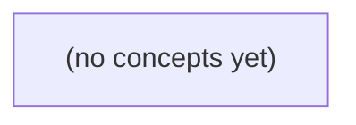

# 07.09 积压与坏消息：Go 事件消费者的速率、重试与顺序治理

*一本面向 Go 初学者的静态教材，围绕事件消费中的积压计算、业务年龄、坏消息分类、有限重试、隔离重放与顺序合同展开。读者将通过 c-g 热分区、c-a 的 E-bad 与 E11 等连续案例，手算容量边界并建立可值班交接的故障处置判断。*

**章节:** 2

---

## 本书导览

- 了解整本书的章节脉络
- 掌握各章之间的概念依赖关系
- 选择最合适的阅读顺序

# 07.09 积压与坏消息：Go 事件消费者的速率、重试与顺序治理

一本面向 Go 初学者的静态教材，围绕事件消费中的积压计算、业务年龄、坏消息分类、有限重试、隔离重放与顺序合同展开。读者将通过 c-g 热分区、c-a 的 E-bad 与 E11 等连续案例，手算容量边界并建立可值班交接的故障处置判断。

下方的概念图展示了本书 0 个核心概念以及它们之间的依赖关系；再下方是 1 个章节的入口。你可以按从上到下的顺序阅读，也可以根据自己的兴趣或先验知识选择切入点。

#### 概念图

## 章节索引

- **07.09 积压与坏消息：最老事件为何一直没处理** — 面向Go初学者，沿IM热会话事件流推导积压速率、最老年龄、暂时/永久错误、重试预算、坏消息隔离与受控重放。

## 07.09 积压与坏消息：最老事件为何一直没处理

- 手算120/s到达与90/s处理的十分钟积压
- 区分一次性积压排空与持续超载
- 区分lag数量和最老未完成年龄
- 分类暂时、永久和结果未知错误
- 设计三次总尝试及隔离而不假ACK成功
- 解释毒消息对同键E11顺序的影响
- 建立DLQ重放与权威对账闭环

承接 c-a 的 P0 E9/E10，并预演 S3 m-9：热会话 c-g 为何在消费者仍持续成功处理时，最老事件却越来越旧？

### 从速率差推导十分钟积压

### 从速率差推导十分钟积压

承接 c-a 的 P0 E9/E10，设热会话 `c-g` 持续向分区 `P0` 写入事件：到达速率为每秒 $120$ 条；消费者虽然工作正常、每秒都能安全完成 $90$ 条，但其处理能力仍低于输入速率。

从零积压开始，令 $B(t)$ 表示时刻 $t$ 的未完成事件数。每秒新增 $120$ 条，同时完成 $90$ 条，因此净积压增长率为：

$$
\Delta B=120-90=30\ \text{条/秒}
$$

十分钟为 $600$ 秒，且题设没有丢弃、重试或额外消费者参与，则：

$$
B(600)=0+(120-90)\times600=18{,}000
$$

也就是说，消费者在这十分钟内并非“没有处理”：它已成功完成

$$
90\times600=54{,}000
$$

条事件；但生产者同期写入

$$
120\times600=72{,}000
$$

条，故仍有 $72{,}000-54{,}000=18{,}000$ 条未完成。坏消息不在于消费者停摆，而在于稳定的每秒 $30$ 条能力缺口被持续累积。

若第 $600$ 秒后立刻停止到达，且消费者仍保持每秒 $90$ 条，则理想排空时间为：

$$
18{,}000\div90=200\ \text{秒}
$$

但只要到达继续维持每秒 $120$ 条，积压就以每秒 $30$ 条继续增长，系统不会自行收敛。这里的 `count lag` 是未完成数量；它不能直接等同于“最老未完成事件的年龄”，后者还取决于事件在队列中的位置与处理顺序。

### 排空只适用于停止到达

### 排空只适用于停止到达

c-g 的 P0 分区从零积压开始，每秒到达 $\lambda=120$ 条，消费者稳定、安全地每秒完成 $\mu=90$ 条；没有丢弃，也没有重试放大。此时“消费者一直成功处理”并不等于“积压正在减少”，关键在于比较流入与流出：

$$
\Delta B=\lambda-\mu=120-90=30\ \text{条/秒}
$$

运行 $600$ 秒后，未完成事件数为：

$$
B(600)=30\times600=18{,}000
$$

若此刻业务侧**完全停止到达**，即 $\lambda=0$，消费者才可以按 $90$ 条/秒消化这批存量：

$$
T_{\text{drain}}=\frac{18{,}000}{90}=200\ \text{秒}
$$

这就是“200 秒排空”的前提：积压是一次性的，入口已经关停。它描述的是库存清理时间，不是在线系统在持续负载下的恢复能力。

反过来，若到达仍保持 $120$ 条/秒，消费者虽然每秒完成 $90$ 条，却仍有净增 $30$ 条进入未完成集合：

- `count lag` 持续线性增长；
- 最早那条尚未完成事件不断被后续积压挡在前面；
- `oldest unfinished age` 因而持续变大；
- 不存在有限的“排空时间”，系统不会自行收敛。

因此，面对 c-a 的 P0 E9/E10 或未来 S3 m-9，不能看到吞吐量 `90/s` 就宣称“很快会排空”。应先问：到达是否已经降到低于 $90/s$？只有 $\lambda<\mu$，积压才会下降；$\lambda=\mu$ 只是不再恶化；$\lambda>\mu$ 时，坏消息是最老事件会越来越旧。

### 数量滞后不等于最老年龄

### 数量滞后不等于最老年龄

承接 c-a 的 P0 E9/E10，并预演 S3 m-9：热会话 c-g 的消费者即使持续成功处理事件，也可能让“最老未完成事件”不断变旧。关键在于，**数量滞后**与**最老未完成年龄**回答的是不同问题。

- **数量滞后（count lag）**：当前尚未完成的事件数，主要揭示吞吐是否失衡。  
  c-g 分区 P0 到达速率为 $120/s$，消费者安全处理速率为 $90/s$，则净积压增长为：
  $$120-90=30/s$$
  从零积压运行 $600s$ 后，未完成数量为：
  $$30\times600=18000$$
  若此时停止到达，理想排空时间为：
  $$18000/90=200s$$
  但只要 $120/s$ 的输入持续存在，积压就不会收敛；消费者“每秒成功 90 条”并不等于系统追上了生产速度。

- **最老未完成年龄（oldest unfinished age）**：当前仍未完成事件中，最早到达者已经等待多久，主要揭示等待风险与时效违约风险。可表示为：
  $$\text{age}_{oldest}=t_{\text{now}}-t_{\text{arrival, oldest unfinished}}$$

二者常相关，却不能互相替代。数量很大，可能只是短时突发导致，最老事件仍然很新；数量不算大，也可能因某个旧事件被阻塞、毒化或反复绕过，使最老年龄持续升高。

因此，P0 的 `count lag` 应用于判断是否存在持续吞吐缺口、是否需要扩容或限流；`oldest unfinished age` 则用于判断用户等待、超时窗口、SLA/SLO 与坏消息是否正在恶化。尤其当计数平稳甚至下降，但最老年龄上升时，不能宣布恢复：队列可能仍在“处理新消息、遗忘旧消息”。

### 最老事件为何持续未处理

### 最老事件为何持续未处理

承接 c-a 的 P0：同一键 `c-g` 必须保持顺序，E9 在队首未完成时，后续 E10 即使已到达、甚至本身很容易处理，也不能越过它提交。于是“消费者仍在持续成功处理”并不等于“这条热会话的最老事件已前进”：它可能在处理其他分区或其他键，而 `c-g/P0` 正被一个慢 E9 卡住。

设 `c-g/P0` 到达率为 $120$ 事件/秒，消费者安全处理率为 $90$ 事件/秒。从零积压开始，$600$ 秒后未完成数为：

$$
(120-90)\times600=18000
$$

若此时停止到达，理想排空时间为 $18000/90=200$ 秒；但持续到达时，净积压仍以 $30$ 事件/秒增长，系统不会收敛。更糟的是，E9 的慢处理、锁等待、下游限流或反复延迟会把队首停留时间直接计入“最老未完成年龄”；同键顺序约束又使 E10 及其后的事件全部继承这次阻塞。

因此要区分两个信号：

- **积压数量**：未完成事件有多少，反映总量压力。
- **最老未完成年龄**：队首事件从到达到现在多久，反映进度是否停滞。

数量增长说明吞吐不足；最老年龄持续增长则是更坏的消息：P0 的完成水位没有越过 E9，未来 S3 的 `m-9` 也可能看到“处理成功率正常、但业务事件越来越旧”的表象。

### 为后续坏消息处置建立基线

### 为后续坏消息处置建立基线

承接 c-a 的 P0 E9/E10，并预演 S3 m-9：热会话 `c-g` 的分区 P0 到达速率为 $120$ 事件/秒，消费者已稳定、成功地处理 $90$ 事件/秒。即使没有丢弃、没有重试、没有消费者故障，净积压增长仍为：

$$
\Delta q=\lambda-\mu=120-90=30\ \text{事件/秒}
$$

从零积压运行 $600$ 秒后，未完成事件数为：

$$
q=30\times600=18\,000
$$

若此时停止到达，且处理能力仍为 $90$ 事件/秒，理想排空时间是：

$$
18\,000/90=200\ \text{秒}
$$

但只要输入持续为 $120$、输出只有 $90$，积压就不会收敛；“消费者一直成功”不等于“系统追得上生产”。

观测时必须分开看两个指标：

- **数量延迟（count lag）**：尚未完成的事件数量，例如 `18,000`。它回答“欠了多少工作量”。
- **最老未完成年龄（oldest unfinished age）**：当前最老一条未完成事件距现在的时间。它回答“最早的承诺已被拖延多久”。

两者相关但不可互换。高吞吐分区可能积压数量很大、最老年龄却较低；也可能只有少量事件，却因某条毒性事件、顺序阻塞或反复失败，使最老年龄持续增长。后者正是坏消息处置的信号。

因此，为 P0 建立最小基线：按分区持续记录到达率 $\lambda$、成功完成率 $\mu$、`count lag`、最老未完成年龄，以及年龄增长斜率。随后在 S3 m-9 中，才能区分普通容量不足、短暂重试抖动与被单条坏消息卡住，并据此决定重试预算、隔离队列和安全重放。

> **要点** — 积压由到达与处理速率差决定；持续超载不会自行排空，最老未完成年龄必须与数量滞后分别监控。

积压指标先回答“消费位置差”，再回答“哪条业务事件等得最久”；两者口径不同，不能互相替代。

### 位置差：Kafka偏移量的含义与边界

### 位置差：Kafka偏移量的含义与边界

Kafka 的消费积压通常按**分区**计算：

$$
\mathrm{lag}_p=\mathrm{endOffset}_p-\mathrm{committedOffset}_p
$$

其中，`endOffset` 是该分区当前末端的下一条可写位置；`committedOffset` 是某消费者组已提交、表示“此前消息可视为已完成”的下一次读取位置。汇总所有分区即可得到组级位置差，但排障时更应查看最大分区，而非只看总和：

- 总积压不高，但某个分区持续增长，常意味着键分布倾斜、热点设备或单分区消费者异常。
- `endOffset` 持续前进而 `committedOffset` 不动，说明该组没有推进提交位置。
- 两者都不动，不一定健康：可能上游没有新消息，也可能生产链路已经中断。

这个指标描述的是**日志位置差**，不是业务事实。它不能直接说明：

- 有多少设备“未读”；同一条 Kafka 消息可能包含多台设备的数据，也可能被多个消费者组独立消费。
- 最老的一条业务事件等待了多久；偏移量没有事件时间，且分区间偏移量不能直接比较先后。
- 所有事件是否仍被保留；Kafka 受保留时间、保留大小和压缩策略影响，未消费数据也可能过期删除。
- 消费是否真正完成；提交偏移量过早会掩盖处理失败，提交过晚则会放大位置差并造成重复处理。

因此，Kafka lag 适合回答“该消费者组距离分区末端还有多少位置”，不适合单独回答“哪条业务事件最久未处理”。后者必须结合事件时间、处理完成时间及允许的时钟误差另行计算。

### 未确认集合：Redis Streams的XPENDING口径

### 未确认集合：Redis Streams 的 XPENDING 口径

`XPENDING` 观察的不是“流里所有尚未处理的事件”，而是某个消费者组的**待确认集合**：消息已经通过 `XREADGROUP` 投递给消费者，但尚未收到 `XACK`。

它回答的问题是：

- 已交付给消费者后，哪些消息没有完成确认？
- 这些消息分别属于哪个消费者？
- 最久未确认多久？
- 投递了多少次，是否可能反复失败或消费者已失联？

典型查看方式是：

`XPENDING stream group`

汇总结果通常包含待确认数量、最小/最大消息 ID，以及各消费者持有的待确认数量；使用扩展形式可进一步看到单条消息的消费者、空闲时间和投递次数。

需要特别区分三类消息：

| 消息状态 | 是否出现在 `XPENDING` | 含义 |
|---|---:|---|
| 尚未被该组读取 | 否 | 仍留在流中，但还未投递给消费者 |
| 已投递、未 `XACK` | 是 | 位于该组的待确认集合，可能正在处理、卡住或消费者宕机 |
| 已 `XACK` | 否 | 对该消费者组而言已完成确认 |

因此，`XPENDING` 适合排查“消息已经交给谁，却为什么迟迟没有完成”的故障。例如某消费者的待确认数持续增长、最大空闲时间超过处理超时、投递次数不断增加，都提示处理链路、确认逻辑或消费者存活状态存在问题。

但它不能直接代表业务总积压。大量事件可能尚未被任何消费者读取，此时 `XPENDING=0`，却不表示流中没有待处理数据。要衡量消费者组相对流尾部的位置差，还需结合组的最后投递 ID、流的最新 ID 或业务侧处理进度；要判断“最老业务事件等了多久”，则应依据事件时间、首次处理时间或自定义状态记录，而不能只看 `XPENDING` 的空闲时间。

### 配置相关：NATS待处理数与确认等待

### 配置相关：NATS 待处理数与确认等待

NATS 的“待处理”不是一个脱离上下文的固定积压值；它取决于消费者类型、确认模式、最大待确认数以及确认等待时间等配置。尤其在 JetStream 中，应先区分“服务端尚未被消费者确认的消息”与“业务真正尚未完成的事件”。

- **待确认消息数**：通常表示已向消费者投递、但尚未收到确认的消息。它可能是消费者正在处理，也可能是消费者宕机、网络中断，或业务已经完成但确认未成功发出。
- **确认等待时间 `AckWait`**：消息投递后，在 `AckWait` 内未被确认，服务端会将其视为可能处理失败，并安排重投递。因而，一条消息的“未确认年龄”超过 `AckWait`，并不表示它刚刚失败，而是意味着它已具备再次投递条件。
- **最大待确认数 `MaxAckPending`**：达到上限后，服务端会暂停继续向该消费者投递新消息。此时上游仍有可消费消息，但消费者看到的吞吐可能归零；“待确认数卡在上限”常是处理能力或确认链路受阻的信号。
- **重投递次数与最大投递次数**：同一消息可能因超时、否定确认或消费者故障被多次投递。观察到较高的投递次数，应优先排查幂等性、长耗时任务、确认时机和毒消息，而不能简单当作新增积压。

例如，`AckWait=30s`、`MaxAckPending=1000` 时，待确认数长期为 `1000`，说明该消费者已被流控；但若业务单条处理本就需要 5 分钟，则 30 秒的等待配置会制造大量重复投递。反之，将 `AckWait` 设得过长又会延迟故障恢复。

因此，解读 NATS 积压至少应同时记录：消费者待确认数、流中可投递消息数、最早未确认消息年龄、重投递次数，以及 `AckWait`、`MaxAckPending`、确认策略。它们共同描述的是“配置下的投递与确认状态”，而非天然等同于“设备未读”或“最老业务事件尚未完成”。

### 最老年龄：业务事件的自定义时钟

### 最老年龄：业务事件的自定义时钟

“最老未完成年龄”不应直接由 broker 的 offset 推出，而应对每个业务事件建立生命周期时间：

- $t_e$：事件产生时间，例如设备采样、订单创建；
- $t_r$：平台接收时间，例如网关、Kafka 生产者或入口服务落库时刻；
- $t_c$：处理完成时间，例如成功写入目标库、业务状态提交或 ACK 后的确认时刻。

在观测时刻 $t_n$，尚未完成事件集合为 $U$。若以业务发生为准，最老年龄为：

$$
A_e=t_n-\min_{i\in U} t_{e,i}
$$

若设备时钟不可信，改用平台接收时间：

$$
A_r=t_n-\min_{i\in U} t_{r,i}
$$

两者回答的问题不同：$A_e$ 表示“最早发生的业务事件等了多久”，会包含设备离线后补传、网络滞留；$A_r$ 表示“平台已收到的事件等了多久”，更适合衡量平台处理积压。

完成事件还可计算端到端耗时 $t_c-t_e$，以及平台内处理耗时 $t_c-t_r$。不要用“当前最小 offset 对应消息年龄”替代它：消息可能已被投递、重试、转入死信队列，或在下游仍未完成。

时间戳缺失时应明确降级规则：缺少 $t_e$ 用 $t_r$，两者都缺失则不参与业务年龄统计，但应单独计数。对于未来时间、明显超前的设备时间，按允许时钟偏差 $\epsilon$ 截断或标记异常；跨机器采集时，优先使用统一校时后的服务端接收时间。指标应同时报告“最老年龄”“缺失时间戳比例”和“时钟异常比例”，否则一个看似很老的事件，可能只是错误的设备时钟。

### 从监控到处置：避免错误业务推论

### 从监控到处置：避免错误业务推论

位置差、未确认数与最老未完成年龄应共同构成证据链，而非分别触发同一种业务结论：

- **Kafka 分区 `end offset - committed offset` 持续增长**：说明某消费者组的消费位置落后，优先检查消费者实例数、分区分配、消费失败重试、下游写入延迟与限流。它不表示“设备未读”：设备可能早已上报，消息只是尚未被该消费组提交。
- **Redis Streams `XPENDING` 增长或存在长期 idle 的 pending 条目**：说明消息已投递给消费者、但尚未 ACK。排查消费者崩溃、处理卡死、ACK 丢失，并结合 `XCLAIM` 或自动认领恢复处理。它不包含尚未投递的流内消息，不能替代全量积压判断。
- **NATS 的 pending 与 `ackwait` 超时**：应结合订阅模式、确认策略和重投递次数判断。pending 高可能是消费能力不足；反复超时则更像处理耗时超过 `ackwait`、消费者失活或确认逻辑错误。

业务告警还应单独计算“最老未完成事件年龄”：

$$\text{age}=\text{当前时间}-\text{事件时间或首次处理时间}$$

事件时间衡量用户或设备等待多久；首次处理时间衡量系统内部滞留多久。两者都要处理生产端时钟漂移、跨机房时钟误差和未来时间戳，否则“最老”可能只是时钟异常。

处置时先回答：消息在哪一段停住、是否已投递、是否正在重试、最老业务对象是谁。不要因 broker lag 就判定设备未读，也不要因某条消息积压就要求所有事件永久保留；保留期限、重放范围与业务审计要求必须另行定义。

> **要点** — 位置差衡量消费者进度，最老年龄衡量业务等待；两者须按系统语义和时间口径联合解读。

热会话流中的积压并不总由吞吐不足造成：一条坏消息若卡住同键顺序，最老事件会持续老化，且重试本身可能放大故障。

### 从积压数量看见处理失衡

### 从积压数量看见处理失衡

设某分区或键空间的输入速率为每秒 $120$ 条，稳定处理能力为每秒 $90$ 条。若两者在十分钟内保持不变，则净积压增长率为：

$$
\Delta q = 120-90=30\ \text{条/秒}
$$

十分钟即 $600$ 秒，新增积压为：

$$
30\times600=18{,}000\ \text{条}
$$

这 $18{,}000$ 条不是“系统暂存了一些消息”，而是处理能力持续落后输入能力的量化结果。即使消费者没有崩溃、监控中仍显示每秒成功处理 $90$ 条，队列也会以每分钟 $1{,}800$ 条的速度变长；若输入不降或处理能力不升，积压不会自行消失。

但积压数量只能说明总体失衡，不能直接解释最老事件为何迟迟未完成。例如，绝大多数键可能正常流动，只有 `c-a` 因 `P0 offset44` 的 `E-bad` 反复失败，阻塞了后续 `E11 offset45`。此时总积压增长可能由吞吐差造成，而“最老事件持续老化”则指向局部顺序阻塞。

因此应同时观察两个量：总积压的斜率，以及最老未完成事件的年龄。前者回答“缺多少处理能力”，后者回答“是否有一条坏消息卡住了流程”。不能看到积压便把所有错误一律重试；临时的 `SearchIndex` 不可用可退避重试，而坏 schema、无效字段或写入结果未知，必须按错误类型分别处置。

### 最老年龄为何比数量更刺眼

### 最老年龄为何比数量更刺眼

积压数量回答“还剩多少”，未完成事件的最老年龄回答“最早那条已经等了多久”。在按键保序的流中，后者通常更接近用户可感知的故障：同一 `c-a` 的 `P0 offset44` 若因坏 schema、无效字段或结果不确定而卡住，`E11 offset45` 即使本身完全合法，也不能越过它提交。

短时突发与持续超载的区别可用两项指标一起看：

- **数量短暂升高、最老年龄随后回落**：例如流量峰值后消费者逐步追平，说明系统虽忙但仍有排空能力。
- **数量持续升高、最老年龄持续增长**：到达速率长期超过处理能力，是典型容量或下游吞吐问题。
- **数量不大、最老年龄持续增长**：尤其危险。可能只有少数分区或少数键被阻塞，却足以让相关业务永远看见陈旧状态；总量平均值会掩盖这种局部故障。

因此，最老年龄不是单纯的延迟指标，而是顺序推进是否停止的证据。若 `offset44` 的错误是暂时性 `SearchIndex` 不可用，可以有限次退避重试；但若是永久 schema 错误，重复消费不会让负载自动变合法，只会让 `offset45` 的等待年龄不断增加。外部写入返回结果未知时，也不应无条件重做，而应先查询幂等目标确认是否已生效。

排查时应把最老事件作为具体对象记录：错误身份、事件版本、负载摘要、分区/键、尝试次数及首次失败时间。这样才能区分“需要等待恢复”的暂时失败与“必须隔离、修复或人工处置”的毒丸消息，而不是把所有坏消息都归入 `retry`。

### E-bad阻塞E11的顺序现场

### E-bad阻塞E11的顺序现场

分区 `P0` 中，`c-a` 的事件顺序如下：

| offset | 事件 | 处理结果 |
|---:|---|---|
| 44 | `E-bad` | 写入 `SearchIndex` 失败 |
| 45 | `E11` | 本身有效，但尚未处理 |

若 `c-a` 要求同键严格顺序，则消费者不能因为 `E11` 看起来正常，就越过 offset 44 直接提交 45。否则一旦 `E-bad` 后续恢复并产生状态变更，`E11` 可能基于错误的前置状态执行；更糟的是，已提交的 offset 45 会使 `E-bad` 失去正常重放位置。

关键不是“44 出错就无限重试”，而是先判定错误类别：

- `SearchIndex` 暂时不可用、超时或限流：可对 `E-bad` 做有限次数的指数退避重试，例如 `1s → 5s → 30s`，期间 `E11` 必须继续等待。
- schema 版本不兼容、必填字段缺失、字段值非法：重试不会修复负载。应记录事件身份、`schemaVersion`、失败字段、原始负载摘要和错误栈，将 `E-bad` 隔离到死信或人工修复队列。
- 外部写入超时且结果未知：不能直接重做。先按事件幂等键查询目标系统，确认未写入后才补写，避免重复索引或重复副作用。

隔离后的可推进边界取决于业务语义。若允许“坏事件已被明确处置”作为顺序上的终结，则记录 `E-bad` 的处置决定后，可提交 offset 44，并继续处理 `E11`。但这不是忽略错误：必须留下可审计的隔离记录和告警，使后续修复能够以受控方式回补。若业务规定任何前序事件都必须成功生效，则 `E11` 只能持续阻塞，直到 `E-bad` 被修复或获得明确的跳过授权。

### 错误分类决定是否重试

### 错误分类决定是否重试

对 `c-a` 而言，`E-bad@offset44` 是 P0 当前最老事件，`E11@offset45` 即使本身正常也不能越过它。处理策略不能只看“调用失败”，而要先判断失败语义；否则重试会把局部坏消息演变为同键积压。

- **暂时错误**：如 `SearchIndex` 暂不可用、超时、限流或连接失败。这类错误通常具备恢复可能，可有限次数重试，并采用指数退避与抖动：  
  `delay = min(base × 2^n + jitter, maxDelay)`  
  超过预算后应转入延迟队列、告警或人工处置，而不是持续占用 P0。

- **永久错误**：如 schema 不兼容、必填字段缺失、字段值非法、版本不被支持。重试不会修复负载，应立即隔离到死信记录或坏消息通道，解除 `offset44` 对后续事件的阻塞。隔离记录至少包含错误身份、事件键与 offset、schema/处理器版本、原始负载摘要及校验信息，便于修复后回放。

- **结果未知**：最危险的情形是外部写入超时：请求可能未到达，也可能已经成功但响应丢失。此时不得无条件再次写入。应先用事件 ID、业务幂等键或写入令牌查询幂等目标：已存在则确认成功；不存在才在幂等保护下重做；仍无法确认则保留“待核实”状态并升级处理。

因此，`retry` 不是通用错误出口。错误分类、版本与负载证据、以及外部副作用的幂等查询，共同决定 `E-bad` 是退避、隔离，还是安全地继续执行。

### 三次预算、隔离与权威对账

### 三次预算、隔离与权威对账

对 `c-a` 而言，`E-bad@P0/offset44` 与其后的 `E11@offset45` 共享顺序约束：前者不决，后者不能越过。处理策略不是“持续重试直到成功”，而是预先定义**三次总尝试预算**：

1. 第一次立即执行；
2. 第二次按短退避重试；
3. 第三次按更长退避重试；
4. 三次仍失败，停止占用热路径，将事件隔离到 DLQ。

例如可使用 `1s → 10s` 的退避，并记录每次尝试的时间、耗时和错误类别。暂时性 `SearchIndex` 不可用、限流或超时可消耗该预算；`schema` 永久不兼容、必填字段无效、版本不支持等错误不会因重试自动修复，应尽早进入 DLQ，而非把 `offset44` 变成无限期路障。

每次失败必须保留可复核证据：事件身份（主题、分区、offset、键、事件 ID）、生产者与消费者版本、schema 版本、原始负载或其安全摘要、目标系统响应、尝试次数及错误堆栈。不要只写“处理失败”；否则后续无法判断是同一毒丸、代码回归，还是外部依赖波动。

DLQ 不是垃圾桶，而是受控重放队列。修复 schema、映射规则或索引服务后，应以独立消费者重放，并携带原事件 ID 与重放批次 ID；重放前后都要核对权威目标状态。

尤其是外部写入超时：超时只表示“结果未知”，不表示“未写入”。此时先按幂等键查询目标；已存在且内容一致则确认完成，不存在才重做，存在但内容冲突则升级人工处置。最终以权威存储、索引或业务账本的可查询状态对账，再推进确认位点，形成“不假定确认成功”的闭环。

> **要点** — 最老事件久未处理，应先定位其错误类型与顺序阻塞；有限重试、坏消息隔离、幂等查询和权威对账缺一不可。

当同一条坏消息反复失败时，正确做法不是把它当作成功确认，而是保留证据、隔离风险，并让重放可控可追责。

### 三次总尝试的投递边界

### 三次总尝试的投递边界

“最多 3 次投递”应理解为**总尝试次数不超过 3**，首次交付已经是第 1 次，不是“失败后还能重试 3 次”。对事件 `event_id=E-bad`，状态应清晰建模为：

1. 第 1 次投递：处理失败，记录失败原因；若可重试，进入待重投递状态。
2. 第 2 次投递：再次失败，继续保留事件与失败证据。
3. 第 3 次投递：仍失败，**不再允许普通消费者继续重试**，转入受控隔离流程。

可写成简单边界：

$$
\text{attempt} \in \{1,2,3\},\qquad
\text{failed at attempt}=3 \Rightarrow \text{quarantine}
$$

第三次失败后的转换不是“ACK 后忽略”，而是：

`处理中 → 第三次失败 → 隔离记录已创建 → 原消息确认完成`

这里的确认仅表示“该消费者不再继续处理原投递”，并不表示业务成功。隔离记录至少应包含：

- `event_id` 与原始消息标识；
- 源主题、分区或流位置（如 `offset`、序列号）；
- 总尝试次数、每次失败时间与错误摘要；
- 消费者版本、处理代码或规则版本；
- 原始载荷或可追溯引用；
- 后续处理责任人、隔离状态与重放权限。

对于 NATS JetStream，`MaxDeliver=3` 限制的是该消费者的投递次数。达到上限后，消息通常仍保留在 stream 中，并可产生投递超限 advisory；它**不会自动变成业务语义上的 DLQ**。因此，应用或运维流程必须把 advisory、失败记录和隔离存储关联起来，明确谁负责诊断、修复与授权重放。

### 从失败分类到处置决策

### 从失败分类到处置决策

失败并不等价于“稍后再试”。确认策略必须依据失败性质决定；否则，暂时故障会被过早丢弃，永久坏消息会无限阻塞，而已产生副作用的未知结果会被重复执行。

| 失败类别 | 典型信号 | 处置与确认策略 |
|---|---|---|
| 暂时错误 | 超时、连接中断、限流、下游 `5xx` | 不确认，按退避策略重试；玩具 E 最多总投递 3 次。超过上限后隔离到受控 quarantine/DLQ。 |
| 永久错误 | 格式不合法、字段缺失、版本不兼容、业务规则拒绝 | 不应盲目重试；记录 `event_id`、源 offset、错误详情、消费者版本和处理责任后，隔离并确认原消息。 |
| 结果未知错误 | 请求超时但下游可能已写入、进程在提交后崩溃、响应丢失 | 不能直接重试，也不能直接确认；先用幂等键或查询接口核验结果，再决定确认、补偿或受控重放。 |

“确认原消息”只表示该消费者已完成其**约定处置**，不表示业务一定成功。尤其对结果未知错误，若把 ACK 当作成功，会静默丢失未完成业务；若立即重试，则可能造成重复扣款、重复发货等副作用。

在 NATS 中，`MaxDeliver` 用尽后，消息仍保留在 stream 中，并可能产生投递上限 advisory；它不会自动变成业务 DLQ。因此，消费者或运维流程必须显式创建隔离记录，并指定责任人。修复代码、数据或依赖后，重放应限定来源、时间窗和权限，且处理器必须以 `event_id` 实现幂等。

### 隔离不是伪造成功

### 隔离不是伪造成功

设事件 $e$ 的总投递预算为 $B=3$，且首尝试计入预算。若第 3 次处理仍失败，系统必须承认：该事件尚未完成业务语义，不能仅发送 `ACK` 以消除积压。`ACK` 只能表示“本消费者不再继续接收此副本”，不能被用来伪造“订单已创建”“余额已扣减”等成功事实。

因此，耗尽预算后的状态转换应是：

`处理中 → 第3次失败 → 隔离记录/隔离队列 → 人工或受控自动处置`

最小隔离证据应足以回答“哪条消息、从哪里来、为何失败、按什么代码失败、谁负责处理”：

- `event_id`：业务事件的稳定身份，用于去重、关联审计与重放。
- 源位置：主题/流名称、分区或消费者信息、`offset` 或序列号，保证可追溯原始消息。
- 失败信息：错误类别、错误摘要、失败时间、已尝试次数；必要时保存脱敏后的异常栈。
- 版本信息：事件 schema 版本、生产者版本、消费者/处理器版本，便于识别兼容性故障。
- 原始载荷或可验证引用：应受脱敏、加密和保留期限约束。
- 责任归属：`owner_team`、值班责任人、处置状态与工单编号，避免隔离队列成为无人认领的墓地。

在 NATS 中，`MaxDeliver` 耗尽通常意味着消费者停止继续投递，并产生相应 advisory；消息仍保留在 stream 中，并不会自动变成符合业务定义的 DLQ。若需要业务隔离，必须由监控/处置流程显式建立隔离记录或转发到受控隔离主题。

修复后重放也不是“把消息再发一次”即可：处理器必须以 `event_id` 保证幂等，重放权限应受限，并记录操作者、原因和结果。隔离的目标是保留失败事实与恢复路径，而不是让指标看起来已经成功。

### NATS投递上限的真实含义

### NATS 投递上限的真实含义

`MaxDeliver` 限制的是消费者对某条消息的**最大投递次数**，不是消息的自动删除次数，也不是 NATS 自动完成业务死信处理的开关。若设置 `MaxDeliver=3`，则首次投递也计入：消费者总共最多收到该消息 3 次。

当第 3 次处理仍失败、超时或未确认时，JetStream 会停止继续向该消费者投递这条消息，并发布相应的投递次数耗尽通知（advisory）。但此时：

- 原消息通常仍保留在 Stream 中，直到命中流的保留策略，如时间、容量或显式删除；
- 消息不等于已被业务“处理成功”，更不能仅发送 `ACK` 来伪造成功；
- NATS 不会自动替业务写入一个满足审计要求的 DLQ；
- 其他消费者、不同的消费者配置或后续人工操作，仍可能影响该消息的可见性与处理路径。

因此，`MaxDeliver` 应理解为“停止常规重试并发出信号”，而不是“自动隔离坏消息”。业务系统需要订阅或监控相关通知，定位 `stream`、消费者、`stream sequence` 与失败原因，再将原始事件或其可验证副本写入受控 quarantine/DLQ。记录至少应包含：

- `event_id`、源 Stream 与 offset/sequence；
- 原始载荷或可追溯引用；
- 最后错误、失败次数、处理器版本；
- 隔离时间、责任人或责任队列。

修复后重放也不能简单把消息“再发一次”。应由具备权限的流程从 quarantine/DLQ 创建受控重放记录，使用稳定的幂等键，避免原消息已部分生效时造成重复扣款、重复发货或重复通知。

### 修复后的受控重放闭环

### 修复后的受控重放闭环

隔离消息不是“修好后批量再发”即可。重放必须形成可审计闭环：谁批准、重放了什么、按什么版本处理、结果如何，均应可追溯。

- **权限与范围控制**：仅具备专门角色的操作者可发起重放；请求必须明确 `event_id`、隔离记录号、目标消费者、修复版本、原因与审批单号。默认按单条或小批次重放，禁止无条件清空 DLQ。
- **重放前校验**：确认原始事件完整性、源 `offset`、错误类型、当前处理器版本，以及该事件是否已被人工补偿或成功处理。若业务状态已前进，不能仅因 DLQ 中仍有记录就再次执行副作用。
- **幂等屏障**：处理器以稳定的 `event_id` 或业务幂等键去重；写入业务结果与“已处理事件表”应处于同一事务或通过可靠的状态机协调。重放产生重复投递时，结果应为“已完成，跳过”，而非重复扣款、重复发货。
- **保护同键 E11 顺序**：同一业务键的后续事件 E12、E13 可能已在等待或已处理。重放 E11 前，应冻结该键的新消费，检查序列号/版本号，并按 `$E11 \rightarrow E12 \rightarrow E13$` 顺序恢复；无法保证顺序时，转入按键重建状态或人工补偿，不能直接插队投递。
- **版本记录与权威对账**：隔离记录保存原处理版本、修复版本、重放时间、操作者和最终状态。重放成功后，以权威业务库、账本或状态存储为准进行对账，而非只看 ACK、消费者日志或消息已离开 DLQ。

闭环的终态应明确为：`已成功并对账`、`幂等跳过并对账`、`需人工补偿` 或 `再次隔离`。只有前两类可关闭工单；再次失败必须保留新的错误证据，而不是覆盖旧记录。

> **要点** — 重试耗尽不是成功：保留失败证据并隔离消息，修复后以幂等、授权和对账完成受控重放。

同一会话键的顺序约束遇到坏消息时，正确处理不是静默跳过，而是明确暂停、隔离或带缺口重建。

### 顺序提交为何被坏消息阻断

### 顺序提交为何被坏消息阻断

设 `c-a` 的同一会话键要求 `SearchIndex` 按 `seq` 连续应用。若 `offset=44` 对应事件处理失败、语义尚未确认，则它不是一个可随手略过的“单条异常”，而是该键后续状态演进的未决前提。

例如，事件流为：

- `offset 44`：`E10`，`seq=10`，更新商品可见性；
- `offset 45`：`E11`，`seq=11`，更新同一商品的标题；
- `offset 46`：下一条消息或提交边界。

此时即使 `E11/45` 本身格式正确，也不能无条件写入对外可见的 `SearchIndex`，更不能静默提交 `offset 46`。原因是索引中的 `E11` 状态可能依赖 `E10`：若 `E10` 实际是删除、屏蔽、迁移或版本冲突处理，那么先暴露 `E11` 会让读者看到一个不应存在或版本错误的文档。

连续性约束可表示为：

$$
\text{可见}(seq=n) \Rightarrow \text{已确认并应用}(seq=1,\ldots,n-1)
$$

因此，`44` 未决时，`45` 至多可以安全地留在本地缓冲、重试队列或该键的暂停队列中；其“已处理”不能越过 `44` 推进。提交位点表达的是“此前消息的处理结果可恢复且语义成立”，不是“消费者已经读到这里”。

阻断应限定在受影响的会话键或 `c-a` 分区：其他独立键、其他 `c-b` 分区仍可继续消费。关键是把停滞显式化——记录失败事件、重试状态和阻塞范围。若直接提交 `46`，重启后系统会把 `44` 视为已越过，最老的坏消息遂从正常恢复路径中消失，造成难以察觉的顺序缺口。

### 不能静默提交46

### 不能静默提交46

设 `SearchIndex` 对会话键 `c-a` 要求按 `seq` 连续应用。此时已知 `offset 44` 对应坏消息，`E11/45` 尚未可靠产出，而消费者却将检查点直接提交到 `46`，含义并不只是“暂时少处理一条”：它实际上向系统声明“截至 46 的输入都已被该衍生索引正确反映”。

这会制造三层断裂：

- **索引状态断层**：若 `44` 创建、删除或修正了某个文档，随后 `45`、`46` 又依赖该状态，则索引可能保留过期版本、缺少文档，或将后续更新写入错误基线。
- **重放失序**：检查点已越过 `44` 后，正常重启会从 `47` 继续；即使后来修复坏消息，也不能把它直接插回已应用的 `45`、`46` 之前。此时“补一条”不是普通重试，而是需要回滚、按键重放或重建该键的派生状态。
- **故障隐匿**：监控若只看消费位点，会误判积压已清空、消费健康。真正未决的最老事件被埋在已提交区间中，直到用户发现搜索结果异常才暴露。

因此，对 `c-a` 的安全策略应是：`44` 未决时暂停该键的连续推进，不能让其后的事件无条件覆盖并提交到 `46`。这不要求停掉整个消费组：其他键或其他 `c-b` 分区只要不存在同一顺序依赖，仍可继续处理。

若业务允许派生索引隔离跳过，也必须把“跳过”建模为显式状态：记录缺口 `44`、关联修复票据、标记受影响键和索引版本，并在修复后执行按键重放或索引重建。用户权威历史仍保留在事件日志中；可牺牲的是暂时的派生查询完整性，而不是悄悄伪造“已处理到46”的事实。

### 按键暂停而非全局停摆

### 按键暂停而非全局停摆

当 `SearchIndex` 要求同一会话键 `c-a` 按 `seq` 连续应用时，`offset=44` 的坏消息未决，意味着 `E11/45` 及后续事件不能被当作“已经追上”的正常更新对外发布。否则索引可能先提交 `46`，却永久遗漏 `44` 的状态变化，形成难以察觉的错误快照。

应用层应实施**按键暂停**：

- 将 `c-a` 标记为暂停态，记录阻塞序号、Kafka 位点、错误原因、首次失败时间与重试次数。
- 继续拉取并持久化 `c-a` 的后续事件，但放入该键的待处理队列；它们不能越过缺失的 `seq=44` 应用到索引。
- `c-b` 等其他键不受影响；若分区内混有多个键，消费者仍可读取、分发和处理可独立推进的键，而非因一个坏事件停止整分区。
- 对暂停键设置容量、时长与告警阈值：积压过大时转存至可靠缓冲区，并创建修复工单，而不是无限占用消费者内存。

恢复时，应先修复或重放 `44`，再按 `45、46…` 顺序排空该键缓冲，并在全部成功后解除暂停。提交位点也必须与实际持久化状态一致；不能以“消费到了 `46`”替代“`44` 已正确处理”。

若索引属于可重建的衍生视图，也可以显式隔离 `c-a`：写入缺口标记、修复票据和待重建范围，允许其他数据继续服务。但这不是静默跳过；查询侧应能识别该键索引不完整，修复后从权威事件历史重建。权威历史保留，索引的暂时降级才是可控风险。

### 隔离跳过的显式代价

### 隔离跳过的显式代价

面对 `c-a/44` 的坏消息，策略选择取决于 `SearchIndex` 是否承诺按 `seq` 连续可见，而不是取决于消费者是否“还能继续工作”。

| 策略 | `c-a` 的处理 | 对外可见结果 | 主要代价 |
|---|---|---|---|
| 严格顺序阻塞 | 停在 `44`，不提交 `46` | `44` 之后的更新暂不可见 | 该键积压增长、检索时效下降 |
| 隔离跳过 | 暂不应用 `44`，可继续处理 `45/46` | 索引存在明确缺口 | 查询可能暂时缺历史状态，必须补偿重建 |

严格顺序适合索引结果被当作强一致读模型的场景。若 `E11/45` 依赖 `44` 的前序状态，则不能因为 `45` 已成功就提交偏移量 `46`；否则故障恢复后系统会把 `44` 误认为已消费，造成永久乱序或丢失派生效果。此时应暂停该 `c-a` 键，但 `c-b` 等无关分区仍可继续推进。

若 `SearchIndex` 只是可重建的衍生索引，允许隔离跳过也必须把代价写入系统状态，而非“静默成功”。至少需要：

- 记录缺口：如 `gap(c-a, 44)`，标明缺失事件、失败原因与首次发现时间；
- 创建修复票据：包含重试策略、责任队列、超时告警及最终重建范围；
- 标记可见性：查询侧能够识别该键索引为“部分可用”或“待修复”，避免把不完整结果伪装为完整历史；
- 保留权威事件历史：`44` 及其后的原始日志不可删除，以便修复后按序回放或重建该键索引。

因此，“提交到 `46`”只有在提交语义明确表示“已登记缺口并转入补偿流程”时才成立；它绝不能表示 `44` 已被正常处理。用户权威历史可以不丢，但索引一致性的债务必须可见、可追踪、可偿还。

### DLQ重放与权威历史闭环

### DLQ重放与权威历史闭环

坏消息进入死信队列（DLQ）不是“处理完成”，而是把该事件从在线消费路径移入可审计的修复路径。对要求同一键按 `seq` 连续的 `SearchIndex`，若 `offset=44`、`seq=E11` 失败，则该键后续的 `45`、`46` 不能被静默提交为已完成；否则索引表面前进，实际丢失了历史因果链。

建议为每条 DLQ 记录保留：原始消息、`key`、分区与 offset、业务序号、失败阶段、异常栈、首次失败时间、重试次数、目标索引版本及关联修复工单。诊断时先区分三类问题：

- **瞬时故障**：依赖超时、限流、短暂网络错误；可采用退避重试，但仍不得越过该键的顺序栅栏。
- **数据故障**：字段非法、模式不兼容、反序列化失败；需修复生产者或编写兼容转换。
- **逻辑故障**：索引代码缺陷、幂等判断错误、版本冲突；应先发布修复，再重放。

修复后，重放应以该键的最早缺口为起点：先处理 `44`，确认索引状态达到 `E11`，再按 `45 → 46` 顺序恢复。重放消费者必须具备幂等性，例如以 `(key, seq)` 或事件唯一标识去重；“已写入索引”不等于“可跳过”，还应验证写入版本、文档内容和推进水位一致。

若索引系统允许隔离跳过，应显式记录“`key` 在 `44` 存在缺口”的状态，并创建重建任务，而非直接提交 `46`。其他 `c-b` 分区或不相关键可以继续消费，避免单个坏消息扩大为全局停摆。

最终闭环以用户权威历史为准：从事件日志、事务库或可回放变更流重新计算该用户的期望状态，与 `SearchIndex` 当前文档、最高连续 `seq`、DLQ 清单逐项对账。只有缺口消除或完成可证明的重建后，才能关闭工单并清理隔离标记。

> **要点** — 坏消息不能靠越过提交来掩盖；应按键隔离，并以显式缺口、修复重放和权威对账恢复一致性。

当到达速率持续高于处理能力时，积压必然增长；若失败重试无边界，系统会把普通拥塞放大为长期坏消息风暴。

### 先算清净积压与排空条件

### 先算清净积压与排空条件

积压的关键不是“队列里有多少”，而是单位时间的**净变化量**。设到达速率为 $\lambda$，成功处理速率为 $\mu$，则在不考虑重试、过期和丢弃时：

$$
\frac{dB}{dt}=\lambda-\mu
$$

若每秒到达 $120$ 条、系统每秒只能完成 $90$ 条，则净积压速率为：

$$
120-90=30\ \text{条/秒}
$$

十分钟即 $600$ 秒后，新增积压为：

$$
30\times600=18{,}000\ \text{条}
$$

这不是“处理得慢一点”的小波动，而是在持续制造尚未完成的工作。只要 $\lambda>\mu$，无论消费者是否始终满负载，队列都不会自行变短。

还要区分两类情况：

- **一次性积压**：例如短时流量尖峰留下 $18{,}000$ 条，随后到达恢复为 $0$。此时以 $90$ 条/秒排空，约需  
  $$
  18{,}000/90=200\ \text{秒}
  $$
- **持续超载**：到达仍为 $120$ 条/秒，即使消费者持续处理 $90$ 条/秒，也没有“排空时间”；积压每分钟继续增加 $1{,}800$ 条。

因此，排空已有积压的前提不是“消费者还在工作”，而是某个时段内必须满足 $\mu>\lambda$。若希望在时长 $T$ 内清除当前积压 $B_0$，所需处理能力至少为：

$$
\mu \ge \lambda+\frac{B_0}{T}
$$

例如已有 $18{,}000$ 条积压，且仍以 $120$ 条/秒到达，想在十分钟内清完，则需要至少 $150$ 条/秒的有效成功处理能力。

### 重试流量为何会反噬吞吐

### 重试流量为何会反噬吞吐

重试并不是“免费的补救”。每一次失败后的再次投递，都会占用消费者线程、连接、锁、数据库连接池或下游配额；这些资源原本可用于处理新消息。于是系统实际面对的不是到达率 $\lambda$，而是包含重试后的总尝试率：

$$
\lambda_{\text{try}}=\lambda_{\text{new}}+\lambda_{\text{retry}}
$$

当消费者额定能力为 $90/s$、新消息已到达 $120/s$ 时，系统本已每秒净积压 $30$ 条。若其中一部分请求因超时、限流或依赖故障而重试，$\lambda_{\text{retry}}$ 会继续挤占处理槽位；更糟的是，超时请求常已在下游执行，只是响应未及时返回，重投会制造重复工作。有效成功吞吐因此下降，失败率又进一步上升，形成“拥塞—重试—更拥塞”的正反馈。

必须把重试视为受控流量，而非无限补偿机制：

- 设置有限的最大尝试次数；超过阈值转入死信队列、人工复核或延迟补偿。
- 使用指数退避，如第 $k$ 次等待 $b\cdot2^k$，避免失败后立即争抢同一批资源。
- 为退避加入抖动，例如在等待区间内随机取值，防止大量请求在固定时刻同时醒来，形成重试尖峰。
- 限制全局或按依赖划分的在途重试数；重试额度耗尽时，优先保护新请求和关键链路。
- 按错误类型决策：参数非法、权限拒绝、业务不可恢复错误不应重试；短暂网络错误、可确认的限流或暂时不可用才值得延迟重试。

观察面板时，不只看“成功数”。应同时比较新到达率、总尝试率、重试占比、在途量、业务 P95 延迟与错误率。若总尝试率上升而成功吞吐不增，说明重试正在消耗容量，而不是恢复吞吐。

### 按错误类型设置有限尝试

### 按错误类型设置有限尝试

重试策略不应只看“失败”这一结果，而应先判断失败是否可能因等待而自行恢复。统一的“三次总尝试”可防止毒消息无限占用消费者与下游配额，但三类错误的后续去向不同。

| 错误类型 | 常见信号 | 处理路径 |
|---|---|---|
| 暂时错误 | 超时、`429`、连接重置、下游 `5xx` | 最多三次总尝试；采用递增退避并加入抖动，例如 $1\text{s}, 5\text{s}, 20\text{s}$；达到上限后转延迟队列或降级结果，不立即回投主队列 |
| 永久错误 | 参数校验失败、对象不存在、权限拒绝、格式不兼容 | 通常不重试，或仅保留一次防止误判；直接进入死信队列，记录原始载荷、错误码与版本，等待修复后人工重放 |
| 结果未知错误 | 请求超时但下游可能已执行、网络中断、响应丢失 | 不可盲目重试；先用幂等键、请求状态查询或对账确认结果。无法确认时转人工核验队列，而非继续发送副作用请求 |

“第三次失败后怎么做”必须是业务契约的一部分。例如支付扣款超时，不能因为重试次数未尽就再次扣款；发送通知失败则可降级为站内信或待补偿任务。对于每类消息，应明确：

- **最大总尝试数**：包含首次处理，避免“重试三次”被误解为共四次。
- **退避窗口与抖动**：防止同批失败消息在固定时刻同时回流。
- **在途上限**：重试流量不得挤占正常新消息的处理份额。
- **最终归宿**：死信、延迟补偿、默认结果或人工核验；每一种都应可观测、可追踪。

验证策略是否有效，不能只看队列长度下降。应在同一时间窗比较业务成功率、`P95` 完成时延、错误类型分布、重试占比与下游负载；若重试减少了却使未知结果积压上升，说明系统只是把风险从自动路径转移到了人工路径。

### 毒消息隔离与同键顺序保护

### 毒消息隔离与同键顺序保护

同一会话键 `E11` 通常要求严格顺序：事件 `E11-102` 未成功处理前，`E11-103`、`E11-104` 不能越过它。于是，一条因非法字段、版本不兼容、下游永久拒绝或业务状态冲突而持续失败的毒消息，会占住该键的分区、锁或串行执行槽；全局消费者可能仍有空闲，但 `E11` 的后续事件只能等待。最老事件长期不动，往往不是“消费者太少”，而是该键的头部被毒消息阻塞。

处理原则不是无限快速重投，而是将失败分类：

- **瞬时错误**：如超时、限流、短暂网络故障。采用有界 `max_attempts`、指数退避和随机抖动；重试期间暂停该键，避免同键后续消息堆积式抢占。
- **永久错误**：如格式校验失败、不可识别事件版本、明确的业务拒绝。达到少量确认阈值后立即隔离，不再占用正常消费路径。
- **未知或依赖异常**：记录完整上下文，进入人工或自动诊断队列，并对该键实施短暂熔断。

隔离记录至少应包含：原始载荷、事件标识、会话键、顺序号、失败阶段、错误类别、尝试次数、首次/末次失败时间及关联追踪标识。隔离后不能直接让后续事件“自由通过”：若业务允许跳过，必须写入明确的`跳过水位`或补偿标记；若不允许，则将 `E11` 置为暂停状态，仅旁路保存后续事件，等待修复后按序回放。

受控恢复应具备幂等性与审计性：修复毒消息后，从隔离队列按原顺序重新注入；恢复前校验当前会话版本和已提交水位，避免旧事件覆盖新状态。监控应同时观察每键最老事件年龄、暂停键数量、隔离率、重放成功率，以及业务 `P95` 和错误率；否则提高批量或并发，只会让其他键更快，而无法消除 `E11` 的顺序瓶颈。

### 用业务窗口验证重放闭环

### 用业务窗口验证重放闭环

扩批量、加消费者并发，只有在同一业务窗口内同时改善吞吐、尾延迟和错误率，才说明瓶颈真的被缓解。否则，表面上的“消费变快”可能只是把失败更快地推入重试队列或 DLQ。

先为重放设置硬边界：

- 限制单消息最大尝试次数，并采用指数退避加随机抖动，避免毒消息以高频率反复占用容量。
- 设置全局及分区级在途上限；重放任务应与实时流量竞争受控配额，不能挤占正常请求。
- DLQ 重放按小批次、可暂停、可观测执行，并保留原始事件标识、失败原因和尝试次数。
- 对鉴权失败、参数非法、版本不兼容等确定性错误直接隔离；只对超时、短暂依赖故障等可恢复错误重试。

验证时不要只看队列长度。选取同一业务窗口，例如按订单创建小时或账期，比较重放前后：

1. 权威数据源中的应处理总数；
2. 成功落库、仍在途、DLQ 隔离、永久拒绝的数量；
3. 业务 P95 完成时延与端到端错误率；
4. 消费端 CPU、下游连接池、分区滞后及重试流量占比。

应满足近似守恒：`权威总数 = 成功 + 在途 + DLQ + 明确拒绝`。若并发提升后吞吐增加，但 P95 上升、错误率扩大或重试占比持续走高，说明系统只是更快撞上了下游瓶颈。尤其当 `c-g` 受单键顺序约束时，增加批量或消费者并不能突破该键的串行处理能力；应按键拆分、降低单键热点，或接受该业务窗口的有限重放速率。

> **要点** — 积压治理先保证有效处理能力大于总负载，再以有限重试、毒消息隔离和对账重放守住顺序与正确性。

隔离队列的职责不是“收走失败消息”，而是让每条未完成事件保留可追责、可修复、可验证的回归路径。

### 重新定义隔离：失败处理的中间站

### 重新定义隔离：失败处理的中间站

DLQ（死信队列）或 quarantine（隔离区）不是“失败消息的垃圾桶”，更不是把消息移进去就算处理完成。它们的真正职责是：**立即阻断错误的持续扩散，同时保留足够的诊断线索，使事件能够被修复、重放和验证。**

当消费者遇到不可重试错误、超过重试上限或发现数据违反约束时，继续投递往往只会造成重复写入、告警风暴或下游积压。此时应将事件转入隔离区，并记录最小、可追责的元数据，例如：

- `event_id=m-9:v1`：稳定事件标识与版本；
- 原始来源：主题、分区、偏移量或生产表主键；
- 失败原因：错误码、分类、首次与最后失败时间；
- 尝试次数及处理组件版本；
- 修复负责人、处置状态和关联工单。

隔离记录应避免保存不必要的私有正文；正文或权威业务状态应仍由数据库、对象存储等权威源管理。这样既降低敏感数据扩散，也避免把临时消息副本误当成事实来源。

因此，“进入 DLQ”只意味着自动处理链路暂停，不意味着业务结果已经成功。真正闭环应是：定位原因，修复代码或数据，按权威数据库中的消息版本重新生成并投递，记录重放结果，再对账搜索索引、通知记录或其他下游状态。若消息已超过保留窗口，更不能假设 broker 仍可恢复它；应从权威源重建事件，并把这次缺失作为积压治理的一部分。

### 最小元数据与隐私边界

### 最小元数据与隐私边界

隔离记录应当是“可定位、可诊断、可修复”的索引，而不是失败消息的副本。尤其当消息正文含用户资料、订单明细、令牌或业务机密时，把原文复制进 DLQ/quarantine 会扩大访问面、保留期和泄露风险。

一条最小隔离记录可形如：

`event_id=m-9:v1`、`source=orders-db/outbox/84721`、`reason=目标接口超时`、`attempts=5`、`first_failed_at`、`last_attempt_at`、`owner=payments-oncall`。

其中：

- `event_id` 必须能唯一关联权威数据库中的事件版本；版本号避免把旧事件误当成当前状态。
- `source` 记录源表、outbox 偏移量、分区或对象版本，使修复者能回到权威源取数。
- `reason` 保存可操作的失败分类与必要错误摘要，不写请求体、响应体或堆栈中的敏感字段。
- `attempts` 与时间信息用于判断是瞬时故障、持续配置错误，还是已超过重试预算。
- `owner` 明确负责团队或值班人，避免“进入隔离即无人认领”。

隔离系统本身应采用最小权限：排障者默认只能看到标识和诊断摘要；需要正文时，按审计授权从权威数据库临时读取。修复后也不应直接把隔离中的旧载荷重新投递，而应依据 `event_id` 从权威源读取当前应发送的消息版本，生成重放记录，并核对搜索索引、通知等下游是否最终一致。超过 broker 保留窗时，同样只能从权威源重建，不能把队列当作永久档案。

### 毒消息如何阻塞同键顺序

### 毒消息如何阻塞同键顺序

设会话键 `E11` 的事件按顺序到达：

`m-9:v1 → m-10:v1 → m-11:v1`

其中 `m-9:v1` 因字段版本不兼容而持续失败。若消费者必须保证同一会话内的因果顺序，就不能在它未被明确处置前把后续事件当作普通消息继续提交。

- **盲目重试**：消费者反复处理 `m-9:v1`，同键分区停滞，`m-10`、`m-11` 持续积压。这样保住了顺序，却把一次不可恢复的错误变成无限阻塞；重试次数、最后错误和负责人若不可见，“最老事件”会悄悄老化。
- **直接跳过**：若确认偏移后继续处理 `m-10`、`m-11`，吞吐恢复，但会话状态可能已建立在缺失前置事件之上。例如 `m-9` 是“创建会话”，后续“更新资料”“发送通知”会成为无主更新或错误通知。之后再补投 `m-9`，也不能自动恢复原有因果顺序。
- **隔离后受控推进**：将 `m-9:v1` 写入 DLQ/quarantine，并保存最小元数据：`event_id`、会话键 `E11`、源位置、失败原因、尝试次数、隔离时间、修复负责人。隔离记录不保存私有正文；正文和权威版本应回到数据库查询。此时应显式记录 `E11` 的顺序闸门状态：是暂停该键，还是允许后续事件以“待前置修复”状态暂存，不能把隔离等同于成功。

修复后，应按权威数据库中的消息版本重放，而非复用 broker 中可能过期或已清除的载荷；重放 `m-9` 成功后，再按序释放或重建 `E11` 的后续事件。最后记录每条事件的处理结果，并对账搜索索引与通知副作用。若已超过保留窗，只能从权威源重建事件链，不能假设 broker 仍保存可用历史。

### 按权威版本受控重放

### 按权威版本受控重放

修复消费者、映射规则或下游依赖后，不能把 DLQ 中保存的旧载荷原样再次投递。旧载荷可能对应已被更正、撤销或合并的业务状态；若直接复用，可能把过期数据重新写入搜索索引、通知系统或派生存储。

隔离记录应只保存最小可追责元数据，例如：

- `event_id=m-9:v1`、事件类型与原始源位置；
- 失败原因、累计尝试次数、隔离时间；
- 修复负责人、修复说明与待重放状态；
- 权威记录标识，如消息主键 `m-9`。

重放时，以主键从权威数据库读取当前有效版本，而非信任旧消息正文。若当前记录已删除、撤销或不再满足投递条件，应记录为“无需重放”或“已失效”，不能强行生成新事件。若数据库中的最新版本为 `m-9:v3`，则重放的是基于 `v3` 构造的新消息，并在结果中关联原隔离项与新版本。

重放必须受控：限定事件类型、时间范围、租户或主键集合；采用低速率、可暂停的批次；避免与正常流量争抢资源或触发通知风暴。每次投递记录请求时间、目标版本、结果、下游确认标识和错误摘要。

完成后还要对账：确认权威数据库、搜索索引和通知/派生系统的状态一致。超过保留窗口的失败项，应从权威源重建待处理集合；不能假设 broker、DLQ 或日志仍保存可用的原始消息。

### 对账闭环与保留窗外重建

### 对账闭环与保留窗外重建

“重放成功”只说明消息处理器返回了成功，不等于业务状态已经恢复。前者是投递层结果，后者必须在各下游副本中验证。例如 `event_id=m-9:v1` 重放后，搜索索引可能仍缺文档，通知可能因幂等键、模板或订阅状态而未发出。

应将回归结果拆成可对比的闭环：

- **消息层**：记录重放批次、处理时间、消费者结果、失败原因与最终尝试次数。
- **权威状态层**：以权威数据库中的当前版本为准，确认实体存在、状态正确，且版本未落后于待修复事件。
- **搜索层**：按实体标识查询索引，核对可检索性、关键字段和版本；不能只检查“写入请求已接受”。
- **通知层**：核对应产生的通知记录、投递状态与幂等键。若业务规则判定当前版本不应再通知，应明确记录“无需补发”，而非把缺失静默视为成功。

修复任务应保存“预期—实际”对账结果，例如：`DB=v3，搜索=v3，通知=已投递`。只有所有必需下游满足预期，隔离记录才能关闭；否则保留为待修复项，并指派负责人。

超过消息保留窗后，不能假设 broker 仍保存原事件，更不能凭隔离队列中的旧载荷盲目补发。应从权威数据库读取实体当前状态，生成新的、带当前版本的重建事件，如 `m-9:v3`，再驱动搜索重建或补偿流程。这样恢复的是权威事实，而不是可能已被后续更新淘汰的历史动作。

> **要点** — DLQ是可审计的修复入口；以权威数据重建、受控重放和下游对账，才构成失败处理闭环。

以IM热会话流为例，拆解积压、最老事件年龄与坏消息隔离，建立从监控发现到重放对账的处置闭环。

### 先算清积压：交付速率与排空时间

### 先算清积压：交付速率与排空时间

先把“有多少积压”与“多久能清完”分开。若当前存量为 $B=18{,}000$ 条，要求在 $T=200$ 秒内全部交付，则所需的**净排空速率**为：

$$
r_{\text{净}}=\frac{B}{T}=\frac{18{,}000}{200}=90\ \text{条/秒}
$$

这 90 条/秒只适用于“上游此刻停止新增”的存量清空场景。若生产端仍持续写入，消费者实际处理能力必须覆盖新流量，再额外消化旧债：

$$
r_{\text{消费}} \ge r_{\text{写入}}+\frac{B}{T}
$$

例如实时写入速率为 60 条/秒，要在 200 秒内消化 18,000 条积压，则消费端至少需要：

$$
60+90=150\ \text{条/秒}
$$

若消费者只能稳定处理 120 条/秒，表面上它高于 60 条/秒，积压确实会下降；但净排空速率只有 $120-60=60$ 条/秒，实际排空时间是：

$$
\frac{18{,}000}{120-60}=300\ \text{秒}
$$

因此，“消费速率大于写入速率”只说明系统最终能恢复，不说明能在目标时限恢复。反过来，若 $r_{\text{消费}}\le r_{\text{写入}}$，积压不会排空；扩容、提并发或降低单条处理成本之前，不应承诺任何排空时间。

还要警惕平均值掩盖问题：总积压下降，可能只是新消息被快速处理，而某个分区、消费者组或坏消息后的记录长期滞留。积压量回答“欠了多少”，后续的最老事件年龄才回答“最早欠了多久”。

### 最老年龄不是积压数量

### 最老年龄不是积压数量

积压数量回答“还有多少事件未完成”，最老年龄回答“最早那一条已经等了多久”。二者必须分开观测：

- 未完成数量：$B(t)=\text{已写入}-\text{已成功完成}$。它反映待处理库存、当前吞吐是否足够。
- 最老年龄：$A_{\max}(t)=t-\min(\text{所有未完成事件的创建时间})$。它反映用户可感知的最长等待时间，以及是否存在被遗忘的事件。

例如积压为 `18 000`，处理能力为 `90 条/s`，若停止新增，则理论清空时间为：

$$18\,000 / 90 = 200\text{s}$$

但这不等于每条事件只等 200 秒。若队列头部有一条事件因格式错误、下游超时或顺序门阻塞而反复失败，它可能已等待 30 分钟；与此同时，新事件仍可被其他分区或消费者快速处理。此时总积压可能下降，最老年龄却持续上升。

常见背离信号如下：

| 现象 | 更可能的故障信号 |
|---|---|
| 积压高、最老年龄低 | 突发流量或整体处理能力不足，优先扩容、限流或提升消费速率 |
| 积压低、最老年龄高 | 少量坏消息、单分区卡死、顺序依赖未释放，优先定位最老事件 |
| 两者同时升高 | 消费者故障、下游不可用或处理能力长期低于写入速率 |
| 两者均低但周期性尖峰 | 短暂抖动、批处理节奏或监控采样窗口问题 |

因此，告警不能只写“积压超过阈值”。应同时设置数量阈值与年龄阈值：前者保护系统容量，后者保护单条事件的交付时效。最老年龄异常时，下一步不是盲目扩消费者，而是提取该事件的标识、失败次数、所在分区与依赖状态，判断它是否已成为需要隔离的坏消息。

### 三次失败后隔离E-bad

### 三次失败后隔离E-bad

对事件 `E-bad`，不要把“失败三次”简单理解为重试三次。应明确采用**三次总尝试**：首次投递加最多两次重试；第 3 次仍未得到可验证的成功结果，即停止自动投递并隔离。

先按失败性质分类：

- **暂时错误**：超时、连接拒绝、限流、下游 `5xx`。可重试，但采用退避，例如第 1 次失败后等待 `1s`，第 2 次后等待 `5s`；退避应带少量随机抖动，避免大量事件同时重压下游。
- **永久错误**：载荷校验失败、目标不存在、权限被拒绝、业务规则不满足。通常不应盲目重试；记录原因后可直接隔离，或仅在明确允许修复依赖的场景中消耗后续尝试。
- **结果未知**：请求超时、连接在响应前断开、客户端未收到 ACK。此时不能把“可能已送达”记为成功，也不能不加控制地重复执行。必须依赖幂等键、下游查询或回执对账确认结果。

每次尝试至少记录：`event_id`、尝试序号、开始与结束时间、目标、错误类别、错误码、退避时间、幂等键、ACK 原文或缺失状态。成功的判据应是“收到可验证 ACK”或“通过查询确认已生效”，而非“请求已经发出”。

`E-bad` 在第 3 次未确认成功后进入隔离队列，并保留原始载荷与完整投递历史。隔离不是删除：后续由人工修复、补齐依赖或确认下游状态，再以原事件标识或受控重放标识重新投递；重放后还要对账，防止未知结果造成重复副作用。

### E11顺序门与毒消息阻塞

### E11顺序门与毒消息阻塞

若消费者按会话键保证顺序，`E11` 不是一条可独立跳过的普通消息，而是该会话事件链上的顺序门。设同一会话依次产生：

`E10 → E11 → E12 → E13`

其中 `E11` 因反序列化失败、业务校验不通过或下游依赖持续报错而成为毒消息。若系统仍继续提交该分区位点或处理 `E12`，就可能出现“撤回发生在发送之后”“会话已关闭却又写入消息”等状态倒置。因此，顺序语义要求：在 `E11` 的处理结果明确前，后续同键事件不得对外生效。

常见错误是把“重试三次后投递死信队列”理解为立即恢复消费。正确做法是区分**主流隔离**与**会话放行**：

1. `E11` 连续失败达到阈值后，记录失败原因、原始载荷、会话键、事件编号与重试次数，并移入隔离队列。
2. 为会话键 `E11` 建立阻塞标记；`E12`、`E13` 可暂存，但不得执行业务副作用。
3. 人工或自动修复后，对 `E11` 做幂等重放；仅当其成功并完成对账，才按原始顺序释放后续事件。
4. 若确认 `E11` 应被业务拒绝，也必须写入明确的“已拒绝终态”或补偿事件，再解除顺序门；不能无记录地丢弃。

可将放行条件概括为：

$$\operatorname{release}(E_{n+1}) \iff \operatorname{terminal}(E_n)\land \operatorname{audited}(E_n)$$

这里的终态既可以是“成功处理”，也可以是“已审计的拒绝/补偿”，但绝不能只是“重试次数耗尽”。监控上应同时观察毒消息数量、被阻塞会话数、最老阻塞年龄，以及隔离后重放成功率；否则主队列积压下降，实际会话停滞仍可能被掩盖。

### 跨系统统计边界与验证矩阵

### 跨系统统计边界与验证矩阵

以“待交付 `18 000` 条、稳定处理 `200 条/秒`”为例，理想清空时间为 $18\,000/200=90$ 秒；这只是**已被统计的待处理量**，不能替代最老事件年龄。若最老事件年龄持续增长，即使总积压下降，也可能说明旧分区、旧消费者或坏消息被遗漏。

不同系统的“积压”边界并不相同：

| 系统 | 可观测积压边界 | 最老年龄依据 | 易漏项 |
|---|---|---|---|
| Kafka | `end offset - committed offset`，按消费组、分区统计 | 最早未提交消息的生产时间 | 未订阅分区、已过期消息、提交偏移不等于业务成功 |
| Redis Streams | 消费组 `PEL` 与待确认消息 | `XPENDING` 的空闲时间或消息时间 | 未进入组、已被读取但未确认、`XAUTOCLAIM` 转移 |
| NATS JetStream | Stream 消息数、Consumer 待确认数 | 消息时间戳与待确认时间 | `AckWait` 重投递、保留策略删除、多个 Consumer 重复观察 |

验证应覆盖 22 类概念、算式与故障处置题，而非只核对单一监控数值。可采用如下矩阵：

| 验证对象 | 注入或条件 | 预期结果 | 权威对账 |
|---|---|---|---|
| 正常事件 | 处理并确认 | 积压减少、最老年龄回落 | 业务写入记录与确认记录一致 |
| 吞吐算式 | `18 000/200` | 预计 `90 秒`，实际允许波动 | 实测完成时间、消费速率 |
| `E-bad` | 连续失败 3 次 | 隔离至 DLQ，不再阻塞主流 | 原事件键、失败次数、DLQ 条目一一对应 |
| DLQ 重放 | 修复后重放 | 仅成功补偿一次 | 幂等键、业务结果、重放审计一致 |
| `E11` 顺序门 | 前序未完成 | 后续事件不得越序提交 | 同一实体的序号、状态迁移连续 |

特别要区分“Broker 已确认”“消费者已确认”与“业务已落库”三层成功。DLQ 重放完成后，应以业务侧幂等键和状态机作为权威账本，再回查 Kafka 偏移、Redis `PEL` 或 NATS 待确认数是否归零；三者不一致时，优先按业务账本补偿，而不是盲目推进确认位置。

> **要点** — 积压要同时看数量和最老年龄；坏消息须限次隔离、保护同键顺序，并以重放后的权威对账确认结果。
