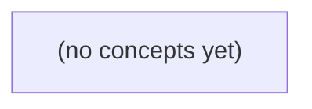

# 07.10 事务边界与 Outbox：Go IM 可靠事件发布基础

*一本面向 Go 技术栈初学者的静态教材，以 IM 消息 m-9/c-a/seq9 与事件 E9 为贯穿案例，解释 SQL 本地事务、Outbox、转发器、消费者幂等、顺序控制和故障修复。全书采用两遍递进教学，并以 22 道分层练习和评审产物帮助学习者建立不夸大“恰好一次”的工程判断。*

**章节:** 2

---

## 本书导览

- 了解整本书的章节脉络
- 掌握各章之间的概念依赖关系
- 选择最合适的阅读顺序

# 07.10 事务边界与 Outbox：Go IM 可靠事件发布基础

一本面向 Go 技术栈初学者的静态教材，以 IM 消息 m-9/c-a/seq9 与事件 E9 为贯穿案例，解释 SQL 本地事务、Outbox、转发器、消费者幂等、顺序控制和故障修复。全书采用两遍递进教学，并以 22 道分层练习和评审产物帮助学习者建立不夸大“恰好一次”的工程判断。

下方的概念图展示了本书 0 个核心概念以及它们之间的依赖关系；再下方是 1 个章节的入口。你可以按从上到下的顺序阅读，也可以根据自己的兴趣或先验知识选择切入点。

#### 概念图



## 章节索引

- **07.10 事务边界与 outbox：消息提交了，事件还没发** — 面向Go初学者，用虚构IM消息m-9与E9解释跨数据库与消息队列的双写裂缝、本地outbox原子范围、转发重试、消费幂等和外部效果。

## 07.10 事务边界与 outbox：消息提交了，事件还没发

- 比较两种朴素双写顺序的崩溃反例
- 说明消息与待发布意图同库事务
- 逐点推演C0–C7崩溃与ACK未知
- 设计多转发器认领与同键顺序
- 区分发送、消费与设备确认
- 对照固定OpenIM源码的已知与未知

从消息 m-9 的一次保存开始，先建立事务、提交、事件与派生副作用四个基本概念，再看两种双写顺序为何都会留下裂缝。

### m-9 的教学场景与事实边界

### m-9 的教学场景与事实边界

消息 `m-9` 属于会话 `c-a`，其顺序号为 `seq9`：它表示“该会话中第 9 条被处理的消息”。当前系统仅能确认它已进入运行中进程的内存，即状态为 `accepted_in_memory`。这说明应用暂时接收了它，但尚不能把它视为可恢复、可审计的权威事实：进程崩溃或重启后，内存中的这一确认可能消失。

后续教学拟引入 SQL 权威库，并把 `m-9` 以 `stored_in_teaching_db` 状态写入数据库。只有数据库事务成功 `Commit` 后，`m-9`、`c-a` 与 `seq9` 的关系才成为持久化事实；其中“拟议”意味着该状态与表结构尚未在当前 S2 中实现，不能假装它已经存在。

与该持久化动作对应的领域事件为 `E9`，其标识为 `event_id=evt:m-9:v1`。它表达的不是“内存里收到消息”，而是更严格的事实：`m-9` 已作为版本 `v1` 被可靠保存。`SearchIndex` 和 `Notify` 都需要消费这一事件，分别产生索引更新、通知发送等派生副作用。

因此应先分清边界：

- `accepted_in_memory`：进程内的暂时状态，不具备持久保证；
- `stored_in_teaching_db`：事务提交后的权威业务事实；
- `E9`：应由该事实导出的事件记录；
- 索引与通知：事件消费后的派生副作用，不应反过来决定主事实是否成立。

### 四个初学者必须分清的概念

### 四个初学者必须分清的概念

以消息 `m-9` 为例：它经过校验后，权威事实需要写入 SQL 库；随后应产生事件 `E9(event_id=evt:m-9:v1)`，交给 `SearchIndex` 建索引、交给 `Notify` 发送通知。这里至少有四层不同的东西，不能混为“保存成功”。

- **本地事务**：数据库内部的一组原子操作。例如同时写入 `messages` 表、更新会话状态、记录版本号。它保证这些 SQL 操作要么全成、要么全不成；**不保证** broker 收到任何消息，也不保证搜索索引或通知已经完成。

- **提交（Commit）**：本地事务从“暂时修改”变成“数据库持久事实”的时刻。提交成功后，`m-9` 才可称为 `stored_in_teaching_db`；在此之前，S2 的 `accepted_in_memory` 只是内存中的已接受提议，不是可恢复的权威记录。

- **领域事件**：对“某个业务事实已发生”的可传递描述。这里是“消息 `m-9` 已存储”的 `E9`，而不是“准备存储”或“用户点击了发送”。事件应有稳定标识 `evt:m-9:v1`，以支持重复投递时的去重；但事件对象即使已在内存中创建，**也不等于**它已经发布到 broker。

- **派生副作用**：由事件触发、但不构成权威事实本身的后续工作，如 `SearchIndex` 更新索引、`Notify` 推送提醒。它们可以稍后重试、可以重复执行并通过幂等处理收敛；**不应反过来决定** `m-9` 是否已经被数据库确认。

因此，“数据库已提交”“事件已持久记录”“broker 已接收”“消费者已完成副作用”是四个独立状态。后续 outbox 要解决的，正是提交后的事实与待发布事件如何不脱节。

### 先提交数据库再发送的丢失窗口

### 先提交数据库再发送的丢失窗口

设消息 `m-9` 已通过校验，应用在本地事务中写入 SQL 权威库：

- 消息记录状态从 `accepted_in_memory` 变为已存储；
- 事务执行 `COMMIT`，数据因此对后续读取永久可见；
- 按约定应产生事件 `E9(event_id=evt:m-9:v1)`，供 `SearchIndex` 建索引、`Notify` 发送通知。

若实现采用“先提交数据库，再调用 broker”的顺序，时间线可能是：

1. SQL 事务成功提交，`m-9` 已成为事实。
2. 应用尚未来得及发送 `E9`。
3. 进程崩溃、机器断电或部署重启。
4. 进程恢复后，只看到数据库中已有 `m-9`，却没有可靠证据表明 `E9` 尚未发送。

此时，数据库与外部系统出现永久分叉：`SearchIndex` 没有 `m-9` 的索引，用户搜索不到它；`Notify` 没有收到事件，也不会产生应有通知。问题不在于 broker 不可靠，而在于事件发送动作根本没有发生。

`COMMIT` 只保证本地数据库写入原子持久，不能把“向 broker 发送消息”一并纳入该原子性边界。若没有额外的可恢复发送记录，崩溃窗口中的 `E9` 就会静默丢失。

### 先发送事件再提交数据库的孤儿窗口

### 先发送事件再提交数据库的孤儿窗口

设 SQL 权威库中的消息 `m-9` 计划写入教学数据库，并产生事件：

`E9 = event_id=evt:m-9:v1`

若程序采用“先发事件、再提交数据库”的顺序，时间线可能是：

1. 开启本地事务，准备写入 `m-9`；
2. 向 broker 发布 `E9`；
3. `SearchIndex`、`Notify` 已消费该事件；
4. 数据库提交失败、事务回滚，或进程在提交前崩溃。

此时 broker 并不知道数据库事务最终失败。对下游而言，`E9` 是一个已到达、可消费的事实：`SearchIndex` 可能建立了 `m-9` 的索引，`Notify` 可能发出了“新消息已保存”的通知。但权威数据库中并不存在 `m-9`，原本提议的 `stored_in_teaching_db` 状态没有成立。

这种“事件存在、业务事实不存在”的事件称为**孤儿事件**。它不是简单的重复消费问题：即使每个消费者都严格按 `event_id` 去重，也无法修复“唯一的一次事件本身就是假的”这一矛盾。

因此，事件只有在对应业务事实已经提交后才应对外可见；否则下游观察到的是尚未成立、甚至永远不会成立的世界。

### 从双写裂缝到本地 outbox 问题

### 从双写裂缝到本地 outbox 问题

对消息 `m-9` 而言，教学库中的权威事实是：保存消息记录；而事件 `E9(event_id=evt:m-9:v1)` 是通知 `SearchIndex` 与 `Notify` 产生后续工作的事实。先区分四个概念：

- **本地事务**：数据库内一组操作要么全部成功，要么全部撤销。
- **提交**：事务正式落库；提交前的写入尚不构成可靠事实。
- **事件**：如“消息 `m-9` 已保存”的可传播记录。
- **派生副作用**：搜索建索引、发送通知等由事件触发的后续结果。

此时 S2 的 `accepted_in_memory` 只表示内存接收；`stored_in_teaching_db` 仍是待实现的提议。双写会遇到两种顺序：

1. **先提交数据库，再发送 broker**  
   消息已提交，但进程可能在发送前崩溃。数据库中存在 `m-9`，却没有 `E9`；搜索和通知永远不知道这条消息，牺牲了事件投递完整性。

2. **先发送 broker，再提交数据库**  
   broker 已收到 `E9`，但数据库事务可能回滚。消费者开始索引或通知，却查不到最终消息，形成“孤儿事件”，牺牲了事实与事件的一致性。

问题不在于重试哪一步，而在于消息记录与“待发布事件”的意图分属两个不可原子提交的系统。后续的本地 outbox 设计目标是：将 `m-9` 的持久化记录与 `E9` 的待发布记录写入**同一数据库、同一事务**；只有提交成功，才允许发布器异步、安全地把事件送往 broker。

> **要点** — 数据库提交与消息发送不是一个原子动作；仅靠调整先后顺序，无法同时避免丢事件与孤儿事件。

以消息 m-9 为例，先把“成功提交”限定在本地数据库，再理解为何事件尚未发出并不等于消息丢失。

### 先划清事务能保证什么

### 先划清事务能保证什么

以消息 `m-9` 为例：用户已通过认证与授权，服务端确认其仍是会话成员后，准备分配会话内序号 `c-a/seq=9`。此时应在**同一个数据库、同一个 `sql.Tx`** 中完成两类写入：

- 向 `messages` 写入消息记录；
- 向 `outbox` 写入待投递事件，例如唯一键 `event_id=evt:m-9:v1`。

事务提交成功，表示这两条数据库记录要么都可见，要么都不可见：

`messages(m-9) ∧ outbox(evt:m-9:v1)`

若插入消息、写入 outbox、约束检查中的任一步失败，则 `ROLLBACK`，不能留下“消息已保存但无事件”或“有事件但找不到消息”的半成品。对调用方而言，S3 的“发送成功”响应也应以这次**本地提交成功**为准，而不是等待 broker 或设备确认。

但 SQL 事务的边界到数据库即止。它通常**不能原子覆盖**：

- 向 Kafka、RabbitMQ 等消息队列发布；
- 向 APNs、FCM 或 WebSocket 设备推送；
- 对象存储、第三方接口及用户终端的实际接收。

因此，提交后即使进程崩溃、broker 暂不可用，`outbox` 仍会保留待发送任务；后台发布器稍后扫描并投递即可。反过来，不能把“已调用 broker 发布”当成数据库事务的一部分，否则仍可能出现数据库回滚而外部消息已经发出的双写不一致。

并发重试时，`event_id` 的唯一约束与幂等键共同防止同一消息生成两份事件。消息正文若含敏感内容，不宜直接复制进 outbox；更稳妥的是保存 `payload_ref`、事件版本和必要元数据，由发布器按版本读取或组装载荷。

### 在同一事务中写入消息与意图

### 在同一事务中写入消息与意图

以客户端请求发送消息 `m-9` 为例，先在事务外完成可独立判断的前置条件：认证调用者身份、确认其拥有向会话 `c-a` 发言的权限，并检查其仍是该会话成员。校验失败应直接拒绝；不要先写消息，再补做权限判断。

通过校验后，开启数据库事务 `tx`。事务边界只覆盖**同一个数据库**中的状态变化：

1. 在 `tx` 内为会话 `c-a` 分配下一个单调序号，例如锁定会话计数器或使用安全的条件更新，得到 `seq=9`。不能在事务外“先查最大序号再加一”，否则并发请求可能都得到 `9`。
2. 写入 `messages`：包含 `message_id=m-9`、`conversation_id=c-a`、`seq=9`、发送者、正文引用或密文、创建时间等。
3. 写入 `outbox`：记录“消息已提交后需要投递”的意图，例如唯一 `event_id=evt:m-9:v1`、事件类型、聚合键 `c-a`、序号 `9`、`payload_ref`、事件版本和待投递状态。
4. 提交 `tx`。消息、序号推进与 outbox 意图要么同时可见，要么同时回滚。

`event_id` 或 `(message_id, event_version)` 必须有唯一约束。客户端超时重试、服务端冲突重试时，应以幂等键识别同一逻辑消息，避免重复插入消息和重复生成事件；对序号分配发生的序列化冲突则重试整个事务，而不是仅重试 outbox 写入。

这里的“提交成功”仅表示本地数据库已持久化 `messages` 与 `outbox`。事务不包含消息代理、推送设备或对象存储；因此提交后事件尚未发送是正常状态。正文往往敏感，outbox 通常保存 `payload_ref` 与版本，而非复制完整正文。即使接口返回类似 `S3` 的成功响应，也只能承诺本地提交，不能承诺设备已经收到。

### 用唯一事件键抵御并发双发

### 用唯一事件键抵御并发双发

对消息 `m-9`，不要让每次重试都“新建一个事件”。应为其确定性生成事件键：

`event_id = evt:m-9:v1`

其中 `m-9` 是消息标识，`v1` 是事件版本。无论同一请求被客户端重放、网关超时后重试，还是两个并发处理器都认为自己应发送事件，它们都只能尝试写入同一个 `event_id`。

在同一个 `sql.Tx` 中写入消息与 outbox，并让数据库承担最终裁决：

- `messages` 按消息主键或请求幂等键建立唯一约束；
- `outbox.event_id` 建立唯一约束；
- 插入 outbox 冲突时，不再创建第二条待发送记录；
- 若已存在记录，应读取并确认其关联的消息、事件类型与版本一致；不一致是业务错误，不能静默复用。

例如，请求携带幂等键 `idem_key=client-req-42`。事务先检查该键是否已对应一条消息：若有，直接返回既有结果；若无，则创建 `m-9`，并插入：

`(event_id='evt:m-9:v1', payload_ref='messages/m-9', version=1)`

两个事务即使同时运行，也最多只有一个能成功占用唯一键；另一个会收到唯一约束冲突，应回滚后查询既有记录，而不是换一个随机事件键再试一次。

幂等键解决“同一用户请求重复提交”，`event_id` 解决“同一消息事件被重复创建”。二者缺一不可。尤其不要把完整敏感正文复制进 outbox；保存 `payload_ref`、事件版本和必要元数据即可。事务提交成功只表示本地消息与待发送事件已可靠落库，broker 或设备是否收到，仍由后续 outbox 投递器处理。

### 敏感正文不直接复制到 outbox

### 敏感正文不直接复制到 outbox

`outbox` 的职责不是保存第二份消息，而是保存“稍后应发布什么”的最小、可重建意图。若把 `messages.body` 直接内嵌到事件载荷，会带来三个问题：

- **敏感数据扩散**：正文可能经过日志、重试队列、监控、死信队列和多个消费者，访问边界远大于主库。
- **双份数据漂移**：消息正文被编辑、撤回或脱敏后，`outbox` 中的旧副本仍可能被发布。
- **存储与重试成本上升**：大正文会放大事务写入、轮询扫描和 broker 传输成本。

更稳妥的记录方式是保存引用与版本，例如：

`event_id = evt:m-9:v1`  
`type = message.created`  
`payload_ref = messages/m-9`  
`payload_version = 1`

发布器读取已提交的 outbox 记录后，再按 `payload_ref` 在受控数据源中重建发布内容；消费者则以 `event_id` 去重。这里的“重建”必须是稳定的：`v1` 表示发布语义对应创建时的版本，而不是无条件读取当前最新正文。若正文已变更，应产生新的事件版本，而非让旧事件悄悄变成新内容。

只有确有必要让下游在无权访问主数据源时立即处理少量字段，才可内嵌经过最小化、脱敏后的快照。无论哪种形式，事务中写入的仍只是同一数据库内的 `messages` 与 `outbox`；S3、broker 或设备端响应都不能算入本地提交。

### S3 成功只代表本地已提交

### S3 成功只代表本地已提交

对消息 `m-9` 而言，S3 返回成功，严格说只表示：服务端已完成认证、授权与成员资格检查，并在**同一个数据库事务**中写入消息记录和待转发事件。例如：

- `messages`：保存消息 `m-9`，分配会话内序号 `c-a:seq9`；
- `outbox`：保存唯一事件 `evt:m-9:v1`，状态为待发送；
- 事务提交成功：两条记录同时可见；提交失败：两条记录同时回滚。

因此，S3 的语义是“本地持久化成功”，不是“对方已收到”。

| 层次 | 成功意味着什么 | 仍不能推出什么 |
|---|---|---|
| 本地数据库提交 | 消息与 outbox 事件已可靠落库 | broker 已收到 |
| 转发至 broker | broker 已接受事件 | 消费者已处理 |
| 消费者处理 | 下游业务已写入或执行 | 设备已在线、已展示 |
| 设备确认 | 目标设备返回确认 | 用户已经阅读 |

事务边界只覆盖该数据库，不能把 broker、消费者数据库或用户设备纳入同一次 `sql.Tx`。提交后转发器可重试读取 outbox；即使进程在提交后立刻崩溃，事件仍在库中，不会因“还没发出”而丢失。

为防止并发或重试造成双发，应让 `event_id` 具备唯一约束，并让 broker 发布、消费者处理都以该幂等键去重。消息正文通常敏感，outbox 更适合保存 `payload_ref`、事件版本和必要元数据，而非复制完整正文。

> **要点** — 本地事务负责让消息与待发布意图同成同败；队列发送和设备送达必须由后续机制处理。

以消息 m-9 与事件 E9 为线索，逐点分析从本地提交到消费者索引完成之间的状态、未知性与可恢复边界。

### 先看两种双写为何必然留缝

### 先看两种双写为何必然留缝

以消息 `m-9` 及其事件 `E9` 为例，若数据库更新与发送消息是两个独立操作，就不存在真正原子的“两步成功”。

- **先写数据库，再发消息**  
  先将 `m-9` 提交为已接收，再向 broker 发送 `E9`。若数据库提交后进程崩溃、网络中断，或发送逻辑根本未执行，则数据库中已有 `m-9`，但外部没有 `E9`。这是**漏事件**：后续索引、通知或下游 B 都不会启动。  
  更棘手的是，调用方往往只知道“数据库成功”，却不知道事件是否已被 broker 保存；重试若缺少稳定 `event_id`，还可能制造重复事件。

- **先发消息，再写数据库**  
  先让 broker 保存 `E9`，随后再提交 `m-9`。若消息已被确认保存，但数据库事务回滚或进程在提交前崩溃，消费者仍会处理 `E9`，却查不到对应的 `m-9`。这是**幽灵事件**：事件宣称某个事实已发生，而事实并未落库。  
  消费者即使重试，也无法把不存在的业务事实“等出来”；若据此创建索引或调用 B，便会扩散错误。

两种顺序只能选择不同的失败窗口，不能消除窗口。根因在于数据库事务与 broker 确认没有共同提交点；把“已提交的业务事实”先持久化为同一事务中的 outbox 记录，才能把跨系统双写转化为可恢复的后续投递。

### C0至C2：把发布意图纳入同一事务

### C0至C2：把发布意图纳入同一事务

以消息 `m-9` 与事件 `E9` 为例，先区分“业务已接受”与“事件已发布”：前者必须由本地数据库事务确定，后者只能在事务提交后异步推进。

- **C0：前置校验。**服务校验请求参数、权限、业务状态与幂等键；例如确认 `m-9` 尚未创建，且允许生成事件 `E9`。此时各方已知的只是“请求正在处理”，数据库中尚无可靠结果。若校验失败，直接返回，不写消息也不写 outbox。

- **C1：同一事务内写两行，均未提交。**在同一个数据库事务中：
  1. 写入消息记录 `m-9`；
  2. 写入 outbox 记录 `E9`，状态为 `PENDING`，携带稳定的 `event_id=E9`、主题与载荷。

  此时应用进程可以看到暂存写入，但事务外读者、relay、消费者都不应将其视为事实。若进程崩溃或事务回滚，`m-9` 与 `E9` 会一起消失；不会出现“消息不存在但事件意图已持久化”，也不会出现“消息已落库却根本没有可补发事件”的裂缝。

- **C2：同库 Commit。**提交成功后，`m-9` 与 `E9(PENDING)` 原子可见。此时已知：业务消息已持久化，且存在一条可由 relay 扫描、领取和重试的发布意图。未知：broker 是否收到 `E9`、消费者是否处理、下游系统 `B` 是否完成。

修复关键在于：**消息行与 outbox 行必须同库、同事务、同一次 Commit**。不能先提交 `m-9` 再“尽力”发送事件；一旦发送前崩溃，后续没有可靠证据表明 `E9` 仍需发布。C2 只保证“应当发布”可恢复，不保证“已经发布”，更不代表消费者或 `B` 已完成。

### C3至C6：确认边界决定能否安全重试

### C3至C6：确认边界决定能否安全重试

C2 已将业务消息 `m-9` 与 outbox 事件 `E9` 原子提交后，relay 才能在 C3 认领状态为 `PENDING` 的记录。此时已知：数据库中确有待发送的 `E9`；未知：此前是否存在某个 relay 已经发送过它。因此认领应使用租约、行锁或“领取者 + 过期时间”，避免多个 relay 长期同时处理；即使并发领取，也不能把“可能重复”误判为“不可恢复”。

在 C4，relay 将 `E9` 发送给 broker，broker 已确认将其持久保存。此刻已知：broker 拥有 `E9`；未知：relay 是否真正收到了生产确认。若确认报文丢失，或 relay 在收到确认后、更新数据库前崩溃，恢复后的 relay 仍会看到 `PENDING` 或过期租约，并再次发送同一 `event_id=E9`。

这不是漏发，而是可接受的至少一次投递：C4 到 C6 的故障窗口天然可能重复。修复不应试图凭 relay 内存判断“刚才似乎发过”，而应让 broker、消费者或下游 B 按稳定的 `event_id` 去重，使重复 `E9` 不重复建索引、不重复产生业务副作用。

C6 的 `PUBLISHED` 必须在“已知 broker 确认成功”之后写入。若在 C4 前提前标记 `PUBLISHED`，relay 随后崩溃或发送失败时，扫描任务会跳过该记录，`E9` 将永久漏发。反之，先确认、后置状态即使失败也只会重发。还要注意：`PUBLISHED` 仅表示 broker 已接收事件，不表示消费者已处理，更不表示 B 已完成；消费者完成索引属于后续 C7 的独立确认边界。

### 多转发器认领与同键顺序

### 多转发器认领与同键顺序

多个 relay 可以并行扫描 outbox，但同一条事件必须只被一个实例在有效租约内处理。典型认领条件是：记录为 `PENDING`，且尚未被认领或租约已过期；通过条件更新原子写入 `owner_id`、`lease_until` 与尝试次数。更新成功者才有资格发送，失败者跳过，避免“先查后改”造成双重认领。

- **已知**：`PENDING` 表示事件尚未被确认发布；过期租约表示原 relay 可能崩溃，可被其他 relay 接管。
- **未知**：租约过期并不证明旧 relay 没有把 E9 交给 broker；它可能已在 C4 获得 broker 确认，只是 C6 前崩溃。
- **修复**：接管者仍以原 `event_id=E9` 重发；broker、消费者或下游 B 必须按 `event_id` 幂等。不要因重复风险而在 broker 确认前标记 `PUBLISHED`，否则崩溃会留下永久漏发。

若业务要求同一业务键（如 `order_id`）严格顺序，不能仅依赖全局并发 relay。应以 `business_key` 分片：同键事件路由到同一逻辑分区，并在分区内按 outbox 序号串行领取、串行发布；后序事件应等待前序事件确认后再发送。不同键仍可并行。

`PUBLISHED` 仅表示 relay 已知 broker 接受了事件，不表示消费者已处理，更不表示 B 已完成索引；消费者仍需以自身幂等记录和重试机制完成 C7。

### C7消费完成不等于设备已确认

### C7 消费完成不等于设备已确认

沿着 `E9` 看，至少存在三层彼此独立的效果，不能把其中任意一层当作最终送达：

1. **已发送到 broker**：在 C4，broker 已持久化 `E9`，这是 relay 可确认的已知事实；但生产者 ACK 若在网络中丢失，relay 在 C5 重试同一 `event_id` 是合理的。此时允许 broker 看到重复消息，前提是下游按 `event_id` 幂等。

2. **消费者完成索引**：C7 中消费者将 `E9` 写入索引或本地消费记录。若索引写入与“已消费”标记具备原子性，重复投递只会得到“已处理”的结果；若写完索引、尚未来得及确认就崩溃，则 broker 会再次投递，仍应可恢复。这只能证明 OpenIM 的某个消费链路已完成可查询的索引效果。

3. **设备 B 已确认**：设备是否在线、是否收到推送、是否解密成功、是否向服务端回执，是另一条协议链路。即使 C7 已完成，B 仍可能离线、断网或在收到前切换设备。因此，`PUBLISHED` 更不代表 B 已确认；它仅表示 relay 已知 broker 接受了事件。

固定源码能够直接确认的，通常是 outbox 状态、生产调用和消费者索引路径；无法仅据此确认的，是 broker 后续投递时机、消费者进程崩溃窗口，以及设备 B 的最终回执。修复方式是：以 `event_id` 贯穿 outbox、broker 与消费去重；将设备确认建模为独立 ACK 状态，而非复用 `PUBLISHED`；对未确认设备保留重试、补拉或离线同步能力。

> **要点** — outbox 保证提交后的发布意图可恢复；broker 确认前不得标已发布，重复发送须由 event_id 幂等吸收。

本节聚焦多个转发器并发处理同一 outbox 时，如何既避免重复认领，又不破坏同一会话事件的发布顺序。

### 并发转发器的重复领取风险

### 并发转发器的重复领取风险

设 outbox 中有事件 `E9`：

| id | conversation_id | seq | status |
|---|---:|---:|---|
| E9 | C42 | 9 | pending |

两个 relay 几乎同时轮询：

1. Relay A 执行“查询 `status='pending'` 的事件”，读到 `E9`；
2. Relay B 在 A 真正发送前执行同样查询，也读到 `E9`；
3. A、B 都向 broker 发布 `E9`；
4. 两者再分别把该行更新为 `sent`。

问题不在 broker，而在“看见待发送”不等于“获得发送权”。普通 `SELECT` 只是快照读取；即使随后执行 `UPDATE ... SET status='sending'`，若没有条件约束或锁，两个 relay 仍可能基于同一旧状态作出发送决定。

不能把“先发消息、后改状态”当作互斥协议：broker 调用通常跨网络、耗时且可能重试，数据库事务锁若一直持有到 broker 返回，会放大锁竞争、阻塞扫描，并在 relay 崩溃时留下长事务风险。

因此，领取必须成为一个原子的、可恢复的状态转换，而不是“查到一行”：

```sql
UPDATE outbox
SET status = 'sending',
    lease_owner = :relay_id,
    lease_expires_at = now() + interval '30 seconds'
WHERE id = :id
  AND status = 'pending';
```

只有更新行数为 `1` 的 relay 才取得本轮发送权；更新为 `0` 则说明已被其他 relay 领取。后续还必须处理租约到期后的重新领取，否则死掉的 relay 会使 `E9` 永久停在 `sending`。

### 短事务认领与租约恢复

### 短事务认领与租约恢复

多个 relay 不能在读取到 `PENDING` 后各自直接发送：它们可能同时取得同一行，造成重复发布。认领必须是数据库内的短事务，其目标只是原子地把任务从“可领取”改为“已租用”，而不是在持锁期间调用 broker。

PostgreSQL 可用队列式争抢：

1. `SELECT ... FOR UPDATE SKIP LOCKED` 选出少量 `PENDING` 或租约已过期的行；
2. 在同一短事务内更新：
   `status='CLAIMED'`、`owner_id=relay_id`、`lease_expires_at=now()+interval '30 seconds'`；
3. 提交事务后，relay 才向 broker 发布。

`SKIP LOCKED` 使并发 relay 跳过已被其他事务锁住的行，降低争抢等待；但该锁仅保护“领取”瞬间，不能跨越网络调用一直持有。若 relay 在发布前崩溃，遗留行会在租约到期后重新变为可领取：

```sql
UPDATE outbox
SET status = 'CLAIMED',
    owner_id = :relay_id,
    lease_expires_at = now() + interval '30 seconds'
WHERE id = :id
  AND (status = 'PENDING' OR lease_expires_at < now());
```

发布完成后的确认也应带条件，例如 `WHERE owner_id=:relay_id AND lease_expires_at>now()`，避免旧 relay 在租约失效、任务已被新 relay 接管后，错误覆盖新状态。必要时引入递增的 `claim_epoch` 作为 fencing token：只有最新认领者的令牌才可确认、续租或写入后续状态。租约恢复解决的是“领取者死亡”；重复发布仍须依赖消息幂等键与消费者去重。

### SKIP LOCKED 的边界

### SKIP LOCKED 的边界

普通扫描 `SELECT ... WHERE status='pending'` 在多个 relay 并发执行时，可能读到同一行；若随后各自发送到 broker，就会产生重复发布。即使再用 `FOR UPDATE`，后来的 relay 也会阻塞在已锁行上，吞吐量会被慢消费者拖累。

PostgreSQL 的 `SELECT ... FOR UPDATE SKIP LOCKED` 更适合队列式争抢：

```sql
SELECT id
FROM outbox
WHERE status = 'pending'
ORDER BY created_at
FOR UPDATE SKIP LOCKED
LIMIT 100;
```

它的含义是：已被其他事务锁住的行直接跳过，当前 relay 领取其余可用行，不必等待。随后应在**短事务**内把行条件更新为 `claimed`，写入 `lease_expires_at`、`claimed_by` 等字段后立即提交。

但它只解决“谁领取”的竞争，不能解决“谁最终发送”的全部问题：

- 数据库行锁随事务提交而释放，不能跨越 broker 网络调用一直持有；否则慢 broker 会长期占锁，甚至阻塞业务写入。
- relay 在提交领取后崩溃，租约到期后必须允许其他 relay 重新领取。
- relay 已成功发送、但尚未来得及标记完成就崩溃时，重领仍可能再次发送；消费者仍需幂等。
- 仅靠 `SKIP LOCKED` 不保证同一 `conversation_id` 的 `seq=9`、`seq=10` 按序发布；领取顺序和实际网络发送完成顺序都可能倒置。

因此，`SKIP LOCKED` 是高并发领取工具，不是跨系统互斥锁，更不是事件顺序保证。

### E9 与 E10 的倒序发布

### E9 与 E10 的倒序发布

设同一 `conversation_id` 产生了两条 outbox 记录：

| 事件 | `seq` | 被认领者 |
|---|---:|---|
| E9 | 9 | Relay A |
| E10 | 10 | Relay B |

即使两条记录都按 `conversation_id` 路由到同一个消息分区，仍可能发生：

1. Relay A 先领取 E9，但在序列化、网络重试或 broker 调用前暂停。
2. Relay B 随后领取 E10，并更快完成 `publish(E10)`。
3. broker 先接收 E10；稍后 Relay A 才发布 E9。
4. 同一分区只能保证“broker 已接收消息”的追加顺序，不能替应用纠正“多个 relay 谁先提交生产请求”。

因此，分区键不是顺序闸门。它保证的是：

`先进入该分区的消息` 按顺序被消费，

而不是：

`数据库中 seq 较小的事件` 必然先进入该分区。

若消费者将事件直接应用到会话状态，E10 可能建立在 E9 尚未生效的前提上，造成版本跳跃、状态机非法迁移或用户可见的时间线错乱。

解决方向是为每个会话建立发布顺序约束：仅允许当前最小未发布 `seq` 被认领或发送；E9 成功确认后，E10 才可进入可发布状态。若无法做到严格有序发布，则消费者必须按目标版本做条件更新，例如仅在当前版本为 `8` 时接受 `seq=9`，并明确处理 E10 先到时的缓存、重试或业务降级缺口。

### 每会话顺序闸门与业务取舍

### 每会话顺序闸门与业务取舍

租约只能保证“某条记录由谁暂时处理”，不能保证同一会话的 `seq` 顺序。比如转发器 A 领到 `E9(seq=9)`、转发器 B 领到 `E10(seq=10)`；若 B 先完成 broker 调用，即使消息按 `conversation_id` 分区，broker 看到的发布顺序仍可能是 `E10 → E9`。

需要在应用层建立每会话顺序闸门：

- **串行认领**：同一 `conversation_id` 同时仅允许一个活跃租约；领取 `E10` 前确认 `E9` 已发布，或由会话游标记录当前允许发送的 `seq`。
- **按 `seq` 发布**：一次只领取每个会话中最小的未完成 `seq`；发布成功后推进游标，再释放下一条。
- **目标版本条件更新**：消费者处理事件时要求 `incoming_seq = current_seq + 1`，或仅接受更大的版本号。前者严格保序但遇到缺口会阻塞；后者可容忍乱序，却可能跳过中间业务动作。

严格顺序适合“消息撤回必须晚于消息发送”这类语义；允许版本覆盖适合“资料最终状态同步”。无论选择哪种，重复投递、`seq` 缺口、broker 调用后的崩溃及外部副作用仍要独立处理：消费者幂等、缺口告警/补偿、以及可重试的状态条件更新都不可省略。

> **要点** — 行锁解决谁能领取，租约解决谁崩溃后可接手；同会话顺序还需独立的发布闸门与业务语义。

E9 即使被重复投递，也必须让搜索索引、通知与外部设备效果各自保持正确：可重试、不倒退、不重复。

### 独立消费组与稳定效果键

### 独立消费组与稳定效果键

同一条事件 E9 不应由一个“万能消费者”同时更新搜索、发送通知。应拆成彼此独立的消费组：`SearchIndex` 只维护索引状态，`Notify` 只负责生成并投递通知任务。它们各自保存位点、独立重试、独立积压；搜索暂时失败不应阻塞通知，通知限流也不应拖慢索引更新。

重复投递时，不能只依赖消息队列的“至少一次”语义，而要为每种效果定义稳定键：

`effect_key = (message_id, version, side_effect)`

其中：

- `message_id` 标识原始业务事件；
- `version` 标识该实体状态的版本，例如同一订单的 `v1`、`v2`；
- `side_effect` 区分效果类型，如 `search_index`、`notify_user`、`push_gateway`。

`SearchIndex` 对索引执行带版本条件的写入：仅当新版本不小于索引中已有版本时更新。于是重复的 E9 `v2` 只是幂等重写，而迟到的 `v1` 必须被拒绝，不能覆盖 `v2`。

`Notify` 则应在本地事务中原子完成“写入去重记录”和“创建待发送任务”：若 `(message_id, version, notify_user)` 已存在，重复 E9 不再创建第二个通知任务。注意，这只能保证本地通知意图不重复；设备推送或第三方调用发生在事务之外，仍需用 `attempt`、回执查询与目标状态确认处理“已发送但结果未知”。

### 索引更新的版本条件写

### 索引更新的版本条件写

同一业务对象的事件可以合法地产生多个版本：`E9(v1)` 表示名称为 A，随后 `E9(v2)` 表示名称改为 B。消息系统通常只保证“至少一次”，不保证全局顺序，因此消费者可能先收到 `v2`，再迟到收到 `v1`。若索引端直接按到达顺序覆盖，最终搜索结果会从 B 倒退回 A。

因此，索引文档必须保存已应用版本，例如：

`{ entity_id, version: 2, name: "B", ... }`

处理消息 `(message_id=E9, version=1, side_effect=SearchIndex)` 时，写入不是无条件 `upsert`，而是带版本谓词的原子条件写：

`仅当目标不存在，或 target.version < incoming.version 时，更新目标`

可抽象为：

`UPDATE index SET ..., version = :v WHERE entity_id = :id AND version < :v`

若目标不存在，则以 `version=v` 创建；若当前版本等于 `v`，说明该版本已成功应用，重复投递应成为无效果成功；若当前版本大于 `v`，说明消息迟到，同样跳过。于是：

- `v1 → v2`：两次均可写，最终为 `v2`；
- `v2 → v1`：`v2` 写入后，`v1` 因 `2 < 1` 不成立而被拒绝；
- `v2 → v2`：第二次不改变索引；
- `v1` 重复多次：只有首次可能生效。

关键在于“比较版本并写入新版本”必须是索引存储中的同一原子操作，不能先读版本、再由应用层决定写入；否则两个并发消费者都可能基于旧读值写入，重新引入倒退窗口。去重记录若单独保存，也必须与目标条件写处于明确的一致性范围：要么由同一存储事务提交，要么以目标文档上的版本条件作为最终裁决。

### 通知去重与外部效果边界

### 通知去重与外部效果边界

`Notify` 是独立于 `SearchIndex` 的消费组：两者都可重复收到 E9，但各自维护去重与推进状态，不能共享“已经处理”这一模糊结论。通知侧建议以稳定键：

`(message_id, version, side_effect = "notify")`

记录消费结果，并把它与数据库内通知状态更新放入同一个本地事务。例如，只有当目标通知仍满足 `applied_version < version` 时，才写入“待发送”状态并推进版本；`v1`、`v2` 是合法的不同版本，但迟到的 `v1` 不得覆盖已应用的 `v2`。

可原子提交的范围通常是：

- 消费去重记录；
- 通知业务状态，如 `pending`、`version`、通知内容快照；
- 后续推送任务或 outbox 记录。

这三个对象位于同一数据库时，应在同一 SQL 事务内提交。事务成功后，即使 E9 再投递，也会命中去重记录或版本条件，不能再次创建待发送任务。

但“已向设备展示”或“第三方推送平台已接收”不属于该事务：数据库无法与 gateway、APNs、短信服务等组成一个可靠的单一提交。推送 worker 应把每次调用记为 `gateway attempt`，包含幂等请求键、目标设备、请求摘要与返回结果；接收方若支持回执，还应另行记录 `B receive/read`。因此，数据库中的 `sent` 最多表示“本方已成功调用或已获网关确认”，不自动等价于“设备已读”。

调用超时、连接断开时结果可能未知。不要直接认定失败并无条件重发：先按幂等键查询网关或目标状态；可确认未发送才重试，已发送则补写本地状态，仍未知则保留可审计的 `unknown` 并按重试策略处理。长期失败进入积压与 DLQ 流程，避免无限重试扩大外部重复效果。

### 未知结果下的查询后重试

### 未知结果下的查询后重试

外部推送无法纳入数据库事务：本地已提交 outbox、消息也可能已被消费，但调用推送网关后若发生超时，消费者并不知道“请求未到达”还是“网关已受理而响应丢失”。此时直接重试，最容易造成同一 `message_id, version, side_effect=notify` 的重复设备提醒。

应建立分层证据链，而不是把一次 HTTP 成功误认为最终送达：

1. **gateway attempt**：每次调用生成稳定的幂等键，例如 `message_id:version:notify`，持久化请求摘要、尝试次数、时间和网关返回的 `provider_message_id`。网关若支持幂等键，应保证重复提交返回同一受理结果。
2. **接收确认**：网关回调或查询接口表明该请求已被网关受理、进入投递队列，记录为“已接收”；这只能证明第三方接手，不能证明设备展示。
3. **已读确认**：设备回执、业务端打开通知或用户已读事件到达后，才记录为“已读”。它是更强的业务证据，但不应阻塞前两阶段的重试与积压治理。

当调用结果未知时，消费者先以幂等键或 `provider_message_id` 查询网关目标状态：

- 查到已接收、已送达或已读：补齐本地去重/状态记录，确认消息，不再发送。
- 查到明确不存在：以相同幂等键重试；网关 attempt 追加记录，而非覆盖历史。
- 查询仍失败或状态不确定：保留为待确认，按退避策略重试；超过阈值进入积压或 DLQ，由人工或补偿任务处理。

这样，“重试”针对的是缺失的证据，而非盲目重复外部效果。即使 E9 重复投递，旧版本 `v1` 的查询与重试也不得覆盖已完成的 `v2`；状态更新必须带版本条件，例如仅当目标版本不高于当前版本时写入。

### 积压、认领失败与死信处置

### 积压、认领失败与死信处置

不是所有失败都应立即进入死信队列。判断关键在于：该消息是否仍可能通过**安全重复**获得正确结果，以及失败是否已超出正常重试的恢复范围。

| 情形 | 建议处置 | 正确性要求 |
|---|---|---|
| `SearchIndex` 写入超时、消费者崩溃、认领租约过期 | 回到积压，重新认领并执行 | 用 `(message_id, version, side_effect)` 去重；索引仅在目标版本更新时写入，`v1` 不得覆盖已有 `v2` |
| `Notify` 本地去重记录未提交、事务回滚 | 重试消费 | 去重记录与“已处理”状态必须在同一数据库事务内原子提交 |
| 已调用 gateway，但响应丢失或超时 | 先查询 gateway attempt、回执或目标状态，再决定重试 | 外部推送不在消息 SQL Tx 内；未知结果不能直接判定失败，也不能盲目再次发送 |
| 下游限流、网络暂断、依赖服务维护 | 延迟重试并保留积压 | 使用退避、重试上限和可观测的认领次数，避免热点消息阻塞全组 |
| 载荷损坏、版本不兼容、稳定违反业务约束 | 转入 DLQ | 保留原消息、异常、消费组、尝试次数与关联键，等待修复或人工重放 |
| 连续重试仍无法确认外部效果 | 隔离到 DLQ 或人工核验队列 | 依据 B 端 `receive/read`、gateway 回执等证据补偿，不以“已投递”替代“已生效” |

因此，07.07 的转发积压承接的是“尚可恢复的交付”；07.09 的 DLQ 承接的是“自动恢复已不可信”的失败。无论重放多少次 E9，重复消息只能增加处理尝试，不能重复索引副作用或外部通知效果。

> **要点** — 重复 E9 可以接受；用稳定键、版本条件写与可审计确认链，防止状态倒退和外部效果重复。

outbox 解决原子提交，不保证事件已被外部世界可靠看见；必须用观测、对账与重建闭合最终一致性。

### 从待发布年龄发现转发停滞

### 从待发布年龄发现转发停滞

Outbox 行已随业务事务提交，只表示“事件待处理”，不表示 broker 已接收。最敏感的停滞信号不是平均延迟，而是**待发布记录的最老年龄**：

$$
\text{pending\_oldest\_age}=\operatorname{now}-\min(\text{created\_at}\mid status=\text{PENDING})
$$

它回答的是：“当前最早那条尚未发布的事件，已经等待多久？”若 relay 正常持续工作，该值通常应落在一个可预期的小窗口内；持续上升则说明至少有一部分记录没有被推进。

同时观察以下指标：

- **待发布积压数量**：`count(status=PENDING)`。数量上升而最老年龄稳定，常见于短时流量突增或 relay 吞吐不足；数量与最老年龄同时上升，说明处理能力长期低于写入速度，或 relay 已停滞。
- **重试次数分布**：按 `retry_count` 分桶，而非只看总重试量。大量记录集中在高重试区间，通常意味着 broker 不可达、认证失效、序列化错误或某类事件始终被拒绝。
- **最后尝试时间**：若最老待发布记录的 `last_attempt_at` 长时间不变，relay 可能未运行、租约卡死或扫描条件遗漏；若持续更新但始终未发布，则是“在重试但失败”。
- **按事件类型、分片和租户拆分**：全局指标正常不能排除局部毒消息、热点分区或单租户限流造成的堆积。

告警应围绕服务目标设置，例如“最老年龄超过 5 分钟”与“高重试记录超过阈值”分别告警。不要仅因积压存在就判定故障：批处理、计划性维护会产生短暂积压；但最老年龄持续恶化，才是 relay 未能向前推进的直接证据。

### 发布结果为何只能分为已知与未知

### 发布结果为何只能分为已知与未知

relay 从 outbox 取出已提交记录后，不能把“调用发送接口”误认为“事件已经发布”。一次发布至少跨越本地状态、网络、broker 持久化确认三个边界；在这些边界之间崩溃，通常无法得到“确定未发布”的结论。

设事件为 $e$，常见时序如下：

1. relay 发送 $e$ 前崩溃：可判定为**已知未发布**，可安全重试。
2. broker 已接收并持久化，但 ACK 尚未返回，relay 超时：结果是**未知**。
3. ACK 在网络中丢失，relay 以为失败：实际可能已发布，结果仍是**未知**。
4. relay 收到 ACK 后、将 outbox 标为 `PUBLISHED` 前崩溃：broker 可能已有事件，本地却仍是 `PENDING`，结果仍是**未知**。
5. 本地已标记 `PUBLISHED`，但此前 ACK 语义仅表示“已接受”而非“已持久化”：若 broker 协议不提供可靠确认，发布事实也未必成立。

因此，`PUBLISHED` 应表达“relay 已获得该 broker 语义下的成功确认”，而不是宣称端到端业务效果已经发生。超时、连接断开、进程崩溃、ACK 丢失都应进入“未知但需重试”的处理路径；试图据此判定“肯定没发出去”，会在故障窗口制造漏发。

代价是重复发布不可避免。事件必须携带稳定的 `event_id`，消费者按该标识去重，外部副作用使用幂等键；relay 自身也应允许对同一 outbox 行多次投递。这里追求的是“至少一次投递 + 幂等处理”，不是跨数据库、broker 与消费者的整体 exactly once。对未知结果进行重放后，还应以 broker 位点、消费者处理记录和权威数据对账来确认最终效果。

### 端到端指标不能只看PUBLISHED比例

### 端到端指标不能只看 `PUBLISHED` 比例

`PUBLISHED / outbox总数` 只能证明：发布器**曾把记录标记为已发布**。它不能证明 broker 已持久化、消费者已处理、搜索索引已更新，更不能证明设备已经执行外部动作。

应将指标按“证明的事实”分层观察：

| 指标 | 能证明什么 | 不能证明什么 |
|---|---|---|
| outbox 的 `PUBLISHED` 比例 | 本地发布流程大体完成 | 消息一定到达 broker 或被消费 |
| 最老 `pending` 年龄、重试次数 | 是否存在长期卡住的待发布事件 | 下游是否健康 |
| broker 积压、分区位点差 | broker 中尚待消费的消息量 | 消费者业务处理成功 |
| consumer lag、失败/重试率 | 消费进度是否落后于生产 | 外部副作用已完成且正确 |
| 权威 `messages` 与索引的缺口 | 派生索引是否漏建、滞后或损坏 | 设备状态是否同步 |
| 设备回执、心跳与期望状态差异 | 设备是否确认执行或偏离目标状态 | 上游事件没有重复投递 |

例如，`PUBLISHED=99.99%` 仍可能掩盖两类事故：少量最老 `pending` 已卡住数天；或消息虽然已写入 broker，但某消费者停滞，导致索引持续缺口。反过来，consumer lag 为零也只表示消费者读到了末尾，不表示其调用设备接口后的效果已被确认。

因此，告警应组合设置：`pending` 最老年龄、发布未知结果数量、broker 积压、consumer lag、索引对账缺口、设备期望—实际状态偏差。它们共同描述一条链路，而非用单一发布率制造“端到端成功”的错觉。

### 以权威表对账并重建派生状态

### 以权威表对账并重建派生状态

`messages` 与已提交的 `outbox` 是业务事实的权威来源；搜索索引、未读计数、会话摘要、设备状态、分析宽表及消费者侧投影都只是可重建的派生状态。不能因为消息已标记 `PUBLISHED`，就假定所有下游都已正确处理。

定期执行对账任务，至少覆盖：

- `messages` 中存在、但对应 `outbox` 不存在的记录：可能是绕过事务写入，或写入链路异常；
- `outbox` 已提交但长期未发布的记录：按最老 `pending` 年龄告警，并触发 relay 重试或补发；
- 已发布事件与消费者投影的缺口：例如 `message_id` 在权威表存在，却未进入搜索索引或会话视图；
- broker 积压、消费者 lag 与最终索引缺口之间的关联：lag 为零不等于外部索引已成功落地；
- 设备状态：它通常受离线、重连、心跳影响，应独立于消息投影核对，不能由“事件已发布”推断为“设备已更新”。

对账应以稳定的业务键，如 `message_id`、`event_id` 和版本号进行，而非仅按时间范围粗略统计。发现缺口后，优先从权威表生成重建任务：按消息重新投递事件，或直接批量重建指定时间窗、会话或租户的派生索引。消费者必须幂等，例如以 `(consumer_name, event_id)` 去重，或仅接受版本更高的投影更新，避免补发造成重复外部效果。

已发布的 outbox 记录不应立刻删除。保留期需支持审计、故障追溯、消费者重放和索引重建；可将较老记录归档到低成本存储，并保存事件载荷、发布时间、重试次数、发布结果及关联业务键。清理前应确认：保留窗口已过、必要消费者可从归档重放，且权威表足以重建派生状态。

若使用 Debezium Outbox Event Router，变更数据捕获组件可从数据库提交日志读取 outbox 行，替代应用 relay 的轮询提取。但它仍需处理位点保存、重复读取、重放、下游幂等及外部系统写入失败。它改善提取可靠性，不代表从数据库到 broker、消费者和外部索引获得端到端“恰好一次”；最终仍要依靠对账与可重建流程闭环。

### CDC替代relay但不替代幂等核对

### CDC替代relay但不替代幂等核对

轮询 relay 主动查询 `outbox` 中待发布记录，发布成功后更新状态；Debezium outbox event router 则订阅数据库变更日志，将**已提交事务**中的 outbox 插入行路由到消息系统。后者减少了应用侧轮询、锁竞争和“先读后标记”的实现负担，但两者都只是“提取已提交事件”的方式。

| 维度 | 轮询 relay | Debezium outbox event router |
|---|---|---|
| 提取依据 | `PENDING` 等业务状态 | 数据库提交后的变更日志 |
| 进度记录 | outbox 状态、扫描游标 | CDC 位点、连接器偏移量 |
| 重试来源 | 重新扫描未完成记录 | 重读位点、连接器重启或重放 |
| 常见风险 | 重复扫描、发布后状态未更新 | 位点回退、快照/重放、下游重复 |

CDC 不意味着端到端“恰好一次”。例如，Debezium 已将事件写入 broker，但其偏移量尚未来得及持久化；重启后会再次读取该变更。反过来，broker 可用并不证明消费者已完成数据库写入、索引更新、通知发送或设备控制等外部效果。

因此，事件必须携带稳定的 `event_id`、聚合标识与版本号；消费者应以 `event_id` 建立去重记录，或用条件更新保证版本单调：

`UPDATE device SET version = :v ... WHERE version < :v`

对邮件、支付、设备指令等不可简单回滚的外部效果，还应保存请求幂等键、第三方回执和可查询状态，定期将其与权威 `messages`、`outbox` 记录对账。CDC 的位点只能说明“日志读到哪里”，不能说明“外部世界是否已产生且仅产生一次效果”。

> **要点** — outbox保证同库提交意图，不保证全链路恰好一次；以幂等、观测、对账和重建管理未知结果。

以固定版本源码为证据边界，定位群聊与单聊的返回点，并严格区分已核对事实、未知结论与后续核查方向。

### 先划定源码证据边界

### 先划定源码证据边界

本节以固定提交 `f6411a8a...` 中可见的调用链为唯一证据边界，讨论“接口何时返回”与“聊天记录何时批量写入 MongoDB”是否为同一时刻，而不把通用事务模型直接归因于 OpenIM。

| 状态 | 可从当前源码核对的内容 | 不应延伸出的结论 |
|---|---|---|
| 已核对 | `send.go` 的群聊路径调用 `MsgToMQ` 后进入返回流程；单聊存在相似的 `isSend` 分支。 | RPC 返回不等于消息已被 MongoDB 持久化。 |
| 已核对 | `online_msg_to_mongo_handler.go` 是另一条消费路径，其中调用 `BatchInsertChat2DB`。 | 不能仅凭这一调用就断言其与前述 RPC 属于同一事务。 |
| 未知 | `MsgToMQ` 的生产端确认策略、失败重试、消息中间件持久化语义。 | 不能判断生产者确认等级、消息是否必达或是否可能重复。 |
| 未知 | Mongo 批量写入的完成时点与客户端设备投递、已读状态之间的关系。 | 不能将数据库写入完成推断为设备送达。 |
| 未知 | 是否存在 SQL outbox 表、事务提交钩子或等价实现。 | 不据此宣称 OpenIM 采用或未采用教学意义上的 SQL outbox。 |

因此，当前能成立的只是：`MsgToMQ` 之后的 RPC 响应点，不是这条 Mongo 批量写入调用完成的可见证据点。后续应继续核查 `MsgToMQ` 的具体实现、消息队列配置、消费者确认与重试逻辑，以及 `BatchInsertChat2DB` 的错误处理和调用上下文。

### 群聊路径：入队后即可返回

### 群聊路径：入队后即可返回

以固定版本 `f6411a8a...` 的 `send.go` 为边界，群聊发送路径可抽象为：

1. RPC 处理函数完成鉴权、消息组装及群聊相关校验；
2. 调用 `MsgToMQ`，将消息交给消息队列发送逻辑；
3. `MsgToMQ` 返回后，当前 RPC 继续构造成功响应并返回调用方。

因此，代码上的先后关系是：

`群聊 RPC` → `MsgToMQ(...)` → `MsgToMQ 返回` → `RPC 响应返回`

而另一条可见的持久化消费路径位于 `online_msg_to_mongo_handler.go`：消费者处理在线消息后调用 `BatchInsertChat2DB`，执行 MongoDB 聊天记录的批量写入。该处理发生在消息进入消费链路之后，不位于 `send.go` 中群聊 RPC 的同步返回点。

| 结论类别 | 已核对内容 | 不能据此推出的结论 |
|---|---|---|
| RPC 返回点 | 群聊路径在 `MsgToMQ` 调用返回后即可返回 RPC 响应 | RPC 返回不等于 MongoDB 批量写已完成 |
| 持久化路径 | 存在消费侧调用 `BatchInsertChat2DB` 的 Mongo 写入路径 | 不足以证明每条消息均已写库、写库必然成功或已完成复制 |
| 消息可靠性 | 发送侧调用了 `MsgToMQ` | 不能断言生产者确认等级、Broker 落盘状态或最终投递结果 |
| 架构模式 | 可观察到“发送入队—消费写库”的分离 | 不能据此宣称 OpenIM 采用或未采用教学 SQL outbox 模式 |

后续应继续核查 `MsgToMQ` 的具体实现及其队列配置：它是同步等待何种结果、失败如何传播、是否存在重试与确认机制。还需检查消费者提交时机、`BatchInsertChat2DB` 的错误处理和重试策略，才能把“已入队后返回”与“最终已持久化”严格区分。

### 单聊分支的相似返回语义

### 单聊分支的相似返回语义

固定 `f6411a8a...` 版本中，`send.go` 的单聊发送流程同样存在以 `isSend` 为条件的分支：消息经 `MsgToMQ` 进入消息队列后，代码即可继续组织 RPC 返回。它与群聊路径的共同点是：当前请求线程观察到的是“已调用投递逻辑并走到返回点”，而不是 MongoDB 批量写入已经完成。

对照另一消费侧文件 `online_msg_to_mongo_handler.go`，`BatchInsertChat2DB` 位于消息消费后的处理链路。即使该处理器最终负责聊天记录落库，也不能把它的完成时间倒推为 `send.go` 中单聊 RPC 的响应前提：两者之间至少隔着消息队列投递、消费调度及批量写入时机。

| 项目 | 已核对事实 | 不能据此推出 |
|---|---|---|
| 单聊 `isSend` 分支 | `MsgToMQ` 后可进入返回流程 | Mongo 批量写入已完成 |
| 群聊路径 | 同样在队列投递相关流程后返回 | 用户已可从 Mongo 查询到消息 |
| Mongo 消费路径 | 存在 `BatchInsertChat2DB` 调用 | RPC 必须等待该调用完成 |

因此，单聊与群聊都应理解为“响应点不等于该 Mongo 批量写完成点”。现有证据既不足以断言 OpenIM 使用或未使用教学 SQL outbox，也不能推断生产者确认等级、队列可靠性语义或终端设备送达状态。下一步应核查 `MsgToMQ` 的具体实现、消息队列客户端配置、生产者确认参数及消费者重试与幂等配置。

### 消费写库：另一条异步链路

### 消费写库：另一条异步链路

`online_msg_to_mongo_handler.go` 展示了与发送入口不同的后续链路：消息进入相关消费处理后，处理器调用 `BatchInsertChat2DB`，将聊天消息以批量方式写入 MongoDB。这里的关键不是把它等同于“发送成功”，而是确认它处于消息投递后的消费者侧处理阶段。

在群聊路径中，`send.go` 的 `MsgToMQ` 调用返回后，发送侧即可继续构造 RPC 响应；单聊的 `isSend` 分支具有相近的“发送到 MQ 后返回”结构。相比之下，`BatchInsertChat2DB` 出现在另一文件中的消费链路，源码位置已足以说明：前端收到 RPC 响应的时点，不是这一批 MongoDB 写入完成的时点。

| 分类 | 证据或结论 |
|---|---|
| 已核对 | 群聊发送路径调用 `MsgToMQ` 后返回；单聊 `isSend` 分支存在相似发送后返回结构。 |
| 已核对 | `online_msg_to_mongo_handler.go` 的消费者处理路径调用 `BatchInsertChat2DB`。 |
| 可推导 | RPC 响应与 MongoDB 批量落库之间存在代码上的异步链路边界，不能将二者视为同一完成点。 |
| 未知 | `MsgToMQ` 返回是否意味着 broker 已持久化、是否等待 producer 确认，以及失败重试语义。 |
| 未知 | MongoDB 批量写入失败时的补偿、幂等、重放与最终一致性保证。 |
| 不应推断 | 不能据此断言 OpenIM 采用或未采用教学意义上的 SQL outbox；也不能推断消息已送达某台设备。 |
| 下一步核查 | MQ producer/consumer 配置、确认与重试参数、消费位点提交逻辑，以及 `BatchInsertChat2DB` 的错误处理实现。 |

因此，“消息提交了，事件还没发”在这里应被拆开审视：发送侧的 RPC 完成、MQ 接收、消费者执行和 MongoDB 写入，都是可能彼此分离的阶段。

### 证据表：已核对、未知与待查

### 证据表：已核对、未知与待查

以下结论仅以固定版本 `f6411a8a...` 的已读源码为边界；“调用了消息队列”不等于“Mongo 已落库”，更不等于“终端设备已收到消息”。

| 分类 | 证据或结论 | 边界说明 |
|---|---|---|
| 已核对 | `send.go` 的群聊发送路径调用 `MsgToMQ` 后继续返回。 | RPC 响应点位于该生产调用之后。 |
| 已核对 | 单聊存在结构相近的 `isSend` 分支。 | 同样应将其返回点与后续消费处理分开看待。 |
| 已核对 | `online_msg_to_mongo_handler.go` 是另一条消费处理路径，并调用 `BatchInsertChat2DB`。 | Mongo 批量写入发生在消费者侧，而非 `send.go` 的同步调用栈中。 |
| 已核对 | 因而，发送 RPC 返回并不是 `BatchInsertChat2DB` 完成的直接证据。 | 两者之间还隔着消息队列投递、消费调度及批量写入。 |
| 未知 | 是否采用教学意义上的 SQL outbox。 | 现有文件只显示生产与消费调用，不能据此断言采用或未采用 outbox。 |
| 未知 | 生产端确认等级、失败重试及消息持久化语义。 | `MsgToMQ` 的调用点不足以证明 broker 确认或可靠投递。 |
| 未知 | 消费确认发生在写库前还是写库后。 | 需查看消费者提交偏移量或确认消息的具体代码。 |
| 未知 | 设备是否在线、是否推送成功、是否最终送达。 | Mongo 写入与设备送达属于不同层次的结果。 |
| 待查 | `MsgToMQ` 的具体实现及其队列客户端配置。 | 核对确认模式、超时、重试、持久化与错误返回。 |
| 待查 | `online_msg_to_mongo_handler.go` 的消费框架封装。 | 核对确认时机、异常处理、幂等与批量写入失败后的行为。 |
| 待查 | 消息队列、Mongo、服务部署相关配置文件。 | 核对主题、消费者组、并发度、重试策略及死信处理。 |

因此，本阶段只能把 RPC 返回理解为“发送路径已推进到既定返回点”，不能把它升级解释为“聊天记录已批量写入 Mongo”或“消息已送达设备”。

> **要点** — 源码可证明异步入队与后续写库分离，不能据此断言 SQL outbox、确认等级或设备送达语义。

围绕虚构消息 m-9 与事件 E9，本节用逐题推演建立双写、Outbox、重试幂等与外部效果的完整故障分析框架。

### 双写裂缝与原子边界

### 双写裂缝与原子边界

设业务消息为 `m-9`，其应触发事件 `E9`。若把“写业务数据”和“发事件”拆成两个独立动作，任意顺序都存在不可由普通重试消除的裂缝。

**顺序一：先写消息，再发事件**

1. 事务提交：消息 `m-9` 已落库；
2. 进程在发送 `E9` 前崩溃。

结果：用户可见消息存在，但下游从未收到事件。重试接口若只看“消息已存在”，可能直接返回成功；若盲目补发，又需要额外判断 `E9` 是否其实已经发送过。

**顺序二：先发事件，再写消息**

1. broker 已接受 `E9`；
2. 进程在消息事务提交前崩溃或事务回滚。

结果：下游已据 `E9` 执行通知、索引或计费，但主库中不存在 `m-9`。这是“幽灵事件”：消费者无法从权威业务状态验证其来源，补偿通常比漏发更昂贵。

因此，真正需要原子化的不是“业务写入 + broker 发送”，而是：

\[
\text{业务消息 } m\text{ 的持久化} \quad+\quad \text{待发布事件 } E\text{ 的持久化}
\]

两者必须在**同一数据库事务、同一提交点**完成。事务内写入消息表与 outbox 表：若提交失败，两者都不存在；若提交成功，两者都存在。随后 relay 异步读取 outbox 并发布事件，发布失败只意味着“尚未送达”，不会破坏业务事实与发布意图的一致性。

可将原子边界画为：

`客户端请求 → [事务：messages 写 m-9 + outbox 写 E9(PENDING)] → 提交 → relay 发布`

边界外的 broker ACK、消费者处理、外部通知都不能纳入该本地事务；它们必须依赖重试、幂等键和状态对账处理。outbox 解决的是“双写意图不分裂”，不是自动保证事件恰好一次生效。

### C0—C7与未知确认推演

### C0—C7与未知确认推演

以消息 `m-9` 生成事件 `E9` 为例，先固定正确原子范围：业务状态变更与写入 Outbox 必须在同一事务内；向 Broker 发送不在该事务内。

| 时点 | 动作 | 崩溃后的事实与处理 |
|---|---|---|
| C0 | 尚未开始事务 | 无业务变化，无事件 |
| C1 | 更新业务记录 | 若未提交，回滚即可 |
| C2 | 插入 Outbox：`E9, PENDING` | 仍未提交，业务与事件都不可见 |
| C3 | 提交事务成功 | 业务已生效，`E9` 必须最终被投递 |
| C4 | relay 读取 `PENDING` 并发送 | 发送前崩溃，重试发送 |
| C5 | Broker 已接收，但 ACK 丢失或 relay 超时 | 这是“确认未知”；不得推断失败，应重发 |
| C6 | relay 收到 ACK | 可将 Outbox 标为 `PUBLISHED` |
| C7 | `PUBLISHED` 提交成功 | 后续 relay 不再发送；消费者仍须幂等 |

**题：C5 应将事件视为成功还是失败？**  
答：两者都不能确定。Broker 可能已持久化 `E9`，也可能未收到它；唯一安全策略是重试，因此投递语义通常是“至少一次”。

**题：为何消费者必须按 `event_id=E9` 幂等？**  
答：C5 重发会产生重复消息；双 relay 并发、ACK 延迟和网络分区也会放大重复。消费者应把 `E9` 作为去重键，使“处理两次”的业务效果等价于一次。

**题：何为 `PUBLISHED` 早标？**  
答：relay 在真正收到 Broker ACK 前，先把 `E9` 更新为 `PUBLISHED`。若随后发送失败或进程崩溃，数据库声称“已发布”，Broker 却没有消息；relay 不再重试，形成永久遗漏。

**题：C6 后、C7 前崩溃是否丢消息？**  
答：不会必然丢失。Outbox 仍是 `PENDING`，恢复后会再次发送，代价是重复；这正是应接受重复、拒绝遗漏的设计取舍。

推演结论：`PUBLISHED` 只能表示“已获得可验证 ACK”，不能表示“已尝试发送”；而 ACK 未知必须统一归入可重试路径。

### 多转发器认领与同键顺序

### 多转发器认领与同键顺序

当两个 Relay 同时扫描 Outbox 时，安全目标不是“绝不重复”，而是：同一条记录在正常租约内只由一个 Relay 发送；租约失效后可恢复；重复发送不破坏业务；同一聚合键的事件不乱序生效。

- **认领规则**：Relay 不应先读出 `NEW` 再分别发送，而应原子地把记录从 `NEW` 改为 `CLAIMED`，并写入 `owner`、`lease_until`、`attempt`。只有条件更新成功者拥有 E9：
  `WHERE status='NEW' OR (status='CLAIMED' AND lease_until < now)`。
  双 Relay 同时认领时，至多一个更新成功；失败者跳过。

- **租约恢复**：Relay-A 认领 E9 后崩溃，租约到期后 Relay-B 可以接管。若 A 实际已把 E9 交给 broker、但未写回 `PUBLISHED`，B 会重发，因此消费者必须以 `event_id=E9` 去重，不能把租约当作“不会重复”的保证。

- **同键顺序**：对同一业务键，例如订单 `O-7`，E9 的版本为 `v1`、E10 为 `v2`。Relay 不应仅按全局创建时间并发发送；应保证同键只允许一个在途事件，或在发布端按 `(aggregate_id, version)` 选择该键最小未发布版本。不同键可并发，同键必须串行。

- **版本控制**：消费者保存该键已处理版本 `last_version`。收到 `v1` 时仅在 `last_version=0` 后推进；重复 `v1` 直接确认；先到 `v2` 则不能直接覆盖，应暂存、重试或告警。若业务允许跳版本，必须明确“跳过是否安全”，不能默认安全。

- **安全发布边界**：`PUBLISHED` 只能在 broker 确认接收后写入；过早标记会丢 E9，确认结果未知则保留可重发状态。Outbox 保证的是“数据库提交后最终可发布”，不保证 broker、Relay 与消费者之间的恰好一次；最终效果依赖认领、租约、幂等键和版本栅栏共同完成。

### 消费幂等与设备外部效果

### 消费幂等与设备外部效果

对事件 `E9`，必须分开记录三层事实，不能把“消息已发送”误写成“设备已执行”：

1. **队列事实**：relay 已将 `E9` 交给 broker；可能因 ACK unknown 而重复投递。
2. **消费事实**：消费者已接收并完成本地事务，例如创建命令记录、扣减可用额度。
3. **设备事实**：外部设备已确认执行，例如门锁已开、短信已送达、支付终端已出票。

消费者应以稳定业务键去重，而非仅依赖消息 ID。可建立 `processed_event(event_id, consumer_name)`：在同一数据库事务中先插入处理标记，再写入业务状态；唯一键冲突表示重复消息，直接返回成功 ACK。

| 场景 | 本地消费记录 | 设备确认 | 正确处理 |
|---|---:|---:|---|
| S2：设备调用前崩溃 | 已处理 | 无 | 不能因本地去重而永久跳过；需发现“命令未确认”并重试设备调用 |
| S3：设备执行后、响应丢失 | 已处理 | unknown | 不可盲目重发；先按设备命令号查询，确认后补记状态，无法查询则进入人工或业务补偿 |

关键设计是把“消费事件”与“驱动设备”拆成两步：`E9 -> command C9` 为本地原子写入；`C9 -> device` 是可重试的外部动作。`C9` 必须携带设备侧幂等键；若设备支持查询或幂等提交，可将 S3 收敛为最终确认。若设备既不支持幂等也不能查询，则系统只能声明不确定边界，采用撤销、人工核验或后续补偿，而不能承诺严格一次外部效果。

### 源码证据、CDC与对账决策

### 源码证据、CDC与对账决策

固定版本的 OpenIM 源码只能作为“实现意图与调用链”证据，不能自动证明运行时已达成端到端一致性。评审时应明确证据边界：

- **可从源码确认**：消息 `m-9` 的业务写入入口、事件 `E9` 的构造位置、事务包裹范围、Outbox 状态字段、relay 的查询条件与更新条件、重试是否携带幂等键。
- **不可仅凭源码确认**：数据库事务是否实际提交、broker 是否持久化、ACK 丢失后是否重复投递、消费者外部副作用是否幂等、生产环境是否存在双 relay 或人工补数据。

轮询 Outbox 的优势是语义直接：relay 读取 `NEW` 记录，发送后再标记 `PUBLISHED`。风险集中于“发送成功但状态未更新”，因此必须允许重复发送，并让消费者以 `event_id=E9` 去重。若先写 `PUBLISHED` 再发送，则崩溃会造成永久漏发，属于不可接受的早标风险。

CDC 不要求应用 relay 主动扫描，而是从数据库提交日志捕获 Outbox 变更。它降低轮询压力，却新增位点、重放、模式演进与 CDC 到 broker 链路的运维边界；CDC 仍可能重复，不能替代消费者幂等。

对账应量化而非凭日志判断：

- `已提交业务数 - 已生成Outbox数`：发现事务边界破裂；
- `Outbox未发布积压量/最大年龄`：发现 relay 或 CDC 停滞；
- `已发布事件数 - 消费成功数`：发现下游积压；
- `重复事件率、未知ACK率、补偿成功率`：衡量重试代价。

补偿决策遵循“可重放优先，人工修复兜底”：缺少 `E9` 时从已提交 Outbox 重放；重复 `E9` 时依赖幂等记录抑制；若外部效果已产生但本地状态缺失，则以外部可查询证据对账后补记，而不是盲目再次执行。

> **要点** — Outbox 保证本地意图原子落库，不保证唯一外部效果；可靠性依赖重试、幂等、确认与对账闭环。
