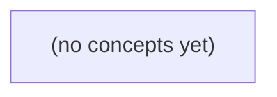

# 07.11 派生视图与事件时间：Go 初学者的 IM 数据一致性教材

*以 IM 消息 m-9、m-10 及其乱序、编辑和迟到到达为贯穿案例，讲解权威事实、派生视图、事件时间、水位线、增量投影与可靠重建。全书采用两遍递进学习路径，并通过 22 道反馈题帮助学习者从概念辨析走向纸上设计与验收。*

**章节:** 2

---

## 本书导览

- 了解整本书的章节脉络
- 掌握各章之间的概念依赖关系
- 选择最合适的阅读顺序

# 07.11 派生视图与事件时间：Go 初学者的 IM 数据一致性教材

以 IM 消息 m-9、m-10 及其乱序、编辑和迟到到达为贯穿案例，讲解权威事实、派生视图、事件时间、水位线、增量投影与可靠重建。全书采用两遍递进学习路径，并通过 22 道反馈题帮助学习者从概念辨析走向纸上设计与验收。

下方的概念图展示了本书 0 个核心概念以及它们之间的依赖关系；再下方是 1 个章节的入口。你可以按从上到下的顺序阅读，也可以根据自己的兴趣或先验知识选择切入点。

#### 概念图

## 章节索引

- **07.11 派生视图与事件时间：迟到消息怎样修正结果** — 面向Go初学者，用虚构IM消息m-9/E9、m-10/E10建立派生视图、事件时间、水位线、迟到修正、CDC和权威重建的完整模型。

## 07.11 派生视图与事件时间：迟到消息怎样修正结果

- 区分权威事实与预览/搜索/窗口统计派生视图
- 区分业务seq、broker offset和事件/处理时间
- 推演E9/E10消费乱序与版本修正
- 手算一分钟窗口与迟到30秒政策
- 设计快照加增量的影子索引重建与对账
- 写明OpenIM固定源码的证据范围

先把消息系统中的“真实发生了什么”与“为了查询而生成的结果”分开，才能正确处理乱序、编辑和迟到事件。

### 先划清权威事实与派生结果

### 先划清权威事实与派生结果

先把“发生过什么”与“当前查询看到什么”分开。对会话 `c-a` 而言，`m-9` 的初始消息、其编辑版本 `v2`，以及 `m-10` 都是可追溯的事实；若权威事件为 `E9`、`E10`，则它们应携带稳定的消息标识、序号、事件时间与版本信息。`m-9` 被编辑并不意味着旧记录从历史中消失，而是后来出现了“将 `m-9` 修正为 `v2`”这一新事实。

- **权威消息事实**：消息创建、编辑、删除等不可随意改写的业务事实，以 `message_id`、版本或序号识别。
- **事件日志**：按接收或提交顺序保存事实事件的追加记录；它是重放、审计和修正迟到事件的基础。
- **投影**：从事件日志计算出的特定读模型。例如会话预览可投影为 `latest_seq=10`，显示 `m-10` 对应内容。
- **物化视图**：已落盘、可直接查询的投影结果。例如“每分钟消息量”聚合表，或按消息建立的搜索文档。
- **缓存**：为降低延迟保存的临时副本；缓存失效、丢失或短暂错误不应改变权威事实。
- **可重建来源**：能够重新生成投影的输入，通常是权威事件日志及必要的消息版本规则。

三种视图的更新语义并不相同：会话预览关心最大序号，搜索文档关心 `m-9` 的最新文本 `v2`，每分钟消息量则关心事件时间归属。它们可以暂时不一致，但都必须能从权威事实重建。此前 S2 的 `accepted_in_memory` 只是内存接收状态，不等同于已持久化、可审计的权威事实。

### 三类视图回答三类问题

### 三类视图回答三类问题

事实流中，`m-9/c-a/seq9`、`m-10/c-a/seq10` 是权威消息，`E9/E10` 表示其事件时间；`m-9` 的编辑 `v2` 是对同一消息实体的新版本。事实不可被“预览结果”替代；投影负责解释事实，物化视图保存投影结果，缓存只是可随时丢弃的加速副本。S2 的 `accepted_in_memory` 仍只是接收状态，不是最终可查询事实。

| 视图 | 键与排序 | 更新方式 | 正确性要求 | 重建策略 |
|---|---|---|---|---|
| 会话预览 | 键为 `conversation_id`；按权威 `seq` 取最新，如 `latest_seq=10` | 收到更大序号即覆盖预览；迟到的 `seq9` 不应倒退 `seq10` | 必须反映“当前会话最后一条权威消息” | 从会话消息日志按序号折叠 |
| 逐消息搜索文档 | 键为 `message_id`；文档内保存版本或内容 | `m-9` 编辑为 `v2` 时对同一键幂等更新 | 搜索命中必须是该消息的最新有效版本，而非旧文本 | 从消息及编辑事件按消息键归并 |
| 每分钟消息量 | 键为 `minute(E)`，通常再加会话、租户等维度；按事件时间分桶 | 迟到 `E9` 到达后补增其所属分钟，而非到达分钟 | 历史桶允许被修正；水位线后才可宣称稳定 | 从事件时间重新分桶聚合，或对受影响桶回放 |

因此，“最新”并非统一概念：预览关心权威序号，搜索关心实体版本，分钟统计关心事件时间。三者可以消费同一事实流，却必须各自定义排序、幂等键和迟到修正规则。

### 不要混淆三种顺序与时间

### 不要混淆三种顺序与时间

同一条消息至少携带四类“位置”信息，但它们回答的问题不同，不能互相替代。

- **业务序号 `seq`**：由会话域定义，例如 `c-a/seq9`、`c-a/seq10`。它回答“这条消息在会话叙事中排第几条”。会话预览的 `latest_seq=10` 应以它判断；即使 `m-9` 的编辑事件晚于 `m-10` 到达，也不能把会话最新消息改成 `seq9`。
- **Broker offset**：消息进入某个分区日志后的追加位置。它回答“消费者在该分区已读到哪里”，适合断点恢复、幂等消费与重放；但 offset 是基础设施顺序，不是会话顺序。不同分区的 offset 不可直接比较，同一会话若被错误分区也无法据此排序。
- **事件时间**：事件在业务世界实际发生的时间，如 E9 的发送时刻、`m-9` 编辑 v2 的编辑时刻。它用于按分钟统计、窗口聚合和迟到判定；但客户端时钟可能漂移，且“发生较晚”不等于“会话序号更大”。
- **处理时间**：系统实际接收或计算该事件的时间。它决定缓存何时失效、投影何时更新以及水位线后的补偿；但网络延迟会使处理时间偏离事件时间。

因此，`m-9` 编辑 v2 到达后，可按其业务键覆盖搜索文档中的 `m-9` 内容，按事件时间修正对应分钟的消息量；会话预览仍以最大 `seq` 选择 `m-10`。S2 即使仍是 `accepted_in_memory`，也只能表示当前接收状态，不能被误当成上述任何一种顺序或时间。

### 用 E9、E10 推演乱序与编辑修正

### 用 E9、E10 推演乱序与编辑修正

设权威消息流中有两个事实事件：

- `E9`：`m-9` 属于会话 `c-a`，`seq=9`，内容为初始版本 `v1`
- `E10`：`m-10` 属于会话 `c-a`，`seq=10`
- 随后又到达 `m-9` 的编辑事件：同一消息标识 `m-9`，版本升级为 `v2`

这里的关键不是消费者收到事件的先后顺序，而是事件携带的权威排序与版本信息。假设消费者实际按 `E10 → E9 → m-9 v2` 到达：

1. 收到 `E10` 时，会话预览可先写为 `latest_seq=10`，并展示 `m-10` 作为最新消息。
2. 之后迟到的 `E9` 到达。因为 $9 < 10$，它不能把预览倒退为 `latest_seq=9`；但它仍应写入“每消息搜索文档”，使历史搜索能找到 `m-9`。
3. `m-9 v2` 到达时，按消息键 `m-9` 定位已有文档，再比较版本号。`v2 > v1` 才覆盖内容；若同一个 `v2` 被重复投递，则版本相等，写入应无副作用。

因此，不同派生视图使用不同的比较规则：

- **会话预览**：按 `seq` 取最大值，保证 `latest_seq=max(seq)`，最终稳定为 `10`。
- **每消息搜索文档**：按 `message_id` 幂等写入，并按消息版本更新，最终保存 `m-9` 的 `v2`。
- **每分钟消息量**：通常按事件唯一标识去重计数；编辑不是新消息，不应额外增加消息数。

这些写入结果都只是投影或物化视图，不是事实本身。若消费者曾因乱序、故障或旧逻辑算错预览，应从权威 `messages` 事件流重放重建；而 S2 的 `accepted_in_memory` 仍只是内存中的暂存状态，不能充当可重建的权威来源。

### 从迟到窗口到影子索引重建

### 从迟到窗口到影子索引重建

先固定事实流：`S2` 中消息仍只是 `accepted_in_memory`；只有权威消息 `m-9/c-a/seq9`、`m-10/c-a/seq10` 及事件 `E9`、`E10` 才能驱动可重建的派生视图。`m-9` 的编辑 `v2` 不是“再发一条消息”，而是对同一消息标识的更新事实。

设一分钟消息量按事件时间分桶，窗口为 `[12:00:00, 12:01:00)`。若：

- `E9`：`m-9`，事件时间 `12:00:40`；
- `E10`：`m-10`，事件时间 `12:01:05`；
- `m-9` 编辑 `v2`：到达较晚，但其业务事件时间仍为 `12:00:40`；

则第一分钟的**消息数**仍为 1：编辑只覆盖搜索文档，不应额外计数。第二分钟消息数为 1。若统计的是“变更事件数”，则必须另建变更窗口，不能混用消息窗口。

采用“允许迟到 30 秒”的水位线政策：当系统观测到最大事件时间为 `12:01:05`，水位线为 `12:00:35`，`12:00` 窗口尚不可最终封存；直到最大事件时间推进到 `12:01:30`，水位线达到 `12:01:00`，该窗口才可输出最终值。窗口封存后仍收到 `12:00:40` 的事件，应记录迟到修正：要么回补窗口，要么进入补偿队列，不能静默丢弃。

三类投影必须分别维护：

- 会话预览：取最大 `seq`，因此 `latest_seq=10`，预览来自 `m-10`。
- 每消息搜索文档：键为消息标识，`m-9` 的文档被 `v2` 覆盖。
- 每分钟消息量：按首次消息事实计数，不因编辑增加。

重建时建立影子索引：先从某个一致快照导入基线，再从快照位置后的事件偏移持续增量消费；对账时比较消息数、最大 `seq`、文档版本和窗口聚合值。差异归零后短暂停写或双写，原子切换读别名到影子索引；旧索引保留以便回滚。

对 OpenIM 的说明应限定为固定源码版本中可验证的证据范围：只据源码确认消息标识、序列号、会话与存储路径；窗口、水位线、影子索引和切换策略属于本系统的投影设计，不应误称为 OpenIM 已内建语义。

> **要点** — 权威消息事实可追溯，所有预览、搜索和统计都应按各自语义独立投影、纠错并可重建。

要正确修正迟到消息，必须先拆开“何时发生、何时到达、何时被处理、何时被看见”四种时间，并明确谁有权决定顺序。

### 事件事实的权威边界

### 事件事实的权威边界

聊天、通知或协作系统中，真正可追溯的“事件事实”应由服务端提交时确定。一次消息提交至少应携带：

- `seq`：会话内的权威顺序号；
- `commit_at`：服务端确认并写入事实日志的时间；
- 事件标识、会话标识、操作类型与内容版本。

其中，`seq` 回答“在这个会话中它排第几”，`commit_at` 回答“服务端何时确认这条事实成立”。二者都不应由客户端时钟、网络到达先后或消费者处理先后替代。

例如：

| 事件 | `seq` | `commit_at` | `arrive_at` |
|---|---:|---|---|
| E9 | 9 | 12:00:10 | 12:00:40 |
| E10 | 10 | 12:00:55 | 12:01:20 |

`arrive_at` 是消息到达 broker 或下游系统的接收时间，可用于诊断延迟、重放和水位线，却不改变 E9、E10 的事实顺序。消费者的处理时间只说明某个派生器何时完成计算；客户端展示时间更只说明用户何时看见结果。

预览、搜索索引、未读数、会话摘要等都属于派生视图：它们可以暂时落后、重复计算，甚至因迟到事件而被修正，但不能反过来定义事件事实。正确的关系是：

`服务端事实日志 → 按 seq/commit_at 重建或增量更新派生视图`

因此，客户端收到一条“看似更早”的消息时，不应按本地时间把它判为旧消息；应以服务端给出的 `seq` 定位，并让视图补齐、重排或重算。客户端时间适合体验展示，不具备权威性。

### 四类时间不能混用

### 四类时间不能混用

同一条事件会经过多个系统，每一跳都可能留下“时间戳”，但它们回答的问题不同。把它们混成一个“事件时间”，会导致迟到修正、排序和审计都出现歧义。

| 时间 | 来源 | 回答的问题 | 可信边界 |
|---|---|---|---|
| `commit_at` | 服务端权威提交逻辑 | 该事实何时被系统正式确认 | 是业务事实时间；应由服务端写入且不可由客户端伪造 |
| `broker_received_at` | 消息代理接收记录 | 消息何时进入传输系统 | 反映网络、重试、积压；不能代表事实发生顺序 |
| `consumer_processed_at` | 消费者/投影程序 | 此派生视图何时处理该消息 | 用于延迟监控、重放诊断；受批处理、故障恢复影响 |
| `client_displayed_at` | 客户端界面 | 用户何时看见结果 | 仅描述体验；受缓存、离线、设备时钟和渲染延迟影响 |

例如，事件 E9 的 `commit_at` 为 `12:00:10`，但到达 broker 的时间是 `12:00:40`；事件 E10 的 `commit_at` 为 `12:00:55`，到达时间却是 `12:01:20`：

| 事件 | `commit_at` | `broker_received_at` |
|---|---:|---:|
| E9 | 12:00:10 | 12:00:40 |
| E10 | 12:00:55 | 12:01:20 |

这里两列恰好同序，但不能据此推论“先到 broker 就先发生”。网络抖动、重连和重试足以让较早提交的事件更晚到达。更重要的是，时钟时间本身不是因果关系，也不是权威序号：跨机器时钟漂移会进一步破坏按时间戳排序的可靠性。

会话内的最终顺序应以服务端分配的 `seq` 为准；Kafka offset 只表示某个分区内的位置，不能替代会话顺序。客户端展示时间更不能参与权威判定：它只应决定动画、提示或“正在同步”等界面行为，不能用来覆盖 `commit_at`、重排事件或裁决迟到消息。

### seq、offset 与时钟各管什么

### seq、offset 与时钟各管什么

修正迟到消息时，不能把所有“时间”和“位置”混成一个排序依据。它们回答的是不同问题：

- **会话 `seq`**：回答“同一会话中，哪个事件应当先后生效”。它由服务端在提交事件事实时分配，是该会话的权威顺序。例如 `E9.seq=9`、`E10.seq=10`，即使 `E10` 先被某个消费者看到，也不能覆盖 `E9` 的逻辑位置。
- **Kafka `offset`**：回答“该消息位于某个分区日志的什么位置”。它用于消费进度、重放与去重检查；但不同分区的 offset 不可比较，也不等于业务会话顺序。
- **时钟时间戳**：回答“某个系统在何时记录了某件事”，不天然表示因果关系，更不是全局序号。

例如：

| 事件 | 会话 `seq` | 服务端 `commit_at` | Broker 接收时间 |
|---|---:|---|---|
| E9 | 9 | 12:00:10 | 12:00:40 |
| E10 | 10 | 12:00:55 | 12:01:20 |

这里 `commit_at` 表示服务端确认的事件事实时间；Broker 接收时间只反映消息何时进入日志。消费者处理时间、客户端展示时间还会受积压、重试、网络和渲染影响，因此都不能反过来裁定业务顺序。

派生视图通常应按会话 `seq` 应用变更：收到更大的 `seq` 就推进状态；收到较小的 `seq` 则识别为迟到事件，按缺口补齐、重放或重算策略修正。`offset` 负责“从哪里继续读”，`commit_at` 辅助解释和审计，客户端时间只适合展示，绝不应成为权威。

### 用 E9、E10 推演乱序修正

### 用 E9、E10 推演乱序修正

设服务端为会话 `S` 写入两条事实事件，并由服务端在提交时确定权威时间与权威序号：

| 事件 | `seq` | `commit_at`（事实提交时间） | `arrive_at`（broker 接收时间） |
|---|---:|---|---|
| E9 | 9 | 12:00:10 | 12:00:40 |
| E10 | 10 | 12:00:55 | 12:01:20 |

这两列时间回答的是不同问题：

- `commit_at`：事件何时被服务端确认写入事实流；用于审计、事件时间窗口、按事实时间回放。
- `arrive_at`：消息何时进入 broker；用于观测传输延迟，例如 E9 延迟 $30s$，E10 延迟 $25s$。
- `seq`：同一会话内的权威顺序。这里必有 `E9 → E10`，不应由时间戳猜测。
- Kafka offset 仅表示某个分区中的位置；它不是会话序号，也不能跨分区比较因果。

若消费者先收到 E9，便可形成暂态视图 `V9`：会话状态推进到 `seq=9`。随后 E10 到达，消费者验证其版本更高：

`10 > 9`，因此以 E10 覆盖或增量更新 `V9`，得到 `V10`。

若网络重试使 E9 在 E10 之后再次出现，消费者发现 `9 < 当前 seq 10`，应将其视为旧版本：可记录到审计流，但不得把派生视图回退为 E9。若同一 `seq` 重复，则按事件标识去重，或确认载荷是否一致。

消费者处理时间和客户端展示时间只能说明“何时处理、何时看见”。客户端时钟可能漂移，且离线、重连、渲染排队都会改变展示先后；因此它们不能裁定事实时间，也不能推翻服务端的 `seq` 与 `commit_at`。

### 客户端展示为何不能定案

### 客户端展示为何不能定案

客户端看到的时间只是“本机何时渲染”，不等于消息事实发生时间，也不能充当全局顺序。它受网络抖动、断线重连、批量拉取、前后台切换、设备时钟漂移和渲染队列影响；两台设备甚至会对同一批消息显示不同的先后关系。

例如，服务端权威事实可为：

| 事件 | `commit_at` | broker 接收/到达时间 |
|---|---:|---:|
| E9 | 12:00:10 | 12:00:40 |
| E10 | 12:00:55 | 12:01:20 |

即使客户端在 12:01:21 先渲染 E10、12:01:23 才补到 E9，也不能据此认定 E10 先发生。展示层应以服务端分配的会话 `seq` 排序，以 `commit_at` 展示事实时间；迟到事件到达后，按其 `seq` 插入或重排，并用“已补充较早消息”等轻量提示降低跳动感。

纠错不应依赖客户端本地缓存的“最后一条时间”，而应依赖可重放事件流与版本号：客户端保存已确认的会话版本或最大连续 `seq`，发现缺口、重复或版本跃迁时，向服务端增量同步；必要时拉取快照后重放事件，得到与其他客户端一致的派生视图。Kafka offset 只能表示某个分区中的消费位置，不能替代会话权威 `seq`；墙上时钟也不是因果关系证明。

对于 OpenIM 固定源码证据，最多只能确认其消息字段、同步接口及局部排序实现实际提供了什么；若源码未明确保证跨端全序、`commit_at` 语义或补偿重放规则，就不能把客户端显示顺序推断为系统事实。客户端应始终把自己视为可修正的投影，而非裁决者。

> **要点** — 以服务端 commit_at 与会话 seq 定义事实；offset 管消费位置，客户端时间只描述观察，不裁定顺序。

同一条消息流中，消费完成顺序可以乱，但派生视图必须按各自的正确性规则收敛，不能把“最新”简单等同于最大偏移量。

### 先界定事实与派生视图

### 先界定事实与派生视图

先把不可变的**消息事实**与可重建的**派生视图**分开。设 `E9(offset=42)` 产生消息 `m-9`，会话内序号为 `seq=9`；`E10(offset=43)` 产生 `m-10`，`seq=10`。偏移量表达日志位置，`seq`表达该会话中的先后；二者都不是所有视图共用的“最新”定义。

- **消息事实**：`m-9`、`m-10` 都是独立存在的记录。即使消费者并发处理时 `E10` 先完成，也不能因为预览已显示 `m-10` 而忽略 `m-9`。
- **会话预览**：责任是展示该会话最后一条可展示消息。写入应带条件：仅当新记录的 `seq > preview.seq` 时更新。因此先处理 `E10` 后预览为 `10`，随后迟到的 `E9` 只能被拒绝，不能把预览退回 `9`。
- **搜索索引**：责任是让每条可搜索消息可被检索，而非只保留会话最新消息。因此必须分别写入 `m-9` 与 `m-10`，不能用“最大 `seq`”淘汰 `m-9`。

版本也有自己的边界：`m-9:v2` 是合法编辑结果时，迟到的 `m-9:v1` 不得覆盖它，应按同一 `message_id` 比较版本。至于权限变化、撤回和删除，改变的是“是否可见、是否可检索”的事实，必须显式更新或重建相应视图；单靠 `max(seq)` 无法表达这些语义。

### 并发乱序下的预览防回退

### 并发乱序下的预览防回退

设同一会话中的两条事件为：

- `E9`：`offset=42`，`seq=9`，预览文本为“明天见”
- `E10`：`offset=43`，`seq=10`，预览文本为“收到，明天见”

虽然日志偏移量表明 `E9` 先产生、`E10` 后产生，但并发消费者可能使 `E10` 先完成派生：

1. 消费者 A 处理 `E10`，读取当前会话预览为 `last_seq=8`。
2. 因为 $10 > 8$，A 将预览更新为 `last_seq=10`、文本为“收到，明天见”。
3. 消费者 B 随后才完成 `E9`。此时它不能仅凭“自己处理成功”直接覆盖预览。
4. B 必须执行带条件的更新：

`仅当 incoming_seq > stored_last_seq 时，才写入预览`

于是，B 发现 $9 \not> 10$，更新影响行数为 `0`，`E9` 被安全忽略。

这类条件更新通常应由存储层原子执行，而不是“先读再比较、再写”。例如语义上相当于：

`UPDATE conversation_preview SET text=?, last_seq=10 WHERE conversation_id=? AND last_seq < 10`

因此，预览的收敛依据是**会话内业务序号 `seq`**，不是消费者完成时间，也不是当前处理到的全局 `offset`。无论重试、分区迁移或并发调度如何改变完成顺序，最终预览都会稳定在 `seq=10`。

注意，这一规则只适用于“最新消息预览”这类可由单调序号决定的视图。若事件是撤回、权限变化或删除，不能只靠 `max(seq)` 保留旧内容；它们必须显式将预览置空、标记不可见，或触发按当前权限与消息状态的重建。

### 搜索索引按消息版本收敛

### 搜索索引按消息版本收敛

搜索索引的更新单位不是“当前消费到的最大偏移量”，而是可独立检索、可独立变更的消息版本。假设：

- `E9(offset=42)`：消息 `m-9` 的初始内容，版本 `v1`
- `E10(offset=43)`：另一条消息 `m-10`，版本 `v1`
- 随后 `m-9` 被合法编辑为 `v2`

即使并发消费者先完成 `E10`，索引也必须同时保留：

- `m-9:v2`
- `m-10:v1`

这里的“同时”不是要求物理写入严格按偏移量排序，而是要求每个 `message_id` 都按自己的版本规则收敛。若搜索文档主键是 `message_id`，更新应带条件：

\[
\text{仅当 } incoming.version > stored.version \text{ 时覆盖}
\]

因此，索引中已存在 `m-9:v2` 后，迟到到达的 `m-9:v1` 必须被拒绝；它可以被记录为过期事件，但绝不能把搜索内容、分词结果或高亮字段退回旧文本。`m-10` 与 `m-9` 没有版本竞争关系，不能因为 `m-10` 的偏移量更大或更早完成，就阻止 `m-9` 的写入。

可将索引写入理解为带乐观条件的 upsert：

`写入 m-9，条件：不存在该文档，或 stored_version < 2`

但版本最大化只解决“内容编辑覆盖”的单调问题。权限变化、撤回和删除改变的是可见性或文档存在性，必须显式更新权限过滤字段、写入删除标记，或触发重建；仅维护 `max(version)` 或 `max(seq)`，无法保证已撤回内容不会继续被搜索到。

### 不能用最大序号处理的变化

### 不能用最大序号处理的变化

“只接受更大 `seq`”适合处理**同一会话中的普通新增消息**：E9 的 `seq=9` 即使晚于 E10 完成，预览也不应从“消息 10”退回“消息 9”。但这条规则不能推广到所有派生变化。

| 变化类型 | 可否主要依赖最大序号 | 正确处理 |
|---|---:|---|
| 普通新增 | 可以 | 按会话 `seq` 条件更新预览，较小序号不得覆盖较大序号。 |
| 消息编辑 | 不可以只看会话 `seq` | 按 `message_id + version` 判断。`m-9:v2` 已入索引后，迟到的 `m-9:v1` 必须被拒绝；但 `m-9` 与 `m-10` 都应存在。 |
| 权限变化 | 不可以 | 权限收紧会改变“谁能看见哪些旧消息”。必须显式更新文档可见性、删除失权副本，或按权限范围重建索引。 |
| 撤回删除 | 不可以 | 撤回的是既有实体，不是“更旧的新增”。必须传播删除墓碑、从搜索索引移除，并修正预览或触发重算。 |

关键区别在于：新增通常是单调扩展；编辑、权限和撤回则会**修改或否定已有结果**。例如仅以 `max(seq)` 更新搜索视图，会保留已撤回的 `m-9`，也可能让权限变化前建立的索引继续泄露内容。

因此，派生视图至少应区分两类状态：用于排序收敛的会话序号，以及用于实体覆盖的版本号；对权限与删除，还要有可追踪、可重放的显式失效事件。

### Go 消费器的幂等更新策略

### Go 消费器的幂等更新策略

消费者应把“处理完成”视为可乱序、可重试的事实，把“写入派生视图”设计为带条件的状态迁移。

- **会话预览**以 `session_id` 为键，保存 `last_seq`、摘要与更新时间。处理事件时执行条件更新：仅当 `incoming.seq > last_seq` 时覆盖摘要；相等时按事件唯一标识去重；更小时直接忽略。于是 offset42 的 `E9(seq=9)` 即使晚于 offset43 的 `E10(seq=10)` 完成，也不能把预览从 10 回退到 9。实现上可使用数据库的 `WHERE last_seq < ?`、乐观锁版本号，或存储层原子条件写入。

- **搜索索引**不能只维护“会话最新消息”。应以 `(message_id, version)` 或 `message_id` 加版本条件写入：`m-9:v2` 与 `m-10:v1` 都是独立可检索文档。对同一消息，只有 `incoming.version > indexed_version` 才更新正文；因此合法编辑 `m-9:v2` 先到后，迟到的 `m-9:v1` 会被拒绝，不能覆盖新内容。

- **删除与权限变更不是普通的 `max(seq)` 问题。**撤回应写入删除墓碑，例如 `deleted=true, delete_version=v3`，并同步删除或隐藏索引文档；迟到的旧编辑必须受墓碑版本拦截。权限收紧、成员移除、会话封禁则应显式更新可见性字段，必要时按权限快照重建索引，而非仅比较消息序号。

消费者可将每次应用记录为 `event_id` 去重日志，并保留原始事件流。重放校验时，从空视图或检查点重建，再比较预览的 `last_seq`、搜索文档版本、墓碑及权限过滤结果；若重放结果不同，说明条件写入或副作用仍依赖了到达顺序。

> **要点** — 偏移量只描述日志位置；预览按会话序号防回退，搜索按消息版本防覆盖，权限与撤回须显式修正或重建。

用同一分钟窗口中的 E9 与 E10，推演“先出预览、后到迟到消息、再修正结果”的完整过程，明确水位线不是事实边界。

### 先确定窗口归属与权威事实

### 先确定窗口归属与权威事实

先把“事件发生在何时”与“系统何时收到它”分开。窗口归属只由**事件时间**决定，不由到达顺序、处理时间或当前水位线决定。

采用一分钟半开窗口：

\[
W=[12{:}00{:}00,\ 12{:}01{:}00)
\]

左边界包含，右边界排除。因此：

- E9 的事件时间为 `12:00:10`，满足 $12{:}00{:}00\le t<12{:}01{:}00$，属于 $W$。
- E10 的事件时间为 `12:00:55`，同样属于 $W$。
- 若某事件恰好发生在 `12:01:00`，则不属于 $W$，而属于下一窗口 `[12:01:00,12:02:00)`。

从业务事实看，E9 与 E10 都已经发生；无论 E10 是在 `12:00:56` 到达，还是在 `12:01:20` 才到达，它的正确窗口归属都不会改变。因而该窗口的权威计数是：

\[
\operatorname{count}(W)=2
\]

需要区分两类数据：

- **消息事实**：E9、E10 是可追溯的原始事件，事件时间决定其窗口归属。
- **派生视图**：`count(W)` 是根据当前已知事件计算出的结果，会随迟到消息补入而从 `1` 修正为 `2`。

水位线只是系统对“事件时间进度”的估计，用于决定何时先发布结果、何时关闭或保留窗口状态；它不能改写 E10 已属于 $W$ 的事实。

### 处理时间不等于事件时间

### 处理时间不等于事件时间

窗口归属应由事件实际发生的时间决定，而不是系统何时收到它。以半开窗口 $W=[12{:}00{:}00,12{:}01{:}00)$ 为例：

| 事件 | 事件时间 | 到达处理时间 | 是否属于 $W$ |
|---|---:|---:|---|
| E9 | 12:00:10 | 12:01:10 | 是 |
| E10 | 12:00:55 | 12:01:20 | 是 |

虽然 E10 在处理时间上晚于 E9，甚至在水位线推进到 `12:01:00` 后才到达，但它的事件时间仍为 `12:00:55`，因此业务事实不变：E9、E10 都属于同一个一分钟窗口，最终计数应为 `2`。

若按处理时间分窗，E9 会被放入 `[12:01:00,12:02:00)`，E10 也可能被视为更晚一批数据；这描述的是“系统接收速度”，而非“用户行为发生在哪一分钟”。网络抖动、批量发送、重试和背压都会改变到达顺序。

同样，业务序号只能表示某种业务排序，消息代理的偏移量只表示分区内写入顺序；它们都不能证明事件发生时间。只有可信的事件时间字段才能决定窗口归属。水位线据此估计时间进度，并触发预览或初步输出；它不是宣布“此后绝无旧事件”的事实边界。

### 水位线下的首次计数发布

### 水位线下的首次计数发布

设一分钟半开窗口为 $W=[12{:}00{:}00,12{:}01{:}00)$。事件 E9 的事件时间为 `12:00:10`，因此属于 $W$；E10 的事件时间虽为 `12:00:55`，也同样属于 $W$，但此刻尚未到达处理系统。

当处理时间推进到 `12:01:10` 时，系统已看到的输入只有 E9。若当前水位线为 `12:01:00`，它表示系统依据已观测到的消息进度作出判断：事件时间早于 `12:01:00` 的数据，大概率已经到齐。由于窗口右边界正是 `12:01:00`，系统可以触发该窗口的首次计算：

| 窗口 | 当前已见事件 | 首次发布 |
|---|---|---|
| $[12{:}00{:}00,12{:}01{:}00)$ | E9 | `count = 1` |

这里的 `count=1` 是**暂定结果**，而不是“该分钟客观上只有一条事件”的永久断言。水位线是基于数据到达情况推断出的时间进度，用于决定何时先产出结果、降低等待延迟；它不是事件时间世界中不可穿越的事实边界。

因此，首次发布应携带可识别的窗口键，必要时还应带有版本或更新语义。下游看到的是“窗口 $W$ 当前计数为 1”，并应预期：在允许迟到期内，后续消息仍可能使这一派生视图被修正。

### 迟到三十秒内的版本更正

### 迟到三十秒内的版本更正

窗口采用半开区间 $W=[12{:}00{:}00,12{:}01{:}00)$。按事件时间判断：

- E9：事件时间 `12:00:10`，属于 $W$；
- E10：事件时间 `12:00:55`，也属于 $W$；
- 因而该窗口的最终事实应为 `count=2`。

但处理顺序并不等于事件时间顺序。系统处理到 `12:01:10` 时，可能只收到 E9；此时水位线推进到 `12:01:00`，表示系统已大致完成对该窗口的常规等待，可以先发出版本一：

`W -> count=1，版本=1（预览/初始结果）`

随后，E10 在处理时间 `12:01:20` 才到达。它的事件时间 `12:00:55 < watermark 12:01:00`，所以被识别为迟到事件；但“迟到”不等于“无效”。教学策略允许窗口关闭后再接受 `30s` 的迟到数据，即窗口的可更正截止点为：

$$12{:}01{:}00+30s=12{:}01{:}30$$

若当前水位线尚未越过 `12:01:30`，E10 仍可写入 $W$ 的状态，聚合器重算并发出版本二：

`W -> count=2，版本=2（更正结果）`

下游必须按窗口键进行覆盖、合并或撤回旧版本，而不能把两条输出相加成 `3`。例如，可用 `(窗口开始时间, 聚合维度)` 作为主键，以最新版本覆盖旧值。

若 E10 到达时水位线已越过 `12:01:30`，允许迟到期结束：事件应进入侧路隔离、审计队列或权威离线回算流程，而不是被悄悄丢弃并把 `count=1` 宣称为最终事实。水位线只是时间进度的启发式估计，不是“此后绝不会再有旧事件”的事实保证。

### 超过迟到期限后的隔离与回算

### 超过迟到期限后的隔离与回算

设窗口为半开区间 $[12{:}00{:}00,12{:}01{:}00)$。E9 的事件时间是 `12:00:10`，已被计入；E10 的事件时间是 `12:00:55`，逻辑上同样属于该窗口。系统允许迟到 `30s`：当水位线尚未越过 `12:01:30` 时，E10 可以触发对窗口结果的更正，将 `count=1` 更新为 `count=2`。

但若 E10 到达时，水位线已超过 `12:01:30`，该窗口的在线更正期限已经结束。此时不能把 E10 悄悄丢弃，更不能仍将 `count=1` 当作永久事实；应进入一条可审计的超期处理路径：

- **侧路隔离**：将 E10 写入“超期事件”流或表，附带事件标识、事件时间、到达时间、所属窗口、当前水位线、超期原因等元数据。
- **保留证据**：原始事件、去重键、解析版本和处理决策都应可追溯，以便判断它是真迟到、重复投递，还是上游时钟异常。
- **通知影响范围**：记录 E10 本应修正的窗口 `$[12{:}00{:}00,12{:}01{:}00)$`，以及受该聚合进一步影响的报表、告警或下游派生指标。
- **权威回算**：以完整事件日志或离线可信数据源为准，对受影响时间段重放、去重并重算；权威结果应得到 `count=2`，随后以版本化快照、补偿记录或更正数据集发布。

在线水位线只是在资源、延迟与完整性之间作出的进度判断，不是“此后绝无旧事件”的事实证明。允许迟到期限定义的是在线修正的服务边界；超过边界后，正确策略是隔离、审计和回算，而不是用静默丢弃制造虚假的最终性。

> **要点** — 水位线只表示进度估计；迟到消息应通过版本修正或权威回算维护最终事实。

先把消息数据库中的事实与各类查询结果分开，才能正确理解乱序、迟到和重建为何需要版本、位点与权限边界。

### 权威事实与派生视图的边界

### 权威事实与派生视图的边界

权威事实是数据库中可审计、可版本化的业务记录，例如消息正文、发送者、删除状态及业务序号 `seq`。写入成功后，数据库事务决定“什么已经发生”；预览列表、全文搜索索引、未读计数和窗口统计都只是围绕这些事实构建的查询加速结果，允许暂时落后，却不应反过来成为判定事实的依据。

教学系统常在同一事务中写入业务表与 `outbox` 表：前者保存事实，后者保存“应发布的变化”。CDC 工具如 Debezium 则从数据库变更日志读取快照与后续增量，将变化交给 broker 和投影消费者。两种方式都应携带稳定的事件标识、实体键、业务版本或 `seq`、模式版本，以及删除语义：

- 更新不是“收到就覆盖”：投影应按版本拒绝旧事件，避免乱序消息把新预览改回旧内容。
- 删除应明确为 tombstone 或删除事件；搜索和缓存必须移除文档，而非仅停止更新。
- CDC 的读取位点、提交位点用于恢复采集进度；它们不等于业务 `seq`，不能用来比较两条消息的新旧。
- broker 保留期有限。消费者长期宕机或索引损坏时，不能假设仍能仅靠 broker 完整重建；应能从权威库快照、outbox 或可保留的变更日志重新投影。

PostgreSQL 的 materialized view 也是派生结果：它保存查询结果，`REFRESH` 本质上重新计算，并不天然等同于持续、实时、逐行增量维护的搜索索引。因而应为每类投影定义一致性边界：消息详情可强一致地直接读权威库；列表预览和搜索通常接受短暂最终一致；窗口统计还必须说明迟到事件是否允许修正历史窗口。

最后，派生层不是权限旁路。即使索引中只存摘要，也应按租户、会话成员关系或文档级权限过滤；重建、回放和死信处理同样要遵守访问控制，避免“为了查询快”而泄露权威事实不应暴露的部分。

### 三类位置与两类时间

### 三类位置与两类时间

“位置”看似都在回答“处理到哪了”，其实对应完全不同的边界，不能混用。

- **业务 `seq` / 版本号**：由权威业务库中的实体或业务流程产生，例如订单 `version=17`、账户流水 `seq=1024`。它用于判断某条变化是否比已见状态更新：投影可仅接受 `seq` 更大的事件，防止乱序旧消息覆盖新结果。它表达的是**业务事实的先后关系**，通常应随实体快照、事件载荷一起保存。

- **Debezium 或数据库位点**：例如 PostgreSQL WAL 的 LSN、复制槽状态、Debezium 的 source offset。它表示连接器已从数据库变更日志读取到何处，用于 snapshot 后衔接 stream、连接器故障恢复及避免重复抓取。位点属于**变更捕获过程**；它不等于某个订单的业务版本，也不能说明下游消费者已经完成投影。

- **Broker offset**：例如 Kafka 某个分区的 offset，表示消费者已处理或提交到消息日志的哪个位置。它用于消费者组恢复、重放和分区内顺序控制，属于**消息传递过程**。不同 topic、partition 的 offset 无法直接比较；broker 保留期过后，旧 offset 对应的数据可能已不存在，因此不能只依赖 broker 来重建长期投影。

时间也至少有两种：

- **事件时间**：事实在业务世界发生或生效的时间，如支付完成时间。窗口聚合、迟到判定和按日统计通常应以它为准。
- **处理时间**：系统实际接收、写入、消费或计算该消息的时间。它适合监控延迟与吞吐，却会受网络抖动、重试、停机恢复影响。

因此，一条迟到消息可能具有较早的事件时间、较晚的处理时间、较小的业务 `seq`，却位于较大的 broker offset。修正结果时，应按业务 `seq` 或明确的业务规则决定状态覆盖；按事件时间决定窗口归属；按 Debezium 位点和 broker offset 分别恢复采集与消费进度。

### E9、E10 乱序下的版本修正

### E9、E10 乱序下的版本修正

设权威数据库中订单 `o-42` 的业务变化按事务顺序产生：

| 消息 | 业务版本 | 变化 |
|---|---:|---|
| `m-9 / E9` | `9` | 状态改为“已支付” |
| `m-10 / E10` | `10` | 订单被取消，写入删除标记 |

投影消费者理想上先收到 E9，再收到 E10；但 broker 分区迁移、重试或多个来源合并后，完全可能先消费 E10、后消费 E9。此时不能按“到达顺序”覆盖查询表，而应把业务版本作为投影写入条件：

`仅当 incoming.version > stored.version 时，更新投影`

先到的 E10 会将投影写为：

`{ order_id: o-42, version: 10, deleted: true }`

对于面向用户的订单列表，可据此删除可见记录；但投影内部通常保留 `version=10` 与 tombstone（删除标记），而非直接物理删除。随后迟到的 E9 到达，其版本 `9 < 10`，消费者必须拒绝该消息，不能把订单“恢复”为已支付。

可用条件更新表达这一规则：

`UPDATE projection SET ... WHERE order_id = :id AND version < :incoming_version`

若更新行数为 `0`，说明消息重复、过期，或该实体已被更高版本删除，应安全忽略。若投影尚无该行，则插入；插入冲突时再比较版本。这样，重复投递是幂等的，乱序投递也会收敛到版本最高的事实。

删除标记还承担重建期间的防复活职责：若只物理删除 `o-42`，重放历史中的 E9 时系统无法得知 E10 已存在，旧数据可能重新出现。tombstone 应至少保留到能够保证相关旧事件不再到达，或能够从权威 DB/CDC 位点完整重建投影为止。

### 快照加增量的影子索引重建

### 快照加增量的影子索引重建

重建搜索索引、读模型或缓存投影时，不能简单地“清空后从 broker 重放”。更稳妥的做法是建立**影子索引**，让它先取得某一时刻的一致性快照，再追赶其后的变更流。

典型流程如下：

1. **记录边界位点**：在源库快照开始时记录 CDC 位点，例如 PostgreSQL 的 LSN；该位点表示“快照所覆盖事实”的上界。
2. **导出一致性快照**：在数据库事务一致性视图中读取业务表，写入新索引 `index_v2`。每条文档携带业务主键、版本号或 `seq`。
3. **并行订阅增量**：从快照边界位点开始消费 CDC 流。快照期间到达的更新先缓冲，或直接按版本条件写入：仅当 `event.seq > document.seq` 时覆盖。
4. **追赶并对账**：当消费者位点追到当前源端位点后，比较源表行数、分片校验和、抽样字段，以及删除记录是否已正确处理。删除不能只靠“文档不存在”；CDC 的 tombstone 或显式删除事件必须使投影删除对应主键。
5. **原子切换别名**：验证通过后，将查询别名从旧索引切到 `index_v2`，旧索引保留一段回滚窗口，再延迟删除。

关键在于：CDC 的读取/提交位点用于保证重放范围，业务 `seq` 用于解决同一实体的乱序覆盖，两者不可混用。Debezium 的 snapshot 加 stream 正是围绕这一边界衔接；消费者还应记录已处理位点和事件模式版本。

不能只依赖 broker 保留窗口：重建可能超过保留期，消费者可能长期停机，主题也可能被压缩、迁移或权限隔离。可恢复的权威事实仍应来自数据库快照、CDC 日志位点或归档；broker 只是增量分发层，而不是唯一历史仓库。重建任务也应使用最小读取权限，避免影子索引绕过原有数据访问控制。

### 物化视图、CDC 与证据范围

### 物化视图、CDC 与证据范围

PostgreSQL 的物化视图是“把某个查询结果落盘”的数据库对象。例如可将订单按用户聚合：

`CREATE MATERIALIZED VIEW user_order_stats AS SELECT user_id, count(*) ...`

它的关键语义是 `REFRESH MATERIALIZED VIEW`：数据库重新执行定义查询，并用结果替换旧内容；`CONCURRENTLY` 可减少读阻塞，但仍不是逐条事件驱动的实时增量维护。因此，物化视图适合报表、聚合缓存和可接受刷新间隔的查询，不应等同于 Elasticsearch 一类搜索索引投影。

实时搜索投影通常由 CDC 或 outbox 消费者维护：

1. 权威数据库事务提交，写入业务行及可选的 outbox 事件；
2. Debezium 从快照与 WAL/逻辑复制流读取变更；
3. 消费者按主键、业务版本号或 `seq` 幂等写入搜索索引；
4. 删除需要显式删除事件或 tombstone，避免索引残留旧文档。

这里有三类不能混淆的“进度”：

- CDC 位点表示已读取到哪个 WAL/日志位置；
- broker offset 表示消费者已提交到哪个消息位置；
- 业务 `seq` 或版本号表示某实体的事实新旧。

前两者用于恢复消费，后者用于拒绝乱序覆盖。若 broker 保留期已过，仅凭 offset 无法可靠重建投影；应能从权威库重新快照，或保留可重放的事件归档。

事件还必须携带模式版本，例如 `schema_version`，使消费者能兼容字段新增、重命名和语义变化。访问控制同样不能只放在前端：CDC topic、搜索索引、重建任务都应限制租户与字段权限，尤其避免把内部字段复制到可搜索投影。

对 OpenIM 等固定源码的讨论也应限定证据范围：只能据已给出的表结构、消息字段、事务边界和消费逻辑推断；未展示的 CDC 配置、索引映射、权限中间件或重放策略，最多标为“可能需要”，不能断言其已实现。

> **要点** — 派生结果可重建，但必须以权威事实、业务版本、可追溯位点、模式演进和权限规则为基础。

影子索引重建不是简单复制数据：必须把快照边界、增量变更、版本顺序与原子切换连成可验证的闭环。

### 影子索引的职责与权威边界

### 影子索引的职责与权威边界

`messages` 是消息系统的权威事实：一条消息是否存在、正文是什么、当前版本是多少、是否已删除，以及某个用户是否有权读取，都必须以权威存储中的记录和权限规则为准。影子索引只承担派生职责，例如：

- 为全文搜索建立倒排索引；
- 为会话列表、预览摘要或高亮片段提供快速读取；
- 为排序、过滤和聚合准备冗余字段。

因此，索引中的文档不是“另一份真相”，而是对某个权威状态的可丢弃投影。它可以落后、漏写、重复写入，甚至整个损坏后重建；这些故障最多影响“暂时搜不到”“预览过旧”或“查询变慢”，不应改变消息本身的语义。

尤其要避免反向依赖：不能因为索引仍有旧文档，就认定已删除消息仍存在；不能因为索引缺少某条记录，就把权威消息视为不存在；更不能只依据索引字段判定访问权限。读取搜索结果后，仍应按消息 `ID + 版本 + 删除状态 + 权限` 核对，必要时从权威 `messages` 回读。

可将关系写成：

\[
\text{shadowIndex} = F(\text{messages},\ \text{权限规则},\ \text{派生配置})
\]

这里的 \(F\) 应可重复执行。重建影子索引的目标不是“复制当前索引内容”，而是从权威 `messages` 构造一个可验证的新投影，再通过受控的增量重放追上变更。即使切换失败或新索引被丢弃，消息真相也不应受影响；保留旧索引一段回滚窗口，只是保护查询可用性，而不是保存权威数据。

### 快照范围H与一致变更游标

### 快照范围 H 与一致变更游标

设重建会话从权威 `messages` 读取到单会话高水标 `H=seq10`。这里的含义是：该会话确认快照基线覆盖了此会话内 `seq≤10` 的消息状态；据此构造影子索引时，不能把 `H` 误解为整个数据库、所有分区或所有会话的全局时间点。

仅记录 `H` 仍不足以保证不漏数据。重建过程至少存在两条并行路径：

- **快照路径**：按一致性规则读取 `messages`，建立“截至快照边界”的初始索引。
- **变更路径**：从 CDC 日志或变更流中保存对应游标，并持续收集快照开始后、切换前到达的变更。

因此应成对记录：

`(快照范围 H=seq10, CDC offset=O)`

其中 `O` 表示与该快照一致的变更日志位置。重放时，从 `O` 之后读取变更；对于目标会话，`seq>10` 的新增、更新、删除必须按稳定版本顺序应用。若快照扫描期间消息 `seq8` 被编辑或删除，也不能因其序号小于 `H` 而跳过：应以消息 ID、版本号以及权限/删除状态判断该变更是否比索引中的版本更新。

关键不是“先扫到 seq10，再订阅 CDC”，而是先取得可证明对应关系的快照游标与日志位置，再扫描并回放其后的变更。否则在“扫描完成”与“开始消费变更”之间出现的消息会形成不可见窗口，影子索引即使构建成功，也已落后于权威数据。

### 快照期间改动的保留与稳定重放

### 快照期间改动的保留与稳定重放

建立影子索引时，先在同一读取会话中取得快照高水标 $H=\text{seq10}$，并把它与对应的 CDC 游标绑定：全量扫描只读取权威 `messages` 中版本不晚于 $H$ 的可见状态；与此同时，变更捕获器持续保留从该游标开始、覆盖快照期间及之后的新增、编辑、撤回、权限调整等事件。

关键不是“扫描完再补数据”，而是不能遗漏扫描尚未读到或已经读过时发生的改动。可采用如下闭环：

1. 从权威表按快照一致性读取，构造影子索引基础数据。
2. 并行写入变更日志，记录 `(消息ID, 版本, 操作类型, 权限状态, 删除标记, CDC位置)`。
3. 扫描完成后，按稳定顺序重放日志：先按消息 ID 分组，再按版本和 CDC 位置升序处理。
4. 每次应用事件前核对当前索引版本：仅接受更高版本；同版本必须按确定性规则去重，不能让旧事件覆盖新状态。
5. 删除或撤回不应只删除文本，还要写入墓碑或移除检索权限；权限变更必须同步更新过滤字段，避免旧索引泄露不可见内容。

$H$ 只是该快照会话的高水标，不是跨会话可比较的全局数据库位点。因此，重建任务必须明确保存“快照读事务/一致性令牌 + CDC 起始 offset”的配对关系；不能把另一次会话得到的 `seq10` 直接用于判断日志是否已覆盖。

当影子索引追平当前 CDC 位置并完成校验后，原子切换读别名或索引指针。旧索引应保留一段回滚窗口，以便发现版本、权限或删除重放异常时立即恢复。

### 以m-9和m-10演练乱序修正

### 以 m-9 和 m-10 演练乱序修正

设权威 `messages` 中同一消息经历两次变更：

- `m-9`：版本 `E9`，正文为“会议改到 3 点”；
- `m-10`：版本 `E10`，正文为“会议改到 4 点”，且 `E10 > E9`。

重建影子索引时，先为本次会话确定快照高水标 `H=seq10`，从权威表构造基线；同时保存快照期间及 `H` 之后捕获到的 CDC 记录。索引文档不能只按到达顺序写入，而应保存至少：

`message_id`、`version`、`正文`、`权限版本`、`删除标记`。

假设 CDC 出现乱序与重复投递：

1. 先到达 `m-10/E10`，索引写入“会议改到 4 点”，当前版本为 `E10`。
2. 随后迟到的 `m-9/E9` 到达。由于 `E9 < E10`，该事件被忽略，不能把新正文覆盖回旧正文。
3. `m-10/E10` 再次投递。由于版本相等且内容一致，这是幂等重放，可安全忽略。
4. 若快照扫描恰好读到旧行 `E9`，而 CDC 已收集到 `E10`，则先以快照建立候选索引，再按稳定版本顺序重放 CDC；最终仍以 `E10` 为准。

判断逻辑可写成：仅当 `incoming.version > indexed.version` 时更新；版本相等时核对事件标识或内容摘要，避免重复副作用；版本更小则拒绝。删除和权限变化也必须使用同一比较规则，否则旧的“可见”事件可能错误复活已删除或已撤权的文档。

完成回放并校验后，原子切换读别名到新索引，并保留旧索引回滚窗口。这里的 `H=seq10` 只是该重建会话的边界；它必须与对应 CDC offset 配对，确保从快照开始到切换前的每一条变更都被纳入，而不是把 `H` 误认为全局数据库位点。

### 对账、原子切换与回滚窗口

### 对账、原子切换与回滚窗口

影子索引完成“快照 + 变更重放”后，不能仅以文档数量相等作为成功依据。应生成可审计的对账清单，逐条核验权威 `messages` 与影子索引中的逻辑状态：

- **按 ID 存在性**：权威表中应被索引的消息必须存在；已删除、已过期或不满足索引条件的消息不得残留。
- **按版本一致性**：比较 `id -> version`，影子索引版本不得低于其对应的稳定变更游标；发现较低版本通常意味着漏重放或乱序覆盖。
- **按权限可见性**：核验租户、会话成员、角色、屏蔽关系等派生字段。内容正确但权限过滤错误，仍可能造成越权检索。
- **按删除状态核对**：墓碑记录、软删除标记与实际索引文档必须一致。重放删除事件时，应以版本条件删除，避免旧删除事件误删后来重新创建的同 ID 文档。

可将对账结果归纳为：`缺失`、`多余`、`版本落后`、`权限不符`、`删除不符`。只有关键类别为零，或已记录并修复可接受的例外，才进入切换。

切换应通过读别名或数据库中的单一指针完成，例如将 `messages_read` 从 `messages_v41` 原子指向 `messages_v42`。不要让客户端自行选择索引，也不要先删旧别名再建新别名；两步操作会制造短暂的无索引或双读窗口。

切换前可进行灰度验证：先让少量请求、内部检索任务或只读租户经由新指针访问，比较命中 ID、排序、权限过滤和延迟；异常时立即回到旧指针。切换后仍应保留旧索引及其元数据、构建时的快照边界 $H$、CDC offset 和对账报告，形成有限回滚窗口。

回滚并不等于“重新构建”：若新索引已接收独占写入，回滚会丢失这些写入。因此更安全的策略是切换后继续将增量同时写入新旧索引，或至少保留可从一致 CDC offset 重放的变更日志；待观察窗口结束、指标稳定后，再删除旧索引。

> **要点** — 可靠重建依赖一致快照加完整增量：H仅约束单会话，切换前必须按版本与可见性对账。

同一条消息可服务于历史、搜索、预览和分析，但它们的权威性、可陈旧范围与纠错方式必须分别约定。

### 先划定权威事实与派生边界

### 先划定权威事实与派生边界

聊天系统首先要回答：**用户最终应相信什么，哪些结果允许稍后追赶？** 本节约定聊天历史是权威事实源：一条消息是否存在、属于哪个会话、发送时间、发送者、撤回/编辑状态以及成员可见性，都以可按会话顺序查询的历史记录为准。权限变化后，读取历史仍必须重新校验成员资格，不能把旧投影当作永久授权证据。

搜索、会话预览和每分钟分析都只是可重建的派生视图：

- **搜索视图**：允许索引延迟、漏收后补建；查询结果最终必须追赶权威历史。发现缺文档、旧版本或撤回消息残留时，以历史回放、重建或删除纠正。
- **会话预览**：允许短暂陈旧，例如仍显示上一条消息；但不得版本倒退。若已展示版本 $v_2$，随后到达的版本 $v_1<v_2$ 不能覆盖它。预览更新应按会话消息序号或单调版本比较。
- **分钟分析**：允许迟到消息修正已发布的分钟桶，例如重算 `10:03` 的消息数、活跃人数或关键词统计；消费者必须接受“同一时间窗多次更正”，而非假定首次聚合即最终值。

因此，B 离线 25 小时、越过玩具 broker 的 24 小时保留期时，不能指望补消费丢失消息；应在当前成员权限下从权威聊天历史按游标补拉，再重建本地预览、搜索或分析进度。

OpenIM 中 `send.go` 的 `MsgToMQ` 后返回，以及另一 Mongo 消费者执行 `BatchInsertChat2DB`，至多证明消息经过了异步投递与落库阶段；不能据此断言这里定义的权威历史模型、派生投影、事件时间水位线或迟到纠错机制已经存在。

### 为四类查询分别写一致性合同

### 为四类查询分别写一致性合同

同一消息进入不同视图后，不能用“最终一致”一语代替具体承诺；每类查询都应声明可见性、陈旧边界、版本单调性与纠错责任。

- **聊天历史：权威查询。** 历史以权威消息存储及成员权限为准；写入确认后应可按会话、序列或时间稳定读取，漏投影只能造成辅助索引缺失，不能篡改历史。客户端 B 离线 25 小时、超过玩具 broker 的 24 小时保留期时，必须按当前成员权限从权威历史补拉，而非声称可从消息队列重放。纠错责任由历史存储的去重、排序和撤回/编辑版本承担。

- **搜索结果：最终追赶。** 搜索允许暂时搜不到新消息，但索引消费恢复后必须追至权威历史；命中项应携带消息版本，删除、撤回或权限变化必须移除旧文档。搜索系统负责重建、补偿扫描和死信修复，不能把“索引尚未更新”解释为消息不存在。

- **会话预览：可短暂陈旧，但不得版本倒退。** 最近一条、未读数和摘要可延迟刷新，却必须按会话版本或单调序列应用更新：收到较旧事件不得覆盖较新预览。发现跳号、乱序或撤回时，预览投影负责回查权威历史并重算，而非仅依赖到达顺序。

- **每分钟分析：允许修正。** 分钟窗口应给出初值、修正窗口和最终版本；迟到消息可改写尚未封账的分钟，封账后则发布更高版本的更正值，并保留可审计原因。报表消费者按“窗口标识 + 版本”幂等覆盖，不能把首次聚合值当作永久事实。

`MsgToMQ` 后返回、以及 Mongo 消费者的 `BatchInsertChat2DB`，至多证明存在异步链路；它们不能单独证明上述投影、水位线或纠错合同已经实现。

### 用E9与E10推演乱序修正

### 用E9与E10推演乱序修正

设同一会话的业务顺序为 `seq`：`E9(seq=9, et=10:09)`、`E10(seq=10, et=10:10)`；其中 `et` 是事件时间。它们进入 Broker 后分别获得 `offset`，但 `offset` 只表示某分区的追加位置，不能替代会话内 `seq`。消费者实际看到消息的处理时间 `pt` 还可能是：先处理 `E10`，数分钟后才处理 `E9`。

搜索投影应以文档版本防倒退：

- `E10` 先到：写入消息文档或会话索引，并将会话聚合版本推进到 `10`。
- `E9` 后到：消息 `E9` 仍须补写，保证搜索召回完整；但更新会话摘要时采用条件写入：仅当 `incoming.seq > stored.last_seq` 才覆盖摘要。
- 因而搜索的合同是：**允许短暂漏掉迟到消息，但最终按权威历史补齐；较小 `seq` 不得覆盖较大 `seq` 的聚合状态。**

会话预览通常只展示最新消息，合同可更弱：`E10` 到达后预览显示其内容；迟到的 `E9` 可以进入历史，却不得把预览改回 `E9`。实现上保存 `(last_seq, preview)`，以单调比较拒绝旧版本；若 `seq` 相同，则再以事件唯一标识去重，而非依赖 `offset` 或 `pt`。

“最终追赶”不能仅靠消费者当下收到的消息推断。应以权威聊天历史按成员权限查询，发现 `seq=9` 缺口后补拉、重放投影；用户 B 离线 25 小时且越过玩具 Broker 的 24 小时保留时，尤其必须如此。`MsgToMQ` 后返回、以及另一消费者 `BatchInsertChat2DB`，只能证明存在异步链路，不能证明已具备上述投影、水位线或补偿能力。

### 手算窗口迟到与可修正统计

### 手算窗口迟到与可修正统计

设按事件时间聚合一分钟窗口：`[10:00:00, 10:01:00)`；允许迟到为 30 秒。窗口的统计合同不是“10:01 立刻定稿”，而是：

- 当水位线尚未越过 `10:01:30` 时，属于该窗口的新事件仍可写入，聚合值可被更新；
- 水位线越过 `10:01:30` 后，窗口进入最终态；再到达的事件默认不再改实时结果；
- 若业务要求完整审计，最终态后的迟到事件进入“回补队列”，由权威聊天历史按消息唯一标识去重后重算，并发布带更高版本号的修正结果。

例如，`10:00:48` 发送的消息直到 `10:01:12` 才到达。其事件时间仍落在 `[10:00,10:01)`，且水位线未超过 `10:01:30`，因此计数可从 `120` 修正为 `121`。仪表盘应显示该分钟为“可修正”，而不是把第一次看到的 `120` 当作永久答案。

若另一条事件时间为 `10:00:55`，却在水位线已到 `10:01:35` 后才出现，实时算子应记录“超迟到丢弃”指标，不能悄悄混入下一分钟；否则窗口语义被破坏。需要回补时，重算结果应以`窗口起点 + 聚合版本`覆盖旧值，例如版本从 `7` 升至 `8`，消费者只接受更大版本，避免分析结果倒退。

这里的 30 秒是统计产品的延迟预算，不是消息永不丢失的保证。成员 B 离线 25 小时、越过玩具 broker 的 24 小时保留期时，不能指望 MQ 重放；应按当前成员权限从权威聊天历史补拉，再触发受影响窗口的版本化回补。`MsgToMQ` 后返回、Mongo 消费者异步 `BatchInsertChat2DB`，只能说明存在异步链路，不能据此断言已具备上述投影、水位线或纠错合同。

### 离线补拉、影子重建与证据边界

### 离线补拉、影子重建与证据边界

B 离线 25 小时已越过玩具 Broker 的 24 小时保留期，不能把“从 MQ 重放”当作恢复方案。其恢复合同应以聊天历史库为权威源：B 重新认证后，服务端先依据当前会话成员关系、禁言/移除状态和消息可见性规则计算可读范围，再按 `(会话ID, 消息序号)` 游标分页补拉。客户端必须持久化已确认的最高连续序号；重复消息按全局消息 ID 幂等合并，删除、撤回、编辑等状态也必须随补拉返回或单独补齐。

搜索索引可采用“快照 + 增量”影子重建：先从权威历史导出截至快照点 $S$ 的可见消息建立影子索引，再持续消费 $S$ 之后的增量；当影子索引追至水位线 $W$，完成分片校验、文档计数与抽样内容对账后原子切换。对账发现缺口、版本不一致或权限过滤错误时，不应仅重试单条消息，而应记录差异区间并回放该区间，必要时重建整个分片。这样搜索结果允许暂时落后，但最终必须追赶权威历史，且不得索引无权访问的内容。

OpenIM 的 `send.go` 中 `MsgToMQ` 后返回，以及另一 Mongo 消费者调用 `BatchInsertChat2DB`，最多只能证明“发送路径与异步落库阶段存在”。这不足以证明本教学中的历史权威库、投影版本、事件时间水位线或影子索引切换机制已经实现；这些结论必须由实际存储语义、消费位点、权限查询和对账记录另行证实。

> **要点** — 权威历史保证事实正确；各派生视图按各自合同容忍陈旧、拒绝倒退，并通过版本、回放和重建最终纠正。

本节用 m-9/E9 与 m-10/E10 串起事实存储、事件时间窗口、迟到更正和影子重建，建立可验证的派生视图模型。

### 权威事实与三类派生视图

### 权威事实与三类派生视图

消息系统首先要回答：**哪一份数据决定“历史上发生过什么”**。权威事实应是不可随意覆盖的事件记录，例如按会话保存的消息事件：

| 事件 | 事件时间 | 写入顺序 | 含义 |
|---|---:|---:|---|
| `m-9v1` | 10:00:05 | `seq=9` | 消息初始内容 |
| `m-9v2` | 10:00:08 | `seq=10` | 对 `m-9` 的编辑版本 |
| `E10` | 10:00:20 | `offset=101` | 另一条消息事件 |

这里要区分三种坐标：`seq` 表示业务内的逻辑顺序，`offset` 表示事实日志的读取位置，`event_time` 表示业务发生时间。它们可能相同，也可能完全不同；不能用到达顺序替代事件时间，更不能用搜索索引中的文档状态反推事实。

在权威事实之上，可以维护三类派生视图：

| 视图 | 面向的查询 | 更新方式 | 是否可重建 |
|---|---|---|---|
| 消息预览 | 会话列表最后一条、未读摘要 | 合并最新有效版本 | 是 |
| 搜索索引 | 按关键词、发送者、时间检索 | 建立或删除索引文档 | 是 |
| 窗口统计 | 每分钟消息数、活跃用户数 | 按事件时间聚合并处理迟到更正 | 是 |

预览可能已经显示 `m-9v2`，搜索仍暂时命中 `m-9v1`，窗口计数也可能因迟到事件从 `count=1` 更正为 `count=2`。这不是事实矛盾，而是不同派生链路的处理进度不同。

因此，派生视图应被视为可丢弃、可校验、可回放的查询加速层；权限变更、删除、编辑等业务规则必须能够从权威事实重新计算。系统允许短暂不一致，但必须保留明确的事实边界、消费位置和对账能力，最终使三类视图收敛到同一份事实历史。

### 序号、位点与两种时间

### 序号、位点与两种时间

同一条消息常同时携带 `seq`、`offset`、事件时间与处理时间；它们看似都能“排序”，实际回答的是不同问题，不能互相替代。

| 概念 | 典型来源 | 回答的问题 | 不能保证什么 |
|---|---|---|---|
| 业务 `seq` / 版本号 | 业务生产者，如 `m-9v1`、`m-9v2` | 同一业务实体哪个版本更新 | 不表示消息在 broker 中的位置 |
| broker `offset` | 分区日志 | 消费者读到哪里、如何续读 | 不表示跨分区业务先后，也不表示事件发生时间 |
| 事件时间 `event_time` | 业务事件字段 | 事件应归入哪个窗口 | 不保证何时到达系统 |
| 处理时间 `process_time` | 消费算子本地时钟 | 系统何时观察、处理了事件 | 不代表业务实际发生时刻 |

例如，`m-9v1` 的事件时间为 `10:00:05`，先被处理；`m-9v2` 的事件时间仍为 `10:00:05`，却在 `10:01:10` 才到达。窗口归属应由事件时间决定，`m-9` 的最终状态则应由业务版本比较决定：仅当 `v2.seq > v1.seq` 时覆盖。处理时间只能说明它“迟到了多久”。

`offset` 则服务于可靠消费。某消费者已提交分区位点 `offset=800`，重启后从该位置继续读取；这能避免漏读，却不能据此断言 `offset=801` 的业务事件一定晚于其他分区的 `offset=900`。

因此，派生视图通常需要四类字段：实体主键、业务版本 `seq`、事件时间、来源分区与 `offset`。其中 `seq` 用于幂等覆盖，`offset` 用于恢复与审计，事件时间用于窗口计算，处理时间用于监控延迟、定位迟到与解释结果何时被修正。

### E9、E10乱序与30秒迟到更正

### E9、E10乱序与30秒迟到更正

乱序不等于数据错误：接收顺序由网络、分区和重试决定；窗口归属应由事件时间决定。设一分钟窗口 $W=[10{:}00{:}00,10{:}01{:}00)$，允许迟到为 30 秒，消息 `m-9` 的两个事实事件如下：

| 到达顺序 | 事件 | 事件时间 | 接收时间 | `seq` | 窗口归属 |
|---|---|---:|---:|---:|---|
| 1 | E10 | 10:00:52 | 10:01:03 | 10 | W |
| 2 | E9 | 10:00:18 | 10:01:20 | 9 | W |

先到达的 E10 使已观测事件时间推进到 10:00:52。此时窗口虽尚未自然结束，但可以对外发布暂定结果：`W.count=1`，并标明版本或修订号，例如 `count=1, revision=1`。

随后 E9 在 10:01:20 到达。它的事件时间仍落在 W 内，且相对窗口结束时刻仅迟到 20 秒：

$$10{:}01{:}20-10{:}01{:}00=20\text{s}<30\text{s}$$

因此 E9 应被接受，而不是按接收时间归入下一分钟。系统重算 W，产生更正：`count=2, revision=2`。下游若维护派生计数视图，应按窗口键覆盖或发出撤回加更新，而不能把它当成新的独立窗口计数。

| 视图 | E10 到达后 | E9 迟到后 |
|---|---:|---:|
| 事实视图 | `{E10}` | `{E10,E9}` |
| 窗口聚合 | `count=1,r1` | `count=2,r2` |
| 对外结果 | 暂定值 1 | 更正值 2 |

30 秒后，W 才可最终封口；再到达且事件时间属于 W 的记录进入 `late` 路径，供审计、补偿或人工对账，而不再静默改写已确认结果。

### m-9版本更新与视图更新矩阵

### m-9版本更新与视图更新矩阵

把 `m-9` 看成事实对象，而预览、搜索索引和窗口统计都是可丢弃、可重建的派生视图。关键不是“消息是否又来了一次”，而是同一业务键 `m-9` 的当前有效版本、可见范围及其对事件时间窗口的贡献是否改变。

设初始事实为 `m-9v1`：内容为“原报价”，事件时间为 `E9`，创建时已被窗口 `W` 计入一次。随后收到 `m-9v2`，其携带更高 `seq` 或 `offset`，表示对 `v1` 的编辑、删除或权限调整。版本比较应按固定的事实顺序键完成；处理时间只能说明“何时收到”，不能替代业务版本顺序。

| 事实变化 | 预览视图 | 搜索视图 | 窗口统计视图 |
|---|---|---|---|
| `v1 → v2` 编辑正文 | 用 `v2` 覆盖预览；旧文本立即失效 | 删除旧词项，再写入新词项 | 若统计只计消息数，仍为 `1`；若统计词频、金额等，撤回 `v1` 贡献并加入 `v2` 贡献 |
| `v2` 删除消息 | 撤回预览，显示“已删除”或不存在 | 删除全部索引文档与倒排词项 | 撤回该消息贡献；`count` 可由 `1` 更正为 `0` |
| `v2` 收紧权限 | 对无权主体不可见；不能仅隐藏正文而保留摘要 | 删除无权范围中的可检索副本 | 全局统计是否撤回取决于口径；按权限、租户或用户统计必须撤回 |
| `v2` 放宽权限 | 向新增授权主体补发当前版本 | 在新增范围建立索引，但不得复活旧版本内容 | 仅当统计口径按可见主体计数时增加；全局消息数通常不变 |

若 `E9` 在窗口结束后、但仍处于 `late=30s` 允许期内到达或更新，窗口可发出更正：例如先前结果为 `count=1`，补到另一条有效消息后更新为 `count=2`。反之，超过允许迟到边界的编辑不应悄悄改写已冻结窗口；应进入补偿、重算或对账流程，并明确标记修正来源。

删除和权限变化尤其不能依赖“最终一致后自然消失”。预览须撤回，搜索须去索引，统计须按既定口径发出负向更正。三者可以异步完成，但都必须从同一份版本化事实、同一固定源码边界推导，避免 `v1` 在搜索中残留、`v2` 已显示而统计仍计入旧贡献。

### 快照加增量的影子索引重建

### 快照加增量的影子索引重建

影子重建的目标不是“重新跑一遍索引”，而是在不影响在线读写的前提下，使新索引完整覆盖某个确定的事实边界。设事实流按 `offset` 全序，重建边界为 $B$，快照包含所有 `offset ≤ B` 的可见事实，增量尾流从 `B+1` 开始消费。

| 阶段 | 输入与边界 | 处理要求 | 证据 |
|---|---|---|---|
| 固定边界 | 记录 `B`、快照时间、水位线 | 以源码分区及 offset 固定，不以机器时钟猜测 | 边界清单、分区 offset |
| 导出快照 | `offset ≤ B` | 按当前授权规则生成文档；保留版本、删除标记 | 快照校验和、记录数 |
| 回放尾流 | `offset > B` | 从 `B+1` 连续消费至追平 | 消费位点、连续性检查 |
| 处理重叠 | 快照与尾流均含边界附近事件 | 以 `(实体键, seq)` 或事实版本幂等写入 | 去重数、冲突数 |
| 处理缺口 | 尾流首条 offset 大于 `B+1` | 停止切换，补拉缺失区间 | 缺口报告 |
| 对账切换 | 影子与现网并行 | 比较总数、抽样内容、权限和删除结果 | 对账报告、切换审批 |

事件时间水位线只决定窗口何时可关闭，不应替代重建的源码边界。例如允许迟到 `30s` 时，E9 可能在窗口初次产出后到达并把 `count` 从 `1` 更正为 `2`；影子索引必须回放这条更正事实，不能只复制某次窗口快照。

权限变更与删除同样是事实：撤权应移除或屏蔽可搜索内容，删除应写入墓碑并压过旧版本。对 `m-9v1/m-9v2`，以 `seq` 或版本规则保证 `v2` 最终胜出；不得按接收时间覆盖。

切换前固定源码证据边界：导出快照清单、尾流起止 offset、版本规则、授权与删除回放结果。只有尾流追平、无 gap、overlap 幂等、对账通过后，才将读流量从旧索引原子切至影子索引；旧索引保留至回滚窗口结束。

> **要点** — 事实以版本和权限为准；派生视图须按事件时间处理迟到，并可借快照加增量安全重建。
