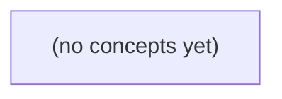

# 《07.12 跨系统数据一致性案例：从消息提交到离线补拉》

*面向Go初学者，以虚构教学系统S3中的消息m-9为主线，讲解消息数据库、同库Outbox、Broker、搜索索引、通知与离线补拉之间的一致性合同、状态边界和故障恢复。全书通过两遍递进式讲解、完整状态机、七类故障推演与22道反馈题，建立不夸大确认语义、不过度推断源码实现的工程判断能力。*

**章节:** 2

---

## 本书导览

- 了解整本书的章节脉络
- 掌握各章之间的概念依赖关系
- 选择最合适的阅读顺序

# 《07.12 跨系统数据一致性案例：从消息提交到离线补拉》

面向Go初学者，以虚构教学系统S3中的消息m-9为主线，讲解消息数据库、同库Outbox、Broker、搜索索引、通知与离线补拉之间的一致性合同、状态边界和故障恢复。全书通过两遍递进式讲解、完整状态机、七类故障推演与22道反馈题，建立不夸大确认语义、不过度推断源码实现的工程判断能力。

下方的概念图展示了本书 0 个核心概念以及它们之间的依赖关系；再下方是 1 个章节的入口。你可以按从上到下的顺序阅读，也可以根据自己的兴趣或先验知识选择切入点。

#### 概念图

## 章节索引

- **07.12 跨系统数据一致性案例：从发送到离线补拉** — 面向Go初学者，沿虚构IM消息m-9跨权威数据库、outbox、broker、搜索、在线通知和B设备补拉，评审确认、故障、对账、补偿与权限。

## 07.12 跨系统数据一致性案例：从发送到离线补拉

- 绘制权威消息到派生读与设备的确认矩阵
- 区分S2和拟议S3 HTTP成功语义
- 对七个失败窗口指定恢复来源与证据
- 解释B离线超过broker保留时的权威补拉
- 设计ID/版本/删除/权限对账和受控补偿
- 限制固定OpenIM源码能证明的范围

以消息m-9为线索，先区分“消息存在”与“各类用户可见结果”，再追踪从发送确认到离线设备补拉的证据链与恢复路径。

### 先拆开五种“消息到了”

### 先拆开五种“消息到了”

对同一条 `m-9/seq9`，用户说“消息到了”时，必须先追问：到了哪里、以什么证据确认？它不是单一状态，而是至少五个彼此独立的结果。

| 用户关心的问题 | 含义 | 权威证据 |
|---|---|---|
| 历史存在吗？ | 消息是否已成为可查询的会话事实 | 教学数据库 `messages` 中 `m-9` 与序号记录；与 `outbox E9` 同一事务提交 |
| 能搜索到吗？ | 搜索派生是否已消费事件并建立索引 | `SearchIndex` 独立消费组的索引文档、消费位点或处理记录 |
| 在线时有提示吗？ | 通知服务是否决定并成功投递提示 | `Notify` 消费记录、推送请求与供应商回执；这不等于设备展示 |
| 设备收到了吗？ | 某设备是否已拿到消息内容或同步增量 | 设备同步游标、拉取响应确认或客户端接收回执 |
| 已读了吗？ | 用户是否在某设备上完成阅读动作 | 读状态表或读游标，如 `read_seq >= 9` |

因此，`accepted_in_memory` 只能说明 S2 曾接纳请求，不能证明任何长期结果；未来 S3 的 `stored_in_teaching_db` 才能支撑“历史存在”。同样，`E9 evt:m-9:v1` 已进入 broker，也只说明事件可被消费，不保证搜索、通知和设备都完成。

特别是 B 离线 25 小时、玩具 broker 仅保留 24 小时：即使错过在线通知和事件消费，仍应以数据库中的历史消息为准，按当前权限补拉。事件流用于派生与加速，历史库才是离线恢复的最终依据。

### 从S2内存接收到S3事务落库

### 从 S2 内存接收到 S3 事务落库

对 `m-9/seq9` 而言，S2 的 `accepted_in_memory` 只表示：服务进程已接收请求、完成当次校验并暂时接受该消息进入内存处理路径。HTTP 成功在此语境中承诺的是“本次请求未被立即拒绝”，而非“消息已成为可恢复历史”。

若进程在后续写库、投递 broker 或派生索引前崩溃，`m-9` 可能已向发送端返回成功，却没有可供 B 在 25 小时后补拉的持久证据。因此不能把 S2 的成功响应解释为：

- 消息一定已写入教学数据库；
- 搜索一定可见；
- 通知一定已发送；
- 离线设备一定可接收；
- 客户端重连后一定能按 `seq9` 找回。

拟议 S3 的 `stored_in_teaching_db` 则要求在同一事务中提交 `messages` 记录与 `outbox` 事件 E9。此时 HTTP 成功可承诺：`m-9` 已持久存在，且存在待发布的 `evt:m-9:v1`；即使发布者稍后故障，也可扫描 outbox 重试。

但这仍不等于 broker、SearchIndex、Notify 或 B 的设备已经完成处理。特别是玩具 broker 仅保留 24 小时，B 离线 25 小时后的恢复依据应是权限校验后的数据库补拉，而不是假定 broker 必然保留历史。固定 OpenIM 源码只能证明其具体实现路径，不能自动证明这里的 S3 事务模型、事件格式或跨系统交付承诺；这些属于教学系统的明确设计约束。

### m-9的提交与异步派生链

### m-9的提交与异步派生链

u-a 向会话 c-a 发送 `m-9`，并分配会话内序号 `seq=9`。首先要明确：发送成功不等于搜索已可见，也不等于所有设备已收到通知。它至少包含一条可验证的主事实链：

1. 在同一个 SQL 事务 `Tx` 中写入：
   - `messages`：保存 `m-9`、`c-a`、发送者 `u-a`、正文、`seq=9`、服务端时间等；
   - `outbox`：保存待发布事件 `E9`，例如 `evt:m-9:v1`，其载荷指向消息及其版本。

   因而提交后的关键不变量是：

   \[
   \text{message}(m\text{-}9)\ \Leftrightarrow\ \text{outbox}(E9)
   \]

   不会出现“数据库已有消息但事务内根本没有派生任务”的永久缺口。

2. `Tx` 提交后，outbox 发布器读取 `E9` 并投递给 broker。发布过程允许重试，因此 broker 侧可能见到重复投递；消费者必须以事件标识、消息标识和版本号实现幂等，而不能假设“恰好一次”。

3. broker 为不同目标维护独立消费组：
   - `SearchIndex` 消费 `E9`，提取可检索字段并更新索引；
   - `Notify` 消费 `E9`，依据成员关系、通知偏好和在线状态生成提示或设备推送；
   - 预览、摘要等也应视为独立派生结果，而非 `messages` 的提交条件。

因此，`m-9` 在 `messages` 中存在，只证明其历史事实已持久化；SearchIndex 追上后才意味着可被搜索；Notify 处理后才可能产生在线提示。当前 S2 若仅返回 `accepted_in_memory`，只能说明请求被内存接纳，尚不能作为上述 SQL 提交的证据；S3 的 `stored_in_teaching_db` 才对应这条持久化与异步派生链的起点。

### 七个失败窗口的恢复证据

### 七个失败窗口的恢复证据

以 `m-9/seq9` 为例，恢复不能只问“是否发成功”，而要分别证明历史、搜索、提示、设备接收和已读状态。每一步都应有可重放来源、幂等键与可对账证据。

1. **事务提交前失败**：`messages` 与 `outbox E9` 尚未同一事务提交，则教学库中不存在 `m-9`；客户端只能得到失败或未知结果。重试以客户端请求键（如 `u-a:client_msg_id`）去重，不能仅按内容去重。  
2. **事务提交后、响应前失败**：消息可能已存在，但发送方未收到确认。以 `messages(m-9, seq9)` 和 `outbox(evt:m-9:v1)` 为最终证据；重试返回既有结果，不重复生成序号。当前 S2 的 `accepted_in_memory` 不能提供此证据，S3 的 `stored_in_teaching_db` 才可恢复。  
3. **Outbox 未发布**：轮询器扫描未投递的 E9，按事件键 `evt:m-9:v1` 重发；对账条件是“已提交消息都有 outbox，未完成 outbox 必须持续可见”。  
4. **发布后确认丢失或重复发布**：broker 可收到多份 E9。消费者以事件键或 `m-9:v1` 幂等，记录消费位点；发布日志与 broker 偏移量用于核对“至少一次”而非幻想“恰好一次”。  
5. **搜索索引失败**：SearchIndex 独立消费组可滞后，搜索不到不等于历史不存在。以消息库为权威，按 `m-9:v1` 重建索引，并对比索引文档版本与事件版本。  
6. **在线通知失败**：Notify 独立组失败只影响提示，不影响消息持久化。通知键可为 `用户:设备:m-9:v1`；在线推送日志只能证明尝试，不能证明设备收到。  
7. **设备离线、消费或已读回执失败**：B 离线 25 小时已超过玩具 broker 的 24 小时保留期，不能依赖旧事件补齐；应按权限从消息库以 `seq > 本地游标` 补拉。设备以 `m-9` 去重，已读回执以 `(B, m-9)` 或最大连续 `read_seq` 幂等写入；服务端回执记录才是“已读”证据，客户端展示不算。

### 离线25小时后的权威补拉

### 离线25小时后的权威补拉

B 离线 25 小时后重新上线，不能把“未从 broker 收到 `evt:m-9:v1`”直接解释为“消息不存在”。玩具 broker 仅保留 24 小时，事件流缺口只能说明在线分发证据已过期；权威事实仍应回到教学库中的 `messages`，而不是依赖 SearchIndex、Notify 或本地缓存。

补拉请求应携带会话标识与已确认游标，例如：`conversation=c-a, after_seq=8`。服务端执行的不是无条件查库，而是受控恢复：

1. **重新校验权限**：确认 B 当前仍属于 `c-a` 的可见成员。权限应以补拉时的状态为准；若 B 已被移出会话，即使其离线前本可见 `seq=9`，也不得继续返回正文。
2. **按会话序号读取权威记录**：查询 `seq > 8` 的消息，并按 `seq` 升序返回。`m-9/seq9` 是稳定业务身份，不能用 broker 位点或搜索文档编号替代。
3. **携带版本与删除语义**：客户端依据 `(message_id, version)` 幂等合并。例如已收到 `m-9:v1` 又补到同版本，应忽略重复；若得到 `m-9:v2`，则覆盖旧内容；若记录已撤回或删除，则返回删除标记，使本地移除正文而非复活旧缓存。
4. **处理权限变化造成的空洞**：若某些历史消息因当前权限、内容级策略而不可见，响应可保留连续游标推进信息，但不得泄露被过滤消息的内容、标题或搜索摘要。

因此，broker 保留期决定的是“能否用事件重放加速同步”，不是消息历史的保存期限。前提是 S3 的 `stored_in_teaching_db` 真正落地：`messages` 与 outbox 的 `E9` 同一事务提交后，离线补拉才能成为可验证的恢复路径；若系统仍只有 S2 的 `accepted_in_memory`，25 小时后的补偿便没有可依赖的权威来源。

> **要点** — 发送成功不等于所有派生结果完成；以权威库和事务外箱为锚点，用独立对账与补拉恢复各消费侧状态。

以虚构消息 m-9 为线索，先划清各系统的权威边界，再定义确认、补拉、对账与补偿不可越级的规则。

### 权威层与派生层确认矩阵

### 权威层与派生层确认矩阵

以消息 `m-9` 为例，必须先区分“已被可靠记录”与“已在某处可见”。前者决定成功语义，后者只是不同路径上的投影；任何派生系统都不能反向证明消息已提交。

| 对象/系统 | 权威性与用途 | 可确认的事实 | 不可越级确认 |
|---|---|---|---|
| 消息历史数据库 | 唯一权威；保存消息正文、会话、发送者、`seq`、提交状态 | `m-9` 已持久化，且在会话序列中占据确定位置 | 不因搜索命中、推送送达或预览生成而确认写入成功 |
| 搜索索引 | 可重建派生；支持全文检索 | 某版本内容已被索引 | 不证明历史库存在该消息；索引滞后可由对账追赶 |
| 预览/摘要 | 可重算派生；服务列表摘要、通知文案 | 某消息预览已生成 | 不证明正文、权限或未读状态正确 |
| 在线通知 `Notify` | 低延迟提示通道 | 某在线设备曾收到提示尝试 | 不证明设备展示、用户阅读或消息永久保存 |
| 设备视图 | 基于历史库与游标的本地投影 | 该设备已拉取到某个 `seq` | 不代表其他设备同步，更不代表已读 |
| 阅读回执库 | 独立用户行为事实；记录“谁读到何处” | 用户/设备报告并被接受的阅读位置 | 不可由拉取、展示或通知自动推断为已读 |

因此，服务端在历史数据库完成原子提交后，才能向发送方确认“发送成功”；随后搜索、预览和通知均可异步失败、重试或重建。离线设备 B 只能以**当前成员权限**和本地 `seq` 游标补拉历史，不能借旧通知、旧缓存绕过已撤销的访问权。阅读回执也必须单独写入，避免把“可见”捏造成“已读”。

### 安全性、活性与时效性边界

### 安全性、活性与时效性边界

对消息 `m-9`，先把目标拆成三类，避免把“收到了通知”误当成“数据已正确同步”。

| 属性 | 定义 | 依赖条件 |
|---|---|---|
| 安全性：不泄露 | B 补拉时仅返回调用者**当前**仍有权读取的消息；即使其 `seq` 游标落后，也不能借历史权限读取已被移出会话后的内容。 | 实时成员权限校验、消息历史权威库、访问审计 |
| 安全性：不捏造 | 返回的消息必须存在于权威消息历史中，且内容、顺序、发送者与服务端确认结果一致；搜索、预览和 Notify 都不能凭空构造或覆盖权威记录。 | 不可伪造的消息标识、权威写入确认、派生数据可验证 |
| 活性：最终修复 | 搜索索引、预览缓存、离线客户端可在短暂落后后，通过重放、对账或按 `seq` 补拉最终追上权威历史。 | 保留足够长的日志/消息、可用的计算与网络资源、重试机制 |
| 时效性：可量化 | 分别度量写入确认延迟、Notify 到达延迟、派生索引滞后和离线补拉完成时间，例如要求 `P99(索引滞后) < 60s`。 | 明确起止事件、监控埋点、容量预算与降级策略 |

活性不是无条件承诺：若消息保留期已过、客户端游标损坏或系统长期无资源，就只能报告“无法从该游标恢复”，不能伪称已经补齐。相反，安全性必须始终成立：宁可暂时不可见、稍后修复，也不能泄露撤销权限后的历史，或把派生系统中的错误当作真实消息。

### 从发送确认到重复请求语义

### 从发送确认到重复请求语义

设客户端发送消息 `m-9`，请求携带消息标识 `mid`。确认点必须表达“已经发生了什么”，不能把后续系统的状态提前包装成成功：

| 确认点 | 对客户端的承诺 | 不承诺的内容 |
|---|---|---|
| S1：请求受理 | 网关已接受格式与认证校验 | 消息已写入历史库 |
| S2：历史库提交 | `m-9` 已成为消息历史权威库中的一条记录 | 搜索、预览、Notify 已更新 |
| S3：派生与通知推进 | 既定派生任务或通知流程已被成功提交/推进 | 所有设备都已收到、阅读或建立索引 |

关键比较在于重复 HTTP 请求。S2 的既有语义是：首次请求成功写入权威历史库后，再以同一 `mid` 请求，即使正文、会话、发送者完全相同，也返回 `409 冲突`。这表示“该创建操作不能再次执行”，而不是“服务器替你把重复创建解释为幂等成功”。

拟议 S3 不能为了方便客户端重试而暗改这一事实。例如，不能把原本应返回的 `409` 改成 `200`，更不能声称“消息已通知所有在线成员”。否则客户端会把“重复被拒绝”误解为“本次请求完成了更高等级确认”，造成确认点越级。

若要支持幂等重试，应新增明确契约，例如独立的幂等键、`GET /messages/{mid}` 查询，或返回可区分“已存在”与“本次新建”的状态字段；不得在 S3 中悄然重定义 S2。这样既避免捏造新的写入或通知事实，也让离线补拉仍以权威历史库的 `seq` 游标为准。

### 离线设备的权限化权威补拉

### 离线设备的权限化权威补拉

B 设备离线时间超过 Broker 的消息保留期后，不能把“未收到 Notify”解释为“没有新消息”，更不能从搜索索引或预览缓存重建会话。它们只是可延迟、可丢失、可重建的派生系统；唯一可作为补拉依据的是消息历史权威库。

B 恢复连接时提交会话范围与本地已确认游标 `seq_b`。服务端执行的不是“按旧订阅回放”，而是：

1. 读取该会话当前成员关系、封禁状态、设备撤销状态及消息可见范围；
2. 在权限仍有效的前提下，从权威历史中查询 `seq > seq_b` 的消息；
3. 按单调 `seq` 返回消息、删除/撤回等必要状态事件，以及新的可推进游标；
4. B 仅在本地持久化完成后确认新游标，失败可用原游标幂等重试。

关键在于权限按“当前”判定。若 B 在离线期间被移出群组，即使其旧游标之后存在消息，也不得补发；若权限恢复，只能从服务端定义的重新可见边界开始，不能借旧游标窥取被撤销期间的内容。这保证安全性：不因过期通知、缓存或索引泄露消息，也不凭空捏造历史。

补拉的活性依赖历史保留与查询资源：权威库仍保有记录、B 最终联网且具备权限时，缺失消息最终可修复。若历史已按合规策略清除，服务端应明确返回“不可补齐的截断边界”，而非由搜索结果伪装完整历史。时效性则可量化为“上线后至权威补拉完成”的延迟；Notify 只缩短这一延迟，不改变补拉的权威来源。

### 失败窗口、对账与受控补偿

### 失败窗口、对账与受控补偿

以消息 `m-9` 为例，恢复不能“看哪里缺就补哪里”，而必须回到消息历史权威库，以不可变事件、事务提交号与 `seq` 为审计证据。

| 失败窗口 | 恢复来源与证据 | 受控补偿条件 |
|---|---|---|
| 数据库写入前失败 | 请求日志、幂等键记录 | 未见已提交事务，才允许重试创建 |
| 数据库已提交、outbox 未投递 | 权威库事务号、outbox 状态 | 扫描未投递记录，按事件标识重投 |
| outbox 已投递、broker 确认丢失 | broker 消息标识、消费者去重表 | 可重复投递；消费者必须幂等 |
| broker 已送达、派生索引失败 | 权威消息流、索引水位 | 按 `seq` 重建搜索/预览，不能反写历史 |
| 派生读已更新、通知未发 | 消息事件、通知投递记录 | 补发仅作提示；不得据此宣称用户已收到 |
| 通知已发、设备状态未知 | 推送回执、客户端会话日志 | 允许再次提醒，但不得伪造送达或已读 |
| 设备离线或游标断裂 | 当前成员权限、服务端 `seq` | B 以当前权限补拉缺口；无权限内容永不返回 |

对账应比较“权威库最大连续 `seq`”与各系统水位，而非比较消息数量。搜索、预览和通知均可落后并最终追赶；阅读回执独立存储，只能由可信客户端事件推进。

补偿必须逐级进行：先确认权威写入，再修复 outbox，再重放派生消费，最后补通知与设备拉取。不得因 S2 的重复 HTTP 请求正文相同就改判成功：同一幂等键已被占用仍返回 `409`；也不得把 S3 的既定成功语义暗改为“实际未通知”。安全性要求不泄露、不捏造；活性要求在保留期、计算与队列资源存在时最终修复；时效性则以“允许落后多少个 `seq`、多久”明确量化。

> **要点** — 确认必须对应真实权威层；通知可快但不可作证，离线恢复应以权限校验后的权威历史为准。

以消息 m-9 的端到端时间线为主线，明确每一步的确认含义、未知边界与故障后的权威恢复路径。

### T0—T2：授权、原子落库与事件待发

### T0—T2：授权、原子落库与事件待发

以消息 `m-9` 为例，前半段时间线只建立“可被可靠传播的事实”，尚未建立“已被任何消费者看见”的事实。

- **T0：认证与授权。**发送端携带身份凭证请求发送消息；服务端验证其身份、会话有效性，以及其对目标会话、群组或频道的发送权限。成功仅证明：**该主体在此时被允许发起写入**。它不证明消息已经持久化，更不证明收件设备、搜索系统或通知系统已经收到内容。授权结果也不是永久承诺：后续补拉时仍应按当时有效的权限重新过滤。

- **T1：本地 SQL 原子提交。**服务端在同一数据库事务中写入消息记录及对应的 outbox 记录，例如消息为 `m-9:v1`，outbox 状态为 `PENDING`。事务提交后，权威数据库至少可证明两件事：消息内容、会话序号等业务事实已经落库；存在一项必须向下游发布的事件任务。若事务回滚，则两者都不应存在；因此不会出现“消息已提交但事件任务丢失”的双写裂缝。

- **`PENDING` 的边界。**它表示“事件尚未被确认交给消息代理”，而非“尚未尝试发送”。relay 可能尚未来得及扫描，也可能已发送请求但在确认前崩溃。此时数据库通常无法仅凭状态判断 broker 是否其实已经接收，因此后续发布必须允许重复。

- **T2：relay 发布事件 `E9`。**relay 读取 `PENDING` 的 outbox 并尝试发布 `E9`，其中应带稳定事件标识、消息标识 `m-9`、版本 `v1`、会话序号及分区键。T2 最多证明 relay 已发起发布动作；在尚未获得 broker 确认前，网络超时、进程崩溃和响应丢失都会留下“已到达还是未到达”的未知区间。

因此，T0—T2 的权威恢复锚点是本地消息表与 outbox：重试 relay 可补足事件传播；但它们仍完全不能证明 SearchIndex 已索引、Notify 已推送，更不能证明 B 设备已经收到或阅读。

### T3—T4：Broker确认与搜索派生确认

### T3—T4：Broker确认与搜索派生确认

对消息 `m-9` 而言，Relay 发布事件 `E9` 后，Broker 返回 `P0:42`，表示：事件已被 Broker 接纳，并稳定地写入分区 `P0` 的偏移量 `42`。这是**传输层持久化确认**，不是“所有下游都已完成”的确认。

可用确认矩阵区分状态：

| 观察点 | 已知事实 | 仍未知 |
|---|---|---|
| `P0:42` | `E9` 已进入 Broker 分区日志，可被重放 | SearchIndex 是否已消费；通知是否已发送；B 是否收到 |
| SearchIndex 消费 | 消费者已读到 `E9`，可开始处理 `m-9:v1` | 索引写入是否成功、是否已对查询可见 |
| SearchIndex ACK | `m-9:v1` 的派生索引已成功应用，消费者可提交进度 | 其他消费者是否完成；B 是否在线 |
| 搜索查询命中 | 搜索效果对调用方可见 | 不能反推通知送达或设备已读 |

因此，`P0:42` 只回答“事件有没有被接纳”；SearchIndex 的 ACK 才回答“该事件对应的搜索派生效果是否已完成”。ACK 应绑定业务幂等键，如 `m-9:v1`，而不能只绑定 offset：同一消息可能因重放再次到达，索引服务应将重复应用收敛为同一版本结果。

若 SearchIndex 在写入后、提交消费位点前故障，`E9` 会被再次消费；若先提交位点再写索引，则可能永久丢失搜索效果。正确恢复路径是：以 Broker 中的 `E9@P0:42` 为可重放输入，以索引中的 `m-9:v1` 为幂等判断依据，最终补齐派生状态。此时可以确认搜索已可见，但不能据此宣称消息已推送、已送达或已阅读。

### T5—T6：在线通知与设备接收的不确定性

### T5—T6：在线通知与设备接收的不确定性

在 T5，`Notify` 已获知事件 `m-9:v1` 可通知，便向 B 设备当前会话发起推送；但“通知接口成功”并不等于“B 已收到消息”，更不等于“B 已读取”。

| 阶段 | S2 的 HTTP 成功语义 | 拟议 S3 的确认语义 | 仍然未知 |
|---|---|---|---|
| Notify → 网关 | 网关返回 `2xx`，表示请求被网关接受或进入投递队列 | 网关返回带投递标识的接受确认 | 设备是否在线、是否已有可达连接 |
| 网关 → B | 通常缺乏业务可见的逐设备证据 | B 客户端回传“已接收 `seq=9`”确认 | 客户端是否已落盘、是否已展示 |
| B 用户侧 | 无法由 HTTP 状态推断 | 阅读回执可记录“已读” | 用户是否真正理解或处理内容 |

因此，S2 中 `HTTP 200` 的证据上界只是：`Notify` 已成功把请求交给网关。若 B 在 T6 断网、应用被杀、系统推送受限，网关可能延迟投递、丢弃可瞬时通知，或根本无法建立连接；服务端不能据此写入“B 已收”。

S3 若引入客户端确认，应将语义限定为：B 的客户端已收到并持久化某个游标或事件，例如 `ack(seq=9)`。它比网关接受更强，却仍应与 T8 的阅读回执分离：

- `accepted`：网关接管，适合重试去重；
- `delivered/ack`：设备客户端确认收到，适合推进设备投递水位；
- `read`：用户明确阅读，才可更新阅读状态。

无论 T6 的即时推送结果如何，权威恢复路径仍是 T7：B 重连后按当前权限与 `seq` 补拉。即使 `E10(seq=10, P0:43)` 的预览先到，客户端也不能据此认定 `E9(seq=9, P0:42)` 已完成搜索相关效果；缺口仍须通过补拉或重试闭合。

### T7—T8：离线补拉、权限过滤与阅读回执

### T7—T8：离线补拉、权限过滤与阅读回执

B 设备在 T6 离线后，不能假设仅靠 broker 重投就能恢复：若离线时间超过 broker 保留期，E9（`P0:42`）可能已不可消费。此时权威恢复路径不是扫描 outbox，也不是向 SearchIndex 反查，而是请求消息服务的权威消息库：

`GET /conversations/{id}/messages?after_seq=last_applied_seq`

请求携带 B 已持久化的会话水位，例如 `last_applied_seq=8`。服务端以会话内单调序号返回 `seq=9` 的消息 m-9，以及后续 `seq=10` 的 E10；客户端必须按 `seq` 去重、补洞并推进本地水位。即使 E10 已先通过其他路径完成预览，B 仍不能据此认为 E9 已恢复：预览、消息正文、搜索索引是不同投影，E9 仍须补拉并最终驱动本地展示与搜索效果一致。

补拉时权限必须按**当前授权状态**重新计算，而非沿用 T0 的旧令牌或事件产生时的可见性。服务端应先验证身份、会话成员资格、消息删除/撤回状态与保留策略，再返回允许读取的消息或明确的序号推进信息。否则，已被移出会话的 B 可能借旧游标读取历史内容。已知的是服务端已提交的消息及其序号；未知的是 B 是否曾收到推送、是否展示过 m-9，因此客户端恢复必须幂等。

T8 的阅读回执是独立写入，例如 `read_up_to_seq=9`，不应与补拉响应绑定为同一原子事务。服务端仅单调推进该设备或该用户的已读水位，重复、乱序回执不能回退状态。回执提交成功只说明“B 声明已读”已被持久化；它不证明通知曾送达，也不证明其他设备或搜索索引已同步。

### 乱序与失败窗口：E10先完成时如何对账补偿

### 乱序与失败窗口：E10 先完成时如何对账补偿

设 E9 为 `m-9:v1, seq=9, P0:42`，E10 为 `seq=10, P0:43`。Notify 可先依据 E10 生成预览，但这不证明 SearchIndex 已具备 E9 的搜索效果；“预览已完成”和“全文可检索”是两条独立投影。

可按失败窗口建立对账表：

1. **SQL 已提交，relay 未读 outbox**：恢复源是 `messages` 与 `outbox=PENDING`；审计证据为本地事务提交号。重启 relay 后按事件唯一键 `eventId` 发布。
2. **relay 已发，未获 broker 确认**：发布结果未知，必须重试；broker 以 `eventId` 或 `(topic, partition, seq)` 去重，不能因超时直接认定失败。
3. **broker 已接收，SearchIndex 未消费**：权威来源是分区位点 `P0:42`；消费者从已提交位点重放。
4. **SearchIndex 已写入，ACK 丢失**：以幂等键 `(messageId, version)` 写索引；重复应用 `m-9:v1` 不改变结果，再 ACK 即可。
5. **E10 预览先完成，E9 搜索缺失**：对账任务比较消息表版本、索引版本和消费位点；发现 `seq=9` 缺投影时，仅补发 E9 或定向重建，不回滚 E10 的预览。
6. **消息被编辑或删除**：索引写入必须携带版本。若当前为 `m-9:v2` 或删除墓碑，迟到的 `v1` 必须拒绝；删除使用 `(messageId, deleteVersion)` 幂等，防止旧事件“复活”文档。
7. **Notify 或设备状态未知**：推送成功不等于 B 已收到；B 在 T7 按权限与 `seq` 补拉，T8 阅读回执独立记录，不能作为搜索或投影完成证据。

受控补偿的边界是：只从权威日志、消息主表和 outbox 重建派生状态；不伪造已发送、已送达或已阅读事实。审计中应保留 `eventId`、版本、分区位点、索引写入结果、补偿任务号与操作者，使“E10 已见、E9 不可搜”可定位为投影滞后，而非数据丢失。

> **要点** — 每个确认只证明本层状态；离线设备最终以受权限约束的权威补拉收敛，派生系统须靠对账与幂等补偿修复。

以消息 m-9 为主线，沿发送、投递、索引、通知与离线补拉链路，建立“确认不等于送达”的一致性判断框架。

### 确认矩阵与稳定身份

### 确认矩阵与稳定身份

以消息 `m-9` 为例，“成功”必须先说明是哪个系统确认了什么事实。客户端收到 HTTP 成功，仅表示服务端已接受或已提交；它不自动证明事件已投递、搜索可见、通知到达，更不证明设备 B 已展示。

| 位置 | 确认含义 | 权威事实 | 关键身份 |
|---|---|---|---|
| 权威库 | 消息业务状态已提交 | `message(m-9, version=v2)` 存在 | 稳定消息 ID `m-9`、版本 `v2` |
| Outbox | 待发布事件与业务提交同事务落库 | `PENDING` 记录存在 | `event_id=e-9` |
| Broker | 生产者事件已被 broker 接收 | `e-9` 可消费 | `event_id`、分区/偏移量 |
| 搜索索引 | 某版本已写入可检索副本 | 文档 `m-9:v2` 已索引 | 消息 ID + 版本号 |
| 通知服务 | 通知请求已被通知平台接受 | 推送任务已提交 | `event_id`、设备 ID |
| 设备 B | 用户终端已拉取并通过校验 | 本地游标推进或回执 | `m-9:v2`、用户/设备身份 |

稳定 ID 解决“这是不是同一条消息”，`event_id` 解决“这是不是同一次发布”，版本号解决“这是不是最新状态”。例如客户端在 Commit 后丢失响应时，不应盲目重发生成新消息，而应按请求携带的稳定 ID 查询权威库；若 `m-9` 已存在，即可恢复结果。重复调用 S2 时返回 `409` 可以表示“对象已存在”，但不得改变既有内容、版本或派生事件。

所有下游记录都应能反查到 `m-9 → e-9 → m-9:v2`。排障证据因此不是单一“成功日志”，而是：数据库提交时间、outbox 状态、broker 消费记录、索引版本、通知任务状态，以及设备同步游标。确认链路缺少其中任一环，只能证明局部完成，不能宣称端到端送达。

### 发送端结果未知与重复提交

### 发送端结果未知与重复提交

以消息 `m-9` 的稳定业务标识为锚点，发送端首先要接受一个事实：客户端没有收到响应，只能说明“结果未知”，不能推断“提交失败”。

- **窗口一：数据库已 Commit，但客户端响应丢失。**症状是客户端超时后重试，担心消息重复；源事实应以消息主表中 `message_id=m-9` 的已提交记录为准，而非客户端超时状态。恢复时客户端按稳定 ID 查询：若已存在则展示既有结果，不再创建新消息；若不存在才安全重发。证据包括数据库提交时间、请求关联 ID、消息状态及服务端审计日志。

- **窗口二：S2 收到重复提交。**若 `m-9` 已由第一次请求创建，S2 对同一幂等键返回 `409`，表示“该创建已被接受或已存在”，而不是新的失败。`409` 不应改变原消息内容、状态或出站事件；客户端应转为查询既有 `m-9`。证据是唯一索引冲突记录、两次请求携带相同幂等键，以及消息表仅有一条创建记录。

- **窗口三：事务已写入 outbox，但 relay 宕机。**症状是消息在库中存在，却迟迟未投递给消息系统。源事实是业务消息与 outbox 记录在同一事务中提交，outbox 状态仍为 `PENDING`。relay 恢复后扫描未发送记录并重新发布，再将状态更新为已发送；扫描必须可重复执行。证据为 outbox 的创建时间、`PENDING` 状态、relay 重启日志和后续发布记录。

- **窗口四：producer 发布成功，但 ACK 丢失。**producer 会将发布结果视为未知并重试，因此下游可能收到多个相同 `event_id` 的事件。修复不是假设“不会重复”，而是在消费者、索引器等环节以 `event_id` 去重或幂等写入。证据应关联 broker 中重复事件、相同 `event_id`、producer 重试日志与消费者去重命中记录。

### 派生读故障的幂等隔离

### 派生读故障的幂等隔离

SearchIndex 是派生读模型，不是消息 `m-9` 的源事实。索引写入成功后，即使消费者的 ACK 丢失、进程崩溃或 broker 重新投递，也不能把同一事件当作新变更再次执行。

- **症状：写后 ACK 丢失。**消费者已将 `event_id=e-17` 写入索引，但 ACK 未到达 broker；恢复后该事件再次投递。
- **源事实：事件身份而非投递次数。**索引文档应携带 `event_id`、业务对象版本如 `m-9:v2`，并以 `event_id` 建立已处理记录，或以“对象 ID + 单调版本”执行条件更新。
- **修复：可重放幂等写。**重放 `e-17` 时，若索引已记录该 `event_id`，直接确认；若版本相同，覆盖写应得到相同结果；若事件版本低于当前 `v2`，拒绝旧版 `v1` 覆盖。只有成功写入或确认已写入后，才提交消费位点。
- **证据：**保留事件 ID、分区位点、索引文档版本、写入结果和 ACK 状态，可证明“重复投递未造成重复派生”。

坏消息 `E-bad` 卡在 `P0:44` 时，不能无限重试并阻塞该分区后续消息。应记录失败次数、异常栈、原始载荷摘要与首次/最近失败时间；超过阈值后将其隔离到死信队列，并提交 `P0:44` 的处置位点。修复解析器、映射规则或脏数据后，从死信队列以原 `event_id` 重放；修复前后的载荷校验值、审批人、重放结果和索引版本共同构成审计链。隔离表示“暂不派生”，不表示源消息被删除。

### 通知成功不代表设备收到

### 通知成功不代表设备收到

对消息 `m-9` 而言，“通知成功”至少可能指三个完全不同的确认点，不能混为“B 已收到”。

| 确认对象 | 成功所证明的事实 | 不能证明 |
|---|---|---|
| Broker 确认 | 消息已被 Broker 接收或持久化 | B 的设备在线、已拉取消息 |
| 在线通知确认 | 推送服务已接受通知请求 | 操作系统已展示通知、客户端已处理 |
| 客户端消费确认 | B 的客户端已取得并处理消息 | 用户已经阅读或理解内容 |

因此，B 离线时，服务端调用 Notify 返回成功，只能作为“通知请求已提交”的证据。推送通道可能因设备离线、系统限流、令牌失效或网络中断而延迟、丢弃或合并通知；即使通知最终显示，也不代表客户端完成了 `m-9` 的同步。

源事实应落在可恢复的消息存储中，例如消息表、会话游标或事件日志，而不是通知回执。客户端重新上线后，应携带稳定游标或消息 ID 补拉：`after_message_id = m-8`，获得 `m-9` 及后续消息；重复拉取则按 `event_id` 或消息版本幂等处理。

证据链也应分层记录：Broker 的持久化偏移量、Notify 请求 ID 与响应、客户端同步游标、客户端消费 ACK、最终已读回执。只有客户端提交消费 ACK，才能说明设备已经接收；只有显式已读事件，才能说明用户已读。通知只是唤醒优化，离线补拉才是送达保障。

### 越过保留期的权威补拉

### 越过保留期的权威补拉

B 离线 25 小时后恢复，而消息日志仅保留 24 小时；此时不能把“从日志未读到消息”解释为“期间没有消息”。日志是低延迟投递通道，超过保留期后，权威事实应回到数据库中的会话消息、成员关系与版本记录。

客户端携带持久化游标 `cursor` 发起补拉。服务端按稳定排序键查询：

`(会话ID, 服务端序号) > cursor`

并返回消息、最新游标及必要的版本元数据。游标必须由服务端单调生成，不能使用客户端时间，避免时钟漂移造成漏拉或重复。

对主线消息 `m-9`，补拉结果应以最新有效版本为准：

- 若数据库中已有 `m-9:v2`，客户端应用 `v2`；重复收到同一版本仅做幂等覆盖。
- 若旧日志、重试队列或缓存随后重放 `m-9:v1`，因 `v1 < v2` 被拒绝，不能回退正文、撤回状态或编辑状态。
- 若 B 在离线期间已被移出会话、拉黑或权限撤销，即使其游标之后存在历史消息，也必须按“消息产生时的可见性策略”和当前授权规则过滤；默认不因补拉绕过撤权。

补拉不是无条件复制，而是受控补偿：先验证 B 的身份、会话成员资格与访问范围，再读取权威数据；客户端按 `message_id + version` 去重，并原子推进游标。若中途失败，旧游标可安全重试。

证据链应包括：B 最后确认游标、离线时长、日志保留窗口、数据库查询范围、`m-9:v2` 的版本记录、被拒绝的 `v1` 重放记录，以及权限撤销审计。这样才能证明“通知未到”已被补偿，同时证明补偿没有恢复过期版本或越权数据。

> **要点** — 每次失败都回到可证明的权威事实；稳定 ID 保证幂等，版本与权限决定数据是否仍可见。

一致性评审不能只看记录数相等，而要沿消息身份、版本、权限与外部副作用逐项核验，并为每类偏差指定可审计的纠正路径。

### 建立端到端确认矩阵

### 建立端到端确认矩阵

以消息 `m-9` 为主线，不应只比较各系统的数量，而应建立“同一身份、同一版本、同一目标”的确认矩阵。每一行对应一个可追踪对象，所有确认都必须能回溯到权威消息版本与具体事件。

| 环节 | 核心身份 | 版本/目标字段 | 确认字段 | 核验重点 |
|---|---|---|---|---|
| 权威消息库 | `message_id=m-9` | `version=17`、会话、发送者、可见范围 | 持久化时间、状态 | 权威正文、删除状态、权限 |
| Outbox | `event_id=e-482`，关联 `m-9` | `message_version=17`、事件类型 | `published_at`、投递尝试数 | 一个事件是否精确对应该版本 |
| Broker | `event_id=e-482` | 分区、偏移量、消息键 | producer 确认、消费位点 | 已确认发布不等于已被消费 |
| 搜索索引 | `document_id=m-9` | `indexed_version=17`、ACL 版本 | 索引成功时间、刷新标记 | 内容、版本及权限过滤是否一致 |
| 通知系统 | `notification_id=n-73` | 接收者、模板版本、关联 `event_id` | 已提交、已送达、失败码 | 只对有权限且应通知者发送 |
| B 设备回执 | `device_id=B`、`message_id=m-9` | `rendered_version=17` | 拉取时间、已读/展示回执 | B 实际看到的身份、版本与权限 |

矩阵中的关联键应至少保存 `message_id`、`message_version`、`event_id`、目标系统对象 ID 和确认时间。排查时分别问：`m-9` 是否缺失、是否多出不该存在的副本、是否停留在旧版本 `16`、是否被无权限主体索引或通知。

例如，搜索中存在 `m-9@17`、B 也回执 `17`，但通知记录缺失，说明不能以“最终内容一致”掩盖通知链路遗漏；反之，通知已送达而数据库后来删除消息，也不能把通知状态简单回滚为未发送，必须记录既有外部副作用，并按产品规则发送纠正通知或在目标侧撤回。

### 按身份而非计数发现偏差

### 按身份而非计数发现偏差

两端各有 `1000` 条记录，并不意味着一致：可能 A 缺少 `id=17`、却多出 `id=93`；也可能同一 `message_id` 存在但版本不同。核验应以“可追溯身份集合”为单位，而不是以总数为结论。

设权威消息状态为：

`messages(message_id, version, visibility, deleted_at)`

Outbox 事件为：

`outbox(event_id, message_id, version, event_type, published_at)`

则先建立应有集合与实际集合：

- **消息身份缺失**：权威库中应投递的 `(message_id, version)` 在 outbox、Broker 确认记录或消费者处理记录中不存在。
- **多余事件**：存在 `event_id`，却找不到对应消息版本，或该事件已被逻辑删除、撤销后仍被继续消费。
- **版本错误**：`message_id` 相同但消费者、SearchIndex 中的 `version <` 权威版本，属于陈旧投影；`version >` 权威版本通常意味着乱序写入、错误回放或权威数据被异常回滚。
- **重复不等于多余**：同一 `event_id` 被重复投递是传输现象；若消费者以 `event_id` 去重且最终目标版本正确，可接受。不同 `event_id` 对同一消息版本产生重复外部副作用，则需单独审计。

消费位点只能说明“读到了哪里”，不能证明“每条都正确生效”。应将 Broker 的已确认位点与消费者处理表中的 `event_id` 对齐，再检查该事件是否成功写入目标索引、通知任务或 B 系统回执。位点连续但中间某个事件业务失败，仍会形成隐蔽缺口。

对 SearchIndex 的比较至少包含 `(message_id, version, visibility)`：文档存在且版本正确，仍可能因权限字段过宽而泄露；文档未删除、旧租户字段残留，也属于偏差。通知状态同理：`Notify=sent` 仅表示曾请求外部渠道，不表示用户已读，更不能据此推断可由数据库回滚撤销。

因此，对账结果应按“缺少、多余、版本错、权限泄露、外部状态未知”分类，并保留最小脱敏审计键：`message_id` 摘要、`event_id`、版本、目标系统、处理时间与结果码。

### 区分恢复来源与证据

### 区分恢复来源与证据

异常发生后，先回答“哪个系统定义事实”，再决定如何恢复；不能把任一副本的当前内容都当作权威。恢复来源与证明异常的证据也应分开保存。

- **消息主记录、版本与权限**：以权威数据库中的 `message_id`、`version`、可见范围和删除状态为准。SearchIndex 缺文档、版本旧或权限过滤错误时，通常按该状态重建索引；索引命中数与数据库记录数相同，并不能证明 ID 集合、版本及权限集合相同。
- **待发布事件**：以 outbox 的 `event_id`、事件类型、载荷版本和投递状态判断是否应发送。若主事务已提交而 outbox 缺事件，应从权威状态生成**新的补偿事件**并关联原消息；若 outbox 中原事件完整但未投递，可重放原事件，避免生成不可追踪的重复副作用。
- **Broker 投递链路**：broker 确认、生产者序号、消费者位点只能证明“事件到达或被消费到哪里”，不能证明目标状态一定正确。位点落后可从安全边界重放；位点已推进但目标缺数据，应结合幂等键、目标记录和消费审计判断是否漏处理。
- **通知与设备侧效果**：Notify 状态可证明平台曾请求发送，设备回执或 B 系统回执才是“对方已接收/已处理”的证据。已发送推送不能靠数据库回滚抹去；误发时应在目标侧撤销、发送更正通知或提示用户，并限制补发次数。
- **跨系统对账**：以 `message_id/version`、`event_id`、目标对象 ID、回执 ID 建立证据链，分别列出缺少、多余、版本错和权限泄露。保留时间、状态码、哈希、操作者与关联 ID 等最小脱敏审计元数据，而非不必要的消息正文或敏感载荷。

### 选择重放、重建或补偿

### 选择重放、重建或补偿

发现跨系统偏差后，先按 `message_id + version` 定位事实，再选择纠正手段；不能因为两侧 `count` 相同就假定一致，也不能把所有问题都当成“再发一次消息”。

- **重放原事件**：适用于事件日志完整、原事件语义仍然正确、消费者只是漏消费或位点异常的情况。例如 `event_id=E123` 已写入 outbox、Broker 已确认，但 SearchIndex 或 Notify 消费者未落库。重放时应保留原 `event_id`、业务键、版本和因果链；消费者以 `event_id` 或 `(message_id, version)` 去重，确保“至少一次投递”不变成重复索引、重复通知。审计证据包括原 outbox 记录、Broker 确认、消费者位点、重放操作者与结果。

- **从权威状态重建**：适用于派生读模型整体损坏、事件缺失不可追溯，或历史事件格式已无法正确解释的情况。以 `messages` 等权威库中当前有效版本为准，重新生成 SearchIndex、离线检索表或权限过滤投影。重建任务必须标记快照边界，例如从版本 `$V$` 开始；完成后还要追赶 `$V$` 之后的增量事件，否则会把旧快照误当成最新状态。重建审计应记录数据源、快照版本、过滤规则、目标记录数及 ID 差集。

- **发布补偿新事件**：适用于原事件已经产生不可逆外部副作用，或原语义本身需要被撤销、修正。例如错误地向无权限用户发送了通知，不能通过回滚 DB 假装通知未发生；应发布“撤销可见性”“更正内容”或“安全告知”事件，由目标侧删除索引、吊销访问、追加说明。补偿事件必须是新的 `event_id`，明确关联 `caused_by_event_id`，不能篡改历史原事件。

三者的共同底线是：纠正动作必须幂等、可限制重试次数，并保留最小脱敏审计元数据，如事件标识、版本、目标系统、时间、执行结果和关联回执。对已发送推送、邮件等外部副作用，优先目标侧纠正与用户告知，而非无限重放。

### 控制外部副作用与审计

### 控制外部副作用与审计

数据库事务只能回滚本地状态，不能撤回已经离开系统边界的副作用：推送已送达、邮件已发出、Webhook 已被对方消费、B 系统已据此执行操作。若发现消息版本错误、权限泄露或重复投递，直接删除本地 `outbox`、修改 `messages` 状态，只会造成“本地看似正确、外部仍持错误结果”的假一致。

处理原则应按目标能力分层：

- **目标侧可撤销或可更新**：发送带稳定 `event_id`、对象 ID 与版本的纠正事件，例如“撤销通知”“更新权限”“以 version=8 覆盖 version=7”；目标侧仅接受更高版本，避免旧事件重放反向覆盖。
- **目标侧不可撤销**：明确告知用户或下游系统，必要时发送更正说明、失效链接、权限收回指令；敏感内容泄露还应触发安全处置，而非尝试用数据库回滚掩盖。
- **外部动作幂等化**：以 `event_id` 或业务幂等键去重；重放原事件用于补齐“未发生”的投递，补偿新事件用于纠正“已发生但错误”的结果，二者不可混用。
- **限制重试**：记录尝试次数、最后错误与下一次重试时间；超过上限转入人工或专项补偿队列，避免无限重发造成通知轰炸、重复扣费或级联调用。

审计至少保留可对账的脱敏元数据：`event_id`、消息 ID、版本、目标类型与匿名化目标标识、权限快照摘要、发送/确认时间、消费位点、结果码、重试次数、纠正事件关联 ID。避免在审计表中复制正文、令牌或完整个人信息；审计的目标是证明“谁在何时因何版本产生何种外部影响，以及如何纠正”，而不是制造新的泄露副本。

> **要点** — 一致性以同一消息身份、版本和权限为准；恢复必须有权威来源、可验证证据与受控的外部副作用。

以设备B离线重连为主线，建立“服务端历史权威、权限实时裁决、推送仅作提示”的补拉与可见性模型。

### 可见性边界与404语义

### 可见性边界与 404 语义

设备 B 所属用户在会话 `c-a` 中是成员，因此重连后可按服务端序号 `seq` 补拉其**当前有权可见**的历史；是否曾离线、是否收到过推送，都不改变这一权限事实。

相对地，用户 `u-c` 虽已登录，但不是 `c-a` 成员。其请求会话详情、消息列表、单条消息或附件时，服务端不应返回“你不是成员”这类可枚举关系的错误，而应统一返回 `404`：目标对该调用者不可见。

这不是“资源不存在”的物理断言，而是权限边界上的逻辑不存在：

- 调用者不能据此确认会话 `c-a` 是否真实存在；
- 不能确认某消息、成员或附件是否属于该会话；
- 不能通过 `403`、不同错误文案或响应耗时推测成员关系；
- 搜索、索引、补拉、通知跳转等入口必须采用同一裁决规则。

权限检查应发生在读取历史、生成索引结果和签发媒体访问地址之前。即使 `u-c` 持有旧链接、猜到消息 ID，或从推送中得到最小标识，也只能得到隐藏目标 `404`。对成员 B，则在每次补拉时按当前权限裁决；退群、被移除或会话删除后，后续不可见内容同样不应继续被补回。

### 以序号驱动的权威补拉

### 以序号驱动的权威补拉

设备 B 重连后，不应依据“本地最后时间”请求缺失消息，而应携带该设备在会话 `c-a` 中的**可见游标**：

`拉取(c-a, after_seq=visible_cursor_B, limit=N)`

服务端以会话内单调递增的 `seq` 排序权威历史，并逐条执行当前权限裁决：B 仍是成员才返回可见事件；若 B 已退出、被移除，或目标对其不可见，则不因旧游标而泄露历史。响应包含事件列表、连续区间信息与新的可见游标；设备仅在成功落盘后推进该游标，再继续分页直到追平。

不能按设备本地时间补拉，原因是时间并非可靠顺序：

- 设备时钟可漂移、被用户修改，多个设备时间基准不同；
- 离线消息、重试写入和跨机房复制可能造成“先到后写”；
- 同一毫秒可有多条事件，按时间边界容易重复或漏取；
- 撤回、删除、退群等控制事件需要与消息共享确定顺序。

因此 `seq` 解决“按何种顺序补”，而每设备游标解决“该设备已可靠处理到哪里”。推送通知只携带会话 ID、事件 ID 或提示性序号，用于唤醒补拉；即使推送丢失、乱序或重复，B 仍可从服务端历史按 `seq` 恢复一致状态。

### 断连重连与多设备游标

### 断连重连与多设备游标

断连后不能把“某设备最后收到什么”误当成“用户整体已经同步”。至少要区分三类状态：

- **用户级状态**：用户 B 是否仍是会话 `c-a` 成员、是否具备查看某条历史消息的权限。这是服务端实时裁决的权限事实。
- **设备级游标**：设备 `d1`、`d2` 各自已成功拉取到的最大可见 `seq`，例如 `cursor(d1)=120`、`cursor(d2)=108`。设备离线、卸载或换机不会推进其他设备的游标。
- **会话级状态**：会话中的全局消息序列及历史记录。服务端按单调递增 `seq` 保存权威历史，而非依赖设备本地时间排序。

设备 B 重连时携带自己的可见游标请求：

`GET /history?conversation=c-a&after_seq=108&limit=50`

服务端先按 `seq` 查询候选历史，再以当前成员资格、撤回状态、删除状态和内容可见范围逐条过滤，最后返回仍对该设备所属用户可见的消息及新的连续游标。若 B 已退出群聊，或目标本应对其隐藏，则不能因旧游标或推送记录而补出内容；对不可见目标通常返回统一的 `404`，避免泄露资源存在性。

推送只承担“可能有新数据”的唤醒作用，不能作为可靠消息通道。即使推送丢失、重复、乱序，设备仍可从自身游标补拉；即使推送先到，客户端也应以服务端补拉结果为准。多设备因此可分别追赶历史，却共享同一套服务端事实与权限边界。

还应将“收到”与“已读”分离：前者表示设备已取得或确认某个 `seq`，后者表示用户显式阅读到的位置。两者都不应仅由通知到达推断。

### 撤回删除退群的历史裁决

### 撤回删除退群的历史裁决

离线补拉不能把“曾经发过”直接等同于“现在仍可见”。服务端应以历史事件流为权威，但在设备 B 按 `seq` 请求增量时，针对每条事件重新执行当前的对象状态与权限裁决：

- **撤回**：原消息可保留为审计事件或逻辑墓碑，但普通客户端补拉结果应返回“已撤回”占位，或仅返回撤回事件；全文搜索索引、通知摘要、客户端正文缓存都必须删除或失效。
- **删除**：删除会影响消息实体、附件引用和搜索索引。若是软删除，服务端仍保存最小元数据以维持 `seq` 连续；若为硬删除，也应通过墓碑或版本水位避免客户端因缺号而反复补拉。
- **退群或被移除**：成员资格不是历史快照权限。B 即使曾在群内、且本地保存旧游标，也只能获取其当前仍有权查看的范围；退群后的新消息不可补，受策略限制时，退群前历史也可被收回。

因此，补拉接口不应简单执行“`seq > cursor` 返回全部记录”，而应执行：

`候选事件(seq > cursor) → 对象存活判断 → 当前权限判断 → 脱敏/占位转换 → 返回可见结果`

游标仍可推进到服务端确认的高水位，即使其中部分事件因撤回、删除或无权而未返回正文；否则客户端会在不可见事件处永久卡住。客户端收到撤回、删除或权限失效信号后，应同步清理本地缓存、搜索索引和预览图。推送仅携带最小 ID 与版本信息，用于唤醒补拉；敏感正文不应进入推送、死信队列或公开日志。

### 通知最小化与受控恢复

### 通知最小化与受控恢复

设备 B 离线后，不能把“收到一条推送”当作“已经获得消息”。不同通道承担不同职责：

| 通道 | 负责什么 | 不应负责什么 |
|---|---|---|
| 推送提示 | 唤醒应用、提示存在更新 | 传递完整正文、作为可靠消息队列 |
| 在线通知 | 降低实时延迟，提示客户端拉取 | 替代服务端历史与权限判断 |
| 权威补拉 | 按会话 `$seq$` 获取连续历史，并实时裁决可见性 | 依赖设备本地时间排序 |
| DLQ 记录 | 保存投递失败的最小诊断信息，支持受控重试 | 保存敏感正文、成为公开审计日志 |

因此，通知载荷宜最小化，例如仅含 `conversation_id`、`message_id`、`seq` 与事件类型。客户端收到后，以本设备的“可见游标”发起补拉；服务端再检查 B 当前是否仍是 `c-a` 成员。若 B 已退群、被移除，或目标 `u-c` 对其不可见，则历史不下发，直接按策略返回隐藏结果或 `404`，而不是依赖旧推送中的信息恢复正文。

“收到”与“已读”必须分离：服务端成功写入可见历史，才可推进收到状态；用户实际打开并确认内容后，才推进已读游标。多设备分别维护收到/已读与可见游标，避免手机已读误覆盖桌面端离线状态。

撤回、删除、退群等事件同样进入按序历史与索引更新链路。补拉时以服务端当前状态为准：已撤回可返回撤回占位，已删除或无权限内容不可从缓存、DLQ、日志中重新泄露。DLQ 仅记录消息标识、失败原因、重试次数和必要追踪标识；正文、附件地址、令牌等敏感数据不得写入其中。

> **要点** — 离线设备以服务端序号历史补拉；每次读取重做权限裁决，推送不承担消息事实与确认责任。

以消息 m-9 为线索建立分层确认矩阵：先判定权威事实，再检查传播证据，最后处理设备可见性与阅读状态。

### 确认矩阵：把状态按权威性分层

### 确认矩阵：把状态按权威性分层

以消息 `m-9` 为例，不要把“接口返回成功”误写成“所有系统均已一致”。应将状态拆为相互独立的确认列；每列只能证明有限事实。

| 确认列 | 典型状态 | 可证明的事实 | 不能证明的事实 |
|---|---|---|---|
| 数据库提交 | `known committed`、`known absent`、`unknown` | 权威消息记录是否已持久化 | 是否已投递到消息队列、是否被设备看到 |
| Outbox 最早待发 | 无待发、存在 `oldest pending` | 本地待投递事件是否仍积压 | broker 是否已接收此前发送的事件 |
| Broker 确认 | 已确认、拒绝、`unknown` | 已确认时可证明 broker 接收了该发布 | 下游消费者已处理；`unknown` 不等于发送失败 |
| 派生消费者 | 各 consumer 的 `lag`、`oldest` | 消费进度、最老未处理事件的时间边界 | 具体业务写入一定成功，除非再查该消费者存储 |
| 搜索对账 | `reconciliation gap` | 权威库与搜索结果之间存在或不存在可见差异 | 消息通知、设备送达情况 |
| 通知尝试 | `notify attempts` | 通知服务曾发起若干次投递尝试 | 用户设备已收到或已读 |
| 设备回执/已读 | receipt、read | 特定设备确认送达或用户确认阅读 | 其他设备状态；服务端派生链路整体健康 |

排障按权威性排序：先判数据库提交；提交未知时停止向下推断，先恢复提交结论。已提交后查待发事件与 broker 确认，再按消费者逐一检查积压和业务落地，最后处理搜索差异、通知尝试及设备回执。

固定源码中，OpenIM `send.go` 的 `MsgToMQ` 后返回，以及 Mongo 消费端 `BatchInsertChat2DB`，只能作为“已调用投递路径”与“某消费落库路径”的已核对证据；不能据此推出存在 SQL outbox、SearchIndex/Notify/设备链路，也不能推出 broker 确认等级。PostgreSQL、Kafka、Redis 的状态字段必须以实际部署配置、监控与源码为准。

### 先查源头：提交已知与未知的分流

### 先查源头：提交已知与未知的分流

以消息 `m-9` 的稳定主键（如 `clientMsgID`、服务端消息 ID）为入口，并同时记录会话 ID、发送者、接收者、发送时间窗及消息版本/修订号。首轮只回答一个问题：**权威存储是否已提交该消息**，不要先用搜索、通知或设备回执反推。

- **提交已知**：若能以主键查到唯一记录，且版本、内容摘要、会话归属与请求一致，则记录“源头已提交”。此时停止重复发送；后续转查消费者积压、索引缺口或设备侧可见性。
- **提交未知**：若发送端超时、进程中断，或查库结果受读副本延迟、查询失败影响，不能把“未查到”直接判为未提交。应改查主库/权威读路径，并以事务提交标记、写入时间和幂等键交叉确认；仍无法确认时，保留原幂等键重试，而非生成新消息 ID。
- **确认为未提交**：仅当权威读路径明确无记录，且请求未获得成功提交证据时，才允许重投；重投后仍使用同一幂等键，防止双写。

若系统**已核对**存在 outbox，则按消息主键检查对应事件，并以 `oldest pending`（最早待投递时间）衡量阻塞范围：单条长期待处理优先查该事件状态；大量待处理则优先查投递任务或下游不可用。停止条件是：源消息已确认提交，且其 outbox 事件已成功投递或被明确标记为无需投递。

需要严格区分教学模型与固定源码事实：PostgreSQL 事务、Kafka 投递与 Redis 状态可用于说明排障方法；但固定 OpenIM `send.go` 中 `MsgToMQ` 后返回、以及 Mongo 消费端 `BatchInsertChat2DB`，**只能证明已核对的调用路径**，不能推出存在 SQL outbox、SearchIndex/Notify/设备链路，也不能推定 broker confirm 的确认等级。

### 传播诊断：broker 与消费者积压证据

### 传播诊断：broker 与消费者积压证据

以消息 `m-9` 为例，先把“消息已离开发送服务”拆成四种不可互推的状态：

| 证据状态 | 能确认什么 | 不能确认什么 |
|---|---|---|
| 生产端调用 `MsgToMQ` 后返回 | 固定 OpenIM `send.go` 已执行投递调用 | 不等于 broker 已持久化、也不等于消费者已处理 |
| broker confirm 已知成功 | broker 已接受该消息；若确认语义含持久化，则可进一步确认落盘等级 | 不等于任一消费者已消费 |
| broker confirm unknown | 超时、连接中断或未记录确认；消息可能已发布，也可能未发布 | 不应直接重发并假定“必然丢失” |
| consumer lag 增长 | 某消费组尚有待处理消息 | 不说明具体 `m-9` 一定在积压中 |

排障顺序应从共享传播层向各下游分叉：

1. **判定发布是否可证实。** 查 broker 的主题、分区、偏移或消息键记录；`confirm unknown` 时优先按 `m-9` 的唯一标识检索，而非立即重投。若查到消息，状态是“已发布、确认结果未知”；查不到只能标为“发布未证实”。
2. **分别看每个消费者组。** Mongo 消费者应检查其 lag、提交位点及最老未消费消息年龄。固定源码中存在 Mongo 消费后调用 `BatchInsertChat2DB` 的链路；因此可核对该消费者是否推进，但不能据此推出 SQL outbox、SearchIndex、Notify 或设备投递链路存在。
3. **用 oldest message age 判断停滞。** lag 小但 oldest age 持续升高，常见于消费停摆、分区卡住或提交位点不推进；lag 大但 oldest age 很新，则更可能是短时流量峰值。应按消费组分别记录，不能将某组健康外推到另一组。
4. **设置停止条件。** 若 broker 中可定位 `m-9`，且 Mongo 组位点已越过其偏移并能在 Mongo 查到对应记录，则停止传播层排查，转入后续一致性检查。若消息未证实发布，或 oldest age 超过业务阈值且位点不动，则升级为 broker/消费者故障。

**已核对：** OpenIM `send.go` 中 `MsgToMQ` 返回，以及 Mongo 消费链路中的 `BatchInsertChat2DB`。  
**教学性边界：** PostgreSQL outbox、Kafka 确认等级、Redis、搜索索引、通知与设备回执/已读均需独立证据，不能由上述固定源码推出。

### 派生读与通知：对账缺口优先于盲目重放

### 派生读与通知：对账缺口优先于盲目重放

对消息 `m-9` 而言，搜索命中、推送送达、设备已读都不是权威写入事实，而是可延迟、可失败、可重建的派生结果。排障应先量化“应有”与“实际”的差集，再决定是否补偿；不要仅因用户搜索不到就重放整条发送链路。

建议按以下顺序核验：

1. **确认权威消息与版本**：先确认 Mongo 消费侧 `BatchInsertChat2DB` 已存在该消息，并读取消息删除标记、会话成员关系及权限版本。若消息已删除、用户已失去会话权限，搜索索引“不存在”可能正确，通知也不应补发。
2. **计算搜索对账缺口**：以“当前仍可见的消息集合”为应索引集合，以搜索系统实际文档为实索引集合，得到 `reconciliation gap = expected - actual`。同时核对文档中的 `messageID`、删除状态、权限版本或可见性版本；旧版本文档即使存在，也应先更新或删除，而非直接判为成功。
3. **检查通知尝试记录**：通知应区分“未创建尝试”“已尝试但渠道失败”“渠道接受但设备未知”。`attempts` 只能证明通知任务曾被提交或执行，不能证明用户设备展示，更不能替代消息持久化事实。
4. **最后处理设备回执**：送达、已读应作为独立状态核验。缺少回执可由离线、系统限制、客户端版本或用户未读导致，不能反向重放消息或覆盖已有已读游标。

受控补偿应使用稳定幂等键，例如 `messageID + 派生类型 + 可见性版本`：索引补偿采用覆盖写或版本条件写；通知补偿限制同一版本、同一渠道的最大次数，并保留原因与时间窗。若消息已删除、权限版本不匹配、对账缺口归零，或达到通知重试上限，应停止补偿并转入人工审计。

已核对的固定源码只能说明 OpenIM 在 `send.go` 调用 `MsgToMQ` 后返回，以及 Mongo 消费端调用 `BatchInsertChat2DB`；它不能推出存在 SQL outbox、SearchIndex/通知/设备派生链路，也不能据此断言 broker 确认等级。PostgreSQL、Kafka、Redis 的指标或记录仅应在实际部署并已核对后作为额外证据。

### 离线设备：超过保留期后的权威补拉

### 离线设备：超过保留期后的权威补拉

设消息 `m-9` 已进入服务端权威消息库，但 B 设备离线时间超过 broker 的保留期。此时不能把“B 未收到 broker 推送”推导为“消息丢失”，更不能将补拉结果直接等同于设备已读。

应分开记录三类事实：

- **投递事实**：消息是否已提交到权威消息库；这是补拉的依据。
- **设备回执**：B 是否确认收到或展示 `m-9`；它描述设备侧可达性，不改变消息本身是否存在。
- **已读状态**：用户是否在 B 上阅读；已读应由独立的读游标或阅读回执推进，不能因重新同步而自动标记。

恢复流程是：B 登录后提交其本地会话游标，例如最后连续确认的 `seq=120`；服务端从权威消息库查询 `seq>120` 的消息，按稳定顺序分页返回。B 持久化成功后再推进本地游标，并按协议上报接收回执；若用户实际打开消息，再单独上报已读游标。

> **已核对的固定源码事实**：OpenIM 的 `send.go` 在 `MsgToMQ` 后返回，另有 Mongo 消费端通过 `BatchInsertChat2DB` 落库。  
> **教学边界**：这只能说明应检查“消息库是否存在”和“消费者落库是否完成”；不能据此假定存在 SQL outbox、SearchIndex、Notify、设备投递链路，也不能断言 broker confirm 的具体等级。

排障优先级应为：先查 `m-9` 是否已在权威库可按游标查询；再查 B 的游标是否落后、分页是否漏洞；最后才分析 broker 保留期、推送失败与设备回执。停止条件是：B 已补齐权威库中游标后的全部消息，且接收回执与已读状态仍保持独立、可解释。

> **要点** — 先以权威库判定 m-9 是否存在，再逐层核验证据；broker、派生读、通知与设备状态都不能互相替代。

以虚构消息 m-9 为线索，建立从权威写入、异步派生到离线设备补拉的可审计一致性模型。

### 一致性矩阵与对象边界

### 一致性矩阵与对象边界

以消息 `m-9` 为例，先区分三个不可互换的对象：

- `m-9`：消息的全局业务标识，表示“这条消息是什么”。它用于幂等、引用、撤回与审计。
- `seq9`：某会话或某同步流中的单调序号，表示“这条消息在该流中的位置”。设备补拉应依据 `seq`，而非猜测 `m-9` 是否缺失。
- `P0:42`：派生任务或消费位点，例如分区 `P0` 的第 `42` 条 broker 记录；它表示“某次投递/消费过程中的位置”，不能充当业务消息身份。

对象边界决定了确认语义。`m-9` 的写入成功不等于搜索可见、通知送达或设备已同步；`P0:42` 重放也不应重复创建 `m-9`。

| 目标对象 | 权威状态 | 确认含义 | 失败后的正确动作 |
|---|---|---|---|
| 权威库 | `m-9` 与 `seq9` 已提交 | 业务事实成立 | 事务回滚；不可只补发事件 |
| outbox | 与权威写入同事务落库 | 待发布事实可恢复 | 扫描未发布记录并重试 |
| broker | 事件已持久化 | 下游可消费 | 按事件键幂等重投 |
| 搜索索引 | `m-9` 已索引 | 可检索派生视图更新 | 重建或异步补偿 |
| 通知组 | 通知任务已接受 | 提醒请求被记录 | 去重后重试，不承诺用户已读 |
| 设备 | 已取得至 `seq9` | 同步游标前进 | 按游标离线补拉 |

可将确认分为四类：**事实确认**（权威库）、**可恢复投递确认**（outbox/broker）、**派生完成确认**（搜索、通知）、**客户端观察确认**（设备游标）。其中只有事实确认决定消息是否存在；其余均是可延迟、可重放、可对账的派生结果。

### S2与S3成功合同

### S2与S3成功合同

以消息 `m-9` 为例，`S2` 与 `S3` 的差异不在“接口是否返回成功”，而在成功所承诺的事实边界。

| 合同 | HTTP 成功条件 | 客户端可据此相信什么 | 主要风险 |
|---|---|---|---|
| `S2` | 权威库事务已提交，且同事务写入 outbox | `m-9` 已成为系统权威事实；后续派生任务不会因进程崩溃而丢失 | 搜索、通知、离线索引尚未完成，用户可能暂时看不到派生效果 |
| 拟议 `S3` | `S2` 已达成，且若干派生组已确认完成 | 指定派生结果已可见，例如 SearchIndex 已更新 | 将异步链路、确认超时和重试语义暴露为同步可用性问题 |

`S2` 通常是写接口的稳健成功合同。事务内同时写入业务记录与 outbox，满足原子性：要么两者都提交，要么两者都不提交。发布器即使在提交后、投递前崩溃，也可扫描 outbox 重试；消费者依靠 `m-9`、`seq9` 或幂等键去重。因此，`202` 或 `201` 的含义应明确为“已持久化并保证可被后续处理”，而不是“所有下游已经完成”。

`S3` 适合确有即时可见性要求的场景，例如法律规定必须先完成某类审计索引，或调用方只有在 `SearchIndex` 确认后才能继续流程。但必须精确定义确认集合：`SearchIndex` 成功不等于 `Notify` 组成功，更不等于离线设备已拉取。若把“部分确认”笼统表述为“发送成功”，会制造错误承诺。

实践中可将 `S3` 设计为可选等待层：先取得 `S2` 的稳定写入结果，再按截止时间等待指定派生确认；超时返回“已受理、派生处理中”及状态查询地址，而非回滚权威事实。派生失败应进入重试、隔离或补偿流程；除非业务明确要求撤销原事实，否则不应把异步失败误作数据库回滚条件。

### 七个失败窗口推演

### 七个失败窗口推演

以消息 `m-9`、顺序号 `seq9`、分区偏移 `P0:42` 为例，恢复不能只问“是否重试”，而要明确：**从哪里恢复、凭什么判定、重复后是否安全**。其中 `seq9` 是业务顺序，`P0:42` 只是某次 broker 投递位置，二者不可互换。

| 失败窗口 | 可见状态 | 恢复来源与证据 | 幂等条件 |
|---|---|---|---|
| 1. 业务写库前失败 | 无权威记录 | 直接失败返回；无 `m-9` 主记录 | 不产生派生动作 |
| 2. 业务库已写、outbox 未写 | 主记录存在，事件缺失 | 以同一数据库事务为边界；若非原子，应由对账扫描“已提交但无 outbox”记录补建 | outbox 以 `(事件类型, m-9, 版本)` 唯一 |
| 3. outbox 已写、投递 broker 前失败 | 待投递事件存在 | outbox 轮询器重试；证据为未标记投递成功的 outbox 行 | broker 可至少一次投递，消费者必须去重 |
| 4. broker 已收、投递确认丢失 | 发送方未知，broker 可能已有消息 | 发送方按 outbox 重投；broker 位点仅作传输证据 | 消费端按事件 ID 或 `m9v2` 去重 |
| 5. 消费成功、SearchIndex 建立失败 | 权威库正确，索引缺失或旧版 | 从权威库或事件日志重放；搜索索引不是事实来源 | 索引写入按 `(m-9, 版本)` 覆盖，旧版本不得覆盖新版本 |
| 6. 通知已发、设备未确认 | Notify 组可能成功，设备状态未知 | 设备以离线补拉接口查询权威变更；通知只作唤醒证据 | 设备提交确认应携带用户 `u-c`、`seq9` 与版本 |
| 7. 消费逻辑失败或毒消息 | 消费持续失败，如 `E-bad` | 隔离至死信/隔离队列，保留原始事件、错误栈、重试次数；修复后定向回放 | 失败记录不可直接跳过；回放仍走同一版本判定 |

恢复顺序应遵循“四确认”：权威写入确认、outbox 持久化确认、broker 接收确认、消费者派生确认。前两项决定是否可恢复，后两项决定是否已传播；任何“确认丢失”都按未确认处理，并依赖幂等而非猜测。

尤其要区分两类派生：`SearchIndex` 可由权威数据重建，`Notify` 组只负责提醒，不能证明设备已消费。设备离线超过 `24h`，例如边界 `B25h`，应放弃依赖短期通知留存，改由游标补拉；补拉权限必须校验 `u-c`，不能仅凭 `m-9` 查询。补偿是追加纠正事实，回滚是撤销已提交事实；跨系统通常选择前者。实际实现仍需核对源码中的事务范围、唯一约束、确认语义与保留期限。

### 离线补拉与权限版本

### 离线补拉与权限版本

设备 B 离线 25 小时，而 broker 仅保留 24 小时：此时不能把“消费不到消息”当作“没有变化”，也不能依赖 broker 重放恢复。补拉必须回到权威消息流，以稳定游标和权限快照重新计算 B 当前可见的状态。

以消息 `m-9` 为例，设备离线期间可能发生：

| 事件 | 权威含义 | B 补拉时的处理 |
|---|---|---|
| 创建 `m-9` | 初始版本 `seq=9` | 若当前有权访问，返回 |
| 编辑为 `m9v2` | 内容版本递增，但消息身份不变 | 只交付最新可见版本，不能重复展示旧正文 |
| 删除 | 形成墓碑或删除状态 | 已本地存在则下发删除指令；未存在可仅推进游标 |
| 用户移出群组 `u-c` | 权限版本变化 | 不得因旧游标而继续泄露 `m-9` |

补拉请求应携带 `cursor`、设备身份和已知权限版本；服务端以“权威事件序列 + 当前或事件时点定义的授权规则”过滤，而非直接查询 broker。关键合同必须明确：若采用**当前权限**，`u-c` 后 B 不应再获得历史内容；若采用**历史权限**，则需说明退出后历史可见性的边界。两者不可混用。

推荐返回结构为：`next_cursor`、消息变更集、删除墓碑集、`permission_version` 与是否需要全量重建的标记。客户端只有在“四确认”完成后推进本地游标：响应完整、版本单调、删除已落盘、权限版本已应用。若发现本地游标对应的数据段已被压缩，服务端应返回可验证的快照基线，而不是伪造连续增量。

补偿不等于回滚：B 漏收 `m9v2` 时，补偿是补发最新权威状态；`u-c` 后发现越权缓存时，补偿是撤销本地索引、附件令牌和通知资格。是否存在墓碑保留期、快照生成点及授权判定时点，仍应以源码、数据库约束和接口测试证据核对，不能仅由设计假设确认。

### 对账补偿与证据边界

### 对账补偿与证据边界

SearchIndex 与 Notify 是不同派生组，必须分别对账，不能因“消息已可搜索”就推断“通知已送达”。以权威消息表为基准，为每条 `m-9` 记录派生状态、版本 `seq9`、幂等键及最近错误；对账任务比较：

- **SearchIndex 组**：权威消息是否存在、索引版本是否不低于 `seq9`、删除或撤回标记是否同步。
- **Notify 组**：应通知用户集合、已确认的设备或推送记录、离线补拉游标是否覆盖该消息。
- **隔离组 E-bad**：无法解析、权限 `u-c` 不匹配、载荷损坏或超过重试阈值的任务进入隔离队列，不得无限重放污染正常消费。

补偿是针对“权威事实已成立、派生结果缺失”的新动作，例如重建索引、补发通知、要求设备按游标补拉；它应携带原消息 ID 与幂等键，并遵守时间窗，如 `B25h/24h`：超过 24 小时的通知不再直接打扰用户，改为未读计数或补拉可见。回滚则试图撤销已经成立的权威写入；除业务明确支持撤回外，不应以删除消息来掩盖派生失败。

受控补偿至少经过四项确认：权威记录存在、合同版本兼容、目标派生确实缺失、补偿动作尚未成功执行。若 `m9v2` 与旧消费者合同不兼容，应先隔离并升级处理器，而非盲目重放。

源码证据也有边界：OpenIM 源码可用于核实消息持久化、队列投递、离线拉取接口及状态字段的实现；不能仅凭源码证明外部 SearchIndex、推送厂商、数据库事务或生产部署已满足原子性。最终结论应标注为“代码可见”“配置待核”“线上行为待演练”，并以周期性对账报表和补偿审计日志闭环。

> **要点** — 以权威数据为恢复锚点，以确认矩阵、对账和受控补偿管理所有派生状态。
