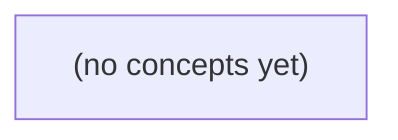

# 08.01 系统模型与部分失败：Go 初学者的超时、提交与未知结果

*本书以虚构消息 m-9 从客户端 A 经网关 G 到权威存储 S、设备 B 的发送过程为主线，建立分布式系统中节点、链路、消息、观察与权威状态的基本模型。学习者将理解：相同的超时表象可以对应完全不同的远端事实，Go 的 context 取消与重试不能撤销可能已经发生的提交。*

**章节:** 2

---

## 本书导览

- 了解整本书的章节脉络
- 掌握各章之间的概念依赖关系
- 选择最合适的阅读顺序

# 08.01 系统模型与部分失败：Go 初学者的超时、提交与未知结果

本书以虚构消息 m-9 从客户端 A 经网关 G 到权威存储 S、设备 B 的发送过程为主线，建立分布式系统中节点、链路、消息、观察与权威状态的基本模型。学习者将理解：相同的超时表象可以对应完全不同的远端事实，Go 的 context 取消与重试不能撤销可能已经发生的提交。

下方的概念图展示了本书 0 个核心概念以及它们之间的依赖关系；再下方是 1 个章节的入口。你可以按从上到下的顺序阅读，也可以根据自己的兴趣或先验知识选择切入点。

#### 概念图



## 章节索引

- **08.01 系统模型与部分失败：一次超时究竟发生了什么** — 面向Go初学者，沿虚构IM请求的客户端、网关、存储和设备建立节点/链路、部分失败、超时、取消、安全性与活性模型。

## 08.01 系统模型与部分失败：一次超时究竟发生了什么

- 画出一次发送的节点与链路
- 对同一超时列出至少四种可能状态
- 区分崩溃、暂停、延迟与网络分区
- 定义安全性和有前提的活性
- 解释取消和超时不撤销已提交操作
- 给出稳定消息ID的授权对账路径
- 设计静态故障证据矩阵

从u-a向c-a发送消息m-9的单一路径出发，先拆清参与者、通道与状态，才能解释一个“超时”究竟遗漏了什么事实。

### 先画全发送路径：节点、进程与链路

### 先画全发送路径：节点、进程与链路

对消息 `m-9`，不要把“发送”想成一次从 `u-a` 到 `c-a` 的原子动作。它实际穿过多个独立参与者：

```text
u-a 的客户端进程 A
        │  通道 A-G
        ▼
网关节点 G
        │  通道 G-S
        ▼
权威存储节点 S
        │  通道 G-B（通常仍由 G 调度）
        ▼
c-a 的设备 B
```

这里至少要区分四类对象：

- **进程 A**：用户 `u-a` 所在客户端。它创建请求、分配消息 ID `m-9`、等待响应，并可能因本地计时器到期显示“发送超时”。
- **节点 G**：网关，负责接收客户端请求、鉴权、转发、扇出或维护设备投递连接。G 不是权威消息历史。
- **节点 S**：权威存储，决定 `m-9` 是否进入可恢复、可查询、可继续投递的正式记录。当前合同中，`S2 200` 仅表示 `accepted_in_memory`，尚不等于持久化。
- **设备 B**：`c-a` 的某台终端。它是否收到、展示或确认 `m-9`，是又一层独立事实。

三条通道也必须分别建模：

- `A-G` 断开，A 可能没收到成功响应；但 G 仍可能已收到请求。
- `G-S` 超时，G 可能不知道 S 是否已接收或处理；但 S 也可能已写入内存。
- `G-B` 失败，消息即使已被 S 接纳，也可能尚未到达设备 B。

因此，“A 超时”只描述 A 在规定时间内未得到足够响应，不能直接推出“G 未收到”“S 未保存”或“B 未交付”。后续每一步都应围绕同一个消息 ID `m-9`，分别询问：请求到了哪里、响应回到了哪里、权威状态到了哪里、设备交付到了哪里。

### 消息m-9的身份与请求分层

### 消息m-9的身份与请求分层

先固定一个不随重试改变的事实：`m-9`是消息身份，而不是某次网络请求的身份。它可包含发送者`u-a`、目标会话`c-a`、客户端生成时间、内容摘要及唯一标识。无论A重发多少次，只要用户意图仍是“发送这条消息”，其业务身份都应保持为`m-9`。

围绕`m-9`，至少存在五类不同对象：

1. **A→G发送请求**：例如`req-ag-17`。这是节点A经A-G通道向网关G发起的一次尝试；超时后重试会产生`req-ag-18`，但两者都可携带`m-9`。
2. **G→S提交请求**：例如`req-gs-42`。G收到A的请求后，可能向权威存储S发起独立提交；它不等同于A的原始请求，也可能被G重试。
3. **S→G响应确认**：例如`resp-gs-42`。在当前S2语义下，`200`仅表示`accepted_in_memory`：S已经在内存中接受该提交，但尚不能推出满足S3 v2纸上持久合同。
4. **G→A响应**：这是G对A所见的结果，如“已接收”“处理中”或错误。A没有收到响应，只能说明A不知道结果，不能说明G或S未处理。
5. **G→B设备交付**：这是另一条G-B通道上的投递动作。即使S接受了`m-9`，B仍可能离线、链路中断或交付确认丢失。

因此，“A发送`m-9`超时”应被展开为：`req-ag-17`的响应未在截止时间到达A。它并不直接断言`m-9`未到G、G未提交S、S未接受，或B未收到。消息身份、各跳请求、各跳响应与最终设备交付必须分别建模。

### S2的200为何仍不等于已持久化

### S2的200为何仍不等于已持久化

S2 返回 `200`，若其语义只是 `accepted_in_memory`，最多说明：S 已接收请求 `m-9`，并把它放入某个易失内存结构，例如接收队列、进程缓存或待写入日志。它不是“消息已安全存在”的通用证明。

可将三种承诺严格区分：

| 承诺层次 | S 实际保证 | 宕机或重启后的结果 | 对 B 的含义 |
|---|---|---|---|
| 内存接受 | 当前 S 进程看到了 `m-9` | 内存可能丢失 | B 尚不可据此期待收到 |
| 权威提交 | `m-9` 已写入 S 的持久、可恢复的权威状态 | 可由恢复后的 S 重新找到并继续处理 | 具备后续投递依据 |
| 设备可见 | B 已实际获得并可读取该消息 | 不依赖 G-S 后续重试 | 用户设备侧可观察到 |

因此，`S2 200` 只能回答“当时的 S 是否接受了请求”，不能回答“写盘是否完成”“副本是否达标”“S 崩溃后能否恢复”“G 是否已取到待投递记录”，更不能回答“B 是否收到”。

例如，S 在回复 `200` 后、刷写持久日志前崩溃：A 已看到成功，G 也可能停止重试，但恢复后的 S 不再拥有 `m-9`。这不是网络超时，而是承诺强度不足造成的事实断层。

若协议需要把 `200` 解释为“已发送成功”，则合同必须明确该响应对应权威提交，而非仅 `accepted_in_memory`；若只能保证内存接受，客户端和 G 就必须保留可重试依据，并用消息 ID `m-9` 支持去重。

### 通道独立带来的局部不确定性

### 通道独立带来的局部不确定性

把一次发送拆成三条独立通道：

- `A → G`：节点 A 的客户端把请求 `m-9` 交给网关 G；
- `G → S`：G 请求权威存储 S 接受并持久化；
- `G → B`：G 向设备 B 发起实时交付或推送。

它们不是一条“端到端水管”。每条通道都可能独立延迟、丢失、断开或重连，因此某一处观察到的超时，只能说明该观察者没有在期限内获得该通道上的预期消息，不能推出其余通道发生了什么。

例如，A 等待 G 的响应超时，可能是：

1. `A → G` 的请求根本未到达；
2. G 已收到请求，且 `G → S` 已得到 `S2 200 accepted_in_memory`，但响应 `G → A` 丢失；
3. G 尚未联系 S，却已因局部故障无法回应；
4. G 已把消息交付给 B，随后才丢失对 A 的响应。

反过来，G 与 S 的连接中断，也不能证明 B 未收到消息：G 可能在此前已通过 `G → B` 完成交付；同样，B 离线或推送超时，也不能证明 S 没有接受 `m-9`。

因此，“A 超时”不是“发送失败”的同义词，而是一条局部事实：

`A 未在截止时间前观察到来自 G 的响应。`

在当前合同 `S2 200 = accepted_in_memory` 下，它甚至还不能证明 S 已持久化，更不能证明 B 已交付。超时留下的是状态空白；要缩小空白，必须查询权威状态、使用消息 ID `m-9` 去重，或由后续确认补全事实。

### 为后续超时分析建立状态坐标

### 为后续超时分析建立状态坐标

分析“u-a 向 c-a 发送 `m-9` 超时”时，不能只记录客户端看到的一个错误码。超时只是某个观察者在截止时间内未获得响应；要还原事实，需要把证据放入一组彼此独立的状态坐标。

- **节点状态**：A 客户端、G 网关、S 权威存储、B 设备分别是否存活、是否重启、是否仍保有相关内存状态。尤其 S2 的 `200` 仅表示 `accepted_in_memory`：S 曾接受 `m-9`，但尚不能据此推定已持久化、可恢复或可投递。
- **链路状态**：A-G、G-S、G-B 是独立通道。A-G 断开不等于 G-S 失败；G-S 成功也不等于 G-B 可达。链路还应区分“不可用”“高延迟”“单向可达”和“消息已发送但确认丢失”。
- **`m-9` 提交状态**：以消息 ID 而非界面操作识别对象。可将其写为  
  $M\in\{\text{未见},\text{已接收于内存},\text{已持久化},\text{已提交},\text{状态未知}\}$。  
  S3 v2 若只是纸上持久合同，则“应当持久化”不是“已经持久化”的证据。
- **B 交付状态**：交付至少分为“G 已尝试发送”“B 已接收”“B 已向用户呈现”。即使 B 收到消息，其回执也可能无法经 G-B 返回，因而发送方仍可能超时。

于是，同一现象“ A 超时”可对应多行故障证据矩阵：A 未发出、G 已转发但 S 未留存、S 已内存接受但崩溃丢失、S 已提交而 B 不可达，或 B 已呈现但响应链路丢失。后续分析的任务不是猜测单一原因，而是用日志、消息 ID、持久化记录与链路观测逐步排除这些坐标组合。

> **要点** — 一次发送不是单个调用：先分清节点、独立链路、消息身份和承诺层级，超时才可被严谨分析。

同一个“超时”表象背后，可能对应完全不同的服务端事实。先沿固定请求 A 在 100ms 截止时间内的四条轨迹，建立部分失败的判断边界。

### 固定请求的节点、链路与观察视角

### 固定请求的节点、链路与观察视角

设客户端 **A** 在 $t_0$ 发起一次写请求，携带操作标识 `m-9`，并设置 100ms 截止时间：

`A → G → S`：请求依次经过网关 **G** 与存储/事务系统 **S**；成功响应则沿反向链路返回：

`S → G → A`

这里至少有三类独立对象：

- **节点**：A、G、S 都可能正常、繁忙、暂停或崩溃。
- **链路**：A-G、G-S 及其反向链路可分别延迟、丢包、断开或重复投递。
- **状态**：A 只保存“已发送、收到响应、超时”等本地事件；G 与 S 分别拥有自己的处理进度和持久化事实。

A 在 $t_0+100\text{ms}$ 未收到可接受响应时，只能观察到：

`timeout(m-9)`

这是一条**本地观察**，其含义仅是“在截止时间前，A 未获得确认”。它并不直接证明：

- 请求没有离开 A；
- G 没有收到或正在处理；
- S 没有提交；
- 已提交的数据已经回滚；
- G、S 或任一链路已经死亡。

相反，远端事实可能是“未到达 G”“到达 G 但未写入 S”“S 已提交而响应丢失”“提交后 G 崩溃”等。因而，超时应先被建模为**结果未知**，而不是失败、成功或服务器死亡的同义词。

### 轨迹一：请求丢失，服务端从未开始

### 轨迹一：请求丢失，服务端从未开始

设客户端 A 在 $t_0$ 向网关 G 发送一次“提交订单”请求，并设置 $100\text{ms}$ 截止时间。请求携带操作标识 `m-9`，但它在 A→G 的网络链路中丢失：

- $t_0$：A 发出请求 `m-9`。
- $t_0 \sim t_{100}$：G 没有收到该请求，因此不会鉴权、排队、调用存储服务 S。
- $t_{100}$：A 未收到响应，触发 `timeout`。

此时，A 的本地观察只有“超时”；但若我们能够检查服务端事实，则结论是明确的：G 未开始处理，S 未执行写入，`m-9` **确定未提交**。

关键不在于“客户端等得太久”，而在于请求没有跨过进入服务端处理流程的边界。这里的超时可以理解为“客户端未确认请求送达”，并不表示 G 崩溃，也不意味着服务器执行后又回滚了操作；更准确地说，服务器根本没有见过这次操作。

因此，若系统能可靠证明请求从未到达 G，A 可以安全重试。实际分布式系统中，A 往往无法仅凭超时自行得到这一证明；后续轨迹的困难，正是因为同样的 `timeout` 也可能发生在请求已经到达甚至已经提交之后。

### 轨迹二：网关停顿，提交状态仍未知

### 轨迹二：网关停顿，提交状态仍未知

设 A 在 $t_0$ 发出请求，截止时间为 $100\text{ms}$。这一次，请求没有丢失：网关 G 已经收到它，也许还完成了鉴权、路由或参数校验。但在真正向存储服务 S 写入之前，G 发生了长时间停顿。

停顿的原因不必是“宕机”。例如：

- G 所在进程经历垃圾回收暂停；
- 工作线程被其他慢请求占满，请求只能排队；
- G 等待连接池、锁或下游限流令牌；
- 操作系统调度延迟，进程暂时没有获得运行机会。

纸上时间线可以写成：

`$t_0$ A→G` → `G 已接收` → `G 排队/暂停` → `$t_{100}$ A 超时` → `尚未写入 S`

对 A 而言，最终只得到一个 `timeout`。但这个结果只说明：**A 在 deadline 前没有收到可用响应**。它并不说明 G 已崩溃，更不说明 G 已经执行回滚；G 可能仍存活，只是尚未处理到这次写入。

此刻最准确的提交判断是“未知”：在观测窗口内，A 无法证明 S 中没有该操作。即使当前确实还未写入，G 也可能在 A 放弃等待之后恢复运行，并继续把原请求提交给 S。因此，客户端超时后若直接重试，必须预先考虑两个请求随后都被执行的可能性。

### 轨迹三：已提交而响应丢失

### 轨迹三：已提交而响应丢失

设 A 在 $t_0$ 向网关 G 发送请求，请求携带消息标识 `m-9`，并设置 $100\text{ms}$ 截止时间。链路上的实际事件可以是：

1. $t_0$：A $\rightarrow$ G 的请求成功到达；
2. G 将操作转发给存储服务 S；
3. $t_{20}$：S 完成校验、写入日志或数据库事务，并提交 `m-9`；
4. S 将“成功”结果返回 G；
5. G $\rightarrow$ A 的响应在网络中丢失，或返回路径延迟超过 deadline；
6. $t_{100}$：A 未收到响应，报告 `timeout`。

此时，`timeout` 只说明：**A 在规定时间内没有获得可用的确认**。它并不说明 S 没有执行操作。对 S 而言，`m-9` 已经是持久化事实；对 A 而言，操作结果却是未知的。

若 A 把超时直接理解为“失败”，然后无条件重试，可能产生重复扣款、重复发货或重复创建记录。正确的后续动作通常不是盲目重发，而是携带同一幂等键 `m-9` 查询或重试：若 S 已提交，应返回此前的结果；若确实未提交，才执行一次新提交。

因此，超时后的核心状态不是“已回滚”，而是“客户端未知”。客户端观察到的是响应缺席，服务器可能早已完成提交。

### 轨迹四：提交后崩溃与证据矩阵

### 轨迹四：提交后崩溃与证据矩阵

设请求携带稳定消息 ID `m-9`。在 $t_0$，A 向 G 发起请求；G 将操作提交给存储 S，S 在 $t_{20}$ 持久化 `m-9` 并确认成功。此后，G 尚未来得及向 A 返回响应便崩溃：可能是进程退出、机器断电，也可能是网络连接随崩溃中断。A 到 $t_{100}$ 仍未收到响应，只能报告 `timeout`。

这里的关键不是“G 已崩溃”，而是 **S 中与 `m-9` 对应的提交记录已成为稳定事实**。重试时，不能依据 G 是否重启、日志是否完整或连接是否断开推断结果；应以同一消息 ID 查询或再次提交，由 S 的去重/幂等约束返回既有结果。

| 纸上轨迹 | 截止前可确认的服务端事实 | A 的超时后状态 | 正确动作 |
|---|---|---|---|
| A→G 丢失 | G、S 均未见 `m-9` | 未提交 | 可发送 `m-9` |
| G 收到但停顿/排队 | 尚无 S 的提交证据 | 未知 | 查询或重试 `m-9` |
| S 已提交，G→A 响应丢失 | S 已持久化 `m-9` | 已提交 | 读取既有结果，不重复执行 |
| S 已提交后 G 崩溃 | S 已持久化 `m-9`，G 已失效 | 已提交 | 故障转移后按 `m-9` 恢复结果 |

因此，`timeout` 只说明“客户端未在 deadline 前获得响应”，不说明服务器死亡，更不说明操作已回滚。稳定消息 ID 才是跨重试、跨进程崩溃关联证据的锚点。

> **要点** — 超时只说明客户端未在期限内获得结果；它既不证明服务端死亡，也不证明操作未提交或已回滚。

先把一次“发送超时”拆成节点、链路与可观察证据，才能避免把未知状态误判为失败。

### 从一次发送画出系统边界

### 从一次发送画出系统边界

设想用户 A 在手机上向用户 B 发送“到家了”。一次看似简单的请求，至少跨越以下节点：

- A 的客户端：生成消息、显示“发送中”、重试请求；
- 接入网关：鉴权、限流、选择后端；
- 消息服务：分配消息标识、写入会话或消息存储；
- 存储服务：持久化消息与投递状态；
- 推送服务与 B 的设备：通知、拉取或接收消息；
- B 的客户端：展示消息，并可能回传已读回执。

把它画成有向链路，而非一个笼统的“网络”：

`A客户端 → 网关 → 消息服务 → 存储服务 → 推送服务 → B设备`

回执又是另一组方向相反的链路：

`存储服务 → 消息服务 → 网关 → A客户端`

因此，A 看到“发送超时”这一**观察**，只说明 A 未在等待期内收到预期响应；它不能直接证明“消息未写入”。可能是 `A→网关` 丢包，也可能是消息已存储、但 `网关→A` 的响应延迟或丢失。

更关键的是连通性具有方向性和局部性：A 能访问 G（网关），不代表 G 能访问 S（存储）；即使 `G→S` 不通，另一台网关或另一组节点仍可能正常工作。系统边界应标出节点、每条有向链路及可见证据，避免把局部超时误写成全局故障。

### 部分失败不是全体停摆

### 部分失败不是全体停摆

设客户端 A 能连通网关 G，G 却无法访问存储 S。此时 A 看到的只是：请求发给了 G，但迟迟没有得到成功结果。它**不能直接观察到**“S 宕机了”，更不能推出“整个系统不可用”。

可能的实际状态包括：

- G 到 S 的链路丢包、延迟过大、路由异常或单向分区；
- G 被暂停，例如长时间 GC、调度饥饿，因而未能及时发起或处理存储请求；
- S 仍在运行，但只拒绝或无法返回 G 的连接；
- S 已 crash-stop，之后不再处理请求；
- G 本身正常处理其他不依赖 S 的接口，例如健康检查、缓存命中读或静态配置。

更关键的是，故障范围可能只是一条通信关系。节点 B 可能仍能通过另一网关或另一条路径访问 S；节点 C 即使访问不了 S，也仍可服务完全独立的业务。因此，“G 请求 S 超时”描述的是一个局部观察，而不是全局停摆证明。

在异步模型中，系统不假设消息传递和进程执行存在已知的严格时间上界。于是超时的含义只能是：

$$\text{在等待窗口内，未观察到响应}$$

它是怀疑证据，不是失败事实。工程上可据此重试、切换副本、熔断或降级，但应保留请求状态未知的可能性：S 也许已经完成写入，只是确认消息没有回来。此处讨论的是 crash-stop、暂停与网络问题，不涉及硬件损坏或拜占庭行为；也不应把 FLP 的共识边界直接误用为“所有业务都无法继续”的结论。

### 崩溃、暂停与网络故障

### 崩溃、暂停与网络故障

一次请求超时，外部通常只看到：消息未到、响应未回。这不足以判定“对方宕机”。在异步系统中，以下情形都可能产生近似观察：

| 情形 | 节点状态 | 通信表现 | 是否可能自行恢复 |
|---|---|---|---|
| crash-stop | 进程已停止执行 | 后续消息均无响应 | 否，除非外部重启 |
| 进程暂停/GC | 进程暂时不调度 | 暂停期间像失联；恢复后可能补发响应 | 是 |
| 丢包 | 节点仍正常 | 个别请求或响应消失 | 是，重传可缓解 |
| 高延迟 | 节点与链路仍正常 | 响应晚于超时阈值到达 | 是 |
| 乱序 | 节点与链路仍正常 | 后发消息可能先到 | 是，需序号或版本控制 |
| 网络分区 | 两侧节点可各自运行 | 某些节点对之间互不可达 | 分区修复后恢复 |

例如，客户端向服务端发送请求后超时，可能是服务端 crash-stop，也可能是服务端正在 GC；还可能是请求丢失、响应丢失，或响应只是迟到。若客户端重试，服务端恢复后可能执行两次请求，因此“超时后重发”必须配合请求标识与幂等语义。

分区尤其容易被误解为“整个系统坏了”。实际可能出现 A 到 G 可通信，但 G 到 S 不通；与此同时，另一组节点仍能继续处理本地可完成的工作。故障并非全局、对称或一致可见。

应严格区分：

- **观察**：在 $T$ 时间内未收到响应。
- **假设**：服务端已经崩溃。
- **协议动作**：暂时怀疑、重试、切换副本或拒绝确认。

超时是本地计时器给出的怀疑证据，不是远端失败的证明。

### 超时只是怀疑而非事实

### 超时只是怀疑而非事实

设客户端在时刻 $t_0$ 向副本 $S$ 发送请求，并在 $T$ 时间内未收到响应。它实际观察到的只有：

> 截至 $t_0+T$，客户端没有收到一条可被识别为该请求成功响应的消息。

这并不等价于“请求失败”。在异步系统中，不预设网络传输、调度、排队、磁盘写入或垃圾回收暂停存在已知严格上界，因此同一现象可由多种执行过程产生：

- 请求包尚在网络中延迟，$S$ 还未收到；
- $S$ 已收到但正因 `pause`、GC、CPU 争用或队列拥塞而未执行；
- $S$ 已执行并提交结果，但响应包丢失、延迟或走了不可达路径；
- 客户端到 $S$ 不通，但其他节点之间仍可通信；例如 A 能到 G，G 却到不了 S；
- $S$ 已经 crash-stop，因而永远不会响应；
- 链路发生分区，但也可能只是暂时拥塞，观察者无法仅凭一次超时区分二者。

因此，超时能推出的是一个**怀疑**：`怀疑 S 或相关通信路径未能在期限内完成交互`。它不能证明“请求未执行”，也不能证明“$S$ 已崩溃”或“链路永久中断”。

尤其要警惕重试：若第一次请求其实已在 $S$ 成功执行，只是响应未归来，第二次提交可能造成重复扣款、重复创建或重复写入。超时后的正确问题不是“它肯定失败了吗”，而是“在未知结果下，协议如何安全恢复、查询或去重？”

### 用证据矩阵约束故障判断

### 用证据矩阵约束故障判断

超时不是故障类型，而是一条有限证据。应预先定义“证据—可支持假设—禁止结论”矩阵，使告警、排障和自动化补偿不会把未知状态误判为确定失败。

| 观察证据 | 可支持的假设 | 不能直接得出的结论 |
|---|---|---|
| 客户端请求超时，未收到响应 | 响应未在本地截止时间前到达；请求、响应或任一端处理可能延迟/丢失 | 服务端未收到请求；服务端未执行；服务已崩溃 |
| 服务端日志有“收到消息”但无“完成” | 服务端至少曾接收该消息；处理可能卡住、暂停或崩溃 | 消息一定未生效；进程当前仍存活 |
| 有“完成”日志但客户端超时 | 服务端可能已完成；响应链路可能丢失、延迟或被分区 | 客户端一定会收到结果；重试一定安全 |
| 进程监控显示存活 | 监控能与进程或宿主机通信 | 进程未发生长时间 GC、死锁或业务停顿 |
| A 能访问 G，G 不能访问 S，其他节点正常 | 存在方向性或局部连通性问题；系统是部分失败 | 全网故障；S 对所有节点不可达 |
| 同一消息 ID 在消费日志中出现两次 | 至少发生重复投递或重复处理尝试 | 业务效果一定重复；消息系统一定违反语义 |

矩阵的关键是关联标识。每次请求至少携带稳定的 `request_id`；跨异步边界再携带 `message_id`、因果关联 ID 与尝试次数。日志记录“接收、开始、提交、响应发送”等状态转换，指标记录超时率、积压、重试率和端到端延迟分位数，追踪连接同一 ID 在各服务与队列中的跨度。

因此，正确表述应是：“截至 `T`，客户端未观察到响应；服务端是否提交未知。”随后依据幂等键、去重记录或可查询的提交状态决定重试、补偿还是等待。异步模型下没有已知严格延迟上界，超时只能提高怀疑度，不能证明崩溃；更不能把共识理论中的边界结论直接当作普通业务请求的诊断结论。

> **要点** — 超时揭示的是观察者的未知状态；先分离节点、链路和证据，才能正确处理部分失败。

以一次虚构IM发送为线索，把“收到200”拆解为可验证的安全合同与有条件的活性承诺，避免把超时误判为失败。

### 从请求路径界定断言对象

### 从请求路径界定断言对象

一次发送请求至少经过四类观察点：

`客户端 A → 接入网关 → 权威存储 → 接收方设备 B`

其中，客户端看到的是“请求是否得到响应”；网关看到的是“是否已接收、转发或重试”；权威存储看到的是“某个 `message_id` 是否已被合法提交”；设备看到的是“是否收到并向用户呈现”。这些事实不能互相替代。

可将关键断言绑定到明确对象：

- **客户端断言**：A 收到 `200`，只能说明合同承诺的状态已经达成；它不天然等于 B 已在线、已收到或已阅读。
- **网关断言**：网关日志中的“已转发”只是中间步骤；网关崩溃、重试或响应丢失后，不能据此判断最终结果。
- **权威存储断言**：对同一 `message_id`，最多存在一条合法消息记录；发送者已退群、无会话权限等情形，不得写入为有效消息。这是安全性断言的权威观察点。
- **设备断言**：B 的客户端确认表示该设备已取得消息；另一台设备、推送服务或用户本人都未必同步完成。

因此，`200` 的合同必须说明它对应哪一层状态。例如 S2 可表示“权威存储已接受并持久化”，S3 可进一步表示“至少一个目标设备已确认接收”。客户端确认与设备确认是独立事件；超时只说明 A 缺少观察结果，不能反推权威存储未写入。

### 安全性：绝不发生的错误结果

### 安全性：绝不发生的错误结果

安全性描述的是：无论网络多慢、请求重试多少次、进程何时崩溃，某类错误结果都**绝不能**被系统对外确认。它不承诺“马上成功”，只约束“不能错”。

对发送消息，可先写出两个权威不变量：

1. **去重不变量**：在权威存储中，对任意 `message_id`，
   $$
   \left|\{r\mid r.message\_id=id\}\right|\le 1
   $$
   同一消息可以被客户端重复提交、被网关重复转发，但最终权威记录至多一条。实现上通常依赖数据库唯一约束或等价的原子条件写入；仅在应用内“先查再写”不足以抵抗并发竞态。

2. **权限不变量**：若用户在消息生效时已不具备群成员身份或发送权限，则该用户不得被权威系统视为有权发送。权限判断必须绑定可验证的成员关系版本、退群事件顺序或事务性检查，不能只相信客户端携带的“我是成员”声明。

验证边界尤其重要。客户端看到 `200`，只能说明服务端承诺满足合同中指定的条件；它不能自行证明消息已被所有设备展示，也不能证明后续网络不会丢失推送。反过来，客户端超时也不能推出“消息没有写入”：请求可能已越过网络并完成权威提交，只是响应丢失。

因此，安全性检查应落在权威状态转换处：写入是否原子去重、身份与群成员资格是否在同一可信边界内校验、退群与发送并发时采用何种顺序规则。缓存、推送回执和本地界面可以辅助观察，却不能替代这些不变量的证明。

### 活性：在前提成立时最终可知

### 活性：在前提成立时最终可知

活性回答的不是“此刻是否成功”，而是：在故障条件解除后，系统能否继续推进并让发送方获得确定结论。对消息 `message_id`，可写成条件化承诺：

> 若网络最终恢复连通，且权威服务持续可用，则发送方 A 对该 `message_id` 的查询最终会得到权威结果。

这里的“权威结果”至少包括两类：

- `已接受`：权威存储中存在该 `message_id` 对应的唯一消息记录；
- `未接受/已拒绝`：权威服务确认该消息未被写入，或因权限、退群、策略等原因拒绝。

因此，A 在首次请求超时后不必猜测“发送失败”。它应保留 `message_id`，执行带退避的重试或状态查询；一旦到达权威服务，就能把此前模糊的超时收敛为确定状态。若 A 已退群或失去发送权限，查询仍可返回结果，但不能据此把 A 当作仍有发送权的主体。

该承诺依赖明确前提。若客户端与服务端永久分区，任何一方都无法区分“对方很慢”“消息已写入但响应丢失”“消息从未到达”。此时系统不能同时保证所有请求完成并保持权威一致性；持续返回 `200` 只会伪造确定性。故活性不是性能指标，也不是无条件保证：它说的是在网络恢复、权威可达后，`message_id` 的命运最终可知。

### 200、超时与取消的合同边界

### 200、超时与取消的合同边界

一次发送请求的 `200`，不是“所有人都已看到”，而是服务端对某个明确提交点作出的合同承诺。常见可分两级：

- **S2：已被权威存储接受。** 对 `message_id` 完成鉴权、成员资格校验、去重与持久化；此后同一 `message_id` 最多对应一条权威消息记录。即使客户端立刻断网，消息也不应凭空消失或重复生成。
- **S3：已进入投递流程。** 除满足 S2 外，系统已将消息写入可恢复的投递队列、会话日志或设备同步任务。它承诺“可继续投递”，不承诺接收设备已经在线、展示或阅读。

因此，**客户端确认**与**设备确认**必须分开建模。客户端收到 `200`，只说明发送端得到了 S2 或 S3 的响应；接收方设备确认则说明某台具体设备已经拉取、落盘或展示。后者可能迟到、重复上报，且不代表其他设备同步完成。

超时的含义更弱：客户端在截止时间前未得到响应，结果可能是“未到达”“已提交但响应丢失”或“正在处理”。正确动作是携带同一 `message_id` 重试或查询状态，而非生成新消息。

取消也只能取消**尚未提交**的本地请求或未来投递任务；一旦操作跨过 S2 提交点，取消请求不能撤销既有权威记录。若产品需要“撤回”，应创建一条受权限和时间窗口约束的撤回操作，而不是把网络超时误当作原消息失败。

### 用稳定消息ID建立故障证据矩阵

### 用稳定消息ID建立故障证据矩阵

为每次发送生成全局稳定的 `message_id`：重试、切换网络、客户端重启都必须沿用它，不能把“第几次提交”当作新消息。围绕同一 `message_id` 收集静态证据，才能判断超时究竟是未知结果、活性未满足，还是安全违规。

| 证据维度 | 权威证据 | 可回答的问题 | 异常含义 |
|---|---|---|---|
| 授权 | 发送时刻的成员资格、角色与会话凭证审计记录 | 发送者当时是否有权向该会话发送？ | 已退群者仍被接受，是安全违规 |
| 唯一写入 | 权威存储中按 `message_id` 的唯一记录、条件写入结果 | 是否只形成了一条规范消息？ | 同一 ID 对应不同正文或多条消息，是安全违规 |
| 投递状态 | 权威投递账本中的目标、版本、状态转换 | 服务端是否已接受、排队、下发或拒绝？ | 缺状态只能说明未知，不能推断失败 |
| 设备确认 | 每台设备对 `message_id` 的签名确认或回执 | 哪些具体设备已展示或已读？ | 客户端“已发送”不能替代设备确认 |

可将查询结果归纳为：

- `不存在`：在查询所覆盖的权威副本中尚未观察到记录；若此前收到成功合同，需继续追查副本、日志或合同违约。
- `已拒绝`：授权、格式或策略检查失败；这是明确结果，不是超时。
- `已接受，待投递`：安全条件已满足，但尚无全部设备确认；这是活性仍在等待。
- `已确认`：列出确认设备，而非笼统宣称“对方已收到”。

关键边界是：权威存储保证“每个 `message_id` 最多一条”属于安全性；网络最终恢复且权威服务可用后，发送方最终能查清该 ID 的结果属于活性。永久分区时，系统可以诚实地返回“未知/处理中”，却不能承诺所有请求都会完成。

> **要点** — 安全性约束错误永不发生；活性只在明确前提下保证最终可知，200与超时都必须按合同解释。

超时与取消只说明等待边界已到，并不等于请求未执行。必须沿节点、链路与持久化事实追踪一次发送的真实状态。

### 截止时间是协作信号

### 截止时间是协作信号

在 Go 中，`context.WithTimeout` 或 `context.WithDeadline` 表达的是：调用方最多愿意等待到何时。截止时间到达后，`ctx.Done()` 会关闭，`ctx.Err()` 通常变为 `context deadline exceeded`；这是一条向下游传播的**取消协作信号**，不是“撤销已经发生的一切”的事务指令。

客户端可据此停止等待响应、关闭请求体读取；网关可停止排队或取消其到上游的调用；服务端处理器可检查 `ctx.Done()` 提前返回；数据库驱动若支持上下文，也会尝试取消仍在执行的查询。每一层都必须主动监听并执行取消，传播才会生效：

`客户端截止 → 网关感知取消 → 服务处理器退出 → 驱动请求取消查询`

但任一环节都可能已越过不可逆边界。例如服务 `S` 已将订单写入数据库并提交，随后才发现上下游 `G` 的上下文已取消；或者取消包在网络中迟到，数据库已完成写入。此时调用方看到超时，服务也可能记录取消，但持久化事实仍是“已提交”。

因此，截止时间不能证明请求未执行，更不能授权客户端换一个新 ID 盲目重试。迟到响应不会改变数据库中的既成事实；超时后的正确动作是用原请求标识查询权威状态，并核对该记录的业务意图，再决定返回成功、继续等待或执行受控补偿。

### 取消前后的多种提交状态

### 取消前后的多种提交状态

设客户端通过网关 $G$ 向存储 $S$ 写入对象，使用稳定请求标识 `m-9`，并携带 `context` 截止时间。客户端观察到超时，只能推出“在本地等待窗口内未取得成功响应”，不能推出 $G$、$S$ 或数据库未执行。至少应区分以下状态：

1. **请求未到达 $G$**  
   客户端在连接、排队或发送阶段超时；$G$ 未见请求，$S$ 更不可能提交。此时可用同一 `m-9` 重试，仍应按幂等语义处理。

2. **$G$ 已收到，但取消先于转发**  
   $G$ 收到请求后，发现上游 `context` 已取消，且尚未向 $S$ 发出写入。数据库无该次写入；但日志中可能已有 $G$ 的接收记录。

3. **$G$ 已转发，$S$ 在取消前提交**  
   $S$ 已完成事务并持久化，响应却在返回途中丢失，或 $G$、客户端先后超时。客户端得到的是超时，但数据库事实是“已提交”。迟到的成功响应不会改变该事实，取消信号也不能回滚已完成事务。

4. **$S$ 已收到取消，但提交与取消竞争**  
   `context` 取消是协作信号，不是强制中断。$S$ 可能及时检查取消并放弃，也可能已越过不可逆提交点，最终提交成功；还可能提交失败。仅凭取消日志无法判定结果，必须查询权威存储状态。

因此，不能因超时就换一个新标识盲目重试：若 `m-9` 实际已提交，新标识会制造第二次业务写入。再次使用 `m-9` 若收到 `409`，也只说明该标识已被占用，不等于可直接认定原请求成功；应经授权查询权威记录，并核对对象内容、操作者与业务意图是否一致。后续方案若从“重试”推进到“改用新标识”，不得暗中改变原有幂等约束。

### 迟到响应与数据库事实

### 迟到响应与数据库事实

`context` 的 deadline 规定的是“调用方最多等多久”，不是“服务器在该时刻必然停止”。当 G 调用 S 时，可能出现两类关键竞态：

1. G 的等待先超时，但请求已到达 S；S 在看到取消信号前完成校验、写库并提交事务。
2. G 发出取消，S 也收到了信号，但取消检查发生在写库之后，或底层数据库操作已经提交，因而仍形成持久化结果。

因此，G 收到 `context deadline exceeded`，只能得出“本次等待没有拿到成功响应”；不能推出“操作未执行”。网络中的迟到响应同样如此：它可能在 G 放弃等待后才到达，但它既不能撤销已提交事务，也不能把未提交事务变成已提交。

权威事实应由持久化状态决定，而非客户端的超时感受。例如 S 已以请求 ID `m-9` 创建记录，随后成功响应在链路上丢失；G 超时后看到的仍是“不确定”，而数据库中的记录才是“已执行”的证据。

处理这类不确定结果时，应查询权威存储并核对请求意图：记录是否存在、是否属于当前调用方、关键字段是否与原请求一致。不能把超时直接当失败，更不能用新 ID 盲目重试；那会把一次不确定执行扩展为两次可能成功的写入。

### 稳定消息 ID 的授权对账

### 稳定消息 ID 的授权对账

当客户端以稳定消息 ID `m-9` 发送请求后超时，不能立即生成新 ID 重试。`m-9` 是将“这一次业务意图”锚定到可查询事实的幂等键；换 ID 会把同一意图伪装成另一条消息，可能造成重复扣款、重复投递或重复创建。

若随后收到“重复 ID，`409`”，它只证明该 ID 已被某处占用，并不证明占用者就是当前调用方，也不证明其内容就是本次意图。正确路径是：

1. 使用已认证的调用者身份，向权威服务查询 `m-9` 对应记录；
2. 校验记录的发送者、租户或账户是否与当前身份一致；
3. 校验关键意图字段是否一致，例如收件人、金额、币种、业务类型、请求摘要；
4. 根据权威状态决定结果：  
   - 已成功且意图一致：返回既有成功结果；  
   - 处理中：返回处理中，提示客户端继续以 `m-9` 查询；  
   - 明确失败且允许重试：仍使用 `m-9` 安全重试；  
   - 身份或意图不一致：拒绝，记录冲突与审计信息。

可将校验抽象为：

\[
\text{可复用结果} =
(\text{owner}=\text{caller}) \land
(\text{intentHash}=\text{requestHash})
\]

只有该条件成立，服务才能把已有记录解释为本次请求的结果。否则，`409` 是冲突证据，不是成功证据。即使 S3 提议“遇到冲突自动改写 ID”，也不得暗改 S2 的稳定 ID 语义；任何新 ID 都必须代表经用户或上层协议明确授权的新业务意图。

### 409 占用不是成功证据

### 409 占用不是成功证据

同一业务意图使用稳定请求标识 `m-9` 时，重试遇到 `409 Conflict`，只能证明“该标识当前被占用”，不能证明“本次请求已经按预期成功”。占用者可能是：

- 先前同一次请求已落库，但响应在链路中丢失；
- 先前请求只写入了占位、处理中记录或失败残留；
- 另一个主体误用了同一标识；
- 记录存在，但其参数、金额、目标账户等意图与本次不同。

三种策略的差异在于是否保留并验证业务事实：

| 策略 | 行为 | 风险 |
|---|---|---|
| 盲目换 ID 重试 | 将 `m-9` 改为新 ID 再提交 | 把“不确定的一次操作”变成“两次可能成功的操作”，尤其可能重复扣款、重复发货 |
| 仅凭 `409` 判成功 | 看到冲突即返回成功 | 将占位、他人记录或意图不一致误报为成功 |
| 授权对账 | 持 `m-9` 查询权威记录，核对主体、参数、状态与结果 | 能把传输不确定性收敛为可验证的数据库事实 |

因此，`409` 后应在权限校验通过的前提下查询权威状态：若记录归属一致、意图字段一致且已完成，可返回既有结果；若处理中，则继续等待或返回可恢复状态；若字段不一致，应报告冲突而非复用结果。

S3 的提议不得暗改 S2：S3 可以建议“查询并对账”或“显式发起新的业务操作”，但不能把 S2 原有的 `m-9` 静默替换为新 ID。标识变更意味着新的业务语义，必须由调用方明确授权。

> **要点** — 超时不等于未提交；保留稳定 ID，并以授权的权威查询核对请求意图与持久化事实。

一次心跳超时只能说明“暂未收到响应”。要正确处理IM发送链路，必须把可观察证据、未知状态与写权限分开建模。

### 从发送请求画出节点与链路

### 从发送请求画出节点与链路

以用户 A 向用户 B 发送一条消息为例，先不要把“系统”看成一个整体，而应画出参与者与边界：

`A 的客户端 → 接入网关 G → 消息存储 S → B 的设备 D`

还可能存在推送服务 P、多个网关副本、消息队列，以及 B 的另一台登录设备。一次“发送”至少包含不同事实：

- A 客户端是否已把请求交给 G；
- G 是否已鉴权并接受 `message_id`；
- G 是否已将消息写入 S；
- S 是否持久化成功；
- B 的设备 D 是否可达、是否拉取或接收推送；
- D 是否真正展示给用户 B。

每个节点和每条链路都能独立失败。A 与 G 的网络可断，但 G 可能已经收到请求；G 与 S 超时，S 可能已经落盘；S 正常而 B 的设备离线；B 所在网络被隔离时，旧网关 G 仍可能继续处理此前路由到它的请求。因而，心跳超时只意味着观察者暂未获得响应，并不证明 G、S 或 D 已经停止工作。

设计时应把链路状态写成“已观察到的证据”，而非臆测的全局真相。日志可记录 `message_id`、经认证的主体身份、处理阶段与时间，例如“G 已接受”“S 已提交”“D 已确认”，但不记录消息正文。尤其不能把“无法联系 D”写成“用户已读”：不可观察，只能如实标为未知。

### 心跳超时为何只是怀疑

### 心跳超时为何只是怀疑

心跳检测的直接证据只有一条：观察者在期限 $\Delta$ 内没有收到目标的有效响应。它并不等价于“目标已经崩溃”，更不等价于“目标不可能继续执行”。

设节点 A 定期向 G 发送健康检查，A 在时刻 $t_0+\Delta$ 超时。此时至少存在几类彼此不可区分的现实：

- G 的进程确实崩溃、机器断电或磁盘故障；
- G 仍在运行，但发生长时间暂停，例如垃圾回收、调度饥饿、页面换入或负载过高；
- G 已处理请求并发出响应，但响应在网络中严重延迟、丢失或被中间设备阻断；
- A 与 G 之间发生网络分区：A 看不见 G，而 G 可能仍能服务分区另一侧的客户端；
- A 自身的时钟、线程池或接收链路异常，导致“未收到”只是 A 的局部观察。

因此，超时应写成“`G 在观察域 A 中疑似不可达`”，而不是“`G 已死亡`”。日志可记录 `message_id`、经认证的节点身份、检查阶段、发送与超时时间、观测者身份；不要记录消息正文或把未确认的推断伪装成事实。

尤其在隔离分区中，旧 G 可能继续处理旧请求。若系统因超时将流量切到新实例或新领导者，真正需要解决的是：如何限制旧 G 的写权限，而不是相信一次未响应已经完成了物理死亡证明。对于无法继续观察到的设备，只能报告“状态未知”或“未确认已读”。

### 同一超时背后的多种状态

### 同一超时背后的多种状态

客户端显示“发送超时”，只表示：在等待窗口内，客户端没有得到足以确认结果的响应。它不能直接推出“消息没发出”“服务端已失败”或“对方没收到”。

以发送 `message_id=M42` 为例，至少可能有以下状态：

1. **请求尚未发出**：客户端在排队、序列化、切换网络或本地进程崩溃前超时。网关没有任何记录，重试通常安全，但仍应复用同一 `message_id`。

2. **请求已发出，网关未收到**：数据包可能在客户端到网关之间丢失，或旧连接已失效。客户端无法区分“未出站”和“中途丢失”，因此不能仅凭超时生成新的消息标识。

3. **网关已收到，但未提交**：网关完成可信身份校验后，可能在鉴权、限流、持久化或转发前故障。此时应通过按 `message_id` 查询状态或幂等重试来收敛结果。

4. **已提交，但回包丢失**：消息已持久化、已进入投递队列，甚至已送达设备；只是确认响应未回到客户端。这是最危险的情形：若换一个 `message_id` 重发，可能产生重复消息。

5. **设备不可观察**：消息已被系统接受，但设备离线、推送通道失联，或设备虽收到却未上报确认。系统最多可陈述“已提交”“已投递至某通道”或“设备状态未知”，不能谎称“已读”。

因此，超时后的日志应记录 `message_id`、可信身份、处理阶段与时间戳，例如“网关已持久化”“回执未确认”；不记录消息正文。客户端应把结果建模为“未知，待查询或幂等重试”，而不是把一次等待失败伪装成确定的发送失败。

### 分区中的旧节点与旧写权

### 分区中的旧节点与旧写权

设网关 `G` 原本负责某用户或会话的写入。发生网络分区后，调度器可能收不到 `G` 的心跳，于是把新请求改路由到 `G'`，或选出新的领导者。此时“超时”只改变了控制面的判断：`G` 在当前观察者看来不可达；它并不保证 `G` 已停止运行、已丢失本地状态，或不会继续接收来自旧连接、旧负载均衡路径的请求。

两侧可能同时发生：

| 分区一侧的旧 `G` | 另一侧的新 `G'` |
|---|---|
| 继续处理已建立连接上的旧请求 | 接收改路由后的新请求 |
| 继续向可达的副本提交写入 | 以为自己接管了该范围 |
| 记录“已受理”或尝试投递消息 | 生成新的顺序、状态或成员关系 |

若仅凭“旧节点超时”就允许新节点写入，便可能出现双重写权：同一消息被重复处理、会话顺序分叉、撤回与已读状态相互覆盖。问题不在于谁更晚发现超时，而在于旧 `G` 是否仍持有能被存储、队列或下游服务接受的写入资格。

因此，切换路由时必须把“发现疑似故障”和“撤销旧写权”分开。前者依据心跳、健康检查等证据；后者要求后端拒绝过期持有者的写入，例如让请求携带可验证的身份、所属范围与版本标记，并在关键写入点检查其是否仍有效。旧 `G` 即使继续运行，也应只能处理不产生权威写入的工作，或得到明确拒绝。

日志可记录 `message_id`、可信节点身份、处理阶段与时间，以便还原两侧并发行为；但不应记录消息正文。对于隔离期间无法观察到的设备，只能标注“状态未知”或“尚未确认”，不能把未收到回执表述为“已读”或“未读”。

### 证据日志与诚实的状态承诺

### 证据日志与诚实的状态承诺

发送状态不是一句“成功/失败”，而是围绕 `message_id` 汇集的可验证证据。日志应记录最小必要字段：

| 证据维度 | 示例 | 回答的问题 |
|---|---|---|
| 消息标识 | `message_id`、会话标识、客户端请求标识 | 这是哪一次发送？能否去重与追踪？ |
| 可信身份 | 已认证用户、设备标识、服务节点身份、密钥版本 | 是谁提交、转发或确认的？ |
| 处理阶段 | 已受理、已持久化、已路由、已投递至设备、设备已确认 | 证据究竟证明到哪一步？ |
| 时间 | 服务端接收时间、持久化时间、确认时间及其来源 | 事件何时被观测到？ |

例如，服务端持久化一条消息，只能承诺“服务端已保存”；某设备回传确认，才能承诺“该可信设备已确认处理”。两者不能合并为“对方已读”。

尤其在设备离线、网络分区或心跳超时时，服务端通常无法观察该设备是否实际显示过内容。此时状态应保持为“待设备确认”或“设备状态未知”，而不是根据路由切换、旧连接断开或超时推断“未读”“已读”。超时是缺少新证据，不是关于设备行为的反证。

日志还应避免记录消息正文、附件内容及不必要的敏感元数据。排障需要的是可关联的阶段证据，而非扩大内容暴露面。对用户展示的状态文案也必须对应证据边界：`已发送`、`已送达设备`、`已读`分别需要不同级别的可观察确认。

> **要点** — 超时产生的是怀疑而非死亡证明；用稳定消息ID和受限写权，把未知状态转化为可授权对账的证据。

以同一条虚构IM发送请求为主线，把“客户端超时”拆成可验证的时间线、状态分叉与安全处置。

### 从一次发送画出时间线与责任边界

### 从一次发送画出时间线与责任边界

设用户在客户端 **A** 发送消息 `m`，请求经网关 **G** 写入存储 **S**。客户端的“超时”只说明：A 在截止时间前没有得到可接受的响应；它**不能**证明 G 或 S 没有成功。

| 时刻 | 链路事件与 A 的观察 | G、S 的可能状态 | 责任边界 |
|---|---|---|---|
| `t0` | A 生成请求 `r=(消息ID, 内容)`，持久化待发送记录，发往 G；A 尚未看到结果。 | G、S 尚未收到，或请求正在链路中。 | A 负责稳定消息ID、截止时间和本地待决状态；网络不负责送达保证。 |
| `t20` | A 可能已显示“发送中”；若请求抵达 G，A 仍无法直接观察。 | G 可能尚未接收、已接收待处理，或已向 S 发起写入；S 可能未写入。 | G 负责鉴权、幂等协调与记录处理结果；A 不应把“已发出”当作“已提交”。 |
| `t100` | A 达到超时阈值，观察为“结果未知”，而非“发送失败”。 | G 可能仍在处理；S 可能未写、写入中、已提交；成功响应也可能正在返回途中。 | 超时后的核心责任是保留不确定性：A 不得以新消息ID盲目重发。 |
| `t120` | 链路恢复或迟到响应到达；A 可获得最终确认，也可能仍无响应。 | G 可查询请求记录；S 可按消息ID确认是否存在已提交消息。 | 权威事实来自 G 的请求状态或 S 的提交记录，而非 A 的计时器。 |

可将责任边界概括为：

- **A 的观察**：已提交请求、收到成功、收到明确失败、超时未知；其中“未知”是合法业务状态。
- **G 的责任**：以消息ID实现幂等，使重复到达至多产生一次业务写入，并提供可查询的处理状态。
- **S 的责任**：以提交结果定义持久化事实；一旦提交，后续重试应返回同一逻辑结果。
- **链路的责任边界**：请求和响应均可能丢失、延迟、重复或乱序；链路沉默不构成失败证据。

因此，`t100` 后的安全下一步不是立刻再次发送，而是携带原消息ID查询权威状态；仅在确认未受理或可安全重试时重发。

### 一声超时背后的四条状态轨迹

### 一声超时背后的四条状态轨迹

设客户端 A 在 $t_0$ 发送消息 `m`，网关为 G，消息存储或业务服务为 S；$t_{20}$ 表示请求可能到达 G，$t_{100}$ 为 A 的超时点，$t_{120}$ 为重试或查询点。A 在 $t_{100}$ 看到的都只是“未收到成功响应”，并不能推出消息未发送、更不能安全地直接重发。

| 轨迹 | A 的观察 | G 与 S 的可能状态 | $t_{120}$ 权威查询 | 安全下一步 |
|---|---|---|---|---|
| 请求未到 G | $t_{100}$ 超时 | G 未见请求；S 无记录 | 以 `messageId` 查询 G/S，确认无受理、无提交 | 使用同一幂等键重试 |
| 到 G 未提交 | $t_{100}$ 超时 | G 已受理或排队；S 尚未提交 | 查询请求日志、队列状态与 S 的提交记录 | 若确认未提交则重试；若仍处理中则等待或续查 |
| 已提交未响应 | $t_{100}$ 超时 | S 已持久化消息；G→A 响应延迟或失败 | 以 `messageId` 查 S 的最终消息记录 | 返回“已发送”或继续等待，不再创建新消息 |
| 响应丢失 | $t_{100}$ 超时 | G、S 均已完成；仅最终响应在链路中丢失 | 查询 G 的完成结果或 S 的消息状态 | 复用已完成结果；重试必须命中同一幂等结果 |

关键区别在于：超时是 A 的局部知识，不是全局事实。即使四条轨迹的 A 端日志完全相同，系统内部可能分别处于“未发生、处理中、已提交、已完成”四种状态。故障验证应通过可控门闩断开 G—S、延迟响应并恢复链路，而非依赖 `Sleep` 猜测时序；业务上还应测量 P95 延迟、错误未知率与恢复时间。本章只建立静态模型，不实际注入故障。

### 故障证据矩阵：观察、查询与安全动作

### 故障证据矩阵：观察、查询与安全动作

将同一条消息固定为稳定 `message_id`，例如 `m-42`；重试、授权、查询与最终对账都只能围绕它展开。客户端 A 的超时只是本地观察，不等于网关 G 或服务端 S 未处理。

| 时间与 A 观察 | G 和 S 可能状态 | 权威查询 | 安全下一步 |
|---|---|---|---|
| `t0`：A 发出 `m-42`，开始计时 | G、S 均尚未收到，或请求正在网络中 | 无需立即查询；记录 `message_id`、请求摘要与截止时间 | 不创建新 ID；等待正常响应或本次截止 |
| `t20`：A 未收到响应，但连接仍可能存活 | G 可能已转发；S 可能执行中、已提交但响应未返回 | 查询 S 的 `GET /messages/m-42` 或操作状态接口 | 不盲目重发业务写入；若状态为处理中，继续轮询同一 ID |
| `t100`：A 本地超时 | G 可能丢失下行响应；S 可能未收到、处理中、已成功或已失败 | 以 S 的持久化操作记录为准，必要时查 G 的请求日志 | 得到“成功”即展示成功；“失败/不存在”才按幂等键重试；“未知”进入待对账 |
| `t120`：网络恢复或 A 重连 | 延迟响应、重复响应可能到达；S 状态已稳定 | 再次查询 S，并核对结果中的 `message_id`、版本号与提交时间 | 只接受与 `m-42` 匹配的最终状态；重复响应仅更新界面，不重复执行业务动作 |

矩阵的关键是区分“观察者”与“权威者”：A 只能证明“我没看见结果”，G 只能证明“我看到或转发过请求”，而 S 的持久化记录通常才有资格裁决是否生效。若 S 暂不可查，系统应明确返回“未知”，保留待处理记录并异步对账，而不是把未知伪装成失败。

故障验证应使用可控门闩：分别阻断 G→S、延迟 S 响应、再恢复链路，以复现上述分叉；不要用 `Sleep` 猜测时序。业务层还应持续测量 P95 延迟、错误率、未知结果率与恢复时间。本节仅建立静态证据矩阵，不实际注入故障。

### 取消、超时与已提交操作的不可逆性

### 取消、超时与已提交操作的不可逆性

设客户端 A 在 $t_0$ 向网关 G 发送“发送消息”请求，G 再转交服务 S。若 A 在 $t_{100}$ 超时并发出取消，取消的语义通常只是：停止 A 的等待、尝试中止仍在 G 或网络中传播的请求，或取消 S 中尚未开始的任务。

关键边界在于提交点。若 S 已在 $t_{20}$ 完成事务提交，例如写入消息记录、分配消息 ID、投递事件，则到 $t_{100}$ 时操作已成为系统事实；取消请求即使到达，也不能安全地“反向删除”它。删除可能又触发已读、推送、审计等新的副作用。

因此，同一超时观察可对应不同现实：

| A 的观察 | G、S 的可能状态 | 权威查询 | 安全下一步 |
|---|---|---|---|
| 超时，未收到响应 | 请求未到 S | 按请求键查询 | 可重试 |
| 超时，未收到响应 | S 正在处理 | 查询处理中状态 | 等待或复查 |
| 超时，未收到响应 | S 已提交，响应丢失 | 查询结果或消息 ID | 返回既有结果，不重复发送 |
| 取消成功 | 仅 A 停止等待；S 仍可能提交 | 仍须查询确认 | 不把取消当作未执行证明 |

由此推出两项设计。第一，每个可重试写操作携带稳定的幂等键；S 以该键唯一约束，将重复请求归并为同一次提交。第二，超时后的默认流程不是盲目重发，而是“查询确认 → 未见记录才重试 → 重试仍使用原幂等键”。取消解决的是资源占用与用户等待，幂等键和权威查询解决的才是已提交操作的不可逆性。

### 可控故障门闩与业务恢复测量

### 可控故障门闩与业务恢复测量

故障注入的目标不是“把系统弄慢”，而是稳定复现某一条状态分叉。为此，应在网关 G 与消息服务 S 之间设置可编程门闩：请求经过门闩时，按测试标识、会话或消息键命中规则，再执行指定动作；未命中流量保持正常。不要用 `Sleep` 模拟故障：它只能制造不确定的变慢，无法说明请求是否已到达 S、是否已提交或响应是否已丢失。

可定义四类互相区分的门闩动作：

| 动作 | G 的可见现象 | S 的可能状态 | 恢复后的安全处理 |
|---|---|---|---|
| 崩溃 | 连接立即失败、进程不可用 | 已接收、未接收均可能 | 重启后以请求标识查询权威记录 |
| 暂停 | 连接仍在但长期无响应 | 处理线程可能停在任意阶段 | 解除暂停后查询，不直接重发 |
| 定向延迟 | 特定请求超过客户端时限 | S 可正常提交，只是响应晚到 | 允许迟到响应，并用幂等键去重 |
| 分区 | G-S 双向不可达或仅单向不可达 | 一侧误以为对方失效 | 恢复连通后对账，补拉权威状态 |

门闩至少应支持：`断开 G-S`、仅阻断响应方向、延迟指定请求、解除规则并恢复链路。每条规则必须有唯一测试编号、启停时间和命中计数，避免把无关流量纳入实验。本章仅定义这些静态方案，不实际执行注入。

业务测量不能只看成功率。设超时或异常请求集合为 $E$，其中最终无法由权威查询判定“已提交”或“未提交”的集合为 $U$，则错误未知率为：

$$\text{错误未知率}=\frac{|U|}{|E|}$$

报告其 P95，衡量高压分位下“用户与系统都说不清结果”的风险。恢复时间则从解除门闩或恢复服务的时刻开始，至积压清空、权威状态可查询、错误未知率回落至基线所经历的时间。真正的恢复不是端口重新连通，而是业务结果重新可判定。

> **要点** — 超时只是客户端观察；以稳定消息ID查询权威状态，并以证据矩阵决定安全重试、确认或对账。

通过22道递进题，拆解一条IM发送请求在不可靠分布式系统中的真实命运：超时只意味着观察受限，不等于操作失败。

### 先画全链路：谁在发送，谁在观察

### 先画全链路：谁在发送，谁在观察

设用户点击“发送”后，消息经历一条典型路径：

`客户端 A → 网关 → 消息服务 → 存储/复制节点 → 推送服务 → 客户端 B`

其中每个箭头都是独立链路，每个节点都有自己的内存、日志、时钟和故障状态。不要把这条路径想成一个共享的“系统大脑”：任何参与者只能观察到自己收到的请求、自己写入的状态，以及自己等待超时后的结果。

一次发送可拆成几个局部事件：

1. 客户端 A 生成消息标识 `m`，发出请求。
2. 网关可能已收到 `m`，但回包在网络中丢失。
3. 消息服务可能已写入存储，也可能在写入前崩溃。
4. 存储主节点可能已落盘，但副本尚未同步。
5. 客户端 B 可能已收到推送，却尚未展示、确认或回执。

因此，客户端 A 看到“发送超时”时，真实世界至少可能处于多种状态：

- 请求根本未离开客户端；
- 请求在链路中丢失；
- 服务端已处理，但响应丢失；
- 消息已持久化，尚未投递；
- 消息已投递到 B，但 A 不知道；
- 服务端正在处理，结果尚未确定。

超时描述的是观察者在截止时间前**没有得到足够证据**，而不是对真实状态的判决。形式化地说，客户端观察到 `timeout(m)`，并不能推出：

$$timeout(m) \Rightarrow failed(m)$$

同样也不能推出成功。它只说明：对客户端 A 而言，`m` 的结果仍不确定。

后续设计的核心问题便是：面对这种不确定性，重试会不会重复发送？取消能否阻止已在路上的请求？哪些状态必须绝不出错（安全性），哪些状态最终应当达成（活性）？先区分“谁看到了什么”和“事实上发生了什么”，才能正确回答这些问题。

### 一次超时的多种真相

### 一次超时的多种真相

设客户端向 IM 服务发送请求 `send(m, k)`，其中 `m` 是消息内容，`k` 是请求标识。客户端等待一段时间后超时；此时它真正知道的只有：**在本地等待窗口内，没有收到可验证的成功响应**。它并不知道服务端真实状态。

可将一次超时展开为若干互相不可区分的真相：

1. **请求根本未发出**：客户端在写入套接字前崩溃、线程被取消，或本地网络栈拒绝发送。服务端毫无感知。
2. **请求已发出但途中丢失**：链路、路由设备或连接重置使请求未到达服务端。服务端仍无感知。
3. **请求已到达，服务端正在执行**：服务端已开始鉴权、持久化或投递，但处理尚未完成；客户端先等不及了。
4. **请求已执行成功，响应丢失**：消息已写入日志、可能已投递给接收者，但成功响应在返回途中丢失。
5. **请求已执行失败，失败响应丢失**：服务端拒绝了请求，却未能把错误返回客户端。
6. **响应已到达本机却未被应用观察到**：客户端进程崩溃、回调线程阻塞或取消竞争，使应用层仍表现为超时。

因此，超时不是“失败”的事实判断，而是一次**观察失败**：客户端无法区分“未执行”“执行中”“已成功”与“已失败”。这正是部分失败的核心——一端沉默，并不能证明另一端没有进展。

若客户端直接重试，可能把原本未执行的请求补回来，也可能把已提交的消息发送两次；若不重试，则可能丢失本可成功的操作。后续需要借助请求标识、幂等写入、状态查询与明确的交付语义，缩小这种不确定性，但不能仅凭一次超时消除它。

### 崩溃、暂停、延迟与分区的辨析

### 崩溃、暂停、延迟与分区的辨析

对客户端而言，一次请求超时通常只产生同一条证据：**在截止时间前没有收到可接受的响应**。但这条证据无法说明服务器究竟发生了什么。

| 底层情况 | 节点真实状态 | 链路真实状态 | 客户端可见现象 |
|---|---|---|---|
| 节点崩溃 | 进程停止，不再处理请求 | 可能正常 | 无响应、超时 |
| 节点暂停 | 进程仍存在，但被长时间调度停顿、垃圾回收或磁盘阻塞 | 可能正常 | 无响应、超时；之后可能恢复并继续执行旧请求 |
| 网络延迟 | 节点正常执行 | 消息或响应到达过晚 | 无响应、超时；响应可能随后到达 |
| 网络分区 | 节点可能完全正常 | 两侧暂时无法通信，或仅单向可达 | 无响应、超时；节点可能已完成操作 |
| 响应丢失 | 节点已处理请求 | 返回消息丢失 | 无响应、超时；重试可能造成重复执行 |

因此，`超时 ≠ 失败`，更准确地说：

$$\text{超时} \Rightarrow \text{调用方无法在期限内确认结果}$$

尤其要区分“节点崩溃”和“节点暂停”。崩溃后，未持久化的内存状态通常丢失；暂停的节点却可能在客户端放弃后恢复，并继续提交原操作。若客户端立刻重试“发送消息”，可能出现原请求和重试请求都成功的情况。

分区也不等于节点故障：服务端可能仍在为另一侧用户提供服务，只是当前客户端无法观察它。故障处理应基于**可观察事实**设计，例如超时后查询操作状态、使用请求唯一标识实现幂等，而不是把超时直接解释为“服务器没做”。

### 超时取消与安全活性的边界

### 超时取消与安全活性的边界

**题 1：客户端等待发送消息超时，能否断言消息未写入？**  
不能。超时只说明客户端在截止时间前**没有观察到成功结果**。服务端可能尚未收到请求、正在处理，也可能已提交写入但响应丢失。把“未知结果”当作“失败”会直接导致重复发送风险。

**题 2：调用 `context.cancel()` 能撤销服务端已经提交的写入吗？**  
不能。取消首先影响本地：停止等待、释放调用链资源、阻止尚未开始的后续工作。取消信号即使传播到服务端，也只能让服务端尝试停止**尚未完成**的处理；一旦消息已落库、写入日志或复制提交，就不能靠取消“回滚”。

**题 3：这属于安全性还是活性问题？**  
“已提交消息不能因重试而出现两条”是**安全性**：任何时刻都不应发生重复、越权或状态倒退。  
“网络恢复后，用户最终能得到发送结果”是**活性**：在网络恢复、节点可用、重试持续等前提下，系统最终取得进展。

**题 4：为什么活性必须带前提？**  
若网络永久分区、服务永久宕机，系统无法保证请求最终成功。更准确的表述是：在故障最终停止、链路最终可达、资源足够且客户端继续重试的条件下，请求最终被确认或明确拒绝。

**题 5：IM 重试应如何兼顾两者？**  
客户端为每次发送生成稳定的消息标识；超时后可带同一标识重试。服务端以该标识执行幂等写入：首次提交保存结果，重复请求返回同一结果。这样，重试促进活性，去重保护安全性。

**题 6：如何测试这一边界？**  
分别注入“请求丢失、响应丢失、服务端提交前取消、提交后响应前取消、重复重试”。断言：取消后本地调用可返回，但已提交记录仍存在；同一消息标识最多产生一条业务消息；故障恢复后可通过查询或重试收敛到确定结果。

### IM重试取舍与故障证据矩阵

### IM重试取舍与故障证据矩阵

IM 发送的核心难题不是“是否重试”，而是：客户端超时后，如何区分“服务端未收到”“已写入但响应丢失”“写入尚未完成”。答案是让每次逻辑发送拥有稳定的 `message_id`，并把重试变成对同一意图的重复提交，而非创建新消息。

客户端首次请求携带 `(conversation_id, message_id, sender_id, payload)`；服务端以 `(conversation_id, message_id)` 建立唯一约束。首次写入成功后，后续相同 ID 的请求返回既有结果；若载荷或发送者不一致，则拒绝，避免 ID 被错误复用。超时后的优先路径应是授权查询：

1. 查询“该会话中该 `message_id` 是否已接受”；
2. 若存在，返回已确认状态，不再发送；
3. 若不存在，按退避策略重试同一 ID；
4. 达到重试上限后标记“待确认”，后台继续对账，而非直接判定失败。

这只能保证服务端接受记录的幂等性；“对方是否收到通知”是另一条状态机，不能用一次写入成功替代投递成功。

| 故障假设 | 客户端观察 | 真实状态可能性 | 关键证据 | 测试注入 |
|---|---|---|---|---|
| 请求丢失 | 超时 | 未到达服务端 | 无接受记录 | 丢弃请求包 |
| 响应丢失 | 超时 | 已成功写入 | 按 ID 可查到消息 | 写后丢弃响应 |
| 服务端崩溃 | 连接断开 | 未写入或已提交 | 日志、唯一记录、恢复后查询 | 写前/写后强杀进程 |
| 重复提交 | 多次重试 | 仅应有一条消息 | 唯一约束与相同返回值 | 并发重放请求 |
| 延迟响应 | 先超时后成功 | 已写入且旧响应迟到 | 响应中的 `message_id` 与版本 | 延迟、乱序响应 |

矩阵的价值在于把“异常现象”与“真实结果”解耦：测试不应只断言界面提示，而应验证每种注入下的持久记录、查询结果、重试次数和最终对账状态。

> **要点** — 超时是观察结果而非真实结论；可靠重试依赖稳定ID、幂等提交、授权对账与明确故障假设。
