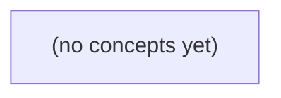

# 08.02 时间与顺序：Go 初学者的分布式因果与消息排序

*本书通过虚构的 A、G、S、B 多设备消息链，解释为什么墙上时间会“倒着显示”，以及如何区分物理时间、单调耗时、业务顺序与分布式因果。读者将以纸上推演方式掌握 Go 的时间语义、发生在前关系、Lamport 逻辑钟、向量钟，以及 message_id 和会话 seq 的职责边界。*

**章节:** 2

---

## 本书导览

- 了解整本书的章节脉络
- 掌握各章之间的概念依赖关系
- 选择最合适的阅读顺序

# 08.02 时间与顺序：Go 初学者的分布式因果与消息排序

本书通过虚构的 A、G、S、B 多设备消息链，解释为什么墙上时间会“倒着显示”，以及如何区分物理时间、单调耗时、业务顺序与分布式因果。读者将以纸上推演方式掌握 Go 的时间语义、发生在前关系、Lamport 逻辑钟、向量钟，以及 message_id 和会话 seq 的职责边界。

下方的概念图展示了本书 0 个核心概念以及它们之间的依赖关系；再下方是 1 个章节的入口。你可以按从上到下的顺序阅读，也可以根据自己的兴趣或先验知识选择切入点。

#### 概念图



## 章节索引

- **08.02 时间与顺序：多设备消息怎样判先后** — 面向Go初学者，从多设备IM时间戳逆序出发，解释墙上/单调时钟、发生在前、Lamport钟、向量钟与会话业务序号。

## 08.02 时间与顺序：多设备消息怎样判先后

- 区分墙上时间、单调耗时和业务seq
- 解释跨设备时间戳逆序不等于因果逆序
- 画同进程和消息传递的发生在前关系
- 手算固定Lamport时钟序列
- 解释L较小不证明因果在前
- 用二维向量识别并发
- 为IM历史/回执选择正确顺序证据

两台设备显示的时间先后，常常只是各自时钟的读数差异；判断消息真实顺序，必须先分清时间、事件与业务序号。

### 从“10:00:05 早于 09:59:58”说起

### 从“10:00:05 早于 09:59:58”说起

A 手机在发送记录中显示 `10:00:05`，B 设备收到通知后却显示 `09:59:58`。若把两个界面上的墙上时间直接比较，很容易得出“B 比 A 更早收到消息”的错误结论。

这里比较的是两个不同设备的本地时钟读数，而不是同一条可全局排序的时间线。设真实时间为 $t$，设备时钟可近似写为：

$$C_i(t)=t+\delta_i(t)$$

其中 $\delta_i$ 是设备 $i$ 的时钟偏移；它还会随时间变化，形成时钟漂移。若 A 快 5 秒、B 慢 2 秒，同一真实时刻在两端就可能相差 7 秒。时区转换通常只造成固定显示差异；更常见的逆序来自未校时、网络授时延迟或设备漂移。

因此，墙上时间只能回答“该设备当时显示什么”，不能单独证明：

- A 的发送事件何时被服务端接收；
- 服务端何时向 B 投递；
- B 的系统何时接到通知；
- B 的应用何时真正处理或展示消息。

还要区分不同对象：消息 ID 用于识别“哪一条消息”，会话 `seq` 用于规定“同一会话内第几条”，它们都不是设备时间；事件则是发送、入库、投递、接收、展示等具体动作。判断 B 是否先收到，应优先依据同一服务端生成的事件记录、同一会话的 `seq`，或可验证的因果链，而不是比较 `10:00:05` 与 `09:59:58`。

### 墙上时间、单调时钟与时区换算

### 墙上时间、单调时钟与时区换算

墙上时间是设备对“现在几点”的估计，通常以 UTC 时间戳记录、按本地时区展示。例如 A 显示 `10:00:05`，B 显示 `09:59:58`，不能直接推出 A 的事件晚于 B；两者可能处于不同时区，也可能设备时钟本身并不一致。

需要区分三类问题：

- **时区换算**：同一 UTC 时刻可显示为不同本地时间。时区只改变展示标签，不改变事件发生的真实先后。比较跨设备日志时，应先统一到 UTC，并确认夏令时规则是否正确。
- **时钟偏移**：设备时钟相对真实时间固定快或慢一段量。若 B 的钟慢 7 秒，B 在收到通知后显示 `09:59:58`，完全可能对应 A 在 `10:00:05` 前已发出的事件。
- **时钟漂移**：偏移并非恒定。设备晶振误差、长时间未校时或网络授时失败，会使误差随时间增长；因此“昨天校准过”不保证今天仍可精确比较。

墙上时间适合展示、审计和粗粒度记录，却不适合可靠测量本机耗时。测量“请求从开始到结束用了多久”应使用**单调时钟**：它只向前递增，不受手动改时、网络校时或时区切换影响。可记录

`耗时 = 单调结束读数 - 单调开始读数`

但单调时钟通常没有可直接解释的日期含义，且不同设备的单调读数不能互相比较。

因此，一条消息可同时带有墙上发送时间、接收时间、消息 ID 与会话 `seq`，它们回答的问题不同：时间用于描述“设备认为何时发生”，单调读数用于本机耗时，消息 ID 用于识别同一消息，`seq` 才可能用于特定会话内的业务顺序。

### 先确定：比较的到底是哪一个对象

### 先确定：比较的到底是哪一个对象

看到“甲设备显示 `10:00:05`，乙设备显示 `09:59:58`”，首先不能直接比较大小，因为这两个读数可能对应完全不同的对象：

- **发送事件**：用户在 A 手机上点击发送的瞬间，记为 $E_{\text{send}}$。A 的本地时间只是该事件在 A 时钟上的读数。
- **接收事件**：B 收到推送、拉取到消息或客户端渲染消息的瞬间，记为 $E_{\text{recv}}$。它通常晚于发送，但 B 的本地钟可能慢了数秒。
- **服务端入库时间**：服务端接受并持久化消息的时刻。它适合审计、超时和排障，但仍取决于服务端时钟及“入库”边界。
- **消息 ID**：用于唯一标识一条消息；若 ID 含有时间或递增成分，也只是在特定生成器范围内可排序，不能自动代表送达顺序。
- **会话 `seq`**：例如 `c-a seq9 m-9` 中的 `seq`，表示某个会话、频道或流内的业务位置。若定义为服务端按会话分配，它可判断该会话中的先后；它不必能比较不同会话，更不表示客户端接收先后。

因此，“B 的显示时间更早”只能说明 B 的**本地墙上时钟读数更小**，不能推出 B 先收到消息。时区转换只改变显示格式；真正造成逆序的常见原因是时钟偏移与随时间变化的漂移。比较顺序前，应先问：比较的是发送、入库、投递、接收，还是同一会话内的 `seq`？不同对象必须使用各自对应的证据。

### A/G/S/B链路中的时间戳逆序

### A/G/S/B链路中的时间戳逆序

设消息沿 `A → G → S → B` 传递：A 手机上的发送记录为 `10:00:05`，G、S 分别写入网关接收与服务器入库时间，而 B 收到通知后却显示 `09:59:58`。这看似“B 比 A 更早收到”，实际上只说明两个设备展示的是不同本地时钟的墙上时间。

逐项看这些记录：

- **A 的时间**：是 A 当前系统时钟对“用户点击发送”事件的读数；若 A 快了 10 秒，记录自然偏晚。
- **G 的时间**：通常对应“网关收到请求”或“转发请求”，可能使用服务器时区、统一时间源或独立时钟。
- **S 的时间**：可能是“持久化成功”“生成消息”“投递任务入队”等事件时间；它未必等于 G 收包时刻。
- **B 的时间**：通常是“设备收到推送”“客户端拉取到消息”或“界面渲染”的本地读数。B 慢了十几秒时，便会显示为 `09:59:58`。

时区转换只会改变显示的钟面；时钟偏移会造成固定差值；时钟漂移则会让差值随时间变化。网络延迟、重试、离线补拉还会进一步拉开各事件的真实发生时刻。因此，墙上时间逆序不能推翻传递事实：若 S 已处理该消息、B 随后取得该消息，则因果链仍是 A 发送后经 G、S 到达 B。

也不要混淆不同编号对象。`c-a seq9` 是会话或客户端—账号范围内的顺序号，用于判断该范围里的第 9 个位置；`m-9` 是消息标识，用于唯一定位某条消息。它们都不是设备本地时间，也不能直接比较不同会话的先后。判断顺序时，应优先使用同一序列域中的 `seq`、服务端生成顺序或明确的因果关系；本地展示时间只适合呈现给用户。

### IM界面应选什么作为排序证据

### IM界面应选什么作为排序证据

IM 不应把设备墙上时间当作唯一排序依据。A 显示 `10:00:05`、B 显示 `09:59:58`，可能仅是时区设置、时钟偏移或漂移不同；这不能证明 B 的事件更早，更不能证明 B 先收到消息。

应按业务目标选择证据：

- **聊天历史排序**：优先使用同一会话内由服务端分配、单调递增的`会话 seq`。例如 `seq=42` 必须排在 `seq=43` 前，即使某台设备本地时间相反。它描述的是“该会话中的展示顺序”，不是全局时间。
- **送达、已读回执**：优先使用服务端权威记录，如“服务端确认投递时间”“服务端确认已读时间”及对应状态版本。回执关联的是某条消息 ID，不能只看客户端生成时间。
- **跨端通知与状态同步**：优先使用因果证据：通知所指向的消息 ID、会话 seq、状态版本，以及“该状态是否依赖前一状态”。例如“已读到 `seq=43`”天然意味着 `seq≤43` 的消息已被覆盖。

消息 ID 用于唯一定位“哪一条消息”；会话 seq 用于回答“同一会话里排第几”；服务端记录用于审计和状态确认；设备时间更适合展示“看起来何时发生”。当多个事件没有共同的会话 seq，或需要判断“是否由某事件导致”，仅靠时间戳仍不够，需要进一步使用 Lamport 时钟或向量钟表达因果关系。

> **要点** — 设备显示时间是本地读数；判断IM消息先后，应按业务目标选择会话seq、服务端记录或因果关系证据。

多设备消息的显示时间可能逆序，但这并不说明消息的真实因果关系被颠倒。先厘清 Go 中墙上时间、单调时间及其边界，才能避免把本地计时误用于跨设备排序。

### 一次 time.Now 的两种读数

### 一次 `time.Now` 的两种读数

`time.Now()` 返回的 `time.Time` 不只是“当前日期和时刻”。在通常的 Go 运行环境中，它可同时携带两类读数：

- **墙上时间**：类似 `2025-03-08 10:30:00`，对应现实世界的日历时间。它适合日志展示、用户界面、文件命名，以及“消息大约何时产生”的描述。
- **单调时间读数**：进程所在机器启动后持续递增的计时刻度，主要用于测量本地经过了多久。它不表示可展示的日期，也不能拿到另一台机器上比较。

例如：

`start := time.Now()`  
`elapsed := time.Since(start)`

若 `start` 和 `time.Now()` 都保留单调读数，`time.Since(start)` 等价于用本机单调时钟计算经过时间。即使系统管理员调整墙上时间、NTP 校时导致显示时钟跳动，短时间测得的 `elapsed` 仍通常保持合理。

同理，两个都由本地 `time.Now()` 派生且都保留单调读数的值执行 `Sub`，会优先使用单调读数：

`cost := end.Sub(start)`

因此，`time.Time` 可以理解为“一个用于显示的时间标签”加上“一个可选的本地计时基准”。前者回答“看起来是什么时候”，后者回答“在这台机器上过了多久”。

但单调读数不是全局时间线：它不能表示消息在网络中的先后，也不能证明不同设备事件的因果关系。它的价值主要在于本地超时、重试间隔和耗时统计。

### Sub 与 Since 为何优先单调计时

### Sub 与 Since 为何优先单调计时

`time.Now()` 返回的 `time.Time` 通常同时携带两类读数：

- **墙上时间**：可格式化、可显示为日期时间，会受 NTP 校时、管理员改时钟等影响。
- **单调读数**：进程所在机器自启动以来递增的计时刻度，不表示真实日期，但适合测量经过了多久。

设：

```go
start := time.Now()
// 执行任务
elapsed := time.Since(start)
```

`time.Since(start)` 等价于：

```go
time.Now().Sub(start)
```

当 `start` 与新的 `time.Now()` **都保留单调读数**时，`Sub` 优先计算单调刻度之差：

$$
\text{elapsed}=m_{\text{now}}-m_{\text{start}}
$$

而不是墙上时间之差：

$$
w_{\text{now}}-w_{\text{start}}
$$

因此，任务执行期间即使系统时间被向前拨快 10 分钟，或被 NTP 向后校正，`time.Since(start)` 仍接近真实等待或执行耗时。这正是超时、重试退避、性能统计应使用 `Since` 或 `Sub` 的原因。

```go
start := time.Now()
doWork()

if time.Since(start) > 2*time.Second {
    // 本地执行已超过 2 秒预算
}
```

这里的“超过 2 秒”是本机计时意义上的经过时间，不依赖当前显示的日期。

但这一规则有前提：两个值必须都带有单调读数。将时间格式化后再解析、编码为 JSON 后再解码、手工构造 `time.Date`，通常都会剥离单调部分。此后 `Sub` 只能退回墙上时间比较，可能受校时影响。

单调刻度也不能跨进程、跨机器或跨重启解释；它只适合本地一次运行期间的耗时与等待预算，不能据此推导两台设备上消息的先后因果。

### 格式化与传输后的计时边界

### 格式化与传输后的计时边界

在同一 Go 进程内，`start := time.Now()` 得到的 `time.Time` 通常同时携带两部分信息：可显示、可序列化的墙上时间，以及仅供本机计时使用的单调读数。若两个值都保留该读数：

```go
start := time.Now()
// ... 执行本地工作
elapsed := time.Since(start)
```

`time.Since(start)` 等价于 `time.Now().Sub(start)`；当两端都含单调读数时，差值优先按单调时钟计算。因此即使管理员校正系统时间、NTP 调整墙上时钟，本次进程内的耗时统计通常仍较可靠。

边界出现在“离开内存”之后。`Format`、`MarshalJSON`、文本编码、数据库写入和网络传输只能保留墙上时间；接收方再用 `Parse`、JSON 反序列化或 `time.Date` 重建时，单调读数已经不存在：

```go
sent := time.Now()
wire, _ := sent.MarshalJSON()

var received time.Time
_ = received.UnmarshalJSON(wire) // 只有墙上时间
```

此后 `received.Sub(sent)` 不能再使用双方共同的单调刻度，只能依据墙上时间计算。即使数值恰好来自同一台机器，也不应把它当作稳健的本地耗时测量；若其中一端来自另一设备，更不存在可比较的“单调时间轴”。

因此可作如下区分：

- **进程内等待、超时和性能测量**：保存原始 `time.Time`，使用 `Since`、`Sub` 或 `context` 的 deadline；deadline 表示本地等待预算。
- **日志、JSON、消息字段和用户界面**：传输墙上时间，并明确其时区与精度；它适合显示、审计和粗粒度排序。
- **跨节点因果关系**：不能由两个墙上时间直接推出。时钟偏差、校时跳变、休眠恢复都会使“较早时间戳”与“较早发生”不一致；应依赖消息 ID、确认链、序号或逻辑时钟。

### 睡眠、重启与跨进程不可比

### 睡眠、重启与跨进程不可比

设客户端 A 在休眠前记录：

`start := time.Now()`

唤醒后执行：

`elapsed := time.Since(start)`

若 `start` 与当前 `time.Now()` 都保留了单调读数，`elapsed` 优先按本机单调时钟计算，不会因用户手动改墙上时间、NTP 校时而突然变成负数或跳跃数小时。这适合回答“这个进程已等待多久”。

但“休眠期间算不算经过”取决于操作系统提供的单调时钟语义；不能把它假定为所有平台上一致的业务规则。若业务要求“从发出请求到现在的现实经过时间”，还应明确处理睡眠、后台冻结和网络断开。

更重要的是，单调读数只是**当前机器、当前启动周期**中的本地刻度：

- A 进程的 `start` 不能与 B 进程的 `time.Now()` 相减，二者没有共同原点。
- 将时间编码为 JSON、文本或数据库字段后，单调部分会被剥离；反序列化得到的是墙上时间，不再保留本地计时能力。
- 系统重启后，单调刻度重新开始；重启前保存的时刻不能拿来计算重启后的单调耗时。
- 不同设备即使墙上时间看起来接近，单调刻度也完全不可比较。

因此，`deadline := time.Now().Add(5 * time.Second)` 应理解为“本进程最多再等约 5 秒”的本地等待预算，而不是可发送给另一台设备、由对方据此判断先后的全局时间证据。跨设备因果关系应使用消息标识、确认链路、逻辑时钟或服务端排序，而非比较各自的单调读数。

### IM 中时间证据的正确职责

### IM 中时间证据的正确职责

IM 中的“时间”不是单一证据，而是不同问题使用不同工具：

- **墙上时间**：如消息的 `sent_at`、`created_at`，适合展示“昨天 21:05”、按天分组、粗略检索某个时间段。它来自系统时钟，可能被校时服务前后调整；不同设备的时钟也可能存在偏差。因此，不能仅凭两条消息的墙上时间断言“甲一定先于乙”，更不能据此推导跨设备因果关系。
- **单调时间**：Go 的 `time.Now()` 在本进程内通常同时携带墙上读数和单调读数。若 `start` 与当前时间都保留单调读数，`time.Since(start)` 或 `now.Sub(start)` 用单调时间计算，更适合实现“本地等待不超过 3 秒”“重试间隔”“请求超时”等预算。  
  但一旦经 JSON、文本格式化、数据库字段传输等方式序列化，单调读数会被剥离；它也不能跨进程、跨机器比较。休眠、重启后的计时边界同样应明确处理。

例如，客户端收到消息后可用本地 deadline 控制等待：

`deadline := time.Now().Add(3 * time.Second)`

这里的 3 秒是本地操作预算，不是“消息在全网传播了 3 秒”的证明。

真正决定历史排序与因果关系的，应是业务证据：会话内递增序号、服务端分配的日志位置、消息 ID 的可比较版本，或逻辑时钟（如 Lamport 时钟、向量时钟）。墙上时间负责让人理解“何时发生”，单调时间负责让程序稳定地“等多久”，而“谁先谁后、是否已见过对方”必须由协议定义的顺序字段回答。

> **要点** — Go 单调时间只适合同进程测耗时；墙上时间可展示不可证明跨设备因果，IM 排序应使用业务或逻辑证据。

先把一条跨设备消息链画成事件图：顺序应由可证明的因果路径决定，而不是由各设备墙上时间的大小决定。

### 从事件清单到发生在前关系

### 从事件清单到发生在前关系

把每个端上的动作记为事件：A 端 `a1` 起草、`a2` 发送消息 `m-9`；G 端 `g1` 收到、`g2` 转发；S 端 `s1` 收到、`s2` 提交 `seq9`、`s3` 答复；G 端 `g3` 收到答复、`g4` 通知 B；B 端 `b1` 接收通知。另有 C 端离线独立编辑 `c1`。

记 $x\to y$ 为“$x$ 发生在 $y$ 之前”。它只由可证明的因果关系建立：

1. **同进程顺序**：同一设备或服务内，先执行的事件在前。例如  
   `a1 → a2`，`g1 → g2`，`s1 → s2 → s3`，`g3 → g4`。

2. **发送到接收**：一条消息的发送必然先于该消息被接收。例如  
   `a2 → g1`，`g2 → s1`，`s3 → g3`，`g4 → b1`。

3. **传递闭包**：若 $x\to y$ 且 $y\to z$，则 $x\to z$。因此可沿链路推出  
   `a2 → g1 → g2 → s1 → s2`，并进一步得到 `a2 → s2 → b1`。

若两个事件之间既找不到从前者到后者的路径，也找不到反向路径，它们就是**并发**。`c1` 是 C 离线编辑，未与 S 的提交建立消息链，所以 `c1` 与 `s2` 并发。

墙钟时间只能提供观察线索：即使某设备显示 `c1` 的时间更早，也不能推出 `c1 → s2`；因果顺序必须来自事件顺序与通信路径。

### 沿消息链推导确定先后

### 沿消息链推导确定先后

把每个设备或服务上的动作记为事件，并只采用三类可证明的边：**同一进程内的先后**、**消息发送到接收**、以及这些边的**传递闭包**。

- 在 A 上，用户先完成草稿，再发送消息 `m-9`，因此  
  $a1 \rightarrow a2$。

- 网关 G 收到 `m-9` 后才可能转发，因此  
  $a2 \rightarrow g1 \rightarrow g2$。  
  其中 $a2 \rightarrow g1$ 是“发送→接收”，$g1 \rightarrow g2$ 是 G 内部顺序。

- 服务 S 收到转发消息，处理后提交 `seq9`，再生成答复：  
  $g2 \rightarrow s1 \rightarrow s2 \rightarrow s3$。

- G 收到答复后通知 B，B 最终接收通知：  
  $s3 \rightarrow g3 \rightarrow g4 \rightarrow b1$。

将各段首尾相接，可得完整因果链：

$$
a1\rightarrow a2\rightarrow g1\rightarrow g2\rightarrow s1
\rightarrow s2\rightarrow s3\rightarrow g3\rightarrow g4\rightarrow b1
$$

因此，即使 A、S、B 的墙钟不一致，仍可由路径严格推出关键结论：

$$
a2\rightarrow s2\rightarrow b1
$$

也就是说，`m-9` 在 A 被发送，必先于 S 提交 `seq9`；该提交又必先于 B 收到通知。这里的“先”来自消息和程序执行留下的证据链，而不是时间戳数值较小。

### 离线编辑为何属于并发

### 离线编辑为何属于并发

设设备 C 在离线状态执行事件 `c1`：用户独立编辑了一段内容。与此同时，另一条在线链路为：

`A:a2 发送 m-9 → G:g1 收到 → G:g2 转发 → S:s1 收到 → S:s2 提交 seq9`

同一进程内的事件可按本地执行顺序排列，例如 `S:s1 → S:s2`；跨进程则只有实际发送与接收才能建立边：`a2 → g1`、`g2 → s1`。再取这些边的传递闭包，才能得到 `a2 → s2`。

但 `c1` 不同：C 此时离线，没有从 A、G、S 接收与 `seq9` 有关的消息，也没有把编辑结果发送给服务器。因此事件图中既不存在 `c1 → s2` 的路径，也不存在 `s2 → c1` 的路径：

$$
c1 \nrightarrow s2,\qquad s2 \nrightarrow c1
$$

所以 `c1` 与 `s2` 是**并发事件**。即使 C 的墙钟显示 `c1` 发生在 `s2` 之前，或服务器日志显示 `seq9` 先提交，也只能说明各自时钟或记录的数值大小，不能证明因果关系。

这一区分直接影响后续合并：C 重新联网后提交的编辑，不应被简单视为“旧操作”；它是与 `seq9` 并发产生的更新，需要依据冲突解决规则合并，而非按墙钟时间强行排序。

### 墙上时间逆序不推翻因果

### 墙上时间逆序不推翻因果

墙上时间回答“设备认为现在几点”，不能可靠回答“哪个事件先导致哪个事件”。设 A 在 `10:00:05` 发送 `m-9`（`a2`），S 的时钟较慢，却把收到消息记为 `10:00:02`（`s1`）；随后 S 提交 `seq9`（`s2`），经 G 通知 B，B 在 `10:00:04` 接收（`b1`）。时间戳表面上可出现：

`a2(10:00:05) → s1(10:00:02) → s2 → b1(10:00:04)`

这不是因果矛盾，而是设备墙钟并不共享精确、稳定的参考系。时钟初始偏差、晶振漂移、网络校时延迟，以及 NTP 等校时服务的“向后拨钟”或逐步校正，都可能让同一条消息链上的记录呈现逆序。

应区分三种时间概念：

- **墙上时间**：便于展示和审计，但可被校时影响，跨设备不可直接排序。
- **单调耗时**：测量同一进程内“经过了多久”；通常不会倒退，适合超时、重试和性能统计，却不能直接与另一设备的单调计数比较。
- **发生在前关系**：由同进程顺序、发送→接收关系及其传递闭包定义。即使墙钟逆序，仍有 `a2 → s2 → b1`。

相反，C 离线编辑的 `c1` 与 `s2` 之间没有可证明路径；即便 `c1` 的墙钟更早或更晚，也只能说明记录的显示时间不同，不能推出因果先后。

### 为IM历史选择顺序证据

### 为 IM 历史选择顺序证据

聊天记录中的“先后”不能只看墙钟：A、G、S、B 的时钟可能不同步，`10:01` 显示在前不等于事件必然发生在另一事件之前。可靠依据是事件图中的因果边：

- **同一进程顺序**：A 上 `a1` 草稿先于 `a2` 发送 `m-9`；服务端 S 上 `s1` 收到先于 `s2` 提交 `seq9`，再先于 `s3` 答复。
- **发送→接收**：`a2→g1`、`g2→s1`、`s3→g3`、`g4→b1`。网关 G 的接收、转发和通知也形成连续链。
- **传递闭包**：因此可推出 `a2→s2→b1`。B 收到消息时，可以证明它发生在 A 发送之后，也发生在服务端提交 `seq9` 之后。

不同业务动作应选择不同的证据。消息在会话历史中的稳定位置，依赖服务端的提交事件 `s2` 及其序号 `seq9`；“已送达 B”依赖通知链最终到达 `b1`；回执是否可展示，则依赖对应回执的发送和接收边。A 的草稿 `a1` 通常仅受本地顺序约束，不应冒充已发送消息。

C 离线时的 `c1` 独立编辑，与 `s2` 之间没有因果路径；二者是并发事件，不能从墙钟断定谁“真实在前”。后续 Lamport 钟可为事件提供满足因果关系的递增标记；向量钟还能进一步识别这种并发。

> **要点** — 因果先后来自事件路径；墙上时间只能记录观测时刻，不能单独证明跨设备因果顺序。

Lamport时钟用少量规则把分布式事件排成可比较的逻辑刻度，但它描述的是因果约束，而非真实时间或完整业务顺序。

### 从本地递增到消息校准

### 从本地递增到消息校准

Lamport 时钟为每个节点维护一个整数计数器 $L$。它不测量物理时间，只保证：如果事件 $x$ 因果先于事件 $y$，即 $x\to y$，那么必有 $L(x)<L(y)$。

规则只有两条：

1. **本地事件或发送事件**：先递增，再给事件打时间戳。  
   `L := L + 1`。发送消息时，将当前 $L$ 一并写入消息。

2. **接收事件**：收到携带时间戳 $t$ 的消息后，先校准再递增。  
   `L := max(L, t) + 1`。这样接收事件一定晚于发送事件。

例如，节点 A 先执行本地事件 `a1`，得到 `a1=1`；随后发送消息，`a2send=2`。节点 G 收到该消息时，若本地仍为 0，则 `g1recv=max(0,2)+1=3`；再发送给 S，`g2send=4`。S 接收后得到 `s1recv=5`，接着提交 `s2commit=6`、回复 `s3reply=7`。回复回到 G 后为 `g3recv=8`，G 再发给 B 为 `g4sendB=9`，B 接收为 `b1recv=10`。

独立节点 C 的本地事件可为 `c1=1`，它仍可能与 `s2commit=6` 并发：数值较小不代表真实发生得更早。Lamport 时钟只提供因果约束；$L(x)<L(y)$ 不能反推出 $x\to y$。

### 按事件链手算逻辑时间

### 按事件链手算逻辑时间

Lamport 时钟只维护一个本地整数 $L$。计算规则很短：

- 每发生一个本地事件或发送事件：$L\leftarrow L+1$。
- 接收携带时间戳 $t$ 的消息：$L\leftarrow \max(L,t)+1$。

沿着消息链逐步计算：

1. 设备 A 的本地事件 `a1`：初值为 0，递增后  
   $$L(a1)=1$$

2. A 发送消息 `a2` 给 G：发送也是事件，  
   $$L(a2)=2$$  
   消息携带时间戳 2。

3. G 接收该消息 `g1`：本地初值 0，收到 2，  
   $$L(g1)=\max(0,2)+1=3$$

4. G 向 S 发送消息 `g2`：  
   $$L(g2)=4$$  
   消息携带 4。

5. S 接收消息 `s1`：  
   $$L(s1)=\max(0,4)+1=5$$

6. S 执行提交 `s2`：这是本地事件，  
   $$L(s2)=6$$

7. S 发送回复 `s3` 给 G：  
   $$L(s3)=7$$

8. G 接收回复 `g3`：G 上次为 4，收到 7，  
   $$L(g3)=\max(4,7)+1=8$$

9. G 向 B 发送消息 `g4`：  
   $$L(g4)=9$$

10. B 接收消息 `b1`：  
    $$L(b1)=\max(0,9)+1=10$$

因此链条形成严格递增的逻辑顺序：  
`a1=1 → a2=2 → g1=3 → g2=4 → s1=5 → s2=6 → s3=7 → g3=8 → g4=9 → b1=10`。

独立设备 C 的本地事件 `c1=1` 没有通信边，故它与 `s2=6` 并发。$L_x<L_y$ 不足以证明 $x\to y$；只有已知因果关系时，才能推出时间戳严格递增。

### 发生在前保证什么

### 发生在前保证什么

Lamport 时钟保证一条关键性质：若事件 $x\rightarrow y$，即 $x$“发生在”$y$之前，则必有

$$L(x)<L(y)$$

这里的“发生在前”不是墙上时钟更早，而是可由**进程内顺序**或**消息传递**推出的因果关系。

例如，A 上先执行 `a1`，再发送消息：

`a1=1 → a2(send)=2`

G 接到该消息后更新本地时钟：

`g1(recv)=max(0,2)+1=3 → g2(send S)=4`

S 接收并提交、回复：

`s1(recv)=5 → s2(commit)=6 → s3(reply)=7`

G 收到回复后再向 B 发送：

`g3(recv)=8 → g4(send B)=9 → b1(recv)=10`

因此可画出因果链：

`a1 → a2 → g1 → g2 → s1 → s2 → s3 → g3 → g4 → b1`

链上任意靠左事件的 Lamport 值都更小。例如 `a2 → s2`，所以 $2<6$；`s2 → b1`，所以 $6<10$。这使节点即使没有共享物理时钟，也能保留“先因后果”的约束。

但反向不成立：$L(x)<L(y)$ 并不能证明 $x\rightarrow y$。独立节点 C 的 `c1=1` 与 S 的 `s2=6` 仍可能并发；数值不同只说明逻辑刻度不同，不代表 C 的事件导致了提交，或提交看见了 C 的事件。

### 较小逻辑时间为何不能倒推因果

### 较小逻辑时间为何不能倒推因果

Lamport 时钟保证的是单向性质：

$$x\rightarrow y \implies L(x)<L(y)$$

也就是说，若事件 $x$ 通过本地顺序或消息传递影响了事件 $y$，则 $y$ 的逻辑时间一定更大。但反过来不成立：

$$L(x)<L(y)\;\not\implies\;x\rightarrow y$$

例如，独立设备 C 上发生 `c1=1`，服务端随后有 `s2=6`（提交事件）。虽然 $1<6$，却不能据此断言 `c1` 导致了 `s2`，也不能断言 `s2` 观察过 `c1`。C 没有向该服务端链路发送消息时，两者不存在“先发生于”关系；它们是并发事件。

`s2=6` 较大，只说明服务端在此前经历了更多本地事件或接收了携带较大时钟的消息。例如链路中 `a2send=2 → g1recv=3 → g2sendS=4 → s1recv=5 → s2commit=6`，这些因果约束把 `s2` 推到了刻度 6；C 的 `c1` 未参与这条链路，仍可停在 1。

因此，逻辑时间的大小适合排除不可能的因果方向：若 $L(x)\ge L(y)$，则不可能有 $x\rightarrow y$。但仅凭“较小”不能建立因果证据；要证明因果，仍需检查消息边、请求标识、追踪链路或版本依赖。

### 全序扩展与IM顺序证据

### 全序扩展与 IM 顺序证据

Lamport 时钟满足：若 $x\rightarrow y$，则 $L(x)<L(y)$。例如消息链路中，$a2=2\rightarrow g1=3\rightarrow g2=4\rightarrow s1=5\rightarrow s2=6\rightarrow s3=7\rightarrow g3=8\rightarrow g4=9\rightarrow b1=10$，刻度可作为“这件事不可能早于那件事”的证据。

若界面或日志必须给所有事件排出唯一顺序，可按 `(L,nodeID)` 升序比较：先比较逻辑时钟，相同再比较节点标识。这会得到稳定全序，适合：

- 合并多端历史记录，避免同一批消息在不同客户端显示顺序不同；
- 为重放、审计和分页提供确定的排列规则；
- 在逻辑时钟相同的并发事件间指定展示先后。

但这个并列裁决是人为规定，不是因果发现。独立设备上的 `c1=1` 与服务端 `s2=6` 仍可能并发；即使 `(1,C)` 排在 `(6,S)` 前，也不能据此声称 `c1` 导致了 `s2`，更不能把它解释为用户实际先后操作。

需要判断“是否并发”时，向量钟更合适：向量逐分量不大于且至少一项更小，才表示因果先行；两个向量互不可比，则是并发。它适合冲突提示、离线编辑合并与“已读是否覆盖某次消息”等证据判断，但元数据随参与节点数增长，不宜替代普通聊天排序。

而“会话中的第几条”“群消息提交顺序”“撤回应覆盖哪条消息”应由服务端或共识层分配业务 `seq`。`seq` 是业务权威顺序，Lamport 时间是因果线索，向量钟是并发证据；三者不能互相冒充。

> **要点** — Lamport时钟保留因果的正向约束，却不能由数值大小反推出因果；IM业务顺序仍应依赖服务端提交或会话seq。

两台设备各自记录的时间相近，并不意味着事件存在先后因果。向量钟通过保留多个参与者的进度，为判断因果与并发提供更可靠的证据。

### 为何单个时间戳不足以判断先后

### 为何单个时间戳不足以判断先后

单个时间戳回答的是“**什么时候记录到**”，却未必能回答“**是否由对方导致**”。这两种排序需要先区分：

- **物理时间排序**：比较设备时钟或服务端时间，例如 `10:03:05` 早于 `10:03:07`。
- **因果排序**：判断事件之间是否存在“先发生并影响后发生”的关系，例如“收到消息”必然晚于“发送该消息”。

物理时间存在天然误差：设备时钟可能未校准、网络传输有延迟、离线事件会晚些同步。即使 A 的事件显示为 `10:00:01`、C 的事件显示为 `10:00:02`，也不能据此断言 C 的事件看到了 A 的结果；它们可能只是独立发生。

反过来，真实存在因果关系的事件，时间戳也可能看起来颠倒。例如 A 离线编辑后发送，C 收到更新却因本地时钟较慢而记下更早的时间。仅按时间排序会把“接收”排到“发送”之前。

因此，分布式系统需要记录的不是一个全局时刻，而是事件已知的各参与者进度。向量钟为每个参与者保留一个计数维度：若一个向量逐维不大于另一个，且至少一维更小，则前者在因果上先于后者；若双方各有一维更大，则它们并发。Mattern 的向量时间思想正是为表达这种因果与并发关系而提出；代价是参与者越多，向量维度也随之增长。

### 二维向量的读法与更新规则

### 二维向量的读法与更新规则

设参与者为设备 A 与设备 C，向量按 `[A, C]` 排列。向量中的每一维，不是“当前物理时间”，而是该设备**已知**的对应参与者事件进度。例如：

- A 产生第一个本地事件 `a1` 后，记录为 `[1,0]`：A 已知 A 的第 1 个事件，尚不知道 C 的事件。
- C 独立产生第一个本地事件 `c1` 后，记录为 `[0,1]`：C 已知 C 的第 1 个事件，尚不知道 A 的事件。

本地发生事件时，只递增自己的维度：

\[
[1,0]\xrightarrow{\text{A 本地事件}}[2,0]
\]

接收消息时，先把消息携带的向量与本地向量逐维取最大值，再递增接收者自己的维度。若 C 当前为 `[0,1]`，随后收到携带 `[1,0]` 的 A 事件：

\[
\max([0,1],[1,0])=[1,1]
\]

这表示 C 已获知 A 的第 1 个事件和 C 的第 1 个事件；接着，C 将“收到并处理该消息”作为自己的新事件，递增 C 维：

\[
[1,1]\xrightarrow{\text{C 接收并处理}}[1,2]
\]

因此，接收后的 `[1,2]` 包含了 A 事件在先、C 接收处理在后的因果证据。一般地，若向量 $V$ 的每一维都不大于 $W$，且至少一维更小，则 $V$ 因果先于 $W$；若两者各有一维更大，则它们并发。向量维度通常随参与者数量增长，这也是它相对标量逻辑钟的代价。

### A与C的独立事件为何并发

### A与C的独立事件为何并发

设系统中只有两个参与者，向量的第 1 维记录 A 已知的 A 事件数，第 2 维记录 C 已知的 C 事件数。初始时两者都从：

\[
[0,0]
\]

开始。

A 在尚未收到 C 的任何消息时发生本地事件 \(a1\)。A 将自己的维度加一：

\[
a1=[1,0]
\]

与此同时，C 也在尚未收到 A 消息的情况下发生独立本地事件 \(c1\)，因此：

\[
c1=[0,1]
\]

比较两个向量时，若 \(x\le y\) 的每一维都不大于对应维度，且至少一维更小，则可认为 \(x\) 在因果上先于 \(y\)。

但这里：

- 比较 \(a1=[1,0]\) 与 \(c1=[0,1]\)：第 1 维 \(1>0\)，所以 \(a1\nleq c1\)；
- 反向比较：第 2 维 \(1>0\)，所以 \(c1\nleq a1\)。

两者各有一维更大，任何一方都不能证明自己已观察到另一方。因此：

\[
a1 \parallel c1
\]

符号 \(\parallel\) 表示并发：它们并非“恰好同时发生”，而是系统中不存在能够推出先后关系的因果链。仅凭两台设备的物理时间接近或不同，不能改变这一判断。

### 收到消息后如何形成因果链

### 收到消息后如何形成因果链

设参与者顺序为 `(A,C)`。初始时两台设备的向量均为 `[0,0]`：

- A 在本地产生事件 `a1`，递增自己的 A 维：`a1=[1,0]`。
- C 独立产生事件 `c1`，递增自己的 C 维：`c1=[0,1]`。

比较 `[1,0]` 与 `[0,1]`：前者在 A 维更大，后者在 C 维更大，二者无法逐维满足“全不大于且至少一维更小”。因此 `a1` 与 `c1` 并发；它们各自发生，并没有已知的消息传递因果。

现在 C 收到携带 `a1=[1,0]` 的消息。C 不能只把自己的计数加一，因为它还必须吸收消息中“已知 A 至少完成到第 1 个事件”的信息。处理步骤为：

1. 合并本地向量与消息向量，逐维取最大值：
   \[
   \max([0,1],[1,0])=[1,1]
   \]
2. 将“收到并处理该消息”视为 C 的新本地事件，递增 C 维：
   \[
   [1,1]\rightarrow[1,2]
   \]

于是接收事件的时间戳为 `[1,2]`。它包含 A 的进度 `1`，也保留 C 先前独立事件的进度 `1`，再记录 C 已发生新的接收动作。故有：

\[
[1,0] < [1,2],\qquad [0,1] < [1,2]
\]

这表示接收事件因果上晚于 `a1` 和 `c1`；但 `a1` 与 `c1` 本身仍保持并发。向量钟以这种偏序编码因果链，代价是向量维度会随参与者数量增长。

### 向量偏序在IM顺序证据中的位置

### 向量偏序在即时通信顺序证据中的位置

向量钟不试图给所有消息分配一个“全局第几条”，而是记录各参与者已知的事件进度。对两个节点 A、C，可将向量写为 `[A,C]`：

- A 本地产生 `a1`：`[1,0]`
- C 独立产生 `c1`：`[0,1]`

比较两个向量时，若每一维都不大于另一向量，且至少一维更小，则前者因果先于后者。这里 `[1,0]` 与 `[0,1]` 分别有一维更大、一维更小，故二者不可比较：`a1` 与 `c1` 并发。它们即使显示时间接近或相同，也不能据此断言谁先发生。

若 C 后来收到携带 `[1,0]` 的 `a1`，C 先逐维合并：

`max([0,1],[1,0]) = [1,1]`

再递增自己的 C 维，得到后续事件 `c2=[1,2]`。此时 `[1,0] < [1,2]`，因此可以证明 `a1 → c2`：C 的后续行为已观察到 A 的事件。

这种偏序特别适合作为“回复是否见过原消息”“编辑是否基于某版本”“两个离线操作是否冲突”等因果证据；它也能明确暴露并发，而不是强行编造顺序。但它不能替代业务序号：会话展示顺序、服务端分页、消息去重、稳定排序仍常需要单调消息 ID、服务端序列号或日志位置等机制。

其代价在于向量维度通常随参与者增长。成员频繁加入、离开或群组很大时，消息元数据、比较成本和成员身份管理都会上升。因此，向量钟更适合参与者集合较稳定、确实需要辨别因果与并发的协作或同步场景；对只需统一展示顺序的普通聊天流，使用全局或会话级业务序号往往更经济。Mattern 的相关工作奠定了这类向量时间与偏序判断的理论基础。

> **要点** — 向量钟以逐维偏序判断因果：全维不大且至少一维更小表示在前；各有一维更大则并发。

同一条消息在多台设备上显示时间不同，并不意味着聊天记录顺序错了。IM系统必须分别处理身份、会话顺序、显示时间与跨设备因果。

### 先拆开四种“顺序证据”

### 先拆开四种“顺序证据”

讨论“哪条消息在前”前，先问：这里的“前”究竟指什么？IM 中至少有四类彼此不可替代的证据。

- **消息身份：`message_id=m-9`**  
  它回答“这是不是同一条消息”。客户端重试、离线补发、服务端重复投递时，`m-9` 仍应只落库一次。这是去重与幂等的依据，不表示它在任何会话中的位置。

- **会话序号：`seq=9`**  
  事务 `S` 为会话 `c-a` 分配 `seq=9`，表示该消息排在 `c-a` 的历史游标 `7,8,9` 之后。拉取增量、断线续传、按会话渲染都应依赖它。`seq` 的作用域通常仅限 `c-a`；`c-b` 的 `seq=9` 没有可比较性。

- **物理时间：`created_at`**  
  它适合显示“12:03”、审计与时间范围查询，但设备时钟漂移、跨节点写入延迟和时间戳精度都会使相同时间或时间倒置出现。不能仅凭它建立可靠总序。

- **逻辑因果：Lamport 值等**  
  它表达“读回执发生在收到消息之后”“回复依赖原消息”等先后约束。Lamport 值可构造因果一致的排序模型，却不能替代会话 `seq`：它不是该会话的历史游标，也不天然给出客户端可稳定分页的位置。

因此，多端“已读”或“回执”的设计要明确可见承诺：设备看到 `c-a` 的 `seq=9` 后，其回执至少应因果晚于该消息；而 `c-a` 与 `c-b` 之间若无额外协调，就不存在天然的全局先后。

### message_id去重，seq排列会话历史

### `message_id`去重，`seq`排列会话历史

客户端重试、断网补发、服务端超时都可能让“同一条发送动作”到达多次。因此，消息首先需要一个稳定身份：`message_id=m-9`。服务端以它作为幂等键：第一次写入成功后，后续携带同一 `message_id` 的请求不再新建消息，而是返回既有结果。这样，“用户点了一次发送”不会因为网络重试变成两条气泡。

但 `message_id` 不负责排序。它可以是随机标识、雪花标识或客户端生成的唯一值，其大小通常没有会话语义。对会话 `c-a`，应由会话事务或单写入序列分配连续的：

- `m-9 → seq=9`
- 更早消息分别为 `seq=8`、`seq=7`

读取历史时，客户端按 `seq` 稳定排序，而不是按到达顺序或 `created_at` 排序。向前翻页可请求“`seq < 7` 的若干条”；断线恢复可请求“`seq > 9` 的增量”。因此，`seq` 同时是会话内顺序、分页游标和同步检查点。

关键约束是：同一 `message_id` 重试时，必须复用原先分配的 `seq=9`，不能每次重试都消耗新序号。实现上可对 `(conversation_id, message_id)` 建唯一约束，并在同一事务中完成“检查幂等记录、分配序号、写入消息”。

`seq` 的作用域仅是 `c-a`。另一会话 `c-b` 也可以有 `seq=9`；两者不能据此比较谁先发生。

### created_at可显示，不能充当全局裁判

### created_at可显示，不能充当全局裁判

`created_at`回答的是“系统记录这条消息时，墙上时间大约是多少”，适合显示“10:32”、生成审计日志、按日期分桶；它却不应回答“哪条消息必须排在前面”。

可比较三类时间/序号：

- **墙上时间**：如 `2025-03-08 10:32:01.123`。它来自物理时钟，可能受网络校时、时区配置、虚拟机暂停、人工改时影响而跳跃或回拨。两个节点即使都声称精确到毫秒，也可能写出相同时间，或让后提交的消息得到更早的时间。
- **单调时钟**：只保证某台机器进程观察到的时间持续向前，适合计算超时、重试间隔和性能耗时。它通常没有可直接展示的真实日期，也不能与另一台机器的单调时钟比较。
- **业务序号**：例如会话 `c-a` 内由事务分配的 `seq=9`。它是该会话历史的排序承诺：读取游标依次为 `9,8,7` 时，客户端即可稳定翻页、去重和补洞。

因此，若两条消息分别由节点甲、乙写入：

`m-9: created_at=10:00:00.500`  
`m-10: created_at=10:00:00.499`

不能仅凭这 `1ms` 断言 `m-10` 必定先发生；这可能只是节点时钟偏差。即使时间相同，也不能据此获得唯一顺序。正确做法是在同一会话内以 `seq` 排序，`created_at`仅作为同序消息的展示信息或审计字段。

Lamport 值能表达“已知因果之后再发生”的模型关系，但它不是会话存储游标，也不能替代事务生成的 `seq`。更重要的是，`c-a` 的 `seq=9` 与 `c-b` 的 `seq=9` 天然不可比较：跨会话没有默认的全局序号，更不存在由 `created_at` 自动补出的可靠总序。

### 跨设备读回执需要发生在前关系

### 跨设备读回执需要发生在前关系

“已读”不是某台设备本地按下查看按钮的瞬间，而是一个需要跨设备解释的因果事实。可将事件记为：服务端投递消息 $M$、设备接收 $M$、用户在设备上看到 $M$、设备上报回执 $R$。若 $M$ 所属会话为 `c-a`，则系统至少应保证：

$$M \rightarrow \text{设备收到 }M \rightarrow \text{产生 }R$$

这里的“$\rightarrow$”是发生在前关系，可由三条规则推导：

- **同一进程顺序**：同一设备或同一服务进程内，先执行的事件发生在后执行事件之前。
- **消息传递顺序**：发送事件发生在对应接收事件之前；例如设备发送回执请求，服务端接收该请求必然在其后。
- **传递性**：若 $A\rightarrow B$ 且 $B\rightarrow C$，则 $A\rightarrow C$。

因此，客户端不应在尚未确认消息可见时，为它之后的历史位置提交“已读”。更稳妥的回执语义是：设备已获得会话 `c-a` 中连续历史游标 `seq=9` 及以前的内容，并向服务端承诺这些内容对该账号可见。服务端可保存“`c-a` 已读至 9”，使其他设备同步该承诺；但这不表示用户一定逐字阅读，只表示产品定义的可见条件已满足。

Lamport 值可辅助判断因果：若 $A\rightarrow B$，则必有 $L(A)<L(B)$。但反过来不成立，$L(A)<L(B)$ 仍可能只是两个并发事件被人为打破平局；它不能替代会话内的 `seq`，更不能为 `c-a` 与 `c-b` 生成全局聊天顺序。跨会话回执应依据明确的可见承诺和因果规则，而非比较物理时间或 Lamport 数值。

### 跨会话并发与可见承诺的设计

### 跨会话并发与可见承诺的设计

设用户甲同时在会话 `c-a` 与 `c-b` 中操作：手机先发送 `c-a/seq=9`，电脑几乎同时发送 `c-b/seq=21`。两条消息各自只能由本会话的 `seq` 排序；`9` 与 `21` 不可比较，不能据此推出哪条“全局更早”。

若业务需要识别跨会话的依赖，可为用户维护二维向量：

- 在 `c-a` 产生事件后：`V=(9,20)`
- 在 `c-b` 产生事件后：`V=(8,21)`

前者在 `c-a` 更新更多，后者在 `c-b` 更新更多，两个向量互不支配，因此它们是**并发事件**。服务端可按到达顺序处理，但不能把该处理顺序误写成用户操作的因果顺序。Lamport 值能提供稳定的裁决排序，却仍不能证明两事件存在先后依赖。

多端“已读”尤其需要明确可见承诺。例如可定义为：

- **会话级已读游标**：设备报告“已看到 `c-a/seq=9`”，表示该设备已处理至该会话的游标，而非读过其他会话。
- **用户级已读**：任一可信设备推进游标，即向对方显示“对方已读”；适合强调及时反馈的产品。
- **设备级已读**：分别保存手机、电脑的游标；适合需要展示“已在电脑阅读”的协作场景。

因此，已读不是单个布尔值，而是“哪个主体，在何时，已承诺可见到哪个会话位置”。离线设备随后上报较旧游标时，只能单调合并为 `max(seq)`，不得把已读状态回退。

> **要点** — 身份靠message_id，历史靠会话seq，时间用于展示审计，跨设备因果需逻辑时钟与明确承诺。

多设备消息时间戳逆序，通常暴露的是各设备时钟误差，而不是消息因果关系被颠倒。判断先后必须分清时间证据与顺序证据。

### 先拆开三类“时间”

### 先拆开三类“时间”

排查“消息为什么先收到、后发送”时，先不要把所有时间戳当成同一种证据。至少应区分三类：

- **墙上时间（wall time）**：如 `2025-03-08 10:00:00.123 UTC`，来自系统时钟，适合展示给人、关联日志、估计跨系统发生的时间范围。它会受 NTP 校时、虚拟机迁移、人工改时、时区配置影响。NTP 能缩小偏移，但不能保证两台机器的时间严格可比；时区换算更不能修复时钟本身的快慢。因此，不能仅凭两台节点的 wall 时间断言跨节点因果先后。

- **单调时间（monotonic time）**：表示同一进程或同一主机上“已经过了多久”，不会因墙上时钟回拨而倒退。它适合计算超时、重试间隔和本机处理耗时，例如  
  $d=t_{\text{mono, end}}-t_{\text{mono, start}}$。  
  在 Go 中，`time.Now()` 得到的 `Time` 通常携带本地单调读数，两个同源 `Time` 相减可优先使用该读数；但序列化、跨进程传递或重新解析后，单调部分会丢失。单调时间不能比较不同节点的绝对先后。

- **业务序号（seq/version）**：如订单版本号、分区偏移量、会话内递增序号。它表达的是业务协议定义的顺序，而非真实世界的绝对时间。若 `seq=42` 明确依赖 `seq=41`，则这是强顺序证据；但不同分区、不同对象或不同生产者的序号通常不可比较。

实践中，每个事件同时记录 wall 时间及可信度、同机单调耗时、节点与事件 ID、发送/接收关联边、业务版本或序号。墙上时间用于“何时大致发生”，单调时间用于“本机花了多久”，序号与消息边才用于“谁必须在谁之后”。

### NTP、时区与回拨的边界

### NTP、时区与回拨的边界

NTP 的作用是让设备时钟**尽量接近**参考时间，而不是让所有节点共享绝对一致的“现在”。一次同步仍受网络往返延迟、路径不对称、采样误差、漂移速度和校时策略影响。可将节点 \(i\) 的墙上时间写为：

\[
W_i(t)=t+\delta_i(t)+\epsilon_i(t)
\]

其中 \(\delta_i\) 是尚未消除的偏移，\(\epsilon_i\) 是测量与调整误差。即使两台机器都启用 NTP，比较 `W_A` 与 `W_B` 仍只能得到带误差界的证据；当两条消息相差几毫秒时，不能仅凭时间戳断言跨节点先后。

时区更不解决这个问题。时区只是把同一时刻以不同地区规则展示，例如 UTC+8 与 UTC+0 相差八小时；将日志统一转换为 UTC 能消除**展示口径**差异，却不能修复设备本身快了 3 秒、慢了 200 毫秒的**时钟偏移**。因此，“时间都转成 UTC 了”不等于“时间已经可比较”。

墙上时钟还可能回拨：NTP 校正、虚拟机恢复、人工改时、夏令时或错误配置都可能令后一次读取小于前一次读取。若直接计算

\[
\text{duration}=W_{\text{end}}-W_{\text{start}}
\]

就可能得到负耗时或异常短耗时。持续时间应优先使用同机单调时钟；在 Go 中，`time.Time` 在同一进程内通常携带单调读数，`end.Sub(start)` 可避免墙钟调整的影响，但序列化、跨进程传递或重新构造时间后，该单调部分可能丢失。

日志应同时保留墙上时间及其可信度、同机单调耗时、节点标识、消息 ID、发送/接收边和版本或序号。墙钟适合定位与检索；真正的跨节点先后，应由消息因果、序号或版本关系确认。

### Go中用单调时钟测本机耗时

### Go中用单调时钟测本机耗时

在同一 Go 进程内，测量一次调用、重试、队列等待或请求处理耗时，应优先依赖 `time.Time` 携带的单调时钟读数，而不是把墙上时间格式化后再相减。

`time.Now()` 返回的 `Time` 通常同时包含：

- **墙上时间**：用于日志展示、跨系统关联，如 `2025-...`；
- **单调时间**：用于计算本机经过了多久，不受 NTP 校时、手工改时、虚拟机恢复导致的时钟回拨影响。

因此，直接保存起点并调用 `Since` 是合适的：

`start := time.Now()`  
`doWork()`  
`cost := time.Since(start)`

或：

`cost := end.Sub(start)`

只要 `start` 与 `end` 都保留在同一进程中、未丢失其单调部分，Go 会优先使用单调时钟计算 `cost`。即使期间墙上时间向后回拨，耗时也不会变成负数；即使墙上时间跳跃，超时统计也不会被扭曲。

需要警惕：将时间转成字符串、JSON、Unix 时间戳后再解析，会丢失单调读数。此后再做 `end.Sub(start)`，只能依据墙上时间，可能受到校时影响。故日志可记录墙上时间用于审计，同时单独记录本机 `duration_ms`；不要事后根据两条日志的壁钟差值推导精确处理耗时，更不能据此断言跨节点消息先后。

### 从事件图而非时间表判断先后

### 从事件图而非时间表判断先后

跨设备日志中的壁钟时间只能提供“约在何时发生”的证据，不能单独证明“谁先谁后”。即使部署 NTP，节点仍可能有毫秒到秒级偏移、网络抖动或校时回拨；把所有记录按时间戳排序，容易把并发事件误判为严格先后。

更可靠的做法是把一次业务过程记录为**事件图**：

- **事件节点**：为每个关键动作分配事件 ID，记录设备/进程 ID、请求或消息 ID、事件类型、`wall_time`。
- **本机顺序边**：同一进程内记录递增序号、版本号或单调时钟耗时；若 `seq=18` 后产生 `seq=19`，可审计地证明前者先发生。
- **消息边**：发送事件 `S` 与接收事件 `R` 通过消息 ID 相连，形成 $S \rightarrow R$；这比比较两台机器的壁钟更强。
- **状态边**：写入版本 $v$、读取版本 $v+1$，或操作携带前一版本号时，可建立“更新在读取前”的因果证据。
- **时间可信度**：同时记录时钟来源、NTP 同步状态、估计偏移/误差、是否发生回拨。壁钟仅作为图中节点的辅助注释。

例如，设备 A 的发送时间晚于设备 B 的接收时间，并不必然表示“先接收后发送”；只要二者以同一消息 ID 相连，仍应认定发送发生在接收之前，并将壁钟逆序标为时钟误差待查。

同机持续时间应优先使用单调时钟计算；在 Go 中，`time.Time` 在同一进程内通常携带单调读数，适合计算 `end.Sub(start)`。跨进程或持久化后则不要依赖该读数。最终报告应区分：图边能够证明的发生在前、壁钟支持的近似时间，以及无法判定的并发关系。

### IM历史与回执的排序证据

### IM历史与回执的排序证据

IM 中“显示在前”不等于“先发生”。不同证据回答的问题不同，应组合使用：

| 证据 | 能证明什么 | 主要局限 | 适用场景 |
|---|---|---|---|
| 展示时间 | 用户界面中的大致阅读顺序 | 受本地时钟、时区、分页加载和重传影响 | 消息列表的可读性排序 |
| 会话序号 `seq` | 同一会话内服务端已接受消息的全序 | 通常不能比较不同会话、不同分片；离线消息可能晚到 | 会话历史补齐、去重、稳定排序 |
| 发送/接收边 | `发送 → 服务端接收 → 对端投递 → 已读` 的因果链 | 边缺失时不能推断；重试会产生多条尝试记录 | 回执状态、链路故障定位 |
| 逻辑时钟 | 事件是否满足因果先后，如 `A → B` | 并发事件仍可能无法比较；不表达真实间隔 | 跨节点排障、因果一致性分析 |

消息列表宜优先按会话 `seq` 排列，壁钟时间仅作标签；若本地先展示了临时消息，服务端确认后应以正式 `seq` 重排或平滑校正。回执不能仅凭“已读时间晚于发送时间”判断成功，而应记录明确的传递边及对应消息 ID。

排障时，每个事件至少携带节点、消息 ID、会话 ID、`seq`、发送/接收方向、wall 时间及可信度；同机耗时另记单调时钟。若两台设备壁钟相反，但存在“服务端接收后才投递”的边，应相信该因果边，而非壁钟表面的逆序。

> **要点** — 跨设备墙上时间只能作近似展示；因果与业务顺序应由消息边、逻辑版本和会话序号共同证明。

多设备消息的显示时间会逆序，但“谁先发生”必须依据因果证据判断。本节通过纸上事件图和手算逻辑钟，建立IM顺序判断框架。

### 先分清四类顺序证据

### 先分清四类顺序证据

判断两条消息“谁先”，先问：你要证明的是**真实发生先后**、**某设备内先后**，还是**业务上应展示的先后**？四类证据不能混用。

- **墙上时间**：如 `2025-03-08 10:00:01`。它适合面向用户展示、日志粗排和跨系统排障；但设备时钟可能漂移、校时或时区配置错误。即使 `A` 的时间戳小于 `B`，也**不能严格证明** `A` 先发生。
- **单调时钟**：设备启动后持续递增的计时器。它不受手工改时和网络校时影响，能可靠比较**同一进程、同一次启动期间**的耗时与先后；通常不能直接与另一设备比较，也不能当作真实日期。
- **业务序号**：如同一会话中的消息号 `1,2,3`，或订单状态版本号。它能表达系统规定的业务顺序，例如“撤回必须晚于原消息”；但序号的含义由分配者决定，不能自动说明用户实际发送的物理先后。
- **逻辑时钟**：Lamport 时间戳或向量时钟。它依据发送、接收关系记录因果：若 $A\rightarrow B$，则逻辑时间满足 $L(A)<L(B)$。Lamport 的反向不成立：$L(A)<L(B)$ 不必表示有因果；向量时钟还能识别两事件是否并发。

因此，聊天界面可用“服务端接收时间 + 业务序号”稳定排序；追查“回复是否看到了原消息”时，则应依赖逻辑时钟或明确的引用、确认关系，而不是墙上时间。

### 用发生在前关系画因果图

### 用发生在前关系画因果图

“发生在前”关系记为 $a \rightarrow b$，表示事件 $a$ 的结果可能影响事件 $b$；它不是屏幕显示时间，也不是两台设备的物理时钟大小。画图时，每个事件是一个节点，箭头是可证明的因果边。

先只使用两类基本规则：

1. **同一进程顺序**：同一设备、同一会话或同一服务进程内，先执行的事件指向后执行的事件。  
   例如设备 A 依次执行“编辑消息”$a_1$、“发送消息”$a_2$，则  
   $$a_1 \rightarrow a_2$$

2. **消息发送—接收顺序**：一条消息的发送事件必然先于该消息的接收事件。若 A 发送 $m$ 为 $a_2$，B 收到 $m$ 为 $b_1$，则  
   $$a_2 \rightarrow b_1$$

再使用**传递性**：若 $a \rightarrow b$ 且 $b \rightarrow c$，则 $a \rightarrow c$。不必为每个可推导关系都补画箭头，保留基本边即可。

例如：

```text
设备 A：a1 编辑 ──> a2 发送 m ──> a3 继续编辑
                         │
                         │ 消息 m
                         ▼
设备 B：              b1 接收 m ──> b2 回复
```

由图可得 $a_1 \rightarrow b_2$、$a_2 \rightarrow b_2$。但 $a_3$ 与 $b_1$ 之间没有路径：A 在发送后继续编辑，并不说明该编辑发生在 B 接收之前或之后。因此它们是**并发事件**，记为：

$$a_3 \parallel b_1$$

画图时应避免把“看起来更早”“本地时间更小”补成因果边。只有本地执行顺序、实际消息传递，以及它们的传递推导，才能成为排序证据。

### 手算Lamport钟与它的边界

### 手算 Lamport 钟与它的边界

设设备 A、B 的逻辑钟初值均为 `0`。规则是：每次本地事件或发送消息，时钟加 `1`；收到消息时，先取本地钟与消息时间戳的较大值，再加 `1`。

| 步骤 | 事件 | A 的钟 | B 的钟 | 消息戳 |
|---|---|---:|---:|---:|
| 1 | A 本地编辑草稿 | 1 | 0 | — |
| 2 | A 发送消息 `m1` 给 B | 2 | 0 | `m1=2` |
| 3 | B 本地切换会话 | 2 | 1 | — |
| 4 | B 收到 `m1` | 2 | 3 | — |
| 5 | B 回复 `m2` 给 A | 2 | 4 | `m2=4` |
| 6 | A 收到 `m2` | 5 | 4 | — |

因此可画出因果边：

`A编辑 → A发送m1 → B收到m1 → B发送m2 → A收到m2`

Lamport 时间戳满足：若事件 $x \rightarrow y$，则 $L(x)<L(y)$。例如 `m1` 的发送戳为 `2`，B 收到它后的事件为 `3`；`m2=4`，A 收到后变为 `5`。

但反方向不成立：$L(x)<L(y)$ **不能证明** $x \rightarrow y$。例如 A 的“编辑草稿”戳为 `1`，B 的“切换会话”戳也可改为发生在 B 时钟为 `2` 时；即使 `1<2`，两者仍可能毫无消息传递、彼此并发。

因此，Lamport 钟适合保证“已知因果不被排反”，并可用“时间戳 + 设备标识”生成稳定展示顺序；它不能单独回答“两条独立消息谁真正先发生”。要识别并发，需要向量时钟或业务层的会话、回复、操作依赖证据。

### 二维向量钟识别并发

### 二维向量钟识别并发

设两个设备为 $A,B$，向量钟写作 $V=[v_A,v_B]$。每个设备本地事件使自己的分量加一；发送消息携带当前向量；接收消息时先逐分量取最大值，再将接收方自己的分量加一。

比较两个事件的向量 $X,Y$：

- 若每一维都有 $X_i\le Y_i$，且至少一维严格小于，即 $X<Y$，则 $X\rightarrow Y$：$X$ 因果先于 $Y$。
- 若 $Y<X$，则 $Y\rightarrow X$：$Y$ 因果先于 $X$。
- 若既非 $X\le Y$，也非 $Y\le X$，则 $X\parallel Y$：两事件并发，向量钟没有证据证明谁先发生。

关键术语不要混淆：

- **先后**：存在消息传递或同设备程序顺序形成的因果关系。
- **后继**：某事件在因果上晚于另一事件；不要求两个事件物理时间相差多少。
- **并发**：不是“同时发生”，而是“因果不可比较”。
- **全序**：强行为所有事件排出唯一顺序；并发事件的排序只是规则选择，不是发现了真实因果。

例：$e=[3,1]$，$f=[3,4]$，因 $[3,1]<[3,4]$，故 $e\rightarrow f$。  
$g=[4,2]$ 与 $f=[3,4]$ 则一维 $4>3$、另一维 $2<4$，故 $g\parallel f$。

计算题：$A$ 上事件 $p=[2,1]$，$B$ 上事件 $q=[1,3]$；随后 $A$ 收到携带 $q$ 的消息。接收后向量为：

$$
\max([2,1],[1,3])=[2,3]\Rightarrow [3,3]
$$

因此 $q\rightarrow r$（$r=[3,3]$ 为接收事件），而 $p\parallel q$。IM 可把 $p,q$ 按设备标识等规则显示为固定顺序，但应说明：该顺序仅用于展示或冲突处理，不能宣称其中一条消息因果上更早。

### IM历史与回执该怎样排序

### IM历史与回执该怎样排序

IM 中至少有三种“时间”，不能混为一谈：

- **墙上时间**：设备或服务器的真实时钟，如 `10:03:05`；适合展示“约在何时发送”，但会受时钟漂移、离线缓存、网络延迟影响。
- **业务序号 `seq`**：会话服务为同一会话分配的递增编号；适合确定聊天记录的稳定展示顺序。
- **因果元数据**：Lamport 时间戳或向量时钟；适合判断“已读是否发生在收到该消息之后”等因果关系。

对单个会话，历史列表通常应以服务端分配的 `seq` 排序，而非客户端发送时间。例如：

| 事件 | 客户端墙上时间 | 到达服务端顺序 | 会话 `seq` |
|---|---:|---:|---:|
| A 发送“你好” | 10:00:10 | 第二个到达 | 102 |
| B 发送“在吗” | 09:59:58 | 第一个到达 | 101 |

若按墙上时间，A 会显示在 B 前；若按 `seq`，则 B、A 的顺序在所有设备上一致。这里追求的是**会话内可复现的业务顺序**，不是猜测谁在物理世界中更早按下发送键。

已读回执也不能只按显示时间判断。设消息 `m(seq=102)` 被设备 X 收到后，用户在 X 上阅读，随后 X 上传回执 `read_seq=102`。其他设备应将“已读至 102”解释为：该账号确认已处理会话前缀 $[1,102]$。回执应携带会话标识、已读位置及必要的因果版本；同步时取更大的已读位置，而不是取“客户端时间更新”的记录。

跨设备同步可遵循：

1. 消息列表按会话 `seq` 合并、补洞和展示；
2. 消息气泡可显示墙上时间，但标注它只是展示信息；
3. 已读状态按单调递增的 `read_seq` 合并；
4. 对编辑、撤回、表情等并发操作，使用版本号或向量时钟判断覆盖、冲突或并存；
5. 不把“后到达”误判为“后发生”，更不把本地时钟当作最终裁判。

> **要点** — 时间戳用于展示，seq用于业务顺序，逻辑钟用于因果判断；跨设备逆序不等于因果逆序。
