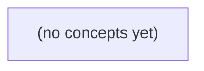

# 08.04 一致性模型：从副本读到会话合同

*面向 Go 初学者，以 c-a 从版本 8 提交到 9、不同副本回放进度不一致的固定玩具历史为主线，建立最终一致、会话保证、因果可见、顺序一致与线性化的判断能力。教材通过水位 W9、历史观察表、合同判定与 22 道分层练习，把抽象一致性术语落到产品读写语义、通知机制和失败策略。*

**章节:** 2

---

## 本书导览

- 了解整本书的章节脉络
- 掌握各章之间的概念依赖关系
- 选择最合适的阅读顺序

# 08.04 一致性模型：从副本读到会话合同

面向 Go 初学者，以 c-a 从版本 8 提交到 9、不同副本回放进度不一致的固定玩具历史为主线，建立最终一致、会话保证、因果可见、顺序一致与线性化的判断能力。教材通过水位 W9、历史观察表、合同判定与 22 道分层练习，把抽象一致性术语落到产品读写语义、通知机制和失败策略。

下方的概念图展示了本书 0 个核心概念以及它们之间的依赖关系；再下方是 1 个章节的入口。你可以按从上到下的顺序阅读，也可以根据自己的兴趣或先验知识选择切入点。

#### 概念图



## 章节索引

- **08.04 一致性模型：刚发的消息何时可见** — 面向Go初学者，沿IM主副本历史观察推导最终收敛、会话保证、因果一致、顺序一致与线性化，并与事务隔离区分。

## 08.04 一致性模型：刚发的消息何时可见

- 定义读到版本与会话范围
- 识别读己之写和单调读违例
- 解释因果通知依赖与允许的异步提示
- 区分顺序一致与线性化真实时间约束
- 区分事务隔离与跨副本一致性
- 设计写后读最低水位与失败策略
- 用观察历史评审业务合同

从主副本已提交、一个副本已回放而另一个仍滞后的同一段历史出发，界定“刚发消息何时可见”的观察边界与业务承诺。

### 把可见性写成一次读的观察结果

### 把可见性写成一次读的观察结果

“可见”不是指某台副本已经存有消息，而是指一次具体读取实际返回了什么。记一次读操作为：

\[
r=(s,t_{\text{start}},t_{\text{end}},V_r)
\]

其中，$s$ 是发起读取的会话，$t_{\text{start}}$、$t_{\text{end}}$ 分别是调用开始与结束时刻，$V_r$ 是本次返回结果所覆盖的版本水位。若消息 $m$ 的提交版本为 $W_9$，则“读到了 $m$”可写为：

\[
W_r \ge W_9
\]

这里的 $W_9$ 是抽象的提交位置：它表示该消息及其之前的变更已经进入全局历史，而不是业务上的消息序号 `seq9`。

业务序号通常只在某个会话、某个频道或某种排序规则内有意义；删除、编辑、跨会话消息、分页和合并流都可能使它不足以表示“历史推进到哪里”。版本水位则只回答一致性真正关心的问题：这次读观察到了至少多新的已提交历史。

因此，在 08.03 的场景中，P 在 $t10$ 提交 `c-a seq9`，可将其记为版本 $W_9$；R1 在 $t70$ 回放后可返回 $W_r\ge W_9$，而仍停在旧状态的 R2 只能提供 $W_r<W_9$。后续承诺应约束不同会话、不同设备和通知后的读操作能否达到该水位，而非笼统地说“消息已经同步”。

### 同一提交在不同副本的可见时间

### 同一提交在不同副本的可见时间

设消息 `c-a` 在主副本 P 的抽象提交位置为 $W9$，于 $t10$ 提交；R1 在 $t70$ 回放至 $W9$，而 R2 此时仍仅有 $W8$。这里的 $W9$ 表示全局提交水位，不等同于业务消息的 `seq9`：前者用于判断副本是否已包含该提交，后者只是会话内的业务排序字段。

一次 `read` 的返回值取决于调用实际命中的副本及其水位：

- 若读在 R2 的 $W8$ 状态完成，则结果可以不含 `c-a`；
- 若读在 P 或已回放的 R1 上完成，则结果应可包含 `c-a`；
- R2 随后继续回放，最终也会达到 $W9$，此后普通读取会收敛到包含该消息的状态。

因此，最终一致性仅能承诺：**没有新的失败或永久丢失时，旧历史最终会追平**。它不能承诺“$t10$ 提交后所有副本立即可读”，也不能承诺任意一次读都已经看到最新提交。即使 R1 已于 $t70$ 可见，负载均衡下一次仍可能把读请求送往 R2，返回较旧的 $W8$ 视图。

这一区分决定了后续需求的必要性：普通旧历史可以稍后收敛；但“刚发必见”“换设备不倒退”以及“收到通知后可拉到消息”都不是最终收敛自然提供的保证，而需要把会话、读调用边界和最低可接受水位纳入一致性约束。

### 刚发必见与换设备不倒退

### 刚发必见与换设备不倒退

设用户在时刻 $t_{10}$ 提交消息 $c\!-\!a$，其提交位置为版本水位 $W_9$。这里的 $W_9$ 是存储系统中的抽象提交位置，不等同于业务消息序号 `seq9`；后者只是会话中的排序字段。

一次读调用可记为：

$$
read(s, r, t_{start}, t_{end}) \rightarrow V
$$

其中 $s$ 是用户会话或身份范围，$r$ 是实际服务的副本，$V$ 为返回结果。若结果中包含的最高已见提交位置为 $W(V)$，则“刚发必见”要求：同一用户发送成功后，后续读不得返回低于该写入的视图：

$$
W(V) \ge W_9
$$

这就是**读己之写**。在 08.03 的状态中，R1 已回放到 $W_9$，因此从 R1 读取可见消息；R2 仍停在 $W_8$，若它直接响应该用户的刷新请求，就会出现“发送成功后消息消失”的违例。

进一步，用户可能从手机切到电脑，甚至重新建立连接。因此水位不能只绑定某条连接，而应绑定可识别的会话或账号身份。若手机曾读到 $W_9$，电脑随后读取到的结果也应满足：

$$
W(V_{new}) \ge W(V_{old}) = W_9
$$

这称为**单调读**：用户观察到的历史不能倒退。系统可将会话最低可见水位保存为 `minVisible=W9`，每次读都携带它；副本若未追平，应等待、转发到较新副本，或返回“正在同步”，而不能悄悄返回旧历史。

这并不要求所有普通历史读取都立刻达到最新。未携带此水位约束的旧页面、后台预取可以暂时落在 $W_8$，随后追平；但发送者本人，以及已收到新消息通知并准备拉取的用户，不能被分配到不足 $W_9$ 的可见版本。

### 通知依赖与可延迟的历史追平

### 通知依赖与可延迟的历史追平

通知不是“可能有更新”的装饰，而是一个因果承诺：若客户端收到“新消息已到达”的通知，其中携带或隐含版本水位 $W9$，则随后发起的拉取不能仍只返回 $W8$。否则用户会看到“通知到了，消息却不存在”，破坏通知与读取之间的因果关系。

可将通知后的读取合同写为：

\[
\text{收到通知}(W9)\ \prec\ \text{read开始}
\quad\Rightarrow\quad
\text{read返回水位}\ge W9
\]

这里的 $W9$ 是抽象提交位置，不等同于业务消息的 `seq9`；它表示该通知所依赖的所有提交效果都必须对这次读取可见。实现上，服务端可将通知水位附在请求中，读取路由到已回放该水位的副本，或等待当前副本追平后再返回。

但这不要求每次读取都等待全量历史一致。对于用户未被通知、未刚发送、也未在当前会话中见过的旧消息，副本仍可先返回较旧快照，再异步补齐历史。合同边界是：允许“普通旧历史稍后出现”，不允许通知所指向的新内容、用户刚提交的内容，或该会话已经看过的版本再次消失或倒退。

### 用观察历史评审IM读写合同

### 用观察历史评审 IM 读写合同

把一次读取记为 `read(session, start, end) → M`：它在调用区间内返回消息集合 `M`。P 在 `t10` 提交消息 `c-a`，其抽象提交水位为 $W_9$；`R1` 到 `t70` 已回放至 $W_9$，`R2` 仍停在 $W_8$。注意：$W_9$ 是存储提交位置，不等同于业务消息序号 `seq9`。

可用观察历史评审合同，而非只问“副本是否最终会同步”：

- **写后读最低水位**：会话发送成功后记录 `minW=W9`；后续读若命中 `R2(W8)`，必须等待追平、转发主库或改读 `R1`，否则不可返回“没有 `c-a`”。这满足需求 A 的刚发必见。
- **跨设备不倒退**：客户端把已观察水位携带到新会话，或服务端按账号保存水位。设备二读不能从已见的 $W_9$ 回退到 $W_8$。
- **通知后的拉取**：通知携带或隐含 $W_9$；收到通知的 B 发起读取时，系统应保证其结果至少覆盖 $W_9$，必要时等待、路由或失败重试。
- **普通历史读取**：未附最低水位的旧历史可暂读 `R2`，稍后追平即可；这只是最终一致，不承诺即时可见。

因此，这是一份“带水位的会话可见性”合同：它比无约束副本读取强，却不自动保证全局顺序一致；更不等同于线性化——所有读写并非都像在单一瞬间发生——也不提供事务隔离中的原子多对象提交与隔离语义。

> **要点** — 消息可见性应以会话、读操作与版本水位描述；不同需求决定读需等待、路由、降级还是失败。

一条消息显示“发送成功”后，读到旧内容未必是故障；关键在于产品承诺了何种可见性，以及客户端应如何等待、降级或失败。

### 从副本观察定义版本可见性

### 从副本观察定义版本可见性

把一条消息的状态抽象为单调递增版本号：主副本 `P` 已提交版本 `9`，表示该写入已进入权威历史；副本 `R2` 当前只应用到版本 `8`，则它对外可读的历史仍是：

\[
H_{R2}=[1,\dots,8],\qquad H_P=[1,\dots,9]
\]

一次读操作不应只描述为“读某条消息”，还应记录它实际观察到的版本。若用户在时刻 `t40` 从 `R2` 读取，结果对应版本 `8`，可记为：

\[
\operatorname{read}(R2,t40)=8
\]

这并不自动说明复制异常：只要停止新写、各副本保持健康，`R2` 最终应追上 `9`。这里的“最终”是收敛目标，而非“在固定时间内必达”的承诺。

关键在于会话范围。若用户 A 已收到“版本 `9` 写入成功”的确认，那么 A 的后续读取若被产品承诺为“读己之写”，就必须满足：

\[
\operatorname{read}_A \ge 9
\]

因此，A 从 `R2` 读到 `8` 即违反该会话保证；而从未写过版本 `9` 的用户 B 读到 `8`，在仅提供最终一致性的系统中可能仍属允许。

实现时应把“已见版本”作为会话上下文携带，例如 `W=9`。服务端只能选择已确认可见版本至少为 `9` 的副本读取，或路由到 `P`；若等待副本追平超时、失败或副本不可用，应明确降级或返回失败。仅检查消息是否已接收、已刷盘，并不能证明该副本已经对读路径可见。

### 最终收敛不承诺立刻可见

### 最终收敛不承诺立刻可见

设主副本 `P` 已接受并确认版本 `9`，而副本 `R2` 当前仍停留在版本 `8`。若此后不再有新写入，且复制链路、存储与 `R2` 都持续健康，那么复制任务会继续传递缺失日志或状态，`R2` 最终将应用版本 `9`：

\[
\text{停止新写} \land \text{复制持续健康}
\quad\Rightarrow\quad
\exists t,\; R2(t)=9
\]

这里的“最终”是存在性承诺：未来某个时刻会追上；它并不表示在确认后的 `100ms`、`1s` 或任意固定期限内一定追上。延迟可能受排队积压、网络抖动、重试、限流、故障恢复、日志回放和负载竞争影响。

因此，`P` 已确认版本 `9` 与 `R2` 暂时返回版本 `8` 可以同时成立，并不违反最终一致性。不能把“写入已确认”误读为“所有副本已可见”，也不能把健康状态误读为“复制无延迟”。

最终收敛适合允许短暂陈旧读的场景，例如推荐、计数展示或异步索引；但它不能单独支持“发出后立即看到自己刚发内容”的产品语义。若需要这种语义，必须额外选择能证明版本 `9` 已可见的读取路径或等待机制。

### 确认写后读旧值的违例

### 确认写后读旧值的违例

用户 A 向主副本 P 写入版本 `9`，服务端返回“发送成功”或“已确认”。这至少意味着：在该产品定义的确认语义下，写入已经达到可接受的持久化或复制条件。随后在 `t40`，A 的读请求被路由到副本 R2，却得到版本 `8`：

| 时刻 | 操作 | 结果 |
|---|---|---|
| `t0` | A 写入 `v=9` | 写被确认 |
| `t40` | A 从 R2 读取 | 返回 `v=8` |

若系统只承诺最终一致性，这并不矛盾：R2 尚未应用版本 `9`，只要停止新写且复制链路健康，R2 最终会追到 `9`。但“最终”没有固定时间上界，不能据此推断 `t40` 必然可见。

问题在于产品若承诺**读己之写**：同一用户在自己的写被确认后发起的后续读取，必须看到该写入或更新版本。形式化地，若 A 已确认版本 $W=9$，则其后续读结果 $R$ 应满足：

$$R \ge W$$

此处 R2 返回 `8`，即 $8 < 9$，因此是会话一致性违例，而非单纯的复制延迟。

修复不能只检查 R2 是否“收到”或“落盘”了日志；它必须已经使版本 `9` 对该读路径**可见**。常见做法是将读路由到 P，或让客户端携带最低版本令牌 `W=9`，仅从已可见 `W9` 的副本读取；若副本尚未追平，则等待、改路由，或明确返回可重试/失败。

### 最低版本水位与等待策略

### 最低版本水位与等待策略

写操作在主副本 `P` 提交版本 `W9` 后，响应不应只返回“成功”，还应返回可用于后续读取的水位，例如 `min_version=9`、提交时间戳或单调递增的日志位置。客户端随后发起读请求时携带该水位：

`GET /messages/42?min_version=9`

这表示：本次读不得从可见版本低于 `9` 的副本返回结果。若 `R2` 当前只应用到版本 `8`，即使它已收到日志、已落盘，也仍不满足读己之写；真正应检查的是“该副本已对读路径可见的已应用版本”。

服务端可按以下顺序处理：

1. **选择已满足水位的副本**：优先选择延迟低、健康且 `applied_version ≥ 9` 的副本，例如主副本 `P` 或已追上的其他副本。
2. **在候选副本等待追赶**：若请求指定允许等待，`R2` 可等待复制与应用推进到 `9`；等待必须有截止时间，不能无限阻塞。
3. **超时后的明确策略**：  
   - 回退到主副本 `P`，以较高延迟换取读己之写；  
   - 返回“尚未达到最低版本”的可重试错误，并附带当前水位与建议重试时间；  
   - 若产品允许弱一致读，必须显式标记结果为旧版本，而不能伪装成满足承诺的成功响应。

等待成功只说明当前副本已越过 `W9`，不意味着所有副本都已收敛。若停止新写且健康复制持续，`R2` 最终会追到 `9`，但这一最终收敛通常没有可依赖的固定时间上界。因此，超时、回退和失败语义应成为接口契约的一部分，而不是隐藏在客户端的偶然重试中。

### 不要把复制状态当作可读承诺

### 不要把复制状态当作可读承诺

复制链路常报告副本已 `received` 或 `flush`，但这两个状态都不等于“客户端现在能读到该写入”。

- `received(W9)`：R2 已收到版本 9 的日志记录；它可能仍在队列中、等待排序、校验或提交。
- `flush(W9)`：日志已持久化到 R2 的磁盘；这只说明崩溃后不易丢失，并不说明查询路径会返回它。
- 对外可见：R2 的读服务已经将版本 9 纳入可读快照、索引或物化视图，并且本次读取实际选择了不少于 9 的版本。

例如，A 的写入 `W9` 已被主节点确认，随后在 `t40` 读取 R2。即使监控显示 R2 已 `received(W9)`、甚至 `flush(W9)`，R2 的查询索引仍可能只发布到版本 8，于是返回旧值。若产品承诺“读己之写”，这不是可接受的普通延迟，而是承诺被破坏。

因此，客户端不能把“副本收到日志”当作等待结束条件。应携带会话下界，如 `min_version=9`，并要求目标副本证明其**可读版本**满足：

$$visible(R2)\ge 9$$

否则应继续等待、改读主节点 P 或另一台已可见 `W9` 的副本；若超时、节点故障或无法找到满足条件的副本，则明确返回失败或降级结果，而不是悄悄读到版本 8。

> **要点** — 最终收敛保证副本终会追上，不保证何时追上；写后读需以会话版本水位验证可见性，并为等待失败制定策略。

同一用户先看到新消息，刷新后却看到旧版本，并非简单的“延迟”，而是会话观察历史被倒退。会话保证正是为这类体验合同设定最低边界。

### 从观察历史定义版本与会话

### 从观察历史定义版本与会话

把一条消息看成按版本演进的对象：原始发送为 $v_1$，编辑后为 $v_2$，撤回后可视为更晚的状态 $v_3$。若 $v_2 \rightarrow v_3$，则 $v_3$ 在因果上晚于 $v_2$；“晚”不是墙上时钟更大，而是系统必须承认其依赖关系。

一次读操作不只返回内容，还形成观察记录：

- 用户在副本 $R_1$ 读到对象 $x$ 的版本 $v$，记为 `read(x, v, R1)`；
- 副本状态表示该副本目前已应用到哪些更新，而非全局唯一的“最新值”；
- 会话观察历史是该用户在一个会话内已经看见、写入或依赖过的版本集合。

因此，若用户先从主库 $P$ 或副本 $R_1$ 看到消息版本 $9$，随后切到仍停在版本 $8$ 的 $R_2$ 并读到 $8$，问题不只是 $R_2$ 复制滞后，而是会话历史已包含 $9$，新读却返回了一个被其后继版本覆盖的状态。这正是判断单调读违例所需的共同语言。

“会话”也必须明确边界：它可以是一段登录态、一个浏览器标签页、一次应用前台生命周期，或由服务端会话令牌串联的多设备活动。若手机与电脑共享同一令牌，系统就应决定观察历史是否跨设备继承；若不共享，则两端可被视为不同会话。会话保证约束的是这条观察历史，不自动提供事务的原子性、隔离性或全局一致快照。

### 先见9后见8：单调读违例

### 先见9后见8：单调读违例

设消息 `m` 的初始版本为 `8`。用户 A 发送编辑后，副本 `R1` 已应用该写入，因此在位置 `P`（或时刻 `t70`）返回版本 `9`；但副本 `R2` 的复制尚未追上，仍只保存版本 `8`。

A 的同一会话随后发生一次读取：

1. 第一次读取：`read(R1, m) = 9`
2. 第二次读取：`read(R2, m) = 8`

这不是“第二次恰好读到了较慢副本”那么简单，而是会话观察历史倒退：A 已经知道 `9` 存在，系统却又让 A 把同一对象看成更早的 `8`。因此它违反了**单调读**（Monotonic Reads，MR）：

> 对同一会话，后续读取所观察到的状态，不能早于该会话此前已经观察到的状态。

若版本按因果或提交顺序可比较，可写为：若 A 已读到版本 $v_1$，则其后读到的版本 $v_2$ 应满足 $v_2 \succeq v_1$。这里 $8 \prec 9$，故 `9 → 8` 构成违例。

用户感受到的后果通常很直接：

- 刷新聊天记录后，刚出现的编辑内容“消失”；
- 已读到的撤回标记重新变回原消息；
- 页面在不同地区、不同副本之间跳动，用户无法判断哪个版本可信；
- 用户可能重复编辑、再次发送，进一步制造冲突。

MR 不要求所有用户立刻读到 `9`，也不要求 `R2` 全局同步；它只约束 A 的后续观察不能回退。实现上可将 A 后续请求粘到至少包含版本 `9` 的副本，或携带会话令牌，使服务端拒绝由尚未追至该观察点的 `R2` 响应。

### 读己之写：编辑后的最低承诺

### 读己之写：编辑后的最低承诺

**读己之写**（Read Your Writes，RYW）要求：同一会话一旦完成一次写入，之后该会话的每次读取都必须看到这次写入，或看到一个更新的版本；不能再回到写入前的旧副本。

设用户会话 $S$ 对消息 $m$ 写入版本 $v_2$，原版本为 $v_1$。对任意后续读取 $r$，应满足：

$$
r(m) \ge v_2
$$

这里的“$\ge$”不是指一定原样返回编辑后的文本：消息可能又被撤回、被再次编辑，或因权限变化而不可见。关键是读取结果不能表现为“$v_2$ 从未发生过”的旧状态 $v_1$。

例如，用户在 IM 中将“晚上八点开会”编辑为“晚上九点开会”，提交成功后立刻打开会话详情。若请求被路由到尚未复制编辑结果的副本，页面仍显示“晚上八点开会”，用户会合理地认为编辑丢失了。RYW 的最低承诺是：该用户后续读取必须避开版本仍低于 $v_2$ 的副本，等待其追平，或直接从主副本、带版本条件的副本读取。

实现时，服务端通常把最近写入的版本号、日志位置或一致性令牌绑定到会话；后续读请求携带该下界。副本若未达到该位置，就不能用它响应。该保证只约束“我写后我来读”，并不保证其他用户立刻看到编辑，也不等同于把编辑与读取包进一个事务。

### 单调写与写跟随读的消息链

### 单调写与写跟随读的消息链

设同一会话中的操作按用户意图形成因果链。Terry 的会话保证并不要求所有副本立刻一致，而要求系统不能把这条链拆开或倒置。

- **单调写（MW，Monotonic Writes）**：同一会话的后续写必须在前序写之后生效。  
  例如用户先发布消息 $m$，再执行“撤回 $m$”。若某副本先接收到撤回、却尚未接收到原消息，系统不能将撤回作为一条孤立操作对外暴露；它必须保证：
  \[
  \operatorname{post}(m)\rightarrow \operatorname{withdraw}(m)
  \]
  对任何承接该会话写入的副本而言，写入顺序不可颠倒。否则可能出现“消息不存在，却显示已撤回”或撤回后消息重新出现的异常。

- **写跟随读（WFR，Writes Follow Reads）**：会话先读到的版本，之后基于该观察产生的写必须建立在该版本之后。  
  例如用户在副本 $R_1$ 读到消息 $m@v_9$，随后回复“我同意”。该回复并非普通独立写，而是依赖于“已观察到 $m@v_9$”：
  \[
  \operatorname{read}(m@v_9)\rightarrow \operatorname{reply}(m,v_9)
  \]
  系统若把回复写入仍只知道 $m@v_8$ 的 $R_2$，就可能让其他人先看到回复、后看到被回复的内容，甚至把回复挂到过期版本上。

因此，IM 编辑、撤回等连续操作主要要求单调写；“先读消息、再回复/引用/表态”则要求写跟随读。它们都依赖会话上下文携带已完成写与已观察版本的 token，但这不是事务：系统不承诺原子提交、隔离全部并发操作或全局顺序，只承诺该会话自己的因果链不被打断。

### 会话边界、共享令牌与失败策略

### 会话边界、共享令牌与失败策略

“同一会话”必须由应用明确界定，不能默认等同于一次请求或一个浏览器标签页。常见边界包括：

- **登录态绑定**：同一账号在同一设备上的连续操作共享会话水位，保证读到版本 $v$ 后，后续读取不得低于 $v$。
- **设备本地会话**：手机与网页各自维护水位，隔离性强，但用户换设备后仍可能看到较旧副本。
- **跨设备共享令牌**：将已观察版本、因果依赖或副本进度写入服务端会话记录、令牌或请求头；新设备携带该令牌后，也必须读取不低于该水位的数据。令牌应有过期、签名和大小上限，避免被伪造或无限增长。

当目标副本尚未达到令牌要求的最低水位时，应用不能悄悄返回旧值。可按策略处理：

1. **等待**：短时间轮询或阻塞，待副本追平；适合消息刚发送后的刷新。
2. **路由**：转发到主库、已知较新的副本，或用户先前访问过的副本。
3. **降级**：明确显示“正在同步”，保留缓存中的新结果，或允许用户选择稍后重试；不可把旧版本伪装成最新结果。

例如，用户先发消息再撤回，撤回是依赖“已发消息”的写：同一共享会话应保证先发后撤回的写顺序，随后读取不能回到“消息仍存在”的状态。这是读写可见性的会话合同，不提供原子提交、隔离冲突或全局串行顺序，因此不等于事务。

> **要点** — 会话保证约束同一会话的观察与写入顺序；副本可异步，但不能让已确认的会话历史倒退。

一条“写入成功”的通知到达后，接收方能否立刻读到该版本，取决于通知与数据可见性之间是否存在明确的因果合同。

### 从观察历史界定通知后的读

### 从观察历史界定通知后的读

设副本系统中发生如下历史：

1. 客户端 A 在副本 `R1` 写入版本 `9`，记为 $W_9$；
2. 网关 G 观察到该写入，并向客户端 B 发送通知 $N$；
3. B 收到通知后，在副本 `R2` 发起读取 $R$；
4. $R$ 返回旧版本 `8`。

这里不能只说“B 读旧了”，而应明确观察点与因果边：

- $W_9 \rightarrow N$：若 G 的通知语义是“版本 9 已产生”或“版本 9 可供读取”，则通知因果依赖于写入。
- $N \rightarrow R$：B 收到通知后才发起读取，二者属于同一会话中的先后操作。
- 因而可得到 $W_9 \rightarrow R$。若合同承诺“收到该通知后立即可读”，则 $R$ 的可见历史必须包含 $W_9$；只返回 `8` 即违反因果依赖可见性。

但通知也可能只是 `hint`：它仅提示“可能有更新，请稍后刷新或重试”，并未承诺通知到达时数据已在 `R2` 可见。此时 $W_9 \rightarrow N$ 不足以推出“$R$ 必须看到 $W_9$”，读到 `8` 不自动构成违约。

版本号 `9`、物理时间更晚都不是充分依据。关键是历史中是否存在明确的因果关系，以及通知合同是否把该依赖传递为读取的可见性要求。

### 通知建立因果，还是仅是提示

### 通知建立因果，还是仅是提示

设 A 在副本 R1 写入版本 9，网关 G 随后向 B 发送“已更新”通知；B 收到后到副本 R2 读取历史，却只看到版本 8。这个结果是否错误，关键不在于“通知先到还是数据先到”，而在于通知承诺了什么。

- **因果可见性合同**：若通知语义是“版本 9 已可供你读取”，则通知事件依赖于写入 9，B 的接收事件又依赖于通知。因此  
  $W9 \rightarrow Send \rightarrow Receive \rightarrow Read$。  
  B 在收到通知后读取仍只能得到 8，说明 R2 尚未满足 $W9$ 携带的依赖，违反“通知后即可读到 9”的合同。

- **异步提示合同**：若通知仅表示“系统发现了更新，建议刷新或稍后同步”，它不保证 R2 已应用版本 9。此时 B 先读到 8、再通过重试或补拉读到 9，是允许的正常过程；通知只是触发同步动作，不是可读性的确认。

判断时应检查通知协议是否携带版本、依赖令牌或“已提交且可读”的承诺。不能仅因编号为 `9`、物理时间更晚，便假定它对所有读取都已可见；`seq=9` 不是全局因果证据，真正约束可见性的，是通知明确传递并要求满足的依赖。

### 用依赖关系而非序号判断可见性

### 用依赖关系而非序号判断可见性

设 A 在副本 `R1` 写入版本 `W9`，随后网关 `G` 向 B 发送通知；B 收到通知后到 `R2` 读取，却只看到版本 `W8`。关键问题不是“`R2` 的序号是否小于 9”，而是通知是否在因果上承诺了 `W9` 已对 B 的读取路径可见。

`W9` 应携带或可追溯到其依赖集合，例如：

- 写入者已观察到的版本与会话上下文；
- `W9 → 通知` 的因果边：通知是在确认 `W9` 后发出；
- 通知的可见性条件：B 收到后，应从哪些副本、以何种读一致性读取到 `W9` 或其后继版本。

若合同规定“通知表示该内容可立即拉取”，则有：

$$W9 \rightarrow 通知 \rightarrow B收到 \rightarrow B读取$$

因此读取结果必须包含 `W9`，或包含一个因果上覆盖 `W9` 的后继版本。此时 `R2` 仅返回 `W8`，说明通知路径领先于数据可见性，违反了因果依赖可见性。

但不能把 `seq=9` 当作这种证明：序号通常只在某个日志分区、单副本或单对象内有序，另一副本的“9”未必对应同一历史。物理时间同样不足：时钟偏差、异步复制和并发写入都会破坏“更晚时间即已见到该写”的推论。

若通知只是“可能有更新”的提示，不承诺立即可读，则 B 读到 `W8` 并不自动违约；客户端可以重试、等待同步，或携带 `W9` 的版本标识请求满足依赖的读取。

### R2读到8时如何判定违约

### R2读到8时如何判定违约

设 A 写入版本 `9`，随后 G 向 B 发送通知；B 收到后立即到 R2 读取历史，却只得到 `8`。结果本身并不足以判定系统错误，关键在于这条通知承诺了什么因果关系。

- **强通知承诺：读到 8 即违约。**  
  若合同规定“收到通知即表示版本 9 已可读取”，则通知事件依赖于 `W9`，而 B 的读取又发生在收到通知之后，即：
  $W9 \rightarrow \text{通知发送} \rightarrow \text{通知接收} \rightarrow R2$。  
  因果依赖可见性要求 R2 至少包含 `W9` 的效果；返回 8 说明数据面落后于已承诺的通知语义。

- **提示通知：读到 8 不自动违约。**  
  若通知只表示“可能有新版本”“建议刷新或稍后拉取”，且接口允许异步复制、重试或轮询，那么 R2 返回 8 只是暂未收敛。此时应检查是否满足约定的最终可见时限、补拉机制和失败反馈，而不能把“收到提示后第一次读取”误当作强一致承诺。

- **独立并发编辑：不能据此推断违约。**  
  若 B 收到的通知对应另一条无关编辑，或 `9` 是与该通知并发产生的版本，则两者没有 `send→receive` 的因果链。R2 读到 8 可能完全合法；不能仅凭版本号更大、`seq=9`，或物理时间更晚，就把 `9` 伪造为通知的必需依赖。

判定准则是：先找出通知携带或合同声明的依赖集合，再检查 R2 是否看见该集合，而不是机械比较版本号。

### 为通知后读取设计最低水位与降级策略

### 为通知后读取设计最低水位与降级策略

通知不应只传递“对象已更新”，还应携带读取端可验证的**最低可见水位**。例如，A 写入版本 `W9` 后由 G 通知 B，通知可包含：

- 对象键与目标版本：`order/42, W9`
- 写入所在分区及其提交位置：如 `partition=p3, offset=9`
- 或更一般的依赖向量：`deps={p3:9, p7:31}`

B 收到通知后向 R2 查询时，应声明读前提：`至少观察到 deps`。R2 若已覆盖该水位，立即返回包含 `W9` 的结果；若当前仅到 `8`，则不能把旧结果伪装成“通知对应的最新状态”。

可按时延与可用性要求设计降级链路：

1. **短暂等待**：R2 等待复制推进至所需水位，适合通常复制延迟很短的场景。
2. **转向满足水位的副本**：路由到主库、领导者或已确认追上的副本。
3. **重试或异步补拉**：返回“处理中”，由客户端携带同一水位稍后重试。
4. **直接读取写入源**：必要时按版本标识从权威存储补拉 `W9`。
5. **明确失败**：超时后返回“尚未满足通知依赖”，而非返回 `8` 并声称读取成功。

这里的水位是因果合同，不等同于全局序号或物理时间。若 `W9` 还依赖其他分区的写入，通知必须携带完整依赖；否则 B 即使读到编号为 `9` 的记录，也可能仍看不到 `W9` 所因果依赖的状态。若产品只把通知当作“可能有更新”的提示，则可允许先读到 `8`，但响应与界面必须明确这是未确认的新鲜度读取。

> **要点** — 通知是否要求立即读到写入，取决于其是否承诺因果依赖已在目标副本可见；提示消息本身不等于该承诺。

同样是“读到旧值8”，它可能仍符合顺序一致性，却已违反线性化；关键在于是否必须尊重真实时间。

### 从历史记录界定版本与操作区间

### 从历史记录界定版本与操作区间

设单个寄存器初始版本为 $v_0=8$。客户端 A 发起写操作 $W_A(9)$：在 $t_1$ 调用、于 $t_{10}$ 收到成功返回，因此其操作区间为 $[t_1,t_{10}]$，写入后产生版本 $v_1=9$。独立客户端 C 此前未与 A 通信，在 $t_{20}$ 调用读取 $R_C$，并返回旧版本 $v_0=8$。

可将历史记为：

- 初始状态：`x = 8`；
- A：`invoke W(9)` $\rightarrow$ `return ok`；
- C：`invoke R()` $\rightarrow$ `return 8`。

这里应区分三个概念：

- **版本**：`8` 与 `9` 是对象状态的不同版本；读到 `8` 表示读取结果对应旧版本。
- **操作区间**：一次操作不是单一瞬间，而是从调用到返回的一段时间。A 的写已在 $t_{10}$ 完成，C 的读在 $t_{20}$ 才开始，二者区间不重叠。
- **客户端范围**：A 与 C 属于不同客户端。C 没有观察到 A 的请求、返回或会话上下文；仅从“C 读到 8”本身，不能推出 C 的程序顺序被破坏。

因此，分析一致性时不能只记录“谁读到了什么”，还必须记录调用与返回的边界。尤其是“写返回先于读调用”这一真实时间关系，正是后续区分顺序一致性与线性化的关键证据。

### 顺序一致性允许怎样重排

### 顺序一致性允许怎样重排

设单个对象初始值为 `8`。客户端 A 执行写入 `write(9)`，并在 $t_{10}$ 收到“成功”响应；独立客户端 C 从未与 A 通信，却在 $t_{20}$ 执行读取 `read()`，得到结果 `8`。

顺序一致性要求：所有操作都能放入某个**单一全局顺序**，且该顺序必须保持每个客户端各自的程序顺序；但它不要求这个全局顺序服从墙上时钟的先后。

因此，可以构造如下合法排列：

1. C：`read()` $\rightarrow 8`
2. A：`write(9)` $\rightarrow 成功`

在这个解释中，C 的读取发生在 A 的写入之前，所以自然读到初始值 `8`。A 的本地程序顺序也没有被破坏：若 A 只有这一次写操作，就没有额外约束；C 同样只有这一次读操作。由于 A 与 C 之间没有通信、没有共享的会话因果链，顺序一致性允许把它们的操作这样重排。

这里的“重排”不是说系统真的让时间倒流，而是指规范只要求存在一个能解释观察结果的操作顺序。C 读到旧值，不能仅凭“ A 已经收到成功”就排除顺序一致性。

但这一排列不能满足线性化：A 的写已经在 $t_{10}$ 完成，而 C 的读在 $t_{20}$ 才开始，真实时间明确要求 `write(9)` 排在 `read()` 之前；此时读结果应为 `9`，而非 `8`。

### 线性化为何要求真实时间

### 线性化为何要求真实时间

设单个对象的初值为 `8`。客户端 A 执行写入 `write(9)`，并在 $t_{10}$ 收到“写入成功”的响应；此后，与 A 没有通信的客户端 C 在 $t_{20}$ 才调用读取 `read()`，却返回旧值 `8`。

线性化的核心约束是：每个操作都必须能被视为发生在调用与响应之间的某个瞬间，并且必须尊重已经确定的真实时间先后关系。

这里 A 的写操作已经在 $t_{10}$ 完成，而 C 的读操作直到 $t_{20}$ 才开始，因此有：

$$
\operatorname{resp}(\text{write}(9)) < \operatorname{inv}(\text{read}())
$$

故任何合法线性化顺序都必须满足：

$$
\text{write}(9) \prec \text{read}()
$$

既然读取排在写入之后，读操作在线性化点上应当看到最新值 `9`。返回 `8` 意味着它仿佛发生在写入之前；但把读排到写前又直接违背上述真实时间约束。因此，这段历史不可线性化。

顺序一致性则不要求保留不同客户端之间的真实时间。它只要求存在某个全局操作顺序，且各客户端自己的程序顺序不被打乱。于是可以构造顺序：

$$
\text{C 的 read() 返回 }8 \prec \text{A 的 write}(9)
$$

C 虽然在现实中更晚读取，但该重排不违反 C 的本地程序顺序，也不违反 A 的本地程序顺序，所以仍可能满足顺序一致性。

这正是 Herlihy-Wing 线性化定义的关键加强：成功响应不仅表示“系统最终会传播”，还对后来才开始的操作形成可见性承诺。若 A 自己在写成功后再读到 `8`，则连 A 的会话顺序也无法保持，顺序一致性同样会被违反。

### 同一旧值在会话内的不同含义

### 同一旧值在会话内的不同含义

设单个对象初值为 `8`。客户端 A 写入 `9` 并在 $t_{10}$ 收到成功响应；随后独立客户端 C 在 $t_{20}$ 读取，仍得到 `8`。

对**顺序一致性**而言，这未必是错误：C 与 A 没有通信或会话依赖，系统可以构造一个全局顺序：

`C 读 8` → `A 写 9`

该顺序保留了各客户端内部的程序顺序，因此 C 的旧读仍可能合法。只是它已不满足**线性化**：A 的写已经完成，且 C 的读之后才开始，真实时间要求写必须排在读之前，C 应看到 `9`。

但若读者换成 A 自己，语义立刻不同：

`A：写 9 成功` → `A：读 8`

这里不能再把读随意排到写之前，因为那会颠倒 A 同一会话内已经发生的操作顺序。即使只要求顺序一致性，也必须保留 A 的程序顺序；因此“写后自己仍读旧值”已经违反一致性要求。

这正是“读己之写”的核心：旧值本身不自动说明模型失效，必须先问读者是谁、是否与先前写入存在会话顺序。独立 C 的旧读主要暴露真实时间约束缺失；A 的旧读则直接破坏会话内因果与程序顺序。

### 把一致性承诺写成业务合同

### 把一致性承诺写成业务合同

不要只问接口“是否一致”，而要把承诺改写成可验收的业务句子：

- **会话保证**：A 在 `t10` 收到“写入 9 成功”后，A 后续通过同一会话读取，必须至少看到 `9`，不能回到 `8`。这保护“自己写完自己能看到”，适合编辑、购物车、个人设置等交互。
- **顺序一致性**：所有操作仿佛按某个统一顺序执行，且每个客户端自身的程序顺序不变。于是 C 在 `t20` 读到 `8` 仍可能合法：系统可将 C 的读排在 A 写 `9` 之前，因为 C 与 A 没有通信或顺序约束。
- **线性化**：若 A 的写在 `t10` 已成功完成，而 C 的读在此后才开始，则 C 必须看到 `9`（或更晚的值）。统一顺序还必须尊重真实时间，这是“成功即对外生效”的合同。

评审接口时，应明确写出：**谁**收到成功确认，**从何时**开始，**哪些读者**必须看到新值，以及是否允许跨副本、跨会话读到旧值。

例如余额扣减、库存售罄、分布式锁获取等场景，通常需要“成功后任意后续读都可见”，即线性化；动态消息流、统计面板可接受短暂滞后时，可选择较弱承诺。但若 A 写入成功后自己仍读到 `8`，连基本的会话顺序都未满足，不能以“最终会一致”为由接受。

> **要点** — 顺序一致性保程序顺序，线性化还保真实时间；写成功后他人再读旧值会违反线性化。

事务隔离回答同库并发事务彼此看见什么；副本一致性回答一次写入在不同节点、不同调用中何时可见。两者对象与观察范围不同，不能互相替代。

### 先划清观察对象与范围

### 先划清观察对象与范围

讨论“刚写的数据何时能读到”前，先问清楚：**谁写了什么、谁在何处读、比较的是哪段历史**。否则，“强一致”“可见”“最新”等词很容易被混用。

- **数据库对象**：可见性总是针对某个键、行、表或查询结果。例如更新订单 `id=42` 后能否读到新状态，不等于另一张表或范围查询也具有相同语义。
- **事务范围**：PostgreSQL 的 `Read Committed`、`Repeatable Read`、`Serializable` 约束的是**同一数据库实例中并发事务**如何观察彼此提交，以及是否允许丢失更新、幻读、序列化异常等。它们不直接规定读请求会被路由到哪个副本。
- **会话范围**：读己之写（RYW）关心同一客户端会话中，写入成功后的后续读取是否至少包含该写；单调读（MR）关心后一次读不会“退回”到更旧版本。两者比较的是跨调用的观察历史。
- **节点范围**：主库、同步副本、异步副本可能处于不同复制进度。在主库提交成功，只说明该写入进入了相应提交历史；若后续读落到滞后的 secondary，仍可能读到旧值。
- **历史范围**：线性一致性要求每个操作仿佛在其调用与返回之间的某一时刻原子生效，并服从真实时间顺序；它比“事务内没有异常”更关注跨客户端、跨节点操作组成的全局历史。

因此，`Serializable` 不能自动推出“任意副本读到最新值”；“多数副本确认写入”也不能自动推出“任意 secondary 都可线性一致读取”。判断语义时，应明确写入对象、事务隔离级别、会话连续性、读写节点及所要求的历史性质。

### 事务隔离约束同库并发

### 事务隔离约束同库并发

PostgreSQL 的隔离级别讨论的是：**同一数据库主库中，重叠事务如何读取彼此已提交或未提交的修改**。它不保证副本节点立刻可见，也不规定下一次跨连接读取一定看到刚写的数据。

| 隔离级别 | 读取视图 | 可防止的现象 | 仍可能出现的现象 |
|---|---|---|---|
| 读已提交 | 每条语句获取新快照 | 脏读 | 不可重复读、幻读式结果变化 |
| 可重复读 | 事务首次普通查询建立快照，后续复用 | 脏读、不可重复读、快照中的幻读 | 写偏斜等序列化异常 |
| 可串行化 | 在快照读取基础上跟踪事务依赖 | 上述读取异常及写偏斜 | 冲突时事务可能被中止，需重试 |

在**读已提交**下，事务 `T1` 连续执行两次：

```sql
SELECT balance FROM account WHERE id = 1;
```

若 `T2` 在两次查询之间提交了更新，`T1` 第二次可能读到新余额；但永远不会读到 `T2` 尚未提交的数据。

在**可重复读**下，`T1` 通常始终看到其事务快照中的版本。即使 `T2` 已提交插入满足条件的新行，`T1` 的同类查询也不会因此多出该行。不过两个事务若分别检查不同记录、再各自写入不同记录，仍可能共同破坏跨行约束，即写偏斜。

**可串行化**要求最终效果等价于某个串行执行顺序。PostgreSQL 不会总是阻塞冲突事务，而可能在提交或执行时报告序列化失败；应用应将整个事务重试。它约束的是同库事务历史，不能据此推出任意副本读取“最新”，也不能替代会话级的读己之写保证。

### 副本会话保证约束跨调用观察

### 副本会话保证约束跨调用观察

副本场景中，读己之写（RYW）和单调读（MR）约束的是**同一会话跨多次调用**所观察到的历史，而非任意事务之间的隔离，也不等于所有节点线性一致。

- **读己之写（Read Your Writes）**：会话先写入版本 $v$，后续读取不得返回早于 $v$ 的状态。若写入已在主库提交，但请求随即被路由到落后的从库，读到旧值，就违反 RYW。
- **单调读（Monotonic Reads）**：会话已经读到版本 $v_2$ 后，之后的读取不能“倒退”到较早版本 $v_1<v_2$。例如第一次请求命中较新的副本，第二次因负载均衡切到滞后副本，即使没有自己写入，也可能违反 MR。

实现通常需要会话携带“已见版本水位”：写成功后记录提交位置、日志序号或时间戳；读到较新副本后也更新该水位。后续读只能路由到满足该水位的副本。常见策略包括：

1. 粘性路由：在一段时间内固定读主库或同一副本；
2. 副本资格检查：仅选择复制进度不低于会话水位的节点；
3. 等待追平：副本暂未达到水位时阻塞或短暂重试；
4. 降级读主：超时、故障切换或找不到合格副本时转向主库；若仍无法确认水位，应明确报错，而不是静默返回旧数据。

这些保证只覆盖携带同一会话上下文的调用。另一个用户、另一设备或丢失水位信息后的新会话，仍可能读到旧副本；因此不能据此宣称任意 secondary 都“最新”。

### 顺序、因果与线性化不可混称

### 顺序、因果与线性化不可混称

设用户甲先发布动态 $W_1$，用户乙看到后评论 $W_2$；系统再向用户丙发送“有新评论”的异步提示。这里至少有三类先后关系：

- **因果一致性**保留“看见后再评论”的依赖：既然 $W_2$ 依赖 $W_1$，任何看到 $W_2$ 的客户端也必须能看到 $W_1$。但与之无因果关系的两个并发写入，可被不同客户端以不同顺序观察。
- **顺序一致性**要求所有客户端观察到同一个全局操作顺序，并保留各客户端自身的程序顺序；但该全局顺序不必服从真实时间。若一次写已返回成功，随后另一个客户端才发起读，顺序一致系统仍可能把该读排在写之前。
- **线性化**更强：每个操作仿佛在调用与返回之间的某一瞬间原子生效，并遵守真实时间先后。写入成功返回后才开始的读，必须看到该写或其后的结果。

异步提示本身通常只说明“某处发生过事件”，不等于接收提示的节点已经应用对应数据。因果一致副本可保证“读到评论时不缺原动态”，却未必保证提示到达后立刻读到评论；顺序一致也未必保证刚完成的跨节点写立刻可见。只有在读写对象、路由节点和操作边界都满足线性化条件时，才能从真实时间上的“写后读”推出最新可见。

### 用业务合同审查读写路径

### 用业务合同审查读写路径

评审读写路径时，先把“读到什么”写成业务合同，而不是笼统要求“强一致”。

常见错误合同包括：

- “多数派写入成功后，读任意从库都必须看到。”多数派确认只说明写入已被足够多副本持久化；某个指定从库仍可能落后，不能据此承诺任意从库可读最新。
- “启用可串行化即可读最新。”可串行化约束的是同一数据库内并发事务的等价执行历史；它不保证新请求连接到副本后已追上刚提交的数据，也不自动覆盖缓存、异步索引或跨库投影。
- “读取失败就换从库重试。”这可能仍读到旧值，甚至让同一会话先看到新值、后又看到旧值，破坏单调读。

对“提交后立即展示结果”这类需求，应设计**写后读最低水位**：写响应携带提交位点、版本号或时间戳 $w$；后续读请求带上 `min_version=w`。被选副本仅当自身已应用到至少 $w$ 时才响应，否则等待有限时间、路由到主库，或明确返回“数据同步中”。

合同还应规定降级路径：

1. 副本追平超时：转主库/领导者读取；
2. 主库不可用：允许返回旧数据时，响应必须标记陈旧性；
3. 不允许陈旧：返回可重试错误，而非悄悄降级；
4. 多次读取：会话保存已见最高水位，保证后续读不倒退。

因此，隔离级别写在事务合同中，副本追赶、路由与水位写在会话合同中；只有明确对象、节点和时间范围，才能审查“最新”是否真的可兑现。

> **要点** — 隔离级别管理同库事务并发；会话保证和一致性模型管理跨副本历史观察，必须明确读节点、版本水位与失败行为。

消息发送成功不等于所有副本立刻可见。本节以写入版本 W9 为线索，定义会话内“刚发消息何时能读到”的可兑现合同。

### 用 W9 定义写后可见边界

### 用 W9 定义写后可见边界

一次“发送消息”成功后，服务端不应只返回“成功”，而应返回可用于后续读取判定的写入版本 `W9`。它可以是日志序号、提交时间戳、分片版本向量或可比较的因果令牌；关键不是具体编码，而是它表示：该写入已被主副本提交，并对应某个可验证的复制进度。

对会话内后续读操作，可将合同写成：

\[
\text{可见}(R,W9) \iff \text{replayPosition}(R)\ge W9
\land \text{snapshot}(R)\text{覆盖 }W9
\]

其中，`replayPosition(R)` 是本次读取实际命中副本的重放位置；仅副本“在线”或“延迟较低”并不证明它已包含 `W9`。同时，读取使用的快照必须足够新：即使副本已经重放到 `W9`，若查询固定在更早的历史快照中，消息仍然不可见。

因此，`W9` 的有效范围必须明确：

- **会话范围**：客户端保存会话最低水位 `minVersion`；写成功后令 `minVersion ← max(minVersion, W9)`。
- **读范围**：每次读携带该水位，路由到主副本，或选择满足 `replayPosition ≥ minVersion` 的指定副本。
- **单调性**：一次读已观察到更高版本后，后续读不得退回较低水位，否则会出现“刚看见又消失”。
- **对象范围**：若版本只在单分片、单分区内可比较，就不能把它误当作全局顺序；跨分片消息流需要向量、事务提交版本或显式依赖集合。

`W9` 不是“所有地方都已经可见”的承诺，而是读路径可据以验证、等待或拒绝服务的边界。

### 读己之写与单调读的会话水位

### 读己之写与单调读的会话水位

设用户 A 刚提交消息，写入被赋予逻辑版本 `W9`。若系统仅返回“写成功”，随后读请求又被负载均衡到任意副本，则该副本可能只回放到 `W7`，A 会看到自己刚发的消息消失。因而，“写成功后可见”必须被表达为可验证的读条件，而非模糊的最终一致性承诺。

对 A 的后续读取，客户端携带会话水位：

\[
h_{\text{session}}=\max(h_{\text{session}},W9)
\]

服务端只有在候选副本的已回放版本满足

\[
replay(\text{副本}) \ge h_{\text{session}}
\]

时，才能用它响应请求。实现上有两条路径：

- **强制路由主库/写入指定副本**：主库已确认 `W9`，通常可立即满足读己之写；代价是主库负载与跨地域延迟上升。
- **路由到追平副本**：选择 `replay≥W9` 的副本；若没有可用副本，可等待回放、转主库，或明确返回“尚未可读”，不能悄悄降级到旧副本。

单调读进一步要求：同一会话一旦读到版本 `W9`，之后不能又读到 `W8`。因此每次成功读返回的观察版本 `R` 都更新水位：

\[
h_{\text{session}}\leftarrow\max(h_{\text{session}},R)
\]

这样，即使下一次请求切换了节点、区域或连接，路由层仍会拒绝版本低于会话水位的响应。这里的“最低水位”是会话已观察状态的下界，不是要求每次都读到全局最新版本；它保证的是不会向后倒退。

### 通知依赖与允许暂不可见

### 通知依赖与允许暂不可见

用户 A 写入消息版本 `W9` 后，通知用户 B 的“有新消息”不应被解释为“B 当前读取的任意副本已经可返回该消息”。通知至少应携带可验证的依赖，例如：

- 会话或对话标识；
- 写入版本、水位或提交时间：`depends_on = W9`；
- 可选的消息标识、路由区域与过期时间。

B 点击通知、进入会话或触发刷新时，客户端应把 `W9` 作为最低可读水位提交给服务端。服务端只能选择两类正确行为：

1. **路由或等待。** 将读取转发到主副本 `P`，或选择已回放到 `replay >= W9` 的副本；若允许短暂等待，也必须设置超时。
2. **明确返回暂不可见。** 当当前副本尚未追上 `W9` 时，返回 `pending`，而不是把消息列表伪装成“没有新消息”。

界面可将该状态呈现为“正在同步新消息”“有一条消息待加载”，保留通知角标，并在重试、切换副本或同步推进后再展示正文。尤其不要直接显示“对方已撤回”“会话为空”之类具有业务含义的结论。

`pending` 不是失败的掩饰，而是读取合同的一部分：系统承认通知依赖已知，但当前读取路径尚不能证明其可见。若依赖令牌过期、失效，或因故障切换、权限变化而无法继续验证，应返回明确错误或要求刷新会话；不能静默降级为无依赖读取。

### 令牌失效、切换与权限变化

### 令牌失效、切换与权限变化

会话令牌不能被视为永久有效的“读己之写”凭证。它通常携带最低可见版本、分片位置、时间戳或副本进度；这些信息可能因保留期、拓扑和权限而失效。服务端必须明确区分“尚未追上”和“已无法证明”。

- **令牌过期或历史截断**：若 $W9$ 对应的日志、快照或变更流位置已被清理，不能把请求悄悄降级为普通读。应返回`令牌过期`或`历史不可用`，由客户端重新建立快照、重新同步会话状态；若业务允许，也可展示“状态可能未包含刚才发送的消息”的显式降级页。
- **故障切换与副本重建**：原指定副本不可用时，可路由到已确认 `replay >= W9` 的其他副本；若没有这样的副本，则等待、返回`尚未满足一致性`，或要求重试。不能仅因主从切换成功就宣称消息可见。
- **权限撤销或租户变化**：令牌只证明版本依赖，不授予持续访问权。权限收回后，即使数据已追上，也必须返回`无权访问`；不能利用旧令牌读取撤销后的内容。权限范围、用户身份或租户标识变化时，应废弃旧令牌并重新认证、重新取快照。
- **失效策略**：响应应包含可机器处理的原因，如`token_expired`、`dependency_unavailable`、`authorization_changed`，以及是否可重试、建议等待时间和是否必须重新同步。

这类合同必然牺牲一部分可用性：令牌有效时可路由或等待，令牌无法验证时则必须失败或显式降级。若使用 MongoDB 的因果会话，还须满足其官方要求的会话、读关注与写关注配置；仅传递会话对象并不自动保证跨故障、跨历史保留期的可见性。

### 一致性合同的成本与实现前提

### 一致性合同的成本与实现前提

“读到自己刚写的消息”不是免费特性，而是在延迟、路由自由度、元数据和可用性之间做出的合同选择。

| 实现方式 | 兑现 W9 的办法 | 主要代价 |
|---|---|---|
| 强制读主节点 P | 写入确认后，后续读取固定路由到 P | P 成为热点；主节点故障切换期间可能无法兑现 |
| 指定副本读取 | 选择已回放到 `replay >= W9` 的副本，并使用不早于写后快照的读 | 需要跟踪副本进度、进行路由判断；可选副本减少 |
| 等待副本追赶 | 请求到达副本后等待其回放至 W9 | 读延迟随复制滞后波动；超时必须显式失败或返回 pending |
| 通知携带依赖 | 消息、跳转链接或后续请求附带 W9，消费者据此建立最低可见版本 | token 需要传播、校验与过期管理；跨服务依赖更复杂 |

单调读还要求会话保存“最低水位”：一旦读过版本或快照 $S$，后续读取不得返回早于 $S$ 的结果。于是服务端或客户端必须保存并传递会话 token；负载均衡器也不能把请求随意送往落后副本。

可用性是合同边界的一部分。若 W9 对应的 token 过期、签名失效、权限已变化，或故障切换后没有副本可证明已覆盖 W9，正确行为不是悄悄返回旧数据，而应明确报错、要求重试、降级为 pending，或重新建立会话。不能同时承诺“任意副本立即可读”“永不等待”“故障时始终成功”。

MongoDB 的因果会话也只能在官方前提下支撑这类承诺：客户端需使用因果一致性会话，读写关注级别及部署拓扑必须满足文档要求，并正确传播同一会话上下文。脱离这些配置，仅凭“使用了 session”并不能保证读到 W9。

> **要点** — 写后可见是带版本水位、会话约束和失败边界的合同；副本未追上时应等待、路由或明确返回暂不可见。

通过主副本历史与会话观察，判断一条刚发送的消息在不同读路径上何时可见，并将一致性术语落实为可验证的业务合同。

### 从历史观察定义版本、读值与会话

### 从历史观察定义版本、读值与会话

讨论“消息刚发出何时可见”前，先把系统内部状态投影为可比较的历史。设消息流的已提交版本为：

\[
H=\langle v_1,v_2,\ldots,v_n\rangle
\]

其中 $v_i$ 表示第 $i$ 个已确认写入；消息内容只是版本携带的业务数据。主副本提交 $v_{40}$，不等于所有读路径已经能返回 $v_{40}$。

| 观察对象 | 关键进度 | 对“最新消息”的回答 |
|---|---:|---|
| 主副本 | 已提交至 $t40$ | 可读到 $v_{40}$ |
| 副本 A | 已复制至 $t40$ | 可读到 $v_{40}$ |
| 副本 B | 已复制至 $t70$ | 可读到 $v_{70}$ |
| 副本 C | 已复制至 $t35$ | 最多读到 $v_{35}$ |
| 客户端会话 S | 已确认写入 $v_{40}$ | 后续读不应退回到 $v_{40}$ 之前，若合同承诺“读己之写” |

这里的 $t40$、$t70$ 是复制日志位置或提交序号，不是墙上时钟；$t70>t40$ 仅说明历史包含更多已排序版本。一次读取可记为：

\[
R=(\text{会话},\text{读路径},\text{返回版本},\text{观察时刻})
\]

例如，会话 S 写入 $v_{40}$ 后被路由到副本 C，若读取返回 $v_{35}$，系统并非“丢了消息”，而是该读路径尚未追上。是否允许这种结果，取决于业务合同：普通最终一致读可允许；发送者刷新聊天列表时通常不可接受。

会话是判定的最小用户视角：同一会话内要检查写后读、单调读；跨会话则需另行声明因果、顺序或实时性要求。后续所有一致性判断，都应先写清“哪个版本已提交、哪个副本已追到、哪个会话读到了什么”。

### 会话保证：写后可见与读进度不倒退

### 会话保证：写后可见与读进度不倒退

设用户在 $t_{40}$ 向主副本写入消息 `m`，该写入提交位置为 $L=120$；随后请求可能被路由到不同副本。会话保证不要求所有用户立刻看到 `m`，但要求**同一会话**不会否认自己已经完成的操作，也不会从较新的观察退回较旧状态。

| 时刻 | 读副本已应用位置 | 会话读到的结果 | 判定 |
|---|---:|---|---|
| $t_{40}$ | 主副本 $120$ | 已发送 `m` | 写入成功，记录水位 $120$ |
| $t_{50}$ | 从副本 $118$ | 看不到 `m` | 违反读己之写 |
| $t_{70}$ | 从副本 $121$ | 看到 `m` 及后续消息 | 合法 |
| $t_{80}$ | 切换到副本 $119$ | `m` 再次消失 | 违反单调读 |

由此可将模糊的“刚发消息何时可见”写成会话合同：

- **读己之写（RYW）**：一次写成功后，后续读必须来自已应用位置 $\ge L_{\text{write}}$ 的副本。
- **单调读（MR）**：若会话曾在位置 $L_{\text{seen}}$ 读取，则下一次读必须满足 $L_{\text{replica}}\ge L_{\text{seen}}$。
- 因而会话的最低读水位为  
  $L_{\min}=\max(L_{\text{write}},L_{\text{seen}})$。

服务端可将该水位编码进会话令牌、粘性路由信息或请求头；读路径先比较副本进度。若副本落后，不应静默返回旧结果，而应按合同选择：等待副本追平、改读主副本/强一致副本，或明确返回“处理中、请重试”。只有业务允许陈旧读时，才可降级；降级结果必须标识为未满足会话水位，不能伪装成正常成功。

验证时只需构造历史：写入后立刻跨副本读取检验 RYW；先在进度高的副本读、再故意切到落后副本检验 MR。关键断言不是“最终总会出现”，而是每个会话读的副本进度始终不低于其已确认的最低水位。

### 因果通知：可延迟提示与不可颠倒依赖

### 因果通知：可延迟提示与不可颠倒依赖

设用户甲发送消息 $m_1$，用户乙读到 $m_1$ 后发送回复 $m_2$。业务上存在因果关系：

$$m_1 \rightarrow \text{乙已见 }m_1 \rightarrow m_2$$

通知可以异步、延迟甚至合并：甲可能先收到“乙回复了你”，数秒后才收到对应的推送；乙也可能晚收到“甲发来消息”的通知。但通知延迟不等于读取结果可以颠倒。

| 时刻 | 动作/观察 | 合同含义 |
|---|---|---|
| t40 | 甲写入 $m_1$，读取自己的会话 | 必须能读到 $m_1$（读己之写） |
| t70 | 乙读到 $m_1$ 并写入 $m_2$ | $m_2$ 因果依赖 $m_1$ |
| t80 | 甲从任意声明“对话已更新”的路径读到 $m_2$ | 同一视图中不得缺失 $m_1$ |

错误承诺是：“通知到达即表示所有副本都已同步。”这会把异步通知误写成强一致读合同。较弱且正确的合同是：通知可晚到、可重复；但若客户端依据通知读取到回复 $m_2$，该读取链必须同时包含其前因 $m_1$，或明确返回“正在同步”，不能展示“回复：收到”却没有原消息。

验证计划：构造 `发送 m1 → 乙确认可见 → 发送 m2 → 甲多读路径读取` 的历史；检查每个包含 $m_2$ 的观察是否包含 $m_1$。若出现 $[m_2]$ 而非 $[m_1,m_2]$，则违反因果可见性；若仅通知晚到但历史顺序正确，则属于可接受的异步到达。

### 顺序一致与线性化：是否服从真实时间

### 顺序一致与线性化：是否服从真实时间

两者都要求所有操作可排成一条全局顺序，并且每次读都符合该顺序中的写入结果；差别在于：这条顺序是否必须尊重**真实时间**。

设初值为 `v0`，客户端 A 执行写入 `W(v1)`，收到成功响应后，客户端 B 才开始读取 `R()`：

| 历史观察 | 顺序一致性（SC） | 线性化 |
|---|---:|---:|
| `W(v1)` 完成后，`R()` 返回 `v1` | 允许 | 允许 |
| `W(v1)` 完成后，`R()` 返回旧值 `v0` | 可能允许 | 禁止 |
| 写与读重叠，读返回 `v0` | 允许 | 允许 |
| 写与读重叠，读返回 `v1` | 允许 | 允许 |

关键反例是：A 的写已经结束，B 的读才开始，却读到旧值。SC 仍可把全局顺序解释为 `R(v0) → W(v1)`；它只保留每个客户端自身的程序顺序，不要求“先完成的操作必须先排”。线性化则要求每个操作存在一个位于调用与响应之间的线性化点，因此真实时间上的“写完成在前、读开始在后”必须对应逻辑顺序上的写在前，读只能返回 `v1` 或更新值。

可将业务合同写成判定题：

- 若合同是“消息发送成功后，任意随后开始的刷新都必须看到该消息”，需要线性化读写，或通过主读、确认位点等机制模拟该效果。
- 若合同仅是“所有用户最终会收敛到同一条消息序列”，SC 已比最终一致更强，但仍不足以保证刚发送即全局可见。
- 若只要求发送者自己立即看到，可采用读己之写会话保证；这不等价于所有客户端的线性化。

验证时记录每次调用的开始时间、结束时间、返回值与客户端顺序；对所有“已结束写 → 后开始读”的操作对，检查读值是否包含该写入。出现旧读即违反线性化，但不必然违反 SC。

### 从模型到合同：令牌、降级与验证计划

### 从模型到合同：令牌、降级与验证计划

事务隔离回答“同一数据库事务内读到什么”，跨副本一致性回答“提交后其他读路径何时可见”。即使事务是可串行化的，若消息写入主库后立即从异步副本读取，仍可能在 $t40$ 看不到、到 $t70$ 才可见；这不是隔离级别失效，而是复制滞后。

| 时刻与路径 | 观察结果 | 合同含义 |
|---|---|---|
| $t40$：写主库后读副本 | 未见新消息 | 最终一致读允许；“发送后立即可见”不成立 |
| $t40$：写后粘主库 | 已见新消息 | 满足读己之写，但增加主库负载 |
| $t70$：读副本 | 已见新消息 | 复制已追平；仅能证明该次历史 |
| 多设备、因果后续读取 | 可能先见回复后缺原消息 | 不满足因果一致性 |

版本令牌应分层取舍：基础层允许无令牌的副本读；会话层携带写入返回的 `token`，服务端仅在副本进度覆盖该令牌时返回，否则等待、转主库或明确降级；关键操作层直接要求线性化读，例如支付状态、权限变更。令牌不是全局强一致开关：它通常保障“本会话不倒退、读己之写”，不能自动保证不同用户间的实时可见。

合同可判定为：

- 普通消息列表：允许短暂延迟，但不得返回错误顺序或伪造“发送失败”。
- 发送者刷新：在令牌有效期内必须读到自己的消息；副本未追平时可转主库。
- 管理、删除、权限确认：要求线性化读写，不可静默降级到旧副本。
- 降级必须可观察：响应标记读源、令牌是否满足及等待/回退原因。

静态验证计划：列出写入、主读、副本读与缓存读路径；为每条路径标注隔离级别、复制模型、令牌传播点和降级策略；构造“写入→副本读”“写入→回复→另一端读取”“令牌丢失/过期”三类历史表；最后逐项将观察结果映射到读己之写、单调读、因果一致或线性化合同，避免以“事务已提交”替代“跨副本已可见”。

> **要点** — 一致性承诺应写成可观察的版本、水位、会话与失败规则，而非笼统宣称“消息已发送”。
