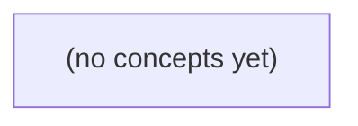

# 08.07 协调与对象归属：Go 初学者的 IM 网关接管与围栏教材

*以设备 d-b1 从 G1 重连至 G2 的 IM 场景为主线，解释旧连接仍可能存活时，如何使用 etcd 的租约、CAS、revision、watch 与围栏机制建立可靠的对象归属模型。全书包含八节递进理论、状态表与时序分析，并配套 22 道含反馈的练习题，帮助学习者区分“登记所有者”与“副作用执行资格”。*

**章节:** 2

---

## 本书导览

- 了解整本书的章节脉络
- 掌握各章之间的概念依赖关系
- 选择最合适的阅读顺序

# 08.07 协调与对象归属：Go 初学者的 IM 网关接管与围栏教材

以设备 d-b1 从 G1 重连至 G2 的 IM 场景为主线，解释旧连接仍可能存活时，如何使用 etcd 的租约、CAS、revision、watch 与围栏机制建立可靠的对象归属模型。全书包含八节递进理论、状态表与时序分析，并配套 22 道含反馈的练习题，帮助学习者区分“登记所有者”与“副作用执行资格”。

下方的概念图展示了本书 0 个核心概念以及它们之间的依赖关系；再下方是 1 个章节的入口。你可以按从上到下的顺序阅读，也可以根据自己的兴趣或先验知识选择切入点。

#### 概念图

## 章节索引

- **08.07 协调与对象归属：旧网关恢复后还能投递吗** — 面向Go初学者，用虚构IM设备重连解释etcd lease、CAS、revision、watch、fencing、旧owner迟到副作用和业务补拉。

## 08.07 协调与对象归属：旧网关恢复后还能投递吗

- 区分物理连接、注册owner、通知执行资格与权威消息事实
- 用etcd CAS+lease推演G1/G2接管
- 区分create_revision、key version、lease ID与业务seq
- 说明旧owner为何需要目标端围栏与幂等
- 处理watch断线/压缩后重建视图
- 限定固定OpenIM源码能证明的范围

以设备 d-b1 从 G1 冻结后重连 G2 为线索，拆开“连接还在”与“谁有资格执行”的分布式误解。

### 四类状态不能混为一谈

### 四类状态不能混为一谈

以 `d-b1` 为例：它先连到 `G1`，随后 `G1` 冻结 20 秒，设备因超时改连 `G2`。此时旧 TCP 连接未必已经被操作系统判定关闭，但这不等于 `G1` 仍然拥有投递权。

应严格分开四类状态：

1. **物理 TCP 连接**  
   `G1` 上的 socket 可能仍显示已建立；冻结期间没有读写，也可能尚未触发超时、RST 或 FIN。它只说明内核尚未确认断链，不能证明设备仍在消费消息。

2. **协调存储中的 owner 记录**  
   etcd 中类似 `device/d-b1 -> G2` 的租约记录，表示协调层当前认可谁负责该设备。租约过期、续租失败或被新连接覆盖后，旧 `G1` 即使 socket 尚存，也不应据此自称 owner。

3. **Notify 任务的执行资格**  
   投递任务必须在执行时核验“任务携带的归属版本”与“当前 owner”。若任务属于旧 epoch，而 etcd 已指向 `G2`，`G1` 应放弃执行；反之，若冻结恢复时恰好在归属切换前提交发送，则可能产生 E9/m-9 所示的重复或漏投递风险。

4. **权威业务事实**  
   聊天历史记录“消息应被投递”，设备已收记录“`d-b1` 已确认收到”。二者都不等于 TCP 存活，也不由某个网关的内存状态单独决定。`S2 accepted_in_memory` 仅表示当前进程接受了请求；未来 `S3` 才会用教学 SQL 表达可恢复、可核对的业务事实。

因此，旧 `G1` 恢复后“还能不能投递”的答案不是看连接是否存在，而是看它是否仍持有当前归属版本对应的执行资格。

### G1 冻结与 G2 接管时间线

### G1 冻结与 G2 接管时间线

设设备 `d-b1` 起初经由网关 `G1` 在线，协调存储 `etcd` 中记录其 owner 为 `G1`；业务方 `B` 向该设备发起一次通知。随后发生如下时序：

1. **$t_0$：正常连接。**  
   `d-b1 → G1` 的 TCP 连接可用，`G1` 持续向 `etcd` 续租 owner 租约。`B` 创建 Notify 任务；任务此时可能被 `G1` 领取并开始投递。

2. **$t_1$：G1 冻结。**  
   `G1` 进程暂停约 20 秒：不再处理心跳、设备数据或任务，但暂停并不等于 TCP 已断。操作系统、负载均衡器乃至设备侧都可能暂时仍把旧连接视为存在。与此同时，`etcd` 中的租约尚未到期，owner 记录仍可能显示 `G1`。

3. **$t_2$：设备超时并重连。**  
   `d-b1` 因收不到应用层心跳，判定旧会话失效，转而连接 `G2`。`G2` 不能仅因“收到了连接”就无条件执行该设备的 Notify；它需要通过协调过程取得或等待取得 owner 资格。

4. **$t_3$：协调记录切换。**  
   当 `G1` 的租约过期、被撤销，或由带版本条件的接管操作成功更新后，`etcd` 才将 `d-b1` 的 owner 归属为 `G2`。从这一刻起，`G2` 才具备面向该设备执行新投递的协调资格。

5. **$t_4$：G1 恢复。**  
   `G1` 醒来时，旧 TCP 连接可能仍未被系统明确关闭，也可能还有冻结前领取的任务上下文。但“旧连接尚存”不推出“G1 仍可投递”：它必须重新核验 owner 记录、租约或任务执行令牌。若不核验，`G1` 与 `G2` 都可能尝试发送同一任务。

这里至少有四个彼此独立的事实：物理 TCP 是否存活、`etcd` owner 指向谁、哪个网关有 Notify 执行资格、权威聊天历史及设备是否实际收到。事件 `E9/m-9` 因而只能提示可能重复或可能漏送；本阶段的 `S2 accepted_in_memory` 仅表示内存中已受理，不能等同于权威已送达。

### 用租约与 CAS 判定新旧 owner

### 用租约与 CAS 判定新旧 owner

G1 上那条旧 TCP 连接“看起来还活着”，不等于 G1 仍是 `d-b1` 的合法 owner。冻结期间，G1 无法续约；协调存储中的 owner 记录会在租约到期后失效。归属判断应由带版本条件的协调记录完成，而不是由某个网关本地连接表决定。

可将记录抽象为：

`owner(d-b1) = { gateway: G1, epoch: 41, lease_until: T }`

当 G1 冻结超过 20 秒，且 `lease_until < now`，B 重连到 G2。G2 不应直接覆盖记录，而应发起 CAS（比较并交换）：

1. 读取当前 owner、`epoch` 与租约截止时间；
2. 确认记录不存在，或原租约已经过期；
3. 仅当读取到的版本仍未变化时，原子写入  
   `owner(d-b1) = { gateway: G2, epoch: 42, lease_until: now + TTL }`；
4. CAS 成功后，G2 才取得后续 Notify 任务的执行资格。

`epoch` 是防止旧 owner 复活的栅栏令牌。即使 G1 随后恢复、旧 TCP 连接也尚未被系统关闭，它继续续约或投递时都必须携带旧的 `epoch=41`；协调层或下游执行方发现当前 epoch 已为 42，便应拒绝其操作。

因此，“连接存在”只是物理事实；“owner 记录的有效租约与 CAS 成功”才是协调事实。G1 恢复后应重新读取 owner：若 G2 已接管，G1 只能关闭或降级旧会话，不能据此主张仍可代表 `d-b1` 执行投递。

### revision、版本与业务序号各管什么

### revision、版本与业务序号各管什么

d-b1 从 G1 重连到 G2 时，常见误解是：看到某个“版本更大”，就认为消息一定更新、一定已投递。实际上，不同编号回答的是不同问题：

| 字段 | 回答的问题 | 不能证明什么 |
|---|---|---|
| `create_revision` | 这条 owner 键最初在哪次协调写入中创建？ | 当前 owner 是否仍有效、消息是否送达 |
| `key version` | 同一个键从创建以来被修改过多少次？ | 修改对应的设备连接是否真实存活 |
| `lease ID` | 此 owner 记录由哪份租约维持？ | TCP 是否已断、旧网关是否停止执行 |
| `etcd revision` | 整个协调存储发生变更的全局先后次序 | 聊天消息的业务先后或客户端接收顺序 |
| 消息 `seq` | 某会话、某设备或某流内消息的业务顺序 | 当前由哪个网关负责投递 |

例如，G1 曾写入：

`/owner/d-b1 = G1, lease=L1, version=1`

G1 冻结后，L1 到期；B 超时重连 G2，G2 写入同一键。此时新的 `create_revision` 可能更大，`lease ID` 变为 `L2`，而该键若是先删除再新建，`key version` 甚至可能重新从 `1` 开始。它们共同说明：协调面已经把对象归属更新为 G2；却不说明 G1 的旧 TCP 已被内核关闭，更不说明 G1 没有执行过旧 `Notify`。

`etcd revision` 适合建立“谁后写入协调状态”的观察顺序。例如 G2 的 owner 写入发生在 revision 900，G1 随后恢复并尝试执行 revision 880 时读到的任务；900 并不会自动撤销 G1 已经拿到内存中的工作资格。是否允许执行，必须由任务携带的 owner 任期、租约绑定或条件校验决定。

而消息 `seq` 应属于权威聊天历史：如会话消息 `seq=42` 表示它排在 `seq=41` 后。`seq=42` 即使被 G1、G2 都尝试发送，也仍是同一条业务消息；客户端应按消息标识或 `seq` 去重。反过来，某次协调 revision 增长，也不等于产生了一条新聊天消息。

因此，S2 的 `accepted_in_memory` 只能表示“某执行者当前内存中接受了投递请求”，不能升级为“设备已收”或“历史已权威提交”。协调元数据负责归属与资格，业务序号负责消息语义；投递事实与确认状态需要由后续持久化协议单独表达。

### 旧 G1 迟到通知为何仍须围栏

### 旧 G1 迟到通知为何仍须围栏

G1 冻结期间，旧 TCP 连接未必立刻断开；但 d-b1 超时后已在 G2 重连，协调存储中的 `owner(d-b1)` 也可能已切换到 G2。此时 G1 恢复并继续执行此前排队的 `Notify(E9, m-9)`，不能因为“连接似乎还活着”就直接投递。

目标端应把投递资格与当前归属绑定：G1 携带其取得任务时的租约版本或 fencing token；G2/协调层只接受与当前 `owner` 一致、且版本未过期的通知。旧 G1 的 token 较小，即使它能写入网络，也应被拒绝。围栏保护的是“旧执行者复活后仍拥有副作用”的问题，而不只是防止两条 TCP 同时存在。

但围栏不能单独保证用户只看到一次：

- **重复**：G1 已成功发送 `m-9`，却在记录结果前冻结；G2 接管后重试，设备可能再次收到。
- **漏送**：G1 已把任务标成完成，但实际网络发送失败，G2 不再重试。
- **乱序或延迟**：旧路径上的包可能晚于新路径抵达。

因此，通知应以稳定的事件标识 `E9` 或消息标识 `m-9` 做幂等去重；设备或客户端确认“已收”时也应重复安全。更重要的是，聊天历史的权威事实不能由某次 Notify 成功与否决定：客户端重连、前台恢复或显式补拉时，应从权威历史读取缺失消息，实时通知只是加速路径。

在 S2 中，`accepted_in_memory` 仅表示当前进程接受了某次请求或任务，不等同于持久化完成、全局唯一投递或设备已收。后续 S3 才讨论用 SQL 表、唯一键、事务与持久化任务记录如何落实这些保证；本节只明确边界：旧 G1 必须被围栏，重复靠幂等吸收，遗漏靠权威历史补拉修复。

> **要点** — G2 接管 owner 不会自动杀死 G1 旧连接；通知必须经围栏与幂等保护，消息事实仍应由权威存储和补拉确认。

本节用设备 u-b 连接 d-b1 的归属键，建立“谁连着、谁注册、谁能执行、什么消息可信”四层判断框架。

### 先拆开四种归属事实

### 先拆开四种归属事实

以设备 `u-b` 在连接 `d-b1` 上的归属为例，不能只问“它现在属于谁”，而要拆成四个彼此相关、但不能互相替代的事实：

1. **物理连接事实**：某个旧网关或新网关是否仍持有到 `d-b1` 的 TCP/WebSocket/MQTT 会话。连接未断只说明它还能收发字节，不说明它仍有业务授权。

2. **协调注册事实**：etcd 中的键如  
   `owners/u-b/d-b1 = gateway_id + connection_id`  
   是否仍由该网关持有。该键附带 `15s` lease；只有通过 `Txn Compare Version(key)==0` 后 `Put with lease` 原子抢占成功，才获得当前 owner 身份。这里回答的是“协调系统承认谁为现任”。

3. **通知执行资格**：网关收到“设备上线”“下发命令”“连接恢复”等通知后，是否有资格执行。执行者必须再次核对 owner 键及其中的 `gateway_id + connection_id`；不能因为自己保留着旧连接、看到了 watch 事件，就直接投递。

4. **权威业务消息事实**：一条设备上报、确认或命令回执是否可信，取决于其关联的 `connection_id`、会话上下文、协议序号和业务幂等规则。etcd 的 owner 键不能替代消息本身的鉴权与顺序判断。

因此，“旧网关还能投递吗”至少包含两层答案：它**可能还能通过物理连接写出数据**，但若已不再是 etcd owner，就**不应以当前归属身份执行投递**。反过来，新 owner 获得注册资格，也不自动证明它看见的任意旧消息都可信。协调锁只定义当前控制权，不是连接状态、消息真实性和业务顺序的全部真相。

### 归属键与租约的建模

### 归属键与租约的建模

对设备 `u-b` 在连接 `d-b1` 上的临时执行归属，可定义为：

`/owners/u-b/d-b1`

键的值不应只写网关标识，而应同时包含：

`gateway_id + connection_id`

例如：

`gw-az1-07|conn-8f31`

其中，`gateway_id` 表示当前由哪个网关负责执行；`connection_id` 表示该网关上的哪一次具体连接。后者不可省略：同一网关重连后会产生新连接，仅凭网关名无法区分“旧连接残留”与“当前连接有效”。

该键绑定一个 `15s` 的 etcd lease。只要网关仍确认自己持有这条连接，就持续续租；一旦网关崩溃、失联或停止续租，租约到期，归属键自动删除。于是该键表达的不是设备永久注册信息，而是：

> 在租约仍有效的时间窗口内，某个网关上的某次连接被允许承担该设备的临时执行职责。

可以将其抽象为：

`owner(u-b, d-b1) = (gateway_id, connection_id, lease)`

这里的“归属”回答的是“当前谁可以代表此连接执行操作”，而不是“设备物理上一定连到谁”。网络分区、旧网关未察觉失效、连接半开等情况下，旧网关可能仍保有本地套接字；但若其不能维持对应租约，就不再拥有协调意义上的执行资格。

因此，后续投递、命令下发或状态写入，都应先围绕该归属键判断，而不能只依据本地连接是否尚未关闭。

### 用 CAS 原子抢占 owner

### 用 CAS 原子抢占 owner

设设备 `u-b` 在连接 `d-b1` 上的归属键为：

`/owners/u-b/d-b1 -> gateway_id + connection_id`，并绑定 `lease=15s`。

首次注册时，网关 `G1` 不能先读再写：读到“空”后，另一个网关可能已抢先写入。正确操作是单个 etcd 事务：

`Compare Version(key)==0`  
`Then Put(key, G1 + c1, lease=L1)`  
`Else 失败`

其中 `Version(key)==0` 表示该键当前不存在。比较与写入处于同一原子边界：若事务成功，`G1` 即获得本次 owner tenure；若失败，说明提交时该键已存在，`G1` 不得把自己视为 owner。

随后 `G1` 失联、崩溃或停止续租，`L1` 到期，etcd 自动删除该键。删除前，`G2` 的同类事务仍会失败；删除完成后，`G2` 才可能成功：

`Compare Version(key)==0`  
`Then Put(key, G2 + c2, lease=L2)`

因此，接管不是“看到旧网关没响应”就可发生，而是必须以键已被租约删除为条件。`G1` 即使网络恢复，也不能凭旧连接继续投递；它必须重新抢占，而该键若已由 `G2` 创建，比较将失败。

成功 `Put` 的 `create_revision` 可标识这一次 owner tenure 的单调代次。不要用 lease ID 排序：它不是归属世代号；键删除后 `version` 会重置，不能跨 tenure 比较。cluster revision 是 etcd 的逻辑时钟，也不是消息顺序号或墙钟。watch 事件虽有序，但最终归属应由事务结果或线性化读取确认。

### 四类版本号不能混用

### 四类版本号不能混用

对归属键 `owners/u-b/d-b1` 而言，值可写为 `gateway_id + connection_id`，并绑定 `15s` lease。判断“旧网关恢复后还能否投递”时，至少会看到以下几类数字；它们的单调范围和用途不同，不能互相替代。

| 名称 | 含义与正确用途 | 不能据此判断什么 |
|---|---|---|
| key `version` | 某个**当前键生命周期**内被修改的次数。`Version(key)==0` 表示键当前不存在，可作为 `Txn Compare` 条件原子抢占。 | 不能表示全局代次；键删除后重新创建，`version` 会重新从小值开始。 |
| `create_revision` | 此键**本次创建**时的 cluster revision。一次成功抢占创建一个新 owner，因此可作为该 owner tenure 的单调代次。 | 不是消息序号，也不表示客户端墙钟时间。 |
| lease ID | etcd 为租约分配的标识，用于续租、撤销和自动删除绑定键。 | 不可当作新旧 owner 的排序 token；不要假定数值更大就更晚或更可信。 |
| 业务 `seq` | 设备或业务流内的消息顺序号，例如 IM 序号、设备上报序号。 | 不等于 etcd revision，不能用于比较两次归属抢占。 |
| cluster revision | etcd 集群提交变更的逻辑时钟；可比较同一集群内已提交 KV 变更的先后。 | 不是 IM `seq`，不是墙钟，也不能证明某条 watch 通知就是当前线性化状态。 |

典型抢占为：`Compare Version(owners/u-b/d-b1)==0`，成功后 `Put(..., lease)`。随后记录返回的 `create_revision`，将其作为本次连接归属的 tenure token。旧网关即使恢复，也必须重新读取并线性化确认归属；仅凭旧 lease ID、旧 `version` 或较晚到达的 watch 事件，都不能证明自己仍拥有投递权。watch 事件在流内有序，但权威判断应以事务结果或线性化读取为准。

### watch 只给线索不授予权威

### watch 只给线索不授予权威

对归属键 `owners/u-b/d-b1` 的 `watch`，可以把它理解为“变化通知流”：事件按 etcd 修订版本有序，因而适合驱动本地缓存更新，例如看到删除事件后暂停向旧连接投递，看到新的 `Put` 后记录新的 `gateway_id+connection_id`。

但 `watch` 不是“我现在仍拥有归属”的权威证明。原因包括：

- 本地可能已断线，漏掉后续事件；
- 监听可能从较旧的 revision 恢复，而历史事件已被压缩；
- 收到某个事件时，集群可能已经产生更晚的抢占、续租失败或删除；
- 事件顺序只说明观察到的变更顺序，不等于一次线性化的当前状态读取。

因此，执行敏感动作前——尤其是向 `d-b1` 投递、注册会话或接受设备上行——网关必须以线性化 `Get(owners/u-b/d-b1)` 复核。只有键仍存在，且值中的 `gateway_id`、`connection_id` 与本网关当前连接完全一致，才可认为自己仍是 owner。还应保存该键本次 `create_revision`，将其作为 owner tenure 的单调代次；不要用 lease ID 排序，也不要把删除后重建的 key version 当作连续世代。

发生 watch 断线或收到压缩错误时，不应根据旧缓存“补猜”归属。正确流程是：记录可恢复的 revision；若无法从该 revision 续看，则先线性化读取并重建本地视图，再从读取结果对应的后续 revision 重新建立 watch。cluster revision 只是集群逻辑时钟，既不是 IM 消息序号，也不是墙上时间；它帮助定位状态演进，但最终投递资格仍由当前线性化读取决定。

> **要点** — lease 与 CAS 决定临时 owner；revision 用于协调观察，业务事实与旧 owner 副作用仍须由围栏和幂等守护。

通过G1租约过期、G2接管与G1迟到恢复的时间线，厘清“连接还在”不等于“仍有投递资格”。

### 四种事实：连接、归属、资格与消息

### 四种事实：连接、归属、资格与消息

故障恢复时，最危险的误判是把“旧连接还活着”当成“我仍能投递”。应把以下四种事实分开判断：

- **连接事实**：G1 到下游的 socket 是否仍可写、是否尚未被对端关闭。这只是网络路径的局部观察；旧 socket 存在，不证明协调系统仍认可 G1。
- **归属事实**：etcd 中 `owner` 键当前属于谁、绑定哪个 lease、其 `create_revision` 是多少。这是协调层的权威事实。G1 的 `101` 曾经有效，不会因为本地内存仍保存它而继续有效。
- **资格事实**：当前进程是否被允许执行“投递 E9”这一副作用。资格必须由当前线性化读取到的归属事实推出：键存在、owner 为自己、lease 未失效，且版本与本地认知一致。
- **消息事实**：E9 是否已生成、是否已发送、下游是否已接收或已去重。这是业务状态，不能由锁状态反推；失去资格不等于 E9 不存在，也不等于 E9 一定未送达。

在时间线中，G1 心跳停 20 秒后，15 秒 lease 过期，`revision 110` 被删除；G2 随后以 `revision 111` 接管。即使 G1 恢复时旧 socket 仍可写，本地仍记得 `101`，它也只拥有“连接事实”，不再天然拥有“归属事实”与“投递资格”。

因此，执行 E9 前应线性化 `Get` 当前 `owner`：若不是自己，立即停止副作用；若抢占或查询超时，则状态未知，必须继续核对 key 与 lease，不能把超时解释成“仍是 owner”。最后再依据消息幂等键、确认记录或下游去重结果处理 E9，而不是让旧连接替业务事实作证。

### 从G1失租到G2接管的事务推演

### 从G1失租到G2接管的事务推演

设协调键为`/dispatch/E9`，其值记录当前网关身份，键附着于租约。以下 revision 仅表示纸面推演中的 etcd 全局修订号，重点是因果顺序，而非精确数值。

- **T0：G1 通过事务抢占成功。**  
  G1 先获得 `lease=15s`，再执行原子事务：

  `If key 不存在 Then Put(/dispatch/E9, G1, lease=G1_lease)`

  比较条件成立，`Put` 成功，创建修订号为 `101`。从这一刻起，G1 的投递资格不是“本地进程仍活着”，而是“协调键仍存在，且其 owner 为 G1，并且租约有效”。

- **T1：心跳暂停超过租约窗口。**  
  G1 因网络阻塞、暂停或 etcd keepalive 中断，连续 `20s` 未能续租。由于租约仅 `15s`，etcd 在租约到期后自动撤销该 lease，并删除所有附着其上的键。  
  `/dispatch/E9` 的删除事件产生修订号 `110`。此时即使 G1 的旧 socket 尚未断开、内存中仍保存“我在 revision 101 抢到锁”，该信息也只是过期缓存；协调系统中的资格已经消失。

- **T2：G2 重连并以 CAS 接管。**  
  G2 不应仅凭“看起来无人工作”直接写入，而应执行同样的条件事务：

  `If Version(/dispatch/E9) == 0 Then Put(/dispatch/E9, G2, lease=G2_lease)`

  因为旧键已随 G1 租约删除，`Version == 0` 成立；事务原子地创建新键，产生修订号 `111`。此后唯一可由协调状态推出的结论是：当前 `/dispatch/E9` 属于 G2。

因此，`101 → 110 → 111` 描述的是所有权的断裂与重建：G1 的资格在删除时终止，G2 的资格在新建时开始。两者之间不能由旧连接、本地计时器或历史 revision 建立连续性。

### 不要混淆四类版本与标识

### 不要混淆四类版本与标识

在 G1 过期、G2 接管、G1 迟到恢复的场景中，多个“编号”看似都能证明身份，实际回答的是不同问题，不能互相替代。

| 标识 | 回答的问题 | 本例中的含义 | 不能证明什么 |
|---|---|---|---|
| `create_revision` | 这把键由谁、在何时创建？ | G1 首次抢占可为 `101`；租约过期后键被删除；G2 重建键得到 `111` | 旧 `101` 不能证明 G1 现在仍是 owner |
| `version` | 该键自创建后经历了多少次写入变更？ | 创建通常使 `version=1`；更新 owner、续写元数据会递增 | `version` 高不代表租约仍有效，也不表示消息未重复 |
| `lease ID` | 键绑定哪个租约，何时会随租约失效？ | G1 的键绑定 `lease15s`；停止 keepalive 超过 20 秒后被删除；G2 应绑定新租约 | 本地记得旧 lease ID，不等于该 lease 尚存 |
| 业务 `seq` | 某条业务消息是否已投递、是否重复？ | E9 可携带单调递增序号，由消费者或幂等存储去重 | `seq` 不能授予网关投递资格 |

尤其要注意：`create_revision=101` 是**历史出生证明**，不是当前执照；旧 socket 仍连通只是**传输状态**，不是协调结论。G1 恢复后若操作超时或 keepalive 结果未知，应线性化查询锁键及其 `lease ID`。仅当键仍存在、owner 为 G1、绑定 lease 与自己持有的一致时，才可继续产生副作用；查询失败或状态不明时应停止投递。

而 E9 是否重复，最终仍应由业务 `seq`、幂等键或去重记录判断。协调锁解决“谁有资格发送”，业务序号解决“同一消息是否被重复处理”。

### G1迟到恢复时为何必须围栏

### G1迟到恢复时为何必须围栏

G1 恢复时仍握有旧 `socket`、本地记录的 `create_revision=101`，甚至可能看到自己的业务线程尚未退出；但这些都只能证明“它曾经拥有过资格”，不能证明“它现在仍是 owner”。

关键时间线是：

- T0：G1 以租约抢占成功，记录为 revision `101`。
- T1：G1 心跳暂停超过 `15s`，租约失效；etcd 删除旧键，删除事件对应 revision `110`。
- T2：G2 重连后发现键缺失，通过事务抢占，创建新键 revision `111`。
- T3：G1 迟到恢复。旧连接未必立即断开，本地计时器也可能尚未感知租约失效，于是尝试投递迟到事件 E9。

此时若 G1 仅依据“锁对象还在”“本地 lease 尚未标红”或“socket 仍可写”继续投递，就会与 G2 形成双主副作用。`101` 不是永久身份；当键已被删除并由 `111` 重建后，旧身份已经被围栏淘汰。

G1 在任何会产生副作用的发送前，应对协调键执行**线性化 `Get`**，确认键仍存在、owner 仍为 G1，且其归属版本仍与本地持有值一致。若查询发现 owner 已是 G2、键不存在，或查询本身超时，G1 都必须停止投递。超时仅表示状态未知，绝不能被解释为“仍然归我”；应继续查询键或租约状态，获得明确结论后再行动。

协调层检查还不够：目标端应携带并校验围栏令牌，例如单调递增的归属 revision，只接受不低于已见最大值的请求。对 E9 再配合事件幂等键去重，即使旧 G1 的请求穿过网络延迟抵达，也会因围栏过期或事件已处理而被拒绝。

### 超时、断线与压缩后的安全重建

### 超时、断线与压缩后的安全重建

`keepalive` 超时、Watch 断线或收到压缩错误时，客户端失去的不是“通知”，而是对归属状态的连续认知。此时即使本地仍保存 `revision=101`、旧 gRPC 连接尚未关闭，也不能据此继续投递事件 `E9`。

处理顺序应固定为“先熔断副作用，再重建事实”：

1. **立即停止副作用**：暂停投递、确认、消费位点推进等会对外产生不可逆影响的操作；本地状态标记为“归属未知”，而不是“仍为 owner”。
2. **核验租约与键**：线性化读取 owner 键，或查询对应 lease。若键不存在、lease 已失效，说明旧持有者资格已经结束；若键存在但 owner 不是自己，同样必须保持停止。
3. **Watch 断线时重新建立观察**：从已确认的 revision 续看；若续看失败或出现压缩，不能猜测遗漏内容。
4. **压缩后全量重建视图**：执行线性化范围查询，取得当前 owner 键、值与 `mod_revision`，再从该 revision 之后重新 Watch。全量查询结果才是新的状态基线。
5. **恢复前再次确认归属**：只有查询结果表明键仍归自己、lease 仍有效，并且当前投递通道与该归属绑定，才恢复副作用。

关键原则是：超时表示“状态未知”，不是“租约仍在”；连接存活表示“传输可能可用”，不是“协调资格有效”。若 G1 的 lease 已过期并被删除，G2 已以 `revision=111` 接管，则 G1 恢复后必须先观察到这一事实，而不能凭本地 `101` 或旧 socket 重放投递。

> **要点** — 租约超时后旧网关只能视为归属未知；确认当前owner并通过围栏与幂等保护后，才能决定是否投递。

接管并不自动阻止旧网关迟到投递；真正决定副作用能否生效的是目标端对代次、版本与任务身份的原子裁决。

### 把投递资格交给目标端裁决

### 把投递资格交给目标端裁决

接管并不自动阻止旧网关迟到投递；真正决定副作用能否生效的是目标端对代次、版本与任务身份的原子裁决。

为每个用户或会话维护单调递增的 `owner_generation`。旧网关在代次 `101` 创建的 `Notify` 任务，携带如下投递凭证：

`{目标, owner_generation=101, message_version, task_id}`

新网关接管后将当前代次推进为 `111`。真正执行通知、写入投递记录或推进消息状态的持久化 `ledger`，必须在**同一原子事务**中检查：

- 当前归属代次是否仍等于任务的 `owner_generation`；
- 消息版本是否仍是允许投递的版本；
- `task_id` 是否尚未成功提交，保证幂等。

因此，`ledger` 一旦已经观察到 `111`，就应拒绝携带 `101` 的迟到任务。`etcd` 锁只保护 `etcd` 中的协调键；“先读 etcd 当前代次，再写 SQL 投递记录”不是原子操作，二者之间仍可能发生接管，形成旧任务越权提交。

但单调令牌提供的是“见到新代次后拒旧”，不是“切换时刻起绝无旧效果”。目标端尚未得知 `111` 前，`101` 仍可能合法提交。若业务要求切换瞬间严格无旧副作用，归属切换与副作用提交必须由同一原子仲裁点完成，或建立明确的切换屏障。

还要区分持久化副作用与已建立连接。旧网关若直接通过旧 `WebSocket` 发送，普通 SQL 中的代次检查无法撤回已发字节；应在连接层校验代次、关闭旧连接，并以稳定设备 ID 去重。客户端“收到”“已读”等回执也应独立验证版本与身份，不能把发送成功误当作最终确认。

### G1与G2的代次接管推演

### G1与G2的代次接管推演

设同一逻辑网关实例 `gateway-A` 的稳定身份不变，但其所有权代次单调递增：

- G1 持有 `owner_generation=101`，生成任务 `N101`，向目标用户投递消息版本 `v8`。
- G1 失联或租约过期后，协调器将所有权交给 G2；G2 取得 `owner_generation=111`。
- G2 生成恢复后的任务 `N111`，其任务中携带同一消息或更新后的消息版本，以及代次 `111`。
- 网络延迟使得 G1 的 `N101` 可能在 G2 已经开始恢复后才抵达目标端。

目标持久化 `ledger` 不能只记录“消息是否投递过”，而应以同一仲裁键原子维护至少三类状态：

`(对象ID, 当前已见最大代次, 消息版本, 已接受任务ID)`

处理 `N101` 时，若 `ledger` 尚未见过更高代次，则可接受：

`max_generation: 0 → 101`

随后 G2 的 `N111` 到达，目标端在同一事务中比较并推进：

`max_generation: 101 → 111`

此后，即使延迟的 `N101` 重试、重复送达或由旧网关恢复后重新发送，条件写入都会失败：

`101 < ledger.max_generation(111)`

因此拒绝的依据不是“G1 是否仍拿着 socket”，也不是“etcd 锁是否已释放”，而是目标端已经持久地观察到更大的接管令牌。任务 ID 仍用于同代次下的幂等去重，消息版本用于拒绝旧内容覆盖新内容。

但要注意单调令牌的语义：在 `ledger` 首次见到 `111` **之前**，`101` 仍可能合法生效。若业务要求切换发生的瞬间绝无旧通知、旧写入或旧副作用，就不能仅依赖目标端的“见高拒低”；必须让切换屏障与副作用裁决处于同一原子仲裁域。

### ledger原子检查与幂等写入

### ledger原子检查与幂等写入

目标端应把“是否执行副作用”的裁决落在持久 `ledger` 中，而不是相信发送端已经持锁。每个 `Notify` 任务携带至少：

- `owner_generation`：如旧网关为 `101`，新接管者为 `111`；
- `message_version`：同一消息的更新序号；
- `task_id`：本次投递任务的稳定唯一标识；
- `target_id`：用户、设备或会话等副作用目标。

`ledger` 按 `target_id` 保存当前允许的代次、各消息已接受的最高版本，以及任务执行结果。处理任务时，必须在同一数据库事务或单条条件写入中完成：

1. 读取并锁定该目标的当前 `owner_generation`；
2. 若任务代次小于当前代次，拒绝执行；因此已见 `111` 后，迟到的 `101` 必须失败；
3. 若消息版本不高于已记录版本，按版本规则拒绝或直接返回既有结果；
4. 若 `task_id` 已存在，返回其已记录的成功、失败或处理中结果，不重复产生副作用；
5. 条件满足时，写入“已执行”记录及业务副作用，并提交事务。

概念上可写成：

`仅当 task.generation >= ledger.generation 且 task.version > ledger.version 且 task_id 未执行时，执行并落账。`

若 `111` 是接管后的新代次，应先原子地把 `ledger.generation` 推进到 `111`；此后 `101` 无论重试多少次，都只能命中“过期代次”结果。任务超时、消费者重启或消息队列至少一次投递时，重复的 `task_id` 则命中既有记录，避免再次推送、扣费或写状态。

注意，单调代次只保证“目标已经见到 `111` 后不再接受 `101`”。在 `111` 尚未写入目标 ledger 前，`101` 仍可能合法执行。若要求切换瞬间绝无旧效果，必须让切换与投递进入同一原子仲裁域，或设置明确的切换屏障；仅在 etcd 检查锁状态后再写 SQL，二者之间仍存在竞态窗口。

### 为何先查etcd再写SQL仍有竞态

### 为何先查 etcd 再写 SQL 仍有竞态

`etcd` 锁或租约只能保护 **etcd 中那把锁及相关键的读写顺序**，并不能自动覆盖目标持久化账本中的 SQL 提交。因而“先查 etcd 当前 owner_generation，再写 SQL”不是围栏，只是两个彼此分离的操作：

1. 旧网关读取 etcd，看到 `owner_generation=101`，判断自己仍是所有者；
2. 新网关完成接管，将 etcd 中代次推进为 `111`；
3. 旧网关随后向 SQL 写入 Notify 投递结果，或触发下游副作用。

即使旧网关在读取时持有 etcd 锁，锁也不会让 SQL 数据库拒绝这次迟到写入；反之，SQL 事务也不会阻止 etcd 代次在事务期间变化。二者之间存在天然窗口：

\[
\text{读取 etcd}=101 \quad \longrightarrow \quad \text{切换到 }111 \quad \longrightarrow \quad \text{提交 SQL 副作用}
\]

若目标要求“见到 `111` 后绝不接受 `101`”，裁决必须发生在副作用提交点：将 `owner_generation`、消息版本和任务 ID 一并随任务携带，由目标 ledger 在同一原子事务中比较并写入。当前代次已为 `111` 时，`101` 的任务即使此前查过 etcd，也必须拒绝。

这也说明单调 token 的能力边界：目标尚未观察到 `111` 前，仍可能合法接受迟到的 `101`；它保证的是“新代次一旦被目标确认，旧代次不能再覆盖”，而非“切换动作发生的瞬间，旧效果立刻全局消失”。若业务要求后者，必须让切换与副作用共享原子仲裁点，或建立可验证的切换屏障。

### 严格切换与旧连接残留的边界

### 严格切换与旧连接残留的边界

`owner_generation` 是单调递增的裁决令牌，但它并不等于“新网关接管后，旧任务立刻失效”。目标端若当前只见过 `101`，那么携带 `101` 的合法 `Notify` 任务仍可能被接受；只有它原子地观测并持久化了 `111` 后，才应拒绝所有 `101` 任务。

因此，普通规则通常是：

- 任务携带 `(owner_generation, message_version, task_id)`；
- 目标 ledger 在同一事务中比较并更新当前代次、消息版本和任务去重记录；
- 已记录 `111` 时，`101` 必须拒绝；已处理的 `task_id` 必须幂等返回。

这保证“新代次一旦可见，旧代次不再产生新副作用”，却不能保证“切换发起的瞬间，绝无旧副作用”。因为旧任务可能先到达目标端，而 `111` 的切换记录尚未到达或尚未提交。

若业务要求严格切换，例如切换后任何旧通知都不得展示，必须引入原子共同仲裁：将代次推进与投递许可放入同一权威存储事务，或先建立可确认的切换屏障，待所有目标端确认 `111` 后才允许后续语义生效。仅靠“先检查 etcd、再写 SQL”不成立：etcd 锁只保护 etcd 键，不能覆盖 SQL 提交期间的竞态。

还要区分任务投递与旧连接残留。旧网关已持有的 WebSocket 可以直接发送帧，普通 SQL token 无法自动撤销这次网络写入。严格模式需要连接层也验证代次：新代次生效时关闭旧连接，后续帧携带并校验 generation；客户端再以稳定设备 ID 和消息 ID 去重。至于“收到”“已读”等回执，应按独立版本和设备身份验证，不能由一次通知投递推断。

> **要点** — etcd负责协调归属，目标端ledger负责副作用裁决；代次围栏须在实际执行点原子生效。

网关重连时，可靠恢复不等于继续接收旧流量；必须用一致快照、续接监听与业务补拉重建可证明的路由视图。

### 四类状态与四种版本号

### 四类状态与四种版本号

恢复逻辑先要分清“连接还在”“对象仍归属”“可以接收通知”“消息事实已确认”不是同一件事：

- **物理连接状态**：网关与协调服务、客户端与网关的会话是否连通。断线只说明通信路径中断，不能推出注册已删除或所有权已转移。
- **注册归属状态**：对象键当前指向哪个网关、绑定何种 Lease。这是协调存储中的权威路由事实，应由线性化 `Get` 快照和后续 Watch 事件确认。
- **通知资格状态**：某网关是否仍有资格向对象投递，通常取决于“当前注册仍归属自己”以及本地会话、订阅和 fencing 条件均有效。旧连接恢复不自动恢复资格。
- **权威消息事实**：某条业务消息是否已生成、已持久化、已被消费或已确认。这应由业务日志、幂等记录或确认表定义，不能由 Watch 是否看见事件推断。

相应地，至少区分四种版本号：

- **全局修订号 `revision`**：协调存储的提交历史位置。线性化 `Get` 返回快照及 header revision `R`，Watch 必须从 `R+1` 开始续接。
- **键版本 `mod_revision` / version**：某个键最后修改的位置或修改次数，用于判断该注册是否已被覆盖；它不是全局恢复游标。
- **租约标识 `lease_id` 与 TTL**：表示注册的失效约束和存活窗口。TTL 是时间语义，不是单调版本号；续租后 Lease 仍可能因旧归属被覆盖而失效。
- **业务序号 `seq`**：消息、命令或对象流内部的顺序与去重依据，应独立于协调 `revision`。同一协调变更可对应零条或多条业务消息。

因此，`revision` 用来重建路由视图，`lease_id` 用来验证存活归属，`seq` 用来恢复业务事实；三者不可互相替代。

### 先读取快照，再从下一修订监听

### 先读取快照，再从下一修订监听

设协调存储的全局修订号单调递增。网关恢复时，先执行一次**线性化读取**，取得全部存活 owner、路由元数据及响应头中的修订号 $R$。这份快照的含义不是“读取期间没有变化”，而是：它精确对应于某个已提交的状态点 $R$。

随后以起点修订 $R+1$ 建立 Watch：

1. 快照中已经包含所有不晚于 $R$ 的已提交变更；
2. Watch 只负责交付修订号 $\ge R+1$ 的后续事件；
3. 两者的边界清晰：每个变更要么已体现在快照中，要么由 Watch 补入，不能落在两者之间。

若反过来先 Watch 再 Get，或 Get 后从“当前最新位置”开始 Watch，就无法证明读取完成到监听生效之间的写入是否被捕获。此时即使本地缓存看似完整，也可能遗漏一次 owner 迁移、Lease 失效或路由删除。

可将恢复视图写为：

$$
V_{\text{local}} = \operatorname{Apply}\bigl(\operatorname{Snapshot}(R),\ \operatorname{Events}[R+1,\infty)\bigr)
$$

这里必须使用响应头的实际 $R$，不能自行以本地时间、请求发出时刻或“读取到的最大对象版本”代替。对象列表可能跨键返回，而只有线性化响应头修订号定义了可与 Watch 精确衔接的一致边界。

### 监听并非无事件证明

### 监听并非无事件证明

`Watch` 的语义是“从某个 revision 起接收已提交的变更流”，不是一次线性化读。它不能证明：在监听建立、网络传输、客户端处理这几个时刻之间，系统中没有发生新的 owner 切换。

可将两类观察区分为：

| 操作 | 能证明什么 | 不能证明什么 |
|---|---|---|
| 线性化 `Get`，返回 header revision `R` | 返回值对应某个一致状态点 `R` | `R` 之后仍未发生变化 |
| 从 `R+1` 开始的 `Watch` | 已完整接入后可按 revision 接收后续事件 | 建连前、断连期间或尚未送达的事件不存在 |
| “一直没收到事件” | 客户端尚未观察到事件 | 不存在新 owner |

例如网关看到 owner=A，随后发起 `Watch(R+1)`；在监听真正生效前，owner 已变为 B。即使客户端暂时未收到 B 的事件，也不能继续断言 A 仍是唯一合法归属。网络断开时更是如此：未到达的事件可能已在服务端提交，也可能客户端已收到但尚未完整处理。

因此，“无事件”只能表示观察空白，不能作为旧路由继续投递的授权。恢复时应以最后**完整处理**的 revision 为边界续接；若历史已被压缩，则重新执行线性化 `Get` 并建立新监听。这里的 revision 描述协调存储的版本顺序；Lease TTL 描述 owner 存活租约；业务 `seq` 则描述业务消息顺序，三者不能互相替代。

### 断线与压缩后的视图重建

### 断线与压缩后的视图重建

网关本地缓存只能代表“已完整处理到的修订号”。设最后一个已原子应用到缓存的事件批次修订号为 $R_{\text{done}}$；连接断开后，恢复监听必须从：

`start_revision = R_done + 1`

开始。不要从“最后收到的消息”续接：消息可能尚未完成解析、去重、落库或更新路由表，因此不能作为可证明的恢复点。

恢复流程可固定为：

1. 保存每次完整应用后的 `R_done`，包括对应的缓存版本与订阅状态。
2. 重连后以 `R_done + 1` 创建 Watch，按修订号顺序处理事件。
3. 同一修订号中的全部事件处理成功后，再推进 `R_done`；处理失败则保留旧值并重试。
4. 只有缓存已追平 Watch 返回的事件，才允许它参与 owner 判定和流量投递。

若服务端返回 `compact_revision = C`，且请求起点已落入被压缩历史，例如：

$$R_{\text{done}} + 1 < C$$

则旧事件序列已不可获得，不能假装继续旧路由，也不能仅删除几个本地键后继续监听。正确做法是停止基于旧缓存的投递判定，重新执行一次线性化 `Get`，取得快照及其头部修订号 $R_{\text{snap}}$，以该快照整体替换缓存；随后从：

`start_revision = R_snap + 1`

重新建立 Watch。这样快照覆盖 $R_{\text{snap}}$ 及以前的状态，Watch 覆盖其后的变化，两者没有缺口。

需区分三类编号：`revision` 表示协调存储的全局状态版本；Lease TTL 表示注册尚可存活的时间，不是状态顺序；业务 `seq` 表示某个业务对象或消息流的顺序，不能替代 revision。尤其在断线、压缩或 Watch 延迟期间，“尚未看到 owner 变化”不等于“没有新 owner”；未完成上述重建前，应将归属视为未知，而非继续向旧 owner 投递。

### 旧路由失效后的消息补拉

### 旧路由失效后的消息补拉

设分片 `S` 原由网关 G1 持有，协调存储中的 owner 记录在 revision `R` 变为 G2。G1 断线恢复后，即使本地仍缓存“`S → G1`”，也不能静默继续投递：该缓存至多是旧快照，不是当前归属证明。

恢复流程应先确认协调事实：线性化 `Get(S)` 获得带 header revision 的快照，再从 `R+1` 开始 `Watch`。若发现 owner 已是 G2，G1 必须撤销旧发送通道；若监听断开，则从最后**完整处理**的 revision `+1` 恢复。历史已被压缩时，重新 `Get`、重建缓存和订阅，而非假定旧路由仍有效。

消息事实还需由业务层确认。生产者或补拉器按业务序号 `seq` 向当前目标 G2 拉取或重投，例如请求区间：

`[last_acked_seq + 1, latest_seq]`

G2 必须以围栏令牌、epoch 或 owner revision 校验请求：只有携带当前有效围栏的投递者可写入。消费者按 `(分片, seq)` 幂等去重，因此 G1 已投递但未收到确认的消息可安全补拉；G1 旧围栏下的迟到写入则被拒绝。

注意三类时间量不能混用：协调 revision 表示归属视图的版本；Lease TTL 表示临时存活和失效时限；业务 `seq` 表示消息顺序与补拉边界。Watch 未看到事件并不等于“没有新 owner”；只有一致快照、连续监听和目标端围栏共同成立，才能恢复投递。

> **要点** — 以线性化快照界定起点，以修订号续接监听；历史缺失即重建视图，消息事实仍须靠业务序号确认。

Lease 只反映客户端与 etcd 的续约关系；要安全恢复投递，必须把注册归属、实际连接、通知资格和消息事实分开处理。

### Lease 表示什么，不表示什么

### Lease 表示什么，不表示什么

etcd 的 Lease 表示：**某个客户端在最近一段时间内，仍能向 etcd 成功续约**。若 `TTL=15s`，通常只能推断“etcd 在约 15 秒内没有收到该 Lease 的有效续约”，不能推断旧网关、设备或网络已经死亡。

它不等价于以下事实：

- **进程已退出**：进程可能发生长时间 GC、线程阻塞、宿主机暂停，随后恢复并继续执行。
- **设备已离线**：网关失去到 etcd 的路径，不代表它失去到设备、broker 或 SQL 的路径。
- **网络已断开**：网络可能只是分区；旧网关仍持有可用 socket，仍能收到或发送消息。
- **旧 owner 已停止副作用**：Lease 过期不会自动关闭旧进程的连接、撤销 SQL 写入资格或阻止其继续投递。

因此，Lease 是“注册归属的协调信号”，不是现实世界的死亡证明。缩短 TTL 可更快触发接管，却会放大短暂抖动、调度延迟和网络拥塞造成的误判；延长 TTL 可减少误切换，但真实故障后的恢复更慢。`15s` 只能作为教学示例，生产值应结合续约周期、故障预算与隔离策略评估。

当无法确认旧 owner 是否仍在危险地操作外部系统时，应优先停止新旧双方的高风险动作，并依赖权威消息历史补拉、幂等写入和 fencing 等机制恢复，而不要把 Lease 过期误当作“旧网关已经不存在”。

### TTL 取值是接管速度与误判风险的权衡

### TTL 取值是接管速度与误判风险的权衡

Lease 的 TTL 不是“故障检测精度”，而是系统愿意等待多久，才把未续约视为可接管。`15s` 只是便于讨论的教学参数；实际值应由网络质量、续约间隔、业务中断容忍度和隔离策略共同决定。

| 取值倾向 | 故障恢复 | 网络抖动影响 | 误切换风险 | 业务表现 |
|---|---|---|---|---|
| 较短 TTL | 旧 owner 失联后更快接管 | 短暂 GC、CPU 饱和、链路抖动也可能导致续约超时 | 较高，可能出现频繁归属切换 | 恢复快，但连接、提示或消费资格易抖动 |
| 较长 TTL | 必须等待更久才能接管 | 对瞬时延迟和短暂分区更宽容 | 较低 | 更稳定，但真实故障期间可用性下降 |

例如，若 TTL 为 `5s`，续约链路偶发数秒阻塞就可能触发接管；若为 `60s`，进程已崩溃时，新实例可能一分钟内都不能合法接替。缩短 TTL 并不会证明旧进程已经死亡，只会更早宣布“etcd 未看到它续约”。

因此，TTL 应配合续约重试、抖动容忍、fencing token 和危险动作停机策略使用。发生少数分区时，宁可暂停发送、关闭实际 socket 或停止一次性提示，也不要仅因 lease 过期便假定旧网关绝不会恢复。最终消息事实仍应依赖权威存储补拉，而非依赖 TTL 判断“是否已经投递”。

### 注册唯一不等于连接与提示唯一

### 注册唯一不等于连接与提示唯一

“同一网关只有一个注册”通常指：在 etcd 的某个键上，任一时刻至多存在一个被认可的 `owner`。这只是**控制面归属**合同，不能自动推出另外两件事：

- **实际连接唯一**：旧进程可能因网络隔离失去 lease，却仍保持着到 broker、设备或上游服务的 socket；新 owner 接管后建立新连接，于是同一目标存在两条活连接。
- **用户提示唯一**：两条连接都可能收到同一事件，或旧连接在恢复后补发；即使注册键始终唯一，用户仍可能看到重复告警、重复订单通知。
- **消息事实唯一**：etcd 只记录谁有资格工作，不记录 broker 是否已投递、SQL 是否已提交、设备是否已执行。

因此应分别定义并验证合同：

1. etcd lease/CAS 保证“至多一个当前注册 owner”；
2. broker 的消费者组、连接 fencing、设备侧会话代次或 token 保证“旧 socket 不再有权执行危险动作”；
3. 以稳定事件 ID、去重表或幂等写入保证“同一业务事实至多提示一次”。

Go 的 `context.CancelFunc` 能让本进程在失去归属后关闭 goroutine 和 socket，但它无法处理进程暂停、GC 卡顿或网络分区：旧进程可能稍后恢复，并继续使用早已建立的外部连接。故障检测期间应停止发送、确认或提示等危险动作；恢复后由权威历史记录补拉，再按事件 ID 去重，而不是把“lease 曾过期”误当成“旧连接必然消失”。

### 旧网关恢复后的迟到副作用

### 旧网关恢复后的迟到副作用

设旧网关 `G1` 曾持有设备 `D` 的注册归属。`G1` 因网络隔离或长时间暂停，未能续约；15 秒后 lease 过期，`G2` 取得新的注册 owner 并建立 socket。此时 etcd 中的结论只是：`G1` 的**续约关系失效**，并不等价于 `G1` 进程已经死亡、线程已经停止，或其外部连接已经断开。

危险时间线如下：

1. `G1` 已经向 SQL 发起写入，但响应在暂停前未返回；
2. lease 过期，`G2` 接管并按新 owner 身份写入、订阅 broker、发送提示；
3. `G1` 恢复调度，旧请求继续完成，旧 broker 客户端重连，旧 socket 也可能重新收到或发出数据；
4. 两个网关分别相信自己仍可执行副作用，造成重复入库、乱序状态覆盖、重复通知或双连接争抢。

对 `G1` 调用 `context.Cancel()` 很有价值：本进程内遵守该 context 的 goroutine 可停止轮询、退出发送循环、关闭连接。但它不是隔离机制，不能撤销已经提交给 SQL 的请求，不能保证 broker 不投递已缓存消息，也不能阻止暂停后恢复的代码使用未受 context 管理的 socket。

因此，“最多一个注册 owner”不能自动推出“最多一个实际 socket”或“只提示一次”。后两者必须由副作用接收方验证：SQL 写入携带 fencing token 或单调 epoch 并拒绝旧值；broker 消费与通知使用幂等键；设备协议若支持，则由设备端拒绝旧 epoch。无法验证时，隔离期间应停止危险动作，待从权威历史补拉并对账后再恢复。

### 围栏停险与权威历史补拉

### 围栏停险与权威历史补拉

网络分区、`watch` 中断或本地暂停时，旧网关可能仍持有 socket，甚至在恢复后继续发送。此时不能把“租约失效”当作已经安全切换；正确策略是先**停险**：一旦续约失败、监听版本断档、无法确认当前 owner，就停止新投递、停止确认成功、停止发通知等不可逆动作，仅保留本地诊断与可重试缓存。

安全性应由目标端执行围栏，而非仅靠协调层判断。例如每次写入携带单调递增的 `fencingToken`（或 epoch），SQL 更新、broker 发布入口、目标设备网关均拒绝小于已见 token 的请求。这样旧进程即使“复活”，也只能发出被拒绝的过期操作。对可重试写入再配置业务幂等键，如 `messageId`，避免新 owner 重放时产生重复记录或重复提示。

恢复后不要依据本地内存猜测遗漏消息，而应从权威消息历史按游标补拉：

1. 读取最后已**权威确认**的 offset/序号；
2. 拉取其后的消息并按 `messageId` 去重；
3. 在围栏校验通过后投递；
4. 仅在目标端可证明接受后推进确认游标。

源码通常只能证明：本进程在异常时停止调用、请求携带 token、重试使用幂等键。它不能证明外部 SQL、broker 或 socket 已支持围栏和去重，也不能证明设备实际只响过一次；这些必须由目标端协议、存储约束与端到端演练共同保证。

> **要点** — Lease 过期只能触发归属重判；旧 owner 风险须靠目标端围栏、幂等与权威历史补拉消除。

设备重连并不自动完成归属切换。要安全投递，必须把连接状态、owner资格、通知执行权与消息事实分层处理。

### 四类状态：不要把连接当成归属

### 四类状态：不要把连接当成归属

设备重连并不自动完成归属切换。分析旧网关恢复、双活网关竞争或通知重复时，首先要把下列四类状态分开：

- **物理连接状态**：某设备是否仍与网关 G1/G2 保持长连接、心跳是否正常、写入是否成功。这只说明“当前可能送得进去”，不说明该网关仍有资格投递。
- **注册 owner 状态**：协调存储中的 `owner key`、`generation`、租约及其续约情况，表示设备当前逻辑归属谁。写入通常应带版本条件；CAS 失败意味着本地认知已过期。
- **通知执行资格**：即使消息已持久化，某网关是否有权对该设备执行 `Notify E9`。资格应绑定 owner 与 generation，并要求目标连接未陈旧；旧 owner 只能停止或转入补拉路径。
- **权威消息事实**：消息是否已写入、序号/游标为何、接收端是否确认，属于消息存储或队列事实，不应由某条连接是否存在来决定。

因此，G1 仍持有连接而 owner 已迁移到 G2 时，G1 可以观测到“可写”，却不应据此继续通知。反过来，G2 即使尚未建立可用连接，也可成为新 owner，并等待重连后通过游标补拉。`Notify E9` 应按消息标识、会话游标或 generation 去重；通知丢失不等于消息丢失，客户端或新 owner 可执行 B 补拉恢复。

协调层还必须面对 watch 落后与 compaction：不能仅凭旧 watch 事件判断 owner，需重新读取权威 key 并校验 generation。这里讨论的是通用语义；不能仅由 OpenIM 的 `MsgToMQ` 返回或 Mongo 消费者 `BatchInsertChat2DB` 推断存在租约、设备 owner 或特定协调模型。

### G1到G2：租约与CAS的接管边界

### G1到G2：租约与CAS的接管边界

设设备 `D` 的归属记录为 `owner/D = {gateway, generation}`，并绑定租约。G1 初始持有 `{G1, 41}`，其 keepalive 正常时，其他网关只能观察，不能覆盖。

当 G1 失联，关键不是“TCP 断了”，而是其租约是否停止续期并最终过期。租约失效后，G2 才可用 CAS 接管：

`CAS(owner/D: {G1,41} 或不存在 → {G2,42}, lease=G2)`

CAS 成功意味着 G2 获得新的 generation；它应建立连接、开始消费该设备的投递任务，并在每次发送前验证本地持有的仍是 `{G2,42}`。generation 是栅栏：即使旧 G1 的进程、连接或延迟任务随后恢复，也只能看到自己的 `{G1,41}` 已过期。

旧 G1 恢复后的安全路径应是：

1. keepalive 失败或读取 owner key 后发现 generation 不匹配；
2. 停止以旧身份投递、确认通知或更新连接状态；
3. 关闭陈旧连接，或重新竞争 owner；
4. 若重新 CAS 成功，必须取得更高 generation，例如 `{G1,43}`，不能复用 `41`。

CAS 失败不是可忽略的重试噪声：它表明 G2 或其他网关已拥有更新归属。此时 G1 必须转为观察者，而非“认为自己先连上就继续发送”。同样，watch 若落后、发生 compaction 或短暂断连，不能仅依据本地缓存恢复投递；应重新读取当前 owner 与 generation，再决定是否补 watch、重连或放弃任务。

这里的租约与 owner 模型是用于推演接管边界的设计模式，不能仅由 `send.go` 的 `MsgToMQ` 返回值或 Mongo consumer 的 `BatchInsertChat2DB` 推断实际 OpenIM 已实现。实际系统仍需追踪消息网关连接管理、配置与归属状态的真实来源。

### 版本号不能混用：revision、lease与业务seq

### 版本号不能混用：revision、lease与业务 seq

这些字段都像“版本”，但回答的问题不同，互相替代会造成错误的归属判断。

- `create_revision`：键**首次创建**时的全局修订号。它适合区分“这是旧键延续”还是“键已删除后被重新创建”。例如旧 owner 键被删后重建，即使值相同，新的 `create_revision` 也应不同。
- key 的 `mod_revision`（或版本计数）：键**最近一次修改**的事实。CAS 应比较预期修订号，防止 G1 依据旧快照覆盖 G2 已写入的新 owner；不能只比较 owner 值，因为 owner 可能从 A→B→A。
- 全局 `revision`：整个存储系统的**读视图/事件顺序位置**。watch 断流后从该位置续看；若已被 compaction，则必须全量重拉并重新建立基线。它不表示某个设备连接的代数。
- `lease ID`：某次**存活租约实例**的身份。keepalive 停止、租约过期，只说明绑定该 lease 的键应失效；它不是单调业务顺序，新的 lease ID 也不能直接证明新连接已完成 owner 接管。
- 业务 `seq`：消息、通知或会话中的**业务顺序与去重依据**。E9 的 `Notify` 去重、B 的补拉边界应依赖消息 ID/`seq`，不能拿 etcd revision 充当聊天消息序号。

可将判断写成分层约束：owner 写入用 `mod_revision` 做 CAS；重建识别看 `create_revision`；watch 恢复依赖全局 `revision`；在线资格检查 lease；消息投递与补拉使用业务 `seq`。任一层缺失，都不能由另一层“版本号”补偿。

### 旧G1迟到：目标端围栏与E9幂等

### 旧 G1 迟到：目标端围栏与 E9 幂等

G1 即使失去设备 owner，旧连接也未必立刻断开：网络缓冲中的请求、异步任务回调、重试队列都可能让它在 G2 接管后继续发送 `Notify E9`。因此，不能把“网关仍连着目标端”当作“仍有投递资格”。

目标端应保存或可查询设备当前的 `generation`，并把通知中的围栏信息一并校验：

- `generation < currentGeneration`：视为旧 owner 的迟到请求，直接拒绝，不执行副作用；
- `generation = currentGeneration`：再校验该事件是否已处理；
- `generation > currentGeneration`：通常拒绝并触发状态刷新，避免目标端被异常来源推进版本。

可将通知标识设计为稳定的事件键，例如 `E9 = {deviceId, generation, messageId}`。目标端以该键或等价的业务幂等键记录处理结果：首次通知执行投递、唤醒或索引更新；重复通知只返回已处理，不重复产生副作用。这样，G1 的重试、G2 的补发及网络重复投递都不会造成多次执行。

若目标端拒绝陈旧 `generation`，G1 不应继续盲目重试，而应停止该设备的发送路径并重新读取 owner 状态。若通知可能丢失，B 侧应以消息事实源进行补拉和对账，而不是依赖某一次 `Notify E9` 必达。围栏保证“旧者不能生效”，幂等保证“新者可安全重放”；两者共同把连接切换期间的不确定性限制在通知层，而不污染消息事实。

### watch落后后的重建与业务补拉

### watch落后后的重建与业务补拉

`watch` 断线、响应延迟或收到 compaction 错误时，B 不能把本地缓存继续当作 owner 事实。尤其是“我曾看见 G1 持有 owner key”并不意味着该判断仍有效：其间可能已发生租约失效、G2 接管、generation 递增，甚至 key 被删除后重建。

恢复流程应分两层：

1. **从一致视图重建归属**
   - 记录最近已处理的 revision；若 watch 可从该 revision 续订，则按事件顺序回放。
   - 若返回 compaction，说明缺失区间已不可回放。应执行一次带 revision 的范围读取，取得目标设备 owner key、generation、lease 绑定及读取时的全局 revision。
   - 仅当本地连接仍匹配读取结果中的 `gateway/connection/generation`，且 owner 资格未过期，才允许继续向该连接投递。
   - 用该读取 revision 重新建立 watch；后续事件只接受 revision 更大的变更。重建期间，待投递任务应暂停或进入“归属待确认”状态，而非乐观发送。

2. **按业务序号补拉消息事实**
   - owner 状态只回答“谁可以投递”，不回答“有哪些消息已经产生、哪些通知已执行”。因此 B 在恢复后应以本地已确认的业务 `seq` 为水位，向权威消息存储补拉 `seq > watermark` 的记录。
   - 补拉结果按会话或用户维度排序，并以稳定消息标识、`seq` 或幂等键去重；`Notify E9` 即使因重放再次出现，也只能触发一次可见副作用。
   - 若 owner 在补拉期间再次切换，B 可完成事实入队，但发送前必须重新校验当前 generation；校验失败即拒绝向 stale target 投递，由当前 owner 接续处理。

不要把协调系统的 revision 当作消息序号，也不要由 `watch` 事件推断消息正文或投递结果。前者用于重建资格，后者必须由权威业务事实补齐。

> **要点** — etcd协调的是执行资格，不是消息事实；接管依赖CAS与租约，安全投递还需目标围栏、幂等和业务补拉。

旧网关恢复并不等于它重新获得投递权。需要沿时间线区分连接存活、etcd注册归属、执行资格与消息事实，并以目标端围栏收束迟到副作用。

### 四类状态：连接、归属、资格与事实

### 四类状态：连接、归属、资格与事实

判断旧网关 G1 恢复后能否投递，不能只看“它还连着”或“它曾经是 owner”。至少要分离四类状态：

| 状态 | 典型载体 | 表示什么 | 不能推出什么 |
|---|---|---|---|
| 连接 | G1 与设备/IM 的旧 socket | 物理链路尚存，可收发字节 | G1 仍拥有业务投递权 |
| 归属 | etcd 的 owner 记录、`leaseID` | 当前协调层认可谁负责该对象 | owner 已实际接管全部连接 |
| 资格 | 基于 `Version=0` 的 CAS、租约存活和本地任期 | 某进程此刻可尝试执行通知 | 目标端一定接受该通知 |
| 事实 | 权威消息库、目标端围栏状态、去重记录 | 哪条消息已被接受、展示或确认 | 某个 socket 是否仍在线 |

例如，G1 的旧 socket 未断，但其 etcd 租约已过期；G2 以 `Version=0` 创建新的 owner 记录，得到新的 `leaseID`。此时 G1 具有“连接”，却没有“归属”和“资格”。它若继续向设备发送，只是迟到副作用，不能视为合法投递。

还要区分 etcd 元数据：`create_rev` 说明该键最初何时创建，不能单独证明当前任期；每键 `mod_revision` 用于判断记录是否被改写；`leaseID` 表示记录绑定的存活租约。r101、r110、r111 这样的修订号应沿时间线解释：例如 r101 为 G1 注册，r110 为其租约删除，r111 为 G2 新建 owner；不能把较早的 `create_rev` 误当作仍有效的领导权。

最终消息事实应由目标端原子围栏：仅当请求携带的任期、owner token 或递增 fencing token 不低于已接受值，才写入“已投递”事实并展示。这样即使 G1 的 socket 复活、watch 因 compact 而漏过 r110，也只能触发补拉和重判，不能越过 G2 造成重复提示。

### G1失约到G2接管的版本时间线

### G1失约到G2接管的版本时间线

协调键可设为 `/route/device/D`，其值包含 `owner=G1`、`epoch` 与目标围栏令牌，并绑定 G1 的租约。关键不是“键还在不在”，而是接管提交时比较的事实是否仍成立。

| 时刻 | etcd 状态与版本 | 允许的动作 |
|---|---|---|
| `r101` | G1 以 `Version(key)=0` 的事务创建键，得到 `create_rev=101`、`mod_rev=101`、`leaseID=L1` | 仅创建成功的 G1 获得当前归属 |
| `r110` | G1 对 `L1` 续约；续约不必改变该键，`mod_rev` 仍可为 101 | G1 连接存活不等于完成了新的归属变更 |
| `r110` 后 | G1 崩溃或失联，`L1` 过期；键被自动删除，删除事件具有新的修订版本 | 此时旧 G1 的 socket 可能恢复，但其注册事实已消失 |
| `r111` | G2 事务比较 `Version(key)=0` 后创建并绑定 `L2`，写入更高 `epoch` | 只有比较成功，G2 才接管 |
| `r111` 后 | G1 恢复并试图续约、删除或重写 | 不能凭旧 `leaseID=L1` 改动 G2 的键；操作必须比较当前 owner、lease 或修订 |

`Version(key)=0` 是“当前不存在”的创建条件，适合防止 G1、G2 同时抢占；它不是“历史上从未创建过”。因此 `create_rev=101` 只能说明该实例最初由 r101 创建，不能证明键至今仍归 G1；每次删除再创建会产生新的 `create_rev`。`mod_rev` 反映该键最近一次写入，而 `leaseID` 表示其生命期绑定对象，三者不可互换。

租约解决失约后的自动清理；锁则是带竞争语义的租约化互斥原语。若采用普通归属键，接管、续约、释放都应使用事务：比较当前值中的 `owner/epoch` 与预期 `leaseID`，成功才写入或删除。特别是 G1 的“迟到释放”必须比较仍为 `owner=G1`，否则不得删除 r111 的 G2 归属。

### 不要混淆四种版本标识

### 不要混淆四种版本标识

同一条注册记录可能同时携带多个“版本”，但它们回答的问题不同，不能互换为接管条件。

| 标识 | 生成语义 | 比较范围 | 适用判断 |
|---|---|---|---|
| `create_revision` | 键首次创建时写入，删除后重建会变化 | etcd 全局修订历史中的该键创建点 | 判断“是不是同一代注册对象” |
| `mod_revision` | 键每次 `put` 更新都会递增 | 该键当前内容对应的全局修订 | CAS 条件：仅当记录仍是我读取的那一版才更新 |
| `version` | 同一键自创建以来被修改的次数 | 单键生命周期；删除后重建从 1 重新计数 | 判断键是否经历过更新，不适合跨删除重建识别旧对象 |
| `lease ID` | 授予租约时生成，多个键可绑定同一租约 | 租约及其绑定键集合 | 判断存活托管关系，而非键内容代次 |
| 业务消息 `seq` | 业务侧为会话、设备或目标生成 | 指定业务流或目标围栏域 | 判断消息先后、去重与拒绝旧网关迟到投递 |

例如 G1 在 `r101` 创建注册，续租或状态更新后键的 `mod_revision` 可到 `r110`，但 `create_revision` 仍为 `r101`；若键过期删除、G2 重新注册于 `r111`，其 `version` 可能又是 `1`，却已不是 G1 的对象。故接管 CAS 应比较预期的 `mod_revision`，必要时同时核验 `create_revision` 与 `lease ID`；不能只看 `version`，更不能把“租约仍活着”等同于“旧 G1 socket 仍有投递资格”。

最终副作用仍应由目标端按业务 `seq` 或 fencing token 原子拒绝旧代请求。watch 若遭 compact，应从当前快照补拉，而非拿断流前缓存的 `r101` 推断归属。

### 旧G1迟到投递的目标端围栏

### 旧G1迟到投递的目标端围栏

旧G1即使失去租约，已有 socket、已发出的请求或重试队列仍可能在网络恢复后到达目标端。仅靠 etcd 中“当前 owner 是 G2”不足以阻止副作用：目标端必须把**投递资格校验与业务写入放入同一原子操作**。

每次接管为设备生成单调递增的 `fencing_token`，例如：

| 时刻 | 网关 | token | 状态 |
|---|---:|---:|---|
| r101 | G1 | 41 | 原 owner |
| r110 | G1 lease 失效 | 41 | socket 可能仍存活 |
| r111 | G2 | 42 | 新 owner，开始投递 |

目标端为每个设备持久化 `accepted_token` 与 `last_seq`。收到投递 `(device_id, token, seq, payload)` 时，在同一事务内执行：

1. 若 `token < accepted_token`，拒绝，标记为“过期网关投递”；
2. 若 `token > accepted_token`，仅允许其来自已确认的当前接管者；更新 `accepted_token=token`，再处理消息；
3. 若 `token = accepted_token`，继续比较业务序号；
4. 若 `seq <= last_seq`，返回幂等成功，不重复产生通知、扣费或状态变更；
5. 若 `seq = last_seq+1`，写入业务事实并更新 `last_seq`；
6. 若 `seq > last_seq+1`，记录缺口并补拉/等待，不可把乱序消息直接当作连续事实提交。

核心原子谓词可写为：

`接受 = (token >= accepted_token) ∧ (seq > last_seq)`，

但 token 升级必须受控制面确认约束，不能让任意客户端携带更大数字越权。实现上可使用数据库条件更新、事务存储过程或带版本条件的单行写入；不能先查询再写入，否则 G1 与 G2 并发时会穿透围栏。

`create_rev`、键版本或 `leaseID` 只能说明 etcd 键的创建、修改和租约关联，不能直接充当跨系统的 fencing token。token 应由接管路径以 Version=0 CAS 等原子条件生成并持久化。watch 若遇 compact 或断流，控制面必须从固定源码全量补拉当前归属；但无论观察是否滞后，目标端围栏始终是阻止旧 G1 socket 迟到投递的最后防线。

### Watch失效后的重建与证据边界

### Watch失效后的重建与证据边界

`watch` 断线不能被解释为“没有发生变化”。尤其当客户端最后处理到 `r101`，重连时所请求的起点已落后于 compact revision（例如当前压缩至 `r110`），etcd 会返回压缩错误；此时不能继续依赖缺失的 `r102~r109` 事件逐条回放。

正确恢复流程是：

1. 以一次**线性一致性范围读取**取得当前成员、租约和接管记录的快照，记其读取 revision 为 `r110`。
2. 用该快照重建本地视图：删除快照中不存在的键，更新存在键的 `value`、每键 `mod_revision` 与 `leaseID`。
3. 从 `r111` 开始重新建立 `watch`。`r110` 是“视图已覆盖到此处”的证据，不是某个键的创建时间。
4. 对受影响目标补拉业务事实：查询目标端或消息系统中的实际投递状态、幂等记录、围栏令牌与回执，而非根据 watch 缺口推断“未投递”。

注意区分：`create_rev` 只能说明键最初何时创建；判断接管后的键是否被更新，应看该键的 `mod_revision`，判断归属是否仍有效，应看其 `leaseID` 及租约存活。全局 revision 如 `r101/110/111` 是 MVCC 快照边界，不能替代每键版本和租约证据。

证据边界也必须明确：S2/S3 的状态表只能证明协调层观察到的注册、CAS 接管和租约变化；固定版本 OpenIM 源码只能证明该版本的调用路径、重试或可能的重复提示条件。它们均不能单独证明旧 G1 socket 是否已停止发送，更不能证明目标设备只收到一次提示。旧连接的迟到请求必须由目标端围栏规则拒绝：仅接受当前归属令牌对应的投递，旧令牌即使网络仍可达也不得产生副作用。

> **要点** — lease和CAS只能协调归属；旧owner副作用须由目标端围栏与幂等拦截，watch仅是视图更新通道而非消息事实。
