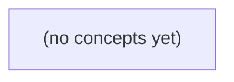

# 08.08 跨服务事务：从消息事实到2PC、Saga与故障恢复

*一本面向Go初学者的静态教材，以用户u-a向会话c-a发送m-9/seq9、通知失败为贯穿案例，建立“消息事实已提交”与“通知、搜索、设备送达可恢复”的正确边界。教材比较本地事务、Outbox、两阶段提交与Saga，并通过22道带反馈练习训练故障推演与方案选择。*

**章节:** 2

---

## 本书导览

- 了解整本书的章节脉络
- 掌握各章之间的概念依赖关系
- 选择最合适的阅读顺序

# 08.08 跨服务事务：从消息事实到2PC、Saga与故障恢复

一本面向Go初学者的静态教材，以用户u-a向会话c-a发送m-9/seq9、通知失败为贯穿案例，建立“消息事实已提交”与“通知、搜索、设备送达可恢复”的正确边界。教材比较本地事务、Outbox、两阶段提交与Saga，并通过22道带反馈练习训练故障推演与方案选择。

下方的概念图展示了本书 0 个核心概念以及它们之间的依赖关系；再下方是 1 个章节的入口。你可以按从上到下的顺序阅读，也可以根据自己的兴趣或先验知识选择切入点。

#### 概念图



## 章节索引

- **08.08 跨服务事务：消息已保存，通知失败怎么办** — 面向Go初学者，以虚构IM消息m-9的权威提交与通知失败，比较2PC、Saga、outbox、状态查询和补偿的原子范围与故障责任。

## 08.08 跨服务事务：消息已保存，通知失败怎么办

- 区分本地SQL事务、2PC参与者与外部推送
- 推演prepare、全局决议和协调者故障
- 说明已提交消息是业务不可简单回滚的事实
- 比较Saga局部步骤与补偿/重试
- 用稳定操作ID查询结果未知并对账
- 限制固定OpenIM源码的实际证明范围

消息进入权威存储后，通知失败不是“发送失败”，而是跨服务一致性与责任边界的问题。

### 先划清三类事实边界

### 先划清三类事实边界

以 `u-a` 在会话 `c-a` 发送消息 `m-9`、序号为 `seq=9` 为例，系统必须避免把“接口成功”“消息已保存”“对方被提醒”混成同一个事实。它们分别属于不同边界，失败语义也不同。

1. **内存接受：`accepted_in_memory`**

   服务进程已完成基础校验，例如发送者属于 `c-a`、`seq=9` 合法、消息格式正确，并暂时把 `m-9` 放入内存队列或处理流程。此时只能说明“当前实例愿意处理它”。

   内存接受不具备崩溃恢复能力：进程重启、机器故障或请求尚未落盘时，`m-9` 可能消失。因此，S2 的成功语义若只是 `accepted_in_memory`，不能承诺历史可查询，更不能暗示 `u-b` 已收到。

2. **本地持久化：`stored_in_teaching_db`**

   在未来教学 S3 中，应将 `m-9` 写入本地权威库的 `messages`，并在同一事务写入 `outbox` 事件 `E9`。事务提交后，系统获得一个可恢复事实：

   - `m-9` 属于 `c-a` 的消息历史；
   - 搜索、补拉历史、新设备同步都应能发现它；
   - 即使通知服务不可用，消息仍不可被悄悄删除或回滚；
   - `E9` 成为后续可靠投递通知的待办记录。

   这才是可以对 `u-a` 作出“消息已保存”承诺的边界。

3. **外部通知：`Notify(E9)` 已投递或已确认**

   通知是对外部服务的副作用：可能超时、重复、延迟，也可能 `u-b` 离线。通知成功最多说明某个提醒渠道已接受或确认处理，并不等于 `u-b` 的设备已收到消息，更不等于其已阅读。

因此，正确顺序是先原子提交 `messages + outbox(E9)`，再异步重试 `Notify(E9)`。通知失败应留下可追赶的 `E9`，而非删除已成为权威历史的 `m-9`。消息存储、设备接收与阅读状态必须分别建模。

### 通知失败为何不能删除消息

### 通知失败为何不能删除消息

设 `u-a` 在 `c-a` 发送 `m-9`，其序号为 `seq=9`。在 S3 中，一次本地数据库事务已原子提交：

- `messages`：保存 `m-9` 的正文、会话、发送者与序号；
- `outbox`：写入事件 `E9`，表示“应尝试通知相关设备或通知服务”。

随后调用 Notify 失败，可能因为 `u-b` 离线、通知服务超时、网络中断，或服务端其实已收到请求但响应丢失。此时失败的只是“本次通知尝试”，不是“消息写入失败”。

若因为 Notify 失败而删除 `messages.m-9`，会产生更严重的不一致：

1. **历史不可恢复**：`u-b` 之后上线、换设备或执行历史同步时，权威库已不存在 `seq=9`；会话出现永久缺口。
2. **搜索结果失真**：消息曾被接受却被通知链路回滚，搜索、审计、导出和未读计数可能各自留下不同结果。
3. **重试失去依据**：`outbox E9` 的职责是可靠地驱动后续投递。删除消息会让重试任务不知道应通知什么，也难以判断事件是否已处理。
4. **读状态被错误耦合**：送达、展示、已读应由设备回执独立推进；`u-b` 未被唤醒不等于消息不存在，更不等于已读状态应回退。

因此，提交后的状态应是：`m-9` 已处于 `stored_in_teaching_db`，`E9` 仍待投递或待重试；Notify 成功只改变通知记录或投递进度，不改变消息的权威存在性。S2 的 `accepted_in_memory` 尚不能提供这种保证，而 S3 的关键承诺正是：通知可以追赶，历史不能悄悄丢失。

### 2PC能保证什么，不能保证什么

### 2PC能保证什么，不能保证什么

两阶段提交（2PC）把多个**愿意参与同一提交协议的资源**纳入原子范围：

1. **准备阶段**：协调者询问参与者能否提交。消息库可写入 `messages(m-9)` 与 `outbox(E9)` 并锁定相关资源，回答“已准备”。
2. **全局决议阶段**：若所有参与者都准备成功，协调者记录“提交”并通知各方；任一方拒绝或超时，则决议回滚。

因此，若消息数据库、搜索索引库都是支持 2PC 的参与者，协议可以保证它们最终遵循同一个提交决议：不会出现一方按“提交”、另一方按“回滚”的合法终态。它比单个 SQL 本地事务的原子范围更大，但代价是锁持有、协调开销和故障恢复复杂度上升。

但 2PC 不等于“用户一定收到通知”。外部推送通常不是可预提交的事务参与者：推送平台无法先锁定 u-b 的设备、承诺稍后一定投递，再与数据库共同提交。即使它返回成功，也通常只表示请求已被受理，不能证明设备展示、用户阅读，甚至不能排除网络重试造成的重复请求。

协调者故障还会暴露 2PC 的阻塞性：参与者已 `prepare`，却不知道全局决议时，可能必须保留锁并等待协调者恢复。即使协调者可靠地恢复了“提交”记录，也只能驱动数据库参与者完成提交，不能把已经超时、离线或结果未知的推送变成原子动作。

所以 S3 应把权威边界定为本地事务：

`messages(m-9) + outbox(E9)` 一起提交。

提交后，`m-9` 已是可恢复、可搜索的权威消息；通知工作者可依据 `E9` 重试、延迟投递或补偿追赶。Notify 失败只意味着通知状态未知或待重试，绝不能反向删除已提交的消息。设备“收到”和“已读”则应作为独立事件记录，而非冒充 2PC 的提交结果。

### Saga、Outbox与状态查询的分工

### Saga、Outbox与状态查询的分工

以 `u-a` 在 `c-a` 发送 `m-9`、序号为 `seq=9` 为例，必须先区分三件事：**消息是否已成为权威事实**、**通知是否已投递**、**客户端是否已观察到结果**。它们不能由一次“发送成功/失败”笼统覆盖。

- **Saga：协调局部步骤，不撤销已承诺的事实。**  
  Saga 将链路拆为“写入消息”“更新会话索引”“生成待通知任务”“投递通知”等局部事务。若消息与 Outbox 事件已在 S3 本地数据库同一事务中提交，状态应为 `stored_in_teaching_db`；随后 Notify 失败，只能对通知步骤做重试、延期或记录失败，不能以“补偿”为名删除 `m-9`。删除权威消息会造成历史丢失，并使搜索、离线同步与多设备读取出现不可恢复的不一致。Saga 的补偿适用于尚未完成或可逆的附属动作，例如撤销一条尚未生效的临时预约，而非抹去已提交聊天记录。

- **Outbox：把“已保存”可靠地交给异步投递者。**  
  `messages` 与 `outbox` 中的 `E9` 应原子提交：前者保存 `m-9`，后者声明“需要通知 `u-b`”。后台投递者反复领取 `E9` 并调用 Notify；超时、网络错误或 `u-b` 离线都只意味着通知尚未完成。投递必须允许至少一次，因此 Notify 消费端应按稳定事件标识去重。通知最终可由推送、在线长连、未读计数刷新或用户重新连接后的追赶完成。

- **状态查询：解决调用方不知道结果的歧义。**  
  `u-a` 的请求应携带稳定操作 ID，例如 `op-9`。若 S2 仅返回 `accepted_in_memory`，它只表示进程暂时接收，不能承诺消息可恢复；进入 S3 后，客户端可查询 `op-9` 得到“已存储、通知待重试”或“通知已完成”。这样，发送端重试不会重复写入，接收端的送达、展示、已读也能独立演进。

因此，Saga 管步骤边界，Outbox 管可靠追赶，状态查询管不确定结果；三者共同保证 Notify 失败不会被误判为消息失败。

### 让离线追赶与在线通知可恢复

### 让离线追赶与在线通知可恢复

`E9` 已将 `m-9` 及对应 `outbox` 记录提交到教学数据库后，系统的权威事实已是“消息属于会话历史”。即使 `Notify` 调用失败，也只能表示“实时提醒尚未完成”，不能回滚或删除 `m-9`。

可将后续处理拆为三条彼此独立、可恢复的路径：

- **通知重试路径**：后台投递器扫描未完成的 `outbox` 事件，按事件标识幂等调用 `Notify`。失败记录重试次数、下次尝试时间和错误原因；采用退避重试，超过阈值转入待人工或定时对账的状态。通知服务也应以 `(事件标识, 设备标识)` 去重，避免重复推送形成重复提醒。
- **在线设备追赶路径**：`u-b` 的设备建立连接、恢复前台或确认游标落后时，向消息服务查询“游标之后的消息”。它不应依赖某次推送是否成功；推送只是降低延迟，消息查询才是补齐依据。
- **离线历史同步路径**：`u-b` 离线期间，客户端保存最后已同步序号，例如 `seq=8`。重新上线后请求 `seq>8` 的会话消息，即可取得 `m-9 seq=9`。搜索索引、未读计数和通知摘要也可由 `outbox` 消费并最终追赶，而非要求同一事务内全部成功。

对账任务应周期性比较：已保存消息是否已有对应 `outbox` 事件、事件是否已投递、设备游标是否长期滞后。若发现缺口，应补建事件或触发重放查询。这样，`accepted_in_memory` 仍只是当前阶段的临时成功；未来 `stored_in_teaching_db` 才能成为可审计的持久确认，而通知失败不会损害消息历史与收/读状态的独立性。

> **要点** — 权威消息一旦提交就应保留；通知以Outbox重试、操作ID查询和对账恢复，而非回滚消息。

以消息 m-9 为例，先划清两个数据库事务与外部通知的边界，再分析通知失败后哪些事实可恢复、哪些只能补偿。

### 先划定三类原子范围

### 先划定三类原子范围

以消息 `m-9` 为例，首先不要把“发送消息”“记录投递”“用户收到通知”误认为同一个原子操作。它们跨越了三类边界：

- **MessagesDB 的本地事务**：可原子写入消息正文、状态与 outbox 发布意图。例如同时提交“`m-9` 已保存”和“待发布 `MessageCreated` 事件”；要么都成功，要么都回滚。
- **DeliveryLedgerDB 的本地事务**：可原子写入某个渠道的投递账本，如 `m-9 + user-7 + push` 的待投递记录、尝试次数和幂等键。它能保证账本内部一致，却不能与 MessagesDB 自动形成一个事务。
- **broker 与 gateway 的外部效果**：broker 接收事件、gateway 接受推送请求、终端实际展示通知，都不属于任一数据库事务。即使接口返回成功，也通常只能说明“已接收”或“已进入处理流程”，不等于用户必然看见。

因此，`MessagesDB` 与 `DeliveryLedgerDB` 若没有分布式事务协调器，就只能各自提交：

$$
T_M \neq T_D,\qquad T_M \land T_D \not\Rightarrow \text{通知已送达}
$$

outbox 解决的是同库内“业务事实 + 发布意图”的原子性：消息保存后，relay 可以持续重试发布。它并未把 broker、消费者、ledger 写入或 gateway 调用纳入同一提交范围；这些环节仍必须依靠至少一次投递、幂等消费、可查询账本和补偿重试恢复。

### 两种写入顺序的故障空窗

### 两种写入顺序的故障空窗

设消息 `m-9` 需要同时完成两件事：写入 `MessagesDB`，并经由 `broker/gateway` 向用户发送通知。它们不处于同一个原子事务中，因此无论调整顺序，都会留下故障空窗。

**顺序一：先提交数据库，再发送通知。**

1. `MessagesDB` 事务提交：`m-9` 已成为系统事实；
2. 调用 `broker/gateway` 发送通知；
3. 若进程崩溃、网络超时或网关拒绝，通知可能未送达。

此时风险是**漏通知**：消息真实存在，但用户没有看到提醒。好处是事实不会凭空消失；系统可扫描“已保存但未投递”的记录，重试发送或由用户后续查询补回。难点在于超时并不等于未送达：网关可能已经接受请求，因此重试必须带稳定的投递键，例如 `messageId=m-9`，使下游幂等。

**顺序二：先发送通知，再提交数据库。**

1. 调用 `broker/gateway`；
2. 用户可能已经收到“你有新消息”的提示；
3. 随后 `MessagesDB` 事务失败、回滚或服务崩溃。

此时风险是**孤儿提示**：通知指向一条最终不存在的消息。用户点击后看到空白、404，甚至误以为内容被撤回。数据库可以回滚，但已经产生的外部效果无法自动撤销；即使再发一条“忽略上一通知”，也只是补偿，不是原子回滚。

因此，通常优先选择“先落库、后通知”：它把不可逆的外部效果建立在已确认事实之上，并将问题转化为可检测、可重试的漏通知，而不是难以解释的虚假通知。

### 两个数据库参与者如何提交

### 两个数据库参与者如何提交

以消息 `m-9` 为例，设 `MessagesDB` 保存消息事实，`DeliveryLedgerDB` 保存投递台账。若要求“消息存在”与“存在待投递记录”同时成立，可将二者纳入一次两阶段提交：

1. 协调者要求两个参与者执行本地事务：`MessagesDB` 写入 `m-9`，`DeliveryLedgerDB` 写入 `m-9` 的待投递台账。
2. 两者完成校验、写入预提交日志并锁定相关资源后，返回 `prepare` 成功。此时数据尚未对外成为最终提交结果，但参与者已承诺：只要收到决议，就能完成提交或回滚。
3. 协调者仅在全部参与者都已准备成功时记录全局“提交”决议，再分别发送提交命令；任一参与者准备失败或超时，则记录“回滚”决议。
4. 各参与者提交本地事务，并回传确认。确认丢失不等于提交失败；协调者可重发提交命令，参与者必须把重复提交处理为幂等操作。

协调者在写入全局提交决议前崩溃时，参与者只能处于“已准备、结果未知”状态，通常不能自行猜测提交还是回滚，否则可能破坏原子性。它们需要等待协调者恢复、查询持久化决议，或由具备决议日志的备协调者接管。

即使两个数据库已原子提交，`broker` 发布或 `gateway` 通知仍在该原子范围之外。台账能够证明“应投递”，却不能证明外部效果已经发生；后续仍须由中继持续重试，并以 `m-9` 作为幂等键处理重复发布和重复通知。

### 已提交消息不能随意回滚

### 已提交消息不能随意回滚

以消息 `m-9` 为例：`MessagesDB` 中“消息已保存”一旦提交，就意味着它已成为权威业务事实——用户确实发送了这条消息，后续审计、会话读取、搜索索引或其他服务都可能基于该事实继续工作。此时 `gateway` 推送失败，并不改变消息已经存在这一事实。

因此，不应把“通知失败”等同于“发送失败”，更不应为了让界面看起来一致而删除 `m-9`。删除会制造更危险的不一致：部分消费者可能已读到消息，`broker` 可能已接受投递，或用户稍后通过历史记录看到过它；此时回滚数据库只会产生“通知过但查不到”“已被处理却失去原始记录”的孤儿效果。

更合理的原子边界是：

- `MessagesDB` 事务：保存消息事实，并写入待投递意图或初始投递记录；
- `DeliveryLedgerDB` 事务：记录某渠道、某接收者的投递状态，例如`待投递`、`重试中`、`已送达`、`最终失败`；
- `broker`、`gateway`：属于外部效果，只能通过至少一次投递、幂等键和可观测状态来收敛。

通知失败后，优先执行以下策略：

1. 按退避规则重试，并以`m-9 + 接收者 + 渠道`作为幂等键，避免重复提醒。
2. 持久化失败次数、错误码和下次重试时间，使故障可恢复而非依赖内存。
3. 客户端以消息列表或状态查询为准；即使推送漏失，重新进入会话仍可拉取`m-9`。
4. 超过重试上限时标记为最终失败，触发站内信、人工处理或其他补偿渠道。

`outbox` 能保证同一数据库内“消息事实 + 发布意图”原子提交，但不能让 `relay`、消费者或 `gateway` 自动成功；这些边界之外仍必须依靠重试、幂等与补偿，而不是撤销已经成立的业务事实。

### Outbox 缩小而非消除问题

### Outbox 缩小而非消除问题

对消息 `m-9` 而言，Outbox 解决的是**一个数据库内**的原子性：在 `MessagesDB` 事务中同时写入消息事实与待发布记录。

- `messages(id=m-9, status=已保存, ...)`
- `outbox(operation_id=op-901, event=MessageSaved, state=待投递)`

事务提交后，要么两行都存在，要么两行都不存在。因此不会出现“消息已经保存，但进程在写入发布意图前崩溃”的空窗。这是 Outbox 的价值：把“事实已发生”和“需要通知外部”的意图绑定为同一事务结果。

但 Outbox 不能把 `relay → broker → consumer → gateway` 纳入 `MessagesDB` 事务。`relay` 可能已将 `op-901` 发布到 broker，却在把 Outbox 标记为“已投递”前崩溃；重启后它只能再次发布。broker、消费者和 gateway 因而必须接受**至少一次投递**，而不是假设“恰好一次”。

关键做法是让同一业务动作携带稳定操作 ID：

1. `relay` 按 `operation_id=op-901` 重试发布；
2. `DeliveryLedgerDB` 以该 ID 建立唯一记录，重复消费只返回既有结果；
3. 调用 gateway 时传入同一幂等键，使重复请求不重复发送通知；
4. 对账任务比较 Outbox、broker 消费记录、投递台账与 gateway 回执，找出长期停留的操作并补偿。

因此，Outbox 消除的是**同库事实与发布意图的不一致**；跨库状态和外部通知的最终一致性，仍依赖幂等、重试、监控与对账。

> **要点** — 数据库可协调原子提交，外部通知不可纳入同一原子范围；以稳定操作ID、幂等重试和对账处理失败。

2PC能让两个数据库对同一全局决议达成一致，但它不能把普通推送服务自动纳入原子提交范围。

### 先划定2PC的参与边界

### 先划定2PC的参与边界

2PC首先要回答的不是“通知能否送达”，而是“哪些资源管理器能够对同一事务执行准备、提交和回滚”。

在本例中，边界应明确为：

- **协调者 C**：创建全局事务标识，向参与者发起 `prepare`，收集 `YES/NO` 投票；将最终 `commit` 或 `abort` 决议持久化后，再发送 `COMMIT PREPARED` 或 `ROLLBACK PREPARED`。
- **MessagesDB**：保存消息正文、业务状态等。它是参与者，必须能在本地事务中执行“准备”，并在收到最终决议前保留可提交或可回滚的状态。
- **DeliveryLedgerDB**：保存“某消息需要向哪个用户、哪个通道投递”的投递账本、待发送记录或幂等键。它同样是参与者。
- **通知通道**：broker、WebSocket 网关、邮件服务、短信服务等通常只是外部副作用执行者，不是本次2PC参与者。

流程上，C先要求两个数据库进入 prepared 状态：

1. 任一参与者投票 `NO`，C持久化全局 `abort`，随后要求已准备的参与者回滚。
2. 两者都投票 `YES`，C必须先持久化全局 `commit` 决议，再通知两个数据库提交。

关键区别在于：数据库能锁定并保留“尚未决定”的本地事务；普通通知通道通常不能执行 `prepare/vote/COMMIT PREPARED`。即使 PostgreSQL 提供 `PREPARE TRANSACTION`，也不意味着连接在其后的 broker 或 WebSocket 自动成为2PC参与者。它们只能在数据库提交后，由投递账本驱动进行可重试、可幂等的异步通知。

### 从准备投票到全局决议

### 从准备投票到全局决议

设协调者为 `C`，两个参与者分别是 `MessagesDB` 与 `DeliveryLedgerDB`。2PC 的核心不是“同时执行两次提交”，而是先让所有参与者进入可提交但尚未提交的 `prepared` 状态，再由 `C` 发布唯一的全局决议。

正常路径可推演为：

1. **开始全局事务**  
   `C` 为本次操作分配全局事务标识 `gid`。`MessagesDB` 写入消息记录，`DeliveryLedgerDB` 写入对应的投递账本或待通知记录；此时二者都只是在各自本地事务中执行，尚未对外永久提交。

2. **第一阶段：准备与投票**  
   `C` 依次要求参与者准备：
   ```text
   MessagesDB:       PREPARE TRANSACTION gid
   DeliveryLedgerDB: PREPARE TRANSACTION gid
   ```
   能够保证本地修改可恢复、约束已检查完毕、必要锁仍被持有的参与者返回 `YES`；例如 PostgreSQL 会将事务转换为 prepared transaction。若磁盘、约束、连接或本地执行失败，则返回 `NO`。

3. **形成并持久化全局决议**  
   只有收到两个 `YES`，`C` 才能决定 `commit`；只要任一方 `NO`、超时或明确无法准备，决议就必须是 `abort`。关键顺序是：`C` 必须先把 `gid → commit` 或 `gid → abort` 持久化到自己的恢复日志，随后才发送第二阶段命令。  
   因而：
   $$\text{commit} \iff vote_M=YES \land vote_L=YES$$

4. **第二阶段：执行决议**  
   对于已持久化的提交决议，`C` 向两个参与者发送：
   ```text
   COMMIT PREPARED gid
   ```
   两者据此释放锁并使本地修改正式可见。若决议为中止，则发送：
   ```text
   ROLLBACK PREPARED gid
   ```
   参与者应让这些命令具备幂等处理能力：重试同一决议不应产生第二次业务效果。

因此，`YES` 不是“我已经提交”，而是“我已承诺：只要收到恢复出的全局决议，就按该决议完成”。全局一致性来自这个不可任意撤销的承诺，以及协调者先落盘、后广播的决议记录。

### 一个NO为何必须全局中止

### 一个NO为何必须全局中止

设协调者 C 要同时完成两件事：在 `MessagesDB` 保存消息，并在 `DeliveryLedgerDB` 创建“待投递”记录。它先向两者发送准备请求：

1. `MessagesDB` 校验消息、配额和唯一键后执行 `PREPARE TRANSACTION`，返回 **YES**；此时它已保证：只要收到提交命令，就能提交，但相关锁仍被保留。
2. `DeliveryLedgerDB` 发现同一 `message_id` 已有冲突记录，或其本地约束无法满足，返回 **NO**。

此时 C **只能**持久化全局 `abort` 决议，再向已准备的 `MessagesDB` 发送 `ROLLBACK PREPARED`。不能因为消息已经准备成功，就单独让它提交：

- 若 `MessagesDB` 提交而投递账本未创建，系统会出现“消息存在，但没有可追踪投递任务”的断裂状态。
- 若 C 忽略 `DeliveryLedgerDB` 的拒绝而继续提交，等同于要求参与者违反自己刚刚报告的本地一致性约束。
- 参与者的 **YES** 不是“我建议提交”，而是“我已进入可提交、也可按协调者命令回滚的状态”；全局提交必须以**全部 YES**为前提。

因此，2PC 的规则可概括为：

$$
\exists i,\ vote_i=NO \quad\Rightarrow\quad decision=ABORT
$$

`MessagesDB` 即使已进入 prepared 状态，也不能自行猜测“另一个库大概没问题”而提交；它只能等待 C 传播已持久化的 `abort` 决议并释放锁。

### 两票YES后崩溃的阻塞困境

### 两票YES后崩溃的阻塞困境

设协调者 C 已向 `MessagesDB` 和 `DeliveryLedgerDB` 发出 `PREPARE`，两者都完成本地预提交并投票 `YES`：

1. 每个参与者将事务状态持久化为 `prepared`；
2. 相关行锁、索引锁等仍被持有；
3. 数据尚未对普通事务正式提交，但参与者已承诺：只要收到全局决议，就能执行对应的 `COMMIT PREPARED` 或 `ROLLBACK PREPARED`。

此时若 C 在**持久化全局决议之前**崩溃，问题不在于参与者“不知道该怎么做”，而在于它们不能安全地自行决定。

- `MessagesDB` 若猜测提交，消息可能变为已保存；
- `DeliveryLedgerDB` 若猜测回滚，通知投递记录可能消失；
- 最终形成“消息存在、投递账本不存在”的半提交状态，违背全局原子性。

反过来，若某参与者自行回滚，而协调者其实已经在别处成功记录了 `commit` 决议，或已向另一个参与者发送了提交命令，也会造成同样严重的不一致。因此，`YES` 并不意味着“现在可以自行提交”；它只意味着“我已准备好服从未来唯一的全局决定”。

这种状态称为 **in-doubt**：参与者知道全局事务尚未完成，却无法证明应提交还是回滚。正确动作只能是保留 `prepared` 状态、继续持锁，并等待：

- 协调者恢复后读取其稳定日志；
- 备用协调者或事务管理器找到已持久化的全局决议；
- 管理员依据可靠的协调记录进行人工恢复。

这正是经典 2PC 的阻塞性：当协调者失效且决议不可恢复时，参与者宁可阻塞，也不能各自“猜一个合理结果”。

### PostgreSQL预备事务不等于通知原子化

### PostgreSQL预备事务不等于通知原子化

`PREPARE TRANSACTION` 能把 PostgreSQL 事务停在“已执行、未最终决定”的状态：数据库已写入预备记录并保留相关锁，随后只能由外部协调者执行 `COMMIT PREPARED` 或 `ROLLBACK PREPARED`。因此，MessagesDB 与 DeliveryLedgerDB 若都实现这一协议，才可以作为 2PC 参与者：

1. 协调者请求两库 prepare；
2. 两者均投票 `YES` 后，协调者持久化全局 `commit` 决议；
3. 协调者向两库发送 `COMMIT PREPARED`。

任一方投 `NO`，全局只能 `abort`。若两方已 `YES` 而协调者崩溃、且决议未能恢复，参与者处于 *in-doubt*：必须保留预备事务并等待协调者恢复，不能自行猜测提交或回滚，否则两个库可能产生相反结果。

但普通消息 broker 或 WebSocket 推送通常不具备这种能力。它们可能支持“消息已接收”“至少一次投递”或客户端确认，却通常不能：

- 持久化 2PC 的 prepare 状态与投票；
- 在未知全局决议时冻结可见性；
- 接收并可靠执行 `COMMIT PREPARED` / `ROLLBACK PREPARED`；
- 在重启后按同一全局事务恢复决议。

所以，“数据库已保存消息”与“用户已收到通知”不能仅因存在 `PREPARE TRANSACTION` 而成为原子操作。更现实的边界是：数据库内原子地保存业务变更与待投递记录，再由异步投递器重试通知。

还应避免长期遗留 prepared 事务。它们会持续持锁、阻碍相关行的清理，并可能限制 `vacuum` 回收旧版本；故 PostgreSQL 明确将其定位为外部事务管理器使用的机制，而非日常通知可靠性的默认方案。

> **要点** — 2PC只约束正式参与者；决议未恢复前，已准备的数据库必须等待，不能自行猜测提交或回滚。

Saga不追求把所有外部副作用锁进一次提交，而是将发送消息拆成可记录、可重试、可补偿的局部步骤。

### 从发送意图到事实枢纽

### 从发送意图到事实枢纽

以 `send:m-9:v1` 为例，Saga 的第一步不是立刻通知所有下游，而是先处理**可中止的发送意图**：

1. 校验发送者身份、会话成员关系、禁言状态、内容规则与幂等键；
2. 若权限不足、内容违规或请求重复且无有效重放结果，则直接 `abort`；
3. 此时消息尚未写入业务库，也没有可靠的外部可见副作用，取消就是取消。

通过验证后，服务在本地事务中写入消息 `m-9`、会话序号、审计记录，以及待发布的 outbox 事件；随后执行数据库提交。这个提交是事实枢纽（pivot）：从这一刻起，“消息已发送”成为系统必须承认和传播的事实。

后续的 `SearchIndex` 建索引、`Notify` 推送通知、消息总线发布，都可能失败，但失败不意味着可以把 `m-9` 物理删除并宣称回滚。原因是下游可能已经看到消息：搜索已收录、另一服务已消费事件，甚至用户已收到推送。此时删除只会制造“事实存在过但记录被抹去”的不一致。

因此，提交后的工作应以持久状态追踪，例如 `已提交 → 待发布 → 已索引/待重试 → 已通知/待修复`。通知失败则重试通知；若已经发出错误内容或需要撤销，应追加“撤回”或“更正”动作，并保留审计链，而不是伪造一次跨服务回滚。

### 提交后任务的独立重试

### 提交后任务的独立重试

以 `send:m-9:v1` 为例：权限校验通过后，消息记录与 `outbox` 事件在同一数据库事务中提交。此时“消息已发送”成为事实 pivot；后续的发布事件、建立搜索索引、推送通知都不能再依赖一次同步调用完成。

将每项后置工作建模为可持久化任务，而非一个笼统的“发送后处理”：

| 任务 | 目标 | 状态示例 |
|---|---|---|
| `PublishOutbox` | 向消息总线发布 `MessageSent` | 待执行、处理中、已完成、失败 |
| `BuildSearchIndex` | 写入或更新 `m-9` 的搜索文档 | 待执行、已完成、待修复 |
| `Notify` | 向收件人设备发送推送 | 待执行、重试中、已送达、终止 |

每条任务至少保存：

- 业务幂等键，如 `m-9:v1:notify`；
- 当前状态、已重试次数、最近错误码与错误摘要；
- `next_retry_at`，避免失败后立即紧密循环；
- 创建、开始、成功与最终失败时间；
- 下游请求标识，便于排查“服务端超时但下游实际已处理”的歧义。

重试策略应按任务独立配置。例如 `PublishOutbox` 通常高优先级、短间隔重试；搜索索引失败可延迟修复，因为不影响消息事实；推送失败则采用指数退避，如 $1,2,4,8$ 分钟，并设置最大次数或截止时间。

关键是：`Notify` 失败不应删除已提交的 `m-9`。删除既不能撤回已经被搜索到的内容，也不能撤销可能已到达设备的推送。任务最终失败时，应保留可追踪状态并告警；必要时由人工或自动流程发起新的“撤回”或“更正”动作，作为新的可审计业务事件，而不是伪造数据库回滚。

### 通知失败为何不是回滚

### 通知失败为何不是回滚

以 `send:m-9:v1` 为例，先完成权限验证、内容校验等可拒绝步骤。若此时发现发送者无权操作、附件不合法或本地写入失败，消息尚未成为系统事实，可以直接 `abort`：不创建消息记录，也不安排索引和通知。

但数据库提交后，性质已经改变。`DB Commit` 是事实的 pivot：`m-9` 已存在于权威消息库，后续 `Outbox` 发布、`SearchIndex` 建索引、`Notify` 推送都应围绕这一事实重试或修复。此时 `Notify` 超时、供应商返回错误、设备离线，只表示“通知送达状态未知或失败”，不表示“消息从未发送”。

| 场景 | 正确处理 | 不应做什么 |
|---|---|---|
| 提交前权限失败 | 中止发送，返回失败 | 写入半成品消息 |
| 提交后通知失败 | 记录失败原因，按幂等键重试或转人工修复 | 删除 `m-9` 伪装回滚 |
| 已建立索引或 B 已拉取消息 | 保留消息事实，修复通知状态 | 假设删除数据库行能抹去外部可见性 |
| 推送已发出 | 接受不可撤销副作用，必要时发送更正/撤回事件 | 声称原推送“没有发生” |

物理删除 `m-9` 不能收回搜索索引、缓存副本、已投递推送，更不能抹除 B 已看到内容这一事实；反而会造成“用户看过消息，但系统查无记录”的审计断裂。

因此，Saga 的补偿不是倒带。若业务确需撤回，应创建新的、可审计的“撤回”或“更正”动作，并让索引、通知和客户端据此收敛。通知失败则持续追踪其状态：待发送、重试中、已送达、最终失败；编排式 Saga 可由协调器统一推进，事件编舞则由各订阅者消费事件并报告结果，但都必须让步骤状态可查询、可重放。

### 补偿动作与审计边界

### 补偿动作与审计边界

对 `send:m-9:v1` 而言，数据库提交是事实锚点：消息 `m-9` 已持久化后，即使 `Notify` 失败，也不能把消息记录物理删除并称为“回滚”。原因是外部世界可能已经观察到副作用：搜索索引已收录、部分用户已收到推送、接收方 B 已打开会话。此时删除只会制造“库中不存在、外部已发生”的审计断裂。

应区分两类处理：

- **尚未发生的步骤**：例如提交前权限校验失败，或提交后尚未发布通知。可标记 Saga 中止，停止后续投递；对未完成任务按幂等键重试。
- **已经可见的副作用**：不能假设可逆。应创建新的业务动作，如 `recall:m-9:v1`（撤回）、`correct:m-9:v2`（更正）或“关闭通知/补发说明”，由其自身驱动索引更新、通知补发和状态同步。

每次动作都使用稳定操作 ID，例如 `operation_id=send:m-9:v1`，补偿动作引用原操作：`parent_operation_id=send:m-9:v1`。审计记录至少保存：请求者、权限判定、状态迁移、各步骤尝试次数、外部投递 ID、失败原因与时间戳。查询接口应按操作 ID 返回“消息已提交、索引待修复、通知第 3 次重试中”等可解释状态。

自动重试超过阈值后进入人工对账队列。人工处理也必须写入同一审计链，而非直接改库；这样才能回答：何时发送、谁看见、通知是否送达、撤回是否真正生效。

### 编排与事件编舞的可追踪性

### 编排与事件编舞的可追踪性

**中心编排**由一个 Saga 编排器保存 `send:m-9:v1` 的状态机，并显式下达步骤：权限验证 → 写入消息与 Outbox → 发布 → 建索引 → 通知。每一步都有明确的执行者、超时、重试次数和补偿策略。例如，数据库提交是事实 `pivot`：提交前权限失败可直接 `abort`；提交后 `Notify` 失败只能重试、改走降级通道或创建后续“撤回/更正”动作，不能删除 `m-9` 假装回滚。

**事件编舞**则由服务订阅领域事件推进流程：消息服务发布 `MessageCommitted`，搜索服务建立索引并发出 `SearchIndexed`，通知服务消费事件并记录 `NotificationSent` 或 `NotificationFailed`。它降低了中心协调者的耦合，但失败路径更容易分散：谁负责检测某事件长期未被消费？谁负责触发重投、死信处理或人工修复？这些责任必须预先约定，不能仅靠“最终会收到事件”。

两种模式都应对外暴露统一的 Saga 视图，例如：

- 当前状态：`Committed / Publishing / Indexed / NotifyRetrying / Completed / RepairRequired`
- 每个局部步骤的输入版本、幂等键、尝试次数、最后错误与负责人；
- 可关联的消息、Outbox 记录、投递回执和审计事件；
- 不可逆副作用标记：若 B 已见消息或推送已送达，只能追加撤回或更正记录。

因此，编排器提供的是**集中决策与责任边界**；编舞提供的是**事件驱动的自治协作**。无论选哪一种，Saga 都不能只是日志中的一串事件，而必须是可查询、可告警、可恢复的业务事实。

> **要点** — Saga以提交后的可追踪重试和业务补偿处理失败；已提交消息及已发生外部副作用不能靠删除记录回滚。

当发送消息请求超时时，客户端不能据此断言失败：m-9可能已提交、事件可能已落库，但通知仍未完成。

### 用稳定操作身份界定一次发送

### 用稳定操作身份界定一次发送

一次“发送”不能由某次 HTTP 请求、某个连接或某段正文来界定，而应由稳定的 `operation_id` 界定。例如：

`operation_id = send:m-9:v1`

其中 `m-9` 是消息身份，`v1` 是该消息版本。客户端因超时重试时，必须携带同一 `operation_id`；服务端据此把重试识别为**同一次操作的继续观察或补偿**，而不是再次创建消息、再次写入 outbox、再次触发通知。

需要明确区分两类请求：

- **同一次操作重试**：仍是 `send:m-9:v1`。即使原请求已完成数据库提交、已保存事件，客户端也只是在确认结果。
- **新的业务发送**：必须生成新的消息或版本，从而使用新的操作身份；不能因为正文恰好相同就复用旧操作。

因此，`operation_id` 应贯穿 `messages`、`outbox` 与工作流审计记录，并保存操作状态、责任方、最后错误和下一动作。例如状态可经历：

`PENDING → COMMITTED → PUBLISH_PENDING → NOTIFY_ATTEMPTED → FAILED_REPAIR`

这些状态只说明系统内部推进到哪里；`NOTIFY_ATTEMPTED` 更不等于接收者 B 已收到。是否送达、是否已读，应由独立的接收确认事实表示。

若请求超时，客户端不能依据超时判断失败，也不应换一个身份盲目重发。权威判断应查询 `messages`、`outbox` 和工作流状态：消息是否已提交、事件是否待发布、通知是否需要修复。未来可设计按 `operation_id` 查询状态的接口，但不改变既有 S2 语义：同一消息 ID 即使正文相同仍返回 `409`，非成员返回 `404`，正文上限仍为 6 个 UTF-8 字节。

### 超时后的真实状态并非二选一

### 超时后的真实状态并非二选一

一次 `operation_id=send:m-9:v1` 的发送请求，可能跨越多个不可由单个 HTTP 响应原子覆盖的阶段：

`校验成员资格 → 写入 messages → 写入 outbox → DB 提交 → 发布事件 → 尝试通知 B`

因此，HTTP 超时只说明调用方未在期限内收到响应，并不说明服务端停在何处。超时可能发生在：

- **提交前**：事务回滚或仍在执行；消息未必存在。
- **数据库提交后、响应写回前**：`messages` 与 `outbox` 已持久化，但客户端已断开。
- **事件发布期间**：消息已提交，通知任务可能尚未被消费。
- **通知尝试后**：通知可能已送达、重试中，或因下游故障等待修复。

调用方看到的结果只能是“未知”，不能把超时解释为“失败”，更不能立即改用新操作标识重发。否则同一业务动作可能产生两条消息。S2 中，即使正文完全相同，复用同一 `operation_id` 才能识别为同一次操作；换用新标识仍可能创建新消息，而同一标识的重复请求应返回 `409`。

恢复判断必须查询权威记录：`messages` 证明消息是否已提交，`outbox` 证明后续事件是否已登记，工作流状态则描述 `PENDING`、`COMMITTED`、`PUBLISH_PENDING`、`NOTIFY_ATTEMPTED`、`FAILED_REPAIR` 等阶段，并记录责任方、最后错误与下一动作。尤其要避免把 `NOTIFY_ATTEMPTED` 写成“B 已收到”：它仅表示曾尝试通知，不构成对方可见或已读的证据。

未来可设计“按操作标识查询状态”的接口，让客户端在超时后查询而非猜测；但这只是后续 API 设计，不改变当前 S2 的既有语义。

### 以权威记录查询操作结果

### 以权威记录查询操作结果

`operation_id=send:m-9:v1` 是一次发送操作的稳定身份，不是“这次 HTTP 请求”的身份。客户端收到超时、连接断开或 `5xx` 时，只能说明**未获得确定响应**；服务端可能已经写入 `messages`，也可能已经写入 `outbox`，甚至已开始通知下游。因此不能仅凭超时重发，更不能把超时解释为“消息未发送”。

查询应以服务端权威记录为准，并联合观察：

- `messages`：是否存在消息 `m-9`，正文、发送者、会话及提交时间是否匹配。
- `outbox`：对应业务事件是否已持久化、是否待发布、已发布或需要重试。
- 工作流状态：当前由谁负责推进、最后一次错误是什么、下一步补偿或重试动作是什么。

可持久记录如下状态链：

`PENDING → COMMITTED → PUBLISH_PENDING → NOTIFY_ATTEMPTED → FAILED_REPAIR`

其中，`PENDING` 表示已受理但尚未形成权威消息；`COMMITTED` 表示消息与必要事务记录已提交；`PUBLISH_PENDING` 表示事件可靠落库但尚待投递；`NOTIFY_ATTEMPTED` 仅表示曾尝试通知；`FAILED_REPAIR` 表示自动推进失败，需由修复任务继续处理。每个状态都应附带责任方、`last_error` 与 `next_action`，例如“outbox 发布器重试”或“人工修复”。

尤其要避免状态语义膨胀：`NOTIFY_ATTEMPTED` 不能冒充“成员 B 已收到”。发送端成功、事件已发布、通知已投递、客户端已展示，是不同事实，应分别记录与查询。

未来可设计“按 `operation_id` 查询操作结果”的接口，返回消息、事件及工作流摘要；但这只是后续能力设计，不改变当前 S2 规则：同一操作标识即使正文相同仍返回 `409`，非成员统一返回 `404`，正文上限仍为 6 个 UTF-8 字节。

### 状态描述责任，不冒充送达

### 状态描述责任，不冒充送达

`operation_id=send:m-9:v1` 是一次发送意图的稳定身份，不是“B 已收到”的证据。HTTP 超时只能说明调用方未取得响应；服务端可能已提交 `messages`、已写入 `outbox`，甚至已执行过通知尝试。应以权威存储和工作流状态判断：

| 状态/证据 | 能证明什么 | 不能证明什么 | 责任方与下一动作 |
|---|---|---|---|
| `COMMITTED`：`messages` 有消息记录 | 消息已权威提交，可被正常读取 | 事件已发布、通知已发送、B 已看到 | 消息服务；检查或创建 outbox 工作项 |
| `PUBLISH_PENDING`：outbox 已落库未发布 | 事件不会因进程崩溃而丢失，仍待投递 | 下游已消费 | 发布器；按退避策略重试发布 |
| `NOTIFY_ATTEMPTED`：已有通知调用记录 | 曾向通知通道发起请求 | 通道成功、B 设备展示、B 已阅读 | 通知服务；记录最后错误并查询回执 |
| `FAILED_REPAIR`：自动重试耗尽或发现不一致 | 当前需要人工或补偿流程处理 | 消息丢失或 B 未收到 | 修复工作流；依据错误执行重放、对账或人工介入 |

每条工作流记录应持久化：当前状态、责任方、`last_error`、尝试次数和 `next_action`。例如“发布器负责，最后错误为 broker 超时，下一动作是 10 分钟后重试”，比笼统的“发送失败”更可操作。

未来可设计状态查询 API：客户端以稳定 `operation_id` 查询消息、outbox 与工作流摘要，而不把超时重试当作事实判断。该设计不改变 S2 语义：同一 `operation_id` 即使正文相同仍返回 `409`，非成员返回 `404`，标识长度限制为 6 个 UTF-8 字节。查询结果也必须明确区分“已提交”“已尝试通知”和“B 已看到”；最后一项只有接收方确认或可靠阅读回执才能证明。

### 设计查询与修复，不改写既有语义

### 设计查询与修复，不改写既有语义

未来可新增“发送操作状态查询”接口，例如按稳定身份 `operation_id=send:m-9:v1` 查询，而不是让客户端依据 HTTP 超时自行重发或猜测结果。该接口只读取权威事实：`messages` 中消息是否已提交、`outbox` 中事件是否已持久化、工作流记录当前阶段及修复责任；它是后续演进方案，不修改既有固定 OpenIM 源码与 S2 请求语义。

返回状态可持久化为：

- `PENDING`：请求已受理，尚未确认消息提交；
- `COMMITTED`：消息已写入权威库；
- `PUBLISH_PENDING`：消息已提交，但待发布事件仍未完成；
- `NOTIFY_ATTEMPTED`：已尝试通知，下游结果尚待确认；
- `FAILED_REPAIR`：自动处理失败，需人工或补偿任务介入。

每条记录还应保存 `owner`（当前责任方）、`last_error`（最后错误）与 `next_action`（下一动作），例如“重投 outbox 事件”“查询通知回执”或“人工对账”。状态必须准确表达本系统已知事实：`NOTIFY_ATTEMPTED` 仅表示尝试发送，绝不能冒充“接收方 B 已收到”。

对账任务以 `operation_id` 扫描：消息存在但 outbox 缺失时补建事件；outbox 未发布时重投；通知失败时按幂等键修复。修复不得重新创建消息，也不得改变原有校验边界：同一消息 ID 即使正文相同仍返回 `409`，非成员仍返回 `404`，内容仍限制为最多 `6` 个 UTF-8 字节。这样，查询与修复增强可观测性，却不偷改既有业务语义。

> **要点** — 超时只意味着结果未知；以稳定操作ID查询权威状态，并把提交、发布、通知与送达责任严格分开。

以消息 m-9 为线索，比较 2PC 与 Saga 在通知失败、结果未知和超期离线时的恢复边界。

### 先划清三类原子边界

### 先划清三类原子边界

以消息 `m-9` 为例，先不要把“消息已保存”“业务已提交”“通知已送达”混成同一个结果；它们属于三种不同的原子边界。

1. **消息库本地 SQL 事务**  
   在同一数据库内，可将业务变更、消息记录、`version`、待投递状态一起提交：  
   `订单状态=v2` 与 `outbox(m-9, v2, pending)` 要么都存在，要么都不存在。  
   此处权威事实是数据库提交记录；崩溃后可扫描 `outbox` 重投。它解决“本地事务后事件丢失”，但不保证通知已经到达消费者。

2. **2PC 参与者提交边界**  
   `prepare` 仅表示参与者已持久化意向并锁定资源，不等于业务最终提交。最终事实取决于协调者持久化的 `commit/rollback` 决议；参与者在未获决议时通常必须阻塞，不能自行猜测。即使参与者回执丢失，只要决议日志仍在，协调者可重发决议；若协调者决议也不可恢复，才进入阻塞恢复难题。

3. **外部推送与可见效果边界**  
   HTTP、短信、邮件、第三方扣款等推送发生在数据库提交之外。发送超时只能说明“结果未知”，不能证明失败；重试可能产生重复效果。因此必须携带稳定的 `messageId`、业务 `version` 与权限/状态校验，由接收方去重并拒绝旧版本：`v1` 的迟到通知不得覆盖 `v2`。

通知失败不应回滚已经提交的消息库事务；它应进入可恢复的投递流程。若消费者离线超过 Broker 的 `24h` 保留期，例如 `25h`，Broker 已不再是恢复源，应从数据库中的 `outbox`、业务事件表或审计记录按 ID/version 重建投递。

### 2PC：决议存在而结果未知

### 2PC：决议存在而结果未知

设事务 `T=m-9` 涉及参与者 A、B。A、B 都已写入 `prepare(T)`：锁仍持有、数据尚未提交；随后协调者在自己的持久化日志中写入全局决议 `commit(T)`，但尚未来得及收到全部确认回执便崩溃。

此时必须区分两类“事实”：

- **参与者本地事实**：A/B 已准备，但不知道最终应 `commit` 还是 `rollback`。
- **全局权威事实**：协调者的决议日志。只要 `commit(T)` 已被可靠持久化，它就是唯一可执行的结果；参与者的回执仅表示“已应用”，不是新的决议来源。

因此，参与者恢复时不能依据“自己没有收到提交命令”擅自回滚，也不能因其他参与者似乎已提交而自行提交。它应以 `T` 查询协调者、协调者副本或可恢复的决议存储：

1. 查到 `commit(T)`：执行本地提交，持久化 `committed(T)`，再重发确认回执。
2. 查到 `rollback(T)`：释放锁并回滚预备状态，持久化 `aborted(T)`。
3. 查不到决议，且协调者不可恢复：保持 `prepared`，继续阻塞。

阻塞的根源正是 2PC 的安全约束：`prepare` 后，参与者已承诺“能够提交”，却没有权限决定“是否提交”。若擅自超时回滚，可能与其他参与者已执行的 `commit` 冲突；若擅自提交，则可能违背尚未落盘的全局中止决定。

“决议已写但回执丢失”通常可恢复且应当幂等：协调者重启后扫描决议日志，向未确认参与者重发 `commit(T)`；参与者按事务 ID 与本地状态去重。`committed(T)` 再收到提交命令只需返回确认，不能再次产生业务效果。真正困难的不是回执丢失，而是权威决议存储本身不可达或丢失；此时 2PC 选择以可用性换一致性。

### Saga：本地提交后的事件责任

### Saga：本地提交后的事件责任

Saga 不承诺跨服务原子提交；每个服务先完成自己的本地事务，再以事件驱动下一步。因此，关键问题不是“通知有没有发出”，而是：**本地状态已提交后，谁对后续事件负责，故障后从哪里恢复事实。**

以订单服务为例，本地事务把订单写为“已支付”，同时应发布 `PaymentSucceeded(orderId, version=2)`。若先提交数据库、后直接发送消息，进程可能在两者之间崩溃：订单已支付，但事件永久丢失。解决方式是事务外盒：

- 在同一数据库事务中同时写入业务状态与 `outbox` 记录；
- 后台发布器扫描未投递外盒，投递成功后标记；
- 发布器可重复发送，因此消息系统通常只提供“至少一次”投递。

重复通知不能靠“尽量不重试”解决，而要让消费者按幂等键处理。例如通知服务以 `(eventId)` 或 `(orderId, version, action)` 建立唯一约束；已处理同一事件时直接返回成功。版本尤其重要：旧的 `v1` 重放到达时，不得覆盖已生效的 `v2` 状态。

外部效果更棘手。调用短信、支付网关或物流接口超时，并不等于对方未执行；此时结果是“未知”。若外部方支持请求幂等键和状态查询，应以 `requestId` 查询权威结果，再决定重试或推进 Saga。若既不能查询也不能幂等，盲目重试可能产生双扣款、双发货，只能进入人工核对或设计补偿动作。

补偿也有前提：它只撤销本服务可逆的业务承诺，不能假设已发送短信、已到账转账一定可撤回。Saga 的恢复源通常是本地业务表、外盒表、消费去重表及外部状态查询结果；消息只是传递载体，不是最终事实。

### 离线超期后的重建与版本对账

### 离线超期后的重建与版本对账

用户 B 离线 25 小时，而 broker 只保留消息 24 小时：此时不能把“队列里没有通知”解释为“没有发生变更”。broker 是投递通道，不是业务事实的权威来源；恢复源应是数据库中的已提交业务状态、操作日志或 outbox 记录。

以稳定操作 ID `op-781` 为键重建通知。发送端先查询数据库，确认该操作是否已提交、当前资源版本为何、B 是否仍具备接收权限；随后生成可幂等的通知：

`{operationId: op-781, resourceId: r-3, version: 2, type: 权限已更新}`

客户端或通知消费者维护“资源当前已应用版本”。处理规则不是“收到就覆盖”，而是比较版本：

- 收到版本 `v > localVersion`：应用变更，并将本地版本推进到 `v`。
- 收到版本 `v = localVersion`：视为重复投递，直接确认，不重复产生副作用。
- 收到版本 `v < localVersion`：判定为迟到旧消息，确认但不得覆盖当前状态。
- 版本不连续或本地状态丢失：不要猜测增量，按 `resourceId` 从权威服务拉取完整快照。

例如 B 在离线期间先错过“角色改为编辑者”`v1`，随后又发生“撤销编辑权限”`v2`。25 小时后重建时，应以数据库当前 `v2` 和当前权限为准；即使旧的 `v1` 因重试、死信回放而姗姗来迟，也只能被识别为过期事件，不能恢复已撤销的权限。

因此，超出保留期通常**不阻塞业务提交**，但要求恢复任务可扫描未确认操作、按 ID 去重、按版本单调推进，并在发送前重新校验权限。可补偿的是通知缺口；不可接受的是让历史通知重新改变已经演进的业务事实。

### 选择协议时看阻塞与可补偿性

### 选择协议时看阻塞与可补偿性

以消息 `m-9` 为例，2PC 的权威恢复源是协调者持久化的全局决议，以及参与者的 `prepare` 日志。参与者已 `prepare` 而协调者丢失、或已写入 `commit` 决议但回执丢失时，参与者不能自行猜测提交或回滚：必须查询协调者、等待其恢复，或依赖可证明的决议副本。因此它提供原子性，却可能阻塞；尤其协调者不可用时，锁与预留资源可能长期占用。

Saga 的权威源则是各服务本地事务记录、事件表或业务状态机。每一步先提交本地 `Tx`，再异步驱动下一步；事件遗漏可由待发送记录、业务表扫描重建，通知重复则以 `messageId + version` 做幂等。它通常不阻塞，但失败后不是“回滚全局事务”，而是执行语义补偿：已扣库存可加回，已发通知只能标记撤销或再发更正，外部系统超时则应记录“结果未知”并查询或人工对账。

B 离线 `25h`、超过 broker `24h` 保留期时，不能再把 broker 当作恢复源，应从数据库中的事件/状态重建投递。重放必须按对象 ID、版本和权限校验：旧 `v1` 的重试不得覆盖已生效的 `v2`。

固定版本 OpenIM 源码通常只能证明其消息持久化、离线存储、重试或消费确认等具体实现；不能仅据此宣称它实现了完整 2PC、Saga 补偿编排，或保证外部通知的端到端恰好一次。

> **要点** — 消息提交可成为权威事实；通知必须以稳定 ID、版本校验、查询重试和可重建机制处理结果未知。

当消息 m-9 已持久化而通知失败时，关键不是盲目回滚，而是先界定原子范围、提交事实与后续可恢复路径。

### 先划清三类参与者与原子边界

### 先划清三类参与者与原子边界

处理“消息已保存、通知失败”前，先不要把所有组件都当成同一种事务参与者。至少要区分三类：

1. **本地数据库事务参与者**  
   例如消息服务写入 MongoDB、MySQL，或在同一数据库中同时写消息记录与待投递事件表。它们通常可由同一个本地事务保证：要么都提交，要么都回滚。这里的原子边界最清晰，也最适合实现 `消息记录 + outbox事件`。

2. **可参与两阶段提交（2PC）的资源**  
   只有资源支持 `prepare/commit/rollback`，且存在事务协调器时，才可能纳入全局原子提交。2PC解决的是“多个可准备资源是否一起提交”，代价是协调器、锁持有、故障恢复与阻塞预算；并非看到多个服务就应使用。

3. **协议外的外部动作**  
   推送网关、短信、邮件、第三方 Webhook、用户设备通知通常只接受一次远程调用，不能被数据库事务回滚，也未必支持 `prepare`。即使本地事务撤销，也无法撤销已经送达用户的通知；即使调用超时，也无法确定对方是否已收到。

因此，若 IM 消息历史已经提交，而通知允许稍后送达，合理原子边界通常是：

`消息持久化 + 待投递通知事件` 原子提交，  
`实际推送` 作为可重试、可补拉的异步后续步骤。

还应避免从代码表象过度推断：`send.go` 中调用 `MsgToMQ` 后返回，以及 Mongo 消费者调用 `BatchInsertChat2DB`，只能说明存在消息投递和异步落库路径，**不能单凭此证明**系统已经实现了 2PC、Saga 或事务性 outbox。是否具备这些机制，必须继续确认事务边界、事件表写入方式、幂等键、重试记录与故障恢复逻辑。

### 两阶段提交为何有严格前提

### 两阶段提交为何有严格前提

两阶段提交（2PC）试图把多个资源的结果收敛为一个全局事实：要么全部提交，要么全部回滚。其推演前提是每个参与者都支持“准备”状态。

1. **准备阶段**：协调者询问所有参与者能否提交。参与者执行本地校验、写入预提交日志、锁定必要资源，但暂不对外宣告提交；随后返回“可提交”或“不可提交”。

2. **全局决议阶段**：只有所有参与者都返回可提交，协调者才记录全局提交决议并广播提交；任一参与者拒绝或超时，则广播回滚。参与者必须能依据日志在重启后恢复这一状态。

因此，2PC 不是“调用两个接口，失败就撤销”的包装。它要求数据库、消息系统、库存系统等参与者都能：
- 暴露 `prepare/commit/rollback` 语义；
- 在准备后持久保存状态并持有锁；
- 接受协调者的最终决议，且可幂等重放。

协调者故障揭示了其代价：参与者已进入准备状态，却不知道全局应提交还是回滚时，往往只能继续持锁等待决议恢复。这会把协调者可用性转化为业务阻塞时间，必须预先有明确的超时、恢复与阻塞预算。

所以，只有“消息历史写入”和“通知登记”都是真正可准备的资源，并且业务确实要求二者强原子可见时，才考虑 2PC。若聊天消息已提交、通知允许稍后补发，更合适的目标通常是可靠记录待通知事实，再由异步工作流重试和用户补拉恢复，而非为通知强行引入全局阻塞。

### m-9 已提交后不能简单回滚

### m-9 已提交后不能简单回滚

设消息 `m-9` 已成功写入消息历史库，随后调用通知服务超时或返回失败。此时首先要承认：**消息历史已经是权威业务事实**——用户可能已在会话列表、历史查询或多端同步中看见它。通知失败只说明“提醒动作未确认完成”，不等于“消息不存在”。

若为了追求表面一致而删除 `m-9`，会引入更严重的问题：

- 接收方实际上可能已收到通知；删除历史后，用户点击通知却找不到消息。
- 通知请求可能已到达下游，只是响应在网络中丢失；再次发送会产生重复提醒。
- 已提交记录可能被索引、同步、引用或审计，事后物理删除会破坏可追溯性。
- 并发读写下，“删除消息”并不能撤销已经发生的展示、推送或外部副作用。

因此，应将状态拆开表达：`m-9` 的消息内容状态为“已提交”，通知状态为“待投递／投递中／已确认／需人工处理”。通知任务应携带稳定的幂等键，例如 `messageId=m-9`；重试、补拉或工作流恢复时，即使重复执行，也由通知侧按该键去重。

这里的恢复目标不是让过去没发生，而是让已承诺的消息最终获得可观测、可重试的后续处理。已提交的消息记录通常不应被随意回滚；真正需要补偿的，是尚未完成或结果未知的通知动作。

### 更贴合场景的发件箱与恢复工作流

### 更贴合场景的发件箱与恢复工作流

若聊天消息的核心承诺是“历史可查询、最终可送达”，更合适的原子范围通常是：**消息正文、会话索引与待投递任务必须一起提交**；推送、MQ 投递、在线通知则允许随后异步完成。

一次发送可按如下闭环设计：

1. 客户端携带稳定的操作标识 `clientMsgID`，服务端据此生成或确认 `serverMsgID`。重复请求先查询既有结果，而非再次插入消息。
2. 在同一数据库事务中写入：
   - `message`：消息历史，状态为已提交；
   - `conversation`：会话最后消息、未读数等派生数据；
   - `outbox`：`eventID`、消息标识、目标会话、投递状态、重试次数与下次执行时间。
3. 事务提交后，投递器轮询或订阅 `outbox`，向 MQ、通知服务或索引服务发布事件。成功后标记已投递；失败则按退避策略重试，并记录失败原因。
4. 消费者以 `eventID` 或 `serverMsgID` 去重：重复投递只能产生一次可见副作用，不能重复写历史或重复增加未读数。
5. 超过重试预算的任务进入待人工或自动对账队列；对账程序按消息历史扫描缺失事件，再补建发件箱记录。

客户端收到“发送成功”时，表示消息历史已承诺，不表示每个通知已经到达。若通知遗漏、断线或投递延迟，客户端可按会话游标、序列号或时间范围补拉历史，并以 `serverMsgID` 合并去重。

需要特别区分代码事实与架构结论：`send.go` 中调用 `MsgToMQ` 后返回，以及 Mongo 消费者调用 `BatchInsertChat2DB`，只说明存在“先投递、后消费落库”的链路；它本身并不证明已经实现了事务发件箱、2PC 或 Saga。只有消息写入与发件箱记录确实处于同一可验证事务，并且具备重试、幂等、对账和补拉，才形成可恢复的交付闭环。

### Saga、补偿与源码证据的边界

### Saga、补偿与源码证据的边界

Saga 将跨服务流程拆成若干本地事务：每一步先独立提交；后续步骤失败时，执行已完成步骤的“补偿动作”。它适合接受最终一致性的业务，例如消息历史已入库，通知任务稍后重试或由客户端补拉。

但补偿不等于回滚。数据库事务回滚可恢复未提交写入；Saga 补偿则是一次新的业务操作，可能失败、延迟或产生新副作用。已发出的推送、已扣减的库存、已调用的第三方接口通常无法被“真撤销”。因此 Saga：

- 不提供跨服务隔离：其他参与者可能已看见中间状态；
- 不保证外部动作可逆：补偿只能尽力纠正业务结果；
- 仍需幂等键、状态机、重试与人工对账；
- 更适合“允许暂时不一致，但必须最终可恢复”的流程。

对于通知失败，优先区分事实与派生结果：消息历史成功提交是事实，通知是可重试的派生动作。可将待通知事件可靠保存，再由工作者重试、延迟投递或让客户端按游标补拉；不要因一次通知失败而轻率删除已承诺的聊天记录。

固定的 OpenIM 调用链中，`send.go` 调用 `MsgToMQ` 后返回，Mongo 消费者再执行 `BatchInsertChat2DB`，最多只能证明“消息被投递到队列、消费者尝试批量落库”的链路。它不能单独证明存在 2PC：看不到 `prepare/commit/rollback` 协调器；也不能证明采用 Saga：看不到步骤状态与补偿命令；同样不能证明 outbox：看不到与业务写入同事务提交的事件表及其投递器。源码证据必须覆盖提交边界、失败恢复和幂等语义，才能给架构模式下结论。

> **要点** — 消息已提交而通知失败，应保留权威事实，以发件箱、重试、查询对账和补拉恢复，而非假设外部动作可回滚。

以消息 m-9“已权威保存但通知失败”为主线，厘清跨服务事务中哪些能原子提交、哪些只能恢复与对账。

### 先划清三类操作的原子边界

### 先划清三类操作的原子边界

以消息 `m-9` 为例：用户提交消息后，服务可以原子地保存“消息内容”和“待通知任务”，却通常无法把数据库提交、其他服务提交、第三方推送成功合并为一次可靠原子操作。

1. **本地 SQL 事务**：同一数据库内的消息表、会话表、发件箱表可一起提交或回滚。  
   `INSERT message(m-9) + INSERT outbox(m-9, notify)` 要么都存在，要么都不存在。

2. **2PC 参与者事务**：若消息库、索引库等都支持两阶段提交，协调者先要求各参与者 `prepare`，再发出全局提交或回滚决议。`prepared` 并不等于已提交：参与者可能仍持锁；协调者崩溃时，参与者可能因不知道全局决议而阻塞。

3. **外部推送**：推送网关、短信、邮件或客户端连接通常不是可参与 2PC 的资源。即使调用返回成功，也可能只是“网关已受理”；网络超时则可能意味着“未送达、已送达但响应丢失”两种状态。它必须依赖幂等键、重试、状态查询和对账恢复。

`m-9` 的业务状态图可写为：

`创建中` → `本地已提交/待通知` → `投递中` → `通知完成`  
　　　　　　　　　　　　　　　　↘ `通知失败可重试` → `人工/自动对账`  
　　　　　　　　　　　　　　　　↘ `结果未知` → `查询回执或幂等重投`

这里的关键承诺是：**消息权威保存后，通知任务绝不能凭空丢失**。发件箱记录承担恢复责任；通知消费者以 `m-9` 或业务幂等键去重。若通知始终失败，业务状态仍是“消息已保存、通知未完成”，不能伪装成整笔事务回滚。

### 2PC：准备成功不等于业务完成

### 2PC：准备成功不等于业务完成

设订单服务与通知服务共同处理消息 `m-9`。两阶段提交（2PC）试图让多个资源管理器遵循同一全局结果，但它的关键边界是：`prepare` 只是“我有能力提交”，不是“业务已经完成”。

第一阶段，协调者向参与者发送准备请求：

1. 订单库写入“消息已保存”的变更，但暂不最终提交；
2. 通知侧预留发送记录或扣减可用配额；
3. 各参与者写入 `prepared` 日志，并持有相关锁；
4. 全部投票成功后，协调者才形成全局决议：`commit` 或 `rollback`。

可将状态理解为：

`初始 → 准备中 → prepared → 全局提交/全局回滚 → 完成`

其中 `prepared` 是危险的中间态。参与者已承诺“若收到提交就能提交”，因此通常不能自行回滚；同时它持有行锁、事务锁或资源预留。此时“通知尚未真正送达用户”仍可能成立：2PC能原子化的是参与数据库或资源管理器的状态，不保证外部短信、推送、邮件等不可回滚副作用也原子完成。

故障链路尤其重要：

| 故障点 | 参与者可见状态 | 正确动作 | 风险 |
|---|---|---|---|
| 准备前参与者失败 | 未投票或投反对票 | 回滚 | 可安全重试 |
| 部分参与者已准备 | `prepared` | 等待全局决议 | 锁与连接占用 |
| 协调者提交决议后崩溃 | 可能有人已提交、有人未知 | 查询决议并重放 | 不能凭本地猜测回滚 |
| 协调者在准备完成后崩溃 | 全部或部分 `prepared` | 阻塞等待恢复或可信决议 | 长时间持锁、业务停滞 |

因此，`prepare 成功`只能证明参与者进入可提交状态；只有收到并持久化全局 `commit` 决议，才能称该事务完成。若参与者查询协调者、事务日志或同伴后仍得到“未知”，应记录待对账状态，而非擅自提交或回滚。对账责任在协调者：必须持久化全局决议、提供状态查询与决议重放；业务方则需验证通知这类外部副作用是否具备幂等键、投递回执和补偿路径。

### 消息已提交后为何不能简单回滚

### 消息已提交后为何不能简单回滚

以消息 `m-9` 为例：订单服务已将“订单已支付”写入本地数据库并提交；随后通知服务调用失败。此时 `m-9` 已是权威事实，不能因为“通知没发出去”就把已提交事实当作未发生。

| 手段 | 能改变的范围 | 对 `m-9` 的含义 |
|---|---|---|
| 数据库回滚 | 仅限本地事务尚未提交的写入 | 已 `commit` 后不能再执行普通回滚 |
| 跨系统撤销 | 需每个参与系统提供逆操作或协议支持 | 无法保证邮件、短信、第三方回调等外部副作用被抹除 |
| 业务补偿 | 追加一条新的、语义相反的业务事实 | 不是删除“已支付”，而是记录“已退款”“已取消”等 |
| 通知重试 | 恢复消息投递或消费 | 不改变订单事实，只修复“事实未被告知” |

数据库事务满足的是“本库若干写入要么都提交、要么都不提交”。一旦本地提交完成，存储引擎可能已写入日志、释放锁、允许其他事务读取并据此继续处理；此时强行“回到过去”会破坏已发生的依赖关系。

跨系统更复杂：通知可能已到达但调用方超时，支付回调可能被对方处理却未返回确认。此时状态通常是“未知”，而不是“失败”。贸然重发可能重复通知，贸然撤销又可能制造“用户已收到成功通知、订单却被回滚”的矛盾。

因此应将状态拆开：

`订单事实：已支付` → `通知任务：待发送` → `发送中/已确认/待重试/人工核对`

`m-9` 的事实状态由订单服务负责，对账时以权威数据库为准；通知服务负责最终投递、幂等去重与失败重试。若业务确实需要反向操作，应产生可审计的补偿事件，而非伪造一次不存在的数据库回滚。

### Outbox、Saga 与通知失败恢复

### Outbox、Saga 与通知失败恢复

对消息 `m-9`，先区分两类承诺：Outbox 保证“业务事实已提交后，待发送事件不会丢”；Saga 保证“跨服务步骤失败后，业务能继续、补偿或进入人工处置”。二者不能互相替代。

业务状态可表示为：

`订单已保存 → Outbox待投递 → 通知已受理 → 通知已送达/可查询`  
`　　　　　　　　　↘ 投递失败 → 重试/死信 → 对账或人工处理`

- **Outbox 责任**：在同一本地事务中写入订单与 `outbox(m-9, pending)`；投递器按幂等键发送，收到确认后标记 `sent`。即使进程崩溃，未确认记录仍可扫描重投。
- **Saga 责任**：通知若只是可恢复的副作用，订单创建可成为 **pivot**：此前步骤可补偿，此后不应简单撤销订单，而应重试通知、改用站内信或人工补发。若“必须通知成功才能生效”，通知应是 pivot 前的受控步骤，失败时补偿已预留资源。

| 故障点 | 事实状态 | 自动动作 | 最终责任 |
|---|---|---|---|
| 本地提交前崩溃 | 订单、Outbox均不存在 | 不发送 | 业务调用方 |
| 本地提交后、发送前崩溃 | Outbox待投递 | 扫描重试 | 投递器 |
| 已发送、确认丢失 | 可能重复通知 | 消费方按`m-9`幂等去重 | 通知服务 |
| 通知服务长期不可用 | 订单有效、通知未完成 | 指数退避、死信、告警 | 值班与业务对账 |
| 需要撤销订单 | 已跨越pivot | 执行显式补偿Saga | 业务负责人 |

重试应记录次数、下次执行时间和最后错误；不要以“发送成功”代替“对方可查询”。S2/S3 与 OpenIM 的真实确认语义、去重键范围、离线消息持久化及回执边界必须通过接口文档、日志和故障演练验证；无法验证时，状态应标为“未知”，由定期对账发现“订单已保存但通知无记录”的差异。

### 结果未知时的查询、对账与证据边界

### 结果未知时的查询、对账与证据边界

当客户端因超时、网络断开或协调者崩溃而不知道 `m-9` 是否完成时，不能直接重试“发送消息”或“扣减资源”。应使用稳定操作 ID，例如 `op-9`，查询权威状态：

`GET /operations/op-9` → `处理中｜成功｜失败｜未知`

“未知”表示查询方暂未获得足够证据，不等于事务一定失败。客户端应携带同一 `op-9` 重试查询或提交请求；服务端以 `op-9` 去重，返回既有结果，而非再次执行副作用。

业务状态可简化为：

`已保存(S1) → 通知待投递(S2) → 已投递待确认(S3) → 完成`  
`　　　　　　　　　　　↘ 超时/未知 → 查询、重试、对账`

- **S2：本地保存后尚未通知。** 责任在消息权威服务：扫描 outbox、重投递、记录投递次数；若长期滞留，应告警并由运维或业务补偿。
- **S3：已向 OpenIM 请求通知，但响应未知。** 责任扩展到双方：本方保留请求 ID、时间、载荷摘要和响应证据；通过 OpenIM 的消息查询、回调记录或接收方可见性确认最终结果。不能仅凭“请求超时”判定未发送。
- **对账原则：** 以权威消息库中的 `m-9/op-9` 为基线，比对 outbox、投递日志、OpenIM 侧消息标识及回调；发现“本地成功、外部缺失”则重投，发现“外部存在、本地未确认”则回填状态。

对固定 OpenIM 源码，静态分析只能证明其接口是否接收操作标识、是否存在消息持久化路径、回调或查询入口；不能证明真实部署中的数据库提交、消息代理投递、集群故障转移和接口幂等行为。上述结论必须标注为**待验证**，并通过集成测试、故障注入和生产对账记录补足证据。

> **要点** — 跨服务无法天然全局原子；权威提交后应以稳定操作 ID 查询、重试、补偿和对账恢复一致性。
