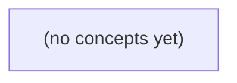

# 08.09 可靠任务与调度：Go 初学者的 IM 通知任务教材

*以 IM 业务中的通知任务 N9 为主线，系统讲解可靠任务身份、持久状态机、租约领取、未知结果、重试修复、顺序容量与运行对账。教材区分消息事实、通知尝试、提供方接纳、设备接收与已读，并配套 22 道带反馈的练习题。*

**章节:** 2

---

## 本书导览

- 了解整本书的章节脉络
- 掌握各章之间的概念依赖关系
- 选择最合适的阅读顺序

# 08.09 可靠任务与调度：Go 初学者的 IM 通知任务教材

以 IM 业务中的通知任务 N9 为主线，系统讲解可靠任务身份、持久状态机、租约领取、未知结果、重试修复、顺序容量与运行对账。教材区分消息事实、通知尝试、提供方接纳、设备接收与已读，并配套 22 道带反馈的练习题。

下方的概念图展示了本书 0 个核心概念以及它们之间的依赖关系；再下方是 1 个章节的入口。你可以按从上到下的顺序阅读，也可以根据自己的兴趣或先验知识选择切入点。

#### 概念图



## 章节索引

- **08.09 可靠任务与调度：通知重试如何不冒充送达** — 面向Go初学者，用虚构IM通知任务N9讲解稳定身份、持久状态、领取租约、重复外部效果、重试预算、坏任务修复和业务补拉。

## 08.09 可靠任务与调度：通知重试如何不冒充送达

- 区分任务ID、尝试ID与消息身份
- 画出持久任务状态与确认点
- 推演W1/W2租约接管和旧worker条件更新
- 解释外部结果未知与先后标状态反例
- 设置有界重试/隔离/修复与容量预算
- 限定固定OpenIM源码证据范围

通知重试的前提不是“多发几次”，而是先界定谁被唯一识别、何时已持久化、以及哪些结果只能诚实地标为未知。

### 先划清五类身份

### 先划清五类身份

通知系统最常见的误判，是把“同一条消息”“同一次请求”“同一个推送任务”和“同一次外部投递”混成一个对象。对权威消息 `m-9` 而言，至少要分开以下五类身份：

- **消息身份**：`m-9` 是会话 `c-a` 中序号 `seq9` 对应的权威消息实体。它描述“发生了什么”，应由教学库中的权威记录确定；消息历史、权限校验与补拉都围绕它进行。
- **消息版本身份**：`m-9:v1` 表示该消息内容或可通知状态的具体版本。编辑、撤回、补充附件或更改可见性后，应产生可区分的版本；否则旧通知可能覆盖新状态。
- **任务身份**：`N9 = notify:u-b:d-b1:m-9:v1` 表示“应向用户 `u-b` 的设备 `d-b1` 提醒消息版本 `m-9:v1`”。它是可持久化、可重试、可过期和可修复的工作项，而不是送达证明。
- **请求身份**：客户端或上游创建消息时携带的请求幂等键，只用于识别“是否重复提交了创建意图”。它不能替代 `m-9`：一次请求可能失败后重放，也不能替代 `N9`：一条消息可派生多个设备任务。
- **外部尝试身份**：每次调用推送厂商都应有独立尝试号，如 `N9#attempt-3`。厂商返回“已接受”最多说明其接收了本次调用，不能证明设备收到，更不能证明用户已读。

还需单列**设备收读状态**：`d-b1` 的“已接收”与用户的“已读”是回执或客户端同步得出的状态，应关联消息版本，且允许未知。因而，`N9` 成功不应冒充“送达”；即使通知失败或过期，客户端仍可按权限从消息历史补拉 `m-9`。

### 同库提交建立确认点

### 同库提交建立确认点

规划中的 S3 不把“接口已返回成功”当作送达或存储证明，而是在教学数据库内建立唯一可信的确认点：消息权威记录 `m-9` 与 outbox 事件 `E9` 必须处于同一事务。

设写入动作同时完成：

- 写入消息：`message_id=m-9`、作者、正文、可见范围、版本 `v1`；
- 写入事件：`event_id=E9`、类型为“消息已提交”、关联 `m-9:v1`；
- 事务提交成功后，消息状态才可标记为 `stored_in_teaching_db`。

可抽象为：

\[
\operatorname{commit}(m\text{-}9:v1,\ E9)\Rightarrow \text{已持久化且可派生任务}
\]

若事务回滚，则两者都不存在；若提交成功，即使进程随后崩溃，后台调度器仍可从 outbox 扫描到 `E9`，派生给设备 `d-b1` 的任务：

`task_id=notify:u-b:d-b1:m-9:v1`

这避免了两类常见断裂：消息已写入但通知事件丢失，以及通知任务已创建但消息实际未提交。重试时应以稳定的任务身份和消息版本去重，而不是把每次网络调用当成新通知。

相比之下，S2 的 `accepted_in_memory` 只表示某个进程曾接收请求：内存尚未落库、进程可能重启、事务可能失败，也无法供其他副本或修复任务验证。因此它最多能诚实表达“请求正在处理”或“结果未知”，不能冒充“已存储”，更不能据此声称设备已收到或已读。

通知失败、过期或需要修复时，可重新消费 `E9` 或重建同一 `task_id`；消息历史仍由客户端按权限补拉。通知只是提示通道，不替代权威消息记录，也不替代读取事实。

### 从E9派生设备任务N9

### 从E9派生设备任务N9

E9 是与教学消息同库提交的 outbox 事件：只有消息 $m\text{-}9$ 已写入教学库时，才允许从 E9 派生通知任务。对用户 `u-b` 的设备 `d-b1`、消息版本 `v1`，任务身份固定为：

`task_id = notify:u-b:d-b1:m-9:v1`

这不是一次网络发送的编号，而是“应向某个设备提示某个消息版本”的稳定事实。派生器可因扫描、崩溃恢复或事务提交后的重复投递而多次处理 E9；每次都按 `task_id` 执行插入或更新，已存在则复用原任务，不得产生 `...:retry2` 一类新任务。

幂等边界应分清：

- **同一消息、同一版本、同一目标设备**：重复派生仍是 N9；可修复其状态、补充调度时间，但不新增逻辑任务。
- **消息内容形成新通知版本**：例如 $v1 \rightarrow v2$，派生 `notify:u-b:d-b1:m-9:v2`。旧版本任务若尚未发送，可标记过期；若已交给外部渠道，也不能倒称未发生。
- **目标设备变化**：新增 `d-b2` 时派生 `notify:u-b:d-b2:m-9:v1`；设备注销、失效或权限撤销时，取消该设备尚未执行的任务。设备是任务身份的一部分，不能把 `d-b1` 的重试迁移为 `d-b2`。
- **外部尝试**：每次调用推送服务另有 attempt 标识；attempt 可多次，`task_id` 不变。外部超时只表示结果未知，不等于设备已收、用户已读。

因此，N9 的完成最多表示“调度器已获得某种渠道结果”。真正的消息可见性仍由客户端按权限从历史接口补拉，设备收取与用户阅读也必须由独立回执记录，不能由通知重试冒充。

### 把设备收到与已读分开

### 把设备收到与已读分开

同一任务 `N9(task_id=notify:u-b:d-b1:m-9:v1)` 至少涉及四个不可互换的事实：

| 事实 | 含义 | 能否证明用户看到了消息 |
|---|---|---|
| 任务完成 | 调度器已按策略处理该任务，例如成功提交、过期或进入失败修复 | 不能 |
| 外部投递尝试成功 | 推送服务接受了请求，或返回其协议层成功响应 | 不能 |
| 设备确认收到 | `d-b1` 回传确认，表明该设备取得了对应版本的通知或消息 | 仍不能 |
| 用户已读 | 用户在具备权限的会话中打开并确认消息版本 `m-9:v1` | 才可表示已读 |

“任务完成”尤其不应被解释为“送达”。任务可能因超过有效期而完成归档，也可能因不可恢复失败而由修复流程接管；它只说明系统不再把该任务视为待执行工作。

外部渠道的成功更弱。推送平台可能仅表示“已接受”，设备可能离线、通知被系统折叠、权限被关闭，或用户从未打开。即使设备确认收到，也只能更新设备级事实，例如 `delivered_to_device_at`，不能写成消息的 `read_at`。

已读应由用户动作产生，并绑定消息版本与授权上下文；通知只是促使用户回到应用。真正的消息内容仍由客户端按权限补拉，`SearchIndex` 也独立于通知状态。这样，重试可以诚实地改善触达机会，却不会把“尝试过”伪造成“用户已知”。

### 失败后仍可按权限补拉

### 失败后仍可按权限补拉

通知任务 `N9` 的过期、失败或人工修复，只描述“向设备 `d-b1` 提醒消息 `m-9:v1`”这一派生动作的状态；它不应删除、撤回、重写或重复写入教学库中的权威消息历史。即使推送提供方返回超时、设备离线，或最终任务进入 `expired`，消息本身仍以 `S3 stored_in_teaching_db` 为准。

客户端恢复连接、打开会话或收到“有更新”提示后，应使用当前身份和会话权限补拉：

1. 服务端先校验用户是否仍拥有该会话的读取权限；
2. 再按消息序列、游标或版本返回其可见的权威消息；
3. 客户端以消息身份与版本去重、合并，不把通知是否到达当作消息是否存在的依据。

因此，通知只是低可靠性的唤醒信号：它可以提示“可能有新内容”，却不能证明设备已收到，更不能替代消息同步。任务修复也应仅重试或重建派生任务，并记录新的外部尝试；不得借修复流程改写 `m-9` 的正文、可见范围或历史顺序。

`SearchIndex` 同样是独立派生物。索引滞后、重建失败或命中缺失，只表示搜索视图暂未追上权威库；读取会话历史与权限判定不能依赖索引结果。这样，通知失败影响的是及时性，索引失败影响的是检索性，而不会混淆消息已持久化、设备已收取和用户已阅读这三种不同事实。

> **要点** — N9只负责提醒设备，不证明送达或已读；权威消息与outbox同库确认，失败后依权限补拉。

通知任务的可靠性，不是把“已提交给提供方”误写成“对方已收到”。本节以N9状态机说明身份、租约与确认边界。

### 任务身份与消息身份分层

### 任务身份与消息身份分层

可靠通知至少需要三类身份，不能用一个“消息编号”混为一谈：

- `task_id`：任务的稳定身份。它表示“需要完成一次通知意图”，从创建、重试、修复到取消始终不变。例如订单 `O9` 需要提醒用户，任务可为 `task_N9`。重试不是新任务，而是同一任务继续推进。
- `attempt_id`：一次领取与投递尝试的身份。工作者 W1 领取 `task_N9` 后生成 `A1`，租约到期、超时或可重试失败后，W2 再次领取应生成 `A2`。`A1` 与 `A2` 绝不可相同；它们用于隔离迟到回调、旧工作者续租和重复提交。
- `message_ref`：业务消息的引用，如站内信、公告或聊天消息的主键。任务只保存该引用及渠道、目标、模板版本等必要元数据，不复制正文。

这种分层回答的是不同问题：`task_id` 问“这件事是否已经终结”，`attempt_id` 问“这次执行是否仍拥有写状态的资格”，`message_ref` 问“要通知的业务对象是什么”。

例如 W1 持有 `(task_N9, A1)`，但租约失效后 W2 获得 `(task_N9, A2)`；此时 A1 即使晚到一个“提供方已接纳”回调，也不得把任务更新为 `PROVIDER_ACCEPTED`。状态写入必须带条件：`task_id` 匹配、`attempt_id` 匹配、当前状态仍允许迁移。这样既保留同一通知意图的连续性，也阻止过期尝试冒充有效送达。

### 从就绪到提供方接纳的状态机

### 从就绪到提供方接纳的状态机

任务以稳定的 `task_id` 标识业务意图，例如“向用户 B 发送消息引用 `message_ref`”。它不直接保存可变正文；持久化记录至少包括：`status`、`attempt_id`、`attempt_no`、`lease_owner`、`lease_token`、`lease_until`、`next_run_at`、提供方请求标识、错误分类及必要审计元数据。

初始状态为 `READY`：任务已通过执行时所需的基本校验，等待领取。工作者 W1 只能通过条件更新取得租约：

`UPDATE task SET status=LEASED, lease_owner=W1, lease_token=41, attempt_id=A1, attempt_no=1, lease_until=now()+5s WHERE task_id=? AND status=READY`

更新成功才意味着 W1 获得本次尝试的执行权；失败则不得发送。`LEASED` 不是送达，而是“某个工作者在有限时间内负责尝试”。发送前还应重核发送者权限、接收者关系、消息是否已撤回及通知偏好，避免排队期间权限或内容发生变化。

提供方明确接纳请求后，W1 以 `task_id + attempt_id=A1 + lease_token=41` 作为条件，将任务转为 `PROVIDER_ACCEPTED`。此确认点仅表示提供方已接受推送请求，**不表示 B 设备收到、展示或已读**；这些结论需要独立的设备回执或阅读事件，不能由该状态推断。

若失败可重试，则释放租约并进入 `RETRY_AT`，设置新的 `next_run_at`；下次领取产生新的 `attempt_id=A2`，但 `task_id` 不变。不可安全重试、响应语义不明或记录不一致时进入 `REPAIR_REQUIRED`，交由修复流程处理；用户取消、消息撤回或权限重核失败时进入 `CANCELED`。所有转移都必须带上当前状态、尝试身份和租约令牌作为条件，防止过期工作者覆盖较新的执行结果。

### 租约接管与条件更新

### 租约接管与条件更新

设任务 `N9` 初始为 `READY`。Worker `W1` 领取时，不是简单把状态改为“处理中”，而是原子地写入：

`READY → LEASED(owner=W1, token=41, attempt=A1, lease_until=t+5s)`

其中 `task_id` 始终是 `N9`，但本次投递尝试的身份是 `attempt_id=A1`。`token=41` 则是这一次租约的围栏标记：它证明 `W1` 曾经拥有过领取权，却不保证其在未来仍拥有写回权。

若 `W1` 在租约内调用提供方后卡顿，直到 `lease_until` 已过期，`W2` 可以接管。接管也必须是条件更新：仅当任务仍为 `LEASED`，且旧租约确已过期时，才写入新的持有者和新令牌，例如：

`LEASED(W1, token41, expired) → LEASED(W2, token42, attempt=A2, lease5s)`

此时 `W1` 可能刚恢复，并拿到了迟到的提供方响应。若它仅按 `task_id=N9` 更新为 `PROVIDER_ACCEPTED`，就会覆盖 `W2` 的合法接管，甚至把 `A1` 的结果误归属到 `A2`。因此，`W1` 的完成写入必须同时比较当前状态、`owner=W1` 与 `token=41`；例如仅允许：

`WHERE task_id=N9 AND state=LEASED AND owner=W1 AND token=41`

若受影响行数为零，说明租约已失效、任务已取消或已被修复流程接管。`W1` 必须放弃写回，不能“补写成功”。

同理，`W2` 只能凭 `owner=W2, token=42` 把自己的尝试推进到 `PROVIDER_ACCEPTED`、`RETRY_AT` 或 `REPAIR_REQUIRED`。令牌使旧 Worker 成为可安全忽略的迟到者；条件更新则保证任何状态结论都只由当前合法租约的持有者提交。

### 外部结果未知时不能冒充送达

### 外部结果未知时不能冒充送达

通知调用跨越本地数据库与外部提供方，二者没有天然的原子事务。因此，任何无法确定的外部结果都不能被写成“设备已收到”，更不能写成“用户已读”。

| 做法 | 崩溃窗口 | 可能后果 | 正确解释 |
|---|---|---|---|
| 先标记成功，再调用提供方 | 标记后、调用前崩溃 | 实际未发送，却永久显示成功 | 错误：把计划发送冒充为接纳 |
| 先调用提供方，再标记成功 | 提供方已接纳、进程崩溃 | 恢复后不知道是否已接纳，重试可能重复投递 | 结果未知，只能按幂等语义恢复 |
| 调用超时即视为失败 | 请求已到达但响应丢失 | 再次发送，可能产生重复通知 | 超时表示“未知”，不等于未接纳 |

例如任务 `task_id=N9` 在租约内由 `W1` 执行，尝试为 `A1`。调用提供方后若收到明确接纳响应，才可通过条件更新把

`LEASED(owner=W1, token=41, attempt=A1) → PROVIDER_ACCEPTED`

其中条件必须同时匹配任务状态、租约持有者、令牌和尝试标识，避免过期工作者覆盖新尝试。`PROVIDER_ACCEPTED` 的含义仅是：提供方已接受本次投递请求；它不证明 B 设备联网、系统展示通知、用户点击通知或阅读正文。

若调用超时、连接中断或工作者崩溃，外部结果应视为未知。任务恢复后创建新的 `attempt_id=A2`，但保持同一 `task_id=N9`；随后依据提供方幂等键、查询接口或补偿记录决定进入 `RETRY_AT`、`REPAIR_REQUIRED`，而非伪造送达状态。这样即使发生重复提交，也能把“可能重复”与“确认接纳”清晰地区分开来。

### 有界重试、隔离修复与执行时重核

### 有界重试、隔离修复与执行时重核

重试的目标是处理暂时性故障，而不是无限放大同一条通知。`task_id` 始终稳定，用于幂等追踪；每次实际投递生成新的 `attempt_id`，如 `A1`、`A2`，用于区分不同尝试及其日志、回执和费用。

可为任务配置明确预算：

- 最大尝试次数：例如 `max_attempts=5`；超过后不再自动投递。
- 最大存活时间：例如创建后 `24h` 仍未成功，则进入终态或人工处理。
- 指数退避加抖动：`delay_n=min(cap, base×2^n)+jitter`，避免故障恢复时形成重试风暴。
- 按错误分类：网络超时、提供方限流可进入 `RETRY_AT`；无效地址、模板非法、权限永久拒绝不应盲重试。

领取者仅可通过带条件的更新续写状态，例如要求仍为：

`status=LEASED AND owner=W1 AND token=41 AND lease_until>now`

若条件不成立，说明租约已过期、任务被取消或已由其他工作者接管；当前执行结果必须丢弃，不能覆盖新状态。

反复失败、载荷异常、提供方响应无法解析等任务，应转入 `REPAIR_REQUIRED`，并记录失败分类、最近 `attempt_id` 与最小诊断信息。隔离队列用于修复数据、重新授权或人工决策，不应让坏任务长期阻塞正常通知。

任务正文不应复制保存，只保留 `message_ref`、目标标识、模板版本及必要投递元数据。工作者在每次执行前重新读取权威数据并校验：消息是否仍存在、发送者是否仍有权限、接收者是否仍可见、是否已撤回或取消。任一条件失效，即转为 `CANCELED` 或相应隔离状态；即使旧任务曾经合法，也不得凭历史快照继续发送。

> **要点** — 稳定任务身份配合租约条件更新，才能在结果未知与重复执行下诚实记录“提供方接纳”而非伪称送达。

租约认领解决的是“谁暂时有资格推进任务状态”，不是“外部通知只会发送一次”。理解事务边界、令牌条件更新与副作用围栏，才能避免把未知结果误报为送达。

### 候选认领与短事务边界

### 候选认领与短事务边界

`FOR UPDATE SKIP LOCKED` 的职责不是“持锁发送通知”，而是让多个工作者在**极短事务**内并发挑选可执行任务，避免彼此阻塞。典型流程是：

1. 在事务中筛选 `pending` 或已过期租约的任务；
2. 使用 `FOR UPDATE SKIP LOCKED` 锁定少量候选行；
3. 条件更新为新的 `owner`、`token` 与 `lease_until`；
4. 提交事务；
5. 事务外执行 HTTP、消息推送或邮件发送。

例如，认领时应把资格写入数据库：

`UPDATE jobs SET owner = :worker, token = :token, lease_until = now() + interval '30 seconds', status = 'running' ...`

网络调用绝不能放在持锁事务中。否则慢响应、超时或目标端故障会长期占据行锁：其他工作者即使使用 `SKIP LOCKED` 也只能跳过该任务，吞吐量下降；更糟的是，数据库事务可能因连接中断回滚，但外部请求已经到达，形成“副作用发生、状态未提交”的未知结果。

因此，`SKIP LOCKED` 只解决候选任务的并发分配；提交后的租约记录才是工作者继续推进状态的依据。工作者应把网络结果视为待确认事实，并在后续完成更新时携带自己认领的 `token`。若租约已失效并被其他工作者接管，旧工作者即使刚收到成功响应，也不能再把任务标为已送达。

### 任务身份、尝试身份与租约令牌

### 任务身份、尝试身份与租约令牌

可靠通知至少要区分四类身份；把它们混成一个“任务号”，会导致接管、重试与幂等判断失真。

- **稳定任务 ID**：如 `task_id=9001`，表示“应通知这件事”本身。它跨越所有重试、所有工作进程，通常也是业务查询和审计的主键。
- **尝试 ID**：如 `attempt_id=17`，表示第 17 次执行记录。每次真正发起投递都应新建尝试，可保存开始时间、响应、超时、错误分类和未知结果。它回答“曾经做过什么”，不等于“当前谁有资格完成任务”。
- **目标消息身份**：如 `message_id=evt-9001` 或业务幂等键。它交给目标端，用于识别“这是同一份逻辑通知”。任务可重试多次，但应尽量携带同一个目标消息身份；否则目标端无法去重。
- **租约身份**：`owner`、`token`、`lease_until` 共同表示当前短暂的推进权。`owner` 是当前工作者，`token` 是每次认领或接管递增/随机生成的代次，`lease_until` 是资格失效时刻。

例如 W1 以 `token=41` 认领 `task_id=9001`，暂停至租约过期；W2 接管后写入 `token=42`。此时 W1 即使刚拿到目标端成功响应，也只能执行带条件的更新：

`WHERE task_id=9001 AND token=41 AND owner='W1'`

更新失败并不说明通知未发送，只说明 W1 已失去改变任务状态的资格。任务状态的“完成”必须由当前代次提交；外部目标若会持久化副作用，还应识别 `message_id`，必要时接受更高代次围栏，避免旧代次覆盖新代次的结果。

### W1暂停后W2接管的时序推演

### W1 暂停后 W2 接管的时序推演

设任务初始为 `pending`。认领事务只做数据库状态推进，不把网络推送放在事务内：

1. **W1 短事务认领**  
   W1 用 `FOR UPDATE SKIP LOCKED` 选中候选任务，提交：

   ```sql
   status = 'processing',
   owner = 'W1',
   token = 41,
   lease_until = now() + interval '30 seconds'
   ```

   提交后行锁释放。W1 在事务外向目标端发送通知，但恰好在发送前或发送中暂停。

2. **租约到期，W2 接管**  
   `lease_until` 到期后，W2 再次扫描到该任务，并以条件更新接管：

   ```sql
   update jobs
   set owner = 'W2',
       token = 42,
       lease_until = now() + interval '30 seconds'
   where id = :id
     and status = 'processing'
     and lease_until < now()
     and token = 41;
   ```

   更新成功意味着当前有效代次已从 `41` 变为 `42`。W2 可以在事务外重试发送。

3. **W1 苏醒：它已失权**  
   W1 不能因为自己“曾经认领过”就写入完成状态。其完成更新必须带原令牌：

   ```sql
   update jobs
   set status = 'completed'
   where id = :id
     and owner = 'W1'
     and token = 41;
   ```

   此时影响行数为 `0`，因为任务已属于 `W2/token42`。W1 应将其解释为“认领已失效”，停止续租、完成或失败标记，不能覆盖新 owner 的状态。

关键风险仍在事务外：W1 暂停前可能已经把字节推到目标端，W2 又可能再次推送。因此租约与 CAS 只围栏**数据库状态写入**，不天然围栏外部副作用。若目标端会持久化处理结果，应携带代次令牌，并由目标端拒绝小于已见代次的请求；否则必须依赖幂等键接受重复投递。

### 条件更新不能消除重复推送

### 条件更新不能消除重复推送

`FOR UPDATE SKIP LOCKED` 与条件更新能保护数据库状态，却不能把网络请求纳入同一个原子操作。典型流程是：

1. W1 在短事务中认领任务，写入 `owner=W1`、`token=41`、`lease_until`，随后提交。
2. W1 在事务外向目标端推送通知；请求可能已经到达目标端，但 W1 在收到响应前暂停、超时或崩溃。
3. 租约过期后，W2 通过条件更新接管：只有旧租约确已过期时，才将任务改为 `owner=W2`、`token=42`。
4. W1 恢复后，即使它仍持有旧执行上下文，也只能执行类似  
   `UPDATE ... WHERE token=41 AND owner=W1`。  
   该条件不再成立，因此 W1 不能把任务标记为完成、失败或覆盖 W2 的状态。

这是一种数据库内的 CAS（比较并交换）保护：旧工作者失去“推进状态”的资格，避免陈旧结果污染任务记录。但它无法撤回 W1 已经发出的 TCP 字节，也无法判断目标端是否已经持久化副作用。

因此，W2 为恢复可用性而重试时，目标端可能收到第二次推送；而 W1 的第一次推送结果仍可能是“未知”。租约解决的是状态所有权，不是端到端恰好一次。

若目标端会创建订单、扣费或写入不可逆记录，还必须传递稳定的幂等键或代次围栏，例如任务标识加 `token`。目标端应拒绝较旧代次，或对同一幂等键复用既有结果；否则 CAS 再严格，也只能保证“数据库不被旧 worker 改写”，不能保证“外部副作用不重复”。

### 目标端围栏与未知结果处置

### 目标端围栏与未知结果处置

租约、`owner` 与 `token`只能围栏本地任务状态；一旦请求字节已离开进程，旧工作者即使租约过期，仍可能把通知推到目标端。若目标端会写入数据库、扣费、发券或触发工作流，必须由目标端拒绝“过期代次”。

发送时携带稳定的任务标识与代次，例如：

- 幂等键：`notification_id`，同一逻辑通知在重试、换工作者后保持不变；
- 围栏代次：`attempt_token=42`，每次成功接管后递增；
- 请求摘要：收件人、模板版本、载荷哈希，用于检测同一幂等键却内容不一致。

目标端持久化已接受的幂等键及最高代次，并以条件写入处理：

`仅当 token > 已记录token 时执行副作用；token = 已记录token 时返回既有结果；token < 已记录token 时拒绝。`

因此，W2 已以 `token=42` 成功提交后，W1 携带 `token=41` 的迟到请求不能覆盖新结果，更不能再次执行扣费等副作用。若业务只要求“同一通知至多一次”，幂等键足够；若存在接管、撤销或新旧版本竞争，则还需要代次围栏。

超时、断连、`502` 都是**未知结果**，不能直接标记“送达失败”或“送达成功”。工作者应先按幂等键向目标端查询结果；查到已接受则以当前 `token` 条件更新本地为完成，查无结果才重试。查询仍不可达时保留待处理或未知状态，延后重试；宁可重复查询，也不要把通信不确定性冒充为送达。

> **要点** — 租约令牌只能围栏数据库状态推进；网络副作用可能重复，必须由目标端幂等或代次围栏承担最终去重。

通知重试的难点不在“再发一次”，而在远端是否已生效不可知时，如何避免把“尝试过”误说成“已送达”。

### 从未知结果识别重复推送风险

### 从未知结果识别重复推送风险

W1 的危险不在于请求“失败”，而在于本地无法判断它是否成功：任务仍处于 `LEASED`，工作进程向 provider 发出推送请求；provider 已接纳并开始投递，但响应在网络中丢失、连接超时，或进程在读取响应前崩溃。此时本地只看到“没有成功回执”，远端却可能已经产生效果。

应把结果分成三类，而非简单的成功/失败：

- **明确未接纳**：例如连接建立前失败、请求格式被拒绝；可较有把握地重试。
- **明确已接纳**：收到 provider 可验证的成功响应；记录接纳事实，但这仍不等于设备已展示通知。
- **未知结果**：超时、连接中断、进程崩溃、响应丢失；不能据此断言 provider 未处理。

未知结果形成了本地状态与远端效果之间的“灰区”：

| 本地观察 | 远端可能事实 |
|---|---|
| 未收到响应 | 未收到请求 |
| 未收到响应 | 已接纳一次 |
| 未收到响应 | 已接纳并已投递 |
| 未收到响应 | 已接纳但稍后失败 |

因此，租约到期后 W2 使用同一 `task_id` 重试，并不是“补发失败任务”，而是在对一个可能已生效的操作再次执行。若 provider 不具备幂等语义，用户可能看到两条相同通知；若业务将通知视为扣款、告警或状态变更凭证，重复的后果更严重。

`context.WithTimeout` 也不能缩小这个灰区。它只表示调用方停止等待：`ctx` 超时后，本地可以释放资源、结束本次尝试，但不能撤销已发送的字节，更不能撤销 provider 已接纳的请求。故而，超时后的正确描述是“结果未知”，不是“发送失败”，更绝不能记录为“未送达”。

### 任务身份、尝试身份与消息身份

### 任务身份、尝试身份与消息身份

可靠重试至少要分开三类身份；把它们混成一个“请求编号”，会同时损害审计、幂等与设备去重。

- `task_id`：**逻辑任务的稳定身份**。它在创建通知时生成，覆盖该任务的整个生命周期；首次发送、租约到期后的重试、Worker 崩溃后的接手，都必须保持同一个 `task_id`。若 Provider 支持幂等键，应传入它，使“同一任务的多次提交”可被 Provider 归并。
- `attempt_id`：**一次领取和执行的身份**。Worker 每次成功领取 `LEASED` 任务时生成新的 `attempt_id`，并记录领取者、开始时间、超时、请求结果与错误。它回答的是“第几次、由谁尝试”，不能作为 Provider 幂等键：重试若换了 `attempt_id`，Provider 会把它当作新请求。
- `message_id` / `version`：**设备可见消息的去重与演进身份**。当 Provider 不支持幂等，或最终设备可能收到重复推送时，载荷应携带稳定的 `message_id`；设备保存已处理的消息，重复到达则忽略。若同一业务对象会更新，例如订单状态从“处理中”变为“已完成”，可使用同一 `message_id` 配合递增 `version`，设备仅接受更高版本。

可将关系理解为：

`一个 task_id → 多个 attempt_id → 同一 message_id 的重复投递`

其中，`attempt_id` 用于证明“尝试发生过”，`task_id` 用于约束“外部提交可幂等”，`message_id/version` 用于保证“终端展示或执行可去重、可更新”。即使这三层都具备，也只能声明“至少一次尝试、设备侧可去重”；网络超时后远端是否已生效仍可能未知，不能据此宣称“网络只发送一次”或“用户已送达”。

### 租约到期后的W2接管

### 租约到期后的 W2 接管

设任务 `task_id=T42` 初始为 `LEASED`，租约归属 W1，过期时间为 `10:00:30`。W1 向 provider 发起推送后，provider 实际接纳了请求，但响应在网络中丢失。W1 因超时只知道“结果未知”，其本地 `context.WithTimeout` 结束并不表示 provider 已撤销推送。

到 `10:00:31`，调度器发现租约过期，W2 以条件更新接管：

`UPDATE tasks SET owner='W2', lease_until=... , attempt=attempt+1 WHERE task_id='T42' AND status='LEASED' AND lease_until < now()`

只有仍处于可接管状态的记录才能更新成功。W2 获得新租约后，以稳定的 `task_id=T42` 作为 provider 幂等键重试；即使 W1 的请求已被接纳，provider 也应将其折叠为同一次外部操作。

危险在于 W1 的旧执行上下文可能“复活”：例如网络恢复后，它终于收到成功响应，试图写入 `PROVIDER_ACCEPTED`。此时不能使用无条件更新：

`UPDATE tasks SET status='PROVIDER_ACCEPTED' WHERE task_id='T42'`

否则 W1 会覆盖 W2 已经推进的状态。应绑定租约版本或执行令牌：

`UPDATE tasks SET status='PROVIDER_ACCEPTED' WHERE task_id='T42' AND owner='W1' AND lease_token='旧令牌' AND status='LEASED'`

由于 W2 已接管，条件不成立，W1 更新零行并停止。这样，旧 worker 可以保留日志中的“曾尝试、结果未知”，却无权宣称任务已由自己完成。若 provider 不支持幂等键，仍可能发生重复推送，只能依赖设备按 `message_id/version` 去重，并将语义表述为“至少一次尝试”，而非“网络仅发送一次”。

### 确认点两侧都不能冒充送达

### 确认点两侧都不能冒充送达

设任务仍处于 `LEASED`，工作者准备向 provider 推送 `task_id=T`。真正困难在于：本地事务的确认点，与远端 provider 接纳请求的确认点并不共享原子性。

- **先标 `PROVIDER_ACCEPTED`，再调用 provider**：  
  若状态写入成功后进程崩溃、请求根本未发出，恢复扫描会看到“已接纳”，从而不再尝试。结果是**漏尝试**：系统把内部记录当成了远端事实。  
  因此，`PROVIDER_ACCEPTED` 不能表示“准备发送”或“已安排发送”；它只能在有可验证的 provider 回执后写入。

- **先调用 provider，再标 `PROVIDER_ACCEPTED`**：  
  若 provider 已接纳并产生推送效果，但工作者在落库前崩溃，租约到期后另一工作者会重试同一任务。结果是**重复效果**：网络层无法判断上一次到底未到达、未接纳，还是已成功但响应丢失。  
  这不是简单的代码缺陷，而是跨本地数据库与远端系统无法原子提交的必然窗口。

因此，两种顺序都不能证明“送达”。前者以避免重复为代价可能丢失尝试；后者以避免漏尝试为代价可能重复发送。正确表述应区分：

`已尝试`、`provider 已接纳`、`设备已展示/确认`。

若 provider 支持幂等键，应稳定传递 `task_id`，使重试收敛为一次 provider 接纳；若不支持，设备端须按 `message_id/version` 去重。即使使用 `context.WithTimeout`，它也只是本地停止等待，绝不意味着远端调用被撤销或没有生效。

### 幂等键、超时语义与补拉兜底

### 幂等键、超时语义与补拉兜底

面对“请求可能已被接纳、但响应丢失”的窗口，可靠性目标不是承诺网络层“只发一次”，而是让重复尝试的**业务效果可收敛**。

若 provider 支持幂等键，每次重试都应传入稳定的 `task_id`：

- 同一逻辑通知永远使用同一个 `task_id`，不能为每次 HTTP 尝试生成新键；
- provider 将相同幂等键视为同一次提交：首次请求可能创建推送，后续请求返回既有结果或安全地忽略；
- 本地任务即使仍处于 `LEASED`、租约到期后被其他 worker 接手，也可以重试该 `task_id`，而不把“响应未知”升级为“确定未发送”。

若 provider 不支持幂等键，服务端无法消除重复投递，只能把去重语义下沉到设备或客户端。通知载荷应包含稳定的 `message_id` 与单调递增的 `version`；客户端保存已处理标识，或仅接受版本更高的状态更新。这样，重复推送最多造成重复到达，不应重复执行支付、扣库存、弹窗确认等副作用。

`context.WithTimeout` 只表示本地停止等待：

```text
本地超时 ≠ provider 未接收 ≠ 远端效果被撤销
```

因此超时后应记录“结果未知”，按退避策略进行**有界重试**，例如限制最大次数、总时间窗口和死信转移；不能无限重试，也不能把超时直接记为失败或送达。

最终兜底应来自业务状态而非推送回执：客户端恢复前台、定期同步或用户主动刷新时，从服务端补拉 `message_id/version` 对应的真实状态。推送只是唤醒和提示通道；即使重复、丢失或延迟，业务数据仍能通过补拉收敛到一致结果。

> **要点** — 网络调用超时或崩溃只能说明结果未知；可靠通知依靠稳定身份、条件状态更新、幂等去重与补拉，而非宣称只发一次。

以通知任务N9为例，建立“可重试但不虚报送达”的处理边界：队列确认只代表领取，业务送达必须由可核验结果证明。

### 三类身份与可追溯状态

### 三类身份与可追溯状态

通知系统至少应区分三种身份，不能用一个 `id` 混淆“任务、执行、消息”：

- **任务ID**：如 `task_id=N9`，表示一项待完成的业务意图，例如“向 B 发送文档 v2 的授权通知”。它跨重试稳定存在，是状态机、预算、责任归属和修复入口的主键。
- **尝试ID**：如 `attempt_id=N9-a2`，表示任务的第 2 次实际处理。每次领取、补拉或人工重放都生成新尝试记录，保存开始/结束时间、执行者、错误分类、退避参数与外部调用摘要。
- **消息身份**：如 `message_id=msg-N9-v2` 或业务幂等键 `(recipient=B, document=D, version=2, kind=grant)`，表示用户可见的那一条通知语义。重试应复用它，避免第 2 次尝试生成重复消息；版本必须纳入键，避免 v1 旧任务覆盖 v2。

持久状态应以任务为中心，例如：

`PENDING → PROCESSING → RETRY_SCHEDULED → DELIVERED`

或在预算耗尽、结果无法核验时进入：

`REPAIR_REQUIRED`

队列 `ACK` 的确认点仅是“此次尝试已被可靠领取并写入账本”，绝不等同于 `DELIVERED`。只有目标系统返回可验证回执，或查询到同一消息身份已存在，才能记录业务送达。

审计记录至少保留 `task_id`、`attempt_id`、消息身份、脱敏目标ID、权限/版本快照、错误类别、责任方、最后可核验结果及状态迁移时间。这样即使 B 离线 25 小时、broker 仅保留 24 小时，也能由数据库中的任务与当前授权状态补拉，而非把过期队列确认误报为送达。

### 三次预算、退避与故障分类

### 三次预算、退避与故障分类

令任务创建于 $t_0$，总尝试预算为 `3`，且**首次处理也计入预算**。因此 N9 只能经历：

1. 第 1 次：立即执行；
2. 第 2 次：仅当第 1 次属于可恢复故障时调度；
3. 第 3 次：仅当第 2 次仍属可恢复故障时调度；
4. 第 3 次失败后，不再生成第 4 次，而是进入人工修复路径。

可采用指数退避加抖动：

\[
delay_k=\min(D_{\max},D_0\cdot2^{k-1})+\operatorname{jitter}(0,J)
\]

其中 $k$ 是“下一次重试”的序号。例如 `D0=5分钟`、`Dmax=1小时`，第 2 次约在 5 分钟后，第 3 次约在 10 分钟后；抖动可避免大量任务在同一时刻同时冲击目标服务。无论尚余几次预算，若 `now > deadline`，例如任务总期限为 6 小时，也必须停止重试。

故障分类决定是否消耗后续机会：

- **暂时故障**：超时、网络中断、目标服务 `5xx`、限流等。结果尚未确定时，不能直接假设失败；应先按幂等键查询目标系统或任务账本，确认未送达后才退避重试。
- **永久坏载荷**：缺少必填字段、模板渲染失败、收件地址格式非法、版本数据无法解析。这类错误重试不会改变结果，应立即停止。
- **权限拒绝**：令牌失效、租户策略禁止、资源访问被撤销、`401/403`。除非已有明确的授权刷新流程，否则视为不可盲重试。

预算耗尽、期限超时或遇到永久错误时，状态转为 `REPAIR_REQUIRED`，保存脱敏后的任务/对象标识、错误分类、责任方、最后一次可核验结果与尝试次数。队列 `ACK` 只表示该消息已被领取或记录，绝不能写成“通知已送达”。

### 结果未知时先核验再决定

### 结果未知时先核验再决定

“请求超时”不等于“未送达”。通知服务可能已写入目标系统，但响应在网络中丢失；此时若直接重试，可能造成重复通知；若先标记成功，则是在伪造送达。

错误顺序与后果可对比如下：

- **先标记送达，再异步调用**：调用失败后任务已经不可追溯，业务状态与真实结果脱节。
- **先确认队列消息，再假定处理成功**：ACK 仅表示消费者已领取或持久化处理意图，不是目标用户已收到通知。
- **超时即重试**：可能对同一 `notification_id` 重复投递，尤其在目标系统已成功落库但未回包时。
- **正确路径：先核验，再落状态**：将任务置为`结果未知`，以幂等键查询目标系统，或查询本地任务账本中的请求记录与回执。

例如 N9 调用发送接口超时后，应按 `notification_id` 查询：若目标已存在对应投递记录，则补记为已送达；若明确不存在，才进入带抖动的退避重试；若目标无法查询且账本也无确定证据，则保留“未知”而非臆断成功或失败。

账本至少记录脱敏目标标识、请求幂等键、尝试次数、最后错误、最后已知结果和责任方。达到尝试预算或总期限后转为`REPAIR_REQUIRED`，由修复流程继续核验。这样，队列 ACK 与业务送达始终是两件独立的事。

### 预算耗尽后的隔离与修复

### 预算耗尽后的隔离与修复

当 N9 已完成最多 3 次总处理尝试，或已超过总重试期限，仍未取得可核验的业务结果时，任务应原子转为 `REPAIR_REQUIRED`。这不是“发送失败后丢弃”，更不是把队列 ACK 误写成“已送达”；它表示自动化处理边界已到，必须由修复流程接管。

隔离记录至少应保存：

- 脱敏任务标识：`task_id`、通知类型、目标主体的脱敏 ID；不保存完整手机号、邮箱或 payload 明文。
- 版本与幂等信息：业务对象版本（如 `v2`）、幂等键、原任务创建时间与授权快照版本。
- 故障证据：错误分类、错误码、最近错误摘要、尝试次数、首次/最后尝试时间、最后一次退避参数。
- 最后可知结果：`未开始`、`明确拒绝`、`目标状态未知`、`已接受但未确认` 等，禁止用模糊的“失败”覆盖事实。
- 责任归属：调用方 payload、授权/权限、目标服务、网络或基础设施、人工待判定；责任方不是归罪，而是决定修复入口。

修复可由值班人员补正 payload、恢复权限，或由自动任务在依赖恢复后发起；但修复动作只创建一次受控的“再处理授权”，不得直接把旧任务状态改回处理中。再处理前必须重新读取业务对象和授权：若 N9 对应对象已从 `v1` 合法编辑到 `v2`，旧任务只能被取消、重建或按 `v2` 重新渲染，绝不能覆盖新内容或向旧收件人泄露信息。

对于结果未知，应先查询目标系统或任务账本：已存在相同幂等键的成功证据则补记送达；无证据才允许在新的预算窗口内重试。B 离线 25 小时即使超过玩具 broker 的 24 小时保留期，也应从数据库中经当前授权补拉任务，而非依赖过期队列消息“复活”。

### 租约接管、离线补拉与版本防护

### 租约接管、离线补拉与版本防护

通知任务 `N9` 被工作者 `W1` 领取时，只能以条件更新取得租约：

`UPDATE task SET lease_owner='W1', lease_until=t+5min, status='PROCESSING' WHERE id='N9' AND (lease_until<t OR lease_owner='W1')`

`W1` 在租约内调用目标系统；若崩溃或租约过期，`W2` 才可用同类条件更新接管。接管者必须读取任务账本：已有“已送达”回执则结束；结果未知则先按幂等键查询目标系统，不能因“队列消息重新出现”就再次发送。队列 ACK 仅表示消息已领取或持久化，不得写成业务“送达”。

设备 `B` 离线 25 小时，超过玩具 broker 的 24 小时保留期后，不能假定通知失效，更不能依赖队列重放。`B` 上线后以用户身份、设备绑定和授权范围向数据库补拉“尚未确认、仍在有效期内”的通知；服务端据此重新投递或由客户端拉取。补拉记录仍归入同一任务账本，并受最多 3 次总处理尝试、总期限和权限校验约束。

若通知内容已编辑为 `v2`，旧任务 `v1` 必须携带 `entity_id + version`。发送前执行条件检查：仅当当前版本仍为 `v1` 才允许投递；发现当前为 `v2` 则取消旧任务并创建或确认 `v2` 任务。这样 `W2` 接管、离线补拉都不会用旧 payload 覆盖新内容，亦不会向已失去权限的接收者泄露 `v1`。耗尽预算后置为 `REPAIR_REQUIRED`，保留脱敏标识、错误、责任方与最后可核验结果。

> **要点** — 重试解决暂时不可用，不证明业务送达；状态推进必须受身份、租约、版本、预算与可核验结果共同约束。

可靠调度不只追求“尽快发出”：热任务、同设备顺序、撤回取消与历史补拉都要求明确边界、状态与资源治理。

### 热键占队列与公平调度

### 热键占队列与公平调度

`c-g` 这类高频键（例如热门群、活跃设备或不断重试的收件人）会持续产生任务。若所有任务进入同一个先进先出队列，热键会占满可见队列和工作线程：冷门键的通知虽然已入队，却长期得不到执行。这是**资源公平性**问题，不是简单增加 worker 就能解决的问题。

可将调度单位从“单条任务”提升为“键分区”：

- 按 `tenant_id`、`conversation_id`、`device_id` 或其组合分区；同键任务进入该键自己的子队列。
- 调度器在非空键之间轮转，而不是从全局队首不断取出热键任务。可使用轮询、加权公平队列或每键令牌桶。
- 为每个键设置并发上限，例如 `inflight(c-g) ≤ 2`；即使全局有 100 个 worker，`c-g` 也不能独占它们。
- 为租户、任务类型和全局分别设置预算：  
  `可启动数 = min(全局剩余, 租户剩余, 键剩余, 类型剩余)`。

优先级应表达业务紧急度，而非让高频键天然获益。例如安全撤回可高于普通提醒，但仍应受每键并发预算约束；否则高优先级重试风暴仍会饿死其他任务。对低优先级任务可采用“等待越久、有效优先级越高”的老化策略，保证最老任务最终被服务。

需要持续观测每键队列深度、最老等待年龄、拒绝启动次数和并发占比。若 `c-g` 的最老年龄下降而其他键持续上升，说明调度器仍在偏袒热键；治理目标应是限制其吞吐上限，并保证冷键存在可预测的服务机会。

### 最老年龄与容量预算

### 最老年龄与容量预算

队列长度只说明“积了多少”，最老任务年龄才说明“用户已经等了多久”。设待处理任务数为 $Q$，稳定处理速率为 $\mu$，进入速率为 $\lambda$。当 $\lambda<\mu$ 时，粗略排空时间为：

$$
T_{\text{drain}}\approx \frac{Q}{\mu-\lambda}
$$

但通知任务通常存在重试。若单次执行成功率为 $p$，平均尝试次数约为 $1/p$，则有效服务速率应折减为：

$$
\mu_{\text{effective}}\approx \mu_{\text{raw}}\cdot p
$$

因此，扩容不能只看 worker 数量；下游推送通道、设备厂商限额、数据库读取和网络连接都可能使 $\mu_{\text{raw}}$ 无法线性增长。

应持续记录每个任务的年龄：

$$
age=now-createdAt
$$

并以 `P95/P99 最老年龄`、超龄任务数、重试放大倍数和积压增长率作为治理指标。若最老年龄持续超过业务目标，例如“普通通知 5 分钟内尝试、关键通知 30 秒内尝试”，应先判断：

- $\lambda>\mu_{\text{effective}}$：入口限流、降级低优先级任务，或扩充真正的瓶颈容量；
- 重试过密：采用指数退避、抖动和每设备重试预算，避免失败任务反复吞噬吞吐；
- 热键集中：为单用户、单设备或单会话设置并发上限，避免其占满全局 worker；
- 下游故障：暂停或降低该通道消费速率，将任务保留为可恢复积压，而非伪造“已送达”。

容量预算应预留故障余量：常态利用率不宜长期贴近 $100\%$，否则一次重试峰值就会让最老年龄陡增。扩容的验收标准也不是“队列变短”，而是高分位任务年龄在峰值、重试和局部故障下仍回到目标范围。

### 同设备顺序的分区屏障

### 同设备顺序的分区屏障

若业务规定同一设备必须先看到事件 `E9`，再看到 `E10`，就不能把“任务入队顺序”误当成“设备可见顺序”。多个 worker 并发消费时，`E10` 可能先被领取、先完成网络调用，甚至先到达设备；单纯增加 worker 只会提高这种乱序概率。

核心做法是按设备标识分区，例如以 `device_id` 作为分区键：

- 同一设备的通知进入同一逻辑分区；
- 不同设备仍可并行处理，避免全局串行；
- 分区内为事件分配单调递增版本，如 `E9.version=9`、`E10.version=10`。

发送 `E10` 前，调度器必须检查顺序屏障：该设备的“已确认可推进版本”是否至少为 `9`。若 `E9` 尚未成功提交、仍在重试、被延迟或处于未知结果，`E10` 应保持阻塞或延后，而不是由空闲 worker 抢先发送。

可维护类似状态：

`device_cursor = 已越过屏障的最大版本`

只有当 `event.version = device_cursor + 1` 时，事件才具备发送资格；成功后推进游标。对于允许跳过的事件，必须显式记录跳过原因和推进规则，不能把超时或领取失败默认为可跳过。

注意，这保证的是调度侧顺序，不等于设备最终展示顺序。推送通道可能延迟、折叠或离线缓存；若展示顺序同样关键，客户端还应携带版本号，并拒绝或缓冲早到的高版本事件。

### 取消任务与不可回滚推送

### 取消任务与不可回滚推送

任务取消解决的是“后续是否还应继续执行”，不是“已经产生的外部效果能否消失”。因此必须区分任务状态与设备侧效果：

| 场景 | 队列任务 | 外部推送效果 |
|---|---|---|
| 尚未领取 | 可原子改为 `CANCELED` | 未发送，无需补救 |
| 已领取但尚未调用推送服务 | 工作器检查取消标记后停止 | 未发送 |
| 已提交给推送服务 | 可记录为取消请求或终止后续重试 | 设备可能已收到，不能承诺撤回 |
| 已送达设备 | 可关闭任务、停止重试 | 通知可能显示、被点击或被系统折叠 |

例如成员被移出群组、消息被撤回、订阅被关闭时，应持久化 `CANCELED`，并记录原因、操作者、版本及取消时间。工作器在领取前、调用外部接口前都要复查取消状态，避免“取消刚写入，旧工作器仍继续发送”。

但一旦请求越过外部推送边界，系统最多做到最佳努力：停止尚未发送的分片、撤销后续重试、发送一条更新或静默通知；不能把“已从设备消失”伪装成确定结果。设备离线缓存、厂商网关延迟、系统通知中心和用户截图都不受服务端事务控制。

因此状态命名应诚实：`CANCELED` 表示本系统停止该任务，不等于通知从未出现。若业务需要展示一致性，应让客户端根据消息当前版本、成员资格和历史同步结果决定是否隐藏内容；设备权限、通知显示与历史补拉也应作为独立链路处理。

### 权限变化与历史补拉边界

### 权限变化与历史补拉边界

设备权限、会话成员资格、服务端通知投递与客户端历史补拉是四条独立链路，不能用其中任一条的成功来证明另一条成立。

- **设备权限**：操作系统可能关闭通知权限、限制后台运行或注销推送令牌。服务端即使成功调用厂商推送接口，也只能记录“已提交给推送通道”，不能标记为“用户已看到”。
- **成员变化**：用户被移出群组、会话被禁言或消息被撤回后，尚未执行的通知任务可转为 `CANCELED`，并记录原因、发生时间和关联版本；但已发往外部推送通道的内容通常无法回滚。
- **通知投递**：通知是唤醒或提示机制，不是消息事实来源。推送失败、设备离线、权限关闭都不应阻塞消息持久化，更不应删除会话历史。
- **历史补拉**：客户端恢复前台、重新登录或收到通知后，应以游标、序列号或消息版本向服务端拉取增量历史，再依据当前成员资格和撤回状态渲染。补拉结果不能仅由“是否收到推送”决定。

因此，成员变更后的正确目标通常是：阻止未来无效通知、让后续拉取遵守最新权限，而非承诺抹除已经显示在设备上的内容。若需分析 OpenIM 源码，应将证据限定为其消息、会话、推送任务及同步接口实际暴露的状态；厂商推送最终展示、系统级权限判定和设备本地通知历史，不应被推断为 OpenIM 可完全控制的行为。

> **要点** — 调度安全来自公平隔离、顺序约束和明确取消边界；更多 worker 不能替代状态设计。

可靠调度不仅要把任务“发出去”，更要用可观测证据证明：当前卡在哪里、是否仍可重试，以及何时必须交由人工修复。

### 从状态指标看任务是否前进

### 从状态指标看任务是否前进

任务是否“前进”，不能只看发送接口成功或消息队列已有消费记录；应以任务状态及其停留时间建立统一口径。核心指标既回答“现在有多少任务”，也回答“最危险的那一件已经卡了多久”。

- `READY`：满足执行条件、尚未被工作者租约领取的任务。关注数量与 `oldest age`；若最老年龄持续增长，通常意味着消费者容量不足、筛选条件错误或调度器未扫描到该分片。
- `LEASED`：已被某个工作者持有租约、等待执行或正在执行。其最老年龄不应超过正常处理时长加安全余量；结合 `lease expiry` 观察，租约已过期仍未完成的任务应可被重新领取，而不是永久悬挂。
- `RETRY_AT`：一次尝试失败后，等待退避时间到达的任务。数量升高未必异常，但最老年龄超过预期退避上限，说明重试扫描、时间计算或状态迁移可能失效。
- `REPAIR_REQUIRED`：自动重试已耗尽、状态矛盾、缺少必要凭据或需要人工判定的任务。该指标必须告警，并按最老年龄排序进入修复队列，不能继续伪装为“处理中”。

建议统一计算：

$$\text{oldest age}(s)=\text{now}-\min(\text{进入状态 }s\text{ 的时间})$$

其中时间字段应记录状态实际写入时刻，而非任务创建时间；否则一个长期存在但刚进入重试的任务会被误判为卡死。`LEASED` 还应单独暴露“已超过租约期限”的数量，并记录过期租约被拒绝提交的次数：这类 `stale token rejects` 证明旧工作者不能在任务被重新领取后覆盖新结果。

状态指标只能证明调度层的推进，不能冒充最终送达。尝试次数、供应商回执未知、设备接收/已读，以及消息权威对账，应作为独立证据链观察。尤其不要从 OpenIM 的 `MsgToMQ` 返回或 Mongo `BatchInsertChat2DB` 的局部异步写入，推断存在完整的任务表、租约锁与重试机制；真实语义仍需追踪通知/推送实现及其配置。

### 租约到期与旧执行者失效

### 租约到期与旧执行者失效

设任务 $T$ 初始为 `READY`。执行者 W1 通过条件更新领取它：

`READY → LEASED(token=t1, lease_until=10:00:30, attempt=3)`

此时 W1 可以调用推送服务，但它并不拥有永久写回权。租约的意义是：若 W1 崩溃、网络分区或调用长期阻塞，调度器在 `lease_until` 到期后可将该任务重新置为可领取状态，或由 W2 接管：

`LEASED(t1, 已到期) → LEASED(token=t2, lease_until=10:01:00, attempt=4)`

W1 可能在 10:00:45 才恢复，并拿到一次看似成功的提供商响应。它若直接按任务 ID 写入“已发送”，会覆盖 W2 的新状态，造成两类错误：一是旧尝试冒充当前尝试送达；二是 W2 已重试、已失败甚至已进入 `REPAIR_REQUIRED` 的证据被抹掉。

因此，W1 的完成更新必须带上仍有效的租约令牌，例如：

`UPDATE task SET state='SENT' WHERE id=? AND state='LEASED' AND lease_token=t1`

更新结果为 0 行，即 `stale token reject`：W1 已失去该任务的所有权，必须丢弃其写回结果，仅记录“旧执行者晚到”。不能把它解释为消息未发送，更不能据此再次重试；提供商可能已经接受了 W1 的请求。

令牌拒绝数应被监控。少量拒绝是租约恢复的正常代价；持续升高则提示租约过短、外部调用尾延迟过大，或执行者存在暂停、时钟与网络异常。对这类 `attempt/provider unknown` 的任务，应依靠后续设备接收/阅读事件、提供商回执及消息权威对账决定最终状态，而非让旧执行者抢回写权限。

### 尝试结果未知不等于消息送达

### 尝试结果未知不等于消息送达

一次通知任务至少经历“调度系统发起尝试”“提供方接受请求”“设备实际收到”“用户读取”以及“业务消息记录完成权威对账”等不同阶段。它们的证据强度递增，不能用前一阶段冒充后一阶段。

| 证据等级 | 可观察事实 | 不能推出的结论 |
|---|---|---|
| 尝试已发起 | 任务从 `READY` 领取为 `LEASED`，记录 `attempt_id`、租约和请求参数 | 提供方已收到，更不代表设备收到 |
| 提供方响应未知 | 超时、网络断连或进程崩溃，结果标记为 `provider_unknown` | 不能直接重试为“首次发送”；原请求可能已被接受 |
| 提供方已接受 | 获得提供方消息标识或成功响应 | 推送一定到达设备、展示给用户 |
| 设备已收到 | SDK 回执、设备确认或可靠通道确认 | 用户看见、理解或已读 |
| 用户已读 | 客户端读回执及其可信时间戳 | 消息库、会话状态已一致更新 |
| 权威对账完成 | 消息存储、任务状态、回执记录按同一消息标识核验一致 | 仅说明系统账实一致，不自动证明用户阅读质量 |

因此，`attempt/provider unknown` 应表示“本次尝试结局未知”，而非“发送失败”。调度器应保留幂等键、提供方请求标识和尝试序号，在 `RETRY_AT` 后以同一逻辑消息重试；若租约过期被其他执行器接管，旧执行器提交结果必须因陈旧令牌被拒绝。重复通知的风险应由提供方去重、客户端去重或业务幂等语义承担，而不是靠猜测“上次肯定没发出去”。

设备收达与已读回执也应是独立状态，不可把推送成功写成“已读”。最终由消息权威库对账：任务归档前确认逻辑消息、投递尝试、提供方标识与客户端回执的关联；保留窗口内仍无法解释的未知尝试进入 `REPAIR_REQUIRED`，而不是被静默清理。

### 重试预算、隔离与修复队列

### 重试预算、隔离与修复队列

重试不是“失败后再发一次”，而是受次数、时间、容量三重约束的状态机。每次执行失败都应记录 `attempt`、失败分类、下次执行时间 `RETRY_AT` 与最近提供方响应；未知结果（如请求超时、提供方状态不明）不能直接当作送达，也不应无限重投。

可定义有界预算：

- **次数预算**：例如普通通知最多 `5` 次；认证失效、参数非法等确定性失败立即终止，不消耗全部重试次数。
- **时间预算**：采用指数退避加随机抖动，如  
  $delay_n=\min(2^n\times 60\text{s}, 6\text{h})+\text{jitter}$。  
  超过业务截止时间，即使次数未用尽也停止自动重试。
- **容量预算**：重试任务必须与新任务隔离队列或至少隔离并发配额，避免提供方故障时海量历史失败挤占实时通知通道。

调度器只领取 `READY` 且 `RETRY_AT<=now` 的任务，并用 lease 标记为 `LEASED`。执行者提交结果时必须携带当前 token；过期 lease 或 stale token 的提交应被拒绝，防止旧执行者覆盖新一轮结果。lease 到期后，回收器可将未完成任务重新置为可调度状态，但同样要受总预算限制。

达到上限、连续出现未知状态、消息权威对账发现“本应可确认却长期无证据”的任务，转入 `REPAIR_REQUIRED`。该队列不是失败墓地，而应有明确处置流程：

1. 保存完整尝试链、提供方请求标识和相关消息版本；
2. 标注是否允许人工重发、是否必须先查询提供方；
3. 由值班人员或修复作业确认最终状态；
4. 修复后归档，并在保留窗口内保留审计证据。

这样，自动化只处理可判定、可恢复的失败；无法证明送达或无法安全重试的任务，被显式隔离并进入可追责的修复闭环。

### 归档保留与源码证据边界

### 归档保留与源码证据边界

任务终态并不等于可以立刻删除。归档的价值在于保留一条可审计证据链：任务何时创建、领取、续租、重试、失效或进入 `REPAIR_REQUIRED`；每次 `attempt` 使用了哪个提供方、返回何种结果；以及设备侧“收到”“读到”与消息权威状态最终如何对账。

保留窗口应覆盖最长重试周期、提供方回执延迟、客户端离线期限和争议处理期限。窗口内可将冷任务迁入归档表或对象存储，但至少保留：

- 任务主键、业务幂等键、最终状态与状态变迁时间；
- `lease token`、过期时间、陈旧令牌拒绝记录；
- 投递请求摘要、提供方回执或“未知”证据；
- 设备收达/已读事件及其来源、去重键；
- 人工修复记录、修复结论与责任人。

过期后可按合规要求删除正文、设备标识等敏感字段，但不应抹去聚合审计信息；否则无法回答“当时是否真的投递过、为何判为未知、为何停止重试”。

源码证据也必须谨慎界定。OpenIM 的 `send.go` 在 `MsgToMQ` 后返回，能够证明消息已进入某个消息队列边界，不能证明通知任务已被可靠消费、已重试、已被推送提供方接受，更不能证明设备送达或已读。类似地，Mongo 的 `BatchInsertChat2DB` 只能说明一段局部异步落库流程，不能推出教学所需的 N9 任务表、租约锁、`RETRY_AT` 调度、陈旧令牌拒绝或修复队列已经存在。

因此，核对真实项目时，应继续追踪通知消费者、推送适配器、失败处理、延迟队列与配置项，并以实际数据库记录、指标和回执链路界定系统真正承诺的可靠性边界。

> **要点** — 调度可靠性靠状态、租约、条件更新和分级证据闭环，而非把一次发送调用当作送达证明。

以虚构IM通知任务N9为线索，建立“可重试但不冒充已送达”的任务调度模型，并用状态、租约与对账约束故障恢复。

### 三类身份与持久状态图

### 三类身份与持久状态图

以通知任务 `N9` 为例，必须分开记录三类身份：

- `task_id`：业务任务身份，如“向用户 U 发送某事件通知”。重试、修复、去重都围绕它进行；同一任务始终不变。
- `attempt_id`：某一次执行身份。每次领取或重试都生成新的 `attempt_id`，用于关联本次调用、日志、耗时和结果，不能拿它判断业务消息是否已发。
- `message_id`：投递给 OpenIM 或其他提供方的消息身份。应由稳定的幂等键派生或持久保存，使不同尝试可指向同一逻辑消息，避免重试生成多条可见通知。

持久状态应只表达已经被可靠记录的事实，而非进程内推测：

`pending → claimed → sending → accepted → delivered`

其中，`claimed` 表示工作者持有未过期租约；`sending` 表示已开始外部调用；`accepted` 仅表示获得提供方确认，**不等于用户已送达**；只有提供方回执或可核验查询证明送达，才能进入 `delivered`。

失败路径为：

`claimed/sending → retry_wait → claimed`  
`retry_wait → dead → repair_pending → pending`

领取时写入短租约：`lease_token`、领取者和 `lease_until`。后续状态更新必须同时匹配 `task_id + attempt_id + lease_token`，避免旧工作者在租约失效后“迟到确认”，覆盖新尝试的结果。

最危险的是“提供方确认未知”：请求可能超时，但提供方可能已受理。此时不得直接标记失败或已送达，而应记为 `ack_unknown`，保留 `message_id`，先查询、对账或等待回执；无法验证时进入人工/自动修复队列。任务系统承诺的是“已创建、已领取、已获确认、已核验送达”等不同事实，不能把一次网络调用成功冒充为送达。

### 短领取、租约与W1/W2接管

### 短领取、租约与 W1/W2 接管

任务的身份是稳定的 `task_id`，一次执行则由递增的 `attempt_id` 表示。领取任务时，工作者不能只把状态改为“执行中”，还应取得一次短租约：

- 领取条件：任务仍可领取，且原租约已过期或为空；
- 写入字段：`lease_token`、`lease_until`、`attempt_id`、`worker_id`；
- 租约应短于任务超时，以便故障后尽快接管。

设 W1 在时刻 $t_0$ 领取 N9，得到 `lease_token=L1`，租约至 $t_0+30s`。W1 随后调用 OpenIM，但在网络抖动中卡住；它既未拿到明确的 provider ack，也未能及时续租。

在 $t_0+31s$，W2 发现租约过期，以条件更新接管：

`WHERE task_id=N9 AND lease_until < now() AND status='processing'`

W2 将任务改为新尝试 `attempt_id=2`，写入 `lease_token=L2`。此后，W1 即使终于收到 OpenIM 的成功响应，也不能直接把任务标记为“已送达”。它的完成更新必须携带旧令牌：

`WHERE task_id=N9 AND lease_token=L1 AND attempt_id=1`

由于当前记录已是 `L2/attempt 2`，更新影响行数为 0。W1 的结果只能记录为“过期执行结果”或供对账参考，不能覆盖 W2 的新状态。

关键约束是：**租约过期不等于先前调用未发生，只等于先前工作者失去写入权。** 因而 W2 接管后仍可能面对 provider ack unknown：若 W1 已实际发送，W2 重试可能造成重复通知。正确做法是使用 `task_id` 或业务幂等键向提供方查询、去重或标记“真实待验证”，而不是把超时简单解释为未送达。

### 外部确认未知：不能冒充送达

### 外部确认未知：不能冒充送达

通知任务的“完成”至少包含两层事实：本地调度器已结束处理，与外部 Provider 已确认接收。二者不能混为一个 `done` 状态；尤其在网络超时、进程崩溃或响应丢失时，Provider 的真实结果可能不可知。

| 顺序 | 失败窗口 | 错误后果 |
|---|---|---|
| 先标完成，再调用 Provider | 标记成功后、调用前进程崩溃 | 实际从未发送，却被系统宣称已送达 |
| 调用 Provider，后标完成 | Provider 已接收，但本地未写回即超时或崩溃 | 重试可能重复发送；但不能据此否认首次可能成功 |
| 调用与写回同时提交 | 外部调用不参与本地事务 | 不存在真正的原子提交，仍会落入确认未知 |

因此，较安全的流程是：工作者以短暂 claim 和 `lease_token` 取得某次 `attempt_id`；调用 Provider 后，只有拿到可验证的成功确认，才将该尝试记为 `provider_acked`，并推进任务终态。若发生 `context timeout`、连接断开、响应格式错误等情况，应记录：

`attempt_id = A17，provider_result = unknown，local_result = timeout`

这不是“失败已确认”，更不是“送达成功”。它表达的真实事实是：**请求可能未到达，也可能已经被 Provider 接收，但本地没有证据。**

可将状态区分为：

`待处理 → 已认领 → 调用中 → 已获确认`  
`　　　　　　　　　　　↘ 确认未知 → 对账/人工修复`

对“确认未知”的任务，重试策略必须显式处理重复风险。若 Provider 支持幂等键，应以稳定的 `task_id` 作为业务幂等标识，而非每次重试都会变化的 `attempt_id`；Provider 可据此返回同一次提交的结果。若不支持查询或幂等，系统只能按策略重试并保留不确定性，不能把“重试次数耗尽”改写成“已送达”。

修复对账时，应依据 Provider 的消息查询、回执流水或可追溯请求标识，将未知项补写为“已确认”“明确拒绝”或“仍待验证”。在证据出现前，面向用户和运营的状态应显示“发送结果待确认”，而不是“通知已送达”。

### 有界重试、隔离与修复对账

### 有界重试、隔离与修复对账

通知任务应以 `task_id` 表示业务意图，以 `attempt_id` 表示某次实际投递；重试不会创建新的业务通知，只会增加新的尝试记录。每次执行必须携带短租约与 `lease_token`，仅持有当前令牌的执行者可回写状态，避免超时 worker 与后来者互相覆盖。

建议将单次调用置于独立 `context` 超时中：超时意味着“结果未知”，而非“发送失败”。若已收到提供方确认，则记录 `provider_ack`；若连接中断、响应丢失或超时，则状态应为“待核验”，不得写成“已送达”。随后可按幂等键向提供方查询，或由对账任务确认真实结果。

- 最多执行 `3` 次；指数退避应落在业务窗口内，不能无限排队。
- 第 3 次仍失败、租约反复丢失或输入数据不可修复时，转入死任务隔离区，而不是继续占用正常队列。
- 死任务应保留原始请求、失败分类、`attempt_id`、提供方回执及最后错误；人工修复后生成新的受控尝试，不能直接篡改为“已送达”。
- 对于修复期间遗漏的业务事件，应按 `task_id` 补拉业务源数据，再做去重和状态核验；补拉是重建任务，不是盲目重发。

保留期设为 `25` 小时，覆盖 `24` 小时业务追溯窗口，并留出至少 `1` 小时给延迟到达的回执、对账扫描与人工接管。容量预算应按峰值任务量、每任务最多 `3` 个尝试、死任务证据与对账索引共同估算；否则“可追溯 24 小时”会因重试放大而失效。

### 源码证据边界与评审清单

### 源码证据边界与评审清单

以固定版本 OpenIM 源码为证据时，必须先写清边界：S2、S3 分别代表哪些服务或接口层；`v1`、`v2` 是否共享任务模型；调用方权限是否允许查询、撤销、重发或读取回执。未在该版本源码、接口定义或配置中确认的行为，只能标记为“待验证”，不能据此宣称已送达。

可将证据分为三类：

- **可静态确认**：路由存在、接口版本、鉴权中间件、请求字段、状态枚举、消息投递调用点。
- **可推断但未证实**：S2 调用 S3 后是否同步等待、是否保存 `provider_ack`、是否区分超时与拒绝。
- **必须运行验证**：NATS 重投、PostgreSQL 事务回滚、IM 实际回执、站点权限配置及跨版本兼容性。

评审时逐项追问：

1. `task_id` 是否稳定标识业务通知，而每次执行使用独立 `attempt_id`？
2. worker 是否仅以短暂 claim 加 `lease_token` 获得执行权，续租失败后是否停止提交结果？
3. 上报成功是否仅代表 S3 接受，还是已有可核验的 provider ack？超时后的 ack unknown 不得改写为 delivered。
4. `context timeout` 后，旧 attempt 的迟到成功会不会覆盖新 attempt 的状态？
5. 重试是否严格 `max=3`；耗尽后进入 dead repair，而非无限重发？
6. 25 小时保留期是否覆盖 24 小时业务窗口及对账余量？
7. v1/v2 的权限语义是否一致；低权限主体能否伪造完成、查询他人任务或重放回执？

可用 W1/W2 时间线检验竞态：W1 租约过期后仍收到“成功”，W2 已持新 token 重试；系统只能接受当前 token 的结果。若源码无法证明该比较存在，结论应为：真实送达语义待验证，而非“已可靠送达”。

> **要点** — 可靠通知不等于声称送达：稳定身份、条件租约、真实状态、有限重试和可修复对账缺一不可。
