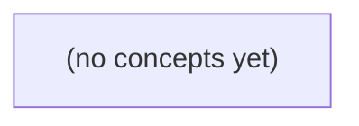

# 08.11 分布式验证：Go 初学者的 IM 历史、故障与证据

*一本面向 Go 初学者的静态教材，以虚构即时通信业务为主线，建立从服务承诺、调用历史、线性化判定到故障注入与证据审查的完整验证思路。全书围绕 S2、S3 与纸上 L 合同的边界，配套 22 道带反馈练习，强调“验证有限历史与明确模型”，而非泛称系统已经正确。*

**章节:** 2

---

## 本书导览

- 了解整本书的章节脉络
- 掌握各章之间的概念依赖关系
- 选择最合适的阅读顺序

# 08.11 分布式验证：Go 初学者的 IM 历史、故障与证据

一本面向 Go 初学者的静态教材，以虚构即时通信业务为主线，建立从服务承诺、调用历史、线性化判定到故障注入与证据审查的完整验证思路。全书围绕 S2、S3 与纸上 L 合同的边界，配套 22 道带反馈练习，强调“验证有限历史与明确模型”，而非泛称系统已经正确。

下方的概念图展示了本书 0 个核心概念以及它们之间的依赖关系；再下方是 1 个章节的入口。你可以按从上到下的顺序阅读，也可以根据自己的兴趣或先验知识选择切入点。

#### 概念图



## 章节索引

- **08.11 分布式验证：一条旧读何时真违反承诺** — 面向Go初学者，围绕虚构IM m-9的发送与有权历史读取，讲清有界历史、线性化反例、故障注入证据、派生追赶和模拟/实测边界。

## 08.11 分布式验证：一条旧读何时真违反承诺

- 先声明权威读合同再构造故障
- 记录调用/返回与未知结果
- 手判不重叠旧读和重叠旧读
- 建立有限状态线性化模型与Porcupine检查边界
- 分别验证outbox、权限、派生追赶和设备回执
- 报告模拟与真实测试的覆盖范围

本节以 m-9 的发送与授权历史读取为主线，先界定权威读合同，再判断一条旧读是否构成真正的承诺违例。

### 先写清权威历史读取合同

### 先写清权威历史读取合同

对 `m-9 / c-a / seq9`，不能仅凭“B 曾读到”就声称系统违反承诺；先要写清 B 读取的是哪一种对象、该对象在何时必须反映发送结果。

- **S2：`accepted_in_memory`**  
  A 的发送请求已被当前进程接受并保存在内存中。这至多承诺“本次执行暂未失败”或“可继续尝试处理”，不承诺持久化，也不承诺任何读取端点已经线性化地可见 `m-9`。因此，B 此时通过历史读取看不到该消息，通常不是合同违例。

- **S3：`stored_in_teaching_db`**  
  `m-9` 已进入本地教学数据库的提交提议范围，或本地事务已成功；但这仍不足以自动推出所有副本、缓存、搜索结果和通知流均已同步。尤其不能把“本地 DB 成功”偷换为“任意旧读都必须返回新消息”。

纸面上的 **L 合同** 应明确指定判断对象：同一权威 `HistoryRead` 端点。若 A 已获得该端点所定义的成功结果，则之后 B 在具有 `c-a` 读取权限的前提下，对**同一权威端点**发起的历史读取必须能观察到 `m-9`；这才是线性化承诺。

`SearchIndex`、`Notify` 等派生系统可允许滞后：它们不属于 L 的即时可见性对象，应分别声明修复期限、重试方式与超期告警。这样，一条旧读只有在命中权威 `HistoryRead`、发生在成功线性化之后、且 B 仍被授权时，才构成真正的承诺违例。

### 用调用、返回与未知结果重建时序

### 用调用、返回与未知结果重建时序

判断旧读是否违约，先不要把“日志出现过”“请求发出过”当作已完成操作。对 `m-9/c-a/seq9`，至少记录以下事件：

- A：`send(m-9, c-a, seq9)` 的调用与返回；
- B：`HistoryRead(m-9)` 的调用与返回；
- 授权：B 在读取线性化点是否仍具备读取权限；
- 结果：成功、明确失败，或未知。

可将一次操作表示为区间：

\[
op=[t_{\mathrm{call}},\,t_{\mathrm{return}}]
\]

若 A 的发送已成功返回，而 B 的权威 `HistoryRead` 在其后调用并成功返回“未找到”，且二者之间不存在删除、撤销或可见性变更，则这是需要解释的候选违例。相反，以下情形不能直接定性：

- A 的发送没有返回：服务端可能已接受，也可能根本未处理；
- B 的读取没有返回：客户端超时不等于服务端未执行；
- B 收到明确失败：需区分“无权限”“不存在”“暂不可用”等失败语义；
- B 查询的是 `SearchIndex` 或 `Notify`：其滞后不等同于权威历史读取违约。

`accepted_in_memory` 仅说明 S2 曾在内存中接受，不能据此推导持久化或线性化完成；S3 的本地数据库提交也只增加证据，仍须由同一权威 `HistoryRead` 端点的调用—返回顺序来检验纸上 L 合同。未知结果应保留为未知，而非补写成成功或失败。

### 手判不重叠旧读与重叠旧读

### 手判不重叠旧读与重叠旧读

设 A 向权威端点提交 `m-9/c-a/seq9`，B 已获授权读取同一 `HistoryRead`。判断旧读是否违约，关键不是“读到了旧值”，而是读、写在真实时间上是否重叠，以及该端点是否承诺线性化。

- **不重叠：旧读可能是真违例。**  
  时序为：A 的写请求完成并向客户端返回成功；随后 B 才发起 `HistoryRead`，却仍读不到 `m-9`。若写的“成功”已代表该权威历史服务的线性化提交，则写操作必须排在读操作之前：

  \[
  W(m\text{-}9)\ \text{返回成功} \prec R_B\ \text{开始}
  \Rightarrow R_B\ \text{应观察到}\ m\text{-}9
  \]

  此时 B 的旧读无法在线性化顺序中解释，属于对 `HistoryRead` 合同的违背。仅有 `accepted_in_memory` 不足以作此判断：它若未承诺持久化或线性化，返回成功不能作为上述 \(W\) 的完成点。

- **重叠：旧读未必违例。**  
  若 B 的读取已经开始，而 A 的写尚未返回；或者 A 的写在执行中、B 的读也在执行中，则两者重叠。即使 B 返回旧历史，系统仍可把该读线性化在写之前：

  \[
  R_B\ \text{开始} \prec W(m\text{-}9)\ \text{完成}
  \]

  因而“写最终成功、并发读仍旧”本身不是违规证据。

`stored_in_teaching_db` 至多表示本地数据库提交的候选语义；只有它被明确提升为权威 `HistoryRead` 的线性化成功，才可用“写已返回后的旧读”判定违约。派生的 `SearchIndex`、`Notify` 则可滞后，应按各自修复期限评估。

### 以有限状态模型检查线性化边界

### 以有限状态模型检查线性化边界

可将 `m-9/c-a/seq9` 抽象为有限状态机：

`未发送 → 已受理 → 已提交 → 权威历史可见`

其中，`已受理`对应 S2 的 `accepted_in_memory`；它只说明进程内接受成功。S3 的 `stored_in_teaching_db`至多使状态进入“本地已提交”，还必须明确该数据库是否就是对外承诺的权威历史。只有权威 `HistoryRead` 能在其线性化点之后返回 `m-9`，才能称为“权威历史可见”。

模型可定义两类操作：

- `Send(m-9)`：成功返回时，将消息写入权威状态，或规定其尚处于可失败的受理状态。
- `HistoryRead(B, c-a)`：若 B 对 `c-a`有读取权限，则返回线性化点之前该会话的权威消息序列。

Porcupine 输入的是操作调用时间、返回时间及结果，并检查是否存在一个满足实时先后关系的顺序，使每次读取都符合该状态机。因此，若 `Send(m-9)` 已成功完成，随后 B 的同一权威端点读取成功却缺少 `m-9`，且模型要求发送成功即提交，则历史不可线性化，构成真实违例。

但 Porcupine 不能自行推断“成功”含义：若 S2 返回不承诺持久化，模型就不能把它编码为提交；若 S3 仅承诺本地数据库，也不能自动推出所有读取线性化。它同样不能用 `SearchIndex` 或 `Notify` 的滞后结果否定权威历史合同；这些派生系统应另以“最终修复期限”建模和验证。

### 分离权威历史与派生链路验证

### 分离权威历史与派生链路验证

验证不能把“消息已被某处看到”混同为“权威历史已满足合同”。对 `m-9/c-a/seq9`，应按链路分层断言：

| 链路 | 应验证的事实 | 失败是否直接违反历史读合同 |
|---|---|---|
| outbox | 写入与待投递事件原子关联；重试不丢失、不重复产生业务效果 | 否；但可能阻塞后续派生 |
| 权限 | B 在读取时对会话 `c-a` 具备有效授权，撤权后不得继续读取 | 是；越权返回属于权威端点违例 |
| 权威历史 | `HistoryRead` 对同一权威端点线性化：成功返回的 `m-9` 之后，后续合格读取不得回退为缺失 | 是 |
| 派生索引/通知 | `SearchIndex`、`Notify` 最终追赶，并在规定修复期限内可观测、可重放 | 通常否；属于独立时效合同 |
| 设备回执 | 设备确认“已接收/已展示”的语义、去重键与离线重传正确 | 否；回执不能反证历史已线性化 |

因此，`S2 accepted_in_memory` 只能测试内存接受、授权门禁和失败恢复路径；即使 B 此时读到 `m-9`，也不能据此宣布持久化或线性化成立。`S3 stored_in_teaching_db` 可进一步验证本地数据库提交、outbox 落账与崩溃恢复，但仍须通过并发写—读—故障切换测试，证明权威 `HistoryRead` 的返回顺序符合合同。

故障注入应覆盖：DB 提交后进程崩溃、outbox 重复投递、索引消费者停顿、通知丢失、设备离线、授权撤销与重连。模拟注入擅长穷举时序和重试分支；真实测试则验证真实数据库、网络、时钟及部署配置。报告中必须标明边界：模拟成功不等于真实线性化证明，真实端到端通过也不自动覆盖所有并发交错。

> **要点** — 旧读是否违约取决于权威 HistoryRead 的线性化合同，而非内存接受、本地提交或派生系统是否已追赶。

验证旧读是否违反承诺，首先要建立可比较的事实记录：谁发起、何时调用、何时返回、看见了什么，以及哪些操作仍然未知。

### 先定义可审计的读写事件

### 先定义可审计的读写事件

要判断一次旧读是否真的违背了承诺，不能只保存“读到了旧值”的结论；必须先把 `Send(m9)` 与 `HistoryRead(c-a)` 记录成可复核、可排序的事件。后续验证器只能依据这些字段推理，不能依赖日志中的自然语言描述或节点本地墙钟。

每个事件至少记录：

- `actor`：发起操作的客户端或测试角色。
- `call_id`：一次调用的唯一标识；调用、返回、重试及其异常都关联到它。
- `target`：请求的目标端点、节点或服务入口。
- `request_id`：传输层或服务层请求标识，用于关联服务端证据。
- `message_id`：对 `Send(m9)` 而言是消息 `m9` 的稳定标识；读事件则记录其查询范围 `c-a`。
- `version`：写入确认的版本、偏移量或序列号；若系统不直接暴露版本，明确记为“未提供”，不可臆造。
- `invoke` 与 `return`：调用进入 harness 的事件，以及收到结果、错误或超时判定的事件。
- `result`：成功、明确拒绝、可重试错误、超时，或 `unknown/pending`。
- `seen_seq`：`HistoryRead(c-a)` 返回中实际观察到的序列位置、消息标识集合或最高版本。
- `endpoint`：实际响应的副本、分区或网关，避免把“读接口”误当成单一存储点。
- `fault_time`：连接断开、进程崩溃、网络注入、恢复等故障发生时刻及其来源。

时间应优先使用同一 harness 产生的单调序号，或显式同步关系，例如“读调用发生在写返回之后”。不同节点的本地墙钟可能漂移，不能仅凭时间戳断言跨客户端先后。

尤其要区分“未观察到返回”和“写入失败”：`Send(m9)` 无回应时，其结果只能是 `unknown` 或 `pending`。此时即使后续读不到 `m9`，也尚不能构成违反承诺；只有写入已被可审计地确认，而满足承诺条件的读仍稳定缺失该版本，旧读才进入违规判定。

### 用单一时序来源界定先后

### 用单一时序来源界定先后

跨客户端验证不能直接比较各节点日志中的本地墙钟：时钟漂移、校时跳变、日志缓冲和网络延迟都可能使“较早”的时间戳实际发生在较晚之后。因此，`Send(m9)` 与 `HistoryRead(c-a)` 的先后应由同一时序来源建立，而非由两个节点各自的 `timestamp` 推断。

最可靠的做法是让单一 `harness` 记录事件边界：

- 调用前记录 `invoke`：`actor`、`call_id`、`target`、`request_id/message_id`、`version`；
- 收到响应后记录 `return`：结果、所见 `seq`、端点及故障信息；
- 每条记录由 `harness` 分配单调递增的 `event_seq`，或置于同一同步执行器的事件流中。

于是可判定：

- 若 `Send(m9).return < HistoryRead(c-a).invoke`，则读操作开始前发送已完成；若承诺要求完成写入可见，旧读具有违反嫌疑。
- 若 `HistoryRead(c-a).return < Send(m9).invoke`，读先于发送，读到旧版本不构成违反。
- 若两者调用区间重叠，或仅知道一方调用而未知返回，则不能凭结果断言违反；应标为 `concurrent`、`pending` 或 `unknown`。

当客户端无法共用一个 `harness` 时，可插入共享协调事件，例如屏障、闩锁或服务端确认令牌：只有在 `Send(m9)` 返回后释放屏障，`HistoryRead(c-a)` 才获准调用。该因果边同样足以证明“发送完成先于读取开始”。

注意，协调事件只应携带操作标识和序号，不记录消息私有正文。无响应也不是失败证据：它可能是超时、丢包、服务仍在处理，必须保留为未知状态。

### 把无回应保留为未知状态

### 把无回应保留为未知状态

一次 `Send(m9)` 或 `HistoryRead(c-a)` 没有收到响应，并不等价于“操作失败”。超时、连接断开、进程崩溃、响应包丢失，都可能发生在请求已到达服务端、甚至服务端已提交结果之后。若验证器把这类事件直接标为失败，就会错误删除本应参与时序判断的操作。

建议为每次调用记录终态或暂态：

- **成功**：收到了可验证的正常响应。`Send` 记录返回的 `message_id`、`version` 等；`HistoryRead` 记录结果、所见 `seq` 与返回版本。
- **明确失败**：收到了服务端或协议层可辨认的拒绝，例如鉴权失败、参数非法、冲突拒绝。此时可记录错误码、返回事件和端点；它表示该次调用未按目标语义成功完成。
- **未知**：调用已发出，但在故障时间后没有得到可归因的响应。原因可以是超时、断连、客户端退出或响应丢失。未知不是失败，而是“可能已执行，也可能未执行”。
- **进行中**：采集结束时调用尚未返回，或只有调用事件、尚未达到超时判定条件。它同样不能被视为失败。

例如，客户端在 `t_1` 调用 `Send(m9)`，`t_2` 网络断开；另一客户端在同步关系上晚于 `t_1` 发起读取，却读到旧版本。此时 `Send(m9)` 应保留为 `unknown`：若它已在线性化点前提交，旧读可能违反承诺；若未提交，则未必违反。验证器应报告这种依赖未知操作的条件性结论，而非擅自判定“发送失败”。

故障时间应来自统一 harness 或明确的跨客户端同步关系，不能依赖节点本地墙钟。记录 `actor`、`call_id`、`target`、`request_id`、端点、调用/返回事件与故障时间即可；无需记录消息私有正文。

### 最小证据账本的记录示例

### 最小证据账本的记录示例

设客户端 `u17` 先发送消息 `m9`，随后客户端 `u23` 读取会话 `c-a` 的历史。账本只保存可验证的元数据，不保存消息正文、附件内容或其他私有载荷：

| 事件 | actor | call_id | target | request_id | message_id | version/seq | 端点 | 时间与结果 |
|---|---|---|---|---|---|---|---|---|
| 调用发送 | `u17` | `send-801` | `c-a` | `req-44` | `m9` | `v?` | `POST /send` | `T0` 发起 |
| 发送返回 | `u17` | `send-801` | `c-a` | `req-44` | `m9` | `v=3021` | `POST /send` | `T1` 成功；承诺点 |
| 调用历史 | `u23` | `read-219` | `c-a` | `req-77` | — | `since=3018` | `GET /history` | `T2` 发起 |
| 历史返回 | `u23` | `read-219` | `c-a` | `req-77` | — | `seen_seq=3020` | `GET /history` | `T3` 成功；结果不含 `m9` |

这里的核心关联是：`send-801` 的返回确认 `m9` 已获版本 `3021`；`read-219` 针对同一 `target=c-a` 返回的历史最高所见序号却是 `3020`。若 `T1 \prec T2` 由同一测试 harness 的同步屏障、或可审计的请求依赖关系证明，则该读在发送承诺之后开始，`m9` 缺失构成候选旧读证据。

故障也应单独记录。例如 `read-220` 在端点 `GET /history` 于 `T4` 超时，则记为 `pending` 或 `unknown`，并记录故障时间、端点和 `call_id`；不能把“未收到响应”直接写成“历史不含 `m9`”。节点本地墙钟仅可辅助排障，不能单独用于断言跨客户端先后。

### 从事件账本走向线性化判定

### 从事件账本走向线性化判定

事件账本的目标不是复原所有网络细节，而是为每个操作建立可比较的区间：

\[
op=\langle actor,call\_id,target,request\_id,message\_id,version,t_{call},t_{return},result,seq,endpoint,fault\rangle
\]

其中，`Send(m9)` 记录发送调用、返回结果及写入版本；`HistoryRead(c-a)` 记录读取调用、返回结果与所见 `seq`。不记录私有正文，但必须能判断“读到哪个版本”以及“该版本是否早于已完成的发送”。

若写操作 \(W\) 的返回早于读操作 \(R\) 的调用：

\[
t_{return}(W) < t_{call}(R)
\]

则二者**不重叠**。在承诺语义要求“已成功发送的消息应出现在后续历史中”时，若 \(R\) 成功返回，却未见 `m9`、或其 `seq` 仍落在 \(W\) 之前，这是一条强违例证据：任何尊重真实时间的线性化顺序都必须令 \(W\) 位于 \(R\) 之前。

若区间重叠，即 \(R\) 在 \(W\) 返回前已调用，或 \(W\) 在 \(R\) 返回后才结束，则旧读未必违规。线性化可将 \(R\) 放在 \(W\) 之前；此时账本只能标记为“可疑但可解释”，不能据此断言违反承诺。

跨客户端的先后关系只能由同一 harness 的统一记录，或显式同步事件（例如确认、屏障、因果关联的 `request_id`）确定。节点本地墙钟仅作诊断，不可单独构造全局顺序。无返回、超时或连接故障的操作应保留为 `pending` 或 `unknown`：它们可与其他操作重叠，但不能被擅自当作失败或成功。

输入有限状态模型与 Porcupine 时，只提交可观察的调用、成功返回、抽象结果和可信顺序约束；私有正文、猜测的服务端状态及不可靠时钟不应进入证据边界。

> **要点** — 旧读判定依赖可比的调用—返回证据；无回应只能标为未知，不能擅自视为失败。

本节用三条带时间线的历史，界定旧读何时违反承诺，何时只是并发下允许的观察结果。

### 先写清读合同与前提

### 先写清读合同与前提

判断“读到了旧值”是否出错，不能只看返回值，还要先写清系统究竟承诺了什么。

- **S3 存储合同**：`Send` 返回 `stored`，通常只表示消息已被某个存储层接收、持久化或进入后续投递流程。它本身**不自动推出**：此刻所有读取副本都已可见该消息，更不推出读操作必须返回最新序号。
- **显式线性化读合同 L**：若 `Send` 在 $t_2$ 返回成功，之后在 $t_3$ 才调用具有权威读取资格的 `Read`，且期间没有删除、覆盖或改变可见性的操作，那么该 `Read` 不应返回仍停在旧状态的 `seq8`。这里违反的是 **L**，不是单凭 `stored` 就能推出的性质。
- **同会话单调读承诺**：这是另一项可选合同。若同一会话已经读到 `seq9`，后续又读到 `seq8`，即使两次读取都可能来自副本，也构成会话视图倒退；是否违规取决于是否声明了“后读不得比先读旧”。

因此，证明旧读违规时必须同时列出：写入何时完成、读是否具备权威性、两者是否重叠，以及是否承诺会话单调性。没有这些前提，`stored` 后出现旧读未必是合同破坏。

### 不重叠旧读为何构成反例

### 不重叠旧读为何构成反例

考虑历史 `Hbad`：

1. $t_1$：客户端调用 `Send(seq9)`；
2. $t_2$：`Send` 返回“已存储”；
3. $t_3$：有权威读取资格的节点 B 调用 `Read`；
4. $t_4$：B 的读取返回 `seq8`。

关键约束是：`Send(seq9)` 已在读取开始前完成。因此两者不是并发操作，线性化顺序不能把 `Read` 安排到 `Send` 之前；任何尊重真实时间的顺序都必须满足：

\[
Send(seq9) \prec Read_B
\]

又假定 B 对该对象具有权威读取权限，且从 `Send` 完成到 `Read` 返回期间不存在删除、回滚或覆盖为旧版本的变更。于是，在 `Send(seq9)` 的“已存储”承诺生效后，B 的权威读至少应能观察到 `seq9`，或观察到一个更晚的合法版本；返回较旧的 `seq8` 没有可用的状态转换来解释。

这正是显式 $L$ 合同被违反的地方：$L$ 不只是说写入最终会传播，而是要求一个已成功完成的存储，对之后非重叠的权威读取可见。若系统允许该读仍返回 `seq8`，那么“已存储”至多表示请求被接受、进入异步流程或写入某个副本，不能表示 $L$ 所要求的已生效状态。

注意，`S3` 合同本身并不自动蕴含 $L$。只有当 `S3` 的“存储成功”被额外解释为对后续权威读可见时，`Hbad` 才构成反例。

### 重叠读不能仅凭旧值定罪

### 重叠读不能仅凭旧值定罪

考察历史 `Hoverlap`：

- $t_1$：`Send` 调用；
- $t_2$：`Read` 调用；
- $t_3$：`Read` 返回 `seq8`；
- $t_4$：`Send` 返回“已存储”。

虽然读操作返回的是旧值 `seq8`，但它与发送操作在时间上重叠：发送尚未完成时，读取已经开始并结束。线性化要求只约束**不重叠**操作的先后；对于重叠操作，可以选择任意一个与各自调用—返回区间一致的瞬间作为其生效点。

因此，可将 `Read` 线性化在 `Send` 之前：

\[
\operatorname{lin}(\text{Read}) < \operatorname{lin}(\text{Send})
\]

在这个顺序中，读取 `seq8` 是合理的：当读生效时，新发送尚未成为抽象对象中的已存储状态；随后发送生效并成功存储。最终观察到“读到 8、发送成功”并不矛盾。

关键不在于“发送调用得更早”，甚至也不在于读返回时发送看起来已接近完成；关键是发送的**响应**发生在读响应之后，二者存在重叠。显式 $L$ 合同承诺的是线性化，而不是“只要新写已被调用，后续开始的读就必须看见新值”。若要禁止这种旧读，需要更强的合同，例如读必须包含所有调用已发生的发送，或引入会话单调读等额外保证。

### 单调读是另一项可验证承诺

### 单调读是另一项可验证承诺

考虑历史 $H_{\mathrm{mono}}$：副本或客户端会话 $B$ 先完成一次读取并得到 `seq9`，随后在同一会话中再次读取却得到 `seq8`。直觉上这是“倒退”，但能否判为违规，取决于合同是否明确要求**单调读**，而不取决于 `seq8` 是否较旧这一事实本身。

若声明单调读合同，可写为：对同一会话内按程序顺序完成的两次读 $R_1 \prec_B R_2$，

$$
\operatorname{seq}(R_2)\ge \operatorname{seq}(R_1).
$$

于是先见 `seq9`、后见 `seq8` 直接违反该不变量：会话已经获得较新的观察结果，系统不应再让它回到更早版本。验证时只需确认两读属于同一逻辑会话、`seq9` 的返回先于 `seq8` 的调用或完成，并比较版本序号；不必证明 `seq8` 在全局上从未有效。

但若合同仅为 `S3 stored`，其含义只是发送操作最终被存储，通常不承诺读会话的版本推进；即使读到旧副本，也不能仅凭 $9\rightarrow8$ 判定违反 `S3`。同样，显式 `L` 合同约束的是某次发送完成后、在给定权限与无删除变更条件下的可见性，并不自动推出“后续读取不得比先前读取更旧”。

因此，`Hmono` 的结论应表述为：它违反的是已声明的单调读承诺；没有该承诺时，它只是暴露了系统允许会话观察回退，而非对 `S3` 或 `L` 的必然反例。

### 把历史编码为检查器输入

### 把历史编码为检查器输入

检查器不直接理解“旧”或“新”，只接受带因果边界的操作历史。每条事件至少记录：

- `invoke/return` 时间、操作类型、对象键、请求标识；
- 写入值与返回状态：`stored`、失败、超时或结果未知；
- 读取返回的版本号，如 `seq=8`；
- 客户端会话、节点身份及权限，例如 `B=authoritative`；
- 删除、撤权、迁移等会改变可见性合同的事件。

可将一次操作编码为：

`op(id, kind, key, value?, invoke, return?, result, client, role)`

其中超时不能自动当作失败：若发送已到达而返回未知，模型必须允许该写入“可能已生效”。删除也不能省略；否则检查器可能把一个本应不可见的旧版本误判为合法历史版本。

对显式线性化合同 $L$，有限状态模型维护每个键的当前权威版本及版本序号。`Send stored seq=8` 完成后，若无删除或覆盖，随后由有权威读取资格的 `B` 发起的读返回 `seq=8`，则应存在合法线性化点。反之，在 `Send` 已完成后，`B` 的权威读仍返回更旧版本，且期间无删除、撤权或未知写入可解释该结果，历史 `Hbad` 应被判违反 $L$。

Porcupine 可将调用—返回区间作为偏序约束，搜索一个满足规格的串行排列。对 `Hoverlap`，读与写重叠：读取可线性化在发送之前，故读到旧值不违反 $L$。这正是“完成后旧读”与“并发旧读”的关键差别。

单调读需另建会话状态：为每个客户端保存最近成功读取的序号 $r_c$，要求下一次读满足 $seq \ge r_c$。因此 `B` 先读 `9`、后读 `8` 的 `Hmono` 违反单调读；但它未必违反单键 $L$。尤其要避免把 `S3` 的“已存储”结果误写成读后必见合同：`S3` 本身并不包含 $L$ 或会话单调读保证。

> **要点** — 旧读是否违规取决于已声明的读合同、操作是否重叠，以及权限和状态变更证据；S3 本身不自动推出线性化读。

线性化验证不问系统“看起来是否最终一致”，而问每次已完成操作能否在其调用与返回之间安放一个符合顺序规格的瞬间。

### 先把权威读取合同写成顺序规格

### 先把权威读取合同写成顺序规格

线性化检查的起点不是实现代码，而是一份无歧义的顺序规格。设系统状态为消息集合：

$$
S \subseteq \{(id, seq, payload)\}
$$

其中 `id` 是全局唯一消息标识，`seq` 是由权威提交路径分配的单调递增序号。对非空集合定义：

$$
maxseq(S)=\max\{seq\mid (id,seq,payload)\in S\}
$$

空集合可约定返回 `0`，或使用“无消息”的显式结果；两者必须在合同中固定。

- `Send(id, payload)`：前置条件是 `id \notin ids(S)`。成功后，状态加入唯一一条新消息 `(id, maxseq(S)+1, payload)`，并返回该消息的 `seq`。若同一 `id` 重试，规格必须明确：是返回首次成功的既有结果，还是报告重复，而不能悄悄再写入一条消息。
- `Read(auth)`：仅当调用者满足授权条件 `auth` 时允许执行。它返回当前状态中的 `maxseq(S)`，以及对应消息；若集合为空，返回约定的空结果。这里的“当前”是顺序规格中的单一瞬间，不是副本稍后可能追上的值。

因此，一次有权 `Read` 若返回序号 `k`，就断言在线性化点上不存在任何 `seq>k` 的已提交消息。授权失败、参数非法等可作为确定的错误返回，不改变状态。

超时尤其不能含糊：客户端超时只说明调用方未收到结果，不自动说明操作未生效。若服务端可能已提交 `Send`，历史中应将其建模为结果未知或未完成操作；若协议保证超时前未提交，才可建模为失败且状态不变。这样，后续验证的“旧读”才有明确可判定的违约含义。

### 调用—返回区间如何约束线性化点

### 调用—返回区间如何约束线性化点

对每个**完成操作** $op$，线性化要求选择一个点 $\ell(op)$，满足：

$$
invoke(op) \le \ell(op) \le return(op)
$$

随后把所有操作按 $\ell$ 的先后排成一个顺序历史，并要求该顺序历史满足对象的顺序规格。关键约束来自真实时间，而不是客户端编号、网络到达顺序或日志写入顺序。

若操作 $A$ 的返回早于操作 $B$ 的调用：

$$
return(A) < invoke(B)
$$

则二者区间完全不重叠。因为 $\ell(A)$ 必须落在 $A$ 的区间内、$\ell(B)$ 必须落在 $B$ 的区间内，必有：

$$
\ell(A) < \ell(B)
$$

所以顺序历史中必须把 $A$ 排在 $B$ 前。这是线性化的实时保序规则：已经被某个客户端观察为完成的效果，不能在后续才开始的操作之后才生效。

反之，若 $A$ 与 $B$ 的调用—返回区间重叠，则真实时间并未决定它们的先后。例如：

- $A$：调用于 $t_1$，返回于 $t_4$；
- $B$：调用于 $t_2$，返回于 $t_3$；
- 且 $t_1<t_2<t_3<t_4$。

此时可令 $\ell(A)<\ell(B)$，也可令 $\ell(B)<\ell(A)$；只要所选顺序能解释返回值并符合规格即可。对 `Send(id, msg)` 与 `Read()` 而言，重叠的 `Read` 可以被解释为看见该 `Send`，也可以被解释为尚未看见它；但若 `Send` 已返回后 `Read` 才调用，`Read` 就不能再返回缺少该消息的旧状态。

### 一条旧读何时构成真正反例

### 一条旧读何时构成真正反例

设状态为按序号保存的消息集合，`Send(id, payload)` 为消息分配唯一且递增的 `seq`，`Read()` 必须返回当前已提交消息中的最大 `seq`。判断“读到了旧值”不能只看结果大小，而要看调用—返回区间能否安排线性化点。

- **发送已完成，读取随后才开始：真正反例。**

  ```text
  Send(A) 调用 ───── 返回，得到 seq=10
                         Read() 调用 ───── 返回 9
  ```

  `Send(A)` 已在 `Read()` 调用前返回，因此实时顺序强制要求 `Send(A) < Read()`。在任何满足该顺序的串行历史中，`Read()` 时最大序号至少为 `10`；返回 `9` 违反 `Read 返回 maxseq` 的合同。即使副本“稍后会追上”，这也是线性化失败。

- **发送与读取重叠：未必是反例。**

  ```text
  Send(A) 调用 ───────────── 返回，得到 seq=10
          Read() 调用 ── 返回 9
  ```

  两个操作重叠：`Read()` 在 `Send(A)` 返回前已经完成。检查器可将 `Read()` 线性化在 `Send(A)` 之前，此时最大序号仍为 `9`，故返回 `9` 合法。这里的“旧读”只是读落在发送生效之前，并不违反承诺。

关键边界不是“客户端何时看见新消息”，而是操作是否存在重叠。只有当旧读的整个调用区间严格位于相关发送完成之后，且其返回仍小于应有的 `maxseq`，它才构成无法重新排序消除的反例。

### 失败、超时与未知结果的历史建模

### 失败、超时与未知结果的历史建模

线性化检查的输入不是日志摘要，而是操作历史：每个操作至少记录唯一调用标识、客户端、操作类型与参数、调用时刻，以及返回时刻和结果。对玩具对象 `messages`，可记：

- `Send(id, payload)`：成功时写入唯一消息 `id`，并分配递增序号；
- `Read()`：返回当前最大序号 `maxseq`（空集合可约定为 `0`）。

历史中的事件应保留调用—返回配对，例如 `call Send(a)`、`return Send(a, ok)`。检查器据此要求：每个**已完成**操作都能在线性化点处满足顺序模型，且该点落在其调用与返回之间。

结果类别不能混淆：

- **成功返回**：操作已知完成，必须纳入模型。例如 `Send(a)` 返回 `ok` 后，随后完成的 `Read()` 若返回小于 `a` 的序号，可能构成反例。
- **明确失败**：如返回 `duplicate-id`、权限拒绝或条件不满足。若规格规定失败不改变状态，则它仍是已完成操作，但其顺序效果是“无状态变化”；不能把它当作成功写入。
- **超时未决**：客户端未收到响应，但服务端可能尚未执行、正在执行，或已执行成功。此类操作只有调用、没有可靠返回；检查时通常允许它被省略，或允许其以某个合法结果完成。于是它扩大了可解释空间。
- **客户端未知结果**：连接中断、进程崩溃等导致调用方无法判断结果，本质上也属于未决；若后续观察到该 `id` 已存在，则模型可选择其曾成功线性化。

因此，不能把超时直接记成“失败”。若将一个实际成功的 `Send` 伪造为失败，后续 `Read` 的较大 `maxseq` 会显得无来源；反过来，把未决操作强行记为成功，又会制造虚假的旧读违例。检查结论只覆盖所录入的事件、时钟区间和结果语义：有反例说明该历史无法满足模型；无反例只说明该有限历史仍可被解释。

### Porcupine反例与有限验证边界

### Porcupine反例与有限验证边界

Porcupine 的输入不是“系统源码”，而是两类可审计对象：

- **顺序模型**：定义单线程下状态如何演化。例如消息状态为 `seq` 与消息集合；`Send(id, msg)` 要求 `id` 唯一，成功后递增 `seq` 并写入消息；`Read()` 返回当前最大 `seq`，或返回不低于某约定边界的消息视图。
- **并发历史**：每个操作记录调用时刻、返回时刻、输入、输出及结果码。历史中的真实时间约束必须保留：若 A 的返回早于 B 的调用，则 A 必须在线性化顺序中位于 B 之前。

检查器尝试为每个**已完成操作**在其调用—返回区间内选择一个线性化点，使全部操作排成一条满足顺序模型的序列。若找到这样的排列，Porcupine 报告该历史可线性化；这并不要求操作按日志到达顺序解释，而允许重叠操作交换先后。

若找不到排列，Porcupine 可给出反例：一组无法同时满足实时顺序和模型状态转移的操作。例如 `Send(id=7)` 已成功返回，之后才调用的 `Read()` 却返回旧 `maxseq`；在模型规定成功发送立即推进 `seq` 时，这条旧读无法安放，因而构成违反承诺的证据。

失败与超时必须先进入模型语义。明确失败若承诺“不修改状态”，应作为无状态变化操作；超时若客户端未知是否已提交，不能草率当作失败，通常应建模为可能生效的未完成操作，或通过后续查询、唯一 ID 去消除歧义。

Porcupine 的结论始终限于**录入的有限历史与给定模型**：

- 报告反例：证明这段历史不符合该模型；
- 报告可线性化：只证明这段历史存在合法解释；
- 不证明未采集的执行、遗漏字段、时钟记录错误或模型未表达的故障路径同样正确。

因此，它是定位违反顺序承诺的强工具，而不是“系统对所有执行均正确”的总证明。

> **要点** — 旧读只有在无法为全部操作安排兼顾实时顺序与规格的线性化点时，才是违反承诺的证据。

验证旧读前，必须把故障注入、真实服务路径与读写事件放到同一条因果时间线上；否则“成功分区”可能只是无关命令返回了 0。

### 先写清旧读的权威合同

### 先写清旧读的权威合同

验证“旧读是否违反承诺”前，先把承诺写成可判定的合同，而不是把“读到了旧值”直接当作错误。至少定义以下对象：

- `L1`：旧 leader 或旧主副本 `W1`；`L2`：接管后的 leader/主副本 `W2`。
- `v1`：历史版本；`edit(v2)`：已被新权威副本接受并提交的更新。
- `C(v2)`：存储层提交点，例如数据库事务提交、复制多数派确认或版本号持久化。
- `A(v2)`：客户端实际观察到成功响应的时刻；若 HTTP 响应在 `C(v2)` 后丢失，则结果应标为“未知”，不能自动重试并假定写入未发生。
- `R`：读请求的权限、路由与一致性级别；例如是否允许读副本、是否要求 leader 读、是否携带最低版本或租约证明。

旧副本返回 `v1` 构成违规，通常需同时满足：

1. `v2` 已满足合同规定的提交条件，而非仅到达 `W2` 内存；
2. 读 `R` 被承诺为“提交后可见”“线性一致”或“不低于已确认版本”；
3. `R` 实际经由 `W1` 或其服务链路执行，且 `W1` 在该时刻已失去读权威性，例如租约过期、任期被取代或隔离后仍继续服务；
4. 返回的确是 `v1`，并能用版本号、日志位置、时间戳或内容哈希证明其早于 `v2`。

反之，若读合同明确允许陈旧副本、`v2` 的客户端结果未知、`W1` 租约尚有效，或读请求根本未到达 `W1`，则观察到 `v1` 只能说明存在旧副本或旧缓存，不能定性为违反承诺。合同还应明确权限边界：无权读取、被拒绝、超时或网络错误均不等价于旧读；它们是独立的可观察结果，必须与版本正确性分开验证。

### 构造可归因的故障时间线

### 构造可归因的故障时间线

每次验证都应把“故障是否生效”证明为一个带边界的区间，而非一条命令回显。对故障 $F$ 记录：

\[
F=\langle t_{\text{开始}},t_{\text{结束}},\ \text{作用对象},\ \text{受影响链路},\ \text{证据}\rangle
\]

其中证据至少同时覆盖注入器日志、服务端网络观察和存储/状态机事件。只有读请求发生在故障区间内，且其实际依赖链路确实被覆盖，才能将异常结果归因于该故障。

- **隔离旧 leader/主副本**：记录隔离规则安装与撤销时刻，以及 `client→W1`、`W1→quorum`、`W1→DB` 分别是否被阻断。检查 W1 的连接失败、重传、心跳超时和对端拒包日志；不能只看防火墙命令返回 `0`。若读请求实际经负载均衡转到 W2，则 W1 隔离与该读无因果关系。

- **丢失 DB Commit 后的 HTTP 响应**：区分“提交成功但响应丢失”与“提交尚未发生”。记录事务 `BEGIN`、`COMMIT` 返回、WAL/复制位点、HTTP 响应写入或连接断开。注入窗口应覆盖 `COMMIT` 成功之后至响应送达之前；若错误在 `COMMIT` 前已发生，就不能声称验证了“丢响应”。

- **W1 租约过期、W2 接管**：记录 W1 最后一次续租、租约到期 $t_e$、W2 获得 fencing token/epoch 的时刻，以及 W1 是否仍接受读流量。旧读只有发生在 $t_e$ 之后、W2 已接管且 W1 仍返回旧版本时，才构成可解释的违反。

- **延迟 E9，再处理 E10**：记录 E9 入队、拦截开始、释放时刻，以及 E10 的处理、持久化和可见版本。网络证据应显示 E9 未送达消费者或被明确暂存；存储证据应显示 E10 已形成状态。随后重放 `v1/editv2` 时，记录每次幂等键、版本条件和最终版本，防止把重复投递误判为旧读。

### 用版本重放制造旧读压力

### 用版本重放制造旧读压力

设对象初值为 `v0`。客户端先完成一次发送 `E9: write(v1)`，随后对同一逻辑编辑重放 `E10: edit(v2)`。重放不是简单“再写一次”：它应携带同一对象标识、递增版本或幂等键，使验证者能区分“旧副本尚未看见 v2”与“重复请求覆盖了 v2”。

记录每个动作的调用、返回和观测事件：

- `E9`：调用开始、主库提交、HTTP 响应返回；
- `E10`：调用开始、主库提交、HTTP 响应返回；
- `R`：旧 leader/旧副本收到读请求、实际命中的存储节点、返回版本；
- 故障窗口：隔离开始/结束、`W1` 租约失效、`W2` 接管完成。

判断关键是实时间约束，而非注入命令是否返回 `0`。

- **不重叠旧读**：若 `E10` 的成功响应已返回，之后才调用 `R`，而 `R` 返回 `v1`，则不存在合法线性化位置。`E10` 必须在线性化历史中先于 `R`，读却未观察到 `v2`。
- **重叠旧读**：若 `R` 在 `E10` 调用后、响应前完成，返回 `v1` 可能合法。可将 `R` 线性化在 `E10` 提交之前；即使后台已出现部分 `v2` 复制，也不能仅凭此判错。
- **调用后结果未知**：若 `E10` 已发出，但因断链、超时或丢失提交后 HTTP 响应而结果未知，则 `R` 返回 `v1` 通常仍可合法：把未确认的 `E10` 线性化在读后，或视其未生效。只有后续证据证明 `E10` 已成功完成且先于 `R`，旧读才构成违约。

因此，报告应同时给出 `E10` 的数据库提交证据、响应状态及 `R` 实际服务路径。否则读到 `v1` 可能只是请求在分区注入前已落到旧副本，不能归因于“旧 leader 在接管后仍提供陈旧读”。

### 分开验证接管与派生追赶

### 分开验证接管与派生追赶

不要把“W2 已接管”和“所有派生系统已追平”当成同一个断言。前者验证权威写入者是否切换，后者验证异步事件是否按正确版本收敛；两者应使用不同故障窗口、不同观测信号。

1. **接管窗口：只验证权威路径**
   - 记录隔离 W1 的开始/结束时间，并确认隔离覆盖 `客户端→W1`、`W1→租约存储`、`W1→主库` 等实际服务链路，而非仅确认网络命令返回 `0`。
   - 停止或隔离 W1 后，等待其租约明确过期；观察租约存储中的持有者从 W1 变为 W2，记录过期时间、W2 获取时间和 epoch/fencing token。
   - 由 W2 提交新写入，检查主库权威记录的版本、提交号与写入者 token。若 W1 在旧租约后仍可写入，或其写入未被 fencing 拒绝，则接管失败。
   - 同时检查 outbox：W2 的权威提交必须原子地产生对应事件；“数据库已更新但没有 outbox 记录”不是派生延迟，而是提交边界错误。

2. **追赶窗口：故意制造乱序**
   - 令 W2 产生 `E9=v1`，延迟其投递；随后产生 `E10=edit v2` 并先投递。记录延迟注入开始/结束，以及消费者实际观察到 `E10→E9` 的网络顺序。
   - 权限视图、搜索/派生索引应以版本或单调序号拒绝旧事件：处理 E10 后状态为 `v2`；迟到 E9 只能被丢弃、幂等确认或标记过期，绝不能回退为 `v1`。
   - 设备回执也要分开看：可先收到 E10 的回执，后收到 E9 的重复回执；但设备最终可见版本必须为 `v2`，且回执中的事件号、版本号能解释该顺序。

最终证据应同时包含：W2 的 fencing 成功、权威状态为 `v2`、outbox 含 E9/E10，以及全部派生读模型和设备最终收敛到 `v2`。

### 识别注入证据的边界

### 识别注入证据的边界

“注入命令返回 `0`”只证明控制面接受了操作，不能证明数据面上的旧 `leader`、主副本或数据库连接真的被隔离。验证一条旧读是否违反承诺时，应区分不同证据的证明力：

| 证据 | 能证明什么 | 不能单独证明什么 |
|---|---|---|
| 注入命令成功 | 规则被提交给故障工具；记录注入开始、结束时间 | 规则覆盖了实际服务路径；故障发生在请求之前 |
| 代理/抓包观测 | 某条 HTTP、RPC、复制或数据库链路实际被阻断、延迟或重排 | 应用是否已提交状态；客户端是否看到了响应 |
| 服务端日志 | `W1` 是否仍服务读请求，`W2` 是否完成接管，`E9`、`E10` 的处理顺序 | 数据库事务一定持久化；日志时间一定等于真实线性化点 |
| 数据库提交记录 | 写入是否在 `DB Commit` 后持久化，旧副本读取的版本来源 | 客户端是否收到成功响应；旧读是否发生在承诺之后 |
| Porcupine 历史 | 已记录调用/返回能否存在合法线性化顺序 | 历史是否完整、时间戳是否覆盖真实网络路径 |

真实测试中，应把每次注入标为区间 $[t_{\text{start}},t_{\text{end}}]$，并将其与请求发送、代理观测、服务端处理、数据库提交、HTTP 返回逐项对齐。例如，若 `edit v2` 已出现提交记录，但其 HTTP 响应在丢失后才被客户端重试；随后 `W1` 租约过期、`W2` 接管，延迟的 `E9` 又在 `E10` 之后抵达，则旧读违反承诺的关键不是“分区命令成功”，而是：旧读实际命中了仍持有 `v1` 的路径，且发生在 `v2` 的承诺点之后。

模拟通常可精确证明事件调度：先提交、后丢响应、再过期接管、最后重放 `v1/edit v2`。但它证明的是模型在该调度下会失败。真实测试则证明实现曾暴露该路径，却必须用链路观测补足因果关系；若错误早于注入开始发生，便不能归因于该故障场景。

> **要点** — 旧读是否违约取决于可证实的因果历史，而非故障命令是否成功；注入、路径与调用返回必须逐项对齐。

分布式验证先锁定权威读与权限合同，再区分可线性化的事实、异步派生的收敛，以及设备回执的独立语义。

### 先划定权威快照与安全边界

### 先划定权威快照与安全边界

验证“旧读是否违反承诺”前，先指定唯一的权威读模型：SQL 中的 `messages` 与 `outbox`。它们必须由同一事务写入，因而可在同一一致性快照中证明以下事实：

- 消息 `m` 是否已持久化、所属会话 `c`、内容版本与创建时间；
- 对应领域事件是否已写入 `outbox`，例如 `MessageCreated(m)`；
- 消息事实与待投递意图是否原子共存：不能出现“消息已提交而根本没有 outbox 记录”的观察结果；
- 事务提交后的任一权威快照，均可用消息 ID、会话 ID、版本号和 outbox 事件 ID 对账。

可将该合同写为：若事务 $T$ 提交，则在其后的权威快照中，

$$
\text{messages}(m)\Rightarrow \exists e\in\text{outbox}:\ e.message\_id=m.id
$$

这里证明的是“权威事实及派生意图已提交”，不是 SearchIndex 已可搜到、通知已送达，更不是某设备已经展示。

安全边界同样属于读合同。对于用户 `u` 请求会话 `c`，若 `u` 不是 `c` 的成员，则接口必须返回 `404`，而非 `403`、空列表或“会话不存在/无权限”的可区分响应。该 `404` 表示资源对该主体不可观察：

$$
u\notin Members(c)\Rightarrow View(u,c)=404
$$

测试还应比较响应时间、错误码、分页总数和关联消息 ID，避免通过差异泄露 `c` 是否存在、是否活跃或含有多少消息。只有先固定这份“可见即有权”的权限合同，后续旧读、补拉和收敛验证才有可解释的边界。

### 用调用返回判定旧读反例

### 用调用返回判定旧读反例

线性化读合同约束的是**已完成调用之间的真实时间顺序**，不是日志到达顺序。验证时应为每次操作记录调用时刻 $inv$、返回时刻 $res$、参数、结果及请求标识，并寻找一个能保持所有“不重叠先后关系”的线性化点。

设写操作 `Send(m)` 已在权威 SQL 事务中提交，随后查询 `GetMessage(m)`：

- 若 `Send(m)` 在 $t_1$ 返回成功，`GetMessage(m)` 在 $t_2>t_1$ 才调用，却返回“不存在”或旧状态，则两者不重叠。读的线性化点只能位于其调用—返回区间内，必晚于写已完成的事实；这是真正违反“权威读线性化”合同的反例。
- 若 `GetMessage(m)` 在写返回前就已调用，读与写重叠，即使读最后返回旧值，也仍可把读线性化在写之前，因此不构成反例。不能因“返回顺序看起来是先写后读”就判错。
- 若写请求超时、连接断开或结果未知，则不能擅自把它记为“未写入”或“已写入”。应保留未知分支：若服务端实际上提交，后续旧读可能构成反例；若未提交，则不构成。可用幂等请求 ID 到权威历史表追查最终命运。

还要先确认读的是承诺线性化的 SQL 权威接口；`SearchIndex`、通知流或客户端缓存返回旧值，只能说明派生链路尚未收敛，不能拿来证明权威读违约。权限合同同样进入历史：对 `u-c` 非成员，`GetMessage` 应稳定返回 `404`；即使消息已存在，也不得以 `403`、存在性差异或索引结果泄露其身份。

### 有限状态模型与检查器边界

### 有限状态模型与检查器边界

把验证对象缩成有限状态机，才能让历史检查器判断“一条旧读是否真的违反承诺”。状态至少包含：消息是否已提交、收件人是否在该时刻获授权、撤权是否生效，以及读取结果是成功、拒绝还是未知。可将操作抽象为：

- `发送(m,u)`：仅当事务提交后，消息 `m` 进入权威历史；`messages` 与 `outbox` 同事务写入，提交前不可见。
- `授权(u,c)`、`撤权(u,c)`：改变成员资格的权威版本；读取必须按其线性化点对应的授权历史判定。
- `读取(m,u)`：若线性化点上 `m` 已提交且 `u` 有权，返回内容；若无权，返回 `404`，而非暴露“消息存在但禁止访问”的 `403`。
- `未知读取(m,u)`：超时、连接中断或客户端未收到响应时，只记录未知，不能武断标为成功或失败。

检查器可验证的安全性质是：不存在一个可线性化历史，使某次成功读取发生在“消息已提交且用户无权”的状态；也不存在非成员通过不同错误码、索引命中等观察到消息存在。

但 Porcupine 只检查模型中表达的权威语义。若模型未编码撤权版本、`404` 不泄露合同、事务提交边界或未知结果，它就不能替你发现这些错误；若把 SearchIndex、Notify 当作线性化读模型，也会把正常异步滞后误判为违例。派生系统应另以截止时刻、稳定版本、最老未收敛年龄和对账差集验证收敛，而非塞进此有限状态模型。

### 派生追赶采用窗口化对账

### 派生追赶采用窗口化对账

`SearchIndex` 与 `Notify` 是异步派生物，不应拿它们直接判定消息是否已在线性化权威读模型中提交。验证应以同一权限过滤后的权威历史为基准，并把“最终一致”改写为可测量的窗口合同。

设观察窗口为 $[t_0,t_c]$，其中 $t_c$ 是本轮截止时刻；在 $t_c$ 读取权威模型的稳定版本 $v_c$。对窗口内、且在 $t_c$ 前已提交的消息，构造权威集合：

- $A$：满足权限、版本不超过 $v_c$ 的消息 ID；
- $S$：`SearchIndex` 在同一租户、会话及权限范围内可检索到的 ID；
- $N$：`Notify` 已生成目标通知记录的 ID。

对账重点不是“数量大致相同”，而是 ID 差集：

- $A \setminus S$：应被索引但仍缺失的消息；
- $A \setminus N$：应产生通知但尚未派生的消息；
- $S \setminus A$、$N \setminus A$：过期、越权或重复派生，风险通常更高。

为避免刚写入的数据天然落后，再定义最老年龄 $\Delta$：仅要求提交时间不晚于 $t_c-\Delta$ 的记录进入对账。例如承诺“95% 在 10 分钟内可搜索”，就统计年龄至少 10 分钟的 $A$ 中仍落入 $A\setminus S$ 的比例，而非要求所有新消息瞬时出现。

报告应同时记录截止时刻、稳定版本、窗口边界、最老年龄、权限上下文和差集 ID。一次差集归零只能说明该样本在该窗口追上；若未声明最大延迟或持续观测期限，不能据此证明系统“永远最终一致”。

### 离线补拉与回执分层验证

### 离线补拉与回执分层验证

设设备 B 离线 $25\text{h}$，而玩具 broker 仅保留 $24\text{h}$。验证重点不是“B 能否从 broker 重放”，而是 broker 失效后，B 能否以 `cursor/消息ID` 向权威 SQL 历史补拉，并仍受当前权限约束。

测试先在 B 离线期间发送消息 $m$，提交时应原子写入：

- `messages(id, conversation_id, sender, body, created_at)`
- `outbox(event_id, message_id, type, ...)`

随后让 broker 中对应事件过期。B 恢复连接后请求“会话 c 中 `cursor` 之后的消息”；服务端必须在同一权限判定下查询权威历史。若用户 `u` 仍是 `c` 成员，响应应包含 $m$，且消息 ID、顺序键与内容和权威库一致；若 `u` 已被移出成员列表，应返回 `404`，而非空列表、`403` 或泄露消息存在性的错误信息。

收取与已读不能由“补拉成功”替代。应分别验证独立回执状态：

- B 下载并持久化 $m$ 后，上报 `delivered(message_id, device_id)`；
- B 实际打开或推进阅读游标后，才上报 `read(message_id, device_id)`；
- 仅联网、仅收到推送、仅写入本地队列，都不得产生 `read`；
- 重复补拉或重复回执应幂等，不得倒退或制造多份状态。

因此，断言应以权威消息历史和回执表为准：$m$ 可补拉、`delivered` 可独立成立、`read` 仅在真实阅读动作后成立。单次测试只能证明该离线样本最终追上；若未规定补拉截止时间或重试期限，不能声称系统“永远最终一致”。

> **要点** — 权威事实验证安全与线性化；异步派生验证窗口内追赶；无期限证据只能证明样本收敛。

分布式验证只能逐层建立证据：模拟、竞态检测与真实故障测试各有能力边界，不能以局部通过替代端到端承诺。

### 先界定验证结论的适用范围

### 先界定验证结论的适用范围

验证报告首先应说明：结论只覆盖**实际执行过的代码、配置、调度与故障场景**，而不是“系统已经被证明正确”。

- **确定性模拟**通过固定 `seed`、消息投递顺序、时钟推进和故障脚本，枚举或重放受控交错。它适合检查协议状态机、重试、超时、消息乱序下的历史是否满足模型；但模拟器并不等价于真实 `kernel` 调度、网络缓冲、磁盘语义、容器资源压力或生产部署拓扑。模拟通过只能表述为：在该模型及已枚举交错内，未发现违反。

- **`go test -race`**检测本次测试执行路径上被运行时捕获的共享内存竞争。它不能证明不存在未触发路径的竞争，也不判断跨节点消息历史是否线性化，更不能替代一致性检查器对“旧读是否违反承诺”的判定。

- **真实故障测试**可提供更接近部署环境的证据，例如杀进程、网络分区、延迟、丢包、重启和负载扰动后的观测结果；但它仍只是有限代码版本、流量分布、持续时长与故障组合的样本，未观测到异常不等于异常不可能发生。

因此，结论应写成“在 `commit`、环境、配置、种子、故障脚本和已保存历史所定义的范围内，通过某检查器版本验证”，而非笼统声称“验证通过”。固定 OpenIM 源码路径但未实际构建、运行和留存证据时，只能记录为待验证，不能写入通过结论。

### 确定性模拟枚举受控交错

### 确定性模拟枚举受控交错

确定性模拟的目标不是“制造随机压力”，而是把可能导致旧读的关键交错压缩为可穷举、可复现的状态空间。模拟器应固定逻辑时钟、节点初始状态、消息队列顺序与伪随机种子；每次状态转移都只在预定义调度点发生，例如：

- 发送派生更新前后；
- 消息入队、延迟、重复、丢弃或重排时；
- 节点写入授权状态、读取本地视图时；
- 派生节点追赶父状态时；
- 回执生成、送达、确认或超时时。

可将系统状态抽象为：

$S=(t,\;A,\;D,\;Q,\;R)$

其中 $t$ 为逻辑时间，$A$ 为各节点授权视图，$D$ 为派生进度，$Q$ 为待投递消息队列，$R$ 为回执与确认状态。调度器从有限候选动作中选择下一步；给定相同种子与动作序列，必须得到相同 history 和结果。

重点枚举“承诺边界”附近的交错：撤销已提交但派生消息未送达、授权读取发生在旧派生视图上、回执先于实际追赶到达、重复消息覆盖较新状态、网络分区后节点带旧授权恢复。对每条读操作记录其观察版本、已知承诺点和读取结果；若读在承诺之后仍接受已撤销授权，即输出最短反例轨迹。

有限状态模型只能覆盖被建模的消息语义、调度点和状态上界。它不能证明真实内核调度、网络实现或部署配置同样正确；因此应保存 commit、模拟环境、种子、调度脚本、原始脱敏 history、checker 版本、反例及未覆盖交错。固定 OpenIM 源码路径但未实际运行，不得写作“验证通过”。

### 从模拟反例到线性化判断

### 从模拟反例到线性化判断

设对象为某群组的成员列表，初始版本为 $v_0$。一次历史可记录为：

| 操作 | 时间区间 | 结果 |
|---|---:|---|
| 客户端 A：读取成员 | $[1,8]$ | 返回旧列表 $v_0$ |
| 管理员 B：添加成员 X | $[2,4]$ | 成功，生成 $v_1$ |
| 管理员 C：撤销 A 的读取权限 | $[5,6]$ | 成功 |
| 客户端 A：再次读取成员 | $[7,9]$ | 返回 $v_0$ |

第一条读取与写入重叠：它可在线性化点落在 $[2,4]$ 之前，因此返回 $v_0$ 并不违反承诺。第二条读取在“添加完成”和“权限撤销完成”之后才开始；模型若规定无权限应返回拒绝、拥有权限则应返回至少 $v_1$，那么返回旧列表 $v_0$ 无法插入任何合法的顺序位置，Porcupine 会给出不可线性化反例。

未知结果必须显式建模。例如 B 的写入因超时显示“未知”，不能直接当作成功或失败；检查器应允许该操作在线性化历史中取“生效”或“不生效”之一。若两种解释都无法使后续读取合法，才构成反例；若存在一种解释可行，只能说明历史证据不足，不能宣称发现一致性错误。

模型还要纳入权限状态、版本推进和错误码语义，否则“读到旧值”可能被错误归因于存储。Porcupine 的结论仅覆盖输入的脱敏 history 与模型：它能发现该历史中的线性化矛盾，不能证明未采集到的节点、网络分区、代码版本或权限路径均正确。应保存原始历史、模型版本、检查结果与反例，并注明未覆盖范围。

### 竞态检测与真实故障的有限证据

### 竞态检测与真实故障的有限证据

`go test -race` 提供的是**进程内、已执行路径**上的内存竞争证据：它能发现两个 goroutine 未经同步地并发读写同一内存位置等问题。若测试没有走到某条重试分支、某个缓存淘汰路径或某种取消时序，检测器就不会对该路径作出结论。更重要的是，`-race` 不理解跨节点消息、持久化提交、领导者切换或客户端观察历史；“未发现竞态”不等于操作满足线性化、读己之写或旧读不违反承诺。

真实故障测试则把关注点扩展到系统边界，例如：

- 网络分区、延迟、乱序、丢包与重复投递；
- 进程崩溃、重启、磁盘满、持久化失败；
- 客户端超时、重试、重复请求与连接迁移；
- 配置错误、服务发现异常、滚动升级和资源争用。

但这类测试仍是有限样本：它只覆盖某个代码提交、某套镜像与配置、某段流量、某个故障脚本及有限运行时长。一次分区后恢复正常，只能证明该次注入条件下未观察到违例，不能证明所有分区长度、恢复顺序和并发历史均安全。

因此，报告应分别陈述证据边界：`-race` 覆盖了哪些测试执行；故障测试注入了哪些场景、持续多久、观察了什么不变量。保存代码 commit、环境与随机 seed、故障脚本及其实际生效证据、脱敏后的原始 history、checker 模型版本与结果、反例和未覆盖范围。仅固定 OpenIM 源码路径而未实际运行，不得写作“验证通过”。

### 形成可复核的验证证据包

### 形成可复核的验证证据包

一次“验证通过”必须能被他人在尽量相同的条件下复现、审计和质疑。建议将每轮验证固化为证据包，而非只保留截图或口头结论：

- **版本与环境**：记录被测代码的提交哈希、依赖锁定文件、构建命令、镜像摘要、操作系统与内核版本、集群拓扑、配置文件及部署参数。仅固定 OpenIM 源码路径而未实际构建、部署和运行，不得写为“验证通过”。
- **可重复输入**：保存模拟器种子、测试用例生成器版本、客户端请求集、初始状态，以及故障脚本：何时注入分区、延迟、丢包、进程退出、磁盘异常或节点重启。随机测试应记录 `seed`，使失败样本可重放。
- **有效运行证据**：保存测试起止时间、实际执行命令、退出码、关键日志、指标、节点状态和故障注入回执。脚本“已提交”不等于故障“已生效”；应有日志或控制面证据证明目标节点、持续时间和影响范围正确。
- **历史与检查结果**：导出原始请求—响应历史，脱敏后保留操作标识、调用/返回时间、参数摘要、结果和客户端标识。附上检查器模型版本、运行参数、判定结果；若发现反例，保存最小化历史、重放步骤及对应日志。
- **明确边界**：报告必须列出未覆盖项，例如未测跨地域分区、未验证旧版本兼容性、未覆盖长时间时钟漂移，或检查器未建模的语义。

可用一句结论约束表述：`在提交 X、环境 Y、脚本 Z 与历史 H 的范围内，检查器 M 未发现违反模型 P 的反例；范围外不作承诺。`

> **要点** — 验证通过必须附带范围：模拟覆盖交错，竞态检测覆盖执行路径，真实测试仅覆盖有限样本；证据与未覆盖项同样必须保存。

分布式验证的关键不在于“读到了旧值”，而在于先确定该读是否违反已声明的权威读合同，并用可审计的历史与故障证据证明它。

### 先定义权威读合同与可观察边界

### 先定义权威读合同与可观察边界

“读到旧值”本身不是缺陷；只有它落在某项已声明的权威读合同之外，才构成违反。对 `m-9`，应先把读分为四类，并为每类写明可观察的承诺：

- **权威历史读取**：例如查询消息是否已撤回、成员在某时刻是否存在。它应返回某个明确快照 $S_k$ 中的状态，并附带可比较的序号或版本；若声明线性化，则读结果必须能插入真实调用—返回区间内的全序历史。
- **派生读取**：例如未读数、会话摘要、搜索索引。它可以滞后于权威历史，但必须标识来源快照、允许的滞后界或“处理中”；不能把 `pending/unknown` 伪装成确定的否定结果。
- **设备回执**：设备上传“已读到 `seq=8`”是单调事实，而非对服务器当前消息状态的权威判断。后续撤回、权限收回或重排不会使该回执倒退；因此 `seq=8` 不等价于“设备必然见过第 8 条的最终内容”。
- **权限判断**：必须绑定判断时使用的成员关系、角色和策略版本。`S2` 的“可读”不自动推出 `S3` 仍可读；缓存命中只能证明曾在旧快照获准。

对每次响应，至少区分：读取快照 `S`、提交顺序 `L`、对客户端可见的截止时间 `D`。`S2`、`S3` 是状态快照，`L` 是操作线性化位置，不能混用；同一 `snapshot` 中写入的 outbox 事件才可宣称与业务状态原子对应。若合同仅为最终一致性，则应说明在 $D$ 前可返回 `unknown/pending`，并在有界期限后收敛；若无期限，便不能将“稍后会一致”当作可验证承诺。

### 用调用、返回与未知结果重建历史

### 用调用、返回与未知结果重建历史

验证从有限历史开始：不要只记录“某次读到了旧值”，而要为每个操作记录可比较的边界：

\[
o=(\text{id},\text{类型},\text{输入},t_{\mathrm{call}},t_{\mathrm{return}},\text{结果})
\]

其中结果可以是成功值、明确失败，或 `pending unknown`。后者表示操作已发出但尚无可审计的返回；它不是“失败”，也不能擅自补成成功或未发生。

两个操作的实时先后关系定义为：

\[
A \prec B \iff t_{\mathrm{return}}(A)<t_{\mathrm{call}}(B)
\]

若写入 `W(x=1)` 返回后，读取 `R(x)` 才调用，却返回 `0`，则二者**不重叠**，旧读直接构成强读/线性一致性承诺下的反例：任何合法线性化顺序都必须把 `W` 放在 `R` 前。

反之，若读取在写入返回前已调用，即两者时间区间重叠，则读到旧值通常仍可合法：

| 操作 | 调用 | 返回 | 结果 |
|---|---:|---:|---|
| `W(x=1)` | 10 | 30 | 成功 |
| `R(x)` | 20 | 25 | `0` |

这里可将 `R` 线性化在 `W` 之前；“发生在墙钟上较晚”不足以证明违反承诺。

`pending unknown` 使历史成为集合而非单一路径。例如写 `W` 在时刻 10 调用、没有返回，随后读到 `1`，可存在“写已提交但响应丢失”的解释；随后读到 `0`，也可存在“写未提交或尚不可见”的解释。评审时应保留两种完成方式，并询问：**是否对所有与证据相容的补全历史都不合法？**只有答案为是，才能据此判定违约。

因此，最小证据应同时保留客户端单调时间、请求标识、返回值、版本/序号及超时状态。没有调用—返回区间，就无法区分真正的非重叠旧读与允许的并发重叠读。

### 手判 seq8 反例中的 S2、S3 与 L

### 手判 seq8 反例中的 S2、S3 与 L

设同一键初值为 `v1`。写操作 `W2` 提交 `v2` 后，后续写 `W3` 又提交 `v3`；读操作 `R8` 返回旧值 `v1`。关键不是给 `R8` 贴“过期”标签，而是检查它能否在真实时间约束内放置一个线性化点 $L_{R8}$。

先区分三个容易混淆的概念：

- **S2**：`W2` 完成后、`W3` 尚未生效前的抽象状态，即键值为 `v2`。
- **S3**：`W3` 完成后的抽象状态，即键值为 `v3`。
- **L**：某个具体操作在全序历史中的瞬间位置；它不是存储副本、日志序号，也不是客户端收到响应的时刻。

若历史满足：

1. `W2` 的响应早于 `R8` 的调用；
2. `W3` 的响应也早于 `R8` 的调用；
3. `R8` 返回 `v1`；

则 $L_{W2}<L_{W3}<L_{R8}$ 已被非重叠的实时顺序强制。`R8` 的 $L_{R8}$ 之后抽象状态只能是 `S3`，合法返回应为 `v3`；即使只考虑 `W2`，也不可能回到初始值 `v1`。因此这是一条确定的线性化违规证据。

反之，若 `R8` 与 `W2` 或 `W3` **重叠**，则不能仅凭“读到旧值”定罪：可尝试将 $L_{R8}$ 放在对应写的 $L$ 之前。尤其 `R8=v1` 时，只有存在一个同时早于 `W2`、`W3` 的可行位置，旧读才可能线性化；若 `W2` 已在 `R8` 调用前完成，该位置即被排除。

`S2`、`S3` 是用于推导返回值的状态，`L` 是用于满足调用—响应偏序的位置。seq8 反例的结论应写成：“基于已记录的调用、响应与返回值，所有满足实时顺序的 $L$ 均要求 `R8` 返回 `v3`，而观察值为 `v1`”，而非笼统声称“副本同步慢”。

### 以 Porcupine 划定模型检查结论

### 以 Porcupine 划定模型检查结论

Porcupine 检查的是**已记录操作历史**能否安排为某个顺序，使其满足给定的有限状态规格；它回答的是“这份历史是否可能线性化”，不是“系统一定没有旧读”。

设规格状态为账户余额、消息序号或对象版本，操作包含调用时间、返回时间、输入与输出。模型通常规定：

- 写入成功后推进状态；
- 读返回当前状态，或在弱合同下返回允许的快照；
- 两个不重叠操作中，前者返回早于后者调用，则顺序必须保持；
- 重叠操作可交换顺序，除非规格额外限制。

因此，`S2` 写入版本 8 完成后，`S3` 才开始读取却返回版本 7，是强读模型下的反例；而写入与读取重叠时，同样的返回可能仍可线性化。尤其不要把“`seq=8` 已在某节点出现”误写成“所有后续读都必须返回 8”：还需证明该写已按合同提交、读发生在其后、两者读取同一权威范围。

Porcupine 的结论分三类：`ok` 表示该历史存在合法线性化；`illegal` 表示在模型与时间戳可信时不存在；`unknown` 常来自历史不完整、`pending` 操作未确定结果或搜索资源不足。`unknown` 不是通过，也不是故障证据。

模型结论、实际故障证据与 race detector 必须分开：

| 产物 | 能支持的结论 | 不能支持的结论 |
|---|---|---|
| Porcupine `illegal` | 该捕获历史违反该形式模型 | 生产中必然存在同类故障 |
| 日志、追踪、快照、请求标识 | 某次实际读违反已声明合同 | 所有执行路径都已验证 |
| race detector 报告 | 检测到 Go 进程内数据竞争 | 跨进程顺序、数据库提交、IM 投递或线性化错误 |
| race detector 未报告 | 此次覆盖下未观测到竞争 | 无竞争，更不等于分布式正确 |

证据应把读与同一快照关联：读请求、返回版本、权威提交记录、outbox 事件及其 `snapshot/version` 必须可对应。对 eventual 合同，还要记录允许陈旧界限与截止时间；在 deadline 后仍未收敛才构成违约。OpenIM 等外部系统的消息回执只能证明其回执语义，不能替代本地权威状态与 outbox 同快照的证据。

### 按链路审查故障证据与追赶时限

### 按链路审查故障证据与追赶时限

“最终会一致”不能替代故障证据：必须把一次旧读放回同一条因果链，确认权威写入、投递事件、消费者处理和读侧可见性。以下三条历史可作为审查矩阵。

| 历史与承诺 | 故障窗口 | 必需证据 | 何时判违约 |
|---|---|---|---|
| 同快照事务写订单状态与 outbox；下游据事件构建读模型 | 数据库提交后、发布前进程崩溃；或重复发布 | 订单行版本、outbox 记录、二者相同事务标识/提交序号、发布尝试与消费者幂等键 | 若订单已提交而同快照中不存在 outbox，属于原子性违约；仅“尚未发布”则是 `pending/unknown`，不能直接称旧读错误 |
| 权限撤销后，消息或资源查询不得继续授权 | 撤销写入与网关、缓存、设备侧策略刷新之间 | 撤销权威版本、鉴权节点实际读取的版本、缓存失效事件、请求时间戳与决策日志 | 合同若规定强制即时撤销，旧版本授权即违约；若声明有界最终一致，只能在截止时限后仍授权时判违约 |
| 写入消息、设备回执和 OpenIM 投递链路最终追赶 | 网络分区、消费者停顿、设备离线、回执丢失 | 服务端消息序号、投递状态迁移、设备确认回执、重试记录、截止时间与时钟来源 | 在 $t<deadline$ 的未见消息是未决；$t\ge deadline$ 且存在“已接收但未处理”或“未投递”的实际证据，才构成有界追赶违约 |

审查 OpenIM 时尤其要区分边界：服务端返回“已发送”通常只证明请求被受理或进入服务端链路，不证明目标设备已展示；设备回执可证明客户端确认，却未必证明用户阅读。因而证据应标注其覆盖层级：`写入`、`入队`、`服务端投递`、`设备确认`、`用户可见`。缺少对应层级日志时，结论只能是未知，不能由超时猜测为实际故障。

> **要点** — 旧读是否违规取决于读合同、实时顺序和可线性化历史；故障注入必须由实际证据而非模拟结论支撑。
