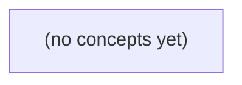

# 08.12 完整一致性案例：Go 初学者的消息链路与故障验证教材

*以 A 发送消息 m-9、B 离线后补拉为主线，建立一套纸面上的未来 S3 SQL 事务事实源架构，并清晰区分当前 S2、权威状态、派生进度与设备投递结果。教材通过状态图、故障案例、迁移协议、验证矩阵和 22 道反馈题，训练学习者避免将提交、broker 接受、索引可见和设备送达混为一谈。*

**章节:** 2

---

## 本书导览

- 了解整本书的章节脉络
- 掌握各章之间的概念依赖关系
- 选择最合适的阅读顺序

# 08.12 完整一致性案例：Go 初学者的消息链路与故障验证教材

以 A 发送消息 m-9、B 离线后补拉为主线，建立一套纸面上的未来 S3 SQL 事务事实源架构，并清晰区分当前 S2、权威状态、派生进度与设备投递结果。教材通过状态图、故障案例、迁移协议、验证矩阵和 22 道反馈题，训练学习者避免将提交、broker 接受、索引可见和设备送达混为一谈。

下方的概念图展示了本书 0 个核心概念以及它们之间的依赖关系；再下方是 1 个章节的入口。你可以按从上到下的顺序阅读，也可以根据自己的兴趣或先验知识选择切入点。

#### 概念图

## 章节索引

- **08.12 完整一致性案例：一条IM消息的事实、归属与恢复** — 面向Go初学者，选定单一虚构IM架构，综合权威SQL、outbox、broker、派生视图、协调元数据、离线补拉、迁移和有界验证。

## 08.12 完整一致性案例：一条IM消息的事实、归属与恢复

- 画出m-9 C0-C9阶段的权威和证据
- 分别恢复提交回应未知、重复发布和毒事件
- 说明协调多数只保护owner元数据
- 设计b1快照+增量和协议混部的切换门
- 让B离线超broker保留后按权限补拉
- 交付故障、对账、验证与固定源码边界矩阵

本节固定一套纸上IM架构，先划清每类事实的唯一权威，再据此推演投递、恢复、补拉与演进边界。

### 单一事实源与组件职责

### 单一事实源与组件职责

这套架构首先规定：同一类业务事实只能有一个权威写入点；其他组件可以缓存、复制、派生或加速读取，但不能反过来裁定消息是否存在、归属何会话或是否应被恢复。

- **当前 S2**：消息仅处于 `accepted_in_memory`。它表示接入层已接受请求并可继续处理，却不是可恢复的持久事实；进程重启、故障切换或内存丢失后，不能承诺该消息仍存在。
- **未来 S3**：以 SQL 中的 `messages`、`conversation_counters` 与 outbox 事件 `E9` 组成唯一权威。三者在同一事务提交：`messages` 保存消息内容、发送者、会话与顺序；`conversation_counters` 保存会话单调计数；outbox 保存待发布的领域事件。事务未提交，则消息不存在；已提交，则恢复必须以数据库为准。
- **broker**：仅承载已发布的 `E9`，例如分区位置 `P0:42`，用于异步分发和短期消费推进。它不是消息归属库，也不承担无限期留存；玩具 broker 保留 24 小时，不能覆盖离线 25 小时的设备恢复需求。
- **SearchIndex 与 Notify**：独立消费 `E9`。前者维护可搜索投影，后者产生通知或推送副作用；两者都允许滞后、重放和幂等，均不可决定消息事实。
- **任务 N9**：保存或执行异步任务状态，不替代消息表，不以任务成功作为消息已提交的证据。
- **G1/G2 路由协调服务**：只管理设备连接、路由租约与副本协调；它知道“现在应向哪里投递”，但不拥有会话成员关系或历史消息。
- **补拉接口**：B 离线 25 小时后，不能依赖已过期的 broker 记录，而应经授权后从 SQL 按会话计数补拉。若 `u-c` 不是成员，接口直接返回 `404`，既不泄露会话存在性，也不返回任何投影数据。

第 08 卷中的独立 Raft `message-log` 玩具只能作为另一种方案讨论，不能与 S3 的 SQL 事实源同时部署为双权威。

### m-9从接收到可恢复的证据链

### m-9从接收到可恢复的证据链

设发送者为 `u-a`，会话为 `c`，消息为 `m-9`。其证据链不是“broker 收到过”，而是逐阶段把可恢复事实落到唯一权威处：

- **C0 接收与鉴权**：服务接到发送请求，验证 `u-a` 对 `c` 的发送权限；若请求来自非成员 `u-c`，直接返回 `404`，不创建消息、计数器或事件。
- **C1 去重定位**：以客户端幂等键查找既有 `m-9`；命中则返回原结果，避免重复写入和重复投递。
- **C2 内存接受**：当前 S2 可处于 `accepted_in_memory`。这只是本进程已接收的暂态证据，进程崩溃后不可恢复，不能对外承诺“已持久送达”。
- **C3 权威事务开始**：演进到 S3 后，在同一 SQL 事务内写入 `messages(m-9)`、递增 `conversation_counters(c)`，并插入 outbox 事件 `E9`。
- **C4 事务提交**：SQL 提交成功才形成消息存在、会话序号及待发布事件的共同提交证据。此时 `m-9` 的权威事实是 SQL 行，而非内存状态、broker 位置或搜索索引。
- **C5 发布到 broker**：outbox 发布器读取已提交的 `E9`，写入 broker；`P0:42` 表示 `E9` 位于分区 `P0` 的偏移 `42`，是传输日志位置，不是消息主键，也不替代数据库提交。
- **C6 独立消费**：`SearchIndex` 与 `Notify` 各自消费 `E9` 并记录自身消费进度；它们失败只意味着派生结果或通知待重试，不否定 `m-9` 已存在。
- **C7 设备路由**：G1/G2 的在线设备映射由独立复制协调服务管理；其路由变化不改写消息归属事实。
- **C8 离线恢复**：设备 B 离线 `25h`，超过玩具 broker 的 `24h` 保留期，即使 `P0:42` 已不可读，仍以授权后的 SQL 查询按会话序号补拉 `m-9`。
- **C9 可恢复结论**：恢复依据是已提交的 `messages` 与 `conversation_counters`，outbox/broker 仅负责异步传播。独立 Raft `message-log` 玩具不能与该 SQL 事实源并列部署，否则会产生双权威。

### 三类故障的恢复判定

### 三类故障的恢复判定

恢复不能以客户端“是否收到成功”为准，而应回查各类事实的权威位置，并把重试限定在同一幂等键内。

- **提交回应未知**：客户端发送消息后超时、断网或服务端崩溃，不能直接生成新消息重发。请求必须携带稳定的 `client_message_id`；当前 S2 查询其 `accepted_in_memory` 记录，若已接受则返回原 `message_id`，若不存在才允许再次提交。迁移到 S3 后，以 SQL `messages` 中 `(conversation_id, sender_id, client_message_id)` 唯一约束为判定依据；查询到记录即表示消息事实已成立，即使响应当时未送达。对 `u-c` 这类非成员请求，鉴权结果为 `404`，不得因重试泄露会话存在性或写入消息。

- **E9 重复发布或重复消费**：S3 中 `messages`、`conversation_counters` 与 `outbox` 的 E9 必须同一事务提交；恢复时先查 outbox，而非相信 broker 的投递回执。发布器可按 `event_id=E9` 重复投递到 broker `P0:42`，消费者 SearchIndex、Notify 必须以 `event_id` 建立已处理记录或采用等价幂等写入。成功处理后才确认 broker 位点；确认丢失导致重投时，重复事件应无副作用。发布重试可持续到 outbox 被可靠标记为已发布，不应因短暂 broker 故障回滚已经提交的消息事实。

- **毒事件**：同一 E9 若因格式错误、索引映射冲突或下游业务异常持续失败，应按有限次数、指数退避重试；重试键仍是 `event_id`，不得改写消息或伪造新事件。超过阈值后转入死信队列，并记录原始载荷、失败阶段、消费者版本和最后错误；主消费位点可越过该事件，避免阻塞后续消息。人工处置入口是死信队列与 outbox/消息查询：确认可修复时修复消费者或数据后按原 E9 回放；确认不可修复时登记跳过理由，并对 SearchIndex 或 Notify 执行可审计的补偿。

### 成员权限、离线补拉与设备路由

### 成员权限、离线补拉与设备路由

设用户 A 向会话 `c` 发送消息，B 的两个设备网关为 `G1`、`G2`。消息提交后，权威 SQL 事务已写入 `messages`、递增 `conversation_counters` 并写入 outbox 事件 `E9`；broker 中对应事件位置为 `P0:42`。broker 的职责是加速分发，不是历史消息的唯一存档。

B 离线 25 小时，超过玩具 broker 的 24 小时保留期，因此 `P0:42` 可能已不可读取。B 重连时不能把“broker 无记录”解释为“没有新消息”，而应执行：

1. 先依据 `conversation_counters` 比较设备已确认游标与会话最新序号。
2. 对 `c` 重新执行成员资格与访问权限校验。
3. 校验通过后，从权威 `messages` 表按会话序号范围补拉缺口，例如 `(last_seen_seq, latest_seq]`。
4. 客户端幂等合并消息，并仅在成功落地后推进自己的确认游标。

若请求者 `u-c` 不是 `c` 的成员，服务返回 `404`，而非“会话存在但无权限”的 `403`。这既避免泄露会话标识及成员关系，也要求补拉接口先做授权，再返回计数器、消息范围或分页令牌。

`G1/G2` 不自行判定哪台设备应接收消息。独立复制协调服务维护设备登录、租约、主备切换和路由映射；它可将 B 当前活跃设备指向 `G1`，故障后切至 `G2`。该映射是投递路径状态，不是消息事实源：协调服务短暂不一致最多造成重复投递、延迟或需补拉，不能改变 SQL 中消息已提交、已排序的事实。

### S3切换门与固定边界验证

### S3切换门与固定边界验证

S2 的 `accepted_in_memory` 只表示当前进程已接受消息：重启、迁移或副本切换后，不能把它当作可恢复事实。S3 则以同一 SQL 事务提交 `messages`、`conversation_counters` 与 outbox 事件 `E9` 为接受门；只有提交成功，消息序号、会话未读计数与后续索引/通知任务才同时成立。

切换采用“`b1` 快照 + 增量”：

1. 在 S2 冻结一个逻辑边界 `b1`，导出截至 `b1` 的已接受消息、会话计数及必要的去重键。
2. 导入 S3，并校验每个会话的最大序号、消息数、计数器和幂等键。
3. `b1` 后的新增请求按协议版本分流：旧客户端仍可写 S2，但必须产生可重放增量；新客户端仅在 S3 事务成功后收到成功响应。
4. 增量追平并完成对账后，关闭 S2 写入口；读路径短暂允许“双读校验”，最终固定为 S3 权威读。

混部切换门不应只看部署比例，而应同时满足：S3 导入水位覆盖 `b1`；S2→S3 增量无缺口；同一 `client_message_id` 在两侧得到相同消息身份或明确映射；E9 outbox 已覆盖全部 S3 已提交消息。对账至少包括按会话的消息数量、连续序号范围、发送者归属、删除/撤回状态、`conversation_counters`，以及 E9 的生成数与已消费幂等结果。

固定边界同样重要：broker 中的 `E9 P0:42` 是可消费游标，不是消息事实；SearchIndex 与 Notify 可独立滞后、重试。任务 `N9` 及设备路由 `G1/G2` 由独立复制协调服务管理，不能反向改写 SQL 消息归属。B 离线 25 小时超过玩具 broker 的 24 小时保留期时，应授权从数据库补拉；`u-c` 非成员仍返回 `404`，不能借补拉探测会话。

第 08 卷的独立 Raft `message-log` 仅作玩具实验：S3 启用后不得与 SQL 同时宣称消息权威，否则“接受”“恢复”和对账将失去唯一裁决点。

> **要点** — SQL事务中的消息、计数器与outbox是S3事实；broker和视图可重建，协调多数只守护路由元数据。

以消息 m-9 为主线，沿 C0—C9 标出每一步的权威事实、派生结果、临时状态、重试身份与可验证证据，避免把任一局部确认误判为端到端送达。

### C0—C2：授权、提交与回应未知

### C0—C2：授权、提交与回应未知

对消息 `m-9`，先区分“允许写入”“已经写入”与“客户端知道写入结果”三件事。

- **C0：认证与授权**  
  服务端验证 A 的身份、会话、设备及令牌，并按当前策略判断 A 是否可向 B 所在会话发送消息。权威事实是授权决策及其策略版本、主体身份、会话上下文；令牌缓存、风控评分、连接状态均只是临时输入。若拒绝，`m-9` 不得进入消息事实表。重试身份应使用稳定的客户端幂等键，而非每次请求新建消息 ID；证据为鉴权审计记录与拒绝码。

- **C1：本地 SQL 提交与 outbox**  
  通过同一数据库事务写入消息行 `m-9`、会话序号 `seq=9`，并写入 outbox 事件 `evt:m-9:v1`。事务提交成功后，`m-9@v1` 与 `seq=9` 才是权威事实：消息已被该会话接受、可按序补拉。outbox 是待派生的可靠工作项，不等于 relay 已接收、更不等于 B 已收到。重试以 `m-9` 或 `evt:m-9:v1` 去重；证据为提交后的数据库记录、事务日志及唯一约束。

- **C2：A 收到提议响应或结果未知**  
  服务端可在提交后向 A 返回“已接受、序号为 9”的提议响应；该响应只是对已提交事实的可见证明。若网络在响应前断开，A 的状态应为**结果未知**，不能据此断言失败，更不能盲目生成另一条消息。A 应携带原幂等键查询或重试：查到 `m-9/seq=9` 即收敛为成功；查不到才按协议处理。响应送达与否是临时通信状态，权威依据始终是 C1 的已提交记录。

### C3—C5：可靠发布与派生消费

### C3—C5：可靠发布与派生消费

C1 已将消息事实 `m-9`、序列号 `seq=9` 与 outbox 事件 `evt:m-9:v1` 在同一事务中提交；C3—C5 的任务是把这一**权威事实**可靠地投影为可独立重试的派生结果，而非重新定义消息是否存在。

- **C3：relay 发布到 broker。** relay 以稳定事件身份 `evt:m-9:v1` 读取 outbox，并向 broker 发布；broker 返回 `P0:42 accepted`，证据是 broker 的持久化接受记录或可查询偏移量。该确认仅表示“broker 已接受该事件”，不是 B 已收到，更不是 B 已读。relay 崩溃或响应丢失时，可用同一事件身份重发；broker、下游消费者必须按事件 ID 去重，不能因重试生成新消息或新通知。

- **C4：SearchIndex 按消息版本应用。** 索引消费者接收 `evt:m-9:v1` 后，以业务键 `m-9` 和版本 `v1` 写入索引。`SearchIndex[m-9]=v1` 是**派生、可重建**状态；其处理证据可为已消费的事件位点、索引文档中的版本字段及处理账本。重复投递时，若已有相同或更高版本则忽略；若未来收到 `v2`，只允许按版本单调覆盖，避免旧事件回放覆盖新内容。

- **C5：Notify 生成通知任务。** Notify 不应把“消费到事件”直接等同于“设备推送成功”，而应确定性地产生任务 `N9`，例如由 `m-9`、接收者与消息版本推导。`N9` 是派生任务，其证据是通知任务表中的唯一键、状态迁移记录和关联源事件 `evt:m-9:v1`。消费者重试时通过该唯一键执行插入或读取既有任务，确保至多生成一个逻辑任务；之后由 G1/G2 按 owner 代次领取和投递。

因此，C3 的 broker 确认、C4 的索引完成、C5 的任务创建分别证明不同边界上的处理完成；它们都不能替代后续“归属正确、设备可达、客户端补拉、用户已读”的证据。

### C6—C7：协调归属与在线投递

### C6—C7：协调归属与在线投递

C6 的目标不是“把消息交给某台网关”，而是为会话或用户 `B` 的在线投递确定**当前可写的协调归属**。例如协调组在多数派保护下确认：`owner(B)=G2, epoch=17`。这是一项权威元数据：只有持有当前 `epoch` 租约、并经协调状态机认可的网关 `G2`，才可代表 `B` 发起本代在线投递；旧 owner `G1, epoch=16` 即使仍有连接或收到延迟任务，也必须拒绝写入新的投递结果。

- **权威事实**：`owner`、`epoch`、租约有效期及其多数派提交位置；证据是协调日志提交索引、租约令牌或带代次的 fencing token。
- **派生结果**：`G2` 从 Notify 任务 `N9` 得到“尝试向 B 投递 `m-9`”的工作项。任务可重放，不代表已送达。
- **临时状态**：网关连接存在、正在写 socket、等待客户端响应、超时重连等；这些状态崩溃后可以丢失或重建。

C7 中，`G2` 可记录一次尝试，例如 `attempt(m-9,B,epoch=17,try=3)`，其重试身份应至少包含消息版本、接收者、owner 代次与尝试号。若 `G2` 失去租约，后续重试必须停止；新 owner 以更高代次重新尝试，不能把旧代次的“发送中”当作成功。

必须分层解释确认：

1. relay broker 对 `P0:42` 的确认，只证明 broker 已接受该发布，或已按其协议持久化/转交；
2. 网关写入连接，只证明字节可能进入网关到设备之间的传输路径；
3. `B` 的设备回执才证明该设备实例收到并处理了指定消息版本；
4. 若没有设备回执，C7 的正确结论是“在线投递未知或未证实”，而不是“设备已收”。

因此，C7 的可验证证据应是带 `message_id=m-9`、版本、设备标识与会话标识的客户端回执；broker ack、网关尝试日志只能作为过程证据。即使在线投递超时，消息的可恢复性仍由 C1 的权威 `seq=9` 与后续 C8 补拉保证。

### C8—C9：离线补拉与已读收敛

### C8—C9：离线补拉与已读收敛

B 离线超过 broker 保留期后，不能再把 `P0:42` 当作可恢复的消息来源。恢复入口应是服务端权威消息日志：B 携带其持久化游标 `last_seq` 发起“按当前权限补拉”，服务端在请求时重新认证 B、计算其当前可见会话/成员关系，再返回满足权限条件且 `seq > last_seq` 的消息页。

- **权威事实**：消息 `m-9` 的提交序号 `seq=9`、当前会话归属、B 当前权限，以及 B 已持久化的消费游标。
- **派生结果**：客户端按 `seq` 排序合并页面；对同一消息以稳定 `message_id` 去重，以版本或修订号处理更新。
- **临时状态**：本次分页令牌、网络重试、内存中的“待写入消息”和“待推进游标”均不构成送达证据。

游标推进必须与本地落盘原子化：B 先持久化消息 `m-9`，再将游标从 `8` 提升到 `9`；若批次内有缺口、解密失败或本地提交失败，则不得越过该 `seq`。重试身份是 `(B设备ID, 会话ID, last_seq)`，服务端可重复返回重叠页面，客户端必须幂等处理。补拉成功仅证明“B 的某设备已取得可见消息”，不证明用户阅读，也不应反向解释为 broker 曾成功投递。

C9 的 read receipt 是独立的权威写入。B 只有在消息已落盘并满足产品定义的“已读”条件后，才提交例如 `(会话ID, reader=B, read_seq=9)`；服务端以 `reader` 的单调最大 `read_seq` 合并，重复上报或乱序上报不得回退。写入时再次校验 B 对该会话的当前权限；权限已撤销时，可拒绝新回执，但历史回执是否保留应由审计策略明确规定。

可验证证据链为：消息日志含 `m-9/seq=9`，B 本地事务记录游标推进，服务端回执表记录 B 的 `read_seq=9`。其中最后一项才表示已读收敛；它既不等同于发送成功，也不等同于其他设备已读。

### 故障恢复、切换门与证据矩阵

### 故障恢复、切换门与证据矩阵

m-9 的恢复不能只看“最后一次调用是否成功”，而要按阶段保存可重放的证据，并以权威记录纠正派生系统：

| 故障情形 | 不可误判的事实 | 恢复动作与重试身份 | 验证证据 |
|---|---|---|---|
| A 对 S3 响应未知 | C1 的 `m9/seq9` 与 `evt:m-9:v1` 已提交；S3 是否接受未知 | 以 `evt:m-9:v1` 重投，不重新生成消息或版本 | S3 按事件键去重；A 最终获得提议版本或读取权威状态 |
| relay 重复发布 | broker `P0:42` 仅证明 broker 接受该发布 | 以消息 ID、版本、目标代次幂等投递 | 消费端记录 `(m-9,v1)`；不能据此宣称 B 已收 |
| SearchIndex 毒事件 | C4 是派生索引失败，不回滚 C1 权威消息 | 隔离失败事件，按 `(m-9,v1)` 修复后重放；超过阈值进入死信 | 索引文档 ID 与版本匹配；可由权威库全量重建 |
| Notify/网关故障 | `N9` 是任务，G1/G2 是临时执行者 | 任务以 `N9` 去重；网关尝试附带当前 `owner_epoch` | 任务状态、尝试日志、owner 代次一致 |
| B 离线或连接切换 | 未有 C7 回执即未证明设备接收 | B 以当前权限和 `seq` 游标从权威增量补拉 | 返回序列连续、权限过滤正确；C9 回执绑定 `m-9` 或 `seq9` |

快照—增量切换必须有门：先固定快照水位 `W`，拉取不晚于 `W` 的可见事实，再从 `W+1` 按序补增量；只有快照校验完成且增量无缺口，才允许推进 B 的游标。权限变化应重新计算可见集，不能沿用旧连接、旧 owner 或旧游标的授权结论。

协议混部时，固定源码边界尤为重要：旧端只能消费其声明支持的字段与版本；新字段必须可忽略、可降级，或经版本门拒绝。所有对账最终回到 C1/C0：消息事实由本地事务与权限记录裁决，broker、索引、通知和连接日志都只是用于定位差异的证据，而非替代权威。

> **要点** — m-9 的唯一权威是可审计的 SQL 事实；broker、索引、通知和投递均为可重放派生，设备回执与已读须分别取证。

以消息 m-9 为主线，拆解“提交已成功但外部可见性受阻”时的事实确认、重复处理与毒事件恢复边界。

### m-9 的阶段事实与证据链

### m-9 的阶段事实与证据链

对消息 `m-9`，不要用一次 HTTP 成功或某条日志推断全链路完成；应把 C0-C9 视为可核验的阶段事实，并为每一阶段指定证据来源。

- **C0：客户端准备提交。** 稳定消息键如 `m-9`、请求幂等键和版本 `v1` 仅说明“意图存在”，不能证明服务端收到。
- **C1：SQL 事务提交。** 消息行、会话归属、去重记录同时落库，才能证明 `m-9` 已被接受且归属确定。例如消息表存在 `(message_id=m-9, version=1)`，是“已存储”的核心证据。
- **C2：S2 已接收或已确认。** S2 的成功回应、或重复提交返回 `409` 且携带同一稳定键，证明请求没有改变既有事实。若 Commit 的 HTTP 成功回应丢失，客户端应按 `m-9` 查询；不能因未知结果而生成新消息。
- **C3：outbox 已写入。** 与消息写入同一 SQL 事务的 outbox 记录，证明后续投递义务已持久化；它不证明 broker 已收到。
- **C4：broker 已接受。** producer 收到 ACK 才能证明事件已进入 broker；但 ACK 丢失时，发布者可重发 `evt:m-9:v1`。因此“可能已发布”应由事件稳定标识收敛，而非依赖单次 ACK。
- **C5-C7：消费者处理。** `SearchIndex` 成功写入索引，才证明消息**可搜索**；仅有 SQL/S2 存储并不意味着搜索结果可见。`Notify` 成功记录发送或投递状态，才证明通知链路完成；两者均须按 `evt:m-9:v1` 幂等。
- **C8-C9：恢复完成。** 若毒事件 `P0:44` 阻塞同键后的 `E11/45`，有限重试后应隔离并留下失败证据，再按同键顺序修复缺口。此时不能跳过 `P0:44` 而直接宣称后续阶段完整。

因此，查询 `m-9` 时应分别返回“已存储、已投递、已索引、已通知”等阶段状态；其中“已存储”是 SQL 事实，“可搜索”必须以 SearchIndex 的索引证据为准。

### 回应丢失后的稳定 ID 查证

### 回应丢失后的稳定 ID 查证

设客户端为消息分配稳定标识 `m-9`，并以该标识执行提交：

`POST /messages { id: "m-9", body: "...", ... }`

关键故障窗口是：服务端已将消息提交到权威存储 `S3`，并准备返回 `201 Created`；但 HTTP 回应在网络中丢失或客户端超时。此时客户端不知道的是“回应”，而不是“事实”。不能据此重新生成新消息 ID，否则同一用户动作可能变成两条消息。

客户端应进入“未知结果”状态，并按原稳定 ID 查询权威事实：

`GET /messages/m-9`

查询结果决定后续动作：

- 若返回消息实体，且其 `id = m-9`、内容摘要或请求指纹与原请求一致，则确认该次 Commit 已成功；客户端补写本地状态为“已提交”。
- 若暂时未查到，不能立即断言失败。可能是读路径滞后、分区切换或查询请求本身失败；应按有限退避重试查询。
- 若查询超过约定恢复窗口仍未找到，才可将原提交视为未被证实，并以**同一个** `m-9` 重试提交，而非创建新 ID。

重试到达 `S2` 时，若 `m-9` 已存在，`S2` 返回 `409 Conflict`。这里的 `409` 表示“该稳定 ID 已被占用”，不是要求客户端修改消息、覆盖旧值或另发一条。服务端必须保持既有记录不变：不重写正文，不重置版本，不重复产生后续事件。客户端随后再次查询 `m-9`，以已存事实完成恢复。

因此，恢复逻辑可概括为：

`超时 → 用 m-9 查证 → 已存在则采用既有事实；未证实则仍用 m-9 重试`

稳定 ID 将不可靠的网络回应与唯一的业务事实绑定，使“提交成功但客户端未知”不会扩张为重复消息。

### 发布确认丢失与消费者幂等

### 发布确认丢失与消费者幂等

提交服务已将消息 `m-9` 的版本 `v1` 写入 S3，并向 broker 发布事件 `evt:m-9:v1`。若 broker 实际已持久化该事件，但 producer 未收到 ACK（例如网络中断），producer 不能据此断言“发布失败”；它只能按稳定事件标识重试发布：

`event_id = evt:m-9:v1`，`key = m-9`，`version = 1`

broker 可能接收两次同一事件，消费者也必须假定会收到至少一次、甚至乱序重投。正确性不能依赖“broker 恰好去重”，而应由消费者把副作用绑定到 `(消息ID, 版本, 处理器名)`。

- **SearchIndex**：索引文档使用确定性主键，如 `msg:m-9`，并携带 `indexed_version=1`。重复的 `evt:m-9:v1` 只会再次写入相同文档；若当前索引版本已为 `1` 或更高，则忽略。它不是“新增一条搜索记录”，而是“将 m-9 的可搜索投影推进到 v1”。
- **Notify**：通知不能仅以“收到事件就发送”为准，否则重复投递会产生两条推送。应先原子记录 `notification_receipt(evt:m-9:v1, Notify)`，或以该事件标识作为下游通知平台的幂等键；记录已存在时直接返回成功，不再发送。
- **重放**：消费者崩溃后可安全从 broker 重读。已完成的事件被识别为重复，未完成的事件继续执行；因此 ACK 应在幂等状态与实际副作用已可靠落定后才提交。

S3 中已有 `m-9:v1` 仅证明事实存储成功，不证明 SearchIndex 已更新，更不证明用户已收到通知。发布 ACK 丢失时，重复发布是恢复手段；消费者幂等才使这种恢复不会制造重复可见性或重复通知。

### P0:44 毒事件的隔离与缺口修复

### P0:44 毒事件的隔离与缺口修复

设分区 `P0` 中事件 `E-bad=P0:44` 处理失败，而后续 `E11=P0:45` 已到达。消费者不能因为 `45` 看似可处理，就永久跳过 `44`：对同一消息键而言，这会把状态机从“按序演进”变成“带洞演进”，例如撤回、编辑、索引删除可能被错误地应用到不存在或旧版本的文档上。

处理流程应为：

1. **有限重试**：对 `P0:44` 按退避策略重试，记录尝试次数、失败码、依赖服务响应和首次失败时间。重试上限应同时受“次数”和“总时间窗”约束。
2. **暂停该键推进**：若 `P0:44` 与 `P0:45` 属于同一键，例如 `m-9`，则不得处理 `45` 的副作用；可继续处理其他键，前提是消费架构支持按键分流且不会破坏分区提交语义。
3. **隔离而非丢弃**：超过上限后，将原始事件、`eventId`、分区偏移、幂等键、失败原因和重放上下文写入隔离队列。隔离记录必须可审计、可重放，不能仅写一条“失败日志”。
4. **形成缺口标记**：为键 `m-9` 标记“缺失版本/偏移 `44`”，阻止 `45` 及更后事件对 SearchIndex、Notify 等外部系统产生可见副作用。

修复由受控任务完成：修正依赖或数据后，从隔离记录重放 `P0:44`；其处理成功并写入幂等完成标记后，解除该键缺口，再按原顺序补处理 `P0:45`。若确认 `44` 应被业务拒绝，也必须写入一个**确定性的终态**，例如“该版本无效且已消费”，而不是静默跳过。

这里“对象已在 S3 存储”不代表恢复完成：`P0:44` 的缺口可能仍使 SearchIndex 未更新、搜索不可见，或后续通知无法安全发出。恢复判定应以事件链顺序闭合及各下游副作用达到目标终态为准。

### 存储成功不等于搜索可见

### 存储成功不等于搜索可见

对消息 `m-9` 而言，`S3` 写入成功表示权威事实已持久化：消息内容、稳定标识、版本和归属关系可被按 `m-9` 查询、恢复或重放。即使提交成功的 HTTP 回应丢失，客户端仍应以稳定 ID 查询；若再次提交得到 `409`，也只能说明同一提交已存在，不能改写原消息或生成新版本。

但搜索与通知都是派生结果，完成语义不同：

| 层次 | 成功含义 | 用户可见解释 |
|---|---|---|
| `S3` 权威存储 | 消息事实已提交、可按 ID 读取 | “消息已保存” |
| `SearchIndex` | 对应事件已被索引器处理并刷新为可检索状态 | “消息可通过搜索找到” |
| 通知投递 | 通知请求已被幂等接受或送达策略已完成 | “相关用户可能收到提醒” |

因此，`S3` 中存在 `m-9`，不推出搜索立刻可见。若 broker 的 producer ACK 丢失，生产者可能重复发送 `evt:m-9:v1`；`SearchIndex` 与通知消费者必须按该事件键幂等：重复事件不得重复建索引、重复提醒或改变消息事实。

恢复判断应先看权威存储，再看派生进度。若消息可按 ID 读取但搜索不到，状态应表述为“已保存，搜索正在恢复”，而非“发送失败”。例如毒事件 `P0:44` 阻塞后续 `E11/45` 时，应有限重试；超过阈值后隔离毒事件、记录缺口，并在保持同键顺序的前提下修复或重放。只有索引缺口补齐后，才能宣称搜索可见性恢复。

> **要点** — 以稳定 ID 锚定权威事实，以事件版本实现幂等；派生视图可滞后，但毒事件必须有界隔离并修复顺序缺口。

本节厘清协调元数据与消息事实的边界：Raft/etcd 能选主和发代次，却不能替代 SQL 消息提交、设备送达或客户端确认。

### 先划清两类权威：消息事实与协调元数据

### 先划清两类权威：消息事实与协调元数据

同一条 IM 消息 `m9` 会同时经过两条链，但它们回答的问题不同，不能互相替代。

- **消息事实权威链**：`m9` 的正文、发送者、会话 `b1`、服务端序号、持久化状态、撤回或编辑版本，应以 SQL 事务提交结果为准。只有消息行及其必要的索引、出站记录提交成功，系统才能宣称“消息已被接受”。Raft/etcd 中即使已经记录“某节点准备投递 `m9`”，也不意味着正文已落库，更不意味着设备已收到。

- **协调元数据权威链**：`b1` 当前由谁负责、owner 的 `epoch` 是多少、网关 `G1` 与 `G2` 的注册代次、租约是否有效，则以 Raft/etcd 多数派提交为准。它负责裁定“谁有资格处理此时此刻的路由与连接”，而不保存 `m9` 的权威正文。

可将两类状态写成：

\[
\mathrm{MessageTruth}(m9)=\mathrm{SQLCommit}(m9)
\]

\[
\mathrm{RoutingAuthority}(b1)=
(\mathrm{owner},\ \mathrm{epoch},\ \mathrm{gatewayGeneration})_{\mathrm{Raft}}
\]

例如，R1/R2/R3 多数提交后，`b1` 的 owner 可从旧 owner 切换到新 owner，`G1` 的注册代次也可被 `G2` 取代；这只说明新代次拥有后续协调资格。它不能证明旧 owner 尚未写入 SQL，不能证明 `G1` 未经旧 socket 发出数据，更不能证明目标设备已经展示消息。

因此，恢复时必须分别追问：SQL 中 `m9` 是否存在？etcd 中 `b1` 的当前 `epoch` 是什么？设备是否确认？把“协调服务多数提交”误读为“消息已提交或已送达”，会直接制造丢消息、重复消息与错误成功回执。

### R1-R3 多数提交究竟证明什么

### R1-R3 多数提交究竟证明什么

设协调键记录为：

`route(b1) = {owner=G2, epoch=111}`，或 `register(u7,d3) = {gateway=G2, generation=42}`。

R1 提案时，某协调节点提出把 `b1` 的归属从 `G1/r101` 改为 `G2/r111`。此时它只是在复制日志中写入一个候选事实；提案尚未成为集群承认的状态，更不意味着 G2 已接管连接、SQL 已写入消息 `m9`，或设备已收到任何推送。

R2 多数复制后，日志条目已被多数派持久化。若 R1、R2、R3 中至少两台确认该条目，Raft/etcd 可保证：在不违反其成员与法定人数假设时，未来合法领导者不会丢失这条已提交的顺序决定。其证明的是：

- `b1` 的新 owner epoch 已在线性化顺序中确定；
- 或设备注册的 `generation` 已确定，旧代次应被视为过期；
- 不同观察者最终会收敛到同一版本，而不是同时认可两个同 epoch 的 owner。

R3 应用提交后，状态机实际把该条目应用为可读元数据；后续请求可据此发现 `G2/r111`，并用 epoch/generation 对旧路径实施围栏。至此，协调服务能够证明“控制面归属已决定”，不能证明“数据面动作已完成”。

尤其不能从多数提交推出以下命题：

- `m9` 已在 SQL 中权威提交；
- G2 已从消息库读到 `m9`；
- G2 与目标设备的 socket 已建立；
- 旧 G1 的残留 socket 不会继续发送；
- 设备已展示消息，或客户端已确认；
- 推送失败、超时、重复发送时的最终结果已知。

因此，`owner=G2, epoch=111` 是路由与围栏依据，不是送达回执。即使 G1 的 lease 从 `r101` 失效并切换到 `r111`，旧 G1 仍可能已在网络中发出推送；目标侧必须校验 epoch 或注册代次，并以消息标识去重。协调多数提交只消除了控制面“谁有资格继续做”的歧义，不能消除一次既有发送的结果未知。

### 少数分区为何不能自行授予新 owner

### 少数分区为何不能自行授予新 owner

设会话桶 `b1` 原 owner 为 `G1`，其租约代次为 `r101`，对应 owner epoch 为 `e17`。当网络分区发生时，多数侧仍能由 Raft/etcd 提交一条唯一的元数据变更：

`b1: G1/e17 → G2/e18`

这里“提交”意味着多数副本确认：后续任何合法写入、推送或会话接管都必须携带 `e18`。`G1` 即使旧 socket 尚未断开，也只能拿着过期的 `e17`；目标服务、网关或设备去重层可据此拒绝旧代次操作。这才构成围栏：同一时刻，系统只承认一个 owner epoch。

少数分区不能按本地超时自行把 `G1` 改成 `G2`。原因不在于它一定选错机器，而在于它无法证明多数侧没有作出相反决定。若少数侧猜测并授予 `G2/e18`，而多数侧仍承认 `G1/e17`，或者已授予另一节点 `G3/e18`，便出现两个“合法”的发送者：

- `G1` 可能在旧连接上继续推送 `m9`；
- 少数侧的 `G2` 也可能重试、补发或接管同一会话；
- 两侧各自记录的 epoch 没有共同提交点，接收端无法仅凭本地判断谁应被拒绝。

因此，租约从 `r101` 失效到 `r111` 并不自动授权少数侧换主；它至多说明本地已不能确认旧 owner 存活。正确动作是停止授予、停止依赖本地归属，并等待恢复到可取得多数提交的状态。可用性损失换来的是单一围栏事实；否则“新 owner”只是分区内猜测，无法保证消息归属、重复投递和结果未知时的恢复一致性。

### 旧 lease 失效后的迟到推送案例

### 旧 lease 失效后的迟到推送案例

设 `G1` 原持有会话分片 `b1`，其 owner epoch 为 `r101`。网络抖动后，`G1` 无法续租；多数派元数据服务提交新归属：`b1 -> G2, epoch=r111`。这只说明协调层认可 `G2` 接管，**不意味着 `G1` 已停止执行**。

典型竞态如下：

1. `G1` 在 lease 尚未感知失效时，已通过旧 socket 向目标设备发送消息 `m9`。
2. 随后 `G1` 发现 lease 失效，或其后续写入被拒绝；`G2` 以 `r111` 重连、补发或继续投递。
3. 设备可能已经收到旧 `G1` 的推送，也可能旧包仍在网络中延迟，更可能“设备已收、服务端未收到回执”。

因此，目标侧必须把 `(b1, epoch)` 作为围栏条件：当设备或接入网关已接受 `r111`，来自 `r101` 的后续状态更新、会话控制和可判定为过期的推送不得覆盖新代次。围栏解决的是“旧 owner 不能重新取得权威性”，却不能撤回已经发出的网络包。

消息正文层还应以稳定消息标识 `m9` 去重。设备首次展示 `m9` 后，即使 `G2` 的重试再次到达，也只能返回“已处理”或静默丢弃，不能重复展示。若旧包与新包乱序，应按消息标识及必要的序列规则合并，而非仅凭 epoch 删除正文。

最终状态常是：协调服务已多数提交 `r111`，但 `m9` 的设备送达结果仍为未知。此时系统应记录可恢复的投递状态，允许 `G2` 幂等重试，并等待设备确认；不能把“新 owner 已选出”误写成“消息已送达”。

### 把协调成功接回消息恢复与验证

### 把协调成功接回消息恢复与验证

`R1/R2/R3` 多数提交只能说明元数据已决定：`b1` 的当前 owner、`epoch`，以及 `G1→G2` 的注册代次；它不证明消息 `m9` 已写入 SQL，也不证明设备已经收到。因此恢复流程必须把“协调成功”视为**接管许可**，而非“消息已恢复”的结论。

1. **新 owner 先围栏，再恢复事实。** `G2` 取得更高 `epoch` 后，所有发往 `b1` 的写入、推送和确认处理都携带该代次。目标网关、会话层或设备侧拒绝低代次 `G1` 的操作。即使旧 lease 从 `r101` 失效到 `r111` 后，`G1` 的旧 socket 仍可能继续推送；因此不能依赖断线时序，只能依赖 fencing token。

2. **以 SQL 与 outbox 重建待投递集合。** `G2` 不从 etcd 读取 `m9` 正文，而是按会话、消息序号或服务端游标查询 SQL 权威记录，并扫描未完成 outbox。对于“SQL 已提交、outbox 未投递”“已投递但回执丢失”等状态，允许重新入队；outbox 消费必须是至少一次的。

3. **把重复视为正常恢复路径。** 每次投递携带稳定的 `message_id=m9`、会话序号及 `epoch`。设备按消息标识去重，或按单调序号只前进游标；服务端回执也应幂等。这样 `G1` 的残留推送与 `G2` 的恢复重投不会产生两条可见消息。

4. **结果未知时由客户端补拉裁决。** 若服务端无法确定设备是否收到 `m9`，状态只能是“送达未知”，不能伪造“已送达”。客户端重连后携带本地游标补拉缺口；服务端依据 SQL 序列返回缺失消息，客户端去重并更新确认位置。

验证时应分别检查：Raft 仅保证 owner/epoch 单调；SQL 提交保证消息事实存在；outbox 保证最终重试；设备去重与补拉保证用户可恢复地看到一致消息。任何一层成功，都不能替代其余层的证据。

> **要点** — 协调多数只确定元数据归属；消息事实、送达结果与重复处理必须由 SQL、围栏、去重和补拉共同保证。

以 b1 从 N1 epoch7 切换至 N3 epoch8 为主线，串联快照、增量、围栏、消息发布、离线恢复与回滚证据。

### 先定事实边界与阶段证据

### 先定事实边界与阶段证据

迁移前先回答一个问题：**某条消息“存在、属于谁、是否已发布、可否恢复”分别由什么证据证明？**不能把快照、数据库日志与 broker 位点混成同一种事实。

- **业务事实源：分片 b1 的持久化状态。**在 `N1/epoch7` 上，`S0/L0` 是一致快照基线；其后的增量必须包含 `m9` 的编辑结果 `v2`，以及新消息 `m10`、序列号 `seq=10`。这里证明的是用户可见消息状态与有序消息历史，而不是发布是否完成。
- **待发布事实源：outbox。**`m9:v2` 与 `m10:seq10` 若已提交业务事务，就应有对应 outbox 记录。outbox 证明“必须可靠投递的事件”已随业务写入落盘；它不等于 broker 已经接收，也不等于消费者已生效。
- **归属事实源：协调元数据。**协调系统应记录 `b1 → N3, epoch8`，并附带切换阶段、快照基线、增量边界及旧主 `N1/epoch7` 的失效信息。epoch 是写入围栏：任何携带 `epoch7` 的旧写、旧 relay 或延迟重试都不得再代表 b1 的当前权威。
- **发布位置事实源：broker。**`P0:42`、`P0:43` 是 broker 分区中的独立位置，用于证明事件已追加及恢复 relay 游标；它们不能替代 `seq10`。前者是发布流位点，后者是业务消息顺序。

因此阶段证据应可串成链：`S0/L0 → 增量(m9:v2,m10:seq10) → outbox → P0:42/43`，并由协调元数据声明该链仅在 `epoch8` 下继续有效。`event_v1` 与 `event_v2` 即使 wire compatible，也不自动具备语义安全性：旧消费者必须理解并检查 `version`、`visibility`，不能仅因能解析就把事件当作可见消息处理。

### b1 快照增量切换到 epoch8

### b1 快照增量切换到 epoch8

设稳定快照为 `S0`，其日志位置为 `L0`；切换期间的目标不是复制一个“看起来最新”的内存状态，而是构造可验证的新属主状态：

\[
\text{State}_{N3}=\operatorname{Apply}(S0,\Delta[L0+1,L_{\text{cut}}])
\]

其中增量必须包含 `m9` 的编辑版本 `v2`、`m10` 的 `seq=10`，以及尚未完成投递的 `outbox` 记录。`m9 v2` 不能只按消息标识覆盖：需保留版本、编辑者、可见性与因果位置；`m10` 则证明恢复点已跨过序号 10，而不是仅恢复到“最后一条已显示消息”。

交接顺序应为：

1. N1 在 `epoch=7` 写入冻结断点：`L_cut`、已提交消息序号、outbox 游标及快照校验和。
2. 持久化 `S0` 与 `L0→L_cut` 增量；N3 先重放并校验状态哈希，尚不可对外承接写入。
3. 控制面提交归属：`b1 → N3, epoch=8`，并使该 epoch 成为写入与 relay 的围栏条件。
4. N3 持久化接管证据：来源 `epoch7`、断点 `L_cut`、恢复后的状态哈希、待 relay 的 outbox 范围；随后才开放 `epoch8` 写入。

因此，N1 的旧请求即使晚到，也必须因携带 `epoch7` 被拒绝；旧 relay 也不得凭“本地仍有 outbox”继续发布。断点不仅是日志位置，更是“哪些事实已恢复、哪些副作用仍待执行”的审计证据。

### 围栏旧写入与旧 relay

### 围栏旧写入与旧 relay

切换完成后，`b1` 的权威归属从 `N1/epoch7` 变为 `N3/epoch8`。关键规则不是“`N1` 已停止就安全”，而是所有可变操作都必须携带并校验 epoch：

`写入/relay 请求 = {b1, epoch, 操作, 幂等键}`

归属表以条件更新保护：

`仅当 current_epoch = 7 且 owner = N1 时，才能推进到 N3/epoch8`

一旦 `epoch8` 生效，`N1` 即使因网络延迟、重试队列或本地未清理而发出迟到请求，也会因 `request.epoch=7 < current_epoch=8` 被拒绝。拒绝范围包括消息编辑、已读游标、outbox 投递确认，以及旧 relay 向 broker 发布的请求；旧节点不能凭“自己曾经是 owner”继续产生副作用。

但要区分两层保护：

- **owner 元数据保护**：防止 `N1` 覆盖 `N3/epoch8` 的归属、租约或进度水位。这保证控制面不会倒退。
- **业务消息事实保护**：防止旧 relay 将过期事实伪装成当前事实。例如 `m9` 的编辑 `v2`、`m10/seq10` 的发送，必须由消息版本、序列号、幂等键和可见性规则共同判定；epoch 只说明“谁有权提交”，不自动判断“内容是否重复、是否已被新 owner 发布”。

因此，broker 上的 `P0:42` 与 `P0:43` 仍是独立发布事实。若 `N1` 曾在切换前成功写入 `P0:42`，`N3` 恢复时应从 outbox 和发布回执识别它，而不是依赖围栏“消除”它；若旧 relay 尚未成功发布，则应被 epoch 围栏拒绝，或由 `N3/epoch8` 以同一幂等键安全接管。

### 独立确认 P0:42 与 P0:43

### 独立确认 P0:42 与 P0:43

迁移后，`b1` 已由 `N3 epoch8` 持有，但发布确认不能按“同一批增量”合并处理。设快照增量中：

- `m9` 的编辑结果为 `v2`，发布到 `P0:42`；
- 新消息 `m10 seq10`，发布到 `P0:43`。

二者必须分别记录 `message_id`、版本/序号、目标分区偏移、发布尝试号与确认状态。例如，`P0:42` 已获得 broker 确认，而 `P0:43` 在提交后连接中断，则本地只能标记为“结果未知”，不能把整个批次直接判为失败或成功。

恢复时应按偏移逐项对账：

1. 对 `P0:42`，若已确认，则 outbox 标为已投递；重放时依赖幂等键 `(b1, m9, v2)`，即使重复发送也不得产生第二个编辑事件。
2. 对 `P0:43`，先查询 broker 是否已有 `(b1, m10, seq10)`；存在则补写确认，不存在才重投。不能因 `m9` 成功而跳过 `m10`。
3. 若 `P0:43` 的载荷触发毒事件，例如序号冲突、可见性字段非法或版本语义不兼容，应隔离该 outbox 项并告警；`P0:42` 的确认仍然有效。

尤其不能把 `event_v1` 与 `event_v2` 的线格式兼容误当作语义安全。旧消费者若忽略 `version` 或 `visibility`，可能把 `m9 v2` 当作普通重复消息，或提前展示本应受限的 `m10`。因此，发布成功的判据不仅是 broker 接收，还包括消费者能够按版本和可见性规则正确解释该事件。

### 协议混部、离线补拉与回滚

### 协议混部、离线补拉与回滚

`event_v1` 与 `event_v2` 可以在线路层兼容：旧消费者仍能解码公共字段，如 `conversation_id`、`message_id`、`seq`。但这不等于语义安全。`v2` 新增的 `version`、`visibility`、编辑标记或撤回状态，若被旧消费者静默丢弃，可能把不可见内容重新展示，或以旧版本覆盖 `m9 v2`。

因此发布侧应设置混部检查门：

- 事件携带 `schema_version`、`min_consumer_version`、`visibility` 与单调 `seq`。
- 未确认所有关键消费者支持 `v2` 前，禁止发送会改变展示语义的 `v2` 事件；可降级为旧格式可表达的事件，或仅写入存储而不经 relay 发布。
- 旧消费者遇到未知版本、未知可见性或不满足最小版本要求时，必须“拒绝展示并触发补拉”，不能按默认可见处理。
- Broker 的 `P0:42`、`P0:43` 仅表示该分区投递顺序，不证明跨分区、跨副本的完整语义顺序；客户端仍以会话 `seq` 和版本规则收敛。

离线客户端 B 恢复时，以本地确认水位 `last_seq` 请求增量。若 `last_seq` 仍在保留窗口内，返回 `(last_seq, current_seq]`，包括 `m9` 的编辑 `v2`、`m10 seq=10` 及必要的可见性变更；若离线超过保留期，则不能猜测缺口，必须下载 `S0/L0` 快照，再从快照水位补拉增量。补拉结果需按 `seq` 去重、按 `message_id + version` 覆盖，并以 tombstone/不可见状态压制旧缓存。

回滚不是复用 `epoch7`。应创建新的 `epoch9`，先围栏 `epoch8` 的旧写入与 relay，再从已验证状态生成反向增量，例如撤销错误可见性、恢复 `m9` 的目标版本、修正 outbox 投递状态。客户端只接受当前 epoch 的快照与增量；收到旧 epoch 事件应丢弃或转为诊断证据，避免历史写入在回滚后复活。

> **要点** — 迁移正确性依赖可验证的事实链、epoch 围栏与独立位置证据；兼容 wire 不等于语义安全，回滚也必须前进到新 epoch。

以消息m9为主线，处理B离线超过保留期后的权限补拉、隐私边界、状态回执与不可逆外部副作用。

### m9的权威事实与阶段证据

### m9的权威事实与阶段证据

m9不是一条“已发送”的单一事实，而是一条跨存储、投递、展示与回执逐步累积的证据链。每一阶段只能由其对应的权威记录证明，不能用后续现象反推前序成功。

- **C0：命令受理**：网关记录请求、操作者与幂等键；仅证明请求到达，不证明消息成立。
- **C1：SQL事务提交**：`messages`、会话序列号与必要成员快照在同一事务提交。SQL中分配的 `seq=9` 是“m9存在、归属该会话、正文版本为何”的唯一权威。
- **C2：outbox落库**：同事务写入待投递事件。outbox是“必须尝试发布”的权威，不以接口返回或内存队列代替。
- **C3：broker确认**：broker的发布确认或持久化记录证明事件已进入该broker；它不改变SQL对消息内容和权限的权威性。
- **C4：消费者处理**：投递消费者的幂等处理记录证明某派生动作已执行，例如生成索引任务、通知任务；不得据此认定用户已见。
- **C5：派生视图**：搜索索引、未读计数、历史缓存都是可重建投影，权威输入仍是SQL事实及当前成员权限。撤回或退群后，投影应删除或遮蔽，但不能篡改原审计事实。
- **C6：通知提交**：通知服务记录“已向推送渠道提交”，只证明外部副作用已发起。推送正文一旦发出，不能靠SQL回滚抹去，只能发送新的更正或补偿通知。
- **C7：客户端接收**：B上传带`设备、消息ID、时间`的收到回执，才证明该设备收到；网络发送成功不是收到。
- **C8：客户端已读**：B显式上报已读水位或m9已读回执，独立于收到回执；已收未读是合法状态。
- **C9：权限化查询**：B离线25小时、超过broker保留24小时后，以SQL历史中`seq>8`补得m9；查询时按当前成员资格裁决。已登录但非成员的u-c得到隐藏式404，通知与补拉均不得携带m9私有正文。

### 离线超保留后的权限补拉

### 离线超保留后的权限补拉

设 B 在会话中的最后确认游标为 `seq=8`，随后离线 $25$ 小时；broker 的消息保留期仅 $24$ 小时。此时 m9 即使曾进入实时队列，也可能已被清理，因此不能把“从 broker 未取到”推导为“消息不存在”或“无需补发”。

补拉的权威来源应转为 SQL 历史表，但查询条件不能只有：

`conversation_id = C AND seq > 8`

还必须在**补拉时刻**重新计算 B 的可见性。可抽象为：

$$
\mathrm{visible}(B,m)=
(\mathrm{B当前是会话成员})
\land(\mathrm{m未被删除或对B屏蔽})
\land(\mathrm{m的访问范围允许B})
$$

因此，服务端先验证 B 当前仍具备会话 `C` 的成员权限，再按递增序列读取：

`WHERE conversation_id=C AND seq>8 AND seq<=current_max_seq ORDER BY seq ASC`

对每条候选历史消息执行可见性过滤；m9 若仍在 SQL、未撤回且 B 当前仍为成员，即使 broker 已过期，也应作为历史补拉结果返回。响应中应携带稳定的 `message_id=m9`、`seq=9`、正文及必要元数据，使客户端能够按序去重、推进本地游标。

这里的“当前成员权限”是关键边界：若 B 已退群，不能仅因其在 m9 发送时曾是成员就继续补发私有正文；若 m9 已撤回，则应返回撤回后的可见状态或不再返回正文，而非恢复旧内容。补拉是在恢复**当前可见的历史事实**，不是绕过权限规则重放过去的队列副本。

### 成员变更下的可见性边界

### 成员变更下的可见性边界

以 `m9` 为例，补拉依据不是“客户端曾经见过该群”，而是请求时的当前成员资格与消息状态。B 离线 `25h`，已超过 broker 的 `24h` 保留期，因此只能以 SQL 历史中 `seq > 8` 的记录补齐；但 SQL 可查不等于对所有人可见。

| 情形 | 补拉 `m9` | 搜索 | 错误码与通知 |
|---|---|---|---|
| B 仍为成员 | 可从 SQL 返回仍有效、未被撤回且有权限的 `m9` | 可命中授权范围内的索引结果 | 正常返回；离线通知可携带按策略允许的摘要或正文 |
| B 已退群 | 不得因旧游标 `seq=8` 继续补到退群后无权消息；退群前历史也应服从产品留存策略 | 搜索结果应排除该会话的不可见内容 | 对会话资源通常返回无权限或不可见；通知仅可发送必要的成员变更提示，不携私有正文 |
| u-c 已登录但从未成为成员 | 不得补拉，不得通过序号、搜索高亮或时间范围推断 `m9` 存在 | 不返回该群及其消息的命中项 | 返回 `404`，隐藏群、消息与成员关系是否存在；任何通知均不得包含私有正文 |

这里的 `404` 是隐私边界，而非“数据真的不存在”：对 u-c，系统刻意避免用 `403` 暴露资源存在性。对已退群的 B，则应依据统一的会话可见性规则处理，不能让“本地缓存、历史索引、补拉接口”给出彼此矛盾的答案。

通知同样是受权限约束的投影，而不是消息表的直接复制。成员资格变化、撤回和删除会影响后续搜索与补拉；但已经发送到外部推送通道的正文无法靠 SQL 回滚抹除。若需纠正，只能再发送撤回提示、内容更新或补偿通知。与此同时，B 的“收到”和“已读”仍是独立回执：只有 B 实际获得可见消息后，才允许推进相应状态。

### 撤回、推送与补偿动作

### 撤回、推送与补偿动作

`m9` 的撤回不是简单删除一行消息记录，而是一次面向多个读模型的状态变更。应保留消息主键、原始序号和审计痕迹，将其标记为“已撤回”，并同步更新：

- **搜索视图**：删除或失效 `m9` 的正文索引、摘要索引及附件可检索文本；搜索结果不应再暴露原文。
- **历史补拉视图**：B 以 `seq > 8` 补历史时，仍可得到该序号对应的事件，但客户端只展示“消息已撤回”占位，不能把原正文重新下发。
- **成员变化后的视图**：成员退群后，其后续补拉必须按“当前成员资格”过滤。即使曾经见过 `m9`，也不能因旧游标或缓存接口再次取得私有正文；非成员访问统一返回隐藏式 `404`。

撤回发生前若已向 B 的设备发送推送，该推送已经离开系统边界。数据库事务回滚只能撤销本地 SQL 写入，不能撤回操作系统通知栏、厂商推送通道或用户已看到的预览。因此，不能试图用 SQL rollback “抹去”已发推送。

正确做法是追加新的补偿动作：写入撤回事件，并在能力允许时发送“消息已撤回”的更正推送、撤回通知或静默刷新指令；无法覆盖的渠道则记录其不可逆性，并确保用户再次进入会话、搜索或补拉历史时看到的是撤回后的权威状态。补偿事件同样不得携带原私有正文。

### 独立回执与有界验证

### 独立回执与有界验证

B 补到 `m9` 后，客户端分别上报“收到”和“已读”，二者必须是独立事实，而非同一状态的覆盖：

- `received(m9, B, t1)`：证明 B 的某个终端已取得消息；
- `read(m9, B, t2)`：证明 B 已将消息推进到阅读位置，通常要求 `t2≥t1`，但服务端不能仅依赖客户端时间判断；
- 群消息的已读状态按成员聚合，不能把 B 的已读写成消息全局已读。

回执接口应携带 `message_id`、用户/设备身份、幂等键和单调阅读游标。重复提交同一“收到”或“已读”只更新同一事实记录；乱序到达时，先到的“已读”可以暂存或直接接受为更强事实，同时补齐逻辑上的收到状态，但不得将已读倒退为收到。

验证边界固定在“当前可见性 + 消息归属 + 单调状态”：

1. 校验 `m9` 属于请求会话，且 B 当前仍是成员；
2. 校验 B 的身份与设备令牌，不允许代他人确认；
3. 校验消息未被硬删除；若已撤回，可记录送达事实，但搜索、通知摘要和后续补拉不得恢复私有正文；
4. 若 B 已退群或权限被收回，回执返回隐藏式 `404`，不泄露 `m9` 是否存在；
5. 对账时以 SQL 中的回执事件、阅读游标和消息序列为准，Broker 保留期已过不影响历史核验。

已发出的推送无法通过 SQL 回滚抹除。若 `m9` 后续撤回、归属修正或权限变化，只能追加更正事件、停止后续通知与补拉，并在客户端按最新授权隐藏内容；不能伪造“从未送达”。

> **要点** — 历史补拉以SQL权威记录和当前权限为准；外部已见副作用只能追加更正，不能靠回滚抹除。

本节以一条虚构IM消息为主线，界定事实、归属、恢复与验证的证据边界。

### 先固定权威事实与线性化点

### 先固定权威事实与线性化点

一条消息的“已发送”不能以客户端收到成功、消息进入队列或搜索可见为准，而应先固定权威 SQL 事实：在**同一事务、同一提交快照**中写入 `messages` 与 `outbox`。

- `messages` 保存消息身份与业务状态，如 `message_id`、会话、发送者、内容版本、创建时间。
- `outbox` 保存待投递事件，如同一 `message_id`、事件类型、版本、投递状态。
- 两者必须原子提交：要么同时存在，要么同时不存在。若仅有消息而无 outbox，或仅有 outbox 而查无消息，均为权威事实破坏。

设一次发送操作的调用时刻为 `invoke`，返回时刻为 `return`。在线性一致性纸面证明中，必须指定一个可读取权威状态的端点，例如主库提交读端点或经确认的线性化读端点；不能含糊地说“数据库最终能查到”。

令该端点第一次观察到同一事务提交结果的时刻为 $L$，则应满足：

$$invoke \le L \le return$$

这里的 $L$ 是该发送操作的纸上线性化点：从 $L$ 起，读者应能同时读到 `messages` 记录及其匹配的 `outbox` 记录。若读取发生在 $L$ 前却看不到新消息，这是允许的；若读取发生在 $L$ 后仍只能看到其中之一，则构成错误。

还需区分两类历史。`Hbad` 指已经违反实时顺序或原子事实的历史，例如发送已返回后，指定读端点仍永久缺少 outbox。`Hoverlap` 指并发重叠操作组成的历史；其表面顺序可不唯一，只要能为每次操作选择一个位于其 `invoke` 与 `return` 之间的 $L$，并得到一致的串行结果，即不能仅因“观察顺序不同”判错。

### 用证据区分未决、坏历史与重叠

### 用证据区分未决、坏历史与重叠

发送端在“提交后回应丢失”时，不能仅凭超时把消息判为失败：客户端可能已调用 `Send(id, version)`，服务端也可能已将同一事实提交到 `messages` 与 `outbox`，只是调用方未收到返回。此时状态应为**未决**，恢复动作是以稳定消息 ID 查询权威读端点，而不是直接生成新 ID 重发。

可将历史分成两类：

- **坏历史 `Hbad`**：找不到任何可能的线性化顺序。例如同一 `(id, version)` 出现内容不同的两条已提交事实；或读取已确认版本 `v=8` 后，随后从同一权威端点读到 `v=7`，且没有允许回退的快照语义。
- **重叠 `overlap`**：两个操作时间区间相交，表面顺序冲突但仍可解释。例如第一次发送的 `return` 丢失，重试在第一次提交完成前后发起；两次调用都携带同一 `id` 和幂等键，最终只观察到一条 `version=1` 的消息。这不是 `Hbad`，只说明线性化点可落在重叠区间内。

恢复判定应固定为可审计路径：

1. 记录每次调用的 `invoke/return`、消息 ID、请求版本、截止时间 `deadline` 与读端点。
2. 在 `deadline` 后查询权威 SQL：若存在匹配 `(id, version)` 的消息及对应 outbox 记录，则判定已提交；返回内容必须与请求摘要一致。
3. 若消息存在但版本更高，按版本单调规则接受最新事实，并检查旧版本是否为合法更新链。
4. 若截止后权威库仍无该 ID，才可判为未提交并安全重试；重试必须复用 ID。
5. 搜索、通知等派生系统只按 `(id, version, permissions)` 对账：延迟或重复投递属于恢复项；同版本内容不一致、越权可见或超过约定截止时间仍缺失，才升级为故障证据。

毒消息也不能靠“消费失败”直接删除：保留原始 ID、版本、失败原因和重放次数，隔离后仍以权威事实决定其应被修复、跳过还是人工裁决。

### 把派生视图当作可对账副本

### 把派生视图当作可对账副本

Search 索引与 Notify 投递记录都应被视为**可重建的派生副本**，而非消息是否存在、属于谁、是否已提交的事实来源。事实应先由权威 `messages` 与同一提交边界内的 `outbox` 确认；派生系统只回答“截至某个版本，哪些已提交事实已被加工”。

对账应从权威消息集合出发，而不是从搜索命中或通知日志反推事实。对每条满足条件的消息，记录至少：

- `message_id`：跨 SQL、索引、通知任务的稳定关联键；
- `version`：消息内容、撤回状态、可见范围等变更后的单调版本；
- `deadline`：派生处理必须完成的业务时限，而非仅记录“最终成功”；
- `recipient_permissions`：该消息在当前或指定版本下允许哪些主体搜索、接收通知；
- `committed_at` 与 `outbox_id`：用于区分未提交、已提交未派生、已派生三种状态。

Search 对账检查：在允许的同步窗口后，索引中是否存在相同 `message_id` 与不低于权威版本的文档；文档内容、删除/撤回标记及访问控制过滤是否与权威权限一致。搜索不到一条无权限消息是正确结果；搜索到一条已撤回或无权限消息则是泄漏，而不是“索引延迟”。

Notify 对账检查：对每个应通知且权限允许的接收者，是否存在对应的 `(message_id, version, recipient)` 投递任务；任务是否在 `deadline` 前进入成功、明确失败或可重试状态。重复投递可通过幂等键容忍，但缺少应有接收者、向无权限对象投递、旧版本覆盖新版本，均应判为不一致。

因此，报告应明确区分：权威提交成功、派生尚未追平、派生永久遗漏和权限判断错误。不要因为 Search 或 Notify “看起来正常”就把它们当作事实源；它们只能用权威事实来验证、重放和修复。

### 厘清协调元数据与离线补拉边界

### 厘清协调元数据与离线补拉边界

协调系统（如 etcd/Raft）应只裁决“谁负责、何时切换、读到哪个版本”等元数据，而不应成为消息事实本体。消息事实仍以权威 SQL 中 `messages` 与 `outbox` 的同一事务快照为准：协调记录的 `owner`、`epoch`、分片路由或消费租约，只能决定某设备/节点是否有资格推进处理，不能替代消息内容、可见性与投递结果。

| 问题 | 协调元数据负责 | 权威消息存储负责 |
|---|---|---|
| B 当前由谁服务 | `owner`、`epoch`、租约 | 无 |
| 是否接受旧主写入 | 比较 `epoch`、拒绝过期 fencing token | 持久化被接受的消息 |
| B 漏了哪些消息 | 提供当前同步水位或路由 | 按会话、消息 ID、版本查询事实 |
| 离线恢复 | 指明可访问的恢复端点 | 返回经权限过滤的历史与增量 |

设备 B 首次恢复可采用“`b1` 快照加增量”协议：服务端在固定读端点取得快照边界 `b1`，返回 `<= b1` 的可见消息及对应版本；随后按 `b1` 继续拉取 `> b1` 的增量。客户端以 `(conversation_id, message_id, version)` 去重和覆盖，不能把“收到通知”当作“已拥有事实”。

协议升级期间必须设置混部切换门：只有当服务端、路由层和客户端均声明支持 `b1`、版本去重及权限校验后，才允许把该会话切至新协议。切换前的旧客户端继续走旧读路径；切换状态应带 `epoch`，避免旧主或旧协议响应覆盖新快照。

若 B 离线时间超过 broker 保留期，broker 缺失仅说明无法重放实时事件，不表示消息不存在。B 必须转向权威历史补拉端点，携带身份、设备会话与已确认水位；服务端按当前权限过滤撤回、删除、禁言或成员变更后的可见集合，再返回新的快照边界。协调系统不应借由旧 `owner` 或过期租约扩大 B 的读取权限。

### 交付可复现的故障与验证报告

### 交付可复现的故障与验证报告

一份可信的验证报告，不应只写“压测通过”或“未发现丢消息”，而要让他人能够复现故障、检查证据，并明确结论的边界。

- **固定实验身份**：记录代码提交 SHA、构建产物、配置版本、数据库与消息队列版本、部署拓扑、测试时间窗、随机种子 `seed`、消息 ID 范围及脱敏后的原始 history。若使用快照、故障脚本或回放工具，也应记录其版本与参数。
- **证明故障实际命中**：每个注入点都应有独立证据。例如，在 SQL 提交后切断进程，需同时保存注入器返回值、进程退出码、目标实例日志中的命中标记，以及 `messages/outbox` 的事务状态。只记录“已发送杀进程命令”不能证明故障发生在预定窗口。
- **按截止时间对账**：以消息 `(ID, version)` 为主键，在 deadline 后分别核对权威 SQL、Search、Notify 与客户端可见状态。对账结果至少区分：缺失、重复、版本落后、权限越界、内容不一致和延迟未收敛；不要把“尚未到 deadline 的异步任务”误判为丢失。
- **保留有界结论**：报告应写清读端点、`invoke/return` 记录和线性化判定。`Hbad` 表示存在违反声明语义的历史；`overlap` 仅表示操作时间重叠，不能单独推出错误或线性化顺序。

`go test -race` 只能发现本地 Go 内存访问的部分数据竞争；它不验证 SQL 原子性、etcd/Raft 一致性、跨进程任务、设备通知或搜索索引收敛。类似 OpenIM 固定源码中 `send.go` 的 `MsgToMQ` 后返回、另一 Mongo 消费者 `BatchInsertChat2DB` 的链路，最多证明该局部异步路径的观察结果，不能替代教学系统中 SQL 同事务 outbox、共识归属与恢复语义的证据。

> **要点** — SQL同快照是消息事实源；其余组件必须以可追溯证据完成派生、恢复与验证。

以一条 IM 消息贯穿 C0-C9 生命周期，将事实写入、事件投递、离线恢复、迁移切换和可验证证据统一到同一套责任边界中。

### 消息状态图与 C0-C9 证据链

### 消息状态图与 C0-C9 证据链

以消息 `m-9` 的不可变标识为主线，状态不是“某个服务声称已完成”，而是可由权威事实与证据共同重建的生命周期：

`C0 接收` → `C1 鉴权` → `C2 持久提交` → `C3 事务提交确认` → `C4 事件生成` → `C5 发布确认` → `C6 消费投影` → `C7 客户端可见` → `C8 归档` → `C9 补拉恢复`

| 阶段 | 权威事实 | 可丢弃的派生状态 | 最小审计证据 |
|---|---|---|---|
| C0 | 请求含 `message_id=m-9`、发送者、目标、幂等键 | 网关内存请求对象 | 请求摘要、追踪标识 |
| C1 | `u-c` 在该会话具备发送权限 | 鉴权缓存命中 | 策略版本、授权判定 |
| C2-C3 | 消息行与 outbox 记录在同一提交中落库 | “已发送”界面提示 | 事务号、提交时间、内容哈希 |
| C4-C5 | 事件以 `event_id`、`message_id`、代次写入并获 broker 确认 | 发布重试计数 | outbox 状态、发布回执 |
| C6 | 消费者按幂等键建立收件箱/未读等投影 | 消费者本地 offset | 消费位点、去重记录 |
| C7 | 客户端以服务端游标读取到 `m-9` | 推送到达、角标数 | 游标、回执、版本号 |
| C8-C9 | 归档对象及索引可按 `m-9` 和时间窗恢复 | 热数据副本位置 | 归档清单、校验和、恢复记录 |

其中，C2-C3 是“消息事实已成立”的唯一门槛：未提交前不得对外宣称成功；C5 仅证明事件已交给 broker，不证明所有消费者已完成。若重复投递（E9），消费者必须以 `(consumer, event_id)` 或业务幂等键拒绝重复副作用；若事件成为 poison，则保留原始载荷、失败原因和重放代次，而非静默跳过。

恢复链路应区分事实与展示：24 小时常规补拉可按游标增量读取；跨越边界时采用 25 小时重叠窗口，并以 `message_id` 去重。这样即使旧代次 G1、迁移 b1 或推送丢失，C2-C3 的事实仍可驱动 C6-C9 重建。任何“消息已送达”结论，至少应能回溯到提交记录、事件 schema 版本、消费证据与恢复校验四类源码证据。

### 三类故障恢复：未知、重复与毒事件

### 三类故障恢复：未知、重复与毒事件

恢复策略首先要区分“事实是否已提交”与“事件是否已送达”。客户端超时并不等于消息失败：在 C0→C1 的提交回应未知场景中，服务端可能已持久化事实却未返回确认。客户端必须以稳定的 `message_id` 重试；写入层以该标识建立唯一约束或条件写入，使重试收敛为“返回既有事实”，而非生成第二条消息。责任归属在事实存储方，证据应包括提交记录、去重键、版本号及请求追踪标识。

E9 重复发布属于“同一事实，多次投递”。消费者不得依赖 broker 的至多一次幻想，而应以 `(event_id, generation)` 或消息事实版本建立消费账本：

`未见过 → 执行业务副作用 → 原子记录已消费；已见过 → 返回成功`

若副作用不能与账本同事务，例如推送、索引或外部通知，应采用 outbox/inbox、可重放补偿任务，并将最终状态校验回 C0-C9 的事实源。重复的责任在投递与消费边界共同承担：生产者提供稳定事件身份，消费者保证幂等。

poison 事件则是“可确认收到，但无法安全处理”。连续失败不得无限阻塞分区；达到阈值后转入隔离队列，保留原始载荷、schema 版本、失败栈、重试次数与关联消息。隔离不是删除：值班者先判断是代码缺陷、schema 不兼容、权限 `u-c` 拒绝，还是旧代次 G1 数据；修复后定向重放，无法重放时执行显式补偿并审计。

| 故障 | 自动动作 | 人工升级门 | 核验证据 |
|---|---|---|---|
| 提交回应未知 | 同键查询/重试 | 事实与回应长期不一致 | 唯一键、提交日志 |
| E9 重复 | 幂等跳过 | 副作用已重复 | 消费账本、outbox |
| poison | 限次重试后隔离 | 重放或补偿审批 | 隔离载荷、失败原因 |

回退门应禁止“直接删事件”或“重新生成新消息标识”；真实阈值、隔离队列保留期及补偿权限范围仍需由源码、配置与运行手册验证。

### 协调元数据与离线补拉边界

### 协调元数据与离线补拉边界

`metadata quorum` 保护的是“谁负责、由谁接管、哪一代有效”的协调事实，而不是 IM 消息正文的持久化副本。应明确拆分两类责任：

| 对象 | 主要责任 | quorum 可保证 | 不能保证 |
|---|---|---|---|
| owner 元数据 | 协调存储 | owner、epoch、迁移状态、租约与接管顺序一致 | 消息内容未丢失、事件已被消费 |
| 消息事实 | 消息库/日志存储 | 通过事实库自己的复制、提交位点与校验保证 | 不因 owner 切换自动重放 |
| broker 事件 | broker 保留策略 | 24 小时内按位点消费或重放 | 超保留后的历史事件可取回 |

因此，B 离线 25 小时后不能把“broker 已无事件”误判为“消息不存在”。恢复流程应先读取 quorum 中的有效 `owner epoch` 与迁移完成标记，拒绝旧代次 G1 继续写入；随后以 B 的最后确认游标、会话归属和 `u-c` 权限快照向消息事实存储发起补拉。

补拉的权限判断必须面向历史时点：请求者当前具有会话访问权，并不自动等于可读取离线期间全部消息。服务端应校验消息的接收者、会话成员变更、撤回/删除状态及补拉授权范围；若权限已撤销，仅返回撤销前且仍允许恢复的事实，不能借“离线同步”绕过访问控制。

建议将补拉门设计为：

1. `25h > 24h`：禁止依赖 broker 重放，转入事实库补拉。
2. `owner epoch` 不匹配：停止旧 owner，完成 fencing 后再读写。
3. 事实库覆盖范围不足：返回可验证缺口，触发补偿任务，而非伪造连续游标。
4. 补拉完成后：以消息 ID、序列号和内容摘要去重，生成新的客户端确认位点。

待验证的源码证据包括：quorum 中 epoch/fencing 的比较位置、broker 保留时长的实际配置、事实库按会话与时间窗查询的索引，以及权限服务是否支持按消息发生时刻判定 `u-c` 授权。

### b1 迁移、协议混部与回退门

### b1 迁移、协议混部与回退门

b1 迁移不得把“复制完成”当作“可切流”。安全路径应为：`快照水位 H0 → 增量日志 H0+1…Hn → 双读校验 → 短暂冻结/最终追平 → 代次切换 G1 → 保留旧路径回退窗口`。快照提供基线，增量补齐迁移期间的新消息、撤回、已读、权限与补偿记录；每条记录必须携带稳定消息标识、源分区、版本、迁移批次和校验摘要，避免重放时制造 E9 重复。

**状态图：**`准备 → 快照中 → 增量追赶 → 影子校验 → 可切流 → 双协议混部 → 新协议主用 → 观察期 → 完成/回退`。只有当增量延迟、缺口数、重复率、权限拒绝率和消费者积压均低于门限，才能进入“可切流”。

G1 是防止旧代次写回的栅栏：切流后，写入、补偿、重试和异步消费者都必须携带 generation；服务端仅接受当前 G1 的变更，旧代次请求返回可识别的“过期代次”结果，而非静默覆盖。尤其要检查延迟队列、poison 消息重放、离线 25h 补拉是否仍可能携带旧 generation。

事件 schema 演进采用“先兼容、后启用、再清理”：新增字段必须可选且有默认语义；消费者先支持新旧 schema，生产者再灰度写入新字段；破坏性删除须等待所有消费者、回放工具与审计任务退出旧版本。协议混部期间，按用户、会话或分区固定路由，禁止同一消息在新旧协议间无规则漂移。

**升级与回退门：**
- 升级门：metadata quorum 已确认迁移配置；快照校验通过；增量延迟受控；新旧读结果及权限判定一致。
- 切流门：G1 已原子发布；旧写入口已围栏；回退所需快照、增量位置和路由表均可恢复。
- 回退门：仅在新代次产生的写入仍可完整逆向或双写保留时开放；超过不可逆 schema/补偿边界后，改用前滚修复，不得直接回退。

需以源码和运行手册验证：generation 比较位置、schema 兼容策略、路由原子性、poison 重放行为、回退脚本是否覆盖权限与补偿，而不能仅凭架构图假定其存在。

### 题组反馈与有界验证交付

### 题组反馈与有界验证交付

将 22 题按“能否由静态证据闭环”组织：基础题 8 题检查 C0-C9 状态、S2/S3 归属及其他 L 合同；故障题 8 题覆盖 E9 重复投递、poison 消息、G1 旧代次、metadata quorum 不足、b1 迁移与 25h/24h 补拉边界；设计评审题 6 题审查事件 schema、u-c 权限、补偿路径和回退门。每题反馈必须明确“结论、责任方、证据位置、未验证条件”，不能以“看起来合理”替代证据。

| 故障/争议 | 首要责任 | 静态证据 | 必须升级的未知项 |
|---|---|---|---|
| E9 重复 | 消费与幂等层 | 去重键、条件写入、补偿记录 | broker 实际至少一次语义 |
| poison | 投递层与人工处置 | 重试上限、隔离队列、重放授权 | 隔离消息保留与值班流程 |
| G1 旧代次写入 | 路由/迁移层 | generation 校验、b1 双读写门 | 灰度期间真实流量比例 |
| 25h 补拉失败 | 恢复服务 | 24h 窗口、游标规则、补偿任务 | 上游保留期与时钟偏差 |
| 权限越界 | u-c 鉴权层 | 主体绑定、租户过滤、审计字段 | 身份系统的实时撤权 |

验证范围固定为源码、配置、schema、接口注释与测试夹具；不运行 Go、数据库、broker、IM 或站点，不据此宣称吞吐、可用性或线上恢复成功。源码证据应定位到具体模块、符号和版本；若 C0 事实写入与 C9 用户可见之间缺少可追踪关联，只能标记为“链路未闭合”。

升级门：涉及 metadata quorum、跨代次写入、不可逆补偿或权限扩大时，必须由数据、平台与安全责任人共同确认。回退门：保留旧 schema 读取能力、停止新代次写入、以幂等补偿修复；若补偿本身不可证明安全，则禁止自动回退。真实重放、保留期、值班响应和迁移流量效果均列为“真实实践待验证项”。

> **要点** — 一致性来自权威事实、可重放证据、明确责任边界与受控迁移，而非单一协调组件。
