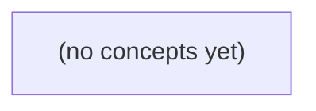

# 09.01 需求与应用边界：Go IM 服务的身份、状态与业务决策

*面向 Go 后端初学者，以虚构 IM 中用户 u-a 读取会话 c-a 历史、发送消息 m-a 为主线，建立从需求用例到应用边界的完整思考框架。读者将学习区分可信身份、传输 DTO、领域命令、内存状态、错误承诺与成功确认点，并能据此编写可验证的业务决策表。*

**章节:** 2

---

## 本书导览

- 了解整本书的章节脉络
- 掌握各章之间的概念依赖关系
- 选择最合适的阅读顺序

# 09.01 需求与应用边界：Go IM 服务的身份、状态与业务决策

面向 Go 后端初学者，以虚构 IM 中用户 u-a 读取会话 c-a 历史、发送消息 m-a 为主线，建立从需求用例到应用边界的完整思考框架。读者将学习区分可信身份、传输 DTO、领域命令、内存状态、错误承诺与成功确认点，并能据此编写可验证的业务决策表。

下方的概念图展示了本书 0 个核心概念以及它们之间的依赖关系；再下方是 1 个章节的入口。你可以按从上到下的顺序阅读，也可以根据自己的兴趣或先验知识选择切入点。

#### 概念图



## 章节索引

- **09.01 需求与应用边界：谁能给谁发消息、成功到哪一步** — 承接10.01可验证需求、04.03HTTP/WS与05.01–05.03并发前置，面向Go初学者以虚构IM的只读历史与单聊发送为主线定义用例、可信身份、输入/输出、领域/传输表示、状态转移、错误与证据范围；S2仅内存小模型，S3再身份授权和持久数据。静态教材不实现或运行服务。

## 09.01 需求与应用边界：谁能给谁发消息、成功到哪一步

- 从用户目标写出读历史与单聊发送用例
- 区分客户端声称的sender和可信请求主体
- 把传输DTO与领域命令/消息状态分开
- 定义输入大小、字段、会话权限和重复身份的检查层
- 画出拒绝不改变状态与内存受理的状态转移
- 区分响应、内存状态、持久化、设备收到与已读
- 建立错误类别与独立验收矩阵
- 在固定OpenIM源码入口只对照已读控制流而不推断完整保证

本节先从用户要完成的事出发，界定虚构 IM 在教学阶段“能做什么、成功算到哪里”，再讨论未来接口如何承载这些需求。

### 从用户目标提炼可验证用例

### 从用户目标提炼可验证用例

需求先描述“用户想完成什么”，而不是先决定 `GET /messages` 或 `POST /send`。对当前教学项目而言，唯一已实现的交互载体是本地 CLI；未来可讨论 HTTP 只读历史与内存单聊，但它们仍是规划，不应表述为在线服务已经可用。

**用例一：查看与指定对象的历史消息**

- **参与者**：本地 CLI 使用者。
- **前置条件**：使用者已选择自己的身份；目标对象存在；本地内存中可能已有该会话消息。
- **输入**：目标对象标识，例如 `bob`。
- **用户目标**：知道自己与 `bob` 过去说过什么。
- **成功**：CLI 按时间顺序显示双方会话历史；无历史时明确显示“暂无消息”，这仍是成功。
- **失败**：目标对象不存在、输入为空或身份未选择。CLI 给出可理解的错误，不返回伪造历史。
- **状态变化**：只读，不创建、不修改、不删除消息；会话状态保持不变。

未来 HTTP 若承载此需求，重点仍是“读取指定会话历史”，而非先争论路径命名。它应保持只读语义，不能因查看操作改变消息内容或在线状态。

**用例二：给指定对象发送单聊消息**

- **参与者**：发送者，即当前 CLI 使用者。
- **前置条件**：发送者身份已确定；接收者存在；发送者与接收者是两个可区分的对象。
- **输入**：接收者标识与非空消息正文，例如接收者 `bob`、正文“下午好”。
- **用户目标**：让 `bob` 获得一条仅属于两人会话的新消息。
- **成功**：系统创建一条消息，至少记录发送者、接收者、正文与时间；该消息随后可被双方查询到。
- **失败**：接收者不存在、正文为空、输入格式错误，或操作被取消。失败时不应留下半条消息。
- **状态变化**：内存会话历史新增一条记录；当前阶段不承诺网络投递、离线通知、持久化或“对方已读”。

这里的“成功”止于**消息被本地内存接受并写入会话历史**，不等于对方设备收到，更不等于对方阅读。先固定这一边界，后续即使增加 HTTP 或 WebSocket，也能清楚判断它们是在承载已有用例，还是扩展了新的成功标准。

### 先写需求边界，再映射接口

### 先写需求边界，再映射接口

先描述“用户想完成什么”，不要一开始就写 `POST /messages`、`GET /history` 或某个 WebSocket 事件。路径和方法是传输层设计；用例才决定系统应保存什么、拒绝什么，以及何时报告成功。

本阶段只有本地 CLI，所有数据都在进程内存中。可定义的核心用例如下：

- **用例：发送单聊消息**
  - 操作者：已知身份的本地用户。
  - 前置条件：发送者与接收者均存在；接收者不能是空值。
  - 输入：接收者、非空消息正文。
  - 成功：消息被追加到该双方的会话历史，CLI 显示发送成功。
  - 失败：用户不存在、正文为空、操作被取消；失败时不得写入历史。
  - 状态变化：内存中的会话历史增加一条消息。

- **用例：查看历史**
  - 操作者：本地用户。
  - 前置条件：指定会话对象存在。
  - 输入：对方用户、可选条数限制。
  - 成功：CLI 输出该会话已有消息；没有消息也属于成功，返回空历史。
  - 失败：用户不存在或输入格式错误。
  - 状态变化：无。

未来教学接口只是对这些用例的承载方式：HTTP 可只读历史，例如按会话查询；WebSocket 可承载内存单聊的实时投递。它们不意味着已经具备账号注册、鉴权、离线消息、持久化、群聊或跨进程在线服务。

因此，先确认“谁能给谁发、写入何处、成功到哪一步”，再选择路由、方法和事件名。比如“发送成功”在本节仅表示**消息已写入本进程内存历史**，不表示对方已上线、已收到或已阅读。

### 可信主体决定谁能给谁发消息

### 可信主体决定谁能给谁发消息

“发送者是谁”不能由客户端输入直接决定。客户端可以声称：

`from=alice, to=bob, text=你好`

但在未来的 HTTP 或 WebSocket 请求中，`from` 属于不可信字段：任何人都能伪造为 `alice`。系统必须从认证结果、连接绑定身份或教学环境预置上下文中取得**可信请求主体**，记为 `actor`。

一次单聊发送的需求可写为：

- **主体**：`actor`，即当前已被系统确认的用户。
- **前置条件**：`actor` 已登录或已绑定身份；目标会话存在；`actor` 是该会话成员。
- **输入**：会话标识、接收者标识、消息文本；不接受客户端决定发送者。
- **成功**：消息以 `sender=actor` 写入内存历史，并可被该会话的另一成员读取。
- **失败**：身份缺失、会话不存在、接收者不合法、`actor` 不属于会话、文本无效时，拒绝写入且不改变历史状态。

单聊会话成员资格应显式表示，例如：

`members = {alice, bob}`

当 `actor=alice` 时，合法接收者只能是 `bob`；当 `actor=mallory` 时，即使请求声称自己是 `alice`，也必须失败。授权检查可概括为：

`actor ∈ members ∧ receiver ∈ members ∧ receiver ≠ actor`

更严格地说，接收者应是“会话中除当前主体外的另一名成员”。这样可以避免客户端借助任意 `to` 字段，把本应属于 `alice` 与 `bob` 的消息投递给 `charlie`。

这里定义的是用户目标与业务边界，而不是接口路径。稍后才决定它是否对应某个 `POST` 请求或 WebSocket 消息；无论承载方式如何变化，“可信主体决定发送者、成员资格决定可发给谁”都不变。当前本地 CLI 同样应遵守这一规则，只是其主体可由当前命令行会话选择，而非在线认证服务。

### 把请求表示与领域状态分开

### 把请求表示与领域状态分开

“发一条消息”看似只有一份数据，实际上跨越三种不同表示；若把它们混成一个结构体，CLI、未来 HTTP 和内存状态会互相牵制，需求也容易被路由细节反向定义。

- **传输 DTO**：描述外部输入或输出的形状。例如 CLI 参数，或未来 `POST /messages` 的请求体：`to`、`content`、`request_id`。它服务于解析与协议兼容，字段可为字符串、缺失或格式错误，不能直接视为可信状态。
- **领域命令**：表达已经被识别的业务意图，例如 `SendMessage{From, To, Content, RequestID}`。其中 `From` 不应由客户端任意声称：本地 CLI 可由当前操作者上下文给出；未来 HTTP 则应由认证上下文给出。命令进入用例后，检查“谁能给谁发”。
- **消息实体**：表示成功写入领域状态后的事实，例如 `Message{ID, From, To, Content, CreatedAt}`。`ID` 与 `CreatedAt` 由系统生成；它不是请求回显，也不应包含客户端未经确认的字段。

建议明确字段契约：

| 字段 | 格式与限制 | 主要校验层 |
|---|---|---|
| `to` | 非空、符合教学中的用户标识格式 | DTO 做格式检查；领域确认目标存在且允许接收 |
| `content` | UTF-8 文本，去除首尾空白后非空，最多如 `1000` 字符 | DTO 检查可解析性与长度；领域保证发送规则 |
| `request_id` | 非空、稳定的客户端请求标识 | DTO 检查格式；用例检查同一发送者下是否重复 |
| `from` | 不来自普通请求体 | 操作者上下文与领域命令构造处 |

重复标识解决的是“同一次发送被重试”而非“内容相同”。若同一 `From + RequestID` 已成功，系统应返回原消息，而不是再创建一条；若此前失败且未写入状态，则允许重新执行。内容、接收者相同但 `request_id` 不同，仍是两次独立发送。

各层责任应保持克制：传输层负责解码、字段类型和基础长度；用例/领域层负责身份、收发权限、幂等和状态变更；实体只保存已成立的消息事实。这样，先定义“消息何时进入历史即成功”，再让 CLI 或未来接口分别把输入转换为同一领域命令，而不是让某个 API 路径决定业务语义。

### 用状态转移和证据定义成功

### 用状态转移和证据定义成功

“发送成功”不是一个单一事实，而是不同层次的状态与证据。当前教学程序只有本地 CLI 和进程内存，因此本节将成功边界定为：**合法消息被内存会话受理**；不承诺落盘、跨进程可见、设备送达或已读。

可将一次发送抽象为状态转移：

`待提交` → `校验中` → `已受理（内存存在）`

其中，发送者为已登录用户，前置条件是接收者存在且允许单聊，输入为非空正文与接收者标识。校验通过时，系统创建消息记录并加入内存会话；校验失败时必须保持原状态：

`待提交` → `被拒绝`，且`消息列表不变`

这条“不改状态”要求很关键。例如接收者不存在、正文为空、发送者取消操作时，不能留下半条消息、空消息或伪造的会话记录。

不同“成功”应分别命名：

| 层次 | 可观察证据 | 当前是否承诺 |
|---|---|---|
| 响应成功 | CLI 输出“已受理”或未来接口返回成功响应 | 是 |
| 内存存在 | 查询本进程历史可见该消息 | 是 |
| 持久化完成 | 重启后消息仍存在 | 否 |
| 设备收到 | 接收方客户端确认接收 | 否 |
| 已读 | 接收方明确提交阅读状态 | 否 |

验收时不要只看一行成功文本，而要同时检查状态：合法发送后，发送者、接收者、正文和顺序可从内存历史中查询；非法发送后，历史长度和已有内容完全不变。未来 HTTP 或 WebSocket 仅是承载同一用例的路径，不能因为返回了 `200` 就宣称消息已送达，更不能把尚未实现的在线服务描述为已完成。

> **要点** — 先以用例和可信身份限定行为，再以状态变化与可观察证据定义“发送成功”的边界。

单聊接口先回答“谁在请求、他能操作什么”，再讨论消息字段与返回结果；客户端自称的发送者不能成为信任依据。

### 从用户目标划定访问边界

### 从用户目标划定访问边界

单聊接口不应先从“请求里有哪些字段”出发，而应先把用户目标改写为可授权的用例。每个用例至少明确四件事：**主体、资源、动作、成功条件**。

- **查看历史**
  - 主体：当前已认证的用户 `principal`。
  - 资源：某个会话 `conversation_id` 及其消息集合。
  - 动作：读取指定范围内的历史消息，例如分页读取最近消息。
  - 成功条件：`principal` 是该会话允许读取历史的成员；服务端仅返回其有权看到的消息范围，不泄露其他会话、成员信息或隐藏消息。

- **发送单聊消息**
  - 主体：当前已认证的用户 `principal`。
  - 资源：目标会话 `conversation_id`，以及该会话中的新消息资源。
  - 动作：创建一条由主体发送的消息。
  - 成功条件：`principal` 有向该会话发送消息的权限，目标会话存在且允许写入；服务端以可信主体写入消息作者，而不是采用 JSON 中的 `sender_id` 或 `u-a`。

可将第二个用例抽象为：

$$
\operatorname{allow}(principal, conversation, send)
\Rightarrow
\operatorname{createMessage}(author=principal)
$$

这里“能查看”不必然推出“能发送”。例如成员可能被禁言、只保留历史访问权，或已退出会话但仍可在有限期限内导出记录。因此，读取与写入应分别检查，而不能只做一次笼统的“是会话成员吗”。

若主体不属于资源允许范围，服务端应拒绝请求，并保证**没有状态修改**：不创建消息、不更新时间戳、不产生可被利用的副作用。纸上原型可暂时固定身份来演示私有隔离，但不能因此把无鉴权接口暴露为公开服务；未来认证边界提供 `principal` 后，授权规则仍应保持不变。

### 区分声称身份与可信主体

### 区分声称身份与可信主体

客户端请求中的 `sender_id`、`user_id`、用户代理（User-Agent）、设备型号、来源地址等，都只是**客户端声明**：它们可以用于展示、调试、风控信号或兼容性判断，却不能单独证明“请求者就是这个用户”。

例如客户端提交：

`{"conversation_id":"c-a","sender_id":"u-a","content":"你好"}`

服务端若直接相信 `sender_id`，攻击者只需把它改为 `u-b`，便可能伪造身份发送消息。因此，消息创建接口不应把客户端给出的 `sender_id` 当作作者来源；更稳妥的做法是忽略它，或仅将其视为需要校验的一致性字段。

与之相对，`principal` 是未来认证边界验证后交给业务层的**可信主体**。它可能来自会话、访问令牌、签名凭据或网关认证结果，例如：

`principal = { user_id: "u-a", roles: ["user"] }`

业务服务据此完成授权判断：

1. `principal.user_id` 是否是会话 `c-a` 的成员；
2. 该成员是否拥有“发送消息”权限；
3. 目标会话、附件、引用消息等资源是否都处于其允许操作的范围；
4. 若权限不足，立即拒绝，且不得创建消息、更新时间戳或产生其他状态修改。

认证回答“你是谁”，授权回答“你能否对 `c-a` 执行这个动作”。两者不能混为一谈：即使 `u-a` 已通过认证，也不意味着他能读取 `c-a` 的历史消息、向其中发言，或操作其中所有资源；读历史与发消息可以是不同权限。

在纸上原型或私有隔离实验中，可以暂时固定一个测试主体来演示流程，但这不等于可以公开部署无鉴权服务。一旦接口面向不受控客户端，任何来自 JSON 的身份字段都必须默认不可信，授权应以认证后获得的 `principal` 为唯一身份依据。

### 认证回答谁，授权回答能做什么

### 认证回答谁，授权回答能做什么

认证先把请求绑定为一个可信主体 `principal`：例如当前登录用户 `u-a`。它不能来自请求 JSON 中的 `sender_id`、`user_id` 等客户端自填字段；这些字段最多是待校验的数据，不能决定身份。未来接入令牌、会话或其他认证机制后，服务端应从认证边界取得 `principal`。

授权则针对具体动作和资源回答：这个主体能否对会话 `c-a` 执行该操作。可将判断拆成两层：

1. **会话成员关系**：`principal` 是否属于 `c-a` 的参与者集合。
2. **资源范围**：请求的消息、分页游标、附件或目标会话，是否确实属于 `c-a`，而非借 ID 越界访问其他会话的数据。

读取历史与发送消息应分别授权，而不能因为“能看”就默认“能发”：

- `GET /conversations/c-a/messages`：确认 `principal` 有读取 `c-a` 历史的权限，再返回属于该会话且处于允许可见范围内的消息。
- `POST /conversations/c-a/messages`：确认 `principal` 有向 `c-a` 发送消息的权限；消息作者由服务端写为 `principal`，而非采纳客户端的 `sender_id`。

因此可抽象为：

`允许读取 = 成员关系 ∧ read(c-a)`  
`允许发送 = 成员关系 ∧ send(c-a)`

两项权限可以不同：被移出会话的用户通常两者都失去；只读参与者可查看历史却不能发送；禁言成员仍可能保留读取能力。任何未认证、非成员、资源不属于目标会话或动作不被允许的请求，都应被拒绝，并且**不得创建消息、更新会话时间或改变其他状态**。这正是授权优先于业务写入的基本边界；凭据校验与更复杂的群组权限将在后续展开。

### 拒绝路径必须不改变状态

### 拒绝路径必须不改变状态

授权失败不是“返回一个错误”这么简单；更关键的约束是：**失败请求不得创建消息、不得推进会话状态、不得泄露资源存在性，也不得留下部分副作用。**

以“向会话 `c-a` 发送消息”为例，服务端应按可信信息建立检查顺序：

1. 从认证边界取得当前主体 `principal`，而不是相信 JSON 中的 `sender_id`、`user_id` 或 `u-a`。
2. 校验请求格式、目标会话标识和消息内容。
3. 查询 `principal` 是否属于 `c-a`，并确认其拥有“发送消息”而非仅“读取历史”的权限。
4. 仅在上述检查全部通过后，创建消息对象、写入内存列表或持久化存储，并广播或返回成功结果。

可将状态转移写成：

$$
S \xrightarrow{\text{请求}} 
\begin{cases}
S' = S + \text{message}, & \text{身份有效且有发送权限}\\
S' = S, & \text{认证失败、非成员、冒充或资源越界}
\end{cases}
$$

例如，`u-b` 声称自己是 `u-a`，或尝试向不属于自己的 `c-a` 发消息，服务端都应以认证得到的 `principal=u-b` 判断，而非以载荷中的自称身份判断。检查失败后返回适当拒绝结果；消息列表长度、最后消息时间、未读计数及事件队列都必须保持不变。

不要先追加消息、再补做成员检查，更不要因为“当前是私有隔离实验”就开放无鉴权接口。纸上固定身份可以用于演示流程，但它仍应是服务端固定的可信主体，而不是客户端可随意提交的字段。这样才能为后续凭据认证、群成员权限和更细粒度授权保留正确边界。

### S2隔离实验与验收证据

### S2隔离实验与验收证据

S2 可先采用“固定身份”或“每个实验实例天然私有”的内存模型，目的是把授权规则写成可验证的行为，而不是宣称接口已经具备真实认证能力。例如，测试服务器启动时固定 `principal = u-a`，客户端提交的 JSON 中即使出现 `sender_id: "u-b"`，服务端仍只以 `u-a` 判断权限并写入消息发送者。

验收矩阵至少覆盖以下情形：

| 请求主体 | 会话成员关系 | 操作 | 预期 |
|---|---|---|---|
| `u-a` | 属于 `c-a` | 读取历史 | 返回 `c-a` 的允许可见消息 |
| `u-a` | 属于 `c-a` | 发送消息 | 创建消息，发送者为可信主体 `u-a` |
| `u-a` | 不属于 `c-b` | 读取历史 | 拒绝，不泄露消息、成员或资源存在性细节 |
| `u-a` | 不属于 `c-b` | 发送消息 | 拒绝，消息列表、未读数、时间戳均不改变 |
| `u-a` | 属于 `c-a` | JSON 声称 `sender_id=u-b` | 忽略或拒绝该字段，绝不伪造为 `u-b` |

需要特别记录“拒绝后的状态”：非法读取不返回历史；非法发送不新增消息、不修改会话最后消息、不产生通知。读历史与发消息应分别验收，因为产品规则可能允许成员查看归档内容，却不允许其继续发言，或反之。

该实验的边界必须写入验收证据：固定身份只是未来认证边界的替身，私有隔离也只是避免不同实验者互相碰撞。它不能推出“公开部署时无需认证”的结论；一旦服务暴露给不可信网络，请求主体必须由认证机制提供，再由服务端依据会话成员关系和资源范围执行授权。授权是主要控制点，应以拒绝越权访问且不产生状态修改作为核心验收标准。

> **要点** — 服务端只信任认证边界给出的主体，并按主体对会话和资源逐项授权；越权请求必须被拒绝且不修改状态。

发送消息的第一步不是写入历史，而是把不可信的网络载荷转换为可验证的领域命令，并明确“成功”究竟表示什么。

### 从外部载荷到领域命令

### 从外部载荷到领域命令

HTTP JSON 与 WebSocket 载荷都只是**外部 DTO**：它们描述客户端“声称想做什么”，不能直接成为消息历史，更不能直接传入领域层。两种传输方式可以复用同一组请求字段，但认证上下文、会话归属和服务端时间必须由服务端取得。

例如，网络请求可表达为：

- `conversation_id`：目标会话标识；
- `body`：消息文本或结构化内容；
- `message_id`：客户端生成的幂等标识；
- `version`：载荷版本。

边界层先限制原始请求字节数，避免在 JSON 解析前就承受过大载荷；再解析 DTO、拒绝或按策略忽略未知字段、检查版本兼容性。随后它从认证令牌或 WebSocket 已认证连接中取得 `actor`，而非相信请求中的“发送者”。服务端当前时间同样不能由客户端提供或覆盖。

Go 中可用概念性接口区分职责：

- `RequestDTO`：网络可见字段，允许存在可选字段与版本演进；
- `SendCommand`：领域命令，包含可信的 `actor`、已校验的 `conversation`、规范化后的 `body`、`messageID` 与服务端确定的时间；
- `MessageState`：消息写入后的领域状态，例如已接受、已持久化、已投递或已读。

构造命令时还要区分两类长度：原始 HTTP/WebSocket 帧按字节限制；消息正文则按 UTF-8 编码后的字节数执行领域上限。字符数、Go 字符串长度与 UTF-8 字节数并不等价。

边界层完成“解析、认证、授权前置检查、规范化、校验、构造命令”；领域层再判断该 actor 是否能向该 conversation 发送消息。客户端输入只是一次请求，不是权威历史，也不能以其自带时间、状态或发送者身份改写既有事实。

### 可信主体不能由客户端声明

### 可信主体不能由客户端声明

客户端可以提交“想说什么”，却不能声明“自己是谁”。例如网络载荷中的：

`{"sender":"alice","conversation_id":"c-42","body":"你好"}`

其中 `sender` 只是一个不可信字符串；若服务端直接采用它，已认证为 `bob` 的攻击者便可伪造 `alice` 发言。身份应来自认证边界：会话 Cookie、访问令牌、WebSocket 握手认证或网关注入的已验证声明。边界层先解析出可信请求主体 `actor=bob`，再构造领域命令：

`SendCommand{Actor: bob, ConversationID: c-42, Body: ..., MessageID: ...}`

因此，DTO 中即使存在 `sender` 字段，也应拒绝、忽略，或仅用于客户端展示而绝不参与授权判断；更稳妥的 v1 协议是根本不接受该字段。

会话归属也不能由“知道 conversation_id”证明。服务端必须依据持久化成员关系、角色与会话状态判断：`actor` 是否是该会话成员，是否仍可发言，是否被禁言，以及该会话是否允许此类消息。`conversation_id` 是查找目标的索引，不是授权凭证。

尤其在 WebSocket 中，连接建立时认证成功不等于永久可信：令牌过期、成员资格撤销或连接主体切换都应有明确策略。最终写入的发送者取自可信认证上下文，历史记录中的主体由服务端决定，而非由输入载荷自报。

### 三类 Go 表示各自负责什么

### 三类 Go 表示各自负责什么

同一条“发送消息”在系统中不应只用一个 `struct` 贯穿网络、业务和存储。它至少经过三种语义不同的表示：

- `RequestDTO`：边界上的传输对象。它对应 HTTP JSON 或 WebSocket payload，字段来自不可信客户端，例如 `conversation_id`、`body`、可选的客户端请求标识与协议版本。其职责是“能否被解析”，而不是“是否有权发送”。
- `SendCommand`：进入领域后的命令。边界层完成认证、会话定位、字段校验后，使用可信上下文构造它；其中 `actor` 取自认证结果，不能相信请求中自报的用户 ID。它表达“某个已确认身份的主体，请求向某个会话发送经过验证的内容”。
- `MessageState`：服务端内存中的消息状态。它包含服务端分配的消息 ID、服务端时间、发送者、正文及投递/持久化状态；它是领域事实的当前表示，不是客户端输入，也不应直接等同于 JSON schema。

可用接口级示意强调边界，而非把所有字段塞进一个类型：

- `RequestDTO`：`ConversationID`、`Body`、`RequestID`、`Version`
- `SendCommand`：`Actor`、`Conversation`、`Body`、`MessageID`
- `MessageState`：`ID`、`Conversation`、`Sender`、`Body`、`CreatedAt`、`Status`

其中 `MessageID` 可以在边界或领域服务中生成，但必须由服务端规则控制；`CreatedAt` 应采用 server time，而非客户端声称的发送时间。原始 payload 先受字节数限制，以防解析前消耗过多资源；解析为字符串后，再按 UTF-8 字节长度执行领域正文上限。

未知字段、版本不支持或字段类型错误属于 DTO/协议层问题；成员资格、禁言状态、会话存在性与正文业务规则属于命令验证问题。`MessageState` 则只在命令成功产生领域结果后出现。尤其要避免把本地 v1 JSON 文件当作网络请求格式：前者是内部持久化表示，可能携带历史兼容字段；后者是公开边界契约。输入只是请求，不是权威历史。

### 输入校验分层与版本边界

### 输入校验分层与版本边界

网络输入应按“越靠外越便宜、越靠内越语义化”分层处理。目标不是把所有检查塞进一个 `Validate`，而是避免超大、畸形或过时载荷进入领域层。

- **传输层：原始字节限制。** 在读取 HTTP 请求体或 WebSocket 帧时先限制大小，例如 `MaxPayloadBytes`。这是对原始字节的限制，不等同于正文长度；它保护内存、解析器和连接资源。超过限制应立即拒绝，不尝试完整 JSON 解析。
- **协议层：JSON 形状与版本。** 检查 JSON 是否可解析、顶层类型是否正确、`version` 是否受支持、必填字段是否存在且类型匹配。未知字段的策略必须明确：早期严格拒绝可防止客户端误以为新字段已生效；若为兼容演进而忽略，也应记录并只忽略明确允许的扩展字段。
- **DTO 层：表示约束。** `RequestDTO` 只描述外部载荷，例如正文、客户端生成的消息标识、协议版本。正文必须是合法 UTF-8，并以 UTF-8 编码后的字节数检查领域上限，而非按字符数计数：`len([]byte(body)) <= MaxBodyBytes`。同时拒绝空正文、全空白正文或不合法标识格式。
- **领域层：业务语义。** 边界从认证上下文取得可信的 `actor`，从路由或会话上下文取得 `conversation`，再构造 `SendCommand`。客户端不能声明自己是谁、属于哪个会话，也不能提供权威时间。`messageID` 用于幂等去重：同一会话、同一发送者、同一标识重复提交，应返回既有结果或一致的冲突语义，而非再次写入消息。
- **时间与历史：服务端裁决。** 消息创建时间、排序时间和状态迁移时间由服务端生成。客户端时间最多是展示性元数据，不能决定消息先后、过期与否或“已送达”。输入只是一次请求，不是权威历史；权威状态来自已持久化的消息记录及其 `MessageState`。

### 受理成功不等于送达或已读

### 受理成功不等于送达或已读

以单聊发送为例，应用层首先回答的不是“消息有没有到对方手机”，而是“服务端是否接受了这条命令”。客户端提交的 `RequestDTO` 经边界层解析、限制原始字节大小、校验版本与未知字段策略后，才构造包含可信发送者、会话、消息标识和正文的 `SendCommand`。

拒绝路径必须不改变领域状态。例如：

- 发送者未登录、不是该会话成员；
- 会话不存在、已被禁止发言；
- `message ID` 非法或与既有消息冲突；
- 正文为空、UTF-8 字节数超过领域上限；
- 请求版本不支持，或不允许出现未知字段。

这些情况应返回明确的拒绝结果，而不能先把消息插入内存历史再报错。

当命令通过校验，服务端可在内存中创建消息并转为 `accepted` 状态：它表示“该服务实例已受理，消息进入本次会话的待分发历史”。响应中的成功最多证明这一点；服务器生成的时间才是消息受理时间，客户端提供的时间只能作为非权威元数据。

后续状态不能混为一谈：

- `accepted`：内存中的领域状态已更新；
- `persisted`：消息已写入规定的持久化介质；
- `delivered`：目标设备或其连接确认收到；
- `read`：目标用户提交了可验证的已读证据。

若 v1 仅有本地 JSON 文件，它描述的是当前实现的存储格式，不是网络协议承诺，更不能据此声称已送达。进程崩溃前仅存在内存中的 `accepted` 消息可能丢失；设备离线时，`persisted` 也不等于 `delivered`。因此响应应准确表述为“已受理”或“已持久化”，不要把输入请求或乐观客户端展示当作权威消息历史。

> **要点** — 网络输入只是主张；边界层以可信主体和校验结果构造命令，内存受理也不能宣称送达、持久化或已读。

单聊发送的难点不在“把消息塞进列表”，而在于明确谁可信、何时拒绝、拒绝后状态是否不变，以及“成功”究竟证明了什么。

### 从用户目标收束为可验收用例

### 从用户目标收束为可验收用例

先把“能聊天”改写成可观察、可判定的用例。系统暂只支持**已认证用户**查看自己有权访问的单聊历史，并向另一名合法用户发送一条单聊消息；调用者、接收者与消息内容共同构成请求边界。

- **查看历史**：调用者提供会话或对端标识后，系统只读取其所属单聊中的有限条目，而非无界扫描全部历史。成功结果是返回可解码、字段齐全且版本受支持的消息记录；调用者不是成员时，不应借错误差异确认该会话或对端是否存在。
- **发送消息**：调用者身份必须来自可信认证上下文，不能相信请求体中的“发送者”字段。发送前确认接收者可用、双方满足单聊成员关系及领域规则，例如不能给自己发送、不能向被禁止联系的对象发送。
- **成功的含义**：消息通过格式与必填字段校验，具有可接受版本；以 `(c-a, m-a)` 作为去重键确认不是重复提交；随后一次性写入内存中的会话状态，并返回该消息的确认结果。成功只证明本服务实例已接受并完成该内存变更，不承诺跨进程持久化、送达对方设备、通知投递或对方已读。

失败时内存状态必须保持不变。可验收的失败类别包括：非法参数、未认证、越权、资源不存在或应隐藏、重复提交，以及依赖失败或超时导致结果未知。校验顺序可以实现不同，但必须明确优先级；尤其要避免让越权调用者通过“用户不存在”和“会话不存在”的差别枚举敏感资源。本节也不把返回错误等同于数据库事务回滚，具体的 HTTP 状态码和错误体留待后续定义。

### 建立从字节到领域命令的检查链

### 建立从字节到领域命令的检查链

一次“发送消息”应被推导为一条逐层收紧的检查链：前层证明输入可被安全理解，后层才允许其影响领域状态。典型顺序如下：

1. **有界读取**：限制请求体、字段长度和嵌套深度。超限即停止读取，避免恶意大包耗尽内存。
2. **解码**：将字节解析为预期格式；语法错误、类型不符、乱码均属于非法参数，不能进入业务判断。
3. **版本与必填字段**：确认协议版本受支持，并检查如`conversationId`、`clientMessageId`、正文等必填值。版本未知时不要猜测兼容语义。
4. **可信身份**：身份必须来自认证上下文，而非请求体中的`senderId`。客户端可以声明“代表谁”，服务端只能相信已验证的主体。
5. **会话成员资格**：确认该主体有权向目标会话发言。对非成员、已移除成员或被隐藏会话，应采用固定策略；必要时将“资源不存在”和“无权得知其存在”合并处理，避免泄露敏感存在性。
6. **领域规则**：检查会话状态、禁言、接收方限制、消息内容策略、幂等键`(c-a,m-a)`是否重复，以及所依赖服务是否可用。

这些判定的先后可以调整，例如先查会话再查成员资格，或先验证幂等键再做部分规则检查；但系统必须**固定并记录优先级**。否则同一请求在不同路径上可能暴露不同信息，或得到不稳定的错误结果。

只有所有前置条件成立，才构造领域命令并执行原子内存变更；任一失败都不得改变消息列表、索引或去重记录。此处“返回成功”仅表示该命令已通过本服务定义的成功边界，并不自动等同于已完成持久化、跨服务投递或对方已读。

### 分离声称发送者、请求主体与传输表示

### 分离声称发送者、请求主体与传输表示

一次“发送消息”请求里，常同时出现三种容易混淆的东西：

- **声称发送者**：客户端载荷中的 `senderId`，表示“客户端说自己是谁”。
- **可信请求主体**：认证令牌、会话或网关验证后得到的主体，如 `principalId`；这是服务端用于授权的身份依据。
- **传输表示**：JSON、表单或二进制对象，例如 `{conversationId, senderId, content, clientMessageId}`；它只是不可信输入的编码形式。
- **领域命令**：完成解码、字段校验和身份绑定后的内部意图，如 `SendMessage(actor, conversation, content, key)`。

客户端可以提交 `senderId`，但不能**决定**发送者。否则用户 A 只需构造：

`{ senderId: "B", conversationId: "A-B", content: "伪造消息" }`

便可能冒充 B。正确做法是：先从认证上下文取得 `actor`，再以 `actor` 执行成员关系、会话可见性和“是否允许发言”等领域规则。若协议暂时保留 `senderId`，服务端也只能将其视为待验证的声称：它必须与 `actor` 一致；更常见、更安全的设计是根本不在请求体中接收发送者字段。

这种分离还避免传输层细节渗入领域层。领域命令不应携带原始令牌、HTTP 头或未限制大小的 JSON；它只接收已建立可信边界的值。成功时，内存中的消息记录应写入服务端确认的 `actor`，而不是回显客户端声称的身份。

### 用重复键和状态机定义内存受理

### 用重复键和状态机定义内存受理

将一次发送请求抽象为重复键：

$$K=(c\text{-}a,m\text{-}a)$$

其中 `c-a` 是会话标识，`m-a` 是发送方为该消息生成的消息标识。内存中维护索引 `accepted[K]`：它记录“该键已被本服务受理”，而不只是“曾收到过请求”。

状态可写为：

`初始` → `校验中` → `已受理`  
`初始` → `校验中` → `拒绝`  
`初始` → `校验中` → `重复`

发送前先完成有界读取、解码、必填字段与版本检查，再确认可信身份、会话成员资格和业务规则。校验失败进入“拒绝”状态：返回非法参数、未认证、越权、隐藏的资源不存在等结果，但**不得写入** `accepted`、消息列表或会话摘要。尤其对无权访问者，应优先采用不泄露会话是否存在的结果。

只有全部前置条件成立后，才进入原子内存变更边界：

1. 查询 `accepted[(c-a,m-a)]`；
2. 若不存在，同时写入重复键索引与消息记录；
3. 更新必要的会话内存视图；
4. 返回“已受理”的响应。

这几个写入必须表现为一个不可分割的动作：不能先插入消息、后写重复键；否则并发重试可能产生两条消息。若键已存在，则进入“重复”状态，返回与首次受理一致或可推导的一致结果，而不是再次追加消息。

需要区分“请求返回错误”与“内存事务失败”。依赖服务超时可能意味着结果未知：不能贸然断言未受理，也不能在未确认的情况下重复提交。这里的“成功”仅证明本进程已原子接受该消息；它不自动证明消息已持久化、已投递或已被对方阅读。

### 把错误分类与成功证据拆开验收

### 把错误分类与成功证据拆开验收

应用层验收应先回答“请求为何不能继续”，再回答“成功究竟覆盖到哪里”。不要把一个笼统的 `error` 当作全部失败，也不要把“返回成功”误写成“已持久化、已送达或已读”。

可建立如下验收矩阵：

| 分类 | 典型条件 | 是否改变内存状态 | 应向调用方承诺 |
|---|---|---:|---|
| 非法参数 | 读取超界、解码失败、缺少必填字段、版本不支持 | 否 | 请求未进入业务处理 |
| 未认证 | 身份凭据缺失、失效或无法验证 | 否 | 调用者身份未建立 |
| 越权 | 已认证但无权以该身份发送 | 否 | 不确认目标资源是否存在 |
| 资源不存在或隐藏 | 会话、成员关系或目标不可见 | 否 | 可按安全策略与越权合并，避免泄露存在性 |
| 重复 | 幂等键 `(c-a,m-a)` 已被成功处理 | 否或返回既有结果 | 不重复创建消息 |
| 依赖失败/超时结果未知 | 下游不可用、调用超时、提交结果无法确认 | 否 | 明确“未处理”或“结果未知”，不可伪称失败后一定可重试 |

成功证据也必须分层：

- **响应成功**：服务已完成本次应用层处理并生成结果。
- **内存状态成功**：消息已原子加入当前进程的会话状态；任一校验失败都不得留下半条消息。
- **持久化成功**：消息已写入可靠存储；若尚未实现持久化，不能从响应中暗示此保证。
- **送达设备成功**：目标设备已收到消息，需要独立的投递确认。
- **已读成功**：用户或设备报告已读，需要独立的已读回执。

因此，本节的“成功”默认只应证明：可信发送者通过成员与领域规则校验，消息以唯一键去重后，原子地进入约定的内存状态并得到响应。其余证据必须单独建模、单独验收。

> **要点** — 先固定可信身份、校验顺序和状态边界；内存受理只证明内存变更，不能推断持久化、送达或已读。

本节以教学用内存单聊为边界，明确“服务当前受理”不等于持久保存、送达对方或已读。

### 先限定S2承诺的成功边界

### 先限定 S2 承诺的成功边界

S2 的“发送成功”只表示：服务在**当前进程内**、取得会话状态锁后，完成校验并把该消息接受进教学用内存状态。可记为：

`absent → accepted-in-memory`

这不是“对方收到了”，更不是“对方已读”。发送流程中的确认点必须分级：

1. 客户端已提交请求；
2. 服务已在内存中接受；
3. 消息已持久化；
4. B 设备已收到；
5. B 已阅读。

S2 的成功响应只承诺第 2 点，不能把它表述成第 3～5 点。服务释放锁后可以继续尝试向 B 投递，但投递尝试、在线连接状态和投递结果应单独记录；它们失败或尚未发生，都不追溯改变本次“已受理”的响应。

校验不通过时，状态保持 `absent`，例如发送者无权发给该接收者、会话不存在或参数非法。若同一消息标识重复提交，则第一个成功接受者保留；后续请求返回与既有结果一致的幂等语义，而不能再创建第二条消息。

还要区分“响应丢失”与“服务未受理”：客户端未收到响应时只能得到“未知”，应携带同一消息标识重试。由于 S2 仅保存内存，进程退出后已接受消息也会消失；持久写入由 S3 保证，离线恢复与更完整的幂等身份由 S5 处理。

### 用可信主体约束谁能向谁发送

### 用可信主体约束谁能向谁发送

发送权限不能由客户端请求中的“发送者”字段决定；该字段只是未验证的输入。服务端应从已认证连接、会话令牌或请求上下文取得可信主体 $p$，再依据会话成员关系判断其能否向目标接收者 $r$ 发送。

对教学内存单聊，可将会话表示为两个成员集合：

- 当前会话成员：$M=\{a,b\}$
- 请求携带的目标接收者：$r$
- 服务端认证得到的实际发起者：$p$

一次发送可受以下条件约束：

$$
p \in M \quad\land\quad r \in M \quad\land\quad r \ne p
$$

只有条件全部成立，服务才允许该请求进入后续的“内存受理”流程。由此得到几个重要结论：

- 不能相信 `senderId`：即使请求声称“我是 Alice”，也必须以认证上下文中的 $p$ 为准；否则 Bob 可伪造 Alice 向他人发信。
- 不能只验证目标存在：目标用户存在不代表其属于当前单聊。Alice 不能借某个会话向不在会话内的 Carol 发送。
- 不能让客户端决定成员关系：成员关系应由服务端已建立的会话记录或受控创建流程给出，而非请求临时声明。
- 发送者与接收者通常必须不同：若产品需要“给自己发消息”，应作为明确的独立规则，而不是意外放宽单聊约束。

验证失败时，请求应被拒绝，消息状态保持 `absent`：不创建内存消息、不产生投递尝试，也不向任何设备报告送达。通过权限验证只说明“此主体有资格请求发送”；它尚未意味着服务已经受理、持久保存或通知了接收者。

### 分离传输请求、领域命令与内存消息

### 分离传输请求、领域命令与内存消息

一次“发消息”至少经过三层对象，不能把它们混为同一份数据。

- **传输请求**：HTTP 请求体或 WebSocket 帧，来自不可信边界，可能含有 `senderId`、`receiverId`、`text`、`clientMessageId`、认证令牌及协议版本等字段。这里的 `senderId` 不能直接采信，应从已认证会话中取得。
- **领域命令**：完成认证、字段解析、长度限制、会话状态和收发关系校验后形成的内部意图，例如：`SendMessage{from, to, clientMessageId, content}`。命令表示“请求服务受理”，尚不是消息已存在的证明。
- **内存消息记录**：只有在锁保护下完成重复标识检查并被接纳后，才创建记录，例如：`Message{id, from, to, content, acceptedAt, status}`。此时状态从不存在的 `absent` 变为 `accepted-in-memory`。

可将关键路径理解为：

`传输请求 → 校验/认证 → 发送命令 → 加锁去重 → 内存消息记录 → 返回当前承诺结果`

拒绝的请求——如未认证、接收者不允许、内容非法或重复规则不满足——应保持 `absent`，不要先写入“失败消息”再回滚。投递给 B 的尝试、在线连接是否可用、对端是否实际收到，也应记录为独立的投递尝试与结果，不能反向改写“服务已在内存受理”的含义。

因此，响应中的成功最多表示：**当前服务进程已接受该命令并保有内存记录**。它不代表已持久化、B 设备已收到，更不代表已读；进程退出后该记录会消失。相同 `clientMessageId` 并发或重试时，应保留先成功受理者，后续请求返回同一结果或明确冲突；若响应丢失，客户端只能处于“未知”，后续依赖幂等身份安全重试。

### 画清拒绝与内存受理的状态转移

### 画清拒绝与内存受理的状态转移

以消息标识 `messageId` 为索引，教学内存服务只维护最小状态：

`absent → accepted-in-memory`

其中 `absent` 表示当前进程的内存中没有该消息；`accepted-in-memory` 表示服务已在锁保护下完成校验、写入内存记录，并将该标识占用。它只证明“当前服务进程受理过”，不证明已持久化、已投递到 B 设备，更不证明已读。

处理一次发送请求时，应在同一临界区内完成“检查—决定—写入”：

1. 先校验请求格式、发送者身份、接收者存在性等。
2. 再检查发送权限，例如是否允许 A 向 B 发消息。
3. 最后检查 `messageId` 是否已经存在；若不存在，写入消息并转为 `accepted-in-memory`。

任一步失败都应保持 `absent`：格式非法、鉴权失败、无发送权限都不能留下半条消息或占用标识。重复标识也不能创建第二条消息；先成功写入者保留，后来的请求只能得到“重复”或返回既有受理结果。

可将核心规则写成：

\[
\text{accept}(m)=
\begin{cases}
\text{写入并受理}, & id\notin M \land \text{校验通过}\land\text{权限通过}\\
\text{拒绝且不变更 }M, & \text{校验或权限失败}\\
\text{不新建}, & id\in M
\end{cases}
\]

响应成功只对应这一次 promise 已获得“内存受理”结果。若响应在网络中丢失，客户端只能知道结果未知并重试；重试依赖 `messageId` 识别同一逻辑消息，而不是再次生成新消息。进程退出后内存状态会消失；持久写入、离线恢复及更强幂等语义留待后续阶段实现。

### 拆开确认层级与验收证据

### 拆开确认层级与验收证据

一次“发送成功”至少可能指五件不同的事；它们是递进但不等价的确认点，任何接口响应和测试验收都不得跨级表述。

| 确认层级 | 含义 | 可接受的证据 | 不能据此声称 |
|---|---|---|---|
| 客户端受理 | 客户端已校验输入并接管发送任务 | 本地任务已创建、进入待发送队列 | 服务已收到、消息不会丢失 |
| 服务内存受理 | 服务在锁保护下检查通过，并把消息写入当前进程内存状态 | 当前请求的成功响应；内存中可查询到该消息 | 已持久化、B 已收到 |
| 持久化确认 | 消息已写入可恢复的稳定存储 | 数据库事务提交、日志刷盘确认 | B 在线或已展示消息 |
| B 设备收到 | B 的某个设备已取得消息并确认接收 | 设备回执、推送拉取确认 | 用户已经看见或阅读 |
| 已读确认 | B 明确将消息标记为已读 | 客户端已读事件及其服务端确认 | 对方理解、回复或同意内容 |

教学内存服务的成功响应只能表示“服务内存受理”：消息从 `absent` 变为 `accepted-in-memory`。若鉴权、收发关系、格式或重复标识检查失败，则状态仍为 `absent`，响应必须是拒绝，而不是含糊的“稍后再试”。

验收也应按层级写断言：发送接口测试只验证当前 promise 是否收到内存受理结果；不能因为接口成功就断言 B 的收件箱出现消息，更不能断言已读。进程退出会使内存状态消失，因此该确认不构成持久化承诺；持久写入和离线恢复分别属于后续阶段。

> **要点** — S2成功仅表示服务在锁内接受内存消息；拒绝不改状态，持久化、送达与已读必须另行证明。

本节将把“能否读到历史、能否向对方发送消息”转化为可独立验收的案例矩阵，并用状态证据界定成功与失败。

### 先定义验收对象与证据边界

### 先定义验收对象与证据边界

验收的对象不是某个接口“返回了成功”，而是需求承诺的可观察结果。历史查询与单聊发送应分别描述为：

- **输入**：调用者身份、会话标识、查询参数或消息内容、幂等标识。
- **初始状态**：调用者是否已认证、是否属于会话、历史记录与队列中已有何种数据、存储及队列是否可用。
- **期望结果**：响应状态、返回数据范围、持久化结果、队列投递结果，以及失败时不得产生的副作用。
- **状态证据**：接口响应、数据库或事件日志、队列消息、消息唯一键、取消信号后的残留状态。

历史查询的成功证据是：返回调用者有权读取的消息子集，且顺序、游标或页大小符合约定。它不等于“返回全部历史”：分页结果只能证明当前页的范围与顺序，不能据此断言总量完整。空结果也应区分“合法会话暂无消息”与“无认证、非成员、会话不存在”等拒绝访问情形。

单聊发送至少分层验收：请求被接受、消息已持久化、投递任务已入队、接收方实际可见。若需求只承诺“成功入队”，队列证据即可；若承诺“对方收到”，则必须观察接收侧可读取或已确认的证据。响应成功不能偷换为完整送达。

边界值必须来自本章需求：正文允许空值、未知类型、恰好 `6` 字节及越界情形应独立验收；不得把文件最大 `1MiB` 误用为正文限制。每个案例都应写明初始状态，尤其是同一会话重复标识、不同会话复用同一标识、存储失败、队列失败与中途取消，避免测试预期反向依赖当前实现。

### 历史查询案例：范围、顺序与权限

### 历史查询案例：范围、顺序与权限

历史查询的验收对象不是“数据库里是否存在消息”，而是调用者在指定会话、分页范围内是否获得**有权限读取的、有序页内容**。成功不等于证明历史全量完整；单页结果只能证明该页的范围、顺序与元素内容。

| 案例 | 输入与初始状态 | 期望结果 | 状态证据 |
|---|---|---|---|
| 有效读取 | 已认证成员；会话含按时间递增的多条消息；`limit=2` | 返回约定方向的 2 条消息 | 返回项均属于该会话，顺序符合约定 |
| 空结果 | 已认证成员；会话存在但无消息，或游标后无消息 | 成功，返回空列表 | 无错误；列表长度为 0 |
| 未认证 | 无有效身份凭证 | 拒绝查询 | 不泄露会话存在性、消息数或分页信息 |
| 非成员 | 已认证，但不属于目标会话 | 拒绝查询 | 不返回任何消息，即使会话真实存在 |
| 非法页大小 | `limit=0`、负数、非数字或超过查询上限 | 参数错误 | 不执行可观察的查询结果返回 |
| 非法游标/范围 | 游标格式错误、范围矛盾或不被支持 | 参数错误 | 不以“空列表”掩盖无效输入 |

测试应明确排序基准，例如按消息序号递减：若初始消息序号为 `1,2,3`，请求首个 `limit=2` 页面，应只断言得到 `3,2`；继续使用约定游标后，应断言得到剩余范围内的 `1`。不要把“本页为空”误写成“会话从未有消息”，也不要由两页结果推导历史总量或全量无遗漏。

权限案例必须以调用者身份切换作为证据：同一会话对成员可读、对非成员不可读。预期来自需求定义的访问边界与分页契约，而非当前存储实现恰好返回的顺序、默认上限或错误文本。

### 发送校验案例：主体、字段与大小边界

### 发送校验案例：主体、字段与大小边界

发送请求中的“发送者”不能由客户端字段决定；服务端必须从认证上下文取得可信主体 `principal`，并以其校验会话成员资格。客户端即使提交 `senderId`，也只能忽略或要求其与 `principal.id` 一致，不能据此冒充他人。

| 案例 | 输入与初始状态 | 期望结果 | 状态证据 |
|---|---|---|---|
| 正常发送 | 已认证用户是会话成员；`kind=text`，正文 `你好` | 接受发送 | 新消息归属可信主体，写入该会话 |
| 未认证 | 无有效认证上下文 | 拒绝 | 不创建消息、不入队 |
| 非成员 | 已认证，但不在目标会话成员中 | 拒绝 | 会话消息数不变 |
| 伪造发送者 | 请求声明他人 `senderId`，可信主体为当前用户 | 拒绝或忽略声明字段 | 不产生“他人发送”的消息 |
| 未知类型 | `kind=unknown` | 拒绝 | 无持久化、无投递任务 |
| 空正文 | `kind=text`，正文为空 | 拒绝 | 无消息记录 |
| 五字节正文 | 正文 UTF-8 编码长度为 5 字节 | 按需求允许 | 消息被保存，内容完整 |
| 六字节正文 | 正文 UTF-8 编码长度恰为 6 字节 | 按需求允许 | 消息被保存，不误判超限 |
| 七字节正文 | 正文 UTF-8 编码长度为 7 字节 | 拒绝 | 无消息、无队列项 |
| 超限输入 | 正文超过本接口规定上限 | 拒绝 | 不发生部分写入 |

大小判断应明确采用“正文 UTF-8 字节数”还是字符数；本组边界以正文 `6` 字节为准，不能偷换为附件文件最大 `1 MiB`。测试只断言需求规定的校验结果及可观察状态，不依赖某个具体校验函数、数据库表或队列实现。

### 幂等与失败：状态不得被悄悄改变

### 幂等与失败：状态不得被悄悄改变

“失败”不能只看返回错误；验收必须比较操作前后的可观察状态：历史消息、会话归属、持久化记录、待投递队列，以及调用方得到的结果。除明确规定“内存受理即成功”外，存储或入队未完成时不得留下仿佛成功的消息。

| 案例 | 输入与初始状态 | 期望结果 | 状态证据 |
|---|---|---|---|
| 正常发送 | 已认证，发送者属于会话，正文合法 | 成功 | 该会话新增一条消息；标识可查询 |
| 同会话重复标识 | 会话 A 已有标识 `m1` | 幂等成功或明确重复拒绝，依需求定义 | 不得新增第二条；原消息内容、顺序不变 |
| 同标识不同会话 | A 有 `m1`，向 B 发送 `m1` | 允许或拒绝须由全局/会话级标识规则决定 | 不得误写入 A；若允许，B 独立出现一条 |
| 未认证发送 | 无有效身份 | 拒绝 | 任一会话、队列、持久层均无新增记录 |
| 非成员发送 | 已认证但不属于目标会话 | 拒绝 | 不产生消息，不泄露会话内容或成员状态 |
| 未知类型 | `kind` 不受支持 | 拒绝 | 不创建占位消息，不进入队列 |
| 正文为空 | 正文长度为 `0` | 按需求拒绝或允许 | 若拒绝，消息数不变；不能以空记录代替错误 |
| 正文边界 | 正文恰为 `6` 字节及超过 `6` 字节 | 分别按正文上限规则验收 | 不得偷换为文件最大 `1 MiB` 规则 |
| 存储失败 | 校验通过，写入层返回失败 | 失败 | 历史中无新消息；不得留下半条或已确认标记 |
| 队列失败 | 存储前/后入队失败 | 以“成功到哪一步”的需求判定 | 若要求可投递才成功，则不得对外宣称成功；补偿结果可见 |
| 处理中取消 | 请求在写入或入队中被取消 | 返回取消或已完成的真实结果 | 不得出现“客户端失败、服务端悄然新增”的不可判定状态 |

特别要区分两类证据：若需求定义“写入内存即受理”，成功证据可以是内存消息与待处理任务；若定义“持久化且可投递才成功”，则两者都必须成立。测试断言应来自这些业务契约，而非某个实现恰好使用数据库事务、缓存或消息队列的细节。

### 十类案例矩阵与独立验收

### 十类案例矩阵与独立验收

验收应以需求中的权限、边界与成功定义为准，而非迁就既有控制流。尤其要区分：正文限制为 **6 字节**，不能偷换为文件最大 **1 MiB**；查询只承诺结果范围、排序与分页语义，不承诺一次返回全部历史。

| 案例 | 输入 | 初始状态 | 期望响应 | 状态证据 |
|---|---|---|---|---|
| 有效读取 | 已登录，合法会话与分页参数 | 调用者为成员，有多条消息 | 返回指定页，顺序符合需求 | 返回项均属该会话；页范围正确 |
| 空会话读取 | 合法会话 | 调用者为成员，无消息 | 成功，空结果 | 无新增或遗漏状态变化 |
| 未认证读取/发送 | 无凭证 | 任意 | 拒绝访问 | 不泄露消息；无写入、无入队 |
| 非成员读取/发送 | 已登录但非成员 | 会话存在 | 拒绝访问 | 不返回历史；无消息持久化 |
| 非法分页限制 | `limit` 非法或超范围 | 有权限 | 参数错误 | 不读取、不改变游标或状态 |
| 未知消息种类 | `kind` 不受支持 | 双方成员 | 参数错误 | 不创建消息、不投递 |
| 空正文 | 文本正文为空 | 双方成员 | 参数错误 | 无记录、无队列任务 |
| 正文边界 | 5、6、7 字节正文 | 双方成员 | 前两者依需求接受，7 字节拒绝 | 仅成功请求产生一条记录 |
| 同会话重复标识 | 相同消息标识再次发送至同一会话 | 首次已成功 | 幂等成功或明确冲突，依需求 | 最终仅一条逻辑消息、至多一次投递 |
| 跨会话复用标识 | 相同标识发送至另一会话 | 原会话已有该标识 | 按会话作用域独立处理 | 两会话记录互不覆盖 |
| 存储或队列失败 | 有效发送，依赖故障 | 尚无该消息 | 返回失败或可重试状态 | 不得出现“已成功”却缺记录/错误投递 |
| 中途取消 | 请求处理期间取消 | 尚未完成提交 | 返回取消或超时 | 满足原子性：要么无副作用，要么有可证明的完成结果 |

对读取结果，应额外断言“本页元素的范围、顺序、数量上限”；不要把“结果较少”误判为历史已读完，也不要根据某个实现恰好返回全量数据来反推需求。

> **要点** — 验收必须同时检查响应与状态证据；内存受理不等于持久化、设备收到或已读。

本节将单聊发送拆成清晰的调用边界：传输层负责接住请求，应用层编排用例，领域层维护消息与历史，适配层隔离外部协议；教学阶段只承诺内存受理。

### 从请求入口划分四层职责

### 从请求入口划分四层职责

单聊发送不应由一个 HTTP 处理函数“从头做到尾”。更稳妥的边界是：请求自外向内流动，业务能力不反向依赖 HTTP、路由参数或响应对象。

- **cmd/handler 层**：接收 HTTP 请求，解析 `JSON`、校验字段形状，并映射为用例命令，例如 `SendMessageCmd`。它负责把领域结果映射为 HTTP 响应；不负责决定消息能否写入历史，更不直接修改消息集合。
- **应用服务层**：编排“发送消息”用例：读取命令、生成必要的用例参数、调用领域能力，并组织返回结果。这里描述的是流程，而不是 HTTP 协议细节，因此同一服务也可被 RPC、命令行或测试直接调用。
- **领域/历史层**：维护消息及会话历史的业务状态，例如创建消息记录、追加到对应单聊历史、给出内存受理结果。教学模型当前只承诺“已在内存中受理并记录”，不把它解释为已持久化、已投递或已读。
- **适配器层**：隔离外部系统与协议，如时间、ID 生成器、存储实现、消息队列或 OpenIM 客户端。领域层依赖抽象接口，而非具体 HTTP 或某个 SDK。

可将调用方向概括为：

`HTTP handler → application service → domain/history → adapter`

OpenIM 的既有 `SendMsg` 源码可观察到：请求中存在 `req.MsgData`，并会按 `SessionType` 进入不同分支。这只说明其入口具有消息数据与会话类型分流；不能据此推断认证、数据库写入或最终投递语义。教学模型借鉴其请求分流思路，但不等同于公开项目的完整实现。

### Handler只解析，不决定业务

### Handler只解析，不决定业务

Handler 是传输层的入口：它接收 HTTP 或 WebSocket 帧，却不应把“收到请求”误写成“允许发消息”或“消息已经送达”。其职责可压缩为四步：

1. 解析协议：读取路径、请求体或帧中的字段，检查基本格式，例如 `conversationID`、`sessionType`、消息内容是否存在。
2. 提取可信主体：发送者身份应来自认证上下文、连接会话等服务端可信来源，记为 `actorID`；不能直接相信客户端提交的 `sendID`。
3. 映射命令：把传输字段转换为稳定的应用命令，例如  
   `SendMessageCommand(actorID, receiverID, conversationID, sessionType, content, clientMsgID)`。
4. 调用应用服务：Handler 只把命令交给 `SendMessageApplicationService`，再将用例结果映射为 HTTP 响应或 WebSocket 回执。

可以把边界写成：

`HTTP/WebSocket 请求 → Handler → 发送消息命令 → 应用服务`

这里客户端字段与可信字段必须分离。客户端可以表达“我想给谁发送什么”，但不能自行证明“我是谁”：

- `actorID`：服务端认证后的主体；
- `receiverID`、内容、客户端消息标识：客户端意图；
- `sessionType`：请求声明的会话类型，后续由应用层和领域规则解释。

已读的 OpenIM `SendMsg` 源码可见：请求中需要 `MsgData`，并会按 `SessionType` 进入不同分支。这说明入口会进行消息数据存在性检查和会话类型分流；但不能据此推断其已经完成鉴权、数据库持久化或实际投递。

教学模型当前只承诺“内存中受理命令”。因此 Handler 不维护消息历史、不直接修改会话，也不依赖 HTTP 细节来实现业务规则；这些工作分别留给应用服务、领域/history 与后续 adapter。

### 应用服务编排单聊受理

### 应用服务编排单聊受理

应用服务接收的不是 HTTP 请求，而是已由 handler 映射完成的发送命令，例如：

`SendDirectMessageCommand{发送者, 接收者, 客户端消息标识, 内容, 内容类型}`

它负责组织用例步骤，但不直接解析 JSON、写响应码，也不依赖 HTTP 框架。一个典型的内存受理流程如下：

1. **确认身份**：发送者必须来自已认证的调用上下文；命令中的发送者字段不能任意冒充他人。
2. **校验字段**：接收者、客户端消息标识、内容类型与内容不能为空；必要时检查二者是否为同一用户。
3. **限制大小**：按教学规则拒绝超过上限的消息内容，避免内存状态被单次请求无限占用。
4. **检查会话权限**：确认该命令声明的是单聊，并依据当前教学模型判断发送者是否可向接收者发起会话。此处只表达业务许可，不暗示真实系统已经完成关系查询、封禁检查或权限持久化。
5. **检查重复身份**：以“发送者 + 客户端消息标识”作为幂等键；若此前已受理同一命令，则返回既有受理结果，而不是再次创建消息。
6. **驱动领域变化**：调用领域对象创建消息、追加双方可见的会话历史，并产生“已受理”的结果。

可将编排写成：

`身份确认 → 命令校验 → 大小限制 → 单聊许可 → 幂等检查 → 创建消息 → 写入历史 → 返回受理结果`

这里的“成功”仅表示消息已被教学模型的内存状态接受并记录；不表示已写入数据库、已完成鉴权链路、已投递给接收者或已被对方阅读。

作为参照，既有 OpenIM `SendMsg` 源码事实表明：请求中存在 `req.MsgData`，并会依据 `SessionType` 进入不同分支。教学模型可以借此理解“消息数据”和“会话类型”是发送用例的重要输入，但不能据此把 OpenIM 的完整认证、存储或投递行为等同于本节的内存实现。

### 领域历史维护内存状态

### 领域历史维护内存状态

以“发送单聊消息”为例，至少要区分三类对象，避免把 HTTP 请求体直接当作领域状态：

- **传输 DTO**：如 `SendMsgReq`，只表达接口收到的数据，可能包含 `MsgData`、会话类型等字段。已读的 OpenIM `SendMsg` 固定源码事实表明：会先检查 `req.MsgData` 是否存在，并按 `SessionType` 进入不同分支；这只能说明请求校验与会话类型分流存在，不能据此推断鉴权、数据库写入或实际投递。
- **领域消息**：如 `DirectMessage`，表示已被系统受理的单聊事实，包含发送者、接收者、内容、消息标识与受理时间。它不应携带 HTTP 上下文、状态码或请求头。
- **历史记录**：如 `ConversationHistory`，按会话维护只读消息序列。它关注“某两方的对话中已经有哪些受理消息”，而非请求如何到达服务。

教学模型可用内存保存历史：

`histories[conversationID] = append(histories[conversationID], message)`

应用服务先完成参与方、会话类型和消息内容的业务判断；只有判断通过，才创建领域消息并追加到内存历史。若请求被拒绝，例如缺少消息数据、会话类型不支持或收发方不满足单聊规则，则返回失败结果，`histories` 必须保持不变。

这里的“成功”仅表示：消息已由应用层受理，并写入当前进程的内存历史；不表示已持久化、已投递给接收者、已离线同步，更不表示对方已读。公开项目中的真实实现可能继续连接鉴权、存储、消息队列和推送适配器；教学模型只借助其已读接口分支事实理解边界，不能将两者等同。

### 适配器隔离协议与项目参照

### 适配器隔离协议与项目参照

适配器层的职责是把外部协议“翻译”为应用可理解的输入，而不是把 HTTP、RPC 或某个开源项目的请求结构渗入业务规则。可将边界写成：

`Handler/Adapter → SendMessageCommand → Application Service → Domain/History`

其中 Handler 只做三件事：解析请求、校验可解析的字段、映射为命令对象；它不判断消息是否应被业务接受，也不直接操作历史记录。这样，未来即使入口从 HTTP 改为 RPC、WebSocket，也只需替换适配器。

固定已读的 OpenIM `SendMsg` 入口可作为接口设计参照：代码会检查 `req.MsgData` 是否存在，并依据 `SessionType` 进入不同分支。这说明其入口至少区分了“消息数据是否提供”以及“会话类型”的处理路径。

但这些事实**不能**推出更强结论。仅看到 `MsgData` 检查和 `SessionType` 分支，不能证明该调用已经完成：

- 发送者认证或接收者授权；
- 消息持久化到数据库；
- 向接收方实时投递；
- 离线消息保存、重试或已读回执；
- 跨端同步与最终送达保证。

教学模型当前只承诺“内存状态中受理并记录消息”。它借鉴 OpenIM 的请求分流思路，却不等同于 OpenIM 的完整实现；认证、存储、队列与投递能力应在后续阶段依据更多源码证据再分别讨论。

> **要点** — 分层的关键是让请求协议止于 Handler，让可信校验与状态转移落在应用和领域层，并把内存受理与真实送达严格区分。

本节以虚构单聊 IM 为例，把“谁能读、谁能发、何时算成功”写成可检验的用例合同与状态边界。

### 从用户目标到用例合同

### 从用户目标到用例合同

用户目标不是“调用接口”，而是：**查看自己有权查看的单聊历史**，或**向允许通信的对象发送一条消息**。将其写成用例合同，才能明确成功边界。

| 用例 | 查看历史 `u-a/c-a` | 发送消息 `u-a/m-a` |
|---|---|---|
| 主参与者 | 已认证用户 `u-a` | 已认证用户 `u-a` |
| 目标对象 | 会话 `c-a`，包含 `u-a` | 接收者 `u-b`，生成消息 `m-a` |
| 前置条件 | 身份令牌有效；会话存在；`u-a` 是成员 | 身份令牌有效；`u-b` 存在；双方允许单聊 |
| 输入 | `conversationID`、分页游标、页大小 | `receiverID`、正文、客户端消息标识 |
| 主成功路径 | 鉴权→确认成员关系→按时间读取消息→返回分页结果 | 鉴权→校验收件人和内容→检查通信策略→持久化→返回消息标识与状态 |
| 成功定义 | 响应仅含该会话中 `u-a` 可见的消息 | 消息已被服务端接受并持久化；不等于对方已读或已送达 |
| 验收证据 | 返回 `200`；消息归属正确；游标可继续翻页 | 返回 `201`；消息有唯一 ID、服务端时间和初始状态 `已接受` |

替代路径必须可区分，而不能统称“失败”：

- 未认证或令牌失效：拒绝请求，不泄露会话、用户或消息是否存在。
- `u-a` 不属于 `c-a`：历史查询被拒绝；不得以空列表伪装成功。
- `u-b` 不存在、拉黑 `u-a` 或不满足单聊策略：发送不创建消息。
- 正文为空、超长或格式非法：返回输入错误；客户端可修正后重试。
- 客户端超时但服务端可能已写入：依赖客户端消息标识实现幂等查询，避免重复发送。

合同中的“成功”应写到状态：查看历史成功表示**授权读取完成**；发送成功表示**消息已接受并落库**。送达、已读、撤回属于后续状态迁移，不能混入本用例的成功承诺。

### 可信主体与会话权限

### 可信主体与会话权限

客户端可提交 `senderID`，但它只能算**输入声明**，不能算身份事实。服务端应从认证令牌、会话上下文或网关注入的可信身份中取得 `subjectID`，并以它决定“谁正在请求”。二者不一致时，不能相信客户端字段。

| 项目 | 客户端 `senderID` | 服务端 `subjectID` |
|---|---|---|
| 来源 | 请求体、查询参数 | 认证后的请求上下文 |
| 可信度 | 不可信，可伪造 | 认证链路保证后才可信 |
| 用途 | 可用于一致性校验 | 用于授权、审计、落库 |
| 不一致处理 | 不得覆盖主体 | 通常拒绝请求 |

以单聊会话 `conversationID` 为例，读取与发送都应满足：

- 请求主体 `subjectID` 是该会话成员；
- 接收者 `receiverID` 也是该会话成员；
- 发送时 `subjectID ≠ receiverID`，除非产品明确支持“给自己发消息”；
- 消息记录的发送者固定写为 `subjectID`，而非请求体中的 `senderID`；
- 非成员读取历史、拉取消息详情、发送消息，均属于越权访问。

可将发送判定写成：

$$
允许发送 = 已认证 \land subjectID \in Members(conversation) \land receiverID \in Members(conversation)
$$

若客户端提交：

`{ "senderID": "用户甲", "receiverID": "用户乙", "content": "你好" }`

而认证主体是“用户丙”，则服务端不能创建“甲发给乙”的消息。更稳妥的合同是：请求体根本不接收 `senderID`；若因兼容性保留，也仅用于校验，发现 `senderID ≠ subjectID` 即返回权限错误。

这里的关键区分是：**认证回答“你是谁”，授权回答“你能否访问这段会话”**。已登录不等于有权读写任意会话；会话成员资格才是单聊消息读写的直接边界。

### 命令、消息与输入检查层

### 命令、消息与输入检查层

一次“发送消息”不应直接把 HTTP 请求体塞进消息存储，而应经过三层对象：

- **传输 DTO**：只描述外部输入，如 `receiver_id`、`client_msg_id`、`content`。它允许字段缺失、类型错误或未知字段存在，因此天然不可信。
- **领域发送命令**：如 `SendMessageCommand{SenderID, ReceiverID, ClientMsgID, Content}`。进入此层前，发送者身份已由认证上下文注入，不能相信客户端自报的 `sender_id`。
- **内存消息状态**：如 `Message{ID, SenderID, ReceiverID, Content, Status, CreatedAt}`。这是服务承诺保存的事实，而非客户端可任意指定的结构。

检查顺序应由“越便宜、越确定、越靠近边界”到“需要读取状态或执行写入”：

1. **字段形状**：请求体可解析；必填字段存在；字符串不能全为空白；不接受客户端传入服务端生成的 `id`、`created_at`、`status`。
2. **大小与格式**：`content` 采用 UTF-8，长度例如限制为 `1～2000` 字符；`client_msg_id` 限制长度与字符集，避免超长键、控制字符和日志污染。
3. **身份**：认证上下文必须存在且有效。认证失败时，不进入“接收者是否存在”的判断，以免泄露用户信息。
4. **权限与关系**：发送者只能以自己的身份发信；接收者存在；双方满足单聊规则，例如未被拉黑、会话未禁用。
5. **重复标识**：以 `(sender_id, client_msg_id)` 作为幂等键。首次请求创建消息；同键、同内容的重试返回原消息；同键但内容不同则拒绝，防止客户端误复用标识。

可将边界写成：

`DTO --语法检查--> 命令 --身份/权限检查--> 可执行命令 --幂等写入--> 消息状态`

这里“成功”至少要区分三层：请求已被接受、消息已持久化、消息已送达接收者。发送接口通常只承诺前两层；“已读”或“已送达”属于后续状态，不应被一次写入响应伪装为完成。下一节再把这些命令映射为明确的 HTTP 接口、状态码与响应体。

### 受理状态图与响应时间线

### 受理状态图与响应时间线

一次“发消息成功”至少可能指五件不同的事，必须拆开表述：

1. **响应成功**：服务返回 `2xx`，仅表示本次请求被正确处理到约定阶段。
2. **内存存在**：消息已进入当前进程内存结构；进程崩溃后可能丢失。
3. **持久化成功**：消息已写入可靠存储，重启后仍可查询。
4. **送达成功**：接收方设备、客户端或推送通道已确认收到。
5. **已读成功**：接收方明确上报阅读状态。

本节的最小合同只承诺“**服务端内存受理**”：合法请求经过鉴权、关系校验与字段校验后，消息进入内存消息盒，再返回成功响应；不承诺数据库落盘、在线推送、离线推送或已读回执。

```text
请求进入
  ↓
解析请求
  ├─ 失败：400，未受理
  ↓
身份认证
  ├─ 失败：401，未受理
  ↓
发送权限/会话关系校验
  ├─ 失败：403，未受理
  ↓
消息字段与业务规则校验
  ├─ 失败：422，未受理
  ↓
写入内存消息盒
  ├─ 失败：500，未受理或受理结果未知
  ↓
生成消息标识与受理时间
  ↓
返回 201：已受理
```

可将时间线写成：

```text
客户端      服务端
  | POST /messages |
  |--------------->| 解析、认证、授权、校验
  |                | 写入内存
  |                | 生成 messageID
  | 201 Accepted   |
  |<---------------|
```

这里的 `201` 或 `202` 必须在接口合同中固定含义。若资源已在内存消息盒中创建，可使用 `201 Created`；若强调“仅受理，后续仍需异步处理”，可使用 `202 Accepted`。无论选哪一个，都不能让调用方误以为“对方已经收到”。

失败前后表应明确副作用：

| 失败位置 | 响应 | 内存消息盒 | 对方可见 |
|---|---:|---|---|
| 解析前/解析中 | `400` | 不写入 | 不可见 |
| 未认证 | `401` | 不写入 | 不可见 |
| 无权发送 | `403` | 不写入 | 不可见 |
| 内容不合法 | `422` | 不写入 | 不可见 |
| 写入内存前异常 | `500` | 不写入 | 不可见 |
| 写入完成后响应丢失 | 可能超时 | 可能已写入 | 取决于后续能力 |

最后一种“服务端已受理、客户端未收到响应”是工程上的关键边界。后续接口需要通过客户端请求标识、幂等键或消息查询避免重复发送；本节只先固定原则：**响应失败不必然等于消息未受理，响应成功也不等于持久化、送达或已读。**

### 失败前后表与验收题组

### 失败前后表与验收题组

失败应满足核心不变量：**拒绝请求不创建消息、不修改会话、不推进已读或未读状态**。`u-a` 是用户认证，`c-a` 是会话成员资格，`m-a` 是消息发送权限；三者任一失败，均不能越过授权检查进入持久化。

|失败类别|请求前|响应|请求后|
|---|---|---|---|
|未认证|无有效身份|`401`|无消息、无会话变化|
|非会话成员|已认证但无 `c-a`|`403`|无消息、无未读数变化|
|被禁言/无发送权|具成员资格但无 `m-a`|`403`|无消息、无序号消耗|
|收件人不存在|身份与权限通过|`404`|无消息、无会话创建|
|参数非法|缺少内容或格式错误|`400`|无消息、无副作用|
|重复提交|同一幂等键已成功|成功重放或`409`|至多一条消息|

验收应独立覆盖“响应码”与“状态变化”；不能仅因返回错误就推定数据库未写入。OpenIM 仅可只读追踪“鉴权→成员校验→消息写入→响应”的控制流，不据此假定其具体部署策略；参考 [OWASP 授权指南](https://cheatsheetseries.owasp.org/cheatsheets/Authorization_Cheat_Sheet.html)、[HTTP 语义](https://www.rfc-editor.org/rfc/rfc9110)、[Go `net/http`](https://pkg.go.dev/net/http) 与 OpenIM 官方仓库。

|题|验收问题|反馈|
|---:|---|---|
|1|`401` 表示什么？|身份未建立。|
|2|`403` 表示什么？|身份已知但操作被拒。|
|3|未认证能创建消息吗？|不能。|
|4|非成员能读取会话吗？|不能。|
|5|成员必然能发言吗？|不必然，仍需 `m-a`。|
|6|禁言应返回何码？|通常为`403`。|
|7|空内容属于何类？|`400` 参数错误。|
|8|收件人不存在？|`404`，且不建会话。|
|9|失败可增加未读数吗？|不可以。|
|10|失败可占用消息序号吗？|不应当。|
|11|先写库再鉴权可接受吗？|不可接受。|
|12|鉴权检查应在何时？|任何持久化之前。|
|13|重复发送如何验收？|验证至多写入一次。|
|14|网络超时等于失败吗？|客户端未知，需幂等重试。|
|15|`500` 可暴露内部原因吗？|不可，记录服务端日志。|
|16|权限变更后旧令牌可发吗？|应重新校验权限。|
|17|拉黑属于认证失败吗？|不是，属于业务拒绝。|
|18|业务拒绝能写审计吗？|可以，但不能写消息。|
|19|响应成功的最低含义？|消息已被服务接受并持久化。|
|20|送达对方是本接口成功条件吗？|不是，属于后续状态。|
|21|如何证明拒绝无副作用？|比对写入前后消息、会话、计数。|
|22|本轮是否运行 Go 或网络？|否；仅做静态合同与控制流阅读。|

下一节将把这些合同落到 HTTP 路径、请求体、状态码与错误响应结构。

> **要点** — 先定义可信主体与受理边界，再用状态、错误和证据分别验证“能否发、是否收、成功到哪一步”。
